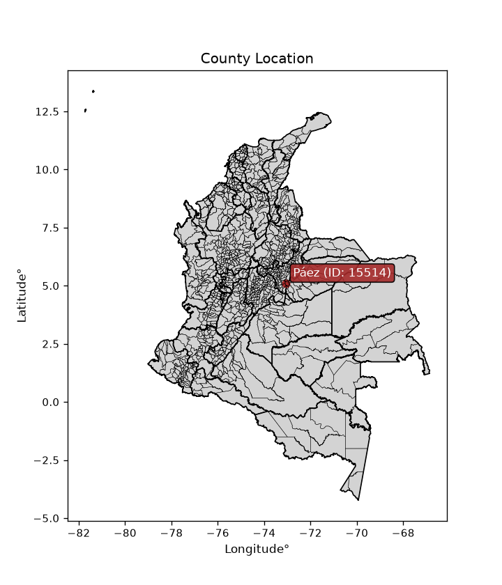
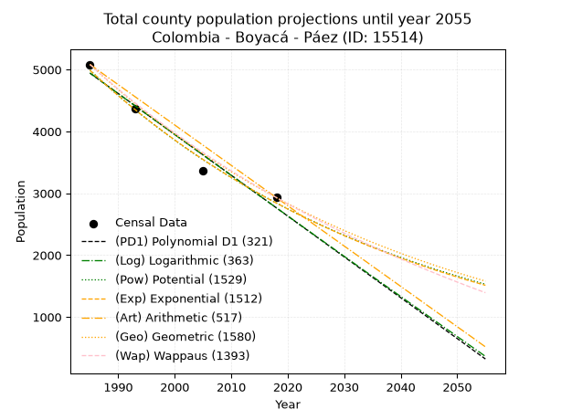
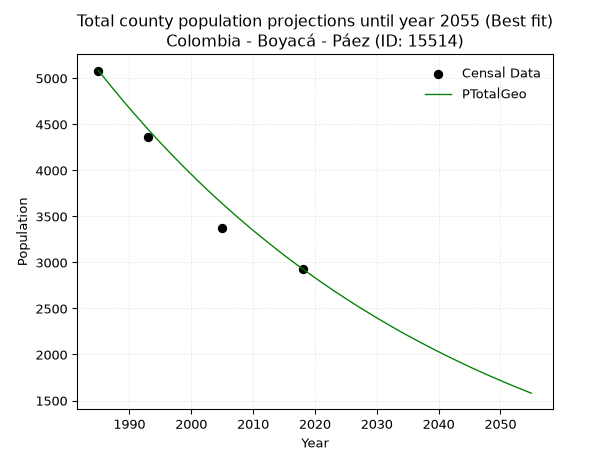
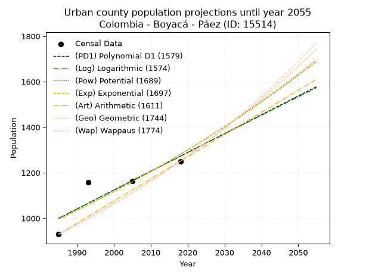
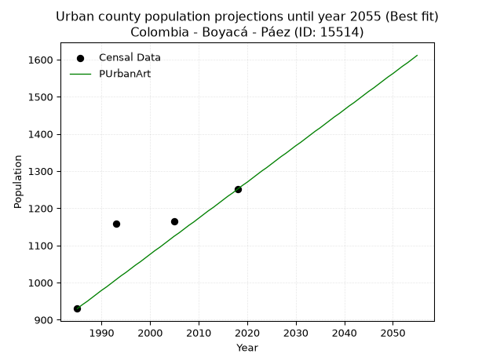
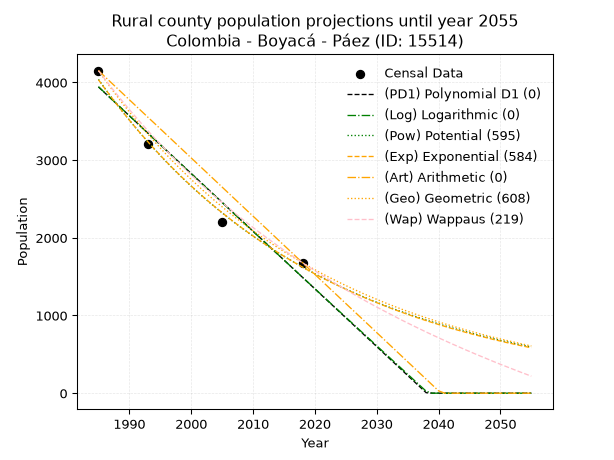
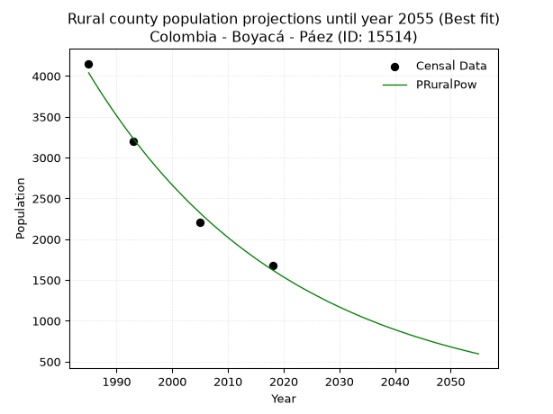

<div align="center">


</div>

# _“Population and Public Services Demand Projections (PPSD) until Year 2050 for Colombia - Boyacá - Páez (ID: 15514)”_
Keywords: `population` `public-service` `projection` `lineal` `polynomial` `logarithmic` `potential` `exponential` `arithmetic` `geometric` `wappaus` `dane` `colombia` `south-america`

PPSD are analytical estimates used by governments and planners to anticipate future changes in population size, age distribution, and the resulting community needs for utilities, healthcare, education, and infrastructure as sizing future water treatment facilities, electrical grids, and road networks based on spatial growth.

<div align="center">

</img>

</div>


> **General running parameters**: • app_version: _v20260806_. • Python version: _3.14.7_. • Pandas version: _3.0.5_. • NumPy version: _2.5.1_. • Creates, save and include plots into reports (create_plot): _False_. • Projection until year: _2050_. • Process polynomial degree 2 and up: _False_. • Process Wappaus: _True_. • Process Wappaus: _True_. • Set negative values to zero: _True_. • Set infinite values to zero: _True_. • Drop dataset notes: _True_. 
<div align="center">

Dynamic map: [:earth_americas:Google](http://maps.google.com/maps?q=5.097319286,-73.052737) [:earth_americas:OSM](https://www.openstreetmap.org/#map=18/5.097319286/-73.052737&layers=P) [:earth_americas:Bing](https://www.bing.com/maps?cp=5.097319286~-73.052737&lvl=18) [:earth_americas:Apple](https://maps.apple.com/frame?center=5.097319286%2C-73.052737&span=0.003%2C0.006)

</div>


<div align="center">

```geojson
{
  "type": "Feature",
  "geometry": {
    "type": "Point", 
    "coordinates": [-73.052737, 5.097319286]
  }, 
  "properties": {
    "Name": "Colombia - Boyacá - Páez (ID: 15514)"
  }
}
```

</div>


## 0. Census Data (4 records)

Census data are official statistics collected by a government about the people and housing in a country. They usually include counts of total population, age, sex, race, income, education, and jobs.

📅Global census file: [Population.xlsx](../data/Population.xlsx)

| Source   |   Year |   CountryID | CountryName   |   StateID | StateName   |   CountyID | CountyName   |   PTotal |   PUrban |   PRural |
|:---------|-------:|------------:|:--------------|----------:|:------------|-----------:|:-------------|---------:|---------:|---------:|
| DANE     |   1985 |          57 | Colombia      |        15 | Boyacá      |      15514 | Páez         |     5082 |      930 |     4152 |
| DANE     |   1993 |          57 | Colombia      |        15 | Boyacá      |      15514 | Páez         |     4361 |     1159 |     3202 |
| DANE     |   2005 |          57 | Colombia      |        15 | Boyacá      |      15514 | Páez         |     3369 |     1164 |     2205 |
| DANE     |   2018 |          57 | Colombia      |        15 | Boyacá      |      15514 | Páez         |     2930 |     1251 |     1679 |

> 🔥Some records could had specific notes about the registered values or the corresponding urban or rural distribution.

📅[SUI-RUPS](https://www.datos.gov.co/Hacienda-y-Cr-dito-P-blico/Registro-nico-de-Prestadores-de-Servicios-P-blicos/4qkq-csdn/about_data) - Local public utility companies: [RUPS.csv](../data/RUPS.xlsx)

 | SERVICIO       | ESTADO    | NOMBRE                                         | NIT         | DEPARTAMENTO_DOMICILIO   | MUNICIPIO_DOMICILIO   | DIRECCION          |   TELEFONO | EMAIL                    | TIPO_PRESTADOR                 | CLASIFICACION                 |
|:---------------|:----------|:-----------------------------------------------|:------------|:-------------------------|:----------------------|:-------------------|-----------:|:-------------------------|:-------------------------------|:------------------------------|
| ACUEDUCTO      | OPERATIVA | UNIDAD MUNICIPAL DE SERVICIOS PUBLICOS DE PAEZ | 800049508-3 | BOYACA                   | PAEZ                  | CARRERA 3 No  5-37 |    7594236 | umserpapaezboy@gmail.com | MUNICIPIO (PRESTACIÓN DIRECTA) | MENOR O IGUAL A 2500 USUARIOS |
| ALCANTARILLADO | OPERATIVA | UNIDAD MUNICIPAL DE SERVICIOS PUBLICOS DE PAEZ | 800049508-3 | BOYACA                   | PAEZ                  | CARRERA 3 No  5-37 |    7594236 | umserpapaezboy@gmail.com | MUNICIPIO (PRESTACIÓN DIRECTA) | MENOR O IGUAL A 2500 USUARIOS |

## 1. Total

### 1.1. Coefficients and Parameters

* (PD1) Polynomial Deg 1: -66.00963468486518, 135971.27177840157 (lineal)
* (Log) Logarithmic: -132187.55636717673, 1008694.1752315074
* (Pow) Potential: -34.13955593689442, 116.2822605394778
* (Exp) Exponential: -0.017050767923168682, 2.4943503354665836e+18
* (Art) Arithmetic: Year diff. 2018 - 1985 = 33, Population diff. 2930 - 5082 = -2152, Annual growth = -65.21212121212122
* (Geo) Geometric: Year diff. 2018 - 1985 = 33, Population diff. 2930 - 5082 = -2152, Annual growth % = -0.016549480840280406
* (Wap) Wappaus: i = -1.6278612384453623, Condition values only valid for < 200)

<sub>
Wappaus condition values: ['-0.00', '-1.63', '-3.26', '-4.88', '-6.51', '-8.14', '-9.77', '-11.40', '-13.02', '-14.65', '-16.28', '-17.91', '-19.53', '-21.16', '-22.79', '-24.42', '-26.05', '-27.67', '-29.30', '-30.93', '-32.56', '-34.19', '-35.81', '-37.44', '-39.07', '-40.70', '-42.32', '-43.95', '-45.58', '-47.21', '-48.84', '-50.46', '-52.09', '-53.72', '-55.35', '-56.98', '-58.60', '-60.23', '-61.86', '-63.49', '-65.11', '-66.74', '-68.37', '-70.00', '-71.63', '-73.25', '-74.88', '-76.51', '-78.14', '-79.77', '-81.39', '-83.02', '-84.65', '-86.28', '-87.90', '-89.53', '-91.16', '-92.79', '-94.42', '-96.04', '-97.67', '-99.30', '-100.93', '-102.56', '-104.18', '-105.81']
</sub>


### 1.2. Projected Dataset

|   Year |   CountyID |   PTotalPD1 |   PTotalLog |   PTotalPow |   PTotalExp |   PTotalArt |   PTotalGeo |   PTotalWap |
|-------:|-----------:|------------:|------------:|------------:|------------:|------------:|------------:|------------:|
|   1985 |      15514 |        4942 |        4945 |        4991 |        4988 |        5082 |        5082 |        5082 |
|   1986 |      15514 |        4876 |        4878 |        4906 |        4904 |        5017 |        4998 |        5000 |
|   1987 |      15514 |        4810 |        4811 |        4822 |        4821 |        4952 |        4915 |        4919 |
|   1988 |      15514 |        4744 |        4745 |        4740 |        4739 |        4886 |        4834 |        4840 |
|   1989 |      15514 |        4678 |        4678 |        4659 |        4659 |        4821 |        4754 |        4762 |
|   1990 |      15514 |        4612 |        4612 |        4580 |        4580 |        4756 |        4675 |        4685 |
|   1991 |      15514 |        4546 |        4546 |        4502 |        4503 |        4691 |        4598 |        4609 |
|   1992 |      15514 |        4480 |        4479 |        4426 |        4427 |        4626 |        4522 |        4534 |
|   1993 |      15514 |        4414 |        4413 |        4351 |        4352 |        4560 |        4447 |        4461 |
|   1994 |      15514 |        4348 |        4347 |        4277 |        4278 |        4495 |        4373 |        4388 |
|   1995 |      15514 |        4282 |        4280 |        4204 |        4206 |        4430 |        4301 |        4317 |
|   1996 |      15514 |        4216 |        4214 |        4133 |        4135 |        4365 |        4230 |        4247 |
|   1997 |      15514 |        4150 |        4148 |        4063 |        4065 |        4299 |        4160 |        4178 |
|   1998 |      15514 |        4084 |        4082 |        3994 |        3996 |        4234 |        4091 |        4109 |
|   1999 |      15514 |        4018 |        4016 |        3926 |        3929 |        4169 |        4023 |        4042 |
|   2000 |      15514 |        3952 |        3949 |        3860 |        3862 |        4104 |        3957 |        3976 |
|   2001 |      15514 |        3886 |        3883 |        3794 |        3797 |        4039 |        3891 |        3911 |
|   2002 |      15514 |        3820 |        3817 |        3730 |        3733 |        3973 |        3827 |        3847 |
|   2003 |      15514 |        3754 |        3751 |        3667 |        3670 |        3908 |        3763 |        3783 |
|   2004 |      15514 |        3688 |        3685 |        3605 |        3608 |        3843 |        3701 |        3721 |
|   2005 |      15514 |        3622 |        3619 |        3544 |        3547 |        3778 |        3640 |        3659 |
|   2006 |      15514 |        3556 |        3553 |        3485 |        3487 |        3713 |        3580 |        3598 |
|   2007 |      15514 |        3490 |        3488 |        3426 |        3428 |        3647 |        3520 |        3538 |
|   2008 |      15514 |        3424 |        3422 |        3368 |        3370 |        3582 |        3462 |        3479 |
|   2009 |      15514 |        3358 |        3356 |        3311 |        3313 |        3517 |        3405 |        3421 |
|   2010 |      15514 |        3292 |        3290 |        3255 |        3257 |        3452 |        3348 |        3363 |
|   2011 |      15514 |        3226 |        3224 |        3201 |        3202 |        3386 |        3293 |        3307 |
|   2012 |      15514 |        3160 |        3159 |        3147 |        3148 |        3321 |        3239 |        3251 |
|   2013 |      15514 |        3094 |        3093 |        3094 |        3094 |        3256 |        3185 |        3196 |
|   2014 |      15514 |        3028 |        3027 |        3042 |        3042 |        3191 |        3132 |        3141 |
|   2015 |      15514 |        2962 |        2962 |        2991 |        2991 |        3126 |        3080 |        3087 |
|   2016 |      15514 |        2896 |        2896 |        2941 |        2940 |        3060 |        3029 |        3034 |
|   2017 |      15514 |        2830 |        2831 |        2891 |        2890 |        2995 |        2979 |        2982 |
|   2018 |      15514 |        2764 |        2765 |        2843 |        2842 |        2930 |        2930 |        2930 |
|   2019 |      15514 |        2698 |        2700 |        2795 |        2794 |        2865 |        2882 |        2879 |
|   2020 |      15514 |        2632 |        2634 |        2748 |        2746 |        2800 |        2834 |        2828 |
|   2021 |      15514 |        2566 |        2569 |        2702 |        2700 |        2734 |        2787 |        2779 |
|   2022 |      15514 |        2500 |        2503 |        2657 |        2654 |        2669 |        2741 |        2730 |
|   2023 |      15514 |        2434 |        2438 |        2612 |        2609 |        2604 |        2695 |        2681 |
|   2024 |      15514 |        2368 |        2373 |        2569 |        2565 |        2539 |        2651 |        2633 |
|   2025 |      15514 |        2302 |        2307 |        2526 |        2522 |        2474 |        2607 |        2586 |
|   2026 |      15514 |        2236 |        2242 |        2483 |        2479 |        2408 |        2564 |        2539 |
|   2027 |      15514 |        2170 |        2177 |        2442 |        2437 |        2343 |        2521 |        2493 |
|   2028 |      15514 |        2104 |        2112 |        2401 |        2396 |        2278 |        2480 |        2447 |
|   2029 |      15514 |        2038 |        2046 |        2361 |        2356 |        2213 |        2439 |        2402 |
|   2030 |      15514 |        1972 |        1981 |        2322 |        2316 |        2147 |        2398 |        2357 |
|   2031 |      15514 |        1906 |        1916 |        2283 |        2277 |        2082 |        2359 |        2313 |
|   2032 |      15514 |        1840 |        1851 |        2245 |        2238 |        2017 |        2320 |        2270 |
|   2033 |      15514 |        1774 |        1786 |        2208 |        2200 |        1952 |        2281 |        2227 |
|   2034 |      15514 |        1708 |        1721 |        2171 |        2163 |        1887 |        2243 |        2184 |
|   2035 |      15514 |        1642 |        1656 |        2135 |        2127 |        1821 |        2206 |        2142 |
|   2036 |      15514 |        1576 |        1591 |        2099 |        2091 |        1756 |        2170 |        2101 |
|   2037 |      15514 |        1510 |        1526 |        2064 |        2055 |        1691 |        2134 |        2059 |
|   2038 |      15514 |        1444 |        1461 |        2030 |        2020 |        1626 |        2099 |        2019 |
|   2039 |      15514 |        1378 |        1397 |        1996 |        1986 |        1561 |        2064 |        1979 |
|   2040 |      15514 |        1312 |        1332 |        1963 |        1953 |        1495 |        2030 |        1939 |
|   2041 |      15514 |        1246 |        1267 |        1931 |        1920 |        1430 |        1996 |        1900 |
|   2042 |      15514 |        1180 |        1202 |        1899 |        1887 |        1365 |        1963 |        1861 |
|   2043 |      15514 |        1114 |        1138 |        1867 |        1855 |        1300 |        1931 |        1823 |
|   2044 |      15514 |        1048 |        1073 |        1836 |        1824 |        1234 |        1899 |        1785 |
|   2045 |      15514 |         982 |        1008 |        1806 |        1793 |        1169 |        1867 |        1747 |
|   2046 |      15514 |         916 |         944 |        1776 |        1763 |        1104 |        1836 |        1710 |
|   2047 |      15514 |         850 |         879 |        1746 |        1733 |        1039 |        1806 |        1673 |
|   2048 |      15514 |         784 |         814 |        1718 |        1704 |         974 |        1776 |        1637 |
|   2049 |      15514 |         718 |         750 |        1689 |        1675 |         908 |        1747 |        1601 |
|   2050 |      15514 |         652 |         685 |        1661 |        1647 |         843 |        1718 |        1565 |
<div align="center">

</img>

</div>


### 1.3. Best fit with absolute and relative error (%)

Relative error puts that difference into context by dividing the absolute error by the true value, creating a unitless ratio or percentage that shows the scale of the mistake.

Absolute and relative error

|   Year | Source   |   CountryID | CountryName   |   StateID | StateName   |   CountyID_x | CountyName   |   PTotal |   PUrban |   PRural |   CountyID_y |   PTotalPD1 |   PTotalLog |   PTotalPow |   PTotalExp |   PTotalArt |   PTotalGeo |   PTotalWap |   PTotalPD1AbsError |   PTotalLogAbsError |   PTotalPowAbsError |   PTotalExpAbsError |   PTotalArtAbsError |   PTotalGeoAbsError |   PTotalWapAbsError |   PTotalPD1RelError |   PTotalLogRelError |   PTotalPowRelError |   PTotalExpRelError |   PTotalArtRelError |   PTotalGeoRelError |   PTotalWapRelError |
|-------:|:---------|------------:|:--------------|----------:|:------------|-------------:|:-------------|---------:|---------:|---------:|-------------:|------------:|------------:|------------:|------------:|------------:|------------:|------------:|--------------------:|--------------------:|--------------------:|--------------------:|--------------------:|--------------------:|--------------------:|--------------------:|--------------------:|--------------------:|--------------------:|--------------------:|--------------------:|--------------------:|
|   1985 | DANE     |          57 | Colombia      |        15 | Boyacá      |        15514 | Páez         |     5082 |      930 |     4152 |        15514 |        4942 |        4945 |        4991 |        4988 |        5082 |        5082 |        5082 |                 140 |                 137 |                  91 |                  94 |                   0 |                   0 |                   0 |             2.75482 |             2.69579 |            1.79063  |            1.84967  |             0       |             0       |             0       |
|   1993 | DANE     |          57 | Colombia      |        15 | Boyacá      |        15514 | Páez         |     4361 |     1159 |     3202 |        15514 |        4414 |        4413 |        4351 |        4352 |        4560 |        4447 |        4461 |                  53 |                  52 |                  10 |                   9 |                 199 |                  86 |                 100 |             1.21532 |             1.19239 |            0.229305 |            0.206375 |             4.56317 |             1.97202 |             2.29305 |
|   2005 | DANE     |          57 | Colombia      |        15 | Boyacá      |        15514 | Páez         |     3369 |     1164 |     2205 |        15514 |        3622 |        3619 |        3544 |        3547 |        3778 |        3640 |        3659 |                 253 |                 250 |                 175 |                 178 |                 409 |                 271 |                 290 |             7.50965 |             7.4206  |            5.19442  |            5.28347  |            12.1401  |             8.04393 |             8.6079  |
|   2018 | DANE     |          57 | Colombia      |        15 | Boyacá      |        15514 | Páez         |     2930 |     1251 |     1679 |        15514 |        2764 |        2765 |        2843 |        2842 |        2930 |        2930 |        2930 |                 166 |                 165 |                  87 |                  88 |                   0 |                   0 |                   0 |             5.66553 |             5.6314  |            2.96928  |            3.00341  |             0       |             0       |             0       |

Relative error mean

| Method    |   RelError | Best   |
|:----------|-----------:|:-------|
| PTotalPD1 |    4.28633 |        |
| PTotalLog |    4.23504 |        |
| PTotalPow |    2.54591 |        |
| PTotalExp |    2.58573 |        |
| PTotalArt |    4.17582 |        |
| PTotalGeo |    2.50399 | True   |
| PTotalWap |    2.72524 |        |

💙Best method: _**PTotalGeo**_
<div align="center">

</img>

</div>


### 1.4. Fresh water supply demand in liters per capita per day (lpcd)

The fresh water supply demand typically ranges from 100 to 300 liters per capita per day (lpcd) for standard domestic and municipal planning, though absolute survival minimums set by the World Health Organization are as low as 7.5 to 20 liters per day, and total consumption in high-income nations can exceed 400 liters.

> `CZ`: Level in meters above the sea level (masl)<br> `WS`: Fresh water supply demand in liters per capita per day (lpcd or l/h/d)<br> `WSAll`: Zonal fresh water supply demand in liters per second (l/s)<br> `A`: Zonal area in square meters<br> `DP`: Population density (people/hectare or p/ha)

Reference values (RAS Colombia)

|    CZ |   WS |
|------:|-----:|
|  1000 |  120 |
|  2000 |  130 |
| 99999 |  140 |

County shapefile geometry properties and water supply values

|   CountyID |      ATotal |   CZTotal |   WSTotal |
|-----------:|------------:|----------:|----------:|
|      15514 | 3.38408e+08 |   1434.07 |       130 |

Projected values for best method: PTotalGeo

|   CountyID |   Year |   PTotalGeo |   DPTotal |   WSTotal |   WSTotalAll |
|-----------:|-------:|------------:|----------:|----------:|-------------:|
|      15514 |   1985 |        5082 |      0.15 |       130 |      7.64653 |
|      15514 |   1986 |        4998 |      0.15 |       130 |      7.52014 |
|      15514 |   1987 |        4915 |      0.15 |       130 |      7.39525 |
|      15514 |   1988 |        4834 |      0.14 |       130 |      7.27338 |
|      15514 |   1989 |        4754 |      0.14 |       130 |      7.15301 |
|      15514 |   1990 |        4675 |      0.14 |       130 |      7.03414 |
|      15514 |   1991 |        4598 |      0.14 |       130 |      6.91829 |
|      15514 |   1992 |        4522 |      0.13 |       130 |      6.80394 |
|      15514 |   1993 |        4447 |      0.13 |       130 |      6.69109 |
|      15514 |   1994 |        4373 |      0.13 |       130 |      6.57975 |
|      15514 |   1995 |        4301 |      0.13 |       130 |      6.47141 |
|      15514 |   1996 |        4230 |      0.12 |       130 |      6.36458 |
|      15514 |   1997 |        4160 |      0.12 |       130 |      6.25926 |
|      15514 |   1998 |        4091 |      0.12 |       130 |      6.15544 |
|      15514 |   1999 |        4023 |      0.12 |       130 |      6.05312 |
|      15514 |   2000 |        3957 |      0.12 |       130 |      5.95382 |
|      15514 |   2001 |        3891 |      0.11 |       130 |      5.85451 |
|      15514 |   2002 |        3827 |      0.11 |       130 |      5.75822 |
|      15514 |   2003 |        3763 |      0.11 |       130 |      5.66192 |
|      15514 |   2004 |        3701 |      0.11 |       130 |      5.56863 |
|      15514 |   2005 |        3640 |      0.11 |       130 |      5.47685 |
|      15514 |   2006 |        3580 |      0.11 |       130 |      5.38657 |
|      15514 |   2007 |        3520 |      0.1  |       130 |      5.2963  |
|      15514 |   2008 |        3462 |      0.1  |       130 |      5.20903 |
|      15514 |   2009 |        3405 |      0.1  |       130 |      5.12326 |
|      15514 |   2010 |        3348 |      0.1  |       130 |      5.0375  |
|      15514 |   2011 |        3293 |      0.1  |       130 |      4.95475 |
|      15514 |   2012 |        3239 |      0.1  |       130 |      4.8735  |
|      15514 |   2013 |        3185 |      0.09 |       130 |      4.79225 |
|      15514 |   2014 |        3132 |      0.09 |       130 |      4.7125  |
|      15514 |   2015 |        3080 |      0.09 |       130 |      4.63426 |
|      15514 |   2016 |        3029 |      0.09 |       130 |      4.55752 |
|      15514 |   2017 |        2979 |      0.09 |       130 |      4.48229 |
|      15514 |   2018 |        2930 |      0.09 |       130 |      4.40856 |
|      15514 |   2019 |        2882 |      0.09 |       130 |      4.33634 |
|      15514 |   2020 |        2834 |      0.08 |       130 |      4.26412 |
|      15514 |   2021 |        2787 |      0.08 |       130 |      4.1934  |
|      15514 |   2022 |        2741 |      0.08 |       130 |      4.12419 |
|      15514 |   2023 |        2695 |      0.08 |       130 |      4.05498 |
|      15514 |   2024 |        2651 |      0.08 |       130 |      3.98877 |
|      15514 |   2025 |        2607 |      0.08 |       130 |      3.92257 |
|      15514 |   2026 |        2564 |      0.08 |       130 |      3.85787 |
|      15514 |   2027 |        2521 |      0.07 |       130 |      3.79317 |
|      15514 |   2028 |        2480 |      0.07 |       130 |      3.73148 |
|      15514 |   2029 |        2439 |      0.07 |       130 |      3.66979 |
|      15514 |   2030 |        2398 |      0.07 |       130 |      3.6081  |
|      15514 |   2031 |        2359 |      0.07 |       130 |      3.54942 |
|      15514 |   2032 |        2320 |      0.07 |       130 |      3.49074 |
|      15514 |   2033 |        2281 |      0.07 |       130 |      3.43206 |
|      15514 |   2034 |        2243 |      0.07 |       130 |      3.37488 |
|      15514 |   2035 |        2206 |      0.07 |       130 |      3.31921 |
|      15514 |   2036 |        2170 |      0.06 |       130 |      3.26505 |
|      15514 |   2037 |        2134 |      0.06 |       130 |      3.21088 |
|      15514 |   2038 |        2099 |      0.06 |       130 |      3.15822 |
|      15514 |   2039 |        2064 |      0.06 |       130 |      3.10556 |
|      15514 |   2040 |        2030 |      0.06 |       130 |      3.0544  |
|      15514 |   2041 |        1996 |      0.06 |       130 |      3.00324 |
|      15514 |   2042 |        1963 |      0.06 |       130 |      2.95359 |
|      15514 |   2043 |        1931 |      0.06 |       130 |      2.90544 |
|      15514 |   2044 |        1899 |      0.06 |       130 |      2.85729 |
|      15514 |   2045 |        1867 |      0.06 |       130 |      2.80914 |
|      15514 |   2046 |        1836 |      0.05 |       130 |      2.7625  |
|      15514 |   2047 |        1806 |      0.05 |       130 |      2.71736 |
|      15514 |   2048 |        1776 |      0.05 |       130 |      2.67222 |
|      15514 |   2049 |        1747 |      0.05 |       130 |      2.62859 |
|      15514 |   2050 |        1718 |      0.05 |       130 |      2.58495 |

## 2. Urban

### 2.1. Coefficients and Parameters

* (PD1) Polynomial Deg 1: 8.268165395423475, -15412.397832195807 (lineal)
* (Log) Logarithmic: 16564.43573549611, -124780.40876456333
* (Pow) Potential: 15.228568543087128, -47.22171548355222
* (Exp) Exponential: 0.007600560806442706, 0.0002794832037686853
* (Art) Arithmetic: Year diff. 2018 - 1985 = 33, Population diff. 1251 - 930 = 321, Annual growth = 9.727272727272727
* (Geo) Geometric: Year diff. 2018 - 1985 = 33, Population diff. 1251 - 930 = 321, Annual growth % = 0.009025759152819779
* (Wap) Wappaus: i = 0.8920011671043307, Condition values only valid for < 200)

<sub>
Wappaus condition values: ['0.00', '0.89', '1.78', '2.68', '3.57', '4.46', '5.35', '6.24', '7.14', '8.03', '8.92', '9.81', '10.70', '11.60', '12.49', '13.38', '14.27', '15.16', '16.06', '16.95', '17.84', '18.73', '19.62', '20.52', '21.41', '22.30', '23.19', '24.08', '24.98', '25.87', '26.76', '27.65', '28.54', '29.44', '30.33', '31.22', '32.11', '33.00', '33.90', '34.79', '35.68', '36.57', '37.46', '38.36', '39.25', '40.14', '41.03', '41.92', '42.82', '43.71', '44.60', '45.49', '46.38', '47.28', '48.17', '49.06', '49.95', '50.84', '51.74', '52.63', '53.52', '54.41', '55.30', '56.20', '57.09', '57.98']
</sub>


### 2.2. Projected Dataset

|   Year |   CountyID |   PUrbanPD1 |   PUrbanLog |   PUrbanPow |   PUrbanExp |   PUrbanArt |   PUrbanGeo |   PUrbanWap |
|-------:|-----------:|------------:|------------:|------------:|------------:|------------:|------------:|------------:|
|   1985 |      15514 |        1000 |        1000 |         996 |         997 |         930 |         930 |         930 |
|   1986 |      15514 |        1008 |        1008 |        1004 |        1004 |         940 |         938 |         938 |
|   1987 |      15514 |        1016 |        1016 |        1012 |        1012 |         949 |         947 |         947 |
|   1988 |      15514 |        1025 |        1025 |        1020 |        1020 |         959 |         955 |         955 |
|   1989 |      15514 |        1033 |        1033 |        1027 |        1028 |         969 |         964 |         964 |
|   1990 |      15514 |        1041 |        1041 |        1035 |        1035 |         979 |         973 |         972 |
|   1991 |      15514 |        1050 |        1050 |        1043 |        1043 |         988 |         982 |         981 |
|   1992 |      15514 |        1058 |        1058 |        1051 |        1051 |         998 |         990 |         990 |
|   1993 |      15514 |        1066 |        1066 |        1059 |        1059 |        1008 |         999 |         999 |
|   1994 |      15514 |        1074 |        1074 |        1068 |        1067 |        1018 |        1008 |        1008 |
|   1995 |      15514 |        1083 |        1083 |        1076 |        1076 |        1027 |        1017 |        1017 |
|   1996 |      15514 |        1091 |        1091 |        1084 |        1084 |        1037 |        1027 |        1026 |
|   1997 |      15514 |        1099 |        1099 |        1092 |        1092 |        1047 |        1036 |        1035 |
|   1998 |      15514 |        1107 |        1108 |        1101 |        1100 |        1056 |        1045 |        1044 |
|   1999 |      15514 |        1116 |        1116 |        1109 |        1109 |        1066 |        1055 |        1054 |
|   2000 |      15514 |        1124 |        1124 |        1117 |        1117 |        1076 |        1064 |        1063 |
|   2001 |      15514 |        1132 |        1133 |        1126 |        1126 |        1086 |        1074 |        1073 |
|   2002 |      15514 |        1140 |        1141 |        1135 |        1134 |        1095 |        1083 |        1083 |
|   2003 |      15514 |        1149 |        1149 |        1143 |        1143 |        1105 |        1093 |        1092 |
|   2004 |      15514 |        1157 |        1157 |        1152 |        1152 |        1115 |        1103 |        1102 |
|   2005 |      15514 |        1165 |        1166 |        1161 |        1160 |        1125 |        1113 |        1112 |
|   2006 |      15514 |        1174 |        1174 |        1170 |        1169 |        1134 |        1123 |        1122 |
|   2007 |      15514 |        1182 |        1182 |        1179 |        1178 |        1144 |        1133 |        1132 |
|   2008 |      15514 |        1190 |        1190 |        1188 |        1187 |        1154 |        1143 |        1143 |
|   2009 |      15514 |        1198 |        1199 |        1197 |        1196 |        1163 |        1154 |        1153 |
|   2010 |      15514 |        1207 |        1207 |        1206 |        1205 |        1173 |        1164 |        1163 |
|   2011 |      15514 |        1215 |        1215 |        1215 |        1215 |        1183 |        1175 |        1174 |
|   2012 |      15514 |        1223 |        1223 |        1224 |        1224 |        1193 |        1185 |        1185 |
|   2013 |      15514 |        1231 |        1232 |        1233 |        1233 |        1202 |        1196 |        1195 |
|   2014 |      15514 |        1240 |        1240 |        1243 |        1243 |        1212 |        1207 |        1206 |
|   2015 |      15514 |        1248 |        1248 |        1252 |        1252 |        1222 |        1218 |        1217 |
|   2016 |      15514 |        1256 |        1256 |        1262 |        1262 |        1232 |        1229 |        1228 |
|   2017 |      15514 |        1264 |        1264 |        1271 |        1271 |        1241 |        1240 |        1240 |
|   2018 |      15514 |        1273 |        1273 |        1281 |        1281 |        1251 |        1251 |        1251 |
|   2019 |      15514 |        1281 |        1281 |        1291 |        1291 |        1261 |        1262 |        1262 |
|   2020 |      15514 |        1289 |        1289 |        1300 |        1301 |        1270 |        1274 |        1274 |
|   2021 |      15514 |        1298 |        1297 |        1310 |        1311 |        1280 |        1285 |        1286 |
|   2022 |      15514 |        1306 |        1305 |        1320 |        1320 |        1290 |        1297 |        1298 |
|   2023 |      15514 |        1314 |        1314 |        1330 |        1331 |        1300 |        1308 |        1310 |
|   2024 |      15514 |        1322 |        1322 |        1340 |        1341 |        1309 |        1320 |        1322 |
|   2025 |      15514 |        1331 |        1330 |        1350 |        1351 |        1319 |        1332 |        1334 |
|   2026 |      15514 |        1339 |        1338 |        1360 |        1361 |        1329 |        1344 |        1346 |
|   2027 |      15514 |        1347 |        1346 |        1371 |        1372 |        1339 |        1356 |        1359 |
|   2028 |      15514 |        1355 |        1355 |        1381 |        1382 |        1348 |        1369 |        1371 |
|   2029 |      15514 |        1364 |        1363 |        1391 |        1393 |        1358 |        1381 |        1384 |
|   2030 |      15514 |        1372 |        1371 |        1402 |        1403 |        1368 |        1393 |        1397 |
|   2031 |      15514 |        1380 |        1379 |        1412 |        1414 |        1377 |        1406 |        1410 |
|   2032 |      15514 |        1389 |        1387 |        1423 |        1425 |        1387 |        1419 |        1423 |
|   2033 |      15514 |        1397 |        1395 |        1434 |        1436 |        1397 |        1431 |        1437 |
|   2034 |      15514 |        1405 |        1403 |        1445 |        1447 |        1407 |        1444 |        1450 |
|   2035 |      15514 |        1413 |        1412 |        1455 |        1458 |        1416 |        1457 |        1464 |
|   2036 |      15514 |        1422 |        1420 |        1466 |        1469 |        1426 |        1471 |        1478 |
|   2037 |      15514 |        1430 |        1428 |        1477 |        1480 |        1436 |        1484 |        1492 |
|   2038 |      15514 |        1438 |        1436 |        1488 |        1491 |        1446 |        1497 |        1506 |
|   2039 |      15514 |        1446 |        1444 |        1500 |        1503 |        1455 |        1511 |        1520 |
|   2040 |      15514 |        1455 |        1452 |        1511 |        1514 |        1465 |        1524 |        1535 |
|   2041 |      15514 |        1463 |        1460 |        1522 |        1526 |        1475 |        1538 |        1549 |
|   2042 |      15514 |        1471 |        1469 |        1534 |        1537 |        1484 |        1552 |        1564 |
|   2043 |      15514 |        1479 |        1477 |        1545 |        1549 |        1494 |        1566 |        1579 |
|   2044 |      15514 |        1488 |        1485 |        1557 |        1561 |        1504 |        1580 |        1594 |
|   2045 |      15514 |        1496 |        1493 |        1568 |        1573 |        1514 |        1594 |        1610 |
|   2046 |      15514 |        1504 |        1501 |        1580 |        1585 |        1523 |        1609 |        1625 |
|   2047 |      15514 |        1513 |        1509 |        1592 |        1597 |        1533 |        1623 |        1641 |
|   2048 |      15514 |        1521 |        1517 |        1604 |        1609 |        1543 |        1638 |        1657 |
|   2049 |      15514 |        1529 |        1525 |        1616 |        1621 |        1553 |        1653 |        1673 |
|   2050 |      15514 |        1537 |        1533 |        1628 |        1634 |        1562 |        1668 |        1689 |
<div align="center">

</img>

</div>


### 2.3. Best fit with absolute and relative error (%)

Relative error puts that difference into context by dividing the absolute error by the true value, creating a unitless ratio or percentage that shows the scale of the mistake.

Absolute and relative error

|   Year | Source   |   CountryID | CountryName   |   StateID | StateName   |   CountyID_x | CountyName   |   PTotal |   PUrban |   PRural |   CountyID_y |   PUrbanPD1 |   PUrbanLog |   PUrbanPow |   PUrbanExp |   PUrbanArt |   PUrbanGeo |   PUrbanWap |   PUrbanPD1AbsError |   PUrbanLogAbsError |   PUrbanPowAbsError |   PUrbanExpAbsError |   PUrbanArtAbsError |   PUrbanGeoAbsError |   PUrbanWapAbsError |   PUrbanPD1RelError |   PUrbanLogRelError |   PUrbanPowRelError |   PUrbanExpRelError |   PUrbanArtRelError |   PUrbanGeoRelError |   PUrbanWapRelError |
|-------:|:---------|------------:|:--------------|----------:|:------------|-------------:|:-------------|---------:|---------:|---------:|-------------:|------------:|------------:|------------:|------------:|------------:|------------:|------------:|--------------------:|--------------------:|--------------------:|--------------------:|--------------------:|--------------------:|--------------------:|--------------------:|--------------------:|--------------------:|--------------------:|--------------------:|--------------------:|--------------------:|
|   1985 | DANE     |          57 | Colombia      |        15 | Boyacá      |        15514 | Páez         |     5082 |      930 |     4152 |        15514 |        1000 |        1000 |         996 |         997 |         930 |         930 |         930 |                  70 |                  70 |                  66 |                  67 |                   0 |                   0 |                   0 |           7.52688   |            7.52688  |            7.09677  |            7.2043   |             0       |             0       |             0       |
|   1993 | DANE     |          57 | Colombia      |        15 | Boyacá      |        15514 | Páez         |     4361 |     1159 |     3202 |        15514 |        1066 |        1066 |        1059 |        1059 |        1008 |         999 |         999 |                  93 |                  93 |                 100 |                 100 |                 151 |                 160 |                 160 |           8.02416   |            8.02416  |            8.62813  |            8.62813  |            13.0285  |            13.805   |            13.805   |
|   2005 | DANE     |          57 | Colombia      |        15 | Boyacá      |        15514 | Páez         |     3369 |     1164 |     2205 |        15514 |        1165 |        1166 |        1161 |        1160 |        1125 |        1113 |        1112 |                   1 |                   2 |                   3 |                   4 |                  39 |                  51 |                  52 |           0.0859107 |            0.171821 |            0.257732 |            0.343643 |             3.35052 |             4.38144 |             4.46735 |
|   2018 | DANE     |          57 | Colombia      |        15 | Boyacá      |        15514 | Páez         |     2930 |     1251 |     1679 |        15514 |        1273 |        1273 |        1281 |        1281 |        1251 |        1251 |        1251 |                  22 |                  22 |                  30 |                  30 |                   0 |                   0 |                   0 |           1.75859   |            1.75859  |            2.39808  |            2.39808  |             0       |             0       |             0       |

Relative error mean

| Method    |   RelError | Best   |
|:----------|-----------:|:-------|
| PUrbanPD1 |    4.34889 |        |
| PUrbanLog |    4.37036 |        |
| PUrbanPow |    4.59518 |        |
| PUrbanExp |    4.64354 |        |
| PUrbanArt |    4.09475 | True   |
| PUrbanGeo |    4.54661 |        |
| PUrbanWap |    4.56809 |        |

💙Best method: _**PUrbanArt**_
<div align="center">

</img>

</div>


### 2.4. Fresh water supply demand in liters per capita per day (lpcd)

The fresh water supply demand typically ranges from 100 to 300 liters per capita per day (lpcd) for standard domestic and municipal planning, though absolute survival minimums set by the World Health Organization are as low as 7.5 to 20 liters per day, and total consumption in high-income nations can exceed 400 liters.

> `CZ`: Level in meters above the sea level (masl)<br> `WS`: Fresh water supply demand in liters per capita per day (lpcd or l/h/d)<br> `WSAll`: Zonal fresh water supply demand in liters per second (l/s)<br> `A`: Zonal area in square meters<br> `DP`: Population density (people/hectare or p/ha)

Reference values (RAS Colombia)

|    CZ |   WS |
|------:|-----:|
|  1000 |  120 |
|  2000 |  130 |
| 99999 |  140 |

County shapefile geometry properties and water supply values

|   CountyID |   AUrban |   CZUrban |   WSUrban |
|-----------:|---------:|----------:|----------:|
|      15514 |   603778 |   1301.04 |       130 |

Projected values for best method: PUrbanArt

|   CountyID |   Year |   PUrbanArt |   DPUrban |   WSUrban |   WSUrbanAll |
|-----------:|-------:|------------:|----------:|----------:|-------------:|
|      15514 |   1985 |         930 |     15.4  |       130 |      1.39931 |
|      15514 |   1986 |         940 |     15.57 |       130 |      1.41435 |
|      15514 |   1987 |         949 |     15.72 |       130 |      1.42789 |
|      15514 |   1988 |         959 |     15.88 |       130 |      1.44294 |
|      15514 |   1989 |         969 |     16.05 |       130 |      1.45799 |
|      15514 |   1990 |         979 |     16.21 |       130 |      1.47303 |
|      15514 |   1991 |         988 |     16.36 |       130 |      1.48657 |
|      15514 |   1992 |         998 |     16.53 |       130 |      1.50162 |
|      15514 |   1993 |        1008 |     16.69 |       130 |      1.51667 |
|      15514 |   1994 |        1018 |     16.86 |       130 |      1.53171 |
|      15514 |   1995 |        1027 |     17.01 |       130 |      1.54525 |
|      15514 |   1996 |        1037 |     17.18 |       130 |      1.5603  |
|      15514 |   1997 |        1047 |     17.34 |       130 |      1.57535 |
|      15514 |   1998 |        1056 |     17.49 |       130 |      1.58889 |
|      15514 |   1999 |        1066 |     17.66 |       130 |      1.60394 |
|      15514 |   2000 |        1076 |     17.82 |       130 |      1.61898 |
|      15514 |   2001 |        1086 |     17.99 |       130 |      1.63403 |
|      15514 |   2002 |        1095 |     18.14 |       130 |      1.64757 |
|      15514 |   2003 |        1105 |     18.3  |       130 |      1.66262 |
|      15514 |   2004 |        1115 |     18.47 |       130 |      1.67766 |
|      15514 |   2005 |        1125 |     18.63 |       130 |      1.69271 |
|      15514 |   2006 |        1134 |     18.78 |       130 |      1.70625 |
|      15514 |   2007 |        1144 |     18.95 |       130 |      1.7213  |
|      15514 |   2008 |        1154 |     19.11 |       130 |      1.73634 |
|      15514 |   2009 |        1163 |     19.26 |       130 |      1.74988 |
|      15514 |   2010 |        1173 |     19.43 |       130 |      1.76493 |
|      15514 |   2011 |        1183 |     19.59 |       130 |      1.77998 |
|      15514 |   2012 |        1193 |     19.76 |       130 |      1.79502 |
|      15514 |   2013 |        1202 |     19.91 |       130 |      1.80856 |
|      15514 |   2014 |        1212 |     20.07 |       130 |      1.82361 |
|      15514 |   2015 |        1222 |     20.24 |       130 |      1.83866 |
|      15514 |   2016 |        1232 |     20.4  |       130 |      1.8537  |
|      15514 |   2017 |        1241 |     20.55 |       130 |      1.86725 |
|      15514 |   2018 |        1251 |     20.72 |       130 |      1.88229 |
|      15514 |   2019 |        1261 |     20.89 |       130 |      1.89734 |
|      15514 |   2020 |        1270 |     21.03 |       130 |      1.91088 |
|      15514 |   2021 |        1280 |     21.2  |       130 |      1.92593 |
|      15514 |   2022 |        1290 |     21.37 |       130 |      1.94097 |
|      15514 |   2023 |        1300 |     21.53 |       130 |      1.95602 |
|      15514 |   2024 |        1309 |     21.68 |       130 |      1.96956 |
|      15514 |   2025 |        1319 |     21.85 |       130 |      1.98461 |
|      15514 |   2026 |        1329 |     22.01 |       130 |      1.99965 |
|      15514 |   2027 |        1339 |     22.18 |       130 |      2.0147  |
|      15514 |   2028 |        1348 |     22.33 |       130 |      2.02824 |
|      15514 |   2029 |        1358 |     22.49 |       130 |      2.04329 |
|      15514 |   2030 |        1368 |     22.66 |       130 |      2.05833 |
|      15514 |   2031 |        1377 |     22.81 |       130 |      2.07187 |
|      15514 |   2032 |        1387 |     22.97 |       130 |      2.08692 |
|      15514 |   2033 |        1397 |     23.14 |       130 |      2.10197 |
|      15514 |   2034 |        1407 |     23.3  |       130 |      2.11701 |
|      15514 |   2035 |        1416 |     23.45 |       130 |      2.13056 |
|      15514 |   2036 |        1426 |     23.62 |       130 |      2.1456  |
|      15514 |   2037 |        1436 |     23.78 |       130 |      2.16065 |
|      15514 |   2038 |        1446 |     23.95 |       130 |      2.17569 |
|      15514 |   2039 |        1455 |     24.1  |       130 |      2.18924 |
|      15514 |   2040 |        1465 |     24.26 |       130 |      2.20428 |
|      15514 |   2041 |        1475 |     24.43 |       130 |      2.21933 |
|      15514 |   2042 |        1484 |     24.58 |       130 |      2.23287 |
|      15514 |   2043 |        1494 |     24.74 |       130 |      2.24792 |
|      15514 |   2044 |        1504 |     24.91 |       130 |      2.26296 |
|      15514 |   2045 |        1514 |     25.08 |       130 |      2.27801 |
|      15514 |   2046 |        1523 |     25.22 |       130 |      2.29155 |
|      15514 |   2047 |        1533 |     25.39 |       130 |      2.3066  |
|      15514 |   2048 |        1543 |     25.56 |       130 |      2.32164 |
|      15514 |   2049 |        1553 |     25.72 |       130 |      2.33669 |
|      15514 |   2050 |        1562 |     25.87 |       130 |      2.35023 |

## 3. Rural

### 3.1. Coefficients and Parameters

* (PD1) Polynomial Deg 1: -74.27780008028863, 151383.6696105973 (lineal)
* (Log) Logarithmic: -148751.9921026729, 1133474.583996071
* (Pow) Potential: -55.274167021049195, 185.88725166315402
* (Exp) Exponential: -0.027608424009027834, 2.5492031090085196e+27
* (Art) Arithmetic: Year diff. 2018 - 1985 = 33, Population diff. 1679 - 4152 = -2473, Annual growth = -74.93939393939394
* (Geo) Geometric: Year diff. 2018 - 1985 = 33, Population diff. 1679 - 4152 = -2473, Annual growth % = -0.02706316255924157
* (Wap) Wappaus: i = -2.570378800870998, Condition values only valid for < 200)

<sub>
Wappaus condition values: ['-0.00', '-2.57', '-5.14', '-7.71', '-10.28', '-12.85', '-15.42', '-17.99', '-20.56', '-23.13', '-25.70', '-28.27', '-30.84', '-33.41', '-35.99', '-38.56', '-41.13', '-43.70', '-46.27', '-48.84', '-51.41', '-53.98', '-56.55', '-59.12', '-61.69', '-64.26', '-66.83', '-69.40', '-71.97', '-74.54', '-77.11', '-79.68', '-82.25', '-84.82', '-87.39', '-89.96', '-92.53', '-95.10', '-97.67', '-100.24', '-102.82', '-105.39', '-107.96', '-110.53', '-113.10', '-115.67', '-118.24', '-120.81', '-123.38', '-125.95', '-128.52', '-131.09', '-133.66', '-136.23', '-138.80', '-141.37', '-143.94', '-146.51', '-149.08', '-151.65', '-154.22', '-156.79', '-159.36', '-161.93', '-164.50', '-167.07']
</sub>


### 3.2. Projected Dataset

|   Year |   CountyID |   PRuralPD1 |   PRuralLog |   PRuralPow |   PRuralExp |   PRuralArt |   PRuralGeo |   PRuralWap |
|-------:|-----------:|------------:|------------:|------------:|------------:|------------:|------------:|------------:|
|   1985 |      15514 |        3942 |        3945 |        4039 |        4035 |        4152 |        4152 |        4152 |
|   1986 |      15514 |        3868 |        3870 |        3928 |        3925 |        4077 |        4040 |        4047 |
|   1987 |      15514 |        3794 |        3795 |        3820 |        3819 |        4002 |        3930 |        3944 |
|   1988 |      15514 |        3719 |        3720 |        3716 |        3715 |        3927 |        3824 |        3844 |
|   1989 |      15514 |        3645 |        3646 |        3614 |        3613 |        3852 |        3720 |        3746 |
|   1990 |      15514 |        3571 |        3571 |        3515 |        3515 |        3777 |        3620 |        3651 |
|   1991 |      15514 |        3497 |        3496 |        3419 |        3419 |        3702 |        3522 |        3558 |
|   1992 |      15514 |        3422 |        3421 |        3325 |        3326 |        3627 |        3426 |        3467 |
|   1993 |      15514 |        3348 |        3347 |        3234 |        3236 |        3552 |        3334 |        3378 |
|   1994 |      15514 |        3274 |        3272 |        3146 |        3148 |        3478 |        3244 |        3291 |
|   1995 |      15514 |        3199 |        3198 |        3060 |        3062 |        3403 |        3156 |        3206 |
|   1996 |      15514 |        3125 |        3123 |        2976 |        2978 |        3328 |        3070 |        3123 |
|   1997 |      15514 |        3051 |        3048 |        2895 |        2897 |        3253 |        2987 |        3042 |
|   1998 |      15514 |        2977 |        2974 |        2816 |        2818 |        3178 |        2906 |        2963 |
|   1999 |      15514 |        2902 |        2900 |        2739 |        2742 |        3103 |        2828 |        2886 |
|   2000 |      15514 |        2828 |        2825 |        2664 |        2667 |        3028 |        2751 |        2810 |
|   2001 |      15514 |        2754 |        2751 |        2592 |        2594 |        2953 |        2677 |        2736 |
|   2002 |      15514 |        2680 |        2677 |        2521 |        2524 |        2878 |        2604 |        2663 |
|   2003 |      15514 |        2605 |        2602 |        2452 |        2455 |        2803 |        2534 |        2592 |
|   2004 |      15514 |        2531 |        2528 |        2386 |        2388 |        2728 |        2465 |        2522 |
|   2005 |      15514 |        2457 |        2454 |        2321 |        2323 |        2653 |        2399 |        2454 |
|   2006 |      15514 |        2382 |        2380 |        2258 |        2260 |        2578 |        2334 |        2387 |
|   2007 |      15514 |        2308 |        2305 |        2196 |        2198 |        2503 |        2270 |        2322 |
|   2008 |      15514 |        2234 |        2231 |        2137 |        2139 |        2428 |        2209 |        2257 |
|   2009 |      15514 |        2160 |        2157 |        2079 |        2080 |        2353 |        2149 |        2194 |
|   2010 |      15514 |        2085 |        2083 |        2022 |        2024 |        2279 |        2091 |        2133 |
|   2011 |      15514 |        2011 |        2009 |        1967 |        1969 |        2204 |        2035 |        2072 |
|   2012 |      15514 |        1937 |        1935 |        1914 |        1915 |        2129 |        1979 |        2013 |
|   2013 |      15514 |        1862 |        1861 |        1862 |        1863 |        2054 |        1926 |        1955 |
|   2014 |      15514 |        1788 |        1788 |        1812 |        1812 |        1979 |        1874 |        1897 |
|   2015 |      15514 |        1714 |        1714 |        1763 |        1763 |        1904 |        1823 |        1841 |
|   2016 |      15514 |        1640 |        1640 |        1715 |        1715 |        1829 |        1774 |        1786 |
|   2017 |      15514 |        1565 |        1566 |        1669 |        1668 |        1754 |        1726 |        1732 |
|   2018 |      15514 |        1491 |        1492 |        1624 |        1623 |        1679 |        1679 |        1679 |
|   2019 |      15514 |        1417 |        1419 |        1580 |        1578 |        1604 |        1634 |        1627 |
|   2020 |      15514 |        1343 |        1345 |        1537 |        1535 |        1529 |        1589 |        1576 |
|   2021 |      15514 |        1268 |        1271 |        1496 |        1494 |        1454 |        1546 |        1525 |
|   2022 |      15514 |        1194 |        1198 |        1455 |        1453 |        1379 |        1504 |        1476 |
|   2023 |      15514 |        1120 |        1124 |        1416 |        1413 |        1304 |        1464 |        1427 |
|   2024 |      15514 |        1045 |        1051 |        1378 |        1375 |        1229 |        1424 |        1379 |
|   2025 |      15514 |         971 |         977 |        1341 |        1337 |        1154 |        1386 |        1333 |
|   2026 |      15514 |         897 |         904 |        1305 |        1301 |        1079 |        1348 |        1286 |
|   2027 |      15514 |         823 |         830 |        1270 |        1266 |        1005 |        1312 |        1241 |
|   2028 |      15514 |         748 |         757 |        1235 |        1231 |         930 |        1276 |        1196 |
|   2029 |      15514 |         674 |         684 |        1202 |        1198 |         855 |        1242 |        1152 |
|   2030 |      15514 |         600 |         610 |        1170 |        1165 |         780 |        1208 |        1109 |
|   2031 |      15514 |         525 |         537 |        1139 |        1133 |         705 |        1175 |        1067 |
|   2032 |      15514 |         451 |         464 |        1108 |        1102 |         630 |        1143 |        1025 |
|   2033 |      15514 |         377 |         391 |        1078 |        1072 |         555 |        1113 |         984 |
|   2034 |      15514 |         303 |         318 |        1049 |        1043 |         480 |        1082 |         943 |
|   2035 |      15514 |         228 |         245 |        1021 |        1015 |         405 |        1053 |         903 |
|   2036 |      15514 |         154 |         171 |         994 |         987 |         330 |        1025 |         864 |
|   2037 |      15514 |          80 |          98 |         967 |         960 |         255 |         997 |         826 |
|   2038 |      15514 |           6 |          25 |         941 |         934 |         180 |         970 |         787 |
|   2039 |      15514 |           0 |           0 |         916 |         909 |         105 |         944 |         750 |
|   2040 |      15514 |           0 |           0 |         892 |         884 |          30 |         918 |         713 |
|   2041 |      15514 |           0 |           0 |         868 |         860 |           0 |         893 |         677 |
|   2042 |      15514 |           0 |           0 |         845 |         836 |           0 |         869 |         641 |
|   2043 |      15514 |           0 |           0 |         822 |         814 |           0 |         846 |         606 |
|   2044 |      15514 |           0 |           0 |         800 |         792 |           0 |         823 |         571 |
|   2045 |      15514 |           0 |           0 |         779 |         770 |           0 |         800 |         537 |
|   2046 |      15514 |           0 |           0 |         758 |         749 |           0 |         779 |         503 |
|   2047 |      15514 |           0 |           0 |         738 |         729 |           0 |         758 |         470 |
|   2048 |      15514 |           0 |           0 |         718 |         709 |           0 |         737 |         437 |
|   2049 |      15514 |           0 |           0 |         699 |         689 |           0 |         717 |         404 |
|   2050 |      15514 |           0 |           0 |         680 |         671 |           0 |         698 |         372 |
<div align="center">

</img>

</div>


### 3.3. Best fit with absolute and relative error (%)

Relative error puts that difference into context by dividing the absolute error by the true value, creating a unitless ratio or percentage that shows the scale of the mistake.

Absolute and relative error

|   Year | Source   |   CountryID | CountryName   |   StateID | StateName   |   CountyID_x | CountyName   |   PTotal |   PUrban |   PRural |   CountyID_y |   PRuralPD1 |   PRuralLog |   PRuralPow |   PRuralExp |   PRuralArt |   PRuralGeo |   PRuralWap |   PRuralPD1AbsError |   PRuralLogAbsError |   PRuralPowAbsError |   PRuralExpAbsError |   PRuralArtAbsError |   PRuralGeoAbsError |   PRuralWapAbsError |   PRuralPD1RelError |   PRuralLogRelError |   PRuralPowRelError |   PRuralExpRelError |   PRuralArtRelError |   PRuralGeoRelError |   PRuralWapRelError |
|-------:|:---------|------------:|:--------------|----------:|:------------|-------------:|:-------------|---------:|---------:|---------:|-------------:|------------:|------------:|------------:|------------:|------------:|------------:|------------:|--------------------:|--------------------:|--------------------:|--------------------:|--------------------:|--------------------:|--------------------:|--------------------:|--------------------:|--------------------:|--------------------:|--------------------:|--------------------:|--------------------:|
|   1985 | DANE     |          57 | Colombia      |        15 | Boyacá      |        15514 | Páez         |     5082 |      930 |     4152 |        15514 |        3942 |        3945 |        4039 |        4035 |        4152 |        4152 |        4152 |                 210 |                 207 |                 113 |                 117 |                   0 |                   0 |                   0 |             5.0578  |             4.98555 |            2.72158  |             2.81792 |              0      |             0       |             0       |
|   1993 | DANE     |          57 | Colombia      |        15 | Boyacá      |        15514 | Páez         |     4361 |     1159 |     3202 |        15514 |        3348 |        3347 |        3234 |        3236 |        3552 |        3334 |        3378 |                 146 |                 145 |                  32 |                  34 |                 350 |                 132 |                 176 |             4.55965 |             4.52842 |            0.999375 |             1.06184 |             10.9307 |             4.12242 |             5.49656 |
|   2005 | DANE     |          57 | Colombia      |        15 | Boyacá      |        15514 | Páez         |     3369 |     1164 |     2205 |        15514 |        2457 |        2454 |        2321 |        2323 |        2653 |        2399 |        2454 |                 252 |                 249 |                 116 |                 118 |                 448 |                 194 |                 249 |            11.4286  |            11.2925  |            5.26077  |             5.35147 |             20.3175 |             8.79819 |            11.2925  |
|   2018 | DANE     |          57 | Colombia      |        15 | Boyacá      |        15514 | Páez         |     2930 |     1251 |     1679 |        15514 |        1491 |        1492 |        1624 |        1623 |        1679 |        1679 |        1679 |                 188 |                 187 |                  55 |                  56 |                   0 |                   0 |                   0 |            11.1971  |            11.1376  |            3.27576  |             3.33532 |              0      |             0       |             0       |

Relative error mean

| Method    |   RelError | Best   |
|:----------|-----------:|:-------|
| PRuralPD1 |    8.06079 |        |
| PRuralLog |    7.98602 |        |
| PRuralPow |    3.06437 | True   |
| PRuralExp |    3.14164 |        |
| PRuralArt |    7.81203 |        |
| PRuralGeo |    3.23015 |        |
| PRuralWap |    4.19727 |        |

💙Best method: _**PRuralPow**_
<div align="center">

</img>

</div>


### 3.4. Fresh water supply demand in liters per capita per day (lpcd)

The fresh water supply demand typically ranges from 100 to 300 liters per capita per day (lpcd) for standard domestic and municipal planning, though absolute survival minimums set by the World Health Organization are as low as 7.5 to 20 liters per day, and total consumption in high-income nations can exceed 400 liters.

> `CZ`: Level in meters above the sea level (masl)<br> `WS`: Fresh water supply demand in liters per capita per day (lpcd or l/h/d)<br> `WSAll`: Zonal fresh water supply demand in liters per second (l/s)<br> `A`: Zonal area in square meters<br> `DP`: Population density (people/hectare or p/ha)

Reference values (RAS Colombia)

|    CZ |   WS |
|------:|-----:|
|  1000 |  120 |
|  2000 |  130 |
| 99999 |  140 |

County shapefile geometry properties and water supply values

|   CountyID |      ARural |   CZRural |   WSRural |
|-----------:|------------:|----------:|----------:|
|      15514 | 3.37804e+08 |   1434.32 |       130 |

Projected values for best method: PRuralPow

|   CountyID |   Year |   PRuralPow |   DPRural |   WSRural |   WSRuralAll |
|-----------:|-------:|------------:|----------:|----------:|-------------:|
|      15514 |   1985 |        4039 |      0.12 |       130 |      6.0772  |
|      15514 |   1986 |        3928 |      0.12 |       130 |      5.91019 |
|      15514 |   1987 |        3820 |      0.11 |       130 |      5.74769 |
|      15514 |   1988 |        3716 |      0.11 |       130 |      5.5912  |
|      15514 |   1989 |        3614 |      0.11 |       130 |      5.43773 |
|      15514 |   1990 |        3515 |      0.1  |       130 |      5.28877 |
|      15514 |   1991 |        3419 |      0.1  |       130 |      5.14433 |
|      15514 |   1992 |        3325 |      0.1  |       130 |      5.00289 |
|      15514 |   1993 |        3234 |      0.1  |       130 |      4.86597 |
|      15514 |   1994 |        3146 |      0.09 |       130 |      4.73356 |
|      15514 |   1995 |        3060 |      0.09 |       130 |      4.60417 |
|      15514 |   1996 |        2976 |      0.09 |       130 |      4.47778 |
|      15514 |   1997 |        2895 |      0.09 |       130 |      4.3559  |
|      15514 |   1998 |        2816 |      0.08 |       130 |      4.23704 |
|      15514 |   1999 |        2739 |      0.08 |       130 |      4.12118 |
|      15514 |   2000 |        2664 |      0.08 |       130 |      4.00833 |
|      15514 |   2001 |        2592 |      0.08 |       130 |      3.9     |
|      15514 |   2002 |        2521 |      0.07 |       130 |      3.79317 |
|      15514 |   2003 |        2452 |      0.07 |       130 |      3.68935 |
|      15514 |   2004 |        2386 |      0.07 |       130 |      3.59005 |
|      15514 |   2005 |        2321 |      0.07 |       130 |      3.49225 |
|      15514 |   2006 |        2258 |      0.07 |       130 |      3.39745 |
|      15514 |   2007 |        2196 |      0.07 |       130 |      3.30417 |
|      15514 |   2008 |        2137 |      0.06 |       130 |      3.21539 |
|      15514 |   2009 |        2079 |      0.06 |       130 |      3.12812 |
|      15514 |   2010 |        2022 |      0.06 |       130 |      3.04236 |
|      15514 |   2011 |        1967 |      0.06 |       130 |      2.95961 |
|      15514 |   2012 |        1914 |      0.06 |       130 |      2.87986 |
|      15514 |   2013 |        1862 |      0.06 |       130 |      2.80162 |
|      15514 |   2014 |        1812 |      0.05 |       130 |      2.72639 |
|      15514 |   2015 |        1763 |      0.05 |       130 |      2.65266 |
|      15514 |   2016 |        1715 |      0.05 |       130 |      2.58044 |
|      15514 |   2017 |        1669 |      0.05 |       130 |      2.51123 |
|      15514 |   2018 |        1624 |      0.05 |       130 |      2.44352 |
|      15514 |   2019 |        1580 |      0.05 |       130 |      2.37731 |
|      15514 |   2020 |        1537 |      0.05 |       130 |      2.31262 |
|      15514 |   2021 |        1496 |      0.04 |       130 |      2.25093 |
|      15514 |   2022 |        1455 |      0.04 |       130 |      2.18924 |
|      15514 |   2023 |        1416 |      0.04 |       130 |      2.13056 |
|      15514 |   2024 |        1378 |      0.04 |       130 |      2.07338 |
|      15514 |   2025 |        1341 |      0.04 |       130 |      2.01771 |
|      15514 |   2026 |        1305 |      0.04 |       130 |      1.96354 |
|      15514 |   2027 |        1270 |      0.04 |       130 |      1.91088 |
|      15514 |   2028 |        1235 |      0.04 |       130 |      1.85822 |
|      15514 |   2029 |        1202 |      0.04 |       130 |      1.80856 |
|      15514 |   2030 |        1170 |      0.03 |       130 |      1.76042 |
|      15514 |   2031 |        1139 |      0.03 |       130 |      1.71377 |
|      15514 |   2032 |        1108 |      0.03 |       130 |      1.66713 |
|      15514 |   2033 |        1078 |      0.03 |       130 |      1.62199 |
|      15514 |   2034 |        1049 |      0.03 |       130 |      1.57836 |
|      15514 |   2035 |        1021 |      0.03 |       130 |      1.53623 |
|      15514 |   2036 |         994 |      0.03 |       130 |      1.4956  |
|      15514 |   2037 |         967 |      0.03 |       130 |      1.45498 |
|      15514 |   2038 |         941 |      0.03 |       130 |      1.41586 |
|      15514 |   2039 |         916 |      0.03 |       130 |      1.37824 |
|      15514 |   2040 |         892 |      0.03 |       130 |      1.34213 |
|      15514 |   2041 |         868 |      0.03 |       130 |      1.30602 |
|      15514 |   2042 |         845 |      0.03 |       130 |      1.27141 |
|      15514 |   2043 |         822 |      0.02 |       130 |      1.23681 |
|      15514 |   2044 |         800 |      0.02 |       130 |      1.2037  |
|      15514 |   2045 |         779 |      0.02 |       130 |      1.17211 |
|      15514 |   2046 |         758 |      0.02 |       130 |      1.14051 |
|      15514 |   2047 |         738 |      0.02 |       130 |      1.11042 |
|      15514 |   2048 |         718 |      0.02 |       130 |      1.08032 |
|      15514 |   2049 |         699 |      0.02 |       130 |      1.05174 |
|      15514 |   2050 |         680 |      0.02 |       130 |      1.02315 |

#

<div align="center"><br><sub>Share this research</sub></div><br>

<sub>**APPS & TOOLS & CONTENT DISCLAIMER**: • NO WARRANTY - This content and software is provided by <a href="https://github.com/rcfdtools" target="_blank">github.com/rcfdtools</a> "as is", without any express or implied warranty, including warranties of merchantability, fitness for a particular purpose, or non-infringement. There is no guarantee that the software will be error-free or operate without interruption. • LIMITATION OF LIABILITY - Neither the authors nor copyright holders will be liable for claims or damages arising from the software or its use. You are responsible for determining if the software is appropriate for your use and assume all associated risks, including errors, legal compliance, and data loss. • NO PROFESSIONAL ADVICE - The software provides general information and does not offer professional advice. It should not replace consultation with professional advisors. [Clauses and global license for rcfdtools use.](https://github.com/rcfdtools/rcfdtools/blob/main/LICENSE.md)</sub>

| [:house: Home](Readme.md)  | [:beginner: Help / Collab](https://github.com/rcfdtools/R.HydroTools/discussions/31) |
|----------------------------|-------------------------------------------------------------------------------------------|