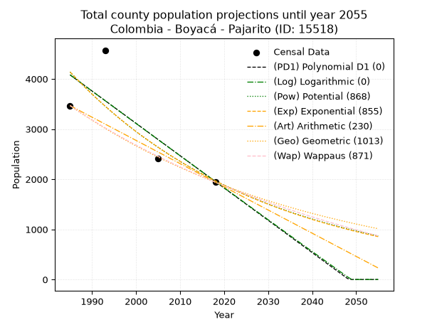
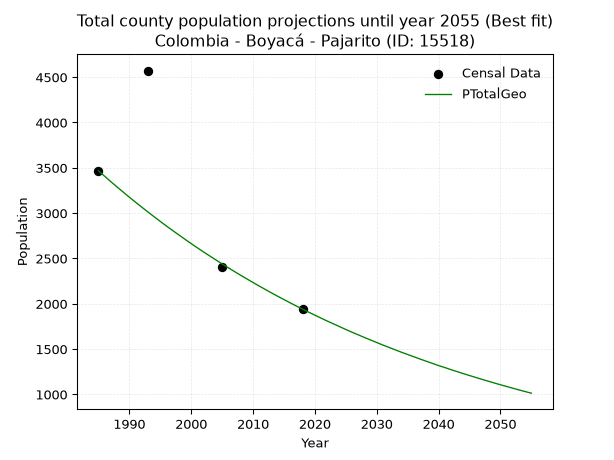
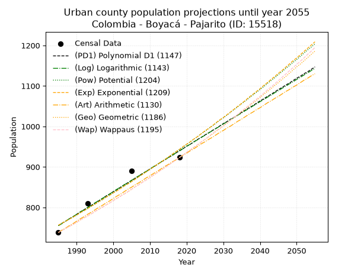
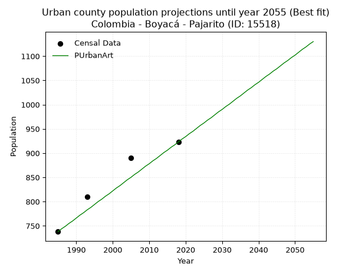
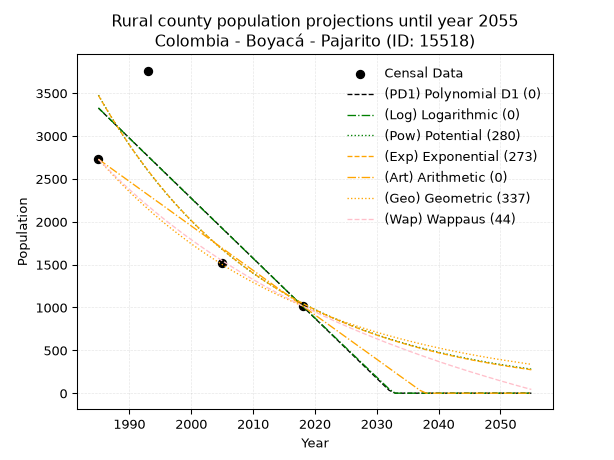

<div align="center">


</div>

# _“Population and Public Services Demand Projections (PPSD) until Year 2050 for Colombia - Boyacá - Pajarito (ID: 15518)”_
Keywords: `population` `public-service` `projection` `lineal` `polynomial` `logarithmic` `potential` `exponential` `arithmetic` `geometric` `wappaus` `dane` `colombia` `south-america`

PPSD are analytical estimates used by governments and planners to anticipate future changes in population size, age distribution, and the resulting community needs for utilities, healthcare, education, and infrastructure as sizing future water treatment facilities, electrical grids, and road networks based on spatial growth.

> **General running parameters**: • app_version: _v20260806_. • Python version: _3.14.7_. • Pandas version: _3.0.5_. • NumPy version: _2.5.1_. • Creates, save and include plots into reports (create_plot): _False_. • Projection until year: _2050_. • Process polynomial degree 2 and up: _False_. • Process Wappaus: _True_. • Process Wappaus: _True_. • Set negative values to zero: _True_. • Set infinite values to zero: _True_. • Drop dataset notes: _True_. 
<div align="center">

Dynamic map: [:earth_americas:Google](http://maps.google.com/maps?q=5.293782802,-72.7032313) [:earth_americas:OSM](https://www.openstreetmap.org/#map=18/5.293782802/-72.7032313&layers=P) [:earth_americas:Bing](https://www.bing.com/maps?cp=5.293782802~-72.7032313&lvl=18) [:earth_americas:Apple](https://maps.apple.com/frame?center=5.293782802%2C-72.7032313&span=0.003%2C0.006)

</div>


<div align="center">

```geojson
{
  "type": "Feature",
  "geometry": {
    "type": "Point", 
    "coordinates": [-72.7032313, 5.293782802]
  }, 
  "properties": {
    "Name": "Colombia - Boyacá - Pajarito (ID: 15518)"
  }
}
```

</div>


## 0. Census Data (4 records)

Census data are official statistics collected by a government about the people and housing in a country. They usually include counts of total population, age, sex, race, income, education, and jobs.

📅Global census file: [Population.xlsx](../data/Population.xlsx)

| Source   |   Year |   CountryID | CountryName   |   StateID | StateName   |   CountyID | CountyName   |   PTotal |   PUrban |   PRural |
|:---------|-------:|------------:|:--------------|----------:|:------------|-----------:|:-------------|---------:|---------:|---------:|
| DANE     |   1985 |          57 | Colombia      |        15 | Boyacá      |      15518 | Pajarito     |     3467 |      738 |     2729 |
| DANE     |   1993 |          57 | Colombia      |        15 | Boyacá      |      15518 | Pajarito     |     4572 |      810 |     3762 |
| DANE     |   2005 |          57 | Colombia      |        15 | Boyacá      |      15518 | Pajarito     |     2410 |      890 |     1520 |
| DANE     |   2018 |          57 | Colombia      |        15 | Boyacá      |      15518 | Pajarito     |     1941 |      923 |     1018 |

> 🔥Some records could had specific notes about the registered values or the corresponding urban or rural distribution.

📅   [RUPS](https://www.datos.gov.co/Hacienda-y-Cr-dito-P-blico/Registro-nico-de-Prestadores-de-Servicios-P-blicos/4qkq-csdn/about_data) - Local public utility companies: [RUPS.csv](../data/RUPS.xlsx)

 | SERVICIO       | ESTADO    | NOMBRE                                              | NIT         | DEPARTAMENTO_DOMICILIO   | MUNICIPIO_DOMICILIO   | DIRECCION                                            |   TELEFONO | EMAIL                           | TIPO_PRESTADOR                 | CLASIFICACION                 |
|:---------------|:----------|:----------------------------------------------------|:------------|:-------------------------|:----------------------|:-----------------------------------------------------|-----------:|:--------------------------------|:-------------------------------|:------------------------------|
| ACUEDUCTO      | OPERATIVA | UNIDAD DE LOS SERVICIOS PUBLICOS DE PAJARITO-BOYACA | 800065593-7 | BOYACA                   | PAJARITO              | Carrera 2 Calle 5 Esquina Palacio Municipal Pajarito |    7847005 | alcaldia@pajarito-boyaca.gov.co | MUNICIPIO (PRESTACIÓN DIRECTA) | MENOR O IGUAL A 2500 USUARIOS |
| ALCANTARILLADO | OPERATIVA | UNIDAD DE LOS SERVICIOS PUBLICOS DE PAJARITO-BOYACA | 800065593-7 | BOYACA                   | PAJARITO              | Carrera 2 Calle 5 Esquina Palacio Municipal Pajarito |    7847005 | alcaldia@pajarito-boyaca.gov.co | MUNICIPIO (PRESTACIÓN DIRECTA) | MENOR O IGUAL A 2500 USUARIOS |

## 1. Total

### 1.1. Coefficients and Parameters

* (PD1) Polynomial Deg 1: -64.42151746286592, 131956.64030509756 (lineal)
* (Log) Logarithmic: -128864.74830598243, 982599.4845310566
* (Pow) Potential: -45.06747023044576, 152.23866268017616
* (Exp) Exponential: -0.02252866258575005, 1.0917403707674136e+23
* (Art) Arithmetic: Year diff. 2018 - 1985 = 33, Population diff. 1941 - 3467 = -1526, Annual growth = -46.24242424242424
* (Geo) Geometric: Year diff. 2018 - 1985 = 33, Population diff. 1941 - 3467 = -1526, Annual growth % = -0.017424776314225343
* (Wap) Wappaus: i = -1.710148825533441, Condition values only valid for < 200)

<sub>
Wappaus condition values: ['-0.00', '-1.71', '-3.42', '-5.13', '-6.84', '-8.55', '-10.26', '-11.97', '-13.68', '-15.39', '-17.10', '-18.81', '-20.52', '-22.23', '-23.94', '-25.65', '-27.36', '-29.07', '-30.78', '-32.49', '-34.20', '-35.91', '-37.62', '-39.33', '-41.04', '-42.75', '-44.46', '-46.17', '-47.88', '-49.59', '-51.30', '-53.01', '-54.72', '-56.43', '-58.15', '-59.86', '-61.57', '-63.28', '-64.99', '-66.70', '-68.41', '-70.12', '-71.83', '-73.54', '-75.25', '-76.96', '-78.67', '-80.38', '-82.09', '-83.80', '-85.51', '-87.22', '-88.93', '-90.64', '-92.35', '-94.06', '-95.77', '-97.48', '-99.19', '-100.90', '-102.61', '-104.32', '-106.03', '-107.74', '-109.45', '-111.16']
</sub>


### 1.2. Projected Dataset

|   Year |   CountyID |   PTotalPD1 |   PTotalLog |   PTotalPow |   PTotalExp |   PTotalArt |   PTotalGeo |   PTotalWap |
|-------:|-----------:|------------:|------------:|------------:|------------:|------------:|------------:|------------:|
|   1985 |      15518 |        4080 |        4081 |        4139 |        4137 |        3467 |        3467 |        3467 |
|   1986 |      15518 |        4016 |        4016 |        4047 |        4045 |        3421 |        3407 |        3408 |
|   1987 |      15518 |        3951 |        3951 |        3956 |        3955 |        3375 |        3347 |        3350 |
|   1988 |      15518 |        3887 |        3887 |        3867 |        3867 |        3328 |        3289 |        3294 |
|   1989 |      15518 |        3822 |        3822 |        3780 |        3781 |        3282 |        3232 |        3238 |
|   1990 |      15518 |        3758 |        3757 |        3696 |        3697 |        3236 |        3175 |        3183 |
|   1991 |      15518 |        3693 |        3692 |        3613 |        3614 |        3190 |        3120 |        3129 |
|   1992 |      15518 |        3629 |        3628 |        3532 |        3534 |        3143 |        3066 |        3075 |
|   1993 |      15518 |        3565 |        3563 |        3453 |        3455 |        3097 |        3012 |        3023 |
|   1994 |      15518 |        3500 |        3498 |        3376 |        3378 |        3051 |        2960 |        2972 |
|   1995 |      15518 |        3436 |        3434 |        3301 |        3303 |        3005 |        2908 |        2921 |
|   1996 |      15518 |        3371 |        3369 |        3227 |        3229 |        2958 |        2857 |        2871 |
|   1997 |      15518 |        3307 |        3305 |        3155 |        3157 |        2912 |        2808 |        2822 |
|   1998 |      15518 |        3242 |        3240 |        3084 |        3087 |        2866 |        2759 |        2773 |
|   1999 |      15518 |        3178 |        3176 |        3016 |        3018 |        2820 |        2711 |        2726 |
|   2000 |      15518 |        3114 |        3111 |        2948 |        2951 |        2773 |        2663 |        2679 |
|   2001 |      15518 |        3049 |        3047 |        2883 |        2885 |        2727 |        2617 |        2633 |
|   2002 |      15518 |        2985 |        2982 |        2819 |        2821 |        2681 |        2571 |        2587 |
|   2003 |      15518 |        2920 |        2918 |        2756 |        2758 |        2635 |        2527 |        2542 |
|   2004 |      15518 |        2856 |        2854 |        2695 |        2697 |        2588 |        2483 |        2498 |
|   2005 |      15518 |        2791 |        2789 |        2635 |        2637 |        2542 |        2439 |        2454 |
|   2006 |      15518 |        2727 |        2725 |        2576 |        2578 |        2496 |        2397 |        2411 |
|   2007 |      15518 |        2663 |        2661 |        2519 |        2520 |        2450 |        2355 |        2369 |
|   2008 |      15518 |        2598 |        2597 |        2463 |        2464 |        2403 |        2314 |        2327 |
|   2009 |      15518 |        2534 |        2533 |        2408 |        2409 |        2357 |        2274 |        2286 |
|   2010 |      15518 |        2469 |        2468 |        2355 |        2356 |        2311 |        2234 |        2246 |
|   2011 |      15518 |        2405 |        2404 |        2303 |        2303 |        2265 |        2195 |        2206 |
|   2012 |      15518 |        2341 |        2340 |        2252 |        2252 |        2218 |        2157 |        2166 |
|   2013 |      15518 |        2276 |        2276 |        2202 |        2202 |        2172 |        2119 |        2128 |
|   2014 |      15518 |        2212 |        2212 |        2153 |        2153 |        2126 |        2082 |        2089 |
|   2015 |      15518 |        2147 |        2148 |        2105 |        2105 |        2080 |        2046 |        2051 |
|   2016 |      15518 |        2083 |        2084 |        2059 |        2058 |        2033 |        2010 |        2014 |
|   2017 |      15518 |        2018 |        2020 |        2013 |        2012 |        1987 |        1975 |        1977 |
|   2018 |      15518 |        1954 |        1957 |        1969 |        1967 |        1941 |        1941 |        1941 |
|   2019 |      15518 |        1890 |        1893 |        1925 |        1923 |        1895 |        1907 |        1905 |
|   2020 |      15518 |        1825 |        1829 |        1883 |        1881 |        1849 |        1874 |        1870 |
|   2021 |      15518 |        1761 |        1765 |        1841 |        1839 |        1802 |        1841 |        1835 |
|   2022 |      15518 |        1696 |        1701 |        1801 |        1798 |        1756 |        1809 |        1800 |
|   2023 |      15518 |        1632 |        1638 |        1761 |        1758 |        1710 |        1778 |        1766 |
|   2024 |      15518 |        1567 |        1574 |        1722 |        1719 |        1664 |        1747 |        1733 |
|   2025 |      15518 |        1503 |        1510 |        1684 |        1680 |        1617 |        1716 |        1700 |
|   2026 |      15518 |        1439 |        1447 |        1647 |        1643 |        1571 |        1686 |        1667 |
|   2027 |      15518 |        1374 |        1383 |        1611 |        1606 |        1525 |        1657 |        1635 |
|   2028 |      15518 |        1310 |        1320 |        1576 |        1570 |        1479 |        1628 |        1603 |
|   2029 |      15518 |        1245 |        1256 |        1541 |        1535 |        1432 |        1600 |        1571 |
|   2030 |      15518 |        1181 |        1192 |        1507 |        1501 |        1386 |        1572 |        1540 |
|   2031 |      15518 |        1117 |        1129 |        1474 |        1468 |        1340 |        1544 |        1510 |
|   2032 |      15518 |        1052 |        1066 |        1442 |        1435 |        1294 |        1518 |        1479 |
|   2033 |      15518 |         988 |        1002 |        1410 |        1403 |        1247 |        1491 |        1449 |
|   2034 |      15518 |         923 |         939 |        1379 |        1372 |        1201 |        1465 |        1420 |
|   2035 |      15518 |         859 |         875 |        1349 |        1341 |        1155 |        1440 |        1390 |
|   2036 |      15518 |         794 |         812 |        1320 |        1311 |        1109 |        1415 |        1361 |
|   2037 |      15518 |         730 |         749 |        1291 |        1282 |        1062 |        1390 |        1333 |
|   2038 |      15518 |         666 |         686 |        1262 |        1254 |        1016 |        1366 |        1305 |
|   2039 |      15518 |         601 |         622 |        1235 |        1226 |         970 |        1342 |        1277 |
|   2040 |      15518 |         537 |         559 |        1208 |        1198 |         924 |        1318 |        1249 |
|   2041 |      15518 |         472 |         496 |        1181 |        1172 |         877 |        1296 |        1222 |
|   2042 |      15518 |         408 |         433 |        1156 |        1146 |         831 |        1273 |        1195 |
|   2043 |      15518 |         343 |         370 |        1130 |        1120 |         785 |        1251 |        1168 |
|   2044 |      15518 |         279 |         307 |        1106 |        1095 |         739 |        1229 |        1142 |
|   2045 |      15518 |         215 |         244 |        1082 |        1071 |         692 |        1208 |        1116 |
|   2046 |      15518 |         150 |         181 |        1058 |        1047 |         646 |        1187 |        1090 |
|   2047 |      15518 |          86 |         118 |        1035 |        1024 |         600 |        1166 |        1065 |
|   2048 |      15518 |          21 |          55 |        1013 |        1001 |         554 |        1146 |        1039 |
|   2049 |      15518 |           0 |           0 |         990 |         978 |         507 |        1126 |        1015 |
|   2050 |      15518 |           0 |           0 |         969 |         957 |         461 |        1106 |         990 |
<div align="center">

</img>

</div>


### 1.3. Best fit with absolute and relative error (%)

Relative error puts that difference into context by dividing the absolute error by the true value, creating a unitless ratio or percentage that shows the scale of the mistake.

Absolute and relative error

|   Year | Source   |   CountryID | CountryName   |   StateID | StateName   |   CountyID_x | CountyName   |   PTotal |   PUrban |   PRural |   CountyID_y |   PTotalPD1 |   PTotalLog |   PTotalPow |   PTotalExp |   PTotalArt |   PTotalGeo |   PTotalWap |   PTotalPD1AbsError |   PTotalLogAbsError |   PTotalPowAbsError |   PTotalExpAbsError |   PTotalArtAbsError |   PTotalGeoAbsError |   PTotalWapAbsError |   PTotalPD1RelError |   PTotalLogRelError |   PTotalPowRelError |   PTotalExpRelError |   PTotalArtRelError |   PTotalGeoRelError |   PTotalWapRelError |
|-------:|:---------|------------:|:--------------|----------:|:------------|-------------:|:-------------|---------:|---------:|---------:|-------------:|------------:|------------:|------------:|------------:|------------:|------------:|------------:|--------------------:|--------------------:|--------------------:|--------------------:|--------------------:|--------------------:|--------------------:|--------------------:|--------------------:|--------------------:|--------------------:|--------------------:|--------------------:|--------------------:|
|   1985 | DANE     |          57 | Colombia      |        15 | Boyacá      |        15518 | Pajarito     |     3467 |      738 |     2729 |        15518 |        4080 |        4081 |        4139 |        4137 |        3467 |        3467 |        3467 |                 613 |                 614 |                 672 |                 670 |                   0 |                   0 |                   0 |           17.681    |           17.7098   |            19.3828  |            19.3251  |             0       |             0       |             0       |
|   1993 | DANE     |          57 | Colombia      |        15 | Boyacá      |        15518 | Pajarito     |     4572 |      810 |     3762 |        15518 |        3565 |        3563 |        3453 |        3455 |        3097 |        3012 |        3023 |                1007 |                1009 |                1119 |                1117 |                1475 |                1560 |                1549 |           22.0254   |           22.0691   |            24.4751  |            24.4313  |            32.2616  |            34.1207  |            33.8801  |
|   2005 | DANE     |          57 | Colombia      |        15 | Boyacá      |        15518 | Pajarito     |     2410 |      890 |     1520 |        15518 |        2791 |        2789 |        2635 |        2637 |        2542 |        2439 |        2454 |                 381 |                 379 |                 225 |                 227 |                 132 |                  29 |                  44 |           15.8091   |           15.7261   |             9.3361  |             9.41909 |             5.47718 |             1.20332 |             1.82573 |
|   2018 | DANE     |          57 | Colombia      |        15 | Boyacá      |        15518 | Pajarito     |     1941 |      923 |     1018 |        15518 |        1954 |        1957 |        1969 |        1967 |        1941 |        1941 |        1941 |                  13 |                  16 |                  28 |                  26 |                   0 |                   0 |                   0 |            0.669758 |            0.824317 |             1.44256 |             1.33952 |             0       |             0       |             0       |

Relative error mean

| Method    |   RelError | Best   |
|:----------|-----------:|:-------|
| PTotalPD1 |   14.0463  |        |
| PTotalLog |   14.0824  |        |
| PTotalPow |   13.6591  |        |
| PTotalExp |   13.6287  |        |
| PTotalArt |    9.43469 |        |
| PTotalGeo |    8.83101 | True   |
| PTotalWap |    8.92647 |        |

💙Best method: _**PTotalGeo**_
<div align="center">

</img>

</div>


### 1.4. Fresh water supply demand in liters per capita per day (lpcd)

The fresh water supply demand typically ranges from 100 to 300 liters per capita per day (lpcd) for standard domestic and municipal planning, though absolute survival minimums set by the World Health Organization are as low as 7.5 to 20 liters per day, and total consumption in high-income nations can exceed 400 liters.

> `CZ`: Level in meters above the sea level (masl)<br> `WS`: Fresh water supply demand in liters per capita per day (lpcd or l/h/d)<br> `WSAll`: Zonal fresh water supply demand in liters per second (l/s)<br> `A`: Zonal area in square meters<br> `DP`: Population density (people/hectare or p/ha)

Reference values (RAS Colombia)

|    CZ |   WS |
|------:|-----:|
|  1000 |  120 |
|  2000 |  130 |
| 99999 |  140 |

County shapefile geometry properties and water supply values

|   CountyID |      ATotal |   CZTotal |   WSTotal |
|-----------:|------------:|----------:|----------:|
|      15518 | 3.13008e+08 |   1828.22 |       130 |

Projected values for best method: PTotalGeo

|   CountyID |   Year |   PTotalGeo |   DPTotal |   WSTotal |   WSTotalAll |
|-----------:|-------:|------------:|----------:|----------:|-------------:|
|      15518 |   1985 |        3467 |      0.11 |       130 |      5.21655 |
|      15518 |   1986 |        3407 |      0.11 |       130 |      5.12627 |
|      15518 |   1987 |        3347 |      0.11 |       130 |      5.036   |
|      15518 |   1988 |        3289 |      0.11 |       130 |      4.94873 |
|      15518 |   1989 |        3232 |      0.1  |       130 |      4.86296 |
|      15518 |   1990 |        3175 |      0.1  |       130 |      4.7772  |
|      15518 |   1991 |        3120 |      0.1  |       130 |      4.69444 |
|      15518 |   1992 |        3066 |      0.1  |       130 |      4.61319 |
|      15518 |   1993 |        3012 |      0.1  |       130 |      4.53194 |
|      15518 |   1994 |        2960 |      0.09 |       130 |      4.4537  |
|      15518 |   1995 |        2908 |      0.09 |       130 |      4.37546 |
|      15518 |   1996 |        2857 |      0.09 |       130 |      4.29873 |
|      15518 |   1997 |        2808 |      0.09 |       130 |      4.225   |
|      15518 |   1998 |        2759 |      0.09 |       130 |      4.15127 |
|      15518 |   1999 |        2711 |      0.09 |       130 |      4.07905 |
|      15518 |   2000 |        2663 |      0.09 |       130 |      4.00683 |
|      15518 |   2001 |        2617 |      0.08 |       130 |      3.93762 |
|      15518 |   2002 |        2571 |      0.08 |       130 |      3.8684  |
|      15518 |   2003 |        2527 |      0.08 |       130 |      3.8022  |
|      15518 |   2004 |        2483 |      0.08 |       130 |      3.736   |
|      15518 |   2005 |        2439 |      0.08 |       130 |      3.66979 |
|      15518 |   2006 |        2397 |      0.08 |       130 |      3.6066  |
|      15518 |   2007 |        2355 |      0.08 |       130 |      3.5434  |
|      15518 |   2008 |        2314 |      0.07 |       130 |      3.48171 |
|      15518 |   2009 |        2274 |      0.07 |       130 |      3.42153 |
|      15518 |   2010 |        2234 |      0.07 |       130 |      3.36134 |
|      15518 |   2011 |        2195 |      0.07 |       130 |      3.30266 |
|      15518 |   2012 |        2157 |      0.07 |       130 |      3.24549 |
|      15518 |   2013 |        2119 |      0.07 |       130 |      3.18831 |
|      15518 |   2014 |        2082 |      0.07 |       130 |      3.13264 |
|      15518 |   2015 |        2046 |      0.07 |       130 |      3.07847 |
|      15518 |   2016 |        2010 |      0.06 |       130 |      3.02431 |
|      15518 |   2017 |        1975 |      0.06 |       130 |      2.97164 |
|      15518 |   2018 |        1941 |      0.06 |       130 |      2.92049 |
|      15518 |   2019 |        1907 |      0.06 |       130 |      2.86933 |
|      15518 |   2020 |        1874 |      0.06 |       130 |      2.81968 |
|      15518 |   2021 |        1841 |      0.06 |       130 |      2.77002 |
|      15518 |   2022 |        1809 |      0.06 |       130 |      2.72187 |
|      15518 |   2023 |        1778 |      0.06 |       130 |      2.67523 |
|      15518 |   2024 |        1747 |      0.06 |       130 |      2.62859 |
|      15518 |   2025 |        1716 |      0.05 |       130 |      2.58194 |
|      15518 |   2026 |        1686 |      0.05 |       130 |      2.53681 |
|      15518 |   2027 |        1657 |      0.05 |       130 |      2.49317 |
|      15518 |   2028 |        1628 |      0.05 |       130 |      2.44954 |
|      15518 |   2029 |        1600 |      0.05 |       130 |      2.40741 |
|      15518 |   2030 |        1572 |      0.05 |       130 |      2.36528 |
|      15518 |   2031 |        1544 |      0.05 |       130 |      2.32315 |
|      15518 |   2032 |        1518 |      0.05 |       130 |      2.28403 |
|      15518 |   2033 |        1491 |      0.05 |       130 |      2.2434  |
|      15518 |   2034 |        1465 |      0.05 |       130 |      2.20428 |
|      15518 |   2035 |        1440 |      0.05 |       130 |      2.16667 |
|      15518 |   2036 |        1415 |      0.05 |       130 |      2.12905 |
|      15518 |   2037 |        1390 |      0.04 |       130 |      2.09144 |
|      15518 |   2038 |        1366 |      0.04 |       130 |      2.05532 |
|      15518 |   2039 |        1342 |      0.04 |       130 |      2.01921 |
|      15518 |   2040 |        1318 |      0.04 |       130 |      1.9831  |
|      15518 |   2041 |        1296 |      0.04 |       130 |      1.95    |
|      15518 |   2042 |        1273 |      0.04 |       130 |      1.91539 |
|      15518 |   2043 |        1251 |      0.04 |       130 |      1.88229 |
|      15518 |   2044 |        1229 |      0.04 |       130 |      1.84919 |
|      15518 |   2045 |        1208 |      0.04 |       130 |      1.81759 |
|      15518 |   2046 |        1187 |      0.04 |       130 |      1.786   |
|      15518 |   2047 |        1166 |      0.04 |       130 |      1.7544  |
|      15518 |   2048 |        1146 |      0.04 |       130 |      1.72431 |
|      15518 |   2049 |        1126 |      0.04 |       130 |      1.69421 |
|      15518 |   2050 |        1106 |      0.04 |       130 |      1.66412 |

## 2. Urban

### 2.1. Coefficients and Parameters

* (PD1) Polynomial Deg 1: 5.5941389000401145, -10349.42633480524 (lineal)
* (Log) Logarithmic: 11203.838423655508, -84320.21564013201
* (Pow) Potential: 13.460195963348806, -41.51034438601243
* (Exp) Exponential: 0.006720319935183852, 0.0012157881152144903
* (Art) Arithmetic: Year diff. 2018 - 1985 = 33, Population diff. 923 - 738 = 185, Annual growth = 5.606060606060606
* (Geo) Geometric: Year diff. 2018 - 1985 = 33, Population diff. 923 - 738 = 185, Annual growth % = 0.006801370734560885
* (Wap) Wappaus: i = 0.6750223487128966, Condition values only valid for < 200)

<sub>
Wappaus condition values: ['0.00', '0.68', '1.35', '2.03', '2.70', '3.38', '4.05', '4.73', '5.40', '6.08', '6.75', '7.43', '8.10', '8.78', '9.45', '10.13', '10.80', '11.48', '12.15', '12.83', '13.50', '14.18', '14.85', '15.53', '16.20', '16.88', '17.55', '18.23', '18.90', '19.58', '20.25', '20.93', '21.60', '22.28', '22.95', '23.63', '24.30', '24.98', '25.65', '26.33', '27.00', '27.68', '28.35', '29.03', '29.70', '30.38', '31.05', '31.73', '32.40', '33.08', '33.75', '34.43', '35.10', '35.78', '36.45', '37.13', '37.80', '38.48', '39.15', '39.83', '40.50', '41.18', '41.85', '42.53', '43.20', '43.88']
</sub>


### 2.2. Projected Dataset

|   Year |   CountyID |   PUrbanPD1 |   PUrbanLog |   PUrbanPow |   PUrbanExp |   PUrbanArt |   PUrbanGeo |   PUrbanWap |
|-------:|-----------:|------------:|------------:|------------:|------------:|------------:|------------:|------------:|
|   1985 |      15518 |         755 |         755 |         755 |         756 |         738 |         738 |         738 |
|   1986 |      15518 |         761 |         760 |         761 |         761 |         744 |         743 |         743 |
|   1987 |      15518 |         766 |         766 |         766 |         766 |         749 |         748 |         748 |
|   1988 |      15518 |         772 |         772 |         771 |         771 |         755 |         753 |         753 |
|   1989 |      15518 |         777 |         777 |         776 |         776 |         760 |         758 |         758 |
|   1990 |      15518 |         783 |         783 |         781 |         781 |         766 |         763 |         763 |
|   1991 |      15518 |         789 |         789 |         787 |         787 |         772 |         769 |         769 |
|   1992 |      15518 |         794 |         794 |         792 |         792 |         777 |         774 |         774 |
|   1993 |      15518 |         800 |         800 |         797 |         797 |         783 |         779 |         779 |
|   1994 |      15518 |         805 |         805 |         803 |         803 |         788 |         784 |         784 |
|   1995 |      15518 |         811 |         811 |         808 |         808 |         794 |         790 |         790 |
|   1996 |      15518 |         816 |         817 |         814 |         814 |         800 |         795 |         795 |
|   1997 |      15518 |         822 |         822 |         819 |         819 |         805 |         801 |         800 |
|   1998 |      15518 |         828 |         828 |         825 |         825 |         811 |         806 |         806 |
|   1999 |      15518 |         833 |         833 |         830 |         830 |         816 |         811 |         811 |
|   2000 |      15518 |         839 |         839 |         836 |         836 |         822 |         817 |         817 |
|   2001 |      15518 |         844 |         845 |         842 |         841 |         828 |         823 |         822 |
|   2002 |      15518 |         850 |         850 |         847 |         847 |         833 |         828 |         828 |
|   2003 |      15518 |         856 |         856 |         853 |         853 |         839 |         834 |         833 |
|   2004 |      15518 |         861 |         861 |         859 |         858 |         845 |         839 |         839 |
|   2005 |      15518 |         867 |         867 |         864 |         864 |         850 |         845 |         845 |
|   2006 |      15518 |         872 |         873 |         870 |         870 |         856 |         851 |         851 |
|   2007 |      15518 |         878 |         878 |         876 |         876 |         861 |         857 |         856 |
|   2008 |      15518 |         884 |         884 |         882 |         882 |         867 |         863 |         862 |
|   2009 |      15518 |         889 |         889 |         888 |         888 |         873 |         868 |         868 |
|   2010 |      15518 |         895 |         895 |         894 |         894 |         878 |         874 |         874 |
|   2011 |      15518 |         900 |         901 |         900 |         900 |         884 |         880 |         880 |
|   2012 |      15518 |         906 |         906 |         906 |         906 |         889 |         886 |         886 |
|   2013 |      15518 |         912 |         912 |         912 |         912 |         895 |         892 |         892 |
|   2014 |      15518 |         917 |         917 |         918 |         918 |         901 |         898 |         898 |
|   2015 |      15518 |         923 |         923 |         924 |         924 |         906 |         904 |         904 |
|   2016 |      15518 |         928 |         928 |         931 |         931 |         912 |         911 |         910 |
|   2017 |      15518 |         934 |         934 |         937 |         937 |         917 |         917 |         917 |
|   2018 |      15518 |         940 |         939 |         943 |         943 |         923 |         923 |         923 |
|   2019 |      15518 |         945 |         945 |         949 |         950 |         929 |         929 |         929 |
|   2020 |      15518 |         951 |         951 |         956 |         956 |         934 |         936 |         936 |
|   2021 |      15518 |         956 |         956 |         962 |         962 |         940 |         942 |         942 |
|   2022 |      15518 |         962 |         962 |         969 |         969 |         945 |         948 |         949 |
|   2023 |      15518 |         968 |         967 |         975 |         975 |         951 |         955 |         955 |
|   2024 |      15518 |         973 |         973 |         982 |         982 |         957 |         961 |         962 |
|   2025 |      15518 |         979 |         978 |         988 |         989 |         962 |         968 |         968 |
|   2026 |      15518 |         984 |         984 |         995 |         995 |         968 |         974 |         975 |
|   2027 |      15518 |         990 |         989 |        1001 |        1002 |         973 |         981 |         982 |
|   2028 |      15518 |         995 |         995 |        1008 |        1009 |         979 |         988 |         989 |
|   2029 |      15518 |        1001 |        1000 |        1015 |        1016 |         985 |         994 |         995 |
|   2030 |      15518 |        1007 |        1006 |        1021 |        1022 |         990 |        1001 |        1002 |
|   2031 |      15518 |        1012 |        1011 |        1028 |        1029 |         996 |        1008 |        1009 |
|   2032 |      15518 |        1018 |        1017 |        1035 |        1036 |        1001 |        1015 |        1016 |
|   2033 |      15518 |        1023 |        1022 |        1042 |        1043 |        1007 |        1022 |        1023 |
|   2034 |      15518 |        1029 |        1028 |        1049 |        1050 |        1013 |        1029 |        1030 |
|   2035 |      15518 |        1035 |        1033 |        1056 |        1057 |        1018 |        1036 |        1038 |
|   2036 |      15518 |        1040 |        1039 |        1063 |        1064 |        1024 |        1043 |        1045 |
|   2037 |      15518 |        1046 |        1044 |        1070 |        1072 |        1030 |        1050 |        1052 |
|   2038 |      15518 |        1051 |        1050 |        1077 |        1079 |        1035 |        1057 |        1060 |
|   2039 |      15518 |        1057 |        1055 |        1084 |        1086 |        1041 |        1064 |        1067 |
|   2040 |      15518 |        1063 |        1061 |        1091 |        1093 |        1046 |        1071 |        1074 |
|   2041 |      15518 |        1068 |        1066 |        1098 |        1101 |        1052 |        1079 |        1082 |
|   2042 |      15518 |        1074 |        1072 |        1106 |        1108 |        1058 |        1086 |        1090 |
|   2043 |      15518 |        1079 |        1077 |        1113 |        1116 |        1063 |        1093 |        1097 |
|   2044 |      15518 |        1085 |        1083 |        1120 |        1123 |        1069 |        1101 |        1105 |
|   2045 |      15518 |        1091 |        1088 |        1128 |        1131 |        1074 |        1108 |        1113 |
|   2046 |      15518 |        1096 |        1094 |        1135 |        1138 |        1080 |        1116 |        1121 |
|   2047 |      15518 |        1102 |        1099 |        1143 |        1146 |        1086 |        1123 |        1129 |
|   2048 |      15518 |        1107 |        1105 |        1150 |        1154 |        1091 |        1131 |        1137 |
|   2049 |      15518 |        1113 |        1110 |        1158 |        1162 |        1097 |        1139 |        1145 |
|   2050 |      15518 |        1119 |        1116 |        1165 |        1169 |        1102 |        1147 |        1153 |
<div align="center">

</img>

</div>


### 2.3. Best fit with absolute and relative error (%)

Relative error puts that difference into context by dividing the absolute error by the true value, creating a unitless ratio or percentage that shows the scale of the mistake.

Absolute and relative error

|   Year | Source   |   CountryID | CountryName   |   StateID | StateName   |   CountyID_x | CountyName   |   PTotal |   PUrban |   PRural |   CountyID_y |   PUrbanPD1 |   PUrbanLog |   PUrbanPow |   PUrbanExp |   PUrbanArt |   PUrbanGeo |   PUrbanWap |   PUrbanPD1AbsError |   PUrbanLogAbsError |   PUrbanPowAbsError |   PUrbanExpAbsError |   PUrbanArtAbsError |   PUrbanGeoAbsError |   PUrbanWapAbsError |   PUrbanPD1RelError |   PUrbanLogRelError |   PUrbanPowRelError |   PUrbanExpRelError |   PUrbanArtRelError |   PUrbanGeoRelError |   PUrbanWapRelError |
|-------:|:---------|------------:|:--------------|----------:|:------------|-------------:|:-------------|---------:|---------:|---------:|-------------:|------------:|------------:|------------:|------------:|------------:|------------:|------------:|--------------------:|--------------------:|--------------------:|--------------------:|--------------------:|--------------------:|--------------------:|--------------------:|--------------------:|--------------------:|--------------------:|--------------------:|--------------------:|--------------------:|
|   1985 | DANE     |          57 | Colombia      |        15 | Boyacá      |        15518 | Pajarito     |     3467 |      738 |     2729 |        15518 |         755 |         755 |         755 |         756 |         738 |         738 |         738 |                  17 |                  17 |                  17 |                  18 |                   0 |                   0 |                   0 |             2.30352 |             2.30352 |             2.30352 |             2.43902 |             0       |             0       |             0       |
|   1993 | DANE     |          57 | Colombia      |        15 | Boyacá      |        15518 | Pajarito     |     4572 |      810 |     3762 |        15518 |         800 |         800 |         797 |         797 |         783 |         779 |         779 |                  10 |                  10 |                  13 |                  13 |                  27 |                  31 |                  31 |             1.23457 |             1.23457 |             1.60494 |             1.60494 |             3.33333 |             3.82716 |             3.82716 |
|   2005 | DANE     |          57 | Colombia      |        15 | Boyacá      |        15518 | Pajarito     |     2410 |      890 |     1520 |        15518 |         867 |         867 |         864 |         864 |         850 |         845 |         845 |                  23 |                  23 |                  26 |                  26 |                  40 |                  45 |                  45 |             2.58427 |             2.58427 |             2.92135 |             2.92135 |             4.49438 |             5.05618 |             5.05618 |
|   2018 | DANE     |          57 | Colombia      |        15 | Boyacá      |        15518 | Pajarito     |     1941 |      923 |     1018 |        15518 |         940 |         939 |         943 |         943 |         923 |         923 |         923 |                  17 |                  16 |                  20 |                  20 |                   0 |                   0 |                   0 |             1.84182 |             1.73348 |             2.16685 |             2.16685 |             0       |             0       |             0       |

Relative error mean

| Method    |   RelError | Best   |
|:----------|-----------:|:-------|
| PUrbanPD1 |    1.99105 |        |
| PUrbanLog |    1.96396 |        |
| PUrbanPow |    2.24916 |        |
| PUrbanExp |    2.28304 |        |
| PUrbanArt |    1.95693 | True   |
| PUrbanGeo |    2.22084 |        |
| PUrbanWap |    2.22084 |        |

💙Best method: _**PUrbanArt**_
<div align="center">

</img>

</div>


### 2.4. Fresh water supply demand in liters per capita per day (lpcd)

The fresh water supply demand typically ranges from 100 to 300 liters per capita per day (lpcd) for standard domestic and municipal planning, though absolute survival minimums set by the World Health Organization are as low as 7.5 to 20 liters per day, and total consumption in high-income nations can exceed 400 liters.

> `CZ`: Level in meters above the sea level (masl)<br> `WS`: Fresh water supply demand in liters per capita per day (lpcd or l/h/d)<br> `WSAll`: Zonal fresh water supply demand in liters per second (l/s)<br> `A`: Zonal area in square meters<br> `DP`: Population density (people/hectare or p/ha)

Reference values (RAS Colombia)

|    CZ |   WS |
|------:|-----:|
|  1000 |  120 |
|  2000 |  130 |
| 99999 |  140 |

County shapefile geometry properties and water supply values

|   CountyID |   AUrban |   CZUrban |   WSUrban |
|-----------:|---------:|----------:|----------:|
|      15518 |   162434 |   804.922 |       120 |

Projected values for best method: PUrbanArt

|   CountyID |   Year |   PUrbanArt |   DPUrban |   WSUrban |   WSUrbanAll |
|-----------:|-------:|------------:|----------:|----------:|-------------:|
|      15518 |   1985 |         738 |     45.43 |       120 |      1.025   |
|      15518 |   1986 |         744 |     45.8  |       120 |      1.03333 |
|      15518 |   1987 |         749 |     46.11 |       120 |      1.04028 |
|      15518 |   1988 |         755 |     46.48 |       120 |      1.04861 |
|      15518 |   1989 |         760 |     46.79 |       120 |      1.05556 |
|      15518 |   1990 |         766 |     47.16 |       120 |      1.06389 |
|      15518 |   1991 |         772 |     47.53 |       120 |      1.07222 |
|      15518 |   1992 |         777 |     47.83 |       120 |      1.07917 |
|      15518 |   1993 |         783 |     48.2  |       120 |      1.0875  |
|      15518 |   1994 |         788 |     48.51 |       120 |      1.09444 |
|      15518 |   1995 |         794 |     48.88 |       120 |      1.10278 |
|      15518 |   1996 |         800 |     49.25 |       120 |      1.11111 |
|      15518 |   1997 |         805 |     49.56 |       120 |      1.11806 |
|      15518 |   1998 |         811 |     49.93 |       120 |      1.12639 |
|      15518 |   1999 |         816 |     50.24 |       120 |      1.13333 |
|      15518 |   2000 |         822 |     50.61 |       120 |      1.14167 |
|      15518 |   2001 |         828 |     50.97 |       120 |      1.15    |
|      15518 |   2002 |         833 |     51.28 |       120 |      1.15694 |
|      15518 |   2003 |         839 |     51.65 |       120 |      1.16528 |
|      15518 |   2004 |         845 |     52.02 |       120 |      1.17361 |
|      15518 |   2005 |         850 |     52.33 |       120 |      1.18056 |
|      15518 |   2006 |         856 |     52.7  |       120 |      1.18889 |
|      15518 |   2007 |         861 |     53.01 |       120 |      1.19583 |
|      15518 |   2008 |         867 |     53.38 |       120 |      1.20417 |
|      15518 |   2009 |         873 |     53.75 |       120 |      1.2125  |
|      15518 |   2010 |         878 |     54.05 |       120 |      1.21944 |
|      15518 |   2011 |         884 |     54.42 |       120 |      1.22778 |
|      15518 |   2012 |         889 |     54.73 |       120 |      1.23472 |
|      15518 |   2013 |         895 |     55.1  |       120 |      1.24306 |
|      15518 |   2014 |         901 |     55.47 |       120 |      1.25139 |
|      15518 |   2015 |         906 |     55.78 |       120 |      1.25833 |
|      15518 |   2016 |         912 |     56.15 |       120 |      1.26667 |
|      15518 |   2017 |         917 |     56.45 |       120 |      1.27361 |
|      15518 |   2018 |         923 |     56.82 |       120 |      1.28194 |
|      15518 |   2019 |         929 |     57.19 |       120 |      1.29028 |
|      15518 |   2020 |         934 |     57.5  |       120 |      1.29722 |
|      15518 |   2021 |         940 |     57.87 |       120 |      1.30556 |
|      15518 |   2022 |         945 |     58.18 |       120 |      1.3125  |
|      15518 |   2023 |         951 |     58.55 |       120 |      1.32083 |
|      15518 |   2024 |         957 |     58.92 |       120 |      1.32917 |
|      15518 |   2025 |         962 |     59.22 |       120 |      1.33611 |
|      15518 |   2026 |         968 |     59.59 |       120 |      1.34444 |
|      15518 |   2027 |         973 |     59.9  |       120 |      1.35139 |
|      15518 |   2028 |         979 |     60.27 |       120 |      1.35972 |
|      15518 |   2029 |         985 |     60.64 |       120 |      1.36806 |
|      15518 |   2030 |         990 |     60.95 |       120 |      1.375   |
|      15518 |   2031 |         996 |     61.32 |       120 |      1.38333 |
|      15518 |   2032 |        1001 |     61.63 |       120 |      1.39028 |
|      15518 |   2033 |        1007 |     61.99 |       120 |      1.39861 |
|      15518 |   2034 |        1013 |     62.36 |       120 |      1.40694 |
|      15518 |   2035 |        1018 |     62.67 |       120 |      1.41389 |
|      15518 |   2036 |        1024 |     63.04 |       120 |      1.42222 |
|      15518 |   2037 |        1030 |     63.41 |       120 |      1.43056 |
|      15518 |   2038 |        1035 |     63.72 |       120 |      1.4375  |
|      15518 |   2039 |        1041 |     64.09 |       120 |      1.44583 |
|      15518 |   2040 |        1046 |     64.4  |       120 |      1.45278 |
|      15518 |   2041 |        1052 |     64.76 |       120 |      1.46111 |
|      15518 |   2042 |        1058 |     65.13 |       120 |      1.46944 |
|      15518 |   2043 |        1063 |     65.44 |       120 |      1.47639 |
|      15518 |   2044 |        1069 |     65.81 |       120 |      1.48472 |
|      15518 |   2045 |        1074 |     66.12 |       120 |      1.49167 |
|      15518 |   2046 |        1080 |     66.49 |       120 |      1.5     |
|      15518 |   2047 |        1086 |     66.86 |       120 |      1.50833 |
|      15518 |   2048 |        1091 |     67.17 |       120 |      1.51528 |
|      15518 |   2049 |        1097 |     67.54 |       120 |      1.52361 |
|      15518 |   2050 |        1102 |     67.84 |       120 |      1.53056 |

## 3. Rural

### 3.1. Coefficients and Parameters

* (PD1) Polynomial Deg 1: -70.01565636290601, 142306.06663990274 (lineal)
* (Log) Logarithmic: -140068.58672963784, 1066919.7001711878
* (Pow) Potential: -72.63469439001464, 243.07288801388933
* (Exp) Exponential: -0.03630730244535, 6.923371693371882e+34
* (Art) Arithmetic: Year diff. 2018 - 1985 = 33, Population diff. 1018 - 2729 = -1711, Annual growth = -51.84848484848485
* (Geo) Geometric: Year diff. 2018 - 1985 = 33, Population diff. 1018 - 2729 = -1711, Annual growth % = -0.02943963311926523
* (Wap) Wappaus: i = -2.7674664984512862, Condition values only valid for < 200)

<sub>
Wappaus condition values: ['-0.00', '-2.77', '-5.53', '-8.30', '-11.07', '-13.84', '-16.60', '-19.37', '-22.14', '-24.91', '-27.67', '-30.44', '-33.21', '-35.98', '-38.74', '-41.51', '-44.28', '-47.05', '-49.81', '-52.58', '-55.35', '-58.12', '-60.88', '-63.65', '-66.42', '-69.19', '-71.95', '-74.72', '-77.49', '-80.26', '-83.02', '-85.79', '-88.56', '-91.33', '-94.09', '-96.86', '-99.63', '-102.40', '-105.16', '-107.93', '-110.70', '-113.47', '-116.23', '-119.00', '-121.77', '-124.54', '-127.30', '-130.07', '-132.84', '-135.61', '-138.37', '-141.14', '-143.91', '-146.68', '-149.44', '-152.21', '-154.98', '-157.75', '-160.51', '-163.28', '-166.05', '-168.82', '-171.58', '-174.35', '-177.12', '-179.89']
</sub>


### 3.2. Projected Dataset

|   Year |   CountyID |   PRuralPD1 |   PRuralLog |   PRuralPow |   PRuralExp |   PRuralArt |   PRuralGeo |   PRuralWap |
|-------:|-----------:|------------:|------------:|------------:|------------:|------------:|------------:|------------:|
|   1985 |      15518 |        3325 |        3327 |        3476 |        3473 |        2729 |        2729 |        2729 |
|   1986 |      15518 |        3255 |        3256 |        3351 |        3349 |        2677 |        2649 |        2655 |
|   1987 |      15518 |        3185 |        3185 |        3231 |        3230 |        2625 |        2571 |        2582 |
|   1988 |      15518 |        3115 |        3115 |        3115 |        3115 |        2573 |        2495 |        2511 |
|   1989 |      15518 |        3045 |        3045 |        3003 |        3004 |        2522 |        2422 |        2443 |
|   1990 |      15518 |        2975 |        2974 |        2895 |        2897 |        2470 |        2350 |        2376 |
|   1991 |      15518 |        2905 |        2904 |        2792 |        2793 |        2418 |        2281 |        2311 |
|   1992 |      15518 |        2835 |        2833 |        2692 |        2694 |        2366 |        2214 |        2247 |
|   1993 |      15518 |        2765 |        2763 |        2595 |        2598 |        2314 |        2149 |        2185 |
|   1994 |      15518 |        2695 |        2693 |        2502 |        2505 |        2262 |        2085 |        2125 |
|   1995 |      15518 |        2625 |        2623 |        2413 |        2416 |        2211 |        2024 |        2066 |
|   1996 |      15518 |        2555 |        2552 |        2327 |        2330 |        2159 |        1964 |        2008 |
|   1997 |      15518 |        2485 |        2482 |        2244 |        2246 |        2107 |        1907 |        1952 |
|   1998 |      15518 |        2415 |        2412 |        2163 |        2166 |        2055 |        1851 |        1897 |
|   1999 |      15518 |        2345 |        2342 |        2086 |        2089 |        2003 |        1796 |        1843 |
|   2000 |      15518 |        2275 |        2272 |        2012 |        2015 |        1951 |        1743 |        1791 |
|   2001 |      15518 |        2205 |        2202 |        1940 |        1943 |        1899 |        1692 |        1740 |
|   2002 |      15518 |        2135 |        2132 |        1871 |        1874 |        1848 |        1642 |        1690 |
|   2003 |      15518 |        2065 |        2062 |        1804 |        1807 |        1796 |        1594 |        1641 |
|   2004 |      15518 |        1995 |        1992 |        1740 |        1742 |        1744 |        1547 |        1593 |
|   2005 |      15518 |        1925 |        1922 |        1678 |        1680 |        1692 |        1501 |        1546 |
|   2006 |      15518 |        1855 |        1852 |        1618 |        1620 |        1640 |        1457 |        1500 |
|   2007 |      15518 |        1785 |        1783 |        1561 |        1562 |        1588 |        1414 |        1455 |
|   2008 |      15518 |        1715 |        1713 |        1505 |        1507 |        1536 |        1373 |        1411 |
|   2009 |      15518 |        1645 |        1643 |        1452 |        1453 |        1485 |        1332 |        1368 |
|   2010 |      15518 |        1575 |        1573 |        1400 |        1401 |        1433 |        1293 |        1326 |
|   2011 |      15518 |        1505 |        1504 |        1351 |        1351 |        1381 |        1255 |        1285 |
|   2012 |      15518 |        1435 |        1434 |        1303 |        1303 |        1329 |        1218 |        1244 |
|   2013 |      15518 |        1365 |        1365 |        1257 |        1257 |        1277 |        1182 |        1205 |
|   2014 |      15518 |        1295 |        1295 |        1212 |        1212 |        1225 |        1147 |        1166 |
|   2015 |      15518 |        1225 |        1225 |        1169 |        1169 |        1174 |        1113 |        1128 |
|   2016 |      15518 |        1155 |        1156 |        1128 |        1127 |        1122 |        1081 |        1091 |
|   2017 |      15518 |        1084 |        1086 |        1088 |        1087 |        1070 |        1049 |        1054 |
|   2018 |      15518 |        1014 |        1017 |        1049 |        1048 |        1018 |        1018 |        1018 |
|   2019 |      15518 |         944 |         948 |        1012 |        1011 |         966 |         988 |         983 |
|   2020 |      15518 |         874 |         878 |         977 |         975 |         914 |         959 |         948 |
|   2021 |      15518 |         804 |         809 |         942 |         940 |         862 |         931 |         914 |
|   2022 |      15518 |         734 |         740 |         909 |         906 |         811 |         903 |         881 |
|   2023 |      15518 |         664 |         670 |         877 |         874 |         759 |         877 |         848 |
|   2024 |      15518 |         594 |         601 |         846 |         843 |         707 |         851 |         816 |
|   2025 |      15518 |         524 |         532 |         816 |         813 |         655 |         826 |         784 |
|   2026 |      15518 |         454 |         463 |         787 |         784 |         603 |         802 |         753 |
|   2027 |      15518 |         384 |         394 |         760 |         756 |         551 |         778 |         723 |
|   2028 |      15518 |         314 |         325 |         733 |         729 |         500 |         755 |         693 |
|   2029 |      15518 |         244 |         256 |         707 |         703 |         448 |         733 |         664 |
|   2030 |      15518 |         174 |         187 |         682 |         678 |         396 |         711 |         635 |
|   2031 |      15518 |         104 |         118 |         658 |         654 |         344 |         690 |         606 |
|   2032 |      15518 |          34 |          49 |         635 |         630 |         292 |         670 |         578 |
|   2033 |      15518 |           0 |           0 |         613 |         608 |         240 |         650 |         551 |
|   2034 |      15518 |           0 |           0 |         591 |         586 |         188 |         631 |         524 |
|   2035 |      15518 |           0 |           0 |         571 |         565 |         137 |         613 |         497 |
|   2036 |      15518 |           0 |           0 |         551 |         545 |          85 |         595 |         471 |
|   2037 |      15518 |           0 |           0 |         531 |         526 |          33 |         577 |         445 |
|   2038 |      15518 |           0 |           0 |         513 |         507 |           0 |         560 |         420 |
|   2039 |      15518 |           0 |           0 |         495 |         489 |           0 |         544 |         395 |
|   2040 |      15518 |           0 |           0 |         477 |         471 |           0 |         528 |         370 |
|   2041 |      15518 |           0 |           0 |         461 |         455 |           0 |         512 |         346 |
|   2042 |      15518 |           0 |           0 |         445 |         438 |           0 |         497 |         322 |
|   2043 |      15518 |           0 |           0 |         429 |         423 |           0 |         482 |         299 |
|   2044 |      15518 |           0 |           0 |         414 |         408 |           0 |         468 |         276 |
|   2045 |      15518 |           0 |           0 |         400 |         393 |           0 |         454 |         253 |
|   2046 |      15518 |           0 |           0 |         386 |         379 |           0 |         441 |         231 |
|   2047 |      15518 |           0 |           0 |         372 |         366 |           0 |         428 |         209 |
|   2048 |      15518 |           0 |           0 |         359 |         353 |           0 |         415 |         187 |
|   2049 |      15518 |           0 |           0 |         347 |         340 |           0 |         403 |         166 |
|   2050 |      15518 |           0 |           0 |         335 |         328 |           0 |         391 |         144 |
<div align="center">

</img>

</div>


### 3.3. Best fit with absolute and relative error (%)

Relative error puts that difference into context by dividing the absolute error by the true value, creating a unitless ratio or percentage that shows the scale of the mistake.

Absolute and relative error

|   Year | Source   |   CountryID | CountryName   |   StateID | StateName   |   CountyID_x | CountyName   |   PTotal |   PUrban |   PRural |   CountyID_y |   PRuralPD1 |   PRuralLog |   PRuralPow |   PRuralExp |   PRuralArt |   PRuralGeo |   PRuralWap |   PRuralPD1AbsError |   PRuralLogAbsError |   PRuralPowAbsError |   PRuralExpAbsError |   PRuralArtAbsError |   PRuralGeoAbsError |   PRuralWapAbsError |   PRuralPD1RelError |   PRuralLogRelError |   PRuralPowRelError |   PRuralExpRelError |   PRuralArtRelError |   PRuralGeoRelError |   PRuralWapRelError |
|-------:|:---------|------------:|:--------------|----------:|:------------|-------------:|:-------------|---------:|---------:|---------:|-------------:|------------:|------------:|------------:|------------:|------------:|------------:|------------:|--------------------:|--------------------:|--------------------:|--------------------:|--------------------:|--------------------:|--------------------:|--------------------:|--------------------:|--------------------:|--------------------:|--------------------:|--------------------:|--------------------:|
|   1985 | DANE     |          57 | Colombia      |        15 | Boyacá      |        15518 | Pajarito     |     3467 |      738 |     2729 |        15518 |        3325 |        3327 |        3476 |        3473 |        2729 |        2729 |        2729 |                 596 |                 598 |                 747 |                 744 |                   0 |                   0 |                   0 |           21.8395   |          21.9128    |            27.3727  |            27.2627  |              0      |              0      |             0       |
|   1993 | DANE     |          57 | Colombia      |        15 | Boyacá      |        15518 | Pajarito     |     4572 |      810 |     3762 |        15518 |        2765 |        2763 |        2595 |        2598 |        2314 |        2149 |        2185 |                 997 |                 999 |                1167 |                1164 |                1448 |                1613 |                1577 |           26.5019   |          26.555     |            31.0207  |            30.941   |             38.4902 |             42.8761 |            41.9192  |
|   2005 | DANE     |          57 | Colombia      |        15 | Boyacá      |        15518 | Pajarito     |     2410 |      890 |     1520 |        15518 |        1925 |        1922 |        1678 |        1680 |        1692 |        1501 |        1546 |                 405 |                 402 |                 158 |                 160 |                 172 |                  19 |                  26 |           26.6447   |          26.4474    |            10.3947  |            10.5263  |             11.3158 |              1.25   |             1.71053 |
|   2018 | DANE     |          57 | Colombia      |        15 | Boyacá      |        15518 | Pajarito     |     1941 |      923 |     1018 |        15518 |        1014 |        1017 |        1049 |        1048 |        1018 |        1018 |        1018 |                   4 |                   1 |                  31 |                  30 |                   0 |                   0 |                   0 |            0.392927 |           0.0982318 |             3.04519 |             2.94695 |              0      |              0      |             0       |

Relative error mean

| Method    |   RelError | Best   |
|:----------|-----------:|:-------|
| PRuralPD1 |    18.8448 |        |
| PRuralLog |    18.7534 |        |
| PRuralPow |    17.9583 |        |
| PRuralExp |    17.9192 |        |
| PRuralArt |    12.4515 |        |
| PRuralGeo |    11.0315 |        |
| PRuralWap |    10.9074 | True   |

💙Best method: _**PRuralWap**_
<div align="center">

</img>

</div>


### 3.4. Fresh water supply demand in liters per capita per day (lpcd)

The fresh water supply demand typically ranges from 100 to 300 liters per capita per day (lpcd) for standard domestic and municipal planning, though absolute survival minimums set by the World Health Organization are as low as 7.5 to 20 liters per day, and total consumption in high-income nations can exceed 400 liters.

> `CZ`: Level in meters above the sea level (masl)<br> `WS`: Fresh water supply demand in liters per capita per day (lpcd or l/h/d)<br> `WSAll`: Zonal fresh water supply demand in liters per second (l/s)<br> `A`: Zonal area in square meters<br> `DP`: Population density (people/hectare or p/ha)

Reference values (RAS Colombia)

|    CZ |   WS |
|------:|-----:|
|  1000 |  120 |
|  2000 |  130 |
| 99999 |  140 |

County shapefile geometry properties and water supply values

|   CountyID |      ARural |   CZRural |   WSRural |
|-----------:|------------:|----------:|----------:|
|      15518 | 3.12846e+08 |   1828.81 |       130 |

Projected values for best method: PRuralWap

|   CountyID |   Year |   PRuralWap |   DPRural |   WSRural |   WSRuralAll |
|-----------:|-------:|------------:|----------:|----------:|-------------:|
|      15518 |   1985 |        2729 |      0.09 |       130 |     4.10613  |
|      15518 |   1986 |        2655 |      0.08 |       130 |     3.99479  |
|      15518 |   1987 |        2582 |      0.08 |       130 |     3.88495  |
|      15518 |   1988 |        2511 |      0.08 |       130 |     3.77813  |
|      15518 |   1989 |        2443 |      0.08 |       130 |     3.67581  |
|      15518 |   1990 |        2376 |      0.08 |       130 |     3.575    |
|      15518 |   1991 |        2311 |      0.07 |       130 |     3.4772   |
|      15518 |   1992 |        2247 |      0.07 |       130 |     3.3809   |
|      15518 |   1993 |        2185 |      0.07 |       130 |     3.28762  |
|      15518 |   1994 |        2125 |      0.07 |       130 |     3.19734  |
|      15518 |   1995 |        2066 |      0.07 |       130 |     3.10856  |
|      15518 |   1996 |        2008 |      0.06 |       130 |     3.0213   |
|      15518 |   1997 |        1952 |      0.06 |       130 |     2.93704  |
|      15518 |   1998 |        1897 |      0.06 |       130 |     2.85428  |
|      15518 |   1999 |        1843 |      0.06 |       130 |     2.77303  |
|      15518 |   2000 |        1791 |      0.06 |       130 |     2.69479  |
|      15518 |   2001 |        1740 |      0.06 |       130 |     2.61806  |
|      15518 |   2002 |        1690 |      0.05 |       130 |     2.54282  |
|      15518 |   2003 |        1641 |      0.05 |       130 |     2.4691   |
|      15518 |   2004 |        1593 |      0.05 |       130 |     2.39688  |
|      15518 |   2005 |        1546 |      0.05 |       130 |     2.32616  |
|      15518 |   2006 |        1500 |      0.05 |       130 |     2.25694  |
|      15518 |   2007 |        1455 |      0.05 |       130 |     2.18924  |
|      15518 |   2008 |        1411 |      0.05 |       130 |     2.12303  |
|      15518 |   2009 |        1368 |      0.04 |       130 |     2.05833  |
|      15518 |   2010 |        1326 |      0.04 |       130 |     1.99514  |
|      15518 |   2011 |        1285 |      0.04 |       130 |     1.93345  |
|      15518 |   2012 |        1244 |      0.04 |       130 |     1.87176  |
|      15518 |   2013 |        1205 |      0.04 |       130 |     1.81308  |
|      15518 |   2014 |        1166 |      0.04 |       130 |     1.7544   |
|      15518 |   2015 |        1128 |      0.04 |       130 |     1.69722  |
|      15518 |   2016 |        1091 |      0.03 |       130 |     1.64155  |
|      15518 |   2017 |        1054 |      0.03 |       130 |     1.58588  |
|      15518 |   2018 |        1018 |      0.03 |       130 |     1.53171  |
|      15518 |   2019 |         983 |      0.03 |       130 |     1.47905  |
|      15518 |   2020 |         948 |      0.03 |       130 |     1.42639  |
|      15518 |   2021 |         914 |      0.03 |       130 |     1.37523  |
|      15518 |   2022 |         881 |      0.03 |       130 |     1.32558  |
|      15518 |   2023 |         848 |      0.03 |       130 |     1.27593  |
|      15518 |   2024 |         816 |      0.03 |       130 |     1.22778  |
|      15518 |   2025 |         784 |      0.03 |       130 |     1.17963  |
|      15518 |   2026 |         753 |      0.02 |       130 |     1.13299  |
|      15518 |   2027 |         723 |      0.02 |       130 |     1.08785  |
|      15518 |   2028 |         693 |      0.02 |       130 |     1.04271  |
|      15518 |   2029 |         664 |      0.02 |       130 |     0.999074 |
|      15518 |   2030 |         635 |      0.02 |       130 |     0.95544  |
|      15518 |   2031 |         606 |      0.02 |       130 |     0.911806 |
|      15518 |   2032 |         578 |      0.02 |       130 |     0.869676 |
|      15518 |   2033 |         551 |      0.02 |       130 |     0.829051 |
|      15518 |   2034 |         524 |      0.02 |       130 |     0.788426 |
|      15518 |   2035 |         497 |      0.02 |       130 |     0.747801 |
|      15518 |   2036 |         471 |      0.02 |       130 |     0.708681 |
|      15518 |   2037 |         445 |      0.01 |       130 |     0.66956  |
|      15518 |   2038 |         420 |      0.01 |       130 |     0.631944 |
|      15518 |   2039 |         395 |      0.01 |       130 |     0.594329 |
|      15518 |   2040 |         370 |      0.01 |       130 |     0.556713 |
|      15518 |   2041 |         346 |      0.01 |       130 |     0.520602 |
|      15518 |   2042 |         322 |      0.01 |       130 |     0.484491 |
|      15518 |   2043 |         299 |      0.01 |       130 |     0.449884 |
|      15518 |   2044 |         276 |      0.01 |       130 |     0.415278 |
|      15518 |   2045 |         253 |      0.01 |       130 |     0.380671 |
|      15518 |   2046 |         231 |      0.01 |       130 |     0.347569 |
|      15518 |   2047 |         209 |      0.01 |       130 |     0.314468 |
|      15518 |   2048 |         187 |      0.01 |       130 |     0.281366 |
|      15518 |   2049 |         166 |      0.01 |       130 |     0.249769 |
|      15518 |   2050 |         144 |      0    |       130 |     0.216667 |

<div align="center"><br><sub>Share this research</sub></div><br>

<sub>**APPS & TOOLS & CONTENT DISCLAIMER**: • NO WARRANTY - This content and software is provided by <a href="https://github.com/rcfdtools" target="_blank">github.com/rcfdtools</a> "as is", without any express or implied warranty, including warranties of merchantability, fitness for a particular purpose, or non-infringement. There is no guarantee that the software will be error-free or operate without interruption. • LIMITATION OF LIABILITY - Neither the authors nor copyright holders will be liable for claims or damages arising from the software or its use. You are responsible for determining if the software is appropriate for your use and assume all associated risks, including errors, legal compliance, and data loss. • NO PROFESSIONAL ADVICE - The software provides general information and does not offer professional advice. It should not replace consultation with professional advisors. [Clauses and global license for rcfdtools use.](https://github.com/rcfdtools/rcfdtools/blob/main/LICENSE.md)</sub>

| [:house: Home](Readme.md)  | [:beginner: Help / Collab](https://github.com/rcfdtools/R.HydroTools/discussions/31) |
|----------------------------|-------------------------------------------------------------------------------------------|