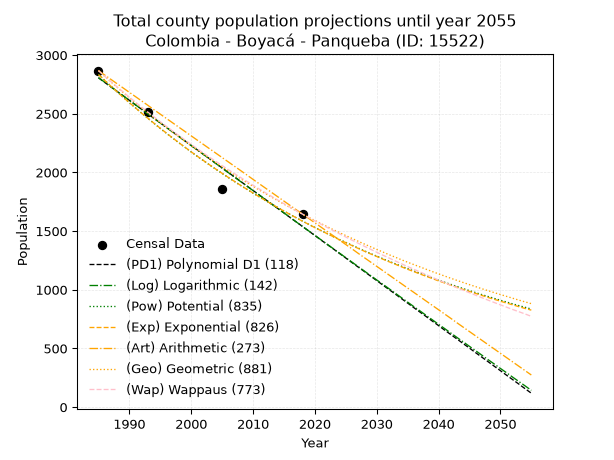
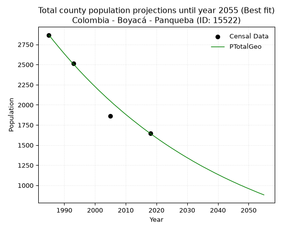
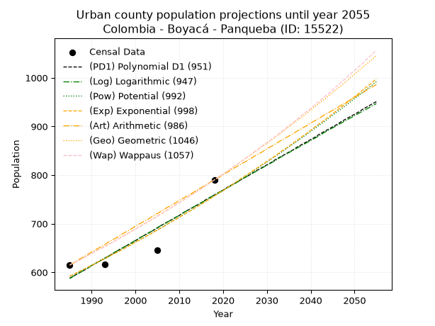
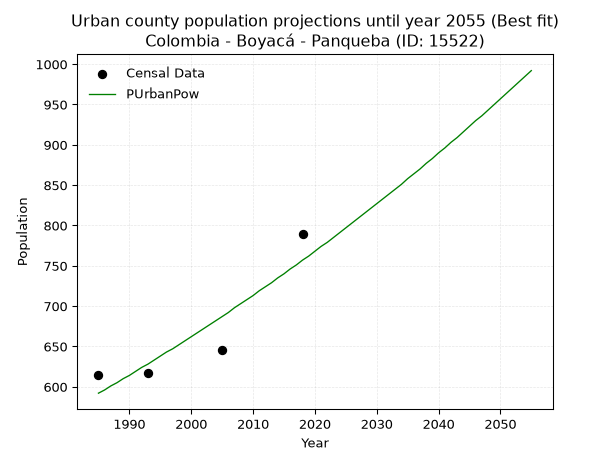
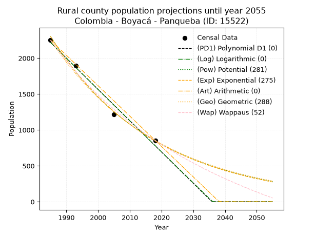
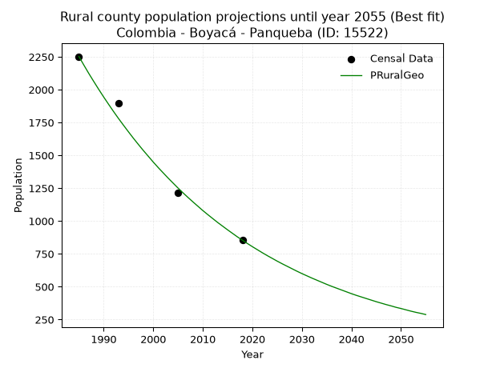

<div align="center">


</div>

# _“Population and Public Services Demand Projections (PPSD) until Year 2050 for Colombia - Boyacá - Panqueba (ID: 15522)”_
Keywords: `population` `public-service` `projection` `lineal` `polynomial` `logarithmic` `potential` `exponential` `arithmetic` `geometric` `wappaus` `dane` `colombia` `south-america`

PPSD are analytical estimates used by governments and planners to anticipate future changes in population size, age distribution, and the resulting community needs for utilities, healthcare, education, and infrastructure as sizing future water treatment facilities, electrical grids, and road networks based on spatial growth.

> **General running parameters**: • app_version: _v20260806_. • Python version: _3.14.7_. • Pandas version: _3.0.5_. • NumPy version: _2.5.1_. • Creates, save and include plots into reports (create_plot): _True_. • Projection until year: _2050_. • Process polynomial degree 2 and up: _False_. • Process Wappaus: _True_. • Process Wappaus: _True_. • Set negative values to zero: _True_. • Set infinite values to zero: _True_. • Drop dataset notes: _True_. 
<div align="center">

Dynamic map: [:earth_americas:Google](http://maps.google.com/maps?q=6.443415809,-72.4594237) [:earth_americas:OSM](https://www.openstreetmap.org/#map=18/6.443415809/-72.4594237&layers=P) [:earth_americas:Bing](https://www.bing.com/maps?cp=6.443415809~-72.4594237&lvl=18) [:earth_americas:Apple](https://maps.apple.com/frame?center=6.443415809%2C-72.4594237&span=0.003%2C0.006)

</div>


<div align="center">

```geojson
{
  "type": "Feature",
  "geometry": {
    "type": "Point", 
    "coordinates": [-72.4594237, 6.443415809]
  }, 
  "properties": {
    "Name": "Colombia - Boyacá - Panqueba (ID: 15522)"
  }
}
```

</div>


## 0. Census Data (4 records)

Census data are official statistics collected by a government about the people and housing in a country. They usually include counts of total population, age, sex, race, income, education, and jobs.

📅Global census file: [Population.xlsx](../data/Population.xlsx)

| Source   |   Year |   CountryID | CountryName   |   StateID | StateName   |   CountyID | CountyName   |   PTotal |   PUrban |   PRural |
|:---------|-------:|------------:|:--------------|----------:|:------------|-----------:|:-------------|---------:|---------:|---------:|
| DANE     |   1985 |          57 | Colombia      |        15 | Boyacá      |      15522 | Panqueba     |     2867 |      615 |     2252 |
| DANE     |   1993 |          57 | Colombia      |        15 | Boyacá      |      15522 | Panqueba     |     2511 |      617 |     1894 |
| DANE     |   2005 |          57 | Colombia      |        15 | Boyacá      |      15522 | Panqueba     |     1859 |      645 |     1214 |
| DANE     |   2018 |          57 | Colombia      |        15 | Boyacá      |      15522 | Panqueba     |     1644 |      790 |      854 |

> 🔥Some records has specific notes about the registered values or the corresponding urban or rural distribution.

## 1. Total

### 1.1. Coefficients and Parameters

* (PD1) Polynomial Deg 1: -38.40264953833785, 79035.14973906027 (lineal)
* (Log) Logarithmic: -76902.8509525795, 586759.4363513283
* (Pow) Potential: -35.26399244187157, 119.74472727396129
* (Exp) Exponential: -0.01761214781172339, 4.317609245197075e+18
* (Art) Arithmetic: Year diff. 2018 - 1985 = 33, Population diff. 1644 - 2867 = -1223, Annual growth = -37.06060606060606
* (Geo) Geometric: Year diff. 2018 - 1985 = 33, Population diff. 1644 - 2867 = -1223, Annual growth % = -0.01671133240159539
* (Wap) Wappaus: i = -1.6431215278477527, Condition values only valid for < 200)

<sub>
Wappaus condition values: ['-0.00', '-1.64', '-3.29', '-4.93', '-6.57', '-8.22', '-9.86', '-11.50', '-13.14', '-14.79', '-16.43', '-18.07', '-19.72', '-21.36', '-23.00', '-24.65', '-26.29', '-27.93', '-29.58', '-31.22', '-32.86', '-34.51', '-36.15', '-37.79', '-39.43', '-41.08', '-42.72', '-44.36', '-46.01', '-47.65', '-49.29', '-50.94', '-52.58', '-54.22', '-55.87', '-57.51', '-59.15', '-60.80', '-62.44', '-64.08', '-65.72', '-67.37', '-69.01', '-70.65', '-72.30', '-73.94', '-75.58', '-77.23', '-78.87', '-80.51', '-82.16', '-83.80', '-85.44', '-87.09', '-88.73', '-90.37', '-92.01', '-93.66', '-95.30', '-96.94', '-98.59', '-100.23', '-101.87', '-103.52', '-105.16', '-106.80']
</sub>


### 1.2. Projected Dataset

|   Year |   CountyID |   PTotalPD1 |   PTotalLog |   PTotalPow |   PTotalExp |   PTotalArt |   PTotalGeo |   PTotalWap |
|-------:|-----------:|------------:|------------:|------------:|------------:|------------:|------------:|------------:|
|   1985 |      15522 |        2806 |        2807 |        2835 |        2833 |        2867 |        2867 |        2867 |
|   1986 |      15522 |        2767 |        2769 |        2785 |        2784 |        2830 |        2819 |        2820 |
|   1987 |      15522 |        2729 |        2730 |        2736 |        2735 |        2793 |        2772 |        2774 |
|   1988 |      15522 |        2691 |        2691 |        2688 |        2687 |        2756 |        2726 |        2729 |
|   1989 |      15522 |        2652 |        2653 |        2641 |        2640 |        2719 |        2680 |        2685 |
|   1990 |      15522 |        2614 |        2614 |        2594 |        2594 |        2682 |        2635 |        2641 |
|   1991 |      15522 |        2575 |        2575 |        2549 |        2549 |        2645 |        2591 |        2598 |
|   1992 |      15522 |        2537 |        2537 |        2504 |        2504 |        2608 |        2548 |        2555 |
|   1993 |      15522 |        2499 |        2498 |        2460 |        2461 |        2571 |        2505 |        2513 |
|   1994 |      15522 |        2460 |        2459 |        2417 |        2418 |        2533 |        2464 |        2472 |
|   1995 |      15522 |        2422 |        2421 |        2374 |        2376 |        2496 |        2422 |        2432 |
|   1996 |      15522 |        2383 |        2382 |        2333 |        2334 |        2459 |        2382 |        2392 |
|   1997 |      15522 |        2345 |        2344 |        2292 |        2293 |        2422 |        2342 |        2352 |
|   1998 |      15522 |        2307 |        2305 |        2252 |        2253 |        2385 |        2303 |        2314 |
|   1999 |      15522 |        2268 |        2267 |        2213 |        2214 |        2348 |        2264 |        2276 |
|   2000 |      15522 |        2230 |        2228 |        2174 |        2175 |        2311 |        2227 |        2238 |
|   2001 |      15522 |        2191 |        2190 |        2136 |        2137 |        2274 |        2189 |        2201 |
|   2002 |      15522 |        2153 |        2152 |        2099 |        2100 |        2237 |        2153 |        2164 |
|   2003 |      15522 |        2115 |        2113 |        2062 |        2063 |        2200 |        2117 |        2128 |
|   2004 |      15522 |        2076 |        2075 |        2026 |        2027 |        2163 |        2081 |        2093 |
|   2005 |      15522 |        2038 |        2036 |        1991 |        1992 |        2126 |        2047 |        2058 |
|   2006 |      15522 |        1999 |        1998 |        1956 |        1957 |        2089 |        2012 |        2023 |
|   2007 |      15522 |        1961 |        1960 |        1922 |        1923 |        2052 |        1979 |        1989 |
|   2008 |      15522 |        1923 |        1921 |        1888 |        1889 |        2015 |        1946 |        1956 |
|   2009 |      15522 |        1884 |        1883 |        1856 |        1856 |        1978 |        1913 |        1923 |
|   2010 |      15522 |        1846 |        1845 |        1823 |        1824 |        1940 |        1881 |        1890 |
|   2011 |      15522 |        1807 |        1807 |        1792 |        1792 |        1903 |        1850 |        1858 |
|   2012 |      15522 |        1769 |        1768 |        1760 |        1761 |        1866 |        1819 |        1826 |
|   2013 |      15522 |        1731 |        1730 |        1730 |        1730 |        1829 |        1789 |        1795 |
|   2014 |      15522 |        1692 |        1692 |        1700 |        1700 |        1792 |        1759 |        1764 |
|   2015 |      15522 |        1654 |        1654 |        1670 |        1670 |        1755 |        1729 |        1733 |
|   2016 |      15522 |        1615 |        1616 |        1641 |        1641 |        1718 |        1700 |        1703 |
|   2017 |      15522 |        1577 |        1577 |        1613 |        1612 |        1681 |        1672 |        1673 |
|   2018 |      15522 |        1539 |        1539 |        1585 |        1584 |        1644 |        1644 |        1644 |
|   2019 |      15522 |        1500 |        1501 |        1557 |        1557 |        1607 |        1617 |        1615 |
|   2020 |      15522 |        1462 |        1463 |        1531 |        1529 |        1570 |        1590 |        1586 |
|   2021 |      15522 |        1423 |        1425 |        1504 |        1503 |        1533 |        1563 |        1558 |
|   2022 |      15522 |        1385 |        1387 |        1478 |        1477 |        1496 |        1537 |        1530 |
|   2023 |      15522 |        1347 |        1349 |        1452 |        1451 |        1459 |        1511 |        1503 |
|   2024 |      15522 |        1308 |        1311 |        1427 |        1425 |        1422 |        1486 |        1476 |
|   2025 |      15522 |        1270 |        1273 |        1403 |        1401 |        1385 |        1461 |        1449 |
|   2026 |      15522 |        1231 |        1235 |        1379 |        1376 |        1348 |        1437 |        1422 |
|   2027 |      15522 |        1193 |        1197 |        1355 |        1352 |        1310 |        1413 |        1396 |
|   2028 |      15522 |        1155 |        1159 |        1331 |        1328 |        1273 |        1389 |        1370 |
|   2029 |      15522 |        1116 |        1121 |        1308 |        1305 |        1236 |        1366 |        1345 |
|   2030 |      15522 |        1078 |        1083 |        1286 |        1283 |        1199 |        1343 |        1319 |
|   2031 |      15522 |        1039 |        1046 |        1264 |        1260 |        1162 |        1321 |        1294 |
|   2032 |      15522 |        1001 |        1008 |        1242 |        1238 |        1125 |        1298 |        1270 |
|   2033 |      15522 |         963 |         970 |        1221 |        1217 |        1088 |        1277 |        1245 |
|   2034 |      15522 |         924 |         932 |        1200 |        1195 |        1051 |        1255 |        1221 |
|   2035 |      15522 |         886 |         894 |        1179 |        1174 |        1014 |        1234 |        1197 |
|   2036 |      15522 |         847 |         856 |        1159 |        1154 |         977 |        1214 |        1174 |
|   2037 |      15522 |         809 |         819 |        1139 |        1134 |         940 |        1194 |        1151 |
|   2038 |      15522 |         771 |         781 |        1119 |        1114 |         903 |        1174 |        1128 |
|   2039 |      15522 |         732 |         743 |        1100 |        1095 |         866 |        1154 |        1105 |
|   2040 |      15522 |         694 |         705 |        1081 |        1075 |         829 |        1135 |        1082 |
|   2041 |      15522 |         655 |         668 |        1063 |        1057 |         792 |        1116 |        1060 |
|   2042 |      15522 |         617 |         630 |        1045 |        1038 |         755 |        1097 |        1038 |
|   2043 |      15522 |         579 |         592 |        1027 |        1020 |         717 |        1079 |        1016 |
|   2044 |      15522 |         540 |         555 |        1009 |        1002 |         680 |        1061 |         995 |
|   2045 |      15522 |         502 |         517 |         992 |         985 |         643 |        1043 |         974 |
|   2046 |      15522 |         463 |         480 |         975 |         968 |         606 |        1026 |         953 |
|   2047 |      15522 |         425 |         442 |         958 |         951 |         569 |        1008 |         932 |
|   2048 |      15522 |         387 |         404 |         942 |         934 |         532 |         992 |         911 |
|   2049 |      15522 |         348 |         367 |         926 |         918 |         495 |         975 |         891 |
|   2050 |      15522 |         310 |         329 |         910 |         902 |         458 |         959 |         871 |
<div align="center">

</img>

</div>


### 1.3. Best fit with absolute error and relative error (%)

Relative error puts that difference into context by dividing the absolute error by the true value, creating a unitless ratio or percentage that shows the scale of the mistake.

Absolute and relative error

|   Year | Source   |   CountryID | CountryName   |   StateID | StateName   |   CountyID_x | CountyName   |   PTotal |   PUrban |   PRural |   CountyID_y |   PTotalPD1 |   PTotalLog |   PTotalPow |   PTotalExp |   PTotalArt |   PTotalGeo |   PTotalWap |   PTotalPD1AbsError |   PTotalLogAbsError |   PTotalPowAbsError |   PTotalExpAbsError |   PTotalArtAbsError |   PTotalGeoAbsError |   PTotalWapAbsError |   PTotalPD1RelError |   PTotalLogRelError |   PTotalPowRelError |   PTotalExpRelError |   PTotalArtRelError |   PTotalGeoRelError |   PTotalWapRelError |
|-------:|:---------|------------:|:--------------|----------:|:------------|-------------:|:-------------|---------:|---------:|---------:|-------------:|------------:|------------:|------------:|------------:|------------:|------------:|------------:|--------------------:|--------------------:|--------------------:|--------------------:|--------------------:|--------------------:|--------------------:|--------------------:|--------------------:|--------------------:|--------------------:|--------------------:|--------------------:|--------------------:|
|   1985 | DANE     |          57 | Colombia      |        15 | Boyacá      |        15522 | Panqueba     |     2867 |      615 |     2252 |        15522 |        2806 |        2807 |        2835 |        2833 |        2867 |        2867 |        2867 |                  61 |                  60 |                  32 |                  34 |                   0 |                   0 |                   0 |            2.12766  |            2.09278  |             1.11615 |             1.18591 |             0       |            0        |           0         |
|   1993 | DANE     |          57 | Colombia      |        15 | Boyacá      |        15522 | Panqueba     |     2511 |      617 |     1894 |        15522 |        2499 |        2498 |        2460 |        2461 |        2571 |        2505 |        2513 |                  12 |                  13 |                  51 |                  50 |                  60 |                   6 |                   2 |            0.477897 |            0.517722 |             2.03106 |             1.99124 |             2.38949 |            0.238949 |           0.0796495 |
|   2005 | DANE     |          57 | Colombia      |        15 | Boyacá      |        15522 | Panqueba     |     1859 |      645 |     1214 |        15522 |        2038 |        2036 |        1991 |        1992 |        2126 |        2047 |        2058 |                 179 |                 177 |                 132 |                 133 |                 267 |                 188 |                 199 |            9.62883  |            9.52125  |             7.10059 |             7.15438 |            14.3626  |           10.113    |          10.7047    |
|   2018 | DANE     |          57 | Colombia      |        15 | Boyacá      |        15522 | Panqueba     |     1644 |      790 |      854 |        15522 |        1539 |        1539 |        1585 |        1584 |        1644 |        1644 |        1644 |                 105 |                 105 |                  59 |                  60 |                   0 |                   0 |                   0 |            6.38686  |            6.38686  |             3.58881 |             3.64964 |             0       |            0        |           0         |

Relative error mean

| Method    |   RelError | Best   |
|:----------|-----------:|:-------|
| PTotalPD1 |    4.65531 |        |
| PTotalLog |    4.62965 |        |
| PTotalPow |    3.45915 |        |
| PTotalExp |    3.49529 |        |
| PTotalArt |    4.18801 |        |
| PTotalGeo |    2.58798 | True   |
| PTotalWap |    2.69608 |        |

💙Best method: _**PTotalGeo**_
<div align="center">

</img>

</div>


### 1.4. Fresh water supply demand in liters per capita per day (lpcd)

The fresh water supply demand typically ranges from 100 to 300 liters per capita per day (lpcd) for standard domestic and municipal planning, though absolute survival minimums set by the World Health Organization are as low as 7.5 to 20 liters per day, and total consumption in high-income nations can exceed 400 liters.

> `CZ`: Level in meters above the sea level (masl).<br> `WS`: Fresh water supply demand in liters per capita per day (lpcd or l/h/d).<br> `WSAll`: Zonal fresh water supply demand in liters per second (l/s).<br> `A`: Zonal area in square meters.

Reference values (RAS Colombia)

|    CZ |   WS |
|------:|-----:|
|  1000 |  120 |
|  2000 |  130 |
| 99999 |  140 |

County shapefile geometry properties and water supply values

|   CountyID |      ATotal |   CZTotal |   WSTotal |
|-----------:|------------:|----------:|----------:|
|      15522 | 3.96239e+07 |   2774.01 |       140 |

Projected values for best method: PTotalGeo

|   CountyID |   Year |   PTotalGeo |   WSTotal |   WSTotalAll |
|-----------:|-------:|------------:|----------:|-------------:|
|      15522 |   1985 |        2867 |       140 |      4.6456  |
|      15522 |   1986 |        2819 |       140 |      4.56782 |
|      15522 |   1987 |        2772 |       140 |      4.49167 |
|      15522 |   1988 |        2726 |       140 |      4.41713 |
|      15522 |   1989 |        2680 |       140 |      4.34259 |
|      15522 |   1990 |        2635 |       140 |      4.26968 |
|      15522 |   1991 |        2591 |       140 |      4.19838 |
|      15522 |   1992 |        2548 |       140 |      4.1287  |
|      15522 |   1993 |        2505 |       140 |      4.05903 |
|      15522 |   1994 |        2464 |       140 |      3.99259 |
|      15522 |   1995 |        2422 |       140 |      3.92454 |
|      15522 |   1996 |        2382 |       140 |      3.85972 |
|      15522 |   1997 |        2342 |       140 |      3.79491 |
|      15522 |   1998 |        2303 |       140 |      3.73171 |
|      15522 |   1999 |        2264 |       140 |      3.66852 |
|      15522 |   2000 |        2227 |       140 |      3.60856 |
|      15522 |   2001 |        2189 |       140 |      3.54699 |
|      15522 |   2002 |        2153 |       140 |      3.48866 |
|      15522 |   2003 |        2117 |       140 |      3.43032 |
|      15522 |   2004 |        2081 |       140 |      3.37199 |
|      15522 |   2005 |        2047 |       140 |      3.3169  |
|      15522 |   2006 |        2012 |       140 |      3.26019 |
|      15522 |   2007 |        1979 |       140 |      3.20671 |
|      15522 |   2008 |        1946 |       140 |      3.15324 |
|      15522 |   2009 |        1913 |       140 |      3.09977 |
|      15522 |   2010 |        1881 |       140 |      3.04792 |
|      15522 |   2011 |        1850 |       140 |      2.99769 |
|      15522 |   2012 |        1819 |       140 |      2.94745 |
|      15522 |   2013 |        1789 |       140 |      2.89884 |
|      15522 |   2014 |        1759 |       140 |      2.85023 |
|      15522 |   2015 |        1729 |       140 |      2.80162 |
|      15522 |   2016 |        1700 |       140 |      2.75463 |
|      15522 |   2017 |        1672 |       140 |      2.70926 |
|      15522 |   2018 |        1644 |       140 |      2.66389 |
|      15522 |   2019 |        1617 |       140 |      2.62014 |
|      15522 |   2020 |        1590 |       140 |      2.57639 |
|      15522 |   2021 |        1563 |       140 |      2.53264 |
|      15522 |   2022 |        1537 |       140 |      2.49051 |
|      15522 |   2023 |        1511 |       140 |      2.44838 |
|      15522 |   2024 |        1486 |       140 |      2.40787 |
|      15522 |   2025 |        1461 |       140 |      2.36736 |
|      15522 |   2026 |        1437 |       140 |      2.32847 |
|      15522 |   2027 |        1413 |       140 |      2.28958 |
|      15522 |   2028 |        1389 |       140 |      2.25069 |
|      15522 |   2029 |        1366 |       140 |      2.21343 |
|      15522 |   2030 |        1343 |       140 |      2.17616 |
|      15522 |   2031 |        1321 |       140 |      2.14051 |
|      15522 |   2032 |        1298 |       140 |      2.10324 |
|      15522 |   2033 |        1277 |       140 |      2.06921 |
|      15522 |   2034 |        1255 |       140 |      2.03356 |
|      15522 |   2035 |        1234 |       140 |      1.99954 |
|      15522 |   2036 |        1214 |       140 |      1.96713 |
|      15522 |   2037 |        1194 |       140 |      1.93472 |
|      15522 |   2038 |        1174 |       140 |      1.90231 |
|      15522 |   2039 |        1154 |       140 |      1.86991 |
|      15522 |   2040 |        1135 |       140 |      1.83912 |
|      15522 |   2041 |        1116 |       140 |      1.80833 |
|      15522 |   2042 |        1097 |       140 |      1.77755 |
|      15522 |   2043 |        1079 |       140 |      1.74838 |
|      15522 |   2044 |        1061 |       140 |      1.71921 |
|      15522 |   2045 |        1043 |       140 |      1.69005 |
|      15522 |   2046 |        1026 |       140 |      1.6625  |
|      15522 |   2047 |        1008 |       140 |      1.63333 |
|      15522 |   2048 |         992 |       140 |      1.60741 |
|      15522 |   2049 |         975 |       140 |      1.57986 |
|      15522 |   2050 |         959 |       140 |      1.55394 |

## 2. Urban

### 2.1. Coefficients and Parameters

* (PD1) Polynomial Deg 1: 5.193496587715685, -9721.541549578298 (lineal)
* (Log) Logarithmic: 10383.782070124123, -78260.46072542077
* (Pow) Potential: 14.921714469884924, -46.43612431416663
* (Exp) Exponential: 0.007462840271939545, 0.00021809002636277535
* (Art) Arithmetic: Year diff. 2018 - 1985 = 33, Population diff. 790 - 615 = 175, Annual growth = 5.303030303030303
* (Geo) Geometric: Year diff. 2018 - 1985 = 33, Population diff. 790 - 615 = 175, Annual growth % = 0.007617065721481575
* (Wap) Wappaus: i = 0.7548797584384773, Condition values only valid for < 200)

<sub>
Wappaus condition values: ['0.00', '0.75', '1.51', '2.26', '3.02', '3.77', '4.53', '5.28', '6.04', '6.79', '7.55', '8.30', '9.06', '9.81', '10.57', '11.32', '12.08', '12.83', '13.59', '14.34', '15.10', '15.85', '16.61', '17.36', '18.12', '18.87', '19.63', '20.38', '21.14', '21.89', '22.65', '23.40', '24.16', '24.91', '25.67', '26.42', '27.18', '27.93', '28.69', '29.44', '30.20', '30.95', '31.70', '32.46', '33.21', '33.97', '34.72', '35.48', '36.23', '36.99', '37.74', '38.50', '39.25', '40.01', '40.76', '41.52', '42.27', '43.03', '43.78', '44.54', '45.29', '46.05', '46.80', '47.56', '48.31', '49.07']
</sub>


### 2.2. Projected Dataset

|   Year |   CountyID |   PUrbanPD1 |   PUrbanLog |   PUrbanPow |   PUrbanExp |   PUrbanArt |   PUrbanGeo |   PUrbanWap |
|-------:|-----------:|------------:|------------:|------------:|------------:|------------:|------------:|------------:|
|   1985 |      15522 |         588 |         587 |         592 |         592 |         615 |         615 |         615 |
|   1986 |      15522 |         593 |         593 |         596 |         596 |         620 |         620 |         620 |
|   1987 |      15522 |         598 |         598 |         601 |         601 |         626 |         624 |         624 |
|   1988 |      15522 |         603 |         603 |         605 |         605 |         631 |         629 |         629 |
|   1989 |      15522 |         608 |         608 |         610 |         610 |         636 |         634 |         634 |
|   1990 |      15522 |         614 |         614 |         614 |         614 |         642 |         639 |         639 |
|   1991 |      15522 |         619 |         619 |         619 |         619 |         647 |         644 |         644 |
|   1992 |      15522 |         624 |         624 |         624 |         624 |         652 |         649 |         648 |
|   1993 |      15522 |         629 |         629 |         628 |         628 |         657 |         653 |         653 |
|   1994 |      15522 |         634 |         634 |         633 |         633 |         663 |         658 |         658 |
|   1995 |      15522 |         639 |         640 |         638 |         638 |         668 |         663 |         663 |
|   1996 |      15522 |         645 |         645 |         643 |         642 |         673 |         669 |         668 |
|   1997 |      15522 |         650 |         650 |         647 |         647 |         679 |         674 |         673 |
|   1998 |      15522 |         655 |         655 |         652 |         652 |         684 |         679 |         678 |
|   1999 |      15522 |         660 |         660 |         657 |         657 |         689 |         684 |         684 |
|   2000 |      15522 |         665 |         666 |         662 |         662 |         695 |         689 |         689 |
|   2001 |      15522 |         671 |         671 |         667 |         667 |         700 |         694 |         694 |
|   2002 |      15522 |         676 |         676 |         672 |         672 |         705 |         700 |         699 |
|   2003 |      15522 |         681 |         681 |         677 |         677 |         710 |         705 |         705 |
|   2004 |      15522 |         686 |         686 |         682 |         682 |         716 |         710 |         710 |
|   2005 |      15522 |         691 |         692 |         687 |         687 |         721 |         716 |         715 |
|   2006 |      15522 |         697 |         697 |         692 |         692 |         726 |         721 |         721 |
|   2007 |      15522 |         702 |         702 |         698 |         697 |         732 |         727 |         726 |
|   2008 |      15522 |         707 |         707 |         703 |         703 |         737 |         732 |         732 |
|   2009 |      15522 |         712 |         712 |         708 |         708 |         742 |         738 |         738 |
|   2010 |      15522 |         717 |         717 |         713 |         713 |         748 |         743 |         743 |
|   2011 |      15522 |         723 |         723 |         719 |         719 |         753 |         749 |         749 |
|   2012 |      15522 |         728 |         728 |         724 |         724 |         758 |         755 |         755 |
|   2013 |      15522 |         733 |         733 |         729 |         729 |         763 |         761 |         760 |
|   2014 |      15522 |         738 |         738 |         735 |         735 |         769 |         766 |         766 |
|   2015 |      15522 |         743 |         743 |         740 |         740 |         774 |         772 |         772 |
|   2016 |      15522 |         749 |         748 |         746 |         746 |         779 |         778 |         778 |
|   2017 |      15522 |         754 |         754 |         751 |         751 |         785 |         784 |         784 |
|   2018 |      15522 |         759 |         759 |         757 |         757 |         790 |         790 |         790 |
|   2019 |      15522 |         764 |         764 |         762 |         763 |         795 |         796 |         796 |
|   2020 |      15522 |         769 |         769 |         768 |         768 |         801 |         802 |         802 |
|   2021 |      15522 |         775 |         774 |         774 |         774 |         806 |         808 |         808 |
|   2022 |      15522 |         780 |         779 |         779 |         780 |         811 |         814 |         815 |
|   2023 |      15522 |         785 |         784 |         785 |         786 |         817 |         821 |         821 |
|   2024 |      15522 |         790 |         790 |         791 |         792 |         822 |         827 |         827 |
|   2025 |      15522 |         795 |         795 |         797 |         798 |         827 |         833 |         834 |
|   2026 |      15522 |         800 |         800 |         803 |         804 |         832 |         839 |         840 |
|   2027 |      15522 |         806 |         805 |         809 |         810 |         838 |         846 |         847 |
|   2028 |      15522 |         811 |         810 |         815 |         816 |         843 |         852 |         853 |
|   2029 |      15522 |         816 |         815 |         821 |         822 |         848 |         859 |         860 |
|   2030 |      15522 |         821 |         820 |         827 |         828 |         854 |         865 |         867 |
|   2031 |      15522 |         826 |         825 |         833 |         834 |         859 |         872 |         873 |
|   2032 |      15522 |         832 |         830 |         839 |         840 |         864 |         879 |         880 |
|   2033 |      15522 |         837 |         836 |         845 |         847 |         870 |         885 |         887 |
|   2034 |      15522 |         842 |         841 |         851 |         853 |         875 |         892 |         894 |
|   2035 |      15522 |         847 |         846 |         858 |         859 |         880 |         899 |         901 |
|   2036 |      15522 |         852 |         851 |         864 |         866 |         885 |         906 |         908 |
|   2037 |      15522 |         858 |         856 |         870 |         872 |         891 |         913 |         915 |
|   2038 |      15522 |         863 |         861 |         877 |         879 |         896 |         919 |         923 |
|   2039 |      15522 |         868 |         866 |         883 |         885 |         901 |         926 |         930 |
|   2040 |      15522 |         873 |         871 |         890 |         892 |         907 |         934 |         937 |
|   2041 |      15522 |         878 |         876 |         896 |         899 |         912 |         941 |         945 |
|   2042 |      15522 |         884 |         881 |         903 |         906 |         917 |         948 |         952 |
|   2043 |      15522 |         889 |         887 |         909 |         912 |         923 |         955 |         960 |
|   2044 |      15522 |         894 |         892 |         916 |         919 |         928 |         962 |         967 |
|   2045 |      15522 |         899 |         897 |         923 |         926 |         933 |         970 |         975 |
|   2046 |      15522 |         904 |         902 |         930 |         933 |         938 |         977 |         983 |
|   2047 |      15522 |         910 |         907 |         936 |         940 |         944 |         984 |         991 |
|   2048 |      15522 |         915 |         912 |         943 |         947 |         949 |         992 |         999 |
|   2049 |      15522 |         920 |         917 |         950 |         954 |         954 |        1000 |        1007 |
|   2050 |      15522 |         925 |         922 |         957 |         961 |         960 |        1007 |        1015 |
<div align="center">

</img>

</div>


### 2.3. Best fit with absolute error and relative error (%)

Relative error puts that difference into context by dividing the absolute error by the true value, creating a unitless ratio or percentage that shows the scale of the mistake.

Absolute and relative error

|   Year | Source   |   CountryID | CountryName   |   StateID | StateName   |   CountyID_x | CountyName   |   PTotal |   PUrban |   PRural |   CountyID_y |   PUrbanPD1 |   PUrbanLog |   PUrbanPow |   PUrbanExp |   PUrbanArt |   PUrbanGeo |   PUrbanWap |   PUrbanPD1AbsError |   PUrbanLogAbsError |   PUrbanPowAbsError |   PUrbanExpAbsError |   PUrbanArtAbsError |   PUrbanGeoAbsError |   PUrbanWapAbsError |   PUrbanPD1RelError |   PUrbanLogRelError |   PUrbanPowRelError |   PUrbanExpRelError |   PUrbanArtRelError |   PUrbanGeoRelError |   PUrbanWapRelError |
|-------:|:---------|------------:|:--------------|----------:|:------------|-------------:|:-------------|---------:|---------:|---------:|-------------:|------------:|------------:|------------:|------------:|------------:|------------:|------------:|--------------------:|--------------------:|--------------------:|--------------------:|--------------------:|--------------------:|--------------------:|--------------------:|--------------------:|--------------------:|--------------------:|--------------------:|--------------------:|--------------------:|
|   1985 | DANE     |          57 | Colombia      |        15 | Boyacá      |        15522 | Panqueba     |     2867 |      615 |     2252 |        15522 |         588 |         587 |         592 |         592 |         615 |         615 |         615 |                  27 |                  28 |                  23 |                  23 |                   0 |                   0 |                   0 |             4.39024 |             4.55285 |             3.73984 |             3.73984 |             0       |             0       |             0       |
|   1993 | DANE     |          57 | Colombia      |        15 | Boyacá      |        15522 | Panqueba     |     2511 |      617 |     1894 |        15522 |         629 |         629 |         628 |         628 |         657 |         653 |         653 |                  12 |                  12 |                  11 |                  11 |                  40 |                  36 |                  36 |             1.94489 |             1.94489 |             1.78282 |             1.78282 |             6.48298 |             5.83468 |             5.83468 |
|   2005 | DANE     |          57 | Colombia      |        15 | Boyacá      |        15522 | Panqueba     |     1859 |      645 |     1214 |        15522 |         691 |         692 |         687 |         687 |         721 |         716 |         715 |                  46 |                  47 |                  42 |                  42 |                  76 |                  71 |                  70 |             7.13178 |             7.28682 |             6.51163 |             6.51163 |            11.7829  |            11.0078  |            10.8527  |
|   2018 | DANE     |          57 | Colombia      |        15 | Boyacá      |        15522 | Panqueba     |     1644 |      790 |      854 |        15522 |         759 |         759 |         757 |         757 |         790 |         790 |         790 |                  31 |                  31 |                  33 |                  33 |                   0 |                   0 |                   0 |             3.92405 |             3.92405 |             4.17722 |             4.17722 |             0       |             0       |             0       |

Relative error mean

| Method    |   RelError | Best   |
|:----------|-----------:|:-------|
| PUrbanPD1 |    4.34774 |        |
| PUrbanLog |    4.42715 |        |
| PUrbanPow |    4.05288 | True   |
| PUrbanExp |    4.05288 | True   |
| PUrbanArt |    4.56648 |        |
| PUrbanGeo |    4.21061 |        |
| PUrbanWap |    4.17185 |        |

💙Best method: _**PUrbanPow**_
<div align="center">

</img>

</div>


### 2.4. Fresh water supply demand in liters per capita per day (lpcd)

The fresh water supply demand typically ranges from 100 to 300 liters per capita per day (lpcd) for standard domestic and municipal planning, though absolute survival minimums set by the World Health Organization are as low as 7.5 to 20 liters per day, and total consumption in high-income nations can exceed 400 liters.

> `CZ`: Level in meters above the sea level (masl).<br> `WS`: Fresh water supply demand in liters per capita per day (lpcd or l/h/d).<br> `WSAll`: Zonal fresh water supply demand in liters per second (l/s).<br> `A`: Zonal area in square meters.

Reference values (RAS Colombia)

|    CZ |   WS |
|------:|-----:|
|  1000 |  120 |
|  2000 |  130 |
| 99999 |  140 |

County shapefile geometry properties and water supply values

|   CountyID |   AUrban |   CZUrban |   WSUrban |
|-----------:|---------:|----------:|----------:|
|      15522 |   228135 |   2235.96 |       140 |

Projected values for best method: PUrbanPow

|   CountyID |   Year |   PUrbanPow |   WSUrban |   WSUrbanAll |
|-----------:|-------:|------------:|----------:|-------------:|
|      15522 |   1985 |         592 |       140 |     0.959259 |
|      15522 |   1986 |         596 |       140 |     0.965741 |
|      15522 |   1987 |         601 |       140 |     0.973843 |
|      15522 |   1988 |         605 |       140 |     0.980324 |
|      15522 |   1989 |         610 |       140 |     0.988426 |
|      15522 |   1990 |         614 |       140 |     0.994907 |
|      15522 |   1991 |         619 |       140 |     1.00301  |
|      15522 |   1992 |         624 |       140 |     1.01111  |
|      15522 |   1993 |         628 |       140 |     1.01759  |
|      15522 |   1994 |         633 |       140 |     1.02569  |
|      15522 |   1995 |         638 |       140 |     1.0338   |
|      15522 |   1996 |         643 |       140 |     1.0419   |
|      15522 |   1997 |         647 |       140 |     1.04838  |
|      15522 |   1998 |         652 |       140 |     1.05648  |
|      15522 |   1999 |         657 |       140 |     1.06458  |
|      15522 |   2000 |         662 |       140 |     1.07269  |
|      15522 |   2001 |         667 |       140 |     1.08079  |
|      15522 |   2002 |         672 |       140 |     1.08889  |
|      15522 |   2003 |         677 |       140 |     1.09699  |
|      15522 |   2004 |         682 |       140 |     1.10509  |
|      15522 |   2005 |         687 |       140 |     1.11319  |
|      15522 |   2006 |         692 |       140 |     1.1213   |
|      15522 |   2007 |         698 |       140 |     1.13102  |
|      15522 |   2008 |         703 |       140 |     1.13912  |
|      15522 |   2009 |         708 |       140 |     1.14722  |
|      15522 |   2010 |         713 |       140 |     1.15532  |
|      15522 |   2011 |         719 |       140 |     1.16505  |
|      15522 |   2012 |         724 |       140 |     1.17315  |
|      15522 |   2013 |         729 |       140 |     1.18125  |
|      15522 |   2014 |         735 |       140 |     1.19097  |
|      15522 |   2015 |         740 |       140 |     1.19907  |
|      15522 |   2016 |         746 |       140 |     1.2088   |
|      15522 |   2017 |         751 |       140 |     1.2169   |
|      15522 |   2018 |         757 |       140 |     1.22662  |
|      15522 |   2019 |         762 |       140 |     1.23472  |
|      15522 |   2020 |         768 |       140 |     1.24444  |
|      15522 |   2021 |         774 |       140 |     1.25417  |
|      15522 |   2022 |         779 |       140 |     1.26227  |
|      15522 |   2023 |         785 |       140 |     1.27199  |
|      15522 |   2024 |         791 |       140 |     1.28171  |
|      15522 |   2025 |         797 |       140 |     1.29144  |
|      15522 |   2026 |         803 |       140 |     1.30116  |
|      15522 |   2027 |         809 |       140 |     1.31088  |
|      15522 |   2028 |         815 |       140 |     1.3206   |
|      15522 |   2029 |         821 |       140 |     1.33032  |
|      15522 |   2030 |         827 |       140 |     1.34005  |
|      15522 |   2031 |         833 |       140 |     1.34977  |
|      15522 |   2032 |         839 |       140 |     1.35949  |
|      15522 |   2033 |         845 |       140 |     1.36921  |
|      15522 |   2034 |         851 |       140 |     1.37894  |
|      15522 |   2035 |         858 |       140 |     1.39028  |
|      15522 |   2036 |         864 |       140 |     1.4      |
|      15522 |   2037 |         870 |       140 |     1.40972  |
|      15522 |   2038 |         877 |       140 |     1.42106  |
|      15522 |   2039 |         883 |       140 |     1.43079  |
|      15522 |   2040 |         890 |       140 |     1.44213  |
|      15522 |   2041 |         896 |       140 |     1.45185  |
|      15522 |   2042 |         903 |       140 |     1.46319  |
|      15522 |   2043 |         909 |       140 |     1.47292  |
|      15522 |   2044 |         916 |       140 |     1.48426  |
|      15522 |   2045 |         923 |       140 |     1.4956   |
|      15522 |   2046 |         930 |       140 |     1.50694  |
|      15522 |   2047 |         936 |       140 |     1.51667  |
|      15522 |   2048 |         943 |       140 |     1.52801  |
|      15522 |   2049 |         950 |       140 |     1.53935  |
|      15522 |   2050 |         957 |       140 |     1.55069  |

## 3. Rural

### 3.1. Coefficients and Parameters

* (PD1) Polynomial Deg 1: -43.59614612605351, 88756.69128863854 (lineal)
* (Log) Logarithmic: -87286.63302270361, 665019.8970767489
* (Pow) Potential: -60.71820230590104, 203.59679673762494
* (Exp) Exponential: -0.03033480412031738, 3.259686750443997e+29
* (Art) Arithmetic: Year diff. 2018 - 1985 = 33, Population diff. 854 - 2252 = -1398, Annual growth = -42.36363636363637
* (Geo) Geometric: Year diff. 2018 - 1985 = 33, Population diff. 854 - 2252 = -1398, Annual growth % = -0.028955628484295115
* (Wap) Wappaus: i = -2.7278581045483814, Condition values only valid for < 200)

<sub>
Wappaus condition values: ['-0.00', '-2.73', '-5.46', '-8.18', '-10.91', '-13.64', '-16.37', '-19.10', '-21.82', '-24.55', '-27.28', '-30.01', '-32.73', '-35.46', '-38.19', '-40.92', '-43.65', '-46.37', '-49.10', '-51.83', '-54.56', '-57.29', '-60.01', '-62.74', '-65.47', '-68.20', '-70.92', '-73.65', '-76.38', '-79.11', '-81.84', '-84.56', '-87.29', '-90.02', '-92.75', '-95.48', '-98.20', '-100.93', '-103.66', '-106.39', '-109.11', '-111.84', '-114.57', '-117.30', '-120.03', '-122.75', '-125.48', '-128.21', '-130.94', '-133.67', '-136.39', '-139.12', '-141.85', '-144.58', '-147.30', '-150.03', '-152.76', '-155.49', '-158.22', '-160.94', '-163.67', '-166.40', '-169.13', '-171.86', '-174.58', '-177.31']
</sub>


### 3.2. Projected Dataset

|   Year |   CountyID |   PRuralPD1 |   PRuralLog |   PRuralPow |   PRuralExp |   PRuralArt |   PRuralGeo |   PRuralWap |
|-------:|-----------:|------------:|------------:|------------:|------------:|------------:|------------:|------------:|
|   1985 |      15522 |        2218 |        2220 |        2305 |        2303 |        2252 |        2252 |        2252 |
|   1986 |      15522 |        2175 |        2176 |        2236 |        2234 |        2210 |        2187 |        2191 |
|   1987 |      15522 |        2131 |        2132 |        2168 |        2168 |        2167 |        2123 |        2132 |
|   1988 |      15522 |        2088 |        2088 |        2103 |        2103 |        2125 |        2062 |        2075 |
|   1989 |      15522 |        2044 |        2044 |        2040 |        2040 |        2083 |        2002 |        2019 |
|   1990 |      15522 |        2000 |        2000 |        1979 |        1979 |        2040 |        1944 |        1964 |
|   1991 |      15522 |        1957 |        1956 |        1919 |        1920 |        1998 |        1888 |        1911 |
|   1992 |      15522 |        1913 |        1913 |        1862 |        1862 |        1955 |        1833 |        1859 |
|   1993 |      15522 |        1870 |        1869 |        1806 |        1807 |        1913 |        1780 |        1809 |
|   1994 |      15522 |        1826 |        1825 |        1752 |        1753 |        1871 |        1729 |        1760 |
|   1995 |      15522 |        1782 |        1781 |        1699 |        1700 |        1828 |        1679 |        1711 |
|   1996 |      15522 |        1739 |        1737 |        1648 |        1650 |        1786 |        1630 |        1664 |
|   1997 |      15522 |        1695 |        1694 |        1599 |        1600 |        1744 |        1583 |        1619 |
|   1998 |      15522 |        1652 |        1650 |        1551 |        1553 |        1701 |        1537 |        1574 |
|   1999 |      15522 |        1608 |        1606 |        1504 |        1506 |        1659 |        1493 |        1530 |
|   2000 |      15522 |        1564 |        1563 |        1459 |        1461 |        1617 |        1449 |        1487 |
|   2001 |      15522 |        1521 |        1519 |        1416 |        1418 |        1574 |        1407 |        1445 |
|   2002 |      15522 |        1477 |        1475 |        1374 |        1375 |        1532 |        1367 |        1404 |
|   2003 |      15522 |        1434 |        1432 |        1332 |        1334 |        1489 |        1327 |        1364 |
|   2004 |      15522 |        1390 |        1388 |        1293 |        1294 |        1447 |        1289 |        1325 |
|   2005 |      15522 |        1346 |        1345 |        1254 |        1256 |        1405 |        1251 |        1287 |
|   2006 |      15522 |        1303 |        1301 |        1217 |        1218 |        1362 |        1215 |        1249 |
|   2007 |      15522 |        1259 |        1258 |        1180 |        1182 |        1320 |        1180 |        1212 |
|   2008 |      15522 |        1216 |        1214 |        1145 |        1146 |        1278 |        1146 |        1176 |
|   2009 |      15522 |        1172 |        1171 |        1111 |        1112 |        1235 |        1113 |        1141 |
|   2010 |      15522 |        1128 |        1127 |        1078 |        1079 |        1193 |        1080 |        1107 |
|   2011 |      15522 |        1085 |        1084 |        1046 |        1047 |        1151 |        1049 |        1073 |
|   2012 |      15522 |        1041 |        1041 |        1015 |        1015 |        1108 |        1019 |        1040 |
|   2013 |      15522 |         998 |         997 |         985 |         985 |        1066 |         989 |        1007 |
|   2014 |      15522 |         954 |         954 |         956 |         956 |        1023 |         961 |         975 |
|   2015 |      15522 |         910 |         911 |         927 |         927 |         981 |         933 |         944 |
|   2016 |      15522 |         867 |         867 |         900 |         899 |         939 |         906 |         914 |
|   2017 |      15522 |         823 |         824 |         873 |         872 |         896 |         879 |         883 |
|   2018 |      15522 |         780 |         781 |         847 |         846 |         854 |         854 |         854 |
|   2019 |      15522 |         736 |         737 |         822 |         821 |         812 |         829 |         825 |
|   2020 |      15522 |         692 |         694 |         798 |         797 |         769 |         805 |         797 |
|   2021 |      15522 |         649 |         651 |         774 |         773 |         727 |         782 |         769 |
|   2022 |      15522 |         605 |         608 |         751 |         750 |         685 |         759 |         741 |
|   2023 |      15522 |         562 |         565 |         729 |         727 |         642 |         737 |         714 |
|   2024 |      15522 |         518 |         522 |         707 |         706 |         600 |         716 |         688 |
|   2025 |      15522 |         474 |         478 |         686 |         684 |         557 |         695 |         662 |
|   2026 |      15522 |         431 |         435 |         666 |         664 |         515 |         675 |         637 |
|   2027 |      15522 |         387 |         392 |         647 |         644 |         473 |         656 |         612 |
|   2028 |      15522 |         344 |         349 |         627 |         625 |         430 |         637 |         587 |
|   2029 |      15522 |         300 |         306 |         609 |         606 |         388 |         618 |         563 |
|   2030 |      15522 |         257 |         263 |         591 |         588 |         346 |         600 |         539 |
|   2031 |      15522 |         213 |         220 |         574 |         571 |         303 |         583 |         516 |
|   2032 |      15522 |         169 |         177 |         557 |         554 |         261 |         566 |         493 |
|   2033 |      15522 |         126 |         134 |         540 |         537 |         219 |         550 |         470 |
|   2034 |      15522 |          82 |          91 |         524 |         521 |         176 |         534 |         448 |
|   2035 |      15522 |          39 |          48 |         509 |         505 |         134 |         518 |         426 |
|   2036 |      15522 |           0 |           6 |         494 |         490 |          91 |         503 |         404 |
|   2037 |      15522 |           0 |           0 |         480 |         476 |          49 |         489 |         383 |
|   2038 |      15522 |           0 |           0 |         465 |         461 |           7 |         475 |         362 |
|   2039 |      15522 |           0 |           0 |         452 |         448 |           0 |         461 |         342 |
|   2040 |      15522 |           0 |           0 |         439 |         434 |           0 |         447 |         321 |
|   2041 |      15522 |           0 |           0 |         426 |         421 |           0 |         434 |         302 |
|   2042 |      15522 |           0 |           0 |         413 |         409 |           0 |         422 |         282 |
|   2043 |      15522 |           0 |           0 |         401 |         396 |           0 |         410 |         263 |
|   2044 |      15522 |           0 |           0 |         389 |         385 |           0 |         398 |         244 |
|   2045 |      15522 |           0 |           0 |         378 |         373 |           0 |         386 |         225 |
|   2046 |      15522 |           0 |           0 |         367 |         362 |           0 |         375 |         207 |
|   2047 |      15522 |           0 |           0 |         356 |         351 |           0 |         364 |         188 |
|   2048 |      15522 |           0 |           0 |         346 |         341 |           0 |         354 |         170 |
|   2049 |      15522 |           0 |           0 |         336 |         330 |           0 |         343 |         153 |
|   2050 |      15522 |           0 |           0 |         326 |         321 |           0 |         334 |         135 |
<div align="center">

</img>

</div>


### 3.3. Best fit with absolute error and relative error (%)

Relative error puts that difference into context by dividing the absolute error by the true value, creating a unitless ratio or percentage that shows the scale of the mistake.

Absolute and relative error

|   Year | Source   |   CountryID | CountryName   |   StateID | StateName   |   CountyID_x | CountyName   |   PTotal |   PUrban |   PRural |   CountyID_y |   PRuralPD1 |   PRuralLog |   PRuralPow |   PRuralExp |   PRuralArt |   PRuralGeo |   PRuralWap |   PRuralPD1AbsError |   PRuralLogAbsError |   PRuralPowAbsError |   PRuralExpAbsError |   PRuralArtAbsError |   PRuralGeoAbsError |   PRuralWapAbsError |   PRuralPD1RelError |   PRuralLogRelError |   PRuralPowRelError |   PRuralExpRelError |   PRuralArtRelError |   PRuralGeoRelError |   PRuralWapRelError |
|-------:|:---------|------------:|:--------------|----------:|:------------|-------------:|:-------------|---------:|---------:|---------:|-------------:|------------:|------------:|------------:|------------:|------------:|------------:|------------:|--------------------:|--------------------:|--------------------:|--------------------:|--------------------:|--------------------:|--------------------:|--------------------:|--------------------:|--------------------:|--------------------:|--------------------:|--------------------:|--------------------:|
|   1985 | DANE     |          57 | Colombia      |        15 | Boyacá      |        15522 | Panqueba     |     2867 |      615 |     2252 |        15522 |        2218 |        2220 |        2305 |        2303 |        2252 |        2252 |        2252 |                  34 |                  32 |                  53 |                  51 |                   0 |                   0 |                   0 |             1.50977 |             1.42096 |            2.35346  |            2.26465  |             0       |             0       |             0       |
|   1993 | DANE     |          57 | Colombia      |        15 | Boyacá      |        15522 | Panqueba     |     2511 |      617 |     1894 |        15522 |        1870 |        1869 |        1806 |        1807 |        1913 |        1780 |        1809 |                  24 |                  25 |                  88 |                  87 |                  19 |                 114 |                  85 |             1.26716 |             1.31996 |            4.64625  |            4.59345  |             1.00317 |             6.01901 |             4.48786 |
|   2005 | DANE     |          57 | Colombia      |        15 | Boyacá      |        15522 | Panqueba     |     1859 |      645 |     1214 |        15522 |        1346 |        1345 |        1254 |        1256 |        1405 |        1251 |        1287 |                 132 |                 131 |                  40 |                  42 |                 191 |                  37 |                  73 |            10.8731  |            10.7908  |            3.29489  |            3.45964  |            15.7331  |             3.04778 |             6.01318 |
|   2018 | DANE     |          57 | Colombia      |        15 | Boyacá      |        15522 | Panqueba     |     1644 |      790 |      854 |        15522 |         780 |         781 |         847 |         846 |         854 |         854 |         854 |                  74 |                  73 |                   7 |                   8 |                   0 |                   0 |                   0 |             8.66511 |             8.54801 |            0.819672 |            0.936768 |             0       |             0       |             0       |

Relative error mean

| Method    |   RelError | Best   |
|:----------|-----------:|:-------|
| PRuralPD1 |    5.5788  |        |
| PRuralLog |    5.51993 |        |
| PRuralPow |    2.77857 |        |
| PRuralExp |    2.81363 |        |
| PRuralArt |    4.18407 |        |
| PRuralGeo |    2.2667  | True   |
| PRuralWap |    2.62526 |        |

💙Best method: _**PRuralGeo**_
<div align="center">

</img>

</div>


### 3.4. Fresh water supply demand in liters per capita per day (lpcd)

The fresh water supply demand typically ranges from 100 to 300 liters per capita per day (lpcd) for standard domestic and municipal planning, though absolute survival minimums set by the World Health Organization are as low as 7.5 to 20 liters per day, and total consumption in high-income nations can exceed 400 liters.

> `CZ`: Level in meters above the sea level (masl).<br> `WS`: Fresh water supply demand in liters per capita per day (lpcd or l/h/d).<br> `WSAll`: Zonal fresh water supply demand in liters per second (l/s).<br> `A`: Zonal area in square meters.

Reference values (RAS Colombia)

|    CZ |   WS |
|------:|-----:|
|  1000 |  120 |
|  2000 |  130 |
| 99999 |  140 |

County shapefile geometry properties and water supply values

|   CountyID |      ARural |   CZRural |   WSRural |
|-----------:|------------:|----------:|----------:|
|      15522 | 3.93957e+07 |   2777.02 |       140 |

Projected values for best method: PRuralGeo

|   CountyID |   Year |   PRuralGeo |   WSRural |   WSRuralAll |
|-----------:|-------:|------------:|----------:|-------------:|
|      15522 |   1985 |        2252 |       140 |     3.64907  |
|      15522 |   1986 |        2187 |       140 |     3.54375  |
|      15522 |   1987 |        2123 |       140 |     3.44005  |
|      15522 |   1988 |        2062 |       140 |     3.3412   |
|      15522 |   1989 |        2002 |       140 |     3.24398  |
|      15522 |   1990 |        1944 |       140 |     3.15     |
|      15522 |   1991 |        1888 |       140 |     3.05926  |
|      15522 |   1992 |        1833 |       140 |     2.97014  |
|      15522 |   1993 |        1780 |       140 |     2.88426  |
|      15522 |   1994 |        1729 |       140 |     2.80162  |
|      15522 |   1995 |        1679 |       140 |     2.7206   |
|      15522 |   1996 |        1630 |       140 |     2.6412   |
|      15522 |   1997 |        1583 |       140 |     2.56505  |
|      15522 |   1998 |        1537 |       140 |     2.49051  |
|      15522 |   1999 |        1493 |       140 |     2.41921  |
|      15522 |   2000 |        1449 |       140 |     2.34792  |
|      15522 |   2001 |        1407 |       140 |     2.27986  |
|      15522 |   2002 |        1367 |       140 |     2.21505  |
|      15522 |   2003 |        1327 |       140 |     2.15023  |
|      15522 |   2004 |        1289 |       140 |     2.08866  |
|      15522 |   2005 |        1251 |       140 |     2.02708  |
|      15522 |   2006 |        1215 |       140 |     1.96875  |
|      15522 |   2007 |        1180 |       140 |     1.91204  |
|      15522 |   2008 |        1146 |       140 |     1.85694  |
|      15522 |   2009 |        1113 |       140 |     1.80347  |
|      15522 |   2010 |        1080 |       140 |     1.75     |
|      15522 |   2011 |        1049 |       140 |     1.69977  |
|      15522 |   2012 |        1019 |       140 |     1.65116  |
|      15522 |   2013 |         989 |       140 |     1.60255  |
|      15522 |   2014 |         961 |       140 |     1.55718  |
|      15522 |   2015 |         933 |       140 |     1.51181  |
|      15522 |   2016 |         906 |       140 |     1.46806  |
|      15522 |   2017 |         879 |       140 |     1.42431  |
|      15522 |   2018 |         854 |       140 |     1.3838   |
|      15522 |   2019 |         829 |       140 |     1.34329  |
|      15522 |   2020 |         805 |       140 |     1.3044   |
|      15522 |   2021 |         782 |       140 |     1.26713  |
|      15522 |   2022 |         759 |       140 |     1.22986  |
|      15522 |   2023 |         737 |       140 |     1.19421  |
|      15522 |   2024 |         716 |       140 |     1.16019  |
|      15522 |   2025 |         695 |       140 |     1.12616  |
|      15522 |   2026 |         675 |       140 |     1.09375  |
|      15522 |   2027 |         656 |       140 |     1.06296  |
|      15522 |   2028 |         637 |       140 |     1.03218  |
|      15522 |   2029 |         618 |       140 |     1.00139  |
|      15522 |   2030 |         600 |       140 |     0.972222 |
|      15522 |   2031 |         583 |       140 |     0.944676 |
|      15522 |   2032 |         566 |       140 |     0.91713  |
|      15522 |   2033 |         550 |       140 |     0.891204 |
|      15522 |   2034 |         534 |       140 |     0.865278 |
|      15522 |   2035 |         518 |       140 |     0.839352 |
|      15522 |   2036 |         503 |       140 |     0.815046 |
|      15522 |   2037 |         489 |       140 |     0.792361 |
|      15522 |   2038 |         475 |       140 |     0.769676 |
|      15522 |   2039 |         461 |       140 |     0.746991 |
|      15522 |   2040 |         447 |       140 |     0.724306 |
|      15522 |   2041 |         434 |       140 |     0.703241 |
|      15522 |   2042 |         422 |       140 |     0.683796 |
|      15522 |   2043 |         410 |       140 |     0.664352 |
|      15522 |   2044 |         398 |       140 |     0.644907 |
|      15522 |   2045 |         386 |       140 |     0.625463 |
|      15522 |   2046 |         375 |       140 |     0.607639 |
|      15522 |   2047 |         364 |       140 |     0.589815 |
|      15522 |   2048 |         354 |       140 |     0.573611 |
|      15522 |   2049 |         343 |       140 |     0.555787 |
|      15522 |   2050 |         334 |       140 |     0.541204 |

<div align="center"><br><sub>Share this research</sub></div><br>

<sub>**APPS & TOOLS & CONTENT DISCLAIMER**: • NO WARRANTY - This content and software is provided by <a href="https://github.com/rcfdtools" target="_blank">github.com/rcfdtools</a> "as is", without any express or implied warranty, including warranties of merchantability, fitness for a particular purpose, or non-infringement. There is no guarantee that the software will be error-free or operate without interruption. • LIMITATION OF LIABILITY - Neither the authors nor copyright holders will be liable for claims or damages arising from the software or its use. You are responsible for determining if the software is appropriate for your use and assume all associated risks, including errors, legal compliance, and data loss. • NO PROFESSIONAL ADVICE - The software provides general information and does not offer professional advice. It should not replace consultation with professional advisors. [Clauses and global license for rcfdtools use.](https://github.com/rcfdtools/rcfdtools/blob/main/LICENSE.md)</sub>