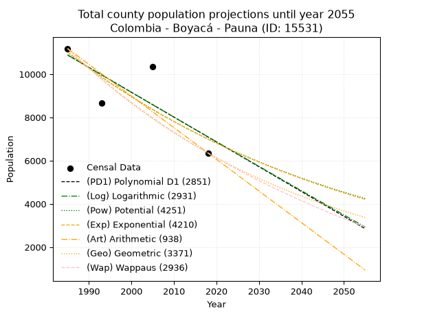
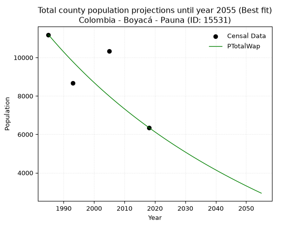
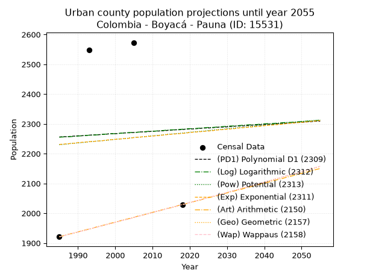
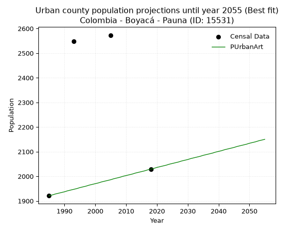
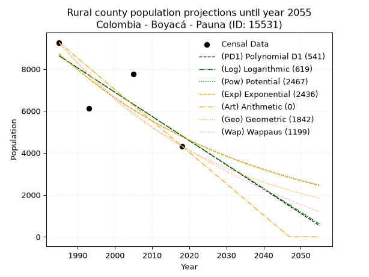
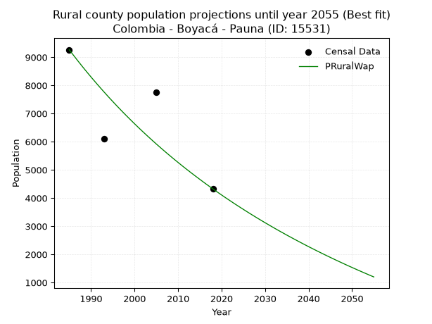

<div align="center">


</div>

# _“Population and Public Services Demand Projections (PPSD) until Year 2050 for Colombia - Boyacá - Pauna (ID: 15531)”_
Keywords: `population` `public-service` `projection` `lineal` `polynomial` `logarithmic` `potential` `exponential` `arithmetic` `geometric` `wappaus` `dane` `colombia` `south-america`

PPSD are analytical estimates used by governments and planners to anticipate future changes in population size, age distribution, and the resulting community needs for utilities, healthcare, education, and infrastructure as sizing future water treatment facilities, electrical grids, and road networks based on spatial growth.

> **General running parameters**: • app_version: _v20260806_. • Python version: _3.14.7_. • Pandas version: _3.0.5_. • NumPy version: _2.5.1_. • Creates, save and include plots into reports (create_plot): _False_. • Projection until year: _2050_. • Process polynomial degree 2 and up: _False_. • Process Wappaus: _True_. • Process Wappaus: _True_. • Set negative values to zero: _True_. • Set infinite values to zero: _True_. • Drop dataset notes: _True_. 
<div align="center">

Dynamic map: [:earth_americas:Google](http://maps.google.com/maps?q=5.656322691,-73.9784487) [:earth_americas:OSM](https://www.openstreetmap.org/#map=18/5.656322691/-73.9784487&layers=P) [:earth_americas:Bing](https://www.bing.com/maps?cp=5.656322691~-73.9784487&lvl=18) [:earth_americas:Apple](https://maps.apple.com/frame?center=5.656322691%2C-73.9784487&span=0.003%2C0.006)

</div>


<div align="center">

```geojson
{
  "type": "Feature",
  "geometry": {
    "type": "Point", 
    "coordinates": [-73.9784487, 5.656322691]
  }, 
  "properties": {
    "Name": "Colombia - Boyacá - Pauna (ID: 15531)"
  }
}
```

</div>


## 0. Census Data (4 records)

Census data are official statistics collected by a government about the people and housing in a country. They usually include counts of total population, age, sex, race, income, education, and jobs.

📅Global census file: [Population.xlsx](../data/Population.xlsx)

| Source   |   Year |   CountryID | CountryName   |   StateID | StateName   |   CountyID | CountyName   |   PTotal |   PUrban |   PRural |
|:---------|-------:|------------:|:--------------|----------:|:------------|-----------:|:-------------|---------:|---------:|---------:|
| DANE     |   1985 |          57 | Colombia      |        15 | Boyacá      |      15531 | Pauna        |    11186 |     1921 |     9265 |
| DANE     |   1993 |          57 | Colombia      |        15 | Boyacá      |      15531 | Pauna        |     8663 |     2547 |     6116 |
| DANE     |   2005 |          57 | Colombia      |        15 | Boyacá      |      15531 | Pauna        |    10338 |     2573 |     7765 |
| DANE     |   2018 |          57 | Colombia      |        15 | Boyacá      |      15531 | Pauna        |     6355 |     2029 |     4326 |

> 🔥Some records could had specific notes about the registered values or the corresponding urban or rural distribution.

**Local public utility companies (RUPS)**

 | SERVICIO       | ESTADO    | NOMBRE                                                       | NIT         | DEPARTAMENTO_DOMICILIO   | MUNICIPIO_DOMICILIO   | DIRECCION                  |   TELEFONO | EMAIL                        | TIPO_INSCRIPCION    | REPRESENTANTE_LEGAL          | TIPO_PRESTADOR                             | CLASIFICACION                 |
|:---------------|:----------|:-------------------------------------------------------------|:------------|:-------------------------|:----------------------|:---------------------------|-----------:|:-----------------------------|:--------------------|:-----------------------------|:-------------------------------------------|:------------------------------|
| ACUEDUCTO      | OPERATIVA | JUNTA MUNICIPAL DE SERVICIOS PUBLICOS DEL MUNICIPIO DE PAUNA | 891801368-5 | BOYACA                   | PAUNA                 | K 5 5 68                   |    7253251 | alcaldia@pauna-boyaca.gov.co | Registro por la ESP | HENRY IVAN MATALLANA  TORRES | MUNICIPIO (PRESTACIÓN DIRECTA)             | MENOR O IGUAL A 2500 USUARIOS |
| ALCANTARILLADO | OPERATIVA | JUNTA MUNICIPAL DE SERVICIOS PUBLICOS DEL MUNICIPIO DE PAUNA | 891801368-5 | BOYACA                   | PAUNA                 | K 5 5 68                   |    7253251 | alcaldia@pauna-boyaca.gov.co | Registro por la ESP | HENRY IVAN MATALLANA  TORRES | MUNICIPIO (PRESTACIÓN DIRECTA)             | MENOR O IGUAL A 2500 USUARIOS |
| ASEO           | OPERATIVA | JUNTA MUNICIPAL DE SERVICIOS PUBLICOS DEL MUNICIPIO DE PAUNA | 891801368-5 | BOYACA                   | PAUNA                 | K 5 5 68                   |    7253251 | alcaldia@pauna-boyaca.gov.co | Registro por la ESP | HENRY IVAN MATALLANA  TORRES | MUNICIPIO (PRESTACIÓN DIRECTA)             | MENOR O IGUAL A 2500 USUARIOS |
| ASEO           | OPERATIVA | URBASER TUNJA S.A.  E.S.P.                                   | 900159283-6 | BOYACA                   | TUNJA                 | TRANSVERSAL 15 No. 24 - 12 |    7441826 | Luz.galvis@urbaser.co        | Registro por la ESP | OSCAR HERNAN PARRA  ERAZO    | SOCIEDADES (EMPRESA DE SERVICIOS PUBLICOS) | MAYOR O IGUAL A 5001 USUARIOS |

> [📅RUPS Database: Registro Único de Prestadores de Servicios Públicos de Colombia Suramérica - RUPS](https://www.datos.gov.co/Hacienda-y-Cr-dito-P-blico/Registro-nico-de-Prestadores-de-Servicios-P-blicos/4qkq-csdn/about_data)

## 1. Total

### 1.1. Coefficients and Parameters

* (PD1) Polynomial Deg 1: -114.79164993978083, 238747.49779204658 (lineal)
* (Log) Logarithmic: -229615.01359977666, 1754441.0583911436
* (Pow) Potential: -27.482375653129274, 94.67238001944239
* (Exp) Exponential: -0.013741604514833757, 7731643224387360.0
* (Art) Arithmetic: Year diff. 2018 - 1985 = 33, Population diff. 6355 - 11186 = -4831, Annual growth = -146.3939393939394
* (Geo) Geometric: Year diff. 2018 - 1985 = 33, Population diff. 6355 - 11186 = -4831, Annual growth % = -0.016988020737629173
* (Wap) Wappaus: i = -1.6691629826570822, Condition values only valid for < 200)

<sub>
Wappaus condition values: ['-0.00', '-1.67', '-3.34', '-5.01', '-6.68', '-8.35', '-10.01', '-11.68', '-13.35', '-15.02', '-16.69', '-18.36', '-20.03', '-21.70', '-23.37', '-25.04', '-26.71', '-28.38', '-30.04', '-31.71', '-33.38', '-35.05', '-36.72', '-38.39', '-40.06', '-41.73', '-43.40', '-45.07', '-46.74', '-48.41', '-50.07', '-51.74', '-53.41', '-55.08', '-56.75', '-58.42', '-60.09', '-61.76', '-63.43', '-65.10', '-66.77', '-68.44', '-70.10', '-71.77', '-73.44', '-75.11', '-76.78', '-78.45', '-80.12', '-81.79', '-83.46', '-85.13', '-86.80', '-88.47', '-90.13', '-91.80', '-93.47', '-95.14', '-96.81', '-98.48', '-100.15', '-101.82', '-103.49', '-105.16', '-106.83', '-108.50']
</sub>


### 1.2. Projected Dataset

|   Year |   CountyID |   PTotalPD1 |   PTotalLog |   PTotalPow |   PTotalExp |   PTotalArt |   PTotalGeo |   PTotalWap |
|-------:|-----------:|------------:|------------:|------------:|------------:|------------:|------------:|------------:|
|   1985 |      15531 |       10886 |       10888 |       11018 |       11015 |       11186 |       11186 |       11186 |
|   1986 |      15531 |       10771 |       10773 |       10866 |       10865 |       11040 |       10996 |       11001 |
|   1987 |      15531 |       10656 |       10657 |       10717 |       10716 |       10893 |       10809 |       10819 |
|   1988 |      15531 |       10542 |       10542 |       10570 |       10570 |       10747 |       10626 |       10640 |
|   1989 |      15531 |       10427 |       10426 |       10425 |       10426 |       10600 |       10445 |       10463 |
|   1990 |      15531 |       10312 |       10311 |       10282 |       10284 |       10454 |       10268 |       10290 |
|   1991 |      15531 |       10197 |       10195 |       10141 |       10143 |       10308 |       10093 |       10119 |
|   1992 |      15531 |       10083 |       10080 |       10002 |       10005 |       10161 |        9922 |        9951 |
|   1993 |      15531 |        9968 |        9965 |        9865 |        9868 |       10015 |        9753 |        9786 |
|   1994 |      15531 |        9853 |        9850 |        9730 |        9734 |        9868 |        9587 |        9623 |
|   1995 |      15531 |        9738 |        9734 |        9596 |        9601 |        9722 |        9425 |        9463 |
|   1996 |      15531 |        9623 |        9619 |        9465 |        9470 |        9576 |        9264 |        9305 |
|   1997 |      15531 |        9509 |        9504 |        9336 |        9340 |        9429 |        9107 |        9149 |
|   1998 |      15531 |        9394 |        9389 |        9208 |        9213 |        9283 |        8952 |        8996 |
|   1999 |      15531 |        9279 |        9275 |        9082 |        9087 |        9136 |        8800 |        8845 |
|   2000 |      15531 |        9164 |        9160 |        8958 |        8963 |        8990 |        8651 |        8697 |
|   2001 |      15531 |        9049 |        9045 |        8836 |        8841 |        8844 |        8504 |        8551 |
|   2002 |      15531 |        8935 |        8930 |        8716 |        8720 |        8697 |        8359 |        8406 |
|   2003 |      15531 |        8820 |        8816 |        8597 |        8601 |        8551 |        8217 |        8264 |
|   2004 |      15531 |        8705 |        8701 |        8480 |        8484 |        8405 |        8078 |        8124 |
|   2005 |      15531 |        8590 |        8586 |        8364 |        8368 |        8258 |        7941 |        7986 |
|   2006 |      15531 |        8475 |        8472 |        8251 |        8254 |        8112 |        7806 |        7850 |
|   2007 |      15531 |        8361 |        8357 |        8138 |        8141 |        7965 |        7673 |        7716 |
|   2008 |      15531 |        8246 |        8243 |        8028 |        8030 |        7819 |        7543 |        7583 |
|   2009 |      15531 |        8131 |        8129 |        7919 |        7921 |        7673 |        7415 |        7453 |
|   2010 |      15531 |        8016 |        8015 |        7811 |        7812 |        7526 |        7289 |        7324 |
|   2011 |      15531 |        7901 |        7900 |        7705 |        7706 |        7380 |        7165 |        7197 |
|   2012 |      15531 |        7787 |        7786 |        7600 |        7601 |        7233 |        7043 |        7072 |
|   2013 |      15531 |        7672 |        7672 |        7497 |        7497 |        7087 |        6923 |        6948 |
|   2014 |      15531 |        7557 |        7558 |        7396 |        7395 |        6941 |        6806 |        6826 |
|   2015 |      15531 |        7442 |        7444 |        7295 |        7294 |        6794 |        6690 |        6706 |
|   2016 |      15531 |        7328 |        7330 |        7197 |        7194 |        6648 |        6577 |        6588 |
|   2017 |      15531 |        7213 |        7216 |        7099 |        7096 |        6501 |        6465 |        6471 |
|   2018 |      15531 |        7098 |        7102 |        7003 |        6999 |        6355 |        6355 |        6355 |
|   2019 |      15531 |        6983 |        6989 |        6908 |        6904 |        6209 |        6247 |        6241 |
|   2020 |      15531 |        6868 |        6875 |        6815 |        6809 |        6062 |        6141 |        6128 |
|   2021 |      15531 |        6754 |        6761 |        6723 |        6716 |        5916 |        6037 |        6017 |
|   2022 |      15531 |        6639 |        6648 |        6632 |        6625 |        5769 |        5934 |        5908 |
|   2023 |      15531 |        6524 |        6534 |        6543 |        6534 |        5623 |        5833 |        5799 |
|   2024 |      15531 |        6409 |        6421 |        6454 |        6445 |        5477 |        5734 |        5692 |
|   2025 |      15531 |        6294 |        6307 |        6367 |        6357 |        5330 |        5637 |        5587 |
|   2026 |      15531 |        6180 |        6194 |        6282 |        6270 |        5184 |        5541 |        5482 |
|   2027 |      15531 |        6065 |        6081 |        6197 |        6185 |        5037 |        5447 |        5379 |
|   2028 |      15531 |        5950 |        5967 |        6114 |        6100 |        4891 |        5354 |        5278 |
|   2029 |      15531 |        5835 |        5854 |        6031 |        6017 |        4745 |        5263 |        5177 |
|   2030 |      15531 |        5720 |        5741 |        5950 |        5935 |        4598 |        5174 |        5078 |
|   2031 |      15531 |        5606 |        5628 |        5870 |        5854 |        4452 |        5086 |        4980 |
|   2032 |      15531 |        5491 |        5515 |        5791 |        5774 |        4305 |        5000 |        4883 |
|   2033 |      15531 |        5376 |        5402 |        5714 |        5695 |        4159 |        4915 |        4787 |
|   2034 |      15531 |        5261 |        5289 |        5637 |        5618 |        4013 |        4831 |        4693 |
|   2035 |      15531 |        5146 |        5176 |        5561 |        5541 |        3866 |        4749 |        4599 |
|   2036 |      15531 |        5032 |        5063 |        5487 |        5465 |        3720 |        4668 |        4507 |
|   2037 |      15531 |        4917 |        4951 |        5413 |        5391 |        3574 |        4589 |        4415 |
|   2038 |      15531 |        4802 |        4838 |        5341 |        5317 |        3427 |        4511 |        4325 |
|   2039 |      15531 |        4687 |        4725 |        5269 |        5245 |        3281 |        4435 |        4236 |
|   2040 |      15531 |        4573 |        4613 |        5199 |        5173 |        3134 |        4359 |        4148 |
|   2041 |      15531 |        4458 |        4500 |        5129 |        5102 |        2988 |        4285 |        4060 |
|   2042 |      15531 |        4343 |        4388 |        5060 |        5033 |        2842 |        4212 |        3974 |
|   2043 |      15531 |        4228 |        4275 |        4993 |        4964 |        2695 |        4141 |        3889 |
|   2044 |      15531 |        4113 |        4163 |        4926 |        4896 |        2549 |        4070 |        3805 |
|   2045 |      15531 |        3999 |        4051 |        4860 |        4830 |        2402 |        4001 |        3721 |
|   2046 |      15531 |        3884 |        3938 |        4795 |        4764 |        2256 |        3933 |        3639 |
|   2047 |      15531 |        3769 |        3826 |        4731 |        4699 |        2110 |        3867 |        3557 |
|   2048 |      15531 |        3654 |        3714 |        4668 |        4635 |        1963 |        3801 |        3477 |
|   2049 |      15531 |        3539 |        3602 |        4606 |        4571 |        1817 |        3736 |        3397 |
|   2050 |      15531 |        3425 |        3490 |        4545 |        4509 |        1670 |        3673 |        3318 |
<div align="center">

</img>

</div>


### 1.3. Best fit with absolute and relative error (%)

Relative error puts that difference into context by dividing the absolute error by the true value, creating a unitless ratio or percentage that shows the scale of the mistake.

Absolute and relative error

|   Year | Source   |   CountryID | CountryName   |   StateID | StateName   |   CountyID_x | CountyName   |   PTotal |   PUrban |   PRural |   CountyID_y |   PTotalPD1 |   PTotalLog |   PTotalPow |   PTotalExp |   PTotalArt |   PTotalGeo |   PTotalWap |   PTotalPD1AbsError |   PTotalLogAbsError |   PTotalPowAbsError |   PTotalExpAbsError |   PTotalArtAbsError |   PTotalGeoAbsError |   PTotalWapAbsError |   PTotalPD1RelError |   PTotalLogRelError |   PTotalPowRelError |   PTotalExpRelError |   PTotalArtRelError |   PTotalGeoRelError |   PTotalWapRelError |
|-------:|:---------|------------:|:--------------|----------:|:------------|-------------:|:-------------|---------:|---------:|---------:|-------------:|------------:|------------:|------------:|------------:|------------:|------------:|------------:|--------------------:|--------------------:|--------------------:|--------------------:|--------------------:|--------------------:|--------------------:|--------------------:|--------------------:|--------------------:|--------------------:|--------------------:|--------------------:|--------------------:|
|   1985 | DANE     |          57 | Colombia      |        15 | Boyacá      |        15531 | Pauna        |    11186 |     1921 |     9265 |        15531 |       10886 |       10888 |       11018 |       11015 |       11186 |       11186 |       11186 |                 300 |                 298 |                 168 |                 171 |                   0 |                   0 |                   0 |             2.68192 |             2.66404 |             1.50188 |              1.5287 |              0      |              0      |              0      |
|   1993 | DANE     |          57 | Colombia      |        15 | Boyacá      |        15531 | Pauna        |     8663 |     2547 |     6116 |        15531 |        9968 |        9965 |        9865 |        9868 |       10015 |        9753 |        9786 |                1305 |                1302 |                1202 |                1205 |                1352 |                1090 |                1123 |            15.0641  |            15.0294  |            13.8751  |             13.9097 |             15.6066 |             12.5822 |             12.9632 |
|   2005 | DANE     |          57 | Colombia      |        15 | Boyacá      |        15531 | Pauna        |    10338 |     2573 |     7765 |        15531 |        8590 |        8586 |        8364 |        8368 |        8258 |        7941 |        7986 |                1748 |                1752 |                1974 |                1970 |                2080 |                2397 |                2352 |            16.9085  |            16.9472  |            19.0946  |             19.0559 |             20.1199 |             23.1863 |             22.751  |
|   2018 | DANE     |          57 | Colombia      |        15 | Boyacá      |        15531 | Pauna        |     6355 |     2029 |     4326 |        15531 |        7098 |        7102 |        7003 |        6999 |        6355 |        6355 |        6355 |                 743 |                 747 |                 648 |                 644 |                   0 |                   0 |                   0 |            11.6916  |            11.7545  |            10.1967  |             10.1338 |              0      |              0      |              0      |

Relative error mean

| Method    |   RelError | Best   |
|:----------|-----------:|:-------|
| PTotalPD1 |   11.5865  |        |
| PTotalLog |   11.5988  |        |
| PTotalPow |   11.1671  |        |
| PTotalExp |   11.157   |        |
| PTotalArt |    8.93164 |        |
| PTotalGeo |    8.94214 |        |
| PTotalWap |    8.92855 | True   |

💙Best method: _**PTotalWap**_
<div align="center">

</img>

</div>


### 1.4. Fresh water supply demand in liters per capita per day (lpcd)

The fresh water supply demand typically ranges from 100 to 300 liters per capita per day (lpcd) for standard domestic and municipal planning, though absolute survival minimums set by the World Health Organization are as low as 7.5 to 20 liters per day, and total consumption in high-income nations can exceed 400 liters.

> `CZ`: Level in meters above the sea level (masl)<br> `WS`: Fresh water supply demand in liters per capita per day (lpcd or l/h/d)<br> `WSAll`: Zonal fresh water supply demand in liters per second (l/s)<br> `A`: Zonal area in square meters<br> `DP`: Population density (people/hectare or p/ha)

Reference values (RAS Colombia)

|    CZ |   WS |
|------:|-----:|
|  1000 |  120 |
|  2000 |  130 |
| 99999 |  140 |

County shapefile geometry properties and water supply values

|   CountyID |      ATotal |   CZTotal |   WSTotal |
|-----------:|------------:|----------:|----------:|
|      15531 | 2.52302e+08 |   1251.78 |       130 |

Projected values for best method: PTotalWap

|   CountyID |   Year |   PTotalWap |   DPTotal |   WSTotal |   WSTotalAll |
|-----------:|-------:|------------:|----------:|----------:|-------------:|
|      15531 |   1985 |       11186 |      0.44 |       130 |     16.8308  |
|      15531 |   1986 |       11001 |      0.44 |       130 |     16.5524  |
|      15531 |   1987 |       10819 |      0.43 |       130 |     16.2786  |
|      15531 |   1988 |       10640 |      0.42 |       130 |     16.0093  |
|      15531 |   1989 |       10463 |      0.41 |       130 |     15.7429  |
|      15531 |   1990 |       10290 |      0.41 |       130 |     15.4826  |
|      15531 |   1991 |       10119 |      0.4  |       130 |     15.2253  |
|      15531 |   1992 |        9951 |      0.39 |       130 |     14.9726  |
|      15531 |   1993 |        9786 |      0.39 |       130 |     14.7243  |
|      15531 |   1994 |        9623 |      0.38 |       130 |     14.4791  |
|      15531 |   1995 |        9463 |      0.38 |       130 |     14.2383  |
|      15531 |   1996 |        9305 |      0.37 |       130 |     14.0006  |
|      15531 |   1997 |        9149 |      0.36 |       130 |     13.7659  |
|      15531 |   1998 |        8996 |      0.36 |       130 |     13.5356  |
|      15531 |   1999 |        8845 |      0.35 |       130 |     13.3084  |
|      15531 |   2000 |        8697 |      0.34 |       130 |     13.0858  |
|      15531 |   2001 |        8551 |      0.34 |       130 |     12.8661  |
|      15531 |   2002 |        8406 |      0.33 |       130 |     12.6479  |
|      15531 |   2003 |        8264 |      0.33 |       130 |     12.4343  |
|      15531 |   2004 |        8124 |      0.32 |       130 |     12.2236  |
|      15531 |   2005 |        7986 |      0.32 |       130 |     12.016   |
|      15531 |   2006 |        7850 |      0.31 |       130 |     11.8113  |
|      15531 |   2007 |        7716 |      0.31 |       130 |     11.6097  |
|      15531 |   2008 |        7583 |      0.3  |       130 |     11.4096  |
|      15531 |   2009 |        7453 |      0.3  |       130 |     11.214   |
|      15531 |   2010 |        7324 |      0.29 |       130 |     11.0199  |
|      15531 |   2011 |        7197 |      0.29 |       130 |     10.8288  |
|      15531 |   2012 |        7072 |      0.28 |       130 |     10.6407  |
|      15531 |   2013 |        6948 |      0.28 |       130 |     10.4542  |
|      15531 |   2014 |        6826 |      0.27 |       130 |     10.2706  |
|      15531 |   2015 |        6706 |      0.27 |       130 |     10.09    |
|      15531 |   2016 |        6588 |      0.26 |       130 |      9.9125  |
|      15531 |   2017 |        6471 |      0.26 |       130 |      9.73646 |
|      15531 |   2018 |        6355 |      0.25 |       130 |      9.56192 |
|      15531 |   2019 |        6241 |      0.25 |       130 |      9.39039 |
|      15531 |   2020 |        6128 |      0.24 |       130 |      9.22037 |
|      15531 |   2021 |        6017 |      0.24 |       130 |      9.05336 |
|      15531 |   2022 |        5908 |      0.23 |       130 |      8.88935 |
|      15531 |   2023 |        5799 |      0.23 |       130 |      8.72535 |
|      15531 |   2024 |        5692 |      0.23 |       130 |      8.56435 |
|      15531 |   2025 |        5587 |      0.22 |       130 |      8.40637 |
|      15531 |   2026 |        5482 |      0.22 |       130 |      8.24838 |
|      15531 |   2027 |        5379 |      0.21 |       130 |      8.0934  |
|      15531 |   2028 |        5278 |      0.21 |       130 |      7.94144 |
|      15531 |   2029 |        5177 |      0.21 |       130 |      7.78947 |
|      15531 |   2030 |        5078 |      0.2  |       130 |      7.64051 |
|      15531 |   2031 |        4980 |      0.2  |       130 |      7.49306 |
|      15531 |   2032 |        4883 |      0.19 |       130 |      7.34711 |
|      15531 |   2033 |        4787 |      0.19 |       130 |      7.20266 |
|      15531 |   2034 |        4693 |      0.19 |       130 |      7.06123 |
|      15531 |   2035 |        4599 |      0.18 |       130 |      6.91979 |
|      15531 |   2036 |        4507 |      0.18 |       130 |      6.78137 |
|      15531 |   2037 |        4415 |      0.17 |       130 |      6.64294 |
|      15531 |   2038 |        4325 |      0.17 |       130 |      6.50752 |
|      15531 |   2039 |        4236 |      0.17 |       130 |      6.37361 |
|      15531 |   2040 |        4148 |      0.16 |       130 |      6.2412  |
|      15531 |   2041 |        4060 |      0.16 |       130 |      6.1088  |
|      15531 |   2042 |        3974 |      0.16 |       130 |      5.9794  |
|      15531 |   2043 |        3889 |      0.15 |       130 |      5.8515  |
|      15531 |   2044 |        3805 |      0.15 |       130 |      5.72512 |
|      15531 |   2045 |        3721 |      0.15 |       130 |      5.59873 |
|      15531 |   2046 |        3639 |      0.14 |       130 |      5.47535 |
|      15531 |   2047 |        3557 |      0.14 |       130 |      5.35197 |
|      15531 |   2048 |        3477 |      0.14 |       130 |      5.2316  |
|      15531 |   2049 |        3397 |      0.13 |       130 |      5.11123 |
|      15531 |   2050 |        3318 |      0.13 |       130 |      4.99236 |

## 2. Urban

### 2.1. Coefficients and Parameters

* (PD1) Polynomial Deg 1: 0.763548775592453, 740.2115616211961 (lineal)
* (Log) Logarithmic: 1637.1961358869619, -10176.840948543251
* (Pow) Potential: 1.0574019016362817, -0.13874433189573318
* (Exp) Exponential: 0.0005041215807708567, 820.1444682450947
* (Art) Arithmetic: Year diff. 2018 - 1985 = 33, Population diff. 2029 - 1921 = 108, Annual growth = 3.272727272727273
* (Geo) Geometric: Year diff. 2018 - 1985 = 33, Population diff. 2029 - 1921 = 108, Annual growth % = 0.0016588646100053062
* (Wap) Wappaus: i = 0.16570771001150747, Condition values only valid for < 200)

<sub>
Wappaus condition values: ['0.00', '0.17', '0.33', '0.50', '0.66', '0.83', '0.99', '1.16', '1.33', '1.49', '1.66', '1.82', '1.99', '2.15', '2.32', '2.49', '2.65', '2.82', '2.98', '3.15', '3.31', '3.48', '3.65', '3.81', '3.98', '4.14', '4.31', '4.47', '4.64', '4.81', '4.97', '5.14', '5.30', '5.47', '5.63', '5.80', '5.97', '6.13', '6.30', '6.46', '6.63', '6.79', '6.96', '7.13', '7.29', '7.46', '7.62', '7.79', '7.95', '8.12', '8.29', '8.45', '8.62', '8.78', '8.95', '9.11', '9.28', '9.45', '9.61', '9.78', '9.94', '10.11', '10.27', '10.44', '10.61', '10.77']
</sub>


### 2.2. Projected Dataset

|   Year |   CountyID |   PUrbanPD1 |   PUrbanLog |   PUrbanPow |   PUrbanExp |   PUrbanArt |   PUrbanGeo |   PUrbanWap |
|-------:|-----------:|------------:|------------:|------------:|------------:|------------:|------------:|------------:|
|   1985 |      15531 |        2256 |        2255 |        2230 |        2231 |        1921 |        1921 |        1921 |
|   1986 |      15531 |        2257 |        2256 |        2231 |        2232 |        1924 |        1924 |        1924 |
|   1987 |      15531 |        2257 |        2257 |        2232 |        2233 |        1928 |        1927 |        1927 |
|   1988 |      15531 |        2258 |        2257 |        2234 |        2234 |        1931 |        1931 |        1931 |
|   1989 |      15531 |        2259 |        2258 |        2235 |        2235 |        1934 |        1934 |        1934 |
|   1990 |      15531 |        2260 |        2259 |        2236 |        2237 |        1937 |        1937 |        1937 |
|   1991 |      15531 |        2260 |        2260 |        2237 |        2238 |        1941 |        1940 |        1940 |
|   1992 |      15531 |        2261 |        2261 |        2238 |        2239 |        1944 |        1943 |        1943 |
|   1993 |      15531 |        2262 |        2262 |        2240 |        2240 |        1947 |        1947 |        1947 |
|   1994 |      15531 |        2263 |        2262 |        2241 |        2241 |        1950 |        1950 |        1950 |
|   1995 |      15531 |        2263 |        2263 |        2242 |        2242 |        1954 |        1953 |        1953 |
|   1996 |      15531 |        2264 |        2264 |        2243 |        2243 |        1957 |        1956 |        1956 |
|   1997 |      15531 |        2265 |        2265 |        2244 |        2244 |        1960 |        1960 |        1960 |
|   1998 |      15531 |        2266 |        2266 |        2245 |        2246 |        1964 |        1963 |        1963 |
|   1999 |      15531 |        2267 |        2267 |        2247 |        2247 |        1967 |        1966 |        1966 |
|   2000 |      15531 |        2267 |        2267 |        2248 |        2248 |        1970 |        1969 |        1969 |
|   2001 |      15531 |        2268 |        2268 |        2249 |        2249 |        1973 |        1973 |        1973 |
|   2002 |      15531 |        2269 |        2269 |        2250 |        2250 |        1977 |        1976 |        1976 |
|   2003 |      15531 |        2270 |        2270 |        2251 |        2251 |        1980 |        1979 |        1979 |
|   2004 |      15531 |        2270 |        2271 |        2253 |        2252 |        1983 |        1982 |        1982 |
|   2005 |      15531 |        2271 |        2271 |        2254 |        2254 |        1986 |        1986 |        1986 |
|   2006 |      15531 |        2272 |        2272 |        2255 |        2255 |        1990 |        1989 |        1989 |
|   2007 |      15531 |        2273 |        2273 |        2256 |        2256 |        1993 |        1992 |        1992 |
|   2008 |      15531 |        2273 |        2274 |        2257 |        2257 |        1996 |        1996 |        1996 |
|   2009 |      15531 |        2274 |        2275 |        2259 |        2258 |        2000 |        1999 |        1999 |
|   2010 |      15531 |        2275 |        2275 |        2260 |        2259 |        2003 |        2002 |        2002 |
|   2011 |      15531 |        2276 |        2276 |        2261 |        2260 |        2006 |        2006 |        2006 |
|   2012 |      15531 |        2276 |        2277 |        2262 |        2261 |        2009 |        2009 |        2009 |
|   2013 |      15531 |        2277 |        2278 |        2263 |        2263 |        2013 |        2012 |        2012 |
|   2014 |      15531 |        2278 |        2279 |        2265 |        2264 |        2016 |        2016 |        2016 |
|   2015 |      15531 |        2279 |        2280 |        2266 |        2265 |        2019 |        2019 |        2019 |
|   2016 |      15531 |        2280 |        2280 |        2267 |        2266 |        2022 |        2022 |        2022 |
|   2017 |      15531 |        2280 |        2281 |        2268 |        2267 |        2026 |        2026 |        2026 |
|   2018 |      15531 |        2281 |        2282 |        2269 |        2268 |        2029 |        2029 |        2029 |
|   2019 |      15531 |        2282 |        2283 |        2270 |        2269 |        2032 |        2032 |        2032 |
|   2020 |      15531 |        2283 |        2284 |        2272 |        2271 |        2036 |        2036 |        2036 |
|   2021 |      15531 |        2283 |        2284 |        2273 |        2272 |        2039 |        2039 |        2039 |
|   2022 |      15531 |        2284 |        2285 |        2274 |        2273 |        2042 |        2042 |        2043 |
|   2023 |      15531 |        2285 |        2286 |        2275 |        2274 |        2045 |        2046 |        2046 |
|   2024 |      15531 |        2286 |        2287 |        2276 |        2275 |        2049 |        2049 |        2049 |
|   2025 |      15531 |        2286 |        2288 |        2278 |        2276 |        2052 |        2053 |        2053 |
|   2026 |      15531 |        2287 |        2288 |        2279 |        2277 |        2055 |        2056 |        2056 |
|   2027 |      15531 |        2288 |        2289 |        2280 |        2279 |        2058 |        2059 |        2060 |
|   2028 |      15531 |        2289 |        2290 |        2281 |        2280 |        2062 |        2063 |        2063 |
|   2029 |      15531 |        2289 |        2291 |        2282 |        2281 |        2065 |        2066 |        2066 |
|   2030 |      15531 |        2290 |        2292 |        2284 |        2282 |        2068 |        2070 |        2070 |
|   2031 |      15531 |        2291 |        2293 |        2285 |        2283 |        2072 |        2073 |        2073 |
|   2032 |      15531 |        2292 |        2293 |        2286 |        2284 |        2075 |        2077 |        2077 |
|   2033 |      15531 |        2293 |        2294 |        2287 |        2286 |        2078 |        2080 |        2080 |
|   2034 |      15531 |        2293 |        2295 |        2288 |        2287 |        2081 |        2084 |        2084 |
|   2035 |      15531 |        2294 |        2296 |        2289 |        2288 |        2085 |        2087 |        2087 |
|   2036 |      15531 |        2295 |        2297 |        2291 |        2289 |        2088 |        2090 |        2091 |
|   2037 |      15531 |        2296 |        2297 |        2292 |        2290 |        2091 |        2094 |        2094 |
|   2038 |      15531 |        2296 |        2298 |        2293 |        2291 |        2094 |        2097 |        2097 |
|   2039 |      15531 |        2297 |        2299 |        2294 |        2292 |        2098 |        2101 |        2101 |
|   2040 |      15531 |        2298 |        2300 |        2295 |        2294 |        2101 |        2104 |        2104 |
|   2041 |      15531 |        2299 |        2301 |        2297 |        2295 |        2104 |        2108 |        2108 |
|   2042 |      15531 |        2299 |        2301 |        2298 |        2296 |        2108 |        2111 |        2111 |
|   2043 |      15531 |        2300 |        2302 |        2299 |        2297 |        2111 |        2115 |        2115 |
|   2044 |      15531 |        2301 |        2303 |        2300 |        2298 |        2114 |        2118 |        2118 |
|   2045 |      15531 |        2302 |        2304 |        2301 |        2299 |        2117 |        2122 |        2122 |
|   2046 |      15531 |        2302 |        2305 |        2303 |        2301 |        2121 |        2125 |        2126 |
|   2047 |      15531 |        2303 |        2305 |        2304 |        2302 |        2124 |        2129 |        2129 |
|   2048 |      15531 |        2304 |        2306 |        2305 |        2303 |        2127 |        2132 |        2133 |
|   2049 |      15531 |        2305 |        2307 |        2306 |        2304 |        2130 |        2136 |        2136 |
|   2050 |      15531 |        2305 |        2308 |        2307 |        2305 |        2134 |        2140 |        2140 |
<div align="center">

</img>

</div>


### 2.3. Best fit with absolute and relative error (%)

Relative error puts that difference into context by dividing the absolute error by the true value, creating a unitless ratio or percentage that shows the scale of the mistake.

Absolute and relative error

|   Year | Source   |   CountryID | CountryName   |   StateID | StateName   |   CountyID_x | CountyName   |   PTotal |   PUrban |   PRural |   CountyID_y |   PUrbanPD1 |   PUrbanLog |   PUrbanPow |   PUrbanExp |   PUrbanArt |   PUrbanGeo |   PUrbanWap |   PUrbanPD1AbsError |   PUrbanLogAbsError |   PUrbanPowAbsError |   PUrbanExpAbsError |   PUrbanArtAbsError |   PUrbanGeoAbsError |   PUrbanWapAbsError |   PUrbanPD1RelError |   PUrbanLogRelError |   PUrbanPowRelError |   PUrbanExpRelError |   PUrbanArtRelError |   PUrbanGeoRelError |   PUrbanWapRelError |
|-------:|:---------|------------:|:--------------|----------:|:------------|-------------:|:-------------|---------:|---------:|---------:|-------------:|------------:|------------:|------------:|------------:|------------:|------------:|------------:|--------------------:|--------------------:|--------------------:|--------------------:|--------------------:|--------------------:|--------------------:|--------------------:|--------------------:|--------------------:|--------------------:|--------------------:|--------------------:|--------------------:|
|   1985 | DANE     |          57 | Colombia      |        15 | Boyacá      |        15531 | Pauna        |    11186 |     1921 |     9265 |        15531 |        2256 |        2255 |        2230 |        2231 |        1921 |        1921 |        1921 |                 335 |                 334 |                 309 |                 310 |                   0 |                   0 |                   0 |             17.4388 |             17.3868 |             16.0854 |             16.1374 |              0      |              0      |              0      |
|   1993 | DANE     |          57 | Colombia      |        15 | Boyacá      |        15531 | Pauna        |     8663 |     2547 |     6116 |        15531 |        2262 |        2262 |        2240 |        2240 |        1947 |        1947 |        1947 |                 285 |                 285 |                 307 |                 307 |                 600 |                 600 |                 600 |             11.1896 |             11.1896 |             12.0534 |             12.0534 |             23.5571 |             23.5571 |             23.5571 |
|   2005 | DANE     |          57 | Colombia      |        15 | Boyacá      |        15531 | Pauna        |    10338 |     2573 |     7765 |        15531 |        2271 |        2271 |        2254 |        2254 |        1986 |        1986 |        1986 |                 302 |                 302 |                 319 |                 319 |                 587 |                 587 |                 587 |             11.7373 |             11.7373 |             12.398  |             12.398  |             22.8138 |             22.8138 |             22.8138 |
|   2018 | DANE     |          57 | Colombia      |        15 | Boyacá      |        15531 | Pauna        |     6355 |     2029 |     4326 |        15531 |        2281 |        2282 |        2269 |        2268 |        2029 |        2029 |        2029 |                 252 |                 253 |                 240 |                 239 |                   0 |                   0 |                   0 |             12.4199 |             12.4692 |             11.8285 |             11.7792 |              0      |              0      |              0      |

Relative error mean

| Method    |   RelError | Best   |
|:----------|-----------:|:-------|
| PUrbanPD1 |    13.1964 |        |
| PUrbanLog |    13.1957 |        |
| PUrbanPow |    13.0913 |        |
| PUrbanExp |    13.092  |        |
| PUrbanArt |    11.5927 | True   |
| PUrbanGeo |    11.5927 | True   |
| PUrbanWap |    11.5927 | True   |

💙Best method: _**PUrbanArt**_
<div align="center">

</img>

</div>


### 2.4. Fresh water supply demand in liters per capita per day (lpcd)

The fresh water supply demand typically ranges from 100 to 300 liters per capita per day (lpcd) for standard domestic and municipal planning, though absolute survival minimums set by the World Health Organization are as low as 7.5 to 20 liters per day, and total consumption in high-income nations can exceed 400 liters.

> `CZ`: Level in meters above the sea level (masl)<br> `WS`: Fresh water supply demand in liters per capita per day (lpcd or l/h/d)<br> `WSAll`: Zonal fresh water supply demand in liters per second (l/s)<br> `A`: Zonal area in square meters<br> `DP`: Population density (people/hectare or p/ha)

Reference values (RAS Colombia)

|    CZ |   WS |
|------:|-----:|
|  1000 |  120 |
|  2000 |  130 |
| 99999 |  140 |

County shapefile geometry properties and water supply values

|   CountyID |   AUrban |   CZUrban |   WSUrban |
|-----------:|---------:|----------:|----------:|
|      15531 |   429805 |   1125.31 |       130 |

Projected values for best method: PUrbanArt

|   CountyID |   Year |   PUrbanArt |   DPUrban |   WSUrban |   WSUrbanAll |
|-----------:|-------:|------------:|----------:|----------:|-------------:|
|      15531 |   1985 |        1921 |     44.69 |       130 |      2.89039 |
|      15531 |   1986 |        1924 |     44.76 |       130 |      2.89491 |
|      15531 |   1987 |        1928 |     44.86 |       130 |      2.90093 |
|      15531 |   1988 |        1931 |     44.93 |       130 |      2.90544 |
|      15531 |   1989 |        1934 |     45    |       130 |      2.90995 |
|      15531 |   1990 |        1937 |     45.07 |       130 |      2.91447 |
|      15531 |   1991 |        1941 |     45.16 |       130 |      2.92049 |
|      15531 |   1992 |        1944 |     45.23 |       130 |      2.925   |
|      15531 |   1993 |        1947 |     45.3  |       130 |      2.92951 |
|      15531 |   1994 |        1950 |     45.37 |       130 |      2.93403 |
|      15531 |   1995 |        1954 |     45.46 |       130 |      2.94005 |
|      15531 |   1996 |        1957 |     45.53 |       130 |      2.94456 |
|      15531 |   1997 |        1960 |     45.6  |       130 |      2.94907 |
|      15531 |   1998 |        1964 |     45.7  |       130 |      2.95509 |
|      15531 |   1999 |        1967 |     45.76 |       130 |      2.95961 |
|      15531 |   2000 |        1970 |     45.83 |       130 |      2.96412 |
|      15531 |   2001 |        1973 |     45.9  |       130 |      2.96863 |
|      15531 |   2002 |        1977 |     46    |       130 |      2.97465 |
|      15531 |   2003 |        1980 |     46.07 |       130 |      2.97917 |
|      15531 |   2004 |        1983 |     46.14 |       130 |      2.98368 |
|      15531 |   2005 |        1986 |     46.21 |       130 |      2.98819 |
|      15531 |   2006 |        1990 |     46.3  |       130 |      2.99421 |
|      15531 |   2007 |        1993 |     46.37 |       130 |      2.99873 |
|      15531 |   2008 |        1996 |     46.44 |       130 |      3.00324 |
|      15531 |   2009 |        2000 |     46.53 |       130 |      3.00926 |
|      15531 |   2010 |        2003 |     46.6  |       130 |      3.01377 |
|      15531 |   2011 |        2006 |     46.67 |       130 |      3.01829 |
|      15531 |   2012 |        2009 |     46.74 |       130 |      3.0228  |
|      15531 |   2013 |        2013 |     46.84 |       130 |      3.02882 |
|      15531 |   2014 |        2016 |     46.91 |       130 |      3.03333 |
|      15531 |   2015 |        2019 |     46.97 |       130 |      3.03785 |
|      15531 |   2016 |        2022 |     47.04 |       130 |      3.04236 |
|      15531 |   2017 |        2026 |     47.14 |       130 |      3.04838 |
|      15531 |   2018 |        2029 |     47.21 |       130 |      3.05289 |
|      15531 |   2019 |        2032 |     47.28 |       130 |      3.05741 |
|      15531 |   2020 |        2036 |     47.37 |       130 |      3.06343 |
|      15531 |   2021 |        2039 |     47.44 |       130 |      3.06794 |
|      15531 |   2022 |        2042 |     47.51 |       130 |      3.07245 |
|      15531 |   2023 |        2045 |     47.58 |       130 |      3.07697 |
|      15531 |   2024 |        2049 |     47.67 |       130 |      3.08299 |
|      15531 |   2025 |        2052 |     47.74 |       130 |      3.0875  |
|      15531 |   2026 |        2055 |     47.81 |       130 |      3.09201 |
|      15531 |   2027 |        2058 |     47.88 |       130 |      3.09653 |
|      15531 |   2028 |        2062 |     47.98 |       130 |      3.10255 |
|      15531 |   2029 |        2065 |     48.05 |       130 |      3.10706 |
|      15531 |   2030 |        2068 |     48.11 |       130 |      3.11157 |
|      15531 |   2031 |        2072 |     48.21 |       130 |      3.11759 |
|      15531 |   2032 |        2075 |     48.28 |       130 |      3.12211 |
|      15531 |   2033 |        2078 |     48.35 |       130 |      3.12662 |
|      15531 |   2034 |        2081 |     48.42 |       130 |      3.13113 |
|      15531 |   2035 |        2085 |     48.51 |       130 |      3.13715 |
|      15531 |   2036 |        2088 |     48.58 |       130 |      3.14167 |
|      15531 |   2037 |        2091 |     48.65 |       130 |      3.14618 |
|      15531 |   2038 |        2094 |     48.72 |       130 |      3.15069 |
|      15531 |   2039 |        2098 |     48.81 |       130 |      3.15671 |
|      15531 |   2040 |        2101 |     48.88 |       130 |      3.16123 |
|      15531 |   2041 |        2104 |     48.95 |       130 |      3.16574 |
|      15531 |   2042 |        2108 |     49.05 |       130 |      3.17176 |
|      15531 |   2043 |        2111 |     49.12 |       130 |      3.17627 |
|      15531 |   2044 |        2114 |     49.19 |       130 |      3.18079 |
|      15531 |   2045 |        2117 |     49.25 |       130 |      3.1853  |
|      15531 |   2046 |        2121 |     49.35 |       130 |      3.19132 |
|      15531 |   2047 |        2124 |     49.42 |       130 |      3.19583 |
|      15531 |   2048 |        2127 |     49.49 |       130 |      3.20035 |
|      15531 |   2049 |        2130 |     49.56 |       130 |      3.20486 |
|      15531 |   2050 |        2134 |     49.65 |       130 |      3.21088 |

## 3. Rural

### 3.1. Coefficients and Parameters

* (PD1) Polynomial Deg 1: -115.55519871537328, 238007.28623042544 (lineal)
* (Log) Logarithmic: -231252.20973566364, 1764617.899339687
* (Pow) Potential: -36.45030341870442, 124.14510109167875
* (Exp) Exponential: -0.018219444748217357, 4.436821992480461e+19
* (Art) Arithmetic: Year diff. 2018 - 1985 = 33, Population diff. 4326 - 9265 = -4939, Annual growth = -149.66666666666666
* (Geo) Geometric: Year diff. 2018 - 1985 = 33, Population diff. 4326 - 9265 = -4939, Annual growth % = -0.02281452539125295
* (Wap) Wappaus: i = -2.202437887817919, Condition values only valid for < 200)

<sub>
Wappaus condition values: ['-0.00', '-2.20', '-4.40', '-6.61', '-8.81', '-11.01', '-13.21', '-15.42', '-17.62', '-19.82', '-22.02', '-24.23', '-26.43', '-28.63', '-30.83', '-33.04', '-35.24', '-37.44', '-39.64', '-41.85', '-44.05', '-46.25', '-48.45', '-50.66', '-52.86', '-55.06', '-57.26', '-59.47', '-61.67', '-63.87', '-66.07', '-68.28', '-70.48', '-72.68', '-74.88', '-77.09', '-79.29', '-81.49', '-83.69', '-85.90', '-88.10', '-90.30', '-92.50', '-94.70', '-96.91', '-99.11', '-101.31', '-103.51', '-105.72', '-107.92', '-110.12', '-112.32', '-114.53', '-116.73', '-118.93', '-121.13', '-123.34', '-125.54', '-127.74', '-129.94', '-132.15', '-134.35', '-136.55', '-138.75', '-140.96', '-143.16']
</sub>


### 3.2. Projected Dataset

|   Year |   CountyID |   PRuralPD1 |   PRuralLog |   PRuralPow |   PRuralExp |   PRuralArt |   PRuralGeo |   PRuralWap |
|-------:|-----------:|------------:|------------:|------------:|------------:|------------:|------------:|------------:|
|   1985 |      15531 |        8630 |        8633 |        8724 |        8721 |        9265 |        9265 |        9265 |
|   1986 |      15531 |        8515 |        8517 |        8566 |        8563 |        9115 |        9054 |        9063 |
|   1987 |      15531 |        8399 |        8400 |        8410 |        8409 |        8966 |        8847 |        8866 |
|   1988 |      15531 |        8284 |        8284 |        8257 |        8257 |        8816 |        8645 |        8672 |
|   1989 |      15531 |        8168 |        8168 |        8107 |        8108 |        8666 |        8448 |        8483 |
|   1990 |      15531 |        8052 |        8052 |        7960 |        7961 |        8517 |        8255 |        8298 |
|   1991 |      15531 |        7937 |        7935 |        7815 |        7818 |        8367 |        8067 |        8117 |
|   1992 |      15531 |        7821 |        7819 |        7674 |        7677 |        8217 |        7883 |        7939 |
|   1993 |      15531 |        7706 |        7703 |        7535 |        7538 |        8068 |        7703 |        7765 |
|   1994 |      15531 |        7590 |        7587 |        7398 |        7402 |        7918 |        7527 |        7594 |
|   1995 |      15531 |        7475 |        7471 |        7264 |        7268 |        7768 |        7356 |        7427 |
|   1996 |      15531 |        7359 |        7355 |        7133 |        7137 |        7619 |        7188 |        7263 |
|   1997 |      15531 |        7244 |        7240 |        7004 |        7008 |        7469 |        7024 |        7102 |
|   1998 |      15531 |        7128 |        7124 |        6877 |        6882 |        7319 |        6864 |        6944 |
|   1999 |      15531 |        7012 |        7008 |        6753 |        6757 |        7170 |        6707 |        6790 |
|   2000 |      15531 |        6897 |        6892 |        6631 |        6635 |        7020 |        6554 |        6638 |
|   2001 |      15531 |        6781 |        6777 |        6511 |        6516 |        6870 |        6404 |        6489 |
|   2002 |      15531 |        6666 |        6661 |        6393 |        6398 |        6721 |        6258 |        6343 |
|   2003 |      15531 |        6550 |        6546 |        6278 |        6282 |        6571 |        6115 |        6200 |
|   2004 |      15531 |        6435 |        6430 |        6165 |        6169 |        6421 |        5976 |        6059 |
|   2005 |      15531 |        6319 |        6315 |        6054 |        6058 |        6272 |        5840 |        5920 |
|   2006 |      15531 |        6204 |        6200 |        5945 |        5948 |        6122 |        5706 |        5785 |
|   2007 |      15531 |        6088 |        6084 |        5838 |        5841 |        5972 |        5576 |        5651 |
|   2008 |      15531 |        5972 |        5969 |        5733 |        5735 |        5823 |        5449 |        5520 |
|   2009 |      15531 |        5857 |        5854 |        5630 |        5632 |        5673 |        5325 |        5391 |
|   2010 |      15531 |        5741 |        5739 |        5528 |        5530 |        5523 |        5203 |        5265 |
|   2011 |      15531 |        5626 |        5624 |        5429 |        5430 |        5374 |        5084 |        5140 |
|   2012 |      15531 |        5510 |        5509 |        5332 |        5332 |        5224 |        4968 |        5018 |
|   2013 |      15531 |        5395 |        5394 |        5236 |        5236 |        5074 |        4855 |        4898 |
|   2014 |      15531 |        5279 |        5279 |        5142 |        5141 |        4925 |        4744 |        4780 |
|   2015 |      15531 |        5164 |        5164 |        5050 |        5049 |        4775 |        4636 |        4664 |
|   2016 |      15531 |        5048 |        5050 |        4959 |        4957 |        4625 |        4530 |        4549 |
|   2017 |      15531 |        4932 |        4935 |        4870 |        4868 |        4476 |        4427 |        4437 |
|   2018 |      15531 |        4817 |        4820 |        4783 |        4780 |        4326 |        4326 |        4326 |
|   2019 |      15531 |        4701 |        4706 |        4698 |        4694 |        4176 |        4227 |        4217 |
|   2020 |      15531 |        4586 |        4591 |        4614 |        4609 |        4027 |        4131 |        4110 |
|   2021 |      15531 |        4470 |        4477 |        4531 |        4526 |        3877 |        4037 |        4004 |
|   2022 |      15531 |        4355 |        4363 |        4450 |        4444 |        3727 |        3945 |        3901 |
|   2023 |      15531 |        4239 |        4248 |        4371 |        4364 |        3578 |        3855 |        3798 |
|   2024 |      15531 |        4124 |        4134 |        4293 |        4285 |        3428 |        3767 |        3698 |
|   2025 |      15531 |        4008 |        4020 |        4216 |        4208 |        3278 |        3681 |        3599 |
|   2026 |      15531 |        3892 |        3906 |        4141 |        4132 |        3129 |        3597 |        3501 |
|   2027 |      15531 |        3777 |        3791 |        4067 |        4057 |        2979 |        3515 |        3405 |
|   2028 |      15531 |        3661 |        3677 |        3995 |        3984 |        2829 |        3434 |        3310 |
|   2029 |      15531 |        3546 |        3563 |        3923 |        3912 |        2680 |        3356 |        3217 |
|   2030 |      15531 |        3430 |        3449 |        3854 |        3841 |        2530 |        3280 |        3125 |
|   2031 |      15531 |        3315 |        3335 |        3785 |        3772 |        2380 |        3205 |        3035 |
|   2032 |      15531 |        3199 |        3222 |        3718 |        3704 |        2231 |        3132 |        2945 |
|   2033 |      15531 |        3084 |        3108 |        3652 |        3637 |        2081 |        3060 |        2857 |
|   2034 |      15531 |        2968 |        2994 |        3587 |        3571 |        1931 |        2990 |        2771 |
|   2035 |      15531 |        2852 |        2880 |        3523 |        3507 |        1782 |        2922 |        2685 |
|   2036 |      15531 |        2737 |        2767 |        3461 |        3444 |        1632 |        2855 |        2601 |
|   2037 |      15531 |        2621 |        2653 |        3399 |        3381 |        1482 |        2790 |        2518 |
|   2038 |      15531 |        2506 |        2540 |        3339 |        3320 |        1333 |        2727 |        2436 |
|   2039 |      15531 |        2390 |        2426 |        3280 |        3260 |        1183 |        2664 |        2355 |
|   2040 |      15531 |        2275 |        2313 |        3222 |        3202 |        1033 |        2604 |        2275 |
|   2041 |      15531 |        2159 |        2200 |        3165 |        3144 |         884 |        2544 |        2197 |
|   2042 |      15531 |        2044 |        2086 |        3109 |        3087 |         734 |        2486 |        2119 |
|   2043 |      15531 |        1928 |        1973 |        3054 |        3031 |         584 |        2429 |        2043 |
|   2044 |      15531 |        1812 |        1860 |        3000 |        2977 |         435 |        2374 |        1967 |
|   2045 |      15531 |        1697 |        1747 |        2947 |        2923 |         285 |        2320 |        1893 |
|   2046 |      15531 |        1581 |        1634 |        2895 |        2870 |         135 |        2267 |        1819 |
|   2047 |      15531 |        1466 |        1521 |        2843 |        2818 |           0 |        2215 |        1747 |
|   2048 |      15531 |        1350 |        1408 |        2793 |        2767 |           0 |        2165 |        1675 |
|   2049 |      15531 |        1235 |        1295 |        2744 |        2717 |           0 |        2115 |        1604 |
|   2050 |      15531 |        1119 |        1182 |        2696 |        2668 |           0 |        2067 |        1535 |
<div align="center">

</img>

</div>


### 3.3. Best fit with absolute and relative error (%)

Relative error puts that difference into context by dividing the absolute error by the true value, creating a unitless ratio or percentage that shows the scale of the mistake.

Absolute and relative error

|   Year | Source   |   CountryID | CountryName   |   StateID | StateName   |   CountyID_x | CountyName   |   PTotal |   PUrban |   PRural |   CountyID_y |   PRuralPD1 |   PRuralLog |   PRuralPow |   PRuralExp |   PRuralArt |   PRuralGeo |   PRuralWap |   PRuralPD1AbsError |   PRuralLogAbsError |   PRuralPowAbsError |   PRuralExpAbsError |   PRuralArtAbsError |   PRuralGeoAbsError |   PRuralWapAbsError |   PRuralPD1RelError |   PRuralLogRelError |   PRuralPowRelError |   PRuralExpRelError |   PRuralArtRelError |   PRuralGeoRelError |   PRuralWapRelError |
|-------:|:---------|------------:|:--------------|----------:|:------------|-------------:|:-------------|---------:|---------:|---------:|-------------:|------------:|------------:|------------:|------------:|------------:|------------:|------------:|--------------------:|--------------------:|--------------------:|--------------------:|--------------------:|--------------------:|--------------------:|--------------------:|--------------------:|--------------------:|--------------------:|--------------------:|--------------------:|--------------------:|
|   1985 | DANE     |          57 | Colombia      |        15 | Boyacá      |        15531 | Pauna        |    11186 |     1921 |     9265 |        15531 |        8630 |        8633 |        8724 |        8721 |        9265 |        9265 |        9265 |                 635 |                 632 |                 541 |                 544 |                   0 |                   0 |                   0 |             6.85375 |             6.82137 |             5.83918 |             5.87156 |              0      |              0      |              0      |
|   1993 | DANE     |          57 | Colombia      |        15 | Boyacá      |        15531 | Pauna        |     8663 |     2547 |     6116 |        15531 |        7706 |        7703 |        7535 |        7538 |        8068 |        7703 |        7765 |                1590 |                1587 |                1419 |                1422 |                1952 |                1587 |                1649 |            25.9974  |            25.9483  |            23.2014  |            23.2505  |             31.9163 |             25.9483 |             26.9621 |
|   2005 | DANE     |          57 | Colombia      |        15 | Boyacá      |        15531 | Pauna        |    10338 |     2573 |     7765 |        15531 |        6319 |        6315 |        6054 |        6058 |        6272 |        5840 |        5920 |                1446 |                1450 |                1711 |                1707 |                1493 |                1925 |                1845 |            18.622   |            18.6735  |            22.0348  |            21.9833  |             19.2273 |             24.7907 |             23.7605 |
|   2018 | DANE     |          57 | Colombia      |        15 | Boyacá      |        15531 | Pauna        |     6355 |     2029 |     4326 |        15531 |        4817 |        4820 |        4783 |        4780 |        4326 |        4326 |        4326 |                 491 |                 494 |                 457 |                 454 |                   0 |                   0 |                   0 |            11.35    |            11.4193  |            10.564   |            10.4947  |              0      |              0      |              0      |

Relative error mean

| Method    |   RelError | Best   |
|:----------|-----------:|:-------|
| PRuralPD1 |    15.7058 |        |
| PRuralLog |    15.7156 |        |
| PRuralPow |    15.4099 |        |
| PRuralExp |    15.4    |        |
| PRuralArt |    12.7859 |        |
| PRuralGeo |    12.6848 |        |
| PRuralWap |    12.6806 | True   |

💙Best method: _**PRuralWap**_
<div align="center">

</img>

</div>


### 3.4. Fresh water supply demand in liters per capita per day (lpcd)

The fresh water supply demand typically ranges from 100 to 300 liters per capita per day (lpcd) for standard domestic and municipal planning, though absolute survival minimums set by the World Health Organization are as low as 7.5 to 20 liters per day, and total consumption in high-income nations can exceed 400 liters.

> `CZ`: Level in meters above the sea level (masl)<br> `WS`: Fresh water supply demand in liters per capita per day (lpcd or l/h/d)<br> `WSAll`: Zonal fresh water supply demand in liters per second (l/s)<br> `A`: Zonal area in square meters<br> `DP`: Population density (people/hectare or p/ha)

Reference values (RAS Colombia)

|    CZ |   WS |
|------:|-----:|
|  1000 |  120 |
|  2000 |  130 |
| 99999 |  140 |

County shapefile geometry properties and water supply values

|   CountyID |      ARural |   CZRural |   WSRural |
|-----------:|------------:|----------:|----------:|
|      15531 | 2.51872e+08 |   1251.99 |       130 |

Projected values for best method: PRuralWap

|   CountyID |   Year |   PRuralWap |   DPRural |   WSRural |   WSRuralAll |
|-----------:|-------:|------------:|----------:|----------:|-------------:|
|      15531 |   1985 |        9265 |      0.37 |       130 |     13.9404  |
|      15531 |   1986 |        9063 |      0.36 |       130 |     13.6365  |
|      15531 |   1987 |        8866 |      0.35 |       130 |     13.34    |
|      15531 |   1988 |        8672 |      0.34 |       130 |     13.0481  |
|      15531 |   1989 |        8483 |      0.34 |       130 |     12.7638  |
|      15531 |   1990 |        8298 |      0.33 |       130 |     12.4854  |
|      15531 |   1991 |        8117 |      0.32 |       130 |     12.2131  |
|      15531 |   1992 |        7939 |      0.32 |       130 |     11.9453  |
|      15531 |   1993 |        7765 |      0.31 |       130 |     11.6834  |
|      15531 |   1994 |        7594 |      0.3  |       130 |     11.4262  |
|      15531 |   1995 |        7427 |      0.29 |       130 |     11.1749  |
|      15531 |   1996 |        7263 |      0.29 |       130 |     10.9281  |
|      15531 |   1997 |        7102 |      0.28 |       130 |     10.6859  |
|      15531 |   1998 |        6944 |      0.28 |       130 |     10.4481  |
|      15531 |   1999 |        6790 |      0.27 |       130 |     10.2164  |
|      15531 |   2000 |        6638 |      0.26 |       130 |      9.98773 |
|      15531 |   2001 |        6489 |      0.26 |       130 |      9.76354 |
|      15531 |   2002 |        6343 |      0.25 |       130 |      9.54387 |
|      15531 |   2003 |        6200 |      0.25 |       130 |      9.3287  |
|      15531 |   2004 |        6059 |      0.24 |       130 |      9.11655 |
|      15531 |   2005 |        5920 |      0.24 |       130 |      8.90741 |
|      15531 |   2006 |        5785 |      0.23 |       130 |      8.70428 |
|      15531 |   2007 |        5651 |      0.22 |       130 |      8.50266 |
|      15531 |   2008 |        5520 |      0.22 |       130 |      8.30556 |
|      15531 |   2009 |        5391 |      0.21 |       130 |      8.11146 |
|      15531 |   2010 |        5265 |      0.21 |       130 |      7.92188 |
|      15531 |   2011 |        5140 |      0.2  |       130 |      7.7338  |
|      15531 |   2012 |        5018 |      0.2  |       130 |      7.55023 |
|      15531 |   2013 |        4898 |      0.19 |       130 |      7.36968 |
|      15531 |   2014 |        4780 |      0.19 |       130 |      7.19213 |
|      15531 |   2015 |        4664 |      0.19 |       130 |      7.01759 |
|      15531 |   2016 |        4549 |      0.18 |       130 |      6.84456 |
|      15531 |   2017 |        4437 |      0.18 |       130 |      6.67604 |
|      15531 |   2018 |        4326 |      0.17 |       130 |      6.50903 |
|      15531 |   2019 |        4217 |      0.17 |       130 |      6.34502 |
|      15531 |   2020 |        4110 |      0.16 |       130 |      6.18403 |
|      15531 |   2021 |        4004 |      0.16 |       130 |      6.02454 |
|      15531 |   2022 |        3901 |      0.15 |       130 |      5.86956 |
|      15531 |   2023 |        3798 |      0.15 |       130 |      5.71458 |
|      15531 |   2024 |        3698 |      0.15 |       130 |      5.56412 |
|      15531 |   2025 |        3599 |      0.14 |       130 |      5.41516 |
|      15531 |   2026 |        3501 |      0.14 |       130 |      5.26771 |
|      15531 |   2027 |        3405 |      0.14 |       130 |      5.12326 |
|      15531 |   2028 |        3310 |      0.13 |       130 |      4.98032 |
|      15531 |   2029 |        3217 |      0.13 |       130 |      4.84039 |
|      15531 |   2030 |        3125 |      0.12 |       130 |      4.70197 |
|      15531 |   2031 |        3035 |      0.12 |       130 |      4.56655 |
|      15531 |   2032 |        2945 |      0.12 |       130 |      4.43113 |
|      15531 |   2033 |        2857 |      0.11 |       130 |      4.29873 |
|      15531 |   2034 |        2771 |      0.11 |       130 |      4.16933 |
|      15531 |   2035 |        2685 |      0.11 |       130 |      4.03993 |
|      15531 |   2036 |        2601 |      0.1  |       130 |      3.91354 |
|      15531 |   2037 |        2518 |      0.1  |       130 |      3.78866 |
|      15531 |   2038 |        2436 |      0.1  |       130 |      3.66528 |
|      15531 |   2039 |        2355 |      0.09 |       130 |      3.5434  |
|      15531 |   2040 |        2275 |      0.09 |       130 |      3.42303 |
|      15531 |   2041 |        2197 |      0.09 |       130 |      3.30567 |
|      15531 |   2042 |        2119 |      0.08 |       130 |      3.18831 |
|      15531 |   2043 |        2043 |      0.08 |       130 |      3.07396 |
|      15531 |   2044 |        1967 |      0.08 |       130 |      2.95961 |
|      15531 |   2045 |        1893 |      0.08 |       130 |      2.84826 |
|      15531 |   2046 |        1819 |      0.07 |       130 |      2.73692 |
|      15531 |   2047 |        1747 |      0.07 |       130 |      2.62859 |
|      15531 |   2048 |        1675 |      0.07 |       130 |      2.52025 |
|      15531 |   2049 |        1604 |      0.06 |       130 |      2.41343 |
|      15531 |   2050 |        1535 |      0.06 |       130 |      2.30961 |

<div align="center"><br><sub>Share this research</sub></div><br>

<sub>**APPS & TOOLS & CONTENT DISCLAIMER**: • NO WARRANTY - This content and software is provided by <a href="https://github.com/rcfdtools" target="_blank">github.com/rcfdtools</a> "as is", without any express or implied warranty, including warranties of merchantability, fitness for a particular purpose, or non-infringement. There is no guarantee that the software will be error-free or operate without interruption. • LIMITATION OF LIABILITY - Neither the authors nor copyright holders will be liable for claims or damages arising from the software or its use. You are responsible for determining if the software is appropriate for your use and assume all associated risks, including errors, legal compliance, and data loss. • NO PROFESSIONAL ADVICE - The software provides general information and does not offer professional advice. It should not replace consultation with professional advisors. [Clauses and global license for rcfdtools use.](https://github.com/rcfdtools/rcfdtools/blob/main/LICENSE.md)</sub>

| [:house: Home](Readme.md)  | [:beginner: Help / Collaborate](https://github.com/rcfdtools/R.HydroTools/discussions/31) |
|----------------------------|-------------------------------------------------------------------------------------------|