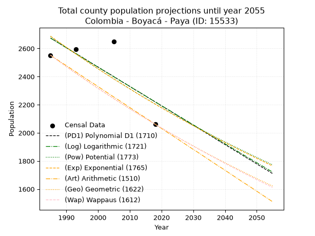
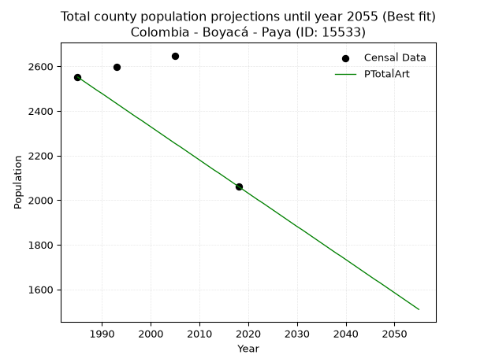
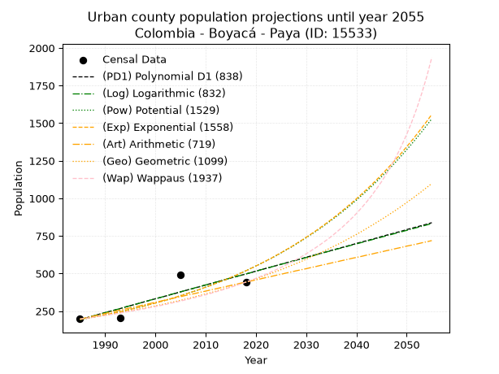
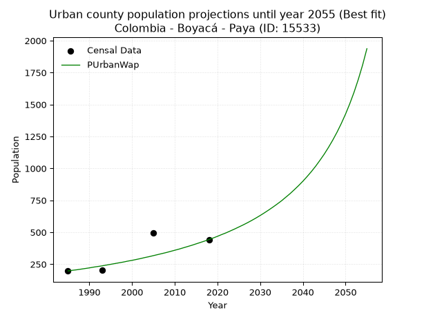
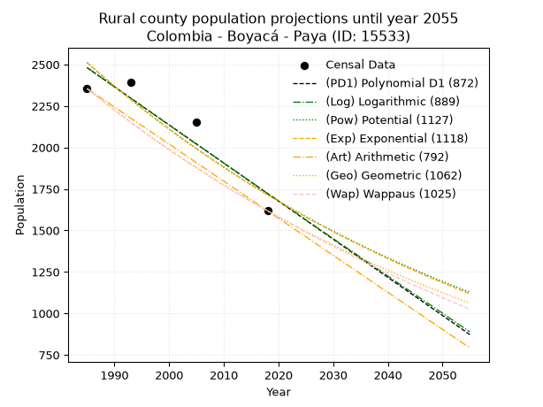
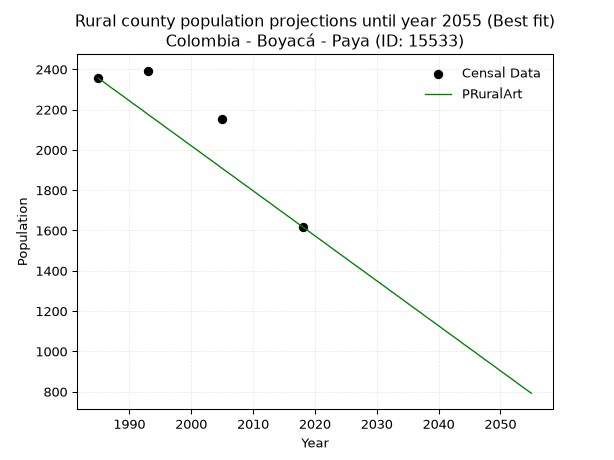

<div align="center">


</div>

# 📜 _“Population and Public Services Demand Projections (PPSD) until Year 2050 for Colombia - Boyacá - Paya (ID: 15533)”_
Keywords: `population` `public-service` `projection` `lineal` `polynomial` `logarithmic` `potential` `exponential` `arithmetic` `geometric` `wappaus` `dane` `colombia` `south-america`

PPSD are analytical estimates used by governments and planners to anticipate future changes in population size, age distribution, and the resulting community needs for utilities, healthcare, education, and infrastructure as sizing future water treatment facilities, electrical grids, and road networks based on spatial growth.

<div align="center">

</img>

</div>


> **General running parameters**: • app_version: _v20260806_. • Python version: _3.14.7_. • Pandas version: _3.0.5_. • NumPy version: _2.5.1_. • Creates, save and include plots into reports (create_plot): _False_. • Projection until year: _2050_. • Process polynomial degree 2 and up: _False_. • Process Wappaus: _True_. • Process Wappaus: _True_. • Set negative values to zero: _True_. • Set infinite values to zero: _True_. • Drop dataset notes: _True_. 
<div align="center">

Maps & GIS Layers: [:earth_americas:Google](http://maps.google.com/maps?q=5.625698706,-72.4237754) [:earth_americas:OSM](https://www.openstreetmap.org/#map=18/5.625698706/-72.4237754&layers=P) [:earth_americas:Bing](https://www.bing.com/maps?cp=5.625698706~-72.4237754&lvl=18) [:earth_americas:Apple](https://maps.apple.com/frame?center=5.625698706%2C-72.4237754&span=0.003%2C0.006) [:earth_americas:GISMobile](https://github.com/rcfdtools/R.GISMobile/blob/main/file/gis/CountyLayer_CO/Readme.md)

</div>


<div align="center">

```geojson
{
  "type": "Feature",
  "geometry": {
    "type": "Point", 
    "coordinates": [-72.4237754, 5.625698706]
  }, 
  "properties": {
    "Name": "Colombia - Boyacá - Paya (ID: 15533)"
  }
}
```

</div>


## 0. Census Data (4 records)

Census data are official statistics collected by a government about the people and housing in a country. They usually include counts of total population, age, sex, race, income, education, and jobs.

📅Global census file: [Population.xlsx](../data/Population.xlsx)

| Source   |   Year |   CountryID | CountryName   |   StateID | StateName   |   CountyID | CountyName   |   PTotal |   PUrban |   PRural |
|:---------|-------:|------------:|:--------------|----------:|:------------|-----------:|:-------------|---------:|---------:|---------:|
| DANE     |   1985 |          57 | Colombia      |        15 | Boyacá      |      15533 | Paya         |     2552 |      197 |     2355 |
| DANE     |   1993 |          57 | Colombia      |        15 | Boyacá      |      15533 | Paya         |     2596 |      203 |     2393 |
| DANE     |   2005 |          57 | Colombia      |        15 | Boyacá      |      15533 | Paya         |     2648 |      493 |     2155 |
| DANE     |   2018 |          57 | Colombia      |        15 | Boyacá      |      15533 | Paya         |     2061 |      443 |     1618 |

> 🔥Some records could had specific notes about the registered values or the corresponding urban or rural distribution.

📅[SUI-RUPS](https://www.datos.gov.co/Hacienda-y-Cr-dito-P-blico/Registro-nico-de-Prestadores-de-Servicios-P-blicos/4qkq-csdn/about_data) - Local public utility companies: [RUPS.csv](../data/RUPS.csv)

 | SERVICIO       | ESTADO    | NOMBRE                                                                               | NIT         | DEPARTAMENTO_DOMICILIO   | MUNICIPIO_DOMICILIO   | DIRECCION                           |   TELEFONO | EMAIL                           | TIPO_PRESTADOR                 | CLASIFICACION                 |
|:---------------|:----------|:-------------------------------------------------------------------------------------|:------------|:-------------------------|:----------------------|:------------------------------------|-----------:|:--------------------------------|:-------------------------------|:------------------------------|
| ACUEDUCTO      | OPERATIVA | UNIDAD ADMINISTRADORA  DE LOS SERVICIOS PÚBLICOS DOMICILIARIOS DEL MUNICIPIO DE PAYA | 800065411-5 | BOYACA                   | PAYA                  | PALACIO MUNICIPAL - Calle 3 No 3-45 |    6359360 | maribelpulidoaponte@hotmail.com | MUNICIPIO (PRESTACIÓN DIRECTA) | MENOR O IGUAL A 2500 USUARIOS |
| ALCANTARILLADO | OPERATIVA | UNIDAD ADMINISTRADORA  DE LOS SERVICIOS PÚBLICOS DOMICILIARIOS DEL MUNICIPIO DE PAYA | 800065411-5 | BOYACA                   | PAYA                  | PALACIO MUNICIPAL - Calle 3 No 3-45 |    6359360 | maribelpulidoaponte@hotmail.com | MUNICIPIO (PRESTACIÓN DIRECTA) | MENOR O IGUAL A 2500 USUARIOS |

## 1. Total

### 1.1. Coefficients and Parameters

* (PD1) Polynomial Deg 1: -13.774789241268195, 30017.272179846706 (lineal)
* (Log) Logarithmic: -27514.805027834416, 211604.50350637914
* (Pow) Potential: -12.00151661360953, 43.007461835191954
* (Exp) Exponential: -0.006007961020448384, 406112424.232475
* (Art) Arithmetic: Year diff. 2018 - 1985 = 33, Population diff. 2061 - 2552 = -491, Annual growth = -14.878787878787879
* (Geo) Geometric: Year diff. 2018 - 1985 = 33, Population diff. 2061 - 2552 = -491, Annual growth % = -0.006454415455066309
* (Wap) Wappaus: i = -0.6450807664768211, Condition values only valid for < 200)

<sub>
Wappaus condition values: ['-0.00', '-0.65', '-1.29', '-1.94', '-2.58', '-3.23', '-3.87', '-4.52', '-5.16', '-5.81', '-6.45', '-7.10', '-7.74', '-8.39', '-9.03', '-9.68', '-10.32', '-10.97', '-11.61', '-12.26', '-12.90', '-13.55', '-14.19', '-14.84', '-15.48', '-16.13', '-16.77', '-17.42', '-18.06', '-18.71', '-19.35', '-20.00', '-20.64', '-21.29', '-21.93', '-22.58', '-23.22', '-23.87', '-24.51', '-25.16', '-25.80', '-26.45', '-27.09', '-27.74', '-28.38', '-29.03', '-29.67', '-30.32', '-30.96', '-31.61', '-32.25', '-32.90', '-33.54', '-34.19', '-34.83', '-35.48', '-36.12', '-36.77', '-37.41', '-38.06', '-38.70', '-39.35', '-40.00', '-40.64', '-41.29', '-41.93']
</sub>


### 1.2. Projected Dataset

|   Year |   CountyID |   PTotalPD1 |   PTotalLog |   PTotalPow |   PTotalExp |   PTotalArt |   PTotalGeo |   PTotalWap |
|-------:|-----------:|------------:|------------:|------------:|------------:|------------:|------------:|------------:|
|   1985 |      15533 |        2674 |        2674 |        2687 |        2687 |        2552 |        2552 |        2552 |
|   1986 |      15533 |        2661 |        2660 |        2671 |        2671 |        2537 |        2536 |        2536 |
|   1987 |      15533 |        2647 |        2647 |        2655 |        2655 |        2522 |        2519 |        2519 |
|   1988 |      15533 |        2633 |        2633 |        2639 |        2639 |        2507 |        2503 |        2503 |
|   1989 |      15533 |        2619 |        2619 |        2623 |        2624 |        2492 |        2487 |        2487 |
|   1990 |      15533 |        2605 |        2605 |        2607 |        2608 |        2478 |        2471 |        2471 |
|   1991 |      15533 |        2592 |        2591 |        2592 |        2592 |        2463 |        2455 |        2455 |
|   1992 |      15533 |        2578 |        2577 |        2576 |        2577 |        2448 |        2439 |        2439 |
|   1993 |      15533 |        2564 |        2564 |        2561 |        2561 |        2433 |        2423 |        2424 |
|   1994 |      15533 |        2550 |        2550 |        2545 |        2546 |        2418 |        2408 |        2408 |
|   1995 |      15533 |        2537 |        2536 |        2530 |        2531 |        2403 |        2392 |        2393 |
|   1996 |      15533 |        2523 |        2522 |        2515 |        2516 |        2388 |        2377 |        2377 |
|   1997 |      15533 |        2509 |        2508 |        2500 |        2500 |        2373 |        2361 |        2362 |
|   1998 |      15533 |        2495 |        2495 |        2485 |        2486 |        2359 |        2346 |        2347 |
|   1999 |      15533 |        2481 |        2481 |        2470 |        2471 |        2344 |        2331 |        2331 |
|   2000 |      15533 |        2468 |        2467 |        2455 |        2456 |        2329 |        2316 |        2316 |
|   2001 |      15533 |        2454 |        2453 |        2441 |        2441 |        2314 |        2301 |        2302 |
|   2002 |      15533 |        2440 |        2440 |        2426 |        2426 |        2299 |        2286 |        2287 |
|   2003 |      15533 |        2426 |        2426 |        2411 |        2412 |        2284 |        2271 |        2272 |
|   2004 |      15533 |        2413 |        2412 |        2397 |        2398 |        2269 |        2257 |        2257 |
|   2005 |      15533 |        2399 |        2398 |        2383 |        2383 |        2254 |        2242 |        2243 |
|   2006 |      15533 |        2385 |        2385 |        2369 |        2369 |        2240 |        2228 |        2228 |
|   2007 |      15533 |        2371 |        2371 |        2354 |        2355 |        2225 |        2213 |        2214 |
|   2008 |      15533 |        2357 |        2357 |        2340 |        2341 |        2210 |        2199 |        2200 |
|   2009 |      15533 |        2344 |        2344 |        2326 |        2327 |        2195 |        2185 |        2185 |
|   2010 |      15533 |        2330 |        2330 |        2313 |        2313 |        2180 |        2171 |        2171 |
|   2011 |      15533 |        2316 |        2316 |        2299 |        2299 |        2165 |        2157 |        2157 |
|   2012 |      15533 |        2302 |        2303 |        2285 |        2285 |        2150 |        2143 |        2143 |
|   2013 |      15533 |        2289 |        2289 |        2272 |        2271 |        2135 |        2129 |        2129 |
|   2014 |      15533 |        2275 |        2275 |        2258 |        2258 |        2121 |        2115 |        2115 |
|   2015 |      15533 |        2261 |        2262 |        2245 |        2244 |        2106 |        2101 |        2102 |
|   2016 |      15533 |        2247 |        2248 |        2231 |        2231 |        2091 |        2088 |        2088 |
|   2017 |      15533 |        2234 |        2234 |        2218 |        2217 |        2076 |        2074 |        2074 |
|   2018 |      15533 |        2220 |        2221 |        2205 |        2204 |        2061 |        2061 |        2061 |
|   2019 |      15533 |        2206 |        2207 |        2192 |        2191 |        2046 |        2048 |        2048 |
|   2020 |      15533 |        2192 |        2193 |        2179 |        2178 |        2031 |        2034 |        2034 |
|   2021 |      15533 |        2178 |        2180 |        2166 |        2165 |        2016 |        2021 |        2021 |
|   2022 |      15533 |        2165 |        2166 |        2153 |        2152 |        2001 |        2008 |        2008 |
|   2023 |      15533 |        2151 |        2153 |        2140 |        2139 |        1987 |        1995 |        1995 |
|   2024 |      15533 |        2137 |        2139 |        2128 |        2126 |        1972 |        1982 |        1982 |
|   2025 |      15533 |        2123 |        2125 |        2115 |        2113 |        1957 |        1970 |        1969 |
|   2026 |      15533 |        2110 |        2112 |        2103 |        2101 |        1942 |        1957 |        1956 |
|   2027 |      15533 |        2096 |        2098 |        2090 |        2088 |        1927 |        1944 |        1943 |
|   2028 |      15533 |        2082 |        2085 |        2078 |        2076 |        1912 |        1932 |        1930 |
|   2029 |      15533 |        2068 |        2071 |        2066 |        2063 |        1897 |        1919 |        1918 |
|   2030 |      15533 |        2054 |        2057 |        2053 |        2051 |        1882 |        1907 |        1905 |
|   2031 |      15533 |        2041 |        2044 |        2041 |        2039 |        1868 |        1895 |        1893 |
|   2032 |      15533 |        2027 |        2030 |        2029 |        2026 |        1853 |        1882 |        1880 |
|   2033 |      15533 |        2013 |        2017 |        2017 |        2014 |        1838 |        1870 |        1868 |
|   2034 |      15533 |        1999 |        2003 |        2006 |        2002 |        1823 |        1858 |        1855 |
|   2035 |      15533 |        1986 |        1990 |        1994 |        1990 |        1808 |        1846 |        1843 |
|   2036 |      15533 |        1972 |        1976 |        1982 |        1978 |        1793 |        1834 |        1831 |
|   2037 |      15533 |        1958 |        1963 |        1970 |        1966 |        1778 |        1822 |        1819 |
|   2038 |      15533 |        1944 |        1949 |        1959 |        1955 |        1763 |        1811 |        1807 |
|   2039 |      15533 |        1930 |        1936 |        1947 |        1943 |        1749 |        1799 |        1795 |
|   2040 |      15533 |        1917 |        1922 |        1936 |        1931 |        1734 |        1787 |        1783 |
|   2041 |      15533 |        1903 |        1909 |        1925 |        1920 |        1719 |        1776 |        1771 |
|   2042 |      15533 |        1889 |        1895 |        1913 |        1908 |        1704 |        1764 |        1759 |
|   2043 |      15533 |        1875 |        1882 |        1902 |        1897 |        1689 |        1753 |        1748 |
|   2044 |      15533 |        1862 |        1868 |        1891 |        1885 |        1674 |        1742 |        1736 |
|   2045 |      15533 |        1848 |        1855 |        1880 |        1874 |        1659 |        1730 |        1724 |
|   2046 |      15533 |        1834 |        1841 |        1869 |        1863 |        1644 |        1719 |        1713 |
|   2047 |      15533 |        1820 |        1828 |        1858 |        1852 |        1630 |        1708 |        1701 |
|   2048 |      15533 |        1807 |        1815 |        1847 |        1841 |        1615 |        1697 |        1690 |
|   2049 |      15533 |        1793 |        1801 |        1836 |        1830 |        1600 |        1686 |        1679 |
|   2050 |      15533 |        1779 |        1788 |        1826 |        1819 |        1585 |        1675 |        1667 |
<div align="center">

</img>

</div>


### 1.3. Best fit with absolute and relative error (%)

Relative error puts that difference into context by dividing the absolute error by the true value, creating a unitless ratio or percentage that shows the scale of the mistake.

Absolute and relative error

|   Year | Source   |   CountryID | CountryName   |   StateID | StateName   |   CountyID_x | CountyName   |   PTotal |   PUrban |   PRural |   CountyID_y |   PTotalPD1 |   PTotalLog |   PTotalPow |   PTotalExp |   PTotalArt |   PTotalGeo |   PTotalWap |   PTotalPD1AbsError |   PTotalLogAbsError |   PTotalPowAbsError |   PTotalExpAbsError |   PTotalArtAbsError |   PTotalGeoAbsError |   PTotalWapAbsError |   PTotalPD1RelError |   PTotalLogRelError |   PTotalPowRelError |   PTotalExpRelError |   PTotalArtRelError |   PTotalGeoRelError |   PTotalWapRelError |
|-------:|:---------|------------:|:--------------|----------:|:------------|-------------:|:-------------|---------:|---------:|---------:|-------------:|------------:|------------:|------------:|------------:|------------:|------------:|------------:|--------------------:|--------------------:|--------------------:|--------------------:|--------------------:|--------------------:|--------------------:|--------------------:|--------------------:|--------------------:|--------------------:|--------------------:|--------------------:|--------------------:|
|   1985 | DANE     |          57 | Colombia      |        15 | Boyacá      |        15533 | Paya         |     2552 |      197 |     2355 |        15533 |        2674 |        2674 |        2687 |        2687 |        2552 |        2552 |        2552 |                 122 |                 122 |                 135 |                 135 |                   0 |                   0 |                   0 |             4.78056 |             4.78056 |             5.28997 |             5.28997 |             0       |              0      |             0       |
|   1993 | DANE     |          57 | Colombia      |        15 | Boyacá      |        15533 | Paya         |     2596 |      203 |     2393 |        15533 |        2564 |        2564 |        2561 |        2561 |        2433 |        2423 |        2424 |                  32 |                  32 |                  35 |                  35 |                 163 |                 173 |                 172 |             1.23267 |             1.23267 |             1.34823 |             1.34823 |             6.27889 |              6.6641 |             6.62558 |
|   2005 | DANE     |          57 | Colombia      |        15 | Boyacá      |        15533 | Paya         |     2648 |      493 |     2155 |        15533 |        2399 |        2398 |        2383 |        2383 |        2254 |        2242 |        2243 |                 249 |                 250 |                 265 |                 265 |                 394 |                 406 |                 405 |             9.40332 |             9.44109 |            10.0076  |            10.0076  |            14.8792  |             15.3323 |            15.2946  |
|   2018 | DANE     |          57 | Colombia      |        15 | Boyacá      |        15533 | Paya         |     2061 |      443 |     1618 |        15533 |        2220 |        2221 |        2205 |        2204 |        2061 |        2061 |        2061 |                 159 |                 160 |                 144 |                 143 |                   0 |                   0 |                   0 |             7.7147  |             7.76322 |             6.9869  |             6.93838 |             0       |              0      |             0       |

Relative error mean

| Method    |   RelError | Best   |
|:----------|-----------:|:-------|
| PTotalPD1 |    5.78281 |        |
| PTotalLog |    5.80438 |        |
| PTotalPow |    5.90816 |        |
| PTotalExp |    5.89603 |        |
| PTotalArt |    5.28951 | True   |
| PTotalGeo |    5.49911 |        |
| PTotalWap |    5.48003 |        |

💙Best method: _**PTotalArt**_
<div align="center">

</img>

</div>


### 1.4. Fresh water supply demand in liters per capita per day (lpcd)

The fresh water supply demand typically ranges from 100 to 300 liters per capita per day (lpcd) for standard domestic and municipal planning, though absolute survival minimums set by the World Health Organization are as low as 7.5 to 20 liters per day, and total consumption in high-income nations can exceed 400 liters.

> `CZ`: Level in meters above the sea level (masl)<br> `WS`: Fresh water supply demand in liters per capita per day (lpcd or l/h/d)<br> `WSAll`: Zonal fresh water supply demand in liters per second (l/s)<br> `A`: Zonal area in square meters<br> `DP`: Population density (people/hectare or p/ha)

Reference values (RAS Colombia)

|    CZ |   WS |
|------:|-----:|
|  1000 |  120 |
|  2000 |  130 |
| 99999 |  140 |

County shapefile geometry properties and water supply values

|   CountyID |      ATotal |   CZTotal |   WSTotal |
|-----------:|------------:|----------:|----------:|
|      15533 | 4.42762e+08 |   1165.53 |       130 |

Projected values for best method: PTotalArt

|   CountyID |   Year |   PTotalArt |   DPTotal |   WSTotal |   WSTotalAll |
|-----------:|-------:|------------:|----------:|----------:|-------------:|
|      15533 |   1985 |        2552 |      0.06 |       130 |      3.83981 |
|      15533 |   1986 |        2537 |      0.06 |       130 |      3.81725 |
|      15533 |   1987 |        2522 |      0.06 |       130 |      3.79468 |
|      15533 |   1988 |        2507 |      0.06 |       130 |      3.77211 |
|      15533 |   1989 |        2492 |      0.06 |       130 |      3.74954 |
|      15533 |   1990 |        2478 |      0.06 |       130 |      3.72847 |
|      15533 |   1991 |        2463 |      0.06 |       130 |      3.7059  |
|      15533 |   1992 |        2448 |      0.06 |       130 |      3.68333 |
|      15533 |   1993 |        2433 |      0.05 |       130 |      3.66076 |
|      15533 |   1994 |        2418 |      0.05 |       130 |      3.63819 |
|      15533 |   1995 |        2403 |      0.05 |       130 |      3.61563 |
|      15533 |   1996 |        2388 |      0.05 |       130 |      3.59306 |
|      15533 |   1997 |        2373 |      0.05 |       130 |      3.57049 |
|      15533 |   1998 |        2359 |      0.05 |       130 |      3.54942 |
|      15533 |   1999 |        2344 |      0.05 |       130 |      3.52685 |
|      15533 |   2000 |        2329 |      0.05 |       130 |      3.50428 |
|      15533 |   2001 |        2314 |      0.05 |       130 |      3.48171 |
|      15533 |   2002 |        2299 |      0.05 |       130 |      3.45914 |
|      15533 |   2003 |        2284 |      0.05 |       130 |      3.43657 |
|      15533 |   2004 |        2269 |      0.05 |       130 |      3.414   |
|      15533 |   2005 |        2254 |      0.05 |       130 |      3.39144 |
|      15533 |   2006 |        2240 |      0.05 |       130 |      3.37037 |
|      15533 |   2007 |        2225 |      0.05 |       130 |      3.3478  |
|      15533 |   2008 |        2210 |      0.05 |       130 |      3.32523 |
|      15533 |   2009 |        2195 |      0.05 |       130 |      3.30266 |
|      15533 |   2010 |        2180 |      0.05 |       130 |      3.28009 |
|      15533 |   2011 |        2165 |      0.05 |       130 |      3.25752 |
|      15533 |   2012 |        2150 |      0.05 |       130 |      3.23495 |
|      15533 |   2013 |        2135 |      0.05 |       130 |      3.21238 |
|      15533 |   2014 |        2121 |      0.05 |       130 |      3.19132 |
|      15533 |   2015 |        2106 |      0.05 |       130 |      3.16875 |
|      15533 |   2016 |        2091 |      0.05 |       130 |      3.14618 |
|      15533 |   2017 |        2076 |      0.05 |       130 |      3.12361 |
|      15533 |   2018 |        2061 |      0.05 |       130 |      3.10104 |
|      15533 |   2019 |        2046 |      0.05 |       130 |      3.07847 |
|      15533 |   2020 |        2031 |      0.05 |       130 |      3.0559  |
|      15533 |   2021 |        2016 |      0.05 |       130 |      3.03333 |
|      15533 |   2022 |        2001 |      0.05 |       130 |      3.01076 |
|      15533 |   2023 |        1987 |      0.04 |       130 |      2.9897  |
|      15533 |   2024 |        1972 |      0.04 |       130 |      2.96713 |
|      15533 |   2025 |        1957 |      0.04 |       130 |      2.94456 |
|      15533 |   2026 |        1942 |      0.04 |       130 |      2.92199 |
|      15533 |   2027 |        1927 |      0.04 |       130 |      2.89942 |
|      15533 |   2028 |        1912 |      0.04 |       130 |      2.87685 |
|      15533 |   2029 |        1897 |      0.04 |       130 |      2.85428 |
|      15533 |   2030 |        1882 |      0.04 |       130 |      2.83171 |
|      15533 |   2031 |        1868 |      0.04 |       130 |      2.81065 |
|      15533 |   2032 |        1853 |      0.04 |       130 |      2.78808 |
|      15533 |   2033 |        1838 |      0.04 |       130 |      2.76551 |
|      15533 |   2034 |        1823 |      0.04 |       130 |      2.74294 |
|      15533 |   2035 |        1808 |      0.04 |       130 |      2.72037 |
|      15533 |   2036 |        1793 |      0.04 |       130 |      2.6978  |
|      15533 |   2037 |        1778 |      0.04 |       130 |      2.67523 |
|      15533 |   2038 |        1763 |      0.04 |       130 |      2.65266 |
|      15533 |   2039 |        1749 |      0.04 |       130 |      2.6316  |
|      15533 |   2040 |        1734 |      0.04 |       130 |      2.60903 |
|      15533 |   2041 |        1719 |      0.04 |       130 |      2.58646 |
|      15533 |   2042 |        1704 |      0.04 |       130 |      2.56389 |
|      15533 |   2043 |        1689 |      0.04 |       130 |      2.54132 |
|      15533 |   2044 |        1674 |      0.04 |       130 |      2.51875 |
|      15533 |   2045 |        1659 |      0.04 |       130 |      2.49618 |
|      15533 |   2046 |        1644 |      0.04 |       130 |      2.47361 |
|      15533 |   2047 |        1630 |      0.04 |       130 |      2.45255 |
|      15533 |   2048 |        1615 |      0.04 |       130 |      2.42998 |
|      15533 |   2049 |        1600 |      0.04 |       130 |      2.40741 |
|      15533 |   2050 |        1585 |      0.04 |       130 |      2.38484 |

## 2. Urban

### 2.1. Coefficients and Parameters

* (PD1) Polynomial Deg 1: 9.199518265756733, -18067.33641107991 (lineal)
* (Log) Logarithmic: 18427.63569146201, -139734.60656060753
* (Pow) Potential: 59.577143035959566, -194.18336409588647
* (Exp) Exponential: 0.029744972755835698, 4.4250546999921675e-24
* (Art) Arithmetic: Year diff. 2018 - 1985 = 33, Population diff. 443 - 197 = 246, Annual growth = 7.454545454545454
* (Geo) Geometric: Year diff. 2018 - 1985 = 33, Population diff. 443 - 197 = 246, Annual growth % = 0.024860541956759352
* (Wap) Wappaus: i = 2.3295454545454546, Condition values only valid for < 200)

<sub>
Wappaus condition values: ['0.00', '2.33', '4.66', '6.99', '9.32', '11.65', '13.98', '16.31', '18.64', '20.97', '23.30', '25.62', '27.95', '30.28', '32.61', '34.94', '37.27', '39.60', '41.93', '44.26', '46.59', '48.92', '51.25', '53.58', '55.91', '58.24', '60.57', '62.90', '65.23', '67.56', '69.89', '72.22', '74.55', '76.88', '79.20', '81.53', '83.86', '86.19', '88.52', '90.85', '93.18', '95.51', '97.84', '100.17', '102.50', '104.83', '107.16', '109.49', '111.82', '114.15', '116.48', '118.81', '121.14', '123.47', '125.80', '128.12', '130.45', '132.78', '135.11', '137.44', '139.77', '142.10', '144.43', '146.76', '149.09', '151.42']
</sub>


### 2.2. Projected Dataset

|   Year |   CountyID |   PUrbanPD1 |   PUrbanLog |   PUrbanPow |   PUrbanExp |   PUrbanArt |   PUrbanGeo |   PUrbanWap |
|-------:|-----------:|------------:|------------:|------------:|------------:|------------:|------------:|------------:|
|   1985 |      15533 |         194 |         193 |         194 |         194 |         197 |         197 |         197 |
|   1986 |      15533 |         203 |         203 |         200 |         200 |         204 |         202 |         202 |
|   1987 |      15533 |         212 |         212 |         206 |         206 |         212 |         207 |         206 |
|   1988 |      15533 |         221 |         221 |         212 |         212 |         219 |         212 |         211 |
|   1989 |      15533 |         231 |         230 |         219 |         219 |         227 |         217 |         216 |
|   1990 |      15533 |         240 |         240 |         225 |         225 |         234 |         223 |         221 |
|   1991 |      15533 |         249 |         249 |         232 |         232 |         242 |         228 |         227 |
|   1992 |      15533 |         258 |         258 |         239 |         239 |         249 |         234 |         232 |
|   1993 |      15533 |         267 |         267 |         247 |         246 |         257 |         240 |         237 |
|   1994 |      15533 |         277 |         277 |         254 |         254 |         264 |         246 |         243 |
|   1995 |      15533 |         286 |         286 |         262 |         262 |         272 |         252 |         249 |
|   1996 |      15533 |         295 |         295 |         270 |         269 |         279 |         258 |         255 |
|   1997 |      15533 |         304 |         304 |         278 |         278 |         286 |         265 |         261 |
|   1998 |      15533 |         313 |         314 |         286 |         286 |         294 |         271 |         267 |
|   1999 |      15533 |         323 |         323 |         295 |         295 |         301 |         278 |         274 |
|   2000 |      15533 |         332 |         332 |         304 |         303 |         309 |         285 |         280 |
|   2001 |      15533 |         341 |         341 |         313 |         313 |         316 |         292 |         287 |
|   2002 |      15533 |         350 |         350 |         322 |         322 |         324 |         299 |         294 |
|   2003 |      15533 |         359 |         360 |         332 |         332 |         331 |         307 |         302 |
|   2004 |      15533 |         368 |         369 |         342 |         342 |         339 |         314 |         309 |
|   2005 |      15533 |         378 |         378 |         353 |         352 |         346 |         322 |         317 |
|   2006 |      15533 |         387 |         387 |         363 |         363 |         354 |         330 |         325 |
|   2007 |      15533 |         396 |         396 |         374 |         374 |         361 |         338 |         333 |
|   2008 |      15533 |         405 |         406 |         385 |         385 |         368 |         347 |         341 |
|   2009 |      15533 |         414 |         415 |         397 |         397 |         376 |         355 |         350 |
|   2010 |      15533 |         424 |         424 |         409 |         409 |         383 |         364 |         359 |
|   2011 |      15533 |         433 |         433 |         421 |         421 |         391 |         373 |         368 |
|   2012 |      15533 |         442 |         442 |         434 |         434 |         398 |         382 |         378 |
|   2013 |      15533 |         451 |         451 |         447 |         447 |         406 |         392 |         388 |
|   2014 |      15533 |         460 |         461 |         460 |         460 |         413 |         402 |         398 |
|   2015 |      15533 |         470 |         470 |         474 |         474 |         421 |         412 |         409 |
|   2016 |      15533 |         479 |         479 |         488 |         488 |         428 |         422 |         420 |
|   2017 |      15533 |         488 |         488 |         503 |         503 |         436 |         432 |         431 |
|   2018 |      15533 |         497 |         497 |         518 |         518 |         443 |         443 |         443 |
|   2019 |      15533 |         506 |         506 |         534 |         534 |         450 |         454 |         455 |
|   2020 |      15533 |         516 |         515 |         550 |         550 |         458 |         465 |         468 |
|   2021 |      15533 |         525 |         525 |         566 |         567 |         465 |         477 |         482 |
|   2022 |      15533 |         534 |         534 |         583 |         584 |         473 |         489 |         495 |
|   2023 |      15533 |         543 |         543 |         600 |         601 |         480 |         501 |         510 |
|   2024 |      15533 |         552 |         552 |         618 |         620 |         488 |         513 |         525 |
|   2025 |      15533 |         562 |         561 |         637 |         638 |         495 |         526 |         541 |
|   2026 |      15533 |         571 |         570 |         656 |         658 |         503 |         539 |         557 |
|   2027 |      15533 |         580 |         579 |         675 |         677 |         510 |         553 |         574 |
|   2028 |      15533 |         589 |         588 |         695 |         698 |         518 |         566 |         592 |
|   2029 |      15533 |         598 |         597 |         716 |         719 |         525 |         580 |         611 |
|   2030 |      15533 |         608 |         606 |         738 |         741 |         532 |         595 |         631 |
|   2031 |      15533 |         617 |         615 |         760 |         763 |         540 |         610 |         652 |
|   2032 |      15533 |         626 |         625 |         782 |         786 |         547 |         625 |         674 |
|   2033 |      15533 |         635 |         634 |         805 |         810 |         555 |         640 |         697 |
|   2034 |      15533 |         644 |         643 |         829 |         834 |         562 |         656 |         721 |
|   2035 |      15533 |         654 |         652 |         854 |         859 |         570 |         673 |         746 |
|   2036 |      15533 |         663 |         661 |         879 |         885 |         577 |         689 |         774 |
|   2037 |      15533 |         672 |         670 |         905 |         912 |         585 |         706 |         802 |
|   2038 |      15533 |         681 |         679 |         932 |         940 |         592 |         724 |         833 |
|   2039 |      15533 |         690 |         688 |         960 |         968 |         600 |         742 |         865 |
|   2040 |      15533 |         700 |         697 |         988 |         997 |         607 |         760 |         899 |
|   2041 |      15533 |         709 |         706 |        1018 |        1027 |         614 |         779 |         936 |
|   2042 |      15533 |         718 |         715 |        1048 |        1058 |         622 |         799 |         975 |
|   2043 |      15533 |         727 |         724 |        1079 |        1090 |         629 |         819 |        1017 |
|   2044 |      15533 |         736 |         733 |        1111 |        1123 |         637 |         839 |        1063 |
|   2045 |      15533 |         746 |         742 |        1144 |        1157 |         644 |         860 |        1111 |
|   2046 |      15533 |         755 |         751 |        1177 |        1192 |         652 |         881 |        1164 |
|   2047 |      15533 |         764 |         760 |        1212 |        1228 |         659 |         903 |        1221 |
|   2048 |      15533 |         773 |         769 |        1248 |        1265 |         667 |         925 |        1283 |
|   2049 |      15533 |         782 |         778 |        1285 |        1303 |         674 |         948 |        1351 |
|   2050 |      15533 |         792 |         787 |        1323 |        1343 |         682 |         972 |        1425 |
<div align="center">

</img>

</div>


### 2.3. Best fit with absolute and relative error (%)

Relative error puts that difference into context by dividing the absolute error by the true value, creating a unitless ratio or percentage that shows the scale of the mistake.

Absolute and relative error

|   Year | Source   |   CountryID | CountryName   |   StateID | StateName   |   CountyID_x | CountyName   |   PTotal |   PUrban |   PRural |   CountyID_y |   PUrbanPD1 |   PUrbanLog |   PUrbanPow |   PUrbanExp |   PUrbanArt |   PUrbanGeo |   PUrbanWap |   PUrbanPD1AbsError |   PUrbanLogAbsError |   PUrbanPowAbsError |   PUrbanExpAbsError |   PUrbanArtAbsError |   PUrbanGeoAbsError |   PUrbanWapAbsError |   PUrbanPD1RelError |   PUrbanLogRelError |   PUrbanPowRelError |   PUrbanExpRelError |   PUrbanArtRelError |   PUrbanGeoRelError |   PUrbanWapRelError |
|-------:|:---------|------------:|:--------------|----------:|:------------|-------------:|:-------------|---------:|---------:|---------:|-------------:|------------:|------------:|------------:|------------:|------------:|------------:|------------:|--------------------:|--------------------:|--------------------:|--------------------:|--------------------:|--------------------:|--------------------:|--------------------:|--------------------:|--------------------:|--------------------:|--------------------:|--------------------:|--------------------:|
|   1985 | DANE     |          57 | Colombia      |        15 | Boyacá      |        15533 | Paya         |     2552 |      197 |     2355 |        15533 |         194 |         193 |         194 |         194 |         197 |         197 |         197 |                   3 |                   4 |                   3 |                   3 |                   0 |                   0 |                   0 |             1.52284 |             2.03046 |             1.52284 |             1.52284 |              0      |              0      |              0      |
|   1993 | DANE     |          57 | Colombia      |        15 | Boyacá      |        15533 | Paya         |     2596 |      203 |     2393 |        15533 |         267 |         267 |         247 |         246 |         257 |         240 |         237 |                  64 |                  64 |                  44 |                  43 |                  54 |                  37 |                  34 |            31.5271  |            31.5271  |            21.6749  |            21.1823  |             26.601  |             18.2266 |             16.7488 |
|   2005 | DANE     |          57 | Colombia      |        15 | Boyacá      |        15533 | Paya         |     2648 |      493 |     2155 |        15533 |         378 |         378 |         353 |         352 |         346 |         322 |         317 |                 115 |                 115 |                 140 |                 141 |                 147 |                 171 |                 176 |            23.3266  |            23.3266  |            28.3976  |            28.6004  |             29.8174 |             34.6856 |             35.6998 |
|   2018 | DANE     |          57 | Colombia      |        15 | Boyacá      |        15533 | Paya         |     2061 |      443 |     1618 |        15533 |         497 |         497 |         518 |         518 |         443 |         443 |         443 |                  54 |                  54 |                  75 |                  75 |                   0 |                   0 |                   0 |            12.1896  |            12.1896  |            16.93    |            16.93    |              0      |              0      |              0      |

Relative error mean

| Method    |   RelError | Best   |
|:----------|-----------:|:-------|
| PUrbanPD1 |    17.1415 |        |
| PUrbanLog |    17.2684 |        |
| PUrbanPow |    17.1313 |        |
| PUrbanExp |    17.0589 |        |
| PUrbanArt |    14.1046 |        |
| PUrbanGeo |    13.228  |        |
| PUrbanWap |    13.1121 | True   |

💙Best method: _**PUrbanWap**_
<div align="center">

</img>

</div>


### 2.4. Fresh water supply demand in liters per capita per day (lpcd)

The fresh water supply demand typically ranges from 100 to 300 liters per capita per day (lpcd) for standard domestic and municipal planning, though absolute survival minimums set by the World Health Organization are as low as 7.5 to 20 liters per day, and total consumption in high-income nations can exceed 400 liters.

> `CZ`: Level in meters above the sea level (masl)<br> `WS`: Fresh water supply demand in liters per capita per day (lpcd or l/h/d)<br> `WSAll`: Zonal fresh water supply demand in liters per second (l/s)<br> `A`: Zonal area in square meters<br> `DP`: Population density (people/hectare or p/ha)

Reference values (RAS Colombia)

|    CZ |   WS |
|------:|-----:|
|  1000 |  120 |
|  2000 |  130 |
| 99999 |  140 |

County shapefile geometry properties and water supply values

|   CountyID |   AUrban |   CZUrban |   WSUrban |
|-----------:|---------:|----------:|----------:|
|      15533 |   131426 |   987.194 |       120 |

Projected values for best method: PUrbanWap

|   CountyID |   Year |   PUrbanWap |   DPUrban |   WSUrban |   WSUrbanAll |
|-----------:|-------:|------------:|----------:|----------:|-------------:|
|      15533 |   1985 |         197 |     14.99 |       120 |     0.273611 |
|      15533 |   1986 |         202 |     15.37 |       120 |     0.280556 |
|      15533 |   1987 |         206 |     15.67 |       120 |     0.286111 |
|      15533 |   1988 |         211 |     16.05 |       120 |     0.293056 |
|      15533 |   1989 |         216 |     16.44 |       120 |     0.3      |
|      15533 |   1990 |         221 |     16.82 |       120 |     0.306944 |
|      15533 |   1991 |         227 |     17.27 |       120 |     0.315278 |
|      15533 |   1992 |         232 |     17.65 |       120 |     0.322222 |
|      15533 |   1993 |         237 |     18.03 |       120 |     0.329167 |
|      15533 |   1994 |         243 |     18.49 |       120 |     0.3375   |
|      15533 |   1995 |         249 |     18.95 |       120 |     0.345833 |
|      15533 |   1996 |         255 |     19.4  |       120 |     0.354167 |
|      15533 |   1997 |         261 |     19.86 |       120 |     0.3625   |
|      15533 |   1998 |         267 |     20.32 |       120 |     0.370833 |
|      15533 |   1999 |         274 |     20.85 |       120 |     0.380556 |
|      15533 |   2000 |         280 |     21.3  |       120 |     0.388889 |
|      15533 |   2001 |         287 |     21.84 |       120 |     0.398611 |
|      15533 |   2002 |         294 |     22.37 |       120 |     0.408333 |
|      15533 |   2003 |         302 |     22.98 |       120 |     0.419444 |
|      15533 |   2004 |         309 |     23.51 |       120 |     0.429167 |
|      15533 |   2005 |         317 |     24.12 |       120 |     0.440278 |
|      15533 |   2006 |         325 |     24.73 |       120 |     0.451389 |
|      15533 |   2007 |         333 |     25.34 |       120 |     0.4625   |
|      15533 |   2008 |         341 |     25.95 |       120 |     0.473611 |
|      15533 |   2009 |         350 |     26.63 |       120 |     0.486111 |
|      15533 |   2010 |         359 |     27.32 |       120 |     0.498611 |
|      15533 |   2011 |         368 |     28    |       120 |     0.511111 |
|      15533 |   2012 |         378 |     28.76 |       120 |     0.525    |
|      15533 |   2013 |         388 |     29.52 |       120 |     0.538889 |
|      15533 |   2014 |         398 |     30.28 |       120 |     0.552778 |
|      15533 |   2015 |         409 |     31.12 |       120 |     0.568056 |
|      15533 |   2016 |         420 |     31.96 |       120 |     0.583333 |
|      15533 |   2017 |         431 |     32.79 |       120 |     0.598611 |
|      15533 |   2018 |         443 |     33.71 |       120 |     0.615278 |
|      15533 |   2019 |         455 |     34.62 |       120 |     0.631944 |
|      15533 |   2020 |         468 |     35.61 |       120 |     0.65     |
|      15533 |   2021 |         482 |     36.67 |       120 |     0.669444 |
|      15533 |   2022 |         495 |     37.66 |       120 |     0.6875   |
|      15533 |   2023 |         510 |     38.81 |       120 |     0.708333 |
|      15533 |   2024 |         525 |     39.95 |       120 |     0.729167 |
|      15533 |   2025 |         541 |     41.16 |       120 |     0.751389 |
|      15533 |   2026 |         557 |     42.38 |       120 |     0.773611 |
|      15533 |   2027 |         574 |     43.67 |       120 |     0.797222 |
|      15533 |   2028 |         592 |     45.04 |       120 |     0.822222 |
|      15533 |   2029 |         611 |     46.49 |       120 |     0.848611 |
|      15533 |   2030 |         631 |     48.01 |       120 |     0.876389 |
|      15533 |   2031 |         652 |     49.61 |       120 |     0.905556 |
|      15533 |   2032 |         674 |     51.28 |       120 |     0.936111 |
|      15533 |   2033 |         697 |     53.03 |       120 |     0.968056 |
|      15533 |   2034 |         721 |     54.86 |       120 |     1.00139  |
|      15533 |   2035 |         746 |     56.76 |       120 |     1.03611  |
|      15533 |   2036 |         774 |     58.89 |       120 |     1.075    |
|      15533 |   2037 |         802 |     61.02 |       120 |     1.11389  |
|      15533 |   2038 |         833 |     63.38 |       120 |     1.15694  |
|      15533 |   2039 |         865 |     65.82 |       120 |     1.20139  |
|      15533 |   2040 |         899 |     68.4  |       120 |     1.24861  |
|      15533 |   2041 |         936 |     71.22 |       120 |     1.3      |
|      15533 |   2042 |         975 |     74.19 |       120 |     1.35417  |
|      15533 |   2043 |        1017 |     77.38 |       120 |     1.4125   |
|      15533 |   2044 |        1063 |     80.88 |       120 |     1.47639  |
|      15533 |   2045 |        1111 |     84.53 |       120 |     1.54306  |
|      15533 |   2046 |        1164 |     88.57 |       120 |     1.61667  |
|      15533 |   2047 |        1221 |     92.9  |       120 |     1.69583  |
|      15533 |   2048 |        1283 |     97.62 |       120 |     1.78194  |
|      15533 |   2049 |        1351 |    102.8  |       120 |     1.87639  |
|      15533 |   2050 |        1425 |    108.43 |       120 |     1.97917  |

## 3. Rural

### 3.1. Coefficients and Parameters

* (PD1) Polynomial Deg 1: -22.974307507024935, 48084.608590926626 (lineal)
* (Log) Logarithmic: -45942.44071929638, 351339.1100669863
* (Pow) Potential: -23.11879663453966, 79.64024080505425
* (Exp) Exponential: -0.0115617418561605, 23280726524777.844
* (Art) Arithmetic: Year diff. 2018 - 1985 = 33, Population diff. 1618 - 2355 = -737, Annual growth = -22.333333333333332
* (Geo) Geometric: Year diff. 2018 - 1985 = 33, Population diff. 1618 - 2355 = -737, Annual growth % = -0.01130979755570094
* (Wap) Wappaus: i = -1.1242553905528987, Condition values only valid for < 200)

<sub>
Wappaus condition values: ['-0.00', '-1.12', '-2.25', '-3.37', '-4.50', '-5.62', '-6.75', '-7.87', '-8.99', '-10.12', '-11.24', '-12.37', '-13.49', '-14.62', '-15.74', '-16.86', '-17.99', '-19.11', '-20.24', '-21.36', '-22.49', '-23.61', '-24.73', '-25.86', '-26.98', '-28.11', '-29.23', '-30.35', '-31.48', '-32.60', '-33.73', '-34.85', '-35.98', '-37.10', '-38.22', '-39.35', '-40.47', '-41.60', '-42.72', '-43.85', '-44.97', '-46.09', '-47.22', '-48.34', '-49.47', '-50.59', '-51.72', '-52.84', '-53.96', '-55.09', '-56.21', '-57.34', '-58.46', '-59.59', '-60.71', '-61.83', '-62.96', '-64.08', '-65.21', '-66.33', '-67.46', '-68.58', '-69.70', '-70.83', '-71.95', '-73.08']
</sub>


### 3.2. Projected Dataset

|   Year |   CountyID |   PRuralPD1 |   PRuralLog |   PRuralPow |   PRuralExp |   PRuralArt |   PRuralGeo |   PRuralWap |
|-------:|-----------:|------------:|------------:|------------:|------------:|------------:|------------:|------------:|
|   1985 |      15533 |        2481 |        2481 |        2512 |        2511 |        2355 |        2355 |        2355 |
|   1986 |      15533 |        2458 |        2458 |        2483 |        2483 |        2333 |        2328 |        2329 |
|   1987 |      15533 |        2435 |        2435 |        2454 |        2454 |        2310 |        2302 |        2303 |
|   1988 |      15533 |        2412 |        2412 |        2426 |        2426 |        2288 |        2276 |        2277 |
|   1989 |      15533 |        2389 |        2388 |        2398 |        2398 |        2266 |        2250 |        2251 |
|   1990 |      15533 |        2366 |        2365 |        2370 |        2370 |        2243 |        2225 |        2226 |
|   1991 |      15533 |        2343 |        2342 |        2343 |        2343 |        2221 |        2200 |        2201 |
|   1992 |      15533 |        2320 |        2319 |        2315 |        2316 |        2199 |        2175 |        2177 |
|   1993 |      15533 |        2297 |        2296 |        2289 |        2290 |        2176 |        2150 |        2152 |
|   1994 |      15533 |        2274 |        2273 |        2262 |        2263 |        2154 |        2126 |        2128 |
|   1995 |      15533 |        2251 |        2250 |        2236 |        2237 |        2132 |        2102 |        2104 |
|   1996 |      15533 |        2228 |        2227 |        2211 |        2211 |        2109 |        2078 |        2081 |
|   1997 |      15533 |        2205 |        2204 |        2185 |        2186 |        2087 |        2055 |        2057 |
|   1998 |      15533 |        2182 |        2181 |        2160 |        2161 |        2065 |        2031 |        2034 |
|   1999 |      15533 |        2159 |        2158 |        2135 |        2136 |        2042 |        2008 |        2011 |
|   2000 |      15533 |        2136 |        2135 |        2111 |        2112 |        2020 |        1986 |        1989 |
|   2001 |      15533 |        2113 |        2112 |        2086 |        2087 |        1998 |        1963 |        1966 |
|   2002 |      15533 |        2090 |        2089 |        2062 |        2063 |        1975 |        1941 |        1944 |
|   2003 |      15533 |        2067 |        2066 |        2039 |        2040 |        1953 |        1919 |        1922 |
|   2004 |      15533 |        2044 |        2043 |        2015 |        2016 |        1931 |        1897 |        1900 |
|   2005 |      15533 |        2021 |        2020 |        1992 |        1993 |        1908 |        1876 |        1879 |
|   2006 |      15533 |        1998 |        1997 |        1969 |        1970 |        1886 |        1855 |        1858 |
|   2007 |      15533 |        1975 |        1975 |        1947 |        1947 |        1864 |        1834 |        1837 |
|   2008 |      15533 |        1952 |        1952 |        1925 |        1925 |        1841 |        1813 |        1816 |
|   2009 |      15533 |        1929 |        1929 |        1902 |        1903 |        1819 |        1792 |        1795 |
|   2010 |      15533 |        1906 |        1906 |        1881 |        1881 |        1797 |        1772 |        1775 |
|   2011 |      15533 |        1883 |        1883 |        1859 |        1859 |        1774 |        1752 |        1754 |
|   2012 |      15533 |        1860 |        1860 |        1838 |        1838 |        1752 |        1732 |        1734 |
|   2013 |      15533 |        1837 |        1837 |        1817 |        1817 |        1730 |        1713 |        1714 |
|   2014 |      15533 |        1814 |        1815 |        1796 |        1796 |        1707 |        1693 |        1695 |
|   2015 |      15533 |        1791 |        1792 |        1776 |        1775 |        1685 |        1674 |        1675 |
|   2016 |      15533 |        1768 |        1769 |        1755 |        1755 |        1663 |        1655 |        1656 |
|   2017 |      15533 |        1745 |        1746 |        1735 |        1735 |        1640 |        1637 |        1637 |
|   2018 |      15533 |        1722 |        1723 |        1716 |        1715 |        1618 |        1618 |        1618 |
|   2019 |      15533 |        1699 |        1701 |        1696 |        1695 |        1596 |        1600 |        1599 |
|   2020 |      15533 |        1677 |        1678 |        1677 |        1676 |        1573 |        1582 |        1581 |
|   2021 |      15533 |        1654 |        1655 |        1658 |        1656 |        1551 |        1564 |        1562 |
|   2022 |      15533 |        1631 |        1632 |        1639 |        1637 |        1529 |        1546 |        1544 |
|   2023 |      15533 |        1608 |        1610 |        1620 |        1618 |        1506 |        1529 |        1526 |
|   2024 |      15533 |        1585 |        1587 |        1602 |        1600 |        1484 |        1511 |        1508 |
|   2025 |      15533 |        1562 |        1564 |        1584 |        1581 |        1462 |        1494 |        1490 |
|   2026 |      15533 |        1539 |        1542 |        1566 |        1563 |        1439 |        1477 |        1473 |
|   2027 |      15533 |        1516 |        1519 |        1548 |        1545 |        1417 |        1461 |        1455 |
|   2028 |      15533 |        1493 |        1496 |        1530 |        1528 |        1395 |        1444 |        1438 |
|   2029 |      15533 |        1470 |        1474 |        1513 |        1510 |        1372 |        1428 |        1421 |
|   2030 |      15533 |        1447 |        1451 |        1496 |        1493 |        1350 |        1412 |        1404 |
|   2031 |      15533 |        1424 |        1428 |        1479 |        1475 |        1328 |        1396 |        1387 |
|   2032 |      15533 |        1401 |        1406 |        1462 |        1459 |        1305 |        1380 |        1371 |
|   2033 |      15533 |        1378 |        1383 |        1446 |        1442 |        1283 |        1364 |        1354 |
|   2034 |      15533 |        1355 |        1361 |        1429 |        1425 |        1261 |        1349 |        1338 |
|   2035 |      15533 |        1332 |        1338 |        1413 |        1409 |        1238 |        1334 |        1322 |
|   2036 |      15533 |        1309 |        1315 |        1397 |        1393 |        1216 |        1318 |        1306 |
|   2037 |      15533 |        1286 |        1293 |        1381 |        1377 |        1194 |        1304 |        1290 |
|   2038 |      15533 |        1263 |        1270 |        1366 |        1361 |        1171 |        1289 |        1274 |
|   2039 |      15533 |        1240 |        1248 |        1351 |        1345 |        1149 |        1274 |        1258 |
|   2040 |      15533 |        1217 |        1225 |        1335 |        1330 |        1127 |        1260 |        1243 |
|   2041 |      15533 |        1194 |        1203 |        1320 |        1314 |        1104 |        1246 |        1227 |
|   2042 |      15533 |        1171 |        1180 |        1305 |        1299 |        1082 |        1231 |        1212 |
|   2043 |      15533 |        1148 |        1158 |        1291 |        1284 |        1060 |        1218 |        1197 |
|   2044 |      15533 |        1125 |        1135 |        1276 |        1270 |        1037 |        1204 |        1182 |
|   2045 |      15533 |        1102 |        1113 |        1262 |        1255 |        1015 |        1190 |        1167 |
|   2046 |      15533 |        1079 |        1090 |        1248 |        1241 |         993 |        1177 |        1152 |
|   2047 |      15533 |        1056 |        1068 |        1234 |        1226 |         970 |        1163 |        1138 |
|   2048 |      15533 |        1033 |        1046 |        1220 |        1212 |         948 |        1150 |        1123 |
|   2049 |      15533 |        1010 |        1023 |        1206 |        1198 |         926 |        1137 |        1109 |
|   2050 |      15533 |         987 |        1001 |        1193 |        1185 |         903 |        1124 |        1095 |
<div align="center">

</img>

</div>


### 3.3. Best fit with absolute and relative error (%)

Relative error puts that difference into context by dividing the absolute error by the true value, creating a unitless ratio or percentage that shows the scale of the mistake.

Absolute and relative error

|   Year | Source   |   CountryID | CountryName   |   StateID | StateName   |   CountyID_x | CountyName   |   PTotal |   PUrban |   PRural |   CountyID_y |   PRuralPD1 |   PRuralLog |   PRuralPow |   PRuralExp |   PRuralArt |   PRuralGeo |   PRuralWap |   PRuralPD1AbsError |   PRuralLogAbsError |   PRuralPowAbsError |   PRuralExpAbsError |   PRuralArtAbsError |   PRuralGeoAbsError |   PRuralWapAbsError |   PRuralPD1RelError |   PRuralLogRelError |   PRuralPowRelError |   PRuralExpRelError |   PRuralArtRelError |   PRuralGeoRelError |   PRuralWapRelError |
|-------:|:---------|------------:|:--------------|----------:|:------------|-------------:|:-------------|---------:|---------:|---------:|-------------:|------------:|------------:|------------:|------------:|------------:|------------:|------------:|--------------------:|--------------------:|--------------------:|--------------------:|--------------------:|--------------------:|--------------------:|--------------------:|--------------------:|--------------------:|--------------------:|--------------------:|--------------------:|--------------------:|
|   1985 | DANE     |          57 | Colombia      |        15 | Boyacá      |        15533 | Paya         |     2552 |      197 |     2355 |        15533 |        2481 |        2481 |        2512 |        2511 |        2355 |        2355 |        2355 |                 126 |                 126 |                 157 |                 156 |                   0 |                   0 |                   0 |             5.35032 |             5.35032 |             6.66667 |             6.6242  |             0       |              0      |              0      |
|   1993 | DANE     |          57 | Colombia      |        15 | Boyacá      |        15533 | Paya         |     2596 |      203 |     2393 |        15533 |        2297 |        2296 |        2289 |        2290 |        2176 |        2150 |        2152 |                  96 |                  97 |                 104 |                 103 |                 217 |                 243 |                 241 |             4.0117  |             4.05349 |             4.34601 |             4.30422 |             9.06812 |             10.1546 |             10.071  |
|   2005 | DANE     |          57 | Colombia      |        15 | Boyacá      |        15533 | Paya         |     2648 |      493 |     2155 |        15533 |        2021 |        2020 |        1992 |        1993 |        1908 |        1876 |        1879 |                 134 |                 135 |                 163 |                 162 |                 247 |                 279 |                 276 |             6.2181  |             6.2645  |             7.56381 |             7.5174  |            11.4617  |             12.9466 |             12.8074 |
|   2018 | DANE     |          57 | Colombia      |        15 | Boyacá      |        15533 | Paya         |     2061 |      443 |     1618 |        15533 |        1722 |        1723 |        1716 |        1715 |        1618 |        1618 |        1618 |                 104 |                 105 |                  98 |                  97 |                   0 |                   0 |                   0 |             6.42769 |             6.48949 |             6.05686 |             5.99506 |             0       |              0      |              0      |

Relative error mean

| Method    |   RelError | Best   |
|:----------|-----------:|:-------|
| PRuralPD1 |    5.50195 |        |
| PRuralLog |    5.53945 |        |
| PRuralPow |    6.15834 |        |
| PRuralExp |    6.11022 |        |
| PRuralArt |    5.13246 | True   |
| PRuralGeo |    5.77531 |        |
| PRuralWap |    5.71962 |        |

💙Best method: _**PRuralArt**_
<div align="center">

</img>

</div>


### 3.4. Fresh water supply demand in liters per capita per day (lpcd)

The fresh water supply demand typically ranges from 100 to 300 liters per capita per day (lpcd) for standard domestic and municipal planning, though absolute survival minimums set by the World Health Organization are as low as 7.5 to 20 liters per day, and total consumption in high-income nations can exceed 400 liters.

> `CZ`: Level in meters above the sea level (masl)<br> `WS`: Fresh water supply demand in liters per capita per day (lpcd or l/h/d)<br> `WSAll`: Zonal fresh water supply demand in liters per second (l/s)<br> `A`: Zonal area in square meters<br> `DP`: Population density (people/hectare or p/ha)

Reference values (RAS Colombia)

|    CZ |   WS |
|------:|-----:|
|  1000 |  120 |
|  2000 |  130 |
| 99999 |  140 |

County shapefile geometry properties and water supply values

|   CountyID |     ARural |   CZRural |   WSRural |
|-----------:|-----------:|----------:|----------:|
|      15533 | 4.4263e+08 |   1165.58 |       130 |

Projected values for best method: PRuralArt

|   CountyID |   Year |   PRuralArt |   DPRural |   WSRural |   WSRuralAll |
|-----------:|-------:|------------:|----------:|----------:|-------------:|
|      15533 |   1985 |        2355 |      0.05 |       130 |      3.5434  |
|      15533 |   1986 |        2333 |      0.05 |       130 |      3.5103  |
|      15533 |   1987 |        2310 |      0.05 |       130 |      3.47569 |
|      15533 |   1988 |        2288 |      0.05 |       130 |      3.44259 |
|      15533 |   1989 |        2266 |      0.05 |       130 |      3.40949 |
|      15533 |   1990 |        2243 |      0.05 |       130 |      3.37488 |
|      15533 |   1991 |        2221 |      0.05 |       130 |      3.34178 |
|      15533 |   1992 |        2199 |      0.05 |       130 |      3.30868 |
|      15533 |   1993 |        2176 |      0.05 |       130 |      3.27407 |
|      15533 |   1994 |        2154 |      0.05 |       130 |      3.24097 |
|      15533 |   1995 |        2132 |      0.05 |       130 |      3.20787 |
|      15533 |   1996 |        2109 |      0.05 |       130 |      3.17326 |
|      15533 |   1997 |        2087 |      0.05 |       130 |      3.14016 |
|      15533 |   1998 |        2065 |      0.05 |       130 |      3.10706 |
|      15533 |   1999 |        2042 |      0.05 |       130 |      3.07245 |
|      15533 |   2000 |        2020 |      0.05 |       130 |      3.03935 |
|      15533 |   2001 |        1998 |      0.05 |       130 |      3.00625 |
|      15533 |   2002 |        1975 |      0.04 |       130 |      2.97164 |
|      15533 |   2003 |        1953 |      0.04 |       130 |      2.93854 |
|      15533 |   2004 |        1931 |      0.04 |       130 |      2.90544 |
|      15533 |   2005 |        1908 |      0.04 |       130 |      2.87083 |
|      15533 |   2006 |        1886 |      0.04 |       130 |      2.83773 |
|      15533 |   2007 |        1864 |      0.04 |       130 |      2.80463 |
|      15533 |   2008 |        1841 |      0.04 |       130 |      2.77002 |
|      15533 |   2009 |        1819 |      0.04 |       130 |      2.73692 |
|      15533 |   2010 |        1797 |      0.04 |       130 |      2.70382 |
|      15533 |   2011 |        1774 |      0.04 |       130 |      2.66921 |
|      15533 |   2012 |        1752 |      0.04 |       130 |      2.63611 |
|      15533 |   2013 |        1730 |      0.04 |       130 |      2.60301 |
|      15533 |   2014 |        1707 |      0.04 |       130 |      2.5684  |
|      15533 |   2015 |        1685 |      0.04 |       130 |      2.5353  |
|      15533 |   2016 |        1663 |      0.04 |       130 |      2.5022  |
|      15533 |   2017 |        1640 |      0.04 |       130 |      2.46759 |
|      15533 |   2018 |        1618 |      0.04 |       130 |      2.43449 |
|      15533 |   2019 |        1596 |      0.04 |       130 |      2.40139 |
|      15533 |   2020 |        1573 |      0.04 |       130 |      2.36678 |
|      15533 |   2021 |        1551 |      0.04 |       130 |      2.33368 |
|      15533 |   2022 |        1529 |      0.03 |       130 |      2.30058 |
|      15533 |   2023 |        1506 |      0.03 |       130 |      2.26597 |
|      15533 |   2024 |        1484 |      0.03 |       130 |      2.23287 |
|      15533 |   2025 |        1462 |      0.03 |       130 |      2.19977 |
|      15533 |   2026 |        1439 |      0.03 |       130 |      2.16516 |
|      15533 |   2027 |        1417 |      0.03 |       130 |      2.13206 |
|      15533 |   2028 |        1395 |      0.03 |       130 |      2.09896 |
|      15533 |   2029 |        1372 |      0.03 |       130 |      2.06435 |
|      15533 |   2030 |        1350 |      0.03 |       130 |      2.03125 |
|      15533 |   2031 |        1328 |      0.03 |       130 |      1.99815 |
|      15533 |   2032 |        1305 |      0.03 |       130 |      1.96354 |
|      15533 |   2033 |        1283 |      0.03 |       130 |      1.93044 |
|      15533 |   2034 |        1261 |      0.03 |       130 |      1.89734 |
|      15533 |   2035 |        1238 |      0.03 |       130 |      1.86273 |
|      15533 |   2036 |        1216 |      0.03 |       130 |      1.82963 |
|      15533 |   2037 |        1194 |      0.03 |       130 |      1.79653 |
|      15533 |   2038 |        1171 |      0.03 |       130 |      1.76192 |
|      15533 |   2039 |        1149 |      0.03 |       130 |      1.72882 |
|      15533 |   2040 |        1127 |      0.03 |       130 |      1.69572 |
|      15533 |   2041 |        1104 |      0.02 |       130 |      1.66111 |
|      15533 |   2042 |        1082 |      0.02 |       130 |      1.62801 |
|      15533 |   2043 |        1060 |      0.02 |       130 |      1.59491 |
|      15533 |   2044 |        1037 |      0.02 |       130 |      1.5603  |
|      15533 |   2045 |        1015 |      0.02 |       130 |      1.5272  |
|      15533 |   2046 |         993 |      0.02 |       130 |      1.4941  |
|      15533 |   2047 |         970 |      0.02 |       130 |      1.45949 |
|      15533 |   2048 |         948 |      0.02 |       130 |      1.42639 |
|      15533 |   2049 |         926 |      0.02 |       130 |      1.39329 |
|      15533 |   2050 |         903 |      0.02 |       130 |      1.35868 |

#

<div align="center"><br><sub>Share this research</sub></div><br>

<sub>**APPS & TOOLS & CONTENT DISCLAIMER**: • NO WARRANTY - This content and software is provided by <a href="https://github.com/rcfdtools" target="_blank">github.com/rcfdtools</a> "as is", without any express or implied warranty, including warranties of merchantability, fitness for a particular purpose, or non-infringement. There is no guarantee that the software will be error-free or operate without interruption. • LIMITATION OF LIABILITY - Neither the authors nor copyright holders will be liable for claims or damages arising from the software or its use. You are responsible for determining if the software is appropriate for your use and assume all associated risks, including errors, legal compliance, and data loss. • NO PROFESSIONAL ADVICE - The software provides general information and does not offer professional advice. It should not replace consultation with professional advisors. [Clauses and global license for rcfdtools use.](https://github.com/rcfdtools/rcfdtools/blob/main/LICENSE.md)</sub>

| [:house: Home](Readme.md)  | [:beginner: Help / Collab](https://github.com/rcfdtools/R.HydroTools/discussions/31) |
|----------------------------|-------------------------------------------------------------------------------------------|