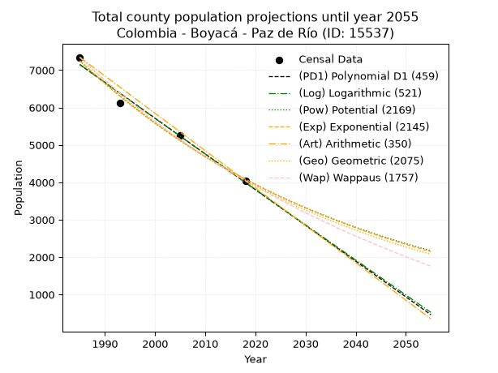
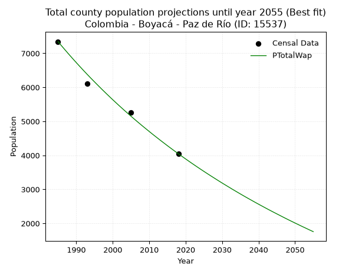
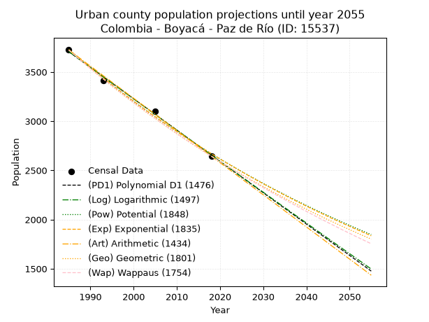
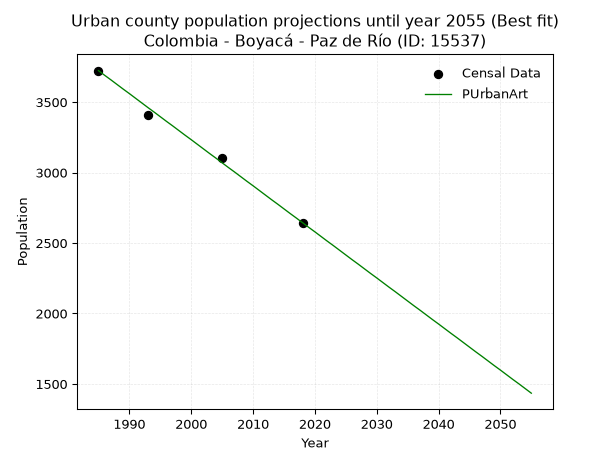
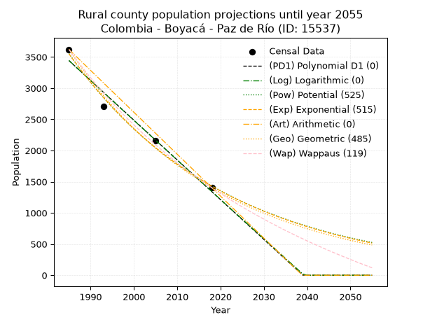
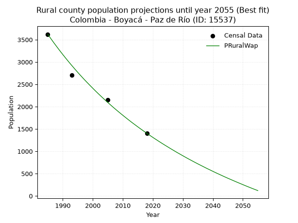

<div align="center">


</div>

# 📜 _“Population and Public Services Demand Projections (PPSD) until Year 2050 for Colombia - Boyacá - Paz de Río (ID: 15537)”_
Keywords: `population` `public-service` `projection` `lineal` `polynomial` `logarithmic` `potential` `exponential` `arithmetic` `geometric` `wappaus` `dane` `colombia` `south-america`

PPSD are analytical estimates used by governments and planners to anticipate future changes in population size, age distribution, and the resulting community needs for utilities, healthcare, education, and infrastructure as sizing future water treatment facilities, electrical grids, and road networks based on spatial growth.

<div align="center">

</img>

</div>


> **General running parameters**: • app_version: _v20260806_. • Python version: _3.14.7_. • Pandas version: _3.0.5_. • NumPy version: _2.5.1_. • Creates, save and include plots into reports (create_plot): _False_. • Projection until year: _2050_. • Process polynomial degree 2 and up: _False_. • Process Wappaus: _True_. • Process Wappaus: _True_. • Set negative values to zero: _True_. • Set infinite values to zero: _True_. • Drop dataset notes: _True_. 
<div align="center">

Dynamic map: [:earth_americas:Google](http://maps.google.com/maps?q=5.987644905,-72.7491373) [:earth_americas:OSM](https://www.openstreetmap.org/#map=18/5.987644905/-72.7491373&layers=P) [:earth_americas:Bing](https://www.bing.com/maps?cp=5.987644905~-72.7491373&lvl=18) [:earth_americas:Apple](https://maps.apple.com/frame?center=5.987644905%2C-72.7491373&span=0.003%2C0.006)

</div>


<div align="center">

```geojson
{
  "type": "Feature",
  "geometry": {
    "type": "Point", 
    "coordinates": [-72.7491373, 5.987644905]
  }, 
  "properties": {
    "Name": "Colombia - Boyacá - Paz de Río (ID: 15537)"
  }
}
```

</div>


## 0. Census Data (4 records)

Census data are official statistics collected by a government about the people and housing in a country. They usually include counts of total population, age, sex, race, income, education, and jobs.

📅Global census file: [Population.xlsx](../data/Population.xlsx)

| Source   |   Year |   CountryID | CountryName   |   StateID | StateName   |   CountyID | CountyName   |   PTotal |   PUrban |   PRural |
|:---------|-------:|------------:|:--------------|----------:|:------------|-----------:|:-------------|---------:|---------:|---------:|
| DANE     |   1985 |          57 | Colombia      |        15 | Boyacá      |      15537 | Paz de Río   |     7344 |     3723 |     3621 |
| DANE     |   1993 |          57 | Colombia      |        15 | Boyacá      |      15537 | Paz de Río   |     6113 |     3411 |     2702 |
| DANE     |   2005 |          57 | Colombia      |        15 | Boyacá      |      15537 | Paz de Río   |     5258 |     3103 |     2155 |
| DANE     |   2018 |          57 | Colombia      |        15 | Boyacá      |      15537 | Paz de Río   |     4047 |     2644 |     1403 |

> 🔥Some records could had specific notes about the registered values or the corresponding urban or rural distribution.

📅[SUI-RUPS](https://www.datos.gov.co/Hacienda-y-Cr-dito-P-blico/Registro-nico-de-Prestadores-de-Servicios-P-blicos/4qkq-csdn/about_data) - Local public utility companies: [RUPS.csv](../data/RUPS.csv)

 | SERVICIO       | ESTADO    | NOMBRE                                                                                                                               | NIT         | DEPARTAMENTO_DOMICILIO   | MUNICIPIO_DOMICILIO   | DIRECCION                       |   TELEFONO | EMAIL                                 | TIPO_PRESTADOR                 | CLASIFICACION                 |
|:---------------|:----------|:-------------------------------------------------------------------------------------------------------------------------------------|:------------|:-------------------------|:----------------------|:--------------------------------|-----------:|:--------------------------------------|:-------------------------------|:------------------------------|
| ACUEDUCTO      | OPERATIVA | UNIDAD DE SERVICIOS PUBLICOS DE PAZ DE RIO                                                                                           | 891855015-2 | BOYACA                   | PAZ DE RIO            | CARRERA 3 No 7-50               |    7865133 | linalanziano@gmail.com                | MUNICIPIO (PRESTACIÓN DIRECTA) | MENOR O IGUAL A 2500 USUARIOS |
| ALCANTARILLADO | OPERATIVA | UNIDAD DE SERVICIOS PUBLICOS DE PAZ DE RIO                                                                                           | 891855015-2 | BOYACA                   | PAZ DE RIO            | CARRERA 3 No 7-50               |    7865133 | linalanziano@gmail.com                | MUNICIPIO (PRESTACIÓN DIRECTA) | MENOR O IGUAL A 2500 USUARIOS |
| ACUEDUCTO      | OPERATIVA | ASOCIACION DE SUSCRIPTORES DEL ACUEDUCTO CHINCHILLA SECTOR EL PORTILLO                                                               | 900370316-3 | BOYACA                   | PAZ DE RIO            | VEREDA EL PORTILLO              |    7865147 | uniserpupazderio@gmail.com            | ORGANIZACION AUTORIZADA        | HASTA 2500 SUSCRIPTORES       |
| ACUEDUCTO      | OPERATIVA | ACUEDUCTO EL HAYO VEREDA SOCOTACITO SECTOR ALTO                                                                                      | 900257880-3 | BOYACA                   | PAZ DE RIO            | VEREDA SOCOTACITO               |    7865133 | personeriamunicipal.pazderio@yahoo.es | ORGANIZACION AUTORIZADA        | HASTA 2500 SUSCRIPTORES       |
| ACUEDUCTO      | OPERATIVA | ASOCIACION DE SUSCRIPTORES DEL ACUEDUCTO PANTANO DE DUGA                                                                             | 900005243-0 | BOYACA                   | PAZ DE RIO            | calle 4 numero 3-12             |    7865213 | pantanodeduga@gmail.com               | ORGANIZACION AUTORIZADA        | HASTA 2500 SUSCRIPTORES       |
| ACUEDUCTO      | OPERATIVA | ASOCIACION DE SUSCRIPTORES DEL ACUEDUCTO HUERTA CHIQUITA DE LA VEREDA VILLA FRANCA Y CARICHANA DEL MUNICIPIO DE PAZ DE RIO BOYACÁ    | 900104142-1 | BOYACA                   | PAZ DE RIO            | CARRERA 3 No. 7 - 50            |    7865147 | contactenos@pazderio-boyaca.gov.co    | ORGANIZACION AUTORIZADA        | HASTA 2500 SUSCRIPTORES       |
| ACUEDUCTO      | OPERATIVA | ASOCIACION DE SUSCRIPTORES DEL ACUEDUCTO RURAL EL CARPINTERO DE LA VEREDA SOAPAGA DEL MUNICIPIO DE PAZ DE RÍO DEPARTAMENTO DE BOYACA | 900044223-1 | BOYACA                   | PAZ DE RIO            | VEREDA SOAPAGA, SECTOR LA TORRE |    2464174 | anmitrav@misena.edu.co                | ORGANIZACION AUTORIZADA        | HASTA 2500 SUSCRIPTORES       |

## 1. Total

### 1.1. Coefficients and Parameters

* (PD1) Polynomial Deg 1: -95.55279004415813, 196819.96828582732 (lineal)
* (Log) Logarithmic: -191299.52144137005, 1459759.6954540103
* (Pow) Potential: -34.822854870904784, 118.69792000795492
* (Exp) Exponential: -0.01739761720371703, 7.216098197479248e+18
* (Art) Arithmetic: Year diff. 2018 - 1985 = 33, Population diff. 4047 - 7344 = -3297, Annual growth = -99.9090909090909
* (Geo) Geometric: Year diff. 2018 - 1985 = 33, Population diff. 4047 - 7344 = -3297, Annual growth % = -0.01789574643881653
* (Wap) Wappaus: i = -1.754175944326063, Condition values only valid for < 200)

<sub>
Wappaus condition values: ['-0.00', '-1.75', '-3.51', '-5.26', '-7.02', '-8.77', '-10.53', '-12.28', '-14.03', '-15.79', '-17.54', '-19.30', '-21.05', '-22.80', '-24.56', '-26.31', '-28.07', '-29.82', '-31.58', '-33.33', '-35.08', '-36.84', '-38.59', '-40.35', '-42.10', '-43.85', '-45.61', '-47.36', '-49.12', '-50.87', '-52.63', '-54.38', '-56.13', '-57.89', '-59.64', '-61.40', '-63.15', '-64.90', '-66.66', '-68.41', '-70.17', '-71.92', '-73.68', '-75.43', '-77.18', '-78.94', '-80.69', '-82.45', '-84.20', '-85.95', '-87.71', '-89.46', '-91.22', '-92.97', '-94.73', '-96.48', '-98.23', '-99.99', '-101.74', '-103.50', '-105.25', '-107.00', '-108.76', '-110.51', '-112.27', '-114.02']
</sub>


### 1.2. Projected Dataset

|   Year |   CountyID |   PTotalPD1 |   PTotalLog |   PTotalPow |   PTotalExp |   PTotalArt |   PTotalGeo |   PTotalWap |
|-------:|-----------:|------------:|------------:|------------:|------------:|------------:|------------:|------------:|
|   1985 |      15537 |        7148 |        7151 |        7252 |        7249 |        7344 |        7344 |        7344 |
|   1986 |      15537 |        7052 |        7054 |        7126 |        7124 |        7244 |        7213 |        7216 |
|   1987 |      15537 |        6957 |        6958 |        7003 |        7001 |        7144 |        7083 |        7091 |
|   1988 |      15537 |        6861 |        6862 |        6881 |        6880 |        7044 |        6957 |        6967 |
|   1989 |      15537 |        6765 |        6766 |        6761 |        6761 |        6944 |        6832 |        6846 |
|   1990 |      15537 |        6670 |        6670 |        6644 |        6645 |        6844 |        6710 |        6727 |
|   1991 |      15537 |        6574 |        6573 |        6529 |        6530 |        6745 |        6590 |        6610 |
|   1992 |      15537 |        6479 |        6477 |        6416 |        6418 |        6645 |        6472 |        6494 |
|   1993 |      15537 |        6383 |        6381 |        6305 |        6307 |        6545 |        6356 |        6381 |
|   1994 |      15537 |        6288 |        6285 |        6195 |        6198 |        6445 |        6242 |        6269 |
|   1995 |      15537 |        6192 |        6190 |        6088 |        6091 |        6345 |        6131 |        6160 |
|   1996 |      15537 |        6097 |        6094 |        5983 |        5986 |        6245 |        6021 |        6052 |
|   1997 |      15537 |        6001 |        5998 |        5879 |        5883 |        6145 |        5913 |        5945 |
|   1998 |      15537 |        5905 |        5902 |        5778 |        5781 |        6045 |        5807 |        5841 |
|   1999 |      15537 |        5810 |        5806 |        5678 |        5682 |        5945 |        5703 |        5738 |
|   2000 |      15537 |        5714 |        5711 |        5580 |        5584 |        5845 |        5601 |        5636 |
|   2001 |      15537 |        5619 |        5615 |        5484 |        5487 |        5745 |        5501 |        5536 |
|   2002 |      15537 |        5523 |        5519 |        5389 |        5393 |        5646 |        5403 |        5438 |
|   2003 |      15537 |        5428 |        5424 |        5296 |        5300 |        5546 |        5306 |        5341 |
|   2004 |      15537 |        5332 |        5328 |        5205 |        5208 |        5446 |        5211 |        5246 |
|   2005 |      15537 |        5237 |        5233 |        5115 |        5119 |        5346 |        5118 |        5152 |
|   2006 |      15537 |        5141 |        5138 |        5027 |        5030 |        5246 |        5026 |        5059 |
|   2007 |      15537 |        5046 |        5042 |        4941 |        4943 |        5146 |        4936 |        4968 |
|   2008 |      15537 |        4950 |        4947 |        4856 |        4858 |        5046 |        4848 |        4878 |
|   2009 |      15537 |        4854 |        4852 |        4772 |        4774 |        4946 |        4761 |        4790 |
|   2010 |      15537 |        4759 |        4757 |        4690 |        4692 |        4846 |        4676 |        4703 |
|   2011 |      15537 |        4663 |        4661 |        4610 |        4611 |        4746 |        4592 |        4616 |
|   2012 |      15537 |        4568 |        4566 |        4531 |        4532 |        4646 |        4510 |        4532 |
|   2013 |      15537 |        4472 |        4471 |        4453 |        4453 |        4547 |        4429 |        4448 |
|   2014 |      15537 |        4377 |        4376 |        4377 |        4377 |        4447 |        4350 |        4366 |
|   2015 |      15537 |        4281 |        4281 |        4302 |        4301 |        4347 |        4272 |        4284 |
|   2016 |      15537 |        4186 |        4186 |        4228 |        4227 |        4247 |        4196 |        4204 |
|   2017 |      15537 |        4090 |        4092 |        4156 |        4154 |        4147 |        4121 |        4125 |
|   2018 |      15537 |        3994 |        3997 |        4084 |        4082 |        4047 |        4047 |        4047 |
|   2019 |      15537 |        3899 |        3902 |        4015 |        4012 |        3947 |        3975 |        3970 |
|   2020 |      15537 |        3803 |        3807 |        3946 |        3943 |        3847 |        3903 |        3894 |
|   2021 |      15537 |        3708 |        3713 |        3879 |        3875 |        3747 |        3834 |        3819 |
|   2022 |      15537 |        3612 |        3618 |        3812 |        3808 |        3647 |        3765 |        3745 |
|   2023 |      15537 |        3517 |        3523 |        3747 |        3742 |        3547 |        3698 |        3672 |
|   2024 |      15537 |        3421 |        3429 |        3683 |        3678 |        3448 |        3631 |        3600 |
|   2025 |      15537 |        3326 |        3334 |        3620 |        3614 |        3348 |        3566 |        3529 |
|   2026 |      15537 |        3230 |        3240 |        3559 |        3552 |        3248 |        3503 |        3459 |
|   2027 |      15537 |        3134 |        3145 |        3498 |        3491 |        3148 |        3440 |        3390 |
|   2028 |      15537 |        3039 |        3051 |        3439 |        3431 |        3048 |        3378 |        3322 |
|   2029 |      15537 |        2943 |        2957 |        3380 |        3371 |        2948 |        3318 |        3254 |
|   2030 |      15537 |        2848 |        2863 |        3323 |        3313 |        2848 |        3259 |        3187 |
|   2031 |      15537 |        2752 |        2768 |        3266 |        3256 |        2748 |        3200 |        3122 |
|   2032 |      15537 |        2657 |        2674 |        3211 |        3200 |        2648 |        3143 |        3057 |
|   2033 |      15537 |        2561 |        2580 |        3156 |        3145 |        2548 |        3087 |        2992 |
|   2034 |      15537 |        2466 |        2486 |        3102 |        3091 |        2448 |        3031 |        2929 |
|   2035 |      15537 |        2370 |        2392 |        3050 |        3037 |        2349 |        2977 |        2866 |
|   2036 |      15537 |        2274 |        2298 |        2998 |        2985 |        2249 |        2924 |        2804 |
|   2037 |      15537 |        2179 |        2204 |        2947 |        2933 |        2149 |        2872 |        2743 |
|   2038 |      15537 |        2083 |        2110 |        2897 |        2883 |        2049 |        2820 |        2683 |
|   2039 |      15537 |        1988 |        2016 |        2848 |        2833 |        1949 |        2770 |        2623 |
|   2040 |      15537 |        1892 |        1922 |        2800 |        2784 |        1849 |        2720 |        2564 |
|   2041 |      15537 |        1797 |        1829 |        2753 |        2736 |        1749 |        2672 |        2506 |
|   2042 |      15537 |        1701 |        1735 |        2706 |        2689 |        1649 |        2624 |        2448 |
|   2043 |      15537 |        1606 |        1641 |        2660 |        2643 |        1549 |        2577 |        2391 |
|   2044 |      15537 |        1510 |        1548 |        2615 |        2597 |        1449 |        2531 |        2335 |
|   2045 |      15537 |        1415 |        1454 |        2571 |        2552 |        1349 |        2485 |        2280 |
|   2046 |      15537 |        1319 |        1361 |        2528 |        2508 |        1250 |        2441 |        2225 |
|   2047 |      15537 |        1223 |        1267 |        2485 |        2465 |        1150 |        2397 |        2170 |
|   2048 |      15537 |        1128 |        1174 |        2443 |        2422 |        1050 |        2354 |        2116 |
|   2049 |      15537 |        1032 |        1080 |        2402 |        2381 |         950 |        2312 |        2063 |
|   2050 |      15537 |         937 |         987 |        2362 |        2340 |         850 |        2271 |        2011 |
<div align="center">

</img>

</div>


### 1.3. Best fit with absolute and relative error (%)

Relative error puts that difference into context by dividing the absolute error by the true value, creating a unitless ratio or percentage that shows the scale of the mistake.

Absolute and relative error

|   Year | Source   |   CountryID | CountryName   |   StateID | StateName   |   CountyID_x | CountyName   |   PTotal |   PUrban |   PRural |   CountyID_y |   PTotalPD1 |   PTotalLog |   PTotalPow |   PTotalExp |   PTotalArt |   PTotalGeo |   PTotalWap |   PTotalPD1AbsError |   PTotalLogAbsError |   PTotalPowAbsError |   PTotalExpAbsError |   PTotalArtAbsError |   PTotalGeoAbsError |   PTotalWapAbsError |   PTotalPD1RelError |   PTotalLogRelError |   PTotalPowRelError |   PTotalExpRelError |   PTotalArtRelError |   PTotalGeoRelError |   PTotalWapRelError |
|-------:|:---------|------------:|:--------------|----------:|:------------|-------------:|:-------------|---------:|---------:|---------:|-------------:|------------:|------------:|------------:|------------:|------------:|------------:|------------:|--------------------:|--------------------:|--------------------:|--------------------:|--------------------:|--------------------:|--------------------:|--------------------:|--------------------:|--------------------:|--------------------:|--------------------:|--------------------:|--------------------:|
|   1985 | DANE     |          57 | Colombia      |        15 | Boyacá      |        15537 | Paz de Río   |     7344 |     3723 |     3621 |        15537 |        7148 |        7151 |        7252 |        7249 |        7344 |        7344 |        7344 |                 196 |                 193 |                  92 |                  95 |                   0 |                   0 |                   0 |            2.66885  |            2.628    |            1.25272  |            1.29357  |             0       |             0       |             0       |
|   1993 | DANE     |          57 | Colombia      |        15 | Boyacá      |        15537 | Paz de Río   |     6113 |     3411 |     2702 |        15537 |        6383 |        6381 |        6305 |        6307 |        6545 |        6356 |        6381 |                 270 |                 268 |                 192 |                 194 |                 432 |                 243 |                 268 |            4.41682  |            4.3841   |            3.14085  |            3.17356  |             7.06691 |             3.97513 |             4.3841  |
|   2005 | DANE     |          57 | Colombia      |        15 | Boyacá      |        15537 | Paz de Río   |     5258 |     3103 |     2155 |        15537 |        5237 |        5233 |        5115 |        5119 |        5346 |        5118 |        5152 |                  21 |                  25 |                 143 |                 139 |                  88 |                 140 |                 106 |            0.399391 |            0.475466 |            2.71967  |            2.64359  |             1.67364 |             2.66261 |             2.01598 |
|   2018 | DANE     |          57 | Colombia      |        15 | Boyacá      |        15537 | Paz de Río   |     4047 |     2644 |     1403 |        15537 |        3994 |        3997 |        4084 |        4082 |        4047 |        4047 |        4047 |                  53 |                  50 |                  37 |                  35 |                   0 |                   0 |                   0 |            1.30961  |            1.23548  |            0.914257 |            0.864838 |             0       |             0       |             0       |

Relative error mean

| Method    |   RelError | Best   |
|:----------|-----------:|:-------|
| PTotalPD1 |    2.19867 |        |
| PTotalLog |    2.18076 |        |
| PTotalPow |    2.00687 |        |
| PTotalExp |    1.99389 |        |
| PTotalArt |    2.18514 |        |
| PTotalGeo |    1.65944 |        |
| PTotalWap |    1.60002 | True   |

💙Best method: _**PTotalWap**_
<div align="center">

</img>

</div>


### 1.4. Fresh water supply demand in liters per capita per day (lpcd)

The fresh water supply demand typically ranges from 100 to 300 liters per capita per day (lpcd) for standard domestic and municipal planning, though absolute survival minimums set by the World Health Organization are as low as 7.5 to 20 liters per day, and total consumption in high-income nations can exceed 400 liters.

> `CZ`: Level in meters above the sea level (masl)<br> `WS`: Fresh water supply demand in liters per capita per day (lpcd or l/h/d)<br> `WSAll`: Zonal fresh water supply demand in liters per second (l/s)<br> `A`: Zonal area in square meters<br> `DP`: Population density (people/hectare or p/ha)

Reference values (RAS Colombia)

|    CZ |   WS |
|------:|-----:|
|  1000 |  120 |
|  2000 |  130 |
| 99999 |  140 |

County shapefile geometry properties and water supply values

|   CountyID |      ATotal |   CZTotal |   WSTotal |
|-----------:|------------:|----------:|----------:|
|      15537 | 1.22439e+08 |   2897.26 |       140 |

Projected values for best method: PTotalWap

|   CountyID |   Year |   PTotalWap |   DPTotal |   WSTotal |   WSTotalAll |
|-----------:|-------:|------------:|----------:|----------:|-------------:|
|      15537 |   1985 |        7344 |      0.6  |       140 |     11.9     |
|      15537 |   1986 |        7216 |      0.59 |       140 |     11.6926  |
|      15537 |   1987 |        7091 |      0.58 |       140 |     11.49    |
|      15537 |   1988 |        6967 |      0.57 |       140 |     11.2891  |
|      15537 |   1989 |        6846 |      0.56 |       140 |     11.0931  |
|      15537 |   1990 |        6727 |      0.55 |       140 |     10.9002  |
|      15537 |   1991 |        6610 |      0.54 |       140 |     10.7106  |
|      15537 |   1992 |        6494 |      0.53 |       140 |     10.5227  |
|      15537 |   1993 |        6381 |      0.52 |       140 |     10.3396  |
|      15537 |   1994 |        6269 |      0.51 |       140 |     10.1581  |
|      15537 |   1995 |        6160 |      0.5  |       140 |      9.98148 |
|      15537 |   1996 |        6052 |      0.49 |       140 |      9.80648 |
|      15537 |   1997 |        5945 |      0.49 |       140 |      9.6331  |
|      15537 |   1998 |        5841 |      0.48 |       140 |      9.46458 |
|      15537 |   1999 |        5738 |      0.47 |       140 |      9.29769 |
|      15537 |   2000 |        5636 |      0.46 |       140 |      9.13241 |
|      15537 |   2001 |        5536 |      0.45 |       140 |      8.97037 |
|      15537 |   2002 |        5438 |      0.44 |       140 |      8.81157 |
|      15537 |   2003 |        5341 |      0.44 |       140 |      8.6544  |
|      15537 |   2004 |        5246 |      0.43 |       140 |      8.50046 |
|      15537 |   2005 |        5152 |      0.42 |       140 |      8.34815 |
|      15537 |   2006 |        5059 |      0.41 |       140 |      8.19745 |
|      15537 |   2007 |        4968 |      0.41 |       140 |      8.05    |
|      15537 |   2008 |        4878 |      0.4  |       140 |      7.90417 |
|      15537 |   2009 |        4790 |      0.39 |       140 |      7.76157 |
|      15537 |   2010 |        4703 |      0.38 |       140 |      7.6206  |
|      15537 |   2011 |        4616 |      0.38 |       140 |      7.47963 |
|      15537 |   2012 |        4532 |      0.37 |       140 |      7.34352 |
|      15537 |   2013 |        4448 |      0.36 |       140 |      7.20741 |
|      15537 |   2014 |        4366 |      0.36 |       140 |      7.07454 |
|      15537 |   2015 |        4284 |      0.35 |       140 |      6.94167 |
|      15537 |   2016 |        4204 |      0.34 |       140 |      6.81204 |
|      15537 |   2017 |        4125 |      0.34 |       140 |      6.68403 |
|      15537 |   2018 |        4047 |      0.33 |       140 |      6.55764 |
|      15537 |   2019 |        3970 |      0.32 |       140 |      6.43287 |
|      15537 |   2020 |        3894 |      0.32 |       140 |      6.30972 |
|      15537 |   2021 |        3819 |      0.31 |       140 |      6.18819 |
|      15537 |   2022 |        3745 |      0.31 |       140 |      6.06829 |
|      15537 |   2023 |        3672 |      0.3  |       140 |      5.95    |
|      15537 |   2024 |        3600 |      0.29 |       140 |      5.83333 |
|      15537 |   2025 |        3529 |      0.29 |       140 |      5.71829 |
|      15537 |   2026 |        3459 |      0.28 |       140 |      5.60486 |
|      15537 |   2027 |        3390 |      0.28 |       140 |      5.49306 |
|      15537 |   2028 |        3322 |      0.27 |       140 |      5.38287 |
|      15537 |   2029 |        3254 |      0.27 |       140 |      5.27269 |
|      15537 |   2030 |        3187 |      0.26 |       140 |      5.16412 |
|      15537 |   2031 |        3122 |      0.25 |       140 |      5.0588  |
|      15537 |   2032 |        3057 |      0.25 |       140 |      4.95347 |
|      15537 |   2033 |        2992 |      0.24 |       140 |      4.84815 |
|      15537 |   2034 |        2929 |      0.24 |       140 |      4.74606 |
|      15537 |   2035 |        2866 |      0.23 |       140 |      4.64398 |
|      15537 |   2036 |        2804 |      0.23 |       140 |      4.54352 |
|      15537 |   2037 |        2743 |      0.22 |       140 |      4.44468 |
|      15537 |   2038 |        2683 |      0.22 |       140 |      4.34745 |
|      15537 |   2039 |        2623 |      0.21 |       140 |      4.25023 |
|      15537 |   2040 |        2564 |      0.21 |       140 |      4.15463 |
|      15537 |   2041 |        2506 |      0.2  |       140 |      4.06065 |
|      15537 |   2042 |        2448 |      0.2  |       140 |      3.96667 |
|      15537 |   2043 |        2391 |      0.2  |       140 |      3.87431 |
|      15537 |   2044 |        2335 |      0.19 |       140 |      3.78356 |
|      15537 |   2045 |        2280 |      0.19 |       140 |      3.69444 |
|      15537 |   2046 |        2225 |      0.18 |       140 |      3.60532 |
|      15537 |   2047 |        2170 |      0.18 |       140 |      3.5162  |
|      15537 |   2048 |        2116 |      0.17 |       140 |      3.4287  |
|      15537 |   2049 |        2063 |      0.17 |       140 |      3.34282 |
|      15537 |   2050 |        2011 |      0.16 |       140 |      3.25856 |

## 2. Urban

### 2.1. Coefficients and Parameters

* (PD1) Polynomial Deg 1: -31.851063829786913, 66930.34042553128 (lineal)
* (Log) Logarithmic: -63753.122189811875, 487808.2426502185
* (Pow) Potential: -20.263976761488422, 70.39737854771174
* (Exp) Exponential: -0.010125114934915703, 1995799482282.2463
* (Art) Arithmetic: Year diff. 2018 - 1985 = 33, Population diff. 2644 - 3723 = -1079, Annual growth = -32.696969696969695
* (Geo) Geometric: Year diff. 2018 - 1985 = 33, Population diff. 2644 - 3723 = -1079, Annual growth % = -0.010317222857803565
* (Wap) Wappaus: i = -1.0270761645035242, Condition values only valid for < 200)

<sub>
Wappaus condition values: ['-0.00', '-1.03', '-2.05', '-3.08', '-4.11', '-5.14', '-6.16', '-7.19', '-8.22', '-9.24', '-10.27', '-11.30', '-12.32', '-13.35', '-14.38', '-15.41', '-16.43', '-17.46', '-18.49', '-19.51', '-20.54', '-21.57', '-22.60', '-23.62', '-24.65', '-25.68', '-26.70', '-27.73', '-28.76', '-29.79', '-30.81', '-31.84', '-32.87', '-33.89', '-34.92', '-35.95', '-36.97', '-38.00', '-39.03', '-40.06', '-41.08', '-42.11', '-43.14', '-44.16', '-45.19', '-46.22', '-47.25', '-48.27', '-49.30', '-50.33', '-51.35', '-52.38', '-53.41', '-54.44', '-55.46', '-56.49', '-57.52', '-58.54', '-59.57', '-60.60', '-61.62', '-62.65', '-63.68', '-64.71', '-65.73', '-66.76']
</sub>


### 2.2. Projected Dataset

|   Year |   CountyID |   PUrbanPD1 |   PUrbanLog |   PUrbanPow |   PUrbanExp |   PUrbanArt |   PUrbanGeo |   PUrbanWap |
|-------:|-----------:|------------:|------------:|------------:|------------:|------------:|------------:|------------:|
|   1985 |      15537 |        3706 |        3707 |        3729 |        3728 |        3723 |        3723 |        3723 |
|   1986 |      15537 |        3674 |        3675 |        3692 |        3691 |        3690 |        3685 |        3685 |
|   1987 |      15537 |        3642 |        3643 |        3654 |        3654 |        3658 |        3647 |        3647 |
|   1988 |      15537 |        3610 |        3611 |        3617 |        3617 |        3625 |        3609 |        3610 |
|   1989 |      15537 |        3579 |        3579 |        3580 |        3580 |        3592 |        3572 |        3573 |
|   1990 |      15537 |        3547 |        3547 |        3544 |        3544 |        3560 |        3535 |        3537 |
|   1991 |      15537 |        3515 |        3515 |        3508 |        3509 |        3527 |        3498 |        3500 |
|   1992 |      15537 |        3483 |        3483 |        3473 |        3473 |        3494 |        3462 |        3465 |
|   1993 |      15537 |        3451 |        3451 |        3437 |        3438 |        3461 |        3427 |        3429 |
|   1994 |      15537 |        3419 |        3419 |        3403 |        3404 |        3429 |        3391 |        3394 |
|   1995 |      15537 |        3387 |        3387 |        3368 |        3369 |        3396 |        3356 |        3359 |
|   1996 |      15537 |        3356 |        3355 |        3334 |        3335 |        3363 |        3322 |        3325 |
|   1997 |      15537 |        3324 |        3323 |        3301 |        3302 |        3331 |        3287 |        3291 |
|   1998 |      15537 |        3292 |        3291 |        3267 |        3268 |        3298 |        3253 |        3257 |
|   1999 |      15537 |        3260 |        3259 |        3234 |        3236 |        3265 |        3220 |        3224 |
|   2000 |      15537 |        3228 |        3227 |        3202 |        3203 |        3233 |        3187 |        3190 |
|   2001 |      15537 |        3196 |        3195 |        3169 |        3171 |        3200 |        3154 |        3158 |
|   2002 |      15537 |        3165 |        3163 |        3138 |        3139 |        3167 |        3121 |        3125 |
|   2003 |      15537 |        3133 |        3131 |        3106 |        3107 |        3134 |        3089 |        3093 |
|   2004 |      15537 |        3101 |        3100 |        3075 |        3076 |        3102 |        3057 |        3061 |
|   2005 |      15537 |        3069 |        3068 |        3044 |        3045 |        3069 |        3026 |        3029 |
|   2006 |      15537 |        3037 |        3036 |        3013 |        3014 |        3036 |        2994 |        2998 |
|   2007 |      15537 |        3005 |        3004 |        2983 |        2984 |        3004 |        2964 |        2967 |
|   2008 |      15537 |        2973 |        2972 |        2953 |        2954 |        2971 |        2933 |        2936 |
|   2009 |      15537 |        2942 |        2941 |        2923 |        2924 |        2938 |        2903 |        2906 |
|   2010 |      15537 |        2910 |        2909 |        2894 |        2895 |        2906 |        2873 |        2876 |
|   2011 |      15537 |        2878 |        2877 |        2865 |        2865 |        2873 |        2843 |        2846 |
|   2012 |      15537 |        2846 |        2846 |        2836 |        2837 |        2840 |        2814 |        2816 |
|   2013 |      15537 |        2814 |        2814 |        2808 |        2808 |        2807 |        2785 |        2787 |
|   2014 |      15537 |        2782 |        2782 |        2780 |        2780 |        2775 |        2756 |        2758 |
|   2015 |      15537 |        2750 |        2751 |        2752 |        2752 |        2742 |        2728 |        2729 |
|   2016 |      15537 |        2719 |        2719 |        2724 |        2724 |        2709 |        2699 |        2700 |
|   2017 |      15537 |        2687 |        2687 |        2697 |        2696 |        2677 |        2672 |        2672 |
|   2018 |      15537 |        2655 |        2656 |        2670 |        2669 |        2644 |        2644 |        2644 |
|   2019 |      15537 |        2623 |        2624 |        2643 |        2642 |        2611 |        2617 |        2616 |
|   2020 |      15537 |        2591 |        2593 |        2617 |        2616 |        2579 |        2590 |        2589 |
|   2021 |      15537 |        2559 |        2561 |        2591 |        2589 |        2546 |        2563 |        2561 |
|   2022 |      15537 |        2527 |        2530 |        2565 |        2563 |        2513 |        2537 |        2534 |
|   2023 |      15537 |        2496 |        2498 |        2540 |        2538 |        2481 |        2510 |        2507 |
|   2024 |      15537 |        2464 |        2466 |        2514 |        2512 |        2448 |        2484 |        2481 |
|   2025 |      15537 |        2432 |        2435 |        2489 |        2487 |        2415 |        2459 |        2454 |
|   2026 |      15537 |        2400 |        2404 |        2464 |        2462 |        2382 |        2433 |        2428 |
|   2027 |      15537 |        2368 |        2372 |        2440 |        2437 |        2350 |        2408 |        2402 |
|   2028 |      15537 |        2336 |        2341 |        2416 |        2412 |        2317 |        2384 |        2376 |
|   2029 |      15537 |        2305 |        2309 |        2392 |        2388 |        2284 |        2359 |        2351 |
|   2030 |      15537 |        2273 |        2278 |        2368 |        2364 |        2252 |        2335 |        2325 |
|   2031 |      15537 |        2241 |        2246 |        2344 |        2340 |        2219 |        2311 |        2300 |
|   2032 |      15537 |        2209 |        2215 |        2321 |        2317 |        2186 |        2287 |        2275 |
|   2033 |      15537 |        2177 |        2184 |        2298 |        2293 |        2154 |        2263 |        2251 |
|   2034 |      15537 |        2145 |        2152 |        2275 |        2270 |        2121 |        2240 |        2226 |
|   2035 |      15537 |        2113 |        2121 |        2253 |        2247 |        2088 |        2217 |        2202 |
|   2036 |      15537 |        2082 |        2090 |        2230 |        2225 |        2055 |        2194 |        2178 |
|   2037 |      15537 |        2050 |        2058 |        2208 |        2202 |        2023 |        2171 |        2154 |
|   2038 |      15537 |        2018 |        2027 |        2186 |        2180 |        1990 |        2149 |        2130 |
|   2039 |      15537 |        1986 |        1996 |        2165 |        2158 |        1957 |        2127 |        2106 |
|   2040 |      15537 |        1954 |        1965 |        2143 |        2136 |        1925 |        2105 |        2083 |
|   2041 |      15537 |        1922 |        1933 |        2122 |        2115 |        1892 |        2083 |        2060 |
|   2042 |      15537 |        1890 |        1902 |        2101 |        2093 |        1859 |        2061 |        2037 |
|   2043 |      15537 |        1859 |        1871 |        2081 |        2072 |        1827 |        2040 |        2014 |
|   2044 |      15537 |        1827 |        1840 |        2060 |        2052 |        1794 |        2019 |        1992 |
|   2045 |      15537 |        1795 |        1808 |        2040 |        2031 |        1761 |        1998 |        1969 |
|   2046 |      15537 |        1763 |        1777 |        2020 |        2010 |        1728 |        1978 |        1947 |
|   2047 |      15537 |        1731 |        1746 |        2000 |        1990 |        1696 |        1957 |        1925 |
|   2048 |      15537 |        1699 |        1715 |        1980 |        1970 |        1663 |        1937 |        1903 |
|   2049 |      15537 |        1668 |        1684 |        1961 |        1950 |        1630 |        1917 |        1881 |
|   2050 |      15537 |        1636 |        1653 |        1941 |        1931 |        1598 |        1897 |        1860 |
<div align="center">

</img>

</div>


### 2.3. Best fit with absolute and relative error (%)

Relative error puts that difference into context by dividing the absolute error by the true value, creating a unitless ratio or percentage that shows the scale of the mistake.

Absolute and relative error

|   Year | Source   |   CountryID | CountryName   |   StateID | StateName   |   CountyID_x | CountyName   |   PTotal |   PUrban |   PRural |   CountyID_y |   PUrbanPD1 |   PUrbanLog |   PUrbanPow |   PUrbanExp |   PUrbanArt |   PUrbanGeo |   PUrbanWap |   PUrbanPD1AbsError |   PUrbanLogAbsError |   PUrbanPowAbsError |   PUrbanExpAbsError |   PUrbanArtAbsError |   PUrbanGeoAbsError |   PUrbanWapAbsError |   PUrbanPD1RelError |   PUrbanLogRelError |   PUrbanPowRelError |   PUrbanExpRelError |   PUrbanArtRelError |   PUrbanGeoRelError |   PUrbanWapRelError |
|-------:|:---------|------------:|:--------------|----------:|:------------|-------------:|:-------------|---------:|---------:|---------:|-------------:|------------:|------------:|------------:|------------:|------------:|------------:|------------:|--------------------:|--------------------:|--------------------:|--------------------:|--------------------:|--------------------:|--------------------:|--------------------:|--------------------:|--------------------:|--------------------:|--------------------:|--------------------:|--------------------:|
|   1985 | DANE     |          57 | Colombia      |        15 | Boyacá      |        15537 | Paz de Río   |     7344 |     3723 |     3621 |        15537 |        3706 |        3707 |        3729 |        3728 |        3723 |        3723 |        3723 |                  17 |                  16 |                   6 |                   5 |                   0 |                   0 |                   0 |            0.456621 |            0.429761 |            0.16116  |            0.1343   |             0       |            0        |            0        |
|   1993 | DANE     |          57 | Colombia      |        15 | Boyacá      |        15537 | Paz de Río   |     6113 |     3411 |     2702 |        15537 |        3451 |        3451 |        3437 |        3438 |        3461 |        3427 |        3429 |                  40 |                  40 |                  26 |                  27 |                  50 |                  16 |                  18 |            1.17268  |            1.17268  |            0.76224  |            0.791557 |             1.46585 |            0.469071 |            0.527704 |
|   2005 | DANE     |          57 | Colombia      |        15 | Boyacá      |        15537 | Paz de Río   |     5258 |     3103 |     2155 |        15537 |        3069 |        3068 |        3044 |        3045 |        3069 |        3026 |        3029 |                  34 |                  35 |                  59 |                  58 |                  34 |                  77 |                  74 |            1.09571  |            1.12794  |            1.90139  |            1.86916  |             1.09571 |            2.48147  |            2.38479  |
|   2018 | DANE     |          57 | Colombia      |        15 | Boyacá      |        15537 | Paz de Río   |     4047 |     2644 |     1403 |        15537 |        2655 |        2656 |        2670 |        2669 |        2644 |        2644 |        2644 |                  11 |                  12 |                  26 |                  25 |                   0 |                   0 |                   0 |            0.416036 |            0.453858 |            0.983359 |            0.945537 |             0       |            0        |            0        |

Relative error mean

| Method    |   RelError | Best   |
|:----------|-----------:|:-------|
| PUrbanPD1 |   0.785262 |        |
| PUrbanLog |   0.796059 |        |
| PUrbanPow |   0.952036 |        |
| PUrbanExp |   0.935138 |        |
| PUrbanArt |   0.64039  | True   |
| PUrbanGeo |   0.737635 |        |
| PUrbanWap |   0.728123 |        |

💙Best method: _**PUrbanArt**_
<div align="center">

</img>

</div>


### 2.4. Fresh water supply demand in liters per capita per day (lpcd)

The fresh water supply demand typically ranges from 100 to 300 liters per capita per day (lpcd) for standard domestic and municipal planning, though absolute survival minimums set by the World Health Organization are as low as 7.5 to 20 liters per day, and total consumption in high-income nations can exceed 400 liters.

> `CZ`: Level in meters above the sea level (masl)<br> `WS`: Fresh water supply demand in liters per capita per day (lpcd or l/h/d)<br> `WSAll`: Zonal fresh water supply demand in liters per second (l/s)<br> `A`: Zonal area in square meters<br> `DP`: Population density (people/hectare or p/ha)

Reference values (RAS Colombia)

|    CZ |   WS |
|------:|-----:|
|  1000 |  120 |
|  2000 |  130 |
| 99999 |  140 |

County shapefile geometry properties and water supply values

|   CountyID |   AUrban |   CZUrban |   WSUrban |
|-----------:|---------:|----------:|----------:|
|      15537 |   973677 |   2249.59 |       140 |

Projected values for best method: PUrbanArt

|   CountyID |   Year |   PUrbanArt |   DPUrban |   WSUrban |   WSUrbanAll |
|-----------:|-------:|------------:|----------:|----------:|-------------:|
|      15537 |   1985 |        3723 |     38.24 |       140 |      6.03264 |
|      15537 |   1986 |        3690 |     37.9  |       140 |      5.97917 |
|      15537 |   1987 |        3658 |     37.57 |       140 |      5.92731 |
|      15537 |   1988 |        3625 |     37.23 |       140 |      5.87384 |
|      15537 |   1989 |        3592 |     36.89 |       140 |      5.82037 |
|      15537 |   1990 |        3560 |     36.56 |       140 |      5.76852 |
|      15537 |   1991 |        3527 |     36.22 |       140 |      5.71505 |
|      15537 |   1992 |        3494 |     35.88 |       140 |      5.66157 |
|      15537 |   1993 |        3461 |     35.55 |       140 |      5.6081  |
|      15537 |   1994 |        3429 |     35.22 |       140 |      5.55625 |
|      15537 |   1995 |        3396 |     34.88 |       140 |      5.50278 |
|      15537 |   1996 |        3363 |     34.54 |       140 |      5.44931 |
|      15537 |   1997 |        3331 |     34.21 |       140 |      5.39745 |
|      15537 |   1998 |        3298 |     33.87 |       140 |      5.34398 |
|      15537 |   1999 |        3265 |     33.53 |       140 |      5.29051 |
|      15537 |   2000 |        3233 |     33.2  |       140 |      5.23866 |
|      15537 |   2001 |        3200 |     32.87 |       140 |      5.18519 |
|      15537 |   2002 |        3167 |     32.53 |       140 |      5.13171 |
|      15537 |   2003 |        3134 |     32.19 |       140 |      5.07824 |
|      15537 |   2004 |        3102 |     31.86 |       140 |      5.02639 |
|      15537 |   2005 |        3069 |     31.52 |       140 |      4.97292 |
|      15537 |   2006 |        3036 |     31.18 |       140 |      4.91944 |
|      15537 |   2007 |        3004 |     30.85 |       140 |      4.86759 |
|      15537 |   2008 |        2971 |     30.51 |       140 |      4.81412 |
|      15537 |   2009 |        2938 |     30.17 |       140 |      4.76065 |
|      15537 |   2010 |        2906 |     29.85 |       140 |      4.7088  |
|      15537 |   2011 |        2873 |     29.51 |       140 |      4.65532 |
|      15537 |   2012 |        2840 |     29.17 |       140 |      4.60185 |
|      15537 |   2013 |        2807 |     28.83 |       140 |      4.54838 |
|      15537 |   2014 |        2775 |     28.5  |       140 |      4.49653 |
|      15537 |   2015 |        2742 |     28.16 |       140 |      4.44306 |
|      15537 |   2016 |        2709 |     27.82 |       140 |      4.38958 |
|      15537 |   2017 |        2677 |     27.49 |       140 |      4.33773 |
|      15537 |   2018 |        2644 |     27.15 |       140 |      4.28426 |
|      15537 |   2019 |        2611 |     26.82 |       140 |      4.23079 |
|      15537 |   2020 |        2579 |     26.49 |       140 |      4.17894 |
|      15537 |   2021 |        2546 |     26.15 |       140 |      4.12546 |
|      15537 |   2022 |        2513 |     25.81 |       140 |      4.07199 |
|      15537 |   2023 |        2481 |     25.48 |       140 |      4.02014 |
|      15537 |   2024 |        2448 |     25.14 |       140 |      3.96667 |
|      15537 |   2025 |        2415 |     24.8  |       140 |      3.91319 |
|      15537 |   2026 |        2382 |     24.46 |       140 |      3.85972 |
|      15537 |   2027 |        2350 |     24.14 |       140 |      3.80787 |
|      15537 |   2028 |        2317 |     23.8  |       140 |      3.7544  |
|      15537 |   2029 |        2284 |     23.46 |       140 |      3.70093 |
|      15537 |   2030 |        2252 |     23.13 |       140 |      3.64907 |
|      15537 |   2031 |        2219 |     22.79 |       140 |      3.5956  |
|      15537 |   2032 |        2186 |     22.45 |       140 |      3.54213 |
|      15537 |   2033 |        2154 |     22.12 |       140 |      3.49028 |
|      15537 |   2034 |        2121 |     21.78 |       140 |      3.43681 |
|      15537 |   2035 |        2088 |     21.44 |       140 |      3.38333 |
|      15537 |   2036 |        2055 |     21.11 |       140 |      3.32986 |
|      15537 |   2037 |        2023 |     20.78 |       140 |      3.27801 |
|      15537 |   2038 |        1990 |     20.44 |       140 |      3.22454 |
|      15537 |   2039 |        1957 |     20.1  |       140 |      3.17106 |
|      15537 |   2040 |        1925 |     19.77 |       140 |      3.11921 |
|      15537 |   2041 |        1892 |     19.43 |       140 |      3.06574 |
|      15537 |   2042 |        1859 |     19.09 |       140 |      3.01227 |
|      15537 |   2043 |        1827 |     18.76 |       140 |      2.96042 |
|      15537 |   2044 |        1794 |     18.42 |       140 |      2.90694 |
|      15537 |   2045 |        1761 |     18.09 |       140 |      2.85347 |
|      15537 |   2046 |        1728 |     17.75 |       140 |      2.8     |
|      15537 |   2047 |        1696 |     17.42 |       140 |      2.74815 |
|      15537 |   2048 |        1663 |     17.08 |       140 |      2.69468 |
|      15537 |   2049 |        1630 |     16.74 |       140 |      2.6412  |
|      15537 |   2050 |        1598 |     16.41 |       140 |      2.58935 |

## 3. Rural

### 3.1. Coefficients and Parameters

* (PD1) Polynomial Deg 1: -63.70172621437121, 129889.62786029602 (lineal)
* (Log) Logarithmic: -127546.3992515582, 971951.452803792
* (Pow) Potential: -55.19128255833473, 185.55836397917656
* (Exp) Exponential: -0.02757447065326931, 2.09714981330004e+27
* (Art) Arithmetic: Year diff. 2018 - 1985 = 33, Population diff. 1403 - 3621 = -2218, Annual growth = -67.21212121212122
* (Geo) Geometric: Year diff. 2018 - 1985 = 33, Population diff. 1403 - 3621 = -2218, Annual growth % = -0.0283226142331644
* (Wap) Wappaus: i = -2.675641767998456, Condition values only valid for < 200)

<sub>
Wappaus condition values: ['-0.00', '-2.68', '-5.35', '-8.03', '-10.70', '-13.38', '-16.05', '-18.73', '-21.41', '-24.08', '-26.76', '-29.43', '-32.11', '-34.78', '-37.46', '-40.13', '-42.81', '-45.49', '-48.16', '-50.84', '-53.51', '-56.19', '-58.86', '-61.54', '-64.22', '-66.89', '-69.57', '-72.24', '-74.92', '-77.59', '-80.27', '-82.94', '-85.62', '-88.30', '-90.97', '-93.65', '-96.32', '-99.00', '-101.67', '-104.35', '-107.03', '-109.70', '-112.38', '-115.05', '-117.73', '-120.40', '-123.08', '-125.76', '-128.43', '-131.11', '-133.78', '-136.46', '-139.13', '-141.81', '-144.48', '-147.16', '-149.84', '-152.51', '-155.19', '-157.86', '-160.54', '-163.21', '-165.89', '-168.57', '-171.24', '-173.92']
</sub>


### 3.2. Projected Dataset

|   Year |   CountyID |   PRuralPD1 |   PRuralLog |   PRuralPow |   PRuralExp |   PRuralArt |   PRuralGeo |   PRuralWap |
|-------:|-----------:|------------:|------------:|------------:|------------:|------------:|------------:|------------:|
|   1985 |      15537 |        3442 |        3444 |        3554 |        3551 |        3621 |        3621 |        3621 |
|   1986 |      15537 |        3378 |        3380 |        3457 |        3455 |        3554 |        3518 |        3525 |
|   1987 |      15537 |        3314 |        3315 |        3362 |        3361 |        3487 |        3419 |        3432 |
|   1988 |      15537 |        3251 |        3251 |        3270 |        3269 |        3419 |        3322 |        3342 |
|   1989 |      15537 |        3187 |        3187 |        3180 |        3180 |        3352 |        3228 |        3253 |
|   1990 |      15537 |        3123 |        3123 |        3093 |        3094 |        3285 |        3136 |        3167 |
|   1991 |      15537 |        3059 |        3059 |        3009 |        3010 |        3218 |        3048 |        3083 |
|   1992 |      15537 |        2996 |        2995 |        2927 |        2928 |        3151 |        2961 |        3001 |
|   1993 |      15537 |        2932 |        2931 |        2847 |        2848 |        3083 |        2877 |        2921 |
|   1994 |      15537 |        2868 |        2867 |        2769 |        2771 |        3016 |        2796 |        2843 |
|   1995 |      15537 |        2805 |        2803 |        2693 |        2695 |        2949 |        2717 |        2766 |
|   1996 |      15537 |        2741 |        2739 |        2620 |        2622 |        2882 |        2640 |        2692 |
|   1997 |      15537 |        2677 |        2675 |        2548 |        2551 |        2814 |        2565 |        2619 |
|   1998 |      15537 |        2614 |        2611 |        2479 |        2481 |        2747 |        2492 |        2548 |
|   1999 |      15537 |        2550 |        2548 |        2411 |        2414 |        2680 |        2422 |        2479 |
|   2000 |      15537 |        2486 |        2484 |        2346 |        2348 |        2613 |        2353 |        2411 |
|   2001 |      15537 |        2422 |        2420 |        2282 |        2284 |        2546 |        2287 |        2344 |
|   2002 |      15537 |        2359 |        2356 |        2220 |        2222 |        2478 |        2222 |        2279 |
|   2003 |      15537 |        2295 |        2293 |        2160 |        2162 |        2411 |        2159 |        2216 |
|   2004 |      15537 |        2231 |        2229 |        2101 |        2103 |        2344 |        2098 |        2153 |
|   2005 |      15537 |        2168 |        2165 |        2044 |        2046 |        2277 |        2038 |        2092 |
|   2006 |      15537 |        2104 |        2102 |        1988 |        1990 |        2210 |        1981 |        2033 |
|   2007 |      15537 |        2040 |        2038 |        1934 |        1936 |        2142 |        1924 |        1974 |
|   2008 |      15537 |        1977 |        1975 |        1882 |        1883 |        2075 |        1870 |        1917 |
|   2009 |      15537 |        1913 |        1911 |        1831 |        1832 |        2008 |        1817 |        1861 |
|   2010 |      15537 |        1849 |        1848 |        1781 |        1782 |        1941 |        1766 |        1806 |
|   2011 |      15537 |        1785 |        1784 |        1733 |        1734 |        1873 |        1716 |        1752 |
|   2012 |      15537 |        1722 |        1721 |        1686 |        1687 |        1806 |        1667 |        1699 |
|   2013 |      15537 |        1658 |        1657 |        1641 |        1641 |        1739 |        1620 |        1647 |
|   2014 |      15537 |        1594 |        1594 |        1596 |        1596 |        1672 |        1574 |        1597 |
|   2015 |      15537 |        1531 |        1531 |        1553 |        1553 |        1605 |        1529 |        1547 |
|   2016 |      15537 |        1467 |        1467 |        1511 |        1511 |        1537 |        1486 |        1498 |
|   2017 |      15537 |        1403 |        1404 |        1470 |        1469 |        1470 |        1444 |        1450 |
|   2018 |      15537 |        1340 |        1341 |        1431 |        1430 |        1403 |        1403 |        1403 |
|   2019 |      15537 |        1276 |        1278 |        1392 |        1391 |        1336 |        1363 |        1357 |
|   2020 |      15537 |        1212 |        1215 |        1355 |        1353 |        1269 |        1325 |        1311 |
|   2021 |      15537 |        1148 |        1151 |        1318 |        1316 |        1201 |        1287 |        1267 |
|   2022 |      15537 |        1085 |        1088 |        1283 |        1280 |        1134 |        1251 |        1223 |
|   2023 |      15537 |        1021 |        1025 |        1248 |        1245 |        1067 |        1215 |        1180 |
|   2024 |      15537 |         957 |         962 |        1214 |        1212 |        1000 |        1181 |        1138 |
|   2025 |      15537 |         894 |         899 |        1182 |        1179 |         933 |        1147 |        1097 |
|   2026 |      15537 |         830 |         836 |        1150 |        1147 |         865 |        1115 |        1056 |
|   2027 |      15537 |         766 |         773 |        1119 |        1115 |         798 |        1083 |        1016 |
|   2028 |      15537 |         703 |         710 |        1089 |        1085 |         731 |        1053 |         976 |
|   2029 |      15537 |         639 |         648 |        1060 |        1056 |         664 |        1023 |         938 |
|   2030 |      15537 |         575 |         585 |        1031 |        1027 |         596 |         994 |         900 |
|   2031 |      15537 |         511 |         522 |        1004 |         999 |         529 |         966 |         862 |
|   2032 |      15537 |         448 |         459 |         977 |         972 |         462 |         938 |         825 |
|   2033 |      15537 |         384 |         396 |         951 |         945 |         395 |         912 |         789 |
|   2034 |      15537 |         320 |         334 |         925 |         920 |         328 |         886 |         753 |
|   2035 |      15537 |         257 |         271 |         900 |         895 |         260 |         861 |         718 |
|   2036 |      15537 |         193 |         208 |         876 |         870 |         193 |         836 |         684 |
|   2037 |      15537 |         129 |         146 |         853 |         847 |         126 |         813 |         650 |
|   2038 |      15537 |          66 |          83 |         830 |         824 |          59 |         790 |         616 |
|   2039 |      15537 |           2 |          20 |         808 |         801 |           0 |         767 |         584 |
|   2040 |      15537 |           0 |           0 |         786 |         779 |           0 |         746 |         551 |
|   2041 |      15537 |           0 |           0 |         765 |         758 |           0 |         725 |         519 |
|   2042 |      15537 |           0 |           0 |         745 |         738 |           0 |         704 |         488 |
|   2043 |      15537 |           0 |           0 |         725 |         717 |           0 |         684 |         457 |
|   2044 |      15537 |           0 |           0 |         706 |         698 |           0 |         665 |         426 |
|   2045 |      15537 |           0 |           0 |         687 |         679 |           0 |         646 |         396 |
|   2046 |      15537 |           0 |           0 |         669 |         661 |           0 |         628 |         367 |
|   2047 |      15537 |           0 |           0 |         651 |         643 |           0 |         610 |         338 |
|   2048 |      15537 |           0 |           0 |         634 |         625 |           0 |         593 |         309 |
|   2049 |      15537 |           0 |           0 |         617 |         608 |           0 |         576 |         281 |
|   2050 |      15537 |           0 |           0 |         600 |         592 |           0 |         559 |         253 |
<div align="center">

</img>

</div>


### 3.3. Best fit with absolute and relative error (%)

Relative error puts that difference into context by dividing the absolute error by the true value, creating a unitless ratio or percentage that shows the scale of the mistake.

Absolute and relative error

|   Year | Source   |   CountryID | CountryName   |   StateID | StateName   |   CountyID_x | CountyName   |   PTotal |   PUrban |   PRural |   CountyID_y |   PRuralPD1 |   PRuralLog |   PRuralPow |   PRuralExp |   PRuralArt |   PRuralGeo |   PRuralWap |   PRuralPD1AbsError |   PRuralLogAbsError |   PRuralPowAbsError |   PRuralExpAbsError |   PRuralArtAbsError |   PRuralGeoAbsError |   PRuralWapAbsError |   PRuralPD1RelError |   PRuralLogRelError |   PRuralPowRelError |   PRuralExpRelError |   PRuralArtRelError |   PRuralGeoRelError |   PRuralWapRelError |
|-------:|:---------|------------:|:--------------|----------:|:------------|-------------:|:-------------|---------:|---------:|---------:|-------------:|------------:|------------:|------------:|------------:|------------:|------------:|------------:|--------------------:|--------------------:|--------------------:|--------------------:|--------------------:|--------------------:|--------------------:|--------------------:|--------------------:|--------------------:|--------------------:|--------------------:|--------------------:|--------------------:|
|   1985 | DANE     |          57 | Colombia      |        15 | Boyacá      |        15537 | Paz de Río   |     7344 |     3723 |     3621 |        15537 |        3442 |        3444 |        3554 |        3551 |        3621 |        3621 |        3621 |                 179 |                 177 |                  67 |                  70 |                   0 |                   0 |                   0 |            4.94339  |            4.88815  |             1.85032 |             1.93317 |             0       |             0       |             0       |
|   1993 | DANE     |          57 | Colombia      |        15 | Boyacá      |        15537 | Paz de Río   |     6113 |     3411 |     2702 |        15537 |        2932 |        2931 |        2847 |        2848 |        3083 |        2877 |        2921 |                 230 |                 229 |                 145 |                 146 |                 381 |                 175 |                 219 |            8.51221  |            8.4752   |             5.3664  |             5.4034  |            14.1007  |             6.47668 |             8.10511 |
|   2005 | DANE     |          57 | Colombia      |        15 | Boyacá      |        15537 | Paz de Río   |     5258 |     3103 |     2155 |        15537 |        2168 |        2165 |        2044 |        2046 |        2277 |        2038 |        2092 |                  13 |                  10 |                 111 |                 109 |                 122 |                 117 |                  63 |            0.603248 |            0.464037 |             5.15081 |             5.058   |             5.66125 |             5.42923 |             2.92343 |
|   2018 | DANE     |          57 | Colombia      |        15 | Boyacá      |        15537 | Paz de Río   |     4047 |     2644 |     1403 |        15537 |        1340 |        1341 |        1431 |        1430 |        1403 |        1403 |        1403 |                  63 |                  62 |                  28 |                  27 |                   0 |                   0 |                   0 |            4.49038  |            4.4191   |             1.99572 |             1.92445 |             0       |             0       |             0       |

Relative error mean

| Method    |   RelError | Best   |
|:----------|-----------:|:-------|
| PRuralPD1 |    4.63731 |        |
| PRuralLog |    4.56162 |        |
| PRuralPow |    3.59081 |        |
| PRuralExp |    3.57976 |        |
| PRuralArt |    4.94048 |        |
| PRuralGeo |    2.97648 |        |
| PRuralWap |    2.75714 | True   |

💙Best method: _**PRuralWap**_
<div align="center">

</img>

</div>


### 3.4. Fresh water supply demand in liters per capita per day (lpcd)

The fresh water supply demand typically ranges from 100 to 300 liters per capita per day (lpcd) for standard domestic and municipal planning, though absolute survival minimums set by the World Health Organization are as low as 7.5 to 20 liters per day, and total consumption in high-income nations can exceed 400 liters.

> `CZ`: Level in meters above the sea level (masl)<br> `WS`: Fresh water supply demand in liters per capita per day (lpcd or l/h/d)<br> `WSAll`: Zonal fresh water supply demand in liters per second (l/s)<br> `A`: Zonal area in square meters<br> `DP`: Population density (people/hectare or p/ha)

Reference values (RAS Colombia)

|    CZ |   WS |
|------:|-----:|
|  1000 |  120 |
|  2000 |  130 |
| 99999 |  140 |

County shapefile geometry properties and water supply values

|   CountyID |      ARural |   CZRural |   WSRural |
|-----------:|------------:|----------:|----------:|
|      15537 | 1.21466e+08 |   2902.46 |       140 |

Projected values for best method: PRuralWap

|   CountyID |   Year |   PRuralWap |   DPRural |   WSRural |   WSRuralAll |
|-----------:|-------:|------------:|----------:|----------:|-------------:|
|      15537 |   1985 |        3621 |      0.3  |       140 |     5.86736  |
|      15537 |   1986 |        3525 |      0.29 |       140 |     5.71181  |
|      15537 |   1987 |        3432 |      0.28 |       140 |     5.56111  |
|      15537 |   1988 |        3342 |      0.28 |       140 |     5.41528  |
|      15537 |   1989 |        3253 |      0.27 |       140 |     5.27106  |
|      15537 |   1990 |        3167 |      0.26 |       140 |     5.13171  |
|      15537 |   1991 |        3083 |      0.25 |       140 |     4.9956   |
|      15537 |   1992 |        3001 |      0.25 |       140 |     4.86273  |
|      15537 |   1993 |        2921 |      0.24 |       140 |     4.7331   |
|      15537 |   1994 |        2843 |      0.23 |       140 |     4.60671  |
|      15537 |   1995 |        2766 |      0.23 |       140 |     4.48194  |
|      15537 |   1996 |        2692 |      0.22 |       140 |     4.36204  |
|      15537 |   1997 |        2619 |      0.22 |       140 |     4.24375  |
|      15537 |   1998 |        2548 |      0.21 |       140 |     4.1287   |
|      15537 |   1999 |        2479 |      0.2  |       140 |     4.0169   |
|      15537 |   2000 |        2411 |      0.2  |       140 |     3.90671  |
|      15537 |   2001 |        2344 |      0.19 |       140 |     3.79815  |
|      15537 |   2002 |        2279 |      0.19 |       140 |     3.69282  |
|      15537 |   2003 |        2216 |      0.18 |       140 |     3.59074  |
|      15537 |   2004 |        2153 |      0.18 |       140 |     3.48866  |
|      15537 |   2005 |        2092 |      0.17 |       140 |     3.38981  |
|      15537 |   2006 |        2033 |      0.17 |       140 |     3.29421  |
|      15537 |   2007 |        1974 |      0.16 |       140 |     3.19861  |
|      15537 |   2008 |        1917 |      0.16 |       140 |     3.10625  |
|      15537 |   2009 |        1861 |      0.15 |       140 |     3.01551  |
|      15537 |   2010 |        1806 |      0.15 |       140 |     2.92639  |
|      15537 |   2011 |        1752 |      0.14 |       140 |     2.83889  |
|      15537 |   2012 |        1699 |      0.14 |       140 |     2.75301  |
|      15537 |   2013 |        1647 |      0.14 |       140 |     2.66875  |
|      15537 |   2014 |        1597 |      0.13 |       140 |     2.58773  |
|      15537 |   2015 |        1547 |      0.13 |       140 |     2.50671  |
|      15537 |   2016 |        1498 |      0.12 |       140 |     2.42731  |
|      15537 |   2017 |        1450 |      0.12 |       140 |     2.34954  |
|      15537 |   2018 |        1403 |      0.12 |       140 |     2.27338  |
|      15537 |   2019 |        1357 |      0.11 |       140 |     2.19884  |
|      15537 |   2020 |        1311 |      0.11 |       140 |     2.12431  |
|      15537 |   2021 |        1267 |      0.1  |       140 |     2.05301  |
|      15537 |   2022 |        1223 |      0.1  |       140 |     1.98171  |
|      15537 |   2023 |        1180 |      0.1  |       140 |     1.91204  |
|      15537 |   2024 |        1138 |      0.09 |       140 |     1.84398  |
|      15537 |   2025 |        1097 |      0.09 |       140 |     1.77755  |
|      15537 |   2026 |        1056 |      0.09 |       140 |     1.71111  |
|      15537 |   2027 |        1016 |      0.08 |       140 |     1.6463   |
|      15537 |   2028 |         976 |      0.08 |       140 |     1.58148  |
|      15537 |   2029 |         938 |      0.08 |       140 |     1.51991  |
|      15537 |   2030 |         900 |      0.07 |       140 |     1.45833  |
|      15537 |   2031 |         862 |      0.07 |       140 |     1.39676  |
|      15537 |   2032 |         825 |      0.07 |       140 |     1.33681  |
|      15537 |   2033 |         789 |      0.06 |       140 |     1.27847  |
|      15537 |   2034 |         753 |      0.06 |       140 |     1.22014  |
|      15537 |   2035 |         718 |      0.06 |       140 |     1.16343  |
|      15537 |   2036 |         684 |      0.06 |       140 |     1.10833  |
|      15537 |   2037 |         650 |      0.05 |       140 |     1.05324  |
|      15537 |   2038 |         616 |      0.05 |       140 |     0.998148 |
|      15537 |   2039 |         584 |      0.05 |       140 |     0.946296 |
|      15537 |   2040 |         551 |      0.05 |       140 |     0.892824 |
|      15537 |   2041 |         519 |      0.04 |       140 |     0.840972 |
|      15537 |   2042 |         488 |      0.04 |       140 |     0.790741 |
|      15537 |   2043 |         457 |      0.04 |       140 |     0.740509 |
|      15537 |   2044 |         426 |      0.04 |       140 |     0.690278 |
|      15537 |   2045 |         396 |      0.03 |       140 |     0.641667 |
|      15537 |   2046 |         367 |      0.03 |       140 |     0.594676 |
|      15537 |   2047 |         338 |      0.03 |       140 |     0.547685 |
|      15537 |   2048 |         309 |      0.03 |       140 |     0.500694 |
|      15537 |   2049 |         281 |      0.02 |       140 |     0.455324 |
|      15537 |   2050 |         253 |      0.02 |       140 |     0.409954 |

#

<div align="center"><br><sub>Share this research</sub></div><br>

<sub>**APPS & TOOLS & CONTENT DISCLAIMER**: • NO WARRANTY - This content and software is provided by <a href="https://github.com/rcfdtools" target="_blank">github.com/rcfdtools</a> "as is", without any express or implied warranty, including warranties of merchantability, fitness for a particular purpose, or non-infringement. There is no guarantee that the software will be error-free or operate without interruption. • LIMITATION OF LIABILITY - Neither the authors nor copyright holders will be liable for claims or damages arising from the software or its use. You are responsible for determining if the software is appropriate for your use and assume all associated risks, including errors, legal compliance, and data loss. • NO PROFESSIONAL ADVICE - The software provides general information and does not offer professional advice. It should not replace consultation with professional advisors. [Clauses and global license for rcfdtools use.](https://github.com/rcfdtools/rcfdtools/blob/main/LICENSE.md)</sub>

| [:house: Home](Readme.md)  | [:beginner: Help / Collab](https://github.com/rcfdtools/R.HydroTools/discussions/31) |
|----------------------------|-------------------------------------------------------------------------------------------|