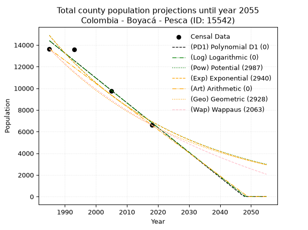
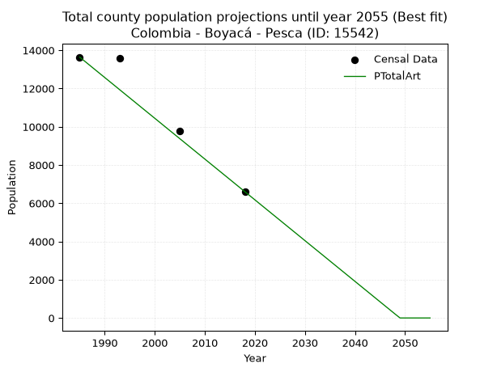
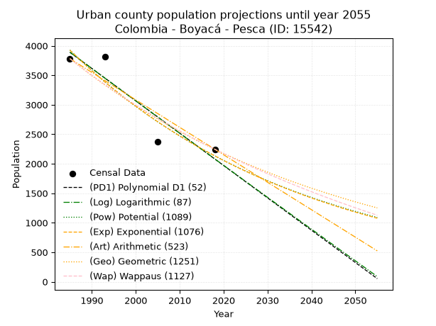
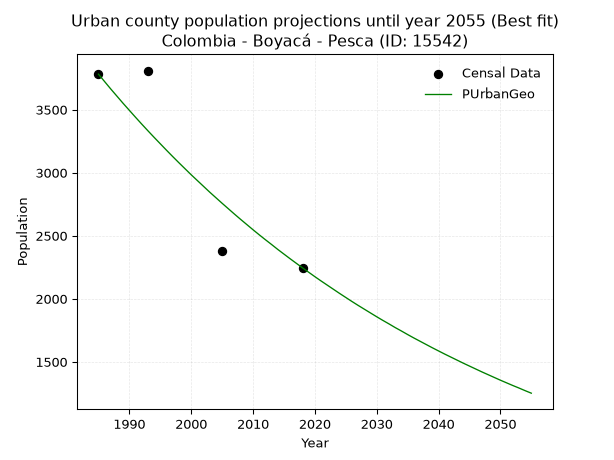
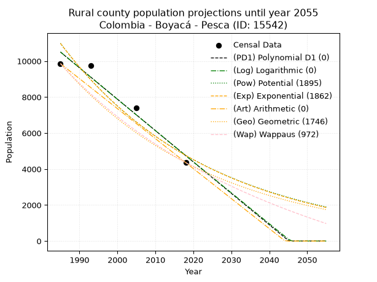
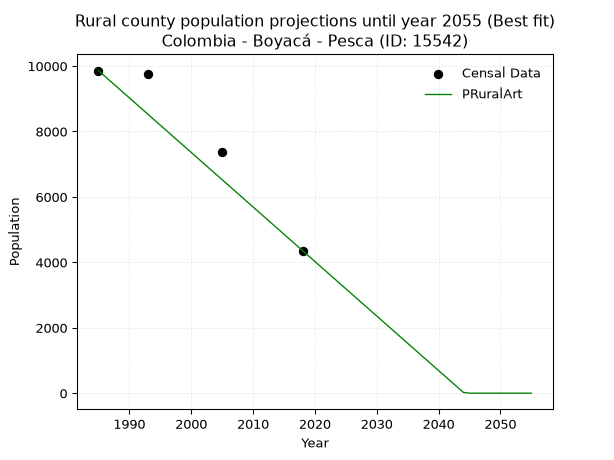

<div align="center">


</div>

# _“Population and Public Services Demand Projections (PPSD) until Year 2050 for Colombia - Boyacá - Pesca (ID: 15542)”_
Keywords: `population` `public-service` `projection` `lineal` `polynomial` `logarithmic` `potential` `exponential` `arithmetic` `geometric` `wappaus` `dane` `colombia` `south-america`

PPSD are analytical estimates used by governments and planners to anticipate future changes in population size, age distribution, and the resulting community needs for utilities, healthcare, education, and infrastructure as sizing future water treatment facilities, electrical grids, and road networks based on spatial growth.

> **General running parameters**: • app_version: _v20260806_. • Python version: _3.14.7_. • Pandas version: _3.0.5_. • NumPy version: _2.5.1_. • Creates, save and include plots into reports (create_plot): _False_. • Projection until year: _2050_. • Process polynomial degree 2 and up: _False_. • Process Wappaus: _True_. • Process Wappaus: _True_. • Set negative values to zero: _True_. • Set infinite values to zero: _True_. • Drop dataset notes: _True_. 
<div align="center">

Dynamic map: [:earth_americas:Google](http://maps.google.com/maps?q=5.558807608,-73.0508722) [:earth_americas:OSM](https://www.openstreetmap.org/#map=18/5.558807608/-73.0508722&layers=P) [:earth_americas:Bing](https://www.bing.com/maps?cp=5.558807608~-73.0508722&lvl=18) [:earth_americas:Apple](https://maps.apple.com/frame?center=5.558807608%2C-73.0508722&span=0.003%2C0.006)

</div>


<div align="center">

```geojson
{
  "type": "Feature",
  "geometry": {
    "type": "Point", 
    "coordinates": [-73.0508722, 5.558807608]
  }, 
  "properties": {
    "Name": "Colombia - Boyacá - Pesca (ID: 15542)"
  }
}
```

</div>


## 0. Census Data (4 records)

Census data are official statistics collected by a government about the people and housing in a country. They usually include counts of total population, age, sex, race, income, education, and jobs.

📅Global census file: [Population.xlsx](../data/Population.xlsx)

| Source   |   Year |   CountryID | CountryName   |   StateID | StateName   |   CountyID | CountyName   |   PTotal |   PUrban |   PRural |
|:---------|-------:|------------:|:--------------|----------:|:------------|-----------:|:-------------|---------:|---------:|---------:|
| DANE     |   1985 |          57 | Colombia      |        15 | Boyacá      |      15542 | Pesca        |    13640 |     3781 |     9859 |
| DANE     |   1993 |          57 | Colombia      |        15 | Boyacá      |      15542 | Pesca        |    13572 |     3809 |     9763 |
| DANE     |   2005 |          57 | Colombia      |        15 | Boyacá      |      15542 | Pesca        |     9762 |     2377 |     7385 |
| DANE     |   2018 |          57 | Colombia      |        15 | Boyacá      |      15542 | Pesca        |     6604 |     2245 |     4359 |

> 🔥Some records could had specific notes about the registered values or the corresponding urban or rural distribution.

**Local public utility companies (RUPS)**

 | SERVICIO       | ESTADO    | NOMBRE                                                                                                   | NIT         | DEPARTAMENTO_DOMICILIO   | MUNICIPIO_DOMICILIO   | DIRECCION                                  |   TELEFONO | EMAIL                     | TIPO_INSCRIPCION    | REPRESENTANTE_LEGAL              | TIPO_PRESTADOR                             | CLASIFICACION                 |
|:---------------|:----------|:---------------------------------------------------------------------------------------------------------|:------------|:-------------------------|:----------------------|:-------------------------------------------|-----------:|:--------------------------|:--------------------|:---------------------------------|:-------------------------------------------|:------------------------------|
| ACUEDUCTO      | OPERATIVA | COMPAÑÍA DE SERVICIOS PÚBLICOS DE SOGAMOSO S.A. E.S.P.                                                   | 891800031-4 | BOYACA                   | SOGAMOSO              | Carrera 11 no 15-10 Edificio Mirador Plaza |    7702110 | sui@coserviciosesp.com.co | Registro por la ESP | PEDRO ELIAS BARRERA  MESA        | SOCIEDADES (EMPRESA DE SERVICIOS PUBLICOS) | MAYOR O IGUAL A 5001 USUARIOS |
| ASEO           | OPERATIVA | COMPAÑÍA DE SERVICIOS PÚBLICOS DE SOGAMOSO S.A. E.S.P.                                                   | 891800031-4 | BOYACA                   | SOGAMOSO              | Carrera 11 no 15-10 Edificio Mirador Plaza |    7702110 | sui@coserviciosesp.com.co | Registro por la ESP | PEDRO ELIAS BARRERA  MESA        | SOCIEDADES (EMPRESA DE SERVICIOS PUBLICOS) | MAYOR O IGUAL A 5001 USUARIOS |
| ACUEDUCTO      | OPERATIVA | UNIDAD  DE  SERVICIOS  PUBLICOS DOMICILIARIOS DE ACUEDUCTO, ALCANTARILLADO Y ASEO DEL MUNICIPIO DE PESCA | 891856464-0 | BOYACA                   | PESCA                 | Carrera 5 No. 4 - 53. Palacio Municipal    |    7784069 | mendoza_t1234@hotmail.com | Registro por la ESP | MANUEL ALEJANDRO TAMBO RODRIGUEZ | MUNICIPIO (PRESTACIÓN DIRECTA)             | MENOR O IGUAL A 2500 USUARIOS |
| ALCANTARILLADO | OPERATIVA | UNIDAD  DE  SERVICIOS  PUBLICOS DOMICILIARIOS DE ACUEDUCTO, ALCANTARILLADO Y ASEO DEL MUNICIPIO DE PESCA | 891856464-0 | BOYACA                   | PESCA                 | Carrera 5 No. 4 - 53. Palacio Municipal    |    7784069 | mendoza_t1234@hotmail.com | Registro por la ESP | MANUEL ALEJANDRO TAMBO RODRIGUEZ | MUNICIPIO (PRESTACIÓN DIRECTA)             | MENOR O IGUAL A 2500 USUARIOS |
| ASEO           | OPERATIVA | UNIDAD  DE  SERVICIOS  PUBLICOS DOMICILIARIOS DE ACUEDUCTO, ALCANTARILLADO Y ASEO DEL MUNICIPIO DE PESCA | 891856464-0 | BOYACA                   | PESCA                 | Carrera 5 No. 4 - 53. Palacio Municipal    |    7784069 | mendoza_t1234@hotmail.com | Registro por la ESP | MANUEL ALEJANDRO TAMBO RODRIGUEZ | MUNICIPIO (PRESTACIÓN DIRECTA)             | MENOR O IGUAL A 2500 USUARIOS |
| ASEO           | OPERATIVA | URBASER TUNJA S.A.  E.S.P.                                                                               | 900159283-6 | BOYACA                   | TUNJA                 | TRANSVERSAL 15 No. 24 - 12                 |    7441826 | Luz.galvis@urbaser.co     | Registro por la ESP | OSCAR HERNAN PARRA  ERAZO        | SOCIEDADES (EMPRESA DE SERVICIOS PUBLICOS) | MAYOR O IGUAL A 5001 USUARIOS |
| ASEO           | OPERATIVA | ASOCIACIÓN GREMIAL DE RECUPERADORES UNIDOS ESP                                                           | 901138248-1 | BOYACA                   | SOGAMOSO              | CL 13 15 63 BRR SANTA HELENA               |    7752327 | agreunidosesp@gmail.com   | Registro por la ESP | JULIO NEL BARRERA BELTRAN        | ORGANIZACION AUTORIZADA                    | MAYOR O IGUAL A 5001 USUARIOS |
| ACUEDUCTO      | OPERATIVA | Asociación de suscriptores del acueducto Suaneme del municipio de Pesca departamento de Boyaca           | 900251261-7 | BOYACA                   | PESCA                 | Vereda Suaneme sector la escuela           |    3118114 | rini_612@hotmail.com      | Registro por la ESP | ALEIDA ORTIZ PENA                | ORGANIZACION AUTORIZADA                    | MENOR O IGUAL A 2500 USUARIOS |

> [📅RUPS Database: Registro Único de Prestadores de Servicios Públicos de Colombia Suramérica - RUPS](https://www.datos.gov.co/Hacienda-y-Cr-dito-P-blico/Registro-nico-de-Prestadores-de-Servicios-P-blicos/4qkq-csdn/about_data)

## 1. Total

### 1.1. Coefficients and Parameters

* (PD1) Polynomial Deg 1: -229.3319951826553, 469615.82336410636 (lineal)
* (Log) Logarithmic: -458881.24310167, 3498854.5060592955
* (Pow) Potential: -46.34802907429242, 157.01755989963073
* (Exp) Exponential: -0.023167102110047143, 1.3944584380718455e+24
* (Art) Arithmetic: Year diff. 2018 - 1985 = 33, Population diff. 6604 - 13640 = -7036, Annual growth = -213.21212121212122
* (Geo) Geometric: Year diff. 2018 - 1985 = 33, Population diff. 6604 - 13640 = -7036, Annual growth % = -0.021739936896046586
* (Wap) Wappaus: i = -2.10642285331082, Condition values only valid for < 200)

<sub>
Wappaus condition values: ['-0.00', '-2.11', '-4.21', '-6.32', '-8.43', '-10.53', '-12.64', '-14.74', '-16.85', '-18.96', '-21.06', '-23.17', '-25.28', '-27.38', '-29.49', '-31.60', '-33.70', '-35.81', '-37.92', '-40.02', '-42.13', '-44.23', '-46.34', '-48.45', '-50.55', '-52.66', '-54.77', '-56.87', '-58.98', '-61.09', '-63.19', '-65.30', '-67.41', '-69.51', '-71.62', '-73.72', '-75.83', '-77.94', '-80.04', '-82.15', '-84.26', '-86.36', '-88.47', '-90.58', '-92.68', '-94.79', '-96.90', '-99.00', '-101.11', '-103.21', '-105.32', '-107.43', '-109.53', '-111.64', '-113.75', '-115.85', '-117.96', '-120.07', '-122.17', '-124.28', '-126.39', '-128.49', '-130.60', '-132.70', '-134.81', '-136.92']
</sub>


### 1.2. Projected Dataset

|   Year |   CountyID |   PTotalPD1 |   PTotalLog |   PTotalPow |   PTotalExp |   PTotalArt |   PTotalGeo |   PTotalWap |
|-------:|-----------:|------------:|------------:|------------:|------------:|------------:|------------:|------------:|
|   1985 |      15542 |       14392 |       14398 |       14889 |       14881 |       13640 |       13640 |       13640 |
|   1986 |      15542 |       14162 |       14166 |       14545 |       14540 |       13427 |       13343 |       13356 |
|   1987 |      15542 |       13933 |       13935 |       14210 |       14207 |       13214 |       13053 |       13077 |
|   1988 |      15542 |       13704 |       13705 |       13882 |       13882 |       13000 |       12770 |       12804 |
|   1989 |      15542 |       13474 |       13474 |       13562 |       13564 |       12787 |       12492 |       12537 |
|   1990 |      15542 |       13245 |       13243 |       13250 |       13253 |       12574 |       12220 |       12275 |
|   1991 |      15542 |       13016 |       13013 |       12945 |       12950 |       12361 |       11955 |       12019 |
|   1992 |      15542 |       12786 |       12782 |       12647 |       12653 |       12148 |       11695 |       11767 |
|   1993 |      15542 |       12557 |       12552 |       12357 |       12364 |       11934 |       11441 |       11520 |
|   1994 |      15542 |       12328 |       12322 |       12073 |       12080 |       11721 |       11192 |       11278 |
|   1995 |      15542 |       12098 |       12092 |       11795 |       11804 |       11508 |       10949 |       11041 |
|   1996 |      15542 |       11869 |       11862 |       11525 |       11534 |       11295 |       10711 |       10808 |
|   1997 |      15542 |       11640 |       11632 |       11260 |       11269 |       11081 |       10478 |       10579 |
|   1998 |      15542 |       11410 |       11402 |       11002 |       11011 |       10868 |       10250 |       10355 |
|   1999 |      15542 |       11181 |       11172 |       10750 |       10759 |       10655 |       10027 |       10134 |
|   2000 |      15542 |       10952 |       10943 |       10503 |       10513 |       10442 |        9809 |        9918 |
|   2001 |      15542 |       10723 |       10714 |       10263 |       10272 |       10229 |        9596 |        9706 |
|   2002 |      15542 |       10493 |       10484 |       10028 |       10037 |       10015 |        9387 |        9497 |
|   2003 |      15542 |       10264 |       10255 |        9798 |        9807 |        9802 |        9183 |        9293 |
|   2004 |      15542 |       10035 |       10026 |        9574 |        9582 |        9589 |        8984 |        9091 |
|   2005 |      15542 |        9805 |        9797 |        9355 |        9363 |        9376 |        8788 |        8893 |
|   2006 |      15542 |        9576 |        9568 |        9142 |        9148 |        9163 |        8597 |        8699 |
|   2007 |      15542 |        9347 |        9340 |        8933 |        8939 |        8949 |        8410 |        8508 |
|   2008 |      15542 |        9117 |        9111 |        8729 |        8734 |        8736 |        8227 |        8320 |
|   2009 |      15542 |        8888 |        8883 |        8530 |        8534 |        8523 |        8049 |        8136 |
|   2010 |      15542 |        8659 |        8654 |        8336 |        8339 |        8310 |        7874 |        7954 |
|   2011 |      15542 |        8429 |        8426 |        8146 |        8148 |        8096 |        7702 |        7776 |
|   2012 |      15542 |        8200 |        8198 |        7960 |        7961 |        7883 |        7535 |        7600 |
|   2013 |      15542 |        7971 |        7970 |        7779 |        7779 |        7670 |        7371 |        7427 |
|   2014 |      15542 |        7741 |        7742 |        7602 |        7601 |        7457 |        7211 |        7257 |
|   2015 |      15542 |        7512 |        7514 |        7429 |        7427 |        7244 |        7054 |        7090 |
|   2016 |      15542 |        7283 |        7286 |        7260 |        7257 |        7030 |        6901 |        6925 |
|   2017 |      15542 |        7053 |        7059 |        7095 |        7090 |        6817 |        6751 |        6763 |
|   2018 |      15542 |        6824 |        6831 |        6934 |        6928 |        6604 |        6604 |        6604 |
|   2019 |      15542 |        6595 |        6604 |        6777 |        6769 |        6391 |        6460 |        6447 |
|   2020 |      15542 |        6365 |        6377 |        6623 |        6614 |        6178 |        6320 |        6292 |
|   2021 |      15542 |        6136 |        6150 |        6473 |        6463 |        5964 |        6183 |        6140 |
|   2022 |      15542 |        5907 |        5923 |        6326 |        6315 |        5751 |        6048 |        5990 |
|   2023 |      15542 |        5677 |        5696 |        6183 |        6170 |        5538 |        5917 |        5843 |
|   2024 |      15542 |        5448 |        5469 |        6043 |        6029 |        5325 |        5788 |        5697 |
|   2025 |      15542 |        5219 |        5242 |        5906 |        5891 |        5112 |        5662 |        5554 |
|   2026 |      15542 |        4989 |        5016 |        5772 |        5756 |        4898 |        5539 |        5413 |
|   2027 |      15542 |        4760 |        4789 |        5642 |        5624 |        4685 |        5419 |        5274 |
|   2028 |      15542 |        4531 |        4563 |        5514 |        5495 |        4472 |        5301 |        5136 |
|   2029 |      15542 |        4301 |        4337 |        5390 |        5370 |        4259 |        5186 |        5001 |
|   2030 |      15542 |        4072 |        4111 |        5268 |        5247 |        4045 |        5073 |        4868 |
|   2031 |      15542 |        3843 |        3885 |        5149 |        5126 |        3832 |        4963 |        4737 |
|   2032 |      15542 |        3613 |        3659 |        5033 |        5009 |        3619 |        4855 |        4607 |
|   2033 |      15542 |        3384 |        3433 |        4919 |        4894 |        3406 |        4749 |        4480 |
|   2034 |      15542 |        3155 |        3208 |        4809 |        4782 |        3193 |        4646 |        4354 |
|   2035 |      15542 |        2925 |        2982 |        4700 |        4673 |        2979 |        4545 |        4230 |
|   2036 |      15542 |        2696 |        2757 |        4594 |        4566 |        2766 |        4446 |        4107 |
|   2037 |      15542 |        2467 |        2531 |        4491 |        4461 |        2553 |        4349 |        3986 |
|   2038 |      15542 |        2237 |        2306 |        4390 |        4359 |        2340 |        4255 |        3867 |
|   2039 |      15542 |        2008 |        2081 |        4291 |        4259 |        2127 |        4162 |        3750 |
|   2040 |      15542 |        1779 |        1856 |        4195 |        4162 |        1913 |        4072 |        3634 |
|   2041 |      15542 |        1549 |        1631 |        4101 |        4066 |        1700 |        3983 |        3519 |
|   2042 |      15542 |        1320 |        1406 |        4009 |        3973 |        1487 |        3897 |        3406 |
|   2043 |      15542 |        1091 |        1182 |        3919 |        3882 |        1274 |        3812 |        3295 |
|   2044 |      15542 |         861 |         957 |        3831 |        3793 |        1060 |        3729 |        3185 |
|   2045 |      15542 |         632 |         733 |        3745 |        3706 |         847 |        3648 |        3076 |
|   2046 |      15542 |         403 |         508 |        3661 |        3622 |         634 |        3569 |        2969 |
|   2047 |      15542 |         173 |         284 |        3579 |        3539 |         421 |        3491 |        2863 |
|   2048 |      15542 |           0 |          60 |        3499 |        3458 |         208 |        3415 |        2759 |
|   2049 |      15542 |           0 |           0 |        3421 |        3378 |           0 |        3341 |        2656 |
|   2050 |      15542 |           0 |           0 |        3344 |        3301 |           0 |        3268 |        2554 |
<div align="center">

</img>

</div>


### 1.3. Best fit with absolute and relative error (%)

Relative error puts that difference into context by dividing the absolute error by the true value, creating a unitless ratio or percentage that shows the scale of the mistake.

Absolute and relative error

|   Year | Source   |   CountryID | CountryName   |   StateID | StateName   |   CountyID_x | CountyName   |   PTotal |   PUrban |   PRural |   CountyID_y |   PTotalPD1 |   PTotalLog |   PTotalPow |   PTotalExp |   PTotalArt |   PTotalGeo |   PTotalWap |   PTotalPD1AbsError |   PTotalLogAbsError |   PTotalPowAbsError |   PTotalExpAbsError |   PTotalArtAbsError |   PTotalGeoAbsError |   PTotalWapAbsError |   PTotalPD1RelError |   PTotalLogRelError |   PTotalPowRelError |   PTotalExpRelError |   PTotalArtRelError |   PTotalGeoRelError |   PTotalWapRelError |
|-------:|:---------|------------:|:--------------|----------:|:------------|-------------:|:-------------|---------:|---------:|---------:|-------------:|------------:|------------:|------------:|------------:|------------:|------------:|------------:|--------------------:|--------------------:|--------------------:|--------------------:|--------------------:|--------------------:|--------------------:|--------------------:|--------------------:|--------------------:|--------------------:|--------------------:|--------------------:|--------------------:|
|   1985 | DANE     |          57 | Colombia      |        15 | Boyacá      |        15542 | Pesca        |    13640 |     3781 |     9859 |        15542 |       14392 |       14398 |       14889 |       14881 |       13640 |       13640 |       13640 |                 752 |                 758 |                1249 |                1241 |                   0 |                   0 |                   0 |            5.5132   |            5.55718  |             9.15689 |             9.09824 |             0       |             0       |             0       |
|   1993 | DANE     |          57 | Colombia      |        15 | Boyacá      |        15542 | Pesca        |    13572 |     3809 |     9763 |        15542 |       12557 |       12552 |       12357 |       12364 |       11934 |       11441 |       11520 |                1015 |                1020 |                1215 |                1208 |                1638 |                2131 |                2052 |            7.47863  |            7.51547  |             8.95225 |             8.90068 |            12.069   |            15.7014  |            15.1194  |
|   2005 | DANE     |          57 | Colombia      |        15 | Boyacá      |        15542 | Pesca        |     9762 |     2377 |     7385 |        15542 |        9805 |        9797 |        9355 |        9363 |        9376 |        8788 |        8893 |                  43 |                  35 |                 407 |                 399 |                 386 |                 974 |                 869 |            0.440484 |            0.358533 |             4.16923 |             4.08728 |             3.95411 |             9.97746 |             8.90186 |
|   2018 | DANE     |          57 | Colombia      |        15 | Boyacá      |        15542 | Pesca        |     6604 |     2245 |     4359 |        15542 |        6824 |        6831 |        6934 |        6928 |        6604 |        6604 |        6604 |                 220 |                 227 |                 330 |                 324 |                   0 |                   0 |                   0 |            3.33131  |            3.43731  |             4.99697 |             4.90612 |             0       |             0       |             0       |

Relative error mean

| Method    |   RelError | Best   |
|:----------|-----------:|:-------|
| PTotalPD1 |    4.19091 |        |
| PTotalLog |    4.21713 |        |
| PTotalPow |    6.81884 |        |
| PTotalExp |    6.74808 |        |
| PTotalArt |    4.00577 | True   |
| PTotalGeo |    6.41973 |        |
| PTotalWap |    6.00531 |        |

💙Best method: _**PTotalArt**_
<div align="center">

</img>

</div>


### 1.4. Fresh water supply demand in liters per capita per day (lpcd)

The fresh water supply demand typically ranges from 100 to 300 liters per capita per day (lpcd) for standard domestic and municipal planning, though absolute survival minimums set by the World Health Organization are as low as 7.5 to 20 liters per day, and total consumption in high-income nations can exceed 400 liters.

> `CZ`: Level in meters above the sea level (masl)<br> `WS`: Fresh water supply demand in liters per capita per day (lpcd or l/h/d)<br> `WSAll`: Zonal fresh water supply demand in liters per second (l/s)<br> `A`: Zonal area in square meters<br> `DP`: Population density (people/hectare or p/ha)

Reference values (RAS Colombia)

|    CZ |   WS |
|------:|-----:|
|  1000 |  120 |
|  2000 |  130 |
| 99999 |  140 |

County shapefile geometry properties and water supply values

|   CountyID |      ATotal |   CZTotal |   WSTotal |
|-----------:|------------:|----------:|----------:|
|      15542 | 2.62593e+08 |   2948.85 |       140 |

Projected values for best method: PTotalArt

|   CountyID |   Year |   PTotalArt |   DPTotal |   WSTotal |   WSTotalAll |
|-----------:|-------:|------------:|----------:|----------:|-------------:|
|      15542 |   1985 |       13640 |      0.52 |       140 |    22.1019   |
|      15542 |   1986 |       13427 |      0.51 |       140 |    21.7567   |
|      15542 |   1987 |       13214 |      0.5  |       140 |    21.4116   |
|      15542 |   1988 |       13000 |      0.5  |       140 |    21.0648   |
|      15542 |   1989 |       12787 |      0.49 |       140 |    20.7197   |
|      15542 |   1990 |       12574 |      0.48 |       140 |    20.3745   |
|      15542 |   1991 |       12361 |      0.47 |       140 |    20.0294   |
|      15542 |   1992 |       12148 |      0.46 |       140 |    19.6843   |
|      15542 |   1993 |       11934 |      0.45 |       140 |    19.3375   |
|      15542 |   1994 |       11721 |      0.45 |       140 |    18.9924   |
|      15542 |   1995 |       11508 |      0.44 |       140 |    18.6472   |
|      15542 |   1996 |       11295 |      0.43 |       140 |    18.3021   |
|      15542 |   1997 |       11081 |      0.42 |       140 |    17.9553   |
|      15542 |   1998 |       10868 |      0.41 |       140 |    17.6102   |
|      15542 |   1999 |       10655 |      0.41 |       140 |    17.265    |
|      15542 |   2000 |       10442 |      0.4  |       140 |    16.9199   |
|      15542 |   2001 |       10229 |      0.39 |       140 |    16.5748   |
|      15542 |   2002 |       10015 |      0.38 |       140 |    16.228    |
|      15542 |   2003 |        9802 |      0.37 |       140 |    15.8829   |
|      15542 |   2004 |        9589 |      0.37 |       140 |    15.5377   |
|      15542 |   2005 |        9376 |      0.36 |       140 |    15.1926   |
|      15542 |   2006 |        9163 |      0.35 |       140 |    14.8475   |
|      15542 |   2007 |        8949 |      0.34 |       140 |    14.5007   |
|      15542 |   2008 |        8736 |      0.33 |       140 |    14.1556   |
|      15542 |   2009 |        8523 |      0.32 |       140 |    13.8104   |
|      15542 |   2010 |        8310 |      0.32 |       140 |    13.4653   |
|      15542 |   2011 |        8096 |      0.31 |       140 |    13.1185   |
|      15542 |   2012 |        7883 |      0.3  |       140 |    12.7734   |
|      15542 |   2013 |        7670 |      0.29 |       140 |    12.4282   |
|      15542 |   2014 |        7457 |      0.28 |       140 |    12.0831   |
|      15542 |   2015 |        7244 |      0.28 |       140 |    11.738    |
|      15542 |   2016 |        7030 |      0.27 |       140 |    11.3912   |
|      15542 |   2017 |        6817 |      0.26 |       140 |    11.0461   |
|      15542 |   2018 |        6604 |      0.25 |       140 |    10.7009   |
|      15542 |   2019 |        6391 |      0.24 |       140 |    10.3558   |
|      15542 |   2020 |        6178 |      0.24 |       140 |    10.0106   |
|      15542 |   2021 |        5964 |      0.23 |       140 |     9.66389  |
|      15542 |   2022 |        5751 |      0.22 |       140 |     9.31875  |
|      15542 |   2023 |        5538 |      0.21 |       140 |     8.97361  |
|      15542 |   2024 |        5325 |      0.2  |       140 |     8.62847  |
|      15542 |   2025 |        5112 |      0.19 |       140 |     8.28333  |
|      15542 |   2026 |        4898 |      0.19 |       140 |     7.93657  |
|      15542 |   2027 |        4685 |      0.18 |       140 |     7.59144  |
|      15542 |   2028 |        4472 |      0.17 |       140 |     7.2463   |
|      15542 |   2029 |        4259 |      0.16 |       140 |     6.90116  |
|      15542 |   2030 |        4045 |      0.15 |       140 |     6.5544   |
|      15542 |   2031 |        3832 |      0.15 |       140 |     6.20926  |
|      15542 |   2032 |        3619 |      0.14 |       140 |     5.86412  |
|      15542 |   2033 |        3406 |      0.13 |       140 |     5.51898  |
|      15542 |   2034 |        3193 |      0.12 |       140 |     5.17384  |
|      15542 |   2035 |        2979 |      0.11 |       140 |     4.82708  |
|      15542 |   2036 |        2766 |      0.11 |       140 |     4.48194  |
|      15542 |   2037 |        2553 |      0.1  |       140 |     4.13681  |
|      15542 |   2038 |        2340 |      0.09 |       140 |     3.79167  |
|      15542 |   2039 |        2127 |      0.08 |       140 |     3.44653  |
|      15542 |   2040 |        1913 |      0.07 |       140 |     3.09977  |
|      15542 |   2041 |        1700 |      0.06 |       140 |     2.75463  |
|      15542 |   2042 |        1487 |      0.06 |       140 |     2.40949  |
|      15542 |   2043 |        1274 |      0.05 |       140 |     2.06435  |
|      15542 |   2044 |        1060 |      0.04 |       140 |     1.71759  |
|      15542 |   2045 |         847 |      0.03 |       140 |     1.37245  |
|      15542 |   2046 |         634 |      0.02 |       140 |     1.02731  |
|      15542 |   2047 |         421 |      0.02 |       140 |     0.682176 |
|      15542 |   2048 |         208 |      0.01 |       140 |     0.337037 |
|      15542 |   2049 |           0 |      0    |       140 |     0        |
|      15542 |   2050 |           0 |      0    |       140 |     0        |

## 2. Urban

### 2.1. Coefficients and Parameters

* (PD1) Polynomial Deg 1: -54.81493376154136, 112696.57125652312 (lineal)
* (Log) Logarithmic: -109747.63252915604, 837245.6343164479
* (Pow) Potential: -37.006669676214095, 125.63323887633943
* (Exp) Exponential: -0.018484101715319765, 3.3768318540849734e+19
* (Art) Arithmetic: Year diff. 2018 - 1985 = 33, Population diff. 2245 - 3781 = -1536, Annual growth = -46.54545454545455
* (Geo) Geometric: Year diff. 2018 - 1985 = 33, Population diff. 2245 - 3781 = -1536, Annual growth % = -0.015672345024871692
* (Wap) Wappaus: i = -1.544820927496002, Condition values only valid for < 200)

<sub>
Wappaus condition values: ['-0.00', '-1.54', '-3.09', '-4.63', '-6.18', '-7.72', '-9.27', '-10.81', '-12.36', '-13.90', '-15.45', '-16.99', '-18.54', '-20.08', '-21.63', '-23.17', '-24.72', '-26.26', '-27.81', '-29.35', '-30.90', '-32.44', '-33.99', '-35.53', '-37.08', '-38.62', '-40.17', '-41.71', '-43.25', '-44.80', '-46.34', '-47.89', '-49.43', '-50.98', '-52.52', '-54.07', '-55.61', '-57.16', '-58.70', '-60.25', '-61.79', '-63.34', '-64.88', '-66.43', '-67.97', '-69.52', '-71.06', '-72.61', '-74.15', '-75.70', '-77.24', '-78.79', '-80.33', '-81.88', '-83.42', '-84.97', '-86.51', '-88.05', '-89.60', '-91.14', '-92.69', '-94.23', '-95.78', '-97.32', '-98.87', '-100.41']
</sub>


### 2.2. Projected Dataset

|   Year |   CountyID |   PUrbanPD1 |   PUrbanLog |   PUrbanPow |   PUrbanExp |   PUrbanArt |   PUrbanGeo |   PUrbanWap |
|-------:|-----------:|------------:|------------:|------------:|------------:|------------:|------------:|------------:|
|   1985 |      15542 |        3889 |        3891 |        3927 |        3925 |        3781 |        3781 |        3781 |
|   1986 |      15542 |        3834 |        3836 |        3855 |        3853 |        3734 |        3722 |        3723 |
|   1987 |      15542 |        3779 |        3780 |        3784 |        3783 |        3688 |        3663 |        3666 |
|   1988 |      15542 |        3724 |        3725 |        3714 |        3713 |        3641 |        3606 |        3610 |
|   1989 |      15542 |        3670 |        3670 |        3645 |        3645 |        3595 |        3549 |        3554 |
|   1990 |      15542 |        3615 |        3615 |        3578 |        3578 |        3548 |        3494 |        3500 |
|   1991 |      15542 |        3560 |        3560 |        3512 |        3513 |        3502 |        3439 |        3446 |
|   1992 |      15542 |        3505 |        3504 |        3448 |        3449 |        3455 |        3385 |        3393 |
|   1993 |      15542 |        3450 |        3449 |        3384 |        3385 |        3409 |        3332 |        3341 |
|   1994 |      15542 |        3396 |        3394 |        3322 |        3323 |        3362 |        3280 |        3289 |
|   1995 |      15542 |        3341 |        3339 |        3261 |        3263 |        3316 |        3229 |        3239 |
|   1996 |      15542 |        3286 |        3284 |        3201 |        3203 |        3269 |        3178 |        3189 |
|   1997 |      15542 |        3231 |        3229 |        3142 |        3144 |        3222 |        3128 |        3140 |
|   1998 |      15542 |        3176 |        3174 |        3085 |        3087 |        3176 |        3079 |        3091 |
|   1999 |      15542 |        3122 |        3119 |        3028 |        3030 |        3129 |        3031 |        3043 |
|   2000 |      15542 |        3067 |        3065 |        2972 |        2975 |        3083 |        2983 |        2996 |
|   2001 |      15542 |        3012 |        3010 |        2918 |        2920 |        3036 |        2937 |        2949 |
|   2002 |      15542 |        2957 |        2955 |        2864 |        2867 |        2990 |        2891 |        2903 |
|   2003 |      15542 |        2902 |        2900 |        2812 |        2814 |        2943 |        2845 |        2858 |
|   2004 |      15542 |        2847 |        2845 |        2761 |        2763 |        2897 |        2801 |        2813 |
|   2005 |      15542 |        2793 |        2791 |        2710 |        2712 |        2850 |        2757 |        2769 |
|   2006 |      15542 |        2738 |        2736 |        2661 |        2662 |        2804 |        2714 |        2726 |
|   2007 |      15542 |        2683 |        2681 |        2612 |        2614 |        2757 |        2671 |        2683 |
|   2008 |      15542 |        2628 |        2626 |        2564 |        2566 |        2710 |        2629 |        2640 |
|   2009 |      15542 |        2573 |        2572 |        2517 |        2519 |        2664 |        2588 |        2598 |
|   2010 |      15542 |        2519 |        2517 |        2471 |        2473 |        2617 |        2547 |        2557 |
|   2011 |      15542 |        2464 |        2463 |        2426 |        2427 |        2571 |        2507 |        2516 |
|   2012 |      15542 |        2409 |        2408 |        2382 |        2383 |        2524 |        2468 |        2476 |
|   2013 |      15542 |        2354 |        2354 |        2339 |        2339 |        2478 |        2430 |        2436 |
|   2014 |      15542 |        2299 |        2299 |        2296 |        2296 |        2431 |        2391 |        2397 |
|   2015 |      15542 |        2244 |        2245 |        2254 |        2254 |        2385 |        2354 |        2358 |
|   2016 |      15542 |        2190 |        2190 |        2213 |        2213 |        2338 |        2317 |        2320 |
|   2017 |      15542 |        2135 |        2136 |        2173 |        2172 |        2292 |        2281 |        2282 |
|   2018 |      15542 |        2080 |        2081 |        2134 |        2133 |        2245 |        2245 |        2245 |
|   2019 |      15542 |        2025 |        2027 |        2095 |        2094 |        2198 |        2210 |        2208 |
|   2020 |      15542 |        1970 |        1973 |        2057 |        2055 |        2152 |        2175 |        2172 |
|   2021 |      15542 |        1916 |        1918 |        2019 |        2018 |        2105 |        2141 |        2136 |
|   2022 |      15542 |        1861 |        1864 |        1983 |        1981 |        2059 |        2108 |        2100 |
|   2023 |      15542 |        1806 |        1810 |        1947 |        1944 |        2012 |        2075 |        2065 |
|   2024 |      15542 |        1751 |        1755 |        1912 |        1909 |        1966 |        2042 |        2030 |
|   2025 |      15542 |        1696 |        1701 |        1877 |        1874 |        1919 |        2010 |        1996 |
|   2026 |      15542 |        1642 |        1647 |        1843 |        1840 |        1873 |        1978 |        1962 |
|   2027 |      15542 |        1587 |        1593 |        1810 |        1806 |        1826 |        1947 |        1929 |
|   2028 |      15542 |        1532 |        1539 |        1777 |        1773 |        1780 |        1917 |        1896 |
|   2029 |      15542 |        1477 |        1485 |        1745 |        1740 |        1733 |        1887 |        1863 |
|   2030 |      15542 |        1422 |        1431 |        1713 |        1708 |        1686 |        1857 |        1831 |
|   2031 |      15542 |        1367 |        1377 |        1682 |        1677 |        1640 |        1828 |        1799 |
|   2032 |      15542 |        1313 |        1323 |        1652 |        1646 |        1593 |        1800 |        1767 |
|   2033 |      15542 |        1258 |        1269 |        1622 |        1616 |        1547 |        1771 |        1736 |
|   2034 |      15542 |        1203 |        1215 |        1593 |        1587 |        1500 |        1744 |        1705 |
|   2035 |      15542 |        1148 |        1161 |        1564 |        1558 |        1454 |        1716 |        1674 |
|   2036 |      15542 |        1093 |        1107 |        1536 |        1529 |        1407 |        1689 |        1644 |
|   2037 |      15542 |        1039 |        1053 |        1508 |        1501 |        1361 |        1663 |        1614 |
|   2038 |      15542 |         984 |         999 |        1481 |        1474 |        1314 |        1637 |        1584 |
|   2039 |      15542 |         929 |         945 |        1455 |        1447 |        1268 |        1611 |        1555 |
|   2040 |      15542 |         874 |         891 |        1428 |        1420 |        1221 |        1586 |        1526 |
|   2041 |      15542 |         819 |         838 |        1403 |        1394 |        1174 |        1561 |        1498 |
|   2042 |      15542 |         764 |         784 |        1378 |        1369 |        1128 |        1537 |        1469 |
|   2043 |      15542 |         710 |         730 |        1353 |        1344 |        1081 |        1513 |        1441 |
|   2044 |      15542 |         655 |         676 |        1329 |        1319 |        1035 |        1489 |        1414 |
|   2045 |      15542 |         600 |         623 |        1305 |        1295 |         988 |        1466 |        1386 |
|   2046 |      15542 |         545 |         569 |        1281 |        1271 |         942 |        1443 |        1359 |
|   2047 |      15542 |         490 |         515 |        1258 |        1248 |         895 |        1420 |        1332 |
|   2048 |      15542 |         436 |         462 |        1236 |        1225 |         849 |        1398 |        1306 |
|   2049 |      15542 |         381 |         408 |        1214 |        1202 |         802 |        1376 |        1279 |
|   2050 |      15542 |         326 |         355 |        1192 |        1180 |         756 |        1354 |        1253 |
<div align="center">

</img>

</div>


### 2.3. Best fit with absolute and relative error (%)

Relative error puts that difference into context by dividing the absolute error by the true value, creating a unitless ratio or percentage that shows the scale of the mistake.

Absolute and relative error

|   Year | Source   |   CountryID | CountryName   |   StateID | StateName   |   CountyID_x | CountyName   |   PTotal |   PUrban |   PRural |   CountyID_y |   PUrbanPD1 |   PUrbanLog |   PUrbanPow |   PUrbanExp |   PUrbanArt |   PUrbanGeo |   PUrbanWap |   PUrbanPD1AbsError |   PUrbanLogAbsError |   PUrbanPowAbsError |   PUrbanExpAbsError |   PUrbanArtAbsError |   PUrbanGeoAbsError |   PUrbanWapAbsError |   PUrbanPD1RelError |   PUrbanLogRelError |   PUrbanPowRelError |   PUrbanExpRelError |   PUrbanArtRelError |   PUrbanGeoRelError |   PUrbanWapRelError |
|-------:|:---------|------------:|:--------------|----------:|:------------|-------------:|:-------------|---------:|---------:|---------:|-------------:|------------:|------------:|------------:|------------:|------------:|------------:|------------:|--------------------:|--------------------:|--------------------:|--------------------:|--------------------:|--------------------:|--------------------:|--------------------:|--------------------:|--------------------:|--------------------:|--------------------:|--------------------:|--------------------:|
|   1985 | DANE     |          57 | Colombia      |        15 | Boyacá      |        15542 | Pesca        |    13640 |     3781 |     9859 |        15542 |        3889 |        3891 |        3927 |        3925 |        3781 |        3781 |        3781 |                 108 |                 110 |                 146 |                 144 |                   0 |                   0 |                   0 |             2.85639 |             2.90928 |             3.86141 |             3.80852 |              0      |              0      |              0      |
|   1993 | DANE     |          57 | Colombia      |        15 | Boyacá      |        15542 | Pesca        |    13572 |     3809 |     9763 |        15542 |        3450 |        3449 |        3384 |        3385 |        3409 |        3332 |        3341 |                 359 |                 360 |                 425 |                 424 |                 400 |                 477 |                 468 |             9.42505 |             9.4513  |            11.1578  |            11.1315  |             10.5014 |             12.523  |             12.2867 |
|   2005 | DANE     |          57 | Colombia      |        15 | Boyacá      |        15542 | Pesca        |     9762 |     2377 |     7385 |        15542 |        2793 |        2791 |        2710 |        2712 |        2850 |        2757 |        2769 |                 416 |                 414 |                 333 |                 335 |                 473 |                 380 |                 392 |            17.5011  |            17.4169  |            14.0093  |            14.0934  |             19.899  |             15.9865 |             16.4914 |
|   2018 | DANE     |          57 | Colombia      |        15 | Boyacá      |        15542 | Pesca        |     6604 |     2245 |     4359 |        15542 |        2080 |        2081 |        2134 |        2133 |        2245 |        2245 |        2245 |                 165 |                 164 |                 111 |                 112 |                   0 |                   0 |                   0 |             7.34967 |             7.30512 |             4.94432 |             4.98886 |              0      |              0      |              0      |

Relative error mean

| Method    |   RelError | Best   |
|:----------|-----------:|:-------|
| PUrbanPD1 |    9.28304 |        |
| PUrbanLog |    9.27065 |        |
| PUrbanPow |    8.49319 |        |
| PUrbanExp |    8.50558 |        |
| PUrbanArt |    7.60012 |        |
| PUrbanGeo |    7.12738 | True   |
| PUrbanWap |    7.19452 |        |

💙Best method: _**PUrbanGeo**_
<div align="center">

</img>

</div>


### 2.4. Fresh water supply demand in liters per capita per day (lpcd)

The fresh water supply demand typically ranges from 100 to 300 liters per capita per day (lpcd) for standard domestic and municipal planning, though absolute survival minimums set by the World Health Organization are as low as 7.5 to 20 liters per day, and total consumption in high-income nations can exceed 400 liters.

> `CZ`: Level in meters above the sea level (masl)<br> `WS`: Fresh water supply demand in liters per capita per day (lpcd or l/h/d)<br> `WSAll`: Zonal fresh water supply demand in liters per second (l/s)<br> `A`: Zonal area in square meters<br> `DP`: Population density (people/hectare or p/ha)

Reference values (RAS Colombia)

|    CZ |   WS |
|------:|-----:|
|  1000 |  120 |
|  2000 |  130 |
| 99999 |  140 |

County shapefile geometry properties and water supply values

|   CountyID |   AUrban |   CZUrban |   WSUrban |
|-----------:|---------:|----------:|----------:|
|      15542 |   831674 |   2628.28 |       140 |

Projected values for best method: PUrbanGeo

|   CountyID |   Year |   PUrbanGeo |   DPUrban |   WSUrban |   WSUrbanAll |
|-----------:|-------:|------------:|----------:|----------:|-------------:|
|      15542 |   1985 |        3781 |     45.46 |       140 |      6.12662 |
|      15542 |   1986 |        3722 |     44.75 |       140 |      6.03102 |
|      15542 |   1987 |        3663 |     44.04 |       140 |      5.93542 |
|      15542 |   1988 |        3606 |     43.36 |       140 |      5.84306 |
|      15542 |   1989 |        3549 |     42.67 |       140 |      5.75069 |
|      15542 |   1990 |        3494 |     42.01 |       140 |      5.66157 |
|      15542 |   1991 |        3439 |     41.35 |       140 |      5.57245 |
|      15542 |   1992 |        3385 |     40.7  |       140 |      5.48495 |
|      15542 |   1993 |        3332 |     40.06 |       140 |      5.39907 |
|      15542 |   1994 |        3280 |     39.44 |       140 |      5.31481 |
|      15542 |   1995 |        3229 |     38.83 |       140 |      5.23218 |
|      15542 |   1996 |        3178 |     38.21 |       140 |      5.14954 |
|      15542 |   1997 |        3128 |     37.61 |       140 |      5.06852 |
|      15542 |   1998 |        3079 |     37.02 |       140 |      4.98912 |
|      15542 |   1999 |        3031 |     36.44 |       140 |      4.91134 |
|      15542 |   2000 |        2983 |     35.87 |       140 |      4.83356 |
|      15542 |   2001 |        2937 |     35.31 |       140 |      4.75903 |
|      15542 |   2002 |        2891 |     34.76 |       140 |      4.68449 |
|      15542 |   2003 |        2845 |     34.21 |       140 |      4.60995 |
|      15542 |   2004 |        2801 |     33.68 |       140 |      4.53866 |
|      15542 |   2005 |        2757 |     33.15 |       140 |      4.46736 |
|      15542 |   2006 |        2714 |     32.63 |       140 |      4.39769 |
|      15542 |   2007 |        2671 |     32.12 |       140 |      4.32801 |
|      15542 |   2008 |        2629 |     31.61 |       140 |      4.25995 |
|      15542 |   2009 |        2588 |     31.12 |       140 |      4.19352 |
|      15542 |   2010 |        2547 |     30.62 |       140 |      4.12708 |
|      15542 |   2011 |        2507 |     30.14 |       140 |      4.06227 |
|      15542 |   2012 |        2468 |     29.68 |       140 |      3.99907 |
|      15542 |   2013 |        2430 |     29.22 |       140 |      3.9375  |
|      15542 |   2014 |        2391 |     28.75 |       140 |      3.87431 |
|      15542 |   2015 |        2354 |     28.3  |       140 |      3.81435 |
|      15542 |   2016 |        2317 |     27.86 |       140 |      3.7544  |
|      15542 |   2017 |        2281 |     27.43 |       140 |      3.69606 |
|      15542 |   2018 |        2245 |     26.99 |       140 |      3.63773 |
|      15542 |   2019 |        2210 |     26.57 |       140 |      3.58102 |
|      15542 |   2020 |        2175 |     26.15 |       140 |      3.52431 |
|      15542 |   2021 |        2141 |     25.74 |       140 |      3.46921 |
|      15542 |   2022 |        2108 |     25.35 |       140 |      3.41574 |
|      15542 |   2023 |        2075 |     24.95 |       140 |      3.36227 |
|      15542 |   2024 |        2042 |     24.55 |       140 |      3.3088  |
|      15542 |   2025 |        2010 |     24.17 |       140 |      3.25694 |
|      15542 |   2026 |        1978 |     23.78 |       140 |      3.20509 |
|      15542 |   2027 |        1947 |     23.41 |       140 |      3.15486 |
|      15542 |   2028 |        1917 |     23.05 |       140 |      3.10625 |
|      15542 |   2029 |        1887 |     22.69 |       140 |      3.05764 |
|      15542 |   2030 |        1857 |     22.33 |       140 |      3.00903 |
|      15542 |   2031 |        1828 |     21.98 |       140 |      2.96204 |
|      15542 |   2032 |        1800 |     21.64 |       140 |      2.91667 |
|      15542 |   2033 |        1771 |     21.29 |       140 |      2.86968 |
|      15542 |   2034 |        1744 |     20.97 |       140 |      2.82593 |
|      15542 |   2035 |        1716 |     20.63 |       140 |      2.78056 |
|      15542 |   2036 |        1689 |     20.31 |       140 |      2.73681 |
|      15542 |   2037 |        1663 |     20    |       140 |      2.69468 |
|      15542 |   2038 |        1637 |     19.68 |       140 |      2.65255 |
|      15542 |   2039 |        1611 |     19.37 |       140 |      2.61042 |
|      15542 |   2040 |        1586 |     19.07 |       140 |      2.56991 |
|      15542 |   2041 |        1561 |     18.77 |       140 |      2.5294  |
|      15542 |   2042 |        1537 |     18.48 |       140 |      2.49051 |
|      15542 |   2043 |        1513 |     18.19 |       140 |      2.45162 |
|      15542 |   2044 |        1489 |     17.9  |       140 |      2.41273 |
|      15542 |   2045 |        1466 |     17.63 |       140 |      2.37546 |
|      15542 |   2046 |        1443 |     17.35 |       140 |      2.33819 |
|      15542 |   2047 |        1420 |     17.07 |       140 |      2.30093 |
|      15542 |   2048 |        1398 |     16.81 |       140 |      2.26528 |
|      15542 |   2049 |        1376 |     16.54 |       140 |      2.22963 |
|      15542 |   2050 |        1354 |     16.28 |       140 |      2.19398 |

## 3. Rural

### 3.1. Coefficients and Parameters

* (PD1) Polynomial Deg 1: -174.517061421114, 356919.2521075832 (lineal)
* (Log) Logarithmic: -349133.610572514, 2661608.8717428474
* (Pow) Potential: -50.70858430628728, 171.26567077143525
* (Exp) Exponential: -0.02535209326830632, 7.87207769765134e+25
* (Art) Arithmetic: Year diff. 2018 - 1985 = 33, Population diff. 4359 - 9859 = -5500, Annual growth = -166.66666666666666
* (Geo) Geometric: Year diff. 2018 - 1985 = 33, Population diff. 4359 - 9859 = -5500, Annual growth % = -0.024428258087297983
* (Wap) Wappaus: i = -2.3444460074084494, Condition values only valid for < 200)

<sub>
Wappaus condition values: ['-0.00', '-2.34', '-4.69', '-7.03', '-9.38', '-11.72', '-14.07', '-16.41', '-18.76', '-21.10', '-23.44', '-25.79', '-28.13', '-30.48', '-32.82', '-35.17', '-37.51', '-39.86', '-42.20', '-44.54', '-46.89', '-49.23', '-51.58', '-53.92', '-56.27', '-58.61', '-60.96', '-63.30', '-65.64', '-67.99', '-70.33', '-72.68', '-75.02', '-77.37', '-79.71', '-82.06', '-84.40', '-86.74', '-89.09', '-91.43', '-93.78', '-96.12', '-98.47', '-100.81', '-103.16', '-105.50', '-107.84', '-110.19', '-112.53', '-114.88', '-117.22', '-119.57', '-121.91', '-124.26', '-126.60', '-128.94', '-131.29', '-133.63', '-135.98', '-138.32', '-140.67', '-143.01', '-145.36', '-147.70', '-150.04', '-152.39']
</sub>


### 3.2. Projected Dataset

|   Year |   CountyID |   PRuralPD1 |   PRuralLog |   PRuralPow |   PRuralExp |   PRuralArt |   PRuralGeo |   PRuralWap |
|-------:|-----------:|------------:|------------:|------------:|------------:|------------:|------------:|------------:|
|   1985 |      15542 |       10503 |       10507 |       10988 |       10982 |        9859 |        9859 |        9859 |
|   1986 |      15542 |       10328 |       10331 |       10711 |       10707 |        9692 |        9618 |        9631 |
|   1987 |      15542 |       10154 |       10155 |       10441 |       10439 |        9526 |        9383 |        9407 |
|   1988 |      15542 |        9979 |        9979 |       10178 |       10178 |        9359 |        9154 |        9189 |
|   1989 |      15542 |        9805 |        9804 |        9921 |        9923 |        9192 |        8930 |        8976 |
|   1990 |      15542 |        9630 |        9628 |        9672 |        9675 |        9026 |        8712 |        8767 |
|   1991 |      15542 |        9456 |        9453 |        9428 |        9433 |        8859 |        8499 |        8563 |
|   1992 |      15542 |        9281 |        9278 |        9191 |        9197 |        8692 |        8292 |        8364 |
|   1993 |      15542 |        9107 |        9102 |        8960 |        8966 |        8526 |        8089 |        8168 |
|   1994 |      15542 |        8932 |        8927 |        8735 |        8742 |        8359 |        7892 |        7977 |
|   1995 |      15542 |        8758 |        8752 |        8516 |        8523 |        8192 |        7699 |        7790 |
|   1996 |      15542 |        8583 |        8577 |        8302 |        8310 |        8026 |        7511 |        7607 |
|   1997 |      15542 |        8409 |        8402 |        8094 |        8102 |        7859 |        7327 |        7427 |
|   1998 |      15542 |        8234 |        8228 |        7891 |        7899 |        7692 |        7148 |        7252 |
|   1999 |      15542 |        8060 |        8053 |        7694 |        7701 |        7526 |        6974 |        7079 |
|   2000 |      15542 |        7885 |        7878 |        7501 |        7508 |        7359 |        6803 |        6910 |
|   2001 |      15542 |        7711 |        7704 |        7313 |        7320 |        7192 |        6637 |        6745 |
|   2002 |      15542 |        7536 |        7529 |        7130 |        7137 |        7026 |        6475 |        6583 |
|   2003 |      15542 |        7362 |        7355 |        6952 |        6958 |        6859 |        6317 |        6423 |
|   2004 |      15542 |        7187 |        7181 |        6778 |        6784 |        6692 |        6163 |        6267 |
|   2005 |      15542 |        7013 |        7007 |        6609 |        6614 |        6526 |        6012 |        6114 |
|   2006 |      15542 |        6838 |        6833 |        6444 |        6449 |        6359 |        5865 |        5964 |
|   2007 |      15542 |        6664 |        6659 |        6283 |        6287 |        6192 |        5722 |        5816 |
|   2008 |      15542 |        6489 |        6485 |        6126 |        6130 |        6026 |        5582 |        5672 |
|   2009 |      15542 |        6314 |        6311 |        5974 |        5977 |        5859 |        5446 |        5530 |
|   2010 |      15542 |        6140 |        6137 |        5825 |        5827 |        5692 |        5313 |        5390 |
|   2011 |      15542 |        5965 |        5963 |        5680 |        5681 |        5526 |        5183 |        5253 |
|   2012 |      15542 |        5791 |        5790 |        5538 |        5539 |        5359 |        5056 |        5119 |
|   2013 |      15542 |        5616 |        5616 |        5400 |        5400 |        5192 |        4933 |        4986 |
|   2014 |      15542 |        5442 |        5443 |        5266 |        5265 |        5026 |        4812 |        4857 |
|   2015 |      15542 |        5267 |        5270 |        5135 |        5133 |        4859 |        4695 |        4729 |
|   2016 |      15542 |        5093 |        5096 |        5008 |        5005 |        4692 |        4580 |        4603 |
|   2017 |      15542 |        4918 |        4923 |        4883 |        4879 |        4526 |        4468 |        4480 |
|   2018 |      15542 |        4744 |        4750 |        4762 |        4757 |        4359 |        4359 |        4359 |
|   2019 |      15542 |        4569 |        4577 |        4644 |        4638 |        4192 |        4253 |        4240 |
|   2020 |      15542 |        4395 |        4404 |        4529 |        4522 |        4026 |        4149 |        4123 |
|   2021 |      15542 |        4220 |        4232 |        4417 |        4409 |        3859 |        4047 |        4007 |
|   2022 |      15542 |        4046 |        4059 |        4307 |        4298 |        3692 |        3948 |        3894 |
|   2023 |      15542 |        3871 |        3886 |        4200 |        4191 |        3526 |        3852 |        3782 |
|   2024 |      15542 |        3697 |        3714 |        4097 |        4086 |        3359 |        3758 |        3673 |
|   2025 |      15542 |        3522 |        3541 |        3995 |        3984 |        3192 |        3666 |        3565 |
|   2026 |      15542 |        3348 |        3369 |        3896 |        3884 |        3026 |        3577 |        3458 |
|   2027 |      15542 |        3173 |        3197 |        3800 |        3787 |        2859 |        3489 |        3354 |
|   2028 |      15542 |        2999 |        3024 |        3706 |        3692 |        2692 |        3404 |        3251 |
|   2029 |      15542 |        2824 |        2852 |        3615 |        3600 |        2526 |        3321 |        3150 |
|   2030 |      15542 |        2650 |        2680 |        3526 |        3509 |        2359 |        3240 |        3050 |
|   2031 |      15542 |        2475 |        2508 |        3439 |        3422 |        2192 |        3161 |        2951 |
|   2032 |      15542 |        2301 |        2336 |        3354 |        3336 |        2026 |        3083 |        2855 |
|   2033 |      15542 |        2126 |        2165 |        3271 |        3252 |        1859 |        3008 |        2759 |
|   2034 |      15542 |        1952 |        1993 |        3191 |        3171 |        1692 |        2935 |        2665 |
|   2035 |      15542 |        1777 |        1821 |        3112 |        3092 |        1526 |        2863 |        2573 |
|   2036 |      15542 |        1603 |        1650 |        3036 |        3014 |        1359 |        2793 |        2481 |
|   2037 |      15542 |        1428 |        1478 |        2961 |        2939 |        1192 |        2725 |        2392 |
|   2038 |      15542 |        1253 |        1307 |        2888 |        2865 |        1026 |        2658 |        2303 |
|   2039 |      15542 |        1079 |        1136 |        2817 |        2793 |         859 |        2593 |        2216 |
|   2040 |      15542 |         904 |         965 |        2748 |        2724 |         692 |        2530 |        2130 |
|   2041 |      15542 |         730 |         793 |        2681 |        2655 |         526 |        2468 |        2045 |
|   2042 |      15542 |         555 |         622 |        2615 |        2589 |         359 |        2408 |        1961 |
|   2043 |      15542 |         381 |         452 |        2551 |        2524 |         192 |        2349 |        1879 |
|   2044 |      15542 |         206 |         281 |        2488 |        2461 |          26 |        2292 |        1797 |
|   2045 |      15542 |          32 |         110 |        2427 |        2399 |           0 |        2236 |        1717 |
|   2046 |      15542 |           0 |           0 |        2368 |        2339 |           0 |        2181 |        1638 |
|   2047 |      15542 |           0 |           0 |        2310 |        2281 |           0 |        2128 |        1560 |
|   2048 |      15542 |           0 |           0 |        2253 |        2224 |           0 |        2076 |        1483 |
|   2049 |      15542 |           0 |           0 |        2198 |        2168 |           0 |        2025 |        1407 |
|   2050 |      15542 |           0 |           0 |        2144 |        2114 |           0 |        1976 |        1332 |
<div align="center">

</img>

</div>


### 3.3. Best fit with absolute and relative error (%)

Relative error puts that difference into context by dividing the absolute error by the true value, creating a unitless ratio or percentage that shows the scale of the mistake.

Absolute and relative error

|   Year | Source   |   CountryID | CountryName   |   StateID | StateName   |   CountyID_x | CountyName   |   PTotal |   PUrban |   PRural |   CountyID_y |   PRuralPD1 |   PRuralLog |   PRuralPow |   PRuralExp |   PRuralArt |   PRuralGeo |   PRuralWap |   PRuralPD1AbsError |   PRuralLogAbsError |   PRuralPowAbsError |   PRuralExpAbsError |   PRuralArtAbsError |   PRuralGeoAbsError |   PRuralWapAbsError |   PRuralPD1RelError |   PRuralLogRelError |   PRuralPowRelError |   PRuralExpRelError |   PRuralArtRelError |   PRuralGeoRelError |   PRuralWapRelError |
|-------:|:---------|------------:|:--------------|----------:|:------------|-------------:|:-------------|---------:|---------:|---------:|-------------:|------------:|------------:|------------:|------------:|------------:|------------:|------------:|--------------------:|--------------------:|--------------------:|--------------------:|--------------------:|--------------------:|--------------------:|--------------------:|--------------------:|--------------------:|--------------------:|--------------------:|--------------------:|--------------------:|
|   1985 | DANE     |          57 | Colombia      |        15 | Boyacá      |        15542 | Pesca        |    13640 |     3781 |     9859 |        15542 |       10503 |       10507 |       10988 |       10982 |        9859 |        9859 |        9859 |                 644 |                 648 |                1129 |                1123 |                   0 |                   0 |                   0 |             6.5321  |             6.57267 |            11.4515  |            11.3906  |              0      |              0      |              0      |
|   1993 | DANE     |          57 | Colombia      |        15 | Boyacá      |        15542 | Pesca        |    13572 |     3809 |     9763 |        15542 |        9107 |        9102 |        8960 |        8966 |        8526 |        8089 |        8168 |                 656 |                 661 |                 803 |                 797 |                1237 |                1674 |                1595 |             6.71925 |             6.77046 |             8.22493 |             8.16347 |             12.6703 |             17.1464 |             16.3372 |
|   2005 | DANE     |          57 | Colombia      |        15 | Boyacá      |        15542 | Pesca        |     9762 |     2377 |     7385 |        15542 |        7013 |        7007 |        6609 |        6614 |        6526 |        6012 |        6114 |                 372 |                 378 |                 776 |                 771 |                 859 |                1373 |                1271 |             5.03724 |             5.11848 |            10.5078  |            10.4401  |             11.6317 |             18.5917 |             17.2106 |
|   2018 | DANE     |          57 | Colombia      |        15 | Boyacá      |        15542 | Pesca        |     6604 |     2245 |     4359 |        15542 |        4744 |        4750 |        4762 |        4757 |        4359 |        4359 |        4359 |                 385 |                 391 |                 403 |                 398 |                   0 |                   0 |                   0 |             8.8323  |             8.96995 |             9.24524 |             9.13053 |              0      |              0      |              0      |

Relative error mean

| Method    |   RelError | Best   |
|:----------|-----------:|:-------|
| PRuralPD1 |    6.78022 |        |
| PRuralLog |    6.85789 |        |
| PRuralPow |    9.85736 |        |
| PRuralExp |    9.78117 |        |
| PRuralArt |    6.07549 | True   |
| PRuralGeo |    8.93453 |        |
| PRuralWap |    8.38694 |        |

💙Best method: _**PRuralArt**_
<div align="center">

</img>

</div>


### 3.4. Fresh water supply demand in liters per capita per day (lpcd)

The fresh water supply demand typically ranges from 100 to 300 liters per capita per day (lpcd) for standard domestic and municipal planning, though absolute survival minimums set by the World Health Organization are as low as 7.5 to 20 liters per day, and total consumption in high-income nations can exceed 400 liters.

> `CZ`: Level in meters above the sea level (masl)<br> `WS`: Fresh water supply demand in liters per capita per day (lpcd or l/h/d)<br> `WSAll`: Zonal fresh water supply demand in liters per second (l/s)<br> `A`: Zonal area in square meters<br> `DP`: Population density (people/hectare or p/ha)

Reference values (RAS Colombia)

|    CZ |   WS |
|------:|-----:|
|  1000 |  120 |
|  2000 |  130 |
| 99999 |  140 |

County shapefile geometry properties and water supply values

|   CountyID |      ARural |   CZRural |   WSRural |
|-----------:|------------:|----------:|----------:|
|      15542 | 2.61761e+08 |   2949.87 |       140 |

Projected values for best method: PRuralArt

|   CountyID |   Year |   PRuralArt |   DPRural |   WSRural |   WSRuralAll |
|-----------:|-------:|------------:|----------:|----------:|-------------:|
|      15542 |   1985 |        9859 |      0.38 |       140 |   15.9752    |
|      15542 |   1986 |        9692 |      0.37 |       140 |   15.7046    |
|      15542 |   1987 |        9526 |      0.36 |       140 |   15.4356    |
|      15542 |   1988 |        9359 |      0.36 |       140 |   15.165     |
|      15542 |   1989 |        9192 |      0.35 |       140 |   14.8944    |
|      15542 |   1990 |        9026 |      0.34 |       140 |   14.6255    |
|      15542 |   1991 |        8859 |      0.34 |       140 |   14.3549    |
|      15542 |   1992 |        8692 |      0.33 |       140 |   14.0843    |
|      15542 |   1993 |        8526 |      0.33 |       140 |   13.8153    |
|      15542 |   1994 |        8359 |      0.32 |       140 |   13.5447    |
|      15542 |   1995 |        8192 |      0.31 |       140 |   13.2741    |
|      15542 |   1996 |        8026 |      0.31 |       140 |   13.0051    |
|      15542 |   1997 |        7859 |      0.3  |       140 |   12.7345    |
|      15542 |   1998 |        7692 |      0.29 |       140 |   12.4639    |
|      15542 |   1999 |        7526 |      0.29 |       140 |   12.1949    |
|      15542 |   2000 |        7359 |      0.28 |       140 |   11.9243    |
|      15542 |   2001 |        7192 |      0.27 |       140 |   11.6537    |
|      15542 |   2002 |        7026 |      0.27 |       140 |   11.3847    |
|      15542 |   2003 |        6859 |      0.26 |       140 |   11.1141    |
|      15542 |   2004 |        6692 |      0.26 |       140 |   10.8435    |
|      15542 |   2005 |        6526 |      0.25 |       140 |   10.5745    |
|      15542 |   2006 |        6359 |      0.24 |       140 |   10.3039    |
|      15542 |   2007 |        6192 |      0.24 |       140 |   10.0333    |
|      15542 |   2008 |        6026 |      0.23 |       140 |    9.76435   |
|      15542 |   2009 |        5859 |      0.22 |       140 |    9.49375   |
|      15542 |   2010 |        5692 |      0.22 |       140 |    9.22315   |
|      15542 |   2011 |        5526 |      0.21 |       140 |    8.95417   |
|      15542 |   2012 |        5359 |      0.2  |       140 |    8.68356   |
|      15542 |   2013 |        5192 |      0.2  |       140 |    8.41296   |
|      15542 |   2014 |        5026 |      0.19 |       140 |    8.14398   |
|      15542 |   2015 |        4859 |      0.19 |       140 |    7.87338   |
|      15542 |   2016 |        4692 |      0.18 |       140 |    7.60278   |
|      15542 |   2017 |        4526 |      0.17 |       140 |    7.3338    |
|      15542 |   2018 |        4359 |      0.17 |       140 |    7.06319   |
|      15542 |   2019 |        4192 |      0.16 |       140 |    6.79259   |
|      15542 |   2020 |        4026 |      0.15 |       140 |    6.52361   |
|      15542 |   2021 |        3859 |      0.15 |       140 |    6.25301   |
|      15542 |   2022 |        3692 |      0.14 |       140 |    5.98241   |
|      15542 |   2023 |        3526 |      0.13 |       140 |    5.71343   |
|      15542 |   2024 |        3359 |      0.13 |       140 |    5.44282   |
|      15542 |   2025 |        3192 |      0.12 |       140 |    5.17222   |
|      15542 |   2026 |        3026 |      0.12 |       140 |    4.90324   |
|      15542 |   2027 |        2859 |      0.11 |       140 |    4.63264   |
|      15542 |   2028 |        2692 |      0.1  |       140 |    4.36204   |
|      15542 |   2029 |        2526 |      0.1  |       140 |    4.09306   |
|      15542 |   2030 |        2359 |      0.09 |       140 |    3.82245   |
|      15542 |   2031 |        2192 |      0.08 |       140 |    3.55185   |
|      15542 |   2032 |        2026 |      0.08 |       140 |    3.28287   |
|      15542 |   2033 |        1859 |      0.07 |       140 |    3.01227   |
|      15542 |   2034 |        1692 |      0.06 |       140 |    2.74167   |
|      15542 |   2035 |        1526 |      0.06 |       140 |    2.47269   |
|      15542 |   2036 |        1359 |      0.05 |       140 |    2.20208   |
|      15542 |   2037 |        1192 |      0.05 |       140 |    1.93148   |
|      15542 |   2038 |        1026 |      0.04 |       140 |    1.6625    |
|      15542 |   2039 |         859 |      0.03 |       140 |    1.3919    |
|      15542 |   2040 |         692 |      0.03 |       140 |    1.1213    |
|      15542 |   2041 |         526 |      0.02 |       140 |    0.852315  |
|      15542 |   2042 |         359 |      0.01 |       140 |    0.581713  |
|      15542 |   2043 |         192 |      0.01 |       140 |    0.311111  |
|      15542 |   2044 |          26 |      0    |       140 |    0.0421296 |
|      15542 |   2045 |           0 |      0    |       140 |    0         |
|      15542 |   2046 |           0 |      0    |       140 |    0         |
|      15542 |   2047 |           0 |      0    |       140 |    0         |
|      15542 |   2048 |           0 |      0    |       140 |    0         |
|      15542 |   2049 |           0 |      0    |       140 |    0         |
|      15542 |   2050 |           0 |      0    |       140 |    0         |

<div align="center"><br><sub>Share this research</sub></div><br>

<sub>**APPS & TOOLS & CONTENT DISCLAIMER**: • NO WARRANTY - This content and software is provided by <a href="https://github.com/rcfdtools" target="_blank">github.com/rcfdtools</a> "as is", without any express or implied warranty, including warranties of merchantability, fitness for a particular purpose, or non-infringement. There is no guarantee that the software will be error-free or operate without interruption. • LIMITATION OF LIABILITY - Neither the authors nor copyright holders will be liable for claims or damages arising from the software or its use. You are responsible for determining if the software is appropriate for your use and assume all associated risks, including errors, legal compliance, and data loss. • NO PROFESSIONAL ADVICE - The software provides general information and does not offer professional advice. It should not replace consultation with professional advisors. [Clauses and global license for rcfdtools use.](https://github.com/rcfdtools/rcfdtools/blob/main/LICENSE.md)</sub>

| [:house: Home](Readme.md)  | [:beginner: Help / Collaborate](https://github.com/rcfdtools/R.HydroTools/discussions/31) |
|----------------------------|-------------------------------------------------------------------------------------------|