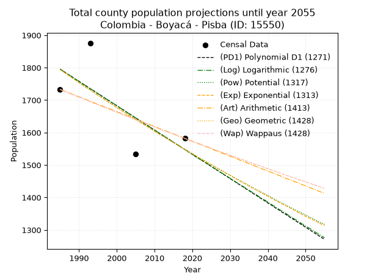
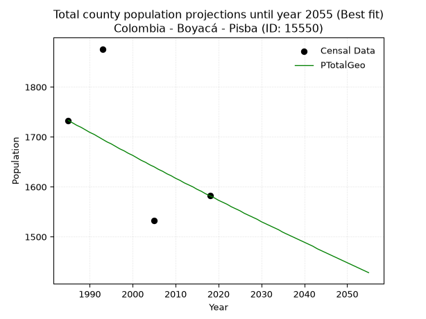
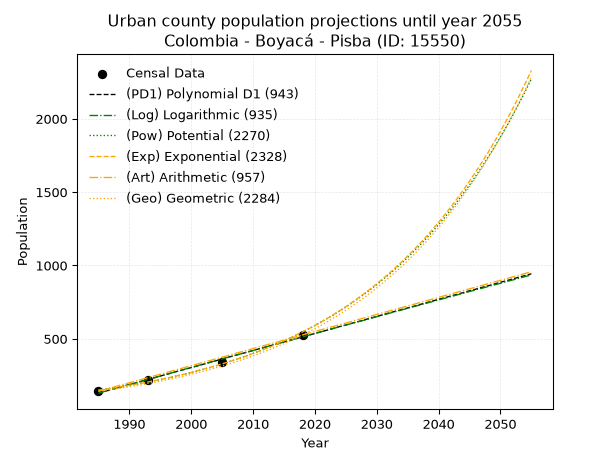
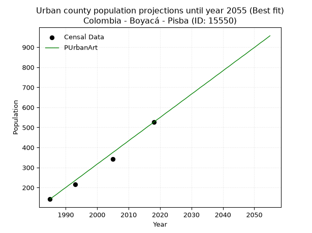
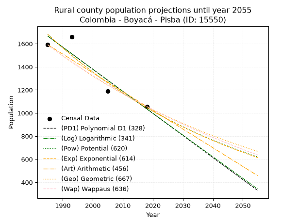
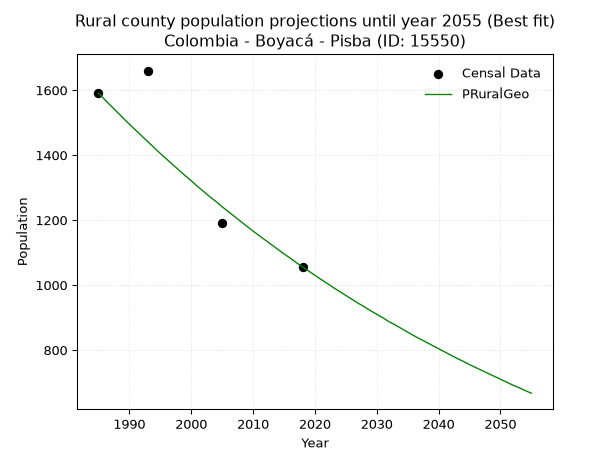

<div align="center">


</div>

# 📜 _“Population and Public Services Demand Projections (PPSD) until Year 2050 for Colombia - Boyacá - Pisba (ID: 15550)”_
Keywords: `population` `public-service` `projection` `lineal` `polynomial` `logarithmic` `potential` `exponential` `arithmetic` `geometric` `wappaus` `dane` `colombia` `south-america`

PPSD are analytical estimates used by governments and planners to anticipate future changes in population size, age distribution, and the resulting community needs for utilities, healthcare, education, and infrastructure as sizing future water treatment facilities, electrical grids, and road networks based on spatial growth.

<div align="center">

</img>

</div>


> **General running parameters**: • app_version: _v20260806_. • Python version: _3.14.7_. • Pandas version: _3.0.5_. • NumPy version: _2.5.1_. • Creates, save and include plots into reports (create_plot): _False_. • Projection until year: _2050_. • Process polynomial degree 2 and up: _False_. • Process Wappaus: _True_. • Process Wappaus: _True_. • Set negative values to zero: _True_. • Set infinite values to zero: _True_. • Drop dataset notes: _True_. 
<div align="center">

Maps & GIS Layers: [:earth_americas:Google](http://maps.google.com/maps?q=5.721410169,-72.4860226) [:earth_americas:OSM](https://www.openstreetmap.org/#map=18/5.721410169/-72.4860226&layers=P) [:earth_americas:Bing](https://www.bing.com/maps?cp=5.721410169~-72.4860226&lvl=18) [:earth_americas:Apple](https://maps.apple.com/frame?center=5.721410169%2C-72.4860226&span=0.003%2C0.006) [:earth_americas:GISMobile](https://github.com/rcfdtools/R.GISMobile/blob/main/file/gis/CountyLayer_CO/Readme.md)

</div>


<div align="center">

```geojson
{
  "type": "Feature",
  "geometry": {
    "type": "Point", 
    "coordinates": [-72.4860226, 5.721410169]
  }, 
  "properties": {
    "Name": "Colombia - Boyacá - Pisba (ID: 15550)"
  }
}
```

</div>


## 0. Census Data (4 records)

Census data are official statistics collected by a government about the people and housing in a country. They usually include counts of total population, age, sex, race, income, education, and jobs.

📅Global census file: [Population.xlsx](../data/Population.xlsx)

| Source   |   Year |   CountryID | CountryName   |   StateID | StateName   |   CountyID | CountyName   |   PTotal |   PUrban |   PRural |
|:---------|-------:|------------:|:--------------|----------:|:------------|-----------:|:-------------|---------:|---------:|---------:|
| DANE     |   1985 |          57 | Colombia      |        15 | Boyacá      |      15550 | Pisba        |     1733 |      142 |     1591 |
| DANE     |   1993 |          57 | Colombia      |        15 | Boyacá      |      15550 | Pisba        |     1876 |      216 |     1660 |
| DANE     |   2005 |          57 | Colombia      |        15 | Boyacá      |      15550 | Pisba        |     1533 |      343 |     1190 |
| DANE     |   2018 |          57 | Colombia      |        15 | Boyacá      |      15550 | Pisba        |     1582 |      526 |     1056 |

> 🔥Some records could had specific notes about the registered values or the corresponding urban or rural distribution.

📅[SUI-RUPS](https://www.datos.gov.co/Hacienda-y-Cr-dito-P-blico/Registro-nico-de-Prestadores-de-Servicios-P-blicos/4qkq-csdn/about_data) - Local public utility companies: [RUPS.csv](../data/RUPS.csv)

 | SERVICIO       | ESTADO    | NOMBRE                                              | NIT         | DEPARTAMENTO_DOMICILIO   | MUNICIPIO_DOMICILIO   | DIRECCION               |   TELEFONO | EMAIL                      | TIPO_PRESTADOR                 | CLASIFICACION                 |
|:---------------|:----------|:----------------------------------------------------|:------------|:-------------------------|:----------------------|:------------------------|-----------:|:---------------------------|:-------------------------------|:------------------------------|
| ACUEDUCTO      | OPERATIVA | UNIDAD DE SERVICIOS PUBLICOS DOMICILIARIOS DE PISVA | 800066389-5 | BOYACA                   | PISBA                 | Centro Parque Principal |    6359184 | wiltonruiz1107@hotmail.com | MUNICIPIO (PRESTACIÓN DIRECTA) | MENOR O IGUAL A 2500 USUARIOS |
| ALCANTARILLADO | OPERATIVA | UNIDAD DE SERVICIOS PUBLICOS DOMICILIARIOS DE PISVA | 800066389-5 | BOYACA                   | PISBA                 | Centro Parque Principal |    6359184 | wiltonruiz1107@hotmail.com | MUNICIPIO (PRESTACIÓN DIRECTA) | MENOR O IGUAL A 2500 USUARIOS |

## 1. Total

### 1.1. Coefficients and Parameters

* (PD1) Polynomial Deg 1: -7.494179044560433, 16671.231633882006 (lineal)
* (Log) Logarithmic: -15001.289413377117, 115705.92104386837
* (Pow) Potential: -8.92201439117872, 32.67644113324439
* (Exp) Exponential: -0.0044568134083689415, 12468604.236873565
* (Art) Arithmetic: Year diff. 2018 - 1985 = 33, Population diff. 1582 - 1733 = -151, Annual growth = -4.575757575757576
* (Geo) Geometric: Year diff. 2018 - 1985 = 33, Population diff. 1582 - 1733 = -151, Annual growth % = -0.0027587374098911877
* (Wap) Wappaus: i = -0.2760638054755702, Condition values only valid for < 200)

<sub>
Wappaus condition values: ['-0.00', '-0.28', '-0.55', '-0.83', '-1.10', '-1.38', '-1.66', '-1.93', '-2.21', '-2.48', '-2.76', '-3.04', '-3.31', '-3.59', '-3.86', '-4.14', '-4.42', '-4.69', '-4.97', '-5.25', '-5.52', '-5.80', '-6.07', '-6.35', '-6.63', '-6.90', '-7.18', '-7.45', '-7.73', '-8.01', '-8.28', '-8.56', '-8.83', '-9.11', '-9.39', '-9.66', '-9.94', '-10.21', '-10.49', '-10.77', '-11.04', '-11.32', '-11.59', '-11.87', '-12.15', '-12.42', '-12.70', '-12.97', '-13.25', '-13.53', '-13.80', '-14.08', '-14.36', '-14.63', '-14.91', '-15.18', '-15.46', '-15.74', '-16.01', '-16.29', '-16.56', '-16.84', '-17.12', '-17.39', '-17.67', '-17.94']
</sub>


### 1.2. Projected Dataset

|   Year |   CountyID |   PTotalPD1 |   PTotalLog |   PTotalPow |   PTotalExp |   PTotalArt |   PTotalGeo |   PTotalWap |
|-------:|-----------:|------------:|------------:|------------:|------------:|------------:|------------:|------------:|
|   1985 |      15550 |        1795 |        1796 |        1794 |        1794 |        1733 |        1733 |        1733 |
|   1986 |      15550 |        1788 |        1788 |        1786 |        1786 |        1728 |        1728 |        1728 |
|   1987 |      15550 |        1780 |        1780 |        1778 |        1778 |        1724 |        1723 |        1723 |
|   1988 |      15550 |        1773 |        1773 |        1770 |        1770 |        1719 |        1719 |        1719 |
|   1989 |      15550 |        1765 |        1765 |        1762 |        1762 |        1715 |        1714 |        1714 |
|   1990 |      15550 |        1758 |        1758 |        1754 |        1754 |        1710 |        1709 |        1709 |
|   1991 |      15550 |        1750 |        1750 |        1746 |        1746 |        1706 |        1705 |        1705 |
|   1992 |      15550 |        1743 |        1743 |        1738 |        1738 |        1701 |        1700 |        1700 |
|   1993 |      15550 |        1735 |        1735 |        1731 |        1731 |        1696 |        1695 |        1695 |
|   1994 |      15550 |        1728 |        1728 |        1723 |        1723 |        1692 |        1690 |        1690 |
|   1995 |      15550 |        1720 |        1720 |        1715 |        1715 |        1687 |        1686 |        1686 |
|   1996 |      15550 |        1713 |        1713 |        1708 |        1708 |        1683 |        1681 |        1681 |
|   1997 |      15550 |        1705 |        1705 |        1700 |        1700 |        1678 |        1676 |        1677 |
|   1998 |      15550 |        1698 |        1698 |        1692 |        1693 |        1674 |        1672 |        1672 |
|   1999 |      15550 |        1690 |        1690 |        1685 |        1685 |        1669 |        1667 |        1667 |
|   2000 |      15550 |        1683 |        1683 |        1677 |        1678 |        1664 |        1663 |        1663 |
|   2001 |      15550 |        1675 |        1675 |        1670 |        1670 |        1660 |        1658 |        1658 |
|   2002 |      15550 |        1668 |        1668 |        1662 |        1663 |        1655 |        1653 |        1654 |
|   2003 |      15550 |        1660 |        1660 |        1655 |        1655 |        1651 |        1649 |        1649 |
|   2004 |      15550 |        1653 |        1653 |        1648 |        1648 |        1646 |        1644 |        1644 |
|   2005 |      15550 |        1645 |        1645 |        1640 |        1641 |        1641 |        1640 |        1640 |
|   2006 |      15550 |        1638 |        1638 |        1633 |        1633 |        1637 |        1635 |        1635 |
|   2007 |      15550 |        1630 |        1630 |        1626 |        1626 |        1632 |        1631 |        1631 |
|   2008 |      15550 |        1623 |        1623 |        1619 |        1619 |        1628 |        1626 |        1626 |
|   2009 |      15550 |        1615 |        1615 |        1611 |        1612 |        1623 |        1622 |        1622 |
|   2010 |      15550 |        1608 |        1608 |        1604 |        1604 |        1619 |        1617 |        1617 |
|   2011 |      15550 |        1600 |        1600 |        1597 |        1597 |        1614 |        1613 |        1613 |
|   2012 |      15550 |        1593 |        1593 |        1590 |        1590 |        1609 |        1608 |        1608 |
|   2013 |      15550 |        1585 |        1585 |        1583 |        1583 |        1605 |        1604 |        1604 |
|   2014 |      15550 |        1578 |        1578 |        1576 |        1576 |        1600 |        1600 |        1600 |
|   2015 |      15550 |        1570 |        1570 |        1569 |        1569 |        1596 |        1595 |        1595 |
|   2016 |      15550 |        1563 |        1563 |        1562 |        1562 |        1591 |        1591 |        1591 |
|   2017 |      15550 |        1555 |        1556 |        1555 |        1555 |        1587 |        1586 |        1586 |
|   2018 |      15550 |        1548 |        1548 |        1548 |        1548 |        1582 |        1582 |        1582 |
|   2019 |      15550 |        1540 |        1541 |        1542 |        1541 |        1577 |        1578 |        1578 |
|   2020 |      15550 |        1533 |        1533 |        1535 |        1535 |        1573 |        1573 |        1573 |
|   2021 |      15550 |        1525 |        1526 |        1528 |        1528 |        1568 |        1569 |        1569 |
|   2022 |      15550 |        1518 |        1518 |        1521 |        1521 |        1564 |        1565 |        1565 |
|   2023 |      15550 |        1511 |        1511 |        1515 |        1514 |        1559 |        1560 |        1560 |
|   2024 |      15550 |        1503 |        1504 |        1508 |        1507 |        1555 |        1556 |        1556 |
|   2025 |      15550 |        1496 |        1496 |        1501 |        1501 |        1550 |        1552 |        1552 |
|   2026 |      15550 |        1488 |        1489 |        1495 |        1494 |        1545 |        1547 |        1547 |
|   2027 |      15550 |        1481 |        1481 |        1488 |        1487 |        1541 |        1543 |        1543 |
|   2028 |      15550 |        1473 |        1474 |        1482 |        1481 |        1536 |        1539 |        1539 |
|   2029 |      15550 |        1466 |        1467 |        1475 |        1474 |        1532 |        1535 |        1535 |
|   2030 |      15550 |        1458 |        1459 |        1469 |        1468 |        1527 |        1530 |        1530 |
|   2031 |      15550 |        1451 |        1452 |        1462 |        1461 |        1523 |        1526 |        1526 |
|   2032 |      15550 |        1443 |        1444 |        1456 |        1455 |        1518 |        1522 |        1522 |
|   2033 |      15550 |        1436 |        1437 |        1449 |        1448 |        1513 |        1518 |        1518 |
|   2034 |      15550 |        1428 |        1430 |        1443 |        1442 |        1509 |        1514 |        1513 |
|   2035 |      15550 |        1421 |        1422 |        1437 |        1435 |        1504 |        1509 |        1509 |
|   2036 |      15550 |        1413 |        1415 |        1430 |        1429 |        1500 |        1505 |        1505 |
|   2037 |      15550 |        1406 |        1408 |        1424 |        1423 |        1495 |        1501 |        1501 |
|   2038 |      15550 |        1398 |        1400 |        1418 |        1416 |        1490 |        1497 |        1497 |
|   2039 |      15550 |        1391 |        1393 |        1412 |        1410 |        1486 |        1493 |        1493 |
|   2040 |      15550 |        1383 |        1386 |        1406 |        1404 |        1481 |        1489 |        1488 |
|   2041 |      15550 |        1376 |        1378 |        1400 |        1397 |        1477 |        1485 |        1484 |
|   2042 |      15550 |        1368 |        1371 |        1393 |        1391 |        1472 |        1481 |        1480 |
|   2043 |      15550 |        1361 |        1363 |        1387 |        1385 |        1468 |        1476 |        1476 |
|   2044 |      15550 |        1353 |        1356 |        1381 |        1379 |        1463 |        1472 |        1472 |
|   2045 |      15550 |        1346 |        1349 |        1375 |        1373 |        1458 |        1468 |        1468 |
|   2046 |      15550 |        1338 |        1341 |        1369 |        1367 |        1454 |        1464 |        1464 |
|   2047 |      15550 |        1331 |        1334 |        1363 |        1361 |        1449 |        1460 |        1460 |
|   2048 |      15550 |        1323 |        1327 |        1357 |        1354 |        1445 |        1456 |        1456 |
|   2049 |      15550 |        1316 |        1319 |        1352 |        1348 |        1440 |        1452 |        1452 |
|   2050 |      15550 |        1308 |        1312 |        1346 |        1342 |        1436 |        1448 |        1448 |
<div align="center">

</img>

</div>


### 1.3. Best fit with absolute and relative error (%)

Relative error puts that difference into context by dividing the absolute error by the true value, creating a unitless ratio or percentage that shows the scale of the mistake.

Absolute and relative error

|   Year | Source   |   CountryID | CountryName   |   StateID | StateName   |   CountyID_x | CountyName   |   PTotal |   PUrban |   PRural |   CountyID_y |   PTotalPD1 |   PTotalLog |   PTotalPow |   PTotalExp |   PTotalArt |   PTotalGeo |   PTotalWap |   PTotalPD1AbsError |   PTotalLogAbsError |   PTotalPowAbsError |   PTotalExpAbsError |   PTotalArtAbsError |   PTotalGeoAbsError |   PTotalWapAbsError |   PTotalPD1RelError |   PTotalLogRelError |   PTotalPowRelError |   PTotalExpRelError |   PTotalArtRelError |   PTotalGeoRelError |   PTotalWapRelError |
|-------:|:---------|------------:|:--------------|----------:|:------------|-------------:|:-------------|---------:|---------:|---------:|-------------:|------------:|------------:|------------:|------------:|------------:|------------:|------------:|--------------------:|--------------------:|--------------------:|--------------------:|--------------------:|--------------------:|--------------------:|--------------------:|--------------------:|--------------------:|--------------------:|--------------------:|--------------------:|--------------------:|
|   1985 | DANE     |          57 | Colombia      |        15 | Boyacá      |        15550 | Pisba        |     1733 |      142 |     1591 |        15550 |        1795 |        1796 |        1794 |        1794 |        1733 |        1733 |        1733 |                  62 |                  63 |                  61 |                  61 |                   0 |                   0 |                   0 |             3.57761 |             3.63531 |             3.51991 |             3.51991 |             0       |             0       |             0       |
|   1993 | DANE     |          57 | Colombia      |        15 | Boyacá      |        15550 | Pisba        |     1876 |      216 |     1660 |        15550 |        1735 |        1735 |        1731 |        1731 |        1696 |        1695 |        1695 |                 141 |                 141 |                 145 |                 145 |                 180 |                 181 |                 181 |             7.51599 |             7.51599 |             7.72921 |             7.72921 |             9.59488 |             9.64819 |             9.64819 |
|   2005 | DANE     |          57 | Colombia      |        15 | Boyacá      |        15550 | Pisba        |     1533 |      343 |     1190 |        15550 |        1645 |        1645 |        1640 |        1641 |        1641 |        1640 |        1640 |                 112 |                 112 |                 107 |                 108 |                 108 |                 107 |                 107 |             7.30594 |             7.30594 |             6.97978 |             7.04501 |             7.04501 |             6.97978 |             6.97978 |
|   2018 | DANE     |          57 | Colombia      |        15 | Boyacá      |        15550 | Pisba        |     1582 |      526 |     1056 |        15550 |        1548 |        1548 |        1548 |        1548 |        1582 |        1582 |        1582 |                  34 |                  34 |                  34 |                  34 |                   0 |                   0 |                   0 |             2.14918 |             2.14918 |             2.14918 |             2.14918 |             0       |             0       |             0       |

Relative error mean

| Method    |   RelError | Best   |
|:----------|-----------:|:-------|
| PTotalPD1 |    5.13718 |        |
| PTotalLog |    5.15161 |        |
| PTotalPow |    5.09452 |        |
| PTotalExp |    5.11083 |        |
| PTotalArt |    4.15997 |        |
| PTotalGeo |    4.15699 | True   |
| PTotalWap |    4.15699 | True   |

💙Best method: _**PTotalGeo**_
<div align="center">

</img>

</div>


### 1.4. Fresh water supply demand in liters per capita per day (lpcd)

The fresh water supply demand typically ranges from 100 to 300 liters per capita per day (lpcd) for standard domestic and municipal planning, though absolute survival minimums set by the World Health Organization are as low as 7.5 to 20 liters per day, and total consumption in high-income nations can exceed 400 liters.

> `CZ`: Level in meters above the sea level (masl)<br> `WS`: Fresh water supply demand in liters per capita per day (lpcd or l/h/d)<br> `WSAll`: Zonal fresh water supply demand in liters per second (l/s)<br> `A`: Zonal area in square meters<br> `DP`: Population density (people/hectare or p/ha)

Reference values (RAS Colombia)

|    CZ |   WS |
|------:|-----:|
|  1000 |  120 |
|  2000 |  130 |
| 99999 |  140 |

County shapefile geometry properties and water supply values

|   CountyID |      ATotal |   CZTotal |   WSTotal |
|-----------:|------------:|----------:|----------:|
|      15550 | 4.63875e+08 |    1990.5 |       130 |

Projected values for best method: PTotalGeo

|   CountyID |   Year |   PTotalGeo |   DPTotal |   WSTotal |   WSTotalAll |
|-----------:|-------:|------------:|----------:|----------:|-------------:|
|      15550 |   1985 |        1733 |      0.04 |       130 |      2.60752 |
|      15550 |   1986 |        1728 |      0.04 |       130 |      2.6     |
|      15550 |   1987 |        1723 |      0.04 |       130 |      2.59248 |
|      15550 |   1988 |        1719 |      0.04 |       130 |      2.58646 |
|      15550 |   1989 |        1714 |      0.04 |       130 |      2.57894 |
|      15550 |   1990 |        1709 |      0.04 |       130 |      2.57141 |
|      15550 |   1991 |        1705 |      0.04 |       130 |      2.56539 |
|      15550 |   1992 |        1700 |      0.04 |       130 |      2.55787 |
|      15550 |   1993 |        1695 |      0.04 |       130 |      2.55035 |
|      15550 |   1994 |        1690 |      0.04 |       130 |      2.54282 |
|      15550 |   1995 |        1686 |      0.04 |       130 |      2.53681 |
|      15550 |   1996 |        1681 |      0.04 |       130 |      2.52928 |
|      15550 |   1997 |        1676 |      0.04 |       130 |      2.52176 |
|      15550 |   1998 |        1672 |      0.04 |       130 |      2.51574 |
|      15550 |   1999 |        1667 |      0.04 |       130 |      2.50822 |
|      15550 |   2000 |        1663 |      0.04 |       130 |      2.5022  |
|      15550 |   2001 |        1658 |      0.04 |       130 |      2.49468 |
|      15550 |   2002 |        1653 |      0.04 |       130 |      2.48715 |
|      15550 |   2003 |        1649 |      0.04 |       130 |      2.48113 |
|      15550 |   2004 |        1644 |      0.04 |       130 |      2.47361 |
|      15550 |   2005 |        1640 |      0.04 |       130 |      2.46759 |
|      15550 |   2006 |        1635 |      0.04 |       130 |      2.46007 |
|      15550 |   2007 |        1631 |      0.04 |       130 |      2.45405 |
|      15550 |   2008 |        1626 |      0.04 |       130 |      2.44653 |
|      15550 |   2009 |        1622 |      0.03 |       130 |      2.44051 |
|      15550 |   2010 |        1617 |      0.03 |       130 |      2.43299 |
|      15550 |   2011 |        1613 |      0.03 |       130 |      2.42697 |
|      15550 |   2012 |        1608 |      0.03 |       130 |      2.41944 |
|      15550 |   2013 |        1604 |      0.03 |       130 |      2.41343 |
|      15550 |   2014 |        1600 |      0.03 |       130 |      2.40741 |
|      15550 |   2015 |        1595 |      0.03 |       130 |      2.39988 |
|      15550 |   2016 |        1591 |      0.03 |       130 |      2.39387 |
|      15550 |   2017 |        1586 |      0.03 |       130 |      2.38634 |
|      15550 |   2018 |        1582 |      0.03 |       130 |      2.38032 |
|      15550 |   2019 |        1578 |      0.03 |       130 |      2.37431 |
|      15550 |   2020 |        1573 |      0.03 |       130 |      2.36678 |
|      15550 |   2021 |        1569 |      0.03 |       130 |      2.36076 |
|      15550 |   2022 |        1565 |      0.03 |       130 |      2.35475 |
|      15550 |   2023 |        1560 |      0.03 |       130 |      2.34722 |
|      15550 |   2024 |        1556 |      0.03 |       130 |      2.3412  |
|      15550 |   2025 |        1552 |      0.03 |       130 |      2.33519 |
|      15550 |   2026 |        1547 |      0.03 |       130 |      2.32766 |
|      15550 |   2027 |        1543 |      0.03 |       130 |      2.32164 |
|      15550 |   2028 |        1539 |      0.03 |       130 |      2.31562 |
|      15550 |   2029 |        1535 |      0.03 |       130 |      2.30961 |
|      15550 |   2030 |        1530 |      0.03 |       130 |      2.30208 |
|      15550 |   2031 |        1526 |      0.03 |       130 |      2.29606 |
|      15550 |   2032 |        1522 |      0.03 |       130 |      2.29005 |
|      15550 |   2033 |        1518 |      0.03 |       130 |      2.28403 |
|      15550 |   2034 |        1514 |      0.03 |       130 |      2.27801 |
|      15550 |   2035 |        1509 |      0.03 |       130 |      2.27049 |
|      15550 |   2036 |        1505 |      0.03 |       130 |      2.26447 |
|      15550 |   2037 |        1501 |      0.03 |       130 |      2.25845 |
|      15550 |   2038 |        1497 |      0.03 |       130 |      2.25243 |
|      15550 |   2039 |        1493 |      0.03 |       130 |      2.24641 |
|      15550 |   2040 |        1489 |      0.03 |       130 |      2.24039 |
|      15550 |   2041 |        1485 |      0.03 |       130 |      2.23438 |
|      15550 |   2042 |        1481 |      0.03 |       130 |      2.22836 |
|      15550 |   2043 |        1476 |      0.03 |       130 |      2.22083 |
|      15550 |   2044 |        1472 |      0.03 |       130 |      2.21481 |
|      15550 |   2045 |        1468 |      0.03 |       130 |      2.2088  |
|      15550 |   2046 |        1464 |      0.03 |       130 |      2.20278 |
|      15550 |   2047 |        1460 |      0.03 |       130 |      2.19676 |
|      15550 |   2048 |        1456 |      0.03 |       130 |      2.19074 |
|      15550 |   2049 |        1452 |      0.03 |       130 |      2.18472 |
|      15550 |   2050 |        1448 |      0.03 |       130 |      2.1787  |

## 2. Urban

### 2.1. Coefficients and Parameters

* (PD1) Polynomial Deg 1: 11.616619831392892, -22929.393817743636 (lineal)
* (Log) Logarithmic: 23247.068691852866, -176394.40541709072
* (Pow) Potential: 78.41444103894501, -256.4162611084639
* (Exp) Exponential: 0.03916689693456917, 2.5796962610679146e-32
* (Art) Arithmetic: Year diff. 2018 - 1985 = 33, Population diff. 526 - 142 = 384, Annual growth = 11.636363636363637
* (Geo) Geometric: Year diff. 2018 - 1985 = 33, Population diff. 526 - 142 = 384, Annual growth % = 0.04047884492782394
* (Wap) Wappaus: i = 3.483941208492107, Condition values only valid for < 200)

<sub>
Wappaus condition values: ['0.00', '3.48', '6.97', '10.45', '13.94', '17.42', '20.90', '24.39', '27.87', '31.36', '34.84', '38.32', '41.81', '45.29', '48.78', '52.26', '55.74', '59.23', '62.71', '66.19', '69.68', '73.16', '76.65', '80.13', '83.61', '87.10', '90.58', '94.07', '97.55', '101.03', '104.52', '108.00', '111.49', '114.97', '118.45', '121.94', '125.42', '128.91', '132.39', '135.87', '139.36', '142.84', '146.33', '149.81', '153.29', '156.78', '160.26', '163.75', '167.23', '170.71', '174.20', '177.68', '181.16', '184.65', '188.13', '191.62', '195.10', '198.58', '202.07', '205.55', '209.04', '212.52', '216.00', '219.49', '222.97', '226.46']
</sub>


### 2.2. Projected Dataset

|   Year |   CountyID |   PUrbanPD1 |   PUrbanLog |   PUrbanPow |   PUrbanExp |   PUrbanArt |   PUrbanGeo |
|-------:|-----------:|------------:|------------:|------------:|------------:|------------:|------------:|
|   1985 |      15550 |         130 |         129 |         150 |         150 |         142 |         142 |
|   1986 |      15550 |         141 |         141 |         156 |         156 |         154 |         148 |
|   1987 |      15550 |         153 |         153 |         162 |         162 |         165 |         154 |
|   1988 |      15550 |         164 |         164 |         169 |         169 |         177 |         160 |
|   1989 |      15550 |         176 |         176 |         176 |         176 |         189 |         166 |
|   1990 |      15550 |         188 |         188 |         183 |         183 |         200 |         173 |
|   1991 |      15550 |         199 |         199 |         190 |         190 |         212 |         180 |
|   1992 |      15550 |         211 |         211 |         198 |         197 |         223 |         187 |
|   1993 |      15550 |         223 |         223 |         205 |         205 |         235 |         195 |
|   1994 |      15550 |         234 |         234 |         214 |         214 |         247 |         203 |
|   1995 |      15550 |         246 |         246 |         222 |         222 |         258 |         211 |
|   1996 |      15550 |         257 |         258 |         231 |         231 |         270 |         220 |
|   1997 |      15550 |         269 |         269 |         240 |         240 |         282 |         229 |
|   1998 |      15550 |         281 |         281 |         250 |         250 |         293 |         238 |
|   1999 |      15550 |         292 |         293 |         260 |         260 |         305 |         247 |
|   2000 |      15550 |         304 |         304 |         270 |         270 |         317 |         258 |
|   2001 |      15550 |         315 |         316 |         281 |         281 |         328 |         268 |
|   2002 |      15550 |         327 |         328 |         293 |         292 |         340 |         279 |
|   2003 |      15550 |         339 |         339 |         304 |         304 |         351 |         290 |
|   2004 |      15550 |         350 |         351 |         316 |         316 |         363 |         302 |
|   2005 |      15550 |         362 |         362 |         329 |         329 |         375 |         314 |
|   2006 |      15550 |         374 |         374 |         342 |         342 |         386 |         327 |
|   2007 |      15550 |         385 |         386 |         356 |         355 |         398 |         340 |
|   2008 |      15550 |         397 |         397 |         370 |         369 |         410 |         354 |
|   2009 |      15550 |         408 |         409 |         385 |         384 |         421 |         368 |
|   2010 |      15550 |         420 |         420 |         400 |         400 |         433 |         383 |
|   2011 |      15550 |         432 |         432 |         416 |         416 |         445 |         398 |
|   2012 |      15550 |         443 |         443 |         432 |         432 |         456 |         415 |
|   2013 |      15550 |         455 |         455 |         450 |         449 |         468 |         431 |
|   2014 |      15550 |         466 |         466 |         467 |         467 |         479 |         449 |
|   2015 |      15550 |         478 |         478 |         486 |         486 |         491 |         467 |
|   2016 |      15550 |         490 |         490 |         505 |         505 |         503 |         486 |
|   2017 |      15550 |         501 |         501 |         525 |         526 |         514 |         506 |
|   2018 |      15550 |         513 |         513 |         546 |         547 |         526 |         526 |
|   2019 |      15550 |         525 |         524 |         568 |         568 |         538 |         547 |
|   2020 |      15550 |         536 |         536 |         590 |         591 |         549 |         569 |
|   2021 |      15550 |         548 |         547 |         614 |         615 |         561 |         592 |
|   2022 |      15550 |         559 |         559 |         638 |         639 |         573 |         616 |
|   2023 |      15550 |         571 |         570 |         663 |         665 |         584 |         641 |
|   2024 |      15550 |         583 |         582 |         689 |         691 |         596 |         667 |
|   2025 |      15550 |         594 |         593 |         716 |         719 |         607 |         694 |
|   2026 |      15550 |         606 |         605 |         745 |         748 |         619 |         723 |
|   2027 |      15550 |         617 |         616 |         774 |         778 |         631 |         752 |
|   2028 |      15550 |         629 |         627 |         805 |         809 |         642 |         782 |
|   2029 |      15550 |         641 |         639 |         836 |         841 |         654 |         814 |
|   2030 |      15550 |         652 |         650 |         869 |         875 |         666 |         847 |
|   2031 |      15550 |         664 |         662 |         904 |         910 |         677 |         881 |
|   2032 |      15550 |         676 |         673 |         939 |         946 |         689 |         917 |
|   2033 |      15550 |         687 |         685 |         976 |         984 |         701 |         954 |
|   2034 |      15550 |         699 |         696 |        1014 |        1023 |         712 |         992 |
|   2035 |      15550 |         710 |         708 |        1054 |        1064 |         724 |        1033 |
|   2036 |      15550 |         722 |         719 |        1096 |        1106 |         735 |        1074 |
|   2037 |      15550 |         734 |         730 |        1139 |        1150 |         747 |        1118 |
|   2038 |      15550 |         745 |         742 |        1183 |        1196 |         759 |        1163 |
|   2039 |      15550 |         757 |         753 |        1230 |        1244 |         770 |        1210 |
|   2040 |      15550 |         769 |         765 |        1278 |        1294 |         782 |        1259 |
|   2041 |      15550 |         780 |         776 |        1328 |        1346 |         794 |        1310 |
|   2042 |      15550 |         792 |         787 |        1380 |        1399 |         805 |        1363 |
|   2043 |      15550 |         803 |         799 |        1434 |        1455 |         817 |        1418 |
|   2044 |      15550 |         815 |         810 |        1490 |        1513 |         829 |        1476 |
|   2045 |      15550 |         827 |         822 |        1548 |        1574 |         840 |        1536 |
|   2046 |      15550 |         838 |         833 |        1609 |        1637 |         852 |        1598 |
|   2047 |      15550 |         850 |         844 |        1672 |        1702 |         863 |        1662 |
|   2048 |      15550 |         861 |         856 |        1737 |        1770 |         875 |        1730 |
|   2049 |      15550 |         873 |         867 |        1805 |        1841 |         887 |        1800 |
|   2050 |      15550 |         885 |         878 |        1875 |        1914 |         898 |        1873 |
<div align="center">

</img>

</div>


### 2.3. Best fit with absolute and relative error (%)

Relative error puts that difference into context by dividing the absolute error by the true value, creating a unitless ratio or percentage that shows the scale of the mistake.

Absolute and relative error

|   Year | Source   |   CountryID | CountryName   |   StateID | StateName   |   CountyID_x | CountyName   |   PTotal |   PUrban |   PRural |   CountyID_y |   PUrbanPD1 |   PUrbanLog |   PUrbanPow |   PUrbanExp |   PUrbanArt |   PUrbanGeo |   PUrbanPD1AbsError |   PUrbanLogAbsError |   PUrbanPowAbsError |   PUrbanExpAbsError |   PUrbanArtAbsError |   PUrbanGeoAbsError |   PUrbanPD1RelError |   PUrbanLogRelError |   PUrbanPowRelError |   PUrbanExpRelError |   PUrbanArtRelError |   PUrbanGeoRelError |
|-------:|:---------|------------:|:--------------|----------:|:------------|-------------:|:-------------|---------:|---------:|---------:|-------------:|------------:|------------:|------------:|------------:|------------:|------------:|--------------------:|--------------------:|--------------------:|--------------------:|--------------------:|--------------------:|--------------------:|--------------------:|--------------------:|--------------------:|--------------------:|--------------------:|
|   1985 | DANE     |          57 | Colombia      |        15 | Boyacá      |        15550 | Pisba        |     1733 |      142 |     1591 |        15550 |         130 |         129 |         150 |         150 |         142 |         142 |                  12 |                  13 |                   8 |                   8 |                   0 |                   0 |             8.4507  |             9.15493 |             5.6338  |             5.6338  |             0       |             0       |
|   1993 | DANE     |          57 | Colombia      |        15 | Boyacá      |        15550 | Pisba        |     1876 |      216 |     1660 |        15550 |         223 |         223 |         205 |         205 |         235 |         195 |                   7 |                   7 |                  11 |                  11 |                  19 |                  21 |             3.24074 |             3.24074 |             5.09259 |             5.09259 |             8.7963  |             9.72222 |
|   2005 | DANE     |          57 | Colombia      |        15 | Boyacá      |        15550 | Pisba        |     1533 |      343 |     1190 |        15550 |         362 |         362 |         329 |         329 |         375 |         314 |                  19 |                  19 |                  14 |                  14 |                  32 |                  29 |             5.53936 |             5.53936 |             4.08163 |             4.08163 |             9.32945 |             8.45481 |
|   2018 | DANE     |          57 | Colombia      |        15 | Boyacá      |        15550 | Pisba        |     1582 |      526 |     1056 |        15550 |         513 |         513 |         546 |         547 |         526 |         526 |                  13 |                  13 |                  20 |                  21 |                   0 |                   0 |             2.47148 |             2.47148 |             3.80228 |             3.9924  |             0       |             0       |

Relative error mean

| Method    |   RelError | Best   |
|:----------|-----------:|:-------|
| PUrbanPD1 |    4.92557 |        |
| PUrbanLog |    5.10163 |        |
| PUrbanPow |    4.65258 |        |
| PUrbanExp |    4.70011 |        |
| PUrbanArt |    4.53144 | True   |
| PUrbanGeo |    4.54426 |        |

💙Best method: _**PUrbanArt**_
<div align="center">

</img>

</div>


### 2.4. Fresh water supply demand in liters per capita per day (lpcd)

The fresh water supply demand typically ranges from 100 to 300 liters per capita per day (lpcd) for standard domestic and municipal planning, though absolute survival minimums set by the World Health Organization are as low as 7.5 to 20 liters per day, and total consumption in high-income nations can exceed 400 liters.

> `CZ`: Level in meters above the sea level (masl)<br> `WS`: Fresh water supply demand in liters per capita per day (lpcd or l/h/d)<br> `WSAll`: Zonal fresh water supply demand in liters per second (l/s)<br> `A`: Zonal area in square meters<br> `DP`: Population density (people/hectare or p/ha)

Reference values (RAS Colombia)

|    CZ |   WS |
|------:|-----:|
|  1000 |  120 |
|  2000 |  130 |
| 99999 |  140 |

County shapefile geometry properties and water supply values

|   CountyID |   AUrban |   CZUrban |   WSUrban |
|-----------:|---------:|----------:|----------:|
|      15550 |   192396 |   1483.43 |       130 |

Projected values for best method: PUrbanArt

|   CountyID |   Year |   PUrbanArt |   DPUrban |   WSUrban |   WSUrbanAll |
|-----------:|-------:|------------:|----------:|----------:|-------------:|
|      15550 |   1985 |         142 |      7.38 |       130 |     0.213657 |
|      15550 |   1986 |         154 |      8    |       130 |     0.231713 |
|      15550 |   1987 |         165 |      8.58 |       130 |     0.248264 |
|      15550 |   1988 |         177 |      9.2  |       130 |     0.266319 |
|      15550 |   1989 |         189 |      9.82 |       130 |     0.284375 |
|      15550 |   1990 |         200 |     10.4  |       130 |     0.300926 |
|      15550 |   1991 |         212 |     11.02 |       130 |     0.318981 |
|      15550 |   1992 |         223 |     11.59 |       130 |     0.335532 |
|      15550 |   1993 |         235 |     12.21 |       130 |     0.353588 |
|      15550 |   1994 |         247 |     12.84 |       130 |     0.371644 |
|      15550 |   1995 |         258 |     13.41 |       130 |     0.388194 |
|      15550 |   1996 |         270 |     14.03 |       130 |     0.40625  |
|      15550 |   1997 |         282 |     14.66 |       130 |     0.424306 |
|      15550 |   1998 |         293 |     15.23 |       130 |     0.440856 |
|      15550 |   1999 |         305 |     15.85 |       130 |     0.458912 |
|      15550 |   2000 |         317 |     16.48 |       130 |     0.476968 |
|      15550 |   2001 |         328 |     17.05 |       130 |     0.493519 |
|      15550 |   2002 |         340 |     17.67 |       130 |     0.511574 |
|      15550 |   2003 |         351 |     18.24 |       130 |     0.528125 |
|      15550 |   2004 |         363 |     18.87 |       130 |     0.546181 |
|      15550 |   2005 |         375 |     19.49 |       130 |     0.564236 |
|      15550 |   2006 |         386 |     20.06 |       130 |     0.580787 |
|      15550 |   2007 |         398 |     20.69 |       130 |     0.598843 |
|      15550 |   2008 |         410 |     21.31 |       130 |     0.616898 |
|      15550 |   2009 |         421 |     21.88 |       130 |     0.633449 |
|      15550 |   2010 |         433 |     22.51 |       130 |     0.651505 |
|      15550 |   2011 |         445 |     23.13 |       130 |     0.66956  |
|      15550 |   2012 |         456 |     23.7  |       130 |     0.686111 |
|      15550 |   2013 |         468 |     24.32 |       130 |     0.704167 |
|      15550 |   2014 |         479 |     24.9  |       130 |     0.720718 |
|      15550 |   2015 |         491 |     25.52 |       130 |     0.738773 |
|      15550 |   2016 |         503 |     26.14 |       130 |     0.756829 |
|      15550 |   2017 |         514 |     26.72 |       130 |     0.77338  |
|      15550 |   2018 |         526 |     27.34 |       130 |     0.791435 |
|      15550 |   2019 |         538 |     27.96 |       130 |     0.809491 |
|      15550 |   2020 |         549 |     28.53 |       130 |     0.826042 |
|      15550 |   2021 |         561 |     29.16 |       130 |     0.844097 |
|      15550 |   2022 |         573 |     29.78 |       130 |     0.862153 |
|      15550 |   2023 |         584 |     30.35 |       130 |     0.878704 |
|      15550 |   2024 |         596 |     30.98 |       130 |     0.896759 |
|      15550 |   2025 |         607 |     31.55 |       130 |     0.91331  |
|      15550 |   2026 |         619 |     32.17 |       130 |     0.931366 |
|      15550 |   2027 |         631 |     32.8  |       130 |     0.949421 |
|      15550 |   2028 |         642 |     33.37 |       130 |     0.965972 |
|      15550 |   2029 |         654 |     33.99 |       130 |     0.984028 |
|      15550 |   2030 |         666 |     34.62 |       130 |     1.00208  |
|      15550 |   2031 |         677 |     35.19 |       130 |     1.01863  |
|      15550 |   2032 |         689 |     35.81 |       130 |     1.03669  |
|      15550 |   2033 |         701 |     36.44 |       130 |     1.05475  |
|      15550 |   2034 |         712 |     37.01 |       130 |     1.0713   |
|      15550 |   2035 |         724 |     37.63 |       130 |     1.08935  |
|      15550 |   2036 |         735 |     38.2  |       130 |     1.1059   |
|      15550 |   2037 |         747 |     38.83 |       130 |     1.12396  |
|      15550 |   2038 |         759 |     39.45 |       130 |     1.14201  |
|      15550 |   2039 |         770 |     40.02 |       130 |     1.15856  |
|      15550 |   2040 |         782 |     40.65 |       130 |     1.17662  |
|      15550 |   2041 |         794 |     41.27 |       130 |     1.19468  |
|      15550 |   2042 |         805 |     41.84 |       130 |     1.21123  |
|      15550 |   2043 |         817 |     42.46 |       130 |     1.22928  |
|      15550 |   2044 |         829 |     43.09 |       130 |     1.24734  |
|      15550 |   2045 |         840 |     43.66 |       130 |     1.26389  |
|      15550 |   2046 |         852 |     44.28 |       130 |     1.28194  |
|      15550 |   2047 |         863 |     44.86 |       130 |     1.2985   |
|      15550 |   2048 |         875 |     45.48 |       130 |     1.31655  |
|      15550 |   2049 |         887 |     46.1  |       130 |     1.33461  |
|      15550 |   2050 |         898 |     46.67 |       130 |     1.35116  |

## 3. Rural

### 3.1. Coefficients and Parameters

* (PD1) Polynomial Deg 1: -19.11079887595333, 39600.625451625645 (lineal)
* (Log) Logarithmic: -38248.35810522998, 292100.326460959
* (Pow) Potential: -28.802488760779408, 98.20944698522096
* (Exp) Exponential: -0.01439183628617628, 4289434373286374.5
* (Art) Arithmetic: Year diff. 2018 - 1985 = 33, Population diff. 1056 - 1591 = -535, Annual growth = -16.21212121212121
* (Geo) Geometric: Year diff. 2018 - 1985 = 33, Population diff. 1056 - 1591 = -535, Annual growth % = -0.0123436260096641
* (Wap) Wappaus: i = -1.2249430458723998, Condition values only valid for < 200)

<sub>
Wappaus condition values: ['-0.00', '-1.22', '-2.45', '-3.67', '-4.90', '-6.12', '-7.35', '-8.57', '-9.80', '-11.02', '-12.25', '-13.47', '-14.70', '-15.92', '-17.15', '-18.37', '-19.60', '-20.82', '-22.05', '-23.27', '-24.50', '-25.72', '-26.95', '-28.17', '-29.40', '-30.62', '-31.85', '-33.07', '-34.30', '-35.52', '-36.75', '-37.97', '-39.20', '-40.42', '-41.65', '-42.87', '-44.10', '-45.32', '-46.55', '-47.77', '-49.00', '-50.22', '-51.45', '-52.67', '-53.90', '-55.12', '-56.35', '-57.57', '-58.80', '-60.02', '-61.25', '-62.47', '-63.70', '-64.92', '-66.15', '-67.37', '-68.60', '-69.82', '-71.05', '-72.27', '-73.50', '-74.72', '-75.95', '-77.17', '-78.40', '-79.62']
</sub>


### 3.2. Projected Dataset

|   Year |   CountyID |   PRuralPD1 |   PRuralLog |   PRuralPow |   PRuralExp |   PRuralArt |   PRuralGeo |   PRuralWap |
|-------:|-----------:|------------:|------------:|------------:|------------:|------------:|------------:|------------:|
|   1985 |      15550 |        1666 |        1666 |        1682 |        1681 |        1591 |        1591 |        1591 |
|   1986 |      15550 |        1647 |        1647 |        1657 |        1657 |        1575 |        1571 |        1572 |
|   1987 |      15550 |        1627 |        1628 |        1634 |        1633 |        1559 |        1552 |        1552 |
|   1988 |      15550 |        1608 |        1608 |        1610 |        1610 |        1542 |        1533 |        1534 |
|   1989 |      15550 |        1589 |        1589 |        1587 |        1587 |        1526 |        1514 |        1515 |
|   1990 |      15550 |        1570 |        1570 |        1564 |        1564 |        1510 |        1495 |        1496 |
|   1991 |      15550 |        1551 |        1551 |        1542 |        1542 |        1494 |        1477 |        1478 |
|   1992 |      15550 |        1532 |        1532 |        1520 |        1520 |        1478 |        1459 |        1460 |
|   1993 |      15550 |        1513 |        1512 |        1498 |        1498 |        1461 |        1441 |        1442 |
|   1994 |      15550 |        1494 |        1493 |        1476 |        1477 |        1445 |        1423 |        1425 |
|   1995 |      15550 |        1475 |        1474 |        1455 |        1456 |        1429 |        1405 |        1407 |
|   1996 |      15550 |        1455 |        1455 |        1434 |        1435 |        1413 |        1388 |        1390 |
|   1997 |      15550 |        1436 |        1436 |        1414 |        1414 |        1396 |        1371 |        1373 |
|   1998 |      15550 |        1417 |        1417 |        1393 |        1394 |        1380 |        1354 |        1356 |
|   1999 |      15550 |        1398 |        1397 |        1373 |        1374 |        1364 |        1337 |        1340 |
|   2000 |      15550 |        1379 |        1378 |        1354 |        1355 |        1348 |        1321 |        1323 |
|   2001 |      15550 |        1360 |        1359 |        1334 |        1335 |        1332 |        1304 |        1307 |
|   2002 |      15550 |        1341 |        1340 |        1315 |        1316 |        1315 |        1288 |        1291 |
|   2003 |      15550 |        1322 |        1321 |        1297 |        1297 |        1299 |        1272 |        1275 |
|   2004 |      15550 |        1303 |        1302 |        1278 |        1279 |        1283 |        1257 |        1259 |
|   2005 |      15550 |        1283 |        1283 |        1260 |        1261 |        1267 |        1241 |        1244 |
|   2006 |      15550 |        1264 |        1264 |        1242 |        1243 |        1251 |        1226 |        1228 |
|   2007 |      15550 |        1245 |        1245 |        1224 |        1225 |        1234 |        1211 |        1213 |
|   2008 |      15550 |        1226 |        1226 |        1207 |        1207 |        1218 |        1196 |        1198 |
|   2009 |      15550 |        1207 |        1207 |        1190 |        1190 |        1202 |        1181 |        1183 |
|   2010 |      15550 |        1188 |        1188 |        1173 |        1173 |        1186 |        1166 |        1168 |
|   2011 |      15550 |        1169 |        1168 |        1156 |        1156 |        1169 |        1152 |        1154 |
|   2012 |      15550 |        1150 |        1149 |        1140 |        1140 |        1153 |        1138 |        1139 |
|   2013 |      15550 |        1131 |        1130 |        1123 |        1123 |        1137 |        1124 |        1125 |
|   2014 |      15550 |        1111 |        1111 |        1107 |        1107 |        1121 |        1110 |        1111 |
|   2015 |      15550 |        1092 |        1092 |        1092 |        1092 |        1105 |        1096 |        1097 |
|   2016 |      15550 |        1073 |        1074 |        1076 |        1076 |        1088 |        1083 |        1083 |
|   2017 |      15550 |        1054 |        1055 |        1061 |        1061 |        1072 |        1069 |        1070 |
|   2018 |      15550 |        1035 |        1036 |        1046 |        1045 |        1056 |        1056 |        1056 |
|   2019 |      15550 |        1016 |        1017 |        1031 |        1031 |        1040 |        1043 |        1043 |
|   2020 |      15550 |         997 |         998 |        1016 |        1016 |        1024 |        1030 |        1029 |
|   2021 |      15550 |         978 |         979 |        1002 |        1001 |        1007 |        1017 |        1016 |
|   2022 |      15550 |         959 |         960 |         988 |         987 |         991 |        1005 |        1003 |
|   2023 |      15550 |         939 |         941 |         974 |         973 |         975 |         992 |         990 |
|   2024 |      15550 |         920 |         922 |         960 |         959 |         959 |         980 |         977 |
|   2025 |      15550 |         901 |         903 |         947 |         945 |         943 |         968 |         965 |
|   2026 |      15550 |         882 |         884 |         933 |         932 |         926 |         956 |         952 |
|   2027 |      15550 |         863 |         865 |         920 |         918 |         910 |         944 |         940 |
|   2028 |      15550 |         844 |         847 |         907 |         905 |         894 |         933 |         928 |
|   2029 |      15550 |         825 |         828 |         894 |         892 |         878 |         921 |         916 |
|   2030 |      15550 |         806 |         809 |         882 |         880 |         861 |         910 |         903 |
|   2031 |      15550 |         787 |         790 |         869 |         867 |         845 |         899 |         892 |
|   2032 |      15550 |         767 |         771 |         857 |         855 |         829 |         887 |         880 |
|   2033 |      15550 |         748 |         752 |         845 |         842 |         813 |         877 |         868 |
|   2034 |      15550 |         729 |         734 |         833 |         830 |         797 |         866 |         856 |
|   2035 |      15550 |         710 |         715 |         821 |         819 |         780 |         855 |         845 |
|   2036 |      15550 |         691 |         696 |         810 |         807 |         764 |         844 |         834 |
|   2037 |      15550 |         672 |         677 |         798 |         795 |         748 |         834 |         822 |
|   2038 |      15550 |         653 |         658 |         787 |         784 |         732 |         824 |         811 |
|   2039 |      15550 |         634 |         640 |         776 |         773 |         716 |         814 |         800 |
|   2040 |      15550 |         615 |         621 |         765 |         762 |         699 |         804 |         789 |
|   2041 |      15550 |         595 |         602 |         755 |         751 |         683 |         794 |         778 |
|   2042 |      15550 |         576 |         583 |         744 |         740 |         667 |         784 |         768 |
|   2043 |      15550 |         557 |         565 |         734 |         730 |         651 |         774 |         757 |
|   2044 |      15550 |         538 |         546 |         723 |         719 |         634 |         765 |         746 |
|   2045 |      15550 |         519 |         527 |         713 |         709 |         618 |         755 |         736 |
|   2046 |      15550 |         500 |         509 |         703 |         699 |         602 |         746 |         726 |
|   2047 |      15550 |         481 |         490 |         693 |         689 |         586 |         737 |         715 |
|   2048 |      15550 |         462 |         471 |         684 |         679 |         570 |         728 |         705 |
|   2049 |      15550 |         443 |         452 |         674 |         669 |         553 |         719 |         695 |
|   2050 |      15550 |         423 |         434 |         665 |         660 |         537 |         710 |         685 |
<div align="center">

</img>

</div>


### 3.3. Best fit with absolute and relative error (%)

Relative error puts that difference into context by dividing the absolute error by the true value, creating a unitless ratio or percentage that shows the scale of the mistake.

Absolute and relative error

|   Year | Source   |   CountryID | CountryName   |   StateID | StateName   |   CountyID_x | CountyName   |   PTotal |   PUrban |   PRural |   CountyID_y |   PRuralPD1 |   PRuralLog |   PRuralPow |   PRuralExp |   PRuralArt |   PRuralGeo |   PRuralWap |   PRuralPD1AbsError |   PRuralLogAbsError |   PRuralPowAbsError |   PRuralExpAbsError |   PRuralArtAbsError |   PRuralGeoAbsError |   PRuralWapAbsError |   PRuralPD1RelError |   PRuralLogRelError |   PRuralPowRelError |   PRuralExpRelError |   PRuralArtRelError |   PRuralGeoRelError |   PRuralWapRelError |
|-------:|:---------|------------:|:--------------|----------:|:------------|-------------:|:-------------|---------:|---------:|---------:|-------------:|------------:|------------:|------------:|------------:|------------:|------------:|------------:|--------------------:|--------------------:|--------------------:|--------------------:|--------------------:|--------------------:|--------------------:|--------------------:|--------------------:|--------------------:|--------------------:|--------------------:|--------------------:|--------------------:|
|   1985 | DANE     |          57 | Colombia      |        15 | Boyacá      |        15550 | Pisba        |     1733 |      142 |     1591 |        15550 |        1666 |        1666 |        1682 |        1681 |        1591 |        1591 |        1591 |                  75 |                  75 |                  91 |                  90 |                   0 |                   0 |                   0 |             4.71402 |             4.71402 |             5.71967 |             5.65682 |             0       |             0       |             0       |
|   1993 | DANE     |          57 | Colombia      |        15 | Boyacá      |        15550 | Pisba        |     1876 |      216 |     1660 |        15550 |        1513 |        1512 |        1498 |        1498 |        1461 |        1441 |        1442 |                 147 |                 148 |                 162 |                 162 |                 199 |                 219 |                 218 |             8.85542 |             8.91566 |             9.75904 |             9.75904 |            11.988   |            13.1928  |            13.1325  |
|   2005 | DANE     |          57 | Colombia      |        15 | Boyacá      |        15550 | Pisba        |     1533 |      343 |     1190 |        15550 |        1283 |        1283 |        1260 |        1261 |        1267 |        1241 |        1244 |                  93 |                  93 |                  70 |                  71 |                  77 |                  51 |                  54 |             7.81513 |             7.81513 |             5.88235 |             5.96639 |             6.47059 |             4.28571 |             4.53782 |
|   2018 | DANE     |          57 | Colombia      |        15 | Boyacá      |        15550 | Pisba        |     1582 |      526 |     1056 |        15550 |        1035 |        1036 |        1046 |        1045 |        1056 |        1056 |        1056 |                  21 |                  20 |                  10 |                  11 |                   0 |                   0 |                   0 |             1.98864 |             1.89394 |             0.94697 |             1.04167 |             0       |             0       |             0       |

Relative error mean

| Method    |   RelError | Best   |
|:----------|-----------:|:-------|
| PRuralPD1 |    5.8433  |        |
| PRuralLog |    5.83469 |        |
| PRuralPow |    5.57701 |        |
| PRuralExp |    5.60598 |        |
| PRuralArt |    4.61464 |        |
| PRuralGeo |    4.36962 | True   |
| PRuralWap |    4.41759 |        |

💙Best method: _**PRuralGeo**_
<div align="center">

</img>

</div>


### 3.4. Fresh water supply demand in liters per capita per day (lpcd)

The fresh water supply demand typically ranges from 100 to 300 liters per capita per day (lpcd) for standard domestic and municipal planning, though absolute survival minimums set by the World Health Organization are as low as 7.5 to 20 liters per day, and total consumption in high-income nations can exceed 400 liters.

> `CZ`: Level in meters above the sea level (masl)<br> `WS`: Fresh water supply demand in liters per capita per day (lpcd or l/h/d)<br> `WSAll`: Zonal fresh water supply demand in liters per second (l/s)<br> `A`: Zonal area in square meters<br> `DP`: Population density (people/hectare or p/ha)

Reference values (RAS Colombia)

|    CZ |   WS |
|------:|-----:|
|  1000 |  120 |
|  2000 |  130 |
| 99999 |  140 |

County shapefile geometry properties and water supply values

|   CountyID |      ARural |   CZRural |   WSRural |
|-----------:|------------:|----------:|----------:|
|      15550 | 4.63683e+08 |   1990.71 |       130 |

Projected values for best method: PRuralGeo

|   CountyID |   Year |   PRuralGeo |   DPRural |   WSRural |   WSRuralAll |
|-----------:|-------:|------------:|----------:|----------:|-------------:|
|      15550 |   1985 |        1591 |      0.03 |       130 |      2.39387 |
|      15550 |   1986 |        1571 |      0.03 |       130 |      2.36377 |
|      15550 |   1987 |        1552 |      0.03 |       130 |      2.33519 |
|      15550 |   1988 |        1533 |      0.03 |       130 |      2.3066  |
|      15550 |   1989 |        1514 |      0.03 |       130 |      2.27801 |
|      15550 |   1990 |        1495 |      0.03 |       130 |      2.24942 |
|      15550 |   1991 |        1477 |      0.03 |       130 |      2.22234 |
|      15550 |   1992 |        1459 |      0.03 |       130 |      2.19525 |
|      15550 |   1993 |        1441 |      0.03 |       130 |      2.16817 |
|      15550 |   1994 |        1423 |      0.03 |       130 |      2.14109 |
|      15550 |   1995 |        1405 |      0.03 |       130 |      2.114   |
|      15550 |   1996 |        1388 |      0.03 |       130 |      2.08843 |
|      15550 |   1997 |        1371 |      0.03 |       130 |      2.06285 |
|      15550 |   1998 |        1354 |      0.03 |       130 |      2.03727 |
|      15550 |   1999 |        1337 |      0.03 |       130 |      2.01169 |
|      15550 |   2000 |        1321 |      0.03 |       130 |      1.98762 |
|      15550 |   2001 |        1304 |      0.03 |       130 |      1.96204 |
|      15550 |   2002 |        1288 |      0.03 |       130 |      1.93796 |
|      15550 |   2003 |        1272 |      0.03 |       130 |      1.91389 |
|      15550 |   2004 |        1257 |      0.03 |       130 |      1.89132 |
|      15550 |   2005 |        1241 |      0.03 |       130 |      1.86725 |
|      15550 |   2006 |        1226 |      0.03 |       130 |      1.84468 |
|      15550 |   2007 |        1211 |      0.03 |       130 |      1.82211 |
|      15550 |   2008 |        1196 |      0.03 |       130 |      1.79954 |
|      15550 |   2009 |        1181 |      0.03 |       130 |      1.77697 |
|      15550 |   2010 |        1166 |      0.03 |       130 |      1.7544  |
|      15550 |   2011 |        1152 |      0.02 |       130 |      1.73333 |
|      15550 |   2012 |        1138 |      0.02 |       130 |      1.71227 |
|      15550 |   2013 |        1124 |      0.02 |       130 |      1.6912  |
|      15550 |   2014 |        1110 |      0.02 |       130 |      1.67014 |
|      15550 |   2015 |        1096 |      0.02 |       130 |      1.64907 |
|      15550 |   2016 |        1083 |      0.02 |       130 |      1.62951 |
|      15550 |   2017 |        1069 |      0.02 |       130 |      1.60845 |
|      15550 |   2018 |        1056 |      0.02 |       130 |      1.58889 |
|      15550 |   2019 |        1043 |      0.02 |       130 |      1.56933 |
|      15550 |   2020 |        1030 |      0.02 |       130 |      1.54977 |
|      15550 |   2021 |        1017 |      0.02 |       130 |      1.53021 |
|      15550 |   2022 |        1005 |      0.02 |       130 |      1.51215 |
|      15550 |   2023 |         992 |      0.02 |       130 |      1.49259 |
|      15550 |   2024 |         980 |      0.02 |       130 |      1.47454 |
|      15550 |   2025 |         968 |      0.02 |       130 |      1.45648 |
|      15550 |   2026 |         956 |      0.02 |       130 |      1.43843 |
|      15550 |   2027 |         944 |      0.02 |       130 |      1.42037 |
|      15550 |   2028 |         933 |      0.02 |       130 |      1.40382 |
|      15550 |   2029 |         921 |      0.02 |       130 |      1.38576 |
|      15550 |   2030 |         910 |      0.02 |       130 |      1.36921 |
|      15550 |   2031 |         899 |      0.02 |       130 |      1.35266 |
|      15550 |   2032 |         887 |      0.02 |       130 |      1.33461 |
|      15550 |   2033 |         877 |      0.02 |       130 |      1.31956 |
|      15550 |   2034 |         866 |      0.02 |       130 |      1.30301 |
|      15550 |   2035 |         855 |      0.02 |       130 |      1.28646 |
|      15550 |   2036 |         844 |      0.02 |       130 |      1.26991 |
|      15550 |   2037 |         834 |      0.02 |       130 |      1.25486 |
|      15550 |   2038 |         824 |      0.02 |       130 |      1.23981 |
|      15550 |   2039 |         814 |      0.02 |       130 |      1.22477 |
|      15550 |   2040 |         804 |      0.02 |       130 |      1.20972 |
|      15550 |   2041 |         794 |      0.02 |       130 |      1.19468 |
|      15550 |   2042 |         784 |      0.02 |       130 |      1.17963 |
|      15550 |   2043 |         774 |      0.02 |       130 |      1.16458 |
|      15550 |   2044 |         765 |      0.02 |       130 |      1.15104 |
|      15550 |   2045 |         755 |      0.02 |       130 |      1.136   |
|      15550 |   2046 |         746 |      0.02 |       130 |      1.12245 |
|      15550 |   2047 |         737 |      0.02 |       130 |      1.10891 |
|      15550 |   2048 |         728 |      0.02 |       130 |      1.09537 |
|      15550 |   2049 |         719 |      0.02 |       130 |      1.08183 |
|      15550 |   2050 |         710 |      0.02 |       130 |      1.06829 |

#

<div align="center"><br><sub>Share this research</sub></div><br>

<sub>**APPS & TOOLS & CONTENT DISCLAIMER**: • NO WARRANTY - This content and software is provided by <a href="https://github.com/rcfdtools" target="_blank">github.com/rcfdtools</a> "as is", without any express or implied warranty, including warranties of merchantability, fitness for a particular purpose, or non-infringement. There is no guarantee that the software will be error-free or operate without interruption. • LIMITATION OF LIABILITY - Neither the authors nor copyright holders will be liable for claims or damages arising from the software or its use. You are responsible for determining if the software is appropriate for your use and assume all associated risks, including errors, legal compliance, and data loss. • NO PROFESSIONAL ADVICE - The software provides general information and does not offer professional advice. It should not replace consultation with professional advisors. [Clauses and global license for rcfdtools use.](https://github.com/rcfdtools/rcfdtools/blob/main/LICENSE.md)</sub>

| [:house: Home](Readme.md)  | [:beginner: Help / Collab](https://github.com/rcfdtools/R.HydroTools/discussions/31) |
|----------------------------|-------------------------------------------------------------------------------------------|