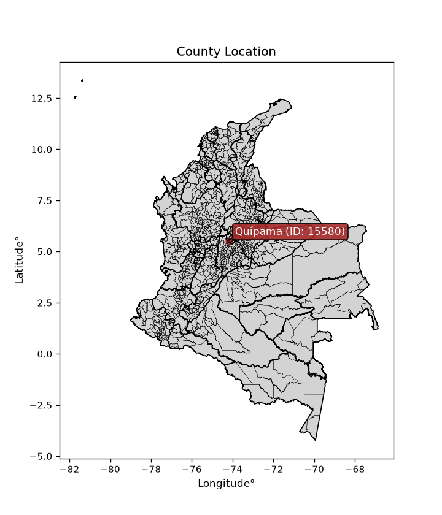
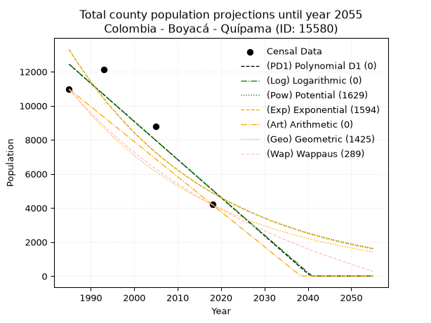
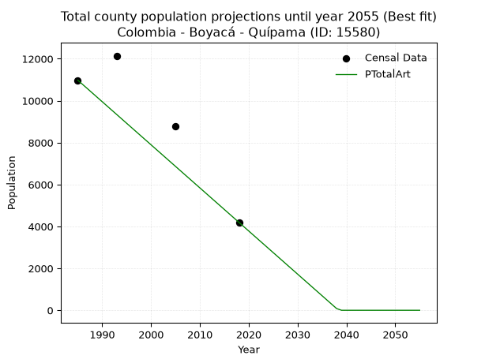
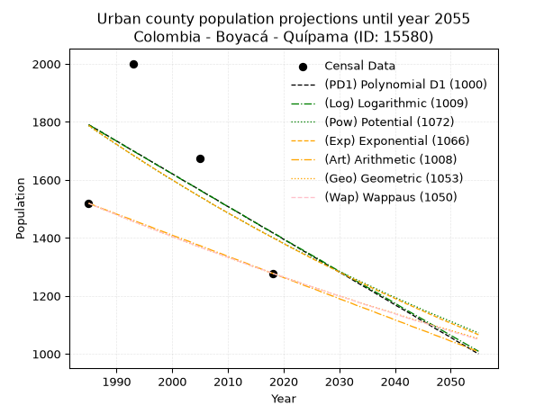
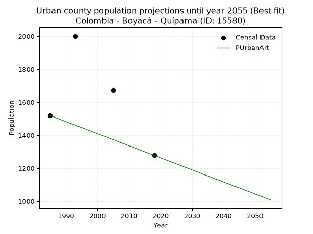
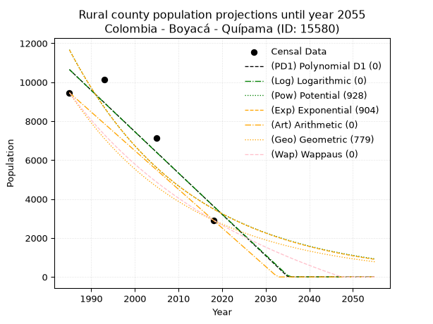
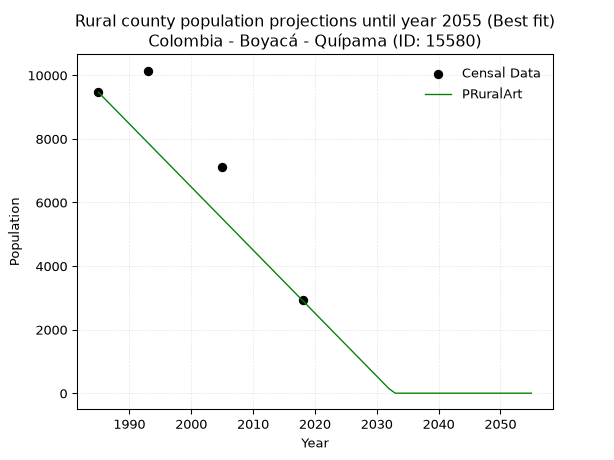

<div align="center">


</div>

# _“Population and Public Services Demand Projections (PPSD) until Year 2050 for Colombia - Boyacá - Quípama (ID: 15580)”_
Keywords: `population` `public-service` `projection` `lineal` `polynomial` `logarithmic` `potential` `exponential` `arithmetic` `geometric` `wappaus` `dane` `colombia` `south-america`

PPSD are analytical estimates used by governments and planners to anticipate future changes in population size, age distribution, and the resulting community needs for utilities, healthcare, education, and infrastructure as sizing future water treatment facilities, electrical grids, and road networks based on spatial growth.

<div align="center">

</img>

</div>


> **General running parameters**: • app_version: _v20260806_. • Python version: _3.14.7_. • Pandas version: _3.0.5_. • NumPy version: _2.5.1_. • Creates, save and include plots into reports (create_plot): _False_. • Projection until year: _2050_. • Process polynomial degree 2 and up: _False_. • Process Wappaus: _True_. • Process Wappaus: _True_. • Set negative values to zero: _True_. • Set infinite values to zero: _True_. • Drop dataset notes: _True_. 
<div align="center">

Dynamic map: [:earth_americas:Google](http://maps.google.com/maps?q=5.520549556,-74.1800327) [:earth_americas:OSM](https://www.openstreetmap.org/#map=18/5.520549556/-74.1800327&layers=P) [:earth_americas:Bing](https://www.bing.com/maps?cp=5.520549556~-74.1800327&lvl=18) [:earth_americas:Apple](https://maps.apple.com/frame?center=5.520549556%2C-74.1800327&span=0.003%2C0.006)

</div>


<div align="center">

```geojson
{
  "type": "Feature",
  "geometry": {
    "type": "Point", 
    "coordinates": [-74.1800327, 5.520549556]
  }, 
  "properties": {
    "Name": "Colombia - Boyacá - Quípama (ID: 15580)"
  }
}
```

</div>


## 0. Census Data (4 records)

Census data are official statistics collected by a government about the people and housing in a country. They usually include counts of total population, age, sex, race, income, education, and jobs.

📅Global census file: [Population.xlsx](../data/Population.xlsx)

| Source   |   Year |   CountryID | CountryName   |   StateID | StateName   |   CountyID | CountyName   |   PTotal |   PUrban |   PRural |
|:---------|-------:|------------:|:--------------|----------:|:------------|-----------:|:-------------|---------:|---------:|---------:|
| DANE     |   1985 |          57 | Colombia      |        15 | Boyacá      |      15580 | Quípama      |    10981 |     1519 |     9462 |
| DANE     |   1993 |          57 | Colombia      |        15 | Boyacá      |      15580 | Quípama      |    12145 |     2001 |    10144 |
| DANE     |   2005 |          57 | Colombia      |        15 | Boyacá      |      15580 | Quípama      |     8793 |     1675 |     7118 |
| DANE     |   2018 |          57 | Colombia      |        15 | Boyacá      |      15580 | Quípama      |     4194 |     1278 |     2916 |

> 🔥Some records could had specific notes about the registered values or the corresponding urban or rural distribution.

📅[SUI-RUPS](https://www.datos.gov.co/Hacienda-y-Cr-dito-P-blico/Registro-nico-de-Prestadores-de-Servicios-P-blicos/4qkq-csdn/about_data) - Local public utility companies: [RUPS.csv](../data/RUPS.xlsx)

 | SERVICIO       | ESTADO    | NOMBRE                                                                                                     | NIT         | DEPARTAMENTO_DOMICILIO   | MUNICIPIO_DOMICILIO   | DIRECCION       |   TELEFONO | EMAIL                   | TIPO_PRESTADOR                 | CLASIFICACION                 |
|:---------------|:----------|:-----------------------------------------------------------------------------------------------------------|:------------|:-------------------------|:----------------------|:----------------|-----------:|:------------------------|:-------------------------------|:------------------------------|
| ACUEDUCTO      | OPERATIVA | UNIDAD DE SERVICIOS PUBLICOS DOMICILIARIOS DE AGUA POTABLE, ALCANTARILLADO Y ASEO DEL MUNICIPIO DE QUIPAMA | 800029513-5 | BOYACA                   | QUIPAMA               | Calle 9 No 6-28 |    7265131 | fredyjufuerte@gmail.com | MUNICIPIO (PRESTACIÓN DIRECTA) | MENOR O IGUAL A 2500 USUARIOS |
| ALCANTARILLADO | OPERATIVA | UNIDAD DE SERVICIOS PUBLICOS DOMICILIARIOS DE AGUA POTABLE, ALCANTARILLADO Y ASEO DEL MUNICIPIO DE QUIPAMA | 800029513-5 | BOYACA                   | QUIPAMA               | Calle 9 No 6-28 |    7265131 | fredyjufuerte@gmail.com | MUNICIPIO (PRESTACIÓN DIRECTA) | MENOR O IGUAL A 2500 USUARIOS |

## 1. Total

### 1.1. Coefficients and Parameters

* (PD1) Polynomial Deg 1: -223.6872741870704, 456458.7201926876 (lineal)
* (Log) Logarithmic: -447323.7926688912, 3409139.982704148
* (Pow) Potential: -60.588290050588654, 203.9294915285863
* (Exp) Exponential: -0.03030192812168515, 1.762631658104309e+30
* (Art) Arithmetic: Year diff. 2018 - 1985 = 33, Population diff. 4194 - 10981 = -6787, Annual growth = -205.66666666666666
* (Geo) Geometric: Year diff. 2018 - 1985 = 33, Population diff. 4194 - 10981 = -6787, Annual growth % = -0.028745765435733928
* (Wap) Wappaus: i = -2.71059857221307, Condition values only valid for < 200)

<sub>
Wappaus condition values: ['-0.00', '-2.71', '-5.42', '-8.13', '-10.84', '-13.55', '-16.26', '-18.97', '-21.68', '-24.40', '-27.11', '-29.82', '-32.53', '-35.24', '-37.95', '-40.66', '-43.37', '-46.08', '-48.79', '-51.50', '-54.21', '-56.92', '-59.63', '-62.34', '-65.05', '-67.76', '-70.48', '-73.19', '-75.90', '-78.61', '-81.32', '-84.03', '-86.74', '-89.45', '-92.16', '-94.87', '-97.58', '-100.29', '-103.00', '-105.71', '-108.42', '-111.13', '-113.85', '-116.56', '-119.27', '-121.98', '-124.69', '-127.40', '-130.11', '-132.82', '-135.53', '-138.24', '-140.95', '-143.66', '-146.37', '-149.08', '-151.79', '-154.50', '-157.21', '-159.93', '-162.64', '-165.35', '-168.06', '-170.77', '-173.48', '-176.19']
</sub>


### 1.2. Projected Dataset

|   Year |   CountyID |   PTotalPD1 |   PTotalLog |   PTotalPow |   PTotalExp |   PTotalArt |   PTotalGeo |   PTotalWap |
|-------:|-----------:|------------:|------------:|------------:|------------:|------------:|------------:|------------:|
|   1985 |      15580 |       12439 |       12443 |       13299 |       13294 |       10981 |       10981 |       10981 |
|   1986 |      15580 |       12216 |       12218 |       12899 |       12897 |       10775 |       10665 |       10687 |
|   1987 |      15580 |       11992 |       11993 |       12512 |       12512 |       10570 |       10359 |       10401 |
|   1988 |      15580 |       11768 |       11767 |       12136 |       12138 |       10364 |       10061 |       10123 |
|   1989 |      15580 |       11545 |       11543 |       11772 |       11776 |       10158 |        9772 |        9852 |
|   1990 |      15580 |       11321 |       11318 |       11419 |       11425 |        9953 |        9491 |        9587 |
|   1991 |      15580 |       11097 |       11093 |       11077 |       11084 |        9747 |        9218 |        9329 |
|   1992 |      15580 |       10874 |       10868 |       10745 |       10753 |        9541 |        8953 |        9078 |
|   1993 |      15580 |       10650 |       10644 |       10423 |       10432 |        9336 |        8696 |        8833 |
|   1994 |      15580 |       10426 |       10419 |       10111 |       10120 |        9130 |        8446 |        8593 |
|   1995 |      15580 |       10203 |       10195 |        9808 |        9818 |        8924 |        8203 |        8360 |
|   1996 |      15580 |        9979 |        9971 |        9515 |        9525 |        8719 |        7967 |        8132 |
|   1997 |      15580 |        9755 |        9747 |        9231 |        9241 |        8513 |        7738 |        7909 |
|   1998 |      15580 |        9532 |        9523 |        8955 |        8965 |        8307 |        7516 |        7691 |
|   1999 |      15580 |        9308 |        9299 |        8687 |        8698 |        8102 |        7300 |        7478 |
|   2000 |      15580 |        9084 |        9075 |        8428 |        8438 |        7896 |        7090 |        7271 |
|   2001 |      15580 |        8860 |        8852 |        8177 |        8186 |        7690 |        6886 |        7067 |
|   2002 |      15580 |        8637 |        8628 |        7933 |        7942 |        7485 |        6688 |        6868 |
|   2003 |      15580 |        8413 |        8405 |        7696 |        7705 |        7279 |        6496 |        6674 |
|   2004 |      15580 |        8189 |        8182 |        7467 |        7475 |        7073 |        6309 |        6484 |
|   2005 |      15580 |        7966 |        7959 |        7245 |        7252 |        6868 |        6128 |        6297 |
|   2006 |      15580 |        7742 |        7736 |        7029 |        7035 |        6662 |        5952 |        6115 |
|   2007 |      15580 |        7518 |        7513 |        6820 |        6825 |        6456 |        5781 |        5937 |
|   2008 |      15580 |        7295 |        7290 |        6617 |        6622 |        6251 |        5614 |        5762 |
|   2009 |      15580 |        7071 |        7067 |        6421 |        6424 |        6045 |        5453 |        5591 |
|   2010 |      15580 |        6847 |        6844 |        6230 |        6232 |        5839 |        5296 |        5423 |
|   2011 |      15580 |        6624 |        6622 |        6045 |        6046 |        5634 |        5144 |        5259 |
|   2012 |      15580 |        6400 |        6400 |        5866 |        5866 |        5428 |        4996 |        5097 |
|   2013 |      15580 |        6176 |        6177 |        5692 |        5691 |        5222 |        4852 |        4939 |
|   2014 |      15580 |        5953 |        5955 |        5523 |        5521 |        5017 |        4713 |        4785 |
|   2015 |      15580 |        5729 |        5733 |        5359 |        5356 |        4811 |        4578 |        4633 |
|   2016 |      15580 |        5505 |        5511 |        5201 |        5196 |        4605 |        4446 |        4484 |
|   2017 |      15580 |        5281 |        5289 |        5047 |        5041 |        4400 |        4318 |        4337 |
|   2018 |      15580 |        5058 |        5068 |        4897 |        4891 |        4194 |        4194 |        4194 |
|   2019 |      15580 |        4834 |        4846 |        4753 |        4745 |        3988 |        4073 |        4053 |
|   2020 |      15580 |        4610 |        4624 |        4612 |        4603 |        3783 |        3956 |        3915 |
|   2021 |      15580 |        4387 |        4403 |        4476 |        4466 |        3577 |        3843 |        3779 |
|   2022 |      15580 |        4163 |        4182 |        4344 |        4332 |        3371 |        3732 |        3646 |
|   2023 |      15580 |        3939 |        3961 |        4216 |        4203 |        3166 |        3625 |        3515 |
|   2024 |      15580 |        3716 |        3740 |        4091 |        4078 |        2960 |        3521 |        3387 |
|   2025 |      15580 |        3492 |        3519 |        3971 |        3956 |        2754 |        3419 |        3260 |
|   2026 |      15580 |        3268 |        3298 |        3854 |        3838 |        2549 |        3321 |        3136 |
|   2027 |      15580 |        3045 |        3077 |        3740 |        3723 |        2343 |        3226 |        3014 |
|   2028 |      15580 |        2821 |        2856 |        3630 |        3612 |        2137 |        3133 |        2895 |
|   2029 |      15580 |        2597 |        2636 |        3523 |        3504 |        1932 |        3043 |        2777 |
|   2030 |      15580 |        2374 |        2415 |        3419 |        3400 |        1726 |        2955 |        2661 |
|   2031 |      15580 |        2150 |        2195 |        3319 |        3298 |        1520 |        2870 |        2547 |
|   2032 |      15580 |        1926 |        1975 |        3221 |        3200 |        1315 |        2788 |        2435 |
|   2033 |      15580 |        1702 |        1755 |        3127 |        3104 |        1109 |        2708 |        2325 |
|   2034 |      15580 |        1479 |        1535 |        3035 |        3012 |         903 |        2630 |        2217 |
|   2035 |      15580 |        1255 |        1315 |        2946 |        2922 |         698 |        2554 |        2110 |
|   2036 |      15580 |        1031 |        1095 |        2860 |        2835 |         492 |        2481 |        2005 |
|   2037 |      15580 |         808 |         876 |        2776 |        2750 |         286 |        2410 |        1902 |
|   2038 |      15580 |         584 |         656 |        2694 |        2668 |          81 |        2340 |        1800 |
|   2039 |      15580 |         360 |         437 |        2616 |        2588 |           0 |        2273 |        1700 |
|   2040 |      15580 |         137 |         217 |        2539 |        2511 |           0 |        2208 |        1602 |
|   2041 |      15580 |           0 |           0 |        2465 |        2436 |           0 |        2144 |        1505 |
|   2042 |      15580 |           0 |           0 |        2393 |        2363 |           0 |        2083 |        1409 |
|   2043 |      15580 |           0 |           0 |        2323 |        2293 |           0 |        2023 |        1315 |
|   2044 |      15580 |           0 |           0 |        2255 |        2224 |           0 |        1965 |        1223 |
|   2045 |      15580 |           0 |           0 |        2189 |        2158 |           0 |        1908 |        1131 |
|   2046 |      15580 |           0 |           0 |        2125 |        2094 |           0 |        1853 |        1042 |
|   2047 |      15580 |           0 |           0 |        2063 |        2031 |           0 |        1800 |         953 |
|   2048 |      15580 |           0 |           0 |        2003 |        1970 |           0 |        1748 |         866 |
|   2049 |      15580 |           0 |           0 |        1945 |        1912 |           0 |        1698 |         780 |
|   2050 |      15580 |           0 |           0 |        1888 |        1855 |           0 |        1649 |         695 |
<div align="center">

</img>

</div>


### 1.3. Best fit with absolute and relative error (%)

Relative error puts that difference into context by dividing the absolute error by the true value, creating a unitless ratio or percentage that shows the scale of the mistake.

Absolute and relative error

|   Year | Source   |   CountryID | CountryName   |   StateID | StateName   |   CountyID_x | CountyName   |   PTotal |   PUrban |   PRural |   CountyID_y |   PTotalPD1 |   PTotalLog |   PTotalPow |   PTotalExp |   PTotalArt |   PTotalGeo |   PTotalWap |   PTotalPD1AbsError |   PTotalLogAbsError |   PTotalPowAbsError |   PTotalExpAbsError |   PTotalArtAbsError |   PTotalGeoAbsError |   PTotalWapAbsError |   PTotalPD1RelError |   PTotalLogRelError |   PTotalPowRelError |   PTotalExpRelError |   PTotalArtRelError |   PTotalGeoRelError |   PTotalWapRelError |
|-------:|:---------|------------:|:--------------|----------:|:------------|-------------:|:-------------|---------:|---------:|---------:|-------------:|------------:|------------:|------------:|------------:|------------:|------------:|------------:|--------------------:|--------------------:|--------------------:|--------------------:|--------------------:|--------------------:|--------------------:|--------------------:|--------------------:|--------------------:|--------------------:|--------------------:|--------------------:|--------------------:|
|   1985 | DANE     |          57 | Colombia      |        15 | Boyacá      |        15580 | Quípama      |    10981 |     1519 |     9462 |        15580 |       12439 |       12443 |       13299 |       13294 |       10981 |       10981 |       10981 |                1458 |                1462 |                2318 |                2313 |                   0 |                   0 |                   0 |            13.2775  |            13.3139  |             21.1092 |             21.0637 |              0      |              0      |              0      |
|   1993 | DANE     |          57 | Colombia      |        15 | Boyacá      |        15580 | Quípama      |    12145 |     2001 |    10144 |        15580 |       10650 |       10644 |       10423 |       10432 |        9336 |        8696 |        8833 |                1495 |                1501 |                1722 |                1713 |                2809 |                3449 |                3312 |            12.3096  |            12.359   |             14.1787 |             14.1046 |             23.1289 |             28.3985 |             27.2705 |
|   2005 | DANE     |          57 | Colombia      |        15 | Boyacá      |        15580 | Quípama      |     8793 |     1675 |     7118 |        15580 |        7966 |        7959 |        7245 |        7252 |        6868 |        6128 |        6297 |                 827 |                 834 |                1548 |                1541 |                1925 |                2665 |                2496 |             9.40521 |             9.48482 |             17.6049 |             17.5253 |             21.8924 |             30.3082 |             28.3862 |
|   2018 | DANE     |          57 | Colombia      |        15 | Boyacá      |        15580 | Quípama      |     4194 |     1278 |     2916 |        15580 |        5058 |        5068 |        4897 |        4891 |        4194 |        4194 |        4194 |                 864 |                 874 |                 703 |                 697 |                   0 |                   0 |                   0 |            20.6009  |            20.8393  |             16.762  |             16.619  |              0      |              0      |              0      |

Relative error mean

| Method    |   RelError | Best   |
|:----------|-----------:|:-------|
| PTotalPD1 |    13.8983 |        |
| PTotalLog |    13.9993 |        |
| PTotalPow |    17.4137 |        |
| PTotalExp |    17.3281 |        |
| PTotalArt |    11.2553 | True   |
| PTotalGeo |    14.6767 |        |
| PTotalWap |    13.9142 |        |

💙Best method: _**PTotalArt**_
<div align="center">

</img>

</div>


### 1.4. Fresh water supply demand in liters per capita per day (lpcd)

The fresh water supply demand typically ranges from 100 to 300 liters per capita per day (lpcd) for standard domestic and municipal planning, though absolute survival minimums set by the World Health Organization are as low as 7.5 to 20 liters per day, and total consumption in high-income nations can exceed 400 liters.

> `CZ`: Level in meters above the sea level (masl)<br> `WS`: Fresh water supply demand in liters per capita per day (lpcd or l/h/d)<br> `WSAll`: Zonal fresh water supply demand in liters per second (l/s)<br> `A`: Zonal area in square meters<br> `DP`: Population density (people/hectare or p/ha)

Reference values (RAS Colombia)

|    CZ |   WS |
|------:|-----:|
|  1000 |  120 |
|  2000 |  130 |
| 99999 |  140 |

County shapefile geometry properties and water supply values

|   CountyID |      ATotal |   CZTotal |   WSTotal |
|-----------:|------------:|----------:|----------:|
|      15580 | 1.67129e+08 |    1129.9 |       130 |

Projected values for best method: PTotalArt

|   CountyID |   Year |   PTotalArt |   DPTotal |   WSTotal |   WSTotalAll |
|-----------:|-------:|------------:|----------:|----------:|-------------:|
|      15580 |   1985 |       10981 |      0.66 |       130 |    16.5223   |
|      15580 |   1986 |       10775 |      0.64 |       130 |    16.2124   |
|      15580 |   1987 |       10570 |      0.63 |       130 |    15.9039   |
|      15580 |   1988 |       10364 |      0.62 |       130 |    15.594    |
|      15580 |   1989 |       10158 |      0.61 |       130 |    15.284    |
|      15580 |   1990 |        9953 |      0.6  |       130 |    14.9756   |
|      15580 |   1991 |        9747 |      0.58 |       130 |    14.6656   |
|      15580 |   1992 |        9541 |      0.57 |       130 |    14.3557   |
|      15580 |   1993 |        9336 |      0.56 |       130 |    14.0472   |
|      15580 |   1994 |        9130 |      0.55 |       130 |    13.7373   |
|      15580 |   1995 |        8924 |      0.53 |       130 |    13.4273   |
|      15580 |   1996 |        8719 |      0.52 |       130 |    13.1189   |
|      15580 |   1997 |        8513 |      0.51 |       130 |    12.8089   |
|      15580 |   1998 |        8307 |      0.5  |       130 |    12.499    |
|      15580 |   1999 |        8102 |      0.48 |       130 |    12.1905   |
|      15580 |   2000 |        7896 |      0.47 |       130 |    11.8806   |
|      15580 |   2001 |        7690 |      0.46 |       130 |    11.5706   |
|      15580 |   2002 |        7485 |      0.45 |       130 |    11.2622   |
|      15580 |   2003 |        7279 |      0.44 |       130 |    10.9522   |
|      15580 |   2004 |        7073 |      0.42 |       130 |    10.6422   |
|      15580 |   2005 |        6868 |      0.41 |       130 |    10.3338   |
|      15580 |   2006 |        6662 |      0.4  |       130 |    10.0238   |
|      15580 |   2007 |        6456 |      0.39 |       130 |     9.71389  |
|      15580 |   2008 |        6251 |      0.37 |       130 |     9.40544  |
|      15580 |   2009 |        6045 |      0.36 |       130 |     9.09549  |
|      15580 |   2010 |        5839 |      0.35 |       130 |     8.78553  |
|      15580 |   2011 |        5634 |      0.34 |       130 |     8.47708  |
|      15580 |   2012 |        5428 |      0.32 |       130 |     8.16713  |
|      15580 |   2013 |        5222 |      0.31 |       130 |     7.85718  |
|      15580 |   2014 |        5017 |      0.3  |       130 |     7.54873  |
|      15580 |   2015 |        4811 |      0.29 |       130 |     7.23877  |
|      15580 |   2016 |        4605 |      0.28 |       130 |     6.92882  |
|      15580 |   2017 |        4400 |      0.26 |       130 |     6.62037  |
|      15580 |   2018 |        4194 |      0.25 |       130 |     6.31042  |
|      15580 |   2019 |        3988 |      0.24 |       130 |     6.00046  |
|      15580 |   2020 |        3783 |      0.23 |       130 |     5.69201  |
|      15580 |   2021 |        3577 |      0.21 |       130 |     5.38206  |
|      15580 |   2022 |        3371 |      0.2  |       130 |     5.07211  |
|      15580 |   2023 |        3166 |      0.19 |       130 |     4.76366  |
|      15580 |   2024 |        2960 |      0.18 |       130 |     4.4537   |
|      15580 |   2025 |        2754 |      0.16 |       130 |     4.14375  |
|      15580 |   2026 |        2549 |      0.15 |       130 |     3.8353   |
|      15580 |   2027 |        2343 |      0.14 |       130 |     3.52535  |
|      15580 |   2028 |        2137 |      0.13 |       130 |     3.21539  |
|      15580 |   2029 |        1932 |      0.12 |       130 |     2.90694  |
|      15580 |   2030 |        1726 |      0.1  |       130 |     2.59699  |
|      15580 |   2031 |        1520 |      0.09 |       130 |     2.28704  |
|      15580 |   2032 |        1315 |      0.08 |       130 |     1.97859  |
|      15580 |   2033 |        1109 |      0.07 |       130 |     1.66863  |
|      15580 |   2034 |         903 |      0.05 |       130 |     1.35868  |
|      15580 |   2035 |         698 |      0.04 |       130 |     1.05023  |
|      15580 |   2036 |         492 |      0.03 |       130 |     0.740278 |
|      15580 |   2037 |         286 |      0.02 |       130 |     0.430324 |
|      15580 |   2038 |          81 |      0    |       130 |     0.121875 |
|      15580 |   2039 |           0 |      0    |       130 |     0        |
|      15580 |   2040 |           0 |      0    |       130 |     0        |
|      15580 |   2041 |           0 |      0    |       130 |     0        |
|      15580 |   2042 |           0 |      0    |       130 |     0        |
|      15580 |   2043 |           0 |      0    |       130 |     0        |
|      15580 |   2044 |           0 |      0    |       130 |     0        |
|      15580 |   2045 |           0 |      0    |       130 |     0        |
|      15580 |   2046 |           0 |      0    |       130 |     0        |
|      15580 |   2047 |           0 |      0    |       130 |     0        |
|      15580 |   2048 |           0 |      0    |       130 |     0        |
|      15580 |   2049 |           0 |      0    |       130 |     0        |
|      15580 |   2050 |           0 |      0    |       130 |     0        |

## 2. Urban

### 2.1. Coefficients and Parameters

* (PD1) Polynomial Deg 1: -11.290646326776143, 24202.365315133975 (lineal)
* (Log) Logarithmic: -22528.111712042668, 172854.60765219375
* (Pow) Potential: -14.740593560786214, 51.86315486089282
* (Exp) Exponential: -0.007386775929259244, 4170726305.597737
* (Art) Arithmetic: Year diff. 2018 - 1985 = 33, Population diff. 1278 - 1519 = -241, Annual growth = -7.303030303030303
* (Geo) Geometric: Year diff. 2018 - 1985 = 33, Population diff. 1278 - 1519 = -241, Annual growth % = -0.0052213474226906476
* (Wap) Wappaus: i = -0.5222045264948375, Condition values only valid for < 200)

<sub>
Wappaus condition values: ['-0.00', '-0.52', '-1.04', '-1.57', '-2.09', '-2.61', '-3.13', '-3.66', '-4.18', '-4.70', '-5.22', '-5.74', '-6.27', '-6.79', '-7.31', '-7.83', '-8.36', '-8.88', '-9.40', '-9.92', '-10.44', '-10.97', '-11.49', '-12.01', '-12.53', '-13.06', '-13.58', '-14.10', '-14.62', '-15.14', '-15.67', '-16.19', '-16.71', '-17.23', '-17.75', '-18.28', '-18.80', '-19.32', '-19.84', '-20.37', '-20.89', '-21.41', '-21.93', '-22.45', '-22.98', '-23.50', '-24.02', '-24.54', '-25.07', '-25.59', '-26.11', '-26.63', '-27.15', '-27.68', '-28.20', '-28.72', '-29.24', '-29.77', '-30.29', '-30.81', '-31.33', '-31.85', '-32.38', '-32.90', '-33.42', '-33.94']
</sub>


### 2.2. Projected Dataset

|   Year |   CountyID |   PUrbanPD1 |   PUrbanLog |   PUrbanPow |   PUrbanExp |   PUrbanArt |   PUrbanGeo |   PUrbanWap |
|-------:|-----------:|------------:|------------:|------------:|------------:|------------:|------------:|------------:|
|   1985 |      15580 |        1790 |        1790 |        1787 |        1788 |        1519 |        1519 |        1519 |
|   1986 |      15580 |        1779 |        1779 |        1774 |        1774 |        1512 |        1511 |        1511 |
|   1987 |      15580 |        1768 |        1768 |        1761 |        1761 |        1504 |        1503 |        1503 |
|   1988 |      15580 |        1757 |        1756 |        1748 |        1748 |        1497 |        1495 |        1495 |
|   1989 |      15580 |        1745 |        1745 |        1735 |        1736 |        1490 |        1488 |        1488 |
|   1990 |      15580 |        1734 |        1734 |        1722 |        1723 |        1482 |        1480 |        1480 |
|   1991 |      15580 |        1723 |        1722 |        1710 |        1710 |        1475 |        1472 |        1472 |
|   1992 |      15580 |        1711 |        1711 |        1697 |        1697 |        1468 |        1464 |        1464 |
|   1993 |      15580 |        1700 |        1700 |        1684 |        1685 |        1461 |        1457 |        1457 |
|   1994 |      15580 |        1689 |        1688 |        1672 |        1673 |        1453 |        1449 |        1449 |
|   1995 |      15580 |        1678 |        1677 |        1660 |        1660 |        1446 |        1442 |        1442 |
|   1996 |      15580 |        1666 |        1666 |        1648 |        1648 |        1439 |        1434 |        1434 |
|   1997 |      15580 |        1655 |        1654 |        1635 |        1636 |        1431 |        1427 |        1427 |
|   1998 |      15580 |        1644 |        1643 |        1623 |        1624 |        1424 |        1419 |        1419 |
|   1999 |      15580 |        1632 |        1632 |        1611 |        1612 |        1417 |        1412 |        1412 |
|   2000 |      15580 |        1621 |        1621 |        1600 |        1600 |        1409 |        1404 |        1405 |
|   2001 |      15580 |        1610 |        1609 |        1588 |        1588 |        1402 |        1397 |        1397 |
|   2002 |      15580 |        1598 |        1598 |        1576 |        1577 |        1395 |        1390 |        1390 |
|   2003 |      15580 |        1587 |        1587 |        1565 |        1565 |        1388 |        1382 |        1383 |
|   2004 |      15580 |        1576 |        1576 |        1553 |        1553 |        1380 |        1375 |        1375 |
|   2005 |      15580 |        1565 |        1564 |        1542 |        1542 |        1373 |        1368 |        1368 |
|   2006 |      15580 |        1553 |        1553 |        1531 |        1531 |        1366 |        1361 |        1361 |
|   2007 |      15580 |        1542 |        1542 |        1519 |        1519 |        1358 |        1354 |        1354 |
|   2008 |      15580 |        1531 |        1531 |        1508 |        1508 |        1351 |        1347 |        1347 |
|   2009 |      15580 |        1519 |        1519 |        1497 |        1497 |        1344 |        1340 |        1340 |
|   2010 |      15580 |        1508 |        1508 |        1486 |        1486 |        1336 |        1333 |        1333 |
|   2011 |      15580 |        1497 |        1497 |        1475 |        1475 |        1329 |        1326 |        1326 |
|   2012 |      15580 |        1486 |        1486 |        1465 |        1464 |        1322 |        1319 |        1319 |
|   2013 |      15580 |        1474 |        1475 |        1454 |        1454 |        1315 |        1312 |        1312 |
|   2014 |      15580 |        1463 |        1463 |        1443 |        1443 |        1307 |        1305 |        1305 |
|   2015 |      15580 |        1452 |        1452 |        1433 |        1432 |        1300 |        1298 |        1298 |
|   2016 |      15580 |        1440 |        1441 |        1422 |        1422 |        1293 |        1291 |        1292 |
|   2017 |      15580 |        1429 |        1430 |        1412 |        1411 |        1285 |        1285 |        1285 |
|   2018 |      15580 |        1418 |        1419 |        1402 |        1401 |        1278 |        1278 |        1278 |
|   2019 |      15580 |        1407 |        1408 |        1392 |        1391 |        1271 |        1271 |        1271 |
|   2020 |      15580 |        1395 |        1396 |        1381 |        1380 |        1263 |        1265 |        1265 |
|   2021 |      15580 |        1384 |        1385 |        1371 |        1370 |        1256 |        1258 |        1258 |
|   2022 |      15580 |        1373 |        1374 |        1361 |        1360 |        1249 |        1252 |        1251 |
|   2023 |      15580 |        1361 |        1363 |        1351 |        1350 |        1241 |        1245 |        1245 |
|   2024 |      15580 |        1350 |        1352 |        1342 |        1340 |        1234 |        1238 |        1238 |
|   2025 |      15580 |        1339 |        1341 |        1332 |        1330 |        1227 |        1232 |        1232 |
|   2026 |      15580 |        1328 |        1330 |        1322 |        1320 |        1220 |        1226 |        1225 |
|   2027 |      15580 |        1316 |        1319 |        1313 |        1311 |        1212 |        1219 |        1219 |
|   2028 |      15580 |        1305 |        1307 |        1303 |        1301 |        1205 |        1213 |        1212 |
|   2029 |      15580 |        1294 |        1296 |        1294 |        1292 |        1198 |        1206 |        1206 |
|   2030 |      15580 |        1282 |        1285 |        1284 |        1282 |        1190 |        1200 |        1200 |
|   2031 |      15580 |        1271 |        1274 |        1275 |        1273 |        1183 |        1194 |        1193 |
|   2032 |      15580 |        1260 |        1263 |        1266 |        1263 |        1176 |        1188 |        1187 |
|   2033 |      15580 |        1248 |        1252 |        1257 |        1254 |        1168 |        1181 |        1181 |
|   2034 |      15580 |        1237 |        1241 |        1248 |        1245 |        1161 |        1175 |        1174 |
|   2035 |      15580 |        1226 |        1230 |        1239 |        1236 |        1154 |        1169 |        1168 |
|   2036 |      15580 |        1215 |        1219 |        1230 |        1226 |        1147 |        1163 |        1162 |
|   2037 |      15580 |        1203 |        1208 |        1221 |        1217 |        1139 |        1157 |        1156 |
|   2038 |      15580 |        1192 |        1197 |        1212 |        1208 |        1132 |        1151 |        1150 |
|   2039 |      15580 |        1181 |        1186 |        1203 |        1200 |        1125 |        1145 |        1144 |
|   2040 |      15580 |        1169 |        1175 |        1195 |        1191 |        1117 |        1139 |        1138 |
|   2041 |      15580 |        1158 |        1163 |        1186 |        1182 |        1110 |        1133 |        1131 |
|   2042 |      15580 |        1147 |        1152 |        1178 |        1173 |        1103 |        1127 |        1125 |
|   2043 |      15580 |        1136 |        1141 |        1169 |        1165 |        1095 |        1121 |        1119 |
|   2044 |      15580 |        1124 |        1130 |        1161 |        1156 |        1088 |        1115 |        1113 |
|   2045 |      15580 |        1113 |        1119 |        1152 |        1148 |        1081 |        1110 |        1108 |
|   2046 |      15580 |        1102 |        1108 |        1144 |        1139 |        1074 |        1104 |        1102 |
|   2047 |      15580 |        1090 |        1097 |        1136 |        1131 |        1066 |        1098 |        1096 |
|   2048 |      15580 |        1079 |        1086 |        1128 |        1122 |        1059 |        1092 |        1090 |
|   2049 |      15580 |        1068 |        1075 |        1120 |        1114 |        1052 |        1087 |        1084 |
|   2050 |      15580 |        1057 |        1064 |        1112 |        1106 |        1044 |        1081 |        1078 |
<div align="center">

</img>

</div>


### 2.3. Best fit with absolute and relative error (%)

Relative error puts that difference into context by dividing the absolute error by the true value, creating a unitless ratio or percentage that shows the scale of the mistake.

Absolute and relative error

|   Year | Source   |   CountryID | CountryName   |   StateID | StateName   |   CountyID_x | CountyName   |   PTotal |   PUrban |   PRural |   CountyID_y |   PUrbanPD1 |   PUrbanLog |   PUrbanPow |   PUrbanExp |   PUrbanArt |   PUrbanGeo |   PUrbanWap |   PUrbanPD1AbsError |   PUrbanLogAbsError |   PUrbanPowAbsError |   PUrbanExpAbsError |   PUrbanArtAbsError |   PUrbanGeoAbsError |   PUrbanWapAbsError |   PUrbanPD1RelError |   PUrbanLogRelError |   PUrbanPowRelError |   PUrbanExpRelError |   PUrbanArtRelError |   PUrbanGeoRelError |   PUrbanWapRelError |
|-------:|:---------|------------:|:--------------|----------:|:------------|-------------:|:-------------|---------:|---------:|---------:|-------------:|------------:|------------:|------------:|------------:|------------:|------------:|------------:|--------------------:|--------------------:|--------------------:|--------------------:|--------------------:|--------------------:|--------------------:|--------------------:|--------------------:|--------------------:|--------------------:|--------------------:|--------------------:|--------------------:|
|   1985 | DANE     |          57 | Colombia      |        15 | Boyacá      |        15580 | Quípama      |    10981 |     1519 |     9462 |        15580 |        1790 |        1790 |        1787 |        1788 |        1519 |        1519 |        1519 |                 271 |                 271 |                 268 |                 269 |                   0 |                   0 |                   0 |            17.8407  |            17.8407  |            17.6432  |            17.709   |              0      |              0      |              0      |
|   1993 | DANE     |          57 | Colombia      |        15 | Boyacá      |        15580 | Quípama      |    12145 |     2001 |    10144 |        15580 |        1700 |        1700 |        1684 |        1685 |        1461 |        1457 |        1457 |                 301 |                 301 |                 317 |                 316 |                 540 |                 544 |                 544 |            15.0425  |            15.0425  |            15.8421  |            15.7921  |             26.9865 |             27.1864 |             27.1864 |
|   2005 | DANE     |          57 | Colombia      |        15 | Boyacá      |        15580 | Quípama      |     8793 |     1675 |     7118 |        15580 |        1565 |        1564 |        1542 |        1542 |        1373 |        1368 |        1368 |                 110 |                 111 |                 133 |                 133 |                 302 |                 307 |                 307 |             6.56716 |             6.62687 |             7.9403  |             7.9403  |             18.0299 |             18.3284 |             18.3284 |
|   2018 | DANE     |          57 | Colombia      |        15 | Boyacá      |        15580 | Quípama      |     4194 |     1278 |     2916 |        15580 |        1418 |        1419 |        1402 |        1401 |        1278 |        1278 |        1278 |                 140 |                 141 |                 124 |                 123 |                   0 |                   0 |                   0 |            10.9546  |            11.0329  |             9.70266 |             9.62441 |              0      |              0      |              0      |

Relative error mean

| Method    |   RelError | Best   |
|:----------|-----------:|:-------|
| PUrbanPD1 |    12.6012 |        |
| PUrbanLog |    12.6357 |        |
| PUrbanPow |    12.7821 |        |
| PUrbanExp |    12.7665 |        |
| PUrbanArt |    11.2541 | True   |
| PUrbanGeo |    11.3787 |        |
| PUrbanWap |    11.3787 |        |

💙Best method: _**PUrbanArt**_
<div align="center">

</img>

</div>


### 2.4. Fresh water supply demand in liters per capita per day (lpcd)

The fresh water supply demand typically ranges from 100 to 300 liters per capita per day (lpcd) for standard domestic and municipal planning, though absolute survival minimums set by the World Health Organization are as low as 7.5 to 20 liters per day, and total consumption in high-income nations can exceed 400 liters.

> `CZ`: Level in meters above the sea level (masl)<br> `WS`: Fresh water supply demand in liters per capita per day (lpcd or l/h/d)<br> `WSAll`: Zonal fresh water supply demand in liters per second (l/s)<br> `A`: Zonal area in square meters<br> `DP`: Population density (people/hectare or p/ha)

Reference values (RAS Colombia)

|    CZ |   WS |
|------:|-----:|
|  1000 |  120 |
|  2000 |  130 |
| 99999 |  140 |

County shapefile geometry properties and water supply values

|   CountyID |   AUrban |   CZUrban |   WSUrban |
|-----------:|---------:|----------:|----------:|
|      15580 |   371490 |   1234.65 |       130 |

Projected values for best method: PUrbanArt

|   CountyID |   Year |   PUrbanArt |   DPUrban |   WSUrban |   WSUrbanAll |
|-----------:|-------:|------------:|----------:|----------:|-------------:|
|      15580 |   1985 |        1519 |     40.89 |       130 |      2.28553 |
|      15580 |   1986 |        1512 |     40.7  |       130 |      2.275   |
|      15580 |   1987 |        1504 |     40.49 |       130 |      2.26296 |
|      15580 |   1988 |        1497 |     40.3  |       130 |      2.25243 |
|      15580 |   1989 |        1490 |     40.11 |       130 |      2.2419  |
|      15580 |   1990 |        1482 |     39.89 |       130 |      2.22986 |
|      15580 |   1991 |        1475 |     39.7  |       130 |      2.21933 |
|      15580 |   1992 |        1468 |     39.52 |       130 |      2.2088  |
|      15580 |   1993 |        1461 |     39.33 |       130 |      2.19826 |
|      15580 |   1994 |        1453 |     39.11 |       130 |      2.18623 |
|      15580 |   1995 |        1446 |     38.92 |       130 |      2.17569 |
|      15580 |   1996 |        1439 |     38.74 |       130 |      2.16516 |
|      15580 |   1997 |        1431 |     38.52 |       130 |      2.15313 |
|      15580 |   1998 |        1424 |     38.33 |       130 |      2.14259 |
|      15580 |   1999 |        1417 |     38.14 |       130 |      2.13206 |
|      15580 |   2000 |        1409 |     37.93 |       130 |      2.12002 |
|      15580 |   2001 |        1402 |     37.74 |       130 |      2.10949 |
|      15580 |   2002 |        1395 |     37.55 |       130 |      2.09896 |
|      15580 |   2003 |        1388 |     37.36 |       130 |      2.08843 |
|      15580 |   2004 |        1380 |     37.15 |       130 |      2.07639 |
|      15580 |   2005 |        1373 |     36.96 |       130 |      2.06586 |
|      15580 |   2006 |        1366 |     36.77 |       130 |      2.05532 |
|      15580 |   2007 |        1358 |     36.56 |       130 |      2.04329 |
|      15580 |   2008 |        1351 |     36.37 |       130 |      2.03275 |
|      15580 |   2009 |        1344 |     36.18 |       130 |      2.02222 |
|      15580 |   2010 |        1336 |     35.96 |       130 |      2.01019 |
|      15580 |   2011 |        1329 |     35.77 |       130 |      1.99965 |
|      15580 |   2012 |        1322 |     35.59 |       130 |      1.98912 |
|      15580 |   2013 |        1315 |     35.4  |       130 |      1.97859 |
|      15580 |   2014 |        1307 |     35.18 |       130 |      1.96655 |
|      15580 |   2015 |        1300 |     34.99 |       130 |      1.95602 |
|      15580 |   2016 |        1293 |     34.81 |       130 |      1.94549 |
|      15580 |   2017 |        1285 |     34.59 |       130 |      1.93345 |
|      15580 |   2018 |        1278 |     34.4  |       130 |      1.92292 |
|      15580 |   2019 |        1271 |     34.21 |       130 |      1.91238 |
|      15580 |   2020 |        1263 |     34    |       130 |      1.90035 |
|      15580 |   2021 |        1256 |     33.81 |       130 |      1.88981 |
|      15580 |   2022 |        1249 |     33.62 |       130 |      1.87928 |
|      15580 |   2023 |        1241 |     33.41 |       130 |      1.86725 |
|      15580 |   2024 |        1234 |     33.22 |       130 |      1.85671 |
|      15580 |   2025 |        1227 |     33.03 |       130 |      1.84618 |
|      15580 |   2026 |        1220 |     32.84 |       130 |      1.83565 |
|      15580 |   2027 |        1212 |     32.63 |       130 |      1.82361 |
|      15580 |   2028 |        1205 |     32.44 |       130 |      1.81308 |
|      15580 |   2029 |        1198 |     32.25 |       130 |      1.80255 |
|      15580 |   2030 |        1190 |     32.03 |       130 |      1.79051 |
|      15580 |   2031 |        1183 |     31.84 |       130 |      1.77998 |
|      15580 |   2032 |        1176 |     31.66 |       130 |      1.76944 |
|      15580 |   2033 |        1168 |     31.44 |       130 |      1.75741 |
|      15580 |   2034 |        1161 |     31.25 |       130 |      1.74687 |
|      15580 |   2035 |        1154 |     31.06 |       130 |      1.73634 |
|      15580 |   2036 |        1147 |     30.88 |       130 |      1.72581 |
|      15580 |   2037 |        1139 |     30.66 |       130 |      1.71377 |
|      15580 |   2038 |        1132 |     30.47 |       130 |      1.70324 |
|      15580 |   2039 |        1125 |     30.28 |       130 |      1.69271 |
|      15580 |   2040 |        1117 |     30.07 |       130 |      1.68067 |
|      15580 |   2041 |        1110 |     29.88 |       130 |      1.67014 |
|      15580 |   2042 |        1103 |     29.69 |       130 |      1.65961 |
|      15580 |   2043 |        1095 |     29.48 |       130 |      1.64757 |
|      15580 |   2044 |        1088 |     29.29 |       130 |      1.63704 |
|      15580 |   2045 |        1081 |     29.1  |       130 |      1.6265  |
|      15580 |   2046 |        1074 |     28.91 |       130 |      1.61597 |
|      15580 |   2047 |        1066 |     28.7  |       130 |      1.60394 |
|      15580 |   2048 |        1059 |     28.51 |       130 |      1.5934  |
|      15580 |   2049 |        1052 |     28.32 |       130 |      1.58287 |
|      15580 |   2050 |        1044 |     28.1  |       130 |      1.57083 |

## 3. Rural

### 3.1. Coefficients and Parameters

* (PD1) Polynomial Deg 1: -212.39662786029422, 432256.3548775536 (lineal)
* (Log) Logarithmic: -424795.6809568483, 3236285.375051953
* (Pow) Potential: -73.04732795416012, 244.9596037007764
* (Exp) Exponential: -0.036531064305029594, 3.62476639822258e+35
* (Art) Arithmetic: Year diff. 2018 - 1985 = 33, Population diff. 2916 - 9462 = -6546, Annual growth = -198.36363636363637
* (Geo) Geometric: Year diff. 2018 - 1985 = 33, Population diff. 2916 - 9462 = -6546, Annual growth % = -0.03504018120310615
* (Wap) Wappaus: i = -3.2050999574024295, Condition values only valid for < 200)

<sub>
Wappaus condition values: ['-0.00', '-3.21', '-6.41', '-9.62', '-12.82', '-16.03', '-19.23', '-22.44', '-25.64', '-28.85', '-32.05', '-35.26', '-38.46', '-41.67', '-44.87', '-48.08', '-51.28', '-54.49', '-57.69', '-60.90', '-64.10', '-67.31', '-70.51', '-73.72', '-76.92', '-80.13', '-83.33', '-86.54', '-89.74', '-92.95', '-96.15', '-99.36', '-102.56', '-105.77', '-108.97', '-112.18', '-115.38', '-118.59', '-121.79', '-125.00', '-128.20', '-131.41', '-134.61', '-137.82', '-141.02', '-144.23', '-147.43', '-150.64', '-153.84', '-157.05', '-160.25', '-163.46', '-166.67', '-169.87', '-173.08', '-176.28', '-179.49', '-182.69', '-185.90', '-189.10', '-192.31', '-195.51', '-198.72', '-201.92', '-205.13', '-208.33']
</sub>


### 3.2. Projected Dataset

|   Year |   CountyID |   PRuralPD1 |   PRuralLog |   PRuralPow |   PRuralExp |   PRuralArt |   PRuralGeo |   PRuralWap |
|-------:|-----------:|------------:|------------:|------------:|------------:|------------:|------------:|------------:|
|   1985 |      15580 |       10649 |       10653 |       11668 |       11662 |        9462 |        9462 |        9462 |
|   1986 |      15580 |       10437 |       10439 |       11247 |       11244 |        9264 |        9130 |        9164 |
|   1987 |      15580 |       10224 |       10225 |       10841 |       10840 |        9065 |        8811 |        8874 |
|   1988 |      15580 |       10012 |       10011 |       10450 |       10452 |        8867 |        8502 |        8594 |
|   1989 |      15580 |        9799 |        9798 |       10073 |       10077 |        8669 |        8204 |        8322 |
|   1990 |      15580 |        9587 |        9584 |        9710 |        9715 |        8470 |        7916 |        8058 |
|   1991 |      15580 |        9375 |        9371 |        9360 |        9367 |        8272 |        7639 |        7802 |
|   1992 |      15580 |        9162 |        9157 |        9023 |        9031 |        8073 |        7371 |        7553 |
|   1993 |      15580 |        8950 |        8944 |        8698 |        8707 |        7875 |        7113 |        7312 |
|   1994 |      15580 |        8737 |        8731 |        8385 |        8394 |        7677 |        6864 |        7077 |
|   1995 |      15580 |        8525 |        8518 |        8083 |        8093 |        7478 |        6623 |        6848 |
|   1996 |      15580 |        8313 |        8305 |        7793 |        7803 |        7280 |        6391 |        6626 |
|   1997 |      15580 |        8100 |        8093 |        7513 |        7523 |        7082 |        6167 |        6410 |
|   1998 |      15580 |        7888 |        7880 |        7243 |        7253 |        6883 |        5951 |        6199 |
|   1999 |      15580 |        7675 |        7667 |        6983 |        6993 |        6685 |        5743 |        5994 |
|   2000 |      15580 |        7463 |        7455 |        6733 |        6742 |        6487 |        5541 |        5795 |
|   2001 |      15580 |        7251 |        7242 |        6491 |        6500 |        6288 |        5347 |        5600 |
|   2002 |      15580 |        7038 |        7030 |        6259 |        6267 |        6090 |        5160 |        5410 |
|   2003 |      15580 |        6826 |        6818 |        6034 |        6042 |        5891 |        4979 |        5225 |
|   2004 |      15580 |        6614 |        6606 |        5818 |        5826 |        5693 |        4805 |        5045 |
|   2005 |      15580 |        6401 |        6394 |        5610 |        5617 |        5495 |        4636 |        4869 |
|   2006 |      15580 |        6189 |        6182 |        5409 |        5415 |        5296 |        4474 |        4697 |
|   2007 |      15580 |        5976 |        5971 |        5216 |        5221 |        5098 |        4317 |        4529 |
|   2008 |      15580 |        5764 |        5759 |        5030 |        5034 |        4900 |        4166 |        4365 |
|   2009 |      15580 |        5552 |        5548 |        4850 |        4853 |        4701 |        4020 |        4205 |
|   2010 |      15580 |        5339 |        5336 |        4677 |        4679 |        4503 |        3879 |        4049 |
|   2011 |      15580 |        5127 |        5125 |        4510 |        4511 |        4305 |        3743 |        3896 |
|   2012 |      15580 |        4914 |        4914 |        4349 |        4349 |        4106 |        3612 |        3747 |
|   2013 |      15580 |        4702 |        4703 |        4194 |        4193 |        3908 |        3485 |        3601 |
|   2014 |      15580 |        4490 |        4492 |        4045 |        4043 |        3709 |        3363 |        3458 |
|   2015 |      15580 |        4277 |        4281 |        3901 |        3898 |        3511 |        3245 |        3318 |
|   2016 |      15580 |        4065 |        4070 |        3762 |        3758 |        3313 |        3132 |        3181 |
|   2017 |      15580 |        3852 |        3859 |        3628 |        3623 |        3114 |        3022 |        3047 |
|   2018 |      15580 |        3640 |        3649 |        3499 |        3493 |        2916 |        2916 |        2916 |
|   2019 |      15580 |        3428 |        3438 |        3375 |        3368 |        2718 |        2814 |        2788 |
|   2020 |      15580 |        3215 |        3228 |        3255 |        3247 |        2519 |        2715 |        2662 |
|   2021 |      15580 |        3003 |        3018 |        3139 |        3131 |        2321 |        2620 |        2539 |
|   2022 |      15580 |        2790 |        2808 |        3028 |        3018 |        2123 |        2528 |        2418 |
|   2023 |      15580 |        2578 |        2598 |        2920 |        2910 |        1924 |        2440 |        2300 |
|   2024 |      15580 |        2366 |        2388 |        2817 |        2806 |        1726 |        2354 |        2184 |
|   2025 |      15580 |        2153 |        2178 |        2717 |        2705 |        1527 |        2272 |        2070 |
|   2026 |      15580 |        1941 |        1968 |        2621 |        2608 |        1329 |        2192 |        1958 |
|   2027 |      15580 |        1728 |        1758 |        2528 |        2514 |        1131 |        2115 |        1849 |
|   2028 |      15580 |        1516 |        1549 |        2439 |        2424 |         932 |        2041 |        1742 |
|   2029 |      15580 |        1304 |        1340 |        2352 |        2337 |         734 |        1970 |        1636 |
|   2030 |      15580 |        1091 |        1130 |        2269 |        2253 |         536 |        1901 |        1533 |
|   2031 |      15580 |         879 |         921 |        2189 |        2173 |         337 |        1834 |        1432 |
|   2032 |      15580 |         666 |         712 |        2112 |        2095 |         139 |        1770 |        1332 |
|   2033 |      15580 |         454 |         503 |        2037 |        2020 |           0 |        1708 |        1234 |
|   2034 |      15580 |         242 |         294 |        1965 |        1947 |           0 |        1648 |        1138 |
|   2035 |      15580 |          29 |          85 |        1896 |        1877 |           0 |        1590 |        1044 |
|   2036 |      15580 |           0 |           0 |        1829 |        1810 |           0 |        1534 |         951 |
|   2037 |      15580 |           0 |           0 |        1765 |        1745 |           0 |        1481 |         860 |
|   2038 |      15580 |           0 |           0 |        1702 |        1682 |           0 |        1429 |         771 |
|   2039 |      15580 |           0 |           0 |        1643 |        1622 |           0 |        1379 |         683 |
|   2040 |      15580 |           0 |           0 |        1585 |        1564 |           0 |        1330 |         596 |
|   2041 |      15580 |           0 |           0 |        1529 |        1508 |           0 |        1284 |         512 |
|   2042 |      15580 |           0 |           0 |        1475 |        1454 |           0 |        1239 |         428 |
|   2043 |      15580 |           0 |           0 |        1423 |        1402 |           0 |        1195 |         346 |
|   2044 |      15580 |           0 |           0 |        1373 |        1351 |           0 |        1154 |         265 |
|   2045 |      15580 |           0 |           0 |        1325 |        1303 |           0 |        1113 |         186 |
|   2046 |      15580 |           0 |           0 |        1279 |        1256 |           0 |        1074 |         107 |
|   2047 |      15580 |           0 |           0 |        1234 |        1211 |           0 |        1036 |          30 |
|   2048 |      15580 |           0 |           0 |        1191 |        1168 |           0 |        1000 |           0 |
|   2049 |      15580 |           0 |           0 |        1149 |        1126 |           0 |         965 |           0 |
|   2050 |      15580 |           0 |           0 |        1109 |        1085 |           0 |         931 |           0 |
<div align="center">

</img>

</div>


### 3.3. Best fit with absolute and relative error (%)

Relative error puts that difference into context by dividing the absolute error by the true value, creating a unitless ratio or percentage that shows the scale of the mistake.

Absolute and relative error

|   Year | Source   |   CountryID | CountryName   |   StateID | StateName   |   CountyID_x | CountyName   |   PTotal |   PUrban |   PRural |   CountyID_y |   PRuralPD1 |   PRuralLog |   PRuralPow |   PRuralExp |   PRuralArt |   PRuralGeo |   PRuralWap |   PRuralPD1AbsError |   PRuralLogAbsError |   PRuralPowAbsError |   PRuralExpAbsError |   PRuralArtAbsError |   PRuralGeoAbsError |   PRuralWapAbsError |   PRuralPD1RelError |   PRuralLogRelError |   PRuralPowRelError |   PRuralExpRelError |   PRuralArtRelError |   PRuralGeoRelError |   PRuralWapRelError |
|-------:|:---------|------------:|:--------------|----------:|:------------|-------------:|:-------------|---------:|---------:|---------:|-------------:|------------:|------------:|------------:|------------:|------------:|------------:|------------:|--------------------:|--------------------:|--------------------:|--------------------:|--------------------:|--------------------:|--------------------:|--------------------:|--------------------:|--------------------:|--------------------:|--------------------:|--------------------:|--------------------:|
|   1985 | DANE     |          57 | Colombia      |        15 | Boyacá      |        15580 | Quípama      |    10981 |     1519 |     9462 |        15580 |       10649 |       10653 |       11668 |       11662 |        9462 |        9462 |        9462 |                1187 |                1191 |                2206 |                2200 |                   0 |                   0 |                   0 |             12.5449 |             12.5872 |             23.3143 |             23.2509 |              0      |              0      |               0     |
|   1993 | DANE     |          57 | Colombia      |        15 | Boyacá      |        15580 | Quípama      |    12145 |     2001 |    10144 |        15580 |        8950 |        8944 |        8698 |        8707 |        7875 |        7113 |        7312 |                1194 |                1200 |                1446 |                1437 |                2269 |                3031 |                2832 |             11.7705 |             11.8297 |             14.2547 |             14.166  |             22.3679 |             29.8797 |              27.918 |
|   2005 | DANE     |          57 | Colombia      |        15 | Boyacá      |        15580 | Quípama      |     8793 |     1675 |     7118 |        15580 |        6401 |        6394 |        5610 |        5617 |        5495 |        4636 |        4869 |                 717 |                 724 |                1508 |                1501 |                1623 |                2482 |                2249 |             10.0731 |             10.1714 |             21.1857 |             21.0874 |             22.8013 |             34.8693 |              31.596 |
|   2018 | DANE     |          57 | Colombia      |        15 | Boyacá      |        15580 | Quípama      |     4194 |     1278 |     2916 |        15580 |        3640 |        3649 |        3499 |        3493 |        2916 |        2916 |        2916 |                 724 |                 733 |                 583 |                 577 |                   0 |                   0 |                   0 |             24.8285 |             25.1372 |             19.9931 |             19.7874 |              0      |              0      |               0     |

Relative error mean

| Method    |   RelError | Best   |
|:----------|-----------:|:-------|
| PRuralPD1 |    14.8043 |        |
| PRuralLog |    14.9314 |        |
| PRuralPow |    19.687  |        |
| PRuralExp |    19.5729 |        |
| PRuralArt |    11.2923 | True   |
| PRuralGeo |    16.1873 |        |
| PRuralWap |    14.8785 |        |

💙Best method: _**PRuralArt**_
<div align="center">

</img>

</div>


### 3.4. Fresh water supply demand in liters per capita per day (lpcd)

The fresh water supply demand typically ranges from 100 to 300 liters per capita per day (lpcd) for standard domestic and municipal planning, though absolute survival minimums set by the World Health Organization are as low as 7.5 to 20 liters per day, and total consumption in high-income nations can exceed 400 liters.

> `CZ`: Level in meters above the sea level (masl)<br> `WS`: Fresh water supply demand in liters per capita per day (lpcd or l/h/d)<br> `WSAll`: Zonal fresh water supply demand in liters per second (l/s)<br> `A`: Zonal area in square meters<br> `DP`: Population density (people/hectare or p/ha)

Reference values (RAS Colombia)

|    CZ |   WS |
|------:|-----:|
|  1000 |  120 |
|  2000 |  130 |
| 99999 |  140 |

County shapefile geometry properties and water supply values

|   CountyID |      ARural |   CZRural |   WSRural |
|-----------:|------------:|----------:|----------:|
|      15580 | 1.66757e+08 |   1129.66 |       130 |

Projected values for best method: PRuralArt

|   CountyID |   Year |   PRuralArt |   DPRural |   WSRural |   WSRuralAll |
|-----------:|-------:|------------:|----------:|----------:|-------------:|
|      15580 |   1985 |        9462 |      0.57 |       130 |    14.2368   |
|      15580 |   1986 |        9264 |      0.56 |       130 |    13.9389   |
|      15580 |   1987 |        9065 |      0.54 |       130 |    13.6395   |
|      15580 |   1988 |        8867 |      0.53 |       130 |    13.3416   |
|      15580 |   1989 |        8669 |      0.52 |       130 |    13.0436   |
|      15580 |   1990 |        8470 |      0.51 |       130 |    12.7442   |
|      15580 |   1991 |        8272 |      0.5  |       130 |    12.4463   |
|      15580 |   1992 |        8073 |      0.48 |       130 |    12.1469   |
|      15580 |   1993 |        7875 |      0.47 |       130 |    11.849    |
|      15580 |   1994 |        7677 |      0.46 |       130 |    11.551    |
|      15580 |   1995 |        7478 |      0.45 |       130 |    11.2516   |
|      15580 |   1996 |        7280 |      0.44 |       130 |    10.9537   |
|      15580 |   1997 |        7082 |      0.42 |       130 |    10.6558   |
|      15580 |   1998 |        6883 |      0.41 |       130 |    10.3564   |
|      15580 |   1999 |        6685 |      0.4  |       130 |    10.0584   |
|      15580 |   2000 |        6487 |      0.39 |       130 |     9.76053  |
|      15580 |   2001 |        6288 |      0.38 |       130 |     9.46111  |
|      15580 |   2002 |        6090 |      0.37 |       130 |     9.16319  |
|      15580 |   2003 |        5891 |      0.35 |       130 |     8.86377  |
|      15580 |   2004 |        5693 |      0.34 |       130 |     8.56586  |
|      15580 |   2005 |        5495 |      0.33 |       130 |     8.26794  |
|      15580 |   2006 |        5296 |      0.32 |       130 |     7.96852  |
|      15580 |   2007 |        5098 |      0.31 |       130 |     7.6706   |
|      15580 |   2008 |        4900 |      0.29 |       130 |     7.37269  |
|      15580 |   2009 |        4701 |      0.28 |       130 |     7.07326  |
|      15580 |   2010 |        4503 |      0.27 |       130 |     6.77535  |
|      15580 |   2011 |        4305 |      0.26 |       130 |     6.47743  |
|      15580 |   2012 |        4106 |      0.25 |       130 |     6.17801  |
|      15580 |   2013 |        3908 |      0.23 |       130 |     5.88009  |
|      15580 |   2014 |        3709 |      0.22 |       130 |     5.58067  |
|      15580 |   2015 |        3511 |      0.21 |       130 |     5.28275  |
|      15580 |   2016 |        3313 |      0.2  |       130 |     4.98484  |
|      15580 |   2017 |        3114 |      0.19 |       130 |     4.68542  |
|      15580 |   2018 |        2916 |      0.17 |       130 |     4.3875   |
|      15580 |   2019 |        2718 |      0.16 |       130 |     4.08958  |
|      15580 |   2020 |        2519 |      0.15 |       130 |     3.79016  |
|      15580 |   2021 |        2321 |      0.14 |       130 |     3.49225  |
|      15580 |   2022 |        2123 |      0.13 |       130 |     3.19433  |
|      15580 |   2023 |        1924 |      0.12 |       130 |     2.89491  |
|      15580 |   2024 |        1726 |      0.1  |       130 |     2.59699  |
|      15580 |   2025 |        1527 |      0.09 |       130 |     2.29757  |
|      15580 |   2026 |        1329 |      0.08 |       130 |     1.99965  |
|      15580 |   2027 |        1131 |      0.07 |       130 |     1.70174  |
|      15580 |   2028 |         932 |      0.06 |       130 |     1.40231  |
|      15580 |   2029 |         734 |      0.04 |       130 |     1.1044   |
|      15580 |   2030 |         536 |      0.03 |       130 |     0.806481 |
|      15580 |   2031 |         337 |      0.02 |       130 |     0.50706  |
|      15580 |   2032 |         139 |      0.01 |       130 |     0.209144 |
|      15580 |   2033 |           0 |      0    |       130 |     0        |
|      15580 |   2034 |           0 |      0    |       130 |     0        |
|      15580 |   2035 |           0 |      0    |       130 |     0        |
|      15580 |   2036 |           0 |      0    |       130 |     0        |
|      15580 |   2037 |           0 |      0    |       130 |     0        |
|      15580 |   2038 |           0 |      0    |       130 |     0        |
|      15580 |   2039 |           0 |      0    |       130 |     0        |
|      15580 |   2040 |           0 |      0    |       130 |     0        |
|      15580 |   2041 |           0 |      0    |       130 |     0        |
|      15580 |   2042 |           0 |      0    |       130 |     0        |
|      15580 |   2043 |           0 |      0    |       130 |     0        |
|      15580 |   2044 |           0 |      0    |       130 |     0        |
|      15580 |   2045 |           0 |      0    |       130 |     0        |
|      15580 |   2046 |           0 |      0    |       130 |     0        |
|      15580 |   2047 |           0 |      0    |       130 |     0        |
|      15580 |   2048 |           0 |      0    |       130 |     0        |
|      15580 |   2049 |           0 |      0    |       130 |     0        |
|      15580 |   2050 |           0 |      0    |       130 |     0        |

#

<div align="center"><br><sub>Share this research</sub></div><br>

<sub>**APPS & TOOLS & CONTENT DISCLAIMER**: • NO WARRANTY - This content and software is provided by <a href="https://github.com/rcfdtools" target="_blank">github.com/rcfdtools</a> "as is", without any express or implied warranty, including warranties of merchantability, fitness for a particular purpose, or non-infringement. There is no guarantee that the software will be error-free or operate without interruption. • LIMITATION OF LIABILITY - Neither the authors nor copyright holders will be liable for claims or damages arising from the software or its use. You are responsible for determining if the software is appropriate for your use and assume all associated risks, including errors, legal compliance, and data loss. • NO PROFESSIONAL ADVICE - The software provides general information and does not offer professional advice. It should not replace consultation with professional advisors. [Clauses and global license for rcfdtools use.](https://github.com/rcfdtools/rcfdtools/blob/main/LICENSE.md)</sub>

| [:house: Home](Readme.md)  | [:beginner: Help / Collab](https://github.com/rcfdtools/R.HydroTools/discussions/31) |
|----------------------------|-------------------------------------------------------------------------------------------|