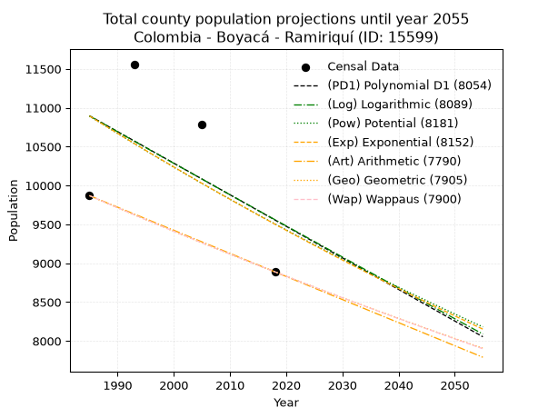
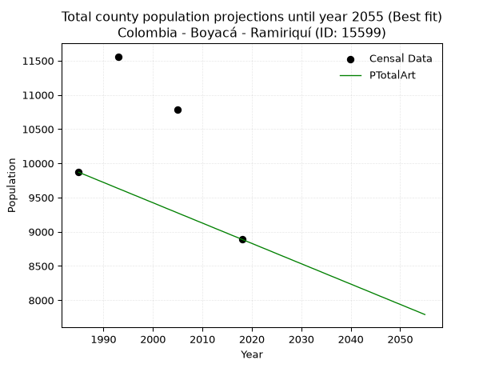
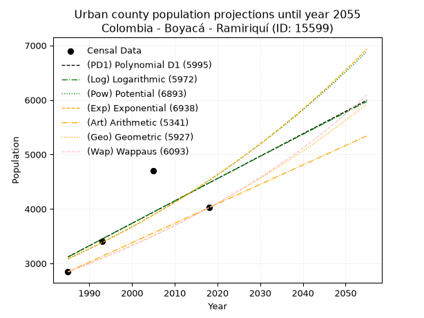
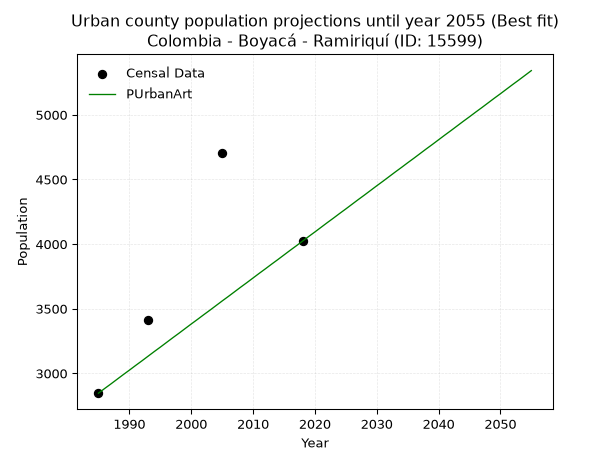
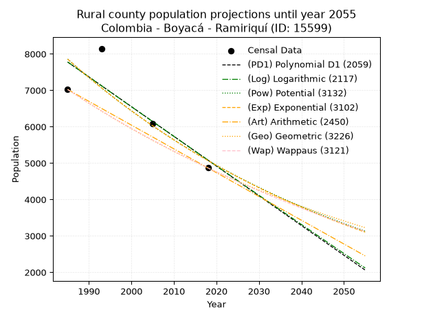
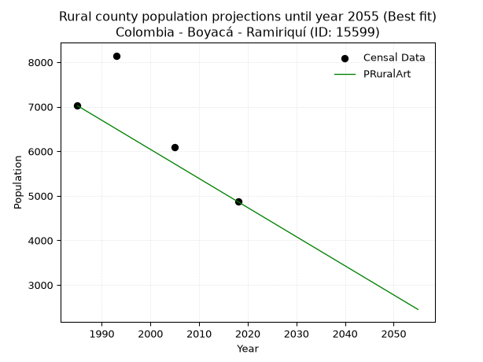

<div align="center">


</div>

# _“Population and Public Services Demand Projections (PPSD) until Year 2050 for Colombia - Boyacá - Ramiriquí (ID: 15599)”_
Keywords: `population` `public-service` `projection` `lineal` `polynomial` `logarithmic` `potential` `exponential` `arithmetic` `geometric` `wappaus` `dane` `colombia` `south-america`

PPSD are analytical estimates used by governments and planners to anticipate future changes in population size, age distribution, and the resulting community needs for utilities, healthcare, education, and infrastructure as sizing future water treatment facilities, electrical grids, and road networks based on spatial growth.

> **General running parameters**: • app_version: _v20260806_. • Python version: _3.14.7_. • Pandas version: _3.0.5_. • NumPy version: _2.5.1_. • Creates, save and include plots into reports (create_plot): _False_. • Projection until year: _2050_. • Process polynomial degree 2 and up: _False_. • Process Wappaus: _True_. • Process Wappaus: _True_. • Set negative values to zero: _True_. • Set infinite values to zero: _True_. • Drop dataset notes: _True_. 
<div align="center">

Dynamic map: [:earth_americas:Google](http://maps.google.com/maps?q=5.400303492,-73.3348393) [:earth_americas:OSM](https://www.openstreetmap.org/#map=18/5.400303492/-73.3348393&layers=P) [:earth_americas:Bing](https://www.bing.com/maps?cp=5.400303492~-73.3348393&lvl=18) [:earth_americas:Apple](https://maps.apple.com/frame?center=5.400303492%2C-73.3348393&span=0.003%2C0.006)

</div>


<div align="center">

```geojson
{
  "type": "Feature",
  "geometry": {
    "type": "Point", 
    "coordinates": [-73.3348393, 5.400303492]
  }, 
  "properties": {
    "Name": "Colombia - Boyacá - Ramiriquí (ID: 15599)"
  }
}
```

</div>


## 0. Census Data (4 records)

Census data are official statistics collected by a government about the people and housing in a country. They usually include counts of total population, age, sex, race, income, education, and jobs.

📅Global census file: [Population.xlsx](../data/Population.xlsx)

| Source   |   Year |   CountryID | CountryName   |   StateID | StateName   |   CountyID | CountyName   |   PTotal |   PUrban |   PRural |
|:---------|-------:|------------:|:--------------|----------:|:------------|-----------:|:-------------|---------:|---------:|---------:|
| DANE     |   1985 |          57 | Colombia      |        15 | Boyacá      |      15599 | Ramiriquí    |     9869 |     2846 |     7023 |
| DANE     |   1993 |          57 | Colombia      |        15 | Boyacá      |      15599 | Ramiriquí    |    11560 |     3412 |     8148 |
| DANE     |   2005 |          57 | Colombia      |        15 | Boyacá      |      15599 | Ramiriquí    |    10789 |     4702 |     6087 |
| DANE     |   2018 |          57 | Colombia      |        15 | Boyacá      |      15599 | Ramiriquí    |     8889 |     4022 |     4867 |

> 🔥Some records could had specific notes about the registered values or the corresponding urban or rural distribution.

## 1. Total

### 1.1. Coefficients and Parameters

* (PD1) Polynomial Deg 1: -40.60176635889083, 91490.43315937139 (lineal)
* (Log) Logarithmic: -80963.02507292164, 625677.3523762425
* (Pow) Potential: -8.261147749841093, 31.28044149483235
* (Exp) Exponential: -0.004142287047941602, 40565873.16622487
* (Art) Arithmetic: Year diff. 2018 - 1985 = 33, Population diff. 8889 - 9869 = -980, Annual growth = -29.696969696969695
* (Geo) Geometric: Year diff. 2018 - 1985 = 33, Population diff. 8889 - 9869 = -980, Annual growth % = -0.0031641946819976896
* (Wap) Wappaus: i = -0.3166325802001247, Condition values only valid for < 200)

<sub>
Wappaus condition values: ['-0.00', '-0.32', '-0.63', '-0.95', '-1.27', '-1.58', '-1.90', '-2.22', '-2.53', '-2.85', '-3.17', '-3.48', '-3.80', '-4.12', '-4.43', '-4.75', '-5.07', '-5.38', '-5.70', '-6.02', '-6.33', '-6.65', '-6.97', '-7.28', '-7.60', '-7.92', '-8.23', '-8.55', '-8.87', '-9.18', '-9.50', '-9.82', '-10.13', '-10.45', '-10.77', '-11.08', '-11.40', '-11.72', '-12.03', '-12.35', '-12.67', '-12.98', '-13.30', '-13.62', '-13.93', '-14.25', '-14.57', '-14.88', '-15.20', '-15.51', '-15.83', '-16.15', '-16.46', '-16.78', '-17.10', '-17.41', '-17.73', '-18.05', '-18.36', '-18.68', '-19.00', '-19.31', '-19.63', '-19.95', '-20.26', '-20.58']
</sub>


### 1.2. Projected Dataset

|   Year |   CountyID |   PTotalPD1 |   PTotalLog |   PTotalPow |   PTotalExp |   PTotalArt |   PTotalGeo |   PTotalWap |
|-------:|-----------:|------------:|------------:|------------:|------------:|------------:|------------:|------------:|
|   1985 |      15599 |       10896 |       10895 |       10893 |       10894 |        9869 |        9869 |        9869 |
|   1986 |      15599 |       10855 |       10854 |       10848 |       10849 |        9839 |        9838 |        9838 |
|   1987 |      15599 |       10815 |       10813 |       10803 |       10804 |        9810 |        9807 |        9807 |
|   1988 |      15599 |       10774 |       10773 |       10758 |       10760 |        9780 |        9776 |        9776 |
|   1989 |      15599 |       10734 |       10732 |       10714 |       10715 |        9750 |        9745 |        9745 |
|   1990 |      15599 |       10693 |       10691 |       10669 |       10671 |        9721 |        9714 |        9714 |
|   1991 |      15599 |       10652 |       10650 |       10625 |       10627 |        9691 |        9683 |        9683 |
|   1992 |      15599 |       10612 |       10610 |       10581 |       10583 |        9661 |        9652 |        9653 |
|   1993 |      15599 |       10571 |       10569 |       10537 |       10539 |        9631 |        9622 |        9622 |
|   1994 |      15599 |       10531 |       10529 |       10494 |       10496 |        9602 |        9591 |        9592 |
|   1995 |      15599 |       10490 |       10488 |       10450 |       10452 |        9572 |        9561 |        9561 |
|   1996 |      15599 |       10449 |       10447 |       10407 |       10409 |        9542 |        9531 |        9531 |
|   1997 |      15599 |       10409 |       10407 |       10364 |       10366 |        9513 |        9501 |        9501 |
|   1998 |      15599 |       10368 |       10366 |       10321 |       10323 |        9483 |        9471 |        9471 |
|   1999 |      15599 |       10328 |       10326 |       10279 |       10281 |        9453 |        9441 |        9441 |
|   2000 |      15599 |       10287 |       10285 |       10236 |       10238 |        9424 |        9411 |        9411 |
|   2001 |      15599 |       10246 |       10245 |       10194 |       10196 |        9394 |        9381 |        9381 |
|   2002 |      15599 |       10206 |       10204 |       10152 |       10154 |        9364 |        9351 |        9352 |
|   2003 |      15599 |       10165 |       10164 |       10110 |       10112 |        9334 |        9322 |        9322 |
|   2004 |      15599 |       10124 |       10124 |       10069 |       10070 |        9305 |        9292 |        9293 |
|   2005 |      15599 |       10084 |       10083 |       10027 |       10028 |        9275 |        9263 |        9263 |
|   2006 |      15599 |       10043 |       10043 |        9986 |        9987 |        9245 |        9234 |        9234 |
|   2007 |      15599 |       10003 |       10002 |        9945 |        9945 |        9216 |        9204 |        9205 |
|   2008 |      15599 |        9962 |        9962 |        9904 |        9904 |        9186 |        9175 |        9176 |
|   2009 |      15599 |        9921 |        9922 |        9864 |        9863 |        9156 |        9146 |        9146 |
|   2010 |      15599 |        9881 |        9881 |        9823 |        9823 |        9127 |        9117 |        9118 |
|   2011 |      15599 |        9840 |        9841 |        9783 |        9782 |        9097 |        9088 |        9089 |
|   2012 |      15599 |        9800 |        9801 |        9743 |        9742 |        9067 |        9060 |        9060 |
|   2013 |      15599 |        9759 |        9761 |        9703 |        9701 |        9037 |        9031 |        9031 |
|   2014 |      15599 |        9718 |        9721 |        9663 |        9661 |        9008 |        9002 |        9003 |
|   2015 |      15599 |        9678 |        9680 |        9624 |        9621 |        8978 |        8974 |        8974 |
|   2016 |      15599 |        9637 |        9640 |        9584 |        9581 |        8948 |        8946 |        8946 |
|   2017 |      15599 |        9597 |        9600 |        9545 |        9542 |        8919 |        8917 |        8917 |
|   2018 |      15599 |        9556 |        9560 |        9506 |        9502 |        8889 |        8889 |        8889 |
|   2019 |      15599 |        9515 |        9520 |        9467 |        9463 |        8859 |        8861 |        8861 |
|   2020 |      15599 |        9475 |        9480 |        9429 |        9424 |        8830 |        8833 |        8833 |
|   2021 |      15599 |        9434 |        9440 |        9390 |        9385 |        8800 |        8805 |        8805 |
|   2022 |      15599 |        9394 |        9400 |        9352 |        9346 |        8770 |        8777 |        8777 |
|   2023 |      15599 |        9353 |        9360 |        9314 |        9308 |        8741 |        8749 |        8749 |
|   2024 |      15599 |        9312 |        9320 |        9276 |        9269 |        8711 |        8722 |        8721 |
|   2025 |      15599 |        9272 |        9280 |        9238 |        9231 |        8681 |        8694 |        8694 |
|   2026 |      15599 |        9231 |        9240 |        9200 |        9193 |        8651 |        8666 |        8666 |
|   2027 |      15599 |        9191 |        9200 |        9163 |        9155 |        8622 |        8639 |        8638 |
|   2028 |      15599 |        9150 |        9160 |        9126 |        9117 |        8592 |        8612 |        8611 |
|   2029 |      15599 |        9109 |        9120 |        9089 |        9079 |        8562 |        8584 |        8584 |
|   2030 |      15599 |        9069 |        9080 |        9052 |        9042 |        8533 |        8557 |        8556 |
|   2031 |      15599 |        9028 |        9040 |        9015 |        9004 |        8503 |        8530 |        8529 |
|   2032 |      15599 |        8988 |        9000 |        8978 |        8967 |        8473 |        8503 |        8502 |
|   2033 |      15599 |        8947 |        8960 |        8942 |        8930 |        8444 |        8476 |        8475 |
|   2034 |      15599 |        8906 |        8920 |        8906 |        8893 |        8414 |        8449 |        8448 |
|   2035 |      15599 |        8866 |        8881 |        8870 |        8856 |        8384 |        8423 |        8421 |
|   2036 |      15599 |        8825 |        8841 |        8834 |        8820 |        8354 |        8396 |        8394 |
|   2037 |      15599 |        8785 |        8801 |        8798 |        8783 |        8325 |        8370 |        8368 |
|   2038 |      15599 |        8744 |        8761 |        8762 |        8747 |        8295 |        8343 |        8341 |
|   2039 |      15599 |        8703 |        8722 |        8727 |        8711 |        8265 |        8317 |        8314 |
|   2040 |      15599 |        8663 |        8682 |        8692 |        8675 |        8236 |        8290 |        8288 |
|   2041 |      15599 |        8622 |        8642 |        8656 |        8639 |        8206 |        8264 |        8262 |
|   2042 |      15599 |        8582 |        8603 |        8621 |        8603 |        8176 |        8238 |        8235 |
|   2043 |      15599 |        8541 |        8563 |        8587 |        8568 |        8147 |        8212 |        8209 |
|   2044 |      15599 |        8500 |        8523 |        8552 |        8532 |        8117 |        8186 |        8183 |
|   2045 |      15599 |        8460 |        8484 |        8518 |        8497 |        8087 |        8160 |        8157 |
|   2046 |      15599 |        8419 |        8444 |        8483 |        8462 |        8057 |        8134 |        8131 |
|   2047 |      15599 |        8379 |        8405 |        8449 |        8427 |        8028 |        8108 |        8105 |
|   2048 |      15599 |        8338 |        8365 |        8415 |        8392 |        7998 |        8083 |        8079 |
|   2049 |      15599 |        8297 |        8326 |        8381 |        8357 |        7968 |        8057 |        8053 |
|   2050 |      15599 |        8257 |        8286 |        8347 |        8323 |        7939 |        8032 |        8027 |
<div align="center">

</img>

</div>


### 1.3. Best fit with absolute and relative error (%)

Relative error puts that difference into context by dividing the absolute error by the true value, creating a unitless ratio or percentage that shows the scale of the mistake.

Absolute and relative error

|   Year | Source   |   CountryID | CountryName   |   StateID | StateName   |   CountyID_x | CountyName   |   PTotal |   PUrban |   PRural |   CountyID_y |   PTotalPD1 |   PTotalLog |   PTotalPow |   PTotalExp |   PTotalArt |   PTotalGeo |   PTotalWap |   PTotalPD1AbsError |   PTotalLogAbsError |   PTotalPowAbsError |   PTotalExpAbsError |   PTotalArtAbsError |   PTotalGeoAbsError |   PTotalWapAbsError |   PTotalPD1RelError |   PTotalLogRelError |   PTotalPowRelError |   PTotalExpRelError |   PTotalArtRelError |   PTotalGeoRelError |   PTotalWapRelError |
|-------:|:---------|------------:|:--------------|----------:|:------------|-------------:|:-------------|---------:|---------:|---------:|-------------:|------------:|------------:|------------:|------------:|------------:|------------:|------------:|--------------------:|--------------------:|--------------------:|--------------------:|--------------------:|--------------------:|--------------------:|--------------------:|--------------------:|--------------------:|--------------------:|--------------------:|--------------------:|--------------------:|
|   1985 | DANE     |          57 | Colombia      |        15 | Boyacá      |        15599 | Ramiriquí    |     9869 |     2846 |     7023 |        15599 |       10896 |       10895 |       10893 |       10894 |        9869 |        9869 |        9869 |                1027 |                1026 |                1024 |                1025 |                   0 |                   0 |                   0 |            10.4063  |            10.3962  |            10.3759  |            10.3861  |              0      |              0      |              0      |
|   1993 | DANE     |          57 | Colombia      |        15 | Boyacá      |        15599 | Ramiriquí    |    11560 |     3412 |     8148 |        15599 |       10571 |       10569 |       10537 |       10539 |        9631 |        9622 |        9622 |                 989 |                 991 |                1023 |                1021 |                1929 |                1938 |                1938 |             8.55536 |             8.57266 |             8.84948 |             8.83218 |             16.6869 |             16.7647 |             16.7647 |
|   2005 | DANE     |          57 | Colombia      |        15 | Boyacá      |        15599 | Ramiriquí    |    10789 |     4702 |     6087 |        15599 |       10084 |       10083 |       10027 |       10028 |        9275 |        9263 |        9263 |                 705 |                 706 |                 762 |                 761 |                1514 |                1526 |                1526 |             6.53443 |             6.5437  |             7.06275 |             7.05348 |             14.0328 |             14.144  |             14.144  |
|   2018 | DANE     |          57 | Colombia      |        15 | Boyacá      |        15599 | Ramiriquí    |     8889 |     4022 |     4867 |        15599 |        9556 |        9560 |        9506 |        9502 |        8889 |        8889 |        8889 |                 667 |                 671 |                 617 |                 613 |                   0 |                   0 |                   0 |             7.50366 |             7.54866 |             6.94116 |             6.89616 |              0      |              0      |              0      |

Relative error mean

| Method    |   RelError | Best   |
|:----------|-----------:|:-------|
| PTotalPD1 |    8.24994 |        |
| PTotalLog |    8.2653  |        |
| PTotalPow |    8.30733 |        |
| PTotalExp |    8.29197 |        |
| PTotalArt |    7.67992 | True   |
| PTotalGeo |    7.72719 |        |
| PTotalWap |    7.72719 |        |

💙Best method: _**PTotalArt**_
<div align="center">

</img>

</div>


### 1.4. Fresh water supply demand in liters per capita per day (lpcd)

The fresh water supply demand typically ranges from 100 to 300 liters per capita per day (lpcd) for standard domestic and municipal planning, though absolute survival minimums set by the World Health Organization are as low as 7.5 to 20 liters per day, and total consumption in high-income nations can exceed 400 liters.

> `CZ`: Level in meters above the sea level (masl)<br> `WS`: Fresh water supply demand in liters per capita per day (lpcd or l/h/d)<br> `WSAll`: Zonal fresh water supply demand in liters per second (l/s)<br> `A`: Zonal area in square meters<br> `DP`: Population density (people/hectare)

Reference values (RAS Colombia)

|    CZ |   WS |
|------:|-----:|
|  1000 |  120 |
|  2000 |  130 |
| 99999 |  140 |

County shapefile geometry properties and water supply values

|   CountyID |      ATotal |   CZTotal |   WSTotal |
|-----------:|------------:|----------:|----------:|
|      15599 | 1.25422e+08 |   2642.03 |       140 |

Projected values for best method: PTotalArt

|   CountyID |   Year |   PTotalArt |   DPTotal |   WSTotal |   WSTotalAll |
|-----------:|-------:|------------:|----------:|----------:|-------------:|
|      15599 |   1985 |        9869 |      0.79 |       140 |      15.9914 |
|      15599 |   1986 |        9839 |      0.78 |       140 |      15.9428 |
|      15599 |   1987 |        9810 |      0.78 |       140 |      15.8958 |
|      15599 |   1988 |        9780 |      0.78 |       140 |      15.8472 |
|      15599 |   1989 |        9750 |      0.78 |       140 |      15.7986 |
|      15599 |   1990 |        9721 |      0.78 |       140 |      15.7516 |
|      15599 |   1991 |        9691 |      0.77 |       140 |      15.703  |
|      15599 |   1992 |        9661 |      0.77 |       140 |      15.6544 |
|      15599 |   1993 |        9631 |      0.77 |       140 |      15.6058 |
|      15599 |   1994 |        9602 |      0.77 |       140 |      15.5588 |
|      15599 |   1995 |        9572 |      0.76 |       140 |      15.5102 |
|      15599 |   1996 |        9542 |      0.76 |       140 |      15.4616 |
|      15599 |   1997 |        9513 |      0.76 |       140 |      15.4146 |
|      15599 |   1998 |        9483 |      0.76 |       140 |      15.366  |
|      15599 |   1999 |        9453 |      0.75 |       140 |      15.3174 |
|      15599 |   2000 |        9424 |      0.75 |       140 |      15.2704 |
|      15599 |   2001 |        9394 |      0.75 |       140 |      15.2218 |
|      15599 |   2002 |        9364 |      0.75 |       140 |      15.1731 |
|      15599 |   2003 |        9334 |      0.74 |       140 |      15.1245 |
|      15599 |   2004 |        9305 |      0.74 |       140 |      15.0775 |
|      15599 |   2005 |        9275 |      0.74 |       140 |      15.0289 |
|      15599 |   2006 |        9245 |      0.74 |       140 |      14.9803 |
|      15599 |   2007 |        9216 |      0.73 |       140 |      14.9333 |
|      15599 |   2008 |        9186 |      0.73 |       140 |      14.8847 |
|      15599 |   2009 |        9156 |      0.73 |       140 |      14.8361 |
|      15599 |   2010 |        9127 |      0.73 |       140 |      14.7891 |
|      15599 |   2011 |        9097 |      0.73 |       140 |      14.7405 |
|      15599 |   2012 |        9067 |      0.72 |       140 |      14.6919 |
|      15599 |   2013 |        9037 |      0.72 |       140 |      14.6433 |
|      15599 |   2014 |        9008 |      0.72 |       140 |      14.5963 |
|      15599 |   2015 |        8978 |      0.72 |       140 |      14.5477 |
|      15599 |   2016 |        8948 |      0.71 |       140 |      14.4991 |
|      15599 |   2017 |        8919 |      0.71 |       140 |      14.4521 |
|      15599 |   2018 |        8889 |      0.71 |       140 |      14.4035 |
|      15599 |   2019 |        8859 |      0.71 |       140 |      14.3549 |
|      15599 |   2020 |        8830 |      0.7  |       140 |      14.3079 |
|      15599 |   2021 |        8800 |      0.7  |       140 |      14.2593 |
|      15599 |   2022 |        8770 |      0.7  |       140 |      14.2106 |
|      15599 |   2023 |        8741 |      0.7  |       140 |      14.1637 |
|      15599 |   2024 |        8711 |      0.69 |       140 |      14.115  |
|      15599 |   2025 |        8681 |      0.69 |       140 |      14.0664 |
|      15599 |   2026 |        8651 |      0.69 |       140 |      14.0178 |
|      15599 |   2027 |        8622 |      0.69 |       140 |      13.9708 |
|      15599 |   2028 |        8592 |      0.69 |       140 |      13.9222 |
|      15599 |   2029 |        8562 |      0.68 |       140 |      13.8736 |
|      15599 |   2030 |        8533 |      0.68 |       140 |      13.8266 |
|      15599 |   2031 |        8503 |      0.68 |       140 |      13.778  |
|      15599 |   2032 |        8473 |      0.68 |       140 |      13.7294 |
|      15599 |   2033 |        8444 |      0.67 |       140 |      13.6824 |
|      15599 |   2034 |        8414 |      0.67 |       140 |      13.6338 |
|      15599 |   2035 |        8384 |      0.67 |       140 |      13.5852 |
|      15599 |   2036 |        8354 |      0.67 |       140 |      13.5366 |
|      15599 |   2037 |        8325 |      0.66 |       140 |      13.4896 |
|      15599 |   2038 |        8295 |      0.66 |       140 |      13.441  |
|      15599 |   2039 |        8265 |      0.66 |       140 |      13.3924 |
|      15599 |   2040 |        8236 |      0.66 |       140 |      13.3454 |
|      15599 |   2041 |        8206 |      0.65 |       140 |      13.2968 |
|      15599 |   2042 |        8176 |      0.65 |       140 |      13.2481 |
|      15599 |   2043 |        8147 |      0.65 |       140 |      13.2012 |
|      15599 |   2044 |        8117 |      0.65 |       140 |      13.1525 |
|      15599 |   2045 |        8087 |      0.64 |       140 |      13.1039 |
|      15599 |   2046 |        8057 |      0.64 |       140 |      13.0553 |
|      15599 |   2047 |        8028 |      0.64 |       140 |      13.0083 |
|      15599 |   2048 |        7998 |      0.64 |       140 |      12.9597 |
|      15599 |   2049 |        7968 |      0.64 |       140 |      12.9111 |
|      15599 |   2050 |        7939 |      0.63 |       140 |      12.8641 |

## 2. Urban

### 2.1. Coefficients and Parameters

* (PD1) Polynomial Deg 1: 41.08631071858725, -78437.39301485414 (lineal)
* (Log) Logarithmic: 82392.24750860875, -622518.63356297
* (Pow) Potential: 23.211491164838517, -73.0569004764749
* (Exp) Exponential: 0.011575935768423008, 3.2359757386580817e-07
* (Art) Arithmetic: Year diff. 2018 - 1985 = 33, Population diff. 4022 - 2846 = 1176, Annual growth = 35.63636363636363
* (Geo) Geometric: Year diff. 2018 - 1985 = 33, Population diff. 4022 - 2846 = 1176, Annual growth % = 0.010535866718805131
* (Wap) Wappaus: i = 1.0377508339069201, Condition values only valid for < 200)

<sub>
Wappaus condition values: ['0.00', '1.04', '2.08', '3.11', '4.15', '5.19', '6.23', '7.26', '8.30', '9.34', '10.38', '11.42', '12.45', '13.49', '14.53', '15.57', '16.60', '17.64', '18.68', '19.72', '20.76', '21.79', '22.83', '23.87', '24.91', '25.94', '26.98', '28.02', '29.06', '30.09', '31.13', '32.17', '33.21', '34.25', '35.28', '36.32', '37.36', '38.40', '39.43', '40.47', '41.51', '42.55', '43.59', '44.62', '45.66', '46.70', '47.74', '48.77', '49.81', '50.85', '51.89', '52.93', '53.96', '55.00', '56.04', '57.08', '58.11', '59.15', '60.19', '61.23', '62.27', '63.30', '64.34', '65.38', '66.42', '67.45']
</sub>


### 2.2. Projected Dataset

|   Year |   CountyID |   PUrbanPD1 |   PUrbanLog |   PUrbanPow |   PUrbanExp |   PUrbanArt |   PUrbanGeo |   PUrbanWap |
|-------:|-----------:|------------:|------------:|------------:|------------:|------------:|------------:|------------:|
|   1985 |      15599 |        3119 |        3117 |        3083 |        3085 |        2846 |        2846 |        2846 |
|   1986 |      15599 |        3160 |        3158 |        3120 |        3121 |        2882 |        2876 |        2876 |
|   1987 |      15599 |        3201 |        3200 |        3156 |        3158 |        2917 |        2906 |        2906 |
|   1988 |      15599 |        3242 |        3241 |        3193 |        3195 |        2953 |        2937 |        2936 |
|   1989 |      15599 |        3283 |        3282 |        3231 |        3232 |        2989 |        2968 |        2967 |
|   1990 |      15599 |        3324 |        3324 |        3269 |        3269 |        3024 |        2999 |        2998 |
|   1991 |      15599 |        3365 |        3365 |        3307 |        3307 |        3060 |        3031 |        3029 |
|   1992 |      15599 |        3407 |        3407 |        3346 |        3346 |        3095 |        3063 |        3061 |
|   1993 |      15599 |        3448 |        3448 |        3385 |        3385 |        3131 |        3095 |        3093 |
|   1994 |      15599 |        3489 |        3489 |        3425 |        3424 |        3167 |        3128 |        3125 |
|   1995 |      15599 |        3530 |        3531 |        3465 |        3464 |        3202 |        3160 |        3158 |
|   1996 |      15599 |        3571 |        3572 |        3505 |        3504 |        3238 |        3194 |        3191 |
|   1997 |      15599 |        3612 |        3613 |        3546 |        3545 |        3274 |        3227 |        3224 |
|   1998 |      15599 |        3653 |        3654 |        3588 |        3587 |        3309 |        3261 |        3258 |
|   1999 |      15599 |        3694 |        3696 |        3630 |        3628 |        3345 |        3296 |        3292 |
|   2000 |      15599 |        3735 |        3737 |        3672 |        3671 |        3381 |        3331 |        3326 |
|   2001 |      15599 |        3776 |        3778 |        3715 |        3713 |        3416 |        3366 |        3361 |
|   2002 |      15599 |        3817 |        3819 |        3758 |        3757 |        3452 |        3401 |        3397 |
|   2003 |      15599 |        3858 |        3860 |        3802 |        3800 |        3487 |        3437 |        3432 |
|   2004 |      15599 |        3900 |        3901 |        3847 |        3845 |        3523 |        3473 |        3469 |
|   2005 |      15599 |        3941 |        3943 |        3891 |        3889 |        3559 |        3510 |        3505 |
|   2006 |      15599 |        3982 |        3984 |        3937 |        3935 |        3594 |        3547 |        3542 |
|   2007 |      15599 |        4023 |        4025 |        3982 |        3980 |        3630 |        3584 |        3579 |
|   2008 |      15599 |        4064 |        4066 |        4029 |        4027 |        3666 |        3622 |        3617 |
|   2009 |      15599 |        4105 |        4107 |        4076 |        4074 |        3701 |        3660 |        3656 |
|   2010 |      15599 |        4146 |        4148 |        4123 |        4121 |        3737 |        3699 |        3694 |
|   2011 |      15599 |        4187 |        4189 |        4171 |        4169 |        3773 |        3737 |        3734 |
|   2012 |      15599 |        4228 |        4230 |        4219 |        4218 |        3808 |        3777 |        3773 |
|   2013 |      15599 |        4269 |        4271 |        4268 |        4267 |        3844 |        3817 |        3814 |
|   2014 |      15599 |        4310 |        4312 |        4318 |        4316 |        3879 |        3857 |        3854 |
|   2015 |      15599 |        4352 |        4352 |        4368 |        4367 |        3915 |        3898 |        3895 |
|   2016 |      15599 |        4393 |        4393 |        4418 |        4417 |        3951 |        3939 |        3937 |
|   2017 |      15599 |        4434 |        4434 |        4469 |        4469 |        3986 |        3980 |        3979 |
|   2018 |      15599 |        4475 |        4475 |        4521 |        4521 |        4022 |        4022 |        4022 |
|   2019 |      15599 |        4516 |        4516 |        4573 |        4574 |        4058 |        4064 |        4065 |
|   2020 |      15599 |        4557 |        4557 |        4626 |        4627 |        4093 |        4107 |        4109 |
|   2021 |      15599 |        4598 |        4597 |        4680 |        4681 |        4129 |        4150 |        4153 |
|   2022 |      15599 |        4639 |        4638 |        4734 |        4735 |        4165 |        4194 |        4198 |
|   2023 |      15599 |        4680 |        4679 |        4788 |        4790 |        4200 |        4238 |        4244 |
|   2024 |      15599 |        4721 |        4720 |        4844 |        4846 |        4236 |        4283 |        4290 |
|   2025 |      15599 |        4762 |        4760 |        4900 |        4903 |        4271 |        4328 |        4337 |
|   2026 |      15599 |        4803 |        4801 |        4956 |        4960 |        4307 |        4374 |        4384 |
|   2027 |      15599 |        4845 |        4842 |        5013 |        5017 |        4343 |        4420 |        4432 |
|   2028 |      15599 |        4886 |        4882 |        5071 |        5076 |        4378 |        4466 |        4481 |
|   2029 |      15599 |        4927 |        4923 |        5129 |        5135 |        4414 |        4513 |        4530 |
|   2030 |      15599 |        4968 |        4964 |        5188 |        5195 |        4450 |        4561 |        4580 |
|   2031 |      15599 |        5009 |        5004 |        5248 |        5255 |        4485 |        4609 |        4631 |
|   2032 |      15599 |        5050 |        5045 |        5308 |        5316 |        4521 |        4658 |        4682 |
|   2033 |      15599 |        5091 |        5085 |        5369 |        5378 |        4557 |        4707 |        4734 |
|   2034 |      15599 |        5132 |        5126 |        5431 |        5441 |        4592 |        4756 |        4787 |
|   2035 |      15599 |        5173 |        5166 |        5493 |        5504 |        4628 |        4806 |        4840 |
|   2036 |      15599 |        5214 |        5207 |        5556 |        5568 |        4663 |        4857 |        4894 |
|   2037 |      15599 |        5255 |        5247 |        5620 |        5633 |        4699 |        4908 |        4949 |
|   2038 |      15599 |        5297 |        5288 |        5684 |        5699 |        4735 |        4960 |        5005 |
|   2039 |      15599 |        5338 |        5328 |        5749 |        5765 |        4770 |        5012 |        5062 |
|   2040 |      15599 |        5379 |        5368 |        5815 |        5832 |        4806 |        5065 |        5119 |
|   2041 |      15599 |        5420 |        5409 |        5882 |        5900 |        4842 |        5118 |        5177 |
|   2042 |      15599 |        5461 |        5449 |        5949 |        5969 |        4877 |        5172 |        5236 |
|   2043 |      15599 |        5502 |        5489 |        6017 |        6038 |        4913 |        5227 |        5296 |
|   2044 |      15599 |        5543 |        5530 |        6086 |        6109 |        4949 |        5282 |        5357 |
|   2045 |      15599 |        5584 |        5570 |        6155 |        6180 |        4984 |        5338 |        5419 |
|   2046 |      15599 |        5625 |        5610 |        6225 |        6252 |        5020 |        5394 |        5482 |
|   2047 |      15599 |        5666 |        5651 |        6296 |        6324 |        5055 |        5451 |        5546 |
|   2048 |      15599 |        5707 |        5691 |        6368 |        6398 |        5091 |        5508 |        5610 |
|   2049 |      15599 |        5748 |        5731 |        6441 |        6473 |        5127 |        5566 |        5676 |
|   2050 |      15599 |        5790 |        5771 |        6514 |        6548 |        5162 |        5625 |        5743 |
<div align="center">

</img>

</div>


### 2.3. Best fit with absolute and relative error (%)

Relative error puts that difference into context by dividing the absolute error by the true value, creating a unitless ratio or percentage that shows the scale of the mistake.

Absolute and relative error

|   Year | Source   |   CountryID | CountryName   |   StateID | StateName   |   CountyID_x | CountyName   |   PTotal |   PUrban |   PRural |   CountyID_y |   PUrbanPD1 |   PUrbanLog |   PUrbanPow |   PUrbanExp |   PUrbanArt |   PUrbanGeo |   PUrbanWap |   PUrbanPD1AbsError |   PUrbanLogAbsError |   PUrbanPowAbsError |   PUrbanExpAbsError |   PUrbanArtAbsError |   PUrbanGeoAbsError |   PUrbanWapAbsError |   PUrbanPD1RelError |   PUrbanLogRelError |   PUrbanPowRelError |   PUrbanExpRelError |   PUrbanArtRelError |   PUrbanGeoRelError |   PUrbanWapRelError |
|-------:|:---------|------------:|:--------------|----------:|:------------|-------------:|:-------------|---------:|---------:|---------:|-------------:|------------:|------------:|------------:|------------:|------------:|------------:|------------:|--------------------:|--------------------:|--------------------:|--------------------:|--------------------:|--------------------:|--------------------:|--------------------:|--------------------:|--------------------:|--------------------:|--------------------:|--------------------:|--------------------:|
|   1985 | DANE     |          57 | Colombia      |        15 | Boyacá      |        15599 | Ramiriquí    |     9869 |     2846 |     7023 |        15599 |        3119 |        3117 |        3083 |        3085 |        2846 |        2846 |        2846 |                 273 |                 271 |                 237 |                 239 |                   0 |                   0 |                   0 |             9.59241 |             9.52214 |            8.32748  |            8.39775  |             0       |             0       |             0       |
|   1993 | DANE     |          57 | Colombia      |        15 | Boyacá      |        15599 | Ramiriquí    |    11560 |     3412 |     8148 |        15599 |        3448 |        3448 |        3385 |        3385 |        3131 |        3095 |        3093 |                  36 |                  36 |                  27 |                  27 |                 281 |                 317 |                 319 |             1.0551  |             1.0551  |            0.791325 |            0.791325 |             8.23564 |             9.29074 |             9.34936 |
|   2005 | DANE     |          57 | Colombia      |        15 | Boyacá      |        15599 | Ramiriquí    |    10789 |     4702 |     6087 |        15599 |        3941 |        3943 |        3891 |        3889 |        3559 |        3510 |        3505 |                 761 |                 759 |                 811 |                 813 |                1143 |                1192 |                1197 |            16.1846  |            16.1421  |           17.248    |           17.2905   |            24.3088  |            25.3509  |            25.4573  |
|   2018 | DANE     |          57 | Colombia      |        15 | Boyacá      |        15599 | Ramiriquí    |     8889 |     4022 |     4867 |        15599 |        4475 |        4475 |        4521 |        4521 |        4022 |        4022 |        4022 |                 453 |                 453 |                 499 |                 499 |                   0 |                   0 |                   0 |            11.2631  |            11.2631  |           12.4068   |           12.4068   |             0       |             0       |             0       |

Relative error mean

| Method    |   RelError | Best   |
|:----------|-----------:|:-------|
| PUrbanPD1 |    9.52379 |        |
| PUrbanLog |    9.49559 |        |
| PUrbanPow |    9.69339 |        |
| PUrbanExp |    9.72159 |        |
| PUrbanArt |    8.13611 | True   |
| PUrbanGeo |    8.66041 |        |
| PUrbanWap |    8.70165 |        |

💙Best method: _**PUrbanArt**_
<div align="center">

</img>

</div>


### 2.4. Fresh water supply demand in liters per capita per day (lpcd)

The fresh water supply demand typically ranges from 100 to 300 liters per capita per day (lpcd) for standard domestic and municipal planning, though absolute survival minimums set by the World Health Organization are as low as 7.5 to 20 liters per day, and total consumption in high-income nations can exceed 400 liters.

> `CZ`: Level in meters above the sea level (masl)<br> `WS`: Fresh water supply demand in liters per capita per day (lpcd or l/h/d)<br> `WSAll`: Zonal fresh water supply demand in liters per second (l/s)<br> `A`: Zonal area in square meters<br> `DP`: Population density (people/hectare)

Reference values (RAS Colombia)

|    CZ |   WS |
|------:|-----:|
|  1000 |  120 |
|  2000 |  130 |
| 99999 |  140 |

County shapefile geometry properties and water supply values

|   CountyID |      AUrban |   CZUrban |   WSUrban |
|-----------:|------------:|----------:|----------:|
|      15599 | 1.39705e+06 |   2311.96 |       140 |

Projected values for best method: PUrbanArt

|   CountyID |   Year |   PUrbanArt |   DPUrban |   WSUrban |   WSUrbanAll |
|-----------:|-------:|------------:|----------:|----------:|-------------:|
|      15599 |   1985 |        2846 |     20.37 |       140 |      4.61157 |
|      15599 |   1986 |        2882 |     20.63 |       140 |      4.66991 |
|      15599 |   1987 |        2917 |     20.88 |       140 |      4.72662 |
|      15599 |   1988 |        2953 |     21.14 |       140 |      4.78495 |
|      15599 |   1989 |        2989 |     21.4  |       140 |      4.84329 |
|      15599 |   1990 |        3024 |     21.65 |       140 |      4.9     |
|      15599 |   1991 |        3060 |     21.9  |       140 |      4.95833 |
|      15599 |   1992 |        3095 |     22.15 |       140 |      5.01505 |
|      15599 |   1993 |        3131 |     22.41 |       140 |      5.07338 |
|      15599 |   1994 |        3167 |     22.67 |       140 |      5.13171 |
|      15599 |   1995 |        3202 |     22.92 |       140 |      5.18843 |
|      15599 |   1996 |        3238 |     23.18 |       140 |      5.24676 |
|      15599 |   1997 |        3274 |     23.44 |       140 |      5.30509 |
|      15599 |   1998 |        3309 |     23.69 |       140 |      5.36181 |
|      15599 |   1999 |        3345 |     23.94 |       140 |      5.42014 |
|      15599 |   2000 |        3381 |     24.2  |       140 |      5.47847 |
|      15599 |   2001 |        3416 |     24.45 |       140 |      5.53519 |
|      15599 |   2002 |        3452 |     24.71 |       140 |      5.59352 |
|      15599 |   2003 |        3487 |     24.96 |       140 |      5.65023 |
|      15599 |   2004 |        3523 |     25.22 |       140 |      5.70856 |
|      15599 |   2005 |        3559 |     25.48 |       140 |      5.7669  |
|      15599 |   2006 |        3594 |     25.73 |       140 |      5.82361 |
|      15599 |   2007 |        3630 |     25.98 |       140 |      5.88194 |
|      15599 |   2008 |        3666 |     26.24 |       140 |      5.94028 |
|      15599 |   2009 |        3701 |     26.49 |       140 |      5.99699 |
|      15599 |   2010 |        3737 |     26.75 |       140 |      6.05532 |
|      15599 |   2011 |        3773 |     27.01 |       140 |      6.11366 |
|      15599 |   2012 |        3808 |     27.26 |       140 |      6.17037 |
|      15599 |   2013 |        3844 |     27.52 |       140 |      6.2287  |
|      15599 |   2014 |        3879 |     27.77 |       140 |      6.28542 |
|      15599 |   2015 |        3915 |     28.02 |       140 |      6.34375 |
|      15599 |   2016 |        3951 |     28.28 |       140 |      6.40208 |
|      15599 |   2017 |        3986 |     28.53 |       140 |      6.4588  |
|      15599 |   2018 |        4022 |     28.79 |       140 |      6.51713 |
|      15599 |   2019 |        4058 |     29.05 |       140 |      6.57546 |
|      15599 |   2020 |        4093 |     29.3  |       140 |      6.63218 |
|      15599 |   2021 |        4129 |     29.56 |       140 |      6.69051 |
|      15599 |   2022 |        4165 |     29.81 |       140 |      6.74884 |
|      15599 |   2023 |        4200 |     30.06 |       140 |      6.80556 |
|      15599 |   2024 |        4236 |     30.32 |       140 |      6.86389 |
|      15599 |   2025 |        4271 |     30.57 |       140 |      6.9206  |
|      15599 |   2026 |        4307 |     30.83 |       140 |      6.97894 |
|      15599 |   2027 |        4343 |     31.09 |       140 |      7.03727 |
|      15599 |   2028 |        4378 |     31.34 |       140 |      7.09398 |
|      15599 |   2029 |        4414 |     31.6  |       140 |      7.15231 |
|      15599 |   2030 |        4450 |     31.85 |       140 |      7.21065 |
|      15599 |   2031 |        4485 |     32.1  |       140 |      7.26736 |
|      15599 |   2032 |        4521 |     32.36 |       140 |      7.32569 |
|      15599 |   2033 |        4557 |     32.62 |       140 |      7.38403 |
|      15599 |   2034 |        4592 |     32.87 |       140 |      7.44074 |
|      15599 |   2035 |        4628 |     33.13 |       140 |      7.49907 |
|      15599 |   2036 |        4663 |     33.38 |       140 |      7.55579 |
|      15599 |   2037 |        4699 |     33.64 |       140 |      7.61412 |
|      15599 |   2038 |        4735 |     33.89 |       140 |      7.67245 |
|      15599 |   2039 |        4770 |     34.14 |       140 |      7.72917 |
|      15599 |   2040 |        4806 |     34.4  |       140 |      7.7875  |
|      15599 |   2041 |        4842 |     34.66 |       140 |      7.84583 |
|      15599 |   2042 |        4877 |     34.91 |       140 |      7.90255 |
|      15599 |   2043 |        4913 |     35.17 |       140 |      7.96088 |
|      15599 |   2044 |        4949 |     35.42 |       140 |      8.01921 |
|      15599 |   2045 |        4984 |     35.68 |       140 |      8.07593 |
|      15599 |   2046 |        5020 |     35.93 |       140 |      8.13426 |
|      15599 |   2047 |        5055 |     36.18 |       140 |      8.19097 |
|      15599 |   2048 |        5091 |     36.44 |       140 |      8.24931 |
|      15599 |   2049 |        5127 |     36.7  |       140 |      8.30764 |
|      15599 |   2050 |        5162 |     36.95 |       140 |      8.36435 |

## 3. Rural

### 3.1. Coefficients and Parameters

* (PD1) Polynomial Deg 1: -81.68807707747804, 169927.82617422545 (lineal)
* (Log) Logarithmic: -163355.27258153027, 1248195.9859392117
* (Pow) Potential: -26.54247671364961, 91.42603812210685
* (Exp) Exponential: -0.013273043367801784, 2175553020440794.2
* (Art) Arithmetic: Year diff. 2018 - 1985 = 33, Population diff. 4867 - 7023 = -2156, Annual growth = -65.33333333333333
* (Geo) Geometric: Year diff. 2018 - 1985 = 33, Population diff. 4867 - 7023 = -2156, Annual growth % = -0.01105099162925316
* (Wap) Wappaus: i = -1.0989627137650686, Condition values only valid for < 200)

<sub>
Wappaus condition values: ['-0.00', '-1.10', '-2.20', '-3.30', '-4.40', '-5.49', '-6.59', '-7.69', '-8.79', '-9.89', '-10.99', '-12.09', '-13.19', '-14.29', '-15.39', '-16.48', '-17.58', '-18.68', '-19.78', '-20.88', '-21.98', '-23.08', '-24.18', '-25.28', '-26.38', '-27.47', '-28.57', '-29.67', '-30.77', '-31.87', '-32.97', '-34.07', '-35.17', '-36.27', '-37.36', '-38.46', '-39.56', '-40.66', '-41.76', '-42.86', '-43.96', '-45.06', '-46.16', '-47.26', '-48.35', '-49.45', '-50.55', '-51.65', '-52.75', '-53.85', '-54.95', '-56.05', '-57.15', '-58.25', '-59.34', '-60.44', '-61.54', '-62.64', '-63.74', '-64.84', '-65.94', '-67.04', '-68.14', '-69.23', '-70.33', '-71.43']
</sub>


### 3.2. Projected Dataset

|   Year |   CountyID |   PRuralPD1 |   PRuralLog |   PRuralPow |   PRuralExp |   PRuralArt |   PRuralGeo |   PRuralWap |
|-------:|-----------:|------------:|------------:|------------:|------------:|------------:|------------:|------------:|
|   1985 |      15599 |        7777 |        7778 |        7858 |        7856 |        7023 |        7023 |        7023 |
|   1986 |      15599 |        7695 |        7696 |        7754 |        7753 |        6958 |        6945 |        6946 |
|   1987 |      15599 |        7614 |        7614 |        7651 |        7650 |        6892 |        6869 |        6870 |
|   1988 |      15599 |        7532 |        7532 |        7549 |        7550 |        6827 |        6793 |        6795 |
|   1989 |      15599 |        7450 |        7449 |        7449 |        7450 |        6762 |        6718 |        6721 |
|   1990 |      15599 |        7369 |        7367 |        7350 |        7352 |        6696 |        6643 |        6647 |
|   1991 |      15599 |        7287 |        7285 |        7253 |        7255 |        6631 |        6570 |        6575 |
|   1992 |      15599 |        7205 |        7203 |        7157 |        7159 |        6566 |        6497 |        6503 |
|   1993 |      15599 |        7123 |        7121 |        7062 |        7065 |        6500 |        6426 |        6432 |
|   1994 |      15599 |        7042 |        7039 |        6969 |        6972 |        6435 |        6355 |        6361 |
|   1995 |      15599 |        6960 |        6957 |        6877 |        6880 |        6370 |        6284 |        6291 |
|   1996 |      15599 |        6878 |        6876 |        6786 |        6789 |        6304 |        6215 |        6222 |
|   1997 |      15599 |        6797 |        6794 |        6696 |        6700 |        6239 |        6146 |        6154 |
|   1998 |      15599 |        6715 |        6712 |        6608 |        6611 |        6174 |        6078 |        6087 |
|   1999 |      15599 |        6633 |        6630 |        6521 |        6524 |        6108 |        6011 |        6020 |
|   2000 |      15599 |        6552 |        6548 |        6435 |        6438 |        6043 |        5945 |        5953 |
|   2001 |      15599 |        6470 |        6467 |        6350 |        6353 |        5978 |        5879 |        5888 |
|   2002 |      15599 |        6388 |        6385 |        6266 |        6269 |        5912 |        5814 |        5823 |
|   2003 |      15599 |        6307 |        6304 |        6184 |        6187 |        5847 |        5750 |        5759 |
|   2004 |      15599 |        6225 |        6222 |        6102 |        6105 |        5782 |        5686 |        5695 |
|   2005 |      15599 |        6143 |        6141 |        6022 |        6025 |        5716 |        5623 |        5632 |
|   2006 |      15599 |        6062 |        6059 |        5943 |        5945 |        5651 |        5561 |        5570 |
|   2007 |      15599 |        5980 |        5978 |        5865 |        5867 |        5586 |        5500 |        5508 |
|   2008 |      15599 |        5898 |        5896 |        5788 |        5789 |        5520 |        5439 |        5447 |
|   2009 |      15599 |        5816 |        5815 |        5712 |        5713 |        5455 |        5379 |        5386 |
|   2010 |      15599 |        5735 |        5734 |        5637 |        5638 |        5390 |        5319 |        5327 |
|   2011 |      15599 |        5653 |        5653 |        5563 |        5563 |        5324 |        5261 |        5267 |
|   2012 |      15599 |        5571 |        5571 |        5490 |        5490 |        5259 |        5203 |        5208 |
|   2013 |      15599 |        5490 |        5490 |        5418 |        5418 |        5194 |        5145 |        5150 |
|   2014 |      15599 |        5408 |        5409 |        5347 |        5346 |        5128 |        5088 |        5092 |
|   2015 |      15599 |        5326 |        5328 |        5277 |        5276 |        5063 |        5032 |        5035 |
|   2016 |      15599 |        5245 |        5247 |        5208 |        5206 |        4998 |        4976 |        4979 |
|   2017 |      15599 |        5163 |        5166 |        5140 |        5138 |        4932 |        4921 |        4923 |
|   2018 |      15599 |        5081 |        5085 |        5073 |        5070 |        4867 |        4867 |        4867 |
|   2019 |      15599 |        5000 |        5004 |        5007 |        5003 |        4802 |        4813 |        4812 |
|   2020 |      15599 |        4918 |        4923 |        4941 |        4937 |        4736 |        4760 |        4757 |
|   2021 |      15599 |        4836 |        4842 |        4877 |        4872 |        4671 |        4707 |        4703 |
|   2022 |      15599 |        4755 |        4761 |        4813 |        4808 |        4606 |        4655 |        4650 |
|   2023 |      15599 |        4673 |        4681 |        4750 |        4744 |        4540 |        4604 |        4597 |
|   2024 |      15599 |        4591 |        4600 |        4688 |        4682 |        4475 |        4553 |        4544 |
|   2025 |      15599 |        4509 |        4519 |        4627 |        4620 |        4410 |        4503 |        4492 |
|   2026 |      15599 |        4428 |        4439 |        4567 |        4559 |        4344 |        4453 |        4440 |
|   2027 |      15599 |        4346 |        4358 |        4508 |        4499 |        4279 |        4404 |        4389 |
|   2028 |      15599 |        4264 |        4277 |        4449 |        4440 |        4214 |        4355 |        4339 |
|   2029 |      15599 |        4183 |        4197 |        4391 |        4381 |        4148 |        4307 |        4288 |
|   2030 |      15599 |        4101 |        4116 |        4334 |        4323 |        4083 |        4259 |        4238 |
|   2031 |      15599 |        4019 |        4036 |        4278 |        4266 |        4018 |        4212 |        4189 |
|   2032 |      15599 |        3938 |        3955 |        4222 |        4210 |        3952 |        4166 |        4140 |
|   2033 |      15599 |        3856 |        3875 |        4168 |        4155 |        3887 |        4120 |        4092 |
|   2034 |      15599 |        3774 |        3795 |        4113 |        4100 |        3822 |        4074 |        4043 |
|   2035 |      15599 |        3693 |        3715 |        4060 |        4046 |        3756 |        4029 |        3996 |
|   2036 |      15599 |        3611 |        3634 |        4008 |        3992 |        3691 |        3985 |        3948 |
|   2037 |      15599 |        3529 |        3554 |        3956 |        3940 |        3626 |        3941 |        3902 |
|   2038 |      15599 |        3448 |        3474 |        3904 |        3888 |        3560 |        3897 |        3855 |
|   2039 |      15599 |        3366 |        3394 |        3854 |        3837 |        3495 |        3854 |        3809 |
|   2040 |      15599 |        3284 |        3314 |        3804 |        3786 |        3430 |        3811 |        3763 |
|   2041 |      15599 |        3202 |        3234 |        3755 |        3736 |        3364 |        3769 |        3718 |
|   2042 |      15599 |        3121 |        3154 |        3706 |        3687 |        3299 |        3728 |        3673 |
|   2043 |      15599 |        3039 |        3074 |        3659 |        3638 |        3234 |        3686 |        3628 |
|   2044 |      15599 |        2957 |        2994 |        3611 |        3590 |        3168 |        3646 |        3584 |
|   2045 |      15599 |        2876 |        2914 |        3565 |        3543 |        3103 |        3605 |        3540 |
|   2046 |      15599 |        2794 |        2834 |        3519 |        3496 |        3038 |        3566 |        3497 |
|   2047 |      15599 |        2712 |        2754 |        3474 |        3450 |        2972 |        3526 |        3454 |
|   2048 |      15599 |        2631 |        2674 |        3429 |        3405 |        2907 |        3487 |        3411 |
|   2049 |      15599 |        2549 |        2595 |        3385 |        3360 |        2842 |        3449 |        3369 |
|   2050 |      15599 |        2467 |        2515 |        3341 |        3315 |        2776 |        3411 |        3327 |
<div align="center">

</img>

</div>


### 3.3. Best fit with absolute and relative error (%)

Relative error puts that difference into context by dividing the absolute error by the true value, creating a unitless ratio or percentage that shows the scale of the mistake.

Absolute and relative error

|   Year | Source   |   CountryID | CountryName   |   StateID | StateName   |   CountyID_x | CountyName   |   PTotal |   PUrban |   PRural |   CountyID_y |   PRuralPD1 |   PRuralLog |   PRuralPow |   PRuralExp |   PRuralArt |   PRuralGeo |   PRuralWap |   PRuralPD1AbsError |   PRuralLogAbsError |   PRuralPowAbsError |   PRuralExpAbsError |   PRuralArtAbsError |   PRuralGeoAbsError |   PRuralWapAbsError |   PRuralPD1RelError |   PRuralLogRelError |   PRuralPowRelError |   PRuralExpRelError |   PRuralArtRelError |   PRuralGeoRelError |   PRuralWapRelError |
|-------:|:---------|------------:|:--------------|----------:|:------------|-------------:|:-------------|---------:|---------:|---------:|-------------:|------------:|------------:|------------:|------------:|------------:|------------:|------------:|--------------------:|--------------------:|--------------------:|--------------------:|--------------------:|--------------------:|--------------------:|--------------------:|--------------------:|--------------------:|--------------------:|--------------------:|--------------------:|--------------------:|
|   1985 | DANE     |          57 | Colombia      |        15 | Boyacá      |        15599 | Ramiriquí    |     9869 |     2846 |     7023 |        15599 |        7777 |        7778 |        7858 |        7856 |        7023 |        7023 |        7023 |                 754 |                 755 |                 835 |                 833 |                   0 |                   0 |                   0 |           10.7362   |           10.7504   |            11.8895  |            11.861   |             0       |              0      |             0       |
|   1993 | DANE     |          57 | Colombia      |        15 | Boyacá      |        15599 | Ramiriquí    |    11560 |     3412 |     8148 |        15599 |        7123 |        7121 |        7062 |        7065 |        6500 |        6426 |        6432 |                1025 |                1027 |                1086 |                1083 |                1648 |                1722 |                1716 |           12.5798   |           12.6043   |            13.3284  |            13.2916  |            20.2258  |             21.134  |            21.0604  |
|   2005 | DANE     |          57 | Colombia      |        15 | Boyacá      |        15599 | Ramiriquí    |    10789 |     4702 |     6087 |        15599 |        6143 |        6141 |        6022 |        6025 |        5716 |        5623 |        5632 |                  56 |                  54 |                  65 |                  62 |                 371 |                 464 |                 455 |            0.919993 |            0.887137 |             1.06785 |             1.01856 |             6.09496 |              7.6228 |             7.47495 |
|   2018 | DANE     |          57 | Colombia      |        15 | Boyacá      |        15599 | Ramiriquí    |     8889 |     4022 |     4867 |        15599 |        5081 |        5085 |        5073 |        5070 |        4867 |        4867 |        4867 |                 214 |                 218 |                 206 |                 203 |                   0 |                   0 |                   0 |            4.39696  |            4.47915  |             4.23259 |             4.17095 |             0       |              0      |             0       |

Relative error mean

| Method    |   RelError | Best   |
|:----------|-----------:|:-------|
| PRuralPD1 |    7.15822 |        |
| PRuralLog |    7.18025 |        |
| PRuralPow |    7.62959 |        |
| PRuralExp |    7.58554 |        |
| PRuralArt |    6.58019 | True   |
| PRuralGeo |    7.18921 |        |
| PRuralWap |    7.13383 |        |

💙Best method: _**PRuralArt**_
<div align="center">

</img>

</div>


### 3.4. Fresh water supply demand in liters per capita per day (lpcd)

The fresh water supply demand typically ranges from 100 to 300 liters per capita per day (lpcd) for standard domestic and municipal planning, though absolute survival minimums set by the World Health Organization are as low as 7.5 to 20 liters per day, and total consumption in high-income nations can exceed 400 liters.

> `CZ`: Level in meters above the sea level (masl)<br> `WS`: Fresh water supply demand in liters per capita per day (lpcd or l/h/d)<br> `WSAll`: Zonal fresh water supply demand in liters per second (l/s)<br> `A`: Zonal area in square meters<br> `DP`: Population density (people/hectare)

Reference values (RAS Colombia)

|    CZ |   WS |
|------:|-----:|
|  1000 |  120 |
|  2000 |  130 |
| 99999 |  140 |

County shapefile geometry properties and water supply values

|   CountyID |      ARural |   CZRural |   WSRural |
|-----------:|------------:|----------:|----------:|
|      15599 | 1.24025e+08 |   2645.69 |       140 |

Projected values for best method: PRuralArt

|   CountyID |   Year |   PRuralArt |   DPRural |   WSRural |   WSRuralAll |
|-----------:|-------:|------------:|----------:|----------:|-------------:|
|      15599 |   1985 |        7023 |      0.57 |       140 |     11.3799  |
|      15599 |   1986 |        6958 |      0.56 |       140 |     11.2745  |
|      15599 |   1987 |        6892 |      0.56 |       140 |     11.1676  |
|      15599 |   1988 |        6827 |      0.55 |       140 |     11.0623  |
|      15599 |   1989 |        6762 |      0.55 |       140 |     10.9569  |
|      15599 |   1990 |        6696 |      0.54 |       140 |     10.85    |
|      15599 |   1991 |        6631 |      0.53 |       140 |     10.7447  |
|      15599 |   1992 |        6566 |      0.53 |       140 |     10.6394  |
|      15599 |   1993 |        6500 |      0.52 |       140 |     10.5324  |
|      15599 |   1994 |        6435 |      0.52 |       140 |     10.4271  |
|      15599 |   1995 |        6370 |      0.51 |       140 |     10.3218  |
|      15599 |   1996 |        6304 |      0.51 |       140 |     10.2148  |
|      15599 |   1997 |        6239 |      0.5  |       140 |     10.1095  |
|      15599 |   1998 |        6174 |      0.5  |       140 |     10.0042  |
|      15599 |   1999 |        6108 |      0.49 |       140 |      9.89722 |
|      15599 |   2000 |        6043 |      0.49 |       140 |      9.7919  |
|      15599 |   2001 |        5978 |      0.48 |       140 |      9.68657 |
|      15599 |   2002 |        5912 |      0.48 |       140 |      9.57963 |
|      15599 |   2003 |        5847 |      0.47 |       140 |      9.47431 |
|      15599 |   2004 |        5782 |      0.47 |       140 |      9.36898 |
|      15599 |   2005 |        5716 |      0.46 |       140 |      9.26204 |
|      15599 |   2006 |        5651 |      0.46 |       140 |      9.15671 |
|      15599 |   2007 |        5586 |      0.45 |       140 |      9.05139 |
|      15599 |   2008 |        5520 |      0.45 |       140 |      8.94444 |
|      15599 |   2009 |        5455 |      0.44 |       140 |      8.83912 |
|      15599 |   2010 |        5390 |      0.43 |       140 |      8.7338  |
|      15599 |   2011 |        5324 |      0.43 |       140 |      8.62685 |
|      15599 |   2012 |        5259 |      0.42 |       140 |      8.52153 |
|      15599 |   2013 |        5194 |      0.42 |       140 |      8.4162  |
|      15599 |   2014 |        5128 |      0.41 |       140 |      8.30926 |
|      15599 |   2015 |        5063 |      0.41 |       140 |      8.20394 |
|      15599 |   2016 |        4998 |      0.4  |       140 |      8.09861 |
|      15599 |   2017 |        4932 |      0.4  |       140 |      7.99167 |
|      15599 |   2018 |        4867 |      0.39 |       140 |      7.88634 |
|      15599 |   2019 |        4802 |      0.39 |       140 |      7.78102 |
|      15599 |   2020 |        4736 |      0.38 |       140 |      7.67407 |
|      15599 |   2021 |        4671 |      0.38 |       140 |      7.56875 |
|      15599 |   2022 |        4606 |      0.37 |       140 |      7.46343 |
|      15599 |   2023 |        4540 |      0.37 |       140 |      7.35648 |
|      15599 |   2024 |        4475 |      0.36 |       140 |      7.25116 |
|      15599 |   2025 |        4410 |      0.36 |       140 |      7.14583 |
|      15599 |   2026 |        4344 |      0.35 |       140 |      7.03889 |
|      15599 |   2027 |        4279 |      0.35 |       140 |      6.93356 |
|      15599 |   2028 |        4214 |      0.34 |       140 |      6.82824 |
|      15599 |   2029 |        4148 |      0.33 |       140 |      6.7213  |
|      15599 |   2030 |        4083 |      0.33 |       140 |      6.61597 |
|      15599 |   2031 |        4018 |      0.32 |       140 |      6.51065 |
|      15599 |   2032 |        3952 |      0.32 |       140 |      6.4037  |
|      15599 |   2033 |        3887 |      0.31 |       140 |      6.29838 |
|      15599 |   2034 |        3822 |      0.31 |       140 |      6.19306 |
|      15599 |   2035 |        3756 |      0.3  |       140 |      6.08611 |
|      15599 |   2036 |        3691 |      0.3  |       140 |      5.98079 |
|      15599 |   2037 |        3626 |      0.29 |       140 |      5.87546 |
|      15599 |   2038 |        3560 |      0.29 |       140 |      5.76852 |
|      15599 |   2039 |        3495 |      0.28 |       140 |      5.66319 |
|      15599 |   2040 |        3430 |      0.28 |       140 |      5.55787 |
|      15599 |   2041 |        3364 |      0.27 |       140 |      5.45093 |
|      15599 |   2042 |        3299 |      0.27 |       140 |      5.3456  |
|      15599 |   2043 |        3234 |      0.26 |       140 |      5.24028 |
|      15599 |   2044 |        3168 |      0.26 |       140 |      5.13333 |
|      15599 |   2045 |        3103 |      0.25 |       140 |      5.02801 |
|      15599 |   2046 |        3038 |      0.24 |       140 |      4.92269 |
|      15599 |   2047 |        2972 |      0.24 |       140 |      4.81574 |
|      15599 |   2048 |        2907 |      0.23 |       140 |      4.71042 |
|      15599 |   2049 |        2842 |      0.23 |       140 |      4.60509 |
|      15599 |   2050 |        2776 |      0.22 |       140 |      4.49815 |

<div align="center"><br><sub>Share this research</sub></div><br>

<sub>**APPS & TOOLS & CONTENT DISCLAIMER**: • NO WARRANTY - This content and software is provided by <a href="https://github.com/rcfdtools" target="_blank">github.com/rcfdtools</a> "as is", without any express or implied warranty, including warranties of merchantability, fitness for a particular purpose, or non-infringement. There is no guarantee that the software will be error-free or operate without interruption. • LIMITATION OF LIABILITY - Neither the authors nor copyright holders will be liable for claims or damages arising from the software or its use. You are responsible for determining if the software is appropriate for your use and assume all associated risks, including errors, legal compliance, and data loss. • NO PROFESSIONAL ADVICE - The software provides general information and does not offer professional advice. It should not replace consultation with professional advisors. [Clauses and global license for rcfdtools use.](https://github.com/rcfdtools/rcfdtools/blob/main/LICENSE.md)</sub>

| [:house: Home](Readme.md)  | [:beginner: Help / Collaborate](https://github.com/rcfdtools/R.HydroTools/discussions/31) |
|----------------------------|-------------------------------------------------------------------------------------------|