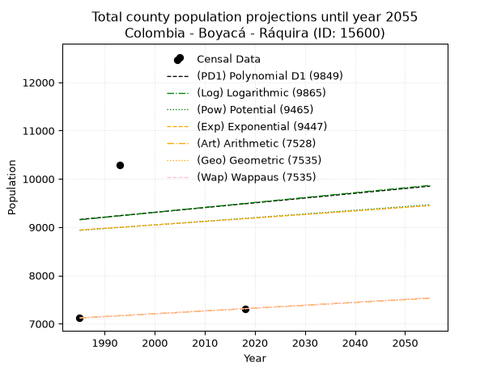
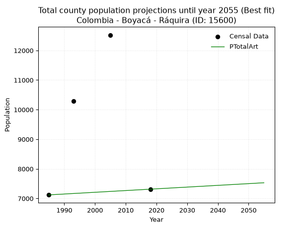
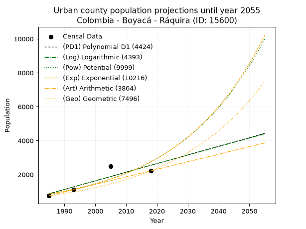
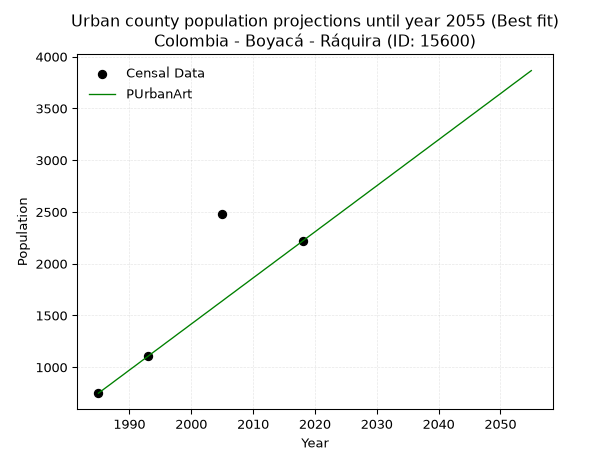
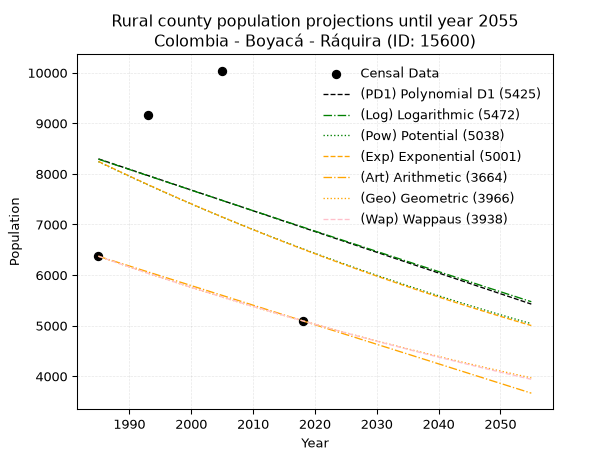
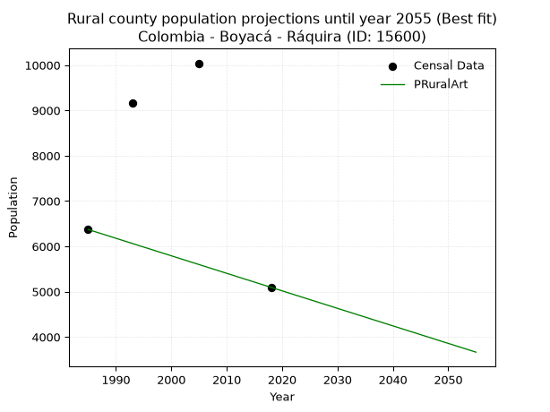

<div align="center">


</div>

# _“Population and Public Services Demand Projections (PPSD) until Year 2050 for Colombia - Boyacá - Ráquira (ID: 15600)”_
Keywords: `population` `public-service` `projection` `lineal` `polynomial` `logarithmic` `potential` `exponential` `arithmetic` `geometric` `wappaus` `dane` `colombia` `south-america`

PPSD are analytical estimates used by governments and planners to anticipate future changes in population size, age distribution, and the resulting community needs for utilities, healthcare, education, and infrastructure as sizing future water treatment facilities, electrical grids, and road networks based on spatial growth.

> **General running parameters**: • app_version: _v20260806_. • Python version: _3.14.7_. • Pandas version: _3.0.5_. • NumPy version: _2.5.1_. • Creates, save and include plots into reports (create_plot): _False_. • Projection until year: _2050_. • Process polynomial degree 2 and up: _False_. • Process Wappaus: _True_. • Process Wappaus: _True_. • Set negative values to zero: _True_. • Set infinite values to zero: _True_. • Drop dataset notes: _True_. 
<div align="center">

Dynamic map: [:earth_americas:Google](http://maps.google.com/maps?q=5.539135713,-73.6325426) [:earth_americas:OSM](https://www.openstreetmap.org/#map=18/5.539135713/-73.6325426&layers=P) [:earth_americas:Bing](https://www.bing.com/maps?cp=5.539135713~-73.6325426&lvl=18) [:earth_americas:Apple](https://maps.apple.com/frame?center=5.539135713%2C-73.6325426&span=0.003%2C0.006)

</div>


<div align="center">

```geojson
{
  "type": "Feature",
  "geometry": {
    "type": "Point", 
    "coordinates": [-73.6325426, 5.539135713]
  }, 
  "properties": {
    "Name": "Colombia - Boyacá - Ráquira (ID: 15600)"
  }
}
```

</div>


## 0. Census Data (4 records)

Census data are official statistics collected by a government about the people and housing in a country. They usually include counts of total population, age, sex, race, income, education, and jobs.

📅Global census file: [Population.xlsx](../data/Population.xlsx)

| Source   |   Year |   CountryID | CountryName   |   StateID | StateName   |   CountyID | CountyName   |   PTotal |   PUrban |   PRural |
|:---------|-------:|------------:|:--------------|----------:|:------------|-----------:|:-------------|---------:|---------:|---------:|
| DANE     |   1985 |          57 | Colombia      |        15 | Boyacá      |      15600 | Ráquira      |     7119 |      748 |     6371 |
| DANE     |   1993 |          57 | Colombia      |        15 | Boyacá      |      15600 | Ráquira      |    10284 |     1112 |     9172 |
| DANE     |   2005 |          57 | Colombia      |        15 | Boyacá      |      15600 | Ráquira      |    12522 |     2482 |    10040 |
| DANE     |   2018 |          57 | Colombia      |        15 | Boyacá      |      15600 | Ráquira      |     7312 |     2217 |     5095 |

> 🔥Some records could had specific notes about the registered values or the corresponding urban or rural distribution.

## 1. Total

### 1.1. Coefficients and Parameters

* (PD1) Polynomial Deg 1: 9.86551585708863, -10424.248093141536 (lineal)
* (Log) Logarithmic: 20575.75502528843, -147087.2288309701
* (Pow) Potential: 1.6651033948819716, -1.5400598474542473
* (Exp) Exponential: 0.0007876585498956118, 1872.1286656074276
* (Art) Arithmetic: Year diff. 2018 - 1985 = 33, Population diff. 7312 - 7119 = 193, Annual growth = 5.848484848484849
* (Geo) Geometric: Year diff. 2018 - 1985 = 33, Population diff. 7312 - 7119 = 193, Annual growth % = 0.0008109215898777222
* (Wap) Wappaus: i = 0.08105446398011015, Condition values only valid for < 200)

<sub>
Wappaus condition values: ['0.00', '0.08', '0.16', '0.24', '0.32', '0.41', '0.49', '0.57', '0.65', '0.73', '0.81', '0.89', '0.97', '1.05', '1.13', '1.22', '1.30', '1.38', '1.46', '1.54', '1.62', '1.70', '1.78', '1.86', '1.95', '2.03', '2.11', '2.19', '2.27', '2.35', '2.43', '2.51', '2.59', '2.67', '2.76', '2.84', '2.92', '3.00', '3.08', '3.16', '3.24', '3.32', '3.40', '3.49', '3.57', '3.65', '3.73', '3.81', '3.89', '3.97', '4.05', '4.13', '4.21', '4.30', '4.38', '4.46', '4.54', '4.62', '4.70', '4.78', '4.86', '4.94', '5.03', '5.11', '5.19', '5.27']
</sub>


### 1.2. Projected Dataset

|   Year |   CountyID |   PTotalPD1 |   PTotalLog |   PTotalPow |   PTotalExp |   PTotalArt |   PTotalGeo |   PTotalWap |
|-------:|-----------:|------------:|------------:|------------:|------------:|------------:|------------:|------------:|
|   1985 |      15600 |        9159 |        9152 |        8934 |        8940 |        7119 |        7119 |        7119 |
|   1986 |      15600 |        9169 |        9163 |        8942 |        8947 |        7125 |        7125 |        7125 |
|   1987 |      15600 |        9179 |        9173 |        8949 |        8954 |        7131 |        7131 |        7131 |
|   1988 |      15600 |        9188 |        9183 |        8957 |        8962 |        7137 |        7136 |        7136 |
|   1989 |      15600 |        9198 |        9194 |        8964 |        8969 |        7142 |        7142 |        7142 |
|   1990 |      15600 |        9208 |        9204 |        8972 |        8976 |        7148 |        7148 |        7148 |
|   1991 |      15600 |        9218 |        9214 |        8979 |        8983 |        7154 |        7154 |        7154 |
|   1992 |      15600 |        9228 |        9225 |        8987 |        8990 |        7160 |        7160 |        7160 |
|   1993 |      15600 |        9238 |        9235 |        8994 |        8997 |        7166 |        7165 |        7165 |
|   1994 |      15600 |        9248 |        9245 |        9002 |        9004 |        7172 |        7171 |        7171 |
|   1995 |      15600 |        9257 |        9256 |        9009 |        9011 |        7177 |        7177 |        7177 |
|   1996 |      15600 |        9267 |        9266 |        9017 |        9018 |        7183 |        7183 |        7183 |
|   1997 |      15600 |        9277 |        9276 |        9024 |        9025 |        7189 |        7189 |        7189 |
|   1998 |      15600 |        9287 |        9286 |        9032 |        9032 |        7195 |        7194 |        7194 |
|   1999 |      15600 |        9297 |        9297 |        9039 |        9040 |        7201 |        7200 |        7200 |
|   2000 |      15600 |        9307 |        9307 |        9047 |        9047 |        7207 |        7206 |        7206 |
|   2001 |      15600 |        9317 |        9317 |        9054 |        9054 |        7213 |        7212 |        7212 |
|   2002 |      15600 |        9327 |        9328 |        9062 |        9061 |        7218 |        7218 |        7218 |
|   2003 |      15600 |        9336 |        9338 |        9069 |        9068 |        7224 |        7224 |        7224 |
|   2004 |      15600 |        9346 |        9348 |        9077 |        9075 |        7230 |        7229 |        7229 |
|   2005 |      15600 |        9356 |        9358 |        9085 |        9082 |        7236 |        7235 |        7235 |
|   2006 |      15600 |        9366 |        9369 |        9092 |        9089 |        7242 |        7241 |        7241 |
|   2007 |      15600 |        9376 |        9379 |        9100 |        9097 |        7248 |        7247 |        7247 |
|   2008 |      15600 |        9386 |        9389 |        9107 |        9104 |        7254 |        7253 |        7253 |
|   2009 |      15600 |        9396 |        9399 |        9115 |        9111 |        7259 |        7259 |        7259 |
|   2010 |      15600 |        9405 |        9410 |        9122 |        9118 |        7265 |        7265 |        7265 |
|   2011 |      15600 |        9415 |        9420 |        9130 |        9125 |        7271 |        7271 |        7271 |
|   2012 |      15600 |        9425 |        9430 |        9137 |        9133 |        7277 |        7277 |        7277 |
|   2013 |      15600 |        9435 |        9440 |        9145 |        9140 |        7283 |        7282 |        7282 |
|   2014 |      15600 |        9445 |        9451 |        9153 |        9147 |        7289 |        7288 |        7288 |
|   2015 |      15600 |        9455 |        9461 |        9160 |        9154 |        7294 |        7294 |        7294 |
|   2016 |      15600 |        9465 |        9471 |        9168 |        9161 |        7300 |        7300 |        7300 |
|   2017 |      15600 |        9474 |        9481 |        9175 |        9169 |        7306 |        7306 |        7306 |
|   2018 |      15600 |        9484 |        9491 |        9183 |        9176 |        7312 |        7312 |        7312 |
|   2019 |      15600 |        9494 |        9502 |        9190 |        9183 |        7318 |        7318 |        7318 |
|   2020 |      15600 |        9504 |        9512 |        9198 |        9190 |        7324 |        7324 |        7324 |
|   2021 |      15600 |        9514 |        9522 |        9206 |        9198 |        7330 |        7330 |        7330 |
|   2022 |      15600 |        9524 |        9532 |        9213 |        9205 |        7335 |        7336 |        7336 |
|   2023 |      15600 |        9534 |        9542 |        9221 |        9212 |        7341 |        7342 |        7342 |
|   2024 |      15600 |        9544 |        9553 |        9228 |        9219 |        7347 |        7348 |        7348 |
|   2025 |      15600 |        9553 |        9563 |        9236 |        9227 |        7353 |        7354 |        7354 |
|   2026 |      15600 |        9563 |        9573 |        9244 |        9234 |        7359 |        7360 |        7360 |
|   2027 |      15600 |        9573 |        9583 |        9251 |        9241 |        7365 |        7366 |        7366 |
|   2028 |      15600 |        9583 |        9593 |        9259 |        9248 |        7370 |        7372 |        7372 |
|   2029 |      15600 |        9593 |        9603 |        9266 |        9256 |        7376 |        7377 |        7378 |
|   2030 |      15600 |        9603 |        9613 |        9274 |        9263 |        7382 |        7383 |        7383 |
|   2031 |      15600 |        9613 |        9624 |        9282 |        9270 |        7388 |        7389 |        7389 |
|   2032 |      15600 |        9622 |        9634 |        9289 |        9278 |        7394 |        7395 |        7395 |
|   2033 |      15600 |        9632 |        9644 |        9297 |        9285 |        7400 |        7401 |        7401 |
|   2034 |      15600 |        9642 |        9654 |        9304 |        9292 |        7406 |        7407 |        7407 |
|   2035 |      15600 |        9652 |        9664 |        9312 |        9300 |        7411 |        7413 |        7413 |
|   2036 |      15600 |        9662 |        9674 |        9320 |        9307 |        7417 |        7419 |        7419 |
|   2037 |      15600 |        9672 |        9684 |        9327 |        9314 |        7423 |        7425 |        7426 |
|   2038 |      15600 |        9682 |        9694 |        9335 |        9322 |        7429 |        7432 |        7432 |
|   2039 |      15600 |        9692 |        9704 |        9342 |        9329 |        7435 |        7438 |        7438 |
|   2040 |      15600 |        9701 |        9715 |        9350 |        9336 |        7441 |        7444 |        7444 |
|   2041 |      15600 |        9711 |        9725 |        9358 |        9344 |        7447 |        7450 |        7450 |
|   2042 |      15600 |        9721 |        9735 |        9365 |        9351 |        7452 |        7456 |        7456 |
|   2043 |      15600 |        9731 |        9745 |        9373 |        9358 |        7458 |        7462 |        7462 |
|   2044 |      15600 |        9741 |        9755 |        9381 |        9366 |        7464 |        7468 |        7468 |
|   2045 |      15600 |        9751 |        9765 |        9388 |        9373 |        7470 |        7474 |        7474 |
|   2046 |      15600 |        9761 |        9775 |        9396 |        9380 |        7476 |        7480 |        7480 |
|   2047 |      15600 |        9770 |        9785 |        9404 |        9388 |        7482 |        7486 |        7486 |
|   2048 |      15600 |        9780 |        9795 |        9411 |        9395 |        7487 |        7492 |        7492 |
|   2049 |      15600 |        9790 |        9805 |        9419 |        9403 |        7493 |        7498 |        7498 |
|   2050 |      15600 |        9800 |        9815 |        9427 |        9410 |        7499 |        7504 |        7504 |
<div align="center">

</img>

</div>


### 1.3. Best fit with absolute and relative error (%)

Relative error puts that difference into context by dividing the absolute error by the true value, creating a unitless ratio or percentage that shows the scale of the mistake.

Absolute and relative error

|   Year | Source   |   CountryID | CountryName   |   StateID | StateName   |   CountyID_x | CountyName   |   PTotal |   PUrban |   PRural |   CountyID_y |   PTotalPD1 |   PTotalLog |   PTotalPow |   PTotalExp |   PTotalArt |   PTotalGeo |   PTotalWap |   PTotalPD1AbsError |   PTotalLogAbsError |   PTotalPowAbsError |   PTotalExpAbsError |   PTotalArtAbsError |   PTotalGeoAbsError |   PTotalWapAbsError |   PTotalPD1RelError |   PTotalLogRelError |   PTotalPowRelError |   PTotalExpRelError |   PTotalArtRelError |   PTotalGeoRelError |   PTotalWapRelError |
|-------:|:---------|------------:|:--------------|----------:|:------------|-------------:|:-------------|---------:|---------:|---------:|-------------:|------------:|------------:|------------:|------------:|------------:|------------:|------------:|--------------------:|--------------------:|--------------------:|--------------------:|--------------------:|--------------------:|--------------------:|--------------------:|--------------------:|--------------------:|--------------------:|--------------------:|--------------------:|--------------------:|
|   1985 | DANE     |          57 | Colombia      |        15 | Boyacá      |        15600 | Ráquira      |     7119 |      748 |     6371 |        15600 |        9159 |        9152 |        8934 |        8940 |        7119 |        7119 |        7119 |                2040 |                2033 |                1815 |                1821 |                   0 |                   0 |                   0 |             28.6557 |             28.5574 |             25.4952 |             25.5794 |              0      |              0      |              0      |
|   1993 | DANE     |          57 | Colombia      |        15 | Boyacá      |        15600 | Ráquira      |    10284 |     1112 |     9172 |        15600 |        9238 |        9235 |        8994 |        8997 |        7166 |        7165 |        7165 |                1046 |                1049 |                1290 |                1287 |                3118 |                3119 |                3119 |             10.1711 |             10.2003 |             12.5438 |             12.5146 |             30.3189 |             30.3287 |             30.3287 |
|   2005 | DANE     |          57 | Colombia      |        15 | Boyacá      |        15600 | Ráquira      |    12522 |     2482 |    10040 |        15600 |        9356 |        9358 |        9085 |        9082 |        7236 |        7235 |        7235 |                3166 |                3164 |                3437 |                3440 |                5286 |                5287 |                5287 |             25.2835 |             25.2675 |             27.4477 |             27.4716 |             42.2137 |             42.2217 |             42.2217 |
|   2018 | DANE     |          57 | Colombia      |        15 | Boyacá      |        15600 | Ráquira      |     7312 |     2217 |     5095 |        15600 |        9484 |        9491 |        9183 |        9176 |        7312 |        7312 |        7312 |                2172 |                2179 |                1871 |                1864 |                   0 |                   0 |                   0 |             29.7046 |             29.8003 |             25.5881 |             25.4923 |              0      |              0      |              0      |

Relative error mean

| Method    |   RelError | Best   |
|:----------|-----------:|:-------|
| PTotalPD1 |    23.4537 |        |
| PTotalLog |    23.4564 |        |
| PTotalPow |    22.7687 |        |
| PTotalExp |    22.7645 |        |
| PTotalArt |    18.1332 | True   |
| PTotalGeo |    18.1376 |        |
| PTotalWap |    18.1376 |        |

💙Best method: _**PTotalArt**_
<div align="center">

</img>

</div>


### 1.4. Fresh water supply demand in liters per capita per day (lpcd)

The fresh water supply demand typically ranges from 100 to 300 liters per capita per day (lpcd) for standard domestic and municipal planning, though absolute survival minimums set by the World Health Organization are as low as 7.5 to 20 liters per day, and total consumption in high-income nations can exceed 400 liters.

> `CZ`: Level in meters above the sea level (masl).<br> `WS`: Fresh water supply demand in liters per capita per day (lpcd or l/h/d).<br> `WSAll`: Zonal fresh water supply demand in liters per second (l/s).<br> `A`: Zonal area in square meters.

Reference values (RAS Colombia)

|    CZ |   WS |
|------:|-----:|
|  1000 |  120 |
|  2000 |  130 |
| 99999 |  140 |

County shapefile geometry properties and water supply values

|   CountyID |      ATotal |   CZTotal |   WSTotal |
|-----------:|------------:|----------:|----------:|
|      15600 | 2.20326e+08 |   2641.75 |       140 |

Projected values for best method: PTotalArt

|   CountyID |   Year |   PTotalArt |   WSTotal |   WSTotalAll |
|-----------:|-------:|------------:|----------:|-------------:|
|      15600 |   1985 |        7119 |       140 |      11.5354 |
|      15600 |   1986 |        7125 |       140 |      11.5451 |
|      15600 |   1987 |        7131 |       140 |      11.5549 |
|      15600 |   1988 |        7137 |       140 |      11.5646 |
|      15600 |   1989 |        7142 |       140 |      11.5727 |
|      15600 |   1990 |        7148 |       140 |      11.5824 |
|      15600 |   1991 |        7154 |       140 |      11.5921 |
|      15600 |   1992 |        7160 |       140 |      11.6019 |
|      15600 |   1993 |        7166 |       140 |      11.6116 |
|      15600 |   1994 |        7172 |       140 |      11.6213 |
|      15600 |   1995 |        7177 |       140 |      11.6294 |
|      15600 |   1996 |        7183 |       140 |      11.6391 |
|      15600 |   1997 |        7189 |       140 |      11.6488 |
|      15600 |   1998 |        7195 |       140 |      11.6586 |
|      15600 |   1999 |        7201 |       140 |      11.6683 |
|      15600 |   2000 |        7207 |       140 |      11.678  |
|      15600 |   2001 |        7213 |       140 |      11.6877 |
|      15600 |   2002 |        7218 |       140 |      11.6958 |
|      15600 |   2003 |        7224 |       140 |      11.7056 |
|      15600 |   2004 |        7230 |       140 |      11.7153 |
|      15600 |   2005 |        7236 |       140 |      11.725  |
|      15600 |   2006 |        7242 |       140 |      11.7347 |
|      15600 |   2007 |        7248 |       140 |      11.7444 |
|      15600 |   2008 |        7254 |       140 |      11.7542 |
|      15600 |   2009 |        7259 |       140 |      11.7623 |
|      15600 |   2010 |        7265 |       140 |      11.772  |
|      15600 |   2011 |        7271 |       140 |      11.7817 |
|      15600 |   2012 |        7277 |       140 |      11.7914 |
|      15600 |   2013 |        7283 |       140 |      11.8012 |
|      15600 |   2014 |        7289 |       140 |      11.8109 |
|      15600 |   2015 |        7294 |       140 |      11.819  |
|      15600 |   2016 |        7300 |       140 |      11.8287 |
|      15600 |   2017 |        7306 |       140 |      11.8384 |
|      15600 |   2018 |        7312 |       140 |      11.8481 |
|      15600 |   2019 |        7318 |       140 |      11.8579 |
|      15600 |   2020 |        7324 |       140 |      11.8676 |
|      15600 |   2021 |        7330 |       140 |      11.8773 |
|      15600 |   2022 |        7335 |       140 |      11.8854 |
|      15600 |   2023 |        7341 |       140 |      11.8951 |
|      15600 |   2024 |        7347 |       140 |      11.9049 |
|      15600 |   2025 |        7353 |       140 |      11.9146 |
|      15600 |   2026 |        7359 |       140 |      11.9243 |
|      15600 |   2027 |        7365 |       140 |      11.934  |
|      15600 |   2028 |        7370 |       140 |      11.9421 |
|      15600 |   2029 |        7376 |       140 |      11.9519 |
|      15600 |   2030 |        7382 |       140 |      11.9616 |
|      15600 |   2031 |        7388 |       140 |      11.9713 |
|      15600 |   2032 |        7394 |       140 |      11.981  |
|      15600 |   2033 |        7400 |       140 |      11.9907 |
|      15600 |   2034 |        7406 |       140 |      12.0005 |
|      15600 |   2035 |        7411 |       140 |      12.0086 |
|      15600 |   2036 |        7417 |       140 |      12.0183 |
|      15600 |   2037 |        7423 |       140 |      12.028  |
|      15600 |   2038 |        7429 |       140 |      12.0377 |
|      15600 |   2039 |        7435 |       140 |      12.0475 |
|      15600 |   2040 |        7441 |       140 |      12.0572 |
|      15600 |   2041 |        7447 |       140 |      12.0669 |
|      15600 |   2042 |        7452 |       140 |      12.075  |
|      15600 |   2043 |        7458 |       140 |      12.0847 |
|      15600 |   2044 |        7464 |       140 |      12.0944 |
|      15600 |   2045 |        7470 |       140 |      12.1042 |
|      15600 |   2046 |        7476 |       140 |      12.1139 |
|      15600 |   2047 |        7482 |       140 |      12.1236 |
|      15600 |   2048 |        7487 |       140 |      12.1317 |
|      15600 |   2049 |        7493 |       140 |      12.1414 |
|      15600 |   2050 |        7499 |       140 |      12.1512 |

## 2. Urban

### 2.1. Coefficients and Parameters

* (PD1) Polynomial Deg 1: 50.85869128863918, -100090.34725010052 (lineal)
* (Log) Logarithmic: 101899.46665535797, -772898.9126184544
* (Pow) Potential: 71.1312229174033, -231.644417776732
* (Exp) Exponential: 0.03550063179700368, 2.117542056877226e-28
* (Art) Arithmetic: Year diff. 2018 - 1985 = 33, Population diff. 2217 - 748 = 1469, Annual growth = 44.515151515151516
* (Geo) Geometric: Year diff. 2018 - 1985 = 33, Population diff. 2217 - 748 = 1469, Annual growth % = 0.03347246939965265
* (Wap) Wappaus: i = 3.002708365271603, Condition values only valid for < 200)

<sub>
Wappaus condition values: ['0.00', '3.00', '6.01', '9.01', '12.01', '15.01', '18.02', '21.02', '24.02', '27.02', '30.03', '33.03', '36.03', '39.04', '42.04', '45.04', '48.04', '51.05', '54.05', '57.05', '60.05', '63.06', '66.06', '69.06', '72.07', '75.07', '78.07', '81.07', '84.08', '87.08', '90.08', '93.08', '96.09', '99.09', '102.09', '105.09', '108.10', '111.10', '114.10', '117.11', '120.11', '123.11', '126.11', '129.12', '132.12', '135.12', '138.12', '141.13', '144.13', '147.13', '150.14', '153.14', '156.14', '159.14', '162.15', '165.15', '168.15', '171.15', '174.16', '177.16', '180.16', '183.17', '186.17', '189.17', '192.17', '195.18']
</sub>


### 2.2. Projected Dataset

|   Year |   CountyID |   PUrbanPD1 |   PUrbanLog |   PUrbanPow |   PUrbanExp |   PUrbanArt |   PUrbanGeo |   PUrbanWap |
|-------:|-----------:|------------:|------------:|------------:|------------:|------------:|------------:|------------:|
|   1985 |      15600 |         864 |         862 |         850 |         851 |         748 |         748 |         748 |
|   1986 |      15600 |         915 |         913 |         881 |         882 |         793 |         773 |         771 |
|   1987 |      15600 |         966 |         964 |         913 |         914 |         837 |         799 |         794 |
|   1988 |      15600 |        1017 |        1016 |         946 |         947 |         882 |         826 |         819 |
|   1989 |      15600 |        1068 |        1067 |         981 |         981 |         926 |         853 |         844 |
|   1990 |      15600 |        1118 |        1118 |        1016 |        1017 |         971 |         882 |         869 |
|   1991 |      15600 |        1169 |        1169 |        1053 |        1053 |        1015 |         911 |         896 |
|   1992 |      15600 |        1220 |        1221 |        1092 |        1091 |        1060 |         942 |         924 |
|   1993 |      15600 |        1271 |        1272 |        1131 |        1131 |        1104 |         973 |         952 |
|   1994 |      15600 |        1322 |        1323 |        1172 |        1172 |        1149 |        1006 |         982 |
|   1995 |      15600 |        1373 |        1374 |        1215 |        1214 |        1193 |        1040 |        1012 |
|   1996 |      15600 |        1424 |        1425 |        1259 |        1258 |        1238 |        1074 |        1044 |
|   1997 |      15600 |        1474 |        1476 |        1305 |        1303 |        1282 |        1110 |        1077 |
|   1998 |      15600 |        1525 |        1527 |        1352 |        1350 |        1327 |        1148 |        1111 |
|   1999 |      15600 |        1576 |        1578 |        1401 |        1399 |        1371 |        1186 |        1146 |
|   2000 |      15600 |        1627 |        1629 |        1452 |        1450 |        1416 |        1226 |        1183 |
|   2001 |      15600 |        1678 |        1680 |        1504 |        1502 |        1460 |        1267 |        1221 |
|   2002 |      15600 |        1729 |        1731 |        1559 |        1556 |        1505 |        1309 |        1261 |
|   2003 |      15600 |        1780 |        1782 |        1615 |        1613 |        1549 |        1353 |        1302 |
|   2004 |      15600 |        1830 |        1833 |        1673 |        1671 |        1594 |        1398 |        1345 |
|   2005 |      15600 |        1881 |        1883 |        1734 |        1731 |        1638 |        1445 |        1390 |
|   2006 |      15600 |        1932 |        1934 |        1796 |        1794 |        1683 |        1493 |        1437 |
|   2007 |      15600 |        1983 |        1985 |        1861 |        1859 |        1727 |        1543 |        1486 |
|   2008 |      15600 |        2034 |        2036 |        1928 |        1926 |        1772 |        1595 |        1537 |
|   2009 |      15600 |        2085 |        2087 |        1998 |        1995 |        1816 |        1648 |        1591 |
|   2010 |      15600 |        2136 |        2137 |        2070 |        2068 |        1861 |        1704 |        1647 |
|   2011 |      15600 |        2186 |        2188 |        2144 |        2142 |        1905 |        1761 |        1706 |
|   2012 |      15600 |        2237 |        2239 |        2222 |        2220 |        1950 |        1820 |        1768 |
|   2013 |      15600 |        2288 |        2289 |        2302 |        2300 |        1994 |        1880 |        1833 |
|   2014 |      15600 |        2339 |        2340 |        2384 |        2383 |        2039 |        1943 |        1902 |
|   2015 |      15600 |        2390 |        2390 |        2470 |        2469 |        2083 |        2008 |        1974 |
|   2016 |      15600 |        2441 |        2441 |        2559 |        2558 |        2128 |        2076 |        2050 |
|   2017 |      15600 |        2492 |        2491 |        2651 |        2651 |        2172 |        2145 |        2131 |
|   2018 |      15600 |        2542 |        2542 |        2746 |        2747 |        2217 |        2217 |        2217 |
|   2019 |      15600 |        2593 |        2592 |        2844 |        2846 |        2262 |        2291 |        2308 |
|   2020 |      15600 |        2644 |        2643 |        2946 |        2949 |        2306 |        2368 |        2405 |
|   2021 |      15600 |        2695 |        2693 |        3052 |        3055 |        2351 |        2447 |        2508 |
|   2022 |      15600 |        2746 |        2744 |        3161 |        3166 |        2395 |        2529 |        2618 |
|   2023 |      15600 |        2797 |        2794 |        3274 |        3280 |        2440 |        2614 |        2735 |
|   2024 |      15600 |        2848 |        2845 |        3391 |        3399 |        2484 |        2701 |        2861 |
|   2025 |      15600 |        2899 |        2895 |        3513 |        3522 |        2529 |        2792 |        2997 |
|   2026 |      15600 |        2949 |        2945 |        3638 |        3649 |        2573 |        2885 |        3143 |
|   2027 |      15600 |        3000 |        2995 |        3768 |        3781 |        2618 |        2982 |        3301 |
|   2028 |      15600 |        3051 |        3046 |        3903 |        3917 |        2662 |        3081 |        3473 |
|   2029 |      15600 |        3102 |        3096 |        4042 |        4059 |        2707 |        3185 |        3660 |
|   2030 |      15600 |        3153 |        3146 |        4186 |        4206 |        2751 |        3291 |        3864 |
|   2031 |      15600 |        3204 |        3196 |        4335 |        4358 |        2796 |        3401 |        4088 |
|   2032 |      15600 |        3255 |        3246 |        4490 |        4515 |        2840 |        3515 |        4334 |
|   2033 |      15600 |        3305 |        3297 |        4650 |        4678 |        2885 |        3633 |        4607 |
|   2034 |      15600 |        3356 |        3347 |        4815 |        4847 |        2929 |        3754 |        4911 |
|   2035 |      15600 |        3407 |        3397 |        4987 |        5022 |        2974 |        3880 |        5252 |
|   2036 |      15600 |        3458 |        3447 |        5164 |        5204 |        3018 |        4010 |        5637 |
|   2037 |      15600 |        3509 |        3497 |        5348 |        5392 |        3063 |        4144 |        6074 |
|   2038 |      15600 |        3560 |        3547 |        5538 |        5587 |        3107 |        4283 |        6575 |
|   2039 |      15600 |        3611 |        3597 |        5734 |        5789 |        3152 |        4426 |        7156 |
|   2040 |      15600 |        3661 |        3647 |        5938 |        5998 |        3196 |        4574 |        7837 |
|   2041 |      15600 |        3712 |        3697 |        6148 |        6215 |        3241 |        4728 |        8647 |
|   2042 |      15600 |        3763 |        3747 |        6366 |        6439 |        3285 |        4886 |        9624 |
|   2043 |      15600 |        3814 |        3797 |        6592 |        6672 |        3330 |        5049 |       10830 |
|   2044 |      15600 |        3865 |        3846 |        6826 |        6913 |        3374 |        5218 |       12352 |
|   2045 |      15600 |        3916 |        3896 |        7067 |        7163 |        3419 |        5393 |       14335 |
|   2046 |      15600 |        3967 |        3946 |        7317 |        7422 |        3463 |        5574 |       17025 |
|   2047 |      15600 |        4017 |        3996 |        7576 |        7690 |        3508 |        5760 |       20883 |
|   2048 |      15600 |        4068 |        4046 |        7844 |        7968 |        3552 |        5953 |       26881 |
|   2049 |      15600 |        4119 |        4095 |        8121 |        8256 |        3597 |        6152 |       37480 |
|   2050 |      15600 |        4170 |        4145 |        8408 |        8554 |        3641 |        6358 |       61276 |
<div align="center">

</img>

</div>


### 2.3. Best fit with absolute and relative error (%)

Relative error puts that difference into context by dividing the absolute error by the true value, creating a unitless ratio or percentage that shows the scale of the mistake.

Absolute and relative error

|   Year | Source   |   CountryID | CountryName   |   StateID | StateName   |   CountyID_x | CountyName   |   PTotal |   PUrban |   PRural |   CountyID_y |   PUrbanPD1 |   PUrbanLog |   PUrbanPow |   PUrbanExp |   PUrbanArt |   PUrbanGeo |   PUrbanWap |   PUrbanPD1AbsError |   PUrbanLogAbsError |   PUrbanPowAbsError |   PUrbanExpAbsError |   PUrbanArtAbsError |   PUrbanGeoAbsError |   PUrbanWapAbsError |   PUrbanPD1RelError |   PUrbanLogRelError |   PUrbanPowRelError |   PUrbanExpRelError |   PUrbanArtRelError |   PUrbanGeoRelError |   PUrbanWapRelError |
|-------:|:---------|------------:|:--------------|----------:|:------------|-------------:|:-------------|---------:|---------:|---------:|-------------:|------------:|------------:|------------:|------------:|------------:|------------:|------------:|--------------------:|--------------------:|--------------------:|--------------------:|--------------------:|--------------------:|--------------------:|--------------------:|--------------------:|--------------------:|--------------------:|--------------------:|--------------------:|--------------------:|
|   1985 | DANE     |          57 | Colombia      |        15 | Boyacá      |        15600 | Ráquira      |     7119 |      748 |     6371 |        15600 |         864 |         862 |         850 |         851 |         748 |         748 |         748 |                 116 |                 114 |                 102 |                 103 |                   0 |                   0 |                   0 |             15.508  |             15.2406 |            13.6364  |            13.7701  |            0        |              0      |              0      |
|   1993 | DANE     |          57 | Colombia      |        15 | Boyacá      |        15600 | Ráquira      |    10284 |     1112 |     9172 |        15600 |        1271 |        1272 |        1131 |        1131 |        1104 |         973 |         952 |                 159 |                 160 |                  19 |                  19 |                   8 |                 139 |                 160 |             14.2986 |             14.3885 |             1.70863 |             1.70863 |            0.719424 |             12.5    |             14.3885 |
|   2005 | DANE     |          57 | Colombia      |        15 | Boyacá      |        15600 | Ráquira      |    12522 |     2482 |    10040 |        15600 |        1881 |        1883 |        1734 |        1731 |        1638 |        1445 |        1390 |                 601 |                 599 |                 748 |                 751 |                 844 |                1037 |                1092 |             24.2143 |             24.1338 |            30.137   |            30.2579  |           34.0048   |             41.7808 |             43.9968 |
|   2018 | DANE     |          57 | Colombia      |        15 | Boyacá      |        15600 | Ráquira      |     7312 |     2217 |     5095 |        15600 |        2542 |        2542 |        2746 |        2747 |        2217 |        2217 |        2217 |                 325 |                 325 |                 529 |                 530 |                   0 |                   0 |                   0 |             14.6594 |             14.6594 |            23.8611  |            23.9062  |            0        |              0      |              0      |

Relative error mean

| Method    |   RelError | Best   |
|:----------|-----------:|:-------|
| PUrbanPD1 |   17.1701  |        |
| PUrbanLog |   17.1056  |        |
| PUrbanPow |   17.3358  |        |
| PUrbanExp |   17.4107  |        |
| PUrbanArt |    8.68106 | True   |
| PUrbanGeo |   13.5702  |        |
| PUrbanWap |   14.5963  |        |

💙Best method: _**PUrbanArt**_
<div align="center">

</img>

</div>


### 2.4. Fresh water supply demand in liters per capita per day (lpcd)

The fresh water supply demand typically ranges from 100 to 300 liters per capita per day (lpcd) for standard domestic and municipal planning, though absolute survival minimums set by the World Health Organization are as low as 7.5 to 20 liters per day, and total consumption in high-income nations can exceed 400 liters.

> `CZ`: Level in meters above the sea level (masl).<br> `WS`: Fresh water supply demand in liters per capita per day (lpcd or l/h/d).<br> `WSAll`: Zonal fresh water supply demand in liters per second (l/s).<br> `A`: Zonal area in square meters.

Reference values (RAS Colombia)

|    CZ |   WS |
|------:|-----:|
|  1000 |  120 |
|  2000 |  130 |
| 99999 |  140 |

County shapefile geometry properties and water supply values

|   CountyID |   AUrban |   CZUrban |   WSUrban |
|-----------:|---------:|----------:|----------:|
|      15600 |   641957 |   2177.46 |       140 |

Projected values for best method: PUrbanArt

|   CountyID |   Year |   PUrbanArt |   WSUrban |   WSUrbanAll |
|-----------:|-------:|------------:|----------:|-------------:|
|      15600 |   1985 |         748 |       140 |      1.21204 |
|      15600 |   1986 |         793 |       140 |      1.28495 |
|      15600 |   1987 |         837 |       140 |      1.35625 |
|      15600 |   1988 |         882 |       140 |      1.42917 |
|      15600 |   1989 |         926 |       140 |      1.50046 |
|      15600 |   1990 |         971 |       140 |      1.57338 |
|      15600 |   1991 |        1015 |       140 |      1.64468 |
|      15600 |   1992 |        1060 |       140 |      1.71759 |
|      15600 |   1993 |        1104 |       140 |      1.78889 |
|      15600 |   1994 |        1149 |       140 |      1.86181 |
|      15600 |   1995 |        1193 |       140 |      1.9331  |
|      15600 |   1996 |        1238 |       140 |      2.00602 |
|      15600 |   1997 |        1282 |       140 |      2.07731 |
|      15600 |   1998 |        1327 |       140 |      2.15023 |
|      15600 |   1999 |        1371 |       140 |      2.22153 |
|      15600 |   2000 |        1416 |       140 |      2.29444 |
|      15600 |   2001 |        1460 |       140 |      2.36574 |
|      15600 |   2002 |        1505 |       140 |      2.43866 |
|      15600 |   2003 |        1549 |       140 |      2.50995 |
|      15600 |   2004 |        1594 |       140 |      2.58287 |
|      15600 |   2005 |        1638 |       140 |      2.65417 |
|      15600 |   2006 |        1683 |       140 |      2.72708 |
|      15600 |   2007 |        1727 |       140 |      2.79838 |
|      15600 |   2008 |        1772 |       140 |      2.8713  |
|      15600 |   2009 |        1816 |       140 |      2.94259 |
|      15600 |   2010 |        1861 |       140 |      3.01551 |
|      15600 |   2011 |        1905 |       140 |      3.08681 |
|      15600 |   2012 |        1950 |       140 |      3.15972 |
|      15600 |   2013 |        1994 |       140 |      3.23102 |
|      15600 |   2014 |        2039 |       140 |      3.30394 |
|      15600 |   2015 |        2083 |       140 |      3.37523 |
|      15600 |   2016 |        2128 |       140 |      3.44815 |
|      15600 |   2017 |        2172 |       140 |      3.51944 |
|      15600 |   2018 |        2217 |       140 |      3.59236 |
|      15600 |   2019 |        2262 |       140 |      3.66528 |
|      15600 |   2020 |        2306 |       140 |      3.73657 |
|      15600 |   2021 |        2351 |       140 |      3.80949 |
|      15600 |   2022 |        2395 |       140 |      3.88079 |
|      15600 |   2023 |        2440 |       140 |      3.9537  |
|      15600 |   2024 |        2484 |       140 |      4.025   |
|      15600 |   2025 |        2529 |       140 |      4.09792 |
|      15600 |   2026 |        2573 |       140 |      4.16921 |
|      15600 |   2027 |        2618 |       140 |      4.24213 |
|      15600 |   2028 |        2662 |       140 |      4.31343 |
|      15600 |   2029 |        2707 |       140 |      4.38634 |
|      15600 |   2030 |        2751 |       140 |      4.45764 |
|      15600 |   2031 |        2796 |       140 |      4.53056 |
|      15600 |   2032 |        2840 |       140 |      4.60185 |
|      15600 |   2033 |        2885 |       140 |      4.67477 |
|      15600 |   2034 |        2929 |       140 |      4.74606 |
|      15600 |   2035 |        2974 |       140 |      4.81898 |
|      15600 |   2036 |        3018 |       140 |      4.89028 |
|      15600 |   2037 |        3063 |       140 |      4.96319 |
|      15600 |   2038 |        3107 |       140 |      5.03449 |
|      15600 |   2039 |        3152 |       140 |      5.10741 |
|      15600 |   2040 |        3196 |       140 |      5.1787  |
|      15600 |   2041 |        3241 |       140 |      5.25162 |
|      15600 |   2042 |        3285 |       140 |      5.32292 |
|      15600 |   2043 |        3330 |       140 |      5.39583 |
|      15600 |   2044 |        3374 |       140 |      5.46713 |
|      15600 |   2045 |        3419 |       140 |      5.54005 |
|      15600 |   2046 |        3463 |       140 |      5.61134 |
|      15600 |   2047 |        3508 |       140 |      5.68426 |
|      15600 |   2048 |        3552 |       140 |      5.75556 |
|      15600 |   2049 |        3597 |       140 |      5.82847 |
|      15600 |   2050 |        3641 |       140 |      5.89977 |

## 3. Rural

### 3.1. Coefficients and Parameters

* (PD1) Polynomial Deg 1: -40.99317543155059, 89666.09915695907 (lineal)
* (Log) Logarithmic: -81323.7116300693, 625811.6837874826
* (Pow) Potential: -14.201179294503286, 50.748057216393875
* (Exp) Exponential: -0.007143415138963261, 11867371233.229153
* (Art) Arithmetic: Year diff. 2018 - 1985 = 33, Population diff. 5095 - 6371 = -1276, Annual growth = -38.666666666666664
* (Geo) Geometric: Year diff. 2018 - 1985 = 33, Population diff. 5095 - 6371 = -1276, Annual growth % = -0.006749747021435604
* (Wap) Wappaus: i = -0.6744578173149601, Condition values only valid for < 200)

<sub>
Wappaus condition values: ['-0.00', '-0.67', '-1.35', '-2.02', '-2.70', '-3.37', '-4.05', '-4.72', '-5.40', '-6.07', '-6.74', '-7.42', '-8.09', '-8.77', '-9.44', '-10.12', '-10.79', '-11.47', '-12.14', '-12.81', '-13.49', '-14.16', '-14.84', '-15.51', '-16.19', '-16.86', '-17.54', '-18.21', '-18.88', '-19.56', '-20.23', '-20.91', '-21.58', '-22.26', '-22.93', '-23.61', '-24.28', '-24.95', '-25.63', '-26.30', '-26.98', '-27.65', '-28.33', '-29.00', '-29.68', '-30.35', '-31.03', '-31.70', '-32.37', '-33.05', '-33.72', '-34.40', '-35.07', '-35.75', '-36.42', '-37.10', '-37.77', '-38.44', '-39.12', '-39.79', '-40.47', '-41.14', '-41.82', '-42.49', '-43.17', '-43.84']
</sub>


### 3.2. Projected Dataset

|   Year |   CountyID |   PRuralPD1 |   PRuralLog |   PRuralPow |   PRuralExp |   PRuralArt |   PRuralGeo |   PRuralWap |
|-------:|-----------:|------------:|------------:|------------:|------------:|------------:|------------:|------------:|
|   1985 |      15600 |        8295 |        8290 |        8241 |        8245 |        6371 |        6371 |        6371 |
|   1986 |      15600 |        8254 |        8249 |        8182 |        8186 |        6332 |        6328 |        6328 |
|   1987 |      15600 |        8213 |        8208 |        8124 |        8128 |        6294 |        6285 |        6286 |
|   1988 |      15600 |        8172 |        8167 |        8066 |        8070 |        6255 |        6243 |        6243 |
|   1989 |      15600 |        8131 |        8127 |        8009 |        8013 |        6216 |        6201 |        6201 |
|   1990 |      15600 |        8090 |        8086 |        7952 |        7956 |        6178 |        6159 |        6160 |
|   1991 |      15600 |        8049 |        8045 |        7895 |        7899 |        6139 |        6117 |        6118 |
|   1992 |      15600 |        8008 |        8004 |        7839 |        7843 |        6100 |        6076 |        6077 |
|   1993 |      15600 |        7967 |        7963 |        7783 |        7787 |        6062 |        6035 |        6036 |
|   1994 |      15600 |        7926 |        7922 |        7728 |        7732 |        6023 |        5994 |        5996 |
|   1995 |      15600 |        7885 |        7882 |        7673 |        7677 |        5984 |        5954 |        5955 |
|   1996 |      15600 |        7844 |        7841 |        7619 |        7622 |        5946 |        5914 |        5915 |
|   1997 |      15600 |        7803 |        7800 |        7565 |        7568 |        5907 |        5874 |        5875 |
|   1998 |      15600 |        7762 |        7759 |        7511 |        7514 |        5868 |        5834 |        5836 |
|   1999 |      15600 |        7721 |        7719 |        7458 |        7460 |        5830 |        5795 |        5797 |
|   2000 |      15600 |        7680 |        7678 |        7405 |        7407 |        5791 |        5756 |        5757 |
|   2001 |      15600 |        7639 |        7637 |        7353 |        7355 |        5752 |        5717 |        5719 |
|   2002 |      15600 |        7598 |        7597 |        7301 |        7302 |        5714 |        5678 |        5680 |
|   2003 |      15600 |        7557 |        7556 |        7249 |        7250 |        5675 |        5640 |        5642 |
|   2004 |      15600 |        7516 |        7516 |        7198 |        7199 |        5636 |        5602 |        5604 |
|   2005 |      15600 |        7475 |        7475 |        7147 |        7147 |        5598 |        5564 |        5566 |
|   2006 |      15600 |        7434 |        7434 |        7097 |        7097 |        5559 |        5526 |        5528 |
|   2007 |      15600 |        7393 |        7394 |        7047 |        7046 |        5520 |        5489 |        5491 |
|   2008 |      15600 |        7352 |        7353 |        6997 |        6996 |        5482 |        5452 |        5454 |
|   2009 |      15600 |        7311 |        7313 |        6948 |        6946 |        5443 |        5415 |        5417 |
|   2010 |      15600 |        7270 |        7272 |        6899 |        6897 |        5404 |        5379 |        5380 |
|   2011 |      15600 |        7229 |        7232 |        6850 |        6848 |        5366 |        5342 |        5344 |
|   2012 |      15600 |        7188 |        7192 |        6802 |        6799 |        5327 |        5306 |        5308 |
|   2013 |      15600 |        7147 |        7151 |        6754 |        6750 |        5288 |        5270 |        5272 |
|   2014 |      15600 |        7106 |        7111 |        6707 |        6702 |        5250 |        5235 |        5236 |
|   2015 |      15600 |        7065 |        7070 |        6660 |        6655 |        5211 |        5200 |        5200 |
|   2016 |      15600 |        7024 |        7030 |        6613 |        6607 |        5172 |        5164 |        5165 |
|   2017 |      15600 |        6983 |        6990 |        6567 |        6560 |        5134 |        5130 |        5130 |
|   2018 |      15600 |        6942 |        6949 |        6520 |        6514 |        5095 |        5095 |        5095 |
|   2019 |      15600 |        6901 |        6909 |        6475 |        6467 |        5056 |        5061 |        5060 |
|   2020 |      15600 |        6860 |        6869 |        6429 |        6421 |        5018 |        5026 |        5026 |
|   2021 |      15600 |        6819 |        6829 |        6384 |        6375 |        4979 |        4993 |        4992 |
|   2022 |      15600 |        6778 |        6788 |        6340 |        6330 |        4940 |        4959 |        4957 |
|   2023 |      15600 |        6737 |        6748 |        6295 |        6285 |        4902 |        4925 |        4924 |
|   2024 |      15600 |        6696 |        6708 |        6251 |        6240 |        4863 |        4892 |        4890 |
|   2025 |      15600 |        6655 |        6668 |        6208 |        6196 |        4824 |        4859 |        4857 |
|   2026 |      15600 |        6614 |        6628 |        6164 |        6152 |        4786 |        4826 |        4823 |
|   2027 |      15600 |        6573 |        6588 |        6121 |        6108 |        4747 |        4794 |        4790 |
|   2028 |      15600 |        6532 |        6547 |        6078 |        6065 |        4708 |        4761 |        4757 |
|   2029 |      15600 |        6491 |        6507 |        6036 |        6021 |        4670 |        4729 |        4725 |
|   2030 |      15600 |        6450 |        6467 |        5994 |        5979 |        4631 |        4697 |        4692 |
|   2031 |      15600 |        6409 |        6427 |        5952 |        5936 |        4592 |        4666 |        4660 |
|   2032 |      15600 |        6368 |        6387 |        5911 |        5894 |        4554 |        4634 |        4628 |
|   2033 |      15600 |        6327 |        6347 |        5870 |        5852 |        4515 |        4603 |        4596 |
|   2034 |      15600 |        6286 |        6307 |        5829 |        5810 |        4476 |        4572 |        4564 |
|   2035 |      15600 |        6245 |        6267 |        5788 |        5769 |        4438 |        4541 |        4533 |
|   2036 |      15600 |        6204 |        6227 |        5748 |        5728 |        4399 |        4510 |        4501 |
|   2037 |      15600 |        6163 |        6187 |        5708 |        5687 |        4360 |        4480 |        4470 |
|   2038 |      15600 |        6122 |        6147 |        5668 |        5646 |        4322 |        4450 |        4439 |
|   2039 |      15600 |        6081 |        6108 |        5629 |        5606 |        4283 |        4420 |        4408 |
|   2040 |      15600 |        6040 |        6068 |        5590 |        5566 |        4244 |        4390 |        4377 |
|   2041 |      15600 |        5999 |        6028 |        5551 |        5527 |        4206 |        4360 |        4347 |
|   2042 |      15600 |        5958 |        5988 |        5513 |        5487 |        4167 |        4331 |        4317 |
|   2043 |      15600 |        5917 |        5948 |        5474 |        5448 |        4128 |        4301 |        4286 |
|   2044 |      15600 |        5876 |        5908 |        5437 |        5410 |        4090 |        4272 |        4256 |
|   2045 |      15600 |        5835 |        5869 |        5399 |        5371 |        4051 |        4244 |        4227 |
|   2046 |      15600 |        5794 |        5829 |        5362 |        5333 |        4012 |        4215 |        4197 |
|   2047 |      15600 |        5753 |        5789 |        5325 |        5295 |        3974 |        4186 |        4168 |
|   2048 |      15600 |        5712 |        5749 |        5288 |        5257 |        3935 |        4158 |        4138 |
|   2049 |      15600 |        5671 |        5710 |        5251 |        5220 |        3896 |        4130 |        4109 |
|   2050 |      15600 |        5630 |        5670 |        5215 |        5183 |        3858 |        4102 |        4080 |
<div align="center">

</img>

</div>


### 3.3. Best fit with absolute and relative error (%)

Relative error puts that difference into context by dividing the absolute error by the true value, creating a unitless ratio or percentage that shows the scale of the mistake.

Absolute and relative error

|   Year | Source   |   CountryID | CountryName   |   StateID | StateName   |   CountyID_x | CountyName   |   PTotal |   PUrban |   PRural |   CountyID_y |   PRuralPD1 |   PRuralLog |   PRuralPow |   PRuralExp |   PRuralArt |   PRuralGeo |   PRuralWap |   PRuralPD1AbsError |   PRuralLogAbsError |   PRuralPowAbsError |   PRuralExpAbsError |   PRuralArtAbsError |   PRuralGeoAbsError |   PRuralWapAbsError |   PRuralPD1RelError |   PRuralLogRelError |   PRuralPowRelError |   PRuralExpRelError |   PRuralArtRelError |   PRuralGeoRelError |   PRuralWapRelError |
|-------:|:---------|------------:|:--------------|----------:|:------------|-------------:|:-------------|---------:|---------:|---------:|-------------:|------------:|------------:|------------:|------------:|------------:|------------:|------------:|--------------------:|--------------------:|--------------------:|--------------------:|--------------------:|--------------------:|--------------------:|--------------------:|--------------------:|--------------------:|--------------------:|--------------------:|--------------------:|--------------------:|
|   1985 | DANE     |          57 | Colombia      |        15 | Boyacá      |        15600 | Ráquira      |     7119 |      748 |     6371 |        15600 |        8295 |        8290 |        8241 |        8245 |        6371 |        6371 |        6371 |                1924 |                1919 |                1870 |                1874 |                   0 |                   0 |                   0 |             30.1993 |             30.1209 |             29.3518 |             29.4145 |              0      |              0      |              0      |
|   1993 | DANE     |          57 | Colombia      |        15 | Boyacá      |        15600 | Ráquira      |    10284 |     1112 |     9172 |        15600 |        7967 |        7963 |        7783 |        7787 |        6062 |        6035 |        6036 |                1205 |                1209 |                1389 |                1385 |                3110 |                3137 |                3136 |             13.1378 |             13.1814 |             15.1439 |             15.1003 |             33.9075 |             34.2019 |             34.191  |
|   2005 | DANE     |          57 | Colombia      |        15 | Boyacá      |        15600 | Ráquira      |    12522 |     2482 |    10040 |        15600 |        7475 |        7475 |        7147 |        7147 |        5598 |        5564 |        5566 |                2565 |                2565 |                2893 |                2893 |                4442 |                4476 |                4474 |             25.5478 |             25.5478 |             28.8147 |             28.8147 |             44.243  |             44.5817 |             44.5618 |
|   2018 | DANE     |          57 | Colombia      |        15 | Boyacá      |        15600 | Ráquira      |     7312 |     2217 |     5095 |        15600 |        6942 |        6949 |        6520 |        6514 |        5095 |        5095 |        5095 |                1847 |                1854 |                1425 |                1419 |                   0 |                   0 |                   0 |             36.2512 |             36.3886 |             27.9686 |             27.8508 |              0      |              0      |              0      |

Relative error mean

| Method    |   RelError | Best   |
|:----------|-----------:|:-------|
| PRuralPD1 |    26.284  |        |
| PRuralLog |    26.3097 |        |
| PRuralPow |    25.3198 |        |
| PRuralExp |    25.2951 |        |
| PRuralArt |    19.5376 | True   |
| PRuralGeo |    19.6959 |        |
| PRuralWap |    19.6882 |        |

💙Best method: _**PRuralArt**_
<div align="center">

</img>

</div>


### 3.4. Fresh water supply demand in liters per capita per day (lpcd)

The fresh water supply demand typically ranges from 100 to 300 liters per capita per day (lpcd) for standard domestic and municipal planning, though absolute survival minimums set by the World Health Organization are as low as 7.5 to 20 liters per day, and total consumption in high-income nations can exceed 400 liters.

> `CZ`: Level in meters above the sea level (masl).<br> `WS`: Fresh water supply demand in liters per capita per day (lpcd or l/h/d).<br> `WSAll`: Zonal fresh water supply demand in liters per second (l/s).<br> `A`: Zonal area in square meters.

Reference values (RAS Colombia)

|    CZ |   WS |
|------:|-----:|
|  1000 |  120 |
|  2000 |  130 |
| 99999 |  140 |

County shapefile geometry properties and water supply values

|   CountyID |      ARural |   CZRural |   WSRural |
|-----------:|------------:|----------:|----------:|
|      15600 | 2.19684e+08 |   2643.09 |       140 |

Projected values for best method: PRuralArt

|   CountyID |   Year |   PRuralArt |   WSRural |   WSRuralAll |
|-----------:|-------:|------------:|----------:|-------------:|
|      15600 |   1985 |        6371 |       140 |     10.3234  |
|      15600 |   1986 |        6332 |       140 |     10.2602  |
|      15600 |   1987 |        6294 |       140 |     10.1986  |
|      15600 |   1988 |        6255 |       140 |     10.1354  |
|      15600 |   1989 |        6216 |       140 |     10.0722  |
|      15600 |   1990 |        6178 |       140 |     10.0106  |
|      15600 |   1991 |        6139 |       140 |      9.94745 |
|      15600 |   1992 |        6100 |       140 |      9.88426 |
|      15600 |   1993 |        6062 |       140 |      9.82269 |
|      15600 |   1994 |        6023 |       140 |      9.75949 |
|      15600 |   1995 |        5984 |       140 |      9.6963  |
|      15600 |   1996 |        5946 |       140 |      9.63472 |
|      15600 |   1997 |        5907 |       140 |      9.57153 |
|      15600 |   1998 |        5868 |       140 |      9.50833 |
|      15600 |   1999 |        5830 |       140 |      9.44676 |
|      15600 |   2000 |        5791 |       140 |      9.38356 |
|      15600 |   2001 |        5752 |       140 |      9.32037 |
|      15600 |   2002 |        5714 |       140 |      9.2588  |
|      15600 |   2003 |        5675 |       140 |      9.1956  |
|      15600 |   2004 |        5636 |       140 |      9.13241 |
|      15600 |   2005 |        5598 |       140 |      9.07083 |
|      15600 |   2006 |        5559 |       140 |      9.00764 |
|      15600 |   2007 |        5520 |       140 |      8.94444 |
|      15600 |   2008 |        5482 |       140 |      8.88287 |
|      15600 |   2009 |        5443 |       140 |      8.81968 |
|      15600 |   2010 |        5404 |       140 |      8.75648 |
|      15600 |   2011 |        5366 |       140 |      8.69491 |
|      15600 |   2012 |        5327 |       140 |      8.63171 |
|      15600 |   2013 |        5288 |       140 |      8.56852 |
|      15600 |   2014 |        5250 |       140 |      8.50694 |
|      15600 |   2015 |        5211 |       140 |      8.44375 |
|      15600 |   2016 |        5172 |       140 |      8.38056 |
|      15600 |   2017 |        5134 |       140 |      8.31898 |
|      15600 |   2018 |        5095 |       140 |      8.25579 |
|      15600 |   2019 |        5056 |       140 |      8.19259 |
|      15600 |   2020 |        5018 |       140 |      8.13102 |
|      15600 |   2021 |        4979 |       140 |      8.06782 |
|      15600 |   2022 |        4940 |       140 |      8.00463 |
|      15600 |   2023 |        4902 |       140 |      7.94306 |
|      15600 |   2024 |        4863 |       140 |      7.87986 |
|      15600 |   2025 |        4824 |       140 |      7.81667 |
|      15600 |   2026 |        4786 |       140 |      7.75509 |
|      15600 |   2027 |        4747 |       140 |      7.6919  |
|      15600 |   2028 |        4708 |       140 |      7.6287  |
|      15600 |   2029 |        4670 |       140 |      7.56713 |
|      15600 |   2030 |        4631 |       140 |      7.50394 |
|      15600 |   2031 |        4592 |       140 |      7.44074 |
|      15600 |   2032 |        4554 |       140 |      7.37917 |
|      15600 |   2033 |        4515 |       140 |      7.31597 |
|      15600 |   2034 |        4476 |       140 |      7.25278 |
|      15600 |   2035 |        4438 |       140 |      7.1912  |
|      15600 |   2036 |        4399 |       140 |      7.12801 |
|      15600 |   2037 |        4360 |       140 |      7.06481 |
|      15600 |   2038 |        4322 |       140 |      7.00324 |
|      15600 |   2039 |        4283 |       140 |      6.94005 |
|      15600 |   2040 |        4244 |       140 |      6.87685 |
|      15600 |   2041 |        4206 |       140 |      6.81528 |
|      15600 |   2042 |        4167 |       140 |      6.75208 |
|      15600 |   2043 |        4128 |       140 |      6.68889 |
|      15600 |   2044 |        4090 |       140 |      6.62731 |
|      15600 |   2045 |        4051 |       140 |      6.56412 |
|      15600 |   2046 |        4012 |       140 |      6.50093 |
|      15600 |   2047 |        3974 |       140 |      6.43935 |
|      15600 |   2048 |        3935 |       140 |      6.37616 |
|      15600 |   2049 |        3896 |       140 |      6.31296 |
|      15600 |   2050 |        3858 |       140 |      6.25139 |

<div align="center"><br><sub>Share this research</sub></div><br>

<sub>**APPS & TOOLS & CONTENT DISCLAIMER**: • NO WARRANTY - This content and software is provided by <a href="https://github.com/rcfdtools" target="_blank">github.com/rcfdtools</a> "as is", without any express or implied warranty, including warranties of merchantability, fitness for a particular purpose, or non-infringement. There is no guarantee that the software will be error-free or operate without interruption. • LIMITATION OF LIABILITY - Neither the authors nor copyright holders will be liable for claims or damages arising from the software or its use. You are responsible for determining if the software is appropriate for your use and assume all associated risks, including errors, legal compliance, and data loss. • NO PROFESSIONAL ADVICE - The software provides general information and does not offer professional advice. It should not replace consultation with professional advisors. [Clauses and global license for rcfdtools use.](https://github.com/rcfdtools/rcfdtools/blob/main/LICENSE.md)</sub>

| [:house: Home](Readme.md)  | [:beginner: Help / Collaborate](https://github.com/rcfdtools/R.HydroTools/discussions/31) |
|----------------------------|-------------------------------------------------------------------------------------------|