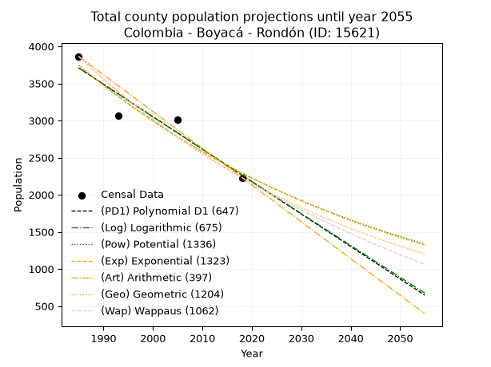
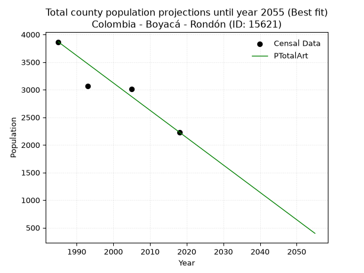
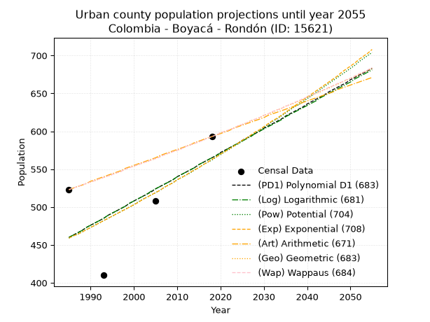
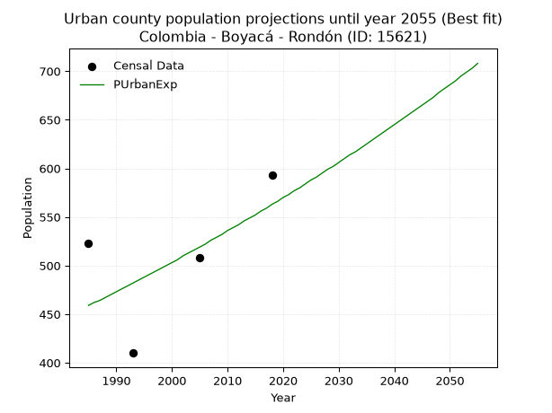
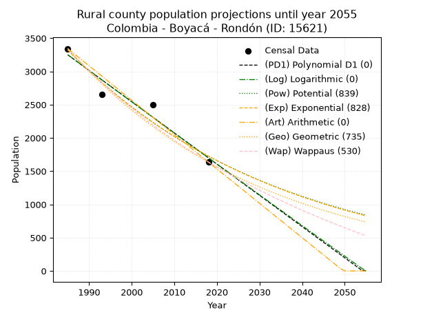
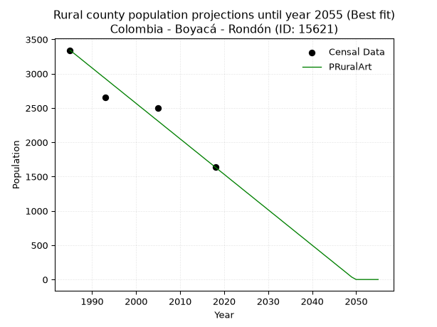

<div align="center">


</div>

# _“Population and Public Services Demand Projections (PPSD) until Year 2050 for Colombia - Boyacá - Rondón (ID: 15621)”_
Keywords: `population` `public-service` `projection` `lineal` `polynomial` `logarithmic` `potential` `exponential` `arithmetic` `geometric` `wappaus` `dane` `colombia` `south-america`

PPSD are analytical estimates used by governments and planners to anticipate future changes in population size, age distribution, and the resulting community needs for utilities, healthcare, education, and infrastructure as sizing future water treatment facilities, electrical grids, and road networks based on spatial growth.

> **General running parameters**: • app_version: _v20260806_. • Python version: _3.14.7_. • Pandas version: _3.0.5_. • NumPy version: _2.5.1_. • Creates, save and include plots into reports (create_plot): _False_. • Projection until year: _2050_. • Process polynomial degree 2 and up: _False_. • Process Wappaus: _True_. • Process Wappaus: _True_. • Set negative values to zero: _True_. • Set infinite values to zero: _True_. • Drop dataset notes: _True_. 
<div align="center">

Dynamic map: [:earth_americas:Google](http://maps.google.com/maps?q=5.357378217,-73.2084738) [:earth_americas:OSM](https://www.openstreetmap.org/#map=18/5.357378217/-73.2084738&layers=P) [:earth_americas:Bing](https://www.bing.com/maps?cp=5.357378217~-73.2084738&lvl=18) [:earth_americas:Apple](https://maps.apple.com/frame?center=5.357378217%2C-73.2084738&span=0.003%2C0.006)

</div>


<div align="center">

```geojson
{
  "type": "Feature",
  "geometry": {
    "type": "Point", 
    "coordinates": [-73.2084738, 5.357378217]
  }, 
  "properties": {
    "Name": "Colombia - Boyacá - Rondón (ID: 15621)"
  }
}
```

</div>


## 0. Census Data (4 records)

Census data are official statistics collected by a government about the people and housing in a country. They usually include counts of total population, age, sex, race, income, education, and jobs.

📅Global census file: [Population.xlsx](../data/Population.xlsx)

| Source   |   Year |   CountryID | CountryName   |   StateID | StateName   |   CountyID | CountyName   |   PTotal |   PUrban |   PRural |
|:---------|-------:|------------:|:--------------|----------:|:------------|-----------:|:-------------|---------:|---------:|---------:|
| DANE     |   1985 |          57 | Colombia      |        15 | Boyacá      |      15621 | Rondón       |     3865 |      523 |     3342 |
| DANE     |   1993 |          57 | Colombia      |        15 | Boyacá      |      15621 | Rondón       |     3060 |      410 |     2650 |
| DANE     |   2005 |          57 | Colombia      |        15 | Boyacá      |      15621 | Rondón       |     3011 |      508 |     2503 |
| DANE     |   2018 |          57 | Colombia      |        15 | Boyacá      |      15621 | Rondón       |     2230 |      593 |     1637 |

> 🔥Some records could had specific notes about the registered values or the corresponding urban or rural distribution.

📅   [RUPS](https://www.datos.gov.co/Hacienda-y-Cr-dito-P-blico/Registro-nico-de-Prestadores-de-Servicios-P-blicos/4qkq-csdn/about_data) - Local public utility companies: [RUPS.csv](../data/RUPS.xlsx)

 | SERVICIO       | ESTADO    | NOMBRE               | NIT         | DEPARTAMENTO_DOMICILIO   | MUNICIPIO_DOMICILIO   | DIRECCION      |   TELEFONO | EMAIL               | TIPO_INSCRIPCION    | REPRESENTANTE_LEGAL        | TIPO_PRESTADOR                 | CLASIFICACION                 |
|:---------------|:----------|:---------------------|:------------|:-------------------------|:----------------------|:---------------|-----------:|:--------------------|:--------------------|:---------------------------|:-------------------------------|:------------------------------|
| ACUEDUCTO      | OPERATIVA | MUNICIPIO  DE RONDON | 891801770-3 | BOYACA                   | RONDON                | Cra 4 No. 4-41 |    7404542 | ROMER7116@GMAIL.COM | Registro por la ESP | SANDRO RODOLFO BORDA ROJAS | MUNICIPIO (PRESTACIÓN DIRECTA) | MENOR O IGUAL A 2500 USUARIOS |
| ALCANTARILLADO | OPERATIVA | MUNICIPIO  DE RONDON | 891801770-3 | BOYACA                   | RONDON                | Cra 4 No. 4-41 |    7404542 | ROMER7116@GMAIL.COM | Registro por la ESP | SANDRO RODOLFO BORDA ROJAS | MUNICIPIO (PRESTACIÓN DIRECTA) | MENOR O IGUAL A 2500 USUARIOS |

## 1. Total

### 1.1. Coefficients and Parameters

* (PD1) Polynomial Deg 1: -43.74387796065788, 90540.19189080593 (lineal)
* (Log) Logarithmic: -87569.7841726787, 668660.1312367405
* (Pow) Potential: -29.74266244334363, 101.65775596047635
* (Exp) Exponential: -0.01486086305032518, 2.4241906491026404e+16
* (Art) Arithmetic: Year diff. 2018 - 1985 = 33, Population diff. 2230 - 3865 = -1635, Annual growth = -49.54545454545455
* (Geo) Geometric: Year diff. 2018 - 1985 = 33, Population diff. 2230 - 3865 = -1635, Annual growth % = -0.01652735696896923
* (Wap) Wappaus: i = -1.625773734059214, Condition values only valid for < 200)

<sub>
Wappaus condition values: ['-0.00', '-1.63', '-3.25', '-4.88', '-6.50', '-8.13', '-9.75', '-11.38', '-13.01', '-14.63', '-16.26', '-17.88', '-19.51', '-21.14', '-22.76', '-24.39', '-26.01', '-27.64', '-29.26', '-30.89', '-32.52', '-34.14', '-35.77', '-37.39', '-39.02', '-40.64', '-42.27', '-43.90', '-45.52', '-47.15', '-48.77', '-50.40', '-52.02', '-53.65', '-55.28', '-56.90', '-58.53', '-60.15', '-61.78', '-63.41', '-65.03', '-66.66', '-68.28', '-69.91', '-71.53', '-73.16', '-74.79', '-76.41', '-78.04', '-79.66', '-81.29', '-82.91', '-84.54', '-86.17', '-87.79', '-89.42', '-91.04', '-92.67', '-94.29', '-95.92', '-97.55', '-99.17', '-100.80', '-102.42', '-104.05', '-105.68']
</sub>


### 1.2. Projected Dataset

|   Year |   CountyID |   PTotalPD1 |   PTotalLog |   PTotalPow |   PTotalExp |   PTotalArt |   PTotalGeo |   PTotalWap |
|-------:|-----------:|------------:|------------:|------------:|------------:|------------:|------------:|------------:|
|   1985 |      15621 |        3709 |        3710 |        3746 |        3745 |        3865 |        3865 |        3865 |
|   1986 |      15621 |        3665 |        3666 |        3690 |        3689 |        3815 |        3801 |        3803 |
|   1987 |      15621 |        3621 |        3622 |        3636 |        3635 |        3766 |        3738 |        3741 |
|   1988 |      15621 |        3577 |        3578 |        3582 |        3581 |        3716 |        3677 |        3681 |
|   1989 |      15621 |        3534 |        3534 |        3528 |        3528 |        3667 |        3616 |        3622 |
|   1990 |      15621 |        3490 |        3490 |        3476 |        3476 |        3617 |        3556 |        3563 |
|   1991 |      15621 |        3446 |        3446 |        3424 |        3425 |        3568 |        3497 |        3506 |
|   1992 |      15621 |        3402 |        3402 |        3374 |        3375 |        3518 |        3439 |        3449 |
|   1993 |      15621 |        3359 |        3358 |        3324 |        3325 |        3469 |        3383 |        3393 |
|   1994 |      15621 |        3315 |        3314 |        3274 |        3276 |        3419 |        3327 |        3338 |
|   1995 |      15621 |        3271 |        3270 |        3226 |        3227 |        3370 |        3272 |        3284 |
|   1996 |      15621 |        3227 |        3226 |        3178 |        3180 |        3320 |        3218 |        3231 |
|   1997 |      15621 |        3184 |        3182 |        3131 |        3133 |        3270 |        3164 |        3178 |
|   1998 |      15621 |        3140 |        3138 |        3085 |        3087 |        3221 |        3112 |        3126 |
|   1999 |      15621 |        3096 |        3095 |        3039 |        3041 |        3171 |        3061 |        3075 |
|   2000 |      15621 |        3052 |        3051 |        2995 |        2996 |        3122 |        3010 |        3025 |
|   2001 |      15621 |        3009 |        3007 |        2950 |        2952 |        3072 |        2960 |        2975 |
|   2002 |      15621 |        2965 |        2963 |        2907 |        2909 |        3023 |        2911 |        2926 |
|   2003 |      15621 |        2921 |        2919 |        2864 |        2866 |        2973 |        2863 |        2878 |
|   2004 |      15621 |        2877 |        2876 |        2822 |        2823 |        2924 |        2816 |        2831 |
|   2005 |      15621 |        2834 |        2832 |        2780 |        2782 |        2874 |        2769 |        2784 |
|   2006 |      15621 |        2790 |        2788 |        2739 |        2741 |        2825 |        2724 |        2738 |
|   2007 |      15621 |        2746 |        2745 |        2699 |        2700 |        2775 |        2679 |        2692 |
|   2008 |      15621 |        2702 |        2701 |        2659 |        2660 |        2725 |        2634 |        2647 |
|   2009 |      15621 |        2659 |        2658 |        2620 |        2621 |        2676 |        2591 |        2603 |
|   2010 |      15621 |        2615 |        2614 |        2582 |        2583 |        2626 |        2548 |        2559 |
|   2011 |      15621 |        2571 |        2570 |        2544 |        2544 |        2577 |        2506 |        2516 |
|   2012 |      15621 |        2528 |        2527 |        2506 |        2507 |        2527 |        2465 |        2474 |
|   2013 |      15621 |        2484 |        2483 |        2470 |        2470 |        2478 |        2424 |        2432 |
|   2014 |      15621 |        2440 |        2440 |        2433 |        2433 |        2428 |        2384 |        2390 |
|   2015 |      15621 |        2396 |        2396 |        2398 |        2398 |        2379 |        2344 |        2349 |
|   2016 |      15621 |        2353 |        2353 |        2363 |        2362 |        2329 |        2306 |        2309 |
|   2017 |      15621 |        2309 |        2310 |        2328 |        2327 |        2280 |        2267 |        2269 |
|   2018 |      15621 |        2265 |        2266 |        2294 |        2293 |        2230 |        2230 |        2230 |
|   2019 |      15621 |        2221 |        2223 |        2260 |        2259 |        2180 |        2193 |        2191 |
|   2020 |      15621 |        2178 |        2179 |        2227 |        2226 |        2131 |        2157 |        2153 |
|   2021 |      15621 |        2134 |        2136 |        2195 |        2193 |        2081 |        2121 |        2115 |
|   2022 |      15621 |        2090 |        2093 |        2163 |        2161 |        2032 |        2086 |        2078 |
|   2023 |      15621 |        2046 |        2049 |        2131 |        2129 |        1982 |        2052 |        2041 |
|   2024 |      15621 |        2003 |        2006 |        2100 |        2097 |        1933 |        2018 |        2004 |
|   2025 |      15621 |        1959 |        1963 |        2070 |        2066 |        1883 |        1984 |        1968 |
|   2026 |      15621 |        1915 |        1920 |        2039 |        2036 |        1834 |        1952 |        1933 |
|   2027 |      15621 |        1871 |        1876 |        2010 |        2006 |        1784 |        1919 |        1898 |
|   2028 |      15621 |        1828 |        1833 |        1980 |        1976 |        1735 |        1888 |        1863 |
|   2029 |      15621 |        1784 |        1790 |        1952 |        1947 |        1685 |        1856 |        1829 |
|   2030 |      15621 |        1740 |        1747 |        1923 |        1919 |        1635 |        1826 |        1795 |
|   2031 |      15621 |        1696 |        1704 |        1895 |        1890 |        1586 |        1796 |        1761 |
|   2032 |      15621 |        1653 |        1661 |        1868 |        1862 |        1536 |        1766 |        1728 |
|   2033 |      15621 |        1609 |        1618 |        1841 |        1835 |        1487 |        1737 |        1695 |
|   2034 |      15621 |        1565 |        1575 |        1814 |        1808 |        1437 |        1708 |        1663 |
|   2035 |      15621 |        1521 |        1532 |        1787 |        1781 |        1388 |        1680 |        1631 |
|   2036 |      15621 |        1478 |        1489 |        1762 |        1755 |        1338 |        1652 |        1600 |
|   2037 |      15621 |        1434 |        1446 |        1736 |        1729 |        1289 |        1625 |        1568 |
|   2038 |      15621 |        1390 |        1403 |        1711 |        1703 |        1239 |        1598 |        1537 |
|   2039 |      15621 |        1346 |        1360 |        1686 |        1678 |        1190 |        1571 |        1507 |
|   2040 |      15621 |        1303 |        1317 |        1662 |        1654 |        1140 |        1546 |        1477 |
|   2041 |      15621 |        1259 |        1274 |        1638 |        1629 |        1090 |        1520 |        1447 |
|   2042 |      15621 |        1215 |        1231 |        1614 |        1605 |        1041 |        1495 |        1417 |
|   2043 |      15621 |        1171 |        1188 |        1591 |        1581 |         991 |        1470 |        1388 |
|   2044 |      15621 |        1128 |        1145 |        1568 |        1558 |         942 |        1446 |        1359 |
|   2045 |      15621 |        1084 |        1102 |        1545 |        1535 |         892 |        1422 |        1331 |
|   2046 |      15621 |        1040 |        1059 |        1523 |        1513 |         843 |        1398 |        1303 |
|   2047 |      15621 |         996 |        1017 |        1501 |        1490 |         793 |        1375 |        1275 |
|   2048 |      15621 |         953 |         974 |        1479 |        1468 |         744 |        1353 |        1247 |
|   2049 |      15621 |         909 |         931 |        1458 |        1447 |         694 |        1330 |        1220 |
|   2050 |      15621 |         865 |         888 |        1437 |        1425 |         645 |        1308 |        1193 |
<div align="center">

</img>

</div>


### 1.3. Best fit with absolute and relative error (%)

Relative error puts that difference into context by dividing the absolute error by the true value, creating a unitless ratio or percentage that shows the scale of the mistake.

Absolute and relative error

|   Year | Source   |   CountryID | CountryName   |   StateID | StateName   |   CountyID_x | CountyName   |   PTotal |   PUrban |   PRural |   CountyID_y |   PTotalPD1 |   PTotalLog |   PTotalPow |   PTotalExp |   PTotalArt |   PTotalGeo |   PTotalWap |   PTotalPD1AbsError |   PTotalLogAbsError |   PTotalPowAbsError |   PTotalExpAbsError |   PTotalArtAbsError |   PTotalGeoAbsError |   PTotalWapAbsError |   PTotalPD1RelError |   PTotalLogRelError |   PTotalPowRelError |   PTotalExpRelError |   PTotalArtRelError |   PTotalGeoRelError |   PTotalWapRelError |
|-------:|:---------|------------:|:--------------|----------:|:------------|-------------:|:-------------|---------:|---------:|---------:|-------------:|------------:|------------:|------------:|------------:|------------:|------------:|------------:|--------------------:|--------------------:|--------------------:|--------------------:|--------------------:|--------------------:|--------------------:|--------------------:|--------------------:|--------------------:|--------------------:|--------------------:|--------------------:|--------------------:|
|   1985 | DANE     |          57 | Colombia      |        15 | Boyacá      |        15621 | Rondón       |     3865 |      523 |     3342 |        15621 |        3709 |        3710 |        3746 |        3745 |        3865 |        3865 |        3865 |                 156 |                 155 |                 119 |                 120 |                   0 |                   0 |                   0 |             4.03622 |             4.01035 |             3.07891 |             3.10479 |             0       |              0      |             0       |
|   1993 | DANE     |          57 | Colombia      |        15 | Boyacá      |        15621 | Rondón       |     3060 |      410 |     2650 |        15621 |        3359 |        3358 |        3324 |        3325 |        3469 |        3383 |        3393 |                 299 |                 298 |                 264 |                 265 |                 409 |                 323 |                 333 |             9.77124 |             9.73856 |             8.62745 |             8.66013 |            13.366   |             10.5556 |            10.8824  |
|   2005 | DANE     |          57 | Colombia      |        15 | Boyacá      |        15621 | Rondón       |     3011 |      508 |     2503 |        15621 |        2834 |        2832 |        2780 |        2782 |        2874 |        2769 |        2784 |                 177 |                 179 |                 231 |                 229 |                 137 |                 242 |                 227 |             5.87845 |             5.94487 |             7.67187 |             7.60545 |             4.54998 |              8.0372 |             7.53902 |
|   2018 | DANE     |          57 | Colombia      |        15 | Boyacá      |        15621 | Rondón       |     2230 |      593 |     1637 |        15621 |        2265 |        2266 |        2294 |        2293 |        2230 |        2230 |        2230 |                  35 |                  36 |                  64 |                  63 |                   0 |                   0 |                   0 |             1.56951 |             1.61435 |             2.86996 |             2.82511 |             0       |              0      |             0       |

Relative error mean

| Method    |   RelError | Best   |
|:----------|-----------:|:-------|
| PTotalPD1 |    5.31385 |        |
| PTotalLog |    5.32703 |        |
| PTotalPow |    5.56205 |        |
| PTotalExp |    5.54887 |        |
| PTotalArt |    4.479   | True   |
| PTotalGeo |    4.64819 |        |
| PTotalWap |    4.60534 |        |

💙Best method: _**PTotalArt**_
<div align="center">

</img>

</div>


### 1.4. Fresh water supply demand in liters per capita per day (lpcd)

The fresh water supply demand typically ranges from 100 to 300 liters per capita per day (lpcd) for standard domestic and municipal planning, though absolute survival minimums set by the World Health Organization are as low as 7.5 to 20 liters per day, and total consumption in high-income nations can exceed 400 liters.

> `CZ`: Level in meters above the sea level (masl)<br> `WS`: Fresh water supply demand in liters per capita per day (lpcd or l/h/d)<br> `WSAll`: Zonal fresh water supply demand in liters per second (l/s)<br> `A`: Zonal area in square meters<br> `DP`: Population density (people/hectare or p/ha)

Reference values (RAS Colombia)

|    CZ |   WS |
|------:|-----:|
|  1000 |  120 |
|  2000 |  130 |
| 99999 |  140 |

County shapefile geometry properties and water supply values

|   CountyID |      ATotal |   CZTotal |   WSTotal |
|-----------:|------------:|----------:|----------:|
|      15621 | 2.05987e+08 |   2579.34 |       140 |

Projected values for best method: PTotalArt

|   CountyID |   Year |   PTotalArt |   DPTotal |   WSTotal |   WSTotalAll |
|-----------:|-------:|------------:|----------:|----------:|-------------:|
|      15621 |   1985 |        3865 |      0.19 |       140 |      6.26273 |
|      15621 |   1986 |        3815 |      0.19 |       140 |      6.18171 |
|      15621 |   1987 |        3766 |      0.18 |       140 |      6.10231 |
|      15621 |   1988 |        3716 |      0.18 |       140 |      6.0213  |
|      15621 |   1989 |        3667 |      0.18 |       140 |      5.9419  |
|      15621 |   1990 |        3617 |      0.18 |       140 |      5.86088 |
|      15621 |   1991 |        3568 |      0.17 |       140 |      5.78148 |
|      15621 |   1992 |        3518 |      0.17 |       140 |      5.70046 |
|      15621 |   1993 |        3469 |      0.17 |       140 |      5.62106 |
|      15621 |   1994 |        3419 |      0.17 |       140 |      5.54005 |
|      15621 |   1995 |        3370 |      0.16 |       140 |      5.46065 |
|      15621 |   1996 |        3320 |      0.16 |       140 |      5.37963 |
|      15621 |   1997 |        3270 |      0.16 |       140 |      5.29861 |
|      15621 |   1998 |        3221 |      0.16 |       140 |      5.21921 |
|      15621 |   1999 |        3171 |      0.15 |       140 |      5.13819 |
|      15621 |   2000 |        3122 |      0.15 |       140 |      5.0588  |
|      15621 |   2001 |        3072 |      0.15 |       140 |      4.97778 |
|      15621 |   2002 |        3023 |      0.15 |       140 |      4.89838 |
|      15621 |   2003 |        2973 |      0.14 |       140 |      4.81736 |
|      15621 |   2004 |        2924 |      0.14 |       140 |      4.73796 |
|      15621 |   2005 |        2874 |      0.14 |       140 |      4.65694 |
|      15621 |   2006 |        2825 |      0.14 |       140 |      4.57755 |
|      15621 |   2007 |        2775 |      0.13 |       140 |      4.49653 |
|      15621 |   2008 |        2725 |      0.13 |       140 |      4.41551 |
|      15621 |   2009 |        2676 |      0.13 |       140 |      4.33611 |
|      15621 |   2010 |        2626 |      0.13 |       140 |      4.25509 |
|      15621 |   2011 |        2577 |      0.13 |       140 |      4.17569 |
|      15621 |   2012 |        2527 |      0.12 |       140 |      4.09468 |
|      15621 |   2013 |        2478 |      0.12 |       140 |      4.01528 |
|      15621 |   2014 |        2428 |      0.12 |       140 |      3.93426 |
|      15621 |   2015 |        2379 |      0.12 |       140 |      3.85486 |
|      15621 |   2016 |        2329 |      0.11 |       140 |      3.77384 |
|      15621 |   2017 |        2280 |      0.11 |       140 |      3.69444 |
|      15621 |   2018 |        2230 |      0.11 |       140 |      3.61343 |
|      15621 |   2019 |        2180 |      0.11 |       140 |      3.53241 |
|      15621 |   2020 |        2131 |      0.1  |       140 |      3.45301 |
|      15621 |   2021 |        2081 |      0.1  |       140 |      3.37199 |
|      15621 |   2022 |        2032 |      0.1  |       140 |      3.29259 |
|      15621 |   2023 |        1982 |      0.1  |       140 |      3.21157 |
|      15621 |   2024 |        1933 |      0.09 |       140 |      3.13218 |
|      15621 |   2025 |        1883 |      0.09 |       140 |      3.05116 |
|      15621 |   2026 |        1834 |      0.09 |       140 |      2.97176 |
|      15621 |   2027 |        1784 |      0.09 |       140 |      2.89074 |
|      15621 |   2028 |        1735 |      0.08 |       140 |      2.81134 |
|      15621 |   2029 |        1685 |      0.08 |       140 |      2.73032 |
|      15621 |   2030 |        1635 |      0.08 |       140 |      2.64931 |
|      15621 |   2031 |        1586 |      0.08 |       140 |      2.56991 |
|      15621 |   2032 |        1536 |      0.07 |       140 |      2.48889 |
|      15621 |   2033 |        1487 |      0.07 |       140 |      2.40949 |
|      15621 |   2034 |        1437 |      0.07 |       140 |      2.32847 |
|      15621 |   2035 |        1388 |      0.07 |       140 |      2.24907 |
|      15621 |   2036 |        1338 |      0.06 |       140 |      2.16806 |
|      15621 |   2037 |        1289 |      0.06 |       140 |      2.08866 |
|      15621 |   2038 |        1239 |      0.06 |       140 |      2.00764 |
|      15621 |   2039 |        1190 |      0.06 |       140 |      1.92824 |
|      15621 |   2040 |        1140 |      0.06 |       140 |      1.84722 |
|      15621 |   2041 |        1090 |      0.05 |       140 |      1.7662  |
|      15621 |   2042 |        1041 |      0.05 |       140 |      1.68681 |
|      15621 |   2043 |         991 |      0.05 |       140 |      1.60579 |
|      15621 |   2044 |         942 |      0.05 |       140 |      1.52639 |
|      15621 |   2045 |         892 |      0.04 |       140 |      1.44537 |
|      15621 |   2046 |         843 |      0.04 |       140 |      1.36597 |
|      15621 |   2047 |         793 |      0.04 |       140 |      1.28495 |
|      15621 |   2048 |         744 |      0.04 |       140 |      1.20556 |
|      15621 |   2049 |         694 |      0.03 |       140 |      1.12454 |
|      15621 |   2050 |         645 |      0.03 |       140 |      1.04514 |

## 2. Urban

### 2.1. Coefficients and Parameters

* (PD1) Polynomial Deg 1: 3.1963067041348254, -5884.912484945684 (lineal)
* (Log) Logarithmic: 6382.39138684833, -48004.10807670889
* (Pow) Potential: 12.363955891926476, -38.11180505879337
* (Exp) Exponential: 0.006192261298119976, 0.0021054689785972663
* (Art) Arithmetic: Year diff. 2018 - 1985 = 33, Population diff. 593 - 523 = 70, Annual growth = 2.121212121212121
* (Geo) Geometric: Year diff. 2018 - 1985 = 33, Population diff. 593 - 523 = 70, Annual growth % = 0.003813706315073162
* (Wap) Wappaus: i = 0.38014554143586404, Condition values only valid for < 200)

<sub>
Wappaus condition values: ['0.00', '0.38', '0.76', '1.14', '1.52', '1.90', '2.28', '2.66', '3.04', '3.42', '3.80', '4.18', '4.56', '4.94', '5.32', '5.70', '6.08', '6.46', '6.84', '7.22', '7.60', '7.98', '8.36', '8.74', '9.12', '9.50', '9.88', '10.26', '10.64', '11.02', '11.40', '11.78', '12.16', '12.54', '12.92', '13.31', '13.69', '14.07', '14.45', '14.83', '15.21', '15.59', '15.97', '16.35', '16.73', '17.11', '17.49', '17.87', '18.25', '18.63', '19.01', '19.39', '19.77', '20.15', '20.53', '20.91', '21.29', '21.67', '22.05', '22.43', '22.81', '23.19', '23.57', '23.95', '24.33', '24.71']
</sub>


### 2.2. Projected Dataset

|   Year |   CountyID |   PUrbanPD1 |   PUrbanLog |   PUrbanPow |   PUrbanExp |   PUrbanArt |   PUrbanGeo |   PUrbanWap |
|-------:|-----------:|------------:|------------:|------------:|------------:|------------:|------------:|------------:|
|   1985 |      15621 |         460 |         460 |         459 |         459 |         523 |         523 |         523 |
|   1986 |      15621 |         463 |         463 |         462 |         462 |         525 |         525 |         525 |
|   1987 |      15621 |         466 |         466 |         464 |         464 |         527 |         527 |         527 |
|   1988 |      15621 |         469 |         469 |         467 |         467 |         529 |         529 |         529 |
|   1989 |      15621 |         473 |         473 |         470 |         470 |         531 |         531 |         531 |
|   1990 |      15621 |         476 |         476 |         473 |         473 |         534 |         533 |         533 |
|   1991 |      15621 |         479 |         479 |         476 |         476 |         536 |         535 |         535 |
|   1992 |      15621 |         482 |         482 |         479 |         479 |         538 |         537 |         537 |
|   1993 |      15621 |         485 |         485 |         482 |         482 |         540 |         539 |         539 |
|   1994 |      15621 |         489 |         489 |         485 |         485 |         542 |         541 |         541 |
|   1995 |      15621 |         492 |         492 |         488 |         488 |         544 |         543 |         543 |
|   1996 |      15621 |         495 |         495 |         491 |         491 |         546 |         545 |         545 |
|   1997 |      15621 |         498 |         498 |         494 |         494 |         548 |         547 |         547 |
|   1998 |      15621 |         501 |         501 |         497 |         497 |         551 |         550 |         550 |
|   1999 |      15621 |         505 |         505 |         500 |         500 |         553 |         552 |         552 |
|   2000 |      15621 |         508 |         508 |         503 |         503 |         555 |         554 |         554 |
|   2001 |      15621 |         511 |         511 |         507 |         506 |         557 |         556 |         556 |
|   2002 |      15621 |         514 |         514 |         510 |         510 |         559 |         558 |         558 |
|   2003 |      15621 |         517 |         517 |         513 |         513 |         561 |         560 |         560 |
|   2004 |      15621 |         520 |         521 |         516 |         516 |         563 |         562 |         562 |
|   2005 |      15621 |         524 |         524 |         519 |         519 |         565 |         564 |         564 |
|   2006 |      15621 |         527 |         527 |         522 |         522 |         568 |         567 |         566 |
|   2007 |      15621 |         530 |         530 |         526 |         526 |         570 |         569 |         569 |
|   2008 |      15621 |         533 |         533 |         529 |         529 |         572 |         571 |         571 |
|   2009 |      15621 |         536 |         536 |         532 |         532 |         574 |         573 |         573 |
|   2010 |      15621 |         540 |         540 |         536 |         536 |         576 |         575 |         575 |
|   2011 |      15621 |         543 |         543 |         539 |         539 |         578 |         577 |         577 |
|   2012 |      15621 |         546 |         546 |         542 |         542 |         580 |         580 |         580 |
|   2013 |      15621 |         549 |         549 |         545 |         546 |         582 |         582 |         582 |
|   2014 |      15621 |         552 |         552 |         549 |         549 |         585 |         584 |         584 |
|   2015 |      15621 |         556 |         556 |         552 |         552 |         587 |         586 |         586 |
|   2016 |      15621 |         559 |         559 |         556 |         556 |         589 |         589 |         588 |
|   2017 |      15621 |         562 |         562 |         559 |         559 |         591 |         591 |         591 |
|   2018 |      15621 |         565 |         565 |         562 |         563 |         593 |         593 |         593 |
|   2019 |      15621 |         568 |         568 |         566 |         566 |         595 |         595 |         595 |
|   2020 |      15621 |         572 |         571 |         569 |         570 |         597 |         598 |         598 |
|   2021 |      15621 |         575 |         574 |         573 |         573 |         599 |         600 |         600 |
|   2022 |      15621 |         578 |         578 |         576 |         577 |         601 |         602 |         602 |
|   2023 |      15621 |         581 |         581 |         580 |         580 |         604 |         604 |         604 |
|   2024 |      15621 |         584 |         584 |         583 |         584 |         606 |         607 |         607 |
|   2025 |      15621 |         588 |         587 |         587 |         588 |         608 |         609 |         609 |
|   2026 |      15621 |         591 |         590 |         591 |         591 |         610 |         611 |         611 |
|   2027 |      15621 |         594 |         593 |         594 |         595 |         612 |         614 |         614 |
|   2028 |      15621 |         597 |         597 |         598 |         599 |         614 |         616 |         616 |
|   2029 |      15621 |         600 |         600 |         602 |         602 |         616 |         618 |         618 |
|   2030 |      15621 |         604 |         603 |         605 |         606 |         618 |         621 |         621 |
|   2031 |      15621 |         607 |         606 |         609 |         610 |         621 |         623 |         623 |
|   2032 |      15621 |         610 |         609 |         613 |         614 |         623 |         625 |         626 |
|   2033 |      15621 |         613 |         612 |         616 |         617 |         625 |         628 |         628 |
|   2034 |      15621 |         616 |         615 |         620 |         621 |         627 |         630 |         630 |
|   2035 |      15621 |         620 |         619 |         624 |         625 |         629 |         633 |         633 |
|   2036 |      15621 |         623 |         622 |         628 |         629 |         631 |         635 |         635 |
|   2037 |      15621 |         626 |         625 |         632 |         633 |         633 |         637 |         638 |
|   2038 |      15621 |         629 |         628 |         635 |         637 |         635 |         640 |         640 |
|   2039 |      15621 |         632 |         631 |         639 |         641 |         638 |         642 |         643 |
|   2040 |      15621 |         636 |         634 |         643 |         645 |         640 |         645 |         645 |
|   2041 |      15621 |         639 |         637 |         647 |         649 |         642 |         647 |         648 |
|   2042 |      15621 |         642 |         640 |         651 |         653 |         644 |         650 |         650 |
|   2043 |      15621 |         645 |         644 |         655 |         657 |         646 |         652 |         653 |
|   2044 |      15621 |         648 |         647 |         659 |         661 |         648 |         655 |         655 |
|   2045 |      15621 |         652 |         650 |         663 |         665 |         650 |         657 |         658 |
|   2046 |      15621 |         655 |         653 |         667 |         669 |         652 |         660 |         660 |
|   2047 |      15621 |         658 |         656 |         671 |         673 |         655 |         662 |         663 |
|   2048 |      15621 |         661 |         659 |         675 |         678 |         657 |         665 |         665 |
|   2049 |      15621 |         664 |         662 |         679 |         682 |         659 |         667 |         668 |
|   2050 |      15621 |         668 |         665 |         683 |         686 |         661 |         670 |         670 |
<div align="center">

</img>

</div>


### 2.3. Best fit with absolute and relative error (%)

Relative error puts that difference into context by dividing the absolute error by the true value, creating a unitless ratio or percentage that shows the scale of the mistake.

Absolute and relative error

|   Year | Source   |   CountryID | CountryName   |   StateID | StateName   |   CountyID_x | CountyName   |   PTotal |   PUrban |   PRural |   CountyID_y |   PUrbanPD1 |   PUrbanLog |   PUrbanPow |   PUrbanExp |   PUrbanArt |   PUrbanGeo |   PUrbanWap |   PUrbanPD1AbsError |   PUrbanLogAbsError |   PUrbanPowAbsError |   PUrbanExpAbsError |   PUrbanArtAbsError |   PUrbanGeoAbsError |   PUrbanWapAbsError |   PUrbanPD1RelError |   PUrbanLogRelError |   PUrbanPowRelError |   PUrbanExpRelError |   PUrbanArtRelError |   PUrbanGeoRelError |   PUrbanWapRelError |
|-------:|:---------|------------:|:--------------|----------:|:------------|-------------:|:-------------|---------:|---------:|---------:|-------------:|------------:|------------:|------------:|------------:|------------:|------------:|------------:|--------------------:|--------------------:|--------------------:|--------------------:|--------------------:|--------------------:|--------------------:|--------------------:|--------------------:|--------------------:|--------------------:|--------------------:|--------------------:|--------------------:|
|   1985 | DANE     |          57 | Colombia      |        15 | Boyacá      |        15621 | Rondón       |     3865 |      523 |     3342 |        15621 |         460 |         460 |         459 |         459 |         523 |         523 |         523 |                  63 |                  63 |                  64 |                  64 |                   0 |                   0 |                   0 |            12.0459  |            12.0459  |            12.2371  |            12.2371  |              0      |              0      |              0      |
|   1993 | DANE     |          57 | Colombia      |        15 | Boyacá      |        15621 | Rondón       |     3060 |      410 |     2650 |        15621 |         485 |         485 |         482 |         482 |         540 |         539 |         539 |                  75 |                  75 |                  72 |                  72 |                 130 |                 129 |                 129 |            18.2927  |            18.2927  |            17.561   |            17.561   |             31.7073 |             31.4634 |             31.4634 |
|   2005 | DANE     |          57 | Colombia      |        15 | Boyacá      |        15621 | Rondón       |     3011 |      508 |     2503 |        15621 |         524 |         524 |         519 |         519 |         565 |         564 |         564 |                  16 |                  16 |                  11 |                  11 |                  57 |                  56 |                  56 |             3.14961 |             3.14961 |             2.16535 |             2.16535 |             11.2205 |             11.0236 |             11.0236 |
|   2018 | DANE     |          57 | Colombia      |        15 | Boyacá      |        15621 | Rondón       |     2230 |      593 |     1637 |        15621 |         565 |         565 |         562 |         563 |         593 |         593 |         593 |                  28 |                  28 |                  31 |                  30 |                   0 |                   0 |                   0 |             4.72175 |             4.72175 |             5.22766 |             5.05902 |              0      |              0      |              0      |

Relative error mean

| Method    |   RelError | Best   |
|:----------|-----------:|:-------|
| PUrbanPD1 |    9.55248 |        |
| PUrbanLog |    9.55248 |        |
| PUrbanPow |    9.29777 |        |
| PUrbanExp |    9.25561 | True   |
| PUrbanArt |   10.7319  |        |
| PUrbanGeo |   10.6218  |        |
| PUrbanWap |   10.6218  |        |

💙Best method: _**PUrbanExp**_
<div align="center">

</img>

</div>


### 2.4. Fresh water supply demand in liters per capita per day (lpcd)

The fresh water supply demand typically ranges from 100 to 300 liters per capita per day (lpcd) for standard domestic and municipal planning, though absolute survival minimums set by the World Health Organization are as low as 7.5 to 20 liters per day, and total consumption in high-income nations can exceed 400 liters.

> `CZ`: Level in meters above the sea level (masl)<br> `WS`: Fresh water supply demand in liters per capita per day (lpcd or l/h/d)<br> `WSAll`: Zonal fresh water supply demand in liters per second (l/s)<br> `A`: Zonal area in square meters<br> `DP`: Population density (people/hectare or p/ha)

Reference values (RAS Colombia)

|    CZ |   WS |
|------:|-----:|
|  1000 |  120 |
|  2000 |  130 |
| 99999 |  140 |

County shapefile geometry properties and water supply values

|   CountyID |   AUrban |   CZUrban |   WSUrban |
|-----------:|---------:|----------:|----------:|
|      15621 |   175362 |   2092.84 |       140 |

Projected values for best method: PUrbanExp

|   CountyID |   Year |   PUrbanExp |   DPUrban |   WSUrban |   WSUrbanAll |
|-----------:|-------:|------------:|----------:|----------:|-------------:|
|      15621 |   1985 |         459 |     26.17 |       140 |     0.74375  |
|      15621 |   1986 |         462 |     26.35 |       140 |     0.748611 |
|      15621 |   1987 |         464 |     26.46 |       140 |     0.751852 |
|      15621 |   1988 |         467 |     26.63 |       140 |     0.756713 |
|      15621 |   1989 |         470 |     26.8  |       140 |     0.761574 |
|      15621 |   1990 |         473 |     26.97 |       140 |     0.766435 |
|      15621 |   1991 |         476 |     27.14 |       140 |     0.771296 |
|      15621 |   1992 |         479 |     27.31 |       140 |     0.776157 |
|      15621 |   1993 |         482 |     27.49 |       140 |     0.781019 |
|      15621 |   1994 |         485 |     27.66 |       140 |     0.78588  |
|      15621 |   1995 |         488 |     27.83 |       140 |     0.790741 |
|      15621 |   1996 |         491 |     28    |       140 |     0.795602 |
|      15621 |   1997 |         494 |     28.17 |       140 |     0.800463 |
|      15621 |   1998 |         497 |     28.34 |       140 |     0.805324 |
|      15621 |   1999 |         500 |     28.51 |       140 |     0.810185 |
|      15621 |   2000 |         503 |     28.68 |       140 |     0.815046 |
|      15621 |   2001 |         506 |     28.85 |       140 |     0.819907 |
|      15621 |   2002 |         510 |     29.08 |       140 |     0.826389 |
|      15621 |   2003 |         513 |     29.25 |       140 |     0.83125  |
|      15621 |   2004 |         516 |     29.42 |       140 |     0.836111 |
|      15621 |   2005 |         519 |     29.6  |       140 |     0.840972 |
|      15621 |   2006 |         522 |     29.77 |       140 |     0.845833 |
|      15621 |   2007 |         526 |     30    |       140 |     0.852315 |
|      15621 |   2008 |         529 |     30.17 |       140 |     0.857176 |
|      15621 |   2009 |         532 |     30.34 |       140 |     0.862037 |
|      15621 |   2010 |         536 |     30.57 |       140 |     0.868519 |
|      15621 |   2011 |         539 |     30.74 |       140 |     0.87338  |
|      15621 |   2012 |         542 |     30.91 |       140 |     0.878241 |
|      15621 |   2013 |         546 |     31.14 |       140 |     0.884722 |
|      15621 |   2014 |         549 |     31.31 |       140 |     0.889583 |
|      15621 |   2015 |         552 |     31.48 |       140 |     0.894444 |
|      15621 |   2016 |         556 |     31.71 |       140 |     0.900926 |
|      15621 |   2017 |         559 |     31.88 |       140 |     0.905787 |
|      15621 |   2018 |         563 |     32.1  |       140 |     0.912269 |
|      15621 |   2019 |         566 |     32.28 |       140 |     0.91713  |
|      15621 |   2020 |         570 |     32.5  |       140 |     0.923611 |
|      15621 |   2021 |         573 |     32.68 |       140 |     0.928472 |
|      15621 |   2022 |         577 |     32.9  |       140 |     0.934954 |
|      15621 |   2023 |         580 |     33.07 |       140 |     0.939815 |
|      15621 |   2024 |         584 |     33.3  |       140 |     0.946296 |
|      15621 |   2025 |         588 |     33.53 |       140 |     0.952778 |
|      15621 |   2026 |         591 |     33.7  |       140 |     0.957639 |
|      15621 |   2027 |         595 |     33.93 |       140 |     0.96412  |
|      15621 |   2028 |         599 |     34.16 |       140 |     0.970602 |
|      15621 |   2029 |         602 |     34.33 |       140 |     0.975463 |
|      15621 |   2030 |         606 |     34.56 |       140 |     0.981944 |
|      15621 |   2031 |         610 |     34.79 |       140 |     0.988426 |
|      15621 |   2032 |         614 |     35.01 |       140 |     0.994907 |
|      15621 |   2033 |         617 |     35.18 |       140 |     0.999769 |
|      15621 |   2034 |         621 |     35.41 |       140 |     1.00625  |
|      15621 |   2035 |         625 |     35.64 |       140 |     1.01273  |
|      15621 |   2036 |         629 |     35.87 |       140 |     1.01921  |
|      15621 |   2037 |         633 |     36.1  |       140 |     1.02569  |
|      15621 |   2038 |         637 |     36.32 |       140 |     1.03218  |
|      15621 |   2039 |         641 |     36.55 |       140 |     1.03866  |
|      15621 |   2040 |         645 |     36.78 |       140 |     1.04514  |
|      15621 |   2041 |         649 |     37.01 |       140 |     1.05162  |
|      15621 |   2042 |         653 |     37.24 |       140 |     1.0581   |
|      15621 |   2043 |         657 |     37.47 |       140 |     1.06458  |
|      15621 |   2044 |         661 |     37.69 |       140 |     1.07106  |
|      15621 |   2045 |         665 |     37.92 |       140 |     1.07755  |
|      15621 |   2046 |         669 |     38.15 |       140 |     1.08403  |
|      15621 |   2047 |         673 |     38.38 |       140 |     1.09051  |
|      15621 |   2048 |         678 |     38.66 |       140 |     1.09861  |
|      15621 |   2049 |         682 |     38.89 |       140 |     1.10509  |
|      15621 |   2050 |         686 |     39.12 |       140 |     1.11157  |

## 3. Rural

### 3.1. Coefficients and Parameters

* (PD1) Polynomial Deg 1: -46.94018466479267, 96425.10437575154 (lineal)
* (Log) Logarithmic: -93952.17555952701, 716664.2393134491
* (Pow) Potential: -39.71190731123768, 134.4819581349588
* (Exp) Exponential: -0.01984633415429484, 4.269746280899125e+20
* (Art) Arithmetic: Year diff. 2018 - 1985 = 33, Population diff. 1637 - 3342 = -1705, Annual growth = -51.666666666666664
* (Geo) Geometric: Year diff. 2018 - 1985 = 33, Population diff. 1637 - 3342 = -1705, Annual growth % = -0.02139520270093931
* (Wap) Wappaus: i = -2.075383276427663, Condition values only valid for < 200)

<sub>
Wappaus condition values: ['-0.00', '-2.08', '-4.15', '-6.23', '-8.30', '-10.38', '-12.45', '-14.53', '-16.60', '-18.68', '-20.75', '-22.83', '-24.90', '-26.98', '-29.06', '-31.13', '-33.21', '-35.28', '-37.36', '-39.43', '-41.51', '-43.58', '-45.66', '-47.73', '-49.81', '-51.88', '-53.96', '-56.04', '-58.11', '-60.19', '-62.26', '-64.34', '-66.41', '-68.49', '-70.56', '-72.64', '-74.71', '-76.79', '-78.86', '-80.94', '-83.02', '-85.09', '-87.17', '-89.24', '-91.32', '-93.39', '-95.47', '-97.54', '-99.62', '-101.69', '-103.77', '-105.84', '-107.92', '-110.00', '-112.07', '-114.15', '-116.22', '-118.30', '-120.37', '-122.45', '-124.52', '-126.60', '-128.67', '-130.75', '-132.82', '-134.90']
</sub>


### 3.2. Projected Dataset

|   Year |   CountyID |   PRuralPD1 |   PRuralLog |   PRuralPow |   PRuralExp |   PRuralArt |   PRuralGeo |   PRuralWap |
|-------:|-----------:|------------:|------------:|------------:|------------:|------------:|------------:|------------:|
|   1985 |      15621 |        3249 |        3250 |        3324 |        3322 |        3342 |        3342 |        3342 |
|   1986 |      15621 |        3202 |        3203 |        3258 |        3257 |        3290 |        3270 |        3273 |
|   1987 |      15621 |        3155 |        3156 |        3193 |        3193 |        3239 |        3201 |        3206 |
|   1988 |      15621 |        3108 |        3108 |        3130 |        3130 |        3187 |        3132 |        3140 |
|   1989 |      15621 |        3061 |        3061 |        3068 |        3068 |        3135 |        3065 |        3076 |
|   1990 |      15621 |        3014 |        3014 |        3008 |        3008 |        3084 |        2999 |        3012 |
|   1991 |      15621 |        2967 |        2967 |        2948 |        2949 |        3032 |        2935 |        2950 |
|   1992 |      15621 |        2920 |        2919 |        2890 |        2891 |        2980 |        2872 |        2889 |
|   1993 |      15621 |        2873 |        2872 |        2833 |        2834 |        2929 |        2811 |        2830 |
|   1994 |      15621 |        2826 |        2825 |        2777 |        2778 |        2877 |        2751 |        2771 |
|   1995 |      15621 |        2779 |        2778 |        2722 |        2724 |        2825 |        2692 |        2714 |
|   1996 |      15621 |        2732 |        2731 |        2669 |        2670 |        2774 |        2634 |        2657 |
|   1997 |      15621 |        2686 |        2684 |        2616 |        2618 |        2722 |        2578 |        2602 |
|   1998 |      15621 |        2639 |        2637 |        2565 |        2566 |        2670 |        2523 |        2548 |
|   1999 |      15621 |        2592 |        2590 |        2514 |        2516 |        2619 |        2469 |        2494 |
|   2000 |      15621 |        2545 |        2543 |        2465 |        2467 |        2567 |        2416 |        2442 |
|   2001 |      15621 |        2498 |        2496 |        2416 |        2418 |        2515 |        2364 |        2390 |
|   2002 |      15621 |        2451 |        2449 |        2369 |        2371 |        2464 |        2314 |        2340 |
|   2003 |      15621 |        2404 |        2402 |        2322 |        2324 |        2412 |        2264 |        2290 |
|   2004 |      15621 |        2357 |        2355 |        2277 |        2278 |        2360 |        2216 |        2241 |
|   2005 |      15621 |        2310 |        2308 |        2232 |        2234 |        2309 |        2168 |        2193 |
|   2006 |      15621 |        2263 |        2261 |        2188 |        2190 |        2257 |        2122 |        2146 |
|   2007 |      15621 |        2216 |        2215 |        2145 |        2147 |        2205 |        2077 |        2100 |
|   2008 |      15621 |        2169 |        2168 |        2103 |        2104 |        2154 |        2032 |        2054 |
|   2009 |      15621 |        2122 |        2121 |        2062 |        2063 |        2102 |        1989 |        2009 |
|   2010 |      15621 |        2075 |        2074 |        2022 |        2023 |        2050 |        1946 |        1965 |
|   2011 |      15621 |        2028 |        2028 |        1982 |        1983 |        1999 |        1905 |        1922 |
|   2012 |      15621 |        1981 |        1981 |        1944 |        1944 |        1947 |        1864 |        1879 |
|   2013 |      15621 |        1935 |        1934 |        1906 |        1906 |        1895 |        1824 |        1837 |
|   2014 |      15621 |        1888 |        1888 |        1868 |        1868 |        1844 |        1785 |        1796 |
|   2015 |      15621 |        1841 |        1841 |        1832 |        1832 |        1792 |        1747 |        1755 |
|   2016 |      15621 |        1794 |        1794 |        1796 |        1796 |        1740 |        1709 |        1715 |
|   2017 |      15621 |        1747 |        1748 |        1761 |        1760 |        1689 |        1673 |        1676 |
|   2018 |      15621 |        1700 |        1701 |        1727 |        1726 |        1637 |        1637 |        1637 |
|   2019 |      15621 |        1653 |        1655 |        1693 |        1692 |        1585 |        1602 |        1599 |
|   2020 |      15621 |        1606 |        1608 |        1660 |        1658 |        1534 |        1568 |        1561 |
|   2021 |      15621 |        1559 |        1562 |        1628 |        1626 |        1482 |        1534 |        1524 |
|   2022 |      15621 |        1512 |        1515 |        1596 |        1594 |        1430 |        1501 |        1488 |
|   2023 |      15621 |        1465 |        1469 |        1565 |        1563 |        1379 |        1469 |        1452 |
|   2024 |      15621 |        1418 |        1422 |        1535 |        1532 |        1327 |        1438 |        1416 |
|   2025 |      15621 |        1371 |        1376 |        1505 |        1502 |        1275 |        1407 |        1381 |
|   2026 |      15621 |        1324 |        1329 |        1476 |        1472 |        1224 |        1377 |        1347 |
|   2027 |      15621 |        1277 |        1283 |        1447 |        1443 |        1172 |        1347 |        1313 |
|   2028 |      15621 |        1230 |        1237 |        1419 |        1415 |        1120 |        1319 |        1280 |
|   2029 |      15621 |        1183 |        1190 |        1391 |        1387 |        1069 |        1290 |        1247 |
|   2030 |      15621 |        1137 |        1144 |        1365 |        1360 |        1017 |        1263 |        1214 |
|   2031 |      15621 |        1090 |        1098 |        1338 |        1333 |         965 |        1236 |        1182 |
|   2032 |      15621 |        1043 |        1052 |        1312 |        1307 |         914 |        1209 |        1151 |
|   2033 |      15621 |         996 |        1005 |        1287 |        1281 |         862 |        1183 |        1120 |
|   2034 |      15621 |         949 |         959 |        1262 |        1256 |         810 |        1158 |        1089 |
|   2035 |      15621 |         902 |         913 |        1238 |        1231 |         759 |        1133 |        1059 |
|   2036 |      15621 |         855 |         867 |        1214 |        1207 |         707 |        1109 |        1029 |
|   2037 |      15621 |         808 |         821 |        1190 |        1184 |         655 |        1085 |         999 |
|   2038 |      15621 |         761 |         775 |        1167 |        1160 |         604 |        1062 |         970 |
|   2039 |      15621 |         714 |         728 |        1145 |        1137 |         552 |        1039 |         942 |
|   2040 |      15621 |         667 |         682 |        1123 |        1115 |         500 |        1017 |         913 |
|   2041 |      15621 |         620 |         636 |        1101 |        1093 |         449 |         995 |         885 |
|   2042 |      15621 |         573 |         590 |        1080 |        1072 |         397 |         974 |         858 |
|   2043 |      15621 |         526 |         544 |        1059 |        1051 |         345 |         953 |         831 |
|   2044 |      15621 |         479 |         498 |        1039 |        1030 |         294 |         933 |         804 |
|   2045 |      15621 |         432 |         452 |        1019 |        1010 |         242 |         913 |         777 |
|   2046 |      15621 |         385 |         406 |         999 |         990 |         190 |         893 |         751 |
|   2047 |      15621 |         339 |         361 |         980 |         970 |         139 |         874 |         725 |
|   2048 |      15621 |         292 |         315 |         961 |         951 |          87 |         856 |         700 |
|   2049 |      15621 |         245 |         269 |         943 |         933 |          35 |         837 |         675 |
|   2050 |      15621 |         198 |         223 |         924 |         914 |           0 |         819 |         650 |
<div align="center">

</img>

</div>


### 3.3. Best fit with absolute and relative error (%)

Relative error puts that difference into context by dividing the absolute error by the true value, creating a unitless ratio or percentage that shows the scale of the mistake.

Absolute and relative error

|   Year | Source   |   CountryID | CountryName   |   StateID | StateName   |   CountyID_x | CountyName   |   PTotal |   PUrban |   PRural |   CountyID_y |   PRuralPD1 |   PRuralLog |   PRuralPow |   PRuralExp |   PRuralArt |   PRuralGeo |   PRuralWap |   PRuralPD1AbsError |   PRuralLogAbsError |   PRuralPowAbsError |   PRuralExpAbsError |   PRuralArtAbsError |   PRuralGeoAbsError |   PRuralWapAbsError |   PRuralPD1RelError |   PRuralLogRelError |   PRuralPowRelError |   PRuralExpRelError |   PRuralArtRelError |   PRuralGeoRelError |   PRuralWapRelError |
|-------:|:---------|------------:|:--------------|----------:|:------------|-------------:|:-------------|---------:|---------:|---------:|-------------:|------------:|------------:|------------:|------------:|------------:|------------:|------------:|--------------------:|--------------------:|--------------------:|--------------------:|--------------------:|--------------------:|--------------------:|--------------------:|--------------------:|--------------------:|--------------------:|--------------------:|--------------------:|--------------------:|
|   1985 | DANE     |          57 | Colombia      |        15 | Boyacá      |        15621 | Rondón       |     3865 |      523 |     3342 |        15621 |        3249 |        3250 |        3324 |        3322 |        3342 |        3342 |        3342 |                  93 |                  92 |                  18 |                  20 |                   0 |                   0 |                   0 |             2.78276 |             2.75284 |             0.5386  |            0.598444 |              0      |             0       |             0       |
|   1993 | DANE     |          57 | Colombia      |        15 | Boyacá      |        15621 | Rondón       |     3060 |      410 |     2650 |        15621 |        2873 |        2872 |        2833 |        2834 |        2929 |        2811 |        2830 |                 223 |                 222 |                 183 |                 184 |                 279 |                 161 |                 180 |             8.41509 |             8.37736 |             6.90566 |            6.9434   |             10.5283 |             6.07547 |             6.79245 |
|   2005 | DANE     |          57 | Colombia      |        15 | Boyacá      |        15621 | Rondón       |     3011 |      508 |     2503 |        15621 |        2310 |        2308 |        2232 |        2234 |        2309 |        2168 |        2193 |                 193 |                 195 |                 271 |                 269 |                 194 |                 335 |                 310 |             7.71075 |             7.79065 |            10.827   |           10.7471   |              7.7507 |            13.3839  |            12.3851  |
|   2018 | DANE     |          57 | Colombia      |        15 | Boyacá      |        15621 | Rondón       |     2230 |      593 |     1637 |        15621 |        1700 |        1701 |        1727 |        1726 |        1637 |        1637 |        1637 |                  63 |                  64 |                  90 |                  89 |                   0 |                   0 |                   0 |             3.8485  |             3.90959 |             5.49786 |            5.43677  |              0      |             0       |             0       |

Relative error mean

| Method    |   RelError | Best   |
|:----------|-----------:|:-------|
| PRuralPD1 |    5.68928 |        |
| PRuralLog |    5.70761 |        |
| PRuralPow |    5.94228 |        |
| PRuralExp |    5.93143 |        |
| PRuralArt |    4.56975 | True   |
| PRuralGeo |    4.86485 |        |
| PRuralWap |    4.7944  |        |

💙Best method: _**PRuralArt**_
<div align="center">

</img>

</div>


### 3.4. Fresh water supply demand in liters per capita per day (lpcd)

The fresh water supply demand typically ranges from 100 to 300 liters per capita per day (lpcd) for standard domestic and municipal planning, though absolute survival minimums set by the World Health Organization are as low as 7.5 to 20 liters per day, and total consumption in high-income nations can exceed 400 liters.

> `CZ`: Level in meters above the sea level (masl)<br> `WS`: Fresh water supply demand in liters per capita per day (lpcd or l/h/d)<br> `WSAll`: Zonal fresh water supply demand in liters per second (l/s)<br> `A`: Zonal area in square meters<br> `DP`: Population density (people/hectare or p/ha)

Reference values (RAS Colombia)

|    CZ |   WS |
|------:|-----:|
|  1000 |  120 |
|  2000 |  130 |
| 99999 |  140 |

County shapefile geometry properties and water supply values

|   CountyID |      ARural |   CZRural |   WSRural |
|-----------:|------------:|----------:|----------:|
|      15621 | 2.05812e+08 |   2579.76 |       140 |

Projected values for best method: PRuralArt

|   CountyID |   Year |   PRuralArt |   DPRural |   WSRural |   WSRuralAll |
|-----------:|-------:|------------:|----------:|----------:|-------------:|
|      15621 |   1985 |        3342 |      0.16 |       140 |     5.41528  |
|      15621 |   1986 |        3290 |      0.16 |       140 |     5.33102  |
|      15621 |   1987 |        3239 |      0.16 |       140 |     5.24838  |
|      15621 |   1988 |        3187 |      0.15 |       140 |     5.16412  |
|      15621 |   1989 |        3135 |      0.15 |       140 |     5.07986  |
|      15621 |   1990 |        3084 |      0.15 |       140 |     4.99722  |
|      15621 |   1991 |        3032 |      0.15 |       140 |     4.91296  |
|      15621 |   1992 |        2980 |      0.14 |       140 |     4.8287   |
|      15621 |   1993 |        2929 |      0.14 |       140 |     4.74606  |
|      15621 |   1994 |        2877 |      0.14 |       140 |     4.66181  |
|      15621 |   1995 |        2825 |      0.14 |       140 |     4.57755  |
|      15621 |   1996 |        2774 |      0.13 |       140 |     4.49491  |
|      15621 |   1997 |        2722 |      0.13 |       140 |     4.41065  |
|      15621 |   1998 |        2670 |      0.13 |       140 |     4.32639  |
|      15621 |   1999 |        2619 |      0.13 |       140 |     4.24375  |
|      15621 |   2000 |        2567 |      0.12 |       140 |     4.15949  |
|      15621 |   2001 |        2515 |      0.12 |       140 |     4.07523  |
|      15621 |   2002 |        2464 |      0.12 |       140 |     3.99259  |
|      15621 |   2003 |        2412 |      0.12 |       140 |     3.90833  |
|      15621 |   2004 |        2360 |      0.11 |       140 |     3.82407  |
|      15621 |   2005 |        2309 |      0.11 |       140 |     3.74144  |
|      15621 |   2006 |        2257 |      0.11 |       140 |     3.65718  |
|      15621 |   2007 |        2205 |      0.11 |       140 |     3.57292  |
|      15621 |   2008 |        2154 |      0.1  |       140 |     3.49028  |
|      15621 |   2009 |        2102 |      0.1  |       140 |     3.40602  |
|      15621 |   2010 |        2050 |      0.1  |       140 |     3.32176  |
|      15621 |   2011 |        1999 |      0.1  |       140 |     3.23912  |
|      15621 |   2012 |        1947 |      0.09 |       140 |     3.15486  |
|      15621 |   2013 |        1895 |      0.09 |       140 |     3.0706   |
|      15621 |   2014 |        1844 |      0.09 |       140 |     2.98796  |
|      15621 |   2015 |        1792 |      0.09 |       140 |     2.9037   |
|      15621 |   2016 |        1740 |      0.08 |       140 |     2.81944  |
|      15621 |   2017 |        1689 |      0.08 |       140 |     2.73681  |
|      15621 |   2018 |        1637 |      0.08 |       140 |     2.65255  |
|      15621 |   2019 |        1585 |      0.08 |       140 |     2.56829  |
|      15621 |   2020 |        1534 |      0.07 |       140 |     2.48565  |
|      15621 |   2021 |        1482 |      0.07 |       140 |     2.40139  |
|      15621 |   2022 |        1430 |      0.07 |       140 |     2.31713  |
|      15621 |   2023 |        1379 |      0.07 |       140 |     2.23449  |
|      15621 |   2024 |        1327 |      0.06 |       140 |     2.15023  |
|      15621 |   2025 |        1275 |      0.06 |       140 |     2.06597  |
|      15621 |   2026 |        1224 |      0.06 |       140 |     1.98333  |
|      15621 |   2027 |        1172 |      0.06 |       140 |     1.89907  |
|      15621 |   2028 |        1120 |      0.05 |       140 |     1.81481  |
|      15621 |   2029 |        1069 |      0.05 |       140 |     1.73218  |
|      15621 |   2030 |        1017 |      0.05 |       140 |     1.64792  |
|      15621 |   2031 |         965 |      0.05 |       140 |     1.56366  |
|      15621 |   2032 |         914 |      0.04 |       140 |     1.48102  |
|      15621 |   2033 |         862 |      0.04 |       140 |     1.39676  |
|      15621 |   2034 |         810 |      0.04 |       140 |     1.3125   |
|      15621 |   2035 |         759 |      0.04 |       140 |     1.22986  |
|      15621 |   2036 |         707 |      0.03 |       140 |     1.1456   |
|      15621 |   2037 |         655 |      0.03 |       140 |     1.06134  |
|      15621 |   2038 |         604 |      0.03 |       140 |     0.978704 |
|      15621 |   2039 |         552 |      0.03 |       140 |     0.894444 |
|      15621 |   2040 |         500 |      0.02 |       140 |     0.810185 |
|      15621 |   2041 |         449 |      0.02 |       140 |     0.727546 |
|      15621 |   2042 |         397 |      0.02 |       140 |     0.643287 |
|      15621 |   2043 |         345 |      0.02 |       140 |     0.559028 |
|      15621 |   2044 |         294 |      0.01 |       140 |     0.476389 |
|      15621 |   2045 |         242 |      0.01 |       140 |     0.39213  |
|      15621 |   2046 |         190 |      0.01 |       140 |     0.30787  |
|      15621 |   2047 |         139 |      0.01 |       140 |     0.225231 |
|      15621 |   2048 |          87 |      0    |       140 |     0.140972 |
|      15621 |   2049 |          35 |      0    |       140 |     0.056713 |
|      15621 |   2050 |           0 |      0    |       140 |     0        |

<div align="center"><br><sub>Share this research</sub></div><br>

<sub>**APPS & TOOLS & CONTENT DISCLAIMER**: • NO WARRANTY - This content and software is provided by <a href="https://github.com/rcfdtools" target="_blank">github.com/rcfdtools</a> "as is", without any express or implied warranty, including warranties of merchantability, fitness for a particular purpose, or non-infringement. There is no guarantee that the software will be error-free or operate without interruption. • LIMITATION OF LIABILITY - Neither the authors nor copyright holders will be liable for claims or damages arising from the software or its use. You are responsible for determining if the software is appropriate for your use and assume all associated risks, including errors, legal compliance, and data loss. • NO PROFESSIONAL ADVICE - The software provides general information and does not offer professional advice. It should not replace consultation with professional advisors. [Clauses and global license for rcfdtools use.](https://github.com/rcfdtools/rcfdtools/blob/main/LICENSE.md)</sub>

| [:house: Home](Readme.md)  | [:beginner: Help / Collaborate](https://github.com/rcfdtools/R.HydroTools/discussions/31) |
|----------------------------|-------------------------------------------------------------------------------------------|