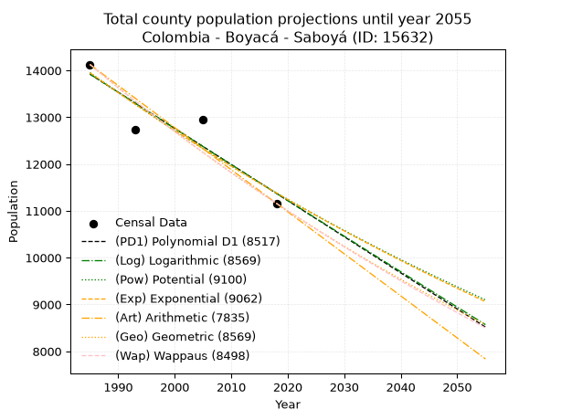
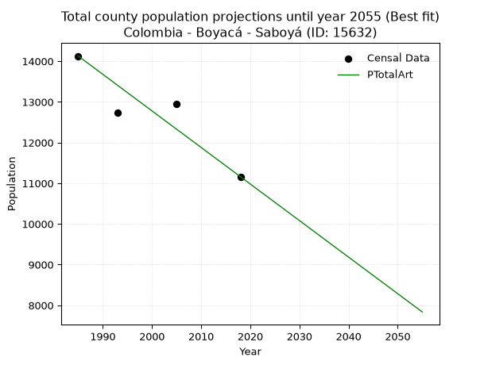
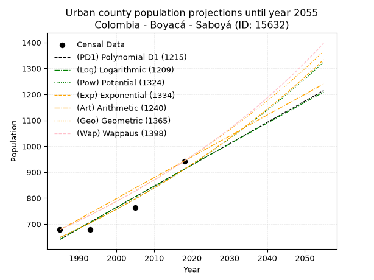
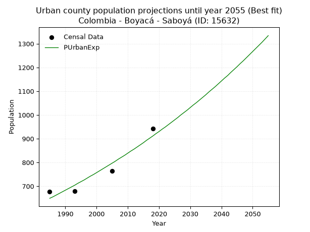
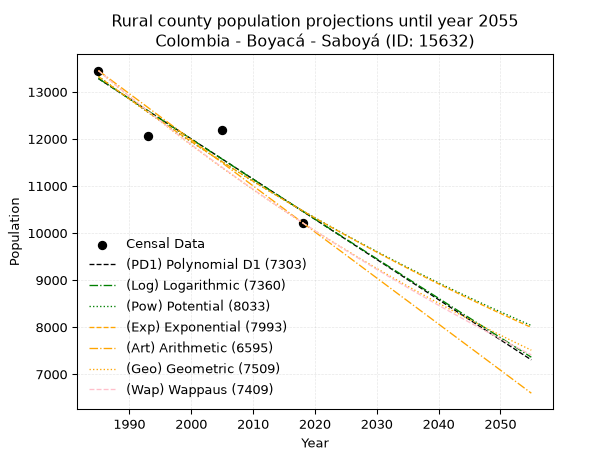
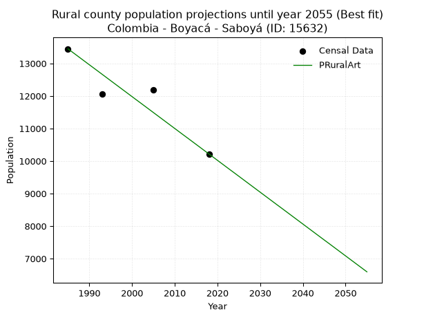

<div align="center">


</div>

# _“Population and Public Services Demand Projections (PPSD) until Year 2050 for Colombia - Boyacá - Saboyá (ID: 15632)”_
Keywords: `population` `public-service` `projection` `lineal` `polynomial` `logarithmic` `potential` `exponential` `arithmetic` `geometric` `wappaus` `dane` `colombia` `south-america`

PPSD are analytical estimates used by governments and planners to anticipate future changes in population size, age distribution, and the resulting community needs for utilities, healthcare, education, and infrastructure as sizing future water treatment facilities, electrical grids, and road networks based on spatial growth.

> **General running parameters**: • app_version: _v20260806_. • Python version: _3.14.7_. • Pandas version: _3.0.5_. • NumPy version: _2.5.1_. • Creates, save and include plots into reports (create_plot): _False_. • Projection until year: _2050_. • Process polynomial degree 2 and up: _False_. • Process Wappaus: _True_. • Process Wappaus: _True_. • Set negative values to zero: _True_. • Set infinite values to zero: _True_. • Drop dataset notes: _True_. 
<div align="center">

Dynamic map: [:earth_americas:Google](http://maps.google.com/maps?q=5.697755637,-73.7644563) [:earth_americas:OSM](https://www.openstreetmap.org/#map=18/5.697755637/-73.7644563&layers=P) [:earth_americas:Bing](https://www.bing.com/maps?cp=5.697755637~-73.7644563&lvl=18) [:earth_americas:Apple](https://maps.apple.com/frame?center=5.697755637%2C-73.7644563&span=0.003%2C0.006)

</div>


<div align="center">

```geojson
{
  "type": "Feature",
  "geometry": {
    "type": "Point", 
    "coordinates": [-73.7644563, 5.697755637]
  }, 
  "properties": {
    "Name": "Colombia - Boyacá - Saboyá (ID: 15632)"
  }
}
```

</div>


## 0. Census Data (4 records)

Census data are official statistics collected by a government about the people and housing in a country. They usually include counts of total population, age, sex, race, income, education, and jobs.

📅Global census file: [Population.xlsx](../data/Population.xlsx)

| Source   |   Year |   CountryID | CountryName   |   StateID | StateName   |   CountyID | CountyName   |   PTotal |   PUrban |   PRural |
|:---------|-------:|------------:|:--------------|----------:|:------------|-----------:|:-------------|---------:|---------:|---------:|
| DANE     |   1985 |          57 | Colombia      |        15 | Boyacá      |      15632 | Saboyá       |    14127 |      678 |    13449 |
| DANE     |   1993 |          57 | Colombia      |        15 | Boyacá      |      15632 | Saboyá       |    12729 |      679 |    12050 |
| DANE     |   2005 |          57 | Colombia      |        15 | Boyacá      |      15632 | Saboyá       |    12957 |      764 |    12193 |
| DANE     |   2018 |          57 | Colombia      |        15 | Boyacá      |      15632 | Saboyá       |    11161 |      943 |    10218 |

> 🔥Some records could had specific notes about the registered values or the corresponding urban or rural distribution.

## 1. Total

### 1.1. Coefficients and Parameters

* (PD1) Polynomial Deg 1: -77.18747490967368, 167137.7466880748 (lineal)
* (Log) Logarithmic: -154471.53724388295, 1186882.8924479673
* (Pow) Potential: -12.333004421908727, 44.815945846439405
* (Exp) Exponential: -0.006163251750843388, 2869224748.174973
* (Art) Arithmetic: Year diff. 2018 - 1985 = 33, Population diff. 11161 - 14127 = -2966, Annual growth = -89.87878787878788
* (Geo) Geometric: Year diff. 2018 - 1985 = 33, Population diff. 11161 - 14127 = -2966, Annual growth % = -0.007115843493158414
* (Wap) Wappaus: i = -0.7108414099872499, Condition values only valid for < 200)

<sub>
Wappaus condition values: ['-0.00', '-0.71', '-1.42', '-2.13', '-2.84', '-3.55', '-4.27', '-4.98', '-5.69', '-6.40', '-7.11', '-7.82', '-8.53', '-9.24', '-9.95', '-10.66', '-11.37', '-12.08', '-12.80', '-13.51', '-14.22', '-14.93', '-15.64', '-16.35', '-17.06', '-17.77', '-18.48', '-19.19', '-19.90', '-20.61', '-21.33', '-22.04', '-22.75', '-23.46', '-24.17', '-24.88', '-25.59', '-26.30', '-27.01', '-27.72', '-28.43', '-29.14', '-29.86', '-30.57', '-31.28', '-31.99', '-32.70', '-33.41', '-34.12', '-34.83', '-35.54', '-36.25', '-36.96', '-37.67', '-38.39', '-39.10', '-39.81', '-40.52', '-41.23', '-41.94', '-42.65', '-43.36', '-44.07', '-44.78', '-45.49', '-46.20']
</sub>


### 1.2. Projected Dataset

|   Year |   CountyID |   PTotalPD1 |   PTotalLog |   PTotalPow |   PTotalExp |   PTotalArt |   PTotalGeo |   PTotalWap |
|-------:|-----------:|------------:|------------:|------------:|------------:|------------:|------------:|------------:|
|   1985 |      15632 |       13921 |       13923 |       13952 |       13950 |       14127 |       14127 |       14127 |
|   1986 |      15632 |       13843 |       13845 |       13866 |       13865 |       14037 |       14026 |       14027 |
|   1987 |      15632 |       13766 |       13767 |       13780 |       13779 |       13947 |       13927 |       13928 |
|   1988 |      15632 |       13689 |       13689 |       13695 |       13695 |       13857 |       13828 |       13829 |
|   1989 |      15632 |       13612 |       13612 |       13610 |       13611 |       13767 |       13729 |       13731 |
|   1990 |      15632 |       13535 |       13534 |       13526 |       13527 |       13678 |       13631 |       13634 |
|   1991 |      15632 |       13457 |       13456 |       13443 |       13444 |       13588 |       13534 |       13537 |
|   1992 |      15632 |       13380 |       13379 |       13360 |       13361 |       13498 |       13438 |       13441 |
|   1993 |      15632 |       13303 |       13301 |       13277 |       13279 |       13408 |       13343 |       13346 |
|   1994 |      15632 |       13226 |       13224 |       13195 |       13198 |       13318 |       13248 |       13251 |
|   1995 |      15632 |       13149 |       13146 |       13114 |       13116 |       13228 |       13153 |       13157 |
|   1996 |      15632 |       13072 |       13069 |       13033 |       13036 |       13138 |       13060 |       13064 |
|   1997 |      15632 |       12994 |       12992 |       12953 |       12956 |       13048 |       12967 |       12971 |
|   1998 |      15632 |       12917 |       12914 |       12873 |       12876 |       12959 |       12875 |       12879 |
|   1999 |      15632 |       12840 |       12837 |       12794 |       12797 |       12869 |       12783 |       12788 |
|   2000 |      15632 |       12763 |       12760 |       12715 |       12718 |       12779 |       12692 |       12697 |
|   2001 |      15632 |       12686 |       12683 |       12637 |       12640 |       12689 |       12602 |       12607 |
|   2002 |      15632 |       12608 |       12605 |       12560 |       12563 |       12599 |       12512 |       12517 |
|   2003 |      15632 |       12531 |       12528 |       12482 |       12485 |       12509 |       12423 |       12428 |
|   2004 |      15632 |       12454 |       12451 |       12406 |       12409 |       12419 |       12335 |       12340 |
|   2005 |      15632 |       12377 |       12374 |       12330 |       12332 |       12329 |       12247 |       12252 |
|   2006 |      15632 |       12300 |       12297 |       12254 |       12257 |       12240 |       12160 |       12165 |
|   2007 |      15632 |       12222 |       12220 |       12179 |       12181 |       12150 |       12073 |       12078 |
|   2008 |      15632 |       12145 |       12143 |       12104 |       12107 |       12060 |       11987 |       11992 |
|   2009 |      15632 |       12068 |       12066 |       12030 |       12032 |       11970 |       11902 |       11906 |
|   2010 |      15632 |       11991 |       11989 |       11957 |       11958 |       11880 |       11817 |       11821 |
|   2011 |      15632 |       11914 |       11913 |       11884 |       11885 |       11790 |       11733 |       11737 |
|   2012 |      15632 |       11837 |       11836 |       11811 |       11812 |       11700 |       11650 |       11653 |
|   2013 |      15632 |       11759 |       11759 |       11739 |       11739 |       11610 |       11567 |       11570 |
|   2014 |      15632 |       11682 |       11682 |       11667 |       11667 |       11521 |       11484 |       11487 |
|   2015 |      15632 |       11605 |       11606 |       11596 |       11595 |       11431 |       11403 |       11405 |
|   2016 |      15632 |       11528 |       11529 |       11525 |       11524 |       11341 |       11322 |       11323 |
|   2017 |      15632 |       11451 |       11452 |       11455 |       11453 |       11251 |       11241 |       11242 |
|   2018 |      15632 |       11373 |       11376 |       11385 |       11383 |       11161 |       11161 |       11161 |
|   2019 |      15632 |       11296 |       11299 |       11316 |       11313 |       11071 |       11082 |       11081 |
|   2020 |      15632 |       11219 |       11223 |       11247 |       11243 |       10981 |       11003 |       11001 |
|   2021 |      15632 |       11142 |       11146 |       11178 |       11174 |       10891 |       10924 |       10922 |
|   2022 |      15632 |       11065 |       11070 |       11110 |       11106 |       10801 |       10847 |       10843 |
|   2023 |      15632 |       10987 |       10994 |       11043 |       11037 |       10712 |       10770 |       10765 |
|   2024 |      15632 |       10910 |       10917 |       10976 |       10970 |       10622 |       10693 |       10687 |
|   2025 |      15632 |       10833 |       10841 |       10909 |       10902 |       10532 |       10617 |       10610 |
|   2026 |      15632 |       10756 |       10765 |       10843 |       10835 |       10442 |       10541 |       10533 |
|   2027 |      15632 |       10679 |       10688 |       10777 |       10769 |       10352 |       10466 |       10457 |
|   2028 |      15632 |       10602 |       10612 |       10712 |       10703 |       10262 |       10392 |       10381 |
|   2029 |      15632 |       10524 |       10536 |       10647 |       10637 |       10172 |       10318 |       10306 |
|   2030 |      15632 |       10447 |       10460 |       10582 |       10571 |       10082 |       10244 |       10231 |
|   2031 |      15632 |       10370 |       10384 |       10518 |       10506 |        9993 |       10171 |       10157 |
|   2032 |      15632 |       10293 |       10308 |       10455 |       10442 |        9903 |       10099 |       10083 |
|   2033 |      15632 |       10216 |       10232 |       10391 |       10378 |        9813 |       10027 |       10009 |
|   2034 |      15632 |       10138 |       10156 |       10329 |       10314 |        9723 |        9956 |        9936 |
|   2035 |      15632 |       10061 |       10080 |       10266 |       10251 |        9633 |        9885 |        9864 |
|   2036 |      15632 |        9984 |       10004 |       10204 |       10188 |        9543 |        9815 |        9791 |
|   2037 |      15632 |        9907 |        9928 |       10142 |       10125 |        9453 |        9745 |        9720 |
|   2038 |      15632 |        9830 |        9852 |       10081 |       10063 |        9363 |        9676 |        9648 |
|   2039 |      15632 |        9752 |        9777 |       10020 |       10001 |        9274 |        9607 |        9577 |
|   2040 |      15632 |        9675 |        9701 |        9960 |        9940 |        9184 |        9538 |        9507 |
|   2041 |      15632 |        9598 |        9625 |        9900 |        9878 |        9094 |        9470 |        9437 |
|   2042 |      15632 |        9521 |        9549 |        9840 |        9818 |        9004 |        9403 |        9367 |
|   2043 |      15632 |        9444 |        9474 |        9781 |        9757 |        8914 |        9336 |        9298 |
|   2044 |      15632 |        9367 |        9398 |        9722 |        9697 |        8824 |        9270 |        9229 |
|   2045 |      15632 |        9289 |        9323 |        9664 |        9638 |        8734 |        9204 |        9161 |
|   2046 |      15632 |        9212 |        9247 |        9606 |        9579 |        8644 |        9138 |        9093 |
|   2047 |      15632 |        9135 |        9172 |        9548 |        9520 |        8555 |        9073 |        9025 |
|   2048 |      15632 |        9058 |        9096 |        9491 |        9461 |        8465 |        9009 |        8958 |
|   2049 |      15632 |        8981 |        9021 |        9434 |        9403 |        8375 |        8945 |        8891 |
|   2050 |      15632 |        8903 |        8945 |        9377 |        9345 |        8285 |        8881 |        8825 |
<div align="center">

</img>

</div>


### 1.3. Best fit with absolute and relative error (%)

Relative error puts that difference into context by dividing the absolute error by the true value, creating a unitless ratio or percentage that shows the scale of the mistake.

Absolute and relative error

|   Year | Source   |   CountryID | CountryName   |   StateID | StateName   |   CountyID_x | CountyName   |   PTotal |   PUrban |   PRural |   CountyID_y |   PTotalPD1 |   PTotalLog |   PTotalPow |   PTotalExp |   PTotalArt |   PTotalGeo |   PTotalWap |   PTotalPD1AbsError |   PTotalLogAbsError |   PTotalPowAbsError |   PTotalExpAbsError |   PTotalArtAbsError |   PTotalGeoAbsError |   PTotalWapAbsError |   PTotalPD1RelError |   PTotalLogRelError |   PTotalPowRelError |   PTotalExpRelError |   PTotalArtRelError |   PTotalGeoRelError |   PTotalWapRelError |
|-------:|:---------|------------:|:--------------|----------:|:------------|-------------:|:-------------|---------:|---------:|---------:|-------------:|------------:|------------:|------------:|------------:|------------:|------------:|------------:|--------------------:|--------------------:|--------------------:|--------------------:|--------------------:|--------------------:|--------------------:|--------------------:|--------------------:|--------------------:|--------------------:|--------------------:|--------------------:|--------------------:|
|   1985 | DANE     |          57 | Colombia      |        15 | Boyacá      |        15632 | Saboyá       |    14127 |      678 |    13449 |        15632 |       13921 |       13923 |       13952 |       13950 |       14127 |       14127 |       14127 |                 206 |                 204 |                 175 |                 177 |                   0 |                   0 |                   0 |             1.4582  |             1.44404 |             1.23876 |             1.25292 |             0       |             0       |             0       |
|   1993 | DANE     |          57 | Colombia      |        15 | Boyacá      |        15632 | Saboyá       |    12729 |      679 |    12050 |        15632 |       13303 |       13301 |       13277 |       13279 |       13408 |       13343 |       13346 |                 574 |                 572 |                 548 |                 550 |                 679 |                 614 |                 617 |             4.50939 |             4.49368 |             4.30513 |             4.32084 |             5.33428 |             4.82363 |             4.8472  |
|   2005 | DANE     |          57 | Colombia      |        15 | Boyacá      |        15632 | Saboyá       |    12957 |      764 |    12193 |        15632 |       12377 |       12374 |       12330 |       12332 |       12329 |       12247 |       12252 |                 580 |                 583 |                 627 |                 625 |                 628 |                 710 |                 705 |             4.47634 |             4.4995  |             4.83908 |             4.82365 |             4.8468  |             5.47966 |             5.44107 |
|   2018 | DANE     |          57 | Colombia      |        15 | Boyacá      |        15632 | Saboyá       |    11161 |      943 |    10218 |        15632 |       11373 |       11376 |       11385 |       11383 |       11161 |       11161 |       11161 |                 212 |                 215 |                 224 |                 222 |                   0 |                   0 |                   0 |             1.89947 |             1.92635 |             2.00699 |             1.98907 |             0       |             0       |             0       |

Relative error mean

| Method    |   RelError | Best   |
|:----------|-----------:|:-------|
| PTotalPD1 |    3.08585 |        |
| PTotalLog |    3.09089 |        |
| PTotalPow |    3.09749 |        |
| PTotalExp |    3.09662 |        |
| PTotalArt |    2.54527 | True   |
| PTotalGeo |    2.57582 |        |
| PTotalWap |    2.57207 |        |

💙Best method: _**PTotalArt**_
<div align="center">

</img>

</div>


### 1.4. Fresh water supply demand in liters per capita per day (lpcd)

The fresh water supply demand typically ranges from 100 to 300 liters per capita per day (lpcd) for standard domestic and municipal planning, though absolute survival minimums set by the World Health Organization are as low as 7.5 to 20 liters per day, and total consumption in high-income nations can exceed 400 liters.

> `CZ`: Level in meters above the sea level (masl)<br> `WS`: Fresh water supply demand in liters per capita per day (lpcd or l/h/d)<br> `WSAll`: Zonal fresh water supply demand in liters per second (l/s)<br> `A`: Zonal area in square meters<br> `DP`: Population density (people/hectare)

Reference values (RAS Colombia)

|    CZ |   WS |
|------:|-----:|
|  1000 |  120 |
|  2000 |  130 |
| 99999 |  140 |

County shapefile geometry properties and water supply values

|   CountyID |      ATotal |   CZTotal |   WSTotal |
|-----------:|------------:|----------:|----------:|
|      15632 | 2.48288e+08 |   2852.47 |       140 |

Projected values for best method: PTotalArt

|   CountyID |   Year |   PTotalArt |   DPTotal |   WSTotal |   WSTotalAll |
|-----------:|-------:|------------:|----------:|----------:|-------------:|
|      15632 |   1985 |       14127 |      0.57 |       140 |      22.891  |
|      15632 |   1986 |       14037 |      0.57 |       140 |      22.7451 |
|      15632 |   1987 |       13947 |      0.56 |       140 |      22.5993 |
|      15632 |   1988 |       13857 |      0.56 |       140 |      22.4535 |
|      15632 |   1989 |       13767 |      0.55 |       140 |      22.3076 |
|      15632 |   1990 |       13678 |      0.55 |       140 |      22.1634 |
|      15632 |   1991 |       13588 |      0.55 |       140 |      22.0176 |
|      15632 |   1992 |       13498 |      0.54 |       140 |      21.8718 |
|      15632 |   1993 |       13408 |      0.54 |       140 |      21.7259 |
|      15632 |   1994 |       13318 |      0.54 |       140 |      21.5801 |
|      15632 |   1995 |       13228 |      0.53 |       140 |      21.4343 |
|      15632 |   1996 |       13138 |      0.53 |       140 |      21.2884 |
|      15632 |   1997 |       13048 |      0.53 |       140 |      21.1426 |
|      15632 |   1998 |       12959 |      0.52 |       140 |      20.9984 |
|      15632 |   1999 |       12869 |      0.52 |       140 |      20.8525 |
|      15632 |   2000 |       12779 |      0.51 |       140 |      20.7067 |
|      15632 |   2001 |       12689 |      0.51 |       140 |      20.5609 |
|      15632 |   2002 |       12599 |      0.51 |       140 |      20.415  |
|      15632 |   2003 |       12509 |      0.5  |       140 |      20.2692 |
|      15632 |   2004 |       12419 |      0.5  |       140 |      20.1234 |
|      15632 |   2005 |       12329 |      0.5  |       140 |      19.9775 |
|      15632 |   2006 |       12240 |      0.49 |       140 |      19.8333 |
|      15632 |   2007 |       12150 |      0.49 |       140 |      19.6875 |
|      15632 |   2008 |       12060 |      0.49 |       140 |      19.5417 |
|      15632 |   2009 |       11970 |      0.48 |       140 |      19.3958 |
|      15632 |   2010 |       11880 |      0.48 |       140 |      19.25   |
|      15632 |   2011 |       11790 |      0.47 |       140 |      19.1042 |
|      15632 |   2012 |       11700 |      0.47 |       140 |      18.9583 |
|      15632 |   2013 |       11610 |      0.47 |       140 |      18.8125 |
|      15632 |   2014 |       11521 |      0.46 |       140 |      18.6683 |
|      15632 |   2015 |       11431 |      0.46 |       140 |      18.5225 |
|      15632 |   2016 |       11341 |      0.46 |       140 |      18.3766 |
|      15632 |   2017 |       11251 |      0.45 |       140 |      18.2308 |
|      15632 |   2018 |       11161 |      0.45 |       140 |      18.085  |
|      15632 |   2019 |       11071 |      0.45 |       140 |      17.9391 |
|      15632 |   2020 |       10981 |      0.44 |       140 |      17.7933 |
|      15632 |   2021 |       10891 |      0.44 |       140 |      17.6475 |
|      15632 |   2022 |       10801 |      0.44 |       140 |      17.5016 |
|      15632 |   2023 |       10712 |      0.43 |       140 |      17.3574 |
|      15632 |   2024 |       10622 |      0.43 |       140 |      17.2116 |
|      15632 |   2025 |       10532 |      0.42 |       140 |      17.0657 |
|      15632 |   2026 |       10442 |      0.42 |       140 |      16.9199 |
|      15632 |   2027 |       10352 |      0.42 |       140 |      16.7741 |
|      15632 |   2028 |       10262 |      0.41 |       140 |      16.6282 |
|      15632 |   2029 |       10172 |      0.41 |       140 |      16.4824 |
|      15632 |   2030 |       10082 |      0.41 |       140 |      16.3366 |
|      15632 |   2031 |        9993 |      0.4  |       140 |      16.1924 |
|      15632 |   2032 |        9903 |      0.4  |       140 |      16.0465 |
|      15632 |   2033 |        9813 |      0.4  |       140 |      15.9007 |
|      15632 |   2034 |        9723 |      0.39 |       140 |      15.7549 |
|      15632 |   2035 |        9633 |      0.39 |       140 |      15.609  |
|      15632 |   2036 |        9543 |      0.38 |       140 |      15.4632 |
|      15632 |   2037 |        9453 |      0.38 |       140 |      15.3174 |
|      15632 |   2038 |        9363 |      0.38 |       140 |      15.1715 |
|      15632 |   2039 |        9274 |      0.37 |       140 |      15.0273 |
|      15632 |   2040 |        9184 |      0.37 |       140 |      14.8815 |
|      15632 |   2041 |        9094 |      0.37 |       140 |      14.7356 |
|      15632 |   2042 |        9004 |      0.36 |       140 |      14.5898 |
|      15632 |   2043 |        8914 |      0.36 |       140 |      14.444  |
|      15632 |   2044 |        8824 |      0.36 |       140 |      14.2981 |
|      15632 |   2045 |        8734 |      0.35 |       140 |      14.1523 |
|      15632 |   2046 |        8644 |      0.35 |       140 |      14.0065 |
|      15632 |   2047 |        8555 |      0.34 |       140 |      13.8623 |
|      15632 |   2048 |        8465 |      0.34 |       140 |      13.7164 |
|      15632 |   2049 |        8375 |      0.34 |       140 |      13.5706 |
|      15632 |   2050 |        8285 |      0.33 |       140 |      13.4248 |

## 2. Urban

### 2.1. Coefficients and Parameters

* (PD1) Polynomial Deg 1: 8.197511039742954, -15631.071457245846 (lineal)
* (Log) Logarithmic: 16395.33112476261, -123855.0432632587
* (Pow) Potential: 20.596537477204183, -65.11055606538004
* (Exp) Exponential: 0.010297268887022362, 8.609223956068343e-07
* (Art) Arithmetic: Year diff. 2018 - 1985 = 33, Population diff. 943 - 678 = 265, Annual growth = 8.030303030303031
* (Geo) Geometric: Year diff. 2018 - 1985 = 33, Population diff. 943 - 678 = 265, Annual growth % = 0.010047687710732056
* (Wap) Wappaus: i = 0.9907838408763764, Condition values only valid for < 200)

<sub>
Wappaus condition values: ['0.00', '0.99', '1.98', '2.97', '3.96', '4.95', '5.94', '6.94', '7.93', '8.92', '9.91', '10.90', '11.89', '12.88', '13.87', '14.86', '15.85', '16.84', '17.83', '18.82', '19.82', '20.81', '21.80', '22.79', '23.78', '24.77', '25.76', '26.75', '27.74', '28.73', '29.72', '30.71', '31.71', '32.70', '33.69', '34.68', '35.67', '36.66', '37.65', '38.64', '39.63', '40.62', '41.61', '42.60', '43.59', '44.59', '45.58', '46.57', '47.56', '48.55', '49.54', '50.53', '51.52', '52.51', '53.50', '54.49', '55.48', '56.47', '57.47', '58.46', '59.45', '60.44', '61.43', '62.42', '63.41', '64.40']
</sub>


### 2.2. Projected Dataset

|   Year |   CountyID |   PUrbanPD1 |   PUrbanLog |   PUrbanPow |   PUrbanExp |   PUrbanArt |   PUrbanGeo |   PUrbanWap |
|-------:|-----------:|------------:|------------:|------------:|------------:|------------:|------------:|------------:|
|   1985 |      15632 |         641 |         641 |         648 |         649 |         678 |         678 |         678 |
|   1986 |      15632 |         649 |         649 |         655 |         655 |         686 |         685 |         685 |
|   1987 |      15632 |         657 |         657 |         662 |         662 |         694 |         692 |         692 |
|   1988 |      15632 |         666 |         666 |         669 |         669 |         702 |         699 |         698 |
|   1989 |      15632 |         674 |         674 |         676 |         676 |         710 |         706 |         705 |
|   1990 |      15632 |         682 |         682 |         683 |         683 |         718 |         713 |         712 |
|   1991 |      15632 |         690 |         690 |         690 |         690 |         726 |         720 |         720 |
|   1992 |      15632 |         698 |         699 |         697 |         697 |         734 |         727 |         727 |
|   1993 |      15632 |         707 |         707 |         704 |         704 |         742 |         734 |         734 |
|   1994 |      15632 |         715 |         715 |         712 |         712 |         750 |         742 |         741 |
|   1995 |      15632 |         723 |         723 |         719 |         719 |         758 |         749 |         749 |
|   1996 |      15632 |         731 |         731 |         727 |         726 |         766 |         757 |         756 |
|   1997 |      15632 |         739 |         740 |         734 |         734 |         774 |         764 |         764 |
|   1998 |      15632 |         748 |         748 |         742 |         742 |         782 |         772 |         771 |
|   1999 |      15632 |         756 |         756 |         749 |         749 |         790 |         780 |         779 |
|   2000 |      15632 |         764 |         764 |         757 |         757 |         798 |         788 |         787 |
|   2001 |      15632 |         772 |         772 |         765 |         765 |         806 |         796 |         795 |
|   2002 |      15632 |         780 |         781 |         773 |         773 |         815 |         804 |         803 |
|   2003 |      15632 |         789 |         789 |         781 |         781 |         823 |         812 |         811 |
|   2004 |      15632 |         797 |         797 |         789 |         789 |         831 |         820 |         819 |
|   2005 |      15632 |         805 |         805 |         797 |         797 |         839 |         828 |         827 |
|   2006 |      15632 |         813 |         813 |         805 |         805 |         847 |         836 |         835 |
|   2007 |      15632 |         821 |         822 |         814 |         814 |         855 |         845 |         844 |
|   2008 |      15632 |         830 |         830 |         822 |         822 |         863 |         853 |         852 |
|   2009 |      15632 |         838 |         838 |         831 |         830 |         871 |         862 |         861 |
|   2010 |      15632 |         846 |         846 |         839 |         839 |         879 |         871 |         870 |
|   2011 |      15632 |         854 |         854 |         848 |         848 |         887 |         879 |         878 |
|   2012 |      15632 |         862 |         862 |         857 |         856 |         895 |         888 |         887 |
|   2013 |      15632 |         871 |         870 |         865 |         865 |         903 |         897 |         896 |
|   2014 |      15632 |         879 |         879 |         874 |         874 |         911 |         906 |         905 |
|   2015 |      15632 |         887 |         887 |         883 |         883 |         919 |         915 |         915 |
|   2016 |      15632 |         895 |         895 |         892 |         893 |         927 |         924 |         924 |
|   2017 |      15632 |         903 |         903 |         901 |         902 |         935 |         934 |         933 |
|   2018 |      15632 |         912 |         911 |         911 |         911 |         943 |         943 |         943 |
|   2019 |      15632 |         920 |         919 |         920 |         921 |         951 |         952 |         953 |
|   2020 |      15632 |         928 |         927 |         929 |         930 |         959 |         962 |         962 |
|   2021 |      15632 |         936 |         936 |         939 |         940 |         967 |         972 |         972 |
|   2022 |      15632 |         944 |         944 |         949 |         949 |         975 |         981 |         982 |
|   2023 |      15632 |         952 |         952 |         958 |         959 |         983 |         991 |         992 |
|   2024 |      15632 |         961 |         960 |         968 |         969 |         991 |        1001 |        1003 |
|   2025 |      15632 |         969 |         968 |         978 |         979 |         999 |        1011 |        1013 |
|   2026 |      15632 |         977 |         976 |         988 |         989 |        1007 |        1022 |        1024 |
|   2027 |      15632 |         985 |         984 |         998 |        1000 |        1015 |        1032 |        1034 |
|   2028 |      15632 |         993 |         992 |        1008 |        1010 |        1023 |        1042 |        1045 |
|   2029 |      15632 |        1002 |        1000 |        1019 |        1020 |        1031 |        1053 |        1056 |
|   2030 |      15632 |        1010 |        1008 |        1029 |        1031 |        1039 |        1063 |        1067 |
|   2031 |      15632 |        1018 |        1016 |        1039 |        1042 |        1047 |        1074 |        1078 |
|   2032 |      15632 |        1026 |        1025 |        1050 |        1052 |        1055 |        1085 |        1090 |
|   2033 |      15632 |        1034 |        1033 |        1061 |        1063 |        1063 |        1096 |        1101 |
|   2034 |      15632 |        1043 |        1041 |        1072 |        1074 |        1071 |        1107 |        1113 |
|   2035 |      15632 |        1051 |        1049 |        1082 |        1085 |        1080 |        1118 |        1124 |
|   2036 |      15632 |        1059 |        1057 |        1093 |        1097 |        1088 |        1129 |        1136 |
|   2037 |      15632 |        1067 |        1065 |        1105 |        1108 |        1096 |        1140 |        1149 |
|   2038 |      15632 |        1075 |        1073 |        1116 |        1119 |        1104 |        1152 |        1161 |
|   2039 |      15632 |        1084 |        1081 |        1127 |        1131 |        1112 |        1163 |        1173 |
|   2040 |      15632 |        1092 |        1089 |        1139 |        1143 |        1120 |        1175 |        1186 |
|   2041 |      15632 |        1100 |        1097 |        1150 |        1155 |        1128 |        1187 |        1199 |
|   2042 |      15632 |        1108 |        1105 |        1162 |        1166 |        1136 |        1199 |        1212 |
|   2043 |      15632 |        1116 |        1113 |        1174 |        1179 |        1144 |        1211 |        1225 |
|   2044 |      15632 |        1125 |        1121 |        1185 |        1191 |        1152 |        1223 |        1238 |
|   2045 |      15632 |        1133 |        1129 |        1197 |        1203 |        1160 |        1235 |        1252 |
|   2046 |      15632 |        1141 |        1137 |        1210 |        1216 |        1168 |        1248 |        1265 |
|   2047 |      15632 |        1149 |        1145 |        1222 |        1228 |        1176 |        1260 |        1279 |
|   2048 |      15632 |        1157 |        1153 |        1234 |        1241 |        1184 |        1273 |        1293 |
|   2049 |      15632 |        1166 |        1161 |        1247 |        1254 |        1192 |        1286 |        1308 |
|   2050 |      15632 |        1174 |        1169 |        1259 |        1267 |        1200 |        1299 |        1322 |
<div align="center">

</img>

</div>


### 2.3. Best fit with absolute and relative error (%)

Relative error puts that difference into context by dividing the absolute error by the true value, creating a unitless ratio or percentage that shows the scale of the mistake.

Absolute and relative error

|   Year | Source   |   CountryID | CountryName   |   StateID | StateName   |   CountyID_x | CountyName   |   PTotal |   PUrban |   PRural |   CountyID_y |   PUrbanPD1 |   PUrbanLog |   PUrbanPow |   PUrbanExp |   PUrbanArt |   PUrbanGeo |   PUrbanWap |   PUrbanPD1AbsError |   PUrbanLogAbsError |   PUrbanPowAbsError |   PUrbanExpAbsError |   PUrbanArtAbsError |   PUrbanGeoAbsError |   PUrbanWapAbsError |   PUrbanPD1RelError |   PUrbanLogRelError |   PUrbanPowRelError |   PUrbanExpRelError |   PUrbanArtRelError |   PUrbanGeoRelError |   PUrbanWapRelError |
|-------:|:---------|------------:|:--------------|----------:|:------------|-------------:|:-------------|---------:|---------:|---------:|-------------:|------------:|------------:|------------:|------------:|------------:|------------:|------------:|--------------------:|--------------------:|--------------------:|--------------------:|--------------------:|--------------------:|--------------------:|--------------------:|--------------------:|--------------------:|--------------------:|--------------------:|--------------------:|--------------------:|
|   1985 | DANE     |          57 | Colombia      |        15 | Boyacá      |        15632 | Saboyá       |    14127 |      678 |    13449 |        15632 |         641 |         641 |         648 |         649 |         678 |         678 |         678 |                  37 |                  37 |                  30 |                  29 |                   0 |                   0 |                   0 |             5.45723 |             5.45723 |             4.42478 |             4.27729 |             0       |             0       |             0       |
|   1993 | DANE     |          57 | Colombia      |        15 | Boyacá      |        15632 | Saboyá       |    12729 |      679 |    12050 |        15632 |         707 |         707 |         704 |         704 |         742 |         734 |         734 |                  28 |                  28 |                  25 |                  25 |                  63 |                  55 |                  55 |             4.12371 |             4.12371 |             3.68189 |             3.68189 |             9.27835 |             8.10015 |             8.10015 |
|   2005 | DANE     |          57 | Colombia      |        15 | Boyacá      |        15632 | Saboyá       |    12957 |      764 |    12193 |        15632 |         805 |         805 |         797 |         797 |         839 |         828 |         827 |                  41 |                  41 |                  33 |                  33 |                  75 |                  64 |                  63 |             5.36649 |             5.36649 |             4.31937 |             4.31937 |             9.81675 |             8.37696 |             8.24607 |
|   2018 | DANE     |          57 | Colombia      |        15 | Boyacá      |        15632 | Saboyá       |    11161 |      943 |    10218 |        15632 |         912 |         911 |         911 |         911 |         943 |         943 |         943 |                  31 |                  32 |                  32 |                  32 |                   0 |                   0 |                   0 |             3.28738 |             3.39343 |             3.39343 |             3.39343 |             0       |             0       |             0       |

Relative error mean

| Method    |   RelError | Best   |
|:----------|-----------:|:-------|
| PUrbanPD1 |    4.5587  |        |
| PUrbanLog |    4.58521 |        |
| PUrbanPow |    3.95487 |        |
| PUrbanExp |    3.91799 | True   |
| PUrbanArt |    4.77378 |        |
| PUrbanGeo |    4.11928 |        |
| PUrbanWap |    4.08656 |        |

💙Best method: _**PUrbanExp**_
<div align="center">

</img>

</div>


### 2.4. Fresh water supply demand in liters per capita per day (lpcd)

The fresh water supply demand typically ranges from 100 to 300 liters per capita per day (lpcd) for standard domestic and municipal planning, though absolute survival minimums set by the World Health Organization are as low as 7.5 to 20 liters per day, and total consumption in high-income nations can exceed 400 liters.

> `CZ`: Level in meters above the sea level (masl)<br> `WS`: Fresh water supply demand in liters per capita per day (lpcd or l/h/d)<br> `WSAll`: Zonal fresh water supply demand in liters per second (l/s)<br> `A`: Zonal area in square meters<br> `DP`: Population density (people/hectare)

Reference values (RAS Colombia)

|    CZ |   WS |
|------:|-----:|
|  1000 |  120 |
|  2000 |  130 |
| 99999 |  140 |

County shapefile geometry properties and water supply values

|   CountyID |   AUrban |   CZUrban |   WSUrban |
|-----------:|---------:|----------:|----------:|
|      15632 |   559958 |   2613.06 |       140 |

Projected values for best method: PUrbanExp

|   CountyID |   Year |   PUrbanExp |   DPUrban |   WSUrban |   WSUrbanAll |
|-----------:|-------:|------------:|----------:|----------:|-------------:|
|      15632 |   1985 |         649 |     11.59 |       140 |      1.05162 |
|      15632 |   1986 |         655 |     11.7  |       140 |      1.06134 |
|      15632 |   1987 |         662 |     11.82 |       140 |      1.07269 |
|      15632 |   1988 |         669 |     11.95 |       140 |      1.08403 |
|      15632 |   1989 |         676 |     12.07 |       140 |      1.09537 |
|      15632 |   1990 |         683 |     12.2  |       140 |      1.10671 |
|      15632 |   1991 |         690 |     12.32 |       140 |      1.11806 |
|      15632 |   1992 |         697 |     12.45 |       140 |      1.1294  |
|      15632 |   1993 |         704 |     12.57 |       140 |      1.14074 |
|      15632 |   1994 |         712 |     12.72 |       140 |      1.1537  |
|      15632 |   1995 |         719 |     12.84 |       140 |      1.16505 |
|      15632 |   1996 |         726 |     12.97 |       140 |      1.17639 |
|      15632 |   1997 |         734 |     13.11 |       140 |      1.18935 |
|      15632 |   1998 |         742 |     13.25 |       140 |      1.20231 |
|      15632 |   1999 |         749 |     13.38 |       140 |      1.21366 |
|      15632 |   2000 |         757 |     13.52 |       140 |      1.22662 |
|      15632 |   2001 |         765 |     13.66 |       140 |      1.23958 |
|      15632 |   2002 |         773 |     13.8  |       140 |      1.25255 |
|      15632 |   2003 |         781 |     13.95 |       140 |      1.26551 |
|      15632 |   2004 |         789 |     14.09 |       140 |      1.27847 |
|      15632 |   2005 |         797 |     14.23 |       140 |      1.29144 |
|      15632 |   2006 |         805 |     14.38 |       140 |      1.3044  |
|      15632 |   2007 |         814 |     14.54 |       140 |      1.31898 |
|      15632 |   2008 |         822 |     14.68 |       140 |      1.33194 |
|      15632 |   2009 |         830 |     14.82 |       140 |      1.34491 |
|      15632 |   2010 |         839 |     14.98 |       140 |      1.35949 |
|      15632 |   2011 |         848 |     15.14 |       140 |      1.37407 |
|      15632 |   2012 |         856 |     15.29 |       140 |      1.38704 |
|      15632 |   2013 |         865 |     15.45 |       140 |      1.40162 |
|      15632 |   2014 |         874 |     15.61 |       140 |      1.4162  |
|      15632 |   2015 |         883 |     15.77 |       140 |      1.43079 |
|      15632 |   2016 |         893 |     15.95 |       140 |      1.44699 |
|      15632 |   2017 |         902 |     16.11 |       140 |      1.46157 |
|      15632 |   2018 |         911 |     16.27 |       140 |      1.47616 |
|      15632 |   2019 |         921 |     16.45 |       140 |      1.49236 |
|      15632 |   2020 |         930 |     16.61 |       140 |      1.50694 |
|      15632 |   2021 |         940 |     16.79 |       140 |      1.52315 |
|      15632 |   2022 |         949 |     16.95 |       140 |      1.53773 |
|      15632 |   2023 |         959 |     17.13 |       140 |      1.55394 |
|      15632 |   2024 |         969 |     17.3  |       140 |      1.57014 |
|      15632 |   2025 |         979 |     17.48 |       140 |      1.58634 |
|      15632 |   2026 |         989 |     17.66 |       140 |      1.60255 |
|      15632 |   2027 |        1000 |     17.86 |       140 |      1.62037 |
|      15632 |   2028 |        1010 |     18.04 |       140 |      1.63657 |
|      15632 |   2029 |        1020 |     18.22 |       140 |      1.65278 |
|      15632 |   2030 |        1031 |     18.41 |       140 |      1.6706  |
|      15632 |   2031 |        1042 |     18.61 |       140 |      1.68843 |
|      15632 |   2032 |        1052 |     18.79 |       140 |      1.70463 |
|      15632 |   2033 |        1063 |     18.98 |       140 |      1.72245 |
|      15632 |   2034 |        1074 |     19.18 |       140 |      1.74028 |
|      15632 |   2035 |        1085 |     19.38 |       140 |      1.7581  |
|      15632 |   2036 |        1097 |     19.59 |       140 |      1.77755 |
|      15632 |   2037 |        1108 |     19.79 |       140 |      1.79537 |
|      15632 |   2038 |        1119 |     19.98 |       140 |      1.81319 |
|      15632 |   2039 |        1131 |     20.2  |       140 |      1.83264 |
|      15632 |   2040 |        1143 |     20.41 |       140 |      1.85208 |
|      15632 |   2041 |        1155 |     20.63 |       140 |      1.87153 |
|      15632 |   2042 |        1166 |     20.82 |       140 |      1.88935 |
|      15632 |   2043 |        1179 |     21.06 |       140 |      1.91042 |
|      15632 |   2044 |        1191 |     21.27 |       140 |      1.92986 |
|      15632 |   2045 |        1203 |     21.48 |       140 |      1.94931 |
|      15632 |   2046 |        1216 |     21.72 |       140 |      1.97037 |
|      15632 |   2047 |        1228 |     21.93 |       140 |      1.98981 |
|      15632 |   2048 |        1241 |     22.16 |       140 |      2.01088 |
|      15632 |   2049 |        1254 |     22.39 |       140 |      2.03194 |
|      15632 |   2050 |        1267 |     22.63 |       140 |      2.05301 |

## 3. Rural

### 3.1. Coefficients and Parameters

* (PD1) Polynomial Deg 1: -85.38498594941665, 182768.81814532063 (lineal)
* (Log) Logarithmic: -170866.86836864566, 1310737.9357112264
* (Pow) Potential: -14.607208126487631, 52.29579017293753
* (Exp) Exponential: -0.007300270964670245, 26182781876.24904
* (Art) Arithmetic: Year diff. 2018 - 1985 = 33, Population diff. 10218 - 13449 = -3231, Annual growth = -97.9090909090909
* (Geo) Geometric: Year diff. 2018 - 1985 = 33, Population diff. 10218 - 13449 = -3231, Annual growth % = -0.008291311133128754
* (Wap) Wappaus: i = -0.8273891148780235, Condition values only valid for < 200)

<sub>
Wappaus condition values: ['-0.00', '-0.83', '-1.65', '-2.48', '-3.31', '-4.14', '-4.96', '-5.79', '-6.62', '-7.45', '-8.27', '-9.10', '-9.93', '-10.76', '-11.58', '-12.41', '-13.24', '-14.07', '-14.89', '-15.72', '-16.55', '-17.38', '-18.20', '-19.03', '-19.86', '-20.68', '-21.51', '-22.34', '-23.17', '-23.99', '-24.82', '-25.65', '-26.48', '-27.30', '-28.13', '-28.96', '-29.79', '-30.61', '-31.44', '-32.27', '-33.10', '-33.92', '-34.75', '-35.58', '-36.41', '-37.23', '-38.06', '-38.89', '-39.71', '-40.54', '-41.37', '-42.20', '-43.02', '-43.85', '-44.68', '-45.51', '-46.33', '-47.16', '-47.99', '-48.82', '-49.64', '-50.47', '-51.30', '-52.13', '-52.95', '-53.78']
</sub>


### 3.2. Projected Dataset

|   Year |   CountyID |   PRuralPD1 |   PRuralLog |   PRuralPow |   PRuralExp |   PRuralArt |   PRuralGeo |   PRuralWap |
|-------:|-----------:|------------:|------------:|------------:|------------:|------------:|------------:|------------:|
|   1985 |      15632 |       13280 |       13282 |       13326 |       13324 |       13449 |       13449 |       13449 |
|   1986 |      15632 |       13194 |       13196 |       13229 |       13227 |       13351 |       13337 |       13338 |
|   1987 |      15632 |       13109 |       13110 |       13132 |       13131 |       13253 |       13227 |       13228 |
|   1988 |      15632 |       13023 |       13024 |       13036 |       13035 |       13155 |       13117 |       13119 |
|   1989 |      15632 |       12938 |       12938 |       12940 |       12941 |       13057 |       13008 |       13011 |
|   1990 |      15632 |       12853 |       12852 |       12846 |       12847 |       12959 |       12901 |       12904 |
|   1991 |      15632 |       12767 |       12766 |       12752 |       12753 |       12862 |       12794 |       12798 |
|   1992 |      15632 |       12682 |       12680 |       12659 |       12660 |       12764 |       12688 |       12692 |
|   1993 |      15632 |       12597 |       12595 |       12566 |       12568 |       12666 |       12582 |       12587 |
|   1994 |      15632 |       12511 |       12509 |       12474 |       12477 |       12568 |       12478 |       12483 |
|   1995 |      15632 |       12426 |       12423 |       12383 |       12386 |       12470 |       12375 |       12380 |
|   1996 |      15632 |       12340 |       12338 |       12293 |       12296 |       12372 |       12272 |       12278 |
|   1997 |      15632 |       12255 |       12252 |       12203 |       12207 |       12274 |       12170 |       12177 |
|   1998 |      15632 |       12170 |       12166 |       12114 |       12118 |       12176 |       12069 |       12076 |
|   1999 |      15632 |       12084 |       12081 |       12026 |       12030 |       12078 |       11969 |       11976 |
|   2000 |      15632 |       11999 |       11996 |       11939 |       11942 |       11980 |       11870 |       11877 |
|   2001 |      15632 |       11913 |       11910 |       11852 |       11855 |       11882 |       11772 |       11779 |
|   2002 |      15632 |       11828 |       11825 |       11766 |       11769 |       11785 |       11674 |       11682 |
|   2003 |      15632 |       11743 |       11739 |       11680 |       11683 |       11687 |       11577 |       11585 |
|   2004 |      15632 |       11657 |       11654 |       11595 |       11598 |       11589 |       11481 |       11489 |
|   2005 |      15632 |       11572 |       11569 |       11511 |       11514 |       11491 |       11386 |       11394 |
|   2006 |      15632 |       11487 |       11484 |       11428 |       11430 |       11393 |       11292 |       11299 |
|   2007 |      15632 |       11401 |       11399 |       11345 |       11347 |       11295 |       11198 |       11205 |
|   2008 |      15632 |       11316 |       11313 |       11262 |       11265 |       11197 |       11105 |       11112 |
|   2009 |      15632 |       11230 |       11228 |       11181 |       11183 |       11099 |       11013 |       11020 |
|   2010 |      15632 |       11145 |       11143 |       11100 |       11101 |       11001 |       10922 |       10928 |
|   2011 |      15632 |       11060 |       11058 |       11020 |       11021 |       10903 |       10831 |       10837 |
|   2012 |      15632 |       10974 |       10973 |       10940 |       10940 |       10805 |       10741 |       10746 |
|   2013 |      15632 |       10889 |       10888 |       10861 |       10861 |       10708 |       10652 |       10657 |
|   2014 |      15632 |       10803 |       10804 |       10782 |       10782 |       10610 |       10564 |       10568 |
|   2015 |      15632 |       10718 |       10719 |       10704 |       10703 |       10512 |       10476 |       10479 |
|   2016 |      15632 |       10633 |       10634 |       10627 |       10626 |       10414 |       10390 |       10392 |
|   2017 |      15632 |       10547 |       10549 |       10550 |       10548 |       10316 |       10303 |       10304 |
|   2018 |      15632 |       10462 |       10465 |       10474 |       10472 |       10218 |       10218 |       10218 |
|   2019 |      15632 |       10377 |       10380 |       10399 |       10395 |       10120 |       10133 |       10132 |
|   2020 |      15632 |       10291 |       10295 |       10324 |       10320 |       10022 |       10049 |       10047 |
|   2021 |      15632 |       10206 |       10211 |       10249 |       10245 |        9924 |        9966 |        9962 |
|   2022 |      15632 |       10120 |       10126 |       10176 |       10170 |        9826 |        9883 |        9878 |
|   2023 |      15632 |       10035 |       10042 |       10102 |       10096 |        9728 |        9801 |        9795 |
|   2024 |      15632 |        9950 |        9957 |       10030 |       10023 |        9631 |        9720 |        9712 |
|   2025 |      15632 |        9864 |        9873 |        9958 |        9950 |        9533 |        9640 |        9630 |
|   2026 |      15632 |        9779 |        9789 |        9886 |        9878 |        9435 |        9560 |        9548 |
|   2027 |      15632 |        9693 |        9704 |        9815 |        9806 |        9337 |        9480 |        9467 |
|   2028 |      15632 |        9608 |        9620 |        9745 |        9734 |        9239 |        9402 |        9387 |
|   2029 |      15632 |        9523 |        9536 |        9675 |        9664 |        9141 |        9324 |        9307 |
|   2030 |      15632 |        9437 |        9452 |        9605 |        9593 |        9043 |        9246 |        9227 |
|   2031 |      15632 |        9352 |        9367 |        9536 |        9523 |        8945 |        9170 |        9149 |
|   2032 |      15632 |        9267 |        9283 |        9468 |        9454 |        8847 |        9094 |        9070 |
|   2033 |      15632 |        9181 |        9199 |        9400 |        9385 |        8749 |        9018 |        8993 |
|   2034 |      15632 |        9096 |        9115 |        9333 |        9317 |        8651 |        8944 |        8915 |
|   2035 |      15632 |        9010 |        9031 |        9266 |        9249 |        8554 |        8869 |        8839 |
|   2036 |      15632 |        8925 |        8947 |        9200 |        9182 |        8456 |        8796 |        8763 |
|   2037 |      15632 |        8840 |        8863 |        9134 |        9115 |        8358 |        8723 |        8687 |
|   2038 |      15632 |        8754 |        8780 |        9069 |        9049 |        8260 |        8651 |        8612 |
|   2039 |      15632 |        8669 |        8696 |        9004 |        8983 |        8162 |        8579 |        8537 |
|   2040 |      15632 |        8583 |        8612 |        8940 |        8918 |        8064 |        8508 |        8463 |
|   2041 |      15632 |        8498 |        8528 |        8876 |        8853 |        7966 |        8437 |        8390 |
|   2042 |      15632 |        8413 |        8444 |        8813 |        8789 |        7868 |        8367 |        8317 |
|   2043 |      15632 |        8327 |        8361 |        8750 |        8725 |        7770 |        8298 |        8244 |
|   2044 |      15632 |        8242 |        8277 |        8688 |        8661 |        7672 |        8229 |        8172 |
|   2045 |      15632 |        8157 |        8194 |        8626 |        8598 |        7574 |        8161 |        8100 |
|   2046 |      15632 |        8071 |        8110 |        8565 |        8536 |        7477 |        8093 |        8029 |
|   2047 |      15632 |        7986 |        8027 |        8504 |        8474 |        7379 |        8026 |        7958 |
|   2048 |      15632 |        7900 |        7943 |        8443 |        8412 |        7281 |        7960 |        7888 |
|   2049 |      15632 |        7815 |        7860 |        8383 |        8351 |        7183 |        7894 |        7818 |
|   2050 |      15632 |        7730 |        7776 |        8324 |        8290 |        7085 |        7828 |        7749 |
<div align="center">

</img>

</div>


### 3.3. Best fit with absolute and relative error (%)

Relative error puts that difference into context by dividing the absolute error by the true value, creating a unitless ratio or percentage that shows the scale of the mistake.

Absolute and relative error

|   Year | Source   |   CountryID | CountryName   |   StateID | StateName   |   CountyID_x | CountyName   |   PTotal |   PUrban |   PRural |   CountyID_y |   PRuralPD1 |   PRuralLog |   PRuralPow |   PRuralExp |   PRuralArt |   PRuralGeo |   PRuralWap |   PRuralPD1AbsError |   PRuralLogAbsError |   PRuralPowAbsError |   PRuralExpAbsError |   PRuralArtAbsError |   PRuralGeoAbsError |   PRuralWapAbsError |   PRuralPD1RelError |   PRuralLogRelError |   PRuralPowRelError |   PRuralExpRelError |   PRuralArtRelError |   PRuralGeoRelError |   PRuralWapRelError |
|-------:|:---------|------------:|:--------------|----------:|:------------|-------------:|:-------------|---------:|---------:|---------:|-------------:|------------:|------------:|------------:|------------:|------------:|------------:|------------:|--------------------:|--------------------:|--------------------:|--------------------:|--------------------:|--------------------:|--------------------:|--------------------:|--------------------:|--------------------:|--------------------:|--------------------:|--------------------:|--------------------:|
|   1985 | DANE     |          57 | Colombia      |        15 | Boyacá      |        15632 | Saboyá       |    14127 |      678 |    13449 |        15632 |       13280 |       13282 |       13326 |       13324 |       13449 |       13449 |       13449 |                 169 |                 167 |                 123 |                 125 |                   0 |                   0 |                   0 |             1.2566  |             1.24173 |            0.914566 |            0.929437 |             0       |             0       |             0       |
|   1993 | DANE     |          57 | Colombia      |        15 | Boyacá      |        15632 | Saboyá       |    12729 |      679 |    12050 |        15632 |       12597 |       12595 |       12566 |       12568 |       12666 |       12582 |       12587 |                 547 |                 545 |                 516 |                 518 |                 616 |                 532 |                 537 |             4.53942 |             4.52282 |            4.28216  |            4.29876  |             5.11203 |             4.41494 |             4.45643 |
|   2005 | DANE     |          57 | Colombia      |        15 | Boyacá      |        15632 | Saboyá       |    12957 |      764 |    12193 |        15632 |       11572 |       11569 |       11511 |       11514 |       11491 |       11386 |       11394 |                 621 |                 624 |                 682 |                 679 |                 702 |                 807 |                 799 |             5.09309 |             5.11769 |            5.59337  |            5.56877  |             5.7574  |             6.61855 |             6.55294 |
|   2018 | DANE     |          57 | Colombia      |        15 | Boyacá      |        15632 | Saboyá       |    11161 |      943 |    10218 |        15632 |       10462 |       10465 |       10474 |       10472 |       10218 |       10218 |       10218 |                 244 |                 247 |                 256 |                 254 |                   0 |                   0 |                   0 |             2.38794 |             2.4173  |            2.50538  |            2.48581  |             0       |             0       |             0       |

Relative error mean

| Method    |   RelError | Best   |
|:----------|-----------:|:-------|
| PRuralPD1 |    3.31926 |        |
| PRuralLog |    3.32489 |        |
| PRuralPow |    3.32387 |        |
| PRuralExp |    3.32069 |        |
| PRuralArt |    2.71736 | True   |
| PRuralGeo |    2.75837 |        |
| PRuralWap |    2.75234 |        |

💙Best method: _**PRuralArt**_
<div align="center">

</img>

</div>


### 3.4. Fresh water supply demand in liters per capita per day (lpcd)

The fresh water supply demand typically ranges from 100 to 300 liters per capita per day (lpcd) for standard domestic and municipal planning, though absolute survival minimums set by the World Health Organization are as low as 7.5 to 20 liters per day, and total consumption in high-income nations can exceed 400 liters.

> `CZ`: Level in meters above the sea level (masl)<br> `WS`: Fresh water supply demand in liters per capita per day (lpcd or l/h/d)<br> `WSAll`: Zonal fresh water supply demand in liters per second (l/s)<br> `A`: Zonal area in square meters<br> `DP`: Population density (people/hectare)

Reference values (RAS Colombia)

|    CZ |   WS |
|------:|-----:|
|  1000 |  120 |
|  2000 |  130 |
| 99999 |  140 |

County shapefile geometry properties and water supply values

|   CountyID |      ARural |   CZRural |   WSRural |
|-----------:|------------:|----------:|----------:|
|      15632 | 2.47728e+08 |      2853 |       140 |

Projected values for best method: PRuralArt

|   CountyID |   Year |   PRuralArt |   DPRural |   WSRural |   WSRuralAll |
|-----------:|-------:|------------:|----------:|----------:|-------------:|
|      15632 |   1985 |       13449 |      0.54 |       140 |      21.7924 |
|      15632 |   1986 |       13351 |      0.54 |       140 |      21.6336 |
|      15632 |   1987 |       13253 |      0.53 |       140 |      21.4748 |
|      15632 |   1988 |       13155 |      0.53 |       140 |      21.316  |
|      15632 |   1989 |       13057 |      0.53 |       140 |      21.1572 |
|      15632 |   1990 |       12959 |      0.52 |       140 |      20.9984 |
|      15632 |   1991 |       12862 |      0.52 |       140 |      20.8412 |
|      15632 |   1992 |       12764 |      0.52 |       140 |      20.6824 |
|      15632 |   1993 |       12666 |      0.51 |       140 |      20.5236 |
|      15632 |   1994 |       12568 |      0.51 |       140 |      20.3648 |
|      15632 |   1995 |       12470 |      0.5  |       140 |      20.206  |
|      15632 |   1996 |       12372 |      0.5  |       140 |      20.0472 |
|      15632 |   1997 |       12274 |      0.5  |       140 |      19.8884 |
|      15632 |   1998 |       12176 |      0.49 |       140 |      19.7296 |
|      15632 |   1999 |       12078 |      0.49 |       140 |      19.5708 |
|      15632 |   2000 |       11980 |      0.48 |       140 |      19.412  |
|      15632 |   2001 |       11882 |      0.48 |       140 |      19.2532 |
|      15632 |   2002 |       11785 |      0.48 |       140 |      19.0961 |
|      15632 |   2003 |       11687 |      0.47 |       140 |      18.9373 |
|      15632 |   2004 |       11589 |      0.47 |       140 |      18.7785 |
|      15632 |   2005 |       11491 |      0.46 |       140 |      18.6197 |
|      15632 |   2006 |       11393 |      0.46 |       140 |      18.4609 |
|      15632 |   2007 |       11295 |      0.46 |       140 |      18.3021 |
|      15632 |   2008 |       11197 |      0.45 |       140 |      18.1433 |
|      15632 |   2009 |       11099 |      0.45 |       140 |      17.9845 |
|      15632 |   2010 |       11001 |      0.44 |       140 |      17.8257 |
|      15632 |   2011 |       10903 |      0.44 |       140 |      17.6669 |
|      15632 |   2012 |       10805 |      0.44 |       140 |      17.5081 |
|      15632 |   2013 |       10708 |      0.43 |       140 |      17.3509 |
|      15632 |   2014 |       10610 |      0.43 |       140 |      17.1921 |
|      15632 |   2015 |       10512 |      0.42 |       140 |      17.0333 |
|      15632 |   2016 |       10414 |      0.42 |       140 |      16.8745 |
|      15632 |   2017 |       10316 |      0.42 |       140 |      16.7157 |
|      15632 |   2018 |       10218 |      0.41 |       140 |      16.5569 |
|      15632 |   2019 |       10120 |      0.41 |       140 |      16.3981 |
|      15632 |   2020 |       10022 |      0.4  |       140 |      16.2394 |
|      15632 |   2021 |        9924 |      0.4  |       140 |      16.0806 |
|      15632 |   2022 |        9826 |      0.4  |       140 |      15.9218 |
|      15632 |   2023 |        9728 |      0.39 |       140 |      15.763  |
|      15632 |   2024 |        9631 |      0.39 |       140 |      15.6058 |
|      15632 |   2025 |        9533 |      0.38 |       140 |      15.447  |
|      15632 |   2026 |        9435 |      0.38 |       140 |      15.2882 |
|      15632 |   2027 |        9337 |      0.38 |       140 |      15.1294 |
|      15632 |   2028 |        9239 |      0.37 |       140 |      14.9706 |
|      15632 |   2029 |        9141 |      0.37 |       140 |      14.8118 |
|      15632 |   2030 |        9043 |      0.37 |       140 |      14.653  |
|      15632 |   2031 |        8945 |      0.36 |       140 |      14.4942 |
|      15632 |   2032 |        8847 |      0.36 |       140 |      14.3354 |
|      15632 |   2033 |        8749 |      0.35 |       140 |      14.1766 |
|      15632 |   2034 |        8651 |      0.35 |       140 |      14.0178 |
|      15632 |   2035 |        8554 |      0.35 |       140 |      13.8606 |
|      15632 |   2036 |        8456 |      0.34 |       140 |      13.7019 |
|      15632 |   2037 |        8358 |      0.34 |       140 |      13.5431 |
|      15632 |   2038 |        8260 |      0.33 |       140 |      13.3843 |
|      15632 |   2039 |        8162 |      0.33 |       140 |      13.2255 |
|      15632 |   2040 |        8064 |      0.33 |       140 |      13.0667 |
|      15632 |   2041 |        7966 |      0.32 |       140 |      12.9079 |
|      15632 |   2042 |        7868 |      0.32 |       140 |      12.7491 |
|      15632 |   2043 |        7770 |      0.31 |       140 |      12.5903 |
|      15632 |   2044 |        7672 |      0.31 |       140 |      12.4315 |
|      15632 |   2045 |        7574 |      0.31 |       140 |      12.2727 |
|      15632 |   2046 |        7477 |      0.3  |       140 |      12.1155 |
|      15632 |   2047 |        7379 |      0.3  |       140 |      11.9567 |
|      15632 |   2048 |        7281 |      0.29 |       140 |      11.7979 |
|      15632 |   2049 |        7183 |      0.29 |       140 |      11.6391 |
|      15632 |   2050 |        7085 |      0.29 |       140 |      11.4803 |

<div align="center"><br><sub>Share this research</sub></div><br>

<sub>**APPS & TOOLS & CONTENT DISCLAIMER**: • NO WARRANTY - This content and software is provided by <a href="https://github.com/rcfdtools" target="_blank">github.com/rcfdtools</a> "as is", without any express or implied warranty, including warranties of merchantability, fitness for a particular purpose, or non-infringement. There is no guarantee that the software will be error-free or operate without interruption. • LIMITATION OF LIABILITY - Neither the authors nor copyright holders will be liable for claims or damages arising from the software or its use. You are responsible for determining if the software is appropriate for your use and assume all associated risks, including errors, legal compliance, and data loss. • NO PROFESSIONAL ADVICE - The software provides general information and does not offer professional advice. It should not replace consultation with professional advisors. [Clauses and global license for rcfdtools use.](https://github.com/rcfdtools/rcfdtools/blob/main/LICENSE.md)</sub>

| [:house: Home](Readme.md)  | [:beginner: Help / Collaborate](https://github.com/rcfdtools/R.HydroTools/discussions/31) |
|----------------------------|-------------------------------------------------------------------------------------------|