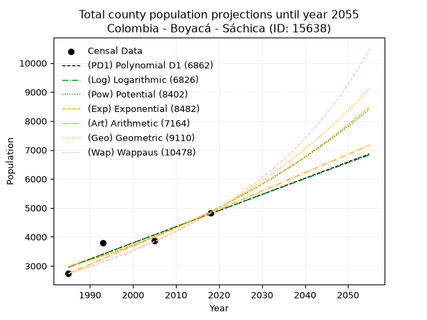
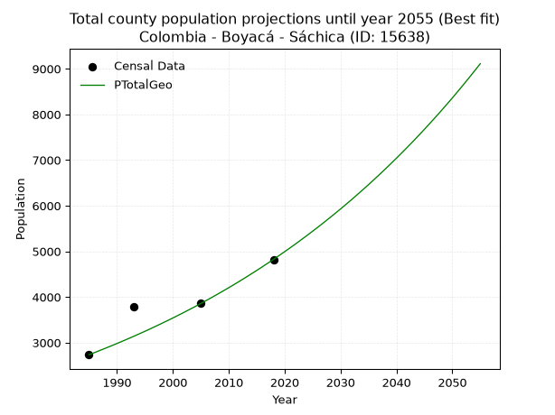
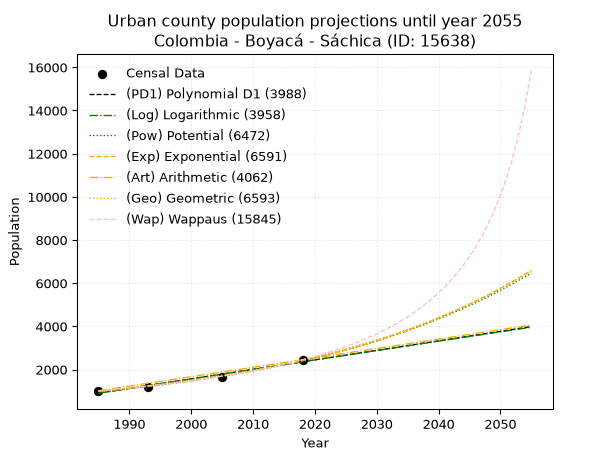
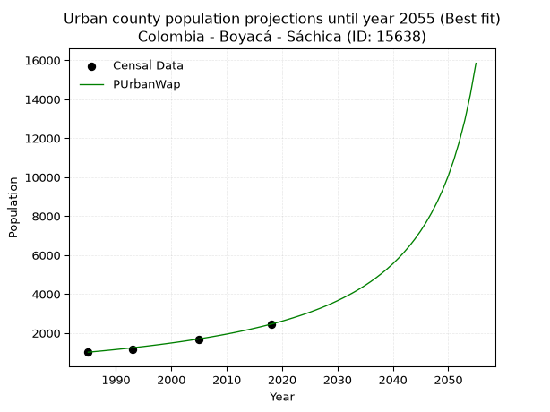
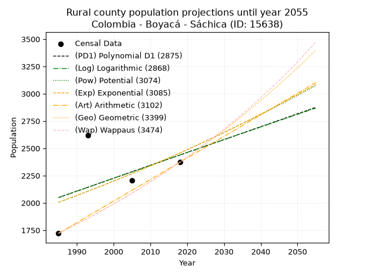
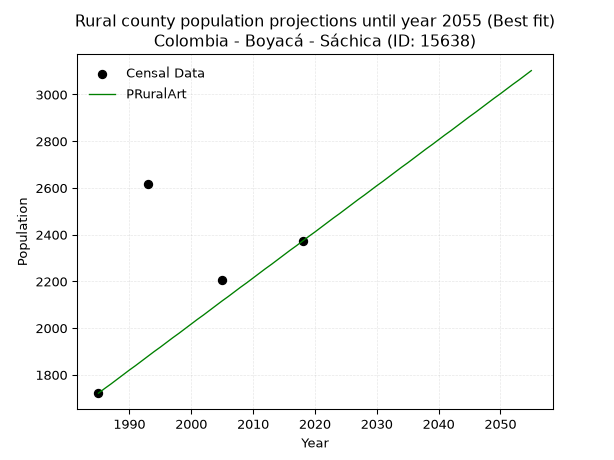

<div align="center">


</div>

# _“Population and Public Services Demand Projections (PPSD) until Year 2050 for Colombia - Boyacá - Sáchica (ID: 15638)”_
Keywords: `population` `public-service` `projection` `lineal` `polynomial` `logarithmic` `potential` `exponential` `arithmetic` `geometric` `wappaus` `dane` `colombia` `south-america`

PPSD are analytical estimates used by governments and planners to anticipate future changes in population size, age distribution, and the resulting community needs for utilities, healthcare, education, and infrastructure as sizing future water treatment facilities, electrical grids, and road networks based on spatial growth.

> **General running parameters**: • app_version: _v20260806_. • Python version: _3.14.7_. • Pandas version: _3.0.5_. • NumPy version: _2.5.1_. • Creates, save and include plots into reports (create_plot): _False_. • Projection until year: _2050_. • Process polynomial degree 2 and up: _False_. • Process Wappaus: _True_. • Process Wappaus: _True_. • Set negative values to zero: _True_. • Set infinite values to zero: _True_. • Drop dataset notes: _True_. 
<div align="center">

Dynamic map: [:earth_americas:Google](http://maps.google.com/maps?q=5.584304511,-73.5425385) [:earth_americas:OSM](https://www.openstreetmap.org/#map=18/5.584304511/-73.5425385&layers=P) [:earth_americas:Bing](https://www.bing.com/maps?cp=5.584304511~-73.5425385&lvl=18) [:earth_americas:Apple](https://maps.apple.com/frame?center=5.584304511%2C-73.5425385&span=0.003%2C0.006)

</div>


<div align="center">

```geojson
{
  "type": "Feature",
  "geometry": {
    "type": "Point", 
    "coordinates": [-73.5425385, 5.584304511]
  }, 
  "properties": {
    "Name": "Colombia - Boyacá - Sáchica (ID: 15638)"
  }
}
```

</div>


## 0. Census Data (4 records)

Census data are official statistics collected by a government about the people and housing in a country. They usually include counts of total population, age, sex, race, income, education, and jobs.

📅Global census file: [Population.xlsx](../data/Population.xlsx)

| Source   |   Year |   CountryID | CountryName   |   StateID | StateName   |   CountyID | CountyName   |   PTotal |   PUrban |   PRural |
|:---------|-------:|------------:|:--------------|----------:|:------------|-----------:|:-------------|---------:|---------:|---------:|
| DANE     |   1985 |          57 | Colombia      |        15 | Boyacá      |      15638 | Sáchica      |     2735 |     1014 |     1721 |
| DANE     |   1993 |          57 | Colombia      |        15 | Boyacá      |      15638 | Sáchica      |     3792 |     1174 |     2618 |
| DANE     |   2005 |          57 | Colombia      |        15 | Boyacá      |      15638 | Sáchica      |     3868 |     1664 |     2204 |
| DANE     |   2018 |          57 | Colombia      |        15 | Boyacá      |      15638 | Sáchica      |     4823 |     2451 |     2372 |

> 🔥Some records has specific notes about the registered values or the corresponding urban or rural distribution.

## 1. Total

### 1.1. Coefficients and Parameters

* (PD1) Polynomial Deg 1: 55.84985949417843, -107909.18145323041 (lineal)
* (Log) Logarithmic: 111811.36088471611, -846074.5500847411
* (Pow) Potential: 30.053483469557715, -95.63717075730297
* (Exp) Exponential: 0.01500811258759282, 3.420951368541115e-10
* (Art) Arithmetic: Year diff. 2018 - 1985 = 33, Population diff. 4823 - 2735 = 2088, Annual growth = 63.27272727272727
* (Geo) Geometric: Year diff. 2018 - 1985 = 33, Population diff. 4823 - 2735 = 2088, Annual growth % = 0.017338435067092206
* (Wap) Wappaus: i = 1.6743246169020183, Condition values only valid for < 200)

<sub>
Wappaus condition values: ['0.00', '1.67', '3.35', '5.02', '6.70', '8.37', '10.05', '11.72', '13.39', '15.07', '16.74', '18.42', '20.09', '21.77', '23.44', '25.11', '26.79', '28.46', '30.14', '31.81', '33.49', '35.16', '36.84', '38.51', '40.18', '41.86', '43.53', '45.21', '46.88', '48.56', '50.23', '51.90', '53.58', '55.25', '56.93', '58.60', '60.28', '61.95', '63.62', '65.30', '66.97', '68.65', '70.32', '72.00', '73.67', '75.34', '77.02', '78.69', '80.37', '82.04', '83.72', '85.39', '87.06', '88.74', '90.41', '92.09', '93.76', '95.44', '97.11', '98.79', '100.46', '102.13', '103.81', '105.48', '107.16', '108.83']
</sub>


### 1.2. Projected Dataset

|   Year |   CountyID |   PTotalPD1 |   PTotalLog |   PTotalPow |   PTotalExp |   PTotalArt |   PTotalGeo |   PTotalWap |
|-------:|-----------:|------------:|------------:|------------:|------------:|------------:|------------:|------------:|
|   1985 |      15638 |        2953 |        2951 |        2965 |        2967 |        2735 |        2735 |        2735 |
|   1986 |      15638 |        3009 |        3007 |        3010 |        3011 |        2798 |        2782 |        2781 |
|   1987 |      15638 |        3064 |        3064 |        3056 |        3057 |        2862 |        2831 |        2828 |
|   1988 |      15638 |        3120 |        3120 |        3103 |        3103 |        2925 |        2880 |        2876 |
|   1989 |      15638 |        3176 |        3176 |        3150 |        3150 |        2988 |        2930 |        2925 |
|   1990 |      15638 |        3232 |        3232 |        3198 |        3198 |        3051 |        2980 |        2974 |
|   1991 |      15638 |        3288 |        3288 |        3246 |        3246 |        3115 |        3032 |        3024 |
|   1992 |      15638 |        3344 |        3345 |        3296 |        3295 |        3178 |        3085 |        3076 |
|   1993 |      15638 |        3400 |        3401 |        3346 |        3345 |        3241 |        3138 |        3128 |
|   1994 |      15638 |        3455 |        3457 |        3397 |        3396 |        3304 |        3193 |        3181 |
|   1995 |      15638 |        3511 |        3513 |        3448 |        3447 |        3368 |        3248 |        3235 |
|   1996 |      15638 |        3567 |        3569 |        3501 |        3499 |        3431 |        3304 |        3290 |
|   1997 |      15638 |        3623 |        3625 |        3554 |        3552 |        3494 |        3362 |        3346 |
|   1998 |      15638 |        3679 |        3681 |        3608 |        3606 |        3558 |        3420 |        3403 |
|   1999 |      15638 |        3735 |        3737 |        3662 |        3660 |        3621 |        3479 |        3461 |
|   2000 |      15638 |        3791 |        3793 |        3718 |        3716 |        3684 |        3539 |        3521 |
|   2001 |      15638 |        3846 |        3849 |        3774 |        3772 |        3747 |        3601 |        3581 |
|   2002 |      15638 |        3902 |        3904 |        3831 |        3829 |        3811 |        3663 |        3643 |
|   2003 |      15638 |        3958 |        3960 |        3889 |        3887 |        3874 |        3727 |        3706 |
|   2004 |      15638 |        4014 |        4016 |        3948 |        3945 |        3937 |        3791 |        3770 |
|   2005 |      15638 |        4070 |        4072 |        4007 |        4005 |        4000 |        3857 |        3835 |
|   2006 |      15638 |        4126 |        4128 |        4068 |        4066 |        4064 |        3924 |        3902 |
|   2007 |      15638 |        4181 |        4183 |        4129 |        4127 |        4127 |        3992 |        3970 |
|   2008 |      15638 |        4237 |        4239 |        4192 |        4190 |        4190 |        4061 |        4039 |
|   2009 |      15638 |        4293 |        4295 |        4255 |        4253 |        4254 |        4132 |        4110 |
|   2010 |      15638 |        4349 |        4350 |        4319 |        4317 |        4317 |        4203 |        4183 |
|   2011 |      15638 |        4405 |        4406 |        4384 |        4383 |        4380 |        4276 |        4257 |
|   2012 |      15638 |        4461 |        4462 |        4450 |        4449 |        4443 |        4350 |        4332 |
|   2013 |      15638 |        4517 |        4517 |        4517 |        4516 |        4507 |        4426 |        4410 |
|   2014 |      15638 |        4572 |        4573 |        4585 |        4584 |        4570 |        4503 |        4489 |
|   2015 |      15638 |        4628 |        4628 |        4654 |        4654 |        4633 |        4581 |        4570 |
|   2016 |      15638 |        4684 |        4684 |        4724 |        4724 |        4696 |        4660 |        4652 |
|   2017 |      15638 |        4740 |        4739 |        4795 |        4795 |        4760 |        4741 |        4737 |
|   2018 |      15638 |        4796 |        4794 |        4867 |        4868 |        4823 |        4823 |        4823 |
|   2019 |      15638 |        4852 |        4850 |        4940 |        4942 |        4886 |        4907 |        4911 |
|   2020 |      15638 |        4908 |        4905 |        5014 |        5016 |        4950 |        4992 |        5002 |
|   2021 |      15638 |        4963 |        4961 |        5089 |        5092 |        5013 |        5078 |        5095 |
|   2022 |      15638 |        5019 |        5016 |        5165 |        5169 |        5076 |        5166 |        5190 |
|   2023 |      15638 |        5075 |        5071 |        5242 |        5247 |        5139 |        5256 |        5287 |
|   2024 |      15638 |        5131 |        5126 |        5321 |        5327 |        5203 |        5347 |        5387 |
|   2025 |      15638 |        5187 |        5182 |        5400 |        5407 |        5266 |        5440 |        5489 |
|   2026 |      15638 |        5243 |        5237 |        5481 |        5489 |        5329 |        5534 |        5594 |
|   2027 |      15638 |        5298 |        5292 |        5563 |        5572 |        5392 |        5630 |        5701 |
|   2028 |      15638 |        5354 |        5347 |        5646 |        5656 |        5456 |        5728 |        5812 |
|   2029 |      15638 |        5410 |        5402 |        5730 |        5742 |        5519 |        5827 |        5925 |
|   2030 |      15638 |        5466 |        5457 |        5816 |        5829 |        5582 |        5928 |        6041 |
|   2031 |      15638 |        5522 |        5512 |        5902 |        5917 |        5646 |        6031 |        6161 |
|   2032 |      15638 |        5578 |        5568 |        5990 |        6006 |        5709 |        6135 |        6283 |
|   2033 |      15638 |        5634 |        5623 |        6080 |        6097 |        5772 |        6242 |        6410 |
|   2034 |      15638 |        5689 |        5678 |        6170 |        6189 |        5835 |        6350 |        6539 |
|   2035 |      15638 |        5745 |        5732 |        6262 |        6283 |        5899 |        6460 |        6673 |
|   2036 |      15638 |        5801 |        5787 |        6355 |        6378 |        5962 |        6572 |        6810 |
|   2037 |      15638 |        5857 |        5842 |        6450 |        6474 |        6025 |        6686 |        6952 |
|   2038 |      15638 |        5913 |        5897 |        6545 |        6572 |        6088 |        6802 |        7098 |
|   2039 |      15638 |        5969 |        5952 |        6643 |        6672 |        6152 |        6920 |        7248 |
|   2040 |      15638 |        6025 |        6007 |        6741 |        6772 |        6215 |        7040 |        7403 |
|   2041 |      15638 |        6080 |        6062 |        6841 |        6875 |        6278 |        7162 |        7563 |
|   2042 |      15638 |        6136 |        6116 |        6943 |        6979 |        6342 |        7286 |        7728 |
|   2043 |      15638 |        6192 |        6171 |        7046 |        7084 |        6405 |        7412 |        7898 |
|   2044 |      15638 |        6248 |        6226 |        7150 |        7191 |        6468 |        7541 |        8074 |
|   2045 |      15638 |        6304 |        6281 |        7256 |        7300 |        6531 |        7672 |        8255 |
|   2046 |      15638 |        6360 |        6335 |        7363 |        7411 |        6595 |        7805 |        8444 |
|   2047 |      15638 |        6415 |        6390 |        7472 |        7523 |        6658 |        7940 |        8638 |
|   2048 |      15638 |        6471 |        6444 |        7583 |        7636 |        6721 |        8078 |        8840 |
|   2049 |      15638 |        6527 |        6499 |        7695 |        7752 |        6784 |        8218 |        9048 |
|   2050 |      15638 |        6583 |        6554 |        7809 |        7869 |        6848 |        8360 |        9265 |
<div align="center">

</img>

</div>


### 1.3. Best fit with absolute error and relative error (%)

Relative error puts that difference into context by dividing the absolute error by the true value, creating a unitless ratio or percentage that shows the scale of the mistake.

Absolute and relative error

|   Year | Source   |   CountryID | CountryName   |   StateID | StateName   |   CountyID_x | CountyName   |   PTotal |   PUrban |   PRural |   CountyID_y |   PTotalPD1 |   PTotalLog |   PTotalPow |   PTotalExp |   PTotalArt |   PTotalGeo |   PTotalWap |   PTotalPD1AbsError |   PTotalLogAbsError |   PTotalPowAbsError |   PTotalExpAbsError |   PTotalArtAbsError |   PTotalGeoAbsError |   PTotalWapAbsError |   PTotalPD1RelError |   PTotalLogRelError |   PTotalPowRelError |   PTotalExpRelError |   PTotalArtRelError |   PTotalGeoRelError |   PTotalWapRelError |
|-------:|:---------|------------:|:--------------|----------:|:------------|-------------:|:-------------|---------:|---------:|---------:|-------------:|------------:|------------:|------------:|------------:|------------:|------------:|------------:|--------------------:|--------------------:|--------------------:|--------------------:|--------------------:|--------------------:|--------------------:|--------------------:|--------------------:|--------------------:|--------------------:|--------------------:|--------------------:|--------------------:|
|   1985 | DANE     |          57 | Colombia      |        15 | Boyacá      |        15638 | Sáchica      |     2735 |     1014 |     1721 |        15638 |        2953 |        2951 |        2965 |        2967 |        2735 |        2735 |        2735 |                 218 |                 216 |                 230 |                 232 |                   0 |                   0 |                   0 |            7.97075  |            7.89762  |            8.40951  |            8.48263  |             0       |            0        |            0        |
|   1993 | DANE     |          57 | Colombia      |        15 | Boyacá      |        15638 | Sáchica      |     3792 |     1174 |     2618 |        15638 |        3400 |        3401 |        3346 |        3345 |        3241 |        3138 |        3128 |                 392 |                 391 |                 446 |                 447 |                 551 |                 654 |                 664 |           10.3376   |           10.3112   |           11.7616   |           11.788    |            14.5306  |           17.2468   |           17.5105   |
|   2005 | DANE     |          57 | Colombia      |        15 | Boyacá      |        15638 | Sáchica      |     3868 |     1664 |     2204 |        15638 |        4070 |        4072 |        4007 |        4005 |        4000 |        3857 |        3835 |                 202 |                 204 |                 139 |                 137 |                 132 |                  11 |                  33 |            5.22234  |            5.27404  |            3.59359  |            3.54188  |             3.41262 |            0.284385 |            0.853154 |
|   2018 | DANE     |          57 | Colombia      |        15 | Boyacá      |        15638 | Sáchica      |     4823 |     2451 |     2372 |        15638 |        4796 |        4794 |        4867 |        4868 |        4823 |        4823 |        4823 |                  27 |                  29 |                  44 |                  45 |                   0 |                   0 |                   0 |            0.559818 |            0.601286 |            0.912295 |            0.933029 |             0       |            0        |            0        |

Relative error mean

| Method    |   RelError | Best   |
|:----------|-----------:|:-------|
| PTotalPD1 |    6.02261 |        |
| PTotalLog |    6.02103 |        |
| PTotalPow |    6.16925 |        |
| PTotalExp |    6.18638 |        |
| PTotalArt |    4.4858  |        |
| PTotalGeo |    4.38281 | True   |
| PTotalWap |    4.59093 |        |

💙Best method: _**PTotalGeo**_
<div align="center">

</img>

</div>


### 1.4. Fresh water supply demand in liters per capita per day (lpcd)

The fresh water supply demand typically ranges from 100 to 300 liters per capita per day (lpcd) for standard domestic and municipal planning, though absolute survival minimums set by the World Health Organization are as low as 7.5 to 20 liters per day, and total consumption in high-income nations can exceed 400 liters.

> `CZ`: Level in meters above the sea level (masl).<br> `WS`: Fresh water supply demand in liters per capita per day (lpcd or l/h/d).<br> `WSAll`: Zonal fresh water supply demand in liters per second (l/s).<br> `A`: Zonal area in square meters.

Reference values (RAS Colombia)

|    CZ |   WS |
|------:|-----:|
|  1000 |  120 |
|  2000 |  130 |
| 99999 |  140 |

County shapefile geometry properties and water supply values

|   CountyID |      ATotal |   CZTotal |   WSTotal |
|-----------:|------------:|----------:|----------:|
|      15638 | 6.38252e+07 |   2366.26 |       140 |

Projected values for best method: PTotalGeo

|   CountyID |   Year |   PTotalGeo |   WSTotal |   WSTotalAll |
|-----------:|-------:|------------:|----------:|-------------:|
|      15638 |   1985 |        2735 |       140 |      4.43171 |
|      15638 |   1986 |        2782 |       140 |      4.50787 |
|      15638 |   1987 |        2831 |       140 |      4.58727 |
|      15638 |   1988 |        2880 |       140 |      4.66667 |
|      15638 |   1989 |        2930 |       140 |      4.74769 |
|      15638 |   1990 |        2980 |       140 |      4.8287  |
|      15638 |   1991 |        3032 |       140 |      4.91296 |
|      15638 |   1992 |        3085 |       140 |      4.99884 |
|      15638 |   1993 |        3138 |       140 |      5.08472 |
|      15638 |   1994 |        3193 |       140 |      5.17384 |
|      15638 |   1995 |        3248 |       140 |      5.26296 |
|      15638 |   1996 |        3304 |       140 |      5.3537  |
|      15638 |   1997 |        3362 |       140 |      5.44769 |
|      15638 |   1998 |        3420 |       140 |      5.54167 |
|      15638 |   1999 |        3479 |       140 |      5.63727 |
|      15638 |   2000 |        3539 |       140 |      5.73449 |
|      15638 |   2001 |        3601 |       140 |      5.83495 |
|      15638 |   2002 |        3663 |       140 |      5.93542 |
|      15638 |   2003 |        3727 |       140 |      6.03912 |
|      15638 |   2004 |        3791 |       140 |      6.14282 |
|      15638 |   2005 |        3857 |       140 |      6.24977 |
|      15638 |   2006 |        3924 |       140 |      6.35833 |
|      15638 |   2007 |        3992 |       140 |      6.46852 |
|      15638 |   2008 |        4061 |       140 |      6.58032 |
|      15638 |   2009 |        4132 |       140 |      6.69537 |
|      15638 |   2010 |        4203 |       140 |      6.81042 |
|      15638 |   2011 |        4276 |       140 |      6.9287  |
|      15638 |   2012 |        4350 |       140 |      7.04861 |
|      15638 |   2013 |        4426 |       140 |      7.17176 |
|      15638 |   2014 |        4503 |       140 |      7.29653 |
|      15638 |   2015 |        4581 |       140 |      7.42292 |
|      15638 |   2016 |        4660 |       140 |      7.55093 |
|      15638 |   2017 |        4741 |       140 |      7.68218 |
|      15638 |   2018 |        4823 |       140 |      7.81505 |
|      15638 |   2019 |        4907 |       140 |      7.95116 |
|      15638 |   2020 |        4992 |       140 |      8.08889 |
|      15638 |   2021 |        5078 |       140 |      8.22824 |
|      15638 |   2022 |        5166 |       140 |      8.37083 |
|      15638 |   2023 |        5256 |       140 |      8.51667 |
|      15638 |   2024 |        5347 |       140 |      8.66412 |
|      15638 |   2025 |        5440 |       140 |      8.81481 |
|      15638 |   2026 |        5534 |       140 |      8.96713 |
|      15638 |   2027 |        5630 |       140 |      9.12269 |
|      15638 |   2028 |        5728 |       140 |      9.28148 |
|      15638 |   2029 |        5827 |       140 |      9.4419  |
|      15638 |   2030 |        5928 |       140 |      9.60556 |
|      15638 |   2031 |        6031 |       140 |      9.77245 |
|      15638 |   2032 |        6135 |       140 |      9.94097 |
|      15638 |   2033 |        6242 |       140 |     10.1144  |
|      15638 |   2034 |        6350 |       140 |     10.2894  |
|      15638 |   2035 |        6460 |       140 |     10.4676  |
|      15638 |   2036 |        6572 |       140 |     10.6491  |
|      15638 |   2037 |        6686 |       140 |     10.8338  |
|      15638 |   2038 |        6802 |       140 |     11.0218  |
|      15638 |   2039 |        6920 |       140 |     11.213   |
|      15638 |   2040 |        7040 |       140 |     11.4074  |
|      15638 |   2041 |        7162 |       140 |     11.6051  |
|      15638 |   2042 |        7286 |       140 |     11.806   |
|      15638 |   2043 |        7412 |       140 |     12.0102  |
|      15638 |   2044 |        7541 |       140 |     12.2192  |
|      15638 |   2045 |        7672 |       140 |     12.4315  |
|      15638 |   2046 |        7805 |       140 |     12.647   |
|      15638 |   2047 |        7940 |       140 |     12.8657  |
|      15638 |   2048 |        8078 |       140 |     13.0894  |
|      15638 |   2049 |        8218 |       140 |     13.3162  |
|      15638 |   2050 |        8360 |       140 |     13.5463  |

## 2. Urban

### 2.1. Coefficients and Parameters

* (PD1) Polynomial Deg 1: 44.053392211962546, -86542.04777197808 (lineal)
* (Log) Logarithmic: 88139.68621505231, -668374.7112277308
* (Pow) Potential: 54.4920938391975, -176.71098361777894
* (Exp) Exponential: 0.027228552305204833, 3.297420518485378e-21
* (Art) Arithmetic: Year diff. 2018 - 1985 = 33, Population diff. 2451 - 1014 = 1437, Annual growth = 43.54545454545455
* (Geo) Geometric: Year diff. 2018 - 1985 = 33, Population diff. 2451 - 1014 = 1437, Annual growth % = 0.02710611257412543
* (Wap) Wappaus: i = 2.513446149809786, Condition values only valid for < 200)

<sub>
Wappaus condition values: ['0.00', '2.51', '5.03', '7.54', '10.05', '12.57', '15.08', '17.59', '20.11', '22.62', '25.13', '27.65', '30.16', '32.67', '35.19', '37.70', '40.22', '42.73', '45.24', '47.76', '50.27', '52.78', '55.30', '57.81', '60.32', '62.84', '65.35', '67.86', '70.38', '72.89', '75.40', '77.92', '80.43', '82.94', '85.46', '87.97', '90.48', '93.00', '95.51', '98.02', '100.54', '103.05', '105.56', '108.08', '110.59', '113.11', '115.62', '118.13', '120.65', '123.16', '125.67', '128.19', '130.70', '133.21', '135.73', '138.24', '140.75', '143.27', '145.78', '148.29', '150.81', '153.32', '155.83', '158.35', '160.86', '163.37']
</sub>


### 2.2. Projected Dataset

|   Year |   CountyID |   PUrbanPD1 |   PUrbanLog |   PUrbanPow |   PUrbanExp |   PUrbanArt |   PUrbanGeo |   PUrbanWap |
|-------:|-----------:|------------:|------------:|------------:|------------:|------------:|------------:|------------:|
|   1985 |      15638 |         904 |         903 |         979 |         980 |        1014 |        1014 |        1014 |
|   1986 |      15638 |         948 |         947 |        1006 |        1007 |        1058 |        1041 |        1040 |
|   1987 |      15638 |         992 |         992 |        1034 |        1035 |        1101 |        1070 |        1066 |
|   1988 |      15638 |        1036 |        1036 |        1063 |        1063 |        1145 |        1099 |        1093 |
|   1989 |      15638 |        1080 |        1080 |        1093 |        1093 |        1188 |        1128 |        1121 |
|   1990 |      15638 |        1124 |        1125 |        1123 |        1123 |        1232 |        1159 |        1150 |
|   1991 |      15638 |        1168 |        1169 |        1154 |        1154 |        1275 |        1191 |        1179 |
|   1992 |      15638 |        1212 |        1213 |        1186 |        1186 |        1319 |        1223 |        1210 |
|   1993 |      15638 |        1256 |        1257 |        1219 |        1218 |        1362 |        1256 |        1241 |
|   1994 |      15638 |        1300 |        1302 |        1253 |        1252 |        1406 |        1290 |        1273 |
|   1995 |      15638 |        1344 |        1346 |        1288 |        1287 |        1449 |        1325 |        1305 |
|   1996 |      15638 |        1389 |        1390 |        1323 |        1322 |        1493 |        1361 |        1339 |
|   1997 |      15638 |        1433 |        1434 |        1360 |        1359 |        1537 |        1398 |        1374 |
|   1998 |      15638 |        1477 |        1478 |        1398 |        1396 |        1580 |        1436 |        1410 |
|   1999 |      15638 |        1521 |        1522 |        1436 |        1435 |        1624 |        1475 |        1447 |
|   2000 |      15638 |        1565 |        1566 |        1476 |        1474 |        1667 |        1514 |        1485 |
|   2001 |      15638 |        1609 |        1611 |        1517 |        1515 |        1711 |        1556 |        1524 |
|   2002 |      15638 |        1653 |        1655 |        1558 |        1557 |        1754 |        1598 |        1565 |
|   2003 |      15638 |        1697 |        1699 |        1601 |        1600 |        1798 |        1641 |        1607 |
|   2004 |      15638 |        1741 |        1743 |        1646 |        1644 |        1841 |        1686 |        1650 |
|   2005 |      15638 |        1785 |        1787 |        1691 |        1689 |        1885 |        1731 |        1695 |
|   2006 |      15638 |        1829 |        1830 |        1738 |        1736 |        1928 |        1778 |        1741 |
|   2007 |      15638 |        1873 |        1874 |        1785 |        1784 |        1972 |        1826 |        1789 |
|   2008 |      15638 |        1917 |        1918 |        1835 |        1833 |        2016 |        1876 |        1839 |
|   2009 |      15638 |        1961 |        1962 |        1885 |        1884 |        2059 |        1927 |        1890 |
|   2010 |      15638 |        2005 |        2006 |        1937 |        1936 |        2103 |        1979 |        1943 |
|   2011 |      15638 |        2049 |        2050 |        1990 |        1989 |        2146 |        2033 |        1998 |
|   2012 |      15638 |        2093 |        2094 |        2045 |        2044 |        2190 |        2088 |        2056 |
|   2013 |      15638 |        2137 |        2138 |        2101 |        2100 |        2233 |        2144 |        2115 |
|   2014 |      15638 |        2181 |        2181 |        2158 |        2158 |        2277 |        2202 |        2177 |
|   2015 |      15638 |        2226 |        2225 |        2218 |        2218 |        2320 |        2262 |        2241 |
|   2016 |      15638 |        2270 |        2269 |        2278 |        2279 |        2364 |        2323 |        2308 |
|   2017 |      15638 |        2314 |        2312 |        2341 |        2342 |        2407 |        2386 |        2378 |
|   2018 |      15638 |        2358 |        2356 |        2405 |        2407 |        2451 |        2451 |        2451 |
|   2019 |      15638 |        2402 |        2400 |        2471 |        2473 |        2495 |        2517 |        2527 |
|   2020 |      15638 |        2446 |        2443 |        2538 |        2542 |        2538 |        2586 |        2606 |
|   2021 |      15638 |        2490 |        2487 |        2608 |        2612 |        2582 |        2656 |        2690 |
|   2022 |      15638 |        2534 |        2531 |        2679 |        2684 |        2625 |        2728 |        2777 |
|   2023 |      15638 |        2578 |        2574 |        2752 |        2758 |        2669 |        2802 |        2868 |
|   2024 |      15638 |        2622 |        2618 |        2827 |        2834 |        2712 |        2878 |        2963 |
|   2025 |      15638 |        2666 |        2661 |        2904 |        2912 |        2756 |        2956 |        3064 |
|   2026 |      15638 |        2710 |        2705 |        2983 |        2993 |        2799 |        3036 |        3170 |
|   2027 |      15638 |        2754 |        2748 |        3065 |        3075 |        2843 |        3118 |        3281 |
|   2028 |      15638 |        2798 |        2792 |        3148 |        3160 |        2886 |        3203 |        3398 |
|   2029 |      15638 |        2842 |        2835 |        3234 |        3247 |        2930 |        3289 |        3522 |
|   2030 |      15638 |        2886 |        2879 |        3322 |        3337 |        2974 |        3379 |        3654 |
|   2031 |      15638 |        2930 |        2922 |        3412 |        3429 |        3017 |        3470 |        3793 |
|   2032 |      15638 |        2974 |        2966 |        3505 |        3524 |        3061 |        3564 |        3940 |
|   2033 |      15638 |        3018 |        3009 |        3600 |        3621 |        3104 |        3661 |        4097 |
|   2034 |      15638 |        3063 |        3052 |        3698 |        3721 |        3148 |        3760 |        4264 |
|   2035 |      15638 |        3107 |        3096 |        3799 |        3824 |        3191 |        3862 |        4443 |
|   2036 |      15638 |        3151 |        3139 |        3902 |        3929 |        3235 |        3967 |        4634 |
|   2037 |      15638 |        3195 |        3182 |        4007 |        4038 |        3278 |        4074 |        4839 |
|   2038 |      15638 |        3239 |        3225 |        4116 |        4149 |        3322 |        4185 |        5059 |
|   2039 |      15638 |        3283 |        3269 |        4228 |        4264 |        3365 |        4298 |        5296 |
|   2040 |      15638 |        3327 |        3312 |        4342 |        4381 |        3409 |        4414 |        5553 |
|   2041 |      15638 |        3371 |        3355 |        4460 |        4502 |        3453 |        4534 |        5832 |
|   2042 |      15638 |        3415 |        3398 |        4580 |        4627 |        3496 |        4657 |        6135 |
|   2043 |      15638 |        3459 |        3441 |        4704 |        4754 |        3540 |        4783 |        6467 |
|   2044 |      15638 |        3503 |        3484 |        4831 |        4885 |        3583 |        4913 |        6830 |
|   2045 |      15638 |        3547 |        3528 |        4962 |        5020 |        3627 |        5046 |        7231 |
|   2046 |      15638 |        3591 |        3571 |        5096 |        5159 |        3670 |        5183 |        7675 |
|   2047 |      15638 |        3635 |        3614 |        5233 |        5301 |        3714 |        5323 |        8169 |
|   2048 |      15638 |        3679 |        3657 |        5374 |        5448 |        3757 |        5468 |        8724 |
|   2049 |      15638 |        3723 |        3700 |        5519 |        5598 |        3801 |        5616 |        9349 |
|   2050 |      15638 |        3767 |        3743 |        5668 |        5752 |        3844 |        5768 |       10060 |
<div align="center">

</img>

</div>


### 2.3. Best fit with absolute error and relative error (%)

Relative error puts that difference into context by dividing the absolute error by the true value, creating a unitless ratio or percentage that shows the scale of the mistake.

Absolute and relative error

|   Year | Source   |   CountryID | CountryName   |   StateID | StateName   |   CountyID_x | CountyName   |   PTotal |   PUrban |   PRural |   CountyID_y |   PUrbanPD1 |   PUrbanLog |   PUrbanPow |   PUrbanExp |   PUrbanArt |   PUrbanGeo |   PUrbanWap |   PUrbanPD1AbsError |   PUrbanLogAbsError |   PUrbanPowAbsError |   PUrbanExpAbsError |   PUrbanArtAbsError |   PUrbanGeoAbsError |   PUrbanWapAbsError |   PUrbanPD1RelError |   PUrbanLogRelError |   PUrbanPowRelError |   PUrbanExpRelError |   PUrbanArtRelError |   PUrbanGeoRelError |   PUrbanWapRelError |
|-------:|:---------|------------:|:--------------|----------:|:------------|-------------:|:-------------|---------:|---------:|---------:|-------------:|------------:|------------:|------------:|------------:|------------:|------------:|------------:|--------------------:|--------------------:|--------------------:|--------------------:|--------------------:|--------------------:|--------------------:|--------------------:|--------------------:|--------------------:|--------------------:|--------------------:|--------------------:|--------------------:|
|   1985 | DANE     |          57 | Colombia      |        15 | Boyacá      |        15638 | Sáchica      |     2735 |     1014 |     1721 |        15638 |         904 |         903 |         979 |         980 |        1014 |        1014 |        1014 |                 110 |                 111 |                  35 |                  34 |                   0 |                   0 |                   0 |            10.8481  |            10.9467  |             3.45168 |             3.35306 |              0      |             0       |             0       |
|   1993 | DANE     |          57 | Colombia      |        15 | Boyacá      |        15638 | Sáchica      |     3792 |     1174 |     2618 |        15638 |        1256 |        1257 |        1219 |        1218 |        1362 |        1256 |        1241 |                  82 |                  83 |                  45 |                  44 |                 188 |                  82 |                  67 |             6.98467 |             7.06985 |             3.83305 |             3.74787 |             16.0136 |             6.98467 |             5.70698 |
|   2005 | DANE     |          57 | Colombia      |        15 | Boyacá      |        15638 | Sáchica      |     3868 |     1664 |     2204 |        15638 |        1785 |        1787 |        1691 |        1689 |        1885 |        1731 |        1695 |                 121 |                 123 |                  27 |                  25 |                 221 |                  67 |                  31 |             7.27163 |             7.39183 |             1.6226  |             1.5024  |             13.2812 |             4.02644 |             1.86298 |
|   2018 | DANE     |          57 | Colombia      |        15 | Boyacá      |        15638 | Sáchica      |     4823 |     2451 |     2372 |        15638 |        2358 |        2356 |        2405 |        2407 |        2451 |        2451 |        2451 |                  93 |                  95 |                  46 |                  44 |                   0 |                   0 |                   0 |             3.79437 |             3.87597 |             1.87678 |             1.79519 |              0      |             0       |             0       |

Relative error mean

| Method    |   RelError | Best   |
|:----------|-----------:|:-------|
| PUrbanPD1 |    7.2247  |        |
| PUrbanLog |    7.3211  |        |
| PUrbanPow |    2.69603 |        |
| PUrbanExp |    2.59963 |        |
| PUrbanArt |    7.32372 |        |
| PUrbanGeo |    2.75278 |        |
| PUrbanWap |    1.89249 | True   |

💙Best method: _**PUrbanWap**_
<div align="center">

</img>

</div>


### 2.4. Fresh water supply demand in liters per capita per day (lpcd)

The fresh water supply demand typically ranges from 100 to 300 liters per capita per day (lpcd) for standard domestic and municipal planning, though absolute survival minimums set by the World Health Organization are as low as 7.5 to 20 liters per day, and total consumption in high-income nations can exceed 400 liters.

> `CZ`: Level in meters above the sea level (masl).<br> `WS`: Fresh water supply demand in liters per capita per day (lpcd or l/h/d).<br> `WSAll`: Zonal fresh water supply demand in liters per second (l/s).<br> `A`: Zonal area in square meters.

Reference values (RAS Colombia)

|    CZ |   WS |
|------:|-----:|
|  1000 |  120 |
|  2000 |  130 |
| 99999 |  140 |

County shapefile geometry properties and water supply values

|   CountyID |   AUrban |   CZUrban |   WSUrban |
|-----------:|---------:|----------:|----------:|
|      15638 |   793750 |   2148.75 |       140 |

Projected values for best method: PUrbanWap

|   CountyID |   Year |   PUrbanWap |   WSUrban |   WSUrbanAll |
|-----------:|-------:|------------:|----------:|-------------:|
|      15638 |   1985 |        1014 |       140 |      1.64306 |
|      15638 |   1986 |        1040 |       140 |      1.68519 |
|      15638 |   1987 |        1066 |       140 |      1.72731 |
|      15638 |   1988 |        1093 |       140 |      1.77106 |
|      15638 |   1989 |        1121 |       140 |      1.81644 |
|      15638 |   1990 |        1150 |       140 |      1.86343 |
|      15638 |   1991 |        1179 |       140 |      1.91042 |
|      15638 |   1992 |        1210 |       140 |      1.96065 |
|      15638 |   1993 |        1241 |       140 |      2.01088 |
|      15638 |   1994 |        1273 |       140 |      2.06273 |
|      15638 |   1995 |        1305 |       140 |      2.11458 |
|      15638 |   1996 |        1339 |       140 |      2.16968 |
|      15638 |   1997 |        1374 |       140 |      2.22639 |
|      15638 |   1998 |        1410 |       140 |      2.28472 |
|      15638 |   1999 |        1447 |       140 |      2.34468 |
|      15638 |   2000 |        1485 |       140 |      2.40625 |
|      15638 |   2001 |        1524 |       140 |      2.46944 |
|      15638 |   2002 |        1565 |       140 |      2.53588 |
|      15638 |   2003 |        1607 |       140 |      2.60394 |
|      15638 |   2004 |        1650 |       140 |      2.67361 |
|      15638 |   2005 |        1695 |       140 |      2.74653 |
|      15638 |   2006 |        1741 |       140 |      2.82106 |
|      15638 |   2007 |        1789 |       140 |      2.89884 |
|      15638 |   2008 |        1839 |       140 |      2.97986 |
|      15638 |   2009 |        1890 |       140 |      3.0625  |
|      15638 |   2010 |        1943 |       140 |      3.14838 |
|      15638 |   2011 |        1998 |       140 |      3.2375  |
|      15638 |   2012 |        2056 |       140 |      3.33148 |
|      15638 |   2013 |        2115 |       140 |      3.42708 |
|      15638 |   2014 |        2177 |       140 |      3.52755 |
|      15638 |   2015 |        2241 |       140 |      3.63125 |
|      15638 |   2016 |        2308 |       140 |      3.73981 |
|      15638 |   2017 |        2378 |       140 |      3.85324 |
|      15638 |   2018 |        2451 |       140 |      3.97153 |
|      15638 |   2019 |        2527 |       140 |      4.09468 |
|      15638 |   2020 |        2606 |       140 |      4.22269 |
|      15638 |   2021 |        2690 |       140 |      4.3588  |
|      15638 |   2022 |        2777 |       140 |      4.49977 |
|      15638 |   2023 |        2868 |       140 |      4.64722 |
|      15638 |   2024 |        2963 |       140 |      4.80116 |
|      15638 |   2025 |        3064 |       140 |      4.96481 |
|      15638 |   2026 |        3170 |       140 |      5.13657 |
|      15638 |   2027 |        3281 |       140 |      5.31644 |
|      15638 |   2028 |        3398 |       140 |      5.50602 |
|      15638 |   2029 |        3522 |       140 |      5.70694 |
|      15638 |   2030 |        3654 |       140 |      5.92083 |
|      15638 |   2031 |        3793 |       140 |      6.14606 |
|      15638 |   2032 |        3940 |       140 |      6.38426 |
|      15638 |   2033 |        4097 |       140 |      6.63866 |
|      15638 |   2034 |        4264 |       140 |      6.90926 |
|      15638 |   2035 |        4443 |       140 |      7.19931 |
|      15638 |   2036 |        4634 |       140 |      7.5088  |
|      15638 |   2037 |        4839 |       140 |      7.84097 |
|      15638 |   2038 |        5059 |       140 |      8.19745 |
|      15638 |   2039 |        5296 |       140 |      8.58148 |
|      15638 |   2040 |        5553 |       140 |      8.99792 |
|      15638 |   2041 |        5832 |       140 |      9.45    |
|      15638 |   2042 |        6135 |       140 |      9.94097 |
|      15638 |   2043 |        6467 |       140 |     10.4789  |
|      15638 |   2044 |        6830 |       140 |     11.0671  |
|      15638 |   2045 |        7231 |       140 |     11.7169  |
|      15638 |   2046 |        7675 |       140 |     12.4363  |
|      15638 |   2047 |        8169 |       140 |     13.2368  |
|      15638 |   2048 |        8724 |       140 |     14.1361  |
|      15638 |   2049 |        9349 |       140 |     15.1488  |
|      15638 |   2050 |       10060 |       140 |     16.3009  |

## 3. Rural

### 3.1. Coefficients and Parameters

* (PD1) Polynomial Deg 1: 11.796467282215891, -21367.133681252337 (lineal)
* (Log) Logarithmic: 23671.674669663724, -177699.8388570098
* (Pow) Potential: 12.333709809026878, -37.37149223631988
* (Exp) Exponential: 0.00614738465957626, 0.010064710362061373
* (Art) Arithmetic: Year diff. 2018 - 1985 = 33, Population diff. 2372 - 1721 = 651, Annual growth = 19.727272727272727
* (Geo) Geometric: Year diff. 2018 - 1985 = 33, Population diff. 2372 - 1721 = 651, Annual growth % = 0.009769472258168044
* (Wap) Wappaus: i = 0.9639517579903605, Condition values only valid for < 200)

<sub>
Wappaus condition values: ['0.00', '0.96', '1.93', '2.89', '3.86', '4.82', '5.78', '6.75', '7.71', '8.68', '9.64', '10.60', '11.57', '12.53', '13.50', '14.46', '15.42', '16.39', '17.35', '18.32', '19.28', '20.24', '21.21', '22.17', '23.13', '24.10', '25.06', '26.03', '26.99', '27.95', '28.92', '29.88', '30.85', '31.81', '32.77', '33.74', '34.70', '35.67', '36.63', '37.59', '38.56', '39.52', '40.49', '41.45', '42.41', '43.38', '44.34', '45.31', '46.27', '47.23', '48.20', '49.16', '50.13', '51.09', '52.05', '53.02', '53.98', '54.95', '55.91', '56.87', '57.84', '58.80', '59.77', '60.73', '61.69', '62.66']
</sub>


### 3.2. Projected Dataset

|   Year |   CountyID |   PRuralPD1 |   PRuralLog |   PRuralPow |   PRuralExp |   PRuralArt |   PRuralGeo |   PRuralWap |
|-------:|-----------:|------------:|------------:|------------:|------------:|------------:|------------:|------------:|
|   1985 |      15638 |        2049 |        2048 |        2005 |        2006 |        1721 |        1721 |        1721 |
|   1986 |      15638 |        2061 |        2060 |        2018 |        2018 |        1741 |        1738 |        1738 |
|   1987 |      15638 |        2072 |        2072 |        2030 |        2031 |        1760 |        1755 |        1755 |
|   1988 |      15638 |        2084 |        2084 |        2043 |        2043 |        1780 |        1772 |        1771 |
|   1989 |      15638 |        2096 |        2096 |        2055 |        2056 |        1800 |        1789 |        1789 |
|   1990 |      15638 |        2108 |        2108 |        2068 |        2068 |        1820 |        1807 |        1806 |
|   1991 |      15638 |        2120 |        2119 |        2081 |        2081 |        1839 |        1824 |        1824 |
|   1992 |      15638 |        2131 |        2131 |        2094 |        2094 |        1859 |        1842 |        1841 |
|   1993 |      15638 |        2143 |        2143 |        2107 |        2107 |        1879 |        1860 |        1859 |
|   1994 |      15638 |        2155 |        2155 |        2120 |        2120 |        1899 |        1878 |        1877 |
|   1995 |      15638 |        2167 |        2167 |        2133 |        2133 |        1918 |        1897 |        1895 |
|   1996 |      15638 |        2179 |        2179 |        2146 |        2146 |        1938 |        1915 |        1914 |
|   1997 |      15638 |        2190 |        2191 |        2160 |        2159 |        1958 |        1934 |        1932 |
|   1998 |      15638 |        2202 |        2203 |        2173 |        2173 |        1977 |        1953 |        1951 |
|   1999 |      15638 |        2214 |        2214 |        2187 |        2186 |        1997 |        1972 |        1970 |
|   2000 |      15638 |        2226 |        2226 |        2200 |        2200 |        2017 |        1991 |        1989 |
|   2001 |      15638 |        2238 |        2238 |        2214 |        2213 |        2037 |        2011 |        2009 |
|   2002 |      15638 |        2249 |        2250 |        2227 |        2227 |        2056 |        2030 |        2028 |
|   2003 |      15638 |        2261 |        2262 |        2241 |        2241 |        2076 |        2050 |        2048 |
|   2004 |      15638 |        2273 |        2274 |        2255 |        2254 |        2096 |        2070 |        2068 |
|   2005 |      15638 |        2285 |        2285 |        2269 |        2268 |        2116 |        2090 |        2088 |
|   2006 |      15638 |        2297 |        2297 |        2283 |        2282 |        2135 |        2111 |        2109 |
|   2007 |      15638 |        2308 |        2309 |        2297 |        2296 |        2155 |        2131 |        2129 |
|   2008 |      15638 |        2320 |        2321 |        2311 |        2311 |        2175 |        2152 |        2150 |
|   2009 |      15638 |        2332 |        2333 |        2325 |        2325 |        2194 |        2173 |        2171 |
|   2010 |      15638 |        2344 |        2344 |        2340 |        2339 |        2214 |        2195 |        2193 |
|   2011 |      15638 |        2356 |        2356 |        2354 |        2354 |        2234 |        2216 |        2214 |
|   2012 |      15638 |        2367 |        2368 |        2369 |        2368 |        2254 |        2238 |        2236 |
|   2013 |      15638 |        2379 |        2380 |        2383 |        2383 |        2273 |        2259 |        2258 |
|   2014 |      15638 |        2391 |        2391 |        2398 |        2397 |        2293 |        2282 |        2280 |
|   2015 |      15638 |        2403 |        2403 |        2413 |        2412 |        2313 |        2304 |        2303 |
|   2016 |      15638 |        2415 |        2415 |        2427 |        2427 |        2333 |        2326 |        2326 |
|   2017 |      15638 |        2426 |        2427 |        2442 |        2442 |        2352 |        2349 |        2349 |
|   2018 |      15638 |        2438 |        2438 |        2457 |        2457 |        2372 |        2372 |        2372 |
|   2019 |      15638 |        2450 |        2450 |        2472 |        2472 |        2392 |        2395 |        2396 |
|   2020 |      15638 |        2462 |        2462 |        2487 |        2487 |        2411 |        2419 |        2419 |
|   2021 |      15638 |        2474 |        2474 |        2503 |        2503 |        2431 |        2442 |        2444 |
|   2022 |      15638 |        2485 |        2485 |        2518 |        2518 |        2451 |        2466 |        2468 |
|   2023 |      15638 |        2497 |        2497 |        2533 |        2534 |        2471 |        2490 |        2493 |
|   2024 |      15638 |        2509 |        2509 |        2549 |        2549 |        2490 |        2514 |        2518 |
|   2025 |      15638 |        2521 |        2520 |        2564 |        2565 |        2510 |        2539 |        2543 |
|   2026 |      15638 |        2533 |        2532 |        2580 |        2581 |        2530 |        2564 |        2569 |
|   2027 |      15638 |        2544 |        2544 |        2596 |        2597 |        2550 |        2589 |        2595 |
|   2028 |      15638 |        2556 |        2555 |        2612 |        2613 |        2569 |        2614 |        2621 |
|   2029 |      15638 |        2568 |        2567 |        2628 |        2629 |        2589 |        2640 |        2647 |
|   2030 |      15638 |        2580 |        2579 |        2644 |        2645 |        2609 |        2666 |        2674 |
|   2031 |      15638 |        2591 |        2590 |        2660 |        2661 |        2628 |        2692 |        2702 |
|   2032 |      15638 |        2603 |        2602 |        2676 |        2678 |        2648 |        2718 |        2729 |
|   2033 |      15638 |        2615 |        2614 |        2692 |        2694 |        2668 |        2744 |        2757 |
|   2034 |      15638 |        2627 |        2625 |        2709 |        2711 |        2688 |        2771 |        2785 |
|   2035 |      15638 |        2639 |        2637 |        2725 |        2728 |        2707 |        2798 |        2814 |
|   2036 |      15638 |        2650 |        2649 |        2742 |        2745 |        2727 |        2826 |        2843 |
|   2037 |      15638 |        2662 |        2660 |        2758 |        2761 |        2747 |        2853 |        2872 |
|   2038 |      15638 |        2674 |        2672 |        2775 |        2778 |        2767 |        2881 |        2902 |
|   2039 |      15638 |        2686 |        2683 |        2792 |        2796 |        2786 |        2909 |        2932 |
|   2040 |      15638 |        2698 |        2695 |        2809 |        2813 |        2806 |        2938 |        2963 |
|   2041 |      15638 |        2709 |        2707 |        2826 |        2830 |        2826 |        2966 |        2993 |
|   2042 |      15638 |        2721 |        2718 |        2843 |        2848 |        2845 |        2995 |        3025 |
|   2043 |      15638 |        2733 |        2730 |        2860 |        2865 |        2865 |        3025 |        3057 |
|   2044 |      15638 |        2745 |        2741 |        2878 |        2883 |        2885 |        3054 |        3089 |
|   2045 |      15638 |        2757 |        2753 |        2895 |        2901 |        2905 |        3084 |        3121 |
|   2046 |      15638 |        2768 |        2765 |        2912 |        2919 |        2924 |        3114 |        3154 |
|   2047 |      15638 |        2780 |        2776 |        2930 |        2937 |        2944 |        3145 |        3188 |
|   2048 |      15638 |        2792 |        2788 |        2948 |        2955 |        2964 |        3175 |        3222 |
|   2049 |      15638 |        2804 |        2799 |        2966 |        2973 |        2984 |        3206 |        3256 |
|   2050 |      15638 |        2816 |        2811 |        2983 |        2991 |        3003 |        3238 |        3291 |
<div align="center">

</img>

</div>


### 3.3. Best fit with absolute error and relative error (%)

Relative error puts that difference into context by dividing the absolute error by the true value, creating a unitless ratio or percentage that shows the scale of the mistake.

Absolute and relative error

|   Year | Source   |   CountryID | CountryName   |   StateID | StateName   |   CountyID_x | CountyName   |   PTotal |   PUrban |   PRural |   CountyID_y |   PRuralPD1 |   PRuralLog |   PRuralPow |   PRuralExp |   PRuralArt |   PRuralGeo |   PRuralWap |   PRuralPD1AbsError |   PRuralLogAbsError |   PRuralPowAbsError |   PRuralExpAbsError |   PRuralArtAbsError |   PRuralGeoAbsError |   PRuralWapAbsError |   PRuralPD1RelError |   PRuralLogRelError |   PRuralPowRelError |   PRuralExpRelError |   PRuralArtRelError |   PRuralGeoRelError |   PRuralWapRelError |
|-------:|:---------|------------:|:--------------|----------:|:------------|-------------:|:-------------|---------:|---------:|---------:|-------------:|------------:|------------:|------------:|------------:|------------:|------------:|------------:|--------------------:|--------------------:|--------------------:|--------------------:|--------------------:|--------------------:|--------------------:|--------------------:|--------------------:|--------------------:|--------------------:|--------------------:|--------------------:|--------------------:|
|   1985 | DANE     |          57 | Colombia      |        15 | Boyacá      |        15638 | Sáchica      |     2735 |     1014 |     1721 |        15638 |        2049 |        2048 |        2005 |        2006 |        1721 |        1721 |        1721 |                 328 |                 327 |                 284 |                 285 |                   0 |                   0 |                   0 |            19.0587  |            19.0006  |            16.502   |            16.5601  |             0       |             0       |             0       |
|   1993 | DANE     |          57 | Colombia      |        15 | Boyacá      |        15638 | Sáchica      |     3792 |     1174 |     2618 |        15638 |        2143 |        2143 |        2107 |        2107 |        1879 |        1860 |        1859 |                 475 |                 475 |                 511 |                 511 |                 739 |                 758 |                 759 |            18.1436  |            18.1436  |            19.5187  |            19.5187  |            28.2277  |            28.9534  |            28.9916  |
|   2005 | DANE     |          57 | Colombia      |        15 | Boyacá      |        15638 | Sáchica      |     3868 |     1664 |     2204 |        15638 |        2285 |        2285 |        2269 |        2268 |        2116 |        2090 |        2088 |                  81 |                  81 |                  65 |                  64 |                  88 |                 114 |                 116 |             3.67514 |             3.67514 |             2.94918 |             2.90381 |             3.99274 |             5.17241 |             5.26316 |
|   2018 | DANE     |          57 | Colombia      |        15 | Boyacá      |        15638 | Sáchica      |     4823 |     2451 |     2372 |        15638 |        2438 |        2438 |        2457 |        2457 |        2372 |        2372 |        2372 |                  66 |                  66 |                  85 |                  85 |                   0 |                   0 |                   0 |             2.78246 |             2.78246 |             3.58347 |             3.58347 |             0       |             0       |             0       |

Relative error mean

| Method    |   RelError | Best   |
|:----------|-----------:|:-------|
| PRuralPD1 |   10.915   |        |
| PRuralLog |   10.9005  |        |
| PRuralPow |   10.6384  |        |
| PRuralExp |   10.6415  |        |
| PRuralArt |    8.0551  | True   |
| PRuralGeo |    8.53145 |        |
| PRuralWap |    8.56369 |        |

💙Best method: _**PRuralArt**_
<div align="center">

</img>

</div>


### 3.4. Fresh water supply demand in liters per capita per day (lpcd)

The fresh water supply demand typically ranges from 100 to 300 liters per capita per day (lpcd) for standard domestic and municipal planning, though absolute survival minimums set by the World Health Organization are as low as 7.5 to 20 liters per day, and total consumption in high-income nations can exceed 400 liters.

> `CZ`: Level in meters above the sea level (masl).<br> `WS`: Fresh water supply demand in liters per capita per day (lpcd or l/h/d).<br> `WSAll`: Zonal fresh water supply demand in liters per second (l/s).<br> `A`: Zonal area in square meters.

Reference values (RAS Colombia)

|    CZ |   WS |
|------:|-----:|
|  1000 |  120 |
|  2000 |  130 |
| 99999 |  140 |

County shapefile geometry properties and water supply values

|   CountyID |      ARural |   CZRural |   WSRural |
|-----------:|------------:|----------:|----------:|
|      15638 | 6.30315e+07 |   2368.95 |       140 |

Projected values for best method: PRuralArt

|   CountyID |   Year |   PRuralArt |   WSRural |   WSRuralAll |
|-----------:|-------:|------------:|----------:|-------------:|
|      15638 |   1985 |        1721 |       140 |      2.78866 |
|      15638 |   1986 |        1741 |       140 |      2.82106 |
|      15638 |   1987 |        1760 |       140 |      2.85185 |
|      15638 |   1988 |        1780 |       140 |      2.88426 |
|      15638 |   1989 |        1800 |       140 |      2.91667 |
|      15638 |   1990 |        1820 |       140 |      2.94907 |
|      15638 |   1991 |        1839 |       140 |      2.97986 |
|      15638 |   1992 |        1859 |       140 |      3.01227 |
|      15638 |   1993 |        1879 |       140 |      3.04468 |
|      15638 |   1994 |        1899 |       140 |      3.07708 |
|      15638 |   1995 |        1918 |       140 |      3.10787 |
|      15638 |   1996 |        1938 |       140 |      3.14028 |
|      15638 |   1997 |        1958 |       140 |      3.17269 |
|      15638 |   1998 |        1977 |       140 |      3.20347 |
|      15638 |   1999 |        1997 |       140 |      3.23588 |
|      15638 |   2000 |        2017 |       140 |      3.26829 |
|      15638 |   2001 |        2037 |       140 |      3.30069 |
|      15638 |   2002 |        2056 |       140 |      3.33148 |
|      15638 |   2003 |        2076 |       140 |      3.36389 |
|      15638 |   2004 |        2096 |       140 |      3.3963  |
|      15638 |   2005 |        2116 |       140 |      3.4287  |
|      15638 |   2006 |        2135 |       140 |      3.45949 |
|      15638 |   2007 |        2155 |       140 |      3.4919  |
|      15638 |   2008 |        2175 |       140 |      3.52431 |
|      15638 |   2009 |        2194 |       140 |      3.55509 |
|      15638 |   2010 |        2214 |       140 |      3.5875  |
|      15638 |   2011 |        2234 |       140 |      3.61991 |
|      15638 |   2012 |        2254 |       140 |      3.65231 |
|      15638 |   2013 |        2273 |       140 |      3.6831  |
|      15638 |   2014 |        2293 |       140 |      3.71551 |
|      15638 |   2015 |        2313 |       140 |      3.74792 |
|      15638 |   2016 |        2333 |       140 |      3.78032 |
|      15638 |   2017 |        2352 |       140 |      3.81111 |
|      15638 |   2018 |        2372 |       140 |      3.84352 |
|      15638 |   2019 |        2392 |       140 |      3.87593 |
|      15638 |   2020 |        2411 |       140 |      3.90671 |
|      15638 |   2021 |        2431 |       140 |      3.93912 |
|      15638 |   2022 |        2451 |       140 |      3.97153 |
|      15638 |   2023 |        2471 |       140 |      4.00394 |
|      15638 |   2024 |        2490 |       140 |      4.03472 |
|      15638 |   2025 |        2510 |       140 |      4.06713 |
|      15638 |   2026 |        2530 |       140 |      4.09954 |
|      15638 |   2027 |        2550 |       140 |      4.13194 |
|      15638 |   2028 |        2569 |       140 |      4.16273 |
|      15638 |   2029 |        2589 |       140 |      4.19514 |
|      15638 |   2030 |        2609 |       140 |      4.22755 |
|      15638 |   2031 |        2628 |       140 |      4.25833 |
|      15638 |   2032 |        2648 |       140 |      4.29074 |
|      15638 |   2033 |        2668 |       140 |      4.32315 |
|      15638 |   2034 |        2688 |       140 |      4.35556 |
|      15638 |   2035 |        2707 |       140 |      4.38634 |
|      15638 |   2036 |        2727 |       140 |      4.41875 |
|      15638 |   2037 |        2747 |       140 |      4.45116 |
|      15638 |   2038 |        2767 |       140 |      4.48356 |
|      15638 |   2039 |        2786 |       140 |      4.51435 |
|      15638 |   2040 |        2806 |       140 |      4.54676 |
|      15638 |   2041 |        2826 |       140 |      4.57917 |
|      15638 |   2042 |        2845 |       140 |      4.60995 |
|      15638 |   2043 |        2865 |       140 |      4.64236 |
|      15638 |   2044 |        2885 |       140 |      4.67477 |
|      15638 |   2045 |        2905 |       140 |      4.70718 |
|      15638 |   2046 |        2924 |       140 |      4.73796 |
|      15638 |   2047 |        2944 |       140 |      4.77037 |
|      15638 |   2048 |        2964 |       140 |      4.80278 |
|      15638 |   2049 |        2984 |       140 |      4.83519 |
|      15638 |   2050 |        3003 |       140 |      4.86597 |

<div align="center"><br><sub>Share this research</sub></div><br>

<sub>**APPS & TOOLS & CONTENT DISCLAIMER**: • NO WARRANTY - This content and software is provided by <a href="https://github.com/rcfdtools" target="_blank">github.com/rcfdtools</a> "as is", without any express or implied warranty, including warranties of merchantability, fitness for a particular purpose, or non-infringement. There is no guarantee that the software will be error-free or operate without interruption. • LIMITATION OF LIABILITY - Neither the authors nor copyright holders will be liable for claims or damages arising from the software or its use. You are responsible for determining if the software is appropriate for your use and assume all associated risks, including errors, legal compliance, and data loss. • NO PROFESSIONAL ADVICE - The software provides general information and does not offer professional advice. It should not replace consultation with professional advisors. [Clauses and global license for rcfdtools use.](https://github.com/rcfdtools/rcfdtools/blob/main/LICENSE.md)</sub>