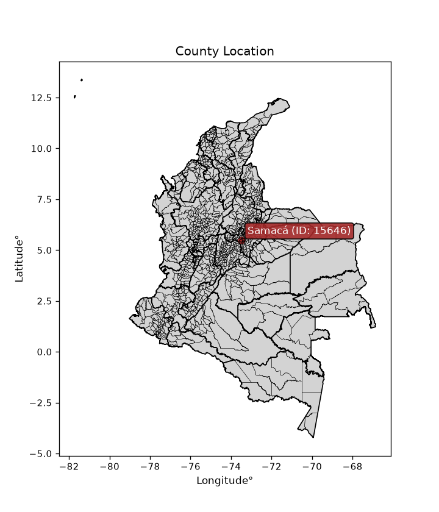
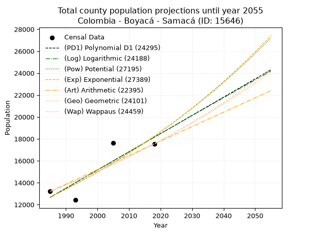
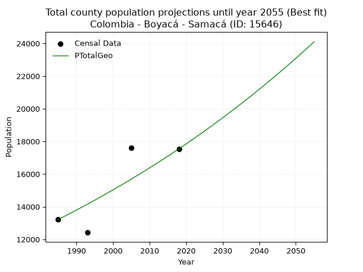
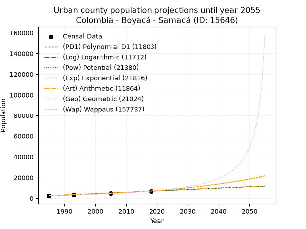
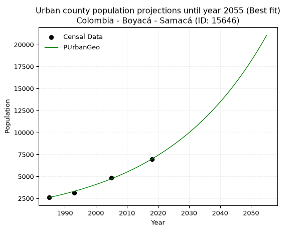
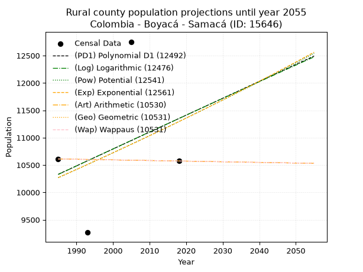
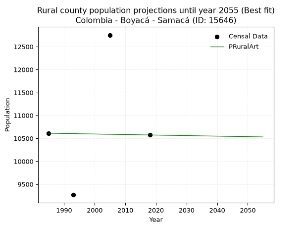

<div align="center">


</div>

# _“Population and Public Services Demand Projections (PPSD) until Year 2050 for Colombia - Boyacá - Samacá (ID: 15646)”_
Keywords: `population` `public-service` `projection` `lineal` `polynomial` `logarithmic` `potential` `exponential` `arithmetic` `geometric` `wappaus` `dane` `colombia` `south-america`

PPSD are analytical estimates used by governments and planners to anticipate future changes in population size, age distribution, and the resulting community needs for utilities, healthcare, education, and infrastructure as sizing future water treatment facilities, electrical grids, and road networks based on spatial growth.

<div align="center">

</img>

</div>


> **General running parameters**: • app_version: _v20260806_. • Python version: _3.14.7_. • Pandas version: _3.0.5_. • NumPy version: _2.5.1_. • Creates, save and include plots into reports (create_plot): _False_. • Projection until year: _2050_. • Process polynomial degree 2 and up: _False_. • Process Wappaus: _True_. • Process Wappaus: _True_. • Set negative values to zero: _True_. • Set infinite values to zero: _True_. • Drop dataset notes: _True_. 
<div align="center">

Dynamic map: [:earth_americas:Google](http://maps.google.com/maps?q=5.492160547,-73.4855888) [:earth_americas:OSM](https://www.openstreetmap.org/#map=18/5.492160547/-73.4855888&layers=P) [:earth_americas:Bing](https://www.bing.com/maps?cp=5.492160547~-73.4855888&lvl=18) [:earth_americas:Apple](https://maps.apple.com/frame?center=5.492160547%2C-73.4855888&span=0.003%2C0.006)

</div>


<div align="center">

```geojson
{
  "type": "Feature",
  "geometry": {
    "type": "Point", 
    "coordinates": [-73.4855888, 5.492160547]
  }, 
  "properties": {
    "Name": "Colombia - Boyacá - Samacá (ID: 15646)"
  }
}
```

</div>


## 0. Census Data (4 records)

Census data are official statistics collected by a government about the people and housing in a country. They usually include counts of total population, age, sex, race, income, education, and jobs.

📅Global census file: [Population.xlsx](../data/Population.xlsx)

| Source   |   Year |   CountryID | CountryName   |   StateID | StateName   |   CountyID | CountyName   |   PTotal |   PUrban |   PRural |
|:---------|-------:|------------:|:--------------|----------:|:------------|-----------:|:-------------|---------:|---------:|---------:|
| DANE     |   1985 |          57 | Colombia      |        15 | Boyacá      |      15646 | Samacá       |    13214 |     2603 |    10611 |
| DANE     |   1993 |          57 | Colombia      |        15 | Boyacá      |      15646 | Samacá       |    12419 |     3152 |     9267 |
| DANE     |   2005 |          57 | Colombia      |        15 | Boyacá      |      15646 | Samacá       |    17614 |     4862 |    12752 |
| DANE     |   2018 |          57 | Colombia      |        15 | Boyacá      |      15646 | Samacá       |    17542 |     6969 |    10573 |

> 🔥Some records could had specific notes about the registered values or the corresponding urban or rural distribution.

📅[SUI-RUPS](https://www.datos.gov.co/Hacienda-y-Cr-dito-P-blico/Registro-nico-de-Prestadores-de-Servicios-P-blicos/4qkq-csdn/about_data) - Local public utility companies: [RUPS.csv](../data/RUPS.xlsx)

 | SERVICIO       | ESTADO    | NOMBRE                                                                                                                                                | NIT         | DEPARTAMENTO_DOMICILIO   | MUNICIPIO_DOMICILIO   | DIRECCION                                       |   TELEFONO | EMAIL                          | TIPO_PRESTADOR                             | CLASIFICACION                 |
|:---------------|:----------|:------------------------------------------------------------------------------------------------------------------------------------------------------|:------------|:-------------------------|:----------------------|:------------------------------------------------|-----------:|:-------------------------------|:-------------------------------------------|:------------------------------|
| ACUEDUCTO      | OPERATIVA | ASOCIACION DE SUSCRIPTORES DEL ACUEDUCTO SAN ROQUE DE LA VEREDA RUCHICAL SECTOR ALTO MUNICIPIO DE SAMACA                                              | 820003446-1 | BOYACA                   | SAMACA                | VEREDA RUCHICAL                                 |    7372890 | san.roque3446@gmail.com        | ORGANIZACION AUTORIZADA                    | MENOR O IGUAL A 2500 USUARIOS |
| ACUEDUCTO      | OPERATIVA | SERVITEATINOSAMACA S.A. E.S.P.                                                                                                                        | 900283400-1 | BOYACA                   | SAMACA                | Cra. 5 No.4-38                                  |    7372699 | serviteatinosamaca@hotmail.com | SOCIEDADES (EMPRESA DE SERVICIOS PUBLICOS) | MENOR O IGUAL A 2500 USUARIOS |
| ALCANTARILLADO | OPERATIVA | SERVITEATINOSAMACA S.A. E.S.P.                                                                                                                        | 900283400-1 | BOYACA                   | SAMACA                | Cra. 5 No.4-38                                  |    7372699 | serviteatinosamaca@hotmail.com | SOCIEDADES (EMPRESA DE SERVICIOS PUBLICOS) | MENOR O IGUAL A 2500 USUARIOS |
| ACUEDUCTO      | OPERATIVA | ASOCIACION DE SUSCRIPTORES DEL ACUEDUCTO GACAL CENTRO DEL MUNICIPIO DE SAMACA DEPARTAMENTO DE BOYACA                                                  | 900314270-5 | BOYACA                   | SAMACA                | VEREDA GACAL                                    |    0000000 | SIN@SIN.COM                    | ORGANIZACION AUTORIZADA                    | HASTA 2500 SUSCRIPTORES       |
| ACUEDUCTO      | OPERATIVA | ASOCIACION DE SUSCRIPTORES DEL ACUEDUCTO EL TRIUNFO DE LAS VEREDAS PARAMO CENTRO TIBAQUIRA Y GUANTOQUE DEL MUNICIPIO DE SAMACA DEPARTAMENTO DE BOYACA | 900353792-4 | BOYACA                   | SAMACA                | VEREDA TIBAQUIRA Y GUANTOQUE SECTOR LA CUMBRE   |    7408706 | egresap@hotmail.com            | ORGANIZACION AUTORIZADA                    | MENOR O IGUAL A 2500 USUARIOS |
| ACUEDUCTO      | OPERATIVA | ASOCIACION DE SUSCRIPTORES DEL ACUEDUCTO VEREDAL LAS PEÑITAS DEL MUNICIPIO DE SAMACA                                                                  | 900332810-9 | BOYACA                   | SAMACA                | VEREDA TIBAQUIRA SECTOR LA CABUYA SALON COMUNAL |    7372365 | egresap@hotmail.com            | ORGANIZACION AUTORIZADA                    | MENOR O IGUAL A 2500 USUARIOS |
| ACUEDUCTO      | OPERATIVA | ASOCIACION DE SUSCRIPTORES DEL ACUEDUCTO LAS ANIMAS DE LA VEREDA RUCHICAL RINCON SANTO DEL MUNICIPIO DE SAMACA                                        | 830501774-3 | BOYACA                   | SAMACA                | VEREDA RUCHICAL RINCON SANTO                    |    7372095 | egresap@hotmail.com            | ORGANIZACION AUTORIZADA                    | MENOR O IGUAL A 2500 USUARIOS |
| ACUEDUCTO      | OPERATIVA | ASOCIACION DE SUSCRIPTORES DEL ACUEDUCTO CARTAGENA                                                                                                    | 820005078-1 | BOYACA                   | SAMACA                | VEREDA PARAMO CENTRO                            |    0000000 | eliassanchez1203@hotmail.com   | ORGANIZACION AUTORIZADA                    | HASTA 2500 SUSCRIPTORES       |
| ACUEDUCTO      | OPERATIVA | ASOCIACION DE SUSCRIPTORES DEL ACUEDUCTO SALAMANCA DE MUNICIPIO DE SAMACA                                                                             | 900228715-2 | BOYACA                   | SAMACA                | calle  5 no 5 - 30                              |    7372095 | egresap@hotmail.com            | ORGANIZACION AUTORIZADA                    | MENOR O IGUAL A 2500 USUARIOS |
| ACUEDUCTO      | OPERATIVA | ASOCIACION DE SUSCRIPTORES DEL ACUEDUCTO SANTA TERESA DE LA VEREDA CHORRERA                                                                           | 820004546-2 | BOYACA                   | SAMACA                | VEREDA CHORRERA                                 |    7373209 | egresap@hotmail.com            | ORGANIZACION AUTORIZADA                    | MENOR O IGUAL A 2500 USUARIOS |
| ACUEDUCTO      | OPERATIVA | ASOCIACION PROACUEDUCTO DE LA VEREDA CHURUVITA SECTOR CERRITO                                                                                         | 820003545-0 | BOYACA                   | SAMACA                | calle 5 Nº 5-30 OFI 202                         |    7372095 | egresap@hotmail.com            | ORGANIZACION AUTORIZADA                    | MENOR O IGUAL A 2500 USUARIOS |
| ACUEDUCTO      | OPERATIVA | ASOCIACION DE SUSCRIPTORES DEL PRO-ACUEDUCTO DE LA VEREDA GACAL BAJO SECTOR BARRIO LOPEZ                                                              | 900273848-4 | BOYACA                   | SAMACA                | calle 5 Nº 5-30 OFI 202                         |    7372890 | egresap@hotmail.com            | ORGANIZACION AUTORIZADA                    | MENOR O IGUAL A 2500 USUARIOS |
| ACUEDUCTO      | OPERATIVA | ASOCIACION DE SUSCRIPTORES DEL ACUEDUCTO LA MANITA DE LA VEREDA RUCHICAL SECTOR MEDIO MUNICIPIO DE SAMACA                                             | 820004338-7 | BOYACA                   | SAMACA                | VEREDA RUCHICAL                                 |    0000000 | egresap@hotmail.com            | ORGANIZACION AUTORIZADA                    | MENOR O IGUAL A 2500 USUARIOS |
| ACUEDUCTO      | OPERATIVA | ASOCIACION DE SUSCRIPTORES DEL ACUEDUCTO VEREDA CHURUVITA SECTOR EL MAMONAL DE SAMACA                                                                 | 820005659-0 | BOYACA                   | SAMACA                | VEREDA CHURUVITA                                |    7372095 | madse8@hotmail.com             | ORGANIZACION AUTORIZADA                    | MENOR O IGUAL A 2500 USUARIOS |
| ACUEDUCTO      | OPERATIVA | ASOCIACIÓN DE SUSCRIPTORES DEL ACUEDUCTO EL MANANTIAL VEREDA CHURUVITA DEL MUNICIPIO DE SAMACA DEPARTAMENTO DE BOYACA                                 | 900366397-4 | BOYACA                   | SAMACA                | VEREDA CHURUVITA MUNICIPIO DE SAMACA            |    7372095 | egresap@hotmail.com            | ORGANIZACION AUTORIZADA                    | MENOR O IGUAL A 2500 USUARIOS |
| ACUEDUCTO      | OPERATIVA | ASOCIACIÓN DE SUSCRIPTORES DEL ACUEDUCTO VEREDAL SAN FELIPE DE LA VEREDA CHORRERA ALTO DEL AIRE DEL MUNICIPIO DE SAMACA                               | 820005240-9 | BOYACA                   | SAMACA                | VEREDA CHORRERA MUNICIPIO DE SAMACA             |    0000000 | egresap@hotmail.com            | ORGANIZACION AUTORIZADA                    | MENOR O IGUAL A 2500 USUARIOS |
| ACUEDUCTO      | OPERATIVA | ASOCIACION DE SUSCRIPTORES DEL ACUEDUCTO EL MIRADOR DE LA VEREDA DE SALAMANCA SECTOR LA FABRICA                                                       | 900001680-8 | BOYACA                   | SAMACA                | calle 5 No 5-30                                 |    7372095 | egresap@hotmail.com            | ORGANIZACION AUTORIZADA                    | MENOR O IGUAL A 2500 USUARIOS |
| ACUEDUCTO      | OPERATIVA | ASOCIACIÓN DE SUSCRIPTORES DEL ACUEDUCTO LOS PINOS DEL MUNICIPIO DE SAMACA                                                                            | 900280316-7 | BOYACA                   | SAMACA                | calle 5 Nº 5-30 OFI 202                         |    0000000 | egresap@hotmail.com            | ORGANIZACION AUTORIZADA                    | MENOR O IGUAL A 2500 USUARIOS |
| ACUEDUCTO      | OPERATIVA | ASOCIACION DE SUSCRIPTORES DEL ACUEDUCTO RAMA BLANCA DE LA VEREDA PATAGUY DEL MUNICIPIO DE SAMACA                                                     | 820004803-0 | BOYACA                   | SAMACA                | VEREDA PATAGUY                                  |    7372095 | egresap@hotmail.com            | ORGANIZACION AUTORIZADA                    | MENOR O IGUAL A 2500 USUARIOS |
| ACUEDUCTO      | OPERATIVA | ASOCIACION DE SUSCRIPTORES DEL ACUEDUCTO DE LA VEREDA CHURUVITA DEL SECTOR SANTO DOMINGO MUNICIPIO DE SAMACA-BOYACA DESAGUADERO                       | 820003508-8 | BOYACA                   | SAMACA                | CLL N° 5- 30 OFICINA 202                        |    3125489 | egresap@hotmail.com            | ORGANIZACION AUTORIZADA                    | MENOR O IGUAL A 2500 USUARIOS |
| ACUEDUCTO      | OPERATIVA | ASOCIACION DE SUSCRIPTORES DEL ACUEDUCTO LA RANCHERIA DE LA VEREDA EL QUITE                                                                           | 820003925-6 | BOYACA                   | SAMACA                | VEREDA EL QUITE                                 |    7372702 | egresap@hotmail.com            | ORGANIZACION AUTORIZADA                    | MENOR O IGUAL A 2500 USUARIOS |
| ACUEDUCTO      | OPERATIVA | ASOCIACION DE SUSCRIPTORES DEL ACUEDUCTO LAS QUEBRADITAS DE LA VEREDA SALAMANCA DE SAMACA BOYACA                                                      | 820004488-3 | BOYACA                   | SAMACA                | Calle 5a No 5.30 oficina 202                    |    7372886 | egresap@hotmail.com            | ORGANIZACION AUTORIZADA                    | MENOR O IGUAL A 2500 USUARIOS |
| ACUEDUCTO      | OPERATIVA | ASOCIACION DE SUSCRIPTORES DEL ACUEDUCTO EL LAUREL DEL MUNICIPIO DE SAMACA DEPARTAMENTO DE BOYACA                                                     | 900320201-1 | BOYACA                   | SAMACA                | VEREDA EL QUITE                                 |    0000000 | egresap@hotmail.com            | ORGANIZACION AUTORIZADA                    | MENOR O IGUAL A 2500 USUARIOS |
| ACUEDUCTO      | OPERATIVA | ASOCIACION DE SUSCRIPTORES DEL ACUEDUCTO LA PIÑUELA DE LA VEREDA EL QUITE DEL MUNICIPIO DE SAMACA                                                     | 900274171-1 | BOYACA                   | SAMACA                | VEREDA EL QUITE                                 |    0000000 | egresap@hotmail.com            | ORGANIZACION AUTORIZADA                    | MENOR O IGUAL A 2500 USUARIOS |
| ACUEDUCTO      | OPERATIVA | ASOCIACION DE SUSCRIPTORES DEL ACUEDUCTO LA CASCADA VEREDA CHURUBITA MUNICIPIO DE SAMACA                                                              | 901033745-9 | BOYACA                   | SAMACA                | Calle 5a No 5 30 oficina 202                    |    7372702 | egresap@hotmail.com            | ORGANIZACION AUTORIZADA                    | MENOR O IGUAL A 2500 USUARIOS |

## 1. Total

### 1.1. Coefficients and Parameters

* (PD1) Polynomial Deg 1: 166.17543155359266, -317195.1569650738 (lineal)
* (Log) Logarithmic: 332706.15943681955, -2513704.9340191027
* (Pow) Potential: 22.00275432357716, -68.45649614156146
* (Exp) Exponential: 0.010990026771888504, 4.258486884900337e-06
* (Art) Arithmetic: Year diff. 2018 - 1985 = 33, Population diff. 17542 - 13214 = 4328, Annual growth = 131.15151515151516
* (Geo) Geometric: Year diff. 2018 - 1985 = 33, Population diff. 17542 - 13214 = 4328, Annual growth % = 0.008622449855860026
* (Wap) Wappaus: i = 0.8528515746619532, Condition values only valid for < 200)

<sub>
Wappaus condition values: ['0.00', '0.85', '1.71', '2.56', '3.41', '4.26', '5.12', '5.97', '6.82', '7.68', '8.53', '9.38', '10.23', '11.09', '11.94', '12.79', '13.65', '14.50', '15.35', '16.20', '17.06', '17.91', '18.76', '19.62', '20.47', '21.32', '22.17', '23.03', '23.88', '24.73', '25.59', '26.44', '27.29', '28.14', '29.00', '29.85', '30.70', '31.56', '32.41', '33.26', '34.11', '34.97', '35.82', '36.67', '37.53', '38.38', '39.23', '40.08', '40.94', '41.79', '42.64', '43.50', '44.35', '45.20', '46.05', '46.91', '47.76', '48.61', '49.47', '50.32', '51.17', '52.02', '52.88', '53.73', '54.58', '55.44']
</sub>


### 1.2. Projected Dataset

|   Year |   CountyID |   PTotalPD1 |   PTotalLog |   PTotalPow |   PTotalExp |   PTotalArt |   PTotalGeo |   PTotalWap |
|-------:|-----------:|------------:|------------:|------------:|------------:|------------:|------------:|------------:|
|   1985 |      15646 |       12663 |       12657 |       12686 |       12690 |       13214 |       13214 |       13214 |
|   1986 |      15646 |       12829 |       12825 |       12827 |       12831 |       13345 |       13328 |       13327 |
|   1987 |      15646 |       12995 |       12992 |       12970 |       12972 |       13476 |       13443 |       13441 |
|   1988 |      15646 |       13162 |       13160 |       13114 |       13116 |       13607 |       13559 |       13556 |
|   1989 |      15646 |       13328 |       13327 |       13260 |       13261 |       13739 |       13676 |       13673 |
|   1990 |      15646 |       13494 |       13494 |       13408 |       13407 |       13870 |       13794 |       13790 |
|   1991 |      15646 |       13660 |       13662 |       13557 |       13555 |       14001 |       13913 |       13908 |
|   1992 |      15646 |       13826 |       13829 |       13707 |       13705 |       14132 |       14032 |       14027 |
|   1993 |      15646 |       13992 |       13996 |       13860 |       13857 |       14263 |       14153 |       14147 |
|   1994 |      15646 |       14159 |       14163 |       14013 |       14010 |       14394 |       14276 |       14269 |
|   1995 |      15646 |       14325 |       14329 |       14169 |       14165 |       14526 |       14399 |       14391 |
|   1996 |      15646 |       14491 |       14496 |       14326 |       14321 |       14657 |       14523 |       14515 |
|   1997 |      15646 |       14657 |       14663 |       14485 |       14479 |       14788 |       14648 |       14639 |
|   1998 |      15646 |       14823 |       14829 |       14645 |       14639 |       14919 |       14774 |       14765 |
|   1999 |      15646 |       14990 |       14996 |       14807 |       14801 |       15050 |       14902 |       14892 |
|   2000 |      15646 |       15156 |       15162 |       14971 |       14965 |       15181 |       15030 |       15020 |
|   2001 |      15646 |       15322 |       15328 |       15137 |       15130 |       15312 |       15160 |       15149 |
|   2002 |      15646 |       15488 |       15495 |       15304 |       15297 |       15444 |       15290 |       15280 |
|   2003 |      15646 |       15654 |       15661 |       15473 |       15466 |       15575 |       15422 |       15411 |
|   2004 |      15646 |       15820 |       15827 |       15644 |       15637 |       15706 |       15555 |       15544 |
|   2005 |      15646 |       15987 |       15993 |       15817 |       15810 |       15837 |       15689 |       15678 |
|   2006 |      15646 |       16153 |       16159 |       15991 |       15985 |       15968 |       15825 |       15813 |
|   2007 |      15646 |       16319 |       16325 |       16167 |       16161 |       16099 |       15961 |       15950 |
|   2008 |      15646 |       16485 |       16490 |       16346 |       16340 |       16230 |       16099 |       16088 |
|   2009 |      15646 |       16651 |       16656 |       16526 |       16521 |       16362 |       16238 |       16227 |
|   2010 |      15646 |       16817 |       16822 |       16708 |       16703 |       16493 |       16378 |       16368 |
|   2011 |      15646 |       16984 |       16987 |       16891 |       16888 |       16624 |       16519 |       16509 |
|   2012 |      15646 |       17150 |       17152 |       17077 |       17074 |       16755 |       16661 |       16653 |
|   2013 |      15646 |       17316 |       17318 |       17265 |       17263 |       16886 |       16805 |       16797 |
|   2014 |      15646 |       17482 |       17483 |       17455 |       17454 |       17017 |       16950 |       16943 |
|   2015 |      15646 |       17648 |       17648 |       17646 |       17647 |       17149 |       17096 |       17091 |
|   2016 |      15646 |       17815 |       17813 |       17840 |       17842 |       17280 |       17243 |       17240 |
|   2017 |      15646 |       17981 |       17978 |       18036 |       18039 |       17411 |       17392 |       17390 |
|   2018 |      15646 |       18147 |       18143 |       18234 |       18238 |       17542 |       17542 |       17542 |
|   2019 |      15646 |       18313 |       18308 |       18433 |       18440 |       17673 |       17693 |       17695 |
|   2020 |      15646 |       18479 |       18473 |       18635 |       18644 |       17804 |       17846 |       17850 |
|   2021 |      15646 |       18645 |       18637 |       18839 |       18850 |       17935 |       18000 |       18007 |
|   2022 |      15646 |       18812 |       18802 |       19046 |       19058 |       18067 |       18155 |       18165 |
|   2023 |      15646 |       18978 |       18966 |       19254 |       19269 |       18198 |       18311 |       18325 |
|   2024 |      15646 |       19144 |       19131 |       19464 |       19481 |       18329 |       18469 |       18486 |
|   2025 |      15646 |       19310 |       19295 |       19677 |       19697 |       18460 |       18629 |       18649 |
|   2026 |      15646 |       19476 |       19459 |       19892 |       19914 |       18591 |       18789 |       18814 |
|   2027 |      15646 |       19642 |       19624 |       20109 |       20134 |       18722 |       18951 |       18980 |
|   2028 |      15646 |       19809 |       19788 |       20329 |       20357 |       18854 |       19115 |       19148 |
|   2029 |      15646 |       19975 |       19952 |       20550 |       20582 |       18985 |       19279 |       19318 |
|   2030 |      15646 |       20141 |       20116 |       20774 |       20809 |       19116 |       19446 |       19490 |
|   2031 |      15646 |       20307 |       20280 |       21001 |       21039 |       19247 |       19613 |       19663 |
|   2032 |      15646 |       20473 |       20443 |       21229 |       21272 |       19378 |       19782 |       19838 |
|   2033 |      15646 |       20639 |       20607 |       21460 |       21507 |       19509 |       19953 |       20016 |
|   2034 |      15646 |       20806 |       20771 |       21694 |       21745 |       19640 |       20125 |       20195 |
|   2035 |      15646 |       20972 |       20934 |       21930 |       21985 |       19772 |       20299 |       20376 |
|   2036 |      15646 |       21138 |       21098 |       22168 |       22228 |       19903 |       20474 |       20559 |
|   2037 |      15646 |       21304 |       21261 |       22409 |       22473 |       20034 |       20650 |       20744 |
|   2038 |      15646 |       21470 |       21424 |       22652 |       22722 |       20165 |       20828 |       20931 |
|   2039 |      15646 |       21637 |       21587 |       22898 |       22973 |       20296 |       21008 |       21120 |
|   2040 |      15646 |       21803 |       21751 |       23146 |       23227 |       20427 |       21189 |       21311 |
|   2041 |      15646 |       21969 |       21914 |       23397 |       23483 |       20558 |       21372 |       21505 |
|   2042 |      15646 |       22135 |       22077 |       23651 |       23743 |       20690 |       21556 |       21700 |
|   2043 |      15646 |       22301 |       22240 |       23907 |       24005 |       20821 |       21742 |       21898 |
|   2044 |      15646 |       22467 |       22402 |       24166 |       24271 |       20952 |       21929 |       22098 |
|   2045 |      15646 |       22634 |       22565 |       24427 |       24539 |       21083 |       22118 |       22301 |
|   2046 |      15646 |       22800 |       22728 |       24691 |       24810 |       21214 |       22309 |       22505 |
|   2047 |      15646 |       22966 |       22890 |       24958 |       25084 |       21345 |       22501 |       22712 |
|   2048 |      15646 |       23132 |       23053 |       25228 |       25361 |       21477 |       22695 |       22922 |
|   2049 |      15646 |       23298 |       23215 |       25500 |       25642 |       21608 |       22891 |       23134 |
|   2050 |      15646 |       23464 |       23378 |       25776 |       25925 |       21739 |       23088 |       23348 |
<div align="center">

</img>

</div>


### 1.3. Best fit with absolute and relative error (%)

Relative error puts that difference into context by dividing the absolute error by the true value, creating a unitless ratio or percentage that shows the scale of the mistake.

Absolute and relative error

|   Year | Source   |   CountryID | CountryName   |   StateID | StateName   |   CountyID_x | CountyName   |   PTotal |   PUrban |   PRural |   CountyID_y |   PTotalPD1 |   PTotalLog |   PTotalPow |   PTotalExp |   PTotalArt |   PTotalGeo |   PTotalWap |   PTotalPD1AbsError |   PTotalLogAbsError |   PTotalPowAbsError |   PTotalExpAbsError |   PTotalArtAbsError |   PTotalGeoAbsError |   PTotalWapAbsError |   PTotalPD1RelError |   PTotalLogRelError |   PTotalPowRelError |   PTotalExpRelError |   PTotalArtRelError |   PTotalGeoRelError |   PTotalWapRelError |
|-------:|:---------|------------:|:--------------|----------:|:------------|-------------:|:-------------|---------:|---------:|---------:|-------------:|------------:|------------:|------------:|------------:|------------:|------------:|------------:|--------------------:|--------------------:|--------------------:|--------------------:|--------------------:|--------------------:|--------------------:|--------------------:|--------------------:|--------------------:|--------------------:|--------------------:|--------------------:|--------------------:|
|   1985 | DANE     |          57 | Colombia      |        15 | Boyacá      |        15646 | Samacá       |    13214 |     2603 |    10611 |        15646 |       12663 |       12657 |       12686 |       12690 |       13214 |       13214 |       13214 |                 551 |                 557 |                 528 |                 524 |                   0 |                   0 |                   0 |             4.16982 |             4.21523 |             3.99576 |             3.96549 |              0      |              0      |              0      |
|   1993 | DANE     |          57 | Colombia      |        15 | Boyacá      |        15646 | Samacá       |    12419 |     3152 |     9267 |        15646 |       13992 |       13996 |       13860 |       13857 |       14263 |       14153 |       14147 |                1573 |                1577 |                1441 |                1438 |                1844 |                1734 |                1728 |            12.6661  |            12.6983  |            11.6032  |            11.579   |             14.8482 |             13.9625 |             13.9142 |
|   2005 | DANE     |          57 | Colombia      |        15 | Boyacá      |        15646 | Samacá       |    17614 |     4862 |    12752 |        15646 |       15987 |       15993 |       15817 |       15810 |       15837 |       15689 |       15678 |                1627 |                1621 |                1797 |                1804 |                1777 |                1925 |                1936 |             9.23697 |             9.20291 |            10.2021  |            10.2419  |             10.0886 |             10.9288 |             10.9913 |
|   2018 | DANE     |          57 | Colombia      |        15 | Boyacá      |        15646 | Samacá       |    17542 |     6969 |    10573 |        15646 |       18147 |       18143 |       18234 |       18238 |       17542 |       17542 |       17542 |                 605 |                 601 |                 692 |                 696 |                   0 |                   0 |                   0 |             3.44887 |             3.42606 |             3.94482 |             3.96762 |              0      |              0      |              0      |

Relative error mean

| Method    |   RelError | Best   |
|:----------|-----------:|:-------|
| PTotalPD1 |    7.38043 |        |
| PTotalLog |    7.38562 |        |
| PTotalPow |    7.43647 |        |
| PTotalExp |    7.4385  |        |
| PTotalArt |    6.2342  |        |
| PTotalGeo |    6.22282 | True   |
| PTotalWap |    6.22636 |        |

💙Best method: _**PTotalGeo**_
<div align="center">

</img>

</div>


### 1.4. Fresh water supply demand in liters per capita per day (lpcd)

The fresh water supply demand typically ranges from 100 to 300 liters per capita per day (lpcd) for standard domestic and municipal planning, though absolute survival minimums set by the World Health Organization are as low as 7.5 to 20 liters per day, and total consumption in high-income nations can exceed 400 liters.

> `CZ`: Level in meters above the sea level (masl)<br> `WS`: Fresh water supply demand in liters per capita per day (lpcd or l/h/d)<br> `WSAll`: Zonal fresh water supply demand in liters per second (l/s)<br> `A`: Zonal area in square meters<br> `DP`: Population density (people/hectare or p/ha)

Reference values (RAS Colombia)

|    CZ |   WS |
|------:|-----:|
|  1000 |  120 |
|  2000 |  130 |
| 99999 |  140 |

County shapefile geometry properties and water supply values

|   CountyID |      ATotal |   CZTotal |   WSTotal |
|-----------:|------------:|----------:|----------:|
|      15646 | 1.67316e+08 |   2974.49 |       140 |

Projected values for best method: PTotalGeo

|   CountyID |   Year |   PTotalGeo |   DPTotal |   WSTotal |   WSTotalAll |
|-----------:|-------:|------------:|----------:|----------:|-------------:|
|      15646 |   1985 |       13214 |      0.79 |       140 |      21.4116 |
|      15646 |   1986 |       13328 |      0.8  |       140 |      21.5963 |
|      15646 |   1987 |       13443 |      0.8  |       140 |      21.7826 |
|      15646 |   1988 |       13559 |      0.81 |       140 |      21.9706 |
|      15646 |   1989 |       13676 |      0.82 |       140 |      22.1602 |
|      15646 |   1990 |       13794 |      0.82 |       140 |      22.3514 |
|      15646 |   1991 |       13913 |      0.83 |       140 |      22.5442 |
|      15646 |   1992 |       14032 |      0.84 |       140 |      22.737  |
|      15646 |   1993 |       14153 |      0.85 |       140 |      22.9331 |
|      15646 |   1994 |       14276 |      0.85 |       140 |      23.1324 |
|      15646 |   1995 |       14399 |      0.86 |       140 |      23.3317 |
|      15646 |   1996 |       14523 |      0.87 |       140 |      23.5326 |
|      15646 |   1997 |       14648 |      0.88 |       140 |      23.7352 |
|      15646 |   1998 |       14774 |      0.88 |       140 |      23.9394 |
|      15646 |   1999 |       14902 |      0.89 |       140 |      24.1468 |
|      15646 |   2000 |       15030 |      0.9  |       140 |      24.3542 |
|      15646 |   2001 |       15160 |      0.91 |       140 |      24.5648 |
|      15646 |   2002 |       15290 |      0.91 |       140 |      24.7755 |
|      15646 |   2003 |       15422 |      0.92 |       140 |      24.9894 |
|      15646 |   2004 |       15555 |      0.93 |       140 |      25.2049 |
|      15646 |   2005 |       15689 |      0.94 |       140 |      25.422  |
|      15646 |   2006 |       15825 |      0.95 |       140 |      25.6424 |
|      15646 |   2007 |       15961 |      0.95 |       140 |      25.8627 |
|      15646 |   2008 |       16099 |      0.96 |       140 |      26.0863 |
|      15646 |   2009 |       16238 |      0.97 |       140 |      26.3116 |
|      15646 |   2010 |       16378 |      0.98 |       140 |      26.5384 |
|      15646 |   2011 |       16519 |      0.99 |       140 |      26.7669 |
|      15646 |   2012 |       16661 |      1    |       140 |      26.997  |
|      15646 |   2013 |       16805 |      1    |       140 |      27.2303 |
|      15646 |   2014 |       16950 |      1.01 |       140 |      27.4653 |
|      15646 |   2015 |       17096 |      1.02 |       140 |      27.7019 |
|      15646 |   2016 |       17243 |      1.03 |       140 |      27.94   |
|      15646 |   2017 |       17392 |      1.04 |       140 |      28.1815 |
|      15646 |   2018 |       17542 |      1.05 |       140 |      28.4245 |
|      15646 |   2019 |       17693 |      1.06 |       140 |      28.6692 |
|      15646 |   2020 |       17846 |      1.07 |       140 |      28.9171 |
|      15646 |   2021 |       18000 |      1.08 |       140 |      29.1667 |
|      15646 |   2022 |       18155 |      1.09 |       140 |      29.4178 |
|      15646 |   2023 |       18311 |      1.09 |       140 |      29.6706 |
|      15646 |   2024 |       18469 |      1.1  |       140 |      29.9266 |
|      15646 |   2025 |       18629 |      1.11 |       140 |      30.1859 |
|      15646 |   2026 |       18789 |      1.12 |       140 |      30.4451 |
|      15646 |   2027 |       18951 |      1.13 |       140 |      30.7076 |
|      15646 |   2028 |       19115 |      1.14 |       140 |      30.9734 |
|      15646 |   2029 |       19279 |      1.15 |       140 |      31.2391 |
|      15646 |   2030 |       19446 |      1.16 |       140 |      31.5097 |
|      15646 |   2031 |       19613 |      1.17 |       140 |      31.7803 |
|      15646 |   2032 |       19782 |      1.18 |       140 |      32.0542 |
|      15646 |   2033 |       19953 |      1.19 |       140 |      32.3312 |
|      15646 |   2034 |       20125 |      1.2  |       140 |      32.61   |
|      15646 |   2035 |       20299 |      1.21 |       140 |      32.8919 |
|      15646 |   2036 |       20474 |      1.22 |       140 |      33.1755 |
|      15646 |   2037 |       20650 |      1.23 |       140 |      33.4606 |
|      15646 |   2038 |       20828 |      1.24 |       140 |      33.7491 |
|      15646 |   2039 |       21008 |      1.26 |       140 |      34.0407 |
|      15646 |   2040 |       21189 |      1.27 |       140 |      34.334  |
|      15646 |   2041 |       21372 |      1.28 |       140 |      34.6306 |
|      15646 |   2042 |       21556 |      1.29 |       140 |      34.9287 |
|      15646 |   2043 |       21742 |      1.3  |       140 |      35.2301 |
|      15646 |   2044 |       21929 |      1.31 |       140 |      35.5331 |
|      15646 |   2045 |       22118 |      1.32 |       140 |      35.8394 |
|      15646 |   2046 |       22309 |      1.33 |       140 |      36.1488 |
|      15646 |   2047 |       22501 |      1.34 |       140 |      36.46   |
|      15646 |   2048 |       22695 |      1.36 |       140 |      36.7743 |
|      15646 |   2049 |       22891 |      1.37 |       140 |      37.0919 |
|      15646 |   2050 |       23088 |      1.38 |       140 |      37.4111 |

## 2. Urban

### 2.1. Coefficients and Parameters

* (PD1) Polynomial Deg 1: 135.28141308711218, -266200.14652749617 (lineal)
* (Log) Logarithmic: 270702.6864086336, -2053216.788667211
* (Pow) Potential: 61.264043564420916, -198.626242448495
* (Exp) Exponential: 0.03060715422792284, 1.053542218035863e-23
* (Art) Arithmetic: Year diff. 2018 - 1985 = 33, Population diff. 6969 - 2603 = 4366, Annual growth = 132.3030303030303
* (Geo) Geometric: Year diff. 2018 - 1985 = 33, Population diff. 6969 - 2603 = 4366, Annual growth % = 0.030292394274506362
* (Wap) Wappaus: i = 2.7643758943382846, Condition values only valid for < 200)

<sub>
Wappaus condition values: ['0.00', '2.76', '5.53', '8.29', '11.06', '13.82', '16.59', '19.35', '22.12', '24.88', '27.64', '30.41', '33.17', '35.94', '38.70', '41.47', '44.23', '46.99', '49.76', '52.52', '55.29', '58.05', '60.82', '63.58', '66.35', '69.11', '71.87', '74.64', '77.40', '80.17', '82.93', '85.70', '88.46', '91.22', '93.99', '96.75', '99.52', '102.28', '105.05', '107.81', '110.58', '113.34', '116.10', '118.87', '121.63', '124.40', '127.16', '129.93', '132.69', '135.45', '138.22', '140.98', '143.75', '146.51', '149.28', '152.04', '154.81', '157.57', '160.33', '163.10', '165.86', '168.63', '171.39', '174.16', '176.92', '179.68']
</sub>


### 2.2. Projected Dataset

|   Year |   CountyID |   PUrbanPD1 |   PUrbanLog |   PUrbanPow |   PUrbanExp |   PUrbanArt |   PUrbanGeo |   PUrbanWap |
|-------:|-----------:|------------:|------------:|------------:|------------:|------------:|------------:|------------:|
|   1985 |      15646 |        2333 |        2330 |        2558 |        2560 |        2603 |        2603 |        2603 |
|   1986 |      15646 |        2469 |        2466 |        2638 |        2640 |        2735 |        2682 |        2676 |
|   1987 |      15646 |        2604 |        2603 |        2721 |        2722 |        2868 |        2763 |        2751 |
|   1988 |      15646 |        2739 |        2739 |        2806 |        2807 |        3000 |        2847 |        2828 |
|   1989 |      15646 |        2875 |        2875 |        2894 |        2894 |        3132 |        2933 |        2908 |
|   1990 |      15646 |        3010 |        3011 |        2984 |        2984 |        3265 |        3022 |        2989 |
|   1991 |      15646 |        3145 |        3147 |        3078 |        3076 |        3397 |        3113 |        3074 |
|   1992 |      15646 |        3280 |        3283 |        3174 |        3172 |        3529 |        3208 |        3161 |
|   1993 |      15646 |        3416 |        3419 |        3273 |        3271 |        3661 |        3305 |        3250 |
|   1994 |      15646 |        3551 |        3555 |        3375 |        3372 |        3794 |        3405 |        3343 |
|   1995 |      15646 |        3686 |        3690 |        3480 |        3477 |        3926 |        3508 |        3438 |
|   1996 |      15646 |        3822 |        3826 |        3589 |        3585 |        4058 |        3614 |        3536 |
|   1997 |      15646 |        3957 |        3962 |        3701 |        3697 |        4191 |        3724 |        3638 |
|   1998 |      15646 |        4092 |        4097 |        3816 |        3812 |        4323 |        3837 |        3743 |
|   1999 |      15646 |        4227 |        4233 |        3935 |        3930 |        4455 |        3953 |        3852 |
|   2000 |      15646 |        4363 |        4368 |        4057 |        4052 |        4588 |        4073 |        3965 |
|   2001 |      15646 |        4498 |        4503 |        4183 |        4178 |        4720 |        4196 |        4081 |
|   2002 |      15646 |        4633 |        4638 |        4313 |        4308 |        4852 |        4323 |        4202 |
|   2003 |      15646 |        4769 |        4774 |        4447 |        4442 |        4984 |        4454 |        4327 |
|   2004 |      15646 |        4904 |        4909 |        4585 |        4580 |        5117 |        4589 |        4457 |
|   2005 |      15646 |        5039 |        5044 |        4728 |        4722 |        5249 |        4728 |        4592 |
|   2006 |      15646 |        5174 |        5179 |        4874 |        4869 |        5381 |        4871 |        4732 |
|   2007 |      15646 |        5310 |        5314 |        5025 |        5020 |        5514 |        5019 |        4878 |
|   2008 |      15646 |        5445 |        5449 |        5181 |        5176 |        5646 |        5171 |        5029 |
|   2009 |      15646 |        5580 |        5583 |        5342 |        5337 |        5778 |        5328 |        5187 |
|   2010 |      15646 |        5715 |        5718 |        5507 |        5503 |        5911 |        5489 |        5352 |
|   2011 |      15646 |        5851 |        5853 |        5677 |        5674 |        6043 |        5655 |        5523 |
|   2012 |      15646 |        5986 |        5987 |        5853 |        5851 |        6175 |        5826 |        5703 |
|   2013 |      15646 |        6121 |        6122 |        6034 |        6032 |        6307 |        6003 |        5890 |
|   2014 |      15646 |        6257 |        6256 |        6220 |        6220 |        6440 |        6185 |        6086 |
|   2015 |      15646 |        6392 |        6391 |        6412 |        6413 |        6572 |        6372 |        6291 |
|   2016 |      15646 |        6527 |        6525 |        6610 |        6613 |        6704 |        6565 |        6506 |
|   2017 |      15646 |        6662 |        6659 |        6814 |        6818 |        6837 |        6764 |        6732 |
|   2018 |      15646 |        6798 |        6793 |        7024 |        7030 |        6969 |        6969 |        6969 |
|   2019 |      15646 |        6933 |        6927 |        7241 |        7248 |        7101 |        7180 |        7219 |
|   2020 |      15646 |        7068 |        7062 |        7464 |        7474 |        7234 |        7398 |        7482 |
|   2021 |      15646 |        7204 |        7195 |        7693 |        7706 |        7366 |        7622 |        7759 |
|   2022 |      15646 |        7339 |        7329 |        7930 |        7946 |        7498 |        7853 |        8052 |
|   2023 |      15646 |        7474 |        7463 |        8174 |        8192 |        7631 |        8090 |        8362 |
|   2024 |      15646 |        7609 |        7597 |        8425 |        8447 |        7763 |        8336 |        8691 |
|   2025 |      15646 |        7745 |        7731 |        8684 |        8710 |        7895 |        8588 |        9040 |
|   2026 |      15646 |        7880 |        7864 |        8951 |        8980 |        8027 |        8848 |        9412 |
|   2027 |      15646 |        8015 |        7998 |        9225 |        9259 |        8160 |        9116 |        9808 |
|   2028 |      15646 |        8151 |        8131 |        9509 |        9547 |        8292 |        9392 |       10230 |
|   2029 |      15646 |        8286 |        8265 |        9800 |        9844 |        8424 |        9677 |       10683 |
|   2030 |      15646 |        8421 |        8398 |       10100 |       10150 |        8557 |        9970 |       11169 |
|   2031 |      15646 |        8556 |        8532 |       10410 |       10465 |        8689 |       10272 |       11692 |
|   2032 |      15646 |        8692 |        8665 |       10729 |       10791 |        8821 |       10583 |       12256 |
|   2033 |      15646 |        8827 |        8798 |       11057 |       11126 |        8954 |       10904 |       12866 |
|   2034 |      15646 |        8962 |        8931 |       11395 |       11472 |        9086 |       11234 |       13528 |
|   2035 |      15646 |        9098 |        9064 |       11743 |       11828 |        9218 |       11574 |       14250 |
|   2036 |      15646 |        9233 |        9197 |       12102 |       12196 |        9350 |       11925 |       15039 |
|   2037 |      15646 |        9368 |        9330 |       12472 |       12575 |        9483 |       12286 |       15906 |
|   2038 |      15646 |        9503 |        9463 |       12852 |       12966 |        9615 |       12658 |       16863 |
|   2039 |      15646 |        9639 |        9596 |       13245 |       13369 |        9747 |       13042 |       17924 |
|   2040 |      15646 |        9774 |        9729 |       13648 |       13784 |        9880 |       13437 |       19107 |
|   2041 |      15646 |        9909 |        9861 |       14064 |       14213 |       10012 |       13844 |       20435 |
|   2042 |      15646 |       10044 |        9994 |       14493 |       14655 |       10144 |       14263 |       21936 |
|   2043 |      15646 |       10180 |       10126 |       14934 |       15110 |       10277 |       14695 |       23646 |
|   2044 |      15646 |       10315 |       10259 |       15389 |       15580 |       10409 |       15141 |       25612 |
|   2045 |      15646 |       10450 |       10391 |       15857 |       16064 |       10541 |       15599 |       27897 |
|   2046 |      15646 |       10586 |       10524 |       16339 |       16563 |       10673 |       16072 |       30585 |
|   2047 |      15646 |       10721 |       10656 |       16835 |       17078 |       10806 |       16559 |       33792 |
|   2048 |      15646 |       10856 |       10788 |       17347 |       17609 |       10938 |       17060 |       37684 |
|   2049 |      15646 |       10991 |       10920 |       17873 |       18156 |       11070 |       17577 |       42510 |
|   2050 |      15646 |       11127 |       11052 |       18416 |       18720 |       11203 |       18109 |       48648 |
<div align="center">

</img>

</div>


### 2.3. Best fit with absolute and relative error (%)

Relative error puts that difference into context by dividing the absolute error by the true value, creating a unitless ratio or percentage that shows the scale of the mistake.

Absolute and relative error

|   Year | Source   |   CountryID | CountryName   |   StateID | StateName   |   CountyID_x | CountyName   |   PTotal |   PUrban |   PRural |   CountyID_y |   PUrbanPD1 |   PUrbanLog |   PUrbanPow |   PUrbanExp |   PUrbanArt |   PUrbanGeo |   PUrbanWap |   PUrbanPD1AbsError |   PUrbanLogAbsError |   PUrbanPowAbsError |   PUrbanExpAbsError |   PUrbanArtAbsError |   PUrbanGeoAbsError |   PUrbanWapAbsError |   PUrbanPD1RelError |   PUrbanLogRelError |   PUrbanPowRelError |   PUrbanExpRelError |   PUrbanArtRelError |   PUrbanGeoRelError |   PUrbanWapRelError |
|-------:|:---------|------------:|:--------------|----------:|:------------|-------------:|:-------------|---------:|---------:|---------:|-------------:|------------:|------------:|------------:|------------:|------------:|------------:|------------:|--------------------:|--------------------:|--------------------:|--------------------:|--------------------:|--------------------:|--------------------:|--------------------:|--------------------:|--------------------:|--------------------:|--------------------:|--------------------:|--------------------:|
|   1985 | DANE     |          57 | Colombia      |        15 | Boyacá      |        15646 | Samacá       |    13214 |     2603 |    10611 |        15646 |        2333 |        2330 |        2558 |        2560 |        2603 |        2603 |        2603 |                 270 |                 273 |                  45 |                  43 |                   0 |                   0 |                   0 |            10.3726  |            10.4879  |            1.72877  |            1.65194  |             0       |             0       |             0       |
|   1993 | DANE     |          57 | Colombia      |        15 | Boyacá      |        15646 | Samacá       |    12419 |     3152 |     9267 |        15646 |        3416 |        3419 |        3273 |        3271 |        3661 |        3305 |        3250 |                 264 |                 267 |                 121 |                 119 |                 509 |                 153 |                  98 |             8.37563 |             8.47081 |            3.83883  |            3.77538  |            16.1485  |             4.85406 |             3.10914 |
|   2005 | DANE     |          57 | Colombia      |        15 | Boyacá      |        15646 | Samacá       |    17614 |     4862 |    12752 |        15646 |        5039 |        5044 |        4728 |        4722 |        5249 |        4728 |        4592 |                 177 |                 182 |                 134 |                 140 |                 387 |                 134 |                 270 |             3.64048 |             3.74332 |            2.75607  |            2.87947  |             7.95969 |             2.75607 |             5.55327 |
|   2018 | DANE     |          57 | Colombia      |        15 | Boyacá      |        15646 | Samacá       |    17542 |     6969 |    10573 |        15646 |        6798 |        6793 |        7024 |        7030 |        6969 |        6969 |        6969 |                 171 |                 176 |                  55 |                  61 |                   0 |                   0 |                   0 |             2.45372 |             2.52547 |            0.789209 |            0.875305 |             0       |             0       |             0       |

Relative error mean

| Method    |   RelError | Best   |
|:----------|-----------:|:-------|
| PUrbanPD1 |    6.21062 |        |
| PUrbanLog |    6.30687 |        |
| PUrbanPow |    2.27822 |        |
| PUrbanExp |    2.29552 |        |
| PUrbanArt |    6.02704 |        |
| PUrbanGeo |    1.90253 | True   |
| PUrbanWap |    2.1656  |        |

💙Best method: _**PUrbanGeo**_
<div align="center">

</img>

</div>


### 2.4. Fresh water supply demand in liters per capita per day (lpcd)

The fresh water supply demand typically ranges from 100 to 300 liters per capita per day (lpcd) for standard domestic and municipal planning, though absolute survival minimums set by the World Health Organization are as low as 7.5 to 20 liters per day, and total consumption in high-income nations can exceed 400 liters.

> `CZ`: Level in meters above the sea level (masl)<br> `WS`: Fresh water supply demand in liters per capita per day (lpcd or l/h/d)<br> `WSAll`: Zonal fresh water supply demand in liters per second (l/s)<br> `A`: Zonal area in square meters<br> `DP`: Population density (people/hectare or p/ha)

Reference values (RAS Colombia)

|    CZ |   WS |
|------:|-----:|
|  1000 |  120 |
|  2000 |  130 |
| 99999 |  140 |

County shapefile geometry properties and water supply values

|   CountyID |      AUrban |   CZUrban |   WSUrban |
|-----------:|------------:|----------:|----------:|
|      15646 | 1.24455e+06 |   2613.33 |       140 |

Projected values for best method: PUrbanGeo

|   CountyID |   Year |   PUrbanGeo |   DPUrban |   WSUrban |   WSUrbanAll |
|-----------:|-------:|------------:|----------:|----------:|-------------:|
|      15646 |   1985 |        2603 |     20.92 |       140 |      4.21782 |
|      15646 |   1986 |        2682 |     21.55 |       140 |      4.34583 |
|      15646 |   1987 |        2763 |     22.2  |       140 |      4.47708 |
|      15646 |   1988 |        2847 |     22.88 |       140 |      4.61319 |
|      15646 |   1989 |        2933 |     23.57 |       140 |      4.75255 |
|      15646 |   1990 |        3022 |     24.28 |       140 |      4.89676 |
|      15646 |   1991 |        3113 |     25.01 |       140 |      5.04421 |
|      15646 |   1992 |        3208 |     25.78 |       140 |      5.19815 |
|      15646 |   1993 |        3305 |     26.56 |       140 |      5.35532 |
|      15646 |   1994 |        3405 |     27.36 |       140 |      5.51736 |
|      15646 |   1995 |        3508 |     28.19 |       140 |      5.68426 |
|      15646 |   1996 |        3614 |     29.04 |       140 |      5.85602 |
|      15646 |   1997 |        3724 |     29.92 |       140 |      6.03426 |
|      15646 |   1998 |        3837 |     30.83 |       140 |      6.21736 |
|      15646 |   1999 |        3953 |     31.76 |       140 |      6.40532 |
|      15646 |   2000 |        4073 |     32.73 |       140 |      6.59977 |
|      15646 |   2001 |        4196 |     33.72 |       140 |      6.79907 |
|      15646 |   2002 |        4323 |     34.74 |       140 |      7.00486 |
|      15646 |   2003 |        4454 |     35.79 |       140 |      7.21713 |
|      15646 |   2004 |        4589 |     36.87 |       140 |      7.43588 |
|      15646 |   2005 |        4728 |     37.99 |       140 |      7.66111 |
|      15646 |   2006 |        4871 |     39.14 |       140 |      7.89282 |
|      15646 |   2007 |        5019 |     40.33 |       140 |      8.13264 |
|      15646 |   2008 |        5171 |     41.55 |       140 |      8.37894 |
|      15646 |   2009 |        5328 |     42.81 |       140 |      8.63333 |
|      15646 |   2010 |        5489 |     44.1  |       140 |      8.89421 |
|      15646 |   2011 |        5655 |     45.44 |       140 |      9.16319 |
|      15646 |   2012 |        5826 |     46.81 |       140 |      9.44028 |
|      15646 |   2013 |        6003 |     48.23 |       140 |      9.72708 |
|      15646 |   2014 |        6185 |     49.7  |       140 |     10.022   |
|      15646 |   2015 |        6372 |     51.2  |       140 |     10.325   |
|      15646 |   2016 |        6565 |     52.75 |       140 |     10.6377  |
|      15646 |   2017 |        6764 |     54.35 |       140 |     10.9602  |
|      15646 |   2018 |        6969 |     56    |       140 |     11.2924  |
|      15646 |   2019 |        7180 |     57.69 |       140 |     11.6343  |
|      15646 |   2020 |        7398 |     59.44 |       140 |     11.9875  |
|      15646 |   2021 |        7622 |     61.24 |       140 |     12.3505  |
|      15646 |   2022 |        7853 |     63.1  |       140 |     12.7248  |
|      15646 |   2023 |        8090 |     65    |       140 |     13.1088  |
|      15646 |   2024 |        8336 |     66.98 |       140 |     13.5074  |
|      15646 |   2025 |        8588 |     69.01 |       140 |     13.9157  |
|      15646 |   2026 |        8848 |     71.09 |       140 |     14.337   |
|      15646 |   2027 |        9116 |     73.25 |       140 |     14.7713  |
|      15646 |   2028 |        9392 |     75.47 |       140 |     15.2185  |
|      15646 |   2029 |        9677 |     77.76 |       140 |     15.6803  |
|      15646 |   2030 |        9970 |     80.11 |       140 |     16.1551  |
|      15646 |   2031 |       10272 |     82.54 |       140 |     16.6444  |
|      15646 |   2032 |       10583 |     85.03 |       140 |     17.1484  |
|      15646 |   2033 |       10904 |     87.61 |       140 |     17.6685  |
|      15646 |   2034 |       11234 |     90.27 |       140 |     18.2032  |
|      15646 |   2035 |       11574 |     93    |       140 |     18.7542  |
|      15646 |   2036 |       11925 |     95.82 |       140 |     19.3229  |
|      15646 |   2037 |       12286 |     98.72 |       140 |     19.9079  |
|      15646 |   2038 |       12658 |    101.71 |       140 |     20.5106  |
|      15646 |   2039 |       13042 |    104.79 |       140 |     21.1329  |
|      15646 |   2040 |       13437 |    107.97 |       140 |     21.7729  |
|      15646 |   2041 |       13844 |    111.24 |       140 |     22.4324  |
|      15646 |   2042 |       14263 |    114.6  |       140 |     23.1113  |
|      15646 |   2043 |       14695 |    118.08 |       140 |     23.8113  |
|      15646 |   2044 |       15141 |    121.66 |       140 |     24.534   |
|      15646 |   2045 |       15599 |    125.34 |       140 |     25.2762  |
|      15646 |   2046 |       16072 |    129.14 |       140 |     26.0426  |
|      15646 |   2047 |       16559 |    133.05 |       140 |     26.8317  |
|      15646 |   2048 |       17060 |    137.08 |       140 |     27.6435  |
|      15646 |   2049 |       17577 |    141.23 |       140 |     28.4812  |
|      15646 |   2050 |       18109 |    145.51 |       140 |     29.3433  |

## 3. Rural

### 3.1. Coefficients and Parameters

* (PD1) Polynomial Deg 1: 30.894018466480535, -50995.010437577694 (lineal)
* (Log) Logarithmic: 62003.47302818593, -460488.14535189135
* (Pow) Potential: 5.770207492501367, -15.017274525466359
* (Exp) Exponential: 0.0028763284284530704, 34.03757261202324
* (Art) Arithmetic: Year diff. 2018 - 1985 = 33, Population diff. 10573 - 10611 = -38, Annual growth = -1.1515151515151516
* (Geo) Geometric: Year diff. 2018 - 1985 = 33, Population diff. 10573 - 10611 = -38, Annual growth % = -0.0001087097616069288
* (Wap) Wappaus: i = -0.010871555433488968, Condition values only valid for < 200)

<sub>
Wappaus condition values: ['-0.00', '-0.01', '-0.02', '-0.03', '-0.04', '-0.05', '-0.07', '-0.08', '-0.09', '-0.10', '-0.11', '-0.12', '-0.13', '-0.14', '-0.15', '-0.16', '-0.17', '-0.18', '-0.20', '-0.21', '-0.22', '-0.23', '-0.24', '-0.25', '-0.26', '-0.27', '-0.28', '-0.29', '-0.30', '-0.32', '-0.33', '-0.34', '-0.35', '-0.36', '-0.37', '-0.38', '-0.39', '-0.40', '-0.41', '-0.42', '-0.43', '-0.45', '-0.46', '-0.47', '-0.48', '-0.49', '-0.50', '-0.51', '-0.52', '-0.53', '-0.54', '-0.55', '-0.57', '-0.58', '-0.59', '-0.60', '-0.61', '-0.62', '-0.63', '-0.64', '-0.65', '-0.66', '-0.67', '-0.68', '-0.70', '-0.71']
</sub>


### 3.2. Projected Dataset

|   Year |   CountyID |   PRuralPD1 |   PRuralLog |   PRuralPow |   PRuralExp |   PRuralArt |   PRuralGeo |   PRuralWap |
|-------:|-----------:|------------:|------------:|------------:|------------:|------------:|------------:|------------:|
|   1985 |      15646 |       10330 |       10327 |       10268 |       10270 |       10611 |       10611 |       10611 |
|   1986 |      15646 |       10361 |       10359 |       10298 |       10300 |       10610 |       10610 |       10610 |
|   1987 |      15646 |       10391 |       10390 |       10328 |       10329 |       10609 |       10609 |       10609 |
|   1988 |      15646 |       10422 |       10421 |       10358 |       10359 |       10608 |       10608 |       10608 |
|   1989 |      15646 |       10453 |       10452 |       10388 |       10389 |       10606 |       10606 |       10606 |
|   1990 |      15646 |       10484 |       10483 |       10418 |       10419 |       10605 |       10605 |       10605 |
|   1991 |      15646 |       10515 |       10515 |       10448 |       10449 |       10604 |       10604 |       10604 |
|   1992 |      15646 |       10546 |       10546 |       10479 |       10479 |       10603 |       10603 |       10603 |
|   1993 |      15646 |       10577 |       10577 |       10509 |       10509 |       10602 |       10602 |       10602 |
|   1994 |      15646 |       10608 |       10608 |       10540 |       10539 |       10601 |       10601 |       10601 |
|   1995 |      15646 |       10639 |       10639 |       10570 |       10570 |       10599 |       10599 |       10599 |
|   1996 |      15646 |       10669 |       10670 |       10601 |       10600 |       10598 |       10598 |       10598 |
|   1997 |      15646 |       10700 |       10701 |       10631 |       10631 |       10597 |       10597 |       10597 |
|   1998 |      15646 |       10731 |       10732 |       10662 |       10661 |       10596 |       10596 |       10596 |
|   1999 |      15646 |       10762 |       10763 |       10693 |       10692 |       10595 |       10595 |       10595 |
|   2000 |      15646 |       10793 |       10794 |       10724 |       10723 |       10594 |       10594 |       10594 |
|   2001 |      15646 |       10824 |       10825 |       10755 |       10754 |       10593 |       10593 |       10593 |
|   2002 |      15646 |       10855 |       10856 |       10786 |       10785 |       10591 |       10591 |       10591 |
|   2003 |      15646 |       10886 |       10887 |       10817 |       10816 |       10590 |       10590 |       10590 |
|   2004 |      15646 |       10917 |       10918 |       10848 |       10847 |       10589 |       10589 |       10589 |
|   2005 |      15646 |       10947 |       10949 |       10880 |       10878 |       10588 |       10588 |       10588 |
|   2006 |      15646 |       10978 |       10980 |       10911 |       10909 |       10587 |       10587 |       10587 |
|   2007 |      15646 |       11009 |       11011 |       10942 |       10941 |       10586 |       10586 |       10586 |
|   2008 |      15646 |       11040 |       11042 |       10974 |       10972 |       10585 |       10585 |       10585 |
|   2009 |      15646 |       11071 |       11073 |       11005 |       11004 |       10583 |       10583 |       10583 |
|   2010 |      15646 |       11102 |       11103 |       11037 |       11036 |       10582 |       10582 |       10582 |
|   2011 |      15646 |       11133 |       11134 |       11069 |       11067 |       10581 |       10581 |       10581 |
|   2012 |      15646 |       11164 |       11165 |       11101 |       11099 |       10580 |       10580 |       10580 |
|   2013 |      15646 |       11195 |       11196 |       11132 |       11131 |       10579 |       10579 |       10579 |
|   2014 |      15646 |       11226 |       11227 |       11164 |       11163 |       10578 |       10578 |       10578 |
|   2015 |      15646 |       11256 |       11257 |       11196 |       11195 |       10576 |       10576 |       10576 |
|   2016 |      15646 |       11287 |       11288 |       11228 |       11228 |       10575 |       10575 |       10575 |
|   2017 |      15646 |       11318 |       11319 |       11261 |       11260 |       10574 |       10574 |       10574 |
|   2018 |      15646 |       11349 |       11350 |       11293 |       11293 |       10573 |       10573 |       10573 |
|   2019 |      15646 |       11380 |       11380 |       11325 |       11325 |       10572 |       10572 |       10572 |
|   2020 |      15646 |       11411 |       11411 |       11358 |       11358 |       10571 |       10571 |       10571 |
|   2021 |      15646 |       11442 |       11442 |       11390 |       11390 |       10570 |       10570 |       10570 |
|   2022 |      15646 |       11473 |       11473 |       11423 |       11423 |       10568 |       10568 |       10568 |
|   2023 |      15646 |       11504 |       11503 |       11455 |       11456 |       10567 |       10567 |       10567 |
|   2024 |      15646 |       11534 |       11534 |       11488 |       11489 |       10566 |       10566 |       10566 |
|   2025 |      15646 |       11565 |       11564 |       11521 |       11522 |       10565 |       10565 |       10565 |
|   2026 |      15646 |       11596 |       11595 |       11554 |       11555 |       10564 |       10564 |       10564 |
|   2027 |      15646 |       11627 |       11626 |       11587 |       11589 |       10563 |       10563 |       10563 |
|   2028 |      15646 |       11658 |       11656 |       11620 |       11622 |       10561 |       10562 |       10562 |
|   2029 |      15646 |       11689 |       11687 |       11653 |       11656 |       10560 |       10560 |       10560 |
|   2030 |      15646 |       11720 |       11717 |       11686 |       11689 |       10559 |       10559 |       10559 |
|   2031 |      15646 |       11751 |       11748 |       11719 |       11723 |       10558 |       10558 |       10558 |
|   2032 |      15646 |       11782 |       11778 |       11753 |       11757 |       10557 |       10557 |       10557 |
|   2033 |      15646 |       11813 |       11809 |       11786 |       11790 |       10556 |       10556 |       10556 |
|   2034 |      15646 |       11843 |       11839 |       11819 |       11824 |       10555 |       10555 |       10555 |
|   2035 |      15646 |       11874 |       11870 |       11853 |       11858 |       10553 |       10553 |       10553 |
|   2036 |      15646 |       11905 |       11900 |       11887 |       11893 |       10552 |       10552 |       10552 |
|   2037 |      15646 |       11936 |       11931 |       11920 |       11927 |       10551 |       10551 |       10551 |
|   2038 |      15646 |       11967 |       11961 |       11954 |       11961 |       10550 |       10550 |       10550 |
|   2039 |      15646 |       11998 |       11992 |       11988 |       11996 |       10549 |       10549 |       10549 |
|   2040 |      15646 |       12029 |       12022 |       12022 |       12030 |       10548 |       10548 |       10548 |
|   2041 |      15646 |       12060 |       12052 |       12056 |       12065 |       10547 |       10547 |       10547 |
|   2042 |      15646 |       12091 |       12083 |       12090 |       12100 |       10545 |       10545 |       10545 |
|   2043 |      15646 |       12121 |       12113 |       12124 |       12134 |       10544 |       10544 |       10544 |
|   2044 |      15646 |       12152 |       12143 |       12159 |       12169 |       10543 |       10543 |       10543 |
|   2045 |      15646 |       12183 |       12174 |       12193 |       12204 |       10542 |       10542 |       10542 |
|   2046 |      15646 |       12214 |       12204 |       12228 |       12240 |       10541 |       10541 |       10541 |
|   2047 |      15646 |       12245 |       12234 |       12262 |       12275 |       10540 |       10540 |       10540 |
|   2048 |      15646 |       12276 |       12265 |       12297 |       12310 |       10538 |       10539 |       10539 |
|   2049 |      15646 |       12307 |       12295 |       12331 |       12346 |       10537 |       10537 |       10537 |
|   2050 |      15646 |       12338 |       12325 |       12366 |       12381 |       10536 |       10536 |       10536 |
<div align="center">

</img>

</div>


### 3.3. Best fit with absolute and relative error (%)

Relative error puts that difference into context by dividing the absolute error by the true value, creating a unitless ratio or percentage that shows the scale of the mistake.

Absolute and relative error

|   Year | Source   |   CountryID | CountryName   |   StateID | StateName   |   CountyID_x | CountyName   |   PTotal |   PUrban |   PRural |   CountyID_y |   PRuralPD1 |   PRuralLog |   PRuralPow |   PRuralExp |   PRuralArt |   PRuralGeo |   PRuralWap |   PRuralPD1AbsError |   PRuralLogAbsError |   PRuralPowAbsError |   PRuralExpAbsError |   PRuralArtAbsError |   PRuralGeoAbsError |   PRuralWapAbsError |   PRuralPD1RelError |   PRuralLogRelError |   PRuralPowRelError |   PRuralExpRelError |   PRuralArtRelError |   PRuralGeoRelError |   PRuralWapRelError |
|-------:|:---------|------------:|:--------------|----------:|:------------|-------------:|:-------------|---------:|---------:|---------:|-------------:|------------:|------------:|------------:|------------:|------------:|------------:|------------:|--------------------:|--------------------:|--------------------:|--------------------:|--------------------:|--------------------:|--------------------:|--------------------:|--------------------:|--------------------:|--------------------:|--------------------:|--------------------:|--------------------:|
|   1985 | DANE     |          57 | Colombia      |        15 | Boyacá      |        15646 | Samacá       |    13214 |     2603 |    10611 |        15646 |       10330 |       10327 |       10268 |       10270 |       10611 |       10611 |       10611 |                 281 |                 284 |                 343 |                 341 |                   0 |                   0 |                   0 |             2.6482  |             2.67647 |             3.23249 |             3.21365 |              0      |              0      |              0      |
|   1993 | DANE     |          57 | Colombia      |        15 | Boyacá      |        15646 | Samacá       |    12419 |     3152 |     9267 |        15646 |       10577 |       10577 |       10509 |       10509 |       10602 |       10602 |       10602 |                1310 |                1310 |                1242 |                1242 |                1335 |                1335 |                1335 |            14.1362  |            14.1362  |            13.4024  |            13.4024  |             14.406  |             14.406  |             14.406  |
|   2005 | DANE     |          57 | Colombia      |        15 | Boyacá      |        15646 | Samacá       |    17614 |     4862 |    12752 |        15646 |       10947 |       10949 |       10880 |       10878 |       10588 |       10588 |       10588 |                1805 |                1803 |                1872 |                1874 |                2164 |                2164 |                2164 |            14.1546  |            14.139   |            14.6801  |            14.6957  |             16.9699 |             16.9699 |             16.9699 |
|   2018 | DANE     |          57 | Colombia      |        15 | Boyacá      |        15646 | Samacá       |    17542 |     6969 |    10573 |        15646 |       11349 |       11350 |       11293 |       11293 |       10573 |       10573 |       10573 |                 776 |                 777 |                 720 |                 720 |                   0 |                   0 |                   0 |             7.33945 |             7.34891 |             6.8098  |             6.8098  |              0      |              0      |              0      |

Relative error mean

| Method    |   RelError | Best   |
|:----------|-----------:|:-------|
| PRuralPD1 |    9.56962 |        |
| PRuralLog |    9.57513 |        |
| PRuralPow |    9.53118 |        |
| PRuralExp |    9.53039 |        |
| PRuralArt |    7.84396 | True   |
| PRuralGeo |    7.84396 | True   |
| PRuralWap |    7.84396 | True   |

💙Best method: _**PRuralArt**_
<div align="center">

</img>

</div>


### 3.4. Fresh water supply demand in liters per capita per day (lpcd)

The fresh water supply demand typically ranges from 100 to 300 liters per capita per day (lpcd) for standard domestic and municipal planning, though absolute survival minimums set by the World Health Organization are as low as 7.5 to 20 liters per day, and total consumption in high-income nations can exceed 400 liters.

> `CZ`: Level in meters above the sea level (masl)<br> `WS`: Fresh water supply demand in liters per capita per day (lpcd or l/h/d)<br> `WSAll`: Zonal fresh water supply demand in liters per second (l/s)<br> `A`: Zonal area in square meters<br> `DP`: Population density (people/hectare or p/ha)

Reference values (RAS Colombia)

|    CZ |   WS |
|------:|-----:|
|  1000 |  120 |
|  2000 |  130 |
| 99999 |  140 |

County shapefile geometry properties and water supply values

|   CountyID |      ARural |   CZRural |   WSRural |
|-----------:|------------:|----------:|----------:|
|      15646 | 1.66072e+08 |   2977.17 |       140 |

Projected values for best method: PRuralArt

|   CountyID |   Year |   PRuralArt |   DPRural |   WSRural |   WSRuralAll |
|-----------:|-------:|------------:|----------:|----------:|-------------:|
|      15646 |   1985 |       10611 |      0.64 |       140 |      17.1938 |
|      15646 |   1986 |       10610 |      0.64 |       140 |      17.1921 |
|      15646 |   1987 |       10609 |      0.64 |       140 |      17.1905 |
|      15646 |   1988 |       10608 |      0.64 |       140 |      17.1889 |
|      15646 |   1989 |       10606 |      0.64 |       140 |      17.1856 |
|      15646 |   1990 |       10605 |      0.64 |       140 |      17.184  |
|      15646 |   1991 |       10604 |      0.64 |       140 |      17.1824 |
|      15646 |   1992 |       10603 |      0.64 |       140 |      17.1808 |
|      15646 |   1993 |       10602 |      0.64 |       140 |      17.1792 |
|      15646 |   1994 |       10601 |      0.64 |       140 |      17.1775 |
|      15646 |   1995 |       10599 |      0.64 |       140 |      17.1743 |
|      15646 |   1996 |       10598 |      0.64 |       140 |      17.1727 |
|      15646 |   1997 |       10597 |      0.64 |       140 |      17.1711 |
|      15646 |   1998 |       10596 |      0.64 |       140 |      17.1694 |
|      15646 |   1999 |       10595 |      0.64 |       140 |      17.1678 |
|      15646 |   2000 |       10594 |      0.64 |       140 |      17.1662 |
|      15646 |   2001 |       10593 |      0.64 |       140 |      17.1646 |
|      15646 |   2002 |       10591 |      0.64 |       140 |      17.1613 |
|      15646 |   2003 |       10590 |      0.64 |       140 |      17.1597 |
|      15646 |   2004 |       10589 |      0.64 |       140 |      17.1581 |
|      15646 |   2005 |       10588 |      0.64 |       140 |      17.1565 |
|      15646 |   2006 |       10587 |      0.64 |       140 |      17.1549 |
|      15646 |   2007 |       10586 |      0.64 |       140 |      17.1532 |
|      15646 |   2008 |       10585 |      0.64 |       140 |      17.1516 |
|      15646 |   2009 |       10583 |      0.64 |       140 |      17.1484 |
|      15646 |   2010 |       10582 |      0.64 |       140 |      17.1468 |
|      15646 |   2011 |       10581 |      0.64 |       140 |      17.1451 |
|      15646 |   2012 |       10580 |      0.64 |       140 |      17.1435 |
|      15646 |   2013 |       10579 |      0.64 |       140 |      17.1419 |
|      15646 |   2014 |       10578 |      0.64 |       140 |      17.1403 |
|      15646 |   2015 |       10576 |      0.64 |       140 |      17.137  |
|      15646 |   2016 |       10575 |      0.64 |       140 |      17.1354 |
|      15646 |   2017 |       10574 |      0.64 |       140 |      17.1338 |
|      15646 |   2018 |       10573 |      0.64 |       140 |      17.1322 |
|      15646 |   2019 |       10572 |      0.64 |       140 |      17.1306 |
|      15646 |   2020 |       10571 |      0.64 |       140 |      17.1289 |
|      15646 |   2021 |       10570 |      0.64 |       140 |      17.1273 |
|      15646 |   2022 |       10568 |      0.64 |       140 |      17.1241 |
|      15646 |   2023 |       10567 |      0.64 |       140 |      17.1225 |
|      15646 |   2024 |       10566 |      0.64 |       140 |      17.1208 |
|      15646 |   2025 |       10565 |      0.64 |       140 |      17.1192 |
|      15646 |   2026 |       10564 |      0.64 |       140 |      17.1176 |
|      15646 |   2027 |       10563 |      0.64 |       140 |      17.116  |
|      15646 |   2028 |       10561 |      0.64 |       140 |      17.1127 |
|      15646 |   2029 |       10560 |      0.64 |       140 |      17.1111 |
|      15646 |   2030 |       10559 |      0.64 |       140 |      17.1095 |
|      15646 |   2031 |       10558 |      0.64 |       140 |      17.1079 |
|      15646 |   2032 |       10557 |      0.64 |       140 |      17.1062 |
|      15646 |   2033 |       10556 |      0.64 |       140 |      17.1046 |
|      15646 |   2034 |       10555 |      0.64 |       140 |      17.103  |
|      15646 |   2035 |       10553 |      0.64 |       140 |      17.0998 |
|      15646 |   2036 |       10552 |      0.64 |       140 |      17.0981 |
|      15646 |   2037 |       10551 |      0.64 |       140 |      17.0965 |
|      15646 |   2038 |       10550 |      0.64 |       140 |      17.0949 |
|      15646 |   2039 |       10549 |      0.64 |       140 |      17.0933 |
|      15646 |   2040 |       10548 |      0.64 |       140 |      17.0917 |
|      15646 |   2041 |       10547 |      0.64 |       140 |      17.09   |
|      15646 |   2042 |       10545 |      0.63 |       140 |      17.0868 |
|      15646 |   2043 |       10544 |      0.63 |       140 |      17.0852 |
|      15646 |   2044 |       10543 |      0.63 |       140 |      17.0836 |
|      15646 |   2045 |       10542 |      0.63 |       140 |      17.0819 |
|      15646 |   2046 |       10541 |      0.63 |       140 |      17.0803 |
|      15646 |   2047 |       10540 |      0.63 |       140 |      17.0787 |
|      15646 |   2048 |       10538 |      0.63 |       140 |      17.0755 |
|      15646 |   2049 |       10537 |      0.63 |       140 |      17.0738 |
|      15646 |   2050 |       10536 |      0.63 |       140 |      17.0722 |

<div align="center"><br><sub>Share this research</sub></div><br>

<sub>**APPS & TOOLS & CONTENT DISCLAIMER**: • NO WARRANTY - This content and software is provided by <a href="https://github.com/rcfdtools" target="_blank">github.com/rcfdtools</a> "as is", without any express or implied warranty, including warranties of merchantability, fitness for a particular purpose, or non-infringement. There is no guarantee that the software will be error-free or operate without interruption. • LIMITATION OF LIABILITY - Neither the authors nor copyright holders will be liable for claims or damages arising from the software or its use. You are responsible for determining if the software is appropriate for your use and assume all associated risks, including errors, legal compliance, and data loss. • NO PROFESSIONAL ADVICE - The software provides general information and does not offer professional advice. It should not replace consultation with professional advisors. [Clauses and global license for rcfdtools use.](https://github.com/rcfdtools/rcfdtools/blob/main/LICENSE.md)</sub>

| [:house: Home](Readme.md)  | [:beginner: Help / Collab](https://github.com/rcfdtools/R.HydroTools/discussions/31) |
|----------------------------|-------------------------------------------------------------------------------------------|