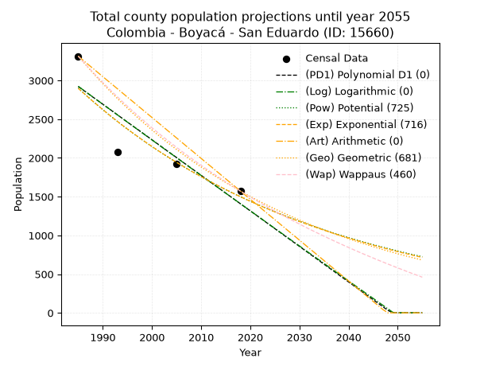
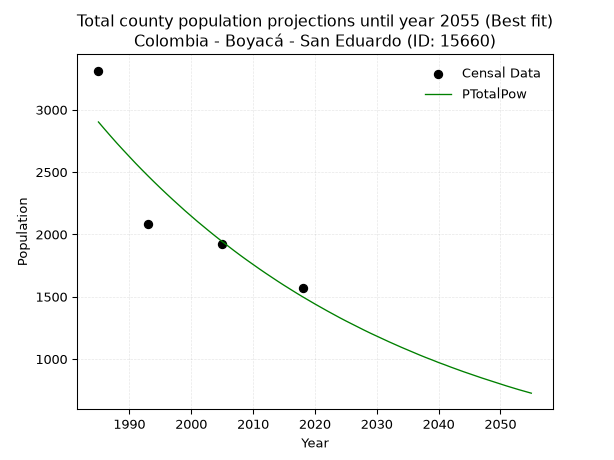
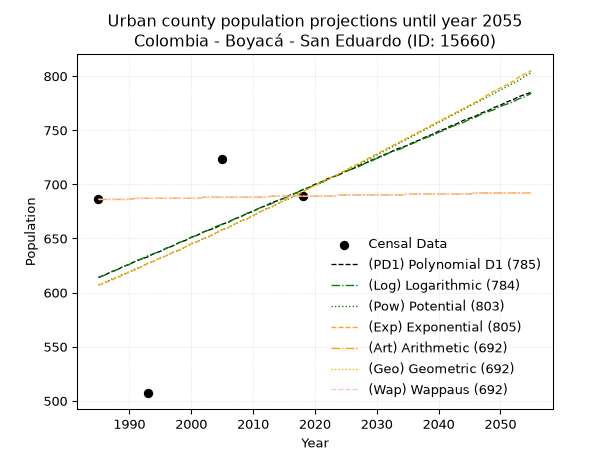
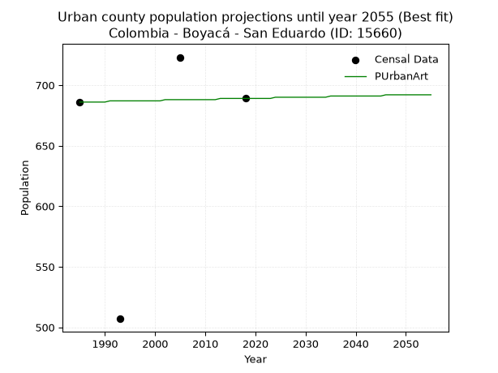
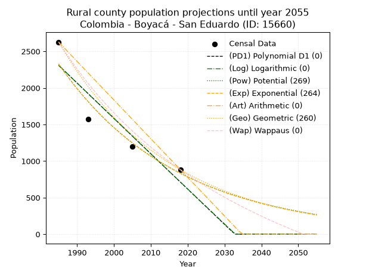
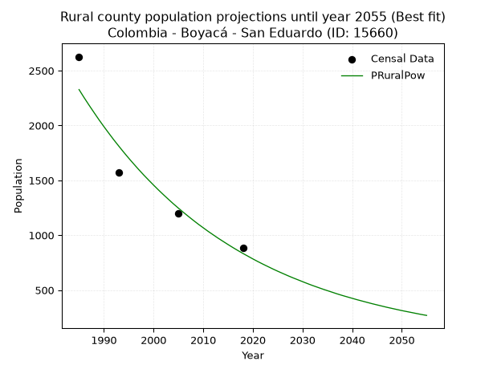

<div align="center">


</div>

# _“Population and Public Services Demand Projections (PPSD) until Year 2050 for Colombia - Boyacá - San Eduardo (ID: 15660)”_
Keywords: `population` `public-service` `projection` `lineal` `polynomial` `logarithmic` `potential` `exponential` `arithmetic` `geometric` `wappaus` `dane` `colombia` `south-america`

PPSD are analytical estimates used by governments and planners to anticipate future changes in population size, age distribution, and the resulting community needs for utilities, healthcare, education, and infrastructure as sizing future water treatment facilities, electrical grids, and road networks based on spatial growth.

> **General running parameters**: • app_version: _v20260806_. • Python version: _3.14.7_. • Pandas version: _3.0.5_. • NumPy version: _2.5.1_. • Creates, save and include plots into reports (create_plot): _False_. • Projection until year: _2050_. • Process polynomial degree 2 and up: _False_. • Process Wappaus: _True_. • Process Wappaus: _True_. • Set negative values to zero: _True_. • Set infinite values to zero: _True_. • Drop dataset notes: _True_. 
<div align="center">

Dynamic map: [:earth_americas:Google](http://maps.google.com/maps?q=5.224009637,-73.0777465) [:earth_americas:OSM](https://www.openstreetmap.org/#map=18/5.224009637/-73.0777465&layers=P) [:earth_americas:Bing](https://www.bing.com/maps?cp=5.224009637~-73.0777465&lvl=18) [:earth_americas:Apple](https://maps.apple.com/frame?center=5.224009637%2C-73.0777465&span=0.003%2C0.006)

</div>


<div align="center">

```geojson
{
  "type": "Feature",
  "geometry": {
    "type": "Point", 
    "coordinates": [-73.0777465, 5.224009637]
  }, 
  "properties": {
    "Name": "Colombia - Boyacá - San Eduardo (ID: 15660)"
  }
}
```

</div>


## 0. Census Data (4 records)

Census data are official statistics collected by a government about the people and housing in a country. They usually include counts of total population, age, sex, race, income, education, and jobs.

📅Global census file: [Population.xlsx](../data/Population.xlsx)

| Source   |   Year |   CountryID | CountryName   |   StateID | StateName   |   CountyID | CountyName   |   PTotal |   PUrban |   PRural |
|:---------|-------:|------------:|:--------------|----------:|:------------|-----------:|:-------------|---------:|---------:|---------:|
| DANE     |   1985 |          57 | Colombia      |        15 | Boyacá      |      15660 | San Eduardo  |     3313 |      686 |     2627 |
| DANE     |   1993 |          57 | Colombia      |        15 | Boyacá      |      15660 | San Eduardo  |     2081 |      507 |     1574 |
| DANE     |   2005 |          57 | Colombia      |        15 | Boyacá      |      15660 | San Eduardo  |     1924 |      723 |     1201 |
| DANE     |   2018 |          57 | Colombia      |        15 | Boyacá      |      15660 | San Eduardo  |     1572 |      689 |      883 |

> 🔥Some records could had specific notes about the registered values or the corresponding urban or rural distribution.

## 1. Total

### 1.1. Coefficients and Parameters

* (PD1) Polynomial Deg 1: -45.874749096748054, 93983.46688077031 (lineal)
* (Log) Logarithmic: -91917.01636024522, 700884.4779309661
* (Pow) Potential: -40.022925881938264, 135.44850134285394
* (Exp) Exponential: -0.019980422091606373, 4.861062994197113e+20
* (Art) Arithmetic: Year diff. 2018 - 1985 = 33, Population diff. 1572 - 3313 = -1741, Annual growth = -52.75757575757576
* (Geo) Geometric: Year diff. 2018 - 1985 = 33, Population diff. 1572 - 3313 = -1741, Annual growth % = -0.022337806092063484
* (Wap) Wappaus: i = -2.1599826308116996, Condition values only valid for < 200)

<sub>
Wappaus condition values: ['-0.00', '-2.16', '-4.32', '-6.48', '-8.64', '-10.80', '-12.96', '-15.12', '-17.28', '-19.44', '-21.60', '-23.76', '-25.92', '-28.08', '-30.24', '-32.40', '-34.56', '-36.72', '-38.88', '-41.04', '-43.20', '-45.36', '-47.52', '-49.68', '-51.84', '-54.00', '-56.16', '-58.32', '-60.48', '-62.64', '-64.80', '-66.96', '-69.12', '-71.28', '-73.44', '-75.60', '-77.76', '-79.92', '-82.08', '-84.24', '-86.40', '-88.56', '-90.72', '-92.88', '-95.04', '-97.20', '-99.36', '-101.52', '-103.68', '-105.84', '-108.00', '-110.16', '-112.32', '-114.48', '-116.64', '-118.80', '-120.96', '-123.12', '-125.28', '-127.44', '-129.60', '-131.76', '-133.92', '-136.08', '-138.24', '-140.40']
</sub>


### 1.2. Projected Dataset

|   Year |   CountyID |   PTotalPD1 |   PTotalLog |   PTotalPow |   PTotalExp |   PTotalArt |   PTotalGeo |   PTotalWap |
|-------:|-----------:|------------:|------------:|------------:|------------:|------------:|------------:|------------:|
|   1985 |      15660 |        2922 |        2924 |        2901 |        2898 |        3313 |        3313 |        3313 |
|   1986 |      15660 |        2876 |        2878 |        2843 |        2841 |        3260 |        3239 |        3242 |
|   1987 |      15660 |        2830 |        2832 |        2786 |        2785 |        3207 |        3167 |        3173 |
|   1988 |      15660 |        2784 |        2785 |        2730 |        2730 |        3155 |        3096 |        3105 |
|   1989 |      15660 |        2739 |        2739 |        2676 |        2676 |        3102 |        3027 |        3039 |
|   1990 |      15660 |        2693 |        2693 |        2623 |        2623 |        3049 |        2959 |        2974 |
|   1991 |      15660 |        2647 |        2647 |        2570 |        2571 |        2996 |        2893 |        2910 |
|   1992 |      15660 |        2601 |        2601 |        2519 |        2520 |        2944 |        2828 |        2847 |
|   1993 |      15660 |        2555 |        2554 |        2469 |        2470 |        2891 |        2765 |        2786 |
|   1994 |      15660 |        2509 |        2508 |        2420 |        2421 |        2838 |        2703 |        2726 |
|   1995 |      15660 |        2463 |        2462 |        2372 |        2373 |        2785 |        2643 |        2667 |
|   1996 |      15660 |        2417 |        2416 |        2325 |        2326 |        2733 |        2584 |        2609 |
|   1997 |      15660 |        2372 |        2370 |        2279 |        2280 |        2680 |        2526 |        2553 |
|   1998 |      15660 |        2326 |        2324 |        2234 |        2235 |        2627 |        2470 |        2497 |
|   1999 |      15660 |        2280 |        2278 |        2189 |        2191 |        2574 |        2415 |        2443 |
|   2000 |      15660 |        2234 |        2232 |        2146 |        2148 |        2522 |        2361 |        2389 |
|   2001 |      15660 |        2188 |        2186 |        2103 |        2105 |        2469 |        2308 |        2337 |
|   2002 |      15660 |        2142 |        2140 |        2062 |        2063 |        2416 |        2256 |        2285 |
|   2003 |      15660 |        2096 |        2094 |        2021 |        2023 |        2363 |        2206 |        2235 |
|   2004 |      15660 |        2050 |        2049 |        1981 |        1983 |        2311 |        2157 |        2185 |
|   2005 |      15660 |        2005 |        2003 |        1942 |        1943 |        2258 |        2109 |        2136 |
|   2006 |      15660 |        1959 |        1957 |        1904 |        1905 |        2205 |        2062 |        2088 |
|   2007 |      15660 |        1913 |        1911 |        1866 |        1867 |        2152 |        2015 |        2041 |
|   2008 |      15660 |        1867 |        1865 |        1829 |        1830 |        2100 |        1970 |        1995 |
|   2009 |      15660 |        1821 |        1820 |        1793 |        1794 |        2047 |        1926 |        1949 |
|   2010 |      15660 |        1775 |        1774 |        1758 |        1759 |        1994 |        1883 |        1904 |
|   2011 |      15660 |        1729 |        1728 |        1723 |        1724 |        1941 |        1841 |        1860 |
|   2012 |      15660 |        1683 |        1682 |        1689 |        1690 |        1889 |        1800 |        1817 |
|   2013 |      15660 |        1638 |        1637 |        1656 |        1656 |        1836 |        1760 |        1775 |
|   2014 |      15660 |        1592 |        1591 |        1623 |        1624 |        1783 |        1721 |        1733 |
|   2015 |      15660 |        1546 |        1545 |        1591 |        1591 |        1730 |        1682 |        1692 |
|   2016 |      15660 |        1500 |        1500 |        1560 |        1560 |        1678 |        1645 |        1651 |
|   2017 |      15660 |        1454 |        1454 |        1529 |        1529 |        1625 |        1608 |        1611 |
|   2018 |      15660 |        1408 |        1409 |        1499 |        1499 |        1572 |        1572 |        1572 |
|   2019 |      15660 |        1362 |        1363 |        1470 |        1469 |        1519 |        1537 |        1533 |
|   2020 |      15660 |        1316 |        1318 |        1441 |        1440 |        1466 |        1503 |        1495 |
|   2021 |      15660 |        1271 |        1272 |        1413 |        1412 |        1414 |        1469 |        1458 |
|   2022 |      15660 |        1225 |        1227 |        1385 |        1384 |        1361 |        1436 |        1421 |
|   2023 |      15660 |        1179 |        1181 |        1358 |        1356 |        1308 |        1404 |        1385 |
|   2024 |      15660 |        1133 |        1136 |        1331 |        1330 |        1255 |        1373 |        1349 |
|   2025 |      15660 |        1087 |        1090 |        1305 |        1303 |        1203 |        1342 |        1314 |
|   2026 |      15660 |        1041 |        1045 |        1280 |        1277 |        1150 |        1312 |        1279 |
|   2027 |      15660 |         995 |        1000 |        1255 |        1252 |        1097 |        1283 |        1245 |
|   2028 |      15660 |         949 |         954 |        1230 |        1227 |        1044 |        1254 |        1212 |
|   2029 |      15660 |         904 |         909 |        1206 |        1203 |         992 |        1226 |        1179 |
|   2030 |      15660 |         858 |         864 |        1183 |        1179 |         939 |        1199 |        1146 |
|   2031 |      15660 |         812 |         818 |        1160 |        1156 |         886 |        1172 |        1114 |
|   2032 |      15660 |         766 |         773 |        1137 |        1133 |         833 |        1146 |        1082 |
|   2033 |      15660 |         720 |         728 |        1115 |        1111 |         781 |        1120 |        1051 |
|   2034 |      15660 |         674 |         683 |        1093 |        1089 |         728 |        1095 |        1020 |
|   2035 |      15660 |         628 |         638 |        1072 |        1067 |         675 |        1071 |         990 |
|   2036 |      15660 |         582 |         592 |        1051 |        1046 |         622 |        1047 |         960 |
|   2037 |      15660 |         537 |         547 |        1030 |        1025 |         570 |        1023 |         930 |
|   2038 |      15660 |         491 |         502 |        1010 |        1005 |         517 |        1001 |         901 |
|   2039 |      15660 |         445 |         457 |         991 |         985 |         464 |         978 |         872 |
|   2040 |      15660 |         399 |         412 |         971 |         966 |         411 |         956 |         844 |
|   2041 |      15660 |         353 |         367 |         953 |         947 |         359 |         935 |         816 |
|   2042 |      15660 |         307 |         322 |         934 |         928 |         306 |         914 |         788 |
|   2043 |      15660 |         261 |         277 |         916 |         910 |         253 |         894 |         761 |
|   2044 |      15660 |         215 |         232 |         898 |         892 |         200 |         874 |         734 |
|   2045 |      15660 |         170 |         187 |         881 |         874 |         148 |         854 |         708 |
|   2046 |      15660 |         124 |         142 |         864 |         857 |          95 |         835 |         681 |
|   2047 |      15660 |          78 |          97 |         847 |         840 |          42 |         816 |         656 |
|   2048 |      15660 |          32 |          52 |         831 |         823 |           0 |         798 |         630 |
|   2049 |      15660 |           0 |           7 |         815 |         807 |           0 |         780 |         605 |
|   2050 |      15660 |           0 |           0 |         799 |         791 |           0 |         763 |         580 |
<div align="center">

</img>

</div>


### 1.3. Best fit with absolute and relative error (%)

Relative error puts that difference into context by dividing the absolute error by the true value, creating a unitless ratio or percentage that shows the scale of the mistake.

Absolute and relative error

|   Year | Source   |   CountryID | CountryName   |   StateID | StateName   |   CountyID_x | CountyName   |   PTotal |   PUrban |   PRural |   CountyID_y |   PTotalPD1 |   PTotalLog |   PTotalPow |   PTotalExp |   PTotalArt |   PTotalGeo |   PTotalWap |   PTotalPD1AbsError |   PTotalLogAbsError |   PTotalPowAbsError |   PTotalExpAbsError |   PTotalArtAbsError |   PTotalGeoAbsError |   PTotalWapAbsError |   PTotalPD1RelError |   PTotalLogRelError |   PTotalPowRelError |   PTotalExpRelError |   PTotalArtRelError |   PTotalGeoRelError |   PTotalWapRelError |
|-------:|:---------|------------:|:--------------|----------:|:------------|-------------:|:-------------|---------:|---------:|---------:|-------------:|------------:|------------:|------------:|------------:|------------:|------------:|------------:|--------------------:|--------------------:|--------------------:|--------------------:|--------------------:|--------------------:|--------------------:|--------------------:|--------------------:|--------------------:|--------------------:|--------------------:|--------------------:|--------------------:|
|   1985 | DANE     |          57 | Colombia      |        15 | Boyacá      |        15660 | San Eduardo  |     3313 |      686 |     2627 |        15660 |        2922 |        2924 |        2901 |        2898 |        3313 |        3313 |        3313 |                 391 |                 389 |                 412 |                 415 |                   0 |                   0 |                   0 |            11.802   |            11.7416  |           12.4359   |           12.5264   |              0      |             0       |              0      |
|   1993 | DANE     |          57 | Colombia      |        15 | Boyacá      |        15660 | San Eduardo  |     2081 |      507 |     1574 |        15660 |        2555 |        2554 |        2469 |        2470 |        2891 |        2765 |        2786 |                 474 |                 473 |                 388 |                 389 |                 810 |                 684 |                 705 |            22.7775  |            22.7295  |           18.6449   |           18.6929   |             38.9236 |            32.8688  |             33.8779 |
|   2005 | DANE     |          57 | Colombia      |        15 | Boyacá      |        15660 | San Eduardo  |     1924 |      723 |     1201 |        15660 |        2005 |        2003 |        1942 |        1943 |        2258 |        2109 |        2136 |                  81 |                  79 |                  18 |                  19 |                 334 |                 185 |                 212 |             4.20998 |             4.10603 |            0.935551 |            0.987526 |             17.3597 |             9.61538 |             11.0187 |
|   2018 | DANE     |          57 | Colombia      |        15 | Boyacá      |        15660 | San Eduardo  |     1572 |      689 |      883 |        15660 |        1408 |        1409 |        1499 |        1499 |        1572 |        1572 |        1572 |                 164 |                 163 |                  73 |                  73 |                   0 |                   0 |                   0 |            10.4326  |            10.369   |            4.64377  |            4.64377  |              0      |             0       |              0      |

Relative error mean

| Method    |   RelError | Best   |
|:----------|-----------:|:-------|
| PTotalPD1 |   12.3055  |        |
| PTotalLog |   12.2365  |        |
| PTotalPow |    9.16501 | True   |
| PTotalExp |    9.21266 |        |
| PTotalArt |   14.0708  |        |
| PTotalGeo |   10.621   |        |
| PTotalWap |   11.2242  |        |

💙Best method: _**PTotalPow**_
<div align="center">

</img>

</div>


### 1.4. Fresh water supply demand in liters per capita per day (lpcd)

The fresh water supply demand typically ranges from 100 to 300 liters per capita per day (lpcd) for standard domestic and municipal planning, though absolute survival minimums set by the World Health Organization are as low as 7.5 to 20 liters per day, and total consumption in high-income nations can exceed 400 liters.

> `CZ`: Level in meters above the sea level (masl).<br> `WS`: Fresh water supply demand in liters per capita per day (lpcd or l/h/d).<br> `WSAll`: Zonal fresh water supply demand in liters per second (l/s).<br> `A`: Zonal area in square meters.

Reference values (RAS Colombia)

|    CZ |   WS |
|------:|-----:|
|  1000 |  120 |
|  2000 |  130 |
| 99999 |  140 |

County shapefile geometry properties and water supply values

|   CountyID |      ATotal |   CZTotal |   WSTotal |
|-----------:|------------:|----------:|----------:|
|      15660 | 1.09259e+08 |   2046.35 |       140 |

Projected values for best method: PTotalPow

|   CountyID |   Year |   PTotalPow |   WSTotal |   WSTotalAll |
|-----------:|-------:|------------:|----------:|-------------:|
|      15660 |   1985 |        2901 |       140 |      4.70069 |
|      15660 |   1986 |        2843 |       140 |      4.60671 |
|      15660 |   1987 |        2786 |       140 |      4.51435 |
|      15660 |   1988 |        2730 |       140 |      4.42361 |
|      15660 |   1989 |        2676 |       140 |      4.33611 |
|      15660 |   1990 |        2623 |       140 |      4.25023 |
|      15660 |   1991 |        2570 |       140 |      4.16435 |
|      15660 |   1992 |        2519 |       140 |      4.08171 |
|      15660 |   1993 |        2469 |       140 |      4.00069 |
|      15660 |   1994 |        2420 |       140 |      3.9213  |
|      15660 |   1995 |        2372 |       140 |      3.84352 |
|      15660 |   1996 |        2325 |       140 |      3.76736 |
|      15660 |   1997 |        2279 |       140 |      3.69282 |
|      15660 |   1998 |        2234 |       140 |      3.61991 |
|      15660 |   1999 |        2189 |       140 |      3.54699 |
|      15660 |   2000 |        2146 |       140 |      3.47731 |
|      15660 |   2001 |        2103 |       140 |      3.40764 |
|      15660 |   2002 |        2062 |       140 |      3.3412  |
|      15660 |   2003 |        2021 |       140 |      3.27477 |
|      15660 |   2004 |        1981 |       140 |      3.20995 |
|      15660 |   2005 |        1942 |       140 |      3.14676 |
|      15660 |   2006 |        1904 |       140 |      3.08519 |
|      15660 |   2007 |        1866 |       140 |      3.02361 |
|      15660 |   2008 |        1829 |       140 |      2.96366 |
|      15660 |   2009 |        1793 |       140 |      2.90532 |
|      15660 |   2010 |        1758 |       140 |      2.84861 |
|      15660 |   2011 |        1723 |       140 |      2.7919  |
|      15660 |   2012 |        1689 |       140 |      2.73681 |
|      15660 |   2013 |        1656 |       140 |      2.68333 |
|      15660 |   2014 |        1623 |       140 |      2.62986 |
|      15660 |   2015 |        1591 |       140 |      2.57801 |
|      15660 |   2016 |        1560 |       140 |      2.52778 |
|      15660 |   2017 |        1529 |       140 |      2.47755 |
|      15660 |   2018 |        1499 |       140 |      2.42894 |
|      15660 |   2019 |        1470 |       140 |      2.38194 |
|      15660 |   2020 |        1441 |       140 |      2.33495 |
|      15660 |   2021 |        1413 |       140 |      2.28958 |
|      15660 |   2022 |        1385 |       140 |      2.24421 |
|      15660 |   2023 |        1358 |       140 |      2.20046 |
|      15660 |   2024 |        1331 |       140 |      2.15671 |
|      15660 |   2025 |        1305 |       140 |      2.11458 |
|      15660 |   2026 |        1280 |       140 |      2.07407 |
|      15660 |   2027 |        1255 |       140 |      2.03356 |
|      15660 |   2028 |        1230 |       140 |      1.99306 |
|      15660 |   2029 |        1206 |       140 |      1.95417 |
|      15660 |   2030 |        1183 |       140 |      1.9169  |
|      15660 |   2031 |        1160 |       140 |      1.87963 |
|      15660 |   2032 |        1137 |       140 |      1.84236 |
|      15660 |   2033 |        1115 |       140 |      1.80671 |
|      15660 |   2034 |        1093 |       140 |      1.77106 |
|      15660 |   2035 |        1072 |       140 |      1.73704 |
|      15660 |   2036 |        1051 |       140 |      1.70301 |
|      15660 |   2037 |        1030 |       140 |      1.66898 |
|      15660 |   2038 |        1010 |       140 |      1.63657 |
|      15660 |   2039 |         991 |       140 |      1.60579 |
|      15660 |   2040 |         971 |       140 |      1.57338 |
|      15660 |   2041 |         953 |       140 |      1.54421 |
|      15660 |   2042 |         934 |       140 |      1.51343 |
|      15660 |   2043 |         916 |       140 |      1.48426 |
|      15660 |   2044 |         898 |       140 |      1.45509 |
|      15660 |   2045 |         881 |       140 |      1.42755 |
|      15660 |   2046 |         864 |       140 |      1.4     |
|      15660 |   2047 |         847 |       140 |      1.37245 |
|      15660 |   2048 |         831 |       140 |      1.34653 |
|      15660 |   2049 |         815 |       140 |      1.3206  |
|      15660 |   2050 |         799 |       140 |      1.29468 |

## 2. Urban

### 2.1. Coefficients and Parameters

* (PD1) Polynomial Deg 1: 2.451625853071064, -4252.614612605395 (lineal)
* (Log) Logarithmic: 4899.389475428433, -36589.048663974776
* (Pow) Potential: 8.082576574465543, -23.871525833436866
* (Exp) Exponential: 0.004045183086135314, 0.1975294312176162
* (Art) Arithmetic: Year diff. 2018 - 1985 = 33, Population diff. 689 - 686 = 3, Annual growth = 0.09090909090909091
* (Geo) Geometric: Year diff. 2018 - 1985 = 33, Population diff. 689 - 686 = 3, Annual growth % = 0.00013224035776637777
* (Wap) Wappaus: i = 0.013223140495867768, Condition values only valid for < 200)

<sub>
Wappaus condition values: ['0.00', '0.01', '0.03', '0.04', '0.05', '0.07', '0.08', '0.09', '0.11', '0.12', '0.13', '0.15', '0.16', '0.17', '0.19', '0.20', '0.21', '0.22', '0.24', '0.25', '0.26', '0.28', '0.29', '0.30', '0.32', '0.33', '0.34', '0.36', '0.37', '0.38', '0.40', '0.41', '0.42', '0.44', '0.45', '0.46', '0.48', '0.49', '0.50', '0.52', '0.53', '0.54', '0.56', '0.57', '0.58', '0.60', '0.61', '0.62', '0.63', '0.65', '0.66', '0.67', '0.69', '0.70', '0.71', '0.73', '0.74', '0.75', '0.77', '0.78', '0.79', '0.81', '0.82', '0.83', '0.85', '0.86']
</sub>


### 2.2. Projected Dataset

|   Year |   CountyID |   PUrbanPD1 |   PUrbanLog |   PUrbanPow |   PUrbanExp |   PUrbanArt |   PUrbanGeo |   PUrbanWap |
|-------:|-----------:|------------:|------------:|------------:|------------:|------------:|------------:|------------:|
|   1985 |      15660 |         614 |         614 |         607 |         607 |         686 |         686 |         686 |
|   1986 |      15660 |         616 |         616 |         609 |         609 |         686 |         686 |         686 |
|   1987 |      15660 |         619 |         619 |         612 |         611 |         686 |         686 |         686 |
|   1988 |      15660 |         621 |         621 |         614 |         614 |         686 |         686 |         686 |
|   1989 |      15660 |         624 |         624 |         617 |         616 |         686 |         686 |         686 |
|   1990 |      15660 |         626 |         626 |         619 |         619 |         686 |         686 |         686 |
|   1991 |      15660 |         629 |         629 |         622 |         621 |         687 |         687 |         687 |
|   1992 |      15660 |         631 |         631 |         624 |         624 |         687 |         687 |         687 |
|   1993 |      15660 |         633 |         634 |         627 |         627 |         687 |         687 |         687 |
|   1994 |      15660 |         636 |         636 |         629 |         629 |         687 |         687 |         687 |
|   1995 |      15660 |         638 |         638 |         632 |         632 |         687 |         687 |         687 |
|   1996 |      15660 |         641 |         641 |         634 |         634 |         687 |         687 |         687 |
|   1997 |      15660 |         643 |         643 |         637 |         637 |         687 |         687 |         687 |
|   1998 |      15660 |         646 |         646 |         639 |         639 |         687 |         687 |         687 |
|   1999 |      15660 |         648 |         648 |         642 |         642 |         687 |         687 |         687 |
|   2000 |      15660 |         651 |         651 |         645 |         645 |         687 |         687 |         687 |
|   2001 |      15660 |         653 |         653 |         647 |         647 |         687 |         687 |         687 |
|   2002 |      15660 |         656 |         656 |         650 |         650 |         688 |         688 |         688 |
|   2003 |      15660 |         658 |         658 |         652 |         652 |         688 |         688 |         688 |
|   2004 |      15660 |         660 |         661 |         655 |         655 |         688 |         688 |         688 |
|   2005 |      15660 |         663 |         663 |         658 |         658 |         688 |         688 |         688 |
|   2006 |      15660 |         665 |         665 |         660 |         660 |         688 |         688 |         688 |
|   2007 |      15660 |         668 |         668 |         663 |         663 |         688 |         688 |         688 |
|   2008 |      15660 |         670 |         670 |         666 |         666 |         688 |         688 |         688 |
|   2009 |      15660 |         673 |         673 |         668 |         668 |         688 |         688 |         688 |
|   2010 |      15660 |         675 |         675 |         671 |         671 |         688 |         688 |         688 |
|   2011 |      15660 |         678 |         678 |         674 |         674 |         688 |         688 |         688 |
|   2012 |      15660 |         680 |         680 |         677 |         677 |         688 |         688 |         688 |
|   2013 |      15660 |         683 |         682 |         679 |         679 |         689 |         689 |         689 |
|   2014 |      15660 |         685 |         685 |         682 |         682 |         689 |         689 |         689 |
|   2015 |      15660 |         687 |         687 |         685 |         685 |         689 |         689 |         689 |
|   2016 |      15660 |         690 |         690 |         687 |         688 |         689 |         689 |         689 |
|   2017 |      15660 |         692 |         692 |         690 |         690 |         689 |         689 |         689 |
|   2018 |      15660 |         695 |         695 |         693 |         693 |         689 |         689 |         689 |
|   2019 |      15660 |         697 |         697 |         696 |         696 |         689 |         689 |         689 |
|   2020 |      15660 |         700 |         699 |         699 |         699 |         689 |         689 |         689 |
|   2021 |      15660 |         702 |         702 |         701 |         702 |         689 |         689 |         689 |
|   2022 |      15660 |         705 |         704 |         704 |         705 |         689 |         689 |         689 |
|   2023 |      15660 |         707 |         707 |         707 |         707 |         689 |         689 |         689 |
|   2024 |      15660 |         709 |         709 |         710 |         710 |         690 |         690 |         690 |
|   2025 |      15660 |         712 |         712 |         713 |         713 |         690 |         690 |         690 |
|   2026 |      15660 |         714 |         714 |         716 |         716 |         690 |         690 |         690 |
|   2027 |      15660 |         717 |         716 |         718 |         719 |         690 |         690 |         690 |
|   2028 |      15660 |         719 |         719 |         721 |         722 |         690 |         690 |         690 |
|   2029 |      15660 |         722 |         721 |         724 |         725 |         690 |         690 |         690 |
|   2030 |      15660 |         724 |         724 |         727 |         728 |         690 |         690 |         690 |
|   2031 |      15660 |         727 |         726 |         730 |         731 |         690 |         690 |         690 |
|   2032 |      15660 |         729 |         729 |         733 |         734 |         690 |         690 |         690 |
|   2033 |      15660 |         732 |         731 |         736 |         737 |         690 |         690 |         690 |
|   2034 |      15660 |         734 |         733 |         739 |         740 |         690 |         690 |         690 |
|   2035 |      15660 |         736 |         736 |         742 |         743 |         691 |         691 |         691 |
|   2036 |      15660 |         739 |         738 |         745 |         746 |         691 |         691 |         691 |
|   2037 |      15660 |         741 |         741 |         748 |         749 |         691 |         691 |         691 |
|   2038 |      15660 |         744 |         743 |         751 |         752 |         691 |         691 |         691 |
|   2039 |      15660 |         746 |         745 |         754 |         755 |         691 |         691 |         691 |
|   2040 |      15660 |         749 |         748 |         757 |         758 |         691 |         691 |         691 |
|   2041 |      15660 |         751 |         750 |         760 |         761 |         691 |         691 |         691 |
|   2042 |      15660 |         754 |         753 |         763 |         764 |         691 |         691 |         691 |
|   2043 |      15660 |         756 |         755 |         766 |         767 |         691 |         691 |         691 |
|   2044 |      15660 |         759 |         757 |         769 |         770 |         691 |         691 |         691 |
|   2045 |      15660 |         761 |         760 |         772 |         773 |         691 |         691 |         691 |
|   2046 |      15660 |         763 |         762 |         775 |         776 |         692 |         692 |         692 |
|   2047 |      15660 |         766 |         765 |         778 |         779 |         692 |         692 |         692 |
|   2048 |      15660 |         768 |         767 |         781 |         783 |         692 |         692 |         692 |
|   2049 |      15660 |         771 |         769 |         784 |         786 |         692 |         692 |         692 |
|   2050 |      15660 |         773 |         772 |         787 |         789 |         692 |         692 |         692 |
<div align="center">

</img>

</div>


### 2.3. Best fit with absolute and relative error (%)

Relative error puts that difference into context by dividing the absolute error by the true value, creating a unitless ratio or percentage that shows the scale of the mistake.

Absolute and relative error

|   Year | Source   |   CountryID | CountryName   |   StateID | StateName   |   CountyID_x | CountyName   |   PTotal |   PUrban |   PRural |   CountyID_y |   PUrbanPD1 |   PUrbanLog |   PUrbanPow |   PUrbanExp |   PUrbanArt |   PUrbanGeo |   PUrbanWap |   PUrbanPD1AbsError |   PUrbanLogAbsError |   PUrbanPowAbsError |   PUrbanExpAbsError |   PUrbanArtAbsError |   PUrbanGeoAbsError |   PUrbanWapAbsError |   PUrbanPD1RelError |   PUrbanLogRelError |   PUrbanPowRelError |   PUrbanExpRelError |   PUrbanArtRelError |   PUrbanGeoRelError |   PUrbanWapRelError |
|-------:|:---------|------------:|:--------------|----------:|:------------|-------------:|:-------------|---------:|---------:|---------:|-------------:|------------:|------------:|------------:|------------:|------------:|------------:|------------:|--------------------:|--------------------:|--------------------:|--------------------:|--------------------:|--------------------:|--------------------:|--------------------:|--------------------:|--------------------:|--------------------:|--------------------:|--------------------:|--------------------:|
|   1985 | DANE     |          57 | Colombia      |        15 | Boyacá      |        15660 | San Eduardo  |     3313 |      686 |     2627 |        15660 |         614 |         614 |         607 |         607 |         686 |         686 |         686 |                  72 |                  72 |                  79 |                  79 |                   0 |                   0 |                   0 |           10.4956   |           10.4956   |           11.516    |           11.516    |             0       |             0       |             0       |
|   1993 | DANE     |          57 | Colombia      |        15 | Boyacá      |        15660 | San Eduardo  |     2081 |      507 |     1574 |        15660 |         633 |         634 |         627 |         627 |         687 |         687 |         687 |                 126 |                 127 |                 120 |                 120 |                 180 |                 180 |                 180 |           24.8521   |           25.0493   |           23.6686   |           23.6686   |            35.503   |            35.503   |            35.503   |
|   2005 | DANE     |          57 | Colombia      |        15 | Boyacá      |        15660 | San Eduardo  |     1924 |      723 |     1201 |        15660 |         663 |         663 |         658 |         658 |         688 |         688 |         688 |                  60 |                  60 |                  65 |                  65 |                  35 |                  35 |                  35 |            8.29876  |            8.29876  |            8.99032  |            8.99032  |             4.84094 |             4.84094 |             4.84094 |
|   2018 | DANE     |          57 | Colombia      |        15 | Boyacá      |        15660 | San Eduardo  |     1572 |      689 |      883 |        15660 |         695 |         695 |         693 |         693 |         689 |         689 |         689 |                   6 |                   6 |                   4 |                   4 |                   0 |                   0 |                   0 |            0.870827 |            0.870827 |            0.580552 |            0.580552 |             0       |             0       |             0       |

Relative error mean

| Method    |   RelError | Best   |
|:----------|-----------:|:-------|
| PUrbanPD1 |    11.1293 |        |
| PUrbanLog |    11.1786 |        |
| PUrbanPow |    11.1889 |        |
| PUrbanExp |    11.1889 |        |
| PUrbanArt |    10.086  | True   |
| PUrbanGeo |    10.086  | True   |
| PUrbanWap |    10.086  | True   |

💙Best method: _**PUrbanArt**_
<div align="center">

</img>

</div>


### 2.4. Fresh water supply demand in liters per capita per day (lpcd)

The fresh water supply demand typically ranges from 100 to 300 liters per capita per day (lpcd) for standard domestic and municipal planning, though absolute survival minimums set by the World Health Organization are as low as 7.5 to 20 liters per day, and total consumption in high-income nations can exceed 400 liters.

> `CZ`: Level in meters above the sea level (masl).<br> `WS`: Fresh water supply demand in liters per capita per day (lpcd or l/h/d).<br> `WSAll`: Zonal fresh water supply demand in liters per second (l/s).<br> `A`: Zonal area in square meters.

Reference values (RAS Colombia)

|    CZ |   WS |
|------:|-----:|
|  1000 |  120 |
|  2000 |  130 |
| 99999 |  140 |

County shapefile geometry properties and water supply values

|   CountyID |   AUrban |   CZUrban |   WSUrban |
|-----------:|---------:|----------:|----------:|
|      15660 |   298525 |   1706.76 |       130 |

Projected values for best method: PUrbanArt

|   CountyID |   Year |   PUrbanArt |   WSUrban |   WSUrbanAll |
|-----------:|-------:|------------:|----------:|-------------:|
|      15660 |   1985 |         686 |       130 |      1.03218 |
|      15660 |   1986 |         686 |       130 |      1.03218 |
|      15660 |   1987 |         686 |       130 |      1.03218 |
|      15660 |   1988 |         686 |       130 |      1.03218 |
|      15660 |   1989 |         686 |       130 |      1.03218 |
|      15660 |   1990 |         686 |       130 |      1.03218 |
|      15660 |   1991 |         687 |       130 |      1.03368 |
|      15660 |   1992 |         687 |       130 |      1.03368 |
|      15660 |   1993 |         687 |       130 |      1.03368 |
|      15660 |   1994 |         687 |       130 |      1.03368 |
|      15660 |   1995 |         687 |       130 |      1.03368 |
|      15660 |   1996 |         687 |       130 |      1.03368 |
|      15660 |   1997 |         687 |       130 |      1.03368 |
|      15660 |   1998 |         687 |       130 |      1.03368 |
|      15660 |   1999 |         687 |       130 |      1.03368 |
|      15660 |   2000 |         687 |       130 |      1.03368 |
|      15660 |   2001 |         687 |       130 |      1.03368 |
|      15660 |   2002 |         688 |       130 |      1.03519 |
|      15660 |   2003 |         688 |       130 |      1.03519 |
|      15660 |   2004 |         688 |       130 |      1.03519 |
|      15660 |   2005 |         688 |       130 |      1.03519 |
|      15660 |   2006 |         688 |       130 |      1.03519 |
|      15660 |   2007 |         688 |       130 |      1.03519 |
|      15660 |   2008 |         688 |       130 |      1.03519 |
|      15660 |   2009 |         688 |       130 |      1.03519 |
|      15660 |   2010 |         688 |       130 |      1.03519 |
|      15660 |   2011 |         688 |       130 |      1.03519 |
|      15660 |   2012 |         688 |       130 |      1.03519 |
|      15660 |   2013 |         689 |       130 |      1.03669 |
|      15660 |   2014 |         689 |       130 |      1.03669 |
|      15660 |   2015 |         689 |       130 |      1.03669 |
|      15660 |   2016 |         689 |       130 |      1.03669 |
|      15660 |   2017 |         689 |       130 |      1.03669 |
|      15660 |   2018 |         689 |       130 |      1.03669 |
|      15660 |   2019 |         689 |       130 |      1.03669 |
|      15660 |   2020 |         689 |       130 |      1.03669 |
|      15660 |   2021 |         689 |       130 |      1.03669 |
|      15660 |   2022 |         689 |       130 |      1.03669 |
|      15660 |   2023 |         689 |       130 |      1.03669 |
|      15660 |   2024 |         690 |       130 |      1.03819 |
|      15660 |   2025 |         690 |       130 |      1.03819 |
|      15660 |   2026 |         690 |       130 |      1.03819 |
|      15660 |   2027 |         690 |       130 |      1.03819 |
|      15660 |   2028 |         690 |       130 |      1.03819 |
|      15660 |   2029 |         690 |       130 |      1.03819 |
|      15660 |   2030 |         690 |       130 |      1.03819 |
|      15660 |   2031 |         690 |       130 |      1.03819 |
|      15660 |   2032 |         690 |       130 |      1.03819 |
|      15660 |   2033 |         690 |       130 |      1.03819 |
|      15660 |   2034 |         690 |       130 |      1.03819 |
|      15660 |   2035 |         691 |       130 |      1.0397  |
|      15660 |   2036 |         691 |       130 |      1.0397  |
|      15660 |   2037 |         691 |       130 |      1.0397  |
|      15660 |   2038 |         691 |       130 |      1.0397  |
|      15660 |   2039 |         691 |       130 |      1.0397  |
|      15660 |   2040 |         691 |       130 |      1.0397  |
|      15660 |   2041 |         691 |       130 |      1.0397  |
|      15660 |   2042 |         691 |       130 |      1.0397  |
|      15660 |   2043 |         691 |       130 |      1.0397  |
|      15660 |   2044 |         691 |       130 |      1.0397  |
|      15660 |   2045 |         691 |       130 |      1.0397  |
|      15660 |   2046 |         692 |       130 |      1.0412  |
|      15660 |   2047 |         692 |       130 |      1.0412  |
|      15660 |   2048 |         692 |       130 |      1.0412  |
|      15660 |   2049 |         692 |       130 |      1.0412  |
|      15660 |   2050 |         692 |       130 |      1.0412  |

## 3. Rural

### 3.1. Coefficients and Parameters

* (PD1) Polynomial Deg 1: -48.32637494981911, 98236.08149337568 (lineal)
* (Log) Logarithmic: -96816.40583567364, 737473.5265949407
* (Pow) Potential: -62.24578659223868, 208.63855421286453
* (Exp) Exponential: -0.031082286932460727, 1.4507689223736375e+30
* (Art) Arithmetic: Year diff. 2018 - 1985 = 33, Population diff. 883 - 2627 = -1744, Annual growth = -52.84848484848485
* (Geo) Geometric: Year diff. 2018 - 1985 = 33, Population diff. 883 - 2627 = -1744, Annual growth % = -0.03249875117660894
* (Wap) Wappaus: i = -3.0113096779763446, Condition values only valid for < 200)

<sub>
Wappaus condition values: ['-0.00', '-3.01', '-6.02', '-9.03', '-12.05', '-15.06', '-18.07', '-21.08', '-24.09', '-27.10', '-30.11', '-33.12', '-36.14', '-39.15', '-42.16', '-45.17', '-48.18', '-51.19', '-54.20', '-57.21', '-60.23', '-63.24', '-66.25', '-69.26', '-72.27', '-75.28', '-78.29', '-81.31', '-84.32', '-87.33', '-90.34', '-93.35', '-96.36', '-99.37', '-102.38', '-105.40', '-108.41', '-111.42', '-114.43', '-117.44', '-120.45', '-123.46', '-126.48', '-129.49', '-132.50', '-135.51', '-138.52', '-141.53', '-144.54', '-147.55', '-150.57', '-153.58', '-156.59', '-159.60', '-162.61', '-165.62', '-168.63', '-171.64', '-174.66', '-177.67', '-180.68', '-183.69', '-186.70', '-189.71', '-192.72', '-195.74']
</sub>


### 3.2. Projected Dataset

|   Year |   CountyID |   PRuralPD1 |   PRuralLog |   PRuralPow |   PRuralExp |   PRuralArt |   PRuralGeo |   PRuralWap |
|-------:|-----------:|------------:|------------:|------------:|------------:|------------:|------------:|------------:|
|   1985 |      15660 |        2308 |        2310 |        2327 |        2325 |        2627 |        2627 |        2627 |
|   1986 |      15660 |        2260 |        2262 |        2255 |        2253 |        2574 |        2542 |        2549 |
|   1987 |      15660 |        2212 |        2213 |        2186 |        2185 |        2521 |        2459 |        2473 |
|   1988 |      15660 |        2163 |        2164 |        2119 |        2118 |        2468 |        2379 |        2400 |
|   1989 |      15660 |        2115 |        2115 |        2053 |        2053 |        2416 |        2302 |        2329 |
|   1990 |      15660 |        2067 |        2067 |        1990 |        1990 |        2363 |        2227 |        2259 |
|   1991 |      15660 |        2018 |        2018 |        1929 |        1929 |        2310 |        2155 |        2192 |
|   1992 |      15660 |        1970 |        1970 |        1869 |        1870 |        2257 |        2085 |        2126 |
|   1993 |      15660 |        1922 |        1921 |        1812 |        1813 |        2204 |        2017 |        2062 |
|   1994 |      15660 |        1873 |        1872 |        1756 |        1757 |        2151 |        1951 |        2000 |
|   1995 |      15660 |        1825 |        1824 |        1702 |        1704 |        2099 |        1888 |        1939 |
|   1996 |      15660 |        1777 |        1775 |        1650 |        1651 |        2046 |        1827 |        1880 |
|   1997 |      15660 |        1728 |        1727 |        1599 |        1601 |        1993 |        1767 |        1823 |
|   1998 |      15660 |        1680 |        1678 |        1550 |        1552 |        1940 |        1710 |        1767 |
|   1999 |      15660 |        1632 |        1630 |        1503 |        1504 |        1887 |        1654 |        1712 |
|   2000 |      15660 |        1583 |        1581 |        1457 |        1458 |        1834 |        1600 |        1659 |
|   2001 |      15660 |        1535 |        1533 |        1412 |        1414 |        1781 |        1548 |        1607 |
|   2002 |      15660 |        1487 |        1485 |        1369 |        1370 |        1729 |        1498 |        1556 |
|   2003 |      15660 |        1438 |        1436 |        1327 |        1329 |        1676 |        1449 |        1507 |
|   2004 |      15660 |        1390 |        1388 |        1286 |        1288 |        1623 |        1402 |        1458 |
|   2005 |      15660 |        1342 |        1340 |        1247 |        1248 |        1570 |        1357 |        1411 |
|   2006 |      15660 |        1293 |        1291 |        1209 |        1210 |        1517 |        1313 |        1365 |
|   2007 |      15660 |        1245 |        1243 |        1172 |        1173 |        1464 |        1270 |        1320 |
|   2008 |      15660 |        1197 |        1195 |        1136 |        1137 |        1411 |        1229 |        1276 |
|   2009 |      15660 |        1148 |        1147 |        1101 |        1102 |        1359 |        1189 |        1232 |
|   2010 |      15660 |        1100 |        1099 |        1068 |        1069 |        1306 |        1150 |        1190 |
|   2011 |      15660 |        1052 |        1050 |        1035 |        1036 |        1253 |        1113 |        1149 |
|   2012 |      15660 |        1003 |        1002 |        1004 |        1004 |        1200 |        1077 |        1108 |
|   2013 |      15660 |         955 |         954 |         973 |         974 |        1147 |        1042 |        1069 |
|   2014 |      15660 |         907 |         906 |         944 |         944 |        1094 |        1008 |        1030 |
|   2015 |      15660 |         858 |         858 |         915 |         915 |        1042 |         975 |         992 |
|   2016 |      15660 |         810 |         810 |         887 |         887 |         989 |         943 |         955 |
|   2017 |      15660 |         762 |         762 |         860 |         860 |         936 |         913 |         919 |
|   2018 |      15660 |         713 |         714 |         834 |         833 |         883 |         883 |         883 |
|   2019 |      15660 |         665 |         666 |         809 |         808 |         830 |         854 |         848 |
|   2020 |      15660 |         617 |         618 |         784 |         783 |         777 |         827 |         814 |
|   2021 |      15660 |         568 |         570 |         760 |         759 |         724 |         800 |         780 |
|   2022 |      15660 |         520 |         522 |         737 |         736 |         672 |         774 |         747 |
|   2023 |      15660 |         472 |         474 |         715 |         713 |         619 |         749 |         715 |
|   2024 |      15660 |         423 |         427 |         693 |         692 |         566 |         724 |         683 |
|   2025 |      15660 |         375 |         379 |         672 |         670 |         513 |         701 |         652 |
|   2026 |      15660 |         327 |         331 |         652 |         650 |         460 |         678 |         622 |
|   2027 |      15660 |         279 |         283 |         632 |         630 |         407 |         656 |         592 |
|   2028 |      15660 |         230 |         235 |         613 |         611 |         355 |         635 |         562 |
|   2029 |      15660 |         182 |         188 |         595 |         592 |         302 |         614 |         533 |
|   2030 |      15660 |         134 |         140 |         577 |         574 |         249 |         594 |         505 |
|   2031 |      15660 |          85 |          92 |         559 |         556 |         196 |         575 |         477 |
|   2032 |      15660 |          37 |          45 |         542 |         539 |         143 |         556 |         450 |
|   2033 |      15660 |           0 |           0 |         526 |         523 |          90 |         538 |         423 |
|   2034 |      15660 |           0 |           0 |         510 |         507 |          37 |         520 |         396 |
|   2035 |      15660 |           0 |           0 |         495 |         491 |           0 |         504 |         370 |
|   2036 |      15660 |           0 |           0 |         480 |         476 |           0 |         487 |         345 |
|   2037 |      15660 |           0 |           0 |         465 |         462 |           0 |         471 |         320 |
|   2038 |      15660 |           0 |           0 |         451 |         448 |           0 |         456 |         295 |
|   2039 |      15660 |           0 |           0 |         438 |         434 |           0 |         441 |         271 |
|   2040 |      15660 |           0 |           0 |         425 |         421 |           0 |         427 |         247 |
|   2041 |      15660 |           0 |           0 |         412 |         408 |           0 |         413 |         224 |
|   2042 |      15660 |           0 |           0 |         400 |         395 |           0 |         400 |         200 |
|   2043 |      15660 |           0 |           0 |         388 |         383 |           0 |         387 |         178 |
|   2044 |      15660 |           0 |           0 |         376 |         371 |           0 |         374 |         155 |
|   2045 |      15660 |           0 |           0 |         365 |         360 |           0 |         362 |         133 |
|   2046 |      15660 |           0 |           0 |         354 |         349 |           0 |         350 |         112 |
|   2047 |      15660 |           0 |           0 |         343 |         338 |           0 |         339 |          90 |
|   2048 |      15660 |           0 |           0 |         333 |         328 |           0 |         328 |          69 |
|   2049 |      15660 |           0 |           0 |         323 |         318 |           0 |         317 |          49 |
|   2050 |      15660 |           0 |           0 |         313 |         308 |           0 |         307 |          28 |
<div align="center">

</img>

</div>


### 3.3. Best fit with absolute and relative error (%)

Relative error puts that difference into context by dividing the absolute error by the true value, creating a unitless ratio or percentage that shows the scale of the mistake.

Absolute and relative error

|   Year | Source   |   CountryID | CountryName   |   StateID | StateName   |   CountyID_x | CountyName   |   PTotal |   PUrban |   PRural |   CountyID_y |   PRuralPD1 |   PRuralLog |   PRuralPow |   PRuralExp |   PRuralArt |   PRuralGeo |   PRuralWap |   PRuralPD1AbsError |   PRuralLogAbsError |   PRuralPowAbsError |   PRuralExpAbsError |   PRuralArtAbsError |   PRuralGeoAbsError |   PRuralWapAbsError |   PRuralPD1RelError |   PRuralLogRelError |   PRuralPowRelError |   PRuralExpRelError |   PRuralArtRelError |   PRuralGeoRelError |   PRuralWapRelError |
|-------:|:---------|------------:|:--------------|----------:|:------------|-------------:|:-------------|---------:|---------:|---------:|-------------:|------------:|------------:|------------:|------------:|------------:|------------:|------------:|--------------------:|--------------------:|--------------------:|--------------------:|--------------------:|--------------------:|--------------------:|--------------------:|--------------------:|--------------------:|--------------------:|--------------------:|--------------------:|--------------------:|
|   1985 | DANE     |          57 | Colombia      |        15 | Boyacá      |        15660 | San Eduardo  |     3313 |      686 |     2627 |        15660 |        2308 |        2310 |        2327 |        2325 |        2627 |        2627 |        2627 |                 319 |                 317 |                 300 |                 302 |                   0 |                   0 |                   0 |             12.1431 |             12.067  |            11.4199  |            11.496   |              0      |              0      |              0      |
|   1993 | DANE     |          57 | Colombia      |        15 | Boyacá      |        15660 | San Eduardo  |     2081 |      507 |     1574 |        15660 |        1922 |        1921 |        1812 |        1813 |        2204 |        2017 |        2062 |                 348 |                 347 |                 238 |                 239 |                 630 |                 443 |                 488 |             22.1093 |             22.0457 |            15.1207  |            15.1842  |             40.0254 |             28.1449 |             31.0038 |
|   2005 | DANE     |          57 | Colombia      |        15 | Boyacá      |        15660 | San Eduardo  |     1924 |      723 |     1201 |        15660 |        1342 |        1340 |        1247 |        1248 |        1570 |        1357 |        1411 |                 141 |                 139 |                  46 |                  47 |                 369 |                 156 |                 210 |             11.7402 |             11.5737 |             3.83014 |             3.91341 |             30.7244 |             12.9892 |             17.4854 |
|   2018 | DANE     |          57 | Colombia      |        15 | Boyacá      |        15660 | San Eduardo  |     1572 |      689 |      883 |        15660 |         713 |         714 |         834 |         833 |         883 |         883 |         883 |                 170 |                 169 |                  49 |                  50 |                   0 |                   0 |                   0 |             19.2525 |             19.1393 |             5.54926 |             5.66251 |              0      |              0      |              0      |

Relative error mean

| Method    |   RelError | Best   |
|:----------|-----------:|:-------|
| PRuralPD1 |   16.3113  |        |
| PRuralLog |   16.2064  |        |
| PRuralPow |    8.98    | True   |
| PRuralExp |    9.06404 |        |
| PRuralArt |   17.6875  |        |
| PRuralGeo |   10.2835  |        |
| PRuralWap |   12.1223  |        |

💙Best method: _**PRuralPow**_
<div align="center">

</img>

</div>


### 3.4. Fresh water supply demand in liters per capita per day (lpcd)

The fresh water supply demand typically ranges from 100 to 300 liters per capita per day (lpcd) for standard domestic and municipal planning, though absolute survival minimums set by the World Health Organization are as low as 7.5 to 20 liters per day, and total consumption in high-income nations can exceed 400 liters.

> `CZ`: Level in meters above the sea level (masl).<br> `WS`: Fresh water supply demand in liters per capita per day (lpcd or l/h/d).<br> `WSAll`: Zonal fresh water supply demand in liters per second (l/s).<br> `A`: Zonal area in square meters.

Reference values (RAS Colombia)

|    CZ |   WS |
|------:|-----:|
|  1000 |  120 |
|  2000 |  130 |
| 99999 |  140 |

County shapefile geometry properties and water supply values

|   CountyID |      ARural |   CZRural |   WSRural |
|-----------:|------------:|----------:|----------:|
|      15660 | 1.08961e+08 |   2047.27 |       140 |

Projected values for best method: PRuralPow

|   CountyID |   Year |   PRuralPow |   WSRural |   WSRuralAll |
|-----------:|-------:|------------:|----------:|-------------:|
|      15660 |   1985 |        2327 |       140 |     3.7706   |
|      15660 |   1986 |        2255 |       140 |     3.65394  |
|      15660 |   1987 |        2186 |       140 |     3.54213  |
|      15660 |   1988 |        2119 |       140 |     3.43356  |
|      15660 |   1989 |        2053 |       140 |     3.32662  |
|      15660 |   1990 |        1990 |       140 |     3.22454  |
|      15660 |   1991 |        1929 |       140 |     3.12569  |
|      15660 |   1992 |        1869 |       140 |     3.02847  |
|      15660 |   1993 |        1812 |       140 |     2.93611  |
|      15660 |   1994 |        1756 |       140 |     2.84537  |
|      15660 |   1995 |        1702 |       140 |     2.75787  |
|      15660 |   1996 |        1650 |       140 |     2.67361  |
|      15660 |   1997 |        1599 |       140 |     2.59097  |
|      15660 |   1998 |        1550 |       140 |     2.51157  |
|      15660 |   1999 |        1503 |       140 |     2.43542  |
|      15660 |   2000 |        1457 |       140 |     2.36088  |
|      15660 |   2001 |        1412 |       140 |     2.28796  |
|      15660 |   2002 |        1369 |       140 |     2.21829  |
|      15660 |   2003 |        1327 |       140 |     2.15023  |
|      15660 |   2004 |        1286 |       140 |     2.0838   |
|      15660 |   2005 |        1247 |       140 |     2.0206   |
|      15660 |   2006 |        1209 |       140 |     1.95903  |
|      15660 |   2007 |        1172 |       140 |     1.89907  |
|      15660 |   2008 |        1136 |       140 |     1.84074  |
|      15660 |   2009 |        1101 |       140 |     1.78403  |
|      15660 |   2010 |        1068 |       140 |     1.73056  |
|      15660 |   2011 |        1035 |       140 |     1.67708  |
|      15660 |   2012 |        1004 |       140 |     1.62685  |
|      15660 |   2013 |         973 |       140 |     1.57662  |
|      15660 |   2014 |         944 |       140 |     1.52963  |
|      15660 |   2015 |         915 |       140 |     1.48264  |
|      15660 |   2016 |         887 |       140 |     1.43727  |
|      15660 |   2017 |         860 |       140 |     1.39352  |
|      15660 |   2018 |         834 |       140 |     1.35139  |
|      15660 |   2019 |         809 |       140 |     1.31088  |
|      15660 |   2020 |         784 |       140 |     1.27037  |
|      15660 |   2021 |         760 |       140 |     1.23148  |
|      15660 |   2022 |         737 |       140 |     1.19421  |
|      15660 |   2023 |         715 |       140 |     1.15856  |
|      15660 |   2024 |         693 |       140 |     1.12292  |
|      15660 |   2025 |         672 |       140 |     1.08889  |
|      15660 |   2026 |         652 |       140 |     1.05648  |
|      15660 |   2027 |         632 |       140 |     1.02407  |
|      15660 |   2028 |         613 |       140 |     0.993287 |
|      15660 |   2029 |         595 |       140 |     0.96412  |
|      15660 |   2030 |         577 |       140 |     0.934954 |
|      15660 |   2031 |         559 |       140 |     0.905787 |
|      15660 |   2032 |         542 |       140 |     0.878241 |
|      15660 |   2033 |         526 |       140 |     0.852315 |
|      15660 |   2034 |         510 |       140 |     0.826389 |
|      15660 |   2035 |         495 |       140 |     0.802083 |
|      15660 |   2036 |         480 |       140 |     0.777778 |
|      15660 |   2037 |         465 |       140 |     0.753472 |
|      15660 |   2038 |         451 |       140 |     0.730787 |
|      15660 |   2039 |         438 |       140 |     0.709722 |
|      15660 |   2040 |         425 |       140 |     0.688657 |
|      15660 |   2041 |         412 |       140 |     0.667593 |
|      15660 |   2042 |         400 |       140 |     0.648148 |
|      15660 |   2043 |         388 |       140 |     0.628704 |
|      15660 |   2044 |         376 |       140 |     0.609259 |
|      15660 |   2045 |         365 |       140 |     0.591435 |
|      15660 |   2046 |         354 |       140 |     0.573611 |
|      15660 |   2047 |         343 |       140 |     0.555787 |
|      15660 |   2048 |         333 |       140 |     0.539583 |
|      15660 |   2049 |         323 |       140 |     0.52338  |
|      15660 |   2050 |         313 |       140 |     0.507176 |

<div align="center"><br><sub>Share this research</sub></div><br>

<sub>**APPS & TOOLS & CONTENT DISCLAIMER**: • NO WARRANTY - This content and software is provided by <a href="https://github.com/rcfdtools" target="_blank">github.com/rcfdtools</a> "as is", without any express or implied warranty, including warranties of merchantability, fitness for a particular purpose, or non-infringement. There is no guarantee that the software will be error-free or operate without interruption. • LIMITATION OF LIABILITY - Neither the authors nor copyright holders will be liable for claims or damages arising from the software or its use. You are responsible for determining if the software is appropriate for your use and assume all associated risks, including errors, legal compliance, and data loss. • NO PROFESSIONAL ADVICE - The software provides general information and does not offer professional advice. It should not replace consultation with professional advisors. [Clauses and global license for rcfdtools use.](https://github.com/rcfdtools/rcfdtools/blob/main/LICENSE.md)</sub>

| [:house: Home](Readme.md)  | [:beginner: Help / Collaborate](https://github.com/rcfdtools/R.HydroTools/discussions/31) |
|----------------------------|-------------------------------------------------------------------------------------------|