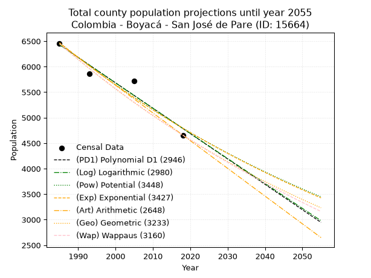
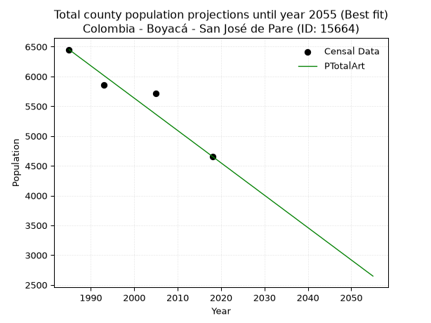
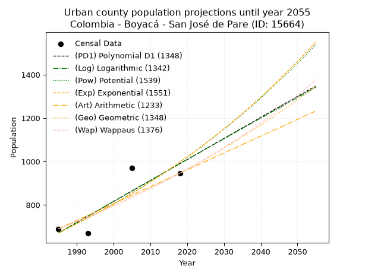
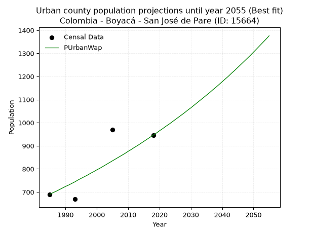
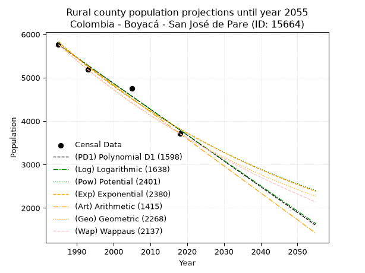
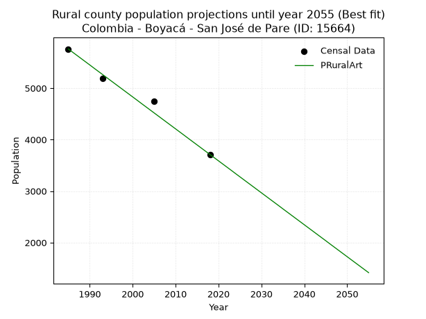

<div align="center">


</div>

# 📜 _“Population and Public Services Demand Projections (PPSD) until Year 2050 for Colombia - Boyacá - San José de Pare (ID: 15664)”_
Keywords: `population` `public-service` `projection` `lineal` `polynomial` `logarithmic` `potential` `exponential` `arithmetic` `geometric` `wappaus` `dane` `colombia` `south-america`

PPSD are analytical estimates used by governments and planners to anticipate future changes in population size, age distribution, and the resulting community needs for utilities, healthcare, education, and infrastructure as sizing future water treatment facilities, electrical grids, and road networks based on spatial growth.

<div align="center">

</img>

</div>


> **General running parameters**: • app_version: _v20260806_. • Python version: _3.14.7_. • Pandas version: _3.0.5_. • NumPy version: _2.5.1_. • Creates, save and include plots into reports (create_plot): _False_. • Projection until year: _2050_. • Process polynomial degree 2 and up: _False_. • Process Wappaus: _True_. • Process Wappaus: _True_. • Set negative values to zero: _True_. • Set infinite values to zero: _True_. • Drop dataset notes: _True_. 
<div align="center">

Dynamic map: [:earth_americas:Google](http://maps.google.com/maps?q=6.018923922,-73.545397) [:earth_americas:OSM](https://www.openstreetmap.org/#map=18/6.018923922/-73.545397&layers=P) [:earth_americas:Bing](https://www.bing.com/maps?cp=6.018923922~-73.545397&lvl=18) [:earth_americas:Apple](https://maps.apple.com/frame?center=6.018923922%2C-73.545397&span=0.003%2C0.006)

</div>


<div align="center">

```geojson
{
  "type": "Feature",
  "geometry": {
    "type": "Point", 
    "coordinates": [-73.545397, 6.018923922]
  }, 
  "properties": {
    "Name": "Colombia - Boyacá - San José de Pare (ID: 15664)"
  }
}
```

</div>


## 0. Census Data (4 records)

Census data are official statistics collected by a government about the people and housing in a country. They usually include counts of total population, age, sex, race, income, education, and jobs.

📅Global census file: [Population.xlsx](../data/Population.xlsx)

| Source   |   Year |   CountryID | CountryName   |   StateID | StateName   |   CountyID | CountyName       |   PTotal |   PUrban |   PRural |
|:---------|-------:|------------:|:--------------|----------:|:------------|-----------:|:-----------------|---------:|---------:|---------:|
| DANE     |   1985 |          57 | Colombia      |        15 | Boyacá      |      15664 | San José de Pare |     6451 |      690 |     5761 |
| DANE     |   1993 |          57 | Colombia      |        15 | Boyacá      |      15664 | San José de Pare |     5857 |      669 |     5188 |
| DANE     |   2005 |          57 | Colombia      |        15 | Boyacá      |      15664 | San José de Pare |     5719 |      969 |     4750 |
| DANE     |   2018 |          57 | Colombia      |        15 | Boyacá      |      15664 | San José de Pare |     4658 |      946 |     3712 |

> 🔥Some records could had specific notes about the registered values or the corresponding urban or rural distribution.

📅[SUI-RUPS](https://www.datos.gov.co/Hacienda-y-Cr-dito-P-blico/Registro-nico-de-Prestadores-de-Servicios-P-blicos/4qkq-csdn/about_data) - Local public utility companies: [RUPS.csv](../data/RUPS.xlsx)

 | SERVICIO       | ESTADO    | NOMBRE                                                                    | NIT         | DEPARTAMENTO_DOMICILIO   | MUNICIPIO_DOMICILIO   | DIRECCION                          |   TELEFONO | EMAIL                  | TIPO_PRESTADOR          | CLASIFICACION                 |
|:---------------|:----------|:--------------------------------------------------------------------------|:------------|:-------------------------|:----------------------|:-----------------------------------|-----------:|:-----------------------|:------------------------|:------------------------------|
| ACUEDUCTO      | OPERATIVA | EMPRESA SOLIDARIA DE SERVICIOS PUBLICOS DEL MUNICIPIO DE SAN JOSE DE PARE | 900306436-7 | BOYACA                   | SAN JOSE DE PARE      | CRA 3 # 1 -  63 ALCALDIA MUNICIPAL |    7297115 | servisan.sjp@gmail.com | ORGANIZACION AUTORIZADA | MENOR O IGUAL A 2500 USUARIOS |
| ALCANTARILLADO | OPERATIVA | EMPRESA SOLIDARIA DE SERVICIOS PUBLICOS DEL MUNICIPIO DE SAN JOSE DE PARE | 900306436-7 | BOYACA                   | SAN JOSE DE PARE      | CRA 3 # 1 -  63 ALCALDIA MUNICIPAL |    7297115 | servisan.sjp@gmail.com | ORGANIZACION AUTORIZADA | MENOR O IGUAL A 2500 USUARIOS |

## 1. Total

### 1.1. Coefficients and Parameters

* (PD1) Polynomial Deg 1: -49.77318346045697, 105230.06021677905 (lineal)
* (Log) Logarithmic: -99595.9796116158, 762701.0891399834
* (Pow) Potential: -18.158698262757056, 63.693945531209295
* (Exp) Exponential: -0.009075925085963348, 431458703099.94446
* (Art) Arithmetic: Year diff. 2018 - 1985 = 33, Population diff. 4658 - 6451 = -1793, Annual growth = -54.333333333333336
* (Geo) Geometric: Year diff. 2018 - 1985 = 33, Population diff. 4658 - 6451 = -1793, Annual growth % = -0.009819620656987493
* (Wap) Wappaus: i = -0.9781858553125093, Condition values only valid for < 200)

<sub>
Wappaus condition values: ['-0.00', '-0.98', '-1.96', '-2.93', '-3.91', '-4.89', '-5.87', '-6.85', '-7.83', '-8.80', '-9.78', '-10.76', '-11.74', '-12.72', '-13.69', '-14.67', '-15.65', '-16.63', '-17.61', '-18.59', '-19.56', '-20.54', '-21.52', '-22.50', '-23.48', '-24.45', '-25.43', '-26.41', '-27.39', '-28.37', '-29.35', '-30.32', '-31.30', '-32.28', '-33.26', '-34.24', '-35.21', '-36.19', '-37.17', '-38.15', '-39.13', '-40.11', '-41.08', '-42.06', '-43.04', '-44.02', '-45.00', '-45.97', '-46.95', '-47.93', '-48.91', '-49.89', '-50.87', '-51.84', '-52.82', '-53.80', '-54.78', '-55.76', '-56.73', '-57.71', '-58.69', '-59.67', '-60.65', '-61.63', '-62.60', '-63.58']
</sub>


### 1.2. Projected Dataset

|   Year |   CountyID |   PTotalPD1 |   PTotalLog |   PTotalPow |   PTotalExp |   PTotalArt |   PTotalGeo |   PTotalWap |
|-------:|-----------:|------------:|------------:|------------:|------------:|------------:|------------:|------------:|
|   1985 |      15664 |        6430 |        6432 |        6470 |        6469 |        6451 |        6451 |        6451 |
|   1986 |      15664 |        6381 |        6381 |        6411 |        6410 |        6397 |        6388 |        6388 |
|   1987 |      15664 |        6331 |        6331 |        6353 |        6352 |        6342 |        6325 |        6326 |
|   1988 |      15664 |        6281 |        6281 |        6295 |        6295 |        6288 |        6263 |        6264 |
|   1989 |      15664 |        6231 |        6231 |        6238 |        6238 |        6234 |        6201 |        6203 |
|   1990 |      15664 |        6181 |        6181 |        6181 |        6182 |        6179 |        6140 |        6143 |
|   1991 |      15664 |        6132 |        6131 |        6125 |        6126 |        6125 |        6080 |        6083 |
|   1992 |      15664 |        6082 |        6081 |        6069 |        6070 |        6071 |        6020 |        6024 |
|   1993 |      15664 |        6032 |        6031 |        6014 |        6016 |        6016 |        5961 |        5965 |
|   1994 |      15664 |        5982 |        5981 |        5960 |        5961 |        5962 |        5903 |        5907 |
|   1995 |      15664 |        5933 |        5931 |        5906 |        5907 |        5908 |        5845 |        5849 |
|   1996 |      15664 |        5883 |        5881 |        5852 |        5854 |        5853 |        5787 |        5792 |
|   1997 |      15664 |        5833 |        5831 |        5799 |        5801 |        5799 |        5731 |        5736 |
|   1998 |      15664 |        5783 |        5781 |        5747 |        5749 |        5745 |        5674 |        5680 |
|   1999 |      15664 |        5733 |        5732 |        5695 |        5697 |        5690 |        5619 |        5624 |
|   2000 |      15664 |        5684 |        5682 |        5643 |        5645 |        5636 |        5563 |        5569 |
|   2001 |      15664 |        5634 |        5632 |        5592 |        5594 |        5582 |        5509 |        5515 |
|   2002 |      15664 |        5584 |        5582 |        5542 |        5544 |        5527 |        5455 |        5461 |
|   2003 |      15664 |        5534 |        5532 |        5492 |        5494 |        5473 |        5401 |        5407 |
|   2004 |      15664 |        5485 |        5483 |        5442 |        5444 |        5419 |        5348 |        5354 |
|   2005 |      15664 |        5435 |        5433 |        5393 |        5395 |        5364 |        5296 |        5301 |
|   2006 |      15664 |        5385 |        5383 |        5345 |        5346 |        5310 |        5244 |        5249 |
|   2007 |      15664 |        5335 |        5334 |        5296 |        5298 |        5256 |        5192 |        5198 |
|   2008 |      15664 |        5286 |        5284 |        5249 |        5250 |        5201 |        5141 |        5146 |
|   2009 |      15664 |        5236 |        5235 |        5202 |        5203 |        5147 |        5091 |        5096 |
|   2010 |      15664 |        5186 |        5185 |        5155 |        5156 |        5093 |        5041 |        5045 |
|   2011 |      15664 |        5136 |        5135 |        5108 |        5109 |        5038 |        4991 |        4995 |
|   2012 |      15664 |        5086 |        5086 |        5062 |        5063 |        4984 |        4942 |        4946 |
|   2013 |      15664 |        5037 |        5036 |        5017 |        5017 |        4930 |        4894 |        4897 |
|   2014 |      15664 |        4987 |        4987 |        4972 |        4972 |        4875 |        4846 |        4848 |
|   2015 |      15664 |        4937 |        4938 |        4927 |        4927 |        4821 |        4798 |        4800 |
|   2016 |      15664 |        4887 |        4888 |        4883 |        4882 |        4767 |        4751 |        4752 |
|   2017 |      15664 |        4838 |        4839 |        4839 |        4838 |        4712 |        4704 |        4705 |
|   2018 |      15664 |        4788 |        4789 |        4796 |        4794 |        4658 |        4658 |        4658 |
|   2019 |      15664 |        4738 |        4740 |        4753 |        4751 |        4604 |        4612 |        4611 |
|   2020 |      15664 |        4688 |        4691 |        4711 |        4708 |        4549 |        4567 |        4565 |
|   2021 |      15664 |        4638 |        4641 |        4668 |        4666 |        4495 |        4522 |        4519 |
|   2022 |      15664 |        4589 |        4592 |        4627 |        4624 |        4441 |        4478 |        4474 |
|   2023 |      15664 |        4539 |        4543 |        4585 |        4582 |        4386 |        4434 |        4429 |
|   2024 |      15664 |        4489 |        4494 |        4544 |        4540 |        4332 |        4390 |        4384 |
|   2025 |      15664 |        4439 |        4445 |        4504 |        4499 |        4278 |        4347 |        4340 |
|   2026 |      15664 |        4390 |        4395 |        4464 |        4459 |        4223 |        4304 |        4296 |
|   2027 |      15664 |        4340 |        4346 |        4424 |        4418 |        4169 |        4262 |        4252 |
|   2028 |      15664 |        4290 |        4297 |        4384 |        4379 |        4115 |        4220 |        4209 |
|   2029 |      15664 |        4240 |        4248 |        4345 |        4339 |        4060 |        4179 |        4166 |
|   2030 |      15664 |        4190 |        4199 |        4306 |        4300 |        4006 |        4138 |        4124 |
|   2031 |      15664 |        4141 |        4150 |        4268 |        4261 |        3952 |        4097 |        4081 |
|   2032 |      15664 |        4091 |        4101 |        4230 |        4222 |        3897 |        4057 |        4040 |
|   2033 |      15664 |        4041 |        4052 |        4193 |        4184 |        3843 |        4017 |        3998 |
|   2034 |      15664 |        3991 |        4003 |        4155 |        4146 |        3789 |        3978 |        3957 |
|   2035 |      15664 |        3942 |        3954 |        4118 |        4109 |        3734 |        3939 |        3916 |
|   2036 |      15664 |        3892 |        3905 |        4082 |        4072 |        3680 |        3900 |        3875 |
|   2037 |      15664 |        3842 |        3856 |        4046 |        4035 |        3626 |        3862 |        3835 |
|   2038 |      15664 |        3792 |        3807 |        4010 |        3999 |        3571 |        3824 |        3795 |
|   2039 |      15664 |        3743 |        3758 |        3974 |        3962 |        3517 |        3786 |        3755 |
|   2040 |      15664 |        3693 |        3710 |        3939 |        3927 |        3463 |        3749 |        3716 |
|   2041 |      15664 |        3643 |        3661 |        3904 |        3891 |        3408 |        3712 |        3677 |
|   2042 |      15664 |        3593 |        3612 |        3869 |        3856 |        3354 |        3676 |        3638 |
|   2043 |      15664 |        3543 |        3563 |        3835 |        3821 |        3300 |        3640 |        3600 |
|   2044 |      15664 |        3494 |        3514 |        3801 |        3787 |        3245 |        3604 |        3562 |
|   2045 |      15664 |        3444 |        3466 |        3768 |        3752 |        3191 |        3569 |        3524 |
|   2046 |      15664 |        3394 |        3417 |        3734 |        3719 |        3137 |        3533 |        3486 |
|   2047 |      15664 |        3344 |        3368 |        3701 |        3685 |        3082 |        3499 |        3449 |
|   2048 |      15664 |        3295 |        3320 |        3669 |        3652 |        3028 |        3464 |        3412 |
|   2049 |      15664 |        3245 |        3271 |        3636 |        3619 |        2974 |        3430 |        3375 |
|   2050 |      15664 |        3195 |        3222 |        3604 |        3586 |        2919 |        3397 |        3339 |
<div align="center">

</img>

</div>


### 1.3. Best fit with absolute and relative error (%)

Relative error puts that difference into context by dividing the absolute error by the true value, creating a unitless ratio or percentage that shows the scale of the mistake.

Absolute and relative error

|   Year | Source   |   CountryID | CountryName   |   StateID | StateName   |   CountyID_x | CountyName       |   PTotal |   PUrban |   PRural |   CountyID_y |   PTotalPD1 |   PTotalLog |   PTotalPow |   PTotalExp |   PTotalArt |   PTotalGeo |   PTotalWap |   PTotalPD1AbsError |   PTotalLogAbsError |   PTotalPowAbsError |   PTotalExpAbsError |   PTotalArtAbsError |   PTotalGeoAbsError |   PTotalWapAbsError |   PTotalPD1RelError |   PTotalLogRelError |   PTotalPowRelError |   PTotalExpRelError |   PTotalArtRelError |   PTotalGeoRelError |   PTotalWapRelError |
|-------:|:---------|------------:|:--------------|----------:|:------------|-------------:|:-----------------|---------:|---------:|---------:|-------------:|------------:|------------:|------------:|------------:|------------:|------------:|------------:|--------------------:|--------------------:|--------------------:|--------------------:|--------------------:|--------------------:|--------------------:|--------------------:|--------------------:|--------------------:|--------------------:|--------------------:|--------------------:|--------------------:|
|   1985 | DANE     |          57 | Colombia      |        15 | Boyacá      |        15664 | San José de Pare |     6451 |      690 |     5761 |        15664 |        6430 |        6432 |        6470 |        6469 |        6451 |        6451 |        6451 |                  21 |                  19 |                  19 |                  18 |                   0 |                   0 |                   0 |            0.325531 |            0.294528 |            0.294528 |            0.279027 |             0       |             0       |             0       |
|   1993 | DANE     |          57 | Colombia      |        15 | Boyacá      |        15664 | San José de Pare |     5857 |      669 |     5188 |        15664 |        6032 |        6031 |        6014 |        6016 |        6016 |        5961 |        5965 |                 175 |                 174 |                 157 |                 159 |                 159 |                 104 |                 108 |            2.98788  |            2.9708   |            2.68055  |            2.7147   |             2.7147  |             1.77565 |             1.84395 |
|   2005 | DANE     |          57 | Colombia      |        15 | Boyacá      |        15664 | San José de Pare |     5719 |      969 |     4750 |        15664 |        5435 |        5433 |        5393 |        5395 |        5364 |        5296 |        5301 |                 284 |                 286 |                 326 |                 324 |                 355 |                 423 |                 418 |            4.9659   |            5.00087  |            5.7003   |            5.66533  |             6.20738 |             7.3964  |             7.30897 |
|   2018 | DANE     |          57 | Colombia      |        15 | Boyacá      |        15664 | San José de Pare |     4658 |      946 |     3712 |        15664 |        4788 |        4789 |        4796 |        4794 |        4658 |        4658 |        4658 |                 130 |                 131 |                 138 |                 136 |                   0 |                   0 |                   0 |            2.7909   |            2.81237  |            2.96264  |            2.91971  |             0       |             0       |             0       |

Relative error mean

| Method    |   RelError | Best   |
|:----------|-----------:|:-------|
| PTotalPD1 |    2.76755 |        |
| PTotalLog |    2.76964 |        |
| PTotalPow |    2.90951 |        |
| PTotalExp |    2.89469 |        |
| PTotalArt |    2.23052 | True   |
| PTotalGeo |    2.29301 |        |
| PTotalWap |    2.28823 |        |

💙Best method: _**PTotalArt**_
<div align="center">

</img>

</div>


### 1.4. Fresh water supply demand in liters per capita per day (lpcd)

The fresh water supply demand typically ranges from 100 to 300 liters per capita per day (lpcd) for standard domestic and municipal planning, though absolute survival minimums set by the World Health Organization are as low as 7.5 to 20 liters per day, and total consumption in high-income nations can exceed 400 liters.

> `CZ`: Level in meters above the sea level (masl)<br> `WS`: Fresh water supply demand in liters per capita per day (lpcd or l/h/d)<br> `WSAll`: Zonal fresh water supply demand in liters per second (l/s)<br> `A`: Zonal area in square meters<br> `DP`: Population density (people/hectare or p/ha)

Reference values (RAS Colombia)

|    CZ |   WS |
|------:|-----:|
|  1000 |  120 |
|  2000 |  130 |
| 99999 |  140 |

County shapefile geometry properties and water supply values

|   CountyID |      ATotal |   CZTotal |   WSTotal |
|-----------:|------------:|----------:|----------:|
|      15664 | 7.42848e+07 |   1707.29 |       130 |

Projected values for best method: PTotalArt

|   CountyID |   Year |   PTotalArt |   DPTotal |   WSTotal |   WSTotalAll |
|-----------:|-------:|------------:|----------:|----------:|-------------:|
|      15664 |   1985 |        6451 |      0.87 |       130 |      9.70637 |
|      15664 |   1986 |        6397 |      0.86 |       130 |      9.62512 |
|      15664 |   1987 |        6342 |      0.85 |       130 |      9.54236 |
|      15664 |   1988 |        6288 |      0.85 |       130 |      9.46111 |
|      15664 |   1989 |        6234 |      0.84 |       130 |      9.37986 |
|      15664 |   1990 |        6179 |      0.83 |       130 |      9.29711 |
|      15664 |   1991 |        6125 |      0.82 |       130 |      9.21586 |
|      15664 |   1992 |        6071 |      0.82 |       130 |      9.13461 |
|      15664 |   1993 |        6016 |      0.81 |       130 |      9.05185 |
|      15664 |   1994 |        5962 |      0.8  |       130 |      8.9706  |
|      15664 |   1995 |        5908 |      0.8  |       130 |      8.88935 |
|      15664 |   1996 |        5853 |      0.79 |       130 |      8.8066  |
|      15664 |   1997 |        5799 |      0.78 |       130 |      8.72535 |
|      15664 |   1998 |        5745 |      0.77 |       130 |      8.6441  |
|      15664 |   1999 |        5690 |      0.77 |       130 |      8.56134 |
|      15664 |   2000 |        5636 |      0.76 |       130 |      8.48009 |
|      15664 |   2001 |        5582 |      0.75 |       130 |      8.39884 |
|      15664 |   2002 |        5527 |      0.74 |       130 |      8.31609 |
|      15664 |   2003 |        5473 |      0.74 |       130 |      8.23484 |
|      15664 |   2004 |        5419 |      0.73 |       130 |      8.15359 |
|      15664 |   2005 |        5364 |      0.72 |       130 |      8.07083 |
|      15664 |   2006 |        5310 |      0.71 |       130 |      7.98958 |
|      15664 |   2007 |        5256 |      0.71 |       130 |      7.90833 |
|      15664 |   2008 |        5201 |      0.7  |       130 |      7.82558 |
|      15664 |   2009 |        5147 |      0.69 |       130 |      7.74433 |
|      15664 |   2010 |        5093 |      0.69 |       130 |      7.66308 |
|      15664 |   2011 |        5038 |      0.68 |       130 |      7.58032 |
|      15664 |   2012 |        4984 |      0.67 |       130 |      7.49907 |
|      15664 |   2013 |        4930 |      0.66 |       130 |      7.41782 |
|      15664 |   2014 |        4875 |      0.66 |       130 |      7.33507 |
|      15664 |   2015 |        4821 |      0.65 |       130 |      7.25382 |
|      15664 |   2016 |        4767 |      0.64 |       130 |      7.17257 |
|      15664 |   2017 |        4712 |      0.63 |       130 |      7.08981 |
|      15664 |   2018 |        4658 |      0.63 |       130 |      7.00856 |
|      15664 |   2019 |        4604 |      0.62 |       130 |      6.92731 |
|      15664 |   2020 |        4549 |      0.61 |       130 |      6.84456 |
|      15664 |   2021 |        4495 |      0.61 |       130 |      6.76331 |
|      15664 |   2022 |        4441 |      0.6  |       130 |      6.68206 |
|      15664 |   2023 |        4386 |      0.59 |       130 |      6.59931 |
|      15664 |   2024 |        4332 |      0.58 |       130 |      6.51806 |
|      15664 |   2025 |        4278 |      0.58 |       130 |      6.43681 |
|      15664 |   2026 |        4223 |      0.57 |       130 |      6.35405 |
|      15664 |   2027 |        4169 |      0.56 |       130 |      6.2728  |
|      15664 |   2028 |        4115 |      0.55 |       130 |      6.19155 |
|      15664 |   2029 |        4060 |      0.55 |       130 |      6.1088  |
|      15664 |   2030 |        4006 |      0.54 |       130 |      6.02755 |
|      15664 |   2031 |        3952 |      0.53 |       130 |      5.9463  |
|      15664 |   2032 |        3897 |      0.52 |       130 |      5.86354 |
|      15664 |   2033 |        3843 |      0.52 |       130 |      5.78229 |
|      15664 |   2034 |        3789 |      0.51 |       130 |      5.70104 |
|      15664 |   2035 |        3734 |      0.5  |       130 |      5.61829 |
|      15664 |   2036 |        3680 |      0.5  |       130 |      5.53704 |
|      15664 |   2037 |        3626 |      0.49 |       130 |      5.45579 |
|      15664 |   2038 |        3571 |      0.48 |       130 |      5.37303 |
|      15664 |   2039 |        3517 |      0.47 |       130 |      5.29178 |
|      15664 |   2040 |        3463 |      0.47 |       130 |      5.21053 |
|      15664 |   2041 |        3408 |      0.46 |       130 |      5.12778 |
|      15664 |   2042 |        3354 |      0.45 |       130 |      5.04653 |
|      15664 |   2043 |        3300 |      0.44 |       130 |      4.96528 |
|      15664 |   2044 |        3245 |      0.44 |       130 |      4.88252 |
|      15664 |   2045 |        3191 |      0.43 |       130 |      4.80127 |
|      15664 |   2046 |        3137 |      0.42 |       130 |      4.72002 |
|      15664 |   2047 |        3082 |      0.41 |       130 |      4.63727 |
|      15664 |   2048 |        3028 |      0.41 |       130 |      4.55602 |
|      15664 |   2049 |        2974 |      0.4  |       130 |      4.47477 |
|      15664 |   2050 |        2919 |      0.39 |       130 |      4.39201 |

## 2. Urban

### 2.1. Coefficients and Parameters

* (PD1) Polynomial Deg 1: 9.669209152950614, -18522.33560818947 (lineal)
* (Log) Logarithmic: 19363.10971035301, -146360.65207461634
* (Pow) Potential: 23.917489531851253, -76.04682424873195
* (Exp) Exponential: 0.011943928073793561, 3.395952645022918e-08
* (Art) Arithmetic: Year diff. 2018 - 1985 = 33, Population diff. 946 - 690 = 256, Annual growth = 7.757575757575758
* (Geo) Geometric: Year diff. 2018 - 1985 = 33, Population diff. 946 - 690 = 256, Annual growth % = 0.009608014080632943
* (Wap) Wappaus: i = 0.9483588945691636, Condition values only valid for < 200)

<sub>
Wappaus condition values: ['0.00', '0.95', '1.90', '2.85', '3.79', '4.74', '5.69', '6.64', '7.59', '8.54', '9.48', '10.43', '11.38', '12.33', '13.28', '14.23', '15.17', '16.12', '17.07', '18.02', '18.97', '19.92', '20.86', '21.81', '22.76', '23.71', '24.66', '25.61', '26.55', '27.50', '28.45', '29.40', '30.35', '31.30', '32.24', '33.19', '34.14', '35.09', '36.04', '36.99', '37.93', '38.88', '39.83', '40.78', '41.73', '42.68', '43.62', '44.57', '45.52', '46.47', '47.42', '48.37', '49.31', '50.26', '51.21', '52.16', '53.11', '54.06', '55.00', '55.95', '56.90', '57.85', '58.80', '59.75', '60.69', '61.64']
</sub>


### 2.2. Projected Dataset

|   Year |   CountyID |   PUrbanPD1 |   PUrbanLog |   PUrbanPow |   PUrbanExp |   PUrbanArt |   PUrbanGeo |   PUrbanWap |
|-------:|-----------:|------------:|------------:|------------:|------------:|------------:|------------:|------------:|
|   1985 |      15664 |         671 |         671 |         672 |         672 |         690 |         690 |         690 |
|   1986 |      15664 |         681 |         680 |         680 |         680 |         698 |         697 |         697 |
|   1987 |      15664 |         690 |         690 |         688 |         688 |         706 |         703 |         703 |
|   1988 |      15664 |         700 |         700 |         697 |         697 |         713 |         710 |         710 |
|   1989 |      15664 |         710 |         710 |         705 |         705 |         721 |         717 |         717 |
|   1990 |      15664 |         719 |         719 |         714 |         714 |         729 |         724 |         724 |
|   1991 |      15664 |         729 |         729 |         722 |         722 |         737 |         731 |         730 |
|   1992 |      15664 |         739 |         739 |         731 |         731 |         744 |         738 |         737 |
|   1993 |      15664 |         748 |         749 |         740 |         740 |         752 |         745 |         744 |
|   1994 |      15664 |         758 |         758 |         749 |         749 |         760 |         752 |         752 |
|   1995 |      15664 |         768 |         768 |         758 |         758 |         768 |         759 |         759 |
|   1996 |      15664 |         777 |         778 |         767 |         767 |         775 |         767 |         766 |
|   1997 |      15664 |         787 |         787 |         776 |         776 |         783 |         774 |         773 |
|   1998 |      15664 |         797 |         797 |         785 |         785 |         791 |         781 |         781 |
|   1999 |      15664 |         806 |         807 |         795 |         795 |         799 |         789 |         788 |
|   2000 |      15664 |         816 |         816 |         805 |         804 |         806 |         796 |         796 |
|   2001 |      15664 |         826 |         826 |         814 |         814 |         814 |         804 |         803 |
|   2002 |      15664 |         835 |         836 |         824 |         824 |         822 |         812 |         811 |
|   2003 |      15664 |         845 |         845 |         834 |         833 |         830 |         820 |         819 |
|   2004 |      15664 |         855 |         855 |         844 |         843 |         837 |         827 |         827 |
|   2005 |      15664 |         864 |         865 |         854 |         854 |         845 |         835 |         835 |
|   2006 |      15664 |         874 |         874 |         864 |         864 |         853 |         843 |         843 |
|   2007 |      15664 |         884 |         884 |         875 |         874 |         861 |         852 |         851 |
|   2008 |      15664 |         893 |         894 |         885 |         885 |         868 |         860 |         859 |
|   2009 |      15664 |         903 |         903 |         896 |         895 |         876 |         868 |         867 |
|   2010 |      15664 |         913 |         913 |         906 |         906 |         884 |         876 |         876 |
|   2011 |      15664 |         922 |         923 |         917 |         917 |         892 |         885 |         884 |
|   2012 |      15664 |         932 |         932 |         928 |         928 |         899 |         893 |         893 |
|   2013 |      15664 |         942 |         942 |         939 |         939 |         907 |         902 |         901 |
|   2014 |      15664 |         951 |         952 |         951 |         950 |         915 |         911 |         910 |
|   2015 |      15664 |         961 |         961 |         962 |         962 |         923 |         919 |         919 |
|   2016 |      15664 |         971 |         971 |         973 |         973 |         930 |         928 |         928 |
|   2017 |      15664 |         980 |         980 |         985 |         985 |         938 |         937 |         937 |
|   2018 |      15664 |         990 |         990 |         997 |         997 |         946 |         946 |         946 |
|   2019 |      15664 |        1000 |        1000 |        1009 |        1009 |         954 |         955 |         955 |
|   2020 |      15664 |        1009 |        1009 |        1021 |        1021 |         962 |         964 |         965 |
|   2021 |      15664 |        1019 |        1019 |        1033 |        1033 |         969 |         974 |         974 |
|   2022 |      15664 |        1029 |        1028 |        1045 |        1046 |         977 |         983 |         984 |
|   2023 |      15664 |        1038 |        1038 |        1058 |        1058 |         985 |         992 |         993 |
|   2024 |      15664 |        1048 |        1047 |        1070 |        1071 |         993 |        1002 |        1003 |
|   2025 |      15664 |        1058 |        1057 |        1083 |        1084 |        1000 |        1011 |        1013 |
|   2026 |      15664 |        1067 |        1067 |        1096 |        1097 |        1008 |        1021 |        1023 |
|   2027 |      15664 |        1077 |        1076 |        1109 |        1110 |        1016 |        1031 |        1033 |
|   2028 |      15664 |        1087 |        1086 |        1122 |        1123 |        1024 |        1041 |        1043 |
|   2029 |      15664 |        1096 |        1095 |        1135 |        1137 |        1031 |        1051 |        1054 |
|   2030 |      15664 |        1106 |        1105 |        1149 |        1151 |        1039 |        1061 |        1064 |
|   2031 |      15664 |        1116 |        1114 |        1162 |        1164 |        1047 |        1071 |        1075 |
|   2032 |      15664 |        1125 |        1124 |        1176 |        1178 |        1055 |        1082 |        1086 |
|   2033 |      15664 |        1135 |        1133 |        1190 |        1193 |        1062 |        1092 |        1097 |
|   2034 |      15664 |        1145 |        1143 |        1204 |        1207 |        1070 |        1102 |        1108 |
|   2035 |      15664 |        1155 |        1152 |        1218 |        1221 |        1078 |        1113 |        1119 |
|   2036 |      15664 |        1164 |        1162 |        1233 |        1236 |        1086 |        1124 |        1130 |
|   2037 |      15664 |        1174 |        1171 |        1247 |        1251 |        1093 |        1134 |        1142 |
|   2038 |      15664 |        1184 |        1181 |        1262 |        1266 |        1101 |        1145 |        1153 |
|   2039 |      15664 |        1193 |        1190 |        1277 |        1281 |        1109 |        1156 |        1165 |
|   2040 |      15664 |        1203 |        1200 |        1292 |        1297 |        1117 |        1167 |        1177 |
|   2041 |      15664 |        1213 |        1209 |        1307 |        1312 |        1124 |        1179 |        1189 |
|   2042 |      15664 |        1222 |        1219 |        1323 |        1328 |        1132 |        1190 |        1201 |
|   2043 |      15664 |        1232 |        1228 |        1338 |        1344 |        1140 |        1201 |        1214 |
|   2044 |      15664 |        1242 |        1238 |        1354 |        1360 |        1148 |        1213 |        1226 |
|   2045 |      15664 |        1251 |        1247 |        1370 |        1376 |        1155 |        1225 |        1239 |
|   2046 |      15664 |        1261 |        1257 |        1386 |        1393 |        1163 |        1236 |        1252 |
|   2047 |      15664 |        1271 |        1266 |        1402 |        1410 |        1171 |        1248 |        1265 |
|   2048 |      15664 |        1280 |        1276 |        1419 |        1427 |        1179 |        1260 |        1278 |
|   2049 |      15664 |        1290 |        1285 |        1435 |        1444 |        1186 |        1272 |        1291 |
|   2050 |      15664 |        1300 |        1295 |        1452 |        1461 |        1194 |        1285 |        1305 |
<div align="center">

</img>

</div>


### 2.3. Best fit with absolute and relative error (%)

Relative error puts that difference into context by dividing the absolute error by the true value, creating a unitless ratio or percentage that shows the scale of the mistake.

Absolute and relative error

|   Year | Source   |   CountryID | CountryName   |   StateID | StateName   |   CountyID_x | CountyName       |   PTotal |   PUrban |   PRural |   CountyID_y |   PUrbanPD1 |   PUrbanLog |   PUrbanPow |   PUrbanExp |   PUrbanArt |   PUrbanGeo |   PUrbanWap |   PUrbanPD1AbsError |   PUrbanLogAbsError |   PUrbanPowAbsError |   PUrbanExpAbsError |   PUrbanArtAbsError |   PUrbanGeoAbsError |   PUrbanWapAbsError |   PUrbanPD1RelError |   PUrbanLogRelError |   PUrbanPowRelError |   PUrbanExpRelError |   PUrbanArtRelError |   PUrbanGeoRelError |   PUrbanWapRelError |
|-------:|:---------|------------:|:--------------|----------:|:------------|-------------:|:-----------------|---------:|---------:|---------:|-------------:|------------:|------------:|------------:|------------:|------------:|------------:|------------:|--------------------:|--------------------:|--------------------:|--------------------:|--------------------:|--------------------:|--------------------:|--------------------:|--------------------:|--------------------:|--------------------:|--------------------:|--------------------:|--------------------:|
|   1985 | DANE     |          57 | Colombia      |        15 | Boyacá      |        15664 | San José de Pare |     6451 |      690 |     5761 |        15664 |         671 |         671 |         672 |         672 |         690 |         690 |         690 |                  19 |                  19 |                  18 |                  18 |                   0 |                   0 |                   0 |             2.75362 |             2.75362 |             2.6087  |             2.6087  |              0      |              0      |              0      |
|   1993 | DANE     |          57 | Colombia      |        15 | Boyacá      |        15664 | San José de Pare |     5857 |      669 |     5188 |        15664 |         748 |         749 |         740 |         740 |         752 |         745 |         744 |                  79 |                  80 |                  71 |                  71 |                  83 |                  76 |                  75 |            11.8087  |            11.9581  |            10.6129  |            10.6129  |             12.4066 |             11.3602 |             11.2108 |
|   2005 | DANE     |          57 | Colombia      |        15 | Boyacá      |        15664 | San José de Pare |     5719 |      969 |     4750 |        15664 |         864 |         865 |         854 |         854 |         845 |         835 |         835 |                 105 |                 104 |                 115 |                 115 |                 124 |                 134 |                 134 |            10.8359  |            10.7327  |            11.8679  |            11.8679  |             12.7967 |             13.8287 |             13.8287 |
|   2018 | DANE     |          57 | Colombia      |        15 | Boyacá      |        15664 | San José de Pare |     4658 |      946 |     3712 |        15664 |         990 |         990 |         997 |         997 |         946 |         946 |         946 |                  44 |                  44 |                  51 |                  51 |                   0 |                   0 |                   0 |             4.65116 |             4.65116 |             5.39112 |             5.39112 |              0      |              0      |              0      |

Relative error mean

| Method    |   RelError | Best   |
|:----------|-----------:|:-------|
| PUrbanPD1 |    7.51234 |        |
| PUrbanLog |    7.52391 |        |
| PUrbanPow |    7.62014 |        |
| PUrbanExp |    7.62014 |        |
| PUrbanArt |    6.30082 |        |
| PUrbanGeo |    6.29723 |        |
| PUrbanWap |    6.25986 | True   |

💙Best method: _**PUrbanWap**_
<div align="center">

</img>

</div>


### 2.4. Fresh water supply demand in liters per capita per day (lpcd)

The fresh water supply demand typically ranges from 100 to 300 liters per capita per day (lpcd) for standard domestic and municipal planning, though absolute survival minimums set by the World Health Organization are as low as 7.5 to 20 liters per day, and total consumption in high-income nations can exceed 400 liters.

> `CZ`: Level in meters above the sea level (masl)<br> `WS`: Fresh water supply demand in liters per capita per day (lpcd or l/h/d)<br> `WSAll`: Zonal fresh water supply demand in liters per second (l/s)<br> `A`: Zonal area in square meters<br> `DP`: Population density (people/hectare or p/ha)

Reference values (RAS Colombia)

|    CZ |   WS |
|------:|-----:|
|  1000 |  120 |
|  2000 |  130 |
| 99999 |  140 |

County shapefile geometry properties and water supply values

|   CountyID |   AUrban |   CZUrban |   WSUrban |
|-----------:|---------:|----------:|----------:|
|      15664 |   558664 |   1489.98 |       130 |

Projected values for best method: PUrbanWap

|   CountyID |   Year |   PUrbanWap |   DPUrban |   WSUrban |   WSUrbanAll |
|-----------:|-------:|------------:|----------:|----------:|-------------:|
|      15664 |   1985 |         690 |     12.35 |       130 |      1.03819 |
|      15664 |   1986 |         697 |     12.48 |       130 |      1.04873 |
|      15664 |   1987 |         703 |     12.58 |       130 |      1.05775 |
|      15664 |   1988 |         710 |     12.71 |       130 |      1.06829 |
|      15664 |   1989 |         717 |     12.83 |       130 |      1.07882 |
|      15664 |   1990 |         724 |     12.96 |       130 |      1.08935 |
|      15664 |   1991 |         730 |     13.07 |       130 |      1.09838 |
|      15664 |   1992 |         737 |     13.19 |       130 |      1.10891 |
|      15664 |   1993 |         744 |     13.32 |       130 |      1.11944 |
|      15664 |   1994 |         752 |     13.46 |       130 |      1.13148 |
|      15664 |   1995 |         759 |     13.59 |       130 |      1.14201 |
|      15664 |   1996 |         766 |     13.71 |       130 |      1.15255 |
|      15664 |   1997 |         773 |     13.84 |       130 |      1.16308 |
|      15664 |   1998 |         781 |     13.98 |       130 |      1.17512 |
|      15664 |   1999 |         788 |     14.11 |       130 |      1.18565 |
|      15664 |   2000 |         796 |     14.25 |       130 |      1.19769 |
|      15664 |   2001 |         803 |     14.37 |       130 |      1.20822 |
|      15664 |   2002 |         811 |     14.52 |       130 |      1.22025 |
|      15664 |   2003 |         819 |     14.66 |       130 |      1.23229 |
|      15664 |   2004 |         827 |     14.8  |       130 |      1.24433 |
|      15664 |   2005 |         835 |     14.95 |       130 |      1.25637 |
|      15664 |   2006 |         843 |     15.09 |       130 |      1.2684  |
|      15664 |   2007 |         851 |     15.23 |       130 |      1.28044 |
|      15664 |   2008 |         859 |     15.38 |       130 |      1.29248 |
|      15664 |   2009 |         867 |     15.52 |       130 |      1.30451 |
|      15664 |   2010 |         876 |     15.68 |       130 |      1.31806 |
|      15664 |   2011 |         884 |     15.82 |       130 |      1.33009 |
|      15664 |   2012 |         893 |     15.98 |       130 |      1.34363 |
|      15664 |   2013 |         901 |     16.13 |       130 |      1.35567 |
|      15664 |   2014 |         910 |     16.29 |       130 |      1.36921 |
|      15664 |   2015 |         919 |     16.45 |       130 |      1.38275 |
|      15664 |   2016 |         928 |     16.61 |       130 |      1.3963  |
|      15664 |   2017 |         937 |     16.77 |       130 |      1.40984 |
|      15664 |   2018 |         946 |     16.93 |       130 |      1.42338 |
|      15664 |   2019 |         955 |     17.09 |       130 |      1.43692 |
|      15664 |   2020 |         965 |     17.27 |       130 |      1.45197 |
|      15664 |   2021 |         974 |     17.43 |       130 |      1.46551 |
|      15664 |   2022 |         984 |     17.61 |       130 |      1.48056 |
|      15664 |   2023 |         993 |     17.77 |       130 |      1.4941  |
|      15664 |   2024 |        1003 |     17.95 |       130 |      1.50914 |
|      15664 |   2025 |        1013 |     18.13 |       130 |      1.52419 |
|      15664 |   2026 |        1023 |     18.31 |       130 |      1.53924 |
|      15664 |   2027 |        1033 |     18.49 |       130 |      1.55428 |
|      15664 |   2028 |        1043 |     18.67 |       130 |      1.56933 |
|      15664 |   2029 |        1054 |     18.87 |       130 |      1.58588 |
|      15664 |   2030 |        1064 |     19.05 |       130 |      1.60093 |
|      15664 |   2031 |        1075 |     19.24 |       130 |      1.61748 |
|      15664 |   2032 |        1086 |     19.44 |       130 |      1.63403 |
|      15664 |   2033 |        1097 |     19.64 |       130 |      1.65058 |
|      15664 |   2034 |        1108 |     19.83 |       130 |      1.66713 |
|      15664 |   2035 |        1119 |     20.03 |       130 |      1.68368 |
|      15664 |   2036 |        1130 |     20.23 |       130 |      1.70023 |
|      15664 |   2037 |        1142 |     20.44 |       130 |      1.71829 |
|      15664 |   2038 |        1153 |     20.64 |       130 |      1.73484 |
|      15664 |   2039 |        1165 |     20.85 |       130 |      1.75289 |
|      15664 |   2040 |        1177 |     21.07 |       130 |      1.77095 |
|      15664 |   2041 |        1189 |     21.28 |       130 |      1.789   |
|      15664 |   2042 |        1201 |     21.5  |       130 |      1.80706 |
|      15664 |   2043 |        1214 |     21.73 |       130 |      1.82662 |
|      15664 |   2044 |        1226 |     21.95 |       130 |      1.84468 |
|      15664 |   2045 |        1239 |     22.18 |       130 |      1.86424 |
|      15664 |   2046 |        1252 |     22.41 |       130 |      1.8838  |
|      15664 |   2047 |        1265 |     22.64 |       130 |      1.90336 |
|      15664 |   2048 |        1278 |     22.88 |       130 |      1.92292 |
|      15664 |   2049 |        1291 |     23.11 |       130 |      1.94248 |
|      15664 |   2050 |        1305 |     23.36 |       130 |      1.96354 |

## 3. Rural

### 3.1. Coefficients and Parameters

* (PD1) Polynomial Deg 1: -59.44239261340761, 123752.3958249686 (lineal)
* (Log) Logarithmic: -118959.08932196884, 909061.7412146
* (Pow) Potential: -25.572465652476623, 88.09709831705403
* (Exp) Exponential: -0.012780248671397475, 606206241428788.2
* (Art) Arithmetic: Year diff. 2018 - 1985 = 33, Population diff. 3712 - 5761 = -2049, Annual growth = -62.09090909090909
* (Geo) Geometric: Year diff. 2018 - 1985 = 33, Population diff. 3712 - 5761 = -2049, Annual growth % = -0.013231090977755433
* (Wap) Wappaus: i = -1.3109027571183172, Condition values only valid for < 200)

<sub>
Wappaus condition values: ['-0.00', '-1.31', '-2.62', '-3.93', '-5.24', '-6.55', '-7.87', '-9.18', '-10.49', '-11.80', '-13.11', '-14.42', '-15.73', '-17.04', '-18.35', '-19.66', '-20.97', '-22.29', '-23.60', '-24.91', '-26.22', '-27.53', '-28.84', '-30.15', '-31.46', '-32.77', '-34.08', '-35.39', '-36.71', '-38.02', '-39.33', '-40.64', '-41.95', '-43.26', '-44.57', '-45.88', '-47.19', '-48.50', '-49.81', '-51.13', '-52.44', '-53.75', '-55.06', '-56.37', '-57.68', '-58.99', '-60.30', '-61.61', '-62.92', '-64.23', '-65.55', '-66.86', '-68.17', '-69.48', '-70.79', '-72.10', '-73.41', '-74.72', '-76.03', '-77.34', '-78.65', '-79.97', '-81.28', '-82.59', '-83.90', '-85.21']
</sub>


### 3.2. Projected Dataset

|   Year |   CountyID |   PRuralPD1 |   PRuralLog |   PRuralPow |   PRuralExp |   PRuralArt |   PRuralGeo |   PRuralWap |
|-------:|-----------:|------------:|------------:|------------:|------------:|------------:|------------:|------------:|
|   1985 |      15664 |        5759 |        5761 |        5824 |        5822 |        5761 |        5761 |        5761 |
|   1986 |      15664 |        5700 |        5701 |        5750 |        5748 |        5699 |        5685 |        5686 |
|   1987 |      15664 |        5640 |        5641 |        5676 |        5675 |        5637 |        5610 |        5612 |
|   1988 |      15664 |        5581 |        5581 |        5603 |        5603 |        5575 |        5535 |        5539 |
|   1989 |      15664 |        5521 |        5521 |        5532 |        5532 |        5513 |        5462 |        5467 |
|   1990 |      15664 |        5462 |        5462 |        5461 |        5462 |        5451 |        5390 |        5395 |
|   1991 |      15664 |        5403 |        5402 |        5392 |        5393 |        5388 |        5319 |        5325 |
|   1992 |      15664 |        5343 |        5342 |        5323 |        5324 |        5326 |        5248 |        5256 |
|   1993 |      15664 |        5284 |        5282 |        5255 |        5256 |        5264 |        5179 |        5187 |
|   1994 |      15664 |        5224 |        5223 |        5188 |        5190 |        5202 |        5110 |        5119 |
|   1995 |      15664 |        5165 |        5163 |        5122 |        5124 |        5140 |        5043 |        5052 |
|   1996 |      15664 |        5105 |        5103 |        5057 |        5059 |        5078 |        4976 |        4986 |
|   1997 |      15664 |        5046 |        5044 |        4992 |        4994 |        5016 |        4910 |        4921 |
|   1998 |      15664 |        4986 |        4984 |        4929 |        4931 |        4954 |        4845 |        4856 |
|   1999 |      15664 |        4927 |        4925 |        4866 |        4868 |        4892 |        4781 |        4793 |
|   2000 |      15664 |        4868 |        4865 |        4804 |        4807 |        4830 |        4718 |        4730 |
|   2001 |      15664 |        4808 |        4806 |        4743 |        4746 |        4768 |        4655 |        4667 |
|   2002 |      15664 |        4749 |        4746 |        4683 |        4685 |        4705 |        4594 |        4606 |
|   2003 |      15664 |        4689 |        4687 |        4624 |        4626 |        4643 |        4533 |        4545 |
|   2004 |      15664 |        4630 |        4628 |        4565 |        4567 |        4581 |        4473 |        4485 |
|   2005 |      15664 |        4570 |        4568 |        4507 |        4509 |        4519 |        4414 |        4426 |
|   2006 |      15664 |        4511 |        4509 |        4450 |        4452 |        4457 |        4355 |        4367 |
|   2007 |      15664 |        4452 |        4450 |        4394 |        4395 |        4395 |        4298 |        4309 |
|   2008 |      15664 |        4392 |        4390 |        4338 |        4339 |        4333 |        4241 |        4252 |
|   2009 |      15664 |        4333 |        4331 |        4283 |        4284 |        4271 |        4185 |        4195 |
|   2010 |      15664 |        4273 |        4272 |        4229 |        4230 |        4209 |        4129 |        4139 |
|   2011 |      15664 |        4214 |        4213 |        4175 |        4176 |        4147 |        4075 |        4083 |
|   2012 |      15664 |        4154 |        4154 |        4123 |        4123 |        4085 |        4021 |        4029 |
|   2013 |      15664 |        4095 |        4095 |        4071 |        4071 |        4022 |        3968 |        3974 |
|   2014 |      15664 |        4035 |        4035 |        4019 |        4019 |        3960 |        3915 |        3921 |
|   2015 |      15664 |        3976 |        3976 |        3969 |        3968 |        3898 |        3863 |        3868 |
|   2016 |      15664 |        3917 |        3917 |        3919 |        3918 |        3836 |        3812 |        3815 |
|   2017 |      15664 |        3857 |        3858 |        3869 |        3868 |        3774 |        3762 |        3763 |
|   2018 |      15664 |        3798 |        3799 |        3820 |        3819 |        3712 |        3712 |        3712 |
|   2019 |      15664 |        3738 |        3741 |        3772 |        3770 |        3650 |        3663 |        3661 |
|   2020 |      15664 |        3679 |        3682 |        3725 |        3722 |        3588 |        3614 |        3611 |
|   2021 |      15664 |        3619 |        3623 |        3678 |        3675 |        3526 |        3567 |        3561 |
|   2022 |      15664 |        3560 |        3564 |        3632 |        3629 |        3464 |        3519 |        3512 |
|   2023 |      15664 |        3500 |        3505 |        3586 |        3582 |        3402 |        3473 |        3463 |
|   2024 |      15664 |        3441 |        3446 |        3541 |        3537 |        3339 |        3427 |        3415 |
|   2025 |      15664 |        3382 |        3388 |        3497 |        3492 |        3277 |        3382 |        3368 |
|   2026 |      15664 |        3322 |        3329 |        3453 |        3448 |        3215 |        3337 |        3320 |
|   2027 |      15664 |        3263 |        3270 |        3410 |        3404 |        3153 |        3293 |        3274 |
|   2028 |      15664 |        3203 |        3211 |        3367 |        3361 |        3091 |        3249 |        3228 |
|   2029 |      15664 |        3144 |        3153 |        3325 |        3318 |        3029 |        3206 |        3182 |
|   2030 |      15664 |        3084 |        3094 |        3283 |        3276 |        2967 |        3164 |        3137 |
|   2031 |      15664 |        3025 |        3036 |        3242 |        3234 |        2905 |        3122 |        3092 |
|   2032 |      15664 |        2965 |        2977 |        3201 |        3193 |        2843 |        3081 |        3047 |
|   2033 |      15664 |        2906 |        2918 |        3161 |        3153 |        2781 |        3040 |        3004 |
|   2034 |      15664 |        2847 |        2860 |        3122 |        3113 |        2719 |        3000 |        2960 |
|   2035 |      15664 |        2787 |        2802 |        3083 |        3073 |        2656 |        2960 |        2917 |
|   2036 |      15664 |        2728 |        2743 |        3044 |        3034 |        2594 |        2921 |        2874 |
|   2037 |      15664 |        2668 |        2685 |        3006 |        2996 |        2532 |        2882 |        2832 |
|   2038 |      15664 |        2609 |        2626 |        2969 |        2957 |        2470 |        2844 |        2790 |
|   2039 |      15664 |        2549 |        2568 |        2932 |        2920 |        2408 |        2806 |        2749 |
|   2040 |      15664 |        2490 |        2510 |        2895 |        2883 |        2346 |        2769 |        2708 |
|   2041 |      15664 |        2430 |        2451 |        2859 |        2846 |        2284 |        2733 |        2667 |
|   2042 |      15664 |        2371 |        2393 |        2824 |        2810 |        2222 |        2696 |        2627 |
|   2043 |      15664 |        2312 |        2335 |        2789 |        2774 |        2160 |        2661 |        2587 |
|   2044 |      15664 |        2252 |        2277 |        2754 |        2739 |        2098 |        2625 |        2548 |
|   2045 |      15664 |        2193 |        2218 |        2720 |        2704 |        2036 |        2591 |        2509 |
|   2046 |      15664 |        2133 |        2160 |        2686 |        2670 |        1973 |        2556 |        2470 |
|   2047 |      15664 |        2074 |        2102 |        2652 |        2636 |        1911 |        2523 |        2432 |
|   2048 |      15664 |        2014 |        2044 |        2620 |        2603 |        1849 |        2489 |        2394 |
|   2049 |      15664 |        1955 |        1986 |        2587 |        2570 |        1787 |        2456 |        2356 |
|   2050 |      15664 |        1895 |        1928 |        2555 |        2537 |        1725 |        2424 |        2319 |
<div align="center">

</img>

</div>


### 3.3. Best fit with absolute and relative error (%)

Relative error puts that difference into context by dividing the absolute error by the true value, creating a unitless ratio or percentage that shows the scale of the mistake.

Absolute and relative error

|   Year | Source   |   CountryID | CountryName   |   StateID | StateName   |   CountyID_x | CountyName       |   PTotal |   PUrban |   PRural |   CountyID_y |   PRuralPD1 |   PRuralLog |   PRuralPow |   PRuralExp |   PRuralArt |   PRuralGeo |   PRuralWap |   PRuralPD1AbsError |   PRuralLogAbsError |   PRuralPowAbsError |   PRuralExpAbsError |   PRuralArtAbsError |   PRuralGeoAbsError |   PRuralWapAbsError |   PRuralPD1RelError |   PRuralLogRelError |   PRuralPowRelError |   PRuralExpRelError |   PRuralArtRelError |   PRuralGeoRelError |   PRuralWapRelError |
|-------:|:---------|------------:|:--------------|----------:|:------------|-------------:|:-----------------|---------:|---------:|---------:|-------------:|------------:|------------:|------------:|------------:|------------:|------------:|------------:|--------------------:|--------------------:|--------------------:|--------------------:|--------------------:|--------------------:|--------------------:|--------------------:|--------------------:|--------------------:|--------------------:|--------------------:|--------------------:|--------------------:|
|   1985 | DANE     |          57 | Colombia      |        15 | Boyacá      |        15664 | San José de Pare |     6451 |      690 |     5761 |        15664 |        5759 |        5761 |        5824 |        5822 |        5761 |        5761 |        5761 |                   2 |                   0 |                  63 |                  61 |                   0 |                   0 |                   0 |           0.0347162 |             0       |             1.09356 |             1.05884 |             0       |            0        |           0         |
|   1993 | DANE     |          57 | Colombia      |        15 | Boyacá      |        15664 | San José de Pare |     5857 |      669 |     5188 |        15664 |        5284 |        5282 |        5255 |        5256 |        5264 |        5179 |        5187 |                  96 |                  94 |                  67 |                  68 |                  76 |                   9 |                   1 |           1.85042   |             1.81187 |             1.29144 |             1.31072 |             1.46492 |            0.173477 |           0.0192753 |
|   2005 | DANE     |          57 | Colombia      |        15 | Boyacá      |        15664 | San José de Pare |     5719 |      969 |     4750 |        15664 |        4570 |        4568 |        4507 |        4509 |        4519 |        4414 |        4426 |                 180 |                 182 |                 243 |                 241 |                 231 |                 336 |                 324 |           3.78947   |             3.83158 |             5.11579 |             5.07368 |             4.86316 |            7.07368  |           6.82105   |
|   2018 | DANE     |          57 | Colombia      |        15 | Boyacá      |        15664 | San José de Pare |     4658 |      946 |     3712 |        15664 |        3798 |        3799 |        3820 |        3819 |        3712 |        3712 |        3712 |                  86 |                  87 |                 108 |                 107 |                   0 |                   0 |                   0 |           2.31681   |             2.34375 |             2.90948 |             2.88254 |             0       |            0        |           0         |

Relative error mean

| Method    |   RelError | Best   |
|:----------|-----------:|:-------|
| PRuralPD1 |    1.99786 |        |
| PRuralLog |    1.9968  |        |
| PRuralPow |    2.60257 |        |
| PRuralExp |    2.58145 |        |
| PRuralArt |    1.58202 | True   |
| PRuralGeo |    1.81179 |        |
| PRuralWap |    1.71008 |        |

💙Best method: _**PRuralArt**_
<div align="center">

</img>

</div>


### 3.4. Fresh water supply demand in liters per capita per day (lpcd)

The fresh water supply demand typically ranges from 100 to 300 liters per capita per day (lpcd) for standard domestic and municipal planning, though absolute survival minimums set by the World Health Organization are as low as 7.5 to 20 liters per day, and total consumption in high-income nations can exceed 400 liters.

> `CZ`: Level in meters above the sea level (masl)<br> `WS`: Fresh water supply demand in liters per capita per day (lpcd or l/h/d)<br> `WSAll`: Zonal fresh water supply demand in liters per second (l/s)<br> `A`: Zonal area in square meters<br> `DP`: Population density (people/hectare or p/ha)

Reference values (RAS Colombia)

|    CZ |   WS |
|------:|-----:|
|  1000 |  120 |
|  2000 |  130 |
| 99999 |  140 |

County shapefile geometry properties and water supply values

|   CountyID |      ARural |   CZRural |   WSRural |
|-----------:|------------:|----------:|----------:|
|      15664 | 7.37261e+07 |   1708.89 |       130 |

Projected values for best method: PRuralArt

|   CountyID |   Year |   PRuralArt |   DPRural |   WSRural |   WSRuralAll |
|-----------:|-------:|------------:|----------:|----------:|-------------:|
|      15664 |   1985 |        5761 |      0.78 |       130 |      8.66817 |
|      15664 |   1986 |        5699 |      0.77 |       130 |      8.57488 |
|      15664 |   1987 |        5637 |      0.76 |       130 |      8.4816  |
|      15664 |   1988 |        5575 |      0.76 |       130 |      8.38831 |
|      15664 |   1989 |        5513 |      0.75 |       130 |      8.29502 |
|      15664 |   1990 |        5451 |      0.74 |       130 |      8.20174 |
|      15664 |   1991 |        5388 |      0.73 |       130 |      8.10694 |
|      15664 |   1992 |        5326 |      0.72 |       130 |      8.01366 |
|      15664 |   1993 |        5264 |      0.71 |       130 |      7.92037 |
|      15664 |   1994 |        5202 |      0.71 |       130 |      7.82708 |
|      15664 |   1995 |        5140 |      0.7  |       130 |      7.7338  |
|      15664 |   1996 |        5078 |      0.69 |       130 |      7.64051 |
|      15664 |   1997 |        5016 |      0.68 |       130 |      7.54722 |
|      15664 |   1998 |        4954 |      0.67 |       130 |      7.45394 |
|      15664 |   1999 |        4892 |      0.66 |       130 |      7.36065 |
|      15664 |   2000 |        4830 |      0.66 |       130 |      7.26736 |
|      15664 |   2001 |        4768 |      0.65 |       130 |      7.17407 |
|      15664 |   2002 |        4705 |      0.64 |       130 |      7.07928 |
|      15664 |   2003 |        4643 |      0.63 |       130 |      6.986   |
|      15664 |   2004 |        4581 |      0.62 |       130 |      6.89271 |
|      15664 |   2005 |        4519 |      0.61 |       130 |      6.79942 |
|      15664 |   2006 |        4457 |      0.6  |       130 |      6.70613 |
|      15664 |   2007 |        4395 |      0.6  |       130 |      6.61285 |
|      15664 |   2008 |        4333 |      0.59 |       130 |      6.51956 |
|      15664 |   2009 |        4271 |      0.58 |       130 |      6.42627 |
|      15664 |   2010 |        4209 |      0.57 |       130 |      6.33299 |
|      15664 |   2011 |        4147 |      0.56 |       130 |      6.2397  |
|      15664 |   2012 |        4085 |      0.55 |       130 |      6.14641 |
|      15664 |   2013 |        4022 |      0.55 |       130 |      6.05162 |
|      15664 |   2014 |        3960 |      0.54 |       130 |      5.95833 |
|      15664 |   2015 |        3898 |      0.53 |       130 |      5.86505 |
|      15664 |   2016 |        3836 |      0.52 |       130 |      5.77176 |
|      15664 |   2017 |        3774 |      0.51 |       130 |      5.67847 |
|      15664 |   2018 |        3712 |      0.5  |       130 |      5.58519 |
|      15664 |   2019 |        3650 |      0.5  |       130 |      5.4919  |
|      15664 |   2020 |        3588 |      0.49 |       130 |      5.39861 |
|      15664 |   2021 |        3526 |      0.48 |       130 |      5.30532 |
|      15664 |   2022 |        3464 |      0.47 |       130 |      5.21204 |
|      15664 |   2023 |        3402 |      0.46 |       130 |      5.11875 |
|      15664 |   2024 |        3339 |      0.45 |       130 |      5.02396 |
|      15664 |   2025 |        3277 |      0.44 |       130 |      4.93067 |
|      15664 |   2026 |        3215 |      0.44 |       130 |      4.83738 |
|      15664 |   2027 |        3153 |      0.43 |       130 |      4.7441  |
|      15664 |   2028 |        3091 |      0.42 |       130 |      4.65081 |
|      15664 |   2029 |        3029 |      0.41 |       130 |      4.55752 |
|      15664 |   2030 |        2967 |      0.4  |       130 |      4.46424 |
|      15664 |   2031 |        2905 |      0.39 |       130 |      4.37095 |
|      15664 |   2032 |        2843 |      0.39 |       130 |      4.27766 |
|      15664 |   2033 |        2781 |      0.38 |       130 |      4.18438 |
|      15664 |   2034 |        2719 |      0.37 |       130 |      4.09109 |
|      15664 |   2035 |        2656 |      0.36 |       130 |      3.9963  |
|      15664 |   2036 |        2594 |      0.35 |       130 |      3.90301 |
|      15664 |   2037 |        2532 |      0.34 |       130 |      3.80972 |
|      15664 |   2038 |        2470 |      0.34 |       130 |      3.71644 |
|      15664 |   2039 |        2408 |      0.33 |       130 |      3.62315 |
|      15664 |   2040 |        2346 |      0.32 |       130 |      3.52986 |
|      15664 |   2041 |        2284 |      0.31 |       130 |      3.43657 |
|      15664 |   2042 |        2222 |      0.3  |       130 |      3.34329 |
|      15664 |   2043 |        2160 |      0.29 |       130 |      3.25    |
|      15664 |   2044 |        2098 |      0.28 |       130 |      3.15671 |
|      15664 |   2045 |        2036 |      0.28 |       130 |      3.06343 |
|      15664 |   2046 |        1973 |      0.27 |       130 |      2.96863 |
|      15664 |   2047 |        1911 |      0.26 |       130 |      2.87535 |
|      15664 |   2048 |        1849 |      0.25 |       130 |      2.78206 |
|      15664 |   2049 |        1787 |      0.24 |       130 |      2.68877 |
|      15664 |   2050 |        1725 |      0.23 |       130 |      2.59549 |

#

<div align="center"><br><sub>Share this research</sub></div><br>

<sub>**APPS & TOOLS & CONTENT DISCLAIMER**: • NO WARRANTY - This content and software is provided by <a href="https://github.com/rcfdtools" target="_blank">github.com/rcfdtools</a> "as is", without any express or implied warranty, including warranties of merchantability, fitness for a particular purpose, or non-infringement. There is no guarantee that the software will be error-free or operate without interruption. • LIMITATION OF LIABILITY - Neither the authors nor copyright holders will be liable for claims or damages arising from the software or its use. You are responsible for determining if the software is appropriate for your use and assume all associated risks, including errors, legal compliance, and data loss. • NO PROFESSIONAL ADVICE - The software provides general information and does not offer professional advice. It should not replace consultation with professional advisors. [Clauses and global license for rcfdtools use.](https://github.com/rcfdtools/rcfdtools/blob/main/LICENSE.md)</sub>

| [:house: Home](Readme.md)  | [:beginner: Help / Collab](https://github.com/rcfdtools/R.HydroTools/discussions/31) |
|----------------------------|-------------------------------------------------------------------------------------------|