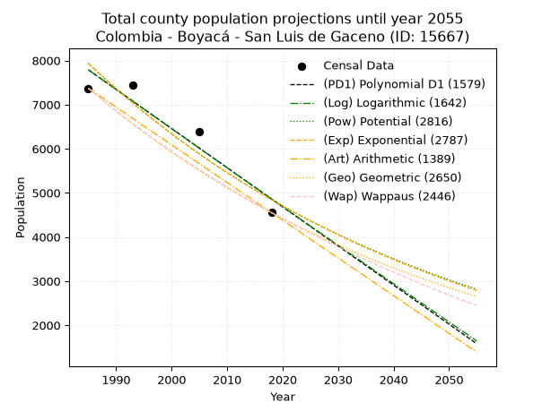
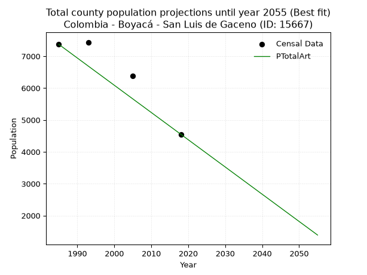
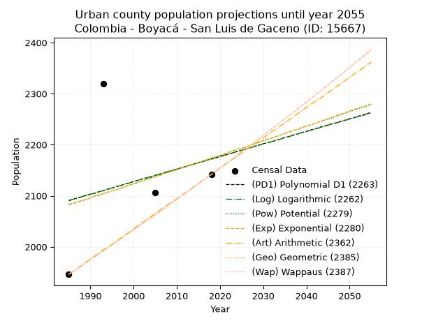
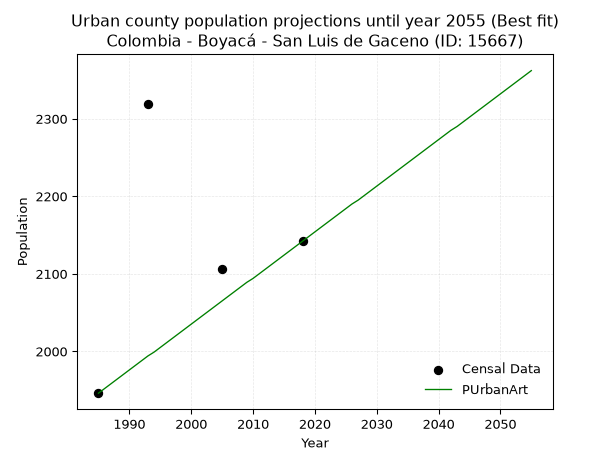
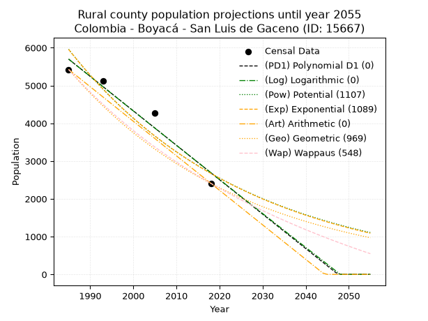
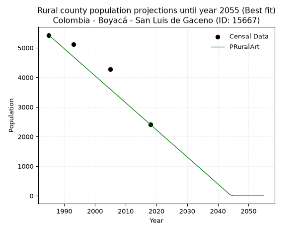

<div align="center">


</div>

# 📜 _“Population and Public Services Demand Projections (PPSD) until Year 2050 for Colombia - Boyacá - San Luis de Gaceno (ID: 15667)”_
Keywords: `population` `public-service` `projection` `lineal` `polynomial` `logarithmic` `potential` `exponential` `arithmetic` `geometric` `wappaus` `dane` `colombia` `south-america`

PPSD are analytical estimates used by governments and planners to anticipate future changes in population size, age distribution, and the resulting community needs for utilities, healthcare, education, and infrastructure as sizing future water treatment facilities, electrical grids, and road networks based on spatial growth.

<div align="center">

</img>

</div>


> **General running parameters**: • app_version: _v20260806_. • Python version: _3.14.7_. • Pandas version: _3.0.5_. • NumPy version: _2.5.1_. • Creates, save and include plots into reports (create_plot): _False_. • Projection until year: _2050_. • Process polynomial degree 2 and up: _False_. • Process Wappaus: _True_. • Process Wappaus: _True_. • Set negative values to zero: _True_. • Set infinite values to zero: _True_. • Drop dataset notes: _True_. 
<div align="center">

Maps & GIS Layers: [:earth_americas:Google](http://maps.google.com/maps?q=4.819760312,-73.1680755) [:earth_americas:OSM](https://www.openstreetmap.org/#map=18/4.819760312/-73.1680755&layers=P) [:earth_americas:Bing](https://www.bing.com/maps?cp=4.819760312~-73.1680755&lvl=18) [:earth_americas:Apple](https://maps.apple.com/frame?center=4.819760312%2C-73.1680755&span=0.003%2C0.006) [:earth_americas:GISMobile](https://github.com/rcfdtools/R.GISMobile/blob/main/file/gis/CountyLayer_CO/Readme.md)

</div>


<div align="center">

```geojson
{
  "type": "Feature",
  "geometry": {
    "type": "Point", 
    "coordinates": [-73.1680755, 4.819760312]
  }, 
  "properties": {
    "Name": "Colombia - Boyacá - San Luis de Gaceno (ID: 15667)"
  }
}
```

</div>


## 0. Census Data (4 records)

Census data are official statistics collected by a government about the people and housing in a country. They usually include counts of total population, age, sex, race, income, education, and jobs.

📅Global census file: [Population.xlsx](../data/Population.xlsx)

| Source   |   Year |   CountryID | CountryName   |   StateID | StateName   |   CountyID | CountyName         |   PTotal |   PUrban |   PRural |
|:---------|-------:|------------:|:--------------|----------:|:------------|-----------:|:-------------------|---------:|---------:|---------:|
| DANE     |   1985 |          57 | Colombia      |        15 | Boyacá      |      15667 | San Luis de Gaceno |     7371 |     1946 |     5425 |
| DANE     |   1993 |          57 | Colombia      |        15 | Boyacá      |      15667 | San Luis de Gaceno |     7439 |     2319 |     5120 |
| DANE     |   2005 |          57 | Colombia      |        15 | Boyacá      |      15667 | San Luis de Gaceno |     6383 |     2106 |     4277 |
| DANE     |   2018 |          57 | Colombia      |        15 | Boyacá      |      15667 | San Luis de Gaceno |     4551 |     2142 |     2409 |

> 🔥Some records could had specific notes about the registered values or the corresponding urban or rural distribution.

📅[SUI-RUPS](https://www.datos.gov.co/Hacienda-y-Cr-dito-P-blico/Registro-nico-de-Prestadores-de-Servicios-P-blicos/4qkq-csdn/about_data) - Local public utility companies: [RUPS.csv](../data/RUPS.csv)

 | SERVICIO       | ESTADO    | NOMBRE                                                                                                                         | NIT         | DEPARTAMENTO_DOMICILIO   | MUNICIPIO_DOMICILIO   | DIRECCION          |   TELEFONO | EMAIL                              | TIPO_PRESTADOR                 | CLASIFICACION                 |
|:---------------|:----------|:-------------------------------------------------------------------------------------------------------------------------------|:------------|:-------------------------|:----------------------|:-------------------|-----------:|:-----------------------------------|:-------------------------------|:------------------------------|
| ACUEDUCTO      | OPERATIVA | UNIDAD MUNICIPAL DE  SERVICIOS PUBLICOS DOMICILIARIOS  DE ACUEDUCTO, ALCANTARILLADO Y ASEO DEL MUNICIPIO DE SAN LUIS DE GACENO | 891802151-9 | BOYACA                   | SAN LUIS DE GACENO    | Carrera 4 No. 6-09 |    6248457 | uspd@sanluisdegaceno-boyaca.gov.co | MUNICIPIO (PRESTACIÓN DIRECTA) | MENOR O IGUAL A 2500 USUARIOS |
| ALCANTARILLADO | OPERATIVA | UNIDAD MUNICIPAL DE  SERVICIOS PUBLICOS DOMICILIARIOS  DE ACUEDUCTO, ALCANTARILLADO Y ASEO DEL MUNICIPIO DE SAN LUIS DE GACENO | 891802151-9 | BOYACA                   | SAN LUIS DE GACENO    | Carrera 4 No. 6-09 |    6248457 | uspd@sanluisdegaceno-boyaca.gov.co | MUNICIPIO (PRESTACIÓN DIRECTA) | MENOR O IGUAL A 2500 USUARIOS |

## 1. Total

### 1.1. Coefficients and Parameters

* (PD1) Polynomial Deg 1: -88.70493777599239, 183868.05178642878 (lineal)
* (Log) Logarithmic: -177418.86817553782, 1354998.238747845
* (Pow) Potential: -29.8959159436988, 102.4892289140965
* (Exp) Exponential: -0.014948755792472278, 6.116324334480077e+16
* (Art) Arithmetic: Year diff. 2018 - 1985 = 33, Population diff. 4551 - 7371 = -2820, Annual growth = -85.45454545454545
* (Geo) Geometric: Year diff. 2018 - 1985 = 33, Population diff. 4551 - 7371 = -2820, Annual growth % = -0.014506073179499035
* (Wap) Wappaus: i = -1.4335605679339951, Condition values only valid for < 200)

<sub>
Wappaus condition values: ['-0.00', '-1.43', '-2.87', '-4.30', '-5.73', '-7.17', '-8.60', '-10.03', '-11.47', '-12.90', '-14.34', '-15.77', '-17.20', '-18.64', '-20.07', '-21.50', '-22.94', '-24.37', '-25.80', '-27.24', '-28.67', '-30.10', '-31.54', '-32.97', '-34.41', '-35.84', '-37.27', '-38.71', '-40.14', '-41.57', '-43.01', '-44.44', '-45.87', '-47.31', '-48.74', '-50.17', '-51.61', '-53.04', '-54.48', '-55.91', '-57.34', '-58.78', '-60.21', '-61.64', '-63.08', '-64.51', '-65.94', '-67.38', '-68.81', '-70.24', '-71.68', '-73.11', '-74.55', '-75.98', '-77.41', '-78.85', '-80.28', '-81.71', '-83.15', '-84.58', '-86.01', '-87.45', '-88.88', '-90.31', '-91.75', '-93.18']
</sub>


### 1.2. Projected Dataset

|   Year |   CountyID |   PTotalPD1 |   PTotalLog |   PTotalPow |   PTotalExp |   PTotalArt |   PTotalGeo |   PTotalWap |
|-------:|-----------:|------------:|------------:|------------:|------------:|------------:|------------:|------------:|
|   1985 |      15667 |        7789 |        7790 |        7937 |        7935 |        7371 |        7371 |        7371 |
|   1986 |      15667 |        7700 |        7701 |        7818 |        7817 |        7286 |        7264 |        7266 |
|   1987 |      15667 |        7611 |        7612 |        7702 |        7701 |        7200 |        7159 |        7163 |
|   1988 |      15667 |        7523 |        7522 |        7587 |        7587 |        7115 |        7055 |        7061 |
|   1989 |      15667 |        7434 |        7433 |        7473 |        7474 |        7029 |        6953 |        6960 |
|   1990 |      15667 |        7345 |        7344 |        7362 |        7364 |        6944 |        6852 |        6861 |
|   1991 |      15667 |        7257 |        7255 |        7252 |        7254 |        6858 |        6752 |        6763 |
|   1992 |      15667 |        7168 |        7166 |        7144 |        7147 |        6773 |        6654 |        6667 |
|   1993 |      15667 |        7079 |        7077 |        7038 |        7041 |        6687 |        6558 |        6572 |
|   1994 |      15667 |        6990 |        6988 |        6933 |        6936 |        6602 |        6463 |        6478 |
|   1995 |      15667 |        6902 |        6899 |        6830 |        6833 |        6516 |        6369 |        6385 |
|   1996 |      15667 |        6813 |        6810 |        6728 |        6732 |        6431 |        6277 |        6294 |
|   1997 |      15667 |        6724 |        6721 |        6628 |        6632 |        6346 |        6185 |        6203 |
|   1998 |      15667 |        6636 |        6632 |        6530 |        6534 |        6260 |        6096 |        6114 |
|   1999 |      15667 |        6547 |        6543 |        6433 |        6437 |        6175 |        6007 |        6027 |
|   2000 |      15667 |        6458 |        6455 |        6337 |        6341 |        6089 |        5920 |        5940 |
|   2001 |      15667 |        6369 |        6366 |        6243 |        6247 |        6004 |        5834 |        5854 |
|   2002 |      15667 |        6281 |        6277 |        6151 |        6154 |        5918 |        5750 |        5770 |
|   2003 |      15667 |        6192 |        6189 |        6060 |        6063 |        5833 |        5666 |        5686 |
|   2004 |      15667 |        6103 |        6100 |        5970 |        5973 |        5747 |        5584 |        5604 |
|   2005 |      15667 |        6015 |        6012 |        5882 |        5884 |        5662 |        5503 |        5523 |
|   2006 |      15667 |        5926 |        5923 |        5795 |        5797 |        5576 |        5423 |        5442 |
|   2007 |      15667 |        5837 |        5835 |        5709 |        5711 |        5491 |        5345 |        5363 |
|   2008 |      15667 |        5749 |        5746 |        5624 |        5626 |        5406 |        5267 |        5285 |
|   2009 |      15667 |        5660 |        5658 |        5541 |        5543 |        5320 |        5191 |        5207 |
|   2010 |      15667 |        5571 |        5570 |        5460 |        5461 |        5235 |        5115 |        5131 |
|   2011 |      15667 |        5482 |        5482 |        5379 |        5380 |        5149 |        5041 |        5055 |
|   2012 |      15667 |        5394 |        5393 |        5300 |        5300 |        5064 |        4968 |        4981 |
|   2013 |      15667 |        5305 |        5305 |        5221 |        5221 |        4978 |        4896 |        4907 |
|   2014 |      15667 |        5216 |        5217 |        5145 |        5144 |        4893 |        4825 |        4834 |
|   2015 |      15667 |        5128 |        5129 |        5069 |        5067 |        4807 |        4755 |        4762 |
|   2016 |      15667 |        5039 |        5041 |        4994 |        4992 |        4722 |        4686 |        4691 |
|   2017 |      15667 |        4950 |        4953 |        4921 |        4918 |        4636 |        4618 |        4621 |
|   2018 |      15667 |        4861 |        4865 |        4848 |        4845 |        4551 |        4551 |        4551 |
|   2019 |      15667 |        4773 |        4777 |        4777 |        4773 |        4466 |        4485 |        4482 |
|   2020 |      15667 |        4684 |        4689 |        4707 |        4702 |        4380 |        4420 |        4414 |
|   2021 |      15667 |        4595 |        4602 |        4638 |        4633 |        4295 |        4356 |        4347 |
|   2022 |      15667 |        4507 |        4514 |        4570 |        4564 |        4209 |        4293 |        4281 |
|   2023 |      15667 |        4418 |        4426 |        4503 |        4496 |        4124 |        4230 |        4215 |
|   2024 |      15667 |        4329 |        4338 |        4436 |        4429 |        4038 |        4169 |        4150 |
|   2025 |      15667 |        4241 |        4251 |        4371 |        4364 |        3953 |        4109 |        4086 |
|   2026 |      15667 |        4152 |        4163 |        4307 |        4299 |        3867 |        4049 |        4023 |
|   2027 |      15667 |        4063 |        4076 |        4244 |        4235 |        3782 |        3990 |        3960 |
|   2028 |      15667 |        3974 |        3988 |        4182 |        4172 |        3696 |        3932 |        3898 |
|   2029 |      15667 |        3886 |        3901 |        4121 |        4110 |        3611 |        3875 |        3836 |
|   2030 |      15667 |        3797 |        3813 |        4061 |        4049 |        3526 |        3819 |        3776 |
|   2031 |      15667 |        3708 |        3726 |        4001 |        3989 |        3440 |        3764 |        3716 |
|   2032 |      15667 |        3620 |        3638 |        3943 |        3930 |        3355 |        3709 |        3656 |
|   2033 |      15667 |        3531 |        3551 |        3885 |        3872 |        3269 |        3655 |        3597 |
|   2034 |      15667 |        3442 |        3464 |        3829 |        3814 |        3184 |        3602 |        3539 |
|   2035 |      15667 |        3354 |        3377 |        3773 |        3758 |        3098 |        3550 |        3482 |
|   2036 |      15667 |        3265 |        3290 |        3718 |        3702 |        3013 |        3498 |        3425 |
|   2037 |      15667 |        3176 |        3202 |        3664 |        3647 |        2927 |        3448 |        3368 |
|   2038 |      15667 |        3087 |        3115 |        3610 |        3593 |        2842 |        3398 |        3312 |
|   2039 |      15667 |        2999 |        3028 |        3558 |        3540 |        2756 |        3348 |        3257 |
|   2040 |      15667 |        2910 |        2941 |        3506 |        3487 |        2671 |        3300 |        3203 |
|   2041 |      15667 |        2821 |        2854 |        3455 |        3435 |        2586 |        3252 |        3149 |
|   2042 |      15667 |        2733 |        2768 |        3405 |        3385 |        2500 |        3205 |        3095 |
|   2043 |      15667 |        2644 |        2681 |        3355 |        3334 |        2415 |        3158 |        3042 |
|   2044 |      15667 |        2555 |        2594 |        3307 |        3285 |        2329 |        3113 |        2990 |
|   2045 |      15667 |        2466 |        2507 |        3259 |        3236 |        2244 |        3067 |        2938 |
|   2046 |      15667 |        2378 |        2420 |        3211 |        3188 |        2158 |        3023 |        2886 |
|   2047 |      15667 |        2289 |        2334 |        3165 |        3141 |        2073 |        2979 |        2835 |
|   2048 |      15667 |        2200 |        2247 |        3119 |        3094 |        1987 |        2936 |        2785 |
|   2049 |      15667 |        2112 |        2160 |        3074 |        3048 |        1902 |        2893 |        2735 |
|   2050 |      15667 |        2023 |        2074 |        3029 |        3003 |        1816 |        2851 |        2686 |
<div align="center">

</img>

</div>


### 1.3. Best fit with absolute and relative error (%)

Relative error puts that difference into context by dividing the absolute error by the true value, creating a unitless ratio or percentage that shows the scale of the mistake.

Absolute and relative error

|   Year | Source   |   CountryID | CountryName   |   StateID | StateName   |   CountyID_x | CountyName         |   PTotal |   PUrban |   PRural |   CountyID_y |   PTotalPD1 |   PTotalLog |   PTotalPow |   PTotalExp |   PTotalArt |   PTotalGeo |   PTotalWap |   PTotalPD1AbsError |   PTotalLogAbsError |   PTotalPowAbsError |   PTotalExpAbsError |   PTotalArtAbsError |   PTotalGeoAbsError |   PTotalWapAbsError |   PTotalPD1RelError |   PTotalLogRelError |   PTotalPowRelError |   PTotalExpRelError |   PTotalArtRelError |   PTotalGeoRelError |   PTotalWapRelError |
|-------:|:---------|------------:|:--------------|----------:|:------------|-------------:|:-------------------|---------:|---------:|---------:|-------------:|------------:|------------:|------------:|------------:|------------:|------------:|------------:|--------------------:|--------------------:|--------------------:|--------------------:|--------------------:|--------------------:|--------------------:|--------------------:|--------------------:|--------------------:|--------------------:|--------------------:|--------------------:|--------------------:|
|   1985 | DANE     |          57 | Colombia      |        15 | Boyacá      |        15667 | San Luis de Gaceno |     7371 |     1946 |     5425 |        15667 |        7789 |        7790 |        7937 |        7935 |        7371 |        7371 |        7371 |                 418 |                 419 |                 566 |                 564 |                   0 |                   0 |                   0 |             5.67087 |             5.68444 |             7.67874 |             7.65161 |              0      |              0      |              0      |
|   1993 | DANE     |          57 | Colombia      |        15 | Boyacá      |        15667 | San Luis de Gaceno |     7439 |     2319 |     5120 |        15667 |        7079 |        7077 |        7038 |        7041 |        6687 |        6558 |        6572 |                 360 |                 362 |                 401 |                 398 |                 752 |                 881 |                 867 |             4.83936 |             4.86625 |             5.39051 |             5.35018 |             10.1089 |             11.843  |             11.6548 |
|   2005 | DANE     |          57 | Colombia      |        15 | Boyacá      |        15667 | San Luis de Gaceno |     6383 |     2106 |     4277 |        15667 |        6015 |        6012 |        5882 |        5884 |        5662 |        5503 |        5523 |                 368 |                 371 |                 501 |                 499 |                 721 |                 880 |                 860 |             5.76531 |             5.81231 |             7.84897 |             7.81764 |             11.2956 |             13.7866 |             13.4733 |
|   2018 | DANE     |          57 | Colombia      |        15 | Boyacá      |        15667 | San Luis de Gaceno |     4551 |     2142 |     2409 |        15667 |        4861 |        4865 |        4848 |        4845 |        4551 |        4551 |        4551 |                 310 |                 314 |                 297 |                 294 |                   0 |                   0 |                   0 |             6.81169 |             6.89958 |             6.52604 |             6.46012 |              0      |              0      |              0      |

Relative error mean

| Method    |   RelError | Best   |
|:----------|-----------:|:-------|
| PTotalPD1 |    5.77181 |        |
| PTotalLog |    5.81565 |        |
| PTotalPow |    6.86107 |        |
| PTotalExp |    6.81989 |        |
| PTotalArt |    5.35113 | True   |
| PTotalGeo |    6.4074  |        |
| PTotalWap |    6.28202 |        |

💙Best method: _**PTotalArt**_
<div align="center">

</img>

</div>


### 1.4. Fresh water supply demand in liters per capita per day (lpcd)

The fresh water supply demand typically ranges from 100 to 300 liters per capita per day (lpcd) for standard domestic and municipal planning, though absolute survival minimums set by the World Health Organization are as low as 7.5 to 20 liters per day, and total consumption in high-income nations can exceed 400 liters.

> `CZ`: Level in meters above the sea level (masl)<br> `WS`: Fresh water supply demand in liters per capita per day (lpcd or l/h/d)<br> `WSAll`: Zonal fresh water supply demand in liters per second (l/s)<br> `A`: Zonal area in square meters<br> `DP`: Population density (people/hectare or p/ha)

Reference values (RAS Colombia)

|    CZ |   WS |
|------:|-----:|
|  1000 |  120 |
|  2000 |  130 |
| 99999 |  140 |

County shapefile geometry properties and water supply values

|   CountyID |      ATotal |   CZTotal |   WSTotal |
|-----------:|------------:|----------:|----------:|
|      15667 | 4.68966e+08 |   675.297 |       120 |

Projected values for best method: PTotalArt

|   CountyID |   Year |   PTotalArt |   DPTotal |   WSTotal |   WSTotalAll |
|-----------:|-------:|------------:|----------:|----------:|-------------:|
|      15667 |   1985 |        7371 |      0.16 |       120 |     10.2375  |
|      15667 |   1986 |        7286 |      0.16 |       120 |     10.1194  |
|      15667 |   1987 |        7200 |      0.15 |       120 |     10       |
|      15667 |   1988 |        7115 |      0.15 |       120 |      9.88194 |
|      15667 |   1989 |        7029 |      0.15 |       120 |      9.7625  |
|      15667 |   1990 |        6944 |      0.15 |       120 |      9.64444 |
|      15667 |   1991 |        6858 |      0.15 |       120 |      9.525   |
|      15667 |   1992 |        6773 |      0.14 |       120 |      9.40694 |
|      15667 |   1993 |        6687 |      0.14 |       120 |      9.2875  |
|      15667 |   1994 |        6602 |      0.14 |       120 |      9.16944 |
|      15667 |   1995 |        6516 |      0.14 |       120 |      9.05    |
|      15667 |   1996 |        6431 |      0.14 |       120 |      8.93194 |
|      15667 |   1997 |        6346 |      0.14 |       120 |      8.81389 |
|      15667 |   1998 |        6260 |      0.13 |       120 |      8.69444 |
|      15667 |   1999 |        6175 |      0.13 |       120 |      8.57639 |
|      15667 |   2000 |        6089 |      0.13 |       120 |      8.45694 |
|      15667 |   2001 |        6004 |      0.13 |       120 |      8.33889 |
|      15667 |   2002 |        5918 |      0.13 |       120 |      8.21944 |
|      15667 |   2003 |        5833 |      0.12 |       120 |      8.10139 |
|      15667 |   2004 |        5747 |      0.12 |       120 |      7.98194 |
|      15667 |   2005 |        5662 |      0.12 |       120 |      7.86389 |
|      15667 |   2006 |        5576 |      0.12 |       120 |      7.74444 |
|      15667 |   2007 |        5491 |      0.12 |       120 |      7.62639 |
|      15667 |   2008 |        5406 |      0.12 |       120 |      7.50833 |
|      15667 |   2009 |        5320 |      0.11 |       120 |      7.38889 |
|      15667 |   2010 |        5235 |      0.11 |       120 |      7.27083 |
|      15667 |   2011 |        5149 |      0.11 |       120 |      7.15139 |
|      15667 |   2012 |        5064 |      0.11 |       120 |      7.03333 |
|      15667 |   2013 |        4978 |      0.11 |       120 |      6.91389 |
|      15667 |   2014 |        4893 |      0.1  |       120 |      6.79583 |
|      15667 |   2015 |        4807 |      0.1  |       120 |      6.67639 |
|      15667 |   2016 |        4722 |      0.1  |       120 |      6.55833 |
|      15667 |   2017 |        4636 |      0.1  |       120 |      6.43889 |
|      15667 |   2018 |        4551 |      0.1  |       120 |      6.32083 |
|      15667 |   2019 |        4466 |      0.1  |       120 |      6.20278 |
|      15667 |   2020 |        4380 |      0.09 |       120 |      6.08333 |
|      15667 |   2021 |        4295 |      0.09 |       120 |      5.96528 |
|      15667 |   2022 |        4209 |      0.09 |       120 |      5.84583 |
|      15667 |   2023 |        4124 |      0.09 |       120 |      5.72778 |
|      15667 |   2024 |        4038 |      0.09 |       120 |      5.60833 |
|      15667 |   2025 |        3953 |      0.08 |       120 |      5.49028 |
|      15667 |   2026 |        3867 |      0.08 |       120 |      5.37083 |
|      15667 |   2027 |        3782 |      0.08 |       120 |      5.25278 |
|      15667 |   2028 |        3696 |      0.08 |       120 |      5.13333 |
|      15667 |   2029 |        3611 |      0.08 |       120 |      5.01528 |
|      15667 |   2030 |        3526 |      0.08 |       120 |      4.89722 |
|      15667 |   2031 |        3440 |      0.07 |       120 |      4.77778 |
|      15667 |   2032 |        3355 |      0.07 |       120 |      4.65972 |
|      15667 |   2033 |        3269 |      0.07 |       120 |      4.54028 |
|      15667 |   2034 |        3184 |      0.07 |       120 |      4.42222 |
|      15667 |   2035 |        3098 |      0.07 |       120 |      4.30278 |
|      15667 |   2036 |        3013 |      0.06 |       120 |      4.18472 |
|      15667 |   2037 |        2927 |      0.06 |       120 |      4.06528 |
|      15667 |   2038 |        2842 |      0.06 |       120 |      3.94722 |
|      15667 |   2039 |        2756 |      0.06 |       120 |      3.82778 |
|      15667 |   2040 |        2671 |      0.06 |       120 |      3.70972 |
|      15667 |   2041 |        2586 |      0.06 |       120 |      3.59167 |
|      15667 |   2042 |        2500 |      0.05 |       120 |      3.47222 |
|      15667 |   2043 |        2415 |      0.05 |       120 |      3.35417 |
|      15667 |   2044 |        2329 |      0.05 |       120 |      3.23472 |
|      15667 |   2045 |        2244 |      0.05 |       120 |      3.11667 |
|      15667 |   2046 |        2158 |      0.05 |       120 |      2.99722 |
|      15667 |   2047 |        2073 |      0.04 |       120 |      2.87917 |
|      15667 |   2048 |        1987 |      0.04 |       120 |      2.75972 |
|      15667 |   2049 |        1902 |      0.04 |       120 |      2.64167 |
|      15667 |   2050 |        1816 |      0.04 |       120 |      2.52222 |

## 2. Urban

### 2.1. Coefficients and Parameters

* (PD1) Polynomial Deg 1: 2.464472099558371, -2801.310317141631 (lineal)
* (Log) Logarithmic: 4959.4572167238575, -35568.62404691396
* (Pow) Potential: 2.607434683778217, -5.280159277125189
* (Exp) Exponential: 0.0012963770272249246, 158.8622917331357
* (Art) Arithmetic: Year diff. 2018 - 1985 = 33, Population diff. 2142 - 1946 = 196, Annual growth = 5.9393939393939394
* (Geo) Geometric: Year diff. 2018 - 1985 = 33, Population diff. 2142 - 1946 = 196, Annual growth % = 0.0029122319768069005
* (Wap) Wappaus: i = 0.29057700290577004, Condition values only valid for < 200)

<sub>
Wappaus condition values: ['0.00', '0.29', '0.58', '0.87', '1.16', '1.45', '1.74', '2.03', '2.32', '2.62', '2.91', '3.20', '3.49', '3.78', '4.07', '4.36', '4.65', '4.94', '5.23', '5.52', '5.81', '6.10', '6.39', '6.68', '6.97', '7.26', '7.56', '7.85', '8.14', '8.43', '8.72', '9.01', '9.30', '9.59', '9.88', '10.17', '10.46', '10.75', '11.04', '11.33', '11.62', '11.91', '12.20', '12.49', '12.79', '13.08', '13.37', '13.66', '13.95', '14.24', '14.53', '14.82', '15.11', '15.40', '15.69', '15.98', '16.27', '16.56', '16.85', '17.14', '17.43', '17.73', '18.02', '18.31', '18.60', '18.89']
</sub>


### 2.2. Projected Dataset

|   Year |   CountyID |   PUrbanPD1 |   PUrbanLog |   PUrbanPow |   PUrbanExp |   PUrbanArt |   PUrbanGeo |   PUrbanWap |
|-------:|-----------:|------------:|------------:|------------:|------------:|------------:|------------:|------------:|
|   1985 |      15667 |        2091 |        2090 |        2082 |        2083 |        1946 |        1946 |        1946 |
|   1986 |      15667 |        2093 |        2093 |        2085 |        2085 |        1952 |        1952 |        1952 |
|   1987 |      15667 |        2096 |        2095 |        2088 |        2088 |        1958 |        1957 |        1957 |
|   1988 |      15667 |        2098 |        2098 |        2090 |        2091 |        1964 |        1963 |        1963 |
|   1989 |      15667 |        2101 |        2100 |        2093 |        2093 |        1970 |        1969 |        1969 |
|   1990 |      15667 |        2103 |        2103 |        2096 |        2096 |        1976 |        1975 |        1974 |
|   1991 |      15667 |        2105 |        2105 |        2099 |        2099 |        1982 |        1980 |        1980 |
|   1992 |      15667 |        2108 |        2108 |        2101 |        2102 |        1988 |        1986 |        1986 |
|   1993 |      15667 |        2110 |        2110 |        2104 |        2104 |        1994 |        1992 |        1992 |
|   1994 |      15667 |        2113 |        2113 |        2107 |        2107 |        1999 |        1998 |        1998 |
|   1995 |      15667 |        2115 |        2115 |        2110 |        2110 |        2005 |        2003 |        2003 |
|   1996 |      15667 |        2118 |        2118 |        2112 |        2112 |        2011 |        2009 |        2009 |
|   1997 |      15667 |        2120 |        2120 |        2115 |        2115 |        2017 |        2015 |        2015 |
|   1998 |      15667 |        2123 |        2123 |        2118 |        2118 |        2023 |        2021 |        2021 |
|   1999 |      15667 |        2125 |        2125 |        2121 |        2121 |        2029 |        2027 |        2027 |
|   2000 |      15667 |        2128 |        2128 |        2124 |        2123 |        2035 |        2033 |        2033 |
|   2001 |      15667 |        2130 |        2130 |        2126 |        2126 |        2041 |        2039 |        2039 |
|   2002 |      15667 |        2133 |        2133 |        2129 |        2129 |        2047 |        2045 |        2045 |
|   2003 |      15667 |        2135 |        2135 |        2132 |        2132 |        2053 |        2051 |        2051 |
|   2004 |      15667 |        2137 |        2138 |        2135 |        2134 |        2059 |        2057 |        2056 |
|   2005 |      15667 |        2140 |        2140 |        2137 |        2137 |        2065 |        2063 |        2062 |
|   2006 |      15667 |        2142 |        2143 |        2140 |        2140 |        2071 |        2069 |        2068 |
|   2007 |      15667 |        2145 |        2145 |        2143 |        2143 |        2077 |        2075 |        2075 |
|   2008 |      15667 |        2147 |        2148 |        2146 |        2146 |        2083 |        2081 |        2081 |
|   2009 |      15667 |        2150 |        2150 |        2149 |        2148 |        2089 |        2087 |        2087 |
|   2010 |      15667 |        2152 |        2152 |        2151 |        2151 |        2094 |        2093 |        2093 |
|   2011 |      15667 |        2155 |        2155 |        2154 |        2154 |        2100 |        2099 |        2099 |
|   2012 |      15667 |        2157 |        2157 |        2157 |        2157 |        2106 |        2105 |        2105 |
|   2013 |      15667 |        2160 |        2160 |        2160 |        2160 |        2112 |        2111 |        2111 |
|   2014 |      15667 |        2162 |        2162 |        2163 |        2162 |        2118 |        2117 |        2117 |
|   2015 |      15667 |        2165 |        2165 |        2165 |        2165 |        2124 |        2123 |        2123 |
|   2016 |      15667 |        2167 |        2167 |        2168 |        2168 |        2130 |        2130 |        2130 |
|   2017 |      15667 |        2170 |        2170 |        2171 |        2171 |        2136 |        2136 |        2136 |
|   2018 |      15667 |        2172 |        2172 |        2174 |        2174 |        2142 |        2142 |        2142 |
|   2019 |      15667 |        2174 |        2175 |        2177 |        2176 |        2148 |        2148 |        2148 |
|   2020 |      15667 |        2177 |        2177 |        2179 |        2179 |        2154 |        2154 |        2155 |
|   2021 |      15667 |        2179 |        2180 |        2182 |        2182 |        2160 |        2161 |        2161 |
|   2022 |      15667 |        2182 |        2182 |        2185 |        2185 |        2166 |        2167 |        2167 |
|   2023 |      15667 |        2184 |        2184 |        2188 |        2188 |        2172 |        2173 |        2173 |
|   2024 |      15667 |        2187 |        2187 |        2191 |        2191 |        2178 |        2180 |        2180 |
|   2025 |      15667 |        2189 |        2189 |        2193 |        2193 |        2184 |        2186 |        2186 |
|   2026 |      15667 |        2192 |        2192 |        2196 |        2196 |        2190 |        2192 |        2193 |
|   2027 |      15667 |        2194 |        2194 |        2199 |        2199 |        2195 |        2199 |        2199 |
|   2028 |      15667 |        2197 |        2197 |        2202 |        2202 |        2201 |        2205 |        2205 |
|   2029 |      15667 |        2199 |        2199 |        2205 |        2205 |        2207 |        2212 |        2212 |
|   2030 |      15667 |        2202 |        2202 |        2208 |        2208 |        2213 |        2218 |        2218 |
|   2031 |      15667 |        2204 |        2204 |        2210 |        2211 |        2219 |        2225 |        2225 |
|   2032 |      15667 |        2206 |        2206 |        2213 |        2213 |        2225 |        2231 |        2231 |
|   2033 |      15667 |        2209 |        2209 |        2216 |        2216 |        2231 |        2238 |        2238 |
|   2034 |      15667 |        2211 |        2211 |        2219 |        2219 |        2237 |        2244 |        2244 |
|   2035 |      15667 |        2214 |        2214 |        2222 |        2222 |        2243 |        2251 |        2251 |
|   2036 |      15667 |        2216 |        2216 |        2225 |        2225 |        2249 |        2257 |        2257 |
|   2037 |      15667 |        2219 |        2219 |        2228 |        2228 |        2255 |        2264 |        2264 |
|   2038 |      15667 |        2221 |        2221 |        2230 |        2231 |        2261 |        2270 |        2271 |
|   2039 |      15667 |        2224 |        2224 |        2233 |        2234 |        2267 |        2277 |        2277 |
|   2040 |      15667 |        2226 |        2226 |        2236 |        2236 |        2273 |        2284 |        2284 |
|   2041 |      15667 |        2229 |        2228 |        2239 |        2239 |        2279 |        2290 |        2291 |
|   2042 |      15667 |        2231 |        2231 |        2242 |        2242 |        2285 |        2297 |        2297 |
|   2043 |      15667 |        2234 |        2233 |        2245 |        2245 |        2290 |        2304 |        2304 |
|   2044 |      15667 |        2236 |        2236 |        2248 |        2248 |        2296 |        2310 |        2311 |
|   2045 |      15667 |        2239 |        2238 |        2250 |        2251 |        2302 |        2317 |        2318 |
|   2046 |      15667 |        2241 |        2241 |        2253 |        2254 |        2308 |        2324 |        2324 |
|   2047 |      15667 |        2243 |        2243 |        2256 |        2257 |        2314 |        2330 |        2331 |
|   2048 |      15667 |        2246 |        2245 |        2259 |        2260 |        2320 |        2337 |        2338 |
|   2049 |      15667 |        2248 |        2248 |        2262 |        2263 |        2326 |        2344 |        2345 |
|   2050 |      15667 |        2251 |        2250 |        2265 |        2266 |        2332 |        2351 |        2352 |
<div align="center">

</img>

</div>


### 2.3. Best fit with absolute and relative error (%)

Relative error puts that difference into context by dividing the absolute error by the true value, creating a unitless ratio or percentage that shows the scale of the mistake.

Absolute and relative error

|   Year | Source   |   CountryID | CountryName   |   StateID | StateName   |   CountyID_x | CountyName         |   PTotal |   PUrban |   PRural |   CountyID_y |   PUrbanPD1 |   PUrbanLog |   PUrbanPow |   PUrbanExp |   PUrbanArt |   PUrbanGeo |   PUrbanWap |   PUrbanPD1AbsError |   PUrbanLogAbsError |   PUrbanPowAbsError |   PUrbanExpAbsError |   PUrbanArtAbsError |   PUrbanGeoAbsError |   PUrbanWapAbsError |   PUrbanPD1RelError |   PUrbanLogRelError |   PUrbanPowRelError |   PUrbanExpRelError |   PUrbanArtRelError |   PUrbanGeoRelError |   PUrbanWapRelError |
|-------:|:---------|------------:|:--------------|----------:|:------------|-------------:|:-------------------|---------:|---------:|---------:|-------------:|------------:|------------:|------------:|------------:|------------:|------------:|------------:|--------------------:|--------------------:|--------------------:|--------------------:|--------------------:|--------------------:|--------------------:|--------------------:|--------------------:|--------------------:|--------------------:|--------------------:|--------------------:|--------------------:|
|   1985 | DANE     |          57 | Colombia      |        15 | Boyacá      |        15667 | San Luis de Gaceno |     7371 |     1946 |     5425 |        15667 |        2091 |        2090 |        2082 |        2083 |        1946 |        1946 |        1946 |                 145 |                 144 |                 136 |                 137 |                   0 |                   0 |                   0 |             7.45118 |             7.39979 |             6.98869 |             7.04008 |             0       |             0       |             0       |
|   1993 | DANE     |          57 | Colombia      |        15 | Boyacá      |        15667 | San Luis de Gaceno |     7439 |     2319 |     5120 |        15667 |        2110 |        2110 |        2104 |        2104 |        1994 |        1992 |        1992 |                 209 |                 209 |                 215 |                 215 |                 325 |                 327 |                 327 |             9.01251 |             9.01251 |             9.27124 |             9.27124 |            14.0147  |            14.1009  |            14.1009  |
|   2005 | DANE     |          57 | Colombia      |        15 | Boyacá      |        15667 | San Luis de Gaceno |     6383 |     2106 |     4277 |        15667 |        2140 |        2140 |        2137 |        2137 |        2065 |        2063 |        2062 |                  34 |                  34 |                  31 |                  31 |                  41 |                  43 |                  44 |             1.61443 |             1.61443 |             1.47198 |             1.47198 |             1.94682 |             2.04179 |             2.08927 |
|   2018 | DANE     |          57 | Colombia      |        15 | Boyacá      |        15667 | San Luis de Gaceno |     4551 |     2142 |     2409 |        15667 |        2172 |        2172 |        2174 |        2174 |        2142 |        2142 |        2142 |                  30 |                  30 |                  32 |                  32 |                   0 |                   0 |                   0 |             1.40056 |             1.40056 |             1.49393 |             1.49393 |             0       |             0       |             0       |

Relative error mean

| Method    |   RelError | Best   |
|:----------|-----------:|:-------|
| PUrbanPD1 |    4.86967 |        |
| PUrbanLog |    4.85682 |        |
| PUrbanPow |    4.80646 |        |
| PUrbanExp |    4.81931 |        |
| PUrbanArt |    3.99037 | True   |
| PUrbanGeo |    4.03567 |        |
| PUrbanWap |    4.04754 |        |

💙Best method: _**PUrbanArt**_
<div align="center">

</img>

</div>


### 2.4. Fresh water supply demand in liters per capita per day (lpcd)

The fresh water supply demand typically ranges from 100 to 300 liters per capita per day (lpcd) for standard domestic and municipal planning, though absolute survival minimums set by the World Health Organization are as low as 7.5 to 20 liters per day, and total consumption in high-income nations can exceed 400 liters.

> `CZ`: Level in meters above the sea level (masl)<br> `WS`: Fresh water supply demand in liters per capita per day (lpcd or l/h/d)<br> `WSAll`: Zonal fresh water supply demand in liters per second (l/s)<br> `A`: Zonal area in square meters<br> `DP`: Population density (people/hectare or p/ha)

Reference values (RAS Colombia)

|    CZ |   WS |
|------:|-----:|
|  1000 |  120 |
|  2000 |  130 |
| 99999 |  140 |

County shapefile geometry properties and water supply values

|   CountyID |      AUrban |   CZUrban |   WSUrban |
|-----------:|------------:|----------:|----------:|
|      15667 | 1.16739e+06 |   383.111 |       120 |

Projected values for best method: PUrbanArt

|   CountyID |   Year |   PUrbanArt |   DPUrban |   WSUrban |   WSUrbanAll |
|-----------:|-------:|------------:|----------:|----------:|-------------:|
|      15667 |   1985 |        1946 |     16.67 |       120 |      2.70278 |
|      15667 |   1986 |        1952 |     16.72 |       120 |      2.71111 |
|      15667 |   1987 |        1958 |     16.77 |       120 |      2.71944 |
|      15667 |   1988 |        1964 |     16.82 |       120 |      2.72778 |
|      15667 |   1989 |        1970 |     16.88 |       120 |      2.73611 |
|      15667 |   1990 |        1976 |     16.93 |       120 |      2.74444 |
|      15667 |   1991 |        1982 |     16.98 |       120 |      2.75278 |
|      15667 |   1992 |        1988 |     17.03 |       120 |      2.76111 |
|      15667 |   1993 |        1994 |     17.08 |       120 |      2.76944 |
|      15667 |   1994 |        1999 |     17.12 |       120 |      2.77639 |
|      15667 |   1995 |        2005 |     17.18 |       120 |      2.78472 |
|      15667 |   1996 |        2011 |     17.23 |       120 |      2.79306 |
|      15667 |   1997 |        2017 |     17.28 |       120 |      2.80139 |
|      15667 |   1998 |        2023 |     17.33 |       120 |      2.80972 |
|      15667 |   1999 |        2029 |     17.38 |       120 |      2.81806 |
|      15667 |   2000 |        2035 |     17.43 |       120 |      2.82639 |
|      15667 |   2001 |        2041 |     17.48 |       120 |      2.83472 |
|      15667 |   2002 |        2047 |     17.53 |       120 |      2.84306 |
|      15667 |   2003 |        2053 |     17.59 |       120 |      2.85139 |
|      15667 |   2004 |        2059 |     17.64 |       120 |      2.85972 |
|      15667 |   2005 |        2065 |     17.69 |       120 |      2.86806 |
|      15667 |   2006 |        2071 |     17.74 |       120 |      2.87639 |
|      15667 |   2007 |        2077 |     17.79 |       120 |      2.88472 |
|      15667 |   2008 |        2083 |     17.84 |       120 |      2.89306 |
|      15667 |   2009 |        2089 |     17.89 |       120 |      2.90139 |
|      15667 |   2010 |        2094 |     17.94 |       120 |      2.90833 |
|      15667 |   2011 |        2100 |     17.99 |       120 |      2.91667 |
|      15667 |   2012 |        2106 |     18.04 |       120 |      2.925   |
|      15667 |   2013 |        2112 |     18.09 |       120 |      2.93333 |
|      15667 |   2014 |        2118 |     18.14 |       120 |      2.94167 |
|      15667 |   2015 |        2124 |     18.19 |       120 |      2.95    |
|      15667 |   2016 |        2130 |     18.25 |       120 |      2.95833 |
|      15667 |   2017 |        2136 |     18.3  |       120 |      2.96667 |
|      15667 |   2018 |        2142 |     18.35 |       120 |      2.975   |
|      15667 |   2019 |        2148 |     18.4  |       120 |      2.98333 |
|      15667 |   2020 |        2154 |     18.45 |       120 |      2.99167 |
|      15667 |   2021 |        2160 |     18.5  |       120 |      3       |
|      15667 |   2022 |        2166 |     18.55 |       120 |      3.00833 |
|      15667 |   2023 |        2172 |     18.61 |       120 |      3.01667 |
|      15667 |   2024 |        2178 |     18.66 |       120 |      3.025   |
|      15667 |   2025 |        2184 |     18.71 |       120 |      3.03333 |
|      15667 |   2026 |        2190 |     18.76 |       120 |      3.04167 |
|      15667 |   2027 |        2195 |     18.8  |       120 |      3.04861 |
|      15667 |   2028 |        2201 |     18.85 |       120 |      3.05694 |
|      15667 |   2029 |        2207 |     18.91 |       120 |      3.06528 |
|      15667 |   2030 |        2213 |     18.96 |       120 |      3.07361 |
|      15667 |   2031 |        2219 |     19.01 |       120 |      3.08194 |
|      15667 |   2032 |        2225 |     19.06 |       120 |      3.09028 |
|      15667 |   2033 |        2231 |     19.11 |       120 |      3.09861 |
|      15667 |   2034 |        2237 |     19.16 |       120 |      3.10694 |
|      15667 |   2035 |        2243 |     19.21 |       120 |      3.11528 |
|      15667 |   2036 |        2249 |     19.27 |       120 |      3.12361 |
|      15667 |   2037 |        2255 |     19.32 |       120 |      3.13194 |
|      15667 |   2038 |        2261 |     19.37 |       120 |      3.14028 |
|      15667 |   2039 |        2267 |     19.42 |       120 |      3.14861 |
|      15667 |   2040 |        2273 |     19.47 |       120 |      3.15694 |
|      15667 |   2041 |        2279 |     19.52 |       120 |      3.16528 |
|      15667 |   2042 |        2285 |     19.57 |       120 |      3.17361 |
|      15667 |   2043 |        2290 |     19.62 |       120 |      3.18056 |
|      15667 |   2044 |        2296 |     19.67 |       120 |      3.18889 |
|      15667 |   2045 |        2302 |     19.72 |       120 |      3.19722 |
|      15667 |   2046 |        2308 |     19.77 |       120 |      3.20556 |
|      15667 |   2047 |        2314 |     19.82 |       120 |      3.21389 |
|      15667 |   2048 |        2320 |     19.87 |       120 |      3.22222 |
|      15667 |   2049 |        2326 |     19.92 |       120 |      3.23056 |
|      15667 |   2050 |        2332 |     19.98 |       120 |      3.23889 |

## 3. Rural

### 3.1. Coefficients and Parameters

* (PD1) Polynomial Deg 1: -91.16940987555076, 186669.36210357043 (lineal)
* (Log) Logarithmic: -182378.3253922617, 1390566.862794759
* (Pow) Potential: -48.55723454403848, 163.9052751112771
* (Exp) Exponential: -0.024278503999973212, 5.068017147360856e+24
* (Art) Arithmetic: Year diff. 2018 - 1985 = 33, Population diff. 2409 - 5425 = -3016, Annual growth = -91.39393939393939
* (Geo) Geometric: Year diff. 2018 - 1985 = 33, Population diff. 2409 - 5425 = -3016, Annual growth % = -0.024300068569299338
* (Wap) Wappaus: i = -2.333263706763834, Condition values only valid for < 200)

<sub>
Wappaus condition values: ['-0.00', '-2.33', '-4.67', '-7.00', '-9.33', '-11.67', '-14.00', '-16.33', '-18.67', '-21.00', '-23.33', '-25.67', '-28.00', '-30.33', '-32.67', '-35.00', '-37.33', '-39.67', '-42.00', '-44.33', '-46.67', '-49.00', '-51.33', '-53.67', '-56.00', '-58.33', '-60.66', '-63.00', '-65.33', '-67.66', '-70.00', '-72.33', '-74.66', '-77.00', '-79.33', '-81.66', '-84.00', '-86.33', '-88.66', '-91.00', '-93.33', '-95.66', '-98.00', '-100.33', '-102.66', '-105.00', '-107.33', '-109.66', '-112.00', '-114.33', '-116.66', '-119.00', '-121.33', '-123.66', '-126.00', '-128.33', '-130.66', '-133.00', '-135.33', '-137.66', '-140.00', '-142.33', '-144.66', '-147.00', '-149.33', '-151.66']
</sub>


### 3.2. Projected Dataset

|   Year |   CountyID |   PRuralPD1 |   PRuralLog |   PRuralPow |   PRuralExp |   PRuralArt |   PRuralGeo |   PRuralWap |
|-------:|-----------:|------------:|------------:|------------:|------------:|------------:|------------:|------------:|
|   1985 |      15667 |        5698 |        5700 |        5959 |        5956 |        5425 |        5425 |        5425 |
|   1986 |      15667 |        5607 |        5608 |        5815 |        5813 |        5334 |        5293 |        5300 |
|   1987 |      15667 |        5516 |        5516 |        5674 |        5674 |        5242 |        5165 |        5178 |
|   1988 |      15667 |        5425 |        5425 |        5537 |        5538 |        5151 |        5039 |        5058 |
|   1989 |      15667 |        5333 |        5333 |        5404 |        5405 |        5059 |        4917 |        4941 |
|   1990 |      15667 |        5242 |        5241 |        5273 |        5275 |        4968 |        4797 |        4827 |
|   1991 |      15667 |        5151 |        5150 |        5146 |        5149 |        4877 |        4681 |        4715 |
|   1992 |      15667 |        5060 |        5058 |        5022 |        5025 |        4785 |        4567 |        4606 |
|   1993 |      15667 |        4969 |        4966 |        4901 |        4905 |        4694 |        4456 |        4499 |
|   1994 |      15667 |        4878 |        4875 |        4784 |        4787 |        4602 |        4348 |        4394 |
|   1995 |      15667 |        4786 |        4784 |        4668 |        4672 |        4511 |        4242 |        4291 |
|   1996 |      15667 |        4695 |        4692 |        4556 |        4560 |        4420 |        4139 |        4191 |
|   1997 |      15667 |        4604 |        4601 |        4447 |        4451 |        4328 |        4038 |        4093 |
|   1998 |      15667 |        4513 |        4509 |        4340 |        4344 |        4237 |        3940 |        3996 |
|   1999 |      15667 |        4422 |        4418 |        4236 |        4240 |        4145 |        3844 |        3902 |
|   2000 |      15667 |        4331 |        4327 |        4134 |        4138 |        4054 |        3751 |        3809 |
|   2001 |      15667 |        4239 |        4236 |        4035 |        4039 |        3963 |        3660 |        3718 |
|   2002 |      15667 |        4148 |        4145 |        3938 |        3942 |        3871 |        3571 |        3629 |
|   2003 |      15667 |        4057 |        4054 |        3844 |        3847 |        3780 |        3484 |        3542 |
|   2004 |      15667 |        3966 |        3963 |        3752 |        3755 |        3689 |        3399 |        3456 |
|   2005 |      15667 |        3875 |        3872 |        3662 |        3665 |        3597 |        3317 |        3372 |
|   2006 |      15667 |        3784 |        3781 |        3575 |        3577 |        3506 |        3236 |        3290 |
|   2007 |      15667 |        3692 |        3690 |        3489 |        3491 |        3414 |        3158 |        3209 |
|   2008 |      15667 |        3601 |        3599 |        3406 |        3408 |        3323 |        3081 |        3130 |
|   2009 |      15667 |        3510 |        3508 |        3324 |        3326 |        3232 |        3006 |        3052 |
|   2010 |      15667 |        3419 |        3417 |        3245 |        3246 |        3140 |        2933 |        2975 |
|   2011 |      15667 |        3328 |        3327 |        3168 |        3168 |        3049 |        2862 |        2900 |
|   2012 |      15667 |        3237 |        3236 |        3092 |        3092 |        2957 |        2792 |        2826 |
|   2013 |      15667 |        3145 |        3145 |        3018 |        3018 |        2866 |        2724 |        2753 |
|   2014 |      15667 |        3054 |        3055 |        2946 |        2946 |        2775 |        2658 |        2682 |
|   2015 |      15667 |        2963 |        2964 |        2876 |        2875 |        2683 |        2594 |        2612 |
|   2016 |      15667 |        2872 |        2874 |        2808 |        2806 |        2592 |        2530 |        2543 |
|   2017 |      15667 |        2781 |        2783 |        2741 |        2739 |        2500 |        2469 |        2476 |
|   2018 |      15667 |        2689 |        2693 |        2676 |        2673 |        2409 |        2409 |        2409 |
|   2019 |      15667 |        2598 |        2603 |        2612 |        2609 |        2318 |        2350 |        2344 |
|   2020 |      15667 |        2507 |        2512 |        2550 |        2546 |        2226 |        2293 |        2279 |
|   2021 |      15667 |        2416 |        2422 |        2490 |        2485 |        2135 |        2238 |        2216 |
|   2022 |      15667 |        2325 |        2332 |        2430 |        2426 |        2043 |        2183 |        2154 |
|   2023 |      15667 |        2234 |        2242 |        2373 |        2367 |        1952 |        2130 |        2092 |
|   2024 |      15667 |        2142 |        2151 |        2317 |        2311 |        1861 |        2078 |        2032 |
|   2025 |      15667 |        2051 |        2061 |        2262 |        2255 |        1769 |        2028 |        1973 |
|   2026 |      15667 |        1960 |        1971 |        2208 |        2201 |        1678 |        1979 |        1914 |
|   2027 |      15667 |        1869 |        1881 |        2156 |        2148 |        1586 |        1931 |        1857 |
|   2028 |      15667 |        1778 |        1791 |        2105 |        2097 |        1495 |        1884 |        1800 |
|   2029 |      15667 |        1687 |        1702 |        2055 |        2047 |        1404 |        1838 |        1745 |
|   2030 |      15667 |        1595 |        1612 |        2006 |        1997 |        1312 |        1793 |        1690 |
|   2031 |      15667 |        1504 |        1522 |        1959 |        1950 |        1221 |        1750 |        1636 |
|   2032 |      15667 |        1413 |        1432 |        1913 |        1903 |        1129 |        1707 |        1583 |
|   2033 |      15667 |        1322 |        1342 |        1868 |        1857 |        1038 |        1666 |        1530 |
|   2034 |      15667 |        1231 |        1253 |        1823 |        1813 |         947 |        1625 |        1479 |
|   2035 |      15667 |        1140 |        1163 |        1780 |        1769 |         855 |        1586 |        1428 |
|   2036 |      15667 |        1048 |        1073 |        1739 |        1727 |         764 |        1547 |        1378 |
|   2037 |      15667 |         957 |         984 |        1698 |        1685 |         673 |        1510 |        1328 |
|   2038 |      15667 |         866 |         894 |        1658 |        1645 |         581 |        1473 |        1280 |
|   2039 |      15667 |         775 |         805 |        1619 |        1605 |         490 |        1437 |        1232 |
|   2040 |      15667 |         684 |         715 |        1580 |        1567 |         398 |        1402 |        1184 |
|   2041 |      15667 |         593 |         626 |        1543 |        1529 |         307 |        1368 |        1138 |
|   2042 |      15667 |         501 |         537 |        1507 |        1493 |         216 |        1335 |        1092 |
|   2043 |      15667 |         410 |         447 |        1472 |        1457 |         124 |        1302 |        1046 |
|   2044 |      15667 |         319 |         358 |        1437 |        1422 |          33 |        1271 |        1002 |
|   2045 |      15667 |         228 |         269 |        1403 |        1388 |           0 |        1240 |         957 |
|   2046 |      15667 |         137 |         180 |        1370 |        1354 |           0 |        1210 |         914 |
|   2047 |      15667 |          46 |          91 |        1338 |        1322 |           0 |        1180 |         871 |
|   2048 |      15667 |           0 |           2 |        1307 |        1290 |           0 |        1152 |         829 |
|   2049 |      15667 |           0 |           0 |        1276 |        1259 |           0 |        1124 |         787 |
|   2050 |      15667 |           0 |           0 |        1246 |        1229 |           0 |        1096 |         746 |
<div align="center">

</img>

</div>


### 3.3. Best fit with absolute and relative error (%)

Relative error puts that difference into context by dividing the absolute error by the true value, creating a unitless ratio or percentage that shows the scale of the mistake.

Absolute and relative error

|   Year | Source   |   CountryID | CountryName   |   StateID | StateName   |   CountyID_x | CountyName         |   PTotal |   PUrban |   PRural |   CountyID_y |   PRuralPD1 |   PRuralLog |   PRuralPow |   PRuralExp |   PRuralArt |   PRuralGeo |   PRuralWap |   PRuralPD1AbsError |   PRuralLogAbsError |   PRuralPowAbsError |   PRuralExpAbsError |   PRuralArtAbsError |   PRuralGeoAbsError |   PRuralWapAbsError |   PRuralPD1RelError |   PRuralLogRelError |   PRuralPowRelError |   PRuralExpRelError |   PRuralArtRelError |   PRuralGeoRelError |   PRuralWapRelError |
|-------:|:---------|------------:|:--------------|----------:|:------------|-------------:|:-------------------|---------:|---------:|---------:|-------------:|------------:|------------:|------------:|------------:|------------:|------------:|------------:|--------------------:|--------------------:|--------------------:|--------------------:|--------------------:|--------------------:|--------------------:|--------------------:|--------------------:|--------------------:|--------------------:|--------------------:|--------------------:|--------------------:|
|   1985 | DANE     |          57 | Colombia      |        15 | Boyacá      |        15667 | San Luis de Gaceno |     7371 |     1946 |     5425 |        15667 |        5698 |        5700 |        5959 |        5956 |        5425 |        5425 |        5425 |                 273 |                 275 |                 534 |                 531 |                   0 |                   0 |                   0 |             5.03226 |             5.06912 |             9.84332 |             9.78802 |             0       |              0      |              0      |
|   1993 | DANE     |          57 | Colombia      |        15 | Boyacá      |        15667 | San Luis de Gaceno |     7439 |     2319 |     5120 |        15667 |        4969 |        4966 |        4901 |        4905 |        4694 |        4456 |        4499 |                 151 |                 154 |                 219 |                 215 |                 426 |                 664 |                 621 |             2.94922 |             3.00781 |             4.27734 |             4.19922 |             8.32031 |             12.9688 |             12.1289 |
|   2005 | DANE     |          57 | Colombia      |        15 | Boyacá      |        15667 | San Luis de Gaceno |     6383 |     2106 |     4277 |        15667 |        3875 |        3872 |        3662 |        3665 |        3597 |        3317 |        3372 |                 402 |                 405 |                 615 |                 612 |                 680 |                 960 |                 905 |             9.39911 |             9.46925 |            14.3792  |            14.3091  |            15.899   |             22.4456 |             21.1597 |
|   2018 | DANE     |          57 | Colombia      |        15 | Boyacá      |        15667 | San Luis de Gaceno |     4551 |     2142 |     2409 |        15667 |        2689 |        2693 |        2676 |        2673 |        2409 |        2409 |        2409 |                 280 |                 284 |                 267 |                 264 |                   0 |                   0 |                   0 |            11.6231  |            11.7891  |            11.0834  |            10.9589  |             0       |              0      |              0      |

Relative error mean

| Method    |   RelError | Best   |
|:----------|-----------:|:-------|
| PRuralPD1 |    7.25092 |        |
| PRuralLog |    7.33383 |        |
| PRuralPow |    9.89583 |        |
| PRuralExp |    9.81381 |        |
| PRuralArt |    6.05483 | True   |
| PRuralGeo |    8.8536  |        |
| PRuralWap |    8.32215 |        |

💙Best method: _**PRuralArt**_
<div align="center">

</img>

</div>


### 3.4. Fresh water supply demand in liters per capita per day (lpcd)

The fresh water supply demand typically ranges from 100 to 300 liters per capita per day (lpcd) for standard domestic and municipal planning, though absolute survival minimums set by the World Health Organization are as low as 7.5 to 20 liters per day, and total consumption in high-income nations can exceed 400 liters.

> `CZ`: Level in meters above the sea level (masl)<br> `WS`: Fresh water supply demand in liters per capita per day (lpcd or l/h/d)<br> `WSAll`: Zonal fresh water supply demand in liters per second (l/s)<br> `A`: Zonal area in square meters<br> `DP`: Population density (people/hectare or p/ha)

Reference values (RAS Colombia)

|    CZ |   WS |
|------:|-----:|
|  1000 |  120 |
|  2000 |  130 |
| 99999 |  140 |

County shapefile geometry properties and water supply values

|   CountyID |      ARural |   CZRural |   WSRural |
|-----------:|------------:|----------:|----------:|
|      15667 | 4.67799e+08 |    676.04 |       120 |

Projected values for best method: PRuralArt

|   CountyID |   Year |   PRuralArt |   DPRural |   WSRural |   WSRuralAll |
|-----------:|-------:|------------:|----------:|----------:|-------------:|
|      15667 |   1985 |        5425 |      0.12 |       120 |    7.53472   |
|      15667 |   1986 |        5334 |      0.11 |       120 |    7.40833   |
|      15667 |   1987 |        5242 |      0.11 |       120 |    7.28056   |
|      15667 |   1988 |        5151 |      0.11 |       120 |    7.15417   |
|      15667 |   1989 |        5059 |      0.11 |       120 |    7.02639   |
|      15667 |   1990 |        4968 |      0.11 |       120 |    6.9       |
|      15667 |   1991 |        4877 |      0.1  |       120 |    6.77361   |
|      15667 |   1992 |        4785 |      0.1  |       120 |    6.64583   |
|      15667 |   1993 |        4694 |      0.1  |       120 |    6.51944   |
|      15667 |   1994 |        4602 |      0.1  |       120 |    6.39167   |
|      15667 |   1995 |        4511 |      0.1  |       120 |    6.26528   |
|      15667 |   1996 |        4420 |      0.09 |       120 |    6.13889   |
|      15667 |   1997 |        4328 |      0.09 |       120 |    6.01111   |
|      15667 |   1998 |        4237 |      0.09 |       120 |    5.88472   |
|      15667 |   1999 |        4145 |      0.09 |       120 |    5.75694   |
|      15667 |   2000 |        4054 |      0.09 |       120 |    5.63056   |
|      15667 |   2001 |        3963 |      0.08 |       120 |    5.50417   |
|      15667 |   2002 |        3871 |      0.08 |       120 |    5.37639   |
|      15667 |   2003 |        3780 |      0.08 |       120 |    5.25      |
|      15667 |   2004 |        3689 |      0.08 |       120 |    5.12361   |
|      15667 |   2005 |        3597 |      0.08 |       120 |    4.99583   |
|      15667 |   2006 |        3506 |      0.07 |       120 |    4.86944   |
|      15667 |   2007 |        3414 |      0.07 |       120 |    4.74167   |
|      15667 |   2008 |        3323 |      0.07 |       120 |    4.61528   |
|      15667 |   2009 |        3232 |      0.07 |       120 |    4.48889   |
|      15667 |   2010 |        3140 |      0.07 |       120 |    4.36111   |
|      15667 |   2011 |        3049 |      0.07 |       120 |    4.23472   |
|      15667 |   2012 |        2957 |      0.06 |       120 |    4.10694   |
|      15667 |   2013 |        2866 |      0.06 |       120 |    3.98056   |
|      15667 |   2014 |        2775 |      0.06 |       120 |    3.85417   |
|      15667 |   2015 |        2683 |      0.06 |       120 |    3.72639   |
|      15667 |   2016 |        2592 |      0.06 |       120 |    3.6       |
|      15667 |   2017 |        2500 |      0.05 |       120 |    3.47222   |
|      15667 |   2018 |        2409 |      0.05 |       120 |    3.34583   |
|      15667 |   2019 |        2318 |      0.05 |       120 |    3.21944   |
|      15667 |   2020 |        2226 |      0.05 |       120 |    3.09167   |
|      15667 |   2021 |        2135 |      0.05 |       120 |    2.96528   |
|      15667 |   2022 |        2043 |      0.04 |       120 |    2.8375    |
|      15667 |   2023 |        1952 |      0.04 |       120 |    2.71111   |
|      15667 |   2024 |        1861 |      0.04 |       120 |    2.58472   |
|      15667 |   2025 |        1769 |      0.04 |       120 |    2.45694   |
|      15667 |   2026 |        1678 |      0.04 |       120 |    2.33056   |
|      15667 |   2027 |        1586 |      0.03 |       120 |    2.20278   |
|      15667 |   2028 |        1495 |      0.03 |       120 |    2.07639   |
|      15667 |   2029 |        1404 |      0.03 |       120 |    1.95      |
|      15667 |   2030 |        1312 |      0.03 |       120 |    1.82222   |
|      15667 |   2031 |        1221 |      0.03 |       120 |    1.69583   |
|      15667 |   2032 |        1129 |      0.02 |       120 |    1.56806   |
|      15667 |   2033 |        1038 |      0.02 |       120 |    1.44167   |
|      15667 |   2034 |         947 |      0.02 |       120 |    1.31528   |
|      15667 |   2035 |         855 |      0.02 |       120 |    1.1875    |
|      15667 |   2036 |         764 |      0.02 |       120 |    1.06111   |
|      15667 |   2037 |         673 |      0.01 |       120 |    0.934722  |
|      15667 |   2038 |         581 |      0.01 |       120 |    0.806944  |
|      15667 |   2039 |         490 |      0.01 |       120 |    0.680556  |
|      15667 |   2040 |         398 |      0.01 |       120 |    0.552778  |
|      15667 |   2041 |         307 |      0.01 |       120 |    0.426389  |
|      15667 |   2042 |         216 |      0    |       120 |    0.3       |
|      15667 |   2043 |         124 |      0    |       120 |    0.172222  |
|      15667 |   2044 |          33 |      0    |       120 |    0.0458333 |
|      15667 |   2045 |           0 |      0    |       120 |    0         |
|      15667 |   2046 |           0 |      0    |       120 |    0         |
|      15667 |   2047 |           0 |      0    |       120 |    0         |
|      15667 |   2048 |           0 |      0    |       120 |    0         |
|      15667 |   2049 |           0 |      0    |       120 |    0         |
|      15667 |   2050 |           0 |      0    |       120 |    0         |

#

<div align="center"><br><sub>Share this research</sub></div><br>

<sub>**APPS & TOOLS & CONTENT DISCLAIMER**: • NO WARRANTY - This content and software is provided by <a href="https://github.com/rcfdtools" target="_blank">github.com/rcfdtools</a> "as is", without any express or implied warranty, including warranties of merchantability, fitness for a particular purpose, or non-infringement. There is no guarantee that the software will be error-free or operate without interruption. • LIMITATION OF LIABILITY - Neither the authors nor copyright holders will be liable for claims or damages arising from the software or its use. You are responsible for determining if the software is appropriate for your use and assume all associated risks, including errors, legal compliance, and data loss. • NO PROFESSIONAL ADVICE - The software provides general information and does not offer professional advice. It should not replace consultation with professional advisors. [Clauses and global license for rcfdtools use.](https://github.com/rcfdtools/rcfdtools/blob/main/LICENSE.md)</sub>

| [:house: Home](Readme.md)  | [:beginner: Help / Collab](https://github.com/rcfdtools/R.HydroTools/discussions/31) |
|----------------------------|-------------------------------------------------------------------------------------------|