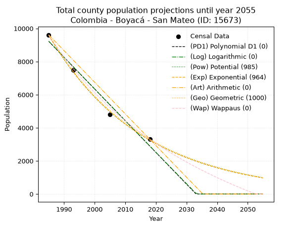
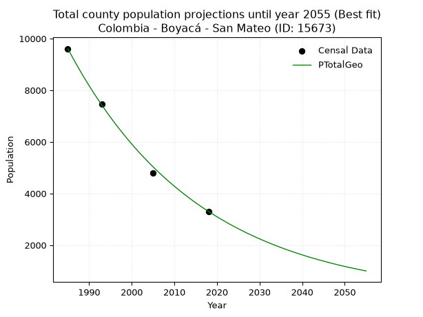
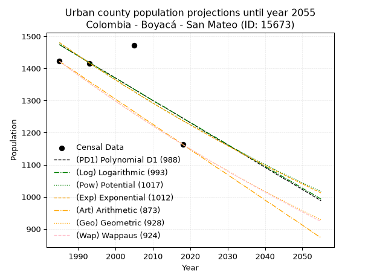
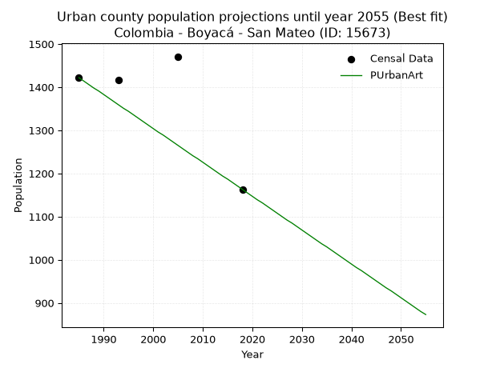
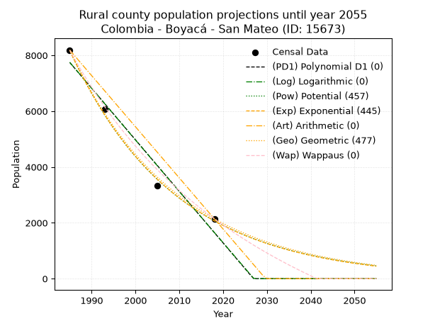
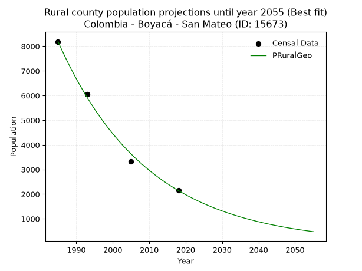

<div align="center">


</div>

# _“Population and Public Services Demand Projections (PPSD) until Year 2050 for Colombia - Boyacá - San Mateo (ID: 15673)”_
Keywords: `population` `public-service` `projection` `lineal` `polynomial` `logarithmic` `potential` `exponential` `arithmetic` `geometric` `wappaus` `dane` `colombia` `south-america`

PPSD are analytical estimates used by governments and planners to anticipate future changes in population size, age distribution, and the resulting community needs for utilities, healthcare, education, and infrastructure as sizing future water treatment facilities, electrical grids, and road networks based on spatial growth.

> **General running parameters**: • app_version: _v20260806_. • Python version: _3.14.7_. • Pandas version: _3.0.5_. • NumPy version: _2.5.1_. • Creates, save and include plots into reports (create_plot): _False_. • Projection until year: _2050_. • Process polynomial degree 2 and up: _False_. • Process Wappaus: _True_. • Process Wappaus: _True_. • Set negative values to zero: _True_. • Set infinite values to zero: _True_. • Drop dataset notes: _True_. 
<div align="center">

Dynamic map: [:earth_americas:Google](http://maps.google.com/maps?q=6.401683317,-72.5552642) [:earth_americas:OSM](https://www.openstreetmap.org/#map=18/6.401683317/-72.5552642&layers=P) [:earth_americas:Bing](https://www.bing.com/maps?cp=6.401683317~-72.5552642&lvl=18) [:earth_americas:Apple](https://maps.apple.com/frame?center=6.401683317%2C-72.5552642&span=0.003%2C0.006)

</div>


<div align="center">

```geojson
{
  "type": "Feature",
  "geometry": {
    "type": "Point", 
    "coordinates": [-72.5552642, 6.401683317]
  }, 
  "properties": {
    "Name": "Colombia - Boyacá - San Mateo (ID: 15673)"
  }
}
```

</div>


## 0. Census Data (4 records)

Census data are official statistics collected by a government about the people and housing in a country. They usually include counts of total population, age, sex, race, income, education, and jobs.

📅Global census file: [Population.xlsx](../data/Population.xlsx)

| Source   |   Year |   CountryID | CountryName   |   StateID | StateName   |   CountyID | CountyName   |   PTotal |   PUrban |   PRural |
|:---------|-------:|------------:|:--------------|----------:|:------------|-----------:|:-------------|---------:|---------:|---------:|
| DANE     |   1985 |          57 | Colombia      |        15 | Boyacá      |      15673 | San Mateo    |     9610 |     1422 |     8188 |
| DANE     |   1993 |          57 | Colombia      |        15 | Boyacá      |      15673 | San Mateo    |     7476 |     1416 |     6060 |
| DANE     |   2005 |          57 | Colombia      |        15 | Boyacá      |      15673 | San Mateo    |     4790 |     1471 |     3319 |
| DANE     |   2018 |          57 | Colombia      |        15 | Boyacá      |      15673 | San Mateo    |     3307 |     1163 |     2144 |

> 🔥Some records could had specific notes about the registered values or the corresponding urban or rural distribution.

**Local public utility companies (RUPS)**

 | SERVICIO       | ESTADO    | NOMBRE                                                                                  | NIT         | DEPARTAMENTO_DOMICILIO   | MUNICIPIO_DOMICILIO   | DIRECCION                                  |   TELEFONO | EMAIL                             | TIPO_INSCRIPCION    | REPRESENTANTE_LEGAL           | TIPO_PRESTADOR                             | CLASIFICACION                 |
|:---------------|:----------|:----------------------------------------------------------------------------------------|:------------|:-------------------------|:----------------------|:-------------------------------------------|-----------:|:----------------------------------|:--------------------|:------------------------------|:-------------------------------------------|:------------------------------|
| ASEO           | OPERATIVA | COMPAÑÍA DE SERVICIOS PÚBLICOS DE SOGAMOSO S.A. E.S.P.                                  | 891800031-4 | BOYACA                   | SOGAMOSO              | Carrera 11 no 15-10 Edificio Mirador Plaza |    7702110 | sui@coserviciosesp.com.co         | Registro por la ESP | PEDRO ELIAS BARRERA  MESA     | SOCIEDADES (EMPRESA DE SERVICIOS PUBLICOS) | MAYOR O IGUAL A 5001 USUARIOS |
| ACUEDUCTO      | OPERATIVA | ASOCIACION DE USUARIOS DEL ACUEDUCTO RURAL COMUNITARIO DEL MUNICIPIO DE SAN MATEO       | 826001679-1 | BOYACA                   | SAN MATEO             | carrera 3 Nº 4-64                          |    7894122 | angelmirosepulveda@yahoo.es       | Registro por la ESP | ANGELMIRO SEPULVEDA BARON     | ORGANIZACION AUTORIZADA                    | MENOR O IGUAL A 2500 USUARIOS |
| ALCANTARILLADO | INACTIVA  | ALCALDIA  DE SAN MATEO                                                                  | 891857821-1 | BOYACA                   | SAN MATEO             | cra 4 #3-31                                |    7894122 | planeacion@sanmateo-boyaca.gov.co | Registro por la ESP | MILTON DIAZ BONILLA           | MUNICIPIO (PRESTACIÓN DIRECTA)             | HASTA 2500 SUSCRIPTORES       |
| ASEO           | INACTIVA  | ALCALDIA  DE SAN MATEO                                                                  | 891857821-1 | BOYACA                   | SAN MATEO             | cra 4 #3-31                                |    7894122 | planeacion@sanmateo-boyaca.gov.co | Registro por la ESP | MILTON DIAZ BONILLA           | MUNICIPIO (PRESTACIÓN DIRECTA)             | HASTA 2500 SUSCRIPTORES       |
| ASEO           | OPERATIVA | URBASER TUNJA S.A.  E.S.P.                                                              | 900159283-6 | BOYACA                   | TUNJA                 | TRANSVERSAL 15 No. 24 - 12                 |    7441826 | Luz.galvis@urbaser.co             | Registro por la ESP | OSCAR HERNAN PARRA  ERAZO     | SOCIEDADES (EMPRESA DE SERVICIOS PUBLICOS) | MAYOR O IGUAL A 5001 USUARIOS |
| ACUEDUCTO      | OPERATIVA | ADMINISTRACION PUBLICA COOPERATIVA EMPRESA SOLIDARIA DE SERVICIOS PUBLICOS DE SAN MATEO | 900283638-7 | BOYACA                   | SAN MATEO             | CRA 4 No. 3 - 31                           |    7894122 | maribelpulidoaponte@hotmail.com   | Registro por la ESP | JULIO FERNANDO PATINO CARRENO | ORGANIZACION AUTORIZADA                    | MENOR O IGUAL A 2500 USUARIOS |
| ALCANTARILLADO | OPERATIVA | ADMINISTRACION PUBLICA COOPERATIVA EMPRESA SOLIDARIA DE SERVICIOS PUBLICOS DE SAN MATEO | 900283638-7 | BOYACA                   | SAN MATEO             | CRA 4 No. 3 - 31                           |    7894122 | maribelpulidoaponte@hotmail.com   | Registro por la ESP | JULIO FERNANDO PATINO CARRENO | ORGANIZACION AUTORIZADA                    | MENOR O IGUAL A 2500 USUARIOS |
| ASEO           | OPERATIVA | ADMINISTRACION PUBLICA COOPERATIVA EMPRESA SOLIDARIA DE SERVICIOS PUBLICOS DE SAN MATEO | 900283638-7 | BOYACA                   | SAN MATEO             | CRA 4 No. 3 - 31                           |    7894122 | maribelpulidoaponte@hotmail.com   | Registro por la ESP | JULIO FERNANDO PATINO CARRENO | ORGANIZACION AUTORIZADA                    | MENOR O IGUAL A 2500 USUARIOS |

> [📅RUPS Database: Registro Único de Prestadores de Servicios Públicos de Colombia Suramérica - RUPS](https://www.datos.gov.co/Hacienda-y-Cr-dito-P-blico/Registro-nico-de-Prestadores-de-Servicios-P-blicos/4qkq-csdn/about_data)

## 1. Total

### 1.1. Coefficients and Parameters

* (PD1) Polynomial Deg 1: -191.5724608590916, 389488.564833398 (lineal)
* (Log) Logarithmic: -383613.2716755793, 2922143.302089911
* (Pow) Potential: -65.64442708808683, 220.461272702145
* (Exp) Exponential: -0.03279296538302303, 1.7832361939321898e+32
* (Art) Arithmetic: Year diff. 2018 - 1985 = 33, Population diff. 3307 - 9610 = -6303, Annual growth = -191.0
* (Geo) Geometric: Year diff. 2018 - 1985 = 33, Population diff. 3307 - 9610 = -6303, Annual growth % = -0.03180924011216424
* (Wap) Wappaus: i = -2.9573430363087403, Condition values only valid for < 200)

<sub>
Wappaus condition values: ['-0.00', '-2.96', '-5.91', '-8.87', '-11.83', '-14.79', '-17.74', '-20.70', '-23.66', '-26.62', '-29.57', '-32.53', '-35.49', '-38.45', '-41.40', '-44.36', '-47.32', '-50.27', '-53.23', '-56.19', '-59.15', '-62.10', '-65.06', '-68.02', '-70.98', '-73.93', '-76.89', '-79.85', '-82.81', '-85.76', '-88.72', '-91.68', '-94.63', '-97.59', '-100.55', '-103.51', '-106.46', '-109.42', '-112.38', '-115.34', '-118.29', '-121.25', '-124.21', '-127.17', '-130.12', '-133.08', '-136.04', '-139.00', '-141.95', '-144.91', '-147.87', '-150.82', '-153.78', '-156.74', '-159.70', '-162.65', '-165.61', '-168.57', '-171.53', '-174.48', '-177.44', '-180.40', '-183.36', '-186.31', '-189.27', '-192.23']
</sub>


### 1.2. Projected Dataset

|   Year |   CountyID |   PTotalPD1 |   PTotalLog |   PTotalPow |   PTotalExp |   PTotalArt |   PTotalGeo |   PTotalWap |
|-------:|-----------:|------------:|------------:|------------:|------------:|------------:|------------:|------------:|
|   1985 |      15673 |        9217 |        9224 |        9587 |        9577 |        9610 |        9610 |        9610 |
|   1986 |      15673 |        9026 |        9031 |        9275 |        9268 |        9419 |        9304 |        9330 |
|   1987 |      15673 |        8834 |        8838 |        8974 |        8969 |        9228 |        9008 |        9058 |
|   1988 |      15673 |        8643 |        8645 |        8682 |        8680 |        9037 |        8722 |        8794 |
|   1989 |      15673 |        8451 |        8452 |        8400 |        8400 |        8846 |        8444 |        8537 |
|   1990 |      15673 |        8259 |        8259 |        8127 |        8129 |        8655 |        8176 |        8287 |
|   1991 |      15673 |        8068 |        8066 |        7864 |        7866 |        8464 |        7916 |        8044 |
|   1992 |      15673 |        7876 |        7874 |        7609 |        7613 |        8273 |        7664 |        7807 |
|   1993 |      15673 |        7685 |        7681 |        7362 |        7367 |        8082 |        7420 |        7577 |
|   1994 |      15673 |        7493 |        7489 |        7124 |        7129 |        7891 |        7184 |        7353 |
|   1995 |      15673 |        7302 |        7296 |        6893 |        6899 |        7700 |        6956 |        7134 |
|   1996 |      15673 |        7110 |        7104 |        6670 |        6677 |        7509 |        6734 |        6921 |
|   1997 |      15673 |        6918 |        6912 |        6454 |        6461 |        7318 |        6520 |        6714 |
|   1998 |      15673 |        6727 |        6720 |        6246 |        6253 |        7127 |        6313 |        6511 |
|   1999 |      15673 |        6535 |        6528 |        6044 |        6051 |        6936 |        6112 |        6314 |
|   2000 |      15673 |        6344 |        6336 |        5849 |        5856 |        6745 |        5917 |        6121 |
|   2001 |      15673 |        6152 |        6144 |        5660 |        5667 |        6554 |        5729 |        5933 |
|   2002 |      15673 |        5960 |        5953 |        5477 |        5484 |        6363 |        5547 |        5749 |
|   2003 |      15673 |        5769 |        5761 |        5301 |        5307 |        6172 |        5371 |        5570 |
|   2004 |      15673 |        5577 |        5570 |        5130 |        5136 |        5981 |        5200 |        5395 |
|   2005 |      15673 |        5386 |        5378 |        4964 |        4970 |        5790 |        5034 |        5223 |
|   2006 |      15673 |        5194 |        5187 |        4805 |        4810 |        5599 |        4874 |        5056 |
|   2007 |      15673 |        5003 |        4996 |        4650 |        4655 |        5408 |        4719 |        4892 |
|   2008 |      15673 |        4811 |        4805 |        4500 |        4505 |        5217 |        4569 |        4732 |
|   2009 |      15673 |        4619 |        4614 |        4356 |        4359 |        5026 |        4424 |        4576 |
|   2010 |      15673 |        4428 |        4423 |        4216 |        4219 |        4835 |        4283 |        4423 |
|   2011 |      15673 |        4236 |        4232 |        4080 |        4083 |        4644 |        4147 |        4273 |
|   2012 |      15673 |        4045 |        4041 |        3949 |        3951 |        4453 |        4015 |        4126 |
|   2013 |      15673 |        3853 |        3851 |        3822 |        3823 |        4262 |        3887 |        3982 |
|   2014 |      15673 |        3662 |        3660 |        3700 |        3700 |        4071 |        3763 |        3842 |
|   2015 |      15673 |        3470 |        3470 |        3581 |        3581 |        3880 |        3644 |        3704 |
|   2016 |      15673 |        3278 |        3280 |        3466 |        3465 |        3689 |        3528 |        3569 |
|   2017 |      15673 |        3087 |        3089 |        3355 |        3353 |        3498 |        3416 |        3437 |
|   2018 |      15673 |        2895 |        2899 |        3248 |        3245 |        3307 |        3307 |        3307 |
|   2019 |      15673 |        2704 |        2709 |        3144 |        3141 |        3116 |        3202 |        3180 |
|   2020 |      15673 |        2512 |        2519 |        3044 |        3039 |        2925 |        3100 |        3055 |
|   2021 |      15673 |        2321 |        2329 |        2946 |        2941 |        2734 |        3001 |        2933 |
|   2022 |      15673 |        2129 |        2140 |        2852 |        2846 |        2543 |        2906 |        2813 |
|   2023 |      15673 |        1937 |        1950 |        2761 |        2754 |        2352 |        2813 |        2696 |
|   2024 |      15673 |        1746 |        1760 |        2673 |        2666 |        2161 |        2724 |        2580 |
|   2025 |      15673 |        1554 |        1571 |        2588 |        2580 |        1970 |        2637 |        2467 |
|   2026 |      15673 |        1363 |        1381 |        2505 |        2496 |        1779 |        2553 |        2356 |
|   2027 |      15673 |        1171 |        1192 |        2425 |        2416 |        1588 |        2472 |        2247 |
|   2028 |      15673 |         980 |        1003 |        2348 |        2338 |        1397 |        2394 |        2139 |
|   2029 |      15673 |         788 |         814 |        2273 |        2263 |        1206 |        2317 |        2034 |
|   2030 |      15673 |         596 |         625 |        2201 |        2190 |        1015 |        2244 |        1931 |
|   2031 |      15673 |         405 |         436 |        2131 |        2119 |         824 |        2172 |        1829 |
|   2032 |      15673 |         213 |         247 |        2063 |        2051 |         633 |        2103 |        1729 |
|   2033 |      15673 |          22 |          58 |        1998 |        1984 |         442 |        2036 |        1631 |
|   2034 |      15673 |           0 |           0 |        1934 |        1920 |         251 |        1972 |        1535 |
|   2035 |      15673 |           0 |           0 |        1873 |        1858 |          60 |        1909 |        1440 |
|   2036 |      15673 |           0 |           0 |        1813 |        1798 |           0 |        1848 |        1347 |
|   2037 |      15673 |           0 |           0 |        1756 |        1740 |           0 |        1789 |        1255 |
|   2038 |      15673 |           0 |           0 |        1700 |        1684 |           0 |        1732 |        1165 |
|   2039 |      15673 |           0 |           0 |        1646 |        1630 |           0 |        1677 |        1077 |
|   2040 |      15673 |           0 |           0 |        1594 |        1577 |           0 |        1624 |         990 |
|   2041 |      15673 |           0 |           0 |        1544 |        1526 |           0 |        1572 |         904 |
|   2042 |      15673 |           0 |           0 |        1495 |        1477 |           0 |        1522 |         820 |
|   2043 |      15673 |           0 |           0 |        1447 |        1430 |           0 |        1474 |         737 |
|   2044 |      15673 |           0 |           0 |        1402 |        1383 |           0 |        1427 |         655 |
|   2045 |      15673 |           0 |           0 |        1357 |        1339 |           0 |        1382 |         574 |
|   2046 |      15673 |           0 |           0 |        1315 |        1296 |           0 |        1338 |         495 |
|   2047 |      15673 |           0 |           0 |        1273 |        1254 |           0 |        1295 |         417 |
|   2048 |      15673 |           0 |           0 |        1233 |        1213 |           0 |        1254 |         340 |
|   2049 |      15673 |           0 |           0 |        1194 |        1174 |           0 |        1214 |         265 |
|   2050 |      15673 |           0 |           0 |        1156 |        1136 |           0 |        1175 |         190 |
<div align="center">

</img>

</div>


### 1.3. Best fit with absolute and relative error (%)

Relative error puts that difference into context by dividing the absolute error by the true value, creating a unitless ratio or percentage that shows the scale of the mistake.

Absolute and relative error

|   Year | Source   |   CountryID | CountryName   |   StateID | StateName   |   CountyID_x | CountyName   |   PTotal |   PUrban |   PRural |   CountyID_y |   PTotalPD1 |   PTotalLog |   PTotalPow |   PTotalExp |   PTotalArt |   PTotalGeo |   PTotalWap |   PTotalPD1AbsError |   PTotalLogAbsError |   PTotalPowAbsError |   PTotalExpAbsError |   PTotalArtAbsError |   PTotalGeoAbsError |   PTotalWapAbsError |   PTotalPD1RelError |   PTotalLogRelError |   PTotalPowRelError |   PTotalExpRelError |   PTotalArtRelError |   PTotalGeoRelError |   PTotalWapRelError |
|-------:|:---------|------------:|:--------------|----------:|:------------|-------------:|:-------------|---------:|---------:|---------:|-------------:|------------:|------------:|------------:|------------:|------------:|------------:|------------:|--------------------:|--------------------:|--------------------:|--------------------:|--------------------:|--------------------:|--------------------:|--------------------:|--------------------:|--------------------:|--------------------:|--------------------:|--------------------:|--------------------:|
|   1985 | DANE     |          57 | Colombia      |        15 | Boyacá      |        15673 | San Mateo    |     9610 |     1422 |     8188 |        15673 |        9217 |        9224 |        9587 |        9577 |        9610 |        9610 |        9610 |                 393 |                 386 |                  23 |                  33 |                   0 |                   0 |                   0 |             4.08949 |             4.01665 |            0.239334 |            0.343392 |             0       |            0        |             0       |
|   1993 | DANE     |          57 | Colombia      |        15 | Boyacá      |        15673 | San Mateo    |     7476 |     1416 |     6060 |        15673 |        7685 |        7681 |        7362 |        7367 |        8082 |        7420 |        7577 |                 209 |                 205 |                 114 |                 109 |                 606 |                  56 |                 101 |             2.79561 |             2.74211 |            1.52488  |            1.458    |             8.10594 |            0.749064 |             1.35099 |
|   2005 | DANE     |          57 | Colombia      |        15 | Boyacá      |        15673 | San Mateo    |     4790 |     1471 |     3319 |        15673 |        5386 |        5378 |        4964 |        4970 |        5790 |        5034 |        5223 |                 596 |                 588 |                 174 |                 180 |                1000 |                 244 |                 433 |            12.4426  |            12.2756  |            3.63257  |            3.75783  |            20.8768  |            5.09395  |             9.03967 |
|   2018 | DANE     |          57 | Colombia      |        15 | Boyacá      |        15673 | San Mateo    |     3307 |     1163 |     2144 |        15673 |        2895 |        2899 |        3248 |        3245 |        3307 |        3307 |        3307 |                 412 |                 408 |                  59 |                  62 |                   0 |                   0 |                   0 |            12.4584  |            12.3375  |            1.78409  |            1.87481  |             0       |            0        |             0       |

Relative error mean

| Method    |   RelError | Best   |
|:----------|-----------:|:-------|
| PTotalPD1 |    7.94653 |        |
| PTotalLog |    7.84295 |        |
| PTotalPow |    1.79522 |        |
| PTotalExp |    1.85851 |        |
| PTotalArt |    7.24569 |        |
| PTotalGeo |    1.46075 | True   |
| PTotalWap |    2.59766 |        |

💙Best method: _**PTotalGeo**_
<div align="center">

</img>

</div>


### 1.4. Fresh water supply demand in liters per capita per day (lpcd)

The fresh water supply demand typically ranges from 100 to 300 liters per capita per day (lpcd) for standard domestic and municipal planning, though absolute survival minimums set by the World Health Organization are as low as 7.5 to 20 liters per day, and total consumption in high-income nations can exceed 400 liters.

> `CZ`: Level in meters above the sea level (masl)<br> `WS`: Fresh water supply demand in liters per capita per day (lpcd or l/h/d)<br> `WSAll`: Zonal fresh water supply demand in liters per second (l/s)<br> `A`: Zonal area in square meters<br> `DP`: Population density (people/hectare or p/ha)

Reference values (RAS Colombia)

|    CZ |   WS |
|------:|-----:|
|  1000 |  120 |
|  2000 |  130 |
| 99999 |  140 |

County shapefile geometry properties and water supply values

|   CountyID |      ATotal |   CZTotal |   WSTotal |
|-----------:|------------:|----------:|----------:|
|      15673 | 1.23602e+08 |   2495.83 |       140 |

Projected values for best method: PTotalGeo

|   CountyID |   Year |   PTotalGeo |   DPTotal |   WSTotal |   WSTotalAll |
|-----------:|-------:|------------:|----------:|----------:|-------------:|
|      15673 |   1985 |        9610 |      0.78 |       140 |     15.5718  |
|      15673 |   1986 |        9304 |      0.75 |       140 |     15.0759  |
|      15673 |   1987 |        9008 |      0.73 |       140 |     14.5963  |
|      15673 |   1988 |        8722 |      0.71 |       140 |     14.1329  |
|      15673 |   1989 |        8444 |      0.68 |       140 |     13.6824  |
|      15673 |   1990 |        8176 |      0.66 |       140 |     13.2481  |
|      15673 |   1991 |        7916 |      0.64 |       140 |     12.8269  |
|      15673 |   1992 |        7664 |      0.62 |       140 |     12.4185  |
|      15673 |   1993 |        7420 |      0.6  |       140 |     12.0231  |
|      15673 |   1994 |        7184 |      0.58 |       140 |     11.6407  |
|      15673 |   1995 |        6956 |      0.56 |       140 |     11.2713  |
|      15673 |   1996 |        6734 |      0.54 |       140 |     10.9116  |
|      15673 |   1997 |        6520 |      0.53 |       140 |     10.5648  |
|      15673 |   1998 |        6313 |      0.51 |       140 |     10.2294  |
|      15673 |   1999 |        6112 |      0.49 |       140 |      9.9037  |
|      15673 |   2000 |        5917 |      0.48 |       140 |      9.58773 |
|      15673 |   2001 |        5729 |      0.46 |       140 |      9.2831  |
|      15673 |   2002 |        5547 |      0.45 |       140 |      8.98819 |
|      15673 |   2003 |        5371 |      0.43 |       140 |      8.70301 |
|      15673 |   2004 |        5200 |      0.42 |       140 |      8.42593 |
|      15673 |   2005 |        5034 |      0.41 |       140 |      8.15694 |
|      15673 |   2006 |        4874 |      0.39 |       140 |      7.89769 |
|      15673 |   2007 |        4719 |      0.38 |       140 |      7.64653 |
|      15673 |   2008 |        4569 |      0.37 |       140 |      7.40347 |
|      15673 |   2009 |        4424 |      0.36 |       140 |      7.16852 |
|      15673 |   2010 |        4283 |      0.35 |       140 |      6.94005 |
|      15673 |   2011 |        4147 |      0.34 |       140 |      6.71968 |
|      15673 |   2012 |        4015 |      0.32 |       140 |      6.50579 |
|      15673 |   2013 |        3887 |      0.31 |       140 |      6.29838 |
|      15673 |   2014 |        3763 |      0.3  |       140 |      6.09745 |
|      15673 |   2015 |        3644 |      0.29 |       140 |      5.90463 |
|      15673 |   2016 |        3528 |      0.29 |       140 |      5.71667 |
|      15673 |   2017 |        3416 |      0.28 |       140 |      5.53519 |
|      15673 |   2018 |        3307 |      0.27 |       140 |      5.35856 |
|      15673 |   2019 |        3202 |      0.26 |       140 |      5.18843 |
|      15673 |   2020 |        3100 |      0.25 |       140 |      5.02315 |
|      15673 |   2021 |        3001 |      0.24 |       140 |      4.86273 |
|      15673 |   2022 |        2906 |      0.24 |       140 |      4.7088  |
|      15673 |   2023 |        2813 |      0.23 |       140 |      4.5581  |
|      15673 |   2024 |        2724 |      0.22 |       140 |      4.41389 |
|      15673 |   2025 |        2637 |      0.21 |       140 |      4.27292 |
|      15673 |   2026 |        2553 |      0.21 |       140 |      4.13681 |
|      15673 |   2027 |        2472 |      0.2  |       140 |      4.00556 |
|      15673 |   2028 |        2394 |      0.19 |       140 |      3.87917 |
|      15673 |   2029 |        2317 |      0.19 |       140 |      3.7544  |
|      15673 |   2030 |        2244 |      0.18 |       140 |      3.63611 |
|      15673 |   2031 |        2172 |      0.18 |       140 |      3.51944 |
|      15673 |   2032 |        2103 |      0.17 |       140 |      3.40764 |
|      15673 |   2033 |        2036 |      0.16 |       140 |      3.29907 |
|      15673 |   2034 |        1972 |      0.16 |       140 |      3.19537 |
|      15673 |   2035 |        1909 |      0.15 |       140 |      3.09329 |
|      15673 |   2036 |        1848 |      0.15 |       140 |      2.99444 |
|      15673 |   2037 |        1789 |      0.14 |       140 |      2.89884 |
|      15673 |   2038 |        1732 |      0.14 |       140 |      2.80648 |
|      15673 |   2039 |        1677 |      0.14 |       140 |      2.71736 |
|      15673 |   2040 |        1624 |      0.13 |       140 |      2.63148 |
|      15673 |   2041 |        1572 |      0.13 |       140 |      2.54722 |
|      15673 |   2042 |        1522 |      0.12 |       140 |      2.4662  |
|      15673 |   2043 |        1474 |      0.12 |       140 |      2.38843 |
|      15673 |   2044 |        1427 |      0.12 |       140 |      2.31227 |
|      15673 |   2045 |        1382 |      0.11 |       140 |      2.23935 |
|      15673 |   2046 |        1338 |      0.11 |       140 |      2.16806 |
|      15673 |   2047 |        1295 |      0.1  |       140 |      2.09838 |
|      15673 |   2048 |        1254 |      0.1  |       140 |      2.03194 |
|      15673 |   2049 |        1214 |      0.1  |       140 |      1.96713 |
|      15673 |   2050 |        1175 |      0.1  |       140 |      1.90394 |

## 2. Urban

### 2.1. Coefficients and Parameters

* (PD1) Polynomial Deg 1: -6.938578883982149, 15246.892412685294 (lineal)
* (Log) Logarithmic: -13860.421983668008, 106721.17856831162
* (Pow) Potential: -10.833820581960735, 38.897552156583416
* (Exp) Exponential: -0.005423146393118316, 70042675.36107615
* (Art) Arithmetic: Year diff. 2018 - 1985 = 33, Population diff. 1163 - 1422 = -259, Annual growth = -7.848484848484849
* (Geo) Geometric: Year diff. 2018 - 1985 = 33, Population diff. 1163 - 1422 = -259, Annual growth % = -0.006074248156354711
* (Wap) Wappaus: i = -0.6072328702889631, Condition values only valid for < 200)

<sub>
Wappaus condition values: ['-0.00', '-0.61', '-1.21', '-1.82', '-2.43', '-3.04', '-3.64', '-4.25', '-4.86', '-5.47', '-6.07', '-6.68', '-7.29', '-7.89', '-8.50', '-9.11', '-9.72', '-10.32', '-10.93', '-11.54', '-12.14', '-12.75', '-13.36', '-13.97', '-14.57', '-15.18', '-15.79', '-16.40', '-17.00', '-17.61', '-18.22', '-18.82', '-19.43', '-20.04', '-20.65', '-21.25', '-21.86', '-22.47', '-23.07', '-23.68', '-24.29', '-24.90', '-25.50', '-26.11', '-26.72', '-27.33', '-27.93', '-28.54', '-29.15', '-29.75', '-30.36', '-30.97', '-31.58', '-32.18', '-32.79', '-33.40', '-34.01', '-34.61', '-35.22', '-35.83', '-36.43', '-37.04', '-37.65', '-38.26', '-38.86', '-39.47']
</sub>


### 2.2. Projected Dataset

|   Year |   CountyID |   PUrbanPD1 |   PUrbanLog |   PUrbanPow |   PUrbanExp |   PUrbanArt |   PUrbanGeo |   PUrbanWap |
|-------:|-----------:|------------:|------------:|------------:|------------:|------------:|------------:|------------:|
|   1985 |      15673 |        1474 |        1474 |        1480 |        1480 |        1422 |        1422 |        1422 |
|   1986 |      15673 |        1467 |        1467 |        1472 |        1472 |        1414 |        1413 |        1413 |
|   1987 |      15673 |        1460 |        1460 |        1464 |        1464 |        1406 |        1405 |        1405 |
|   1988 |      15673 |        1453 |        1453 |        1456 |        1456 |        1398 |        1396 |        1396 |
|   1989 |      15673 |        1446 |        1446 |        1448 |        1448 |        1391 |        1388 |        1388 |
|   1990 |      15673 |        1439 |        1439 |        1440 |        1440 |        1383 |        1379 |        1379 |
|   1991 |      15673 |        1432 |        1432 |        1432 |        1432 |        1375 |        1371 |        1371 |
|   1992 |      15673 |        1425 |        1425 |        1424 |        1425 |        1367 |        1363 |        1363 |
|   1993 |      15673 |        1418 |        1418 |        1417 |        1417 |        1359 |        1354 |        1355 |
|   1994 |      15673 |        1411 |        1411 |        1409 |        1409 |        1351 |        1346 |        1346 |
|   1995 |      15673 |        1404 |        1404 |        1401 |        1402 |        1344 |        1338 |        1338 |
|   1996 |      15673 |        1397 |        1397 |        1394 |        1394 |        1336 |        1330 |        1330 |
|   1997 |      15673 |        1391 |        1390 |        1386 |        1387 |        1328 |        1322 |        1322 |
|   1998 |      15673 |        1384 |        1383 |        1379 |        1379 |        1320 |        1314 |        1314 |
|   1999 |      15673 |        1377 |        1376 |        1371 |        1372 |        1312 |        1306 |        1306 |
|   2000 |      15673 |        1370 |        1369 |        1364 |        1364 |        1304 |        1298 |        1298 |
|   2001 |      15673 |        1363 |        1363 |        1357 |        1357 |        1296 |        1290 |        1290 |
|   2002 |      15673 |        1356 |        1356 |        1349 |        1349 |        1289 |        1282 |        1282 |
|   2003 |      15673 |        1349 |        1349 |        1342 |        1342 |        1281 |        1274 |        1275 |
|   2004 |      15673 |        1342 |        1342 |        1335 |        1335 |        1273 |        1267 |        1267 |
|   2005 |      15673 |        1335 |        1335 |        1328 |        1328 |        1265 |        1259 |        1259 |
|   2006 |      15673 |        1328 |        1328 |        1320 |        1321 |        1257 |        1251 |        1252 |
|   2007 |      15673 |        1321 |        1321 |        1313 |        1313 |        1249 |        1244 |        1244 |
|   2008 |      15673 |        1314 |        1314 |        1306 |        1306 |        1241 |        1236 |        1236 |
|   2009 |      15673 |        1307 |        1307 |        1299 |        1299 |        1234 |        1229 |        1229 |
|   2010 |      15673 |        1300 |        1300 |        1292 |        1292 |        1226 |        1221 |        1221 |
|   2011 |      15673 |        1293 |        1293 |        1285 |        1285 |        1218 |        1214 |        1214 |
|   2012 |      15673 |        1286 |        1287 |        1278 |        1278 |        1210 |        1206 |        1207 |
|   2013 |      15673 |        1280 |        1280 |        1271 |        1271 |        1202 |        1199 |        1199 |
|   2014 |      15673 |        1273 |        1273 |        1265 |        1264 |        1194 |        1192 |        1192 |
|   2015 |      15673 |        1266 |        1266 |        1258 |        1258 |        1187 |        1184 |        1185 |
|   2016 |      15673 |        1259 |        1259 |        1251 |        1251 |        1179 |        1177 |        1177 |
|   2017 |      15673 |        1252 |        1252 |        1244 |        1244 |        1171 |        1170 |        1170 |
|   2018 |      15673 |        1245 |        1245 |        1238 |        1237 |        1163 |        1163 |        1163 |
|   2019 |      15673 |        1238 |        1238 |        1231 |        1231 |        1155 |        1156 |        1156 |
|   2020 |      15673 |        1231 |        1232 |        1225 |        1224 |        1147 |        1149 |        1149 |
|   2021 |      15673 |        1224 |        1225 |        1218 |        1217 |        1139 |        1142 |        1142 |
|   2022 |      15673 |        1217 |        1218 |        1211 |        1211 |        1132 |        1135 |        1135 |
|   2023 |      15673 |        1210 |        1211 |        1205 |        1204 |        1124 |        1128 |        1128 |
|   2024 |      15673 |        1203 |        1204 |        1199 |        1198 |        1116 |        1121 |        1121 |
|   2025 |      15673 |        1196 |        1197 |        1192 |        1191 |        1108 |        1114 |        1114 |
|   2026 |      15673 |        1189 |        1190 |        1186 |        1185 |        1100 |        1108 |        1107 |
|   2027 |      15673 |        1182 |        1184 |        1179 |        1178 |        1092 |        1101 |        1100 |
|   2028 |      15673 |        1175 |        1177 |        1173 |        1172 |        1085 |        1094 |        1094 |
|   2029 |      15673 |        1169 |        1170 |        1167 |        1166 |        1077 |        1088 |        1087 |
|   2030 |      15673 |        1162 |        1163 |        1161 |        1159 |        1069 |        1081 |        1080 |
|   2031 |      15673 |        1155 |        1156 |        1155 |        1153 |        1061 |        1074 |        1073 |
|   2032 |      15673 |        1148 |        1149 |        1148 |        1147 |        1053 |        1068 |        1067 |
|   2033 |      15673 |        1141 |        1143 |        1142 |        1141 |        1045 |        1061 |        1060 |
|   2034 |      15673 |        1134 |        1136 |        1136 |        1134 |        1037 |        1055 |        1054 |
|   2035 |      15673 |        1127 |        1129 |        1130 |        1128 |        1030 |        1049 |        1047 |
|   2036 |      15673 |        1120 |        1122 |        1124 |        1122 |        1022 |        1042 |        1041 |
|   2037 |      15673 |        1113 |        1115 |        1118 |        1116 |        1014 |        1036 |        1034 |
|   2038 |      15673 |        1106 |        1109 |        1112 |        1110 |        1006 |        1030 |        1028 |
|   2039 |      15673 |        1099 |        1102 |        1106 |        1104 |         998 |        1023 |        1021 |
|   2040 |      15673 |        1092 |        1095 |        1101 |        1098 |         990 |        1017 |        1015 |
|   2041 |      15673 |        1085 |        1088 |        1095 |        1092 |         982 |        1011 |        1009 |
|   2042 |      15673 |        1078 |        1081 |        1089 |        1086 |         975 |        1005 |        1002 |
|   2043 |      15673 |        1071 |        1075 |        1083 |        1080 |         967 |         999 |         996 |
|   2044 |      15673 |        1064 |        1068 |        1077 |        1075 |         959 |         993 |         990 |
|   2045 |      15673 |        1057 |        1061 |        1072 |        1069 |         951 |         987 |         984 |
|   2046 |      15673 |        1051 |        1054 |        1066 |        1063 |         943 |         981 |         978 |
|   2047 |      15673 |        1044 |        1048 |        1060 |        1057 |         935 |         975 |         971 |
|   2048 |      15673 |        1037 |        1041 |        1055 |        1052 |         928 |         969 |         965 |
|   2049 |      15673 |        1030 |        1034 |        1049 |        1046 |         920 |         963 |         959 |
|   2050 |      15673 |        1023 |        1027 |        1044 |        1040 |         912 |         957 |         953 |
<div align="center">

</img>

</div>


### 2.3. Best fit with absolute and relative error (%)

Relative error puts that difference into context by dividing the absolute error by the true value, creating a unitless ratio or percentage that shows the scale of the mistake.

Absolute and relative error

|   Year | Source   |   CountryID | CountryName   |   StateID | StateName   |   CountyID_x | CountyName   |   PTotal |   PUrban |   PRural |   CountyID_y |   PUrbanPD1 |   PUrbanLog |   PUrbanPow |   PUrbanExp |   PUrbanArt |   PUrbanGeo |   PUrbanWap |   PUrbanPD1AbsError |   PUrbanLogAbsError |   PUrbanPowAbsError |   PUrbanExpAbsError |   PUrbanArtAbsError |   PUrbanGeoAbsError |   PUrbanWapAbsError |   PUrbanPD1RelError |   PUrbanLogRelError |   PUrbanPowRelError |   PUrbanExpRelError |   PUrbanArtRelError |   PUrbanGeoRelError |   PUrbanWapRelError |
|-------:|:---------|------------:|:--------------|----------:|:------------|-------------:|:-------------|---------:|---------:|---------:|-------------:|------------:|------------:|------------:|------------:|------------:|------------:|------------:|--------------------:|--------------------:|--------------------:|--------------------:|--------------------:|--------------------:|--------------------:|--------------------:|--------------------:|--------------------:|--------------------:|--------------------:|--------------------:|--------------------:|
|   1985 | DANE     |          57 | Colombia      |        15 | Boyacá      |        15673 | San Mateo    |     9610 |     1422 |     8188 |        15673 |        1474 |        1474 |        1480 |        1480 |        1422 |        1422 |        1422 |                  52 |                  52 |                  58 |                  58 |                   0 |                   0 |                   0 |            3.65682  |            3.65682  |           4.07876   |           4.07876   |             0       |             0       |             0       |
|   1993 | DANE     |          57 | Colombia      |        15 | Boyacá      |        15673 | San Mateo    |     7476 |     1416 |     6060 |        15673 |        1418 |        1418 |        1417 |        1417 |        1359 |        1354 |        1355 |                   2 |                   2 |                   1 |                   1 |                  57 |                  62 |                  61 |            0.141243 |            0.141243 |           0.0706215 |           0.0706215 |             4.02542 |             4.37853 |             4.30791 |
|   2005 | DANE     |          57 | Colombia      |        15 | Boyacá      |        15673 | San Mateo    |     4790 |     1471 |     3319 |        15673 |        1335 |        1335 |        1328 |        1328 |        1265 |        1259 |        1259 |                 136 |                 136 |                 143 |                 143 |                 206 |                 212 |                 212 |            9.24541  |            9.24541  |           9.72128   |           9.72128   |            14.0041  |            14.412   |            14.412   |
|   2018 | DANE     |          57 | Colombia      |        15 | Boyacá      |        15673 | San Mateo    |     3307 |     1163 |     2144 |        15673 |        1245 |        1245 |        1238 |        1237 |        1163 |        1163 |        1163 |                  82 |                  82 |                  75 |                  74 |                   0 |                   0 |                   0 |            7.05073  |            7.05073  |           6.44884   |           6.36285   |             0       |             0       |             0       |

Relative error mean

| Method    |   RelError | Best   |
|:----------|-----------:|:-------|
| PUrbanPD1 |    5.02355 |        |
| PUrbanLog |    5.02355 |        |
| PUrbanPow |    5.07988 |        |
| PUrbanExp |    5.05838 |        |
| PUrbanArt |    4.50738 | True   |
| PUrbanGeo |    4.69762 |        |
| PUrbanWap |    4.67997 |        |

💙Best method: _**PUrbanArt**_
<div align="center">

</img>

</div>


### 2.4. Fresh water supply demand in liters per capita per day (lpcd)

The fresh water supply demand typically ranges from 100 to 300 liters per capita per day (lpcd) for standard domestic and municipal planning, though absolute survival minimums set by the World Health Organization are as low as 7.5 to 20 liters per day, and total consumption in high-income nations can exceed 400 liters.

> `CZ`: Level in meters above the sea level (masl)<br> `WS`: Fresh water supply demand in liters per capita per day (lpcd or l/h/d)<br> `WSAll`: Zonal fresh water supply demand in liters per second (l/s)<br> `A`: Zonal area in square meters<br> `DP`: Population density (people/hectare or p/ha)

Reference values (RAS Colombia)

|    CZ |   WS |
|------:|-----:|
|  1000 |  120 |
|  2000 |  130 |
| 99999 |  140 |

County shapefile geometry properties and water supply values

|   CountyID |   AUrban |   CZUrban |   WSUrban |
|-----------:|---------:|----------:|----------:|
|      15673 |   392588 |   2217.29 |       140 |

Projected values for best method: PUrbanArt

|   CountyID |   Year |   PUrbanArt |   DPUrban |   WSUrban |   WSUrbanAll |
|-----------:|-------:|------------:|----------:|----------:|-------------:|
|      15673 |   1985 |        1422 |     36.22 |       140 |      2.30417 |
|      15673 |   1986 |        1414 |     36.02 |       140 |      2.2912  |
|      15673 |   1987 |        1406 |     35.81 |       140 |      2.27824 |
|      15673 |   1988 |        1398 |     35.61 |       140 |      2.26528 |
|      15673 |   1989 |        1391 |     35.43 |       140 |      2.25394 |
|      15673 |   1990 |        1383 |     35.23 |       140 |      2.24097 |
|      15673 |   1991 |        1375 |     35.02 |       140 |      2.22801 |
|      15673 |   1992 |        1367 |     34.82 |       140 |      2.21505 |
|      15673 |   1993 |        1359 |     34.62 |       140 |      2.20208 |
|      15673 |   1994 |        1351 |     34.41 |       140 |      2.18912 |
|      15673 |   1995 |        1344 |     34.23 |       140 |      2.17778 |
|      15673 |   1996 |        1336 |     34.03 |       140 |      2.16481 |
|      15673 |   1997 |        1328 |     33.83 |       140 |      2.15185 |
|      15673 |   1998 |        1320 |     33.62 |       140 |      2.13889 |
|      15673 |   1999 |        1312 |     33.42 |       140 |      2.12593 |
|      15673 |   2000 |        1304 |     33.22 |       140 |      2.11296 |
|      15673 |   2001 |        1296 |     33.01 |       140 |      2.1     |
|      15673 |   2002 |        1289 |     32.83 |       140 |      2.08866 |
|      15673 |   2003 |        1281 |     32.63 |       140 |      2.07569 |
|      15673 |   2004 |        1273 |     32.43 |       140 |      2.06273 |
|      15673 |   2005 |        1265 |     32.22 |       140 |      2.04977 |
|      15673 |   2006 |        1257 |     32.02 |       140 |      2.03681 |
|      15673 |   2007 |        1249 |     31.81 |       140 |      2.02384 |
|      15673 |   2008 |        1241 |     31.61 |       140 |      2.01088 |
|      15673 |   2009 |        1234 |     31.43 |       140 |      1.99954 |
|      15673 |   2010 |        1226 |     31.23 |       140 |      1.98657 |
|      15673 |   2011 |        1218 |     31.02 |       140 |      1.97361 |
|      15673 |   2012 |        1210 |     30.82 |       140 |      1.96065 |
|      15673 |   2013 |        1202 |     30.62 |       140 |      1.94769 |
|      15673 |   2014 |        1194 |     30.41 |       140 |      1.93472 |
|      15673 |   2015 |        1187 |     30.24 |       140 |      1.92338 |
|      15673 |   2016 |        1179 |     30.03 |       140 |      1.91042 |
|      15673 |   2017 |        1171 |     29.83 |       140 |      1.89745 |
|      15673 |   2018 |        1163 |     29.62 |       140 |      1.88449 |
|      15673 |   2019 |        1155 |     29.42 |       140 |      1.87153 |
|      15673 |   2020 |        1147 |     29.22 |       140 |      1.85856 |
|      15673 |   2021 |        1139 |     29.01 |       140 |      1.8456  |
|      15673 |   2022 |        1132 |     28.83 |       140 |      1.83426 |
|      15673 |   2023 |        1124 |     28.63 |       140 |      1.8213  |
|      15673 |   2024 |        1116 |     28.43 |       140 |      1.80833 |
|      15673 |   2025 |        1108 |     28.22 |       140 |      1.79537 |
|      15673 |   2026 |        1100 |     28.02 |       140 |      1.78241 |
|      15673 |   2027 |        1092 |     27.82 |       140 |      1.76944 |
|      15673 |   2028 |        1085 |     27.64 |       140 |      1.7581  |
|      15673 |   2029 |        1077 |     27.43 |       140 |      1.74514 |
|      15673 |   2030 |        1069 |     27.23 |       140 |      1.73218 |
|      15673 |   2031 |        1061 |     27.03 |       140 |      1.71921 |
|      15673 |   2032 |        1053 |     26.82 |       140 |      1.70625 |
|      15673 |   2033 |        1045 |     26.62 |       140 |      1.69329 |
|      15673 |   2034 |        1037 |     26.41 |       140 |      1.68032 |
|      15673 |   2035 |        1030 |     26.24 |       140 |      1.66898 |
|      15673 |   2036 |        1022 |     26.03 |       140 |      1.65602 |
|      15673 |   2037 |        1014 |     25.83 |       140 |      1.64306 |
|      15673 |   2038 |        1006 |     25.62 |       140 |      1.63009 |
|      15673 |   2039 |         998 |     25.42 |       140 |      1.61713 |
|      15673 |   2040 |         990 |     25.22 |       140 |      1.60417 |
|      15673 |   2041 |         982 |     25.01 |       140 |      1.5912  |
|      15673 |   2042 |         975 |     24.84 |       140 |      1.57986 |
|      15673 |   2043 |         967 |     24.63 |       140 |      1.5669  |
|      15673 |   2044 |         959 |     24.43 |       140 |      1.55394 |
|      15673 |   2045 |         951 |     24.22 |       140 |      1.54097 |
|      15673 |   2046 |         943 |     24.02 |       140 |      1.52801 |
|      15673 |   2047 |         935 |     23.82 |       140 |      1.51505 |
|      15673 |   2048 |         928 |     23.64 |       140 |      1.5037  |
|      15673 |   2049 |         920 |     23.43 |       140 |      1.49074 |
|      15673 |   2050 |         912 |     23.23 |       140 |      1.47778 |

## 3. Rural

### 3.1. Coefficients and Parameters

* (PD1) Polynomial Deg 1: -184.6338819751095, 374241.6724207127 (lineal)
* (Log) Logarithmic: -369752.8496919113, 2815422.123521599
* (Pow) Potential: -83.23105360805302, 278.38899059015677
* (Exp) Exponential: -0.04157728885920114, 5.689303049834845e+39
* (Art) Arithmetic: Year diff. 2018 - 1985 = 33, Population diff. 2144 - 8188 = -6044, Annual growth = -183.15151515151516
* (Geo) Geometric: Year diff. 2018 - 1985 = 33, Population diff. 2144 - 8188 = -6044, Annual growth % = -0.03979257702520278
* (Wap) Wappaus: i = -3.5453254965450087, Condition values only valid for < 200)

<sub>
Wappaus condition values: ['-0.00', '-3.55', '-7.09', '-10.64', '-14.18', '-17.73', '-21.27', '-24.82', '-28.36', '-31.91', '-35.45', '-39.00', '-42.54', '-46.09', '-49.63', '-53.18', '-56.73', '-60.27', '-63.82', '-67.36', '-70.91', '-74.45', '-78.00', '-81.54', '-85.09', '-88.63', '-92.18', '-95.72', '-99.27', '-102.81', '-106.36', '-109.91', '-113.45', '-117.00', '-120.54', '-124.09', '-127.63', '-131.18', '-134.72', '-138.27', '-141.81', '-145.36', '-148.90', '-152.45', '-155.99', '-159.54', '-163.08', '-166.63', '-170.18', '-173.72', '-177.27', '-180.81', '-184.36', '-187.90', '-191.45', '-194.99', '-198.54', '-202.08', '-205.63', '-209.17', '-212.72', '-216.26', '-219.81', '-223.36', '-226.90', '-230.45']
</sub>


### 3.2. Projected Dataset

|   Year |   CountyID |   PRuralPD1 |   PRuralLog |   PRuralPow |   PRuralExp |   PRuralArt |   PRuralGeo |   PRuralWap |
|-------:|-----------:|------------:|------------:|------------:|------------:|------------:|------------:|------------:|
|   1985 |      15673 |        7743 |        7750 |        8183 |        8172 |        8188 |        8188 |        8188 |
|   1986 |      15673 |        7559 |        7564 |        7847 |        7839 |        8005 |        7862 |        7903 |
|   1987 |      15673 |        7374 |        7378 |        7525 |        7520 |        7822 |        7549 |        7627 |
|   1988 |      15673 |        7190 |        7192 |        7216 |        7214 |        7639 |        7249 |        7361 |
|   1989 |      15673 |        7005 |        7006 |        6921 |        6920 |        7455 |        6960 |        7104 |
|   1990 |      15673 |        6820 |        6820 |        6637 |        6638 |        7272 |        6683 |        6855 |
|   1991 |      15673 |        6636 |        6634 |        6365 |        6368 |        7089 |        6418 |        6614 |
|   1992 |      15673 |        6451 |        6449 |        6105 |        6109 |        6906 |        6162 |        6380 |
|   1993 |      15673 |        6266 |        6263 |        5855 |        5860 |        6723 |        5917 |        6154 |
|   1994 |      15673 |        6082 |        6078 |        5616 |        5621 |        6540 |        5682 |        5935 |
|   1995 |      15673 |        5897 |        5892 |        5386 |        5392 |        6356 |        5455 |        5722 |
|   1996 |      15673 |        5712 |        5707 |        5166 |        5173 |        6173 |        5238 |        5516 |
|   1997 |      15673 |        5528 |        5522 |        4955 |        4962 |        5990 |        5030 |        5316 |
|   1998 |      15673 |        5343 |        5337 |        4753 |        4760 |        5807 |        4830 |        5121 |
|   1999 |      15673 |        5159 |        5152 |        4559 |        4566 |        5624 |        4638 |        4932 |
|   2000 |      15673 |        4974 |        4967 |        4373 |        4380 |        5441 |        4453 |        4748 |
|   2001 |      15673 |        4789 |        4782 |        4195 |        4202 |        5258 |        4276 |        4570 |
|   2002 |      15673 |        4605 |        4597 |        4024 |        4031 |        5074 |        4106 |        4396 |
|   2003 |      15673 |        4420 |        4413 |        3860 |        3866 |        4891 |        3942 |        4227 |
|   2004 |      15673 |        4235 |        4228 |        3703 |        3709 |        4708 |        3785 |        4062 |
|   2005 |      15673 |        4051 |        4044 |        3552 |        3558 |        4525 |        3635 |        3902 |
|   2006 |      15673 |        3866 |        3859 |        3408 |        3413 |        4342 |        3490 |        3746 |
|   2007 |      15673 |        3681 |        3675 |        3270 |        3274 |        4159 |        3351 |        3593 |
|   2008 |      15673 |        3497 |        3491 |        3137 |        3141 |        3976 |        3218 |        3445 |
|   2009 |      15673 |        3312 |        3307 |        3009 |        3013 |        3792 |        3090 |        3300 |
|   2010 |      15673 |        3128 |        3123 |        2887 |        2890 |        3609 |        2967 |        3159 |
|   2011 |      15673 |        2943 |        2939 |        2770 |        2772 |        3426 |        2849 |        3022 |
|   2012 |      15673 |        2758 |        2755 |        2658 |        2660 |        3243 |        2735 |        2887 |
|   2013 |      15673 |        2574 |        2571 |        2550 |        2551 |        3060 |        2627 |        2756 |
|   2014 |      15673 |        2389 |        2388 |        2447 |        2447 |        2877 |        2522 |        2628 |
|   2015 |      15673 |        2204 |        2204 |        2348 |        2348 |        2693 |        2422 |        2503 |
|   2016 |      15673 |        2020 |        2021 |        2253 |        2252 |        2510 |        2325 |        2380 |
|   2017 |      15673 |        1835 |        1837 |        2162 |        2160 |        2327 |        2233 |        2261 |
|   2018 |      15673 |        1650 |        1654 |        2075 |        2072 |        2144 |        2144 |        2144 |
|   2019 |      15673 |        1466 |        1471 |        1991 |        1988 |        1961 |        2059 |        2030 |
|   2020 |      15673 |        1281 |        1288 |        1910 |        1907 |        1778 |        1977 |        1918 |
|   2021 |      15673 |        1097 |        1105 |        1833 |        1829 |        1595 |        1898 |        1809 |
|   2022 |      15673 |         912 |         922 |        1759 |        1755 |        1411 |        1823 |        1702 |
|   2023 |      15673 |         727 |         739 |        1688 |        1683 |        1228 |        1750 |        1597 |
|   2024 |      15673 |         543 |         556 |        1620 |        1615 |        1045 |        1680 |        1494 |
|   2025 |      15673 |         358 |         374 |        1555 |        1549 |         862 |        1614 |        1394 |
|   2026 |      15673 |         173 |         191 |        1492 |        1486 |         679 |        1549 |        1295 |
|   2027 |      15673 |           0 |           9 |        1432 |        1425 |         496 |        1488 |        1199 |
|   2028 |      15673 |           0 |           0 |        1375 |        1367 |         312 |        1428 |        1105 |
|   2029 |      15673 |           0 |           0 |        1320 |        1312 |         129 |        1372 |        1012 |
|   2030 |      15673 |           0 |           0 |        1267 |        1258 |           0 |        1317 |         921 |
|   2031 |      15673 |           0 |           0 |        1216 |        1207 |           0 |        1265 |         832 |
|   2032 |      15673 |           0 |           0 |        1167 |        1158 |           0 |        1214 |         745 |
|   2033 |      15673 |           0 |           0 |        1120 |        1111 |           0 |        1166 |         660 |
|   2034 |      15673 |           0 |           0 |        1075 |        1066 |           0 |        1120 |         576 |
|   2035 |      15673 |           0 |           0 |        1032 |        1022 |           0 |        1075 |         493 |
|   2036 |      15673 |           0 |           0 |         991 |         980 |           0 |        1032 |         413 |
|   2037 |      15673 |           0 |           0 |         951 |         941 |           0 |         991 |         333 |
|   2038 |      15673 |           0 |           0 |         913 |         902 |           0 |         952 |         255 |
|   2039 |      15673 |           0 |           0 |         876 |         866 |           0 |         914 |         179 |
|   2040 |      15673 |           0 |           0 |         841 |         830 |           0 |         878 |         104 |
|   2041 |      15673 |           0 |           0 |         808 |         796 |           0 |         843 |          30 |
|   2042 |      15673 |           0 |           0 |         775 |         764 |           0 |         809 |           0 |
|   2043 |      15673 |           0 |           0 |         745 |         733 |           0 |         777 |           0 |
|   2044 |      15673 |           0 |           0 |         715 |         703 |           0 |         746 |           0 |
|   2045 |      15673 |           0 |           0 |         686 |         674 |           0 |         716 |           0 |
|   2046 |      15673 |           0 |           0 |         659 |         647 |           0 |         688 |           0 |
|   2047 |      15673 |           0 |           0 |         633 |         621 |           0 |         660 |           0 |
|   2048 |      15673 |           0 |           0 |         607 |         595 |           0 |         634 |           0 |
|   2049 |      15673 |           0 |           0 |         583 |         571 |           0 |         609 |           0 |
|   2050 |      15673 |           0 |           0 |         560 |         548 |           0 |         585 |           0 |
<div align="center">

</img>

</div>


### 3.3. Best fit with absolute and relative error (%)

Relative error puts that difference into context by dividing the absolute error by the true value, creating a unitless ratio or percentage that shows the scale of the mistake.

Absolute and relative error

|   Year | Source   |   CountryID | CountryName   |   StateID | StateName   |   CountyID_x | CountyName   |   PTotal |   PUrban |   PRural |   CountyID_y |   PRuralPD1 |   PRuralLog |   PRuralPow |   PRuralExp |   PRuralArt |   PRuralGeo |   PRuralWap |   PRuralPD1AbsError |   PRuralLogAbsError |   PRuralPowAbsError |   PRuralExpAbsError |   PRuralArtAbsError |   PRuralGeoAbsError |   PRuralWapAbsError |   PRuralPD1RelError |   PRuralLogRelError |   PRuralPowRelError |   PRuralExpRelError |   PRuralArtRelError |   PRuralGeoRelError |   PRuralWapRelError |
|-------:|:---------|------------:|:--------------|----------:|:------------|-------------:|:-------------|---------:|---------:|---------:|-------------:|------------:|------------:|------------:|------------:|------------:|------------:|------------:|--------------------:|--------------------:|--------------------:|--------------------:|--------------------:|--------------------:|--------------------:|--------------------:|--------------------:|--------------------:|--------------------:|--------------------:|--------------------:|--------------------:|
|   1985 | DANE     |          57 | Colombia      |        15 | Boyacá      |        15673 | San Mateo    |     9610 |     1422 |     8188 |        15673 |        7743 |        7750 |        8183 |        8172 |        8188 |        8188 |        8188 |                 445 |                 438 |                   5 |                  16 |                   0 |                   0 |                   0 |             5.43478 |             5.34929 |            0.061065 |            0.195408 |              0      |             0       |             0       |
|   1993 | DANE     |          57 | Colombia      |        15 | Boyacá      |        15673 | San Mateo    |     7476 |     1416 |     6060 |        15673 |        6266 |        6263 |        5855 |        5860 |        6723 |        5917 |        6154 |                 206 |                 203 |                 205 |                 200 |                 663 |                 143 |                  94 |             3.39934 |             3.34983 |            3.38284  |            3.30033  |             10.9406 |             2.35974 |             1.55116 |
|   2005 | DANE     |          57 | Colombia      |        15 | Boyacá      |        15673 | San Mateo    |     4790 |     1471 |     3319 |        15673 |        4051 |        4044 |        3552 |        3558 |        4525 |        3635 |        3902 |                 732 |                 725 |                 233 |                 239 |                1206 |                 316 |                 583 |            22.0548  |            21.8439  |            7.02019  |            7.20096  |             36.3362 |             9.52094 |            17.5655  |
|   2018 | DANE     |          57 | Colombia      |        15 | Boyacá      |        15673 | San Mateo    |     3307 |     1163 |     2144 |        15673 |        1650 |        1654 |        2075 |        2072 |        2144 |        2144 |        2144 |                 494 |                 490 |                  69 |                  72 |                   0 |                   0 |                   0 |            23.041   |            22.8545  |            3.21828  |            3.35821  |              0      |             0       |             0       |

Relative error mean

| Method    |   RelError | Best   |
|:----------|-----------:|:-------|
| PRuralPD1 |   13.4825  |        |
| PRuralLog |   13.3494  |        |
| PRuralPow |    3.42059 |        |
| PRuralExp |    3.51373 |        |
| PRuralArt |   11.8192  |        |
| PRuralGeo |    2.97017 | True   |
| PRuralWap |    4.77917 |        |

💙Best method: _**PRuralGeo**_
<div align="center">

</img>

</div>


### 3.4. Fresh water supply demand in liters per capita per day (lpcd)

The fresh water supply demand typically ranges from 100 to 300 liters per capita per day (lpcd) for standard domestic and municipal planning, though absolute survival minimums set by the World Health Organization are as low as 7.5 to 20 liters per day, and total consumption in high-income nations can exceed 400 liters.

> `CZ`: Level in meters above the sea level (masl)<br> `WS`: Fresh water supply demand in liters per capita per day (lpcd or l/h/d)<br> `WSAll`: Zonal fresh water supply demand in liters per second (l/s)<br> `A`: Zonal area in square meters<br> `DP`: Population density (people/hectare or p/ha)

Reference values (RAS Colombia)

|    CZ |   WS |
|------:|-----:|
|  1000 |  120 |
|  2000 |  130 |
| 99999 |  140 |

County shapefile geometry properties and water supply values

|   CountyID |     ARural |   CZRural |   WSRural |
|-----------:|-----------:|----------:|----------:|
|      15673 | 1.2321e+08 |   2496.71 |       140 |

Projected values for best method: PRuralGeo

|   CountyID |   Year |   PRuralGeo |   DPRural |   WSRural |   WSRuralAll |
|-----------:|-------:|------------:|----------:|----------:|-------------:|
|      15673 |   1985 |        8188 |      0.66 |       140 |    13.2676   |
|      15673 |   1986 |        7862 |      0.64 |       140 |    12.7394   |
|      15673 |   1987 |        7549 |      0.61 |       140 |    12.2322   |
|      15673 |   1988 |        7249 |      0.59 |       140 |    11.7461   |
|      15673 |   1989 |        6960 |      0.56 |       140 |    11.2778   |
|      15673 |   1990 |        6683 |      0.54 |       140 |    10.8289   |
|      15673 |   1991 |        6418 |      0.52 |       140 |    10.3995   |
|      15673 |   1992 |        6162 |      0.5  |       140 |     9.98472  |
|      15673 |   1993 |        5917 |      0.48 |       140 |     9.58773  |
|      15673 |   1994 |        5682 |      0.46 |       140 |     9.20694  |
|      15673 |   1995 |        5455 |      0.44 |       140 |     8.83912  |
|      15673 |   1996 |        5238 |      0.43 |       140 |     8.4875   |
|      15673 |   1997 |        5030 |      0.41 |       140 |     8.15046  |
|      15673 |   1998 |        4830 |      0.39 |       140 |     7.82639  |
|      15673 |   1999 |        4638 |      0.38 |       140 |     7.51528  |
|      15673 |   2000 |        4453 |      0.36 |       140 |     7.21551  |
|      15673 |   2001 |        4276 |      0.35 |       140 |     6.9287   |
|      15673 |   2002 |        4106 |      0.33 |       140 |     6.65324  |
|      15673 |   2003 |        3942 |      0.32 |       140 |     6.3875   |
|      15673 |   2004 |        3785 |      0.31 |       140 |     6.1331   |
|      15673 |   2005 |        3635 |      0.3  |       140 |     5.89005  |
|      15673 |   2006 |        3490 |      0.28 |       140 |     5.65509  |
|      15673 |   2007 |        3351 |      0.27 |       140 |     5.42986  |
|      15673 |   2008 |        3218 |      0.26 |       140 |     5.21435  |
|      15673 |   2009 |        3090 |      0.25 |       140 |     5.00694  |
|      15673 |   2010 |        2967 |      0.24 |       140 |     4.80764  |
|      15673 |   2011 |        2849 |      0.23 |       140 |     4.61644  |
|      15673 |   2012 |        2735 |      0.22 |       140 |     4.43171  |
|      15673 |   2013 |        2627 |      0.21 |       140 |     4.25671  |
|      15673 |   2014 |        2522 |      0.2  |       140 |     4.08657  |
|      15673 |   2015 |        2422 |      0.2  |       140 |     3.92454  |
|      15673 |   2016 |        2325 |      0.19 |       140 |     3.76736  |
|      15673 |   2017 |        2233 |      0.18 |       140 |     3.61829  |
|      15673 |   2018 |        2144 |      0.17 |       140 |     3.47407  |
|      15673 |   2019 |        2059 |      0.17 |       140 |     3.33634  |
|      15673 |   2020 |        1977 |      0.16 |       140 |     3.20347  |
|      15673 |   2021 |        1898 |      0.15 |       140 |     3.07546  |
|      15673 |   2022 |        1823 |      0.15 |       140 |     2.95394  |
|      15673 |   2023 |        1750 |      0.14 |       140 |     2.83565  |
|      15673 |   2024 |        1680 |      0.14 |       140 |     2.72222  |
|      15673 |   2025 |        1614 |      0.13 |       140 |     2.61528  |
|      15673 |   2026 |        1549 |      0.13 |       140 |     2.50995  |
|      15673 |   2027 |        1488 |      0.12 |       140 |     2.41111  |
|      15673 |   2028 |        1428 |      0.12 |       140 |     2.31389  |
|      15673 |   2029 |        1372 |      0.11 |       140 |     2.22315  |
|      15673 |   2030 |        1317 |      0.11 |       140 |     2.13403  |
|      15673 |   2031 |        1265 |      0.1  |       140 |     2.04977  |
|      15673 |   2032 |        1214 |      0.1  |       140 |     1.96713  |
|      15673 |   2033 |        1166 |      0.09 |       140 |     1.88935  |
|      15673 |   2034 |        1120 |      0.09 |       140 |     1.81481  |
|      15673 |   2035 |        1075 |      0.09 |       140 |     1.7419   |
|      15673 |   2036 |        1032 |      0.08 |       140 |     1.67222  |
|      15673 |   2037 |         991 |      0.08 |       140 |     1.60579  |
|      15673 |   2038 |         952 |      0.08 |       140 |     1.54259  |
|      15673 |   2039 |         914 |      0.07 |       140 |     1.48102  |
|      15673 |   2040 |         878 |      0.07 |       140 |     1.42269  |
|      15673 |   2041 |         843 |      0.07 |       140 |     1.36597  |
|      15673 |   2042 |         809 |      0.07 |       140 |     1.31088  |
|      15673 |   2043 |         777 |      0.06 |       140 |     1.25903  |
|      15673 |   2044 |         746 |      0.06 |       140 |     1.2088   |
|      15673 |   2045 |         716 |      0.06 |       140 |     1.16019  |
|      15673 |   2046 |         688 |      0.06 |       140 |     1.11481  |
|      15673 |   2047 |         660 |      0.05 |       140 |     1.06944  |
|      15673 |   2048 |         634 |      0.05 |       140 |     1.02731  |
|      15673 |   2049 |         609 |      0.05 |       140 |     0.986806 |
|      15673 |   2050 |         585 |      0.05 |       140 |     0.947917 |

<div align="center"><br><sub>Share this research</sub></div><br>

<sub>**APPS & TOOLS & CONTENT DISCLAIMER**: • NO WARRANTY - This content and software is provided by <a href="https://github.com/rcfdtools" target="_blank">github.com/rcfdtools</a> "as is", without any express or implied warranty, including warranties of merchantability, fitness for a particular purpose, or non-infringement. There is no guarantee that the software will be error-free or operate without interruption. • LIMITATION OF LIABILITY - Neither the authors nor copyright holders will be liable for claims or damages arising from the software or its use. You are responsible for determining if the software is appropriate for your use and assume all associated risks, including errors, legal compliance, and data loss. • NO PROFESSIONAL ADVICE - The software provides general information and does not offer professional advice. It should not replace consultation with professional advisors. [Clauses and global license for rcfdtools use.](https://github.com/rcfdtools/rcfdtools/blob/main/LICENSE.md)</sub>

| [:house: Home](Readme.md)  | [:beginner: Help / Collaborate](https://github.com/rcfdtools/R.HydroTools/discussions/31) |
|----------------------------|-------------------------------------------------------------------------------------------|