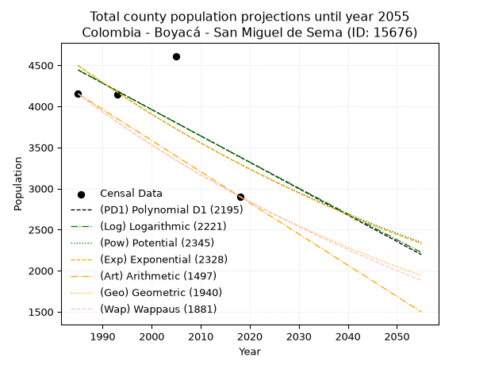
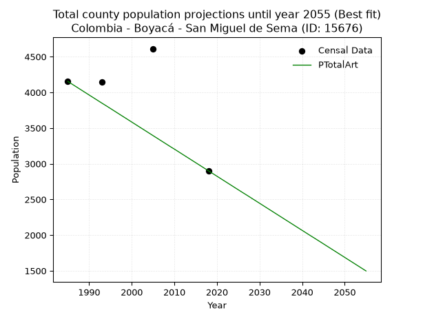
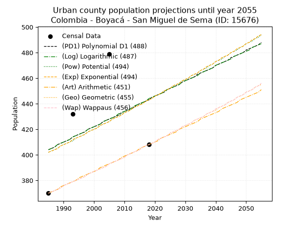
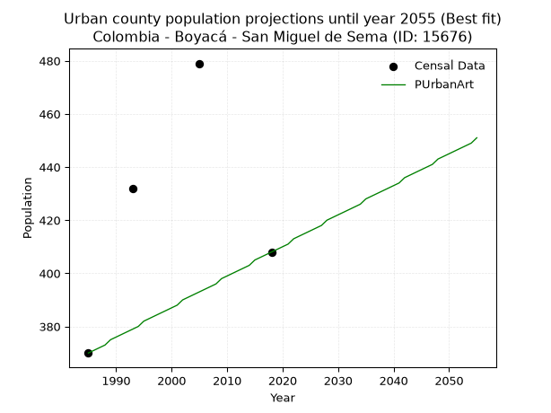
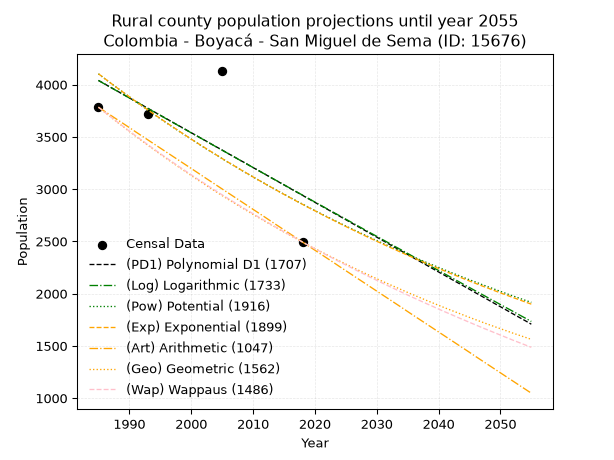
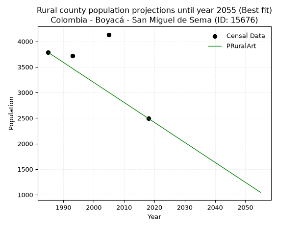

<div align="center">


</div>

# _“Population and Public Services Demand Projections (PPSD) until Year 2050 for Colombia - Boyacá - San Miguel de Sema (ID: 15676)”_
Keywords: `population` `public-service` `projection` `lineal` `polynomial` `logarithmic` `potential` `exponential` `arithmetic` `geometric` `wappaus` `dane` `colombia` `south-america`

PPSD are analytical estimates used by governments and planners to anticipate future changes in population size, age distribution, and the resulting community needs for utilities, healthcare, education, and infrastructure as sizing future water treatment facilities, electrical grids, and road networks based on spatial growth.

> **General running parameters**: • app_version: _v20260806_. • Python version: _3.14.7_. • Pandas version: _3.0.5_. • NumPy version: _2.5.1_. • Creates, save and include plots into reports (create_plot): _True_. • Projection until year: _2050_. • Process polynomial degree 2 and up: _False_. • Process Wappaus: _True_. • Process Wappaus: _True_. • Set negative values to zero: _True_. • Set infinite values to zero: _True_. • Drop dataset notes: _True_. 
<div align="center">

Dynamic map: [:earth_americas:Google](http://maps.google.com/maps?q=5.518082791,-73.7220094) [:earth_americas:OSM](https://www.openstreetmap.org/#map=18/5.518082791/-73.7220094&layers=P) [:earth_americas:Bing](https://www.bing.com/maps?cp=5.518082791~-73.7220094&lvl=18) [:earth_americas:Apple](https://maps.apple.com/frame?center=5.518082791%2C-73.7220094&span=0.003%2C0.006)

</div>


<div align="center">

```geojson
{
  "type": "Feature",
  "geometry": {
    "type": "Point", 
    "coordinates": [-73.7220094, 5.518082791]
  }, 
  "properties": {
    "Name": "Colombia - Boyacá - San Miguel de Sema (ID: 15676)"
  }
}
```

</div>


## 0. Census Data (4 records)

Census data are official statistics collected by a government about the people and housing in a country. They usually include counts of total population, age, sex, race, income, education, and jobs.

📅Global census file: [Population.xlsx](../data/Population.xlsx)

| Source   |   Year |   CountryID | CountryName   |   StateID | StateName   |   CountyID | CountyName         |   PTotal |   PUrban |   PRural |
|:---------|-------:|------------:|:--------------|----------:|:------------|-----------:|:-------------------|---------:|---------:|---------:|
| DANE     |   1985 |          57 | Colombia      |        15 | Boyacá      |      15676 | San Miguel de Sema |     4153 |      370 |     3783 |
| DANE     |   1993 |          57 | Colombia      |        15 | Boyacá      |      15676 | San Miguel De Sema |     4147 |      432 |     3715 |
| DANE     |   2005 |          57 | Colombia      |        15 | Boyacá      |      15676 | San Miguel de Sema |     4612 |      479 |     4133 |
| DANE     |   2018 |          57 | Colombia      |        15 | Boyacá      |      15676 | San Miguel De Sema |     2901 |      408 |     2493 |

> 🔥Some records has specific notes about the registered values or the corresponding urban or rural distribution.

## 1. Total

### 1.1. Coefficients and Parameters

* (PD1) Polynomial Deg 1: -32.11441188277696, 68190.10236852463 (lineal)
* (Log) Logarithmic: -64117.980108629155, 491314.53061493655
* (Pow) Potential: -18.79091811522175, 65.62087899676396
* (Exp) Exponential: -0.009409613725255212, 581756868855.7662
* (Art) Arithmetic: Year diff. 2018 - 1985 = 33, Population diff. 2901 - 4153 = -1252, Annual growth = -37.93939393939394
* (Geo) Geometric: Year diff. 2018 - 1985 = 33, Population diff. 2901 - 4153 = -1252, Annual growth % = -0.01081309720481849
* (Wap) Wappaus: i = -1.0756845460559665, Condition values only valid for < 200)

<sub>
Wappaus condition values: ['-0.00', '-1.08', '-2.15', '-3.23', '-4.30', '-5.38', '-6.45', '-7.53', '-8.61', '-9.68', '-10.76', '-11.83', '-12.91', '-13.98', '-15.06', '-16.14', '-17.21', '-18.29', '-19.36', '-20.44', '-21.51', '-22.59', '-23.67', '-24.74', '-25.82', '-26.89', '-27.97', '-29.04', '-30.12', '-31.19', '-32.27', '-33.35', '-34.42', '-35.50', '-36.57', '-37.65', '-38.72', '-39.80', '-40.88', '-41.95', '-43.03', '-44.10', '-45.18', '-46.25', '-47.33', '-48.41', '-49.48', '-50.56', '-51.63', '-52.71', '-53.78', '-54.86', '-55.94', '-57.01', '-58.09', '-59.16', '-60.24', '-61.31', '-62.39', '-63.47', '-64.54', '-65.62', '-66.69', '-67.77', '-68.84', '-69.92']
</sub>


### 1.2. Projected Dataset

|   Year |   CountyID |   PTotalPD1 |   PTotalLog |   PTotalPow |   PTotalExp |   PTotalArt |   PTotalGeo |   PTotalWap |
|-------:|-----------:|------------:|------------:|------------:|------------:|------------:|------------:|------------:|
|   1985 |      15676 |        4443 |        4443 |        4497 |        4497 |        4153 |        4153 |        4153 |
|   1986 |      15676 |        4411 |        4410 |        4455 |        4455 |        4115 |        4108 |        4109 |
|   1987 |      15676 |        4379 |        4378 |        4413 |        4413 |        4077 |        4064 |        4065 |
|   1988 |      15676 |        4347 |        4346 |        4371 |        4372 |        4039 |        4020 |        4021 |
|   1989 |      15676 |        4315 |        4314 |        4330 |        4331 |        4001 |        3976 |        3978 |
|   1990 |      15676 |        4282 |        4281 |        4289 |        4291 |        3963 |        3933 |        3935 |
|   1991 |      15676 |        4250 |        4249 |        4249 |        4250 |        3925 |        3891 |        3893 |
|   1992 |      15676 |        4218 |        4217 |        4209 |        4211 |        3887 |        3849 |        3852 |
|   1993 |      15676 |        4186 |        4185 |        4170 |        4171 |        3849 |        3807 |        3810 |
|   1994 |      15676 |        4154 |        4153 |        4131 |        4132 |        3812 |        3766 |        3770 |
|   1995 |      15676 |        4122 |        4121 |        4092 |        4093 |        3774 |        3725 |        3729 |
|   1996 |      15676 |        4090 |        4088 |        4054 |        4055 |        3736 |        3685 |        3689 |
|   1997 |      15676 |        4058 |        4056 |        4016 |        4017 |        3698 |        3645 |        3649 |
|   1998 |      15676 |        4026 |        4024 |        3978 |        3979 |        3660 |        3606 |        3610 |
|   1999 |      15676 |        3993 |        3992 |        3941 |        3942 |        3622 |        3567 |        3571 |
|   2000 |      15676 |        3961 |        3960 |        3904 |        3905 |        3584 |        3528 |        3533 |
|   2001 |      15676 |        3929 |        3928 |        3867 |        3869 |        3546 |        3490 |        3495 |
|   2002 |      15676 |        3897 |        3896 |        3831 |        3832 |        3508 |        3452 |        3457 |
|   2003 |      15676 |        3865 |        3864 |        3795 |        3797 |        3470 |        3415 |        3420 |
|   2004 |      15676 |        3833 |        3832 |        3760 |        3761 |        3432 |        3378 |        3383 |
|   2005 |      15676 |        3801 |        3800 |        3725 |        3726 |        3394 |        3341 |        3346 |
|   2006 |      15676 |        3769 |        3768 |        3690 |        3691 |        3356 |        3305 |        3310 |
|   2007 |      15676 |        3736 |        3736 |        3656 |        3656 |        3318 |        3270 |        3274 |
|   2008 |      15676 |        3704 |        3704 |        3622 |        3622 |        3280 |        3234 |        3239 |
|   2009 |      15676 |        3672 |        3672 |        3588 |        3588 |        3242 |        3199 |        3203 |
|   2010 |      15676 |        3640 |        3640 |        3555 |        3555 |        3205 |        3165 |        3169 |
|   2011 |      15676 |        3608 |        3608 |        3522 |        3521 |        3167 |        3130 |        3134 |
|   2012 |      15676 |        3576 |        3576 |        3489 |        3488 |        3129 |        3097 |        3100 |
|   2013 |      15676 |        3544 |        3545 |        3456 |        3456 |        3091 |        3063 |        3066 |
|   2014 |      15676 |        3512 |        3513 |        3424 |        3423 |        3053 |        3030 |        3032 |
|   2015 |      15676 |        3480 |        3481 |        3392 |        3391 |        3015 |        2997 |        2999 |
|   2016 |      15676 |        3447 |        3449 |        3361 |        3359 |        2977 |        2965 |        2966 |
|   2017 |      15676 |        3415 |        3417 |        3330 |        3328 |        2939 |        2933 |        2933 |
|   2018 |      15676 |        3383 |        3386 |        3299 |        3297 |        2901 |        2901 |        2901 |
|   2019 |      15676 |        3351 |        3354 |        3268 |        3266 |        2863 |        2870 |        2869 |
|   2020 |      15676 |        3319 |        3322 |        3238 |        3235 |        2825 |        2839 |        2837 |
|   2021 |      15676 |        3287 |        3290 |        3208 |        3205 |        2787 |        2808 |        2806 |
|   2022 |      15676 |        3255 |        3259 |        3178 |        3175 |        2749 |        2778 |        2774 |
|   2023 |      15676 |        3223 |        3227 |        3149 |        3145 |        2711 |        2748 |        2743 |
|   2024 |      15676 |        3191 |        3195 |        3120 |        3116 |        2673 |        2718 |        2713 |
|   2025 |      15676 |        3158 |        3164 |        3091 |        3087 |        2635 |        2688 |        2682 |
|   2026 |      15676 |        3126 |        3132 |        3063 |        3058 |        2597 |        2659 |        2652 |
|   2027 |      15676 |        3094 |        3100 |        3034 |        3029 |        2560 |        2631 |        2622 |
|   2028 |      15676 |        3062 |        3069 |        3006 |        3001 |        2522 |        2602 |        2593 |
|   2029 |      15676 |        3030 |        3037 |        2979 |        2973 |        2484 |        2574 |        2564 |
|   2030 |      15676 |        2998 |        3005 |        2951 |        2945 |        2446 |        2546 |        2534 |
|   2031 |      15676 |        2966 |        2974 |        2924 |        2917 |        2408 |        2519 |        2506 |
|   2032 |      15676 |        2934 |        2942 |        2897 |        2890 |        2370 |        2491 |        2477 |
|   2033 |      15676 |        2902 |        2911 |        2870 |        2863 |        2332 |        2464 |        2449 |
|   2034 |      15676 |        2869 |        2879 |        2844 |        2836 |        2294 |        2438 |        2421 |
|   2035 |      15676 |        2837 |        2848 |        2818 |        2809 |        2256 |        2411 |        2393 |
|   2036 |      15676 |        2805 |        2816 |        2792 |        2783 |        2218 |        2385 |        2365 |
|   2037 |      15676 |        2773 |        2785 |        2766 |        2757 |        2180 |        2360 |        2338 |
|   2038 |      15676 |        2741 |        2753 |        2741 |        2731 |        2142 |        2334 |        2311 |
|   2039 |      15676 |        2709 |        2722 |        2716 |        2706 |        2104 |        2309 |        2284 |
|   2040 |      15676 |        2677 |        2690 |        2691 |        2680 |        2066 |        2284 |        2257 |
|   2041 |      15676 |        2645 |        2659 |        2666 |        2655 |        2028 |        2259 |        2230 |
|   2042 |      15676 |        2612 |        2627 |        2642 |        2630 |        1990 |        2235 |        2204 |
|   2043 |      15676 |        2580 |        2596 |        2618 |        2606 |        1953 |        2211 |        2178 |
|   2044 |      15676 |        2548 |        2565 |        2594 |        2581 |        1915 |        2187 |        2152 |
|   2045 |      15676 |        2516 |        2533 |        2570 |        2557 |        1877 |        2163 |        2127 |
|   2046 |      15676 |        2484 |        2502 |        2546 |        2533 |        1839 |        2140 |        2101 |
|   2047 |      15676 |        2452 |        2471 |        2523 |        2510 |        1801 |        2117 |        2076 |
|   2048 |      15676 |        2420 |        2439 |        2500 |        2486 |        1763 |        2094 |        2051 |
|   2049 |      15676 |        2388 |        2408 |        2477 |        2463 |        1725 |        2071 |        2026 |
|   2050 |      15676 |        2356 |        2377 |        2455 |        2440 |        1687 |        2049 |        2001 |
<div align="center">

</img>

</div>


### 1.3. Best fit with absolute error and relative error (%)

Relative error puts that difference into context by dividing the absolute error by the true value, creating a unitless ratio or percentage that shows the scale of the mistake.

Absolute and relative error

|   Year | Source   |   CountryID | CountryName   |   StateID | StateName   |   CountyID_x | CountyName         |   PTotal |   PUrban |   PRural |   CountyID_y |   PTotalPD1 |   PTotalLog |   PTotalPow |   PTotalExp |   PTotalArt |   PTotalGeo |   PTotalWap |   PTotalPD1AbsError |   PTotalLogAbsError |   PTotalPowAbsError |   PTotalExpAbsError |   PTotalArtAbsError |   PTotalGeoAbsError |   PTotalWapAbsError |   PTotalPD1RelError |   PTotalLogRelError |   PTotalPowRelError |   PTotalExpRelError |   PTotalArtRelError |   PTotalGeoRelError |   PTotalWapRelError |
|-------:|:---------|------------:|:--------------|----------:|:------------|-------------:|:-------------------|---------:|---------:|---------:|-------------:|------------:|------------:|------------:|------------:|------------:|------------:|------------:|--------------------:|--------------------:|--------------------:|--------------------:|--------------------:|--------------------:|--------------------:|--------------------:|--------------------:|--------------------:|--------------------:|--------------------:|--------------------:|--------------------:|
|   1985 | DANE     |          57 | Colombia      |        15 | Boyacá      |        15676 | San Miguel de Sema |     4153 |      370 |     3783 |        15676 |        4443 |        4443 |        4497 |        4497 |        4153 |        4153 |        4153 |                 290 |                 290 |                 344 |                 344 |                   0 |                   0 |                   0 |            6.9829   |            6.9829   |            8.28317  |            8.28317  |             0       |              0      |             0       |
|   1993 | DANE     |          57 | Colombia      |        15 | Boyacá      |        15676 | San Miguel De Sema |     4147 |      432 |     3715 |        15676 |        4186 |        4185 |        4170 |        4171 |        3849 |        3807 |        3810 |                  39 |                  38 |                  23 |                  24 |                 298 |                 340 |                 337 |            0.940439 |            0.916325 |            0.554618 |            0.578732 |             7.18592 |              8.1987 |             8.12636 |
|   2005 | DANE     |          57 | Colombia      |        15 | Boyacá      |        15676 | San Miguel de Sema |     4612 |      479 |     4133 |        15676 |        3801 |        3800 |        3725 |        3726 |        3394 |        3341 |        3346 |                 811 |                 812 |                 887 |                 886 |                1218 |                1271 |                1266 |           17.5846   |           17.6062   |           19.2324   |           19.2108   |            26.4094  |             27.5585 |            27.4501  |
|   2018 | DANE     |          57 | Colombia      |        15 | Boyacá      |        15676 | San Miguel De Sema |     2901 |      408 |     2493 |        15676 |        3383 |        3386 |        3299 |        3297 |        2901 |        2901 |        2901 |                 482 |                 485 |                 398 |                 396 |                   0 |                   0 |                   0 |           16.615    |           16.7184   |           13.7194   |           13.6505   |             0       |              0      |             0       |

Relative error mean

| Method    |   RelError | Best   |
|:----------|-----------:|:-------|
| PTotalPD1 |   10.5307  |        |
| PTotalLog |   10.556   |        |
| PTotalPow |   10.4474  |        |
| PTotalExp |   10.4308  |        |
| PTotalArt |    8.39882 | True   |
| PTotalGeo |    8.93931 |        |
| PTotalWap |    8.89412 |        |

💙Best method: _**PTotalArt**_
<div align="center">

</img>

</div>


### 1.4. Fresh water supply demand in liters per capita per day (lpcd)

The fresh water supply demand typically ranges from 100 to 300 liters per capita per day (lpcd) for standard domestic and municipal planning, though absolute survival minimums set by the World Health Organization are as low as 7.5 to 20 liters per day, and total consumption in high-income nations can exceed 400 liters.

> `CZ`: Level in meters above the sea level (masl).<br> `WS`: Fresh water supply demand in liters per capita per day (lpcd or l/h/d).<br> `WSAll`: Zonal fresh water supply demand in liters per second (l/s).<br> `A`: Zonal area in square meters.

Reference values (RAS Colombia)

|    CZ |   WS |
|------:|-----:|
|  1000 |  120 |
|  2000 |  130 |
| 99999 |  140 |

County shapefile geometry properties and water supply values

|   CountyID |      ATotal |   CZTotal |   WSTotal |
|-----------:|------------:|----------:|----------:|
|      15676 | 9.38606e+07 |   2593.04 |       140 |

Projected values for best method: PTotalArt

|   CountyID |   Year |   PTotalArt |   WSTotal |   WSTotalAll |
|-----------:|-------:|------------:|----------:|-------------:|
|      15676 |   1985 |        4153 |       140 |      6.7294  |
|      15676 |   1986 |        4115 |       140 |      6.66782 |
|      15676 |   1987 |        4077 |       140 |      6.60625 |
|      15676 |   1988 |        4039 |       140 |      6.54468 |
|      15676 |   1989 |        4001 |       140 |      6.4831  |
|      15676 |   1990 |        3963 |       140 |      6.42153 |
|      15676 |   1991 |        3925 |       140 |      6.35995 |
|      15676 |   1992 |        3887 |       140 |      6.29838 |
|      15676 |   1993 |        3849 |       140 |      6.23681 |
|      15676 |   1994 |        3812 |       140 |      6.17685 |
|      15676 |   1995 |        3774 |       140 |      6.11528 |
|      15676 |   1996 |        3736 |       140 |      6.0537  |
|      15676 |   1997 |        3698 |       140 |      5.99213 |
|      15676 |   1998 |        3660 |       140 |      5.93056 |
|      15676 |   1999 |        3622 |       140 |      5.86898 |
|      15676 |   2000 |        3584 |       140 |      5.80741 |
|      15676 |   2001 |        3546 |       140 |      5.74583 |
|      15676 |   2002 |        3508 |       140 |      5.68426 |
|      15676 |   2003 |        3470 |       140 |      5.62269 |
|      15676 |   2004 |        3432 |       140 |      5.56111 |
|      15676 |   2005 |        3394 |       140 |      5.49954 |
|      15676 |   2006 |        3356 |       140 |      5.43796 |
|      15676 |   2007 |        3318 |       140 |      5.37639 |
|      15676 |   2008 |        3280 |       140 |      5.31481 |
|      15676 |   2009 |        3242 |       140 |      5.25324 |
|      15676 |   2010 |        3205 |       140 |      5.19329 |
|      15676 |   2011 |        3167 |       140 |      5.13171 |
|      15676 |   2012 |        3129 |       140 |      5.07014 |
|      15676 |   2013 |        3091 |       140 |      5.00856 |
|      15676 |   2014 |        3053 |       140 |      4.94699 |
|      15676 |   2015 |        3015 |       140 |      4.88542 |
|      15676 |   2016 |        2977 |       140 |      4.82384 |
|      15676 |   2017 |        2939 |       140 |      4.76227 |
|      15676 |   2018 |        2901 |       140 |      4.70069 |
|      15676 |   2019 |        2863 |       140 |      4.63912 |
|      15676 |   2020 |        2825 |       140 |      4.57755 |
|      15676 |   2021 |        2787 |       140 |      4.51597 |
|      15676 |   2022 |        2749 |       140 |      4.4544  |
|      15676 |   2023 |        2711 |       140 |      4.39282 |
|      15676 |   2024 |        2673 |       140 |      4.33125 |
|      15676 |   2025 |        2635 |       140 |      4.26968 |
|      15676 |   2026 |        2597 |       140 |      4.2081  |
|      15676 |   2027 |        2560 |       140 |      4.14815 |
|      15676 |   2028 |        2522 |       140 |      4.08657 |
|      15676 |   2029 |        2484 |       140 |      4.025   |
|      15676 |   2030 |        2446 |       140 |      3.96343 |
|      15676 |   2031 |        2408 |       140 |      3.90185 |
|      15676 |   2032 |        2370 |       140 |      3.84028 |
|      15676 |   2033 |        2332 |       140 |      3.7787  |
|      15676 |   2034 |        2294 |       140 |      3.71713 |
|      15676 |   2035 |        2256 |       140 |      3.65556 |
|      15676 |   2036 |        2218 |       140 |      3.59398 |
|      15676 |   2037 |        2180 |       140 |      3.53241 |
|      15676 |   2038 |        2142 |       140 |      3.47083 |
|      15676 |   2039 |        2104 |       140 |      3.40926 |
|      15676 |   2040 |        2066 |       140 |      3.34769 |
|      15676 |   2041 |        2028 |       140 |      3.28611 |
|      15676 |   2042 |        1990 |       140 |      3.22454 |
|      15676 |   2043 |        1953 |       140 |      3.16458 |
|      15676 |   2044 |        1915 |       140 |      3.10301 |
|      15676 |   2045 |        1877 |       140 |      3.04144 |
|      15676 |   2046 |        1839 |       140 |      2.97986 |
|      15676 |   2047 |        1801 |       140 |      2.91829 |
|      15676 |   2048 |        1763 |       140 |      2.85671 |
|      15676 |   2049 |        1725 |       140 |      2.79514 |
|      15676 |   2050 |        1687 |       140 |      2.73356 |

## 2. Urban

### 2.1. Coefficients and Parameters

* (PD1) Polynomial Deg 1: 1.192693697310358, -1963.4355680450437 (lineal)
* (Log) Logarithmic: 2400.9368295729255, -17827.29008148408
* (Pow) Potential: 5.941559938779257, -16.989869662120295
* (Exp) Exponential: 0.002952330522075239, 1.145481376305349
* (Art) Arithmetic: Year diff. 2018 - 1985 = 33, Population diff. 408 - 370 = 38, Annual growth = 1.1515151515151516
* (Geo) Geometric: Year diff. 2018 - 1985 = 33, Population diff. 408 - 370 = 38, Annual growth % = 0.0029669432583834254
* (Wap) Wappaus: i = 0.29601931915556595, Condition values only valid for < 200)

<sub>
Wappaus condition values: ['0.00', '0.30', '0.59', '0.89', '1.18', '1.48', '1.78', '2.07', '2.37', '2.66', '2.96', '3.26', '3.55', '3.85', '4.14', '4.44', '4.74', '5.03', '5.33', '5.62', '5.92', '6.22', '6.51', '6.81', '7.10', '7.40', '7.70', '7.99', '8.29', '8.58', '8.88', '9.18', '9.47', '9.77', '10.06', '10.36', '10.66', '10.95', '11.25', '11.54', '11.84', '12.14', '12.43', '12.73', '13.02', '13.32', '13.62', '13.91', '14.21', '14.50', '14.80', '15.10', '15.39', '15.69', '15.99', '16.28', '16.58', '16.87', '17.17', '17.47', '17.76', '18.06', '18.35', '18.65', '18.95', '19.24']
</sub>


### 2.2. Projected Dataset

|   Year |   CountyID |   PUrbanPD1 |   PUrbanLog |   PUrbanPow |   PUrbanExp |   PUrbanArt |   PUrbanGeo |   PUrbanWap |
|-------:|-----------:|------------:|------------:|------------:|------------:|------------:|------------:|------------:|
|   1985 |      15676 |         404 |         404 |         402 |         402 |         370 |         370 |         370 |
|   1986 |      15676 |         405 |         405 |         403 |         403 |         371 |         371 |         371 |
|   1987 |      15676 |         406 |         406 |         404 |         404 |         372 |         372 |         372 |
|   1988 |      15676 |         408 |         408 |         405 |         405 |         373 |         373 |         373 |
|   1989 |      15676 |         409 |         409 |         407 |         407 |         375 |         374 |         374 |
|   1990 |      15676 |         410 |         410 |         408 |         408 |         376 |         376 |         376 |
|   1991 |      15676 |         411 |         411 |         409 |         409 |         377 |         377 |         377 |
|   1992 |      15676 |         412 |         412 |         410 |         410 |         378 |         378 |         378 |
|   1993 |      15676 |         414 |         414 |         411 |         412 |         379 |         379 |         379 |
|   1994 |      15676 |         415 |         415 |         413 |         413 |         380 |         380 |         380 |
|   1995 |      15676 |         416 |         416 |         414 |         414 |         382 |         381 |         381 |
|   1996 |      15676 |         417 |         417 |         415 |         415 |         383 |         382 |         382 |
|   1997 |      15676 |         418 |         418 |         416 |         416 |         384 |         383 |         383 |
|   1998 |      15676 |         420 |         420 |         418 |         418 |         385 |         385 |         385 |
|   1999 |      15676 |         421 |         421 |         419 |         419 |         386 |         386 |         386 |
|   2000 |      15676 |         422 |         422 |         420 |         420 |         387 |         387 |         387 |
|   2001 |      15676 |         423 |         423 |         421 |         421 |         388 |         388 |         388 |
|   2002 |      15676 |         424 |         424 |         423 |         423 |         390 |         389 |         389 |
|   2003 |      15676 |         426 |         426 |         424 |         424 |         391 |         390 |         390 |
|   2004 |      15676 |         427 |         427 |         425 |         425 |         392 |         391 |         391 |
|   2005 |      15676 |         428 |         428 |         426 |         426 |         393 |         393 |         393 |
|   2006 |      15676 |         429 |         429 |         428 |         428 |         394 |         394 |         394 |
|   2007 |      15676 |         430 |         430 |         429 |         429 |         395 |         395 |         395 |
|   2008 |      15676 |         431 |         432 |         430 |         430 |         396 |         396 |         396 |
|   2009 |      15676 |         433 |         433 |         432 |         431 |         398 |         397 |         397 |
|   2010 |      15676 |         434 |         434 |         433 |         433 |         399 |         398 |         398 |
|   2011 |      15676 |         435 |         435 |         434 |         434 |         400 |         400 |         400 |
|   2012 |      15676 |         436 |         436 |         435 |         435 |         401 |         401 |         401 |
|   2013 |      15676 |         437 |         438 |         437 |         437 |         402 |         402 |         402 |
|   2014 |      15676 |         439 |         439 |         438 |         438 |         403 |         403 |         403 |
|   2015 |      15676 |         440 |         440 |         439 |         439 |         405 |         404 |         404 |
|   2016 |      15676 |         441 |         441 |         441 |         440 |         406 |         406 |         406 |
|   2017 |      15676 |         442 |         442 |         442 |         442 |         407 |         407 |         407 |
|   2018 |      15676 |         443 |         444 |         443 |         443 |         408 |         408 |         408 |
|   2019 |      15676 |         445 |         445 |         444 |         444 |         409 |         409 |         409 |
|   2020 |      15676 |         446 |         446 |         446 |         446 |         410 |         410 |         410 |
|   2021 |      15676 |         447 |         447 |         447 |         447 |         411 |         412 |         412 |
|   2022 |      15676 |         448 |         448 |         448 |         448 |         413 |         413 |         413 |
|   2023 |      15676 |         449 |         449 |         450 |         450 |         414 |         414 |         414 |
|   2024 |      15676 |         451 |         451 |         451 |         451 |         415 |         415 |         415 |
|   2025 |      15676 |         452 |         452 |         452 |         452 |         416 |         417 |         417 |
|   2026 |      15676 |         453 |         453 |         454 |         454 |         417 |         418 |         418 |
|   2027 |      15676 |         454 |         454 |         455 |         455 |         418 |         419 |         419 |
|   2028 |      15676 |         455 |         455 |         456 |         456 |         420 |         420 |         420 |
|   2029 |      15676 |         457 |         457 |         458 |         458 |         421 |         422 |         422 |
|   2030 |      15676 |         458 |         458 |         459 |         459 |         422 |         423 |         423 |
|   2031 |      15676 |         459 |         459 |         460 |         460 |         423 |         424 |         424 |
|   2032 |      15676 |         460 |         460 |         462 |         462 |         424 |         425 |         425 |
|   2033 |      15676 |         461 |         461 |         463 |         463 |         425 |         427 |         427 |
|   2034 |      15676 |         463 |         462 |         464 |         464 |         426 |         428 |         428 |
|   2035 |      15676 |         464 |         464 |         466 |         466 |         428 |         429 |         429 |
|   2036 |      15676 |         465 |         465 |         467 |         467 |         429 |         430 |         430 |
|   2037 |      15676 |         466 |         466 |         468 |         469 |         430 |         432 |         432 |
|   2038 |      15676 |         467 |         467 |         470 |         470 |         431 |         433 |         433 |
|   2039 |      15676 |         468 |         468 |         471 |         471 |         432 |         434 |         434 |
|   2040 |      15676 |         470 |         470 |         473 |         473 |         433 |         435 |         436 |
|   2041 |      15676 |         471 |         471 |         474 |         474 |         434 |         437 |         437 |
|   2042 |      15676 |         472 |         472 |         475 |         476 |         436 |         438 |         438 |
|   2043 |      15676 |         473 |         473 |         477 |         477 |         437 |         439 |         439 |
|   2044 |      15676 |         474 |         474 |         478 |         478 |         438 |         441 |         441 |
|   2045 |      15676 |         476 |         475 |         480 |         480 |         439 |         442 |         442 |
|   2046 |      15676 |         477 |         477 |         481 |         481 |         440 |         443 |         443 |
|   2047 |      15676 |         478 |         478 |         482 |         483 |         441 |         445 |         445 |
|   2048 |      15676 |         479 |         479 |         484 |         484 |         443 |         446 |         446 |
|   2049 |      15676 |         480 |         480 |         485 |         485 |         444 |         447 |         447 |
|   2050 |      15676 |         482 |         481 |         487 |         487 |         445 |         449 |         449 |
<div align="center">

</img>

</div>


### 2.3. Best fit with absolute error and relative error (%)

Relative error puts that difference into context by dividing the absolute error by the true value, creating a unitless ratio or percentage that shows the scale of the mistake.

Absolute and relative error

|   Year | Source   |   CountryID | CountryName   |   StateID | StateName   |   CountyID_x | CountyName         |   PTotal |   PUrban |   PRural |   CountyID_y |   PUrbanPD1 |   PUrbanLog |   PUrbanPow |   PUrbanExp |   PUrbanArt |   PUrbanGeo |   PUrbanWap |   PUrbanPD1AbsError |   PUrbanLogAbsError |   PUrbanPowAbsError |   PUrbanExpAbsError |   PUrbanArtAbsError |   PUrbanGeoAbsError |   PUrbanWapAbsError |   PUrbanPD1RelError |   PUrbanLogRelError |   PUrbanPowRelError |   PUrbanExpRelError |   PUrbanArtRelError |   PUrbanGeoRelError |   PUrbanWapRelError |
|-------:|:---------|------------:|:--------------|----------:|:------------|-------------:|:-------------------|---------:|---------:|---------:|-------------:|------------:|------------:|------------:|------------:|------------:|------------:|------------:|--------------------:|--------------------:|--------------------:|--------------------:|--------------------:|--------------------:|--------------------:|--------------------:|--------------------:|--------------------:|--------------------:|--------------------:|--------------------:|--------------------:|
|   1985 | DANE     |          57 | Colombia      |        15 | Boyacá      |        15676 | San Miguel de Sema |     4153 |      370 |     3783 |        15676 |         404 |         404 |         402 |         402 |         370 |         370 |         370 |                  34 |                  34 |                  32 |                  32 |                   0 |                   0 |                   0 |             9.18919 |             9.18919 |             8.64865 |             8.64865 |              0      |              0      |              0      |
|   1993 | DANE     |          57 | Colombia      |        15 | Boyacá      |        15676 | San Miguel De Sema |     4147 |      432 |     3715 |        15676 |         414 |         414 |         411 |         412 |         379 |         379 |         379 |                  18 |                  18 |                  21 |                  20 |                  53 |                  53 |                  53 |             4.16667 |             4.16667 |             4.86111 |             4.62963 |             12.2685 |             12.2685 |             12.2685 |
|   2005 | DANE     |          57 | Colombia      |        15 | Boyacá      |        15676 | San Miguel de Sema |     4612 |      479 |     4133 |        15676 |         428 |         428 |         426 |         426 |         393 |         393 |         393 |                  51 |                  51 |                  53 |                  53 |                  86 |                  86 |                  86 |            10.6472  |            10.6472  |            11.0647  |            11.0647  |             17.9541 |             17.9541 |             17.9541 |
|   2018 | DANE     |          57 | Colombia      |        15 | Boyacá      |        15676 | San Miguel De Sema |     2901 |      408 |     2493 |        15676 |         443 |         444 |         443 |         443 |         408 |         408 |         408 |                  35 |                  36 |                  35 |                  35 |                   0 |                   0 |                   0 |             8.57843 |             8.82353 |             8.57843 |             8.57843 |              0      |              0      |              0      |

Relative error mean

| Method    |   RelError | Best   |
|:----------|-----------:|:-------|
| PUrbanPD1 |    8.14537 |        |
| PUrbanLog |    8.20664 |        |
| PUrbanPow |    8.28823 |        |
| PUrbanExp |    8.23036 |        |
| PUrbanArt |    7.55565 | True   |
| PUrbanGeo |    7.55565 | True   |
| PUrbanWap |    7.55565 | True   |

💙Best method: _**PUrbanArt**_
<div align="center">

</img>

</div>


### 2.4. Fresh water supply demand in liters per capita per day (lpcd)

The fresh water supply demand typically ranges from 100 to 300 liters per capita per day (lpcd) for standard domestic and municipal planning, though absolute survival minimums set by the World Health Organization are as low as 7.5 to 20 liters per day, and total consumption in high-income nations can exceed 400 liters.

> `CZ`: Level in meters above the sea level (masl).<br> `WS`: Fresh water supply demand in liters per capita per day (lpcd or l/h/d).<br> `WSAll`: Zonal fresh water supply demand in liters per second (l/s).<br> `A`: Zonal area in square meters.

Reference values (RAS Colombia)

|    CZ |   WS |
|------:|-----:|
|  1000 |  120 |
|  2000 |  130 |
| 99999 |  140 |

County shapefile geometry properties and water supply values

|   CountyID |   AUrban |   CZUrban |   WSUrban |
|-----------:|---------:|----------:|----------:|
|      15676 |   228856 |   2608.06 |       140 |

Projected values for best method: PUrbanArt

|   CountyID |   Year |   PUrbanArt |   WSUrban |   WSUrbanAll |
|-----------:|-------:|------------:|----------:|-------------:|
|      15676 |   1985 |         370 |       140 |     0.599537 |
|      15676 |   1986 |         371 |       140 |     0.601157 |
|      15676 |   1987 |         372 |       140 |     0.602778 |
|      15676 |   1988 |         373 |       140 |     0.604398 |
|      15676 |   1989 |         375 |       140 |     0.607639 |
|      15676 |   1990 |         376 |       140 |     0.609259 |
|      15676 |   1991 |         377 |       140 |     0.61088  |
|      15676 |   1992 |         378 |       140 |     0.6125   |
|      15676 |   1993 |         379 |       140 |     0.61412  |
|      15676 |   1994 |         380 |       140 |     0.615741 |
|      15676 |   1995 |         382 |       140 |     0.618981 |
|      15676 |   1996 |         383 |       140 |     0.620602 |
|      15676 |   1997 |         384 |       140 |     0.622222 |
|      15676 |   1998 |         385 |       140 |     0.623843 |
|      15676 |   1999 |         386 |       140 |     0.625463 |
|      15676 |   2000 |         387 |       140 |     0.627083 |
|      15676 |   2001 |         388 |       140 |     0.628704 |
|      15676 |   2002 |         390 |       140 |     0.631944 |
|      15676 |   2003 |         391 |       140 |     0.633565 |
|      15676 |   2004 |         392 |       140 |     0.635185 |
|      15676 |   2005 |         393 |       140 |     0.636806 |
|      15676 |   2006 |         394 |       140 |     0.638426 |
|      15676 |   2007 |         395 |       140 |     0.640046 |
|      15676 |   2008 |         396 |       140 |     0.641667 |
|      15676 |   2009 |         398 |       140 |     0.644907 |
|      15676 |   2010 |         399 |       140 |     0.646528 |
|      15676 |   2011 |         400 |       140 |     0.648148 |
|      15676 |   2012 |         401 |       140 |     0.649769 |
|      15676 |   2013 |         402 |       140 |     0.651389 |
|      15676 |   2014 |         403 |       140 |     0.653009 |
|      15676 |   2015 |         405 |       140 |     0.65625  |
|      15676 |   2016 |         406 |       140 |     0.65787  |
|      15676 |   2017 |         407 |       140 |     0.659491 |
|      15676 |   2018 |         408 |       140 |     0.661111 |
|      15676 |   2019 |         409 |       140 |     0.662731 |
|      15676 |   2020 |         410 |       140 |     0.664352 |
|      15676 |   2021 |         411 |       140 |     0.665972 |
|      15676 |   2022 |         413 |       140 |     0.669213 |
|      15676 |   2023 |         414 |       140 |     0.670833 |
|      15676 |   2024 |         415 |       140 |     0.672454 |
|      15676 |   2025 |         416 |       140 |     0.674074 |
|      15676 |   2026 |         417 |       140 |     0.675694 |
|      15676 |   2027 |         418 |       140 |     0.677315 |
|      15676 |   2028 |         420 |       140 |     0.680556 |
|      15676 |   2029 |         421 |       140 |     0.682176 |
|      15676 |   2030 |         422 |       140 |     0.683796 |
|      15676 |   2031 |         423 |       140 |     0.685417 |
|      15676 |   2032 |         424 |       140 |     0.687037 |
|      15676 |   2033 |         425 |       140 |     0.688657 |
|      15676 |   2034 |         426 |       140 |     0.690278 |
|      15676 |   2035 |         428 |       140 |     0.693519 |
|      15676 |   2036 |         429 |       140 |     0.695139 |
|      15676 |   2037 |         430 |       140 |     0.696759 |
|      15676 |   2038 |         431 |       140 |     0.69838  |
|      15676 |   2039 |         432 |       140 |     0.7      |
|      15676 |   2040 |         433 |       140 |     0.70162  |
|      15676 |   2041 |         434 |       140 |     0.703241 |
|      15676 |   2042 |         436 |       140 |     0.706481 |
|      15676 |   2043 |         437 |       140 |     0.708102 |
|      15676 |   2044 |         438 |       140 |     0.709722 |
|      15676 |   2045 |         439 |       140 |     0.711343 |
|      15676 |   2046 |         440 |       140 |     0.712963 |
|      15676 |   2047 |         441 |       140 |     0.714583 |
|      15676 |   2048 |         443 |       140 |     0.717824 |
|      15676 |   2049 |         444 |       140 |     0.719444 |
|      15676 |   2050 |         445 |       140 |     0.721065 |

## 3. Rural

### 3.1. Coefficients and Parameters

* (PD1) Polynomial Deg 1: -33.30710558008731, 70153.53793656964 (lineal)
* (Log) Logarithmic: -66518.9169382021, 509141.82069642085
* (Pow) Potential: -21.972942472699494, 76.07454517882053
* (Exp) Exponential: -0.011000365095994521, 12479172283315.959
* (Art) Arithmetic: Year diff. 2018 - 1985 = 33, Population diff. 2493 - 3783 = -1290, Annual growth = -39.09090909090909
* (Geo) Geometric: Year diff. 2018 - 1985 = 33, Population diff. 2493 - 3783 = -1290, Annual growth % = -0.012557773891095803
* (Wap) Wappaus: i = -1.2457268671417812, Condition values only valid for < 200)

<sub>
Wappaus condition values: ['-0.00', '-1.25', '-2.49', '-3.74', '-4.98', '-6.23', '-7.47', '-8.72', '-9.97', '-11.21', '-12.46', '-13.70', '-14.95', '-16.19', '-17.44', '-18.69', '-19.93', '-21.18', '-22.42', '-23.67', '-24.91', '-26.16', '-27.41', '-28.65', '-29.90', '-31.14', '-32.39', '-33.63', '-34.88', '-36.13', '-37.37', '-38.62', '-39.86', '-41.11', '-42.35', '-43.60', '-44.85', '-46.09', '-47.34', '-48.58', '-49.83', '-51.07', '-52.32', '-53.57', '-54.81', '-56.06', '-57.30', '-58.55', '-59.79', '-61.04', '-62.29', '-63.53', '-64.78', '-66.02', '-67.27', '-68.51', '-69.76', '-71.01', '-72.25', '-73.50', '-74.74', '-75.99', '-77.24', '-78.48', '-79.73', '-80.97']
</sub>


### 3.2. Projected Dataset

|   Year |   CountyID |   PRuralPD1 |   PRuralLog |   PRuralPow |   PRuralExp |   PRuralArt |   PRuralGeo |   PRuralWap |
|-------:|-----------:|------------:|------------:|------------:|------------:|------------:|------------:|------------:|
|   1985 |      15676 |        4039 |        4039 |        4102 |        4103 |        3783 |        3783 |        3783 |
|   1986 |      15676 |        4006 |        4005 |        4057 |        4058 |        3744 |        3735 |        3736 |
|   1987 |      15676 |        3972 |        3972 |        4013 |        4013 |        3705 |        3689 |        3690 |
|   1988 |      15676 |        3939 |        3938 |        3969 |        3969 |        3666 |        3642 |        3644 |
|   1989 |      15676 |        3906 |        3905 |        3925 |        3926 |        3627 |        3597 |        3599 |
|   1990 |      15676 |        3872 |        3871 |        3882 |        3883 |        3588 |        3551 |        3554 |
|   1991 |      15676 |        3839 |        3838 |        3839 |        3840 |        3548 |        3507 |        3510 |
|   1992 |      15676 |        3806 |        3805 |        3797 |        3798 |        3509 |        3463 |        3467 |
|   1993 |      15676 |        3772 |        3771 |        3755 |        3757 |        3470 |        3419 |        3424 |
|   1994 |      15676 |        3739 |        3738 |        3714 |        3716 |        3431 |        3376 |        3381 |
|   1995 |      15676 |        3706 |        3705 |        3674 |        3675 |        3392 |        3334 |        3339 |
|   1996 |      15676 |        3673 |        3671 |        3633 |        3635 |        3353 |        3292 |        3298 |
|   1997 |      15676 |        3639 |        3638 |        3594 |        3595 |        3314 |        3251 |        3257 |
|   1998 |      15676 |        3606 |        3605 |        3554 |        3556 |        3275 |        3210 |        3216 |
|   1999 |      15676 |        3573 |        3571 |        3515 |        3517 |        3236 |        3170 |        3176 |
|   2000 |      15676 |        3539 |        3538 |        3477 |        3478 |        3197 |        3130 |        3137 |
|   2001 |      15676 |        3506 |        3505 |        3439 |        3440 |        3158 |        3090 |        3097 |
|   2002 |      15676 |        3473 |        3472 |        3401 |        3403 |        3118 |        3052 |        3059 |
|   2003 |      15676 |        3439 |        3438 |        3364 |        3366 |        3079 |        3013 |        3020 |
|   2004 |      15676 |        3406 |        3405 |        3328 |        3329 |        3040 |        2975 |        2982 |
|   2005 |      15676 |        3373 |        3372 |        3291 |        3292 |        3001 |        2938 |        2945 |
|   2006 |      15676 |        3339 |        3339 |        3255 |        3256 |        2962 |        2901 |        2908 |
|   2007 |      15676 |        3306 |        3306 |        3220 |        3221 |        2923 |        2865 |        2871 |
|   2008 |      15676 |        3273 |        3272 |        3185 |        3185 |        2884 |        2829 |        2835 |
|   2009 |      15676 |        3240 |        3239 |        3150 |        3151 |        2845 |        2793 |        2799 |
|   2010 |      15676 |        3206 |        3206 |        3116 |        3116 |        2806 |        2758 |        2764 |
|   2011 |      15676 |        3173 |        3173 |        3082 |        3082 |        2767 |        2724 |        2728 |
|   2012 |      15676 |        3140 |        3140 |        3049 |        3048 |        2728 |        2689 |        2694 |
|   2013 |      15676 |        3106 |        3107 |        3016 |        3015 |        2688 |        2656 |        2659 |
|   2014 |      15676 |        3073 |        3074 |        2983 |        2982 |        2649 |        2622 |        2625 |
|   2015 |      15676 |        3040 |        3041 |        2951 |        2949 |        2610 |        2589 |        2592 |
|   2016 |      15676 |        3006 |        3008 |        2919 |        2917 |        2571 |        2557 |        2559 |
|   2017 |      15676 |        2973 |        2975 |        2887 |        2885 |        2532 |        2525 |        2526 |
|   2018 |      15676 |        2940 |        2942 |        2856 |        2854 |        2493 |        2493 |        2493 |
|   2019 |      15676 |        2906 |        2909 |        2825 |        2822 |        2454 |        2462 |        2461 |
|   2020 |      15676 |        2873 |        2876 |        2794 |        2792 |        2415 |        2431 |        2429 |
|   2021 |      15676 |        2840 |        2843 |        2764 |        2761 |        2376 |        2400 |        2397 |
|   2022 |      15676 |        2807 |        2810 |        2734 |        2731 |        2337 |        2370 |        2366 |
|   2023 |      15676 |        2773 |        2777 |        2705 |        2701 |        2298 |        2340 |        2335 |
|   2024 |      15676 |        2740 |        2745 |        2675 |        2671 |        2258 |        2311 |        2304 |
|   2025 |      15676 |        2707 |        2712 |        2646 |        2642 |        2219 |        2282 |        2274 |
|   2026 |      15676 |        2673 |        2679 |        2618 |        2613 |        2180 |        2253 |        2244 |
|   2027 |      15676 |        2640 |        2646 |        2590 |        2585 |        2141 |        2225 |        2214 |
|   2028 |      15676 |        2607 |        2613 |        2562 |        2556 |        2102 |        2197 |        2185 |
|   2029 |      15676 |        2573 |        2580 |        2534 |        2528 |        2063 |        2169 |        2155 |
|   2030 |      15676 |        2540 |        2548 |        2507 |        2501 |        2024 |        2142 |        2127 |
|   2031 |      15676 |        2507 |        2515 |        2480 |        2473 |        1985 |        2115 |        2098 |
|   2032 |      15676 |        2473 |        2482 |        2453 |        2446 |        1946 |        2089 |        2070 |
|   2033 |      15676 |        2440 |        2449 |        2427 |        2420 |        1907 |        2063 |        2042 |
|   2034 |      15676 |        2407 |        2417 |        2401 |        2393 |        1868 |        2037 |        2014 |
|   2035 |      15676 |        2374 |        2384 |        2375 |        2367 |        1828 |        2011 |        1986 |
|   2036 |      15676 |        2340 |        2351 |        2349 |        2341 |        1789 |        1986 |        1959 |
|   2037 |      15676 |        2307 |        2319 |        2324 |        2315 |        1750 |        1961 |        1932 |
|   2038 |      15676 |        2274 |        2286 |        2299 |        2290 |        1711 |        1936 |        1905 |
|   2039 |      15676 |        2240 |        2253 |        2275 |        2265 |        1672 |        1912 |        1879 |
|   2040 |      15676 |        2207 |        2221 |        2250 |        2240 |        1633 |        1888 |        1852 |
|   2041 |      15676 |        2174 |        2188 |        2226 |        2216 |        1594 |        1864 |        1826 |
|   2042 |      15676 |        2140 |        2156 |        2202 |        2191 |        1555 |        1841 |        1801 |
|   2043 |      15676 |        2107 |        2123 |        2179 |        2168 |        1516 |        1818 |        1775 |
|   2044 |      15676 |        2074 |        2090 |        2155 |        2144 |        1477 |        1795 |        1750 |
|   2045 |      15676 |        2041 |        2058 |        2132 |        2120 |        1438 |        1772 |        1725 |
|   2046 |      15676 |        2007 |        2025 |        2110 |        2097 |        1398 |        1750 |        1700 |
|   2047 |      15676 |        1974 |        1993 |        2087 |        2074 |        1359 |        1728 |        1675 |
|   2048 |      15676 |        1941 |        1960 |        2065 |        2052 |        1320 |        1706 |        1651 |
|   2049 |      15676 |        1907 |        1928 |        2043 |        2029 |        1281 |        1685 |        1627 |
|   2050 |      15676 |        1874 |        1895 |        2021 |        2007 |        1242 |        1664 |        1603 |
<div align="center">

</img>

</div>


### 3.3. Best fit with absolute error and relative error (%)

Relative error puts that difference into context by dividing the absolute error by the true value, creating a unitless ratio or percentage that shows the scale of the mistake.

Absolute and relative error

|   Year | Source   |   CountryID | CountryName   |   StateID | StateName   |   CountyID_x | CountyName         |   PTotal |   PUrban |   PRural |   CountyID_y |   PRuralPD1 |   PRuralLog |   PRuralPow |   PRuralExp |   PRuralArt |   PRuralGeo |   PRuralWap |   PRuralPD1AbsError |   PRuralLogAbsError |   PRuralPowAbsError |   PRuralExpAbsError |   PRuralArtAbsError |   PRuralGeoAbsError |   PRuralWapAbsError |   PRuralPD1RelError |   PRuralLogRelError |   PRuralPowRelError |   PRuralExpRelError |   PRuralArtRelError |   PRuralGeoRelError |   PRuralWapRelError |
|-------:|:---------|------------:|:--------------|----------:|:------------|-------------:|:-------------------|---------:|---------:|---------:|-------------:|------------:|------------:|------------:|------------:|------------:|------------:|------------:|--------------------:|--------------------:|--------------------:|--------------------:|--------------------:|--------------------:|--------------------:|--------------------:|--------------------:|--------------------:|--------------------:|--------------------:|--------------------:|--------------------:|
|   1985 | DANE     |          57 | Colombia      |        15 | Boyacá      |        15676 | San Miguel de Sema |     4153 |      370 |     3783 |        15676 |        4039 |        4039 |        4102 |        4103 |        3783 |        3783 |        3783 |                 256 |                 256 |                 319 |                 320 |                   0 |                   0 |                   0 |             6.76712 |             6.76712 |             8.43246 |             8.4589  |             0       |              0      |             0       |
|   1993 | DANE     |          57 | Colombia      |        15 | Boyacá      |        15676 | San Miguel De Sema |     4147 |      432 |     3715 |        15676 |        3772 |        3771 |        3755 |        3757 |        3470 |        3419 |        3424 |                  57 |                  56 |                  40 |                  42 |                 245 |                 296 |                 291 |             1.53432 |             1.5074  |             1.07672 |             1.13055 |             6.59489 |              7.9677 |             7.83311 |
|   2005 | DANE     |          57 | Colombia      |        15 | Boyacá      |        15676 | San Miguel de Sema |     4612 |      479 |     4133 |        15676 |        3373 |        3372 |        3291 |        3292 |        3001 |        2938 |        2945 |                 760 |                 761 |                 842 |                 841 |                1132 |                1195 |                1188 |            18.3886  |            18.4128  |            20.3726  |            20.3484  |            27.3893  |             28.9136 |            28.7443  |
|   2018 | DANE     |          57 | Colombia      |        15 | Boyacá      |        15676 | San Miguel De Sema |     2901 |      408 |     2493 |        15676 |        2940 |        2942 |        2856 |        2854 |        2493 |        2493 |        2493 |                 447 |                 449 |                 363 |                 361 |                   0 |                   0 |                   0 |            17.9302  |            18.0104  |            14.5608  |            14.4805  |             0       |              0      |             0       |

Relative error mean

| Method    |   RelError | Best   |
|:----------|-----------:|:-------|
| PRuralPD1 |   11.1551  |        |
| PRuralLog |   11.1744  |        |
| PRuralPow |   11.1106  |        |
| PRuralExp |   11.1046  |        |
| PRuralArt |    8.49605 | True   |
| PRuralGeo |    9.22033 |        |
| PRuralWap |    9.14434 |        |

💙Best method: _**PRuralArt**_
<div align="center">

</img>

</div>


### 3.4. Fresh water supply demand in liters per capita per day (lpcd)

The fresh water supply demand typically ranges from 100 to 300 liters per capita per day (lpcd) for standard domestic and municipal planning, though absolute survival minimums set by the World Health Organization are as low as 7.5 to 20 liters per day, and total consumption in high-income nations can exceed 400 liters.

> `CZ`: Level in meters above the sea level (masl).<br> `WS`: Fresh water supply demand in liters per capita per day (lpcd or l/h/d).<br> `WSAll`: Zonal fresh water supply demand in liters per second (l/s).<br> `A`: Zonal area in square meters.

Reference values (RAS Colombia)

|    CZ |   WS |
|------:|-----:|
|  1000 |  120 |
|  2000 |  130 |
| 99999 |  140 |

County shapefile geometry properties and water supply values

|   CountyID |      ARural |   CZRural |   WSRural |
|-----------:|------------:|----------:|----------:|
|      15676 | 9.36317e+07 |      2593 |       140 |

Projected values for best method: PRuralArt

|   CountyID |   Year |   PRuralArt |   WSRural |   WSRuralAll |
|-----------:|-------:|------------:|----------:|-------------:|
|      15676 |   1985 |        3783 |       140 |      6.12986 |
|      15676 |   1986 |        3744 |       140 |      6.06667 |
|      15676 |   1987 |        3705 |       140 |      6.00347 |
|      15676 |   1988 |        3666 |       140 |      5.94028 |
|      15676 |   1989 |        3627 |       140 |      5.87708 |
|      15676 |   1990 |        3588 |       140 |      5.81389 |
|      15676 |   1991 |        3548 |       140 |      5.74907 |
|      15676 |   1992 |        3509 |       140 |      5.68588 |
|      15676 |   1993 |        3470 |       140 |      5.62269 |
|      15676 |   1994 |        3431 |       140 |      5.55949 |
|      15676 |   1995 |        3392 |       140 |      5.4963  |
|      15676 |   1996 |        3353 |       140 |      5.4331  |
|      15676 |   1997 |        3314 |       140 |      5.36991 |
|      15676 |   1998 |        3275 |       140 |      5.30671 |
|      15676 |   1999 |        3236 |       140 |      5.24352 |
|      15676 |   2000 |        3197 |       140 |      5.18032 |
|      15676 |   2001 |        3158 |       140 |      5.11713 |
|      15676 |   2002 |        3118 |       140 |      5.05231 |
|      15676 |   2003 |        3079 |       140 |      4.98912 |
|      15676 |   2004 |        3040 |       140 |      4.92593 |
|      15676 |   2005 |        3001 |       140 |      4.86273 |
|      15676 |   2006 |        2962 |       140 |      4.79954 |
|      15676 |   2007 |        2923 |       140 |      4.73634 |
|      15676 |   2008 |        2884 |       140 |      4.67315 |
|      15676 |   2009 |        2845 |       140 |      4.60995 |
|      15676 |   2010 |        2806 |       140 |      4.54676 |
|      15676 |   2011 |        2767 |       140 |      4.48356 |
|      15676 |   2012 |        2728 |       140 |      4.42037 |
|      15676 |   2013 |        2688 |       140 |      4.35556 |
|      15676 |   2014 |        2649 |       140 |      4.29236 |
|      15676 |   2015 |        2610 |       140 |      4.22917 |
|      15676 |   2016 |        2571 |       140 |      4.16597 |
|      15676 |   2017 |        2532 |       140 |      4.10278 |
|      15676 |   2018 |        2493 |       140 |      4.03958 |
|      15676 |   2019 |        2454 |       140 |      3.97639 |
|      15676 |   2020 |        2415 |       140 |      3.91319 |
|      15676 |   2021 |        2376 |       140 |      3.85    |
|      15676 |   2022 |        2337 |       140 |      3.78681 |
|      15676 |   2023 |        2298 |       140 |      3.72361 |
|      15676 |   2024 |        2258 |       140 |      3.6588  |
|      15676 |   2025 |        2219 |       140 |      3.5956  |
|      15676 |   2026 |        2180 |       140 |      3.53241 |
|      15676 |   2027 |        2141 |       140 |      3.46921 |
|      15676 |   2028 |        2102 |       140 |      3.40602 |
|      15676 |   2029 |        2063 |       140 |      3.34282 |
|      15676 |   2030 |        2024 |       140 |      3.27963 |
|      15676 |   2031 |        1985 |       140 |      3.21644 |
|      15676 |   2032 |        1946 |       140 |      3.15324 |
|      15676 |   2033 |        1907 |       140 |      3.09005 |
|      15676 |   2034 |        1868 |       140 |      3.02685 |
|      15676 |   2035 |        1828 |       140 |      2.96204 |
|      15676 |   2036 |        1789 |       140 |      2.89884 |
|      15676 |   2037 |        1750 |       140 |      2.83565 |
|      15676 |   2038 |        1711 |       140 |      2.77245 |
|      15676 |   2039 |        1672 |       140 |      2.70926 |
|      15676 |   2040 |        1633 |       140 |      2.64606 |
|      15676 |   2041 |        1594 |       140 |      2.58287 |
|      15676 |   2042 |        1555 |       140 |      2.51968 |
|      15676 |   2043 |        1516 |       140 |      2.45648 |
|      15676 |   2044 |        1477 |       140 |      2.39329 |
|      15676 |   2045 |        1438 |       140 |      2.33009 |
|      15676 |   2046 |        1398 |       140 |      2.26528 |
|      15676 |   2047 |        1359 |       140 |      2.20208 |
|      15676 |   2048 |        1320 |       140 |      2.13889 |
|      15676 |   2049 |        1281 |       140 |      2.07569 |
|      15676 |   2050 |        1242 |       140 |      2.0125  |

<div align="center"><br><sub>Share this research</sub></div><br>

<sub>**APPS & TOOLS & CONTENT DISCLAIMER**: • NO WARRANTY - This content and software is provided by <a href="https://github.com/rcfdtools" target="_blank">github.com/rcfdtools</a> "as is", without any express or implied warranty, including warranties of merchantability, fitness for a particular purpose, or non-infringement. There is no guarantee that the software will be error-free or operate without interruption. • LIMITATION OF LIABILITY - Neither the authors nor copyright holders will be liable for claims or damages arising from the software or its use. You are responsible for determining if the software is appropriate for your use and assume all associated risks, including errors, legal compliance, and data loss. • NO PROFESSIONAL ADVICE - The software provides general information and does not offer professional advice. It should not replace consultation with professional advisors. [Clauses and global license for rcfdtools use.](https://github.com/rcfdtools/rcfdtools/blob/main/LICENSE.md)</sub>