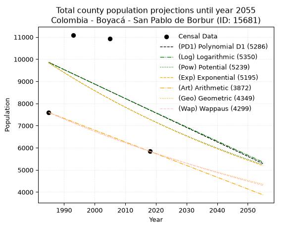
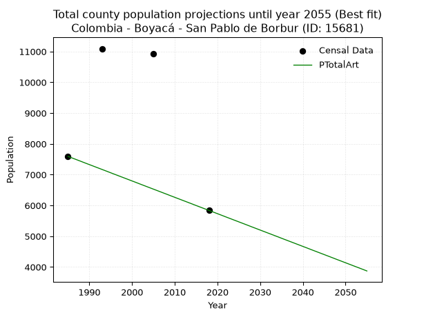
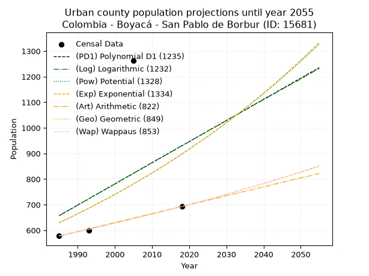
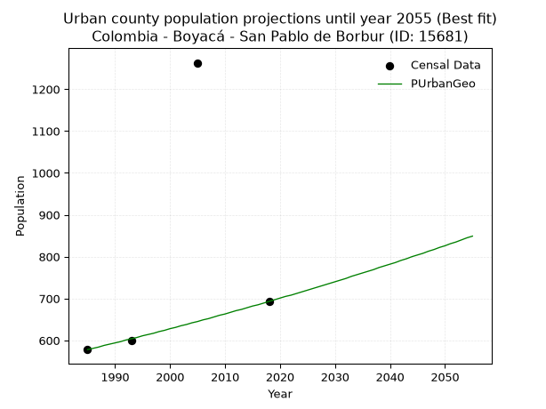
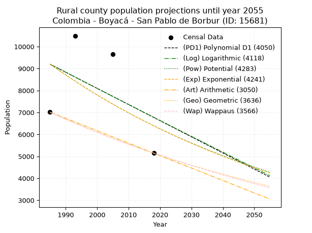
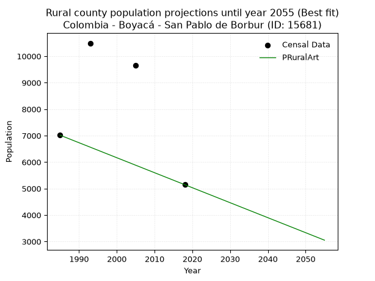

<div align="center">


</div>

# _“Population and Public Services Demand Projections (PPSD) until Year 2050 for Colombia - Boyacá - San Pablo de Borbur (ID: 15681)”_
Keywords: `population` `public-service` `projection` `lineal` `polynomial` `logarithmic` `potential` `exponential` `arithmetic` `geometric` `wappaus` `dane` `colombia` `south-america`

PPSD are analytical estimates used by governments and planners to anticipate future changes in population size, age distribution, and the resulting community needs for utilities, healthcare, education, and infrastructure as sizing future water treatment facilities, electrical grids, and road networks based on spatial growth.

> **General running parameters**: • app_version: _v20260806_. • Python version: _3.14.7_. • Pandas version: _3.0.5_. • NumPy version: _2.5.1_. • Creates, save and include plots into reports (create_plot): _False_. • Projection until year: _2050_. • Process polynomial degree 2 and up: _False_. • Process Wappaus: _True_. • Process Wappaus: _True_. • Set negative values to zero: _True_. • Set infinite values to zero: _True_. • Drop dataset notes: _True_. 
<div align="center">

Dynamic map: [:earth_americas:Google](http://maps.google.com/maps?q=5.650742714,-74.0699629) [:earth_americas:OSM](https://www.openstreetmap.org/#map=18/5.650742714/-74.0699629&layers=P) [:earth_americas:Bing](https://www.bing.com/maps?cp=5.650742714~-74.0699629&lvl=18) [:earth_americas:Apple](https://maps.apple.com/frame?center=5.650742714%2C-74.0699629&span=0.003%2C0.006)

</div>


<div align="center">

```geojson
{
  "type": "Feature",
  "geometry": {
    "type": "Point", 
    "coordinates": [-74.0699629, 5.650742714]
  }, 
  "properties": {
    "Name": "Colombia - Boyacá - San Pablo de Borbur (ID: 15681)"
  }
}
```

</div>


## 0. Census Data (4 records)

Census data are official statistics collected by a government about the people and housing in a country. They usually include counts of total population, age, sex, race, income, education, and jobs.

📅Global census file: [Population.xlsx](../data/Population.xlsx)

| Source   |   Year |   CountryID | CountryName   |   StateID | StateName   |   CountyID | CountyName          |   PTotal |   PUrban |   PRural |
|:---------|-------:|------------:|:--------------|----------:|:------------|-----------:|:--------------------|---------:|---------:|---------:|
| DANE     |   1985 |          57 | Colombia      |        15 | Boyacá      |      15681 | San Pablo de Borbur |     7593 |      578 |     7015 |
| DANE     |   1993 |          57 | Colombia      |        15 | Boyacá      |      15681 | San Pablo de Borbur |    11092 |      599 |    10493 |
| DANE     |   2005 |          57 | Colombia      |        15 | Boyacá      |      15681 | San Pablo de Borbur |    10924 |     1263 |     9661 |
| DANE     |   2018 |          57 | Colombia      |        15 | Boyacá      |      15681 | San Pablo de Borbur |     5839 |      693 |     5146 |

> 🔥Some records could had specific notes about the registered values or the corresponding urban or rural distribution.

## 1. Total

### 1.1. Coefficients and Parameters

* (PD1) Polynomial Deg 1: -65.32155760738343, 139521.4456041687 (lineal)
* (Log) Logarithmic: -129971.38014227874, 996775.5019867357
* (Pow) Potential: -18.17302325218336, 63.92306380288095
* (Exp) Exponential: -0.009124577607358967, 722826314129.9287
* (Art) Arithmetic: Year diff. 2018 - 1985 = 33, Population diff. 5839 - 7593 = -1754, Annual growth = -53.15151515151515
* (Geo) Geometric: Year diff. 2018 - 1985 = 33, Population diff. 5839 - 7593 = -1754, Annual growth % = -0.00792801891831163
* (Wap) Wappaus: i = -0.7914162470445972, Condition values only valid for < 200)

<sub>
Wappaus condition values: ['-0.00', '-0.79', '-1.58', '-2.37', '-3.17', '-3.96', '-4.75', '-5.54', '-6.33', '-7.12', '-7.91', '-8.71', '-9.50', '-10.29', '-11.08', '-11.87', '-12.66', '-13.45', '-14.25', '-15.04', '-15.83', '-16.62', '-17.41', '-18.20', '-18.99', '-19.79', '-20.58', '-21.37', '-22.16', '-22.95', '-23.74', '-24.53', '-25.33', '-26.12', '-26.91', '-27.70', '-28.49', '-29.28', '-30.07', '-30.87', '-31.66', '-32.45', '-33.24', '-34.03', '-34.82', '-35.61', '-36.41', '-37.20', '-37.99', '-38.78', '-39.57', '-40.36', '-41.15', '-41.95', '-42.74', '-43.53', '-44.32', '-45.11', '-45.90', '-46.69', '-47.48', '-48.28', '-49.07', '-49.86', '-50.65', '-51.44']
</sub>


### 1.2. Projected Dataset

|   Year |   CountyID |   PTotalPD1 |   PTotalLog |   PTotalPow |   PTotalExp |   PTotalArt |   PTotalGeo |   PTotalWap |
|-------:|-----------:|------------:|------------:|------------:|------------:|------------:|------------:|------------:|
|   1985 |      15681 |        9858 |        9854 |        9835 |        9839 |        7593 |        7593 |        7593 |
|   1986 |      15681 |        9793 |        9789 |        9746 |        9750 |        7540 |        7533 |        7533 |
|   1987 |      15681 |        9728 |        9723 |        9657 |        9661 |        7487 |        7473 |        7474 |
|   1988 |      15681 |        9662 |        9658 |        9569 |        9574 |        7434 |        7414 |        7415 |
|   1989 |      15681 |        9597 |        9593 |        9482 |        9487 |        7380 |        7355 |        7356 |
|   1990 |      15681 |        9532 |        9527 |        9396 |        9401 |        7327 |        7297 |        7298 |
|   1991 |      15681 |        9466 |        9462 |        9310 |        9315 |        7274 |        7239 |        7241 |
|   1992 |      15681 |        9401 |        9397 |        9226 |        9231 |        7221 |        7182 |        7184 |
|   1993 |      15681 |        9336 |        9331 |        9142 |        9147 |        7168 |        7125 |        7127 |
|   1994 |      15681 |        9270 |        9266 |        9059 |        9064 |        7115 |        7068 |        7071 |
|   1995 |      15681 |        9205 |        9201 |        8977 |        8981 |        7061 |        7012 |        7015 |
|   1996 |      15681 |        9140 |        9136 |        8895 |        8900 |        7008 |        6956 |        6960 |
|   1997 |      15681 |        9074 |        9071 |        8815 |        8819 |        6955 |        6901 |        6905 |
|   1998 |      15681 |        9009 |        9006 |        8735 |        8739 |        6902 |        6847 |        6850 |
|   1999 |      15681 |        8944 |        8941 |        8656 |        8659 |        6849 |        6792 |        6796 |
|   2000 |      15681 |        8878 |        8876 |        8578 |        8581 |        6796 |        6738 |        6742 |
|   2001 |      15681 |        8813 |        8811 |        8500 |        8503 |        6743 |        6685 |        6689 |
|   2002 |      15681 |        8748 |        8746 |        8423 |        8426 |        6689 |        6632 |        6636 |
|   2003 |      15681 |        8682 |        8681 |        8347 |        8349 |        6636 |        6579 |        6583 |
|   2004 |      15681 |        8617 |        8616 |        8272 |        8273 |        6583 |        6527 |        6531 |
|   2005 |      15681 |        8552 |        8551 |        8197 |        8198 |        6530 |        6476 |        6479 |
|   2006 |      15681 |        8486 |        8486 |        8123 |        8124 |        6477 |        6424 |        6428 |
|   2007 |      15681 |        8421 |        8422 |        8050 |        8050 |        6424 |        6373 |        6377 |
|   2008 |      15681 |        8356 |        8357 |        7977 |        7977 |        6371 |        6323 |        6326 |
|   2009 |      15681 |        8290 |        8292 |        7906 |        7904 |        6317 |        6273 |        6276 |
|   2010 |      15681 |        8225 |        8227 |        7834 |        7832 |        6264 |        6223 |        6226 |
|   2011 |      15681 |        8160 |        8163 |        7764 |        7761 |        6211 |        6174 |        6176 |
|   2012 |      15681 |        8094 |        8098 |        7694 |        7691 |        6158 |        6125 |        6127 |
|   2013 |      15681 |        8029 |        8034 |        7625 |        7621 |        6105 |        6076 |        6078 |
|   2014 |      15681 |        7964 |        7969 |        7556 |        7552 |        6052 |        6028 |        6030 |
|   2015 |      15681 |        7899 |        7905 |        7489 |        7483 |        5998 |        5980 |        5982 |
|   2016 |      15681 |        7833 |        7840 |        7421 |        7415 |        5945 |        5933 |        5934 |
|   2017 |      15681 |        7768 |        7776 |        7355 |        7348 |        5892 |        5886 |        5886 |
|   2018 |      15681 |        7703 |        7711 |        7289 |        7281 |        5839 |        5839 |        5839 |
|   2019 |      15681 |        7637 |        7647 |        7223 |        7215 |        5786 |        5793 |        5792 |
|   2020 |      15681 |        7572 |        7582 |        7159 |        7149 |        5733 |        5747 |        5746 |
|   2021 |      15681 |        7507 |        7518 |        7095 |        7084 |        5680 |        5701 |        5699 |
|   2022 |      15681 |        7441 |        7454 |        7031 |        7020 |        5626 |        5656 |        5654 |
|   2023 |      15681 |        7376 |        7390 |        6968 |        6956 |        5573 |        5611 |        5608 |
|   2024 |      15681 |        7311 |        7325 |        6906 |        6893 |        5520 |        5567 |        5563 |
|   2025 |      15681 |        7245 |        7261 |        6844 |        6831 |        5467 |        5523 |        5518 |
|   2026 |      15681 |        7180 |        7197 |        6783 |        6769 |        5414 |        5479 |        5473 |
|   2027 |      15681 |        7115 |        7133 |        6723 |        6707 |        5361 |        5435 |        5429 |
|   2028 |      15681 |        7049 |        7069 |        6663 |        6646 |        5307 |        5392 |        5385 |
|   2029 |      15681 |        6984 |        7005 |        6603 |        6586 |        5254 |        5350 |        5341 |
|   2030 |      15681 |        6919 |        6941 |        6544 |        6526 |        5201 |        5307 |        5298 |
|   2031 |      15681 |        6853 |        6877 |        6486 |        6467 |        5148 |        5265 |        5254 |
|   2032 |      15681 |        6788 |        6813 |        6428 |        6408 |        5095 |        5223 |        5212 |
|   2033 |      15681 |        6723 |        6749 |        6371 |        6350 |        5042 |        5182 |        5169 |
|   2034 |      15681 |        6657 |        6685 |        6314 |        6292 |        4989 |        5141 |        5127 |
|   2035 |      15681 |        6592 |        6621 |        6258 |        6235 |        4935 |        5100 |        5085 |
|   2036 |      15681 |        6527 |        6557 |        6203 |        6178 |        4882 |        5060 |        5043 |
|   2037 |      15681 |        6461 |        6493 |        6147 |        6122 |        4829 |        5019 |        5001 |
|   2038 |      15681 |        6396 |        6429 |        6093 |        6067 |        4776 |        4980 |        4960 |
|   2039 |      15681 |        6331 |        6366 |        6039 |        6011 |        4723 |        4940 |        4919 |
|   2040 |      15681 |        6265 |        6302 |        5985 |        5957 |        4670 |        4901 |        4879 |
|   2041 |      15681 |        6200 |        6238 |        5932 |        5903 |        4617 |        4862 |        4838 |
|   2042 |      15681 |        6135 |        6175 |        5880 |        5849 |        4563 |        4824 |        4798 |
|   2043 |      15681 |        6070 |        6111 |        5827 |        5796 |        4510 |        4785 |        4758 |
|   2044 |      15681 |        6004 |        6047 |        5776 |        5743 |        4457 |        4747 |        4719 |
|   2045 |      15681 |        5939 |        5984 |        5725 |        5691 |        4404 |        4710 |        4679 |
|   2046 |      15681 |        5874 |        5920 |        5674 |        5639 |        4351 |        4672 |        4640 |
|   2047 |      15681 |        5808 |        5857 |        5624 |        5588 |        4298 |        4635 |        4601 |
|   2048 |      15681 |        5743 |        5793 |        5574 |        5538 |        4244 |        4599 |        4563 |
|   2049 |      15681 |        5678 |        5730 |        5525 |        5487 |        4191 |        4562 |        4524 |
|   2050 |      15681 |        5612 |        5666 |        5476 |        5437 |        4138 |        4526 |        4486 |
<div align="center">

</img>

</div>


### 1.3. Best fit with absolute and relative error (%)

Relative error puts that difference into context by dividing the absolute error by the true value, creating a unitless ratio or percentage that shows the scale of the mistake.

Absolute and relative error

|   Year | Source   |   CountryID | CountryName   |   StateID | StateName   |   CountyID_x | CountyName          |   PTotal |   PUrban |   PRural |   CountyID_y |   PTotalPD1 |   PTotalLog |   PTotalPow |   PTotalExp |   PTotalArt |   PTotalGeo |   PTotalWap |   PTotalPD1AbsError |   PTotalLogAbsError |   PTotalPowAbsError |   PTotalExpAbsError |   PTotalArtAbsError |   PTotalGeoAbsError |   PTotalWapAbsError |   PTotalPD1RelError |   PTotalLogRelError |   PTotalPowRelError |   PTotalExpRelError |   PTotalArtRelError |   PTotalGeoRelError |   PTotalWapRelError |
|-------:|:---------|------------:|:--------------|----------:|:------------|-------------:|:--------------------|---------:|---------:|---------:|-------------:|------------:|------------:|------------:|------------:|------------:|------------:|------------:|--------------------:|--------------------:|--------------------:|--------------------:|--------------------:|--------------------:|--------------------:|--------------------:|--------------------:|--------------------:|--------------------:|--------------------:|--------------------:|--------------------:|
|   1985 | DANE     |          57 | Colombia      |        15 | Boyacá      |        15681 | San Pablo de Borbur |     7593 |      578 |     7015 |        15681 |        9858 |        9854 |        9835 |        9839 |        7593 |        7593 |        7593 |                2265 |                2261 |                2242 |                2246 |                   0 |                   0 |                   0 |             29.8301 |             29.7774 |             29.5272 |             29.5799 |              0      |              0      |              0      |
|   1993 | DANE     |          57 | Colombia      |        15 | Boyacá      |        15681 | San Pablo de Borbur |    11092 |      599 |    10493 |        15681 |        9336 |        9331 |        9142 |        9147 |        7168 |        7125 |        7127 |                1756 |                1761 |                1950 |                1945 |                3924 |                3967 |                3965 |             15.8312 |             15.8763 |             17.5802 |             17.5352 |             35.3768 |             35.7645 |             35.7465 |
|   2005 | DANE     |          57 | Colombia      |        15 | Boyacá      |        15681 | San Pablo de Borbur |    10924 |     1263 |     9661 |        15681 |        8552 |        8551 |        8197 |        8198 |        6530 |        6476 |        6479 |                2372 |                2373 |                2727 |                2726 |                4394 |                4448 |                4445 |             21.7137 |             21.7228 |             24.9634 |             24.9542 |             40.2234 |             40.7177 |             40.6902 |
|   2018 | DANE     |          57 | Colombia      |        15 | Boyacá      |        15681 | San Pablo de Borbur |     5839 |      693 |     5146 |        15681 |        7703 |        7711 |        7289 |        7281 |        5839 |        5839 |        5839 |                1864 |                1872 |                1450 |                1442 |                   0 |                   0 |                   0 |             31.9233 |             32.0603 |             24.833  |             24.696  |              0      |              0      |              0      |

Relative error mean

| Method    |   RelError | Best   |
|:----------|-----------:|:-------|
| PTotalPD1 |    24.8246 |        |
| PTotalLog |    24.8592 |        |
| PTotalPow |    24.226  |        |
| PTotalExp |    24.1913 |        |
| PTotalArt |    18.9001 | True   |
| PTotalGeo |    19.1206 |        |
| PTotalWap |    19.1092 |        |

💙Best method: _**PTotalArt**_
<div align="center">

</img>

</div>


### 1.4. Fresh water supply demand in liters per capita per day (lpcd)

The fresh water supply demand typically ranges from 100 to 300 liters per capita per day (lpcd) for standard domestic and municipal planning, though absolute survival minimums set by the World Health Organization are as low as 7.5 to 20 liters per day, and total consumption in high-income nations can exceed 400 liters.

> `CZ`: Level in meters above the sea level (masl)<br> `WS`: Fresh water supply demand in liters per capita per day (lpcd or l/h/d)<br> `WSAll`: Zonal fresh water supply demand in liters per second (l/s)<br> `A`: Zonal area in square meters<br> `DP`: Population density (people/hectare)

Reference values (RAS Colombia)

|    CZ |   WS |
|------:|-----:|
|  1000 |  120 |
|  2000 |  130 |
| 99999 |  140 |

County shapefile geometry properties and water supply values

|   CountyID |      ATotal |   CZTotal |   WSTotal |
|-----------:|------------:|----------:|----------:|
|      15681 | 1.95665e+08 |   991.436 |       120 |

Projected values for best method: PTotalArt

|   CountyID |   Year |   PTotalArt |   DPTotal |   WSTotal |   WSTotalAll |
|-----------:|-------:|------------:|----------:|----------:|-------------:|
|      15681 |   1985 |        7593 |      0.39 |       120 |     10.5458  |
|      15681 |   1986 |        7540 |      0.39 |       120 |     10.4722  |
|      15681 |   1987 |        7487 |      0.38 |       120 |     10.3986  |
|      15681 |   1988 |        7434 |      0.38 |       120 |     10.325   |
|      15681 |   1989 |        7380 |      0.38 |       120 |     10.25    |
|      15681 |   1990 |        7327 |      0.37 |       120 |     10.1764  |
|      15681 |   1991 |        7274 |      0.37 |       120 |     10.1028  |
|      15681 |   1992 |        7221 |      0.37 |       120 |     10.0292  |
|      15681 |   1993 |        7168 |      0.37 |       120 |      9.95556 |
|      15681 |   1994 |        7115 |      0.36 |       120 |      9.88194 |
|      15681 |   1995 |        7061 |      0.36 |       120 |      9.80694 |
|      15681 |   1996 |        7008 |      0.36 |       120 |      9.73333 |
|      15681 |   1997 |        6955 |      0.36 |       120 |      9.65972 |
|      15681 |   1998 |        6902 |      0.35 |       120 |      9.58611 |
|      15681 |   1999 |        6849 |      0.35 |       120 |      9.5125  |
|      15681 |   2000 |        6796 |      0.35 |       120 |      9.43889 |
|      15681 |   2001 |        6743 |      0.34 |       120 |      9.36528 |
|      15681 |   2002 |        6689 |      0.34 |       120 |      9.29028 |
|      15681 |   2003 |        6636 |      0.34 |       120 |      9.21667 |
|      15681 |   2004 |        6583 |      0.34 |       120 |      9.14306 |
|      15681 |   2005 |        6530 |      0.33 |       120 |      9.06944 |
|      15681 |   2006 |        6477 |      0.33 |       120 |      8.99583 |
|      15681 |   2007 |        6424 |      0.33 |       120 |      8.92222 |
|      15681 |   2008 |        6371 |      0.33 |       120 |      8.84861 |
|      15681 |   2009 |        6317 |      0.32 |       120 |      8.77361 |
|      15681 |   2010 |        6264 |      0.32 |       120 |      8.7     |
|      15681 |   2011 |        6211 |      0.32 |       120 |      8.62639 |
|      15681 |   2012 |        6158 |      0.31 |       120 |      8.55278 |
|      15681 |   2013 |        6105 |      0.31 |       120 |      8.47917 |
|      15681 |   2014 |        6052 |      0.31 |       120 |      8.40556 |
|      15681 |   2015 |        5998 |      0.31 |       120 |      8.33056 |
|      15681 |   2016 |        5945 |      0.3  |       120 |      8.25694 |
|      15681 |   2017 |        5892 |      0.3  |       120 |      8.18333 |
|      15681 |   2018 |        5839 |      0.3  |       120 |      8.10972 |
|      15681 |   2019 |        5786 |      0.3  |       120 |      8.03611 |
|      15681 |   2020 |        5733 |      0.29 |       120 |      7.9625  |
|      15681 |   2021 |        5680 |      0.29 |       120 |      7.88889 |
|      15681 |   2022 |        5626 |      0.29 |       120 |      7.81389 |
|      15681 |   2023 |        5573 |      0.28 |       120 |      7.74028 |
|      15681 |   2024 |        5520 |      0.28 |       120 |      7.66667 |
|      15681 |   2025 |        5467 |      0.28 |       120 |      7.59306 |
|      15681 |   2026 |        5414 |      0.28 |       120 |      7.51944 |
|      15681 |   2027 |        5361 |      0.27 |       120 |      7.44583 |
|      15681 |   2028 |        5307 |      0.27 |       120 |      7.37083 |
|      15681 |   2029 |        5254 |      0.27 |       120 |      7.29722 |
|      15681 |   2030 |        5201 |      0.27 |       120 |      7.22361 |
|      15681 |   2031 |        5148 |      0.26 |       120 |      7.15    |
|      15681 |   2032 |        5095 |      0.26 |       120 |      7.07639 |
|      15681 |   2033 |        5042 |      0.26 |       120 |      7.00278 |
|      15681 |   2034 |        4989 |      0.25 |       120 |      6.92917 |
|      15681 |   2035 |        4935 |      0.25 |       120 |      6.85417 |
|      15681 |   2036 |        4882 |      0.25 |       120 |      6.78056 |
|      15681 |   2037 |        4829 |      0.25 |       120 |      6.70694 |
|      15681 |   2038 |        4776 |      0.24 |       120 |      6.63333 |
|      15681 |   2039 |        4723 |      0.24 |       120 |      6.55972 |
|      15681 |   2040 |        4670 |      0.24 |       120 |      6.48611 |
|      15681 |   2041 |        4617 |      0.24 |       120 |      6.4125  |
|      15681 |   2042 |        4563 |      0.23 |       120 |      6.3375  |
|      15681 |   2043 |        4510 |      0.23 |       120 |      6.26389 |
|      15681 |   2044 |        4457 |      0.23 |       120 |      6.19028 |
|      15681 |   2045 |        4404 |      0.23 |       120 |      6.11667 |
|      15681 |   2046 |        4351 |      0.22 |       120 |      6.04306 |
|      15681 |   2047 |        4298 |      0.22 |       120 |      5.96944 |
|      15681 |   2048 |        4244 |      0.22 |       120 |      5.89444 |
|      15681 |   2049 |        4191 |      0.21 |       120 |      5.82083 |
|      15681 |   2050 |        4138 |      0.21 |       120 |      5.74722 |

## 2. Urban

### 2.1. Coefficients and Parameters

* (PD1) Polynomial Deg 1: 8.25812926535559, -15735.07306302752 (lineal)
* (Log) Logarithmic: 16601.478520902856, -125404.72127328227
* (Pow) Potential: 21.533069545928818, -68.2119227665472
* (Exp) Exponential: 0.010718665167715814, 3.623220590910456e-07
* (Art) Arithmetic: Year diff. 2018 - 1985 = 33, Population diff. 693 - 578 = 115, Annual growth = 3.484848484848485
* (Geo) Geometric: Year diff. 2018 - 1985 = 33, Population diff. 693 - 578 = 115, Annual growth % = 0.005513816058243748
* (Wap) Wappaus: i = 0.548363254893546, Condition values only valid for < 200)

<sub>
Wappaus condition values: ['0.00', '0.55', '1.10', '1.65', '2.19', '2.74', '3.29', '3.84', '4.39', '4.94', '5.48', '6.03', '6.58', '7.13', '7.68', '8.23', '8.77', '9.32', '9.87', '10.42', '10.97', '11.52', '12.06', '12.61', '13.16', '13.71', '14.26', '14.81', '15.35', '15.90', '16.45', '17.00', '17.55', '18.10', '18.64', '19.19', '19.74', '20.29', '20.84', '21.39', '21.93', '22.48', '23.03', '23.58', '24.13', '24.68', '25.22', '25.77', '26.32', '26.87', '27.42', '27.97', '28.51', '29.06', '29.61', '30.16', '30.71', '31.26', '31.81', '32.35', '32.90', '33.45', '34.00', '34.55', '35.10', '35.64']
</sub>


### 2.2. Projected Dataset

|   Year |   CountyID |   PUrbanPD1 |   PUrbanLog |   PUrbanPow |   PUrbanExp |   PUrbanArt |   PUrbanGeo |   PUrbanWap |
|-------:|-----------:|------------:|------------:|------------:|------------:|------------:|------------:|------------:|
|   1985 |      15681 |         657 |         657 |         629 |         630 |         578 |         578 |         578 |
|   1986 |      15681 |         666 |         665 |         636 |         637 |         581 |         581 |         581 |
|   1987 |      15681 |         674 |         673 |         643 |         644 |         585 |         584 |         584 |
|   1988 |      15681 |         682 |         682 |         650 |         651 |         588 |         588 |         588 |
|   1989 |      15681 |         690 |         690 |         657 |         658 |         592 |         591 |         591 |
|   1990 |      15681 |         699 |         698 |         665 |         665 |         595 |         594 |         594 |
|   1991 |      15681 |         707 |         707 |         672 |         672 |         599 |         597 |         597 |
|   1992 |      15681 |         715 |         715 |         679 |         679 |         602 |         601 |         601 |
|   1993 |      15681 |         723 |         723 |         686 |         686 |         606 |         604 |         604 |
|   1994 |      15681 |         732 |         732 |         694 |         694 |         609 |         607 |         607 |
|   1995 |      15681 |         740 |         740 |         701 |         701 |         613 |         611 |         611 |
|   1996 |      15681 |         748 |         748 |         709 |         709 |         616 |         614 |         614 |
|   1997 |      15681 |         756 |         757 |         717 |         717 |         620 |         617 |         617 |
|   1998 |      15681 |         765 |         765 |         724 |         724 |         623 |         621 |         621 |
|   1999 |      15681 |         773 |         773 |         732 |         732 |         627 |         624 |         624 |
|   2000 |      15681 |         781 |         781 |         740 |         740 |         630 |         628 |         628 |
|   2001 |      15681 |         789 |         790 |         748 |         748 |         634 |         631 |         631 |
|   2002 |      15681 |         798 |         798 |         756 |         756 |         637 |         635 |         635 |
|   2003 |      15681 |         806 |         806 |         765 |         764 |         641 |         638 |         638 |
|   2004 |      15681 |         814 |         815 |         773 |         772 |         644 |         642 |         642 |
|   2005 |      15681 |         822 |         823 |         781 |         781 |         648 |         645 |         645 |
|   2006 |      15681 |         831 |         831 |         790 |         789 |         651 |         649 |         649 |
|   2007 |      15681 |         839 |         840 |         798 |         798 |         655 |         652 |         652 |
|   2008 |      15681 |         847 |         848 |         807 |         806 |         658 |         656 |         656 |
|   2009 |      15681 |         856 |         856 |         815 |         815 |         662 |         660 |         659 |
|   2010 |      15681 |         864 |         864 |         824 |         824 |         665 |         663 |         663 |
|   2011 |      15681 |         872 |         873 |         833 |         833 |         669 |         667 |         667 |
|   2012 |      15681 |         880 |         881 |         842 |         842 |         672 |         671 |         670 |
|   2013 |      15681 |         889 |         889 |         851 |         851 |         676 |         674 |         674 |
|   2014 |      15681 |         897 |         897 |         860 |         860 |         679 |         678 |         678 |
|   2015 |      15681 |         905 |         906 |         869 |         869 |         683 |         682 |         682 |
|   2016 |      15681 |         913 |         914 |         879 |         878 |         686 |         685 |         685 |
|   2017 |      15681 |         922 |         922 |         888 |         888 |         690 |         689 |         689 |
|   2018 |      15681 |         930 |         930 |         898 |         897 |         693 |         693 |         693 |
|   2019 |      15681 |         938 |         938 |         907 |         907 |         696 |         697 |         697 |
|   2020 |      15681 |         946 |         947 |         917 |         917 |         700 |         701 |         701 |
|   2021 |      15681 |         955 |         955 |         927 |         927 |         703 |         705 |         705 |
|   2022 |      15681 |         963 |         963 |         937 |         937 |         707 |         708 |         709 |
|   2023 |      15681 |         971 |         971 |         947 |         947 |         710 |         712 |         712 |
|   2024 |      15681 |         979 |         980 |         957 |         957 |         714 |         716 |         716 |
|   2025 |      15681 |         988 |         988 |         967 |         967 |         717 |         720 |         720 |
|   2026 |      15681 |         996 |         996 |         978 |         978 |         721 |         724 |         724 |
|   2027 |      15681 |        1004 |        1004 |         988 |         988 |         724 |         728 |         728 |
|   2028 |      15681 |        1012 |        1012 |         999 |         999 |         728 |         732 |         733 |
|   2029 |      15681 |        1021 |        1020 |        1009 |        1010 |         731 |         736 |         737 |
|   2030 |      15681 |        1029 |        1029 |        1020 |        1021 |         735 |         740 |         741 |
|   2031 |      15681 |        1037 |        1037 |        1031 |        1032 |         738 |         744 |         745 |
|   2032 |      15681 |        1045 |        1045 |        1042 |        1043 |         742 |         748 |         749 |
|   2033 |      15681 |        1054 |        1053 |        1053 |        1054 |         745 |         753 |         753 |
|   2034 |      15681 |        1062 |        1061 |        1064 |        1065 |         749 |         757 |         757 |
|   2035 |      15681 |        1070 |        1070 |        1076 |        1077 |         752 |         761 |         762 |
|   2036 |      15681 |        1078 |        1078 |        1087 |        1088 |         756 |         765 |         766 |
|   2037 |      15681 |        1087 |        1086 |        1099 |        1100 |         759 |         769 |         770 |
|   2038 |      15681 |        1095 |        1094 |        1110 |        1112 |         763 |         774 |         775 |
|   2039 |      15681 |        1103 |        1102 |        1122 |        1124 |         766 |         778 |         779 |
|   2040 |      15681 |        1112 |        1110 |        1134 |        1136 |         770 |         782 |         783 |
|   2041 |      15681 |        1120 |        1118 |        1146 |        1148 |         773 |         786 |         788 |
|   2042 |      15681 |        1128 |        1127 |        1158 |        1161 |         777 |         791 |         792 |
|   2043 |      15681 |        1136 |        1135 |        1170 |        1173 |         780 |         795 |         797 |
|   2044 |      15681 |        1145 |        1143 |        1183 |        1186 |         784 |         800 |         801 |
|   2045 |      15681 |        1153 |        1151 |        1195 |        1199 |         787 |         804 |         806 |
|   2046 |      15681 |        1161 |        1159 |        1208 |        1212 |         791 |         808 |         810 |
|   2047 |      15681 |        1169 |        1167 |        1221 |        1225 |         794 |         813 |         815 |
|   2048 |      15681 |        1178 |        1175 |        1234 |        1238 |         798 |         817 |         819 |
|   2049 |      15681 |        1186 |        1183 |        1247 |        1251 |         801 |         822 |         824 |
|   2050 |      15681 |        1194 |        1191 |        1260 |        1265 |         805 |         826 |         829 |
<div align="center">

</img>

</div>


### 2.3. Best fit with absolute and relative error (%)

Relative error puts that difference into context by dividing the absolute error by the true value, creating a unitless ratio or percentage that shows the scale of the mistake.

Absolute and relative error

|   Year | Source   |   CountryID | CountryName   |   StateID | StateName   |   CountyID_x | CountyName          |   PTotal |   PUrban |   PRural |   CountyID_y |   PUrbanPD1 |   PUrbanLog |   PUrbanPow |   PUrbanExp |   PUrbanArt |   PUrbanGeo |   PUrbanWap |   PUrbanPD1AbsError |   PUrbanLogAbsError |   PUrbanPowAbsError |   PUrbanExpAbsError |   PUrbanArtAbsError |   PUrbanGeoAbsError |   PUrbanWapAbsError |   PUrbanPD1RelError |   PUrbanLogRelError |   PUrbanPowRelError |   PUrbanExpRelError |   PUrbanArtRelError |   PUrbanGeoRelError |   PUrbanWapRelError |
|-------:|:---------|------------:|:--------------|----------:|:------------|-------------:|:--------------------|---------:|---------:|---------:|-------------:|------------:|------------:|------------:|------------:|------------:|------------:|------------:|--------------------:|--------------------:|--------------------:|--------------------:|--------------------:|--------------------:|--------------------:|--------------------:|--------------------:|--------------------:|--------------------:|--------------------:|--------------------:|--------------------:|
|   1985 | DANE     |          57 | Colombia      |        15 | Boyacá      |        15681 | San Pablo de Borbur |     7593 |      578 |     7015 |        15681 |         657 |         657 |         629 |         630 |         578 |         578 |         578 |                  79 |                  79 |                  51 |                  52 |                   0 |                   0 |                   0 |             13.6678 |             13.6678 |             8.82353 |             8.99654 |             0       |            0        |            0        |
|   1993 | DANE     |          57 | Colombia      |        15 | Boyacá      |        15681 | San Pablo de Borbur |    11092 |      599 |    10493 |        15681 |         723 |         723 |         686 |         686 |         606 |         604 |         604 |                 124 |                 124 |                  87 |                  87 |                   7 |                   5 |                   5 |             20.7012 |             20.7012 |            14.5242  |            14.5242  |             1.16861 |            0.834725 |            0.834725 |
|   2005 | DANE     |          57 | Colombia      |        15 | Boyacá      |        15681 | San Pablo de Borbur |    10924 |     1263 |     9661 |        15681 |         822 |         823 |         781 |         781 |         648 |         645 |         645 |                 441 |                 440 |                 482 |                 482 |                 615 |                 618 |                 618 |             34.9169 |             34.8377 |            38.1631  |            38.1631  |            48.6936  |           48.9311   |           48.9311   |
|   2018 | DANE     |          57 | Colombia      |        15 | Boyacá      |        15681 | San Pablo de Borbur |     5839 |      693 |     5146 |        15681 |         930 |         930 |         898 |         897 |         693 |         693 |         693 |                 237 |                 237 |                 205 |                 204 |                   0 |                   0 |                   0 |             34.1991 |             34.1991 |            29.5815  |            29.4372  |             0       |            0        |            0        |

Relative error mean

| Method    |   RelError | Best   |
|:----------|-----------:|:-------|
| PUrbanPD1 |    25.8712 |        |
| PUrbanLog |    25.8515 |        |
| PUrbanPow |    22.7731 |        |
| PUrbanExp |    22.7803 |        |
| PUrbanArt |    12.4656 |        |
| PUrbanGeo |    12.4415 | True   |
| PUrbanWap |    12.4415 | True   |

💙Best method: _**PUrbanGeo**_
<div align="center">

</img>

</div>


### 2.4. Fresh water supply demand in liters per capita per day (lpcd)

The fresh water supply demand typically ranges from 100 to 300 liters per capita per day (lpcd) for standard domestic and municipal planning, though absolute survival minimums set by the World Health Organization are as low as 7.5 to 20 liters per day, and total consumption in high-income nations can exceed 400 liters.

> `CZ`: Level in meters above the sea level (masl)<br> `WS`: Fresh water supply demand in liters per capita per day (lpcd or l/h/d)<br> `WSAll`: Zonal fresh water supply demand in liters per second (l/s)<br> `A`: Zonal area in square meters<br> `DP`: Population density (people/hectare)

Reference values (RAS Colombia)

|    CZ |   WS |
|------:|-----:|
|  1000 |  120 |
|  2000 |  130 |
| 99999 |  140 |

County shapefile geometry properties and water supply values

|   CountyID |   AUrban |   CZUrban |   WSUrban |
|-----------:|---------:|----------:|----------:|
|      15681 |   142806 |   684.768 |       120 |

Projected values for best method: PUrbanGeo

|   CountyID |   Year |   PUrbanGeo |   DPUrban |   WSUrban |   WSUrbanAll |
|-----------:|-------:|------------:|----------:|----------:|-------------:|
|      15681 |   1985 |         578 |     40.47 |       120 |     0.802778 |
|      15681 |   1986 |         581 |     40.68 |       120 |     0.806944 |
|      15681 |   1987 |         584 |     40.89 |       120 |     0.811111 |
|      15681 |   1988 |         588 |     41.17 |       120 |     0.816667 |
|      15681 |   1989 |         591 |     41.38 |       120 |     0.820833 |
|      15681 |   1990 |         594 |     41.59 |       120 |     0.825    |
|      15681 |   1991 |         597 |     41.81 |       120 |     0.829167 |
|      15681 |   1992 |         601 |     42.09 |       120 |     0.834722 |
|      15681 |   1993 |         604 |     42.3  |       120 |     0.838889 |
|      15681 |   1994 |         607 |     42.51 |       120 |     0.843056 |
|      15681 |   1995 |         611 |     42.79 |       120 |     0.848611 |
|      15681 |   1996 |         614 |     43    |       120 |     0.852778 |
|      15681 |   1997 |         617 |     43.21 |       120 |     0.856944 |
|      15681 |   1998 |         621 |     43.49 |       120 |     0.8625   |
|      15681 |   1999 |         624 |     43.7  |       120 |     0.866667 |
|      15681 |   2000 |         628 |     43.98 |       120 |     0.872222 |
|      15681 |   2001 |         631 |     44.19 |       120 |     0.876389 |
|      15681 |   2002 |         635 |     44.47 |       120 |     0.881944 |
|      15681 |   2003 |         638 |     44.68 |       120 |     0.886111 |
|      15681 |   2004 |         642 |     44.96 |       120 |     0.891667 |
|      15681 |   2005 |         645 |     45.17 |       120 |     0.895833 |
|      15681 |   2006 |         649 |     45.45 |       120 |     0.901389 |
|      15681 |   2007 |         652 |     45.66 |       120 |     0.905556 |
|      15681 |   2008 |         656 |     45.94 |       120 |     0.911111 |
|      15681 |   2009 |         660 |     46.22 |       120 |     0.916667 |
|      15681 |   2010 |         663 |     46.43 |       120 |     0.920833 |
|      15681 |   2011 |         667 |     46.71 |       120 |     0.926389 |
|      15681 |   2012 |         671 |     46.99 |       120 |     0.931944 |
|      15681 |   2013 |         674 |     47.2  |       120 |     0.936111 |
|      15681 |   2014 |         678 |     47.48 |       120 |     0.941667 |
|      15681 |   2015 |         682 |     47.76 |       120 |     0.947222 |
|      15681 |   2016 |         685 |     47.97 |       120 |     0.951389 |
|      15681 |   2017 |         689 |     48.25 |       120 |     0.956944 |
|      15681 |   2018 |         693 |     48.53 |       120 |     0.9625   |
|      15681 |   2019 |         697 |     48.81 |       120 |     0.968056 |
|      15681 |   2020 |         701 |     49.09 |       120 |     0.973611 |
|      15681 |   2021 |         705 |     49.37 |       120 |     0.979167 |
|      15681 |   2022 |         708 |     49.58 |       120 |     0.983333 |
|      15681 |   2023 |         712 |     49.86 |       120 |     0.988889 |
|      15681 |   2024 |         716 |     50.14 |       120 |     0.994444 |
|      15681 |   2025 |         720 |     50.42 |       120 |     1        |
|      15681 |   2026 |         724 |     50.7  |       120 |     1.00556  |
|      15681 |   2027 |         728 |     50.98 |       120 |     1.01111  |
|      15681 |   2028 |         732 |     51.26 |       120 |     1.01667  |
|      15681 |   2029 |         736 |     51.54 |       120 |     1.02222  |
|      15681 |   2030 |         740 |     51.82 |       120 |     1.02778  |
|      15681 |   2031 |         744 |     52.1  |       120 |     1.03333  |
|      15681 |   2032 |         748 |     52.38 |       120 |     1.03889  |
|      15681 |   2033 |         753 |     52.73 |       120 |     1.04583  |
|      15681 |   2034 |         757 |     53.01 |       120 |     1.05139  |
|      15681 |   2035 |         761 |     53.29 |       120 |     1.05694  |
|      15681 |   2036 |         765 |     53.57 |       120 |     1.0625   |
|      15681 |   2037 |         769 |     53.85 |       120 |     1.06806  |
|      15681 |   2038 |         774 |     54.2  |       120 |     1.075    |
|      15681 |   2039 |         778 |     54.48 |       120 |     1.08056  |
|      15681 |   2040 |         782 |     54.76 |       120 |     1.08611  |
|      15681 |   2041 |         786 |     55.04 |       120 |     1.09167  |
|      15681 |   2042 |         791 |     55.39 |       120 |     1.09861  |
|      15681 |   2043 |         795 |     55.67 |       120 |     1.10417  |
|      15681 |   2044 |         800 |     56.02 |       120 |     1.11111  |
|      15681 |   2045 |         804 |     56.3  |       120 |     1.11667  |
|      15681 |   2046 |         808 |     56.58 |       120 |     1.12222  |
|      15681 |   2047 |         813 |     56.93 |       120 |     1.12917  |
|      15681 |   2048 |         817 |     57.21 |       120 |     1.13472  |
|      15681 |   2049 |         822 |     57.56 |       120 |     1.14167  |
|      15681 |   2050 |         826 |     57.84 |       120 |     1.14722  |

## 3. Rural

### 3.1. Coefficients and Parameters

* (PD1) Polynomial Deg 1: -73.57968687273903, 155256.51866719624 (lineal)
* (Log) Logarithmic: -146572.85866318157, 1122180.223260018
* (Pow) Potential: -22.08158169094509, 76.78383056939846
* (Exp) Exponential: -0.011077555372025746, 32651254755673.707
* (Art) Arithmetic: Year diff. 2018 - 1985 = 33, Population diff. 5146 - 7015 = -1869, Annual growth = -56.63636363636363
* (Geo) Geometric: Year diff. 2018 - 1985 = 33, Population diff. 5146 - 7015 = -1869, Annual growth % = -0.009344880833314084
* (Wap) Wappaus: i = -0.9314425398629, Condition values only valid for < 200)

<sub>
Wappaus condition values: ['-0.00', '-0.93', '-1.86', '-2.79', '-3.73', '-4.66', '-5.59', '-6.52', '-7.45', '-8.38', '-9.31', '-10.25', '-11.18', '-12.11', '-13.04', '-13.97', '-14.90', '-15.83', '-16.77', '-17.70', '-18.63', '-19.56', '-20.49', '-21.42', '-22.35', '-23.29', '-24.22', '-25.15', '-26.08', '-27.01', '-27.94', '-28.87', '-29.81', '-30.74', '-31.67', '-32.60', '-33.53', '-34.46', '-35.39', '-36.33', '-37.26', '-38.19', '-39.12', '-40.05', '-40.98', '-41.91', '-42.85', '-43.78', '-44.71', '-45.64', '-46.57', '-47.50', '-48.44', '-49.37', '-50.30', '-51.23', '-52.16', '-53.09', '-54.02', '-54.96', '-55.89', '-56.82', '-57.75', '-58.68', '-59.61', '-60.54']
</sub>


### 3.2. Projected Dataset

|   Year |   CountyID |   PRuralPD1 |   PRuralLog |   PRuralPow |   PRuralExp |   PRuralArt |   PRuralGeo |   PRuralWap |
|-------:|-----------:|------------:|------------:|------------:|------------:|------------:|------------:|------------:|
|   1985 |      15681 |        9201 |        9198 |        9206 |        9209 |        7015 |        7015 |        7015 |
|   1986 |      15681 |        9127 |        9124 |        9104 |        9108 |        6958 |        6949 |        6950 |
|   1987 |      15681 |        9054 |        9050 |        9003 |        9007 |        6902 |        6885 |        6886 |
|   1988 |      15681 |        8980 |        8976 |        8904 |        8908 |        6845 |        6820 |        6822 |
|   1989 |      15681 |        8907 |        8903 |        8806 |        8810 |        6788 |        6756 |        6758 |
|   1990 |      15681 |        8833 |        8829 |        8708 |        8713 |        6732 |        6693 |        6696 |
|   1991 |      15681 |        8759 |        8755 |        8612 |        8617 |        6675 |        6631 |        6634 |
|   1992 |      15681 |        8686 |        8682 |        8517 |        8522 |        6619 |        6569 |        6572 |
|   1993 |      15681 |        8612 |        8608 |        8423 |        8428 |        6562 |        6507 |        6511 |
|   1994 |      15681 |        8539 |        8535 |        8331 |        8335 |        6505 |        6447 |        6451 |
|   1995 |      15681 |        8465 |        8461 |        8239 |        8244 |        6449 |        6386 |        6391 |
|   1996 |      15681 |        8391 |        8388 |        8148 |        8153 |        6392 |        6327 |        6331 |
|   1997 |      15681 |        8318 |        8314 |        8059 |        8063 |        6335 |        6268 |        6272 |
|   1998 |      15681 |        8244 |        8241 |        7970 |        7974 |        6279 |        6209 |        6214 |
|   1999 |      15681 |        8171 |        8168 |        7882 |        7886 |        6222 |        6151 |        6156 |
|   2000 |      15681 |        8097 |        8094 |        7796 |        7799 |        6165 |        6093 |        6099 |
|   2001 |      15681 |        8024 |        8021 |        7710 |        7713 |        6109 |        6037 |        6042 |
|   2002 |      15681 |        7950 |        7948 |        7626 |        7628 |        6052 |        5980 |        5986 |
|   2003 |      15681 |        7876 |        7875 |        7542 |        7544 |        5996 |        5924 |        5930 |
|   2004 |      15681 |        7803 |        7801 |        7459 |        7461 |        5939 |        5869 |        5874 |
|   2005 |      15681 |        7729 |        7728 |        7378 |        7379 |        5882 |        5814 |        5820 |
|   2006 |      15681 |        7656 |        7655 |        7297 |        7298 |        5826 |        5760 |        5765 |
|   2007 |      15681 |        7582 |        7582 |        7217 |        7217 |        5769 |        5706 |        5711 |
|   2008 |      15681 |        7509 |        7509 |        7138 |        7138 |        5712 |        5653 |        5658 |
|   2009 |      15681 |        7435 |        7436 |        7060 |        7059 |        5656 |        5600 |        5604 |
|   2010 |      15681 |        7361 |        7363 |        6983 |        6981 |        5599 |        5547 |        5552 |
|   2011 |      15681 |        7288 |        7290 |        6907 |        6905 |        5542 |        5496 |        5500 |
|   2012 |      15681 |        7214 |        7217 |        6831 |        6829 |        5486 |        5444 |        5448 |
|   2013 |      15681 |        7141 |        7145 |        6757 |        6753 |        5429 |        5393 |        5397 |
|   2014 |      15681 |        7067 |        7072 |        6683 |        6679 |        5373 |        5343 |        5346 |
|   2015 |      15681 |        6993 |        6999 |        6610 |        6605 |        5316 |        5293 |        5295 |
|   2016 |      15681 |        6920 |        6926 |        6538 |        6533 |        5259 |        5244 |        5245 |
|   2017 |      15681 |        6846 |        6854 |        6467 |        6461 |        5203 |        5195 |        5195 |
|   2018 |      15681 |        6773 |        6781 |        6397 |        6389 |        5146 |        5146 |        5146 |
|   2019 |      15681 |        6699 |        6708 |        6327 |        6319 |        5089 |        5098 |        5097 |
|   2020 |      15681 |        6626 |        6636 |        6258 |        6249 |        5033 |        5050 |        5049 |
|   2021 |      15681 |        6552 |        6563 |        6190 |        6181 |        4976 |        5003 |        5000 |
|   2022 |      15681 |        6478 |        6491 |        6123 |        6112 |        4919 |        4956 |        4953 |
|   2023 |      15681 |        6405 |        6418 |        6056 |        6045 |        4863 |        4910 |        4905 |
|   2024 |      15681 |        6331 |        6346 |        5991 |        5979 |        4806 |        4864 |        4858 |
|   2025 |      15681 |        6258 |        6273 |        5926 |        5913 |        4750 |        4819 |        4812 |
|   2026 |      15681 |        6184 |        6201 |        5861 |        5848 |        4693 |        4774 |        4766 |
|   2027 |      15681 |        6110 |        6129 |        5798 |        5783 |        4636 |        4729 |        4720 |
|   2028 |      15681 |        6037 |        6056 |        5735 |        5719 |        4580 |        4685 |        4674 |
|   2029 |      15681 |        5963 |        5984 |        5673 |        5656 |        4523 |        4641 |        4629 |
|   2030 |      15681 |        5890 |        5912 |        5612 |        5594 |        4466 |        4598 |        4584 |
|   2031 |      15681 |        5816 |        5840 |        5551 |        5532 |        4410 |        4555 |        4540 |
|   2032 |      15681 |        5743 |        5768 |        5491 |        5472 |        4353 |        4512 |        4495 |
|   2033 |      15681 |        5669 |        5696 |        5432 |        5411 |        4296 |        4470 |        4452 |
|   2034 |      15681 |        5595 |        5623 |        5373 |        5352 |        4240 |        4428 |        4408 |
|   2035 |      15681 |        5522 |        5551 |        5315 |        5293 |        4183 |        4387 |        4365 |
|   2036 |      15681 |        5448 |        5479 |        5258 |        5234 |        4127 |        4346 |        4322 |
|   2037 |      15681 |        5375 |        5407 |        5201 |        5177 |        4070 |        4305 |        4280 |
|   2038 |      15681 |        5301 |        5335 |        5145 |        5120 |        4013 |        4265 |        4238 |
|   2039 |      15681 |        5228 |        5264 |        5089 |        5063 |        3957 |        4225 |        4196 |
|   2040 |      15681 |        5154 |        5192 |        5035 |        5007 |        3900 |        4186 |        4154 |
|   2041 |      15681 |        5080 |        5120 |        4980 |        4952 |        3843 |        4147 |        4113 |
|   2042 |      15681 |        5007 |        5048 |        4927 |        4898 |        3787 |        4108 |        4072 |
|   2043 |      15681 |        4933 |        4976 |        4874 |        4844 |        3730 |        4069 |        4031 |
|   2044 |      15681 |        4860 |        4905 |        4821 |        4790 |        3673 |        4031 |        3991 |
|   2045 |      15681 |        4786 |        4833 |        4770 |        4738 |        3617 |        3994 |        3951 |
|   2046 |      15681 |        4712 |        4761 |        4718 |        4685 |        3560 |        3956 |        3911 |
|   2047 |      15681 |        4639 |        4690 |        4668 |        4634 |        3504 |        3919 |        3872 |
|   2048 |      15681 |        4565 |        4618 |        4618 |        4583 |        3447 |        3883 |        3832 |
|   2049 |      15681 |        4492 |        4546 |        4568 |        4532 |        3390 |        3847 |        3793 |
|   2050 |      15681 |        4418 |        4475 |        4519 |        4482 |        3334 |        3811 |        3755 |
<div align="center">

</img>

</div>


### 3.3. Best fit with absolute and relative error (%)

Relative error puts that difference into context by dividing the absolute error by the true value, creating a unitless ratio or percentage that shows the scale of the mistake.

Absolute and relative error

|   Year | Source   |   CountryID | CountryName   |   StateID | StateName   |   CountyID_x | CountyName          |   PTotal |   PUrban |   PRural |   CountyID_y |   PRuralPD1 |   PRuralLog |   PRuralPow |   PRuralExp |   PRuralArt |   PRuralGeo |   PRuralWap |   PRuralPD1AbsError |   PRuralLogAbsError |   PRuralPowAbsError |   PRuralExpAbsError |   PRuralArtAbsError |   PRuralGeoAbsError |   PRuralWapAbsError |   PRuralPD1RelError |   PRuralLogRelError |   PRuralPowRelError |   PRuralExpRelError |   PRuralArtRelError |   PRuralGeoRelError |   PRuralWapRelError |
|-------:|:---------|------------:|:--------------|----------:|:------------|-------------:|:--------------------|---------:|---------:|---------:|-------------:|------------:|------------:|------------:|------------:|------------:|------------:|------------:|--------------------:|--------------------:|--------------------:|--------------------:|--------------------:|--------------------:|--------------------:|--------------------:|--------------------:|--------------------:|--------------------:|--------------------:|--------------------:|--------------------:|
|   1985 | DANE     |          57 | Colombia      |        15 | Boyacá      |        15681 | San Pablo de Borbur |     7593 |      578 |     7015 |        15681 |        9201 |        9198 |        9206 |        9209 |        7015 |        7015 |        7015 |                2186 |                2183 |                2191 |                2194 |                   0 |                   0 |                   0 |             31.1618 |             31.119  |             31.2331 |             31.2758 |              0      |              0      |              0      |
|   1993 | DANE     |          57 | Colombia      |        15 | Boyacá      |        15681 | San Pablo de Borbur |    11092 |      599 |    10493 |        15681 |        8612 |        8608 |        8423 |        8428 |        6562 |        6507 |        6511 |                1881 |                1885 |                2070 |                2065 |                3931 |                3986 |                3982 |             17.9262 |             17.9644 |             19.7274 |             19.6798 |             37.4631 |             37.9872 |             37.9491 |
|   2005 | DANE     |          57 | Colombia      |        15 | Boyacá      |        15681 | San Pablo de Borbur |    10924 |     1263 |     9661 |        15681 |        7729 |        7728 |        7378 |        7379 |        5882 |        5814 |        5820 |                1932 |                1933 |                2283 |                2282 |                3779 |                3847 |                3841 |             19.9979 |             20.0083 |             23.6311 |             23.6207 |             39.116  |             39.8199 |             39.7578 |
|   2018 | DANE     |          57 | Colombia      |        15 | Boyacá      |        15681 | San Pablo de Borbur |     5839 |      693 |     5146 |        15681 |        6773 |        6781 |        6397 |        6389 |        5146 |        5146 |        5146 |                1627 |                1635 |                1251 |                1243 |                   0 |                   0 |                   0 |             31.6168 |             31.7723 |             24.3101 |             24.1547 |              0      |              0      |              0      |

Relative error mean

| Method    |   RelError | Best   |
|:----------|-----------:|:-------|
| PRuralPD1 |    25.1757 |        |
| PRuralLog |    25.216  |        |
| PRuralPow |    24.7254 |        |
| PRuralExp |    24.6828 |        |
| PRuralArt |    19.1448 | True   |
| PRuralGeo |    19.4518 |        |
| PRuralWap |    19.4267 |        |

💙Best method: _**PRuralArt**_
<div align="center">

</img>

</div>


### 3.4. Fresh water supply demand in liters per capita per day (lpcd)

The fresh water supply demand typically ranges from 100 to 300 liters per capita per day (lpcd) for standard domestic and municipal planning, though absolute survival minimums set by the World Health Organization are as low as 7.5 to 20 liters per day, and total consumption in high-income nations can exceed 400 liters.

> `CZ`: Level in meters above the sea level (masl)<br> `WS`: Fresh water supply demand in liters per capita per day (lpcd or l/h/d)<br> `WSAll`: Zonal fresh water supply demand in liters per second (l/s)<br> `A`: Zonal area in square meters<br> `DP`: Population density (people/hectare)

Reference values (RAS Colombia)

|    CZ |   WS |
|------:|-----:|
|  1000 |  120 |
|  2000 |  130 |
| 99999 |  140 |

County shapefile geometry properties and water supply values

|   CountyID |      ARural |   CZRural |   WSRural |
|-----------:|------------:|----------:|----------:|
|      15681 | 1.95522e+08 |   991.663 |       120 |

Projected values for best method: PRuralArt

|   CountyID |   Year |   PRuralArt |   DPRural |   WSRural |   WSRuralAll |
|-----------:|-------:|------------:|----------:|----------:|-------------:|
|      15681 |   1985 |        7015 |      0.36 |       120 |      9.74306 |
|      15681 |   1986 |        6958 |      0.36 |       120 |      9.66389 |
|      15681 |   1987 |        6902 |      0.35 |       120 |      9.58611 |
|      15681 |   1988 |        6845 |      0.35 |       120 |      9.50694 |
|      15681 |   1989 |        6788 |      0.35 |       120 |      9.42778 |
|      15681 |   1990 |        6732 |      0.34 |       120 |      9.35    |
|      15681 |   1991 |        6675 |      0.34 |       120 |      9.27083 |
|      15681 |   1992 |        6619 |      0.34 |       120 |      9.19306 |
|      15681 |   1993 |        6562 |      0.34 |       120 |      9.11389 |
|      15681 |   1994 |        6505 |      0.33 |       120 |      9.03472 |
|      15681 |   1995 |        6449 |      0.33 |       120 |      8.95694 |
|      15681 |   1996 |        6392 |      0.33 |       120 |      8.87778 |
|      15681 |   1997 |        6335 |      0.32 |       120 |      8.79861 |
|      15681 |   1998 |        6279 |      0.32 |       120 |      8.72083 |
|      15681 |   1999 |        6222 |      0.32 |       120 |      8.64167 |
|      15681 |   2000 |        6165 |      0.32 |       120 |      8.5625  |
|      15681 |   2001 |        6109 |      0.31 |       120 |      8.48472 |
|      15681 |   2002 |        6052 |      0.31 |       120 |      8.40556 |
|      15681 |   2003 |        5996 |      0.31 |       120 |      8.32778 |
|      15681 |   2004 |        5939 |      0.3  |       120 |      8.24861 |
|      15681 |   2005 |        5882 |      0.3  |       120 |      8.16944 |
|      15681 |   2006 |        5826 |      0.3  |       120 |      8.09167 |
|      15681 |   2007 |        5769 |      0.3  |       120 |      8.0125  |
|      15681 |   2008 |        5712 |      0.29 |       120 |      7.93333 |
|      15681 |   2009 |        5656 |      0.29 |       120 |      7.85556 |
|      15681 |   2010 |        5599 |      0.29 |       120 |      7.77639 |
|      15681 |   2011 |        5542 |      0.28 |       120 |      7.69722 |
|      15681 |   2012 |        5486 |      0.28 |       120 |      7.61944 |
|      15681 |   2013 |        5429 |      0.28 |       120 |      7.54028 |
|      15681 |   2014 |        5373 |      0.27 |       120 |      7.4625  |
|      15681 |   2015 |        5316 |      0.27 |       120 |      7.38333 |
|      15681 |   2016 |        5259 |      0.27 |       120 |      7.30417 |
|      15681 |   2017 |        5203 |      0.27 |       120 |      7.22639 |
|      15681 |   2018 |        5146 |      0.26 |       120 |      7.14722 |
|      15681 |   2019 |        5089 |      0.26 |       120 |      7.06806 |
|      15681 |   2020 |        5033 |      0.26 |       120 |      6.99028 |
|      15681 |   2021 |        4976 |      0.25 |       120 |      6.91111 |
|      15681 |   2022 |        4919 |      0.25 |       120 |      6.83194 |
|      15681 |   2023 |        4863 |      0.25 |       120 |      6.75417 |
|      15681 |   2024 |        4806 |      0.25 |       120 |      6.675   |
|      15681 |   2025 |        4750 |      0.24 |       120 |      6.59722 |
|      15681 |   2026 |        4693 |      0.24 |       120 |      6.51806 |
|      15681 |   2027 |        4636 |      0.24 |       120 |      6.43889 |
|      15681 |   2028 |        4580 |      0.23 |       120 |      6.36111 |
|      15681 |   2029 |        4523 |      0.23 |       120 |      6.28194 |
|      15681 |   2030 |        4466 |      0.23 |       120 |      6.20278 |
|      15681 |   2031 |        4410 |      0.23 |       120 |      6.125   |
|      15681 |   2032 |        4353 |      0.22 |       120 |      6.04583 |
|      15681 |   2033 |        4296 |      0.22 |       120 |      5.96667 |
|      15681 |   2034 |        4240 |      0.22 |       120 |      5.88889 |
|      15681 |   2035 |        4183 |      0.21 |       120 |      5.80972 |
|      15681 |   2036 |        4127 |      0.21 |       120 |      5.73194 |
|      15681 |   2037 |        4070 |      0.21 |       120 |      5.65278 |
|      15681 |   2038 |        4013 |      0.21 |       120 |      5.57361 |
|      15681 |   2039 |        3957 |      0.2  |       120 |      5.49583 |
|      15681 |   2040 |        3900 |      0.2  |       120 |      5.41667 |
|      15681 |   2041 |        3843 |      0.2  |       120 |      5.3375  |
|      15681 |   2042 |        3787 |      0.19 |       120 |      5.25972 |
|      15681 |   2043 |        3730 |      0.19 |       120 |      5.18056 |
|      15681 |   2044 |        3673 |      0.19 |       120 |      5.10139 |
|      15681 |   2045 |        3617 |      0.18 |       120 |      5.02361 |
|      15681 |   2046 |        3560 |      0.18 |       120 |      4.94444 |
|      15681 |   2047 |        3504 |      0.18 |       120 |      4.86667 |
|      15681 |   2048 |        3447 |      0.18 |       120 |      4.7875  |
|      15681 |   2049 |        3390 |      0.17 |       120 |      4.70833 |
|      15681 |   2050 |        3334 |      0.17 |       120 |      4.63056 |

<div align="center"><br><sub>Share this research</sub></div><br>

<sub>**APPS & TOOLS & CONTENT DISCLAIMER**: • NO WARRANTY - This content and software is provided by <a href="https://github.com/rcfdtools" target="_blank">github.com/rcfdtools</a> "as is", without any express or implied warranty, including warranties of merchantability, fitness for a particular purpose, or non-infringement. There is no guarantee that the software will be error-free or operate without interruption. • LIMITATION OF LIABILITY - Neither the authors nor copyright holders will be liable for claims or damages arising from the software or its use. You are responsible for determining if the software is appropriate for your use and assume all associated risks, including errors, legal compliance, and data loss. • NO PROFESSIONAL ADVICE - The software provides general information and does not offer professional advice. It should not replace consultation with professional advisors. [Clauses and global license for rcfdtools use.](https://github.com/rcfdtools/rcfdtools/blob/main/LICENSE.md)</sub>

| [:house: Home](Readme.md)  | [:beginner: Help / Collaborate](https://github.com/rcfdtools/R.HydroTools/discussions/31) |
|----------------------------|-------------------------------------------------------------------------------------------|