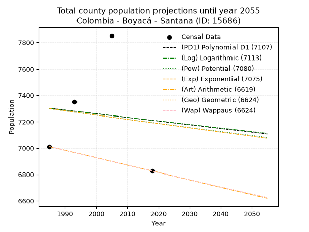
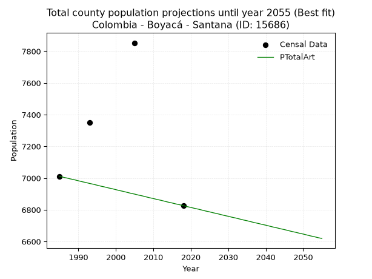
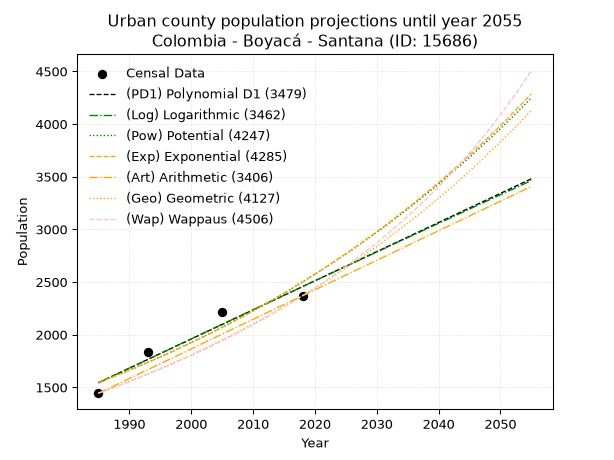
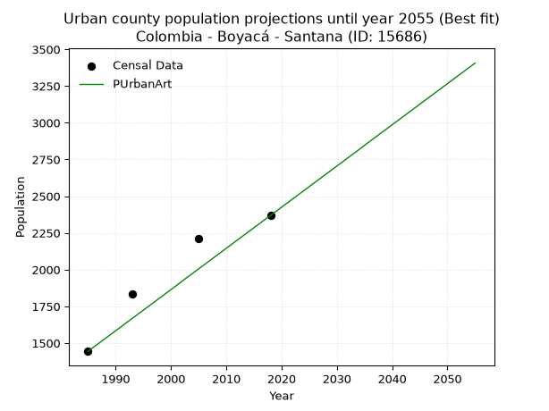
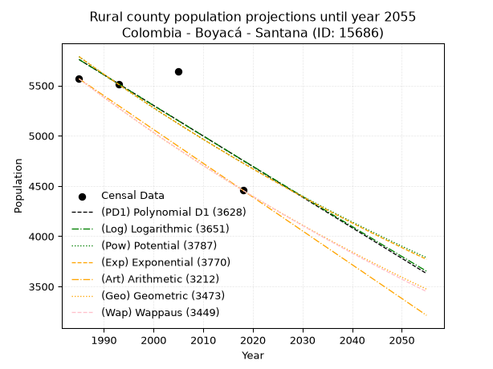
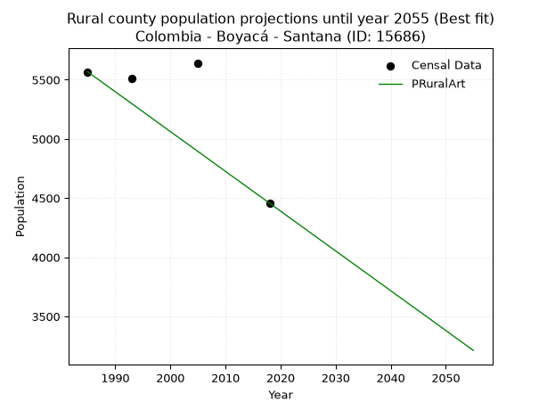

<div align="center">


</div>

# _“Population and Public Services Demand Projections (PPSD) until Year 2050 for Colombia - Boyacá - Santana (ID: 15686)”_
Keywords: `population` `public-service` `projection` `lineal` `polynomial` `logarithmic` `potential` `exponential` `arithmetic` `geometric` `wappaus` `dane` `colombia` `south-america`

PPSD are analytical estimates used by governments and planners to anticipate future changes in population size, age distribution, and the resulting community needs for utilities, healthcare, education, and infrastructure as sizing future water treatment facilities, electrical grids, and road networks based on spatial growth.

> **General running parameters**: • app_version: _v20260806_. • Python version: _3.14.7_. • Pandas version: _3.0.5_. • NumPy version: _2.5.1_. • Creates, save and include plots into reports (create_plot): _False_. • Projection until year: _2050_. • Process polynomial degree 2 and up: _False_. • Process Wappaus: _True_. • Process Wappaus: _True_. • Set negative values to zero: _True_. • Set infinite values to zero: _True_. • Drop dataset notes: _True_. 
<div align="center">

Dynamic map: [:earth_americas:Google](http://maps.google.com/maps?q=6.056865641,-73.4816387) [:earth_americas:OSM](https://www.openstreetmap.org/#map=18/6.056865641/-73.4816387&layers=P) [:earth_americas:Bing](https://www.bing.com/maps?cp=6.056865641~-73.4816387&lvl=18) [:earth_americas:Apple](https://maps.apple.com/frame?center=6.056865641%2C-73.4816387&span=0.003%2C0.006)

</div>


<div align="center">

```geojson
{
  "type": "Feature",
  "geometry": {
    "type": "Point", 
    "coordinates": [-73.4816387, 6.056865641]
  }, 
  "properties": {
    "Name": "Colombia - Boyacá - Santana (ID: 15686)"
  }
}
```

</div>


## 0. Census Data (4 records)

Census data are official statistics collected by a government about the people and housing in a country. They usually include counts of total population, age, sex, race, income, education, and jobs.

📅Global census file: [Population.xlsx](../data/Population.xlsx)

| Source   |   Year |   CountryID | CountryName   |   StateID | StateName   |   CountyID | CountyName   |   PTotal |   PUrban |   PRural |
|:---------|-------:|------------:|:--------------|----------:|:------------|-----------:|:-------------|---------:|---------:|---------:|
| DANE     |   1985 |          57 | Colombia      |        15 | Boyacá      |      15686 | Santana      |     7011 |     1444 |     5567 |
| DANE     |   1993 |          57 | Colombia      |        15 | Boyacá      |      15686 | Santana      |     7349 |     1836 |     5513 |
| DANE     |   2005 |          57 | Colombia      |        15 | Boyacá      |      15686 | Santana      |     7853 |     2211 |     5642 |
| DANE     |   2018 |          57 | Colombia      |        15 | Boyacá      |      15686 | Santana      |     6826 |     2369 |     4457 |

> 🔥Some records could had specific notes about the registered values or the corresponding urban or rural distribution.

## 1. Total

### 1.1. Coefficients and Parameters

* (PD1) Polynomial Deg 1: -2.7856282617416577, 12831.70293054875 (lineal)
* (Log) Logarithmic: -5438.172759385783, 48595.34472287286
* (Pow) Potential: -0.8724818701780633, 6.740431343980237
* (Exp) Exponential: -0.0004452785976343925, 17665.053017501603
* (Art) Arithmetic: Year diff. 2018 - 1985 = 33, Population diff. 6826 - 7011 = -185, Annual growth = -5.606060606060606
* (Geo) Geometric: Year diff. 2018 - 1985 = 33, Population diff. 6826 - 7011 = -185, Annual growth % = -0.0008100200516512057
* (Wap) Wappaus: i = -0.08103000081030001, Condition values only valid for < 200)

<sub>
Wappaus condition values: ['-0.00', '-0.08', '-0.16', '-0.24', '-0.32', '-0.41', '-0.49', '-0.57', '-0.65', '-0.73', '-0.81', '-0.89', '-0.97', '-1.05', '-1.13', '-1.22', '-1.30', '-1.38', '-1.46', '-1.54', '-1.62', '-1.70', '-1.78', '-1.86', '-1.94', '-2.03', '-2.11', '-2.19', '-2.27', '-2.35', '-2.43', '-2.51', '-2.59', '-2.67', '-2.76', '-2.84', '-2.92', '-3.00', '-3.08', '-3.16', '-3.24', '-3.32', '-3.40', '-3.48', '-3.57', '-3.65', '-3.73', '-3.81', '-3.89', '-3.97', '-4.05', '-4.13', '-4.21', '-4.29', '-4.38', '-4.46', '-4.54', '-4.62', '-4.70', '-4.78', '-4.86', '-4.94', '-5.02', '-5.10', '-5.19', '-5.27']
</sub>


### 1.2. Projected Dataset

|   Year |   CountyID |   PTotalPD1 |   PTotalLog |   PTotalPow |   PTotalExp |   PTotalArt |   PTotalGeo |   PTotalWap |
|-------:|-----------:|------------:|------------:|------------:|------------:|------------:|------------:|------------:|
|   1985 |      15686 |        7302 |        7301 |        7298 |        7299 |        7011 |        7011 |        7011 |
|   1986 |      15686 |        7299 |        7299 |        7295 |        7296 |        7005 |        7005 |        7005 |
|   1987 |      15686 |        7297 |        7296 |        7291 |        7292 |        7000 |        7000 |        7000 |
|   1988 |      15686 |        7294 |        7293 |        7288 |        7289 |        6994 |        6994 |        6994 |
|   1989 |      15686 |        7291 |        7290 |        7285 |        7286 |        6989 |        6988 |        6988 |
|   1990 |      15686 |        7288 |        7288 |        7282 |        7283 |        6983 |        6983 |        6983 |
|   1991 |      15686 |        7286 |        7285 |        7279 |        7279 |        6977 |        6977 |        6977 |
|   1992 |      15686 |        7283 |        7282 |        7275 |        7276 |        6972 |        6971 |        6971 |
|   1993 |      15686 |        7280 |        7279 |        7272 |        7273 |        6966 |        6966 |        6966 |
|   1994 |      15686 |        7277 |        7277 |        7269 |        7270 |        6961 |        6960 |        6960 |
|   1995 |      15686 |        7274 |        7274 |        7266 |        7266 |        6955 |        6954 |        6954 |
|   1996 |      15686 |        7272 |        7271 |        7263 |        7263 |        6949 |        6949 |        6949 |
|   1997 |      15686 |        7269 |        7268 |        7260 |        7260 |        6944 |        6943 |        6943 |
|   1998 |      15686 |        7266 |        7266 |        7256 |        7257 |        6938 |        6938 |        6938 |
|   1999 |      15686 |        7263 |        7263 |        7253 |        7253 |        6933 |        6932 |        6932 |
|   2000 |      15686 |        7260 |        7260 |        7250 |        7250 |        6927 |        6926 |        6926 |
|   2001 |      15686 |        7258 |        7258 |        7247 |        7247 |        6921 |        6921 |        6921 |
|   2002 |      15686 |        7255 |        7255 |        7244 |        7244 |        6916 |        6915 |        6915 |
|   2003 |      15686 |        7252 |        7252 |        7241 |        7241 |        6910 |        6909 |        6909 |
|   2004 |      15686 |        7249 |        7249 |        7237 |        7237 |        6904 |        6904 |        6904 |
|   2005 |      15686 |        7247 |        7247 |        7234 |        7234 |        6899 |        6898 |        6898 |
|   2006 |      15686 |        7244 |        7244 |        7231 |        7231 |        6893 |        6893 |        6893 |
|   2007 |      15686 |        7241 |        7241 |        7228 |        7228 |        6888 |        6887 |        6887 |
|   2008 |      15686 |        7238 |        7239 |        7225 |        7224 |        6882 |        6882 |        6882 |
|   2009 |      15686 |        7235 |        7236 |        7222 |        7221 |        6876 |        6876 |        6876 |
|   2010 |      15686 |        7233 |        7233 |        7219 |        7218 |        6871 |        6870 |        6870 |
|   2011 |      15686 |        7230 |        7230 |        7215 |        7215 |        6865 |        6865 |        6865 |
|   2012 |      15686 |        7227 |        7228 |        7212 |        7212 |        6860 |        6859 |        6859 |
|   2013 |      15686 |        7224 |        7225 |        7209 |        7208 |        6854 |        6854 |        6854 |
|   2014 |      15686 |        7221 |        7222 |        7206 |        7205 |        6848 |        6848 |        6848 |
|   2015 |      15686 |        7219 |        7220 |        7203 |        7202 |        6843 |        6843 |        6843 |
|   2016 |      15686 |        7216 |        7217 |        7200 |        7199 |        6837 |        6837 |        6837 |
|   2017 |      15686 |        7213 |        7214 |        7197 |        7196 |        6832 |        6832 |        6832 |
|   2018 |      15686 |        7210 |        7212 |        7194 |        7192 |        6826 |        6826 |        6826 |
|   2019 |      15686 |        7208 |        7209 |        7191 |        7189 |        6820 |        6820 |        6820 |
|   2020 |      15686 |        7205 |        7206 |        7187 |        7186 |        6815 |        6815 |        6815 |
|   2021 |      15686 |        7202 |        7204 |        7184 |        7183 |        6809 |        6809 |        6809 |
|   2022 |      15686 |        7199 |        7201 |        7181 |        7180 |        6804 |        6804 |        6804 |
|   2023 |      15686 |        7196 |        7198 |        7178 |        7176 |        6798 |        6798 |        6798 |
|   2024 |      15686 |        7194 |        7195 |        7175 |        7173 |        6792 |        6793 |        6793 |
|   2025 |      15686 |        7191 |        7193 |        7172 |        7170 |        6787 |        6787 |        6787 |
|   2026 |      15686 |        7188 |        7190 |        7169 |        7167 |        6781 |        6782 |        6782 |
|   2027 |      15686 |        7185 |        7187 |        7166 |        7164 |        6776 |        6776 |        6776 |
|   2028 |      15686 |        7182 |        7185 |        7163 |        7160 |        6770 |        6771 |        6771 |
|   2029 |      15686 |        7180 |        7182 |        7160 |        7157 |        6764 |        6765 |        6765 |
|   2030 |      15686 |        7177 |        7179 |        7157 |        7154 |        6759 |        6760 |        6760 |
|   2031 |      15686 |        7174 |        7177 |        7153 |        7151 |        6753 |        6754 |        6754 |
|   2032 |      15686 |        7171 |        7174 |        7150 |        7148 |        6748 |        6749 |        6749 |
|   2033 |      15686 |        7169 |        7171 |        7147 |        7144 |        6742 |        6744 |        6744 |
|   2034 |      15686 |        7166 |        7169 |        7144 |        7141 |        6736 |        6738 |        6738 |
|   2035 |      15686 |        7163 |        7166 |        7141 |        7138 |        6731 |        6733 |        6733 |
|   2036 |      15686 |        7160 |        7163 |        7138 |        7135 |        6725 |        6727 |        6727 |
|   2037 |      15686 |        7157 |        7161 |        7135 |        7132 |        6719 |        6722 |        6722 |
|   2038 |      15686 |        7155 |        7158 |        7132 |        7129 |        6714 |        6716 |        6716 |
|   2039 |      15686 |        7152 |        7155 |        7129 |        7125 |        6708 |        6711 |        6711 |
|   2040 |      15686 |        7149 |        7153 |        7126 |        7122 |        6703 |        6705 |        6705 |
|   2041 |      15686 |        7146 |        7150 |        7123 |        7119 |        6697 |        6700 |        6700 |
|   2042 |      15686 |        7143 |        7147 |        7120 |        7116 |        6691 |        6695 |        6694 |
|   2043 |      15686 |        7141 |        7145 |        7117 |        7113 |        6686 |        6689 |        6689 |
|   2044 |      15686 |        7138 |        7142 |        7114 |        7110 |        6680 |        6684 |        6684 |
|   2045 |      15686 |        7135 |        7139 |        7111 |        7106 |        6675 |        6678 |        6678 |
|   2046 |      15686 |        7132 |        7137 |        7108 |        7103 |        6669 |        6673 |        6673 |
|   2047 |      15686 |        7130 |        7134 |        7105 |        7100 |        6663 |        6667 |        6667 |
|   2048 |      15686 |        7127 |        7131 |        7102 |        7097 |        6658 |        6662 |        6662 |
|   2049 |      15686 |        7124 |        7129 |        7099 |        7094 |        6652 |        6657 |        6657 |
|   2050 |      15686 |        7121 |        7126 |        7096 |        7091 |        6647 |        6651 |        6651 |
<div align="center">

</img>

</div>


### 1.3. Best fit with absolute and relative error (%)

Relative error puts that difference into context by dividing the absolute error by the true value, creating a unitless ratio or percentage that shows the scale of the mistake.

Absolute and relative error

|   Year | Source   |   CountryID | CountryName   |   StateID | StateName   |   CountyID_x | CountyName   |   PTotal |   PUrban |   PRural |   CountyID_y |   PTotalPD1 |   PTotalLog |   PTotalPow |   PTotalExp |   PTotalArt |   PTotalGeo |   PTotalWap |   PTotalPD1AbsError |   PTotalLogAbsError |   PTotalPowAbsError |   PTotalExpAbsError |   PTotalArtAbsError |   PTotalGeoAbsError |   PTotalWapAbsError |   PTotalPD1RelError |   PTotalLogRelError |   PTotalPowRelError |   PTotalExpRelError |   PTotalArtRelError |   PTotalGeoRelError |   PTotalWapRelError |
|-------:|:---------|------------:|:--------------|----------:|:------------|-------------:|:-------------|---------:|---------:|---------:|-------------:|------------:|------------:|------------:|------------:|------------:|------------:|------------:|--------------------:|--------------------:|--------------------:|--------------------:|--------------------:|--------------------:|--------------------:|--------------------:|--------------------:|--------------------:|--------------------:|--------------------:|--------------------:|--------------------:|
|   1985 | DANE     |          57 | Colombia      |        15 | Boyacá      |        15686 | Santana      |     7011 |     1444 |     5567 |        15686 |        7302 |        7301 |        7298 |        7299 |        7011 |        7011 |        7011 |                 291 |                 290 |                 287 |                 288 |                   0 |                   0 |                   0 |            4.15062  |            4.13636  |             4.09357 |             4.10783 |             0       |             0       |             0       |
|   1993 | DANE     |          57 | Colombia      |        15 | Boyacá      |        15686 | Santana      |     7349 |     1836 |     5513 |        15686 |        7280 |        7279 |        7272 |        7273 |        6966 |        6966 |        6966 |                  69 |                  70 |                  77 |                  76 |                 383 |                 383 |                 383 |            0.938903 |            0.952511 |             1.04776 |             1.03415 |             5.21159 |             5.21159 |             5.21159 |
|   2005 | DANE     |          57 | Colombia      |        15 | Boyacá      |        15686 | Santana      |     7853 |     2211 |     5642 |        15686 |        7247 |        7247 |        7234 |        7234 |        6899 |        6898 |        6898 |                 606 |                 606 |                 619 |                 619 |                 954 |                 955 |                 955 |            7.7168   |            7.7168   |             7.88234 |             7.88234 |            12.1482  |            12.161   |            12.161   |
|   2018 | DANE     |          57 | Colombia      |        15 | Boyacá      |        15686 | Santana      |     6826 |     2369 |     4457 |        15686 |        7210 |        7212 |        7194 |        7192 |        6826 |        6826 |        6826 |                 384 |                 386 |                 368 |                 366 |                   0 |                   0 |                   0 |            5.62555  |            5.65485  |             5.39115 |             5.36185 |             0       |             0       |             0       |

Relative error mean

| Method    |   RelError | Best   |
|:----------|-----------:|:-------|
| PTotalPD1 |    4.60797 |        |
| PTotalLog |    4.61513 |        |
| PTotalPow |    4.6037  |        |
| PTotalExp |    4.59654 |        |
| PTotalArt |    4.33995 | True   |
| PTotalGeo |    4.34314 |        |
| PTotalWap |    4.34314 |        |

💙Best method: _**PTotalArt**_
<div align="center">

</img>

</div>


### 1.4. Fresh water supply demand in liters per capita per day (lpcd)

The fresh water supply demand typically ranges from 100 to 300 liters per capita per day (lpcd) for standard domestic and municipal planning, though absolute survival minimums set by the World Health Organization are as low as 7.5 to 20 liters per day, and total consumption in high-income nations can exceed 400 liters.

> `CZ`: Level in meters above the sea level (masl).<br> `WS`: Fresh water supply demand in liters per capita per day (lpcd or l/h/d).<br> `WSAll`: Zonal fresh water supply demand in liters per second (l/s).<br> `A`: Zonal area in square meters.

Reference values (RAS Colombia)

|    CZ |   WS |
|------:|-----:|
|  1000 |  120 |
|  2000 |  130 |
| 99999 |  140 |

County shapefile geometry properties and water supply values

|   CountyID |      ATotal |   CZTotal |   WSTotal |
|-----------:|------------:|----------:|----------:|
|      15686 | 6.78529e+07 |   1511.27 |       130 |

Projected values for best method: PTotalArt

|   CountyID |   Year |   PTotalArt |   WSTotal |   WSTotalAll |
|-----------:|-------:|------------:|----------:|-------------:|
|      15686 |   1985 |        7011 |       130 |      10.549  |
|      15686 |   1986 |        7005 |       130 |      10.5399 |
|      15686 |   1987 |        7000 |       130 |      10.5324 |
|      15686 |   1988 |        6994 |       130 |      10.5234 |
|      15686 |   1989 |        6989 |       130 |      10.5159 |
|      15686 |   1990 |        6983 |       130 |      10.5068 |
|      15686 |   1991 |        6977 |       130 |      10.4978 |
|      15686 |   1992 |        6972 |       130 |      10.4903 |
|      15686 |   1993 |        6966 |       130 |      10.4812 |
|      15686 |   1994 |        6961 |       130 |      10.4737 |
|      15686 |   1995 |        6955 |       130 |      10.4647 |
|      15686 |   1996 |        6949 |       130 |      10.4557 |
|      15686 |   1997 |        6944 |       130 |      10.4481 |
|      15686 |   1998 |        6938 |       130 |      10.4391 |
|      15686 |   1999 |        6933 |       130 |      10.4316 |
|      15686 |   2000 |        6927 |       130 |      10.4226 |
|      15686 |   2001 |        6921 |       130 |      10.4135 |
|      15686 |   2002 |        6916 |       130 |      10.406  |
|      15686 |   2003 |        6910 |       130 |      10.397  |
|      15686 |   2004 |        6904 |       130 |      10.388  |
|      15686 |   2005 |        6899 |       130 |      10.3804 |
|      15686 |   2006 |        6893 |       130 |      10.3714 |
|      15686 |   2007 |        6888 |       130 |      10.3639 |
|      15686 |   2008 |        6882 |       130 |      10.3549 |
|      15686 |   2009 |        6876 |       130 |      10.3458 |
|      15686 |   2010 |        6871 |       130 |      10.3383 |
|      15686 |   2011 |        6865 |       130 |      10.3293 |
|      15686 |   2012 |        6860 |       130 |      10.3218 |
|      15686 |   2013 |        6854 |       130 |      10.3127 |
|      15686 |   2014 |        6848 |       130 |      10.3037 |
|      15686 |   2015 |        6843 |       130 |      10.2962 |
|      15686 |   2016 |        6837 |       130 |      10.2872 |
|      15686 |   2017 |        6832 |       130 |      10.2796 |
|      15686 |   2018 |        6826 |       130 |      10.2706 |
|      15686 |   2019 |        6820 |       130 |      10.2616 |
|      15686 |   2020 |        6815 |       130 |      10.2541 |
|      15686 |   2021 |        6809 |       130 |      10.245  |
|      15686 |   2022 |        6804 |       130 |      10.2375 |
|      15686 |   2023 |        6798 |       130 |      10.2285 |
|      15686 |   2024 |        6792 |       130 |      10.2194 |
|      15686 |   2025 |        6787 |       130 |      10.2119 |
|      15686 |   2026 |        6781 |       130 |      10.2029 |
|      15686 |   2027 |        6776 |       130 |      10.1954 |
|      15686 |   2028 |        6770 |       130 |      10.1863 |
|      15686 |   2029 |        6764 |       130 |      10.1773 |
|      15686 |   2030 |        6759 |       130 |      10.1698 |
|      15686 |   2031 |        6753 |       130 |      10.1608 |
|      15686 |   2032 |        6748 |       130 |      10.1532 |
|      15686 |   2033 |        6742 |       130 |      10.1442 |
|      15686 |   2034 |        6736 |       130 |      10.1352 |
|      15686 |   2035 |        6731 |       130 |      10.1277 |
|      15686 |   2036 |        6725 |       130 |      10.1186 |
|      15686 |   2037 |        6719 |       130 |      10.1096 |
|      15686 |   2038 |        6714 |       130 |      10.1021 |
|      15686 |   2039 |        6708 |       130 |      10.0931 |
|      15686 |   2040 |        6703 |       130 |      10.0855 |
|      15686 |   2041 |        6697 |       130 |      10.0765 |
|      15686 |   2042 |        6691 |       130 |      10.0675 |
|      15686 |   2043 |        6686 |       130 |      10.06   |
|      15686 |   2044 |        6680 |       130 |      10.0509 |
|      15686 |   2045 |        6675 |       130 |      10.0434 |
|      15686 |   2046 |        6669 |       130 |      10.0344 |
|      15686 |   2047 |        6663 |       130 |      10.0253 |
|      15686 |   2048 |        6658 |       130 |      10.0178 |
|      15686 |   2049 |        6652 |       130 |      10.0088 |
|      15686 |   2050 |        6647 |       130 |      10.0013 |

## 2. Urban

### 2.1. Coefficients and Parameters

* (PD1) Polynomial Deg 1: 27.65154556403039, -53345.00401445179 (lineal)
* (Log) Logarithmic: 55383.33054049503, -419004.1392524602
* (Pow) Potential: 29.17378683999806, -93.01923439774582
* (Exp) Exponential: 0.014563688029190463, 4.307333428080587e-10
* (Art) Arithmetic: Year diff. 2018 - 1985 = 33, Population diff. 2369 - 1444 = 925, Annual growth = 28.03030303030303
* (Geo) Geometric: Year diff. 2018 - 1985 = 33, Population diff. 2369 - 1444 = 925, Annual growth % = 0.015114629881467057
* (Wap) Wappaus: i = 1.4702493065986377, Condition values only valid for < 200)

<sub>
Wappaus condition values: ['0.00', '1.47', '2.94', '4.41', '5.88', '7.35', '8.82', '10.29', '11.76', '13.23', '14.70', '16.17', '17.64', '19.11', '20.58', '22.05', '23.52', '24.99', '26.46', '27.93', '29.40', '30.88', '32.35', '33.82', '35.29', '36.76', '38.23', '39.70', '41.17', '42.64', '44.11', '45.58', '47.05', '48.52', '49.99', '51.46', '52.93', '54.40', '55.87', '57.34', '58.81', '60.28', '61.75', '63.22', '64.69', '66.16', '67.63', '69.10', '70.57', '72.04', '73.51', '74.98', '76.45', '77.92', '79.39', '80.86', '82.33', '83.80', '85.27', '86.74', '88.21', '89.69', '91.16', '92.63', '94.10', '95.57']
</sub>


### 2.2. Projected Dataset

|   Year |   CountyID |   PUrbanPD1 |   PUrbanLog |   PUrbanPow |   PUrbanExp |   PUrbanArt |   PUrbanGeo |   PUrbanWap |
|-------:|-----------:|------------:|------------:|------------:|------------:|------------:|------------:|------------:|
|   1985 |      15686 |        1543 |        1542 |        1545 |        1546 |        1444 |        1444 |        1444 |
|   1986 |      15686 |        1571 |        1570 |        1568 |        1569 |        1472 |        1466 |        1465 |
|   1987 |      15686 |        1599 |        1598 |        1591 |        1592 |        1500 |        1488 |        1487 |
|   1988 |      15686 |        1626 |        1626 |        1615 |        1615 |        1528 |        1510 |        1509 |
|   1989 |      15686 |        1654 |        1654 |        1638 |        1639 |        1556 |        1533 |        1531 |
|   1990 |      15686 |        1682 |        1682 |        1663 |        1663 |        1584 |        1556 |        1554 |
|   1991 |      15686 |        1709 |        1709 |        1687 |        1687 |        1612 |        1580 |        1577 |
|   1992 |      15686 |        1737 |        1737 |        1712 |        1712 |        1640 |        1604 |        1601 |
|   1993 |      15686 |        1765 |        1765 |        1737 |        1737 |        1668 |        1628 |        1624 |
|   1994 |      15686 |        1792 |        1793 |        1763 |        1762 |        1696 |        1653 |        1649 |
|   1995 |      15686 |        1820 |        1821 |        1789 |        1788 |        1724 |        1678 |        1673 |
|   1996 |      15686 |        1847 |        1848 |        1815 |        1815 |        1752 |        1703 |        1698 |
|   1997 |      15686 |        1875 |        1876 |        1842 |        1841 |        1780 |        1729 |        1723 |
|   1998 |      15686 |        1903 |        1904 |        1869 |        1868 |        1808 |        1755 |        1749 |
|   1999 |      15686 |        1930 |        1931 |        1897 |        1896 |        1836 |        1781 |        1775 |
|   2000 |      15686 |        1958 |        1959 |        1924 |        1923 |        1864 |        1808 |        1802 |
|   2001 |      15686 |        1986 |        1987 |        1953 |        1952 |        1892 |        1836 |        1829 |
|   2002 |      15686 |        2013 |        2015 |        1981 |        1980 |        1921 |        1863 |        1856 |
|   2003 |      15686 |        2041 |        2042 |        2010 |        2009 |        1949 |        1892 |        1884 |
|   2004 |      15686 |        2069 |        2070 |        2040 |        2039 |        1977 |        1920 |        1913 |
|   2005 |      15686 |        2096 |        2097 |        2070 |        2069 |        2005 |        1949 |        1942 |
|   2006 |      15686 |        2124 |        2125 |        2100 |        2099 |        2033 |        1979 |        1971 |
|   2007 |      15686 |        2152 |        2153 |        2131 |        2130 |        2061 |        2009 |        2001 |
|   2008 |      15686 |        2179 |        2180 |        2162 |        2161 |        2089 |        2039 |        2032 |
|   2009 |      15686 |        2207 |        2208 |        2194 |        2193 |        2117 |        2070 |        2063 |
|   2010 |      15686 |        2235 |        2235 |        2226 |        2225 |        2145 |        2101 |        2094 |
|   2011 |      15686 |        2262 |        2263 |        2258 |        2258 |        2173 |        2133 |        2126 |
|   2012 |      15686 |        2290 |        2290 |        2291 |        2291 |        2201 |        2165 |        2159 |
|   2013 |      15686 |        2318 |        2318 |        2325 |        2324 |        2229 |        2198 |        2193 |
|   2014 |      15686 |        2345 |        2345 |        2359 |        2358 |        2257 |        2231 |        2226 |
|   2015 |      15686 |        2373 |        2373 |        2393 |        2393 |        2285 |        2265 |        2261 |
|   2016 |      15686 |        2401 |        2400 |        2428 |        2428 |        2313 |        2299 |        2296 |
|   2017 |      15686 |        2428 |        2428 |        2463 |        2464 |        2341 |        2334 |        2332 |
|   2018 |      15686 |        2456 |        2455 |        2499 |        2500 |        2369 |        2369 |        2369 |
|   2019 |      15686 |        2483 |        2483 |        2536 |        2537 |        2397 |        2405 |        2406 |
|   2020 |      15686 |        2511 |        2510 |        2573 |        2574 |        2425 |        2441 |        2444 |
|   2021 |      15686 |        2539 |        2538 |        2610 |        2612 |        2453 |        2478 |        2483 |
|   2022 |      15686 |        2566 |        2565 |        2648 |        2650 |        2481 |        2516 |        2523 |
|   2023 |      15686 |        2594 |        2592 |        2686 |        2689 |        2509 |        2554 |        2563 |
|   2024 |      15686 |        2622 |        2620 |        2726 |        2728 |        2537 |        2592 |        2605 |
|   2025 |      15686 |        2649 |        2647 |        2765 |        2768 |        2565 |        2631 |        2647 |
|   2026 |      15686 |        2677 |        2674 |        2805 |        2809 |        2593 |        2671 |        2690 |
|   2027 |      15686 |        2705 |        2702 |        2846 |        2850 |        2621 |        2711 |        2734 |
|   2028 |      15686 |        2732 |        2729 |        2887 |        2892 |        2649 |        2752 |        2779 |
|   2029 |      15686 |        2760 |        2756 |        2929 |        2934 |        2677 |        2794 |        2825 |
|   2030 |      15686 |        2788 |        2784 |        2971 |        2977 |        2705 |        2836 |        2872 |
|   2031 |      15686 |        2815 |        2811 |        3014 |        3021 |        2733 |        2879 |        2920 |
|   2032 |      15686 |        2843 |        2838 |        3058 |        3065 |        2761 |        2923 |        2969 |
|   2033 |      15686 |        2871 |        2866 |        3102 |        3110 |        2789 |        2967 |        3019 |
|   2034 |      15686 |        2898 |        2893 |        3147 |        3156 |        2817 |        3012 |        3070 |
|   2035 |      15686 |        2926 |        2920 |        3192 |        3202 |        2846 |        3057 |        3122 |
|   2036 |      15686 |        2954 |        2947 |        3238 |        3249 |        2874 |        3103 |        3176 |
|   2037 |      15686 |        2981 |        2974 |        3285 |        3297 |        2902 |        3150 |        3231 |
|   2038 |      15686 |        3009 |        3002 |        3333 |        3345 |        2930 |        3198 |        3287 |
|   2039 |      15686 |        3036 |        3029 |        3381 |        3394 |        2958 |        3246 |        3345 |
|   2040 |      15686 |        3064 |        3056 |        3429 |        3444 |        2986 |        3295 |        3404 |
|   2041 |      15686 |        3092 |        3083 |        3479 |        3495 |        3014 |        3345 |        3465 |
|   2042 |      15686 |        3119 |        3110 |        3529 |        3546 |        3042 |        3396 |        3527 |
|   2043 |      15686 |        3147 |        3137 |        3580 |        3598 |        3070 |        3447 |        3591 |
|   2044 |      15686 |        3175 |        3164 |        3631 |        3651 |        3098 |        3499 |        3656 |
|   2045 |      15686 |        3202 |        3191 |        3683 |        3704 |        3126 |        3552 |        3723 |
|   2046 |      15686 |        3230 |        3219 |        3736 |        3758 |        3154 |        3606 |        3792 |
|   2047 |      15686 |        3258 |        3246 |        3790 |        3814 |        3182 |        3660 |        3863 |
|   2048 |      15686 |        3285 |        3273 |        3844 |        3870 |        3210 |        3716 |        3935 |
|   2049 |      15686 |        3313 |        3300 |        3899 |        3926 |        3238 |        3772 |        4010 |
|   2050 |      15686 |        3341 |        3327 |        3955 |        3984 |        3266 |        3829 |        4087 |
<div align="center">

</img>

</div>


### 2.3. Best fit with absolute and relative error (%)

Relative error puts that difference into context by dividing the absolute error by the true value, creating a unitless ratio or percentage that shows the scale of the mistake.

Absolute and relative error

|   Year | Source   |   CountryID | CountryName   |   StateID | StateName   |   CountyID_x | CountyName   |   PTotal |   PUrban |   PRural |   CountyID_y |   PUrbanPD1 |   PUrbanLog |   PUrbanPow |   PUrbanExp |   PUrbanArt |   PUrbanGeo |   PUrbanWap |   PUrbanPD1AbsError |   PUrbanLogAbsError |   PUrbanPowAbsError |   PUrbanExpAbsError |   PUrbanArtAbsError |   PUrbanGeoAbsError |   PUrbanWapAbsError |   PUrbanPD1RelError |   PUrbanLogRelError |   PUrbanPowRelError |   PUrbanExpRelError |   PUrbanArtRelError |   PUrbanGeoRelError |   PUrbanWapRelError |
|-------:|:---------|------------:|:--------------|----------:|:------------|-------------:|:-------------|---------:|---------:|---------:|-------------:|------------:|------------:|------------:|------------:|------------:|------------:|------------:|--------------------:|--------------------:|--------------------:|--------------------:|--------------------:|--------------------:|--------------------:|--------------------:|--------------------:|--------------------:|--------------------:|--------------------:|--------------------:|--------------------:|
|   1985 | DANE     |          57 | Colombia      |        15 | Boyacá      |        15686 | Santana      |     7011 |     1444 |     5567 |        15686 |        1543 |        1542 |        1545 |        1546 |        1444 |        1444 |        1444 |                  99 |                  98 |                 101 |                 102 |                   0 |                   0 |                   0 |             6.85596 |             6.7867  |             6.99446 |             7.06371 |             0       |              0      |              0      |
|   1993 | DANE     |          57 | Colombia      |        15 | Boyacá      |        15686 | Santana      |     7349 |     1836 |     5513 |        15686 |        1765 |        1765 |        1737 |        1737 |        1668 |        1628 |        1624 |                  71 |                  71 |                  99 |                  99 |                 168 |                 208 |                 212 |             3.8671  |             3.8671  |             5.39216 |             5.39216 |             9.15033 |             11.329  |             11.5468 |
|   2005 | DANE     |          57 | Colombia      |        15 | Boyacá      |        15686 | Santana      |     7853 |     2211 |     5642 |        15686 |        2096 |        2097 |        2070 |        2069 |        2005 |        1949 |        1942 |                 115 |                 114 |                 141 |                 142 |                 206 |                 262 |                 269 |             5.20127 |             5.15604 |             6.3772  |             6.42243 |             9.31705 |             11.8498 |             12.1664 |
|   2018 | DANE     |          57 | Colombia      |        15 | Boyacá      |        15686 | Santana      |     6826 |     2369 |     4457 |        15686 |        2456 |        2455 |        2499 |        2500 |        2369 |        2369 |        2369 |                  87 |                  86 |                 130 |                 131 |                   0 |                   0 |                   0 |             3.67244 |             3.63022 |             5.48755 |             5.52976 |             0       |              0      |              0      |

Relative error mean

| Method    |   RelError | Best   |
|:----------|-----------:|:-------|
| PUrbanPD1 |    4.89919 |        |
| PUrbanLog |    4.86002 |        |
| PUrbanPow |    6.06284 |        |
| PUrbanExp |    6.10202 |        |
| PUrbanArt |    4.61684 | True   |
| PUrbanGeo |    5.7947  |        |
| PUrbanWap |    5.92832 |        |

💙Best method: _**PUrbanArt**_
<div align="center">

</img>

</div>


### 2.4. Fresh water supply demand in liters per capita per day (lpcd)

The fresh water supply demand typically ranges from 100 to 300 liters per capita per day (lpcd) for standard domestic and municipal planning, though absolute survival minimums set by the World Health Organization are as low as 7.5 to 20 liters per day, and total consumption in high-income nations can exceed 400 liters.

> `CZ`: Level in meters above the sea level (masl).<br> `WS`: Fresh water supply demand in liters per capita per day (lpcd or l/h/d).<br> `WSAll`: Zonal fresh water supply demand in liters per second (l/s).<br> `A`: Zonal area in square meters.

Reference values (RAS Colombia)

|    CZ |   WS |
|------:|-----:|
|  1000 |  120 |
|  2000 |  130 |
| 99999 |  140 |

County shapefile geometry properties and water supply values

|   CountyID |   AUrban |   CZUrban |   WSUrban |
|-----------:|---------:|----------:|----------:|
|      15686 |   620238 |   1595.24 |       130 |

Projected values for best method: PUrbanArt

|   CountyID |   Year |   PUrbanArt |   WSUrban |   WSUrbanAll |
|-----------:|-------:|------------:|----------:|-------------:|
|      15686 |   1985 |        1444 |       130 |      2.17269 |
|      15686 |   1986 |        1472 |       130 |      2.21481 |
|      15686 |   1987 |        1500 |       130 |      2.25694 |
|      15686 |   1988 |        1528 |       130 |      2.29907 |
|      15686 |   1989 |        1556 |       130 |      2.3412  |
|      15686 |   1990 |        1584 |       130 |      2.38333 |
|      15686 |   1991 |        1612 |       130 |      2.42546 |
|      15686 |   1992 |        1640 |       130 |      2.46759 |
|      15686 |   1993 |        1668 |       130 |      2.50972 |
|      15686 |   1994 |        1696 |       130 |      2.55185 |
|      15686 |   1995 |        1724 |       130 |      2.59398 |
|      15686 |   1996 |        1752 |       130 |      2.63611 |
|      15686 |   1997 |        1780 |       130 |      2.67824 |
|      15686 |   1998 |        1808 |       130 |      2.72037 |
|      15686 |   1999 |        1836 |       130 |      2.7625  |
|      15686 |   2000 |        1864 |       130 |      2.80463 |
|      15686 |   2001 |        1892 |       130 |      2.84676 |
|      15686 |   2002 |        1921 |       130 |      2.89039 |
|      15686 |   2003 |        1949 |       130 |      2.93252 |
|      15686 |   2004 |        1977 |       130 |      2.97465 |
|      15686 |   2005 |        2005 |       130 |      3.01678 |
|      15686 |   2006 |        2033 |       130 |      3.05891 |
|      15686 |   2007 |        2061 |       130 |      3.10104 |
|      15686 |   2008 |        2089 |       130 |      3.14317 |
|      15686 |   2009 |        2117 |       130 |      3.1853  |
|      15686 |   2010 |        2145 |       130 |      3.22743 |
|      15686 |   2011 |        2173 |       130 |      3.26956 |
|      15686 |   2012 |        2201 |       130 |      3.31169 |
|      15686 |   2013 |        2229 |       130 |      3.35382 |
|      15686 |   2014 |        2257 |       130 |      3.39595 |
|      15686 |   2015 |        2285 |       130 |      3.43808 |
|      15686 |   2016 |        2313 |       130 |      3.48021 |
|      15686 |   2017 |        2341 |       130 |      3.52234 |
|      15686 |   2018 |        2369 |       130 |      3.56447 |
|      15686 |   2019 |        2397 |       130 |      3.6066  |
|      15686 |   2020 |        2425 |       130 |      3.64873 |
|      15686 |   2021 |        2453 |       130 |      3.69086 |
|      15686 |   2022 |        2481 |       130 |      3.73299 |
|      15686 |   2023 |        2509 |       130 |      3.77512 |
|      15686 |   2024 |        2537 |       130 |      3.81725 |
|      15686 |   2025 |        2565 |       130 |      3.85938 |
|      15686 |   2026 |        2593 |       130 |      3.9015  |
|      15686 |   2027 |        2621 |       130 |      3.94363 |
|      15686 |   2028 |        2649 |       130 |      3.98576 |
|      15686 |   2029 |        2677 |       130 |      4.02789 |
|      15686 |   2030 |        2705 |       130 |      4.07002 |
|      15686 |   2031 |        2733 |       130 |      4.11215 |
|      15686 |   2032 |        2761 |       130 |      4.15428 |
|      15686 |   2033 |        2789 |       130 |      4.19641 |
|      15686 |   2034 |        2817 |       130 |      4.23854 |
|      15686 |   2035 |        2846 |       130 |      4.28218 |
|      15686 |   2036 |        2874 |       130 |      4.32431 |
|      15686 |   2037 |        2902 |       130 |      4.36644 |
|      15686 |   2038 |        2930 |       130 |      4.40856 |
|      15686 |   2039 |        2958 |       130 |      4.45069 |
|      15686 |   2040 |        2986 |       130 |      4.49282 |
|      15686 |   2041 |        3014 |       130 |      4.53495 |
|      15686 |   2042 |        3042 |       130 |      4.57708 |
|      15686 |   2043 |        3070 |       130 |      4.61921 |
|      15686 |   2044 |        3098 |       130 |      4.66134 |
|      15686 |   2045 |        3126 |       130 |      4.70347 |
|      15686 |   2046 |        3154 |       130 |      4.7456  |
|      15686 |   2047 |        3182 |       130 |      4.78773 |
|      15686 |   2048 |        3210 |       130 |      4.82986 |
|      15686 |   2049 |        3238 |       130 |      4.87199 |
|      15686 |   2050 |        3266 |       130 |      4.91412 |

## 3. Rural

### 3.1. Coefficients and Parameters

* (PD1) Polynomial Deg 1: -30.437173825772042, 66176.70694500054 (lineal)
* (Log) Logarithmic: -60821.50329988091, 467599.483975334
* (Pow) Potential: -12.235317570531384, 44.11158242453441
* (Exp) Exponential: -0.006122871135853897, 1098485453.2355993
* (Art) Arithmetic: Year diff. 2018 - 1985 = 33, Population diff. 4457 - 5567 = -1110, Annual growth = -33.63636363636363
* (Geo) Geometric: Year diff. 2018 - 1985 = 33, Population diff. 4457 - 5567 = -1110, Annual growth % = -0.006716145663181239
* (Wap) Wappaus: i = -0.6711165929043024, Condition values only valid for < 200)

<sub>
Wappaus condition values: ['-0.00', '-0.67', '-1.34', '-2.01', '-2.68', '-3.36', '-4.03', '-4.70', '-5.37', '-6.04', '-6.71', '-7.38', '-8.05', '-8.72', '-9.40', '-10.07', '-10.74', '-11.41', '-12.08', '-12.75', '-13.42', '-14.09', '-14.76', '-15.44', '-16.11', '-16.78', '-17.45', '-18.12', '-18.79', '-19.46', '-20.13', '-20.80', '-21.48', '-22.15', '-22.82', '-23.49', '-24.16', '-24.83', '-25.50', '-26.17', '-26.84', '-27.52', '-28.19', '-28.86', '-29.53', '-30.20', '-30.87', '-31.54', '-32.21', '-32.88', '-33.56', '-34.23', '-34.90', '-35.57', '-36.24', '-36.91', '-37.58', '-38.25', '-38.92', '-39.60', '-40.27', '-40.94', '-41.61', '-42.28', '-42.95', '-43.62']
</sub>


### 3.2. Projected Dataset

|   Year |   CountyID |   PRuralPD1 |   PRuralLog |   PRuralPow |   PRuralExp |   PRuralArt |   PRuralGeo |   PRuralWap |
|-------:|-----------:|------------:|------------:|------------:|------------:|------------:|------------:|------------:|
|   1985 |      15686 |        5759 |        5759 |        5787 |        5787 |        5567 |        5567 |        5567 |
|   1986 |      15686 |        5728 |        5728 |        5751 |        5751 |        5533 |        5530 |        5530 |
|   1987 |      15686 |        5698 |        5698 |        5716 |        5716 |        5500 |        5492 |        5493 |
|   1988 |      15686 |        5668 |        5667 |        5681 |        5681 |        5466 |        5456 |        5456 |
|   1989 |      15686 |        5637 |        5637 |        5646 |        5647 |        5432 |        5419 |        5420 |
|   1990 |      15686 |        5607 |        5606 |        5611 |        5612 |        5399 |        5383 |        5383 |
|   1991 |      15686 |        5576 |        5575 |        5577 |        5578 |        5365 |        5346 |        5347 |
|   1992 |      15686 |        5546 |        5545 |        5543 |        5544 |        5332 |        5310 |        5311 |
|   1993 |      15686 |        5515 |        5514 |        5509 |        5510 |        5298 |        5275 |        5276 |
|   1994 |      15686 |        5485 |        5484 |        5475 |        5476 |        5264 |        5239 |        5241 |
|   1995 |      15686 |        5455 |        5453 |        5442 |        5443 |        5231 |        5204 |        5206 |
|   1996 |      15686 |        5424 |        5423 |        5408 |        5410 |        5197 |        5169 |        5171 |
|   1997 |      15686 |        5394 |        5392 |        5375 |        5377 |        5163 |        5135 |        5136 |
|   1998 |      15686 |        5363 |        5362 |        5343 |        5344 |        5130 |        5100 |        5102 |
|   1999 |      15686 |        5333 |        5332 |        5310 |        5311 |        5096 |        5066 |        5067 |
|   2000 |      15686 |        5302 |        5301 |        5278 |        5279 |        5062 |        5032 |        5033 |
|   2001 |      15686 |        5272 |        5271 |        5245 |        5247 |        5029 |        4998 |        5000 |
|   2002 |      15686 |        5241 |        5240 |        5213 |        5215 |        4995 |        4964 |        4966 |
|   2003 |      15686 |        5211 |        5210 |        5182 |        5183 |        4962 |        4931 |        4933 |
|   2004 |      15686 |        5181 |        5180 |        5150 |        5151 |        4928 |        4898 |        4900 |
|   2005 |      15686 |        5150 |        5149 |        5119 |        5120 |        4894 |        4865 |        4867 |
|   2006 |      15686 |        5120 |        5119 |        5088 |        5088 |        4861 |        4832 |        4834 |
|   2007 |      15686 |        5089 |        5089 |        5057 |        5057 |        4827 |        4800 |        4802 |
|   2008 |      15686 |        5059 |        5058 |        5026 |        5026 |        4793 |        4768 |        4769 |
|   2009 |      15686 |        5028 |        5028 |        4995 |        4996 |        4760 |        4736 |        4737 |
|   2010 |      15686 |        4998 |        4998 |        4965 |        4965 |        4726 |        4704 |        4705 |
|   2011 |      15686 |        4968 |        4968 |        4935 |        4935 |        4692 |        4672 |        4674 |
|   2012 |      15686 |        4937 |        4937 |        4905 |        4905 |        4659 |        4641 |        4642 |
|   2013 |      15686 |        4907 |        4907 |        4875 |        4875 |        4625 |        4610 |        4611 |
|   2014 |      15686 |        4876 |        4877 |        4846 |        4845 |        4592 |        4579 |        4580 |
|   2015 |      15686 |        4846 |        4847 |        4816 |        4816 |        4558 |        4548 |        4549 |
|   2016 |      15686 |        4815 |        4817 |        4787 |        4786 |        4524 |        4517 |        4518 |
|   2017 |      15686 |        4785 |        4786 |        4758 |        4757 |        4491 |        4487 |        4487 |
|   2018 |      15686 |        4754 |        4756 |        4730 |        4728 |        4457 |        4457 |        4457 |
|   2019 |      15686 |        4724 |        4726 |        4701 |        4699 |        4423 |        4427 |        4427 |
|   2020 |      15686 |        4694 |        4696 |        4673 |        4670 |        4390 |        4397 |        4397 |
|   2021 |      15686 |        4663 |        4666 |        4644 |        4642 |        4356 |        4368 |        4367 |
|   2022 |      15686 |        4633 |        4636 |        4616 |        4614 |        4322 |        4338 |        4337 |
|   2023 |      15686 |        4602 |        4606 |        4589 |        4585 |        4289 |        4309 |        4308 |
|   2024 |      15686 |        4572 |        4576 |        4561 |        4557 |        4255 |        4280 |        4279 |
|   2025 |      15686 |        4541 |        4546 |        4533 |        4530 |        4222 |        4252 |        4249 |
|   2026 |      15686 |        4511 |        4516 |        4506 |        4502 |        4188 |        4223 |        4220 |
|   2027 |      15686 |        4481 |        4486 |        4479 |        4474 |        4154 |        4195 |        4192 |
|   2028 |      15686 |        4450 |        4456 |        4452 |        4447 |        4121 |        4167 |        4163 |
|   2029 |      15686 |        4420 |        4426 |        4425 |        4420 |        4087 |        4139 |        4135 |
|   2030 |      15686 |        4389 |        4396 |        4399 |        4393 |        4053 |        4111 |        4106 |
|   2031 |      15686 |        4359 |        4366 |        4372 |        4366 |        4020 |        4083 |        4078 |
|   2032 |      15686 |        4328 |        4336 |        4346 |        4340 |        3986 |        4056 |        4050 |
|   2033 |      15686 |        4298 |        4306 |        4320 |        4313 |        3952 |        4028 |        4022 |
|   2034 |      15686 |        4267 |        4276 |        4294 |        4287 |        3919 |        4001 |        3995 |
|   2035 |      15686 |        4237 |        4246 |        4268 |        4261 |        3885 |        3975 |        3967 |
|   2036 |      15686 |        4207 |        4216 |        4243 |        4235 |        3852 |        3948 |        3940 |
|   2037 |      15686 |        4176 |        4186 |        4217 |        4209 |        3818 |        3921 |        3913 |
|   2038 |      15686 |        4146 |        4156 |        4192 |        4183 |        3784 |        3895 |        3886 |
|   2039 |      15686 |        4115 |        4127 |        4167 |        4157 |        3751 |        3869 |        3859 |
|   2040 |      15686 |        4085 |        4097 |        4142 |        4132 |        3717 |        3843 |        3832 |
|   2041 |      15686 |        4054 |        4067 |        4117 |        4107 |        3683 |        3817 |        3806 |
|   2042 |      15686 |        4024 |        4037 |        4093 |        4082 |        3650 |        3791 |        3779 |
|   2043 |      15686 |        3994 |        4007 |        4068 |        4057 |        3616 |        3766 |        3753 |
|   2044 |      15686 |        3963 |        3978 |        4044 |        4032 |        3582 |        3741 |        3727 |
|   2045 |      15686 |        3933 |        3948 |        4020 |        4008 |        3549 |        3716 |        3701 |
|   2046 |      15686 |        3902 |        3918 |        3996 |        3983 |        3515 |        3691 |        3675 |
|   2047 |      15686 |        3872 |        3888 |        3972 |        3959 |        3482 |        3666 |        3650 |
|   2048 |      15686 |        3841 |        3859 |        3948 |        3935 |        3448 |        3641 |        3624 |
|   2049 |      15686 |        3811 |        3829 |        3925 |        3911 |        3414 |        3617 |        3599 |
|   2050 |      15686 |        3781 |        3799 |        3901 |        3887 |        3381 |        3592 |        3573 |
<div align="center">

</img>

</div>


### 3.3. Best fit with absolute and relative error (%)

Relative error puts that difference into context by dividing the absolute error by the true value, creating a unitless ratio or percentage that shows the scale of the mistake.

Absolute and relative error

|   Year | Source   |   CountryID | CountryName   |   StateID | StateName   |   CountyID_x | CountyName   |   PTotal |   PUrban |   PRural |   CountyID_y |   PRuralPD1 |   PRuralLog |   PRuralPow |   PRuralExp |   PRuralArt |   PRuralGeo |   PRuralWap |   PRuralPD1AbsError |   PRuralLogAbsError |   PRuralPowAbsError |   PRuralExpAbsError |   PRuralArtAbsError |   PRuralGeoAbsError |   PRuralWapAbsError |   PRuralPD1RelError |   PRuralLogRelError |   PRuralPowRelError |   PRuralExpRelError |   PRuralArtRelError |   PRuralGeoRelError |   PRuralWapRelError |
|-------:|:---------|------------:|:--------------|----------:|:------------|-------------:|:-------------|---------:|---------:|---------:|-------------:|------------:|------------:|------------:|------------:|------------:|------------:|------------:|--------------------:|--------------------:|--------------------:|--------------------:|--------------------:|--------------------:|--------------------:|--------------------:|--------------------:|--------------------:|--------------------:|--------------------:|--------------------:|--------------------:|
|   1985 | DANE     |          57 | Colombia      |        15 | Boyacá      |        15686 | Santana      |     7011 |     1444 |     5567 |        15686 |        5759 |        5759 |        5787 |        5787 |        5567 |        5567 |        5567 |                 192 |                 192 |                 220 |                 220 |                   0 |                   0 |                   0 |           3.4489    |           3.4489    |           3.95186   |           3.95186   |             0       |             0       |             0       |
|   1993 | DANE     |          57 | Colombia      |        15 | Boyacá      |        15686 | Santana      |     7349 |     1836 |     5513 |        15686 |        5515 |        5514 |        5509 |        5510 |        5298 |        5275 |        5276 |                   2 |                   1 |                   4 |                   3 |                 215 |                 238 |                 237 |           0.0362779 |           0.0181389 |           0.0725558 |           0.0544168 |             3.89987 |             4.31707 |             4.29893 |
|   2005 | DANE     |          57 | Colombia      |        15 | Boyacá      |        15686 | Santana      |     7853 |     2211 |     5642 |        15686 |        5150 |        5149 |        5119 |        5120 |        4894 |        4865 |        4867 |                 492 |                 493 |                 523 |                 522 |                 748 |                 777 |                 775 |           8.72031   |           8.73804   |           9.26976   |           9.25204   |            13.2577  |            13.7717  |            13.7363  |
|   2018 | DANE     |          57 | Colombia      |        15 | Boyacá      |        15686 | Santana      |     6826 |     2369 |     4457 |        15686 |        4754 |        4756 |        4730 |        4728 |        4457 |        4457 |        4457 |                 297 |                 299 |                 273 |                 271 |                   0 |                   0 |                   0 |           6.66368   |           6.70855   |           6.1252    |           6.08032   |             0       |             0       |             0       |

Relative error mean

| Method    |   RelError | Best   |
|:----------|-----------:|:-------|
| PRuralPD1 |    4.71729 |        |
| PRuralLog |    4.7284  |        |
| PRuralPow |    4.85484 |        |
| PRuralExp |    4.83466 |        |
| PRuralArt |    4.2894  | True   |
| PRuralGeo |    4.5222  |        |
| PRuralWap |    4.5088  |        |

💙Best method: _**PRuralArt**_
<div align="center">

</img>

</div>


### 3.4. Fresh water supply demand in liters per capita per day (lpcd)

The fresh water supply demand typically ranges from 100 to 300 liters per capita per day (lpcd) for standard domestic and municipal planning, though absolute survival minimums set by the World Health Organization are as low as 7.5 to 20 liters per day, and total consumption in high-income nations can exceed 400 liters.

> `CZ`: Level in meters above the sea level (masl).<br> `WS`: Fresh water supply demand in liters per capita per day (lpcd or l/h/d).<br> `WSAll`: Zonal fresh water supply demand in liters per second (l/s).<br> `A`: Zonal area in square meters.

Reference values (RAS Colombia)

|    CZ |   WS |
|------:|-----:|
|  1000 |  120 |
|  2000 |  130 |
| 99999 |  140 |

County shapefile geometry properties and water supply values

|   CountyID |      ARural |   CZRural |   WSRural |
|-----------:|------------:|----------:|----------:|
|      15686 | 6.72327e+07 |   1510.51 |       130 |

Projected values for best method: PRuralArt

|   CountyID |   Year |   PRuralArt |   WSRural |   WSRuralAll |
|-----------:|-------:|------------:|----------:|-------------:|
|      15686 |   1985 |        5567 |       130 |      8.37627 |
|      15686 |   1986 |        5533 |       130 |      8.32512 |
|      15686 |   1987 |        5500 |       130 |      8.27546 |
|      15686 |   1988 |        5466 |       130 |      8.22431 |
|      15686 |   1989 |        5432 |       130 |      8.17315 |
|      15686 |   1990 |        5399 |       130 |      8.1235  |
|      15686 |   1991 |        5365 |       130 |      8.07234 |
|      15686 |   1992 |        5332 |       130 |      8.02269 |
|      15686 |   1993 |        5298 |       130 |      7.97153 |
|      15686 |   1994 |        5264 |       130 |      7.92037 |
|      15686 |   1995 |        5231 |       130 |      7.87072 |
|      15686 |   1996 |        5197 |       130 |      7.81956 |
|      15686 |   1997 |        5163 |       130 |      7.7684  |
|      15686 |   1998 |        5130 |       130 |      7.71875 |
|      15686 |   1999 |        5096 |       130 |      7.66759 |
|      15686 |   2000 |        5062 |       130 |      7.61644 |
|      15686 |   2001 |        5029 |       130 |      7.56678 |
|      15686 |   2002 |        4995 |       130 |      7.51562 |
|      15686 |   2003 |        4962 |       130 |      7.46597 |
|      15686 |   2004 |        4928 |       130 |      7.41481 |
|      15686 |   2005 |        4894 |       130 |      7.36366 |
|      15686 |   2006 |        4861 |       130 |      7.314   |
|      15686 |   2007 |        4827 |       130 |      7.26285 |
|      15686 |   2008 |        4793 |       130 |      7.21169 |
|      15686 |   2009 |        4760 |       130 |      7.16204 |
|      15686 |   2010 |        4726 |       130 |      7.11088 |
|      15686 |   2011 |        4692 |       130 |      7.05972 |
|      15686 |   2012 |        4659 |       130 |      7.01007 |
|      15686 |   2013 |        4625 |       130 |      6.95891 |
|      15686 |   2014 |        4592 |       130 |      6.90926 |
|      15686 |   2015 |        4558 |       130 |      6.8581  |
|      15686 |   2016 |        4524 |       130 |      6.80694 |
|      15686 |   2017 |        4491 |       130 |      6.75729 |
|      15686 |   2018 |        4457 |       130 |      6.70613 |
|      15686 |   2019 |        4423 |       130 |      6.65498 |
|      15686 |   2020 |        4390 |       130 |      6.60532 |
|      15686 |   2021 |        4356 |       130 |      6.55417 |
|      15686 |   2022 |        4322 |       130 |      6.50301 |
|      15686 |   2023 |        4289 |       130 |      6.45336 |
|      15686 |   2024 |        4255 |       130 |      6.4022  |
|      15686 |   2025 |        4222 |       130 |      6.35255 |
|      15686 |   2026 |        4188 |       130 |      6.30139 |
|      15686 |   2027 |        4154 |       130 |      6.25023 |
|      15686 |   2028 |        4121 |       130 |      6.20058 |
|      15686 |   2029 |        4087 |       130 |      6.14942 |
|      15686 |   2030 |        4053 |       130 |      6.09826 |
|      15686 |   2031 |        4020 |       130 |      6.04861 |
|      15686 |   2032 |        3986 |       130 |      5.99745 |
|      15686 |   2033 |        3952 |       130 |      5.9463  |
|      15686 |   2034 |        3919 |       130 |      5.89664 |
|      15686 |   2035 |        3885 |       130 |      5.84549 |
|      15686 |   2036 |        3852 |       130 |      5.79583 |
|      15686 |   2037 |        3818 |       130 |      5.74468 |
|      15686 |   2038 |        3784 |       130 |      5.69352 |
|      15686 |   2039 |        3751 |       130 |      5.64387 |
|      15686 |   2040 |        3717 |       130 |      5.59271 |
|      15686 |   2041 |        3683 |       130 |      5.54155 |
|      15686 |   2042 |        3650 |       130 |      5.4919  |
|      15686 |   2043 |        3616 |       130 |      5.44074 |
|      15686 |   2044 |        3582 |       130 |      5.38958 |
|      15686 |   2045 |        3549 |       130 |      5.33993 |
|      15686 |   2046 |        3515 |       130 |      5.28877 |
|      15686 |   2047 |        3482 |       130 |      5.23912 |
|      15686 |   2048 |        3448 |       130 |      5.18796 |
|      15686 |   2049 |        3414 |       130 |      5.13681 |
|      15686 |   2050 |        3381 |       130 |      5.08715 |

<div align="center"><br><sub>Share this research</sub></div><br>

<sub>**APPS & TOOLS & CONTENT DISCLAIMER**: • NO WARRANTY - This content and software is provided by <a href="https://github.com/rcfdtools" target="_blank">github.com/rcfdtools</a> "as is", without any express or implied warranty, including warranties of merchantability, fitness for a particular purpose, or non-infringement. There is no guarantee that the software will be error-free or operate without interruption. • LIMITATION OF LIABILITY - Neither the authors nor copyright holders will be liable for claims or damages arising from the software or its use. You are responsible for determining if the software is appropriate for your use and assume all associated risks, including errors, legal compliance, and data loss. • NO PROFESSIONAL ADVICE - The software provides general information and does not offer professional advice. It should not replace consultation with professional advisors. [Clauses and global license for rcfdtools use.](https://github.com/rcfdtools/rcfdtools/blob/main/LICENSE.md)</sub>

| [:house: Home](Readme.md)  | [:beginner: Help / Collaborate](https://github.com/rcfdtools/R.HydroTools/discussions/31) |
|----------------------------|-------------------------------------------------------------------------------------------|