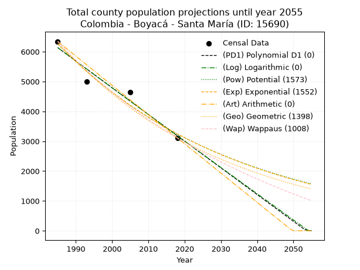
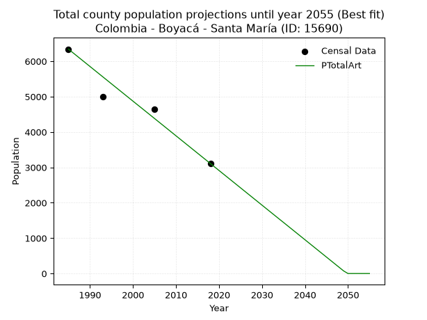
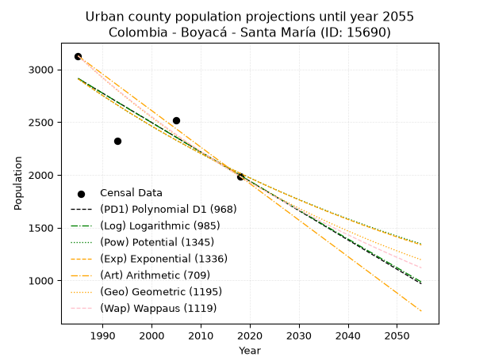
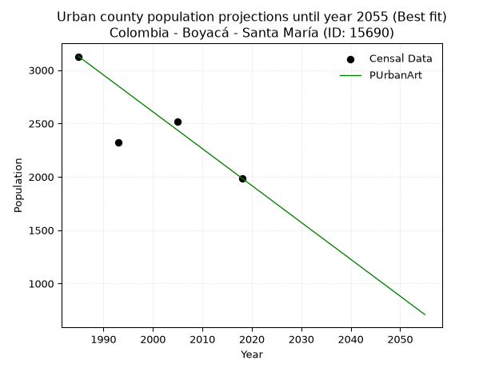
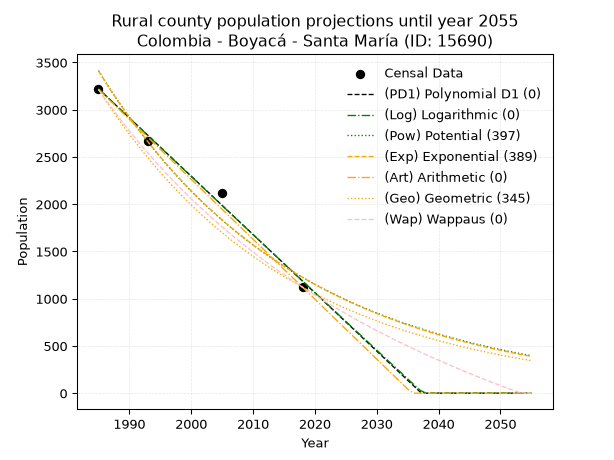
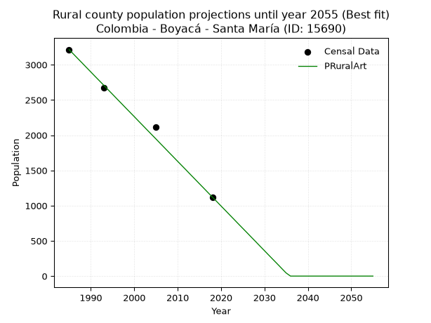

<div align="center">


</div>

# _“Population and Public Services Demand Projections (PPSD) until Year 2050 for Colombia - Boyacá - Santa María (ID: 15690)”_
Keywords: `population` `public-service` `projection` `lineal` `polynomial` `logarithmic` `potential` `exponential` `arithmetic` `geometric` `wappaus` `dane` `colombia` `south-america`

PPSD are analytical estimates used by governments and planners to anticipate future changes in population size, age distribution, and the resulting community needs for utilities, healthcare, education, and infrastructure as sizing future water treatment facilities, electrical grids, and road networks based on spatial growth.

> **General running parameters**: • app_version: _v20260806_. • Python version: _3.14.7_. • Pandas version: _3.0.5_. • NumPy version: _2.5.1_. • Creates, save and include plots into reports (create_plot): _False_. • Projection until year: _2050_. • Process polynomial degree 2 and up: _False_. • Process Wappaus: _True_. • Process Wappaus: _True_. • Set negative values to zero: _True_. • Set infinite values to zero: _True_. • Drop dataset notes: _True_. 
<div align="center">

Dynamic map: [:earth_americas:Google](http://maps.google.com/maps?q=4.857192994,-73.2635176) [:earth_americas:OSM](https://www.openstreetmap.org/#map=18/4.857192994/-73.2635176&layers=P) [:earth_americas:Bing](https://www.bing.com/maps?cp=4.857192994~-73.2635176&lvl=18) [:earth_americas:Apple](https://maps.apple.com/frame?center=4.857192994%2C-73.2635176&span=0.003%2C0.006)

</div>


<div align="center">

```geojson
{
  "type": "Feature",
  "geometry": {
    "type": "Point", 
    "coordinates": [-73.2635176, 4.857192994]
  }, 
  "properties": {
    "Name": "Colombia - Boyacá - Santa María (ID: 15690)"
  }
}
```

</div>


## 0. Census Data (4 records)

Census data are official statistics collected by a government about the people and housing in a country. They usually include counts of total population, age, sex, race, income, education, and jobs.

📅Global census file: [Population.xlsx](../data/Population.xlsx)

| Source   |   Year |   CountryID | CountryName   |   StateID | StateName   |   CountyID | CountyName   |   PTotal |   PUrban |   PRural |
|:---------|-------:|------------:|:--------------|----------:|:------------|-----------:|:-------------|---------:|---------:|---------:|
| DANE     |   1985 |          57 | Colombia      |        15 | Boyacá      |      15690 | Santa María  |     6342 |     3127 |     3215 |
| DANE     |   1993 |          57 | Colombia      |        15 | Boyacá      |      15690 | Santa María  |     4995 |     2324 |     2671 |
| DANE     |   2005 |          57 | Colombia      |        15 | Boyacá      |      15690 | Santa María  |     4635 |     2518 |     2117 |
| DANE     |   2018 |          57 | Colombia      |        15 | Boyacá      |      15690 | Santa María  |     3109 |     1987 |     1122 |

> 🔥Some records has specific notes about the registered values or the corresponding urban or rural distribution.

## 1. Total

### 1.1. Coefficients and Parameters

* (PD1) Polynomial Deg 1: -89.48735447611301, 183767.33079084507 (lineal)
* (Log) Logarithmic: -179127.60576850548, 1366320.616884956
* (Pow) Potential: -39.885528269310456, 135.33001167004372
* (Exp) Exponential: -0.01993137760185526, 9.5322777432062e+20
* (Art) Arithmetic: Year diff. 2018 - 1985 = 33, Population diff. 3109 - 6342 = -3233, Annual growth = -97.96969696969697
* (Geo) Geometric: Year diff. 2018 - 1985 = 33, Population diff. 3109 - 6342 = -3233, Annual growth % = -0.021371149878703588
* (Wap) Wappaus: i = -2.0732133524430636, Condition values only valid for < 200)

<sub>
Wappaus condition values: ['-0.00', '-2.07', '-4.15', '-6.22', '-8.29', '-10.37', '-12.44', '-14.51', '-16.59', '-18.66', '-20.73', '-22.81', '-24.88', '-26.95', '-29.02', '-31.10', '-33.17', '-35.24', '-37.32', '-39.39', '-41.46', '-43.54', '-45.61', '-47.68', '-49.76', '-51.83', '-53.90', '-55.98', '-58.05', '-60.12', '-62.20', '-64.27', '-66.34', '-68.42', '-70.49', '-72.56', '-74.64', '-76.71', '-78.78', '-80.86', '-82.93', '-85.00', '-87.07', '-89.15', '-91.22', '-93.29', '-95.37', '-97.44', '-99.51', '-101.59', '-103.66', '-105.73', '-107.81', '-109.88', '-111.95', '-114.03', '-116.10', '-118.17', '-120.25', '-122.32', '-124.39', '-126.47', '-128.54', '-130.61', '-132.69', '-134.76']
</sub>


### 1.2. Projected Dataset

|   Year |   CountyID |   PTotalPD1 |   PTotalLog |   PTotalPow |   PTotalExp |   PTotalArt |   PTotalGeo |   PTotalWap |
|-------:|-----------:|------------:|------------:|------------:|------------:|------------:|------------:|------------:|
|   1985 |      15690 |        6135 |        6138 |        6267 |        6264 |        6342 |        6342 |        6342 |
|   1986 |      15690 |        6045 |        6047 |        6143 |        6141 |        6244 |        6206 |        6212 |
|   1987 |      15690 |        5956 |        5957 |        6021 |        6019 |        6146 |        6074 |        6084 |
|   1988 |      15690 |        5866 |        5867 |        5901 |        5901 |        6048 |        5944 |        5959 |
|   1989 |      15690 |        5777 |        5777 |        5784 |        5784 |        5950 |        5817 |        5837 |
|   1990 |      15690 |        5687 |        5687 |        5669 |        5670 |        5852 |        5693 |        5717 |
|   1991 |      15690 |        5598 |        5597 |        5557 |        5558 |        5754 |        5571 |        5599 |
|   1992 |      15690 |        5509 |        5507 |        5446 |        5448 |        5656 |        5452 |        5484 |
|   1993 |      15690 |        5419 |        5417 |        5339 |        5341 |        5558 |        5335 |        5371 |
|   1994 |      15690 |        5330 |        5327 |        5233 |        5236 |        5460 |        5221 |        5260 |
|   1995 |      15690 |        5240 |        5238 |        5129 |        5132 |        5362 |        5110 |        5151 |
|   1996 |      15690 |        5151 |        5148 |        5028 |        5031 |        5264 |        5001 |        5044 |
|   1997 |      15690 |        5061 |        5058 |        4928 |        4932 |        5166 |        4894 |        4939 |
|   1998 |      15690 |        4972 |        4968 |        4831 |        4834 |        5068 |        4789 |        4836 |
|   1999 |      15690 |        4882 |        4879 |        4735 |        4739 |        4970 |        4687 |        4735 |
|   2000 |      15690 |        4793 |        4789 |        4642 |        4645 |        4872 |        4587 |        4635 |
|   2001 |      15690 |        4703 |        4700 |        4550 |        4554 |        4774 |        4489 |        4538 |
|   2002 |      15690 |        4614 |        4610 |        4460 |        4464 |        4677 |        4393 |        4442 |
|   2003 |      15690 |        4524 |        4521 |        4372 |        4376 |        4579 |        4299 |        4347 |
|   2004 |      15690 |        4435 |        4431 |        4286 |        4289 |        4481 |        4207 |        4255 |
|   2005 |      15690 |        4345 |        4342 |        4202 |        4205 |        4383 |        4117 |        4164 |
|   2006 |      15690 |        4256 |        4253 |        4119 |        4122 |        4285 |        4029 |        4074 |
|   2007 |      15690 |        4166 |        4163 |        4038 |        4040 |        4187 |        3943 |        3987 |
|   2008 |      15690 |        4077 |        4074 |        3959 |        3961 |        4089 |        3859 |        3900 |
|   2009 |      15690 |        3987 |        3985 |        3881 |        3883 |        3991 |        3776 |        3815 |
|   2010 |      15690 |        3898 |        3896 |        3804 |        3806 |        3893 |        3696 |        3731 |
|   2011 |      15690 |        3808 |        3807 |        3730 |        3731 |        3795 |        3617 |        3649 |
|   2012 |      15690 |        3719 |        3718 |        3656 |        3657 |        3697 |        3539 |        3568 |
|   2013 |      15690 |        3629 |        3629 |        3585 |        3585 |        3599 |        3464 |        3489 |
|   2014 |      15690 |        3540 |        3540 |        3514 |        3514 |        3501 |        3390 |        3410 |
|   2015 |      15690 |        3450 |        3451 |        3446 |        3445 |        3403 |        3317 |        3333 |
|   2016 |      15690 |        3361 |        3362 |        3378 |        3377 |        3305 |        3246 |        3257 |
|   2017 |      15690 |        3271 |        3273 |        3312 |        3310 |        3207 |        3177 |        3183 |
|   2018 |      15690 |        3182 |        3184 |        3247 |        3245 |        3109 |        3109 |        3109 |
|   2019 |      15690 |        3092 |        3095 |        3183 |        3181 |        3011 |        3043 |        3037 |
|   2020 |      15690 |        3003 |        3007 |        3121 |        3118 |        2913 |        2978 |        2965 |
|   2021 |      15690 |        2913 |        2918 |        3060 |        3057 |        2815 |        2914 |        2895 |
|   2022 |      15690 |        2824 |        2830 |        3000 |        2996 |        2717 |        2852 |        2826 |
|   2023 |      15690 |        2734 |        2741 |        2942 |        2937 |        2619 |        2791 |        2758 |
|   2024 |      15690 |        2645 |        2652 |        2884 |        2879 |        2521 |        2731 |        2690 |
|   2025 |      15690 |        2555 |        2564 |        2828 |        2822 |        2423 |        2673 |        2624 |
|   2026 |      15690 |        2466 |        2476 |        2773 |        2767 |        2325 |        2616 |        2559 |
|   2027 |      15690 |        2376 |        2387 |        2719 |        2712 |        2227 |        2560 |        2495 |
|   2028 |      15690 |        2287 |        2299 |        2666 |        2659 |        2129 |        2505 |        2431 |
|   2029 |      15690 |        2197 |        2210 |        2614 |        2606 |        2031 |        2451 |        2369 |
|   2030 |      15690 |        2108 |        2122 |        2563 |        2555 |        1933 |        2399 |        2307 |
|   2031 |      15690 |        2019 |        2034 |        2513 |        2504 |        1835 |        2348 |        2247 |
|   2032 |      15690 |        1929 |        1946 |        2464 |        2455 |        1737 |        2298 |        2187 |
|   2033 |      15690 |        1840 |        1858 |        2417 |        2406 |        1639 |        2248 |        2128 |
|   2034 |      15690 |        1750 |        1770 |        2370 |        2359 |        1541 |        2200 |        2069 |
|   2035 |      15690 |        1661 |        1682 |        2324 |        2312 |        1444 |        2153 |        2012 |
|   2036 |      15690 |        1571 |        1594 |        2279 |        2267 |        1346 |        2107 |        1955 |
|   2037 |      15690 |        1482 |        1506 |        2234 |        2222 |        1248 |        2062 |        1900 |
|   2038 |      15690 |        1392 |        1418 |        2191 |        2178 |        1150 |        2018 |        1844 |
|   2039 |      15690 |        1303 |        1330 |        2149 |        2135 |        1052 |        1975 |        1790 |
|   2040 |      15690 |        1213 |        1242 |        2107 |        2093 |         954 |        1933 |        1736 |
|   2041 |      15690 |        1124 |        1154 |        2066 |        2052 |         856 |        1892 |        1683 |
|   2042 |      15690 |        1034 |        1066 |        2026 |        2011 |         758 |        1851 |        1631 |
|   2043 |      15690 |         945 |         979 |        1987 |        1972 |         660 |        1812 |        1579 |
|   2044 |      15690 |         855 |         891 |        1949 |        1933 |         562 |        1773 |        1528 |
|   2045 |      15690 |         766 |         803 |        1911 |        1895 |         464 |        1735 |        1478 |
|   2046 |      15690 |         676 |         716 |        1874 |        1857 |         366 |        1698 |        1428 |
|   2047 |      15690 |         587 |         628 |        1838 |        1820 |         268 |        1662 |        1379 |
|   2048 |      15690 |         497 |         541 |        1802 |        1785 |         170 |        1626 |        1331 |
|   2049 |      15690 |         408 |         453 |        1768 |        1749 |          72 |        1591 |        1283 |
|   2050 |      15690 |         318 |         366 |        1734 |        1715 |         -26 |        1557 |        1236 |
<div align="center">

</img>

</div>


### 1.3. Best fit with absolute error and relative error (%)

Relative error puts that difference into context by dividing the absolute error by the true value, creating a unitless ratio or percentage that shows the scale of the mistake.

Absolute and relative error

|   Year | Source   |   CountryID | CountryName   |   StateID | StateName   |   CountyID_x | CountyName   |   PTotal |   PUrban |   PRural |   CountyID_y |   PTotalPD1 |   PTotalLog |   PTotalPow |   PTotalExp |   PTotalArt |   PTotalGeo |   PTotalWap |   PTotalPD1AbsError |   PTotalLogAbsError |   PTotalPowAbsError |   PTotalExpAbsError |   PTotalArtAbsError |   PTotalGeoAbsError |   PTotalWapAbsError |   PTotalPD1RelError |   PTotalLogRelError |   PTotalPowRelError |   PTotalExpRelError |   PTotalArtRelError |   PTotalGeoRelError |   PTotalWapRelError |
|-------:|:---------|------------:|:--------------|----------:|:------------|-------------:|:-------------|---------:|---------:|---------:|-------------:|------------:|------------:|------------:|------------:|------------:|------------:|------------:|--------------------:|--------------------:|--------------------:|--------------------:|--------------------:|--------------------:|--------------------:|--------------------:|--------------------:|--------------------:|--------------------:|--------------------:|--------------------:|--------------------:|
|   1985 | DANE     |          57 | Colombia      |        15 | Boyacá      |        15690 | Santa María  |     6342 |     3127 |     3215 |        15690 |        6135 |        6138 |        6267 |        6264 |        6342 |        6342 |        6342 |                 207 |                 204 |                  75 |                  78 |                   0 |                   0 |                   0 |             3.26395 |             3.21665 |             1.18259 |             1.2299  |             0       |             0       |             0       |
|   1993 | DANE     |          57 | Colombia      |        15 | Boyacá      |        15690 | Santa María  |     4995 |     2324 |     2671 |        15690 |        5419 |        5417 |        5339 |        5341 |        5558 |        5335 |        5371 |                 424 |                 422 |                 344 |                 346 |                 563 |                 340 |                 376 |             8.48849 |             8.44845 |             6.88689 |             6.92693 |            11.2713  |             6.80681 |             7.52753 |
|   2005 | DANE     |          57 | Colombia      |        15 | Boyacá      |        15690 | Santa María  |     4635 |     2518 |     2117 |        15690 |        4345 |        4342 |        4202 |        4205 |        4383 |        4117 |        4164 |                 290 |                 293 |                 433 |                 430 |                 252 |                 518 |                 471 |             6.25674 |             6.32147 |             9.34196 |             9.27724 |             5.43689 |            11.1758  |            10.1618  |
|   2018 | DANE     |          57 | Colombia      |        15 | Boyacá      |        15690 | Santa María  |     3109 |     1987 |     1122 |        15690 |        3182 |        3184 |        3247 |        3245 |        3109 |        3109 |        3109 |                  73 |                  75 |                 138 |                 136 |                   0 |                   0 |                   0 |             2.34802 |             2.41235 |             4.43873 |             4.3744  |             0       |             0       |             0       |

Relative error mean

| Method    |   RelError | Best   |
|:----------|-----------:|:-------|
| PTotalPD1 |    5.0893  |        |
| PTotalLog |    5.09973 |        |
| PTotalPow |    5.46254 |        |
| PTotalExp |    5.45211 |        |
| PTotalArt |    4.17704 | True   |
| PTotalGeo |    4.49566 |        |
| PTotalWap |    4.42233 |        |

💙Best method: _**PTotalArt**_
<div align="center">

</img>

</div>


### 1.4. Fresh water supply demand in liters per capita per day (lpcd)

The fresh water supply demand typically ranges from 100 to 300 liters per capita per day (lpcd) for standard domestic and municipal planning, though absolute survival minimums set by the World Health Organization are as low as 7.5 to 20 liters per day, and total consumption in high-income nations can exceed 400 liters.

> `CZ`: Level in meters above the sea level (masl).<br> `WS`: Fresh water supply demand in liters per capita per day (lpcd or l/h/d).<br> `WSAll`: Zonal fresh water supply demand in liters per second (l/s).<br> `A`: Zonal area in square meters.

Reference values (RAS Colombia)

|    CZ |   WS |
|------:|-----:|
|  1000 |  120 |
|  2000 |  130 |
| 99999 |  140 |

County shapefile geometry properties and water supply values

|   CountyID |      ATotal |   CZTotal |   WSTotal |
|-----------:|------------:|----------:|----------:|
|      15690 | 3.09107e+08 |   1047.27 |       130 |

Projected values for best method: PTotalArt

|   CountyID |   Year |   PTotalArt |   WSTotal |   WSTotalAll |
|-----------:|-------:|------------:|----------:|-------------:|
|      15690 |   1985 |        6342 |       130 |    9.54236   |
|      15690 |   1986 |        6244 |       130 |    9.39491   |
|      15690 |   1987 |        6146 |       130 |    9.24745   |
|      15690 |   1988 |        6048 |       130 |    9.1       |
|      15690 |   1989 |        5950 |       130 |    8.95255   |
|      15690 |   1990 |        5852 |       130 |    8.80509   |
|      15690 |   1991 |        5754 |       130 |    8.65764   |
|      15690 |   1992 |        5656 |       130 |    8.51019   |
|      15690 |   1993 |        5558 |       130 |    8.36273   |
|      15690 |   1994 |        5460 |       130 |    8.21528   |
|      15690 |   1995 |        5362 |       130 |    8.06782   |
|      15690 |   1996 |        5264 |       130 |    7.92037   |
|      15690 |   1997 |        5166 |       130 |    7.77292   |
|      15690 |   1998 |        5068 |       130 |    7.62546   |
|      15690 |   1999 |        4970 |       130 |    7.47801   |
|      15690 |   2000 |        4872 |       130 |    7.33056   |
|      15690 |   2001 |        4774 |       130 |    7.1831    |
|      15690 |   2002 |        4677 |       130 |    7.03715   |
|      15690 |   2003 |        4579 |       130 |    6.8897    |
|      15690 |   2004 |        4481 |       130 |    6.74225   |
|      15690 |   2005 |        4383 |       130 |    6.59479   |
|      15690 |   2006 |        4285 |       130 |    6.44734   |
|      15690 |   2007 |        4187 |       130 |    6.29988   |
|      15690 |   2008 |        4089 |       130 |    6.15243   |
|      15690 |   2009 |        3991 |       130 |    6.00498   |
|      15690 |   2010 |        3893 |       130 |    5.85752   |
|      15690 |   2011 |        3795 |       130 |    5.71007   |
|      15690 |   2012 |        3697 |       130 |    5.56262   |
|      15690 |   2013 |        3599 |       130 |    5.41516   |
|      15690 |   2014 |        3501 |       130 |    5.26771   |
|      15690 |   2015 |        3403 |       130 |    5.12025   |
|      15690 |   2016 |        3305 |       130 |    4.9728    |
|      15690 |   2017 |        3207 |       130 |    4.82535   |
|      15690 |   2018 |        3109 |       130 |    4.67789   |
|      15690 |   2019 |        3011 |       130 |    4.53044   |
|      15690 |   2020 |        2913 |       130 |    4.38299   |
|      15690 |   2021 |        2815 |       130 |    4.23553   |
|      15690 |   2022 |        2717 |       130 |    4.08808   |
|      15690 |   2023 |        2619 |       130 |    3.94062   |
|      15690 |   2024 |        2521 |       130 |    3.79317   |
|      15690 |   2025 |        2423 |       130 |    3.64572   |
|      15690 |   2026 |        2325 |       130 |    3.49826   |
|      15690 |   2027 |        2227 |       130 |    3.35081   |
|      15690 |   2028 |        2129 |       130 |    3.20336   |
|      15690 |   2029 |        2031 |       130 |    3.0559    |
|      15690 |   2030 |        1933 |       130 |    2.90845   |
|      15690 |   2031 |        1835 |       130 |    2.761     |
|      15690 |   2032 |        1737 |       130 |    2.61354   |
|      15690 |   2033 |        1639 |       130 |    2.46609   |
|      15690 |   2034 |        1541 |       130 |    2.31863   |
|      15690 |   2035 |        1444 |       130 |    2.17269   |
|      15690 |   2036 |        1346 |       130 |    2.02523   |
|      15690 |   2037 |        1248 |       130 |    1.87778   |
|      15690 |   2038 |        1150 |       130 |    1.73032   |
|      15690 |   2039 |        1052 |       130 |    1.58287   |
|      15690 |   2040 |         954 |       130 |    1.43542   |
|      15690 |   2041 |         856 |       130 |    1.28796   |
|      15690 |   2042 |         758 |       130 |    1.14051   |
|      15690 |   2043 |         660 |       130 |    0.993056  |
|      15690 |   2044 |         562 |       130 |    0.845602  |
|      15690 |   2045 |         464 |       130 |    0.698148  |
|      15690 |   2046 |         366 |       130 |    0.550694  |
|      15690 |   2047 |         268 |       130 |    0.403241  |
|      15690 |   2048 |         170 |       130 |    0.255787  |
|      15690 |   2049 |          72 |       130 |    0.108333  |
|      15690 |   2050 |         -26 |       130 |   -0.0391204 |

## 2. Urban

### 2.1. Coefficients and Parameters

* (PD1) Polynomial Deg 1: -27.78964271376926, 58075.232838216965 (lineal)
* (Log) Logarithmic: -55649.77574278809, 425483.3913702477
* (Pow) Potential: -22.26662324416716, 76.8939663660192
* (Exp) Exponential: -0.01112149615714558, 11255653722773.717
* (Art) Arithmetic: Year diff. 2018 - 1985 = 33, Population diff. 1987 - 3127 = -1140, Annual growth = -34.54545454545455
* (Geo) Geometric: Year diff. 2018 - 1985 = 33, Population diff. 1987 - 3127 = -1140, Annual growth % = -0.013646877383164058
* (Wap) Wappaus: i = -1.3510150389305648, Condition values only valid for < 200)

<sub>
Wappaus condition values: ['-0.00', '-1.35', '-2.70', '-4.05', '-5.40', '-6.76', '-8.11', '-9.46', '-10.81', '-12.16', '-13.51', '-14.86', '-16.21', '-17.56', '-18.91', '-20.27', '-21.62', '-22.97', '-24.32', '-25.67', '-27.02', '-28.37', '-29.72', '-31.07', '-32.42', '-33.78', '-35.13', '-36.48', '-37.83', '-39.18', '-40.53', '-41.88', '-43.23', '-44.58', '-45.93', '-47.29', '-48.64', '-49.99', '-51.34', '-52.69', '-54.04', '-55.39', '-56.74', '-58.09', '-59.44', '-60.80', '-62.15', '-63.50', '-64.85', '-66.20', '-67.55', '-68.90', '-70.25', '-71.60', '-72.95', '-74.31', '-75.66', '-77.01', '-78.36', '-79.71', '-81.06', '-82.41', '-83.76', '-85.11', '-86.46', '-87.82']
</sub>


### 2.2. Projected Dataset

|   Year |   CountyID |   PUrbanPD1 |   PUrbanLog |   PUrbanPow |   PUrbanExp |   PUrbanArt |   PUrbanGeo |   PUrbanWap |
|-------:|-----------:|------------:|------------:|------------:|------------:|------------:|------------:|------------:|
|   1985 |      15690 |        2913 |        2914 |        2911 |        2909 |        3127 |        3127 |        3127 |
|   1986 |      15690 |        2885 |        2886 |        2878 |        2877 |        3092 |        3084 |        3085 |
|   1987 |      15690 |        2857 |        2858 |        2846 |        2845 |        3058 |        3042 |        3044 |
|   1988 |      15690 |        2829 |        2830 |        2814 |        2814 |        3023 |        3001 |        3003 |
|   1989 |      15690 |        2802 |        2802 |        2783 |        2783 |        2989 |        2960 |        2962 |
|   1990 |      15690 |        2774 |        2774 |        2752 |        2752 |        2954 |        2919 |        2923 |
|   1991 |      15690 |        2746 |        2746 |        2721 |        2722 |        2920 |        2880 |        2883 |
|   1992 |      15690 |        2718 |        2718 |        2691 |        2692 |        2885 |        2840 |        2845 |
|   1993 |      15690 |        2690 |        2690 |        2661 |        2662 |        2851 |        2801 |        2806 |
|   1994 |      15690 |        2663 |        2662 |        2632 |        2632 |        2816 |        2763 |        2769 |
|   1995 |      15690 |        2635 |        2634 |        2602 |        2603 |        2782 |        2726 |        2731 |
|   1996 |      15690 |        2607 |        2606 |        2574 |        2574 |        2747 |        2688 |        2694 |
|   1997 |      15690 |        2579 |        2578 |        2545 |        2546 |        2712 |        2652 |        2658 |
|   1998 |      15690 |        2552 |        2551 |        2517 |        2518 |        2678 |        2615 |        2622 |
|   1999 |      15690 |        2524 |        2523 |        2489 |        2490 |        2643 |        2580 |        2587 |
|   2000 |      15690 |        2496 |        2495 |        2461 |        2462 |        2609 |        2545 |        2552 |
|   2001 |      15690 |        2468 |        2467 |        2434 |        2435 |        2574 |        2510 |        2517 |
|   2002 |      15690 |        2440 |        2439 |        2407 |        2408 |        2540 |        2476 |        2483 |
|   2003 |      15690 |        2413 |        2411 |        2381 |        2382 |        2505 |        2442 |        2449 |
|   2004 |      15690 |        2385 |        2384 |        2354 |        2355 |        2471 |        2408 |        2416 |
|   2005 |      15690 |        2357 |        2356 |        2328 |        2329 |        2436 |        2376 |        2383 |
|   2006 |      15690 |        2329 |        2328 |        2303 |        2303 |        2402 |        2343 |        2350 |
|   2007 |      15690 |        2301 |        2300 |        2277 |        2278 |        2367 |        2311 |        2318 |
|   2008 |      15690 |        2274 |        2273 |        2252 |        2253 |        2332 |        2280 |        2286 |
|   2009 |      15690 |        2246 |        2245 |        2227 |        2228 |        2298 |        2249 |        2255 |
|   2010 |      15690 |        2218 |        2217 |        2203 |        2203 |        2263 |        2218 |        2223 |
|   2011 |      15690 |        2190 |        2190 |        2178 |        2179 |        2229 |        2188 |        2193 |
|   2012 |      15690 |        2162 |        2162 |        2154 |        2155 |        2194 |        2158 |        2162 |
|   2013 |      15690 |        2135 |        2134 |        2131 |        2131 |        2160 |        2128 |        2132 |
|   2014 |      15690 |        2107 |        2107 |        2107 |        2107 |        2125 |        2099 |        2103 |
|   2015 |      15690 |        2079 |        2079 |        2084 |        2084 |        2091 |        2071 |        2073 |
|   2016 |      15690 |        2051 |        2051 |        2061 |        2061 |        2056 |        2042 |        2044 |
|   2017 |      15690 |        2024 |        2024 |        2039 |        2038 |        2022 |        2014 |        2015 |
|   2018 |      15690 |        1996 |        1996 |        2016 |        2016 |        1987 |        1987 |        1987 |
|   2019 |      15690 |        1968 |        1969 |        1994 |        1993 |        1952 |        1960 |        1959 |
|   2020 |      15690 |        1940 |        1941 |        1972 |        1971 |        1918 |        1933 |        1931 |
|   2021 |      15690 |        1912 |        1914 |        1951 |        1950 |        1883 |        1907 |        1904 |
|   2022 |      15690 |        1885 |        1886 |        1929 |        1928 |        1849 |        1881 |        1876 |
|   2023 |      15690 |        1857 |        1859 |        1908 |        1907 |        1814 |        1855 |        1850 |
|   2024 |      15690 |        1829 |        1831 |        1887 |        1886 |        1780 |        1830 |        1823 |
|   2025 |      15690 |        1801 |        1804 |        1867 |        1865 |        1745 |        1805 |        1797 |
|   2026 |      15690 |        1773 |        1776 |        1846 |        1844 |        1711 |        1780 |        1771 |
|   2027 |      15690 |        1746 |        1749 |        1826 |        1824 |        1676 |        1756 |        1745 |
|   2028 |      15690 |        1718 |        1721 |        1806 |        1804 |        1642 |        1732 |        1719 |
|   2029 |      15690 |        1690 |        1694 |        1786 |        1784 |        1607 |        1708 |        1694 |
|   2030 |      15690 |        1662 |        1666 |        1767 |        1764 |        1572 |        1685 |        1669 |
|   2031 |      15690 |        1634 |        1639 |        1748 |        1744 |        1538 |        1662 |        1644 |
|   2032 |      15690 |        1607 |        1612 |        1729 |        1725 |        1503 |        1639 |        1620 |
|   2033 |      15690 |        1579 |        1584 |        1710 |        1706 |        1469 |        1617 |        1596 |
|   2034 |      15690 |        1551 |        1557 |        1691 |        1687 |        1434 |        1595 |        1572 |
|   2035 |      15690 |        1523 |        1529 |        1673 |        1668 |        1400 |        1573 |        1548 |
|   2036 |      15690 |        1496 |        1502 |        1654 |        1650 |        1365 |        1552 |        1525 |
|   2037 |      15690 |        1468 |        1475 |        1636 |        1632 |        1331 |        1530 |        1501 |
|   2038 |      15690 |        1440 |        1447 |        1619 |        1614 |        1296 |        1510 |        1478 |
|   2039 |      15690 |        1412 |        1420 |        1601 |        1596 |        1262 |        1489 |        1455 |
|   2040 |      15690 |        1384 |        1393 |        1584 |        1578 |        1227 |        1469 |        1433 |
|   2041 |      15690 |        1357 |        1366 |        1567 |        1561 |        1192 |        1449 |        1411 |
|   2042 |      15690 |        1329 |        1338 |        1550 |        1543 |        1158 |        1429 |        1388 |
|   2043 |      15690 |        1301 |        1311 |        1533 |        1526 |        1123 |        1409 |        1366 |
|   2044 |      15690 |        1273 |        1284 |        1516 |        1510 |        1089 |        1390 |        1345 |
|   2045 |      15690 |        1245 |        1257 |        1500 |        1493 |        1054 |        1371 |        1323 |
|   2046 |      15690 |        1218 |        1229 |        1483 |        1476 |        1020 |        1352 |        1302 |
|   2047 |      15690 |        1190 |        1202 |        1467 |        1460 |         985 |        1334 |        1281 |
|   2048 |      15690 |        1162 |        1175 |        1452 |        1444 |         951 |        1316 |        1260 |
|   2049 |      15690 |        1134 |        1148 |        1436 |        1428 |         916 |        1298 |        1239 |
|   2050 |      15690 |        1106 |        1121 |        1420 |        1412 |         882 |        1280 |        1219 |
<div align="center">

</img>

</div>


### 2.3. Best fit with absolute error and relative error (%)

Relative error puts that difference into context by dividing the absolute error by the true value, creating a unitless ratio or percentage that shows the scale of the mistake.

Absolute and relative error

|   Year | Source   |   CountryID | CountryName   |   StateID | StateName   |   CountyID_x | CountyName   |   PTotal |   PUrban |   PRural |   CountyID_y |   PUrbanPD1 |   PUrbanLog |   PUrbanPow |   PUrbanExp |   PUrbanArt |   PUrbanGeo |   PUrbanWap |   PUrbanPD1AbsError |   PUrbanLogAbsError |   PUrbanPowAbsError |   PUrbanExpAbsError |   PUrbanArtAbsError |   PUrbanGeoAbsError |   PUrbanWapAbsError |   PUrbanPD1RelError |   PUrbanLogRelError |   PUrbanPowRelError |   PUrbanExpRelError |   PUrbanArtRelError |   PUrbanGeoRelError |   PUrbanWapRelError |
|-------:|:---------|------------:|:--------------|----------:|:------------|-------------:|:-------------|---------:|---------:|---------:|-------------:|------------:|------------:|------------:|------------:|------------:|------------:|------------:|--------------------:|--------------------:|--------------------:|--------------------:|--------------------:|--------------------:|--------------------:|--------------------:|--------------------:|--------------------:|--------------------:|--------------------:|--------------------:|--------------------:|
|   1985 | DANE     |          57 | Colombia      |        15 | Boyacá      |        15690 | Santa María  |     6342 |     3127 |     3215 |        15690 |        2913 |        2914 |        2911 |        2909 |        3127 |        3127 |        3127 |                 214 |                 213 |                 216 |                 218 |                   0 |                   0 |                   0 |            6.84362  |            6.81164  |             6.90758 |             6.97154 |             0       |              0      |              0      |
|   1993 | DANE     |          57 | Colombia      |        15 | Boyacá      |        15690 | Santa María  |     4995 |     2324 |     2671 |        15690 |        2690 |        2690 |        2661 |        2662 |        2851 |        2801 |        2806 |                 366 |                 366 |                 337 |                 338 |                 527 |                 477 |                 482 |           15.7487   |           15.7487   |            14.5009  |            14.5439  |            22.6764  |             20.525  |             20.7401 |
|   2005 | DANE     |          57 | Colombia      |        15 | Boyacá      |        15690 | Santa María  |     4635 |     2518 |     2117 |        15690 |        2357 |        2356 |        2328 |        2329 |        2436 |        2376 |        2383 |                 161 |                 162 |                 190 |                 189 |                  82 |                 142 |                 135 |            6.39396  |            6.43368  |             7.54567 |             7.50596 |             3.25655 |              5.6394 |              5.3614 |
|   2018 | DANE     |          57 | Colombia      |        15 | Boyacá      |        15690 | Santa María  |     3109 |     1987 |     1122 |        15690 |        1996 |        1996 |        2016 |        2016 |        1987 |        1987 |        1987 |                   9 |                   9 |                  29 |                  29 |                   0 |                   0 |                   0 |            0.452944 |            0.452944 |             1.45949 |             1.45949 |             0       |              0      |              0      |

Relative error mean

| Method    |   RelError | Best   |
|:----------|-----------:|:-------|
| PUrbanPD1 |    7.35981 |        |
| PUrbanLog |    7.36174 |        |
| PUrbanPow |    7.6034  |        |
| PUrbanExp |    7.62022 |        |
| PUrbanArt |    6.48324 | True   |
| PUrbanGeo |    6.54109 |        |
| PUrbanWap |    6.52538 |        |

💙Best method: _**PUrbanArt**_
<div align="center">

</img>

</div>


### 2.4. Fresh water supply demand in liters per capita per day (lpcd)

The fresh water supply demand typically ranges from 100 to 300 liters per capita per day (lpcd) for standard domestic and municipal planning, though absolute survival minimums set by the World Health Organization are as low as 7.5 to 20 liters per day, and total consumption in high-income nations can exceed 400 liters.

> `CZ`: Level in meters above the sea level (masl).<br> `WS`: Fresh water supply demand in liters per capita per day (lpcd or l/h/d).<br> `WSAll`: Zonal fresh water supply demand in liters per second (l/s).<br> `A`: Zonal area in square meters.

Reference values (RAS Colombia)

|    CZ |   WS |
|------:|-----:|
|  1000 |  120 |
|  2000 |  130 |
| 99999 |  140 |

County shapefile geometry properties and water supply values

|   CountyID |   AUrban |   CZUrban |   WSUrban |
|-----------:|---------:|----------:|----------:|
|      15690 |   825099 |    828.21 |       120 |

Projected values for best method: PUrbanArt

|   CountyID |   Year |   PUrbanArt |   WSUrban |   WSUrbanAll |
|-----------:|-------:|------------:|----------:|-------------:|
|      15690 |   1985 |        3127 |       120 |      4.34306 |
|      15690 |   1986 |        3092 |       120 |      4.29444 |
|      15690 |   1987 |        3058 |       120 |      4.24722 |
|      15690 |   1988 |        3023 |       120 |      4.19861 |
|      15690 |   1989 |        2989 |       120 |      4.15139 |
|      15690 |   1990 |        2954 |       120 |      4.10278 |
|      15690 |   1991 |        2920 |       120 |      4.05556 |
|      15690 |   1992 |        2885 |       120 |      4.00694 |
|      15690 |   1993 |        2851 |       120 |      3.95972 |
|      15690 |   1994 |        2816 |       120 |      3.91111 |
|      15690 |   1995 |        2782 |       120 |      3.86389 |
|      15690 |   1996 |        2747 |       120 |      3.81528 |
|      15690 |   1997 |        2712 |       120 |      3.76667 |
|      15690 |   1998 |        2678 |       120 |      3.71944 |
|      15690 |   1999 |        2643 |       120 |      3.67083 |
|      15690 |   2000 |        2609 |       120 |      3.62361 |
|      15690 |   2001 |        2574 |       120 |      3.575   |
|      15690 |   2002 |        2540 |       120 |      3.52778 |
|      15690 |   2003 |        2505 |       120 |      3.47917 |
|      15690 |   2004 |        2471 |       120 |      3.43194 |
|      15690 |   2005 |        2436 |       120 |      3.38333 |
|      15690 |   2006 |        2402 |       120 |      3.33611 |
|      15690 |   2007 |        2367 |       120 |      3.2875  |
|      15690 |   2008 |        2332 |       120 |      3.23889 |
|      15690 |   2009 |        2298 |       120 |      3.19167 |
|      15690 |   2010 |        2263 |       120 |      3.14306 |
|      15690 |   2011 |        2229 |       120 |      3.09583 |
|      15690 |   2012 |        2194 |       120 |      3.04722 |
|      15690 |   2013 |        2160 |       120 |      3       |
|      15690 |   2014 |        2125 |       120 |      2.95139 |
|      15690 |   2015 |        2091 |       120 |      2.90417 |
|      15690 |   2016 |        2056 |       120 |      2.85556 |
|      15690 |   2017 |        2022 |       120 |      2.80833 |
|      15690 |   2018 |        1987 |       120 |      2.75972 |
|      15690 |   2019 |        1952 |       120 |      2.71111 |
|      15690 |   2020 |        1918 |       120 |      2.66389 |
|      15690 |   2021 |        1883 |       120 |      2.61528 |
|      15690 |   2022 |        1849 |       120 |      2.56806 |
|      15690 |   2023 |        1814 |       120 |      2.51944 |
|      15690 |   2024 |        1780 |       120 |      2.47222 |
|      15690 |   2025 |        1745 |       120 |      2.42361 |
|      15690 |   2026 |        1711 |       120 |      2.37639 |
|      15690 |   2027 |        1676 |       120 |      2.32778 |
|      15690 |   2028 |        1642 |       120 |      2.28056 |
|      15690 |   2029 |        1607 |       120 |      2.23194 |
|      15690 |   2030 |        1572 |       120 |      2.18333 |
|      15690 |   2031 |        1538 |       120 |      2.13611 |
|      15690 |   2032 |        1503 |       120 |      2.0875  |
|      15690 |   2033 |        1469 |       120 |      2.04028 |
|      15690 |   2034 |        1434 |       120 |      1.99167 |
|      15690 |   2035 |        1400 |       120 |      1.94444 |
|      15690 |   2036 |        1365 |       120 |      1.89583 |
|      15690 |   2037 |        1331 |       120 |      1.84861 |
|      15690 |   2038 |        1296 |       120 |      1.8     |
|      15690 |   2039 |        1262 |       120 |      1.75278 |
|      15690 |   2040 |        1227 |       120 |      1.70417 |
|      15690 |   2041 |        1192 |       120 |      1.65556 |
|      15690 |   2042 |        1158 |       120 |      1.60833 |
|      15690 |   2043 |        1123 |       120 |      1.55972 |
|      15690 |   2044 |        1089 |       120 |      1.5125  |
|      15690 |   2045 |        1054 |       120 |      1.46389 |
|      15690 |   2046 |        1020 |       120 |      1.41667 |
|      15690 |   2047 |         985 |       120 |      1.36806 |
|      15690 |   2048 |         951 |       120 |      1.32083 |
|      15690 |   2049 |         916 |       120 |      1.27222 |
|      15690 |   2050 |         882 |       120 |      1.225   |

## 3. Rural

### 3.1. Coefficients and Parameters

* (PD1) Polynomial Deg 1: -61.69771176234378, 125692.09795262814 (lineal)
* (Log) Logarithmic: -123477.83002571747, 940837.2255147089
* (Pow) Potential: -62.08769989608744, 208.2835980571304
* (Exp) Exponential: -0.031033960158062125, 1.9342691755624537e+30
* (Art) Arithmetic: Year diff. 2018 - 1985 = 33, Population diff. 1122 - 3215 = -2093, Annual growth = -63.42424242424242
* (Geo) Geometric: Year diff. 2018 - 1985 = 33, Population diff. 1122 - 3215 = -2093, Annual growth % = -0.0313969895031575
* (Wap) Wappaus: i = -2.924797898281873, Condition values only valid for < 200)

<sub>
Wappaus condition values: ['-0.00', '-2.92', '-5.85', '-8.77', '-11.70', '-14.62', '-17.55', '-20.47', '-23.40', '-26.32', '-29.25', '-32.17', '-35.10', '-38.02', '-40.95', '-43.87', '-46.80', '-49.72', '-52.65', '-55.57', '-58.50', '-61.42', '-64.35', '-67.27', '-70.20', '-73.12', '-76.04', '-78.97', '-81.89', '-84.82', '-87.74', '-90.67', '-93.59', '-96.52', '-99.44', '-102.37', '-105.29', '-108.22', '-111.14', '-114.07', '-116.99', '-119.92', '-122.84', '-125.77', '-128.69', '-131.62', '-134.54', '-137.47', '-140.39', '-143.32', '-146.24', '-149.16', '-152.09', '-155.01', '-157.94', '-160.86', '-163.79', '-166.71', '-169.64', '-172.56', '-175.49', '-178.41', '-181.34', '-184.26', '-187.19', '-190.11']
</sub>


### 3.2. Projected Dataset

|   Year |   CountyID |   PRuralPD1 |   PRuralLog |   PRuralPow |   PRuralExp |   PRuralArt |   PRuralGeo |   PRuralWap |
|-------:|-----------:|------------:|------------:|------------:|------------:|------------:|------------:|------------:|
|   1985 |      15690 |        3222 |        3224 |        3414 |        3411 |        3215 |        3215 |        3215 |
|   1986 |      15690 |        3160 |        3162 |        3309 |        3307 |        3152 |        3114 |        3122 |
|   1987 |      15690 |        3099 |        3100 |        3207 |        3206 |        3088 |        3016 |        3032 |
|   1988 |      15690 |        3037 |        3037 |        3108 |        3108 |        3025 |        2922 |        2945 |
|   1989 |      15690 |        2975 |        2975 |        3013 |        3013 |        2961 |        2830 |        2860 |
|   1990 |      15690 |        2914 |        2913 |        2920 |        2921 |        2898 |        2741 |        2777 |
|   1991 |      15690 |        2852 |        2851 |        2830 |        2832 |        2834 |        2655 |        2696 |
|   1992 |      15690 |        2790 |        2789 |        2744 |        2745 |        2771 |        2572 |        2618 |
|   1993 |      15690 |        2729 |        2727 |        2659 |        2661 |        2708 |        2491 |        2542 |
|   1994 |      15690 |        2667 |        2665 |        2578 |        2580 |        2644 |        2413 |        2467 |
|   1995 |      15690 |        2605 |        2603 |        2499 |        2501 |        2581 |        2337 |        2395 |
|   1996 |      15690 |        2543 |        2541 |        2422 |        2425 |        2517 |        2264 |        2324 |
|   1997 |      15690 |        2482 |        2480 |        2348 |        2351 |        2454 |        2192 |        2255 |
|   1998 |      15690 |        2420 |        2418 |        2276 |        2279 |        2390 |        2124 |        2188 |
|   1999 |      15690 |        2358 |        2356 |        2207 |        2209 |        2327 |        2057 |        2122 |
|   2000 |      15690 |        2297 |        2294 |        2139 |        2142 |        2264 |        1992 |        2058 |
|   2001 |      15690 |        2235 |        2233 |        2074 |        2076 |        2200 |        1930 |        1996 |
|   2002 |      15690 |        2173 |        2171 |        2010 |        2013 |        2137 |        1869 |        1935 |
|   2003 |      15690 |        2112 |        2109 |        1949 |        1951 |        2073 |        1811 |        1875 |
|   2004 |      15690 |        2050 |        2048 |        1890 |        1892 |        2010 |        1754 |        1817 |
|   2005 |      15690 |        1988 |        1986 |        1832 |        1834 |        1947 |        1699 |        1760 |
|   2006 |      15690 |        1926 |        1924 |        1776 |        1778 |        1883 |        1645 |        1704 |
|   2007 |      15690 |        1865 |        1863 |        1722 |        1724 |        1820 |        1594 |        1650 |
|   2008 |      15690 |        1803 |        1801 |        1670 |        1671 |        1756 |        1544 |        1597 |
|   2009 |      15690 |        1741 |        1740 |        1619 |        1620 |        1693 |        1495 |        1545 |
|   2010 |      15690 |        1680 |        1678 |        1569 |        1570 |        1629 |        1448 |        1494 |
|   2011 |      15690 |        1618 |        1617 |        1522 |        1522 |        1566 |        1403 |        1444 |
|   2012 |      15690 |        1556 |        1556 |        1475 |        1476 |        1503 |        1359 |        1395 |
|   2013 |      15690 |        1495 |        1494 |        1431 |        1431 |        1439 |        1316 |        1347 |
|   2014 |      15690 |        1433 |        1433 |        1387 |        1387 |        1376 |        1275 |        1300 |
|   2015 |      15690 |        1371 |        1372 |        1345 |        1345 |        1312 |        1235 |        1254 |
|   2016 |      15690 |        1310 |        1310 |        1304 |        1304 |        1249 |        1196 |        1209 |
|   2017 |      15690 |        1248 |        1249 |        1265 |        1264 |        1185 |        1158 |        1165 |
|   2018 |      15690 |        1186 |        1188 |        1226 |        1225 |        1122 |        1122 |        1122 |
|   2019 |      15690 |        1124 |        1127 |        1189 |        1188 |        1059 |        1087 |        1080 |
|   2020 |      15690 |        1063 |        1066 |        1153 |        1151 |         995 |        1053 |        1038 |
|   2021 |      15690 |        1001 |        1005 |        1118 |        1116 |         932 |        1020 |         997 |
|   2022 |      15690 |         939 |         943 |        1085 |        1082 |         868 |         988 |         957 |
|   2023 |      15690 |         878 |         882 |        1052 |        1049 |         805 |         957 |         918 |
|   2024 |      15690 |         816 |         821 |        1020 |        1017 |         741 |         927 |         880 |
|   2025 |      15690 |         754 |         760 |         989 |         986 |         678 |         897 |         842 |
|   2026 |      15690 |         693 |         699 |         959 |         956 |         615 |         869 |         805 |
|   2027 |      15690 |         631 |         638 |         930 |         927 |         551 |         842 |         768 |
|   2028 |      15690 |         569 |         578 |         902 |         898 |         488 |         816 |         733 |
|   2029 |      15690 |         507 |         517 |         875 |         871 |         424 |         790 |         697 |
|   2030 |      15690 |         446 |         456 |         849 |         844 |         361 |         765 |         663 |
|   2031 |      15690 |         384 |         395 |         823 |         818 |         297 |         741 |         629 |
|   2032 |      15690 |         322 |         334 |         798 |         793 |         234 |         718 |         596 |
|   2033 |      15690 |         261 |         274 |         774 |         769 |         171 |         695 |         563 |
|   2034 |      15690 |         199 |         213 |         751 |         746 |         107 |         673 |         531 |
|   2035 |      15690 |         137 |         152 |         729 |         723 |          44 |         652 |         499 |
|   2036 |      15690 |          76 |          91 |         707 |         701 |         -20 |         632 |         468 |
|   2037 |      15690 |          14 |          31 |         685 |         679 |         -83 |         612 |         437 |
|   2038 |      15690 |           0 |           0 |         665 |         659 |        -146 |         593 |         407 |
|   2039 |      15690 |           0 |           0 |         645 |         638 |        -210 |         574 |         378 |
|   2040 |      15690 |           0 |           0 |         626 |         619 |        -273 |         556 |         349 |
|   2041 |      15690 |           0 |           0 |         607 |         600 |        -337 |         539 |         320 |
|   2042 |      15690 |           0 |           0 |         589 |         582 |        -400 |         522 |         292 |
|   2043 |      15690 |           0 |           0 |         571 |         564 |        -464 |         505 |         264 |
|   2044 |      15690 |           0 |           0 |         554 |         547 |        -527 |         490 |         237 |
|   2045 |      15690 |           0 |           0 |         537 |         530 |        -590 |         474 |         210 |
|   2046 |      15690 |           0 |           0 |         521 |         514 |        -654 |         459 |         183 |
|   2047 |      15690 |           0 |           0 |         506 |         498 |        -717 |         445 |         157 |
|   2048 |      15690 |           0 |           0 |         491 |         483 |        -781 |         431 |         132 |
|   2049 |      15690 |           0 |           0 |         476 |         468 |        -844 |         417 |         106 |
|   2050 |      15690 |           0 |           0 |         462 |         454 |        -908 |         404 |          81 |
<div align="center">

</img>

</div>


### 3.3. Best fit with absolute error and relative error (%)

Relative error puts that difference into context by dividing the absolute error by the true value, creating a unitless ratio or percentage that shows the scale of the mistake.

Absolute and relative error

|   Year | Source   |   CountryID | CountryName   |   StateID | StateName   |   CountyID_x | CountyName   |   PTotal |   PUrban |   PRural |   CountyID_y |   PRuralPD1 |   PRuralLog |   PRuralPow |   PRuralExp |   PRuralArt |   PRuralGeo |   PRuralWap |   PRuralPD1AbsError |   PRuralLogAbsError |   PRuralPowAbsError |   PRuralExpAbsError |   PRuralArtAbsError |   PRuralGeoAbsError |   PRuralWapAbsError |   PRuralPD1RelError |   PRuralLogRelError |   PRuralPowRelError |   PRuralExpRelError |   PRuralArtRelError |   PRuralGeoRelError |   PRuralWapRelError |
|-------:|:---------|------------:|:--------------|----------:|:------------|-------------:|:-------------|---------:|---------:|---------:|-------------:|------------:|------------:|------------:|------------:|------------:|------------:|------------:|--------------------:|--------------------:|--------------------:|--------------------:|--------------------:|--------------------:|--------------------:|--------------------:|--------------------:|--------------------:|--------------------:|--------------------:|--------------------:|--------------------:|
|   1985 | DANE     |          57 | Colombia      |        15 | Boyacá      |        15690 | Santa María  |     6342 |     3127 |     3215 |        15690 |        3222 |        3224 |        3414 |        3411 |        3215 |        3215 |        3215 |                   7 |                   9 |                 199 |                 196 |                   0 |                   0 |                   0 |            0.217729 |            0.279938 |             6.18974 |            6.09642  |             0       |             0       |             0       |
|   1993 | DANE     |          57 | Colombia      |        15 | Boyacá      |        15690 | Santa María  |     4995 |     2324 |     2671 |        15690 |        2729 |        2727 |        2659 |        2661 |        2708 |        2491 |        2542 |                  58 |                  56 |                  12 |                  10 |                  37 |                 180 |                 129 |            2.17147  |            2.09659  |             0.44927 |            0.374392 |             1.38525 |             6.73905 |             4.82965 |
|   2005 | DANE     |          57 | Colombia      |        15 | Boyacá      |        15690 | Santa María  |     4635 |     2518 |     2117 |        15690 |        1988 |        1986 |        1832 |        1834 |        1947 |        1699 |        1760 |                 129 |                 131 |                 285 |                 283 |                 170 |                 418 |                 357 |            6.09353  |            6.188    |            13.4624  |           13.368    |             8.03023 |            19.7449  |            16.8635  |
|   2018 | DANE     |          57 | Colombia      |        15 | Boyacá      |        15690 | Santa María  |     3109 |     1987 |     1122 |        15690 |        1186 |        1188 |        1226 |        1225 |        1122 |        1122 |        1122 |                  64 |                  66 |                 104 |                 103 |                   0 |                   0 |                   0 |            5.7041   |            5.88235  |             9.26916 |            9.18004  |             0       |             0       |             0       |

Relative error mean

| Method    |   RelError | Best   |
|:----------|-----------:|:-------|
| PRuralPD1 |    3.54671 |        |
| PRuralLog |    3.61172 |        |
| PRuralPow |    7.34265 |        |
| PRuralExp |    7.25471 |        |
| PRuralArt |    2.35387 | True   |
| PRuralGeo |    6.62099 |        |
| PRuralWap |    5.42328 |        |

💙Best method: _**PRuralArt**_
<div align="center">

</img>

</div>


### 3.4. Fresh water supply demand in liters per capita per day (lpcd)

The fresh water supply demand typically ranges from 100 to 300 liters per capita per day (lpcd) for standard domestic and municipal planning, though absolute survival minimums set by the World Health Organization are as low as 7.5 to 20 liters per day, and total consumption in high-income nations can exceed 400 liters.

> `CZ`: Level in meters above the sea level (masl).<br> `WS`: Fresh water supply demand in liters per capita per day (lpcd or l/h/d).<br> `WSAll`: Zonal fresh water supply demand in liters per second (l/s).<br> `A`: Zonal area in square meters.

Reference values (RAS Colombia)

|    CZ |   WS |
|------:|-----:|
|  1000 |  120 |
|  2000 |  130 |
| 99999 |  140 |

County shapefile geometry properties and water supply values

|   CountyID |      ARural |   CZRural |   WSRural |
|-----------:|------------:|----------:|----------:|
|      15690 | 3.08282e+08 |   1047.85 |       130 |

Projected values for best method: PRuralArt

|   CountyID |   Year |   PRuralArt |   WSRural |   WSRuralAll |
|-----------:|-------:|------------:|----------:|-------------:|
|      15690 |   1985 |        3215 |       130 |    4.83738   |
|      15690 |   1986 |        3152 |       130 |    4.74259   |
|      15690 |   1987 |        3088 |       130 |    4.6463    |
|      15690 |   1988 |        3025 |       130 |    4.5515    |
|      15690 |   1989 |        2961 |       130 |    4.45521   |
|      15690 |   1990 |        2898 |       130 |    4.36042   |
|      15690 |   1991 |        2834 |       130 |    4.26412   |
|      15690 |   1992 |        2771 |       130 |    4.16933   |
|      15690 |   1993 |        2708 |       130 |    4.07454   |
|      15690 |   1994 |        2644 |       130 |    3.97824   |
|      15690 |   1995 |        2581 |       130 |    3.88345   |
|      15690 |   1996 |        2517 |       130 |    3.78715   |
|      15690 |   1997 |        2454 |       130 |    3.69236   |
|      15690 |   1998 |        2390 |       130 |    3.59606   |
|      15690 |   1999 |        2327 |       130 |    3.50127   |
|      15690 |   2000 |        2264 |       130 |    3.40648   |
|      15690 |   2001 |        2200 |       130 |    3.31019   |
|      15690 |   2002 |        2137 |       130 |    3.21539   |
|      15690 |   2003 |        2073 |       130 |    3.1191    |
|      15690 |   2004 |        2010 |       130 |    3.02431   |
|      15690 |   2005 |        1947 |       130 |    2.92951   |
|      15690 |   2006 |        1883 |       130 |    2.83322   |
|      15690 |   2007 |        1820 |       130 |    2.73843   |
|      15690 |   2008 |        1756 |       130 |    2.64213   |
|      15690 |   2009 |        1693 |       130 |    2.54734   |
|      15690 |   2010 |        1629 |       130 |    2.45104   |
|      15690 |   2011 |        1566 |       130 |    2.35625   |
|      15690 |   2012 |        1503 |       130 |    2.26146   |
|      15690 |   2013 |        1439 |       130 |    2.16516   |
|      15690 |   2014 |        1376 |       130 |    2.07037   |
|      15690 |   2015 |        1312 |       130 |    1.97407   |
|      15690 |   2016 |        1249 |       130 |    1.87928   |
|      15690 |   2017 |        1185 |       130 |    1.78299   |
|      15690 |   2018 |        1122 |       130 |    1.68819   |
|      15690 |   2019 |        1059 |       130 |    1.5934    |
|      15690 |   2020 |         995 |       130 |    1.49711   |
|      15690 |   2021 |         932 |       130 |    1.40231   |
|      15690 |   2022 |         868 |       130 |    1.30602   |
|      15690 |   2023 |         805 |       130 |    1.21123   |
|      15690 |   2024 |         741 |       130 |    1.11493   |
|      15690 |   2025 |         678 |       130 |    1.02014   |
|      15690 |   2026 |         615 |       130 |    0.925347  |
|      15690 |   2027 |         551 |       130 |    0.829051  |
|      15690 |   2028 |         488 |       130 |    0.734259  |
|      15690 |   2029 |         424 |       130 |    0.637963  |
|      15690 |   2030 |         361 |       130 |    0.543171  |
|      15690 |   2031 |         297 |       130 |    0.446875  |
|      15690 |   2032 |         234 |       130 |    0.352083  |
|      15690 |   2033 |         171 |       130 |    0.257292  |
|      15690 |   2034 |         107 |       130 |    0.160995  |
|      15690 |   2035 |          44 |       130 |    0.0662037 |
|      15690 |   2036 |         -20 |       130 |   -0.0300926 |
|      15690 |   2037 |         -83 |       130 |   -0.124884  |
|      15690 |   2038 |        -146 |       130 |   -0.219676  |
|      15690 |   2039 |        -210 |       130 |   -0.315972  |
|      15690 |   2040 |        -273 |       130 |   -0.410764  |
|      15690 |   2041 |        -337 |       130 |   -0.50706   |
|      15690 |   2042 |        -400 |       130 |   -0.601852  |
|      15690 |   2043 |        -464 |       130 |   -0.698148  |
|      15690 |   2044 |        -527 |       130 |   -0.79294   |
|      15690 |   2045 |        -590 |       130 |   -0.887731  |
|      15690 |   2046 |        -654 |       130 |   -0.984028  |
|      15690 |   2047 |        -717 |       130 |   -1.07882   |
|      15690 |   2048 |        -781 |       130 |   -1.17512   |
|      15690 |   2049 |        -844 |       130 |   -1.26991   |
|      15690 |   2050 |        -908 |       130 |   -1.3662    |

<div align="center"><br><sub>Share this research</sub></div><br>

<sub>**APPS & TOOLS & CONTENT DISCLAIMER**: • NO WARRANTY - This content and software is provided by <a href="https://github.com/rcfdtools" target="_blank">github.com/rcfdtools</a> "as is", without any express or implied warranty, including warranties of merchantability, fitness for a particular purpose, or non-infringement. There is no guarantee that the software will be error-free or operate without interruption. • LIMITATION OF LIABILITY - Neither the authors nor copyright holders will be liable for claims or damages arising from the software or its use. You are responsible for determining if the software is appropriate for your use and assume all associated risks, including errors, legal compliance, and data loss. • NO PROFESSIONAL ADVICE - The software provides general information and does not offer professional advice. It should not replace consultation with professional advisors. [Clauses and global license for rcfdtools use.](https://github.com/rcfdtools/rcfdtools/blob/main/LICENSE.md)</sub>