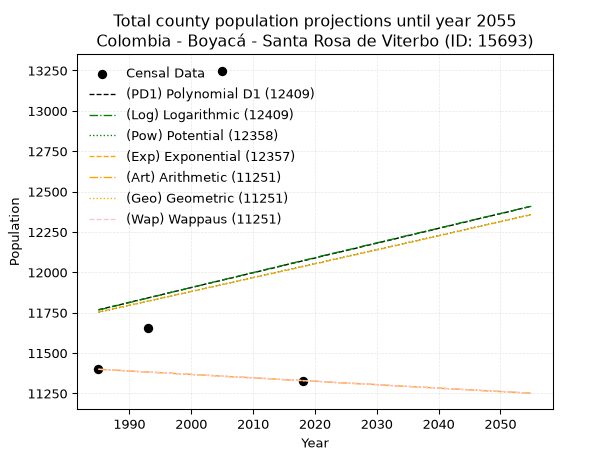
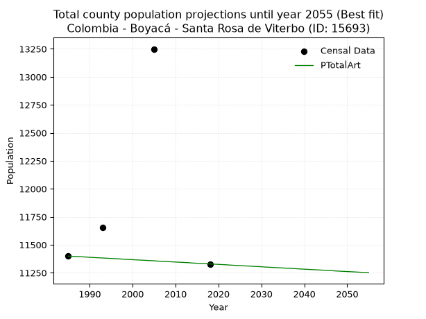
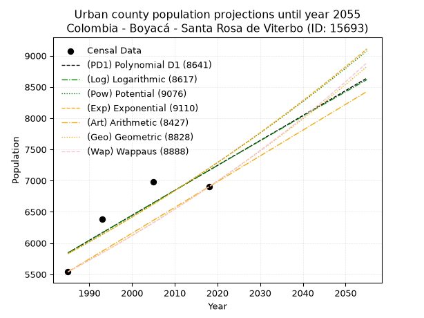
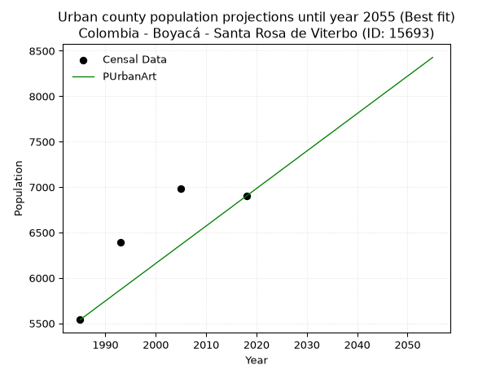
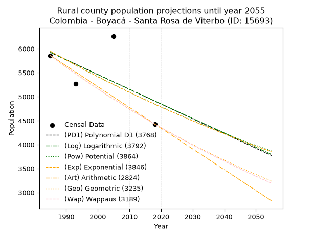
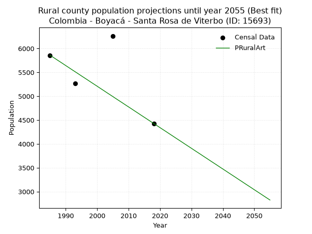

<div align="center">


</div>

# _“Population and Public Services Demand Projections (PPSD) until Year 2050 for Colombia - Boyacá - Santa Rosa de Viterbo (ID: 15693)”_
Keywords: `population` `public-service` `projection` `lineal` `polynomial` `logarithmic` `potential` `exponential` `arithmetic` `geometric` `wappaus` `dane` `colombia` `south-america`

PPSD are analytical estimates used by governments and planners to anticipate future changes in population size, age distribution, and the resulting community needs for utilities, healthcare, education, and infrastructure as sizing future water treatment facilities, electrical grids, and road networks based on spatial growth.

> **General running parameters**: • app_version: _v20260806_. • Python version: _3.14.7_. • Pandas version: _3.0.5_. • NumPy version: _2.5.1_. • Creates, save and include plots into reports (create_plot): _False_. • Projection until year: _2050_. • Process polynomial degree 2 and up: _False_. • Process Wappaus: _True_. • Process Wappaus: _True_. • Set negative values to zero: _True_. • Set infinite values to zero: _True_. • Drop dataset notes: _True_. 
<div align="center">

Dynamic map: [:earth_americas:Google](http://maps.google.com/maps?q=5.874547149,-72.9824614) [:earth_americas:OSM](https://www.openstreetmap.org/#map=18/5.874547149/-72.9824614&layers=P) [:earth_americas:Bing](https://www.bing.com/maps?cp=5.874547149~-72.9824614&lvl=18) [:earth_americas:Apple](https://maps.apple.com/frame?center=5.874547149%2C-72.9824614&span=0.003%2C0.006)

</div>


<div align="center">

```geojson
{
  "type": "Feature",
  "geometry": {
    "type": "Point", 
    "coordinates": [-72.9824614, 5.874547149]
  }, 
  "properties": {
    "Name": "Colombia - Boyacá - Santa Rosa de Viterbo (ID: 15693)"
  }
}
```

</div>


## 0. Census Data (4 records)

Census data are official statistics collected by a government about the people and housing in a country. They usually include counts of total population, age, sex, race, income, education, and jobs.

📅Global census file: [Population.xlsx](../data/Population.xlsx)

| Source   |   Year |   CountryID | CountryName   |   StateID | StateName   |   CountyID | CountyName            |   PTotal |   PUrban |   PRural |
|:---------|-------:|------------:|:--------------|----------:|:------------|-----------:|:----------------------|---------:|---------:|---------:|
| DANE     |   1985 |          57 | Colombia      |        15 | Boyacá      |      15693 | Santa Rosa de Viterbo |    11399 |     5540 |     5859 |
| DANE     |   1993 |          57 | Colombia      |        15 | Boyacá      |      15693 | Santa Rosa De Viterbo |    11653 |     6388 |     5265 |
| DANE     |   2005 |          57 | Colombia      |        15 | Boyacá      |      15693 | Santa Rosa de Viterbo |    13249 |     6986 |     6263 |
| DANE     |   2018 |          57 | Colombia      |        15 | Boyacá      |      15693 | Santa Rosa De Viterbo |    11329 |     6901 |     4428 |

> 🔥Some records could had specific notes about the registered values or the corresponding urban or rural distribution.

## 1. Total

### 1.1. Coefficients and Parameters

* (PD1) Polynomial Deg 1: 9.158570855079352, -6411.9313528724715 (lineal)
* (Log) Logarithmic: 18572.37709291593, -129261.28711294361
* (Pow) Potential: 1.4508489848481065, -0.714442733005611
* (Exp) Exponential: 0.0007150069628438756, 2843.1187952708055
* (Art) Arithmetic: Year diff. 2018 - 1985 = 33, Population diff. 11329 - 11399 = -70, Annual growth = -2.121212121212121
* (Geo) Geometric: Year diff. 2018 - 1985 = 33, Population diff. 11329 - 11399 = -70, Annual growth % = -0.00018664386360256469
* (Wap) Wappaus: i = -0.018666069352447388, Condition values only valid for < 200)

<sub>
Wappaus condition values: ['-0.00', '-0.02', '-0.04', '-0.06', '-0.07', '-0.09', '-0.11', '-0.13', '-0.15', '-0.17', '-0.19', '-0.21', '-0.22', '-0.24', '-0.26', '-0.28', '-0.30', '-0.32', '-0.34', '-0.35', '-0.37', '-0.39', '-0.41', '-0.43', '-0.45', '-0.47', '-0.49', '-0.50', '-0.52', '-0.54', '-0.56', '-0.58', '-0.60', '-0.62', '-0.63', '-0.65', '-0.67', '-0.69', '-0.71', '-0.73', '-0.75', '-0.77', '-0.78', '-0.80', '-0.82', '-0.84', '-0.86', '-0.88', '-0.90', '-0.91', '-0.93', '-0.95', '-0.97', '-0.99', '-1.01', '-1.03', '-1.05', '-1.06', '-1.08', '-1.10', '-1.12', '-1.14', '-1.16', '-1.18', '-1.19', '-1.21']
</sub>


### 1.2. Projected Dataset

|   Year |   CountyID |   PTotalPD1 |   PTotalLog |   PTotalPow |   PTotalExp |   PTotalArt |   PTotalGeo |   PTotalWap |
|-------:|-----------:|------------:|------------:|------------:|------------:|------------:|------------:|------------:|
|   1985 |      15693 |       11768 |       11766 |       11752 |       11754 |       11399 |       11399 |       11399 |
|   1986 |      15693 |       11777 |       11775 |       11761 |       11762 |       11397 |       11397 |       11397 |
|   1987 |      15693 |       11786 |       11784 |       11769 |       11771 |       11395 |       11395 |       11395 |
|   1988 |      15693 |       11795 |       11794 |       11778 |       11779 |       11393 |       11393 |       11393 |
|   1989 |      15693 |       11804 |       11803 |       11786 |       11788 |       11391 |       11390 |       11390 |
|   1990 |      15693 |       11814 |       11812 |       11795 |       11796 |       11388 |       11388 |       11388 |
|   1991 |      15693 |       11823 |       11822 |       11804 |       11804 |       11386 |       11386 |       11386 |
|   1992 |      15693 |       11832 |       11831 |       11812 |       11813 |       11384 |       11384 |       11384 |
|   1993 |      15693 |       11841 |       11840 |       11821 |       11821 |       11382 |       11382 |       11382 |
|   1994 |      15693 |       11850 |       11850 |       11829 |       11830 |       11380 |       11380 |       11380 |
|   1995 |      15693 |       11859 |       11859 |       11838 |       11838 |       11378 |       11378 |       11378 |
|   1996 |      15693 |       11869 |       11868 |       11847 |       11847 |       11376 |       11376 |       11376 |
|   1997 |      15693 |       11878 |       11878 |       11855 |       11855 |       11374 |       11373 |       11373 |
|   1998 |      15693 |       11887 |       11887 |       11864 |       11864 |       11371 |       11371 |       11371 |
|   1999 |      15693 |       11896 |       11896 |       11872 |       11872 |       11369 |       11369 |       11369 |
|   2000 |      15693 |       11905 |       11906 |       11881 |       11881 |       11367 |       11367 |       11367 |
|   2001 |      15693 |       11914 |       11915 |       11890 |       11889 |       11365 |       11365 |       11365 |
|   2002 |      15693 |       11924 |       11924 |       11898 |       11898 |       11363 |       11363 |       11363 |
|   2003 |      15693 |       11933 |       11933 |       11907 |       11906 |       11361 |       11361 |       11361 |
|   2004 |      15693 |       11942 |       11943 |       11915 |       11915 |       11359 |       11359 |       11359 |
|   2005 |      15693 |       11951 |       11952 |       11924 |       11923 |       11357 |       11357 |       11357 |
|   2006 |      15693 |       11960 |       11961 |       11933 |       11932 |       11354 |       11354 |       11354 |
|   2007 |      15693 |       11969 |       11970 |       11941 |       11940 |       11352 |       11352 |       11352 |
|   2008 |      15693 |       11978 |       11980 |       11950 |       11949 |       11350 |       11350 |       11350 |
|   2009 |      15693 |       11988 |       11989 |       11959 |       11957 |       11348 |       11348 |       11348 |
|   2010 |      15693 |       11997 |       11998 |       11967 |       11966 |       11346 |       11346 |       11346 |
|   2011 |      15693 |       12006 |       12007 |       11976 |       11975 |       11344 |       11344 |       11344 |
|   2012 |      15693 |       12015 |       12017 |       11985 |       11983 |       11342 |       11342 |       11342 |
|   2013 |      15693 |       12024 |       12026 |       11993 |       11992 |       11340 |       11340 |       11340 |
|   2014 |      15693 |       12033 |       12035 |       12002 |       12000 |       11337 |       11337 |       11337 |
|   2015 |      15693 |       12043 |       12044 |       12011 |       12009 |       11335 |       11335 |       11335 |
|   2016 |      15693 |       12052 |       12054 |       12019 |       12017 |       11333 |       11333 |       11333 |
|   2017 |      15693 |       12061 |       12063 |       12028 |       12026 |       11331 |       11331 |       11331 |
|   2018 |      15693 |       12070 |       12072 |       12036 |       12035 |       11329 |       11329 |       11329 |
|   2019 |      15693 |       12079 |       12081 |       12045 |       12043 |       11327 |       11327 |       11327 |
|   2020 |      15693 |       12088 |       12090 |       12054 |       12052 |       11325 |       11325 |       11325 |
|   2021 |      15693 |       12098 |       12100 |       12062 |       12060 |       11323 |       11323 |       11323 |
|   2022 |      15693 |       12107 |       12109 |       12071 |       12069 |       11321 |       11321 |       11321 |
|   2023 |      15693 |       12116 |       12118 |       12080 |       12078 |       11318 |       11318 |       11318 |
|   2024 |      15693 |       12125 |       12127 |       12088 |       12086 |       11316 |       11316 |       11316 |
|   2025 |      15693 |       12134 |       12136 |       12097 |       12095 |       11314 |       11314 |       11314 |
|   2026 |      15693 |       12143 |       12145 |       12106 |       12104 |       11312 |       11312 |       11312 |
|   2027 |      15693 |       12152 |       12155 |       12114 |       12112 |       11310 |       11310 |       11310 |
|   2028 |      15693 |       12162 |       12164 |       12123 |       12121 |       11308 |       11308 |       11308 |
|   2029 |      15693 |       12171 |       12173 |       12132 |       12130 |       11306 |       11306 |       11306 |
|   2030 |      15693 |       12180 |       12182 |       12140 |       12138 |       11304 |       11304 |       11304 |
|   2031 |      15693 |       12189 |       12191 |       12149 |       12147 |       11301 |       11302 |       11302 |
|   2032 |      15693 |       12198 |       12200 |       12158 |       12156 |       11299 |       11299 |       11299 |
|   2033 |      15693 |       12207 |       12209 |       12166 |       12164 |       11297 |       11297 |       11297 |
|   2034 |      15693 |       12217 |       12219 |       12175 |       12173 |       11295 |       11295 |       11295 |
|   2035 |      15693 |       12226 |       12228 |       12184 |       12182 |       11293 |       11293 |       11293 |
|   2036 |      15693 |       12235 |       12237 |       12193 |       12190 |       11291 |       11291 |       11291 |
|   2037 |      15693 |       12244 |       12246 |       12201 |       12199 |       11289 |       11289 |       11289 |
|   2038 |      15693 |       12253 |       12255 |       12210 |       12208 |       11287 |       11287 |       11287 |
|   2039 |      15693 |       12262 |       12264 |       12219 |       12217 |       11284 |       11285 |       11285 |
|   2040 |      15693 |       12272 |       12273 |       12227 |       12225 |       11282 |       11283 |       11283 |
|   2041 |      15693 |       12281 |       12282 |       12236 |       12234 |       11280 |       11280 |       11280 |
|   2042 |      15693 |       12290 |       12292 |       12245 |       12243 |       11278 |       11278 |       11278 |
|   2043 |      15693 |       12299 |       12301 |       12253 |       12252 |       11276 |       11276 |       11276 |
|   2044 |      15693 |       12308 |       12310 |       12262 |       12260 |       11274 |       11274 |       11274 |
|   2045 |      15693 |       12317 |       12319 |       12271 |       12269 |       11272 |       11272 |       11272 |
|   2046 |      15693 |       12327 |       12328 |       12280 |       12278 |       11270 |       11270 |       11270 |
|   2047 |      15693 |       12336 |       12337 |       12288 |       12287 |       11267 |       11268 |       11268 |
|   2048 |      15693 |       12345 |       12346 |       12297 |       12296 |       11265 |       11266 |       11266 |
|   2049 |      15693 |       12354 |       12355 |       12306 |       12304 |       11263 |       11264 |       11264 |
|   2050 |      15693 |       12363 |       12364 |       12314 |       12313 |       11261 |       11262 |       11262 |
<div align="center">

</img>

</div>


### 1.3. Best fit with absolute and relative error (%)

Relative error puts that difference into context by dividing the absolute error by the true value, creating a unitless ratio or percentage that shows the scale of the mistake.

Absolute and relative error

|   Year | Source   |   CountryID | CountryName   |   StateID | StateName   |   CountyID_x | CountyName            |   PTotal |   PUrban |   PRural |   CountyID_y |   PTotalPD1 |   PTotalLog |   PTotalPow |   PTotalExp |   PTotalArt |   PTotalGeo |   PTotalWap |   PTotalPD1AbsError |   PTotalLogAbsError |   PTotalPowAbsError |   PTotalExpAbsError |   PTotalArtAbsError |   PTotalGeoAbsError |   PTotalWapAbsError |   PTotalPD1RelError |   PTotalLogRelError |   PTotalPowRelError |   PTotalExpRelError |   PTotalArtRelError |   PTotalGeoRelError |   PTotalWapRelError |
|-------:|:---------|------------:|:--------------|----------:|:------------|-------------:|:----------------------|---------:|---------:|---------:|-------------:|------------:|------------:|------------:|------------:|------------:|------------:|------------:|--------------------:|--------------------:|--------------------:|--------------------:|--------------------:|--------------------:|--------------------:|--------------------:|--------------------:|--------------------:|--------------------:|--------------------:|--------------------:|--------------------:|
|   1985 | DANE     |          57 | Colombia      |        15 | Boyacá      |        15693 | Santa Rosa de Viterbo |    11399 |     5540 |     5859 |        15693 |       11768 |       11766 |       11752 |       11754 |       11399 |       11399 |       11399 |                 369 |                 367 |                 353 |                 355 |                   0 |                   0 |                   0 |             3.23713 |             3.21958 |             3.09676 |             3.11431 |             0       |             0       |             0       |
|   1993 | DANE     |          57 | Colombia      |        15 | Boyacá      |        15693 | Santa Rosa De Viterbo |    11653 |     6388 |     5265 |        15693 |       11841 |       11840 |       11821 |       11821 |       11382 |       11382 |       11382 |                 188 |                 187 |                 168 |                 168 |                 271 |                 271 |                 271 |             1.61332 |             1.60474 |             1.44169 |             1.44169 |             2.32558 |             2.32558 |             2.32558 |
|   2005 | DANE     |          57 | Colombia      |        15 | Boyacá      |        15693 | Santa Rosa de Viterbo |    13249 |     6986 |     6263 |        15693 |       11951 |       11952 |       11924 |       11923 |       11357 |       11357 |       11357 |                1298 |                1297 |                1325 |                1326 |                1892 |                1892 |                1892 |             9.79697 |             9.78942 |            10.0008  |            10.0083  |            14.2803  |            14.2803  |            14.2803  |
|   2018 | DANE     |          57 | Colombia      |        15 | Boyacá      |        15693 | Santa Rosa De Viterbo |    11329 |     6901 |     4428 |        15693 |       12070 |       12072 |       12036 |       12035 |       11329 |       11329 |       11329 |                 741 |                 743 |                 707 |                 706 |                   0 |                   0 |                   0 |             6.54074 |             6.55839 |             6.24062 |             6.23179 |             0       |             0       |             0       |

Relative error mean

| Method    |   RelError | Best   |
|:----------|-----------:|:-------|
| PTotalPD1 |    5.29704 |        |
| PTotalLog |    5.29303 |        |
| PTotalPow |    5.19496 |        |
| PTotalExp |    5.19902 |        |
| PTotalArt |    4.15148 | True   |
| PTotalGeo |    4.15148 | True   |
| PTotalWap |    4.15148 | True   |

💙Best method: _**PTotalArt**_
<div align="center">

</img>

</div>


### 1.4. Fresh water supply demand in liters per capita per day (lpcd)

The fresh water supply demand typically ranges from 100 to 300 liters per capita per day (lpcd) for standard domestic and municipal planning, though absolute survival minimums set by the World Health Organization are as low as 7.5 to 20 liters per day, and total consumption in high-income nations can exceed 400 liters.

> `CZ`: Level in meters above the sea level (masl).<br> `WS`: Fresh water supply demand in liters per capita per day (lpcd or l/h/d).<br> `WSAll`: Zonal fresh water supply demand in liters per second (l/s).<br> `A`: Zonal area in square meters.

Reference values (RAS Colombia)

|    CZ |   WS |
|------:|-----:|
|  1000 |  120 |
|  2000 |  130 |
| 99999 |  140 |

County shapefile geometry properties and water supply values

|   CountyID |      ATotal |   CZTotal |   WSTotal |
|-----------:|------------:|----------:|----------:|
|      15693 | 1.16482e+08 |   3062.22 |       140 |

Projected values for best method: PTotalArt

|   CountyID |   Year |   PTotalArt |   WSTotal |   WSTotalAll |
|-----------:|-------:|------------:|----------:|-------------:|
|      15693 |   1985 |       11399 |       140 |      18.4706 |
|      15693 |   1986 |       11397 |       140 |      18.4674 |
|      15693 |   1987 |       11395 |       140 |      18.4641 |
|      15693 |   1988 |       11393 |       140 |      18.4609 |
|      15693 |   1989 |       11391 |       140 |      18.4576 |
|      15693 |   1990 |       11388 |       140 |      18.4528 |
|      15693 |   1991 |       11386 |       140 |      18.4495 |
|      15693 |   1992 |       11384 |       140 |      18.4463 |
|      15693 |   1993 |       11382 |       140 |      18.4431 |
|      15693 |   1994 |       11380 |       140 |      18.4398 |
|      15693 |   1995 |       11378 |       140 |      18.4366 |
|      15693 |   1996 |       11376 |       140 |      18.4333 |
|      15693 |   1997 |       11374 |       140 |      18.4301 |
|      15693 |   1998 |       11371 |       140 |      18.4252 |
|      15693 |   1999 |       11369 |       140 |      18.422  |
|      15693 |   2000 |       11367 |       140 |      18.4187 |
|      15693 |   2001 |       11365 |       140 |      18.4155 |
|      15693 |   2002 |       11363 |       140 |      18.4123 |
|      15693 |   2003 |       11361 |       140 |      18.409  |
|      15693 |   2004 |       11359 |       140 |      18.4058 |
|      15693 |   2005 |       11357 |       140 |      18.4025 |
|      15693 |   2006 |       11354 |       140 |      18.3977 |
|      15693 |   2007 |       11352 |       140 |      18.3944 |
|      15693 |   2008 |       11350 |       140 |      18.3912 |
|      15693 |   2009 |       11348 |       140 |      18.388  |
|      15693 |   2010 |       11346 |       140 |      18.3847 |
|      15693 |   2011 |       11344 |       140 |      18.3815 |
|      15693 |   2012 |       11342 |       140 |      18.3782 |
|      15693 |   2013 |       11340 |       140 |      18.375  |
|      15693 |   2014 |       11337 |       140 |      18.3701 |
|      15693 |   2015 |       11335 |       140 |      18.3669 |
|      15693 |   2016 |       11333 |       140 |      18.3637 |
|      15693 |   2017 |       11331 |       140 |      18.3604 |
|      15693 |   2018 |       11329 |       140 |      18.3572 |
|      15693 |   2019 |       11327 |       140 |      18.3539 |
|      15693 |   2020 |       11325 |       140 |      18.3507 |
|      15693 |   2021 |       11323 |       140 |      18.3475 |
|      15693 |   2022 |       11321 |       140 |      18.3442 |
|      15693 |   2023 |       11318 |       140 |      18.3394 |
|      15693 |   2024 |       11316 |       140 |      18.3361 |
|      15693 |   2025 |       11314 |       140 |      18.3329 |
|      15693 |   2026 |       11312 |       140 |      18.3296 |
|      15693 |   2027 |       11310 |       140 |      18.3264 |
|      15693 |   2028 |       11308 |       140 |      18.3231 |
|      15693 |   2029 |       11306 |       140 |      18.3199 |
|      15693 |   2030 |       11304 |       140 |      18.3167 |
|      15693 |   2031 |       11301 |       140 |      18.3118 |
|      15693 |   2032 |       11299 |       140 |      18.3086 |
|      15693 |   2033 |       11297 |       140 |      18.3053 |
|      15693 |   2034 |       11295 |       140 |      18.3021 |
|      15693 |   2035 |       11293 |       140 |      18.2988 |
|      15693 |   2036 |       11291 |       140 |      18.2956 |
|      15693 |   2037 |       11289 |       140 |      18.2924 |
|      15693 |   2038 |       11287 |       140 |      18.2891 |
|      15693 |   2039 |       11284 |       140 |      18.2843 |
|      15693 |   2040 |       11282 |       140 |      18.281  |
|      15693 |   2041 |       11280 |       140 |      18.2778 |
|      15693 |   2042 |       11278 |       140 |      18.2745 |
|      15693 |   2043 |       11276 |       140 |      18.2713 |
|      15693 |   2044 |       11274 |       140 |      18.2681 |
|      15693 |   2045 |       11272 |       140 |      18.2648 |
|      15693 |   2046 |       11270 |       140 |      18.2616 |
|      15693 |   2047 |       11267 |       140 |      18.2567 |
|      15693 |   2048 |       11265 |       140 |      18.2535 |
|      15693 |   2049 |       11263 |       140 |      18.2502 |
|      15693 |   2050 |       11261 |       140 |      18.247  |

## 2. Urban

### 2.1. Coefficients and Parameters

* (PD1) Polynomial Deg 1: 39.94901645925337, -73454.27017262155 (lineal)
* (Log) Logarithmic: 80070.26416394323, -602160.9695529606
* (Pow) Potential: 12.771897824298383, -38.35299948229551
* (Exp) Exponential: 0.006372012801324005, 0.018734926397899462
* (Art) Arithmetic: Year diff. 2018 - 1985 = 33, Population diff. 6901 - 5540 = 1361, Annual growth = 41.24242424242424
* (Geo) Geometric: Year diff. 2018 - 1985 = 33, Population diff. 6901 - 5540 = 1361, Annual growth % = 0.006678927275197255
* (Wap) Wappaus: i = 0.6630081865191583, Condition values only valid for < 200)

<sub>
Wappaus condition values: ['0.00', '0.66', '1.33', '1.99', '2.65', '3.32', '3.98', '4.64', '5.30', '5.97', '6.63', '7.29', '7.96', '8.62', '9.28', '9.95', '10.61', '11.27', '11.93', '12.60', '13.26', '13.92', '14.59', '15.25', '15.91', '16.58', '17.24', '17.90', '18.56', '19.23', '19.89', '20.55', '21.22', '21.88', '22.54', '23.21', '23.87', '24.53', '25.19', '25.86', '26.52', '27.18', '27.85', '28.51', '29.17', '29.84', '30.50', '31.16', '31.82', '32.49', '33.15', '33.81', '34.48', '35.14', '35.80', '36.47', '37.13', '37.79', '38.45', '39.12', '39.78', '40.44', '41.11', '41.77', '42.43', '43.10']
</sub>


### 2.2. Projected Dataset

|   Year |   CountyID |   PUrbanPD1 |   PUrbanLog |   PUrbanPow |   PUrbanExp |   PUrbanArt |   PUrbanGeo |   PUrbanWap |
|-------:|-----------:|------------:|------------:|------------:|------------:|------------:|------------:|------------:|
|   1985 |      15693 |        5845 |        5843 |        5830 |        5832 |        5540 |        5540 |        5540 |
|   1986 |      15693 |        5884 |        5883 |        5868 |        5869 |        5581 |        5577 |        5577 |
|   1987 |      15693 |        5924 |        5923 |        5905 |        5907 |        5622 |        5614 |        5614 |
|   1988 |      15693 |        5964 |        5963 |        5943 |        5944 |        5664 |        5652 |        5651 |
|   1989 |      15693 |        6004 |        6004 |        5982 |        5982 |        5705 |        5689 |        5689 |
|   1990 |      15693 |        6044 |        6044 |        6020 |        6021 |        5746 |        5727 |        5727 |
|   1991 |      15693 |        6084 |        6084 |        6059 |        6059 |        5787 |        5766 |        5765 |
|   1992 |      15693 |        6124 |        6124 |        6098 |        6098 |        5829 |        5804 |        5803 |
|   1993 |      15693 |        6164 |        6165 |        6137 |        6137 |        5870 |        5843 |        5842 |
|   1994 |      15693 |        6204 |        6205 |        6177 |        6176 |        5911 |        5882 |        5881 |
|   1995 |      15693 |        6244 |        6245 |        6216 |        6215 |        5952 |        5921 |        5920 |
|   1996 |      15693 |        6284 |        6285 |        6256 |        6255 |        5994 |        5961 |        5959 |
|   1997 |      15693 |        6324 |        6325 |        6296 |        6295 |        6035 |        6001 |        5999 |
|   1998 |      15693 |        6364 |        6365 |        6337 |        6335 |        6076 |        6041 |        6039 |
|   1999 |      15693 |        6404 |        6405 |        6377 |        6376 |        6117 |        6081 |        6079 |
|   2000 |      15693 |        6444 |        6445 |        6418 |        6417 |        6159 |        6122 |        6120 |
|   2001 |      15693 |        6484 |        6485 |        6459 |        6458 |        6200 |        6163 |        6161 |
|   2002 |      15693 |        6524 |        6525 |        6501 |        6499 |        6241 |        6204 |        6202 |
|   2003 |      15693 |        6564 |        6565 |        6542 |        6541 |        6282 |        6245 |        6243 |
|   2004 |      15693 |        6604 |        6605 |        6584 |        6582 |        6324 |        6287 |        6285 |
|   2005 |      15693 |        6644 |        6645 |        6626 |        6624 |        6365 |        6329 |        6327 |
|   2006 |      15693 |        6683 |        6685 |        6669 |        6667 |        6406 |        6371 |        6369 |
|   2007 |      15693 |        6723 |        6725 |        6711 |        6709 |        6447 |        6414 |        6412 |
|   2008 |      15693 |        6763 |        6765 |        6754 |        6752 |        6489 |        6457 |        6455 |
|   2009 |      15693 |        6803 |        6805 |        6797 |        6795 |        6530 |        6500 |        6498 |
|   2010 |      15693 |        6843 |        6845 |        6840 |        6839 |        6571 |        6543 |        6541 |
|   2011 |      15693 |        6883 |        6884 |        6884 |        6883 |        6612 |        6587 |        6585 |
|   2012 |      15693 |        6923 |        6924 |        6928 |        6927 |        6654 |        6631 |        6629 |
|   2013 |      15693 |        6963 |        6964 |        6972 |        6971 |        6695 |        6675 |        6674 |
|   2014 |      15693 |        7003 |        7004 |        7016 |        7015 |        6736 |        6720 |        6718 |
|   2015 |      15693 |        7043 |        7044 |        7061 |        7060 |        6777 |        6765 |        6764 |
|   2016 |      15693 |        7083 |        7083 |        7106 |        7105 |        6819 |        6810 |        6809 |
|   2017 |      15693 |        7123 |        7123 |        7151 |        7151 |        6860 |        6855 |        6855 |
|   2018 |      15693 |        7163 |        7163 |        7196 |        7197 |        6901 |        6901 |        6901 |
|   2019 |      15693 |        7203 |        7202 |        7242 |        7243 |        6942 |        6947 |        6947 |
|   2020 |      15693 |        7243 |        7242 |        7288 |        7289 |        6983 |        6993 |        6994 |
|   2021 |      15693 |        7283 |        7282 |        7334 |        7335 |        7025 |        7040 |        7041 |
|   2022 |      15693 |        7323 |        7321 |        7381 |        7382 |        7066 |        7087 |        7089 |
|   2023 |      15693 |        7363 |        7361 |        7427 |        7430 |        7107 |        7135 |        7137 |
|   2024 |      15693 |        7403 |        7400 |        7475 |        7477 |        7148 |        7182 |        7185 |
|   2025 |      15693 |        7442 |        7440 |        7522 |        7525 |        7190 |        7230 |        7234 |
|   2026 |      15693 |        7482 |        7480 |        7569 |        7573 |        7231 |        7278 |        7283 |
|   2027 |      15693 |        7522 |        7519 |        7617 |        7621 |        7272 |        7327 |        7332 |
|   2028 |      15693 |        7562 |        7559 |        7665 |        7670 |        7313 |        7376 |        7382 |
|   2029 |      15693 |        7602 |        7598 |        7714 |        7719 |        7355 |        7425 |        7432 |
|   2030 |      15693 |        7642 |        7637 |        7763 |        7768 |        7396 |        7475 |        7483 |
|   2031 |      15693 |        7682 |        7677 |        7811 |        7818 |        7437 |        7525 |        7534 |
|   2032 |      15693 |        7722 |        7716 |        7861 |        7868 |        7478 |        7575 |        7585 |
|   2033 |      15693 |        7762 |        7756 |        7910 |        7918 |        7520 |        7626 |        7637 |
|   2034 |      15693 |        7802 |        7795 |        7960 |        7969 |        7561 |        7677 |        7689 |
|   2035 |      15693 |        7842 |        7834 |        8010 |        8020 |        7602 |        7728 |        7741 |
|   2036 |      15693 |        7882 |        7874 |        8061 |        8071 |        7643 |        7779 |        7794 |
|   2037 |      15693 |        7922 |        7913 |        8111 |        8123 |        7685 |        7831 |        7848 |
|   2038 |      15693 |        7962 |        7952 |        8162 |        8175 |        7726 |        7884 |        7902 |
|   2039 |      15693 |        8002 |        7992 |        8214 |        8227 |        7767 |        7936 |        7956 |
|   2040 |      15693 |        8042 |        8031 |        8265 |        8280 |        7808 |        7989 |        8011 |
|   2041 |      15693 |        8082 |        8070 |        8317 |        8332 |        7850 |        8043 |        8066 |
|   2042 |      15693 |        8122 |        8109 |        8369 |        8386 |        7891 |        8096 |        8121 |
|   2043 |      15693 |        8162 |        8149 |        8422 |        8439 |        7932 |        8151 |        8177 |
|   2044 |      15693 |        8202 |        8188 |        8475 |        8493 |        7973 |        8205 |        8234 |
|   2045 |      15693 |        8241 |        8227 |        8528 |        8548 |        8015 |        8260 |        8291 |
|   2046 |      15693 |        8281 |        8266 |        8581 |        8602 |        8056 |        8315 |        8348 |
|   2047 |      15693 |        8321 |        8305 |        8635 |        8657 |        8097 |        8370 |        8406 |
|   2048 |      15693 |        8361 |        8344 |        8689 |        8713 |        8138 |        8426 |        8465 |
|   2049 |      15693 |        8401 |        8383 |        8743 |        8768 |        8180 |        8483 |        8524 |
|   2050 |      15693 |        8441 |        8422 |        8798 |        8824 |        8221 |        8539 |        8583 |
<div align="center">

</img>

</div>


### 2.3. Best fit with absolute and relative error (%)

Relative error puts that difference into context by dividing the absolute error by the true value, creating a unitless ratio or percentage that shows the scale of the mistake.

Absolute and relative error

|   Year | Source   |   CountryID | CountryName   |   StateID | StateName   |   CountyID_x | CountyName            |   PTotal |   PUrban |   PRural |   CountyID_y |   PUrbanPD1 |   PUrbanLog |   PUrbanPow |   PUrbanExp |   PUrbanArt |   PUrbanGeo |   PUrbanWap |   PUrbanPD1AbsError |   PUrbanLogAbsError |   PUrbanPowAbsError |   PUrbanExpAbsError |   PUrbanArtAbsError |   PUrbanGeoAbsError |   PUrbanWapAbsError |   PUrbanPD1RelError |   PUrbanLogRelError |   PUrbanPowRelError |   PUrbanExpRelError |   PUrbanArtRelError |   PUrbanGeoRelError |   PUrbanWapRelError |
|-------:|:---------|------------:|:--------------|----------:|:------------|-------------:|:----------------------|---------:|---------:|---------:|-------------:|------------:|------------:|------------:|------------:|------------:|------------:|------------:|--------------------:|--------------------:|--------------------:|--------------------:|--------------------:|--------------------:|--------------------:|--------------------:|--------------------:|--------------------:|--------------------:|--------------------:|--------------------:|--------------------:|
|   1985 | DANE     |          57 | Colombia      |        15 | Boyacá      |        15693 | Santa Rosa de Viterbo |    11399 |     5540 |     5859 |        15693 |        5845 |        5843 |        5830 |        5832 |        5540 |        5540 |        5540 |                 305 |                 303 |                 290 |                 292 |                   0 |                   0 |                   0 |             5.50542 |             5.46931 |             5.23466 |             5.27076 |             0       |             0       |             0       |
|   1993 | DANE     |          57 | Colombia      |        15 | Boyacá      |        15693 | Santa Rosa De Viterbo |    11653 |     6388 |     5265 |        15693 |        6164 |        6165 |        6137 |        6137 |        5870 |        5843 |        5842 |                 224 |                 223 |                 251 |                 251 |                 518 |                 545 |                 546 |             3.50657 |             3.49092 |             3.92924 |             3.92924 |             8.10895 |             8.53162 |             8.54728 |
|   2005 | DANE     |          57 | Colombia      |        15 | Boyacá      |        15693 | Santa Rosa de Viterbo |    13249 |     6986 |     6263 |        15693 |        6644 |        6645 |        6626 |        6624 |        6365 |        6329 |        6327 |                 342 |                 341 |                 360 |                 362 |                 621 |                 657 |                 659 |             4.89551 |             4.88119 |             5.15316 |             5.18179 |             8.88921 |             9.40452 |             9.43315 |
|   2018 | DANE     |          57 | Colombia      |        15 | Boyacá      |        15693 | Santa Rosa De Viterbo |    11329 |     6901 |     4428 |        15693 |        7163 |        7163 |        7196 |        7197 |        6901 |        6901 |        6901 |                 262 |                 262 |                 295 |                 296 |                   0 |                   0 |                   0 |             3.79655 |             3.79655 |             4.27474 |             4.28923 |             0       |             0       |             0       |

Relative error mean

| Method    |   RelError | Best   |
|:----------|-----------:|:-------|
| PUrbanPD1 |    4.42601 |        |
| PUrbanLog |    4.40949 |        |
| PUrbanPow |    4.64795 |        |
| PUrbanExp |    4.66776 |        |
| PUrbanArt |    4.24954 | True   |
| PUrbanGeo |    4.48404 |        |
| PUrbanWap |    4.49511 |        |

💙Best method: _**PUrbanArt**_
<div align="center">

</img>

</div>


### 2.4. Fresh water supply demand in liters per capita per day (lpcd)

The fresh water supply demand typically ranges from 100 to 300 liters per capita per day (lpcd) for standard domestic and municipal planning, though absolute survival minimums set by the World Health Organization are as low as 7.5 to 20 liters per day, and total consumption in high-income nations can exceed 400 liters.

> `CZ`: Level in meters above the sea level (masl).<br> `WS`: Fresh water supply demand in liters per capita per day (lpcd or l/h/d).<br> `WSAll`: Zonal fresh water supply demand in liters per second (l/s).<br> `A`: Zonal area in square meters.

Reference values (RAS Colombia)

|    CZ |   WS |
|------:|-----:|
|  1000 |  120 |
|  2000 |  130 |
| 99999 |  140 |

County shapefile geometry properties and water supply values

|   CountyID |      AUrban |   CZUrban |   WSUrban |
|-----------:|------------:|----------:|----------:|
|      15693 | 2.02733e+06 |   2755.08 |       140 |

Projected values for best method: PUrbanArt

|   CountyID |   Year |   PUrbanArt |   WSUrban |   WSUrbanAll |
|-----------:|-------:|------------:|----------:|-------------:|
|      15693 |   1985 |        5540 |       140 |      8.97685 |
|      15693 |   1986 |        5581 |       140 |      9.04329 |
|      15693 |   1987 |        5622 |       140 |      9.10972 |
|      15693 |   1988 |        5664 |       140 |      9.17778 |
|      15693 |   1989 |        5705 |       140 |      9.24421 |
|      15693 |   1990 |        5746 |       140 |      9.31065 |
|      15693 |   1991 |        5787 |       140 |      9.37708 |
|      15693 |   1992 |        5829 |       140 |      9.44514 |
|      15693 |   1993 |        5870 |       140 |      9.51157 |
|      15693 |   1994 |        5911 |       140 |      9.57801 |
|      15693 |   1995 |        5952 |       140 |      9.64444 |
|      15693 |   1996 |        5994 |       140 |      9.7125  |
|      15693 |   1997 |        6035 |       140 |      9.77894 |
|      15693 |   1998 |        6076 |       140 |      9.84537 |
|      15693 |   1999 |        6117 |       140 |      9.91181 |
|      15693 |   2000 |        6159 |       140 |      9.97986 |
|      15693 |   2001 |        6200 |       140 |     10.0463  |
|      15693 |   2002 |        6241 |       140 |     10.1127  |
|      15693 |   2003 |        6282 |       140 |     10.1792  |
|      15693 |   2004 |        6324 |       140 |     10.2472  |
|      15693 |   2005 |        6365 |       140 |     10.3137  |
|      15693 |   2006 |        6406 |       140 |     10.3801  |
|      15693 |   2007 |        6447 |       140 |     10.4465  |
|      15693 |   2008 |        6489 |       140 |     10.5146  |
|      15693 |   2009 |        6530 |       140 |     10.581   |
|      15693 |   2010 |        6571 |       140 |     10.6475  |
|      15693 |   2011 |        6612 |       140 |     10.7139  |
|      15693 |   2012 |        6654 |       140 |     10.7819  |
|      15693 |   2013 |        6695 |       140 |     10.8484  |
|      15693 |   2014 |        6736 |       140 |     10.9148  |
|      15693 |   2015 |        6777 |       140 |     10.9812  |
|      15693 |   2016 |        6819 |       140 |     11.0493  |
|      15693 |   2017 |        6860 |       140 |     11.1157  |
|      15693 |   2018 |        6901 |       140 |     11.1822  |
|      15693 |   2019 |        6942 |       140 |     11.2486  |
|      15693 |   2020 |        6983 |       140 |     11.315   |
|      15693 |   2021 |        7025 |       140 |     11.3831  |
|      15693 |   2022 |        7066 |       140 |     11.4495  |
|      15693 |   2023 |        7107 |       140 |     11.516   |
|      15693 |   2024 |        7148 |       140 |     11.5824  |
|      15693 |   2025 |        7190 |       140 |     11.6505  |
|      15693 |   2026 |        7231 |       140 |     11.7169  |
|      15693 |   2027 |        7272 |       140 |     11.7833  |
|      15693 |   2028 |        7313 |       140 |     11.8498  |
|      15693 |   2029 |        7355 |       140 |     11.9178  |
|      15693 |   2030 |        7396 |       140 |     11.9843  |
|      15693 |   2031 |        7437 |       140 |     12.0507  |
|      15693 |   2032 |        7478 |       140 |     12.1171  |
|      15693 |   2033 |        7520 |       140 |     12.1852  |
|      15693 |   2034 |        7561 |       140 |     12.2516  |
|      15693 |   2035 |        7602 |       140 |     12.3181  |
|      15693 |   2036 |        7643 |       140 |     12.3845  |
|      15693 |   2037 |        7685 |       140 |     12.4525  |
|      15693 |   2038 |        7726 |       140 |     12.519   |
|      15693 |   2039 |        7767 |       140 |     12.5854  |
|      15693 |   2040 |        7808 |       140 |     12.6519  |
|      15693 |   2041 |        7850 |       140 |     12.7199  |
|      15693 |   2042 |        7891 |       140 |     12.7863  |
|      15693 |   2043 |        7932 |       140 |     12.8528  |
|      15693 |   2044 |        7973 |       140 |     12.9192  |
|      15693 |   2045 |        8015 |       140 |     12.9873  |
|      15693 |   2046 |        8056 |       140 |     13.0537  |
|      15693 |   2047 |        8097 |       140 |     13.1201  |
|      15693 |   2048 |        8138 |       140 |     13.1866  |
|      15693 |   2049 |        8180 |       140 |     13.2546  |
|      15693 |   2050 |        8221 |       140 |     13.3211  |

## 3. Rural

### 3.1. Coefficients and Parameters

* (PD1) Polynomial Deg 1: -30.790445604173968, 67042.33881974898 (lineal)
* (Log) Logarithmic: -61497.8870710271, 472899.68244001543
* (Pow) Potential: -12.441950026605209, 44.80487357438992
* (Exp) Exponential: -0.0062285157667191825, 1392352768.6370249
* (Art) Arithmetic: Year diff. 2018 - 1985 = 33, Population diff. 4428 - 5859 = -1431, Annual growth = -43.36363636363637
* (Geo) Geometric: Year diff. 2018 - 1985 = 33, Population diff. 4428 - 5859 = -1431, Annual growth % = -0.0084498829747508
* (Wap) Wappaus: i = -0.8430764336276148, Condition values only valid for < 200)

<sub>
Wappaus condition values: ['-0.00', '-0.84', '-1.69', '-2.53', '-3.37', '-4.22', '-5.06', '-5.90', '-6.74', '-7.59', '-8.43', '-9.27', '-10.12', '-10.96', '-11.80', '-12.65', '-13.49', '-14.33', '-15.18', '-16.02', '-16.86', '-17.70', '-18.55', '-19.39', '-20.23', '-21.08', '-21.92', '-22.76', '-23.61', '-24.45', '-25.29', '-26.14', '-26.98', '-27.82', '-28.66', '-29.51', '-30.35', '-31.19', '-32.04', '-32.88', '-33.72', '-34.57', '-35.41', '-36.25', '-37.10', '-37.94', '-38.78', '-39.62', '-40.47', '-41.31', '-42.15', '-43.00', '-43.84', '-44.68', '-45.53', '-46.37', '-47.21', '-48.06', '-48.90', '-49.74', '-50.58', '-51.43', '-52.27', '-53.11', '-53.96', '-54.80']
</sub>


### 3.2. Projected Dataset

|   Year |   CountyID |   PRuralPD1 |   PRuralLog |   PRuralPow |   PRuralExp |   PRuralArt |   PRuralGeo |   PRuralWap |
|-------:|-----------:|------------:|------------:|------------:|------------:|------------:|------------:|------------:|
|   1985 |      15693 |        5923 |        5923 |        5947 |        5947 |        5859 |        5859 |        5859 |
|   1986 |      15693 |        5893 |        5892 |        5910 |        5910 |        5816 |        5809 |        5810 |
|   1987 |      15693 |        5862 |        5861 |        5873 |        5873 |        5772 |        5760 |        5761 |
|   1988 |      15693 |        5831 |        5830 |        5836 |        5837 |        5729 |        5712 |        5713 |
|   1989 |      15693 |        5800 |        5799 |        5800 |        5801 |        5686 |        5663 |        5665 |
|   1990 |      15693 |        5769 |        5769 |        5764 |        5765 |        5642 |        5616 |        5617 |
|   1991 |      15693 |        5739 |        5738 |        5728 |        5729 |        5599 |        5568 |        5570 |
|   1992 |      15693 |        5708 |        5707 |        5692 |        5693 |        5555 |        5521 |        5523 |
|   1993 |      15693 |        5677 |        5676 |        5657 |        5658 |        5512 |        5474 |        5477 |
|   1994 |      15693 |        5646 |        5645 |        5622 |        5623 |        5469 |        5428 |        5431 |
|   1995 |      15693 |        5615 |        5614 |        5587 |        5588 |        5425 |        5382 |        5385 |
|   1996 |      15693 |        5585 |        5583 |        5552 |        5553 |        5382 |        5337 |        5340 |
|   1997 |      15693 |        5554 |        5553 |        5517 |        5519 |        5339 |        5292 |        5295 |
|   1998 |      15693 |        5523 |        5522 |        5483 |        5485 |        5295 |        5247 |        5250 |
|   1999 |      15693 |        5492 |        5491 |        5449 |        5450 |        5252 |        5203 |        5206 |
|   2000 |      15693 |        5461 |        5460 |        5415 |        5417 |        5209 |        5159 |        5162 |
|   2001 |      15693 |        5431 |        5430 |        5382 |        5383 |        5165 |        5115 |        5119 |
|   2002 |      15693 |        5400 |        5399 |        5348 |        5350 |        5122 |        5072 |        5075 |
|   2003 |      15693 |        5369 |        5368 |        5315 |        5316 |        5078 |        5029 |        5033 |
|   2004 |      15693 |        5338 |        5337 |        5282 |        5283 |        5035 |        4987 |        4990 |
|   2005 |      15693 |        5307 |        5307 |        5250 |        5251 |        4992 |        4944 |        4948 |
|   2006 |      15693 |        5277 |        5276 |        5217 |        5218 |        4948 |        4903 |        4906 |
|   2007 |      15693 |        5246 |        5245 |        5185 |        5186 |        4905 |        4861 |        4865 |
|   2008 |      15693 |        5215 |        5215 |        5153 |        5153 |        4862 |        4820 |        4823 |
|   2009 |      15693 |        5184 |        5184 |        5121 |        5121 |        4818 |        4779 |        4782 |
|   2010 |      15693 |        5154 |        5154 |        5089 |        5090 |        4775 |        4739 |        4742 |
|   2011 |      15693 |        5123 |        5123 |        5058 |        5058 |        4732 |        4699 |        4702 |
|   2012 |      15693 |        5092 |        5092 |        5027 |        5027 |        4688 |        4659 |        4662 |
|   2013 |      15693 |        5061 |        5062 |        4996 |        4995 |        4645 |        4620 |        4622 |
|   2014 |      15693 |        5030 |        5031 |        4965 |        4964 |        4601 |        4581 |        4583 |
|   2015 |      15693 |        5000 |        5001 |        4935 |        4933 |        4558 |        4542 |        4543 |
|   2016 |      15693 |        4969 |        4970 |        4904 |        4903 |        4515 |        4504 |        4505 |
|   2017 |      15693 |        4938 |        4940 |        4874 |        4872 |        4471 |        4466 |        4466 |
|   2018 |      15693 |        4907 |        4909 |        4844 |        4842 |        4428 |        4428 |        4428 |
|   2019 |      15693 |        4876 |        4879 |        4814 |        4812 |        4385 |        4391 |        4390 |
|   2020 |      15693 |        4846 |        4848 |        4785 |        4782 |        4341 |        4353 |        4352 |
|   2021 |      15693 |        4815 |        4818 |        4755 |        4753 |        4298 |        4317 |        4315 |
|   2022 |      15693 |        4784 |        4787 |        4726 |        4723 |        4255 |        4280 |        4278 |
|   2023 |      15693 |        4753 |        4757 |        4697 |        4694 |        4211 |        4244 |        4241 |
|   2024 |      15693 |        4722 |        4727 |        4668 |        4665 |        4168 |        4208 |        4205 |
|   2025 |      15693 |        4692 |        4696 |        4640 |        4636 |        4124 |        4173 |        4168 |
|   2026 |      15693 |        4661 |        4666 |        4611 |        4607 |        4081 |        4137 |        4132 |
|   2027 |      15693 |        4630 |        4636 |        4583 |        4578 |        4038 |        4102 |        4096 |
|   2028 |      15693 |        4599 |        4605 |        4555 |        4550 |        3994 |        4068 |        4061 |
|   2029 |      15693 |        4569 |        4575 |        4527 |        4522 |        3951 |        4033 |        4026 |
|   2030 |      15693 |        4538 |        4545 |        4500 |        4493 |        3908 |        3999 |        3991 |
|   2031 |      15693 |        4507 |        4514 |        4472 |        4466 |        3864 |        3966 |        3956 |
|   2032 |      15693 |        4476 |        4484 |        4445 |        4438 |        3821 |        3932 |        3921 |
|   2033 |      15693 |        4445 |        4454 |        4418 |        4410 |        3778 |        3899 |        3887 |
|   2034 |      15693 |        4415 |        4424 |        4391 |        4383 |        3734 |        3866 |        3853 |
|   2035 |      15693 |        4384 |        4393 |        4364 |        4356 |        3691 |        3833 |        3819 |
|   2036 |      15693 |        4353 |        4363 |        4337 |        4329 |        3647 |        3801 |        3786 |
|   2037 |      15693 |        4322 |        4333 |        4311 |        4302 |        3604 |        3769 |        3752 |
|   2038 |      15693 |        4291 |        4303 |        4285 |        4275 |        3561 |        3737 |        3719 |
|   2039 |      15693 |        4261 |        4273 |        4259 |        4248 |        3517 |        3705 |        3686 |
|   2040 |      15693 |        4230 |        4242 |        4233 |        4222 |        3474 |        3674 |        3654 |
|   2041 |      15693 |        4199 |        4212 |        4207 |        4196 |        3431 |        3643 |        3621 |
|   2042 |      15693 |        4168 |        4182 |        4181 |        4170 |        3387 |        3612 |        3589 |
|   2043 |      15693 |        4137 |        4152 |        4156 |        4144 |        3344 |        3582 |        3557 |
|   2044 |      15693 |        4107 |        4122 |        4131 |        4118 |        3301 |        3551 |        3525 |
|   2045 |      15693 |        4076 |        4092 |        4106 |        4093 |        3257 |        3521 |        3494 |
|   2046 |      15693 |        4045 |        4062 |        4081 |        4067 |        3214 |        3492 |        3462 |
|   2047 |      15693 |        4014 |        4032 |        4056 |        4042 |        3170 |        3462 |        3431 |
|   2048 |      15693 |        3984 |        4002 |        4032 |        4017 |        3127 |        3433 |        3400 |
|   2049 |      15693 |        3953 |        3972 |        4007 |        3992 |        3084 |        3404 |        3369 |
|   2050 |      15693 |        3922 |        3942 |        3983 |        3967 |        3040 |        3375 |        3339 |
<div align="center">

</img>

</div>


### 3.3. Best fit with absolute and relative error (%)

Relative error puts that difference into context by dividing the absolute error by the true value, creating a unitless ratio or percentage that shows the scale of the mistake.

Absolute and relative error

|   Year | Source   |   CountryID | CountryName   |   StateID | StateName   |   CountyID_x | CountyName            |   PTotal |   PUrban |   PRural |   CountyID_y |   PRuralPD1 |   PRuralLog |   PRuralPow |   PRuralExp |   PRuralArt |   PRuralGeo |   PRuralWap |   PRuralPD1AbsError |   PRuralLogAbsError |   PRuralPowAbsError |   PRuralExpAbsError |   PRuralArtAbsError |   PRuralGeoAbsError |   PRuralWapAbsError |   PRuralPD1RelError |   PRuralLogRelError |   PRuralPowRelError |   PRuralExpRelError |   PRuralArtRelError |   PRuralGeoRelError |   PRuralWapRelError |
|-------:|:---------|------------:|:--------------|----------:|:------------|-------------:|:----------------------|---------:|---------:|---------:|-------------:|------------:|------------:|------------:|------------:|------------:|------------:|------------:|--------------------:|--------------------:|--------------------:|--------------------:|--------------------:|--------------------:|--------------------:|--------------------:|--------------------:|--------------------:|--------------------:|--------------------:|--------------------:|--------------------:|
|   1985 | DANE     |          57 | Colombia      |        15 | Boyacá      |        15693 | Santa Rosa de Viterbo |    11399 |     5540 |     5859 |        15693 |        5923 |        5923 |        5947 |        5947 |        5859 |        5859 |        5859 |                  64 |                  64 |                  88 |                  88 |                   0 |                   0 |                   0 |             1.09234 |             1.09234 |             1.50196 |             1.50196 |             0       |             0       |             0       |
|   1993 | DANE     |          57 | Colombia      |        15 | Boyacá      |        15693 | Santa Rosa De Viterbo |    11653 |     6388 |     5265 |        15693 |        5677 |        5676 |        5657 |        5658 |        5512 |        5474 |        5477 |                 412 |                 411 |                 392 |                 393 |                 247 |                 209 |                 212 |             7.82526 |             7.80627 |             7.44539 |             7.46439 |             4.69136 |             3.96961 |             4.02659 |
|   2005 | DANE     |          57 | Colombia      |        15 | Boyacá      |        15693 | Santa Rosa de Viterbo |    13249 |     6986 |     6263 |        15693 |        5307 |        5307 |        5250 |        5251 |        4992 |        4944 |        4948 |                 956 |                 956 |                1013 |                1012 |                1271 |                1319 |                1315 |            15.2643  |            15.2643  |            16.1744  |            16.1584  |            20.2938  |            21.0602  |            20.9963  |
|   2018 | DANE     |          57 | Colombia      |        15 | Boyacá      |        15693 | Santa Rosa De Viterbo |    11329 |     6901 |     4428 |        15693 |        4907 |        4909 |        4844 |        4842 |        4428 |        4428 |        4428 |                 479 |                 481 |                 416 |                 414 |                   0 |                   0 |                   0 |            10.8175  |            10.8627  |             9.39476 |             9.34959 |             0       |             0       |             0       |

Relative error mean

| Method    |   RelError | Best   |
|:----------|-----------:|:-------|
| PRuralPD1 |    8.74984 |        |
| PRuralLog |    8.75639 |        |
| PRuralPow |    8.62912 |        |
| PRuralExp |    8.61858 |        |
| PRuralArt |    6.24629 | True   |
| PRuralGeo |    6.25745 |        |
| PRuralWap |    6.25573 |        |

💙Best method: _**PRuralArt**_
<div align="center">

</img>

</div>


### 3.4. Fresh water supply demand in liters per capita per day (lpcd)

The fresh water supply demand typically ranges from 100 to 300 liters per capita per day (lpcd) for standard domestic and municipal planning, though absolute survival minimums set by the World Health Organization are as low as 7.5 to 20 liters per day, and total consumption in high-income nations can exceed 400 liters.

> `CZ`: Level in meters above the sea level (masl).<br> `WS`: Fresh water supply demand in liters per capita per day (lpcd or l/h/d).<br> `WSAll`: Zonal fresh water supply demand in liters per second (l/s).<br> `A`: Zonal area in square meters.

Reference values (RAS Colombia)

|    CZ |   WS |
|------:|-----:|
|  1000 |  120 |
|  2000 |  130 |
| 99999 |  140 |

County shapefile geometry properties and water supply values

|   CountyID |      ARural |   CZRural |   WSRural |
|-----------:|------------:|----------:|----------:|
|      15693 | 1.14454e+08 |   3067.73 |       140 |

Projected values for best method: PRuralArt

|   CountyID |   Year |   PRuralArt |   WSRural |   WSRuralAll |
|-----------:|-------:|------------:|----------:|-------------:|
|      15693 |   1985 |        5859 |       140 |      9.49375 |
|      15693 |   1986 |        5816 |       140 |      9.42407 |
|      15693 |   1987 |        5772 |       140 |      9.35278 |
|      15693 |   1988 |        5729 |       140 |      9.2831  |
|      15693 |   1989 |        5686 |       140 |      9.21343 |
|      15693 |   1990 |        5642 |       140 |      9.14213 |
|      15693 |   1991 |        5599 |       140 |      9.07245 |
|      15693 |   1992 |        5555 |       140 |      9.00116 |
|      15693 |   1993 |        5512 |       140 |      8.93148 |
|      15693 |   1994 |        5469 |       140 |      8.86181 |
|      15693 |   1995 |        5425 |       140 |      8.79051 |
|      15693 |   1996 |        5382 |       140 |      8.72083 |
|      15693 |   1997 |        5339 |       140 |      8.65116 |
|      15693 |   1998 |        5295 |       140 |      8.57986 |
|      15693 |   1999 |        5252 |       140 |      8.51019 |
|      15693 |   2000 |        5209 |       140 |      8.44051 |
|      15693 |   2001 |        5165 |       140 |      8.36921 |
|      15693 |   2002 |        5122 |       140 |      8.29954 |
|      15693 |   2003 |        5078 |       140 |      8.22824 |
|      15693 |   2004 |        5035 |       140 |      8.15856 |
|      15693 |   2005 |        4992 |       140 |      8.08889 |
|      15693 |   2006 |        4948 |       140 |      8.01759 |
|      15693 |   2007 |        4905 |       140 |      7.94792 |
|      15693 |   2008 |        4862 |       140 |      7.87824 |
|      15693 |   2009 |        4818 |       140 |      7.80694 |
|      15693 |   2010 |        4775 |       140 |      7.73727 |
|      15693 |   2011 |        4732 |       140 |      7.66759 |
|      15693 |   2012 |        4688 |       140 |      7.5963  |
|      15693 |   2013 |        4645 |       140 |      7.52662 |
|      15693 |   2014 |        4601 |       140 |      7.45532 |
|      15693 |   2015 |        4558 |       140 |      7.38565 |
|      15693 |   2016 |        4515 |       140 |      7.31597 |
|      15693 |   2017 |        4471 |       140 |      7.24468 |
|      15693 |   2018 |        4428 |       140 |      7.175   |
|      15693 |   2019 |        4385 |       140 |      7.10532 |
|      15693 |   2020 |        4341 |       140 |      7.03403 |
|      15693 |   2021 |        4298 |       140 |      6.96435 |
|      15693 |   2022 |        4255 |       140 |      6.89468 |
|      15693 |   2023 |        4211 |       140 |      6.82338 |
|      15693 |   2024 |        4168 |       140 |      6.7537  |
|      15693 |   2025 |        4124 |       140 |      6.68241 |
|      15693 |   2026 |        4081 |       140 |      6.61273 |
|      15693 |   2027 |        4038 |       140 |      6.54306 |
|      15693 |   2028 |        3994 |       140 |      6.47176 |
|      15693 |   2029 |        3951 |       140 |      6.40208 |
|      15693 |   2030 |        3908 |       140 |      6.33241 |
|      15693 |   2031 |        3864 |       140 |      6.26111 |
|      15693 |   2032 |        3821 |       140 |      6.19144 |
|      15693 |   2033 |        3778 |       140 |      6.12176 |
|      15693 |   2034 |        3734 |       140 |      6.05046 |
|      15693 |   2035 |        3691 |       140 |      5.98079 |
|      15693 |   2036 |        3647 |       140 |      5.90949 |
|      15693 |   2037 |        3604 |       140 |      5.83981 |
|      15693 |   2038 |        3561 |       140 |      5.77014 |
|      15693 |   2039 |        3517 |       140 |      5.69884 |
|      15693 |   2040 |        3474 |       140 |      5.62917 |
|      15693 |   2041 |        3431 |       140 |      5.55949 |
|      15693 |   2042 |        3387 |       140 |      5.48819 |
|      15693 |   2043 |        3344 |       140 |      5.41852 |
|      15693 |   2044 |        3301 |       140 |      5.34884 |
|      15693 |   2045 |        3257 |       140 |      5.27755 |
|      15693 |   2046 |        3214 |       140 |      5.20787 |
|      15693 |   2047 |        3170 |       140 |      5.13657 |
|      15693 |   2048 |        3127 |       140 |      5.0669  |
|      15693 |   2049 |        3084 |       140 |      4.99722 |
|      15693 |   2050 |        3040 |       140 |      4.92593 |

<div align="center"><br><sub>Share this research</sub></div><br>

<sub>**APPS & TOOLS & CONTENT DISCLAIMER**: • NO WARRANTY - This content and software is provided by <a href="https://github.com/rcfdtools" target="_blank">github.com/rcfdtools</a> "as is", without any express or implied warranty, including warranties of merchantability, fitness for a particular purpose, or non-infringement. There is no guarantee that the software will be error-free or operate without interruption. • LIMITATION OF LIABILITY - Neither the authors nor copyright holders will be liable for claims or damages arising from the software or its use. You are responsible for determining if the software is appropriate for your use and assume all associated risks, including errors, legal compliance, and data loss. • NO PROFESSIONAL ADVICE - The software provides general information and does not offer professional advice. It should not replace consultation with professional advisors. [Clauses and global license for rcfdtools use.](https://github.com/rcfdtools/rcfdtools/blob/main/LICENSE.md)</sub>

| [:house: Home](Readme.md)  | [:beginner: Help / Collaborate](https://github.com/rcfdtools/R.HydroTools/discussions/31) |
|----------------------------|-------------------------------------------------------------------------------------------|