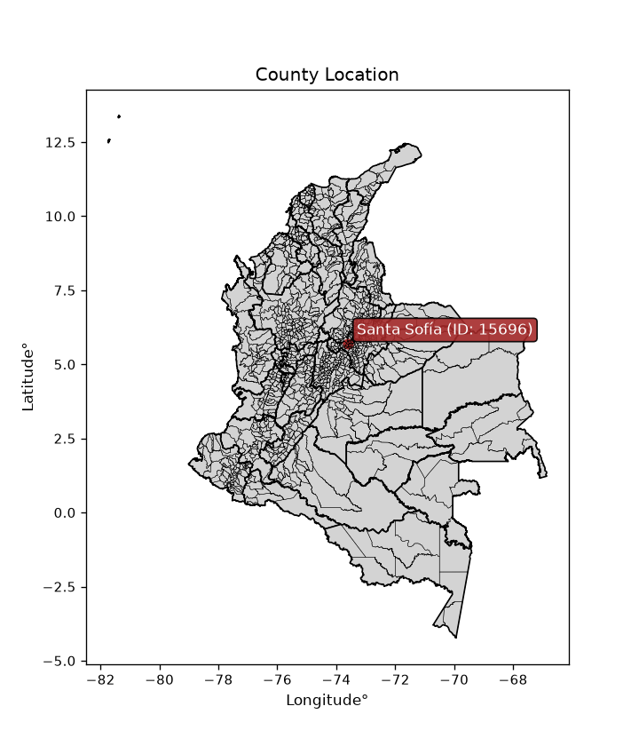
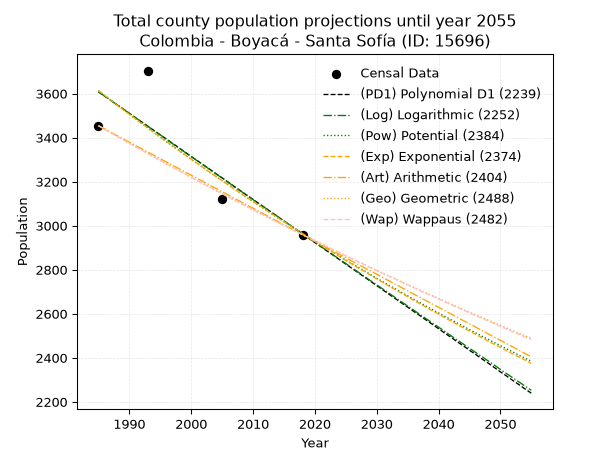
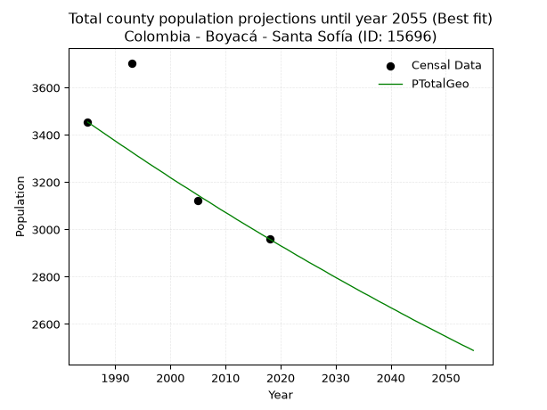
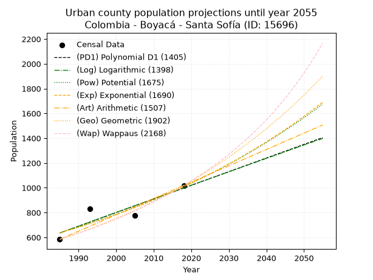
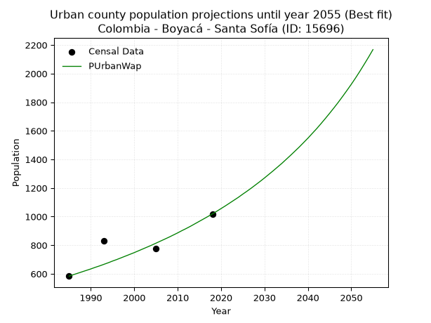
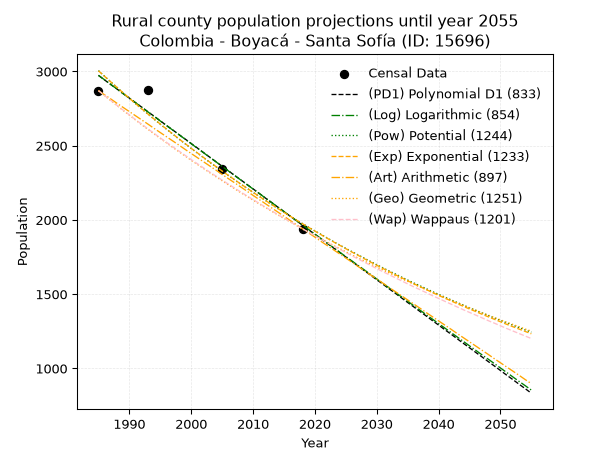
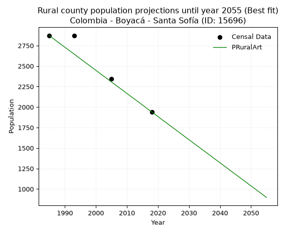

<div align="center">


</div>

# _“Population and Public Services Demand Projections (PPSD) until Year 2050 for Colombia - Boyacá - Santa Sofía (ID: 15696)”_
Keywords: `population` `public-service` `projection` `lineal` `polynomial` `logarithmic` `potential` `exponential` `arithmetic` `geometric` `wappaus` `dane` `colombia` `south-america`

PPSD are analytical estimates used by governments and planners to anticipate future changes in population size, age distribution, and the resulting community needs for utilities, healthcare, education, and infrastructure as sizing future water treatment facilities, electrical grids, and road networks based on spatial growth.

<div align="center">

</img>

</div>


> **General running parameters**: • app_version: _v20260806_. • Python version: _3.14.7_. • Pandas version: _3.0.5_. • NumPy version: _2.5.1_. • Creates, save and include plots into reports (create_plot): _False_. • Projection until year: _2050_. • Process polynomial degree 2 and up: _False_. • Process Wappaus: _True_. • Process Wappaus: _True_. • Set negative values to zero: _True_. • Set infinite values to zero: _True_. • Drop dataset notes: _True_. 
<div align="center">

Dynamic map: [:earth_americas:Google](http://maps.google.com/maps?q=5.71326942,-73.6027071) [:earth_americas:OSM](https://www.openstreetmap.org/#map=18/5.71326942/-73.6027071&layers=P) [:earth_americas:Bing](https://www.bing.com/maps?cp=5.71326942~-73.6027071&lvl=18) [:earth_americas:Apple](https://maps.apple.com/frame?center=5.71326942%2C-73.6027071&span=0.003%2C0.006)

</div>


<div align="center">

```geojson
{
  "type": "Feature",
  "geometry": {
    "type": "Point", 
    "coordinates": [-73.6027071, 5.71326942]
  }, 
  "properties": {
    "Name": "Colombia - Boyacá - Santa Sofía (ID: 15696)"
  }
}
```

</div>


## 0. Census Data (4 records)

Census data are official statistics collected by a government about the people and housing in a country. They usually include counts of total population, age, sex, race, income, education, and jobs.

📅Global census file: [Population.xlsx](../data/Population.xlsx)

| Source   |   Year |   CountryID | CountryName   |   StateID | StateName   |   CountyID | CountyName   |   PTotal |   PUrban |   PRural |
|:---------|-------:|------------:|:--------------|----------:|:------------|-----------:|:-------------|---------:|---------:|---------:|
| DANE     |   1985 |          57 | Colombia      |        15 | Boyacá      |      15696 | Santa Sofía  |     3454 |      584 |     2870 |
| DANE     |   1993 |          57 | Colombia      |        15 | Boyacá      |      15696 | Santa Sofía  |     3704 |      831 |     2873 |
| DANE     |   2005 |          57 | Colombia      |        15 | Boyacá      |      15696 | Santa Sofía  |     3121 |      778 |     2343 |
| DANE     |   2018 |          57 | Colombia      |        15 | Boyacá      |      15696 | Santa Sofía  |     2959 |     1019 |     1940 |

> 🔥Some records could had specific notes about the registered values or the corresponding urban or rural distribution.

📅[SUI-RUPS](https://www.datos.gov.co/Hacienda-y-Cr-dito-P-blico/Registro-nico-de-Prestadores-de-Servicios-P-blicos/4qkq-csdn/about_data) - Local public utility companies: [RUPS.csv](../data/RUPS.xlsx)

 | SERVICIO       | ESTADO    | NOMBRE                                                                         | NIT         | DEPARTAMENTO_DOMICILIO   | MUNICIPIO_DOMICILIO   | DIRECCION        |   TELEFONO | EMAIL                                | TIPO_PRESTADOR                 | CLASIFICACION                 |
|:---------------|:----------|:-------------------------------------------------------------------------------|:------------|:-------------------------|:----------------------|:-----------------|-----------:|:-------------------------------------|:-------------------------------|:------------------------------|
| ACUEDUCTO      | OPERATIVA | UNIDAD DE SERVICIOS PUBLICOS DOMICILIARIOS DEL MUNICIPIO DE SANTA SOFIA-BOYACA | 800099651-2 | BOYACA                   | SANTA SOFIA           | CALLE 5 N° 3-54  |    7359010 | contactenos@santasofia-boyaca.gov.co | MUNICIPIO (PRESTACIÓN DIRECTA) | MENOR O IGUAL A 2500 USUARIOS |
| ALCANTARILLADO | OPERATIVA | UNIDAD DE SERVICIOS PUBLICOS DOMICILIARIOS DEL MUNICIPIO DE SANTA SOFIA-BOYACA | 800099651-2 | BOYACA                   | SANTA SOFIA           | CALLE 5 N° 3-54  |    7359010 | contactenos@santasofia-boyaca.gov.co | MUNICIPIO (PRESTACIÓN DIRECTA) | MENOR O IGUAL A 2500 USUARIOS |
| ACUEDUCTO      | OPERATIVA | ASOCIACION DE SUSCRIPTORES ACUEDUCTO VEREDA HORNILLAS                          | 900098154-1 | BOYACA                   | SANTA SOFIA           | VEREDA HORNILLAS |    7359010 | DIASA7@gmail.com                     | ORGANIZACION AUTORIZADA        | HASTA 2500 SUSCRIPTORES       |

## 1. Total

### 1.1. Coefficients and Parameters

* (PD1) Polynomial Deg 1: -19.559213167402497, 42432.816138096845 (lineal)
* (Log) Logarithmic: -39129.36392661926, 300732.1087692765
* (Pow) Potential: -11.994739649106315, 43.11365324000682
* (Exp) Exponential: -0.005995638151248623, 532726264.0538963
* (Art) Arithmetic: Year diff. 2018 - 1985 = 33, Population diff. 2959 - 3454 = -495, Annual growth = -15.0
* (Geo) Geometric: Year diff. 2018 - 1985 = 33, Population diff. 2959 - 3454 = -495, Annual growth % = -0.004676353056337068
* (Wap) Wappaus: i = -0.4677997816934352, Condition values only valid for < 200)

<sub>
Wappaus condition values: ['-0.00', '-0.47', '-0.94', '-1.40', '-1.87', '-2.34', '-2.81', '-3.27', '-3.74', '-4.21', '-4.68', '-5.15', '-5.61', '-6.08', '-6.55', '-7.02', '-7.48', '-7.95', '-8.42', '-8.89', '-9.36', '-9.82', '-10.29', '-10.76', '-11.23', '-11.69', '-12.16', '-12.63', '-13.10', '-13.57', '-14.03', '-14.50', '-14.97', '-15.44', '-15.91', '-16.37', '-16.84', '-17.31', '-17.78', '-18.24', '-18.71', '-19.18', '-19.65', '-20.12', '-20.58', '-21.05', '-21.52', '-21.99', '-22.45', '-22.92', '-23.39', '-23.86', '-24.33', '-24.79', '-25.26', '-25.73', '-26.20', '-26.66', '-27.13', '-27.60', '-28.07', '-28.54', '-29.00', '-29.47', '-29.94', '-30.41']
</sub>


### 1.2. Projected Dataset

|   Year |   CountyID |   PTotalPD1 |   PTotalLog |   PTotalPow |   PTotalExp |   PTotalArt |   PTotalGeo |   PTotalWap |
|-------:|-----------:|------------:|------------:|------------:|------------:|------------:|------------:|------------:|
|   1985 |      15696 |        3608 |        3608 |        3613 |        3613 |        3454 |        3454 |        3454 |
|   1986 |      15696 |        3588 |        3588 |        3591 |        3591 |        3439 |        3438 |        3438 |
|   1987 |      15696 |        3569 |        3569 |        3570 |        3570 |        3424 |        3422 |        3422 |
|   1988 |      15696 |        3549 |        3549 |        3548 |        3548 |        3409 |        3406 |        3406 |
|   1989 |      15696 |        3530 |        3529 |        3527 |        3527 |        3394 |        3390 |        3390 |
|   1990 |      15696 |        3510 |        3510 |        3506 |        3506 |        3379 |        3374 |        3374 |
|   1991 |      15696 |        3490 |        3490 |        3485 |        3485 |        3364 |        3358 |        3358 |
|   1992 |      15696 |        3471 |        3470 |        3464 |        3464 |        3349 |        3343 |        3343 |
|   1993 |      15696 |        3451 |        3451 |        3443 |        3443 |        3334 |        3327 |        3327 |
|   1994 |      15696 |        3432 |        3431 |        3422 |        3423 |        3319 |        3311 |        3312 |
|   1995 |      15696 |        3412 |        3412 |        3402 |        3402 |        3304 |        3296 |        3296 |
|   1996 |      15696 |        3393 |        3392 |        3381 |        3382 |        3289 |        3280 |        3281 |
|   1997 |      15696 |        3373 |        3372 |        3361 |        3362 |        3274 |        3265 |        3265 |
|   1998 |      15696 |        3354 |        3353 |        3341 |        3342 |        3259 |        3250 |        3250 |
|   1999 |      15696 |        3334 |        3333 |        3321 |        3322 |        3244 |        3235 |        3235 |
|   2000 |      15696 |        3314 |        3314 |        3301 |        3302 |        3229 |        3219 |        3220 |
|   2001 |      15696 |        3295 |        3294 |        3281 |        3282 |        3214 |        3204 |        3205 |
|   2002 |      15696 |        3275 |        3275 |        3262 |        3263 |        3199 |        3189 |        3190 |
|   2003 |      15696 |        3256 |        3255 |        3242 |        3243 |        3184 |        3175 |        3175 |
|   2004 |      15696 |        3236 |        3235 |        3223 |        3224 |        3169 |        3160 |        3160 |
|   2005 |      15696 |        3217 |        3216 |        3204 |        3204 |        3154 |        3145 |        3145 |
|   2006 |      15696 |        3197 |        3196 |        3185 |        3185 |        3139 |        3130 |        3131 |
|   2007 |      15696 |        3177 |        3177 |        3166 |        3166 |        3124 |        3116 |        3116 |
|   2008 |      15696 |        3158 |        3157 |        3147 |        3147 |        3109 |        3101 |        3101 |
|   2009 |      15696 |        3138 |        3138 |        3128 |        3128 |        3094 |        3086 |        3087 |
|   2010 |      15696 |        3119 |        3118 |        3109 |        3110 |        3079 |        3072 |        3072 |
|   2011 |      15696 |        3099 |        3099 |        3091 |        3091 |        3064 |        3058 |        3058 |
|   2012 |      15696 |        3080 |        3080 |        3073 |        3073 |        3049 |        3043 |        3044 |
|   2013 |      15696 |        3060 |        3060 |        3054 |        3054 |        3034 |        3029 |        3029 |
|   2014 |      15696 |        3041 |        3041 |        3036 |        3036 |        3019 |        3015 |        3015 |
|   2015 |      15696 |        3021 |        3021 |        3018 |        3018 |        3004 |        3001 |        3001 |
|   2016 |      15696 |        3001 |        3002 |        3000 |        3000 |        2989 |        2987 |        2987 |
|   2017 |      15696 |        2982 |        2982 |        2982 |        2982 |        2974 |        2973 |        2973 |
|   2018 |      15696 |        2962 |        2963 |        2965 |        2964 |        2959 |        2959 |        2959 |
|   2019 |      15696 |        2943 |        2944 |        2947 |        2946 |        2944 |        2945 |        2945 |
|   2020 |      15696 |        2923 |        2924 |        2930 |        2929 |        2929 |        2931 |        2931 |
|   2021 |      15696 |        2904 |        2905 |        2912 |        2911 |        2914 |        2918 |        2917 |
|   2022 |      15696 |        2884 |        2886 |        2895 |        2894 |        2899 |        2904 |        2904 |
|   2023 |      15696 |        2865 |        2866 |        2878 |        2877 |        2884 |        2890 |        2890 |
|   2024 |      15696 |        2845 |        2847 |        2861 |        2859 |        2869 |        2877 |        2877 |
|   2025 |      15696 |        2825 |        2828 |        2844 |        2842 |        2854 |        2863 |        2863 |
|   2026 |      15696 |        2806 |        2808 |        2827 |        2825 |        2839 |        2850 |        2850 |
|   2027 |      15696 |        2786 |        2789 |        2811 |        2808 |        2824 |        2837 |        2836 |
|   2028 |      15696 |        2767 |        2770 |        2794 |        2792 |        2809 |        2824 |        2823 |
|   2029 |      15696 |        2747 |        2750 |        2778 |        2775 |        2794 |        2810 |        2809 |
|   2030 |      15696 |        2728 |        2731 |        2761 |        2758 |        2779 |        2797 |        2796 |
|   2031 |      15696 |        2708 |        2712 |        2745 |        2742 |        2764 |        2784 |        2783 |
|   2032 |      15696 |        2688 |        2693 |        2729 |        2725 |        2749 |        2771 |        2770 |
|   2033 |      15696 |        2669 |        2673 |        2713 |        2709 |        2734 |        2758 |        2757 |
|   2034 |      15696 |        2649 |        2654 |        2697 |        2693 |        2719 |        2745 |        2744 |
|   2035 |      15696 |        2630 |        2635 |        2681 |        2677 |        2704 |        2732 |        2731 |
|   2036 |      15696 |        2610 |        2616 |        2665 |        2661 |        2689 |        2720 |        2718 |
|   2037 |      15696 |        2591 |        2596 |        2650 |        2645 |        2674 |        2707 |        2705 |
|   2038 |      15696 |        2571 |        2577 |        2634 |        2629 |        2659 |        2694 |        2692 |
|   2039 |      15696 |        2552 |        2558 |        2619 |        2613 |        2644 |        2682 |        2679 |
|   2040 |      15696 |        2532 |        2539 |        2603 |        2598 |        2629 |        2669 |        2667 |
|   2041 |      15696 |        2512 |        2520 |        2588 |        2582 |        2614 |        2657 |        2654 |
|   2042 |      15696 |        2493 |        2500 |        2573 |        2567 |        2599 |        2644 |        2641 |
|   2043 |      15696 |        2473 |        2481 |        2558 |        2551 |        2584 |        2632 |        2629 |
|   2044 |      15696 |        2454 |        2462 |        2543 |        2536 |        2569 |        2619 |        2616 |
|   2045 |      15696 |        2434 |        2443 |        2528 |        2521 |        2554 |        2607 |        2604 |
|   2046 |      15696 |        2415 |        2424 |        2513 |        2506 |        2539 |        2595 |        2591 |
|   2047 |      15696 |        2395 |        2405 |        2498 |        2491 |        2524 |        2583 |        2579 |
|   2048 |      15696 |        2376 |        2386 |        2484 |        2476 |        2509 |        2571 |        2567 |
|   2049 |      15696 |        2356 |        2367 |        2469 |        2461 |        2494 |        2559 |        2555 |
|   2050 |      15696 |        2336 |        2347 |        2455 |        2447 |        2479 |        2547 |        2542 |
<div align="center">

</img>

</div>


### 1.3. Best fit with absolute and relative error (%)

Relative error puts that difference into context by dividing the absolute error by the true value, creating a unitless ratio or percentage that shows the scale of the mistake.

Absolute and relative error

|   Year | Source   |   CountryID | CountryName   |   StateID | StateName   |   CountyID_x | CountyName   |   PTotal |   PUrban |   PRural |   CountyID_y |   PTotalPD1 |   PTotalLog |   PTotalPow |   PTotalExp |   PTotalArt |   PTotalGeo |   PTotalWap |   PTotalPD1AbsError |   PTotalLogAbsError |   PTotalPowAbsError |   PTotalExpAbsError |   PTotalArtAbsError |   PTotalGeoAbsError |   PTotalWapAbsError |   PTotalPD1RelError |   PTotalLogRelError |   PTotalPowRelError |   PTotalExpRelError |   PTotalArtRelError |   PTotalGeoRelError |   PTotalWapRelError |
|-------:|:---------|------------:|:--------------|----------:|:------------|-------------:|:-------------|---------:|---------:|---------:|-------------:|------------:|------------:|------------:|------------:|------------:|------------:|------------:|--------------------:|--------------------:|--------------------:|--------------------:|--------------------:|--------------------:|--------------------:|--------------------:|--------------------:|--------------------:|--------------------:|--------------------:|--------------------:|--------------------:|
|   1985 | DANE     |          57 | Colombia      |        15 | Boyacá      |        15696 | Santa Sofía  |     3454 |      584 |     2870 |        15696 |        3608 |        3608 |        3613 |        3613 |        3454 |        3454 |        3454 |                 154 |                 154 |                 159 |                 159 |                   0 |                   0 |                   0 |            4.4586   |            4.4586   |            4.60336  |            4.60336  |             0       |            0        |            0        |
|   1993 | DANE     |          57 | Colombia      |        15 | Boyacá      |        15696 | Santa Sofía  |     3704 |      831 |     2873 |        15696 |        3451 |        3451 |        3443 |        3443 |        3334 |        3327 |        3327 |                 253 |                 253 |                 261 |                 261 |                 370 |                 377 |                 377 |            6.83045  |            6.83045  |            7.04644  |            7.04644  |             9.9892  |           10.1782   |           10.1782   |
|   2005 | DANE     |          57 | Colombia      |        15 | Boyacá      |        15696 | Santa Sofía  |     3121 |      778 |     2343 |        15696 |        3217 |        3216 |        3204 |        3204 |        3154 |        3145 |        3145 |                  96 |                  95 |                  83 |                  83 |                  33 |                  24 |                  24 |            3.07594  |            3.0439   |            2.6594   |            2.6594   |             1.05735 |            0.768984 |            0.768984 |
|   2018 | DANE     |          57 | Colombia      |        15 | Boyacá      |        15696 | Santa Sofía  |     2959 |     1019 |     1940 |        15696 |        2962 |        2963 |        2965 |        2964 |        2959 |        2959 |        2959 |                   3 |                   4 |                   6 |                   5 |                   0 |                   0 |                   0 |            0.101386 |            0.135181 |            0.202771 |            0.168976 |             0       |            0        |            0        |

Relative error mean

| Method    |   RelError | Best   |
|:----------|-----------:|:-------|
| PTotalPD1 |    3.61659 |        |
| PTotalLog |    3.61703 |        |
| PTotalPow |    3.62799 |        |
| PTotalExp |    3.61954 |        |
| PTotalArt |    2.76164 |        |
| PTotalGeo |    2.73679 | True   |
| PTotalWap |    2.73679 | True   |

💙Best method: _**PTotalGeo**_
<div align="center">

</img>

</div>


### 1.4. Fresh water supply demand in liters per capita per day (lpcd)

The fresh water supply demand typically ranges from 100 to 300 liters per capita per day (lpcd) for standard domestic and municipal planning, though absolute survival minimums set by the World Health Organization are as low as 7.5 to 20 liters per day, and total consumption in high-income nations can exceed 400 liters.

> `CZ`: Level in meters above the sea level (masl)<br> `WS`: Fresh water supply demand in liters per capita per day (lpcd or l/h/d)<br> `WSAll`: Zonal fresh water supply demand in liters per second (l/s)<br> `A`: Zonal area in square meters<br> `DP`: Population density (people/hectare or p/ha)

Reference values (RAS Colombia)

|    CZ |   WS |
|------:|-----:|
|  1000 |  120 |
|  2000 |  130 |
| 99999 |  140 |

County shapefile geometry properties and water supply values

|   CountyID |     ATotal |   CZTotal |   WSTotal |
|-----------:|-----------:|----------:|----------:|
|      15696 | 7.7442e+07 |    2422.7 |       140 |

Projected values for best method: PTotalGeo

|   CountyID |   Year |   PTotalGeo |   DPTotal |   WSTotal |   WSTotalAll |
|-----------:|-------:|------------:|----------:|----------:|-------------:|
|      15696 |   1985 |        3454 |      0.45 |       140 |      5.59676 |
|      15696 |   1986 |        3438 |      0.44 |       140 |      5.57083 |
|      15696 |   1987 |        3422 |      0.44 |       140 |      5.54491 |
|      15696 |   1988 |        3406 |      0.44 |       140 |      5.51898 |
|      15696 |   1989 |        3390 |      0.44 |       140 |      5.49306 |
|      15696 |   1990 |        3374 |      0.44 |       140 |      5.46713 |
|      15696 |   1991 |        3358 |      0.43 |       140 |      5.4412  |
|      15696 |   1992 |        3343 |      0.43 |       140 |      5.4169  |
|      15696 |   1993 |        3327 |      0.43 |       140 |      5.39097 |
|      15696 |   1994 |        3311 |      0.43 |       140 |      5.36505 |
|      15696 |   1995 |        3296 |      0.43 |       140 |      5.34074 |
|      15696 |   1996 |        3280 |      0.42 |       140 |      5.31481 |
|      15696 |   1997 |        3265 |      0.42 |       140 |      5.29051 |
|      15696 |   1998 |        3250 |      0.42 |       140 |      5.2662  |
|      15696 |   1999 |        3235 |      0.42 |       140 |      5.2419  |
|      15696 |   2000 |        3219 |      0.42 |       140 |      5.21597 |
|      15696 |   2001 |        3204 |      0.41 |       140 |      5.19167 |
|      15696 |   2002 |        3189 |      0.41 |       140 |      5.16736 |
|      15696 |   2003 |        3175 |      0.41 |       140 |      5.14468 |
|      15696 |   2004 |        3160 |      0.41 |       140 |      5.12037 |
|      15696 |   2005 |        3145 |      0.41 |       140 |      5.09606 |
|      15696 |   2006 |        3130 |      0.4  |       140 |      5.07176 |
|      15696 |   2007 |        3116 |      0.4  |       140 |      5.04907 |
|      15696 |   2008 |        3101 |      0.4  |       140 |      5.02477 |
|      15696 |   2009 |        3086 |      0.4  |       140 |      5.00046 |
|      15696 |   2010 |        3072 |      0.4  |       140 |      4.97778 |
|      15696 |   2011 |        3058 |      0.39 |       140 |      4.95509 |
|      15696 |   2012 |        3043 |      0.39 |       140 |      4.93079 |
|      15696 |   2013 |        3029 |      0.39 |       140 |      4.9081  |
|      15696 |   2014 |        3015 |      0.39 |       140 |      4.88542 |
|      15696 |   2015 |        3001 |      0.39 |       140 |      4.86273 |
|      15696 |   2016 |        2987 |      0.39 |       140 |      4.84005 |
|      15696 |   2017 |        2973 |      0.38 |       140 |      4.81736 |
|      15696 |   2018 |        2959 |      0.38 |       140 |      4.79468 |
|      15696 |   2019 |        2945 |      0.38 |       140 |      4.77199 |
|      15696 |   2020 |        2931 |      0.38 |       140 |      4.74931 |
|      15696 |   2021 |        2918 |      0.38 |       140 |      4.72824 |
|      15696 |   2022 |        2904 |      0.37 |       140 |      4.70556 |
|      15696 |   2023 |        2890 |      0.37 |       140 |      4.68287 |
|      15696 |   2024 |        2877 |      0.37 |       140 |      4.66181 |
|      15696 |   2025 |        2863 |      0.37 |       140 |      4.63912 |
|      15696 |   2026 |        2850 |      0.37 |       140 |      4.61806 |
|      15696 |   2027 |        2837 |      0.37 |       140 |      4.59699 |
|      15696 |   2028 |        2824 |      0.36 |       140 |      4.57593 |
|      15696 |   2029 |        2810 |      0.36 |       140 |      4.55324 |
|      15696 |   2030 |        2797 |      0.36 |       140 |      4.53218 |
|      15696 |   2031 |        2784 |      0.36 |       140 |      4.51111 |
|      15696 |   2032 |        2771 |      0.36 |       140 |      4.49005 |
|      15696 |   2033 |        2758 |      0.36 |       140 |      4.46898 |
|      15696 |   2034 |        2745 |      0.35 |       140 |      4.44792 |
|      15696 |   2035 |        2732 |      0.35 |       140 |      4.42685 |
|      15696 |   2036 |        2720 |      0.35 |       140 |      4.40741 |
|      15696 |   2037 |        2707 |      0.35 |       140 |      4.38634 |
|      15696 |   2038 |        2694 |      0.35 |       140 |      4.36528 |
|      15696 |   2039 |        2682 |      0.35 |       140 |      4.34583 |
|      15696 |   2040 |        2669 |      0.34 |       140 |      4.32477 |
|      15696 |   2041 |        2657 |      0.34 |       140 |      4.30532 |
|      15696 |   2042 |        2644 |      0.34 |       140 |      4.28426 |
|      15696 |   2043 |        2632 |      0.34 |       140 |      4.26481 |
|      15696 |   2044 |        2619 |      0.34 |       140 |      4.24375 |
|      15696 |   2045 |        2607 |      0.34 |       140 |      4.22431 |
|      15696 |   2046 |        2595 |      0.34 |       140 |      4.20486 |
|      15696 |   2047 |        2583 |      0.33 |       140 |      4.18542 |
|      15696 |   2048 |        2571 |      0.33 |       140 |      4.16597 |
|      15696 |   2049 |        2559 |      0.33 |       140 |      4.14653 |
|      15696 |   2050 |        2547 |      0.33 |       140 |      4.12708 |

## 2. Urban

### 2.1. Coefficients and Parameters

* (PD1) Polynomial Deg 1: 11.002810116418951, -21205.370935367006 (lineal)
* (Log) Logarithmic: 22024.698371845014, -166606.90881925006
* (Pow) Potential: 27.927235910300745, -89.29363174930438
* (Exp) Exponential: 0.013948032643465507, 6.021023241932502e-10
* (Art) Arithmetic: Year diff. 2018 - 1985 = 33, Population diff. 1019 - 584 = 435, Annual growth = 13.181818181818182
* (Geo) Geometric: Year diff. 2018 - 1985 = 33, Population diff. 1019 - 584 = 435, Annual growth % = 0.017012055749788146
* (Wap) Wappaus: i = 1.644643566040946, Condition values only valid for < 200)

<sub>
Wappaus condition values: ['0.00', '1.64', '3.29', '4.93', '6.58', '8.22', '9.87', '11.51', '13.16', '14.80', '16.45', '18.09', '19.74', '21.38', '23.03', '24.67', '26.31', '27.96', '29.60', '31.25', '32.89', '34.54', '36.18', '37.83', '39.47', '41.12', '42.76', '44.41', '46.05', '47.69', '49.34', '50.98', '52.63', '54.27', '55.92', '57.56', '59.21', '60.85', '62.50', '64.14', '65.79', '67.43', '69.08', '70.72', '72.36', '74.01', '75.65', '77.30', '78.94', '80.59', '82.23', '83.88', '85.52', '87.17', '88.81', '90.46', '92.10', '93.74', '95.39', '97.03', '98.68', '100.32', '101.97', '103.61', '105.26', '106.90']
</sub>


### 2.2. Projected Dataset

|   Year |   CountyID |   PUrbanPD1 |   PUrbanLog |   PUrbanPow |   PUrbanExp |   PUrbanArt |   PUrbanGeo |   PUrbanWap |
|-------:|-----------:|------------:|------------:|------------:|------------:|------------:|------------:|------------:|
|   1985 |      15696 |         635 |         635 |         636 |         637 |         584 |         584 |         584 |
|   1986 |      15696 |         646 |         646 |         645 |         646 |         597 |         594 |         594 |
|   1987 |      15696 |         657 |         657 |         655 |         655 |         610 |         604 |         604 |
|   1988 |      15696 |         668 |         668 |         664 |         664 |         624 |         614 |         614 |
|   1989 |      15696 |         679 |         679 |         673 |         673 |         637 |         625 |         624 |
|   1990 |      15696 |         690 |         690 |         683 |         683 |         650 |         635 |         634 |
|   1991 |      15696 |         701 |         701 |         692 |         692 |         663 |         646 |         645 |
|   1992 |      15696 |         712 |         712 |         702 |         702 |         676 |         657 |         655 |
|   1993 |      15696 |         723 |         723 |         712 |         712 |         689 |         668 |         666 |
|   1994 |      15696 |         734 |         735 |         722 |         722 |         703 |         680 |         677 |
|   1995 |      15696 |         745 |         746 |         732 |         732 |         716 |         691 |         689 |
|   1996 |      15696 |         756 |         757 |         743 |         742 |         729 |         703 |         700 |
|   1997 |      15696 |         767 |         768 |         753 |         753 |         742 |         715 |         712 |
|   1998 |      15696 |         778 |         779 |         764 |         763 |         755 |         727 |         724 |
|   1999 |      15696 |         789 |         790 |         774 |         774 |         769 |         740 |         736 |
|   2000 |      15696 |         800 |         801 |         785 |         785 |         782 |         752 |         748 |
|   2001 |      15696 |         811 |         812 |         796 |         796 |         795 |         765 |         761 |
|   2002 |      15696 |         822 |         823 |         807 |         807 |         808 |         778 |         774 |
|   2003 |      15696 |         833 |         834 |         819 |         818 |         821 |         791 |         787 |
|   2004 |      15696 |         844 |         845 |         830 |         830 |         834 |         805 |         800 |
|   2005 |      15696 |         855 |         856 |         842 |         842 |         848 |         818 |         814 |
|   2006 |      15696 |         866 |         867 |         854 |         853 |         861 |         832 |         828 |
|   2007 |      15696 |         877 |         878 |         866 |         865 |         874 |         846 |         842 |
|   2008 |      15696 |         888 |         889 |         878 |         877 |         887 |         861 |         856 |
|   2009 |      15696 |         899 |         900 |         890 |         890 |         900 |         875 |         871 |
|   2010 |      15696 |         910 |         911 |         903 |         902 |         914 |         890 |         886 |
|   2011 |      15696 |         921 |         921 |         915 |         915 |         927 |         906 |         902 |
|   2012 |      15696 |         932 |         932 |         928 |         928 |         940 |         921 |         917 |
|   2013 |      15696 |         943 |         943 |         941 |         941 |         953 |         937 |         933 |
|   2014 |      15696 |         954 |         954 |         954 |         954 |         966 |         953 |         950 |
|   2015 |      15696 |         965 |         965 |         967 |         967 |         979 |         969 |         967 |
|   2016 |      15696 |         976 |         976 |         981 |         981 |         993 |         985 |         984 |
|   2017 |      15696 |         987 |         987 |         995 |         995 |        1006 |        1002 |        1001 |
|   2018 |      15696 |         998 |         998 |        1009 |        1009 |        1019 |        1019 |        1019 |
|   2019 |      15696 |        1009 |        1009 |        1023 |        1023 |        1032 |        1036 |        1037 |
|   2020 |      15696 |        1020 |        1020 |        1037 |        1037 |        1045 |        1054 |        1056 |
|   2021 |      15696 |        1031 |        1031 |        1051 |        1052 |        1059 |        1072 |        1075 |
|   2022 |      15696 |        1042 |        1042 |        1066 |        1067 |        1072 |        1090 |        1095 |
|   2023 |      15696 |        1053 |        1053 |        1081 |        1082 |        1085 |        1109 |        1115 |
|   2024 |      15696 |        1064 |        1063 |        1096 |        1097 |        1098 |        1128 |        1135 |
|   2025 |      15696 |        1075 |        1074 |        1111 |        1112 |        1111 |        1147 |        1157 |
|   2026 |      15696 |        1086 |        1085 |        1126 |        1128 |        1124 |        1166 |        1178 |
|   2027 |      15696 |        1097 |        1096 |        1142 |        1144 |        1138 |        1186 |        1200 |
|   2028 |      15696 |        1108 |        1107 |        1158 |        1160 |        1151 |        1206 |        1223 |
|   2029 |      15696 |        1119 |        1118 |        1174 |        1176 |        1164 |        1227 |        1246 |
|   2030 |      15696 |        1130 |        1129 |        1190 |        1193 |        1177 |        1248 |        1270 |
|   2031 |      15696 |        1141 |        1139 |        1207 |        1209 |        1190 |        1269 |        1295 |
|   2032 |      15696 |        1152 |        1150 |        1223 |        1226 |        1204 |        1290 |        1320 |
|   2033 |      15696 |        1163 |        1161 |        1240 |        1244 |        1217 |        1312 |        1346 |
|   2034 |      15696 |        1174 |        1172 |        1257 |        1261 |        1230 |        1335 |        1372 |
|   2035 |      15696 |        1185 |        1183 |        1275 |        1279 |        1243 |        1357 |        1400 |
|   2036 |      15696 |        1196 |        1194 |        1292 |        1297 |        1256 |        1381 |        1428 |
|   2037 |      15696 |        1207 |        1204 |        1310 |        1315 |        1269 |        1404 |        1457 |
|   2038 |      15696 |        1218 |        1215 |        1328 |        1333 |        1283 |        1428 |        1486 |
|   2039 |      15696 |        1229 |        1226 |        1347 |        1352 |        1296 |        1452 |        1517 |
|   2040 |      15696 |        1240 |        1237 |        1365 |        1371 |        1309 |        1477 |        1548 |
|   2041 |      15696 |        1251 |        1248 |        1384 |        1390 |        1322 |        1502 |        1581 |
|   2042 |      15696 |        1262 |        1258 |        1403 |        1410 |        1335 |        1528 |        1614 |
|   2043 |      15696 |        1273 |        1269 |        1422 |        1430 |        1349 |        1554 |        1649 |
|   2044 |      15696 |        1284 |        1280 |        1442 |        1450 |        1362 |        1580 |        1685 |
|   2045 |      15696 |        1295 |        1291 |        1462 |        1470 |        1375 |        1607 |        1722 |
|   2046 |      15696 |        1306 |        1302 |        1482 |        1491 |        1388 |        1634 |        1760 |
|   2047 |      15696 |        1317 |        1312 |        1502 |        1512 |        1401 |        1662 |        1799 |
|   2048 |      15696 |        1328 |        1323 |        1523 |        1533 |        1414 |        1690 |        1840 |
|   2049 |      15696 |        1339 |        1334 |        1544 |        1555 |        1428 |        1719 |        1882 |
|   2050 |      15696 |        1350 |        1345 |        1565 |        1576 |        1441 |        1748 |        1925 |
<div align="center">

</img>

</div>


### 2.3. Best fit with absolute and relative error (%)

Relative error puts that difference into context by dividing the absolute error by the true value, creating a unitless ratio or percentage that shows the scale of the mistake.

Absolute and relative error

|   Year | Source   |   CountryID | CountryName   |   StateID | StateName   |   CountyID_x | CountyName   |   PTotal |   PUrban |   PRural |   CountyID_y |   PUrbanPD1 |   PUrbanLog |   PUrbanPow |   PUrbanExp |   PUrbanArt |   PUrbanGeo |   PUrbanWap |   PUrbanPD1AbsError |   PUrbanLogAbsError |   PUrbanPowAbsError |   PUrbanExpAbsError |   PUrbanArtAbsError |   PUrbanGeoAbsError |   PUrbanWapAbsError |   PUrbanPD1RelError |   PUrbanLogRelError |   PUrbanPowRelError |   PUrbanExpRelError |   PUrbanArtRelError |   PUrbanGeoRelError |   PUrbanWapRelError |
|-------:|:---------|------------:|:--------------|----------:|:------------|-------------:|:-------------|---------:|---------:|---------:|-------------:|------------:|------------:|------------:|------------:|------------:|------------:|------------:|--------------------:|--------------------:|--------------------:|--------------------:|--------------------:|--------------------:|--------------------:|--------------------:|--------------------:|--------------------:|--------------------:|--------------------:|--------------------:|--------------------:|
|   1985 | DANE     |          57 | Colombia      |        15 | Boyacá      |        15696 | Santa Sofía  |     3454 |      584 |     2870 |        15696 |         635 |         635 |         636 |         637 |         584 |         584 |         584 |                  51 |                  51 |                  52 |                  53 |                   0 |                   0 |                   0 |             8.73288 |             8.73288 |            8.90411  |            9.07534  |             0       |             0       |             0       |
|   1993 | DANE     |          57 | Colombia      |        15 | Boyacá      |        15696 | Santa Sofía  |     3704 |      831 |     2873 |        15696 |         723 |         723 |         712 |         712 |         689 |         668 |         666 |                 108 |                 108 |                 119 |                 119 |                 142 |                 163 |                 165 |            12.9964  |            12.9964  |           14.3201   |           14.3201   |            17.0878  |            19.6149  |            19.8556  |
|   2005 | DANE     |          57 | Colombia      |        15 | Boyacá      |        15696 | Santa Sofía  |     3121 |      778 |     2343 |        15696 |         855 |         856 |         842 |         842 |         848 |         818 |         814 |                  77 |                  78 |                  64 |                  64 |                  70 |                  40 |                  36 |             9.89717 |            10.0257  |            8.22622  |            8.22622  |             8.99743 |             5.14139 |             4.62725 |
|   2018 | DANE     |          57 | Colombia      |        15 | Boyacá      |        15696 | Santa Sofía  |     2959 |     1019 |     1940 |        15696 |         998 |         998 |        1009 |        1009 |        1019 |        1019 |        1019 |                  21 |                  21 |                  10 |                  10 |                   0 |                   0 |                   0 |             2.06084 |             2.06084 |            0.981354 |            0.981354 |             0       |             0       |             0       |

Relative error mean

| Method    |   RelError | Best   |
|:----------|-----------:|:-------|
| PUrbanPD1 |    8.42182 |        |
| PUrbanLog |    8.45395 |        |
| PUrbanPow |    8.10795 |        |
| PUrbanExp |    8.15075 |        |
| PUrbanArt |    6.52132 |        |
| PUrbanGeo |    6.18908 |        |
| PUrbanWap |    6.12071 | True   |

💙Best method: _**PUrbanWap**_
<div align="center">

</img>

</div>


### 2.4. Fresh water supply demand in liters per capita per day (lpcd)

The fresh water supply demand typically ranges from 100 to 300 liters per capita per day (lpcd) for standard domestic and municipal planning, though absolute survival minimums set by the World Health Organization are as low as 7.5 to 20 liters per day, and total consumption in high-income nations can exceed 400 liters.

> `CZ`: Level in meters above the sea level (masl)<br> `WS`: Fresh water supply demand in liters per capita per day (lpcd or l/h/d)<br> `WSAll`: Zonal fresh water supply demand in liters per second (l/s)<br> `A`: Zonal area in square meters<br> `DP`: Population density (people/hectare or p/ha)

Reference values (RAS Colombia)

|    CZ |   WS |
|------:|-----:|
|  1000 |  120 |
|  2000 |  130 |
| 99999 |  140 |

County shapefile geometry properties and water supply values

|   CountyID |   AUrban |   CZUrban |   WSUrban |
|-----------:|---------:|----------:|----------:|
|      15696 |   365752 |   2364.66 |       140 |

Projected values for best method: PUrbanWap

|   CountyID |   Year |   PUrbanWap |   DPUrban |   WSUrban |   WSUrbanAll |
|-----------:|-------:|------------:|----------:|----------:|-------------:|
|      15696 |   1985 |         584 |     15.97 |       140 |     0.946296 |
|      15696 |   1986 |         594 |     16.24 |       140 |     0.9625   |
|      15696 |   1987 |         604 |     16.51 |       140 |     0.978704 |
|      15696 |   1988 |         614 |     16.79 |       140 |     0.994907 |
|      15696 |   1989 |         624 |     17.06 |       140 |     1.01111  |
|      15696 |   1990 |         634 |     17.33 |       140 |     1.02731  |
|      15696 |   1991 |         645 |     17.63 |       140 |     1.04514  |
|      15696 |   1992 |         655 |     17.91 |       140 |     1.06134  |
|      15696 |   1993 |         666 |     18.21 |       140 |     1.07917  |
|      15696 |   1994 |         677 |     18.51 |       140 |     1.09699  |
|      15696 |   1995 |         689 |     18.84 |       140 |     1.11644  |
|      15696 |   1996 |         700 |     19.14 |       140 |     1.13426  |
|      15696 |   1997 |         712 |     19.47 |       140 |     1.1537   |
|      15696 |   1998 |         724 |     19.79 |       140 |     1.17315  |
|      15696 |   1999 |         736 |     20.12 |       140 |     1.19259  |
|      15696 |   2000 |         748 |     20.45 |       140 |     1.21204  |
|      15696 |   2001 |         761 |     20.81 |       140 |     1.2331   |
|      15696 |   2002 |         774 |     21.16 |       140 |     1.25417  |
|      15696 |   2003 |         787 |     21.52 |       140 |     1.27523  |
|      15696 |   2004 |         800 |     21.87 |       140 |     1.2963   |
|      15696 |   2005 |         814 |     22.26 |       140 |     1.31898  |
|      15696 |   2006 |         828 |     22.64 |       140 |     1.34167  |
|      15696 |   2007 |         842 |     23.02 |       140 |     1.36435  |
|      15696 |   2008 |         856 |     23.4  |       140 |     1.38704  |
|      15696 |   2009 |         871 |     23.81 |       140 |     1.41134  |
|      15696 |   2010 |         886 |     24.22 |       140 |     1.43565  |
|      15696 |   2011 |         902 |     24.66 |       140 |     1.46157  |
|      15696 |   2012 |         917 |     25.07 |       140 |     1.48588  |
|      15696 |   2013 |         933 |     25.51 |       140 |     1.51181  |
|      15696 |   2014 |         950 |     25.97 |       140 |     1.53935  |
|      15696 |   2015 |         967 |     26.44 |       140 |     1.5669   |
|      15696 |   2016 |         984 |     26.9  |       140 |     1.59444  |
|      15696 |   2017 |        1001 |     27.37 |       140 |     1.62199  |
|      15696 |   2018 |        1019 |     27.86 |       140 |     1.65116  |
|      15696 |   2019 |        1037 |     28.35 |       140 |     1.68032  |
|      15696 |   2020 |        1056 |     28.87 |       140 |     1.71111  |
|      15696 |   2021 |        1075 |     29.39 |       140 |     1.7419   |
|      15696 |   2022 |        1095 |     29.94 |       140 |     1.77431  |
|      15696 |   2023 |        1115 |     30.49 |       140 |     1.80671  |
|      15696 |   2024 |        1135 |     31.03 |       140 |     1.83912  |
|      15696 |   2025 |        1157 |     31.63 |       140 |     1.87477  |
|      15696 |   2026 |        1178 |     32.21 |       140 |     1.9088   |
|      15696 |   2027 |        1200 |     32.81 |       140 |     1.94444  |
|      15696 |   2028 |        1223 |     33.44 |       140 |     1.98171  |
|      15696 |   2029 |        1246 |     34.07 |       140 |     2.01898  |
|      15696 |   2030 |        1270 |     34.72 |       140 |     2.05787  |
|      15696 |   2031 |        1295 |     35.41 |       140 |     2.09838  |
|      15696 |   2032 |        1320 |     36.09 |       140 |     2.13889  |
|      15696 |   2033 |        1346 |     36.8  |       140 |     2.18102  |
|      15696 |   2034 |        1372 |     37.51 |       140 |     2.22315  |
|      15696 |   2035 |        1400 |     38.28 |       140 |     2.26852  |
|      15696 |   2036 |        1428 |     39.04 |       140 |     2.31389  |
|      15696 |   2037 |        1457 |     39.84 |       140 |     2.36088  |
|      15696 |   2038 |        1486 |     40.63 |       140 |     2.40787  |
|      15696 |   2039 |        1517 |     41.48 |       140 |     2.4581   |
|      15696 |   2040 |        1548 |     42.32 |       140 |     2.50833  |
|      15696 |   2041 |        1581 |     43.23 |       140 |     2.56181  |
|      15696 |   2042 |        1614 |     44.13 |       140 |     2.61528  |
|      15696 |   2043 |        1649 |     45.09 |       140 |     2.67199  |
|      15696 |   2044 |        1685 |     46.07 |       140 |     2.73032  |
|      15696 |   2045 |        1722 |     47.08 |       140 |     2.79028  |
|      15696 |   2046 |        1760 |     48.12 |       140 |     2.85185  |
|      15696 |   2047 |        1799 |     49.19 |       140 |     2.91505  |
|      15696 |   2048 |        1840 |     50.31 |       140 |     2.98148  |
|      15696 |   2049 |        1882 |     51.46 |       140 |     3.04954  |
|      15696 |   2050 |        1925 |     52.63 |       140 |     3.11921  |

## 3. Rural

### 3.1. Coefficients and Parameters

* (PD1) Polynomial Deg 1: -30.562023283821468, 63638.187073463894 (lineal)
* (Log) Logarithmic: -61154.06229846427, 467339.0175885265
* (Pow) Potential: -25.454034134426788, 87.41914492482177
* (Exp) Exponential: -0.012721928268426731, 278583662322183.53
* (Art) Arithmetic: Year diff. 2018 - 1985 = 33, Population diff. 1940 - 2870 = -930, Annual growth = -28.181818181818183
* (Geo) Geometric: Year diff. 2018 - 1985 = 33, Population diff. 1940 - 2870 = -930, Annual growth % = -0.01179725585073954
* (Wap) Wappaus: i = -1.1718011718011718, Condition values only valid for < 200)

<sub>
Wappaus condition values: ['-0.00', '-1.17', '-2.34', '-3.52', '-4.69', '-5.86', '-7.03', '-8.20', '-9.37', '-10.55', '-11.72', '-12.89', '-14.06', '-15.23', '-16.41', '-17.58', '-18.75', '-19.92', '-21.09', '-22.26', '-23.44', '-24.61', '-25.78', '-26.95', '-28.12', '-29.30', '-30.47', '-31.64', '-32.81', '-33.98', '-35.15', '-36.33', '-37.50', '-38.67', '-39.84', '-41.01', '-42.18', '-43.36', '-44.53', '-45.70', '-46.87', '-48.04', '-49.22', '-50.39', '-51.56', '-52.73', '-53.90', '-55.07', '-56.25', '-57.42', '-58.59', '-59.76', '-60.93', '-62.11', '-63.28', '-64.45', '-65.62', '-66.79', '-67.96', '-69.14', '-70.31', '-71.48', '-72.65', '-73.82', '-75.00', '-76.17']
</sub>


### 3.2. Projected Dataset

|   Year |   CountyID |   PRuralPD1 |   PRuralLog |   PRuralPow |   PRuralExp |   PRuralArt |   PRuralGeo |   PRuralWap |
|-------:|-----------:|------------:|------------:|------------:|------------:|------------:|------------:|------------:|
|   1985 |      15696 |        2973 |        2973 |        3005 |        3004 |        2870 |        2870 |        2870 |
|   1986 |      15696 |        2942 |        2943 |        2967 |        2966 |        2842 |        2836 |        2837 |
|   1987 |      15696 |        2911 |        2912 |        2929 |        2929 |        2814 |        2803 |        2804 |
|   1988 |      15696 |        2881 |        2881 |        2892 |        2892 |        2785 |        2770 |        2771 |
|   1989 |      15696 |        2850 |        2850 |        2855 |        2855 |        2757 |        2737 |        2739 |
|   1990 |      15696 |        2820 |        2819 |        2819 |        2819 |        2729 |        2705 |        2707 |
|   1991 |      15696 |        2789 |        2789 |        2783 |        2783 |        2701 |        2673 |        2675 |
|   1992 |      15696 |        2759 |        2758 |        2747 |        2748 |        2673 |        2641 |        2644 |
|   1993 |      15696 |        2728 |        2727 |        2713 |        2713 |        2645 |        2610 |        2613 |
|   1994 |      15696 |        2698 |        2697 |        2678 |        2679 |        2616 |        2579 |        2582 |
|   1995 |      15696 |        2667 |        2666 |        2644 |        2645 |        2588 |        2549 |        2552 |
|   1996 |      15696 |        2636 |        2635 |        2611 |        2612 |        2560 |        2519 |        2522 |
|   1997 |      15696 |        2606 |        2605 |        2578 |        2579 |        2532 |        2489 |        2493 |
|   1998 |      15696 |        2575 |        2574 |        2545 |        2546 |        2504 |        2460 |        2464 |
|   1999 |      15696 |        2545 |        2544 |        2513 |        2514 |        2475 |        2431 |        2435 |
|   2000 |      15696 |        2514 |        2513 |        2481 |        2482 |        2447 |        2402 |        2406 |
|   2001 |      15696 |        2484 |        2482 |        2450 |        2451 |        2419 |        2374 |        2378 |
|   2002 |      15696 |        2453 |        2452 |        2419 |        2420 |        2391 |        2346 |        2350 |
|   2003 |      15696 |        2422 |        2421 |        2388 |        2389 |        2363 |        2318 |        2322 |
|   2004 |      15696 |        2392 |        2391 |        2358 |        2359 |        2335 |        2291 |        2295 |
|   2005 |      15696 |        2361 |        2360 |        2328 |        2329 |        2306 |        2264 |        2268 |
|   2006 |      15696 |        2331 |        2330 |        2299 |        2300 |        2278 |        2237 |        2241 |
|   2007 |      15696 |        2300 |        2299 |        2270 |        2271 |        2250 |        2211 |        2215 |
|   2008 |      15696 |        2270 |        2269 |        2241 |        2242 |        2222 |        2184 |        2188 |
|   2009 |      15696 |        2239 |        2238 |        2213 |        2214 |        2194 |        2159 |        2162 |
|   2010 |      15696 |        2209 |        2208 |        2185 |        2186 |        2165 |        2133 |        2137 |
|   2011 |      15696 |        2178 |        2178 |        2158 |        2158 |        2137 |        2108 |        2111 |
|   2012 |      15696 |        2147 |        2147 |        2131 |        2131 |        2109 |        2083 |        2086 |
|   2013 |      15696 |        2117 |        2117 |        2104 |        2104 |        2081 |        2059 |        2061 |
|   2014 |      15696 |        2086 |        2086 |        2077 |        2077 |        2053 |        2034 |        2036 |
|   2015 |      15696 |        2056 |        2056 |        2051 |        2051 |        2025 |        2010 |        2012 |
|   2016 |      15696 |        2025 |        2026 |        2025 |        2025 |        1996 |        1987 |        1988 |
|   2017 |      15696 |        1995 |        1995 |        2000 |        1999 |        1968 |        1963 |        1964 |
|   2018 |      15696 |        1964 |        1965 |        1975 |        1974 |        1940 |        1940 |        1940 |
|   2019 |      15696 |        1933 |        1935 |        1950 |        1949 |        1912 |        1917 |        1916 |
|   2020 |      15696 |        1903 |        1904 |        1926 |        1925 |        1884 |        1894 |        1893 |
|   2021 |      15696 |        1872 |        1874 |        1902 |        1900 |        1855 |        1872 |        1870 |
|   2022 |      15696 |        1842 |        1844 |        1878 |        1876 |        1827 |        1850 |        1847 |
|   2023 |      15696 |        1811 |        1814 |        1854 |        1852 |        1799 |        1828 |        1825 |
|   2024 |      15696 |        1781 |        1783 |        1831 |        1829 |        1771 |        1807 |        1802 |
|   2025 |      15696 |        1750 |        1753 |        1808 |        1806 |        1743 |        1785 |        1780 |
|   2026 |      15696 |        1720 |        1723 |        1786 |        1783 |        1715 |        1764 |        1758 |
|   2027 |      15696 |        1689 |        1693 |        1764 |        1761 |        1686 |        1743 |        1736 |
|   2028 |      15696 |        1658 |        1663 |        1742 |        1738 |        1658 |        1723 |        1715 |
|   2029 |      15696 |        1628 |        1633 |        1720 |        1716 |        1630 |        1703 |        1694 |
|   2030 |      15696 |        1597 |        1602 |        1698 |        1695 |        1602 |        1682 |        1672 |
|   2031 |      15696 |        1567 |        1572 |        1677 |        1673 |        1574 |        1663 |        1651 |
|   2032 |      15696 |        1536 |        1542 |        1656 |        1652 |        1545 |        1643 |        1631 |
|   2033 |      15696 |        1506 |        1512 |        1636 |        1631 |        1517 |        1624 |        1610 |
|   2034 |      15696 |        1475 |        1482 |        1615 |        1611 |        1489 |        1604 |        1590 |
|   2035 |      15696 |        1444 |        1452 |        1595 |        1590 |        1461 |        1586 |        1569 |
|   2036 |      15696 |        1414 |        1422 |        1575 |        1570 |        1433 |        1567 |        1549 |
|   2037 |      15696 |        1383 |        1392 |        1556 |        1550 |        1405 |        1548 |        1530 |
|   2038 |      15696 |        1353 |        1362 |        1537 |        1531 |        1376 |        1530 |        1510 |
|   2039 |      15696 |        1322 |        1332 |        1517 |        1511 |        1348 |        1512 |        1490 |
|   2040 |      15696 |        1292 |        1302 |        1499 |        1492 |        1320 |        1494 |        1471 |
|   2041 |      15696 |        1261 |        1272 |        1480 |        1473 |        1292 |        1477 |        1452 |
|   2042 |      15696 |        1231 |        1242 |        1462 |        1455 |        1264 |        1459 |        1433 |
|   2043 |      15696 |        1200 |        1212 |        1444 |        1436 |        1235 |        1442 |        1414 |
|   2044 |      15696 |        1169 |        1182 |        1426 |        1418 |        1207 |        1425 |        1395 |
|   2045 |      15696 |        1139 |        1152 |        1408 |        1400 |        1179 |        1408 |        1377 |
|   2046 |      15696 |        1108 |        1122 |        1391 |        1383 |        1151 |        1392 |        1359 |
|   2047 |      15696 |        1078 |        1092 |        1374 |        1365 |        1123 |        1375 |        1341 |
|   2048 |      15696 |        1047 |        1063 |        1357 |        1348 |        1095 |        1359 |        1322 |
|   2049 |      15696 |        1017 |        1033 |        1340 |        1331 |        1066 |        1343 |        1305 |
|   2050 |      15696 |         986 |        1003 |        1323 |        1314 |        1038 |        1327 |        1287 |
<div align="center">

</img>

</div>


### 3.3. Best fit with absolute and relative error (%)

Relative error puts that difference into context by dividing the absolute error by the true value, creating a unitless ratio or percentage that shows the scale of the mistake.

Absolute and relative error

|   Year | Source   |   CountryID | CountryName   |   StateID | StateName   |   CountyID_x | CountyName   |   PTotal |   PUrban |   PRural |   CountyID_y |   PRuralPD1 |   PRuralLog |   PRuralPow |   PRuralExp |   PRuralArt |   PRuralGeo |   PRuralWap |   PRuralPD1AbsError |   PRuralLogAbsError |   PRuralPowAbsError |   PRuralExpAbsError |   PRuralArtAbsError |   PRuralGeoAbsError |   PRuralWapAbsError |   PRuralPD1RelError |   PRuralLogRelError |   PRuralPowRelError |   PRuralExpRelError |   PRuralArtRelError |   PRuralGeoRelError |   PRuralWapRelError |
|-------:|:---------|------------:|:--------------|----------:|:------------|-------------:|:-------------|---------:|---------:|---------:|-------------:|------------:|------------:|------------:|------------:|------------:|------------:|------------:|--------------------:|--------------------:|--------------------:|--------------------:|--------------------:|--------------------:|--------------------:|--------------------:|--------------------:|--------------------:|--------------------:|--------------------:|--------------------:|--------------------:|
|   1985 | DANE     |          57 | Colombia      |        15 | Boyacá      |        15696 | Santa Sofía  |     3454 |      584 |     2870 |        15696 |        2973 |        2973 |        3005 |        3004 |        2870 |        2870 |        2870 |                 103 |                 103 |                 135 |                 134 |                   0 |                   0 |                   0 |            3.58885  |            3.58885  |            4.70383  |            4.66899  |             0       |             0       |             0       |
|   1993 | DANE     |          57 | Colombia      |        15 | Boyacá      |        15696 | Santa Sofía  |     3704 |      831 |     2873 |        15696 |        2728 |        2727 |        2713 |        2713 |        2645 |        2610 |        2613 |                 145 |                 146 |                 160 |                 160 |                 228 |                 263 |                 260 |            5.04699  |            5.0818   |            5.56909  |            5.56909  |             7.93596 |             9.15419 |             9.04977 |
|   2005 | DANE     |          57 | Colombia      |        15 | Boyacá      |        15696 | Santa Sofía  |     3121 |      778 |     2343 |        15696 |        2361 |        2360 |        2328 |        2329 |        2306 |        2264 |        2268 |                  18 |                  17 |                  15 |                  14 |                  37 |                  79 |                  75 |            0.768246 |            0.725566 |            0.640205 |            0.597525 |             1.57917 |             3.37175 |             3.20102 |
|   2018 | DANE     |          57 | Colombia      |        15 | Boyacá      |        15696 | Santa Sofía  |     2959 |     1019 |     1940 |        15696 |        1964 |        1965 |        1975 |        1974 |        1940 |        1940 |        1940 |                  24 |                  25 |                  35 |                  34 |                   0 |                   0 |                   0 |            1.23711  |            1.28866  |            1.80412  |            1.75258  |             0       |             0       |             0       |

Relative error mean

| Method    |   RelError | Best   |
|:----------|-----------:|:-------|
| PRuralPD1 |    2.6603  |        |
| PRuralLog |    2.67122 |        |
| PRuralPow |    3.17931 |        |
| PRuralExp |    3.14705 |        |
| PRuralArt |    2.37878 | True   |
| PRuralGeo |    3.13148 |        |
| PRuralWap |    3.0627  |        |

💙Best method: _**PRuralArt**_
<div align="center">

</img>

</div>


### 3.4. Fresh water supply demand in liters per capita per day (lpcd)

The fresh water supply demand typically ranges from 100 to 300 liters per capita per day (lpcd) for standard domestic and municipal planning, though absolute survival minimums set by the World Health Organization are as low as 7.5 to 20 liters per day, and total consumption in high-income nations can exceed 400 liters.

> `CZ`: Level in meters above the sea level (masl)<br> `WS`: Fresh water supply demand in liters per capita per day (lpcd or l/h/d)<br> `WSAll`: Zonal fresh water supply demand in liters per second (l/s)<br> `A`: Zonal area in square meters<br> `DP`: Population density (people/hectare or p/ha)

Reference values (RAS Colombia)

|    CZ |   WS |
|------:|-----:|
|  1000 |  120 |
|  2000 |  130 |
| 99999 |  140 |

County shapefile geometry properties and water supply values

|   CountyID |      ARural |   CZRural |   WSRural |
|-----------:|------------:|----------:|----------:|
|      15696 | 7.70763e+07 |   2422.98 |       140 |

Projected values for best method: PRuralArt

|   CountyID |   Year |   PRuralArt |   DPRural |   WSRural |   WSRuralAll |
|-----------:|-------:|------------:|----------:|----------:|-------------:|
|      15696 |   1985 |        2870 |      0.37 |       140 |      4.65046 |
|      15696 |   1986 |        2842 |      0.37 |       140 |      4.60509 |
|      15696 |   1987 |        2814 |      0.37 |       140 |      4.55972 |
|      15696 |   1988 |        2785 |      0.36 |       140 |      4.51273 |
|      15696 |   1989 |        2757 |      0.36 |       140 |      4.46736 |
|      15696 |   1990 |        2729 |      0.35 |       140 |      4.42199 |
|      15696 |   1991 |        2701 |      0.35 |       140 |      4.37662 |
|      15696 |   1992 |        2673 |      0.35 |       140 |      4.33125 |
|      15696 |   1993 |        2645 |      0.34 |       140 |      4.28588 |
|      15696 |   1994 |        2616 |      0.34 |       140 |      4.23889 |
|      15696 |   1995 |        2588 |      0.34 |       140 |      4.19352 |
|      15696 |   1996 |        2560 |      0.33 |       140 |      4.14815 |
|      15696 |   1997 |        2532 |      0.33 |       140 |      4.10278 |
|      15696 |   1998 |        2504 |      0.32 |       140 |      4.05741 |
|      15696 |   1999 |        2475 |      0.32 |       140 |      4.01042 |
|      15696 |   2000 |        2447 |      0.32 |       140 |      3.96505 |
|      15696 |   2001 |        2419 |      0.31 |       140 |      3.91968 |
|      15696 |   2002 |        2391 |      0.31 |       140 |      3.87431 |
|      15696 |   2003 |        2363 |      0.31 |       140 |      3.82894 |
|      15696 |   2004 |        2335 |      0.3  |       140 |      3.78356 |
|      15696 |   2005 |        2306 |      0.3  |       140 |      3.73657 |
|      15696 |   2006 |        2278 |      0.3  |       140 |      3.6912  |
|      15696 |   2007 |        2250 |      0.29 |       140 |      3.64583 |
|      15696 |   2008 |        2222 |      0.29 |       140 |      3.60046 |
|      15696 |   2009 |        2194 |      0.28 |       140 |      3.55509 |
|      15696 |   2010 |        2165 |      0.28 |       140 |      3.5081  |
|      15696 |   2011 |        2137 |      0.28 |       140 |      3.46273 |
|      15696 |   2012 |        2109 |      0.27 |       140 |      3.41736 |
|      15696 |   2013 |        2081 |      0.27 |       140 |      3.37199 |
|      15696 |   2014 |        2053 |      0.27 |       140 |      3.32662 |
|      15696 |   2015 |        2025 |      0.26 |       140 |      3.28125 |
|      15696 |   2016 |        1996 |      0.26 |       140 |      3.23426 |
|      15696 |   2017 |        1968 |      0.26 |       140 |      3.18889 |
|      15696 |   2018 |        1940 |      0.25 |       140 |      3.14352 |
|      15696 |   2019 |        1912 |      0.25 |       140 |      3.09815 |
|      15696 |   2020 |        1884 |      0.24 |       140 |      3.05278 |
|      15696 |   2021 |        1855 |      0.24 |       140 |      3.00579 |
|      15696 |   2022 |        1827 |      0.24 |       140 |      2.96042 |
|      15696 |   2023 |        1799 |      0.23 |       140 |      2.91505 |
|      15696 |   2024 |        1771 |      0.23 |       140 |      2.86968 |
|      15696 |   2025 |        1743 |      0.23 |       140 |      2.82431 |
|      15696 |   2026 |        1715 |      0.22 |       140 |      2.77894 |
|      15696 |   2027 |        1686 |      0.22 |       140 |      2.73194 |
|      15696 |   2028 |        1658 |      0.22 |       140 |      2.68657 |
|      15696 |   2029 |        1630 |      0.21 |       140 |      2.6412  |
|      15696 |   2030 |        1602 |      0.21 |       140 |      2.59583 |
|      15696 |   2031 |        1574 |      0.2  |       140 |      2.55046 |
|      15696 |   2032 |        1545 |      0.2  |       140 |      2.50347 |
|      15696 |   2033 |        1517 |      0.2  |       140 |      2.4581  |
|      15696 |   2034 |        1489 |      0.19 |       140 |      2.41273 |
|      15696 |   2035 |        1461 |      0.19 |       140 |      2.36736 |
|      15696 |   2036 |        1433 |      0.19 |       140 |      2.32199 |
|      15696 |   2037 |        1405 |      0.18 |       140 |      2.27662 |
|      15696 |   2038 |        1376 |      0.18 |       140 |      2.22963 |
|      15696 |   2039 |        1348 |      0.17 |       140 |      2.18426 |
|      15696 |   2040 |        1320 |      0.17 |       140 |      2.13889 |
|      15696 |   2041 |        1292 |      0.17 |       140 |      2.09352 |
|      15696 |   2042 |        1264 |      0.16 |       140 |      2.04815 |
|      15696 |   2043 |        1235 |      0.16 |       140 |      2.00116 |
|      15696 |   2044 |        1207 |      0.16 |       140 |      1.95579 |
|      15696 |   2045 |        1179 |      0.15 |       140 |      1.91042 |
|      15696 |   2046 |        1151 |      0.15 |       140 |      1.86505 |
|      15696 |   2047 |        1123 |      0.15 |       140 |      1.81968 |
|      15696 |   2048 |        1095 |      0.14 |       140 |      1.77431 |
|      15696 |   2049 |        1066 |      0.14 |       140 |      1.72731 |
|      15696 |   2050 |        1038 |      0.13 |       140 |      1.68194 |

#

<div align="center"><br><sub>Share this research</sub></div><br>

<sub>**APPS & TOOLS & CONTENT DISCLAIMER**: • NO WARRANTY - This content and software is provided by <a href="https://github.com/rcfdtools" target="_blank">github.com/rcfdtools</a> "as is", without any express or implied warranty, including warranties of merchantability, fitness for a particular purpose, or non-infringement. There is no guarantee that the software will be error-free or operate without interruption. • LIMITATION OF LIABILITY - Neither the authors nor copyright holders will be liable for claims or damages arising from the software or its use. You are responsible for determining if the software is appropriate for your use and assume all associated risks, including errors, legal compliance, and data loss. • NO PROFESSIONAL ADVICE - The software provides general information and does not offer professional advice. It should not replace consultation with professional advisors. [Clauses and global license for rcfdtools use.](https://github.com/rcfdtools/rcfdtools/blob/main/LICENSE.md)</sub>

| [:house: Home](Readme.md)  | [:beginner: Help / Collab](https://github.com/rcfdtools/R.HydroTools/discussions/31) |
|----------------------------|-------------------------------------------------------------------------------------------|