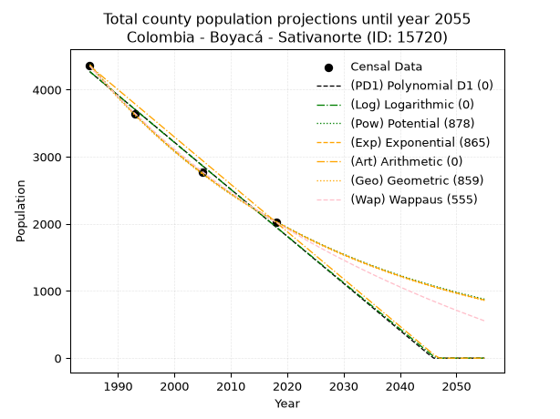
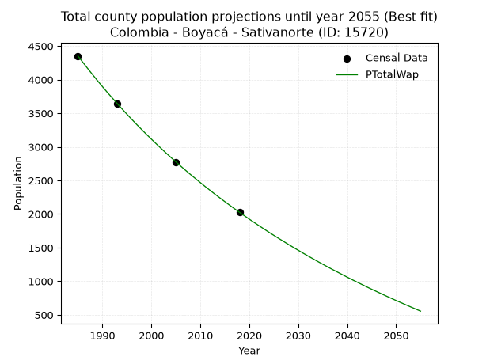
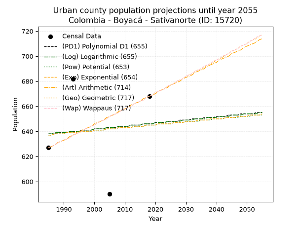
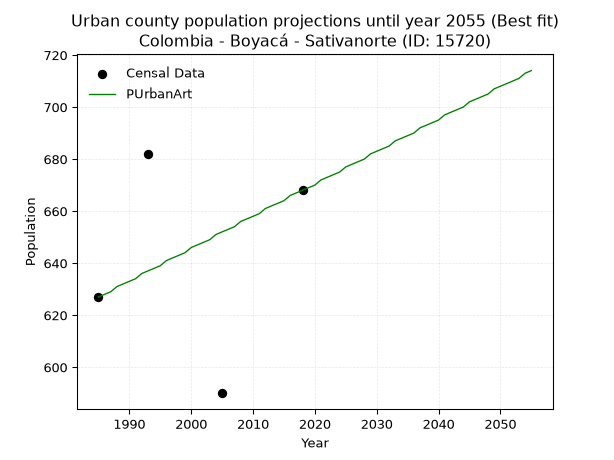
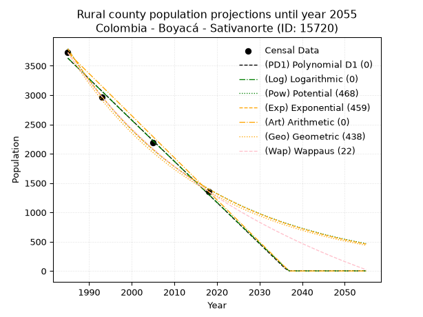
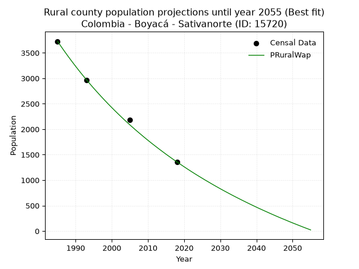

<div align="center">


</div>

# _“Population and Public Services Demand Projections (PPSD) until Year 2050 for Colombia - Boyacá - Sativanorte (ID: 15720)”_
Keywords: `population` `public-service` `projection` `lineal` `polynomial` `logarithmic` `potential` `exponential` `arithmetic` `geometric` `wappaus` `dane` `colombia` `south-america`

PPSD are analytical estimates used by governments and planners to anticipate future changes in population size, age distribution, and the resulting community needs for utilities, healthcare, education, and infrastructure as sizing future water treatment facilities, electrical grids, and road networks based on spatial growth.

> **General running parameters**: • app_version: _v20260806_. • Python version: _3.14.7_. • Pandas version: _3.0.5_. • NumPy version: _2.5.1_. • Creates, save and include plots into reports (create_plot): _True_. • Projection until year: _2050_. • Process polynomial degree 2 and up: _False_. • Process Wappaus: _True_. • Process Wappaus: _True_. • Set negative values to zero: _True_. • Set infinite values to zero: _True_. • Drop dataset notes: _True_. 
<div align="center">

Dynamic map: [:earth_americas:Google](http://maps.google.com/maps?q=6.131132211,-72.7084575) [:earth_americas:OSM](https://www.openstreetmap.org/#map=18/6.131132211/-72.7084575&layers=P) [:earth_americas:Bing](https://www.bing.com/maps?cp=6.131132211~-72.7084575&lvl=18) [:earth_americas:Apple](https://maps.apple.com/frame?center=6.131132211%2C-72.7084575&span=0.003%2C0.006)

</div>


<div align="center">

```geojson
{
  "type": "Feature",
  "geometry": {
    "type": "Point", 
    "coordinates": [-72.7084575, 6.131132211]
  }, 
  "properties": {
    "Name": "Colombia - Boyacá - Sativanorte (ID: 15720)"
  }
}
```

</div>


## 0. Census Data (4 records)

Census data are official statistics collected by a government about the people and housing in a country. They usually include counts of total population, age, sex, race, income, education, and jobs.

📅Global census file: [Population.xlsx](../data/Population.xlsx)

| Source   |   Year |   CountryID | CountryName   |   StateID | StateName   |   CountyID | CountyName   |   PTotal |   PUrban |   PRural |
|:---------|-------:|------------:|:--------------|----------:|:------------|-----------:|:-------------|---------:|---------:|---------:|
| DANE     |   1985 |          57 | Colombia      |        15 | Boyacá      |      15720 | Sativanorte  |     4353 |      627 |     3726 |
| DANE     |   1993 |          57 | Colombia      |        15 | Boyacá      |      15720 | Sativanorte  |     3642 |      682 |     2960 |
| DANE     |   2005 |          57 | Colombia      |        15 | Boyacá      |      15720 | Sativanorte  |     2775 |      590 |     2185 |
| DANE     |   2018 |          57 | Colombia      |        15 | Boyacá      |      15720 | Sativanorte  |     2026 |      668 |     1358 |

> 🔥Some records has specific notes about the registered values or the corresponding urban or rural distribution.

## 1. Total

### 1.1. Coefficients and Parameters

* (PD1) Polynomial Deg 1: -70.08430349257274, 143385.12806101865 (lineal)
* (Log) Logarithmic: -140311.68408562694, 1069709.235122121
* (Pow) Potential: -46.34892378399939, 156.48882014119928
* (Exp) Exponential: -0.023156712751580013, 4.015014346798626e+23
* (Art) Arithmetic: Year diff. 2018 - 1985 = 33, Population diff. 2026 - 4353 = -2327, Annual growth = -70.51515151515152
* (Geo) Geometric: Year diff. 2018 - 1985 = 33, Population diff. 2026 - 4353 = -2327, Annual growth % = -0.022909317394429918
* (Wap) Wappaus: i = -2.2108528457485974, Condition values only valid for < 200)

<sub>
Wappaus condition values: ['-0.00', '-2.21', '-4.42', '-6.63', '-8.84', '-11.05', '-13.27', '-15.48', '-17.69', '-19.90', '-22.11', '-24.32', '-26.53', '-28.74', '-30.95', '-33.16', '-35.37', '-37.58', '-39.80', '-42.01', '-44.22', '-46.43', '-48.64', '-50.85', '-53.06', '-55.27', '-57.48', '-59.69', '-61.90', '-64.11', '-66.33', '-68.54', '-70.75', '-72.96', '-75.17', '-77.38', '-79.59', '-81.80', '-84.01', '-86.22', '-88.43', '-90.64', '-92.86', '-95.07', '-97.28', '-99.49', '-101.70', '-103.91', '-106.12', '-108.33', '-110.54', '-112.75', '-114.96', '-117.18', '-119.39', '-121.60', '-123.81', '-126.02', '-128.23', '-130.44', '-132.65', '-134.86', '-137.07', '-139.28', '-141.49', '-143.71']
</sub>


### 1.2. Projected Dataset

|   Year |   CountyID |   PTotalPD1 |   PTotalLog |   PTotalPow |   PTotalExp |   PTotalArt |   PTotalGeo |   PTotalWap |
|-------:|-----------:|------------:|------------:|------------:|------------:|------------:|------------:|------------:|
|   1985 |      15720 |        4268 |        4270 |        4377 |        4374 |        4353 |        4353 |        4353 |
|   1986 |      15720 |        4198 |        4199 |        4276 |        4274 |        4282 |        4253 |        4258 |
|   1987 |      15720 |        4128 |        4129 |        4177 |        4176 |        4212 |        4156 |        4165 |
|   1988 |      15720 |        4058 |        4058 |        4081 |        4080 |        4141 |        4061 |        4074 |
|   1989 |      15720 |        3987 |        3988 |        3987 |        3987 |        4071 |        3968 |        3984 |
|   1990 |      15720 |        3917 |        3917 |        3895 |        3896 |        4000 |        3877 |        3897 |
|   1991 |      15720 |        3847 |        3847 |        3806 |        3807 |        3930 |        3788 |        3811 |
|   1992 |      15720 |        3777 |        3776 |        3718 |        3719 |        3859 |        3701 |        3728 |
|   1993 |      15720 |        3707 |        3706 |        3633 |        3634 |        3789 |        3616 |        3646 |
|   1994 |      15720 |        3637 |        3635 |        3549 |        3551 |        3718 |        3533 |        3565 |
|   1995 |      15720 |        3567 |        3565 |        3468 |        3470 |        3648 |        3453 |        3486 |
|   1996 |      15720 |        3497 |        3495 |        3388 |        3390 |        3577 |        3373 |        3409 |
|   1997 |      15720 |        3427 |        3424 |        3310 |        3313 |        3507 |        3296 |        3333 |
|   1998 |      15720 |        3357 |        3354 |        3234 |        3237 |        3436 |        3221 |        3259 |
|   1999 |      15720 |        3287 |        3284 |        3160 |        3163 |        3366 |        3147 |        3186 |
|   2000 |      15720 |        3217 |        3214 |        3088 |        3090 |        3295 |        3075 |        3115 |
|   2001 |      15720 |        3146 |        3144 |        3017 |        3020 |        3225 |        3004 |        3045 |
|   2002 |      15720 |        3076 |        3074 |        2948 |        2951 |        3154 |        2935 |        2976 |
|   2003 |      15720 |        3006 |        3004 |        2880 |        2883 |        3084 |        2868 |        2908 |
|   2004 |      15720 |        2936 |        2933 |        2815 |        2817 |        3013 |        2803 |        2842 |
|   2005 |      15720 |        2866 |        2863 |        2750 |        2753 |        2943 |        2738 |        2777 |
|   2006 |      15720 |        2796 |        2794 |        2687 |        2690 |        2872 |        2676 |        2713 |
|   2007 |      15720 |        2726 |        2724 |        2626 |        2628 |        2802 |        2614 |        2650 |
|   2008 |      15720 |        2656 |        2654 |        2566 |        2568 |        2731 |        2554 |        2588 |
|   2009 |      15720 |        2586 |        2584 |        2508 |        2509 |        2661 |        2496 |        2528 |
|   2010 |      15720 |        2516 |        2514 |        2450 |        2452 |        2590 |        2439 |        2468 |
|   2011 |      15720 |        2446 |        2444 |        2395 |        2396 |        2520 |        2383 |        2409 |
|   2012 |      15720 |        2376 |        2374 |        2340 |        2341 |        2449 |        2328 |        2352 |
|   2013 |      15720 |        2305 |        2305 |        2287 |        2287 |        2379 |        2275 |        2295 |
|   2014 |      15720 |        2235 |        2235 |        2235 |        2235 |        2308 |        2223 |        2240 |
|   2015 |      15720 |        2165 |        2165 |        2184 |        2184 |        2238 |        2172 |        2185 |
|   2016 |      15720 |        2095 |        2096 |        2134 |        2134 |        2167 |        2122 |        2131 |
|   2017 |      15720 |        2025 |        2026 |        2086 |        2085 |        2097 |        2074 |        2078 |
|   2018 |      15720 |        1955 |        1957 |        2038 |        2037 |        2026 |        2026 |        2026 |
|   2019 |      15720 |        1885 |        1887 |        1992 |        1990 |        1955 |        1980 |        1975 |
|   2020 |      15720 |        1815 |        1818 |        1947 |        1945 |        1885 |        1934 |        1924 |
|   2021 |      15720 |        1745 |        1748 |        1903 |        1900 |        1814 |        1890 |        1875 |
|   2022 |      15720 |        1675 |        1679 |        1860 |        1857 |        1744 |        1847 |        1826 |
|   2023 |      15720 |        1605 |        1609 |        1817 |        1814 |        1673 |        1804 |        1778 |
|   2024 |      15720 |        1534 |        1540 |        1776 |        1773 |        1603 |        1763 |        1730 |
|   2025 |      15720 |        1464 |        1471 |        1736 |        1732 |        1532 |        1723 |        1684 |
|   2026 |      15720 |        1394 |        1402 |        1697 |        1693 |        1462 |        1683 |        1638 |
|   2027 |      15720 |        1324 |        1332 |        1658 |        1654 |        1391 |        1645 |        1593 |
|   2028 |      15720 |        1254 |        1263 |        1621 |        1616 |        1321 |        1607 |        1548 |
|   2029 |      15720 |        1184 |        1194 |        1584 |        1579 |        1250 |        1570 |        1504 |
|   2030 |      15720 |        1114 |        1125 |        1549 |        1543 |        1180 |        1534 |        1461 |
|   2031 |      15720 |        1044 |        1056 |        1514 |        1508 |        1109 |        1499 |        1418 |
|   2032 |      15720 |         974 |         987 |        1480 |        1473 |        1039 |        1465 |        1376 |
|   2033 |      15720 |         904 |         918 |        1446 |        1439 |         968 |        1431 |        1335 |
|   2034 |      15720 |         834 |         849 |        1414 |        1406 |         898 |        1398 |        1294 |
|   2035 |      15720 |         764 |         780 |        1382 |        1374 |         827 |        1366 |        1254 |
|   2036 |      15720 |         693 |         711 |        1351 |        1343 |         757 |        1335 |        1214 |
|   2037 |      15720 |         623 |         642 |        1320 |        1312 |         686 |        1304 |        1175 |
|   2038 |      15720 |         553 |         573 |        1291 |        1282 |         616 |        1274 |        1137 |
|   2039 |      15720 |         483 |         504 |        1262 |        1253 |         545 |        1245 |        1099 |
|   2040 |      15720 |         413 |         435 |        1233 |        1224 |         475 |        1217 |        1061 |
|   2041 |      15720 |         343 |         367 |        1205 |        1196 |         404 |        1189 |        1024 |
|   2042 |      15720 |         273 |         298 |        1178 |        1169 |         334 |        1162 |         988 |
|   2043 |      15720 |         203 |         229 |        1152 |        1142 |         263 |        1135 |         952 |
|   2044 |      15720 |         133 |         160 |        1126 |        1116 |         193 |        1109 |         916 |
|   2045 |      15720 |          63 |          92 |        1101 |        1090 |         122 |        1084 |         881 |
|   2046 |      15720 |           0 |          23 |        1076 |        1065 |          52 |        1059 |         847 |
|   2047 |      15720 |           0 |           0 |        1052 |        1041 |           0 |        1035 |         813 |
|   2048 |      15720 |           0 |           0 |        1029 |        1017 |           0 |        1011 |         779 |
|   2049 |      15720 |           0 |           0 |        1006 |         994 |           0 |         988 |         746 |
|   2050 |      15720 |           0 |           0 |         983 |         971 |           0 |         965 |         713 |
<div align="center">

</img>

</div>


### 1.3. Best fit with absolute error and relative error (%)

Relative error puts that difference into context by dividing the absolute error by the true value, creating a unitless ratio or percentage that shows the scale of the mistake.

Absolute and relative error

|   Year | Source   |   CountryID | CountryName   |   StateID | StateName   |   CountyID_x | CountyName   |   PTotal |   PUrban |   PRural |   CountyID_y |   PTotalPD1 |   PTotalLog |   PTotalPow |   PTotalExp |   PTotalArt |   PTotalGeo |   PTotalWap |   PTotalPD1AbsError |   PTotalLogAbsError |   PTotalPowAbsError |   PTotalExpAbsError |   PTotalArtAbsError |   PTotalGeoAbsError |   PTotalWapAbsError |   PTotalPD1RelError |   PTotalLogRelError |   PTotalPowRelError |   PTotalExpRelError |   PTotalArtRelError |   PTotalGeoRelError |   PTotalWapRelError |
|-------:|:---------|------------:|:--------------|----------:|:------------|-------------:|:-------------|---------:|---------:|---------:|-------------:|------------:|------------:|------------:|------------:|------------:|------------:|------------:|--------------------:|--------------------:|--------------------:|--------------------:|--------------------:|--------------------:|--------------------:|--------------------:|--------------------:|--------------------:|--------------------:|--------------------:|--------------------:|--------------------:|
|   1985 | DANE     |          57 | Colombia      |        15 | Boyacá      |        15720 | Sativanorte  |     4353 |      627 |     3726 |        15720 |        4268 |        4270 |        4377 |        4374 |        4353 |        4353 |        4353 |                  85 |                  83 |                  24 |                  21 |                   0 |                   0 |                   0 |             1.95268 |             1.90673 |            0.551344 |            0.482426 |             0       |            0        |           0         |
|   1993 | DANE     |          57 | Colombia      |        15 | Boyacá      |        15720 | Sativanorte  |     3642 |      682 |     2960 |        15720 |        3707 |        3706 |        3633 |        3634 |        3789 |        3616 |        3646 |                  65 |                  64 |                   9 |                   8 |                 147 |                  26 |                   4 |             1.78473 |             1.75728 |            0.247117 |            0.21966  |             4.03624 |            0.713893 |           0.10983   |
|   2005 | DANE     |          57 | Colombia      |        15 | Boyacá      |        15720 | Sativanorte  |     2775 |      590 |     2185 |        15720 |        2866 |        2863 |        2750 |        2753 |        2943 |        2738 |        2777 |                  91 |                  88 |                  25 |                  22 |                 168 |                  37 |                   2 |             3.27928 |             3.17117 |            0.900901 |            0.792793 |             6.05405 |            1.33333  |           0.0720721 |
|   2018 | DANE     |          57 | Colombia      |        15 | Boyacá      |        15720 | Sativanorte  |     2026 |      668 |     1358 |        15720 |        1955 |        1957 |        2038 |        2037 |        2026 |        2026 |        2026 |                  71 |                  69 |                  12 |                  11 |                   0 |                   0 |                   0 |             3.50444 |             3.40573 |            0.5923   |            0.542942 |             0       |            0        |           0         |

Relative error mean

| Method    |   RelError | Best   |
|:----------|-----------:|:-------|
| PTotalPD1 |  2.63028   |        |
| PTotalLog |  2.56023   |        |
| PTotalPow |  0.572915  |        |
| PTotalExp |  0.509455  |        |
| PTotalArt |  2.52257   |        |
| PTotalGeo |  0.511807  |        |
| PTotalWap |  0.0454755 | True   |

💙Best method: _**PTotalWap**_
<div align="center">

</img>

</div>


### 1.4. Fresh water supply demand in liters per capita per day (lpcd)

The fresh water supply demand typically ranges from 100 to 300 liters per capita per day (lpcd) for standard domestic and municipal planning, though absolute survival minimums set by the World Health Organization are as low as 7.5 to 20 liters per day, and total consumption in high-income nations can exceed 400 liters.

> `CZ`: Level in meters above the sea level (masl).<br> `WS`: Fresh water supply demand in liters per capita per day (lpcd or l/h/d).<br> `WSAll`: Zonal fresh water supply demand in liters per second (l/s).<br> `A`: Zonal area in square meters.

Reference values (RAS Colombia)

|    CZ |   WS |
|------:|-----:|
|  1000 |  120 |
|  2000 |  130 |
| 99999 |  140 |

County shapefile geometry properties and water supply values

|   CountyID |     ATotal |   CZTotal |   WSTotal |
|-----------:|-----------:|----------:|----------:|
|      15720 | 1.6107e+08 |   2903.83 |       140 |

Projected values for best method: PTotalWap

|   CountyID |   Year |   PTotalWap |   WSTotal |   WSTotalAll |
|-----------:|-------:|------------:|----------:|-------------:|
|      15720 |   1985 |        4353 |       140 |      7.05347 |
|      15720 |   1986 |        4258 |       140 |      6.89954 |
|      15720 |   1987 |        4165 |       140 |      6.74884 |
|      15720 |   1988 |        4074 |       140 |      6.60139 |
|      15720 |   1989 |        3984 |       140 |      6.45556 |
|      15720 |   1990 |        3897 |       140 |      6.31458 |
|      15720 |   1991 |        3811 |       140 |      6.17523 |
|      15720 |   1992 |        3728 |       140 |      6.04074 |
|      15720 |   1993 |        3646 |       140 |      5.90787 |
|      15720 |   1994 |        3565 |       140 |      5.77662 |
|      15720 |   1995 |        3486 |       140 |      5.64861 |
|      15720 |   1996 |        3409 |       140 |      5.52384 |
|      15720 |   1997 |        3333 |       140 |      5.40069 |
|      15720 |   1998 |        3259 |       140 |      5.28079 |
|      15720 |   1999 |        3186 |       140 |      5.1625  |
|      15720 |   2000 |        3115 |       140 |      5.04745 |
|      15720 |   2001 |        3045 |       140 |      4.93403 |
|      15720 |   2002 |        2976 |       140 |      4.82222 |
|      15720 |   2003 |        2908 |       140 |      4.71204 |
|      15720 |   2004 |        2842 |       140 |      4.60509 |
|      15720 |   2005 |        2777 |       140 |      4.49977 |
|      15720 |   2006 |        2713 |       140 |      4.39606 |
|      15720 |   2007 |        2650 |       140 |      4.29398 |
|      15720 |   2008 |        2588 |       140 |      4.19352 |
|      15720 |   2009 |        2528 |       140 |      4.0963  |
|      15720 |   2010 |        2468 |       140 |      3.99907 |
|      15720 |   2011 |        2409 |       140 |      3.90347 |
|      15720 |   2012 |        2352 |       140 |      3.81111 |
|      15720 |   2013 |        2295 |       140 |      3.71875 |
|      15720 |   2014 |        2240 |       140 |      3.62963 |
|      15720 |   2015 |        2185 |       140 |      3.54051 |
|      15720 |   2016 |        2131 |       140 |      3.45301 |
|      15720 |   2017 |        2078 |       140 |      3.36713 |
|      15720 |   2018 |        2026 |       140 |      3.28287 |
|      15720 |   2019 |        1975 |       140 |      3.20023 |
|      15720 |   2020 |        1924 |       140 |      3.11759 |
|      15720 |   2021 |        1875 |       140 |      3.03819 |
|      15720 |   2022 |        1826 |       140 |      2.9588  |
|      15720 |   2023 |        1778 |       140 |      2.88102 |
|      15720 |   2024 |        1730 |       140 |      2.80324 |
|      15720 |   2025 |        1684 |       140 |      2.7287  |
|      15720 |   2026 |        1638 |       140 |      2.65417 |
|      15720 |   2027 |        1593 |       140 |      2.58125 |
|      15720 |   2028 |        1548 |       140 |      2.50833 |
|      15720 |   2029 |        1504 |       140 |      2.43704 |
|      15720 |   2030 |        1461 |       140 |      2.36736 |
|      15720 |   2031 |        1418 |       140 |      2.29769 |
|      15720 |   2032 |        1376 |       140 |      2.22963 |
|      15720 |   2033 |        1335 |       140 |      2.16319 |
|      15720 |   2034 |        1294 |       140 |      2.09676 |
|      15720 |   2035 |        1254 |       140 |      2.03194 |
|      15720 |   2036 |        1214 |       140 |      1.96713 |
|      15720 |   2037 |        1175 |       140 |      1.90394 |
|      15720 |   2038 |        1137 |       140 |      1.84236 |
|      15720 |   2039 |        1099 |       140 |      1.78079 |
|      15720 |   2040 |        1061 |       140 |      1.71921 |
|      15720 |   2041 |        1024 |       140 |      1.65926 |
|      15720 |   2042 |         988 |       140 |      1.60093 |
|      15720 |   2043 |         952 |       140 |      1.54259 |
|      15720 |   2044 |         916 |       140 |      1.48426 |
|      15720 |   2045 |         881 |       140 |      1.42755 |
|      15720 |   2046 |         847 |       140 |      1.37245 |
|      15720 |   2047 |         813 |       140 |      1.31736 |
|      15720 |   2048 |         779 |       140 |      1.26227 |
|      15720 |   2049 |         746 |       140 |      1.2088  |
|      15720 |   2050 |         713 |       140 |      1.15532 |

## 2. Urban

### 2.1. Coefficients and Parameters

* (PD1) Polynomial Deg 1: 0.24608590927334256, 149.51665997599656 (lineal)
* (Log) Logarithmic: 488.3048798480253, -3069.8593047545687
* (Pow) Potential: 0.7186701673830238, 0.4342853729623848
* (Exp) Exponential: 0.00036258107833347366, 310.239296934079
* (Art) Arithmetic: Year diff. 2018 - 1985 = 33, Population diff. 668 - 627 = 41, Annual growth = 1.2424242424242424
* (Geo) Geometric: Year diff. 2018 - 1985 = 33, Population diff. 668 - 627 = 41, Annual growth % = 0.0019212867320370641
* (Wap) Wappaus: i = 0.19188019188019187, Condition values only valid for < 200)

<sub>
Wappaus condition values: ['0.00', '0.19', '0.38', '0.58', '0.77', '0.96', '1.15', '1.34', '1.54', '1.73', '1.92', '2.11', '2.30', '2.49', '2.69', '2.88', '3.07', '3.26', '3.45', '3.65', '3.84', '4.03', '4.22', '4.41', '4.61', '4.80', '4.99', '5.18', '5.37', '5.56', '5.76', '5.95', '6.14', '6.33', '6.52', '6.72', '6.91', '7.10', '7.29', '7.48', '7.68', '7.87', '8.06', '8.25', '8.44', '8.63', '8.83', '9.02', '9.21', '9.40', '9.59', '9.79', '9.98', '10.17', '10.36', '10.55', '10.75', '10.94', '11.13', '11.32', '11.51', '11.70', '11.90', '12.09', '12.28', '12.47']
</sub>


### 2.2. Projected Dataset

|   Year |   CountyID |   PUrbanPD1 |   PUrbanLog |   PUrbanPow |   PUrbanExp |   PUrbanArt |   PUrbanGeo |   PUrbanWap |
|-------:|-----------:|------------:|------------:|------------:|------------:|------------:|------------:|------------:|
|   1985 |      15720 |         638 |         638 |         637 |         637 |         627 |         627 |         627 |
|   1986 |      15720 |         638 |         638 |         637 |         637 |         628 |         628 |         628 |
|   1987 |      15720 |         638 |         639 |         638 |         638 |         629 |         629 |         629 |
|   1988 |      15720 |         639 |         639 |         638 |         638 |         631 |         631 |         631 |
|   1989 |      15720 |         639 |         639 |         638 |         638 |         632 |         632 |         632 |
|   1990 |      15720 |         639 |         639 |         638 |         638 |         633 |         633 |         633 |
|   1991 |      15720 |         639 |         639 |         639 |         639 |         634 |         634 |         634 |
|   1992 |      15720 |         640 |         640 |         639 |         639 |         636 |         635 |         635 |
|   1993 |      15720 |         640 |         640 |         639 |         639 |         637 |         637 |         637 |
|   1994 |      15720 |         640 |         640 |         639 |         639 |         638 |         638 |         638 |
|   1995 |      15720 |         640 |         640 |         640 |         640 |         639 |         639 |         639 |
|   1996 |      15720 |         641 |         641 |         640 |         640 |         641 |         640 |         640 |
|   1997 |      15720 |         641 |         641 |         640 |         640 |         642 |         642 |         642 |
|   1998 |      15720 |         641 |         641 |         640 |         640 |         643 |         643 |         643 |
|   1999 |      15720 |         641 |         641 |         640 |         640 |         644 |         644 |         644 |
|   2000 |      15720 |         642 |         642 |         641 |         641 |         646 |         645 |         645 |
|   2001 |      15720 |         642 |         642 |         641 |         641 |         647 |         647 |         647 |
|   2002 |      15720 |         642 |         642 |         641 |         641 |         648 |         648 |         648 |
|   2003 |      15720 |         642 |         642 |         641 |         641 |         649 |         649 |         649 |
|   2004 |      15720 |         643 |         643 |         642 |         642 |         651 |         650 |         650 |
|   2005 |      15720 |         643 |         643 |         642 |         642 |         652 |         652 |         652 |
|   2006 |      15720 |         643 |         643 |         642 |         642 |         653 |         653 |         653 |
|   2007 |      15720 |         643 |         643 |         642 |         642 |         654 |         654 |         654 |
|   2008 |      15720 |         644 |         644 |         643 |         643 |         656 |         655 |         655 |
|   2009 |      15720 |         644 |         644 |         643 |         643 |         657 |         657 |         657 |
|   2010 |      15720 |         644 |         644 |         643 |         643 |         658 |         658 |         658 |
|   2011 |      15720 |         644 |         644 |         643 |         643 |         659 |         659 |         659 |
|   2012 |      15720 |         645 |         645 |         643 |         643 |         661 |         660 |         660 |
|   2013 |      15720 |         645 |         645 |         644 |         644 |         662 |         662 |         662 |
|   2014 |      15720 |         645 |         645 |         644 |         644 |         663 |         663 |         663 |
|   2015 |      15720 |         645 |         645 |         644 |         644 |         664 |         664 |         664 |
|   2016 |      15720 |         646 |         646 |         644 |         644 |         666 |         665 |         665 |
|   2017 |      15720 |         646 |         646 |         645 |         645 |         667 |         667 |         667 |
|   2018 |      15720 |         646 |         646 |         645 |         645 |         668 |         668 |         668 |
|   2019 |      15720 |         646 |         646 |         645 |         645 |         669 |         669 |         669 |
|   2020 |      15720 |         647 |         647 |         645 |         645 |         670 |         671 |         671 |
|   2021 |      15720 |         647 |         647 |         646 |         646 |         672 |         672 |         672 |
|   2022 |      15720 |         647 |         647 |         646 |         646 |         673 |         673 |         673 |
|   2023 |      15720 |         647 |         647 |         646 |         646 |         674 |         674 |         674 |
|   2024 |      15720 |         648 |         648 |         646 |         646 |         675 |         676 |         676 |
|   2025 |      15720 |         648 |         648 |         646 |         646 |         677 |         677 |         677 |
|   2026 |      15720 |         648 |         648 |         647 |         647 |         678 |         678 |         678 |
|   2027 |      15720 |         648 |         648 |         647 |         647 |         679 |         680 |         680 |
|   2028 |      15720 |         649 |         648 |         647 |         647 |         680 |         681 |         681 |
|   2029 |      15720 |         649 |         649 |         647 |         647 |         682 |         682 |         682 |
|   2030 |      15720 |         649 |         649 |         648 |         648 |         683 |         684 |         684 |
|   2031 |      15720 |         649 |         649 |         648 |         648 |         684 |         685 |         685 |
|   2032 |      15720 |         650 |         649 |         648 |         648 |         685 |         686 |         686 |
|   2033 |      15720 |         650 |         650 |         648 |         648 |         687 |         688 |         688 |
|   2034 |      15720 |         650 |         650 |         648 |         649 |         688 |         689 |         689 |
|   2035 |      15720 |         650 |         650 |         649 |         649 |         689 |         690 |         690 |
|   2036 |      15720 |         651 |         650 |         649 |         649 |         690 |         691 |         692 |
|   2037 |      15720 |         651 |         651 |         649 |         649 |         692 |         693 |         693 |
|   2038 |      15720 |         651 |         651 |         649 |         650 |         693 |         694 |         694 |
|   2039 |      15720 |         651 |         651 |         650 |         650 |         694 |         695 |         696 |
|   2040 |      15720 |         652 |         651 |         650 |         650 |         695 |         697 |         697 |
|   2041 |      15720 |         652 |         652 |         650 |         650 |         697 |         698 |         698 |
|   2042 |      15720 |         652 |         652 |         650 |         650 |         698 |         699 |         700 |
|   2043 |      15720 |         652 |         652 |         651 |         651 |         699 |         701 |         701 |
|   2044 |      15720 |         653 |         652 |         651 |         651 |         700 |         702 |         702 |
|   2045 |      15720 |         653 |         653 |         651 |         651 |         702 |         704 |         704 |
|   2046 |      15720 |         653 |         653 |         651 |         651 |         703 |         705 |         705 |
|   2047 |      15720 |         653 |         653 |         651 |         652 |         704 |         706 |         706 |
|   2048 |      15720 |         654 |         653 |         652 |         652 |         705 |         708 |         708 |
|   2049 |      15720 |         654 |         654 |         652 |         652 |         707 |         709 |         709 |
|   2050 |      15720 |         654 |         654 |         652 |         652 |         708 |         710 |         710 |
<div align="center">

</img>

</div>


### 2.3. Best fit with absolute error and relative error (%)

Relative error puts that difference into context by dividing the absolute error by the true value, creating a unitless ratio or percentage that shows the scale of the mistake.

Absolute and relative error

|   Year | Source   |   CountryID | CountryName   |   StateID | StateName   |   CountyID_x | CountyName   |   PTotal |   PUrban |   PRural |   CountyID_y |   PUrbanPD1 |   PUrbanLog |   PUrbanPow |   PUrbanExp |   PUrbanArt |   PUrbanGeo |   PUrbanWap |   PUrbanPD1AbsError |   PUrbanLogAbsError |   PUrbanPowAbsError |   PUrbanExpAbsError |   PUrbanArtAbsError |   PUrbanGeoAbsError |   PUrbanWapAbsError |   PUrbanPD1RelError |   PUrbanLogRelError |   PUrbanPowRelError |   PUrbanExpRelError |   PUrbanArtRelError |   PUrbanGeoRelError |   PUrbanWapRelError |
|-------:|:---------|------------:|:--------------|----------:|:------------|-------------:|:-------------|---------:|---------:|---------:|-------------:|------------:|------------:|------------:|------------:|------------:|------------:|------------:|--------------------:|--------------------:|--------------------:|--------------------:|--------------------:|--------------------:|--------------------:|--------------------:|--------------------:|--------------------:|--------------------:|--------------------:|--------------------:|--------------------:|
|   1985 | DANE     |          57 | Colombia      |        15 | Boyacá      |        15720 | Sativanorte  |     4353 |      627 |     3726 |        15720 |         638 |         638 |         637 |         637 |         627 |         627 |         627 |                  11 |                  11 |                  10 |                  10 |                   0 |                   0 |                   0 |             1.75439 |             1.75439 |             1.5949  |             1.5949  |             0       |             0       |             0       |
|   1993 | DANE     |          57 | Colombia      |        15 | Boyacá      |        15720 | Sativanorte  |     3642 |      682 |     2960 |        15720 |         640 |         640 |         639 |         639 |         637 |         637 |         637 |                  42 |                  42 |                  43 |                  43 |                  45 |                  45 |                  45 |             6.15836 |             6.15836 |             6.30499 |             6.30499 |             6.59824 |             6.59824 |             6.59824 |
|   2005 | DANE     |          57 | Colombia      |        15 | Boyacá      |        15720 | Sativanorte  |     2775 |      590 |     2185 |        15720 |         643 |         643 |         642 |         642 |         652 |         652 |         652 |                  53 |                  53 |                  52 |                  52 |                  62 |                  62 |                  62 |             8.98305 |             8.98305 |             8.81356 |             8.81356 |            10.5085  |            10.5085  |            10.5085  |
|   2018 | DANE     |          57 | Colombia      |        15 | Boyacá      |        15720 | Sativanorte  |     2026 |      668 |     1358 |        15720 |         646 |         646 |         645 |         645 |         668 |         668 |         668 |                  22 |                  22 |                  23 |                  23 |                   0 |                   0 |                   0 |             3.29341 |             3.29341 |             3.44311 |             3.44311 |             0       |             0       |             0       |

Relative error mean

| Method    |   RelError | Best   |
|:----------|-----------:|:-------|
| PUrbanPD1 |    5.0473  |        |
| PUrbanLog |    5.0473  |        |
| PUrbanPow |    5.03914 |        |
| PUrbanExp |    5.03914 |        |
| PUrbanArt |    4.27668 | True   |
| PUrbanGeo |    4.27668 | True   |
| PUrbanWap |    4.27668 | True   |

💙Best method: _**PUrbanArt**_
<div align="center">

</img>

</div>


### 2.4. Fresh water supply demand in liters per capita per day (lpcd)

The fresh water supply demand typically ranges from 100 to 300 liters per capita per day (lpcd) for standard domestic and municipal planning, though absolute survival minimums set by the World Health Organization are as low as 7.5 to 20 liters per day, and total consumption in high-income nations can exceed 400 liters.

> `CZ`: Level in meters above the sea level (masl).<br> `WS`: Fresh water supply demand in liters per capita per day (lpcd or l/h/d).<br> `WSAll`: Zonal fresh water supply demand in liters per second (l/s).<br> `A`: Zonal area in square meters.

Reference values (RAS Colombia)

|    CZ |   WS |
|------:|-----:|
|  1000 |  120 |
|  2000 |  130 |
| 99999 |  140 |

County shapefile geometry properties and water supply values

|   CountyID |   AUrban |   CZUrban |   WSUrban |
|-----------:|---------:|----------:|----------:|
|      15720 |   279564 |   2618.16 |       140 |

Projected values for best method: PUrbanArt

|   CountyID |   Year |   PUrbanArt |   WSUrban |   WSUrbanAll |
|-----------:|-------:|------------:|----------:|-------------:|
|      15720 |   1985 |         627 |       140 |      1.01597 |
|      15720 |   1986 |         628 |       140 |      1.01759 |
|      15720 |   1987 |         629 |       140 |      1.01921 |
|      15720 |   1988 |         631 |       140 |      1.02245 |
|      15720 |   1989 |         632 |       140 |      1.02407 |
|      15720 |   1990 |         633 |       140 |      1.02569 |
|      15720 |   1991 |         634 |       140 |      1.02731 |
|      15720 |   1992 |         636 |       140 |      1.03056 |
|      15720 |   1993 |         637 |       140 |      1.03218 |
|      15720 |   1994 |         638 |       140 |      1.0338  |
|      15720 |   1995 |         639 |       140 |      1.03542 |
|      15720 |   1996 |         641 |       140 |      1.03866 |
|      15720 |   1997 |         642 |       140 |      1.04028 |
|      15720 |   1998 |         643 |       140 |      1.0419  |
|      15720 |   1999 |         644 |       140 |      1.04352 |
|      15720 |   2000 |         646 |       140 |      1.04676 |
|      15720 |   2001 |         647 |       140 |      1.04838 |
|      15720 |   2002 |         648 |       140 |      1.05    |
|      15720 |   2003 |         649 |       140 |      1.05162 |
|      15720 |   2004 |         651 |       140 |      1.05486 |
|      15720 |   2005 |         652 |       140 |      1.05648 |
|      15720 |   2006 |         653 |       140 |      1.0581  |
|      15720 |   2007 |         654 |       140 |      1.05972 |
|      15720 |   2008 |         656 |       140 |      1.06296 |
|      15720 |   2009 |         657 |       140 |      1.06458 |
|      15720 |   2010 |         658 |       140 |      1.0662  |
|      15720 |   2011 |         659 |       140 |      1.06782 |
|      15720 |   2012 |         661 |       140 |      1.07106 |
|      15720 |   2013 |         662 |       140 |      1.07269 |
|      15720 |   2014 |         663 |       140 |      1.07431 |
|      15720 |   2015 |         664 |       140 |      1.07593 |
|      15720 |   2016 |         666 |       140 |      1.07917 |
|      15720 |   2017 |         667 |       140 |      1.08079 |
|      15720 |   2018 |         668 |       140 |      1.08241 |
|      15720 |   2019 |         669 |       140 |      1.08403 |
|      15720 |   2020 |         670 |       140 |      1.08565 |
|      15720 |   2021 |         672 |       140 |      1.08889 |
|      15720 |   2022 |         673 |       140 |      1.09051 |
|      15720 |   2023 |         674 |       140 |      1.09213 |
|      15720 |   2024 |         675 |       140 |      1.09375 |
|      15720 |   2025 |         677 |       140 |      1.09699 |
|      15720 |   2026 |         678 |       140 |      1.09861 |
|      15720 |   2027 |         679 |       140 |      1.10023 |
|      15720 |   2028 |         680 |       140 |      1.10185 |
|      15720 |   2029 |         682 |       140 |      1.10509 |
|      15720 |   2030 |         683 |       140 |      1.10671 |
|      15720 |   2031 |         684 |       140 |      1.10833 |
|      15720 |   2032 |         685 |       140 |      1.10995 |
|      15720 |   2033 |         687 |       140 |      1.11319 |
|      15720 |   2034 |         688 |       140 |      1.11481 |
|      15720 |   2035 |         689 |       140 |      1.11644 |
|      15720 |   2036 |         690 |       140 |      1.11806 |
|      15720 |   2037 |         692 |       140 |      1.1213  |
|      15720 |   2038 |         693 |       140 |      1.12292 |
|      15720 |   2039 |         694 |       140 |      1.12454 |
|      15720 |   2040 |         695 |       140 |      1.12616 |
|      15720 |   2041 |         697 |       140 |      1.1294  |
|      15720 |   2042 |         698 |       140 |      1.13102 |
|      15720 |   2043 |         699 |       140 |      1.13264 |
|      15720 |   2044 |         700 |       140 |      1.13426 |
|      15720 |   2045 |         702 |       140 |      1.1375  |
|      15720 |   2046 |         703 |       140 |      1.13912 |
|      15720 |   2047 |         704 |       140 |      1.14074 |
|      15720 |   2048 |         705 |       140 |      1.14236 |
|      15720 |   2049 |         707 |       140 |      1.1456  |
|      15720 |   2050 |         708 |       140 |      1.14722 |

## 3. Rural

### 3.1. Coefficients and Parameters

* (PD1) Polynomial Deg 1: -70.33038940184609, 143235.61140104264 (lineal)
* (Log) Logarithmic: -140799.9889654749, 1072779.0944268755
* (Pow) Potential: -60.35855438717289, 202.62688689687388
* (Exp) Exponential: -0.03015990147474509, 3.7892528276678794e+29
* (Art) Arithmetic: Year diff. 2018 - 1985 = 33, Population diff. 1358 - 3726 = -2368, Annual growth = -71.75757575757575
* (Geo) Geometric: Year diff. 2018 - 1985 = 33, Population diff. 1358 - 3726 = -2368, Annual growth % = -0.03012251784270492
* (Wap) Wappaus: i = -2.8228786686693845, Condition values only valid for < 200)

<sub>
Wappaus condition values: ['-0.00', '-2.82', '-5.65', '-8.47', '-11.29', '-14.11', '-16.94', '-19.76', '-22.58', '-25.41', '-28.23', '-31.05', '-33.87', '-36.70', '-39.52', '-42.34', '-45.17', '-47.99', '-50.81', '-53.63', '-56.46', '-59.28', '-62.10', '-64.93', '-67.75', '-70.57', '-73.39', '-76.22', '-79.04', '-81.86', '-84.69', '-87.51', '-90.33', '-93.15', '-95.98', '-98.80', '-101.62', '-104.45', '-107.27', '-110.09', '-112.92', '-115.74', '-118.56', '-121.38', '-124.21', '-127.03', '-129.85', '-132.68', '-135.50', '-138.32', '-141.14', '-143.97', '-146.79', '-149.61', '-152.44', '-155.26', '-158.08', '-160.90', '-163.73', '-166.55', '-169.37', '-172.20', '-175.02', '-177.84', '-180.66', '-183.49']
</sub>


### 3.2. Projected Dataset

|   Year |   CountyID |   PRuralPD1 |   PRuralLog |   PRuralPow |   PRuralExp |   PRuralArt |   PRuralGeo |   PRuralWap |
|-------:|-----------:|------------:|------------:|------------:|------------:|------------:|------------:|------------:|
|   1985 |      15720 |        3630 |        3632 |        3792 |        3789 |        3726 |        3726 |        3726 |
|   1986 |      15720 |        3559 |        3561 |        3678 |        3676 |        3654 |        3614 |        3622 |
|   1987 |      15720 |        3489 |        3490 |        3568 |        3567 |        3582 |        3505 |        3521 |
|   1988 |      15720 |        3419 |        3419 |        3461 |        3461 |        3511 |        3399 |        3423 |
|   1989 |      15720 |        3348 |        3349 |        3358 |        3358 |        3439 |        3297 |        3328 |
|   1990 |      15720 |        3278 |        3278 |        3257 |        3258 |        3367 |        3198 |        3235 |
|   1991 |      15720 |        3208 |        3207 |        3160 |        3161 |        3295 |        3101 |        3144 |
|   1992 |      15720 |        3137 |        3136 |        3066 |        3067 |        3224 |        3008 |        3056 |
|   1993 |      15720 |        3067 |        3066 |        2974 |        2976 |        3152 |        2917 |        2970 |
|   1994 |      15720 |        2997 |        2995 |        2886 |        2888 |        3080 |        2829 |        2886 |
|   1995 |      15720 |        2926 |        2925 |        2800 |        2802 |        3008 |        2744 |        2804 |
|   1996 |      15720 |        2856 |        2854 |        2716 |        2719 |        2937 |        2662 |        2725 |
|   1997 |      15720 |        2786 |        2783 |        2635 |        2638 |        2865 |        2581 |        2647 |
|   1998 |      15720 |        2715 |        2713 |        2557 |        2560 |        2793 |        2504 |        2571 |
|   1999 |      15720 |        2645 |        2643 |        2481 |        2484 |        2721 |        2428 |        2496 |
|   2000 |      15720 |        2575 |        2572 |        2407 |        2410 |        2650 |        2355 |        2424 |
|   2001 |      15720 |        2505 |        2502 |        2336 |        2338 |        2578 |        2284 |        2353 |
|   2002 |      15720 |        2434 |        2431 |        2266 |        2269 |        2506 |        2215 |        2284 |
|   2003 |      15720 |        2364 |        2361 |        2199 |        2201 |        2434 |        2149 |        2216 |
|   2004 |      15720 |        2294 |        2291 |        2134 |        2136 |        2363 |        2084 |        2150 |
|   2005 |      15720 |        2223 |        2221 |        2070 |        2073 |        2291 |        2021 |        2085 |
|   2006 |      15720 |        2153 |        2150 |        2009 |        2011 |        2219 |        1960 |        2022 |
|   2007 |      15720 |        2083 |        2080 |        1949 |        1951 |        2147 |        1901 |        1960 |
|   2008 |      15720 |        2012 |        2010 |        1892 |        1893 |        2076 |        1844 |        1900 |
|   2009 |      15720 |        1942 |        1940 |        1836 |        1837 |        2004 |        1788 |        1840 |
|   2010 |      15720 |        1872 |        1870 |        1781 |        1782 |        1932 |        1734 |        1782 |
|   2011 |      15720 |        1801 |        1800 |        1729 |        1729 |        1860 |        1682 |        1725 |
|   2012 |      15720 |        1731 |        1730 |        1678 |        1678 |        1789 |        1632 |        1670 |
|   2013 |      15720 |        1661 |        1660 |        1628 |        1628 |        1717 |        1582 |        1615 |
|   2014 |      15720 |        1590 |        1590 |        1580 |        1580 |        1645 |        1535 |        1562 |
|   2015 |      15720 |        1520 |        1520 |        1533 |        1533 |        1573 |        1489 |        1509 |
|   2016 |      15720 |        1450 |        1450 |        1488 |        1487 |        1502 |        1444 |        1458 |
|   2017 |      15720 |        1379 |        1380 |        1444 |        1443 |        1430 |        1400 |        1407 |
|   2018 |      15720 |        1309 |        1311 |        1402 |        1400 |        1358 |        1358 |        1358 |
|   2019 |      15720 |        1239 |        1241 |        1360 |        1359 |        1286 |        1317 |        1310 |
|   2020 |      15720 |        1168 |        1171 |        1320 |        1318 |        1214 |        1277 |        1262 |
|   2021 |      15720 |        1098 |        1101 |        1281 |        1279 |        1143 |        1239 |        1215 |
|   2022 |      15720 |        1028 |        1032 |        1244 |        1241 |        1071 |        1202 |        1169 |
|   2023 |      15720 |         957 |         962 |        1207 |        1204 |         999 |        1165 |        1124 |
|   2024 |      15720 |         887 |         893 |        1172 |        1169 |         927 |        1130 |        1080 |
|   2025 |      15720 |         817 |         823 |        1137 |        1134 |         856 |        1096 |        1037 |
|   2026 |      15720 |         746 |         754 |        1104 |        1100 |         784 |        1063 |         994 |
|   2027 |      15720 |         676 |         684 |        1071 |        1067 |         712 |        1031 |         953 |
|   2028 |      15720 |         606 |         615 |        1040 |        1036 |         640 |        1000 |         911 |
|   2029 |      15720 |         535 |         545 |        1010 |        1005 |         569 |         970 |         871 |
|   2030 |      15720 |         465 |         476 |         980 |         975 |         497 |         941 |         831 |
|   2031 |      15720 |         395 |         406 |         951 |         946 |         425 |         912 |         792 |
|   2032 |      15720 |         324 |         337 |         923 |         918 |         353 |         885 |         754 |
|   2033 |      15720 |         254 |         268 |         896 |         891 |         282 |         858 |         716 |
|   2034 |      15720 |         184 |         199 |         870 |         864 |         210 |         832 |         679 |
|   2035 |      15720 |         113 |         129 |         845 |         839 |         138 |         807 |         643 |
|   2036 |      15720 |          43 |          60 |         820 |         814 |          66 |         783 |         607 |
|   2037 |      15720 |           0 |           0 |         796 |         790 |           0 |         759 |         572 |
|   2038 |      15720 |           0 |           0 |         773 |         766 |           0 |         737 |         537 |
|   2039 |      15720 |           0 |           0 |         750 |         743 |           0 |         714 |         503 |
|   2040 |      15720 |           0 |           0 |         728 |         721 |           0 |         693 |         469 |
|   2041 |      15720 |           0 |           0 |         707 |         700 |           0 |         672 |         436 |
|   2042 |      15720 |           0 |           0 |         687 |         679 |           0 |         652 |         404 |
|   2043 |      15720 |           0 |           0 |         667 |         659 |           0 |         632 |         372 |
|   2044 |      15720 |           0 |           0 |         647 |         639 |           0 |         613 |         340 |
|   2045 |      15720 |           0 |           0 |         628 |         620 |           0 |         595 |         309 |
|   2046 |      15720 |           0 |           0 |         610 |         602 |           0 |         577 |         278 |
|   2047 |      15720 |           0 |           0 |         592 |         584 |           0 |         559 |         248 |
|   2048 |      15720 |           0 |           0 |         575 |         567 |           0 |         543 |         219 |
|   2049 |      15720 |           0 |           0 |         558 |         550 |           0 |         526 |         189 |
|   2050 |      15720 |           0 |           0 |         542 |         533 |           0 |         510 |         160 |
<div align="center">

</img>

</div>


### 3.3. Best fit with absolute error and relative error (%)

Relative error puts that difference into context by dividing the absolute error by the true value, creating a unitless ratio or percentage that shows the scale of the mistake.

Absolute and relative error

|   Year | Source   |   CountryID | CountryName   |   StateID | StateName   |   CountyID_x | CountyName   |   PTotal |   PUrban |   PRural |   CountyID_y |   PRuralPD1 |   PRuralLog |   PRuralPow |   PRuralExp |   PRuralArt |   PRuralGeo |   PRuralWap |   PRuralPD1AbsError |   PRuralLogAbsError |   PRuralPowAbsError |   PRuralExpAbsError |   PRuralArtAbsError |   PRuralGeoAbsError |   PRuralWapAbsError |   PRuralPD1RelError |   PRuralLogRelError |   PRuralPowRelError |   PRuralExpRelError |   PRuralArtRelError |   PRuralGeoRelError |   PRuralWapRelError |
|-------:|:---------|------------:|:--------------|----------:|:------------|-------------:|:-------------|---------:|---------:|---------:|-------------:|------------:|------------:|------------:|------------:|------------:|------------:|------------:|--------------------:|--------------------:|--------------------:|--------------------:|--------------------:|--------------------:|--------------------:|--------------------:|--------------------:|--------------------:|--------------------:|--------------------:|--------------------:|--------------------:|
|   1985 | DANE     |          57 | Colombia      |        15 | Boyacá      |        15720 | Sativanorte  |     4353 |      627 |     3726 |        15720 |        3630 |        3632 |        3792 |        3789 |        3726 |        3726 |        3726 |                  96 |                  94 |                  66 |                  63 |                   0 |                   0 |                   0 |             2.57649 |             2.52281 |            1.77134  |            1.69082  |             0       |             0       |            0        |
|   1993 | DANE     |          57 | Colombia      |        15 | Boyacá      |        15720 | Sativanorte  |     3642 |      682 |     2960 |        15720 |        3067 |        3066 |        2974 |        2976 |        3152 |        2917 |        2970 |                 107 |                 106 |                  14 |                  16 |                 192 |                  43 |                  10 |             3.61486 |             3.58108 |            0.472973 |            0.540541 |             6.48649 |             1.4527  |            0.337838 |
|   2005 | DANE     |          57 | Colombia      |        15 | Boyacá      |        15720 | Sativanorte  |     2775 |      590 |     2185 |        15720 |        2223 |        2221 |        2070 |        2073 |        2291 |        2021 |        2085 |                  38 |                  36 |                 115 |                 112 |                 106 |                 164 |                 100 |             1.73913 |             1.6476  |            5.26316  |            5.12586  |             4.85126 |             7.50572 |            4.57666  |
|   2018 | DANE     |          57 | Colombia      |        15 | Boyacá      |        15720 | Sativanorte  |     2026 |      668 |     1358 |        15720 |        1309 |        1311 |        1402 |        1400 |        1358 |        1358 |        1358 |                  49 |                  47 |                  44 |                  42 |                   0 |                   0 |                   0 |             3.60825 |             3.46097 |            3.24006  |            3.09278  |             0       |             0       |            0        |

Relative error mean

| Method    |   RelError | Best   |
|:----------|-----------:|:-------|
| PRuralPD1 |    2.88468 |        |
| PRuralLog |    2.80312 |        |
| PRuralPow |    2.68688 |        |
| PRuralExp |    2.6125  |        |
| PRuralArt |    2.83444 |        |
| PRuralGeo |    2.23961 |        |
| PRuralWap |    1.22862 | True   |

💙Best method: _**PRuralWap**_
<div align="center">

</img>

</div>


### 3.4. Fresh water supply demand in liters per capita per day (lpcd)

The fresh water supply demand typically ranges from 100 to 300 liters per capita per day (lpcd) for standard domestic and municipal planning, though absolute survival minimums set by the World Health Organization are as low as 7.5 to 20 liters per day, and total consumption in high-income nations can exceed 400 liters.

> `CZ`: Level in meters above the sea level (masl).<br> `WS`: Fresh water supply demand in liters per capita per day (lpcd or l/h/d).<br> `WSAll`: Zonal fresh water supply demand in liters per second (l/s).<br> `A`: Zonal area in square meters.

Reference values (RAS Colombia)

|    CZ |   WS |
|------:|-----:|
|  1000 |  120 |
|  2000 |  130 |
| 99999 |  140 |

County shapefile geometry properties and water supply values

|   CountyID |      ARural |   CZRural |   WSRural |
|-----------:|------------:|----------:|----------:|
|      15720 | 1.60791e+08 |   2904.35 |       140 |

Projected values for best method: PRuralWap

|   CountyID |   Year |   PRuralWap |   WSRural |   WSRuralAll |
|-----------:|-------:|------------:|----------:|-------------:|
|      15720 |   1985 |        3726 |       140 |     6.0375   |
|      15720 |   1986 |        3622 |       140 |     5.86898  |
|      15720 |   1987 |        3521 |       140 |     5.70532  |
|      15720 |   1988 |        3423 |       140 |     5.54653  |
|      15720 |   1989 |        3328 |       140 |     5.39259  |
|      15720 |   1990 |        3235 |       140 |     5.2419   |
|      15720 |   1991 |        3144 |       140 |     5.09444  |
|      15720 |   1992 |        3056 |       140 |     4.95185  |
|      15720 |   1993 |        2970 |       140 |     4.8125   |
|      15720 |   1994 |        2886 |       140 |     4.67639  |
|      15720 |   1995 |        2804 |       140 |     4.54352  |
|      15720 |   1996 |        2725 |       140 |     4.41551  |
|      15720 |   1997 |        2647 |       140 |     4.28912  |
|      15720 |   1998 |        2571 |       140 |     4.16597  |
|      15720 |   1999 |        2496 |       140 |     4.04444  |
|      15720 |   2000 |        2424 |       140 |     3.92778  |
|      15720 |   2001 |        2353 |       140 |     3.81273  |
|      15720 |   2002 |        2284 |       140 |     3.70093  |
|      15720 |   2003 |        2216 |       140 |     3.59074  |
|      15720 |   2004 |        2150 |       140 |     3.4838   |
|      15720 |   2005 |        2085 |       140 |     3.37847  |
|      15720 |   2006 |        2022 |       140 |     3.27639  |
|      15720 |   2007 |        1960 |       140 |     3.17593  |
|      15720 |   2008 |        1900 |       140 |     3.0787   |
|      15720 |   2009 |        1840 |       140 |     2.98148  |
|      15720 |   2010 |        1782 |       140 |     2.8875   |
|      15720 |   2011 |        1725 |       140 |     2.79514  |
|      15720 |   2012 |        1670 |       140 |     2.70602  |
|      15720 |   2013 |        1615 |       140 |     2.6169   |
|      15720 |   2014 |        1562 |       140 |     2.53102  |
|      15720 |   2015 |        1509 |       140 |     2.44514  |
|      15720 |   2016 |        1458 |       140 |     2.3625   |
|      15720 |   2017 |        1407 |       140 |     2.27986  |
|      15720 |   2018 |        1358 |       140 |     2.20046  |
|      15720 |   2019 |        1310 |       140 |     2.12269  |
|      15720 |   2020 |        1262 |       140 |     2.04491  |
|      15720 |   2021 |        1215 |       140 |     1.96875  |
|      15720 |   2022 |        1169 |       140 |     1.89421  |
|      15720 |   2023 |        1124 |       140 |     1.8213   |
|      15720 |   2024 |        1080 |       140 |     1.75     |
|      15720 |   2025 |        1037 |       140 |     1.68032  |
|      15720 |   2026 |         994 |       140 |     1.61065  |
|      15720 |   2027 |         953 |       140 |     1.54421  |
|      15720 |   2028 |         911 |       140 |     1.47616  |
|      15720 |   2029 |         871 |       140 |     1.41134  |
|      15720 |   2030 |         831 |       140 |     1.34653  |
|      15720 |   2031 |         792 |       140 |     1.28333  |
|      15720 |   2032 |         754 |       140 |     1.22176  |
|      15720 |   2033 |         716 |       140 |     1.16019  |
|      15720 |   2034 |         679 |       140 |     1.10023  |
|      15720 |   2035 |         643 |       140 |     1.0419   |
|      15720 |   2036 |         607 |       140 |     0.983565 |
|      15720 |   2037 |         572 |       140 |     0.926852 |
|      15720 |   2038 |         537 |       140 |     0.870139 |
|      15720 |   2039 |         503 |       140 |     0.815046 |
|      15720 |   2040 |         469 |       140 |     0.759954 |
|      15720 |   2041 |         436 |       140 |     0.706481 |
|      15720 |   2042 |         404 |       140 |     0.65463  |
|      15720 |   2043 |         372 |       140 |     0.602778 |
|      15720 |   2044 |         340 |       140 |     0.550926 |
|      15720 |   2045 |         309 |       140 |     0.500694 |
|      15720 |   2046 |         278 |       140 |     0.450463 |
|      15720 |   2047 |         248 |       140 |     0.401852 |
|      15720 |   2048 |         219 |       140 |     0.354861 |
|      15720 |   2049 |         189 |       140 |     0.30625  |
|      15720 |   2050 |         160 |       140 |     0.259259 |

<div align="center"><br><sub>Share this research</sub></div><br>

<sub>**APPS & TOOLS & CONTENT DISCLAIMER**: • NO WARRANTY - This content and software is provided by <a href="https://github.com/rcfdtools" target="_blank">github.com/rcfdtools</a> "as is", without any express or implied warranty, including warranties of merchantability, fitness for a particular purpose, or non-infringement. There is no guarantee that the software will be error-free or operate without interruption. • LIMITATION OF LIABILITY - Neither the authors nor copyright holders will be liable for claims or damages arising from the software or its use. You are responsible for determining if the software is appropriate for your use and assume all associated risks, including errors, legal compliance, and data loss. • NO PROFESSIONAL ADVICE - The software provides general information and does not offer professional advice. It should not replace consultation with professional advisors. [Clauses and global license for rcfdtools use.](https://github.com/rcfdtools/rcfdtools/blob/main/LICENSE.md)</sub>