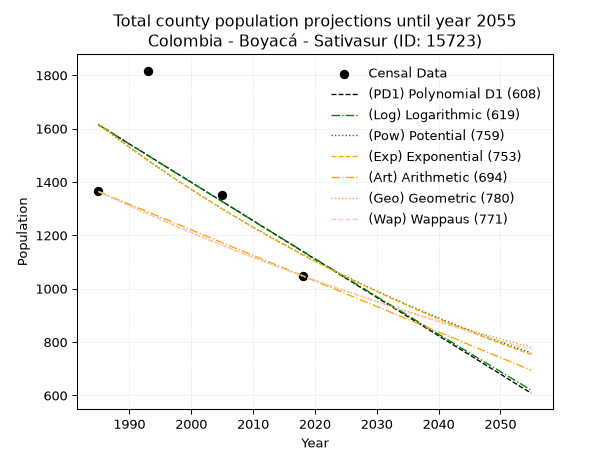
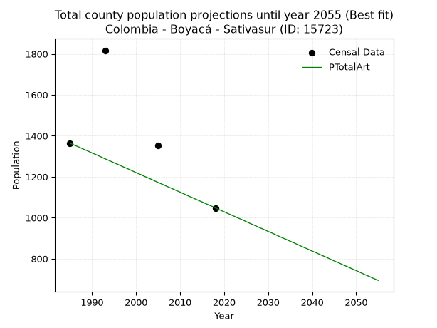
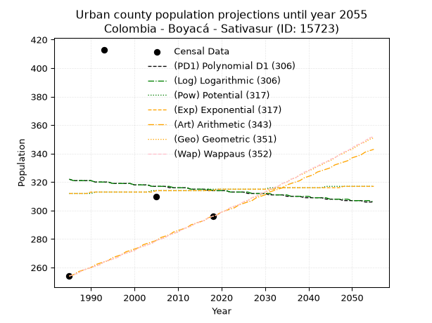
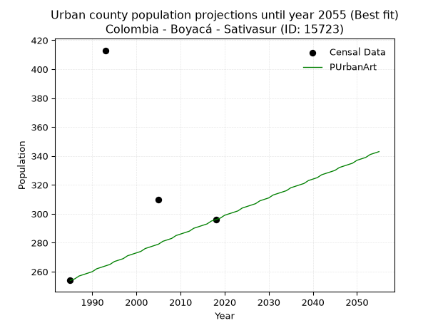
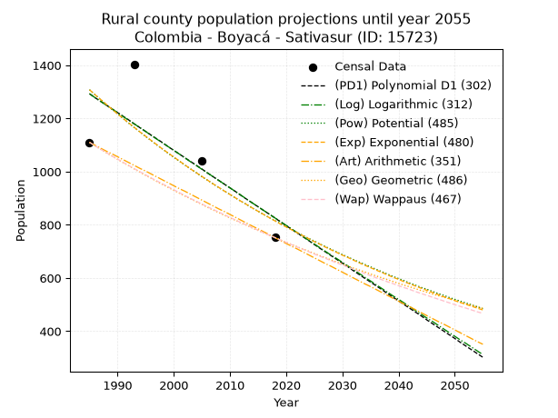
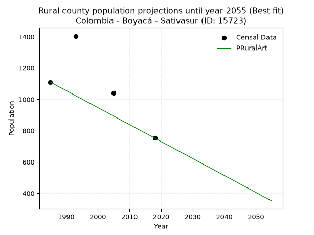

<div align="center">


</div>

# 📜 _“Population and Public Services Demand Projections (PPSD) until Year 2050 for Colombia - Boyacá - Sativasur (ID: 15723)”_
Keywords: `population` `public-service` `projection` `lineal` `polynomial` `logarithmic` `potential` `exponential` `arithmetic` `geometric` `wappaus` `dane` `colombia` `south-america`

PPSD are analytical estimates used by governments and planners to anticipate future changes in population size, age distribution, and the resulting community needs for utilities, healthcare, education, and infrastructure as sizing future water treatment facilities, electrical grids, and road networks based on spatial growth.

<div align="center">

</img>

</div>


> **General running parameters**: • app_version: _v20260806_. • Python version: _3.14.7_. • Pandas version: _3.0.5_. • NumPy version: _2.5.1_. • Creates, save and include plots into reports (create_plot): _False_. • Projection until year: _2050_. • Process polynomial degree 2 and up: _False_. • Process Wappaus: _True_. • Process Wappaus: _True_. • Set negative values to zero: _True_. • Set infinite values to zero: _True_. • Drop dataset notes: _True_. 
<div align="center">

Maps & GIS Layers: [:earth_americas:Google](http://maps.google.com/maps?q=6.093182925,-72.7124348) [:earth_americas:OSM](https://www.openstreetmap.org/#map=18/6.093182925/-72.7124348&layers=P) [:earth_americas:Bing](https://www.bing.com/maps?cp=6.093182925~-72.7124348&lvl=18) [:earth_americas:Apple](https://maps.apple.com/frame?center=6.093182925%2C-72.7124348&span=0.003%2C0.006) [:earth_americas:GISMobile](https://github.com/rcfdtools/R.GISMobile/blob/main/file/gis/CountyLayer_CO/Readme.md)

</div>


<div align="center">

```geojson
{
  "type": "Feature",
  "geometry": {
    "type": "Point", 
    "coordinates": [-72.7124348, 6.093182925]
  }, 
  "properties": {
    "Name": "Colombia - Boyacá - Sativasur (ID: 15723)"
  }
}
```

</div>


## 0. Census Data (4 records)

Census data are official statistics collected by a government about the people and housing in a country. They usually include counts of total population, age, sex, race, income, education, and jobs.

📅Global census file: [Population.xlsx](../data/Population.xlsx)

| Source   |   Year |   CountryID | CountryName   |   StateID | StateName   |   CountyID | CountyName   |   PTotal |   PUrban |   PRural |
|:---------|-------:|------------:|:--------------|----------:|:------------|-----------:|:-------------|---------:|---------:|---------:|
| DANE     |   1985 |          57 | Colombia      |        15 | Boyacá      |      15723 | Sativasur    |     1364 |      254 |     1110 |
| DANE     |   1993 |          57 | Colombia      |        15 | Boyacá      |      15723 | Sativasur    |     1817 |      413 |     1404 |
| DANE     |   2005 |          57 | Colombia      |        15 | Boyacá      |      15723 | Sativasur    |     1351 |      310 |     1041 |
| DANE     |   2018 |          57 | Colombia      |        15 | Boyacá      |      15723 | Sativasur    |     1048 |      296 |      752 |

> 🔥Some records could had specific notes about the registered values or the corresponding urban or rural distribution.

📅[SUI-RUPS](https://www.datos.gov.co/Hacienda-y-Cr-dito-P-blico/Registro-nico-de-Prestadores-de-Servicios-P-blicos/4qkq-csdn/about_data) - Local public utility companies: [RUPS.csv](../data/RUPS.csv)

 | SERVICIO       | ESTADO    | NOMBRE                                                                | NIT         | DEPARTAMENTO_DOMICILIO   | MUNICIPIO_DOMICILIO   | DIRECCION                                    |   TELEFONO | EMAIL                   | TIPO_PRESTADOR                 | CLASIFICACION                 |
|:---------------|:----------|:----------------------------------------------------------------------|:------------|:-------------------------|:----------------------|:---------------------------------------------|-----------:|:------------------------|:-------------------------------|:------------------------------|
| ACUEDUCTO      | OPERATIVA | UNIDAD DE SERVICIOS PUBLICOS DOMICILIARIOS DEL MUNICIPIO DE SATIVASUR | 800099441-2 | BOYACA                   | SATIVASUR             | CALLE 3 No. 2-33 PALACIO MUNICIPAL SATIVASUR |    7880285 | dianagaitan18@gmail.com | MUNICIPIO (PRESTACIÓN DIRECTA) | MENOR O IGUAL A 2500 USUARIOS |
| ALCANTARILLADO | OPERATIVA | UNIDAD DE SERVICIOS PUBLICOS DOMICILIARIOS DEL MUNICIPIO DE SATIVASUR | 800099441-2 | BOYACA                   | SATIVASUR             | CALLE 3 No. 2-33 PALACIO MUNICIPAL SATIVASUR |    7880285 | dianagaitan18@gmail.com | MUNICIPIO (PRESTACIÓN DIRECTA) | MENOR O IGUAL A 2500 USUARIOS |

## 1. Total

### 1.1. Coefficients and Parameters

* (PD1) Polynomial Deg 1: -14.379767161782215, 30158.129265354873 (lineal)
* (Log) Logarithmic: -28726.596316426836, 219746.08880165606
* (Pow) Potential: -21.822829730621564, 75.17511240462747
* (Exp) Exponential: -0.010923059533642025, 4218241114488.43
* (Art) Arithmetic: Year diff. 2018 - 1985 = 33, Population diff. 1048 - 1364 = -316, Annual growth = -9.575757575757576
* (Geo) Geometric: Year diff. 2018 - 1985 = 33, Population diff. 1048 - 1364 = -316, Annual growth % = -0.00795419582294321
* (Wap) Wappaus: i = -0.7940097492336299, Condition values only valid for < 200)

<sub>
Wappaus condition values: ['-0.00', '-0.79', '-1.59', '-2.38', '-3.18', '-3.97', '-4.76', '-5.56', '-6.35', '-7.15', '-7.94', '-8.73', '-9.53', '-10.32', '-11.12', '-11.91', '-12.70', '-13.50', '-14.29', '-15.09', '-15.88', '-16.67', '-17.47', '-18.26', '-19.06', '-19.85', '-20.64', '-21.44', '-22.23', '-23.03', '-23.82', '-24.61', '-25.41', '-26.20', '-27.00', '-27.79', '-28.58', '-29.38', '-30.17', '-30.97', '-31.76', '-32.55', '-33.35', '-34.14', '-34.94', '-35.73', '-36.52', '-37.32', '-38.11', '-38.91', '-39.70', '-40.49', '-41.29', '-42.08', '-42.88', '-43.67', '-44.46', '-45.26', '-46.05', '-46.85', '-47.64', '-48.43', '-49.23', '-50.02', '-50.82', '-51.61']
</sub>


### 1.2. Projected Dataset

|   Year |   CountyID |   PTotalPD1 |   PTotalLog |   PTotalPow |   PTotalExp |   PTotalArt |   PTotalGeo |   PTotalWap |
|-------:|-----------:|------------:|------------:|------------:|------------:|------------:|------------:|------------:|
|   1985 |      15723 |        1614 |        1614 |        1617 |        1617 |        1364 |        1364 |        1364 |
|   1986 |      15723 |        1600 |        1600 |        1599 |        1599 |        1354 |        1353 |        1353 |
|   1987 |      15723 |        1586 |        1585 |        1582 |        1582 |        1345 |        1342 |        1343 |
|   1988 |      15723 |        1571 |        1571 |        1564 |        1565 |        1335 |        1332 |        1332 |
|   1989 |      15723 |        1557 |        1556 |        1547 |        1548 |        1326 |        1321 |        1321 |
|   1990 |      15723 |        1542 |        1542 |        1530 |        1531 |        1316 |        1311 |        1311 |
|   1991 |      15723 |        1528 |        1528 |        1514 |        1514 |        1307 |        1300 |        1301 |
|   1992 |      15723 |        1514 |        1513 |        1497 |        1498 |        1297 |        1290 |        1290 |
|   1993 |      15723 |        1499 |        1499 |        1481 |        1481 |        1287 |        1280 |        1280 |
|   1994 |      15723 |        1485 |        1484 |        1465 |        1465 |        1278 |        1269 |        1270 |
|   1995 |      15723 |        1470 |        1470 |        1449 |        1449 |        1268 |        1259 |        1260 |
|   1996 |      15723 |        1456 |        1456 |        1433 |        1434 |        1259 |        1249 |        1250 |
|   1997 |      15723 |        1442 |        1441 |        1418 |        1418 |        1249 |        1239 |        1240 |
|   1998 |      15723 |        1427 |        1427 |        1402 |        1403 |        1240 |        1229 |        1230 |
|   1999 |      15723 |        1413 |        1412 |        1387 |        1387 |        1230 |        1220 |        1220 |
|   2000 |      15723 |        1399 |        1398 |        1372 |        1372 |        1220 |        1210 |        1211 |
|   2001 |      15723 |        1384 |        1384 |        1357 |        1357 |        1211 |        1200 |        1201 |
|   2002 |      15723 |        1370 |        1369 |        1342 |        1343 |        1201 |        1191 |        1192 |
|   2003 |      15723 |        1355 |        1355 |        1328 |        1328 |        1192 |        1181 |        1182 |
|   2004 |      15723 |        1341 |        1341 |        1313 |        1314 |        1182 |        1172 |        1173 |
|   2005 |      15723 |        1327 |        1326 |        1299 |        1299 |        1172 |        1163 |        1163 |
|   2006 |      15723 |        1312 |        1312 |        1285 |        1285 |        1163 |        1153 |        1154 |
|   2007 |      15723 |        1298 |        1298 |        1271 |        1271 |        1153 |        1144 |        1145 |
|   2008 |      15723 |        1284 |        1283 |        1257 |        1258 |        1144 |        1135 |        1136 |
|   2009 |      15723 |        1269 |        1269 |        1244 |        1244 |        1134 |        1126 |        1127 |
|   2010 |      15723 |        1255 |        1255 |        1230 |        1230 |        1125 |        1117 |        1118 |
|   2011 |      15723 |        1240 |        1240 |        1217 |        1217 |        1115 |        1108 |        1109 |
|   2012 |      15723 |        1226 |        1226 |        1204 |        1204 |        1105 |        1099 |        1100 |
|   2013 |      15723 |        1212 |        1212 |        1191 |        1191 |        1096 |        1091 |        1091 |
|   2014 |      15723 |        1197 |        1198 |        1178 |        1178 |        1086 |        1082 |        1082 |
|   2015 |      15723 |        1183 |        1183 |        1165 |        1165 |        1077 |        1073 |        1074 |
|   2016 |      15723 |        1169 |        1169 |        1153 |        1152 |        1067 |        1065 |        1065 |
|   2017 |      15723 |        1154 |        1155 |        1140 |        1140 |        1058 |        1056 |        1056 |
|   2018 |      15723 |        1140 |        1141 |        1128 |        1127 |        1048 |        1048 |        1048 |
|   2019 |      15723 |        1125 |        1126 |        1116 |        1115 |        1038 |        1040 |        1040 |
|   2020 |      15723 |        1111 |        1112 |        1104 |        1103 |        1029 |        1031 |        1031 |
|   2021 |      15723 |        1097 |        1098 |        1092 |        1091 |        1019 |        1023 |        1023 |
|   2022 |      15723 |        1082 |        1084 |        1080 |        1079 |        1010 |        1015 |        1015 |
|   2023 |      15723 |        1068 |        1070 |        1069 |        1068 |        1000 |        1007 |        1006 |
|   2024 |      15723 |        1053 |        1055 |        1057 |        1056 |         991 |         999 |         998 |
|   2025 |      15723 |        1039 |        1041 |        1046 |        1044 |         981 |         991 |         990 |
|   2026 |      15723 |        1025 |        1027 |        1035 |        1033 |         971 |         983 |         982 |
|   2027 |      15723 |        1010 |        1013 |        1024 |        1022 |         962 |         975 |         974 |
|   2028 |      15723 |         996 |         999 |        1013 |        1011 |         952 |         968 |         966 |
|   2029 |      15723 |         982 |         984 |        1002 |        1000 |         943 |         960 |         958 |
|   2030 |      15723 |         967 |         970 |         991 |         989 |         933 |         952 |         951 |
|   2031 |      15723 |         953 |         956 |         981 |         978 |         924 |         945 |         943 |
|   2032 |      15723 |         938 |         942 |         970 |         968 |         914 |         937 |         935 |
|   2033 |      15723 |         924 |         928 |         960 |         957 |         904 |         930 |         927 |
|   2034 |      15723 |         910 |         914 |         950 |         947 |         895 |         922 |         920 |
|   2035 |      15723 |         895 |         900 |         939 |         936 |         885 |         915 |         912 |
|   2036 |      15723 |         881 |         886 |         929 |         926 |         876 |         908 |         905 |
|   2037 |      15723 |         867 |         871 |         920 |         916 |         866 |         900 |         897 |
|   2038 |      15723 |         852 |         857 |         910 |         906 |         856 |         893 |         890 |
|   2039 |      15723 |         838 |         843 |         900 |         896 |         847 |         886 |         882 |
|   2040 |      15723 |         823 |         829 |         890 |         887 |         837 |         879 |         875 |
|   2041 |      15723 |         809 |         815 |         881 |         877 |         828 |         872 |         868 |
|   2042 |      15723 |         795 |         801 |         872 |         867 |         818 |         865 |         861 |
|   2043 |      15723 |         780 |         787 |         862 |         858 |         809 |         858 |         853 |
|   2044 |      15723 |         766 |         773 |         853 |         849 |         799 |         852 |         846 |
|   2045 |      15723 |         752 |         759 |         844 |         839 |         789 |         845 |         839 |
|   2046 |      15723 |         737 |         745 |         835 |         830 |         780 |         838 |         832 |
|   2047 |      15723 |         723 |         731 |         826 |         821 |         770 |         831 |         825 |
|   2048 |      15723 |         708 |         717 |         818 |         812 |         761 |         825 |         818 |
|   2049 |      15723 |         694 |         703 |         809 |         804 |         751 |         818 |         811 |
|   2050 |      15723 |         680 |         689 |         800 |         795 |         742 |         812 |         804 |
<div align="center">

</img>

</div>


### 1.3. Best fit with absolute and relative error (%)

Relative error puts that difference into context by dividing the absolute error by the true value, creating a unitless ratio or percentage that shows the scale of the mistake.

Absolute and relative error

|   Year | Source   |   CountryID | CountryName   |   StateID | StateName   |   CountyID_x | CountyName   |   PTotal |   PUrban |   PRural |   CountyID_y |   PTotalPD1 |   PTotalLog |   PTotalPow |   PTotalExp |   PTotalArt |   PTotalGeo |   PTotalWap |   PTotalPD1AbsError |   PTotalLogAbsError |   PTotalPowAbsError |   PTotalExpAbsError |   PTotalArtAbsError |   PTotalGeoAbsError |   PTotalWapAbsError |   PTotalPD1RelError |   PTotalLogRelError |   PTotalPowRelError |   PTotalExpRelError |   PTotalArtRelError |   PTotalGeoRelError |   PTotalWapRelError |
|-------:|:---------|------------:|:--------------|----------:|:------------|-------------:|:-------------|---------:|---------:|---------:|-------------:|------------:|------------:|------------:|------------:|------------:|------------:|------------:|--------------------:|--------------------:|--------------------:|--------------------:|--------------------:|--------------------:|--------------------:|--------------------:|--------------------:|--------------------:|--------------------:|--------------------:|--------------------:|--------------------:|
|   1985 | DANE     |          57 | Colombia      |        15 | Boyacá      |        15723 | Sativasur    |     1364 |      254 |     1110 |        15723 |        1614 |        1614 |        1617 |        1617 |        1364 |        1364 |        1364 |                 250 |                 250 |                 253 |                 253 |                   0 |                   0 |                   0 |            18.3284  |            18.3284  |            18.5484  |            18.5484  |              0      |              0      |              0      |
|   1993 | DANE     |          57 | Colombia      |        15 | Boyacá      |        15723 | Sativasur    |     1817 |      413 |     1404 |        15723 |        1499 |        1499 |        1481 |        1481 |        1287 |        1280 |        1280 |                 318 |                 318 |                 336 |                 336 |                 530 |                 537 |                 537 |            17.5014  |            17.5014  |            18.492   |            18.492   |             29.169  |             29.5542 |             29.5542 |
|   2005 | DANE     |          57 | Colombia      |        15 | Boyacá      |        15723 | Sativasur    |     1351 |      310 |     1041 |        15723 |        1327 |        1326 |        1299 |        1299 |        1172 |        1163 |        1163 |                  24 |                  25 |                  52 |                  52 |                 179 |                 188 |                 188 |             1.77646 |             1.85048 |             3.849   |             3.849   |             13.2494 |             13.9156 |             13.9156 |
|   2018 | DANE     |          57 | Colombia      |        15 | Boyacá      |        15723 | Sativasur    |     1048 |      296 |      752 |        15723 |        1140 |        1141 |        1128 |        1127 |        1048 |        1048 |        1048 |                  92 |                  93 |                  80 |                  79 |                   0 |                   0 |                   0 |             8.77863 |             8.87405 |             7.63359 |             7.53817 |              0      |              0      |              0      |

Relative error mean

| Method    |   RelError | Best   |
|:----------|-----------:|:-------|
| PTotalPD1 |    11.5962 |        |
| PTotalLog |    11.6386 |        |
| PTotalPow |    12.1307 |        |
| PTotalExp |    12.1069 |        |
| PTotalArt |    10.6046 | True   |
| PTotalGeo |    10.8675 |        |
| PTotalWap |    10.8675 |        |

💙Best method: _**PTotalArt**_
<div align="center">

</img>

</div>


### 1.4. Fresh water supply demand in liters per capita per day (lpcd)

The fresh water supply demand typically ranges from 100 to 300 liters per capita per day (lpcd) for standard domestic and municipal planning, though absolute survival minimums set by the World Health Organization are as low as 7.5 to 20 liters per day, and total consumption in high-income nations can exceed 400 liters.

> `CZ`: Level in meters above the sea level (masl)<br> `WS`: Fresh water supply demand in liters per capita per day (lpcd or l/h/d)<br> `WSAll`: Zonal fresh water supply demand in liters per second (l/s)<br> `A`: Zonal area in square meters<br> `DP`: Population density (people/hectare or p/ha)

Reference values (RAS Colombia)

|    CZ |   WS |
|------:|-----:|
|  1000 |  120 |
|  2000 |  130 |
| 99999 |  140 |

County shapefile geometry properties and water supply values

|   CountyID |      ATotal |   CZTotal |   WSTotal |
|-----------:|------------:|----------:|----------:|
|      15723 | 5.46258e+07 |   2796.15 |       140 |

Projected values for best method: PTotalArt

|   CountyID |   Year |   PTotalArt |   DPTotal |   WSTotal |   WSTotalAll |
|-----------:|-------:|------------:|----------:|----------:|-------------:|
|      15723 |   1985 |        1364 |      0.25 |       140 |      2.21019 |
|      15723 |   1986 |        1354 |      0.25 |       140 |      2.19398 |
|      15723 |   1987 |        1345 |      0.25 |       140 |      2.1794  |
|      15723 |   1988 |        1335 |      0.24 |       140 |      2.16319 |
|      15723 |   1989 |        1326 |      0.24 |       140 |      2.14861 |
|      15723 |   1990 |        1316 |      0.24 |       140 |      2.13241 |
|      15723 |   1991 |        1307 |      0.24 |       140 |      2.11782 |
|      15723 |   1992 |        1297 |      0.24 |       140 |      2.10162 |
|      15723 |   1993 |        1287 |      0.24 |       140 |      2.08542 |
|      15723 |   1994 |        1278 |      0.23 |       140 |      2.07083 |
|      15723 |   1995 |        1268 |      0.23 |       140 |      2.05463 |
|      15723 |   1996 |        1259 |      0.23 |       140 |      2.04005 |
|      15723 |   1997 |        1249 |      0.23 |       140 |      2.02384 |
|      15723 |   1998 |        1240 |      0.23 |       140 |      2.00926 |
|      15723 |   1999 |        1230 |      0.23 |       140 |      1.99306 |
|      15723 |   2000 |        1220 |      0.22 |       140 |      1.97685 |
|      15723 |   2001 |        1211 |      0.22 |       140 |      1.96227 |
|      15723 |   2002 |        1201 |      0.22 |       140 |      1.94606 |
|      15723 |   2003 |        1192 |      0.22 |       140 |      1.93148 |
|      15723 |   2004 |        1182 |      0.22 |       140 |      1.91528 |
|      15723 |   2005 |        1172 |      0.21 |       140 |      1.89907 |
|      15723 |   2006 |        1163 |      0.21 |       140 |      1.88449 |
|      15723 |   2007 |        1153 |      0.21 |       140 |      1.86829 |
|      15723 |   2008 |        1144 |      0.21 |       140 |      1.8537  |
|      15723 |   2009 |        1134 |      0.21 |       140 |      1.8375  |
|      15723 |   2010 |        1125 |      0.21 |       140 |      1.82292 |
|      15723 |   2011 |        1115 |      0.2  |       140 |      1.80671 |
|      15723 |   2012 |        1105 |      0.2  |       140 |      1.79051 |
|      15723 |   2013 |        1096 |      0.2  |       140 |      1.77593 |
|      15723 |   2014 |        1086 |      0.2  |       140 |      1.75972 |
|      15723 |   2015 |        1077 |      0.2  |       140 |      1.74514 |
|      15723 |   2016 |        1067 |      0.2  |       140 |      1.72894 |
|      15723 |   2017 |        1058 |      0.19 |       140 |      1.71435 |
|      15723 |   2018 |        1048 |      0.19 |       140 |      1.69815 |
|      15723 |   2019 |        1038 |      0.19 |       140 |      1.68194 |
|      15723 |   2020 |        1029 |      0.19 |       140 |      1.66736 |
|      15723 |   2021 |        1019 |      0.19 |       140 |      1.65116 |
|      15723 |   2022 |        1010 |      0.18 |       140 |      1.63657 |
|      15723 |   2023 |        1000 |      0.18 |       140 |      1.62037 |
|      15723 |   2024 |         991 |      0.18 |       140 |      1.60579 |
|      15723 |   2025 |         981 |      0.18 |       140 |      1.58958 |
|      15723 |   2026 |         971 |      0.18 |       140 |      1.57338 |
|      15723 |   2027 |         962 |      0.18 |       140 |      1.5588  |
|      15723 |   2028 |         952 |      0.17 |       140 |      1.54259 |
|      15723 |   2029 |         943 |      0.17 |       140 |      1.52801 |
|      15723 |   2030 |         933 |      0.17 |       140 |      1.51181 |
|      15723 |   2031 |         924 |      0.17 |       140 |      1.49722 |
|      15723 |   2032 |         914 |      0.17 |       140 |      1.48102 |
|      15723 |   2033 |         904 |      0.17 |       140 |      1.46481 |
|      15723 |   2034 |         895 |      0.16 |       140 |      1.45023 |
|      15723 |   2035 |         885 |      0.16 |       140 |      1.43403 |
|      15723 |   2036 |         876 |      0.16 |       140 |      1.41944 |
|      15723 |   2037 |         866 |      0.16 |       140 |      1.40324 |
|      15723 |   2038 |         856 |      0.16 |       140 |      1.38704 |
|      15723 |   2039 |         847 |      0.16 |       140 |      1.37245 |
|      15723 |   2040 |         837 |      0.15 |       140 |      1.35625 |
|      15723 |   2041 |         828 |      0.15 |       140 |      1.34167 |
|      15723 |   2042 |         818 |      0.15 |       140 |      1.32546 |
|      15723 |   2043 |         809 |      0.15 |       140 |      1.31088 |
|      15723 |   2044 |         799 |      0.15 |       140 |      1.29468 |
|      15723 |   2045 |         789 |      0.14 |       140 |      1.27847 |
|      15723 |   2046 |         780 |      0.14 |       140 |      1.26389 |
|      15723 |   2047 |         770 |      0.14 |       140 |      1.24769 |
|      15723 |   2048 |         761 |      0.14 |       140 |      1.2331  |
|      15723 |   2049 |         751 |      0.14 |       140 |      1.2169  |
|      15723 |   2050 |         742 |      0.14 |       140 |      1.20231 |

## 2. Urban

### 2.1. Coefficients and Parameters

* (PD1) Polynomial Deg 1: -0.22681653954233902, 771.9397832195637 (lineal)
* (Log) Logarithmic: -440.5009127606499, 3666.5009678464785
* (Pow) Potential: 0.48679364425393135, 0.8889165565606393
* (Exp) Exponential: 0.00022200900245377363, 200.90956788272962
* (Art) Arithmetic: Year diff. 2018 - 1985 = 33, Population diff. 296 - 254 = 42, Annual growth = 1.2727272727272727
* (Geo) Geometric: Year diff. 2018 - 1985 = 33, Population diff. 296 - 254 = 42, Annual growth % = 0.004647894998865754
* (Wap) Wappaus: i = 0.4628099173553719, Condition values only valid for < 200)

<sub>
Wappaus condition values: ['0.00', '0.46', '0.93', '1.39', '1.85', '2.31', '2.78', '3.24', '3.70', '4.17', '4.63', '5.09', '5.55', '6.02', '6.48', '6.94', '7.40', '7.87', '8.33', '8.79', '9.26', '9.72', '10.18', '10.64', '11.11', '11.57', '12.03', '12.50', '12.96', '13.42', '13.88', '14.35', '14.81', '15.27', '15.74', '16.20', '16.66', '17.12', '17.59', '18.05', '18.51', '18.98', '19.44', '19.90', '20.36', '20.83', '21.29', '21.75', '22.21', '22.68', '23.14', '23.60', '24.07', '24.53', '24.99', '25.45', '25.92', '26.38', '26.84', '27.31', '27.77', '28.23', '28.69', '29.16', '29.62', '30.08']
</sub>


### 2.2. Projected Dataset

|   Year |   CountyID |   PUrbanPD1 |   PUrbanLog |   PUrbanPow |   PUrbanExp |   PUrbanArt |   PUrbanGeo |   PUrbanWap |
|-------:|-----------:|------------:|------------:|------------:|------------:|------------:|------------:|------------:|
|   1985 |      15723 |         322 |         322 |         312 |         312 |         254 |         254 |         254 |
|   1986 |      15723 |         321 |         321 |         312 |         312 |         255 |         255 |         255 |
|   1987 |      15723 |         321 |         321 |         312 |         312 |         257 |         256 |         256 |
|   1988 |      15723 |         321 |         321 |         312 |         312 |         258 |         258 |         258 |
|   1989 |      15723 |         321 |         321 |         312 |         312 |         259 |         259 |         259 |
|   1990 |      15723 |         321 |         321 |         312 |         313 |         260 |         260 |         260 |
|   1991 |      15723 |         320 |         320 |         313 |         313 |         262 |         261 |         261 |
|   1992 |      15723 |         320 |         320 |         313 |         313 |         263 |         262 |         262 |
|   1993 |      15723 |         320 |         320 |         313 |         313 |         264 |         264 |         264 |
|   1994 |      15723 |         320 |         320 |         313 |         313 |         265 |         265 |         265 |
|   1995 |      15723 |         319 |         319 |         313 |         313 |         267 |         266 |         266 |
|   1996 |      15723 |         319 |         319 |         313 |         313 |         268 |         267 |         267 |
|   1997 |      15723 |         319 |         319 |         313 |         313 |         269 |         269 |         269 |
|   1998 |      15723 |         319 |         319 |         313 |         313 |         271 |         270 |         270 |
|   1999 |      15723 |         319 |         319 |         313 |         313 |         272 |         271 |         271 |
|   2000 |      15723 |         318 |         318 |         313 |         313 |         273 |         272 |         272 |
|   2001 |      15723 |         318 |         318 |         313 |         313 |         274 |         274 |         274 |
|   2002 |      15723 |         318 |         318 |         313 |         313 |         276 |         275 |         275 |
|   2003 |      15723 |         318 |         318 |         313 |         313 |         277 |         276 |         276 |
|   2004 |      15723 |         317 |         317 |         314 |         313 |         278 |         277 |         277 |
|   2005 |      15723 |         317 |         317 |         314 |         314 |         279 |         279 |         279 |
|   2006 |      15723 |         317 |         317 |         314 |         314 |         281 |         280 |         280 |
|   2007 |      15723 |         317 |         317 |         314 |         314 |         282 |         281 |         281 |
|   2008 |      15723 |         316 |         317 |         314 |         314 |         283 |         283 |         283 |
|   2009 |      15723 |         316 |         316 |         314 |         314 |         285 |         284 |         284 |
|   2010 |      15723 |         316 |         316 |         314 |         314 |         286 |         285 |         285 |
|   2011 |      15723 |         316 |         316 |         314 |         314 |         287 |         287 |         287 |
|   2012 |      15723 |         316 |         316 |         314 |         314 |         288 |         288 |         288 |
|   2013 |      15723 |         315 |         315 |         314 |         314 |         290 |         289 |         289 |
|   2014 |      15723 |         315 |         315 |         314 |         314 |         291 |         291 |         291 |
|   2015 |      15723 |         315 |         315 |         314 |         314 |         292 |         292 |         292 |
|   2016 |      15723 |         315 |         315 |         314 |         314 |         293 |         293 |         293 |
|   2017 |      15723 |         314 |         315 |         315 |         314 |         295 |         295 |         295 |
|   2018 |      15723 |         314 |         314 |         315 |         314 |         296 |         296 |         296 |
|   2019 |      15723 |         314 |         314 |         315 |         315 |         297 |         297 |         297 |
|   2020 |      15723 |         314 |         314 |         315 |         315 |         299 |         299 |         299 |
|   2021 |      15723 |         314 |         314 |         315 |         315 |         300 |         300 |         300 |
|   2022 |      15723 |         313 |         313 |         315 |         315 |         301 |         302 |         302 |
|   2023 |      15723 |         313 |         313 |         315 |         315 |         302 |         303 |         303 |
|   2024 |      15723 |         313 |         313 |         315 |         315 |         304 |         304 |         304 |
|   2025 |      15723 |         313 |         313 |         315 |         315 |         305 |         306 |         306 |
|   2026 |      15723 |         312 |         313 |         315 |         315 |         306 |         307 |         307 |
|   2027 |      15723 |         312 |         312 |         315 |         315 |         307 |         309 |         309 |
|   2028 |      15723 |         312 |         312 |         315 |         315 |         309 |         310 |         310 |
|   2029 |      15723 |         312 |         312 |         315 |         315 |         310 |         311 |         312 |
|   2030 |      15723 |         312 |         312 |         315 |         315 |         311 |         313 |         313 |
|   2031 |      15723 |         311 |         312 |         316 |         315 |         313 |         314 |         315 |
|   2032 |      15723 |         311 |         311 |         316 |         315 |         314 |         316 |         316 |
|   2033 |      15723 |         311 |         311 |         316 |         316 |         315 |         317 |         317 |
|   2034 |      15723 |         311 |         311 |         316 |         316 |         316 |         319 |         319 |
|   2035 |      15723 |         310 |         311 |         316 |         316 |         318 |         320 |         320 |
|   2036 |      15723 |         310 |         310 |         316 |         316 |         319 |         322 |         322 |
|   2037 |      15723 |         310 |         310 |         316 |         316 |         320 |         323 |         323 |
|   2038 |      15723 |         310 |         310 |         316 |         316 |         321 |         325 |         325 |
|   2039 |      15723 |         309 |         310 |         316 |         316 |         323 |         326 |         327 |
|   2040 |      15723 |         309 |         310 |         316 |         316 |         324 |         328 |         328 |
|   2041 |      15723 |         309 |         309 |         316 |         316 |         325 |         329 |         330 |
|   2042 |      15723 |         309 |         309 |         316 |         316 |         327 |         331 |         331 |
|   2043 |      15723 |         309 |         309 |         316 |         316 |         328 |         332 |         333 |
|   2044 |      15723 |         308 |         309 |         317 |         316 |         329 |         334 |         334 |
|   2045 |      15723 |         308 |         308 |         317 |         316 |         330 |         335 |         336 |
|   2046 |      15723 |         308 |         308 |         317 |         316 |         332 |         337 |         337 |
|   2047 |      15723 |         308 |         308 |         317 |         316 |         333 |         339 |         339 |
|   2048 |      15723 |         307 |         308 |         317 |         317 |         334 |         340 |         341 |
|   2049 |      15723 |         307 |         308 |         317 |         317 |         335 |         342 |         342 |
|   2050 |      15723 |         307 |         307 |         317 |         317 |         337 |         343 |         344 |
<div align="center">

</img>

</div>


### 2.3. Best fit with absolute and relative error (%)

Relative error puts that difference into context by dividing the absolute error by the true value, creating a unitless ratio or percentage that shows the scale of the mistake.

Absolute and relative error

|   Year | Source   |   CountryID | CountryName   |   StateID | StateName   |   CountyID_x | CountyName   |   PTotal |   PUrban |   PRural |   CountyID_y |   PUrbanPD1 |   PUrbanLog |   PUrbanPow |   PUrbanExp |   PUrbanArt |   PUrbanGeo |   PUrbanWap |   PUrbanPD1AbsError |   PUrbanLogAbsError |   PUrbanPowAbsError |   PUrbanExpAbsError |   PUrbanArtAbsError |   PUrbanGeoAbsError |   PUrbanWapAbsError |   PUrbanPD1RelError |   PUrbanLogRelError |   PUrbanPowRelError |   PUrbanExpRelError |   PUrbanArtRelError |   PUrbanGeoRelError |   PUrbanWapRelError |
|-------:|:---------|------------:|:--------------|----------:|:------------|-------------:|:-------------|---------:|---------:|---------:|-------------:|------------:|------------:|------------:|------------:|------------:|------------:|------------:|--------------------:|--------------------:|--------------------:|--------------------:|--------------------:|--------------------:|--------------------:|--------------------:|--------------------:|--------------------:|--------------------:|--------------------:|--------------------:|--------------------:|
|   1985 | DANE     |          57 | Colombia      |        15 | Boyacá      |        15723 | Sativasur    |     1364 |      254 |     1110 |        15723 |         322 |         322 |         312 |         312 |         254 |         254 |         254 |                  68 |                  68 |                  58 |                  58 |                   0 |                   0 |                   0 |            26.7717  |            26.7717  |            22.8346  |            22.8346  |              0      |              0      |              0      |
|   1993 | DANE     |          57 | Colombia      |        15 | Boyacá      |        15723 | Sativasur    |     1817 |      413 |     1404 |        15723 |         320 |         320 |         313 |         313 |         264 |         264 |         264 |                  93 |                  93 |                 100 |                 100 |                 149 |                 149 |                 149 |            22.5182  |            22.5182  |            24.2131  |            24.2131  |             36.0775 |             36.0775 |             36.0775 |
|   2005 | DANE     |          57 | Colombia      |        15 | Boyacá      |        15723 | Sativasur    |     1351 |      310 |     1041 |        15723 |         317 |         317 |         314 |         314 |         279 |         279 |         279 |                   7 |                   7 |                   4 |                   4 |                  31 |                  31 |                  31 |             2.25806 |             2.25806 |             1.29032 |             1.29032 |             10      |             10      |             10      |
|   2018 | DANE     |          57 | Colombia      |        15 | Boyacá      |        15723 | Sativasur    |     1048 |      296 |      752 |        15723 |         314 |         314 |         315 |         314 |         296 |         296 |         296 |                  18 |                  18 |                  19 |                  18 |                   0 |                   0 |                   0 |             6.08108 |             6.08108 |             6.41892 |             6.08108 |              0      |              0      |              0      |

Relative error mean

| Method    |   RelError | Best   |
|:----------|-----------:|:-------|
| PUrbanPD1 |    14.4072 |        |
| PUrbanLog |    14.4072 |        |
| PUrbanPow |    13.6892 |        |
| PUrbanExp |    13.6048 |        |
| PUrbanArt |    11.5194 | True   |
| PUrbanGeo |    11.5194 | True   |
| PUrbanWap |    11.5194 | True   |

💙Best method: _**PUrbanArt**_
<div align="center">

</img>

</div>


### 2.4. Fresh water supply demand in liters per capita per day (lpcd)

The fresh water supply demand typically ranges from 100 to 300 liters per capita per day (lpcd) for standard domestic and municipal planning, though absolute survival minimums set by the World Health Organization are as low as 7.5 to 20 liters per day, and total consumption in high-income nations can exceed 400 liters.

> `CZ`: Level in meters above the sea level (masl)<br> `WS`: Fresh water supply demand in liters per capita per day (lpcd or l/h/d)<br> `WSAll`: Zonal fresh water supply demand in liters per second (l/s)<br> `A`: Zonal area in square meters<br> `DP`: Population density (people/hectare or p/ha)

Reference values (RAS Colombia)

|    CZ |   WS |
|------:|-----:|
|  1000 |  120 |
|  2000 |  130 |
| 99999 |  140 |

County shapefile geometry properties and water supply values

|   CountyID |   AUrban |   CZUrban |   WSUrban |
|-----------:|---------:|----------:|----------:|
|      15723 |   142414 |   2604.88 |       140 |

Projected values for best method: PUrbanArt

|   CountyID |   Year |   PUrbanArt |   DPUrban |   WSUrban |   WSUrbanAll |
|-----------:|-------:|------------:|----------:|----------:|-------------:|
|      15723 |   1985 |         254 |     17.84 |       140 |     0.411574 |
|      15723 |   1986 |         255 |     17.91 |       140 |     0.413194 |
|      15723 |   1987 |         257 |     18.05 |       140 |     0.416435 |
|      15723 |   1988 |         258 |     18.12 |       140 |     0.418056 |
|      15723 |   1989 |         259 |     18.19 |       140 |     0.419676 |
|      15723 |   1990 |         260 |     18.26 |       140 |     0.421296 |
|      15723 |   1991 |         262 |     18.4  |       140 |     0.424537 |
|      15723 |   1992 |         263 |     18.47 |       140 |     0.426157 |
|      15723 |   1993 |         264 |     18.54 |       140 |     0.427778 |
|      15723 |   1994 |         265 |     18.61 |       140 |     0.429398 |
|      15723 |   1995 |         267 |     18.75 |       140 |     0.432639 |
|      15723 |   1996 |         268 |     18.82 |       140 |     0.434259 |
|      15723 |   1997 |         269 |     18.89 |       140 |     0.43588  |
|      15723 |   1998 |         271 |     19.03 |       140 |     0.43912  |
|      15723 |   1999 |         272 |     19.1  |       140 |     0.440741 |
|      15723 |   2000 |         273 |     19.17 |       140 |     0.442361 |
|      15723 |   2001 |         274 |     19.24 |       140 |     0.443981 |
|      15723 |   2002 |         276 |     19.38 |       140 |     0.447222 |
|      15723 |   2003 |         277 |     19.45 |       140 |     0.448843 |
|      15723 |   2004 |         278 |     19.52 |       140 |     0.450463 |
|      15723 |   2005 |         279 |     19.59 |       140 |     0.452083 |
|      15723 |   2006 |         281 |     19.73 |       140 |     0.455324 |
|      15723 |   2007 |         282 |     19.8  |       140 |     0.456944 |
|      15723 |   2008 |         283 |     19.87 |       140 |     0.458565 |
|      15723 |   2009 |         285 |     20.01 |       140 |     0.461806 |
|      15723 |   2010 |         286 |     20.08 |       140 |     0.463426 |
|      15723 |   2011 |         287 |     20.15 |       140 |     0.465046 |
|      15723 |   2012 |         288 |     20.22 |       140 |     0.466667 |
|      15723 |   2013 |         290 |     20.36 |       140 |     0.469907 |
|      15723 |   2014 |         291 |     20.43 |       140 |     0.471528 |
|      15723 |   2015 |         292 |     20.5  |       140 |     0.473148 |
|      15723 |   2016 |         293 |     20.57 |       140 |     0.474769 |
|      15723 |   2017 |         295 |     20.71 |       140 |     0.478009 |
|      15723 |   2018 |         296 |     20.78 |       140 |     0.47963  |
|      15723 |   2019 |         297 |     20.85 |       140 |     0.48125  |
|      15723 |   2020 |         299 |     21    |       140 |     0.484491 |
|      15723 |   2021 |         300 |     21.07 |       140 |     0.486111 |
|      15723 |   2022 |         301 |     21.14 |       140 |     0.487731 |
|      15723 |   2023 |         302 |     21.21 |       140 |     0.489352 |
|      15723 |   2024 |         304 |     21.35 |       140 |     0.492593 |
|      15723 |   2025 |         305 |     21.42 |       140 |     0.494213 |
|      15723 |   2026 |         306 |     21.49 |       140 |     0.495833 |
|      15723 |   2027 |         307 |     21.56 |       140 |     0.497454 |
|      15723 |   2028 |         309 |     21.7  |       140 |     0.500694 |
|      15723 |   2029 |         310 |     21.77 |       140 |     0.502315 |
|      15723 |   2030 |         311 |     21.84 |       140 |     0.503935 |
|      15723 |   2031 |         313 |     21.98 |       140 |     0.507176 |
|      15723 |   2032 |         314 |     22.05 |       140 |     0.508796 |
|      15723 |   2033 |         315 |     22.12 |       140 |     0.510417 |
|      15723 |   2034 |         316 |     22.19 |       140 |     0.512037 |
|      15723 |   2035 |         318 |     22.33 |       140 |     0.515278 |
|      15723 |   2036 |         319 |     22.4  |       140 |     0.516898 |
|      15723 |   2037 |         320 |     22.47 |       140 |     0.518519 |
|      15723 |   2038 |         321 |     22.54 |       140 |     0.520139 |
|      15723 |   2039 |         323 |     22.68 |       140 |     0.52338  |
|      15723 |   2040 |         324 |     22.75 |       140 |     0.525    |
|      15723 |   2041 |         325 |     22.82 |       140 |     0.52662  |
|      15723 |   2042 |         327 |     22.96 |       140 |     0.529861 |
|      15723 |   2043 |         328 |     23.03 |       140 |     0.531481 |
|      15723 |   2044 |         329 |     23.1  |       140 |     0.533102 |
|      15723 |   2045 |         330 |     23.17 |       140 |     0.534722 |
|      15723 |   2046 |         332 |     23.31 |       140 |     0.537963 |
|      15723 |   2047 |         333 |     23.38 |       140 |     0.539583 |
|      15723 |   2048 |         334 |     23.45 |       140 |     0.541204 |
|      15723 |   2049 |         335 |     23.52 |       140 |     0.542824 |
|      15723 |   2050 |         337 |     23.66 |       140 |     0.546065 |

## 3. Rural

### 3.1. Coefficients and Parameters

* (PD1) Polynomial Deg 1: -14.152950622239855, 29386.189482135273 (lineal)
* (Log) Logarithmic: -28286.095403666215, 216079.5878338098
* (Pow) Potential: -28.62765113366206, 97.52363709626817
* (Exp) Exponential: -0.01432327844301583, 2911966507130176.0
* (Art) Arithmetic: Year diff. 2018 - 1985 = 33, Population diff. 752 - 1110 = -358, Annual growth = -10.848484848484848
* (Geo) Geometric: Year diff. 2018 - 1985 = 33, Population diff. 752 - 1110 = -358, Annual growth % = -0.011730023246120158
* (Wap) Wappaus: i = -1.1652507893109396, Condition values only valid for < 200)

<sub>
Wappaus condition values: ['-0.00', '-1.17', '-2.33', '-3.50', '-4.66', '-5.83', '-6.99', '-8.16', '-9.32', '-10.49', '-11.65', '-12.82', '-13.98', '-15.15', '-16.31', '-17.48', '-18.64', '-19.81', '-20.97', '-22.14', '-23.31', '-24.47', '-25.64', '-26.80', '-27.97', '-29.13', '-30.30', '-31.46', '-32.63', '-33.79', '-34.96', '-36.12', '-37.29', '-38.45', '-39.62', '-40.78', '-41.95', '-43.11', '-44.28', '-45.44', '-46.61', '-47.78', '-48.94', '-50.11', '-51.27', '-52.44', '-53.60', '-54.77', '-55.93', '-57.10', '-58.26', '-59.43', '-60.59', '-61.76', '-62.92', '-64.09', '-65.25', '-66.42', '-67.58', '-68.75', '-69.92', '-71.08', '-72.25', '-73.41', '-74.58', '-75.74']
</sub>


### 3.2. Projected Dataset

|   Year |   CountyID |   PRuralPD1 |   PRuralLog |   PRuralPow |   PRuralExp |   PRuralArt |   PRuralGeo |   PRuralWap |
|-------:|-----------:|------------:|------------:|------------:|------------:|------------:|------------:|------------:|
|   1985 |      15723 |        1293 |        1293 |        1308 |        1308 |        1110 |        1110 |        1110 |
|   1986 |      15723 |        1278 |        1278 |        1289 |        1289 |        1099 |        1097 |        1097 |
|   1987 |      15723 |        1264 |        1264 |        1271 |        1271 |        1088 |        1084 |        1084 |
|   1988 |      15723 |        1250 |        1250 |        1252 |        1253 |        1077 |        1071 |        1072 |
|   1989 |      15723 |        1236 |        1236 |        1234 |        1235 |        1067 |        1059 |        1059 |
|   1990 |      15723 |        1222 |        1222 |        1217 |        1217 |        1056 |        1046 |        1047 |
|   1991 |      15723 |        1208 |        1207 |        1199 |        1200 |        1045 |        1034 |        1035 |
|   1992 |      15723 |        1194 |        1193 |        1182 |        1183 |        1034 |        1022 |        1023 |
|   1993 |      15723 |        1179 |        1179 |        1165 |        1166 |        1023 |        1010 |        1011 |
|   1994 |      15723 |        1165 |        1165 |        1149 |        1149 |        1012 |         998 |         999 |
|   1995 |      15723 |        1151 |        1151 |        1132 |        1133 |        1002 |         986 |         988 |
|   1996 |      15723 |        1137 |        1136 |        1116 |        1117 |         991 |         975 |         976 |
|   1997 |      15723 |        1123 |        1122 |        1100 |        1101 |         980 |         963 |         965 |
|   1998 |      15723 |        1109 |        1108 |        1085 |        1085 |         969 |         952 |         954 |
|   1999 |      15723 |        1094 |        1094 |        1069 |        1070 |         958 |         941 |         943 |
|   2000 |      15723 |        1080 |        1080 |        1054 |        1055 |         947 |         930 |         932 |
|   2001 |      15723 |        1066 |        1066 |        1039 |        1040 |         936 |         919 |         921 |
|   2002 |      15723 |        1052 |        1051 |        1024 |        1025 |         926 |         908 |         910 |
|   2003 |      15723 |        1038 |        1037 |        1010 |        1010 |         915 |         898 |         899 |
|   2004 |      15723 |        1024 |        1023 |         996 |         996 |         904 |         887 |         889 |
|   2005 |      15723 |        1010 |        1009 |         981 |         982 |         893 |         877 |         878 |
|   2006 |      15723 |         995 |         995 |         968 |         968 |         882 |         866 |         868 |
|   2007 |      15723 |         981 |         981 |         954 |         954 |         871 |         856 |         858 |
|   2008 |      15723 |         967 |         967 |         940 |         941 |         860 |         846 |         848 |
|   2009 |      15723 |         953 |         953 |         927 |         927 |         850 |         836 |         838 |
|   2010 |      15723 |         939 |         939 |         914 |         914 |         839 |         826 |         828 |
|   2011 |      15723 |         925 |         925 |         901 |         901 |         828 |         817 |         818 |
|   2012 |      15723 |         910 |         911 |         888 |         888 |         817 |         807 |         808 |
|   2013 |      15723 |         896 |         896 |         876 |         876 |         806 |         798 |         799 |
|   2014 |      15723 |         882 |         882 |         863 |         863 |         795 |         788 |         789 |
|   2015 |      15723 |         868 |         868 |         851 |         851 |         785 |         779 |         780 |
|   2016 |      15723 |         854 |         854 |         839 |         839 |         774 |         770 |         770 |
|   2017 |      15723 |         840 |         840 |         827 |         827 |         763 |         761 |         761 |
|   2018 |      15723 |         826 |         826 |         816 |         815 |         752 |         752 |         752 |
|   2019 |      15723 |         811 |         812 |         804 |         803 |         741 |         743 |         743 |
|   2020 |      15723 |         797 |         798 |         793 |         792 |         730 |         734 |         734 |
|   2021 |      15723 |         783 |         784 |         782 |         781 |         719 |         726 |         725 |
|   2022 |      15723 |         769 |         770 |         771 |         770 |         709 |         717 |         716 |
|   2023 |      15723 |         755 |         756 |         760 |         759 |         698 |         709 |         708 |
|   2024 |      15723 |         741 |         742 |         749 |         748 |         687 |         701 |         699 |
|   2025 |      15723 |         726 |         728 |         739 |         737 |         676 |         692 |         690 |
|   2026 |      15723 |         712 |         714 |         728 |         727 |         665 |         684 |         682 |
|   2027 |      15723 |         698 |         700 |         718 |         716 |         654 |         676 |         674 |
|   2028 |      15723 |         684 |         686 |         708 |         706 |         644 |         668 |         665 |
|   2029 |      15723 |         670 |         673 |         698 |         696 |         633 |         660 |         657 |
|   2030 |      15723 |         656 |         659 |         688 |         686 |         622 |         653 |         649 |
|   2031 |      15723 |         642 |         645 |         679 |         677 |         611 |         645 |         641 |
|   2032 |      15723 |         627 |         631 |         669 |         667 |         600 |         637 |         633 |
|   2033 |      15723 |         613 |         617 |         660 |         657 |         589 |         630 |         625 |
|   2034 |      15723 |         599 |         603 |         651 |         648 |         578 |         623 |         617 |
|   2035 |      15723 |         585 |         589 |         642 |         639 |         568 |         615 |         609 |
|   2036 |      15723 |         571 |         575 |         633 |         630 |         557 |         608 |         601 |
|   2037 |      15723 |         557 |         561 |         624 |         621 |         546 |         601 |         594 |
|   2038 |      15723 |         542 |         547 |         615 |         612 |         535 |         594 |         586 |
|   2039 |      15723 |         528 |         533 |         606 |         603 |         524 |         587 |         579 |
|   2040 |      15723 |         514 |         520 |         598 |         595 |         513 |         580 |         571 |
|   2041 |      15723 |         500 |         506 |         590 |         586 |         502 |         573 |         564 |
|   2042 |      15723 |         486 |         492 |         581 |         578 |         492 |         567 |         557 |
|   2043 |      15723 |         472 |         478 |         573 |         570 |         481 |         560 |         549 |
|   2044 |      15723 |         458 |         464 |         565 |         562 |         470 |         553 |         542 |
|   2045 |      15723 |         443 |         450 |         558 |         554 |         459 |         547 |         535 |
|   2046 |      15723 |         429 |         437 |         550 |         546 |         448 |         540 |         528 |
|   2047 |      15723 |         415 |         423 |         542 |         538 |         437 |         534 |         521 |
|   2048 |      15723 |         401 |         409 |         535 |         530 |         427 |         528 |         514 |
|   2049 |      15723 |         387 |         395 |         527 |         523 |         416 |         522 |         507 |
|   2050 |      15723 |         373 |         381 |         520 |         515 |         405 |         516 |         500 |
<div align="center">

</img>

</div>


### 3.3. Best fit with absolute and relative error (%)

Relative error puts that difference into context by dividing the absolute error by the true value, creating a unitless ratio or percentage that shows the scale of the mistake.

Absolute and relative error

|   Year | Source   |   CountryID | CountryName   |   StateID | StateName   |   CountyID_x | CountyName   |   PTotal |   PUrban |   PRural |   CountyID_y |   PRuralPD1 |   PRuralLog |   PRuralPow |   PRuralExp |   PRuralArt |   PRuralGeo |   PRuralWap |   PRuralPD1AbsError |   PRuralLogAbsError |   PRuralPowAbsError |   PRuralExpAbsError |   PRuralArtAbsError |   PRuralGeoAbsError |   PRuralWapAbsError |   PRuralPD1RelError |   PRuralLogRelError |   PRuralPowRelError |   PRuralExpRelError |   PRuralArtRelError |   PRuralGeoRelError |   PRuralWapRelError |
|-------:|:---------|------------:|:--------------|----------:|:------------|-------------:|:-------------|---------:|---------:|---------:|-------------:|------------:|------------:|------------:|------------:|------------:|------------:|------------:|--------------------:|--------------------:|--------------------:|--------------------:|--------------------:|--------------------:|--------------------:|--------------------:|--------------------:|--------------------:|--------------------:|--------------------:|--------------------:|--------------------:|
|   1985 | DANE     |          57 | Colombia      |        15 | Boyacá      |        15723 | Sativasur    |     1364 |      254 |     1110 |        15723 |        1293 |        1293 |        1308 |        1308 |        1110 |        1110 |        1110 |                 183 |                 183 |                 198 |                 198 |                   0 |                   0 |                   0 |            16.4865  |            16.4865  |            17.8378  |            17.8378  |              0      |              0      |              0      |
|   1993 | DANE     |          57 | Colombia      |        15 | Boyacá      |        15723 | Sativasur    |     1817 |      413 |     1404 |        15723 |        1179 |        1179 |        1165 |        1166 |        1023 |        1010 |        1011 |                 225 |                 225 |                 239 |                 238 |                 381 |                 394 |                 393 |            16.0256  |            16.0256  |            17.0228  |            16.9516  |             27.1368 |             28.0627 |             27.9915 |
|   2005 | DANE     |          57 | Colombia      |        15 | Boyacá      |        15723 | Sativasur    |     1351 |      310 |     1041 |        15723 |        1010 |        1009 |         981 |         982 |         893 |         877 |         878 |                  31 |                  32 |                  60 |                  59 |                 148 |                 164 |                 163 |             2.97791 |             3.07397 |             5.76369 |             5.66763 |             14.2171 |             15.7541 |             15.658  |
|   2018 | DANE     |          57 | Colombia      |        15 | Boyacá      |        15723 | Sativasur    |     1048 |      296 |      752 |        15723 |         826 |         826 |         816 |         815 |         752 |         752 |         752 |                  74 |                  74 |                  64 |                  63 |                   0 |                   0 |                   0 |             9.84043 |             9.84043 |             8.51064 |             8.37766 |              0      |              0      |              0      |

Relative error mean

| Method    |   RelError | Best   |
|:----------|-----------:|:-------|
| PRuralPD1 |    11.3326 |        |
| PRuralLog |    11.3566 |        |
| PRuralPow |    12.2837 |        |
| PRuralExp |    12.2087 |        |
| PRuralArt |    10.3385 | True   |
| PRuralGeo |    10.9542 |        |
| PRuralWap |    10.9124 |        |

💙Best method: _**PRuralArt**_
<div align="center">

</img>

</div>


### 3.4. Fresh water supply demand in liters per capita per day (lpcd)

The fresh water supply demand typically ranges from 100 to 300 liters per capita per day (lpcd) for standard domestic and municipal planning, though absolute survival minimums set by the World Health Organization are as low as 7.5 to 20 liters per day, and total consumption in high-income nations can exceed 400 liters.

> `CZ`: Level in meters above the sea level (masl)<br> `WS`: Fresh water supply demand in liters per capita per day (lpcd or l/h/d)<br> `WSAll`: Zonal fresh water supply demand in liters per second (l/s)<br> `A`: Zonal area in square meters<br> `DP`: Population density (people/hectare or p/ha)

Reference values (RAS Colombia)

|    CZ |   WS |
|------:|-----:|
|  1000 |  120 |
|  2000 |  130 |
| 99999 |  140 |

County shapefile geometry properties and water supply values

|   CountyID |      ARural |   CZRural |   WSRural |
|-----------:|------------:|----------:|----------:|
|      15723 | 5.44834e+07 |   2796.62 |       140 |

Projected values for best method: PRuralArt

|   CountyID |   Year |   PRuralArt |   DPRural |   WSRural |   WSRuralAll |
|-----------:|-------:|------------:|----------:|----------:|-------------:|
|      15723 |   1985 |        1110 |      0.2  |       140 |     1.79861  |
|      15723 |   1986 |        1099 |      0.2  |       140 |     1.78079  |
|      15723 |   1987 |        1088 |      0.2  |       140 |     1.76296  |
|      15723 |   1988 |        1077 |      0.2  |       140 |     1.74514  |
|      15723 |   1989 |        1067 |      0.2  |       140 |     1.72894  |
|      15723 |   1990 |        1056 |      0.19 |       140 |     1.71111  |
|      15723 |   1991 |        1045 |      0.19 |       140 |     1.69329  |
|      15723 |   1992 |        1034 |      0.19 |       140 |     1.67546  |
|      15723 |   1993 |        1023 |      0.19 |       140 |     1.65764  |
|      15723 |   1994 |        1012 |      0.19 |       140 |     1.63981  |
|      15723 |   1995 |        1002 |      0.18 |       140 |     1.62361  |
|      15723 |   1996 |         991 |      0.18 |       140 |     1.60579  |
|      15723 |   1997 |         980 |      0.18 |       140 |     1.58796  |
|      15723 |   1998 |         969 |      0.18 |       140 |     1.57014  |
|      15723 |   1999 |         958 |      0.18 |       140 |     1.55231  |
|      15723 |   2000 |         947 |      0.17 |       140 |     1.53449  |
|      15723 |   2001 |         936 |      0.17 |       140 |     1.51667  |
|      15723 |   2002 |         926 |      0.17 |       140 |     1.50046  |
|      15723 |   2003 |         915 |      0.17 |       140 |     1.48264  |
|      15723 |   2004 |         904 |      0.17 |       140 |     1.46481  |
|      15723 |   2005 |         893 |      0.16 |       140 |     1.44699  |
|      15723 |   2006 |         882 |      0.16 |       140 |     1.42917  |
|      15723 |   2007 |         871 |      0.16 |       140 |     1.41134  |
|      15723 |   2008 |         860 |      0.16 |       140 |     1.39352  |
|      15723 |   2009 |         850 |      0.16 |       140 |     1.37731  |
|      15723 |   2010 |         839 |      0.15 |       140 |     1.35949  |
|      15723 |   2011 |         828 |      0.15 |       140 |     1.34167  |
|      15723 |   2012 |         817 |      0.15 |       140 |     1.32384  |
|      15723 |   2013 |         806 |      0.15 |       140 |     1.30602  |
|      15723 |   2014 |         795 |      0.15 |       140 |     1.28819  |
|      15723 |   2015 |         785 |      0.14 |       140 |     1.27199  |
|      15723 |   2016 |         774 |      0.14 |       140 |     1.25417  |
|      15723 |   2017 |         763 |      0.14 |       140 |     1.23634  |
|      15723 |   2018 |         752 |      0.14 |       140 |     1.21852  |
|      15723 |   2019 |         741 |      0.14 |       140 |     1.20069  |
|      15723 |   2020 |         730 |      0.13 |       140 |     1.18287  |
|      15723 |   2021 |         719 |      0.13 |       140 |     1.16505  |
|      15723 |   2022 |         709 |      0.13 |       140 |     1.14884  |
|      15723 |   2023 |         698 |      0.13 |       140 |     1.13102  |
|      15723 |   2024 |         687 |      0.13 |       140 |     1.11319  |
|      15723 |   2025 |         676 |      0.12 |       140 |     1.09537  |
|      15723 |   2026 |         665 |      0.12 |       140 |     1.07755  |
|      15723 |   2027 |         654 |      0.12 |       140 |     1.05972  |
|      15723 |   2028 |         644 |      0.12 |       140 |     1.04352  |
|      15723 |   2029 |         633 |      0.12 |       140 |     1.02569  |
|      15723 |   2030 |         622 |      0.11 |       140 |     1.00787  |
|      15723 |   2031 |         611 |      0.11 |       140 |     0.990046 |
|      15723 |   2032 |         600 |      0.11 |       140 |     0.972222 |
|      15723 |   2033 |         589 |      0.11 |       140 |     0.954398 |
|      15723 |   2034 |         578 |      0.11 |       140 |     0.936574 |
|      15723 |   2035 |         568 |      0.1  |       140 |     0.92037  |
|      15723 |   2036 |         557 |      0.1  |       140 |     0.902546 |
|      15723 |   2037 |         546 |      0.1  |       140 |     0.884722 |
|      15723 |   2038 |         535 |      0.1  |       140 |     0.866898 |
|      15723 |   2039 |         524 |      0.1  |       140 |     0.849074 |
|      15723 |   2040 |         513 |      0.09 |       140 |     0.83125  |
|      15723 |   2041 |         502 |      0.09 |       140 |     0.813426 |
|      15723 |   2042 |         492 |      0.09 |       140 |     0.797222 |
|      15723 |   2043 |         481 |      0.09 |       140 |     0.779398 |
|      15723 |   2044 |         470 |      0.09 |       140 |     0.761574 |
|      15723 |   2045 |         459 |      0.08 |       140 |     0.74375  |
|      15723 |   2046 |         448 |      0.08 |       140 |     0.725926 |
|      15723 |   2047 |         437 |      0.08 |       140 |     0.708102 |
|      15723 |   2048 |         427 |      0.08 |       140 |     0.691898 |
|      15723 |   2049 |         416 |      0.08 |       140 |     0.674074 |
|      15723 |   2050 |         405 |      0.07 |       140 |     0.65625  |

#

<div align="center"><br><sub>Share this research</sub></div><br>

<sub>**APPS & TOOLS & CONTENT DISCLAIMER**: • NO WARRANTY - This content and software is provided by <a href="https://github.com/rcfdtools" target="_blank">github.com/rcfdtools</a> "as is", without any express or implied warranty, including warranties of merchantability, fitness for a particular purpose, or non-infringement. There is no guarantee that the software will be error-free or operate without interruption. • LIMITATION OF LIABILITY - Neither the authors nor copyright holders will be liable for claims or damages arising from the software or its use. You are responsible for determining if the software is appropriate for your use and assume all associated risks, including errors, legal compliance, and data loss. • NO PROFESSIONAL ADVICE - The software provides general information and does not offer professional advice. It should not replace consultation with professional advisors. [Clauses and global license for rcfdtools use.](https://github.com/rcfdtools/rcfdtools/blob/main/LICENSE.md)</sub>

| [:house: Home](Readme.md)  | [:beginner: Help / Collab](https://github.com/rcfdtools/R.HydroTools/discussions/31) |
|----------------------------|-------------------------------------------------------------------------------------------|