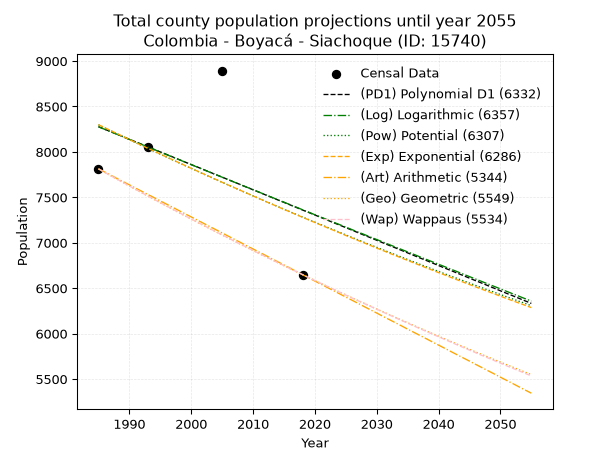
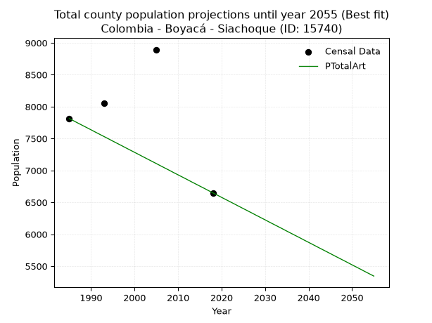
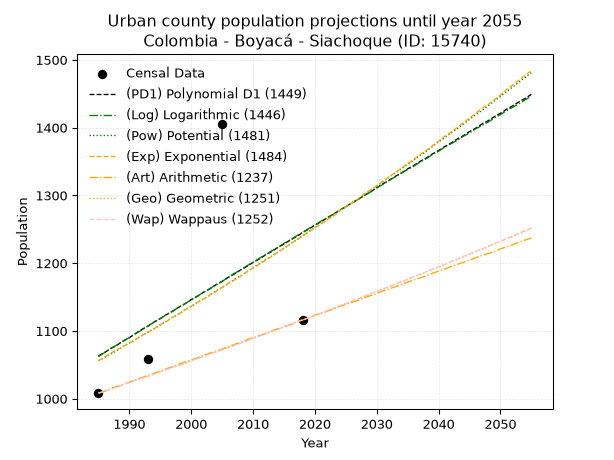
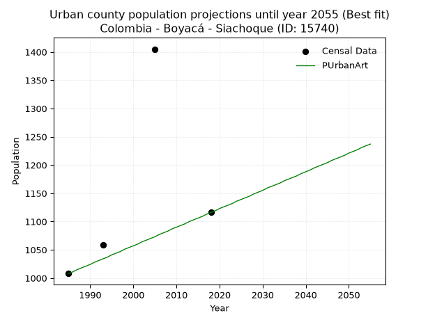
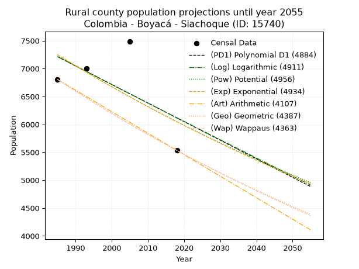
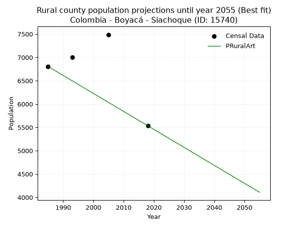

<div align="center">


</div>

# 📜 _“Population and Public Services Demand Projections (PPSD) until Year 2050 for Colombia - Boyacá - Siachoque (ID: 15740)”_
Keywords: `population` `public-service` `projection` `lineal` `polynomial` `logarithmic` `potential` `exponential` `arithmetic` `geometric` `wappaus` `dane` `colombia` `south-america`

PPSD are analytical estimates used by governments and planners to anticipate future changes in population size, age distribution, and the resulting community needs for utilities, healthcare, education, and infrastructure as sizing future water treatment facilities, electrical grids, and road networks based on spatial growth.

<div align="center">

</img>

</div>


> **General running parameters**: • app_version: _v20260806_. • Python version: _3.14.7_. • Pandas version: _3.0.5_. • NumPy version: _2.5.1_. • Creates, save and include plots into reports (create_plot): _False_. • Projection until year: _2050_. • Process polynomial degree 2 and up: _False_. • Process Wappaus: _True_. • Process Wappaus: _True_. • Set negative values to zero: _True_. • Set infinite values to zero: _True_. • Drop dataset notes: _True_. 
<div align="center">

Maps & GIS Layers: [:earth_americas:Google](http://maps.google.com/maps?q=5.51181086,-73.2446596) [:earth_americas:OSM](https://www.openstreetmap.org/#map=18/5.51181086/-73.2446596&layers=P) [:earth_americas:Bing](https://www.bing.com/maps?cp=5.51181086~-73.2446596&lvl=18) [:earth_americas:Apple](https://maps.apple.com/frame?center=5.51181086%2C-73.2446596&span=0.003%2C0.006) [:earth_americas:GISMobile](https://github.com/rcfdtools/R.GISMobile/blob/main/file/gis/CountyLayer_CO/Readme.md)

</div>


<div align="center">

```geojson
{
  "type": "Feature",
  "geometry": {
    "type": "Point", 
    "coordinates": [-73.2446596, 5.51181086]
  }, 
  "properties": {
    "Name": "Colombia - Boyacá - Siachoque (ID: 15740)"
  }
}
```

</div>


## 0. Census Data (4 records)

Census data are official statistics collected by a government about the people and housing in a country. They usually include counts of total population, age, sex, race, income, education, and jobs.

📅Global census file: [Population.xlsx](../data/Population.xlsx)

| Source   |   Year |   CountryID | CountryName   |   StateID | StateName   |   CountyID | CountyName   |   PTotal |   PUrban |   PRural |
|:---------|-------:|------------:|:--------------|----------:|:------------|-----------:|:-------------|---------:|---------:|---------:|
| DANE     |   1985 |          57 | Colombia      |        15 | Boyacá      |      15740 | Siachoque    |     7813 |     1008 |     6805 |
| DANE     |   1993 |          57 | Colombia      |        15 | Boyacá      |      15740 | Siachoque    |     8058 |     1059 |     6999 |
| DANE     |   2005 |          57 | Colombia      |        15 | Boyacá      |      15740 | Siachoque    |     8894 |     1405 |     7489 |
| DANE     |   2018 |          57 | Colombia      |        15 | Boyacá      |      15740 | Siachoque    |     6649 |     1116 |     5533 |

> 🔥Some records could had specific notes about the registered values or the corresponding urban or rural distribution.

📅[SUI-RUPS](https://www.datos.gov.co/Hacienda-y-Cr-dito-P-blico/Registro-nico-de-Prestadores-de-Servicios-P-blicos/4qkq-csdn/about_data) - Local public utility companies: [RUPS.csv](../data/RUPS.csv)

 | SERVICIO       | ESTADO    | NOMBRE                                                                                                           | NIT         | DEPARTAMENTO_DOMICILIO   | MUNICIPIO_DOMICILIO   | DIRECCION                                      |   TELEFONO | EMAIL                               | TIPO_PRESTADOR                 | CLASIFICACION                 |
|:---------------|:----------|:-----------------------------------------------------------------------------------------------------------------|:------------|:-------------------------|:----------------------|:-----------------------------------------------|-----------:|:------------------------------------|:-------------------------------|:------------------------------|
| ACUEDUCTO      | OPERATIVA | UNIDAD DE SERVICIOS PUBLICOS DOMICILIARIOS DE ACUEDUCTO, ALCANTARILLADO Y ASEO DEL MUNICIPIO DE SIACHOQUE        | 891801911-5 | BOYACA                   | SIACHOQUE             | Carrera 6 No. 3-41. PALACIO MUNICIPAL (1 Piso) |    7319168 | alcaldia@siachoque-boyaca.gov.co    | MUNICIPIO (PRESTACIÓN DIRECTA) | MENOR O IGUAL A 2500 USUARIOS |
| ALCANTARILLADO | OPERATIVA | UNIDAD DE SERVICIOS PUBLICOS DOMICILIARIOS DE ACUEDUCTO, ALCANTARILLADO Y ASEO DEL MUNICIPIO DE SIACHOQUE        | 891801911-5 | BOYACA                   | SIACHOQUE             | Carrera 6 No. 3-41. PALACIO MUNICIPAL (1 Piso) |    7319168 | alcaldia@siachoque-boyaca.gov.co    | MUNICIPIO (PRESTACIÓN DIRECTA) | MENOR O IGUAL A 2500 USUARIOS |
| ACUEDUCTO      | OPERATIVA | ASOCIACIÓN DE LOS USUARIOS ACUEDUCTO AGUA Y VIDA                                                                 | 820003076-8 | BOYACA                   | SIACHOQUE             | CARRERA 5 NO 2-01                              |    3125450 | suscriacueducto2010@hotmail.com     | ORGANIZACION AUTORIZADA        | MENOR O IGUAL A 2500 USUARIOS |
| ACUEDUCTO      | OPERATIVA | ASOCIACION DE SUSCRIPTORES DEL ACUEDUCTO ALTO DE LA VISTA DE LA VEREDA FIARIA PARTE ALTA DEL MUNICIPIO SIACHOQUE | 820004701-8 | BOYACA                   | SIACHOQUE             | CARRERA 5 No 2 - 13                            |    7319168 | contactenos@siachoque-boyaca.gov.co | ORGANIZACION AUTORIZADA        | HASTA 2500 SUSCRIPTORES       |
| ACUEDUCTO      | OPERATIVA | ASOCIACION DE SUSCRIPTORES DEL ACUEDUCTO LA PRIMAVERA DE LAS VEREDAS SIACHOQUE ARIIBA Y SIACHOQUE ABAJO          | 820005435-8 | BOYACA                   | SIACHOQUE             | VEREDA SIACHOQUE ARRIBA                        |    3124252 | personeriasiachoque@hotmail.com     | ORGANIZACION AUTORIZADA        | HASTA 2500 SUSCRIPTORES       |

## 1. Total

### 1.1. Coefficients and Parameters

* (PD1) Polynomial Deg 1: -27.78402248093001, 63428.490967480255 (lineal)
* (Log) Logarithmic: -55368.07342748981, 428706.6698142447
* (Pow) Potential: -7.913353957534274, 30.01530617650048
* (Exp) Exponential: -0.003969147279675582, 21913568.40865321
* (Art) Arithmetic: Year diff. 2018 - 1985 = 33, Population diff. 6649 - 7813 = -1164, Annual growth = -35.27272727272727
* (Geo) Geometric: Year diff. 2018 - 1985 = 33, Population diff. 6649 - 7813 = -1164, Annual growth % = -0.0048766324159522645
* (Wap) Wappaus: i = -0.48779874530116546, Condition values only valid for < 200)

<sub>
Wappaus condition values: ['-0.00', '-0.49', '-0.98', '-1.46', '-1.95', '-2.44', '-2.93', '-3.41', '-3.90', '-4.39', '-4.88', '-5.37', '-5.85', '-6.34', '-6.83', '-7.32', '-7.80', '-8.29', '-8.78', '-9.27', '-9.76', '-10.24', '-10.73', '-11.22', '-11.71', '-12.19', '-12.68', '-13.17', '-13.66', '-14.15', '-14.63', '-15.12', '-15.61', '-16.10', '-16.59', '-17.07', '-17.56', '-18.05', '-18.54', '-19.02', '-19.51', '-20.00', '-20.49', '-20.98', '-21.46', '-21.95', '-22.44', '-22.93', '-23.41', '-23.90', '-24.39', '-24.88', '-25.37', '-25.85', '-26.34', '-26.83', '-27.32', '-27.80', '-28.29', '-28.78', '-29.27', '-29.76', '-30.24', '-30.73', '-31.22', '-31.71']
</sub>


### 1.2. Projected Dataset

|   Year |   CountyID |   PTotalPD1 |   PTotalLog |   PTotalPow |   PTotalExp |   PTotalArt |   PTotalGeo |   PTotalWap |
|-------:|-----------:|------------:|------------:|------------:|------------:|------------:|------------:|------------:|
|   1985 |      15740 |        8277 |        8276 |        8298 |        8299 |        7813 |        7813 |        7813 |
|   1986 |      15740 |        8249 |        8248 |        8265 |        8266 |        7778 |        7775 |        7775 |
|   1987 |      15740 |        8222 |        8220 |        8232 |        8233 |        7742 |        7737 |        7737 |
|   1988 |      15740 |        8194 |        8193 |        8199 |        8201 |        7707 |        7699 |        7699 |
|   1989 |      15740 |        8166 |        8165 |        8167 |        8168 |        7672 |        7662 |        7662 |
|   1990 |      15740 |        8138 |        8137 |        8134 |        8136 |        7637 |        7624 |        7625 |
|   1991 |      15740 |        8111 |        8109 |        8102 |        8103 |        7601 |        7587 |        7588 |
|   1992 |      15740 |        8083 |        8081 |        8070 |        8071 |        7566 |        7550 |        7551 |
|   1993 |      15740 |        8055 |        8053 |        8038 |        8039 |        7531 |        7513 |        7514 |
|   1994 |      15740 |        8027 |        8026 |        8006 |        8008 |        7496 |        7477 |        7477 |
|   1995 |      15740 |        7999 |        7998 |        7974 |        7976 |        7460 |        7440 |        7441 |
|   1996 |      15740 |        7972 |        7970 |        7943 |        7944 |        7425 |        7404 |        7405 |
|   1997 |      15740 |        7944 |        7942 |        7911 |        7913 |        7390 |        7368 |        7369 |
|   1998 |      15740 |        7916 |        7915 |        7880 |        7881 |        7354 |        7332 |        7333 |
|   1999 |      15740 |        7888 |        7887 |        7849 |        7850 |        7319 |        7296 |        7297 |
|   2000 |      15740 |        7860 |        7859 |        7818 |        7819 |        7284 |        7261 |        7262 |
|   2001 |      15740 |        7833 |        7832 |        7787 |        7788 |        7249 |        7225 |        7226 |
|   2002 |      15740 |        7805 |        7804 |        7756 |        7757 |        7213 |        7190 |        7191 |
|   2003 |      15740 |        7777 |        7776 |        7726 |        7727 |        7178 |        7155 |        7156 |
|   2004 |      15740 |        7749 |        7749 |        7695 |        7696 |        7143 |        7120 |        7121 |
|   2005 |      15740 |        7722 |        7721 |        7665 |        7665 |        7108 |        7085 |        7086 |
|   2006 |      15740 |        7694 |        7693 |        7635 |        7635 |        7072 |        7051 |        7052 |
|   2007 |      15740 |        7666 |        7666 |        7605 |        7605 |        7037 |        7016 |        7017 |
|   2008 |      15740 |        7638 |        7638 |        7575 |        7575 |        7002 |        6982 |        6983 |
|   2009 |      15740 |        7610 |        7611 |        7545 |        7545 |        6966 |        6948 |        6949 |
|   2010 |      15740 |        7583 |        7583 |        7515 |        7515 |        6931 |        6914 |        6915 |
|   2011 |      15740 |        7555 |        7556 |        7486 |        7485 |        6896 |        6880 |        6881 |
|   2012 |      15740 |        7527 |        7528 |        7456 |        7455 |        6861 |        6847 |        6848 |
|   2013 |      15740 |        7499 |        7501 |        7427 |        7426 |        6825 |        6814 |        6814 |
|   2014 |      15740 |        7471 |        7473 |        7398 |        7396 |        6790 |        6780 |        6781 |
|   2015 |      15740 |        7444 |        7446 |        7369 |        7367 |        6755 |        6747 |        6748 |
|   2016 |      15740 |        7416 |        7418 |        7340 |        7338 |        6720 |        6714 |        6715 |
|   2017 |      15740 |        7388 |        7391 |        7311 |        7309 |        6684 |        6682 |        6682 |
|   2018 |      15740 |        7360 |        7363 |        7283 |        7280 |        6649 |        6649 |        6649 |
|   2019 |      15740 |        7333 |        7336 |        7254 |        7251 |        6614 |        6617 |        6616 |
|   2020 |      15740 |        7305 |        7308 |        7226 |        7222 |        6578 |        6584 |        6584 |
|   2021 |      15740 |        7277 |        7281 |        7198 |        7194 |        6543 |        6552 |        6552 |
|   2022 |      15740 |        7249 |        7254 |        7170 |        7165 |        6508 |        6520 |        6520 |
|   2023 |      15740 |        7221 |        7226 |        7142 |        7137 |        6473 |        6488 |        6488 |
|   2024 |      15740 |        7194 |        7199 |        7114 |        7109 |        6437 |        6457 |        6456 |
|   2025 |      15740 |        7166 |        7172 |        7086 |        7080 |        6402 |        6425 |        6424 |
|   2026 |      15740 |        7138 |        7144 |        7058 |        7052 |        6367 |        6394 |        6392 |
|   2027 |      15740 |        7110 |        7117 |        7031 |        7024 |        6332 |        6363 |        6361 |
|   2028 |      15740 |        7082 |        7090 |        7003 |        6997 |        6296 |        6332 |        6330 |
|   2029 |      15740 |        7055 |        7062 |        6976 |        6969 |        6261 |        6301 |        6299 |
|   2030 |      15740 |        7027 |        7035 |        6949 |        6941 |        6226 |        6270 |        6268 |
|   2031 |      15740 |        6999 |        7008 |        6922 |        6914 |        6190 |        6240 |        6237 |
|   2032 |      15740 |        6971 |        6980 |        6895 |        6886 |        6155 |        6209 |        6206 |
|   2033 |      15740 |        6944 |        6953 |        6868 |        6859 |        6120 |        6179 |        6175 |
|   2034 |      15740 |        6916 |        6926 |        6842 |        6832 |        6085 |        6149 |        6145 |
|   2035 |      15740 |        6888 |        6899 |        6815 |        6805 |        6049 |        6119 |        6115 |
|   2036 |      15740 |        6860 |        6872 |        6789 |        6778 |        6014 |        6089 |        6084 |
|   2037 |      15740 |        6832 |        6844 |        6762 |        6751 |        5979 |        6059 |        6054 |
|   2038 |      15740 |        6805 |        6817 |        6736 |        6724 |        5944 |        6030 |        6024 |
|   2039 |      15740 |        6777 |        6790 |        6710 |        6698 |        5908 |        6000 |        5994 |
|   2040 |      15740 |        6749 |        6763 |        6684 |        6671 |        5873 |        5971 |        5965 |
|   2041 |      15740 |        6721 |        6736 |        6658 |        6645 |        5838 |        5942 |        5935 |
|   2042 |      15740 |        6694 |        6709 |        6632 |        6618 |        5802 |        5913 |        5906 |
|   2043 |      15740 |        6666 |        6682 |        6607 |        6592 |        5767 |        5884 |        5876 |
|   2044 |      15740 |        6638 |        6654 |        6581 |        6566 |        5732 |        5855 |        5847 |
|   2045 |      15740 |        6610 |        6627 |        6556 |        6540 |        5697 |        5827 |        5818 |
|   2046 |      15740 |        6582 |        6600 |        6530 |        6514 |        5661 |        5798 |        5789 |
|   2047 |      15740 |        6555 |        6573 |        6505 |        6488 |        5626 |        5770 |        5760 |
|   2048 |      15740 |        6527 |        6546 |        6480 |        6463 |        5591 |        5742 |        5732 |
|   2049 |      15740 |        6499 |        6519 |        6455 |        6437 |        5556 |        5714 |        5703 |
|   2050 |      15740 |        6471 |        6492 |        6430 |        6412 |        5520 |        5686 |        5675 |
<div align="center">

</img>

</div>


### 1.3. Best fit with absolute and relative error (%)

Relative error puts that difference into context by dividing the absolute error by the true value, creating a unitless ratio or percentage that shows the scale of the mistake.

Absolute and relative error

|   Year | Source   |   CountryID | CountryName   |   StateID | StateName   |   CountyID_x | CountyName   |   PTotal |   PUrban |   PRural |   CountyID_y |   PTotalPD1 |   PTotalLog |   PTotalPow |   PTotalExp |   PTotalArt |   PTotalGeo |   PTotalWap |   PTotalPD1AbsError |   PTotalLogAbsError |   PTotalPowAbsError |   PTotalExpAbsError |   PTotalArtAbsError |   PTotalGeoAbsError |   PTotalWapAbsError |   PTotalPD1RelError |   PTotalLogRelError |   PTotalPowRelError |   PTotalExpRelError |   PTotalArtRelError |   PTotalGeoRelError |   PTotalWapRelError |
|-------:|:---------|------------:|:--------------|----------:|:------------|-------------:|:-------------|---------:|---------:|---------:|-------------:|------------:|------------:|------------:|------------:|------------:|------------:|------------:|--------------------:|--------------------:|--------------------:|--------------------:|--------------------:|--------------------:|--------------------:|--------------------:|--------------------:|--------------------:|--------------------:|--------------------:|--------------------:|--------------------:|
|   1985 | DANE     |          57 | Colombia      |        15 | Boyacá      |        15740 | Siachoque    |     7813 |     1008 |     6805 |        15740 |        8277 |        8276 |        8298 |        8299 |        7813 |        7813 |        7813 |                 464 |                 463 |                 485 |                 486 |                   0 |                   0 |                   0 |           5.93882   |           5.92602   |            6.2076   |            6.2204   |             0       |             0       |             0       |
|   1993 | DANE     |          57 | Colombia      |        15 | Boyacá      |        15740 | Siachoque    |     8058 |     1059 |     6999 |        15740 |        8055 |        8053 |        8038 |        8039 |        7531 |        7513 |        7514 |                   3 |                   5 |                  20 |                  19 |                 527 |                 545 |                 544 |           0.0372301 |           0.0620501 |            0.248201 |            0.235791 |             6.54008 |             6.76346 |             6.75105 |
|   2005 | DANE     |          57 | Colombia      |        15 | Boyacá      |        15740 | Siachoque    |     8894 |     1405 |     7489 |        15740 |        7722 |        7721 |        7665 |        7665 |        7108 |        7085 |        7086 |                1172 |                1173 |                1229 |                1229 |                1786 |                1809 |                1808 |          13.1774    |          13.1887    |           13.8183   |           13.8183   |            20.081   |            20.3396  |            20.3283  |
|   2018 | DANE     |          57 | Colombia      |        15 | Boyacá      |        15740 | Siachoque    |     6649 |     1116 |     5533 |        15740 |        7360 |        7363 |        7283 |        7280 |        6649 |        6649 |        6649 |                 711 |                 714 |                 634 |                 631 |                   0 |                   0 |                   0 |          10.6933    |          10.7385    |            9.53527  |            9.49015  |             0       |             0       |             0       |

Relative error mean

| Method    |   RelError | Best   |
|:----------|-----------:|:-------|
| PTotalPD1 |    7.4617  |        |
| PTotalLog |    7.4788  |        |
| PTotalPow |    7.45234 |        |
| PTotalExp |    7.44116 |        |
| PTotalArt |    6.65526 | True   |
| PTotalGeo |    6.77575 |        |
| PTotalWap |    6.76984 |        |

💙Best method: _**PTotalArt**_
<div align="center">

</img>

</div>


### 1.4. Fresh water supply demand in liters per capita per day (lpcd)

The fresh water supply demand typically ranges from 100 to 300 liters per capita per day (lpcd) for standard domestic and municipal planning, though absolute survival minimums set by the World Health Organization are as low as 7.5 to 20 liters per day, and total consumption in high-income nations can exceed 400 liters.

> `CZ`: Level in meters above the sea level (masl)<br> `WS`: Fresh water supply demand in liters per capita per day (lpcd or l/h/d)<br> `WSAll`: Zonal fresh water supply demand in liters per second (l/s)<br> `A`: Zonal area in square meters<br> `DP`: Population density (people/hectare or p/ha)

Reference values (RAS Colombia)

|    CZ |   WS |
|------:|-----:|
|  1000 |  120 |
|  2000 |  130 |
| 99999 |  140 |

County shapefile geometry properties and water supply values

|   CountyID |      ATotal |   CZTotal |   WSTotal |
|-----------:|------------:|----------:|----------:|
|      15740 | 1.19007e+08 |   3122.01 |       140 |

Projected values for best method: PTotalArt

|   CountyID |   Year |   PTotalArt |   DPTotal |   WSTotal |   WSTotalAll |
|-----------:|-------:|------------:|----------:|----------:|-------------:|
|      15740 |   1985 |        7813 |      0.66 |       140 |     12.66    |
|      15740 |   1986 |        7778 |      0.65 |       140 |     12.6032  |
|      15740 |   1987 |        7742 |      0.65 |       140 |     12.5449  |
|      15740 |   1988 |        7707 |      0.65 |       140 |     12.4882  |
|      15740 |   1989 |        7672 |      0.64 |       140 |     12.4315  |
|      15740 |   1990 |        7637 |      0.64 |       140 |     12.3748  |
|      15740 |   1991 |        7601 |      0.64 |       140 |     12.3164  |
|      15740 |   1992 |        7566 |      0.64 |       140 |     12.2597  |
|      15740 |   1993 |        7531 |      0.63 |       140 |     12.203   |
|      15740 |   1994 |        7496 |      0.63 |       140 |     12.1463  |
|      15740 |   1995 |        7460 |      0.63 |       140 |     12.088   |
|      15740 |   1996 |        7425 |      0.62 |       140 |     12.0312  |
|      15740 |   1997 |        7390 |      0.62 |       140 |     11.9745  |
|      15740 |   1998 |        7354 |      0.62 |       140 |     11.9162  |
|      15740 |   1999 |        7319 |      0.62 |       140 |     11.8595  |
|      15740 |   2000 |        7284 |      0.61 |       140 |     11.8028  |
|      15740 |   2001 |        7249 |      0.61 |       140 |     11.7461  |
|      15740 |   2002 |        7213 |      0.61 |       140 |     11.6877  |
|      15740 |   2003 |        7178 |      0.6  |       140 |     11.631   |
|      15740 |   2004 |        7143 |      0.6  |       140 |     11.5743  |
|      15740 |   2005 |        7108 |      0.6  |       140 |     11.5176  |
|      15740 |   2006 |        7072 |      0.59 |       140 |     11.4593  |
|      15740 |   2007 |        7037 |      0.59 |       140 |     11.4025  |
|      15740 |   2008 |        7002 |      0.59 |       140 |     11.3458  |
|      15740 |   2009 |        6966 |      0.59 |       140 |     11.2875  |
|      15740 |   2010 |        6931 |      0.58 |       140 |     11.2308  |
|      15740 |   2011 |        6896 |      0.58 |       140 |     11.1741  |
|      15740 |   2012 |        6861 |      0.58 |       140 |     11.1174  |
|      15740 |   2013 |        6825 |      0.57 |       140 |     11.059   |
|      15740 |   2014 |        6790 |      0.57 |       140 |     11.0023  |
|      15740 |   2015 |        6755 |      0.57 |       140 |     10.9456  |
|      15740 |   2016 |        6720 |      0.56 |       140 |     10.8889  |
|      15740 |   2017 |        6684 |      0.56 |       140 |     10.8306  |
|      15740 |   2018 |        6649 |      0.56 |       140 |     10.7738  |
|      15740 |   2019 |        6614 |      0.56 |       140 |     10.7171  |
|      15740 |   2020 |        6578 |      0.55 |       140 |     10.6588  |
|      15740 |   2021 |        6543 |      0.55 |       140 |     10.6021  |
|      15740 |   2022 |        6508 |      0.55 |       140 |     10.5454  |
|      15740 |   2023 |        6473 |      0.54 |       140 |     10.4887  |
|      15740 |   2024 |        6437 |      0.54 |       140 |     10.4303  |
|      15740 |   2025 |        6402 |      0.54 |       140 |     10.3736  |
|      15740 |   2026 |        6367 |      0.54 |       140 |     10.3169  |
|      15740 |   2027 |        6332 |      0.53 |       140 |     10.2602  |
|      15740 |   2028 |        6296 |      0.53 |       140 |     10.2019  |
|      15740 |   2029 |        6261 |      0.53 |       140 |     10.1451  |
|      15740 |   2030 |        6226 |      0.52 |       140 |     10.0884  |
|      15740 |   2031 |        6190 |      0.52 |       140 |     10.0301  |
|      15740 |   2032 |        6155 |      0.52 |       140 |      9.97338 |
|      15740 |   2033 |        6120 |      0.51 |       140 |      9.91667 |
|      15740 |   2034 |        6085 |      0.51 |       140 |      9.85995 |
|      15740 |   2035 |        6049 |      0.51 |       140 |      9.80162 |
|      15740 |   2036 |        6014 |      0.51 |       140 |      9.74491 |
|      15740 |   2037 |        5979 |      0.5  |       140 |      9.68819 |
|      15740 |   2038 |        5944 |      0.5  |       140 |      9.63148 |
|      15740 |   2039 |        5908 |      0.5  |       140 |      9.57315 |
|      15740 |   2040 |        5873 |      0.49 |       140 |      9.51644 |
|      15740 |   2041 |        5838 |      0.49 |       140 |      9.45972 |
|      15740 |   2042 |        5802 |      0.49 |       140 |      9.40139 |
|      15740 |   2043 |        5767 |      0.48 |       140 |      9.34468 |
|      15740 |   2044 |        5732 |      0.48 |       140 |      9.28796 |
|      15740 |   2045 |        5697 |      0.48 |       140 |      9.23125 |
|      15740 |   2046 |        5661 |      0.48 |       140 |      9.17292 |
|      15740 |   2047 |        5626 |      0.47 |       140 |      9.1162  |
|      15740 |   2048 |        5591 |      0.47 |       140 |      9.05949 |
|      15740 |   2049 |        5556 |      0.47 |       140 |      9.00278 |
|      15740 |   2050 |        5520 |      0.46 |       140 |      8.94444 |

## 2. Urban

### 2.1. Coefficients and Parameters

* (PD1) Polynomial Deg 1: 5.512645523886138, -9879.669209153246 (lineal)
* (Log) Logarithmic: 11074.832783294525, -83032.89273396185
* (Pow) Potential: 9.759902465242897, -29.162253948327514
* (Exp) Exponential: 0.004859307432142728, 0.06833699111665423
* (Art) Arithmetic: Year diff. 2018 - 1985 = 33, Population diff. 1116 - 1008 = 108, Annual growth = 3.272727272727273
* (Geo) Geometric: Year diff. 2018 - 1985 = 33, Population diff. 1116 - 1008 = 108, Annual growth % = 0.0030890854914797927
* (Wap) Wappaus: i = 0.3081664098613251, Condition values only valid for < 200)

<sub>
Wappaus condition values: ['0.00', '0.31', '0.62', '0.92', '1.23', '1.54', '1.85', '2.16', '2.47', '2.77', '3.08', '3.39', '3.70', '4.01', '4.31', '4.62', '4.93', '5.24', '5.55', '5.86', '6.16', '6.47', '6.78', '7.09', '7.40', '7.70', '8.01', '8.32', '8.63', '8.94', '9.24', '9.55', '9.86', '10.17', '10.48', '10.79', '11.09', '11.40', '11.71', '12.02', '12.33', '12.63', '12.94', '13.25', '13.56', '13.87', '14.18', '14.48', '14.79', '15.10', '15.41', '15.72', '16.02', '16.33', '16.64', '16.95', '17.26', '17.57', '17.87', '18.18', '18.49', '18.80', '19.11', '19.41', '19.72', '20.03']
</sub>


### 2.2. Projected Dataset

|   Year |   CountyID |   PUrbanPD1 |   PUrbanLog |   PUrbanPow |   PUrbanExp |   PUrbanArt |   PUrbanGeo |   PUrbanWap |
|-------:|-----------:|------------:|------------:|------------:|------------:|------------:|------------:|------------:|
|   1985 |      15740 |        1063 |        1062 |        1056 |        1056 |        1008 |        1008 |        1008 |
|   1986 |      15740 |        1068 |        1068 |        1061 |        1061 |        1011 |        1011 |        1011 |
|   1987 |      15740 |        1074 |        1074 |        1066 |        1067 |        1015 |        1014 |        1014 |
|   1988 |      15740 |        1079 |        1079 |        1071 |        1072 |        1018 |        1017 |        1017 |
|   1989 |      15740 |        1085 |        1085 |        1077 |        1077 |        1021 |        1021 |        1021 |
|   1990 |      15740 |        1090 |        1090 |        1082 |        1082 |        1024 |        1024 |        1024 |
|   1991 |      15740 |        1096 |        1096 |        1087 |        1087 |        1028 |        1027 |        1027 |
|   1992 |      15740 |        1102 |        1101 |        1093 |        1093 |        1031 |        1030 |        1030 |
|   1993 |      15740 |        1107 |        1107 |        1098 |        1098 |        1034 |        1033 |        1033 |
|   1994 |      15740 |        1113 |        1113 |        1103 |        1103 |        1037 |        1036 |        1036 |
|   1995 |      15740 |        1118 |        1118 |        1109 |        1109 |        1041 |        1040 |        1040 |
|   1996 |      15740 |        1124 |        1124 |        1114 |        1114 |        1044 |        1043 |        1043 |
|   1997 |      15740 |        1129 |        1129 |        1120 |        1120 |        1047 |        1046 |        1046 |
|   1998 |      15740 |        1135 |        1135 |        1125 |        1125 |        1051 |        1049 |        1049 |
|   1999 |      15740 |        1140 |        1140 |        1131 |        1131 |        1054 |        1052 |        1052 |
|   2000 |      15740 |        1146 |        1146 |        1136 |        1136 |        1057 |        1056 |        1056 |
|   2001 |      15740 |        1151 |        1151 |        1142 |        1142 |        1060 |        1059 |        1059 |
|   2002 |      15740 |        1157 |        1157 |        1147 |        1147 |        1064 |        1062 |        1062 |
|   2003 |      15740 |        1162 |        1162 |        1153 |        1153 |        1067 |        1066 |        1066 |
|   2004 |      15740 |        1168 |        1168 |        1159 |        1158 |        1070 |        1069 |        1069 |
|   2005 |      15740 |        1173 |        1173 |        1164 |        1164 |        1073 |        1072 |        1072 |
|   2006 |      15740 |        1179 |        1179 |        1170 |        1170 |        1077 |        1075 |        1075 |
|   2007 |      15740 |        1184 |        1185 |        1176 |        1175 |        1080 |        1079 |        1079 |
|   2008 |      15740 |        1190 |        1190 |        1181 |        1181 |        1083 |        1082 |        1082 |
|   2009 |      15740 |        1195 |        1196 |        1187 |        1187 |        1087 |        1085 |        1085 |
|   2010 |      15740 |        1201 |        1201 |        1193 |        1193 |        1090 |        1089 |        1089 |
|   2011 |      15740 |        1206 |        1207 |        1199 |        1198 |        1093 |        1092 |        1092 |
|   2012 |      15740 |        1212 |        1212 |        1205 |        1204 |        1096 |        1096 |        1096 |
|   2013 |      15740 |        1217 |        1218 |        1210 |        1210 |        1100 |        1099 |        1099 |
|   2014 |      15740 |        1223 |        1223 |        1216 |        1216 |        1103 |        1102 |        1102 |
|   2015 |      15740 |        1228 |        1229 |        1222 |        1222 |        1106 |        1106 |        1106 |
|   2016 |      15740 |        1234 |        1234 |        1228 |        1228 |        1109 |        1109 |        1109 |
|   2017 |      15740 |        1239 |        1240 |        1234 |        1234 |        1113 |        1113 |        1113 |
|   2018 |      15740 |        1245 |        1245 |        1240 |        1240 |        1116 |        1116 |        1116 |
|   2019 |      15740 |        1250 |        1251 |        1246 |        1246 |        1119 |        1119 |        1119 |
|   2020 |      15740 |        1256 |        1256 |        1252 |        1252 |        1123 |        1123 |        1123 |
|   2021 |      15740 |        1261 |        1262 |        1258 |        1258 |        1126 |        1126 |        1126 |
|   2022 |      15740 |        1267 |        1267 |        1264 |        1264 |        1129 |        1130 |        1130 |
|   2023 |      15740 |        1272 |        1272 |        1270 |        1270 |        1132 |        1133 |        1133 |
|   2024 |      15740 |        1278 |        1278 |        1277 |        1277 |        1136 |        1137 |        1137 |
|   2025 |      15740 |        1283 |        1283 |        1283 |        1283 |        1139 |        1140 |        1140 |
|   2026 |      15740 |        1289 |        1289 |        1289 |        1289 |        1142 |        1144 |        1144 |
|   2027 |      15740 |        1294 |        1294 |        1295 |        1295 |        1145 |        1147 |        1147 |
|   2028 |      15740 |        1300 |        1300 |        1301 |        1302 |        1149 |        1151 |        1151 |
|   2029 |      15740 |        1305 |        1305 |        1308 |        1308 |        1152 |        1155 |        1155 |
|   2030 |      15740 |        1311 |        1311 |        1314 |        1314 |        1155 |        1158 |        1158 |
|   2031 |      15740 |        1317 |        1316 |        1320 |        1321 |        1159 |        1162 |        1162 |
|   2032 |      15740 |        1322 |        1322 |        1327 |        1327 |        1162 |        1165 |        1165 |
|   2033 |      15740 |        1328 |        1327 |        1333 |        1334 |        1165 |        1169 |        1169 |
|   2034 |      15740 |        1333 |        1333 |        1339 |        1340 |        1168 |        1172 |        1173 |
|   2035 |      15740 |        1339 |        1338 |        1346 |        1347 |        1172 |        1176 |        1176 |
|   2036 |      15740 |        1344 |        1343 |        1352 |        1353 |        1175 |        1180 |        1180 |
|   2037 |      15740 |        1350 |        1349 |        1359 |        1360 |        1178 |        1183 |        1184 |
|   2038 |      15740 |        1355 |        1354 |        1365 |        1366 |        1181 |        1187 |        1187 |
|   2039 |      15740 |        1361 |        1360 |        1372 |        1373 |        1185 |        1191 |        1191 |
|   2040 |      15740 |        1366 |        1365 |        1379 |        1380 |        1188 |        1194 |        1195 |
|   2041 |      15740 |        1372 |        1371 |        1385 |        1387 |        1191 |        1198 |        1198 |
|   2042 |      15740 |        1377 |        1376 |        1392 |        1393 |        1195 |        1202 |        1202 |
|   2043 |      15740 |        1383 |        1381 |        1398 |        1400 |        1198 |        1205 |        1206 |
|   2044 |      15740 |        1388 |        1387 |        1405 |        1407 |        1201 |        1209 |        1210 |
|   2045 |      15740 |        1394 |        1392 |        1412 |        1414 |        1204 |        1213 |        1213 |
|   2046 |      15740 |        1399 |        1398 |        1419 |        1421 |        1208 |        1217 |        1217 |
|   2047 |      15740 |        1405 |        1403 |        1425 |        1428 |        1211 |        1220 |        1221 |
|   2048 |      15740 |        1410 |        1408 |        1432 |        1434 |        1214 |        1224 |        1225 |
|   2049 |      15740 |        1416 |        1414 |        1439 |        1441 |        1217 |        1228 |        1229 |
|   2050 |      15740 |        1421 |        1419 |        1446 |        1448 |        1221 |        1232 |        1232 |
<div align="center">

</img>

</div>


### 2.3. Best fit with absolute and relative error (%)

Relative error puts that difference into context by dividing the absolute error by the true value, creating a unitless ratio or percentage that shows the scale of the mistake.

Absolute and relative error

|   Year | Source   |   CountryID | CountryName   |   StateID | StateName   |   CountyID_x | CountyName   |   PTotal |   PUrban |   PRural |   CountyID_y |   PUrbanPD1 |   PUrbanLog |   PUrbanPow |   PUrbanExp |   PUrbanArt |   PUrbanGeo |   PUrbanWap |   PUrbanPD1AbsError |   PUrbanLogAbsError |   PUrbanPowAbsError |   PUrbanExpAbsError |   PUrbanArtAbsError |   PUrbanGeoAbsError |   PUrbanWapAbsError |   PUrbanPD1RelError |   PUrbanLogRelError |   PUrbanPowRelError |   PUrbanExpRelError |   PUrbanArtRelError |   PUrbanGeoRelError |   PUrbanWapRelError |
|-------:|:---------|------------:|:--------------|----------:|:------------|-------------:|:-------------|---------:|---------:|---------:|-------------:|------------:|------------:|------------:|------------:|------------:|------------:|------------:|--------------------:|--------------------:|--------------------:|--------------------:|--------------------:|--------------------:|--------------------:|--------------------:|--------------------:|--------------------:|--------------------:|--------------------:|--------------------:|--------------------:|
|   1985 | DANE     |          57 | Colombia      |        15 | Boyacá      |        15740 | Siachoque    |     7813 |     1008 |     6805 |        15740 |        1063 |        1062 |        1056 |        1056 |        1008 |        1008 |        1008 |                  55 |                  54 |                  48 |                  48 |                   0 |                   0 |                   0 |             5.45635 |             5.35714 |             4.7619  |             4.7619  |             0       |             0       |             0       |
|   1993 | DANE     |          57 | Colombia      |        15 | Boyacá      |        15740 | Siachoque    |     8058 |     1059 |     6999 |        15740 |        1107 |        1107 |        1098 |        1098 |        1034 |        1033 |        1033 |                  48 |                  48 |                  39 |                  39 |                  25 |                  26 |                  26 |             4.53258 |             4.53258 |             3.68272 |             3.68272 |             2.36072 |             2.45515 |             2.45515 |
|   2005 | DANE     |          57 | Colombia      |        15 | Boyacá      |        15740 | Siachoque    |     8894 |     1405 |     7489 |        15740 |        1173 |        1173 |        1164 |        1164 |        1073 |        1072 |        1072 |                 232 |                 232 |                 241 |                 241 |                 332 |                 333 |                 333 |            16.5125  |            16.5125  |            17.153   |            17.153   |            23.6299  |            23.7011  |            23.7011  |
|   2018 | DANE     |          57 | Colombia      |        15 | Boyacá      |        15740 | Siachoque    |     6649 |     1116 |     5533 |        15740 |        1245 |        1245 |        1240 |        1240 |        1116 |        1116 |        1116 |                 129 |                 129 |                 124 |                 124 |                   0 |                   0 |                   0 |            11.5591  |            11.5591  |            11.1111  |            11.1111  |             0       |             0       |             0       |

Relative error mean

| Method    |   RelError | Best   |
|:----------|-----------:|:-------|
| PUrbanPD1 |    9.51513 |        |
| PUrbanLog |    9.49033 |        |
| PUrbanPow |    9.17719 |        |
| PUrbanExp |    9.17719 |        |
| PUrbanArt |    6.49765 | True   |
| PUrbanGeo |    6.53905 |        |
| PUrbanWap |    6.53905 |        |

💙Best method: _**PUrbanArt**_
<div align="center">

</img>

</div>


### 2.4. Fresh water supply demand in liters per capita per day (lpcd)

The fresh water supply demand typically ranges from 100 to 300 liters per capita per day (lpcd) for standard domestic and municipal planning, though absolute survival minimums set by the World Health Organization are as low as 7.5 to 20 liters per day, and total consumption in high-income nations can exceed 400 liters.

> `CZ`: Level in meters above the sea level (masl)<br> `WS`: Fresh water supply demand in liters per capita per day (lpcd or l/h/d)<br> `WSAll`: Zonal fresh water supply demand in liters per second (l/s)<br> `A`: Zonal area in square meters<br> `DP`: Population density (people/hectare or p/ha)

Reference values (RAS Colombia)

|    CZ |   WS |
|------:|-----:|
|  1000 |  120 |
|  2000 |  130 |
| 99999 |  140 |

County shapefile geometry properties and water supply values

|   CountyID |   AUrban |   CZUrban |   WSUrban |
|-----------:|---------:|----------:|----------:|
|      15740 |   462553 |   2760.15 |       140 |

Projected values for best method: PUrbanArt

|   CountyID |   Year |   PUrbanArt |   DPUrban |   WSUrban |   WSUrbanAll |
|-----------:|-------:|------------:|----------:|----------:|-------------:|
|      15740 |   1985 |        1008 |     21.79 |       140 |      1.63333 |
|      15740 |   1986 |        1011 |     21.86 |       140 |      1.63819 |
|      15740 |   1987 |        1015 |     21.94 |       140 |      1.64468 |
|      15740 |   1988 |        1018 |     22.01 |       140 |      1.64954 |
|      15740 |   1989 |        1021 |     22.07 |       140 |      1.6544  |
|      15740 |   1990 |        1024 |     22.14 |       140 |      1.65926 |
|      15740 |   1991 |        1028 |     22.22 |       140 |      1.66574 |
|      15740 |   1992 |        1031 |     22.29 |       140 |      1.6706  |
|      15740 |   1993 |        1034 |     22.35 |       140 |      1.67546 |
|      15740 |   1994 |        1037 |     22.42 |       140 |      1.68032 |
|      15740 |   1995 |        1041 |     22.51 |       140 |      1.68681 |
|      15740 |   1996 |        1044 |     22.57 |       140 |      1.69167 |
|      15740 |   1997 |        1047 |     22.64 |       140 |      1.69653 |
|      15740 |   1998 |        1051 |     22.72 |       140 |      1.70301 |
|      15740 |   1999 |        1054 |     22.79 |       140 |      1.70787 |
|      15740 |   2000 |        1057 |     22.85 |       140 |      1.71273 |
|      15740 |   2001 |        1060 |     22.92 |       140 |      1.71759 |
|      15740 |   2002 |        1064 |     23    |       140 |      1.72407 |
|      15740 |   2003 |        1067 |     23.07 |       140 |      1.72894 |
|      15740 |   2004 |        1070 |     23.13 |       140 |      1.7338  |
|      15740 |   2005 |        1073 |     23.2  |       140 |      1.73866 |
|      15740 |   2006 |        1077 |     23.28 |       140 |      1.74514 |
|      15740 |   2007 |        1080 |     23.35 |       140 |      1.75    |
|      15740 |   2008 |        1083 |     23.41 |       140 |      1.75486 |
|      15740 |   2009 |        1087 |     23.5  |       140 |      1.76134 |
|      15740 |   2010 |        1090 |     23.56 |       140 |      1.7662  |
|      15740 |   2011 |        1093 |     23.63 |       140 |      1.77106 |
|      15740 |   2012 |        1096 |     23.69 |       140 |      1.77593 |
|      15740 |   2013 |        1100 |     23.78 |       140 |      1.78241 |
|      15740 |   2014 |        1103 |     23.85 |       140 |      1.78727 |
|      15740 |   2015 |        1106 |     23.91 |       140 |      1.79213 |
|      15740 |   2016 |        1109 |     23.98 |       140 |      1.79699 |
|      15740 |   2017 |        1113 |     24.06 |       140 |      1.80347 |
|      15740 |   2018 |        1116 |     24.13 |       140 |      1.80833 |
|      15740 |   2019 |        1119 |     24.19 |       140 |      1.81319 |
|      15740 |   2020 |        1123 |     24.28 |       140 |      1.81968 |
|      15740 |   2021 |        1126 |     24.34 |       140 |      1.82454 |
|      15740 |   2022 |        1129 |     24.41 |       140 |      1.8294  |
|      15740 |   2023 |        1132 |     24.47 |       140 |      1.83426 |
|      15740 |   2024 |        1136 |     24.56 |       140 |      1.84074 |
|      15740 |   2025 |        1139 |     24.62 |       140 |      1.8456  |
|      15740 |   2026 |        1142 |     24.69 |       140 |      1.85046 |
|      15740 |   2027 |        1145 |     24.75 |       140 |      1.85532 |
|      15740 |   2028 |        1149 |     24.84 |       140 |      1.86181 |
|      15740 |   2029 |        1152 |     24.91 |       140 |      1.86667 |
|      15740 |   2030 |        1155 |     24.97 |       140 |      1.87153 |
|      15740 |   2031 |        1159 |     25.06 |       140 |      1.87801 |
|      15740 |   2032 |        1162 |     25.12 |       140 |      1.88287 |
|      15740 |   2033 |        1165 |     25.19 |       140 |      1.88773 |
|      15740 |   2034 |        1168 |     25.25 |       140 |      1.89259 |
|      15740 |   2035 |        1172 |     25.34 |       140 |      1.89907 |
|      15740 |   2036 |        1175 |     25.4  |       140 |      1.90394 |
|      15740 |   2037 |        1178 |     25.47 |       140 |      1.9088  |
|      15740 |   2038 |        1181 |     25.53 |       140 |      1.91366 |
|      15740 |   2039 |        1185 |     25.62 |       140 |      1.92014 |
|      15740 |   2040 |        1188 |     25.68 |       140 |      1.925   |
|      15740 |   2041 |        1191 |     25.75 |       140 |      1.92986 |
|      15740 |   2042 |        1195 |     25.83 |       140 |      1.93634 |
|      15740 |   2043 |        1198 |     25.9  |       140 |      1.9412  |
|      15740 |   2044 |        1201 |     25.96 |       140 |      1.94606 |
|      15740 |   2045 |        1204 |     26.03 |       140 |      1.95093 |
|      15740 |   2046 |        1208 |     26.12 |       140 |      1.95741 |
|      15740 |   2047 |        1211 |     26.18 |       140 |      1.96227 |
|      15740 |   2048 |        1214 |     26.25 |       140 |      1.96713 |
|      15740 |   2049 |        1217 |     26.31 |       140 |      1.97199 |
|      15740 |   2050 |        1221 |     26.4  |       140 |      1.97847 |

## 3. Rural

### 3.1. Coefficients and Parameters

* (PD1) Polynomial Deg 1: -33.29666800481618, 73308.16017663357 (lineal)
* (Log) Logarithmic: -66442.9062107842, 511739.5625482056
* (Pow) Potential: -10.967070750236788, 40.02694441404003
* (Exp) Exponential: -0.005494682884669636, 395393610.42333066
* (Art) Arithmetic: Year diff. 2018 - 1985 = 33, Population diff. 5533 - 6805 = -1272, Annual growth = -38.54545454545455
* (Geo) Geometric: Year diff. 2018 - 1985 = 33, Population diff. 5533 - 6805 = -1272, Annual growth % = -0.006250910718421765
* (Wap) Wappaus: i = -0.6248250047893426, Condition values only valid for < 200)

<sub>
Wappaus condition values: ['-0.00', '-0.62', '-1.25', '-1.87', '-2.50', '-3.12', '-3.75', '-4.37', '-5.00', '-5.62', '-6.25', '-6.87', '-7.50', '-8.12', '-8.75', '-9.37', '-10.00', '-10.62', '-11.25', '-11.87', '-12.50', '-13.12', '-13.75', '-14.37', '-15.00', '-15.62', '-16.25', '-16.87', '-17.50', '-18.12', '-18.74', '-19.37', '-19.99', '-20.62', '-21.24', '-21.87', '-22.49', '-23.12', '-23.74', '-24.37', '-24.99', '-25.62', '-26.24', '-26.87', '-27.49', '-28.12', '-28.74', '-29.37', '-29.99', '-30.62', '-31.24', '-31.87', '-32.49', '-33.12', '-33.74', '-34.37', '-34.99', '-35.62', '-36.24', '-36.86', '-37.49', '-38.11', '-38.74', '-39.36', '-39.99', '-40.61']
</sub>


### 3.2. Projected Dataset

|   Year |   CountyID |   PRuralPD1 |   PRuralLog |   PRuralPow |   PRuralExp |   PRuralArt |   PRuralGeo |   PRuralWap |
|-------:|-----------:|------------:|------------:|------------:|------------:|------------:|------------:|------------:|
|   1985 |      15740 |        7214 |        7214 |        7247 |        7248 |        6805 |        6805 |        6805 |
|   1986 |      15740 |        7181 |        7180 |        7207 |        7208 |        6766 |        6762 |        6763 |
|   1987 |      15740 |        7148 |        7147 |        7168 |        7169 |        6728 |        6720 |        6720 |
|   1988 |      15740 |        7114 |        7113 |        7128 |        7129 |        6689 |        6678 |        6679 |
|   1989 |      15740 |        7081 |        7080 |        7089 |        7090 |        6651 |        6636 |        6637 |
|   1990 |      15740 |        7048 |        7047 |        7050 |        7051 |        6612 |        6595 |        6596 |
|   1991 |      15740 |        7014 |        7013 |        7011 |        7013 |        6574 |        6554 |        6555 |
|   1992 |      15740 |        6981 |        6980 |        6973 |        6974 |        6535 |        6513 |        6514 |
|   1993 |      15740 |        6948 |        6946 |        6934 |        6936 |        6497 |        6472 |        6473 |
|   1994 |      15740 |        6915 |        6913 |        6896 |        6898 |        6458 |        6432 |        6433 |
|   1995 |      15740 |        6881 |        6880 |        6859 |        6860 |        6420 |        6391 |        6393 |
|   1996 |      15740 |        6848 |        6847 |        6821 |        6823 |        6381 |        6351 |        6353 |
|   1997 |      15740 |        6815 |        6813 |        6784 |        6785 |        6342 |        6312 |        6313 |
|   1998 |      15740 |        6781 |        6780 |        6747 |        6748 |        6304 |        6272 |        6274 |
|   1999 |      15740 |        6748 |        6747 |        6710 |        6711 |        6265 |        6233 |        6235 |
|   2000 |      15740 |        6715 |        6714 |        6673 |        6674 |        6227 |        6194 |        6196 |
|   2001 |      15740 |        6682 |        6680 |        6636 |        6638 |        6188 |        6155 |        6157 |
|   2002 |      15740 |        6648 |        6647 |        6600 |        6601 |        6150 |        6117 |        6119 |
|   2003 |      15740 |        6615 |        6614 |        6564 |        6565 |        6111 |        6079 |        6080 |
|   2004 |      15740 |        6582 |        6581 |        6528 |        6529 |        6073 |        6041 |        6042 |
|   2005 |      15740 |        6548 |        6548 |        6493 |        6493 |        6034 |        6003 |        6005 |
|   2006 |      15740 |        6515 |        6514 |        6457 |        6458 |        5996 |        5965 |        5967 |
|   2007 |      15740 |        6482 |        6481 |        6422 |        6423 |        5957 |        5928 |        5930 |
|   2008 |      15740 |        6448 |        6448 |        6387 |        6387 |        5918 |        5891 |        5893 |
|   2009 |      15740 |        6415 |        6415 |        6352 |        6352 |        5880 |        5854 |        5856 |
|   2010 |      15740 |        6382 |        6382 |        6318 |        6318 |        5841 |        5818 |        5819 |
|   2011 |      15740 |        6349 |        6349 |        6283 |        6283 |        5803 |        5781 |        5783 |
|   2012 |      15740 |        6315 |        6316 |        6249 |        6248 |        5764 |        5745 |        5746 |
|   2013 |      15740 |        6282 |        6283 |        6215 |        6214 |        5726 |        5709 |        5710 |
|   2014 |      15740 |        6249 |        6250 |        6181 |        6180 |        5687 |        5674 |        5674 |
|   2015 |      15740 |        6215 |        6217 |        6148 |        6146 |        5649 |        5638 |        5639 |
|   2016 |      15740 |        6182 |        6184 |        6115 |        6113 |        5610 |        5603 |        5603 |
|   2017 |      15740 |        6149 |        6151 |        6081 |        6079 |        5572 |        5568 |        5568 |
|   2018 |      15740 |        6115 |        6118 |        6048 |        6046 |        5533 |        5533 |        5533 |
|   2019 |      15740 |        6082 |        6085 |        6016 |        6013 |        5494 |        5498 |        5498 |
|   2020 |      15740 |        6049 |        6052 |        5983 |        5980 |        5456 |        5464 |        5464 |
|   2021 |      15740 |        6016 |        6020 |        5951 |        5947 |        5417 |        5430 |        5429 |
|   2022 |      15740 |        5982 |        5987 |        5918 |        5914 |        5379 |        5396 |        5395 |
|   2023 |      15740 |        5949 |        5954 |        5886 |        5882 |        5340 |        5362 |        5361 |
|   2024 |      15740 |        5916 |        5921 |        5855 |        5850 |        5302 |        5329 |        5327 |
|   2025 |      15740 |        5882 |        5888 |        5823 |        5818 |        5263 |        5295 |        5293 |
|   2026 |      15740 |        5849 |        5855 |        5792 |        5786 |        5225 |        5262 |        5260 |
|   2027 |      15740 |        5816 |        5823 |        5760 |        5754 |        5186 |        5229 |        5226 |
|   2028 |      15740 |        5783 |        5790 |        5729 |        5723 |        5148 |        5197 |        5193 |
|   2029 |      15740 |        5749 |        5757 |        5698 |        5691 |        5109 |        5164 |        5160 |
|   2030 |      15740 |        5716 |        5724 |        5668 |        5660 |        5070 |        5132 |        5127 |
|   2031 |      15740 |        5683 |        5692 |        5637 |        5629 |        5032 |        5100 |        5095 |
|   2032 |      15740 |        5649 |        5659 |        5607 |        5598 |        4993 |        5068 |        5062 |
|   2033 |      15740 |        5616 |        5626 |        5577 |        5568 |        4955 |        5036 |        5030 |
|   2034 |      15740 |        5583 |        5593 |        5547 |        5537 |        4916 |        5005 |        4998 |
|   2035 |      15740 |        5549 |        5561 |        5517 |        5507 |        4878 |        4974 |        4966 |
|   2036 |      15740 |        5516 |        5528 |        5487 |        5476 |        4839 |        4942 |        4935 |
|   2037 |      15740 |        5483 |        5496 |        5458 |        5446 |        4801 |        4912 |        4903 |
|   2038 |      15740 |        5450 |        5463 |        5428 |        5417 |        4762 |        4881 |        4872 |
|   2039 |      15740 |        5416 |        5430 |        5399 |        5387 |        4724 |        4850 |        4840 |
|   2040 |      15740 |        5383 |        5398 |        5370 |        5357 |        4685 |        4820 |        4809 |
|   2041 |      15740 |        5350 |        5365 |        5341 |        5328 |        4646 |        4790 |        4778 |
|   2042 |      15740 |        5316 |        5333 |        5313 |        5299 |        4608 |        4760 |        4748 |
|   2043 |      15740 |        5283 |        5300 |        5284 |        5270 |        4569 |        4730 |        4717 |
|   2044 |      15740 |        5250 |        5268 |        5256 |        5241 |        4531 |        4701 |        4687 |
|   2045 |      15740 |        5216 |        5235 |        5228 |        5212 |        4492 |        4671 |        4657 |
|   2046 |      15740 |        5183 |        5203 |        5200 |        5184 |        4454 |        4642 |        4626 |
|   2047 |      15740 |        5150 |        5170 |        5172 |        5155 |        4415 |        4613 |        4597 |
|   2048 |      15740 |        5117 |        5138 |        5145 |        5127 |        4377 |        4584 |        4567 |
|   2049 |      15740 |        5083 |        5105 |        5117 |        5099 |        4338 |        4556 |        4537 |
|   2050 |      15740 |        5050 |        5073 |        5090 |        5071 |        4300 |        4527 |        4508 |
<div align="center">

</img>

</div>


### 3.3. Best fit with absolute and relative error (%)

Relative error puts that difference into context by dividing the absolute error by the true value, creating a unitless ratio or percentage that shows the scale of the mistake.

Absolute and relative error

|   Year | Source   |   CountryID | CountryName   |   StateID | StateName   |   CountyID_x | CountyName   |   PTotal |   PUrban |   PRural |   CountyID_y |   PRuralPD1 |   PRuralLog |   PRuralPow |   PRuralExp |   PRuralArt |   PRuralGeo |   PRuralWap |   PRuralPD1AbsError |   PRuralLogAbsError |   PRuralPowAbsError |   PRuralExpAbsError |   PRuralArtAbsError |   PRuralGeoAbsError |   PRuralWapAbsError |   PRuralPD1RelError |   PRuralLogRelError |   PRuralPowRelError |   PRuralExpRelError |   PRuralArtRelError |   PRuralGeoRelError |   PRuralWapRelError |
|-------:|:---------|------------:|:--------------|----------:|:------------|-------------:|:-------------|---------:|---------:|---------:|-------------:|------------:|------------:|------------:|------------:|------------:|------------:|------------:|--------------------:|--------------------:|--------------------:|--------------------:|--------------------:|--------------------:|--------------------:|--------------------:|--------------------:|--------------------:|--------------------:|--------------------:|--------------------:|--------------------:|
|   1985 | DANE     |          57 | Colombia      |        15 | Boyacá      |        15740 | Siachoque    |     7813 |     1008 |     6805 |        15740 |        7214 |        7214 |        7247 |        7248 |        6805 |        6805 |        6805 |                 409 |                 409 |                 442 |                 443 |                   0 |                   0 |                   0 |            6.01029  |            6.01029  |            6.49522  |            6.50992  |             0       |             0       |             0       |
|   1993 | DANE     |          57 | Colombia      |        15 | Boyacá      |        15740 | Siachoque    |     8058 |     1059 |     6999 |        15740 |        6948 |        6946 |        6934 |        6936 |        6497 |        6472 |        6473 |                  51 |                  53 |                  65 |                  63 |                 502 |                 527 |                 526 |            0.728676 |            0.757251 |            0.928704 |            0.900129 |             7.17245 |             7.52965 |             7.51536 |
|   2005 | DANE     |          57 | Colombia      |        15 | Boyacá      |        15740 | Siachoque    |     8894 |     1405 |     7489 |        15740 |        6548 |        6548 |        6493 |        6493 |        6034 |        6003 |        6005 |                 941 |                 941 |                 996 |                 996 |                1455 |                1486 |                1484 |           12.5651   |           12.5651   |           13.2995   |           13.2995   |            19.4285  |            19.8424  |            19.8157  |
|   2018 | DANE     |          57 | Colombia      |        15 | Boyacá      |        15740 | Siachoque    |     6649 |     1116 |     5533 |        15740 |        6115 |        6118 |        6048 |        6046 |        5533 |        5533 |        5533 |                 582 |                 585 |                 515 |                 513 |                   0 |                   0 |                   0 |           10.5187   |           10.5729   |            9.30779  |            9.27164  |             0       |             0       |             0       |

Relative error mean

| Method    |   RelError | Best   |
|:----------|-----------:|:-------|
| PRuralPD1 |    7.45569 |        |
| PRuralLog |    7.47639 |        |
| PRuralPow |    7.50781 |        |
| PRuralExp |    7.4953  |        |
| PRuralArt |    6.65024 | True   |
| PRuralGeo |    6.84302 |        |
| PRuralWap |    6.83277 |        |

💙Best method: _**PRuralArt**_
<div align="center">

</img>

</div>


### 3.4. Fresh water supply demand in liters per capita per day (lpcd)

The fresh water supply demand typically ranges from 100 to 300 liters per capita per day (lpcd) for standard domestic and municipal planning, though absolute survival minimums set by the World Health Organization are as low as 7.5 to 20 liters per day, and total consumption in high-income nations can exceed 400 liters.

> `CZ`: Level in meters above the sea level (masl)<br> `WS`: Fresh water supply demand in liters per capita per day (lpcd or l/h/d)<br> `WSAll`: Zonal fresh water supply demand in liters per second (l/s)<br> `A`: Zonal area in square meters<br> `DP`: Population density (people/hectare or p/ha)

Reference values (RAS Colombia)

|    CZ |   WS |
|------:|-----:|
|  1000 |  120 |
|  2000 |  130 |
| 99999 |  140 |

County shapefile geometry properties and water supply values

|   CountyID |      ARural |   CZRural |   WSRural |
|-----------:|------------:|----------:|----------:|
|      15740 | 1.18545e+08 |   3123.36 |       140 |

Projected values for best method: PRuralArt

|   CountyID |   Year |   PRuralArt |   DPRural |   WSRural |   WSRuralAll |
|-----------:|-------:|------------:|----------:|----------:|-------------:|
|      15740 |   1985 |        6805 |      0.57 |       140 |     11.0266  |
|      15740 |   1986 |        6766 |      0.57 |       140 |     10.9634  |
|      15740 |   1987 |        6728 |      0.57 |       140 |     10.9019  |
|      15740 |   1988 |        6689 |      0.56 |       140 |     10.8387  |
|      15740 |   1989 |        6651 |      0.56 |       140 |     10.7771  |
|      15740 |   1990 |        6612 |      0.56 |       140 |     10.7139  |
|      15740 |   1991 |        6574 |      0.55 |       140 |     10.6523  |
|      15740 |   1992 |        6535 |      0.55 |       140 |     10.5891  |
|      15740 |   1993 |        6497 |      0.55 |       140 |     10.5275  |
|      15740 |   1994 |        6458 |      0.54 |       140 |     10.4644  |
|      15740 |   1995 |        6420 |      0.54 |       140 |     10.4028  |
|      15740 |   1996 |        6381 |      0.54 |       140 |     10.3396  |
|      15740 |   1997 |        6342 |      0.53 |       140 |     10.2764  |
|      15740 |   1998 |        6304 |      0.53 |       140 |     10.2148  |
|      15740 |   1999 |        6265 |      0.53 |       140 |     10.1516  |
|      15740 |   2000 |        6227 |      0.53 |       140 |     10.09    |
|      15740 |   2001 |        6188 |      0.52 |       140 |     10.0269  |
|      15740 |   2002 |        6150 |      0.52 |       140 |      9.96528 |
|      15740 |   2003 |        6111 |      0.52 |       140 |      9.90208 |
|      15740 |   2004 |        6073 |      0.51 |       140 |      9.84051 |
|      15740 |   2005 |        6034 |      0.51 |       140 |      9.77731 |
|      15740 |   2006 |        5996 |      0.51 |       140 |      9.71574 |
|      15740 |   2007 |        5957 |      0.5  |       140 |      9.65255 |
|      15740 |   2008 |        5918 |      0.5  |       140 |      9.58935 |
|      15740 |   2009 |        5880 |      0.5  |       140 |      9.52778 |
|      15740 |   2010 |        5841 |      0.49 |       140 |      9.46458 |
|      15740 |   2011 |        5803 |      0.49 |       140 |      9.40301 |
|      15740 |   2012 |        5764 |      0.49 |       140 |      9.33981 |
|      15740 |   2013 |        5726 |      0.48 |       140 |      9.27824 |
|      15740 |   2014 |        5687 |      0.48 |       140 |      9.21505 |
|      15740 |   2015 |        5649 |      0.48 |       140 |      9.15347 |
|      15740 |   2016 |        5610 |      0.47 |       140 |      9.09028 |
|      15740 |   2017 |        5572 |      0.47 |       140 |      9.0287  |
|      15740 |   2018 |        5533 |      0.47 |       140 |      8.96551 |
|      15740 |   2019 |        5494 |      0.46 |       140 |      8.90231 |
|      15740 |   2020 |        5456 |      0.46 |       140 |      8.84074 |
|      15740 |   2021 |        5417 |      0.46 |       140 |      8.77755 |
|      15740 |   2022 |        5379 |      0.45 |       140 |      8.71597 |
|      15740 |   2023 |        5340 |      0.45 |       140 |      8.65278 |
|      15740 |   2024 |        5302 |      0.45 |       140 |      8.5912  |
|      15740 |   2025 |        5263 |      0.44 |       140 |      8.52801 |
|      15740 |   2026 |        5225 |      0.44 |       140 |      8.46644 |
|      15740 |   2027 |        5186 |      0.44 |       140 |      8.40324 |
|      15740 |   2028 |        5148 |      0.43 |       140 |      8.34167 |
|      15740 |   2029 |        5109 |      0.43 |       140 |      8.27847 |
|      15740 |   2030 |        5070 |      0.43 |       140 |      8.21528 |
|      15740 |   2031 |        5032 |      0.42 |       140 |      8.1537  |
|      15740 |   2032 |        4993 |      0.42 |       140 |      8.09051 |
|      15740 |   2033 |        4955 |      0.42 |       140 |      8.02894 |
|      15740 |   2034 |        4916 |      0.41 |       140 |      7.96574 |
|      15740 |   2035 |        4878 |      0.41 |       140 |      7.90417 |
|      15740 |   2036 |        4839 |      0.41 |       140 |      7.84097 |
|      15740 |   2037 |        4801 |      0.4  |       140 |      7.7794  |
|      15740 |   2038 |        4762 |      0.4  |       140 |      7.7162  |
|      15740 |   2039 |        4724 |      0.4  |       140 |      7.65463 |
|      15740 |   2040 |        4685 |      0.4  |       140 |      7.59144 |
|      15740 |   2041 |        4646 |      0.39 |       140 |      7.52824 |
|      15740 |   2042 |        4608 |      0.39 |       140 |      7.46667 |
|      15740 |   2043 |        4569 |      0.39 |       140 |      7.40347 |
|      15740 |   2044 |        4531 |      0.38 |       140 |      7.3419  |
|      15740 |   2045 |        4492 |      0.38 |       140 |      7.2787  |
|      15740 |   2046 |        4454 |      0.38 |       140 |      7.21713 |
|      15740 |   2047 |        4415 |      0.37 |       140 |      7.15394 |
|      15740 |   2048 |        4377 |      0.37 |       140 |      7.09236 |
|      15740 |   2049 |        4338 |      0.37 |       140 |      7.02917 |
|      15740 |   2050 |        4300 |      0.36 |       140 |      6.96759 |

#

<div align="center"><br><sub>Share this research</sub></div><br>

<sub>**APPS & TOOLS & CONTENT DISCLAIMER**: • NO WARRANTY - This content and software is provided by <a href="https://github.com/rcfdtools" target="_blank">github.com/rcfdtools</a> "as is", without any express or implied warranty, including warranties of merchantability, fitness for a particular purpose, or non-infringement. There is no guarantee that the software will be error-free or operate without interruption. • LIMITATION OF LIABILITY - Neither the authors nor copyright holders will be liable for claims or damages arising from the software or its use. You are responsible for determining if the software is appropriate for your use and assume all associated risks, including errors, legal compliance, and data loss. • NO PROFESSIONAL ADVICE - The software provides general information and does not offer professional advice. It should not replace consultation with professional advisors. [Clauses and global license for rcfdtools use.](https://github.com/rcfdtools/rcfdtools/blob/main/LICENSE.md)</sub>

| [:house: Home](Readme.md)  | [:beginner: Help / Collab](https://github.com/rcfdtools/R.HydroTools/discussions/31) |
|----------------------------|-------------------------------------------------------------------------------------------|