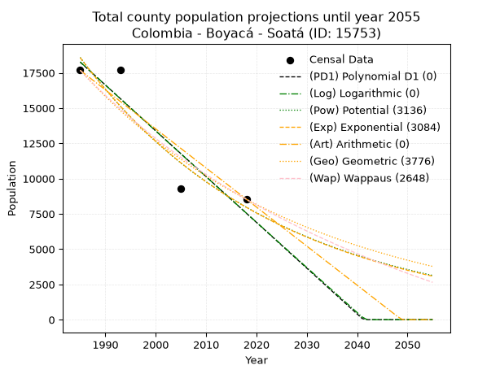
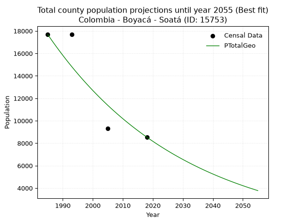
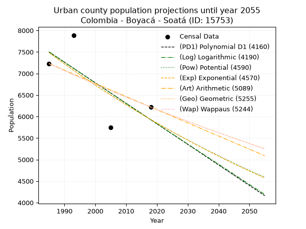
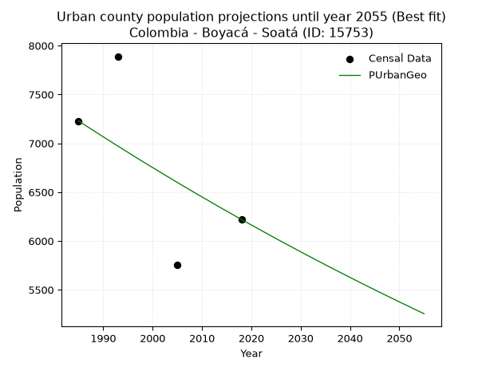
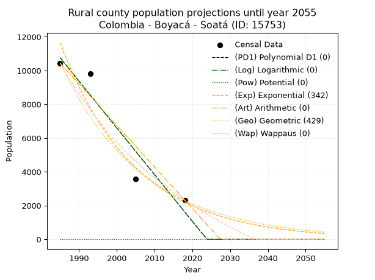
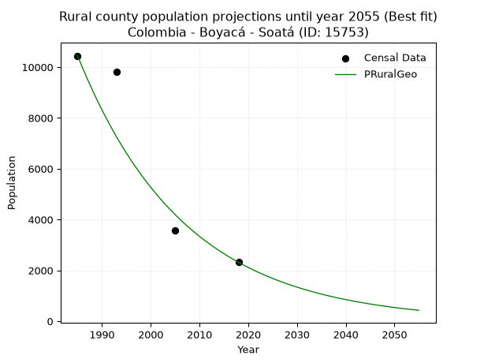

<div align="center">


</div>

# _“Population and Public Services Demand Projections (PPSD) until Year 2050 for Colombia - Boyacá - Soatá (ID: 15753)”_
Keywords: `population` `public-service` `projection` `lineal` `polynomial` `logarithmic` `potential` `exponential` `arithmetic` `geometric` `wappaus` `dane` `colombia` `south-america`

PPSD are analytical estimates used by governments and planners to anticipate future changes in population size, age distribution, and the resulting community needs for utilities, healthcare, education, and infrastructure as sizing future water treatment facilities, electrical grids, and road networks based on spatial growth.

> **General running parameters**: • app_version: _v20260806_. • Python version: _3.14.7_. • Pandas version: _3.0.5_. • NumPy version: _2.5.1_. • Creates, save and include plots into reports (create_plot): _False_. • Projection until year: _2050_. • Process polynomial degree 2 and up: _False_. • Process Wappaus: _True_. • Process Wappaus: _True_. • Set negative values to zero: _True_. • Set infinite values to zero: _True_. • Drop dataset notes: _True_. 
<div align="center">

Dynamic map: [:earth_americas:Google](http://maps.google.com/maps?q=6.331944596,-72.6840513) [:earth_americas:OSM](https://www.openstreetmap.org/#map=18/6.331944596/-72.6840513&layers=P) [:earth_americas:Bing](https://www.bing.com/maps?cp=6.331944596~-72.6840513&lvl=18) [:earth_americas:Apple](https://maps.apple.com/frame?center=6.331944596%2C-72.6840513&span=0.003%2C0.006)

</div>


<div align="center">

```geojson
{
  "type": "Feature",
  "geometry": {
    "type": "Point", 
    "coordinates": [-72.6840513, 6.331944596]
  }, 
  "properties": {
    "Name": "Colombia - Boyacá - Soatá (ID: 15753)"
  }
}
```

</div>


## 0. Census Data (4 records)

Census data are official statistics collected by a government about the people and housing in a country. They usually include counts of total population, age, sex, race, income, education, and jobs.

📅Global census file: [Population.xlsx](../data/Population.xlsx)

| Source   |   Year |   CountryID | CountryName   |   StateID | StateName   |   CountyID | CountyName   |   PTotal |   PUrban |   PRural |
|:---------|-------:|------------:|:--------------|----------:|:------------|-----------:|:-------------|---------:|---------:|---------:|
| DANE     |   1985 |          57 | Colombia      |        15 | Boyacá      |      15753 | Soatá        |    17676 |     7229 |    10447 |
| DANE     |   1993 |          57 | Colombia      |        15 | Boyacá      |      15753 | Soatá        |    17706 |     7890 |     9816 |
| DANE     |   2005 |          57 | Colombia      |        15 | Boyacá      |      15753 | Soatá        |     9313 |     5752 |     3561 |
| DANE     |   2018 |          57 | Colombia      |        15 | Boyacá      |      15753 | Soatá        |     8538 |     6220 |     2318 |

> 🔥Some records could had specific notes about the registered values or the corresponding urban or rural distribution.

## 1. Total

### 1.1. Coefficients and Parameters

* (PD1) Polynomial Deg 1: -324.59454034524197, 662578.4793255702 (lineal)
* (Log) Logarithmic: -649897.5462349734, 4953184.7068841215
* (Pow) Potential: -51.34957836698507, 173.60783994737199
* (Exp) Exponential: -0.025648198412189533, 2.396151931460681e+26
* (Art) Arithmetic: Year diff. 2018 - 1985 = 33, Population diff. 8538 - 17676 = -9138, Annual growth = -276.90909090909093
* (Geo) Geometric: Year diff. 2018 - 1985 = 33, Population diff. 8538 - 17676 = -9138, Annual growth % = -0.02180959461269616
* (Wap) Wappaus: i = -2.112680940788059, Condition values only valid for < 200)

<sub>
Wappaus condition values: ['-0.00', '-2.11', '-4.23', '-6.34', '-8.45', '-10.56', '-12.68', '-14.79', '-16.90', '-19.01', '-21.13', '-23.24', '-25.35', '-27.46', '-29.58', '-31.69', '-33.80', '-35.92', '-38.03', '-40.14', '-42.25', '-44.37', '-46.48', '-48.59', '-50.70', '-52.82', '-54.93', '-57.04', '-59.16', '-61.27', '-63.38', '-65.49', '-67.61', '-69.72', '-71.83', '-73.94', '-76.06', '-78.17', '-80.28', '-82.39', '-84.51', '-86.62', '-88.73', '-90.85', '-92.96', '-95.07', '-97.18', '-99.30', '-101.41', '-103.52', '-105.63', '-107.75', '-109.86', '-111.97', '-114.08', '-116.20', '-118.31', '-120.42', '-122.54', '-124.65', '-126.76', '-128.87', '-130.99', '-133.10', '-135.21', '-137.32']
</sub>


### 1.2. Projected Dataset

|   Year |   CountyID |   PTotalPD1 |   PTotalLog |   PTotalPow |   PTotalExp |   PTotalArt |   PTotalGeo |   PTotalWap |
|-------:|-----------:|------------:|------------:|------------:|------------:|------------:|------------:|------------:|
|   1985 |      15753 |       18258 |       18269 |       18588 |       18572 |       17676 |       17676 |       17676 |
|   1986 |      15753 |       17934 |       17942 |       18113 |       18102 |       17399 |       17290 |       17306 |
|   1987 |      15753 |       17609 |       17615 |       17651 |       17643 |       17122 |       16913 |       16945 |
|   1988 |      15753 |       17285 |       17288 |       17201 |       17196 |       16845 |       16545 |       16590 |
|   1989 |      15753 |       16960 |       16961 |       16762 |       16761 |       16568 |       16184 |       16243 |
|   1990 |      15753 |       16635 |       16634 |       16335 |       16337 |       16291 |       15831 |       15902 |
|   1991 |      15753 |       16311 |       16308 |       15919 |       15923 |       16015 |       15485 |       15569 |
|   1992 |      15753 |       15986 |       15982 |       15514 |       15520 |       15738 |       15148 |       15242 |
|   1993 |      15753 |       15662 |       15655 |       15119 |       15127 |       15461 |       14817 |       14921 |
|   1994 |      15753 |       15337 |       15329 |       14735 |       14744 |       15184 |       14494 |       14607 |
|   1995 |      15753 |       15012 |       15004 |       14360 |       14370 |       14907 |       14178 |       14298 |
|   1996 |      15753 |       14688 |       14678 |       13995 |       14006 |       14630 |       13869 |       13996 |
|   1997 |      15753 |       14363 |       14352 |       13640 |       13652 |       14353 |       13566 |       13699 |
|   1998 |      15753 |       14039 |       14027 |       13294 |       13306 |       14076 |       13271 |       13407 |
|   1999 |      15753 |       13714 |       13702 |       12957 |       12969 |       13799 |       12981 |       13121 |
|   2000 |      15753 |       13389 |       13377 |       12628 |       12641 |       13522 |       12698 |       12841 |
|   2001 |      15753 |       13065 |       13052 |       12308 |       12321 |       13245 |       12421 |       12565 |
|   2002 |      15753 |       12740 |       12727 |       11996 |       12009 |       12969 |       12150 |       12294 |
|   2003 |      15753 |       12416 |       12403 |       11693 |       11705 |       12692 |       11885 |       12028 |
|   2004 |      15753 |       12091 |       12078 |       11397 |       11408 |       12415 |       11626 |       11767 |
|   2005 |      15753 |       11766 |       11754 |       11109 |       11119 |       12138 |       11372 |       11510 |
|   2006 |      15753 |       11442 |       11430 |       10828 |       10838 |       11861 |       11124 |       11258 |
|   2007 |      15753 |       11117 |       11106 |       10554 |       10563 |       11584 |       10882 |       11010 |
|   2008 |      15753 |       10793 |       10782 |       10288 |       10296 |       11307 |       10644 |       10766 |
|   2009 |      15753 |       10468 |       10459 |       10028 |       10035 |       11030 |       10412 |       10526 |
|   2010 |      15753 |       10143 |       10135 |        9775 |        9781 |       10753 |       10185 |       10290 |
|   2011 |      15753 |        9819 |        9812 |        9528 |        9533 |       10476 |        9963 |       10059 |
|   2012 |      15753 |        9494 |        9489 |        9288 |        9292 |       10199 |        9746 |        9831 |
|   2013 |      15753 |        9170 |        9166 |        9054 |        9057 |        9923 |        9533 |        9607 |
|   2014 |      15753 |        8845 |        8843 |        8826 |        8827 |        9646 |        9325 |        9386 |
|   2015 |      15753 |        8520 |        8521 |        8604 |        8604 |        9369 |        9122 |        9169 |
|   2016 |      15753 |        8196 |        8198 |        8388 |        8386 |        9092 |        8923 |        8955 |
|   2017 |      15753 |        7871 |        7876 |        8177 |        8174 |        8815 |        8728 |        8745 |
|   2018 |      15753 |        7547 |        7554 |        7971 |        7967 |        8538 |        8538 |        8538 |
|   2019 |      15753 |        7222 |        7232 |        7771 |        7765 |        8261 |        8352 |        8334 |
|   2020 |      15753 |        6898 |        6910 |        7576 |        7568 |        7984 |        8170 |        8134 |
|   2021 |      15753 |        6573 |        6589 |        7386 |        7377 |        7707 |        7991 |        7936 |
|   2022 |      15753 |        6248 |        6267 |        7201 |        7190 |        7430 |        7817 |        7742 |
|   2023 |      15753 |        5924 |        5946 |        7020 |        7008 |        7153 |        7647 |        7550 |
|   2024 |      15753 |        5599 |        5625 |        6844 |        6830 |        6877 |        7480 |        7361 |
|   2025 |      15753 |        5275 |        5303 |        6673 |        6657 |        6600 |        7317 |        7175 |
|   2026 |      15753 |        4950 |        4983 |        6506 |        6489 |        6323 |        7157 |        6992 |
|   2027 |      15753 |        4625 |        4662 |        6343 |        6324 |        6046 |        7001 |        6812 |
|   2028 |      15753 |        4301 |        4341 |        6184 |        6164 |        5769 |        6848 |        6634 |
|   2029 |      15753 |        3976 |        4021 |        6030 |        6008 |        5492 |        6699 |        6459 |
|   2030 |      15753 |        3652 |        3701 |        5879 |        5856 |        5215 |        6553 |        6286 |
|   2031 |      15753 |        3327 |        3381 |        5732 |        5708 |        4938 |        6410 |        6115 |
|   2032 |      15753 |        3002 |        3061 |        5589 |        5563 |        4661 |        6270 |        5947 |
|   2033 |      15753 |        2678 |        2741 |        5450 |        5422 |        4384 |        6133 |        5782 |
|   2034 |      15753 |        2353 |        2421 |        5314 |        5285 |        4107 |        6000 |        5619 |
|   2035 |      15753 |        2029 |        2102 |        5181 |        5151 |        3831 |        5869 |        5458 |
|   2036 |      15753 |        1704 |        1783 |        5052 |        5021 |        3554 |        5741 |        5299 |
|   2037 |      15753 |        1379 |        1464 |        4927 |        4894 |        3277 |        5616 |        5142 |
|   2038 |      15753 |        1055 |        1145 |        4804 |        4770 |        3000 |        5493 |        4988 |
|   2039 |      15753 |         730 |         826 |        4684 |        4649 |        2723 |        5373 |        4835 |
|   2040 |      15753 |         406 |         507 |        4568 |        4531 |        2446 |        5256 |        4685 |
|   2041 |      15753 |          81 |         189 |        4454 |        4417 |        2169 |        5142 |        4536 |
|   2042 |      15753 |           0 |           0 |        4344 |        4305 |        1892 |        5029 |        4390 |
|   2043 |      15753 |           0 |           0 |        4236 |        4196 |        1615 |        4920 |        4245 |
|   2044 |      15753 |           0 |           0 |        4131 |        4089 |        1338 |        4812 |        4103 |
|   2045 |      15753 |           0 |           0 |        4028 |        3986 |        1061 |        4707 |        3962 |
|   2046 |      15753 |           0 |           0 |        3929 |        3885 |         785 |        4605 |        3823 |
|   2047 |      15753 |           0 |           0 |        3831 |        3787 |         508 |        4504 |        3686 |
|   2048 |      15753 |           0 |           0 |        3736 |        3691 |         231 |        4406 |        3550 |
|   2049 |      15753 |           0 |           0 |        3644 |        3597 |           0 |        4310 |        3416 |
|   2050 |      15753 |           0 |           0 |        3554 |        3506 |           0 |        4216 |        3284 |
<div align="center">

</img>

</div>


### 1.3. Best fit with absolute and relative error (%)

Relative error puts that difference into context by dividing the absolute error by the true value, creating a unitless ratio or percentage that shows the scale of the mistake.

Absolute and relative error

|   Year | Source   |   CountryID | CountryName   |   StateID | StateName   |   CountyID_x | CountyName   |   PTotal |   PUrban |   PRural |   CountyID_y |   PTotalPD1 |   PTotalLog |   PTotalPow |   PTotalExp |   PTotalArt |   PTotalGeo |   PTotalWap |   PTotalPD1AbsError |   PTotalLogAbsError |   PTotalPowAbsError |   PTotalExpAbsError |   PTotalArtAbsError |   PTotalGeoAbsError |   PTotalWapAbsError |   PTotalPD1RelError |   PTotalLogRelError |   PTotalPowRelError |   PTotalExpRelError |   PTotalArtRelError |   PTotalGeoRelError |   PTotalWapRelError |
|-------:|:---------|------------:|:--------------|----------:|:------------|-------------:|:-------------|---------:|---------:|---------:|-------------:|------------:|------------:|------------:|------------:|------------:|------------:|------------:|--------------------:|--------------------:|--------------------:|--------------------:|--------------------:|--------------------:|--------------------:|--------------------:|--------------------:|--------------------:|--------------------:|--------------------:|--------------------:|--------------------:|
|   1985 | DANE     |          57 | Colombia      |        15 | Boyacá      |        15753 | Soatá        |    17676 |     7229 |    10447 |        15753 |       18258 |       18269 |       18588 |       18572 |       17676 |       17676 |       17676 |                 582 |                 593 |                 912 |                 896 |                   0 |                   0 |                   0 |              3.2926 |             3.35483 |             5.15954 |             5.06902 |              0      |              0      |              0      |
|   1993 | DANE     |          57 | Colombia      |        15 | Boyacá      |        15753 | Soatá        |    17706 |     7890 |     9816 |        15753 |       15662 |       15655 |       15119 |       15127 |       15461 |       14817 |       14921 |                2044 |                2051 |                2587 |                2579 |                2245 |                2889 |                2785 |             11.5441 |            11.5836  |            14.6109  |            14.5657  |             12.6793 |             16.3165 |             15.7291 |
|   2005 | DANE     |          57 | Colombia      |        15 | Boyacá      |        15753 | Soatá        |     9313 |     5752 |     3561 |        15753 |       11766 |       11754 |       11109 |       11119 |       12138 |       11372 |       11510 |                2453 |                2441 |                1796 |                1806 |                2825 |                2059 |                2197 |             26.3395 |            26.2107  |            19.2849  |            19.3922  |             30.3339 |             22.1089 |             23.5907 |
|   2018 | DANE     |          57 | Colombia      |        15 | Boyacá      |        15753 | Soatá        |     8538 |     6220 |     2318 |        15753 |        7547 |        7554 |        7971 |        7967 |        8538 |        8538 |        8538 |                 991 |                 984 |                 567 |                 571 |                   0 |                   0 |                   0 |             11.6069 |            11.5249  |             6.6409  |             6.68775 |              0      |              0      |              0      |

Relative error mean

| Method    |   RelError | Best   |
|:----------|-----------:|:-------|
| PTotalPD1 |   13.1958  |        |
| PTotalLog |   13.1685  |        |
| PTotalPow |   11.424   |        |
| PTotalExp |   11.4287  |        |
| PTotalArt |   10.7533  |        |
| PTotalGeo |    9.60635 | True   |
| PTotalWap |    9.82995 |        |

💙Best method: _**PTotalGeo**_
<div align="center">

</img>

</div>


### 1.4. Fresh water supply demand in liters per capita per day (lpcd)

The fresh water supply demand typically ranges from 100 to 300 liters per capita per day (lpcd) for standard domestic and municipal planning, though absolute survival minimums set by the World Health Organization are as low as 7.5 to 20 liters per day, and total consumption in high-income nations can exceed 400 liters.

> `CZ`: Level in meters above the sea level (masl)<br> `WS`: Fresh water supply demand in liters per capita per day (lpcd or l/h/d)<br> `WSAll`: Zonal fresh water supply demand in liters per second (l/s)<br> `A`: Zonal area in square meters<br> `DP`: Population density (people/hectare)

Reference values (RAS Colombia)

|    CZ |   WS |
|------:|-----:|
|  1000 |  120 |
|  2000 |  130 |
| 99999 |  140 |

County shapefile geometry properties and water supply values

|   CountyID |      ATotal |   CZTotal |   WSTotal |
|-----------:|------------:|----------:|----------:|
|      15753 | 1.22831e+08 |   2364.08 |       140 |

Projected values for best method: PTotalGeo

|   CountyID |   Year |   PTotalGeo |   DPTotal |   WSTotal |   WSTotalAll |
|-----------:|-------:|------------:|----------:|----------:|-------------:|
|      15753 |   1985 |       17676 |      1.44 |       140 |     28.6417  |
|      15753 |   1986 |       17290 |      1.41 |       140 |     28.0162  |
|      15753 |   1987 |       16913 |      1.38 |       140 |     27.4053  |
|      15753 |   1988 |       16545 |      1.35 |       140 |     26.809   |
|      15753 |   1989 |       16184 |      1.32 |       140 |     26.2241  |
|      15753 |   1990 |       15831 |      1.29 |       140 |     25.6521  |
|      15753 |   1991 |       15485 |      1.26 |       140 |     25.0914  |
|      15753 |   1992 |       15148 |      1.23 |       140 |     24.5454  |
|      15753 |   1993 |       14817 |      1.21 |       140 |     24.009   |
|      15753 |   1994 |       14494 |      1.18 |       140 |     23.4856  |
|      15753 |   1995 |       14178 |      1.15 |       140 |     22.9736  |
|      15753 |   1996 |       13869 |      1.13 |       140 |     22.4729  |
|      15753 |   1997 |       13566 |      1.1  |       140 |     21.9819  |
|      15753 |   1998 |       13271 |      1.08 |       140 |     21.5039  |
|      15753 |   1999 |       12981 |      1.06 |       140 |     21.034   |
|      15753 |   2000 |       12698 |      1.03 |       140 |     20.5755  |
|      15753 |   2001 |       12421 |      1.01 |       140 |     20.1266  |
|      15753 |   2002 |       12150 |      0.99 |       140 |     19.6875  |
|      15753 |   2003 |       11885 |      0.97 |       140 |     19.2581  |
|      15753 |   2004 |       11626 |      0.95 |       140 |     18.8384  |
|      15753 |   2005 |       11372 |      0.93 |       140 |     18.4269  |
|      15753 |   2006 |       11124 |      0.91 |       140 |     18.025   |
|      15753 |   2007 |       10882 |      0.89 |       140 |     17.6329  |
|      15753 |   2008 |       10644 |      0.87 |       140 |     17.2472  |
|      15753 |   2009 |       10412 |      0.85 |       140 |     16.8713  |
|      15753 |   2010 |       10185 |      0.83 |       140 |     16.5035  |
|      15753 |   2011 |        9963 |      0.81 |       140 |     16.1438  |
|      15753 |   2012 |        9746 |      0.79 |       140 |     15.7921  |
|      15753 |   2013 |        9533 |      0.78 |       140 |     15.447   |
|      15753 |   2014 |        9325 |      0.76 |       140 |     15.11    |
|      15753 |   2015 |        9122 |      0.74 |       140 |     14.781   |
|      15753 |   2016 |        8923 |      0.73 |       140 |     14.4586  |
|      15753 |   2017 |        8728 |      0.71 |       140 |     14.1426  |
|      15753 |   2018 |        8538 |      0.7  |       140 |     13.8347  |
|      15753 |   2019 |        8352 |      0.68 |       140 |     13.5333  |
|      15753 |   2020 |        8170 |      0.67 |       140 |     13.2384  |
|      15753 |   2021 |        7991 |      0.65 |       140 |     12.9484  |
|      15753 |   2022 |        7817 |      0.64 |       140 |     12.6664  |
|      15753 |   2023 |        7647 |      0.62 |       140 |     12.391   |
|      15753 |   2024 |        7480 |      0.61 |       140 |     12.1204  |
|      15753 |   2025 |        7317 |      0.6  |       140 |     11.8562  |
|      15753 |   2026 |        7157 |      0.58 |       140 |     11.597   |
|      15753 |   2027 |        7001 |      0.57 |       140 |     11.3442  |
|      15753 |   2028 |        6848 |      0.56 |       140 |     11.0963  |
|      15753 |   2029 |        6699 |      0.55 |       140 |     10.8549  |
|      15753 |   2030 |        6553 |      0.53 |       140 |     10.6183  |
|      15753 |   2031 |        6410 |      0.52 |       140 |     10.3866  |
|      15753 |   2032 |        6270 |      0.51 |       140 |     10.1597  |
|      15753 |   2033 |        6133 |      0.5  |       140 |      9.93773 |
|      15753 |   2034 |        6000 |      0.49 |       140 |      9.72222 |
|      15753 |   2035 |        5869 |      0.48 |       140 |      9.50995 |
|      15753 |   2036 |        5741 |      0.47 |       140 |      9.30255 |
|      15753 |   2037 |        5616 |      0.46 |       140 |      9.1     |
|      15753 |   2038 |        5493 |      0.45 |       140 |      8.90069 |
|      15753 |   2039 |        5373 |      0.44 |       140 |      8.70625 |
|      15753 |   2040 |        5256 |      0.43 |       140 |      8.51667 |
|      15753 |   2041 |        5142 |      0.42 |       140 |      8.33194 |
|      15753 |   2042 |        5029 |      0.41 |       140 |      8.14884 |
|      15753 |   2043 |        4920 |      0.4  |       140 |      7.97222 |
|      15753 |   2044 |        4812 |      0.39 |       140 |      7.79722 |
|      15753 |   2045 |        4707 |      0.38 |       140 |      7.62708 |
|      15753 |   2046 |        4605 |      0.37 |       140 |      7.46181 |
|      15753 |   2047 |        4504 |      0.37 |       140 |      7.29815 |
|      15753 |   2048 |        4406 |      0.36 |       140 |      7.13935 |
|      15753 |   2049 |        4310 |      0.35 |       140 |      6.9838  |
|      15753 |   2050 |        4216 |      0.34 |       140 |      6.83148 |

## 2. Urban

### 2.1. Coefficients and Parameters

* (PD1) Polynomial Deg 1: -47.720192693697456, 102225.06543556834 (lineal)
* (Log) Logarithmic: -95559.10661853194, 733118.285170083
* (Pow) Potential: -14.112742746844468, 50.414675200227805
* (Exp) Exponential: -0.007046713488036911, 8890041258.294043
* (Art) Arithmetic: Year diff. 2018 - 1985 = 33, Population diff. 6220 - 7229 = -1009, Annual growth = -30.575757575757574
* (Geo) Geometric: Year diff. 2018 - 1985 = 33, Population diff. 6220 - 7229 = -1009, Annual growth % = -0.00454511855184736
* (Wap) Wappaus: i = -0.45469191130578596, Condition values only valid for < 200)

<sub>
Wappaus condition values: ['-0.00', '-0.45', '-0.91', '-1.36', '-1.82', '-2.27', '-2.73', '-3.18', '-3.64', '-4.09', '-4.55', '-5.00', '-5.46', '-5.91', '-6.37', '-6.82', '-7.28', '-7.73', '-8.18', '-8.64', '-9.09', '-9.55', '-10.00', '-10.46', '-10.91', '-11.37', '-11.82', '-12.28', '-12.73', '-13.19', '-13.64', '-14.10', '-14.55', '-15.00', '-15.46', '-15.91', '-16.37', '-16.82', '-17.28', '-17.73', '-18.19', '-18.64', '-19.10', '-19.55', '-20.01', '-20.46', '-20.92', '-21.37', '-21.83', '-22.28', '-22.73', '-23.19', '-23.64', '-24.10', '-24.55', '-25.01', '-25.46', '-25.92', '-26.37', '-26.83', '-27.28', '-27.74', '-28.19', '-28.65', '-29.10', '-29.55']
</sub>


### 2.2. Projected Dataset

|   Year |   CountyID |   PUrbanPD1 |   PUrbanLog |   PUrbanPow |   PUrbanExp |   PUrbanArt |   PUrbanGeo |   PUrbanWap |
|-------:|-----------:|------------:|------------:|------------:|------------:|------------:|------------:|------------:|
|   1985 |      15753 |        7500 |        7502 |        7486 |        7484 |        7229 |        7229 |        7229 |
|   1986 |      15753 |        7453 |        7454 |        7433 |        7431 |        7198 |        7196 |        7196 |
|   1987 |      15753 |        7405 |        7406 |        7380 |        7379 |        7168 |        7163 |        7164 |
|   1988 |      15753 |        7357 |        7358 |        7328 |        7327 |        7137 |        7131 |        7131 |
|   1989 |      15753 |        7310 |        7310 |        7276 |        7276 |        7107 |        7098 |        7099 |
|   1990 |      15753 |        7262 |        7262 |        7225 |        7225 |        7076 |        7066 |        7066 |
|   1991 |      15753 |        7214 |        7214 |        7174 |        7174 |        7046 |        7034 |        7034 |
|   1992 |      15753 |        7166 |        7166 |        7123 |        7123 |        7015 |        7002 |        7003 |
|   1993 |      15753 |        7119 |        7118 |        7073 |        7073 |        6984 |        6970 |        6971 |
|   1994 |      15753 |        7071 |        7070 |        7023 |        7024 |        6954 |        6939 |        6939 |
|   1995 |      15753 |        7023 |        7022 |        6973 |        6974 |        6923 |        6907 |        6908 |
|   1996 |      15753 |        6976 |        6974 |        6924 |        6925 |        6893 |        6876 |        6876 |
|   1997 |      15753 |        6928 |        6926 |        6875 |        6877 |        6862 |        6844 |        6845 |
|   1998 |      15753 |        6880 |        6878 |        6827 |        6829 |        6832 |        6813 |        6814 |
|   1999 |      15753 |        6832 |        6831 |        6779 |        6781 |        6801 |        6782 |        6783 |
|   2000 |      15753 |        6785 |        6783 |        6731 |        6733 |        6770 |        6752 |        6752 |
|   2001 |      15753 |        6737 |        6735 |        6684 |        6686 |        6740 |        6721 |        6722 |
|   2002 |      15753 |        6689 |        6687 |        6637 |        6639 |        6709 |        6690 |        6691 |
|   2003 |      15753 |        6642 |        6640 |        6590 |        6592 |        6679 |        6660 |        6661 |
|   2004 |      15753 |        6594 |        6592 |        6544 |        6546 |        6648 |        6630 |        6630 |
|   2005 |      15753 |        6546 |        6544 |        6498 |        6500 |        6617 |        6599 |        6600 |
|   2006 |      15753 |        6498 |        6497 |        6453 |        6454 |        6587 |        6569 |        6570 |
|   2007 |      15753 |        6451 |        6449 |        6407 |        6409 |        6556 |        6540 |        6540 |
|   2008 |      15753 |        6403 |        6401 |        6362 |        6364 |        6526 |        6510 |        6511 |
|   2009 |      15753 |        6355 |        6354 |        6318 |        6319 |        6495 |        6480 |        6481 |
|   2010 |      15753 |        6307 |        6306 |        6274 |        6275 |        6465 |        6451 |        6451 |
|   2011 |      15753 |        6260 |        6259 |        6230 |        6231 |        6434 |        6422 |        6422 |
|   2012 |      15753 |        6212 |        6211 |        6186 |        6187 |        6403 |        6392 |        6393 |
|   2013 |      15753 |        6164 |        6164 |        6143 |        6144 |        6373 |        6363 |        6364 |
|   2014 |      15753 |        6117 |        6116 |        6100 |        6100 |        6342 |        6334 |        6335 |
|   2015 |      15753 |        6069 |        6069 |        6057 |        6058 |        6312 |        6306 |        6306 |
|   2016 |      15753 |        6021 |        6021 |        6015 |        6015 |        6281 |        6277 |        6277 |
|   2017 |      15753 |        5973 |        5974 |        5973 |        5973 |        6251 |        6248 |        6249 |
|   2018 |      15753 |        5926 |        5927 |        5932 |        5931 |        6220 |        6220 |        6220 |
|   2019 |      15753 |        5878 |        5879 |        5890 |        5889 |        6189 |        6192 |        6192 |
|   2020 |      15753 |        5830 |        5832 |        5849 |        5848 |        6159 |        6164 |        6163 |
|   2021 |      15753 |        5783 |        5785 |        5809 |        5807 |        6128 |        6136 |        6135 |
|   2022 |      15753 |        5735 |        5737 |        5768 |        5766 |        6098 |        6108 |        6107 |
|   2023 |      15753 |        5687 |        5690 |        5728 |        5726 |        6067 |        6080 |        6079 |
|   2024 |      15753 |        5639 |        5643 |        5688 |        5685 |        6037 |        6052 |        6051 |
|   2025 |      15753 |        5592 |        5596 |        5649 |        5645 |        6006 |        6025 |        6024 |
|   2026 |      15753 |        5544 |        5549 |        5609 |        5606 |        5975 |        5997 |        5996 |
|   2027 |      15753 |        5496 |        5501 |        5571 |        5566 |        5945 |        5970 |        5969 |
|   2028 |      15753 |        5449 |        5454 |        5532 |        5527 |        5914 |        5943 |        5941 |
|   2029 |      15753 |        5401 |        5407 |        5494 |        5489 |        5884 |        5916 |        5914 |
|   2030 |      15753 |        5353 |        5360 |        5455 |        5450 |        5853 |        5889 |        5887 |
|   2031 |      15753 |        5305 |        5313 |        5418 |        5412 |        5823 |        5862 |        5860 |
|   2032 |      15753 |        5258 |        5266 |        5380 |        5374 |        5792 |        5836 |        5833 |
|   2033 |      15753 |        5210 |        5219 |        5343 |        5336 |        5761 |        5809 |        5806 |
|   2034 |      15753 |        5162 |        5172 |        5306 |        5299 |        5731 |        5783 |        5780 |
|   2035 |      15753 |        5114 |        5125 |        5269 |        5261 |        5700 |        5756 |        5753 |
|   2036 |      15753 |        5067 |        5078 |        5233 |        5224 |        5670 |        5730 |        5727 |
|   2037 |      15753 |        5019 |        5031 |        5197 |        5188 |        5639 |        5704 |        5700 |
|   2038 |      15753 |        4971 |        4984 |        5161 |        5151 |        5608 |        5678 |        5674 |
|   2039 |      15753 |        4924 |        4937 |        5125 |        5115 |        5578 |        5653 |        5648 |
|   2040 |      15753 |        4876 |        4891 |        5090 |        5079 |        5547 |        5627 |        5622 |
|   2041 |      15753 |        4828 |        4844 |        5055 |        5043 |        5517 |        5601 |        5596 |
|   2042 |      15753 |        4780 |        4797 |        5020 |        5008 |        5486 |        5576 |        5570 |
|   2043 |      15753 |        4733 |        4750 |        4986 |        4973 |        5456 |        5550 |        5545 |
|   2044 |      15753 |        4685 |        4703 |        4951 |        4938 |        5425 |        5525 |        5519 |
|   2045 |      15753 |        4637 |        4657 |        4917 |        4903 |        5394 |        5500 |        5494 |
|   2046 |      15753 |        4590 |        4610 |        4883 |        4869 |        5364 |        5475 |        5468 |
|   2047 |      15753 |        4542 |        4563 |        4850 |        4835 |        5333 |        5450 |        5443 |
|   2048 |      15753 |        4494 |        4517 |        4816 |        4801 |        5303 |        5425 |        5418 |
|   2049 |      15753 |        4446 |        4470 |        4783 |        4767 |        5272 |        5401 |        5393 |
|   2050 |      15753 |        4399 |        4423 |        4751 |        4734 |        5242 |        5376 |        5368 |
<div align="center">

</img>

</div>


### 2.3. Best fit with absolute and relative error (%)

Relative error puts that difference into context by dividing the absolute error by the true value, creating a unitless ratio or percentage that shows the scale of the mistake.

Absolute and relative error

|   Year | Source   |   CountryID | CountryName   |   StateID | StateName   |   CountyID_x | CountyName   |   PTotal |   PUrban |   PRural |   CountyID_y |   PUrbanPD1 |   PUrbanLog |   PUrbanPow |   PUrbanExp |   PUrbanArt |   PUrbanGeo |   PUrbanWap |   PUrbanPD1AbsError |   PUrbanLogAbsError |   PUrbanPowAbsError |   PUrbanExpAbsError |   PUrbanArtAbsError |   PUrbanGeoAbsError |   PUrbanWapAbsError |   PUrbanPD1RelError |   PUrbanLogRelError |   PUrbanPowRelError |   PUrbanExpRelError |   PUrbanArtRelError |   PUrbanGeoRelError |   PUrbanWapRelError |
|-------:|:---------|------------:|:--------------|----------:|:------------|-------------:|:-------------|---------:|---------:|---------:|-------------:|------------:|------------:|------------:|------------:|------------:|------------:|------------:|--------------------:|--------------------:|--------------------:|--------------------:|--------------------:|--------------------:|--------------------:|--------------------:|--------------------:|--------------------:|--------------------:|--------------------:|--------------------:|--------------------:|
|   1985 | DANE     |          57 | Colombia      |        15 | Boyacá      |        15753 | Soatá        |    17676 |     7229 |    10447 |        15753 |        7500 |        7502 |        7486 |        7484 |        7229 |        7229 |        7229 |                 271 |                 273 |                 257 |                 255 |                   0 |                   0 |                   0 |             3.74879 |             3.77646 |             3.55513 |             3.52746 |              0      |              0      |              0      |
|   1993 | DANE     |          57 | Colombia      |        15 | Boyacá      |        15753 | Soatá        |    17706 |     7890 |     9816 |        15753 |        7119 |        7118 |        7073 |        7073 |        6984 |        6970 |        6971 |                 771 |                 772 |                 817 |                 817 |                 906 |                 920 |                 919 |             9.77186 |             9.78454 |            10.3549  |            10.3549  |             11.4829 |             11.6603 |             11.6477 |
|   2005 | DANE     |          57 | Colombia      |        15 | Boyacá      |        15753 | Soatá        |     9313 |     5752 |     3561 |        15753 |        6546 |        6544 |        6498 |        6500 |        6617 |        6599 |        6600 |                 794 |                 792 |                 746 |                 748 |                 865 |                 847 |                 848 |            13.8039  |            13.7691  |            12.9694  |            13.0042  |             15.0382 |             14.7253 |             14.7427 |
|   2018 | DANE     |          57 | Colombia      |        15 | Boyacá      |        15753 | Soatá        |     8538 |     6220 |     2318 |        15753 |        5926 |        5927 |        5932 |        5931 |        6220 |        6220 |        6220 |                 294 |                 293 |                 288 |                 289 |                   0 |                   0 |                   0 |             4.72669 |             4.71061 |             4.63023 |             4.6463  |              0      |              0      |              0      |

Relative error mean

| Method    |   RelError | Best   |
|:----------|-----------:|:-------|
| PUrbanPD1 |    8.01281 |        |
| PUrbanLog |    8.01018 |        |
| PUrbanPow |    7.87741 |        |
| PUrbanExp |    7.8832  |        |
| PUrbanArt |    6.63028 |        |
| PUrbanGeo |    6.59641 | True   |
| PUrbanWap |    6.59759 |        |

💙Best method: _**PUrbanGeo**_
<div align="center">

</img>

</div>


### 2.4. Fresh water supply demand in liters per capita per day (lpcd)

The fresh water supply demand typically ranges from 100 to 300 liters per capita per day (lpcd) for standard domestic and municipal planning, though absolute survival minimums set by the World Health Organization are as low as 7.5 to 20 liters per day, and total consumption in high-income nations can exceed 400 liters.

> `CZ`: Level in meters above the sea level (masl)<br> `WS`: Fresh water supply demand in liters per capita per day (lpcd or l/h/d)<br> `WSAll`: Zonal fresh water supply demand in liters per second (l/s)<br> `A`: Zonal area in square meters<br> `DP`: Population density (people/hectare)

Reference values (RAS Colombia)

|    CZ |   WS |
|------:|-----:|
|  1000 |  120 |
|  2000 |  130 |
| 99999 |  140 |

County shapefile geometry properties and water supply values

|   CountyID |      AUrban |   CZUrban |   WSUrban |
|-----------:|------------:|----------:|----------:|
|      15753 | 1.24061e+06 |   1981.59 |       130 |

Projected values for best method: PUrbanGeo

|   CountyID |   Year |   PUrbanGeo |   DPUrban |   WSUrban |   WSUrbanAll |
|-----------:|-------:|------------:|----------:|----------:|-------------:|
|      15753 |   1985 |        7229 |     58.27 |       130 |     10.877   |
|      15753 |   1986 |        7196 |     58    |       130 |     10.8273  |
|      15753 |   1987 |        7163 |     57.74 |       130 |     10.7777  |
|      15753 |   1988 |        7131 |     57.48 |       130 |     10.7295  |
|      15753 |   1989 |        7098 |     57.21 |       130 |     10.6799  |
|      15753 |   1990 |        7066 |     56.96 |       130 |     10.6317  |
|      15753 |   1991 |        7034 |     56.7  |       130 |     10.5836  |
|      15753 |   1992 |        7002 |     56.44 |       130 |     10.5354  |
|      15753 |   1993 |        6970 |     56.18 |       130 |     10.4873  |
|      15753 |   1994 |        6939 |     55.93 |       130 |     10.4406  |
|      15753 |   1995 |        6907 |     55.67 |       130 |     10.3925  |
|      15753 |   1996 |        6876 |     55.42 |       130 |     10.3458  |
|      15753 |   1997 |        6844 |     55.17 |       130 |     10.2977  |
|      15753 |   1998 |        6813 |     54.92 |       130 |     10.251   |
|      15753 |   1999 |        6782 |     54.67 |       130 |     10.2044  |
|      15753 |   2000 |        6752 |     54.42 |       130 |     10.1593  |
|      15753 |   2001 |        6721 |     54.17 |       130 |     10.1126  |
|      15753 |   2002 |        6690 |     53.92 |       130 |     10.066   |
|      15753 |   2003 |        6660 |     53.68 |       130 |     10.0208  |
|      15753 |   2004 |        6630 |     53.44 |       130 |      9.97569 |
|      15753 |   2005 |        6599 |     53.19 |       130 |      9.92905 |
|      15753 |   2006 |        6569 |     52.95 |       130 |      9.88391 |
|      15753 |   2007 |        6540 |     52.72 |       130 |      9.84028 |
|      15753 |   2008 |        6510 |     52.47 |       130 |      9.79514 |
|      15753 |   2009 |        6480 |     52.23 |       130 |      9.75    |
|      15753 |   2010 |        6451 |     52    |       130 |      9.70637 |
|      15753 |   2011 |        6422 |     51.76 |       130 |      9.66273 |
|      15753 |   2012 |        6392 |     51.52 |       130 |      9.61759 |
|      15753 |   2013 |        6363 |     51.29 |       130 |      9.57396 |
|      15753 |   2014 |        6334 |     51.06 |       130 |      9.53032 |
|      15753 |   2015 |        6306 |     50.83 |       130 |      9.48819 |
|      15753 |   2016 |        6277 |     50.6  |       130 |      9.44456 |
|      15753 |   2017 |        6248 |     50.36 |       130 |      9.40093 |
|      15753 |   2018 |        6220 |     50.14 |       130 |      9.3588  |
|      15753 |   2019 |        6192 |     49.91 |       130 |      9.31667 |
|      15753 |   2020 |        6164 |     49.69 |       130 |      9.27454 |
|      15753 |   2021 |        6136 |     49.46 |       130 |      9.23241 |
|      15753 |   2022 |        6108 |     49.23 |       130 |      9.19028 |
|      15753 |   2023 |        6080 |     49.01 |       130 |      9.14815 |
|      15753 |   2024 |        6052 |     48.78 |       130 |      9.10602 |
|      15753 |   2025 |        6025 |     48.56 |       130 |      9.06539 |
|      15753 |   2026 |        5997 |     48.34 |       130 |      9.02326 |
|      15753 |   2027 |        5970 |     48.12 |       130 |      8.98264 |
|      15753 |   2028 |        5943 |     47.9  |       130 |      8.94201 |
|      15753 |   2029 |        5916 |     47.69 |       130 |      8.90139 |
|      15753 |   2030 |        5889 |     47.47 |       130 |      8.86076 |
|      15753 |   2031 |        5862 |     47.25 |       130 |      8.82014 |
|      15753 |   2032 |        5836 |     47.04 |       130 |      8.78102 |
|      15753 |   2033 |        5809 |     46.82 |       130 |      8.74039 |
|      15753 |   2034 |        5783 |     46.61 |       130 |      8.70127 |
|      15753 |   2035 |        5756 |     46.4  |       130 |      8.66065 |
|      15753 |   2036 |        5730 |     46.19 |       130 |      8.62153 |
|      15753 |   2037 |        5704 |     45.98 |       130 |      8.58241 |
|      15753 |   2038 |        5678 |     45.77 |       130 |      8.54329 |
|      15753 |   2039 |        5653 |     45.57 |       130 |      8.50567 |
|      15753 |   2040 |        5627 |     45.36 |       130 |      8.46655 |
|      15753 |   2041 |        5601 |     45.15 |       130 |      8.42743 |
|      15753 |   2042 |        5576 |     44.95 |       130 |      8.38981 |
|      15753 |   2043 |        5550 |     44.74 |       130 |      8.35069 |
|      15753 |   2044 |        5525 |     44.53 |       130 |      8.31308 |
|      15753 |   2045 |        5500 |     44.33 |       130 |      8.27546 |
|      15753 |   2046 |        5475 |     44.13 |       130 |      8.23785 |
|      15753 |   2047 |        5450 |     43.93 |       130 |      8.20023 |
|      15753 |   2048 |        5425 |     43.73 |       130 |      8.16262 |
|      15753 |   2049 |        5401 |     43.53 |       130 |      8.1265  |
|      15753 |   2050 |        5376 |     43.33 |       130 |      8.08889 |

## 3. Rural

### 3.1. Coefficients and Parameters

* (PD1) Polynomial Deg 1: -276.8743476515444, 560353.4138900017 (lineal)
* (Log) Logarithmic: -554338.4396164416, 4220066.42171404
* (Pow) Potential: -100.87625664648102, 336.7320762467025
* (Exp) Exponential: -0.0503977439386843, 3.253111424455811e+47
* (Art) Arithmetic: Year diff. 2018 - 1985 = 33, Population diff. 2318 - 10447 = -8129, Annual growth = -246.33333333333334
* (Geo) Geometric: Year diff. 2018 - 1985 = 33, Population diff. 2318 - 10447 = -8129, Annual growth % = -0.04459939885259767
* (Wap) Wappaus: i = -3.859511685598642, Condition values only valid for < 200)

<sub>
Wappaus condition values: ['-0.00', '-3.86', '-7.72', '-11.58', '-15.44', '-19.30', '-23.16', '-27.02', '-30.88', '-34.74', '-38.60', '-42.45', '-46.31', '-50.17', '-54.03', '-57.89', '-61.75', '-65.61', '-69.47', '-73.33', '-77.19', '-81.05', '-84.91', '-88.77', '-92.63', '-96.49', '-100.35', '-104.21', '-108.07', '-111.93', '-115.79', '-119.64', '-123.50', '-127.36', '-131.22', '-135.08', '-138.94', '-142.80', '-146.66', '-150.52', '-154.38', '-158.24', '-162.10', '-165.96', '-169.82', '-173.68', '-177.54', '-181.40', '-185.26', '-189.12', '-192.98', '-196.84', '-200.69', '-204.55', '-208.41', '-212.27', '-216.13', '-219.99', '-223.85', '-227.71', '-231.57', '-235.43', '-239.29', '-243.15', '-247.01', '-250.87']
</sub>


### 3.2. Projected Dataset

|   Year |   CountyID |   PRuralPD1 |   PRuralLog |   PRuralPow |   PRuralExp |   PRuralArt |   PRuralGeo |   PRuralWap |
|-------:|-----------:|------------:|------------:|------------:|------------:|------------:|------------:|------------:|
|   1985 |      15753 |       10758 |       10767 |           0 |       11633 |       10447 |       10447 |       10447 |
|   1986 |      15753 |       10481 |       10488 |           0 |       11061 |       10201 |        9981 |       10051 |
|   1987 |      15753 |       10204 |       10209 |           0 |       10517 |        9954 |        9536 |        9671 |
|   1988 |      15753 |        9927 |        9930 |           0 |       10001 |        9708 |        9111 |        9304 |
|   1989 |      15753 |        9650 |        9651 |           0 |        9509 |        9462 |        8704 |        8950 |
|   1990 |      15753 |        9373 |        9373 |           0 |        9042 |        9215 |        8316 |        8608 |
|   1991 |      15753 |        9097 |        9094 |           0 |        8597 |        8969 |        7945 |        8279 |
|   1992 |      15753 |        8820 |        8816 |           0 |        8175 |        8723 |        7591 |        7960 |
|   1993 |      15753 |        8543 |        8538 |           0 |        7773 |        8476 |        7252 |        7653 |
|   1994 |      15753 |        8266 |        8260 |           0 |        7391 |        8230 |        6929 |        7355 |
|   1995 |      15753 |        7989 |        7982 |           0 |        7028 |        7984 |        6620 |        7067 |
|   1996 |      15753 |        7712 |        7704 |           0 |        6682 |        7737 |        6325 |        6788 |
|   1997 |      15753 |        7435 |        7426 |           0 |        6354 |        7491 |        6043 |        6518 |
|   1998 |      15753 |        7158 |        7149 |           0 |        6042 |        7245 |        5773 |        6257 |
|   1999 |      15753 |        6882 |        6871 |           0 |        5745 |        6998 |        5516 |        6003 |
|   2000 |      15753 |        6605 |        6594 |           0 |        5462 |        6752 |        5270 |        5757 |
|   2001 |      15753 |        6328 |        6317 |           0 |        5194 |        6506 |        5035 |        5518 |
|   2002 |      15753 |        6051 |        6040 |           0 |        4939 |        6259 |        4810 |        5286 |
|   2003 |      15753 |        5774 |        5763 |           0 |        4696 |        6013 |        4595 |        5060 |
|   2004 |      15753 |        5497 |        5486 |           0 |        4465 |        5767 |        4391 |        4841 |
|   2005 |      15753 |        5220 |        5210 |           0 |        4246 |        5520 |        4195 |        4629 |
|   2006 |      15753 |        4943 |        4933 |           0 |        4037 |        5274 |        4008 |        4422 |
|   2007 |      15753 |        4667 |        4657 |           0 |        3839 |        5028 |        3829 |        4220 |
|   2008 |      15753 |        4390 |        4381 |           0 |        3650 |        4781 |        3658 |        4024 |
|   2009 |      15753 |        4113 |        4105 |           0 |        3470 |        4535 |        3495 |        3833 |
|   2010 |      15753 |        3836 |        3829 |           0 |        3300 |        4289 |        3339 |        3647 |
|   2011 |      15753 |        3559 |        3554 |           0 |        3138 |        4042 |        3190 |        3466 |
|   2012 |      15753 |        3282 |        3278 |           0 |        2983 |        3796 |        3048 |        3290 |
|   2013 |      15753 |        3005 |        3002 |           0 |        2837 |        3550 |        2912 |        3118 |
|   2014 |      15753 |        2728 |        2727 |           0 |        2697 |        3303 |        2782 |        2950 |
|   2015 |      15753 |        2452 |        2452 |           0 |        2565 |        3057 |        2658 |        2786 |
|   2016 |      15753 |        2175 |        2177 |           0 |        2439 |        2811 |        2539 |        2626 |
|   2017 |      15753 |        1898 |        1902 |           0 |        2319 |        2564 |        2426 |        2470 |
|   2018 |      15753 |        1621 |        1627 |           0 |        2205 |        2318 |        2318 |        2318 |
|   2019 |      15753 |        1344 |        1353 |           0 |        2097 |        2072 |        2215 |        2169 |
|   2020 |      15753 |        1067 |        1078 |           0 |        1994 |        1825 |        2116 |        2024 |
|   2021 |      15753 |         790 |         804 |           0 |        1896 |        1579 |        2021 |        1882 |
|   2022 |      15753 |         513 |         530 |           0 |        1802 |        1333 |        1931 |        1743 |
|   2023 |      15753 |         237 |         255 |           0 |        1714 |        1086 |        1845 |        1607 |
|   2024 |      15753 |           0 |           0 |           0 |        1630 |         840 |        1763 |        1475 |
|   2025 |      15753 |           0 |           0 |           0 |        1549 |         594 |        1684 |        1345 |
|   2026 |      15753 |           0 |           0 |           0 |        1473 |         347 |        1609 |        1218 |
|   2027 |      15753 |           0 |           0 |           0 |        1401 |         101 |        1537 |        1093 |
|   2028 |      15753 |           0 |           0 |           0 |        1332 |           0 |        1469 |         972 |
|   2029 |      15753 |           0 |           0 |           0 |        1267 |           0 |        1403 |         853 |
|   2030 |      15753 |           0 |           0 |           0 |        1204 |           0 |        1341 |         736 |
|   2031 |      15753 |           0 |           0 |           0 |        1145 |           0 |        1281 |         622 |
|   2032 |      15753 |           0 |           0 |           0 |        1089 |           0 |        1224 |         510 |
|   2033 |      15753 |           0 |           0 |           0 |        1035 |           0 |        1169 |         400 |
|   2034 |      15753 |           0 |           0 |           0 |         984 |           0 |        1117 |         292 |
|   2035 |      15753 |           0 |           0 |           0 |         936 |           0 |        1067 |         187 |
|   2036 |      15753 |           0 |           0 |           0 |         890 |           0 |        1020 |          83 |
|   2037 |      15753 |           0 |           0 |           0 |         846 |           0 |         974 |           0 |
|   2038 |      15753 |           0 |           0 |           0 |         805 |           0 |         931 |           0 |
|   2039 |      15753 |           0 |           0 |           0 |         765 |           0 |         889 |           0 |
|   2040 |      15753 |           0 |           0 |           0 |         728 |           0 |         850 |           0 |
|   2041 |      15753 |           0 |           0 |           0 |         692 |           0 |         812 |           0 |
|   2042 |      15753 |           0 |           0 |           0 |         658 |           0 |         775 |           0 |
|   2043 |      15753 |           0 |           0 |           0 |         625 |           0 |         741 |           0 |
|   2044 |      15753 |           0 |           0 |           0 |         595 |           0 |         708 |           0 |
|   2045 |      15753 |           0 |           0 |           0 |         566 |           0 |         676 |           0 |
|   2046 |      15753 |           0 |           0 |           0 |         538 |           0 |         646 |           0 |
|   2047 |      15753 |           0 |           0 |           0 |         511 |           0 |         617 |           0 |
|   2048 |      15753 |           0 |           0 |           0 |         486 |           0 |         590 |           0 |
|   2049 |      15753 |           0 |           0 |           0 |         462 |           0 |         563 |           0 |
|   2050 |      15753 |           0 |           0 |           0 |         440 |           0 |         538 |           0 |
<div align="center">

</img>

</div>


### 3.3. Best fit with absolute and relative error (%)

Relative error puts that difference into context by dividing the absolute error by the true value, creating a unitless ratio or percentage that shows the scale of the mistake.

Absolute and relative error

|   Year | Source   |   CountryID | CountryName   |   StateID | StateName   |   CountyID_x | CountyName   |   PTotal |   PUrban |   PRural |   CountyID_y |   PRuralPD1 |   PRuralLog |   PRuralPow |   PRuralExp |   PRuralArt |   PRuralGeo |   PRuralWap |   PRuralPD1AbsError |   PRuralLogAbsError |   PRuralPowAbsError |   PRuralExpAbsError |   PRuralArtAbsError |   PRuralGeoAbsError |   PRuralWapAbsError |   PRuralPD1RelError |   PRuralLogRelError |   PRuralPowRelError |   PRuralExpRelError |   PRuralArtRelError |   PRuralGeoRelError |   PRuralWapRelError |
|-------:|:---------|------------:|:--------------|----------:|:------------|-------------:|:-------------|---------:|---------:|---------:|-------------:|------------:|------------:|------------:|------------:|------------:|------------:|------------:|--------------------:|--------------------:|--------------------:|--------------------:|--------------------:|--------------------:|--------------------:|--------------------:|--------------------:|--------------------:|--------------------:|--------------------:|--------------------:|--------------------:|
|   1985 | DANE     |          57 | Colombia      |        15 | Boyacá      |        15753 | Soatá        |    17676 |     7229 |    10447 |        15753 |       10758 |       10767 |           0 |       11633 |       10447 |       10447 |       10447 |                 311 |                 320 |               10447 |                1186 |                   0 |                   0 |                   0 |             2.97693 |             3.06308 |                 100 |            11.3525  |              0      |              0      |              0      |
|   1993 | DANE     |          57 | Colombia      |        15 | Boyacá      |        15753 | Soatá        |    17706 |     7890 |     9816 |        15753 |        8543 |        8538 |           0 |        7773 |        8476 |        7252 |        7653 |                1273 |                1278 |                9816 |                2043 |                1340 |                2564 |                2163 |            12.9686  |            13.0196  |                 100 |            20.813   |             13.6512 |             26.1206 |             22.0355 |
|   2005 | DANE     |          57 | Colombia      |        15 | Boyacá      |        15753 | Soatá        |     9313 |     5752 |     3561 |        15753 |        5220 |        5210 |           0 |        4246 |        5520 |        4195 |        4629 |                1659 |                1649 |                3561 |                 685 |                1959 |                 634 |                1068 |            46.588   |            46.3072  |                 100 |            19.2362  |             55.0126 |             17.804  |             29.9916 |
|   2018 | DANE     |          57 | Colombia      |        15 | Boyacá      |        15753 | Soatá        |     8538 |     6220 |     2318 |        15753 |        1621 |        1627 |           0 |        2205 |        2318 |        2318 |        2318 |                 697 |                 691 |                2318 |                 113 |                   0 |                   0 |                   0 |            30.069   |            29.8102  |                 100 |             4.87489 |              0      |              0      |              0      |

Relative error mean

| Method    |   RelError | Best   |
|:----------|-----------:|:-------|
| PRuralPD1 |    23.1507 |        |
| PRuralLog |    23.05   |        |
| PRuralPow |   100      |        |
| PRuralExp |    14.0691 |        |
| PRuralArt |    17.166  |        |
| PRuralGeo |    10.9812 | True   |
| PRuralWap |    13.0068 |        |

💙Best method: _**PRuralGeo**_
<div align="center">

</img>

</div>


### 3.4. Fresh water supply demand in liters per capita per day (lpcd)

The fresh water supply demand typically ranges from 100 to 300 liters per capita per day (lpcd) for standard domestic and municipal planning, though absolute survival minimums set by the World Health Organization are as low as 7.5 to 20 liters per day, and total consumption in high-income nations can exceed 400 liters.

> `CZ`: Level in meters above the sea level (masl)<br> `WS`: Fresh water supply demand in liters per capita per day (lpcd or l/h/d)<br> `WSAll`: Zonal fresh water supply demand in liters per second (l/s)<br> `A`: Zonal area in square meters<br> `DP`: Population density (people/hectare)

Reference values (RAS Colombia)

|    CZ |   WS |
|------:|-----:|
|  1000 |  120 |
|  2000 |  130 |
| 99999 |  140 |

County shapefile geometry properties and water supply values

|   CountyID |     ARural |   CZRural |   WSRural |
|-----------:|-----------:|----------:|----------:|
|      15753 | 1.2159e+08 |   2368.01 |       140 |

Projected values for best method: PRuralGeo

|   CountyID |   Year |   PRuralGeo |   DPRural |   WSRural |   WSRuralAll |
|-----------:|-------:|------------:|----------:|----------:|-------------:|
|      15753 |   1985 |       10447 |      0.86 |       140 |    16.928    |
|      15753 |   1986 |        9981 |      0.82 |       140 |    16.1729   |
|      15753 |   1987 |        9536 |      0.78 |       140 |    15.4519   |
|      15753 |   1988 |        9111 |      0.75 |       140 |    14.7632   |
|      15753 |   1989 |        8704 |      0.72 |       140 |    14.1037   |
|      15753 |   1990 |        8316 |      0.68 |       140 |    13.475    |
|      15753 |   1991 |        7945 |      0.65 |       140 |    12.8738   |
|      15753 |   1992 |        7591 |      0.62 |       140 |    12.3002   |
|      15753 |   1993 |        7252 |      0.6  |       140 |    11.7509   |
|      15753 |   1994 |        6929 |      0.57 |       140 |    11.2275   |
|      15753 |   1995 |        6620 |      0.54 |       140 |    10.7269   |
|      15753 |   1996 |        6325 |      0.52 |       140 |    10.2488   |
|      15753 |   1997 |        6043 |      0.5  |       140 |     9.7919   |
|      15753 |   1998 |        5773 |      0.47 |       140 |     9.3544   |
|      15753 |   1999 |        5516 |      0.45 |       140 |     8.93796  |
|      15753 |   2000 |        5270 |      0.43 |       140 |     8.53935  |
|      15753 |   2001 |        5035 |      0.41 |       140 |     8.15856  |
|      15753 |   2002 |        4810 |      0.4  |       140 |     7.79398  |
|      15753 |   2003 |        4595 |      0.38 |       140 |     7.4456   |
|      15753 |   2004 |        4391 |      0.36 |       140 |     7.11505  |
|      15753 |   2005 |        4195 |      0.35 |       140 |     6.79745  |
|      15753 |   2006 |        4008 |      0.33 |       140 |     6.49444  |
|      15753 |   2007 |        3829 |      0.31 |       140 |     6.2044   |
|      15753 |   2008 |        3658 |      0.3  |       140 |     5.92731  |
|      15753 |   2009 |        3495 |      0.29 |       140 |     5.66319  |
|      15753 |   2010 |        3339 |      0.27 |       140 |     5.41042  |
|      15753 |   2011 |        3190 |      0.26 |       140 |     5.16898  |
|      15753 |   2012 |        3048 |      0.25 |       140 |     4.93889  |
|      15753 |   2013 |        2912 |      0.24 |       140 |     4.71852  |
|      15753 |   2014 |        2782 |      0.23 |       140 |     4.50787  |
|      15753 |   2015 |        2658 |      0.22 |       140 |     4.30694  |
|      15753 |   2016 |        2539 |      0.21 |       140 |     4.11412  |
|      15753 |   2017 |        2426 |      0.2  |       140 |     3.93102  |
|      15753 |   2018 |        2318 |      0.19 |       140 |     3.75602  |
|      15753 |   2019 |        2215 |      0.18 |       140 |     3.58912  |
|      15753 |   2020 |        2116 |      0.17 |       140 |     3.4287   |
|      15753 |   2021 |        2021 |      0.17 |       140 |     3.27477  |
|      15753 |   2022 |        1931 |      0.16 |       140 |     3.12894  |
|      15753 |   2023 |        1845 |      0.15 |       140 |     2.98958  |
|      15753 |   2024 |        1763 |      0.14 |       140 |     2.85671  |
|      15753 |   2025 |        1684 |      0.14 |       140 |     2.7287   |
|      15753 |   2026 |        1609 |      0.13 |       140 |     2.60718  |
|      15753 |   2027 |        1537 |      0.13 |       140 |     2.49051  |
|      15753 |   2028 |        1469 |      0.12 |       140 |     2.38032  |
|      15753 |   2029 |        1403 |      0.12 |       140 |     2.27338  |
|      15753 |   2030 |        1341 |      0.11 |       140 |     2.17292  |
|      15753 |   2031 |        1281 |      0.11 |       140 |     2.07569  |
|      15753 |   2032 |        1224 |      0.1  |       140 |     1.98333  |
|      15753 |   2033 |        1169 |      0.1  |       140 |     1.89421  |
|      15753 |   2034 |        1117 |      0.09 |       140 |     1.80995  |
|      15753 |   2035 |        1067 |      0.09 |       140 |     1.72894  |
|      15753 |   2036 |        1020 |      0.08 |       140 |     1.65278  |
|      15753 |   2037 |         974 |      0.08 |       140 |     1.57824  |
|      15753 |   2038 |         931 |      0.08 |       140 |     1.50856  |
|      15753 |   2039 |         889 |      0.07 |       140 |     1.44051  |
|      15753 |   2040 |         850 |      0.07 |       140 |     1.37731  |
|      15753 |   2041 |         812 |      0.07 |       140 |     1.31574  |
|      15753 |   2042 |         775 |      0.06 |       140 |     1.25579  |
|      15753 |   2043 |         741 |      0.06 |       140 |     1.20069  |
|      15753 |   2044 |         708 |      0.06 |       140 |     1.14722  |
|      15753 |   2045 |         676 |      0.06 |       140 |     1.09537  |
|      15753 |   2046 |         646 |      0.05 |       140 |     1.04676  |
|      15753 |   2047 |         617 |      0.05 |       140 |     0.999769 |
|      15753 |   2048 |         590 |      0.05 |       140 |     0.956019 |
|      15753 |   2049 |         563 |      0.05 |       140 |     0.912269 |
|      15753 |   2050 |         538 |      0.04 |       140 |     0.871759 |

<div align="center"><br><sub>Share this research</sub></div><br>

<sub>**APPS & TOOLS & CONTENT DISCLAIMER**: • NO WARRANTY - This content and software is provided by <a href="https://github.com/rcfdtools" target="_blank">github.com/rcfdtools</a> "as is", without any express or implied warranty, including warranties of merchantability, fitness for a particular purpose, or non-infringement. There is no guarantee that the software will be error-free or operate without interruption. • LIMITATION OF LIABILITY - Neither the authors nor copyright holders will be liable for claims or damages arising from the software or its use. You are responsible for determining if the software is appropriate for your use and assume all associated risks, including errors, legal compliance, and data loss. • NO PROFESSIONAL ADVICE - The software provides general information and does not offer professional advice. It should not replace consultation with professional advisors. [Clauses and global license for rcfdtools use.](https://github.com/rcfdtools/rcfdtools/blob/main/LICENSE.md)</sub>

| [:house: Home](Readme.md)  | [:beginner: Help / Collaborate](https://github.com/rcfdtools/R.HydroTools/discussions/31) |
|----------------------------|-------------------------------------------------------------------------------------------|