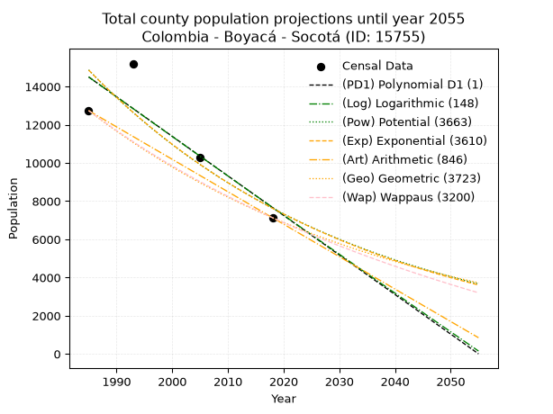
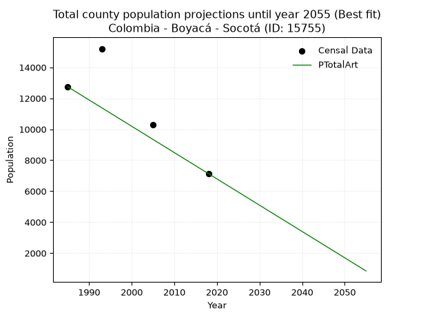
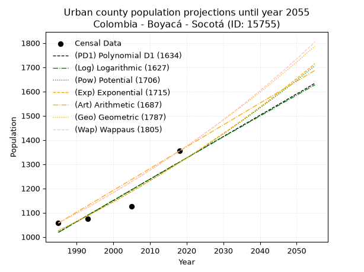
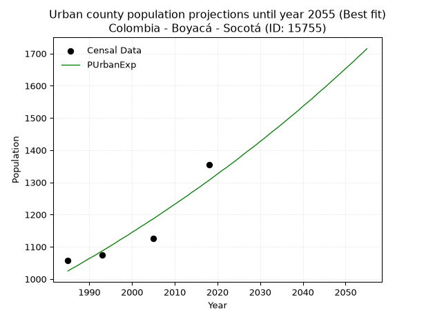
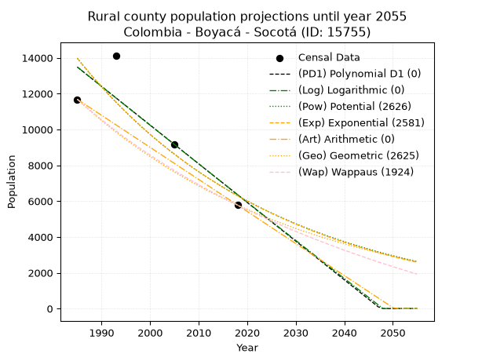
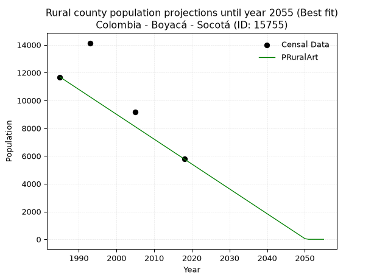

<div align="center">


</div>

# _“Population and Public Services Demand Projections (PPSD) until Year 2050 for Colombia - Boyacá - Socotá (ID: 15755)”_
Keywords: `population` `public-service` `projection` `lineal` `polynomial` `logarithmic` `potential` `exponential` `arithmetic` `geometric` `wappaus` `dane` `colombia` `south-america`

PPSD are analytical estimates used by governments and planners to anticipate future changes in population size, age distribution, and the resulting community needs for utilities, healthcare, education, and infrastructure as sizing future water treatment facilities, electrical grids, and road networks based on spatial growth.

> **General running parameters**: • app_version: _v20260806_. • Python version: _3.14.7_. • Pandas version: _3.0.5_. • NumPy version: _2.5.1_. • Creates, save and include plots into reports (create_plot): _False_. • Projection until year: _2050_. • Process polynomial degree 2 and up: _False_. • Process Wappaus: _True_. • Process Wappaus: _True_. • Set negative values to zero: _True_. • Set infinite values to zero: _True_. • Drop dataset notes: _True_. 
<div align="center">

Dynamic map: [:earth_americas:Google](http://maps.google.com/maps?q=6.041161833,-72.6366533) [:earth_americas:OSM](https://www.openstreetmap.org/#map=18/6.041161833/-72.6366533&layers=P) [:earth_americas:Bing](https://www.bing.com/maps?cp=6.041161833~-72.6366533&lvl=18) [:earth_americas:Apple](https://maps.apple.com/frame?center=6.041161833%2C-72.6366533&span=0.003%2C0.006)

</div>


<div align="center">

```geojson
{
  "type": "Feature",
  "geometry": {
    "type": "Point", 
    "coordinates": [-72.6366533, 6.041161833]
  }, 
  "properties": {
    "Name": "Colombia - Boyacá - Socotá (ID: 15755)"
  }
}
```

</div>


## 0. Census Data (4 records)

Census data are official statistics collected by a government about the people and housing in a country. They usually include counts of total population, age, sex, race, income, education, and jobs.

📅Global census file: [Population.xlsx](../data/Population.xlsx)

| Source   |   Year |   CountryID | CountryName   |   StateID | StateName   |   CountyID | CountyName   |   PTotal |   PUrban |   PRural |
|:---------|-------:|------------:|:--------------|----------:|:------------|-----------:|:-------------|---------:|---------:|---------:|
| DANE     |   1985 |          57 | Colombia      |        15 | Boyacá      |      15755 | Socotá       |    12740 |     1057 |    11683 |
| DANE     |   1993 |          57 | Colombia      |        15 | Boyacá      |      15755 | Socotá       |    15205 |     1074 |    14131 |
| DANE     |   2005 |          57 | Colombia      |        15 | Boyacá      |      15755 | Socotá       |    10295 |     1125 |     9170 |
| DANE     |   2018 |          57 | Colombia      |        15 | Boyacá      |      15755 | Socotá       |     7133 |     1354 |     5779 |

> 🔥Some records could had specific notes about the registered values or the corresponding urban or rural distribution.

📅   [RUPS](https://www.datos.gov.co/Hacienda-y-Cr-dito-P-blico/Registro-nico-de-Prestadores-de-Servicios-P-blicos/4qkq-csdn/about_data) - Local public utility companies: [RUPS.csv](../data/RUPS.xlsx)

 | SERVICIO       | ESTADO    | NOMBRE                                               | NIT         | DEPARTAMENTO_DOMICILIO   | MUNICIPIO_DOMICILIO   | DIRECCION                                       |   TELEFONO | EMAIL                                          | TIPO_INSCRIPCION    | REPRESENTANTE_LEGAL          | TIPO_PRESTADOR                 | CLASIFICACION                 |
|:---------------|:----------|:-----------------------------------------------------|:------------|:-------------------------|:----------------------|:------------------------------------------------|-----------:|:-----------------------------------------------|:--------------------|:-----------------------------|:-------------------------------|:------------------------------|
| ACUEDUCTO      | OPERATIVA | UNIDAD DE SERVICIOS PUBLICOS DEL MUNICIPIO DE SOCOTA | 800026911-1 | BOYACA                   | SOCOTA                | CARRERA 3 No 2 - 78 BARRIO JORGE ELIECER GAITAN |    7820118 | unidaddeserviciospublicos@socota-boyaca.gov.co | Registro por la ESP | WILLIAM EUSEBIO CORREA DURAN | MUNICIPIO (PRESTACIÓN DIRECTA) | MENOR O IGUAL A 2500 USUARIOS |
| ALCANTARILLADO | OPERATIVA | UNIDAD DE SERVICIOS PUBLICOS DEL MUNICIPIO DE SOCOTA | 800026911-1 | BOYACA                   | SOCOTA                | CARRERA 3 No 2 - 78 BARRIO JORGE ELIECER GAITAN |    7820118 | unidaddeserviciospublicos@socota-boyaca.gov.co | Registro por la ESP | WILLIAM EUSEBIO CORREA DURAN | MUNICIPIO (PRESTACIÓN DIRECTA) | MENOR O IGUAL A 2500 USUARIOS |

## 1. Total

### 1.1. Coefficients and Parameters

* (PD1) Polynomial Deg 1: -207.16057808108968, 425716.1963066996 (lineal)
* (Log) Logarithmic: -414290.24188892747, 3160366.698511381
* (Pow) Potential: -40.428258007058645, 137.49500925260406
* (Exp) Exponential: -0.0202164501679689, 3.983309786484837e+21
* (Art) Arithmetic: Year diff. 2018 - 1985 = 33, Population diff. 7133 - 12740 = -5607, Annual growth = -169.9090909090909
* (Geo) Geometric: Year diff. 2018 - 1985 = 33, Population diff. 7133 - 12740 = -5607, Annual growth % = -0.017422643954914552
* (Wap) Wappaus: i = -1.7099490857856479, Condition values only valid for < 200)

<sub>
Wappaus condition values: ['-0.00', '-1.71', '-3.42', '-5.13', '-6.84', '-8.55', '-10.26', '-11.97', '-13.68', '-15.39', '-17.10', '-18.81', '-20.52', '-22.23', '-23.94', '-25.65', '-27.36', '-29.07', '-30.78', '-32.49', '-34.20', '-35.91', '-37.62', '-39.33', '-41.04', '-42.75', '-44.46', '-46.17', '-47.88', '-49.59', '-51.30', '-53.01', '-54.72', '-56.43', '-58.14', '-59.85', '-61.56', '-63.27', '-64.98', '-66.69', '-68.40', '-70.11', '-71.82', '-73.53', '-75.24', '-76.95', '-78.66', '-80.37', '-82.08', '-83.79', '-85.50', '-87.21', '-88.92', '-90.63', '-92.34', '-94.05', '-95.76', '-97.47', '-99.18', '-100.89', '-102.60', '-104.31', '-106.02', '-107.73', '-109.44', '-111.15']
</sub>


### 1.2. Projected Dataset

|   Year |   CountyID |   PTotalPD1 |   PTotalLog |   PTotalPow |   PTotalExp |   PTotalArt |   PTotalGeo |   PTotalWap |
|-------:|-----------:|------------:|------------:|------------:|------------:|------------:|------------:|------------:|
|   1985 |      15755 |       14502 |       14506 |       14870 |       14865 |       12740 |       12740 |       12740 |
|   1986 |      15755 |       14295 |       14297 |       14570 |       14567 |       12570 |       12518 |       12524 |
|   1987 |      15755 |       14088 |       14089 |       14276 |       14276 |       12400 |       12300 |       12312 |
|   1988 |      15755 |       13881 |       13880 |       13989 |       13990 |       12230 |       12086 |       12103 |
|   1989 |      15755 |       13674 |       13672 |       13707 |       13710 |       12060 |       11875 |       11897 |
|   1990 |      15755 |       13467 |       13464 |       13432 |       13436 |       11890 |       11668 |       11695 |
|   1991 |      15755 |       13259 |       13255 |       13161 |       13167 |       11721 |       11465 |       11497 |
|   1992 |      15755 |       13052 |       13047 |       12897 |       12903 |       11551 |       11265 |       11301 |
|   1993 |      15755 |       12845 |       12840 |       12638 |       12645 |       11381 |       11069 |       11109 |
|   1994 |      15755 |       12638 |       12632 |       12384 |       12392 |       11211 |       10876 |       10919 |
|   1995 |      15755 |       12431 |       12424 |       12136 |       12144 |       11041 |       10687 |       10733 |
|   1996 |      15755 |       12224 |       12216 |       11892 |       11901 |       10871 |       10500 |       10550 |
|   1997 |      15755 |       12017 |       12009 |       11654 |       11663 |       10701 |       10317 |       10369 |
|   1998 |      15755 |       11809 |       11801 |       11420 |       11429 |       10531 |       10138 |       10191 |
|   1999 |      15755 |       11602 |       11594 |       11192 |       11201 |       10361 |        9961 |       10016 |
|   2000 |      15755 |       11395 |       11387 |       10968 |       10976 |       10191 |        9787 |        9844 |
|   2001 |      15755 |       11188 |       11180 |       10748 |       10757 |       10021 |        9617 |        9674 |
|   2002 |      15755 |       10981 |       10973 |       10533 |       10541 |        9852 |        9449 |        9507 |
|   2003 |      15755 |       10774 |       10766 |       10323 |       10330 |        9682 |        9285 |        9342 |
|   2004 |      15755 |       10566 |       10559 |       10117 |       10124 |        9512 |        9123 |        9179 |
|   2005 |      15755 |       10359 |       10353 |        9915 |        9921 |        9342 |        8964 |        9019 |
|   2006 |      15755 |       10152 |       10146 |        9717 |        9723 |        9172 |        8808 |        8862 |
|   2007 |      15755 |        9945 |        9939 |        9523 |        9528 |        9002 |        8654 |        8706 |
|   2008 |      15755 |        9738 |        9733 |        9333 |        9337 |        8832 |        8504 |        8553 |
|   2009 |      15755 |        9531 |        9527 |        9147 |        9150 |        8662 |        8355 |        8402 |
|   2010 |      15755 |        9323 |        9321 |        8965 |        8967 |        8492 |        8210 |        8253 |
|   2011 |      15755 |        9116 |        9115 |        8786 |        8788 |        8322 |        8067 |        8106 |
|   2012 |      15755 |        8909 |        8909 |        8612 |        8612 |        8152 |        7926 |        7961 |
|   2013 |      15755 |        8702 |        8703 |        8440 |        8440 |        7983 |        7788 |        7818 |
|   2014 |      15755 |        8495 |        8497 |        8273 |        8271 |        7813 |        7653 |        7678 |
|   2015 |      15755 |        8288 |        8291 |        8108 |        8105 |        7643 |        7519 |        7539 |
|   2016 |      15755 |        8080 |        8086 |        7947 |        7943 |        7473 |        7388 |        7402 |
|   2017 |      15755 |        7873 |        7880 |        7789 |        7784 |        7303 |        7259 |        7266 |
|   2018 |      15755 |        7666 |        7675 |        7635 |        7628 |        7133 |        7133 |        7133 |
|   2019 |      15755 |        7459 |        7470 |        7484 |        7476 |        6963 |        7009 |        7001 |
|   2020 |      15755 |        7252 |        7265 |        7335 |        7326 |        6793 |        6887 |        6871 |
|   2021 |      15755 |        7045 |        7060 |        7190 |        7179 |        6623 |        6767 |        6743 |
|   2022 |      15755 |        6838 |        6855 |        7048 |        7036 |        6453 |        6649 |        6617 |
|   2023 |      15755 |        6630 |        6650 |        6908 |        6895 |        6283 |        6533 |        6492 |
|   2024 |      15755 |        6423 |        6445 |        6771 |        6757 |        6114 |        6419 |        6368 |
|   2025 |      15755 |        6216 |        6240 |        6638 |        6622 |        5944 |        6307 |        6247 |
|   2026 |      15755 |        6009 |        6036 |        6506 |        6489 |        5774 |        6197 |        6127 |
|   2027 |      15755 |        5802 |        5831 |        6378 |        6359 |        5604 |        6089 |        6008 |
|   2028 |      15755 |        5595 |        5627 |        6252 |        6232 |        5434 |        5983 |        5891 |
|   2029 |      15755 |        5387 |        5423 |        6129 |        6107 |        5264 |        5879 |        5775 |
|   2030 |      15755 |        5180 |        5219 |        6008 |        5985 |        5094 |        5777 |        5661 |
|   2031 |      15755 |        4973 |        5015 |        5889 |        5865 |        4924 |        5676 |        5548 |
|   2032 |      15755 |        4766 |        4811 |        5773 |        5748 |        4754 |        5577 |        5436 |
|   2033 |      15755 |        4559 |        4607 |        5659 |        5633 |        4584 |        5480 |        5326 |
|   2034 |      15755 |        4352 |        4403 |        5548 |        5520 |        4414 |        5384 |        5217 |
|   2035 |      15755 |        4144 |        4200 |        5439 |        5410 |        4245 |        5291 |        5110 |
|   2036 |      15755 |        3937 |        3996 |        5332 |        5301 |        4075 |        5198 |        5003 |
|   2037 |      15755 |        3730 |        3793 |        5227 |        5195 |        3905 |        5108 |        4898 |
|   2038 |      15755 |        3523 |        3589 |        5124 |        5091 |        3735 |        5019 |        4794 |
|   2039 |      15755 |        3316 |        3386 |        5024 |        4989 |        3565 |        4931 |        4692 |
|   2040 |      15755 |        3109 |        3183 |        4925 |        4889 |        3395 |        4846 |        4591 |
|   2041 |      15755 |        2901 |        2980 |        4829 |        4792 |        3225 |        4761 |        4490 |
|   2042 |      15755 |        2694 |        2777 |        4734 |        4696 |        3055 |        4678 |        4391 |
|   2043 |      15755 |        2487 |        2574 |        4641 |        4602 |        2885 |        4597 |        4293 |
|   2044 |      15755 |        2280 |        2371 |        4550 |        4510 |        2715 |        4517 |        4197 |
|   2045 |      15755 |        2073 |        2169 |        4461 |        4419 |        2545 |        4438 |        4101 |
|   2046 |      15755 |        1866 |        1966 |        4374 |        4331 |        2376 |        4361 |        4006 |
|   2047 |      15755 |        1658 |        1764 |        4288 |        4244 |        2206 |        4285 |        3913 |
|   2048 |      15755 |        1451 |        1561 |        4204 |        4159 |        2036 |        4210 |        3820 |
|   2049 |      15755 |        1244 |        1359 |        4122 |        4076 |        1866 |        4137 |        3729 |
|   2050 |      15755 |        1037 |        1157 |        4042 |        3995 |        1696 |        4065 |        3638 |
<div align="center">

</img>

</div>


### 1.3. Best fit with absolute and relative error (%)

Relative error puts that difference into context by dividing the absolute error by the true value, creating a unitless ratio or percentage that shows the scale of the mistake.

Absolute and relative error

|   Year | Source   |   CountryID | CountryName   |   StateID | StateName   |   CountyID_x | CountyName   |   PTotal |   PUrban |   PRural |   CountyID_y |   PTotalPD1 |   PTotalLog |   PTotalPow |   PTotalExp |   PTotalArt |   PTotalGeo |   PTotalWap |   PTotalPD1AbsError |   PTotalLogAbsError |   PTotalPowAbsError |   PTotalExpAbsError |   PTotalArtAbsError |   PTotalGeoAbsError |   PTotalWapAbsError |   PTotalPD1RelError |   PTotalLogRelError |   PTotalPowRelError |   PTotalExpRelError |   PTotalArtRelError |   PTotalGeoRelError |   PTotalWapRelError |
|-------:|:---------|------------:|:--------------|----------:|:------------|-------------:|:-------------|---------:|---------:|---------:|-------------:|------------:|------------:|------------:|------------:|------------:|------------:|------------:|--------------------:|--------------------:|--------------------:|--------------------:|--------------------:|--------------------:|--------------------:|--------------------:|--------------------:|--------------------:|--------------------:|--------------------:|--------------------:|--------------------:|
|   1985 | DANE     |          57 | Colombia      |        15 | Boyacá      |        15755 | Socotá       |    12740 |     1057 |    11683 |        15755 |       14502 |       14506 |       14870 |       14865 |       12740 |       12740 |       12740 |                1762 |                1766 |                2130 |                2125 |                   0 |                   0 |                   0 |           13.8305   |            13.8619  |            16.719   |            16.6797  |             0       |              0      |              0      |
|   1993 | DANE     |          57 | Colombia      |        15 | Boyacá      |        15755 | Socotá       |    15205 |     1074 |    14131 |        15755 |       12845 |       12840 |       12638 |       12645 |       11381 |       11069 |       11109 |                2360 |                2365 |                2567 |                2560 |                3824 |                4136 |                4096 |           15.5212   |            15.5541  |            16.8826  |            16.8366  |            25.1496  |             27.2016 |             26.9385 |
|   2005 | DANE     |          57 | Colombia      |        15 | Boyacá      |        15755 | Socotá       |    10295 |     1125 |     9170 |        15755 |       10359 |       10353 |        9915 |        9921 |        9342 |        8964 |        9019 |                  64 |                  58 |                 380 |                 374 |                 953 |                1331 |                1276 |            0.621661 |             0.56338 |             3.69111 |             3.63283 |             9.25692 |             12.9286 |             12.3944 |
|   2018 | DANE     |          57 | Colombia      |        15 | Boyacá      |        15755 | Socotá       |     7133 |     1354 |     5779 |        15755 |        7666 |        7675 |        7635 |        7628 |        7133 |        7133 |        7133 |                 533 |                 542 |                 502 |                 495 |                   0 |                   0 |                   0 |            7.47231  |             7.59849 |             7.03771 |             6.93958 |             0       |              0      |              0      |

Relative error mean

| Method    |   RelError | Best   |
|:----------|-----------:|:-------|
| PTotalPD1 |    9.36141 |        |
| PTotalLog |    9.39445 |        |
| PTotalPow |   11.0826  |        |
| PTotalExp |   11.0222  |        |
| PTotalArt |    8.60164 | True   |
| PTotalGeo |   10.0325  |        |
| PTotalWap |    9.83322 |        |

💙Best method: _**PTotalArt**_
<div align="center">

</img>

</div>


### 1.4. Fresh water supply demand in liters per capita per day (lpcd)

The fresh water supply demand typically ranges from 100 to 300 liters per capita per day (lpcd) for standard domestic and municipal planning, though absolute survival minimums set by the World Health Organization are as low as 7.5 to 20 liters per day, and total consumption in high-income nations can exceed 400 liters.

> `CZ`: Level in meters above the sea level (masl)<br> `WS`: Fresh water supply demand in liters per capita per day (lpcd or l/h/d)<br> `WSAll`: Zonal fresh water supply demand in liters per second (l/s)<br> `A`: Zonal area in square meters<br> `DP`: Population density (people/hectare or p/ha)

Reference values (RAS Colombia)

|    CZ |   WS |
|------:|-----:|
|  1000 |  120 |
|  2000 |  130 |
| 99999 |  140 |

County shapefile geometry properties and water supply values

|   CountyID |      ATotal |   CZTotal |   WSTotal |
|-----------:|------------:|----------:|----------:|
|      15755 | 6.02304e+08 |   3023.45 |       140 |

Projected values for best method: PTotalArt

|   CountyID |   Year |   PTotalArt |   DPTotal |   WSTotal |   WSTotalAll |
|-----------:|-------:|------------:|----------:|----------:|-------------:|
|      15755 |   1985 |       12740 |      0.21 |       140 |     20.6435  |
|      15755 |   1986 |       12570 |      0.21 |       140 |     20.3681  |
|      15755 |   1987 |       12400 |      0.21 |       140 |     20.0926  |
|      15755 |   1988 |       12230 |      0.2  |       140 |     19.8171  |
|      15755 |   1989 |       12060 |      0.2  |       140 |     19.5417  |
|      15755 |   1990 |       11890 |      0.2  |       140 |     19.2662  |
|      15755 |   1991 |       11721 |      0.19 |       140 |     18.9924  |
|      15755 |   1992 |       11551 |      0.19 |       140 |     18.7169  |
|      15755 |   1993 |       11381 |      0.19 |       140 |     18.4414  |
|      15755 |   1994 |       11211 |      0.19 |       140 |     18.166   |
|      15755 |   1995 |       11041 |      0.18 |       140 |     17.8905  |
|      15755 |   1996 |       10871 |      0.18 |       140 |     17.615   |
|      15755 |   1997 |       10701 |      0.18 |       140 |     17.3396  |
|      15755 |   1998 |       10531 |      0.17 |       140 |     17.0641  |
|      15755 |   1999 |       10361 |      0.17 |       140 |     16.7887  |
|      15755 |   2000 |       10191 |      0.17 |       140 |     16.5132  |
|      15755 |   2001 |       10021 |      0.17 |       140 |     16.2377  |
|      15755 |   2002 |        9852 |      0.16 |       140 |     15.9639  |
|      15755 |   2003 |        9682 |      0.16 |       140 |     15.6884  |
|      15755 |   2004 |        9512 |      0.16 |       140 |     15.413   |
|      15755 |   2005 |        9342 |      0.16 |       140 |     15.1375  |
|      15755 |   2006 |        9172 |      0.15 |       140 |     14.862   |
|      15755 |   2007 |        9002 |      0.15 |       140 |     14.5866  |
|      15755 |   2008 |        8832 |      0.15 |       140 |     14.3111  |
|      15755 |   2009 |        8662 |      0.14 |       140 |     14.0356  |
|      15755 |   2010 |        8492 |      0.14 |       140 |     13.7602  |
|      15755 |   2011 |        8322 |      0.14 |       140 |     13.4847  |
|      15755 |   2012 |        8152 |      0.14 |       140 |     13.2093  |
|      15755 |   2013 |        7983 |      0.13 |       140 |     12.9354  |
|      15755 |   2014 |        7813 |      0.13 |       140 |     12.66    |
|      15755 |   2015 |        7643 |      0.13 |       140 |     12.3845  |
|      15755 |   2016 |        7473 |      0.12 |       140 |     12.109   |
|      15755 |   2017 |        7303 |      0.12 |       140 |     11.8336  |
|      15755 |   2018 |        7133 |      0.12 |       140 |     11.5581  |
|      15755 |   2019 |        6963 |      0.12 |       140 |     11.2826  |
|      15755 |   2020 |        6793 |      0.11 |       140 |     11.0072  |
|      15755 |   2021 |        6623 |      0.11 |       140 |     10.7317  |
|      15755 |   2022 |        6453 |      0.11 |       140 |     10.4563  |
|      15755 |   2023 |        6283 |      0.1  |       140 |     10.1808  |
|      15755 |   2024 |        6114 |      0.1  |       140 |      9.90694 |
|      15755 |   2025 |        5944 |      0.1  |       140 |      9.63148 |
|      15755 |   2026 |        5774 |      0.1  |       140 |      9.35602 |
|      15755 |   2027 |        5604 |      0.09 |       140 |      9.08056 |
|      15755 |   2028 |        5434 |      0.09 |       140 |      8.80509 |
|      15755 |   2029 |        5264 |      0.09 |       140 |      8.52963 |
|      15755 |   2030 |        5094 |      0.08 |       140 |      8.25417 |
|      15755 |   2031 |        4924 |      0.08 |       140 |      7.9787  |
|      15755 |   2032 |        4754 |      0.08 |       140 |      7.70324 |
|      15755 |   2033 |        4584 |      0.08 |       140 |      7.42778 |
|      15755 |   2034 |        4414 |      0.07 |       140 |      7.15231 |
|      15755 |   2035 |        4245 |      0.07 |       140 |      6.87847 |
|      15755 |   2036 |        4075 |      0.07 |       140 |      6.60301 |
|      15755 |   2037 |        3905 |      0.06 |       140 |      6.32755 |
|      15755 |   2038 |        3735 |      0.06 |       140 |      6.05208 |
|      15755 |   2039 |        3565 |      0.06 |       140 |      5.77662 |
|      15755 |   2040 |        3395 |      0.06 |       140 |      5.50116 |
|      15755 |   2041 |        3225 |      0.05 |       140 |      5.22569 |
|      15755 |   2042 |        3055 |      0.05 |       140 |      4.95023 |
|      15755 |   2043 |        2885 |      0.05 |       140 |      4.67477 |
|      15755 |   2044 |        2715 |      0.05 |       140 |      4.39931 |
|      15755 |   2045 |        2545 |      0.04 |       140 |      4.12384 |
|      15755 |   2046 |        2376 |      0.04 |       140 |      3.85    |
|      15755 |   2047 |        2206 |      0.04 |       140 |      3.57454 |
|      15755 |   2048 |        2036 |      0.03 |       140 |      3.29907 |
|      15755 |   2049 |        1866 |      0.03 |       140 |      3.02361 |
|      15755 |   2050 |        1696 |      0.03 |       140 |      2.74815 |

## 2. Urban

### 2.1. Coefficients and Parameters

* (PD1) Polynomial Deg 1: 8.786029706944861, -16421.75592131646 (lineal)
* (Log) Logarithmic: 17569.477752056002, -132393.2411863363
* (Pow) Potential: 14.694399975783556, -45.44786608781812
* (Exp) Exponential: 0.007347866744110512, 0.000474666812396884
* (Art) Arithmetic: Year diff. 2018 - 1985 = 33, Population diff. 1354 - 1057 = 297, Annual growth = 9.0
* (Geo) Geometric: Year diff. 2018 - 1985 = 33, Population diff. 1354 - 1057 = 297, Annual growth % = 0.007532117716750442
* (Wap) Wappaus: i = 0.7465781833264206, Condition values only valid for < 200)

<sub>
Wappaus condition values: ['0.00', '0.75', '1.49', '2.24', '2.99', '3.73', '4.48', '5.23', '5.97', '6.72', '7.47', '8.21', '8.96', '9.71', '10.45', '11.20', '11.95', '12.69', '13.44', '14.18', '14.93', '15.68', '16.42', '17.17', '17.92', '18.66', '19.41', '20.16', '20.90', '21.65', '22.40', '23.14', '23.89', '24.64', '25.38', '26.13', '26.88', '27.62', '28.37', '29.12', '29.86', '30.61', '31.36', '32.10', '32.85', '33.60', '34.34', '35.09', '35.84', '36.58', '37.33', '38.08', '38.82', '39.57', '40.32', '41.06', '41.81', '42.55', '43.30', '44.05', '44.79', '45.54', '46.29', '47.03', '47.78', '48.53']
</sub>


### 2.2. Projected Dataset

|   Year |   CountyID |   PUrbanPD1 |   PUrbanLog |   PUrbanPow |   PUrbanExp |   PUrbanArt |   PUrbanGeo |   PUrbanWap |
|-------:|-----------:|------------:|------------:|------------:|------------:|------------:|------------:|------------:|
|   1985 |      15755 |        1019 |        1018 |        1025 |        1025 |        1057 |        1057 |        1057 |
|   1986 |      15755 |        1027 |        1027 |        1033 |        1033 |        1066 |        1065 |        1065 |
|   1987 |      15755 |        1036 |        1036 |        1040 |        1040 |        1075 |        1073 |        1073 |
|   1988 |      15755 |        1045 |        1045 |        1048 |        1048 |        1084 |        1081 |        1081 |
|   1989 |      15755 |        1054 |        1054 |        1056 |        1056 |        1093 |        1089 |        1089 |
|   1990 |      15755 |        1062 |        1063 |        1064 |        1064 |        1102 |        1097 |        1097 |
|   1991 |      15755 |        1071 |        1071 |        1072 |        1071 |        1111 |        1106 |        1105 |
|   1992 |      15755 |        1080 |        1080 |        1079 |        1079 |        1120 |        1114 |        1114 |
|   1993 |      15755 |        1089 |        1089 |        1087 |        1087 |        1129 |        1122 |        1122 |
|   1994 |      15755 |        1098 |        1098 |        1096 |        1095 |        1138 |        1131 |        1130 |
|   1995 |      15755 |        1106 |        1107 |        1104 |        1103 |        1147 |        1139 |        1139 |
|   1996 |      15755 |        1115 |        1115 |        1112 |        1111 |        1156 |        1148 |        1148 |
|   1997 |      15755 |        1124 |        1124 |        1120 |        1120 |        1165 |        1157 |        1156 |
|   1998 |      15755 |        1133 |        1133 |        1128 |        1128 |        1174 |        1165 |        1165 |
|   1999 |      15755 |        1142 |        1142 |        1137 |        1136 |        1183 |        1174 |        1174 |
|   2000 |      15755 |        1150 |        1151 |        1145 |        1145 |        1192 |        1183 |        1182 |
|   2001 |      15755 |        1159 |        1159 |        1153 |        1153 |        1201 |        1192 |        1191 |
|   2002 |      15755 |        1168 |        1168 |        1162 |        1162 |        1210 |        1201 |        1200 |
|   2003 |      15755 |        1177 |        1177 |        1170 |        1170 |        1219 |        1210 |        1209 |
|   2004 |      15755 |        1185 |        1186 |        1179 |        1179 |        1228 |        1219 |        1218 |
|   2005 |      15755 |        1194 |        1195 |        1188 |        1187 |        1237 |        1228 |        1228 |
|   2006 |      15755 |        1203 |        1203 |        1196 |        1196 |        1246 |        1237 |        1237 |
|   2007 |      15755 |        1212 |        1212 |        1205 |        1205 |        1255 |        1247 |        1246 |
|   2008 |      15755 |        1221 |        1221 |        1214 |        1214 |        1264 |        1256 |        1256 |
|   2009 |      15755 |        1229 |        1230 |        1223 |        1223 |        1273 |        1266 |        1265 |
|   2010 |      15755 |        1238 |        1238 |        1232 |        1232 |        1282 |        1275 |        1275 |
|   2011 |      15755 |        1247 |        1247 |        1241 |        1241 |        1291 |        1285 |        1284 |
|   2012 |      15755 |        1256 |        1256 |        1250 |        1250 |        1300 |        1294 |        1294 |
|   2013 |      15755 |        1265 |        1264 |        1259 |        1259 |        1309 |        1304 |        1304 |
|   2014 |      15755 |        1273 |        1273 |        1269 |        1269 |        1318 |        1314 |        1314 |
|   2015 |      15755 |        1282 |        1282 |        1278 |        1278 |        1327 |        1324 |        1324 |
|   2016 |      15755 |        1291 |        1291 |        1287 |        1287 |        1336 |        1334 |        1334 |
|   2017 |      15755 |        1300 |        1299 |        1297 |        1297 |        1345 |        1344 |        1344 |
|   2018 |      15755 |        1308 |        1308 |        1306 |        1306 |        1354 |        1354 |        1354 |
|   2019 |      15755 |        1317 |        1317 |        1316 |        1316 |        1363 |        1364 |        1364 |
|   2020 |      15755 |        1326 |        1325 |        1325 |        1326 |        1372 |        1374 |        1375 |
|   2021 |      15755 |        1335 |        1334 |        1335 |        1336 |        1381 |        1385 |        1385 |
|   2022 |      15755 |        1344 |        1343 |        1345 |        1345 |        1390 |        1395 |        1396 |
|   2023 |      15755 |        1352 |        1352 |        1354 |        1355 |        1399 |        1406 |        1406 |
|   2024 |      15755 |        1361 |        1360 |        1364 |        1365 |        1408 |        1416 |        1417 |
|   2025 |      15755 |        1370 |        1369 |        1374 |        1375 |        1417 |        1427 |        1428 |
|   2026 |      15755 |        1379 |        1378 |        1384 |        1386 |        1426 |        1438 |        1439 |
|   2027 |      15755 |        1388 |        1386 |        1394 |        1396 |        1435 |        1449 |        1450 |
|   2028 |      15755 |        1396 |        1395 |        1404 |        1406 |        1444 |        1460 |        1461 |
|   2029 |      15755 |        1405 |        1404 |        1415 |        1416 |        1453 |        1471 |        1472 |
|   2030 |      15755 |        1414 |        1412 |        1425 |        1427 |        1462 |        1482 |        1484 |
|   2031 |      15755 |        1423 |        1421 |        1435 |        1437 |        1471 |        1493 |        1495 |
|   2032 |      15755 |        1431 |        1430 |        1446 |        1448 |        1480 |        1504 |        1507 |
|   2033 |      15755 |        1440 |        1438 |        1456 |        1459 |        1489 |        1515 |        1518 |
|   2034 |      15755 |        1449 |        1447 |        1467 |        1469 |        1498 |        1527 |        1530 |
|   2035 |      15755 |        1458 |        1455 |        1477 |        1480 |        1507 |        1538 |        1542 |
|   2036 |      15755 |        1467 |        1464 |        1488 |        1491 |        1516 |        1550 |        1554 |
|   2037 |      15755 |        1475 |        1473 |        1499 |        1502 |        1525 |        1561 |        1566 |
|   2038 |      15755 |        1484 |        1481 |        1510 |        1513 |        1534 |        1573 |        1578 |
|   2039 |      15755 |        1493 |        1490 |        1521 |        1524 |        1543 |        1585 |        1591 |
|   2040 |      15755 |        1502 |        1499 |        1532 |        1536 |        1552 |        1597 |        1603 |
|   2041 |      15755 |        1511 |        1507 |        1543 |        1547 |        1561 |        1609 |        1616 |
|   2042 |      15755 |        1519 |        1516 |        1554 |        1558 |        1570 |        1621 |        1628 |
|   2043 |      15755 |        1528 |        1524 |        1565 |        1570 |        1579 |        1633 |        1641 |
|   2044 |      15755 |        1537 |        1533 |        1576 |        1582 |        1588 |        1646 |        1654 |
|   2045 |      15755 |        1546 |        1542 |        1588 |        1593 |        1597 |        1658 |        1667 |
|   2046 |      15755 |        1554 |        1550 |        1599 |        1605 |        1606 |        1671 |        1680 |
|   2047 |      15755 |        1563 |        1559 |        1611 |        1617 |        1615 |        1683 |        1694 |
|   2048 |      15755 |        1572 |        1567 |        1622 |        1629 |        1624 |        1696 |        1707 |
|   2049 |      15755 |        1581 |        1576 |        1634 |        1641 |        1633 |        1709 |        1721 |
|   2050 |      15755 |        1590 |        1584 |        1646 |        1653 |        1642 |        1721 |        1734 |
<div align="center">

</img>

</div>


### 2.3. Best fit with absolute and relative error (%)

Relative error puts that difference into context by dividing the absolute error by the true value, creating a unitless ratio or percentage that shows the scale of the mistake.

Absolute and relative error

|   Year | Source   |   CountryID | CountryName   |   StateID | StateName   |   CountyID_x | CountyName   |   PTotal |   PUrban |   PRural |   CountyID_y |   PUrbanPD1 |   PUrbanLog |   PUrbanPow |   PUrbanExp |   PUrbanArt |   PUrbanGeo |   PUrbanWap |   PUrbanPD1AbsError |   PUrbanLogAbsError |   PUrbanPowAbsError |   PUrbanExpAbsError |   PUrbanArtAbsError |   PUrbanGeoAbsError |   PUrbanWapAbsError |   PUrbanPD1RelError |   PUrbanLogRelError |   PUrbanPowRelError |   PUrbanExpRelError |   PUrbanArtRelError |   PUrbanGeoRelError |   PUrbanWapRelError |
|-------:|:---------|------------:|:--------------|----------:|:------------|-------------:|:-------------|---------:|---------:|---------:|-------------:|------------:|------------:|------------:|------------:|------------:|------------:|------------:|--------------------:|--------------------:|--------------------:|--------------------:|--------------------:|--------------------:|--------------------:|--------------------:|--------------------:|--------------------:|--------------------:|--------------------:|--------------------:|--------------------:|
|   1985 | DANE     |          57 | Colombia      |        15 | Boyacá      |        15755 | Socotá       |    12740 |     1057 |    11683 |        15755 |        1019 |        1018 |        1025 |        1025 |        1057 |        1057 |        1057 |                  38 |                  39 |                  32 |                  32 |                   0 |                   0 |                   0 |             3.59508 |             3.68969 |             3.02744 |             3.02744 |             0       |             0       |             0       |
|   1993 | DANE     |          57 | Colombia      |        15 | Boyacá      |        15755 | Socotá       |    15205 |     1074 |    14131 |        15755 |        1089 |        1089 |        1087 |        1087 |        1129 |        1122 |        1122 |                  15 |                  15 |                  13 |                  13 |                  55 |                  48 |                  48 |             1.39665 |             1.39665 |             1.21043 |             1.21043 |             5.12104 |             4.46927 |             4.46927 |
|   2005 | DANE     |          57 | Colombia      |        15 | Boyacá      |        15755 | Socotá       |    10295 |     1125 |     9170 |        15755 |        1194 |        1195 |        1188 |        1187 |        1237 |        1228 |        1228 |                  69 |                  70 |                  63 |                  62 |                 112 |                 103 |                 103 |             6.13333 |             6.22222 |             5.6     |             5.51111 |             9.95556 |             9.15556 |             9.15556 |
|   2018 | DANE     |          57 | Colombia      |        15 | Boyacá      |        15755 | Socotá       |     7133 |     1354 |     5779 |        15755 |        1308 |        1308 |        1306 |        1306 |        1354 |        1354 |        1354 |                  46 |                  46 |                  48 |                  48 |                   0 |                   0 |                   0 |             3.39734 |             3.39734 |             3.54505 |             3.54505 |             0       |             0       |             0       |

Relative error mean

| Method    |   RelError | Best   |
|:----------|-----------:|:-------|
| PUrbanPD1 |    3.6306  |        |
| PUrbanLog |    3.67647 |        |
| PUrbanPow |    3.34573 |        |
| PUrbanExp |    3.32351 | True   |
| PUrbanArt |    3.76915 |        |
| PUrbanGeo |    3.40621 |        |
| PUrbanWap |    3.40621 |        |

💙Best method: _**PUrbanExp**_
<div align="center">

</img>

</div>


### 2.4. Fresh water supply demand in liters per capita per day (lpcd)

The fresh water supply demand typically ranges from 100 to 300 liters per capita per day (lpcd) for standard domestic and municipal planning, though absolute survival minimums set by the World Health Organization are as low as 7.5 to 20 liters per day, and total consumption in high-income nations can exceed 400 liters.

> `CZ`: Level in meters above the sea level (masl)<br> `WS`: Fresh water supply demand in liters per capita per day (lpcd or l/h/d)<br> `WSAll`: Zonal fresh water supply demand in liters per second (l/s)<br> `A`: Zonal area in square meters<br> `DP`: Population density (people/hectare or p/ha)

Reference values (RAS Colombia)

|    CZ |   WS |
|------:|-----:|
|  1000 |  120 |
|  2000 |  130 |
| 99999 |  140 |

County shapefile geometry properties and water supply values

|   CountyID |   AUrban |   CZUrban |   WSUrban |
|-----------:|---------:|----------:|----------:|
|      15755 |   154071 |   2375.59 |       140 |

Projected values for best method: PUrbanExp

|   CountyID |   Year |   PUrbanExp |   DPUrban |   WSUrban |   WSUrbanAll |
|-----------:|-------:|------------:|----------:|----------:|-------------:|
|      15755 |   1985 |        1025 |     66.53 |       140 |      1.66088 |
|      15755 |   1986 |        1033 |     67.05 |       140 |      1.67384 |
|      15755 |   1987 |        1040 |     67.5  |       140 |      1.68519 |
|      15755 |   1988 |        1048 |     68.02 |       140 |      1.69815 |
|      15755 |   1989 |        1056 |     68.54 |       140 |      1.71111 |
|      15755 |   1990 |        1064 |     69.06 |       140 |      1.72407 |
|      15755 |   1991 |        1071 |     69.51 |       140 |      1.73542 |
|      15755 |   1992 |        1079 |     70.03 |       140 |      1.74838 |
|      15755 |   1993 |        1087 |     70.55 |       140 |      1.76134 |
|      15755 |   1994 |        1095 |     71.07 |       140 |      1.77431 |
|      15755 |   1995 |        1103 |     71.59 |       140 |      1.78727 |
|      15755 |   1996 |        1111 |     72.11 |       140 |      1.80023 |
|      15755 |   1997 |        1120 |     72.69 |       140 |      1.81481 |
|      15755 |   1998 |        1128 |     73.21 |       140 |      1.82778 |
|      15755 |   1999 |        1136 |     73.73 |       140 |      1.84074 |
|      15755 |   2000 |        1145 |     74.32 |       140 |      1.85532 |
|      15755 |   2001 |        1153 |     74.84 |       140 |      1.86829 |
|      15755 |   2002 |        1162 |     75.42 |       140 |      1.88287 |
|      15755 |   2003 |        1170 |     75.94 |       140 |      1.89583 |
|      15755 |   2004 |        1179 |     76.52 |       140 |      1.91042 |
|      15755 |   2005 |        1187 |     77.04 |       140 |      1.92338 |
|      15755 |   2006 |        1196 |     77.63 |       140 |      1.93796 |
|      15755 |   2007 |        1205 |     78.21 |       140 |      1.95255 |
|      15755 |   2008 |        1214 |     78.79 |       140 |      1.96713 |
|      15755 |   2009 |        1223 |     79.38 |       140 |      1.98171 |
|      15755 |   2010 |        1232 |     79.96 |       140 |      1.9963  |
|      15755 |   2011 |        1241 |     80.55 |       140 |      2.01088 |
|      15755 |   2012 |        1250 |     81.13 |       140 |      2.02546 |
|      15755 |   2013 |        1259 |     81.72 |       140 |      2.04005 |
|      15755 |   2014 |        1269 |     82.36 |       140 |      2.05625 |
|      15755 |   2015 |        1278 |     82.95 |       140 |      2.07083 |
|      15755 |   2016 |        1287 |     83.53 |       140 |      2.08542 |
|      15755 |   2017 |        1297 |     84.18 |       140 |      2.10162 |
|      15755 |   2018 |        1306 |     84.77 |       140 |      2.1162  |
|      15755 |   2019 |        1316 |     85.41 |       140 |      2.13241 |
|      15755 |   2020 |        1326 |     86.06 |       140 |      2.14861 |
|      15755 |   2021 |        1336 |     86.71 |       140 |      2.16481 |
|      15755 |   2022 |        1345 |     87.3  |       140 |      2.1794  |
|      15755 |   2023 |        1355 |     87.95 |       140 |      2.1956  |
|      15755 |   2024 |        1365 |     88.6  |       140 |      2.21181 |
|      15755 |   2025 |        1375 |     89.24 |       140 |      2.22801 |
|      15755 |   2026 |        1386 |     89.96 |       140 |      2.24583 |
|      15755 |   2027 |        1396 |     90.61 |       140 |      2.26204 |
|      15755 |   2028 |        1406 |     91.26 |       140 |      2.27824 |
|      15755 |   2029 |        1416 |     91.91 |       140 |      2.29444 |
|      15755 |   2030 |        1427 |     92.62 |       140 |      2.31227 |
|      15755 |   2031 |        1437 |     93.27 |       140 |      2.32847 |
|      15755 |   2032 |        1448 |     93.98 |       140 |      2.3463  |
|      15755 |   2033 |        1459 |     94.7  |       140 |      2.36412 |
|      15755 |   2034 |        1469 |     95.35 |       140 |      2.38032 |
|      15755 |   2035 |        1480 |     96.06 |       140 |      2.39815 |
|      15755 |   2036 |        1491 |     96.77 |       140 |      2.41597 |
|      15755 |   2037 |        1502 |     97.49 |       140 |      2.4338  |
|      15755 |   2038 |        1513 |     98.2  |       140 |      2.45162 |
|      15755 |   2039 |        1524 |     98.92 |       140 |      2.46944 |
|      15755 |   2040 |        1536 |     99.69 |       140 |      2.48889 |
|      15755 |   2041 |        1547 |    100.41 |       140 |      2.50671 |
|      15755 |   2042 |        1558 |    101.12 |       140 |      2.52454 |
|      15755 |   2043 |        1570 |    101.9  |       140 |      2.54398 |
|      15755 |   2044 |        1582 |    102.68 |       140 |      2.56343 |
|      15755 |   2045 |        1593 |    103.39 |       140 |      2.58125 |
|      15755 |   2046 |        1605 |    104.17 |       140 |      2.60069 |
|      15755 |   2047 |        1617 |    104.95 |       140 |      2.62014 |
|      15755 |   2048 |        1629 |    105.73 |       140 |      2.63958 |
|      15755 |   2049 |        1641 |    106.51 |       140 |      2.65903 |
|      15755 |   2050 |        1653 |    107.29 |       140 |      2.67847 |

## 3. Rural

### 3.1. Coefficients and Parameters

* (PD1) Polynomial Deg 1: -215.9466077880346, 442137.9522280163 (lineal)
* (Log) Logarithmic: -431859.71964098385, 3292759.93969772
* (Pow) Potential: -48.243738797738935, 163.24172776548176
* (Exp) Exponential: -0.02412516873156271, 8.769240741915172e+24
* (Art) Arithmetic: Year diff. 2018 - 1985 = 33, Population diff. 5779 - 11683 = -5904, Annual growth = -178.9090909090909
* (Geo) Geometric: Year diff. 2018 - 1985 = 33, Population diff. 5779 - 11683 = -5904, Annual growth % = -0.02110454371139403
* (Wap) Wappaus: i = -2.0491248529273958, Condition values only valid for < 200)

<sub>
Wappaus condition values: ['-0.00', '-2.05', '-4.10', '-6.15', '-8.20', '-10.25', '-12.29', '-14.34', '-16.39', '-18.44', '-20.49', '-22.54', '-24.59', '-26.64', '-28.69', '-30.74', '-32.79', '-34.84', '-36.88', '-38.93', '-40.98', '-43.03', '-45.08', '-47.13', '-49.18', '-51.23', '-53.28', '-55.33', '-57.38', '-59.42', '-61.47', '-63.52', '-65.57', '-67.62', '-69.67', '-71.72', '-73.77', '-75.82', '-77.87', '-79.92', '-81.96', '-84.01', '-86.06', '-88.11', '-90.16', '-92.21', '-94.26', '-96.31', '-98.36', '-100.41', '-102.46', '-104.51', '-106.55', '-108.60', '-110.65', '-112.70', '-114.75', '-116.80', '-118.85', '-120.90', '-122.95', '-125.00', '-127.05', '-129.09', '-131.14', '-133.19']
</sub>


### 3.2. Projected Dataset

|   Year |   CountyID |   PRuralPD1 |   PRuralLog |   PRuralPow |   PRuralExp |   PRuralArt |   PRuralGeo |   PRuralWap |
|-------:|-----------:|------------:|------------:|------------:|------------:|------------:|------------:|------------:|
|   1985 |      15755 |       13484 |       13487 |       13978 |       13972 |       11683 |       11683 |       11683 |
|   1986 |      15755 |       13268 |       13270 |       13642 |       13639 |       11504 |       11436 |       11446 |
|   1987 |      15755 |       13052 |       13053 |       13315 |       13314 |       11325 |       11195 |       11214 |
|   1988 |      15755 |       12836 |       12835 |       12995 |       12997 |       11146 |       10959 |       10986 |
|   1989 |      15755 |       12620 |       12618 |       12684 |       12687 |       10967 |       10728 |       10763 |
|   1990 |      15755 |       12404 |       12401 |       12380 |       12385 |       10788 |       10501 |       10544 |
|   1991 |      15755 |       12188 |       12184 |       12084 |       12089 |       10610 |       10280 |       10330 |
|   1992 |      15755 |       11972 |       11967 |       11794 |       11801 |       10431 |       10063 |       10119 |
|   1993 |      15755 |       11756 |       11750 |       11512 |       11520 |       10252 |        9850 |        9913 |
|   1994 |      15755 |       11540 |       11534 |       11237 |       11245 |       10073 |        9642 |        9710 |
|   1995 |      15755 |       11324 |       11317 |       10968 |       10977 |        9894 |        9439 |        9511 |
|   1996 |      15755 |       11109 |       11101 |       10706 |       10716 |        9715 |        9240 |        9316 |
|   1997 |      15755 |       10893 |       10885 |       10451 |       10460 |        9536 |        9045 |        9125 |
|   1998 |      15755 |       10677 |       10668 |       10201 |       10211 |        9357 |        8854 |        8937 |
|   1999 |      15755 |       10461 |       10452 |        9958 |        9967 |        9178 |        8667 |        8752 |
|   2000 |      15755 |       10245 |       10236 |        9721 |        9730 |        8999 |        8484 |        8570 |
|   2001 |      15755 |       10029 |       10020 |        9489 |        9498 |        8820 |        8305 |        8392 |
|   2002 |      15755 |        9813 |        9805 |        9263 |        9272 |        8642 |        8130 |        8217 |
|   2003 |      15755 |        9597 |        9589 |        9043 |        9051 |        8463 |        7958 |        8045 |
|   2004 |      15755 |        9381 |        9373 |        8827 |        8835 |        8284 |        7790 |        7876 |
|   2005 |      15755 |        9165 |        9158 |        8618 |        8624 |        8105 |        7626 |        7709 |
|   2006 |      15755 |        8949 |        8943 |        8413 |        8419 |        7926 |        7465 |        7546 |
|   2007 |      15755 |        8733 |        8727 |        8213 |        8218 |        7747 |        7307 |        7385 |
|   2008 |      15755 |        8517 |        8512 |        8018 |        8022 |        7568 |        7153 |        7227 |
|   2009 |      15755 |        8301 |        8297 |        7828 |        7831 |        7389 |        7002 |        7071 |
|   2010 |      15755 |        8085 |        8082 |        7642 |        7644 |        7210 |        6854 |        6918 |
|   2011 |      15755 |        7869 |        7868 |        7461 |        7462 |        7031 |        6710 |        6768 |
|   2012 |      15755 |        7653 |        7653 |        7284 |        7284 |        6852 |        6568 |        6620 |
|   2013 |      15755 |        7437 |        7438 |        7111 |        7110 |        6674 |        6429 |        6474 |
|   2014 |      15755 |        7221 |        7224 |        6943 |        6941 |        6495 |        6294 |        6331 |
|   2015 |      15755 |        7006 |        7009 |        6779 |        6776 |        6316 |        6161 |        6190 |
|   2016 |      15755 |        6790 |        6795 |        6618 |        6614 |        6137 |        6031 |        6051 |
|   2017 |      15755 |        6574 |        6581 |        6462 |        6456 |        5958 |        5904 |        5914 |
|   2018 |      15755 |        6358 |        6367 |        6309 |        6303 |        5779 |        5779 |        5779 |
|   2019 |      15755 |        6142 |        6153 |        6160 |        6152 |        5600 |        5657 |        5646 |
|   2020 |      15755 |        5926 |        5939 |        6015 |        6006 |        5421 |        5538 |        5516 |
|   2021 |      15755 |        5710 |        5725 |        5873 |        5862 |        5242 |        5421 |        5387 |
|   2022 |      15755 |        5494 |        5512 |        5734 |        5723 |        5063 |        5306 |        5260 |
|   2023 |      15755 |        5278 |        5298 |        5599 |        5586 |        4884 |        5194 |        5135 |
|   2024 |      15755 |        5062 |        5085 |        5467 |        5453 |        4706 |        5085 |        5012 |
|   2025 |      15755 |        4846 |        4872 |        5339 |        5323 |        4527 |        4977 |        4891 |
|   2026 |      15755 |        4630 |        4658 |        5213 |        5196 |        4348 |        4872 |        4771 |
|   2027 |      15755 |        4414 |        4445 |        5090 |        5072 |        4169 |        4770 |        4653 |
|   2028 |      15755 |        4198 |        4232 |        4971 |        4952 |        3990 |        4669 |        4537 |
|   2029 |      15755 |        3982 |        4019 |        4854 |        4833 |        3811 |        4570 |        4423 |
|   2030 |      15755 |        3766 |        3807 |        4740 |        4718 |        3632 |        4474 |        4310 |
|   2031 |      15755 |        3550 |        3594 |        4628 |        4606 |        3453 |        4380 |        4198 |
|   2032 |      15755 |        3334 |        3381 |        4520 |        4496 |        3274 |        4287 |        4088 |
|   2033 |      15755 |        3118 |        3169 |        4414 |        4389 |        3095 |        4197 |        3980 |
|   2034 |      15755 |        2903 |        2956 |        4310 |        4284 |        2916 |        4108 |        3873 |
|   2035 |      15755 |        2687 |        2744 |        4209 |        4182 |        2738 |        4021 |        3768 |
|   2036 |      15755 |        2471 |        2532 |        4111 |        4082 |        2559 |        3936 |        3664 |
|   2037 |      15755 |        2255 |        2320 |        4014 |        3985 |        2380 |        3853 |        3561 |
|   2038 |      15755 |        2039 |        2108 |        3921 |        3890 |        2201 |        3772 |        3460 |
|   2039 |      15755 |        1823 |        1896 |        3829 |        3797 |        2022 |        3692 |        3360 |
|   2040 |      15755 |        1607 |        1684 |        3739 |        3707 |        1843 |        3615 |        3262 |
|   2041 |      15755 |        1391 |        1473 |        3652 |        3619 |        1664 |        3538 |        3164 |
|   2042 |      15755 |        1175 |        1261 |        3567 |        3532 |        1485 |        3464 |        3068 |
|   2043 |      15755 |         959 |        1050 |        3483 |        3448 |        1306 |        3390 |        2973 |
|   2044 |      15755 |         743 |         838 |        3402 |        3366 |        1127 |        3319 |        2880 |
|   2045 |      15755 |         527 |         627 |        3323 |        3286 |         948 |        3249 |        2787 |
|   2046 |      15755 |         311 |         416 |        3245 |        3207 |         770 |        3180 |        2696 |
|   2047 |      15755 |          95 |         205 |        3170 |        3131 |         591 |        3113 |        2606 |
|   2048 |      15755 |           0 |           0 |        3096 |        3056 |         412 |        3047 |        2517 |
|   2049 |      15755 |           0 |           0 |        3024 |        2983 |         233 |        2983 |        2429 |
|   2050 |      15755 |           0 |           0 |        2954 |        2912 |          54 |        2920 |        2342 |
<div align="center">

</img>

</div>


### 3.3. Best fit with absolute and relative error (%)

Relative error puts that difference into context by dividing the absolute error by the true value, creating a unitless ratio or percentage that shows the scale of the mistake.

Absolute and relative error

|   Year | Source   |   CountryID | CountryName   |   StateID | StateName   |   CountyID_x | CountyName   |   PTotal |   PUrban |   PRural |   CountyID_y |   PRuralPD1 |   PRuralLog |   PRuralPow |   PRuralExp |   PRuralArt |   PRuralGeo |   PRuralWap |   PRuralPD1AbsError |   PRuralLogAbsError |   PRuralPowAbsError |   PRuralExpAbsError |   PRuralArtAbsError |   PRuralGeoAbsError |   PRuralWapAbsError |   PRuralPD1RelError |   PRuralLogRelError |   PRuralPowRelError |   PRuralExpRelError |   PRuralArtRelError |   PRuralGeoRelError |   PRuralWapRelError |
|-------:|:---------|------------:|:--------------|----------:|:------------|-------------:|:-------------|---------:|---------:|---------:|-------------:|------------:|------------:|------------:|------------:|------------:|------------:|------------:|--------------------:|--------------------:|--------------------:|--------------------:|--------------------:|--------------------:|--------------------:|--------------------:|--------------------:|--------------------:|--------------------:|--------------------:|--------------------:|--------------------:|
|   1985 | DANE     |          57 | Colombia      |        15 | Boyacá      |        15755 | Socotá       |    12740 |     1057 |    11683 |        15755 |       13484 |       13487 |       13978 |       13972 |       11683 |       11683 |       11683 |                1801 |                1804 |                2295 |                2289 |                   0 |                   0 |                   0 |          15.4156    |           15.4412   |            19.6439  |            19.5926  |              0      |              0      |              0      |
|   1993 | DANE     |          57 | Colombia      |        15 | Boyacá      |        15755 | Socotá       |    15205 |     1074 |    14131 |        15755 |       11756 |       11750 |       11512 |       11520 |       10252 |        9850 |        9913 |                2375 |                2381 |                2619 |                2611 |                3879 |                4281 |                4218 |          16.807     |           16.8495   |            18.5337  |            18.4771  |             27.4503 |             30.2951 |             29.8493 |
|   2005 | DANE     |          57 | Colombia      |        15 | Boyacá      |        15755 | Socotá       |    10295 |     1125 |     9170 |        15755 |        9165 |        9158 |        8618 |        8624 |        8105 |        7626 |        7709 |                   5 |                  12 |                 552 |                 546 |                1065 |                1544 |                1461 |           0.0545256 |            0.130862 |             6.01963 |             5.9542  |             11.614  |             16.8375 |             15.9324 |
|   2018 | DANE     |          57 | Colombia      |        15 | Boyacá      |        15755 | Socotá       |     7133 |     1354 |     5779 |        15755 |        6358 |        6367 |        6309 |        6303 |        5779 |        5779 |        5779 |                 579 |                 588 |                 530 |                 524 |                   0 |                   0 |                   0 |          10.019     |           10.1748   |             9.17114 |             9.06731 |              0      |              0      |              0      |

Relative error mean

| Method    |   RelError | Best   |
|:----------|-----------:|:-------|
| PRuralPD1 |   10.574   |        |
| PRuralLog |   10.6491  |        |
| PRuralPow |   13.3421  |        |
| PRuralExp |   13.2728  |        |
| PRuralArt |    9.76606 | True   |
| PRuralGeo |   11.7832  |        |
| PRuralWap |   11.4454  |        |

💙Best method: _**PRuralArt**_
<div align="center">

</img>

</div>


### 3.4. Fresh water supply demand in liters per capita per day (lpcd)

The fresh water supply demand typically ranges from 100 to 300 liters per capita per day (lpcd) for standard domestic and municipal planning, though absolute survival minimums set by the World Health Organization are as low as 7.5 to 20 liters per day, and total consumption in high-income nations can exceed 400 liters.

> `CZ`: Level in meters above the sea level (masl)<br> `WS`: Fresh water supply demand in liters per capita per day (lpcd or l/h/d)<br> `WSAll`: Zonal fresh water supply demand in liters per second (l/s)<br> `A`: Zonal area in square meters<br> `DP`: Population density (people/hectare or p/ha)

Reference values (RAS Colombia)

|    CZ |   WS |
|------:|-----:|
|  1000 |  120 |
|  2000 |  130 |
| 99999 |  140 |

County shapefile geometry properties and water supply values

|   CountyID |     ARural |   CZRural |   WSRural |
|-----------:|-----------:|----------:|----------:|
|      15755 | 6.0215e+08 |   3023.64 |       140 |

Projected values for best method: PRuralArt

|   CountyID |   Year |   PRuralArt |   DPRural |   WSRural |   WSRuralAll |
|-----------:|-------:|------------:|----------:|----------:|-------------:|
|      15755 |   1985 |       11683 |      0.19 |       140 |    18.9308   |
|      15755 |   1986 |       11504 |      0.19 |       140 |    18.6407   |
|      15755 |   1987 |       11325 |      0.19 |       140 |    18.3507   |
|      15755 |   1988 |       11146 |      0.19 |       140 |    18.0606   |
|      15755 |   1989 |       10967 |      0.18 |       140 |    17.7706   |
|      15755 |   1990 |       10788 |      0.18 |       140 |    17.4806   |
|      15755 |   1991 |       10610 |      0.18 |       140 |    17.1921   |
|      15755 |   1992 |       10431 |      0.17 |       140 |    16.9021   |
|      15755 |   1993 |       10252 |      0.17 |       140 |    16.612    |
|      15755 |   1994 |       10073 |      0.17 |       140 |    16.322    |
|      15755 |   1995 |        9894 |      0.16 |       140 |    16.0319   |
|      15755 |   1996 |        9715 |      0.16 |       140 |    15.7419   |
|      15755 |   1997 |        9536 |      0.16 |       140 |    15.4519   |
|      15755 |   1998 |        9357 |      0.16 |       140 |    15.1618   |
|      15755 |   1999 |        9178 |      0.15 |       140 |    14.8718   |
|      15755 |   2000 |        8999 |      0.15 |       140 |    14.5817   |
|      15755 |   2001 |        8820 |      0.15 |       140 |    14.2917   |
|      15755 |   2002 |        8642 |      0.14 |       140 |    14.0032   |
|      15755 |   2003 |        8463 |      0.14 |       140 |    13.7132   |
|      15755 |   2004 |        8284 |      0.14 |       140 |    13.4231   |
|      15755 |   2005 |        8105 |      0.13 |       140 |    13.1331   |
|      15755 |   2006 |        7926 |      0.13 |       140 |    12.8431   |
|      15755 |   2007 |        7747 |      0.13 |       140 |    12.553    |
|      15755 |   2008 |        7568 |      0.13 |       140 |    12.263    |
|      15755 |   2009 |        7389 |      0.12 |       140 |    11.9729   |
|      15755 |   2010 |        7210 |      0.12 |       140 |    11.6829   |
|      15755 |   2011 |        7031 |      0.12 |       140 |    11.3928   |
|      15755 |   2012 |        6852 |      0.11 |       140 |    11.1028   |
|      15755 |   2013 |        6674 |      0.11 |       140 |    10.8144   |
|      15755 |   2014 |        6495 |      0.11 |       140 |    10.5243   |
|      15755 |   2015 |        6316 |      0.1  |       140 |    10.2343   |
|      15755 |   2016 |        6137 |      0.1  |       140 |     9.94421  |
|      15755 |   2017 |        5958 |      0.1  |       140 |     9.65417  |
|      15755 |   2018 |        5779 |      0.1  |       140 |     9.36412  |
|      15755 |   2019 |        5600 |      0.09 |       140 |     9.07407  |
|      15755 |   2020 |        5421 |      0.09 |       140 |     8.78403  |
|      15755 |   2021 |        5242 |      0.09 |       140 |     8.49398  |
|      15755 |   2022 |        5063 |      0.08 |       140 |     8.20394  |
|      15755 |   2023 |        4884 |      0.08 |       140 |     7.91389  |
|      15755 |   2024 |        4706 |      0.08 |       140 |     7.62546  |
|      15755 |   2025 |        4527 |      0.08 |       140 |     7.33542  |
|      15755 |   2026 |        4348 |      0.07 |       140 |     7.04537  |
|      15755 |   2027 |        4169 |      0.07 |       140 |     6.75532  |
|      15755 |   2028 |        3990 |      0.07 |       140 |     6.46528  |
|      15755 |   2029 |        3811 |      0.06 |       140 |     6.17523  |
|      15755 |   2030 |        3632 |      0.06 |       140 |     5.88519  |
|      15755 |   2031 |        3453 |      0.06 |       140 |     5.59514  |
|      15755 |   2032 |        3274 |      0.05 |       140 |     5.30509  |
|      15755 |   2033 |        3095 |      0.05 |       140 |     5.01505  |
|      15755 |   2034 |        2916 |      0.05 |       140 |     4.725    |
|      15755 |   2035 |        2738 |      0.05 |       140 |     4.43657  |
|      15755 |   2036 |        2559 |      0.04 |       140 |     4.14653  |
|      15755 |   2037 |        2380 |      0.04 |       140 |     3.85648  |
|      15755 |   2038 |        2201 |      0.04 |       140 |     3.56644  |
|      15755 |   2039 |        2022 |      0.03 |       140 |     3.27639  |
|      15755 |   2040 |        1843 |      0.03 |       140 |     2.98634  |
|      15755 |   2041 |        1664 |      0.03 |       140 |     2.6963   |
|      15755 |   2042 |        1485 |      0.02 |       140 |     2.40625  |
|      15755 |   2043 |        1306 |      0.02 |       140 |     2.1162   |
|      15755 |   2044 |        1127 |      0.02 |       140 |     1.82616  |
|      15755 |   2045 |         948 |      0.02 |       140 |     1.53611  |
|      15755 |   2046 |         770 |      0.01 |       140 |     1.24769  |
|      15755 |   2047 |         591 |      0.01 |       140 |     0.957639 |
|      15755 |   2048 |         412 |      0.01 |       140 |     0.667593 |
|      15755 |   2049 |         233 |      0    |       140 |     0.377546 |
|      15755 |   2050 |          54 |      0    |       140 |     0.0875   |

<div align="center"><br><sub>Share this research</sub></div><br>

<sub>**APPS & TOOLS & CONTENT DISCLAIMER**: • NO WARRANTY - This content and software is provided by <a href="https://github.com/rcfdtools" target="_blank">github.com/rcfdtools</a> "as is", without any express or implied warranty, including warranties of merchantability, fitness for a particular purpose, or non-infringement. There is no guarantee that the software will be error-free or operate without interruption. • LIMITATION OF LIABILITY - Neither the authors nor copyright holders will be liable for claims or damages arising from the software or its use. You are responsible for determining if the software is appropriate for your use and assume all associated risks, including errors, legal compliance, and data loss. • NO PROFESSIONAL ADVICE - The software provides general information and does not offer professional advice. It should not replace consultation with professional advisors. [Clauses and global license for rcfdtools use.](https://github.com/rcfdtools/rcfdtools/blob/main/LICENSE.md)</sub>

| [:house: Home](Readme.md)  | [:beginner: Help / Collaborate](https://github.com/rcfdtools/R.HydroTools/discussions/31) |
|----------------------------|-------------------------------------------------------------------------------------------|