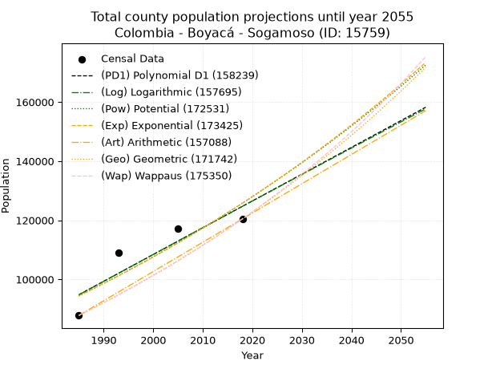
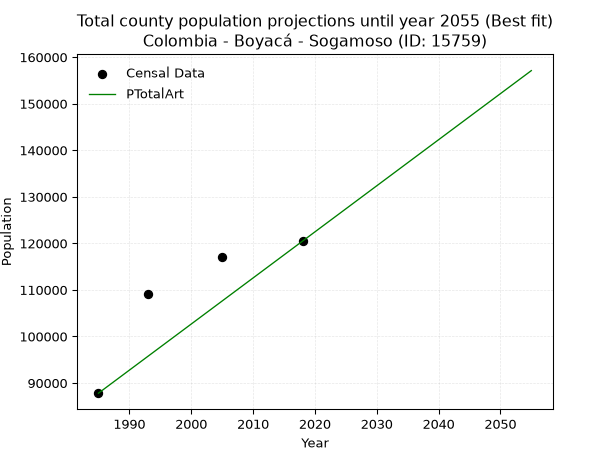
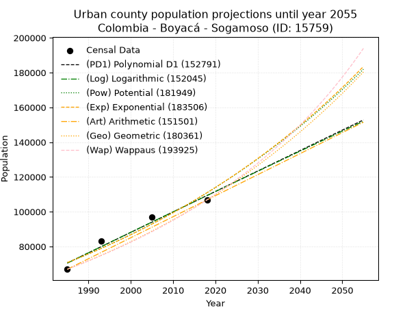
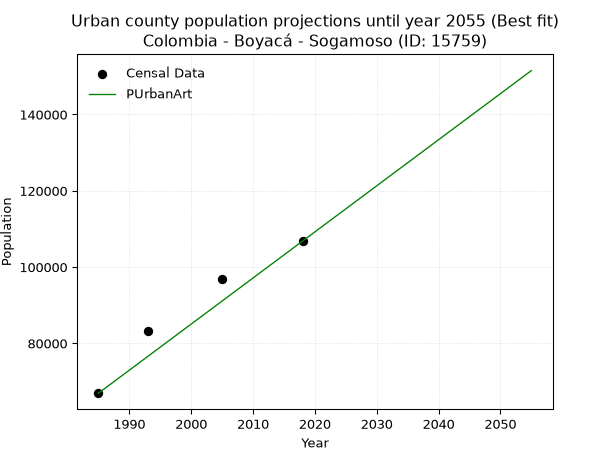
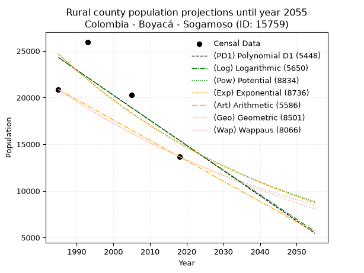
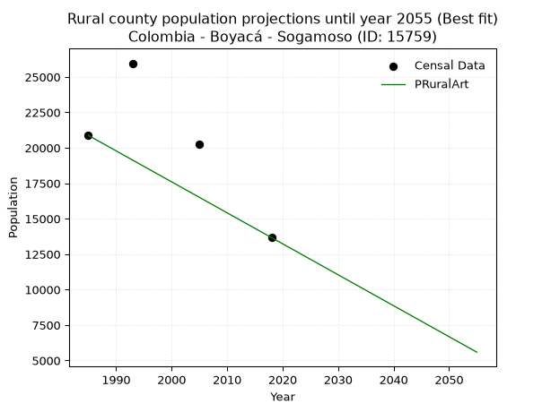

<div align="center">


</div>

# _“Population and Public Services Demand Projections (PPSD) until Year 2050 for Colombia - Boyacá - Sogamoso (ID: 15759)”_
Keywords: `population` `public-service` `projection` `lineal` `polynomial` `logarithmic` `potential` `exponential` `arithmetic` `geometric` `wappaus` `dane` `colombia` `south-america`

PPSD are analytical estimates used by governments and planners to anticipate future changes in population size, age distribution, and the resulting community needs for utilities, healthcare, education, and infrastructure as sizing future water treatment facilities, electrical grids, and road networks based on spatial growth.

> **General running parameters**: • app_version: _v20260806_. • Python version: _3.14.7_. • Pandas version: _3.0.5_. • NumPy version: _2.5.1_. • Creates, save and include plots into reports (create_plot): _True_. • Projection until year: _2050_. • Process polynomial degree 2 and up: _False_. • Process Wappaus: _True_. • Process Wappaus: _True_. • Set negative values to zero: _True_. • Set infinite values to zero: _True_. • Drop dataset notes: _True_. 
<div align="center">

Dynamic map: [:earth_americas:Google](http://maps.google.com/maps?q=5.723976388,-72.9243548) [:earth_americas:OSM](https://www.openstreetmap.org/#map=18/5.723976388/-72.9243548&layers=P) [:earth_americas:Bing](https://www.bing.com/maps?cp=5.723976388~-72.9243548&lvl=18) [:earth_americas:Apple](https://maps.apple.com/frame?center=5.723976388%2C-72.9243548&span=0.003%2C0.006)

</div>


<div align="center">

```geojson
{
  "type": "Feature",
  "geometry": {
    "type": "Point", 
    "coordinates": [-72.9243548, 5.723976388]
  }, 
  "properties": {
    "Name": "Colombia - Boyacá - Sogamoso (ID: 15759)"
  }
}
```

</div>


## 0. Census Data (4 records)

Census data are official statistics collected by a government about the people and housing in a country. They usually include counts of total population, age, sex, race, income, education, and jobs.

📅Global census file: [Population.xlsx](../data/Population.xlsx)

| Source   |   Year |   CountryID | CountryName   |   StateID | StateName   |   CountyID | CountyName   |   PTotal |   PUrban |   PRural |
|:---------|-------:|------------:|:--------------|----------:|:------------|-----------:|:-------------|---------:|---------:|---------:|
| DANE     |   1985 |          57 | Colombia      |        15 | Boyacá      |      15759 | Sogamoso     |    87796 |    66920 |    20876 |
| DANE     |   1993 |          57 | Colombia      |        15 | Boyacá      |      15759 | Sogamoso     |   109115 |    83152 |    25963 |
| DANE     |   2005 |          57 | Colombia      |        15 | Boyacá      |      15759 | Sogamoso     |   117094 |    96828 |    20266 |
| DANE     |   2018 |          57 | Colombia      |        15 | Boyacá      |      15759 | Sogamoso     |   120462 |   106794 |    13668 |

> 🔥Some records has specific notes about the registered values or the corresponding urban or rural distribution.

## 1. Total

### 1.1. Coefficients and Parameters

* (PD1) Polynomial Deg 1: 906.3416298675209, -1704293.0951425086 (lineal)
* (Log) Logarithmic: 1816160.8854153361, -13696036.693841921
* (Pow) Potential: 17.39778636377465, -52.398726211047396
* (Exp) Exponential: 0.00868151796731225, 0.003097937810127815
* (Art) Arithmetic: Year diff. 2018 - 1985 = 33, Population diff. 120462 - 87796 = 32666, Annual growth = 989.8787878787879
* (Geo) Geometric: Year diff. 2018 - 1985 = 33, Population diff. 120462 - 87796 = 32666, Annual growth % = 0.009631493477062714
* (Wap) Wappaus: i = 0.9506273832254106, Condition values only valid for < 200)

<sub>
Wappaus condition values: ['0.00', '0.95', '1.90', '2.85', '3.80', '4.75', '5.70', '6.65', '7.61', '8.56', '9.51', '10.46', '11.41', '12.36', '13.31', '14.26', '15.21', '16.16', '17.11', '18.06', '19.01', '19.96', '20.91', '21.86', '22.82', '23.77', '24.72', '25.67', '26.62', '27.57', '28.52', '29.47', '30.42', '31.37', '32.32', '33.27', '34.22', '35.17', '36.12', '37.07', '38.03', '38.98', '39.93', '40.88', '41.83', '42.78', '43.73', '44.68', '45.63', '46.58', '47.53', '48.48', '49.43', '50.38', '51.33', '52.28', '53.24', '54.19', '55.14', '56.09', '57.04', '57.99', '58.94', '59.89', '60.84', '61.79']
</sub>


### 1.2. Projected Dataset

|   Year |   CountyID |   PTotalPD1 |   PTotalLog |   PTotalPow |   PTotalExp |   PTotalArt |   PTotalGeo |   PTotalWap |
|-------:|-----------:|------------:|------------:|------------:|------------:|------------:|------------:|------------:|
|   1985 |      15759 |       94795 |       94753 |       94408 |       94447 |       87796 |       87796 |       87796 |
|   1986 |      15759 |       95701 |       95667 |       95238 |       95271 |       88786 |       88642 |       88635 |
|   1987 |      15759 |       96608 |       96581 |       96076 |       96101 |       89776 |       89495 |       89481 |
|   1988 |      15759 |       97514 |       97495 |       96921 |       96939 |       90766 |       90357 |       90336 |
|   1989 |      15759 |       98420 |       98409 |       97773 |       97784 |       91756 |       91228 |       91199 |
|   1990 |      15759 |       99327 |       99321 |       98631 |       98637 |       92745 |       92106 |       92071 |
|   1991 |      15759 |      100233 |      100234 |       99497 |       99497 |       93735 |       92993 |       92951 |
|   1992 |      15759 |      101139 |      101146 |      100370 |      100365 |       94725 |       93889 |       93839 |
|   1993 |      15759 |      102046 |      102057 |      101250 |      101240 |       95715 |       94793 |       94737 |
|   1994 |      15759 |      102952 |      102968 |      102138 |      102122 |       96705 |       95706 |       95643 |
|   1995 |      15759 |      103858 |      103879 |      103033 |      103013 |       97695 |       96628 |       96559 |
|   1996 |      15759 |      104765 |      104789 |      103935 |      103911 |       98685 |       97559 |       97483 |
|   1997 |      15759 |      105671 |      105699 |      104845 |      104817 |       99675 |       98498 |       98417 |
|   1998 |      15759 |      106577 |      106608 |      105762 |      105731 |      100664 |       99447 |       99361 |
|   1999 |      15759 |      107484 |      107517 |      106687 |      106653 |      101654 |      100405 |      100314 |
|   2000 |      15759 |      108390 |      108425 |      107619 |      107583 |      102644 |      101372 |      101276 |
|   2001 |      15759 |      109297 |      109333 |      108559 |      108521 |      103634 |      102348 |      102249 |
|   2002 |      15759 |      110203 |      110240 |      109507 |      109467 |      104624 |      103334 |      103232 |
|   2003 |      15759 |      111109 |      111147 |      110462 |      110422 |      105614 |      104329 |      104225 |
|   2004 |      15759 |      112016 |      112054 |      111426 |      111384 |      106604 |      105334 |      105228 |
|   2005 |      15759 |      112922 |      112960 |      112397 |      112356 |      107594 |      106349 |      106242 |
|   2006 |      15759 |      113828 |      113865 |      113376 |      113335 |      108583 |      107373 |      107266 |
|   2007 |      15759 |      114735 |      114771 |      114363 |      114324 |      109573 |      108407 |      108302 |
|   2008 |      15759 |      115641 |      115675 |      115359 |      115320 |      110563 |      109451 |      109348 |
|   2009 |      15759 |      116547 |      116579 |      116363 |      116326 |      111553 |      110506 |      110406 |
|   2010 |      15759 |      117454 |      117483 |      117374 |      117340 |      112543 |      111570 |      111475 |
|   2011 |      15759 |      118360 |      118387 |      118394 |      118363 |      113533 |      112644 |      112556 |
|   2012 |      15759 |      119266 |      119289 |      119423 |      119395 |      114523 |      113729 |      113648 |
|   2013 |      15759 |      120173 |      120192 |      120460 |      120436 |      115513 |      114825 |      114753 |
|   2014 |      15759 |      121079 |      121094 |      121505 |      121487 |      116502 |      115931 |      115869 |
|   2015 |      15759 |      121985 |      121995 |      122559 |      122546 |      117492 |      117047 |      116998 |
|   2016 |      15759 |      122892 |      122897 |      123622 |      123614 |      118482 |      118175 |      118140 |
|   2017 |      15759 |      123798 |      123797 |      124693 |      124692 |      119472 |      119313 |      119295 |
|   2018 |      15759 |      124704 |      124697 |      125773 |      125779 |      120462 |      120462 |      120462 |
|   2019 |      15759 |      125611 |      125597 |      126861 |      126876 |      121452 |      121622 |      121643 |
|   2020 |      15759 |      126517 |      126496 |      127959 |      127982 |      122442 |      122794 |      122837 |
|   2021 |      15759 |      127423 |      127395 |      129066 |      129098 |      123432 |      123976 |      124045 |
|   2022 |      15759 |      128330 |      128294 |      130181 |      130224 |      124422 |      125170 |      125266 |
|   2023 |      15759 |      129236 |      129192 |      131306 |      131359 |      125411 |      126376 |      126502 |
|   2024 |      15759 |      130142 |      130089 |      132440 |      132505 |      126401 |      127593 |      127753 |
|   2025 |      15759 |      131049 |      130986 |      133583 |      133660 |      127391 |      128822 |      129018 |
|   2026 |      15759 |      131955 |      131883 |      134735 |      134826 |      128381 |      130063 |      130298 |
|   2027 |      15759 |      132861 |      132779 |      135897 |      136001 |      129371 |      131316 |      131593 |
|   2028 |      15759 |      133768 |      133675 |      137068 |      137187 |      130361 |      132580 |      132904 |
|   2029 |      15759 |      134674 |      134570 |      138248 |      138383 |      131351 |      133857 |      134230 |
|   2030 |      15759 |      135580 |      135465 |      139439 |      139590 |      132341 |      135146 |      135573 |
|   2031 |      15759 |      136487 |      136360 |      140639 |      140807 |      133330 |      136448 |      136931 |
|   2032 |      15759 |      137393 |      137254 |      141848 |      142035 |      134320 |      137762 |      138307 |
|   2033 |      15759 |      138299 |      138147 |      143068 |      143273 |      135310 |      139089 |      139699 |
|   2034 |      15759 |      139206 |      139040 |      144297 |      144522 |      136300 |      140429 |      141109 |
|   2035 |      15759 |      140112 |      139933 |      145536 |      145782 |      137290 |      141781 |      142536 |
|   2036 |      15759 |      141018 |      140825 |      146785 |      147054 |      138280 |      143147 |      143981 |
|   2037 |      15759 |      141925 |      141717 |      148045 |      148336 |      139270 |      144526 |      145444 |
|   2038 |      15759 |      142831 |      142608 |      149314 |      149629 |      140260 |      145918 |      146926 |
|   2039 |      15759 |      143737 |      143499 |      150594 |      150934 |      141249 |      147323 |      148427 |
|   2040 |      15759 |      144644 |      144390 |      151884 |      152250 |      142239 |      148742 |      149948 |
|   2041 |      15759 |      145550 |      145280 |      153185 |      153577 |      143229 |      150175 |      151487 |
|   2042 |      15759 |      146457 |      146169 |      154496 |      154916 |      144219 |      151621 |      153047 |
|   2043 |      15759 |      147363 |      147059 |      155817 |      156267 |      145209 |      153081 |      154628 |
|   2044 |      15759 |      148269 |      147947 |      157150 |      157630 |      146199 |      154556 |      156229 |
|   2045 |      15759 |      149176 |      148836 |      158493 |      159004 |      147189 |      156044 |      157852 |
|   2046 |      15759 |      150082 |      149724 |      159846 |      160391 |      148179 |      157547 |      159496 |
|   2047 |      15759 |      150988 |      150611 |      161211 |      161789 |      149168 |      159065 |      161163 |
|   2048 |      15759 |      151895 |      151498 |      162587 |      163200 |      150158 |      160597 |      162852 |
|   2049 |      15759 |      152801 |      152385 |      163973 |      164623 |      151148 |      162144 |      164564 |
|   2050 |      15759 |      153707 |      153271 |      165371 |      166058 |      152138 |      163705 |      166300 |
<div align="center">

</img>

</div>


### 1.3. Best fit with absolute error and relative error (%)

Relative error puts that difference into context by dividing the absolute error by the true value, creating a unitless ratio or percentage that shows the scale of the mistake.

Absolute and relative error

|   Year | Source   |   CountryID | CountryName   |   StateID | StateName   |   CountyID_x | CountyName   |   PTotal |   PUrban |   PRural |   CountyID_y |   PTotalPD1 |   PTotalLog |   PTotalPow |   PTotalExp |   PTotalArt |   PTotalGeo |   PTotalWap |   PTotalPD1AbsError |   PTotalLogAbsError |   PTotalPowAbsError |   PTotalExpAbsError |   PTotalArtAbsError |   PTotalGeoAbsError |   PTotalWapAbsError |   PTotalPD1RelError |   PTotalLogRelError |   PTotalPowRelError |   PTotalExpRelError |   PTotalArtRelError |   PTotalGeoRelError |   PTotalWapRelError |
|-------:|:---------|------------:|:--------------|----------:|:------------|-------------:|:-------------|---------:|---------:|---------:|-------------:|------------:|------------:|------------:|------------:|------------:|------------:|------------:|--------------------:|--------------------:|--------------------:|--------------------:|--------------------:|--------------------:|--------------------:|--------------------:|--------------------:|--------------------:|--------------------:|--------------------:|--------------------:|--------------------:|
|   1985 | DANE     |          57 | Colombia      |        15 | Boyacá      |        15759 | Sogamoso     |    87796 |    66920 |    20876 |        15759 |       94795 |       94753 |       94408 |       94447 |       87796 |       87796 |       87796 |                6999 |                6957 |                6612 |                6651 |                   0 |                   0 |                   0 |             7.97189 |             7.92405 |             7.53109 |             7.57552 |             0       |             0       |             0       |
|   1993 | DANE     |          57 | Colombia      |        15 | Boyacá      |        15759 | Sogamoso     |   109115 |    83152 |    25963 |        15759 |      102046 |      102057 |      101250 |      101240 |       95715 |       94793 |       94737 |                7069 |                7058 |                7865 |                7875 |               13400 |               14322 |               14378 |             6.47849 |             6.4684  |             7.20799 |             7.21716 |            12.2806  |            13.1256  |            13.1769  |
|   2005 | DANE     |          57 | Colombia      |        15 | Boyacá      |        15759 | Sogamoso     |   117094 |    96828 |    20266 |        15759 |      112922 |      112960 |      112397 |      112356 |      107594 |      106349 |      106242 |                4172 |                4134 |                4697 |                4738 |                9500 |               10745 |               10852 |             3.56295 |             3.5305  |             4.01131 |             4.04632 |             8.11314 |             9.17639 |             9.26777 |
|   2018 | DANE     |          57 | Colombia      |        15 | Boyacá      |        15759 | Sogamoso     |   120462 |   106794 |    13668 |        15759 |      124704 |      124697 |      125773 |      125779 |      120462 |      120462 |      120462 |                4242 |                4235 |                5311 |                5317 |                   0 |                   0 |                   0 |             3.52144 |             3.51563 |             4.40886 |             4.41384 |             0       |             0       |             0       |

Relative error mean

| Method    |   RelError | Best   |
|:----------|-----------:|:-------|
| PTotalPD1 |    5.38369 |        |
| PTotalLog |    5.35965 |        |
| PTotalPow |    5.78981 |        |
| PTotalExp |    5.81321 |        |
| PTotalArt |    5.09844 | True   |
| PTotalGeo |    5.5755  |        |
| PTotalWap |    5.61117 |        |

💙Best method: _**PTotalArt**_
<div align="center">

</img>

</div>


### 1.4. Fresh water supply demand in liters per capita per day (lpcd)

The fresh water supply demand typically ranges from 100 to 300 liters per capita per day (lpcd) for standard domestic and municipal planning, though absolute survival minimums set by the World Health Organization are as low as 7.5 to 20 liters per day, and total consumption in high-income nations can exceed 400 liters.

> `CZ`: Level in meters above the sea level (masl).<br> `WS`: Fresh water supply demand in liters per capita per day (lpcd or l/h/d).<br> `WSAll`: Zonal fresh water supply demand in liters per second (l/s).<br> `A`: Zonal area in square meters.

Reference values (RAS Colombia)

|    CZ |   WS |
|------:|-----:|
|  1000 |  120 |
|  2000 |  130 |
| 99999 |  140 |

County shapefile geometry properties and water supply values

|   CountyID |      ATotal |   CZTotal |   WSTotal |
|-----------:|------------:|----------:|----------:|
|      15759 | 2.07321e+08 |   3093.74 |       140 |

Projected values for best method: PTotalArt

|   CountyID |   Year |   PTotalArt |   WSTotal |   WSTotalAll |
|-----------:|-------:|------------:|----------:|-------------:|
|      15759 |   1985 |       87796 |       140 |      142.262 |
|      15759 |   1986 |       88786 |       140 |      143.866 |
|      15759 |   1987 |       89776 |       140 |      145.47  |
|      15759 |   1988 |       90766 |       140 |      147.075 |
|      15759 |   1989 |       91756 |       140 |      148.679 |
|      15759 |   1990 |       92745 |       140 |      150.281 |
|      15759 |   1991 |       93735 |       140 |      151.885 |
|      15759 |   1992 |       94725 |       140 |      153.49  |
|      15759 |   1993 |       95715 |       140 |      155.094 |
|      15759 |   1994 |       96705 |       140 |      156.698 |
|      15759 |   1995 |       97695 |       140 |      158.302 |
|      15759 |   1996 |       98685 |       140 |      159.906 |
|      15759 |   1997 |       99675 |       140 |      161.51  |
|      15759 |   1998 |      100664 |       140 |      163.113 |
|      15759 |   1999 |      101654 |       140 |      164.717 |
|      15759 |   2000 |      102644 |       140 |      166.321 |
|      15759 |   2001 |      103634 |       140 |      167.925 |
|      15759 |   2002 |      104624 |       140 |      169.53  |
|      15759 |   2003 |      105614 |       140 |      171.134 |
|      15759 |   2004 |      106604 |       140 |      172.738 |
|      15759 |   2005 |      107594 |       140 |      174.342 |
|      15759 |   2006 |      108583 |       140 |      175.945 |
|      15759 |   2007 |      109573 |       140 |      177.549 |
|      15759 |   2008 |      110563 |       140 |      179.153 |
|      15759 |   2009 |      111553 |       140 |      180.757 |
|      15759 |   2010 |      112543 |       140 |      182.361 |
|      15759 |   2011 |      113533 |       140 |      183.966 |
|      15759 |   2012 |      114523 |       140 |      185.57  |
|      15759 |   2013 |      115513 |       140 |      187.174 |
|      15759 |   2014 |      116502 |       140 |      188.776 |
|      15759 |   2015 |      117492 |       140 |      190.381 |
|      15759 |   2016 |      118482 |       140 |      191.985 |
|      15759 |   2017 |      119472 |       140 |      193.589 |
|      15759 |   2018 |      120462 |       140 |      195.193 |
|      15759 |   2019 |      121452 |       140 |      196.797 |
|      15759 |   2020 |      122442 |       140 |      198.401 |
|      15759 |   2021 |      123432 |       140 |      200.006 |
|      15759 |   2022 |      124422 |       140 |      201.61  |
|      15759 |   2023 |      125411 |       140 |      203.212 |
|      15759 |   2024 |      126401 |       140 |      204.816 |
|      15759 |   2025 |      127391 |       140 |      206.421 |
|      15759 |   2026 |      128381 |       140 |      208.025 |
|      15759 |   2027 |      129371 |       140 |      209.629 |
|      15759 |   2028 |      130361 |       140 |      211.233 |
|      15759 |   2029 |      131351 |       140 |      212.837 |
|      15759 |   2030 |      132341 |       140 |      214.441 |
|      15759 |   2031 |      133330 |       140 |      216.044 |
|      15759 |   2032 |      134320 |       140 |      217.648 |
|      15759 |   2033 |      135310 |       140 |      219.252 |
|      15759 |   2034 |      136300 |       140 |      220.856 |
|      15759 |   2035 |      137290 |       140 |      222.461 |
|      15759 |   2036 |      138280 |       140 |      224.065 |
|      15759 |   2037 |      139270 |       140 |      225.669 |
|      15759 |   2038 |      140260 |       140 |      227.273 |
|      15759 |   2039 |      141249 |       140 |      228.876 |
|      15759 |   2040 |      142239 |       140 |      230.48  |
|      15759 |   2041 |      143229 |       140 |      232.084 |
|      15759 |   2042 |      144219 |       140 |      233.688 |
|      15759 |   2043 |      145209 |       140 |      235.292 |
|      15759 |   2044 |      146199 |       140 |      236.897 |
|      15759 |   2045 |      147189 |       140 |      238.501 |
|      15759 |   2046 |      148179 |       140 |      240.105 |
|      15759 |   2047 |      149168 |       140 |      241.707 |
|      15759 |   2048 |      150158 |       140 |      243.312 |
|      15759 |   2049 |      151148 |       140 |      244.916 |
|      15759 |   2050 |      152138 |       140 |      246.52  |

## 2. Urban

### 2.1. Coefficients and Parameters

* (PD1) Polynomial Deg 1: 1175.6635889201052, -2263197.5937374406 (lineal)
* (Log) Logarithmic: 2354344.571673461, -17806968.45582333
* (Pow) Potential: 27.262710574874433, -85.05628102263732
* (Exp) Exponential: 0.013611804070148531, 1.304528092819759e-07
* (Art) Arithmetic: Year diff. 2018 - 1985 = 33, Population diff. 106794 - 66920 = 39874, Annual growth = 1208.3030303030303
* (Geo) Geometric: Year diff. 2018 - 1985 = 33, Population diff. 106794 - 66920 = 39874, Annual growth % = 0.014264534817095997
* (Wap) Wappaus: i = 1.3911406453170503, Condition values only valid for < 200)

<sub>
Wappaus condition values: ['0.00', '1.39', '2.78', '4.17', '5.56', '6.96', '8.35', '9.74', '11.13', '12.52', '13.91', '15.30', '16.69', '18.08', '19.48', '20.87', '22.26', '23.65', '25.04', '26.43', '27.82', '29.21', '30.61', '32.00', '33.39', '34.78', '36.17', '37.56', '38.95', '40.34', '41.73', '43.13', '44.52', '45.91', '47.30', '48.69', '50.08', '51.47', '52.86', '54.25', '55.65', '57.04', '58.43', '59.82', '61.21', '62.60', '63.99', '65.38', '66.77', '68.17', '69.56', '70.95', '72.34', '73.73', '75.12', '76.51', '77.90', '79.30', '80.69', '82.08', '83.47', '84.86', '86.25', '87.64', '89.03', '90.42']
</sub>


### 2.2. Projected Dataset

|   Year |   CountyID |   PUrbanPD1 |   PUrbanLog |   PUrbanPow |   PUrbanExp |   PUrbanArt |   PUrbanGeo |   PUrbanWap |
|-------:|-----------:|------------:|------------:|------------:|------------:|------------:|------------:|------------:|
|   1985 |      15759 |       70495 |       70451 |       70731 |       70769 |       66920 |       66920 |       66920 |
|   1986 |      15759 |       71670 |       71637 |       71709 |       71739 |       68128 |       67875 |       67857 |
|   1987 |      15759 |       72846 |       72822 |       72700 |       72722 |       69337 |       68843 |       68808 |
|   1988 |      15759 |       74022 |       74006 |       73704 |       73719 |       70545 |       69825 |       69772 |
|   1989 |      15759 |       75197 |       75190 |       74721 |       74729 |       71753 |       70821 |       70750 |
|   1990 |      15759 |       76373 |       76374 |       75752 |       75753 |       72962 |       71831 |       71742 |
|   1991 |      15759 |       77549 |       77557 |       76797 |       76791 |       74170 |       72856 |       72749 |
|   1992 |      15759 |       78724 |       78739 |       77855 |       77844 |       75378 |       73895 |       73770 |
|   1993 |      15759 |       79900 |       79920 |       78928 |       78911 |       76586 |       74949 |       74806 |
|   1994 |      15759 |       81076 |       81101 |       80015 |       79992 |       77795 |       76018 |       75858 |
|   1995 |      15759 |       82251 |       82282 |       81116 |       81088 |       79003 |       77102 |       76925 |
|   1996 |      15759 |       83427 |       83462 |       82232 |       82200 |       80211 |       78202 |       78009 |
|   1997 |      15759 |       84603 |       84641 |       83363 |       83326 |       81420 |       79318 |       79109 |
|   1998 |      15759 |       85778 |       85819 |       84508 |       84468 |       82628 |       80449 |       80226 |
|   1999 |      15759 |       86954 |       86998 |       85669 |       85626 |       83836 |       81597 |       81359 |
|   2000 |      15759 |       88130 |       88175 |       86845 |       86799 |       85045 |       82761 |       82511 |
|   2001 |      15759 |       89305 |       89352 |       88037 |       87989 |       86253 |       83941 |       83681 |
|   2002 |      15759 |       90481 |       90528 |       89244 |       89195 |       87461 |       85139 |       84869 |
|   2003 |      15759 |       91657 |       91704 |       90467 |       90417 |       88669 |       86353 |       86075 |
|   2004 |      15759 |       92832 |       92879 |       91707 |       91656 |       89878 |       87585 |       87302 |
|   2005 |      15759 |       94008 |       94054 |       92962 |       92912 |       91086 |       88834 |       88548 |
|   2006 |      15759 |       95184 |       95227 |       94235 |       94186 |       92294 |       90101 |       89814 |
|   2007 |      15759 |       96359 |       96401 |       95524 |       95477 |       93503 |       91387 |       91101 |
|   2008 |      15759 |       97535 |       97574 |       96830 |       96785 |       94711 |       92690 |       92410 |
|   2009 |      15759 |       98711 |       98746 |       98153 |       98112 |       95919 |       94013 |       93740 |
|   2010 |      15759 |       99886 |       99917 |       99494 |       99456 |       97128 |       95354 |       95093 |
|   2011 |      15759 |      101062 |      101088 |      100852 |      100819 |       98336 |       96714 |       96469 |
|   2012 |      15759 |      102238 |      102259 |      102229 |      102201 |       99544 |       98093 |       97868 |
|   2013 |      15759 |      103413 |      103429 |      103623 |      103602 |      100752 |       99493 |       99291 |
|   2014 |      15759 |      104589 |      104598 |      105035 |      105021 |      101961 |      100912 |      100740 |
|   2015 |      15759 |      105765 |      105767 |      106467 |      106461 |      103169 |      102351 |      102213 |
|   2016 |      15759 |      106940 |      106935 |      107916 |      107920 |      104377 |      103811 |      103713 |
|   2017 |      15759 |      108116 |      108102 |      109385 |      109399 |      105586 |      105292 |      105240 |
|   2018 |      15759 |      109292 |      109269 |      110874 |      110898 |      106794 |      106794 |      106794 |
|   2019 |      15759 |      110467 |      110436 |      112381 |      112418 |      108002 |      108317 |      108377 |
|   2020 |      15759 |      111643 |      111601 |      113909 |      113959 |      109211 |      109862 |      109988 |
|   2021 |      15759 |      112819 |      112767 |      115456 |      115520 |      110419 |      111430 |      111630 |
|   2022 |      15759 |      113994 |      113931 |      117024 |      117104 |      111627 |      113019 |      113302 |
|   2023 |      15759 |      115170 |      115095 |      118612 |      118708 |      112836 |      114631 |      115006 |
|   2024 |      15759 |      116346 |      116259 |      120221 |      120335 |      114044 |      116266 |      116743 |
|   2025 |      15759 |      117521 |      117422 |      121851 |      121984 |      115252 |      117925 |      118513 |
|   2026 |      15759 |      118697 |      118584 |      123502 |      123656 |      116460 |      119607 |      120317 |
|   2027 |      15759 |      119873 |      119746 |      125174 |      125351 |      117669 |      121313 |      122157 |
|   2028 |      15759 |      121048 |      120907 |      126869 |      127069 |      118877 |      123044 |      124033 |
|   2029 |      15759 |      122224 |      122068 |      128586 |      128810 |      120085 |      124799 |      125947 |
|   2030 |      15759 |      123399 |      123228 |      130325 |      130576 |      121294 |      126579 |      127900 |
|   2031 |      15759 |      124575 |      124387 |      132086 |      132365 |      122502 |      128385 |      129893 |
|   2032 |      15759 |      125751 |      125546 |      133871 |      134179 |      123710 |      130216 |      131927 |
|   2033 |      15759 |      126926 |      126705 |      135678 |      136018 |      124919 |      132073 |      134003 |
|   2034 |      15759 |      128102 |      127862 |      137510 |      137882 |      126127 |      133957 |      136123 |
|   2035 |      15759 |      129278 |      129020 |      139365 |      139772 |      127335 |      135868 |      138288 |
|   2036 |      15759 |      130453 |      130176 |      141244 |      141687 |      128543 |      137806 |      140501 |
|   2037 |      15759 |      131629 |      131332 |      143147 |      143629 |      129752 |      139772 |      142761 |
|   2038 |      15759 |      132805 |      132488 |      145076 |      145598 |      130960 |      141766 |      145071 |
|   2039 |      15759 |      133980 |      133643 |      147029 |      147593 |      132168 |      143788 |      147433 |
|   2040 |      15759 |      135156 |      134797 |      149008 |      149616 |      133377 |      145839 |      149847 |
|   2041 |      15759 |      136332 |      135951 |      151012 |      151666 |      134585 |      147919 |      152317 |
|   2042 |      15759 |      137507 |      137104 |      153042 |      153745 |      135793 |      150029 |      154844 |
|   2043 |      15759 |      138683 |      138257 |      155098 |      155852 |      137002 |      152170 |      157429 |
|   2044 |      15759 |      139859 |      139409 |      157181 |      157988 |      138210 |      154340 |      160076 |
|   2045 |      15759 |      141034 |      140561 |      159291 |      160153 |      139418 |      156542 |      162786 |
|   2046 |      15759 |      142210 |      141712 |      161429 |      162348 |      140626 |      158775 |      165561 |
|   2047 |      15759 |      143386 |      142862 |      163594 |      164573 |      141835 |      161040 |      168405 |
|   2048 |      15759 |      144561 |      144012 |      165786 |      166828 |      143043 |      163337 |      171318 |
|   2049 |      15759 |      145737 |      145161 |      168008 |      169115 |      144251 |      165667 |      174305 |
|   2050 |      15759 |      146913 |      146310 |      170257 |      171432 |      145460 |      168030 |      177367 |
<div align="center">

</img>

</div>


### 2.3. Best fit with absolute error and relative error (%)

Relative error puts that difference into context by dividing the absolute error by the true value, creating a unitless ratio or percentage that shows the scale of the mistake.

Absolute and relative error

|   Year | Source   |   CountryID | CountryName   |   StateID | StateName   |   CountyID_x | CountyName   |   PTotal |   PUrban |   PRural |   CountyID_y |   PUrbanPD1 |   PUrbanLog |   PUrbanPow |   PUrbanExp |   PUrbanArt |   PUrbanGeo |   PUrbanWap |   PUrbanPD1AbsError |   PUrbanLogAbsError |   PUrbanPowAbsError |   PUrbanExpAbsError |   PUrbanArtAbsError |   PUrbanGeoAbsError |   PUrbanWapAbsError |   PUrbanPD1RelError |   PUrbanLogRelError |   PUrbanPowRelError |   PUrbanExpRelError |   PUrbanArtRelError |   PUrbanGeoRelError |   PUrbanWapRelError |
|-------:|:---------|------------:|:--------------|----------:|:------------|-------------:|:-------------|---------:|---------:|---------:|-------------:|------------:|------------:|------------:|------------:|------------:|------------:|------------:|--------------------:|--------------------:|--------------------:|--------------------:|--------------------:|--------------------:|--------------------:|--------------------:|--------------------:|--------------------:|--------------------:|--------------------:|--------------------:|--------------------:|
|   1985 | DANE     |          57 | Colombia      |        15 | Boyacá      |        15759 | Sogamoso     |    87796 |    66920 |    20876 |        15759 |       70495 |       70451 |       70731 |       70769 |       66920 |       66920 |       66920 |                3575 |                3531 |                3811 |                3849 |                   0 |                   0 |                   0 |             5.3422  |             5.27645 |             5.69486 |             5.75164 |             0       |             0       |             0       |
|   1993 | DANE     |          57 | Colombia      |        15 | Boyacá      |        15759 | Sogamoso     |   109115 |    83152 |    25963 |        15759 |       79900 |       79920 |       78928 |       78911 |       76586 |       74949 |       74806 |                3252 |                3232 |                4224 |                4241 |                6566 |                8203 |                8346 |             3.91091 |             3.88686 |             5.07985 |             5.1003  |             7.89638 |             9.86507 |            10.037   |
|   2005 | DANE     |          57 | Colombia      |        15 | Boyacá      |        15759 | Sogamoso     |   117094 |    96828 |    20266 |        15759 |       94008 |       94054 |       92962 |       92912 |       91086 |       88834 |       88548 |                2820 |                2774 |                3866 |                3916 |                5742 |                7994 |                8280 |             2.91238 |             2.86487 |             3.99265 |             4.04428 |             5.9301  |             8.25588 |             8.55125 |
|   2018 | DANE     |          57 | Colombia      |        15 | Boyacá      |        15759 | Sogamoso     |   120462 |   106794 |    13668 |        15759 |      109292 |      109269 |      110874 |      110898 |      106794 |      106794 |      106794 |                2498 |                2475 |                4080 |                4104 |                   0 |                   0 |                   0 |             2.33908 |             2.31755 |             3.82044 |             3.84291 |             0       |             0       |             0       |

Relative error mean

| Method    |   RelError | Best   |
|:----------|-----------:|:-------|
| PUrbanPD1 |    3.62614 |        |
| PUrbanLog |    3.58643 |        |
| PUrbanPow |    4.64695 |        |
| PUrbanExp |    4.68478 |        |
| PUrbanArt |    3.45662 | True   |
| PUrbanGeo |    4.53024 |        |
| PUrbanWap |    4.64707 |        |

💙Best method: _**PUrbanArt**_
<div align="center">

</img>

</div>


### 2.4. Fresh water supply demand in liters per capita per day (lpcd)

The fresh water supply demand typically ranges from 100 to 300 liters per capita per day (lpcd) for standard domestic and municipal planning, though absolute survival minimums set by the World Health Organization are as low as 7.5 to 20 liters per day, and total consumption in high-income nations can exceed 400 liters.

> `CZ`: Level in meters above the sea level (masl).<br> `WS`: Fresh water supply demand in liters per capita per day (lpcd or l/h/d).<br> `WSAll`: Zonal fresh water supply demand in liters per second (l/s).<br> `A`: Zonal area in square meters.

Reference values (RAS Colombia)

|    CZ |   WS |
|------:|-----:|
|  1000 |  120 |
|  2000 |  130 |
| 99999 |  140 |

County shapefile geometry properties and water supply values

|   CountyID |      AUrban |   CZUrban |   WSUrban |
|-----------:|------------:|----------:|----------:|
|      15759 | 2.20691e+07 |   2499.47 |       140 |

Projected values for best method: PUrbanArt

|   CountyID |   Year |   PUrbanArt |   WSUrban |   WSUrbanAll |
|-----------:|-------:|------------:|----------:|-------------:|
|      15759 |   1985 |       66920 |       140 |      108.435 |
|      15759 |   1986 |       68128 |       140 |      110.393 |
|      15759 |   1987 |       69337 |       140 |      112.352 |
|      15759 |   1988 |       70545 |       140 |      114.309 |
|      15759 |   1989 |       71753 |       140 |      116.266 |
|      15759 |   1990 |       72962 |       140 |      118.225 |
|      15759 |   1991 |       74170 |       140 |      120.183 |
|      15759 |   1992 |       75378 |       140 |      122.14  |
|      15759 |   1993 |       76586 |       140 |      124.098 |
|      15759 |   1994 |       77795 |       140 |      126.057 |
|      15759 |   1995 |       79003 |       140 |      128.014 |
|      15759 |   1996 |       80211 |       140 |      129.972 |
|      15759 |   1997 |       81420 |       140 |      131.931 |
|      15759 |   1998 |       82628 |       140 |      133.888 |
|      15759 |   1999 |       83836 |       140 |      135.845 |
|      15759 |   2000 |       85045 |       140 |      137.804 |
|      15759 |   2001 |       86253 |       140 |      139.762 |
|      15759 |   2002 |       87461 |       140 |      141.719 |
|      15759 |   2003 |       88669 |       140 |      143.677 |
|      15759 |   2004 |       89878 |       140 |      145.636 |
|      15759 |   2005 |       91086 |       140 |      147.593 |
|      15759 |   2006 |       92294 |       140 |      149.55  |
|      15759 |   2007 |       93503 |       140 |      151.509 |
|      15759 |   2008 |       94711 |       140 |      153.467 |
|      15759 |   2009 |       95919 |       140 |      155.424 |
|      15759 |   2010 |       97128 |       140 |      157.383 |
|      15759 |   2011 |       98336 |       140 |      159.341 |
|      15759 |   2012 |       99544 |       140 |      161.298 |
|      15759 |   2013 |      100752 |       140 |      163.256 |
|      15759 |   2014 |      101961 |       140 |      165.215 |
|      15759 |   2015 |      103169 |       140 |      167.172 |
|      15759 |   2016 |      104377 |       140 |      169.129 |
|      15759 |   2017 |      105586 |       140 |      171.088 |
|      15759 |   2018 |      106794 |       140 |      173.046 |
|      15759 |   2019 |      108002 |       140 |      175.003 |
|      15759 |   2020 |      109211 |       140 |      176.962 |
|      15759 |   2021 |      110419 |       140 |      178.92  |
|      15759 |   2022 |      111627 |       140 |      180.877 |
|      15759 |   2023 |      112836 |       140 |      182.836 |
|      15759 |   2024 |      114044 |       140 |      184.794 |
|      15759 |   2025 |      115252 |       140 |      186.751 |
|      15759 |   2026 |      116460 |       140 |      188.708 |
|      15759 |   2027 |      117669 |       140 |      190.667 |
|      15759 |   2028 |      118877 |       140 |      192.625 |
|      15759 |   2029 |      120085 |       140 |      194.582 |
|      15759 |   2030 |      121294 |       140 |      196.541 |
|      15759 |   2031 |      122502 |       140 |      198.499 |
|      15759 |   2032 |      123710 |       140 |      200.456 |
|      15759 |   2033 |      124919 |       140 |      202.415 |
|      15759 |   2034 |      126127 |       140 |      204.372 |
|      15759 |   2035 |      127335 |       140 |      206.33  |
|      15759 |   2036 |      128543 |       140 |      208.287 |
|      15759 |   2037 |      129752 |       140 |      210.246 |
|      15759 |   2038 |      130960 |       140 |      212.204 |
|      15759 |   2039 |      132168 |       140 |      214.161 |
|      15759 |   2040 |      133377 |       140 |      216.12  |
|      15759 |   2041 |      134585 |       140 |      218.078 |
|      15759 |   2042 |      135793 |       140 |      220.035 |
|      15759 |   2043 |      137002 |       140 |      221.994 |
|      15759 |   2044 |      138210 |       140 |      223.951 |
|      15759 |   2045 |      139418 |       140 |      225.909 |
|      15759 |   2046 |      140626 |       140 |      227.866 |
|      15759 |   2047 |      141835 |       140 |      229.825 |
|      15759 |   2048 |      143043 |       140 |      231.783 |
|      15759 |   2049 |      144251 |       140 |      233.74  |
|      15759 |   2050 |      145460 |       140 |      235.699 |

## 3. Rural

### 3.1. Coefficients and Parameters

* (PD1) Polynomial Deg 1: -269.32195905258504, 558904.4985949332 (lineal)
* (Log) Logarithmic: -538183.6862581237, 4110931.761981397
* (Pow) Potential: -29.650113007845775, 102.17139041187909
* (Exp) Exponential: -0.014837050723608271, 1.5241517840471472e+17
* (Art) Arithmetic: Year diff. 2018 - 1985 = 33, Population diff. 13668 - 20876 = -7208, Annual growth = -218.42424242424244
* (Geo) Geometric: Year diff. 2018 - 1985 = 33, Population diff. 13668 - 20876 = -7208, Annual growth % = -0.012752618860260578
* (Wap) Wappaus: i = -1.2646146504414222, Condition values only valid for < 200)

<sub>
Wappaus condition values: ['-0.00', '-1.26', '-2.53', '-3.79', '-5.06', '-6.32', '-7.59', '-8.85', '-10.12', '-11.38', '-12.65', '-13.91', '-15.18', '-16.44', '-17.70', '-18.97', '-20.23', '-21.50', '-22.76', '-24.03', '-25.29', '-26.56', '-27.82', '-29.09', '-30.35', '-31.62', '-32.88', '-34.14', '-35.41', '-36.67', '-37.94', '-39.20', '-40.47', '-41.73', '-43.00', '-44.26', '-45.53', '-46.79', '-48.06', '-49.32', '-50.58', '-51.85', '-53.11', '-54.38', '-55.64', '-56.91', '-58.17', '-59.44', '-60.70', '-61.97', '-63.23', '-64.50', '-65.76', '-67.02', '-68.29', '-69.55', '-70.82', '-72.08', '-73.35', '-74.61', '-75.88', '-77.14', '-78.41', '-79.67', '-80.94', '-82.20']
</sub>


### 3.2. Projected Dataset

|   Year |   CountyID |   PRuralPD1 |   PRuralLog |   PRuralPow |   PRuralExp |   PRuralArt |   PRuralGeo |   PRuralWap |
|-------:|-----------:|------------:|------------:|------------:|------------:|------------:|------------:|------------:|
|   1985 |      15759 |       24300 |       24302 |       24684 |       24682 |       20876 |       20876 |       20876 |
|   1986 |      15759 |       24031 |       24031 |       24318 |       24319 |       20658 |       20610 |       20614 |
|   1987 |      15759 |       23762 |       23760 |       23958 |       23961 |       20439 |       20347 |       20355 |
|   1988 |      15759 |       23492 |       23489 |       23603 |       23608 |       20221 |       20087 |       20099 |
|   1989 |      15759 |       23223 |       23218 |       23254 |       23260 |       20002 |       19831 |       19846 |
|   1990 |      15759 |       22954 |       22948 |       22910 |       22917 |       19784 |       19578 |       19596 |
|   1991 |      15759 |       22684 |       22677 |       22571 |       22580 |       19565 |       19329 |       19350 |
|   1992 |      15759 |       22415 |       22407 |       22238 |       22247 |       19347 |       19082 |       19106 |
|   1993 |      15759 |       22146 |       22137 |       21909 |       21920 |       19129 |       18839 |       18866 |
|   1994 |      15759 |       21877 |       21867 |       21586 |       21597 |       18910 |       18599 |       18628 |
|   1995 |      15759 |       21607 |       21597 |       21267 |       21279 |       18692 |       18361 |       18393 |
|   1996 |      15759 |       21338 |       21328 |       20954 |       20965 |       18473 |       18127 |       18161 |
|   1997 |      15759 |       21069 |       21058 |       20645 |       20657 |       18255 |       17896 |       17931 |
|   1998 |      15759 |       20799 |       20789 |       20340 |       20352 |       18036 |       17668 |       17705 |
|   1999 |      15759 |       20530 |       20519 |       20041 |       20053 |       17818 |       17443 |       17481 |
|   2000 |      15759 |       20261 |       20250 |       19746 |       19757 |       17600 |       17220 |       17259 |
|   2001 |      15759 |       19991 |       19981 |       19455 |       19466 |       17381 |       17001 |       17040 |
|   2002 |      15759 |       19722 |       19712 |       19169 |       19180 |       17163 |       16784 |       16824 |
|   2003 |      15759 |       19453 |       19443 |       18888 |       18897 |       16944 |       16570 |       16610 |
|   2004 |      15759 |       19183 |       19175 |       18610 |       18619 |       16726 |       16358 |       16398 |
|   2005 |      15759 |       18914 |       18906 |       18337 |       18345 |       16508 |       16150 |       16189 |
|   2006 |      15759 |       18645 |       18638 |       18068 |       18075 |       16289 |       15944 |       15982 |
|   2007 |      15759 |       18375 |       18370 |       17803 |       17808 |       16071 |       15741 |       15777 |
|   2008 |      15759 |       18106 |       18102 |       17542 |       17546 |       15852 |       15540 |       15575 |
|   2009 |      15759 |       17837 |       17834 |       17285 |       17288 |       15634 |       15342 |       15375 |
|   2010 |      15759 |       17567 |       17566 |       17032 |       17033 |       15415 |       15146 |       15177 |
|   2011 |      15759 |       17298 |       17298 |       16782 |       16782 |       15197 |       14953 |       14981 |
|   2012 |      15759 |       17029 |       17031 |       16537 |       16535 |       14979 |       14762 |       14787 |
|   2013 |      15759 |       16759 |       16763 |       16295 |       16292 |       14760 |       14574 |       14596 |
|   2014 |      15759 |       16490 |       16496 |       16057 |       16052 |       14542 |       14388 |       14406 |
|   2015 |      15759 |       16221 |       16229 |       15822 |       15815 |       14323 |       14205 |       14219 |
|   2016 |      15759 |       15951 |       15962 |       15591 |       15582 |       14105 |       14023 |       14033 |
|   2017 |      15759 |       15682 |       15695 |       15363 |       15353 |       13886 |       13845 |       13850 |
|   2018 |      15759 |       15413 |       15428 |       15139 |       15127 |       13668 |       13668 |       13668 |
|   2019 |      15759 |       15143 |       15161 |       14918 |       14904 |       13450 |       13494 |       13488 |
|   2020 |      15759 |       14874 |       14895 |       14701 |       14684 |       13231 |       13322 |       13310 |
|   2021 |      15759 |       14605 |       14629 |       14487 |       14468 |       13013 |       13152 |       13134 |
|   2022 |      15759 |       14335 |       14362 |       14276 |       14255 |       12794 |       12984 |       12960 |
|   2023 |      15759 |       14066 |       14096 |       14068 |       14045 |       12576 |       12818 |       12787 |
|   2024 |      15759 |       13797 |       13830 |       13864 |       13838 |       12357 |       12655 |       12617 |
|   2025 |      15759 |       13528 |       13564 |       13662 |       13634 |       12139 |       12494 |       12448 |
|   2026 |      15759 |       13258 |       13299 |       13463 |       13434 |       11921 |       12334 |       12280 |
|   2027 |      15759 |       12989 |       13033 |       13268 |       13236 |       11702 |       12177 |       12115 |
|   2028 |      15759 |       12720 |       12768 |       13075 |       13041 |       11484 |       12022 |       11951 |
|   2029 |      15759 |       12450 |       12502 |       12886 |       12849 |       11265 |       11868 |       11788 |
|   2030 |      15759 |       12181 |       12237 |       12699 |       12660 |       11047 |       11717 |       11628 |
|   2031 |      15759 |       11912 |       11972 |       12515 |       12473 |       10828 |       11568 |       11468 |
|   2032 |      15759 |       11642 |       11707 |       12333 |       12289 |       10610 |       11420 |       11311 |
|   2033 |      15759 |       11373 |       11442 |       12155 |       12108 |       10392 |       11274 |       11155 |
|   2034 |      15759 |       11104 |       11178 |       11979 |       11930 |       10173 |       11131 |       11000 |
|   2035 |      15759 |       10834 |       10913 |       11805 |       11754 |        9955 |       10989 |       10847 |
|   2036 |      15759 |       10565 |       10649 |       11635 |       11581 |        9736 |       10849 |       10695 |
|   2037 |      15759 |       10296 |       10385 |       11467 |       11411 |        9518 |       10710 |       10545 |
|   2038 |      15759 |       10026 |       10120 |       11301 |       11243 |        9300 |       10574 |       10396 |
|   2039 |      15759 |        9757 |        9856 |       11138 |       11077 |        9081 |       10439 |       10249 |
|   2040 |      15759 |        9488 |        9593 |       10977 |       10914 |        8863 |       10306 |       10103 |
|   2041 |      15759 |        9218 |        9329 |       10819 |       10753 |        8644 |       10174 |        9958 |
|   2042 |      15759 |        8949 |        9065 |       10663 |       10595 |        8426 |       10045 |        9815 |
|   2043 |      15759 |        8680 |        8802 |       10509 |       10439 |        8207 |        9916 |        9673 |
|   2044 |      15759 |        8410 |        8538 |       10358 |       10285 |        7989 |        9790 |        9532 |
|   2045 |      15759 |        8141 |        8275 |       10208 |       10134 |        7771 |        9665 |        9393 |
|   2046 |      15759 |        7872 |        8012 |       10062 |        9984 |        7552 |        9542 |        9254 |
|   2047 |      15759 |        7602 |        7749 |        9917 |        9837 |        7334 |        9420 |        9118 |
|   2048 |      15759 |        7333 |        7486 |        9774 |        9692 |        7115 |        9300 |        8982 |
|   2049 |      15759 |        7064 |        7223 |        9634 |        9550 |        6897 |        9181 |        8848 |
|   2050 |      15759 |        6794 |        6961 |        9495 |        9409 |        6678 |        9064 |        8714 |
<div align="center">

</img>

</div>


### 3.3. Best fit with absolute error and relative error (%)

Relative error puts that difference into context by dividing the absolute error by the true value, creating a unitless ratio or percentage that shows the scale of the mistake.

Absolute and relative error

|   Year | Source   |   CountryID | CountryName   |   StateID | StateName   |   CountyID_x | CountyName   |   PTotal |   PUrban |   PRural |   CountyID_y |   PRuralPD1 |   PRuralLog |   PRuralPow |   PRuralExp |   PRuralArt |   PRuralGeo |   PRuralWap |   PRuralPD1AbsError |   PRuralLogAbsError |   PRuralPowAbsError |   PRuralExpAbsError |   PRuralArtAbsError |   PRuralGeoAbsError |   PRuralWapAbsError |   PRuralPD1RelError |   PRuralLogRelError |   PRuralPowRelError |   PRuralExpRelError |   PRuralArtRelError |   PRuralGeoRelError |   PRuralWapRelError |
|-------:|:---------|------------:|:--------------|----------:|:------------|-------------:|:-------------|---------:|---------:|---------:|-------------:|------------:|------------:|------------:|------------:|------------:|------------:|------------:|--------------------:|--------------------:|--------------------:|--------------------:|--------------------:|--------------------:|--------------------:|--------------------:|--------------------:|--------------------:|--------------------:|--------------------:|--------------------:|--------------------:|
|   1985 | DANE     |          57 | Colombia      |        15 | Boyacá      |        15759 | Sogamoso     |    87796 |    66920 |    20876 |        15759 |       24300 |       24302 |       24684 |       24682 |       20876 |       20876 |       20876 |                3424 |                3426 |                3808 |                3806 |                   0 |                   0 |                   0 |            16.4016  |            16.4112  |            18.241   |            18.2315  |              0      |              0      |              0      |
|   1993 | DANE     |          57 | Colombia      |        15 | Boyacá      |        15759 | Sogamoso     |   109115 |    83152 |    25963 |        15759 |       22146 |       22137 |       21909 |       21920 |       19129 |       18839 |       18866 |                3817 |                3826 |                4054 |                4043 |                6834 |                7124 |                7097 |            14.7017  |            14.7364  |            15.6145  |            15.5722  |             26.3221 |             27.439  |             27.3351 |
|   2005 | DANE     |          57 | Colombia      |        15 | Boyacá      |        15759 | Sogamoso     |   117094 |    96828 |    20266 |        15759 |       18914 |       18906 |       18337 |       18345 |       16508 |       16150 |       16189 |                1352 |                1360 |                1929 |                1921 |                3758 |                4116 |                4077 |             6.67127 |             6.71075 |             9.51841 |             9.47893 |             18.5434 |             20.3099 |             20.1174 |
|   2018 | DANE     |          57 | Colombia      |        15 | Boyacá      |        15759 | Sogamoso     |   120462 |   106794 |    13668 |        15759 |       15413 |       15428 |       15139 |       15127 |       13668 |       13668 |       13668 |                1745 |                1760 |                1471 |                1459 |                   0 |                   0 |                   0 |            12.767   |            12.8768  |            10.7624  |            10.6746  |              0      |              0      |              0      |

Relative error mean

| Method    |   RelError | Best   |
|:----------|-----------:|:-------|
| PRuralPD1 |    12.6354 |        |
| PRuralLog |    12.6838 |        |
| PRuralPow |    13.5341 |        |
| PRuralExp |    13.4893 |        |
| PRuralArt |    11.2164 | True   |
| PRuralGeo |    11.9372 |        |
| PRuralWap |    11.8631 |        |

💙Best method: _**PRuralArt**_
<div align="center">

</img>

</div>


### 3.4. Fresh water supply demand in liters per capita per day (lpcd)

The fresh water supply demand typically ranges from 100 to 300 liters per capita per day (lpcd) for standard domestic and municipal planning, though absolute survival minimums set by the World Health Organization are as low as 7.5 to 20 liters per day, and total consumption in high-income nations can exceed 400 liters.

> `CZ`: Level in meters above the sea level (masl).<br> `WS`: Fresh water supply demand in liters per capita per day (lpcd or l/h/d).<br> `WSAll`: Zonal fresh water supply demand in liters per second (l/s).<br> `A`: Zonal area in square meters.

Reference values (RAS Colombia)

|    CZ |   WS |
|------:|-----:|
|  1000 |  120 |
|  2000 |  130 |
| 99999 |  140 |

County shapefile geometry properties and water supply values

|   CountyID |      ARural |   CZRural |   WSRural |
|-----------:|------------:|----------:|----------:|
|      15759 | 1.85252e+08 |   3164.46 |       140 |

Projected values for best method: PRuralArt

|   CountyID |   Year |   PRuralArt |   WSRural |   WSRuralAll |
|-----------:|-------:|------------:|----------:|-------------:|
|      15759 |   1985 |       20876 |       140 |      33.8269 |
|      15759 |   1986 |       20658 |       140 |      33.4736 |
|      15759 |   1987 |       20439 |       140 |      33.1187 |
|      15759 |   1988 |       20221 |       140 |      32.7655 |
|      15759 |   1989 |       20002 |       140 |      32.4106 |
|      15759 |   1990 |       19784 |       140 |      32.0574 |
|      15759 |   1991 |       19565 |       140 |      31.7025 |
|      15759 |   1992 |       19347 |       140 |      31.3493 |
|      15759 |   1993 |       19129 |       140 |      30.9961 |
|      15759 |   1994 |       18910 |       140 |      30.6412 |
|      15759 |   1995 |       18692 |       140 |      30.288  |
|      15759 |   1996 |       18473 |       140 |      29.9331 |
|      15759 |   1997 |       18255 |       140 |      29.5799 |
|      15759 |   1998 |       18036 |       140 |      29.225  |
|      15759 |   1999 |       17818 |       140 |      28.8718 |
|      15759 |   2000 |       17600 |       140 |      28.5185 |
|      15759 |   2001 |       17381 |       140 |      28.1637 |
|      15759 |   2002 |       17163 |       140 |      27.8104 |
|      15759 |   2003 |       16944 |       140 |      27.4556 |
|      15759 |   2004 |       16726 |       140 |      27.1023 |
|      15759 |   2005 |       16508 |       140 |      26.7491 |
|      15759 |   2006 |       16289 |       140 |      26.3942 |
|      15759 |   2007 |       16071 |       140 |      26.041  |
|      15759 |   2008 |       15852 |       140 |      25.6861 |
|      15759 |   2009 |       15634 |       140 |      25.3329 |
|      15759 |   2010 |       15415 |       140 |      24.978  |
|      15759 |   2011 |       15197 |       140 |      24.6248 |
|      15759 |   2012 |       14979 |       140 |      24.2715 |
|      15759 |   2013 |       14760 |       140 |      23.9167 |
|      15759 |   2014 |       14542 |       140 |      23.5634 |
|      15759 |   2015 |       14323 |       140 |      23.2086 |
|      15759 |   2016 |       14105 |       140 |      22.8553 |
|      15759 |   2017 |       13886 |       140 |      22.5005 |
|      15759 |   2018 |       13668 |       140 |      22.1472 |
|      15759 |   2019 |       13450 |       140 |      21.794  |
|      15759 |   2020 |       13231 |       140 |      21.4391 |
|      15759 |   2021 |       13013 |       140 |      21.0859 |
|      15759 |   2022 |       12794 |       140 |      20.731  |
|      15759 |   2023 |       12576 |       140 |      20.3778 |
|      15759 |   2024 |       12357 |       140 |      20.0229 |
|      15759 |   2025 |       12139 |       140 |      19.6697 |
|      15759 |   2026 |       11921 |       140 |      19.3164 |
|      15759 |   2027 |       11702 |       140 |      18.9616 |
|      15759 |   2028 |       11484 |       140 |      18.6083 |
|      15759 |   2029 |       11265 |       140 |      18.2535 |
|      15759 |   2030 |       11047 |       140 |      17.9002 |
|      15759 |   2031 |       10828 |       140 |      17.5454 |
|      15759 |   2032 |       10610 |       140 |      17.1921 |
|      15759 |   2033 |       10392 |       140 |      16.8389 |
|      15759 |   2034 |       10173 |       140 |      16.484  |
|      15759 |   2035 |        9955 |       140 |      16.1308 |
|      15759 |   2036 |        9736 |       140 |      15.7759 |
|      15759 |   2037 |        9518 |       140 |      15.4227 |
|      15759 |   2038 |        9300 |       140 |      15.0694 |
|      15759 |   2039 |        9081 |       140 |      14.7146 |
|      15759 |   2040 |        8863 |       140 |      14.3613 |
|      15759 |   2041 |        8644 |       140 |      14.0065 |
|      15759 |   2042 |        8426 |       140 |      13.6532 |
|      15759 |   2043 |        8207 |       140 |      13.2984 |
|      15759 |   2044 |        7989 |       140 |      12.9451 |
|      15759 |   2045 |        7771 |       140 |      12.5919 |
|      15759 |   2046 |        7552 |       140 |      12.237  |
|      15759 |   2047 |        7334 |       140 |      11.8838 |
|      15759 |   2048 |        7115 |       140 |      11.5289 |
|      15759 |   2049 |        6897 |       140 |      11.1757 |
|      15759 |   2050 |        6678 |       140 |      10.8208 |

<div align="center"><br><sub>Share this research</sub></div><br>

<sub>**APPS & TOOLS & CONTENT DISCLAIMER**: • NO WARRANTY - This content and software is provided by <a href="https://github.com/rcfdtools" target="_blank">github.com/rcfdtools</a> "as is", without any express or implied warranty, including warranties of merchantability, fitness for a particular purpose, or non-infringement. There is no guarantee that the software will be error-free or operate without interruption. • LIMITATION OF LIABILITY - Neither the authors nor copyright holders will be liable for claims or damages arising from the software or its use. You are responsible for determining if the software is appropriate for your use and assume all associated risks, including errors, legal compliance, and data loss. • NO PROFESSIONAL ADVICE - The software provides general information and does not offer professional advice. It should not replace consultation with professional advisors. [Clauses and global license for rcfdtools use.](https://github.com/rcfdtools/rcfdtools/blob/main/LICENSE.md)</sub>