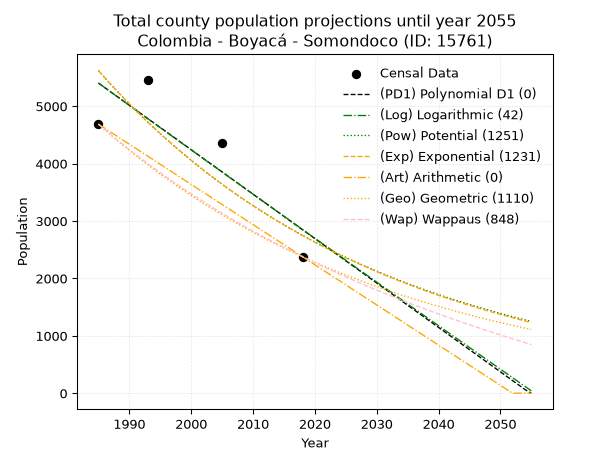
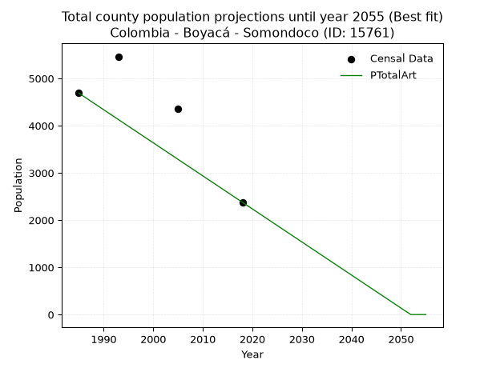
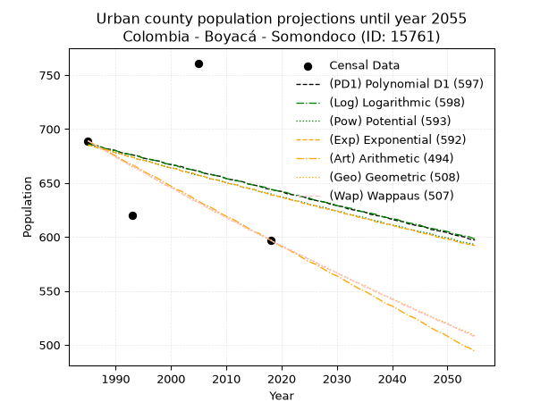
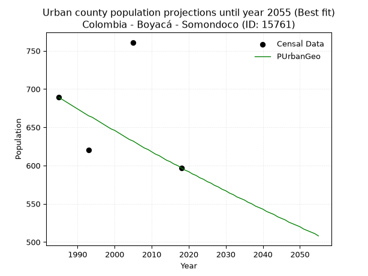
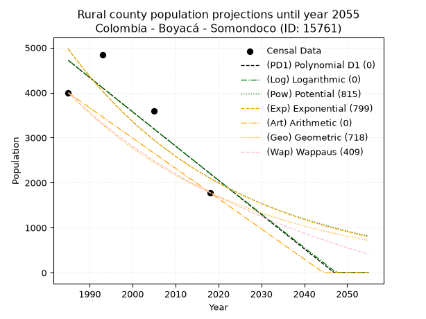
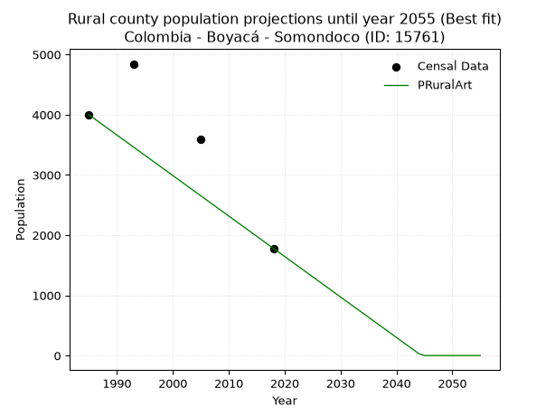

<div align="center">


</div>

# _“Population and Public Services Demand Projections (PPSD) until Year 2050 for Colombia - Boyacá - Somondoco (ID: 15761)”_
Keywords: `population` `public-service` `projection` `lineal` `polynomial` `logarithmic` `potential` `exponential` `arithmetic` `geometric` `wappaus` `dane` `colombia` `south-america`

PPSD are analytical estimates used by governments and planners to anticipate future changes in population size, age distribution, and the resulting community needs for utilities, healthcare, education, and infrastructure as sizing future water treatment facilities, electrical grids, and road networks based on spatial growth.

> **General running parameters**: • app_version: _v20260806_. • Python version: _3.14.7_. • Pandas version: _3.0.5_. • NumPy version: _2.5.1_. • Creates, save and include plots into reports (create_plot): _False_. • Projection until year: _2050_. • Process polynomial degree 2 and up: _False_. • Process Wappaus: _True_. • Process Wappaus: _True_. • Set negative values to zero: _True_. • Set infinite values to zero: _True_. • Drop dataset notes: _True_. 
<div align="center">

Dynamic map: [:earth_americas:Google](http://maps.google.com/maps?q=4.985725506,-73.4333929) [:earth_americas:OSM](https://www.openstreetmap.org/#map=18/4.985725506/-73.4333929&layers=P) [:earth_americas:Bing](https://www.bing.com/maps?cp=4.985725506~-73.4333929&lvl=18) [:earth_americas:Apple](https://maps.apple.com/frame?center=4.985725506%2C-73.4333929&span=0.003%2C0.006)

</div>


<div align="center">

```geojson
{
  "type": "Feature",
  "geometry": {
    "type": "Point", 
    "coordinates": [-73.4333929, 4.985725506]
  }, 
  "properties": {
    "Name": "Colombia - Boyacá - Somondoco (ID: 15761)"
  }
}
```

</div>


## 0. Census Data (4 records)

Census data are official statistics collected by a government about the people and housing in a country. They usually include counts of total population, age, sex, race, income, education, and jobs.

📅Global census file: [Population.xlsx](../data/Population.xlsx)

| Source   |   Year |   CountryID | CountryName   |   StateID | StateName   |   CountyID | CountyName   |   PTotal |   PUrban |   PRural |
|:---------|-------:|------------:|:--------------|----------:|:------------|-----------:|:-------------|---------:|---------:|---------:|
| DANE     |   1985 |          57 | Colombia      |        15 | Boyacá      |      15761 | Somondoco    |     4687 |      689 |     3998 |
| DANE     |   1993 |          57 | Colombia      |        15 | Boyacá      |      15761 | Somondoco    |     5464 |      620 |     4844 |
| DANE     |   2005 |          57 | Colombia      |        15 | Boyacá      |      15761 | Somondoco    |     4359 |      761 |     3598 |
| DANE     |   2018 |          57 | Colombia      |        15 | Boyacá      |      15761 | Somondoco    |     2377 |      597 |     1780 |

> 🔥Some records has specific notes about the registered values or the corresponding urban or rural distribution.

## 1. Total

### 1.1. Coefficients and Parameters

* (PD1) Polynomial Deg 1: -77.38859895624115, 159018.29506222138 (lineal)
* (Log) Logarithmic: -154687.6361506307, 1180003.7119698643
* (Pow) Potential: -43.356265105630854, 146.72827455361733
* (Exp) Exponential: -0.021691053887775584, 2.811386274586303e+22
* (Art) Arithmetic: Year diff. 2018 - 1985 = 33, Population diff. 2377 - 4687 = -2310, Annual growth = -70.0
* (Geo) Geometric: Year diff. 2018 - 1985 = 33, Population diff. 2377 - 4687 = -2310, Annual growth % = -0.020364141582235318
* (Wap) Wappaus: i = -1.9818799546998866, Condition values only valid for < 200)

<sub>
Wappaus condition values: ['-0.00', '-1.98', '-3.96', '-5.95', '-7.93', '-9.91', '-11.89', '-13.87', '-15.86', '-17.84', '-19.82', '-21.80', '-23.78', '-25.76', '-27.75', '-29.73', '-31.71', '-33.69', '-35.67', '-37.66', '-39.64', '-41.62', '-43.60', '-45.58', '-47.57', '-49.55', '-51.53', '-53.51', '-55.49', '-57.47', '-59.46', '-61.44', '-63.42', '-65.40', '-67.38', '-69.37', '-71.35', '-73.33', '-75.31', '-77.29', '-79.28', '-81.26', '-83.24', '-85.22', '-87.20', '-89.18', '-91.17', '-93.15', '-95.13', '-97.11', '-99.09', '-101.08', '-103.06', '-105.04', '-107.02', '-109.00', '-110.99', '-112.97', '-114.95', '-116.93', '-118.91', '-120.89', '-122.88', '-124.86', '-126.84', '-128.82']
</sub>


### 1.2. Projected Dataset

|   Year |   CountyID |   PTotalPD1 |   PTotalLog |   PTotalPow |   PTotalExp |   PTotalArt |   PTotalGeo |   PTotalWap |
|-------:|-----------:|------------:|------------:|------------:|------------:|------------:|------------:|------------:|
|   1985 |      15761 |        5402 |        5403 |        5619 |        5618 |        4687 |        4687 |        4687 |
|   1986 |      15761 |        5325 |        5325 |        5498 |        5498 |        4617 |        4592 |        4595 |
|   1987 |      15761 |        5247 |        5247 |        5379 |        5380 |        4547 |        4498 |        4505 |
|   1988 |      15761 |        5170 |        5169 |        5263 |        5264 |        4477 |        4406 |        4416 |
|   1989 |      15761 |        5092 |        5091 |        5150 |        5152 |        4407 |        4317 |        4330 |
|   1990 |      15761 |        5015 |        5013 |        5039 |        5041 |        4337 |        4229 |        4244 |
|   1991 |      15761 |        4938 |        4936 |        4930 |        4933 |        4267 |        4143 |        4161 |
|   1992 |      15761 |        4860 |        4858 |        4824 |        4827 |        4197 |        4058 |        4079 |
|   1993 |      15761 |        4783 |        4780 |        4720 |        4723 |        4127 |        3976 |        3998 |
|   1994 |      15761 |        4705 |        4703 |        4619 |        4622 |        4057 |        3895 |        3919 |
|   1995 |      15761 |        4628 |        4625 |        4519 |        4523 |        3987 |        3815 |        3842 |
|   1996 |      15761 |        4551 |        4548 |        4422 |        4426 |        3917 |        3738 |        3766 |
|   1997 |      15761 |        4473 |        4470 |        4327 |        4331 |        3847 |        3662 |        3691 |
|   1998 |      15761 |        4396 |        4393 |        4234 |        4238 |        3777 |        3587 |        3617 |
|   1999 |      15761 |        4318 |        4315 |        4143 |        4147 |        3707 |        3514 |        3545 |
|   2000 |      15761 |        4241 |        4238 |        4055 |        4058 |        3637 |        3442 |        3474 |
|   2001 |      15761 |        4164 |        4161 |        3968 |        3971 |        3567 |        3372 |        3404 |
|   2002 |      15761 |        4086 |        4083 |        3883 |        3886 |        3497 |        3304 |        3336 |
|   2003 |      15761 |        4009 |        4006 |        3799 |        3802 |        3427 |        3236 |        3268 |
|   2004 |      15761 |        3932 |        3929 |        3718 |        3721 |        3357 |        3170 |        3202 |
|   2005 |      15761 |        3854 |        3852 |        3639 |        3641 |        3287 |        3106 |        3136 |
|   2006 |      15761 |        3777 |        3775 |        3561 |        3563 |        3217 |        3043 |        3072 |
|   2007 |      15761 |        3699 |        3698 |        3485 |        3486 |        3147 |        2981 |        3009 |
|   2008 |      15761 |        3622 |        3621 |        3410 |        3412 |        3077 |        2920 |        2947 |
|   2009 |      15761 |        3545 |        3544 |        3337 |        3338 |        3007 |        2861 |        2886 |
|   2010 |      15761 |        3467 |        3467 |        3266 |        3267 |        2937 |        2802 |        2826 |
|   2011 |      15761 |        3390 |        3390 |        3196 |        3197 |        2867 |        2745 |        2767 |
|   2012 |      15761 |        3312 |        3313 |        3128 |        3128 |        2797 |        2689 |        2708 |
|   2013 |      15761 |        3235 |        3236 |        3062 |        3061 |        2727 |        2635 |        2651 |
|   2014 |      15761 |        3158 |        3159 |        2996 |        2995 |        2657 |        2581 |        2594 |
|   2015 |      15761 |        3080 |        3082 |        2933 |        2931 |        2587 |        2528 |        2539 |
|   2016 |      15761 |        3003 |        3006 |        2870 |        2868 |        2517 |        2477 |        2484 |
|   2017 |      15761 |        2925 |        2929 |        2809 |        2807 |        2447 |        2426 |        2430 |
|   2018 |      15761 |        2848 |        2852 |        2749 |        2746 |        2377 |        2377 |        2377 |
|   2019 |      15761 |        2771 |        2775 |        2691 |        2687 |        2307 |        2329 |        2325 |
|   2020 |      15761 |        2693 |        2699 |        2634 |        2630 |        2237 |        2281 |        2273 |
|   2021 |      15761 |        2616 |        2622 |        2578 |        2573 |        2167 |        2235 |        2222 |
|   2022 |      15761 |        2539 |        2546 |        2523 |        2518 |        2097 |        2189 |        2172 |
|   2023 |      15761 |        2461 |        2469 |        2470 |        2464 |        2027 |        2145 |        2123 |
|   2024 |      15761 |        2384 |        2393 |        2417 |        2411 |        1957 |        2101 |        2074 |
|   2025 |      15761 |        2306 |        2316 |        2366 |        2359 |        1887 |        2058 |        2026 |
|   2026 |      15761 |        2229 |        2240 |        2316 |        2309 |        1817 |        2016 |        1979 |
|   2027 |      15761 |        2152 |        2164 |        2267 |        2259 |        1747 |        1975 |        1932 |
|   2028 |      15761 |        2074 |        2087 |        2219 |        2211 |        1677 |        1935 |        1886 |
|   2029 |      15761 |        1997 |        2011 |        2172 |        2163 |        1607 |        1896 |        1841 |
|   2030 |      15761 |        1919 |        1935 |        2126 |        2117 |        1537 |        1857 |        1796 |
|   2031 |      15761 |        1842 |        1859 |        2081 |        2071 |        1467 |        1819 |        1752 |
|   2032 |      15761 |        1765 |        1783 |        2037 |        2027 |        1397 |        1782 |        1708 |
|   2033 |      15761 |        1687 |        1707 |        1994 |        1984 |        1327 |        1746 |        1665 |
|   2034 |      15761 |        1610 |        1630 |        1952 |        1941 |        1257 |        1710 |        1623 |
|   2035 |      15761 |        1532 |        1554 |        1911 |        1899 |        1187 |        1675 |        1581 |
|   2036 |      15761 |        1455 |        1478 |        1871 |        1859 |        1117 |        1641 |        1540 |
|   2037 |      15761 |        1378 |        1403 |        1831 |        1819 |        1047 |        1608 |        1499 |
|   2038 |      15761 |        1300 |        1327 |        1793 |        1780 |         977 |        1575 |        1459 |
|   2039 |      15761 |        1223 |        1251 |        1755 |        1741 |         907 |        1543 |        1419 |
|   2040 |      15761 |        1146 |        1175 |        1718 |        1704 |         837 |        1512 |        1380 |
|   2041 |      15761 |        1068 |        1099 |        1682 |        1668 |         767 |        1481 |        1342 |
|   2042 |      15761 |         991 |        1023 |        1647 |        1632 |         697 |        1451 |        1303 |
|   2043 |      15761 |         913 |         948 |        1612 |        1597 |         627 |        1421 |        1266 |
|   2044 |      15761 |         836 |         872 |        1578 |        1562 |         557 |        1392 |        1228 |
|   2045 |      15761 |         759 |         796 |        1545 |        1529 |         487 |        1364 |        1192 |
|   2046 |      15761 |         681 |         721 |        1513 |        1496 |         417 |        1336 |        1155 |
|   2047 |      15761 |         604 |         645 |        1481 |        1464 |         347 |        1309 |        1120 |
|   2048 |      15761 |         526 |         569 |        1450 |        1433 |         277 |        1282 |        1084 |
|   2049 |      15761 |         449 |         494 |        1420 |        1402 |         207 |        1256 |        1049 |
|   2050 |      15761 |         372 |         418 |        1390 |        1372 |         137 |        1231 |        1015 |
<div align="center">

</img>

</div>


### 1.3. Best fit with absolute error and relative error (%)

Relative error puts that difference into context by dividing the absolute error by the true value, creating a unitless ratio or percentage that shows the scale of the mistake.

Absolute and relative error

|   Year | Source   |   CountryID | CountryName   |   StateID | StateName   |   CountyID_x | CountyName   |   PTotal |   PUrban |   PRural |   CountyID_y |   PTotalPD1 |   PTotalLog |   PTotalPow |   PTotalExp |   PTotalArt |   PTotalGeo |   PTotalWap |   PTotalPD1AbsError |   PTotalLogAbsError |   PTotalPowAbsError |   PTotalExpAbsError |   PTotalArtAbsError |   PTotalGeoAbsError |   PTotalWapAbsError |   PTotalPD1RelError |   PTotalLogRelError |   PTotalPowRelError |   PTotalExpRelError |   PTotalArtRelError |   PTotalGeoRelError |   PTotalWapRelError |
|-------:|:---------|------------:|:--------------|----------:|:------------|-------------:|:-------------|---------:|---------:|---------:|-------------:|------------:|------------:|------------:|------------:|------------:|------------:|------------:|--------------------:|--------------------:|--------------------:|--------------------:|--------------------:|--------------------:|--------------------:|--------------------:|--------------------:|--------------------:|--------------------:|--------------------:|--------------------:|--------------------:|
|   1985 | DANE     |          57 | Colombia      |        15 | Boyacá      |        15761 | Somondoco    |     4687 |      689 |     3998 |        15761 |        5402 |        5403 |        5619 |        5618 |        4687 |        4687 |        4687 |                 715 |                 716 |                 932 |                 931 |                   0 |                   0 |                   0 |             15.255  |             15.2763 |             19.8848 |             19.8635 |              0      |              0      |              0      |
|   1993 | DANE     |          57 | Colombia      |        15 | Boyacá      |        15761 | Somondoco    |     5464 |      620 |     4844 |        15761 |        4783 |        4780 |        4720 |        4723 |        4127 |        3976 |        3998 |                 681 |                 684 |                 744 |                 741 |                1337 |                1488 |                1466 |             12.4634 |             12.5183 |             13.6164 |             13.5615 |             24.4693 |             27.2328 |             26.8302 |
|   2005 | DANE     |          57 | Colombia      |        15 | Boyacá      |        15761 | Somondoco    |     4359 |      761 |     3598 |        15761 |        3854 |        3852 |        3639 |        3641 |        3287 |        3106 |        3136 |                 505 |                 507 |                 720 |                 718 |                1072 |                1253 |                1223 |             11.5852 |             11.6311 |             16.5175 |             16.4717 |             24.5928 |             28.7451 |             28.0569 |
|   2018 | DANE     |          57 | Colombia      |        15 | Boyacá      |        15761 | Somondoco    |     2377 |      597 |     1780 |        15761 |        2848 |        2852 |        2749 |        2746 |        2377 |        2377 |        2377 |                 471 |                 475 |                 372 |                 369 |                   0 |                   0 |                   0 |             19.8149 |             19.9832 |             15.65   |             15.5238 |              0      |              0      |              0      |

Relative error mean

| Method    |   RelError | Best   |
|:----------|-----------:|:-------|
| PTotalPD1 |    14.7796 |        |
| PTotalLog |    14.8522 |        |
| PTotalPow |    16.4172 |        |
| PTotalExp |    16.3551 |        |
| PTotalArt |    12.2655 | True   |
| PTotalGeo |    13.9945 |        |
| PTotalWap |    13.7218 |        |

💙Best method: _**PTotalArt**_
<div align="center">

</img>

</div>


### 1.4. Fresh water supply demand in liters per capita per day (lpcd)

The fresh water supply demand typically ranges from 100 to 300 liters per capita per day (lpcd) for standard domestic and municipal planning, though absolute survival minimums set by the World Health Organization are as low as 7.5 to 20 liters per day, and total consumption in high-income nations can exceed 400 liters.

> `CZ`: Level in meters above the sea level (masl).<br> `WS`: Fresh water supply demand in liters per capita per day (lpcd or l/h/d).<br> `WSAll`: Zonal fresh water supply demand in liters per second (l/s).<br> `A`: Zonal area in square meters.

Reference values (RAS Colombia)

|    CZ |   WS |
|------:|-----:|
|  1000 |  120 |
|  2000 |  130 |
| 99999 |  140 |

County shapefile geometry properties and water supply values

|   CountyID |      ATotal |   CZTotal |   WSTotal |
|-----------:|------------:|----------:|----------:|
|      15761 | 5.86968e+07 |   1948.25 |       130 |

Projected values for best method: PTotalArt

|   CountyID |   Year |   PTotalArt |   WSTotal |   WSTotalAll |
|-----------:|-------:|------------:|----------:|-------------:|
|      15761 |   1985 |        4687 |       130 |     7.0522   |
|      15761 |   1986 |        4617 |       130 |     6.94688  |
|      15761 |   1987 |        4547 |       130 |     6.84155  |
|      15761 |   1988 |        4477 |       130 |     6.73623  |
|      15761 |   1989 |        4407 |       130 |     6.6309   |
|      15761 |   1990 |        4337 |       130 |     6.52558  |
|      15761 |   1991 |        4267 |       130 |     6.42025  |
|      15761 |   1992 |        4197 |       130 |     6.31493  |
|      15761 |   1993 |        4127 |       130 |     6.20961  |
|      15761 |   1994 |        4057 |       130 |     6.10428  |
|      15761 |   1995 |        3987 |       130 |     5.99896  |
|      15761 |   1996 |        3917 |       130 |     5.89363  |
|      15761 |   1997 |        3847 |       130 |     5.78831  |
|      15761 |   1998 |        3777 |       130 |     5.68299  |
|      15761 |   1999 |        3707 |       130 |     5.57766  |
|      15761 |   2000 |        3637 |       130 |     5.47234  |
|      15761 |   2001 |        3567 |       130 |     5.36701  |
|      15761 |   2002 |        3497 |       130 |     5.26169  |
|      15761 |   2003 |        3427 |       130 |     5.15637  |
|      15761 |   2004 |        3357 |       130 |     5.05104  |
|      15761 |   2005 |        3287 |       130 |     4.94572  |
|      15761 |   2006 |        3217 |       130 |     4.84039  |
|      15761 |   2007 |        3147 |       130 |     4.73507  |
|      15761 |   2008 |        3077 |       130 |     4.62975  |
|      15761 |   2009 |        3007 |       130 |     4.52442  |
|      15761 |   2010 |        2937 |       130 |     4.4191   |
|      15761 |   2011 |        2867 |       130 |     4.31377  |
|      15761 |   2012 |        2797 |       130 |     4.20845  |
|      15761 |   2013 |        2727 |       130 |     4.10313  |
|      15761 |   2014 |        2657 |       130 |     3.9978   |
|      15761 |   2015 |        2587 |       130 |     3.89248  |
|      15761 |   2016 |        2517 |       130 |     3.78715  |
|      15761 |   2017 |        2447 |       130 |     3.68183  |
|      15761 |   2018 |        2377 |       130 |     3.5765   |
|      15761 |   2019 |        2307 |       130 |     3.47118  |
|      15761 |   2020 |        2237 |       130 |     3.36586  |
|      15761 |   2021 |        2167 |       130 |     3.26053  |
|      15761 |   2022 |        2097 |       130 |     3.15521  |
|      15761 |   2023 |        2027 |       130 |     3.04988  |
|      15761 |   2024 |        1957 |       130 |     2.94456  |
|      15761 |   2025 |        1887 |       130 |     2.83924  |
|      15761 |   2026 |        1817 |       130 |     2.73391  |
|      15761 |   2027 |        1747 |       130 |     2.62859  |
|      15761 |   2028 |        1677 |       130 |     2.52326  |
|      15761 |   2029 |        1607 |       130 |     2.41794  |
|      15761 |   2030 |        1537 |       130 |     2.31262  |
|      15761 |   2031 |        1467 |       130 |     2.20729  |
|      15761 |   2032 |        1397 |       130 |     2.10197  |
|      15761 |   2033 |        1327 |       130 |     1.99664  |
|      15761 |   2034 |        1257 |       130 |     1.89132  |
|      15761 |   2035 |        1187 |       130 |     1.786    |
|      15761 |   2036 |        1117 |       130 |     1.68067  |
|      15761 |   2037 |        1047 |       130 |     1.57535  |
|      15761 |   2038 |         977 |       130 |     1.47002  |
|      15761 |   2039 |         907 |       130 |     1.3647   |
|      15761 |   2040 |         837 |       130 |     1.25937  |
|      15761 |   2041 |         767 |       130 |     1.15405  |
|      15761 |   2042 |         697 |       130 |     1.04873  |
|      15761 |   2043 |         627 |       130 |     0.943403 |
|      15761 |   2044 |         557 |       130 |     0.838079 |
|      15761 |   2045 |         487 |       130 |     0.732755 |
|      15761 |   2046 |         417 |       130 |     0.627431 |
|      15761 |   2047 |         347 |       130 |     0.522106 |
|      15761 |   2048 |         277 |       130 |     0.416782 |
|      15761 |   2049 |         207 |       130 |     0.311458 |
|      15761 |   2050 |         137 |       130 |     0.206134 |

## 2. Urban

### 2.1. Coefficients and Parameters

* (PD1) Polynomial Deg 1: -1.269771176234355, 3206.609795262769 (lineal)
* (Log) Logarithmic: -2529.699763324141, 19895.018172768458
* (Pow) Potential: -4.183287512618921, 16.631341802643412
* (Exp) Exponential: -0.002098528119117232, 44154.87748938975
* (Art) Arithmetic: Year diff. 2018 - 1985 = 33, Population diff. 597 - 689 = -92, Annual growth = -2.787878787878788
* (Geo) Geometric: Year diff. 2018 - 1985 = 33, Population diff. 597 - 689 = -92, Annual growth % = -0.004333738427612421
* (Wap) Wappaus: i = -0.43357368396248647, Condition values only valid for < 200)

<sub>
Wappaus condition values: ['-0.00', '-0.43', '-0.87', '-1.30', '-1.73', '-2.17', '-2.60', '-3.04', '-3.47', '-3.90', '-4.34', '-4.77', '-5.20', '-5.64', '-6.07', '-6.50', '-6.94', '-7.37', '-7.80', '-8.24', '-8.67', '-9.11', '-9.54', '-9.97', '-10.41', '-10.84', '-11.27', '-11.71', '-12.14', '-12.57', '-13.01', '-13.44', '-13.87', '-14.31', '-14.74', '-15.18', '-15.61', '-16.04', '-16.48', '-16.91', '-17.34', '-17.78', '-18.21', '-18.64', '-19.08', '-19.51', '-19.94', '-20.38', '-20.81', '-21.25', '-21.68', '-22.11', '-22.55', '-22.98', '-23.41', '-23.85', '-24.28', '-24.71', '-25.15', '-25.58', '-26.01', '-26.45', '-26.88', '-27.32', '-27.75', '-28.18']
</sub>


### 2.2. Projected Dataset

|   Year |   CountyID |   PUrbanPD1 |   PUrbanLog |   PUrbanPow |   PUrbanExp |   PUrbanArt |   PUrbanGeo |   PUrbanWap |
|-------:|-----------:|------------:|------------:|------------:|------------:|------------:|------------:|------------:|
|   1985 |      15761 |         686 |         686 |         685 |         685 |         689 |         689 |         689 |
|   1986 |      15761 |         685 |         685 |         684 |         684 |         686 |         686 |         686 |
|   1987 |      15761 |         684 |         684 |         682 |         682 |         683 |         683 |         683 |
|   1988 |      15761 |         682 |         682 |         681 |         681 |         681 |         680 |         680 |
|   1989 |      15761 |         681 |         681 |         680 |         680 |         678 |         677 |         677 |
|   1990 |      15761 |         680 |         680 |         678 |         678 |         675 |         674 |         674 |
|   1991 |      15761 |         678 |         678 |         677 |         677 |         672 |         671 |         671 |
|   1992 |      15761 |         677 |         677 |         675 |         675 |         669 |         668 |         668 |
|   1993 |      15761 |         676 |         676 |         674 |         674 |         667 |         665 |         666 |
|   1994 |      15761 |         675 |         675 |         672 |         672 |         664 |         663 |         663 |
|   1995 |      15761 |         673 |         673 |         671 |         671 |         661 |         660 |         660 |
|   1996 |      15761 |         672 |         672 |         670 |         670 |         658 |         657 |         657 |
|   1997 |      15761 |         671 |         671 |         668 |         668 |         656 |         654 |         654 |
|   1998 |      15761 |         670 |         670 |         667 |         667 |         653 |         651 |         651 |
|   1999 |      15761 |         668 |         668 |         665 |         665 |         650 |         648 |         648 |
|   2000 |      15761 |         667 |         667 |         664 |         664 |         647 |         646 |         646 |
|   2001 |      15761 |         666 |         666 |         663 |         663 |         644 |         643 |         643 |
|   2002 |      15761 |         665 |         664 |         661 |         661 |         642 |         640 |         640 |
|   2003 |      15761 |         663 |         663 |         660 |         660 |         639 |         637 |         637 |
|   2004 |      15761 |         662 |         662 |         658 |         659 |         636 |         634 |         634 |
|   2005 |      15761 |         661 |         661 |         657 |         657 |         633 |         632 |         632 |
|   2006 |      15761 |         659 |         659 |         656 |         656 |         630 |         629 |         629 |
|   2007 |      15761 |         658 |         658 |         654 |         654 |         628 |         626 |         626 |
|   2008 |      15761 |         657 |         657 |         653 |         653 |         625 |         623 |         624 |
|   2009 |      15761 |         656 |         656 |         652 |         652 |         622 |         621 |         621 |
|   2010 |      15761 |         654 |         654 |         650 |         650 |         619 |         618 |         618 |
|   2011 |      15761 |         653 |         653 |         649 |         649 |         617 |         615 |         615 |
|   2012 |      15761 |         652 |         652 |         648 |         648 |         614 |         613 |         613 |
|   2013 |      15761 |         651 |         651 |         646 |         646 |         611 |         610 |         610 |
|   2014 |      15761 |         649 |         649 |         645 |         645 |         608 |         607 |         607 |
|   2015 |      15761 |         648 |         648 |         644 |         644 |         605 |         605 |         605 |
|   2016 |      15761 |         647 |         647 |         642 |         642 |         603 |         602 |         602 |
|   2017 |      15761 |         645 |         646 |         641 |         641 |         600 |         600 |         600 |
|   2018 |      15761 |         644 |         644 |         640 |         639 |         597 |         597 |         597 |
|   2019 |      15761 |         643 |         643 |         638 |         638 |         594 |         594 |         594 |
|   2020 |      15761 |         642 |         642 |         637 |         637 |         591 |         592 |         592 |
|   2021 |      15761 |         640 |         641 |         636 |         635 |         589 |         589 |         589 |
|   2022 |      15761 |         639 |         639 |         634 |         634 |         586 |         587 |         587 |
|   2023 |      15761 |         638 |         638 |         633 |         633 |         583 |         584 |         584 |
|   2024 |      15761 |         637 |         637 |         632 |         631 |         580 |         582 |         582 |
|   2025 |      15761 |         635 |         636 |         630 |         630 |         577 |         579 |         579 |
|   2026 |      15761 |         634 |         634 |         629 |         629 |         575 |         577 |         577 |
|   2027 |      15761 |         633 |         633 |         628 |         627 |         572 |         574 |         574 |
|   2028 |      15761 |         632 |         632 |         627 |         626 |         569 |         572 |         571 |
|   2029 |      15761 |         630 |         631 |         625 |         625 |         566 |         569 |         569 |
|   2030 |      15761 |         629 |         629 |         624 |         624 |         564 |         567 |         567 |
|   2031 |      15761 |         628 |         628 |         623 |         622 |         561 |         564 |         564 |
|   2032 |      15761 |         626 |         627 |         621 |         621 |         558 |         562 |         562 |
|   2033 |      15761 |         625 |         626 |         620 |         620 |         555 |         559 |         559 |
|   2034 |      15761 |         624 |         624 |         619 |         618 |         552 |         557 |         557 |
|   2035 |      15761 |         623 |         623 |         618 |         617 |         550 |         555 |         554 |
|   2036 |      15761 |         621 |         622 |         616 |         616 |         547 |         552 |         552 |
|   2037 |      15761 |         620 |         621 |         615 |         614 |         544 |         550 |         549 |
|   2038 |      15761 |         619 |         619 |         614 |         613 |         541 |         547 |         547 |
|   2039 |      15761 |         618 |         618 |         612 |         612 |         538 |         545 |         545 |
|   2040 |      15761 |         616 |         617 |         611 |         611 |         536 |         543 |         542 |
|   2041 |      15761 |         615 |         616 |         610 |         609 |         533 |         540 |         540 |
|   2042 |      15761 |         614 |         614 |         609 |         608 |         530 |         538 |         537 |
|   2043 |      15761 |         612 |         613 |         607 |         607 |         527 |         536 |         535 |
|   2044 |      15761 |         611 |         612 |         606 |         606 |         525 |         533 |         533 |
|   2045 |      15761 |         610 |         611 |         605 |         604 |         522 |         531 |         530 |
|   2046 |      15761 |         609 |         609 |         604 |         603 |         519 |         529 |         528 |
|   2047 |      15761 |         607 |         608 |         603 |         602 |         516 |         526 |         526 |
|   2048 |      15761 |         606 |         607 |         601 |         600 |         513 |         524 |         523 |
|   2049 |      15761 |         605 |         606 |         600 |         599 |         511 |         522 |         521 |
|   2050 |      15761 |         604 |         605 |         599 |         598 |         508 |         520 |         519 |
<div align="center">

</img>

</div>


### 2.3. Best fit with absolute error and relative error (%)

Relative error puts that difference into context by dividing the absolute error by the true value, creating a unitless ratio or percentage that shows the scale of the mistake.

Absolute and relative error

|   Year | Source   |   CountryID | CountryName   |   StateID | StateName   |   CountyID_x | CountyName   |   PTotal |   PUrban |   PRural |   CountyID_y |   PUrbanPD1 |   PUrbanLog |   PUrbanPow |   PUrbanExp |   PUrbanArt |   PUrbanGeo |   PUrbanWap |   PUrbanPD1AbsError |   PUrbanLogAbsError |   PUrbanPowAbsError |   PUrbanExpAbsError |   PUrbanArtAbsError |   PUrbanGeoAbsError |   PUrbanWapAbsError |   PUrbanPD1RelError |   PUrbanLogRelError |   PUrbanPowRelError |   PUrbanExpRelError |   PUrbanArtRelError |   PUrbanGeoRelError |   PUrbanWapRelError |
|-------:|:---------|------------:|:--------------|----------:|:------------|-------------:|:-------------|---------:|---------:|---------:|-------------:|------------:|------------:|------------:|------------:|------------:|------------:|------------:|--------------------:|--------------------:|--------------------:|--------------------:|--------------------:|--------------------:|--------------------:|--------------------:|--------------------:|--------------------:|--------------------:|--------------------:|--------------------:|--------------------:|
|   1985 | DANE     |          57 | Colombia      |        15 | Boyacá      |        15761 | Somondoco    |     4687 |      689 |     3998 |        15761 |         686 |         686 |         685 |         685 |         689 |         689 |         689 |                   3 |                   3 |                   4 |                   4 |                   0 |                   0 |                   0 |            0.435414 |            0.435414 |            0.580552 |            0.580552 |             0       |             0       |             0       |
|   1993 | DANE     |          57 | Colombia      |        15 | Boyacá      |        15761 | Somondoco    |     5464 |      620 |     4844 |        15761 |         676 |         676 |         674 |         674 |         667 |         665 |         666 |                  56 |                  56 |                  54 |                  54 |                  47 |                  45 |                  46 |            9.03226  |            9.03226  |            8.70968  |            8.70968  |             7.58065 |             7.25806 |             7.41935 |
|   2005 | DANE     |          57 | Colombia      |        15 | Boyacá      |        15761 | Somondoco    |     4359 |      761 |     3598 |        15761 |         661 |         661 |         657 |         657 |         633 |         632 |         632 |                 100 |                 100 |                 104 |                 104 |                 128 |                 129 |                 129 |           13.1406   |           13.1406   |           13.6662   |           13.6662   |            16.82    |            16.9514  |            16.9514  |
|   2018 | DANE     |          57 | Colombia      |        15 | Boyacá      |        15761 | Somondoco    |     2377 |      597 |     1780 |        15761 |         644 |         644 |         640 |         639 |         597 |         597 |         597 |                  47 |                  47 |                  43 |                  42 |                   0 |                   0 |                   0 |            7.8727   |            7.8727   |            7.20268  |            7.03518  |             0       |             0       |             0       |

Relative error mean

| Method    |   RelError | Best   |
|:----------|-----------:|:-------|
| PUrbanPD1 |    7.62024 |        |
| PUrbanLog |    7.62024 |        |
| PUrbanPow |    7.53978 |        |
| PUrbanExp |    7.49791 |        |
| PUrbanArt |    6.10015 |        |
| PUrbanGeo |    6.05236 | True   |
| PUrbanWap |    6.09268 |        |

💙Best method: _**PUrbanGeo**_
<div align="center">

</img>

</div>


### 2.4. Fresh water supply demand in liters per capita per day (lpcd)

The fresh water supply demand typically ranges from 100 to 300 liters per capita per day (lpcd) for standard domestic and municipal planning, though absolute survival minimums set by the World Health Organization are as low as 7.5 to 20 liters per day, and total consumption in high-income nations can exceed 400 liters.

> `CZ`: Level in meters above the sea level (masl).<br> `WS`: Fresh water supply demand in liters per capita per day (lpcd or l/h/d).<br> `WSAll`: Zonal fresh water supply demand in liters per second (l/s).<br> `A`: Zonal area in square meters.

Reference values (RAS Colombia)

|    CZ |   WS |
|------:|-----:|
|  1000 |  120 |
|  2000 |  130 |
| 99999 |  140 |

County shapefile geometry properties and water supply values

|   CountyID |   AUrban |   CZUrban |   WSUrban |
|-----------:|---------:|----------:|----------:|
|      15761 |   399128 |    1667.1 |       130 |

Projected values for best method: PUrbanGeo

|   CountyID |   Year |   PUrbanGeo |   WSUrban |   WSUrbanAll |
|-----------:|-------:|------------:|----------:|-------------:|
|      15761 |   1985 |         689 |       130 |     1.03669  |
|      15761 |   1986 |         686 |       130 |     1.03218  |
|      15761 |   1987 |         683 |       130 |     1.02766  |
|      15761 |   1988 |         680 |       130 |     1.02315  |
|      15761 |   1989 |         677 |       130 |     1.01863  |
|      15761 |   1990 |         674 |       130 |     1.01412  |
|      15761 |   1991 |         671 |       130 |     1.00961  |
|      15761 |   1992 |         668 |       130 |     1.00509  |
|      15761 |   1993 |         665 |       130 |     1.00058  |
|      15761 |   1994 |         663 |       130 |     0.997569 |
|      15761 |   1995 |         660 |       130 |     0.993056 |
|      15761 |   1996 |         657 |       130 |     0.988542 |
|      15761 |   1997 |         654 |       130 |     0.984028 |
|      15761 |   1998 |         651 |       130 |     0.979514 |
|      15761 |   1999 |         648 |       130 |     0.975    |
|      15761 |   2000 |         646 |       130 |     0.971991 |
|      15761 |   2001 |         643 |       130 |     0.967477 |
|      15761 |   2002 |         640 |       130 |     0.962963 |
|      15761 |   2003 |         637 |       130 |     0.958449 |
|      15761 |   2004 |         634 |       130 |     0.953935 |
|      15761 |   2005 |         632 |       130 |     0.950926 |
|      15761 |   2006 |         629 |       130 |     0.946412 |
|      15761 |   2007 |         626 |       130 |     0.941898 |
|      15761 |   2008 |         623 |       130 |     0.937384 |
|      15761 |   2009 |         621 |       130 |     0.934375 |
|      15761 |   2010 |         618 |       130 |     0.929861 |
|      15761 |   2011 |         615 |       130 |     0.925347 |
|      15761 |   2012 |         613 |       130 |     0.922338 |
|      15761 |   2013 |         610 |       130 |     0.917824 |
|      15761 |   2014 |         607 |       130 |     0.91331  |
|      15761 |   2015 |         605 |       130 |     0.910301 |
|      15761 |   2016 |         602 |       130 |     0.905787 |
|      15761 |   2017 |         600 |       130 |     0.902778 |
|      15761 |   2018 |         597 |       130 |     0.898264 |
|      15761 |   2019 |         594 |       130 |     0.89375  |
|      15761 |   2020 |         592 |       130 |     0.890741 |
|      15761 |   2021 |         589 |       130 |     0.886227 |
|      15761 |   2022 |         587 |       130 |     0.883218 |
|      15761 |   2023 |         584 |       130 |     0.878704 |
|      15761 |   2024 |         582 |       130 |     0.875694 |
|      15761 |   2025 |         579 |       130 |     0.871181 |
|      15761 |   2026 |         577 |       130 |     0.868171 |
|      15761 |   2027 |         574 |       130 |     0.863657 |
|      15761 |   2028 |         572 |       130 |     0.860648 |
|      15761 |   2029 |         569 |       130 |     0.856134 |
|      15761 |   2030 |         567 |       130 |     0.853125 |
|      15761 |   2031 |         564 |       130 |     0.848611 |
|      15761 |   2032 |         562 |       130 |     0.845602 |
|      15761 |   2033 |         559 |       130 |     0.841088 |
|      15761 |   2034 |         557 |       130 |     0.838079 |
|      15761 |   2035 |         555 |       130 |     0.835069 |
|      15761 |   2036 |         552 |       130 |     0.830556 |
|      15761 |   2037 |         550 |       130 |     0.827546 |
|      15761 |   2038 |         547 |       130 |     0.823032 |
|      15761 |   2039 |         545 |       130 |     0.820023 |
|      15761 |   2040 |         543 |       130 |     0.817014 |
|      15761 |   2041 |         540 |       130 |     0.8125   |
|      15761 |   2042 |         538 |       130 |     0.809491 |
|      15761 |   2043 |         536 |       130 |     0.806481 |
|      15761 |   2044 |         533 |       130 |     0.801968 |
|      15761 |   2045 |         531 |       130 |     0.798958 |
|      15761 |   2046 |         529 |       130 |     0.795949 |
|      15761 |   2047 |         526 |       130 |     0.791435 |
|      15761 |   2048 |         524 |       130 |     0.788426 |
|      15761 |   2049 |         522 |       130 |     0.785417 |
|      15761 |   2050 |         520 |       130 |     0.782407 |

## 3. Rural

### 3.1. Coefficients and Parameters

* (PD1) Polynomial Deg 1: -76.11882778000681, 155811.6852669586 (lineal)
* (Log) Logarithmic: -152157.93638730646, 1160108.6937970952
* (Pow) Potential: -52.1761220086483, 175.7607176610719
* (Exp) Exponential: -0.026102448376227227, 1.5794818750663498e+26
* (Art) Arithmetic: Year diff. 2018 - 1985 = 33, Population diff. 1780 - 3998 = -2218, Annual growth = -67.21212121212122
* (Geo) Geometric: Year diff. 2018 - 1985 = 33, Population diff. 1780 - 3998 = -2218, Annual growth % = -0.024222443998251353
* (Wap) Wappaus: i = -2.326483946421641, Condition values only valid for < 200)

<sub>
Wappaus condition values: ['-0.00', '-2.33', '-4.65', '-6.98', '-9.31', '-11.63', '-13.96', '-16.29', '-18.61', '-20.94', '-23.26', '-25.59', '-27.92', '-30.24', '-32.57', '-34.90', '-37.22', '-39.55', '-41.88', '-44.20', '-46.53', '-48.86', '-51.18', '-53.51', '-55.84', '-58.16', '-60.49', '-62.82', '-65.14', '-67.47', '-69.79', '-72.12', '-74.45', '-76.77', '-79.10', '-81.43', '-83.75', '-86.08', '-88.41', '-90.73', '-93.06', '-95.39', '-97.71', '-100.04', '-102.37', '-104.69', '-107.02', '-109.34', '-111.67', '-114.00', '-116.32', '-118.65', '-120.98', '-123.30', '-125.63', '-127.96', '-130.28', '-132.61', '-134.94', '-137.26', '-139.59', '-141.92', '-144.24', '-146.57', '-148.89', '-151.22']
</sub>


### 3.2. Projected Dataset

|   Year |   CountyID |   PRuralPD1 |   PRuralLog |   PRuralPow |   PRuralExp |   PRuralArt |   PRuralGeo |   PRuralWap |
|-------:|-----------:|------------:|------------:|------------:|------------:|------------:|------------:|------------:|
|   1985 |      15761 |        4716 |        4717 |        4970 |        4969 |        3998 |        3998 |        3998 |
|   1986 |      15761 |        4640 |        4640 |        4841 |        4841 |        3931 |        3901 |        3906 |
|   1987 |      15761 |        4564 |        4563 |        4716 |        4716 |        3864 |        3807 |        3816 |
|   1988 |      15761 |        4487 |        4487 |        4593 |        4595 |        3796 |        3714 |        3728 |
|   1989 |      15761 |        4411 |        4410 |        4475 |        4476 |        3729 |        3624 |        3642 |
|   1990 |      15761 |        4335 |        4334 |        4359 |        4361 |        3662 |        3537 |        3558 |
|   1991 |      15761 |        4259 |        4257 |        4246 |        4249 |        3595 |        3451 |        3476 |
|   1992 |      15761 |        4183 |        4181 |        4136 |        4139 |        3528 |        3367 |        3396 |
|   1993 |      15761 |        4107 |        4105 |        4029 |        4032 |        3460 |        3286 |        3317 |
|   1994 |      15761 |        4031 |        4028 |        3925 |        3929 |        3393 |        3206 |        3240 |
|   1995 |      15761 |        3955 |        3952 |        3824 |        3827 |        3326 |        3129 |        3165 |
|   1996 |      15761 |        3879 |        3876 |        3725 |        3729 |        3259 |        3053 |        3091 |
|   1997 |      15761 |        3802 |        3799 |        3629 |        3633 |        3191 |        2979 |        3019 |
|   1998 |      15761 |        3726 |        3723 |        3535 |        3539 |        3124 |        2907 |        2948 |
|   1999 |      15761 |        3650 |        3647 |        3444 |        3448 |        3057 |        2836 |        2878 |
|   2000 |      15761 |        3574 |        3571 |        3356 |        3359 |        2990 |        2768 |        2810 |
|   2001 |      15761 |        3498 |        3495 |        3269 |        3273 |        2923 |        2701 |        2743 |
|   2002 |      15761 |        3422 |        3419 |        3185 |        3188 |        2855 |        2635 |        2678 |
|   2003 |      15761 |        3346 |        3343 |        3103 |        3106 |        2788 |        2571 |        2614 |
|   2004 |      15761 |        3270 |        3267 |        3023 |        3026 |        2721 |        2509 |        2551 |
|   2005 |      15761 |        3193 |        3191 |        2946 |        2948 |        2654 |        2448 |        2489 |
|   2006 |      15761 |        3117 |        3115 |        2870 |        2872 |        2587 |        2389 |        2428 |
|   2007 |      15761 |        3041 |        3039 |        2796 |        2798 |        2519 |        2331 |        2369 |
|   2008 |      15761 |        2965 |        2964 |        2725 |        2726 |        2452 |        2275 |        2310 |
|   2009 |      15761 |        2889 |        2888 |        2655 |        2656 |        2385 |        2220 |        2253 |
|   2010 |      15761 |        2813 |        2812 |        2587 |        2587 |        2318 |        2166 |        2197 |
|   2011 |      15761 |        2737 |        2736 |        2520 |        2521 |        2250 |        2113 |        2141 |
|   2012 |      15761 |        2661 |        2661 |        2456 |        2456 |        2183 |        2062 |        2087 |
|   2013 |      15761 |        2584 |        2585 |        2393 |        2392 |        2116 |        2012 |        2033 |
|   2014 |      15761 |        2508 |        2510 |        2332 |        2331 |        2049 |        1963 |        1981 |
|   2015 |      15761 |        2432 |        2434 |        2272 |        2271 |        1982 |        1916 |        1929 |
|   2016 |      15761 |        2356 |        2359 |        2214 |        2212 |        1914 |        1869 |        1879 |
|   2017 |      15761 |        2280 |        2283 |        2158 |        2155 |        1847 |        1824 |        1829 |
|   2018 |      15761 |        2204 |        2208 |        2103 |        2100 |        1780 |        1780 |        1780 |
|   2019 |      15761 |        2128 |        2132 |        2049 |        2046 |        1713 |        1737 |        1732 |
|   2020 |      15761 |        2052 |        2057 |        1997 |        1993 |        1646 |        1695 |        1684 |
|   2021 |      15761 |        1976 |        1982 |        1946 |        1942 |        1578 |        1654 |        1638 |
|   2022 |      15761 |        1899 |        1906 |        1896 |        1892 |        1511 |        1614 |        1592 |
|   2023 |      15761 |        1823 |        1831 |        1848 |        1843 |        1444 |        1575 |        1547 |
|   2024 |      15761 |        1747 |        1756 |        1801 |        1795 |        1377 |        1536 |        1503 |
|   2025 |      15761 |        1671 |        1681 |        1755 |        1749 |        1310 |        1499 |        1459 |
|   2026 |      15761 |        1595 |        1606 |        1710 |        1704 |        1242 |        1463 |        1416 |
|   2027 |      15761 |        1519 |        1531 |        1667 |        1660 |        1175 |        1428 |        1374 |
|   2028 |      15761 |        1443 |        1456 |        1625 |        1617 |        1108 |        1393 |        1332 |
|   2029 |      15761 |        1367 |        1381 |        1583 |        1576 |        1041 |        1359 |        1291 |
|   2030 |      15761 |        1290 |        1306 |        1543 |        1535 |         973 |        1326 |        1251 |
|   2031 |      15761 |        1214 |        1231 |        1504 |        1496 |         906 |        1294 |        1211 |
|   2032 |      15761 |        1138 |        1156 |        1466 |        1457 |         839 |        1263 |        1172 |
|   2033 |      15761 |        1062 |        1081 |        1429 |        1419 |         772 |        1232 |        1133 |
|   2034 |      15761 |         986 |        1006 |        1392 |        1383 |         705 |        1202 |        1095 |
|   2035 |      15761 |         910 |         931 |        1357 |        1347 |         637 |        1173 |        1058 |
|   2036 |      15761 |         834 |         857 |        1323 |        1313 |         570 |        1145 |        1021 |
|   2037 |      15761 |         758 |         782 |        1289 |        1279 |         503 |        1117 |         984 |
|   2038 |      15761 |         682 |         707 |        1257 |        1246 |         436 |        1090 |         948 |
|   2039 |      15761 |         605 |         633 |        1225 |        1214 |         369 |        1064 |         913 |
|   2040 |      15761 |         529 |         558 |        1194 |        1182 |         301 |        1038 |         878 |
|   2041 |      15761 |         453 |         483 |        1164 |        1152 |         234 |        1013 |         844 |
|   2042 |      15761 |         377 |         409 |        1135 |        1122 |         167 |         988 |         810 |
|   2043 |      15761 |         301 |         334 |        1106 |        1093 |         100 |         964 |         777 |
|   2044 |      15761 |         225 |         260 |        1078 |        1065 |          32 |         941 |         744 |
|   2045 |      15761 |         149 |         185 |        1051 |        1038 |         -35 |         918 |         711 |
|   2046 |      15761 |          73 |         111 |        1024 |        1011 |        -102 |         896 |         679 |
|   2047 |      15761 |           0 |          37 |         999 |         985 |        -169 |         874 |         648 |
|   2048 |      15761 |           0 |           0 |         974 |         960 |        -236 |         853 |         616 |
|   2049 |      15761 |           0 |           0 |         949 |         935 |        -304 |         832 |         586 |
|   2050 |      15761 |           0 |           0 |         925 |         911 |        -371 |         812 |         555 |
<div align="center">

</img>

</div>


### 3.3. Best fit with absolute error and relative error (%)

Relative error puts that difference into context by dividing the absolute error by the true value, creating a unitless ratio or percentage that shows the scale of the mistake.

Absolute and relative error

|   Year | Source   |   CountryID | CountryName   |   StateID | StateName   |   CountyID_x | CountyName   |   PTotal |   PUrban |   PRural |   CountyID_y |   PRuralPD1 |   PRuralLog |   PRuralPow |   PRuralExp |   PRuralArt |   PRuralGeo |   PRuralWap |   PRuralPD1AbsError |   PRuralLogAbsError |   PRuralPowAbsError |   PRuralExpAbsError |   PRuralArtAbsError |   PRuralGeoAbsError |   PRuralWapAbsError |   PRuralPD1RelError |   PRuralLogRelError |   PRuralPowRelError |   PRuralExpRelError |   PRuralArtRelError |   PRuralGeoRelError |   PRuralWapRelError |
|-------:|:---------|------------:|:--------------|----------:|:------------|-------------:|:-------------|---------:|---------:|---------:|-------------:|------------:|------------:|------------:|------------:|------------:|------------:|------------:|--------------------:|--------------------:|--------------------:|--------------------:|--------------------:|--------------------:|--------------------:|--------------------:|--------------------:|--------------------:|--------------------:|--------------------:|--------------------:|--------------------:|
|   1985 | DANE     |          57 | Colombia      |        15 | Boyacá      |        15761 | Somondoco    |     4687 |      689 |     3998 |        15761 |        4716 |        4717 |        4970 |        4969 |        3998 |        3998 |        3998 |                 718 |                 719 |                 972 |                 971 |                   0 |                   0 |                   0 |             17.959  |             17.984  |             24.3122 |             24.2871 |              0      |              0      |              0      |
|   1993 | DANE     |          57 | Colombia      |        15 | Boyacá      |        15761 | Somondoco    |     5464 |      620 |     4844 |        15761 |        4107 |        4105 |        4029 |        4032 |        3460 |        3286 |        3317 |                 737 |                 739 |                 815 |                 812 |                1384 |                1558 |                1527 |             15.2147 |             15.256  |             16.8249 |             16.763  |             28.5714 |             32.1635 |             31.5235 |
|   2005 | DANE     |          57 | Colombia      |        15 | Boyacá      |        15761 | Somondoco    |     4359 |      761 |     3598 |        15761 |        3193 |        3191 |        2946 |        2948 |        2654 |        2448 |        2489 |                 405 |                 407 |                 652 |                 650 |                 944 |                1150 |                1109 |             11.2563 |             11.3118 |             18.1212 |             18.0656 |             26.2368 |             31.9622 |             30.8227 |
|   2018 | DANE     |          57 | Colombia      |        15 | Boyacá      |        15761 | Somondoco    |     2377 |      597 |     1780 |        15761 |        2204 |        2208 |        2103 |        2100 |        1780 |        1780 |        1780 |                 424 |                 428 |                 323 |                 320 |                   0 |                   0 |                   0 |             23.8202 |             24.0449 |             18.1461 |             17.9775 |              0      |              0      |              0      |

Relative error mean

| Method    |   RelError | Best   |
|:----------|-----------:|:-------|
| PRuralPD1 |    17.0625 |        |
| PRuralLog |    17.1492 |        |
| PRuralPow |    19.3511 |        |
| PRuralExp |    19.2733 |        |
| PRuralArt |    13.7021 | True   |
| PRuralGeo |    16.0314 |        |
| PRuralWap |    15.5866 |        |

💙Best method: _**PRuralArt**_
<div align="center">

</img>

</div>


### 3.4. Fresh water supply demand in liters per capita per day (lpcd)

The fresh water supply demand typically ranges from 100 to 300 liters per capita per day (lpcd) for standard domestic and municipal planning, though absolute survival minimums set by the World Health Organization are as low as 7.5 to 20 liters per day, and total consumption in high-income nations can exceed 400 liters.

> `CZ`: Level in meters above the sea level (masl).<br> `WS`: Fresh water supply demand in liters per capita per day (lpcd or l/h/d).<br> `WSAll`: Zonal fresh water supply demand in liters per second (l/s).<br> `A`: Zonal area in square meters.

Reference values (RAS Colombia)

|    CZ |   WS |
|------:|-----:|
|  1000 |  120 |
|  2000 |  130 |
| 99999 |  140 |

County shapefile geometry properties and water supply values

|   CountyID |      ARural |   CZRural |   WSRural |
|-----------:|------------:|----------:|----------:|
|      15761 | 5.82976e+07 |   1950.14 |       130 |

Projected values for best method: PRuralArt

|   CountyID |   Year |   PRuralArt |   WSRural |   WSRuralAll |
|-----------:|-------:|------------:|----------:|-------------:|
|      15761 |   1985 |        3998 |       130 |    6.01551   |
|      15761 |   1986 |        3931 |       130 |    5.9147    |
|      15761 |   1987 |        3864 |       130 |    5.81389   |
|      15761 |   1988 |        3796 |       130 |    5.71157   |
|      15761 |   1989 |        3729 |       130 |    5.61076   |
|      15761 |   1990 |        3662 |       130 |    5.50995   |
|      15761 |   1991 |        3595 |       130 |    5.40914   |
|      15761 |   1992 |        3528 |       130 |    5.30833   |
|      15761 |   1993 |        3460 |       130 |    5.20602   |
|      15761 |   1994 |        3393 |       130 |    5.10521   |
|      15761 |   1995 |        3326 |       130 |    5.0044    |
|      15761 |   1996 |        3259 |       130 |    4.90359   |
|      15761 |   1997 |        3191 |       130 |    4.80127   |
|      15761 |   1998 |        3124 |       130 |    4.70046   |
|      15761 |   1999 |        3057 |       130 |    4.59965   |
|      15761 |   2000 |        2990 |       130 |    4.49884   |
|      15761 |   2001 |        2923 |       130 |    4.39803   |
|      15761 |   2002 |        2855 |       130 |    4.29572   |
|      15761 |   2003 |        2788 |       130 |    4.19491   |
|      15761 |   2004 |        2721 |       130 |    4.0941    |
|      15761 |   2005 |        2654 |       130 |    3.99329   |
|      15761 |   2006 |        2587 |       130 |    3.89248   |
|      15761 |   2007 |        2519 |       130 |    3.79016   |
|      15761 |   2008 |        2452 |       130 |    3.68935   |
|      15761 |   2009 |        2385 |       130 |    3.58854   |
|      15761 |   2010 |        2318 |       130 |    3.48773   |
|      15761 |   2011 |        2250 |       130 |    3.38542   |
|      15761 |   2012 |        2183 |       130 |    3.28461   |
|      15761 |   2013 |        2116 |       130 |    3.1838    |
|      15761 |   2014 |        2049 |       130 |    3.08299   |
|      15761 |   2015 |        1982 |       130 |    2.98218   |
|      15761 |   2016 |        1914 |       130 |    2.87986   |
|      15761 |   2017 |        1847 |       130 |    2.77905   |
|      15761 |   2018 |        1780 |       130 |    2.67824   |
|      15761 |   2019 |        1713 |       130 |    2.57743   |
|      15761 |   2020 |        1646 |       130 |    2.47662   |
|      15761 |   2021 |        1578 |       130 |    2.37431   |
|      15761 |   2022 |        1511 |       130 |    2.2735    |
|      15761 |   2023 |        1444 |       130 |    2.17269   |
|      15761 |   2024 |        1377 |       130 |    2.07187   |
|      15761 |   2025 |        1310 |       130 |    1.97106   |
|      15761 |   2026 |        1242 |       130 |    1.86875   |
|      15761 |   2027 |        1175 |       130 |    1.76794   |
|      15761 |   2028 |        1108 |       130 |    1.66713   |
|      15761 |   2029 |        1041 |       130 |    1.56632   |
|      15761 |   2030 |         973 |       130 |    1.464     |
|      15761 |   2031 |         906 |       130 |    1.36319   |
|      15761 |   2032 |         839 |       130 |    1.26238   |
|      15761 |   2033 |         772 |       130 |    1.16157   |
|      15761 |   2034 |         705 |       130 |    1.06076   |
|      15761 |   2035 |         637 |       130 |    0.958449  |
|      15761 |   2036 |         570 |       130 |    0.857639  |
|      15761 |   2037 |         503 |       130 |    0.756829  |
|      15761 |   2038 |         436 |       130 |    0.656019  |
|      15761 |   2039 |         369 |       130 |    0.555208  |
|      15761 |   2040 |         301 |       130 |    0.452894  |
|      15761 |   2041 |         234 |       130 |    0.352083  |
|      15761 |   2042 |         167 |       130 |    0.251273  |
|      15761 |   2043 |         100 |       130 |    0.150463  |
|      15761 |   2044 |          32 |       130 |    0.0481481 |
|      15761 |   2045 |         -35 |       130 |   -0.052662  |
|      15761 |   2046 |        -102 |       130 |   -0.153472  |
|      15761 |   2047 |        -169 |       130 |   -0.254282  |
|      15761 |   2048 |        -236 |       130 |   -0.355093  |
|      15761 |   2049 |        -304 |       130 |   -0.457407  |
|      15761 |   2050 |        -371 |       130 |   -0.558218  |

<div align="center"><br><sub>Share this research</sub></div><br>

<sub>**APPS & TOOLS & CONTENT DISCLAIMER**: • NO WARRANTY - This content and software is provided by <a href="https://github.com/rcfdtools" target="_blank">github.com/rcfdtools</a> "as is", without any express or implied warranty, including warranties of merchantability, fitness for a particular purpose, or non-infringement. There is no guarantee that the software will be error-free or operate without interruption. • LIMITATION OF LIABILITY - Neither the authors nor copyright holders will be liable for claims or damages arising from the software or its use. You are responsible for determining if the software is appropriate for your use and assume all associated risks, including errors, legal compliance, and data loss. • NO PROFESSIONAL ADVICE - The software provides general information and does not offer professional advice. It should not replace consultation with professional advisors. [Clauses and global license for rcfdtools use.](https://github.com/rcfdtools/rcfdtools/blob/main/LICENSE.md)</sub>