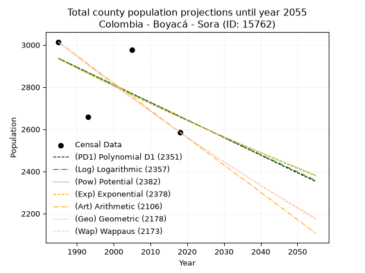
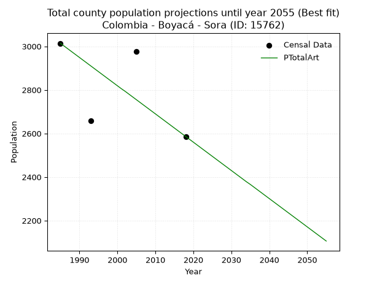
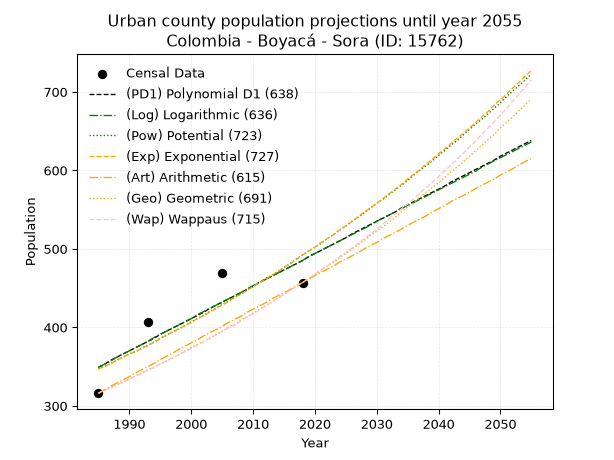
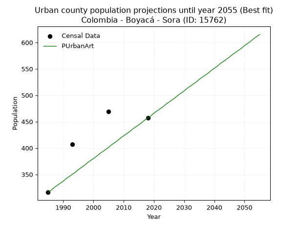
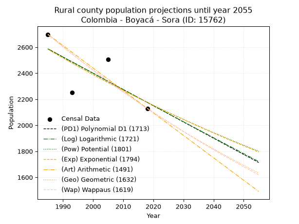
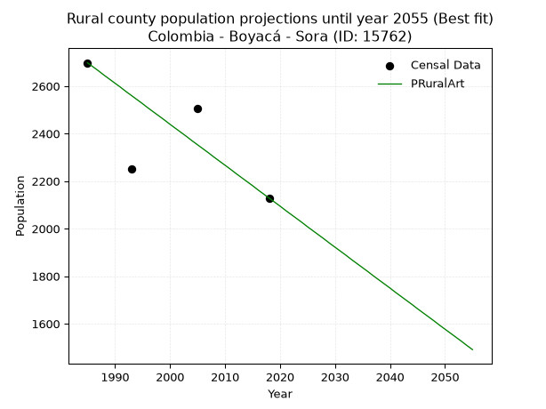

<div align="center">


</div>

# 📜 _“Population and Public Services Demand Projections (PPSD) until Year 2050 for Colombia - Boyacá - Sora (ID: 15762)”_
Keywords: `population` `public-service` `projection` `lineal` `polynomial` `logarithmic` `potential` `exponential` `arithmetic` `geometric` `wappaus` `dane` `colombia` `south-america`

PPSD are analytical estimates used by governments and planners to anticipate future changes in population size, age distribution, and the resulting community needs for utilities, healthcare, education, and infrastructure as sizing future water treatment facilities, electrical grids, and road networks based on spatial growth.

<div align="center">

</img>

</div>


> **General running parameters**: • app_version: _v20260806_. • Python version: _3.14.7_. • Pandas version: _3.0.5_. • NumPy version: _2.5.1_. • Creates, save and include plots into reports (create_plot): _False_. • Projection until year: _2050_. • Process polynomial degree 2 and up: _False_. • Process Wappaus: _True_. • Process Wappaus: _True_. • Set negative values to zero: _True_. • Set infinite values to zero: _True_. • Drop dataset notes: _True_. 
<div align="center">

Maps & GIS Layers: [:earth_americas:Google](http://maps.google.com/maps?q=5.566839797,-73.4501527) [:earth_americas:OSM](https://www.openstreetmap.org/#map=18/5.566839797/-73.4501527&layers=P) [:earth_americas:Bing](https://www.bing.com/maps?cp=5.566839797~-73.4501527&lvl=18) [:earth_americas:Apple](https://maps.apple.com/frame?center=5.566839797%2C-73.4501527&span=0.003%2C0.006) [:earth_americas:GISMobile](https://github.com/rcfdtools/R.GISMobile/blob/main/file/gis/CountyLayer_CO/Readme.md)

</div>


<div align="center">

```geojson
{
  "type": "Feature",
  "geometry": {
    "type": "Point", 
    "coordinates": [-73.4501527, 5.566839797]
  }, 
  "properties": {
    "Name": "Colombia - Boyacá - Sora (ID: 15762)"
  }
}
```

</div>


## 0. Census Data (4 records)

Census data are official statistics collected by a government about the people and housing in a country. They usually include counts of total population, age, sex, race, income, education, and jobs.

📅Global census file: [Population.xlsx](../data/Population.xlsx)

| Source   |   Year |   CountryID | CountryName   |   StateID | StateName   |   CountyID | CountyName   |   PTotal |   PUrban |   PRural |
|:---------|-------:|------------:|:--------------|----------:|:------------|-----------:|:-------------|---------:|---------:|---------:|
| DANE     |   1985 |          57 | Colombia      |        15 | Boyacá      |      15762 | Sora         |     3014 |      316 |     2698 |
| DANE     |   1993 |          57 | Colombia      |        15 | Boyacá      |      15762 | Sora         |     2659 |      407 |     2252 |
| DANE     |   2005 |          57 | Colombia      |        15 | Boyacá      |      15762 | Sora         |     2976 |      469 |     2507 |
| DANE     |   2018 |          57 | Colombia      |        15 | Boyacá      |      15762 | Sora         |     2586 |      457 |     2129 |

> 🔥Some records could had specific notes about the registered values or the corresponding urban or rural distribution.

📅[SUI-RUPS](https://www.datos.gov.co/Hacienda-y-Cr-dito-P-blico/Registro-nico-de-Prestadores-de-Servicios-P-blicos/4qkq-csdn/about_data) - Local public utility companies: [RUPS.csv](../data/RUPS.csv)

 | SERVICIO       | ESTADO    | NOMBRE                                                           | NIT         | DEPARTAMENTO_DOMICILIO   | MUNICIPIO_DOMICILIO   | DIRECCION        |   TELEFONO | EMAIL                   | TIPO_PRESTADOR                 | CLASIFICACION                 |
|:---------------|:----------|:-----------------------------------------------------------------|:------------|:-------------------------|:----------------------|:-----------------|-----------:|:------------------------|:-------------------------------|:------------------------------|
| ACUEDUCTO      | OPERATIVA | UNIDAD DE SERVICIOS PUBLICOS DOMICILIARIOS DEL MUNICIPIO DE SORA | 800019277-9 | BOYACA                   | SORA                  | CALLE 3 # 2 - 35 |    7340300 | uspd@sora-boyaca.gov.co | MUNICIPIO (PRESTACIÓN DIRECTA) | MENOR O IGUAL A 2500 USUARIOS |
| ALCANTARILLADO | OPERATIVA | UNIDAD DE SERVICIOS PUBLICOS DOMICILIARIOS DEL MUNICIPIO DE SORA | 800019277-9 | BOYACA                   | SORA                  | CALLE 3 # 2 - 35 |    7340300 | uspd@sora-boyaca.gov.co | MUNICIPIO (PRESTACIÓN DIRECTA) | MENOR O IGUAL A 2500 USUARIOS |

## 1. Total

### 1.1. Coefficients and Parameters

* (PD1) Polynomial Deg 1: -8.35608189482112, 19523.002810115948 (lineal)
* (Log) Logarithmic: -16716.42733373696, 129870.44812077626
* (Pow) Potential: -6.007679095230345, 23.279335056883344
* (Exp) Exponential: -0.0030031767325393328, 1138630.964865795
* (Art) Arithmetic: Year diff. 2018 - 1985 = 33, Population diff. 2586 - 3014 = -428, Annual growth = -12.969696969696969
* (Geo) Geometric: Year diff. 2018 - 1985 = 33, Population diff. 2586 - 3014 = -428, Annual growth % = -0.004630332254993874
* (Wap) Wappaus: i = -0.46320346320346323, Condition values only valid for < 200)

<sub>
Wappaus condition values: ['-0.00', '-0.46', '-0.93', '-1.39', '-1.85', '-2.32', '-2.78', '-3.24', '-3.71', '-4.17', '-4.63', '-5.10', '-5.56', '-6.02', '-6.48', '-6.95', '-7.41', '-7.87', '-8.34', '-8.80', '-9.26', '-9.73', '-10.19', '-10.65', '-11.12', '-11.58', '-12.04', '-12.51', '-12.97', '-13.43', '-13.90', '-14.36', '-14.82', '-15.29', '-15.75', '-16.21', '-16.68', '-17.14', '-17.60', '-18.06', '-18.53', '-18.99', '-19.45', '-19.92', '-20.38', '-20.84', '-21.31', '-21.77', '-22.23', '-22.70', '-23.16', '-23.62', '-24.09', '-24.55', '-25.01', '-25.48', '-25.94', '-26.40', '-26.87', '-27.33', '-27.79', '-28.26', '-28.72', '-29.18', '-29.65', '-30.11']
</sub>


### 1.2. Projected Dataset

|   Year |   CountyID |   PTotalPD1 |   PTotalLog |   PTotalPow |   PTotalExp |   PTotalArt |   PTotalGeo |   PTotalWap |
|-------:|-----------:|------------:|------------:|------------:|------------:|------------:|------------:|------------:|
|   1985 |      15762 |        2936 |        2936 |        2934 |        2934 |        3014 |        3014 |        3014 |
|   1986 |      15762 |        2928 |        2928 |        2925 |        2925 |        3001 |        3000 |        3000 |
|   1987 |      15762 |        2919 |        2920 |        2916 |        2916 |        2988 |        2986 |        2986 |
|   1988 |      15762 |        2911 |        2911 |        2907 |        2907 |        2975 |        2972 |        2972 |
|   1989 |      15762 |        2903 |        2903 |        2899 |        2899 |        2962 |        2959 |        2959 |
|   1990 |      15762 |        2894 |        2894 |        2890 |        2890 |        2949 |        2945 |        2945 |
|   1991 |      15762 |        2886 |        2886 |        2881 |        2881 |        2936 |        2931 |        2931 |
|   1992 |      15762 |        2878 |        2878 |        2873 |        2873 |        2923 |        2918 |        2918 |
|   1993 |      15762 |        2869 |        2869 |        2864 |        2864 |        2910 |        2904 |        2904 |
|   1994 |      15762 |        2861 |        2861 |        2855 |        2856 |        2897 |        2891 |        2891 |
|   1995 |      15762 |        2853 |        2852 |        2847 |        2847 |        2884 |        2877 |        2878 |
|   1996 |      15762 |        2844 |        2844 |        2838 |        2838 |        2871 |        2864 |        2864 |
|   1997 |      15762 |        2836 |        2836 |        2830 |        2830 |        2858 |        2851 |        2851 |
|   1998 |      15762 |        2828 |        2827 |        2821 |        2821 |        2845 |        2838 |        2838 |
|   1999 |      15762 |        2819 |        2819 |        2813 |        2813 |        2832 |        2824 |        2825 |
|   2000 |      15762 |        2811 |        2811 |        2804 |        2805 |        2819 |        2811 |        2812 |
|   2001 |      15762 |        2802 |        2802 |        2796 |        2796 |        2806 |        2798 |        2799 |
|   2002 |      15762 |        2794 |        2794 |        2787 |        2788 |        2794 |        2785 |        2786 |
|   2003 |      15762 |        2786 |        2785 |        2779 |        2779 |        2781 |        2772 |        2773 |
|   2004 |      15762 |        2777 |        2777 |        2771 |        2771 |        2768 |        2760 |        2760 |
|   2005 |      15762 |        2769 |        2769 |        2762 |        2763 |        2755 |        2747 |        2747 |
|   2006 |      15762 |        2761 |        2760 |        2754 |        2754 |        2742 |        2734 |        2734 |
|   2007 |      15762 |        2752 |        2752 |        2746 |        2746 |        2729 |        2721 |        2722 |
|   2008 |      15762 |        2744 |        2744 |        2738 |        2738 |        2716 |        2709 |        2709 |
|   2009 |      15762 |        2736 |        2735 |        2730 |        2730 |        2703 |        2696 |        2697 |
|   2010 |      15762 |        2727 |        2727 |        2721 |        2722 |        2690 |        2684 |        2684 |
|   2011 |      15762 |        2719 |        2719 |        2713 |        2713 |        2677 |        2671 |        2672 |
|   2012 |      15762 |        2711 |        2711 |        2705 |        2705 |        2664 |        2659 |        2659 |
|   2013 |      15762 |        2702 |        2702 |        2697 |        2697 |        2651 |        2647 |        2647 |
|   2014 |      15762 |        2694 |        2694 |        2689 |        2689 |        2638 |        2634 |        2635 |
|   2015 |      15762 |        2685 |        2686 |        2681 |        2681 |        2625 |        2622 |        2622 |
|   2016 |      15762 |        2677 |        2677 |        2673 |        2673 |        2612 |        2610 |        2610 |
|   2017 |      15762 |        2669 |        2669 |        2665 |        2665 |        2599 |        2598 |        2598 |
|   2018 |      15762 |        2660 |        2661 |        2657 |        2657 |        2586 |        2586 |        2586 |
|   2019 |      15762 |        2652 |        2652 |        2649 |        2649 |        2573 |        2574 |        2574 |
|   2020 |      15762 |        2644 |        2644 |        2641 |        2641 |        2560 |        2562 |        2562 |
|   2021 |      15762 |        2635 |        2636 |        2634 |        2633 |        2547 |        2550 |        2550 |
|   2022 |      15762 |        2627 |        2628 |        2626 |        2625 |        2534 |        2538 |        2538 |
|   2023 |      15762 |        2619 |        2619 |        2618 |        2617 |        2521 |        2527 |        2526 |
|   2024 |      15762 |        2610 |        2611 |        2610 |        2609 |        2508 |        2515 |        2515 |
|   2025 |      15762 |        2602 |        2603 |        2603 |        2602 |        2495 |        2503 |        2503 |
|   2026 |      15762 |        2594 |        2595 |        2595 |        2594 |        2482 |        2492 |        2491 |
|   2027 |      15762 |        2585 |        2586 |        2587 |        2586 |        2469 |        2480 |        2480 |
|   2028 |      15762 |        2577 |        2578 |        2579 |        2578 |        2456 |        2469 |        2468 |
|   2029 |      15762 |        2569 |        2570 |        2572 |        2571 |        2443 |        2457 |        2457 |
|   2030 |      15762 |        2560 |        2562 |        2564 |        2563 |        2430 |        2446 |        2445 |
|   2031 |      15762 |        2552 |        2553 |        2557 |        2555 |        2417 |        2435 |        2434 |
|   2032 |      15762 |        2543 |        2545 |        2549 |        2548 |        2404 |        2423 |        2422 |
|   2033 |      15762 |        2535 |        2537 |        2542 |        2540 |        2391 |        2412 |        2411 |
|   2034 |      15762 |        2527 |        2529 |        2534 |        2532 |        2378 |        2401 |        2400 |
|   2035 |      15762 |        2518 |        2521 |        2527 |        2525 |        2366 |        2390 |        2388 |
|   2036 |      15762 |        2510 |        2512 |        2519 |        2517 |        2353 |        2379 |        2377 |
|   2037 |      15762 |        2502 |        2504 |        2512 |        2510 |        2340 |        2368 |        2366 |
|   2038 |      15762 |        2493 |        2496 |        2504 |        2502 |        2327 |        2357 |        2355 |
|   2039 |      15762 |        2485 |        2488 |        2497 |        2495 |        2314 |        2346 |        2344 |
|   2040 |      15762 |        2477 |        2479 |        2490 |        2487 |        2301 |        2335 |        2333 |
|   2041 |      15762 |        2468 |        2471 |        2482 |        2480 |        2288 |        2324 |        2322 |
|   2042 |      15762 |        2460 |        2463 |        2475 |        2472 |        2275 |        2313 |        2311 |
|   2043 |      15762 |        2452 |        2455 |        2468 |        2465 |        2262 |        2303 |        2300 |
|   2044 |      15762 |        2443 |        2447 |        2461 |        2457 |        2249 |        2292 |        2289 |
|   2045 |      15762 |        2435 |        2439 |        2453 |        2450 |        2236 |        2281 |        2279 |
|   2046 |      15762 |        2426 |        2430 |        2446 |        2443 |        2223 |        2271 |        2268 |
|   2047 |      15762 |        2418 |        2422 |        2439 |        2435 |        2210 |        2260 |        2257 |
|   2048 |      15762 |        2410 |        2414 |        2432 |        2428 |        2197 |        2250 |        2246 |
|   2049 |      15762 |        2401 |        2406 |        2425 |        2421 |        2184 |        2239 |        2236 |
|   2050 |      15762 |        2393 |        2398 |        2418 |        2413 |        2171 |        2229 |        2225 |
<div align="center">

</img>

</div>


### 1.3. Best fit with absolute and relative error (%)

Relative error puts that difference into context by dividing the absolute error by the true value, creating a unitless ratio or percentage that shows the scale of the mistake.

Absolute and relative error

|   Year | Source   |   CountryID | CountryName   |   StateID | StateName   |   CountyID_x | CountyName   |   PTotal |   PUrban |   PRural |   CountyID_y |   PTotalPD1 |   PTotalLog |   PTotalPow |   PTotalExp |   PTotalArt |   PTotalGeo |   PTotalWap |   PTotalPD1AbsError |   PTotalLogAbsError |   PTotalPowAbsError |   PTotalExpAbsError |   PTotalArtAbsError |   PTotalGeoAbsError |   PTotalWapAbsError |   PTotalPD1RelError |   PTotalLogRelError |   PTotalPowRelError |   PTotalExpRelError |   PTotalArtRelError |   PTotalGeoRelError |   PTotalWapRelError |
|-------:|:---------|------------:|:--------------|----------:|:------------|-------------:|:-------------|---------:|---------:|---------:|-------------:|------------:|------------:|------------:|------------:|------------:|------------:|------------:|--------------------:|--------------------:|--------------------:|--------------------:|--------------------:|--------------------:|--------------------:|--------------------:|--------------------:|--------------------:|--------------------:|--------------------:|--------------------:|--------------------:|
|   1985 | DANE     |          57 | Colombia      |        15 | Boyacá      |        15762 | Sora         |     3014 |      316 |     2698 |        15762 |        2936 |        2936 |        2934 |        2934 |        3014 |        3014 |        3014 |                  78 |                  78 |                  80 |                  80 |                   0 |                   0 |                   0 |             2.58792 |             2.58792 |             2.65428 |             2.65428 |             0       |             0       |             0       |
|   1993 | DANE     |          57 | Colombia      |        15 | Boyacá      |        15762 | Sora         |     2659 |      407 |     2252 |        15762 |        2869 |        2869 |        2864 |        2864 |        2910 |        2904 |        2904 |                 210 |                 210 |                 205 |                 205 |                 251 |                 245 |                 245 |             7.89771 |             7.89771 |             7.70967 |             7.70967 |             9.43964 |             9.21399 |             9.21399 |
|   2005 | DANE     |          57 | Colombia      |        15 | Boyacá      |        15762 | Sora         |     2976 |      469 |     2507 |        15762 |        2769 |        2769 |        2762 |        2763 |        2755 |        2747 |        2747 |                 207 |                 207 |                 214 |                 213 |                 221 |                 229 |                 229 |             6.95565 |             6.95565 |             7.19086 |             7.15726 |             7.42608 |             7.69489 |             7.69489 |
|   2018 | DANE     |          57 | Colombia      |        15 | Boyacá      |        15762 | Sora         |     2586 |      457 |     2129 |        15762 |        2660 |        2661 |        2657 |        2657 |        2586 |        2586 |        2586 |                  74 |                  75 |                  71 |                  71 |                   0 |                   0 |                   0 |             2.86156 |             2.90023 |             2.74555 |             2.74555 |             0       |             0       |             0       |

Relative error mean

| Method    |   RelError | Best   |
|:----------|-----------:|:-------|
| PTotalPD1 |    5.07571 |        |
| PTotalLog |    5.08538 |        |
| PTotalPow |    5.07509 |        |
| PTotalExp |    5.06669 |        |
| PTotalArt |    4.21643 | True   |
| PTotalGeo |    4.22722 |        |
| PTotalWap |    4.22722 |        |

💙Best method: _**PTotalArt**_
<div align="center">

</img>

</div>


### 1.4. Fresh water supply demand in liters per capita per day (lpcd)

The fresh water supply demand typically ranges from 100 to 300 liters per capita per day (lpcd) for standard domestic and municipal planning, though absolute survival minimums set by the World Health Organization are as low as 7.5 to 20 liters per day, and total consumption in high-income nations can exceed 400 liters.

> `CZ`: Level in meters above the sea level (masl)<br> `WS`: Fresh water supply demand in liters per capita per day (lpcd or l/h/d)<br> `WSAll`: Zonal fresh water supply demand in liters per second (l/s)<br> `A`: Zonal area in square meters<br> `DP`: Population density (people/hectare or p/ha)

Reference values (RAS Colombia)

|    CZ |   WS |
|------:|-----:|
|  1000 |  120 |
|  2000 |  130 |
| 99999 |  140 |

County shapefile geometry properties and water supply values

|   CountyID |      ATotal |   CZTotal |   WSTotal |
|-----------:|------------:|----------:|----------:|
|      15762 | 4.77655e+07 |   2921.14 |       140 |

Projected values for best method: PTotalArt

|   CountyID |   Year |   PTotalArt |   DPTotal |   WSTotal |   WSTotalAll |
|-----------:|-------:|------------:|----------:|----------:|-------------:|
|      15762 |   1985 |        3014 |      0.63 |       140 |      4.8838  |
|      15762 |   1986 |        3001 |      0.63 |       140 |      4.86273 |
|      15762 |   1987 |        2988 |      0.63 |       140 |      4.84167 |
|      15762 |   1988 |        2975 |      0.62 |       140 |      4.8206  |
|      15762 |   1989 |        2962 |      0.62 |       140 |      4.79954 |
|      15762 |   1990 |        2949 |      0.62 |       140 |      4.77847 |
|      15762 |   1991 |        2936 |      0.61 |       140 |      4.75741 |
|      15762 |   1992 |        2923 |      0.61 |       140 |      4.73634 |
|      15762 |   1993 |        2910 |      0.61 |       140 |      4.71528 |
|      15762 |   1994 |        2897 |      0.61 |       140 |      4.69421 |
|      15762 |   1995 |        2884 |      0.6  |       140 |      4.67315 |
|      15762 |   1996 |        2871 |      0.6  |       140 |      4.65208 |
|      15762 |   1997 |        2858 |      0.6  |       140 |      4.63102 |
|      15762 |   1998 |        2845 |      0.6  |       140 |      4.60995 |
|      15762 |   1999 |        2832 |      0.59 |       140 |      4.58889 |
|      15762 |   2000 |        2819 |      0.59 |       140 |      4.56782 |
|      15762 |   2001 |        2806 |      0.59 |       140 |      4.54676 |
|      15762 |   2002 |        2794 |      0.58 |       140 |      4.52731 |
|      15762 |   2003 |        2781 |      0.58 |       140 |      4.50625 |
|      15762 |   2004 |        2768 |      0.58 |       140 |      4.48519 |
|      15762 |   2005 |        2755 |      0.58 |       140 |      4.46412 |
|      15762 |   2006 |        2742 |      0.57 |       140 |      4.44306 |
|      15762 |   2007 |        2729 |      0.57 |       140 |      4.42199 |
|      15762 |   2008 |        2716 |      0.57 |       140 |      4.40093 |
|      15762 |   2009 |        2703 |      0.57 |       140 |      4.37986 |
|      15762 |   2010 |        2690 |      0.56 |       140 |      4.3588  |
|      15762 |   2011 |        2677 |      0.56 |       140 |      4.33773 |
|      15762 |   2012 |        2664 |      0.56 |       140 |      4.31667 |
|      15762 |   2013 |        2651 |      0.56 |       140 |      4.2956  |
|      15762 |   2014 |        2638 |      0.55 |       140 |      4.27454 |
|      15762 |   2015 |        2625 |      0.55 |       140 |      4.25347 |
|      15762 |   2016 |        2612 |      0.55 |       140 |      4.23241 |
|      15762 |   2017 |        2599 |      0.54 |       140 |      4.21134 |
|      15762 |   2018 |        2586 |      0.54 |       140 |      4.19028 |
|      15762 |   2019 |        2573 |      0.54 |       140 |      4.16921 |
|      15762 |   2020 |        2560 |      0.54 |       140 |      4.14815 |
|      15762 |   2021 |        2547 |      0.53 |       140 |      4.12708 |
|      15762 |   2022 |        2534 |      0.53 |       140 |      4.10602 |
|      15762 |   2023 |        2521 |      0.53 |       140 |      4.08495 |
|      15762 |   2024 |        2508 |      0.53 |       140 |      4.06389 |
|      15762 |   2025 |        2495 |      0.52 |       140 |      4.04282 |
|      15762 |   2026 |        2482 |      0.52 |       140 |      4.02176 |
|      15762 |   2027 |        2469 |      0.52 |       140 |      4.00069 |
|      15762 |   2028 |        2456 |      0.51 |       140 |      3.97963 |
|      15762 |   2029 |        2443 |      0.51 |       140 |      3.95856 |
|      15762 |   2030 |        2430 |      0.51 |       140 |      3.9375  |
|      15762 |   2031 |        2417 |      0.51 |       140 |      3.91644 |
|      15762 |   2032 |        2404 |      0.5  |       140 |      3.89537 |
|      15762 |   2033 |        2391 |      0.5  |       140 |      3.87431 |
|      15762 |   2034 |        2378 |      0.5  |       140 |      3.85324 |
|      15762 |   2035 |        2366 |      0.5  |       140 |      3.8338  |
|      15762 |   2036 |        2353 |      0.49 |       140 |      3.81273 |
|      15762 |   2037 |        2340 |      0.49 |       140 |      3.79167 |
|      15762 |   2038 |        2327 |      0.49 |       140 |      3.7706  |
|      15762 |   2039 |        2314 |      0.48 |       140 |      3.74954 |
|      15762 |   2040 |        2301 |      0.48 |       140 |      3.72847 |
|      15762 |   2041 |        2288 |      0.48 |       140 |      3.70741 |
|      15762 |   2042 |        2275 |      0.48 |       140 |      3.68634 |
|      15762 |   2043 |        2262 |      0.47 |       140 |      3.66528 |
|      15762 |   2044 |        2249 |      0.47 |       140 |      3.64421 |
|      15762 |   2045 |        2236 |      0.47 |       140 |      3.62315 |
|      15762 |   2046 |        2223 |      0.47 |       140 |      3.60208 |
|      15762 |   2047 |        2210 |      0.46 |       140 |      3.58102 |
|      15762 |   2048 |        2197 |      0.46 |       140 |      3.55995 |
|      15762 |   2049 |        2184 |      0.46 |       140 |      3.53889 |
|      15762 |   2050 |        2171 |      0.45 |       140 |      3.51782 |

## 2. Urban

### 2.1. Coefficients and Parameters

* (PD1) Polynomial Deg 1: 4.1264552388599, -7841.692091529515 (lineal)
* (Log) Logarithmic: 8271.318637614891, -62458.10924669855
* (Pow) Potential: 21.210847696433515, -67.40852418280902
* (Exp) Exponential: 0.010581339200052553, 2.618842184129636e-07
* (Art) Arithmetic: Year diff. 2018 - 1985 = 33, Population diff. 457 - 316 = 141, Annual growth = 4.2727272727272725
* (Geo) Geometric: Year diff. 2018 - 1985 = 33, Population diff. 457 - 316 = 141, Annual growth % = 0.011242765832000678
* (Wap) Wappaus: i = 1.1054921792308596, Condition values only valid for < 200)

<sub>
Wappaus condition values: ['0.00', '1.11', '2.21', '3.32', '4.42', '5.53', '6.63', '7.74', '8.84', '9.95', '11.05', '12.16', '13.27', '14.37', '15.48', '16.58', '17.69', '18.79', '19.90', '21.00', '22.11', '23.22', '24.32', '25.43', '26.53', '27.64', '28.74', '29.85', '30.95', '32.06', '33.16', '34.27', '35.38', '36.48', '37.59', '38.69', '39.80', '40.90', '42.01', '43.11', '44.22', '45.33', '46.43', '47.54', '48.64', '49.75', '50.85', '51.96', '53.06', '54.17', '55.27', '56.38', '57.49', '58.59', '59.70', '60.80', '61.91', '63.01', '64.12', '65.22', '66.33', '67.44', '68.54', '69.65', '70.75', '71.86']
</sub>


### 2.2. Projected Dataset

|   Year |   CountyID |   PUrbanPD1 |   PUrbanLog |   PUrbanPow |   PUrbanExp |   PUrbanArt |   PUrbanGeo |   PUrbanWap |
|-------:|-----------:|------------:|------------:|------------:|------------:|------------:|------------:|------------:|
|   1985 |      15762 |         349 |         349 |         347 |         347 |         316 |         316 |         316 |
|   1986 |      15762 |         353 |         353 |         350 |         350 |         320 |         320 |         320 |
|   1987 |      15762 |         358 |         357 |         354 |         354 |         325 |         323 |         323 |
|   1988 |      15762 |         362 |         362 |         358 |         358 |         329 |         327 |         327 |
|   1989 |      15762 |         366 |         366 |         362 |         362 |         333 |         330 |         330 |
|   1990 |      15762 |         370 |         370 |         366 |         366 |         337 |         334 |         334 |
|   1991 |      15762 |         374 |         374 |         369 |         369 |         342 |         338 |         338 |
|   1992 |      15762 |         378 |         378 |         373 |         373 |         346 |         342 |         341 |
|   1993 |      15762 |         382 |         382 |         377 |         377 |         350 |         346 |         345 |
|   1994 |      15762 |         386 |         387 |         381 |         381 |         354 |         349 |         349 |
|   1995 |      15762 |         391 |         391 |         386 |         385 |         359 |         353 |         353 |
|   1996 |      15762 |         395 |         395 |         390 |         390 |         363 |         357 |         357 |
|   1997 |      15762 |         399 |         399 |         394 |         394 |         367 |         361 |         361 |
|   1998 |      15762 |         403 |         403 |         398 |         398 |         372 |         365 |         365 |
|   1999 |      15762 |         407 |         407 |         402 |         402 |         376 |         370 |         369 |
|   2000 |      15762 |         411 |         411 |         407 |         406 |         380 |         374 |         373 |
|   2001 |      15762 |         415 |         416 |         411 |         411 |         384 |         378 |         377 |
|   2002 |      15762 |         419 |         420 |         415 |         415 |         389 |         382 |         382 |
|   2003 |      15762 |         424 |         424 |         420 |         419 |         393 |         386 |         386 |
|   2004 |      15762 |         428 |         428 |         424 |         424 |         397 |         391 |         390 |
|   2005 |      15762 |         432 |         432 |         429 |         428 |         401 |         395 |         395 |
|   2006 |      15762 |         436 |         436 |         433 |         433 |         406 |         400 |         399 |
|   2007 |      15762 |         440 |         440 |         438 |         438 |         410 |         404 |         403 |
|   2008 |      15762 |         444 |         444 |         442 |         442 |         414 |         409 |         408 |
|   2009 |      15762 |         448 |         449 |         447 |         447 |         419 |         413 |         413 |
|   2010 |      15762 |         452 |         453 |         452 |         452 |         423 |         418 |         417 |
|   2011 |      15762 |         457 |         457 |         457 |         457 |         427 |         423 |         422 |
|   2012 |      15762 |         461 |         461 |         462 |         461 |         431 |         427 |         427 |
|   2013 |      15762 |         465 |         465 |         466 |         466 |         436 |         432 |         432 |
|   2014 |      15762 |         469 |         469 |         471 |         471 |         440 |         437 |         437 |
|   2015 |      15762 |         473 |         473 |         476 |         476 |         444 |         442 |         442 |
|   2016 |      15762 |         477 |         477 |         481 |         481 |         448 |         447 |         447 |
|   2017 |      15762 |         481 |         481 |         487 |         486 |         453 |         452 |         452 |
|   2018 |      15762 |         485 |         485 |         492 |         492 |         457 |         457 |         457 |
|   2019 |      15762 |         490 |         490 |         497 |         497 |         461 |         462 |         462 |
|   2020 |      15762 |         494 |         494 |         502 |         502 |         466 |         467 |         468 |
|   2021 |      15762 |         498 |         498 |         507 |         508 |         470 |         473 |         473 |
|   2022 |      15762 |         502 |         502 |         513 |         513 |         474 |         478 |         478 |
|   2023 |      15762 |         506 |         506 |         518 |         518 |         478 |         483 |         484 |
|   2024 |      15762 |         510 |         510 |         524 |         524 |         483 |         489 |         490 |
|   2025 |      15762 |         514 |         514 |         529 |         529 |         487 |         494 |         495 |
|   2026 |      15762 |         519 |         518 |         535 |         535 |         491 |         500 |         501 |
|   2027 |      15762 |         523 |         522 |         540 |         541 |         495 |         505 |         507 |
|   2028 |      15762 |         527 |         526 |         546 |         547 |         500 |         511 |         513 |
|   2029 |      15762 |         531 |         530 |         552 |         552 |         504 |         517 |         519 |
|   2030 |      15762 |         535 |         535 |         558 |         558 |         508 |         523 |         525 |
|   2031 |      15762 |         539 |         539 |         563 |         564 |         513 |         528 |         531 |
|   2032 |      15762 |         543 |         543 |         569 |         570 |         517 |         534 |         538 |
|   2033 |      15762 |         547 |         547 |         575 |         576 |         521 |         540 |         544 |
|   2034 |      15762 |         552 |         551 |         581 |         582 |         525 |         547 |         551 |
|   2035 |      15762 |         556 |         555 |         587 |         589 |         530 |         553 |         557 |
|   2036 |      15762 |         560 |         559 |         594 |         595 |         534 |         559 |         564 |
|   2037 |      15762 |         564 |         563 |         600 |         601 |         538 |         565 |         571 |
|   2038 |      15762 |         568 |         567 |         606 |         608 |         542 |         572 |         578 |
|   2039 |      15762 |         572 |         571 |         612 |         614 |         547 |         578 |         585 |
|   2040 |      15762 |         576 |         575 |         619 |         621 |         551 |         584 |         592 |
|   2041 |      15762 |         580 |         579 |         625 |         627 |         555 |         591 |         599 |
|   2042 |      15762 |         585 |         583 |         632 |         634 |         560 |         598 |         607 |
|   2043 |      15762 |         589 |         587 |         638 |         641 |         564 |         604 |         614 |
|   2044 |      15762 |         593 |         591 |         645 |         647 |         568 |         611 |         622 |
|   2045 |      15762 |         597 |         595 |         652 |         654 |         572 |         618 |         630 |
|   2046 |      15762 |         601 |         599 |         659 |         661 |         577 |         625 |         637 |
|   2047 |      15762 |         605 |         604 |         665 |         668 |         581 |         632 |         646 |
|   2048 |      15762 |         609 |         608 |         672 |         675 |         585 |         639 |         654 |
|   2049 |      15762 |         613 |         612 |         679 |         683 |         589 |         646 |         662 |
|   2050 |      15762 |         618 |         616 |         686 |         690 |         594 |         654 |         670 |
<div align="center">

</img>

</div>


### 2.3. Best fit with absolute and relative error (%)

Relative error puts that difference into context by dividing the absolute error by the true value, creating a unitless ratio or percentage that shows the scale of the mistake.

Absolute and relative error

|   Year | Source   |   CountryID | CountryName   |   StateID | StateName   |   CountyID_x | CountyName   |   PTotal |   PUrban |   PRural |   CountyID_y |   PUrbanPD1 |   PUrbanLog |   PUrbanPow |   PUrbanExp |   PUrbanArt |   PUrbanGeo |   PUrbanWap |   PUrbanPD1AbsError |   PUrbanLogAbsError |   PUrbanPowAbsError |   PUrbanExpAbsError |   PUrbanArtAbsError |   PUrbanGeoAbsError |   PUrbanWapAbsError |   PUrbanPD1RelError |   PUrbanLogRelError |   PUrbanPowRelError |   PUrbanExpRelError |   PUrbanArtRelError |   PUrbanGeoRelError |   PUrbanWapRelError |
|-------:|:---------|------------:|:--------------|----------:|:------------|-------------:|:-------------|---------:|---------:|---------:|-------------:|------------:|------------:|------------:|------------:|------------:|------------:|------------:|--------------------:|--------------------:|--------------------:|--------------------:|--------------------:|--------------------:|--------------------:|--------------------:|--------------------:|--------------------:|--------------------:|--------------------:|--------------------:|--------------------:|
|   1985 | DANE     |          57 | Colombia      |        15 | Boyacá      |        15762 | Sora         |     3014 |      316 |     2698 |        15762 |         349 |         349 |         347 |         347 |         316 |         316 |         316 |                  33 |                  33 |                  31 |                  31 |                   0 |                   0 |                   0 |            10.443   |            10.443   |             9.81013 |             9.81013 |              0      |              0      |              0      |
|   1993 | DANE     |          57 | Colombia      |        15 | Boyacá      |        15762 | Sora         |     2659 |      407 |     2252 |        15762 |         382 |         382 |         377 |         377 |         350 |         346 |         345 |                  25 |                  25 |                  30 |                  30 |                  57 |                  61 |                  62 |             6.14251 |             6.14251 |             7.37101 |             7.37101 |             14.0049 |             14.9877 |             15.2334 |
|   2005 | DANE     |          57 | Colombia      |        15 | Boyacá      |        15762 | Sora         |     2976 |      469 |     2507 |        15762 |         432 |         432 |         429 |         428 |         401 |         395 |         395 |                  37 |                  37 |                  40 |                  41 |                  68 |                  74 |                  74 |             7.88913 |             7.88913 |             8.52878 |             8.742   |             14.4989 |             15.7783 |             15.7783 |
|   2018 | DANE     |          57 | Colombia      |        15 | Boyacá      |        15762 | Sora         |     2586 |      457 |     2129 |        15762 |         485 |         485 |         492 |         492 |         457 |         457 |         457 |                  28 |                  28 |                  35 |                  35 |                   0 |                   0 |                   0 |             6.12691 |             6.12691 |             7.65864 |             7.65864 |              0      |              0      |              0      |

Relative error mean

| Method    |   RelError | Best   |
|:----------|-----------:|:-------|
| PUrbanPD1 |    7.6504  |        |
| PUrbanLog |    7.6504  |        |
| PUrbanPow |    8.34214 |        |
| PUrbanExp |    8.39545 |        |
| PUrbanArt |    7.12596 | True   |
| PUrbanGeo |    7.69149 |        |
| PUrbanWap |    7.75292 |        |

💙Best method: _**PUrbanArt**_
<div align="center">

</img>

</div>


### 2.4. Fresh water supply demand in liters per capita per day (lpcd)

The fresh water supply demand typically ranges from 100 to 300 liters per capita per day (lpcd) for standard domestic and municipal planning, though absolute survival minimums set by the World Health Organization are as low as 7.5 to 20 liters per day, and total consumption in high-income nations can exceed 400 liters.

> `CZ`: Level in meters above the sea level (masl)<br> `WS`: Fresh water supply demand in liters per capita per day (lpcd or l/h/d)<br> `WSAll`: Zonal fresh water supply demand in liters per second (l/s)<br> `A`: Zonal area in square meters<br> `DP`: Population density (people/hectare or p/ha)

Reference values (RAS Colombia)

|    CZ |   WS |
|------:|-----:|
|  1000 |  120 |
|  2000 |  130 |
| 99999 |  140 |

County shapefile geometry properties and water supply values

|   CountyID |   AUrban |   CZUrban |   WSUrban |
|-----------:|---------:|----------:|----------:|
|      15762 |   354343 |   2673.51 |       140 |

Projected values for best method: PUrbanArt

|   CountyID |   Year |   PUrbanArt |   DPUrban |   WSUrban |   WSUrbanAll |
|-----------:|-------:|------------:|----------:|----------:|-------------:|
|      15762 |   1985 |         316 |      8.92 |       140 |     0.512037 |
|      15762 |   1986 |         320 |      9.03 |       140 |     0.518519 |
|      15762 |   1987 |         325 |      9.17 |       140 |     0.52662  |
|      15762 |   1988 |         329 |      9.28 |       140 |     0.533102 |
|      15762 |   1989 |         333 |      9.4  |       140 |     0.539583 |
|      15762 |   1990 |         337 |      9.51 |       140 |     0.546065 |
|      15762 |   1991 |         342 |      9.65 |       140 |     0.554167 |
|      15762 |   1992 |         346 |      9.76 |       140 |     0.560648 |
|      15762 |   1993 |         350 |      9.88 |       140 |     0.56713  |
|      15762 |   1994 |         354 |      9.99 |       140 |     0.573611 |
|      15762 |   1995 |         359 |     10.13 |       140 |     0.581713 |
|      15762 |   1996 |         363 |     10.24 |       140 |     0.588194 |
|      15762 |   1997 |         367 |     10.36 |       140 |     0.594676 |
|      15762 |   1998 |         372 |     10.5  |       140 |     0.602778 |
|      15762 |   1999 |         376 |     10.61 |       140 |     0.609259 |
|      15762 |   2000 |         380 |     10.72 |       140 |     0.615741 |
|      15762 |   2001 |         384 |     10.84 |       140 |     0.622222 |
|      15762 |   2002 |         389 |     10.98 |       140 |     0.630324 |
|      15762 |   2003 |         393 |     11.09 |       140 |     0.636806 |
|      15762 |   2004 |         397 |     11.2  |       140 |     0.643287 |
|      15762 |   2005 |         401 |     11.32 |       140 |     0.649769 |
|      15762 |   2006 |         406 |     11.46 |       140 |     0.65787  |
|      15762 |   2007 |         410 |     11.57 |       140 |     0.664352 |
|      15762 |   2008 |         414 |     11.68 |       140 |     0.670833 |
|      15762 |   2009 |         419 |     11.82 |       140 |     0.678935 |
|      15762 |   2010 |         423 |     11.94 |       140 |     0.685417 |
|      15762 |   2011 |         427 |     12.05 |       140 |     0.691898 |
|      15762 |   2012 |         431 |     12.16 |       140 |     0.69838  |
|      15762 |   2013 |         436 |     12.3  |       140 |     0.706481 |
|      15762 |   2014 |         440 |     12.42 |       140 |     0.712963 |
|      15762 |   2015 |         444 |     12.53 |       140 |     0.719444 |
|      15762 |   2016 |         448 |     12.64 |       140 |     0.725926 |
|      15762 |   2017 |         453 |     12.78 |       140 |     0.734028 |
|      15762 |   2018 |         457 |     12.9  |       140 |     0.740509 |
|      15762 |   2019 |         461 |     13.01 |       140 |     0.746991 |
|      15762 |   2020 |         466 |     13.15 |       140 |     0.755093 |
|      15762 |   2021 |         470 |     13.26 |       140 |     0.761574 |
|      15762 |   2022 |         474 |     13.38 |       140 |     0.768056 |
|      15762 |   2023 |         478 |     13.49 |       140 |     0.774537 |
|      15762 |   2024 |         483 |     13.63 |       140 |     0.782639 |
|      15762 |   2025 |         487 |     13.74 |       140 |     0.78912  |
|      15762 |   2026 |         491 |     13.86 |       140 |     0.795602 |
|      15762 |   2027 |         495 |     13.97 |       140 |     0.802083 |
|      15762 |   2028 |         500 |     14.11 |       140 |     0.810185 |
|      15762 |   2029 |         504 |     14.22 |       140 |     0.816667 |
|      15762 |   2030 |         508 |     14.34 |       140 |     0.823148 |
|      15762 |   2031 |         513 |     14.48 |       140 |     0.83125  |
|      15762 |   2032 |         517 |     14.59 |       140 |     0.837731 |
|      15762 |   2033 |         521 |     14.7  |       140 |     0.844213 |
|      15762 |   2034 |         525 |     14.82 |       140 |     0.850694 |
|      15762 |   2035 |         530 |     14.96 |       140 |     0.858796 |
|      15762 |   2036 |         534 |     15.07 |       140 |     0.865278 |
|      15762 |   2037 |         538 |     15.18 |       140 |     0.871759 |
|      15762 |   2038 |         542 |     15.3  |       140 |     0.878241 |
|      15762 |   2039 |         547 |     15.44 |       140 |     0.886343 |
|      15762 |   2040 |         551 |     15.55 |       140 |     0.892824 |
|      15762 |   2041 |         555 |     15.66 |       140 |     0.899306 |
|      15762 |   2042 |         560 |     15.8  |       140 |     0.907407 |
|      15762 |   2043 |         564 |     15.92 |       140 |     0.913889 |
|      15762 |   2044 |         568 |     16.03 |       140 |     0.92037  |
|      15762 |   2045 |         572 |     16.14 |       140 |     0.926852 |
|      15762 |   2046 |         577 |     16.28 |       140 |     0.934954 |
|      15762 |   2047 |         581 |     16.4  |       140 |     0.941435 |
|      15762 |   2048 |         585 |     16.51 |       140 |     0.947917 |
|      15762 |   2049 |         589 |     16.62 |       140 |     0.954398 |
|      15762 |   2050 |         594 |     16.76 |       140 |     0.9625   |

## 3. Rural

### 3.1. Coefficients and Parameters

* (PD1) Polynomial Deg 1: -12.482537133681028, 27364.69490164548 (lineal)
* (Log) Logarithmic: -24987.745971351866, 192328.55736747486
* (Pow) Potential: -10.423448612827716, 37.78632943745598
* (Exp) Exponential: -0.005207519012008383, 79706552.1894587
* (Art) Arithmetic: Year diff. 2018 - 1985 = 33, Population diff. 2129 - 2698 = -569, Annual growth = -17.242424242424242
* (Geo) Geometric: Year diff. 2018 - 1985 = 33, Population diff. 2129 - 2698 = -569, Annual growth % = -0.007151829494549733
* (Wap) Wappaus: i = -0.7144157548135174, Condition values only valid for < 200)

<sub>
Wappaus condition values: ['-0.00', '-0.71', '-1.43', '-2.14', '-2.86', '-3.57', '-4.29', '-5.00', '-5.72', '-6.43', '-7.14', '-7.86', '-8.57', '-9.29', '-10.00', '-10.72', '-11.43', '-12.15', '-12.86', '-13.57', '-14.29', '-15.00', '-15.72', '-16.43', '-17.15', '-17.86', '-18.57', '-19.29', '-20.00', '-20.72', '-21.43', '-22.15', '-22.86', '-23.58', '-24.29', '-25.00', '-25.72', '-26.43', '-27.15', '-27.86', '-28.58', '-29.29', '-30.01', '-30.72', '-31.43', '-32.15', '-32.86', '-33.58', '-34.29', '-35.01', '-35.72', '-36.44', '-37.15', '-37.86', '-38.58', '-39.29', '-40.01', '-40.72', '-41.44', '-42.15', '-42.86', '-43.58', '-44.29', '-45.01', '-45.72', '-46.44']
</sub>


### 3.2. Projected Dataset

|   Year |   CountyID |   PRuralPD1 |   PRuralLog |   PRuralPow |   PRuralExp |   PRuralArt |   PRuralGeo |   PRuralWap |
|-------:|-----------:|------------:|------------:|------------:|------------:|------------:|------------:|------------:|
|   1985 |      15762 |        2587 |        2587 |        2584 |        2584 |        2698 |        2698 |        2698 |
|   1986 |      15762 |        2574 |        2575 |        2570 |        2570 |        2681 |        2679 |        2679 |
|   1987 |      15762 |        2562 |        2562 |        2557 |        2557 |        2664 |        2660 |        2660 |
|   1988 |      15762 |        2549 |        2550 |        2544 |        2544 |        2646 |        2641 |        2641 |
|   1989 |      15762 |        2537 |        2537 |        2530 |        2530 |        2629 |        2622 |        2622 |
|   1990 |      15762 |        2524 |        2524 |        2517 |        2517 |        2612 |        2603 |        2603 |
|   1991 |      15762 |        2512 |        2512 |        2504 |        2504 |        2595 |        2584 |        2585 |
|   1992 |      15762 |        2499 |        2499 |        2491 |        2491 |        2577 |        2566 |        2566 |
|   1993 |      15762 |        2487 |        2487 |        2478 |        2478 |        2560 |        2547 |        2548 |
|   1994 |      15762 |        2475 |        2474 |        2465 |        2465 |        2543 |        2529 |        2530 |
|   1995 |      15762 |        2462 |        2462 |        2452 |        2452 |        2526 |        2511 |        2512 |
|   1996 |      15762 |        2450 |        2449 |        2439 |        2440 |        2508 |        2493 |        2494 |
|   1997 |      15762 |        2437 |        2437 |        2427 |        2427 |        2491 |        2475 |        2476 |
|   1998 |      15762 |        2425 |        2424 |        2414 |        2414 |        2474 |        2458 |        2459 |
|   1999 |      15762 |        2412 |        2412 |        2401 |        2402 |        2457 |        2440 |        2441 |
|   2000 |      15762 |        2400 |        2399 |        2389 |        2389 |        2439 |        2423 |        2424 |
|   2001 |      15762 |        2387 |        2387 |        2377 |        2377 |        2422 |        2405 |        2406 |
|   2002 |      15762 |        2375 |        2374 |        2364 |        2365 |        2405 |        2388 |        2389 |
|   2003 |      15762 |        2362 |        2362 |        2352 |        2352 |        2388 |        2371 |        2372 |
|   2004 |      15762 |        2350 |        2349 |        2340 |        2340 |        2370 |        2354 |        2355 |
|   2005 |      15762 |        2337 |        2337 |        2328 |        2328 |        2353 |        2337 |        2338 |
|   2006 |      15762 |        2325 |        2324 |        2316 |        2316 |        2336 |        2321 |        2321 |
|   2007 |      15762 |        2312 |        2312 |        2304 |        2304 |        2319 |        2304 |        2305 |
|   2008 |      15762 |        2300 |        2299 |        2292 |        2292 |        2301 |        2287 |        2288 |
|   2009 |      15762 |        2287 |        2287 |        2280 |        2280 |        2284 |        2271 |        2272 |
|   2010 |      15762 |        2275 |        2275 |        2268 |        2268 |        2267 |        2255 |        2256 |
|   2011 |      15762 |        2262 |        2262 |        2256 |        2256 |        2250 |        2239 |        2239 |
|   2012 |      15762 |        2250 |        2250 |        2245 |        2245 |        2232 |        2223 |        2223 |
|   2013 |      15762 |        2237 |        2237 |        2233 |        2233 |        2215 |        2207 |        2207 |
|   2014 |      15762 |        2225 |        2225 |        2221 |        2221 |        2198 |        2191 |        2191 |
|   2015 |      15762 |        2212 |        2212 |        2210 |        2210 |        2181 |        2175 |        2176 |
|   2016 |      15762 |        2200 |        2200 |        2199 |        2198 |        2163 |        2160 |        2160 |
|   2017 |      15762 |        2187 |        2188 |        2187 |        2187 |        2146 |        2144 |        2144 |
|   2018 |      15762 |        2175 |        2175 |        2176 |        2176 |        2129 |        2129 |        2129 |
|   2019 |      15762 |        2162 |        2163 |        2165 |        2164 |        2112 |        2114 |        2114 |
|   2020 |      15762 |        2150 |        2151 |        2154 |        2153 |        2095 |        2099 |        2098 |
|   2021 |      15762 |        2137 |        2138 |        2143 |        2142 |        2077 |        2084 |        2083 |
|   2022 |      15762 |        2125 |        2126 |        2132 |        2131 |        2060 |        2069 |        2068 |
|   2023 |      15762 |        2113 |        2113 |        2121 |        2120 |        2043 |        2054 |        2053 |
|   2024 |      15762 |        2100 |        2101 |        2110 |        2109 |        2026 |        2039 |        2038 |
|   2025 |      15762 |        2088 |        2089 |        2099 |        2098 |        2008 |        2025 |        2023 |
|   2026 |      15762 |        2075 |        2076 |        2088 |        2087 |        1991 |        2010 |        2009 |
|   2027 |      15762 |        2063 |        2064 |        2077 |        2076 |        1974 |        1996 |        1994 |
|   2028 |      15762 |        2050 |        2052 |        2067 |        2065 |        1957 |        1982 |        1980 |
|   2029 |      15762 |        2038 |        2039 |        2056 |        2055 |        1939 |        1967 |        1965 |
|   2030 |      15762 |        2025 |        2027 |        2046 |        2044 |        1922 |        1953 |        1951 |
|   2031 |      15762 |        2013 |        2015 |        2035 |        2033 |        1905 |        1939 |        1936 |
|   2032 |      15762 |        2000 |        2002 |        2025 |        2023 |        1888 |        1925 |        1922 |
|   2033 |      15762 |        1988 |        1990 |        2014 |        2012 |        1870 |        1912 |        1908 |
|   2034 |      15762 |        1975 |        1978 |        2004 |        2002 |        1853 |        1898 |        1894 |
|   2035 |      15762 |        1963 |        1966 |        1994 |        1991 |        1836 |        1884 |        1880 |
|   2036 |      15762 |        1950 |        1953 |        1984 |        1981 |        1819 |        1871 |        1866 |
|   2037 |      15762 |        1938 |        1941 |        1973 |        1971 |        1801 |        1858 |        1853 |
|   2038 |      15762 |        1925 |        1929 |        1963 |        1960 |        1784 |        1844 |        1839 |
|   2039 |      15762 |        1913 |        1917 |        1953 |        1950 |        1767 |        1831 |        1825 |
|   2040 |      15762 |        1900 |        1904 |        1943 |        1940 |        1750 |        1818 |        1812 |
|   2041 |      15762 |        1888 |        1892 |        1934 |        1930 |        1732 |        1805 |        1799 |
|   2042 |      15762 |        1875 |        1880 |        1924 |        1920 |        1715 |        1792 |        1785 |
|   2043 |      15762 |        1863 |        1868 |        1914 |        1910 |        1698 |        1779 |        1772 |
|   2044 |      15762 |        1850 |        1855 |        1904 |        1900 |        1681 |        1767 |        1759 |
|   2045 |      15762 |        1838 |        1843 |        1894 |        1890 |        1663 |        1754 |        1746 |
|   2046 |      15762 |        1825 |        1831 |        1885 |        1880 |        1646 |        1741 |        1733 |
|   2047 |      15762 |        1813 |        1819 |        1875 |        1871 |        1629 |        1729 |        1720 |
|   2048 |      15762 |        1800 |        1807 |        1866 |        1861 |        1612 |        1717 |        1707 |
|   2049 |      15762 |        1788 |        1794 |        1856 |        1851 |        1594 |        1704 |        1694 |
|   2050 |      15762 |        1775 |        1782 |        1847 |        1842 |        1577 |        1692 |        1681 |
<div align="center">

</img>

</div>


### 3.3. Best fit with absolute and relative error (%)

Relative error puts that difference into context by dividing the absolute error by the true value, creating a unitless ratio or percentage that shows the scale of the mistake.

Absolute and relative error

|   Year | Source   |   CountryID | CountryName   |   StateID | StateName   |   CountyID_x | CountyName   |   PTotal |   PUrban |   PRural |   CountyID_y |   PRuralPD1 |   PRuralLog |   PRuralPow |   PRuralExp |   PRuralArt |   PRuralGeo |   PRuralWap |   PRuralPD1AbsError |   PRuralLogAbsError |   PRuralPowAbsError |   PRuralExpAbsError |   PRuralArtAbsError |   PRuralGeoAbsError |   PRuralWapAbsError |   PRuralPD1RelError |   PRuralLogRelError |   PRuralPowRelError |   PRuralExpRelError |   PRuralArtRelError |   PRuralGeoRelError |   PRuralWapRelError |
|-------:|:---------|------------:|:--------------|----------:|:------------|-------------:|:-------------|---------:|---------:|---------:|-------------:|------------:|------------:|------------:|------------:|------------:|------------:|------------:|--------------------:|--------------------:|--------------------:|--------------------:|--------------------:|--------------------:|--------------------:|--------------------:|--------------------:|--------------------:|--------------------:|--------------------:|--------------------:|--------------------:|
|   1985 | DANE     |          57 | Colombia      |        15 | Boyacá      |        15762 | Sora         |     3014 |      316 |     2698 |        15762 |        2587 |        2587 |        2584 |        2584 |        2698 |        2698 |        2698 |                 111 |                 111 |                 114 |                 114 |                   0 |                   0 |                   0 |             4.11416 |             4.11416 |             4.22535 |             4.22535 |              0      |             0       |             0       |
|   1993 | DANE     |          57 | Colombia      |        15 | Boyacá      |        15762 | Sora         |     2659 |      407 |     2252 |        15762 |        2487 |        2487 |        2478 |        2478 |        2560 |        2547 |        2548 |                 235 |                 235 |                 226 |                 226 |                 308 |                 295 |                 296 |            10.4352  |            10.4352  |            10.0355  |            10.0355  |             13.6767 |            13.0995  |            13.1439  |
|   2005 | DANE     |          57 | Colombia      |        15 | Boyacá      |        15762 | Sora         |     2976 |      469 |     2507 |        15762 |        2337 |        2337 |        2328 |        2328 |        2353 |        2337 |        2338 |                 170 |                 170 |                 179 |                 179 |                 154 |                 170 |                 169 |             6.78101 |             6.78101 |             7.14001 |             7.14001 |              6.1428 |             6.78101 |             6.74112 |
|   2018 | DANE     |          57 | Colombia      |        15 | Boyacá      |        15762 | Sora         |     2586 |      457 |     2129 |        15762 |        2175 |        2175 |        2176 |        2176 |        2129 |        2129 |        2129 |                  46 |                  46 |                  47 |                  47 |                   0 |                   0 |                   0 |             2.16064 |             2.16064 |             2.20761 |             2.20761 |              0      |             0       |             0       |

Relative error mean

| Method    |   RelError | Best   |
|:----------|-----------:|:-------|
| PRuralPD1 |    5.87274 |        |
| PRuralLog |    5.87274 |        |
| PRuralPow |    5.90212 |        |
| PRuralExp |    5.90212 |        |
| PRuralArt |    4.95488 | True   |
| PRuralGeo |    4.97012 |        |
| PRuralWap |    4.97125 |        |

💙Best method: _**PRuralArt**_
<div align="center">

</img>

</div>


### 3.4. Fresh water supply demand in liters per capita per day (lpcd)

The fresh water supply demand typically ranges from 100 to 300 liters per capita per day (lpcd) for standard domestic and municipal planning, though absolute survival minimums set by the World Health Organization are as low as 7.5 to 20 liters per day, and total consumption in high-income nations can exceed 400 liters.

> `CZ`: Level in meters above the sea level (masl)<br> `WS`: Fresh water supply demand in liters per capita per day (lpcd or l/h/d)<br> `WSAll`: Zonal fresh water supply demand in liters per second (l/s)<br> `A`: Zonal area in square meters<br> `DP`: Population density (people/hectare or p/ha)

Reference values (RAS Colombia)

|    CZ |   WS |
|------:|-----:|
|  1000 |  120 |
|  2000 |  130 |
| 99999 |  140 |

County shapefile geometry properties and water supply values

|   CountyID |      ARural |   CZRural |   WSRural |
|-----------:|------------:|----------:|----------:|
|      15762 | 4.74112e+07 |   2923.05 |       140 |

Projected values for best method: PRuralArt

|   CountyID |   Year |   PRuralArt |   DPRural |   WSRural |   WSRuralAll |
|-----------:|-------:|------------:|----------:|----------:|-------------:|
|      15762 |   1985 |        2698 |      0.57 |       140 |      4.37176 |
|      15762 |   1986 |        2681 |      0.57 |       140 |      4.34421 |
|      15762 |   1987 |        2664 |      0.56 |       140 |      4.31667 |
|      15762 |   1988 |        2646 |      0.56 |       140 |      4.2875  |
|      15762 |   1989 |        2629 |      0.55 |       140 |      4.25995 |
|      15762 |   1990 |        2612 |      0.55 |       140 |      4.23241 |
|      15762 |   1991 |        2595 |      0.55 |       140 |      4.20486 |
|      15762 |   1992 |        2577 |      0.54 |       140 |      4.17569 |
|      15762 |   1993 |        2560 |      0.54 |       140 |      4.14815 |
|      15762 |   1994 |        2543 |      0.54 |       140 |      4.1206  |
|      15762 |   1995 |        2526 |      0.53 |       140 |      4.09306 |
|      15762 |   1996 |        2508 |      0.53 |       140 |      4.06389 |
|      15762 |   1997 |        2491 |      0.53 |       140 |      4.03634 |
|      15762 |   1998 |        2474 |      0.52 |       140 |      4.0088  |
|      15762 |   1999 |        2457 |      0.52 |       140 |      3.98125 |
|      15762 |   2000 |        2439 |      0.51 |       140 |      3.95208 |
|      15762 |   2001 |        2422 |      0.51 |       140 |      3.92454 |
|      15762 |   2002 |        2405 |      0.51 |       140 |      3.89699 |
|      15762 |   2003 |        2388 |      0.5  |       140 |      3.86944 |
|      15762 |   2004 |        2370 |      0.5  |       140 |      3.84028 |
|      15762 |   2005 |        2353 |      0.5  |       140 |      3.81273 |
|      15762 |   2006 |        2336 |      0.49 |       140 |      3.78519 |
|      15762 |   2007 |        2319 |      0.49 |       140 |      3.75764 |
|      15762 |   2008 |        2301 |      0.49 |       140 |      3.72847 |
|      15762 |   2009 |        2284 |      0.48 |       140 |      3.70093 |
|      15762 |   2010 |        2267 |      0.48 |       140 |      3.67338 |
|      15762 |   2011 |        2250 |      0.47 |       140 |      3.64583 |
|      15762 |   2012 |        2232 |      0.47 |       140 |      3.61667 |
|      15762 |   2013 |        2215 |      0.47 |       140 |      3.58912 |
|      15762 |   2014 |        2198 |      0.46 |       140 |      3.56157 |
|      15762 |   2015 |        2181 |      0.46 |       140 |      3.53403 |
|      15762 |   2016 |        2163 |      0.46 |       140 |      3.50486 |
|      15762 |   2017 |        2146 |      0.45 |       140 |      3.47731 |
|      15762 |   2018 |        2129 |      0.45 |       140 |      3.44977 |
|      15762 |   2019 |        2112 |      0.45 |       140 |      3.42222 |
|      15762 |   2020 |        2095 |      0.44 |       140 |      3.39468 |
|      15762 |   2021 |        2077 |      0.44 |       140 |      3.36551 |
|      15762 |   2022 |        2060 |      0.43 |       140 |      3.33796 |
|      15762 |   2023 |        2043 |      0.43 |       140 |      3.31042 |
|      15762 |   2024 |        2026 |      0.43 |       140 |      3.28287 |
|      15762 |   2025 |        2008 |      0.42 |       140 |      3.2537  |
|      15762 |   2026 |        1991 |      0.42 |       140 |      3.22616 |
|      15762 |   2027 |        1974 |      0.42 |       140 |      3.19861 |
|      15762 |   2028 |        1957 |      0.41 |       140 |      3.17106 |
|      15762 |   2029 |        1939 |      0.41 |       140 |      3.1419  |
|      15762 |   2030 |        1922 |      0.41 |       140 |      3.11435 |
|      15762 |   2031 |        1905 |      0.4  |       140 |      3.08681 |
|      15762 |   2032 |        1888 |      0.4  |       140 |      3.05926 |
|      15762 |   2033 |        1870 |      0.39 |       140 |      3.03009 |
|      15762 |   2034 |        1853 |      0.39 |       140 |      3.00255 |
|      15762 |   2035 |        1836 |      0.39 |       140 |      2.975   |
|      15762 |   2036 |        1819 |      0.38 |       140 |      2.94745 |
|      15762 |   2037 |        1801 |      0.38 |       140 |      2.91829 |
|      15762 |   2038 |        1784 |      0.38 |       140 |      2.89074 |
|      15762 |   2039 |        1767 |      0.37 |       140 |      2.86319 |
|      15762 |   2040 |        1750 |      0.37 |       140 |      2.83565 |
|      15762 |   2041 |        1732 |      0.37 |       140 |      2.80648 |
|      15762 |   2042 |        1715 |      0.36 |       140 |      2.77894 |
|      15762 |   2043 |        1698 |      0.36 |       140 |      2.75139 |
|      15762 |   2044 |        1681 |      0.35 |       140 |      2.72384 |
|      15762 |   2045 |        1663 |      0.35 |       140 |      2.69468 |
|      15762 |   2046 |        1646 |      0.35 |       140 |      2.66713 |
|      15762 |   2047 |        1629 |      0.34 |       140 |      2.63958 |
|      15762 |   2048 |        1612 |      0.34 |       140 |      2.61204 |
|      15762 |   2049 |        1594 |      0.34 |       140 |      2.58287 |
|      15762 |   2050 |        1577 |      0.33 |       140 |      2.55532 |

#

<div align="center"><br><sub>Share this research</sub></div><br>

<sub>**APPS & TOOLS & CONTENT DISCLAIMER**: • NO WARRANTY - This content and software is provided by <a href="https://github.com/rcfdtools" target="_blank">github.com/rcfdtools</a> "as is", without any express or implied warranty, including warranties of merchantability, fitness for a particular purpose, or non-infringement. There is no guarantee that the software will be error-free or operate without interruption. • LIMITATION OF LIABILITY - Neither the authors nor copyright holders will be liable for claims or damages arising from the software or its use. You are responsible for determining if the software is appropriate for your use and assume all associated risks, including errors, legal compliance, and data loss. • NO PROFESSIONAL ADVICE - The software provides general information and does not offer professional advice. It should not replace consultation with professional advisors. [Clauses and global license for rcfdtools use.](https://github.com/rcfdtools/rcfdtools/blob/main/LICENSE.md)</sub>

| [:house: Home](Readme.md)  | [:beginner: Help / Collab](https://github.com/rcfdtools/R.HydroTools/discussions/31) |
|----------------------------|-------------------------------------------------------------------------------------------|