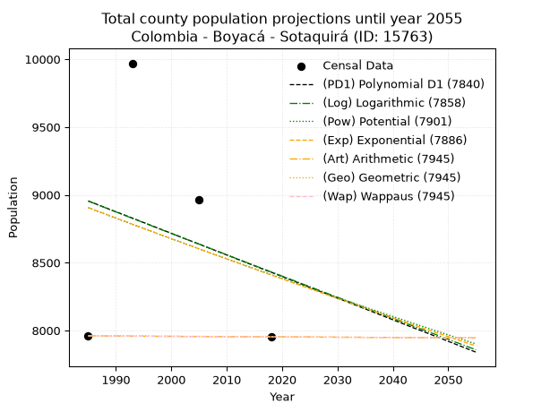
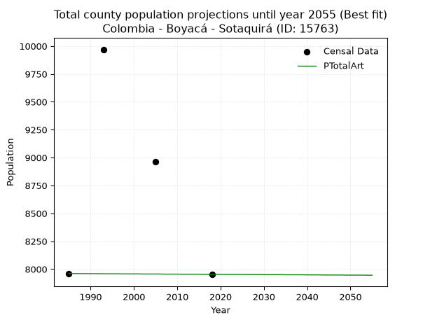
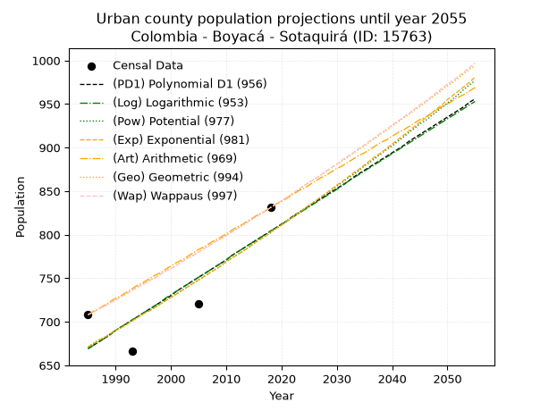
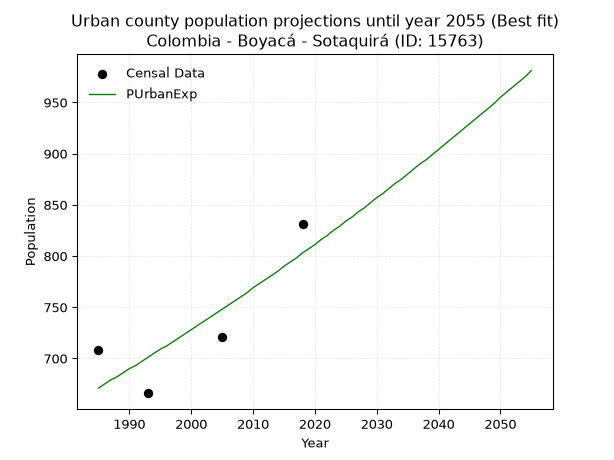
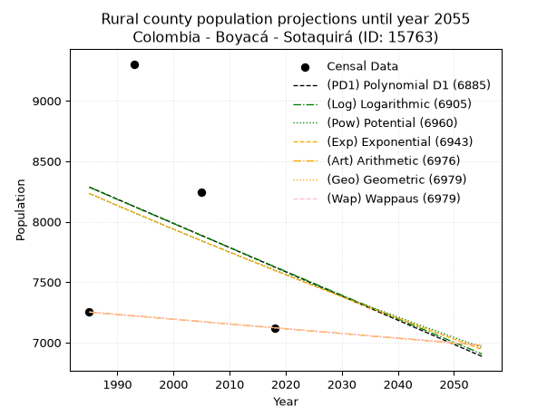
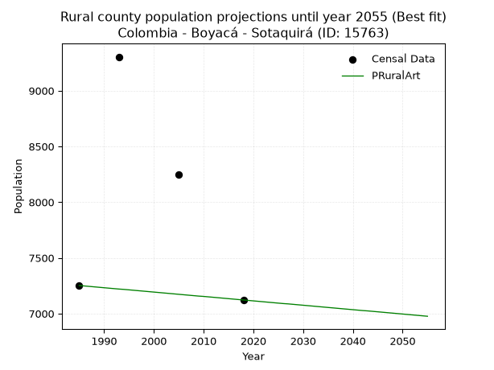

<div align="center">


</div>

# _“Population and Public Services Demand Projections (PPSD) until Year 2050 for Colombia - Boyacá - Sotaquirá (ID: 15763)”_
Keywords: `population` `public-service` `projection` `lineal` `polynomial` `logarithmic` `potential` `exponential` `arithmetic` `geometric` `wappaus` `dane` `colombia` `south-america`

PPSD are analytical estimates used by governments and planners to anticipate future changes in population size, age distribution, and the resulting community needs for utilities, healthcare, education, and infrastructure as sizing future water treatment facilities, electrical grids, and road networks based on spatial growth.

> **General running parameters**: • app_version: _v20260806_. • Python version: _3.14.7_. • Pandas version: _3.0.5_. • NumPy version: _2.5.1_. • Creates, save and include plots into reports (create_plot): _False_. • Projection until year: _2050_. • Process polynomial degree 2 and up: _False_. • Process Wappaus: _True_. • Process Wappaus: _True_. • Set negative values to zero: _True_. • Set infinite values to zero: _True_. • Drop dataset notes: _True_. 
<div align="center">

Dynamic map: [:earth_americas:Google](http://maps.google.com/maps?q=5.764986219,-73.2465852) [:earth_americas:OSM](https://www.openstreetmap.org/#map=18/5.764986219/-73.2465852&layers=P) [:earth_americas:Bing](https://www.bing.com/maps?cp=5.764986219~-73.2465852&lvl=18) [:earth_americas:Apple](https://maps.apple.com/frame?center=5.764986219%2C-73.2465852&span=0.003%2C0.006)

</div>


<div align="center">

```geojson
{
  "type": "Feature",
  "geometry": {
    "type": "Point", 
    "coordinates": [-73.2465852, 5.764986219]
  }, 
  "properties": {
    "Name": "Colombia - Boyacá - Sotaquirá (ID: 15763)"
  }
}
```

</div>


## 0. Census Data (4 records)

Census data are official statistics collected by a government about the people and housing in a country. They usually include counts of total population, age, sex, race, income, education, and jobs.

📅Global census file: [Population.xlsx](../data/Population.xlsx)

| Source   |   Year |   CountryID | CountryName   |   StateID | StateName   |   CountyID | CountyName   |   PTotal |   PUrban |   PRural |
|:---------|-------:|------------:|:--------------|----------:|:------------|-----------:|:-------------|---------:|---------:|---------:|
| DANE     |   1985 |          57 | Colombia      |        15 | Boyacá      |      15763 | Sotaquirá    |     7960 |      708 |     7252 |
| DANE     |   1993 |          57 | Colombia      |        15 | Boyacá      |      15763 | Sotaquirá    |     9970 |      666 |     9304 |
| DANE     |   2005 |          57 | Colombia      |        15 | Boyacá      |      15763 | Sotaquirá    |     8966 |      721 |     8245 |
| DANE     |   2018 |          57 | Colombia      |        15 | Boyacá      |      15763 | Sotaquirá    |     7953 |      831 |     7122 |

> 🔥Some records could had specific notes about the registered values or the corresponding urban or rural distribution.

📅   [RUPS](https://www.datos.gov.co/Hacienda-y-Cr-dito-P-blico/Registro-nico-de-Prestadores-de-Servicios-P-blicos/4qkq-csdn/about_data) - Local public utility companies: [RUPS.csv](../data/RUPS.xlsx)

 | SERVICIO       | ESTADO    | NOMBRE                                                                                        | NIT         | DEPARTAMENTO_DOMICILIO   | MUNICIPIO_DOMICILIO   | DIRECCION                                                |   TELEFONO | EMAIL                            | TIPO_INSCRIPCION    | REPRESENTANTE_LEGAL            | TIPO_PRESTADOR          | CLASIFICACION                 |
|:---------------|:----------|:----------------------------------------------------------------------------------------------|:------------|:-------------------------|:----------------------|:---------------------------------------------------------|-----------:|:---------------------------------|:--------------------|:-------------------------------|:------------------------|:------------------------------|
| ACUEDUCTO      | OPERATIVA | ASOCIACION DE SUSCRIPTORES DEL ACUEDUCTO DE BOSIGAS Y OTRAS VEREDAS SOTAQUIRA                 | 820002788-9 | BOYACA                   | SOTAQUIRA             | VEREDA BOSIGAS CENTRO                                    |    7452971 | leidyr98@hotmail.com             | Registro por la ESP | JOSE BERNARDO GARAVITO HIGUERA | ORGANIZACION AUTORIZADA | MENOR O IGUAL A 2500 USUARIOS |
| ACUEDUCTO      | OPERATIVA | ADMINISTRACION PUBLICA COOPERATIVA SOLIDARIA DE SERVICIOS PUBLICOS DEL MUNICIPIO DE SOTAQUIRA | 900258898-1 | BOYACA                   | SOTAQUIRA             | Calle 9 con carrera 7 Sotaquirá Centro                   |    7873020 | emsotaquira@gmail.com            | Registro por la ESP | YUDY MERCEDES HURTADO VARGAS   | ORGANIZACION AUTORIZADA | MENOR O IGUAL A 2500 USUARIOS |
| ALCANTARILLADO | OPERATIVA | ADMINISTRACION PUBLICA COOPERATIVA SOLIDARIA DE SERVICIOS PUBLICOS DEL MUNICIPIO DE SOTAQUIRA | 900258898-1 | BOYACA                   | SOTAQUIRA             | Calle 9 con carrera 7 Sotaquirá Centro                   |    7873020 | emsotaquira@gmail.com            | Registro por la ESP | YUDY MERCEDES HURTADO VARGAS   | ORGANIZACION AUTORIZADA | MENOR O IGUAL A 2500 USUARIOS |
| ACUEDUCTO      | OPERATIVA | ASOCIACION DE SUSCRIPTORES DEL ACUEDUCTO EL CHUSCAL                                           | 820004553-4 | BOYACA                   | SOTAQUIRA             | KM 28 VIA TUNJA - PAIPA VEREDA CARREÑO SECTOR EL MANZANO |    0000000 | acuachuscal@yahoo.es             | Registro por la ESP | SAUL OSMA                      | ORGANIZACION AUTORIZADA | MENOR O IGUAL A 2500 USUARIOS |
| ACUEDUCTO      | OPERATIVA | ASOCIACION DE USUARIOS DEL ACUEDUCTO RURAL CARRIZAL TOMA Y CARREÑO DEL MUNICIPIO DE SOTAQUIRA | 900272888-4 | BOYACA                   | SOTAQUIRA             | VEREDA TOMA Y CARREÑO                                    |    7852945 | leidyr98@hotmail.com             | Registro por la ESP | MARIA EUGENIA VARGAS SANCHEZ   | ORGANIZACION AUTORIZADA | MENOR O IGUAL A 2500 USUARIOS |
| ACUEDUCTO      | OPERATIVA | ASOCIACION DE SUSCRIPTORES DEL ACUEDUCTO  DE LAS VEREDAS SALITRE SIATOCA Y TIERRA NEGRA       | 820003947-8 | BOYACA                   | SOTAQUIRA             | Carrera 7 N 6 64                                         |    7873020 | asosuscriptoressalitre@gmail.com | Registro por la ESP | JOSE GERMAN PACHECO COMBARIZA  | ORGANIZACION AUTORIZADA | MENOR O IGUAL A 2500 USUARIOS |

## 1. Total

### 1.1. Coefficients and Parameters

* (PD1) Polynomial Deg 1: -15.926535527899755, 40569.302689681484 (lineal)
* (Log) Logarithmic: -31626.21479107751, 249103.36206356
* (Pow) Potential: -3.4508075620645027, 15.329561947592518
* (Exp) Exponential: -0.001738522008557089, 280824.0338157392
* (Art) Arithmetic: Year diff. 2018 - 1985 = 33, Population diff. 7953 - 7960 = -7, Annual growth = -0.21212121212121213
* (Geo) Geometric: Year diff. 2018 - 1985 = 33, Population diff. 7953 - 7960 = -7, Annual growth % = -2.6659762237146722e-05
* (Wap) Wappaus: i = -0.0026660115895332384, Condition values only valid for < 200)

<sub>
Wappaus condition values: ['-0.00', '-0.00', '-0.01', '-0.01', '-0.01', '-0.01', '-0.02', '-0.02', '-0.02', '-0.02', '-0.03', '-0.03', '-0.03', '-0.03', '-0.04', '-0.04', '-0.04', '-0.05', '-0.05', '-0.05', '-0.05', '-0.06', '-0.06', '-0.06', '-0.06', '-0.07', '-0.07', '-0.07', '-0.07', '-0.08', '-0.08', '-0.08', '-0.09', '-0.09', '-0.09', '-0.09', '-0.10', '-0.10', '-0.10', '-0.10', '-0.11', '-0.11', '-0.11', '-0.11', '-0.12', '-0.12', '-0.12', '-0.13', '-0.13', '-0.13', '-0.13', '-0.14', '-0.14', '-0.14', '-0.14', '-0.15', '-0.15', '-0.15', '-0.15', '-0.16', '-0.16', '-0.16', '-0.17', '-0.17', '-0.17', '-0.17']
</sub>


### 1.2. Projected Dataset

|   Year |   CountyID |   PTotalPD1 |   PTotalLog |   PTotalPow |   PTotalExp |   PTotalArt |   PTotalGeo |   PTotalWap |
|-------:|-----------:|------------:|------------:|------------:|------------:|------------:|------------:|------------:|
|   1985 |      15763 |        8955 |        8954 |        8905 |        8906 |        7960 |        7960 |        7960 |
|   1986 |      15763 |        8939 |        8938 |        8889 |        8891 |        7960 |        7960 |        7960 |
|   1987 |      15763 |        8923 |        8922 |        8874 |        8875 |        7960 |        7960 |        7960 |
|   1988 |      15763 |        8907 |        8906 |        8859 |        8860 |        7959 |        7959 |        7959 |
|   1989 |      15763 |        8891 |        8890 |        8843 |        8845 |        7959 |        7959 |        7959 |
|   1990 |      15763 |        8875 |        8874 |        8828 |        8829 |        7959 |        7959 |        7959 |
|   1991 |      15763 |        8860 |        8858 |        8813 |        8814 |        7959 |        7959 |        7959 |
|   1992 |      15763 |        8844 |        8842 |        8797 |        8799 |        7959 |        7959 |        7959 |
|   1993 |      15763 |        8828 |        8826 |        8782 |        8783 |        7958 |        7958 |        7958 |
|   1994 |      15763 |        8812 |        8811 |        8767 |        8768 |        7958 |        7958 |        7958 |
|   1995 |      15763 |        8796 |        8795 |        8752 |        8753 |        7958 |        7958 |        7958 |
|   1996 |      15763 |        8780 |        8779 |        8737 |        8738 |        7958 |        7958 |        7958 |
|   1997 |      15763 |        8764 |        8763 |        8722 |        8722 |        7957 |        7957 |        7957 |
|   1998 |      15763 |        8748 |        8747 |        8706 |        8707 |        7957 |        7957 |        7957 |
|   1999 |      15763 |        8732 |        8731 |        8691 |        8692 |        7957 |        7957 |        7957 |
|   2000 |      15763 |        8716 |        8716 |        8676 |        8677 |        7957 |        7957 |        7957 |
|   2001 |      15763 |        8700 |        8700 |        8662 |        8662 |        7957 |        7957 |        7957 |
|   2002 |      15763 |        8684 |        8684 |        8647 |        8647 |        7956 |        7956 |        7956 |
|   2003 |      15763 |        8668 |        8668 |        8632 |        8632 |        7956 |        7956 |        7956 |
|   2004 |      15763 |        8653 |        8652 |        8617 |        8617 |        7956 |        7956 |        7956 |
|   2005 |      15763 |        8637 |        8637 |        8602 |        8602 |        7956 |        7956 |        7956 |
|   2006 |      15763 |        8621 |        8621 |        8587 |        8587 |        7956 |        7956 |        7956 |
|   2007 |      15763 |        8605 |        8605 |        8572 |        8572 |        7955 |        7955 |        7955 |
|   2008 |      15763 |        8589 |        8589 |        8558 |        8557 |        7955 |        7955 |        7955 |
|   2009 |      15763 |        8573 |        8574 |        8543 |        8542 |        7955 |        7955 |        7955 |
|   2010 |      15763 |        8557 |        8558 |        8528 |        8528 |        7955 |        7955 |        7955 |
|   2011 |      15763 |        8541 |        8542 |        8514 |        8513 |        7954 |        7954 |        7954 |
|   2012 |      15763 |        8525 |        8526 |        8499 |        8498 |        7954 |        7954 |        7954 |
|   2013 |      15763 |        8509 |        8511 |        8485 |        8483 |        7954 |        7954 |        7954 |
|   2014 |      15763 |        8493 |        8495 |        8470 |        8468 |        7954 |        7954 |        7954 |
|   2015 |      15763 |        8477 |        8479 |        8456 |        8454 |        7954 |        7954 |        7954 |
|   2016 |      15763 |        8461 |        8464 |        8441 |        8439 |        7953 |        7953 |        7953 |
|   2017 |      15763 |        8445 |        8448 |        8427 |        8424 |        7953 |        7953 |        7953 |
|   2018 |      15763 |        8430 |        8432 |        8412 |        8410 |        7953 |        7953 |        7953 |
|   2019 |      15763 |        8414 |        8417 |        8398 |        8395 |        7953 |        7953 |        7953 |
|   2020 |      15763 |        8398 |        8401 |        8384 |        8381 |        7953 |        7953 |        7953 |
|   2021 |      15763 |        8382 |        8385 |        8369 |        8366 |        7952 |        7952 |        7952 |
|   2022 |      15763 |        8366 |        8370 |        8355 |        8351 |        7952 |        7952 |        7952 |
|   2023 |      15763 |        8350 |        8354 |        8341 |        8337 |        7952 |        7952 |        7952 |
|   2024 |      15763 |        8334 |        8338 |        8327 |        8322 |        7952 |        7952 |        7952 |
|   2025 |      15763 |        8318 |        8323 |        8312 |        8308 |        7952 |        7952 |        7952 |
|   2026 |      15763 |        8302 |        8307 |        8298 |        8294 |        7951 |        7951 |        7951 |
|   2027 |      15763 |        8286 |        8291 |        8284 |        8279 |        7951 |        7951 |        7951 |
|   2028 |      15763 |        8270 |        8276 |        8270 |        8265 |        7951 |        7951 |        7951 |
|   2029 |      15763 |        8254 |        8260 |        8256 |        8250 |        7951 |        7951 |        7951 |
|   2030 |      15763 |        8238 |        8245 |        8242 |        8236 |        7950 |        7950 |        7950 |
|   2031 |      15763 |        8223 |        8229 |        8228 |        8222 |        7950 |        7950 |        7950 |
|   2032 |      15763 |        8207 |        8214 |        8214 |        8208 |        7950 |        7950 |        7950 |
|   2033 |      15763 |        8191 |        8198 |        8200 |        8193 |        7950 |        7950 |        7950 |
|   2034 |      15763 |        8175 |        8182 |        8186 |        8179 |        7950 |        7950 |        7950 |
|   2035 |      15763 |        8159 |        8167 |        8172 |        8165 |        7949 |        7949 |        7949 |
|   2036 |      15763 |        8143 |        8151 |        8158 |        8151 |        7949 |        7949 |        7949 |
|   2037 |      15763 |        8127 |        8136 |        8145 |        8136 |        7949 |        7949 |        7949 |
|   2038 |      15763 |        8111 |        8120 |        8131 |        8122 |        7949 |        7949 |        7949 |
|   2039 |      15763 |        8095 |        8105 |        8117 |        8108 |        7949 |        7949 |        7949 |
|   2040 |      15763 |        8079 |        8089 |        8103 |        8094 |        7948 |        7948 |        7948 |
|   2041 |      15763 |        8063 |        8074 |        8090 |        8080 |        7948 |        7948 |        7948 |
|   2042 |      15763 |        8047 |        8058 |        8076 |        8066 |        7948 |        7948 |        7948 |
|   2043 |      15763 |        8031 |        8043 |        8062 |        8052 |        7948 |        7948 |        7948 |
|   2044 |      15763 |        8015 |        8027 |        8049 |        8038 |        7947 |        7947 |        7947 |
|   2045 |      15763 |        8000 |        8012 |        8035 |        8024 |        7947 |        7947 |        7947 |
|   2046 |      15763 |        7984 |        7996 |        8022 |        8010 |        7947 |        7947 |        7947 |
|   2047 |      15763 |        7968 |        7981 |        8008 |        7996 |        7947 |        7947 |        7947 |
|   2048 |      15763 |        7952 |        7966 |        7995 |        7982 |        7947 |        7947 |        7947 |
|   2049 |      15763 |        7936 |        7950 |        7981 |        7969 |        7946 |        7946 |        7946 |
|   2050 |      15763 |        7920 |        7935 |        7968 |        7955 |        7946 |        7946 |        7946 |
<div align="center">

</img>

</div>


### 1.3. Best fit with absolute and relative error (%)

Relative error puts that difference into context by dividing the absolute error by the true value, creating a unitless ratio or percentage that shows the scale of the mistake.

Absolute and relative error

|   Year | Source   |   CountryID | CountryName   |   StateID | StateName   |   CountyID_x | CountyName   |   PTotal |   PUrban |   PRural |   CountyID_y |   PTotalPD1 |   PTotalLog |   PTotalPow |   PTotalExp |   PTotalArt |   PTotalGeo |   PTotalWap |   PTotalPD1AbsError |   PTotalLogAbsError |   PTotalPowAbsError |   PTotalExpAbsError |   PTotalArtAbsError |   PTotalGeoAbsError |   PTotalWapAbsError |   PTotalPD1RelError |   PTotalLogRelError |   PTotalPowRelError |   PTotalExpRelError |   PTotalArtRelError |   PTotalGeoRelError |   PTotalWapRelError |
|-------:|:---------|------------:|:--------------|----------:|:------------|-------------:|:-------------|---------:|---------:|---------:|-------------:|------------:|------------:|------------:|------------:|------------:|------------:|------------:|--------------------:|--------------------:|--------------------:|--------------------:|--------------------:|--------------------:|--------------------:|--------------------:|--------------------:|--------------------:|--------------------:|--------------------:|--------------------:|--------------------:|
|   1985 | DANE     |          57 | Colombia      |        15 | Boyacá      |        15763 | Sotaquirá    |     7960 |      708 |     7252 |        15763 |        8955 |        8954 |        8905 |        8906 |        7960 |        7960 |        7960 |                 995 |                 994 |                 945 |                 946 |                   0 |                   0 |                   0 |            12.5     |            12.4874  |            11.8719  |            11.8844  |              0      |              0      |              0      |
|   1993 | DANE     |          57 | Colombia      |        15 | Boyacá      |        15763 | Sotaquirá    |     9970 |      666 |     9304 |        15763 |        8828 |        8826 |        8782 |        8783 |        7958 |        7958 |        7958 |                1142 |                1144 |                1188 |                1187 |                2012 |                2012 |                2012 |            11.4544  |            11.4744  |            11.9157  |            11.9057  |             20.1805 |             20.1805 |             20.1805 |
|   2005 | DANE     |          57 | Colombia      |        15 | Boyacá      |        15763 | Sotaquirá    |     8966 |      721 |     8245 |        15763 |        8637 |        8637 |        8602 |        8602 |        7956 |        7956 |        7956 |                 329 |                 329 |                 364 |                 364 |                1010 |                1010 |                1010 |             3.66942 |             3.66942 |             4.05978 |             4.05978 |             11.2648 |             11.2648 |             11.2648 |
|   2018 | DANE     |          57 | Colombia      |        15 | Boyacá      |        15763 | Sotaquirá    |     7953 |      831 |     7122 |        15763 |        8430 |        8432 |        8412 |        8410 |        7953 |        7953 |        7953 |                 477 |                 479 |                 459 |                 457 |                   0 |                   0 |                   0 |             5.99774 |             6.02288 |             5.77141 |             5.74626 |              0      |              0      |              0      |

Relative error mean

| Method    |   RelError | Best   |
|:----------|-----------:|:-------|
| PTotalPD1 |    8.40538 |        |
| PTotalLog |    8.41354 |        |
| PTotalPow |    8.4047  |        |
| PTotalExp |    8.39904 |        |
| PTotalArt |    7.86133 | True   |
| PTotalGeo |    7.86133 | True   |
| PTotalWap |    7.86133 | True   |

💙Best method: _**PTotalArt**_
<div align="center">

</img>

</div>


### 1.4. Fresh water supply demand in liters per capita per day (lpcd)

The fresh water supply demand typically ranges from 100 to 300 liters per capita per day (lpcd) for standard domestic and municipal planning, though absolute survival minimums set by the World Health Organization are as low as 7.5 to 20 liters per day, and total consumption in high-income nations can exceed 400 liters.

> `CZ`: Level in meters above the sea level (masl)<br> `WS`: Fresh water supply demand in liters per capita per day (lpcd or l/h/d)<br> `WSAll`: Zonal fresh water supply demand in liters per second (l/s)<br> `A`: Zonal area in square meters<br> `DP`: Population density (people/hectare or p/ha)

Reference values (RAS Colombia)

|    CZ |   WS |
|------:|-----:|
|  1000 |  120 |
|  2000 |  130 |
| 99999 |  140 |

County shapefile geometry properties and water supply values

|   CountyID |      ATotal |   CZTotal |   WSTotal |
|-----------:|------------:|----------:|----------:|
|      15763 | 2.91557e+08 |   2919.12 |       140 |

Projected values for best method: PTotalArt

|   CountyID |   Year |   PTotalArt |   DPTotal |   WSTotal |   WSTotalAll |
|-----------:|-------:|------------:|----------:|----------:|-------------:|
|      15763 |   1985 |        7960 |      0.27 |       140 |      12.8981 |
|      15763 |   1986 |        7960 |      0.27 |       140 |      12.8981 |
|      15763 |   1987 |        7960 |      0.27 |       140 |      12.8981 |
|      15763 |   1988 |        7959 |      0.27 |       140 |      12.8965 |
|      15763 |   1989 |        7959 |      0.27 |       140 |      12.8965 |
|      15763 |   1990 |        7959 |      0.27 |       140 |      12.8965 |
|      15763 |   1991 |        7959 |      0.27 |       140 |      12.8965 |
|      15763 |   1992 |        7959 |      0.27 |       140 |      12.8965 |
|      15763 |   1993 |        7958 |      0.27 |       140 |      12.8949 |
|      15763 |   1994 |        7958 |      0.27 |       140 |      12.8949 |
|      15763 |   1995 |        7958 |      0.27 |       140 |      12.8949 |
|      15763 |   1996 |        7958 |      0.27 |       140 |      12.8949 |
|      15763 |   1997 |        7957 |      0.27 |       140 |      12.8933 |
|      15763 |   1998 |        7957 |      0.27 |       140 |      12.8933 |
|      15763 |   1999 |        7957 |      0.27 |       140 |      12.8933 |
|      15763 |   2000 |        7957 |      0.27 |       140 |      12.8933 |
|      15763 |   2001 |        7957 |      0.27 |       140 |      12.8933 |
|      15763 |   2002 |        7956 |      0.27 |       140 |      12.8917 |
|      15763 |   2003 |        7956 |      0.27 |       140 |      12.8917 |
|      15763 |   2004 |        7956 |      0.27 |       140 |      12.8917 |
|      15763 |   2005 |        7956 |      0.27 |       140 |      12.8917 |
|      15763 |   2006 |        7956 |      0.27 |       140 |      12.8917 |
|      15763 |   2007 |        7955 |      0.27 |       140 |      12.89   |
|      15763 |   2008 |        7955 |      0.27 |       140 |      12.89   |
|      15763 |   2009 |        7955 |      0.27 |       140 |      12.89   |
|      15763 |   2010 |        7955 |      0.27 |       140 |      12.89   |
|      15763 |   2011 |        7954 |      0.27 |       140 |      12.8884 |
|      15763 |   2012 |        7954 |      0.27 |       140 |      12.8884 |
|      15763 |   2013 |        7954 |      0.27 |       140 |      12.8884 |
|      15763 |   2014 |        7954 |      0.27 |       140 |      12.8884 |
|      15763 |   2015 |        7954 |      0.27 |       140 |      12.8884 |
|      15763 |   2016 |        7953 |      0.27 |       140 |      12.8868 |
|      15763 |   2017 |        7953 |      0.27 |       140 |      12.8868 |
|      15763 |   2018 |        7953 |      0.27 |       140 |      12.8868 |
|      15763 |   2019 |        7953 |      0.27 |       140 |      12.8868 |
|      15763 |   2020 |        7953 |      0.27 |       140 |      12.8868 |
|      15763 |   2021 |        7952 |      0.27 |       140 |      12.8852 |
|      15763 |   2022 |        7952 |      0.27 |       140 |      12.8852 |
|      15763 |   2023 |        7952 |      0.27 |       140 |      12.8852 |
|      15763 |   2024 |        7952 |      0.27 |       140 |      12.8852 |
|      15763 |   2025 |        7952 |      0.27 |       140 |      12.8852 |
|      15763 |   2026 |        7951 |      0.27 |       140 |      12.8836 |
|      15763 |   2027 |        7951 |      0.27 |       140 |      12.8836 |
|      15763 |   2028 |        7951 |      0.27 |       140 |      12.8836 |
|      15763 |   2029 |        7951 |      0.27 |       140 |      12.8836 |
|      15763 |   2030 |        7950 |      0.27 |       140 |      12.8819 |
|      15763 |   2031 |        7950 |      0.27 |       140 |      12.8819 |
|      15763 |   2032 |        7950 |      0.27 |       140 |      12.8819 |
|      15763 |   2033 |        7950 |      0.27 |       140 |      12.8819 |
|      15763 |   2034 |        7950 |      0.27 |       140 |      12.8819 |
|      15763 |   2035 |        7949 |      0.27 |       140 |      12.8803 |
|      15763 |   2036 |        7949 |      0.27 |       140 |      12.8803 |
|      15763 |   2037 |        7949 |      0.27 |       140 |      12.8803 |
|      15763 |   2038 |        7949 |      0.27 |       140 |      12.8803 |
|      15763 |   2039 |        7949 |      0.27 |       140 |      12.8803 |
|      15763 |   2040 |        7948 |      0.27 |       140 |      12.8787 |
|      15763 |   2041 |        7948 |      0.27 |       140 |      12.8787 |
|      15763 |   2042 |        7948 |      0.27 |       140 |      12.8787 |
|      15763 |   2043 |        7948 |      0.27 |       140 |      12.8787 |
|      15763 |   2044 |        7947 |      0.27 |       140 |      12.8771 |
|      15763 |   2045 |        7947 |      0.27 |       140 |      12.8771 |
|      15763 |   2046 |        7947 |      0.27 |       140 |      12.8771 |
|      15763 |   2047 |        7947 |      0.27 |       140 |      12.8771 |
|      15763 |   2048 |        7947 |      0.27 |       140 |      12.8771 |
|      15763 |   2049 |        7946 |      0.27 |       140 |      12.8755 |
|      15763 |   2050 |        7946 |      0.27 |       140 |      12.8755 |

## 2. Urban

### 2.1. Coefficients and Parameters

* (PD1) Polynomial Deg 1: 4.093938177438716, -7457.3998394217915 (lineal)
* (Log) Logarithmic: 8182.497749613442, -61463.73096523359
* (Pow) Potential: 10.825744912589254, -32.87384400641052
* (Exp) Exponential: 0.005416446761205358, 0.014371661539411188
* (Art) Arithmetic: Year diff. 2018 - 1985 = 33, Population diff. 831 - 708 = 123, Annual growth = 3.727272727272727
* (Geo) Geometric: Year diff. 2018 - 1985 = 33, Population diff. 831 - 708 = 123, Annual growth % = 0.004865912444410814
* (Wap) Wappaus: i = 0.4843759229724142, Condition values only valid for < 200)

<sub>
Wappaus condition values: ['0.00', '0.48', '0.97', '1.45', '1.94', '2.42', '2.91', '3.39', '3.88', '4.36', '4.84', '5.33', '5.81', '6.30', '6.78', '7.27', '7.75', '8.23', '8.72', '9.20', '9.69', '10.17', '10.66', '11.14', '11.63', '12.11', '12.59', '13.08', '13.56', '14.05', '14.53', '15.02', '15.50', '15.98', '16.47', '16.95', '17.44', '17.92', '18.41', '18.89', '19.38', '19.86', '20.34', '20.83', '21.31', '21.80', '22.28', '22.77', '23.25', '23.73', '24.22', '24.70', '25.19', '25.67', '26.16', '26.64', '27.13', '27.61', '28.09', '28.58', '29.06', '29.55', '30.03', '30.52', '31.00', '31.48']
</sub>


### 2.2. Projected Dataset

|   Year |   CountyID |   PUrbanPD1 |   PUrbanLog |   PUrbanPow |   PUrbanExp |   PUrbanArt |   PUrbanGeo |   PUrbanWap |
|-------:|-----------:|------------:|------------:|------------:|------------:|------------:|------------:|------------:|
|   1985 |      15763 |         669 |         669 |         671 |         671 |         708 |         708 |         708 |
|   1986 |      15763 |         673 |         673 |         675 |         675 |         712 |         711 |         711 |
|   1987 |      15763 |         677 |         677 |         679 |         679 |         715 |         715 |         715 |
|   1988 |      15763 |         681 |         681 |         682 |         682 |         719 |         718 |         718 |
|   1989 |      15763 |         685 |         686 |         686 |         686 |         723 |         722 |         722 |
|   1990 |      15763 |         690 |         690 |         690 |         690 |         727 |         725 |         725 |
|   1991 |      15763 |         694 |         694 |         694 |         693 |         730 |         729 |         729 |
|   1992 |      15763 |         698 |         698 |         697 |         697 |         734 |         732 |         732 |
|   1993 |      15763 |         702 |         702 |         701 |         701 |         738 |         736 |         736 |
|   1994 |      15763 |         706 |         706 |         705 |         705 |         742 |         740 |         740 |
|   1995 |      15763 |         710 |         710 |         709 |         709 |         745 |         743 |         743 |
|   1996 |      15763 |         714 |         714 |         713 |         712 |         749 |         747 |         747 |
|   1997 |      15763 |         718 |         718 |         716 |         716 |         753 |         750 |         750 |
|   1998 |      15763 |         722 |         722 |         720 |         720 |         756 |         754 |         754 |
|   1999 |      15763 |         726 |         727 |         724 |         724 |         760 |         758 |         758 |
|   2000 |      15763 |         730 |         731 |         728 |         728 |         764 |         761 |         761 |
|   2001 |      15763 |         735 |         735 |         732 |         732 |         768 |         765 |         765 |
|   2002 |      15763 |         739 |         739 |         736 |         736 |         771 |         769 |         769 |
|   2003 |      15763 |         743 |         743 |         740 |         740 |         775 |         773 |         773 |
|   2004 |      15763 |         747 |         747 |         744 |         744 |         779 |         776 |         776 |
|   2005 |      15763 |         751 |         751 |         748 |         748 |         783 |         780 |         780 |
|   2006 |      15763 |         755 |         755 |         752 |         752 |         786 |         784 |         784 |
|   2007 |      15763 |         759 |         759 |         756 |         756 |         790 |         788 |         788 |
|   2008 |      15763 |         763 |         763 |         760 |         760 |         794 |         792 |         792 |
|   2009 |      15763 |         767 |         767 |         764 |         764 |         797 |         795 |         795 |
|   2010 |      15763 |         771 |         771 |         769 |         769 |         801 |         799 |         799 |
|   2011 |      15763 |         776 |         776 |         773 |         773 |         805 |         803 |         803 |
|   2012 |      15763 |         780 |         780 |         777 |         777 |         809 |         807 |         807 |
|   2013 |      15763 |         784 |         784 |         781 |         781 |         812 |         811 |         811 |
|   2014 |      15763 |         788 |         788 |         785 |         785 |         816 |         815 |         815 |
|   2015 |      15763 |         792 |         792 |         790 |         790 |         820 |         819 |         819 |
|   2016 |      15763 |         796 |         796 |         794 |         794 |         824 |         823 |         823 |
|   2017 |      15763 |         800 |         800 |         798 |         798 |         827 |         827 |         827 |
|   2018 |      15763 |         804 |         804 |         802 |         803 |         831 |         831 |         831 |
|   2019 |      15763 |         808 |         808 |         807 |         807 |         835 |         835 |         835 |
|   2020 |      15763 |         812 |         812 |         811 |         811 |         838 |         839 |         839 |
|   2021 |      15763 |         816 |         816 |         815 |         816 |         842 |         843 |         843 |
|   2022 |      15763 |         821 |         820 |         820 |         820 |         846 |         847 |         847 |
|   2023 |      15763 |         825 |         824 |         824 |         825 |         850 |         851 |         852 |
|   2024 |      15763 |         829 |         828 |         829 |         829 |         853 |         856 |         856 |
|   2025 |      15763 |         833 |         832 |         833 |         834 |         857 |         860 |         860 |
|   2026 |      15763 |         837 |         836 |         838 |         838 |         861 |         864 |         864 |
|   2027 |      15763 |         841 |         840 |         842 |         843 |         865 |         868 |         868 |
|   2028 |      15763 |         845 |         844 |         847 |         847 |         868 |         872 |         873 |
|   2029 |      15763 |         849 |         848 |         851 |         852 |         872 |         877 |         877 |
|   2030 |      15763 |         853 |         852 |         856 |         857 |         876 |         881 |         881 |
|   2031 |      15763 |         857 |         856 |         860 |         861 |         879 |         885 |         886 |
|   2032 |      15763 |         861 |         861 |         865 |         866 |         883 |         889 |         890 |
|   2033 |      15763 |         866 |         865 |         869 |         871 |         887 |         894 |         894 |
|   2034 |      15763 |         870 |         869 |         874 |         875 |         891 |         898 |         899 |
|   2035 |      15763 |         874 |         873 |         879 |         880 |         894 |         902 |         903 |
|   2036 |      15763 |         878 |         877 |         883 |         885 |         898 |         907 |         908 |
|   2037 |      15763 |         882 |         881 |         888 |         890 |         902 |         911 |         912 |
|   2038 |      15763 |         886 |         885 |         893 |         894 |         906 |         916 |         917 |
|   2039 |      15763 |         890 |         889 |         898 |         899 |         909 |         920 |         921 |
|   2040 |      15763 |         894 |         893 |         902 |         904 |         913 |         925 |         926 |
|   2041 |      15763 |         898 |         897 |         907 |         909 |         917 |         929 |         930 |
|   2042 |      15763 |         902 |         901 |         912 |         914 |         920 |         934 |         935 |
|   2043 |      15763 |         907 |         905 |         917 |         919 |         924 |         938 |         939 |
|   2044 |      15763 |         911 |         909 |         922 |         924 |         928 |         943 |         944 |
|   2045 |      15763 |         915 |         913 |         927 |         929 |         932 |         947 |         949 |
|   2046 |      15763 |         919 |         917 |         931 |         934 |         935 |         952 |         953 |
|   2047 |      15763 |         923 |         921 |         936 |         939 |         939 |         957 |         958 |
|   2048 |      15763 |         927 |         925 |         941 |         944 |         943 |         961 |         963 |
|   2049 |      15763 |         931 |         929 |         946 |         949 |         947 |         966 |         968 |
|   2050 |      15763 |         935 |         933 |         951 |         955 |         950 |         971 |         973 |
<div align="center">

</img>

</div>


### 2.3. Best fit with absolute and relative error (%)

Relative error puts that difference into context by dividing the absolute error by the true value, creating a unitless ratio or percentage that shows the scale of the mistake.

Absolute and relative error

|   Year | Source   |   CountryID | CountryName   |   StateID | StateName   |   CountyID_x | CountyName   |   PTotal |   PUrban |   PRural |   CountyID_y |   PUrbanPD1 |   PUrbanLog |   PUrbanPow |   PUrbanExp |   PUrbanArt |   PUrbanGeo |   PUrbanWap |   PUrbanPD1AbsError |   PUrbanLogAbsError |   PUrbanPowAbsError |   PUrbanExpAbsError |   PUrbanArtAbsError |   PUrbanGeoAbsError |   PUrbanWapAbsError |   PUrbanPD1RelError |   PUrbanLogRelError |   PUrbanPowRelError |   PUrbanExpRelError |   PUrbanArtRelError |   PUrbanGeoRelError |   PUrbanWapRelError |
|-------:|:---------|------------:|:--------------|----------:|:------------|-------------:|:-------------|---------:|---------:|---------:|-------------:|------------:|------------:|------------:|------------:|------------:|------------:|------------:|--------------------:|--------------------:|--------------------:|--------------------:|--------------------:|--------------------:|--------------------:|--------------------:|--------------------:|--------------------:|--------------------:|--------------------:|--------------------:|--------------------:|
|   1985 | DANE     |          57 | Colombia      |        15 | Boyacá      |        15763 | Sotaquirá    |     7960 |      708 |     7252 |        15763 |         669 |         669 |         671 |         671 |         708 |         708 |         708 |                  39 |                  39 |                  37 |                  37 |                   0 |                   0 |                   0 |             5.50847 |             5.50847 |             5.22599 |             5.22599 |             0       |             0       |             0       |
|   1993 | DANE     |          57 | Colombia      |        15 | Boyacá      |        15763 | Sotaquirá    |     9970 |      666 |     9304 |        15763 |         702 |         702 |         701 |         701 |         738 |         736 |         736 |                  36 |                  36 |                  35 |                  35 |                  72 |                  70 |                  70 |             5.40541 |             5.40541 |             5.25526 |             5.25526 |            10.8108  |            10.5105  |            10.5105  |
|   2005 | DANE     |          57 | Colombia      |        15 | Boyacá      |        15763 | Sotaquirá    |     8966 |      721 |     8245 |        15763 |         751 |         751 |         748 |         748 |         783 |         780 |         780 |                  30 |                  30 |                  27 |                  27 |                  62 |                  59 |                  59 |             4.16089 |             4.16089 |             3.7448  |             3.7448  |             8.59917 |             8.18308 |             8.18308 |
|   2018 | DANE     |          57 | Colombia      |        15 | Boyacá      |        15763 | Sotaquirá    |     7953 |      831 |     7122 |        15763 |         804 |         804 |         802 |         803 |         831 |         831 |         831 |                  27 |                  27 |                  29 |                  28 |                   0 |                   0 |                   0 |             3.2491  |             3.2491  |             3.48977 |             3.36943 |             0       |             0       |             0       |

Relative error mean

| Method    |   RelError | Best   |
|:----------|-----------:|:-------|
| PUrbanPD1 |    4.58097 |        |
| PUrbanLog |    4.58097 |        |
| PUrbanPow |    4.42895 |        |
| PUrbanExp |    4.39887 | True   |
| PUrbanArt |    4.85249 |        |
| PUrbanGeo |    4.6734  |        |
| PUrbanWap |    4.6734  |        |

💙Best method: _**PUrbanExp**_
<div align="center">

</img>

</div>


### 2.4. Fresh water supply demand in liters per capita per day (lpcd)

The fresh water supply demand typically ranges from 100 to 300 liters per capita per day (lpcd) for standard domestic and municipal planning, though absolute survival minimums set by the World Health Organization are as low as 7.5 to 20 liters per day, and total consumption in high-income nations can exceed 400 liters.

> `CZ`: Level in meters above the sea level (masl)<br> `WS`: Fresh water supply demand in liters per capita per day (lpcd or l/h/d)<br> `WSAll`: Zonal fresh water supply demand in liters per second (l/s)<br> `A`: Zonal area in square meters<br> `DP`: Population density (people/hectare or p/ha)

Reference values (RAS Colombia)

|    CZ |   WS |
|------:|-----:|
|  1000 |  120 |
|  2000 |  130 |
| 99999 |  140 |

County shapefile geometry properties and water supply values

|   CountyID |   AUrban |   CZUrban |   WSUrban |
|-----------:|---------:|----------:|----------:|
|      15763 |   345139 |   2665.78 |       140 |

Projected values for best method: PUrbanExp

|   CountyID |   Year |   PUrbanExp |   DPUrban |   WSUrban |   WSUrbanAll |
|-----------:|-------:|------------:|----------:|----------:|-------------:|
|      15763 |   1985 |         671 |     19.44 |       140 |      1.08727 |
|      15763 |   1986 |         675 |     19.56 |       140 |      1.09375 |
|      15763 |   1987 |         679 |     19.67 |       140 |      1.10023 |
|      15763 |   1988 |         682 |     19.76 |       140 |      1.10509 |
|      15763 |   1989 |         686 |     19.88 |       140 |      1.11157 |
|      15763 |   1990 |         690 |     19.99 |       140 |      1.11806 |
|      15763 |   1991 |         693 |     20.08 |       140 |      1.12292 |
|      15763 |   1992 |         697 |     20.19 |       140 |      1.1294  |
|      15763 |   1993 |         701 |     20.31 |       140 |      1.13588 |
|      15763 |   1994 |         705 |     20.43 |       140 |      1.14236 |
|      15763 |   1995 |         709 |     20.54 |       140 |      1.14884 |
|      15763 |   1996 |         712 |     20.63 |       140 |      1.1537  |
|      15763 |   1997 |         716 |     20.75 |       140 |      1.16019 |
|      15763 |   1998 |         720 |     20.86 |       140 |      1.16667 |
|      15763 |   1999 |         724 |     20.98 |       140 |      1.17315 |
|      15763 |   2000 |         728 |     21.09 |       140 |      1.17963 |
|      15763 |   2001 |         732 |     21.21 |       140 |      1.18611 |
|      15763 |   2002 |         736 |     21.32 |       140 |      1.19259 |
|      15763 |   2003 |         740 |     21.44 |       140 |      1.19907 |
|      15763 |   2004 |         744 |     21.56 |       140 |      1.20556 |
|      15763 |   2005 |         748 |     21.67 |       140 |      1.21204 |
|      15763 |   2006 |         752 |     21.79 |       140 |      1.21852 |
|      15763 |   2007 |         756 |     21.9  |       140 |      1.225   |
|      15763 |   2008 |         760 |     22.02 |       140 |      1.23148 |
|      15763 |   2009 |         764 |     22.14 |       140 |      1.23796 |
|      15763 |   2010 |         769 |     22.28 |       140 |      1.24606 |
|      15763 |   2011 |         773 |     22.4  |       140 |      1.25255 |
|      15763 |   2012 |         777 |     22.51 |       140 |      1.25903 |
|      15763 |   2013 |         781 |     22.63 |       140 |      1.26551 |
|      15763 |   2014 |         785 |     22.74 |       140 |      1.27199 |
|      15763 |   2015 |         790 |     22.89 |       140 |      1.28009 |
|      15763 |   2016 |         794 |     23.01 |       140 |      1.28657 |
|      15763 |   2017 |         798 |     23.12 |       140 |      1.29306 |
|      15763 |   2018 |         803 |     23.27 |       140 |      1.30116 |
|      15763 |   2019 |         807 |     23.38 |       140 |      1.30764 |
|      15763 |   2020 |         811 |     23.5  |       140 |      1.31412 |
|      15763 |   2021 |         816 |     23.64 |       140 |      1.32222 |
|      15763 |   2022 |         820 |     23.76 |       140 |      1.3287  |
|      15763 |   2023 |         825 |     23.9  |       140 |      1.33681 |
|      15763 |   2024 |         829 |     24.02 |       140 |      1.34329 |
|      15763 |   2025 |         834 |     24.16 |       140 |      1.35139 |
|      15763 |   2026 |         838 |     24.28 |       140 |      1.35787 |
|      15763 |   2027 |         843 |     24.42 |       140 |      1.36597 |
|      15763 |   2028 |         847 |     24.54 |       140 |      1.37245 |
|      15763 |   2029 |         852 |     24.69 |       140 |      1.38056 |
|      15763 |   2030 |         857 |     24.83 |       140 |      1.38866 |
|      15763 |   2031 |         861 |     24.95 |       140 |      1.39514 |
|      15763 |   2032 |         866 |     25.09 |       140 |      1.40324 |
|      15763 |   2033 |         871 |     25.24 |       140 |      1.41134 |
|      15763 |   2034 |         875 |     25.35 |       140 |      1.41782 |
|      15763 |   2035 |         880 |     25.5  |       140 |      1.42593 |
|      15763 |   2036 |         885 |     25.64 |       140 |      1.43403 |
|      15763 |   2037 |         890 |     25.79 |       140 |      1.44213 |
|      15763 |   2038 |         894 |     25.9  |       140 |      1.44861 |
|      15763 |   2039 |         899 |     26.05 |       140 |      1.45671 |
|      15763 |   2040 |         904 |     26.19 |       140 |      1.46481 |
|      15763 |   2041 |         909 |     26.34 |       140 |      1.47292 |
|      15763 |   2042 |         914 |     26.48 |       140 |      1.48102 |
|      15763 |   2043 |         919 |     26.63 |       140 |      1.48912 |
|      15763 |   2044 |         924 |     26.77 |       140 |      1.49722 |
|      15763 |   2045 |         929 |     26.92 |       140 |      1.50532 |
|      15763 |   2046 |         934 |     27.06 |       140 |      1.51343 |
|      15763 |   2047 |         939 |     27.21 |       140 |      1.52153 |
|      15763 |   2048 |         944 |     27.35 |       140 |      1.52963 |
|      15763 |   2049 |         949 |     27.5  |       140 |      1.53773 |
|      15763 |   2050 |         955 |     27.67 |       140 |      1.54745 |

## 3. Rural

### 3.1. Coefficients and Parameters

* (PD1) Polynomial Deg 1: -20.02047370533843, 48026.70252910319 (lineal)
* (Log) Logarithmic: -39808.71254069094, 310567.0930287935
* (Pow) Potential: -4.845754133018835, 19.895681912962587
* (Exp) Exponential: -0.002437527586815207, 1039810.6079081363
* (Art) Arithmetic: Year diff. 2018 - 1985 = 33, Population diff. 7122 - 7252 = -130, Annual growth = -3.9393939393939394
* (Geo) Geometric: Year diff. 2018 - 1985 = 33, Population diff. 7122 - 7252 = -130, Annual growth % = -0.00054799246504178
* (Wap) Wappaus: i = -0.054812772219200494, Condition values only valid for < 200)

<sub>
Wappaus condition values: ['-0.00', '-0.05', '-0.11', '-0.16', '-0.22', '-0.27', '-0.33', '-0.38', '-0.44', '-0.49', '-0.55', '-0.60', '-0.66', '-0.71', '-0.77', '-0.82', '-0.88', '-0.93', '-0.99', '-1.04', '-1.10', '-1.15', '-1.21', '-1.26', '-1.32', '-1.37', '-1.43', '-1.48', '-1.53', '-1.59', '-1.64', '-1.70', '-1.75', '-1.81', '-1.86', '-1.92', '-1.97', '-2.03', '-2.08', '-2.14', '-2.19', '-2.25', '-2.30', '-2.36', '-2.41', '-2.47', '-2.52', '-2.58', '-2.63', '-2.69', '-2.74', '-2.80', '-2.85', '-2.91', '-2.96', '-3.01', '-3.07', '-3.12', '-3.18', '-3.23', '-3.29', '-3.34', '-3.40', '-3.45', '-3.51', '-3.56']
</sub>


### 3.2. Projected Dataset

|   Year |   CountyID |   PRuralPD1 |   PRuralLog |   PRuralPow |   PRuralExp |   PRuralArt |   PRuralGeo |   PRuralWap |
|-------:|-----------:|------------:|------------:|------------:|------------:|------------:|------------:|------------:|
|   1985 |      15763 |        8286 |        8285 |        8233 |        8234 |        7252 |        7252 |        7252 |
|   1986 |      15763 |        8266 |        8265 |        8213 |        8214 |        7248 |        7248 |        7248 |
|   1987 |      15763 |        8246 |        8245 |        8193 |        8194 |        7244 |        7244 |        7244 |
|   1988 |      15763 |        8226 |        8225 |        8173 |        8174 |        7240 |        7240 |        7240 |
|   1989 |      15763 |        8206 |        8205 |        8153 |        8154 |        7236 |        7236 |        7236 |
|   1990 |      15763 |        8186 |        8184 |        8133 |        8134 |        7232 |        7232 |        7232 |
|   1991 |      15763 |        8166 |        8164 |        8113 |        8115 |        7228 |        7228 |        7228 |
|   1992 |      15763 |        8146 |        8145 |        8094 |        8095 |        7224 |        7224 |        7224 |
|   1993 |      15763 |        8126 |        8125 |        8074 |        8075 |        7220 |        7220 |        7220 |
|   1994 |      15763 |        8106 |        8105 |        8054 |        8056 |        7217 |        7216 |        7216 |
|   1995 |      15763 |        8086 |        8085 |        8035 |        8036 |        7213 |        7212 |        7212 |
|   1996 |      15763 |        8066 |        8065 |        8015 |        8016 |        7209 |        7208 |        7208 |
|   1997 |      15763 |        8046 |        8045 |        7996 |        7997 |        7205 |        7204 |        7204 |
|   1998 |      15763 |        8026 |        8025 |        7976 |        7977 |        7201 |        7201 |        7201 |
|   1999 |      15763 |        8006 |        8005 |        7957 |        7958 |        7197 |        7197 |        7197 |
|   2000 |      15763 |        7986 |        7985 |        7938 |        7939 |        7193 |        7193 |        7193 |
|   2001 |      15763 |        7966 |        7965 |        7919 |        7919 |        7189 |        7189 |        7189 |
|   2002 |      15763 |        7946 |        7945 |        7899 |        7900 |        7185 |        7185 |        7185 |
|   2003 |      15763 |        7926 |        7925 |        7880 |        7881 |        7181 |        7181 |        7181 |
|   2004 |      15763 |        7906 |        7905 |        7861 |        7862 |        7177 |        7177 |        7177 |
|   2005 |      15763 |        7886 |        7886 |        7842 |        7842 |        7173 |        7173 |        7173 |
|   2006 |      15763 |        7866 |        7866 |        7823 |        7823 |        7169 |        7169 |        7169 |
|   2007 |      15763 |        7846 |        7846 |        7805 |        7804 |        7165 |        7165 |        7165 |
|   2008 |      15763 |        7826 |        7826 |        7786 |        7785 |        7161 |        7161 |        7161 |
|   2009 |      15763 |        7806 |        7806 |        7767 |        7766 |        7157 |        7157 |        7157 |
|   2010 |      15763 |        7786 |        7786 |        7748 |        7747 |        7154 |        7153 |        7153 |
|   2011 |      15763 |        7766 |        7767 |        7730 |        7729 |        7150 |        7149 |        7149 |
|   2012 |      15763 |        7746 |        7747 |        7711 |        7710 |        7146 |        7145 |        7145 |
|   2013 |      15763 |        7725 |        7727 |        7692 |        7691 |        7142 |        7142 |        7142 |
|   2014 |      15763 |        7705 |        7707 |        7674 |        7672 |        7138 |        7138 |        7138 |
|   2015 |      15763 |        7685 |        7688 |        7656 |        7654 |        7134 |        7134 |        7134 |
|   2016 |      15763 |        7665 |        7668 |        7637 |        7635 |        7130 |        7130 |        7130 |
|   2017 |      15763 |        7645 |        7648 |        7619 |        7616 |        7126 |        7126 |        7126 |
|   2018 |      15763 |        7625 |        7628 |        7601 |        7598 |        7122 |        7122 |        7122 |
|   2019 |      15763 |        7605 |        7609 |        7582 |        7579 |        7118 |        7118 |        7118 |
|   2020 |      15763 |        7585 |        7589 |        7564 |        7561 |        7114 |        7114 |        7114 |
|   2021 |      15763 |        7565 |        7569 |        7546 |        7542 |        7110 |        7110 |        7110 |
|   2022 |      15763 |        7545 |        7549 |        7528 |        7524 |        7106 |        7106 |        7106 |
|   2023 |      15763 |        7525 |        7530 |        7510 |        7506 |        7102 |        7103 |        7103 |
|   2024 |      15763 |        7505 |        7510 |        7492 |        7488 |        7098 |        7099 |        7099 |
|   2025 |      15763 |        7485 |        7490 |        7474 |        7469 |        7094 |        7095 |        7095 |
|   2026 |      15763 |        7465 |        7471 |        7456 |        7451 |        7090 |        7091 |        7091 |
|   2027 |      15763 |        7445 |        7451 |        7438 |        7433 |        7087 |        7087 |        7087 |
|   2028 |      15763 |        7425 |        7431 |        7421 |        7415 |        7083 |        7083 |        7083 |
|   2029 |      15763 |        7405 |        7412 |        7403 |        7397 |        7079 |        7079 |        7079 |
|   2030 |      15763 |        7385 |        7392 |        7385 |        7379 |        7075 |        7075 |        7075 |
|   2031 |      15763 |        7365 |        7373 |        7368 |        7361 |        7071 |        7071 |        7071 |
|   2032 |      15763 |        7345 |        7353 |        7350 |        7343 |        7067 |        7068 |        7068 |
|   2033 |      15763 |        7325 |        7333 |        7333 |        7325 |        7063 |        7064 |        7064 |
|   2034 |      15763 |        7305 |        7314 |        7315 |        7307 |        7059 |        7060 |        7060 |
|   2035 |      15763 |        7285 |        7294 |        7298 |        7289 |        7055 |        7056 |        7056 |
|   2036 |      15763 |        7265 |        7275 |        7280 |        7272 |        7051 |        7052 |        7052 |
|   2037 |      15763 |        7245 |        7255 |        7263 |        7254 |        7047 |        7048 |        7048 |
|   2038 |      15763 |        7225 |        7236 |        7246 |        7236 |        7043 |        7044 |        7044 |
|   2039 |      15763 |        7205 |        7216 |        7229 |        7219 |        7039 |        7040 |        7040 |
|   2040 |      15763 |        7185 |        7197 |        7212 |        7201 |        7035 |        7037 |        7037 |
|   2041 |      15763 |        7165 |        7177 |        7194 |        7184 |        7031 |        7033 |        7033 |
|   2042 |      15763 |        7145 |        7158 |        7177 |        7166 |        7027 |        7029 |        7029 |
|   2043 |      15763 |        7125 |        7138 |        7160 |        7149 |        7024 |        7025 |        7025 |
|   2044 |      15763 |        7105 |        7119 |        7143 |        7131 |        7020 |        7021 |        7021 |
|   2045 |      15763 |        7085 |        7099 |        7126 |        7114 |        7016 |        7017 |        7017 |
|   2046 |      15763 |        7065 |        7080 |        7110 |        7097 |        7012 |        7014 |        7014 |
|   2047 |      15763 |        7045 |        7060 |        7093 |        7079 |        7008 |        7010 |        7010 |
|   2048 |      15763 |        7025 |        7041 |        7076 |        7062 |        7004 |        7006 |        7006 |
|   2049 |      15763 |        7005 |        7021 |        7059 |        7045 |        7000 |        7002 |        7002 |
|   2050 |      15763 |        6985 |        7002 |        7043 |        7028 |        6996 |        6998 |        6998 |
<div align="center">

</img>

</div>


### 3.3. Best fit with absolute and relative error (%)

Relative error puts that difference into context by dividing the absolute error by the true value, creating a unitless ratio or percentage that shows the scale of the mistake.

Absolute and relative error

|   Year | Source   |   CountryID | CountryName   |   StateID | StateName   |   CountyID_x | CountyName   |   PTotal |   PUrban |   PRural |   CountyID_y |   PRuralPD1 |   PRuralLog |   PRuralPow |   PRuralExp |   PRuralArt |   PRuralGeo |   PRuralWap |   PRuralPD1AbsError |   PRuralLogAbsError |   PRuralPowAbsError |   PRuralExpAbsError |   PRuralArtAbsError |   PRuralGeoAbsError |   PRuralWapAbsError |   PRuralPD1RelError |   PRuralLogRelError |   PRuralPowRelError |   PRuralExpRelError |   PRuralArtRelError |   PRuralGeoRelError |   PRuralWapRelError |
|-------:|:---------|------------:|:--------------|----------:|:------------|-------------:|:-------------|---------:|---------:|---------:|-------------:|------------:|------------:|------------:|------------:|------------:|------------:|------------:|--------------------:|--------------------:|--------------------:|--------------------:|--------------------:|--------------------:|--------------------:|--------------------:|--------------------:|--------------------:|--------------------:|--------------------:|--------------------:|--------------------:|
|   1985 | DANE     |          57 | Colombia      |        15 | Boyacá      |        15763 | Sotaquirá    |     7960 |      708 |     7252 |        15763 |        8286 |        8285 |        8233 |        8234 |        7252 |        7252 |        7252 |                1034 |                1033 |                 981 |                 982 |                   0 |                   0 |                   0 |            14.2581  |            14.2443  |            13.5273  |            13.5411  |              0      |              0      |              0      |
|   1993 | DANE     |          57 | Colombia      |        15 | Boyacá      |        15763 | Sotaquirá    |     9970 |      666 |     9304 |        15763 |        8126 |        8125 |        8074 |        8075 |        7220 |        7220 |        7220 |                1178 |                1179 |                1230 |                1229 |                2084 |                2084 |                2084 |            12.6612  |            12.672   |            13.2201  |            13.2094  |             22.399  |             22.399  |             22.399  |
|   2005 | DANE     |          57 | Colombia      |        15 | Boyacá      |        15763 | Sotaquirá    |     8966 |      721 |     8245 |        15763 |        7886 |        7886 |        7842 |        7842 |        7173 |        7173 |        7173 |                 359 |                 359 |                 403 |                 403 |                1072 |                1072 |                1072 |             4.35415 |             4.35415 |             4.88781 |             4.88781 |             13.0018 |             13.0018 |             13.0018 |
|   2018 | DANE     |          57 | Colombia      |        15 | Boyacá      |        15763 | Sotaquirá    |     7953 |      831 |     7122 |        15763 |        7625 |        7628 |        7601 |        7598 |        7122 |        7122 |        7122 |                 503 |                 506 |                 479 |                 476 |                   0 |                   0 |                   0 |             7.06262 |             7.10475 |             6.72564 |             6.68352 |              0      |              0      |              0      |

Relative error mean

| Method    |   RelError | Best   |
|:----------|-----------:|:-------|
| PRuralPD1 |    9.58403 |        |
| PRuralLog |    9.5938  |        |
| PRuralPow |    9.59022 |        |
| PRuralExp |    9.58045 |        |
| PRuralArt |    8.8502  | True   |
| PRuralGeo |    8.8502  | True   |
| PRuralWap |    8.8502  | True   |

💙Best method: _**PRuralArt**_
<div align="center">

</img>

</div>


### 3.4. Fresh water supply demand in liters per capita per day (lpcd)

The fresh water supply demand typically ranges from 100 to 300 liters per capita per day (lpcd) for standard domestic and municipal planning, though absolute survival minimums set by the World Health Organization are as low as 7.5 to 20 liters per day, and total consumption in high-income nations can exceed 400 liters.

> `CZ`: Level in meters above the sea level (masl)<br> `WS`: Fresh water supply demand in liters per capita per day (lpcd or l/h/d)<br> `WSAll`: Zonal fresh water supply demand in liters per second (l/s)<br> `A`: Zonal area in square meters<br> `DP`: Population density (people/hectare or p/ha)

Reference values (RAS Colombia)

|    CZ |   WS |
|------:|-----:|
|  1000 |  120 |
|  2000 |  130 |
| 99999 |  140 |

County shapefile geometry properties and water supply values

|   CountyID |      ARural |   CZRural |   WSRural |
|-----------:|------------:|----------:|----------:|
|      15763 | 2.91212e+08 |   2919.43 |       140 |

Projected values for best method: PRuralArt

|   CountyID |   Year |   PRuralArt |   DPRural |   WSRural |   WSRuralAll |
|-----------:|-------:|------------:|----------:|----------:|-------------:|
|      15763 |   1985 |        7252 |      0.25 |       140 |      11.7509 |
|      15763 |   1986 |        7248 |      0.25 |       140 |      11.7444 |
|      15763 |   1987 |        7244 |      0.25 |       140 |      11.738  |
|      15763 |   1988 |        7240 |      0.25 |       140 |      11.7315 |
|      15763 |   1989 |        7236 |      0.25 |       140 |      11.725  |
|      15763 |   1990 |        7232 |      0.25 |       140 |      11.7185 |
|      15763 |   1991 |        7228 |      0.25 |       140 |      11.712  |
|      15763 |   1992 |        7224 |      0.25 |       140 |      11.7056 |
|      15763 |   1993 |        7220 |      0.25 |       140 |      11.6991 |
|      15763 |   1994 |        7217 |      0.25 |       140 |      11.6942 |
|      15763 |   1995 |        7213 |      0.25 |       140 |      11.6877 |
|      15763 |   1996 |        7209 |      0.25 |       140 |      11.6813 |
|      15763 |   1997 |        7205 |      0.25 |       140 |      11.6748 |
|      15763 |   1998 |        7201 |      0.25 |       140 |      11.6683 |
|      15763 |   1999 |        7197 |      0.25 |       140 |      11.6618 |
|      15763 |   2000 |        7193 |      0.25 |       140 |      11.6553 |
|      15763 |   2001 |        7189 |      0.25 |       140 |      11.6488 |
|      15763 |   2002 |        7185 |      0.25 |       140 |      11.6424 |
|      15763 |   2003 |        7181 |      0.25 |       140 |      11.6359 |
|      15763 |   2004 |        7177 |      0.25 |       140 |      11.6294 |
|      15763 |   2005 |        7173 |      0.25 |       140 |      11.6229 |
|      15763 |   2006 |        7169 |      0.25 |       140 |      11.6164 |
|      15763 |   2007 |        7165 |      0.25 |       140 |      11.61   |
|      15763 |   2008 |        7161 |      0.25 |       140 |      11.6035 |
|      15763 |   2009 |        7157 |      0.25 |       140 |      11.597  |
|      15763 |   2010 |        7154 |      0.25 |       140 |      11.5921 |
|      15763 |   2011 |        7150 |      0.25 |       140 |      11.5856 |
|      15763 |   2012 |        7146 |      0.25 |       140 |      11.5792 |
|      15763 |   2013 |        7142 |      0.25 |       140 |      11.5727 |
|      15763 |   2014 |        7138 |      0.25 |       140 |      11.5662 |
|      15763 |   2015 |        7134 |      0.24 |       140 |      11.5597 |
|      15763 |   2016 |        7130 |      0.24 |       140 |      11.5532 |
|      15763 |   2017 |        7126 |      0.24 |       140 |      11.5468 |
|      15763 |   2018 |        7122 |      0.24 |       140 |      11.5403 |
|      15763 |   2019 |        7118 |      0.24 |       140 |      11.5338 |
|      15763 |   2020 |        7114 |      0.24 |       140 |      11.5273 |
|      15763 |   2021 |        7110 |      0.24 |       140 |      11.5208 |
|      15763 |   2022 |        7106 |      0.24 |       140 |      11.5144 |
|      15763 |   2023 |        7102 |      0.24 |       140 |      11.5079 |
|      15763 |   2024 |        7098 |      0.24 |       140 |      11.5014 |
|      15763 |   2025 |        7094 |      0.24 |       140 |      11.4949 |
|      15763 |   2026 |        7090 |      0.24 |       140 |      11.4884 |
|      15763 |   2027 |        7087 |      0.24 |       140 |      11.4836 |
|      15763 |   2028 |        7083 |      0.24 |       140 |      11.4771 |
|      15763 |   2029 |        7079 |      0.24 |       140 |      11.4706 |
|      15763 |   2030 |        7075 |      0.24 |       140 |      11.4641 |
|      15763 |   2031 |        7071 |      0.24 |       140 |      11.4576 |
|      15763 |   2032 |        7067 |      0.24 |       140 |      11.4512 |
|      15763 |   2033 |        7063 |      0.24 |       140 |      11.4447 |
|      15763 |   2034 |        7059 |      0.24 |       140 |      11.4382 |
|      15763 |   2035 |        7055 |      0.24 |       140 |      11.4317 |
|      15763 |   2036 |        7051 |      0.24 |       140 |      11.4252 |
|      15763 |   2037 |        7047 |      0.24 |       140 |      11.4187 |
|      15763 |   2038 |        7043 |      0.24 |       140 |      11.4123 |
|      15763 |   2039 |        7039 |      0.24 |       140 |      11.4058 |
|      15763 |   2040 |        7035 |      0.24 |       140 |      11.3993 |
|      15763 |   2041 |        7031 |      0.24 |       140 |      11.3928 |
|      15763 |   2042 |        7027 |      0.24 |       140 |      11.3863 |
|      15763 |   2043 |        7024 |      0.24 |       140 |      11.3815 |
|      15763 |   2044 |        7020 |      0.24 |       140 |      11.375  |
|      15763 |   2045 |        7016 |      0.24 |       140 |      11.3685 |
|      15763 |   2046 |        7012 |      0.24 |       140 |      11.362  |
|      15763 |   2047 |        7008 |      0.24 |       140 |      11.3556 |
|      15763 |   2048 |        7004 |      0.24 |       140 |      11.3491 |
|      15763 |   2049 |        7000 |      0.24 |       140 |      11.3426 |
|      15763 |   2050 |        6996 |      0.24 |       140 |      11.3361 |

<div align="center"><br><sub>Share this research</sub></div><br>

<sub>**APPS & TOOLS & CONTENT DISCLAIMER**: • NO WARRANTY - This content and software is provided by <a href="https://github.com/rcfdtools" target="_blank">github.com/rcfdtools</a> "as is", without any express or implied warranty, including warranties of merchantability, fitness for a particular purpose, or non-infringement. There is no guarantee that the software will be error-free or operate without interruption. • LIMITATION OF LIABILITY - Neither the authors nor copyright holders will be liable for claims or damages arising from the software or its use. You are responsible for determining if the software is appropriate for your use and assume all associated risks, including errors, legal compliance, and data loss. • NO PROFESSIONAL ADVICE - The software provides general information and does not offer professional advice. It should not replace consultation with professional advisors. [Clauses and global license for rcfdtools use.](https://github.com/rcfdtools/rcfdtools/blob/main/LICENSE.md)</sub>

| [:house: Home](Readme.md)  | [:beginner: Help / Collaborate](https://github.com/rcfdtools/R.HydroTools/discussions/31) |
|----------------------------|-------------------------------------------------------------------------------------------|