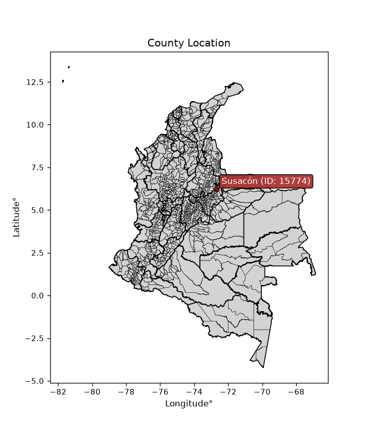
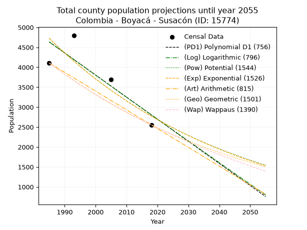
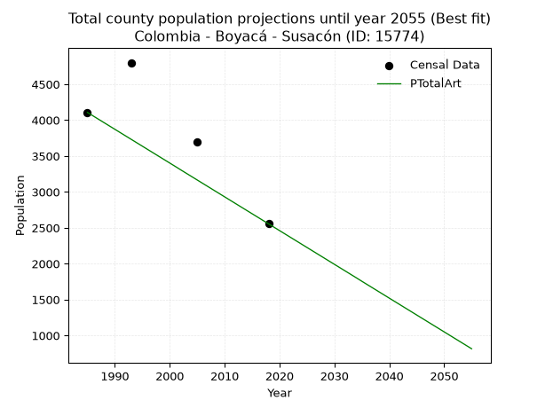
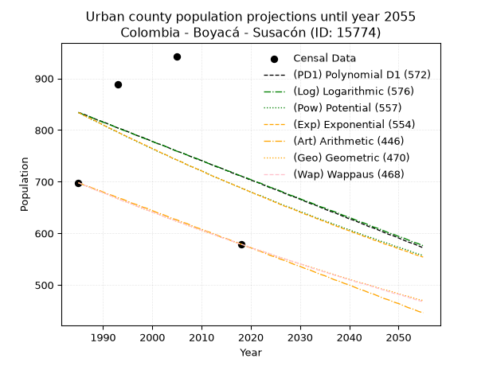
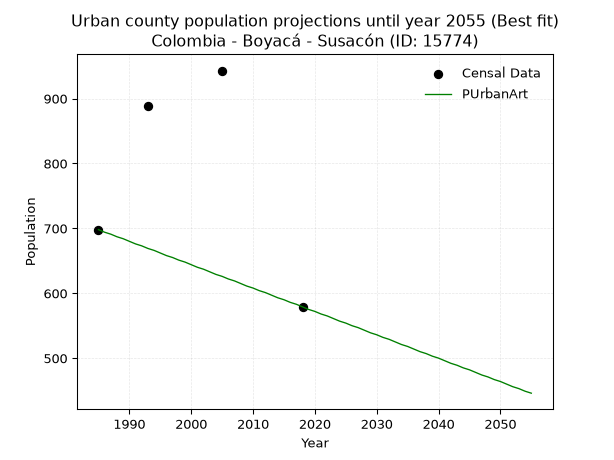
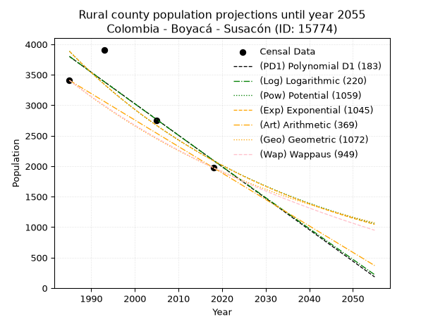
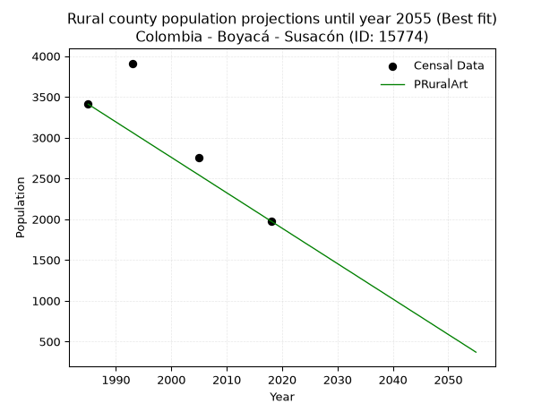

<div align="center">


</div>

# _“Population and Public Services Demand Projections (PPSD) until Year 2050 for Colombia - Boyacá - Susacón (ID: 15774)”_
Keywords: `population` `public-service` `projection` `lineal` `polynomial` `logarithmic` `potential` `exponential` `arithmetic` `geometric` `wappaus` `dane` `colombia` `south-america`

PPSD are analytical estimates used by governments and planners to anticipate future changes in population size, age distribution, and the resulting community needs for utilities, healthcare, education, and infrastructure as sizing future water treatment facilities, electrical grids, and road networks based on spatial growth.

> **General running parameters**: • app_version: _v20260806_. • Python version: _3.14.7_. • Pandas version: _3.0.5_. • NumPy version: _2.5.1_. • Creates, save and include plots into reports (create_plot): _False_. • Projection until year: _2050_. • Process polynomial degree 2 and up: _False_. • Process Wappaus: _True_. • Process Wappaus: _True_. • Set negative values to zero: _True_. • Set infinite values to zero: _True_. • Drop dataset notes: _True_. 
<div align="center">

Dynamic map: [:earth_americas:Google](http://maps.google.com/maps?q=6.230332074,-72.6902892) [:earth_americas:OSM](https://www.openstreetmap.org/#map=18/6.230332074/-72.6902892&layers=P) [:earth_americas:Bing](https://www.bing.com/maps?cp=6.230332074~-72.6902892&lvl=18) [:earth_americas:Apple](https://maps.apple.com/frame?center=6.230332074%2C-72.6902892&span=0.003%2C0.006)

</div>


<div align="center">

```geojson
{
  "type": "Feature",
  "geometry": {
    "type": "Point", 
    "coordinates": [-72.6902892, 6.230332074]
  }, 
  "properties": {
    "Name": "Colombia - Boyacá - Susacón (ID: 15774)"
  }
}
```

</div>


<div align="center">

</img>

</div>


## 0. Census Data (4 records)

Census data are official statistics collected by a government about the people and housing in a country. They usually include counts of total population, age, sex, race, income, education, and jobs.

📅Global census file: [Population.xlsx](../data/Population.xlsx)

| Source   |   Year |   CountryID | CountryName   |   StateID | StateName   |   CountyID | CountyName   |   PTotal |   PUrban |   PRural |
|:---------|-------:|------------:|:--------------|----------:|:------------|-----------:|:-------------|---------:|---------:|---------:|
| DANE     |   1985 |          57 | Colombia      |        15 | Boyacá      |      15774 | Susacón      |     4107 |      698 |     3409 |
| DANE     |   1993 |          57 | Colombia      |        15 | Boyacá      |      15774 | Susacón      |     4800 |      889 |     3911 |
| DANE     |   2005 |          57 | Colombia      |        15 | Boyacá      |      15774 | Susacón      |     3698 |      943 |     2755 |
| DANE     |   2018 |          57 | Colombia      |        15 | Boyacá      |      15774 | Susacón      |     2555 |      579 |     1976 |

> 🔥Some records could had specific notes about the registered values or the corresponding urban or rural distribution.

📅   [RUPS](https://www.datos.gov.co/Hacienda-y-Cr-dito-P-blico/Registro-nico-de-Prestadores-de-Servicios-P-blicos/4qkq-csdn/about_data) - Local public utility companies: [RUPS.csv](../data/RUPS.xlsx)

 | SERVICIO       | ESTADO    | NOMBRE                                                                                                  | NIT         | DEPARTAMENTO_DOMICILIO   | MUNICIPIO_DOMICILIO   | DIRECCION          |   TELEFONO | EMAIL                           | TIPO_PRESTADOR                 | CLASIFICACION                 |
|:---------------|:----------|:--------------------------------------------------------------------------------------------------------|:------------|:-------------------------|:----------------------|:-------------------|-----------:|:--------------------------------|:-------------------------------|:------------------------------|
| ACUEDUCTO      | OPERATIVA | UNIDAD DE SERVICIOS PUBLICOS DOMICILIARIOS DE ACUEDUCTO ALCANTARILLADO Y ASEO DEL MUNICIPIO DE  SUSACON | 891856472-1 | BOYACA                   | SUSACON               | CARRERA 4# 6-29    |    7815003 | johannita.rueda.conta@gmail.com | MUNICIPIO (PRESTACIÓN DIRECTA) | MENOR O IGUAL A 2500 USUARIOS |
| ALCANTARILLADO | OPERATIVA | UNIDAD DE SERVICIOS PUBLICOS DOMICILIARIOS DE ACUEDUCTO ALCANTARILLADO Y ASEO DEL MUNICIPIO DE  SUSACON | 891856472-1 | BOYACA                   | SUSACON               | CARRERA 4# 6-29    |    7815003 | johannita.rueda.conta@gmail.com | MUNICIPIO (PRESTACIÓN DIRECTA) | MENOR O IGUAL A 2500 USUARIOS |
| ACUEDUCTO      | OPERATIVA | ASOCIACION DE USUARIOS Y SUSCRIPTORES DEL ACUEDUCTO DE LA VEREDA DE SAN IGNACIO                         | 900017013-5 | BOYACA                   | SUSACON               | VEREDA SAN IGNACIO |    7815145 | cbarrera1@misena.edu.co         | ORGANIZACION AUTORIZADA        | HASTA 2500 SUSCRIPTORES       |

## 1. Total

### 1.1. Coefficients and Parameters

* (PD1) Polynomial Deg 1: -55.423524688879155, 114650.90525893054 (lineal)
* (Log) Logarithmic: -110803.21089731676, 846006.0939517117
* (Pow) Potential: -32.2743745792105, 110.10768902089839
* (Exp) Exponential: -0.016143864370555826, 3.9054057481305485e+17
* (Art) Arithmetic: Year diff. 2018 - 1985 = 33, Population diff. 2555 - 4107 = -1552, Annual growth = -47.03030303030303
* (Geo) Geometric: Year diff. 2018 - 1985 = 33, Population diff. 2555 - 4107 = -1552, Annual growth % = -0.014280106911567447
* (Wap) Wappaus: i = -1.4118974191024627, Condition values only valid for < 200)

<sub>
Wappaus condition values: ['-0.00', '-1.41', '-2.82', '-4.24', '-5.65', '-7.06', '-8.47', '-9.88', '-11.30', '-12.71', '-14.12', '-15.53', '-16.94', '-18.35', '-19.77', '-21.18', '-22.59', '-24.00', '-25.41', '-26.83', '-28.24', '-29.65', '-31.06', '-32.47', '-33.89', '-35.30', '-36.71', '-38.12', '-39.53', '-40.95', '-42.36', '-43.77', '-45.18', '-46.59', '-48.00', '-49.42', '-50.83', '-52.24', '-53.65', '-55.06', '-56.48', '-57.89', '-59.30', '-60.71', '-62.12', '-63.54', '-64.95', '-66.36', '-67.77', '-69.18', '-70.59', '-72.01', '-73.42', '-74.83', '-76.24', '-77.65', '-79.07', '-80.48', '-81.89', '-83.30', '-84.71', '-86.13', '-87.54', '-88.95', '-90.36', '-91.77']
</sub>


### 1.2. Projected Dataset

|   Year |   CountyID |   PTotalPD1 |   PTotalLog |   PTotalPow |   PTotalExp |   PTotalArt |   PTotalGeo |   PTotalWap |
|-------:|-----------:|------------:|------------:|------------:|------------:|------------:|------------:|------------:|
|   1985 |      15774 |        4635 |        4636 |        4726 |        4726 |        4107 |        4107 |        4107 |
|   1986 |      15774 |        4580 |        4580 |        4650 |        4650 |        4060 |        4048 |        4049 |
|   1987 |      15774 |        4524 |        4524 |        4575 |        4575 |        4013 |        3991 |        3993 |
|   1988 |      15774 |        4469 |        4469 |        4502 |        4502 |        3966 |        3934 |        3937 |
|   1989 |      15774 |        4414 |        4413 |        4429 |        4430 |        3919 |        3877 |        3881 |
|   1990 |      15774 |        4358 |        4357 |        4358 |        4359 |        3872 |        3822 |        3827 |
|   1991 |      15774 |        4303 |        4301 |        4288 |        4289 |        3825 |        3767 |        3773 |
|   1992 |      15774 |        4247 |        4246 |        4219 |        4221 |        3778 |        3714 |        3720 |
|   1993 |      15774 |        4192 |        4190 |        4151 |        4153 |        3731 |        3661 |        3668 |
|   1994 |      15774 |        4136 |        4135 |        4084 |        4086 |        3684 |        3608 |        3616 |
|   1995 |      15774 |        4081 |        4079 |        4019 |        4021 |        3637 |        3557 |        3565 |
|   1996 |      15774 |        4026 |        4024 |        3954 |        3957 |        3590 |        3506 |        3515 |
|   1997 |      15774 |        3970 |        3968 |        3891 |        3893 |        3543 |        3456 |        3466 |
|   1998 |      15774 |        3915 |        3913 |        3829 |        3831 |        3496 |        3407 |        3417 |
|   1999 |      15774 |        3859 |        3857 |        3767 |        3770 |        3449 |        3358 |        3368 |
|   2000 |      15774 |        3804 |        3802 |        3707 |        3709 |        3402 |        3310 |        3320 |
|   2001 |      15774 |        3748 |        3746 |        3648 |        3650 |        3355 |        3263 |        3273 |
|   2002 |      15774 |        3693 |        3691 |        3589 |        3591 |        3307 |        3216 |        3227 |
|   2003 |      15774 |        3638 |        3636 |        3532 |        3534 |        3260 |        3170 |        3181 |
|   2004 |      15774 |        3582 |        3580 |        3475 |        3477 |        3213 |        3125 |        3136 |
|   2005 |      15774 |        3527 |        3525 |        3420 |        3422 |        3166 |        3080 |        3091 |
|   2006 |      15774 |        3471 |        3470 |        3365 |        3367 |        3119 |        3036 |        3046 |
|   2007 |      15774 |        3416 |        3415 |        3312 |        3313 |        3072 |        2993 |        3003 |
|   2008 |      15774 |        3360 |        3359 |        3259 |        3260 |        3025 |        2950 |        2960 |
|   2009 |      15774 |        3305 |        3304 |        3207 |        3208 |        2978 |        2908 |        2917 |
|   2010 |      15774 |        3250 |        3249 |        3156 |        3156 |        2931 |        2867 |        2875 |
|   2011 |      15774 |        3194 |        3194 |        3105 |        3106 |        2884 |        2826 |        2833 |
|   2012 |      15774 |        3139 |        3139 |        3056 |        3056 |        2837 |        2785 |        2792 |
|   2013 |      15774 |        3083 |        3084 |        3007 |        3007 |        2790 |        2746 |        2751 |
|   2014 |      15774 |        3028 |        3029 |        2960 |        2959 |        2743 |        2706 |        2711 |
|   2015 |      15774 |        2973 |        2974 |        2913 |        2911 |        2696 |        2668 |        2671 |
|   2016 |      15774 |        2917 |        2919 |        2866 |        2865 |        2649 |        2630 |        2632 |
|   2017 |      15774 |        2862 |        2864 |        2821 |        2819 |        2602 |        2592 |        2593 |
|   2018 |      15774 |        2806 |        2809 |        2776 |        2774 |        2555 |        2555 |        2555 |
|   2019 |      15774 |        2751 |        2754 |        2732 |        2729 |        2508 |        2519 |        2517 |
|   2020 |      15774 |        2695 |        2699 |        2689 |        2686 |        2461 |        2483 |        2480 |
|   2021 |      15774 |        2640 |        2644 |        2646 |        2643 |        2414 |        2447 |        2443 |
|   2022 |      15774 |        2585 |        2590 |        2604 |        2600 |        2367 |        2412 |        2406 |
|   2023 |      15774 |        2529 |        2535 |        2563 |        2559 |        2320 |        2378 |        2370 |
|   2024 |      15774 |        2474 |        2480 |        2522 |        2518 |        2273 |        2344 |        2334 |
|   2025 |      15774 |        2418 |        2425 |        2482 |        2477 |        2226 |        2310 |        2298 |
|   2026 |      15774 |        2363 |        2371 |        2443 |        2438 |        2179 |        2277 |        2263 |
|   2027 |      15774 |        2307 |        2316 |        2405 |        2399 |        2132 |        2245 |        2229 |
|   2028 |      15774 |        2252 |        2261 |        2367 |        2360 |        2085 |        2213 |        2194 |
|   2029 |      15774 |        2197 |        2207 |        2329 |        2323 |        2038 |        2181 |        2160 |
|   2030 |      15774 |        2141 |        2152 |        2293 |        2285 |        1991 |        2150 |        2127 |
|   2031 |      15774 |        2086 |        2097 |        2256 |        2249 |        1944 |        2119 |        2093 |
|   2032 |      15774 |        2030 |        2043 |        2221 |        2213 |        1897 |        2089 |        2061 |
|   2033 |      15774 |        1975 |        1988 |        2186 |        2177 |        1850 |        2059 |        2028 |
|   2034 |      15774 |        1919 |        1934 |        2151 |        2142 |        1803 |        2030 |        1996 |
|   2035 |      15774 |        1864 |        1879 |        2118 |        2108 |        1755 |        2001 |        1964 |
|   2036 |      15774 |        1809 |        1825 |        2084 |        2074 |        1708 |        1972 |        1933 |
|   2037 |      15774 |        1753 |        1771 |        2052 |        2041 |        1661 |        1944 |        1901 |
|   2038 |      15774 |        1698 |        1716 |        2019 |        2008 |        1614 |        1916 |        1871 |
|   2039 |      15774 |        1642 |        1662 |        1988 |        1976 |        1567 |        1889 |        1840 |
|   2040 |      15774 |        1587 |        1608 |        1956 |        1945 |        1520 |        1862 |        1810 |
|   2041 |      15774 |        1531 |        1553 |        1926 |        1913 |        1473 |        1835 |        1780 |
|   2042 |      15774 |        1476 |        1499 |        1895 |        1883 |        1426 |        1809 |        1750 |
|   2043 |      15774 |        1421 |        1445 |        1866 |        1853 |        1379 |        1783 |        1721 |
|   2044 |      15774 |        1365 |        1390 |        1836 |        1823 |        1332 |        1758 |        1692 |
|   2045 |      15774 |        1310 |        1336 |        1808 |        1794 |        1285 |        1733 |        1663 |
|   2046 |      15774 |        1254 |        1282 |        1779 |        1765 |        1238 |        1708 |        1635 |
|   2047 |      15774 |        1199 |        1228 |        1752 |        1737 |        1191 |        1684 |        1606 |
|   2048 |      15774 |        1144 |        1174 |        1724 |        1709 |        1144 |        1660 |        1578 |
|   2049 |      15774 |        1088 |        1120 |        1697 |        1682 |        1097 |        1636 |        1551 |
|   2050 |      15774 |        1033 |        1066 |        1671 |        1655 |        1050 |        1613 |        1523 |
<div align="center">

</img>

</div>


### 1.3. Best fit with absolute and relative error (%)

Relative error puts that difference into context by dividing the absolute error by the true value, creating a unitless ratio or percentage that shows the scale of the mistake.

Absolute and relative error

|   Year | Source   |   CountryID | CountryName   |   StateID | StateName   |   CountyID_x | CountyName   |   PTotal |   PUrban |   PRural |   CountyID_y |   PTotalPD1 |   PTotalLog |   PTotalPow |   PTotalExp |   PTotalArt |   PTotalGeo |   PTotalWap |   PTotalPD1AbsError |   PTotalLogAbsError |   PTotalPowAbsError |   PTotalExpAbsError |   PTotalArtAbsError |   PTotalGeoAbsError |   PTotalWapAbsError |   PTotalPD1RelError |   PTotalLogRelError |   PTotalPowRelError |   PTotalExpRelError |   PTotalArtRelError |   PTotalGeoRelError |   PTotalWapRelError |
|-------:|:---------|------------:|:--------------|----------:|:------------|-------------:|:-------------|---------:|---------:|---------:|-------------:|------------:|------------:|------------:|------------:|------------:|------------:|------------:|--------------------:|--------------------:|--------------------:|--------------------:|--------------------:|--------------------:|--------------------:|--------------------:|--------------------:|--------------------:|--------------------:|--------------------:|--------------------:|--------------------:|
|   1985 | DANE     |          57 | Colombia      |        15 | Boyacá      |        15774 | Susacón      |     4107 |      698 |     3409 |        15774 |        4635 |        4636 |        4726 |        4726 |        4107 |        4107 |        4107 |                 528 |                 529 |                 619 |                 619 |                   0 |                   0 |                   0 |            12.8561  |            12.8804  |            15.0718  |            15.0718  |              0      |              0      |              0      |
|   1993 | DANE     |          57 | Colombia      |        15 | Boyacá      |        15774 | Susacón      |     4800 |      889 |     3911 |        15774 |        4192 |        4190 |        4151 |        4153 |        3731 |        3661 |        3668 |                 608 |                 610 |                 649 |                 647 |                1069 |                1139 |                1132 |            12.6667  |            12.7083  |            13.5208  |            13.4792  |             22.2708 |             23.7292 |             23.5833 |
|   2005 | DANE     |          57 | Colombia      |        15 | Boyacá      |        15774 | Susacón      |     3698 |      943 |     2755 |        15774 |        3527 |        3525 |        3420 |        3422 |        3166 |        3080 |        3091 |                 171 |                 173 |                 278 |                 276 |                 532 |                 618 |                 607 |             4.62412 |             4.6782  |             7.51758 |             7.46349 |             14.3862 |             16.7117 |             16.4143 |
|   2018 | DANE     |          57 | Colombia      |        15 | Boyacá      |        15774 | Susacón      |     2555 |      579 |     1976 |        15774 |        2806 |        2809 |        2776 |        2774 |        2555 |        2555 |        2555 |                 251 |                 254 |                 221 |                 219 |                   0 |                   0 |                   0 |             9.82387 |             9.94129 |             8.64971 |             8.57143 |              0      |              0      |              0      |

Relative error mean

| Method    |   RelError | Best   |
|:----------|-----------:|:-------|
| PTotalPD1 |    9.99269 |        |
| PTotalLog |   10.0521  |        |
| PTotalPow |   11.19    |        |
| PTotalExp |   11.1465  |        |
| PTotalArt |    9.16425 | True   |
| PTotalGeo |   10.1102  |        |
| PTotalWap |    9.9994  |        |

💙Best method: _**PTotalArt**_
<div align="center">

</img>

</div>


### 1.4. Fresh water supply demand in liters per capita per day (lpcd)

The fresh water supply demand typically ranges from 100 to 300 liters per capita per day (lpcd) for standard domestic and municipal planning, though absolute survival minimums set by the World Health Organization are as low as 7.5 to 20 liters per day, and total consumption in high-income nations can exceed 400 liters.

> `CZ`: Level in meters above the sea level (masl)<br> `WS`: Fresh water supply demand in liters per capita per day (lpcd or l/h/d)<br> `WSAll`: Zonal fresh water supply demand in liters per second (l/s)<br> `A`: Zonal area in square meters<br> `DP`: Population density (people/hectare or p/ha)

Reference values (RAS Colombia)

|    CZ |   WS |
|------:|-----:|
|  1000 |  120 |
|  2000 |  130 |
| 99999 |  140 |

County shapefile geometry properties and water supply values

|   CountyID |      ATotal |   CZTotal |   WSTotal |
|-----------:|------------:|----------:|----------:|
|      15774 | 1.82313e+08 |   2900.25 |       140 |

Projected values for best method: PTotalArt

|   CountyID |   Year |   PTotalArt |   DPTotal |   WSTotal |   WSTotalAll |
|-----------:|-------:|------------:|----------:|----------:|-------------:|
|      15774 |   1985 |        4107 |      0.23 |       140 |      6.65486 |
|      15774 |   1986 |        4060 |      0.22 |       140 |      6.5787  |
|      15774 |   1987 |        4013 |      0.22 |       140 |      6.50255 |
|      15774 |   1988 |        3966 |      0.22 |       140 |      6.42639 |
|      15774 |   1989 |        3919 |      0.21 |       140 |      6.35023 |
|      15774 |   1990 |        3872 |      0.21 |       140 |      6.27407 |
|      15774 |   1991 |        3825 |      0.21 |       140 |      6.19792 |
|      15774 |   1992 |        3778 |      0.21 |       140 |      6.12176 |
|      15774 |   1993 |        3731 |      0.2  |       140 |      6.0456  |
|      15774 |   1994 |        3684 |      0.2  |       140 |      5.96944 |
|      15774 |   1995 |        3637 |      0.2  |       140 |      5.89329 |
|      15774 |   1996 |        3590 |      0.2  |       140 |      5.81713 |
|      15774 |   1997 |        3543 |      0.19 |       140 |      5.74097 |
|      15774 |   1998 |        3496 |      0.19 |       140 |      5.66481 |
|      15774 |   1999 |        3449 |      0.19 |       140 |      5.58866 |
|      15774 |   2000 |        3402 |      0.19 |       140 |      5.5125  |
|      15774 |   2001 |        3355 |      0.18 |       140 |      5.43634 |
|      15774 |   2002 |        3307 |      0.18 |       140 |      5.35856 |
|      15774 |   2003 |        3260 |      0.18 |       140 |      5.28241 |
|      15774 |   2004 |        3213 |      0.18 |       140 |      5.20625 |
|      15774 |   2005 |        3166 |      0.17 |       140 |      5.13009 |
|      15774 |   2006 |        3119 |      0.17 |       140 |      5.05394 |
|      15774 |   2007 |        3072 |      0.17 |       140 |      4.97778 |
|      15774 |   2008 |        3025 |      0.17 |       140 |      4.90162 |
|      15774 |   2009 |        2978 |      0.16 |       140 |      4.82546 |
|      15774 |   2010 |        2931 |      0.16 |       140 |      4.74931 |
|      15774 |   2011 |        2884 |      0.16 |       140 |      4.67315 |
|      15774 |   2012 |        2837 |      0.16 |       140 |      4.59699 |
|      15774 |   2013 |        2790 |      0.15 |       140 |      4.52083 |
|      15774 |   2014 |        2743 |      0.15 |       140 |      4.44468 |
|      15774 |   2015 |        2696 |      0.15 |       140 |      4.36852 |
|      15774 |   2016 |        2649 |      0.15 |       140 |      4.29236 |
|      15774 |   2017 |        2602 |      0.14 |       140 |      4.2162  |
|      15774 |   2018 |        2555 |      0.14 |       140 |      4.14005 |
|      15774 |   2019 |        2508 |      0.14 |       140 |      4.06389 |
|      15774 |   2020 |        2461 |      0.13 |       140 |      3.98773 |
|      15774 |   2021 |        2414 |      0.13 |       140 |      3.91157 |
|      15774 |   2022 |        2367 |      0.13 |       140 |      3.83542 |
|      15774 |   2023 |        2320 |      0.13 |       140 |      3.75926 |
|      15774 |   2024 |        2273 |      0.12 |       140 |      3.6831  |
|      15774 |   2025 |        2226 |      0.12 |       140 |      3.60694 |
|      15774 |   2026 |        2179 |      0.12 |       140 |      3.53079 |
|      15774 |   2027 |        2132 |      0.12 |       140 |      3.45463 |
|      15774 |   2028 |        2085 |      0.11 |       140 |      3.37847 |
|      15774 |   2029 |        2038 |      0.11 |       140 |      3.30231 |
|      15774 |   2030 |        1991 |      0.11 |       140 |      3.22616 |
|      15774 |   2031 |        1944 |      0.11 |       140 |      3.15    |
|      15774 |   2032 |        1897 |      0.1  |       140 |      3.07384 |
|      15774 |   2033 |        1850 |      0.1  |       140 |      2.99769 |
|      15774 |   2034 |        1803 |      0.1  |       140 |      2.92153 |
|      15774 |   2035 |        1755 |      0.1  |       140 |      2.84375 |
|      15774 |   2036 |        1708 |      0.09 |       140 |      2.76759 |
|      15774 |   2037 |        1661 |      0.09 |       140 |      2.69144 |
|      15774 |   2038 |        1614 |      0.09 |       140 |      2.61528 |
|      15774 |   2039 |        1567 |      0.09 |       140 |      2.53912 |
|      15774 |   2040 |        1520 |      0.08 |       140 |      2.46296 |
|      15774 |   2041 |        1473 |      0.08 |       140 |      2.38681 |
|      15774 |   2042 |        1426 |      0.08 |       140 |      2.31065 |
|      15774 |   2043 |        1379 |      0.08 |       140 |      2.23449 |
|      15774 |   2044 |        1332 |      0.07 |       140 |      2.15833 |
|      15774 |   2045 |        1285 |      0.07 |       140 |      2.08218 |
|      15774 |   2046 |        1238 |      0.07 |       140 |      2.00602 |
|      15774 |   2047 |        1191 |      0.07 |       140 |      1.92986 |
|      15774 |   2048 |        1144 |      0.06 |       140 |      1.8537  |
|      15774 |   2049 |        1097 |      0.06 |       140 |      1.77755 |
|      15774 |   2050 |        1050 |      0.06 |       140 |      1.70139 |

## 2. Urban

### 2.1. Coefficients and Parameters

* (PD1) Polynomial Deg 1: -3.7466880770772564, 8271.562826173782 (lineal)
* (Log) Logarithmic: -7447.548079560403, 57386.12263364341
* (Pow) Potential: -11.639367896558868, 41.30492298320946
* (Exp) Exponential: -0.005848835736928451, 91908581.11149757
* (Art) Arithmetic: Year diff. 2018 - 1985 = 33, Population diff. 579 - 698 = -119, Annual growth = -3.606060606060606
* (Geo) Geometric: Year diff. 2018 - 1985 = 33, Population diff. 579 - 698 = -119, Annual growth % = -0.005648129159169013
* (Wap) Wappaus: i = -0.5647706509100401, Condition values only valid for < 200)

<sub>
Wappaus condition values: ['-0.00', '-0.56', '-1.13', '-1.69', '-2.26', '-2.82', '-3.39', '-3.95', '-4.52', '-5.08', '-5.65', '-6.21', '-6.78', '-7.34', '-7.91', '-8.47', '-9.04', '-9.60', '-10.17', '-10.73', '-11.30', '-11.86', '-12.42', '-12.99', '-13.55', '-14.12', '-14.68', '-15.25', '-15.81', '-16.38', '-16.94', '-17.51', '-18.07', '-18.64', '-19.20', '-19.77', '-20.33', '-20.90', '-21.46', '-22.03', '-22.59', '-23.16', '-23.72', '-24.29', '-24.85', '-25.41', '-25.98', '-26.54', '-27.11', '-27.67', '-28.24', '-28.80', '-29.37', '-29.93', '-30.50', '-31.06', '-31.63', '-32.19', '-32.76', '-33.32', '-33.89', '-34.45', '-35.02', '-35.58', '-36.15', '-36.71']
</sub>


### 2.2. Projected Dataset

|   Year |   CountyID |   PUrbanPD1 |   PUrbanLog |   PUrbanPow |   PUrbanExp |   PUrbanArt |   PUrbanGeo |   PUrbanWap |
|-------:|-----------:|------------:|------------:|------------:|------------:|------------:|------------:|------------:|
|   1985 |      15774 |         834 |         834 |         834 |         834 |         698 |         698 |         698 |
|   1986 |      15774 |         831 |         830 |         829 |         829 |         694 |         694 |         694 |
|   1987 |      15774 |         827 |         827 |         824 |         824 |         691 |         690 |         690 |
|   1988 |      15774 |         823 |         823 |         819 |         820 |         687 |         686 |         686 |
|   1989 |      15774 |         819 |         819 |         815 |         815 |         684 |         682 |         682 |
|   1990 |      15774 |         816 |         815 |         810 |         810 |         680 |         679 |         679 |
|   1991 |      15774 |         812 |         812 |         805 |         805 |         676 |         675 |         675 |
|   1992 |      15774 |         808 |         808 |         800 |         801 |         673 |         671 |         671 |
|   1993 |      15774 |         804 |         804 |         796 |         796 |         669 |         667 |         667 |
|   1994 |      15774 |         801 |         800 |         791 |         791 |         666 |         663 |         663 |
|   1995 |      15774 |         797 |         797 |         786 |         787 |         662 |         660 |         660 |
|   1996 |      15774 |         793 |         793 |         782 |         782 |         658 |         656 |         656 |
|   1997 |      15774 |         789 |         789 |         777 |         778 |         655 |         652 |         652 |
|   1998 |      15774 |         786 |         785 |         773 |         773 |         651 |         648 |         649 |
|   1999 |      15774 |         782 |         782 |         768 |         769 |         648 |         645 |         645 |
|   2000 |      15774 |         778 |         778 |         764 |         764 |         644 |         641 |         641 |
|   2001 |      15774 |         774 |         774 |         759 |         760 |         640 |         638 |         638 |
|   2002 |      15774 |         771 |         771 |         755 |         755 |         637 |         634 |         634 |
|   2003 |      15774 |         767 |         767 |         751 |         751 |         633 |         630 |         630 |
|   2004 |      15774 |         763 |         763 |         746 |         746 |         629 |         627 |         627 |
|   2005 |      15774 |         759 |         759 |         742 |         742 |         626 |         623 |         623 |
|   2006 |      15774 |         756 |         756 |         738 |         738 |         622 |         620 |         620 |
|   2007 |      15774 |         752 |         752 |         733 |         733 |         619 |         616 |         616 |
|   2008 |      15774 |         748 |         748 |         729 |         729 |         615 |         613 |         613 |
|   2009 |      15774 |         744 |         745 |         725 |         725 |         611 |         609 |         609 |
|   2010 |      15774 |         741 |         741 |         721 |         721 |         608 |         606 |         606 |
|   2011 |      15774 |         737 |         737 |         717 |         716 |         604 |         602 |         603 |
|   2012 |      15774 |         733 |         733 |         712 |         712 |         601 |         599 |         599 |
|   2013 |      15774 |         729 |         730 |         708 |         708 |         597 |         596 |         596 |
|   2014 |      15774 |         726 |         726 |         704 |         704 |         593 |         592 |         592 |
|   2015 |      15774 |         722 |         722 |         700 |         700 |         590 |         589 |         589 |
|   2016 |      15774 |         718 |         719 |         696 |         696 |         586 |         586 |         586 |
|   2017 |      15774 |         714 |         715 |         692 |         692 |         583 |         582 |         582 |
|   2018 |      15774 |         711 |         711 |         688 |         688 |         579 |         579 |         579 |
|   2019 |      15774 |         707 |         708 |         684 |         684 |         575 |         576 |         576 |
|   2020 |      15774 |         703 |         704 |         680 |         680 |         572 |         572 |         572 |
|   2021 |      15774 |         700 |         700 |         676 |         676 |         568 |         569 |         569 |
|   2022 |      15774 |         696 |         697 |         673 |         672 |         565 |         566 |         566 |
|   2023 |      15774 |         692 |         693 |         669 |         668 |         561 |         563 |         563 |
|   2024 |      15774 |         688 |         689 |         665 |         664 |         557 |         560 |         560 |
|   2025 |      15774 |         685 |         686 |         661 |         660 |         554 |         556 |         556 |
|   2026 |      15774 |         681 |         682 |         657 |         656 |         550 |         553 |         553 |
|   2027 |      15774 |         677 |         678 |         653 |         652 |         547 |         550 |         550 |
|   2028 |      15774 |         673 |         674 |         650 |         649 |         543 |         547 |         547 |
|   2029 |      15774 |         670 |         671 |         646 |         645 |         539 |         544 |         544 |
|   2030 |      15774 |         666 |         667 |         642 |         641 |         536 |         541 |         541 |
|   2031 |      15774 |         662 |         663 |         639 |         637 |         532 |         538 |         538 |
|   2032 |      15774 |         658 |         660 |         635 |         634 |         529 |         535 |         534 |
|   2033 |      15774 |         655 |         656 |         631 |         630 |         525 |         532 |         531 |
|   2034 |      15774 |         651 |         652 |         628 |         626 |         521 |         529 |         528 |
|   2035 |      15774 |         647 |         649 |         624 |         623 |         518 |         526 |         525 |
|   2036 |      15774 |         643 |         645 |         621 |         619 |         514 |         523 |         522 |
|   2037 |      15774 |         640 |         642 |         617 |         615 |         510 |         520 |         519 |
|   2038 |      15774 |         636 |         638 |         614 |         612 |         507 |         517 |         516 |
|   2039 |      15774 |         632 |         634 |         610 |         608 |         503 |         514 |         513 |
|   2040 |      15774 |         628 |         631 |         607 |         605 |         500 |         511 |         510 |
|   2041 |      15774 |         625 |         627 |         603 |         601 |         496 |         508 |         507 |
|   2042 |      15774 |         621 |         623 |         600 |         598 |         492 |         505 |         504 |
|   2043 |      15774 |         617 |         620 |         596 |         594 |         489 |         503 |         502 |
|   2044 |      15774 |         613 |         616 |         593 |         591 |         485 |         500 |         499 |
|   2045 |      15774 |         610 |         612 |         590 |         587 |         482 |         497 |         496 |
|   2046 |      15774 |         606 |         609 |         586 |         584 |         478 |         494 |         493 |
|   2047 |      15774 |         602 |         605 |         583 |         580 |         474 |         491 |         490 |
|   2048 |      15774 |         598 |         601 |         580 |         577 |         471 |         489 |         487 |
|   2049 |      15774 |         595 |         598 |         576 |         574 |         467 |         486 |         484 |
|   2050 |      15774 |         591 |         594 |         573 |         570 |         464 |         483 |         482 |
<div align="center">

</img>

</div>


### 2.3. Best fit with absolute and relative error (%)

Relative error puts that difference into context by dividing the absolute error by the true value, creating a unitless ratio or percentage that shows the scale of the mistake.

Absolute and relative error

|   Year | Source   |   CountryID | CountryName   |   StateID | StateName   |   CountyID_x | CountyName   |   PTotal |   PUrban |   PRural |   CountyID_y |   PUrbanPD1 |   PUrbanLog |   PUrbanPow |   PUrbanExp |   PUrbanArt |   PUrbanGeo |   PUrbanWap |   PUrbanPD1AbsError |   PUrbanLogAbsError |   PUrbanPowAbsError |   PUrbanExpAbsError |   PUrbanArtAbsError |   PUrbanGeoAbsError |   PUrbanWapAbsError |   PUrbanPD1RelError |   PUrbanLogRelError |   PUrbanPowRelError |   PUrbanExpRelError |   PUrbanArtRelError |   PUrbanGeoRelError |   PUrbanWapRelError |
|-------:|:---------|------------:|:--------------|----------:|:------------|-------------:|:-------------|---------:|---------:|---------:|-------------:|------------:|------------:|------------:|------------:|------------:|------------:|------------:|--------------------:|--------------------:|--------------------:|--------------------:|--------------------:|--------------------:|--------------------:|--------------------:|--------------------:|--------------------:|--------------------:|--------------------:|--------------------:|--------------------:|
|   1985 | DANE     |          57 | Colombia      |        15 | Boyacá      |        15774 | Susacón      |     4107 |      698 |     3409 |        15774 |         834 |         834 |         834 |         834 |         698 |         698 |         698 |                 136 |                 136 |                 136 |                 136 |                   0 |                   0 |                   0 |             19.4842 |             19.4842 |             19.4842 |             19.4842 |              0      |              0      |              0      |
|   1993 | DANE     |          57 | Colombia      |        15 | Boyacá      |        15774 | Susacón      |     4800 |      889 |     3911 |        15774 |         804 |         804 |         796 |         796 |         669 |         667 |         667 |                  85 |                  85 |                  93 |                  93 |                 220 |                 222 |                 222 |              9.5613 |              9.5613 |             10.4612 |             10.4612 |             24.7469 |             24.9719 |             24.9719 |
|   2005 | DANE     |          57 | Colombia      |        15 | Boyacá      |        15774 | Susacón      |     3698 |      943 |     2755 |        15774 |         759 |         759 |         742 |         742 |         626 |         623 |         623 |                 184 |                 184 |                 201 |                 201 |                 317 |                 320 |                 320 |             19.5122 |             19.5122 |             21.315  |             21.315  |             33.6161 |             33.9343 |             33.9343 |
|   2018 | DANE     |          57 | Colombia      |        15 | Boyacá      |        15774 | Susacón      |     2555 |      579 |     1976 |        15774 |         711 |         711 |         688 |         688 |         579 |         579 |         579 |                 132 |                 132 |                 109 |                 109 |                   0 |                   0 |                   0 |             22.7979 |             22.7979 |             18.8256 |             18.8256 |              0      |              0      |              0      |

Relative error mean

| Method    |   RelError | Best   |
|:----------|-----------:|:-------|
| PUrbanPD1 |    17.8389 |        |
| PUrbanLog |    17.8389 |        |
| PUrbanPow |    17.5215 |        |
| PUrbanExp |    17.5215 |        |
| PUrbanArt |    14.5908 | True   |
| PUrbanGeo |    14.7265 |        |
| PUrbanWap |    14.7265 |        |

💙Best method: _**PUrbanArt**_
<div align="center">

</img>

</div>


### 2.4. Fresh water supply demand in liters per capita per day (lpcd)

The fresh water supply demand typically ranges from 100 to 300 liters per capita per day (lpcd) for standard domestic and municipal planning, though absolute survival minimums set by the World Health Organization are as low as 7.5 to 20 liters per day, and total consumption in high-income nations can exceed 400 liters.

> `CZ`: Level in meters above the sea level (masl)<br> `WS`: Fresh water supply demand in liters per capita per day (lpcd or l/h/d)<br> `WSAll`: Zonal fresh water supply demand in liters per second (l/s)<br> `A`: Zonal area in square meters<br> `DP`: Population density (people/hectare or p/ha)

Reference values (RAS Colombia)

|    CZ |   WS |
|------:|-----:|
|  1000 |  120 |
|  2000 |  130 |
| 99999 |  140 |

County shapefile geometry properties and water supply values

|   CountyID |   AUrban |   CZUrban |   WSUrban |
|-----------:|---------:|----------:|----------:|
|      15774 |   242789 |   2483.34 |       140 |

Projected values for best method: PUrbanArt

|   CountyID |   Year |   PUrbanArt |   DPUrban |   WSUrban |   WSUrbanAll |
|-----------:|-------:|------------:|----------:|----------:|-------------:|
|      15774 |   1985 |         698 |     28.75 |       140 |     1.13102  |
|      15774 |   1986 |         694 |     28.58 |       140 |     1.12454  |
|      15774 |   1987 |         691 |     28.46 |       140 |     1.11968  |
|      15774 |   1988 |         687 |     28.3  |       140 |     1.11319  |
|      15774 |   1989 |         684 |     28.17 |       140 |     1.10833  |
|      15774 |   1990 |         680 |     28.01 |       140 |     1.10185  |
|      15774 |   1991 |         676 |     27.84 |       140 |     1.09537  |
|      15774 |   1992 |         673 |     27.72 |       140 |     1.09051  |
|      15774 |   1993 |         669 |     27.55 |       140 |     1.08403  |
|      15774 |   1994 |         666 |     27.43 |       140 |     1.07917  |
|      15774 |   1995 |         662 |     27.27 |       140 |     1.07269  |
|      15774 |   1996 |         658 |     27.1  |       140 |     1.0662   |
|      15774 |   1997 |         655 |     26.98 |       140 |     1.06134  |
|      15774 |   1998 |         651 |     26.81 |       140 |     1.05486  |
|      15774 |   1999 |         648 |     26.69 |       140 |     1.05     |
|      15774 |   2000 |         644 |     26.53 |       140 |     1.04352  |
|      15774 |   2001 |         640 |     26.36 |       140 |     1.03704  |
|      15774 |   2002 |         637 |     26.24 |       140 |     1.03218  |
|      15774 |   2003 |         633 |     26.07 |       140 |     1.02569  |
|      15774 |   2004 |         629 |     25.91 |       140 |     1.01921  |
|      15774 |   2005 |         626 |     25.78 |       140 |     1.01435  |
|      15774 |   2006 |         622 |     25.62 |       140 |     1.00787  |
|      15774 |   2007 |         619 |     25.5  |       140 |     1.00301  |
|      15774 |   2008 |         615 |     25.33 |       140 |     0.996528 |
|      15774 |   2009 |         611 |     25.17 |       140 |     0.990046 |
|      15774 |   2010 |         608 |     25.04 |       140 |     0.985185 |
|      15774 |   2011 |         604 |     24.88 |       140 |     0.978704 |
|      15774 |   2012 |         601 |     24.75 |       140 |     0.973843 |
|      15774 |   2013 |         597 |     24.59 |       140 |     0.967361 |
|      15774 |   2014 |         593 |     24.42 |       140 |     0.96088  |
|      15774 |   2015 |         590 |     24.3  |       140 |     0.956019 |
|      15774 |   2016 |         586 |     24.14 |       140 |     0.949537 |
|      15774 |   2017 |         583 |     24.01 |       140 |     0.944676 |
|      15774 |   2018 |         579 |     23.85 |       140 |     0.938194 |
|      15774 |   2019 |         575 |     23.68 |       140 |     0.931713 |
|      15774 |   2020 |         572 |     23.56 |       140 |     0.926852 |
|      15774 |   2021 |         568 |     23.39 |       140 |     0.92037  |
|      15774 |   2022 |         565 |     23.27 |       140 |     0.915509 |
|      15774 |   2023 |         561 |     23.11 |       140 |     0.909028 |
|      15774 |   2024 |         557 |     22.94 |       140 |     0.902546 |
|      15774 |   2025 |         554 |     22.82 |       140 |     0.897685 |
|      15774 |   2026 |         550 |     22.65 |       140 |     0.891204 |
|      15774 |   2027 |         547 |     22.53 |       140 |     0.886343 |
|      15774 |   2028 |         543 |     22.37 |       140 |     0.879861 |
|      15774 |   2029 |         539 |     22.2  |       140 |     0.87338  |
|      15774 |   2030 |         536 |     22.08 |       140 |     0.868519 |
|      15774 |   2031 |         532 |     21.91 |       140 |     0.862037 |
|      15774 |   2032 |         529 |     21.79 |       140 |     0.857176 |
|      15774 |   2033 |         525 |     21.62 |       140 |     0.850694 |
|      15774 |   2034 |         521 |     21.46 |       140 |     0.844213 |
|      15774 |   2035 |         518 |     21.34 |       140 |     0.839352 |
|      15774 |   2036 |         514 |     21.17 |       140 |     0.83287  |
|      15774 |   2037 |         510 |     21.01 |       140 |     0.826389 |
|      15774 |   2038 |         507 |     20.88 |       140 |     0.821528 |
|      15774 |   2039 |         503 |     20.72 |       140 |     0.815046 |
|      15774 |   2040 |         500 |     20.59 |       140 |     0.810185 |
|      15774 |   2041 |         496 |     20.43 |       140 |     0.803704 |
|      15774 |   2042 |         492 |     20.26 |       140 |     0.797222 |
|      15774 |   2043 |         489 |     20.14 |       140 |     0.792361 |
|      15774 |   2044 |         485 |     19.98 |       140 |     0.78588  |
|      15774 |   2045 |         482 |     19.85 |       140 |     0.781019 |
|      15774 |   2046 |         478 |     19.69 |       140 |     0.774537 |
|      15774 |   2047 |         474 |     19.52 |       140 |     0.768056 |
|      15774 |   2048 |         471 |     19.4  |       140 |     0.763194 |
|      15774 |   2049 |         467 |     19.23 |       140 |     0.756713 |
|      15774 |   2050 |         464 |     19.11 |       140 |     0.751852 |

## 3. Rural

### 3.1. Coefficients and Parameters

* (PD1) Polynomial Deg 1: -51.67683661180195, 106379.34243275685 (lineal)
* (Log) Logarithmic: -103355.66281775633, 788619.971318068
* (Pow) Potential: -37.53405045301648, 127.367952861509
* (Exp) Exponential: -0.01876769586443732, 5.87025572514034e+19
* (Art) Arithmetic: Year diff. 2018 - 1985 = 33, Population diff. 1976 - 3409 = -1433, Annual growth = -43.42424242424242
* (Geo) Geometric: Year diff. 2018 - 1985 = 33, Population diff. 1976 - 3409 = -1433, Annual growth % = -0.016389789246274544
* (Wap) Wappaus: i = -1.6127852339551505, Condition values only valid for < 200)

<sub>
Wappaus condition values: ['-0.00', '-1.61', '-3.23', '-4.84', '-6.45', '-8.06', '-9.68', '-11.29', '-12.90', '-14.52', '-16.13', '-17.74', '-19.35', '-20.97', '-22.58', '-24.19', '-25.80', '-27.42', '-29.03', '-30.64', '-32.26', '-33.87', '-35.48', '-37.09', '-38.71', '-40.32', '-41.93', '-43.55', '-45.16', '-46.77', '-48.38', '-50.00', '-51.61', '-53.22', '-54.83', '-56.45', '-58.06', '-59.67', '-61.29', '-62.90', '-64.51', '-66.12', '-67.74', '-69.35', '-70.96', '-72.58', '-74.19', '-75.80', '-77.41', '-79.03', '-80.64', '-82.25', '-83.86', '-85.48', '-87.09', '-88.70', '-90.32', '-91.93', '-93.54', '-95.15', '-96.77', '-98.38', '-99.99', '-101.61', '-103.22', '-104.83']
</sub>


### 3.2. Projected Dataset

|   Year |   CountyID |   PRuralPD1 |   PRuralLog |   PRuralPow |   PRuralExp |   PRuralArt |   PRuralGeo |   PRuralWap |
|-------:|-----------:|------------:|------------:|------------:|------------:|------------:|------------:|------------:|
|   1985 |      15774 |        3801 |        3802 |        3887 |        3886 |        3409 |        3409 |        3409 |
|   1986 |      15774 |        3749 |        3750 |        3814 |        3814 |        3366 |        3353 |        3354 |
|   1987 |      15774 |        3697 |        3698 |        3743 |        3743 |        3322 |        3298 |        3301 |
|   1988 |      15774 |        3646 |        3646 |        3673 |        3673 |        3279 |        3244 |        3248 |
|   1989 |      15774 |        3594 |        3594 |        3604 |        3605 |        3235 |        3191 |        3196 |
|   1990 |      15774 |        3542 |        3542 |        3537 |        3538 |        3192 |        3139 |        3145 |
|   1991 |      15774 |        3491 |        3490 |        3471 |        3472 |        3148 |        3087 |        3094 |
|   1992 |      15774 |        3439 |        3438 |        3406 |        3408 |        3105 |        3037 |        3045 |
|   1993 |      15774 |        3387 |        3386 |        3343 |        3344 |        3062 |        2987 |        2996 |
|   1994 |      15774 |        3336 |        3334 |        3280 |        3282 |        3018 |        2938 |        2948 |
|   1995 |      15774 |        3284 |        3282 |        3219 |        3221 |        2975 |        2890 |        2900 |
|   1996 |      15774 |        3232 |        3231 |        3159 |        3161 |        2931 |        2842 |        2853 |
|   1997 |      15774 |        3181 |        3179 |        3100 |        3102 |        2888 |        2796 |        2807 |
|   1998 |      15774 |        3129 |        3127 |        3043 |        3045 |        2844 |        2750 |        2762 |
|   1999 |      15774 |        3077 |        3075 |        2986 |        2988 |        2801 |        2705 |        2717 |
|   2000 |      15774 |        3026 |        3024 |        2930 |        2933 |        2758 |        2661 |        2673 |
|   2001 |      15774 |        2974 |        2972 |        2876 |        2878 |        2714 |        2617 |        2630 |
|   2002 |      15774 |        2922 |        2920 |        2822 |        2825 |        2671 |        2574 |        2587 |
|   2003 |      15774 |        2871 |        2869 |        2770 |        2772 |        2627 |        2532 |        2545 |
|   2004 |      15774 |        2819 |        2817 |        2719 |        2720 |        2584 |        2490 |        2503 |
|   2005 |      15774 |        2767 |        2766 |        2668 |        2670 |        2541 |        2450 |        2462 |
|   2006 |      15774 |        2716 |        2714 |        2619 |        2620 |        2497 |        2409 |        2422 |
|   2007 |      15774 |        2664 |        2663 |        2570 |        2572 |        2454 |        2370 |        2382 |
|   2008 |      15774 |        2612 |        2611 |        2523 |        2524 |        2410 |        2331 |        2342 |
|   2009 |      15774 |        2561 |        2560 |        2476 |        2477 |        2367 |        2293 |        2303 |
|   2010 |      15774 |        2509 |        2508 |        2430 |        2431 |        2323 |        2255 |        2265 |
|   2011 |      15774 |        2457 |        2457 |        2385 |        2386 |        2280 |        2218 |        2227 |
|   2012 |      15774 |        2406 |        2405 |        2341 |        2341 |        2237 |        2182 |        2190 |
|   2013 |      15774 |        2354 |        2354 |        2298 |        2298 |        2193 |        2146 |        2153 |
|   2014 |      15774 |        2302 |        2303 |        2255 |        2255 |        2150 |        2111 |        2117 |
|   2015 |      15774 |        2251 |        2251 |        2214 |        2213 |        2106 |        2076 |        2081 |
|   2016 |      15774 |        2199 |        2200 |        2173 |        2172 |        2063 |        2042 |        2045 |
|   2017 |      15774 |        2147 |        2149 |        2133 |        2131 |        2019 |        2009 |        2011 |
|   2018 |      15774 |        2095 |        2098 |        2094 |        2092 |        1976 |        1976 |        1976 |
|   2019 |      15774 |        2044 |        2046 |        2055 |        2053 |        1933 |        1944 |        1942 |
|   2020 |      15774 |        1992 |        1995 |        2017 |        2015 |        1889 |        1912 |        1908 |
|   2021 |      15774 |        1940 |        1944 |        1980 |        1977 |        1846 |        1880 |        1875 |
|   2022 |      15774 |        1889 |        1893 |        1944 |        1941 |        1802 |        1850 |        1842 |
|   2023 |      15774 |        1837 |        1842 |        1908 |        1904 |        1759 |        1819 |        1810 |
|   2024 |      15774 |        1785 |        1791 |        1873 |        1869 |        1715 |        1789 |        1778 |
|   2025 |      15774 |        1734 |        1740 |        1838 |        1834 |        1672 |        1760 |        1746 |
|   2026 |      15774 |        1682 |        1689 |        1805 |        1800 |        1629 |        1731 |        1715 |
|   2027 |      15774 |        1630 |        1638 |        1771 |        1767 |        1585 |        1703 |        1684 |
|   2028 |      15774 |        1579 |        1587 |        1739 |        1734 |        1542 |        1675 |        1654 |
|   2029 |      15774 |        1527 |        1536 |        1707 |        1702 |        1498 |        1648 |        1623 |
|   2030 |      15774 |        1475 |        1485 |        1676 |        1670 |        1455 |        1621 |        1594 |
|   2031 |      15774 |        1424 |        1434 |        1645 |        1639 |        1411 |        1594 |        1564 |
|   2032 |      15774 |        1372 |        1383 |        1615 |        1608 |        1368 |        1568 |        1535 |
|   2033 |      15774 |        1320 |        1332 |        1585 |        1579 |        1325 |        1542 |        1506 |
|   2034 |      15774 |        1269 |        1281 |        1556 |        1549 |        1281 |        1517 |        1478 |
|   2035 |      15774 |        1217 |        1231 |        1528 |        1520 |        1238 |        1492 |        1450 |
|   2036 |      15774 |        1165 |        1180 |        1500 |        1492 |        1194 |        1468 |        1422 |
|   2037 |      15774 |        1114 |        1129 |        1473 |        1464 |        1151 |        1444 |        1395 |
|   2038 |      15774 |        1062 |        1078 |        1446 |        1437 |        1108 |        1420 |        1368 |
|   2039 |      15774 |        1010 |        1028 |        1419 |        1410 |        1064 |        1397 |        1341 |
|   2040 |      15774 |         959 |         977 |        1394 |        1384 |        1021 |        1374 |        1314 |
|   2041 |      15774 |         907 |         926 |        1368 |        1359 |         977 |        1351 |        1288 |
|   2042 |      15774 |         855 |         876 |        1343 |        1333 |         934 |        1329 |        1262 |
|   2043 |      15774 |         804 |         825 |        1319 |        1308 |         890 |        1307 |        1236 |
|   2044 |      15774 |         752 |         774 |        1295 |        1284 |         847 |        1286 |        1211 |
|   2045 |      15774 |         700 |         724 |        1271 |        1260 |         804 |        1265 |        1186 |
|   2046 |      15774 |         649 |         673 |        1248 |        1237 |         760 |        1244 |        1161 |
|   2047 |      15774 |         597 |         623 |        1225 |        1214 |         717 |        1224 |        1136 |
|   2048 |      15774 |         545 |         572 |        1203 |        1191 |         673 |        1204 |        1112 |
|   2049 |      15774 |         494 |         522 |        1181 |        1169 |         630 |        1184 |        1088 |
|   2050 |      15774 |         442 |         472 |        1160 |        1147 |         586 |        1164 |        1064 |
<div align="center">

</img>

</div>


### 3.3. Best fit with absolute and relative error (%)

Relative error puts that difference into context by dividing the absolute error by the true value, creating a unitless ratio or percentage that shows the scale of the mistake.

Absolute and relative error

|   Year | Source   |   CountryID | CountryName   |   StateID | StateName   |   CountyID_x | CountyName   |   PTotal |   PUrban |   PRural |   CountyID_y |   PRuralPD1 |   PRuralLog |   PRuralPow |   PRuralExp |   PRuralArt |   PRuralGeo |   PRuralWap |   PRuralPD1AbsError |   PRuralLogAbsError |   PRuralPowAbsError |   PRuralExpAbsError |   PRuralArtAbsError |   PRuralGeoAbsError |   PRuralWapAbsError |   PRuralPD1RelError |   PRuralLogRelError |   PRuralPowRelError |   PRuralExpRelError |   PRuralArtRelError |   PRuralGeoRelError |   PRuralWapRelError |
|-------:|:---------|------------:|:--------------|----------:|:------------|-------------:|:-------------|---------:|---------:|---------:|-------------:|------------:|------------:|------------:|------------:|------------:|------------:|------------:|--------------------:|--------------------:|--------------------:|--------------------:|--------------------:|--------------------:|--------------------:|--------------------:|--------------------:|--------------------:|--------------------:|--------------------:|--------------------:|--------------------:|
|   1985 | DANE     |          57 | Colombia      |        15 | Boyacá      |        15774 | Susacón      |     4107 |      698 |     3409 |        15774 |        3801 |        3802 |        3887 |        3886 |        3409 |        3409 |        3409 |                 392 |                 393 |                 478 |                 477 |                   0 |                   0 |                   0 |           11.499    |           11.5283   |            14.0217  |            13.9924  |              0      |              0      |              0      |
|   1993 | DANE     |          57 | Colombia      |        15 | Boyacá      |        15774 | Susacón      |     4800 |      889 |     3911 |        15774 |        3387 |        3386 |        3343 |        3344 |        3062 |        2987 |        2996 |                 524 |                 525 |                 568 |                 567 |                 849 |                 924 |                 915 |           13.3981   |           13.4237   |            14.5231  |            14.4976  |             21.708  |             23.6257 |             23.3956 |
|   2005 | DANE     |          57 | Colombia      |        15 | Boyacá      |        15774 | Susacón      |     3698 |      943 |     2755 |        15774 |        2767 |        2766 |        2668 |        2670 |        2541 |        2450 |        2462 |                  12 |                  11 |                  87 |                  85 |                 214 |                 305 |                 293 |            0.435572 |            0.399274 |             3.15789 |             3.0853  |              7.7677 |             11.0708 |             10.6352 |
|   2018 | DANE     |          57 | Colombia      |        15 | Boyacá      |        15774 | Susacón      |     2555 |      579 |     1976 |        15774 |        2095 |        2098 |        2094 |        2092 |        1976 |        1976 |        1976 |                 119 |                 122 |                 118 |                 116 |                   0 |                   0 |                   0 |            6.02227  |            6.17409  |             5.97166 |             5.87045 |              0      |              0      |              0      |

Relative error mean

| Method    |   RelError | Best   |
|:----------|-----------:|:-------|
| PRuralPD1 |    7.83873 |        |
| PRuralLog |    7.88134 |        |
| PRuralPow |    9.4186  |        |
| PRuralExp |    9.36142 |        |
| PRuralArt |    7.36892 | True   |
| PRuralGeo |    8.67411 |        |
| PRuralWap |    8.50769 |        |

💙Best method: _**PRuralArt**_
<div align="center">

</img>

</div>


### 3.4. Fresh water supply demand in liters per capita per day (lpcd)

The fresh water supply demand typically ranges from 100 to 300 liters per capita per day (lpcd) for standard domestic and municipal planning, though absolute survival minimums set by the World Health Organization are as low as 7.5 to 20 liters per day, and total consumption in high-income nations can exceed 400 liters.

> `CZ`: Level in meters above the sea level (masl)<br> `WS`: Fresh water supply demand in liters per capita per day (lpcd or l/h/d)<br> `WSAll`: Zonal fresh water supply demand in liters per second (l/s)<br> `A`: Zonal area in square meters<br> `DP`: Population density (people/hectare or p/ha)

Reference values (RAS Colombia)

|    CZ |   WS |
|------:|-----:|
|  1000 |  120 |
|  2000 |  130 |
| 99999 |  140 |

County shapefile geometry properties and water supply values

|   CountyID |     ARural |   CZRural |   WSRural |
|-----------:|-----------:|----------:|----------:|
|      15774 | 1.8207e+08 |   2900.78 |       140 |

Projected values for best method: PRuralArt

|   CountyID |   Year |   PRuralArt |   DPRural |   WSRural |   WSRuralAll |
|-----------:|-------:|------------:|----------:|----------:|-------------:|
|      15774 |   1985 |        3409 |      0.19 |       140 |     5.52384  |
|      15774 |   1986 |        3366 |      0.18 |       140 |     5.45417  |
|      15774 |   1987 |        3322 |      0.18 |       140 |     5.38287  |
|      15774 |   1988 |        3279 |      0.18 |       140 |     5.31319  |
|      15774 |   1989 |        3235 |      0.18 |       140 |     5.2419   |
|      15774 |   1990 |        3192 |      0.18 |       140 |     5.17222  |
|      15774 |   1991 |        3148 |      0.17 |       140 |     5.10093  |
|      15774 |   1992 |        3105 |      0.17 |       140 |     5.03125  |
|      15774 |   1993 |        3062 |      0.17 |       140 |     4.96157  |
|      15774 |   1994 |        3018 |      0.17 |       140 |     4.89028  |
|      15774 |   1995 |        2975 |      0.16 |       140 |     4.8206   |
|      15774 |   1996 |        2931 |      0.16 |       140 |     4.74931  |
|      15774 |   1997 |        2888 |      0.16 |       140 |     4.67963  |
|      15774 |   1998 |        2844 |      0.16 |       140 |     4.60833  |
|      15774 |   1999 |        2801 |      0.15 |       140 |     4.53866  |
|      15774 |   2000 |        2758 |      0.15 |       140 |     4.46898  |
|      15774 |   2001 |        2714 |      0.15 |       140 |     4.39769  |
|      15774 |   2002 |        2671 |      0.15 |       140 |     4.32801  |
|      15774 |   2003 |        2627 |      0.14 |       140 |     4.25671  |
|      15774 |   2004 |        2584 |      0.14 |       140 |     4.18704  |
|      15774 |   2005 |        2541 |      0.14 |       140 |     4.11736  |
|      15774 |   2006 |        2497 |      0.14 |       140 |     4.04606  |
|      15774 |   2007 |        2454 |      0.13 |       140 |     3.97639  |
|      15774 |   2008 |        2410 |      0.13 |       140 |     3.90509  |
|      15774 |   2009 |        2367 |      0.13 |       140 |     3.83542  |
|      15774 |   2010 |        2323 |      0.13 |       140 |     3.76412  |
|      15774 |   2011 |        2280 |      0.13 |       140 |     3.69444  |
|      15774 |   2012 |        2237 |      0.12 |       140 |     3.62477  |
|      15774 |   2013 |        2193 |      0.12 |       140 |     3.55347  |
|      15774 |   2014 |        2150 |      0.12 |       140 |     3.4838   |
|      15774 |   2015 |        2106 |      0.12 |       140 |     3.4125   |
|      15774 |   2016 |        2063 |      0.11 |       140 |     3.34282  |
|      15774 |   2017 |        2019 |      0.11 |       140 |     3.27153  |
|      15774 |   2018 |        1976 |      0.11 |       140 |     3.20185  |
|      15774 |   2019 |        1933 |      0.11 |       140 |     3.13218  |
|      15774 |   2020 |        1889 |      0.1  |       140 |     3.06088  |
|      15774 |   2021 |        1846 |      0.1  |       140 |     2.9912   |
|      15774 |   2022 |        1802 |      0.1  |       140 |     2.91991  |
|      15774 |   2023 |        1759 |      0.1  |       140 |     2.85023  |
|      15774 |   2024 |        1715 |      0.09 |       140 |     2.77894  |
|      15774 |   2025 |        1672 |      0.09 |       140 |     2.70926  |
|      15774 |   2026 |        1629 |      0.09 |       140 |     2.63958  |
|      15774 |   2027 |        1585 |      0.09 |       140 |     2.56829  |
|      15774 |   2028 |        1542 |      0.08 |       140 |     2.49861  |
|      15774 |   2029 |        1498 |      0.08 |       140 |     2.42731  |
|      15774 |   2030 |        1455 |      0.08 |       140 |     2.35764  |
|      15774 |   2031 |        1411 |      0.08 |       140 |     2.28634  |
|      15774 |   2032 |        1368 |      0.08 |       140 |     2.21667  |
|      15774 |   2033 |        1325 |      0.07 |       140 |     2.14699  |
|      15774 |   2034 |        1281 |      0.07 |       140 |     2.07569  |
|      15774 |   2035 |        1238 |      0.07 |       140 |     2.00602  |
|      15774 |   2036 |        1194 |      0.07 |       140 |     1.93472  |
|      15774 |   2037 |        1151 |      0.06 |       140 |     1.86505  |
|      15774 |   2038 |        1108 |      0.06 |       140 |     1.79537  |
|      15774 |   2039 |        1064 |      0.06 |       140 |     1.72407  |
|      15774 |   2040 |        1021 |      0.06 |       140 |     1.6544   |
|      15774 |   2041 |         977 |      0.05 |       140 |     1.5831   |
|      15774 |   2042 |         934 |      0.05 |       140 |     1.51343  |
|      15774 |   2043 |         890 |      0.05 |       140 |     1.44213  |
|      15774 |   2044 |         847 |      0.05 |       140 |     1.37245  |
|      15774 |   2045 |         804 |      0.04 |       140 |     1.30278  |
|      15774 |   2046 |         760 |      0.04 |       140 |     1.23148  |
|      15774 |   2047 |         717 |      0.04 |       140 |     1.16181  |
|      15774 |   2048 |         673 |      0.04 |       140 |     1.09051  |
|      15774 |   2049 |         630 |      0.03 |       140 |     1.02083  |
|      15774 |   2050 |         586 |      0.03 |       140 |     0.949537 |

<div align="center"><br><sub>Share this research</sub></div><br>

<sub>**APPS & TOOLS & CONTENT DISCLAIMER**: • NO WARRANTY - This content and software is provided by <a href="https://github.com/rcfdtools" target="_blank">github.com/rcfdtools</a> "as is", without any express or implied warranty, including warranties of merchantability, fitness for a particular purpose, or non-infringement. There is no guarantee that the software will be error-free or operate without interruption. • LIMITATION OF LIABILITY - Neither the authors nor copyright holders will be liable for claims or damages arising from the software or its use. You are responsible for determining if the software is appropriate for your use and assume all associated risks, including errors, legal compliance, and data loss. • NO PROFESSIONAL ADVICE - The software provides general information and does not offer professional advice. It should not replace consultation with professional advisors. [Clauses and global license for rcfdtools use.](https://github.com/rcfdtools/rcfdtools/blob/main/LICENSE.md)</sub>

| [:house: Home](Readme.md)  | [:beginner: Help / Collab](https://github.com/rcfdtools/R.HydroTools/discussions/31) |
|----------------------------|-------------------------------------------------------------------------------------------|