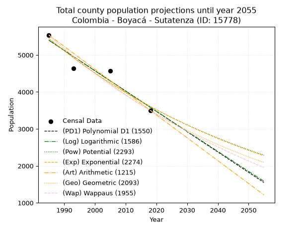
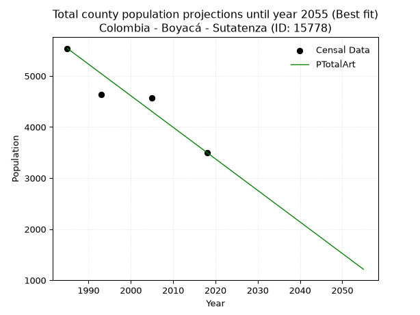
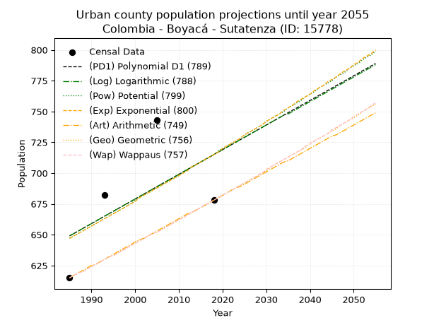
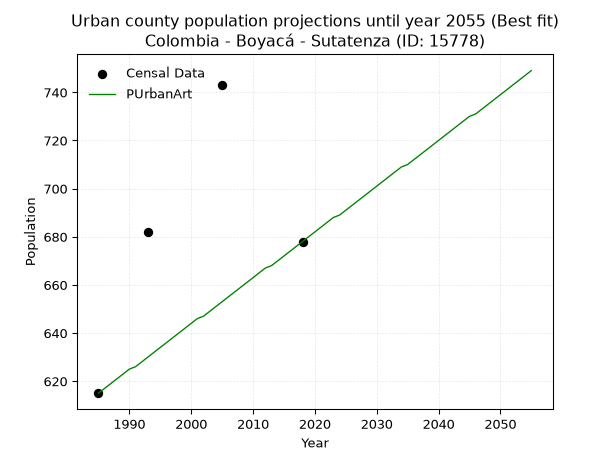
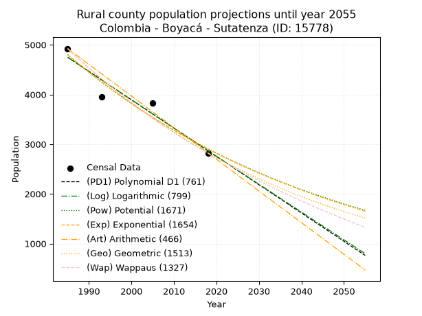
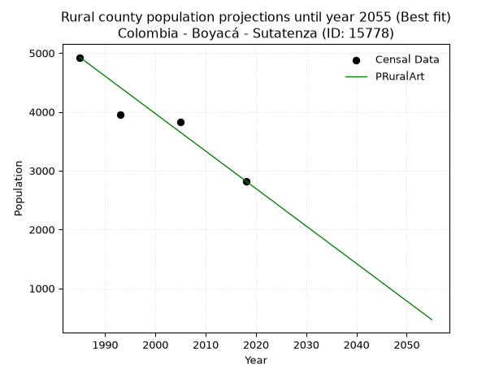

<div align="center">


</div>

# _“Population and Public Services Demand Projections (PPSD) until Year 2050 for Colombia - Boyacá - Sutatenza (ID: 15778)”_
Keywords: `population` `public-service` `projection` `lineal` `polynomial` `logarithmic` `potential` `exponential` `arithmetic` `geometric` `wappaus` `dane` `colombia` `south-america`

PPSD are analytical estimates used by governments and planners to anticipate future changes in population size, age distribution, and the resulting community needs for utilities, healthcare, education, and infrastructure as sizing future water treatment facilities, electrical grids, and road networks based on spatial growth.

> **General running parameters**: • app_version: _v20260806_. • Python version: _3.14.7_. • Pandas version: _3.0.5_. • NumPy version: _2.5.1_. • Creates, save and include plots into reports (create_plot): _False_. • Projection until year: _2050_. • Process polynomial degree 2 and up: _False_. • Process Wappaus: _True_. • Process Wappaus: _True_. • Set negative values to zero: _True_. • Set infinite values to zero: _True_. • Drop dataset notes: _True_. 
<div align="center">

Dynamic map: [:earth_americas:Google](http://maps.google.com/maps?q=5.022988993,-73.4523171) [:earth_americas:OSM](https://www.openstreetmap.org/#map=18/5.022988993/-73.4523171&layers=P) [:earth_americas:Bing](https://www.bing.com/maps?cp=5.022988993~-73.4523171&lvl=18) [:earth_americas:Apple](https://maps.apple.com/frame?center=5.022988993%2C-73.4523171&span=0.003%2C0.006)

</div>


<div align="center">

```geojson
{
  "type": "Feature",
  "geometry": {
    "type": "Point", 
    "coordinates": [-73.4523171, 5.022988993]
  }, 
  "properties": {
    "Name": "Colombia - Boyacá - Sutatenza (ID: 15778)"
  }
}
```

</div>


## 0. Census Data (4 records)

Census data are official statistics collected by a government about the people and housing in a country. They usually include counts of total population, age, sex, race, income, education, and jobs.

📅Global census file: [Population.xlsx](../data/Population.xlsx)

| Source   |   Year |   CountryID | CountryName   |   StateID | StateName   |   CountyID | CountyName   |   PTotal |   PUrban |   PRural |
|:---------|-------:|------------:|:--------------|----------:|:------------|-----------:|:-------------|---------:|---------:|---------:|
| DANE     |   1985 |          57 | Colombia      |        15 | Boyacá      |      15778 | Sutatenza    |     5540 |      615 |     4925 |
| DANE     |   1993 |          57 | Colombia      |        15 | Boyacá      |      15778 | Sutatenza    |     4632 |      682 |     3950 |
| DANE     |   2005 |          57 | Colombia      |        15 | Boyacá      |      15778 | Sutatenza    |     4566 |      743 |     3823 |
| DANE     |   2018 |          57 | Colombia      |        15 | Boyacá      |      15778 | Sutatenza    |     3501 |      678 |     2823 |

> 🔥Some records could had specific notes about the registered values or the corresponding urban or rural distribution.

## 1. Total

### 1.1. Coefficients and Parameters

* (PD1) Polynomial Deg 1: -54.9751103974301, 114523.71457245955 (lineal)
* (Log) Logarithmic: -110036.1208482641, 840945.1863417884
* (Pow) Potential: -24.958779143973292, 86.04407434062924
* (Exp) Exponential: -0.01247200763551439, 307364639556918.1
* (Art) Arithmetic: Year diff. 2018 - 1985 = 33, Population diff. 3501 - 5540 = -2039, Annual growth = -61.78787878787879
* (Geo) Geometric: Year diff. 2018 - 1985 = 33, Population diff. 3501 - 5540 = -2039, Annual growth % = -0.013811188448660916
* (Wap) Wappaus: i = -1.3668372699453333, Condition values only valid for < 200)

<sub>
Wappaus condition values: ['-0.00', '-1.37', '-2.73', '-4.10', '-5.47', '-6.83', '-8.20', '-9.57', '-10.93', '-12.30', '-13.67', '-15.04', '-16.40', '-17.77', '-19.14', '-20.50', '-21.87', '-23.24', '-24.60', '-25.97', '-27.34', '-28.70', '-30.07', '-31.44', '-32.80', '-34.17', '-35.54', '-36.90', '-38.27', '-39.64', '-41.01', '-42.37', '-43.74', '-45.11', '-46.47', '-47.84', '-49.21', '-50.57', '-51.94', '-53.31', '-54.67', '-56.04', '-57.41', '-58.77', '-60.14', '-61.51', '-62.87', '-64.24', '-65.61', '-66.98', '-68.34', '-69.71', '-71.08', '-72.44', '-73.81', '-75.18', '-76.54', '-77.91', '-79.28', '-80.64', '-82.01', '-83.38', '-84.74', '-86.11', '-87.48', '-88.84']
</sub>


### 1.2. Projected Dataset

|   Year |   CountyID |   PTotalPD1 |   PTotalLog |   PTotalPow |   PTotalExp |   PTotalArt |   PTotalGeo |   PTotalWap |
|-------:|-----------:|------------:|------------:|------------:|------------:|------------:|------------:|------------:|
|   1985 |      15778 |        5398 |        5400 |        5445 |        5443 |        5540 |        5540 |        5540 |
|   1986 |      15778 |        5343 |        5344 |        5377 |        5376 |        5478 |        5463 |        5465 |
|   1987 |      15778 |        5288 |        5289 |        5310 |        5309 |        5416 |        5388 |        5391 |
|   1988 |      15778 |        5233 |        5234 |        5244 |        5243 |        5355 |        5314 |        5317 |
|   1989 |      15778 |        5178 |        5178 |        5178 |        5178 |        5293 |        5240 |        5245 |
|   1990 |      15778 |        5123 |        5123 |        5114 |        5114 |        5231 |        5168 |        5174 |
|   1991 |      15778 |        5068 |        5068 |        5050 |        5051 |        5169 |        5096 |        5104 |
|   1992 |      15778 |        5013 |        5012 |        4987 |        4988 |        5107 |        5026 |        5034 |
|   1993 |      15778 |        4958 |        4957 |        4925 |        4926 |        5046 |        4957 |        4966 |
|   1994 |      15778 |        4903 |        4902 |        4864 |        4865 |        4984 |        4888 |        4898 |
|   1995 |      15778 |        4848 |        4847 |        4803 |        4805 |        4922 |        4821 |        4831 |
|   1996 |      15778 |        4793 |        4792 |        4743 |        4745 |        4860 |        4754 |        4765 |
|   1997 |      15778 |        4738 |        4737 |        4685 |        4687 |        4799 |        4688 |        4700 |
|   1998 |      15778 |        4683 |        4681 |        4626 |        4628 |        4737 |        4624 |        4636 |
|   1999 |      15778 |        4628 |        4626 |        4569 |        4571 |        4675 |        4560 |        4572 |
|   2000 |      15778 |        4573 |        4571 |        4512 |        4514 |        4613 |        4497 |        4510 |
|   2001 |      15778 |        4519 |        4516 |        4456 |        4459 |        4551 |        4435 |        4448 |
|   2002 |      15778 |        4464 |        4461 |        4401 |        4403 |        4490 |        4374 |        4387 |
|   2003 |      15778 |        4409 |        4406 |        4347 |        4349 |        4428 |        4313 |        4326 |
|   2004 |      15778 |        4354 |        4352 |        4293 |        4295 |        4366 |        4254 |        4267 |
|   2005 |      15778 |        4299 |        4297 |        4240 |        4242 |        4304 |        4195 |        4208 |
|   2006 |      15778 |        4244 |        4242 |        4187 |        4189 |        4242 |        4137 |        4149 |
|   2007 |      15778 |        4189 |        4187 |        4135 |        4137 |        4181 |        4080 |        4092 |
|   2008 |      15778 |        4134 |        4132 |        4084 |        4086 |        4119 |        4023 |        4035 |
|   2009 |      15778 |        4079 |        4077 |        4034 |        4035 |        4057 |        3968 |        3979 |
|   2010 |      15778 |        4024 |        4023 |        3984 |        3985 |        3995 |        3913 |        3923 |
|   2011 |      15778 |        3969 |        3968 |        3935 |        3936 |        3934 |        3859 |        3868 |
|   2012 |      15778 |        3914 |        3913 |        3886 |        3887 |        3872 |        3806 |        3814 |
|   2013 |      15778 |        3859 |        3858 |        3839 |        3839 |        3810 |        3753 |        3760 |
|   2014 |      15778 |        3804 |        3804 |        3791 |        3791 |        3748 |        3701 |        3707 |
|   2015 |      15778 |        3749 |        3749 |        3745 |        3744 |        3686 |        3650 |        3655 |
|   2016 |      15778 |        3694 |        3695 |        3698 |        3698 |        3625 |        3600 |        3603 |
|   2017 |      15778 |        3639 |        3640 |        3653 |        3652 |        3563 |        3550 |        3552 |
|   2018 |      15778 |        3584 |        3585 |        3608 |        3607 |        3501 |        3501 |        3501 |
|   2019 |      15778 |        3529 |        3531 |        3564 |        3562 |        3439 |        3453 |        3451 |
|   2020 |      15778 |        3474 |        3476 |        3520 |        3518 |        3377 |        3405 |        3401 |
|   2021 |      15778 |        3419 |        3422 |        3477 |        3474 |        3316 |        3358 |        3352 |
|   2022 |      15778 |        3364 |        3368 |        3434 |        3431 |        3254 |        3312 |        3304 |
|   2023 |      15778 |        3309 |        3313 |        3392 |        3389 |        3192 |        3266 |        3256 |
|   2024 |      15778 |        3254 |        3259 |        3350 |        3347 |        3130 |        3221 |        3208 |
|   2025 |      15778 |        3199 |        3204 |        3309 |        3305 |        3068 |        3176 |        3161 |
|   2026 |      15778 |        3144 |        3150 |        3269 |        3264 |        3007 |        3132 |        3115 |
|   2027 |      15778 |        3089 |        3096 |        3229 |        3224 |        2945 |        3089 |        3069 |
|   2028 |      15778 |        3034 |        3042 |        3189 |        3184 |        2883 |        3046 |        3023 |
|   2029 |      15778 |        2979 |        2987 |        3150 |        3144 |        2821 |        3004 |        2978 |
|   2030 |      15778 |        2924 |        2933 |        3112 |        3105 |        2760 |        2963 |        2934 |
|   2031 |      15778 |        2869 |        2879 |        3074 |        3067 |        2698 |        2922 |        2890 |
|   2032 |      15778 |        2814 |        2825 |        3036 |        3029 |        2636 |        2882 |        2846 |
|   2033 |      15778 |        2759 |        2771 |        2999 |        2991 |        2574 |        2842 |        2803 |
|   2034 |      15778 |        2704 |        2716 |        2963 |        2954 |        2512 |        2803 |        2760 |
|   2035 |      15778 |        2649 |        2662 |        2926 |        2918 |        2451 |        2764 |        2718 |
|   2036 |      15778 |        2594 |        2608 |        2891 |        2881 |        2389 |        2726 |        2676 |
|   2037 |      15778 |        2539 |        2554 |        2856 |        2846 |        2327 |        2688 |        2635 |
|   2038 |      15778 |        2484 |        2500 |        2821 |        2810 |        2265 |        2651 |        2594 |
|   2039 |      15778 |        2429 |        2446 |        2787 |        2776 |        2203 |        2614 |        2553 |
|   2040 |      15778 |        2374 |        2392 |        2753 |        2741 |        2142 |        2578 |        2513 |
|   2041 |      15778 |        2320 |        2338 |        2719 |        2707 |        2080 |        2543 |        2473 |
|   2042 |      15778 |        2265 |        2285 |        2686 |        2674 |        2018 |        2507 |        2434 |
|   2043 |      15778 |        2210 |        2231 |        2653 |        2641 |        1956 |        2473 |        2395 |
|   2044 |      15778 |        2155 |        2177 |        2621 |        2608 |        1895 |        2439 |        2356 |
|   2045 |      15778 |        2100 |        2123 |        2589 |        2576 |        1833 |        2405 |        2318 |
|   2046 |      15778 |        2045 |        2069 |        2558 |        2544 |        1771 |        2372 |        2280 |
|   2047 |      15778 |        1990 |        2015 |        2527 |        2512 |        1709 |        2339 |        2242 |
|   2048 |      15778 |        1935 |        1962 |        2496 |        2481 |        1647 |        2307 |        2205 |
|   2049 |      15778 |        1880 |        1908 |        2466 |        2450 |        1586 |        2275 |        2168 |
|   2050 |      15778 |        1825 |        1854 |        2436 |        2420 |        1524 |        2243 |        2132 |
<div align="center">

</img>

</div>


### 1.3. Best fit with absolute and relative error (%)

Relative error puts that difference into context by dividing the absolute error by the true value, creating a unitless ratio or percentage that shows the scale of the mistake.

Absolute and relative error

|   Year | Source   |   CountryID | CountryName   |   StateID | StateName   |   CountyID_x | CountyName   |   PTotal |   PUrban |   PRural |   CountyID_y |   PTotalPD1 |   PTotalLog |   PTotalPow |   PTotalExp |   PTotalArt |   PTotalGeo |   PTotalWap |   PTotalPD1AbsError |   PTotalLogAbsError |   PTotalPowAbsError |   PTotalExpAbsError |   PTotalArtAbsError |   PTotalGeoAbsError |   PTotalWapAbsError |   PTotalPD1RelError |   PTotalLogRelError |   PTotalPowRelError |   PTotalExpRelError |   PTotalArtRelError |   PTotalGeoRelError |   PTotalWapRelError |
|-------:|:---------|------------:|:--------------|----------:|:------------|-------------:|:-------------|---------:|---------:|---------:|-------------:|------------:|------------:|------------:|------------:|------------:|------------:|------------:|--------------------:|--------------------:|--------------------:|--------------------:|--------------------:|--------------------:|--------------------:|--------------------:|--------------------:|--------------------:|--------------------:|--------------------:|--------------------:|--------------------:|
|   1985 | DANE     |          57 | Colombia      |        15 | Boyacá      |        15778 | Sutatenza    |     5540 |      615 |     4925 |        15778 |        5398 |        5400 |        5445 |        5443 |        5540 |        5540 |        5540 |                 142 |                 140 |                  95 |                  97 |                   0 |                   0 |                   0 |             2.56318 |             2.52708 |             1.7148  |             1.7509  |             0       |             0       |             0       |
|   1993 | DANE     |          57 | Colombia      |        15 | Boyacá      |        15778 | Sutatenza    |     4632 |      682 |     3950 |        15778 |        4958 |        4957 |        4925 |        4926 |        5046 |        4957 |        4966 |                 326 |                 325 |                 293 |                 294 |                 414 |                 325 |                 334 |             7.038   |             7.01641 |             6.32556 |             6.34715 |             8.93782 |             7.01641 |             7.21071 |
|   2005 | DANE     |          57 | Colombia      |        15 | Boyacá      |        15778 | Sutatenza    |     4566 |      743 |     3823 |        15778 |        4299 |        4297 |        4240 |        4242 |        4304 |        4195 |        4208 |                 267 |                 269 |                 326 |                 324 |                 262 |                 371 |                 358 |             5.84757 |             5.89137 |             7.13973 |             7.09593 |             5.73806 |             8.12527 |             7.84056 |
|   2018 | DANE     |          57 | Colombia      |        15 | Boyacá      |        15778 | Sutatenza    |     3501 |      678 |     2823 |        15778 |        3584 |        3585 |        3608 |        3607 |        3501 |        3501 |        3501 |                  83 |                  84 |                 107 |                 106 |                   0 |                   0 |                   0 |             2.37075 |             2.39931 |             3.05627 |             3.02771 |             0       |             0       |             0       |

Relative error mean

| Method    |   RelError | Best   |
|:----------|-----------:|:-------|
| PTotalPD1 |    4.45487 |        |
| PTotalLog |    4.45854 |        |
| PTotalPow |    4.55909 |        |
| PTotalExp |    4.55542 |        |
| PTotalArt |    3.66897 | True   |
| PTotalGeo |    3.78542 |        |
| PTotalWap |    3.76282 |        |

💙Best method: _**PTotalArt**_
<div align="center">

</img>

</div>


### 1.4. Fresh water supply demand in liters per capita per day (lpcd)

The fresh water supply demand typically ranges from 100 to 300 liters per capita per day (lpcd) for standard domestic and municipal planning, though absolute survival minimums set by the World Health Organization are as low as 7.5 to 20 liters per day, and total consumption in high-income nations can exceed 400 liters.

> `CZ`: Level in meters above the sea level (masl).<br> `WS`: Fresh water supply demand in liters per capita per day (lpcd or l/h/d).<br> `WSAll`: Zonal fresh water supply demand in liters per second (l/s).<br> `A`: Zonal area in square meters.

Reference values (RAS Colombia)

|    CZ |   WS |
|------:|-----:|
|  1000 |  120 |
|  2000 |  130 |
| 99999 |  140 |

County shapefile geometry properties and water supply values

|   CountyID |      ATotal |   CZTotal |   WSTotal |
|-----------:|------------:|----------:|----------:|
|      15778 | 4.10635e+07 |    1839.3 |       130 |

Projected values for best method: PTotalArt

|   CountyID |   Year |   PTotalArt |   WSTotal |   WSTotalAll |
|-----------:|-------:|------------:|----------:|-------------:|
|      15778 |   1985 |        5540 |       130 |      8.33565 |
|      15778 |   1986 |        5478 |       130 |      8.24236 |
|      15778 |   1987 |        5416 |       130 |      8.14907 |
|      15778 |   1988 |        5355 |       130 |      8.05729 |
|      15778 |   1989 |        5293 |       130 |      7.964   |
|      15778 |   1990 |        5231 |       130 |      7.87072 |
|      15778 |   1991 |        5169 |       130 |      7.77743 |
|      15778 |   1992 |        5107 |       130 |      7.68414 |
|      15778 |   1993 |        5046 |       130 |      7.59236 |
|      15778 |   1994 |        4984 |       130 |      7.49907 |
|      15778 |   1995 |        4922 |       130 |      7.40579 |
|      15778 |   1996 |        4860 |       130 |      7.3125  |
|      15778 |   1997 |        4799 |       130 |      7.22072 |
|      15778 |   1998 |        4737 |       130 |      7.12743 |
|      15778 |   1999 |        4675 |       130 |      7.03414 |
|      15778 |   2000 |        4613 |       130 |      6.94086 |
|      15778 |   2001 |        4551 |       130 |      6.84757 |
|      15778 |   2002 |        4490 |       130 |      6.75579 |
|      15778 |   2003 |        4428 |       130 |      6.6625  |
|      15778 |   2004 |        4366 |       130 |      6.56921 |
|      15778 |   2005 |        4304 |       130 |      6.47593 |
|      15778 |   2006 |        4242 |       130 |      6.38264 |
|      15778 |   2007 |        4181 |       130 |      6.29086 |
|      15778 |   2008 |        4119 |       130 |      6.19757 |
|      15778 |   2009 |        4057 |       130 |      6.10428 |
|      15778 |   2010 |        3995 |       130 |      6.011   |
|      15778 |   2011 |        3934 |       130 |      5.91921 |
|      15778 |   2012 |        3872 |       130 |      5.82593 |
|      15778 |   2013 |        3810 |       130 |      5.73264 |
|      15778 |   2014 |        3748 |       130 |      5.63935 |
|      15778 |   2015 |        3686 |       130 |      5.54606 |
|      15778 |   2016 |        3625 |       130 |      5.45428 |
|      15778 |   2017 |        3563 |       130 |      5.361   |
|      15778 |   2018 |        3501 |       130 |      5.26771 |
|      15778 |   2019 |        3439 |       130 |      5.17442 |
|      15778 |   2020 |        3377 |       130 |      5.08113 |
|      15778 |   2021 |        3316 |       130 |      4.98935 |
|      15778 |   2022 |        3254 |       130 |      4.89606 |
|      15778 |   2023 |        3192 |       130 |      4.80278 |
|      15778 |   2024 |        3130 |       130 |      4.70949 |
|      15778 |   2025 |        3068 |       130 |      4.6162  |
|      15778 |   2026 |        3007 |       130 |      4.52442 |
|      15778 |   2027 |        2945 |       130 |      4.43113 |
|      15778 |   2028 |        2883 |       130 |      4.33785 |
|      15778 |   2029 |        2821 |       130 |      4.24456 |
|      15778 |   2030 |        2760 |       130 |      4.15278 |
|      15778 |   2031 |        2698 |       130 |      4.05949 |
|      15778 |   2032 |        2636 |       130 |      3.9662  |
|      15778 |   2033 |        2574 |       130 |      3.87292 |
|      15778 |   2034 |        2512 |       130 |      3.77963 |
|      15778 |   2035 |        2451 |       130 |      3.68785 |
|      15778 |   2036 |        2389 |       130 |      3.59456 |
|      15778 |   2037 |        2327 |       130 |      3.50127 |
|      15778 |   2038 |        2265 |       130 |      3.40799 |
|      15778 |   2039 |        2203 |       130 |      3.3147  |
|      15778 |   2040 |        2142 |       130 |      3.22292 |
|      15778 |   2041 |        2080 |       130 |      3.12963 |
|      15778 |   2042 |        2018 |       130 |      3.03634 |
|      15778 |   2043 |        1956 |       130 |      2.94306 |
|      15778 |   2044 |        1895 |       130 |      2.85127 |
|      15778 |   2045 |        1833 |       130 |      2.75799 |
|      15778 |   2046 |        1771 |       130 |      2.6647  |
|      15778 |   2047 |        1709 |       130 |      2.57141 |
|      15778 |   2048 |        1647 |       130 |      2.47812 |
|      15778 |   2049 |        1586 |       130 |      2.38634 |
|      15778 |   2050 |        1524 |       130 |      2.29306 |

## 2. Urban

### 2.1. Coefficients and Parameters

* (PD1) Polynomial Deg 1: 1.9919710959454375, -3304.940184664861 (lineal)
* (Log) Logarithmic: 4001.1686244524876, -29733.41477781645
* (Pow) Potential: 6.061494712291414, -17.17823423232874
* (Exp) Exponential: 0.0030180103893005044, 1.6198742671772342
* (Art) Arithmetic: Year diff. 2018 - 1985 = 33, Population diff. 678 - 615 = 63, Annual growth = 1.9090909090909092
* (Geo) Geometric: Year diff. 2018 - 1985 = 33, Population diff. 678 - 615 = 63, Annual growth % = 0.002959674855252503
* (Wap) Wappaus: i = 0.29529635098080576, Condition values only valid for < 200)

<sub>
Wappaus condition values: ['0.00', '0.30', '0.59', '0.89', '1.18', '1.48', '1.77', '2.07', '2.36', '2.66', '2.95', '3.25', '3.54', '3.84', '4.13', '4.43', '4.72', '5.02', '5.32', '5.61', '5.91', '6.20', '6.50', '6.79', '7.09', '7.38', '7.68', '7.97', '8.27', '8.56', '8.86', '9.15', '9.45', '9.74', '10.04', '10.34', '10.63', '10.93', '11.22', '11.52', '11.81', '12.11', '12.40', '12.70', '12.99', '13.29', '13.58', '13.88', '14.17', '14.47', '14.76', '15.06', '15.36', '15.65', '15.95', '16.24', '16.54', '16.83', '17.13', '17.42', '17.72', '18.01', '18.31', '18.60', '18.90', '19.19']
</sub>


### 2.2. Projected Dataset

|   Year |   CountyID |   PUrbanPD1 |   PUrbanLog |   PUrbanPow |   PUrbanExp |   PUrbanArt |   PUrbanGeo |   PUrbanWap |
|-------:|-----------:|------------:|------------:|------------:|------------:|------------:|------------:|------------:|
|   1985 |      15778 |         649 |         649 |         647 |         647 |         615 |         615 |         615 |
|   1986 |      15778 |         651 |         651 |         649 |         649 |         617 |         617 |         617 |
|   1987 |      15778 |         653 |         653 |         651 |         651 |         619 |         619 |         619 |
|   1988 |      15778 |         655 |         655 |         653 |         653 |         621 |         620 |         620 |
|   1989 |      15778 |         657 |         657 |         655 |         655 |         623 |         622 |         622 |
|   1990 |      15778 |         659 |         659 |         657 |         657 |         625 |         624 |         624 |
|   1991 |      15778 |         661 |         661 |         659 |         659 |         626 |         626 |         626 |
|   1992 |      15778 |         663 |         663 |         661 |         661 |         628 |         628 |         628 |
|   1993 |      15778 |         665 |         665 |         663 |         663 |         630 |         630 |         630 |
|   1994 |      15778 |         667 |         667 |         665 |         665 |         632 |         632 |         632 |
|   1995 |      15778 |         669 |         669 |         667 |         667 |         634 |         633 |         633 |
|   1996 |      15778 |         671 |         671 |         669 |         669 |         636 |         635 |         635 |
|   1997 |      15778 |         673 |         673 |         671 |         671 |         638 |         637 |         637 |
|   1998 |      15778 |         675 |         675 |         673 |         673 |         640 |         639 |         639 |
|   1999 |      15778 |         677 |         677 |         675 |         675 |         642 |         641 |         641 |
|   2000 |      15778 |         679 |         679 |         678 |         677 |         644 |         643 |         643 |
|   2001 |      15778 |         681 |         681 |         680 |         680 |         646 |         645 |         645 |
|   2002 |      15778 |         683 |         683 |         682 |         682 |         647 |         647 |         647 |
|   2003 |      15778 |         685 |         685 |         684 |         684 |         649 |         649 |         649 |
|   2004 |      15778 |         687 |         687 |         686 |         686 |         651 |         651 |         651 |
|   2005 |      15778 |         689 |         689 |         688 |         688 |         653 |         652 |         652 |
|   2006 |      15778 |         691 |         691 |         690 |         690 |         655 |         654 |         654 |
|   2007 |      15778 |         693 |         693 |         692 |         692 |         657 |         656 |         656 |
|   2008 |      15778 |         695 |         695 |         694 |         694 |         659 |         658 |         658 |
|   2009 |      15778 |         697 |         697 |         696 |         696 |         661 |         660 |         660 |
|   2010 |      15778 |         699 |         699 |         698 |         698 |         663 |         662 |         662 |
|   2011 |      15778 |         701 |         701 |         700 |         700 |         665 |         664 |         664 |
|   2012 |      15778 |         703 |         703 |         703 |         702 |         667 |         666 |         666 |
|   2013 |      15778 |         705 |         705 |         705 |         705 |         668 |         668 |         668 |
|   2014 |      15778 |         707 |         707 |         707 |         707 |         670 |         670 |         670 |
|   2015 |      15778 |         709 |         709 |         709 |         709 |         672 |         672 |         672 |
|   2016 |      15778 |         711 |         711 |         711 |         711 |         674 |         674 |         674 |
|   2017 |      15778 |         713 |         713 |         713 |         713 |         676 |         676 |         676 |
|   2018 |      15778 |         715 |         715 |         715 |         715 |         678 |         678 |         678 |
|   2019 |      15778 |         717 |         717 |         718 |         717 |         680 |         680 |         680 |
|   2020 |      15778 |         719 |         719 |         720 |         720 |         682 |         682 |         682 |
|   2021 |      15778 |         721 |         721 |         722 |         722 |         684 |         684 |         684 |
|   2022 |      15778 |         723 |         723 |         724 |         724 |         686 |         686 |         686 |
|   2023 |      15778 |         725 |         725 |         726 |         726 |         688 |         688 |         688 |
|   2024 |      15778 |         727 |         727 |         728 |         728 |         689 |         690 |         690 |
|   2025 |      15778 |         729 |         729 |         731 |         731 |         691 |         692 |         692 |
|   2026 |      15778 |         731 |         731 |         733 |         733 |         693 |         694 |         694 |
|   2027 |      15778 |         733 |         733 |         735 |         735 |         695 |         696 |         696 |
|   2028 |      15778 |         735 |         735 |         737 |         737 |         697 |         698 |         698 |
|   2029 |      15778 |         737 |         737 |         739 |         739 |         699 |         700 |         700 |
|   2030 |      15778 |         739 |         739 |         742 |         742 |         701 |         702 |         703 |
|   2031 |      15778 |         741 |         741 |         744 |         744 |         703 |         705 |         705 |
|   2032 |      15778 |         743 |         743 |         746 |         746 |         705 |         707 |         707 |
|   2033 |      15778 |         745 |         745 |         748 |         748 |         707 |         709 |         709 |
|   2034 |      15778 |         747 |         747 |         750 |         751 |         709 |         711 |         711 |
|   2035 |      15778 |         749 |         748 |         753 |         753 |         710 |         713 |         713 |
|   2036 |      15778 |         751 |         750 |         755 |         755 |         712 |         715 |         715 |
|   2037 |      15778 |         753 |         752 |         757 |         758 |         714 |         717 |         717 |
|   2038 |      15778 |         755 |         754 |         759 |         760 |         716 |         719 |         719 |
|   2039 |      15778 |         757 |         756 |         762 |         762 |         718 |         721 |         722 |
|   2040 |      15778 |         759 |         758 |         764 |         764 |         720 |         724 |         724 |
|   2041 |      15778 |         761 |         760 |         766 |         767 |         722 |         726 |         726 |
|   2042 |      15778 |         763 |         762 |         769 |         769 |         724 |         728 |         728 |
|   2043 |      15778 |         765 |         764 |         771 |         771 |         726 |         730 |         730 |
|   2044 |      15778 |         767 |         766 |         773 |         774 |         728 |         732 |         732 |
|   2045 |      15778 |         769 |         768 |         775 |         776 |         730 |         734 |         735 |
|   2046 |      15778 |         771 |         770 |         778 |         778 |         731 |         736 |         737 |
|   2047 |      15778 |         773 |         772 |         780 |         781 |         733 |         739 |         739 |
|   2048 |      15778 |         775 |         774 |         782 |         783 |         735 |         741 |         741 |
|   2049 |      15778 |         777 |         776 |         785 |         785 |         737 |         743 |         743 |
|   2050 |      15778 |         779 |         778 |         787 |         788 |         739 |         745 |         746 |
<div align="center">

</img>

</div>


### 2.3. Best fit with absolute and relative error (%)

Relative error puts that difference into context by dividing the absolute error by the true value, creating a unitless ratio or percentage that shows the scale of the mistake.

Absolute and relative error

|   Year | Source   |   CountryID | CountryName   |   StateID | StateName   |   CountyID_x | CountyName   |   PTotal |   PUrban |   PRural |   CountyID_y |   PUrbanPD1 |   PUrbanLog |   PUrbanPow |   PUrbanExp |   PUrbanArt |   PUrbanGeo |   PUrbanWap |   PUrbanPD1AbsError |   PUrbanLogAbsError |   PUrbanPowAbsError |   PUrbanExpAbsError |   PUrbanArtAbsError |   PUrbanGeoAbsError |   PUrbanWapAbsError |   PUrbanPD1RelError |   PUrbanLogRelError |   PUrbanPowRelError |   PUrbanExpRelError |   PUrbanArtRelError |   PUrbanGeoRelError |   PUrbanWapRelError |
|-------:|:---------|------------:|:--------------|----------:|:------------|-------------:|:-------------|---------:|---------:|---------:|-------------:|------------:|------------:|------------:|------------:|------------:|------------:|------------:|--------------------:|--------------------:|--------------------:|--------------------:|--------------------:|--------------------:|--------------------:|--------------------:|--------------------:|--------------------:|--------------------:|--------------------:|--------------------:|--------------------:|
|   1985 | DANE     |          57 | Colombia      |        15 | Boyacá      |        15778 | Sutatenza    |     5540 |      615 |     4925 |        15778 |         649 |         649 |         647 |         647 |         615 |         615 |         615 |                  34 |                  34 |                  32 |                  32 |                   0 |                   0 |                   0 |             5.52846 |             5.52846 |             5.20325 |             5.20325 |             0       |             0       |             0       |
|   1993 | DANE     |          57 | Colombia      |        15 | Boyacá      |        15778 | Sutatenza    |     4632 |      682 |     3950 |        15778 |         665 |         665 |         663 |         663 |         630 |         630 |         630 |                  17 |                  17 |                  19 |                  19 |                  52 |                  52 |                  52 |             2.49267 |             2.49267 |             2.78592 |             2.78592 |             7.62463 |             7.62463 |             7.62463 |
|   2005 | DANE     |          57 | Colombia      |        15 | Boyacá      |        15778 | Sutatenza    |     4566 |      743 |     3823 |        15778 |         689 |         689 |         688 |         688 |         653 |         652 |         652 |                  54 |                  54 |                  55 |                  55 |                  90 |                  91 |                  91 |             7.26783 |             7.26783 |             7.40242 |             7.40242 |            12.1131  |            12.2476  |            12.2476  |
|   2018 | DANE     |          57 | Colombia      |        15 | Boyacá      |        15778 | Sutatenza    |     3501 |      678 |     2823 |        15778 |         715 |         715 |         715 |         715 |         678 |         678 |         678 |                  37 |                  37 |                  37 |                  37 |                   0 |                   0 |                   0 |             5.45723 |             5.45723 |             5.45723 |             5.45723 |             0       |             0       |             0       |

Relative error mean

| Method    |   RelError | Best   |
|:----------|-----------:|:-------|
| PUrbanPD1 |    5.18655 |        |
| PUrbanLog |    5.18655 |        |
| PUrbanPow |    5.21221 |        |
| PUrbanExp |    5.21221 |        |
| PUrbanArt |    4.93442 | True   |
| PUrbanGeo |    4.96807 |        |
| PUrbanWap |    4.96807 |        |

💙Best method: _**PUrbanArt**_
<div align="center">

</img>

</div>


### 2.4. Fresh water supply demand in liters per capita per day (lpcd)

The fresh water supply demand typically ranges from 100 to 300 liters per capita per day (lpcd) for standard domestic and municipal planning, though absolute survival minimums set by the World Health Organization are as low as 7.5 to 20 liters per day, and total consumption in high-income nations can exceed 400 liters.

> `CZ`: Level in meters above the sea level (masl).<br> `WS`: Fresh water supply demand in liters per capita per day (lpcd or l/h/d).<br> `WSAll`: Zonal fresh water supply demand in liters per second (l/s).<br> `A`: Zonal area in square meters.

Reference values (RAS Colombia)

|    CZ |   WS |
|------:|-----:|
|  1000 |  120 |
|  2000 |  130 |
| 99999 |  140 |

County shapefile geometry properties and water supply values

|   CountyID |   AUrban |   CZUrban |   WSUrban |
|-----------:|---------:|----------:|----------:|
|      15778 |   413609 |   1918.07 |       130 |

Projected values for best method: PUrbanArt

|   CountyID |   Year |   PUrbanArt |   WSUrban |   WSUrbanAll |
|-----------:|-------:|------------:|----------:|-------------:|
|      15778 |   1985 |         615 |       130 |     0.925347 |
|      15778 |   1986 |         617 |       130 |     0.928356 |
|      15778 |   1987 |         619 |       130 |     0.931366 |
|      15778 |   1988 |         621 |       130 |     0.934375 |
|      15778 |   1989 |         623 |       130 |     0.937384 |
|      15778 |   1990 |         625 |       130 |     0.940394 |
|      15778 |   1991 |         626 |       130 |     0.941898 |
|      15778 |   1992 |         628 |       130 |     0.944907 |
|      15778 |   1993 |         630 |       130 |     0.947917 |
|      15778 |   1994 |         632 |       130 |     0.950926 |
|      15778 |   1995 |         634 |       130 |     0.953935 |
|      15778 |   1996 |         636 |       130 |     0.956944 |
|      15778 |   1997 |         638 |       130 |     0.959954 |
|      15778 |   1998 |         640 |       130 |     0.962963 |
|      15778 |   1999 |         642 |       130 |     0.965972 |
|      15778 |   2000 |         644 |       130 |     0.968981 |
|      15778 |   2001 |         646 |       130 |     0.971991 |
|      15778 |   2002 |         647 |       130 |     0.973495 |
|      15778 |   2003 |         649 |       130 |     0.976505 |
|      15778 |   2004 |         651 |       130 |     0.979514 |
|      15778 |   2005 |         653 |       130 |     0.982523 |
|      15778 |   2006 |         655 |       130 |     0.985532 |
|      15778 |   2007 |         657 |       130 |     0.988542 |
|      15778 |   2008 |         659 |       130 |     0.991551 |
|      15778 |   2009 |         661 |       130 |     0.99456  |
|      15778 |   2010 |         663 |       130 |     0.997569 |
|      15778 |   2011 |         665 |       130 |     1.00058  |
|      15778 |   2012 |         667 |       130 |     1.00359  |
|      15778 |   2013 |         668 |       130 |     1.00509  |
|      15778 |   2014 |         670 |       130 |     1.0081   |
|      15778 |   2015 |         672 |       130 |     1.01111  |
|      15778 |   2016 |         674 |       130 |     1.01412  |
|      15778 |   2017 |         676 |       130 |     1.01713  |
|      15778 |   2018 |         678 |       130 |     1.02014  |
|      15778 |   2019 |         680 |       130 |     1.02315  |
|      15778 |   2020 |         682 |       130 |     1.02616  |
|      15778 |   2021 |         684 |       130 |     1.02917  |
|      15778 |   2022 |         686 |       130 |     1.03218  |
|      15778 |   2023 |         688 |       130 |     1.03519  |
|      15778 |   2024 |         689 |       130 |     1.03669  |
|      15778 |   2025 |         691 |       130 |     1.0397   |
|      15778 |   2026 |         693 |       130 |     1.04271  |
|      15778 |   2027 |         695 |       130 |     1.04572  |
|      15778 |   2028 |         697 |       130 |     1.04873  |
|      15778 |   2029 |         699 |       130 |     1.05174  |
|      15778 |   2030 |         701 |       130 |     1.05475  |
|      15778 |   2031 |         703 |       130 |     1.05775  |
|      15778 |   2032 |         705 |       130 |     1.06076  |
|      15778 |   2033 |         707 |       130 |     1.06377  |
|      15778 |   2034 |         709 |       130 |     1.06678  |
|      15778 |   2035 |         710 |       130 |     1.06829  |
|      15778 |   2036 |         712 |       130 |     1.0713   |
|      15778 |   2037 |         714 |       130 |     1.07431  |
|      15778 |   2038 |         716 |       130 |     1.07731  |
|      15778 |   2039 |         718 |       130 |     1.08032  |
|      15778 |   2040 |         720 |       130 |     1.08333  |
|      15778 |   2041 |         722 |       130 |     1.08634  |
|      15778 |   2042 |         724 |       130 |     1.08935  |
|      15778 |   2043 |         726 |       130 |     1.09236  |
|      15778 |   2044 |         728 |       130 |     1.09537  |
|      15778 |   2045 |         730 |       130 |     1.09838  |
|      15778 |   2046 |         731 |       130 |     1.09988  |
|      15778 |   2047 |         733 |       130 |     1.10289  |
|      15778 |   2048 |         735 |       130 |     1.1059   |
|      15778 |   2049 |         737 |       130 |     1.10891  |
|      15778 |   2050 |         739 |       130 |     1.11192  |

## 3. Rural

### 3.1. Coefficients and Parameters

* (PD1) Polynomial Deg 1: -56.96708149337553, 117828.65475712442 (lineal)
* (Log) Logarithmic: -114037.28947271653, 870678.6011196044
* (Pow) Potential: -30.47258216081604, 104.17283429372652
* (Exp) Exponential: -0.015226033040027002, 6.41722155077338e+16
* (Art) Arithmetic: Year diff. 2018 - 1985 = 33, Population diff. 2823 - 4925 = -2102, Annual growth = -63.696969696969695
* (Geo) Geometric: Year diff. 2018 - 1985 = 33, Population diff. 2823 - 4925 = -2102, Annual growth % = -0.01672296002185203
* (Wap) Wappaus: i = -1.6442170804586913, Condition values only valid for < 200)

<sub>
Wappaus condition values: ['-0.00', '-1.64', '-3.29', '-4.93', '-6.58', '-8.22', '-9.87', '-11.51', '-13.15', '-14.80', '-16.44', '-18.09', '-19.73', '-21.37', '-23.02', '-24.66', '-26.31', '-27.95', '-29.60', '-31.24', '-32.88', '-34.53', '-36.17', '-37.82', '-39.46', '-41.11', '-42.75', '-44.39', '-46.04', '-47.68', '-49.33', '-50.97', '-52.61', '-54.26', '-55.90', '-57.55', '-59.19', '-60.84', '-62.48', '-64.12', '-65.77', '-67.41', '-69.06', '-70.70', '-72.35', '-73.99', '-75.63', '-77.28', '-78.92', '-80.57', '-82.21', '-83.86', '-85.50', '-87.14', '-88.79', '-90.43', '-92.08', '-93.72', '-95.36', '-97.01', '-98.65', '-100.30', '-101.94', '-103.59', '-105.23', '-106.87']
</sub>


### 3.2. Projected Dataset

|   Year |   CountyID |   PRuralPD1 |   PRuralLog |   PRuralPow |   PRuralExp |   PRuralArt |   PRuralGeo |   PRuralWap |
|-------:|-----------:|------------:|------------:|------------:|------------:|------------:|------------:|------------:|
|   1985 |      15778 |        4749 |        4751 |        4803 |        4801 |        4925 |        4925 |        4925 |
|   1986 |      15778 |        4692 |        4693 |        4730 |        4729 |        4861 |        4843 |        4845 |
|   1987 |      15778 |        4635 |        4636 |        4658 |        4657 |        4798 |        4762 |        4766 |
|   1988 |      15778 |        4578 |        4579 |        4587 |        4587 |        4734 |        4682 |        4688 |
|   1989 |      15778 |        4521 |        4521 |        4518 |        4518 |        4670 |        4604 |        4611 |
|   1990 |      15778 |        4464 |        4464 |        4449 |        4449 |        4607 |        4527 |        4536 |
|   1991 |      15778 |        4407 |        4407 |        4381 |        4382 |        4543 |        4451 |        4462 |
|   1992 |      15778 |        4350 |        4349 |        4315 |        4316 |        4479 |        4377 |        4389 |
|   1993 |      15778 |        4293 |        4292 |        4249 |        4251 |        4415 |        4303 |        4317 |
|   1994 |      15778 |        4236 |        4235 |        4185 |        4187 |        4352 |        4231 |        4246 |
|   1995 |      15778 |        4179 |        4178 |        4121 |        4123 |        4288 |        4161 |        4177 |
|   1996 |      15778 |        4122 |        4121 |        4059 |        4061 |        4224 |        4091 |        4108 |
|   1997 |      15778 |        4065 |        4063 |        3998 |        4000 |        4161 |        4023 |        4041 |
|   1998 |      15778 |        4008 |        4006 |        3937 |        3939 |        4097 |        3955 |        3974 |
|   1999 |      15778 |        3951 |        3949 |        3877 |        3880 |        4033 |        3889 |        3908 |
|   2000 |      15778 |        3894 |        3892 |        3819 |        3821 |        3970 |        3824 |        3844 |
|   2001 |      15778 |        3838 |        3835 |        3761 |        3763 |        3906 |        3760 |        3780 |
|   2002 |      15778 |        3781 |        3778 |        3704 |        3706 |        3842 |        3697 |        3717 |
|   2003 |      15778 |        3724 |        3721 |        3648 |        3650 |        3778 |        3636 |        3655 |
|   2004 |      15778 |        3667 |        3664 |        3593 |        3595 |        3715 |        3575 |        3594 |
|   2005 |      15778 |        3610 |        3608 |        3539 |        3541 |        3651 |        3515 |        3534 |
|   2006 |      15778 |        3553 |        3551 |        3486 |        3487 |        3587 |        3456 |        3475 |
|   2007 |      15778 |        3496 |        3494 |        3433 |        3435 |        3524 |        3398 |        3416 |
|   2008 |      15778 |        3439 |        3437 |        3381 |        3383 |        3460 |        3342 |        3359 |
|   2009 |      15778 |        3382 |        3380 |        3330 |        3332 |        3396 |        3286 |        3302 |
|   2010 |      15778 |        3325 |        3324 |        3280 |        3281 |        3333 |        3231 |        3246 |
|   2011 |      15778 |        3268 |        3267 |        3231 |        3232 |        3269 |        3177 |        3190 |
|   2012 |      15778 |        3211 |        3210 |        3182 |        3183 |        3205 |        3124 |        3136 |
|   2013 |      15778 |        3154 |        3153 |        3135 |        3135 |        3141 |        3071 |        3082 |
|   2014 |      15778 |        3097 |        3097 |        3088 |        3087 |        3078 |        3020 |        3029 |
|   2015 |      15778 |        3040 |        3040 |        3041 |        3041 |        3014 |        2969 |        2976 |
|   2016 |      15778 |        2983 |        2984 |        2996 |        2995 |        2950 |        2920 |        2925 |
|   2017 |      15778 |        2926 |        2927 |        2951 |        2950 |        2887 |        2871 |        2873 |
|   2018 |      15778 |        2869 |        2871 |        2906 |        2905 |        2823 |        2823 |        2823 |
|   2019 |      15778 |        2812 |        2814 |        2863 |        2861 |        2759 |        2776 |        2773 |
|   2020 |      15778 |        2755 |        2758 |        2820 |        2818 |        2696 |        2729 |        2724 |
|   2021 |      15778 |        2698 |        2701 |        2778 |        2775 |        2632 |        2684 |        2676 |
|   2022 |      15778 |        2641 |        2645 |        2736 |        2733 |        2568 |        2639 |        2628 |
|   2023 |      15778 |        2584 |        2588 |        2695 |        2692 |        2505 |        2595 |        2580 |
|   2024 |      15778 |        2527 |        2532 |        2655 |        2651 |        2441 |        2551 |        2534 |
|   2025 |      15778 |        2470 |        2476 |        2615 |        2611 |        2377 |        2509 |        2487 |
|   2026 |      15778 |        2413 |        2419 |        2576 |        2572 |        2313 |        2467 |        2442 |
|   2027 |      15778 |        2356 |        2363 |        2538 |        2533 |        2250 |        2425 |        2397 |
|   2028 |      15778 |        2299 |        2307 |        2500 |        2495 |        2186 |        2385 |        2352 |
|   2029 |      15778 |        2242 |        2251 |        2463 |        2457 |        2122 |        2345 |        2308 |
|   2030 |      15778 |        2185 |        2194 |        2426 |        2420 |        2059 |        2306 |        2265 |
|   2031 |      15778 |        2129 |        2138 |        2390 |        2383 |        1995 |        2267 |        2222 |
|   2032 |      15778 |        2072 |        2082 |        2354 |        2347 |        1931 |        2229 |        2180 |
|   2033 |      15778 |        2015 |        2026 |        2319 |        2312 |        1868 |        2192 |        2138 |
|   2034 |      15778 |        1958 |        1970 |        2285 |        2277 |        1804 |        2155 |        2097 |
|   2035 |      15778 |        1901 |        1914 |        2251 |        2243 |        1740 |        2119 |        2056 |
|   2036 |      15778 |        1844 |        1858 |        2217 |        2209 |        1676 |        2084 |        2015 |
|   2037 |      15778 |        1787 |        1802 |        2184 |        2175 |        1613 |        2049 |        1975 |
|   2038 |      15778 |        1730 |        1746 |        2152 |        2142 |        1549 |        2015 |        1936 |
|   2039 |      15778 |        1673 |        1690 |        2120 |        2110 |        1485 |        1981 |        1897 |
|   2040 |      15778 |        1616 |        1634 |        2089 |        2078 |        1422 |        1948 |        1858 |
|   2041 |      15778 |        1559 |        1578 |        2058 |        2047 |        1358 |        1915 |        1820 |
|   2042 |      15778 |        1502 |        1522 |        2027 |        2016 |        1294 |        1883 |        1782 |
|   2043 |      15778 |        1445 |        1466 |        1997 |        1985 |        1231 |        1852 |        1745 |
|   2044 |      15778 |        1388 |        1411 |        1968 |        1955 |        1167 |        1821 |        1708 |
|   2045 |      15778 |        1331 |        1355 |        1938 |        1926 |        1103 |        1790 |        1671 |
|   2046 |      15778 |        1274 |        1299 |        1910 |        1897 |        1039 |        1761 |        1635 |
|   2047 |      15778 |        1217 |        1243 |        1882 |        1868 |         976 |        1731 |        1599 |
|   2048 |      15778 |        1160 |        1188 |        1854 |        1840 |         912 |        1702 |        1564 |
|   2049 |      15778 |        1103 |        1132 |        1826 |        1812 |         848 |        1674 |        1529 |
|   2050 |      15778 |        1046 |        1076 |        1799 |        1785 |         785 |        1646 |        1495 |
<div align="center">

</img>

</div>


### 3.3. Best fit with absolute and relative error (%)

Relative error puts that difference into context by dividing the absolute error by the true value, creating a unitless ratio or percentage that shows the scale of the mistake.

Absolute and relative error

|   Year | Source   |   CountryID | CountryName   |   StateID | StateName   |   CountyID_x | CountyName   |   PTotal |   PUrban |   PRural |   CountyID_y |   PRuralPD1 |   PRuralLog |   PRuralPow |   PRuralExp |   PRuralArt |   PRuralGeo |   PRuralWap |   PRuralPD1AbsError |   PRuralLogAbsError |   PRuralPowAbsError |   PRuralExpAbsError |   PRuralArtAbsError |   PRuralGeoAbsError |   PRuralWapAbsError |   PRuralPD1RelError |   PRuralLogRelError |   PRuralPowRelError |   PRuralExpRelError |   PRuralArtRelError |   PRuralGeoRelError |   PRuralWapRelError |
|-------:|:---------|------------:|:--------------|----------:|:------------|-------------:|:-------------|---------:|---------:|---------:|-------------:|------------:|------------:|------------:|------------:|------------:|------------:|------------:|--------------------:|--------------------:|--------------------:|--------------------:|--------------------:|--------------------:|--------------------:|--------------------:|--------------------:|--------------------:|--------------------:|--------------------:|--------------------:|--------------------:|
|   1985 | DANE     |          57 | Colombia      |        15 | Boyacá      |        15778 | Sutatenza    |     5540 |      615 |     4925 |        15778 |        4749 |        4751 |        4803 |        4801 |        4925 |        4925 |        4925 |                 176 |                 174 |                 122 |                 124 |                   0 |                   0 |                   0 |             3.5736  |             3.53299 |             2.47716 |             2.51777 |             0       |             0       |             0       |
|   1993 | DANE     |          57 | Colombia      |        15 | Boyacá      |        15778 | Sutatenza    |     4632 |      682 |     3950 |        15778 |        4293 |        4292 |        4249 |        4251 |        4415 |        4303 |        4317 |                 343 |                 342 |                 299 |                 301 |                 465 |                 353 |                 367 |             8.68354 |             8.65823 |             7.56962 |             7.62025 |            11.7722  |             8.93671 |             9.29114 |
|   2005 | DANE     |          57 | Colombia      |        15 | Boyacá      |        15778 | Sutatenza    |     4566 |      743 |     3823 |        15778 |        3610 |        3608 |        3539 |        3541 |        3651 |        3515 |        3534 |                 213 |                 215 |                 284 |                 282 |                 172 |                 308 |                 289 |             5.57154 |             5.62386 |             7.42872 |             7.37641 |             4.49908 |             8.0565  |             7.55951 |
|   2018 | DANE     |          57 | Colombia      |        15 | Boyacá      |        15778 | Sutatenza    |     3501 |      678 |     2823 |        15778 |        2869 |        2871 |        2906 |        2905 |        2823 |        2823 |        2823 |                  46 |                  48 |                  83 |                  82 |                   0 |                   0 |                   0 |             1.62947 |             1.70032 |             2.94013 |             2.90471 |             0       |             0       |             0       |

Relative error mean

| Method    |   RelError | Best   |
|:----------|-----------:|:-------|
| PRuralPD1 |    4.86454 |        |
| PRuralLog |    4.87885 |        |
| PRuralPow |    5.10391 |        |
| PRuralExp |    5.10478 |        |
| PRuralArt |    4.06781 | True   |
| PRuralGeo |    4.2483  |        |
| PRuralWap |    4.21266 |        |

💙Best method: _**PRuralArt**_
<div align="center">

</img>

</div>


### 3.4. Fresh water supply demand in liters per capita per day (lpcd)

The fresh water supply demand typically ranges from 100 to 300 liters per capita per day (lpcd) for standard domestic and municipal planning, though absolute survival minimums set by the World Health Organization are as low as 7.5 to 20 liters per day, and total consumption in high-income nations can exceed 400 liters.

> `CZ`: Level in meters above the sea level (masl).<br> `WS`: Fresh water supply demand in liters per capita per day (lpcd or l/h/d).<br> `WSAll`: Zonal fresh water supply demand in liters per second (l/s).<br> `A`: Zonal area in square meters.

Reference values (RAS Colombia)

|    CZ |   WS |
|------:|-----:|
|  1000 |  120 |
|  2000 |  130 |
| 99999 |  140 |

County shapefile geometry properties and water supply values

|   CountyID |      ARural |   CZRural |   WSRural |
|-----------:|------------:|----------:|----------:|
|      15778 | 4.06499e+07 |   1838.47 |       130 |

Projected values for best method: PRuralArt

|   CountyID |   Year |   PRuralArt |   WSRural |   WSRuralAll |
|-----------:|-------:|------------:|----------:|-------------:|
|      15778 |   1985 |        4925 |       130 |      7.4103  |
|      15778 |   1986 |        4861 |       130 |      7.314   |
|      15778 |   1987 |        4798 |       130 |      7.21921 |
|      15778 |   1988 |        4734 |       130 |      7.12292 |
|      15778 |   1989 |        4670 |       130 |      7.02662 |
|      15778 |   1990 |        4607 |       130 |      6.93183 |
|      15778 |   1991 |        4543 |       130 |      6.83553 |
|      15778 |   1992 |        4479 |       130 |      6.73924 |
|      15778 |   1993 |        4415 |       130 |      6.64294 |
|      15778 |   1994 |        4352 |       130 |      6.54815 |
|      15778 |   1995 |        4288 |       130 |      6.45185 |
|      15778 |   1996 |        4224 |       130 |      6.35556 |
|      15778 |   1997 |        4161 |       130 |      6.26076 |
|      15778 |   1998 |        4097 |       130 |      6.16447 |
|      15778 |   1999 |        4033 |       130 |      6.06817 |
|      15778 |   2000 |        3970 |       130 |      5.97338 |
|      15778 |   2001 |        3906 |       130 |      5.87708 |
|      15778 |   2002 |        3842 |       130 |      5.78079 |
|      15778 |   2003 |        3778 |       130 |      5.68449 |
|      15778 |   2004 |        3715 |       130 |      5.5897  |
|      15778 |   2005 |        3651 |       130 |      5.4934  |
|      15778 |   2006 |        3587 |       130 |      5.39711 |
|      15778 |   2007 |        3524 |       130 |      5.30231 |
|      15778 |   2008 |        3460 |       130 |      5.20602 |
|      15778 |   2009 |        3396 |       130 |      5.10972 |
|      15778 |   2010 |        3333 |       130 |      5.01493 |
|      15778 |   2011 |        3269 |       130 |      4.91863 |
|      15778 |   2012 |        3205 |       130 |      4.82234 |
|      15778 |   2013 |        3141 |       130 |      4.72604 |
|      15778 |   2014 |        3078 |       130 |      4.63125 |
|      15778 |   2015 |        3014 |       130 |      4.53495 |
|      15778 |   2016 |        2950 |       130 |      4.43866 |
|      15778 |   2017 |        2887 |       130 |      4.34387 |
|      15778 |   2018 |        2823 |       130 |      4.24757 |
|      15778 |   2019 |        2759 |       130 |      4.15127 |
|      15778 |   2020 |        2696 |       130 |      4.05648 |
|      15778 |   2021 |        2632 |       130 |      3.96019 |
|      15778 |   2022 |        2568 |       130 |      3.86389 |
|      15778 |   2023 |        2505 |       130 |      3.7691  |
|      15778 |   2024 |        2441 |       130 |      3.6728  |
|      15778 |   2025 |        2377 |       130 |      3.5765  |
|      15778 |   2026 |        2313 |       130 |      3.48021 |
|      15778 |   2027 |        2250 |       130 |      3.38542 |
|      15778 |   2028 |        2186 |       130 |      3.28912 |
|      15778 |   2029 |        2122 |       130 |      3.19282 |
|      15778 |   2030 |        2059 |       130 |      3.09803 |
|      15778 |   2031 |        1995 |       130 |      3.00174 |
|      15778 |   2032 |        1931 |       130 |      2.90544 |
|      15778 |   2033 |        1868 |       130 |      2.81065 |
|      15778 |   2034 |        1804 |       130 |      2.71435 |
|      15778 |   2035 |        1740 |       130 |      2.61806 |
|      15778 |   2036 |        1676 |       130 |      2.52176 |
|      15778 |   2037 |        1613 |       130 |      2.42697 |
|      15778 |   2038 |        1549 |       130 |      2.33067 |
|      15778 |   2039 |        1485 |       130 |      2.23438 |
|      15778 |   2040 |        1422 |       130 |      2.13958 |
|      15778 |   2041 |        1358 |       130 |      2.04329 |
|      15778 |   2042 |        1294 |       130 |      1.94699 |
|      15778 |   2043 |        1231 |       130 |      1.8522  |
|      15778 |   2044 |        1167 |       130 |      1.7559  |
|      15778 |   2045 |        1103 |       130 |      1.65961 |
|      15778 |   2046 |        1039 |       130 |      1.56331 |
|      15778 |   2047 |         976 |       130 |      1.46852 |
|      15778 |   2048 |         912 |       130 |      1.37222 |
|      15778 |   2049 |         848 |       130 |      1.27593 |
|      15778 |   2050 |         785 |       130 |      1.18113 |

<div align="center"><br><sub>Share this research</sub></div><br>

<sub>**APPS & TOOLS & CONTENT DISCLAIMER**: • NO WARRANTY - This content and software is provided by <a href="https://github.com/rcfdtools" target="_blank">github.com/rcfdtools</a> "as is", without any express or implied warranty, including warranties of merchantability, fitness for a particular purpose, or non-infringement. There is no guarantee that the software will be error-free or operate without interruption. • LIMITATION OF LIABILITY - Neither the authors nor copyright holders will be liable for claims or damages arising from the software or its use. You are responsible for determining if the software is appropriate for your use and assume all associated risks, including errors, legal compliance, and data loss. • NO PROFESSIONAL ADVICE - The software provides general information and does not offer professional advice. It should not replace consultation with professional advisors. [Clauses and global license for rcfdtools use.](https://github.com/rcfdtools/rcfdtools/blob/main/LICENSE.md)</sub>