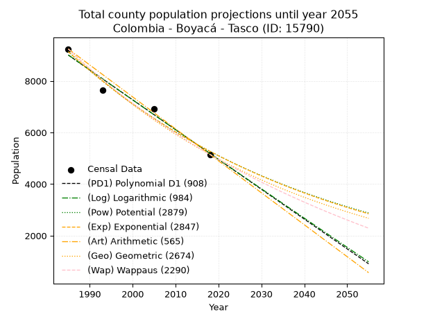
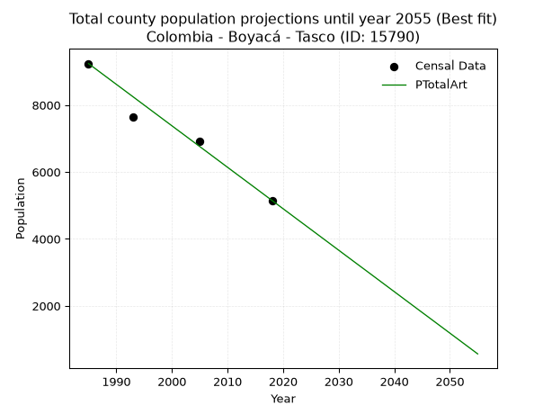
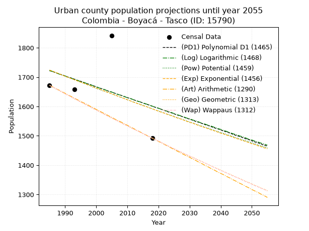
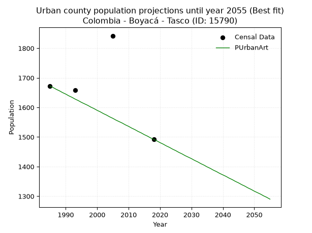
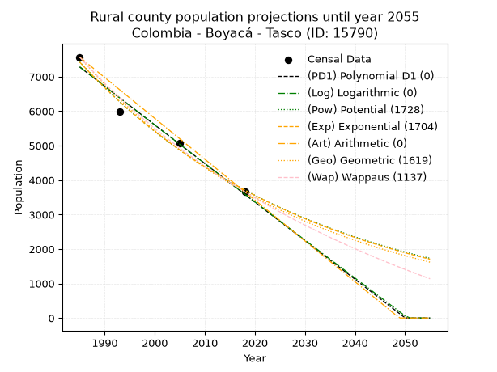
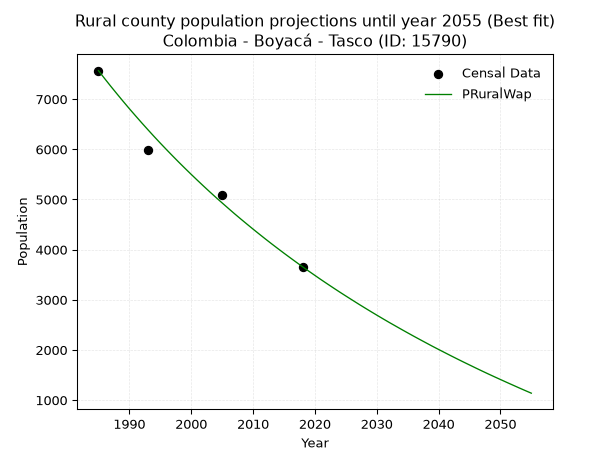

<div align="center">


</div>

# _“Population and Public Services Demand Projections (PPSD) until Year 2050 for Colombia - Boyacá - Tasco (ID: 15790)”_
Keywords: `population` `public-service` `projection` `lineal` `polynomial` `logarithmic` `potential` `exponential` `arithmetic` `geometric` `wappaus` `dane` `colombia` `south-america`

PPSD are analytical estimates used by governments and planners to anticipate future changes in population size, age distribution, and the resulting community needs for utilities, healthcare, education, and infrastructure as sizing future water treatment facilities, electrical grids, and road networks based on spatial growth.

> **General running parameters**: • app_version: _v20260806_. • Python version: _3.14.7_. • Pandas version: _3.0.5_. • NumPy version: _2.5.1_. • Creates, save and include plots into reports (create_plot): _True_. • Projection until year: _2050_. • Process polynomial degree 2 and up: _False_. • Process Wappaus: _True_. • Process Wappaus: _True_. • Set negative values to zero: _True_. • Set infinite values to zero: _True_. • Drop dataset notes: _True_. 
<div align="center">

Dynamic map: [:earth_americas:Google](http://maps.google.com/maps?q=5.90982103,-72.7810111) [:earth_americas:OSM](https://www.openstreetmap.org/#map=18/5.90982103/-72.7810111&layers=P) [:earth_americas:Bing](https://www.bing.com/maps?cp=5.90982103~-72.7810111&lvl=18) [:earth_americas:Apple](https://maps.apple.com/frame?center=5.90982103%2C-72.7810111&span=0.003%2C0.006)

</div>


<div align="center">

```geojson
{
  "type": "Feature",
  "geometry": {
    "type": "Point", 
    "coordinates": [-72.7810111, 5.90982103]
  }, 
  "properties": {
    "Name": "Colombia - Boyacá - Tasco (ID: 15790)"
  }
}
```

</div>


## 0. Census Data (4 records)

Census data are official statistics collected by a government about the people and housing in a country. They usually include counts of total population, age, sex, race, income, education, and jobs.

📅Global census file: [Population.xlsx](../data/Population.xlsx)

| Source   |   Year |   CountryID | CountryName   |   StateID | StateName   |   CountyID | CountyName   |   PTotal |   PUrban |   PRural |
|:---------|-------:|------------:|:--------------|----------:|:------------|-----------:|:-------------|---------:|---------:|---------:|
| DANE     |   1985 |          57 | Colombia      |        15 | Boyacá      |      15790 | Tasco        |     9239 |     1672 |     7567 |
| DANE     |   1993 |          57 | Colombia      |        15 | Boyacá      |      15790 | Tasco        |     7645 |     1659 |     5986 |
| DANE     |   2005 |          57 | Colombia      |        15 | Boyacá      |      15790 | Tasco        |     6925 |     1842 |     5083 |
| DANE     |   2018 |          57 | Colombia      |        15 | Boyacá      |      15790 | Tasco        |     5150 |     1492 |     3658 |

> 🔥Some records has specific notes about the registered values or the corresponding urban or rural distribution.

## 1. Total

### 1.1. Coefficients and Parameters

* (PD1) Polynomial Deg 1: -115.63990365315018, 238548.46728221365 (lineal)
* (Log) Logarithmic: -231488.0858604878, 1766782.5456546682
* (Pow) Potential: -33.326771598745985, 113.86450782121858
* (Exp) Exponential: -0.0166521744466836, 2.0701904487513464e+18
* (Art) Arithmetic: Year diff. 2018 - 1985 = 33, Population diff. 5150 - 9239 = -4089, Annual growth = -123.9090909090909
* (Geo) Geometric: Year diff. 2018 - 1985 = 33, Population diff. 5150 - 9239 = -4089, Annual growth % = -0.01755430625016552
* (Wap) Wappaus: i = -1.722275222865952, Condition values only valid for < 200)

<sub>
Wappaus condition values: ['-0.00', '-1.72', '-3.44', '-5.17', '-6.89', '-8.61', '-10.33', '-12.06', '-13.78', '-15.50', '-17.22', '-18.95', '-20.67', '-22.39', '-24.11', '-25.83', '-27.56', '-29.28', '-31.00', '-32.72', '-34.45', '-36.17', '-37.89', '-39.61', '-41.33', '-43.06', '-44.78', '-46.50', '-48.22', '-49.95', '-51.67', '-53.39', '-55.11', '-56.84', '-58.56', '-60.28', '-62.00', '-63.72', '-65.45', '-67.17', '-68.89', '-70.61', '-72.34', '-74.06', '-75.78', '-77.50', '-79.22', '-80.95', '-82.67', '-84.39', '-86.11', '-87.84', '-89.56', '-91.28', '-93.00', '-94.73', '-96.45', '-98.17', '-99.89', '-101.61', '-103.34', '-105.06', '-106.78', '-108.50', '-110.23', '-111.95']
</sub>


### 1.2. Projected Dataset

|   Year |   CountyID |   PTotalPD1 |   PTotalLog |   PTotalPow |   PTotalExp |   PTotalArt |   PTotalGeo |   PTotalWap |
|-------:|-----------:|------------:|------------:|------------:|------------:|------------:|------------:|------------:|
|   1985 |      15790 |        9003 |        9007 |        9137 |        9133 |        9239 |        9239 |        9239 |
|   1986 |      15790 |        8888 |        8890 |        8985 |        8982 |        9115 |        9077 |        9081 |
|   1987 |      15790 |        8772 |        8774 |        8835 |        8833 |        8991 |        8917 |        8926 |
|   1988 |      15790 |        8656 |        8657 |        8688 |        8688 |        8867 |        8761 |        8774 |
|   1989 |      15790 |        8541 |        8541 |        8544 |        8544 |        8743 |        8607 |        8624 |
|   1990 |      15790 |        8425 |        8425 |        8402 |        8403 |        8619 |        8456 |        8476 |
|   1991 |      15790 |        8309 |        8308 |        8263 |        8264 |        8496 |        8308 |        8331 |
|   1992 |      15790 |        8194 |        8192 |        8125 |        8128 |        8372 |        8162 |        8188 |
|   1993 |      15790 |        8078 |        8076 |        7991 |        7994 |        8248 |        8019 |        8048 |
|   1994 |      15790 |        7962 |        7960 |        7858 |        7862 |        8124 |        7878 |        7910 |
|   1995 |      15790 |        7847 |        7844 |        7728 |        7732 |        8000 |        7739 |        7774 |
|   1996 |      15790 |        7731 |        7728 |        7600 |        7604 |        7876 |        7604 |        7640 |
|   1997 |      15790 |        7616 |        7612 |        7474 |        7478 |        7752 |        7470 |        7508 |
|   1998 |      15790 |        7500 |        7496 |        7350 |        7355 |        7628 |        7339 |        7379 |
|   1999 |      15790 |        7384 |        7380 |        7229 |        7233 |        7504 |        7210 |        7251 |
|   2000 |      15790 |        7269 |        7264 |        7109 |        7114 |        7380 |        7084 |        7125 |
|   2001 |      15790 |        7153 |        7148 |        6992 |        6997 |        7256 |        6959 |        7001 |
|   2002 |      15790 |        7037 |        7033 |        6877 |        6881 |        7133 |        6837 |        6879 |
|   2003 |      15790 |        6922 |        6917 |        6763 |        6767 |        7009 |        6717 |        6759 |
|   2004 |      15790 |        6806 |        6802 |        6651 |        6656 |        6885 |        6599 |        6641 |
|   2005 |      15790 |        6690 |        6686 |        6542 |        6546 |        6761 |        6483 |        6524 |
|   2006 |      15790 |        6575 |        6571 |        6434 |        6438 |        6637 |        6369 |        6409 |
|   2007 |      15790 |        6459 |        6455 |        6328 |        6331 |        6513 |        6258 |        6296 |
|   2008 |      15790 |        6344 |        6340 |        6224 |        6227 |        6389 |        6148 |        6184 |
|   2009 |      15790 |        6228 |        6225 |        6121 |        6124 |        6265 |        6040 |        6074 |
|   2010 |      15790 |        6112 |        6110 |        6021 |        6023 |        6141 |        5934 |        5966 |
|   2011 |      15790 |        5997 |        5994 |        5922 |        5923 |        6017 |        5830 |        5859 |
|   2012 |      15790 |        5881 |        5879 |        5824 |        5825 |        5893 |        5727 |        5753 |
|   2013 |      15790 |        5765 |        5764 |        5729 |        5729 |        5770 |        5627 |        5649 |
|   2014 |      15790 |        5650 |        5649 |        5635 |        5635 |        5646 |        5528 |        5547 |
|   2015 |      15790 |        5534 |        5535 |        5542 |        5542 |        5522 |        5431 |        5445 |
|   2016 |      15790 |        5418 |        5420 |        5451 |        5450 |        5398 |        5336 |        5346 |
|   2017 |      15790 |        5303 |        5305 |        5362 |        5360 |        5274 |        5242 |        5247 |
|   2018 |      15790 |        5187 |        5190 |        5274 |        5272 |        5150 |        5150 |        5150 |
|   2019 |      15790 |        5072 |        5075 |        5188 |        5185 |        5026 |        5060 |        5054 |
|   2020 |      15790 |        4956 |        4961 |        5103 |        5099 |        4902 |        4971 |        4960 |
|   2021 |      15790 |        4840 |        4846 |        5019 |        5015 |        4778 |        4884 |        4866 |
|   2022 |      15790 |        4725 |        4732 |        4937 |        4932 |        4654 |        4798 |        4774 |
|   2023 |      15790 |        4609 |        4617 |        4857 |        4850 |        4530 |        4714 |        4683 |
|   2024 |      15790 |        4493 |        4503 |        4777 |        4770 |        4407 |        4631 |        4593 |
|   2025 |      15790 |        4378 |        4389 |        4699 |        4692 |        4283 |        4550 |        4505 |
|   2026 |      15790 |        4262 |        4274 |        4623 |        4614 |        4159 |        4470 |        4417 |
|   2027 |      15790 |        4146 |        4160 |        4547 |        4538 |        4035 |        4391 |        4331 |
|   2028 |      15790 |        4031 |        4046 |        4473 |        4463 |        3911 |        4314 |        4246 |
|   2029 |      15790 |        3915 |        3932 |        4400 |        4389 |        3787 |        4238 |        4162 |
|   2030 |      15790 |        3799 |        3818 |        4329 |        4317 |        3663 |        4164 |        4078 |
|   2031 |      15790 |        3684 |        3704 |        4258 |        4245 |        3539 |        4091 |        3996 |
|   2032 |      15790 |        3568 |        3590 |        4189 |        4175 |        3415 |        4019 |        3915 |
|   2033 |      15790 |        3453 |        3476 |        4121 |        4106 |        3291 |        3949 |        3835 |
|   2034 |      15790 |        3337 |        3362 |        4054 |        4039 |        3167 |        3879 |        3756 |
|   2035 |      15790 |        3221 |        3248 |        3988 |        3972 |        3044 |        3811 |        3678 |
|   2036 |      15790 |        3106 |        3134 |        3923 |        3906 |        2920 |        3744 |        3600 |
|   2037 |      15790 |        2990 |        3021 |        3859 |        3842 |        2796 |        3678 |        3524 |
|   2038 |      15790 |        2874 |        2907 |        3797 |        3778 |        2672 |        3614 |        3448 |
|   2039 |      15790 |        2759 |        2794 |        3735 |        3716 |        2548 |        3550 |        3374 |
|   2040 |      15790 |        2643 |        2680 |        3675 |        3655 |        2424 |        3488 |        3300 |
|   2041 |      15790 |        2527 |        2567 |        3615 |        3594 |        2300 |        3427 |        3227 |
|   2042 |      15790 |        2412 |        2453 |        3557 |        3535 |        2176 |        3367 |        3155 |
|   2043 |      15790 |        2296 |        2340 |        3499 |        3476 |        2052 |        3308 |        3084 |
|   2044 |      15790 |        2181 |        2227 |        3442 |        3419 |        1928 |        3250 |        3014 |
|   2045 |      15790 |        2065 |        2113 |        3387 |        3363 |        1804 |        3193 |        2944 |
|   2046 |      15790 |        1949 |        2000 |        3332 |        3307 |        1681 |        3137 |        2875 |
|   2047 |      15790 |        1834 |        1887 |        3278 |        3252 |        1557 |        3081 |        2807 |
|   2048 |      15790 |        1718 |        1774 |        3225 |        3199 |        1433 |        3027 |        2740 |
|   2049 |      15790 |        1602 |        1661 |        3173 |        3146 |        1309 |        2974 |        2674 |
|   2050 |      15790 |        1487 |        1548 |        3122 |        3094 |        1185 |        2922 |        2608 |
<div align="center">

</img>

</div>


### 1.3. Best fit with absolute error and relative error (%)

Relative error puts that difference into context by dividing the absolute error by the true value, creating a unitless ratio or percentage that shows the scale of the mistake.

Absolute and relative error

|   Year | Source   |   CountryID | CountryName   |   StateID | StateName   |   CountyID_x | CountyName   |   PTotal |   PUrban |   PRural |   CountyID_y |   PTotalPD1 |   PTotalLog |   PTotalPow |   PTotalExp |   PTotalArt |   PTotalGeo |   PTotalWap |   PTotalPD1AbsError |   PTotalLogAbsError |   PTotalPowAbsError |   PTotalExpAbsError |   PTotalArtAbsError |   PTotalGeoAbsError |   PTotalWapAbsError |   PTotalPD1RelError |   PTotalLogRelError |   PTotalPowRelError |   PTotalExpRelError |   PTotalArtRelError |   PTotalGeoRelError |   PTotalWapRelError |
|-------:|:---------|------------:|:--------------|----------:|:------------|-------------:|:-------------|---------:|---------:|---------:|-------------:|------------:|------------:|------------:|------------:|------------:|------------:|------------:|--------------------:|--------------------:|--------------------:|--------------------:|--------------------:|--------------------:|--------------------:|--------------------:|--------------------:|--------------------:|--------------------:|--------------------:|--------------------:|--------------------:|
|   1985 | DANE     |          57 | Colombia      |        15 | Boyacá      |        15790 | Tasco        |     9239 |     1672 |     7567 |        15790 |        9003 |        9007 |        9137 |        9133 |        9239 |        9239 |        9239 |                 236 |                 232 |                 102 |                 106 |                   0 |                   0 |                   0 |            2.55439  |            2.51109  |             1.10402 |             1.14731 |             0       |             0       |             0       |
|   1993 | DANE     |          57 | Colombia      |        15 | Boyacá      |        15790 | Tasco        |     7645 |     1659 |     5986 |        15790 |        8078 |        8076 |        7991 |        7994 |        8248 |        8019 |        8048 |                 433 |                 431 |                 346 |                 349 |                 603 |                 374 |                 403 |            5.66383  |            5.63767  |             4.52583 |             4.56508 |             7.88751 |             4.89209 |             5.27142 |
|   2005 | DANE     |          57 | Colombia      |        15 | Boyacá      |        15790 | Tasco        |     6925 |     1842 |     5083 |        15790 |        6690 |        6686 |        6542 |        6546 |        6761 |        6483 |        6524 |                 235 |                 239 |                 383 |                 379 |                 164 |                 442 |                 401 |            3.3935   |            3.45126  |             5.53069 |             5.47292 |             2.36823 |             6.38267 |             5.79061 |
|   2018 | DANE     |          57 | Colombia      |        15 | Boyacá      |        15790 | Tasco        |     5150 |     1492 |     3658 |        15790 |        5187 |        5190 |        5274 |        5272 |        5150 |        5150 |        5150 |                  37 |                  40 |                 124 |                 122 |                   0 |                   0 |                   0 |            0.718447 |            0.776699 |             2.40777 |             2.36893 |             0       |             0       |             0       |

Relative error mean

| Method    |   RelError | Best   |
|:----------|-----------:|:-------|
| PTotalPD1 |    3.08254 |        |
| PTotalLog |    3.09418 |        |
| PTotalPow |    3.39208 |        |
| PTotalExp |    3.38856 |        |
| PTotalArt |    2.56393 | True   |
| PTotalGeo |    2.81869 |        |
| PTotalWap |    2.76551 |        |

💙Best method: _**PTotalArt**_
<div align="center">

</img>

</div>


### 1.4. Fresh water supply demand in liters per capita per day (lpcd)

The fresh water supply demand typically ranges from 100 to 300 liters per capita per day (lpcd) for standard domestic and municipal planning, though absolute survival minimums set by the World Health Organization are as low as 7.5 to 20 liters per day, and total consumption in high-income nations can exceed 400 liters.

> `CZ`: Level in meters above the sea level (masl).<br> `WS`: Fresh water supply demand in liters per capita per day (lpcd or l/h/d).<br> `WSAll`: Zonal fresh water supply demand in liters per second (l/s).<br> `A`: Zonal area in square meters.

Reference values (RAS Colombia)

|    CZ |   WS |
|------:|-----:|
|  1000 |  120 |
|  2000 |  130 |
| 99999 |  140 |

County shapefile geometry properties and water supply values

|   CountyID |      ATotal |   CZTotal |   WSTotal |
|-----------:|------------:|----------:|----------:|
|      15790 | 2.09253e+08 |   3276.83 |       140 |

Projected values for best method: PTotalArt

|   CountyID |   Year |   PTotalArt |   WSTotal |   WSTotalAll |
|-----------:|-------:|------------:|----------:|-------------:|
|      15790 |   1985 |        9239 |       140 |     14.9706  |
|      15790 |   1986 |        9115 |       140 |     14.7697  |
|      15790 |   1987 |        8991 |       140 |     14.5687  |
|      15790 |   1988 |        8867 |       140 |     14.3678  |
|      15790 |   1989 |        8743 |       140 |     14.1669  |
|      15790 |   1990 |        8619 |       140 |     13.966   |
|      15790 |   1991 |        8496 |       140 |     13.7667  |
|      15790 |   1992 |        8372 |       140 |     13.5657  |
|      15790 |   1993 |        8248 |       140 |     13.3648  |
|      15790 |   1994 |        8124 |       140 |     13.1639  |
|      15790 |   1995 |        8000 |       140 |     12.963   |
|      15790 |   1996 |        7876 |       140 |     12.762   |
|      15790 |   1997 |        7752 |       140 |     12.5611  |
|      15790 |   1998 |        7628 |       140 |     12.3602  |
|      15790 |   1999 |        7504 |       140 |     12.1593  |
|      15790 |   2000 |        7380 |       140 |     11.9583  |
|      15790 |   2001 |        7256 |       140 |     11.7574  |
|      15790 |   2002 |        7133 |       140 |     11.5581  |
|      15790 |   2003 |        7009 |       140 |     11.3572  |
|      15790 |   2004 |        6885 |       140 |     11.1562  |
|      15790 |   2005 |        6761 |       140 |     10.9553  |
|      15790 |   2006 |        6637 |       140 |     10.7544  |
|      15790 |   2007 |        6513 |       140 |     10.5535  |
|      15790 |   2008 |        6389 |       140 |     10.3525  |
|      15790 |   2009 |        6265 |       140 |     10.1516  |
|      15790 |   2010 |        6141 |       140 |      9.95069 |
|      15790 |   2011 |        6017 |       140 |      9.74977 |
|      15790 |   2012 |        5893 |       140 |      9.54884 |
|      15790 |   2013 |        5770 |       140 |      9.34954 |
|      15790 |   2014 |        5646 |       140 |      9.14861 |
|      15790 |   2015 |        5522 |       140 |      8.94769 |
|      15790 |   2016 |        5398 |       140 |      8.74676 |
|      15790 |   2017 |        5274 |       140 |      8.54583 |
|      15790 |   2018 |        5150 |       140 |      8.34491 |
|      15790 |   2019 |        5026 |       140 |      8.14398 |
|      15790 |   2020 |        4902 |       140 |      7.94306 |
|      15790 |   2021 |        4778 |       140 |      7.74213 |
|      15790 |   2022 |        4654 |       140 |      7.5412  |
|      15790 |   2023 |        4530 |       140 |      7.34028 |
|      15790 |   2024 |        4407 |       140 |      7.14097 |
|      15790 |   2025 |        4283 |       140 |      6.94005 |
|      15790 |   2026 |        4159 |       140 |      6.73912 |
|      15790 |   2027 |        4035 |       140 |      6.53819 |
|      15790 |   2028 |        3911 |       140 |      6.33727 |
|      15790 |   2029 |        3787 |       140 |      6.13634 |
|      15790 |   2030 |        3663 |       140 |      5.93542 |
|      15790 |   2031 |        3539 |       140 |      5.73449 |
|      15790 |   2032 |        3415 |       140 |      5.53356 |
|      15790 |   2033 |        3291 |       140 |      5.33264 |
|      15790 |   2034 |        3167 |       140 |      5.13171 |
|      15790 |   2035 |        3044 |       140 |      4.93241 |
|      15790 |   2036 |        2920 |       140 |      4.73148 |
|      15790 |   2037 |        2796 |       140 |      4.53056 |
|      15790 |   2038 |        2672 |       140 |      4.32963 |
|      15790 |   2039 |        2548 |       140 |      4.1287  |
|      15790 |   2040 |        2424 |       140 |      3.92778 |
|      15790 |   2041 |        2300 |       140 |      3.72685 |
|      15790 |   2042 |        2176 |       140 |      3.52593 |
|      15790 |   2043 |        2052 |       140 |      3.325   |
|      15790 |   2044 |        1928 |       140 |      3.12407 |
|      15790 |   2045 |        1804 |       140 |      2.92315 |
|      15790 |   2046 |        1681 |       140 |      2.72384 |
|      15790 |   2047 |        1557 |       140 |      2.52292 |
|      15790 |   2048 |        1433 |       140 |      2.32199 |
|      15790 |   2049 |        1309 |       140 |      2.12106 |
|      15790 |   2050 |        1185 |       140 |      1.92014 |

## 2. Urban

### 2.1. Coefficients and Parameters

* (PD1) Polynomial Deg 1: -3.682456844640499, 9032.084303492158 (lineal)
* (Log) Logarithmic: -7336.050849719645, 57427.63129614109
* (Pow) Potential: -4.817279609498859, 19.122740596811582
* (Exp) Exponential: -0.002417084413541986, 209050.18433120608
* (Art) Arithmetic: Year diff. 2018 - 1985 = 33, Population diff. 1492 - 1672 = -180, Annual growth = -5.454545454545454
* (Geo) Geometric: Year diff. 2018 - 1985 = 33, Population diff. 1492 - 1672 = -180, Annual growth % = -0.0034456565049840737
* (Wap) Wappaus: i = -0.3447879554074244, Condition values only valid for < 200)

<sub>
Wappaus condition values: ['-0.00', '-0.34', '-0.69', '-1.03', '-1.38', '-1.72', '-2.07', '-2.41', '-2.76', '-3.10', '-3.45', '-3.79', '-4.14', '-4.48', '-4.83', '-5.17', '-5.52', '-5.86', '-6.21', '-6.55', '-6.90', '-7.24', '-7.59', '-7.93', '-8.27', '-8.62', '-8.96', '-9.31', '-9.65', '-10.00', '-10.34', '-10.69', '-11.03', '-11.38', '-11.72', '-12.07', '-12.41', '-12.76', '-13.10', '-13.45', '-13.79', '-14.14', '-14.48', '-14.83', '-15.17', '-15.52', '-15.86', '-16.21', '-16.55', '-16.89', '-17.24', '-17.58', '-17.93', '-18.27', '-18.62', '-18.96', '-19.31', '-19.65', '-20.00', '-20.34', '-20.69', '-21.03', '-21.38', '-21.72', '-22.07', '-22.41']
</sub>


### 2.2. Projected Dataset

|   Year |   CountyID |   PUrbanPD1 |   PUrbanLog |   PUrbanPow |   PUrbanExp |   PUrbanArt |   PUrbanGeo |   PUrbanWap |
|-------:|-----------:|------------:|------------:|------------:|------------:|------------:|------------:|------------:|
|   1985 |      15790 |        1722 |        1722 |        1724 |        1724 |        1672 |        1672 |        1672 |
|   1986 |      15790 |        1719 |        1719 |        1720 |        1720 |        1667 |        1666 |        1666 |
|   1987 |      15790 |        1715 |        1715 |        1716 |        1716 |        1661 |        1660 |        1661 |
|   1988 |      15790 |        1711 |        1711 |        1711 |        1712 |        1656 |        1655 |        1655 |
|   1989 |      15790 |        1708 |        1707 |        1707 |        1707 |        1650 |        1649 |        1649 |
|   1990 |      15790 |        1704 |        1704 |        1703 |        1703 |        1645 |        1643 |        1643 |
|   1991 |      15790 |        1700 |        1700 |        1699 |        1699 |        1639 |        1638 |        1638 |
|   1992 |      15790 |        1697 |        1696 |        1695 |        1695 |        1634 |        1632 |        1632 |
|   1993 |      15790 |        1693 |        1693 |        1691 |        1691 |        1628 |        1626 |        1627 |
|   1994 |      15790 |        1689 |        1689 |        1687 |        1687 |        1623 |        1621 |        1621 |
|   1995 |      15790 |        1686 |        1685 |        1683 |        1683 |        1617 |        1615 |        1615 |
|   1996 |      15790 |        1682 |        1682 |        1679 |        1679 |        1612 |        1610 |        1610 |
|   1997 |      15790 |        1678 |        1678 |        1675 |        1675 |        1607 |        1604 |        1604 |
|   1998 |      15790 |        1675 |        1674 |        1671 |        1671 |        1601 |        1599 |        1599 |
|   1999 |      15790 |        1671 |        1671 |        1666 |        1667 |        1596 |        1593 |        1593 |
|   2000 |      15790 |        1667 |        1667 |        1662 |        1663 |        1590 |        1588 |        1588 |
|   2001 |      15790 |        1663 |        1663 |        1658 |        1659 |        1585 |        1582 |        1582 |
|   2002 |      15790 |        1660 |        1660 |        1654 |        1655 |        1579 |        1577 |        1577 |
|   2003 |      15790 |        1656 |        1656 |        1651 |        1651 |        1574 |        1571 |        1571 |
|   2004 |      15790 |        1652 |        1652 |        1647 |        1647 |        1568 |        1566 |        1566 |
|   2005 |      15790 |        1649 |        1649 |        1643 |        1643 |        1563 |        1560 |        1561 |
|   2006 |      15790 |        1645 |        1645 |        1639 |        1639 |        1557 |        1555 |        1555 |
|   2007 |      15790 |        1641 |        1641 |        1635 |        1635 |        1552 |        1550 |        1550 |
|   2008 |      15790 |        1638 |        1638 |        1631 |        1631 |        1547 |        1544 |        1544 |
|   2009 |      15790 |        1634 |        1634 |        1627 |        1627 |        1541 |        1539 |        1539 |
|   2010 |      15790 |        1630 |        1630 |        1623 |        1623 |        1536 |        1534 |        1534 |
|   2011 |      15790 |        1627 |        1627 |        1619 |        1619 |        1530 |        1528 |        1529 |
|   2012 |      15790 |        1623 |        1623 |        1615 |        1615 |        1525 |        1523 |        1523 |
|   2013 |      15790 |        1619 |        1619 |        1611 |        1611 |        1519 |        1518 |        1518 |
|   2014 |      15790 |        1616 |        1616 |        1608 |        1607 |        1514 |        1513 |        1513 |
|   2015 |      15790 |        1612 |        1612 |        1604 |        1603 |        1508 |        1508 |        1508 |
|   2016 |      15790 |        1608 |        1609 |        1600 |        1600 |        1503 |        1502 |        1502 |
|   2017 |      15790 |        1605 |        1605 |        1596 |        1596 |        1497 |        1497 |        1497 |
|   2018 |      15790 |        1601 |        1601 |        1592 |        1592 |        1492 |        1492 |        1492 |
|   2019 |      15790 |        1597 |        1598 |        1588 |        1588 |        1487 |        1487 |        1487 |
|   2020 |      15790 |        1594 |        1594 |        1585 |        1584 |        1481 |        1482 |        1482 |
|   2021 |      15790 |        1590 |        1590 |        1581 |        1580 |        1476 |        1477 |        1477 |
|   2022 |      15790 |        1586 |        1587 |        1577 |        1577 |        1470 |        1472 |        1471 |
|   2023 |      15790 |        1582 |        1583 |        1573 |        1573 |        1465 |        1466 |        1466 |
|   2024 |      15790 |        1579 |        1580 |        1570 |        1569 |        1459 |        1461 |        1461 |
|   2025 |      15790 |        1575 |        1576 |        1566 |        1565 |        1454 |        1456 |        1456 |
|   2026 |      15790 |        1571 |        1572 |        1562 |        1561 |        1448 |        1451 |        1451 |
|   2027 |      15790 |        1568 |        1569 |        1558 |        1558 |        1443 |        1446 |        1446 |
|   2028 |      15790 |        1564 |        1565 |        1555 |        1554 |        1437 |        1441 |        1441 |
|   2029 |      15790 |        1560 |        1561 |        1551 |        1550 |        1432 |        1436 |        1436 |
|   2030 |      15790 |        1557 |        1558 |        1547 |        1546 |        1427 |        1431 |        1431 |
|   2031 |      15790 |        1553 |        1554 |        1544 |        1543 |        1421 |        1427 |        1426 |
|   2032 |      15790 |        1549 |        1551 |        1540 |        1539 |        1416 |        1422 |        1421 |
|   2033 |      15790 |        1546 |        1547 |        1536 |        1535 |        1410 |        1417 |        1416 |
|   2034 |      15790 |        1542 |        1543 |        1533 |        1531 |        1405 |        1412 |        1412 |
|   2035 |      15790 |        1538 |        1540 |        1529 |        1528 |        1399 |        1407 |        1407 |
|   2036 |      15790 |        1535 |        1536 |        1526 |        1524 |        1394 |        1402 |        1402 |
|   2037 |      15790 |        1531 |        1533 |        1522 |        1520 |        1388 |        1397 |        1397 |
|   2038 |      15790 |        1527 |        1529 |        1518 |        1517 |        1383 |        1392 |        1392 |
|   2039 |      15790 |        1524 |        1525 |        1515 |        1513 |        1377 |        1388 |        1387 |
|   2040 |      15790 |        1520 |        1522 |        1511 |        1509 |        1372 |        1383 |        1382 |
|   2041 |      15790 |        1516 |        1518 |        1508 |        1506 |        1367 |        1378 |        1378 |
|   2042 |      15790 |        1513 |        1515 |        1504 |        1502 |        1361 |        1373 |        1373 |
|   2043 |      15790 |        1509 |        1511 |        1501 |        1499 |        1356 |        1369 |        1368 |
|   2044 |      15790 |        1505 |        1507 |        1497 |        1495 |        1350 |        1364 |        1363 |
|   2045 |      15790 |        1501 |        1504 |        1493 |        1491 |        1345 |        1359 |        1359 |
|   2046 |      15790 |        1498 |        1500 |        1490 |        1488 |        1339 |        1355 |        1354 |
|   2047 |      15790 |        1494 |        1497 |        1486 |        1484 |        1334 |        1350 |        1349 |
|   2048 |      15790 |        1490 |        1493 |        1483 |        1481 |        1328 |        1345 |        1344 |
|   2049 |      15790 |        1487 |        1489 |        1480 |        1477 |        1323 |        1341 |        1340 |
|   2050 |      15790 |        1483 |        1486 |        1476 |        1473 |        1317 |        1336 |        1335 |
<div align="center">

</img>

</div>


### 2.3. Best fit with absolute error and relative error (%)

Relative error puts that difference into context by dividing the absolute error by the true value, creating a unitless ratio or percentage that shows the scale of the mistake.

Absolute and relative error

|   Year | Source   |   CountryID | CountryName   |   StateID | StateName   |   CountyID_x | CountyName   |   PTotal |   PUrban |   PRural |   CountyID_y |   PUrbanPD1 |   PUrbanLog |   PUrbanPow |   PUrbanExp |   PUrbanArt |   PUrbanGeo |   PUrbanWap |   PUrbanPD1AbsError |   PUrbanLogAbsError |   PUrbanPowAbsError |   PUrbanExpAbsError |   PUrbanArtAbsError |   PUrbanGeoAbsError |   PUrbanWapAbsError |   PUrbanPD1RelError |   PUrbanLogRelError |   PUrbanPowRelError |   PUrbanExpRelError |   PUrbanArtRelError |   PUrbanGeoRelError |   PUrbanWapRelError |
|-------:|:---------|------------:|:--------------|----------:|:------------|-------------:|:-------------|---------:|---------:|---------:|-------------:|------------:|------------:|------------:|------------:|------------:|------------:|------------:|--------------------:|--------------------:|--------------------:|--------------------:|--------------------:|--------------------:|--------------------:|--------------------:|--------------------:|--------------------:|--------------------:|--------------------:|--------------------:|--------------------:|
|   1985 | DANE     |          57 | Colombia      |        15 | Boyacá      |        15790 | Tasco        |     9239 |     1672 |     7567 |        15790 |        1722 |        1722 |        1724 |        1724 |        1672 |        1672 |        1672 |                  50 |                  50 |                  52 |                  52 |                   0 |                   0 |                   0 |             2.99043 |             2.99043 |             3.11005 |             3.11005 |              0      |             0       |             0       |
|   1993 | DANE     |          57 | Colombia      |        15 | Boyacá      |        15790 | Tasco        |     7645 |     1659 |     5986 |        15790 |        1693 |        1693 |        1691 |        1691 |        1628 |        1626 |        1627 |                  34 |                  34 |                  32 |                  32 |                  31 |                  33 |                  32 |             2.04943 |             2.04943 |             1.92887 |             1.92887 |              1.8686 |             1.98915 |             1.92887 |
|   2005 | DANE     |          57 | Colombia      |        15 | Boyacá      |        15790 | Tasco        |     6925 |     1842 |     5083 |        15790 |        1649 |        1649 |        1643 |        1643 |        1563 |        1560 |        1561 |                 193 |                 193 |                 199 |                 199 |                 279 |                 282 |                 281 |            10.4777  |            10.4777  |            10.8035  |            10.8035  |             15.1466 |            15.3094  |            15.2552  |
|   2018 | DANE     |          57 | Colombia      |        15 | Boyacá      |        15790 | Tasco        |     5150 |     1492 |     3658 |        15790 |        1601 |        1601 |        1592 |        1592 |        1492 |        1492 |        1492 |                 109 |                 109 |                 100 |                 100 |                   0 |                   0 |                   0 |             7.30563 |             7.30563 |             6.70241 |             6.70241 |              0      |             0       |             0       |

Relative error mean

| Method    |   RelError | Best   |
|:----------|-----------:|:-------|
| PUrbanPD1 |    5.70581 |        |
| PUrbanLog |    5.70581 |        |
| PUrbanPow |    5.6362  |        |
| PUrbanExp |    5.6362  |        |
| PUrbanArt |    4.25379 | True   |
| PUrbanGeo |    4.32465 |        |
| PUrbanWap |    4.29601 |        |

💙Best method: _**PUrbanArt**_
<div align="center">

</img>

</div>


### 2.4. Fresh water supply demand in liters per capita per day (lpcd)

The fresh water supply demand typically ranges from 100 to 300 liters per capita per day (lpcd) for standard domestic and municipal planning, though absolute survival minimums set by the World Health Organization are as low as 7.5 to 20 liters per day, and total consumption in high-income nations can exceed 400 liters.

> `CZ`: Level in meters above the sea level (masl).<br> `WS`: Fresh water supply demand in liters per capita per day (lpcd or l/h/d).<br> `WSAll`: Zonal fresh water supply demand in liters per second (l/s).<br> `A`: Zonal area in square meters.

Reference values (RAS Colombia)

|    CZ |   WS |
|------:|-----:|
|  1000 |  120 |
|  2000 |  130 |
| 99999 |  140 |

County shapefile geometry properties and water supply values

|   CountyID |   AUrban |   CZUrban |   WSUrban |
|-----------:|---------:|----------:|----------:|
|      15790 |   318081 |   2531.07 |       140 |

Projected values for best method: PUrbanArt

|   CountyID |   Year |   PUrbanArt |   WSUrban |   WSUrbanAll |
|-----------:|-------:|------------:|----------:|-------------:|
|      15790 |   1985 |        1672 |       140 |      2.70926 |
|      15790 |   1986 |        1667 |       140 |      2.70116 |
|      15790 |   1987 |        1661 |       140 |      2.69144 |
|      15790 |   1988 |        1656 |       140 |      2.68333 |
|      15790 |   1989 |        1650 |       140 |      2.67361 |
|      15790 |   1990 |        1645 |       140 |      2.66551 |
|      15790 |   1991 |        1639 |       140 |      2.65579 |
|      15790 |   1992 |        1634 |       140 |      2.64769 |
|      15790 |   1993 |        1628 |       140 |      2.63796 |
|      15790 |   1994 |        1623 |       140 |      2.62986 |
|      15790 |   1995 |        1617 |       140 |      2.62014 |
|      15790 |   1996 |        1612 |       140 |      2.61204 |
|      15790 |   1997 |        1607 |       140 |      2.60394 |
|      15790 |   1998 |        1601 |       140 |      2.59421 |
|      15790 |   1999 |        1596 |       140 |      2.58611 |
|      15790 |   2000 |        1590 |       140 |      2.57639 |
|      15790 |   2001 |        1585 |       140 |      2.56829 |
|      15790 |   2002 |        1579 |       140 |      2.55856 |
|      15790 |   2003 |        1574 |       140 |      2.55046 |
|      15790 |   2004 |        1568 |       140 |      2.54074 |
|      15790 |   2005 |        1563 |       140 |      2.53264 |
|      15790 |   2006 |        1557 |       140 |      2.52292 |
|      15790 |   2007 |        1552 |       140 |      2.51481 |
|      15790 |   2008 |        1547 |       140 |      2.50671 |
|      15790 |   2009 |        1541 |       140 |      2.49699 |
|      15790 |   2010 |        1536 |       140 |      2.48889 |
|      15790 |   2011 |        1530 |       140 |      2.47917 |
|      15790 |   2012 |        1525 |       140 |      2.47106 |
|      15790 |   2013 |        1519 |       140 |      2.46134 |
|      15790 |   2014 |        1514 |       140 |      2.45324 |
|      15790 |   2015 |        1508 |       140 |      2.44352 |
|      15790 |   2016 |        1503 |       140 |      2.43542 |
|      15790 |   2017 |        1497 |       140 |      2.42569 |
|      15790 |   2018 |        1492 |       140 |      2.41759 |
|      15790 |   2019 |        1487 |       140 |      2.40949 |
|      15790 |   2020 |        1481 |       140 |      2.39977 |
|      15790 |   2021 |        1476 |       140 |      2.39167 |
|      15790 |   2022 |        1470 |       140 |      2.38194 |
|      15790 |   2023 |        1465 |       140 |      2.37384 |
|      15790 |   2024 |        1459 |       140 |      2.36412 |
|      15790 |   2025 |        1454 |       140 |      2.35602 |
|      15790 |   2026 |        1448 |       140 |      2.3463  |
|      15790 |   2027 |        1443 |       140 |      2.33819 |
|      15790 |   2028 |        1437 |       140 |      2.32847 |
|      15790 |   2029 |        1432 |       140 |      2.32037 |
|      15790 |   2030 |        1427 |       140 |      2.31227 |
|      15790 |   2031 |        1421 |       140 |      2.30255 |
|      15790 |   2032 |        1416 |       140 |      2.29444 |
|      15790 |   2033 |        1410 |       140 |      2.28472 |
|      15790 |   2034 |        1405 |       140 |      2.27662 |
|      15790 |   2035 |        1399 |       140 |      2.2669  |
|      15790 |   2036 |        1394 |       140 |      2.2588  |
|      15790 |   2037 |        1388 |       140 |      2.24907 |
|      15790 |   2038 |        1383 |       140 |      2.24097 |
|      15790 |   2039 |        1377 |       140 |      2.23125 |
|      15790 |   2040 |        1372 |       140 |      2.22315 |
|      15790 |   2041 |        1367 |       140 |      2.21505 |
|      15790 |   2042 |        1361 |       140 |      2.20532 |
|      15790 |   2043 |        1356 |       140 |      2.19722 |
|      15790 |   2044 |        1350 |       140 |      2.1875  |
|      15790 |   2045 |        1345 |       140 |      2.1794  |
|      15790 |   2046 |        1339 |       140 |      2.16968 |
|      15790 |   2047 |        1334 |       140 |      2.16157 |
|      15790 |   2048 |        1328 |       140 |      2.15185 |
|      15790 |   2049 |        1323 |       140 |      2.14375 |
|      15790 |   2050 |        1317 |       140 |      2.13403 |

## 3. Rural

### 3.1. Coefficients and Parameters

* (PD1) Polynomial Deg 1: -111.95744680850969, 229516.3829787215 (lineal)
* (Log) Logarithmic: -224152.03501076822, 1709354.9143585274
* (Pow) Potential: -42.08165166002901, 142.64607954721032
* (Exp) Exponential: -0.021024355939515592, 9.889225839941062e+21
* (Art) Arithmetic: Year diff. 2018 - 1985 = 33, Population diff. 3658 - 7567 = -3909, Annual growth = -118.45454545454545
* (Geo) Geometric: Year diff. 2018 - 1985 = 33, Population diff. 3658 - 7567 = -3909, Annual growth % = -0.021785855090358908
* (Wap) Wappaus: i = -2.1105486940676252, Condition values only valid for < 200)

<sub>
Wappaus condition values: ['-0.00', '-2.11', '-4.22', '-6.33', '-8.44', '-10.55', '-12.66', '-14.77', '-16.88', '-18.99', '-21.11', '-23.22', '-25.33', '-27.44', '-29.55', '-31.66', '-33.77', '-35.88', '-37.99', '-40.10', '-42.21', '-44.32', '-46.43', '-48.54', '-50.65', '-52.76', '-54.87', '-56.98', '-59.10', '-61.21', '-63.32', '-65.43', '-67.54', '-69.65', '-71.76', '-73.87', '-75.98', '-78.09', '-80.20', '-82.31', '-84.42', '-86.53', '-88.64', '-90.75', '-92.86', '-94.97', '-97.09', '-99.20', '-101.31', '-103.42', '-105.53', '-107.64', '-109.75', '-111.86', '-113.97', '-116.08', '-118.19', '-120.30', '-122.41', '-124.52', '-126.63', '-128.74', '-130.85', '-132.96', '-135.08', '-137.19']
</sub>


### 3.2. Projected Dataset

|   Year |   CountyID |   PRuralPD1 |   PRuralLog |   PRuralPow |   PRuralExp |   PRuralArt |   PRuralGeo |   PRuralWap |
|-------:|-----------:|------------:|------------:|------------:|------------:|------------:|------------:|------------:|
|   1985 |      15790 |        7281 |        7285 |        7428 |        7423 |        7567 |        7567 |        7567 |
|   1986 |      15790 |        7169 |        7172 |        7272 |        7269 |        7449 |        7402 |        7409 |
|   1987 |      15790 |        7057 |        7059 |        7120 |        7118 |        7330 |        7241 |        7254 |
|   1988 |      15790 |        6945 |        6946 |        6971 |        6970 |        7212 |        7083 |        7103 |
|   1989 |      15790 |        6833 |        6833 |        6825 |        6825 |        7093 |        6929 |        6954 |
|   1990 |      15790 |        6721 |        6721 |        6682 |        6683 |        6975 |        6778 |        6808 |
|   1991 |      15790 |        6609 |        6608 |        6542 |        6544 |        6856 |        6630 |        6666 |
|   1992 |      15790 |        6497 |        6496 |        6405 |        6407 |        6738 |        6486 |        6526 |
|   1993 |      15790 |        6385 |        6383 |        6271 |        6274 |        6619 |        6344 |        6389 |
|   1994 |      15790 |        6273 |        6271 |        6140 |        6144 |        6501 |        6206 |        6254 |
|   1995 |      15790 |        6161 |        6158 |        6012 |        6016 |        6382 |        6071 |        6122 |
|   1996 |      15790 |        6049 |        6046 |        5887 |        5891 |        6264 |        5939 |        5993 |
|   1997 |      15790 |        5937 |        5934 |        5764 |        5768 |        6146 |        5809 |        5866 |
|   1998 |      15790 |        5825 |        5821 |        5644 |        5648 |        6027 |        5683 |        5741 |
|   1999 |      15790 |        5713 |        5709 |        5526 |        5531 |        5909 |        5559 |        5619 |
|   2000 |      15790 |        5601 |        5597 |        5411 |        5416 |        5790 |        5438 |        5499 |
|   2001 |      15790 |        5490 |        5485 |        5298 |        5303 |        5672 |        5319 |        5381 |
|   2002 |      15790 |        5378 |        5373 |        5188 |        5193 |        5553 |        5204 |        5265 |
|   2003 |      15790 |        5266 |        5261 |        5080 |        5084 |        5435 |        5090 |        5151 |
|   2004 |      15790 |        5154 |        5149 |        4975 |        4979 |        5316 |        4979 |        5039 |
|   2005 |      15790 |        5042 |        5037 |        4871 |        4875 |        5198 |        4871 |        4930 |
|   2006 |      15790 |        4930 |        4926 |        4770 |        4774 |        5079 |        4765 |        4822 |
|   2007 |      15790 |        4818 |        4814 |        4671 |        4674 |        4961 |        4661 |        4715 |
|   2008 |      15790 |        4706 |        4702 |        4574 |        4577 |        4843 |        4559 |        4611 |
|   2009 |      15790 |        4594 |        4591 |        4479 |        4482 |        4724 |        4460 |        4509 |
|   2010 |      15790 |        4482 |        4479 |        4387 |        4389 |        4606 |        4363 |        4408 |
|   2011 |      15790 |        4370 |        4368 |        4296 |        4297 |        4487 |        4268 |        4309 |
|   2012 |      15790 |        4258 |        4256 |        4207 |        4208 |        4369 |        4175 |        4211 |
|   2013 |      15790 |        4146 |        4145 |        4120 |        4120 |        4250 |        4084 |        4115 |
|   2014 |      15790 |        4034 |        4034 |        4035 |        4035 |        4132 |        3995 |        4021 |
|   2015 |      15790 |        3922 |        3922 |        3951 |        3951 |        4013 |        3908 |        3928 |
|   2016 |      15790 |        3810 |        3811 |        3870 |        3869 |        3895 |        3823 |        3837 |
|   2017 |      15790 |        3698 |        3700 |        3790 |        3788 |        3776 |        3739 |        3747 |
|   2018 |      15790 |        3586 |        3589 |        3711 |        3709 |        3658 |        3658 |        3658 |
|   2019 |      15790 |        3474 |        3478 |        3635 |        3632 |        3540 |        3578 |        3571 |
|   2020 |      15790 |        3362 |        3367 |        3560 |        3557 |        3421 |        3500 |        3485 |
|   2021 |      15790 |        3250 |        3256 |        3486 |        3483 |        3303 |        3424 |        3400 |
|   2022 |      15790 |        3138 |        3145 |        3415 |        3410 |        3184 |        3349 |        3317 |
|   2023 |      15790 |        3026 |        3034 |        3344 |        3339 |        3066 |        3277 |        3235 |
|   2024 |      15790 |        2915 |        2923 |        3276 |        3270 |        2947 |        3205 |        3154 |
|   2025 |      15790 |        2803 |        2813 |        3208 |        3202 |        2829 |        3135 |        3075 |
|   2026 |      15790 |        2691 |        2702 |        3142 |        3135 |        2710 |        3067 |        2997 |
|   2027 |      15790 |        2579 |        2591 |        3078 |        3070 |        2592 |        3000 |        2919 |
|   2028 |      15790 |        2467 |        2481 |        3014 |        3006 |        2473 |        2935 |        2843 |
|   2029 |      15790 |        2355 |        2370 |        2952 |        2943 |        2355 |        2871 |        2768 |
|   2030 |      15790 |        2243 |        2260 |        2892 |        2882 |        2237 |        2808 |        2694 |
|   2031 |      15790 |        2131 |        2149 |        2833 |        2822 |        2118 |        2747 |        2621 |
|   2032 |      15790 |        2019 |        2039 |        2775 |        2763 |        2000 |        2687 |        2549 |
|   2033 |      15790 |        1907 |        1929 |        2718 |        2706 |        1881 |        2629 |        2479 |
|   2034 |      15790 |        1795 |        1819 |        2662 |        2650 |        1763 |        2572 |        2409 |
|   2035 |      15790 |        1683 |        1708 |        2608 |        2595 |        1644 |        2515 |        2340 |
|   2036 |      15790 |        1571 |        1598 |        2554 |        2541 |        1526 |        2461 |        2272 |
|   2037 |      15790 |        1459 |        1488 |        2502 |        2488 |        1407 |        2407 |        2205 |
|   2038 |      15790 |        1347 |        1378 |        2451 |        2436 |        1289 |        2355 |        2139 |
|   2039 |      15790 |        1235 |        1268 |        2401 |        2385 |        1170 |        2303 |        2073 |
|   2040 |      15790 |        1123 |        1158 |        2352 |        2336 |        1052 |        2253 |        2009 |
|   2041 |      15790 |        1011 |        1049 |        2304 |        2287 |         934 |        2204 |        1946 |
|   2042 |      15790 |         899 |         939 |        2257 |        2239 |         815 |        2156 |        1883 |
|   2043 |      15790 |         787 |         829 |        2211 |        2193 |         697 |        2109 |        1821 |
|   2044 |      15790 |         675 |         719 |        2166 |        2147 |         578 |        2063 |        1760 |
|   2045 |      15790 |         563 |         610 |        2121 |        2103 |         460 |        2018 |        1700 |
|   2046 |      15790 |         451 |         500 |        2078 |        2059 |         341 |        1974 |        1640 |
|   2047 |      15790 |         339 |         391 |        2036 |        2016 |         223 |        1931 |        1581 |
|   2048 |      15790 |         228 |         281 |        1995 |        1974 |         104 |        1889 |        1523 |
|   2049 |      15790 |         116 |         172 |        1954 |        1933 |           0 |        1848 |        1466 |
|   2050 |      15790 |           4 |          62 |        1914 |        1893 |           0 |        1808 |        1410 |
<div align="center">

</img>

</div>


### 3.3. Best fit with absolute error and relative error (%)

Relative error puts that difference into context by dividing the absolute error by the true value, creating a unitless ratio or percentage that shows the scale of the mistake.

Absolute and relative error

|   Year | Source   |   CountryID | CountryName   |   StateID | StateName   |   CountyID_x | CountyName   |   PTotal |   PUrban |   PRural |   CountyID_y |   PRuralPD1 |   PRuralLog |   PRuralPow |   PRuralExp |   PRuralArt |   PRuralGeo |   PRuralWap |   PRuralPD1AbsError |   PRuralLogAbsError |   PRuralPowAbsError |   PRuralExpAbsError |   PRuralArtAbsError |   PRuralGeoAbsError |   PRuralWapAbsError |   PRuralPD1RelError |   PRuralLogRelError |   PRuralPowRelError |   PRuralExpRelError |   PRuralArtRelError |   PRuralGeoRelError |   PRuralWapRelError |
|-------:|:---------|------------:|:--------------|----------:|:------------|-------------:|:-------------|---------:|---------:|---------:|-------------:|------------:|------------:|------------:|------------:|------------:|------------:|------------:|--------------------:|--------------------:|--------------------:|--------------------:|--------------------:|--------------------:|--------------------:|--------------------:|--------------------:|--------------------:|--------------------:|--------------------:|--------------------:|--------------------:|
|   1985 | DANE     |          57 | Colombia      |        15 | Boyacá      |        15790 | Tasco        |     9239 |     1672 |     7567 |        15790 |        7281 |        7285 |        7428 |        7423 |        7567 |        7567 |        7567 |                 286 |                 282 |                 139 |                 144 |                   0 |                   0 |                   0 |             3.77957 |            3.72671  |             1.83692 |             1.903   |             0       |             0       |             0       |
|   1993 | DANE     |          57 | Colombia      |        15 | Boyacá      |        15790 | Tasco        |     7645 |     1659 |     5986 |        15790 |        6385 |        6383 |        6271 |        6274 |        6619 |        6344 |        6389 |                 399 |                 397 |                 285 |                 288 |                 633 |                 358 |                 403 |             6.66555 |            6.63214  |             4.76111 |             4.81123 |            10.5747  |             5.98062 |             6.73238 |
|   2005 | DANE     |          57 | Colombia      |        15 | Boyacá      |        15790 | Tasco        |     6925 |     1842 |     5083 |        15790 |        5042 |        5037 |        4871 |        4875 |        5198 |        4871 |        4930 |                  41 |                  46 |                 212 |                 208 |                 115 |                 212 |                 153 |             0.80661 |            0.904977 |             4.17077 |             4.09207 |             2.26244 |             4.17077 |             3.01003 |
|   2018 | DANE     |          57 | Colombia      |        15 | Boyacá      |        15790 | Tasco        |     5150 |     1492 |     3658 |        15790 |        3586 |        3589 |        3711 |        3709 |        3658 |        3658 |        3658 |                  72 |                  69 |                  53 |                  51 |                   0 |                   0 |                   0 |             1.96829 |            1.88628  |             1.44888 |             1.3942  |             0       |             0       |             0       |

Relative error mean

| Method    |   RelError | Best   |
|:----------|-----------:|:-------|
| PRuralPD1 |    3.30501 |        |
| PRuralLog |    3.28753 |        |
| PRuralPow |    3.05442 |        |
| PRuralExp |    3.05013 |        |
| PRuralArt |    3.20928 |        |
| PRuralGeo |    2.53785 |        |
| PRuralWap |    2.4356  | True   |

💙Best method: _**PRuralWap**_
<div align="center">

</img>

</div>


### 3.4. Fresh water supply demand in liters per capita per day (lpcd)

The fresh water supply demand typically ranges from 100 to 300 liters per capita per day (lpcd) for standard domestic and municipal planning, though absolute survival minimums set by the World Health Organization are as low as 7.5 to 20 liters per day, and total consumption in high-income nations can exceed 400 liters.

> `CZ`: Level in meters above the sea level (masl).<br> `WS`: Fresh water supply demand in liters per capita per day (lpcd or l/h/d).<br> `WSAll`: Zonal fresh water supply demand in liters per second (l/s).<br> `A`: Zonal area in square meters.

Reference values (RAS Colombia)

|    CZ |   WS |
|------:|-----:|
|  1000 |  120 |
|  2000 |  130 |
| 99999 |  140 |

County shapefile geometry properties and water supply values

|   CountyID |      ARural |   CZRural |   WSRural |
|-----------:|------------:|----------:|----------:|
|      15790 | 2.08935e+08 |   3277.97 |       140 |

Projected values for best method: PRuralWap

|   CountyID |   Year |   PRuralWap |   WSRural |   WSRuralAll |
|-----------:|-------:|------------:|----------:|-------------:|
|      15790 |   1985 |        7567 |       140 |     12.2613  |
|      15790 |   1986 |        7409 |       140 |     12.0053  |
|      15790 |   1987 |        7254 |       140 |     11.7542  |
|      15790 |   1988 |        7103 |       140 |     11.5095  |
|      15790 |   1989 |        6954 |       140 |     11.2681  |
|      15790 |   1990 |        6808 |       140 |     11.0315  |
|      15790 |   1991 |        6666 |       140 |     10.8014  |
|      15790 |   1992 |        6526 |       140 |     10.5745  |
|      15790 |   1993 |        6389 |       140 |     10.3525  |
|      15790 |   1994 |        6254 |       140 |     10.1338  |
|      15790 |   1995 |        6122 |       140 |      9.91991 |
|      15790 |   1996 |        5993 |       140 |      9.71088 |
|      15790 |   1997 |        5866 |       140 |      9.50509 |
|      15790 |   1998 |        5741 |       140 |      9.30255 |
|      15790 |   1999 |        5619 |       140 |      9.10486 |
|      15790 |   2000 |        5499 |       140 |      8.91042 |
|      15790 |   2001 |        5381 |       140 |      8.71921 |
|      15790 |   2002 |        5265 |       140 |      8.53125 |
|      15790 |   2003 |        5151 |       140 |      8.34653 |
|      15790 |   2004 |        5039 |       140 |      8.16505 |
|      15790 |   2005 |        4930 |       140 |      7.98843 |
|      15790 |   2006 |        4822 |       140 |      7.81343 |
|      15790 |   2007 |        4715 |       140 |      7.64005 |
|      15790 |   2008 |        4611 |       140 |      7.47153 |
|      15790 |   2009 |        4509 |       140 |      7.30625 |
|      15790 |   2010 |        4408 |       140 |      7.14259 |
|      15790 |   2011 |        4309 |       140 |      6.98218 |
|      15790 |   2012 |        4211 |       140 |      6.82338 |
|      15790 |   2013 |        4115 |       140 |      6.66782 |
|      15790 |   2014 |        4021 |       140 |      6.51551 |
|      15790 |   2015 |        3928 |       140 |      6.36481 |
|      15790 |   2016 |        3837 |       140 |      6.21736 |
|      15790 |   2017 |        3747 |       140 |      6.07153 |
|      15790 |   2018 |        3658 |       140 |      5.92731 |
|      15790 |   2019 |        3571 |       140 |      5.78634 |
|      15790 |   2020 |        3485 |       140 |      5.64699 |
|      15790 |   2021 |        3400 |       140 |      5.50926 |
|      15790 |   2022 |        3317 |       140 |      5.37477 |
|      15790 |   2023 |        3235 |       140 |      5.2419  |
|      15790 |   2024 |        3154 |       140 |      5.11065 |
|      15790 |   2025 |        3075 |       140 |      4.98264 |
|      15790 |   2026 |        2997 |       140 |      4.85625 |
|      15790 |   2027 |        2919 |       140 |      4.72986 |
|      15790 |   2028 |        2843 |       140 |      4.60671 |
|      15790 |   2029 |        2768 |       140 |      4.48519 |
|      15790 |   2030 |        2694 |       140 |      4.36528 |
|      15790 |   2031 |        2621 |       140 |      4.24699 |
|      15790 |   2032 |        2549 |       140 |      4.13032 |
|      15790 |   2033 |        2479 |       140 |      4.0169  |
|      15790 |   2034 |        2409 |       140 |      3.90347 |
|      15790 |   2035 |        2340 |       140 |      3.79167 |
|      15790 |   2036 |        2272 |       140 |      3.68148 |
|      15790 |   2037 |        2205 |       140 |      3.57292 |
|      15790 |   2038 |        2139 |       140 |      3.46597 |
|      15790 |   2039 |        2073 |       140 |      3.35903 |
|      15790 |   2040 |        2009 |       140 |      3.25532 |
|      15790 |   2041 |        1946 |       140 |      3.15324 |
|      15790 |   2042 |        1883 |       140 |      3.05116 |
|      15790 |   2043 |        1821 |       140 |      2.95069 |
|      15790 |   2044 |        1760 |       140 |      2.85185 |
|      15790 |   2045 |        1700 |       140 |      2.75463 |
|      15790 |   2046 |        1640 |       140 |      2.65741 |
|      15790 |   2047 |        1581 |       140 |      2.56181 |
|      15790 |   2048 |        1523 |       140 |      2.46782 |
|      15790 |   2049 |        1466 |       140 |      2.37546 |
|      15790 |   2050 |        1410 |       140 |      2.28472 |

<div align="center"><br><sub>Share this research</sub></div><br>

<sub>**APPS & TOOLS & CONTENT DISCLAIMER**: • NO WARRANTY - This content and software is provided by <a href="https://github.com/rcfdtools" target="_blank">github.com/rcfdtools</a> "as is", without any express or implied warranty, including warranties of merchantability, fitness for a particular purpose, or non-infringement. There is no guarantee that the software will be error-free or operate without interruption. • LIMITATION OF LIABILITY - Neither the authors nor copyright holders will be liable for claims or damages arising from the software or its use. You are responsible for determining if the software is appropriate for your use and assume all associated risks, including errors, legal compliance, and data loss. • NO PROFESSIONAL ADVICE - The software provides general information and does not offer professional advice. It should not replace consultation with professional advisors. [Clauses and global license for rcfdtools use.](https://github.com/rcfdtools/rcfdtools/blob/main/LICENSE.md)</sub>