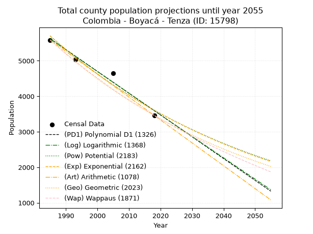
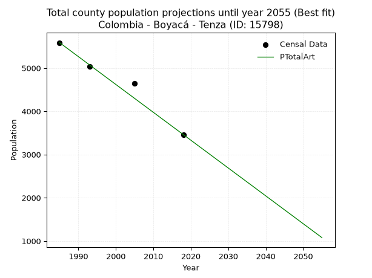
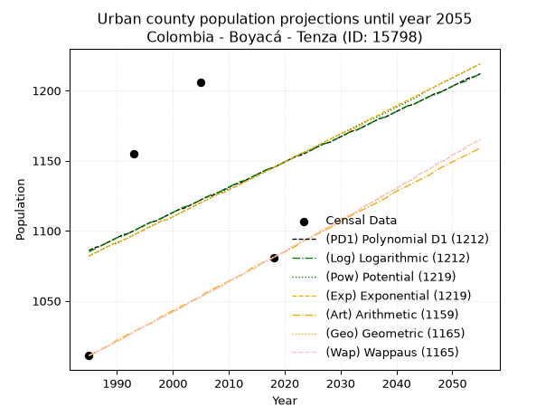
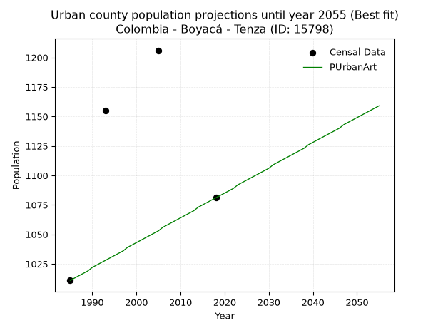
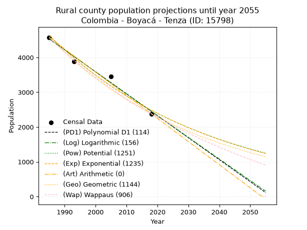
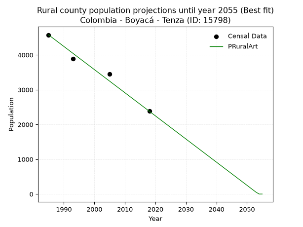

<div align="center">


</div>

# 📜 _“Population and Public Services Demand Projections (PPSD) until Year 2050 for Colombia - Boyacá - Tenza (ID: 15798)”_
Keywords: `population` `public-service` `projection` `lineal` `polynomial` `logarithmic` `potential` `exponential` `arithmetic` `geometric` `wappaus` `dane` `colombia` `south-america`

PPSD are analytical estimates used by governments and planners to anticipate future changes in population size, age distribution, and the resulting community needs for utilities, healthcare, education, and infrastructure as sizing future water treatment facilities, electrical grids, and road networks based on spatial growth.

<div align="center">

</img>

</div>


> **General running parameters**: • app_version: _v20260806_. • Python version: _3.14.7_. • Pandas version: _3.0.5_. • NumPy version: _2.5.1_. • Creates, save and include plots into reports (create_plot): _False_. • Projection until year: _2050_. • Process polynomial degree 2 and up: _False_. • Process Wappaus: _True_. • Process Wappaus: _True_. • Set negative values to zero: _True_. • Set infinite values to zero: _True_. • Drop dataset notes: _True_. 
<div align="center">

Maps & GIS Layers: [:earth_americas:Google](http://maps.google.com/maps?q=5.076781345,-73.4211756) [:earth_americas:OSM](https://www.openstreetmap.org/#map=18/5.076781345/-73.4211756&layers=P) [:earth_americas:Bing](https://www.bing.com/maps?cp=5.076781345~-73.4211756&lvl=18) [:earth_americas:Apple](https://maps.apple.com/frame?center=5.076781345%2C-73.4211756&span=0.003%2C0.006) [:earth_americas:GISMobile](https://github.com/rcfdtools/R.GISMobile/blob/main/file/gis/CountyLayer_CO/Readme.md)

</div>


<div align="center">

```geojson
{
  "type": "Feature",
  "geometry": {
    "type": "Point", 
    "coordinates": [-73.4211756, 5.076781345]
  }, 
  "properties": {
    "Name": "Colombia - Boyacá - Tenza (ID: 15798)"
  }
}
```

</div>


## 0. Census Data (4 records)

Census data are official statistics collected by a government about the people and housing in a country. They usually include counts of total population, age, sex, race, income, education, and jobs.

📅Global census file: [Population.xlsx](../data/Population.xlsx)

| Source   |   Year |   CountryID | CountryName   |   StateID | StateName   |   CountyID | CountyName   |   PTotal |   PUrban |   PRural |
|:---------|-------:|------------:|:--------------|----------:|:------------|-----------:|:-------------|---------:|---------:|---------:|
| DANE     |   1985 |          57 | Colombia      |        15 | Boyacá      |      15798 | Tenza        |     5586 |     1011 |     4575 |
| DANE     |   1993 |          57 | Colombia      |        15 | Boyacá      |      15798 | Tenza        |     5040 |     1155 |     3885 |
| DANE     |   2005 |          57 | Colombia      |        15 | Boyacá      |      15798 | Tenza        |     4651 |     1206 |     3445 |
| DANE     |   2018 |          57 | Colombia      |        15 | Boyacá      |      15798 | Tenza        |     3461 |     1081 |     2380 |

> 🔥Some records could had specific notes about the registered values or the corresponding urban or rural distribution.

📅[SUI-RUPS](https://www.datos.gov.co/Hacienda-y-Cr-dito-P-blico/Registro-nico-de-Prestadores-de-Servicios-P-blicos/4qkq-csdn/about_data) - Local public utility companies: [RUPS.csv](../data/RUPS.csv)

 | SERVICIO       | ESTADO    | NOMBRE                                                       | NIT         | DEPARTAMENTO_DOMICILIO   | MUNICIPIO_DOMICILIO   | DIRECCION        |   TELEFONO | EMAIL               | TIPO_PRESTADOR                             | CLASIFICACION                 |
|:---------------|:----------|:-------------------------------------------------------------|:------------|:-------------------------|:----------------------|:-----------------|-----------:|:--------------------|:-------------------------------------------|:------------------------------|
| ACUEDUCTO      | OPERATIVA | EMPRESA DE ACUEDUCTO, ALCANTARILLADO Y ASEO DE TENZA S.A ESP | 900277171-5 | BOYACA                   | TENZA                 | Calle 5 No. 7-12 |    7527544 | eaaatenza@gmail.com | SOCIEDADES (EMPRESA DE SERVICIOS PUBLICOS) | MENOR O IGUAL A 2500 USUARIOS |
| ALCANTARILLADO | OPERATIVA | EMPRESA DE ACUEDUCTO, ALCANTARILLADO Y ASEO DE TENZA S.A ESP | 900277171-5 | BOYACA                   | TENZA                 | Calle 5 No. 7-12 |    7527544 | eaaatenza@gmail.com | SOCIEDADES (EMPRESA DE SERVICIOS PUBLICOS) | MENOR O IGUAL A 2500 USUARIOS |

## 1. Total

### 1.1. Coefficients and Parameters

* (PD1) Polynomial Deg 1: -61.34323564833325, 127386.30710557858 (lineal)
* (Log) Logarithmic: -122746.4899390064, 937681.5536550261
* (Pow) Potential: -27.69723091940162, 95.0947295960473
* (Exp) Exponential: -0.013844118046704707, 4902539558576870.0
* (Art) Arithmetic: Year diff. 2018 - 1985 = 33, Population diff. 3461 - 5586 = -2125, Annual growth = -64.39393939393939
* (Geo) Geometric: Year diff. 2018 - 1985 = 33, Population diff. 3461 - 5586 = -2125, Annual growth % = -0.014401530909628146
* (Wap) Wappaus: i = -1.4235423763444102, Condition values only valid for < 200)

<sub>
Wappaus condition values: ['-0.00', '-1.42', '-2.85', '-4.27', '-5.69', '-7.12', '-8.54', '-9.96', '-11.39', '-12.81', '-14.24', '-15.66', '-17.08', '-18.51', '-19.93', '-21.35', '-22.78', '-24.20', '-25.62', '-27.05', '-28.47', '-29.89', '-31.32', '-32.74', '-34.17', '-35.59', '-37.01', '-38.44', '-39.86', '-41.28', '-42.71', '-44.13', '-45.55', '-46.98', '-48.40', '-49.82', '-51.25', '-52.67', '-54.09', '-55.52', '-56.94', '-58.37', '-59.79', '-61.21', '-62.64', '-64.06', '-65.48', '-66.91', '-68.33', '-69.75', '-71.18', '-72.60', '-74.02', '-75.45', '-76.87', '-78.29', '-79.72', '-81.14', '-82.57', '-83.99', '-85.41', '-86.84', '-88.26', '-89.68', '-91.11', '-92.53']
</sub>


### 1.2. Projected Dataset

|   Year |   CountyID |   PTotalPD1 |   PTotalLog |   PTotalPow |   PTotalExp |   PTotalArt |   PTotalGeo |   PTotalWap |
|-------:|-----------:|------------:|------------:|------------:|------------:|------------:|------------:|------------:|
|   1985 |      15798 |        5620 |        5622 |        5700 |        5698 |        5586 |        5586 |        5586 |
|   1986 |      15798 |        5559 |        5560 |        5621 |        5620 |        5522 |        5506 |        5507 |
|   1987 |      15798 |        5497 |        5498 |        5543 |        5543 |        5457 |        5426 |        5429 |
|   1988 |      15798 |        5436 |        5436 |        5467 |        5467 |        5393 |        5348 |        5352 |
|   1989 |      15798 |        5375 |        5374 |        5391 |        5392 |        5328 |        5271 |        5277 |
|   1990 |      15798 |        5313 |        5313 |        5317 |        5317 |        5264 |        5195 |        5202 |
|   1991 |      15798 |        5252 |        5251 |        5243 |        5244 |        5200 |        5120 |        5128 |
|   1992 |      15798 |        5191 |        5189 |        5171 |        5172 |        5135 |        5047 |        5056 |
|   1993 |      15798 |        5129 |        5128 |        5099 |        5101 |        5071 |        4974 |        4984 |
|   1994 |      15798 |        5068 |        5066 |        5029 |        5031 |        5006 |        4902 |        4913 |
|   1995 |      15798 |        5007 |        5005 |        4960 |        4962 |        4942 |        4832 |        4844 |
|   1996 |      15798 |        4945 |        4943 |        4891 |        4894 |        4878 |        4762 |        4775 |
|   1997 |      15798 |        4884 |        4882 |        4824 |        4826 |        4813 |        4694 |        4707 |
|   1998 |      15798 |        4823 |        4820 |        4757 |        4760 |        4749 |        4626 |        4640 |
|   1999 |      15798 |        4761 |        4759 |        4692 |        4694 |        4684 |        4559 |        4574 |
|   2000 |      15798 |        4700 |        4697 |        4627 |        4630 |        4620 |        4494 |        4508 |
|   2001 |      15798 |        4638 |        4636 |        4564 |        4566 |        4556 |        4429 |        4444 |
|   2002 |      15798 |        4577 |        4575 |        4501 |        4503 |        4491 |        4365 |        4380 |
|   2003 |      15798 |        4516 |        4513 |        4439 |        4442 |        4427 |        4302 |        4317 |
|   2004 |      15798 |        4454 |        4452 |        4378 |        4380 |        4363 |        4240 |        4255 |
|   2005 |      15798 |        4393 |        4391 |        4318 |        4320 |        4298 |        4179 |        4194 |
|   2006 |      15798 |        4332 |        4330 |        4259 |        4261 |        4234 |        4119 |        4133 |
|   2007 |      15798 |        4270 |        4269 |        4201 |        4202 |        4169 |        4060 |        4073 |
|   2008 |      15798 |        4209 |        4207 |        4143 |        4145 |        4105 |        4001 |        4014 |
|   2009 |      15798 |        4148 |        4146 |        4086 |        4088 |        4041 |        3944 |        3956 |
|   2010 |      15798 |        4086 |        4085 |        4030 |        4031 |        3976 |        3887 |        3898 |
|   2011 |      15798 |        4025 |        4024 |        3975 |        3976 |        3912 |        3831 |        3841 |
|   2012 |      15798 |        3964 |        3963 |        3921 |        3921 |        3847 |        3776 |        3785 |
|   2013 |      15798 |        3902 |        3902 |        3867 |        3867 |        3783 |        3721 |        3729 |
|   2014 |      15798 |        3841 |        3841 |        3814 |        3814 |        3719 |        3668 |        3675 |
|   2015 |      15798 |        3780 |        3780 |        3762 |        3762 |        3654 |        3615 |        3620 |
|   2016 |      15798 |        3718 |        3719 |        3711 |        3710 |        3590 |        3563 |        3567 |
|   2017 |      15798 |        3657 |        3659 |        3660 |        3659 |        3525 |        3512 |        3513 |
|   2018 |      15798 |        3596 |        3598 |        3610 |        3609 |        3461 |        3461 |        3461 |
|   2019 |      15798 |        3534 |        3537 |        3561 |        3559 |        3397 |        3411 |        3409 |
|   2020 |      15798 |        3473 |        3476 |        3513 |        3510 |        3332 |        3362 |        3358 |
|   2021 |      15798 |        3412 |        3415 |        3465 |        3462 |        3268 |        3314 |        3307 |
|   2022 |      15798 |        3350 |        3355 |        3418 |        3414 |        3203 |        3266 |        3257 |
|   2023 |      15798 |        3289 |        3294 |        3371 |        3367 |        3139 |        3219 |        3208 |
|   2024 |      15798 |        3228 |        3233 |        3325 |        3321 |        3075 |        3173 |        3159 |
|   2025 |      15798 |        3166 |        3173 |        3280 |        3275 |        3010 |        3127 |        3110 |
|   2026 |      15798 |        3105 |        3112 |        3236 |        3230 |        2946 |        3082 |        3062 |
|   2027 |      15798 |        3044 |        3051 |        3192 |        3186 |        2881 |        3037 |        3015 |
|   2028 |      15798 |        2982 |        2991 |        3149 |        3142 |        2817 |        2994 |        2968 |
|   2029 |      15798 |        2921 |        2930 |        3106 |        3099 |        2753 |        2951 |        2922 |
|   2030 |      15798 |        2860 |        2870 |        3064 |        3056 |        2688 |        2908 |        2876 |
|   2031 |      15798 |        2798 |        2809 |        3022 |        3014 |        2624 |        2866 |        2830 |
|   2032 |      15798 |        2737 |        2749 |        2981 |        2973 |        2559 |        2825 |        2785 |
|   2033 |      15798 |        2676 |        2689 |        2941 |        2932 |        2495 |        2784 |        2741 |
|   2034 |      15798 |        2614 |        2628 |        2901 |        2892 |        2431 |        2744 |        2697 |
|   2035 |      15798 |        2553 |        2568 |        2862 |        2852 |        2366 |        2705 |        2654 |
|   2036 |      15798 |        2491 |        2508 |        2823 |        2813 |        2302 |        2666 |        2611 |
|   2037 |      15798 |        2430 |        2447 |        2785 |        2774 |        2238 |        2627 |        2568 |
|   2038 |      15798 |        2369 |        2387 |        2747 |        2736 |        2173 |        2589 |        2526 |
|   2039 |      15798 |        2307 |        2327 |        2710 |        2698 |        2109 |        2552 |        2484 |
|   2040 |      15798 |        2246 |        2267 |        2674 |        2661 |        2044 |        2515 |        2443 |
|   2041 |      15798 |        2185 |        2207 |        2638 |        2625 |        1980 |        2479 |        2402 |
|   2042 |      15798 |        2123 |        2146 |        2602 |        2589 |        1916 |        2443 |        2362 |
|   2043 |      15798 |        2062 |        2086 |        2567 |        2553 |        1851 |        2408 |        2322 |
|   2044 |      15798 |        2001 |        2026 |        2533 |        2518 |        1787 |        2374 |        2282 |
|   2045 |      15798 |        1939 |        1966 |        2499 |        2483 |        1722 |        2339 |        2243 |
|   2046 |      15798 |        1878 |        1906 |        2465 |        2449 |        1658 |        2306 |        2204 |
|   2047 |      15798 |        1817 |        1846 |        2432 |        2415 |        1594 |        2272 |        2165 |
|   2048 |      15798 |        1755 |        1786 |        2399 |        2382 |        1529 |        2240 |        2127 |
|   2049 |      15798 |        1694 |        1726 |        2367 |        2349 |        1465 |        2208 |        2090 |
|   2050 |      15798 |        1633 |        1667 |        2335 |        2317 |        1400 |        2176 |        2052 |
<div align="center">

</img>

</div>


### 1.3. Best fit with absolute and relative error (%)

Relative error puts that difference into context by dividing the absolute error by the true value, creating a unitless ratio or percentage that shows the scale of the mistake.

Absolute and relative error

|   Year | Source   |   CountryID | CountryName   |   StateID | StateName   |   CountyID_x | CountyName   |   PTotal |   PUrban |   PRural |   CountyID_y |   PTotalPD1 |   PTotalLog |   PTotalPow |   PTotalExp |   PTotalArt |   PTotalGeo |   PTotalWap |   PTotalPD1AbsError |   PTotalLogAbsError |   PTotalPowAbsError |   PTotalExpAbsError |   PTotalArtAbsError |   PTotalGeoAbsError |   PTotalWapAbsError |   PTotalPD1RelError |   PTotalLogRelError |   PTotalPowRelError |   PTotalExpRelError |   PTotalArtRelError |   PTotalGeoRelError |   PTotalWapRelError |
|-------:|:---------|------------:|:--------------|----------:|:------------|-------------:|:-------------|---------:|---------:|---------:|-------------:|------------:|------------:|------------:|------------:|------------:|------------:|------------:|--------------------:|--------------------:|--------------------:|--------------------:|--------------------:|--------------------:|--------------------:|--------------------:|--------------------:|--------------------:|--------------------:|--------------------:|--------------------:|--------------------:|
|   1985 | DANE     |          57 | Colombia      |        15 | Boyacá      |        15798 | Tenza        |     5586 |     1011 |     4575 |        15798 |        5620 |        5622 |        5700 |        5698 |        5586 |        5586 |        5586 |                  34 |                  36 |                 114 |                 112 |                   0 |                   0 |                   0 |            0.608665 |            0.644468 |             2.04082 |             2.00501 |            0        |             0       |             0       |
|   1993 | DANE     |          57 | Colombia      |        15 | Boyacá      |        15798 | Tenza        |     5040 |     1155 |     3885 |        15798 |        5129 |        5128 |        5099 |        5101 |        5071 |        4974 |        4984 |                  89 |                  88 |                  59 |                  61 |                  31 |                  66 |                  56 |            1.76587  |            1.74603  |             1.17063 |             1.21032 |            0.615079 |             1.30952 |             1.11111 |
|   2005 | DANE     |          57 | Colombia      |        15 | Boyacá      |        15798 | Tenza        |     4651 |     1206 |     3445 |        15798 |        4393 |        4391 |        4318 |        4320 |        4298 |        4179 |        4194 |                 258 |                 260 |                 333 |                 331 |                 353 |                 472 |                 457 |            5.54719  |            5.5902   |             7.15975 |             7.11675 |            7.58977  |            10.1484  |             9.82584 |
|   2018 | DANE     |          57 | Colombia      |        15 | Boyacá      |        15798 | Tenza        |     3461 |     1081 |     2380 |        15798 |        3596 |        3598 |        3610 |        3609 |        3461 |        3461 |        3461 |                 135 |                 137 |                 149 |                 148 |                   0 |                   0 |                   0 |            3.90061  |            3.95839  |             4.30511 |             4.27622 |            0        |             0       |             0       |

Relative error mean

| Method    |   RelError | Best   |
|:----------|-----------:|:-------|
| PTotalPD1 |    2.95558 |        |
| PTotalLog |    2.98477 |        |
| PTotalPow |    3.66908 |        |
| PTotalExp |    3.65207 |        |
| PTotalArt |    2.05121 | True   |
| PTotalGeo |    2.86447 |        |
| PTotalWap |    2.73424 |        |

💙Best method: _**PTotalArt**_
<div align="center">

</img>

</div>


### 1.4. Fresh water supply demand in liters per capita per day (lpcd)

The fresh water supply demand typically ranges from 100 to 300 liters per capita per day (lpcd) for standard domestic and municipal planning, though absolute survival minimums set by the World Health Organization are as low as 7.5 to 20 liters per day, and total consumption in high-income nations can exceed 400 liters.

> `CZ`: Level in meters above the sea level (masl)<br> `WS`: Fresh water supply demand in liters per capita per day (lpcd or l/h/d)<br> `WSAll`: Zonal fresh water supply demand in liters per second (l/s)<br> `A`: Zonal area in square meters<br> `DP`: Population density (people/hectare or p/ha)

Reference values (RAS Colombia)

|    CZ |   WS |
|------:|-----:|
|  1000 |  120 |
|  2000 |  130 |
| 99999 |  140 |

County shapefile geometry properties and water supply values

|   CountyID |      ATotal |   CZTotal |   WSTotal |
|-----------:|------------:|----------:|----------:|
|      15798 | 4.57873e+07 |   1850.07 |       130 |

Projected values for best method: PTotalArt

|   CountyID |   Year |   PTotalArt |   DPTotal |   WSTotal |   WSTotalAll |
|-----------:|-------:|------------:|----------:|----------:|-------------:|
|      15798 |   1985 |        5586 |      1.22 |       130 |      8.40486 |
|      15798 |   1986 |        5522 |      1.21 |       130 |      8.30856 |
|      15798 |   1987 |        5457 |      1.19 |       130 |      8.21076 |
|      15798 |   1988 |        5393 |      1.18 |       130 |      8.11447 |
|      15798 |   1989 |        5328 |      1.16 |       130 |      8.01667 |
|      15798 |   1990 |        5264 |      1.15 |       130 |      7.92037 |
|      15798 |   1991 |        5200 |      1.14 |       130 |      7.82407 |
|      15798 |   1992 |        5135 |      1.12 |       130 |      7.72627 |
|      15798 |   1993 |        5071 |      1.11 |       130 |      7.62998 |
|      15798 |   1994 |        5006 |      1.09 |       130 |      7.53218 |
|      15798 |   1995 |        4942 |      1.08 |       130 |      7.43588 |
|      15798 |   1996 |        4878 |      1.07 |       130 |      7.33958 |
|      15798 |   1997 |        4813 |      1.05 |       130 |      7.24178 |
|      15798 |   1998 |        4749 |      1.04 |       130 |      7.14549 |
|      15798 |   1999 |        4684 |      1.02 |       130 |      7.04769 |
|      15798 |   2000 |        4620 |      1.01 |       130 |      6.95139 |
|      15798 |   2001 |        4556 |      1    |       130 |      6.85509 |
|      15798 |   2002 |        4491 |      0.98 |       130 |      6.75729 |
|      15798 |   2003 |        4427 |      0.97 |       130 |      6.661   |
|      15798 |   2004 |        4363 |      0.95 |       130 |      6.5647  |
|      15798 |   2005 |        4298 |      0.94 |       130 |      6.4669  |
|      15798 |   2006 |        4234 |      0.92 |       130 |      6.3706  |
|      15798 |   2007 |        4169 |      0.91 |       130 |      6.2728  |
|      15798 |   2008 |        4105 |      0.9  |       130 |      6.1765  |
|      15798 |   2009 |        4041 |      0.88 |       130 |      6.08021 |
|      15798 |   2010 |        3976 |      0.87 |       130 |      5.98241 |
|      15798 |   2011 |        3912 |      0.85 |       130 |      5.88611 |
|      15798 |   2012 |        3847 |      0.84 |       130 |      5.78831 |
|      15798 |   2013 |        3783 |      0.83 |       130 |      5.69201 |
|      15798 |   2014 |        3719 |      0.81 |       130 |      5.59572 |
|      15798 |   2015 |        3654 |      0.8  |       130 |      5.49792 |
|      15798 |   2016 |        3590 |      0.78 |       130 |      5.40162 |
|      15798 |   2017 |        3525 |      0.77 |       130 |      5.30382 |
|      15798 |   2018 |        3461 |      0.76 |       130 |      5.20752 |
|      15798 |   2019 |        3397 |      0.74 |       130 |      5.11123 |
|      15798 |   2020 |        3332 |      0.73 |       130 |      5.01343 |
|      15798 |   2021 |        3268 |      0.71 |       130 |      4.91713 |
|      15798 |   2022 |        3203 |      0.7  |       130 |      4.81933 |
|      15798 |   2023 |        3139 |      0.69 |       130 |      4.72303 |
|      15798 |   2024 |        3075 |      0.67 |       130 |      4.62674 |
|      15798 |   2025 |        3010 |      0.66 |       130 |      4.52894 |
|      15798 |   2026 |        2946 |      0.64 |       130 |      4.43264 |
|      15798 |   2027 |        2881 |      0.63 |       130 |      4.33484 |
|      15798 |   2028 |        2817 |      0.62 |       130 |      4.23854 |
|      15798 |   2029 |        2753 |      0.6  |       130 |      4.14225 |
|      15798 |   2030 |        2688 |      0.59 |       130 |      4.04444 |
|      15798 |   2031 |        2624 |      0.57 |       130 |      3.94815 |
|      15798 |   2032 |        2559 |      0.56 |       130 |      3.85035 |
|      15798 |   2033 |        2495 |      0.54 |       130 |      3.75405 |
|      15798 |   2034 |        2431 |      0.53 |       130 |      3.65775 |
|      15798 |   2035 |        2366 |      0.52 |       130 |      3.55995 |
|      15798 |   2036 |        2302 |      0.5  |       130 |      3.46366 |
|      15798 |   2037 |        2238 |      0.49 |       130 |      3.36736 |
|      15798 |   2038 |        2173 |      0.47 |       130 |      3.26956 |
|      15798 |   2039 |        2109 |      0.46 |       130 |      3.17326 |
|      15798 |   2040 |        2044 |      0.45 |       130 |      3.07546 |
|      15798 |   2041 |        1980 |      0.43 |       130 |      2.97917 |
|      15798 |   2042 |        1916 |      0.42 |       130 |      2.88287 |
|      15798 |   2043 |        1851 |      0.4  |       130 |      2.78507 |
|      15798 |   2044 |        1787 |      0.39 |       130 |      2.68877 |
|      15798 |   2045 |        1722 |      0.38 |       130 |      2.59097 |
|      15798 |   2046 |        1658 |      0.36 |       130 |      2.49468 |
|      15798 |   2047 |        1594 |      0.35 |       130 |      2.39838 |
|      15798 |   2048 |        1529 |      0.33 |       130 |      2.30058 |
|      15798 |   2049 |        1465 |      0.32 |       130 |      2.20428 |
|      15798 |   2050 |        1400 |      0.31 |       130 |      2.10648 |

## 2. Urban

### 2.1. Coefficients and Parameters

* (PD1) Polynomial Deg 1: 1.8061019670815637, -2499.405459654897 (lineal)
* (Log) Logarithmic: 3641.5176444950107, -26565.954797097587
* (Pow) Potential: 3.432822097853395, -8.286379545112938
* (Exp) Exponential: 0.0017031596928421327, 36.82102758002328
* (Art) Arithmetic: Year diff. 2018 - 1985 = 33, Population diff. 1081 - 1011 = 70, Annual growth = 2.121212121212121
* (Geo) Geometric: Year diff. 2018 - 1985 = 33, Population diff. 1081 - 1011 = 70, Annual growth % = 0.0020307439798863403
* (Wap) Wappaus: i = 0.20279274581377832, Condition values only valid for < 200)

<sub>
Wappaus condition values: ['0.00', '0.20', '0.41', '0.61', '0.81', '1.01', '1.22', '1.42', '1.62', '1.83', '2.03', '2.23', '2.43', '2.64', '2.84', '3.04', '3.24', '3.45', '3.65', '3.85', '4.06', '4.26', '4.46', '4.66', '4.87', '5.07', '5.27', '5.48', '5.68', '5.88', '6.08', '6.29', '6.49', '6.69', '6.89', '7.10', '7.30', '7.50', '7.71', '7.91', '8.11', '8.31', '8.52', '8.72', '8.92', '9.13', '9.33', '9.53', '9.73', '9.94', '10.14', '10.34', '10.55', '10.75', '10.95', '11.15', '11.36', '11.56', '11.76', '11.96', '12.17', '12.37', '12.57', '12.78', '12.98', '13.18']
</sub>


### 2.2. Projected Dataset

|   Year |   CountyID |   PUrbanPD1 |   PUrbanLog |   PUrbanPow |   PUrbanExp |   PUrbanArt |   PUrbanGeo |   PUrbanWap |
|-------:|-----------:|------------:|------------:|------------:|------------:|------------:|------------:|------------:|
|   1985 |      15798 |        1086 |        1085 |        1082 |        1082 |        1011 |        1011 |        1011 |
|   1986 |      15798 |        1088 |        1087 |        1084 |        1084 |        1013 |        1013 |        1013 |
|   1987 |      15798 |        1089 |        1089 |        1086 |        1086 |        1015 |        1015 |        1015 |
|   1988 |      15798 |        1091 |        1091 |        1088 |        1088 |        1017 |        1017 |        1017 |
|   1989 |      15798 |        1093 |        1093 |        1090 |        1090 |        1019 |        1019 |        1019 |
|   1990 |      15798 |        1095 |        1095 |        1091 |        1092 |        1022 |        1021 |        1021 |
|   1991 |      15798 |        1097 |        1096 |        1093 |        1093 |        1024 |        1023 |        1023 |
|   1992 |      15798 |        1098 |        1098 |        1095 |        1095 |        1026 |        1025 |        1025 |
|   1993 |      15798 |        1100 |        1100 |        1097 |        1097 |        1028 |        1028 |        1028 |
|   1994 |      15798 |        1102 |        1102 |        1099 |        1099 |        1030 |        1030 |        1030 |
|   1995 |      15798 |        1104 |        1104 |        1101 |        1101 |        1032 |        1032 |        1032 |
|   1996 |      15798 |        1106 |        1106 |        1103 |        1103 |        1034 |        1034 |        1034 |
|   1997 |      15798 |        1107 |        1107 |        1105 |        1105 |        1036 |        1036 |        1036 |
|   1998 |      15798 |        1109 |        1109 |        1107 |        1107 |        1039 |        1038 |        1038 |
|   1999 |      15798 |        1111 |        1111 |        1108 |        1108 |        1041 |        1040 |        1040 |
|   2000 |      15798 |        1113 |        1113 |        1110 |        1110 |        1043 |        1042 |        1042 |
|   2001 |      15798 |        1115 |        1115 |        1112 |        1112 |        1045 |        1044 |        1044 |
|   2002 |      15798 |        1116 |        1117 |        1114 |        1114 |        1047 |        1046 |        1046 |
|   2003 |      15798 |        1118 |        1118 |        1116 |        1116 |        1049 |        1049 |        1049 |
|   2004 |      15798 |        1120 |        1120 |        1118 |        1118 |        1051 |        1051 |        1051 |
|   2005 |      15798 |        1122 |        1122 |        1120 |        1120 |        1053 |        1053 |        1053 |
|   2006 |      15798 |        1124 |        1124 |        1122 |        1122 |        1056 |        1055 |        1055 |
|   2007 |      15798 |        1125 |        1126 |        1124 |        1124 |        1058 |        1057 |        1057 |
|   2008 |      15798 |        1127 |        1127 |        1126 |        1126 |        1060 |        1059 |        1059 |
|   2009 |      15798 |        1129 |        1129 |        1128 |        1127 |        1062 |        1061 |        1061 |
|   2010 |      15798 |        1131 |        1131 |        1130 |        1129 |        1064 |        1064 |        1064 |
|   2011 |      15798 |        1133 |        1133 |        1131 |        1131 |        1066 |        1066 |        1066 |
|   2012 |      15798 |        1134 |        1135 |        1133 |        1133 |        1068 |        1068 |        1068 |
|   2013 |      15798 |        1136 |        1136 |        1135 |        1135 |        1070 |        1070 |        1070 |
|   2014 |      15798 |        1138 |        1138 |        1137 |        1137 |        1073 |        1072 |        1072 |
|   2015 |      15798 |        1140 |        1140 |        1139 |        1139 |        1075 |        1074 |        1074 |
|   2016 |      15798 |        1142 |        1142 |        1141 |        1141 |        1077 |        1077 |        1077 |
|   2017 |      15798 |        1144 |        1144 |        1143 |        1143 |        1079 |        1079 |        1079 |
|   2018 |      15798 |        1145 |        1145 |        1145 |        1145 |        1081 |        1081 |        1081 |
|   2019 |      15798 |        1147 |        1147 |        1147 |        1147 |        1083 |        1083 |        1083 |
|   2020 |      15798 |        1149 |        1149 |        1149 |        1149 |        1085 |        1085 |        1085 |
|   2021 |      15798 |        1151 |        1151 |        1151 |        1151 |        1087 |        1088 |        1088 |
|   2022 |      15798 |        1153 |        1153 |        1153 |        1153 |        1089 |        1090 |        1090 |
|   2023 |      15798 |        1154 |        1155 |        1155 |        1155 |        1092 |        1092 |        1092 |
|   2024 |      15798 |        1156 |        1156 |        1157 |        1157 |        1094 |        1094 |        1094 |
|   2025 |      15798 |        1158 |        1158 |        1159 |        1159 |        1096 |        1096 |        1096 |
|   2026 |      15798 |        1160 |        1160 |        1161 |        1161 |        1098 |        1099 |        1099 |
|   2027 |      15798 |        1162 |        1162 |        1163 |        1163 |        1100 |        1101 |        1101 |
|   2028 |      15798 |        1163 |        1163 |        1165 |        1165 |        1102 |        1103 |        1103 |
|   2029 |      15798 |        1165 |        1165 |        1167 |        1167 |        1104 |        1105 |        1105 |
|   2030 |      15798 |        1167 |        1167 |        1169 |        1169 |        1106 |        1108 |        1108 |
|   2031 |      15798 |        1169 |        1169 |        1171 |        1171 |        1109 |        1110 |        1110 |
|   2032 |      15798 |        1171 |        1171 |        1173 |        1172 |        1111 |        1112 |        1112 |
|   2033 |      15798 |        1172 |        1172 |        1175 |        1174 |        1113 |        1114 |        1114 |
|   2034 |      15798 |        1174 |        1174 |        1177 |        1176 |        1115 |        1117 |        1117 |
|   2035 |      15798 |        1176 |        1176 |        1179 |        1179 |        1117 |        1119 |        1119 |
|   2036 |      15798 |        1178 |        1178 |        1180 |        1181 |        1119 |        1121 |        1121 |
|   2037 |      15798 |        1180 |        1180 |        1182 |        1183 |        1121 |        1123 |        1124 |
|   2038 |      15798 |        1181 |        1181 |        1184 |        1185 |        1123 |        1126 |        1126 |
|   2039 |      15798 |        1183 |        1183 |        1186 |        1187 |        1126 |        1128 |        1128 |
|   2040 |      15798 |        1185 |        1185 |        1188 |        1189 |        1128 |        1130 |        1130 |
|   2041 |      15798 |        1187 |        1187 |        1190 |        1191 |        1130 |        1133 |        1133 |
|   2042 |      15798 |        1189 |        1189 |        1192 |        1193 |        1132 |        1135 |        1135 |
|   2043 |      15798 |        1190 |        1190 |        1194 |        1195 |        1134 |        1137 |        1137 |
|   2044 |      15798 |        1192 |        1192 |        1196 |        1197 |        1136 |        1140 |        1140 |
|   2045 |      15798 |        1194 |        1194 |        1199 |        1199 |        1138 |        1142 |        1142 |
|   2046 |      15798 |        1196 |        1196 |        1201 |        1201 |        1140 |        1144 |        1144 |
|   2047 |      15798 |        1198 |        1197 |        1203 |        1203 |        1143 |        1147 |        1147 |
|   2048 |      15798 |        1199 |        1199 |        1205 |        1205 |        1145 |        1149 |        1149 |
|   2049 |      15798 |        1201 |        1201 |        1207 |        1207 |        1147 |        1151 |        1151 |
|   2050 |      15798 |        1203 |        1203 |        1209 |        1209 |        1149 |        1154 |        1154 |
<div align="center">

</img>

</div>


### 2.3. Best fit with absolute and relative error (%)

Relative error puts that difference into context by dividing the absolute error by the true value, creating a unitless ratio or percentage that shows the scale of the mistake.

Absolute and relative error

|   Year | Source   |   CountryID | CountryName   |   StateID | StateName   |   CountyID_x | CountyName   |   PTotal |   PUrban |   PRural |   CountyID_y |   PUrbanPD1 |   PUrbanLog |   PUrbanPow |   PUrbanExp |   PUrbanArt |   PUrbanGeo |   PUrbanWap |   PUrbanPD1AbsError |   PUrbanLogAbsError |   PUrbanPowAbsError |   PUrbanExpAbsError |   PUrbanArtAbsError |   PUrbanGeoAbsError |   PUrbanWapAbsError |   PUrbanPD1RelError |   PUrbanLogRelError |   PUrbanPowRelError |   PUrbanExpRelError |   PUrbanArtRelError |   PUrbanGeoRelError |   PUrbanWapRelError |
|-------:|:---------|------------:|:--------------|----------:|:------------|-------------:|:-------------|---------:|---------:|---------:|-------------:|------------:|------------:|------------:|------------:|------------:|------------:|------------:|--------------------:|--------------------:|--------------------:|--------------------:|--------------------:|--------------------:|--------------------:|--------------------:|--------------------:|--------------------:|--------------------:|--------------------:|--------------------:|--------------------:|
|   1985 | DANE     |          57 | Colombia      |        15 | Boyacá      |        15798 | Tenza        |     5586 |     1011 |     4575 |        15798 |        1086 |        1085 |        1082 |        1082 |        1011 |        1011 |        1011 |                  75 |                  74 |                  71 |                  71 |                   0 |                   0 |                   0 |             7.4184  |             7.31949 |             7.02275 |             7.02275 |              0      |              0      |              0      |
|   1993 | DANE     |          57 | Colombia      |        15 | Boyacá      |        15798 | Tenza        |     5040 |     1155 |     3885 |        15798 |        1100 |        1100 |        1097 |        1097 |        1028 |        1028 |        1028 |                  55 |                  55 |                  58 |                  58 |                 127 |                 127 |                 127 |             4.7619  |             4.7619  |             5.02165 |             5.02165 |             10.9957 |             10.9957 |             10.9957 |
|   2005 | DANE     |          57 | Colombia      |        15 | Boyacá      |        15798 | Tenza        |     4651 |     1206 |     3445 |        15798 |        1122 |        1122 |        1120 |        1120 |        1053 |        1053 |        1053 |                  84 |                  84 |                  86 |                  86 |                 153 |                 153 |                 153 |             6.96517 |             6.96517 |             7.13101 |             7.13101 |             12.6866 |             12.6866 |             12.6866 |
|   2018 | DANE     |          57 | Colombia      |        15 | Boyacá      |        15798 | Tenza        |     3461 |     1081 |     2380 |        15798 |        1145 |        1145 |        1145 |        1145 |        1081 |        1081 |        1081 |                  64 |                  64 |                  64 |                  64 |                   0 |                   0 |                   0 |             5.92044 |             5.92044 |             5.92044 |             5.92044 |              0      |              0      |              0      |

Relative error mean

| Method    |   RelError | Best   |
|:----------|-----------:|:-------|
| PUrbanPD1 |    6.26648 |        |
| PUrbanLog |    6.24175 |        |
| PUrbanPow |    6.27396 |        |
| PUrbanExp |    6.27396 |        |
| PUrbanArt |    5.92056 | True   |
| PUrbanGeo |    5.92056 | True   |
| PUrbanWap |    5.92056 | True   |

💙Best method: _**PUrbanArt**_
<div align="center">

</img>

</div>


### 2.4. Fresh water supply demand in liters per capita per day (lpcd)

The fresh water supply demand typically ranges from 100 to 300 liters per capita per day (lpcd) for standard domestic and municipal planning, though absolute survival minimums set by the World Health Organization are as low as 7.5 to 20 liters per day, and total consumption in high-income nations can exceed 400 liters.

> `CZ`: Level in meters above the sea level (masl)<br> `WS`: Fresh water supply demand in liters per capita per day (lpcd or l/h/d)<br> `WSAll`: Zonal fresh water supply demand in liters per second (l/s)<br> `A`: Zonal area in square meters<br> `DP`: Population density (people/hectare or p/ha)

Reference values (RAS Colombia)

|    CZ |   WS |
|------:|-----:|
|  1000 |  120 |
|  2000 |  130 |
| 99999 |  140 |

County shapefile geometry properties and water supply values

|   CountyID |   AUrban |   CZUrban |   WSUrban |
|-----------:|---------:|----------:|----------:|
|      15798 |   305583 |   1554.06 |       130 |

Projected values for best method: PUrbanArt

|   CountyID |   Year |   PUrbanArt |   DPUrban |   WSUrban |   WSUrbanAll |
|-----------:|-------:|------------:|----------:|----------:|-------------:|
|      15798 |   1985 |        1011 |     33.08 |       130 |      1.52118 |
|      15798 |   1986 |        1013 |     33.15 |       130 |      1.52419 |
|      15798 |   1987 |        1015 |     33.22 |       130 |      1.5272  |
|      15798 |   1988 |        1017 |     33.28 |       130 |      1.53021 |
|      15798 |   1989 |        1019 |     33.35 |       130 |      1.53322 |
|      15798 |   1990 |        1022 |     33.44 |       130 |      1.53773 |
|      15798 |   1991 |        1024 |     33.51 |       130 |      1.54074 |
|      15798 |   1992 |        1026 |     33.58 |       130 |      1.54375 |
|      15798 |   1993 |        1028 |     33.64 |       130 |      1.54676 |
|      15798 |   1994 |        1030 |     33.71 |       130 |      1.54977 |
|      15798 |   1995 |        1032 |     33.77 |       130 |      1.55278 |
|      15798 |   1996 |        1034 |     33.84 |       130 |      1.55579 |
|      15798 |   1997 |        1036 |     33.9  |       130 |      1.5588  |
|      15798 |   1998 |        1039 |     34    |       130 |      1.56331 |
|      15798 |   1999 |        1041 |     34.07 |       130 |      1.56632 |
|      15798 |   2000 |        1043 |     34.13 |       130 |      1.56933 |
|      15798 |   2001 |        1045 |     34.2  |       130 |      1.57234 |
|      15798 |   2002 |        1047 |     34.26 |       130 |      1.57535 |
|      15798 |   2003 |        1049 |     34.33 |       130 |      1.57836 |
|      15798 |   2004 |        1051 |     34.39 |       130 |      1.58137 |
|      15798 |   2005 |        1053 |     34.46 |       130 |      1.58438 |
|      15798 |   2006 |        1056 |     34.56 |       130 |      1.58889 |
|      15798 |   2007 |        1058 |     34.62 |       130 |      1.5919  |
|      15798 |   2008 |        1060 |     34.69 |       130 |      1.59491 |
|      15798 |   2009 |        1062 |     34.75 |       130 |      1.59792 |
|      15798 |   2010 |        1064 |     34.82 |       130 |      1.60093 |
|      15798 |   2011 |        1066 |     34.88 |       130 |      1.60394 |
|      15798 |   2012 |        1068 |     34.95 |       130 |      1.60694 |
|      15798 |   2013 |        1070 |     35.02 |       130 |      1.60995 |
|      15798 |   2014 |        1073 |     35.11 |       130 |      1.61447 |
|      15798 |   2015 |        1075 |     35.18 |       130 |      1.61748 |
|      15798 |   2016 |        1077 |     35.24 |       130 |      1.62049 |
|      15798 |   2017 |        1079 |     35.31 |       130 |      1.6235  |
|      15798 |   2018 |        1081 |     35.38 |       130 |      1.6265  |
|      15798 |   2019 |        1083 |     35.44 |       130 |      1.62951 |
|      15798 |   2020 |        1085 |     35.51 |       130 |      1.63252 |
|      15798 |   2021 |        1087 |     35.57 |       130 |      1.63553 |
|      15798 |   2022 |        1089 |     35.64 |       130 |      1.63854 |
|      15798 |   2023 |        1092 |     35.73 |       130 |      1.64306 |
|      15798 |   2024 |        1094 |     35.8  |       130 |      1.64606 |
|      15798 |   2025 |        1096 |     35.87 |       130 |      1.64907 |
|      15798 |   2026 |        1098 |     35.93 |       130 |      1.65208 |
|      15798 |   2027 |        1100 |     36    |       130 |      1.65509 |
|      15798 |   2028 |        1102 |     36.06 |       130 |      1.6581  |
|      15798 |   2029 |        1104 |     36.13 |       130 |      1.66111 |
|      15798 |   2030 |        1106 |     36.19 |       130 |      1.66412 |
|      15798 |   2031 |        1109 |     36.29 |       130 |      1.66863 |
|      15798 |   2032 |        1111 |     36.36 |       130 |      1.67164 |
|      15798 |   2033 |        1113 |     36.42 |       130 |      1.67465 |
|      15798 |   2034 |        1115 |     36.49 |       130 |      1.67766 |
|      15798 |   2035 |        1117 |     36.55 |       130 |      1.68067 |
|      15798 |   2036 |        1119 |     36.62 |       130 |      1.68368 |
|      15798 |   2037 |        1121 |     36.68 |       130 |      1.68669 |
|      15798 |   2038 |        1123 |     36.75 |       130 |      1.6897  |
|      15798 |   2039 |        1126 |     36.85 |       130 |      1.69421 |
|      15798 |   2040 |        1128 |     36.91 |       130 |      1.69722 |
|      15798 |   2041 |        1130 |     36.98 |       130 |      1.70023 |
|      15798 |   2042 |        1132 |     37.04 |       130 |      1.70324 |
|      15798 |   2043 |        1134 |     37.11 |       130 |      1.70625 |
|      15798 |   2044 |        1136 |     37.17 |       130 |      1.70926 |
|      15798 |   2045 |        1138 |     37.24 |       130 |      1.71227 |
|      15798 |   2046 |        1140 |     37.31 |       130 |      1.71528 |
|      15798 |   2047 |        1143 |     37.4  |       130 |      1.71979 |
|      15798 |   2048 |        1145 |     37.47 |       130 |      1.7228  |
|      15798 |   2049 |        1147 |     37.53 |       130 |      1.72581 |
|      15798 |   2050 |        1149 |     37.6  |       130 |      1.72882 |

## 3. Rural

### 3.1. Coefficients and Parameters

* (PD1) Polynomial Deg 1: -63.14933761541481, 129885.71256523347 (lineal)
* (Log) Logarithmic: -126388.00758350134, 964247.5084521234
* (Pow) Potential: -37.792041596762495, 128.29528242838612
* (Exp) Exponential: -0.01888714827088628, 8.873731180909273e+19
* (Art) Arithmetic: Year diff. 2018 - 1985 = 33, Population diff. 2380 - 4575 = -2195, Annual growth = -66.51515151515152
* (Geo) Geometric: Year diff. 2018 - 1985 = 33, Population diff. 2380 - 4575 = -2195, Annual growth % = -0.019608422764836653
* (Wap) Wappaus: i = -1.9127290155327539, Condition values only valid for < 200)

<sub>
Wappaus condition values: ['-0.00', '-1.91', '-3.83', '-5.74', '-7.65', '-9.56', '-11.48', '-13.39', '-15.30', '-17.21', '-19.13', '-21.04', '-22.95', '-24.87', '-26.78', '-28.69', '-30.60', '-32.52', '-34.43', '-36.34', '-38.25', '-40.17', '-42.08', '-43.99', '-45.91', '-47.82', '-49.73', '-51.64', '-53.56', '-55.47', '-57.38', '-59.29', '-61.21', '-63.12', '-65.03', '-66.95', '-68.86', '-70.77', '-72.68', '-74.60', '-76.51', '-78.42', '-80.33', '-82.25', '-84.16', '-86.07', '-87.99', '-89.90', '-91.81', '-93.72', '-95.64', '-97.55', '-99.46', '-101.37', '-103.29', '-105.20', '-107.11', '-109.03', '-110.94', '-112.85', '-114.76', '-116.68', '-118.59', '-120.50', '-122.41', '-124.33']
</sub>


### 3.2. Projected Dataset

|   Year |   CountyID |   PRuralPD1 |   PRuralLog |   PRuralPow |   PRuralExp |   PRuralArt |   PRuralGeo |   PRuralWap |
|-------:|-----------:|------------:|------------:|------------:|------------:|------------:|------------:|------------:|
|   1985 |      15798 |        4534 |        4536 |        4636 |        4634 |        4575 |        4575 |        4575 |
|   1986 |      15798 |        4471 |        4472 |        4549 |        4548 |        4508 |        4485 |        4488 |
|   1987 |      15798 |        4408 |        4409 |        4463 |        4462 |        4442 |        4397 |        4403 |
|   1988 |      15798 |        4345 |        4345 |        4379 |        4379 |        4375 |        4311 |        4320 |
|   1989 |      15798 |        4282 |        4282 |        4297 |        4297 |        4309 |        4227 |        4238 |
|   1990 |      15798 |        4219 |        4218 |        4216 |        4217 |        4242 |        4144 |        4157 |
|   1991 |      15798 |        4155 |        4155 |        4137 |        4138 |        4176 |        4062 |        4078 |
|   1992 |      15798 |        4092 |        4091 |        4059 |        4060 |        4109 |        3983 |        4001 |
|   1993 |      15798 |        4029 |        4028 |        3983 |        3984 |        4043 |        3905 |        3925 |
|   1994 |      15798 |        3966 |        3964 |        3908 |        3910 |        3976 |        3828 |        3850 |
|   1995 |      15798 |        3903 |        3901 |        3834 |        3837 |        3910 |        3753 |        3776 |
|   1996 |      15798 |        3840 |        3838 |        3763 |        3765 |        3843 |        3679 |        3704 |
|   1997 |      15798 |        3776 |        3774 |        3692 |        3694 |        3777 |        3607 |        3633 |
|   1998 |      15798 |        3713 |        3711 |        3623 |        3625 |        3710 |        3537 |        3563 |
|   1999 |      15798 |        3650 |        3648 |        3555 |        3557 |        3644 |        3467 |        3495 |
|   2000 |      15798 |        3587 |        3585 |        3488 |        3491 |        3577 |        3399 |        3427 |
|   2001 |      15798 |        3524 |        3521 |        3423 |        3426 |        3511 |        3333 |        3361 |
|   2002 |      15798 |        3461 |        3458 |        3359 |        3361 |        3444 |        3267 |        3295 |
|   2003 |      15798 |        3398 |        3395 |        3296 |        3299 |        3378 |        3203 |        3231 |
|   2004 |      15798 |        3334 |        3332 |        3235 |        3237 |        3311 |        3140 |        3168 |
|   2005 |      15798 |        3271 |        3269 |        3174 |        3176 |        3245 |        3079 |        3106 |
|   2006 |      15798 |        3208 |        3206 |        3115 |        3117 |        3178 |        3018 |        3045 |
|   2007 |      15798 |        3145 |        3143 |        3057 |        3059 |        3112 |        2959 |        2984 |
|   2008 |      15798 |        3082 |        3080 |        3000 |        3001 |        3045 |        2901 |        2925 |
|   2009 |      15798 |        3019 |        3017 |        2944 |        2945 |        2979 |        2844 |        2867 |
|   2010 |      15798 |        2956 |        2954 |        2889 |        2890 |        2912 |        2789 |        2809 |
|   2011 |      15798 |        2892 |        2891 |        2835 |        2836 |        2846 |        2734 |        2753 |
|   2012 |      15798 |        2829 |        2829 |        2783 |        2783 |        2779 |        2680 |        2697 |
|   2013 |      15798 |        2766 |        2766 |        2731 |        2731 |        2713 |        2628 |        2642 |
|   2014 |      15798 |        2703 |        2703 |        2680 |        2680 |        2646 |        2576 |        2588 |
|   2015 |      15798 |        2640 |        2640 |        2630 |        2630 |        2580 |        2526 |        2535 |
|   2016 |      15798 |        2577 |        2578 |        2581 |        2580 |        2513 |        2476 |        2483 |
|   2017 |      15798 |        2513 |        2515 |        2533 |        2532 |        2447 |        2428 |        2431 |
|   2018 |      15798 |        2450 |        2452 |        2486 |        2485 |        2380 |        2380 |        2380 |
|   2019 |      15798 |        2387 |        2390 |        2440 |        2438 |        2313 |        2333 |        2330 |
|   2020 |      15798 |        2324 |        2327 |        2395 |        2393 |        2247 |        2288 |        2280 |
|   2021 |      15798 |        2261 |        2264 |        2351 |        2348 |        2180 |        2243 |        2232 |
|   2022 |      15798 |        2198 |        2202 |        2307 |        2304 |        2114 |        2199 |        2183 |
|   2023 |      15798 |        2135 |        2139 |        2264 |        2261 |        2047 |        2156 |        2136 |
|   2024 |      15798 |        2071 |        2077 |        2222 |        2219 |        1981 |        2113 |        2089 |
|   2025 |      15798 |        2008 |        2015 |        2181 |        2177 |        1914 |        2072 |        2043 |
|   2026 |      15798 |        1945 |        1952 |        2141 |        2136 |        1848 |        2031 |        1998 |
|   2027 |      15798 |        1882 |        1890 |        2101 |        2096 |        1781 |        1991 |        1953 |
|   2028 |      15798 |        1819 |        1827 |        2063 |        2057 |        1715 |        1952 |        1909 |
|   2029 |      15798 |        1756 |        1765 |        2025 |        2019 |        1648 |        1914 |        1865 |
|   2030 |      15798 |        1693 |        1703 |        1987 |        1981 |        1582 |        1877 |        1822 |
|   2031 |      15798 |        1629 |        1641 |        1951 |        1944 |        1515 |        1840 |        1779 |
|   2032 |      15798 |        1566 |        1578 |        1915 |        1907 |        1449 |        1804 |        1738 |
|   2033 |      15798 |        1503 |        1516 |        1879 |        1872 |        1382 |        1768 |        1696 |
|   2034 |      15798 |        1440 |        1454 |        1845 |        1837 |        1316 |        1734 |        1655 |
|   2035 |      15798 |        1377 |        1392 |        1811 |        1802 |        1249 |        1700 |        1615 |
|   2036 |      15798 |        1314 |        1330 |        1778 |        1769 |        1183 |        1666 |        1575 |
|   2037 |      15798 |        1251 |        1268 |        1745 |        1736 |        1116 |        1634 |        1536 |
|   2038 |      15798 |        1187 |        1206 |        1713 |        1703 |        1050 |        1602 |        1497 |
|   2039 |      15798 |        1124 |        1144 |        1681 |        1671 |         983 |        1570 |        1459 |
|   2040 |      15798 |        1061 |        1082 |        1650 |        1640 |         917 |        1539 |        1421 |
|   2041 |      15798 |         998 |        1020 |        1620 |        1609 |         850 |        1509 |        1384 |
|   2042 |      15798 |         935 |         958 |        1590 |        1579 |         784 |        1480 |        1347 |
|   2043 |      15798 |         872 |         896 |        1561 |        1550 |         717 |        1451 |        1310 |
|   2044 |      15798 |         808 |         834 |        1533 |        1521 |         651 |        1422 |        1274 |
|   2045 |      15798 |         745 |         772 |        1505 |        1492 |         584 |        1394 |        1239 |
|   2046 |      15798 |         682 |         711 |        1477 |        1464 |         518 |        1367 |        1204 |
|   2047 |      15798 |         619 |         649 |        1450 |        1437 |         451 |        1340 |        1169 |
|   2048 |      15798 |         556 |         587 |        1424 |        1410 |         385 |        1314 |        1135 |
|   2049 |      15798 |         493 |         525 |        1397 |        1384 |         318 |        1288 |        1101 |
|   2050 |      15798 |         430 |         464 |        1372 |        1358 |         252 |        1263 |        1067 |
<div align="center">

</img>

</div>


### 3.3. Best fit with absolute and relative error (%)

Relative error puts that difference into context by dividing the absolute error by the true value, creating a unitless ratio or percentage that shows the scale of the mistake.

Absolute and relative error

|   Year | Source   |   CountryID | CountryName   |   StateID | StateName   |   CountyID_x | CountyName   |   PTotal |   PUrban |   PRural |   CountyID_y |   PRuralPD1 |   PRuralLog |   PRuralPow |   PRuralExp |   PRuralArt |   PRuralGeo |   PRuralWap |   PRuralPD1AbsError |   PRuralLogAbsError |   PRuralPowAbsError |   PRuralExpAbsError |   PRuralArtAbsError |   PRuralGeoAbsError |   PRuralWapAbsError |   PRuralPD1RelError |   PRuralLogRelError |   PRuralPowRelError |   PRuralExpRelError |   PRuralArtRelError |   PRuralGeoRelError |   PRuralWapRelError |
|-------:|:---------|------------:|:--------------|----------:|:------------|-------------:|:-------------|---------:|---------:|---------:|-------------:|------------:|------------:|------------:|------------:|------------:|------------:|------------:|--------------------:|--------------------:|--------------------:|--------------------:|--------------------:|--------------------:|--------------------:|--------------------:|--------------------:|--------------------:|--------------------:|--------------------:|--------------------:|--------------------:|
|   1985 | DANE     |          57 | Colombia      |        15 | Boyacá      |        15798 | Tenza        |     5586 |     1011 |     4575 |        15798 |        4534 |        4536 |        4636 |        4634 |        4575 |        4575 |        4575 |                  41 |                  39 |                  61 |                  59 |                   0 |                   0 |                   0 |            0.896175 |            0.852459 |             1.33333 |             1.28962 |             0       |            0        |             0       |
|   1993 | DANE     |          57 | Colombia      |        15 | Boyacá      |        15798 | Tenza        |     5040 |     1155 |     3885 |        15798 |        4029 |        4028 |        3983 |        3984 |        4043 |        3905 |        3925 |                 144 |                 143 |                  98 |                  99 |                 158 |                  20 |                  40 |            3.70656  |            3.68082  |             2.52252 |             2.54826 |             4.06692 |            0.514801 |             1.0296  |
|   2005 | DANE     |          57 | Colombia      |        15 | Boyacá      |        15798 | Tenza        |     4651 |     1206 |     3445 |        15798 |        3271 |        3269 |        3174 |        3176 |        3245 |        3079 |        3106 |                 174 |                 176 |                 271 |                 269 |                 200 |                 366 |                 339 |            5.0508   |            5.10885  |             7.86647 |             7.80842 |             5.80552 |           10.6241   |             9.84035 |
|   2018 | DANE     |          57 | Colombia      |        15 | Boyacá      |        15798 | Tenza        |     3461 |     1081 |     2380 |        15798 |        2450 |        2452 |        2486 |        2485 |        2380 |        2380 |        2380 |                  70 |                  72 |                 106 |                 105 |                   0 |                   0 |                   0 |            2.94118  |            3.02521  |             4.45378 |             4.41176 |             0       |            0        |             0       |

Relative error mean

| Method    |   RelError | Best   |
|:----------|-----------:|:-------|
| PRuralPD1 |    3.14868 |        |
| PRuralLog |    3.16684 |        |
| PRuralPow |    4.04403 |        |
| PRuralExp |    4.01452 |        |
| PRuralArt |    2.46811 | True   |
| PRuralGeo |    2.78472 |        |
| PRuralWap |    2.71749 |        |

💙Best method: _**PRuralArt**_
<div align="center">

</img>

</div>


### 3.4. Fresh water supply demand in liters per capita per day (lpcd)

The fresh water supply demand typically ranges from 100 to 300 liters per capita per day (lpcd) for standard domestic and municipal planning, though absolute survival minimums set by the World Health Organization are as low as 7.5 to 20 liters per day, and total consumption in high-income nations can exceed 400 liters.

> `CZ`: Level in meters above the sea level (masl)<br> `WS`: Fresh water supply demand in liters per capita per day (lpcd or l/h/d)<br> `WSAll`: Zonal fresh water supply demand in liters per second (l/s)<br> `A`: Zonal area in square meters<br> `DP`: Population density (people/hectare or p/ha)

Reference values (RAS Colombia)

|    CZ |   WS |
|------:|-----:|
|  1000 |  120 |
|  2000 |  130 |
| 99999 |  140 |

County shapefile geometry properties and water supply values

|   CountyID |      ARural |   CZRural |   WSRural |
|-----------:|------------:|----------:|----------:|
|      15798 | 4.54817e+07 |   1851.95 |       130 |

Projected values for best method: PRuralArt

|   CountyID |   Year |   PRuralArt |   DPRural |   WSRural |   WSRuralAll |
|-----------:|-------:|------------:|----------:|----------:|-------------:|
|      15798 |   1985 |        4575 |      1.01 |       130 |     6.88368  |
|      15798 |   1986 |        4508 |      0.99 |       130 |     6.78287  |
|      15798 |   1987 |        4442 |      0.98 |       130 |     6.68356  |
|      15798 |   1988 |        4375 |      0.96 |       130 |     6.58275  |
|      15798 |   1989 |        4309 |      0.95 |       130 |     6.48345  |
|      15798 |   1990 |        4242 |      0.93 |       130 |     6.38264  |
|      15798 |   1991 |        4176 |      0.92 |       130 |     6.28333  |
|      15798 |   1992 |        4109 |      0.9  |       130 |     6.18252  |
|      15798 |   1993 |        4043 |      0.89 |       130 |     6.08322  |
|      15798 |   1994 |        3976 |      0.87 |       130 |     5.98241  |
|      15798 |   1995 |        3910 |      0.86 |       130 |     5.8831   |
|      15798 |   1996 |        3843 |      0.84 |       130 |     5.78229  |
|      15798 |   1997 |        3777 |      0.83 |       130 |     5.68299  |
|      15798 |   1998 |        3710 |      0.82 |       130 |     5.58218  |
|      15798 |   1999 |        3644 |      0.8  |       130 |     5.48287  |
|      15798 |   2000 |        3577 |      0.79 |       130 |     5.38206  |
|      15798 |   2001 |        3511 |      0.77 |       130 |     5.28275  |
|      15798 |   2002 |        3444 |      0.76 |       130 |     5.18194  |
|      15798 |   2003 |        3378 |      0.74 |       130 |     5.08264  |
|      15798 |   2004 |        3311 |      0.73 |       130 |     4.98183  |
|      15798 |   2005 |        3245 |      0.71 |       130 |     4.88252  |
|      15798 |   2006 |        3178 |      0.7  |       130 |     4.78171  |
|      15798 |   2007 |        3112 |      0.68 |       130 |     4.68241  |
|      15798 |   2008 |        3045 |      0.67 |       130 |     4.5816   |
|      15798 |   2009 |        2979 |      0.65 |       130 |     4.48229  |
|      15798 |   2010 |        2912 |      0.64 |       130 |     4.38148  |
|      15798 |   2011 |        2846 |      0.63 |       130 |     4.28218  |
|      15798 |   2012 |        2779 |      0.61 |       130 |     4.18137  |
|      15798 |   2013 |        2713 |      0.6  |       130 |     4.08206  |
|      15798 |   2014 |        2646 |      0.58 |       130 |     3.98125  |
|      15798 |   2015 |        2580 |      0.57 |       130 |     3.88194  |
|      15798 |   2016 |        2513 |      0.55 |       130 |     3.78113  |
|      15798 |   2017 |        2447 |      0.54 |       130 |     3.68183  |
|      15798 |   2018 |        2380 |      0.52 |       130 |     3.58102  |
|      15798 |   2019 |        2313 |      0.51 |       130 |     3.48021  |
|      15798 |   2020 |        2247 |      0.49 |       130 |     3.3809   |
|      15798 |   2021 |        2180 |      0.48 |       130 |     3.28009  |
|      15798 |   2022 |        2114 |      0.46 |       130 |     3.18079  |
|      15798 |   2023 |        2047 |      0.45 |       130 |     3.07998  |
|      15798 |   2024 |        1981 |      0.44 |       130 |     2.98067  |
|      15798 |   2025 |        1914 |      0.42 |       130 |     2.87986  |
|      15798 |   2026 |        1848 |      0.41 |       130 |     2.78056  |
|      15798 |   2027 |        1781 |      0.39 |       130 |     2.67975  |
|      15798 |   2028 |        1715 |      0.38 |       130 |     2.58044  |
|      15798 |   2029 |        1648 |      0.36 |       130 |     2.47963  |
|      15798 |   2030 |        1582 |      0.35 |       130 |     2.38032  |
|      15798 |   2031 |        1515 |      0.33 |       130 |     2.27951  |
|      15798 |   2032 |        1449 |      0.32 |       130 |     2.18021  |
|      15798 |   2033 |        1382 |      0.3  |       130 |     2.0794   |
|      15798 |   2034 |        1316 |      0.29 |       130 |     1.98009  |
|      15798 |   2035 |        1249 |      0.27 |       130 |     1.87928  |
|      15798 |   2036 |        1183 |      0.26 |       130 |     1.77998  |
|      15798 |   2037 |        1116 |      0.25 |       130 |     1.67917  |
|      15798 |   2038 |        1050 |      0.23 |       130 |     1.57986  |
|      15798 |   2039 |         983 |      0.22 |       130 |     1.47905  |
|      15798 |   2040 |         917 |      0.2  |       130 |     1.37975  |
|      15798 |   2041 |         850 |      0.19 |       130 |     1.27894  |
|      15798 |   2042 |         784 |      0.17 |       130 |     1.17963  |
|      15798 |   2043 |         717 |      0.16 |       130 |     1.07882  |
|      15798 |   2044 |         651 |      0.14 |       130 |     0.979514 |
|      15798 |   2045 |         584 |      0.13 |       130 |     0.878704 |
|      15798 |   2046 |         518 |      0.11 |       130 |     0.779398 |
|      15798 |   2047 |         451 |      0.1  |       130 |     0.678588 |
|      15798 |   2048 |         385 |      0.08 |       130 |     0.579282 |
|      15798 |   2049 |         318 |      0.07 |       130 |     0.478472 |
|      15798 |   2050 |         252 |      0.06 |       130 |     0.379167 |

#

<div align="center"><br><sub>Share this research</sub></div><br>

<sub>**APPS & TOOLS & CONTENT DISCLAIMER**: • NO WARRANTY - This content and software is provided by <a href="https://github.com/rcfdtools" target="_blank">github.com/rcfdtools</a> "as is", without any express or implied warranty, including warranties of merchantability, fitness for a particular purpose, or non-infringement. There is no guarantee that the software will be error-free or operate without interruption. • LIMITATION OF LIABILITY - Neither the authors nor copyright holders will be liable for claims or damages arising from the software or its use. You are responsible for determining if the software is appropriate for your use and assume all associated risks, including errors, legal compliance, and data loss. • NO PROFESSIONAL ADVICE - The software provides general information and does not offer professional advice. It should not replace consultation with professional advisors. [Clauses and global license for rcfdtools use.](https://github.com/rcfdtools/rcfdtools/blob/main/LICENSE.md)</sub>

| [:house: Home](Readme.md)  | [:beginner: Help / Collab](https://github.com/rcfdtools/R.HydroTools/discussions/31) |
|----------------------------|-------------------------------------------------------------------------------------------|