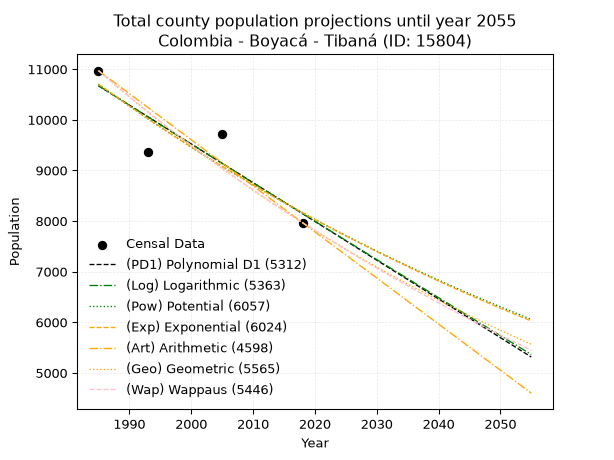
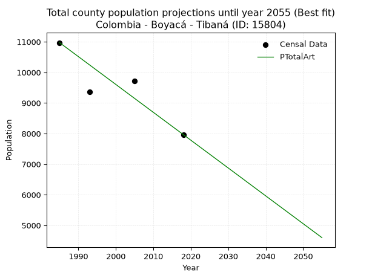
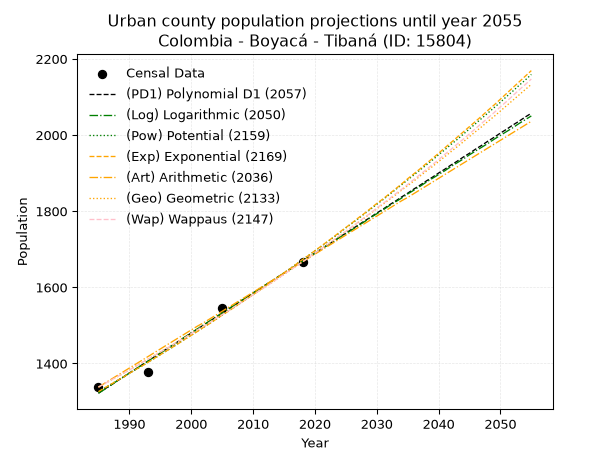
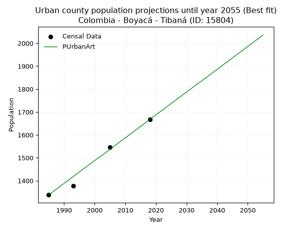
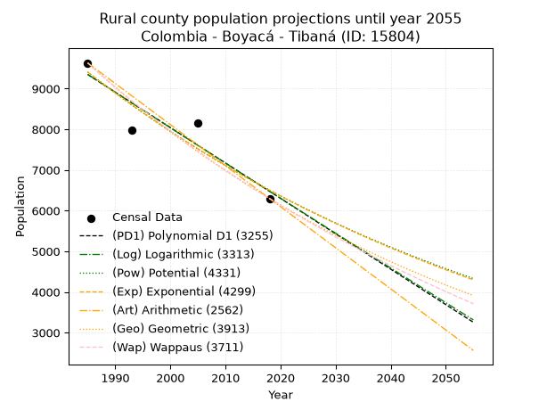
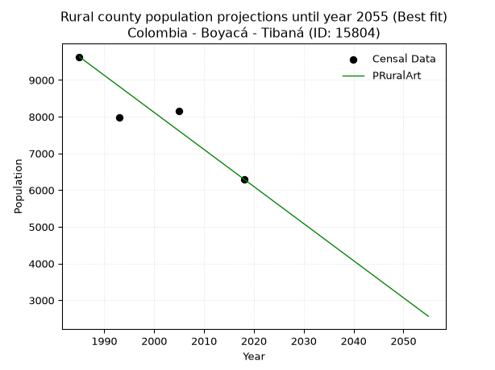

<div align="center">


</div>

# _“Population and Public Services Demand Projections (PPSD) until Year 2050 for Colombia - Boyacá - Tibaná (ID: 15804)”_
Keywords: `population` `public-service` `projection` `lineal` `polynomial` `logarithmic` `potential` `exponential` `arithmetic` `geometric` `wappaus` `dane` `colombia` `south-america`

PPSD are analytical estimates used by governments and planners to anticipate future changes in population size, age distribution, and the resulting community needs for utilities, healthcare, education, and infrastructure as sizing future water treatment facilities, electrical grids, and road networks based on spatial growth.

> **General running parameters**: • app_version: _v20260806_. • Python version: _3.14.7_. • Pandas version: _3.0.5_. • NumPy version: _2.5.1_. • Creates, save and include plots into reports (create_plot): _False_. • Projection until year: _2050_. • Process polynomial degree 2 and up: _False_. • Process Wappaus: _True_. • Process Wappaus: _True_. • Set negative values to zero: _True_. • Set infinite values to zero: _True_. • Drop dataset notes: _True_. 
<div align="center">

Dynamic map: [:earth_americas:Google](http://maps.google.com/maps?q=5.317250924,-73.3964572) [:earth_americas:OSM](https://www.openstreetmap.org/#map=18/5.317250924/-73.3964572&layers=P) [:earth_americas:Bing](https://www.bing.com/maps?cp=5.317250924~-73.3964572&lvl=18) [:earth_americas:Apple](https://maps.apple.com/frame?center=5.317250924%2C-73.3964572&span=0.003%2C0.006)

</div>


<div align="center">

```geojson
{
  "type": "Feature",
  "geometry": {
    "type": "Point", 
    "coordinates": [-73.3964572, 5.317250924]
  }, 
  "properties": {
    "Name": "Colombia - Boyacá - Tibaná (ID: 15804)"
  }
}
```

</div>


## 0. Census Data (4 records)

Census data are official statistics collected by a government about the people and housing in a country. They usually include counts of total population, age, sex, race, income, education, and jobs.

📅Global census file: [Population.xlsx](../data/Population.xlsx)

| Source   |   Year |   CountryID | CountryName   |   StateID | StateName   |   CountyID | CountyName   |   PTotal |   PUrban |   PRural |
|:---------|-------:|------------:|:--------------|----------:|:------------|-----------:|:-------------|---------:|---------:|---------:|
| DANE     |   1985 |          57 | Colombia      |        15 | Boyacá      |      15804 | Tibaná       |    10970 |     1338 |     9632 |
| DANE     |   1993 |          57 | Colombia      |        15 | Boyacá      |      15804 | Tibaná       |     9366 |     1378 |     7988 |
| DANE     |   2005 |          57 | Colombia      |        15 | Boyacá      |      15804 | Tibaná       |     9711 |     1546 |     8165 |
| DANE     |   2018 |          57 | Colombia      |        15 | Boyacá      |      15804 | Tibaná       |     7966 |     1667 |     6299 |

> 🔥Some records could had specific notes about the registered values or the corresponding urban or rural distribution.

📅   [RUPS](https://www.datos.gov.co/Hacienda-y-Cr-dito-P-blico/Registro-nico-de-Prestadores-de-Servicios-P-blicos/4qkq-csdn/about_data) - Local public utility companies: [RUPS.csv](../data/RUPS.xlsx)

 | SERVICIO       | ESTADO    | NOMBRE                                                                                              | NIT         | DEPARTAMENTO_DOMICILIO   | MUNICIPIO_DOMICILIO   | DIRECCION        |   TELEFONO | EMAIL                             | TIPO_PRESTADOR                             | CLASIFICACION                 |
|:---------------|:----------|:----------------------------------------------------------------------------------------------------|:------------|:-------------------------|:----------------------|:-----------------|-----------:|:----------------------------------|:-------------------------------------------|:------------------------------|
| ACUEDUCTO      | OPERATIVA | ASOCIACION DE SUSCRIPTORES DEL ACUEDUCTO N 1 SAN RAFAEL DE LA VEREDA LAVADEROS                      | 900171151-1 | BOYACA                   | TIBANA                | VEREDA LAVADEROS |    3115545 | alcaldia@tibana-boyaca.gov.co     | ORGANIZACION AUTORIZADA                    | HASTA 2500 SUSCRIPTORES       |
| ACUEDUCTO      | OPERATIVA | EMPRESA DE SERVICIOS PUBLICOS DOMICILIARIOS DE LA PROVINCIA DE MARQUEZ -SERVIMARQUEZ SA ESP         | 900371611-6 | BOYACA                   | CIENEGA               | CIENEGA          |    7379009 | fredyjufuerte@gmail.com           | SOCIEDADES (EMPRESA DE SERVICIOS PUBLICOS) | MENOR O IGUAL A 2500 USUARIOS |
| ALCANTARILLADO | OPERATIVA | EMPRESA DE SERVICIOS PUBLICOS DOMICILIARIOS DE LA PROVINCIA DE MARQUEZ -SERVIMARQUEZ SA ESP         | 900371611-6 | BOYACA                   | CIENEGA               | CIENEGA          |    7379009 | fredyjufuerte@gmail.com           | SOCIEDADES (EMPRESA DE SERVICIOS PUBLICOS) | MENOR O IGUAL A 2500 USUARIOS |
| ACUEDUCTO      | OPERATIVA | ASOCIACION DE SUSCRIPTORES DEL ACUEDUCTO PUERTO LOPEZ DE LA VEREDA LA ZANJA DEL MUNICIPIO DE TIBANA | 900110779-5 | BOYACA                   | TIBANA                | VEREDA ZANJA     |    0000000 | eleuterioapontetorres23@gmail.com | ORGANIZACION AUTORIZADA                    | MENOR O IGUAL A 2500 USUARIOS |
| ACUEDUCTO      | OPERATIVA | ASOCIACION DE SUSCRIPTORES DEL ACUEDUCTO REGIONAL SASTOQUE DEL MUNICIPIO DE TIBANA                  | 900019906-6 | BOYACA                   | TIBANA                | VEREDA SASTOQUE  |    0000000 | CONTACTENOS@TIBANA-BOYACA.COM.CO  | ORGANIZACION AUTORIZADA                    | HASTA 2500 SUSCRIPTORES       |

## 1. Total

### 1.1. Coefficients and Parameters

* (PD1) Polynomial Deg 1: -76.55118426334694, 162624.75632275973 (lineal)
* (Log) Logarithmic: -153218.78118693977, 1174120.4336201847
* (Pow) Potential: -16.429824823996526, 58.21116399463922
* (Exp) Exponential: -0.008209809521092352, 127910905394.24124
* (Art) Arithmetic: Year diff. 2018 - 1985 = 33, Population diff. 7966 - 10970 = -3004, Annual growth = -91.03030303030303
* (Geo) Geometric: Year diff. 2018 - 1985 = 33, Population diff. 7966 - 10970 = -3004, Annual growth % = -0.009649559180867184
* (Wap) Wappaus: i = -0.9614522922507713, Condition values only valid for < 200)

<sub>
Wappaus condition values: ['-0.00', '-0.96', '-1.92', '-2.88', '-3.85', '-4.81', '-5.77', '-6.73', '-7.69', '-8.65', '-9.61', '-10.58', '-11.54', '-12.50', '-13.46', '-14.42', '-15.38', '-16.34', '-17.31', '-18.27', '-19.23', '-20.19', '-21.15', '-22.11', '-23.07', '-24.04', '-25.00', '-25.96', '-26.92', '-27.88', '-28.84', '-29.81', '-30.77', '-31.73', '-32.69', '-33.65', '-34.61', '-35.57', '-36.54', '-37.50', '-38.46', '-39.42', '-40.38', '-41.34', '-42.30', '-43.27', '-44.23', '-45.19', '-46.15', '-47.11', '-48.07', '-49.03', '-50.00', '-50.96', '-51.92', '-52.88', '-53.84', '-54.80', '-55.76', '-56.73', '-57.69', '-58.65', '-59.61', '-60.57', '-61.53', '-62.49']
</sub>


### 1.2. Projected Dataset

|   Year |   CountyID |   PTotalPD1 |   PTotalLog |   PTotalPow |   PTotalExp |   PTotalArt |   PTotalGeo |   PTotalWap |
|-------:|-----------:|------------:|------------:|------------:|------------:|------------:|------------:|------------:|
|   1985 |      15804 |       10671 |       10673 |       10704 |       10701 |       10970 |       10970 |       10970 |
|   1986 |      15804 |       10594 |       10596 |       10616 |       10614 |       10879 |       10864 |       10865 |
|   1987 |      15804 |       10518 |       10519 |       10528 |       10527 |       10788 |       10759 |       10761 |
|   1988 |      15804 |       10441 |       10442 |       10441 |       10441 |       10697 |       10655 |       10658 |
|   1989 |      15804 |       10364 |       10364 |       10356 |       10356 |       10606 |       10553 |       10556 |
|   1990 |      15804 |       10288 |       10287 |       10270 |       10271 |       10515 |       10451 |       10455 |
|   1991 |      15804 |       10211 |       10210 |       10186 |       10187 |       10424 |       10350 |       10355 |
|   1992 |      15804 |       10135 |       10134 |       10102 |       10104 |       10333 |       10250 |       10256 |
|   1993 |      15804 |       10058 |       10057 |       10019 |       10021 |       10242 |       10151 |       10157 |
|   1994 |      15804 |        9982 |        9980 |        9937 |        9939 |       10151 |       10053 |       10060 |
|   1995 |      15804 |        9905 |        9903 |        9856 |        9858 |       10060 |        9956 |        9964 |
|   1996 |      15804 |        9829 |        9826 |        9775 |        9777 |        9969 |        9860 |        9868 |
|   1997 |      15804 |        9752 |        9749 |        9695 |        9697 |        9878 |        9765 |        9773 |
|   1998 |      15804 |        9675 |        9673 |        9615 |        9618 |        9787 |        9671 |        9680 |
|   1999 |      15804 |        9599 |        9596 |        9536 |        9539 |        9696 |        9577 |        9587 |
|   2000 |      15804 |        9522 |        9519 |        9458 |        9461 |        9605 |        9485 |        9494 |
|   2001 |      15804 |        9446 |        9443 |        9381 |        9384 |        9514 |        9394 |        9403 |
|   2002 |      15804 |        9369 |        9366 |        9304 |        9307 |        9422 |        9303 |        9312 |
|   2003 |      15804 |        9293 |        9290 |        9228 |        9231 |        9331 |        9213 |        9223 |
|   2004 |      15804 |        9216 |        9213 |        9153 |        9156 |        9240 |        9124 |        9134 |
|   2005 |      15804 |        9140 |        9137 |        9078 |        9081 |        9149 |        9036 |        9046 |
|   2006 |      15804 |        9063 |        9060 |        9004 |        9007 |        9058 |        8949 |        8958 |
|   2007 |      15804 |        8987 |        8984 |        8931 |        8933 |        8967 |        8863 |        8872 |
|   2008 |      15804 |        8910 |        8908 |        8858 |        8860 |        8876 |        8777 |        8786 |
|   2009 |      15804 |        8833 |        8831 |        8786 |        8788 |        8785 |        8692 |        8701 |
|   2010 |      15804 |        8757 |        8755 |        8714 |        8716 |        8694 |        8609 |        8616 |
|   2011 |      15804 |        8680 |        8679 |        8643 |        8644 |        8603 |        8525 |        8532 |
|   2012 |      15804 |        8604 |        8603 |        8573 |        8574 |        8512 |        8443 |        8449 |
|   2013 |      15804 |        8527 |        8527 |        8503 |        8504 |        8421 |        8362 |        8367 |
|   2014 |      15804 |        8451 |        8451 |        8434 |        8434 |        8330 |        8281 |        8286 |
|   2015 |      15804 |        8374 |        8375 |        8366 |        8365 |        8239 |        8201 |        8205 |
|   2016 |      15804 |        8298 |        8299 |        8298 |        8297 |        8148 |        8122 |        8124 |
|   2017 |      15804 |        8221 |        8223 |        8230 |        8229 |        8057 |        8044 |        8045 |
|   2018 |      15804 |        8144 |        8147 |        8164 |        8162 |        7966 |        7966 |        7966 |
|   2019 |      15804 |        8068 |        8071 |        8098 |        8095 |        7875 |        7889 |        7888 |
|   2020 |      15804 |        7991 |        7995 |        8032 |        8029 |        7784 |        7813 |        7810 |
|   2021 |      15804 |        7915 |        7919 |        7967 |        7963 |        7693 |        7738 |        7733 |
|   2022 |      15804 |        7838 |        7843 |        7902 |        7898 |        7602 |        7663 |        7657 |
|   2023 |      15804 |        7762 |        7767 |        7838 |        7833 |        7511 |        7589 |        7581 |
|   2024 |      15804 |        7685 |        7692 |        7775 |        7769 |        7420 |        7516 |        7506 |
|   2025 |      15804 |        7609 |        7616 |        7712 |        7706 |        7329 |        7443 |        7432 |
|   2026 |      15804 |        7532 |        7540 |        7650 |        7643 |        7238 |        7371 |        7358 |
|   2027 |      15804 |        7456 |        7465 |        7588 |        7580 |        7147 |        7300 |        7284 |
|   2028 |      15804 |        7379 |        7389 |        7527 |        7518 |        7056 |        7230 |        7212 |
|   2029 |      15804 |        7302 |        7314 |        7466 |        7457 |        6965 |        7160 |        7139 |
|   2030 |      15804 |        7226 |        7238 |        7406 |        7396 |        6874 |        7091 |        7068 |
|   2031 |      15804 |        7149 |        7163 |        7346 |        7335 |        6783 |        7023 |        6997 |
|   2032 |      15804 |        7073 |        7087 |        7287 |        7275 |        6692 |        6955 |        6926 |
|   2033 |      15804 |        6996 |        7012 |        7228 |        7216 |        6601 |        6888 |        6857 |
|   2034 |      15804 |        6920 |        6937 |        7170 |        7157 |        6510 |        6821 |        6787 |
|   2035 |      15804 |        6843 |        6861 |        7113 |        7098 |        6418 |        6755 |        6718 |
|   2036 |      15804 |        6767 |        6786 |        7055 |        7040 |        6327 |        6690 |        6650 |
|   2037 |      15804 |        6690 |        6711 |        6999 |        6983 |        6236 |        6626 |        6582 |
|   2038 |      15804 |        6613 |        6636 |        6943 |        6926 |        6145 |        6562 |        6515 |
|   2039 |      15804 |        6537 |        6560 |        6887 |        6869 |        6054 |        6498 |        6448 |
|   2040 |      15804 |        6460 |        6485 |        6832 |        6813 |        5963 |        6436 |        6382 |
|   2041 |      15804 |        6384 |        6410 |        6777 |        6757 |        5872 |        6374 |        6316 |
|   2042 |      15804 |        6307 |        6335 |        6722 |        6702 |        5781 |        6312 |        6251 |
|   2043 |      15804 |        6231 |        6260 |        6669 |        6647 |        5690 |        6251 |        6186 |
|   2044 |      15804 |        6154 |        6185 |        6615 |        6593 |        5599 |        6191 |        6122 |
|   2045 |      15804 |        6078 |        6110 |        6562 |        6539 |        5508 |        6131 |        6058 |
|   2046 |      15804 |        6001 |        6035 |        6510 |        6486 |        5417 |        6072 |        5995 |
|   2047 |      15804 |        5924 |        5960 |        6458 |        6433 |        5326 |        6013 |        5932 |
|   2048 |      15804 |        5848 |        5886 |        6406 |        6380 |        5235 |        5955 |        5870 |
|   2049 |      15804 |        5771 |        5811 |        6355 |        6328 |        5144 |        5898 |        5808 |
|   2050 |      15804 |        5695 |        5736 |        6304 |        6276 |        5053 |        5841 |        5747 |
<div align="center">

</img>

</div>


### 1.3. Best fit with absolute and relative error (%)

Relative error puts that difference into context by dividing the absolute error by the true value, creating a unitless ratio or percentage that shows the scale of the mistake.

Absolute and relative error

|   Year | Source   |   CountryID | CountryName   |   StateID | StateName   |   CountyID_x | CountyName   |   PTotal |   PUrban |   PRural |   CountyID_y |   PTotalPD1 |   PTotalLog |   PTotalPow |   PTotalExp |   PTotalArt |   PTotalGeo |   PTotalWap |   PTotalPD1AbsError |   PTotalLogAbsError |   PTotalPowAbsError |   PTotalExpAbsError |   PTotalArtAbsError |   PTotalGeoAbsError |   PTotalWapAbsError |   PTotalPD1RelError |   PTotalLogRelError |   PTotalPowRelError |   PTotalExpRelError |   PTotalArtRelError |   PTotalGeoRelError |   PTotalWapRelError |
|-------:|:---------|------------:|:--------------|----------:|:------------|-------------:|:-------------|---------:|---------:|---------:|-------------:|------------:|------------:|------------:|------------:|------------:|------------:|------------:|--------------------:|--------------------:|--------------------:|--------------------:|--------------------:|--------------------:|--------------------:|--------------------:|--------------------:|--------------------:|--------------------:|--------------------:|--------------------:|--------------------:|
|   1985 | DANE     |          57 | Colombia      |        15 | Boyacá      |        15804 | Tibaná       |    10970 |     1338 |     9632 |        15804 |       10671 |       10673 |       10704 |       10701 |       10970 |       10970 |       10970 |                 299 |                 297 |                 266 |                 269 |                   0 |                   0 |                   0 |             2.72562 |             2.70738 |             2.42479 |             2.45214 |             0       |             0       |             0       |
|   1993 | DANE     |          57 | Colombia      |        15 | Boyacá      |        15804 | Tibaná       |     9366 |     1378 |     7988 |        15804 |       10058 |       10057 |       10019 |       10021 |       10242 |       10151 |       10157 |                 692 |                 691 |                 653 |                 655 |                 876 |                 785 |                 791 |             7.38843 |             7.37775 |             6.97203 |             6.99338 |             9.35298 |             8.38138 |             8.44544 |
|   2005 | DANE     |          57 | Colombia      |        15 | Boyacá      |        15804 | Tibaná       |     9711 |     1546 |     8165 |        15804 |        9140 |        9137 |        9078 |        9081 |        9149 |        9036 |        9046 |                 571 |                 574 |                 633 |                 630 |                 562 |                 675 |                 665 |             5.87993 |             5.91082 |             6.51838 |             6.48749 |             5.78725 |             6.95088 |             6.8479  |
|   2018 | DANE     |          57 | Colombia      |        15 | Boyacá      |        15804 | Tibaná       |     7966 |     1667 |     6299 |        15804 |        8144 |        8147 |        8164 |        8162 |        7966 |        7966 |        7966 |                 178 |                 181 |                 198 |                 196 |                   0 |                   0 |                   0 |             2.2345  |             2.27216 |             2.48556 |             2.46046 |             0       |             0       |             0       |

Relative error mean

| Method    |   RelError | Best   |
|:----------|-----------:|:-------|
| PTotalPD1 |    4.55712 |        |
| PTotalLog |    4.56703 |        |
| PTotalPow |    4.60019 |        |
| PTotalExp |    4.59837 |        |
| PTotalArt |    3.78506 | True   |
| PTotalGeo |    3.83306 |        |
| PTotalWap |    3.82334 |        |

💙Best method: _**PTotalArt**_
<div align="center">

</img>

</div>


### 1.4. Fresh water supply demand in liters per capita per day (lpcd)

The fresh water supply demand typically ranges from 100 to 300 liters per capita per day (lpcd) for standard domestic and municipal planning, though absolute survival minimums set by the World Health Organization are as low as 7.5 to 20 liters per day, and total consumption in high-income nations can exceed 400 liters.

> `CZ`: Level in meters above the sea level (masl)<br> `WS`: Fresh water supply demand in liters per capita per day (lpcd or l/h/d)<br> `WSAll`: Zonal fresh water supply demand in liters per second (l/s)<br> `A`: Zonal area in square meters<br> `DP`: Population density (people/hectare or p/ha)

Reference values (RAS Colombia)

|    CZ |   WS |
|------:|-----:|
|  1000 |  120 |
|  2000 |  130 |
| 99999 |  140 |

County shapefile geometry properties and water supply values

|   CountyID |      ATotal |   CZTotal |   WSTotal |
|-----------:|------------:|----------:|----------:|
|      15804 | 1.21626e+08 |   2385.04 |       140 |

Projected values for best method: PTotalArt

|   CountyID |   Year |   PTotalArt |   DPTotal |   WSTotal |   WSTotalAll |
|-----------:|-------:|------------:|----------:|----------:|-------------:|
|      15804 |   1985 |       10970 |      0.9  |       140 |     17.7755  |
|      15804 |   1986 |       10879 |      0.89 |       140 |     17.628   |
|      15804 |   1987 |       10788 |      0.89 |       140 |     17.4806  |
|      15804 |   1988 |       10697 |      0.88 |       140 |     17.3331  |
|      15804 |   1989 |       10606 |      0.87 |       140 |     17.1856  |
|      15804 |   1990 |       10515 |      0.86 |       140 |     17.0382  |
|      15804 |   1991 |       10424 |      0.86 |       140 |     16.8907  |
|      15804 |   1992 |       10333 |      0.85 |       140 |     16.7433  |
|      15804 |   1993 |       10242 |      0.84 |       140 |     16.5958  |
|      15804 |   1994 |       10151 |      0.83 |       140 |     16.4484  |
|      15804 |   1995 |       10060 |      0.83 |       140 |     16.3009  |
|      15804 |   1996 |        9969 |      0.82 |       140 |     16.1535  |
|      15804 |   1997 |        9878 |      0.81 |       140 |     16.006   |
|      15804 |   1998 |        9787 |      0.8  |       140 |     15.8586  |
|      15804 |   1999 |        9696 |      0.8  |       140 |     15.7111  |
|      15804 |   2000 |        9605 |      0.79 |       140 |     15.5637  |
|      15804 |   2001 |        9514 |      0.78 |       140 |     15.4162  |
|      15804 |   2002 |        9422 |      0.77 |       140 |     15.2671  |
|      15804 |   2003 |        9331 |      0.77 |       140 |     15.1197  |
|      15804 |   2004 |        9240 |      0.76 |       140 |     14.9722  |
|      15804 |   2005 |        9149 |      0.75 |       140 |     14.8248  |
|      15804 |   2006 |        9058 |      0.74 |       140 |     14.6773  |
|      15804 |   2007 |        8967 |      0.74 |       140 |     14.5299  |
|      15804 |   2008 |        8876 |      0.73 |       140 |     14.3824  |
|      15804 |   2009 |        8785 |      0.72 |       140 |     14.235   |
|      15804 |   2010 |        8694 |      0.71 |       140 |     14.0875  |
|      15804 |   2011 |        8603 |      0.71 |       140 |     13.94    |
|      15804 |   2012 |        8512 |      0.7  |       140 |     13.7926  |
|      15804 |   2013 |        8421 |      0.69 |       140 |     13.6451  |
|      15804 |   2014 |        8330 |      0.68 |       140 |     13.4977  |
|      15804 |   2015 |        8239 |      0.68 |       140 |     13.3502  |
|      15804 |   2016 |        8148 |      0.67 |       140 |     13.2028  |
|      15804 |   2017 |        8057 |      0.66 |       140 |     13.0553  |
|      15804 |   2018 |        7966 |      0.65 |       140 |     12.9079  |
|      15804 |   2019 |        7875 |      0.65 |       140 |     12.7604  |
|      15804 |   2020 |        7784 |      0.64 |       140 |     12.613   |
|      15804 |   2021 |        7693 |      0.63 |       140 |     12.4655  |
|      15804 |   2022 |        7602 |      0.63 |       140 |     12.3181  |
|      15804 |   2023 |        7511 |      0.62 |       140 |     12.1706  |
|      15804 |   2024 |        7420 |      0.61 |       140 |     12.0231  |
|      15804 |   2025 |        7329 |      0.6  |       140 |     11.8757  |
|      15804 |   2026 |        7238 |      0.6  |       140 |     11.7282  |
|      15804 |   2027 |        7147 |      0.59 |       140 |     11.5808  |
|      15804 |   2028 |        7056 |      0.58 |       140 |     11.4333  |
|      15804 |   2029 |        6965 |      0.57 |       140 |     11.2859  |
|      15804 |   2030 |        6874 |      0.57 |       140 |     11.1384  |
|      15804 |   2031 |        6783 |      0.56 |       140 |     10.991   |
|      15804 |   2032 |        6692 |      0.55 |       140 |     10.8435  |
|      15804 |   2033 |        6601 |      0.54 |       140 |     10.6961  |
|      15804 |   2034 |        6510 |      0.54 |       140 |     10.5486  |
|      15804 |   2035 |        6418 |      0.53 |       140 |     10.3995  |
|      15804 |   2036 |        6327 |      0.52 |       140 |     10.2521  |
|      15804 |   2037 |        6236 |      0.51 |       140 |     10.1046  |
|      15804 |   2038 |        6145 |      0.51 |       140 |      9.95718 |
|      15804 |   2039 |        6054 |      0.5  |       140 |      9.80972 |
|      15804 |   2040 |        5963 |      0.49 |       140 |      9.66227 |
|      15804 |   2041 |        5872 |      0.48 |       140 |      9.51481 |
|      15804 |   2042 |        5781 |      0.48 |       140 |      9.36736 |
|      15804 |   2043 |        5690 |      0.47 |       140 |      9.21991 |
|      15804 |   2044 |        5599 |      0.46 |       140 |      9.07245 |
|      15804 |   2045 |        5508 |      0.45 |       140 |      8.925   |
|      15804 |   2046 |        5417 |      0.45 |       140 |      8.77755 |
|      15804 |   2047 |        5326 |      0.44 |       140 |      8.63009 |
|      15804 |   2048 |        5235 |      0.43 |       140 |      8.48264 |
|      15804 |   2049 |        5144 |      0.42 |       140 |      8.33519 |
|      15804 |   2050 |        5053 |      0.42 |       140 |      8.18773 |

## 2. Urban

### 2.1. Coefficients and Parameters

* (PD1) Polynomial Deg 1: 10.498193496587628, -19516.761541549407 (lineal)
* (Log) Logarithmic: 21011.765789658995, -158228.35014492183
* (Pow) Potential: 14.062080962232681, -43.250783079569274
* (Exp) Exponential: 0.007025479827977963, 0.0011646503976278535
* (Art) Arithmetic: Year diff. 2018 - 1985 = 33, Population diff. 1667 - 1338 = 329, Annual growth = 9.969696969696969
* (Geo) Geometric: Year diff. 2018 - 1985 = 33, Population diff. 1667 - 1338 = 329, Annual growth % = 0.006684351586518478
* (Wap) Wappaus: i = 0.663540563706953, Condition values only valid for < 200)

<sub>
Wappaus condition values: ['0.00', '0.66', '1.33', '1.99', '2.65', '3.32', '3.98', '4.64', '5.31', '5.97', '6.64', '7.30', '7.96', '8.63', '9.29', '9.95', '10.62', '11.28', '11.94', '12.61', '13.27', '13.93', '14.60', '15.26', '15.92', '16.59', '17.25', '17.92', '18.58', '19.24', '19.91', '20.57', '21.23', '21.90', '22.56', '23.22', '23.89', '24.55', '25.21', '25.88', '26.54', '27.21', '27.87', '28.53', '29.20', '29.86', '30.52', '31.19', '31.85', '32.51', '33.18', '33.84', '34.50', '35.17', '35.83', '36.49', '37.16', '37.82', '38.49', '39.15', '39.81', '40.48', '41.14', '41.80', '42.47', '43.13']
</sub>


### 2.2. Projected Dataset

|   Year |   CountyID |   PUrbanPD1 |   PUrbanLog |   PUrbanPow |   PUrbanExp |   PUrbanArt |   PUrbanGeo |   PUrbanWap |
|-------:|-----------:|------------:|------------:|------------:|------------:|------------:|------------:|------------:|
|   1985 |      15804 |        1322 |        1322 |        1326 |        1326 |        1338 |        1338 |        1338 |
|   1986 |      15804 |        1333 |        1332 |        1336 |        1336 |        1348 |        1347 |        1347 |
|   1987 |      15804 |        1343 |        1343 |        1345 |        1345 |        1358 |        1356 |        1356 |
|   1988 |      15804 |        1354 |        1354 |        1355 |        1355 |        1368 |        1365 |        1365 |
|   1989 |      15804 |        1364 |        1364 |        1364 |        1364 |        1378 |        1374 |        1374 |
|   1990 |      15804 |        1375 |        1375 |        1374 |        1374 |        1388 |        1383 |        1383 |
|   1991 |      15804 |        1385 |        1385 |        1384 |        1384 |        1398 |        1393 |        1392 |
|   1992 |      15804 |        1396 |        1396 |        1393 |        1393 |        1408 |        1402 |        1402 |
|   1993 |      15804 |        1406 |        1406 |        1403 |        1403 |        1418 |        1411 |        1411 |
|   1994 |      15804 |        1417 |        1417 |        1413 |        1413 |        1428 |        1421 |        1420 |
|   1995 |      15804 |        1427 |        1427 |        1423 |        1423 |        1438 |        1430 |        1430 |
|   1996 |      15804 |        1438 |        1438 |        1433 |        1433 |        1448 |        1440 |        1439 |
|   1997 |      15804 |        1448 |        1448 |        1443 |        1443 |        1458 |        1449 |        1449 |
|   1998 |      15804 |        1459 |        1459 |        1454 |        1453 |        1468 |        1459 |        1459 |
|   1999 |      15804 |        1469 |        1470 |        1464 |        1464 |        1478 |        1469 |        1468 |
|   2000 |      15804 |        1480 |        1480 |        1474 |        1474 |        1488 |        1479 |        1478 |
|   2001 |      15804 |        1490 |        1491 |        1485 |        1484 |        1498 |        1489 |        1488 |
|   2002 |      15804 |        1501 |        1501 |        1495 |        1495 |        1507 |        1498 |        1498 |
|   2003 |      15804 |        1511 |        1512 |        1506 |        1505 |        1517 |        1508 |        1508 |
|   2004 |      15804 |        1522 |        1522 |        1516 |        1516 |        1527 |        1519 |        1518 |
|   2005 |      15804 |        1532 |        1532 |        1527 |        1527 |        1537 |        1529 |        1528 |
|   2006 |      15804 |        1543 |        1543 |        1538 |        1537 |        1547 |        1539 |        1538 |
|   2007 |      15804 |        1553 |        1553 |        1548 |        1548 |        1557 |        1549 |        1549 |
|   2008 |      15804 |        1564 |        1564 |        1559 |        1559 |        1567 |        1560 |        1559 |
|   2009 |      15804 |        1574 |        1574 |        1570 |        1570 |        1577 |        1570 |        1570 |
|   2010 |      15804 |        1585 |        1585 |        1581 |        1581 |        1587 |        1580 |        1580 |
|   2011 |      15804 |        1595 |        1595 |        1592 |        1592 |        1597 |        1591 |        1591 |
|   2012 |      15804 |        1606 |        1606 |        1604 |        1603 |        1607 |        1602 |        1601 |
|   2013 |      15804 |        1616 |        1616 |        1615 |        1615 |        1617 |        1612 |        1612 |
|   2014 |      15804 |        1627 |        1627 |        1626 |        1626 |        1627 |        1623 |        1623 |
|   2015 |      15804 |        1637 |        1637 |        1638 |        1638 |        1637 |        1634 |        1634 |
|   2016 |      15804 |        1648 |        1647 |        1649 |        1649 |        1647 |        1645 |        1645 |
|   2017 |      15804 |        1658 |        1658 |        1661 |        1661 |        1657 |        1656 |        1656 |
|   2018 |      15804 |        1669 |        1668 |        1672 |        1673 |        1667 |        1667 |        1667 |
|   2019 |      15804 |        1679 |        1679 |        1684 |        1684 |        1677 |        1678 |        1678 |
|   2020 |      15804 |        1690 |        1689 |        1696 |        1696 |        1687 |        1689 |        1690 |
|   2021 |      15804 |        1700 |        1700 |        1707 |        1708 |        1697 |        1701 |        1701 |
|   2022 |      15804 |        1711 |        1710 |        1719 |        1720 |        1707 |        1712 |        1712 |
|   2023 |      15804 |        1721 |        1720 |        1731 |        1732 |        1717 |        1723 |        1724 |
|   2024 |      15804 |        1732 |        1731 |        1743 |        1745 |        1727 |        1735 |        1736 |
|   2025 |      15804 |        1742 |        1741 |        1756 |        1757 |        1737 |        1747 |        1747 |
|   2026 |      15804 |        1753 |        1751 |        1768 |        1769 |        1747 |        1758 |        1759 |
|   2027 |      15804 |        1763 |        1762 |        1780 |        1782 |        1757 |        1770 |        1771 |
|   2028 |      15804 |        1774 |        1772 |        1793 |        1794 |        1767 |        1782 |        1783 |
|   2029 |      15804 |        1784 |        1783 |        1805 |        1807 |        1777 |        1794 |        1795 |
|   2030 |      15804 |        1795 |        1793 |        1818 |        1820 |        1787 |        1806 |        1808 |
|   2031 |      15804 |        1805 |        1803 |        1830 |        1832 |        1797 |        1818 |        1820 |
|   2032 |      15804 |        1816 |        1814 |        1843 |        1845 |        1807 |        1830 |        1832 |
|   2033 |      15804 |        1826 |        1824 |        1856 |        1858 |        1817 |        1842 |        1845 |
|   2034 |      15804 |        1837 |        1834 |        1869 |        1871 |        1827 |        1855 |        1857 |
|   2035 |      15804 |        1847 |        1845 |        1882 |        1885 |        1836 |        1867 |        1870 |
|   2036 |      15804 |        1858 |        1855 |        1895 |        1898 |        1846 |        1879 |        1883 |
|   2037 |      15804 |        1868 |        1865 |        1908 |        1911 |        1856 |        1892 |        1896 |
|   2038 |      15804 |        1879 |        1876 |        1921 |        1925 |        1866 |        1905 |        1909 |
|   2039 |      15804 |        1889 |        1886 |        1934 |        1938 |        1876 |        1917 |        1922 |
|   2040 |      15804 |        1900 |        1896 |        1948 |        1952 |        1886 |        1930 |        1935 |
|   2041 |      15804 |        1910 |        1906 |        1961 |        1966 |        1896 |        1943 |        1949 |
|   2042 |      15804 |        1921 |        1917 |        1975 |        1980 |        1906 |        1956 |        1962 |
|   2043 |      15804 |        1931 |        1927 |        1988 |        1994 |        1916 |        1969 |        1976 |
|   2044 |      15804 |        1942 |        1937 |        2002 |        2008 |        1926 |        1982 |        1989 |
|   2045 |      15804 |        1952 |        1948 |        2016 |        2022 |        1936 |        1996 |        2003 |
|   2046 |      15804 |        1963 |        1958 |        2030 |        2036 |        1946 |        2009 |        2017 |
|   2047 |      15804 |        1973 |        1968 |        2044 |        2050 |        1956 |        2022 |        2031 |
|   2048 |      15804 |        1984 |        1978 |        2058 |        2065 |        1966 |        2036 |        2045 |
|   2049 |      15804 |        1994 |        1989 |        2072 |        2079 |        1976 |        2049 |        2059 |
|   2050 |      15804 |        2005 |        1999 |        2086 |        2094 |        1986 |        2063 |        2074 |
<div align="center">

</img>

</div>


### 2.3. Best fit with absolute and relative error (%)

Relative error puts that difference into context by dividing the absolute error by the true value, creating a unitless ratio or percentage that shows the scale of the mistake.

Absolute and relative error

|   Year | Source   |   CountryID | CountryName   |   StateID | StateName   |   CountyID_x | CountyName   |   PTotal |   PUrban |   PRural |   CountyID_y |   PUrbanPD1 |   PUrbanLog |   PUrbanPow |   PUrbanExp |   PUrbanArt |   PUrbanGeo |   PUrbanWap |   PUrbanPD1AbsError |   PUrbanLogAbsError |   PUrbanPowAbsError |   PUrbanExpAbsError |   PUrbanArtAbsError |   PUrbanGeoAbsError |   PUrbanWapAbsError |   PUrbanPD1RelError |   PUrbanLogRelError |   PUrbanPowRelError |   PUrbanExpRelError |   PUrbanArtRelError |   PUrbanGeoRelError |   PUrbanWapRelError |
|-------:|:---------|------------:|:--------------|----------:|:------------|-------------:|:-------------|---------:|---------:|---------:|-------------:|------------:|------------:|------------:|------------:|------------:|------------:|------------:|--------------------:|--------------------:|--------------------:|--------------------:|--------------------:|--------------------:|--------------------:|--------------------:|--------------------:|--------------------:|--------------------:|--------------------:|--------------------:|--------------------:|
|   1985 | DANE     |          57 | Colombia      |        15 | Boyacá      |        15804 | Tibaná       |    10970 |     1338 |     9632 |        15804 |        1322 |        1322 |        1326 |        1326 |        1338 |        1338 |        1338 |                  16 |                  16 |                  12 |                  12 |                   0 |                   0 |                   0 |            1.19581  |            1.19581  |            0.896861 |            0.896861 |            0        |             0       |             0       |
|   1993 | DANE     |          57 | Colombia      |        15 | Boyacá      |        15804 | Tibaná       |     9366 |     1378 |     7988 |        15804 |        1406 |        1406 |        1403 |        1403 |        1418 |        1411 |        1411 |                  28 |                  28 |                  25 |                  25 |                  40 |                  33 |                  33 |            2.03193  |            2.03193  |            1.81422  |            1.81422  |            2.90276  |             2.39478 |             2.39478 |
|   2005 | DANE     |          57 | Colombia      |        15 | Boyacá      |        15804 | Tibaná       |     9711 |     1546 |     8165 |        15804 |        1532 |        1532 |        1527 |        1527 |        1537 |        1529 |        1528 |                  14 |                  14 |                  19 |                  19 |                   9 |                  17 |                  18 |            0.905563 |            0.905563 |            1.22898  |            1.22898  |            0.582147 |             1.09961 |             1.16429 |
|   2018 | DANE     |          57 | Colombia      |        15 | Boyacá      |        15804 | Tibaná       |     7966 |     1667 |     6299 |        15804 |        1669 |        1668 |        1672 |        1673 |        1667 |        1667 |        1667 |                   2 |                   1 |                   5 |                   6 |                   0 |                   0 |                   0 |            0.119976 |            0.059988 |            0.29994  |            0.359928 |            0        |             0       |             0       |

Relative error mean

| Method    |   RelError | Best   |
|:----------|-----------:|:-------|
| PUrbanPD1 |   1.06332  |        |
| PUrbanLog |   1.04832  |        |
| PUrbanPow |   1.06     |        |
| PUrbanExp |   1.075    |        |
| PUrbanArt |   0.871226 | True   |
| PUrbanGeo |   0.873597 |        |
| PUrbanWap |   0.889767 |        |

💙Best method: _**PUrbanArt**_
<div align="center">

</img>

</div>


### 2.4. Fresh water supply demand in liters per capita per day (lpcd)

The fresh water supply demand typically ranges from 100 to 300 liters per capita per day (lpcd) for standard domestic and municipal planning, though absolute survival minimums set by the World Health Organization are as low as 7.5 to 20 liters per day, and total consumption in high-income nations can exceed 400 liters.

> `CZ`: Level in meters above the sea level (masl)<br> `WS`: Fresh water supply demand in liters per capita per day (lpcd or l/h/d)<br> `WSAll`: Zonal fresh water supply demand in liters per second (l/s)<br> `A`: Zonal area in square meters<br> `DP`: Population density (people/hectare or p/ha)

Reference values (RAS Colombia)

|    CZ |   WS |
|------:|-----:|
|  1000 |  120 |
|  2000 |  130 |
| 99999 |  140 |

County shapefile geometry properties and water supply values

|   CountyID |   AUrban |   CZUrban |   WSUrban |
|-----------:|---------:|----------:|----------:|
|      15804 |   646134 |   2089.26 |       140 |

Projected values for best method: PUrbanArt

|   CountyID |   Year |   PUrbanArt |   DPUrban |   WSUrban |   WSUrbanAll |
|-----------:|-------:|------------:|----------:|----------:|-------------:|
|      15804 |   1985 |        1338 |     20.71 |       140 |      2.16806 |
|      15804 |   1986 |        1348 |     20.86 |       140 |      2.18426 |
|      15804 |   1987 |        1358 |     21.02 |       140 |      2.20046 |
|      15804 |   1988 |        1368 |     21.17 |       140 |      2.21667 |
|      15804 |   1989 |        1378 |     21.33 |       140 |      2.23287 |
|      15804 |   1990 |        1388 |     21.48 |       140 |      2.24907 |
|      15804 |   1991 |        1398 |     21.64 |       140 |      2.26528 |
|      15804 |   1992 |        1408 |     21.79 |       140 |      2.28148 |
|      15804 |   1993 |        1418 |     21.95 |       140 |      2.29769 |
|      15804 |   1994 |        1428 |     22.1  |       140 |      2.31389 |
|      15804 |   1995 |        1438 |     22.26 |       140 |      2.33009 |
|      15804 |   1996 |        1448 |     22.41 |       140 |      2.3463  |
|      15804 |   1997 |        1458 |     22.56 |       140 |      2.3625  |
|      15804 |   1998 |        1468 |     22.72 |       140 |      2.3787  |
|      15804 |   1999 |        1478 |     22.87 |       140 |      2.39491 |
|      15804 |   2000 |        1488 |     23.03 |       140 |      2.41111 |
|      15804 |   2001 |        1498 |     23.18 |       140 |      2.42731 |
|      15804 |   2002 |        1507 |     23.32 |       140 |      2.4419  |
|      15804 |   2003 |        1517 |     23.48 |       140 |      2.4581  |
|      15804 |   2004 |        1527 |     23.63 |       140 |      2.47431 |
|      15804 |   2005 |        1537 |     23.79 |       140 |      2.49051 |
|      15804 |   2006 |        1547 |     23.94 |       140 |      2.50671 |
|      15804 |   2007 |        1557 |     24.1  |       140 |      2.52292 |
|      15804 |   2008 |        1567 |     24.25 |       140 |      2.53912 |
|      15804 |   2009 |        1577 |     24.41 |       140 |      2.55532 |
|      15804 |   2010 |        1587 |     24.56 |       140 |      2.57153 |
|      15804 |   2011 |        1597 |     24.72 |       140 |      2.58773 |
|      15804 |   2012 |        1607 |     24.87 |       140 |      2.60394 |
|      15804 |   2013 |        1617 |     25.03 |       140 |      2.62014 |
|      15804 |   2014 |        1627 |     25.18 |       140 |      2.63634 |
|      15804 |   2015 |        1637 |     25.34 |       140 |      2.65255 |
|      15804 |   2016 |        1647 |     25.49 |       140 |      2.66875 |
|      15804 |   2017 |        1657 |     25.64 |       140 |      2.68495 |
|      15804 |   2018 |        1667 |     25.8  |       140 |      2.70116 |
|      15804 |   2019 |        1677 |     25.95 |       140 |      2.71736 |
|      15804 |   2020 |        1687 |     26.11 |       140 |      2.73356 |
|      15804 |   2021 |        1697 |     26.26 |       140 |      2.74977 |
|      15804 |   2022 |        1707 |     26.42 |       140 |      2.76597 |
|      15804 |   2023 |        1717 |     26.57 |       140 |      2.78218 |
|      15804 |   2024 |        1727 |     26.73 |       140 |      2.79838 |
|      15804 |   2025 |        1737 |     26.88 |       140 |      2.81458 |
|      15804 |   2026 |        1747 |     27.04 |       140 |      2.83079 |
|      15804 |   2027 |        1757 |     27.19 |       140 |      2.84699 |
|      15804 |   2028 |        1767 |     27.35 |       140 |      2.86319 |
|      15804 |   2029 |        1777 |     27.5  |       140 |      2.8794  |
|      15804 |   2030 |        1787 |     27.66 |       140 |      2.8956  |
|      15804 |   2031 |        1797 |     27.81 |       140 |      2.91181 |
|      15804 |   2032 |        1807 |     27.97 |       140 |      2.92801 |
|      15804 |   2033 |        1817 |     28.12 |       140 |      2.94421 |
|      15804 |   2034 |        1827 |     28.28 |       140 |      2.96042 |
|      15804 |   2035 |        1836 |     28.42 |       140 |      2.975   |
|      15804 |   2036 |        1846 |     28.57 |       140 |      2.9912  |
|      15804 |   2037 |        1856 |     28.72 |       140 |      3.00741 |
|      15804 |   2038 |        1866 |     28.88 |       140 |      3.02361 |
|      15804 |   2039 |        1876 |     29.03 |       140 |      3.03981 |
|      15804 |   2040 |        1886 |     29.19 |       140 |      3.05602 |
|      15804 |   2041 |        1896 |     29.34 |       140 |      3.07222 |
|      15804 |   2042 |        1906 |     29.5  |       140 |      3.08843 |
|      15804 |   2043 |        1916 |     29.65 |       140 |      3.10463 |
|      15804 |   2044 |        1926 |     29.81 |       140 |      3.12083 |
|      15804 |   2045 |        1936 |     29.96 |       140 |      3.13704 |
|      15804 |   2046 |        1946 |     30.12 |       140 |      3.15324 |
|      15804 |   2047 |        1956 |     30.27 |       140 |      3.16944 |
|      15804 |   2048 |        1966 |     30.43 |       140 |      3.18565 |
|      15804 |   2049 |        1976 |     30.58 |       140 |      3.20185 |
|      15804 |   2050 |        1986 |     30.74 |       140 |      3.21806 |

## 3. Rural

### 3.1. Coefficients and Parameters

* (PD1) Polynomial Deg 1: -87.0493777599346, 182141.5178643092 (lineal)
* (Log) Logarithmic: -174230.54697659868, 1332348.7837651062
* (Pow) Potential: -22.3860817220119, 77.79749904319989
* (Exp) Exponential: -0.011186585795325589, 41409988939046.3
* (Art) Arithmetic: Year diff. 2018 - 1985 = 33, Population diff. 6299 - 9632 = -3333, Annual growth = -101.0
* (Geo) Geometric: Year diff. 2018 - 1985 = 33, Population diff. 6299 - 9632 = -3333, Annual growth % = -0.01278723648357516
* (Wap) Wappaus: i = -1.267968112485092, Condition values only valid for < 200)

<sub>
Wappaus condition values: ['-0.00', '-1.27', '-2.54', '-3.80', '-5.07', '-6.34', '-7.61', '-8.88', '-10.14', '-11.41', '-12.68', '-13.95', '-15.22', '-16.48', '-17.75', '-19.02', '-20.29', '-21.56', '-22.82', '-24.09', '-25.36', '-26.63', '-27.90', '-29.16', '-30.43', '-31.70', '-32.97', '-34.24', '-35.50', '-36.77', '-38.04', '-39.31', '-40.57', '-41.84', '-43.11', '-44.38', '-45.65', '-46.91', '-48.18', '-49.45', '-50.72', '-51.99', '-53.25', '-54.52', '-55.79', '-57.06', '-58.33', '-59.59', '-60.86', '-62.13', '-63.40', '-64.67', '-65.93', '-67.20', '-68.47', '-69.74', '-71.01', '-72.27', '-73.54', '-74.81', '-76.08', '-77.35', '-78.61', '-79.88', '-81.15', '-82.42']
</sub>


### 3.2. Projected Dataset

|   Year |   CountyID |   PRuralPD1 |   PRuralLog |   PRuralPow |   PRuralExp |   PRuralArt |   PRuralGeo |   PRuralWap |
|-------:|-----------:|------------:|------------:|------------:|------------:|------------:|------------:|------------:|
|   1985 |      15804 |        9349 |        9351 |        9409 |        9407 |        9632 |        9632 |        9632 |
|   1986 |      15804 |        9261 |        9263 |        9304 |        9302 |        9531 |        9509 |        9511 |
|   1987 |      15804 |        9174 |        9176 |        9200 |        9199 |        9430 |        9387 |        9391 |
|   1988 |      15804 |        9087 |        9088 |        9097 |        9096 |        9329 |        9267 |        9272 |
|   1989 |      15804 |        9000 |        9000 |        8995 |        8995 |        9228 |        9149 |        9156 |
|   1990 |      15804 |        8913 |        8913 |        8894 |        8895 |        9127 |        9032 |        9040 |
|   1991 |      15804 |        8826 |        8825 |        8795 |        8796 |        9026 |        8916 |        8926 |
|   1992 |      15804 |        8739 |        8738 |        8696 |        8698 |        8925 |        8802 |        8813 |
|   1993 |      15804 |        8652 |        8650 |        8599 |        8601 |        8824 |        8690 |        8702 |
|   1994 |      15804 |        8565 |        8563 |        8503 |        8506 |        8723 |        8579 |        8592 |
|   1995 |      15804 |        8478 |        8476 |        8408 |        8411 |        8622 |        8469 |        8484 |
|   1996 |      15804 |        8391 |        8388 |        8314 |        8318 |        8521 |        8361 |        8376 |
|   1997 |      15804 |        8304 |        8301 |        8222 |        8225 |        8420 |        8254 |        8270 |
|   1998 |      15804 |        8217 |        8214 |        8130 |        8133 |        8319 |        8148 |        8165 |
|   1999 |      15804 |        8130 |        8127 |        8040 |        8043 |        8218 |        8044 |        8062 |
|   2000 |      15804 |        8043 |        8039 |        7950 |        7954 |        8117 |        7941 |        7959 |
|   2001 |      15804 |        7956 |        7952 |        7862 |        7865 |        8016 |        7840 |        7858 |
|   2002 |      15804 |        7869 |        7865 |        7774 |        7778 |        7915 |        7739 |        7758 |
|   2003 |      15804 |        7782 |        7778 |        7688 |        7691 |        7814 |        7640 |        7659 |
|   2004 |      15804 |        7695 |        7691 |        7602 |        7605 |        7713 |        7543 |        7561 |
|   2005 |      15804 |        7608 |        7604 |        7518 |        7521 |        7612 |        7446 |        7464 |
|   2006 |      15804 |        7520 |        7517 |        7434 |        7437 |        7511 |        7351 |        7369 |
|   2007 |      15804 |        7433 |        7431 |        7352 |        7354 |        7410 |        7257 |        7274 |
|   2008 |      15804 |        7346 |        7344 |        7270 |        7273 |        7309 |        7164 |        7180 |
|   2009 |      15804 |        7259 |        7257 |        7190 |        7192 |        7208 |        7073 |        7088 |
|   2010 |      15804 |        7172 |        7170 |        7110 |        7112 |        7107 |        6982 |        6996 |
|   2011 |      15804 |        7085 |        7084 |        7031 |        7033 |        7006 |        6893 |        6906 |
|   2012 |      15804 |        6998 |        6997 |        6954 |        6954 |        6905 |        6805 |        6816 |
|   2013 |      15804 |        6911 |        6911 |        6877 |        6877 |        6804 |        6718 |        6728 |
|   2014 |      15804 |        6824 |        6824 |        6801 |        6801 |        6703 |        6632 |        6640 |
|   2015 |      15804 |        6737 |        6738 |        6726 |        6725 |        6602 |        6547 |        6554 |
|   2016 |      15804 |        6650 |        6651 |        6651 |        6650 |        6501 |        6463 |        6468 |
|   2017 |      15804 |        6563 |        6565 |        6578 |        6576 |        6400 |        6381 |        6383 |
|   2018 |      15804 |        6476 |        6478 |        6505 |        6503 |        6299 |        6299 |        6299 |
|   2019 |      15804 |        6389 |        6392 |        6433 |        6431 |        6198 |        6218 |        6216 |
|   2020 |      15804 |        6302 |        6306 |        6363 |        6359 |        6097 |        6139 |        6134 |
|   2021 |      15804 |        6215 |        6220 |        6292 |        6288 |        5996 |        6060 |        6052 |
|   2022 |      15804 |        6128 |        6133 |        6223 |        6218 |        5895 |        5983 |        5972 |
|   2023 |      15804 |        6041 |        6047 |        6155 |        6149 |        5794 |        5906 |        5892 |
|   2024 |      15804 |        5954 |        5961 |        6087 |        6081 |        5693 |        5831 |        5813 |
|   2025 |      15804 |        5867 |        5875 |        6020 |        6013 |        5592 |        5756 |        5735 |
|   2026 |      15804 |        5779 |        5789 |        5954 |        5946 |        5491 |        5683 |        5658 |
|   2027 |      15804 |        5692 |        5703 |        5888 |        5880 |        5390 |        5610 |        5581 |
|   2028 |      15804 |        5605 |        5617 |        5824 |        5815 |        5289 |        5538 |        5505 |
|   2029 |      15804 |        5518 |        5531 |        5760 |        5750 |        5188 |        5468 |        5430 |
|   2030 |      15804 |        5431 |        5445 |        5697 |        5686 |        5087 |        5398 |        5356 |
|   2031 |      15804 |        5344 |        5360 |        5634 |        5623 |        4986 |        5329 |        5282 |
|   2032 |      15804 |        5257 |        5274 |        5572 |        5560 |        4885 |        5260 |        5210 |
|   2033 |      15804 |        5170 |        5188 |        5511 |        5498 |        4784 |        5193 |        5137 |
|   2034 |      15804 |        5083 |        5102 |        5451 |        5437 |        4683 |        5127 |        5066 |
|   2035 |      15804 |        4996 |        5017 |        5391 |        5377 |        4582 |        5061 |        4995 |
|   2036 |      15804 |        4909 |        4931 |        5332 |        5317 |        4481 |        4996 |        4925 |
|   2037 |      15804 |        4822 |        4846 |        5274 |        5258 |        4380 |        4933 |        4856 |
|   2038 |      15804 |        4735 |        4760 |        5217 |        5199 |        4279 |        4870 |        4787 |
|   2039 |      15804 |        4648 |        4675 |        5160 |        5141 |        4178 |        4807 |        4719 |
|   2040 |      15804 |        4561 |        4589 |        5103 |        5084 |        4077 |        4746 |        4651 |
|   2041 |      15804 |        4474 |        4504 |        5048 |        5028 |        3976 |        4685 |        4585 |
|   2042 |      15804 |        4387 |        4418 |        4993 |        4972 |        3875 |        4625 |        4518 |
|   2043 |      15804 |        4300 |        4333 |        4938 |        4916 |        3774 |        4566 |        4453 |
|   2044 |      15804 |        4213 |        4248 |        4884 |        4862 |        3673 |        4508 |        4388 |
|   2045 |      15804 |        4126 |        4163 |        4831 |        4808 |        3572 |        4450 |        4323 |
|   2046 |      15804 |        4038 |        4077 |        4779 |        4754 |        3471 |        4393 |        4260 |
|   2047 |      15804 |        3951 |        3992 |        4727 |        4701 |        3370 |        4337 |        4196 |
|   2048 |      15804 |        3864 |        3907 |        4675 |        4649 |        3269 |        4281 |        4134 |
|   2049 |      15804 |        3777 |        3822 |        4624 |        4597 |        3168 |        4227 |        4072 |
|   2050 |      15804 |        3690 |        3737 |        4574 |        4546 |        3067 |        4173 |        4010 |
<div align="center">

</img>

</div>


### 3.3. Best fit with absolute and relative error (%)

Relative error puts that difference into context by dividing the absolute error by the true value, creating a unitless ratio or percentage that shows the scale of the mistake.

Absolute and relative error

|   Year | Source   |   CountryID | CountryName   |   StateID | StateName   |   CountyID_x | CountyName   |   PTotal |   PUrban |   PRural |   CountyID_y |   PRuralPD1 |   PRuralLog |   PRuralPow |   PRuralExp |   PRuralArt |   PRuralGeo |   PRuralWap |   PRuralPD1AbsError |   PRuralLogAbsError |   PRuralPowAbsError |   PRuralExpAbsError |   PRuralArtAbsError |   PRuralGeoAbsError |   PRuralWapAbsError |   PRuralPD1RelError |   PRuralLogRelError |   PRuralPowRelError |   PRuralExpRelError |   PRuralArtRelError |   PRuralGeoRelError |   PRuralWapRelError |
|-------:|:---------|------------:|:--------------|----------:|:------------|-------------:|:-------------|---------:|---------:|---------:|-------------:|------------:|------------:|------------:|------------:|------------:|------------:|------------:|--------------------:|--------------------:|--------------------:|--------------------:|--------------------:|--------------------:|--------------------:|--------------------:|--------------------:|--------------------:|--------------------:|--------------------:|--------------------:|--------------------:|
|   1985 | DANE     |          57 | Colombia      |        15 | Boyacá      |        15804 | Tibaná       |    10970 |     1338 |     9632 |        15804 |        9349 |        9351 |        9409 |        9407 |        9632 |        9632 |        9632 |                 283 |                 281 |                 223 |                 225 |                   0 |                   0 |                   0 |             2.93812 |             2.91736 |             2.3152  |             2.33596 |             0       |             0       |             0       |
|   1993 | DANE     |          57 | Colombia      |        15 | Boyacá      |        15804 | Tibaná       |     9366 |     1378 |     7988 |        15804 |        8652 |        8650 |        8599 |        8601 |        8824 |        8690 |        8702 |                 664 |                 662 |                 611 |                 613 |                 836 |                 702 |                 714 |             8.31247 |             8.28743 |             7.64897 |             7.67401 |            10.4657  |             8.78818 |             8.93841 |
|   2005 | DANE     |          57 | Colombia      |        15 | Boyacá      |        15804 | Tibaná       |     9711 |     1546 |     8165 |        15804 |        7608 |        7604 |        7518 |        7521 |        7612 |        7446 |        7464 |                 557 |                 561 |                 647 |                 644 |                 553 |                 719 |                 701 |             6.8218  |             6.87079 |             7.92407 |             7.88732 |             6.77281 |             8.80588 |             8.58543 |
|   2018 | DANE     |          57 | Colombia      |        15 | Boyacá      |        15804 | Tibaná       |     7966 |     1667 |     6299 |        15804 |        6476 |        6478 |        6505 |        6503 |        6299 |        6299 |        6299 |                 177 |                 179 |                 206 |                 204 |                   0 |                   0 |                   0 |             2.80997 |             2.84172 |             3.27036 |             3.23861 |             0       |             0       |             0       |

Relative error mean

| Method    |   RelError | Best   |
|:----------|-----------:|:-------|
| PRuralPD1 |    5.22059 |        |
| PRuralLog |    5.22933 |        |
| PRuralPow |    5.28965 |        |
| PRuralExp |    5.28398 |        |
| PRuralArt |    4.30963 | True   |
| PRuralGeo |    4.39852 |        |
| PRuralWap |    4.38096 |        |

💙Best method: _**PRuralArt**_
<div align="center">

</img>

</div>


### 3.4. Fresh water supply demand in liters per capita per day (lpcd)

The fresh water supply demand typically ranges from 100 to 300 liters per capita per day (lpcd) for standard domestic and municipal planning, though absolute survival minimums set by the World Health Organization are as low as 7.5 to 20 liters per day, and total consumption in high-income nations can exceed 400 liters.

> `CZ`: Level in meters above the sea level (masl)<br> `WS`: Fresh water supply demand in liters per capita per day (lpcd or l/h/d)<br> `WSAll`: Zonal fresh water supply demand in liters per second (l/s)<br> `A`: Zonal area in square meters<br> `DP`: Population density (people/hectare or p/ha)

Reference values (RAS Colombia)

|    CZ |   WS |
|------:|-----:|
|  1000 |  120 |
|  2000 |  130 |
| 99999 |  140 |

County shapefile geometry properties and water supply values

|   CountyID |     ARural |   CZRural |   WSRural |
|-----------:|-----------:|----------:|----------:|
|      15804 | 1.2098e+08 |   2386.68 |       140 |

Projected values for best method: PRuralArt

|   CountyID |   Year |   PRuralArt |   DPRural |   WSRural |   WSRuralAll |
|-----------:|-------:|------------:|----------:|----------:|-------------:|
|      15804 |   1985 |        9632 |      0.8  |       140 |     15.6074  |
|      15804 |   1986 |        9531 |      0.79 |       140 |     15.4437  |
|      15804 |   1987 |        9430 |      0.78 |       140 |     15.2801  |
|      15804 |   1988 |        9329 |      0.77 |       140 |     15.1164  |
|      15804 |   1989 |        9228 |      0.76 |       140 |     14.9528  |
|      15804 |   1990 |        9127 |      0.75 |       140 |     14.7891  |
|      15804 |   1991 |        9026 |      0.75 |       140 |     14.6255  |
|      15804 |   1992 |        8925 |      0.74 |       140 |     14.4618  |
|      15804 |   1993 |        8824 |      0.73 |       140 |     14.2981  |
|      15804 |   1994 |        8723 |      0.72 |       140 |     14.1345  |
|      15804 |   1995 |        8622 |      0.71 |       140 |     13.9708  |
|      15804 |   1996 |        8521 |      0.7  |       140 |     13.8072  |
|      15804 |   1997 |        8420 |      0.7  |       140 |     13.6435  |
|      15804 |   1998 |        8319 |      0.69 |       140 |     13.4799  |
|      15804 |   1999 |        8218 |      0.68 |       140 |     13.3162  |
|      15804 |   2000 |        8117 |      0.67 |       140 |     13.1525  |
|      15804 |   2001 |        8016 |      0.66 |       140 |     12.9889  |
|      15804 |   2002 |        7915 |      0.65 |       140 |     12.8252  |
|      15804 |   2003 |        7814 |      0.65 |       140 |     12.6616  |
|      15804 |   2004 |        7713 |      0.64 |       140 |     12.4979  |
|      15804 |   2005 |        7612 |      0.63 |       140 |     12.3343  |
|      15804 |   2006 |        7511 |      0.62 |       140 |     12.1706  |
|      15804 |   2007 |        7410 |      0.61 |       140 |     12.0069  |
|      15804 |   2008 |        7309 |      0.6  |       140 |     11.8433  |
|      15804 |   2009 |        7208 |      0.6  |       140 |     11.6796  |
|      15804 |   2010 |        7107 |      0.59 |       140 |     11.516   |
|      15804 |   2011 |        7006 |      0.58 |       140 |     11.3523  |
|      15804 |   2012 |        6905 |      0.57 |       140 |     11.1887  |
|      15804 |   2013 |        6804 |      0.56 |       140 |     11.025   |
|      15804 |   2014 |        6703 |      0.55 |       140 |     10.8613  |
|      15804 |   2015 |        6602 |      0.55 |       140 |     10.6977  |
|      15804 |   2016 |        6501 |      0.54 |       140 |     10.534   |
|      15804 |   2017 |        6400 |      0.53 |       140 |     10.3704  |
|      15804 |   2018 |        6299 |      0.52 |       140 |     10.2067  |
|      15804 |   2019 |        6198 |      0.51 |       140 |     10.0431  |
|      15804 |   2020 |        6097 |      0.5  |       140 |      9.8794  |
|      15804 |   2021 |        5996 |      0.5  |       140 |      9.71574 |
|      15804 |   2022 |        5895 |      0.49 |       140 |      9.55208 |
|      15804 |   2023 |        5794 |      0.48 |       140 |      9.38843 |
|      15804 |   2024 |        5693 |      0.47 |       140 |      9.22477 |
|      15804 |   2025 |        5592 |      0.46 |       140 |      9.06111 |
|      15804 |   2026 |        5491 |      0.45 |       140 |      8.89745 |
|      15804 |   2027 |        5390 |      0.45 |       140 |      8.7338  |
|      15804 |   2028 |        5289 |      0.44 |       140 |      8.57014 |
|      15804 |   2029 |        5188 |      0.43 |       140 |      8.40648 |
|      15804 |   2030 |        5087 |      0.42 |       140 |      8.24282 |
|      15804 |   2031 |        4986 |      0.41 |       140 |      8.07917 |
|      15804 |   2032 |        4885 |      0.4  |       140 |      7.91551 |
|      15804 |   2033 |        4784 |      0.4  |       140 |      7.75185 |
|      15804 |   2034 |        4683 |      0.39 |       140 |      7.58819 |
|      15804 |   2035 |        4582 |      0.38 |       140 |      7.42454 |
|      15804 |   2036 |        4481 |      0.37 |       140 |      7.26088 |
|      15804 |   2037 |        4380 |      0.36 |       140 |      7.09722 |
|      15804 |   2038 |        4279 |      0.35 |       140 |      6.93356 |
|      15804 |   2039 |        4178 |      0.35 |       140 |      6.76991 |
|      15804 |   2040 |        4077 |      0.34 |       140 |      6.60625 |
|      15804 |   2041 |        3976 |      0.33 |       140 |      6.44259 |
|      15804 |   2042 |        3875 |      0.32 |       140 |      6.27894 |
|      15804 |   2043 |        3774 |      0.31 |       140 |      6.11528 |
|      15804 |   2044 |        3673 |      0.3  |       140 |      5.95162 |
|      15804 |   2045 |        3572 |      0.3  |       140 |      5.78796 |
|      15804 |   2046 |        3471 |      0.29 |       140 |      5.62431 |
|      15804 |   2047 |        3370 |      0.28 |       140 |      5.46065 |
|      15804 |   2048 |        3269 |      0.27 |       140 |      5.29699 |
|      15804 |   2049 |        3168 |      0.26 |       140 |      5.13333 |
|      15804 |   2050 |        3067 |      0.25 |       140 |      4.96968 |

<div align="center"><br><sub>Share this research</sub></div><br>

<sub>**APPS & TOOLS & CONTENT DISCLAIMER**: • NO WARRANTY - This content and software is provided by <a href="https://github.com/rcfdtools" target="_blank">github.com/rcfdtools</a> "as is", without any express or implied warranty, including warranties of merchantability, fitness for a particular purpose, or non-infringement. There is no guarantee that the software will be error-free or operate without interruption. • LIMITATION OF LIABILITY - Neither the authors nor copyright holders will be liable for claims or damages arising from the software or its use. You are responsible for determining if the software is appropriate for your use and assume all associated risks, including errors, legal compliance, and data loss. • NO PROFESSIONAL ADVICE - The software provides general information and does not offer professional advice. It should not replace consultation with professional advisors. [Clauses and global license for rcfdtools use.](https://github.com/rcfdtools/rcfdtools/blob/main/LICENSE.md)</sub>

| [:house: Home](Readme.md)  | [:beginner: Help / Collab](https://github.com/rcfdtools/R.HydroTools/discussions/31) |
|----------------------------|-------------------------------------------------------------------------------------------|