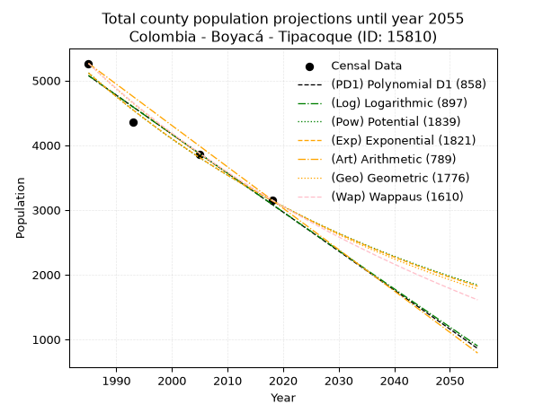
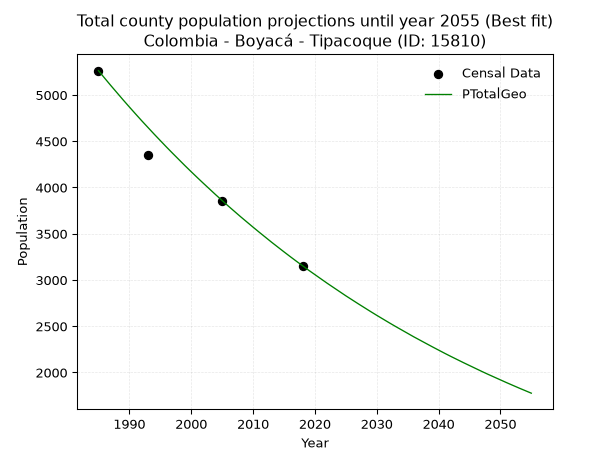
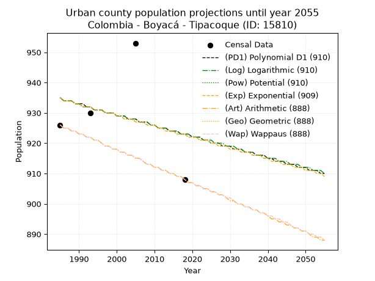
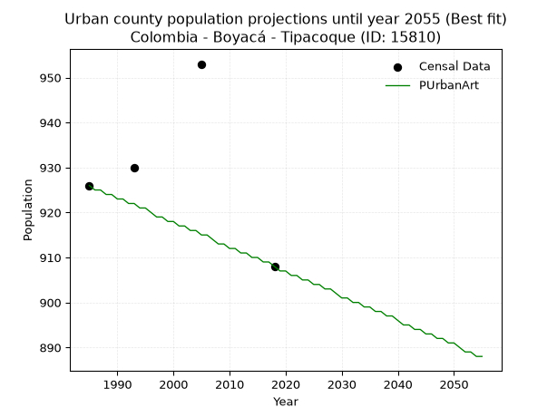
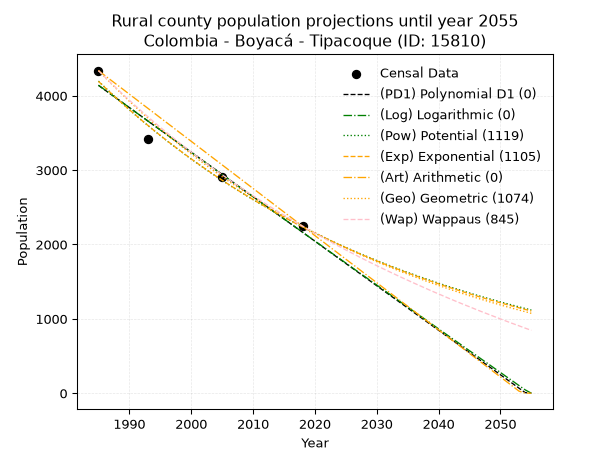
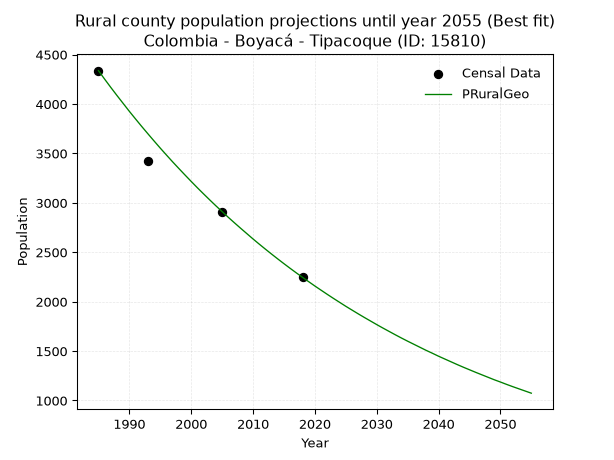

<div align="center">


</div>

# _“Population and Public Services Demand Projections (PPSD) until Year 2050 for Colombia - Boyacá - Tipacoque (ID: 15810)”_
Keywords: `population` `public-service` `projection` `lineal` `polynomial` `logarithmic` `potential` `exponential` `arithmetic` `geometric` `wappaus` `dane` `colombia` `south-america`

PPSD are analytical estimates used by governments and planners to anticipate future changes in population size, age distribution, and the resulting community needs for utilities, healthcare, education, and infrastructure as sizing future water treatment facilities, electrical grids, and road networks based on spatial growth.

> **General running parameters**: • app_version: _v20260806_. • Python version: _3.14.7_. • Pandas version: _3.0.5_. • NumPy version: _2.5.1_. • Creates, save and include plots into reports (create_plot): _True_. • Projection until year: _2050_. • Process polynomial degree 2 and up: _False_. • Process Wappaus: _True_. • Process Wappaus: _True_. • Set negative values to zero: _True_. • Set infinite values to zero: _True_. • Drop dataset notes: _True_. 
<div align="center">

Dynamic map: [:earth_americas:Google](http://maps.google.com/maps?q=6.419202719,-72.6917292) [:earth_americas:OSM](https://www.openstreetmap.org/#map=18/6.419202719/-72.6917292&layers=P) [:earth_americas:Bing](https://www.bing.com/maps?cp=6.419202719~-72.6917292&lvl=18) [:earth_americas:Apple](https://maps.apple.com/frame?center=6.419202719%2C-72.6917292&span=0.003%2C0.006)

</div>


<div align="center">

```geojson
{
  "type": "Feature",
  "geometry": {
    "type": "Point", 
    "coordinates": [-72.6917292, 6.419202719]
  }, 
  "properties": {
    "Name": "Colombia - Boyacá - Tipacoque (ID: 15810)"
  }
}
```

</div>


## 0. Census Data (4 records)

Census data are official statistics collected by a government about the people and housing in a country. They usually include counts of total population, age, sex, race, income, education, and jobs.

📅Global census file: [Population.xlsx](../data/Population.xlsx)

| Source   |   Year |   CountryID | CountryName   |   StateID | StateName   |   CountyID | CountyName   |   PTotal |   PUrban |   PRural |
|:---------|-------:|------------:|:--------------|----------:|:------------|-----------:|:-------------|---------:|---------:|---------:|
| DANE     |   1985 |          57 | Colombia      |        15 | Boyacá      |      15810 | Tipacoque    |     5263 |      926 |     4337 |
| DANE     |   1993 |          57 | Colombia      |        15 | Boyacá      |      15810 | Tipacoque    |     4350 |      930 |     3420 |
| DANE     |   2005 |          57 | Colombia      |        15 | Boyacá      |      15810 | Tipacoque    |     3855 |      953 |     2902 |
| DANE     |   2018 |          57 | Colombia      |        15 | Boyacá      |      15810 | Tipacoque    |     3154 |      908 |     2246 |

> 🔥Some records has specific notes about the registered values or the corresponding urban or rural distribution.

## 1. Total

### 1.1. Coefficients and Parameters

* (PD1) Polynomial Deg 1: -60.22240064231189, 124615.35688478436 (lineal)
* (Log) Logarithmic: -120584.41610193992, 920718.6130937117
* (Pow) Potential: -29.529972500914486, 101.09183086947941
* (Exp) Exponential: -0.014750762054153477, 2.6613552263868904e+16
* (Art) Arithmetic: Year diff. 2018 - 1985 = 33, Population diff. 3154 - 5263 = -2109, Annual growth = -63.90909090909091
* (Geo) Geometric: Year diff. 2018 - 1985 = 33, Population diff. 3154 - 5263 = -2109, Annual growth % = -0.015396298288362753
* (Wap) Wappaus: i = -1.5185717217319925, Condition values only valid for < 200)

<sub>
Wappaus condition values: ['-0.00', '-1.52', '-3.04', '-4.56', '-6.07', '-7.59', '-9.11', '-10.63', '-12.15', '-13.67', '-15.19', '-16.70', '-18.22', '-19.74', '-21.26', '-22.78', '-24.30', '-25.82', '-27.33', '-28.85', '-30.37', '-31.89', '-33.41', '-34.93', '-36.45', '-37.96', '-39.48', '-41.00', '-42.52', '-44.04', '-45.56', '-47.08', '-48.59', '-50.11', '-51.63', '-53.15', '-54.67', '-56.19', '-57.71', '-59.22', '-60.74', '-62.26', '-63.78', '-65.30', '-66.82', '-68.34', '-69.85', '-71.37', '-72.89', '-74.41', '-75.93', '-77.45', '-78.97', '-80.48', '-82.00', '-83.52', '-85.04', '-86.56', '-88.08', '-89.60', '-91.11', '-92.63', '-94.15', '-95.67', '-97.19', '-98.71']
</sub>


### 1.2. Projected Dataset

|   Year |   CountyID |   PTotalPD1 |   PTotalLog |   PTotalPow |   PTotalExp |   PTotalArt |   PTotalGeo |   PTotalWap |
|-------:|-----------:|------------:|------------:|------------:|------------:|------------:|------------:|------------:|
|   1985 |      15810 |        5074 |        5076 |        5117 |        5115 |        5263 |        5263 |        5263 |
|   1986 |      15810 |        5014 |        5015 |        5042 |        5040 |        5199 |        5182 |        5184 |
|   1987 |      15810 |        4953 |        4955 |        4968 |        4966 |        5135 |        5102 |        5106 |
|   1988 |      15810 |        4893 |        4894 |        4894 |        4894 |        5071 |        5024 |        5029 |
|   1989 |      15810 |        4833 |        4833 |        4822 |        4822 |        5007 |        4946 |        4953 |
|   1990 |      15810 |        4773 |        4773 |        4751 |        4751 |        4943 |        4870 |        4878 |
|   1991 |      15810 |        4713 |        4712 |        4681 |        4682 |        4880 |        4795 |        4804 |
|   1992 |      15810 |        4652 |        4652 |        4612 |        4613 |        4816 |        4721 |        4732 |
|   1993 |      15810 |        4592 |        4591 |        4544 |        4546 |        4752 |        4649 |        4660 |
|   1994 |      15810 |        4532 |        4531 |        4478 |        4479 |        4688 |        4577 |        4590 |
|   1995 |      15810 |        4472 |        4470 |        4412 |        4414 |        4624 |        4507 |        4520 |
|   1996 |      15810 |        4411 |        4410 |        4347 |        4349 |        4560 |        4437 |        4452 |
|   1997 |      15810 |        4351 |        4349 |        4283 |        4285 |        4496 |        4369 |        4384 |
|   1998 |      15810 |        4291 |        4289 |        4220 |        4222 |        4432 |        4302 |        4317 |
|   1999 |      15810 |        4231 |        4229 |        4158 |        4161 |        4368 |        4235 |        4252 |
|   2000 |      15810 |        4171 |        4168 |        4097 |        4100 |        4304 |        4170 |        4187 |
|   2001 |      15810 |        4110 |        4108 |        4037 |        4040 |        4240 |        4106 |        4123 |
|   2002 |      15810 |        4050 |        4048 |        3978 |        3981 |        4177 |        4043 |        4060 |
|   2003 |      15810 |        3990 |        3987 |        3920 |        3922 |        4113 |        3981 |        3997 |
|   2004 |      15810 |        3930 |        3927 |        3863 |        3865 |        4049 |        3919 |        3936 |
|   2005 |      15810 |        3869 |        3867 |        3806 |        3808 |        3985 |        3859 |        3875 |
|   2006 |      15810 |        3809 |        3807 |        3751 |        3752 |        3921 |        3799 |        3815 |
|   2007 |      15810 |        3749 |        3747 |        3696 |        3698 |        3857 |        3741 |        3756 |
|   2008 |      15810 |        3689 |        3687 |        3642 |        3643 |        3793 |        3683 |        3698 |
|   2009 |      15810 |        3629 |        3627 |        3589 |        3590 |        3729 |        3627 |        3641 |
|   2010 |      15810 |        3568 |        3567 |        3536 |        3537 |        3665 |        3571 |        3584 |
|   2011 |      15810 |        3508 |        3507 |        3485 |        3486 |        3601 |        3516 |        3528 |
|   2012 |      15810 |        3448 |        3447 |        3434 |        3435 |        3537 |        3462 |        3472 |
|   2013 |      15810 |        3388 |        3387 |        3384 |        3384 |        3474 |        3408 |        3418 |
|   2014 |      15810 |        3327 |        3327 |        3335 |        3335 |        3410 |        3356 |        3364 |
|   2015 |      15810 |        3267 |        3267 |        3286 |        3286 |        3346 |        3304 |        3310 |
|   2016 |      15810 |        3207 |        3207 |        3238 |        3238 |        3282 |        3253 |        3257 |
|   2017 |      15810 |        3147 |        3148 |        3191 |        3190 |        3218 |        3203 |        3205 |
|   2018 |      15810 |        3087 |        3088 |        3145 |        3144 |        3154 |        3154 |        3154 |
|   2019 |      15810 |        3026 |        3028 |        3099 |        3098 |        3090 |        3105 |        3103 |
|   2020 |      15810 |        2966 |        2968 |        3054 |        3052 |        3026 |        3058 |        3053 |
|   2021 |      15810 |        2906 |        2909 |        3010 |        3008 |        2962 |        3011 |        3003 |
|   2022 |      15810 |        2846 |        2849 |        2966 |        2964 |        2898 |        2964 |        2954 |
|   2023 |      15810 |        2785 |        2789 |        2923 |        2920 |        2834 |        2919 |        2906 |
|   2024 |      15810 |        2725 |        2730 |        2881 |        2877 |        2771 |        2874 |        2858 |
|   2025 |      15810 |        2665 |        2670 |        2839 |        2835 |        2707 |        2829 |        2811 |
|   2026 |      15810 |        2605 |        2611 |        2798 |        2794 |        2643 |        2786 |        2764 |
|   2027 |      15810 |        2545 |        2551 |        2758 |        2753 |        2579 |        2743 |        2718 |
|   2028 |      15810 |        2484 |        2492 |        2718 |        2713 |        2515 |        2701 |        2672 |
|   2029 |      15810 |        2424 |        2432 |        2678 |        2673 |        2451 |        2659 |        2627 |
|   2030 |      15810 |        2364 |        2373 |        2640 |        2634 |        2387 |        2618 |        2582 |
|   2031 |      15810 |        2304 |        2314 |        2602 |        2595 |        2323 |        2578 |        2538 |
|   2032 |      15810 |        2243 |        2254 |        2564 |        2557 |        2259 |        2538 |        2495 |
|   2033 |      15810 |        2183 |        2195 |        2527 |        2520 |        2195 |        2499 |        2451 |
|   2034 |      15810 |        2123 |        2136 |        2491 |        2483 |        2131 |        2461 |        2409 |
|   2035 |      15810 |        2063 |        2076 |        2455 |        2446 |        2068 |        2423 |        2367 |
|   2036 |      15810 |        2003 |        2017 |        2419 |        2411 |        2004 |        2385 |        2325 |
|   2037 |      15810 |        1942 |        1958 |        2385 |        2375 |        1940 |        2349 |        2283 |
|   2038 |      15810 |        1882 |        1899 |        2350 |        2341 |        1876 |        2313 |        2243 |
|   2039 |      15810 |        1822 |        1839 |        2316 |        2306 |        1812 |        2277 |        2202 |
|   2040 |      15810 |        1762 |        1780 |        2283 |        2273 |        1748 |        2242 |        2162 |
|   2041 |      15810 |        1701 |        1721 |        2250 |        2239 |        1684 |        2207 |        2123 |
|   2042 |      15810 |        1641 |        1662 |        2218 |        2206 |        1620 |        2173 |        2083 |
|   2043 |      15810 |        1581 |        1603 |        2186 |        2174 |        1556 |        2140 |        2045 |
|   2044 |      15810 |        1521 |        1544 |        2155 |        2142 |        1492 |        2107 |        2006 |
|   2045 |      15810 |        1461 |        1485 |        2124 |        2111 |        1428 |        2075 |        1969 |
|   2046 |      15810 |        1400 |        1426 |        2094 |        2080 |        1365 |        2043 |        1931 |
|   2047 |      15810 |        1340 |        1367 |        2064 |        2050 |        1301 |        2011 |        1894 |
|   2048 |      15810 |        1280 |        1308 |        2034 |        2020 |        1237 |        1980 |        1857 |
|   2049 |      15810 |        1220 |        1250 |        2005 |        1990 |        1173 |        1950 |        1821 |
|   2050 |      15810 |        1159 |        1191 |        1976 |        1961 |        1109 |        1920 |        1785 |
<div align="center">

</img>

</div>


### 1.3. Best fit with absolute error and relative error (%)

Relative error puts that difference into context by dividing the absolute error by the true value, creating a unitless ratio or percentage that shows the scale of the mistake.

Absolute and relative error

|   Year | Source   |   CountryID | CountryName   |   StateID | StateName   |   CountyID_x | CountyName   |   PTotal |   PUrban |   PRural |   CountyID_y |   PTotalPD1 |   PTotalLog |   PTotalPow |   PTotalExp |   PTotalArt |   PTotalGeo |   PTotalWap |   PTotalPD1AbsError |   PTotalLogAbsError |   PTotalPowAbsError |   PTotalExpAbsError |   PTotalArtAbsError |   PTotalGeoAbsError |   PTotalWapAbsError |   PTotalPD1RelError |   PTotalLogRelError |   PTotalPowRelError |   PTotalExpRelError |   PTotalArtRelError |   PTotalGeoRelError |   PTotalWapRelError |
|-------:|:---------|------------:|:--------------|----------:|:------------|-------------:|:-------------|---------:|---------:|---------:|-------------:|------------:|------------:|------------:|------------:|------------:|------------:|------------:|--------------------:|--------------------:|--------------------:|--------------------:|--------------------:|--------------------:|--------------------:|--------------------:|--------------------:|--------------------:|--------------------:|--------------------:|--------------------:|--------------------:|
|   1985 | DANE     |          57 | Colombia      |        15 | Boyacá      |        15810 | Tipacoque    |     5263 |      926 |     4337 |        15810 |        5074 |        5076 |        5117 |        5115 |        5263 |        5263 |        5263 |                 189 |                 187 |                 146 |                 148 |                   0 |                   0 |                   0 |            3.59111  |            3.55311  |            2.77408  |            2.81208  |             0       |            0        |            0        |
|   1993 | DANE     |          57 | Colombia      |        15 | Boyacá      |        15810 | Tipacoque    |     4350 |      930 |     3420 |        15810 |        4592 |        4591 |        4544 |        4546 |        4752 |        4649 |        4660 |                 242 |                 241 |                 194 |                 196 |                 402 |                 299 |                 310 |            5.56322  |            5.54023  |            4.45977  |            4.50575  |             9.24138 |            6.87356  |            7.12644  |
|   2005 | DANE     |          57 | Colombia      |        15 | Boyacá      |        15810 | Tipacoque    |     3855 |      953 |     2902 |        15810 |        3869 |        3867 |        3806 |        3808 |        3985 |        3859 |        3875 |                  14 |                  12 |                  49 |                  47 |                 130 |                   4 |                  20 |            0.363165 |            0.311284 |            1.27108  |            1.2192   |             3.37224 |            0.103761 |            0.518807 |
|   2018 | DANE     |          57 | Colombia      |        15 | Boyacá      |        15810 | Tipacoque    |     3154 |      908 |     2246 |        15810 |        3087 |        3088 |        3145 |        3144 |        3154 |        3154 |        3154 |                  67 |                  66 |                   9 |                  10 |                   0 |                   0 |                   0 |            2.12429  |            2.09258  |            0.285352 |            0.317058 |             0       |            0        |            0        |

Relative error mean

| Method    |   RelError | Best   |
|:----------|-----------:|:-------|
| PTotalPD1 |    2.91044 |        |
| PTotalLog |    2.8743  |        |
| PTotalPow |    2.19757 |        |
| PTotalExp |    2.21352 |        |
| PTotalArt |    3.15341 |        |
| PTotalGeo |    1.74433 | True   |
| PTotalWap |    1.91131 |        |

💙Best method: _**PTotalGeo**_
<div align="center">

</img>

</div>


### 1.4. Fresh water supply demand in liters per capita per day (lpcd)

The fresh water supply demand typically ranges from 100 to 300 liters per capita per day (lpcd) for standard domestic and municipal planning, though absolute survival minimums set by the World Health Organization are as low as 7.5 to 20 liters per day, and total consumption in high-income nations can exceed 400 liters.

> `CZ`: Level in meters above the sea level (masl).<br> `WS`: Fresh water supply demand in liters per capita per day (lpcd or l/h/d).<br> `WSAll`: Zonal fresh water supply demand in liters per second (l/s).<br> `A`: Zonal area in square meters.

Reference values (RAS Colombia)

|    CZ |   WS |
|------:|-----:|
|  1000 |  120 |
|  2000 |  130 |
| 99999 |  140 |

County shapefile geometry properties and water supply values

|   CountyID |      ATotal |   CZTotal |   WSTotal |
|-----------:|------------:|----------:|----------:|
|      15810 | 7.17931e+07 |   2057.37 |       140 |

Projected values for best method: PTotalGeo

|   CountyID |   Year |   PTotalGeo |   WSTotal |   WSTotalAll |
|-----------:|-------:|------------:|----------:|-------------:|
|      15810 |   1985 |        5263 |       140 |      8.52801 |
|      15810 |   1986 |        5182 |       140 |      8.39676 |
|      15810 |   1987 |        5102 |       140 |      8.26713 |
|      15810 |   1988 |        5024 |       140 |      8.14074 |
|      15810 |   1989 |        4946 |       140 |      8.01435 |
|      15810 |   1990 |        4870 |       140 |      7.8912  |
|      15810 |   1991 |        4795 |       140 |      7.76968 |
|      15810 |   1992 |        4721 |       140 |      7.64977 |
|      15810 |   1993 |        4649 |       140 |      7.5331  |
|      15810 |   1994 |        4577 |       140 |      7.41644 |
|      15810 |   1995 |        4507 |       140 |      7.30301 |
|      15810 |   1996 |        4437 |       140 |      7.18958 |
|      15810 |   1997 |        4369 |       140 |      7.0794  |
|      15810 |   1998 |        4302 |       140 |      6.97083 |
|      15810 |   1999 |        4235 |       140 |      6.86227 |
|      15810 |   2000 |        4170 |       140 |      6.75694 |
|      15810 |   2001 |        4106 |       140 |      6.65324 |
|      15810 |   2002 |        4043 |       140 |      6.55116 |
|      15810 |   2003 |        3981 |       140 |      6.45069 |
|      15810 |   2004 |        3919 |       140 |      6.35023 |
|      15810 |   2005 |        3859 |       140 |      6.25301 |
|      15810 |   2006 |        3799 |       140 |      6.15579 |
|      15810 |   2007 |        3741 |       140 |      6.06181 |
|      15810 |   2008 |        3683 |       140 |      5.96782 |
|      15810 |   2009 |        3627 |       140 |      5.87708 |
|      15810 |   2010 |        3571 |       140 |      5.78634 |
|      15810 |   2011 |        3516 |       140 |      5.69722 |
|      15810 |   2012 |        3462 |       140 |      5.60972 |
|      15810 |   2013 |        3408 |       140 |      5.52222 |
|      15810 |   2014 |        3356 |       140 |      5.43796 |
|      15810 |   2015 |        3304 |       140 |      5.3537  |
|      15810 |   2016 |        3253 |       140 |      5.27106 |
|      15810 |   2017 |        3203 |       140 |      5.19005 |
|      15810 |   2018 |        3154 |       140 |      5.11065 |
|      15810 |   2019 |        3105 |       140 |      5.03125 |
|      15810 |   2020 |        3058 |       140 |      4.95509 |
|      15810 |   2021 |        3011 |       140 |      4.87894 |
|      15810 |   2022 |        2964 |       140 |      4.80278 |
|      15810 |   2023 |        2919 |       140 |      4.72986 |
|      15810 |   2024 |        2874 |       140 |      4.65694 |
|      15810 |   2025 |        2829 |       140 |      4.58403 |
|      15810 |   2026 |        2786 |       140 |      4.51435 |
|      15810 |   2027 |        2743 |       140 |      4.44468 |
|      15810 |   2028 |        2701 |       140 |      4.37662 |
|      15810 |   2029 |        2659 |       140 |      4.30856 |
|      15810 |   2030 |        2618 |       140 |      4.24213 |
|      15810 |   2031 |        2578 |       140 |      4.17731 |
|      15810 |   2032 |        2538 |       140 |      4.1125  |
|      15810 |   2033 |        2499 |       140 |      4.04931 |
|      15810 |   2034 |        2461 |       140 |      3.98773 |
|      15810 |   2035 |        2423 |       140 |      3.92616 |
|      15810 |   2036 |        2385 |       140 |      3.86458 |
|      15810 |   2037 |        2349 |       140 |      3.80625 |
|      15810 |   2038 |        2313 |       140 |      3.74792 |
|      15810 |   2039 |        2277 |       140 |      3.68958 |
|      15810 |   2040 |        2242 |       140 |      3.63287 |
|      15810 |   2041 |        2207 |       140 |      3.57616 |
|      15810 |   2042 |        2173 |       140 |      3.52106 |
|      15810 |   2043 |        2140 |       140 |      3.46759 |
|      15810 |   2044 |        2107 |       140 |      3.41412 |
|      15810 |   2045 |        2075 |       140 |      3.36227 |
|      15810 |   2046 |        2043 |       140 |      3.31042 |
|      15810 |   2047 |        2011 |       140 |      3.25856 |
|      15810 |   2048 |        1980 |       140 |      3.20833 |
|      15810 |   2049 |        1950 |       140 |      3.15972 |
|      15810 |   2050 |        1920 |       140 |      3.11111 |

## 2. Urban

### 2.1. Coefficients and Parameters

* (PD1) Polynomial Deg 1: -0.35367322360494846, 1636.684865515798 (lineal)
* (Log) Logarithmic: -702.90865393816, 6272.064311340399
* (Pow) Potential: -0.7761834365305055, 5.530308558636727
* (Exp) Exponential: -0.0003904645771043492, 2028.9146951044793
* (Art) Arithmetic: Year diff. 2018 - 1985 = 33, Population diff. 908 - 926 = -18, Annual growth = -0.5454545454545454
* (Geo) Geometric: Year diff. 2018 - 1985 = 33, Population diff. 908 - 926 = -18, Annual growth % = -0.0005946672378819295
* (Wap) Wappaus: i = -0.059482502230593835, Condition values only valid for < 200)

<sub>
Wappaus condition values: ['-0.00', '-0.06', '-0.12', '-0.18', '-0.24', '-0.30', '-0.36', '-0.42', '-0.48', '-0.54', '-0.59', '-0.65', '-0.71', '-0.77', '-0.83', '-0.89', '-0.95', '-1.01', '-1.07', '-1.13', '-1.19', '-1.25', '-1.31', '-1.37', '-1.43', '-1.49', '-1.55', '-1.61', '-1.67', '-1.72', '-1.78', '-1.84', '-1.90', '-1.96', '-2.02', '-2.08', '-2.14', '-2.20', '-2.26', '-2.32', '-2.38', '-2.44', '-2.50', '-2.56', '-2.62', '-2.68', '-2.74', '-2.80', '-2.86', '-2.91', '-2.97', '-3.03', '-3.09', '-3.15', '-3.21', '-3.27', '-3.33', '-3.39', '-3.45', '-3.51', '-3.57', '-3.63', '-3.69', '-3.75', '-3.81', '-3.87']
</sub>


### 2.2. Projected Dataset

|   Year |   CountyID |   PUrbanPD1 |   PUrbanLog |   PUrbanPow |   PUrbanExp |   PUrbanArt |   PUrbanGeo |   PUrbanWap |
|-------:|-----------:|------------:|------------:|------------:|------------:|------------:|------------:|------------:|
|   1985 |      15810 |         935 |         935 |         935 |         935 |         926 |         926 |         926 |
|   1986 |      15810 |         934 |         934 |         934 |         934 |         925 |         925 |         925 |
|   1987 |      15810 |         934 |         934 |         934 |         934 |         925 |         925 |         925 |
|   1988 |      15810 |         934 |         934 |         934 |         934 |         924 |         924 |         924 |
|   1989 |      15810 |         933 |         933 |         933 |         933 |         924 |         924 |         924 |
|   1990 |      15810 |         933 |         933 |         933 |         933 |         923 |         923 |         923 |
|   1991 |      15810 |         933 |         932 |         932 |         932 |         923 |         923 |         923 |
|   1992 |      15810 |         932 |         932 |         932 |         932 |         922 |         922 |         922 |
|   1993 |      15810 |         932 |         932 |         932 |         932 |         922 |         922 |         922 |
|   1994 |      15810 |         931 |         931 |         931 |         931 |         921 |         921 |         921 |
|   1995 |      15810 |         931 |         931 |         931 |         931 |         921 |         921 |         921 |
|   1996 |      15810 |         931 |         931 |         931 |         931 |         920 |         920 |         920 |
|   1997 |      15810 |         930 |         930 |         930 |         930 |         919 |         919 |         919 |
|   1998 |      15810 |         930 |         930 |         930 |         930 |         919 |         919 |         919 |
|   1999 |      15810 |         930 |         930 |         930 |         930 |         918 |         918 |         918 |
|   2000 |      15810 |         929 |         929 |         929 |         929 |         918 |         918 |         918 |
|   2001 |      15810 |         929 |         929 |         929 |         929 |         917 |         917 |         917 |
|   2002 |      15810 |         929 |         929 |         928 |         928 |         917 |         917 |         917 |
|   2003 |      15810 |         928 |         928 |         928 |         928 |         916 |         916 |         916 |
|   2004 |      15810 |         928 |         928 |         928 |         928 |         916 |         916 |         916 |
|   2005 |      15810 |         928 |         928 |         927 |         927 |         915 |         915 |         915 |
|   2006 |      15810 |         927 |         927 |         927 |         927 |         915 |         915 |         915 |
|   2007 |      15810 |         927 |         927 |         927 |         927 |         914 |         914 |         914 |
|   2008 |      15810 |         927 |         927 |         926 |         926 |         913 |         913 |         913 |
|   2009 |      15810 |         926 |         926 |         926 |         926 |         913 |         913 |         913 |
|   2010 |      15810 |         926 |         926 |         926 |         926 |         912 |         912 |         912 |
|   2011 |      15810 |         925 |         925 |         925 |         925 |         912 |         912 |         912 |
|   2012 |      15810 |         925 |         925 |         925 |         925 |         911 |         911 |         911 |
|   2013 |      15810 |         925 |         925 |         925 |         924 |         911 |         911 |         911 |
|   2014 |      15810 |         924 |         924 |         924 |         924 |         910 |         910 |         910 |
|   2015 |      15810 |         924 |         924 |         924 |         924 |         910 |         910 |         910 |
|   2016 |      15810 |         924 |         924 |         923 |         923 |         909 |         909 |         909 |
|   2017 |      15810 |         923 |         923 |         923 |         923 |         909 |         909 |         909 |
|   2018 |      15810 |         923 |         923 |         923 |         923 |         908 |         908 |         908 |
|   2019 |      15810 |         923 |         923 |         922 |         922 |         907 |         907 |         907 |
|   2020 |      15810 |         922 |         922 |         922 |         922 |         907 |         907 |         907 |
|   2021 |      15810 |         922 |         922 |         922 |         922 |         906 |         906 |         906 |
|   2022 |      15810 |         922 |         922 |         921 |         921 |         906 |         906 |         906 |
|   2023 |      15810 |         921 |         921 |         921 |         921 |         905 |         905 |         905 |
|   2024 |      15810 |         921 |         921 |         921 |         921 |         905 |         905 |         905 |
|   2025 |      15810 |         920 |         921 |         920 |         920 |         904 |         904 |         904 |
|   2026 |      15810 |         920 |         920 |         920 |         920 |         904 |         904 |         904 |
|   2027 |      15810 |         920 |         920 |         920 |         919 |         903 |         903 |         903 |
|   2028 |      15810 |         919 |         920 |         919 |         919 |         903 |         903 |         903 |
|   2029 |      15810 |         919 |         919 |         919 |         919 |         902 |         902 |         902 |
|   2030 |      15810 |         919 |         919 |         919 |         918 |         901 |         902 |         902 |
|   2031 |      15810 |         918 |         919 |         918 |         918 |         901 |         901 |         901 |
|   2032 |      15810 |         918 |         918 |         918 |         918 |         900 |         900 |         900 |
|   2033 |      15810 |         918 |         918 |         917 |         917 |         900 |         900 |         900 |
|   2034 |      15810 |         917 |         917 |         917 |         917 |         899 |         899 |         899 |
|   2035 |      15810 |         917 |         917 |         917 |         917 |         899 |         899 |         899 |
|   2036 |      15810 |         917 |         917 |         916 |         916 |         898 |         898 |         898 |
|   2037 |      15810 |         916 |         916 |         916 |         916 |         898 |         898 |         898 |
|   2038 |      15810 |         916 |         916 |         916 |         916 |         897 |         897 |         897 |
|   2039 |      15810 |         916 |         916 |         915 |         915 |         897 |         897 |         897 |
|   2040 |      15810 |         915 |         915 |         915 |         915 |         896 |         896 |         896 |
|   2041 |      15810 |         915 |         915 |         915 |         914 |         895 |         896 |         896 |
|   2042 |      15810 |         914 |         915 |         914 |         914 |         895 |         895 |         895 |
|   2043 |      15810 |         914 |         914 |         914 |         914 |         894 |         895 |         895 |
|   2044 |      15810 |         914 |         914 |         914 |         913 |         894 |         894 |         894 |
|   2045 |      15810 |         913 |         914 |         913 |         913 |         893 |         894 |         894 |
|   2046 |      15810 |         913 |         913 |         913 |         913 |         893 |         893 |         893 |
|   2047 |      15810 |         913 |         913 |         913 |         912 |         892 |         892 |         892 |
|   2048 |      15810 |         912 |         913 |         912 |         912 |         892 |         892 |         892 |
|   2049 |      15810 |         912 |         912 |         912 |         912 |         891 |         891 |         891 |
|   2050 |      15810 |         912 |         912 |         912 |         911 |         891 |         891 |         891 |
<div align="center">

</img>

</div>


### 2.3. Best fit with absolute error and relative error (%)

Relative error puts that difference into context by dividing the absolute error by the true value, creating a unitless ratio or percentage that shows the scale of the mistake.

Absolute and relative error

|   Year | Source   |   CountryID | CountryName   |   StateID | StateName   |   CountyID_x | CountyName   |   PTotal |   PUrban |   PRural |   CountyID_y |   PUrbanPD1 |   PUrbanLog |   PUrbanPow |   PUrbanExp |   PUrbanArt |   PUrbanGeo |   PUrbanWap |   PUrbanPD1AbsError |   PUrbanLogAbsError |   PUrbanPowAbsError |   PUrbanExpAbsError |   PUrbanArtAbsError |   PUrbanGeoAbsError |   PUrbanWapAbsError |   PUrbanPD1RelError |   PUrbanLogRelError |   PUrbanPowRelError |   PUrbanExpRelError |   PUrbanArtRelError |   PUrbanGeoRelError |   PUrbanWapRelError |
|-------:|:---------|------------:|:--------------|----------:|:------------|-------------:|:-------------|---------:|---------:|---------:|-------------:|------------:|------------:|------------:|------------:|------------:|------------:|------------:|--------------------:|--------------------:|--------------------:|--------------------:|--------------------:|--------------------:|--------------------:|--------------------:|--------------------:|--------------------:|--------------------:|--------------------:|--------------------:|--------------------:|
|   1985 | DANE     |          57 | Colombia      |        15 | Boyacá      |        15810 | Tipacoque    |     5263 |      926 |     4337 |        15810 |         935 |         935 |         935 |         935 |         926 |         926 |         926 |                   9 |                   9 |                   9 |                   9 |                   0 |                   0 |                   0 |            0.971922 |            0.971922 |            0.971922 |            0.971922 |            0        |            0        |            0        |
|   1993 | DANE     |          57 | Colombia      |        15 | Boyacá      |        15810 | Tipacoque    |     4350 |      930 |     3420 |        15810 |         932 |         932 |         932 |         932 |         922 |         922 |         922 |                   2 |                   2 |                   2 |                   2 |                   8 |                   8 |                   8 |            0.215054 |            0.215054 |            0.215054 |            0.215054 |            0.860215 |            0.860215 |            0.860215 |
|   2005 | DANE     |          57 | Colombia      |        15 | Boyacá      |        15810 | Tipacoque    |     3855 |      953 |     2902 |        15810 |         928 |         928 |         927 |         927 |         915 |         915 |         915 |                  25 |                  25 |                  26 |                  26 |                  38 |                  38 |                  38 |            2.62329  |            2.62329  |            2.72823  |            2.72823  |            3.98741  |            3.98741  |            3.98741  |
|   2018 | DANE     |          57 | Colombia      |        15 | Boyacá      |        15810 | Tipacoque    |     3154 |      908 |     2246 |        15810 |         923 |         923 |         923 |         923 |         908 |         908 |         908 |                  15 |                  15 |                  15 |                  15 |                   0 |                   0 |                   0 |            1.65198  |            1.65198  |            1.65198  |            1.65198  |            0        |            0        |            0        |

Relative error mean

| Method    |   RelError | Best   |
|:----------|-----------:|:-------|
| PUrbanPD1 |    1.36556 |        |
| PUrbanLog |    1.36556 |        |
| PUrbanPow |    1.3918  |        |
| PUrbanExp |    1.3918  |        |
| PUrbanArt |    1.21191 | True   |
| PUrbanGeo |    1.21191 | True   |
| PUrbanWap |    1.21191 | True   |

💙Best method: _**PUrbanArt**_
<div align="center">

</img>

</div>


### 2.4. Fresh water supply demand in liters per capita per day (lpcd)

The fresh water supply demand typically ranges from 100 to 300 liters per capita per day (lpcd) for standard domestic and municipal planning, though absolute survival minimums set by the World Health Organization are as low as 7.5 to 20 liters per day, and total consumption in high-income nations can exceed 400 liters.

> `CZ`: Level in meters above the sea level (masl).<br> `WS`: Fresh water supply demand in liters per capita per day (lpcd or l/h/d).<br> `WSAll`: Zonal fresh water supply demand in liters per second (l/s).<br> `A`: Zonal area in square meters.

Reference values (RAS Colombia)

|    CZ |   WS |
|------:|-----:|
|  1000 |  120 |
|  2000 |  130 |
| 99999 |  140 |

County shapefile geometry properties and water supply values

|   CountyID |   AUrban |   CZUrban |   WSUrban |
|-----------:|---------:|----------:|----------:|
|      15810 |   462830 |   1889.13 |       130 |

Projected values for best method: PUrbanArt

|   CountyID |   Year |   PUrbanArt |   WSUrban |   WSUrbanAll |
|-----------:|-------:|------------:|----------:|-------------:|
|      15810 |   1985 |         926 |       130 |      1.39329 |
|      15810 |   1986 |         925 |       130 |      1.39178 |
|      15810 |   1987 |         925 |       130 |      1.39178 |
|      15810 |   1988 |         924 |       130 |      1.39028 |
|      15810 |   1989 |         924 |       130 |      1.39028 |
|      15810 |   1990 |         923 |       130 |      1.38877 |
|      15810 |   1991 |         923 |       130 |      1.38877 |
|      15810 |   1992 |         922 |       130 |      1.38727 |
|      15810 |   1993 |         922 |       130 |      1.38727 |
|      15810 |   1994 |         921 |       130 |      1.38576 |
|      15810 |   1995 |         921 |       130 |      1.38576 |
|      15810 |   1996 |         920 |       130 |      1.38426 |
|      15810 |   1997 |         919 |       130 |      1.38275 |
|      15810 |   1998 |         919 |       130 |      1.38275 |
|      15810 |   1999 |         918 |       130 |      1.38125 |
|      15810 |   2000 |         918 |       130 |      1.38125 |
|      15810 |   2001 |         917 |       130 |      1.37975 |
|      15810 |   2002 |         917 |       130 |      1.37975 |
|      15810 |   2003 |         916 |       130 |      1.37824 |
|      15810 |   2004 |         916 |       130 |      1.37824 |
|      15810 |   2005 |         915 |       130 |      1.37674 |
|      15810 |   2006 |         915 |       130 |      1.37674 |
|      15810 |   2007 |         914 |       130 |      1.37523 |
|      15810 |   2008 |         913 |       130 |      1.37373 |
|      15810 |   2009 |         913 |       130 |      1.37373 |
|      15810 |   2010 |         912 |       130 |      1.37222 |
|      15810 |   2011 |         912 |       130 |      1.37222 |
|      15810 |   2012 |         911 |       130 |      1.37072 |
|      15810 |   2013 |         911 |       130 |      1.37072 |
|      15810 |   2014 |         910 |       130 |      1.36921 |
|      15810 |   2015 |         910 |       130 |      1.36921 |
|      15810 |   2016 |         909 |       130 |      1.36771 |
|      15810 |   2017 |         909 |       130 |      1.36771 |
|      15810 |   2018 |         908 |       130 |      1.3662  |
|      15810 |   2019 |         907 |       130 |      1.3647  |
|      15810 |   2020 |         907 |       130 |      1.3647  |
|      15810 |   2021 |         906 |       130 |      1.36319 |
|      15810 |   2022 |         906 |       130 |      1.36319 |
|      15810 |   2023 |         905 |       130 |      1.36169 |
|      15810 |   2024 |         905 |       130 |      1.36169 |
|      15810 |   2025 |         904 |       130 |      1.36019 |
|      15810 |   2026 |         904 |       130 |      1.36019 |
|      15810 |   2027 |         903 |       130 |      1.35868 |
|      15810 |   2028 |         903 |       130 |      1.35868 |
|      15810 |   2029 |         902 |       130 |      1.35718 |
|      15810 |   2030 |         901 |       130 |      1.35567 |
|      15810 |   2031 |         901 |       130 |      1.35567 |
|      15810 |   2032 |         900 |       130 |      1.35417 |
|      15810 |   2033 |         900 |       130 |      1.35417 |
|      15810 |   2034 |         899 |       130 |      1.35266 |
|      15810 |   2035 |         899 |       130 |      1.35266 |
|      15810 |   2036 |         898 |       130 |      1.35116 |
|      15810 |   2037 |         898 |       130 |      1.35116 |
|      15810 |   2038 |         897 |       130 |      1.34965 |
|      15810 |   2039 |         897 |       130 |      1.34965 |
|      15810 |   2040 |         896 |       130 |      1.34815 |
|      15810 |   2041 |         895 |       130 |      1.34664 |
|      15810 |   2042 |         895 |       130 |      1.34664 |
|      15810 |   2043 |         894 |       130 |      1.34514 |
|      15810 |   2044 |         894 |       130 |      1.34514 |
|      15810 |   2045 |         893 |       130 |      1.34363 |
|      15810 |   2046 |         893 |       130 |      1.34363 |
|      15810 |   2047 |         892 |       130 |      1.34213 |
|      15810 |   2048 |         892 |       130 |      1.34213 |
|      15810 |   2049 |         891 |       130 |      1.34062 |
|      15810 |   2050 |         891 |       130 |      1.34062 |

## 3. Rural

### 3.1. Coefficients and Parameters

* (PD1) Polynomial Deg 1: -59.8687274187069, 122978.67201926846 (lineal)
* (Log) Logarithmic: -119881.5074480018, 914446.5487823713
* (Pow) Potential: -38.1459572467542, 129.4190284248161
* (Exp) Exponential: -0.019054763951816853, 1.1198431382891268e+20
* (Art) Arithmetic: Year diff. 2018 - 1985 = 33, Population diff. 2246 - 4337 = -2091, Annual growth = -63.36363636363637
* (Geo) Geometric: Year diff. 2018 - 1985 = 33, Population diff. 2246 - 4337 = -2091, Annual growth % = -0.019742869719245437
* (Wap) Wappaus: i = -1.9250687031334153, Condition values only valid for < 200)

<sub>
Wappaus condition values: ['-0.00', '-1.93', '-3.85', '-5.78', '-7.70', '-9.63', '-11.55', '-13.48', '-15.40', '-17.33', '-19.25', '-21.18', '-23.10', '-25.03', '-26.95', '-28.88', '-30.80', '-32.73', '-34.65', '-36.58', '-38.50', '-40.43', '-42.35', '-44.28', '-46.20', '-48.13', '-50.05', '-51.98', '-53.90', '-55.83', '-57.75', '-59.68', '-61.60', '-63.53', '-65.45', '-67.38', '-69.30', '-71.23', '-73.15', '-75.08', '-77.00', '-78.93', '-80.85', '-82.78', '-84.70', '-86.63', '-88.55', '-90.48', '-92.40', '-94.33', '-96.25', '-98.18', '-100.10', '-102.03', '-103.95', '-105.88', '-107.80', '-109.73', '-111.65', '-113.58', '-115.50', '-117.43', '-119.35', '-121.28', '-123.20', '-125.13']
</sub>


### 3.2. Projected Dataset

|   Year |   CountyID |   PRuralPD1 |   PRuralLog |   PRuralPow |   PRuralExp |   PRuralArt |   PRuralGeo |   PRuralWap |
|-------:|-----------:|------------:|------------:|------------:|------------:|------------:|------------:|------------:|
|   1985 |      15810 |        4139 |        4141 |        4196 |        4193 |        4337 |        4337 |        4337 |
|   1986 |      15810 |        4079 |        4081 |        4116 |        4114 |        4274 |        4251 |        4254 |
|   1987 |      15810 |        4020 |        4021 |        4038 |        4036 |        4210 |        4167 |        4173 |
|   1988 |      15810 |        3960 |        3960 |        3961 |        3960 |        4147 |        4085 |        4094 |
|   1989 |      15810 |        3900 |        3900 |        3886 |        3885 |        4084 |        4005 |        4015 |
|   1990 |      15810 |        3840 |        3840 |        3812 |        3812 |        4020 |        3925 |        3939 |
|   1991 |      15810 |        3780 |        3780 |        3739 |        3740 |        3957 |        3848 |        3863 |
|   1992 |      15810 |        3720 |        3719 |        3668 |        3669 |        3893 |        3772 |        3789 |
|   1993 |      15810 |        3660 |        3659 |        3599 |        3600 |        3830 |        3698 |        3717 |
|   1994 |      15810 |        3600 |        3599 |        3531 |        3532 |        3767 |        3625 |        3645 |
|   1995 |      15810 |        3541 |        3539 |        3464 |        3466 |        3703 |        3553 |        3575 |
|   1996 |      15810 |        3481 |        3479 |        3398 |        3400 |        3640 |        3483 |        3507 |
|   1997 |      15810 |        3421 |        3419 |        3334 |        3336 |        3577 |        3414 |        3439 |
|   1998 |      15810 |        3361 |        3359 |        3271 |        3273 |        3513 |        3347 |        3372 |
|   1999 |      15810 |        3301 |        3299 |        3209 |        3211 |        3450 |        3281 |        3307 |
|   2000 |      15810 |        3241 |        3239 |        3148 |        3151 |        3387 |        3216 |        3243 |
|   2001 |      15810 |        3181 |        3179 |        3089 |        3091 |        3323 |        3152 |        3179 |
|   2002 |      15810 |        3121 |        3119 |        3031 |        3033 |        3260 |        3090 |        3117 |
|   2003 |      15810 |        3062 |        3059 |        2973 |        2976 |        3196 |        3029 |        3056 |
|   2004 |      15810 |        3002 |        2999 |        2917 |        2919 |        3133 |        2969 |        2996 |
|   2005 |      15810 |        2942 |        2940 |        2862 |        2864 |        3070 |        2911 |        2937 |
|   2006 |      15810 |        2882 |        2880 |        2808 |        2810 |        3006 |        2853 |        2879 |
|   2007 |      15810 |        2822 |        2820 |        2755 |        2757 |        2943 |        2797 |        2821 |
|   2008 |      15810 |        2762 |        2760 |        2704 |        2705 |        2880 |        2742 |        2765 |
|   2009 |      15810 |        2702 |        2701 |        2653 |        2654 |        2816 |        2688 |        2709 |
|   2010 |      15810 |        2643 |        2641 |        2603 |        2604 |        2753 |        2634 |        2655 |
|   2011 |      15810 |        2583 |        2581 |        2554 |        2555 |        2690 |        2582 |        2601 |
|   2012 |      15810 |        2523 |        2522 |        2506 |        2507 |        2626 |        2531 |        2548 |
|   2013 |      15810 |        2463 |        2462 |        2459 |        2459 |        2563 |        2481 |        2496 |
|   2014 |      15810 |        2403 |        2403 |        2413 |        2413 |        2499 |        2432 |        2444 |
|   2015 |      15810 |        2343 |        2343 |        2368 |        2367 |        2436 |        2384 |        2393 |
|   2016 |      15810 |        2283 |        2284 |        2323 |        2323 |        2373 |        2337 |        2344 |
|   2017 |      15810 |        2223 |        2224 |        2280 |        2279 |        2309 |        2291 |        2294 |
|   2018 |      15810 |        2164 |        2165 |        2237 |        2236 |        2246 |        2246 |        2246 |
|   2019 |      15810 |        2104 |        2105 |        2195 |        2194 |        2183 |        2202 |        2198 |
|   2020 |      15810 |        2044 |        2046 |        2154 |        2152 |        2119 |        2158 |        2151 |
|   2021 |      15810 |        1984 |        1987 |        2114 |        2112 |        2056 |        2116 |        2105 |
|   2022 |      15810 |        1924 |        1927 |        2074 |        2072 |        1993 |        2074 |        2059 |
|   2023 |      15810 |        1864 |        1868 |        2035 |        2033 |        1929 |        2033 |        2014 |
|   2024 |      15810 |        1804 |        1809 |        1997 |        1994 |        1866 |        1993 |        1970 |
|   2025 |      15810 |        1744 |        1750 |        1960 |        1957 |        1802 |        1953 |        1926 |
|   2026 |      15810 |        1685 |        1690 |        1924 |        1920 |        1739 |        1915 |        1883 |
|   2027 |      15810 |        1625 |        1631 |        1888 |        1883 |        1676 |        1877 |        1840 |
|   2028 |      15810 |        1565 |        1572 |        1852 |        1848 |        1612 |        1840 |        1798 |
|   2029 |      15810 |        1505 |        1513 |        1818 |        1813 |        1549 |        1804 |        1756 |
|   2030 |      15810 |        1445 |        1454 |        1784 |        1779 |        1486 |        1768 |        1715 |
|   2031 |      15810 |        1385 |        1395 |        1751 |        1745 |        1422 |        1733 |        1675 |
|   2032 |      15810 |        1325 |        1336 |        1718 |        1712 |        1359 |        1699 |        1635 |
|   2033 |      15810 |        1266 |        1277 |        1686 |        1680 |        1296 |        1665 |        1596 |
|   2034 |      15810 |        1206 |        1218 |        1655 |        1648 |        1232 |        1632 |        1557 |
|   2035 |      15810 |        1146 |        1159 |        1624 |        1617 |        1169 |        1600 |        1519 |
|   2036 |      15810 |        1086 |        1100 |        1594 |        1587 |        1105 |        1569 |        1481 |
|   2037 |      15810 |        1026 |        1041 |        1565 |        1557 |        1042 |        1538 |        1444 |
|   2038 |      15810 |         966 |         983 |        1536 |        1527 |         979 |        1507 |        1407 |
|   2039 |      15810 |         906 |         924 |        1507 |        1499 |         915 |        1478 |        1370 |
|   2040 |      15810 |         846 |         865 |        1479 |        1470 |         852 |        1448 |        1335 |
|   2041 |      15810 |         787 |         806 |        1452 |        1442 |         789 |        1420 |        1299 |
|   2042 |      15810 |         727 |         747 |        1425 |        1415 |         725 |        1392 |        1264 |
|   2043 |      15810 |         667 |         689 |        1399 |        1389 |         662 |        1364 |        1229 |
|   2044 |      15810 |         607 |         630 |        1373 |        1362 |         599 |        1337 |        1195 |
|   2045 |      15810 |         547 |         571 |        1347 |        1337 |         535 |        1311 |        1162 |
|   2046 |      15810 |         487 |         513 |        1322 |        1311 |         472 |        1285 |        1128 |
|   2047 |      15810 |         427 |         454 |        1298 |        1287 |         408 |        1260 |        1095 |
|   2048 |      15810 |         368 |         396 |        1274 |        1262 |         345 |        1235 |        1063 |
|   2049 |      15810 |         308 |         337 |        1251 |        1239 |         282 |        1210 |        1031 |
|   2050 |      15810 |         248 |         279 |        1227 |        1215 |         218 |        1187 |         999 |
<div align="center">

</img>

</div>


### 3.3. Best fit with absolute error and relative error (%)

Relative error puts that difference into context by dividing the absolute error by the true value, creating a unitless ratio or percentage that shows the scale of the mistake.

Absolute and relative error

|   Year | Source   |   CountryID | CountryName   |   StateID | StateName   |   CountyID_x | CountyName   |   PTotal |   PUrban |   PRural |   CountyID_y |   PRuralPD1 |   PRuralLog |   PRuralPow |   PRuralExp |   PRuralArt |   PRuralGeo |   PRuralWap |   PRuralPD1AbsError |   PRuralLogAbsError |   PRuralPowAbsError |   PRuralExpAbsError |   PRuralArtAbsError |   PRuralGeoAbsError |   PRuralWapAbsError |   PRuralPD1RelError |   PRuralLogRelError |   PRuralPowRelError |   PRuralExpRelError |   PRuralArtRelError |   PRuralGeoRelError |   PRuralWapRelError |
|-------:|:---------|------------:|:--------------|----------:|:------------|-------------:|:-------------|---------:|---------:|---------:|-------------:|------------:|------------:|------------:|------------:|------------:|------------:|------------:|--------------------:|--------------------:|--------------------:|--------------------:|--------------------:|--------------------:|--------------------:|--------------------:|--------------------:|--------------------:|--------------------:|--------------------:|--------------------:|--------------------:|
|   1985 | DANE     |          57 | Colombia      |        15 | Boyacá      |        15810 | Tipacoque    |     5263 |      926 |     4337 |        15810 |        4139 |        4141 |        4196 |        4193 |        4337 |        4337 |        4337 |                 198 |                 196 |                 141 |                 144 |                   0 |                   0 |                   0 |             4.56537 |             4.51925 |            3.2511   |            3.32027  |             0       |            0        |             0       |
|   1993 | DANE     |          57 | Colombia      |        15 | Boyacá      |        15810 | Tipacoque    |     4350 |      930 |     3420 |        15810 |        3660 |        3659 |        3599 |        3600 |        3830 |        3698 |        3717 |                 240 |                 239 |                 179 |                 180 |                 410 |                 278 |                 297 |             7.01754 |             6.9883  |            5.23392  |            5.26316  |            11.9883  |            8.12865  |             8.68421 |
|   2005 | DANE     |          57 | Colombia      |        15 | Boyacá      |        15810 | Tipacoque    |     3855 |      953 |     2902 |        15810 |        2942 |        2940 |        2862 |        2864 |        3070 |        2911 |        2937 |                  40 |                  38 |                  40 |                  38 |                 168 |                   9 |                  35 |             1.37836 |             1.30944 |            1.37836  |            1.30944  |             5.78911 |            0.310131 |             1.20606 |
|   2018 | DANE     |          57 | Colombia      |        15 | Boyacá      |        15810 | Tipacoque    |     3154 |      908 |     2246 |        15810 |        2164 |        2165 |        2237 |        2236 |        2246 |        2246 |        2246 |                  82 |                  81 |                   9 |                  10 |                   0 |                   0 |                   0 |             3.65093 |             3.60641 |            0.400712 |            0.445236 |             0       |            0        |             0       |

Relative error mean

| Method    |   RelError | Best   |
|:----------|-----------:|:-------|
| PRuralPD1 |    4.15305 |        |
| PRuralLog |    4.10585 |        |
| PRuralPow |    2.56602 |        |
| PRuralExp |    2.58453 |        |
| PRuralArt |    4.44435 |        |
| PRuralGeo |    2.1097  | True   |
| PRuralWap |    2.47257 |        |

💙Best method: _**PRuralGeo**_
<div align="center">

</img>

</div>


### 3.4. Fresh water supply demand in liters per capita per day (lpcd)

The fresh water supply demand typically ranges from 100 to 300 liters per capita per day (lpcd) for standard domestic and municipal planning, though absolute survival minimums set by the World Health Organization are as low as 7.5 to 20 liters per day, and total consumption in high-income nations can exceed 400 liters.

> `CZ`: Level in meters above the sea level (masl).<br> `WS`: Fresh water supply demand in liters per capita per day (lpcd or l/h/d).<br> `WSAll`: Zonal fresh water supply demand in liters per second (l/s).<br> `A`: Zonal area in square meters.

Reference values (RAS Colombia)

|    CZ |   WS |
|------:|-----:|
|  1000 |  120 |
|  2000 |  130 |
| 99999 |  140 |

County shapefile geometry properties and water supply values

|   CountyID |      ARural |   CZRural |   WSRural |
|-----------:|------------:|----------:|----------:|
|      15810 | 7.13302e+07 |   2058.45 |       140 |

Projected values for best method: PRuralGeo

|   CountyID |   Year |   PRuralGeo |   WSRural |   WSRuralAll |
|-----------:|-------:|------------:|----------:|-------------:|
|      15810 |   1985 |        4337 |       140 |      7.02755 |
|      15810 |   1986 |        4251 |       140 |      6.88819 |
|      15810 |   1987 |        4167 |       140 |      6.75208 |
|      15810 |   1988 |        4085 |       140 |      6.61921 |
|      15810 |   1989 |        4005 |       140 |      6.48958 |
|      15810 |   1990 |        3925 |       140 |      6.35995 |
|      15810 |   1991 |        3848 |       140 |      6.23519 |
|      15810 |   1992 |        3772 |       140 |      6.11204 |
|      15810 |   1993 |        3698 |       140 |      5.99213 |
|      15810 |   1994 |        3625 |       140 |      5.87384 |
|      15810 |   1995 |        3553 |       140 |      5.75718 |
|      15810 |   1996 |        3483 |       140 |      5.64375 |
|      15810 |   1997 |        3414 |       140 |      5.53194 |
|      15810 |   1998 |        3347 |       140 |      5.42338 |
|      15810 |   1999 |        3281 |       140 |      5.31644 |
|      15810 |   2000 |        3216 |       140 |      5.21111 |
|      15810 |   2001 |        3152 |       140 |      5.10741 |
|      15810 |   2002 |        3090 |       140 |      5.00694 |
|      15810 |   2003 |        3029 |       140 |      4.9081  |
|      15810 |   2004 |        2969 |       140 |      4.81088 |
|      15810 |   2005 |        2911 |       140 |      4.7169  |
|      15810 |   2006 |        2853 |       140 |      4.62292 |
|      15810 |   2007 |        2797 |       140 |      4.53218 |
|      15810 |   2008 |        2742 |       140 |      4.44306 |
|      15810 |   2009 |        2688 |       140 |      4.35556 |
|      15810 |   2010 |        2634 |       140 |      4.26806 |
|      15810 |   2011 |        2582 |       140 |      4.1838  |
|      15810 |   2012 |        2531 |       140 |      4.10116 |
|      15810 |   2013 |        2481 |       140 |      4.02014 |
|      15810 |   2014 |        2432 |       140 |      3.94074 |
|      15810 |   2015 |        2384 |       140 |      3.86296 |
|      15810 |   2016 |        2337 |       140 |      3.78681 |
|      15810 |   2017 |        2291 |       140 |      3.71227 |
|      15810 |   2018 |        2246 |       140 |      3.63935 |
|      15810 |   2019 |        2202 |       140 |      3.56806 |
|      15810 |   2020 |        2158 |       140 |      3.49676 |
|      15810 |   2021 |        2116 |       140 |      3.4287  |
|      15810 |   2022 |        2074 |       140 |      3.36065 |
|      15810 |   2023 |        2033 |       140 |      3.29421 |
|      15810 |   2024 |        1993 |       140 |      3.2294  |
|      15810 |   2025 |        1953 |       140 |      3.16458 |
|      15810 |   2026 |        1915 |       140 |      3.10301 |
|      15810 |   2027 |        1877 |       140 |      3.04144 |
|      15810 |   2028 |        1840 |       140 |      2.98148 |
|      15810 |   2029 |        1804 |       140 |      2.92315 |
|      15810 |   2030 |        1768 |       140 |      2.86481 |
|      15810 |   2031 |        1733 |       140 |      2.8081  |
|      15810 |   2032 |        1699 |       140 |      2.75301 |
|      15810 |   2033 |        1665 |       140 |      2.69792 |
|      15810 |   2034 |        1632 |       140 |      2.64444 |
|      15810 |   2035 |        1600 |       140 |      2.59259 |
|      15810 |   2036 |        1569 |       140 |      2.54236 |
|      15810 |   2037 |        1538 |       140 |      2.49213 |
|      15810 |   2038 |        1507 |       140 |      2.4419  |
|      15810 |   2039 |        1478 |       140 |      2.39491 |
|      15810 |   2040 |        1448 |       140 |      2.3463  |
|      15810 |   2041 |        1420 |       140 |      2.30093 |
|      15810 |   2042 |        1392 |       140 |      2.25556 |
|      15810 |   2043 |        1364 |       140 |      2.21019 |
|      15810 |   2044 |        1337 |       140 |      2.16644 |
|      15810 |   2045 |        1311 |       140 |      2.12431 |
|      15810 |   2046 |        1285 |       140 |      2.08218 |
|      15810 |   2047 |        1260 |       140 |      2.04167 |
|      15810 |   2048 |        1235 |       140 |      2.00116 |
|      15810 |   2049 |        1210 |       140 |      1.96065 |
|      15810 |   2050 |        1187 |       140 |      1.92338 |

<div align="center"><br><sub>Share this research</sub></div><br>

<sub>**APPS & TOOLS & CONTENT DISCLAIMER**: • NO WARRANTY - This content and software is provided by <a href="https://github.com/rcfdtools" target="_blank">github.com/rcfdtools</a> "as is", without any express or implied warranty, including warranties of merchantability, fitness for a particular purpose, or non-infringement. There is no guarantee that the software will be error-free or operate without interruption. • LIMITATION OF LIABILITY - Neither the authors nor copyright holders will be liable for claims or damages arising from the software or its use. You are responsible for determining if the software is appropriate for your use and assume all associated risks, including errors, legal compliance, and data loss. • NO PROFESSIONAL ADVICE - The software provides general information and does not offer professional advice. It should not replace consultation with professional advisors. [Clauses and global license for rcfdtools use.](https://github.com/rcfdtools/rcfdtools/blob/main/LICENSE.md)</sub>