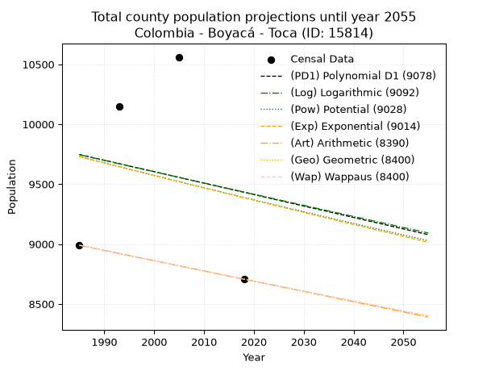
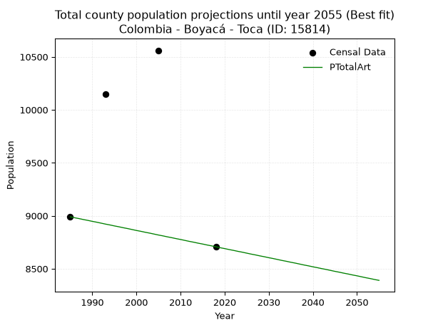
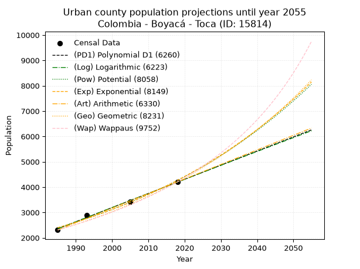
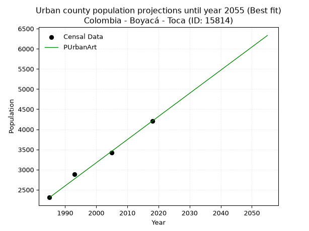
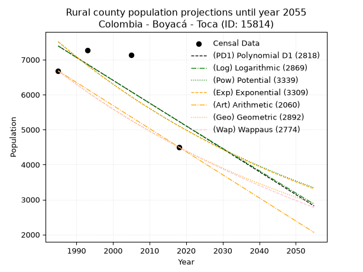
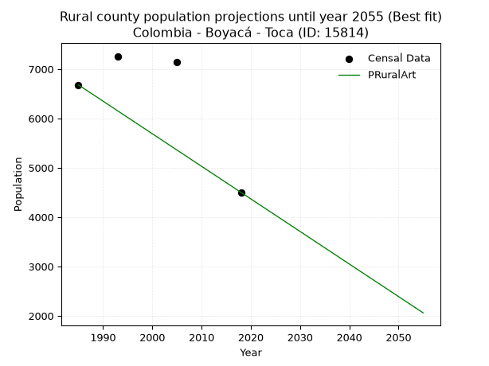

<div align="center">


</div>

# _“Population and Public Services Demand Projections (PPSD) until Year 2050 for Colombia - Boyacá - Toca (ID: 15814)”_
Keywords: `population` `public-service` `projection` `lineal` `polynomial` `logarithmic` `potential` `exponential` `arithmetic` `geometric` `wappaus` `dane` `colombia` `south-america`

PPSD are analytical estimates used by governments and planners to anticipate future changes in population size, age distribution, and the resulting community needs for utilities, healthcare, education, and infrastructure as sizing future water treatment facilities, electrical grids, and road networks based on spatial growth.

> **General running parameters**: • app_version: _v20260806_. • Python version: _3.14.7_. • Pandas version: _3.0.5_. • NumPy version: _2.5.1_. • Creates, save and include plots into reports (create_plot): _False_. • Projection until year: _2050_. • Process polynomial degree 2 and up: _False_. • Process Wappaus: _True_. • Process Wappaus: _True_. • Set negative values to zero: _True_. • Set infinite values to zero: _True_. • Drop dataset notes: _True_. 
<div align="center">

Dynamic map: [:earth_americas:Google](http://maps.google.com/maps?q=5.566463896,-73.1847938) [:earth_americas:OSM](https://www.openstreetmap.org/#map=18/5.566463896/-73.1847938&layers=P) [:earth_americas:Bing](https://www.bing.com/maps?cp=5.566463896~-73.1847938&lvl=18) [:earth_americas:Apple](https://maps.apple.com/frame?center=5.566463896%2C-73.1847938&span=0.003%2C0.006)

</div>


<div align="center">

```geojson
{
  "type": "Feature",
  "geometry": {
    "type": "Point", 
    "coordinates": [-73.1847938, 5.566463896]
  }, 
  "properties": {
    "Name": "Colombia - Boyacá - Toca (ID: 15814)"
  }
}
```

</div>


## 0. Census Data (4 records)

Census data are official statistics collected by a government about the people and housing in a country. They usually include counts of total population, age, sex, race, income, education, and jobs.

📅Global census file: [Population.xlsx](../data/Population.xlsx)

| Source   |   Year |   CountryID | CountryName   |   StateID | StateName   |   CountyID | CountyName   |   PTotal |   PUrban |   PRural |
|:---------|-------:|------------:|:--------------|----------:|:------------|-----------:|:-------------|---------:|---------:|---------:|
| DANE     |   1985 |          57 | Colombia      |        15 | Boyacá      |      15814 | Toca         |     8990 |     2310 |     6680 |
| DANE     |   1993 |          57 | Colombia      |        15 | Boyacá      |      15814 | Toca         |    10147 |     2886 |     7261 |
| DANE     |   2005 |          57 | Colombia      |        15 | Boyacá      |      15814 | Toca         |    10561 |     3422 |     7139 |
| DANE     |   2018 |          57 | Colombia      |        15 | Boyacá      |      15814 | Toca         |     8707 |     4205 |     4502 |

> 🔥Some records could had specific notes about the registered values or the corresponding urban or rural distribution.

## 1. Total

### 1.1. Coefficients and Parameters

* (PD1) Polynomial Deg 1: -9.553191489360602, 28710.021276593543 (lineal)
* (Log) Logarithmic: -18835.512187024287, 152770.12907189355
* (Pow) Potential: -2.1573137634448347, 11.102374072486795
* (Exp) Exponential: -0.0010926610949354594, 85135.31303089195
* (Art) Arithmetic: Year diff. 2018 - 1985 = 33, Population diff. 8707 - 8990 = -283, Annual growth = -8.575757575757576
* (Geo) Geometric: Year diff. 2018 - 1985 = 33, Population diff. 8707 - 8990 = -283, Annual growth % = -0.000968789469782072
* (Wap) Wappaus: i = -0.0969176422643112, Condition values only valid for < 200)

<sub>
Wappaus condition values: ['-0.00', '-0.10', '-0.19', '-0.29', '-0.39', '-0.48', '-0.58', '-0.68', '-0.78', '-0.87', '-0.97', '-1.07', '-1.16', '-1.26', '-1.36', '-1.45', '-1.55', '-1.65', '-1.74', '-1.84', '-1.94', '-2.04', '-2.13', '-2.23', '-2.33', '-2.42', '-2.52', '-2.62', '-2.71', '-2.81', '-2.91', '-3.00', '-3.10', '-3.20', '-3.30', '-3.39', '-3.49', '-3.59', '-3.68', '-3.78', '-3.88', '-3.97', '-4.07', '-4.17', '-4.26', '-4.36', '-4.46', '-4.56', '-4.65', '-4.75', '-4.85', '-4.94', '-5.04', '-5.14', '-5.23', '-5.33', '-5.43', '-5.52', '-5.62', '-5.72', '-5.82', '-5.91', '-6.01', '-6.11', '-6.20', '-6.30']
</sub>


### 1.2. Projected Dataset

|   Year |   CountyID |   PTotalPD1 |   PTotalLog |   PTotalPow |   PTotalExp |   PTotalArt |   PTotalGeo |   PTotalWap |
|-------:|-----------:|------------:|------------:|------------:|------------:|------------:|------------:|------------:|
|   1985 |      15814 |        9747 |        9745 |        9729 |        9731 |        8990 |        8990 |        8990 |
|   1986 |      15814 |        9737 |        9736 |        9718 |        9720 |        8981 |        8981 |        8981 |
|   1987 |      15814 |        9728 |        9726 |        9708 |        9710 |        8973 |        8973 |        8973 |
|   1988 |      15814 |        9718 |        9717 |        9697 |        9699 |        8964 |        8964 |        8964 |
|   1989 |      15814 |        9709 |        9707 |        9687 |        9688 |        8956 |        8955 |        8955 |
|   1990 |      15814 |        9699 |        9698 |        9676 |        9678 |        8947 |        8947 |        8947 |
|   1991 |      15814 |        9690 |        9688 |        9666 |        9667 |        8939 |        8938 |        8938 |
|   1992 |      15814 |        9680 |        9679 |        9655 |        9657 |        8930 |        8929 |        8929 |
|   1993 |      15814 |        9671 |        9669 |        9645 |        9646 |        8921 |        8921 |        8921 |
|   1994 |      15814 |        9661 |        9660 |        9635 |        9636 |        8913 |        8912 |        8912 |
|   1995 |      15814 |        9651 |        9650 |        9624 |        9625 |        8904 |        8903 |        8903 |
|   1996 |      15814 |        9642 |        9641 |        9614 |        9615 |        8896 |        8895 |        8895 |
|   1997 |      15814 |        9632 |        9632 |        9603 |        9604 |        8887 |        8886 |        8886 |
|   1998 |      15814 |        9623 |        9622 |        9593 |        9594 |        8879 |        8877 |        8877 |
|   1999 |      15814 |        9613 |        9613 |        9583 |        9583 |        8870 |        8869 |        8869 |
|   2000 |      15814 |        9604 |        9603 |        9572 |        9573 |        8861 |        8860 |        8860 |
|   2001 |      15814 |        9594 |        9594 |        9562 |        9562 |        8853 |        8852 |        8852 |
|   2002 |      15814 |        9585 |        9584 |        9552 |        9552 |        8844 |        8843 |        8843 |
|   2003 |      15814 |        9575 |        9575 |        9541 |        9541 |        8836 |        8835 |        8835 |
|   2004 |      15814 |        9565 |        9566 |        9531 |        9531 |        8827 |        8826 |        8826 |
|   2005 |      15814 |        9556 |        9556 |        9521 |        9521 |        8818 |        8817 |        8817 |
|   2006 |      15814 |        9546 |        9547 |        9511 |        9510 |        8810 |        8809 |        8809 |
|   2007 |      15814 |        9537 |        9537 |        9500 |        9500 |        8801 |        8800 |        8800 |
|   2008 |      15814 |        9527 |        9528 |        9490 |        9489 |        8793 |        8792 |        8792 |
|   2009 |      15814 |        9518 |        9519 |        9480 |        9479 |        8784 |        8783 |        8783 |
|   2010 |      15814 |        9508 |        9509 |        9470 |        9469 |        8776 |        8775 |        8775 |
|   2011 |      15814 |        9499 |        9500 |        9460 |        9458 |        8767 |        8766 |        8766 |
|   2012 |      15814 |        9489 |        9491 |        9450 |        9448 |        8758 |        8758 |        8758 |
|   2013 |      15814 |        9479 |        9481 |        9439 |        9438 |        8750 |        8749 |        8749 |
|   2014 |      15814 |        9470 |        9472 |        9429 |        9427 |        8741 |        8741 |        8741 |
|   2015 |      15814 |        9460 |        9462 |        9419 |        9417 |        8733 |        8732 |        8732 |
|   2016 |      15814 |        9451 |        9453 |        9409 |        9407 |        8724 |        8724 |        8724 |
|   2017 |      15814 |        9441 |        9444 |        9399 |        9397 |        8716 |        8715 |        8715 |
|   2018 |      15814 |        9432 |        9434 |        9389 |        9386 |        8707 |        8707 |        8707 |
|   2019 |      15814 |        9422 |        9425 |        9379 |        9376 |        8698 |        8699 |        8699 |
|   2020 |      15814 |        9413 |        9416 |        9369 |        9366 |        8690 |        8690 |        8690 |
|   2021 |      15814 |        9403 |        9406 |        9359 |        9356 |        8681 |        8682 |        8682 |
|   2022 |      15814 |        9393 |        9397 |        9349 |        9345 |        8673 |        8673 |        8673 |
|   2023 |      15814 |        9384 |        9388 |        9339 |        9335 |        8664 |        8665 |        8665 |
|   2024 |      15814 |        9374 |        9379 |        9329 |        9325 |        8656 |        8657 |        8656 |
|   2025 |      15814 |        9365 |        9369 |        9319 |        9315 |        8647 |        8648 |        8648 |
|   2026 |      15814 |        9355 |        9360 |        9309 |        9305 |        8638 |        8640 |        8640 |
|   2027 |      15814 |        9346 |        9351 |        9299 |        9294 |        8630 |        8631 |        8631 |
|   2028 |      15814 |        9336 |        9341 |        9289 |        9284 |        8621 |        8623 |        8623 |
|   2029 |      15814 |        9327 |        9332 |        9280 |        9274 |        8613 |        8615 |        8615 |
|   2030 |      15814 |        9317 |        9323 |        9270 |        9264 |        8604 |        8606 |        8606 |
|   2031 |      15814 |        9307 |        9314 |        9260 |        9254 |        8596 |        8598 |        8598 |
|   2032 |      15814 |        9298 |        9304 |        9250 |        9244 |        8587 |        8590 |        8590 |
|   2033 |      15814 |        9288 |        9295 |        9240 |        9234 |        8578 |        8581 |        8581 |
|   2034 |      15814 |        9279 |        9286 |        9230 |        9224 |        8570 |        8573 |        8573 |
|   2035 |      15814 |        9269 |        9276 |        9221 |        9214 |        8561 |        8565 |        8565 |
|   2036 |      15814 |        9260 |        9267 |        9211 |        9204 |        8553 |        8556 |        8556 |
|   2037 |      15814 |        9250 |        9258 |        9201 |        9193 |        8544 |        8548 |        8548 |
|   2038 |      15814 |        9241 |        9249 |        9191 |        9183 |        8535 |        8540 |        8540 |
|   2039 |      15814 |        9231 |        9239 |        9182 |        9173 |        8527 |        8532 |        8532 |
|   2040 |      15814 |        9222 |        9230 |        9172 |        9163 |        8518 |        8523 |        8523 |
|   2041 |      15814 |        9212 |        9221 |        9162 |        9153 |        8510 |        8515 |        8515 |
|   2042 |      15814 |        9202 |        9212 |        9153 |        9143 |        8501 |        8507 |        8507 |
|   2043 |      15814 |        9193 |        9203 |        9143 |        9133 |        8493 |        8499 |        8498 |
|   2044 |      15814 |        9183 |        9193 |        9133 |        9123 |        8484 |        8490 |        8490 |
|   2045 |      15814 |        9174 |        9184 |        9124 |        9113 |        8475 |        8482 |        8482 |
|   2046 |      15814 |        9164 |        9175 |        9114 |        9103 |        8467 |        8474 |        8474 |
|   2047 |      15814 |        9155 |        9166 |        9104 |        9094 |        8458 |        8466 |        8466 |
|   2048 |      15814 |        9145 |        9157 |        9095 |        9084 |        8450 |        8457 |        8457 |
|   2049 |      15814 |        9136 |        9147 |        9085 |        9074 |        8441 |        8449 |        8449 |
|   2050 |      15814 |        9126 |        9138 |        9076 |        9064 |        8433 |        8441 |        8441 |
<div align="center">

</img>

</div>


### 1.3. Best fit with absolute and relative error (%)

Relative error puts that difference into context by dividing the absolute error by the true value, creating a unitless ratio or percentage that shows the scale of the mistake.

Absolute and relative error

|   Year | Source   |   CountryID | CountryName   |   StateID | StateName   |   CountyID_x | CountyName   |   PTotal |   PUrban |   PRural |   CountyID_y |   PTotalPD1 |   PTotalLog |   PTotalPow |   PTotalExp |   PTotalArt |   PTotalGeo |   PTotalWap |   PTotalPD1AbsError |   PTotalLogAbsError |   PTotalPowAbsError |   PTotalExpAbsError |   PTotalArtAbsError |   PTotalGeoAbsError |   PTotalWapAbsError |   PTotalPD1RelError |   PTotalLogRelError |   PTotalPowRelError |   PTotalExpRelError |   PTotalArtRelError |   PTotalGeoRelError |   PTotalWapRelError |
|-------:|:---------|------------:|:--------------|----------:|:------------|-------------:|:-------------|---------:|---------:|---------:|-------------:|------------:|------------:|------------:|------------:|------------:|------------:|------------:|--------------------:|--------------------:|--------------------:|--------------------:|--------------------:|--------------------:|--------------------:|--------------------:|--------------------:|--------------------:|--------------------:|--------------------:|--------------------:|--------------------:|
|   1985 | DANE     |          57 | Colombia      |        15 | Boyacá      |        15814 | Toca         |     8990 |     2310 |     6680 |        15814 |        9747 |        9745 |        9729 |        9731 |        8990 |        8990 |        8990 |                 757 |                 755 |                 739 |                 741 |                   0 |                   0 |                   0 |             8.42047 |             8.39822 |             8.22024 |             8.24249 |              0      |              0      |              0      |
|   1993 | DANE     |          57 | Colombia      |        15 | Boyacá      |        15814 | Toca         |    10147 |     2886 |     7261 |        15814 |        9671 |        9669 |        9645 |        9646 |        8921 |        8921 |        8921 |                 476 |                 478 |                 502 |                 501 |                1226 |                1226 |                1226 |             4.69104 |             4.71075 |             4.94728 |             4.93742 |             12.0824 |             12.0824 |             12.0824 |
|   2005 | DANE     |          57 | Colombia      |        15 | Boyacá      |        15814 | Toca         |    10561 |     3422 |     7139 |        15814 |        9556 |        9556 |        9521 |        9521 |        8818 |        8817 |        8817 |                1005 |                1005 |                1040 |                1040 |                1743 |                1744 |                1744 |             9.51614 |             9.51614 |             9.84755 |             9.84755 |             16.5041 |             16.5136 |             16.5136 |
|   2018 | DANE     |          57 | Colombia      |        15 | Boyacá      |        15814 | Toca         |     8707 |     4205 |     4502 |        15814 |        9432 |        9434 |        9389 |        9386 |        8707 |        8707 |        8707 |                 725 |                 727 |                 682 |                 679 |                   0 |                   0 |                   0 |             8.32663 |             8.3496  |             7.83278 |             7.79832 |              0      |              0      |              0      |

Relative error mean

| Method    |   RelError | Best   |
|:----------|-----------:|:-------|
| PTotalPD1 |    7.73857 |        |
| PTotalLog |    7.74368 |        |
| PTotalPow |    7.71196 |        |
| PTotalExp |    7.70645 |        |
| PTotalArt |    7.14663 | True   |
| PTotalGeo |    7.14899 |        |
| PTotalWap |    7.14899 |        |

💙Best method: _**PTotalArt**_
<div align="center">

</img>

</div>


### 1.4. Fresh water supply demand in liters per capita per day (lpcd)

The fresh water supply demand typically ranges from 100 to 300 liters per capita per day (lpcd) for standard domestic and municipal planning, though absolute survival minimums set by the World Health Organization are as low as 7.5 to 20 liters per day, and total consumption in high-income nations can exceed 400 liters.

> `CZ`: Level in meters above the sea level (masl)<br> `WS`: Fresh water supply demand in liters per capita per day (lpcd or l/h/d)<br> `WSAll`: Zonal fresh water supply demand in liters per second (l/s)<br> `A`: Zonal area in square meters<br> `DP`: Population density (people/hectare)

Reference values (RAS Colombia)

|    CZ |   WS |
|------:|-----:|
|  1000 |  120 |
|  2000 |  130 |
| 99999 |  140 |

County shapefile geometry properties and water supply values

|   CountyID |      ATotal |   CZTotal |   WSTotal |
|-----------:|------------:|----------:|----------:|
|      15814 | 1.67941e+08 |   2978.99 |       140 |

Projected values for best method: PTotalArt

|   CountyID |   Year |   PTotalArt |   DPTotal |   WSTotal |   WSTotalAll |
|-----------:|-------:|------------:|----------:|----------:|-------------:|
|      15814 |   1985 |        8990 |      0.54 |       140 |      14.5671 |
|      15814 |   1986 |        8981 |      0.53 |       140 |      14.5525 |
|      15814 |   1987 |        8973 |      0.53 |       140 |      14.5396 |
|      15814 |   1988 |        8964 |      0.53 |       140 |      14.525  |
|      15814 |   1989 |        8956 |      0.53 |       140 |      14.512  |
|      15814 |   1990 |        8947 |      0.53 |       140 |      14.4975 |
|      15814 |   1991 |        8939 |      0.53 |       140 |      14.4845 |
|      15814 |   1992 |        8930 |      0.53 |       140 |      14.4699 |
|      15814 |   1993 |        8921 |      0.53 |       140 |      14.4553 |
|      15814 |   1994 |        8913 |      0.53 |       140 |      14.4424 |
|      15814 |   1995 |        8904 |      0.53 |       140 |      14.4278 |
|      15814 |   1996 |        8896 |      0.53 |       140 |      14.4148 |
|      15814 |   1997 |        8887 |      0.53 |       140 |      14.4002 |
|      15814 |   1998 |        8879 |      0.53 |       140 |      14.3873 |
|      15814 |   1999 |        8870 |      0.53 |       140 |      14.3727 |
|      15814 |   2000 |        8861 |      0.53 |       140 |      14.3581 |
|      15814 |   2001 |        8853 |      0.53 |       140 |      14.3451 |
|      15814 |   2002 |        8844 |      0.53 |       140 |      14.3306 |
|      15814 |   2003 |        8836 |      0.53 |       140 |      14.3176 |
|      15814 |   2004 |        8827 |      0.53 |       140 |      14.303  |
|      15814 |   2005 |        8818 |      0.53 |       140 |      14.2884 |
|      15814 |   2006 |        8810 |      0.52 |       140 |      14.2755 |
|      15814 |   2007 |        8801 |      0.52 |       140 |      14.2609 |
|      15814 |   2008 |        8793 |      0.52 |       140 |      14.2479 |
|      15814 |   2009 |        8784 |      0.52 |       140 |      14.2333 |
|      15814 |   2010 |        8776 |      0.52 |       140 |      14.2204 |
|      15814 |   2011 |        8767 |      0.52 |       140 |      14.2058 |
|      15814 |   2012 |        8758 |      0.52 |       140 |      14.1912 |
|      15814 |   2013 |        8750 |      0.52 |       140 |      14.1782 |
|      15814 |   2014 |        8741 |      0.52 |       140 |      14.1637 |
|      15814 |   2015 |        8733 |      0.52 |       140 |      14.1507 |
|      15814 |   2016 |        8724 |      0.52 |       140 |      14.1361 |
|      15814 |   2017 |        8716 |      0.52 |       140 |      14.1231 |
|      15814 |   2018 |        8707 |      0.52 |       140 |      14.1086 |
|      15814 |   2019 |        8698 |      0.52 |       140 |      14.094  |
|      15814 |   2020 |        8690 |      0.52 |       140 |      14.081  |
|      15814 |   2021 |        8681 |      0.52 |       140 |      14.0664 |
|      15814 |   2022 |        8673 |      0.52 |       140 |      14.0535 |
|      15814 |   2023 |        8664 |      0.52 |       140 |      14.0389 |
|      15814 |   2024 |        8656 |      0.52 |       140 |      14.0259 |
|      15814 |   2025 |        8647 |      0.51 |       140 |      14.0113 |
|      15814 |   2026 |        8638 |      0.51 |       140 |      13.9968 |
|      15814 |   2027 |        8630 |      0.51 |       140 |      13.9838 |
|      15814 |   2028 |        8621 |      0.51 |       140 |      13.9692 |
|      15814 |   2029 |        8613 |      0.51 |       140 |      13.9563 |
|      15814 |   2030 |        8604 |      0.51 |       140 |      13.9417 |
|      15814 |   2031 |        8596 |      0.51 |       140 |      13.9287 |
|      15814 |   2032 |        8587 |      0.51 |       140 |      13.9141 |
|      15814 |   2033 |        8578 |      0.51 |       140 |      13.8995 |
|      15814 |   2034 |        8570 |      0.51 |       140 |      13.8866 |
|      15814 |   2035 |        8561 |      0.51 |       140 |      13.872  |
|      15814 |   2036 |        8553 |      0.51 |       140 |      13.859  |
|      15814 |   2037 |        8544 |      0.51 |       140 |      13.8444 |
|      15814 |   2038 |        8535 |      0.51 |       140 |      13.8299 |
|      15814 |   2039 |        8527 |      0.51 |       140 |      13.8169 |
|      15814 |   2040 |        8518 |      0.51 |       140 |      13.8023 |
|      15814 |   2041 |        8510 |      0.51 |       140 |      13.7894 |
|      15814 |   2042 |        8501 |      0.51 |       140 |      13.7748 |
|      15814 |   2043 |        8493 |      0.51 |       140 |      13.7618 |
|      15814 |   2044 |        8484 |      0.51 |       140 |      13.7472 |
|      15814 |   2045 |        8475 |      0.5  |       140 |      13.7326 |
|      15814 |   2046 |        8467 |      0.5  |       140 |      13.7197 |
|      15814 |   2047 |        8458 |      0.5  |       140 |      13.7051 |
|      15814 |   2048 |        8450 |      0.5  |       140 |      13.6921 |
|      15814 |   2049 |        8441 |      0.5  |       140 |      13.6775 |
|      15814 |   2050 |        8433 |      0.5  |       140 |      13.6646 |

## 2. Urban

### 2.1. Coefficients and Parameters

* (PD1) Polynomial Deg 1: 55.78843837816083, -108385.07386591622 (lineal)
* (Log) Logarithmic: 111670.777319434, -845604.7232784657
* (Pow) Potential: 34.995960024828754, -112.02882945832856
* (Exp) Exponential: 0.0174794788520048, 2.046955228411479e-12
* (Art) Arithmetic: Year diff. 2018 - 1985 = 33, Population diff. 4205 - 2310 = 1895, Annual growth = 57.42424242424242
* (Geo) Geometric: Year diff. 2018 - 1985 = 33, Population diff. 4205 - 2310 = 1895, Annual growth % = 0.018318081232342243
* (Wap) Wappaus: i = 1.7628316937603201, Condition values only valid for < 200)

<sub>
Wappaus condition values: ['0.00', '1.76', '3.53', '5.29', '7.05', '8.81', '10.58', '12.34', '14.10', '15.87', '17.63', '19.39', '21.15', '22.92', '24.68', '26.44', '28.21', '29.97', '31.73', '33.49', '35.26', '37.02', '38.78', '40.55', '42.31', '44.07', '45.83', '47.60', '49.36', '51.12', '52.88', '54.65', '56.41', '58.17', '59.94', '61.70', '63.46', '65.22', '66.99', '68.75', '70.51', '72.28', '74.04', '75.80', '77.56', '79.33', '81.09', '82.85', '84.62', '86.38', '88.14', '89.90', '91.67', '93.43', '95.19', '96.96', '98.72', '100.48', '102.24', '104.01', '105.77', '107.53', '109.30', '111.06', '112.82', '114.58']
</sub>


### 2.2. Projected Dataset

|   Year |   CountyID |   PUrbanPD1 |   PUrbanLog |   PUrbanPow |   PUrbanExp |   PUrbanArt |   PUrbanGeo |   PUrbanWap |
|-------:|-----------:|------------:|------------:|------------:|------------:|------------:|------------:|------------:|
|   1985 |      15814 |        2355 |        2353 |        2396 |        2397 |        2310 |        2310 |        2310 |
|   1986 |      15814 |        2411 |        2410 |        2438 |        2440 |        2367 |        2352 |        2351 |
|   1987 |      15814 |        2467 |        2466 |        2482 |        2483 |        2425 |        2395 |        2393 |
|   1988 |      15814 |        2522 |        2522 |        2526 |        2526 |        2482 |        2439 |        2435 |
|   1989 |      15814 |        2578 |        2578 |        2571 |        2571 |        2540 |        2484 |        2479 |
|   1990 |      15814 |        2634 |        2634 |        2616 |        2616 |        2597 |        2529 |        2523 |
|   1991 |      15814 |        2690 |        2690 |        2663 |        2662 |        2655 |        2576 |        2568 |
|   1992 |      15814 |        2745 |        2746 |        2710 |        2709 |        2712 |        2623 |        2614 |
|   1993 |      15814 |        2801 |        2802 |        2758 |        2757 |        2769 |        2671 |        2660 |
|   1994 |      15814 |        2857 |        2858 |        2807 |        2806 |        2827 |        2720 |        2708 |
|   1995 |      15814 |        2913 |        2914 |        2857 |        2855 |        2884 |        2770 |        2757 |
|   1996 |      15814 |        2969 |        2970 |        2907 |        2906 |        2942 |        2821 |        2806 |
|   1997 |      15814 |        3024 |        3026 |        2958 |        2957 |        2999 |        2872 |        2856 |
|   1998 |      15814 |        3080 |        3082 |        3011 |        3009 |        3057 |        2925 |        2908 |
|   1999 |      15814 |        3136 |        3138 |        3064 |        3062 |        3114 |        2978 |        2960 |
|   2000 |      15814 |        3192 |        3194 |        3118 |        3116 |        3171 |        3033 |        3014 |
|   2001 |      15814 |        3248 |        3250 |        3173 |        3171 |        3229 |        3088 |        3069 |
|   2002 |      15814 |        3303 |        3306 |        3229 |        3227 |        3286 |        3145 |        3124 |
|   2003 |      15814 |        3359 |        3361 |        3286 |        3284 |        3344 |        3203 |        3181 |
|   2004 |      15814 |        3415 |        3417 |        3344 |        3342 |        3401 |        3261 |        3239 |
|   2005 |      15814 |        3471 |        3473 |        3403 |        3401 |        3458 |        3321 |        3299 |
|   2006 |      15814 |        3527 |        3528 |        3463 |        3460 |        3516 |        3382 |        3359 |
|   2007 |      15814 |        3582 |        3584 |        3524 |        3522 |        3573 |        3444 |        3421 |
|   2008 |      15814 |        3638 |        3640 |        3586 |        3584 |        3631 |        3507 |        3485 |
|   2009 |      15814 |        3694 |        3695 |        3649 |        3647 |        3688 |        3571 |        3550 |
|   2010 |      15814 |        3750 |        3751 |        3713 |        3711 |        3746 |        3637 |        3616 |
|   2011 |      15814 |        3805 |        3806 |        3778 |        3777 |        3803 |        3703 |        3684 |
|   2012 |      15814 |        3861 |        3862 |        3844 |        3843 |        3860 |        3771 |        3753 |
|   2013 |      15814 |        3917 |        3917 |        3912 |        3911 |        3918 |        3840 |        3824 |
|   2014 |      15814 |        3973 |        3973 |        3980 |        3980 |        3975 |        3910 |        3896 |
|   2015 |      15814 |        4029 |        4028 |        4050 |        4050 |        4033 |        3982 |        3971 |
|   2016 |      15814 |        4084 |        4084 |        4121 |        4121 |        4090 |        4055 |        4047 |
|   2017 |      15814 |        4140 |        4139 |        4193 |        4194 |        4148 |        4129 |        4125 |
|   2018 |      15814 |        4196 |        4195 |        4266 |        4268 |        4205 |        4205 |        4205 |
|   2019 |      15814 |        4252 |        4250 |        4341 |        4343 |        4262 |        4282 |        4287 |
|   2020 |      15814 |        4308 |        4305 |        4417 |        4420 |        4320 |        4360 |        4371 |
|   2021 |      15814 |        4363 |        4360 |        4494 |        4498 |        4377 |        4440 |        4457 |
|   2022 |      15814 |        4419 |        4416 |        4573 |        4577 |        4435 |        4522 |        4546 |
|   2023 |      15814 |        4475 |        4471 |        4652 |        4658 |        4492 |        4605 |        4637 |
|   2024 |      15814 |        4531 |        4526 |        4733 |        4740 |        4550 |        4689 |        4730 |
|   2025 |      15814 |        4587 |        4581 |        4816 |        4824 |        4607 |        4775 |        4826 |
|   2026 |      15814 |        4642 |        4636 |        4900 |        4909 |        4664 |        4862 |        4924 |
|   2027 |      15814 |        4698 |        4691 |        4985 |        4995 |        4722 |        4951 |        5026 |
|   2028 |      15814 |        4754 |        4747 |        5072 |        5083 |        4779 |        5042 |        5130 |
|   2029 |      15814 |        4810 |        4802 |        5160 |        5173 |        4837 |        5134 |        5237 |
|   2030 |      15814 |        4865 |        4857 |        5250 |        5264 |        4894 |        5228 |        5347 |
|   2031 |      15814 |        4921 |        4912 |        5341 |        5357 |        4952 |        5324 |        5461 |
|   2032 |      15814 |        4977 |        4967 |        5434 |        5451 |        5009 |        5422 |        5578 |
|   2033 |      15814 |        5033 |        5021 |        5529 |        5548 |        5066 |        5521 |        5698 |
|   2034 |      15814 |        5089 |        5076 |        5625 |        5645 |        5124 |        5622 |        5822 |
|   2035 |      15814 |        5144 |        5131 |        5722 |        5745 |        5181 |        5725 |        5950 |
|   2036 |      15814 |        5200 |        5186 |        5821 |        5846 |        5239 |        5830 |        6083 |
|   2037 |      15814 |        5256 |        5241 |        5922 |        5949 |        5296 |        5937 |        6219 |
|   2038 |      15814 |        5312 |        5296 |        6025 |        6054 |        5353 |        6046 |        6360 |
|   2039 |      15814 |        5368 |        5351 |        6129 |        6161 |        5411 |        6156 |        6506 |
|   2040 |      15814 |        5423 |        5405 |        6235 |        6270 |        5468 |        6269 |        6657 |
|   2041 |      15814 |        5479 |        5460 |        6343 |        6380 |        5526 |        6384 |        6813 |
|   2042 |      15814 |        5535 |        5515 |        6453 |        6493 |        5583 |        6501 |        6975 |
|   2043 |      15814 |        5591 |        5569 |        6564 |        6607 |        5641 |        6620 |        7142 |
|   2044 |      15814 |        5646 |        5624 |        6678 |        6724 |        5698 |        6741 |        7316 |
|   2045 |      15814 |        5702 |        5679 |        6793 |        6842 |        5755 |        6865 |        7496 |
|   2046 |      15814 |        5758 |        5733 |        6910 |        6963 |        5813 |        6990 |        7683 |
|   2047 |      15814 |        5814 |        5788 |        7029 |        7086 |        5870 |        7118 |        7877 |
|   2048 |      15814 |        5870 |        5842 |        7151 |        7211 |        5928 |        7249 |        8079 |
|   2049 |      15814 |        5925 |        5897 |        7274 |        7338 |        5985 |        7382 |        8289 |
|   2050 |      15814 |        5981 |        5951 |        7399 |        7467 |        6043 |        7517 |        8508 |
<div align="center">

</img>

</div>


### 2.3. Best fit with absolute and relative error (%)

Relative error puts that difference into context by dividing the absolute error by the true value, creating a unitless ratio or percentage that shows the scale of the mistake.

Absolute and relative error

|   Year | Source   |   CountryID | CountryName   |   StateID | StateName   |   CountyID_x | CountyName   |   PTotal |   PUrban |   PRural |   CountyID_y |   PUrbanPD1 |   PUrbanLog |   PUrbanPow |   PUrbanExp |   PUrbanArt |   PUrbanGeo |   PUrbanWap |   PUrbanPD1AbsError |   PUrbanLogAbsError |   PUrbanPowAbsError |   PUrbanExpAbsError |   PUrbanArtAbsError |   PUrbanGeoAbsError |   PUrbanWapAbsError |   PUrbanPD1RelError |   PUrbanLogRelError |   PUrbanPowRelError |   PUrbanExpRelError |   PUrbanArtRelError |   PUrbanGeoRelError |   PUrbanWapRelError |
|-------:|:---------|------------:|:--------------|----------:|:------------|-------------:|:-------------|---------:|---------:|---------:|-------------:|------------:|------------:|------------:|------------:|------------:|------------:|------------:|--------------------:|--------------------:|--------------------:|--------------------:|--------------------:|--------------------:|--------------------:|--------------------:|--------------------:|--------------------:|--------------------:|--------------------:|--------------------:|--------------------:|
|   1985 | DANE     |          57 | Colombia      |        15 | Boyacá      |        15814 | Toca         |     8990 |     2310 |     6680 |        15814 |        2355 |        2353 |        2396 |        2397 |        2310 |        2310 |        2310 |                  45 |                  43 |                  86 |                  87 |                   0 |                   0 |                   0 |            1.94805  |            1.86147  |            3.72294  |            3.76623  |             0       |             0       |             0       |
|   1993 | DANE     |          57 | Colombia      |        15 | Boyacá      |        15814 | Toca         |    10147 |     2886 |     7261 |        15814 |        2801 |        2802 |        2758 |        2757 |        2769 |        2671 |        2660 |                  85 |                  84 |                 128 |                 129 |                 117 |                 215 |                 226 |            2.94525  |            2.9106   |            4.4352   |            4.46985  |             4.05405 |             7.44976 |             7.83091 |
|   2005 | DANE     |          57 | Colombia      |        15 | Boyacá      |        15814 | Toca         |    10561 |     3422 |     7139 |        15814 |        3471 |        3473 |        3403 |        3401 |        3458 |        3321 |        3299 |                  49 |                  51 |                  19 |                  21 |                  36 |                 101 |                 123 |            1.43191  |            1.49036  |            0.555231 |            0.613676 |             1.05202 |             2.95149 |             3.59439 |
|   2018 | DANE     |          57 | Colombia      |        15 | Boyacá      |        15814 | Toca         |     8707 |     4205 |     4502 |        15814 |        4196 |        4195 |        4266 |        4268 |        4205 |        4205 |        4205 |                   9 |                  10 |                  61 |                  63 |                   0 |                   0 |                   0 |            0.214031 |            0.237812 |            1.45065  |            1.49822  |             0       |             0       |             0       |

Relative error mean

| Method    |   RelError | Best   |
|:----------|-----------:|:-------|
| PUrbanPD1 |    1.63481 |        |
| PUrbanLog |    1.62506 |        |
| PUrbanPow |    2.54101 |        |
| PUrbanExp |    2.587   |        |
| PUrbanArt |    1.27652 | True   |
| PUrbanGeo |    2.60031 |        |
| PUrbanWap |    2.85632 |        |

💙Best method: _**PUrbanArt**_
<div align="center">

</img>

</div>


### 2.4. Fresh water supply demand in liters per capita per day (lpcd)

The fresh water supply demand typically ranges from 100 to 300 liters per capita per day (lpcd) for standard domestic and municipal planning, though absolute survival minimums set by the World Health Organization are as low as 7.5 to 20 liters per day, and total consumption in high-income nations can exceed 400 liters.

> `CZ`: Level in meters above the sea level (masl)<br> `WS`: Fresh water supply demand in liters per capita per day (lpcd or l/h/d)<br> `WSAll`: Zonal fresh water supply demand in liters per second (l/s)<br> `A`: Zonal area in square meters<br> `DP`: Population density (people/hectare)

Reference values (RAS Colombia)

|    CZ |   WS |
|------:|-----:|
|  1000 |  120 |
|  2000 |  130 |
| 99999 |  140 |

County shapefile geometry properties and water supply values

|   CountyID |   AUrban |   CZUrban |   WSUrban |
|-----------:|---------:|----------:|----------:|
|      15814 |   974202 |   2760.46 |       140 |

Projected values for best method: PUrbanArt

|   CountyID |   Year |   PUrbanArt |   DPUrban |   WSUrban |   WSUrbanAll |
|-----------:|-------:|------------:|----------:|----------:|-------------:|
|      15814 |   1985 |        2310 |     23.71 |       140 |      3.74306 |
|      15814 |   1986 |        2367 |     24.3  |       140 |      3.83542 |
|      15814 |   1987 |        2425 |     24.89 |       140 |      3.9294  |
|      15814 |   1988 |        2482 |     25.48 |       140 |      4.02176 |
|      15814 |   1989 |        2540 |     26.07 |       140 |      4.11574 |
|      15814 |   1990 |        2597 |     26.66 |       140 |      4.2081  |
|      15814 |   1991 |        2655 |     27.25 |       140 |      4.30208 |
|      15814 |   1992 |        2712 |     27.84 |       140 |      4.39444 |
|      15814 |   1993 |        2769 |     28.42 |       140 |      4.48681 |
|      15814 |   1994 |        2827 |     29.02 |       140 |      4.58079 |
|      15814 |   1995 |        2884 |     29.6  |       140 |      4.67315 |
|      15814 |   1996 |        2942 |     30.2  |       140 |      4.76713 |
|      15814 |   1997 |        2999 |     30.78 |       140 |      4.85949 |
|      15814 |   1998 |        3057 |     31.38 |       140 |      4.95347 |
|      15814 |   1999 |        3114 |     31.96 |       140 |      5.04583 |
|      15814 |   2000 |        3171 |     32.55 |       140 |      5.13819 |
|      15814 |   2001 |        3229 |     33.15 |       140 |      5.23218 |
|      15814 |   2002 |        3286 |     33.73 |       140 |      5.32454 |
|      15814 |   2003 |        3344 |     34.33 |       140 |      5.41852 |
|      15814 |   2004 |        3401 |     34.91 |       140 |      5.51088 |
|      15814 |   2005 |        3458 |     35.5  |       140 |      5.60324 |
|      15814 |   2006 |        3516 |     36.09 |       140 |      5.69722 |
|      15814 |   2007 |        3573 |     36.68 |       140 |      5.78958 |
|      15814 |   2008 |        3631 |     37.27 |       140 |      5.88356 |
|      15814 |   2009 |        3688 |     37.86 |       140 |      5.97593 |
|      15814 |   2010 |        3746 |     38.45 |       140 |      6.06991 |
|      15814 |   2011 |        3803 |     39.04 |       140 |      6.16227 |
|      15814 |   2012 |        3860 |     39.62 |       140 |      6.25463 |
|      15814 |   2013 |        3918 |     40.22 |       140 |      6.34861 |
|      15814 |   2014 |        3975 |     40.8  |       140 |      6.44097 |
|      15814 |   2015 |        4033 |     41.4  |       140 |      6.53495 |
|      15814 |   2016 |        4090 |     41.98 |       140 |      6.62731 |
|      15814 |   2017 |        4148 |     42.58 |       140 |      6.7213  |
|      15814 |   2018 |        4205 |     43.16 |       140 |      6.81366 |
|      15814 |   2019 |        4262 |     43.75 |       140 |      6.90602 |
|      15814 |   2020 |        4320 |     44.34 |       140 |      7       |
|      15814 |   2021 |        4377 |     44.93 |       140 |      7.09236 |
|      15814 |   2022 |        4435 |     45.52 |       140 |      7.18634 |
|      15814 |   2023 |        4492 |     46.11 |       140 |      7.2787  |
|      15814 |   2024 |        4550 |     46.7  |       140 |      7.37269 |
|      15814 |   2025 |        4607 |     47.29 |       140 |      7.46505 |
|      15814 |   2026 |        4664 |     47.88 |       140 |      7.55741 |
|      15814 |   2027 |        4722 |     48.47 |       140 |      7.65139 |
|      15814 |   2028 |        4779 |     49.06 |       140 |      7.74375 |
|      15814 |   2029 |        4837 |     49.65 |       140 |      7.83773 |
|      15814 |   2030 |        4894 |     50.24 |       140 |      7.93009 |
|      15814 |   2031 |        4952 |     50.83 |       140 |      8.02407 |
|      15814 |   2032 |        5009 |     51.42 |       140 |      8.11644 |
|      15814 |   2033 |        5066 |     52    |       140 |      8.2088  |
|      15814 |   2034 |        5124 |     52.6  |       140 |      8.30278 |
|      15814 |   2035 |        5181 |     53.18 |       140 |      8.39514 |
|      15814 |   2036 |        5239 |     53.78 |       140 |      8.48912 |
|      15814 |   2037 |        5296 |     54.36 |       140 |      8.58148 |
|      15814 |   2038 |        5353 |     54.95 |       140 |      8.67384 |
|      15814 |   2039 |        5411 |     55.54 |       140 |      8.76782 |
|      15814 |   2040 |        5468 |     56.13 |       140 |      8.86019 |
|      15814 |   2041 |        5526 |     56.72 |       140 |      8.95417 |
|      15814 |   2042 |        5583 |     57.31 |       140 |      9.04653 |
|      15814 |   2043 |        5641 |     57.9  |       140 |      9.14051 |
|      15814 |   2044 |        5698 |     58.49 |       140 |      9.23287 |
|      15814 |   2045 |        5755 |     59.07 |       140 |      9.32523 |
|      15814 |   2046 |        5813 |     59.67 |       140 |      9.41921 |
|      15814 |   2047 |        5870 |     60.25 |       140 |      9.51157 |
|      15814 |   2048 |        5928 |     60.85 |       140 |      9.60556 |
|      15814 |   2049 |        5985 |     61.43 |       140 |      9.69792 |
|      15814 |   2050 |        6043 |     62.03 |       140 |      9.7919  |

## 3. Rural

### 3.1. Coefficients and Parameters

* (PD1) Polynomial Deg 1: -65.34162986752148, 137095.09514250982 (lineal)
* (Log) Logarithmic: -130506.2895064583, 998374.8523503594
* (Pow) Potential: -23.39329494573578, 81.02124463998724
* (Exp) Exponential: -0.011711072370822095, 93666366218458.12
* (Art) Arithmetic: Year diff. 2018 - 1985 = 33, Population diff. 4502 - 6680 = -2178, Annual growth = -66.0
* (Geo) Geometric: Year diff. 2018 - 1985 = 33, Population diff. 4502 - 6680 = -2178, Annual growth % = -0.011886255621560315
* (Wap) Wappaus: i = -1.1804686102664996, Condition values only valid for < 200)

<sub>
Wappaus condition values: ['-0.00', '-1.18', '-2.36', '-3.54', '-4.72', '-5.90', '-7.08', '-8.26', '-9.44', '-10.62', '-11.80', '-12.99', '-14.17', '-15.35', '-16.53', '-17.71', '-18.89', '-20.07', '-21.25', '-22.43', '-23.61', '-24.79', '-25.97', '-27.15', '-28.33', '-29.51', '-30.69', '-31.87', '-33.05', '-34.23', '-35.41', '-36.59', '-37.77', '-38.96', '-40.14', '-41.32', '-42.50', '-43.68', '-44.86', '-46.04', '-47.22', '-48.40', '-49.58', '-50.76', '-51.94', '-53.12', '-54.30', '-55.48', '-56.66', '-57.84', '-59.02', '-60.20', '-61.38', '-62.56', '-63.75', '-64.93', '-66.11', '-67.29', '-68.47', '-69.65', '-70.83', '-72.01', '-73.19', '-74.37', '-75.55', '-76.73']
</sub>


### 3.2. Projected Dataset

|   Year |   CountyID |   PRuralPD1 |   PRuralLog |   PRuralPow |   PRuralExp |   PRuralArt |   PRuralGeo |   PRuralWap |
|-------:|-----------:|------------:|------------:|------------:|------------:|------------:|------------:|------------:|
|   1985 |      15814 |        7392 |        7392 |        7512 |        7512 |        6680 |        6680 |        6680 |
|   1986 |      15814 |        7327 |        7326 |        7424 |        7425 |        6614 |        6601 |        6602 |
|   1987 |      15814 |        7261 |        7260 |        7337 |        7338 |        6548 |        6522 |        6524 |
|   1988 |      15814 |        7196 |        7195 |        7251 |        7253 |        6482 |        6445 |        6448 |
|   1989 |      15814 |        7131 |        7129 |        7167 |        7168 |        6416 |        6368 |        6372 |
|   1990 |      15814 |        7065 |        7063 |        7083 |        7085 |        6350 |        6292 |        6297 |
|   1991 |      15814 |        7000 |        6998 |        7000 |        7002 |        6284 |        6218 |        6223 |
|   1992 |      15814 |        6935 |        6932 |        6918 |        6921 |        6218 |        6144 |        6150 |
|   1993 |      15814 |        6869 |        6867 |        6837 |        6840 |        6152 |        6071 |        6078 |
|   1994 |      15814 |        6804 |        6801 |        6758 |        6761 |        6086 |        5998 |        6006 |
|   1995 |      15814 |        6739 |        6736 |        6679 |        6682 |        6020 |        5927 |        5935 |
|   1996 |      15814 |        6673 |        6671 |        6601 |        6604 |        5954 |        5857 |        5865 |
|   1997 |      15814 |        6608 |        6605 |        6524 |        6527 |        5888 |        5787 |        5796 |
|   1998 |      15814 |        6543 |        6540 |        6448 |        6451 |        5822 |        5718 |        5728 |
|   1999 |      15814 |        6477 |        6475 |        6373 |        6376 |        5756 |        5650 |        5660 |
|   2000 |      15814 |        6412 |        6409 |        6299 |        6302 |        5690 |        5583 |        5593 |
|   2001 |      15814 |        6346 |        6344 |        6226 |        6229 |        5624 |        5517 |        5527 |
|   2002 |      15814 |        6281 |        6279 |        6153 |        6156 |        5558 |        5451 |        5462 |
|   2003 |      15814 |        6216 |        6214 |        6082 |        6084 |        5492 |        5386 |        5397 |
|   2004 |      15814 |        6150 |        6149 |        6011 |        6014 |        5426 |        5322 |        5333 |
|   2005 |      15814 |        6085 |        6083 |        5942 |        5944 |        5360 |        5259 |        5269 |
|   2006 |      15814 |        6020 |        6018 |        5873 |        5874 |        5294 |        5197 |        5207 |
|   2007 |      15814 |        5954 |        5953 |        5805 |        5806 |        5228 |        5135 |        5145 |
|   2008 |      15814 |        5889 |        5888 |        5737 |        5738 |        5162 |        5074 |        5083 |
|   2009 |      15814 |        5824 |        5823 |        5671 |        5672 |        5096 |        5014 |        5022 |
|   2010 |      15814 |        5758 |        5758 |        5605 |        5606 |        5030 |        4954 |        4962 |
|   2011 |      15814 |        5693 |        5693 |        5541 |        5540 |        4964 |        4895 |        4903 |
|   2012 |      15814 |        5628 |        5629 |        5476 |        5476 |        4898 |        4837 |        4844 |
|   2013 |      15814 |        5562 |        5564 |        5413 |        5412 |        4832 |        4779 |        4785 |
|   2014 |      15814 |        5497 |        5499 |        5351 |        5349 |        4766 |        4723 |        4727 |
|   2015 |      15814 |        5432 |        5434 |        5289 |        5287 |        4700 |        4666 |        4670 |
|   2016 |      15814 |        5366 |        5369 |        5228 |        5225 |        4634 |        4611 |        4614 |
|   2017 |      15814 |        5301 |        5305 |        5168 |        5164 |        4568 |        4556 |        4558 |
|   2018 |      15814 |        5236 |        5240 |        5108 |        5104 |        4502 |        4502 |        4502 |
|   2019 |      15814 |        5170 |        5175 |        5049 |        5045 |        4436 |        4448 |        4447 |
|   2020 |      15814 |        5105 |        5111 |        4991 |        4986 |        4370 |        4396 |        4393 |
|   2021 |      15814 |        5040 |        5046 |        4934 |        4928 |        4304 |        4343 |        4339 |
|   2022 |      15814 |        4974 |        4982 |        4877 |        4871 |        4238 |        4292 |        4285 |
|   2023 |      15814 |        4909 |        4917 |        4821 |        4814 |        4172 |        4241 |        4232 |
|   2024 |      15814 |        4844 |        4853 |        4765 |        4758 |        4106 |        4190 |        4180 |
|   2025 |      15814 |        4778 |        4788 |        4711 |        4702 |        4040 |        4141 |        4128 |
|   2026 |      15814 |        4713 |        4724 |        4656 |        4648 |        3974 |        4091 |        4077 |
|   2027 |      15814 |        4648 |        4659 |        4603 |        4594 |        3908 |        4043 |        4026 |
|   2028 |      15814 |        4582 |        4595 |        4550 |        4540 |        3842 |        3995 |        3976 |
|   2029 |      15814 |        4517 |        4531 |        4498 |        4487 |        3776 |        3947 |        3926 |
|   2030 |      15814 |        4452 |        4466 |        4446 |        4435 |        3710 |        3900 |        3876 |
|   2031 |      15814 |        4386 |        4402 |        4396 |        4383 |        3644 |        3854 |        3827 |
|   2032 |      15814 |        4321 |        4338 |        4345 |        4332 |        3578 |        3808 |        3779 |
|   2033 |      15814 |        4256 |        4273 |        4295 |        4282 |        3512 |        3763 |        3731 |
|   2034 |      15814 |        4190 |        4209 |        4246 |        4232 |        3446 |        3718 |        3683 |
|   2035 |      15814 |        4125 |        4145 |        4198 |        4183 |        3380 |        3674 |        3636 |
|   2036 |      15814 |        4060 |        4081 |        4150 |        4134 |        3314 |        3630 |        3589 |
|   2037 |      15814 |        3994 |        4017 |        4102 |        4086 |        3248 |        3587 |        3542 |
|   2038 |      15814 |        3929 |        3953 |        4056 |        4038 |        3182 |        3544 |        3497 |
|   2039 |      15814 |        3864 |        3889 |        4009 |        3991 |        3116 |        3502 |        3451 |
|   2040 |      15814 |        3798 |        3825 |        3964 |        3945 |        3050 |        3461 |        3406 |
|   2041 |      15814 |        3733 |        3761 |        3918 |        3899 |        2984 |        3420 |        3361 |
|   2042 |      15814 |        3667 |        3697 |        3874 |        3854 |        2918 |        3379 |        3317 |
|   2043 |      15814 |        3602 |        3633 |        3830 |        3809 |        2852 |        3339 |        3273 |
|   2044 |      15814 |        3537 |        3569 |        3786 |        3764 |        2786 |        3299 |        3229 |
|   2045 |      15814 |        3471 |        3505 |        3743 |        3721 |        2720 |        3260 |        3186 |
|   2046 |      15814 |        3406 |        3442 |        3700 |        3677 |        2654 |        3221 |        3143 |
|   2047 |      15814 |        3341 |        3378 |        3658 |        3634 |        2588 |        3183 |        3101 |
|   2048 |      15814 |        3275 |        3314 |        3617 |        3592 |        2522 |        3145 |        3059 |
|   2049 |      15814 |        3210 |        3250 |        3576 |        3550 |        2456 |        3108 |        3017 |
|   2050 |      15814 |        3145 |        3187 |        3535 |        3509 |        2390 |        3071 |        2976 |
<div align="center">

</img>

</div>


### 3.3. Best fit with absolute and relative error (%)

Relative error puts that difference into context by dividing the absolute error by the true value, creating a unitless ratio or percentage that shows the scale of the mistake.

Absolute and relative error

|   Year | Source   |   CountryID | CountryName   |   StateID | StateName   |   CountyID_x | CountyName   |   PTotal |   PUrban |   PRural |   CountyID_y |   PRuralPD1 |   PRuralLog |   PRuralPow |   PRuralExp |   PRuralArt |   PRuralGeo |   PRuralWap |   PRuralPD1AbsError |   PRuralLogAbsError |   PRuralPowAbsError |   PRuralExpAbsError |   PRuralArtAbsError |   PRuralGeoAbsError |   PRuralWapAbsError |   PRuralPD1RelError |   PRuralLogRelError |   PRuralPowRelError |   PRuralExpRelError |   PRuralArtRelError |   PRuralGeoRelError |   PRuralWapRelError |
|-------:|:---------|------------:|:--------------|----------:|:------------|-------------:|:-------------|---------:|---------:|---------:|-------------:|------------:|------------:|------------:|------------:|------------:|------------:|------------:|--------------------:|--------------------:|--------------------:|--------------------:|--------------------:|--------------------:|--------------------:|--------------------:|--------------------:|--------------------:|--------------------:|--------------------:|--------------------:|--------------------:|
|   1985 | DANE     |          57 | Colombia      |        15 | Boyacá      |        15814 | Toca         |     8990 |     2310 |     6680 |        15814 |        7392 |        7392 |        7512 |        7512 |        6680 |        6680 |        6680 |                 712 |                 712 |                 832 |                 832 |                   0 |                   0 |                   0 |            10.6587  |            10.6587  |            12.4551  |             12.4551 |              0      |              0      |              0      |
|   1993 | DANE     |          57 | Colombia      |        15 | Boyacá      |        15814 | Toca         |    10147 |     2886 |     7261 |        15814 |        6869 |        6867 |        6837 |        6840 |        6152 |        6071 |        6078 |                 392 |                 394 |                 424 |                 421 |                1109 |                1190 |                1183 |             5.39871 |             5.42625 |             5.83942 |              5.7981 |             15.2734 |             16.3889 |             16.2925 |
|   2005 | DANE     |          57 | Colombia      |        15 | Boyacá      |        15814 | Toca         |    10561 |     3422 |     7139 |        15814 |        6085 |        6083 |        5942 |        5944 |        5360 |        5259 |        5269 |                1054 |                1056 |                1197 |                1195 |                1779 |                1880 |                1870 |            14.764   |            14.792   |            16.7671  |             16.739  |             24.9195 |             26.3342 |             26.1941 |
|   2018 | DANE     |          57 | Colombia      |        15 | Boyacá      |        15814 | Toca         |     8707 |     4205 |     4502 |        15814 |        5236 |        5240 |        5108 |        5104 |        4502 |        4502 |        4502 |                 734 |                 738 |                 606 |                 602 |                   0 |                   0 |                   0 |            16.3039  |            16.3927  |            13.4607  |             13.3718 |              0      |              0      |              0      |

Relative error mean

| Method    |   RelError | Best   |
|:----------|-----------:|:-------|
| PRuralPD1 |    11.7813 |        |
| PRuralLog |    11.8174 |        |
| PRuralPow |    12.1306 |        |
| PRuralExp |    12.091  |        |
| PRuralArt |    10.0482 | True   |
| PRuralGeo |    10.6808 |        |
| PRuralWap |    10.6217 |        |

💙Best method: _**PRuralArt**_
<div align="center">

</img>

</div>


### 3.4. Fresh water supply demand in liters per capita per day (lpcd)

The fresh water supply demand typically ranges from 100 to 300 liters per capita per day (lpcd) for standard domestic and municipal planning, though absolute survival minimums set by the World Health Organization are as low as 7.5 to 20 liters per day, and total consumption in high-income nations can exceed 400 liters.

> `CZ`: Level in meters above the sea level (masl)<br> `WS`: Fresh water supply demand in liters per capita per day (lpcd or l/h/d)<br> `WSAll`: Zonal fresh water supply demand in liters per second (l/s)<br> `A`: Zonal area in square meters<br> `DP`: Population density (people/hectare)

Reference values (RAS Colombia)

|    CZ |   WS |
|------:|-----:|
|  1000 |  120 |
|  2000 |  130 |
| 99999 |  140 |

County shapefile geometry properties and water supply values

|   CountyID |      ARural |   CZRural |   WSRural |
|-----------:|------------:|----------:|----------:|
|      15814 | 1.66967e+08 |   2980.27 |       140 |

Projected values for best method: PRuralArt

|   CountyID |   Year |   PRuralArt |   DPRural |   WSRural |   WSRuralAll |
|-----------:|-------:|------------:|----------:|----------:|-------------:|
|      15814 |   1985 |        6680 |      0.4  |       140 |     10.8241  |
|      15814 |   1986 |        6614 |      0.4  |       140 |     10.7171  |
|      15814 |   1987 |        6548 |      0.39 |       140 |     10.6102  |
|      15814 |   1988 |        6482 |      0.39 |       140 |     10.5032  |
|      15814 |   1989 |        6416 |      0.38 |       140 |     10.3963  |
|      15814 |   1990 |        6350 |      0.38 |       140 |     10.2894  |
|      15814 |   1991 |        6284 |      0.38 |       140 |     10.1824  |
|      15814 |   1992 |        6218 |      0.37 |       140 |     10.0755  |
|      15814 |   1993 |        6152 |      0.37 |       140 |      9.96852 |
|      15814 |   1994 |        6086 |      0.36 |       140 |      9.86157 |
|      15814 |   1995 |        6020 |      0.36 |       140 |      9.75463 |
|      15814 |   1996 |        5954 |      0.36 |       140 |      9.64769 |
|      15814 |   1997 |        5888 |      0.35 |       140 |      9.54074 |
|      15814 |   1998 |        5822 |      0.35 |       140 |      9.4338  |
|      15814 |   1999 |        5756 |      0.34 |       140 |      9.32685 |
|      15814 |   2000 |        5690 |      0.34 |       140 |      9.21991 |
|      15814 |   2001 |        5624 |      0.34 |       140 |      9.11296 |
|      15814 |   2002 |        5558 |      0.33 |       140 |      9.00602 |
|      15814 |   2003 |        5492 |      0.33 |       140 |      8.89907 |
|      15814 |   2004 |        5426 |      0.32 |       140 |      8.79213 |
|      15814 |   2005 |        5360 |      0.32 |       140 |      8.68519 |
|      15814 |   2006 |        5294 |      0.32 |       140 |      8.57824 |
|      15814 |   2007 |        5228 |      0.31 |       140 |      8.4713  |
|      15814 |   2008 |        5162 |      0.31 |       140 |      8.36435 |
|      15814 |   2009 |        5096 |      0.31 |       140 |      8.25741 |
|      15814 |   2010 |        5030 |      0.3  |       140 |      8.15046 |
|      15814 |   2011 |        4964 |      0.3  |       140 |      8.04352 |
|      15814 |   2012 |        4898 |      0.29 |       140 |      7.93657 |
|      15814 |   2013 |        4832 |      0.29 |       140 |      7.82963 |
|      15814 |   2014 |        4766 |      0.29 |       140 |      7.72269 |
|      15814 |   2015 |        4700 |      0.28 |       140 |      7.61574 |
|      15814 |   2016 |        4634 |      0.28 |       140 |      7.5088  |
|      15814 |   2017 |        4568 |      0.27 |       140 |      7.40185 |
|      15814 |   2018 |        4502 |      0.27 |       140 |      7.29491 |
|      15814 |   2019 |        4436 |      0.27 |       140 |      7.18796 |
|      15814 |   2020 |        4370 |      0.26 |       140 |      7.08102 |
|      15814 |   2021 |        4304 |      0.26 |       140 |      6.97407 |
|      15814 |   2022 |        4238 |      0.25 |       140 |      6.86713 |
|      15814 |   2023 |        4172 |      0.25 |       140 |      6.76019 |
|      15814 |   2024 |        4106 |      0.25 |       140 |      6.65324 |
|      15814 |   2025 |        4040 |      0.24 |       140 |      6.5463  |
|      15814 |   2026 |        3974 |      0.24 |       140 |      6.43935 |
|      15814 |   2027 |        3908 |      0.23 |       140 |      6.33241 |
|      15814 |   2028 |        3842 |      0.23 |       140 |      6.22546 |
|      15814 |   2029 |        3776 |      0.23 |       140 |      6.11852 |
|      15814 |   2030 |        3710 |      0.22 |       140 |      6.01157 |
|      15814 |   2031 |        3644 |      0.22 |       140 |      5.90463 |
|      15814 |   2032 |        3578 |      0.21 |       140 |      5.79769 |
|      15814 |   2033 |        3512 |      0.21 |       140 |      5.69074 |
|      15814 |   2034 |        3446 |      0.21 |       140 |      5.5838  |
|      15814 |   2035 |        3380 |      0.2  |       140 |      5.47685 |
|      15814 |   2036 |        3314 |      0.2  |       140 |      5.36991 |
|      15814 |   2037 |        3248 |      0.19 |       140 |      5.26296 |
|      15814 |   2038 |        3182 |      0.19 |       140 |      5.15602 |
|      15814 |   2039 |        3116 |      0.19 |       140 |      5.04907 |
|      15814 |   2040 |        3050 |      0.18 |       140 |      4.94213 |
|      15814 |   2041 |        2984 |      0.18 |       140 |      4.83519 |
|      15814 |   2042 |        2918 |      0.17 |       140 |      4.72824 |
|      15814 |   2043 |        2852 |      0.17 |       140 |      4.6213  |
|      15814 |   2044 |        2786 |      0.17 |       140 |      4.51435 |
|      15814 |   2045 |        2720 |      0.16 |       140 |      4.40741 |
|      15814 |   2046 |        2654 |      0.16 |       140 |      4.30046 |
|      15814 |   2047 |        2588 |      0.16 |       140 |      4.19352 |
|      15814 |   2048 |        2522 |      0.15 |       140 |      4.08657 |
|      15814 |   2049 |        2456 |      0.15 |       140 |      3.97963 |
|      15814 |   2050 |        2390 |      0.14 |       140 |      3.87269 |

<div align="center"><br><sub>Share this research</sub></div><br>

<sub>**APPS & TOOLS & CONTENT DISCLAIMER**: • NO WARRANTY - This content and software is provided by <a href="https://github.com/rcfdtools" target="_blank">github.com/rcfdtools</a> "as is", without any express or implied warranty, including warranties of merchantability, fitness for a particular purpose, or non-infringement. There is no guarantee that the software will be error-free or operate without interruption. • LIMITATION OF LIABILITY - Neither the authors nor copyright holders will be liable for claims or damages arising from the software or its use. You are responsible for determining if the software is appropriate for your use and assume all associated risks, including errors, legal compliance, and data loss. • NO PROFESSIONAL ADVICE - The software provides general information and does not offer professional advice. It should not replace consultation with professional advisors. [Clauses and global license for rcfdtools use.](https://github.com/rcfdtools/rcfdtools/blob/main/LICENSE.md)</sub>

| [:house: Home](Readme.md)  | [:beginner: Help / Collaborate](https://github.com/rcfdtools/R.HydroTools/discussions/31) |
|----------------------------|-------------------------------------------------------------------------------------------|