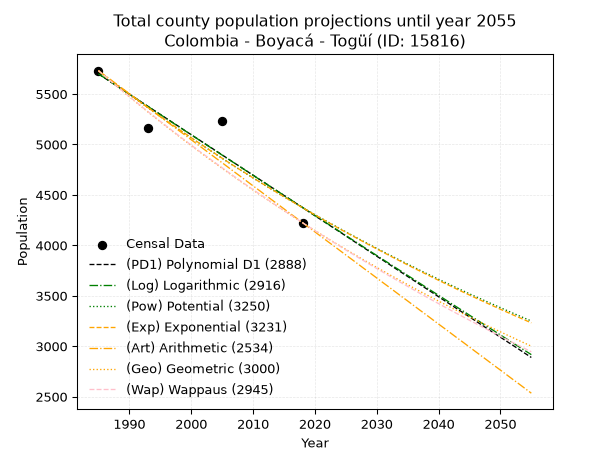
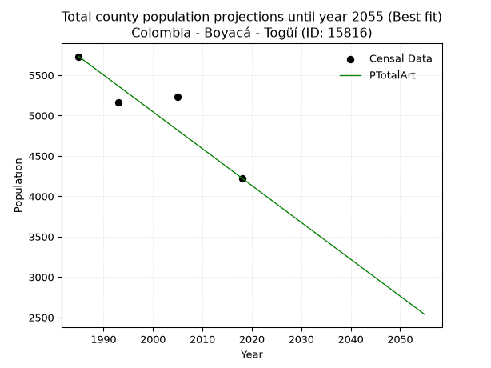
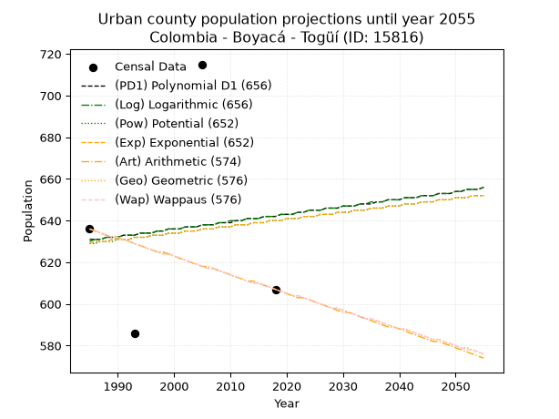
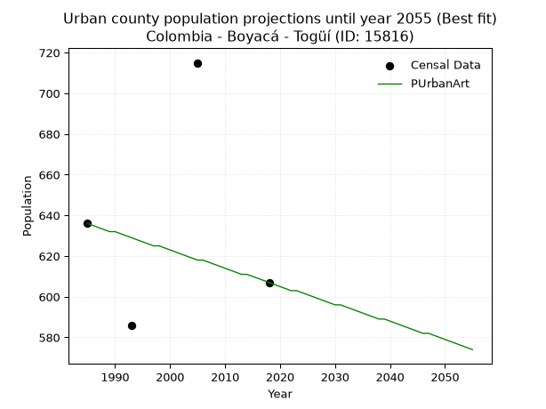
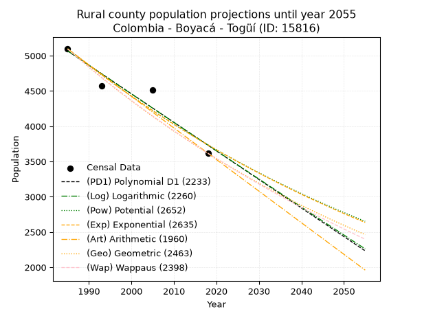
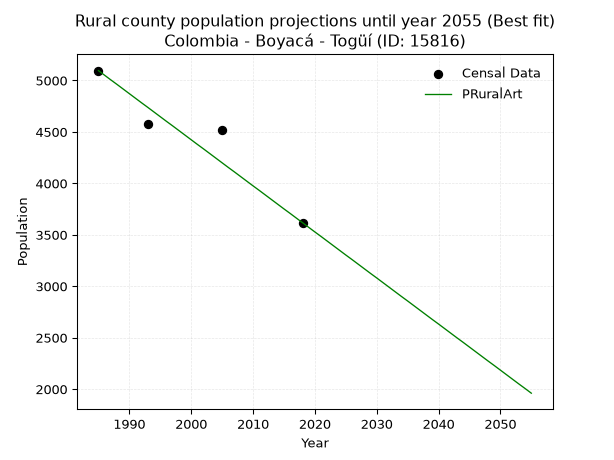

<div align="center">


</div>

# _“Population and Public Services Demand Projections (PPSD) until Year 2050 for Colombia - Boyacá - Togüí (ID: 15816)”_
Keywords: `population` `public-service` `projection` `lineal` `polynomial` `logarithmic` `potential` `exponential` `arithmetic` `geometric` `wappaus` `dane` `colombia` `south-america`

PPSD are analytical estimates used by governments and planners to anticipate future changes in population size, age distribution, and the resulting community needs for utilities, healthcare, education, and infrastructure as sizing future water treatment facilities, electrical grids, and road networks based on spatial growth.

> **General running parameters**: • app_version: _v20260806_. • Python version: _3.14.7_. • Pandas version: _3.0.5_. • NumPy version: _2.5.1_. • Creates, save and include plots into reports (create_plot): _False_. • Projection until year: _2050_. • Process polynomial degree 2 and up: _False_. • Process Wappaus: _True_. • Process Wappaus: _True_. • Set negative values to zero: _True_. • Set infinite values to zero: _True_. • Drop dataset notes: _True_. 
<div align="center">

Dynamic map: [:earth_americas:Google](http://maps.google.com/maps?q=5.937438224,-73.513655) [:earth_americas:OSM](https://www.openstreetmap.org/#map=18/5.937438224/-73.513655&layers=P) [:earth_americas:Bing](https://www.bing.com/maps?cp=5.937438224~-73.513655&lvl=18) [:earth_americas:Apple](https://maps.apple.com/frame?center=5.937438224%2C-73.513655&span=0.003%2C0.006)

</div>


<div align="center">

```geojson
{
  "type": "Feature",
  "geometry": {
    "type": "Point", 
    "coordinates": [-73.513655, 5.937438224]
  }, 
  "properties": {
    "Name": "Colombia - Boyacá - Togüí (ID: 15816)"
  }
}
```

</div>


## 0. Census Data (4 records)

Census data are official statistics collected by a government about the people and housing in a country. They usually include counts of total population, age, sex, race, income, education, and jobs.

📅Global census file: [Population.xlsx](../data/Population.xlsx)

| Source   |   Year |   CountryID | CountryName   |   StateID | StateName   |   CountyID | CountyName   |   PTotal |   PUrban |   PRural |
|:---------|-------:|------------:|:--------------|----------:|:------------|-----------:|:-------------|---------:|---------:|---------:|
| DANE     |   1985 |          57 | Colombia      |        15 | Boyacá      |      15816 | Togüí        |     5731 |      636 |     5095 |
| DANE     |   1993 |          57 | Colombia      |        15 | Boyacá      |      15816 | Toguí        |     5161 |      586 |     4575 |
| DANE     |   2005 |          57 | Colombia      |        15 | Boyacá      |      15816 | Togüí        |     5229 |      715 |     4514 |
| DANE     |   2018 |          57 | Colombia      |        15 | Boyacá      |      15816 | Togüí        |     4224 |      607 |     3617 |

> 🔥Some records could had specific notes about the registered values or the corresponding urban or rural distribution.

## 1. Total

### 1.1. Coefficients and Parameters

* (PD1) Polynomial Deg 1: -40.146527498995766, 85389.34162986628 (lineal)
* (Log) Logarithmic: -80323.42605550218, 615625.2551194123
* (Pow) Potential: -16.356278513416566, 57.69709249128783
* (Exp) Exponential: -0.008175965773577357, 64005609612.91232
* (Art) Arithmetic: Year diff. 2018 - 1985 = 33, Population diff. 4224 - 5731 = -1507, Annual growth = -45.666666666666664
* (Geo) Geometric: Year diff. 2018 - 1985 = 33, Population diff. 4224 - 5731 = -1507, Annual growth % = -0.009203071597043144
* (Wap) Wappaus: i = -0.9174619119370501, Condition values only valid for < 200)

<sub>
Wappaus condition values: ['-0.00', '-0.92', '-1.83', '-2.75', '-3.67', '-4.59', '-5.50', '-6.42', '-7.34', '-8.26', '-9.17', '-10.09', '-11.01', '-11.93', '-12.84', '-13.76', '-14.68', '-15.60', '-16.51', '-17.43', '-18.35', '-19.27', '-20.18', '-21.10', '-22.02', '-22.94', '-23.85', '-24.77', '-25.69', '-26.61', '-27.52', '-28.44', '-29.36', '-30.28', '-31.19', '-32.11', '-33.03', '-33.95', '-34.86', '-35.78', '-36.70', '-37.62', '-38.53', '-39.45', '-40.37', '-41.29', '-42.20', '-43.12', '-44.04', '-44.96', '-45.87', '-46.79', '-47.71', '-48.63', '-49.54', '-50.46', '-51.38', '-52.30', '-53.21', '-54.13', '-55.05', '-55.97', '-56.88', '-57.80', '-58.72', '-59.64']
</sub>


### 1.2. Projected Dataset

|   Year |   CountyID |   PTotalPD1 |   PTotalLog |   PTotalPow |   PTotalExp |   PTotalArt |   PTotalGeo |   PTotalWap |
|-------:|-----------:|------------:|------------:|------------:|------------:|------------:|------------:|------------:|
|   1985 |      15816 |        5698 |        5699 |        5728 |        5727 |        5731 |        5731 |        5731 |
|   1986 |      15816 |        5658 |        5659 |        5681 |        5680 |        5685 |        5678 |        5679 |
|   1987 |      15816 |        5618 |        5619 |        5634 |        5634 |        5640 |        5626 |        5627 |
|   1988 |      15816 |        5578 |        5578 |        5588 |        5588 |        5594 |        5574 |        5575 |
|   1989 |      15816 |        5538 |        5538 |        5542 |        5543 |        5548 |        5523 |        5524 |
|   1990 |      15816 |        5498 |        5497 |        5497 |        5498 |        5503 |        5472 |        5474 |
|   1991 |      15816 |        5458 |        5457 |        5452 |        5453 |        5457 |        5422 |        5424 |
|   1992 |      15816 |        5417 |        5417 |        5408 |        5408 |        5411 |        5372 |        5374 |
|   1993 |      15816 |        5377 |        5376 |        5363 |        5364 |        5366 |        5322 |        5325 |
|   1994 |      15816 |        5337 |        5336 |        5319 |        5321 |        5320 |        5273 |        5277 |
|   1995 |      15816 |        5297 |        5296 |        5276 |        5277 |        5274 |        5225 |        5228 |
|   1996 |      15816 |        5257 |        5256 |        5233 |        5234 |        5229 |        5177 |        5180 |
|   1997 |      15816 |        5217 |        5215 |        5190 |        5192 |        5183 |        5129 |        5133 |
|   1998 |      15816 |        5177 |        5175 |        5148 |        5150 |        5137 |        5082 |        5086 |
|   1999 |      15816 |        5136 |        5135 |        5106 |        5108 |        5092 |        5035 |        5039 |
|   2000 |      15816 |        5096 |        5095 |        5064 |        5066 |        5046 |        4989 |        4993 |
|   2001 |      15816 |        5056 |        5055 |        5023 |        5025 |        5000 |        4943 |        4947 |
|   2002 |      15816 |        5016 |        5014 |        4982 |        4984 |        4955 |        4897 |        4902 |
|   2003 |      15816 |        4976 |        4974 |        4942 |        4943 |        4909 |        4852 |        4857 |
|   2004 |      15816 |        4936 |        4934 |        4902 |        4903 |        4863 |        4808 |        4812 |
|   2005 |      15816 |        4896 |        4894 |        4862 |        4863 |        4818 |        4763 |        4768 |
|   2006 |      15816 |        4855 |        4854 |        4822 |        4823 |        4772 |        4720 |        4724 |
|   2007 |      15816 |        4815 |        4814 |        4783 |        4784 |        4726 |        4676 |        4680 |
|   2008 |      15816 |        4775 |        4774 |        4744 |        4745 |        4681 |        4633 |        4637 |
|   2009 |      15816 |        4735 |        4734 |        4706 |        4707 |        4635 |        4591 |        4594 |
|   2010 |      15816 |        4695 |        4694 |        4668 |        4668 |        4589 |        4548 |        4552 |
|   2011 |      15816 |        4655 |        4654 |        4630 |        4630 |        4544 |        4506 |        4510 |
|   2012 |      15816 |        4615 |        4614 |        4592 |        4593 |        4498 |        4465 |        4468 |
|   2013 |      15816 |        4574 |        4574 |        4555 |        4555 |        4452 |        4424 |        4426 |
|   2014 |      15816 |        4534 |        4534 |        4518 |        4518 |        4407 |        4383 |        4385 |
|   2015 |      15816 |        4494 |        4495 |        4482 |        4481 |        4361 |        4343 |        4344 |
|   2016 |      15816 |        4454 |        4455 |        4446 |        4445 |        4315 |        4303 |        4304 |
|   2017 |      15816 |        4414 |        4415 |        4410 |        4409 |        4270 |        4263 |        4264 |
|   2018 |      15816 |        4374 |        4375 |        4374 |        4373 |        4224 |        4224 |        4224 |
|   2019 |      15816 |        4334 |        4335 |        4339 |        4337 |        4178 |        4185 |        4184 |
|   2020 |      15816 |        4293 |        4295 |        4304 |        4302 |        4133 |        4147 |        4145 |
|   2021 |      15816 |        4253 |        4256 |        4269 |        4267 |        4087 |        4108 |        4106 |
|   2022 |      15816 |        4213 |        4216 |        4235 |        4232 |        4041 |        4071 |        4068 |
|   2023 |      15816 |        4173 |        4176 |        4201 |        4198 |        3996 |        4033 |        4030 |
|   2024 |      15816 |        4133 |        4137 |        4167 |        4163 |        3950 |        3996 |        3992 |
|   2025 |      15816 |        4093 |        4097 |        4133 |        4129 |        3904 |        3959 |        3954 |
|   2026 |      15816 |        4052 |        4057 |        4100 |        4096 |        3859 |        3923 |        3917 |
|   2027 |      15816 |        4012 |        4018 |        4067 |        4063 |        3813 |        3887 |        3879 |
|   2028 |      15816 |        3972 |        3978 |        4034 |        4029 |        3767 |        3851 |        3843 |
|   2029 |      15816 |        3932 |        3938 |        4002 |        3997 |        3722 |        3816 |        3806 |
|   2030 |      15816 |        3892 |        3899 |        3970 |        3964 |        3676 |        3780 |        3770 |
|   2031 |      15816 |        3852 |        3859 |        3938 |        3932 |        3630 |        3746 |        3734 |
|   2032 |      15816 |        3812 |        3820 |        3906 |        3900 |        3585 |        3711 |        3698 |
|   2033 |      15816 |        3771 |        3780 |        3875 |        3868 |        3539 |        3677 |        3663 |
|   2034 |      15816 |        3731 |        3741 |        3844 |        3837 |        3493 |        3643 |        3627 |
|   2035 |      15816 |        3691 |        3701 |        3813 |        3805 |        3448 |        3610 |        3593 |
|   2036 |      15816 |        3651 |        3662 |        3783 |        3774 |        3402 |        3576 |        3558 |
|   2037 |      15816 |        3611 |        3622 |        3752 |        3744 |        3356 |        3543 |        3523 |
|   2038 |      15816 |        3571 |        3583 |        3722 |        3713 |        3311 |        3511 |        3489 |
|   2039 |      15816 |        3531 |        3543 |        3693 |        3683 |        3265 |        3479 |        3455 |
|   2040 |      15816 |        3490 |        3504 |        3663 |        3653 |        3219 |        3447 |        3422 |
|   2041 |      15816 |        3450 |        3465 |        3634 |        3623 |        3174 |        3415 |        3388 |
|   2042 |      15816 |        3410 |        3425 |        3605 |        3594 |        3128 |        3383 |        3355 |
|   2043 |      15816 |        3370 |        3386 |        3576 |        3564 |        3082 |        3352 |        3322 |
|   2044 |      15816 |        3330 |        3347 |        3548 |        3535 |        3037 |        3321 |        3290 |
|   2045 |      15816 |        3290 |        3307 |        3519 |        3507 |        2991 |        3291 |        3257 |
|   2046 |      15816 |        3250 |        3268 |        3491 |        3478 |        2945 |        3261 |        3225 |
|   2047 |      15816 |        3209 |        3229 |        3464 |        3450 |        2900 |        3231 |        3193 |
|   2048 |      15816 |        3169 |        3190 |        3436 |        3422 |        2854 |        3201 |        3161 |
|   2049 |      15816 |        3129 |        3151 |        3409 |        3394 |        2808 |        3171 |        3130 |
|   2050 |      15816 |        3089 |        3111 |        3382 |        3366 |        2763 |        3142 |        3098 |
<div align="center">

</img>

</div>


### 1.3. Best fit with absolute and relative error (%)

Relative error puts that difference into context by dividing the absolute error by the true value, creating a unitless ratio or percentage that shows the scale of the mistake.

Absolute and relative error

|   Year | Source   |   CountryID | CountryName   |   StateID | StateName   |   CountyID_x | CountyName   |   PTotal |   PUrban |   PRural |   CountyID_y |   PTotalPD1 |   PTotalLog |   PTotalPow |   PTotalExp |   PTotalArt |   PTotalGeo |   PTotalWap |   PTotalPD1AbsError |   PTotalLogAbsError |   PTotalPowAbsError |   PTotalExpAbsError |   PTotalArtAbsError |   PTotalGeoAbsError |   PTotalWapAbsError |   PTotalPD1RelError |   PTotalLogRelError |   PTotalPowRelError |   PTotalExpRelError |   PTotalArtRelError |   PTotalGeoRelError |   PTotalWapRelError |
|-------:|:---------|------------:|:--------------|----------:|:------------|-------------:|:-------------|---------:|---------:|---------:|-------------:|------------:|------------:|------------:|------------:|------------:|------------:|------------:|--------------------:|--------------------:|--------------------:|--------------------:|--------------------:|--------------------:|--------------------:|--------------------:|--------------------:|--------------------:|--------------------:|--------------------:|--------------------:|--------------------:|
|   1985 | DANE     |          57 | Colombia      |        15 | Boyacá      |        15816 | Togüí        |     5731 |      636 |     5095 |        15816 |        5698 |        5699 |        5728 |        5727 |        5731 |        5731 |        5731 |                  33 |                  32 |                   3 |                   4 |                   0 |                   0 |                   0 |            0.575816 |            0.558367 |           0.0523469 |           0.0697958 |             0       |             0       |             0       |
|   1993 | DANE     |          57 | Colombia      |        15 | Boyacá      |        15816 | Toguí        |     5161 |      586 |     4575 |        15816 |        5377 |        5376 |        5363 |        5364 |        5366 |        5322 |        5325 |                 216 |                 215 |                 202 |                 203 |                 205 |                 161 |                 164 |            4.18524  |            4.16586  |           3.91397   |           3.93335   |             3.9721  |             3.11955 |             3.17768 |
|   2005 | DANE     |          57 | Colombia      |        15 | Boyacá      |        15816 | Togüí        |     5229 |      715 |     4514 |        15816 |        4896 |        4894 |        4862 |        4863 |        4818 |        4763 |        4768 |                 333 |                 335 |                 367 |                 366 |                 411 |                 466 |                 461 |            6.36833  |            6.40658  |           7.01855   |           6.99943   |             7.86001 |             8.91184 |             8.81622 |
|   2018 | DANE     |          57 | Colombia      |        15 | Boyacá      |        15816 | Togüí        |     4224 |      607 |     3617 |        15816 |        4374 |        4375 |        4374 |        4373 |        4224 |        4224 |        4224 |                 150 |                 151 |                 150 |                 149 |                   0 |                   0 |                   0 |            3.55114  |            3.57481  |           3.55114   |           3.52746   |             0       |             0       |             0       |

Relative error mean

| Method    |   RelError | Best   |
|:----------|-----------:|:-------|
| PTotalPD1 |    3.67013 |        |
| PTotalLog |    3.6764  |        |
| PTotalPow |    3.634   |        |
| PTotalExp |    3.63251 |        |
| PTotalArt |    2.95803 | True   |
| PTotalGeo |    3.00785 |        |
| PTotalWap |    2.99847 |        |

💙Best method: _**PTotalArt**_
<div align="center">

</img>

</div>


### 1.4. Fresh water supply demand in liters per capita per day (lpcd)

The fresh water supply demand typically ranges from 100 to 300 liters per capita per day (lpcd) for standard domestic and municipal planning, though absolute survival minimums set by the World Health Organization are as low as 7.5 to 20 liters per day, and total consumption in high-income nations can exceed 400 liters.

> `CZ`: Level in meters above the sea level (masl).<br> `WS`: Fresh water supply demand in liters per capita per day (lpcd or l/h/d).<br> `WSAll`: Zonal fresh water supply demand in liters per second (l/s).<br> `A`: Zonal area in square meters.

Reference values (RAS Colombia)

|    CZ |   WS |
|------:|-----:|
|  1000 |  120 |
|  2000 |  130 |
| 99999 |  140 |

County shapefile geometry properties and water supply values

|   CountyID |      ATotal |   CZTotal |   WSTotal |
|-----------:|------------:|----------:|----------:|
|      15816 | 1.01278e+08 |   1980.97 |       130 |

Projected values for best method: PTotalArt

|   CountyID |   Year |   PTotalArt |   WSTotal |   WSTotalAll |
|-----------:|-------:|------------:|----------:|-------------:|
|      15816 |   1985 |        5731 |       130 |      8.62303 |
|      15816 |   1986 |        5685 |       130 |      8.55382 |
|      15816 |   1987 |        5640 |       130 |      8.48611 |
|      15816 |   1988 |        5594 |       130 |      8.4169  |
|      15816 |   1989 |        5548 |       130 |      8.34769 |
|      15816 |   1990 |        5503 |       130 |      8.27998 |
|      15816 |   1991 |        5457 |       130 |      8.21076 |
|      15816 |   1992 |        5411 |       130 |      8.14155 |
|      15816 |   1993 |        5366 |       130 |      8.07384 |
|      15816 |   1994 |        5320 |       130 |      8.00463 |
|      15816 |   1995 |        5274 |       130 |      7.93542 |
|      15816 |   1996 |        5229 |       130 |      7.86771 |
|      15816 |   1997 |        5183 |       130 |      7.7985  |
|      15816 |   1998 |        5137 |       130 |      7.72928 |
|      15816 |   1999 |        5092 |       130 |      7.66157 |
|      15816 |   2000 |        5046 |       130 |      7.59236 |
|      15816 |   2001 |        5000 |       130 |      7.52315 |
|      15816 |   2002 |        4955 |       130 |      7.45544 |
|      15816 |   2003 |        4909 |       130 |      7.38623 |
|      15816 |   2004 |        4863 |       130 |      7.31701 |
|      15816 |   2005 |        4818 |       130 |      7.24931 |
|      15816 |   2006 |        4772 |       130 |      7.18009 |
|      15816 |   2007 |        4726 |       130 |      7.11088 |
|      15816 |   2008 |        4681 |       130 |      7.04317 |
|      15816 |   2009 |        4635 |       130 |      6.97396 |
|      15816 |   2010 |        4589 |       130 |      6.90475 |
|      15816 |   2011 |        4544 |       130 |      6.83704 |
|      15816 |   2012 |        4498 |       130 |      6.76782 |
|      15816 |   2013 |        4452 |       130 |      6.69861 |
|      15816 |   2014 |        4407 |       130 |      6.6309  |
|      15816 |   2015 |        4361 |       130 |      6.56169 |
|      15816 |   2016 |        4315 |       130 |      6.49248 |
|      15816 |   2017 |        4270 |       130 |      6.42477 |
|      15816 |   2018 |        4224 |       130 |      6.35556 |
|      15816 |   2019 |        4178 |       130 |      6.28634 |
|      15816 |   2020 |        4133 |       130 |      6.21863 |
|      15816 |   2021 |        4087 |       130 |      6.14942 |
|      15816 |   2022 |        4041 |       130 |      6.08021 |
|      15816 |   2023 |        3996 |       130 |      6.0125  |
|      15816 |   2024 |        3950 |       130 |      5.94329 |
|      15816 |   2025 |        3904 |       130 |      5.87407 |
|      15816 |   2026 |        3859 |       130 |      5.80637 |
|      15816 |   2027 |        3813 |       130 |      5.73715 |
|      15816 |   2028 |        3767 |       130 |      5.66794 |
|      15816 |   2029 |        3722 |       130 |      5.60023 |
|      15816 |   2030 |        3676 |       130 |      5.53102 |
|      15816 |   2031 |        3630 |       130 |      5.46181 |
|      15816 |   2032 |        3585 |       130 |      5.3941  |
|      15816 |   2033 |        3539 |       130 |      5.32488 |
|      15816 |   2034 |        3493 |       130 |      5.25567 |
|      15816 |   2035 |        3448 |       130 |      5.18796 |
|      15816 |   2036 |        3402 |       130 |      5.11875 |
|      15816 |   2037 |        3356 |       130 |      5.04954 |
|      15816 |   2038 |        3311 |       130 |      4.98183 |
|      15816 |   2039 |        3265 |       130 |      4.91262 |
|      15816 |   2040 |        3219 |       130 |      4.8434  |
|      15816 |   2041 |        3174 |       130 |      4.77569 |
|      15816 |   2042 |        3128 |       130 |      4.70648 |
|      15816 |   2043 |        3082 |       130 |      4.63727 |
|      15816 |   2044 |        3037 |       130 |      4.56956 |
|      15816 |   2045 |        2991 |       130 |      4.50035 |
|      15816 |   2046 |        2945 |       130 |      4.43113 |
|      15816 |   2047 |        2900 |       130 |      4.36343 |
|      15816 |   2048 |        2854 |       130 |      4.29421 |
|      15816 |   2049 |        2808 |       130 |      4.225   |
|      15816 |   2050 |        2763 |       130 |      4.15729 |

## 2. Urban

### 2.1. Coefficients and Parameters

* (PD1) Polynomial Deg 1: 0.3580891208350653, -80.26776395033923 (lineal)
* (Log) Logarithmic: 725.2438606622177, -4876.584396633076
* (Pow) Potential: 1.0453533554961985, -0.6485783369912859
* (Exp) Exponential: 0.0005160683319670191, 225.8941983247125
* (Art) Arithmetic: Year diff. 2018 - 1985 = 33, Population diff. 607 - 636 = -29, Annual growth = -0.8787878787878788
* (Geo) Geometric: Year diff. 2018 - 1985 = 33, Population diff. 607 - 636 = -29, Annual growth % = -0.0014132359638568959
* (Wap) Wappaus: i = -0.1413978887832468, Condition values only valid for < 200)

<sub>
Wappaus condition values: ['-0.00', '-0.14', '-0.28', '-0.42', '-0.57', '-0.71', '-0.85', '-0.99', '-1.13', '-1.27', '-1.41', '-1.56', '-1.70', '-1.84', '-1.98', '-2.12', '-2.26', '-2.40', '-2.55', '-2.69', '-2.83', '-2.97', '-3.11', '-3.25', '-3.39', '-3.53', '-3.68', '-3.82', '-3.96', '-4.10', '-4.24', '-4.38', '-4.52', '-4.67', '-4.81', '-4.95', '-5.09', '-5.23', '-5.37', '-5.51', '-5.66', '-5.80', '-5.94', '-6.08', '-6.22', '-6.36', '-6.50', '-6.65', '-6.79', '-6.93', '-7.07', '-7.21', '-7.35', '-7.49', '-7.64', '-7.78', '-7.92', '-8.06', '-8.20', '-8.34', '-8.48', '-8.63', '-8.77', '-8.91', '-9.05', '-9.19']
</sub>


### 2.2. Projected Dataset

|   Year |   CountyID |   PUrbanPD1 |   PUrbanLog |   PUrbanPow |   PUrbanExp |   PUrbanArt |   PUrbanGeo |   PUrbanWap |
|-------:|-----------:|------------:|------------:|------------:|------------:|------------:|------------:|------------:|
|   1985 |      15816 |         631 |         630 |         629 |         629 |         636 |         636 |         636 |
|   1986 |      15816 |         631 |         631 |         629 |         630 |         635 |         635 |         635 |
|   1987 |      15816 |         631 |         631 |         630 |         630 |         634 |         634 |         634 |
|   1988 |      15816 |         632 |         632 |         630 |         630 |         633 |         633 |         633 |
|   1989 |      15816 |         632 |         632 |         630 |         631 |         632 |         632 |         632 |
|   1990 |      15816 |         632 |         632 |         631 |         631 |         632 |         632 |         632 |
|   1991 |      15816 |         633 |         633 |         631 |         631 |         631 |         631 |         631 |
|   1992 |      15816 |         633 |         633 |         631 |         631 |         630 |         630 |         630 |
|   1993 |      15816 |         633 |         633 |         632 |         632 |         629 |         629 |         629 |
|   1994 |      15816 |         634 |         634 |         632 |         632 |         628 |         628 |         628 |
|   1995 |      15816 |         634 |         634 |         632 |         632 |         627 |         627 |         627 |
|   1996 |      15816 |         634 |         634 |         633 |         633 |         626 |         626 |         626 |
|   1997 |      15816 |         635 |         635 |         633 |         633 |         625 |         625 |         625 |
|   1998 |      15816 |         635 |         635 |         633 |         633 |         625 |         624 |         624 |
|   1999 |      15816 |         636 |         636 |         634 |         634 |         624 |         624 |         624 |
|   2000 |      15816 |         636 |         636 |         634 |         634 |         623 |         623 |         623 |
|   2001 |      15816 |         636 |         636 |         634 |         634 |         622 |         622 |         622 |
|   2002 |      15816 |         637 |         637 |         635 |         635 |         621 |         621 |         621 |
|   2003 |      15816 |         637 |         637 |         635 |         635 |         620 |         620 |         620 |
|   2004 |      15816 |         637 |         637 |         635 |         635 |         619 |         619 |         619 |
|   2005 |      15816 |         638 |         638 |         636 |         636 |         618 |         618 |         618 |
|   2006 |      15816 |         638 |         638 |         636 |         636 |         618 |         617 |         617 |
|   2007 |      15816 |         638 |         638 |         636 |         636 |         617 |         617 |         617 |
|   2008 |      15816 |         639 |         639 |         637 |         637 |         616 |         616 |         616 |
|   2009 |      15816 |         639 |         639 |         637 |         637 |         615 |         615 |         615 |
|   2010 |      15816 |         639 |         640 |         637 |         637 |         614 |         614 |         614 |
|   2011 |      15816 |         640 |         640 |         638 |         638 |         613 |         613 |         613 |
|   2012 |      15816 |         640 |         640 |         638 |         638 |         612 |         612 |         612 |
|   2013 |      15816 |         641 |         641 |         638 |         638 |         611 |         611 |         611 |
|   2014 |      15816 |         641 |         641 |         639 |         639 |         611 |         610 |         610 |
|   2015 |      15816 |         641 |         641 |         639 |         639 |         610 |         610 |         610 |
|   2016 |      15816 |         642 |         642 |         639 |         639 |         609 |         609 |         609 |
|   2017 |      15816 |         642 |         642 |         640 |         640 |         608 |         608 |         608 |
|   2018 |      15816 |         642 |         642 |         640 |         640 |         607 |         607 |         607 |
|   2019 |      15816 |         643 |         643 |         640 |         640 |         606 |         606 |         606 |
|   2020 |      15816 |         643 |         643 |         641 |         641 |         605 |         605 |         605 |
|   2021 |      15816 |         643 |         643 |         641 |         641 |         604 |         604 |         604 |
|   2022 |      15816 |         644 |         644 |         641 |         641 |         603 |         604 |         604 |
|   2023 |      15816 |         644 |         644 |         642 |         642 |         603 |         603 |         603 |
|   2024 |      15816 |         645 |         645 |         642 |         642 |         602 |         602 |         602 |
|   2025 |      15816 |         645 |         645 |         642 |         642 |         601 |         601 |         601 |
|   2026 |      15816 |         645 |         645 |         643 |         643 |         600 |         600 |         600 |
|   2027 |      15816 |         646 |         646 |         643 |         643 |         599 |         599 |         599 |
|   2028 |      15816 |         646 |         646 |         643 |         643 |         598 |         598 |         598 |
|   2029 |      15816 |         646 |         646 |         644 |         644 |         597 |         598 |         598 |
|   2030 |      15816 |         647 |         647 |         644 |         644 |         596 |         597 |         597 |
|   2031 |      15816 |         647 |         647 |         644 |         644 |         596 |         596 |         596 |
|   2032 |      15816 |         647 |         647 |         645 |         645 |         595 |         595 |         595 |
|   2033 |      15816 |         648 |         648 |         645 |         645 |         594 |         594 |         594 |
|   2034 |      15816 |         648 |         648 |         645 |         645 |         593 |         593 |         593 |
|   2035 |      15816 |         648 |         649 |         646 |         646 |         592 |         593 |         593 |
|   2036 |      15816 |         649 |         649 |         646 |         646 |         591 |         592 |         592 |
|   2037 |      15816 |         649 |         649 |         646 |         646 |         590 |         591 |         591 |
|   2038 |      15816 |         650 |         650 |         647 |         647 |         589 |         590 |         590 |
|   2039 |      15816 |         650 |         650 |         647 |         647 |         589 |         589 |         589 |
|   2040 |      15816 |         650 |         650 |         647 |         647 |         588 |         588 |         588 |
|   2041 |      15816 |         651 |         651 |         648 |         648 |         587 |         588 |         588 |
|   2042 |      15816 |         651 |         651 |         648 |         648 |         586 |         587 |         587 |
|   2043 |      15816 |         651 |         651 |         648 |         648 |         585 |         586 |         586 |
|   2044 |      15816 |         652 |         652 |         649 |         649 |         584 |         585 |         585 |
|   2045 |      15816 |         652 |         652 |         649 |         649 |         583 |         584 |         584 |
|   2046 |      15816 |         652 |         652 |         649 |         649 |         582 |         583 |         583 |
|   2047 |      15816 |         653 |         653 |         650 |         650 |         582 |         583 |         583 |
|   2048 |      15816 |         653 |         653 |         650 |         650 |         581 |         582 |         582 |
|   2049 |      15816 |         653 |         653 |         650 |         650 |         580 |         581 |         581 |
|   2050 |      15816 |         654 |         654 |         651 |         651 |         579 |         580 |         580 |
<div align="center">

</img>

</div>


### 2.3. Best fit with absolute and relative error (%)

Relative error puts that difference into context by dividing the absolute error by the true value, creating a unitless ratio or percentage that shows the scale of the mistake.

Absolute and relative error

|   Year | Source   |   CountryID | CountryName   |   StateID | StateName   |   CountyID_x | CountyName   |   PTotal |   PUrban |   PRural |   CountyID_y |   PUrbanPD1 |   PUrbanLog |   PUrbanPow |   PUrbanExp |   PUrbanArt |   PUrbanGeo |   PUrbanWap |   PUrbanPD1AbsError |   PUrbanLogAbsError |   PUrbanPowAbsError |   PUrbanExpAbsError |   PUrbanArtAbsError |   PUrbanGeoAbsError |   PUrbanWapAbsError |   PUrbanPD1RelError |   PUrbanLogRelError |   PUrbanPowRelError |   PUrbanExpRelError |   PUrbanArtRelError |   PUrbanGeoRelError |   PUrbanWapRelError |
|-------:|:---------|------------:|:--------------|----------:|:------------|-------------:|:-------------|---------:|---------:|---------:|-------------:|------------:|------------:|------------:|------------:|------------:|------------:|------------:|--------------------:|--------------------:|--------------------:|--------------------:|--------------------:|--------------------:|--------------------:|--------------------:|--------------------:|--------------------:|--------------------:|--------------------:|--------------------:|--------------------:|
|   1985 | DANE     |          57 | Colombia      |        15 | Boyacá      |        15816 | Togüí        |     5731 |      636 |     5095 |        15816 |         631 |         630 |         629 |         629 |         636 |         636 |         636 |                   5 |                   6 |                   7 |                   7 |                   0 |                   0 |                   0 |            0.786164 |            0.943396 |             1.10063 |             1.10063 |             0       |             0       |             0       |
|   1993 | DANE     |          57 | Colombia      |        15 | Boyacá      |        15816 | Toguí        |     5161 |      586 |     4575 |        15816 |         633 |         633 |         632 |         632 |         629 |         629 |         629 |                  47 |                  47 |                  46 |                  46 |                  43 |                  43 |                  43 |            8.02048  |            8.02048  |             7.84983 |             7.84983 |             7.33788 |             7.33788 |             7.33788 |
|   2005 | DANE     |          57 | Colombia      |        15 | Boyacá      |        15816 | Togüí        |     5229 |      715 |     4514 |        15816 |         638 |         638 |         636 |         636 |         618 |         618 |         618 |                  77 |                  77 |                  79 |                  79 |                  97 |                  97 |                  97 |           10.7692   |           10.7692   |            11.049   |            11.049   |            13.5664  |            13.5664  |            13.5664  |
|   2018 | DANE     |          57 | Colombia      |        15 | Boyacá      |        15816 | Togüí        |     4224 |      607 |     3617 |        15816 |         642 |         642 |         640 |         640 |         607 |         607 |         607 |                  35 |                  35 |                  33 |                  33 |                   0 |                   0 |                   0 |            5.76606  |            5.76606  |             5.43657 |             5.43657 |             0       |             0       |             0       |

Relative error mean

| Method    |   RelError | Best   |
|:----------|-----------:|:-------|
| PUrbanPD1 |    6.33548 |        |
| PUrbanLog |    6.37479 |        |
| PUrbanPow |    6.359   |        |
| PUrbanExp |    6.359   |        |
| PUrbanArt |    5.22608 | True   |
| PUrbanGeo |    5.22608 | True   |
| PUrbanWap |    5.22608 | True   |

💙Best method: _**PUrbanArt**_
<div align="center">

</img>

</div>


### 2.4. Fresh water supply demand in liters per capita per day (lpcd)

The fresh water supply demand typically ranges from 100 to 300 liters per capita per day (lpcd) for standard domestic and municipal planning, though absolute survival minimums set by the World Health Organization are as low as 7.5 to 20 liters per day, and total consumption in high-income nations can exceed 400 liters.

> `CZ`: Level in meters above the sea level (masl).<br> `WS`: Fresh water supply demand in liters per capita per day (lpcd or l/h/d).<br> `WSAll`: Zonal fresh water supply demand in liters per second (l/s).<br> `A`: Zonal area in square meters.

Reference values (RAS Colombia)

|    CZ |   WS |
|------:|-----:|
|  1000 |  120 |
|  2000 |  130 |
| 99999 |  140 |

County shapefile geometry properties and water supply values

|   CountyID |   AUrban |   CZUrban |   WSUrban |
|-----------:|---------:|----------:|----------:|
|      15816 |   238413 |   1658.73 |       130 |

Projected values for best method: PUrbanArt

|   CountyID |   Year |   PUrbanArt |   WSUrban |   WSUrbanAll |
|-----------:|-------:|------------:|----------:|-------------:|
|      15816 |   1985 |         636 |       130 |     0.956944 |
|      15816 |   1986 |         635 |       130 |     0.95544  |
|      15816 |   1987 |         634 |       130 |     0.953935 |
|      15816 |   1988 |         633 |       130 |     0.952431 |
|      15816 |   1989 |         632 |       130 |     0.950926 |
|      15816 |   1990 |         632 |       130 |     0.950926 |
|      15816 |   1991 |         631 |       130 |     0.949421 |
|      15816 |   1992 |         630 |       130 |     0.947917 |
|      15816 |   1993 |         629 |       130 |     0.946412 |
|      15816 |   1994 |         628 |       130 |     0.944907 |
|      15816 |   1995 |         627 |       130 |     0.943403 |
|      15816 |   1996 |         626 |       130 |     0.941898 |
|      15816 |   1997 |         625 |       130 |     0.940394 |
|      15816 |   1998 |         625 |       130 |     0.940394 |
|      15816 |   1999 |         624 |       130 |     0.938889 |
|      15816 |   2000 |         623 |       130 |     0.937384 |
|      15816 |   2001 |         622 |       130 |     0.93588  |
|      15816 |   2002 |         621 |       130 |     0.934375 |
|      15816 |   2003 |         620 |       130 |     0.93287  |
|      15816 |   2004 |         619 |       130 |     0.931366 |
|      15816 |   2005 |         618 |       130 |     0.929861 |
|      15816 |   2006 |         618 |       130 |     0.929861 |
|      15816 |   2007 |         617 |       130 |     0.928356 |
|      15816 |   2008 |         616 |       130 |     0.926852 |
|      15816 |   2009 |         615 |       130 |     0.925347 |
|      15816 |   2010 |         614 |       130 |     0.923843 |
|      15816 |   2011 |         613 |       130 |     0.922338 |
|      15816 |   2012 |         612 |       130 |     0.920833 |
|      15816 |   2013 |         611 |       130 |     0.919329 |
|      15816 |   2014 |         611 |       130 |     0.919329 |
|      15816 |   2015 |         610 |       130 |     0.917824 |
|      15816 |   2016 |         609 |       130 |     0.916319 |
|      15816 |   2017 |         608 |       130 |     0.914815 |
|      15816 |   2018 |         607 |       130 |     0.91331  |
|      15816 |   2019 |         606 |       130 |     0.911806 |
|      15816 |   2020 |         605 |       130 |     0.910301 |
|      15816 |   2021 |         604 |       130 |     0.908796 |
|      15816 |   2022 |         603 |       130 |     0.907292 |
|      15816 |   2023 |         603 |       130 |     0.907292 |
|      15816 |   2024 |         602 |       130 |     0.905787 |
|      15816 |   2025 |         601 |       130 |     0.904282 |
|      15816 |   2026 |         600 |       130 |     0.902778 |
|      15816 |   2027 |         599 |       130 |     0.901273 |
|      15816 |   2028 |         598 |       130 |     0.899769 |
|      15816 |   2029 |         597 |       130 |     0.898264 |
|      15816 |   2030 |         596 |       130 |     0.896759 |
|      15816 |   2031 |         596 |       130 |     0.896759 |
|      15816 |   2032 |         595 |       130 |     0.895255 |
|      15816 |   2033 |         594 |       130 |     0.89375  |
|      15816 |   2034 |         593 |       130 |     0.892245 |
|      15816 |   2035 |         592 |       130 |     0.890741 |
|      15816 |   2036 |         591 |       130 |     0.889236 |
|      15816 |   2037 |         590 |       130 |     0.887731 |
|      15816 |   2038 |         589 |       130 |     0.886227 |
|      15816 |   2039 |         589 |       130 |     0.886227 |
|      15816 |   2040 |         588 |       130 |     0.884722 |
|      15816 |   2041 |         587 |       130 |     0.883218 |
|      15816 |   2042 |         586 |       130 |     0.881713 |
|      15816 |   2043 |         585 |       130 |     0.880208 |
|      15816 |   2044 |         584 |       130 |     0.878704 |
|      15816 |   2045 |         583 |       130 |     0.877199 |
|      15816 |   2046 |         582 |       130 |     0.875694 |
|      15816 |   2047 |         582 |       130 |     0.875694 |
|      15816 |   2048 |         581 |       130 |     0.87419  |
|      15816 |   2049 |         580 |       130 |     0.872685 |
|      15816 |   2050 |         579 |       130 |     0.871181 |

## 3. Rural

### 3.1. Coefficients and Parameters

* (PD1) Polynomial Deg 1: -40.50461661983084, 85469.60939381663 (lineal)
* (Log) Logarithmic: -81048.66991616446, 620501.8395160458
* (Pow) Potential: -18.878018378046068, 65.96288165887125
* (Exp) Exponential: -0.009435629217131253, 694735038144.4467
* (Art) Arithmetic: Year diff. 2018 - 1985 = 33, Population diff. 3617 - 5095 = -1478, Annual growth = -44.78787878787879
* (Geo) Geometric: Year diff. 2018 - 1985 = 33, Population diff. 3617 - 5095 = -1478, Annual growth % = -0.010328554384926303
* (Wap) Wappaus: i = -1.0281882182708628, Condition values only valid for < 200)

<sub>
Wappaus condition values: ['-0.00', '-1.03', '-2.06', '-3.08', '-4.11', '-5.14', '-6.17', '-7.20', '-8.23', '-9.25', '-10.28', '-11.31', '-12.34', '-13.37', '-14.39', '-15.42', '-16.45', '-17.48', '-18.51', '-19.54', '-20.56', '-21.59', '-22.62', '-23.65', '-24.68', '-25.70', '-26.73', '-27.76', '-28.79', '-29.82', '-30.85', '-31.87', '-32.90', '-33.93', '-34.96', '-35.99', '-37.01', '-38.04', '-39.07', '-40.10', '-41.13', '-42.16', '-43.18', '-44.21', '-45.24', '-46.27', '-47.30', '-48.32', '-49.35', '-50.38', '-51.41', '-52.44', '-53.47', '-54.49', '-55.52', '-56.55', '-57.58', '-58.61', '-59.63', '-60.66', '-61.69', '-62.72', '-63.75', '-64.78', '-65.80', '-66.83']
</sub>


### 3.2. Projected Dataset

|   Year |   CountyID |   PRuralPD1 |   PRuralLog |   PRuralPow |   PRuralExp |   PRuralArt |   PRuralGeo |   PRuralWap |
|-------:|-----------:|------------:|------------:|------------:|------------:|------------:|------------:|------------:|
|   1985 |      15816 |        5068 |        5069 |        5102 |        5100 |        5095 |        5095 |        5095 |
|   1986 |      15816 |        5027 |        5028 |        5053 |        5052 |        5050 |        5042 |        5043 |
|   1987 |      15816 |        4987 |        4987 |        5005 |        5005 |        5005 |        4990 |        4991 |
|   1988 |      15816 |        4946 |        4947 |        4958 |        4958 |        4961 |        4939 |        4940 |
|   1989 |      15816 |        4906 |        4906 |        4911 |        4911 |        4916 |        4888 |        4890 |
|   1990 |      15816 |        4865 |        4865 |        4865 |        4865 |        4871 |        4837 |        4840 |
|   1991 |      15816 |        4825 |        4824 |        4819 |        4820 |        4826 |        4787 |        4790 |
|   1992 |      15816 |        4784 |        4784 |        4774 |        4774 |        4781 |        4738 |        4741 |
|   1993 |      15816 |        4744 |        4743 |        4728 |        4730 |        4737 |        4689 |        4692 |
|   1994 |      15816 |        4703 |        4702 |        4684 |        4685 |        4692 |        4640 |        4644 |
|   1995 |      15816 |        4663 |        4662 |        4640 |        4641 |        4647 |        4593 |        4597 |
|   1996 |      15816 |        4622 |        4621 |        4596 |        4598 |        4602 |        4545 |        4550 |
|   1997 |      15816 |        4582 |        4580 |        4553 |        4554 |        4558 |        4498 |        4503 |
|   1998 |      15816 |        4541 |        4540 |        4510 |        4512 |        4513 |        4452 |        4457 |
|   1999 |      15816 |        4501 |        4499 |        4468 |        4469 |        4468 |        4406 |        4411 |
|   2000 |      15816 |        4460 |        4459 |        4426 |        4427 |        4423 |        4360 |        4365 |
|   2001 |      15816 |        4420 |        4418 |        4384 |        4386 |        4378 |        4315 |        4321 |
|   2002 |      15816 |        4379 |        4378 |        4343 |        4345 |        4334 |        4271 |        4276 |
|   2003 |      15816 |        4339 |        4337 |        4302 |        4304 |        4289 |        4227 |        4232 |
|   2004 |      15816 |        4298 |        4297 |        4262 |        4263 |        4244 |        4183 |        4188 |
|   2005 |      15816 |        4258 |        4256 |        4222 |        4223 |        4199 |        4140 |        4145 |
|   2006 |      15816 |        4217 |        4216 |        4182 |        4184 |        4154 |        4097 |        4102 |
|   2007 |      15816 |        4177 |        4176 |        4143 |        4144 |        4110 |        4055 |        4060 |
|   2008 |      15816 |        4136 |        4135 |        4104 |        4105 |        4065 |        4013 |        4018 |
|   2009 |      15816 |        4096 |        4095 |        4066 |        4067 |        4020 |        3971 |        3976 |
|   2010 |      15816 |        4055 |        4055 |        4028 |        4029 |        3975 |        3930 |        3934 |
|   2011 |      15816 |        4015 |        4014 |        3990 |        3991 |        3931 |        3890 |        3894 |
|   2012 |      15816 |        3974 |        3974 |        3953 |        3953 |        3886 |        3849 |        3853 |
|   2013 |      15816 |        3934 |        3934 |        3916 |        3916 |        3841 |        3810 |        3813 |
|   2014 |      15816 |        3893 |        3893 |        3880 |        3879 |        3796 |        3770 |        3773 |
|   2015 |      15816 |        3853 |        3853 |        3843 |        3843 |        3751 |        3731 |        3733 |
|   2016 |      15816 |        3812 |        3813 |        3808 |        3807 |        3707 |        3693 |        3694 |
|   2017 |      15816 |        3772 |        3773 |        3772 |        3771 |        3662 |        3655 |        3655 |
|   2018 |      15816 |        3731 |        3733 |        3737 |        3736 |        3617 |        3617 |        3617 |
|   2019 |      15816 |        3691 |        3692 |        3702 |        3701 |        3572 |        3580 |        3579 |
|   2020 |      15816 |        3650 |        3652 |        3668 |        3666 |        3527 |        3543 |        3541 |
|   2021 |      15816 |        3610 |        3612 |        3634 |        3631 |        3483 |        3506 |        3504 |
|   2022 |      15816 |        3569 |        3572 |        3600 |        3597 |        3438 |        3470 |        3466 |
|   2023 |      15816 |        3529 |        3532 |        3566 |        3564 |        3393 |        3434 |        3430 |
|   2024 |      15816 |        3488 |        3492 |        3533 |        3530 |        3348 |        3399 |        3393 |
|   2025 |      15816 |        3448 |        3452 |        3500 |        3497 |        3303 |        3363 |        3357 |
|   2026 |      15816 |        3407 |        3412 |        3468 |        3464 |        3259 |        3329 |        3321 |
|   2027 |      15816 |        3367 |        3372 |        3436 |        3432 |        3214 |        3294 |        3285 |
|   2028 |      15816 |        3326 |        3332 |        3404 |        3399 |        3169 |        3260 |        3250 |
|   2029 |      15816 |        3286 |        3292 |        3372 |        3367 |        3124 |        3227 |        3215 |
|   2030 |      15816 |        3245 |        3252 |        3341 |        3336 |        3080 |        3193 |        3181 |
|   2031 |      15816 |        3205 |        3212 |        3310 |        3304 |        3035 |        3160 |        3146 |
|   2032 |      15816 |        3164 |        3172 |        3280 |        3273 |        2990 |        3128 |        3112 |
|   2033 |      15816 |        3124 |        3132 |        3249 |        3243 |        2945 |        3095 |        3078 |
|   2034 |      15816 |        3083 |        3093 |        3219 |        3212 |        2900 |        3063 |        3045 |
|   2035 |      15816 |        3043 |        3053 |        3190 |        3182 |        2856 |        3032 |        3011 |
|   2036 |      15816 |        3002 |        3013 |        3160 |        3152 |        2811 |        3000 |        2978 |
|   2037 |      15816 |        2962 |        2973 |        3131 |        3123 |        2766 |        2969 |        2946 |
|   2038 |      15816 |        2921 |        2933 |        3102 |        3093 |        2721 |        2939 |        2913 |
|   2039 |      15816 |        2881 |        2894 |        3074 |        3064 |        2676 |        2908 |        2881 |
|   2040 |      15816 |        2840 |        2854 |        3045 |        3035 |        2632 |        2878 |        2849 |
|   2041 |      15816 |        2800 |        2814 |        3017 |        3007 |        2587 |        2849 |        2817 |
|   2042 |      15816 |        2759 |        2774 |        2989 |        2979 |        2542 |        2819 |        2786 |
|   2043 |      15816 |        2719 |        2735 |        2962 |        2951 |        2497 |        2790 |        2754 |
|   2044 |      15816 |        2678 |        2695 |        2935 |        2923 |        2453 |        2761 |        2724 |
|   2045 |      15816 |        2638 |        2655 |        2908 |        2896 |        2408 |        2733 |        2693 |
|   2046 |      15816 |        2597 |        2616 |        2881 |        2868 |        2363 |        2705 |        2662 |
|   2047 |      15816 |        2557 |        2576 |        2855 |        2841 |        2318 |        2677 |        2632 |
|   2048 |      15816 |        2516 |        2537 |        2828 |        2815 |        2273 |        2649 |        2602 |
|   2049 |      15816 |        2476 |        2497 |        2802 |        2788 |        2229 |        2622 |        2572 |
|   2050 |      15816 |        2435 |        2458 |        2777 |        2762 |        2184 |        2595 |        2543 |
<div align="center">

</img>

</div>


### 3.3. Best fit with absolute and relative error (%)

Relative error puts that difference into context by dividing the absolute error by the true value, creating a unitless ratio or percentage that shows the scale of the mistake.

Absolute and relative error

|   Year | Source   |   CountryID | CountryName   |   StateID | StateName   |   CountyID_x | CountyName   |   PTotal |   PUrban |   PRural |   CountyID_y |   PRuralPD1 |   PRuralLog |   PRuralPow |   PRuralExp |   PRuralArt |   PRuralGeo |   PRuralWap |   PRuralPD1AbsError |   PRuralLogAbsError |   PRuralPowAbsError |   PRuralExpAbsError |   PRuralArtAbsError |   PRuralGeoAbsError |   PRuralWapAbsError |   PRuralPD1RelError |   PRuralLogRelError |   PRuralPowRelError |   PRuralExpRelError |   PRuralArtRelError |   PRuralGeoRelError |   PRuralWapRelError |
|-------:|:---------|------------:|:--------------|----------:|:------------|-------------:|:-------------|---------:|---------:|---------:|-------------:|------------:|------------:|------------:|------------:|------------:|------------:|------------:|--------------------:|--------------------:|--------------------:|--------------------:|--------------------:|--------------------:|--------------------:|--------------------:|--------------------:|--------------------:|--------------------:|--------------------:|--------------------:|--------------------:|
|   1985 | DANE     |          57 | Colombia      |        15 | Boyacá      |        15816 | Togüí        |     5731 |      636 |     5095 |        15816 |        5068 |        5069 |        5102 |        5100 |        5095 |        5095 |        5095 |                  27 |                  26 |                   7 |                   5 |                   0 |                   0 |                   0 |            0.529931 |            0.510304 |             0.13739 |           0.0981354 |             0       |             0       |             0       |
|   1993 | DANE     |          57 | Colombia      |        15 | Boyacá      |        15816 | Toguí        |     5161 |      586 |     4575 |        15816 |        4744 |        4743 |        4728 |        4730 |        4737 |        4689 |        4692 |                 169 |                 168 |                 153 |                 155 |                 162 |                 114 |                 117 |            3.69399  |            3.67213  |             3.34426 |           3.38798   |             3.54098 |             2.4918  |             2.55738 |
|   2005 | DANE     |          57 | Colombia      |        15 | Boyacá      |        15816 | Togüí        |     5229 |      715 |     4514 |        15816 |        4258 |        4256 |        4222 |        4223 |        4199 |        4140 |        4145 |                 256 |                 258 |                 292 |                 291 |                 315 |                 374 |                 369 |            5.67125  |            5.71555  |             6.46876 |           6.44661   |             6.97829 |             8.28533 |             8.17457 |
|   2018 | DANE     |          57 | Colombia      |        15 | Boyacá      |        15816 | Togüí        |     4224 |      607 |     3617 |        15816 |        3731 |        3733 |        3737 |        3736 |        3617 |        3617 |        3617 |                 114 |                 116 |                 120 |                 119 |                   0 |                   0 |                   0 |            3.15178  |            3.20708  |             3.31767 |           3.29002   |             0       |             0       |             0       |

Relative error mean

| Method    |   RelError | Best   |
|:----------|-----------:|:-------|
| PRuralPD1 |    3.26174 |        |
| PRuralLog |    3.27627 |        |
| PRuralPow |    3.31702 |        |
| PRuralExp |    3.30569 |        |
| PRuralArt |    2.62982 | True   |
| PRuralGeo |    2.69428 |        |
| PRuralWap |    2.68299 |        |

💙Best method: _**PRuralArt**_
<div align="center">

</img>

</div>


### 3.4. Fresh water supply demand in liters per capita per day (lpcd)

The fresh water supply demand typically ranges from 100 to 300 liters per capita per day (lpcd) for standard domestic and municipal planning, though absolute survival minimums set by the World Health Organization are as low as 7.5 to 20 liters per day, and total consumption in high-income nations can exceed 400 liters.

> `CZ`: Level in meters above the sea level (masl).<br> `WS`: Fresh water supply demand in liters per capita per day (lpcd or l/h/d).<br> `WSAll`: Zonal fresh water supply demand in liters per second (l/s).<br> `A`: Zonal area in square meters.

Reference values (RAS Colombia)

|    CZ |   WS |
|------:|-----:|
|  1000 |  120 |
|  2000 |  130 |
| 99999 |  140 |

County shapefile geometry properties and water supply values

|   CountyID |      ARural |   CZRural |   WSRural |
|-----------:|------------:|----------:|----------:|
|      15816 | 1.01039e+08 |    1981.7 |       130 |

Projected values for best method: PRuralArt

|   CountyID |   Year |   PRuralArt |   WSRural |   WSRuralAll |
|-----------:|-------:|------------:|----------:|-------------:|
|      15816 |   1985 |        5095 |       130 |      7.66609 |
|      15816 |   1986 |        5050 |       130 |      7.59838 |
|      15816 |   1987 |        5005 |       130 |      7.53067 |
|      15816 |   1988 |        4961 |       130 |      7.46447 |
|      15816 |   1989 |        4916 |       130 |      7.39676 |
|      15816 |   1990 |        4871 |       130 |      7.32905 |
|      15816 |   1991 |        4826 |       130 |      7.26134 |
|      15816 |   1992 |        4781 |       130 |      7.19363 |
|      15816 |   1993 |        4737 |       130 |      7.12743 |
|      15816 |   1994 |        4692 |       130 |      7.05972 |
|      15816 |   1995 |        4647 |       130 |      6.99201 |
|      15816 |   1996 |        4602 |       130 |      6.92431 |
|      15816 |   1997 |        4558 |       130 |      6.8581  |
|      15816 |   1998 |        4513 |       130 |      6.79039 |
|      15816 |   1999 |        4468 |       130 |      6.72269 |
|      15816 |   2000 |        4423 |       130 |      6.65498 |
|      15816 |   2001 |        4378 |       130 |      6.58727 |
|      15816 |   2002 |        4334 |       130 |      6.52106 |
|      15816 |   2003 |        4289 |       130 |      6.45336 |
|      15816 |   2004 |        4244 |       130 |      6.38565 |
|      15816 |   2005 |        4199 |       130 |      6.31794 |
|      15816 |   2006 |        4154 |       130 |      6.25023 |
|      15816 |   2007 |        4110 |       130 |      6.18403 |
|      15816 |   2008 |        4065 |       130 |      6.11632 |
|      15816 |   2009 |        4020 |       130 |      6.04861 |
|      15816 |   2010 |        3975 |       130 |      5.9809  |
|      15816 |   2011 |        3931 |       130 |      5.9147  |
|      15816 |   2012 |        3886 |       130 |      5.84699 |
|      15816 |   2013 |        3841 |       130 |      5.77928 |
|      15816 |   2014 |        3796 |       130 |      5.71157 |
|      15816 |   2015 |        3751 |       130 |      5.64387 |
|      15816 |   2016 |        3707 |       130 |      5.57766 |
|      15816 |   2017 |        3662 |       130 |      5.50995 |
|      15816 |   2018 |        3617 |       130 |      5.44225 |
|      15816 |   2019 |        3572 |       130 |      5.37454 |
|      15816 |   2020 |        3527 |       130 |      5.30683 |
|      15816 |   2021 |        3483 |       130 |      5.24062 |
|      15816 |   2022 |        3438 |       130 |      5.17292 |
|      15816 |   2023 |        3393 |       130 |      5.10521 |
|      15816 |   2024 |        3348 |       130 |      5.0375  |
|      15816 |   2025 |        3303 |       130 |      4.96979 |
|      15816 |   2026 |        3259 |       130 |      4.90359 |
|      15816 |   2027 |        3214 |       130 |      4.83588 |
|      15816 |   2028 |        3169 |       130 |      4.76817 |
|      15816 |   2029 |        3124 |       130 |      4.70046 |
|      15816 |   2030 |        3080 |       130 |      4.63426 |
|      15816 |   2031 |        3035 |       130 |      4.56655 |
|      15816 |   2032 |        2990 |       130 |      4.49884 |
|      15816 |   2033 |        2945 |       130 |      4.43113 |
|      15816 |   2034 |        2900 |       130 |      4.36343 |
|      15816 |   2035 |        2856 |       130 |      4.29722 |
|      15816 |   2036 |        2811 |       130 |      4.22951 |
|      15816 |   2037 |        2766 |       130 |      4.16181 |
|      15816 |   2038 |        2721 |       130 |      4.0941  |
|      15816 |   2039 |        2676 |       130 |      4.02639 |
|      15816 |   2040 |        2632 |       130 |      3.96019 |
|      15816 |   2041 |        2587 |       130 |      3.89248 |
|      15816 |   2042 |        2542 |       130 |      3.82477 |
|      15816 |   2043 |        2497 |       130 |      3.75706 |
|      15816 |   2044 |        2453 |       130 |      3.69086 |
|      15816 |   2045 |        2408 |       130 |      3.62315 |
|      15816 |   2046 |        2363 |       130 |      3.55544 |
|      15816 |   2047 |        2318 |       130 |      3.48773 |
|      15816 |   2048 |        2273 |       130 |      3.42002 |
|      15816 |   2049 |        2229 |       130 |      3.35382 |
|      15816 |   2050 |        2184 |       130 |      3.28611 |

<div align="center"><br><sub>Share this research</sub></div><br>

<sub>**APPS & TOOLS & CONTENT DISCLAIMER**: • NO WARRANTY - This content and software is provided by <a href="https://github.com/rcfdtools" target="_blank">github.com/rcfdtools</a> "as is", without any express or implied warranty, including warranties of merchantability, fitness for a particular purpose, or non-infringement. There is no guarantee that the software will be error-free or operate without interruption. • LIMITATION OF LIABILITY - Neither the authors nor copyright holders will be liable for claims or damages arising from the software or its use. You are responsible for determining if the software is appropriate for your use and assume all associated risks, including errors, legal compliance, and data loss. • NO PROFESSIONAL ADVICE - The software provides general information and does not offer professional advice. It should not replace consultation with professional advisors. [Clauses and global license for rcfdtools use.](https://github.com/rcfdtools/rcfdtools/blob/main/LICENSE.md)</sub>