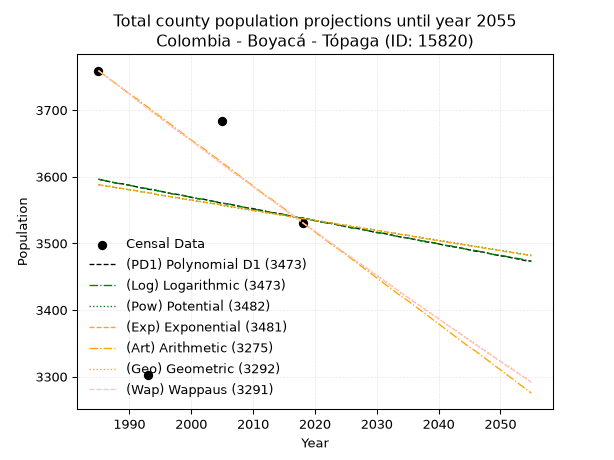
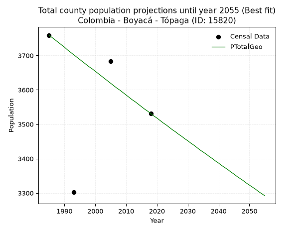
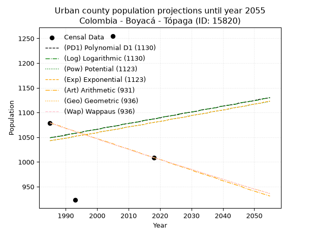
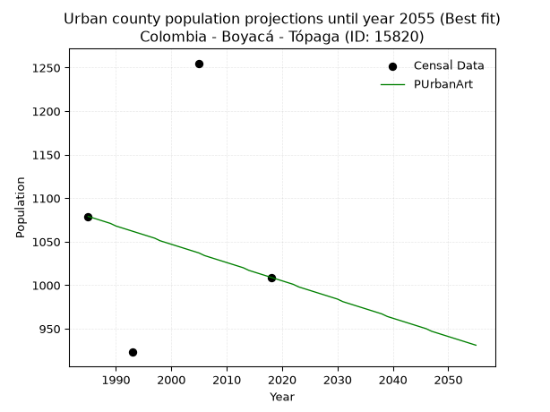
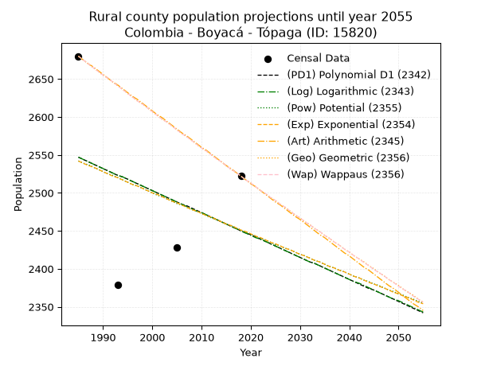
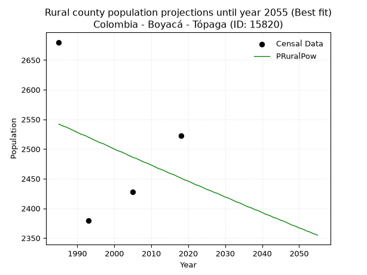

<div align="center">


</div>

# 📜 _“Population and Public Services Demand Projections (PPSD) until Year 2050 for Colombia - Boyacá - Tópaga (ID: 15820)”_
Keywords: `population` `public-service` `projection` `lineal` `polynomial` `logarithmic` `potential` `exponential` `arithmetic` `geometric` `wappaus` `dane` `colombia` `south-america`

PPSD are analytical estimates used by governments and planners to anticipate future changes in population size, age distribution, and the resulting community needs for utilities, healthcare, education, and infrastructure as sizing future water treatment facilities, electrical grids, and road networks based on spatial growth.

<div align="center">

</img>

</div>


> **General running parameters**: • app_version: _v20260806_. • Python version: _3.14.7_. • Pandas version: _3.0.5_. • NumPy version: _2.5.1_. • Creates, save and include plots into reports (create_plot): _False_. • Projection until year: _2050_. • Process polynomial degree 2 and up: _False_. • Process Wappaus: _True_. • Process Wappaus: _True_. • Set negative values to zero: _True_. • Set infinite values to zero: _True_. • Drop dataset notes: _True_. 
<div align="center">

Dynamic map: [:earth_americas:Google](http://maps.google.com/maps?q=5.768201449,-72.8322449) [:earth_americas:OSM](https://www.openstreetmap.org/#map=18/5.768201449/-72.8322449&layers=P) [:earth_americas:Bing](https://www.bing.com/maps?cp=5.768201449~-72.8322449&lvl=18) [:earth_americas:Apple](https://maps.apple.com/frame?center=5.768201449%2C-72.8322449&span=0.003%2C0.006)

</div>


<div align="center">

```geojson
{
  "type": "Feature",
  "geometry": {
    "type": "Point", 
    "coordinates": [-72.8322449, 5.768201449]
  }, 
  "properties": {
    "Name": "Colombia - Boyacá - Tópaga (ID: 15820)"
  }
}
```

</div>


## 0. Census Data (4 records)

Census data are official statistics collected by a government about the people and housing in a country. They usually include counts of total population, age, sex, race, income, education, and jobs.

📅Global census file: [Population.xlsx](../data/Population.xlsx)

| Source   |   Year |   CountryID | CountryName   |   StateID | StateName   |   CountyID | CountyName   |   PTotal |   PUrban |   PRural |
|:---------|-------:|------------:|:--------------|----------:|:------------|-----------:|:-------------|---------:|---------:|---------:|
| DANE     |   1985 |          57 | Colombia      |        15 | Boyacá      |      15820 | Tópaga       |     3759 |     1079 |     2680 |
| DANE     |   1993 |          57 | Colombia      |        15 | Boyacá      |      15820 | Tópaga       |     3302 |      923 |     2379 |
| DANE     |   2005 |          57 | Colombia      |        15 | Boyacá      |      15820 | Tópaga       |     3683 |     1255 |     2428 |
| DANE     |   2018 |          57 | Colombia      |        15 | Boyacá      |      15820 | Tópaga       |     3531 |     1009 |     2522 |

> 🔥Some records could had specific notes about the registered values or the corresponding urban or rural distribution.

📅[SUI-RUPS](https://www.datos.gov.co/Hacienda-y-Cr-dito-P-blico/Registro-nico-de-Prestadores-de-Servicios-P-blicos/4qkq-csdn/about_data) - Local public utility companies: [RUPS.csv](../data/RUPS.xlsx)

 | SERVICIO       | ESTADO    | NOMBRE                                                                          | NIT         | DEPARTAMENTO_DOMICILIO   | MUNICIPIO_DOMICILIO   | DIRECCION                       |   TELEFONO | EMAIL                 | TIPO_PRESTADOR                             | CLASIFICACION                 |
|:---------------|:----------|:--------------------------------------------------------------------------------|:------------|:-------------------------|:----------------------|:--------------------------------|-----------:|:----------------------|:-------------------------------------------|:------------------------------|
| ACUEDUCTO      | OPERATIVA | EMPRESA DE SERVICIOS PUBLICOS DOMICILIARIOS DEL MUNICIPIO DE TOPAGA S.A. E.S.P. | 900321312-5 | BOYACA                   | TOPAGA                | Calle 4 No. 4-65 Tópaga, Boyacá |    7729016 | dianagaitan@gmail.com | SOCIEDADES (EMPRESA DE SERVICIOS PUBLICOS) | MENOR O IGUAL A 2500 USUARIOS |
| ALCANTARILLADO | OPERATIVA | EMPRESA DE SERVICIOS PUBLICOS DOMICILIARIOS DEL MUNICIPIO DE TOPAGA S.A. E.S.P. | 900321312-5 | BOYACA                   | TOPAGA                | Calle 4 No. 4-65 Tópaga, Boyacá |    7729016 | dianagaitan@gmail.com | SOCIEDADES (EMPRESA DE SERVICIOS PUBLICOS) | MENOR O IGUAL A 2500 USUARIOS |

## 1. Total

### 1.1. Coefficients and Parameters

* (PD1) Polynomial Deg 1: -1.7579285427538514, 7085.046567643391 (lineal)
* (Log) Logarithmic: -3538.15451098108, 30462.290790958028
* (Pow) Potential: -0.8666159592771997, 6.412752211035468
* (Exp) Exponential: -0.0004301760112264564, 8427.136904365787
* (Art) Arithmetic: Year diff. 2018 - 1985 = 33, Population diff. 3531 - 3759 = -228, Annual growth = -6.909090909090909
* (Geo) Geometric: Year diff. 2018 - 1985 = 33, Population diff. 3531 - 3759 = -228, Annual growth % = -0.0018943201015860778
* (Wap) Wappaus: i = -0.1895498191794488, Condition values only valid for < 200)

<sub>
Wappaus condition values: ['-0.00', '-0.19', '-0.38', '-0.57', '-0.76', '-0.95', '-1.14', '-1.33', '-1.52', '-1.71', '-1.90', '-2.09', '-2.27', '-2.46', '-2.65', '-2.84', '-3.03', '-3.22', '-3.41', '-3.60', '-3.79', '-3.98', '-4.17', '-4.36', '-4.55', '-4.74', '-4.93', '-5.12', '-5.31', '-5.50', '-5.69', '-5.88', '-6.07', '-6.26', '-6.44', '-6.63', '-6.82', '-7.01', '-7.20', '-7.39', '-7.58', '-7.77', '-7.96', '-8.15', '-8.34', '-8.53', '-8.72', '-8.91', '-9.10', '-9.29', '-9.48', '-9.67', '-9.86', '-10.05', '-10.24', '-10.43', '-10.61', '-10.80', '-10.99', '-11.18', '-11.37', '-11.56', '-11.75', '-11.94', '-12.13', '-12.32']
</sub>


### 1.2. Projected Dataset

|   Year |   CountyID |   PTotalPD1 |   PTotalLog |   PTotalPow |   PTotalExp |   PTotalArt |   PTotalGeo |   PTotalWap |
|-------:|-----------:|------------:|------------:|------------:|------------:|------------:|------------:|------------:|
|   1985 |      15820 |        3596 |        3596 |        3588 |        3588 |        3759 |        3759 |        3759 |
|   1986 |      15820 |        3594 |        3594 |        3586 |        3586 |        3752 |        3752 |        3752 |
|   1987 |      15820 |        3592 |        3592 |        3585 |        3585 |        3745 |        3745 |        3745 |
|   1988 |      15820 |        3590 |        3590 |        3583 |        3583 |        3738 |        3738 |        3738 |
|   1989 |      15820 |        3589 |        3589 |        3582 |        3582 |        3731 |        3731 |        3731 |
|   1990 |      15820 |        3587 |        3587 |        3580 |        3580 |        3724 |        3724 |        3724 |
|   1991 |      15820 |        3585 |        3585 |        3579 |        3579 |        3718 |        3716 |        3716 |
|   1992 |      15820 |        3583 |        3583 |        3577 |        3577 |        3711 |        3709 |        3709 |
|   1993 |      15820 |        3581 |        3582 |        3576 |        3576 |        3704 |        3702 |        3702 |
|   1994 |      15820 |        3580 |        3580 |        3574 |        3574 |        3697 |        3695 |        3695 |
|   1995 |      15820 |        3578 |        3578 |        3572 |        3572 |        3690 |        3688 |        3688 |
|   1996 |      15820 |        3576 |        3576 |        3571 |        3571 |        3683 |        3681 |        3681 |
|   1997 |      15820 |        3574 |        3574 |        3569 |        3569 |        3676 |        3674 |        3674 |
|   1998 |      15820 |        3573 |        3573 |        3568 |        3568 |        3669 |        3667 |        3668 |
|   1999 |      15820 |        3571 |        3571 |        3566 |        3566 |        3662 |        3661 |        3661 |
|   2000 |      15820 |        3569 |        3569 |        3565 |        3565 |        3655 |        3654 |        3654 |
|   2001 |      15820 |        3567 |        3567 |        3563 |        3563 |        3648 |        3647 |        3647 |
|   2002 |      15820 |        3566 |        3566 |        3562 |        3562 |        3642 |        3640 |        3640 |
|   2003 |      15820 |        3564 |        3564 |        3560 |        3560 |        3635 |        3633 |        3633 |
|   2004 |      15820 |        3562 |        3562 |        3559 |        3559 |        3628 |        3626 |        3626 |
|   2005 |      15820 |        3560 |        3560 |        3557 |        3557 |        3621 |        3619 |        3619 |
|   2006 |      15820 |        3559 |        3559 |        3555 |        3556 |        3614 |        3612 |        3612 |
|   2007 |      15820 |        3557 |        3557 |        3554 |        3554 |        3607 |        3605 |        3605 |
|   2008 |      15820 |        3555 |        3555 |        3552 |        3553 |        3600 |        3599 |        3599 |
|   2009 |      15820 |        3553 |        3553 |        3551 |        3551 |        3593 |        3592 |        3592 |
|   2010 |      15820 |        3552 |        3551 |        3549 |        3549 |        3586 |        3585 |        3585 |
|   2011 |      15820 |        3550 |        3550 |        3548 |        3548 |        3579 |        3578 |        3578 |
|   2012 |      15820 |        3548 |        3548 |        3546 |        3546 |        3572 |        3571 |        3571 |
|   2013 |      15820 |        3546 |        3546 |        3545 |        3545 |        3566 |        3565 |        3565 |
|   2014 |      15820 |        3545 |        3544 |        3543 |        3543 |        3559 |        3558 |        3558 |
|   2015 |      15820 |        3543 |        3543 |        3542 |        3542 |        3552 |        3551 |        3551 |
|   2016 |      15820 |        3541 |        3541 |        3540 |        3540 |        3545 |        3544 |        3544 |
|   2017 |      15820 |        3539 |        3539 |        3539 |        3539 |        3538 |        3538 |        3538 |
|   2018 |      15820 |        3538 |        3537 |        3537 |        3537 |        3531 |        3531 |        3531 |
|   2019 |      15820 |        3536 |        3536 |        3536 |        3536 |        3524 |        3524 |        3524 |
|   2020 |      15820 |        3534 |        3534 |        3534 |        3534 |        3517 |        3518 |        3518 |
|   2021 |      15820 |        3532 |        3532 |        3533 |        3533 |        3510 |        3511 |        3511 |
|   2022 |      15820 |        3531 |        3530 |        3531 |        3531 |        3503 |        3504 |        3504 |
|   2023 |      15820 |        3529 |        3529 |        3530 |        3530 |        3496 |        3498 |        3498 |
|   2024 |      15820 |        3527 |        3527 |        3528 |        3528 |        3490 |        3491 |        3491 |
|   2025 |      15820 |        3525 |        3525 |        3527 |        3527 |        3483 |        3484 |        3484 |
|   2026 |      15820 |        3523 |        3523 |        3525 |        3525 |        3476 |        3478 |        3478 |
|   2027 |      15820 |        3522 |        3522 |        3524 |        3524 |        3469 |        3471 |        3471 |
|   2028 |      15820 |        3520 |        3520 |        3522 |        3522 |        3462 |        3465 |        3465 |
|   2029 |      15820 |        3518 |        3518 |        3521 |        3521 |        3455 |        3458 |        3458 |
|   2030 |      15820 |        3516 |        3516 |        3519 |        3519 |        3448 |        3452 |        3451 |
|   2031 |      15820 |        3515 |        3515 |        3518 |        3518 |        3441 |        3445 |        3445 |
|   2032 |      15820 |        3513 |        3513 |        3516 |        3516 |        3434 |        3439 |        3438 |
|   2033 |      15820 |        3511 |        3511 |        3515 |        3515 |        3427 |        3432 |        3432 |
|   2034 |      15820 |        3509 |        3509 |        3513 |        3513 |        3420 |        3425 |        3425 |
|   2035 |      15820 |        3508 |        3508 |        3512 |        3512 |        3414 |        3419 |        3419 |
|   2036 |      15820 |        3506 |        3506 |        3510 |        3510 |        3407 |        3413 |        3412 |
|   2037 |      15820 |        3504 |        3504 |        3509 |        3508 |        3400 |        3406 |        3406 |
|   2038 |      15820 |        3502 |        3503 |        3507 |        3507 |        3393 |        3400 |        3399 |
|   2039 |      15820 |        3501 |        3501 |        3506 |        3505 |        3386 |        3393 |        3393 |
|   2040 |      15820 |        3499 |        3499 |        3504 |        3504 |        3379 |        3387 |        3387 |
|   2041 |      15820 |        3497 |        3497 |        3503 |        3502 |        3372 |        3380 |        3380 |
|   2042 |      15820 |        3495 |        3496 |        3501 |        3501 |        3365 |        3374 |        3374 |
|   2043 |      15820 |        3494 |        3494 |        3500 |        3499 |        3358 |        3368 |        3367 |
|   2044 |      15820 |        3492 |        3492 |        3498 |        3498 |        3351 |        3361 |        3361 |
|   2045 |      15820 |        3490 |        3490 |        3497 |        3496 |        3344 |        3355 |        3354 |
|   2046 |      15820 |        3488 |        3489 |        3495 |        3495 |        3338 |        3348 |        3348 |
|   2047 |      15820 |        3487 |        3487 |        3494 |        3493 |        3331 |        3342 |        3342 |
|   2048 |      15820 |        3485 |        3485 |        3492 |        3492 |        3324 |        3336 |        3335 |
|   2049 |      15820 |        3483 |        3483 |        3491 |        3490 |        3317 |        3329 |        3329 |
|   2050 |      15820 |        3481 |        3482 |        3489 |        3489 |        3310 |        3323 |        3323 |
<div align="center">

</img>

</div>


### 1.3. Best fit with absolute and relative error (%)

Relative error puts that difference into context by dividing the absolute error by the true value, creating a unitless ratio or percentage that shows the scale of the mistake.

Absolute and relative error

|   Year | Source   |   CountryID | CountryName   |   StateID | StateName   |   CountyID_x | CountyName   |   PTotal |   PUrban |   PRural |   CountyID_y |   PTotalPD1 |   PTotalLog |   PTotalPow |   PTotalExp |   PTotalArt |   PTotalGeo |   PTotalWap |   PTotalPD1AbsError |   PTotalLogAbsError |   PTotalPowAbsError |   PTotalExpAbsError |   PTotalArtAbsError |   PTotalGeoAbsError |   PTotalWapAbsError |   PTotalPD1RelError |   PTotalLogRelError |   PTotalPowRelError |   PTotalExpRelError |   PTotalArtRelError |   PTotalGeoRelError |   PTotalWapRelError |
|-------:|:---------|------------:|:--------------|----------:|:------------|-------------:|:-------------|---------:|---------:|---------:|-------------:|------------:|------------:|------------:|------------:|------------:|------------:|------------:|--------------------:|--------------------:|--------------------:|--------------------:|--------------------:|--------------------:|--------------------:|--------------------:|--------------------:|--------------------:|--------------------:|--------------------:|--------------------:|--------------------:|
|   1985 | DANE     |          57 | Colombia      |        15 | Boyacá      |        15820 | Tópaga       |     3759 |     1079 |     2680 |        15820 |        3596 |        3596 |        3588 |        3588 |        3759 |        3759 |        3759 |                 163 |                 163 |                 171 |                 171 |                   0 |                   0 |                   0 |            4.33626  |            4.33626  |            4.54908  |            4.54908  |             0       |             0       |             0       |
|   1993 | DANE     |          57 | Colombia      |        15 | Boyacá      |        15820 | Tópaga       |     3302 |      923 |     2379 |        15820 |        3581 |        3582 |        3576 |        3576 |        3704 |        3702 |        3702 |                 279 |                 280 |                 274 |                 274 |                 402 |                 400 |                 400 |            8.44942  |            8.47971  |            8.298    |            8.298    |            12.1744  |            12.1139  |            12.1139  |
|   2005 | DANE     |          57 | Colombia      |        15 | Boyacá      |        15820 | Tópaga       |     3683 |     1255 |     2428 |        15820 |        3560 |        3560 |        3557 |        3557 |        3621 |        3619 |        3619 |                 123 |                 123 |                 126 |                 126 |                  62 |                  64 |                  64 |            3.33967  |            3.33967  |            3.42112  |            3.42112  |             1.68341 |             1.73771 |             1.73771 |
|   2018 | DANE     |          57 | Colombia      |        15 | Boyacá      |        15820 | Tópaga       |     3531 |     1009 |     2522 |        15820 |        3538 |        3537 |        3537 |        3537 |        3531 |        3531 |        3531 |                   7 |                   6 |                   6 |                   6 |                   0 |                   0 |                   0 |            0.198244 |            0.169924 |            0.169924 |            0.169924 |             0       |             0       |             0       |

Relative error mean

| Method    |   RelError | Best   |
|:----------|-----------:|:-------|
| PTotalPD1 |    4.0809  |        |
| PTotalLog |    4.08139 |        |
| PTotalPow |    4.10953 |        |
| PTotalExp |    4.10953 |        |
| PTotalArt |    3.46446 |        |
| PTotalGeo |    3.4629  | True   |
| PTotalWap |    3.4629  | True   |

💙Best method: _**PTotalGeo**_
<div align="center">

</img>

</div>


### 1.4. Fresh water supply demand in liters per capita per day (lpcd)

The fresh water supply demand typically ranges from 100 to 300 liters per capita per day (lpcd) for standard domestic and municipal planning, though absolute survival minimums set by the World Health Organization are as low as 7.5 to 20 liters per day, and total consumption in high-income nations can exceed 400 liters.

> `CZ`: Level in meters above the sea level (masl)<br> `WS`: Fresh water supply demand in liters per capita per day (lpcd or l/h/d)<br> `WSAll`: Zonal fresh water supply demand in liters per second (l/s)<br> `A`: Zonal area in square meters<br> `DP`: Population density (people/hectare or p/ha)

Reference values (RAS Colombia)

|    CZ |   WS |
|------:|-----:|
|  1000 |  120 |
|  2000 |  130 |
| 99999 |  140 |

County shapefile geometry properties and water supply values

|   CountyID |     ATotal |   CZTotal |   WSTotal |
|-----------:|-----------:|----------:|----------:|
|      15820 | 3.3559e+07 |   2802.87 |       140 |

Projected values for best method: PTotalGeo

|   CountyID |   Year |   PTotalGeo |   DPTotal |   WSTotal |   WSTotalAll |
|-----------:|-------:|------------:|----------:|----------:|-------------:|
|      15820 |   1985 |        3759 |      1.12 |       140 |      6.09097 |
|      15820 |   1986 |        3752 |      1.12 |       140 |      6.07963 |
|      15820 |   1987 |        3745 |      1.12 |       140 |      6.06829 |
|      15820 |   1988 |        3738 |      1.11 |       140 |      6.05694 |
|      15820 |   1989 |        3731 |      1.11 |       140 |      6.0456  |
|      15820 |   1990 |        3724 |      1.11 |       140 |      6.03426 |
|      15820 |   1991 |        3716 |      1.11 |       140 |      6.0213  |
|      15820 |   1992 |        3709 |      1.11 |       140 |      6.00995 |
|      15820 |   1993 |        3702 |      1.1  |       140 |      5.99861 |
|      15820 |   1994 |        3695 |      1.1  |       140 |      5.98727 |
|      15820 |   1995 |        3688 |      1.1  |       140 |      5.97593 |
|      15820 |   1996 |        3681 |      1.1  |       140 |      5.96458 |
|      15820 |   1997 |        3674 |      1.09 |       140 |      5.95324 |
|      15820 |   1998 |        3667 |      1.09 |       140 |      5.9419  |
|      15820 |   1999 |        3661 |      1.09 |       140 |      5.93218 |
|      15820 |   2000 |        3654 |      1.09 |       140 |      5.92083 |
|      15820 |   2001 |        3647 |      1.09 |       140 |      5.90949 |
|      15820 |   2002 |        3640 |      1.08 |       140 |      5.89815 |
|      15820 |   2003 |        3633 |      1.08 |       140 |      5.88681 |
|      15820 |   2004 |        3626 |      1.08 |       140 |      5.87546 |
|      15820 |   2005 |        3619 |      1.08 |       140 |      5.86412 |
|      15820 |   2006 |        3612 |      1.08 |       140 |      5.85278 |
|      15820 |   2007 |        3605 |      1.07 |       140 |      5.84144 |
|      15820 |   2008 |        3599 |      1.07 |       140 |      5.83171 |
|      15820 |   2009 |        3592 |      1.07 |       140 |      5.82037 |
|      15820 |   2010 |        3585 |      1.07 |       140 |      5.80903 |
|      15820 |   2011 |        3578 |      1.07 |       140 |      5.79769 |
|      15820 |   2012 |        3571 |      1.06 |       140 |      5.78634 |
|      15820 |   2013 |        3565 |      1.06 |       140 |      5.77662 |
|      15820 |   2014 |        3558 |      1.06 |       140 |      5.76528 |
|      15820 |   2015 |        3551 |      1.06 |       140 |      5.75394 |
|      15820 |   2016 |        3544 |      1.06 |       140 |      5.74259 |
|      15820 |   2017 |        3538 |      1.05 |       140 |      5.73287 |
|      15820 |   2018 |        3531 |      1.05 |       140 |      5.72153 |
|      15820 |   2019 |        3524 |      1.05 |       140 |      5.71019 |
|      15820 |   2020 |        3518 |      1.05 |       140 |      5.70046 |
|      15820 |   2021 |        3511 |      1.05 |       140 |      5.68912 |
|      15820 |   2022 |        3504 |      1.04 |       140 |      5.67778 |
|      15820 |   2023 |        3498 |      1.04 |       140 |      5.66806 |
|      15820 |   2024 |        3491 |      1.04 |       140 |      5.65671 |
|      15820 |   2025 |        3484 |      1.04 |       140 |      5.64537 |
|      15820 |   2026 |        3478 |      1.04 |       140 |      5.63565 |
|      15820 |   2027 |        3471 |      1.03 |       140 |      5.62431 |
|      15820 |   2028 |        3465 |      1.03 |       140 |      5.61458 |
|      15820 |   2029 |        3458 |      1.03 |       140 |      5.60324 |
|      15820 |   2030 |        3452 |      1.03 |       140 |      5.59352 |
|      15820 |   2031 |        3445 |      1.03 |       140 |      5.58218 |
|      15820 |   2032 |        3439 |      1.02 |       140 |      5.57245 |
|      15820 |   2033 |        3432 |      1.02 |       140 |      5.56111 |
|      15820 |   2034 |        3425 |      1.02 |       140 |      5.54977 |
|      15820 |   2035 |        3419 |      1.02 |       140 |      5.54005 |
|      15820 |   2036 |        3413 |      1.02 |       140 |      5.53032 |
|      15820 |   2037 |        3406 |      1.01 |       140 |      5.51898 |
|      15820 |   2038 |        3400 |      1.01 |       140 |      5.50926 |
|      15820 |   2039 |        3393 |      1.01 |       140 |      5.49792 |
|      15820 |   2040 |        3387 |      1.01 |       140 |      5.48819 |
|      15820 |   2041 |        3380 |      1.01 |       140 |      5.47685 |
|      15820 |   2042 |        3374 |      1.01 |       140 |      5.46713 |
|      15820 |   2043 |        3368 |      1    |       140 |      5.45741 |
|      15820 |   2044 |        3361 |      1    |       140 |      5.44606 |
|      15820 |   2045 |        3355 |      1    |       140 |      5.43634 |
|      15820 |   2046 |        3348 |      1    |       140 |      5.425   |
|      15820 |   2047 |        3342 |      1    |       140 |      5.41528 |
|      15820 |   2048 |        3336 |      0.99 |       140 |      5.40556 |
|      15820 |   2049 |        3329 |      0.99 |       140 |      5.39421 |
|      15820 |   2050 |        3323 |      0.99 |       140 |      5.38449 |

## 2. Urban

### 2.1. Coefficients and Parameters

* (PD1) Polynomial Deg 1: 1.1633881975111784, -1260.5672420717349 (lineal)
* (Log) Logarithmic: 2345.06609240098, -16758.366160520127
* (Pow) Potential: 2.132356669952259, -4.013881569954577
* (Exp) Exponential: 0.0010587141483457926, 127.49323351141021
* (Art) Arithmetic: Year diff. 2018 - 1985 = 33, Population diff. 1009 - 1079 = -70, Annual growth = -2.121212121212121
* (Geo) Geometric: Year diff. 2018 - 1985 = 33, Population diff. 1009 - 1079 = -70, Annual growth % = -0.0020305098081417894
* (Wap) Wappaus: i = -0.2031812376639963, Condition values only valid for < 200)

<sub>
Wappaus condition values: ['-0.00', '-0.20', '-0.41', '-0.61', '-0.81', '-1.02', '-1.22', '-1.42', '-1.63', '-1.83', '-2.03', '-2.23', '-2.44', '-2.64', '-2.84', '-3.05', '-3.25', '-3.45', '-3.66', '-3.86', '-4.06', '-4.27', '-4.47', '-4.67', '-4.88', '-5.08', '-5.28', '-5.49', '-5.69', '-5.89', '-6.10', '-6.30', '-6.50', '-6.70', '-6.91', '-7.11', '-7.31', '-7.52', '-7.72', '-7.92', '-8.13', '-8.33', '-8.53', '-8.74', '-8.94', '-9.14', '-9.35', '-9.55', '-9.75', '-9.96', '-10.16', '-10.36', '-10.57', '-10.77', '-10.97', '-11.17', '-11.38', '-11.58', '-11.78', '-11.99', '-12.19', '-12.39', '-12.60', '-12.80', '-13.00', '-13.21']
</sub>


### 2.2. Projected Dataset

|   Year |   CountyID |   PUrbanPD1 |   PUrbanLog |   PUrbanPow |   PUrbanExp |   PUrbanArt |   PUrbanGeo |   PUrbanWap |
|-------:|-----------:|------------:|------------:|------------:|------------:|------------:|------------:|------------:|
|   1985 |      15820 |        1049 |        1049 |        1043 |        1043 |        1079 |        1079 |        1079 |
|   1986 |      15820 |        1050 |        1050 |        1044 |        1044 |        1077 |        1077 |        1077 |
|   1987 |      15820 |        1051 |        1051 |        1045 |        1045 |        1075 |        1075 |        1075 |
|   1988 |      15820 |        1052 |        1052 |        1046 |        1046 |        1073 |        1072 |        1072 |
|   1989 |      15820 |        1053 |        1053 |        1047 |        1047 |        1071 |        1070 |        1070 |
|   1990 |      15820 |        1055 |        1054 |        1048 |        1048 |        1068 |        1068 |        1068 |
|   1991 |      15820 |        1056 |        1056 |        1049 |        1049 |        1066 |        1066 |        1066 |
|   1992 |      15820 |        1057 |        1057 |        1050 |        1051 |        1064 |        1064 |        1064 |
|   1993 |      15820 |        1058 |        1058 |        1052 |        1052 |        1062 |        1062 |        1062 |
|   1994 |      15820 |        1059 |        1059 |        1053 |        1053 |        1060 |        1059 |        1059 |
|   1995 |      15820 |        1060 |        1060 |        1054 |        1054 |        1058 |        1057 |        1057 |
|   1996 |      15820 |        1062 |        1062 |        1055 |        1055 |        1056 |        1055 |        1055 |
|   1997 |      15820 |        1063 |        1063 |        1056 |        1056 |        1054 |        1053 |        1053 |
|   1998 |      15820 |        1064 |        1064 |        1057 |        1057 |        1051 |        1051 |        1051 |
|   1999 |      15820 |        1065 |        1065 |        1058 |        1058 |        1049 |        1049 |        1049 |
|   2000 |      15820 |        1066 |        1066 |        1059 |        1059 |        1047 |        1047 |        1047 |
|   2001 |      15820 |        1067 |        1067 |        1061 |        1061 |        1045 |        1044 |        1044 |
|   2002 |      15820 |        1069 |        1069 |        1062 |        1062 |        1043 |        1042 |        1042 |
|   2003 |      15820 |        1070 |        1070 |        1063 |        1063 |        1041 |        1040 |        1040 |
|   2004 |      15820 |        1071 |        1071 |        1064 |        1064 |        1039 |        1038 |        1038 |
|   2005 |      15820 |        1072 |        1072 |        1065 |        1065 |        1037 |        1036 |        1036 |
|   2006 |      15820 |        1073 |        1073 |        1066 |        1066 |        1034 |        1034 |        1034 |
|   2007 |      15820 |        1074 |        1074 |        1067 |        1067 |        1032 |        1032 |        1032 |
|   2008 |      15820 |        1076 |        1076 |        1069 |        1068 |        1030 |        1030 |        1030 |
|   2009 |      15820 |        1077 |        1077 |        1070 |        1070 |        1028 |        1028 |        1028 |
|   2010 |      15820 |        1078 |        1078 |        1071 |        1071 |        1026 |        1026 |        1026 |
|   2011 |      15820 |        1079 |        1079 |        1072 |        1072 |        1024 |        1023 |        1023 |
|   2012 |      15820 |        1080 |        1080 |        1073 |        1073 |        1022 |        1021 |        1021 |
|   2013 |      15820 |        1081 |        1081 |        1074 |        1074 |        1020 |        1019 |        1019 |
|   2014 |      15820 |        1082 |        1083 |        1075 |        1075 |        1017 |        1017 |        1017 |
|   2015 |      15820 |        1084 |        1084 |        1076 |        1076 |        1015 |        1015 |        1015 |
|   2016 |      15820 |        1085 |        1085 |        1078 |        1078 |        1013 |        1013 |        1013 |
|   2017 |      15820 |        1086 |        1086 |        1079 |        1079 |        1011 |        1011 |        1011 |
|   2018 |      15820 |        1087 |        1087 |        1080 |        1080 |        1009 |        1009 |        1009 |
|   2019 |      15820 |        1088 |        1088 |        1081 |        1081 |        1007 |        1007 |        1007 |
|   2020 |      15820 |        1089 |        1090 |        1082 |        1082 |        1005 |        1005 |        1005 |
|   2021 |      15820 |        1091 |        1091 |        1083 |        1083 |        1003 |        1003 |        1003 |
|   2022 |      15820 |        1092 |        1092 |        1084 |        1084 |        1001 |        1001 |        1001 |
|   2023 |      15820 |        1093 |        1093 |        1086 |        1086 |         998 |         999 |         999 |
|   2024 |      15820 |        1094 |        1094 |        1087 |        1087 |         996 |         997 |         997 |
|   2025 |      15820 |        1095 |        1095 |        1088 |        1088 |         994 |         995 |         995 |
|   2026 |      15820 |        1096 |        1097 |        1089 |        1089 |         992 |         993 |         993 |
|   2027 |      15820 |        1098 |        1098 |        1090 |        1090 |         990 |         991 |         991 |
|   2028 |      15820 |        1099 |        1099 |        1091 |        1091 |         988 |         989 |         989 |
|   2029 |      15820 |        1100 |        1100 |        1093 |        1092 |         986 |         987 |         987 |
|   2030 |      15820 |        1101 |        1101 |        1094 |        1094 |         984 |         985 |         985 |
|   2031 |      15820 |        1102 |        1102 |        1095 |        1095 |         981 |         983 |         983 |
|   2032 |      15820 |        1103 |        1103 |        1096 |        1096 |         979 |         981 |         981 |
|   2033 |      15820 |        1105 |        1105 |        1097 |        1097 |         977 |         979 |         979 |
|   2034 |      15820 |        1106 |        1106 |        1098 |        1098 |         975 |         977 |         977 |
|   2035 |      15820 |        1107 |        1107 |        1099 |        1099 |         973 |         975 |         975 |
|   2036 |      15820 |        1108 |        1108 |        1101 |        1101 |         971 |         973 |         973 |
|   2037 |      15820 |        1109 |        1109 |        1102 |        1102 |         969 |         971 |         971 |
|   2038 |      15820 |        1110 |        1110 |        1103 |        1103 |         967 |         969 |         969 |
|   2039 |      15820 |        1112 |        1112 |        1104 |        1104 |         964 |         967 |         967 |
|   2040 |      15820 |        1113 |        1113 |        1105 |        1105 |         962 |         965 |         965 |
|   2041 |      15820 |        1114 |        1114 |        1106 |        1106 |         960 |         963 |         963 |
|   2042 |      15820 |        1115 |        1115 |        1107 |        1108 |         958 |         961 |         961 |
|   2043 |      15820 |        1116 |        1116 |        1109 |        1109 |         956 |         959 |         959 |
|   2044 |      15820 |        1117 |        1117 |        1110 |        1110 |         954 |         957 |         957 |
|   2045 |      15820 |        1119 |        1118 |        1111 |        1111 |         952 |         955 |         955 |
|   2046 |      15820 |        1120 |        1120 |        1112 |        1112 |         950 |         953 |         953 |
|   2047 |      15820 |        1121 |        1121 |        1113 |        1113 |         947 |         951 |         951 |
|   2048 |      15820 |        1122 |        1122 |        1114 |        1115 |         945 |         949 |         949 |
|   2049 |      15820 |        1123 |        1123 |        1116 |        1116 |         943 |         947 |         947 |
|   2050 |      15820 |        1124 |        1124 |        1117 |        1117 |         941 |         945 |         945 |
<div align="center">

</img>

</div>


### 2.3. Best fit with absolute and relative error (%)

Relative error puts that difference into context by dividing the absolute error by the true value, creating a unitless ratio or percentage that shows the scale of the mistake.

Absolute and relative error

|   Year | Source   |   CountryID | CountryName   |   StateID | StateName   |   CountyID_x | CountyName   |   PTotal |   PUrban |   PRural |   CountyID_y |   PUrbanPD1 |   PUrbanLog |   PUrbanPow |   PUrbanExp |   PUrbanArt |   PUrbanGeo |   PUrbanWap |   PUrbanPD1AbsError |   PUrbanLogAbsError |   PUrbanPowAbsError |   PUrbanExpAbsError |   PUrbanArtAbsError |   PUrbanGeoAbsError |   PUrbanWapAbsError |   PUrbanPD1RelError |   PUrbanLogRelError |   PUrbanPowRelError |   PUrbanExpRelError |   PUrbanArtRelError |   PUrbanGeoRelError |   PUrbanWapRelError |
|-------:|:---------|------------:|:--------------|----------:|:------------|-------------:|:-------------|---------:|---------:|---------:|-------------:|------------:|------------:|------------:|------------:|------------:|------------:|------------:|--------------------:|--------------------:|--------------------:|--------------------:|--------------------:|--------------------:|--------------------:|--------------------:|--------------------:|--------------------:|--------------------:|--------------------:|--------------------:|--------------------:|
|   1985 | DANE     |          57 | Colombia      |        15 | Boyacá      |        15820 | Tópaga       |     3759 |     1079 |     2680 |        15820 |        1049 |        1049 |        1043 |        1043 |        1079 |        1079 |        1079 |                  30 |                  30 |                  36 |                  36 |                   0 |                   0 |                   0 |             2.78035 |             2.78035 |             3.33642 |             3.33642 |              0      |              0      |              0      |
|   1993 | DANE     |          57 | Colombia      |        15 | Boyacá      |        15820 | Tópaga       |     3302 |      923 |     2379 |        15820 |        1058 |        1058 |        1052 |        1052 |        1062 |        1062 |        1062 |                 135 |                 135 |                 129 |                 129 |                 139 |                 139 |                 139 |            14.6262  |            14.6262  |            13.9762  |            13.9762  |             15.0596 |             15.0596 |             15.0596 |
|   2005 | DANE     |          57 | Colombia      |        15 | Boyacá      |        15820 | Tópaga       |     3683 |     1255 |     2428 |        15820 |        1072 |        1072 |        1065 |        1065 |        1037 |        1036 |        1036 |                 183 |                 183 |                 190 |                 190 |                 218 |                 219 |                 219 |            14.5817  |            14.5817  |            15.1394  |            15.1394  |             17.3705 |             17.4502 |             17.4502 |
|   2018 | DANE     |          57 | Colombia      |        15 | Boyacá      |        15820 | Tópaga       |     3531 |     1009 |     2522 |        15820 |        1087 |        1087 |        1080 |        1080 |        1009 |        1009 |        1009 |                  78 |                  78 |                  71 |                  71 |                   0 |                   0 |                   0 |             7.73043 |             7.73043 |             7.03667 |             7.03667 |              0      |              0      |              0      |

Relative error mean

| Method    |   RelError | Best   |
|:----------|-----------:|:-------|
| PUrbanPD1 |    9.92967 |        |
| PUrbanLog |    9.92967 |        |
| PUrbanPow |    9.87217 |        |
| PUrbanExp |    9.87217 |        |
| PUrbanArt |    8.10753 | True   |
| PUrbanGeo |    8.12745 |        |
| PUrbanWap |    8.12745 |        |

💙Best method: _**PUrbanArt**_
<div align="center">

</img>

</div>


### 2.4. Fresh water supply demand in liters per capita per day (lpcd)

The fresh water supply demand typically ranges from 100 to 300 liters per capita per day (lpcd) for standard domestic and municipal planning, though absolute survival minimums set by the World Health Organization are as low as 7.5 to 20 liters per day, and total consumption in high-income nations can exceed 400 liters.

> `CZ`: Level in meters above the sea level (masl)<br> `WS`: Fresh water supply demand in liters per capita per day (lpcd or l/h/d)<br> `WSAll`: Zonal fresh water supply demand in liters per second (l/s)<br> `A`: Zonal area in square meters<br> `DP`: Population density (people/hectare or p/ha)

Reference values (RAS Colombia)

|    CZ |   WS |
|------:|-----:|
|  1000 |  120 |
|  2000 |  130 |
| 99999 |  140 |

County shapefile geometry properties and water supply values

|   CountyID |   AUrban |   CZUrban |   WSUrban |
|-----------:|---------:|----------:|----------:|
|      15820 |   360654 |   2890.57 |       140 |

Projected values for best method: PUrbanArt

|   CountyID |   Year |   PUrbanArt |   DPUrban |   WSUrban |   WSUrbanAll |
|-----------:|-------:|------------:|----------:|----------:|-------------:|
|      15820 |   1985 |        1079 |     29.92 |       140 |      1.74838 |
|      15820 |   1986 |        1077 |     29.86 |       140 |      1.74514 |
|      15820 |   1987 |        1075 |     29.81 |       140 |      1.7419  |
|      15820 |   1988 |        1073 |     29.75 |       140 |      1.73866 |
|      15820 |   1989 |        1071 |     29.7  |       140 |      1.73542 |
|      15820 |   1990 |        1068 |     29.61 |       140 |      1.73056 |
|      15820 |   1991 |        1066 |     29.56 |       140 |      1.72731 |
|      15820 |   1992 |        1064 |     29.5  |       140 |      1.72407 |
|      15820 |   1993 |        1062 |     29.45 |       140 |      1.72083 |
|      15820 |   1994 |        1060 |     29.39 |       140 |      1.71759 |
|      15820 |   1995 |        1058 |     29.34 |       140 |      1.71435 |
|      15820 |   1996 |        1056 |     29.28 |       140 |      1.71111 |
|      15820 |   1997 |        1054 |     29.22 |       140 |      1.70787 |
|      15820 |   1998 |        1051 |     29.14 |       140 |      1.70301 |
|      15820 |   1999 |        1049 |     29.09 |       140 |      1.69977 |
|      15820 |   2000 |        1047 |     29.03 |       140 |      1.69653 |
|      15820 |   2001 |        1045 |     28.98 |       140 |      1.69329 |
|      15820 |   2002 |        1043 |     28.92 |       140 |      1.69005 |
|      15820 |   2003 |        1041 |     28.86 |       140 |      1.68681 |
|      15820 |   2004 |        1039 |     28.81 |       140 |      1.68356 |
|      15820 |   2005 |        1037 |     28.75 |       140 |      1.68032 |
|      15820 |   2006 |        1034 |     28.67 |       140 |      1.67546 |
|      15820 |   2007 |        1032 |     28.61 |       140 |      1.67222 |
|      15820 |   2008 |        1030 |     28.56 |       140 |      1.66898 |
|      15820 |   2009 |        1028 |     28.5  |       140 |      1.66574 |
|      15820 |   2010 |        1026 |     28.45 |       140 |      1.6625  |
|      15820 |   2011 |        1024 |     28.39 |       140 |      1.65926 |
|      15820 |   2012 |        1022 |     28.34 |       140 |      1.65602 |
|      15820 |   2013 |        1020 |     28.28 |       140 |      1.65278 |
|      15820 |   2014 |        1017 |     28.2  |       140 |      1.64792 |
|      15820 |   2015 |        1015 |     28.14 |       140 |      1.64468 |
|      15820 |   2016 |        1013 |     28.09 |       140 |      1.64144 |
|      15820 |   2017 |        1011 |     28.03 |       140 |      1.63819 |
|      15820 |   2018 |        1009 |     27.98 |       140 |      1.63495 |
|      15820 |   2019 |        1007 |     27.92 |       140 |      1.63171 |
|      15820 |   2020 |        1005 |     27.87 |       140 |      1.62847 |
|      15820 |   2021 |        1003 |     27.81 |       140 |      1.62523 |
|      15820 |   2022 |        1001 |     27.76 |       140 |      1.62199 |
|      15820 |   2023 |         998 |     27.67 |       140 |      1.61713 |
|      15820 |   2024 |         996 |     27.62 |       140 |      1.61389 |
|      15820 |   2025 |         994 |     27.56 |       140 |      1.61065 |
|      15820 |   2026 |         992 |     27.51 |       140 |      1.60741 |
|      15820 |   2027 |         990 |     27.45 |       140 |      1.60417 |
|      15820 |   2028 |         988 |     27.39 |       140 |      1.60093 |
|      15820 |   2029 |         986 |     27.34 |       140 |      1.59769 |
|      15820 |   2030 |         984 |     27.28 |       140 |      1.59444 |
|      15820 |   2031 |         981 |     27.2  |       140 |      1.58958 |
|      15820 |   2032 |         979 |     27.15 |       140 |      1.58634 |
|      15820 |   2033 |         977 |     27.09 |       140 |      1.5831  |
|      15820 |   2034 |         975 |     27.03 |       140 |      1.57986 |
|      15820 |   2035 |         973 |     26.98 |       140 |      1.57662 |
|      15820 |   2036 |         971 |     26.92 |       140 |      1.57338 |
|      15820 |   2037 |         969 |     26.87 |       140 |      1.57014 |
|      15820 |   2038 |         967 |     26.81 |       140 |      1.5669  |
|      15820 |   2039 |         964 |     26.73 |       140 |      1.56204 |
|      15820 |   2040 |         962 |     26.67 |       140 |      1.5588  |
|      15820 |   2041 |         960 |     26.62 |       140 |      1.55556 |
|      15820 |   2042 |         958 |     26.56 |       140 |      1.55231 |
|      15820 |   2043 |         956 |     26.51 |       140 |      1.54907 |
|      15820 |   2044 |         954 |     26.45 |       140 |      1.54583 |
|      15820 |   2045 |         952 |     26.4  |       140 |      1.54259 |
|      15820 |   2046 |         950 |     26.34 |       140 |      1.53935 |
|      15820 |   2047 |         947 |     26.26 |       140 |      1.53449 |
|      15820 |   2048 |         945 |     26.2  |       140 |      1.53125 |
|      15820 |   2049 |         943 |     26.15 |       140 |      1.52801 |
|      15820 |   2050 |         941 |     26.09 |       140 |      1.52477 |

## 3. Rural

### 3.1. Coefficients and Parameters

* (PD1) Polynomial Deg 1: -2.9213167402649938, 8345.613809715054 (lineal)
* (Log) Logarithmic: -5883.220603382058, 47220.656951478144
* (Pow) Potential: -2.212357467388945, 10.701040528943967
* (Exp) Exponential: -0.0010981745154199155, 22483.41347821645
* (Art) Arithmetic: Year diff. 2018 - 1985 = 33, Population diff. 2522 - 2680 = -158, Annual growth = -4.787878787878788
* (Geo) Geometric: Year diff. 2018 - 1985 = 33, Population diff. 2522 - 2680 = -158, Annual growth % = -0.001839655966274778
* (Wap) Wappaus: i = -0.1840783847704263, Condition values only valid for < 200)

<sub>
Wappaus condition values: ['-0.00', '-0.18', '-0.37', '-0.55', '-0.74', '-0.92', '-1.10', '-1.29', '-1.47', '-1.66', '-1.84', '-2.02', '-2.21', '-2.39', '-2.58', '-2.76', '-2.95', '-3.13', '-3.31', '-3.50', '-3.68', '-3.87', '-4.05', '-4.23', '-4.42', '-4.60', '-4.79', '-4.97', '-5.15', '-5.34', '-5.52', '-5.71', '-5.89', '-6.07', '-6.26', '-6.44', '-6.63', '-6.81', '-6.99', '-7.18', '-7.36', '-7.55', '-7.73', '-7.92', '-8.10', '-8.28', '-8.47', '-8.65', '-8.84', '-9.02', '-9.20', '-9.39', '-9.57', '-9.76', '-9.94', '-10.12', '-10.31', '-10.49', '-10.68', '-10.86', '-11.04', '-11.23', '-11.41', '-11.60', '-11.78', '-11.97']
</sub>


### 3.2. Projected Dataset

|   Year |   CountyID |   PRuralPD1 |   PRuralLog |   PRuralPow |   PRuralExp |   PRuralArt |   PRuralGeo |   PRuralWap |
|-------:|-----------:|------------:|------------:|------------:|------------:|------------:|------------:|------------:|
|   1985 |      15820 |        2547 |        2547 |        2542 |        2542 |        2680 |        2680 |        2680 |
|   1986 |      15820 |        2544 |        2544 |        2539 |        2539 |        2675 |        2675 |        2675 |
|   1987 |      15820 |        2541 |        2541 |        2537 |        2536 |        2670 |        2670 |        2670 |
|   1988 |      15820 |        2538 |        2538 |        2534 |        2534 |        2666 |        2665 |        2665 |
|   1989 |      15820 |        2535 |        2535 |        2531 |        2531 |        2661 |        2660 |        2660 |
|   1990 |      15820 |        2532 |        2532 |        2528 |        2528 |        2656 |        2655 |        2655 |
|   1991 |      15820 |        2529 |        2529 |        2525 |        2525 |        2651 |        2651 |        2651 |
|   1992 |      15820 |        2526 |        2526 |        2523 |        2522 |        2646 |        2646 |        2646 |
|   1993 |      15820 |        2523 |        2523 |        2520 |        2520 |        2642 |        2641 |        2641 |
|   1994 |      15820 |        2521 |        2521 |        2517 |        2517 |        2637 |        2636 |        2636 |
|   1995 |      15820 |        2518 |        2518 |        2514 |        2514 |        2632 |        2631 |        2631 |
|   1996 |      15820 |        2515 |        2515 |        2511 |        2511 |        2627 |        2626 |        2626 |
|   1997 |      15820 |        2512 |        2512 |        2509 |        2509 |        2623 |        2621 |        2621 |
|   1998 |      15820 |        2509 |        2509 |        2506 |        2506 |        2618 |        2617 |        2617 |
|   1999 |      15820 |        2506 |        2506 |        2503 |        2503 |        2613 |        2612 |        2612 |
|   2000 |      15820 |        2503 |        2503 |        2500 |        2500 |        2608 |        2607 |        2607 |
|   2001 |      15820 |        2500 |        2500 |        2497 |        2498 |        2603 |        2602 |        2602 |
|   2002 |      15820 |        2497 |        2497 |        2495 |        2495 |        2599 |        2597 |        2597 |
|   2003 |      15820 |        2494 |        2494 |        2492 |        2492 |        2594 |        2593 |        2593 |
|   2004 |      15820 |        2491 |        2491 |        2489 |        2489 |        2589 |        2588 |        2588 |
|   2005 |      15820 |        2488 |        2488 |        2486 |        2487 |        2584 |        2583 |        2583 |
|   2006 |      15820 |        2485 |        2485 |        2484 |        2484 |        2579 |        2578 |        2578 |
|   2007 |      15820 |        2483 |        2482 |        2481 |        2481 |        2575 |        2574 |        2574 |
|   2008 |      15820 |        2480 |        2479 |        2478 |        2478 |        2570 |        2569 |        2569 |
|   2009 |      15820 |        2477 |        2476 |        2476 |        2476 |        2565 |        2564 |        2564 |
|   2010 |      15820 |        2474 |        2474 |        2473 |        2473 |        2560 |        2559 |        2559 |
|   2011 |      15820 |        2471 |        2471 |        2470 |        2470 |        2556 |        2555 |        2555 |
|   2012 |      15820 |        2468 |        2468 |        2467 |        2468 |        2551 |        2550 |        2550 |
|   2013 |      15820 |        2465 |        2465 |        2465 |        2465 |        2546 |        2545 |        2545 |
|   2014 |      15820 |        2462 |        2462 |        2462 |        2462 |        2541 |        2541 |        2541 |
|   2015 |      15820 |        2459 |        2459 |        2459 |        2459 |        2536 |        2536 |        2536 |
|   2016 |      15820 |        2456 |        2456 |        2457 |        2457 |        2532 |        2531 |        2531 |
|   2017 |      15820 |        2453 |        2453 |        2454 |        2454 |        2527 |        2527 |        2527 |
|   2018 |      15820 |        2450 |        2450 |        2451 |        2451 |        2522 |        2522 |        2522 |
|   2019 |      15820 |        2447 |        2447 |        2448 |        2449 |        2517 |        2517 |        2517 |
|   2020 |      15820 |        2445 |        2444 |        2446 |        2446 |        2512 |        2513 |        2513 |
|   2021 |      15820 |        2442 |        2441 |        2443 |        2443 |        2508 |        2508 |        2508 |
|   2022 |      15820 |        2439 |        2439 |        2440 |        2441 |        2503 |        2503 |        2503 |
|   2023 |      15820 |        2436 |        2436 |        2438 |        2438 |        2498 |        2499 |        2499 |
|   2024 |      15820 |        2433 |        2433 |        2435 |        2435 |        2493 |        2494 |        2494 |
|   2025 |      15820 |        2430 |        2430 |        2432 |        2433 |        2488 |        2490 |        2490 |
|   2026 |      15820 |        2427 |        2427 |        2430 |        2430 |        2484 |        2485 |        2485 |
|   2027 |      15820 |        2424 |        2424 |        2427 |        2427 |        2479 |        2481 |        2481 |
|   2028 |      15820 |        2421 |        2421 |        2425 |        2425 |        2474 |        2476 |        2476 |
|   2029 |      15820 |        2418 |        2418 |        2422 |        2422 |        2469 |        2471 |        2471 |
|   2030 |      15820 |        2415 |        2415 |        2419 |        2419 |        2465 |        2467 |        2467 |
|   2031 |      15820 |        2412 |        2412 |        2417 |        2417 |        2460 |        2462 |        2462 |
|   2032 |      15820 |        2409 |        2409 |        2414 |        2414 |        2455 |        2458 |        2458 |
|   2033 |      15820 |        2407 |        2407 |        2411 |        2411 |        2450 |        2453 |        2453 |
|   2034 |      15820 |        2404 |        2404 |        2409 |        2409 |        2445 |        2449 |        2449 |
|   2035 |      15820 |        2401 |        2401 |        2406 |        2406 |        2441 |        2444 |        2444 |
|   2036 |      15820 |        2398 |        2398 |        2403 |        2403 |        2436 |        2440 |        2440 |
|   2037 |      15820 |        2395 |        2395 |        2401 |        2401 |        2431 |        2435 |        2435 |
|   2038 |      15820 |        2392 |        2392 |        2398 |        2398 |        2426 |        2431 |        2431 |
|   2039 |      15820 |        2389 |        2389 |        2396 |        2396 |        2421 |        2426 |        2426 |
|   2040 |      15820 |        2386 |        2386 |        2393 |        2393 |        2417 |        2422 |        2422 |
|   2041 |      15820 |        2383 |        2383 |        2390 |        2390 |        2412 |        2417 |        2417 |
|   2042 |      15820 |        2380 |        2381 |        2388 |        2388 |        2407 |        2413 |        2413 |
|   2043 |      15820 |        2377 |        2378 |        2385 |        2385 |        2402 |        2409 |        2408 |
|   2044 |      15820 |        2374 |        2375 |        2383 |        2382 |        2398 |        2404 |        2404 |
|   2045 |      15820 |        2372 |        2372 |        2380 |        2380 |        2393 |        2400 |        2399 |
|   2046 |      15820 |        2369 |        2369 |        2378 |        2377 |        2388 |        2395 |        2395 |
|   2047 |      15820 |        2366 |        2366 |        2375 |        2375 |        2383 |        2391 |        2391 |
|   2048 |      15820 |        2363 |        2363 |        2372 |        2372 |        2378 |        2386 |        2386 |
|   2049 |      15820 |        2360 |        2360 |        2370 |        2369 |        2374 |        2382 |        2382 |
|   2050 |      15820 |        2357 |        2358 |        2367 |        2367 |        2369 |        2378 |        2377 |
<div align="center">

</img>

</div>


### 3.3. Best fit with absolute and relative error (%)

Relative error puts that difference into context by dividing the absolute error by the true value, creating a unitless ratio or percentage that shows the scale of the mistake.

Absolute and relative error

|   Year | Source   |   CountryID | CountryName   |   StateID | StateName   |   CountyID_x | CountyName   |   PTotal |   PUrban |   PRural |   CountyID_y |   PRuralPD1 |   PRuralLog |   PRuralPow |   PRuralExp |   PRuralArt |   PRuralGeo |   PRuralWap |   PRuralPD1AbsError |   PRuralLogAbsError |   PRuralPowAbsError |   PRuralExpAbsError |   PRuralArtAbsError |   PRuralGeoAbsError |   PRuralWapAbsError |   PRuralPD1RelError |   PRuralLogRelError |   PRuralPowRelError |   PRuralExpRelError |   PRuralArtRelError |   PRuralGeoRelError |   PRuralWapRelError |
|-------:|:---------|------------:|:--------------|----------:|:------------|-------------:|:-------------|---------:|---------:|---------:|-------------:|------------:|------------:|------------:|------------:|------------:|------------:|------------:|--------------------:|--------------------:|--------------------:|--------------------:|--------------------:|--------------------:|--------------------:|--------------------:|--------------------:|--------------------:|--------------------:|--------------------:|--------------------:|--------------------:|
|   1985 | DANE     |          57 | Colombia      |        15 | Boyacá      |        15820 | Tópaga       |     3759 |     1079 |     2680 |        15820 |        2547 |        2547 |        2542 |        2542 |        2680 |        2680 |        2680 |                 133 |                 133 |                 138 |                 138 |                   0 |                   0 |                   0 |             4.96269 |             4.96269 |             5.14925 |             5.14925 |             0       |             0       |             0       |
|   1993 | DANE     |          57 | Colombia      |        15 | Boyacá      |        15820 | Tópaga       |     3302 |      923 |     2379 |        15820 |        2523 |        2523 |        2520 |        2520 |        2642 |        2641 |        2641 |                 144 |                 144 |                 141 |                 141 |                 263 |                 262 |                 262 |             6.05296 |             6.05296 |             5.92686 |             5.92686 |            11.0551  |            11.013   |            11.013   |
|   2005 | DANE     |          57 | Colombia      |        15 | Boyacá      |        15820 | Tópaga       |     3683 |     1255 |     2428 |        15820 |        2488 |        2488 |        2486 |        2487 |        2584 |        2583 |        2583 |                  60 |                  60 |                  58 |                  59 |                 156 |                 155 |                 155 |             2.47117 |             2.47117 |             2.3888  |             2.42998 |             6.42504 |             6.38386 |             6.38386 |
|   2018 | DANE     |          57 | Colombia      |        15 | Boyacá      |        15820 | Tópaga       |     3531 |     1009 |     2522 |        15820 |        2450 |        2450 |        2451 |        2451 |        2522 |        2522 |        2522 |                  72 |                  72 |                  71 |                  71 |                   0 |                   0 |                   0 |             2.85488 |             2.85488 |             2.81523 |             2.81523 |             0       |             0       |             0       |

Relative error mean

| Method    |   RelError | Best   |
|:----------|-----------:|:-------|
| PRuralPD1 |    4.08542 |        |
| PRuralLog |    4.08542 |        |
| PRuralPow |    4.07003 | True   |
| PRuralExp |    4.08033 |        |
| PRuralArt |    4.37003 |        |
| PRuralGeo |    4.34922 |        |
| PRuralWap |    4.34922 |        |

💙Best method: _**PRuralPow**_
<div align="center">

</img>

</div>


### 3.4. Fresh water supply demand in liters per capita per day (lpcd)

The fresh water supply demand typically ranges from 100 to 300 liters per capita per day (lpcd) for standard domestic and municipal planning, though absolute survival minimums set by the World Health Organization are as low as 7.5 to 20 liters per day, and total consumption in high-income nations can exceed 400 liters.

> `CZ`: Level in meters above the sea level (masl)<br> `WS`: Fresh water supply demand in liters per capita per day (lpcd or l/h/d)<br> `WSAll`: Zonal fresh water supply demand in liters per second (l/s)<br> `A`: Zonal area in square meters<br> `DP`: Population density (people/hectare or p/ha)

Reference values (RAS Colombia)

|    CZ |   WS |
|------:|-----:|
|  1000 |  120 |
|  2000 |  130 |
| 99999 |  140 |

County shapefile geometry properties and water supply values

|   CountyID |      ARural |   CZRural |   WSRural |
|-----------:|------------:|----------:|----------:|
|      15820 | 3.31983e+07 |   2801.86 |       140 |

Projected values for best method: PRuralPow

|   CountyID |   Year |   PRuralPow |   DPRural |   WSRural |   WSRuralAll |
|-----------:|-------:|------------:|----------:|----------:|-------------:|
|      15820 |   1985 |        2542 |      0.77 |       140 |      4.11898 |
|      15820 |   1986 |        2539 |      0.76 |       140 |      4.11412 |
|      15820 |   1987 |        2537 |      0.76 |       140 |      4.11088 |
|      15820 |   1988 |        2534 |      0.76 |       140 |      4.10602 |
|      15820 |   1989 |        2531 |      0.76 |       140 |      4.10116 |
|      15820 |   1990 |        2528 |      0.76 |       140 |      4.0963  |
|      15820 |   1991 |        2525 |      0.76 |       140 |      4.09144 |
|      15820 |   1992 |        2523 |      0.76 |       140 |      4.08819 |
|      15820 |   1993 |        2520 |      0.76 |       140 |      4.08333 |
|      15820 |   1994 |        2517 |      0.76 |       140 |      4.07847 |
|      15820 |   1995 |        2514 |      0.76 |       140 |      4.07361 |
|      15820 |   1996 |        2511 |      0.76 |       140 |      4.06875 |
|      15820 |   1997 |        2509 |      0.76 |       140 |      4.06551 |
|      15820 |   1998 |        2506 |      0.75 |       140 |      4.06065 |
|      15820 |   1999 |        2503 |      0.75 |       140 |      4.05579 |
|      15820 |   2000 |        2500 |      0.75 |       140 |      4.05093 |
|      15820 |   2001 |        2497 |      0.75 |       140 |      4.04606 |
|      15820 |   2002 |        2495 |      0.75 |       140 |      4.04282 |
|      15820 |   2003 |        2492 |      0.75 |       140 |      4.03796 |
|      15820 |   2004 |        2489 |      0.75 |       140 |      4.0331  |
|      15820 |   2005 |        2486 |      0.75 |       140 |      4.02824 |
|      15820 |   2006 |        2484 |      0.75 |       140 |      4.025   |
|      15820 |   2007 |        2481 |      0.75 |       140 |      4.02014 |
|      15820 |   2008 |        2478 |      0.75 |       140 |      4.01528 |
|      15820 |   2009 |        2476 |      0.75 |       140 |      4.01204 |
|      15820 |   2010 |        2473 |      0.74 |       140 |      4.00718 |
|      15820 |   2011 |        2470 |      0.74 |       140 |      4.00231 |
|      15820 |   2012 |        2467 |      0.74 |       140 |      3.99745 |
|      15820 |   2013 |        2465 |      0.74 |       140 |      3.99421 |
|      15820 |   2014 |        2462 |      0.74 |       140 |      3.98935 |
|      15820 |   2015 |        2459 |      0.74 |       140 |      3.98449 |
|      15820 |   2016 |        2457 |      0.74 |       140 |      3.98125 |
|      15820 |   2017 |        2454 |      0.74 |       140 |      3.97639 |
|      15820 |   2018 |        2451 |      0.74 |       140 |      3.97153 |
|      15820 |   2019 |        2448 |      0.74 |       140 |      3.96667 |
|      15820 |   2020 |        2446 |      0.74 |       140 |      3.96343 |
|      15820 |   2021 |        2443 |      0.74 |       140 |      3.95856 |
|      15820 |   2022 |        2440 |      0.73 |       140 |      3.9537  |
|      15820 |   2023 |        2438 |      0.73 |       140 |      3.95046 |
|      15820 |   2024 |        2435 |      0.73 |       140 |      3.9456  |
|      15820 |   2025 |        2432 |      0.73 |       140 |      3.94074 |
|      15820 |   2026 |        2430 |      0.73 |       140 |      3.9375  |
|      15820 |   2027 |        2427 |      0.73 |       140 |      3.93264 |
|      15820 |   2028 |        2425 |      0.73 |       140 |      3.9294  |
|      15820 |   2029 |        2422 |      0.73 |       140 |      3.92454 |
|      15820 |   2030 |        2419 |      0.73 |       140 |      3.91968 |
|      15820 |   2031 |        2417 |      0.73 |       140 |      3.91644 |
|      15820 |   2032 |        2414 |      0.73 |       140 |      3.91157 |
|      15820 |   2033 |        2411 |      0.73 |       140 |      3.90671 |
|      15820 |   2034 |        2409 |      0.73 |       140 |      3.90347 |
|      15820 |   2035 |        2406 |      0.72 |       140 |      3.89861 |
|      15820 |   2036 |        2403 |      0.72 |       140 |      3.89375 |
|      15820 |   2037 |        2401 |      0.72 |       140 |      3.89051 |
|      15820 |   2038 |        2398 |      0.72 |       140 |      3.88565 |
|      15820 |   2039 |        2396 |      0.72 |       140 |      3.88241 |
|      15820 |   2040 |        2393 |      0.72 |       140 |      3.87755 |
|      15820 |   2041 |        2390 |      0.72 |       140 |      3.87269 |
|      15820 |   2042 |        2388 |      0.72 |       140 |      3.86944 |
|      15820 |   2043 |        2385 |      0.72 |       140 |      3.86458 |
|      15820 |   2044 |        2383 |      0.72 |       140 |      3.86134 |
|      15820 |   2045 |        2380 |      0.72 |       140 |      3.85648 |
|      15820 |   2046 |        2378 |      0.72 |       140 |      3.85324 |
|      15820 |   2047 |        2375 |      0.72 |       140 |      3.84838 |
|      15820 |   2048 |        2372 |      0.71 |       140 |      3.84352 |
|      15820 |   2049 |        2370 |      0.71 |       140 |      3.84028 |
|      15820 |   2050 |        2367 |      0.71 |       140 |      3.83542 |

#

<div align="center"><br><sub>Share this research</sub></div><br>

<sub>**APPS & TOOLS & CONTENT DISCLAIMER**: • NO WARRANTY - This content and software is provided by <a href="https://github.com/rcfdtools" target="_blank">github.com/rcfdtools</a> "as is", without any express or implied warranty, including warranties of merchantability, fitness for a particular purpose, or non-infringement. There is no guarantee that the software will be error-free or operate without interruption. • LIMITATION OF LIABILITY - Neither the authors nor copyright holders will be liable for claims or damages arising from the software or its use. You are responsible for determining if the software is appropriate for your use and assume all associated risks, including errors, legal compliance, and data loss. • NO PROFESSIONAL ADVICE - The software provides general information and does not offer professional advice. It should not replace consultation with professional advisors. [Clauses and global license for rcfdtools use.](https://github.com/rcfdtools/rcfdtools/blob/main/LICENSE.md)</sub>

| [:house: Home](Readme.md)  | [:beginner: Help / Collab](https://github.com/rcfdtools/R.HydroTools/discussions/31) |
|----------------------------|-------------------------------------------------------------------------------------------|