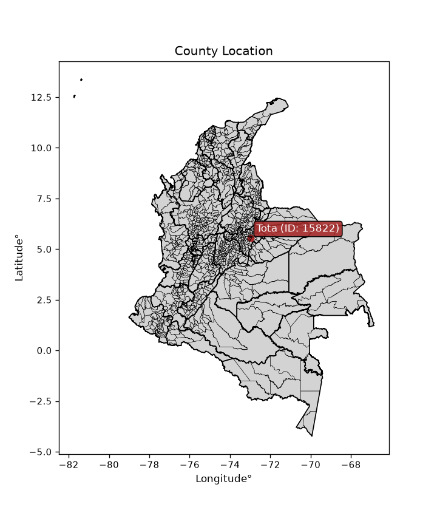
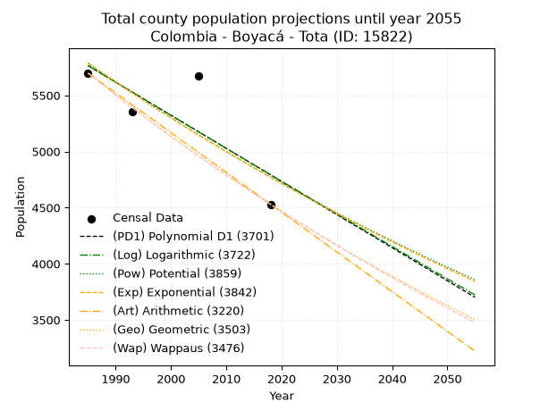
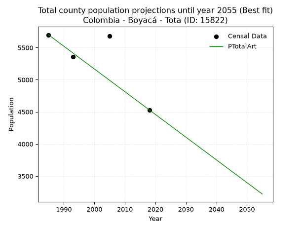
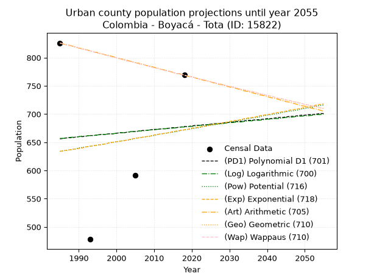
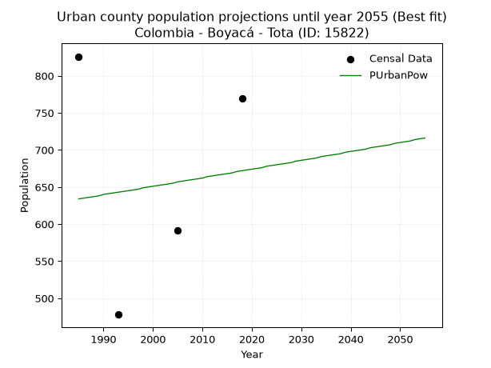
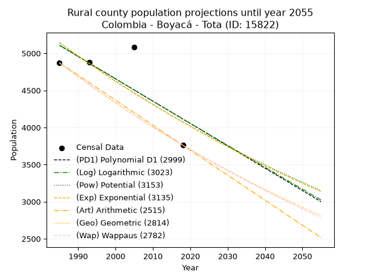
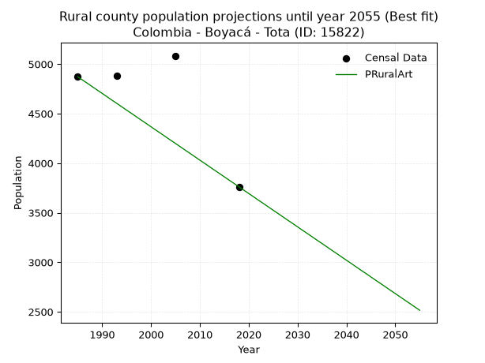

<div align="center">


</div>

# _“Population and Public Services Demand Projections (PPSD) until Year 2050 for Colombia - Boyacá - Tota (ID: 15822)”_
Keywords: `population` `public-service` `projection` `lineal` `polynomial` `logarithmic` `potential` `exponential` `arithmetic` `geometric` `wappaus` `dane` `colombia` `south-america`

PPSD are analytical estimates used by governments and planners to anticipate future changes in population size, age distribution, and the resulting community needs for utilities, healthcare, education, and infrastructure as sizing future water treatment facilities, electrical grids, and road networks based on spatial growth.

<div align="center">

</img>

</div>


> **General running parameters**: • app_version: _v20260806_. • Python version: _3.14.7_. • Pandas version: _3.0.5_. • NumPy version: _2.5.1_. • Creates, save and include plots into reports (create_plot): _False_. • Projection until year: _2050_. • Process polynomial degree 2 and up: _False_. • Process Wappaus: _True_. • Process Wappaus: _True_. • Set negative values to zero: _True_. • Set infinite values to zero: _True_. • Drop dataset notes: _True_. 
<div align="center">

Dynamic map: [:earth_americas:Google](http://maps.google.com/maps?q=5.560497373,-72.9858981) [:earth_americas:OSM](https://www.openstreetmap.org/#map=18/5.560497373/-72.9858981&layers=P) [:earth_americas:Bing](https://www.bing.com/maps?cp=5.560497373~-72.9858981&lvl=18) [:earth_americas:Apple](https://maps.apple.com/frame?center=5.560497373%2C-72.9858981&span=0.003%2C0.006)

</div>


<div align="center">

```geojson
{
  "type": "Feature",
  "geometry": {
    "type": "Point", 
    "coordinates": [-72.9858981, 5.560497373]
  }, 
  "properties": {
    "Name": "Colombia - Boyacá - Tota (ID: 15822)"
  }
}
```

</div>


## 0. Census Data (4 records)

Census data are official statistics collected by a government about the people and housing in a country. They usually include counts of total population, age, sex, race, income, education, and jobs.

📅Global census file: [Population.xlsx](../data/Population.xlsx)

| Source   |   Year |   CountryID | CountryName   |   StateID | StateName   |   CountyID | CountyName   |   PTotal |   PUrban |   PRural |
|:---------|-------:|------------:|:--------------|----------:|:------------|-----------:|:-------------|---------:|---------:|---------:|
| DANE     |   1985 |          57 | Colombia      |        15 | Boyacá      |      15822 | Tota         |     5698 |      826 |     4872 |
| DANE     |   1993 |          57 | Colombia      |        15 | Boyacá      |      15822 | Tota         |     5357 |      478 |     4879 |
| DANE     |   2005 |          57 | Colombia      |        15 | Boyacá      |      15822 | Tota         |     5676 |      592 |     5084 |
| DANE     |   2018 |          57 | Colombia      |        15 | Boyacá      |      15822 | Tota         |     4530 |      769 |     3761 |

> 🔥Some records could had specific notes about the registered values or the corresponding urban or rural distribution.

📅[SUI-RUPS](https://www.datos.gov.co/Hacienda-y-Cr-dito-P-blico/Registro-nico-de-Prestadores-de-Servicios-P-blicos/4qkq-csdn/about_data) - Local public utility companies: [RUPS.csv](../data/RUPS.xlsx)

 | SERVICIO       | ESTADO    | NOMBRE                                                                                                       | NIT         | DEPARTAMENTO_DOMICILIO   | MUNICIPIO_DOMICILIO   | DIRECCION                             |   TELEFONO | EMAIL                   | TIPO_PRESTADOR                 | CLASIFICACION                 |
|:---------------|:----------|:-------------------------------------------------------------------------------------------------------------|:------------|:-------------------------|:----------------------|:--------------------------------------|-----------:|:------------------------|:-------------------------------|:------------------------------|
| ACUEDUCTO      | OPERATIVA | UNIDAD ADMINISTRADORA DE SERVICIOS PUBLICOS DE ACUEDUCTO, ALCANTARILLADO Y ASEO DEL MUNICIPIO DE TOTA-BOYACA | 800012635-0 | BOYACA                   | TOTA                  | palacio municipal parque central tota |    7700945 | dianagaitan18@gmail.com | MUNICIPIO (PRESTACIÓN DIRECTA) | MENOR O IGUAL A 2500 USUARIOS |
| ALCANTARILLADO | OPERATIVA | UNIDAD ADMINISTRADORA DE SERVICIOS PUBLICOS DE ACUEDUCTO, ALCANTARILLADO Y ASEO DEL MUNICIPIO DE TOTA-BOYACA | 800012635-0 | BOYACA                   | TOTA                  | palacio municipal parque central tota |    7700945 | dianagaitan18@gmail.com | MUNICIPIO (PRESTACIÓN DIRECTA) | MENOR O IGUAL A 2500 USUARIOS |

## 1. Total

### 1.1. Coefficients and Parameters

* (PD1) Polynomial Deg 1: -29.48896025692425, 64300.54275391274 (lineal)
* (Log) Logarithmic: -58948.983132223526, 453386.94317553524
* (Pow) Potential: -11.692764582874029, 42.32239880419319
* (Exp) Exponential: -0.005849378827733919, 638318090.8735433
* (Art) Arithmetic: Year diff. 2018 - 1985 = 33, Population diff. 4530 - 5698 = -1168, Annual growth = -35.39393939393939
* (Geo) Geometric: Year diff. 2018 - 1985 = 33, Population diff. 4530 - 5698 = -1168, Annual growth % = -0.0069272075331527905
* (Wap) Wappaus: i = -0.6920989322240789, Condition values only valid for < 200)

<sub>
Wappaus condition values: ['-0.00', '-0.69', '-1.38', '-2.08', '-2.77', '-3.46', '-4.15', '-4.84', '-5.54', '-6.23', '-6.92', '-7.61', '-8.31', '-9.00', '-9.69', '-10.38', '-11.07', '-11.77', '-12.46', '-13.15', '-13.84', '-14.53', '-15.23', '-15.92', '-16.61', '-17.30', '-17.99', '-18.69', '-19.38', '-20.07', '-20.76', '-21.46', '-22.15', '-22.84', '-23.53', '-24.22', '-24.92', '-25.61', '-26.30', '-26.99', '-27.68', '-28.38', '-29.07', '-29.76', '-30.45', '-31.14', '-31.84', '-32.53', '-33.22', '-33.91', '-34.60', '-35.30', '-35.99', '-36.68', '-37.37', '-38.07', '-38.76', '-39.45', '-40.14', '-40.83', '-41.53', '-42.22', '-42.91', '-43.60', '-44.29', '-44.99']
</sub>


### 1.2. Projected Dataset

|   Year |   CountyID |   PTotalPD1 |   PTotalLog |   PTotalPow |   PTotalExp |   PTotalArt |   PTotalGeo |   PTotalWap |
|-------:|-----------:|------------:|------------:|------------:|------------:|------------:|------------:|------------:|
|   1985 |      15822 |        5765 |        5765 |        5787 |        5787 |        5698 |        5698 |        5698 |
|   1986 |      15822 |        5735 |        5736 |        5753 |        5753 |        5663 |        5659 |        5659 |
|   1987 |      15822 |        5706 |        5706 |        5719 |        5719 |        5627 |        5619 |        5620 |
|   1988 |      15822 |        5676 |        5676 |        5686 |        5686 |        5592 |        5580 |        5581 |
|   1989 |      15822 |        5647 |        5647 |        5652 |        5653 |        5556 |        5542 |        5542 |
|   1990 |      15822 |        5618 |        5617 |        5619 |        5620 |        5521 |        5503 |        5504 |
|   1991 |      15822 |        5588 |        5587 |        5586 |        5587 |        5486 |        5465 |        5466 |
|   1992 |      15822 |        5559 |        5558 |        5554 |        5555 |        5450 |        5427 |        5428 |
|   1993 |      15822 |        5529 |        5528 |        5521 |        5522 |        5415 |        5390 |        5391 |
|   1994 |      15822 |        5500 |        5499 |        5489 |        5490 |        5379 |        5352 |        5354 |
|   1995 |      15822 |        5470 |        5469 |        5457 |        5458 |        5344 |        5315 |        5317 |
|   1996 |      15822 |        5441 |        5439 |        5425 |        5426 |        5309 |        5279 |        5280 |
|   1997 |      15822 |        5411 |        5410 |        5393 |        5395 |        5273 |        5242 |        5244 |
|   1998 |      15822 |        5382 |        5380 |        5362 |        5363 |        5238 |        5206 |        5207 |
|   1999 |      15822 |        5352 |        5351 |        5331 |        5332 |        5202 |        5170 |        5171 |
|   2000 |      15822 |        5323 |        5321 |        5299 |        5301 |        5167 |        5134 |        5136 |
|   2001 |      15822 |        5293 |        5292 |        5269 |        5270 |        5132 |        5098 |        5100 |
|   2002 |      15822 |        5264 |        5263 |        5238 |        5239 |        5096 |        5063 |        5065 |
|   2003 |      15822 |        5234 |        5233 |        5207 |        5208 |        5061 |        5028 |        5030 |
|   2004 |      15822 |        5205 |        5204 |        5177 |        5178 |        5026 |        4993 |        4995 |
|   2005 |      15822 |        5175 |        5174 |        5147 |        5148 |        4990 |        4958 |        4960 |
|   2006 |      15822 |        5146 |        5145 |        5117 |        5118 |        4955 |        4924 |        4926 |
|   2007 |      15822 |        5116 |        5116 |        5087 |        5088 |        4919 |        4890 |        4892 |
|   2008 |      15822 |        5087 |        5086 |        5058 |        5058 |        4884 |        4856 |        4858 |
|   2009 |      15822 |        5057 |        5057 |        5028 |        5029 |        4849 |        4822 |        4824 |
|   2010 |      15822 |        5028 |        5027 |        4999 |        5000 |        4813 |        4789 |        4791 |
|   2011 |      15822 |        4998 |        4998 |        4970 |        4970 |        4778 |        4756 |        4757 |
|   2012 |      15822 |        4969 |        4969 |        4941 |        4941 |        4742 |        4723 |        4724 |
|   2013 |      15822 |        4939 |        4940 |        4913 |        4913 |        4707 |        4690 |        4691 |
|   2014 |      15822 |        4910 |        4910 |        4884 |        4884 |        4672 |        4658 |        4659 |
|   2015 |      15822 |        4880 |        4881 |        4856 |        4855 |        4636 |        4625 |        4626 |
|   2016 |      15822 |        4851 |        4852 |        4828 |        4827 |        4601 |        4593 |        4594 |
|   2017 |      15822 |        4821 |        4823 |        4800 |        4799 |        4565 |        4562 |        4562 |
|   2018 |      15822 |        4792 |        4793 |        4772 |        4771 |        4530 |        4530 |        4530 |
|   2019 |      15822 |        4762 |        4764 |        4745 |        4743 |        4495 |        4499 |        4498 |
|   2020 |      15822 |        4733 |        4735 |        4717 |        4715 |        4459 |        4467 |        4467 |
|   2021 |      15822 |        4703 |        4706 |        4690 |        4688 |        4424 |        4437 |        4436 |
|   2022 |      15822 |        4674 |        4677 |        4663 |        4661 |        4388 |        4406 |        4404 |
|   2023 |      15822 |        4644 |        4647 |        4636 |        4633 |        4353 |        4375 |        4374 |
|   2024 |      15822 |        4615 |        4618 |        4610 |        4606 |        4318 |        4345 |        4343 |
|   2025 |      15822 |        4585 |        4589 |        4583 |        4580 |        4282 |        4315 |        4312 |
|   2026 |      15822 |        4556 |        4560 |        4557 |        4553 |        4247 |        4285 |        4282 |
|   2027 |      15822 |        4526 |        4531 |        4530 |        4526 |        4211 |        4255 |        4252 |
|   2028 |      15822 |        4497 |        4502 |        4504 |        4500 |        4176 |        4226 |        4222 |
|   2029 |      15822 |        4467 |        4473 |        4478 |        4474 |        4141 |        4197 |        4192 |
|   2030 |      15822 |        4438 |        4444 |        4453 |        4448 |        4105 |        4167 |        4163 |
|   2031 |      15822 |        4408 |        4415 |        4427 |        4422 |        4070 |        4139 |        4133 |
|   2032 |      15822 |        4379 |        4386 |        4402 |        4396 |        4034 |        4110 |        4104 |
|   2033 |      15822 |        4349 |        4357 |        4377 |        4370 |        3999 |        4081 |        4075 |
|   2034 |      15822 |        4320 |        4328 |        4351 |        4345 |        3964 |        4053 |        4046 |
|   2035 |      15822 |        4291 |        4299 |        4326 |        4319 |        3928 |        4025 |        4017 |
|   2036 |      15822 |        4261 |        4270 |        4302 |        4294 |        3893 |        3997 |        3988 |
|   2037 |      15822 |        4232 |        4241 |        4277 |        4269 |        3858 |        3970 |        3960 |
|   2038 |      15822 |        4202 |        4212 |        4253 |        4244 |        3822 |        3942 |        3932 |
|   2039 |      15822 |        4173 |        4183 |        4228 |        4219 |        3787 |        3915 |        3904 |
|   2040 |      15822 |        4143 |        4154 |        4204 |        4195 |        3751 |        3888 |        3876 |
|   2041 |      15822 |        4114 |        4125 |        4180 |        4170 |        3716 |        3861 |        3848 |
|   2042 |      15822 |        4084 |        4096 |        4156 |        4146 |        3681 |        3834 |        3820 |
|   2043 |      15822 |        4055 |        4068 |        4132 |        4122 |        3645 |        3807 |        3793 |
|   2044 |      15822 |        4025 |        4039 |        4109 |        4098 |        3610 |        3781 |        3766 |
|   2045 |      15822 |        3996 |        4010 |        4085 |        4074 |        3574 |        3755 |        3739 |
|   2046 |      15822 |        3966 |        3981 |        4062 |        4050 |        3539 |        3729 |        3712 |
|   2047 |      15822 |        3937 |        3952 |        4039 |        4027 |        3504 |        3703 |        3685 |
|   2048 |      15822 |        3907 |        3923 |        4016 |        4003 |        3468 |        3677 |        3658 |
|   2049 |      15822 |        3878 |        3895 |        3993 |        3980 |        3433 |        3652 |        3632 |
|   2050 |      15822 |        3848 |        3866 |        3970 |        3957 |        3397 |        3627 |        3605 |
<div align="center">

</img>

</div>


### 1.3. Best fit with absolute and relative error (%)

Relative error puts that difference into context by dividing the absolute error by the true value, creating a unitless ratio or percentage that shows the scale of the mistake.

Absolute and relative error

|   Year | Source   |   CountryID | CountryName   |   StateID | StateName   |   CountyID_x | CountyName   |   PTotal |   PUrban |   PRural |   CountyID_y |   PTotalPD1 |   PTotalLog |   PTotalPow |   PTotalExp |   PTotalArt |   PTotalGeo |   PTotalWap |   PTotalPD1AbsError |   PTotalLogAbsError |   PTotalPowAbsError |   PTotalExpAbsError |   PTotalArtAbsError |   PTotalGeoAbsError |   PTotalWapAbsError |   PTotalPD1RelError |   PTotalLogRelError |   PTotalPowRelError |   PTotalExpRelError |   PTotalArtRelError |   PTotalGeoRelError |   PTotalWapRelError |
|-------:|:---------|------------:|:--------------|----------:|:------------|-------------:|:-------------|---------:|---------:|---------:|-------------:|------------:|------------:|------------:|------------:|------------:|------------:|------------:|--------------------:|--------------------:|--------------------:|--------------------:|--------------------:|--------------------:|--------------------:|--------------------:|--------------------:|--------------------:|--------------------:|--------------------:|--------------------:|--------------------:|
|   1985 | DANE     |          57 | Colombia      |        15 | Boyacá      |        15822 | Tota         |     5698 |      826 |     4872 |        15822 |        5765 |        5765 |        5787 |        5787 |        5698 |        5698 |        5698 |                  67 |                  67 |                  89 |                  89 |                   0 |                   0 |                   0 |             1.17585 |             1.17585 |             1.56195 |             1.56195 |              0      |            0        |            0        |
|   1993 | DANE     |          57 | Colombia      |        15 | Boyacá      |        15822 | Tota         |     5357 |      478 |     4879 |        15822 |        5529 |        5528 |        5521 |        5522 |        5415 |        5390 |        5391 |                 172 |                 171 |                 164 |                 165 |                  58 |                  33 |                  34 |             3.21075 |             3.19209 |             3.06141 |             3.08008 |              1.0827 |            0.616016 |            0.634684 |
|   2005 | DANE     |          57 | Colombia      |        15 | Boyacá      |        15822 | Tota         |     5676 |      592 |     5084 |        15822 |        5175 |        5174 |        5147 |        5148 |        4990 |        4958 |        4960 |                 501 |                 502 |                 529 |                 528 |                 686 |                 718 |                 716 |             8.82664 |             8.84426 |             9.31994 |             9.30233 |             12.086  |           12.6498   |           12.6145   |
|   2018 | DANE     |          57 | Colombia      |        15 | Boyacá      |        15822 | Tota         |     4530 |      769 |     3761 |        15822 |        4792 |        4793 |        4772 |        4771 |        4530 |        4530 |        4530 |                 262 |                 263 |                 242 |                 241 |                   0 |                   0 |                   0 |             5.78366 |             5.80574 |             5.34216 |             5.32009 |              0      |            0        |            0        |

Relative error mean

| Method    |   RelError | Best   |
|:----------|-----------:|:-------|
| PTotalPD1 |    4.74923 |        |
| PTotalLog |    4.75448 |        |
| PTotalPow |    4.82137 |        |
| PTotalExp |    4.81611 |        |
| PTotalArt |    3.29217 | True   |
| PTotalGeo |    3.31644 |        |
| PTotalWap |    3.3123  |        |

💙Best method: _**PTotalArt**_
<div align="center">

</img>

</div>


### 1.4. Fresh water supply demand in liters per capita per day (lpcd)

The fresh water supply demand typically ranges from 100 to 300 liters per capita per day (lpcd) for standard domestic and municipal planning, though absolute survival minimums set by the World Health Organization are as low as 7.5 to 20 liters per day, and total consumption in high-income nations can exceed 400 liters.

> `CZ`: Level in meters above the sea level (masl)<br> `WS`: Fresh water supply demand in liters per capita per day (lpcd or l/h/d)<br> `WSAll`: Zonal fresh water supply demand in liters per second (l/s)<br> `A`: Zonal area in square meters<br> `DP`: Population density (people/hectare or p/ha)

Reference values (RAS Colombia)

|    CZ |   WS |
|------:|-----:|
|  1000 |  120 |
|  2000 |  130 |
| 99999 |  140 |

County shapefile geometry properties and water supply values

|   CountyID |      ATotal |   CZTotal |   WSTotal |
|-----------:|------------:|----------:|----------:|
|      15822 | 1.95664e+08 |    3203.5 |       140 |

Projected values for best method: PTotalArt

|   CountyID |   Year |   PTotalArt |   DPTotal |   WSTotal |   WSTotalAll |
|-----------:|-------:|------------:|----------:|----------:|-------------:|
|      15822 |   1985 |        5698 |      0.29 |       140 |      9.23287 |
|      15822 |   1986 |        5663 |      0.29 |       140 |      9.17616 |
|      15822 |   1987 |        5627 |      0.29 |       140 |      9.11782 |
|      15822 |   1988 |        5592 |      0.29 |       140 |      9.06111 |
|      15822 |   1989 |        5556 |      0.28 |       140 |      9.00278 |
|      15822 |   1990 |        5521 |      0.28 |       140 |      8.94606 |
|      15822 |   1991 |        5486 |      0.28 |       140 |      8.88935 |
|      15822 |   1992 |        5450 |      0.28 |       140 |      8.83102 |
|      15822 |   1993 |        5415 |      0.28 |       140 |      8.77431 |
|      15822 |   1994 |        5379 |      0.27 |       140 |      8.71597 |
|      15822 |   1995 |        5344 |      0.27 |       140 |      8.65926 |
|      15822 |   1996 |        5309 |      0.27 |       140 |      8.60255 |
|      15822 |   1997 |        5273 |      0.27 |       140 |      8.54421 |
|      15822 |   1998 |        5238 |      0.27 |       140 |      8.4875  |
|      15822 |   1999 |        5202 |      0.27 |       140 |      8.42917 |
|      15822 |   2000 |        5167 |      0.26 |       140 |      8.37245 |
|      15822 |   2001 |        5132 |      0.26 |       140 |      8.31574 |
|      15822 |   2002 |        5096 |      0.26 |       140 |      8.25741 |
|      15822 |   2003 |        5061 |      0.26 |       140 |      8.20069 |
|      15822 |   2004 |        5026 |      0.26 |       140 |      8.14398 |
|      15822 |   2005 |        4990 |      0.26 |       140 |      8.08565 |
|      15822 |   2006 |        4955 |      0.25 |       140 |      8.02894 |
|      15822 |   2007 |        4919 |      0.25 |       140 |      7.9706  |
|      15822 |   2008 |        4884 |      0.25 |       140 |      7.91389 |
|      15822 |   2009 |        4849 |      0.25 |       140 |      7.85718 |
|      15822 |   2010 |        4813 |      0.25 |       140 |      7.79884 |
|      15822 |   2011 |        4778 |      0.24 |       140 |      7.74213 |
|      15822 |   2012 |        4742 |      0.24 |       140 |      7.6838  |
|      15822 |   2013 |        4707 |      0.24 |       140 |      7.62708 |
|      15822 |   2014 |        4672 |      0.24 |       140 |      7.57037 |
|      15822 |   2015 |        4636 |      0.24 |       140 |      7.51204 |
|      15822 |   2016 |        4601 |      0.24 |       140 |      7.45532 |
|      15822 |   2017 |        4565 |      0.23 |       140 |      7.39699 |
|      15822 |   2018 |        4530 |      0.23 |       140 |      7.34028 |
|      15822 |   2019 |        4495 |      0.23 |       140 |      7.28356 |
|      15822 |   2020 |        4459 |      0.23 |       140 |      7.22523 |
|      15822 |   2021 |        4424 |      0.23 |       140 |      7.16852 |
|      15822 |   2022 |        4388 |      0.22 |       140 |      7.11019 |
|      15822 |   2023 |        4353 |      0.22 |       140 |      7.05347 |
|      15822 |   2024 |        4318 |      0.22 |       140 |      6.99676 |
|      15822 |   2025 |        4282 |      0.22 |       140 |      6.93843 |
|      15822 |   2026 |        4247 |      0.22 |       140 |      6.88171 |
|      15822 |   2027 |        4211 |      0.22 |       140 |      6.82338 |
|      15822 |   2028 |        4176 |      0.21 |       140 |      6.76667 |
|      15822 |   2029 |        4141 |      0.21 |       140 |      6.70995 |
|      15822 |   2030 |        4105 |      0.21 |       140 |      6.65162 |
|      15822 |   2031 |        4070 |      0.21 |       140 |      6.59491 |
|      15822 |   2032 |        4034 |      0.21 |       140 |      6.53657 |
|      15822 |   2033 |        3999 |      0.2  |       140 |      6.47986 |
|      15822 |   2034 |        3964 |      0.2  |       140 |      6.42315 |
|      15822 |   2035 |        3928 |      0.2  |       140 |      6.36481 |
|      15822 |   2036 |        3893 |      0.2  |       140 |      6.3081  |
|      15822 |   2037 |        3858 |      0.2  |       140 |      6.25139 |
|      15822 |   2038 |        3822 |      0.2  |       140 |      6.19306 |
|      15822 |   2039 |        3787 |      0.19 |       140 |      6.13634 |
|      15822 |   2040 |        3751 |      0.19 |       140 |      6.07801 |
|      15822 |   2041 |        3716 |      0.19 |       140 |      6.0213  |
|      15822 |   2042 |        3681 |      0.19 |       140 |      5.96458 |
|      15822 |   2043 |        3645 |      0.19 |       140 |      5.90625 |
|      15822 |   2044 |        3610 |      0.18 |       140 |      5.84954 |
|      15822 |   2045 |        3574 |      0.18 |       140 |      5.7912  |
|      15822 |   2046 |        3539 |      0.18 |       140 |      5.73449 |
|      15822 |   2047 |        3504 |      0.18 |       140 |      5.67778 |
|      15822 |   2048 |        3468 |      0.18 |       140 |      5.61944 |
|      15822 |   2049 |        3433 |      0.18 |       140 |      5.56273 |
|      15822 |   2050 |        3397 |      0.17 |       140 |      5.5044  |

## 2. Urban

### 2.1. Coefficients and Parameters

* (PD1) Polynomial Deg 1: 0.6419108791648762, -617.7322360495434 (lineal)
* (Log) Logarithmic: 1239.1720825761258, -8752.706929762995
* (Pow) Potential: 3.512139739592548, -8.780175633498837
* (Exp) Exponential: 0.001789278390471549, 18.16863357020389
* (Art) Arithmetic: Year diff. 2018 - 1985 = 33, Population diff. 769 - 826 = -57, Annual growth = -1.7272727272727273
* (Geo) Geometric: Year diff. 2018 - 1985 = 33, Population diff. 769 - 826 = -57, Annual growth % = -0.0021644361624397757
* (Wap) Wappaus: i = -0.21658592191507553, Condition values only valid for < 200)

<sub>
Wappaus condition values: ['-0.00', '-0.22', '-0.43', '-0.65', '-0.87', '-1.08', '-1.30', '-1.52', '-1.73', '-1.95', '-2.17', '-2.38', '-2.60', '-2.82', '-3.03', '-3.25', '-3.47', '-3.68', '-3.90', '-4.12', '-4.33', '-4.55', '-4.76', '-4.98', '-5.20', '-5.41', '-5.63', '-5.85', '-6.06', '-6.28', '-6.50', '-6.71', '-6.93', '-7.15', '-7.36', '-7.58', '-7.80', '-8.01', '-8.23', '-8.45', '-8.66', '-8.88', '-9.10', '-9.31', '-9.53', '-9.75', '-9.96', '-10.18', '-10.40', '-10.61', '-10.83', '-11.05', '-11.26', '-11.48', '-11.70', '-11.91', '-12.13', '-12.35', '-12.56', '-12.78', '-13.00', '-13.21', '-13.43', '-13.64', '-13.86', '-14.08']
</sub>


### 2.2. Projected Dataset

|   Year |   CountyID |   PUrbanPD1 |   PUrbanLog |   PUrbanPow |   PUrbanExp |   PUrbanArt |   PUrbanGeo |   PUrbanWap |
|-------:|-----------:|------------:|------------:|------------:|------------:|------------:|------------:|------------:|
|   1985 |      15822 |         656 |         657 |         634 |         634 |         826 |         826 |         826 |
|   1986 |      15822 |         657 |         657 |         635 |         635 |         824 |         824 |         824 |
|   1987 |      15822 |         658 |         658 |         636 |         636 |         823 |         822 |         822 |
|   1988 |      15822 |         658 |         659 |         637 |         637 |         821 |         821 |         821 |
|   1989 |      15822 |         659 |         659 |         638 |         638 |         819 |         819 |         819 |
|   1990 |      15822 |         660 |         660 |         640 |         639 |         817 |         817 |         817 |
|   1991 |      15822 |         660 |         661 |         641 |         640 |         816 |         815 |         815 |
|   1992 |      15822 |         661 |         661 |         642 |         642 |         814 |         814 |         814 |
|   1993 |      15822 |         662 |         662 |         643 |         643 |         812 |         812 |         812 |
|   1994 |      15822 |         662 |         662 |         644 |         644 |         810 |         810 |         810 |
|   1995 |      15822 |         663 |         663 |         645 |         645 |         809 |         808 |         808 |
|   1996 |      15822 |         664 |         664 |         646 |         646 |         807 |         807 |         807 |
|   1997 |      15822 |         664 |         664 |         647 |         647 |         805 |         805 |         805 |
|   1998 |      15822 |         665 |         665 |         649 |         649 |         804 |         803 |         803 |
|   1999 |      15822 |         665 |         665 |         650 |         650 |         802 |         801 |         801 |
|   2000 |      15822 |         666 |         666 |         651 |         651 |         800 |         800 |         800 |
|   2001 |      15822 |         667 |         667 |         652 |         652 |         798 |         798 |         798 |
|   2002 |      15822 |         667 |         667 |         653 |         653 |         797 |         796 |         796 |
|   2003 |      15822 |         668 |         668 |         654 |         654 |         795 |         794 |         794 |
|   2004 |      15822 |         669 |         669 |         655 |         656 |         793 |         793 |         793 |
|   2005 |      15822 |         669 |         669 |         657 |         657 |         791 |         791 |         791 |
|   2006 |      15822 |         670 |         670 |         658 |         658 |         790 |         789 |         789 |
|   2007 |      15822 |         671 |         670 |         659 |         659 |         788 |         788 |         788 |
|   2008 |      15822 |         671 |         671 |         660 |         660 |         786 |         786 |         786 |
|   2009 |      15822 |         672 |         672 |         661 |         661 |         785 |         784 |         784 |
|   2010 |      15822 |         673 |         672 |         662 |         663 |         783 |         782 |         782 |
|   2011 |      15822 |         673 |         673 |         664 |         664 |         781 |         781 |         781 |
|   2012 |      15822 |         674 |         674 |         665 |         665 |         779 |         779 |         779 |
|   2013 |      15822 |         674 |         674 |         666 |         666 |         778 |         777 |         777 |
|   2014 |      15822 |         675 |         675 |         667 |         667 |         776 |         776 |         776 |
|   2015 |      15822 |         676 |         675 |         668 |         669 |         774 |         774 |         774 |
|   2016 |      15822 |         676 |         676 |         669 |         670 |         772 |         772 |         772 |
|   2017 |      15822 |         677 |         677 |         671 |         671 |         771 |         771 |         771 |
|   2018 |      15822 |         678 |         677 |         672 |         672 |         769 |         769 |         769 |
|   2019 |      15822 |         678 |         678 |         673 |         673 |         767 |         767 |         767 |
|   2020 |      15822 |         679 |         678 |         674 |         675 |         766 |         766 |         766 |
|   2021 |      15822 |         680 |         679 |         675 |         676 |         764 |         764 |         764 |
|   2022 |      15822 |         680 |         680 |         676 |         677 |         762 |         762 |         762 |
|   2023 |      15822 |         681 |         680 |         678 |         678 |         760 |         761 |         761 |
|   2024 |      15822 |         681 |         681 |         679 |         679 |         759 |         759 |         759 |
|   2025 |      15822 |         682 |         682 |         680 |         681 |         757 |         757 |         757 |
|   2026 |      15822 |         683 |         682 |         681 |         682 |         755 |         756 |         756 |
|   2027 |      15822 |         683 |         683 |         682 |         683 |         753 |         754 |         754 |
|   2028 |      15822 |         684 |         683 |         683 |         684 |         752 |         753 |         752 |
|   2029 |      15822 |         685 |         684 |         685 |         685 |         750 |         751 |         751 |
|   2030 |      15822 |         685 |         685 |         686 |         687 |         748 |         749 |         749 |
|   2031 |      15822 |         686 |         685 |         687 |         688 |         747 |         748 |         748 |
|   2032 |      15822 |         687 |         686 |         688 |         689 |         745 |         746 |         746 |
|   2033 |      15822 |         687 |         686 |         689 |         690 |         743 |         744 |         744 |
|   2034 |      15822 |         688 |         687 |         691 |         692 |         741 |         743 |         743 |
|   2035 |      15822 |         689 |         688 |         692 |         693 |         740 |         741 |         741 |
|   2036 |      15822 |         689 |         688 |         693 |         694 |         738 |         740 |         740 |
|   2037 |      15822 |         690 |         689 |         694 |         695 |         736 |         738 |         738 |
|   2038 |      15822 |         690 |         689 |         695 |         697 |         734 |         736 |         736 |
|   2039 |      15822 |         691 |         690 |         697 |         698 |         733 |         735 |         735 |
|   2040 |      15822 |         692 |         691 |         698 |         699 |         731 |         733 |         733 |
|   2041 |      15822 |         692 |         691 |         699 |         700 |         729 |         732 |         732 |
|   2042 |      15822 |         693 |         692 |         700 |         702 |         728 |         730 |         730 |
|   2043 |      15822 |         694 |         692 |         701 |         703 |         726 |         728 |         728 |
|   2044 |      15822 |         694 |         693 |         703 |         704 |         724 |         727 |         727 |
|   2045 |      15822 |         695 |         694 |         704 |         705 |         722 |         725 |         725 |
|   2046 |      15822 |         696 |         694 |         705 |         707 |         721 |         724 |         724 |
|   2047 |      15822 |         696 |         695 |         706 |         708 |         719 |         722 |         722 |
|   2048 |      15822 |         697 |         696 |         707 |         709 |         717 |         721 |         720 |
|   2049 |      15822 |         698 |         696 |         709 |         710 |         715 |         719 |         719 |
|   2050 |      15822 |         698 |         697 |         710 |         712 |         714 |         717 |         717 |
<div align="center">

</img>

</div>


### 2.3. Best fit with absolute and relative error (%)

Relative error puts that difference into context by dividing the absolute error by the true value, creating a unitless ratio or percentage that shows the scale of the mistake.

Absolute and relative error

|   Year | Source   |   CountryID | CountryName   |   StateID | StateName   |   CountyID_x | CountyName   |   PTotal |   PUrban |   PRural |   CountyID_y |   PUrbanPD1 |   PUrbanLog |   PUrbanPow |   PUrbanExp |   PUrbanArt |   PUrbanGeo |   PUrbanWap |   PUrbanPD1AbsError |   PUrbanLogAbsError |   PUrbanPowAbsError |   PUrbanExpAbsError |   PUrbanArtAbsError |   PUrbanGeoAbsError |   PUrbanWapAbsError |   PUrbanPD1RelError |   PUrbanLogRelError |   PUrbanPowRelError |   PUrbanExpRelError |   PUrbanArtRelError |   PUrbanGeoRelError |   PUrbanWapRelError |
|-------:|:---------|------------:|:--------------|----------:|:------------|-------------:|:-------------|---------:|---------:|---------:|-------------:|------------:|------------:|------------:|------------:|------------:|------------:|------------:|--------------------:|--------------------:|--------------------:|--------------------:|--------------------:|--------------------:|--------------------:|--------------------:|--------------------:|--------------------:|--------------------:|--------------------:|--------------------:|--------------------:|
|   1985 | DANE     |          57 | Colombia      |        15 | Boyacá      |        15822 | Tota         |     5698 |      826 |     4872 |        15822 |         656 |         657 |         634 |         634 |         826 |         826 |         826 |                 170 |                 169 |                 192 |                 192 |                   0 |                   0 |                   0 |             20.5811 |             20.46   |             23.2446 |             23.2446 |              0      |              0      |              0      |
|   1993 | DANE     |          57 | Colombia      |        15 | Boyacá      |        15822 | Tota         |     5357 |      478 |     4879 |        15822 |         662 |         662 |         643 |         643 |         812 |         812 |         812 |                 184 |                 184 |                 165 |                 165 |                 334 |                 334 |                 334 |             38.4937 |             38.4937 |             34.5188 |             34.5188 |             69.8745 |             69.8745 |             69.8745 |
|   2005 | DANE     |          57 | Colombia      |        15 | Boyacá      |        15822 | Tota         |     5676 |      592 |     5084 |        15822 |         669 |         669 |         657 |         657 |         791 |         791 |         791 |                  77 |                  77 |                  65 |                  65 |                 199 |                 199 |                 199 |             13.0068 |             13.0068 |             10.9797 |             10.9797 |             33.6149 |             33.6149 |             33.6149 |
|   2018 | DANE     |          57 | Colombia      |        15 | Boyacá      |        15822 | Tota         |     4530 |      769 |     3761 |        15822 |         678 |         677 |         672 |         672 |         769 |         769 |         769 |                  91 |                  92 |                  97 |                  97 |                   0 |                   0 |                   0 |             11.8336 |             11.9636 |             12.6138 |             12.6138 |              0      |              0      |              0      |

Relative error mean

| Method    |   RelError | Best   |
|:----------|-----------:|:-------|
| PUrbanPD1 |    20.9788 |        |
| PUrbanLog |    20.981  |        |
| PUrbanPow |    20.3392 | True   |
| PUrbanExp |    20.3392 | True   |
| PUrbanArt |    25.8723 |        |
| PUrbanGeo |    25.8723 |        |
| PUrbanWap |    25.8723 |        |

💙Best method: _**PUrbanPow**_
<div align="center">

</img>

</div>


### 2.4. Fresh water supply demand in liters per capita per day (lpcd)

The fresh water supply demand typically ranges from 100 to 300 liters per capita per day (lpcd) for standard domestic and municipal planning, though absolute survival minimums set by the World Health Organization are as low as 7.5 to 20 liters per day, and total consumption in high-income nations can exceed 400 liters.

> `CZ`: Level in meters above the sea level (masl)<br> `WS`: Fresh water supply demand in liters per capita per day (lpcd or l/h/d)<br> `WSAll`: Zonal fresh water supply demand in liters per second (l/s)<br> `A`: Zonal area in square meters<br> `DP`: Population density (people/hectare or p/ha)

Reference values (RAS Colombia)

|    CZ |   WS |
|------:|-----:|
|  1000 |  120 |
|  2000 |  130 |
| 99999 |  140 |

County shapefile geometry properties and water supply values

|   CountyID |   AUrban |   CZUrban |   WSUrban |
|-----------:|---------:|----------:|----------:|
|      15822 |   508198 |   2869.19 |       140 |

Projected values for best method: PUrbanPow

|   CountyID |   Year |   PUrbanPow |   DPUrban |   WSUrban |   WSUrbanAll |
|-----------:|-------:|------------:|----------:|----------:|-------------:|
|      15822 |   1985 |         634 |     12.48 |       140 |      1.02731 |
|      15822 |   1986 |         635 |     12.5  |       140 |      1.02894 |
|      15822 |   1987 |         636 |     12.51 |       140 |      1.03056 |
|      15822 |   1988 |         637 |     12.53 |       140 |      1.03218 |
|      15822 |   1989 |         638 |     12.55 |       140 |      1.0338  |
|      15822 |   1990 |         640 |     12.59 |       140 |      1.03704 |
|      15822 |   1991 |         641 |     12.61 |       140 |      1.03866 |
|      15822 |   1992 |         642 |     12.63 |       140 |      1.04028 |
|      15822 |   1993 |         643 |     12.65 |       140 |      1.0419  |
|      15822 |   1994 |         644 |     12.67 |       140 |      1.04352 |
|      15822 |   1995 |         645 |     12.69 |       140 |      1.04514 |
|      15822 |   1996 |         646 |     12.71 |       140 |      1.04676 |
|      15822 |   1997 |         647 |     12.73 |       140 |      1.04838 |
|      15822 |   1998 |         649 |     12.77 |       140 |      1.05162 |
|      15822 |   1999 |         650 |     12.79 |       140 |      1.05324 |
|      15822 |   2000 |         651 |     12.81 |       140 |      1.05486 |
|      15822 |   2001 |         652 |     12.83 |       140 |      1.05648 |
|      15822 |   2002 |         653 |     12.85 |       140 |      1.0581  |
|      15822 |   2003 |         654 |     12.87 |       140 |      1.05972 |
|      15822 |   2004 |         655 |     12.89 |       140 |      1.06134 |
|      15822 |   2005 |         657 |     12.93 |       140 |      1.06458 |
|      15822 |   2006 |         658 |     12.95 |       140 |      1.0662  |
|      15822 |   2007 |         659 |     12.97 |       140 |      1.06782 |
|      15822 |   2008 |         660 |     12.99 |       140 |      1.06944 |
|      15822 |   2009 |         661 |     13.01 |       140 |      1.07106 |
|      15822 |   2010 |         662 |     13.03 |       140 |      1.07269 |
|      15822 |   2011 |         664 |     13.07 |       140 |      1.07593 |
|      15822 |   2012 |         665 |     13.09 |       140 |      1.07755 |
|      15822 |   2013 |         666 |     13.11 |       140 |      1.07917 |
|      15822 |   2014 |         667 |     13.12 |       140 |      1.08079 |
|      15822 |   2015 |         668 |     13.14 |       140 |      1.08241 |
|      15822 |   2016 |         669 |     13.16 |       140 |      1.08403 |
|      15822 |   2017 |         671 |     13.2  |       140 |      1.08727 |
|      15822 |   2018 |         672 |     13.22 |       140 |      1.08889 |
|      15822 |   2019 |         673 |     13.24 |       140 |      1.09051 |
|      15822 |   2020 |         674 |     13.26 |       140 |      1.09213 |
|      15822 |   2021 |         675 |     13.28 |       140 |      1.09375 |
|      15822 |   2022 |         676 |     13.3  |       140 |      1.09537 |
|      15822 |   2023 |         678 |     13.34 |       140 |      1.09861 |
|      15822 |   2024 |         679 |     13.36 |       140 |      1.10023 |
|      15822 |   2025 |         680 |     13.38 |       140 |      1.10185 |
|      15822 |   2026 |         681 |     13.4  |       140 |      1.10347 |
|      15822 |   2027 |         682 |     13.42 |       140 |      1.10509 |
|      15822 |   2028 |         683 |     13.44 |       140 |      1.10671 |
|      15822 |   2029 |         685 |     13.48 |       140 |      1.10995 |
|      15822 |   2030 |         686 |     13.5  |       140 |      1.11157 |
|      15822 |   2031 |         687 |     13.52 |       140 |      1.11319 |
|      15822 |   2032 |         688 |     13.54 |       140 |      1.11481 |
|      15822 |   2033 |         689 |     13.56 |       140 |      1.11644 |
|      15822 |   2034 |         691 |     13.6  |       140 |      1.11968 |
|      15822 |   2035 |         692 |     13.62 |       140 |      1.1213  |
|      15822 |   2036 |         693 |     13.64 |       140 |      1.12292 |
|      15822 |   2037 |         694 |     13.66 |       140 |      1.12454 |
|      15822 |   2038 |         695 |     13.68 |       140 |      1.12616 |
|      15822 |   2039 |         697 |     13.72 |       140 |      1.1294  |
|      15822 |   2040 |         698 |     13.73 |       140 |      1.13102 |
|      15822 |   2041 |         699 |     13.75 |       140 |      1.13264 |
|      15822 |   2042 |         700 |     13.77 |       140 |      1.13426 |
|      15822 |   2043 |         701 |     13.79 |       140 |      1.13588 |
|      15822 |   2044 |         703 |     13.83 |       140 |      1.13912 |
|      15822 |   2045 |         704 |     13.85 |       140 |      1.14074 |
|      15822 |   2046 |         705 |     13.87 |       140 |      1.14236 |
|      15822 |   2047 |         706 |     13.89 |       140 |      1.14398 |
|      15822 |   2048 |         707 |     13.91 |       140 |      1.1456  |
|      15822 |   2049 |         709 |     13.95 |       140 |      1.14884 |
|      15822 |   2050 |         710 |     13.97 |       140 |      1.15046 |

## 3. Rural

### 3.1. Coefficients and Parameters

* (PD1) Polynomial Deg 1: -30.13087113608911, 64918.274989962236 (lineal)
* (Log) Logarithmic: -60188.155214799604, 462139.6501052978
* (Pow) Potential: -14.121483935206792, 50.28047614667362
* (Exp) Exponential: -0.007068867660441955, 6384026370.452269
* (Art) Arithmetic: Year diff. 2018 - 1985 = 33, Population diff. 3761 - 4872 = -1111, Annual growth = -33.666666666666664
* (Geo) Geometric: Year diff. 2018 - 1985 = 33, Population diff. 3761 - 4872 = -1111, Annual growth % = -0.0078123434961060445
* (Wap) Wappaus: i = -0.7799528939341287, Condition values only valid for < 200)

<sub>
Wappaus condition values: ['-0.00', '-0.78', '-1.56', '-2.34', '-3.12', '-3.90', '-4.68', '-5.46', '-6.24', '-7.02', '-7.80', '-8.58', '-9.36', '-10.14', '-10.92', '-11.70', '-12.48', '-13.26', '-14.04', '-14.82', '-15.60', '-16.38', '-17.16', '-17.94', '-18.72', '-19.50', '-20.28', '-21.06', '-21.84', '-22.62', '-23.40', '-24.18', '-24.96', '-25.74', '-26.52', '-27.30', '-28.08', '-28.86', '-29.64', '-30.42', '-31.20', '-31.98', '-32.76', '-33.54', '-34.32', '-35.10', '-35.88', '-36.66', '-37.44', '-38.22', '-39.00', '-39.78', '-40.56', '-41.34', '-42.12', '-42.90', '-43.68', '-44.46', '-45.24', '-46.02', '-46.80', '-47.58', '-48.36', '-49.14', '-49.92', '-50.70']
</sub>


### 3.2. Projected Dataset

|   Year |   CountyID |   PRuralPD1 |   PRuralLog |   PRuralPow |   PRuralExp |   PRuralArt |   PRuralGeo |   PRuralWap |
|-------:|-----------:|------------:|------------:|------------:|------------:|------------:|------------:|------------:|
|   1985 |      15822 |        5108 |        5108 |        5143 |        5143 |        4872 |        4872 |        4872 |
|   1986 |      15822 |        5078 |        5078 |        5106 |        5107 |        4838 |        4834 |        4834 |
|   1987 |      15822 |        5048 |        5048 |        5070 |        5071 |        4805 |        4796 |        4797 |
|   1988 |      15822 |        5018 |        5018 |        5034 |        5035 |        4771 |        4759 |        4759 |
|   1989 |      15822 |        4988 |        4987 |        4999 |        4999 |        4737 |        4722 |        4722 |
|   1990 |      15822 |        4958 |        4957 |        4963 |        4964 |        4704 |        4685 |        4686 |
|   1991 |      15822 |        4928 |        4927 |        4928 |        4929 |        4670 |        4648 |        4649 |
|   1992 |      15822 |        4898 |        4897 |        4893 |        4895 |        4636 |        4612 |        4613 |
|   1993 |      15822 |        4867 |        4866 |        4859 |        4860 |        4603 |        4576 |        4577 |
|   1994 |      15822 |        4837 |        4836 |        4825 |        4826 |        4569 |        4540 |        4542 |
|   1995 |      15822 |        4807 |        4806 |        4791 |        4792 |        4535 |        4504 |        4506 |
|   1996 |      15822 |        4777 |        4776 |        4757 |        4758 |        4502 |        4469 |        4471 |
|   1997 |      15822 |        4747 |        4746 |        4723 |        4725 |        4468 |        4434 |        4436 |
|   1998 |      15822 |        4717 |        4716 |        4690 |        4691 |        4434 |        4400 |        4402 |
|   1999 |      15822 |        4687 |        4685 |        4657 |        4658 |        4401 |        4365 |        4368 |
|   2000 |      15822 |        4657 |        4655 |        4624 |        4625 |        4367 |        4331 |        4334 |
|   2001 |      15822 |        4626 |        4625 |        4592 |        4593 |        4333 |        4297 |        4300 |
|   2002 |      15822 |        4596 |        4595 |        4559 |        4561 |        4300 |        4264 |        4266 |
|   2003 |      15822 |        4566 |        4565 |        4527 |        4528 |        4266 |        4231 |        4233 |
|   2004 |      15822 |        4536 |        4535 |        4496 |        4496 |        4232 |        4197 |        4200 |
|   2005 |      15822 |        4506 |        4505 |        4464 |        4465 |        4199 |        4165 |        4167 |
|   2006 |      15822 |        4476 |        4475 |        4433 |        4433 |        4165 |        4132 |        4134 |
|   2007 |      15822 |        4446 |        4445 |        4402 |        4402 |        4131 |        4100 |        4102 |
|   2008 |      15822 |        4415 |        4415 |        4371 |        4371 |        4098 |        4068 |        4070 |
|   2009 |      15822 |        4385 |        4385 |        4340 |        4340 |        4064 |        4036 |        4038 |
|   2010 |      15822 |        4355 |        4355 |        4310 |        4310 |        4030 |        4005 |        4006 |
|   2011 |      15822 |        4325 |        4325 |        4280 |        4279 |        3997 |        3973 |        3975 |
|   2012 |      15822 |        4295 |        4295 |        4250 |        4249 |        3963 |        3942 |        3944 |
|   2013 |      15822 |        4265 |        4265 |        4220 |        4219 |        3929 |        3911 |        3913 |
|   2014 |      15822 |        4235 |        4236 |        4190 |        4190 |        3896 |        3881 |        3882 |
|   2015 |      15822 |        4205 |        4206 |        4161 |        4160 |        3862 |        3851 |        3851 |
|   2016 |      15822 |        4174 |        4176 |        4132 |        4131 |        3828 |        3820 |        3821 |
|   2017 |      15822 |        4144 |        4146 |        4103 |        4102 |        3795 |        3791 |        3791 |
|   2018 |      15822 |        4114 |        4116 |        4075 |        4073 |        3761 |        3761 |        3761 |
|   2019 |      15822 |        4084 |        4086 |        4046 |        4044 |        3727 |        3732 |        3731 |
|   2020 |      15822 |        4054 |        4056 |        4018 |        4016 |        3694 |        3702 |        3702 |
|   2021 |      15822 |        4024 |        4027 |        3990 |        3987 |        3660 |        3674 |        3672 |
|   2022 |      15822 |        3994 |        3997 |        3962 |        3959 |        3626 |        3645 |        3643 |
|   2023 |      15822 |        3964 |        3967 |        3935 |        3931 |        3593 |        3616 |        3614 |
|   2024 |      15822 |        3933 |        3937 |        3907 |        3904 |        3559 |        3588 |        3586 |
|   2025 |      15822 |        3903 |        3908 |        3880 |        3876 |        3525 |        3560 |        3557 |
|   2026 |      15822 |        3873 |        3878 |        3853 |        3849 |        3492 |        3532 |        3529 |
|   2027 |      15822 |        3843 |        3848 |        3826 |        3822 |        3458 |        3505 |        3501 |
|   2028 |      15822 |        3813 |        3819 |        3800 |        3795 |        3424 |        3477 |        3473 |
|   2029 |      15822 |        3783 |        3789 |        3774 |        3768 |        3391 |        3450 |        3445 |
|   2030 |      15822 |        3753 |        3759 |        3747 |        3742 |        3357 |        3423 |        3417 |
|   2031 |      15822 |        3722 |        3730 |        3721 |        3715 |        3323 |        3396 |        3390 |
|   2032 |      15822 |        3692 |        3700 |        3696 |        3689 |        3290 |        3370 |        3363 |
|   2033 |      15822 |        3662 |        3670 |        3670 |        3663 |        3256 |        3344 |        3336 |
|   2034 |      15822 |        3632 |        3641 |        3645 |        3637 |        3222 |        3317 |        3309 |
|   2035 |      15822 |        3602 |        3611 |        3619 |        3612 |        3189 |        3292 |        3282 |
|   2036 |      15822 |        3572 |        3582 |        3594 |        3586 |        3155 |        3266 |        3256 |
|   2037 |      15822 |        3542 |        3552 |        3570 |        3561 |        3121 |        3240 |        3229 |
|   2038 |      15822 |        3512 |        3523 |        3545 |        3536 |        3088 |        3215 |        3203 |
|   2039 |      15822 |        3481 |        3493 |        3520 |        3511 |        3054 |        3190 |        3177 |
|   2040 |      15822 |        3451 |        3463 |        3496 |        3486 |        3020 |        3165 |        3151 |
|   2041 |      15822 |        3421 |        3434 |        3472 |        3462 |        2987 |        3140 |        3125 |
|   2042 |      15822 |        3391 |        3404 |        3448 |        3437 |        2953 |        3116 |        3100 |
|   2043 |      15822 |        3361 |        3375 |        3424 |        3413 |        2919 |        3091 |        3075 |
|   2044 |      15822 |        3331 |        3346 |        3401 |        3389 |        2886 |        3067 |        3049 |
|   2045 |      15822 |        3301 |        3316 |        3377 |        3365 |        2852 |        3043 |        3024 |
|   2046 |      15822 |        3271 |        3287 |        3354 |        3341 |        2818 |        3019 |        2999 |
|   2047 |      15822 |        3240 |        3257 |        3331 |        3318 |        2785 |        2996 |        2975 |
|   2048 |      15822 |        3210 |        3228 |        3308 |        3295 |        2751 |        2972 |        2950 |
|   2049 |      15822 |        3180 |        3199 |        3285 |        3271 |        2717 |        2949 |        2926 |
|   2050 |      15822 |        3150 |        3169 |        3263 |        3248 |        2684 |        2926 |        2902 |
<div align="center">

</img>

</div>


### 3.3. Best fit with absolute and relative error (%)

Relative error puts that difference into context by dividing the absolute error by the true value, creating a unitless ratio or percentage that shows the scale of the mistake.

Absolute and relative error

|   Year | Source   |   CountryID | CountryName   |   StateID | StateName   |   CountyID_x | CountyName   |   PTotal |   PUrban |   PRural |   CountyID_y |   PRuralPD1 |   PRuralLog |   PRuralPow |   PRuralExp |   PRuralArt |   PRuralGeo |   PRuralWap |   PRuralPD1AbsError |   PRuralLogAbsError |   PRuralPowAbsError |   PRuralExpAbsError |   PRuralArtAbsError |   PRuralGeoAbsError |   PRuralWapAbsError |   PRuralPD1RelError |   PRuralLogRelError |   PRuralPowRelError |   PRuralExpRelError |   PRuralArtRelError |   PRuralGeoRelError |   PRuralWapRelError |
|-------:|:---------|------------:|:--------------|----------:|:------------|-------------:|:-------------|---------:|---------:|---------:|-------------:|------------:|------------:|------------:|------------:|------------:|------------:|------------:|--------------------:|--------------------:|--------------------:|--------------------:|--------------------:|--------------------:|--------------------:|--------------------:|--------------------:|--------------------:|--------------------:|--------------------:|--------------------:|--------------------:|
|   1985 | DANE     |          57 | Colombia      |        15 | Boyacá      |        15822 | Tota         |     5698 |      826 |     4872 |        15822 |        5108 |        5108 |        5143 |        5143 |        4872 |        4872 |        4872 |                 236 |                 236 |                 271 |                 271 |                   0 |                   0 |                   0 |            4.84401  |            4.84401  |             5.5624  |            5.5624   |              0      |             0       |             0       |
|   1993 | DANE     |          57 | Colombia      |        15 | Boyacá      |        15822 | Tota         |     5357 |      478 |     4879 |        15822 |        4867 |        4866 |        4859 |        4860 |        4603 |        4576 |        4577 |                  12 |                  13 |                  20 |                  19 |                 276 |                 303 |                 302 |            0.245952 |            0.266448 |             0.40992 |            0.389424 |              5.6569 |             6.21029 |             6.18979 |
|   2005 | DANE     |          57 | Colombia      |        15 | Boyacá      |        15822 | Tota         |     5676 |      592 |     5084 |        15822 |        4506 |        4505 |        4464 |        4465 |        4199 |        4165 |        4167 |                 578 |                 579 |                 620 |                 619 |                 885 |                 919 |                 917 |           11.369    |           11.3887   |            12.1951  |           12.1755   |             17.4076 |            18.0763  |            18.037   |
|   2018 | DANE     |          57 | Colombia      |        15 | Boyacá      |        15822 | Tota         |     4530 |      769 |     3761 |        15822 |        4114 |        4116 |        4075 |        4073 |        3761 |        3761 |        3761 |                 353 |                 355 |                 314 |                 312 |                   0 |                   0 |                   0 |            9.3858   |            9.43898  |             8.34884 |            8.29567  |              0      |             0       |             0       |

Relative error mean

| Method    |   RelError | Best   |
|:----------|-----------:|:-------|
| PRuralPD1 |    6.46119 |        |
| PRuralLog |    6.48453 |        |
| PRuralPow |    6.62907 |        |
| PRuralExp |    6.60573 |        |
| PRuralArt |    5.76611 | True   |
| PRuralGeo |    6.07165 |        |
| PRuralWap |    6.05669 |        |

💙Best method: _**PRuralArt**_
<div align="center">

</img>

</div>


### 3.4. Fresh water supply demand in liters per capita per day (lpcd)

The fresh water supply demand typically ranges from 100 to 300 liters per capita per day (lpcd) for standard domestic and municipal planning, though absolute survival minimums set by the World Health Organization are as low as 7.5 to 20 liters per day, and total consumption in high-income nations can exceed 400 liters.

> `CZ`: Level in meters above the sea level (masl)<br> `WS`: Fresh water supply demand in liters per capita per day (lpcd or l/h/d)<br> `WSAll`: Zonal fresh water supply demand in liters per second (l/s)<br> `A`: Zonal area in square meters<br> `DP`: Population density (people/hectare or p/ha)

Reference values (RAS Colombia)

|    CZ |   WS |
|------:|-----:|
|  1000 |  120 |
|  2000 |  130 |
| 99999 |  140 |

County shapefile geometry properties and water supply values

|   CountyID |      ARural |   CZRural |   WSRural |
|-----------:|------------:|----------:|----------:|
|      15822 | 1.95156e+08 |   3204.36 |       140 |

Projected values for best method: PRuralArt

|   CountyID |   Year |   PRuralArt |   DPRural |   WSRural |   WSRuralAll |
|-----------:|-------:|------------:|----------:|----------:|-------------:|
|      15822 |   1985 |        4872 |      0.25 |       140 |      7.89444 |
|      15822 |   1986 |        4838 |      0.25 |       140 |      7.83935 |
|      15822 |   1987 |        4805 |      0.25 |       140 |      7.78588 |
|      15822 |   1988 |        4771 |      0.24 |       140 |      7.73079 |
|      15822 |   1989 |        4737 |      0.24 |       140 |      7.67569 |
|      15822 |   1990 |        4704 |      0.24 |       140 |      7.62222 |
|      15822 |   1991 |        4670 |      0.24 |       140 |      7.56713 |
|      15822 |   1992 |        4636 |      0.24 |       140 |      7.51204 |
|      15822 |   1993 |        4603 |      0.24 |       140 |      7.45856 |
|      15822 |   1994 |        4569 |      0.23 |       140 |      7.40347 |
|      15822 |   1995 |        4535 |      0.23 |       140 |      7.34838 |
|      15822 |   1996 |        4502 |      0.23 |       140 |      7.29491 |
|      15822 |   1997 |        4468 |      0.23 |       140 |      7.23981 |
|      15822 |   1998 |        4434 |      0.23 |       140 |      7.18472 |
|      15822 |   1999 |        4401 |      0.23 |       140 |      7.13125 |
|      15822 |   2000 |        4367 |      0.22 |       140 |      7.07616 |
|      15822 |   2001 |        4333 |      0.22 |       140 |      7.02106 |
|      15822 |   2002 |        4300 |      0.22 |       140 |      6.96759 |
|      15822 |   2003 |        4266 |      0.22 |       140 |      6.9125  |
|      15822 |   2004 |        4232 |      0.22 |       140 |      6.85741 |
|      15822 |   2005 |        4199 |      0.22 |       140 |      6.80394 |
|      15822 |   2006 |        4165 |      0.21 |       140 |      6.74884 |
|      15822 |   2007 |        4131 |      0.21 |       140 |      6.69375 |
|      15822 |   2008 |        4098 |      0.21 |       140 |      6.64028 |
|      15822 |   2009 |        4064 |      0.21 |       140 |      6.58519 |
|      15822 |   2010 |        4030 |      0.21 |       140 |      6.53009 |
|      15822 |   2011 |        3997 |      0.2  |       140 |      6.47662 |
|      15822 |   2012 |        3963 |      0.2  |       140 |      6.42153 |
|      15822 |   2013 |        3929 |      0.2  |       140 |      6.36644 |
|      15822 |   2014 |        3896 |      0.2  |       140 |      6.31296 |
|      15822 |   2015 |        3862 |      0.2  |       140 |      6.25787 |
|      15822 |   2016 |        3828 |      0.2  |       140 |      6.20278 |
|      15822 |   2017 |        3795 |      0.19 |       140 |      6.14931 |
|      15822 |   2018 |        3761 |      0.19 |       140 |      6.09421 |
|      15822 |   2019 |        3727 |      0.19 |       140 |      6.03912 |
|      15822 |   2020 |        3694 |      0.19 |       140 |      5.98565 |
|      15822 |   2021 |        3660 |      0.19 |       140 |      5.93056 |
|      15822 |   2022 |        3626 |      0.19 |       140 |      5.87546 |
|      15822 |   2023 |        3593 |      0.18 |       140 |      5.82199 |
|      15822 |   2024 |        3559 |      0.18 |       140 |      5.7669  |
|      15822 |   2025 |        3525 |      0.18 |       140 |      5.71181 |
|      15822 |   2026 |        3492 |      0.18 |       140 |      5.65833 |
|      15822 |   2027 |        3458 |      0.18 |       140 |      5.60324 |
|      15822 |   2028 |        3424 |      0.18 |       140 |      5.54815 |
|      15822 |   2029 |        3391 |      0.17 |       140 |      5.49468 |
|      15822 |   2030 |        3357 |      0.17 |       140 |      5.43958 |
|      15822 |   2031 |        3323 |      0.17 |       140 |      5.38449 |
|      15822 |   2032 |        3290 |      0.17 |       140 |      5.33102 |
|      15822 |   2033 |        3256 |      0.17 |       140 |      5.27593 |
|      15822 |   2034 |        3222 |      0.17 |       140 |      5.22083 |
|      15822 |   2035 |        3189 |      0.16 |       140 |      5.16736 |
|      15822 |   2036 |        3155 |      0.16 |       140 |      5.11227 |
|      15822 |   2037 |        3121 |      0.16 |       140 |      5.05718 |
|      15822 |   2038 |        3088 |      0.16 |       140 |      5.0037  |
|      15822 |   2039 |        3054 |      0.16 |       140 |      4.94861 |
|      15822 |   2040 |        3020 |      0.15 |       140 |      4.89352 |
|      15822 |   2041 |        2987 |      0.15 |       140 |      4.84005 |
|      15822 |   2042 |        2953 |      0.15 |       140 |      4.78495 |
|      15822 |   2043 |        2919 |      0.15 |       140 |      4.72986 |
|      15822 |   2044 |        2886 |      0.15 |       140 |      4.67639 |
|      15822 |   2045 |        2852 |      0.15 |       140 |      4.6213  |
|      15822 |   2046 |        2818 |      0.14 |       140 |      4.5662  |
|      15822 |   2047 |        2785 |      0.14 |       140 |      4.51273 |
|      15822 |   2048 |        2751 |      0.14 |       140 |      4.45764 |
|      15822 |   2049 |        2717 |      0.14 |       140 |      4.40255 |
|      15822 |   2050 |        2684 |      0.14 |       140 |      4.34907 |

#

<div align="center"><br><sub>Share this research</sub></div><br>

<sub>**APPS & TOOLS & CONTENT DISCLAIMER**: • NO WARRANTY - This content and software is provided by <a href="https://github.com/rcfdtools" target="_blank">github.com/rcfdtools</a> "as is", without any express or implied warranty, including warranties of merchantability, fitness for a particular purpose, or non-infringement. There is no guarantee that the software will be error-free or operate without interruption. • LIMITATION OF LIABILITY - Neither the authors nor copyright holders will be liable for claims or damages arising from the software or its use. You are responsible for determining if the software is appropriate for your use and assume all associated risks, including errors, legal compliance, and data loss. • NO PROFESSIONAL ADVICE - The software provides general information and does not offer professional advice. It should not replace consultation with professional advisors. [Clauses and global license for rcfdtools use.](https://github.com/rcfdtools/rcfdtools/blob/main/LICENSE.md)</sub>

| [:house: Home](Readme.md)  | [:beginner: Help / Collab](https://github.com/rcfdtools/R.HydroTools/discussions/31) |
|----------------------------|-------------------------------------------------------------------------------------------|