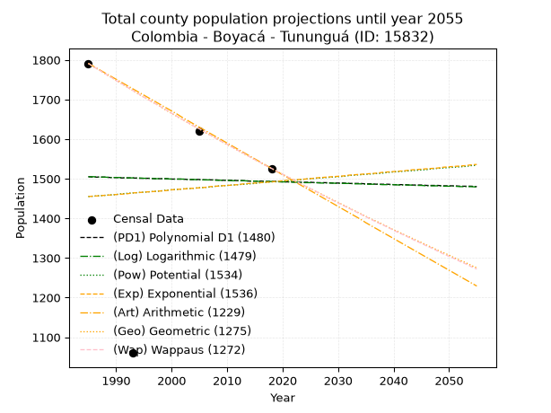
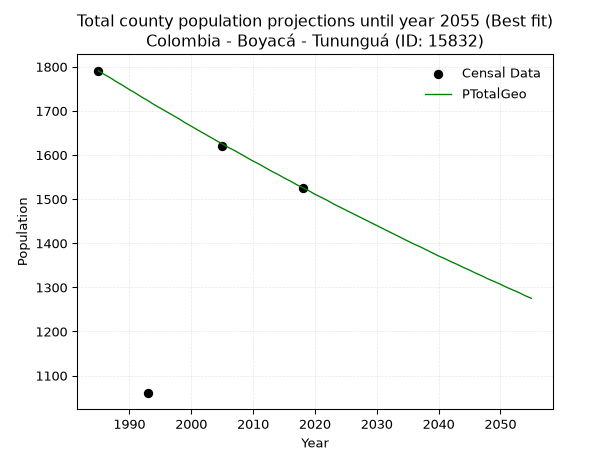
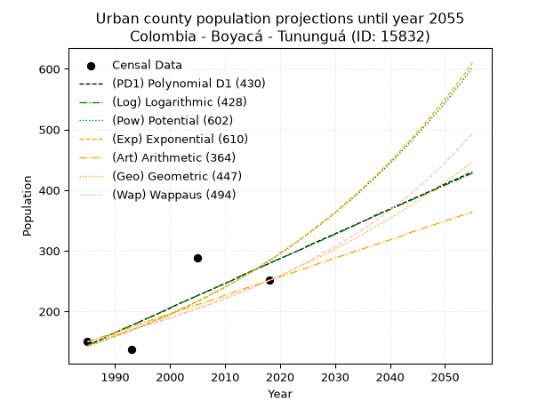
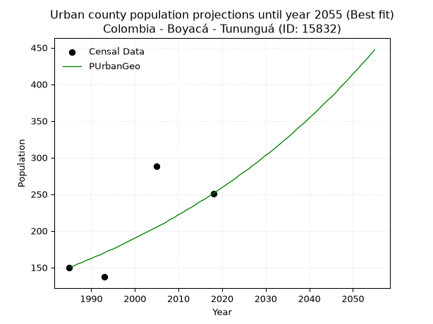
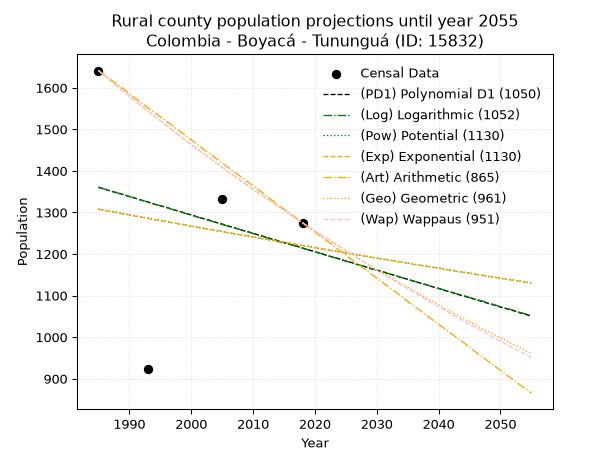
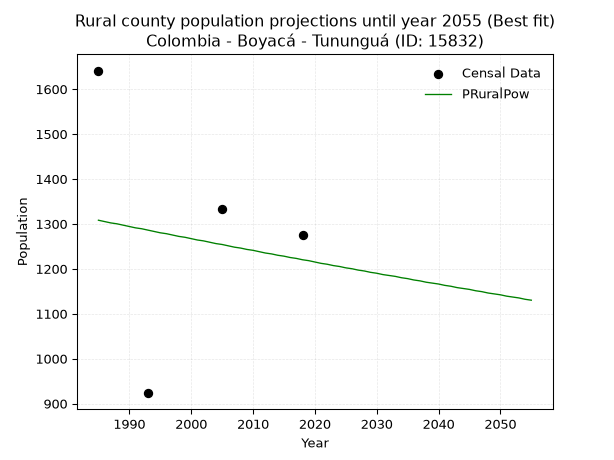

<div align="center">


</div>

# _“Population and Public Services Demand Projections (PPSD) until Year 2050 for Colombia - Boyacá - Tununguá (ID: 15832)”_
Keywords: `population` `public-service` `projection` `lineal` `polynomial` `logarithmic` `potential` `exponential` `arithmetic` `geometric` `wappaus` `dane` `colombia` `south-america`

PPSD are analytical estimates used by governments and planners to anticipate future changes in population size, age distribution, and the resulting community needs for utilities, healthcare, education, and infrastructure as sizing future water treatment facilities, electrical grids, and road networks based on spatial growth.

> **General running parameters**: • app_version: _v20260806_. • Python version: _3.14.7_. • Pandas version: _3.0.5_. • NumPy version: _2.5.1_. • Creates, save and include plots into reports (create_plot): _False_. • Projection until year: _2050_. • Process polynomial degree 2 and up: _False_. • Process Wappaus: _True_. • Process Wappaus: _True_. • Set negative values to zero: _True_. • Set infinite values to zero: _True_. • Drop dataset notes: _True_. 
<div align="center">

Dynamic map: [:earth_americas:Google](http://maps.google.com/maps?q=5.730582208,-73.9331547) [:earth_americas:OSM](https://www.openstreetmap.org/#map=18/5.730582208/-73.9331547&layers=P) [:earth_americas:Bing](https://www.bing.com/maps?cp=5.730582208~-73.9331547&lvl=18) [:earth_americas:Apple](https://maps.apple.com/frame?center=5.730582208%2C-73.9331547&span=0.003%2C0.006)

</div>


<div align="center">

```geojson
{
  "type": "Feature",
  "geometry": {
    "type": "Point", 
    "coordinates": [-73.9331547, 5.730582208]
  }, 
  "properties": {
    "Name": "Colombia - Boyacá - Tununguá (ID: 15832)"
  }
}
```

</div>


## 0. Census Data (4 records)

Census data are official statistics collected by a government about the people and housing in a country. They usually include counts of total population, age, sex, race, income, education, and jobs.

📅Global census file: [Population.xlsx](../data/Population.xlsx)

| Source   |   Year |   CountryID | CountryName   |   StateID | StateName   |   CountyID | CountyName   |   PTotal |   PUrban |   PRural |
|:---------|-------:|------------:|:--------------|----------:|:------------|-----------:|:-------------|---------:|---------:|---------:|
| DANE     |   1985 |          57 | Colombia      |        15 | Boyacá      |      15832 | Tununguá     |     1791 |      150 |     1641 |
| DANE     |   1993 |          57 | Colombia      |        15 | Boyacá      |      15832 | Tununguá     |     1060 |      137 |      923 |
| DANE     |   2005 |          57 | Colombia      |        15 | Boyacá      |      15832 | Tununguá     |     1620 |      288 |     1332 |
| DANE     |   2018 |          57 | Colombia      |        15 | Boyacá      |      15832 | Tununguá     |     1526 |      251 |     1275 |

> 🔥Some records could had specific notes about the registered values or the corresponding urban or rural distribution.

**Local public utility companies (RUPS)**

 | SERVICIO       | ESTADO    | NOMBRE                                                           | NIT         | DEPARTAMENTO_DOMICILIO   | MUNICIPIO_DOMICILIO   | DIRECCION          |   TELEFONO | EMAIL                        | TIPO_INSCRIPCION    | REPRESENTANTE_LEGAL          | TIPO_PRESTADOR                             | CLASIFICACION                 |
|:---------------|:----------|:-----------------------------------------------------------------|:------------|:-------------------------|:----------------------|:-------------------|-----------:|:-----------------------------|:--------------------|:-----------------------------|:-------------------------------------------|:------------------------------|
| ACUEDUCTO      | OPERATIVA | UNIDAD MUNICIPAL DE SERVICIOS PUBLICOS DOMICILIARIOS DE TUNUNGUA | 800099639-3 | BOYACA                   | TUNUNGUA              | CALLE  No.  2 - 15 |    7265931 | unidadspd.tunungua@gmail.com | Registro por la ESP | HERMES URIEL COMBITA SANTANA | MUNICIPIO (PRESTACIÓN DIRECTA)             | MENOR O IGUAL A 2500 USUARIOS |
| ALCANTARILLADO | OPERATIVA | UNIDAD MUNICIPAL DE SERVICIOS PUBLICOS DOMICILIARIOS DE TUNUNGUA | 800099639-3 | BOYACA                   | TUNUNGUA              | CALLE  No.  2 - 15 |    7265931 | unidadspd.tunungua@gmail.com | Registro por la ESP | HERMES URIEL COMBITA SANTANA | MUNICIPIO (PRESTACIÓN DIRECTA)             | MENOR O IGUAL A 2500 USUARIOS |
| ASEO           | OPERATIVA | UNIDAD MUNICIPAL DE SERVICIOS PUBLICOS DOMICILIARIOS DE TUNUNGUA | 800099639-3 | BOYACA                   | TUNUNGUA              | CALLE  No.  2 - 15 |    7265931 | unidadspd.tunungua@gmail.com | Registro por la ESP | HERMES URIEL COMBITA SANTANA | MUNICIPIO (PRESTACIÓN DIRECTA)             | MENOR O IGUAL A 2500 USUARIOS |
| ASEO           | OPERATIVA | EMPRESA DE SOLUCIONES AMBIENTALES PARA COLOMBIA S.A E.S.P.       | 900508526-9 | SANTANDER                | SAN GIL               | VEREDA EL CUCHARO  |    7273772 | empsacol@hotmail.com         | Registro por la ESP | JHONNATHAN VESGA PALOMINO    | SOCIEDADES (EMPRESA DE SERVICIOS PUBLICOS) | MENOR O IGUAL A 2500 USUARIOS |

> [📅RUPS Database: Registro Único de Prestadores de Servicios Públicos de Colombia Suramérica - RUPS](https://www.datos.gov.co/Hacienda-y-Cr-dito-P-blico/Registro-nico-de-Prestadores-de-Servicios-P-blicos/4qkq-csdn/about_data)

## 1. Total

### 1.1. Coefficients and Parameters

* (PD1) Polynomial Deg 1: -0.347250100361268, 2193.837013247626 (lineal)
* (Log) Logarithmic: -740.6886815242134, 7129.230603772133
* (Pow) Potential: 1.5222968485580501, -1.8573495939473332
* (Exp) Exponential: 0.0007768856786327141, 311.1638052878234
* (Art) Arithmetic: Year diff. 2018 - 1985 = 33, Population diff. 1526 - 1791 = -265, Annual growth = -8.030303030303031
* (Geo) Geometric: Year diff. 2018 - 1985 = 33, Population diff. 1526 - 1791 = -265, Annual growth % = -0.00484049504953199
* (Wap) Wappaus: i = -0.48419071632818994, Condition values only valid for < 200)

<sub>
Wappaus condition values: ['-0.00', '-0.48', '-0.97', '-1.45', '-1.94', '-2.42', '-2.91', '-3.39', '-3.87', '-4.36', '-4.84', '-5.33', '-5.81', '-6.29', '-6.78', '-7.26', '-7.75', '-8.23', '-8.72', '-9.20', '-9.68', '-10.17', '-10.65', '-11.14', '-11.62', '-12.10', '-12.59', '-13.07', '-13.56', '-14.04', '-14.53', '-15.01', '-15.49', '-15.98', '-16.46', '-16.95', '-17.43', '-17.92', '-18.40', '-18.88', '-19.37', '-19.85', '-20.34', '-20.82', '-21.30', '-21.79', '-22.27', '-22.76', '-23.24', '-23.73', '-24.21', '-24.69', '-25.18', '-25.66', '-26.15', '-26.63', '-27.11', '-27.60', '-28.08', '-28.57', '-29.05', '-29.54', '-30.02', '-30.50', '-30.99', '-31.47']
</sub>


### 1.2. Projected Dataset

|   Year |   CountyID |   PTotalPD1 |   PTotalLog |   PTotalPow |   PTotalExp |   PTotalArt |   PTotalGeo |   PTotalWap |
|-------:|-----------:|------------:|------------:|------------:|------------:|------------:|------------:|------------:|
|   1985 |      15832 |        1505 |        1505 |        1455 |        1455 |        1791 |        1791 |        1791 |
|   1986 |      15832 |        1504 |        1505 |        1456 |        1456 |        1783 |        1782 |        1782 |
|   1987 |      15832 |        1504 |        1504 |        1457 |        1457 |        1775 |        1774 |        1774 |
|   1988 |      15832 |        1504 |        1504 |        1458 |        1458 |        1767 |        1765 |        1765 |
|   1989 |      15832 |        1503 |        1503 |        1459 |        1459 |        1759 |        1757 |        1757 |
|   1990 |      15832 |        1503 |        1503 |        1460 |        1460 |        1751 |        1748 |        1748 |
|   1991 |      15832 |        1502 |        1503 |        1462 |        1461 |        1743 |        1740 |        1740 |
|   1992 |      15832 |        1502 |        1502 |        1463 |        1462 |        1735 |        1731 |        1731 |
|   1993 |      15832 |        1502 |        1502 |        1464 |        1464 |        1727 |        1723 |        1723 |
|   1994 |      15832 |        1501 |        1502 |        1465 |        1465 |        1719 |        1714 |        1715 |
|   1995 |      15832 |        1501 |        1501 |        1466 |        1466 |        1711 |        1706 |        1706 |
|   1996 |      15832 |        1501 |        1501 |        1467 |        1467 |        1703 |        1698 |        1698 |
|   1997 |      15832 |        1500 |        1500 |        1468 |        1468 |        1695 |        1690 |        1690 |
|   1998 |      15832 |        1500 |        1500 |        1469 |        1469 |        1687 |        1682 |        1682 |
|   1999 |      15832 |        1500 |        1500 |        1471 |        1470 |        1679 |        1673 |        1674 |
|   2000 |      15832 |        1499 |        1499 |        1472 |        1472 |        1671 |        1665 |        1665 |
|   2001 |      15832 |        1499 |        1499 |        1473 |        1473 |        1663 |        1657 |        1657 |
|   2002 |      15832 |        1499 |        1499 |        1474 |        1474 |        1654 |        1649 |        1649 |
|   2003 |      15832 |        1498 |        1498 |        1475 |        1475 |        1646 |        1641 |        1641 |
|   2004 |      15832 |        1498 |        1498 |        1476 |        1476 |        1638 |        1633 |        1633 |
|   2005 |      15832 |        1498 |        1497 |        1477 |        1477 |        1630 |        1625 |        1626 |
|   2006 |      15832 |        1497 |        1497 |        1478 |        1478 |        1622 |        1617 |        1618 |
|   2007 |      15832 |        1497 |        1497 |        1479 |        1480 |        1614 |        1610 |        1610 |
|   2008 |      15832 |        1497 |        1496 |        1481 |        1481 |        1606 |        1602 |        1602 |
|   2009 |      15832 |        1496 |        1496 |        1482 |        1482 |        1598 |        1594 |        1594 |
|   2010 |      15832 |        1496 |        1496 |        1483 |        1483 |        1590 |        1586 |        1587 |
|   2011 |      15832 |        1496 |        1495 |        1484 |        1484 |        1582 |        1579 |        1579 |
|   2012 |      15832 |        1495 |        1495 |        1485 |        1485 |        1574 |        1571 |        1571 |
|   2013 |      15832 |        1495 |        1495 |        1486 |        1487 |        1566 |        1563 |        1564 |
|   2014 |      15832 |        1494 |        1494 |        1487 |        1488 |        1558 |        1556 |        1556 |
|   2015 |      15832 |        1494 |        1494 |        1488 |        1489 |        1550 |        1548 |        1548 |
|   2016 |      15832 |        1494 |        1493 |        1490 |        1490 |        1542 |        1541 |        1541 |
|   2017 |      15832 |        1493 |        1493 |        1491 |        1491 |        1534 |        1533 |        1533 |
|   2018 |      15832 |        1493 |        1493 |        1492 |        1492 |        1526 |        1526 |        1526 |
|   2019 |      15832 |        1493 |        1492 |        1493 |        1493 |        1518 |        1519 |        1519 |
|   2020 |      15832 |        1492 |        1492 |        1494 |        1495 |        1510 |        1511 |        1511 |
|   2021 |      15832 |        1492 |        1492 |        1495 |        1496 |        1502 |        1504 |        1504 |
|   2022 |      15832 |        1492 |        1491 |        1496 |        1497 |        1494 |        1497 |        1497 |
|   2023 |      15832 |        1491 |        1491 |        1497 |        1498 |        1486 |        1489 |        1489 |
|   2024 |      15832 |        1491 |        1490 |        1499 |        1499 |        1478 |        1482 |        1482 |
|   2025 |      15832 |        1491 |        1490 |        1500 |        1500 |        1470 |        1475 |        1475 |
|   2026 |      15832 |        1490 |        1490 |        1501 |        1502 |        1462 |        1468 |        1468 |
|   2027 |      15832 |        1490 |        1489 |        1502 |        1503 |        1454 |        1461 |        1460 |
|   2028 |      15832 |        1490 |        1489 |        1503 |        1504 |        1446 |        1454 |        1453 |
|   2029 |      15832 |        1489 |        1489 |        1504 |        1505 |        1438 |        1447 |        1446 |
|   2030 |      15832 |        1489 |        1488 |        1505 |        1506 |        1430 |        1440 |        1439 |
|   2031 |      15832 |        1489 |        1488 |        1506 |        1507 |        1422 |        1433 |        1432 |
|   2032 |      15832 |        1488 |        1488 |        1508 |        1509 |        1414 |        1426 |        1425 |
|   2033 |      15832 |        1488 |        1487 |        1509 |        1510 |        1406 |        1419 |        1418 |
|   2034 |      15832 |        1488 |        1487 |        1510 |        1511 |        1398 |        1412 |        1411 |
|   2035 |      15832 |        1487 |        1486 |        1511 |        1512 |        1389 |        1405 |        1404 |
|   2036 |      15832 |        1487 |        1486 |        1512 |        1513 |        1381 |        1398 |        1397 |
|   2037 |      15832 |        1486 |        1486 |        1513 |        1514 |        1373 |        1392 |        1390 |
|   2038 |      15832 |        1486 |        1485 |        1514 |        1516 |        1365 |        1385 |        1384 |
|   2039 |      15832 |        1486 |        1485 |        1516 |        1517 |        1357 |        1378 |        1377 |
|   2040 |      15832 |        1485 |        1485 |        1517 |        1518 |        1349 |        1371 |        1370 |
|   2041 |      15832 |        1485 |        1484 |        1518 |        1519 |        1341 |        1365 |        1363 |
|   2042 |      15832 |        1485 |        1484 |        1519 |        1520 |        1333 |        1358 |        1357 |
|   2043 |      15832 |        1484 |        1484 |        1520 |        1522 |        1325 |        1352 |        1350 |
|   2044 |      15832 |        1484 |        1483 |        1521 |        1523 |        1317 |        1345 |        1343 |
|   2045 |      15832 |        1484 |        1483 |        1522 |        1524 |        1309 |        1339 |        1337 |
|   2046 |      15832 |        1483 |        1482 |        1523 |        1525 |        1301 |        1332 |        1330 |
|   2047 |      15832 |        1483 |        1482 |        1525 |        1526 |        1293 |        1326 |        1324 |
|   2048 |      15832 |        1483 |        1482 |        1526 |        1527 |        1285 |        1319 |        1317 |
|   2049 |      15832 |        1482 |        1481 |        1527 |        1529 |        1277 |        1313 |        1310 |
|   2050 |      15832 |        1482 |        1481 |        1528 |        1530 |        1269 |        1307 |        1304 |
<div align="center">

</img>

</div>


### 1.3. Best fit with absolute and relative error (%)

Relative error puts that difference into context by dividing the absolute error by the true value, creating a unitless ratio or percentage that shows the scale of the mistake.

Absolute and relative error

|   Year | Source   |   CountryID | CountryName   |   StateID | StateName   |   CountyID_x | CountyName   |   PTotal |   PUrban |   PRural |   CountyID_y |   PTotalPD1 |   PTotalLog |   PTotalPow |   PTotalExp |   PTotalArt |   PTotalGeo |   PTotalWap |   PTotalPD1AbsError |   PTotalLogAbsError |   PTotalPowAbsError |   PTotalExpAbsError |   PTotalArtAbsError |   PTotalGeoAbsError |   PTotalWapAbsError |   PTotalPD1RelError |   PTotalLogRelError |   PTotalPowRelError |   PTotalExpRelError |   PTotalArtRelError |   PTotalGeoRelError |   PTotalWapRelError |
|-------:|:---------|------------:|:--------------|----------:|:------------|-------------:|:-------------|---------:|---------:|---------:|-------------:|------------:|------------:|------------:|------------:|------------:|------------:|------------:|--------------------:|--------------------:|--------------------:|--------------------:|--------------------:|--------------------:|--------------------:|--------------------:|--------------------:|--------------------:|--------------------:|--------------------:|--------------------:|--------------------:|
|   1985 | DANE     |          57 | Colombia      |        15 | Boyacá      |        15832 | Tununguá     |     1791 |      150 |     1641 |        15832 |        1505 |        1505 |        1455 |        1455 |        1791 |        1791 |        1791 |                 286 |                 286 |                 336 |                 336 |                   0 |                   0 |                   0 |            15.9687  |            15.9687  |            18.7605  |            18.7605  |            0        |            0        |             0       |
|   1993 | DANE     |          57 | Colombia      |        15 | Boyacá      |        15832 | Tununguá     |     1060 |      137 |      923 |        15832 |        1502 |        1502 |        1464 |        1464 |        1727 |        1723 |        1723 |                 442 |                 442 |                 404 |                 404 |                 667 |                 663 |                 663 |            41.6981  |            41.6981  |            38.1132  |            38.1132  |           62.9245   |           62.5472   |            62.5472  |
|   2005 | DANE     |          57 | Colombia      |        15 | Boyacá      |        15832 | Tununguá     |     1620 |      288 |     1332 |        15832 |        1498 |        1497 |        1477 |        1477 |        1630 |        1625 |        1626 |                 122 |                 123 |                 143 |                 143 |                  10 |                   5 |                   6 |             7.53086 |             7.59259 |             8.82716 |             8.82716 |            0.617284 |            0.308642 |             0.37037 |
|   2018 | DANE     |          57 | Colombia      |        15 | Boyacá      |        15832 | Tununguá     |     1526 |      251 |     1275 |        15832 |        1493 |        1493 |        1492 |        1492 |        1526 |        1526 |        1526 |                  33 |                  33 |                  34 |                  34 |                   0 |                   0 |                   0 |             2.16252 |             2.16252 |             2.22805 |             2.22805 |            0        |            0        |             0       |

Relative error mean

| Method    |   RelError | Best   |
|:----------|-----------:|:-------|
| PTotalPD1 |    16.8401 |        |
| PTotalLog |    16.8555 |        |
| PTotalPow |    16.9822 |        |
| PTotalExp |    16.9822 |        |
| PTotalArt |    15.8855 |        |
| PTotalGeo |    15.714  | True   |
| PTotalWap |    15.7294 |        |

💙Best method: _**PTotalGeo**_
<div align="center">

</img>

</div>


### 1.4. Fresh water supply demand in liters per capita per day (lpcd)

The fresh water supply demand typically ranges from 100 to 300 liters per capita per day (lpcd) for standard domestic and municipal planning, though absolute survival minimums set by the World Health Organization are as low as 7.5 to 20 liters per day, and total consumption in high-income nations can exceed 400 liters.

> `CZ`: Level in meters above the sea level (masl)<br> `WS`: Fresh water supply demand in liters per capita per day (lpcd or l/h/d)<br> `WSAll`: Zonal fresh water supply demand in liters per second (l/s)<br> `A`: Zonal area in square meters<br> `DP`: Population density (people/hectare or p/ha)

Reference values (RAS Colombia)

|    CZ |   WS |
|------:|-----:|
|  1000 |  120 |
|  2000 |  130 |
| 99999 |  140 |

County shapefile geometry properties and water supply values

|   CountyID |      ATotal |   CZTotal |   WSTotal |
|-----------:|------------:|----------:|----------:|
|      15832 | 2.91823e+07 |   1099.88 |       130 |

Projected values for best method: PTotalGeo

|   CountyID |   Year |   PTotalGeo |   DPTotal |   WSTotal |   WSTotalAll |
|-----------:|-------:|------------:|----------:|----------:|-------------:|
|      15832 |   1985 |        1791 |      0.61 |       130 |      2.69479 |
|      15832 |   1986 |        1782 |      0.61 |       130 |      2.68125 |
|      15832 |   1987 |        1774 |      0.61 |       130 |      2.66921 |
|      15832 |   1988 |        1765 |      0.6  |       130 |      2.65567 |
|      15832 |   1989 |        1757 |      0.6  |       130 |      2.64363 |
|      15832 |   1990 |        1748 |      0.6  |       130 |      2.63009 |
|      15832 |   1991 |        1740 |      0.6  |       130 |      2.61806 |
|      15832 |   1992 |        1731 |      0.59 |       130 |      2.60451 |
|      15832 |   1993 |        1723 |      0.59 |       130 |      2.59248 |
|      15832 |   1994 |        1714 |      0.59 |       130 |      2.57894 |
|      15832 |   1995 |        1706 |      0.58 |       130 |      2.5669  |
|      15832 |   1996 |        1698 |      0.58 |       130 |      2.55486 |
|      15832 |   1997 |        1690 |      0.58 |       130 |      2.54282 |
|      15832 |   1998 |        1682 |      0.58 |       130 |      2.53079 |
|      15832 |   1999 |        1673 |      0.57 |       130 |      2.51725 |
|      15832 |   2000 |        1665 |      0.57 |       130 |      2.50521 |
|      15832 |   2001 |        1657 |      0.57 |       130 |      2.49317 |
|      15832 |   2002 |        1649 |      0.57 |       130 |      2.48113 |
|      15832 |   2003 |        1641 |      0.56 |       130 |      2.4691  |
|      15832 |   2004 |        1633 |      0.56 |       130 |      2.45706 |
|      15832 |   2005 |        1625 |      0.56 |       130 |      2.44502 |
|      15832 |   2006 |        1617 |      0.55 |       130 |      2.43299 |
|      15832 |   2007 |        1610 |      0.55 |       130 |      2.42245 |
|      15832 |   2008 |        1602 |      0.55 |       130 |      2.41042 |
|      15832 |   2009 |        1594 |      0.55 |       130 |      2.39838 |
|      15832 |   2010 |        1586 |      0.54 |       130 |      2.38634 |
|      15832 |   2011 |        1579 |      0.54 |       130 |      2.37581 |
|      15832 |   2012 |        1571 |      0.54 |       130 |      2.36377 |
|      15832 |   2013 |        1563 |      0.54 |       130 |      2.35174 |
|      15832 |   2014 |        1556 |      0.53 |       130 |      2.3412  |
|      15832 |   2015 |        1548 |      0.53 |       130 |      2.32917 |
|      15832 |   2016 |        1541 |      0.53 |       130 |      2.31863 |
|      15832 |   2017 |        1533 |      0.53 |       130 |      2.3066  |
|      15832 |   2018 |        1526 |      0.52 |       130 |      2.29606 |
|      15832 |   2019 |        1519 |      0.52 |       130 |      2.28553 |
|      15832 |   2020 |        1511 |      0.52 |       130 |      2.2735  |
|      15832 |   2021 |        1504 |      0.52 |       130 |      2.26296 |
|      15832 |   2022 |        1497 |      0.51 |       130 |      2.25243 |
|      15832 |   2023 |        1489 |      0.51 |       130 |      2.24039 |
|      15832 |   2024 |        1482 |      0.51 |       130 |      2.22986 |
|      15832 |   2025 |        1475 |      0.51 |       130 |      2.21933 |
|      15832 |   2026 |        1468 |      0.5  |       130 |      2.2088  |
|      15832 |   2027 |        1461 |      0.5  |       130 |      2.19826 |
|      15832 |   2028 |        1454 |      0.5  |       130 |      2.18773 |
|      15832 |   2029 |        1447 |      0.5  |       130 |      2.1772  |
|      15832 |   2030 |        1440 |      0.49 |       130 |      2.16667 |
|      15832 |   2031 |        1433 |      0.49 |       130 |      2.15613 |
|      15832 |   2032 |        1426 |      0.49 |       130 |      2.1456  |
|      15832 |   2033 |        1419 |      0.49 |       130 |      2.13507 |
|      15832 |   2034 |        1412 |      0.48 |       130 |      2.12454 |
|      15832 |   2035 |        1405 |      0.48 |       130 |      2.114   |
|      15832 |   2036 |        1398 |      0.48 |       130 |      2.10347 |
|      15832 |   2037 |        1392 |      0.48 |       130 |      2.09444 |
|      15832 |   2038 |        1385 |      0.47 |       130 |      2.08391 |
|      15832 |   2039 |        1378 |      0.47 |       130 |      2.07338 |
|      15832 |   2040 |        1371 |      0.47 |       130 |      2.06285 |
|      15832 |   2041 |        1365 |      0.47 |       130 |      2.05382 |
|      15832 |   2042 |        1358 |      0.47 |       130 |      2.04329 |
|      15832 |   2043 |        1352 |      0.46 |       130 |      2.03426 |
|      15832 |   2044 |        1345 |      0.46 |       130 |      2.02373 |
|      15832 |   2045 |        1339 |      0.46 |       130 |      2.0147  |
|      15832 |   2046 |        1332 |      0.46 |       130 |      2.00417 |
|      15832 |   2047 |        1326 |      0.45 |       130 |      1.99514 |
|      15832 |   2048 |        1319 |      0.45 |       130 |      1.98461 |
|      15832 |   2049 |        1313 |      0.45 |       130 |      1.97558 |
|      15832 |   2050 |        1307 |      0.45 |       130 |      1.96655 |

## 2. Urban

### 2.1. Coefficients and Parameters

* (PD1) Polynomial Deg 1: 4.082697711762358, -7959.916097952657 (lineal)
* (Log) Logarithmic: 8178.538220095353, -61958.63454963692
* (Pow) Potential: 41.46843290479274, -134.5974723582122
* (Exp) Exponential: 0.020704619836231418, 2.0272963747627953e-16
* (Art) Arithmetic: Year diff. 2018 - 1985 = 33, Population diff. 251 - 150 = 101, Annual growth = 3.0606060606060606
* (Geo) Geometric: Year diff. 2018 - 1985 = 33, Population diff. 251 - 150 = 101, Annual growth % = 0.015722858316272292
* (Wap) Wappaus: i = 1.5264868132698557, Condition values only valid for < 200)

<sub>
Wappaus condition values: ['0.00', '1.53', '3.05', '4.58', '6.11', '7.63', '9.16', '10.69', '12.21', '13.74', '15.26', '16.79', '18.32', '19.84', '21.37', '22.90', '24.42', '25.95', '27.48', '29.00', '30.53', '32.06', '33.58', '35.11', '36.64', '38.16', '39.69', '41.22', '42.74', '44.27', '45.79', '47.32', '48.85', '50.37', '51.90', '53.43', '54.95', '56.48', '58.01', '59.53', '61.06', '62.59', '64.11', '65.64', '67.17', '68.69', '70.22', '71.74', '73.27', '74.80', '76.32', '77.85', '79.38', '80.90', '82.43', '83.96', '85.48', '87.01', '88.54', '90.06', '91.59', '93.12', '94.64', '96.17', '97.70', '99.22']
</sub>


### 2.2. Projected Dataset

|   Year |   CountyID |   PUrbanPD1 |   PUrbanLog |   PUrbanPow |   PUrbanExp |   PUrbanArt |   PUrbanGeo |   PUrbanWap |
|-------:|-----------:|------------:|------------:|------------:|------------:|------------:|------------:|------------:|
|   1985 |      15832 |         144 |         144 |         143 |         143 |         150 |         150 |         150 |
|   1986 |      15832 |         148 |         148 |         146 |         146 |         153 |         152 |         152 |
|   1987 |      15832 |         152 |         152 |         149 |         149 |         156 |         155 |         155 |
|   1988 |      15832 |         156 |         156 |         152 |         152 |         159 |         157 |         157 |
|   1989 |      15832 |         161 |         161 |         156 |         156 |         162 |         160 |         159 |
|   1990 |      15832 |         165 |         165 |         159 |         159 |         165 |         162 |         162 |
|   1991 |      15832 |         169 |         169 |         162 |         162 |         168 |         165 |         164 |
|   1992 |      15832 |         173 |         173 |         166 |         165 |         171 |         167 |         167 |
|   1993 |      15832 |         177 |         177 |         169 |         169 |         174 |         170 |         170 |
|   1994 |      15832 |         181 |         181 |         173 |         172 |         178 |         173 |         172 |
|   1995 |      15832 |         185 |         185 |         176 |         176 |         181 |         175 |         175 |
|   1996 |      15832 |         189 |         189 |         180 |         180 |         184 |         178 |         177 |
|   1997 |      15832 |         193 |         193 |         184 |         184 |         187 |         181 |         180 |
|   1998 |      15832 |         197 |         197 |         188 |         187 |         190 |         184 |         183 |
|   1999 |      15832 |         201 |         202 |         191 |         191 |         193 |         187 |         186 |
|   2000 |      15832 |         205 |         206 |         195 |         195 |         196 |         190 |         189 |
|   2001 |      15832 |         210 |         210 |         200 |         199 |         199 |         193 |         192 |
|   2002 |      15832 |         214 |         214 |         204 |         204 |         202 |         196 |         195 |
|   2003 |      15832 |         218 |         218 |         208 |         208 |         205 |         199 |         198 |
|   2004 |      15832 |         222 |         222 |         212 |         212 |         208 |         202 |         201 |
|   2005 |      15832 |         226 |         226 |         217 |         217 |         211 |         205 |         204 |
|   2006 |      15832 |         230 |         230 |         221 |         221 |         214 |         208 |         207 |
|   2007 |      15832 |         234 |         234 |         226 |         226 |         217 |         211 |         211 |
|   2008 |      15832 |         238 |         238 |         231 |         230 |         220 |         215 |         214 |
|   2009 |      15832 |         242 |         242 |         235 |         235 |         223 |         218 |         217 |
|   2010 |      15832 |         246 |         246 |         240 |         240 |         227 |         222 |         221 |
|   2011 |      15832 |         250 |         250 |         245 |         245 |         230 |         225 |         224 |
|   2012 |      15832 |         254 |         255 |         250 |         250 |         233 |         229 |         228 |
|   2013 |      15832 |         259 |         259 |         256 |         256 |         236 |         232 |         232 |
|   2014 |      15832 |         263 |         263 |         261 |         261 |         239 |         236 |         235 |
|   2015 |      15832 |         267 |         267 |         266 |         266 |         242 |         240 |         239 |
|   2016 |      15832 |         271 |         271 |         272 |         272 |         245 |         243 |         243 |
|   2017 |      15832 |         275 |         275 |         278 |         278 |         248 |         247 |         247 |
|   2018 |      15832 |         279 |         279 |         283 |         284 |         251 |         251 |         251 |
|   2019 |      15832 |         283 |         283 |         289 |         289 |         254 |         255 |         255 |
|   2020 |      15832 |         287 |         287 |         295 |         296 |         257 |         259 |         259 |
|   2021 |      15832 |         291 |         291 |         301 |         302 |         260 |         263 |         264 |
|   2022 |      15832 |         295 |         295 |         308 |         308 |         263 |         267 |         268 |
|   2023 |      15832 |         299 |         299 |         314 |         314 |         266 |         271 |         273 |
|   2024 |      15832 |         303 |         303 |         321 |         321 |         269 |         276 |         277 |
|   2025 |      15832 |         308 |         307 |         327 |         328 |         272 |         280 |         282 |
|   2026 |      15832 |         312 |         311 |         334 |         335 |         275 |         284 |         287 |
|   2027 |      15832 |         316 |         315 |         341 |         342 |         279 |         289 |         292 |
|   2028 |      15832 |         320 |         319 |         348 |         349 |         282 |         293 |         297 |
|   2029 |      15832 |         324 |         323 |         355 |         356 |         285 |         298 |         302 |
|   2030 |      15832 |         328 |         327 |         362 |         363 |         288 |         303 |         307 |
|   2031 |      15832 |         332 |         331 |         370 |         371 |         291 |         307 |         312 |
|   2032 |      15832 |         336 |         335 |         378 |         379 |         294 |         312 |         318 |
|   2033 |      15832 |         340 |         339 |         385 |         387 |         297 |         317 |         323 |
|   2034 |      15832 |         344 |         344 |         393 |         395 |         300 |         322 |         329 |
|   2035 |      15832 |         348 |         348 |         401 |         403 |         303 |         327 |         335 |
|   2036 |      15832 |         352 |         352 |         410 |         412 |         306 |         332 |         341 |
|   2037 |      15832 |         357 |         356 |         418 |         420 |         309 |         338 |         347 |
|   2038 |      15832 |         361 |         360 |         427 |         429 |         312 |         343 |         354 |
|   2039 |      15832 |         365 |         364 |         435 |         438 |         315 |         348 |         360 |
|   2040 |      15832 |         369 |         368 |         444 |         447 |         318 |         354 |         367 |
|   2041 |      15832 |         373 |         372 |         453 |         456 |         321 |         359 |         374 |
|   2042 |      15832 |         377 |         376 |         463 |         466 |         324 |         365 |         381 |
|   2043 |      15832 |         381 |         380 |         472 |         476 |         328 |         371 |         388 |
|   2044 |      15832 |         385 |         384 |         482 |         486 |         331 |         377 |         396 |
|   2045 |      15832 |         389 |         388 |         492 |         496 |         334 |         382 |         403 |
|   2046 |      15832 |         393 |         392 |         502 |         506 |         337 |         388 |         411 |
|   2047 |      15832 |         397 |         396 |         512 |         517 |         340 |         395 |         419 |
|   2048 |      15832 |         401 |         400 |         523 |         528 |         343 |         401 |         428 |
|   2049 |      15832 |         406 |         404 |         533 |         539 |         346 |         407 |         436 |
|   2050 |      15832 |         410 |         408 |         544 |         550 |         349 |         414 |         445 |
<div align="center">

</img>

</div>


### 2.3. Best fit with absolute and relative error (%)

Relative error puts that difference into context by dividing the absolute error by the true value, creating a unitless ratio or percentage that shows the scale of the mistake.

Absolute and relative error

|   Year | Source   |   CountryID | CountryName   |   StateID | StateName   |   CountyID_x | CountyName   |   PTotal |   PUrban |   PRural |   CountyID_y |   PUrbanPD1 |   PUrbanLog |   PUrbanPow |   PUrbanExp |   PUrbanArt |   PUrbanGeo |   PUrbanWap |   PUrbanPD1AbsError |   PUrbanLogAbsError |   PUrbanPowAbsError |   PUrbanExpAbsError |   PUrbanArtAbsError |   PUrbanGeoAbsError |   PUrbanWapAbsError |   PUrbanPD1RelError |   PUrbanLogRelError |   PUrbanPowRelError |   PUrbanExpRelError |   PUrbanArtRelError |   PUrbanGeoRelError |   PUrbanWapRelError |
|-------:|:---------|------------:|:--------------|----------:|:------------|-------------:|:-------------|---------:|---------:|---------:|-------------:|------------:|------------:|------------:|------------:|------------:|------------:|------------:|--------------------:|--------------------:|--------------------:|--------------------:|--------------------:|--------------------:|--------------------:|--------------------:|--------------------:|--------------------:|--------------------:|--------------------:|--------------------:|--------------------:|
|   1985 | DANE     |          57 | Colombia      |        15 | Boyacá      |        15832 | Tununguá     |     1791 |      150 |     1641 |        15832 |         144 |         144 |         143 |         143 |         150 |         150 |         150 |                   6 |                   6 |                   7 |                   7 |                   0 |                   0 |                   0 |              4      |              4      |             4.66667 |             4.66667 |              0      |              0      |              0      |
|   1993 | DANE     |          57 | Colombia      |        15 | Boyacá      |        15832 | Tununguá     |     1060 |      137 |      923 |        15832 |         177 |         177 |         169 |         169 |         174 |         170 |         170 |                  40 |                  40 |                  32 |                  32 |                  37 |                  33 |                  33 |             29.1971 |             29.1971 |            23.3577  |            23.3577  |             27.0073 |             24.0876 |             24.0876 |
|   2005 | DANE     |          57 | Colombia      |        15 | Boyacá      |        15832 | Tununguá     |     1620 |      288 |     1332 |        15832 |         226 |         226 |         217 |         217 |         211 |         205 |         204 |                  62 |                  62 |                  71 |                  71 |                  77 |                  83 |                  84 |             21.5278 |             21.5278 |            24.6528  |            24.6528  |             26.7361 |             28.8194 |             29.1667 |
|   2018 | DANE     |          57 | Colombia      |        15 | Boyacá      |        15832 | Tununguá     |     1526 |      251 |     1275 |        15832 |         279 |         279 |         283 |         284 |         251 |         251 |         251 |                  28 |                  28 |                  32 |                  33 |                   0 |                   0 |                   0 |             11.1554 |             11.1554 |            12.749   |            13.1474  |              0      |              0      |              0      |

Relative error mean

| Method    |   RelError | Best   |
|:----------|-----------:|:-------|
| PUrbanPD1 |    16.4701 |        |
| PUrbanLog |    16.4701 |        |
| PUrbanPow |    16.3565 |        |
| PUrbanExp |    16.4561 |        |
| PUrbanArt |    13.4359 |        |
| PUrbanGeo |    13.2268 | True   |
| PUrbanWap |    13.3136 |        |

💙Best method: _**PUrbanGeo**_
<div align="center">

</img>

</div>


### 2.4. Fresh water supply demand in liters per capita per day (lpcd)

The fresh water supply demand typically ranges from 100 to 300 liters per capita per day (lpcd) for standard domestic and municipal planning, though absolute survival minimums set by the World Health Organization are as low as 7.5 to 20 liters per day, and total consumption in high-income nations can exceed 400 liters.

> `CZ`: Level in meters above the sea level (masl)<br> `WS`: Fresh water supply demand in liters per capita per day (lpcd or l/h/d)<br> `WSAll`: Zonal fresh water supply demand in liters per second (l/s)<br> `A`: Zonal area in square meters<br> `DP`: Population density (people/hectare or p/ha)

Reference values (RAS Colombia)

|    CZ |   WS |
|------:|-----:|
|  1000 |  120 |
|  2000 |  130 |
| 99999 |  140 |

County shapefile geometry properties and water supply values

|   CountyID |   AUrban |   CZUrban |   WSUrban |
|-----------:|---------:|----------:|----------:|
|      15832 |    89366 |   1264.22 |       130 |

Projected values for best method: PUrbanGeo

|   CountyID |   Year |   PUrbanGeo |   DPUrban |   WSUrban |   WSUrbanAll |
|-----------:|-------:|------------:|----------:|----------:|-------------:|
|      15832 |   1985 |         150 |     16.78 |       130 |     0.225694 |
|      15832 |   1986 |         152 |     17.01 |       130 |     0.228704 |
|      15832 |   1987 |         155 |     17.34 |       130 |     0.233218 |
|      15832 |   1988 |         157 |     17.57 |       130 |     0.236227 |
|      15832 |   1989 |         160 |     17.9  |       130 |     0.240741 |
|      15832 |   1990 |         162 |     18.13 |       130 |     0.24375  |
|      15832 |   1991 |         165 |     18.46 |       130 |     0.248264 |
|      15832 |   1992 |         167 |     18.69 |       130 |     0.251273 |
|      15832 |   1993 |         170 |     19.02 |       130 |     0.255787 |
|      15832 |   1994 |         173 |     19.36 |       130 |     0.260301 |
|      15832 |   1995 |         175 |     19.58 |       130 |     0.26331  |
|      15832 |   1996 |         178 |     19.92 |       130 |     0.267824 |
|      15832 |   1997 |         181 |     20.25 |       130 |     0.272338 |
|      15832 |   1998 |         184 |     20.59 |       130 |     0.276852 |
|      15832 |   1999 |         187 |     20.93 |       130 |     0.281366 |
|      15832 |   2000 |         190 |     21.26 |       130 |     0.28588  |
|      15832 |   2001 |         193 |     21.6  |       130 |     0.290394 |
|      15832 |   2002 |         196 |     21.93 |       130 |     0.294907 |
|      15832 |   2003 |         199 |     22.27 |       130 |     0.299421 |
|      15832 |   2004 |         202 |     22.6  |       130 |     0.303935 |
|      15832 |   2005 |         205 |     22.94 |       130 |     0.308449 |
|      15832 |   2006 |         208 |     23.28 |       130 |     0.312963 |
|      15832 |   2007 |         211 |     23.61 |       130 |     0.317477 |
|      15832 |   2008 |         215 |     24.06 |       130 |     0.323495 |
|      15832 |   2009 |         218 |     24.39 |       130 |     0.328009 |
|      15832 |   2010 |         222 |     24.84 |       130 |     0.334028 |
|      15832 |   2011 |         225 |     25.18 |       130 |     0.338542 |
|      15832 |   2012 |         229 |     25.62 |       130 |     0.34456  |
|      15832 |   2013 |         232 |     25.96 |       130 |     0.349074 |
|      15832 |   2014 |         236 |     26.41 |       130 |     0.355093 |
|      15832 |   2015 |         240 |     26.86 |       130 |     0.361111 |
|      15832 |   2016 |         243 |     27.19 |       130 |     0.365625 |
|      15832 |   2017 |         247 |     27.64 |       130 |     0.371644 |
|      15832 |   2018 |         251 |     28.09 |       130 |     0.377662 |
|      15832 |   2019 |         255 |     28.53 |       130 |     0.383681 |
|      15832 |   2020 |         259 |     28.98 |       130 |     0.389699 |
|      15832 |   2021 |         263 |     29.43 |       130 |     0.395718 |
|      15832 |   2022 |         267 |     29.88 |       130 |     0.401736 |
|      15832 |   2023 |         271 |     30.32 |       130 |     0.407755 |
|      15832 |   2024 |         276 |     30.88 |       130 |     0.415278 |
|      15832 |   2025 |         280 |     31.33 |       130 |     0.421296 |
|      15832 |   2026 |         284 |     31.78 |       130 |     0.427315 |
|      15832 |   2027 |         289 |     32.34 |       130 |     0.434838 |
|      15832 |   2028 |         293 |     32.79 |       130 |     0.440856 |
|      15832 |   2029 |         298 |     33.35 |       130 |     0.44838  |
|      15832 |   2030 |         303 |     33.91 |       130 |     0.455903 |
|      15832 |   2031 |         307 |     34.35 |       130 |     0.461921 |
|      15832 |   2032 |         312 |     34.91 |       130 |     0.469444 |
|      15832 |   2033 |         317 |     35.47 |       130 |     0.476968 |
|      15832 |   2034 |         322 |     36.03 |       130 |     0.484491 |
|      15832 |   2035 |         327 |     36.59 |       130 |     0.492014 |
|      15832 |   2036 |         332 |     37.15 |       130 |     0.499537 |
|      15832 |   2037 |         338 |     37.82 |       130 |     0.508565 |
|      15832 |   2038 |         343 |     38.38 |       130 |     0.516088 |
|      15832 |   2039 |         348 |     38.94 |       130 |     0.523611 |
|      15832 |   2040 |         354 |     39.61 |       130 |     0.532639 |
|      15832 |   2041 |         359 |     40.17 |       130 |     0.540162 |
|      15832 |   2042 |         365 |     40.84 |       130 |     0.54919  |
|      15832 |   2043 |         371 |     41.51 |       130 |     0.558218 |
|      15832 |   2044 |         377 |     42.19 |       130 |     0.567245 |
|      15832 |   2045 |         382 |     42.75 |       130 |     0.574769 |
|      15832 |   2046 |         388 |     43.42 |       130 |     0.583796 |
|      15832 |   2047 |         395 |     44.2  |       130 |     0.594329 |
|      15832 |   2048 |         401 |     44.87 |       130 |     0.603356 |
|      15832 |   2049 |         407 |     45.54 |       130 |     0.612384 |
|      15832 |   2050 |         414 |     46.33 |       130 |     0.622917 |

## 3. Rural

### 3.1. Coefficients and Parameters

* (PD1) Polynomial Deg 1: -4.4299478121236255, 10153.753111200282 (lineal)
* (Log) Logarithmic: -8919.226901619555, 69087.86515340897
* (Pow) Potential: -4.214278313607054, 17.014233485054064
* (Exp) Exponential: -0.002085054474950849, 82009.25388145185
* (Art) Arithmetic: Year diff. 2018 - 1985 = 33, Population diff. 1275 - 1641 = -366, Annual growth = -11.090909090909092
* (Geo) Geometric: Year diff. 2018 - 1985 = 33, Population diff. 1275 - 1641 = -366, Annual growth % = -0.007618095709793438
* (Wap) Wappaus: i = -0.7606933532859459, Condition values only valid for < 200)

<sub>
Wappaus condition values: ['-0.00', '-0.76', '-1.52', '-2.28', '-3.04', '-3.80', '-4.56', '-5.32', '-6.09', '-6.85', '-7.61', '-8.37', '-9.13', '-9.89', '-10.65', '-11.41', '-12.17', '-12.93', '-13.69', '-14.45', '-15.21', '-15.97', '-16.74', '-17.50', '-18.26', '-19.02', '-19.78', '-20.54', '-21.30', '-22.06', '-22.82', '-23.58', '-24.34', '-25.10', '-25.86', '-26.62', '-27.38', '-28.15', '-28.91', '-29.67', '-30.43', '-31.19', '-31.95', '-32.71', '-33.47', '-34.23', '-34.99', '-35.75', '-36.51', '-37.27', '-38.03', '-38.80', '-39.56', '-40.32', '-41.08', '-41.84', '-42.60', '-43.36', '-44.12', '-44.88', '-45.64', '-46.40', '-47.16', '-47.92', '-48.68', '-49.45']
</sub>


### 3.2. Projected Dataset

|   Year |   CountyID |   PRuralPD1 |   PRuralLog |   PRuralPow |   PRuralExp |   PRuralArt |   PRuralGeo |   PRuralWap |
|-------:|-----------:|------------:|------------:|------------:|------------:|------------:|------------:|------------:|
|   1985 |      15832 |        1360 |        1361 |        1308 |        1307 |        1641 |        1641 |        1641 |
|   1986 |      15832 |        1356 |        1356 |        1305 |        1305 |        1630 |        1628 |        1629 |
|   1987 |      15832 |        1351 |        1352 |        1302 |        1302 |        1619 |        1616 |        1616 |
|   1988 |      15832 |        1347 |        1347 |        1300 |        1299 |        1608 |        1604 |        1604 |
|   1989 |      15832 |        1343 |        1343 |        1297 |        1296 |        1597 |        1592 |        1592 |
|   1990 |      15832 |        1338 |        1338 |        1294 |        1294 |        1586 |        1579 |        1580 |
|   1991 |      15832 |        1334 |        1334 |        1291 |        1291 |        1574 |        1567 |        1568 |
|   1992 |      15832 |        1329 |        1329 |        1289 |        1288 |        1563 |        1555 |        1556 |
|   1993 |      15832 |        1325 |        1325 |        1286 |        1286 |        1552 |        1544 |        1544 |
|   1994 |      15832 |        1320 |        1320 |        1283 |        1283 |        1541 |        1532 |        1532 |
|   1995 |      15832 |        1316 |        1316 |        1280 |        1280 |        1530 |        1520 |        1521 |
|   1996 |      15832 |        1312 |        1312 |        1278 |        1278 |        1519 |        1509 |        1509 |
|   1997 |      15832 |        1307 |        1307 |        1275 |        1275 |        1508 |        1497 |        1498 |
|   1998 |      15832 |        1303 |        1303 |        1272 |        1272 |        1497 |        1486 |        1486 |
|   1999 |      15832 |        1298 |        1298 |        1270 |        1270 |        1486 |        1474 |        1475 |
|   2000 |      15832 |        1294 |        1294 |        1267 |        1267 |        1475 |        1463 |        1464 |
|   2001 |      15832 |        1289 |        1289 |        1264 |        1264 |        1464 |        1452 |        1453 |
|   2002 |      15832 |        1285 |        1285 |        1262 |        1262 |        1452 |        1441 |        1442 |
|   2003 |      15832 |        1281 |        1280 |        1259 |        1259 |        1441 |        1430 |        1431 |
|   2004 |      15832 |        1276 |        1276 |        1256 |        1257 |        1430 |        1419 |        1420 |
|   2005 |      15832 |        1272 |        1271 |        1254 |        1254 |        1419 |        1408 |        1409 |
|   2006 |      15832 |        1267 |        1267 |        1251 |        1251 |        1408 |        1398 |        1398 |
|   2007 |      15832 |        1263 |        1263 |        1248 |        1249 |        1397 |        1387 |        1388 |
|   2008 |      15832 |        1258 |        1258 |        1246 |        1246 |        1386 |        1376 |        1377 |
|   2009 |      15832 |        1254 |        1254 |        1243 |        1244 |        1375 |        1366 |        1366 |
|   2010 |      15832 |        1250 |        1249 |        1241 |        1241 |        1364 |        1355 |        1356 |
|   2011 |      15832 |        1245 |        1245 |        1238 |        1238 |        1353 |        1345 |        1346 |
|   2012 |      15832 |        1241 |        1240 |        1235 |        1236 |        1342 |        1335 |        1335 |
|   2013 |      15832 |        1236 |        1236 |        1233 |        1233 |        1330 |        1325 |        1325 |
|   2014 |      15832 |        1232 |        1231 |        1230 |        1231 |        1319 |        1315 |        1315 |
|   2015 |      15832 |        1227 |        1227 |        1228 |        1228 |        1308 |        1305 |        1305 |
|   2016 |      15832 |        1223 |        1223 |        1225 |        1226 |        1297 |        1295 |        1295 |
|   2017 |      15832 |        1219 |        1218 |        1223 |        1223 |        1286 |        1285 |        1285 |
|   2018 |      15832 |        1214 |        1214 |        1220 |        1220 |        1275 |        1275 |        1275 |
|   2019 |      15832 |        1210 |        1209 |        1218 |        1218 |        1264 |        1265 |        1265 |
|   2020 |      15832 |        1205 |        1205 |        1215 |        1215 |        1253 |        1256 |        1255 |
|   2021 |      15832 |        1201 |        1201 |        1212 |        1213 |        1242 |        1246 |        1246 |
|   2022 |      15832 |        1196 |        1196 |        1210 |        1210 |        1231 |        1237 |        1236 |
|   2023 |      15832 |        1192 |        1192 |        1207 |        1208 |        1220 |        1227 |        1227 |
|   2024 |      15832 |        1188 |        1187 |        1205 |        1205 |        1208 |        1218 |        1217 |
|   2025 |      15832 |        1183 |        1183 |        1202 |        1203 |        1197 |        1209 |        1208 |
|   2026 |      15832 |        1179 |        1178 |        1200 |        1200 |        1186 |        1199 |        1198 |
|   2027 |      15832 |        1174 |        1174 |        1197 |        1198 |        1175 |        1190 |        1189 |
|   2028 |      15832 |        1170 |        1170 |        1195 |        1195 |        1164 |        1181 |        1180 |
|   2029 |      15832 |        1165 |        1165 |        1192 |        1193 |        1153 |        1172 |        1170 |
|   2030 |      15832 |        1161 |        1161 |        1190 |        1190 |        1142 |        1163 |        1161 |
|   2031 |      15832 |        1157 |        1157 |        1187 |        1188 |        1131 |        1154 |        1152 |
|   2032 |      15832 |        1152 |        1152 |        1185 |        1185 |        1120 |        1146 |        1143 |
|   2033 |      15832 |        1148 |        1148 |        1183 |        1183 |        1109 |        1137 |        1134 |
|   2034 |      15832 |        1143 |        1143 |        1180 |        1180 |        1098 |        1128 |        1125 |
|   2035 |      15832 |        1139 |        1139 |        1178 |        1178 |        1086 |        1120 |        1117 |
|   2036 |      15832 |        1134 |        1135 |        1175 |        1175 |        1075 |        1111 |        1108 |
|   2037 |      15832 |        1130 |        1130 |        1173 |        1173 |        1064 |        1103 |        1099 |
|   2038 |      15832 |        1126 |        1126 |        1170 |        1171 |        1053 |        1094 |        1090 |
|   2039 |      15832 |        1121 |        1121 |        1168 |        1168 |        1042 |        1086 |        1082 |
|   2040 |      15832 |        1117 |        1117 |        1166 |        1166 |        1031 |        1078 |        1073 |
|   2041 |      15832 |        1112 |        1113 |        1163 |        1163 |        1020 |        1069 |        1065 |
|   2042 |      15832 |        1108 |        1108 |        1161 |        1161 |        1009 |        1061 |        1056 |
|   2043 |      15832 |        1103 |        1104 |        1158 |        1158 |         998 |        1053 |        1048 |
|   2044 |      15832 |        1099 |        1100 |        1156 |        1156 |         987 |        1045 |        1039 |
|   2045 |      15832 |        1095 |        1095 |        1154 |        1154 |         976 |        1037 |        1031 |
|   2046 |      15832 |        1090 |        1091 |        1151 |        1151 |         964 |        1029 |        1023 |
|   2047 |      15832 |        1086 |        1087 |        1149 |        1149 |         953 |        1021 |        1015 |
|   2048 |      15832 |        1081 |        1082 |        1146 |        1146 |         942 |        1014 |        1007 |
|   2049 |      15832 |        1077 |        1078 |        1144 |        1144 |         931 |        1006 |         998 |
|   2050 |      15832 |        1072 |        1073 |        1142 |        1142 |         920 |         998 |         990 |
<div align="center">

</img>

</div>


### 3.3. Best fit with absolute and relative error (%)

Relative error puts that difference into context by dividing the absolute error by the true value, creating a unitless ratio or percentage that shows the scale of the mistake.

Absolute and relative error

|   Year | Source   |   CountryID | CountryName   |   StateID | StateName   |   CountyID_x | CountyName   |   PTotal |   PUrban |   PRural |   CountyID_y |   PRuralPD1 |   PRuralLog |   PRuralPow |   PRuralExp |   PRuralArt |   PRuralGeo |   PRuralWap |   PRuralPD1AbsError |   PRuralLogAbsError |   PRuralPowAbsError |   PRuralExpAbsError |   PRuralArtAbsError |   PRuralGeoAbsError |   PRuralWapAbsError |   PRuralPD1RelError |   PRuralLogRelError |   PRuralPowRelError |   PRuralExpRelError |   PRuralArtRelError |   PRuralGeoRelError |   PRuralWapRelError |
|-------:|:---------|------------:|:--------------|----------:|:------------|-------------:|:-------------|---------:|---------:|---------:|-------------:|------------:|------------:|------------:|------------:|------------:|------------:|------------:|--------------------:|--------------------:|--------------------:|--------------------:|--------------------:|--------------------:|--------------------:|--------------------:|--------------------:|--------------------:|--------------------:|--------------------:|--------------------:|--------------------:|
|   1985 | DANE     |          57 | Colombia      |        15 | Boyacá      |        15832 | Tununguá     |     1791 |      150 |     1641 |        15832 |        1360 |        1361 |        1308 |        1307 |        1641 |        1641 |        1641 |                 281 |                 280 |                 333 |                 334 |                   0 |                   0 |                   0 |            17.1237  |            17.0628  |            20.2925  |            20.3534  |             0       |             0       |             0       |
|   1993 | DANE     |          57 | Colombia      |        15 | Boyacá      |        15832 | Tununguá     |     1060 |      137 |      923 |        15832 |        1325 |        1325 |        1286 |        1286 |        1552 |        1544 |        1544 |                 402 |                 402 |                 363 |                 363 |                 629 |                 621 |                 621 |            43.5536  |            43.5536  |            39.3283  |            39.3283  |            68.1473  |            67.2806  |            67.2806  |
|   2005 | DANE     |          57 | Colombia      |        15 | Boyacá      |        15832 | Tununguá     |     1620 |      288 |     1332 |        15832 |        1272 |        1271 |        1254 |        1254 |        1419 |        1408 |        1409 |                  60 |                  61 |                  78 |                  78 |                  87 |                  76 |                  77 |             4.5045  |             4.57958 |             5.85586 |             5.85586 |             6.53153 |             5.70571 |             5.78078 |
|   2018 | DANE     |          57 | Colombia      |        15 | Boyacá      |        15832 | Tununguá     |     1526 |      251 |     1275 |        15832 |        1214 |        1214 |        1220 |        1220 |        1275 |        1275 |        1275 |                  61 |                  61 |                  55 |                  55 |                   0 |                   0 |                   0 |             4.78431 |             4.78431 |             4.31373 |             4.31373 |             0       |             0       |             0       |

Relative error mean

| Method    |   RelError | Best   |
|:----------|-----------:|:-------|
| PRuralPD1 |    17.4915 |        |
| PRuralLog |    17.4951 |        |
| PRuralPow |    17.4476 | True   |
| PRuralExp |    17.4628 |        |
| PRuralArt |    18.6697 |        |
| PRuralGeo |    18.2466 |        |
| PRuralWap |    18.2653 |        |

💙Best method: _**PRuralPow**_
<div align="center">

</img>

</div>


### 3.4. Fresh water supply demand in liters per capita per day (lpcd)

The fresh water supply demand typically ranges from 100 to 300 liters per capita per day (lpcd) for standard domestic and municipal planning, though absolute survival minimums set by the World Health Organization are as low as 7.5 to 20 liters per day, and total consumption in high-income nations can exceed 400 liters.

> `CZ`: Level in meters above the sea level (masl)<br> `WS`: Fresh water supply demand in liters per capita per day (lpcd or l/h/d)<br> `WSAll`: Zonal fresh water supply demand in liters per second (l/s)<br> `A`: Zonal area in square meters<br> `DP`: Population density (people/hectare or p/ha)

Reference values (RAS Colombia)

|    CZ |   WS |
|------:|-----:|
|  1000 |  120 |
|  2000 |  130 |
| 99999 |  140 |

County shapefile geometry properties and water supply values

|   CountyID |      ARural |   CZRural |   WSRural |
|-----------:|------------:|----------:|----------:|
|      15832 | 2.90929e+07 |   1099.45 |       130 |

Projected values for best method: PRuralPow

|   CountyID |   Year |   PRuralPow |   DPRural |   WSRural |   WSRuralAll |
|-----------:|-------:|------------:|----------:|----------:|-------------:|
|      15832 |   1985 |        1308 |      0.45 |       130 |      1.96806 |
|      15832 |   1986 |        1305 |      0.45 |       130 |      1.96354 |
|      15832 |   1987 |        1302 |      0.45 |       130 |      1.95903 |
|      15832 |   1988 |        1300 |      0.45 |       130 |      1.95602 |
|      15832 |   1989 |        1297 |      0.45 |       130 |      1.9515  |
|      15832 |   1990 |        1294 |      0.44 |       130 |      1.94699 |
|      15832 |   1991 |        1291 |      0.44 |       130 |      1.94248 |
|      15832 |   1992 |        1289 |      0.44 |       130 |      1.93947 |
|      15832 |   1993 |        1286 |      0.44 |       130 |      1.93495 |
|      15832 |   1994 |        1283 |      0.44 |       130 |      1.93044 |
|      15832 |   1995 |        1280 |      0.44 |       130 |      1.92593 |
|      15832 |   1996 |        1278 |      0.44 |       130 |      1.92292 |
|      15832 |   1997 |        1275 |      0.44 |       130 |      1.9184  |
|      15832 |   1998 |        1272 |      0.44 |       130 |      1.91389 |
|      15832 |   1999 |        1270 |      0.44 |       130 |      1.91088 |
|      15832 |   2000 |        1267 |      0.44 |       130 |      1.90637 |
|      15832 |   2001 |        1264 |      0.43 |       130 |      1.90185 |
|      15832 |   2002 |        1262 |      0.43 |       130 |      1.89884 |
|      15832 |   2003 |        1259 |      0.43 |       130 |      1.89433 |
|      15832 |   2004 |        1256 |      0.43 |       130 |      1.88981 |
|      15832 |   2005 |        1254 |      0.43 |       130 |      1.88681 |
|      15832 |   2006 |        1251 |      0.43 |       130 |      1.88229 |
|      15832 |   2007 |        1248 |      0.43 |       130 |      1.87778 |
|      15832 |   2008 |        1246 |      0.43 |       130 |      1.87477 |
|      15832 |   2009 |        1243 |      0.43 |       130 |      1.87025 |
|      15832 |   2010 |        1241 |      0.43 |       130 |      1.86725 |
|      15832 |   2011 |        1238 |      0.43 |       130 |      1.86273 |
|      15832 |   2012 |        1235 |      0.42 |       130 |      1.85822 |
|      15832 |   2013 |        1233 |      0.42 |       130 |      1.85521 |
|      15832 |   2014 |        1230 |      0.42 |       130 |      1.85069 |
|      15832 |   2015 |        1228 |      0.42 |       130 |      1.84769 |
|      15832 |   2016 |        1225 |      0.42 |       130 |      1.84317 |
|      15832 |   2017 |        1223 |      0.42 |       130 |      1.84016 |
|      15832 |   2018 |        1220 |      0.42 |       130 |      1.83565 |
|      15832 |   2019 |        1218 |      0.42 |       130 |      1.83264 |
|      15832 |   2020 |        1215 |      0.42 |       130 |      1.82812 |
|      15832 |   2021 |        1212 |      0.42 |       130 |      1.82361 |
|      15832 |   2022 |        1210 |      0.42 |       130 |      1.8206  |
|      15832 |   2023 |        1207 |      0.41 |       130 |      1.81609 |
|      15832 |   2024 |        1205 |      0.41 |       130 |      1.81308 |
|      15832 |   2025 |        1202 |      0.41 |       130 |      1.80856 |
|      15832 |   2026 |        1200 |      0.41 |       130 |      1.80556 |
|      15832 |   2027 |        1197 |      0.41 |       130 |      1.80104 |
|      15832 |   2028 |        1195 |      0.41 |       130 |      1.79803 |
|      15832 |   2029 |        1192 |      0.41 |       130 |      1.79352 |
|      15832 |   2030 |        1190 |      0.41 |       130 |      1.79051 |
|      15832 |   2031 |        1187 |      0.41 |       130 |      1.786   |
|      15832 |   2032 |        1185 |      0.41 |       130 |      1.78299 |
|      15832 |   2033 |        1183 |      0.41 |       130 |      1.77998 |
|      15832 |   2034 |        1180 |      0.41 |       130 |      1.77546 |
|      15832 |   2035 |        1178 |      0.4  |       130 |      1.77245 |
|      15832 |   2036 |        1175 |      0.4  |       130 |      1.76794 |
|      15832 |   2037 |        1173 |      0.4  |       130 |      1.76493 |
|      15832 |   2038 |        1170 |      0.4  |       130 |      1.76042 |
|      15832 |   2039 |        1168 |      0.4  |       130 |      1.75741 |
|      15832 |   2040 |        1166 |      0.4  |       130 |      1.7544  |
|      15832 |   2041 |        1163 |      0.4  |       130 |      1.74988 |
|      15832 |   2042 |        1161 |      0.4  |       130 |      1.74687 |
|      15832 |   2043 |        1158 |      0.4  |       130 |      1.74236 |
|      15832 |   2044 |        1156 |      0.4  |       130 |      1.73935 |
|      15832 |   2045 |        1154 |      0.4  |       130 |      1.73634 |
|      15832 |   2046 |        1151 |      0.4  |       130 |      1.73183 |
|      15832 |   2047 |        1149 |      0.39 |       130 |      1.72882 |
|      15832 |   2048 |        1146 |      0.39 |       130 |      1.72431 |
|      15832 |   2049 |        1144 |      0.39 |       130 |      1.7213  |
|      15832 |   2050 |        1142 |      0.39 |       130 |      1.71829 |

<div align="center"><br><sub>Share this research</sub></div><br>

<sub>**APPS & TOOLS & CONTENT DISCLAIMER**: • NO WARRANTY - This content and software is provided by <a href="https://github.com/rcfdtools" target="_blank">github.com/rcfdtools</a> "as is", without any express or implied warranty, including warranties of merchantability, fitness for a particular purpose, or non-infringement. There is no guarantee that the software will be error-free or operate without interruption. • LIMITATION OF LIABILITY - Neither the authors nor copyright holders will be liable for claims or damages arising from the software or its use. You are responsible for determining if the software is appropriate for your use and assume all associated risks, including errors, legal compliance, and data loss. • NO PROFESSIONAL ADVICE - The software provides general information and does not offer professional advice. It should not replace consultation with professional advisors. [Clauses and global license for rcfdtools use.](https://github.com/rcfdtools/rcfdtools/blob/main/LICENSE.md)</sub>

| [:house: Home](Readme.md)  | [:beginner: Help / Collaborate](https://github.com/rcfdtools/R.HydroTools/discussions/31) |
|----------------------------|-------------------------------------------------------------------------------------------|