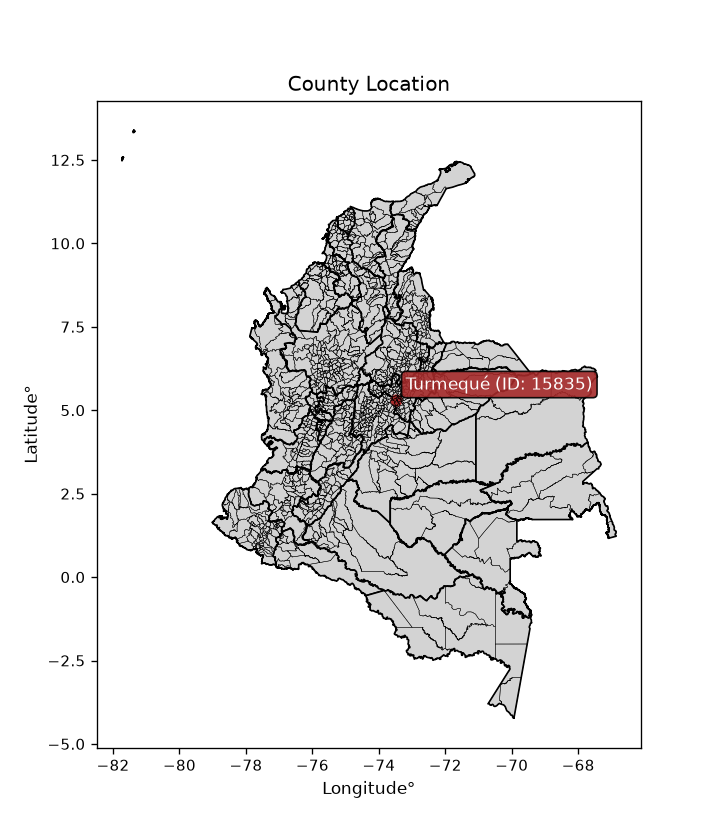
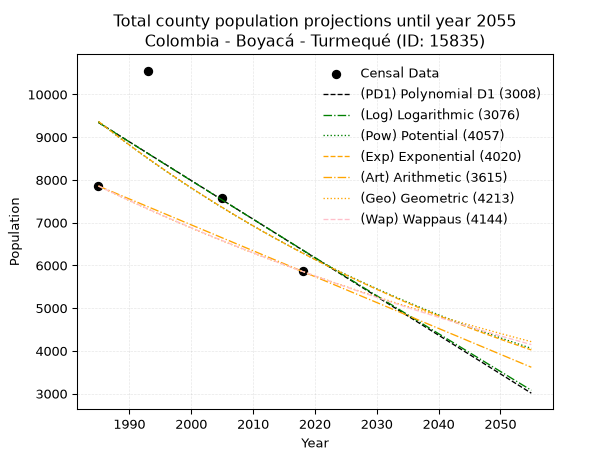
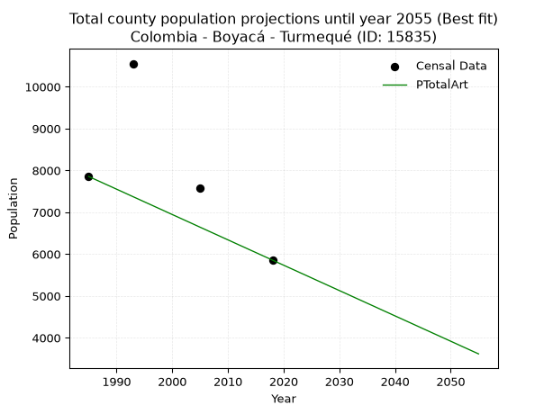
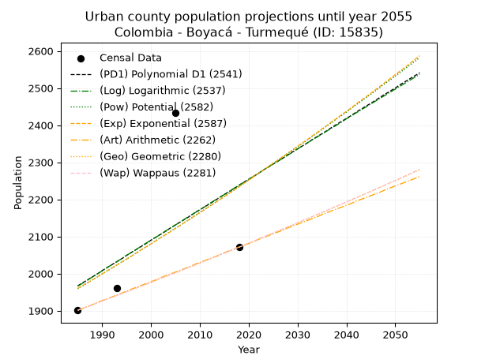
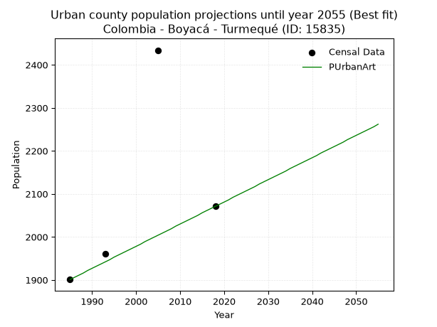
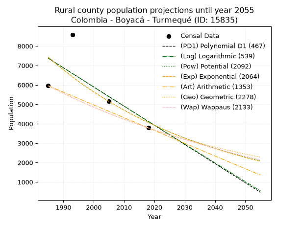
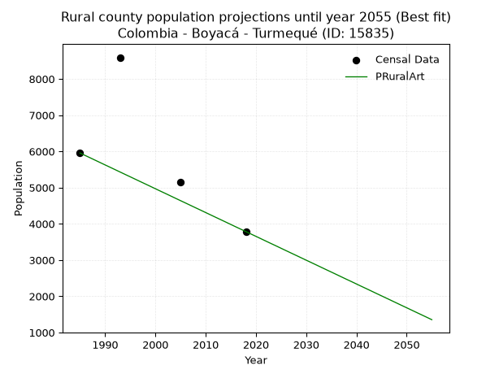

<div align="center">


</div>

# _“Population and Public Services Demand Projections (PPSD) until Year 2050 for Colombia - Boyacá - Turmequé (ID: 15835)”_
Keywords: `population` `public-service` `projection` `lineal` `polynomial` `logarithmic` `potential` `exponential` `arithmetic` `geometric` `wappaus` `dane` `colombia` `south-america`

PPSD are analytical estimates used by governments and planners to anticipate future changes in population size, age distribution, and the resulting community needs for utilities, healthcare, education, and infrastructure as sizing future water treatment facilities, electrical grids, and road networks based on spatial growth.

<div align="center">

</img>

</div>


> **General running parameters**: • app_version: _v20260806_. • Python version: _3.14.7_. • Pandas version: _3.0.5_. • NumPy version: _2.5.1_. • Creates, save and include plots into reports (create_plot): _False_. • Projection until year: _2050_. • Process polynomial degree 2 and up: _False_. • Process Wappaus: _True_. • Process Wappaus: _True_. • Set negative values to zero: _True_. • Set infinite values to zero: _True_. • Drop dataset notes: _True_. 
<div align="center">

Dynamic map: [:earth_americas:Google](http://maps.google.com/maps?q=5.3232611,-73.491825) [:earth_americas:OSM](https://www.openstreetmap.org/#map=18/5.3232611/-73.491825&layers=P) [:earth_americas:Bing](https://www.bing.com/maps?cp=5.3232611~-73.491825&lvl=18) [:earth_americas:Apple](https://maps.apple.com/frame?center=5.3232611%2C-73.491825&span=0.003%2C0.006)

</div>


<div align="center">

```geojson
{
  "type": "Feature",
  "geometry": {
    "type": "Point", 
    "coordinates": [-73.491825, 5.3232611]
  }, 
  "properties": {
    "Name": "Colombia - Boyacá - Turmequé (ID: 15835)"
  }
}
```

</div>


## 0. Census Data (4 records)

Census data are official statistics collected by a government about the people and housing in a country. They usually include counts of total population, age, sex, race, income, education, and jobs.

📅Global census file: [Population.xlsx](../data/Population.xlsx)

| Source   |   Year |   CountryID | CountryName   |   StateID | StateName   |   CountyID | CountyName   |   PTotal |   PUrban |   PRural |
|:---------|-------:|------------:|:--------------|----------:|:------------|-----------:|:-------------|---------:|---------:|---------:|
| DANE     |   1985 |          57 | Colombia      |        15 | Boyacá      |      15835 | Turmequé     |     7855 |     1901 |     5954 |
| DANE     |   1993 |          57 | Colombia      |        15 | Boyacá      |      15835 | Turmequé     |    10554 |     1961 |     8593 |
| DANE     |   2005 |          57 | Colombia      |        15 | Boyacá      |      15835 | Turmequé     |     7582 |     2434 |     5148 |
| DANE     |   2018 |          57 | Colombia      |        15 | Boyacá      |      15835 | Turmequé     |     5856 |     2071 |     3785 |

> 🔥Some records could had specific notes about the registered values or the corresponding urban or rural distribution.

📅[SUI-RUPS](https://www.datos.gov.co/Hacienda-y-Cr-dito-P-blico/Registro-nico-de-Prestadores-de-Servicios-P-blicos/4qkq-csdn/about_data) - Local public utility companies: [RUPS.csv](../data/RUPS.xlsx)

 | SERVICIO       | ESTADO    | NOMBRE                                                                                                                                                 | NIT         | DEPARTAMENTO_DOMICILIO   | MUNICIPIO_DOMICILIO   | DIRECCION                                  |   TELEFONO | EMAIL                                  | TIPO_PRESTADOR                             | CLASIFICACION                 |
|:---------------|:----------|:-------------------------------------------------------------------------------------------------------------------------------------------------------|:------------|:-------------------------|:----------------------|:-------------------------------------------|-----------:|:---------------------------------------|:-------------------------------------------|:------------------------------|
| ACUEDUCTO      | OPERATIVA | ASOCIACION DE USUARIOS DEL ACUEDUCTO URBANO DEL MUNICIPIO DE TURMEQUE                                                                                  | 820003743-2 | BOYACA                   | TURMEQUE              | Carrera 1 Calle 1centro                    |    7326369 | acueductoturmeque@hotmail.com          | ORGANIZACION AUTORIZADA                    | MENOR O IGUAL A 2500 USUARIOS |
| ACUEDUCTO      | OPERATIVA | ASOCIACION DE SUSCRIPTORES DEL ACUEDUCTO NUMERO CINCO DE LA VEREDA DE POZO NEGRO DEL MUNICIPIO DE TURMEQUE                                             | 900095197-4 | BOYACA                   | TURMEQUE              | VEREDA DE POZO NEGRO MUNICIPIO DE TURMEQUE |    7326380 | acueducto5@hotmail.com                 | ORGANIZACION AUTORIZADA                    | MENOR O IGUAL A 2500 USUARIOS |
| ACUEDUCTO      | OPERATIVA | ASOCIACION DE SUSCRIPTORES DEL ACUEDUCTO QUEBRADA GRANDE DE LA VEREDA DE ROSALES MUNICIPIO DE TURMEQUE DEPARTAMENTO DE BOYACA                          | 900093373-5 | BOYACA                   | TURMEQUE              | VEREDA DE ROSALES                          |    7326380 | QUEGRANDE2009@HOTMAIL.COM              | ORGANIZACION AUTORIZADA                    | HASTA 2500 SUSCRIPTORES       |
| ACUEDUCTO      | OPERATIVA | ASOCIACION DE SUSCRIPTORES DEL ACUEDUCTO DE PEÑA BLANCA VEREDA DE SIGUINEQUE MUNICIPIO DE TURMEQUE                                                     | 820005248-7 | BOYACA                   | TURMEQUE              | VEREDA DE SIGUINEQUE                       |    7326380 | acueductopenablanca@gmail.com          | ORGANIZACION AUTORIZADA                    | MENOR O IGUAL A 2500 USUARIOS |
| ACUEDUCTO      | OPERATIVA | ASOCIACION DE USUARIOS DEL ACUEDUCTO EL GACAL VEREDA GUANZAQUE                                                                                         | 900072104-0 | BOYACA                   | TURMEQUE              | Vereda Guanzaque                           |    7326380 | acueductoelgacalturmeque@gmail.com     | ORGANIZACION AUTORIZADA                    | MENOR O IGUAL A 2500 USUARIOS |
| ACUEDUCTO      | OPERATIVA | ASOCIACION DE SUSCRIPTORES DEL ACUEDUCTO LOS VENCEDORES DE LA VEREDA ROSALES DEL MUNICIPIO DE TURMEQUE DEPARTAMENTO DE BOYACA                          | 900094709-0 | BOYACA                   | TURMEQUE              | VEREDA ROSALES                             |    7326380 | asovencedores@gmail.com                | ORGANIZACION AUTORIZADA                    | HASTA 2500 SUSCRIPTORES       |
| ACUEDUCTO      | OPERATIVA | ASOCIACION DE SUSCRIPTORES DEL ACUEDUCTO N. CUATRO VEREDA DE POZO NEGRO N.                                                                             | 900094479-1 | BOYACA                   | TURMEQUE              | VEREDA POZO NEGRO                          |    0000000 | asoacueducto4pnegroturmeque@gmail.com  | ORGANIZACION AUTORIZADA                    | MENOR O IGUAL A 2500 USUARIOS |
| ACUEDUCTO      | OPERATIVA | ASOCIACION DE SUSCRIPTORES ACUEDUCTO NUMERO UNO B VEREDA DE POZO NEGRO DEL MUNICIPIO DE TURMEQUE BOYACA                                                | 900093591-4 | BOYACA                   | TURMEQUE              | Vereda Pozo Negro Turmeque                 |    7326380 | gidp1@hotmail.es                       | ORGANIZACION AUTORIZADA                    | MENOR O IGUAL A 2500 USUARIOS |
| ACUEDUCTO      | OPERATIVA | ASOCIACION DE SUSCRIPTORES DEL ACUEDUCTO DE SAN JOSE DE LA VEREDA DE JARAQUIRA DEL MUNICIPIO DE TURMEQUE                                               | 900094708-3 | BOYACA                   | TURMEQUE              | VEREDA DE JARAQUIRA                        |    7326380 | contactenos@turmeque-boyaca.gov.co     | ORGANIZACION AUTORIZADA                    | HASTA 2500 SUSCRIPTORES       |
| ACUEDUCTO      | OPERATIVA | ASOCIACION DE SUSCRIPTORES DEL ACUEDUCTO NO. 2 EL CALABAZAL DEL MUNICIPIO DE TURMEQUE DEPARTAMENTO DE BOYACA                                           | 900100356-0 | BOYACA                   | TURMEQUE              | VEREDA POZO NEGRO                          |    7326380 | acueductoelcalabazalturmeque@gmail.com | ORGANIZACION AUTORIZADA                    | MENOR O IGUAL A 2500 USUARIOS |
| ACUEDUCTO      | OPERATIVA | ASOCIACION DE SUSCRIPTORES DEL ACUEDUCTO AGUAS CLARAS DEL MUNICIPIO DE TURMEQUE DEPARTAMENTO DE BOYACA                                                 | 900109447-3 | BOYACA                   | TURMEQUE              | VEREDA VOLCAN BLANCO                       |    7326380 | contactenos@turmeque-boyaca.gov.co     | ORGANIZACION AUTORIZADA                    | HASTA 2500 SUSCRIPTORES       |
| ACUEDUCTO      | OPERATIVA | ASOCIACION DE SUSCRIPTORES ACUEDUCTO PAJAS BLANCAS VEREDA JOYAGUA DEL MUNICIPIO DE TURMEQUE DEPARTAMENTO DE BOYACA                                     | 900102126-2 | BOYACA                   | TURMEQUE              | VEREDA JOYAGUA                             |    7326025 | contactenos@turmeque-boyaca.gov.co     | ORGANIZACION AUTORIZADA                    | HASTA 2500 SUSCRIPTORES       |
| ACUEDUCTO      | OPERATIVA | ASOCIACION DE SUSCRIPTORES DEL ACUEDUCTO LA GRANJA NUMERO TRES DE LAS VEREDAS DE POZO NEGRO JARAQUIRA Y CENTRO DEL MUNICIPIO DE TURMEQUE BOYACA        | 900110660-8 | BOYACA                   | TURMEQUE              | VEREDA JARAQUIRA                           |    0000000 | acueductolagranjan3@gmail.com          | ORGANIZACION AUTORIZADA                    | MENOR O IGUAL A 2500 USUARIOS |
| ACUEDUCTO      | OPERATIVA | ASOCIACION DE SUSCRIPTORES DEL ACUEDUCTO REGIONAL CUEVA LA ANTIGUA DE LAS VEREDAS JOYAGUA, GUANZAQUE, JARAQUIRA, CHINQUIRA, PASCATA MUNICIPIO TURMEQUE | 900111972-5 | BOYACA                   | TURMEQUE              | VEREDA POZO NEGRO                          |    7445822 | cuevadelaantigua@gmail.com             | ORGANIZACION AUTORIZADA                    | MENOR O IGUAL A 2500 USUARIOS |
| ACUEDUCTO      | OPERATIVA | ASOCIACION DE SUSCRIPTORES DEL ACUEDUCTO LAS HUERTAS DEL MUNICIPIO DE TURMEQUE                                                                         | 900115238-5 | BOYACA                   | TURMEQUE              | VERESA RINCHOQUE - MUNICIPIO DE TURMEQUE   |    3158456 | ACUEDUCTOHUERTAS@GMAIL.COM             | ORGANIZACION AUTORIZADA                    | HASTA 2500 SUSCRIPTORES       |
| ACUEDUCTO      | OPERATIVA | ASOCIACION DE SUSCRIPTORES DEL ACUEDUCTO EL ROCIO                                                                                                      | 900092739-2 | BOYACA                   | TURMEQUE              | VEREDA CHIRATA                             |    7326380 | acueductoelrocioturmeque@gmail.com     | ORGANIZACION AUTORIZADA                    | MENOR O IGUAL A 2500 USUARIOS |
| ACUEDUCTO      | OPERATIVA | ASOCIACION DE SUSCRIPTORES DEL ACUEDUCTO OJO DE AGUA DE LA VEREDA DE CHINQUIRA DEL MUNICIPIO DE TURMEQUE DEL DEPARTAMENTO  DE BOYACA                   | 900100904-7 | BOYACA                   | TURMEQUE              | vereda de chinquira                        |    7326380 | alcaldia@turmeque-boyaca.gov.co        | ORGANIZACION AUTORIZADA                    | HASTA 2500 SUSCRIPTORES       |
| ACUEDUCTO      | OPERATIVA | ASOCIACION DE SUSCRIPTORES DE SISTEMA DE ACUEDUCTO DE LA VEREDA DE RINCHOQUE DEL MUNICIPIO DE TURMEQUE BOYACA                                          | 900118183-2 | BOYACA                   | TURMEQUE              | VEREDA RINCHOQUE                           |    7326104 | acueductolascilcasturmeque@gmail.com   | ORGANIZACION AUTORIZADA                    | MENOR O IGUAL A 2500 USUARIOS |
| ACUEDUCTO      | OPERATIVA | ASOCIACION ACUEDUCTO EL SALITRE DE LA VEREDA TEGUANEQUE DEL MUNICIPIO DE TURMEQUE                                                                      | 900132784-7 | BOYACA                   | TURMEQUE              | VEREDA TEGUANEQUE                          |    4411924 | acueductoelsalitreturmeque@gmail.com   | ORGANIZACION AUTORIZADA                    | MENOR O IGUAL A 2500 USUARIOS |
| ALCANTARILLADO | OPERATIVA | EMPRESA DE SERVICIOS PUBLICOS DOMICILIARIOS DE TURMEQUE                                                                                                | 900194394-3 | BOYACA                   | TURMEQUE              | Calle 3 # 4-65                             |    7326380 | kalira281@hotmail.com                  | SOCIEDADES (EMPRESA DE SERVICIOS PUBLICOS) | MENOR O IGUAL A 2500 USUARIOS |

## 1. Total

### 1.1. Coefficients and Parameters

* (PD1) Polynomial Deg 1: -90.4805299076663, 188945.4299478095 (lineal)
* (Log) Logarithmic: -180785.42129516898, 1382113.1859880253
* (Pow) Potential: -24.136503196199993, 83.56791452645123
* (Exp) Exponential: -0.012079046656404767, 242395814622744.9
* (Art) Arithmetic: Year diff. 2018 - 1985 = 33, Population diff. 5856 - 7855 = -1999, Annual growth = -60.57575757575758
* (Geo) Geometric: Year diff. 2018 - 1985 = 33, Population diff. 5856 - 7855 = -1999, Annual growth % = -0.008860016515290337
* (Wap) Wappaus: i = -0.8836081624353814, Condition values only valid for < 200)

<sub>
Wappaus condition values: ['-0.00', '-0.88', '-1.77', '-2.65', '-3.53', '-4.42', '-5.30', '-6.19', '-7.07', '-7.95', '-8.84', '-9.72', '-10.60', '-11.49', '-12.37', '-13.25', '-14.14', '-15.02', '-15.90', '-16.79', '-17.67', '-18.56', '-19.44', '-20.32', '-21.21', '-22.09', '-22.97', '-23.86', '-24.74', '-25.62', '-26.51', '-27.39', '-28.28', '-29.16', '-30.04', '-30.93', '-31.81', '-32.69', '-33.58', '-34.46', '-35.34', '-36.23', '-37.11', '-38.00', '-38.88', '-39.76', '-40.65', '-41.53', '-42.41', '-43.30', '-44.18', '-45.06', '-45.95', '-46.83', '-47.71', '-48.60', '-49.48', '-50.37', '-51.25', '-52.13', '-53.02', '-53.90', '-54.78', '-55.67', '-56.55', '-57.43']
</sub>


### 1.2. Projected Dataset

|   Year |   CountyID |   PTotalPD1 |   PTotalLog |   PTotalPow |   PTotalExp |   PTotalArt |   PTotalGeo |   PTotalWap |
|-------:|-----------:|------------:|------------:|------------:|------------:|------------:|------------:|------------:|
|   1985 |      15835 |        9342 |        9342 |        9365 |        9365 |        7855 |        7855 |        7855 |
|   1986 |      15835 |        9251 |        9251 |        9252 |        9252 |        7794 |        7785 |        7786 |
|   1987 |      15835 |        9161 |        9160 |        9140 |        9141 |        7734 |        7716 |        7717 |
|   1988 |      15835 |        9070 |        9069 |        9030 |        9031 |        7673 |        7648 |        7650 |
|   1989 |      15835 |        8980 |        8978 |        8921 |        8923 |        7613 |        7580 |        7582 |
|   1990 |      15835 |        8889 |        8887 |        8813 |        8816 |        7552 |        7513 |        7515 |
|   1991 |      15835 |        8799 |        8796 |        8707 |        8710 |        7492 |        7447 |        7449 |
|   1992 |      15835 |        8708 |        8705 |        8602 |        8605 |        7431 |        7381 |        7384 |
|   1993 |      15835 |        8618 |        8615 |        8499 |        8502 |        7370 |        7315 |        7319 |
|   1994 |      15835 |        8527 |        8524 |        8396 |        8400 |        7310 |        7250 |        7254 |
|   1995 |      15835 |        8437 |        8433 |        8295 |        8299 |        7249 |        7186 |        7190 |
|   1996 |      15835 |        8346 |        8343 |        8196 |        8199 |        7189 |        7122 |        7127 |
|   1997 |      15835 |        8256 |        8252 |        8097 |        8101 |        7128 |        7059 |        7064 |
|   1998 |      15835 |        8165 |        8162 |        8000 |        8004 |        7068 |        6997 |        7002 |
|   1999 |      15835 |        8075 |        8071 |        7904 |        7908 |        7007 |        6935 |        6940 |
|   2000 |      15835 |        7984 |        7981 |        7809 |        7813 |        6946 |        6873 |        6879 |
|   2001 |      15835 |        7894 |        7890 |        7715 |        7719 |        6886 |        6812 |        6818 |
|   2002 |      15835 |        7803 |        7800 |        7623 |        7626 |        6825 |        6752 |        6758 |
|   2003 |      15835 |        7713 |        7710 |        7532 |        7535 |        6765 |        6692 |        6698 |
|   2004 |      15835 |        7622 |        7620 |        7441 |        7444 |        6704 |        6633 |        6638 |
|   2005 |      15835 |        7532 |        7529 |        7352 |        7355 |        6643 |        6574 |        6580 |
|   2006 |      15835 |        7441 |        7439 |        7264 |        7266 |        6583 |        6516 |        6521 |
|   2007 |      15835 |        7351 |        7349 |        7177 |        7179 |        6522 |        6458 |        6463 |
|   2008 |      15835 |        7261 |        7259 |        7092 |        7093 |        6462 |        6401 |        6406 |
|   2009 |      15835 |        7170 |        7169 |        7007 |        7008 |        6401 |        6344 |        6349 |
|   2010 |      15835 |        7080 |        7079 |        6923 |        6924 |        6341 |        6288 |        6292 |
|   2011 |      15835 |        6989 |        6989 |        6841 |        6841 |        6280 |        6232 |        6236 |
|   2012 |      15835 |        6899 |        6899 |        6759 |        6758 |        6219 |        6177 |        6181 |
|   2013 |      15835 |        6808 |        6810 |        6678 |        6677 |        6159 |        6122 |        6126 |
|   2014 |      15835 |        6718 |        6720 |        6599 |        6597 |        6098 |        6068 |        6071 |
|   2015 |      15835 |        6627 |        6630 |        6520 |        6518 |        6038 |        6014 |        6016 |
|   2016 |      15835 |        6537 |        6540 |        6443 |        6440 |        5977 |        5961 |        5963 |
|   2017 |      15835 |        6446 |        6451 |        6366 |        6362 |        5917 |        5908 |        5909 |
|   2018 |      15835 |        6356 |        6361 |        6290 |        6286 |        5856 |        5856 |        5856 |
|   2019 |      15835 |        6265 |        6271 |        6216 |        6211 |        5795 |        5804 |        5803 |
|   2020 |      15835 |        6175 |        6182 |        6142 |        6136 |        5735 |        5753 |        5751 |
|   2021 |      15835 |        6084 |        6092 |        6069 |        6062 |        5674 |        5702 |        5699 |
|   2022 |      15835 |        5994 |        6003 |        5997 |        5989 |        5614 |        5651 |        5648 |
|   2023 |      15835 |        5903 |        5914 |        5926 |        5918 |        5553 |        5601 |        5597 |
|   2024 |      15835 |        5813 |        5824 |        5855 |        5847 |        5493 |        5552 |        5546 |
|   2025 |      15835 |        5722 |        5735 |        5786 |        5776 |        5432 |        5502 |        5496 |
|   2026 |      15835 |        5632 |        5646 |        5717 |        5707 |        5371 |        5454 |        5446 |
|   2027 |      15835 |        5541 |        5557 |        5650 |        5638 |        5311 |        5405 |        5396 |
|   2028 |      15835 |        5451 |        5467 |        5583 |        5571 |        5250 |        5357 |        5347 |
|   2029 |      15835 |        5360 |        5378 |        5517 |        5504 |        5190 |        5310 |        5298 |
|   2030 |      15835 |        5270 |        5289 |        5452 |        5438 |        5129 |        5263 |        5250 |
|   2031 |      15835 |        5179 |        5200 |        5387 |        5373 |        5069 |        5216 |        5202 |
|   2032 |      15835 |        5089 |        5111 |        5324 |        5308 |        5008 |        5170 |        5154 |
|   2033 |      15835 |        4999 |        5022 |        5261 |        5244 |        4947 |        5124 |        5106 |
|   2034 |      15835 |        4908 |        4933 |        5199 |        5181 |        4887 |        5079 |        5059 |
|   2035 |      15835 |        4818 |        4844 |        5137 |        5119 |        4826 |        5034 |        5013 |
|   2036 |      15835 |        4727 |        4756 |        5077 |        5058 |        4766 |        4989 |        4966 |
|   2037 |      15835 |        4637 |        4667 |        5017 |        4997 |        4705 |        4945 |        4920 |
|   2038 |      15835 |        4546 |        4578 |        4958 |        4937 |        4644 |        4901 |        4874 |
|   2039 |      15835 |        4456 |        4489 |        4900 |        4878 |        4584 |        4858 |        4829 |
|   2040 |      15835 |        4365 |        4401 |        4842 |        4819 |        4523 |        4815 |        4784 |
|   2041 |      15835 |        4275 |        4312 |        4785 |        4761 |        4463 |        4772 |        4739 |
|   2042 |      15835 |        4184 |        4224 |        4729 |        4704 |        4402 |        4730 |        4695 |
|   2043 |      15835 |        4094 |        4135 |        4673 |        4648 |        4342 |        4688 |        4651 |
|   2044 |      15835 |        4003 |        4047 |        4618 |        4592 |        4281 |        4646 |        4607 |
|   2045 |      15835 |        3913 |        3958 |        4564 |        4537 |        4220 |        4605 |        4563 |
|   2046 |      15835 |        3822 |        3870 |        4511 |        4482 |        4160 |        4564 |        4520 |
|   2047 |      15835 |        3732 |        3782 |        4458 |        4428 |        4099 |        4524 |        4477 |
|   2048 |      15835 |        3641 |        3693 |        4405 |        4375 |        4039 |        4484 |        4434 |
|   2049 |      15835 |        3551 |        3605 |        4354 |        4323 |        3978 |        4444 |        4392 |
|   2050 |      15835 |        3460 |        3517 |        4303 |        4271 |        3918 |        4405 |        4350 |
<div align="center">

</img>

</div>


### 1.3. Best fit with absolute and relative error (%)

Relative error puts that difference into context by dividing the absolute error by the true value, creating a unitless ratio or percentage that shows the scale of the mistake.

Absolute and relative error

|   Year | Source   |   CountryID | CountryName   |   StateID | StateName   |   CountyID_x | CountyName   |   PTotal |   PUrban |   PRural |   CountyID_y |   PTotalPD1 |   PTotalLog |   PTotalPow |   PTotalExp |   PTotalArt |   PTotalGeo |   PTotalWap |   PTotalPD1AbsError |   PTotalLogAbsError |   PTotalPowAbsError |   PTotalExpAbsError |   PTotalArtAbsError |   PTotalGeoAbsError |   PTotalWapAbsError |   PTotalPD1RelError |   PTotalLogRelError |   PTotalPowRelError |   PTotalExpRelError |   PTotalArtRelError |   PTotalGeoRelError |   PTotalWapRelError |
|-------:|:---------|------------:|:--------------|----------:|:------------|-------------:|:-------------|---------:|---------:|---------:|-------------:|------------:|------------:|------------:|------------:|------------:|------------:|------------:|--------------------:|--------------------:|--------------------:|--------------------:|--------------------:|--------------------:|--------------------:|--------------------:|--------------------:|--------------------:|--------------------:|--------------------:|--------------------:|--------------------:|
|   1985 | DANE     |          57 | Colombia      |        15 | Boyacá      |        15835 | Turmequé     |     7855 |     1901 |     5954 |        15835 |        9342 |        9342 |        9365 |        9365 |        7855 |        7855 |        7855 |                1487 |                1487 |                1510 |                1510 |                   0 |                   0 |                   0 |           18.9306   |           18.9306   |             19.2234 |            19.2234  |              0      |              0      |              0      |
|   1993 | DANE     |          57 | Colombia      |        15 | Boyacá      |        15835 | Turmequé     |    10554 |     1961 |     8593 |        15835 |        8618 |        8615 |        8499 |        8502 |        7370 |        7315 |        7319 |                1936 |                1939 |                2055 |                2052 |                3184 |                3239 |                3235 |           18.3438   |           18.3722   |             19.4713 |            19.4429  |             30.1687 |             30.6898 |             30.6519 |
|   2005 | DANE     |          57 | Colombia      |        15 | Boyacá      |        15835 | Turmequé     |     7582 |     2434 |     5148 |        15835 |        7532 |        7529 |        7352 |        7355 |        6643 |        6574 |        6580 |                  50 |                  53 |                 230 |                 227 |                 939 |                1008 |                1002 |            0.659457 |            0.699024 |              3.0335 |             2.99393 |             12.3846 |             13.2946 |             13.2155 |
|   2018 | DANE     |          57 | Colombia      |        15 | Boyacá      |        15835 | Turmequé     |     5856 |     2071 |     3785 |        15835 |        6356 |        6361 |        6290 |        6286 |        5856 |        5856 |        5856 |                 500 |                 505 |                 434 |                 430 |                   0 |                   0 |                   0 |            8.53825  |            8.62363  |              7.4112 |             7.3429  |              0      |              0      |              0      |

Relative error mean

| Method    |   RelError | Best   |
|:----------|-----------:|:-------|
| PTotalPD1 |    11.618  |        |
| PTotalLog |    11.6564 |        |
| PTotalPow |    12.2849 |        |
| PTotalExp |    12.2508 |        |
| PTotalArt |    10.6383 | True   |
| PTotalGeo |    10.9961 |        |
| PTotalWap |    10.9668 |        |

💙Best method: _**PTotalArt**_
<div align="center">

</img>

</div>


### 1.4. Fresh water supply demand in liters per capita per day (lpcd)

The fresh water supply demand typically ranges from 100 to 300 liters per capita per day (lpcd) for standard domestic and municipal planning, though absolute survival minimums set by the World Health Organization are as low as 7.5 to 20 liters per day, and total consumption in high-income nations can exceed 400 liters.

> `CZ`: Level in meters above the sea level (masl)<br> `WS`: Fresh water supply demand in liters per capita per day (lpcd or l/h/d)<br> `WSAll`: Zonal fresh water supply demand in liters per second (l/s)<br> `A`: Zonal area in square meters<br> `DP`: Population density (people/hectare or p/ha)

Reference values (RAS Colombia)

|    CZ |   WS |
|------:|-----:|
|  1000 |  120 |
|  2000 |  130 |
| 99999 |  140 |

County shapefile geometry properties and water supply values

|   CountyID |      ATotal |   CZTotal |   WSTotal |
|-----------:|------------:|----------:|----------:|
|      15835 | 7.95776e+07 |   2661.96 |       140 |

Projected values for best method: PTotalArt

|   CountyID |   Year |   PTotalArt |   DPTotal |   WSTotal |   WSTotalAll |
|-----------:|-------:|------------:|----------:|----------:|-------------:|
|      15835 |   1985 |        7855 |      0.99 |       140 |     12.728   |
|      15835 |   1986 |        7794 |      0.98 |       140 |     12.6292  |
|      15835 |   1987 |        7734 |      0.97 |       140 |     12.5319  |
|      15835 |   1988 |        7673 |      0.96 |       140 |     12.4331  |
|      15835 |   1989 |        7613 |      0.96 |       140 |     12.3359  |
|      15835 |   1990 |        7552 |      0.95 |       140 |     12.237   |
|      15835 |   1991 |        7492 |      0.94 |       140 |     12.1398  |
|      15835 |   1992 |        7431 |      0.93 |       140 |     12.041   |
|      15835 |   1993 |        7370 |      0.93 |       140 |     11.9421  |
|      15835 |   1994 |        7310 |      0.92 |       140 |     11.8449  |
|      15835 |   1995 |        7249 |      0.91 |       140 |     11.7461  |
|      15835 |   1996 |        7189 |      0.9  |       140 |     11.6488  |
|      15835 |   1997 |        7128 |      0.9  |       140 |     11.55    |
|      15835 |   1998 |        7068 |      0.89 |       140 |     11.4528  |
|      15835 |   1999 |        7007 |      0.88 |       140 |     11.3539  |
|      15835 |   2000 |        6946 |      0.87 |       140 |     11.2551  |
|      15835 |   2001 |        6886 |      0.87 |       140 |     11.1579  |
|      15835 |   2002 |        6825 |      0.86 |       140 |     11.059   |
|      15835 |   2003 |        6765 |      0.85 |       140 |     10.9618  |
|      15835 |   2004 |        6704 |      0.84 |       140 |     10.863   |
|      15835 |   2005 |        6643 |      0.83 |       140 |     10.7641  |
|      15835 |   2006 |        6583 |      0.83 |       140 |     10.6669  |
|      15835 |   2007 |        6522 |      0.82 |       140 |     10.5681  |
|      15835 |   2008 |        6462 |      0.81 |       140 |     10.4708  |
|      15835 |   2009 |        6401 |      0.8  |       140 |     10.372   |
|      15835 |   2010 |        6341 |      0.8  |       140 |     10.2748  |
|      15835 |   2011 |        6280 |      0.79 |       140 |     10.1759  |
|      15835 |   2012 |        6219 |      0.78 |       140 |     10.0771  |
|      15835 |   2013 |        6159 |      0.77 |       140 |      9.97986 |
|      15835 |   2014 |        6098 |      0.77 |       140 |      9.88102 |
|      15835 |   2015 |        6038 |      0.76 |       140 |      9.7838  |
|      15835 |   2016 |        5977 |      0.75 |       140 |      9.68495 |
|      15835 |   2017 |        5917 |      0.74 |       140 |      9.58773 |
|      15835 |   2018 |        5856 |      0.74 |       140 |      9.48889 |
|      15835 |   2019 |        5795 |      0.73 |       140 |      9.39005 |
|      15835 |   2020 |        5735 |      0.72 |       140 |      9.29282 |
|      15835 |   2021 |        5674 |      0.71 |       140 |      9.19398 |
|      15835 |   2022 |        5614 |      0.71 |       140 |      9.09676 |
|      15835 |   2023 |        5553 |      0.7  |       140 |      8.99792 |
|      15835 |   2024 |        5493 |      0.69 |       140 |      8.90069 |
|      15835 |   2025 |        5432 |      0.68 |       140 |      8.80185 |
|      15835 |   2026 |        5371 |      0.67 |       140 |      8.70301 |
|      15835 |   2027 |        5311 |      0.67 |       140 |      8.60579 |
|      15835 |   2028 |        5250 |      0.66 |       140 |      8.50694 |
|      15835 |   2029 |        5190 |      0.65 |       140 |      8.40972 |
|      15835 |   2030 |        5129 |      0.64 |       140 |      8.31088 |
|      15835 |   2031 |        5069 |      0.64 |       140 |      8.21366 |
|      15835 |   2032 |        5008 |      0.63 |       140 |      8.11481 |
|      15835 |   2033 |        4947 |      0.62 |       140 |      8.01597 |
|      15835 |   2034 |        4887 |      0.61 |       140 |      7.91875 |
|      15835 |   2035 |        4826 |      0.61 |       140 |      7.81991 |
|      15835 |   2036 |        4766 |      0.6  |       140 |      7.72269 |
|      15835 |   2037 |        4705 |      0.59 |       140 |      7.62384 |
|      15835 |   2038 |        4644 |      0.58 |       140 |      7.525   |
|      15835 |   2039 |        4584 |      0.58 |       140 |      7.42778 |
|      15835 |   2040 |        4523 |      0.57 |       140 |      7.32894 |
|      15835 |   2041 |        4463 |      0.56 |       140 |      7.23171 |
|      15835 |   2042 |        4402 |      0.55 |       140 |      7.13287 |
|      15835 |   2043 |        4342 |      0.55 |       140 |      7.03565 |
|      15835 |   2044 |        4281 |      0.54 |       140 |      6.93681 |
|      15835 |   2045 |        4220 |      0.53 |       140 |      6.83796 |
|      15835 |   2046 |        4160 |      0.52 |       140 |      6.74074 |
|      15835 |   2047 |        4099 |      0.52 |       140 |      6.6419  |
|      15835 |   2048 |        4039 |      0.51 |       140 |      6.54468 |
|      15835 |   2049 |        3978 |      0.5  |       140 |      6.44583 |
|      15835 |   2050 |        3918 |      0.49 |       140 |      6.34861 |

## 2. Urban

### 2.1. Coefficients and Parameters

* (PD1) Polynomial Deg 1: 8.212364512244282, -14335.032115616626 (lineal)
* (Log) Logarithmic: 16489.808936359223, -123247.41986630221
* (Pow) Potential: 7.959446727858376, -22.95624717469859
* (Exp) Exponential: 0.003964697111601931, 0.7488028321496264
* (Art) Arithmetic: Year diff. 2018 - 1985 = 33, Population diff. 2071 - 1901 = 170, Annual growth = 5.151515151515151
* (Geo) Geometric: Year diff. 2018 - 1985 = 33, Population diff. 2071 - 1901 = 170, Annual growth % = 0.0025988718005995892
* (Wap) Wappaus: i = 0.2593914980621929, Condition values only valid for < 200)

<sub>
Wappaus condition values: ['0.00', '0.26', '0.52', '0.78', '1.04', '1.30', '1.56', '1.82', '2.08', '2.33', '2.59', '2.85', '3.11', '3.37', '3.63', '3.89', '4.15', '4.41', '4.67', '4.93', '5.19', '5.45', '5.71', '5.97', '6.23', '6.48', '6.74', '7.00', '7.26', '7.52', '7.78', '8.04', '8.30', '8.56', '8.82', '9.08', '9.34', '9.60', '9.86', '10.12', '10.38', '10.64', '10.89', '11.15', '11.41', '11.67', '11.93', '12.19', '12.45', '12.71', '12.97', '13.23', '13.49', '13.75', '14.01', '14.27', '14.53', '14.79', '15.04', '15.30', '15.56', '15.82', '16.08', '16.34', '16.60', '16.86']
</sub>


### 2.2. Projected Dataset

|   Year |   CountyID |   PUrbanPD1 |   PUrbanLog |   PUrbanPow |   PUrbanExp |   PUrbanArt |   PUrbanGeo |   PUrbanWap |
|-------:|-----------:|------------:|------------:|------------:|------------:|------------:|------------:|------------:|
|   1985 |      15835 |        1967 |        1966 |        1959 |        1960 |        1901 |        1901 |        1901 |
|   1986 |      15835 |        1975 |        1974 |        1967 |        1968 |        1906 |        1906 |        1906 |
|   1987 |      15835 |        1983 |        1982 |        1975 |        1975 |        1911 |        1911 |        1911 |
|   1988 |      15835 |        1991 |        1991 |        1983 |        1983 |        1916 |        1916 |        1916 |
|   1989 |      15835 |        1999 |        1999 |        1991 |        1991 |        1922 |        1921 |        1921 |
|   1990 |      15835 |        2008 |        2007 |        1999 |        1999 |        1927 |        1926 |        1926 |
|   1991 |      15835 |        2016 |        2016 |        2007 |        2007 |        1932 |        1931 |        1931 |
|   1992 |      15835 |        2024 |        2024 |        2015 |        2015 |        1937 |        1936 |        1936 |
|   1993 |      15835 |        2032 |        2032 |        2023 |        2023 |        1942 |        1941 |        1941 |
|   1994 |      15835 |        2040 |        2040 |        2031 |        2031 |        1947 |        1946 |        1946 |
|   1995 |      15835 |        2049 |        2049 |        2039 |        2039 |        1953 |        1951 |        1951 |
|   1996 |      15835 |        2057 |        2057 |        2047 |        2047 |        1958 |        1956 |        1956 |
|   1997 |      15835 |        2065 |        2065 |        2056 |        2055 |        1963 |        1961 |        1961 |
|   1998 |      15835 |        2073 |        2074 |        2064 |        2064 |        1968 |        1966 |        1966 |
|   1999 |      15835 |        2081 |        2082 |        2072 |        2072 |        1973 |        1971 |        1971 |
|   2000 |      15835 |        2090 |        2090 |        2080 |        2080 |        1978 |        1976 |        1976 |
|   2001 |      15835 |        2098 |        2098 |        2089 |        2088 |        1983 |        1982 |        1982 |
|   2002 |      15835 |        2106 |        2106 |        2097 |        2097 |        1989 |        1987 |        1987 |
|   2003 |      15835 |        2114 |        2115 |        2105 |        2105 |        1994 |        1992 |        1992 |
|   2004 |      15835 |        2123 |        2123 |        2114 |        2113 |        1999 |        1997 |        1997 |
|   2005 |      15835 |        2131 |        2131 |        2122 |        2122 |        2004 |        2002 |        2002 |
|   2006 |      15835 |        2139 |        2139 |        2130 |        2130 |        2009 |        2007 |        2007 |
|   2007 |      15835 |        2147 |        2148 |        2139 |        2139 |        2014 |        2013 |        2013 |
|   2008 |      15835 |        2155 |        2156 |        2147 |        2147 |        2019 |        2018 |        2018 |
|   2009 |      15835 |        2164 |        2164 |        2156 |        2156 |        2025 |        2023 |        2023 |
|   2010 |      15835 |        2172 |        2172 |        2165 |        2164 |        2030 |        2028 |        2028 |
|   2011 |      15835 |        2180 |        2180 |        2173 |        2173 |        2035 |        2034 |        2034 |
|   2012 |      15835 |        2188 |        2189 |        2182 |        2181 |        2040 |        2039 |        2039 |
|   2013 |      15835 |        2196 |        2197 |        2190 |        2190 |        2045 |        2044 |        2044 |
|   2014 |      15835 |        2205 |        2205 |        2199 |        2199 |        2050 |        2050 |        2050 |
|   2015 |      15835 |        2213 |        2213 |        2208 |        2207 |        2056 |        2055 |        2055 |
|   2016 |      15835 |        2221 |        2221 |        2217 |        2216 |        2061 |        2060 |        2060 |
|   2017 |      15835 |        2229 |        2230 |        2225 |        2225 |        2066 |        2066 |        2066 |
|   2018 |      15835 |        2238 |        2238 |        2234 |        2234 |        2071 |        2071 |        2071 |
|   2019 |      15835 |        2246 |        2246 |        2243 |        2243 |        2076 |        2076 |        2076 |
|   2020 |      15835 |        2254 |        2254 |        2252 |        2252 |        2081 |        2082 |        2082 |
|   2021 |      15835 |        2262 |        2262 |        2261 |        2261 |        2086 |        2087 |        2087 |
|   2022 |      15835 |        2270 |        2270 |        2270 |        2270 |        2092 |        2093 |        2093 |
|   2023 |      15835 |        2279 |        2279 |        2279 |        2279 |        2097 |        2098 |        2098 |
|   2024 |      15835 |        2287 |        2287 |        2287 |        2288 |        2102 |        2104 |        2104 |
|   2025 |      15835 |        2295 |        2295 |        2297 |        2297 |        2107 |        2109 |        2109 |
|   2026 |      15835 |        2303 |        2303 |        2306 |        2306 |        2112 |        2114 |        2115 |
|   2027 |      15835 |        2311 |        2311 |        2315 |        2315 |        2117 |        2120 |        2120 |
|   2028 |      15835 |        2320 |        2319 |        2324 |        2324 |        2123 |        2125 |        2126 |
|   2029 |      15835 |        2328 |        2327 |        2333 |        2333 |        2128 |        2131 |        2131 |
|   2030 |      15835 |        2336 |        2336 |        2342 |        2343 |        2133 |        2137 |        2137 |
|   2031 |      15835 |        2344 |        2344 |        2351 |        2352 |        2138 |        2142 |        2142 |
|   2032 |      15835 |        2352 |        2352 |        2360 |        2361 |        2143 |        2148 |        2148 |
|   2033 |      15835 |        2361 |        2360 |        2370 |        2371 |        2148 |        2153 |        2153 |
|   2034 |      15835 |        2369 |        2368 |        2379 |        2380 |        2153 |        2159 |        2159 |
|   2035 |      15835 |        2377 |        2376 |        2388 |        2390 |        2159 |        2164 |        2165 |
|   2036 |      15835 |        2385 |        2384 |        2398 |        2399 |        2164 |        2170 |        2170 |
|   2037 |      15835 |        2394 |        2392 |        2407 |        2409 |        2169 |        2176 |        2176 |
|   2038 |      15835 |        2402 |        2400 |        2417 |        2418 |        2174 |        2181 |        2182 |
|   2039 |      15835 |        2410 |        2408 |        2426 |        2428 |        2179 |        2187 |        2187 |
|   2040 |      15835 |        2418 |        2417 |        2435 |        2437 |        2184 |        2193 |        2193 |
|   2041 |      15835 |        2426 |        2425 |        2445 |        2447 |        2189 |        2198 |        2199 |
|   2042 |      15835 |        2435 |        2433 |        2455 |        2457 |        2195 |        2204 |        2205 |
|   2043 |      15835 |        2443 |        2441 |        2464 |        2467 |        2200 |        2210 |        2210 |
|   2044 |      15835 |        2451 |        2449 |        2474 |        2476 |        2205 |        2216 |        2216 |
|   2045 |      15835 |        2459 |        2457 |        2483 |        2486 |        2210 |        2221 |        2222 |
|   2046 |      15835 |        2467 |        2465 |        2493 |        2496 |        2215 |        2227 |        2228 |
|   2047 |      15835 |        2476 |        2473 |        2503 |        2506 |        2220 |        2233 |        2233 |
|   2048 |      15835 |        2484 |        2481 |        2513 |        2516 |        2226 |        2239 |        2239 |
|   2049 |      15835 |        2492 |        2489 |        2522 |        2526 |        2231 |        2245 |        2245 |
|   2050 |      15835 |        2500 |        2497 |        2532 |        2536 |        2236 |        2250 |        2251 |
<div align="center">

</img>

</div>


### 2.3. Best fit with absolute and relative error (%)

Relative error puts that difference into context by dividing the absolute error by the true value, creating a unitless ratio or percentage that shows the scale of the mistake.

Absolute and relative error

|   Year | Source   |   CountryID | CountryName   |   StateID | StateName   |   CountyID_x | CountyName   |   PTotal |   PUrban |   PRural |   CountyID_y |   PUrbanPD1 |   PUrbanLog |   PUrbanPow |   PUrbanExp |   PUrbanArt |   PUrbanGeo |   PUrbanWap |   PUrbanPD1AbsError |   PUrbanLogAbsError |   PUrbanPowAbsError |   PUrbanExpAbsError |   PUrbanArtAbsError |   PUrbanGeoAbsError |   PUrbanWapAbsError |   PUrbanPD1RelError |   PUrbanLogRelError |   PUrbanPowRelError |   PUrbanExpRelError |   PUrbanArtRelError |   PUrbanGeoRelError |   PUrbanWapRelError |
|-------:|:---------|------------:|:--------------|----------:|:------------|-------------:|:-------------|---------:|---------:|---------:|-------------:|------------:|------------:|------------:|------------:|------------:|------------:|------------:|--------------------:|--------------------:|--------------------:|--------------------:|--------------------:|--------------------:|--------------------:|--------------------:|--------------------:|--------------------:|--------------------:|--------------------:|--------------------:|--------------------:|
|   1985 | DANE     |          57 | Colombia      |        15 | Boyacá      |        15835 | Turmequé     |     7855 |     1901 |     5954 |        15835 |        1967 |        1966 |        1959 |        1960 |        1901 |        1901 |        1901 |                  66 |                  65 |                  58 |                  59 |                   0 |                   0 |                   0 |             3.47186 |             3.41925 |             3.05103 |             3.10363 |            0        |             0       |             0       |
|   1993 | DANE     |          57 | Colombia      |        15 | Boyacá      |        15835 | Turmequé     |    10554 |     1961 |     8593 |        15835 |        2032 |        2032 |        2023 |        2023 |        1942 |        1941 |        1941 |                  71 |                  71 |                  62 |                  62 |                  19 |                  20 |                  20 |             3.6206  |             3.6206  |             3.16165 |             3.16165 |            0.968893 |             1.01989 |             1.01989 |
|   2005 | DANE     |          57 | Colombia      |        15 | Boyacá      |        15835 | Turmequé     |     7582 |     2434 |     5148 |        15835 |        2131 |        2131 |        2122 |        2122 |        2004 |        2002 |        2002 |                 303 |                 303 |                 312 |                 312 |                 430 |                 432 |                 432 |            12.4486  |            12.4486  |            12.8184  |            12.8184  |           17.6664   |            17.7486  |            17.7486  |
|   2018 | DANE     |          57 | Colombia      |        15 | Boyacá      |        15835 | Turmequé     |     5856 |     2071 |     3785 |        15835 |        2238 |        2238 |        2234 |        2234 |        2071 |        2071 |        2071 |                 167 |                 167 |                 163 |                 163 |                   0 |                   0 |                   0 |             8.06374 |             8.06374 |             7.87059 |             7.87059 |            0        |             0       |             0       |

Relative error mean

| Method    |   RelError | Best   |
|:----------|-----------:|:-------|
| PUrbanPD1 |    6.90121 |        |
| PUrbanLog |    6.88806 |        |
| PUrbanPow |    6.72542 |        |
| PUrbanExp |    6.73857 |        |
| PUrbanArt |    4.65882 | True   |
| PUrbanGeo |    4.69211 |        |
| PUrbanWap |    4.69211 |        |

💙Best method: _**PUrbanArt**_
<div align="center">

</img>

</div>


### 2.4. Fresh water supply demand in liters per capita per day (lpcd)

The fresh water supply demand typically ranges from 100 to 300 liters per capita per day (lpcd) for standard domestic and municipal planning, though absolute survival minimums set by the World Health Organization are as low as 7.5 to 20 liters per day, and total consumption in high-income nations can exceed 400 liters.

> `CZ`: Level in meters above the sea level (masl)<br> `WS`: Fresh water supply demand in liters per capita per day (lpcd or l/h/d)<br> `WSAll`: Zonal fresh water supply demand in liters per second (l/s)<br> `A`: Zonal area in square meters<br> `DP`: Population density (people/hectare or p/ha)

Reference values (RAS Colombia)

|    CZ |   WS |
|------:|-----:|
|  1000 |  120 |
|  2000 |  130 |
| 99999 |  140 |

County shapefile geometry properties and water supply values

|   CountyID |      AUrban |   CZUrban |   WSUrban |
|-----------:|------------:|----------:|----------:|
|      15835 | 1.01341e+06 |   2371.59 |       140 |

Projected values for best method: PUrbanArt

|   CountyID |   Year |   PUrbanArt |   DPUrban |   WSUrban |   WSUrbanAll |
|-----------:|-------:|------------:|----------:|----------:|-------------:|
|      15835 |   1985 |        1901 |     18.76 |       140 |      3.08032 |
|      15835 |   1986 |        1906 |     18.81 |       140 |      3.08843 |
|      15835 |   1987 |        1911 |     18.86 |       140 |      3.09653 |
|      15835 |   1988 |        1916 |     18.91 |       140 |      3.10463 |
|      15835 |   1989 |        1922 |     18.97 |       140 |      3.11435 |
|      15835 |   1990 |        1927 |     19.01 |       140 |      3.12245 |
|      15835 |   1991 |        1932 |     19.06 |       140 |      3.13056 |
|      15835 |   1992 |        1937 |     19.11 |       140 |      3.13866 |
|      15835 |   1993 |        1942 |     19.16 |       140 |      3.14676 |
|      15835 |   1994 |        1947 |     19.21 |       140 |      3.15486 |
|      15835 |   1995 |        1953 |     19.27 |       140 |      3.16458 |
|      15835 |   1996 |        1958 |     19.32 |       140 |      3.17269 |
|      15835 |   1997 |        1963 |     19.37 |       140 |      3.18079 |
|      15835 |   1998 |        1968 |     19.42 |       140 |      3.18889 |
|      15835 |   1999 |        1973 |     19.47 |       140 |      3.19699 |
|      15835 |   2000 |        1978 |     19.52 |       140 |      3.20509 |
|      15835 |   2001 |        1983 |     19.57 |       140 |      3.21319 |
|      15835 |   2002 |        1989 |     19.63 |       140 |      3.22292 |
|      15835 |   2003 |        1994 |     19.68 |       140 |      3.23102 |
|      15835 |   2004 |        1999 |     19.73 |       140 |      3.23912 |
|      15835 |   2005 |        2004 |     19.77 |       140 |      3.24722 |
|      15835 |   2006 |        2009 |     19.82 |       140 |      3.25532 |
|      15835 |   2007 |        2014 |     19.87 |       140 |      3.26343 |
|      15835 |   2008 |        2019 |     19.92 |       140 |      3.27153 |
|      15835 |   2009 |        2025 |     19.98 |       140 |      3.28125 |
|      15835 |   2010 |        2030 |     20.03 |       140 |      3.28935 |
|      15835 |   2011 |        2035 |     20.08 |       140 |      3.29745 |
|      15835 |   2012 |        2040 |     20.13 |       140 |      3.30556 |
|      15835 |   2013 |        2045 |     20.18 |       140 |      3.31366 |
|      15835 |   2014 |        2050 |     20.23 |       140 |      3.32176 |
|      15835 |   2015 |        2056 |     20.29 |       140 |      3.33148 |
|      15835 |   2016 |        2061 |     20.34 |       140 |      3.33958 |
|      15835 |   2017 |        2066 |     20.39 |       140 |      3.34769 |
|      15835 |   2018 |        2071 |     20.44 |       140 |      3.35579 |
|      15835 |   2019 |        2076 |     20.49 |       140 |      3.36389 |
|      15835 |   2020 |        2081 |     20.53 |       140 |      3.37199 |
|      15835 |   2021 |        2086 |     20.58 |       140 |      3.38009 |
|      15835 |   2022 |        2092 |     20.64 |       140 |      3.38981 |
|      15835 |   2023 |        2097 |     20.69 |       140 |      3.39792 |
|      15835 |   2024 |        2102 |     20.74 |       140 |      3.40602 |
|      15835 |   2025 |        2107 |     20.79 |       140 |      3.41412 |
|      15835 |   2026 |        2112 |     20.84 |       140 |      3.42222 |
|      15835 |   2027 |        2117 |     20.89 |       140 |      3.43032 |
|      15835 |   2028 |        2123 |     20.95 |       140 |      3.44005 |
|      15835 |   2029 |        2128 |     21    |       140 |      3.44815 |
|      15835 |   2030 |        2133 |     21.05 |       140 |      3.45625 |
|      15835 |   2031 |        2138 |     21.1  |       140 |      3.46435 |
|      15835 |   2032 |        2143 |     21.15 |       140 |      3.47245 |
|      15835 |   2033 |        2148 |     21.2  |       140 |      3.48056 |
|      15835 |   2034 |        2153 |     21.25 |       140 |      3.48866 |
|      15835 |   2035 |        2159 |     21.3  |       140 |      3.49838 |
|      15835 |   2036 |        2164 |     21.35 |       140 |      3.50648 |
|      15835 |   2037 |        2169 |     21.4  |       140 |      3.51458 |
|      15835 |   2038 |        2174 |     21.45 |       140 |      3.52269 |
|      15835 |   2039 |        2179 |     21.5  |       140 |      3.53079 |
|      15835 |   2040 |        2184 |     21.55 |       140 |      3.53889 |
|      15835 |   2041 |        2189 |     21.6  |       140 |      3.54699 |
|      15835 |   2042 |        2195 |     21.66 |       140 |      3.55671 |
|      15835 |   2043 |        2200 |     21.71 |       140 |      3.56481 |
|      15835 |   2044 |        2205 |     21.76 |       140 |      3.57292 |
|      15835 |   2045 |        2210 |     21.81 |       140 |      3.58102 |
|      15835 |   2046 |        2215 |     21.86 |       140 |      3.58912 |
|      15835 |   2047 |        2220 |     21.91 |       140 |      3.59722 |
|      15835 |   2048 |        2226 |     21.97 |       140 |      3.60694 |
|      15835 |   2049 |        2231 |     22.01 |       140 |      3.61505 |
|      15835 |   2050 |        2236 |     22.06 |       140 |      3.62315 |

## 3. Rural

### 3.1. Coefficients and Parameters

* (PD1) Polynomial Deg 1: -98.69289441991064, 203280.46206342627 (lineal)
* (Log) Logarithmic: -197275.2302315284, 1505360.6058543287
* (Pow) Potential: -36.56846823829853, 124.4649514195959
* (Exp) Exponential: -0.018292867593624106, 4.37153084536945e+19
* (Art) Arithmetic: Year diff. 2018 - 1985 = 33, Population diff. 3785 - 5954 = -2169, Annual growth = -65.72727272727273
* (Geo) Geometric: Year diff. 2018 - 1985 = 33, Population diff. 3785 - 5954 = -2169, Annual growth % = -0.01363400272469173
* (Wap) Wappaus: i = -1.349774570844496, Condition values only valid for < 200)

<sub>
Wappaus condition values: ['-0.00', '-1.35', '-2.70', '-4.05', '-5.40', '-6.75', '-8.10', '-9.45', '-10.80', '-12.15', '-13.50', '-14.85', '-16.20', '-17.55', '-18.90', '-20.25', '-21.60', '-22.95', '-24.30', '-25.65', '-27.00', '-28.35', '-29.70', '-31.04', '-32.39', '-33.74', '-35.09', '-36.44', '-37.79', '-39.14', '-40.49', '-41.84', '-43.19', '-44.54', '-45.89', '-47.24', '-48.59', '-49.94', '-51.29', '-52.64', '-53.99', '-55.34', '-56.69', '-58.04', '-59.39', '-60.74', '-62.09', '-63.44', '-64.79', '-66.14', '-67.49', '-68.84', '-70.19', '-71.54', '-72.89', '-74.24', '-75.59', '-76.94', '-78.29', '-79.64', '-80.99', '-82.34', '-83.69', '-85.04', '-86.39', '-87.74']
</sub>


### 3.2. Projected Dataset

|   Year |   CountyID |   PRuralPD1 |   PRuralLog |   PRuralPow |   PRuralExp |   PRuralArt |   PRuralGeo |   PRuralWap |
|-------:|-----------:|------------:|------------:|------------:|------------:|------------:|------------:|------------:|
|   1985 |      15835 |        7375 |        7376 |        7428 |        7427 |        5954 |        5954 |        5954 |
|   1986 |      15835 |        7276 |        7277 |        7293 |        7292 |        5888 |        5873 |        5874 |
|   1987 |      15835 |        7178 |        7177 |        7160 |        7160 |        5823 |        5793 |        5795 |
|   1988 |      15835 |        7079 |        7078 |        7029 |        7030 |        5757 |        5714 |        5718 |
|   1989 |      15835 |        6980 |        6979 |        6901 |        6903 |        5691 |        5636 |        5641 |
|   1990 |      15835 |        6882 |        6880 |        6776 |        6778 |        5625 |        5559 |        5565 |
|   1991 |      15835 |        6783 |        6781 |        6652 |        6655 |        5560 |        5483 |        5491 |
|   1992 |      15835 |        6684 |        6682 |        6531 |        6534 |        5494 |        5408 |        5417 |
|   1993 |      15835 |        6586 |        6582 |        6412 |        6416 |        5428 |        5335 |        5344 |
|   1994 |      15835 |        6487 |        6484 |        6296 |        6300 |        5362 |        5262 |        5272 |
|   1995 |      15835 |        6388 |        6385 |        6182 |        6185 |        5297 |        5190 |        5201 |
|   1996 |      15835 |        6289 |        6286 |        6069 |        6073 |        5231 |        5120 |        5131 |
|   1997 |      15835 |        6191 |        6187 |        5959 |        5963 |        5165 |        5050 |        5062 |
|   1998 |      15835 |        6092 |        6088 |        5851 |        5855 |        5100 |        4981 |        4994 |
|   1999 |      15835 |        5993 |        5989 |        5745 |        5749 |        5034 |        4913 |        4926 |
|   2000 |      15835 |        5895 |        5891 |        5641 |        5645 |        4968 |        4846 |        4859 |
|   2001 |      15835 |        5796 |        5792 |        5539 |        5543 |        4902 |        4780 |        4793 |
|   2002 |      15835 |        5697 |        5694 |        5438 |        5442 |        4837 |        4715 |        4728 |
|   2003 |      15835 |        5599 |        5595 |        5340 |        5343 |        4771 |        4650 |        4664 |
|   2004 |      15835 |        5500 |        5497 |        5243 |        5247 |        4705 |        4587 |        4601 |
|   2005 |      15835 |        5401 |        5398 |        5149 |        5151 |        4639 |        4525 |        4538 |
|   2006 |      15835 |        5303 |        5300 |        5056 |        5058 |        4574 |        4463 |        4476 |
|   2007 |      15835 |        5204 |        5202 |        4964 |        4966 |        4508 |        4402 |        4415 |
|   2008 |      15835 |        5105 |        5103 |        4875 |        4876 |        4442 |        4342 |        4354 |
|   2009 |      15835 |        5006 |        5005 |        4787 |        4788 |        4377 |        4283 |        4294 |
|   2010 |      15835 |        4908 |        4907 |        4700 |        4701 |        4311 |        4224 |        4235 |
|   2011 |      15835 |        4809 |        4809 |        4616 |        4616 |        4245 |        4167 |        4176 |
|   2012 |      15835 |        4710 |        4711 |        4532 |        4532 |        4179 |        4110 |        4119 |
|   2013 |      15835 |        4612 |        4613 |        4451 |        4450 |        4114 |        4054 |        4061 |
|   2014 |      15835 |        4513 |        4515 |        4371 |        4369 |        4048 |        3999 |        4005 |
|   2015 |      15835 |        4414 |        4417 |        4292 |        4290 |        3982 |        3944 |        3949 |
|   2016 |      15835 |        4316 |        4319 |        4215 |        4212 |        3916 |        3890 |        3894 |
|   2017 |      15835 |        4217 |        4221 |        4139 |        4136 |        3851 |        3837 |        3839 |
|   2018 |      15835 |        4118 |        4123 |        4065 |        4061 |        3785 |        3785 |        3785 |
|   2019 |      15835 |        4020 |        4026 |        3992 |        3988 |        3719 |        3733 |        3732 |
|   2020 |      15835 |        3921 |        3928 |        3920 |        3915 |        3654 |        3682 |        3679 |
|   2021 |      15835 |        3822 |        3830 |        3850 |        3844 |        3588 |        3632 |        3626 |
|   2022 |      15835 |        3723 |        3733 |        3781 |        3775 |        3522 |        3583 |        3575 |
|   2023 |      15835 |        3625 |        3635 |        3713 |        3706 |        3456 |        3534 |        3523 |
|   2024 |      15835 |        3526 |        3538 |        3647 |        3639 |        3391 |        3486 |        3473 |
|   2025 |      15835 |        3427 |        3440 |        3581 |        3573 |        3325 |        3438 |        3423 |
|   2026 |      15835 |        3329 |        3343 |        3517 |        3508 |        3259 |        3391 |        3373 |
|   2027 |      15835 |        3230 |        3245 |        3454 |        3445 |        3193 |        3345 |        3324 |
|   2028 |      15835 |        3131 |        3148 |        3393 |        3382 |        3128 |        3299 |        3276 |
|   2029 |      15835 |        3033 |        3051 |        3332 |        3321 |        3062 |        3255 |        3228 |
|   2030 |      15835 |        2934 |        2954 |        3273 |        3261 |        2996 |        3210 |        3180 |
|   2031 |      15835 |        2835 |        2857 |        3214 |        3202 |        2931 |        3166 |        3133 |
|   2032 |      15835 |        2737 |        2759 |        3157 |        3144 |        2865 |        3123 |        3086 |
|   2033 |      15835 |        2638 |        2662 |        3101 |        3087 |        2799 |        3081 |        3040 |
|   2034 |      15835 |        2539 |        2565 |        3045 |        3031 |        2733 |        3039 |        2995 |
|   2035 |      15835 |        2440 |        2468 |        2991 |        2976 |        2668 |        2997 |        2950 |
|   2036 |      15835 |        2342 |        2371 |        2938 |        2922 |        2602 |        2956 |        2905 |
|   2037 |      15835 |        2243 |        2275 |        2885 |        2869 |        2536 |        2916 |        2861 |
|   2038 |      15835 |        2144 |        2178 |        2834 |        2817 |        2470 |        2876 |        2817 |
|   2039 |      15835 |        2046 |        2081 |        2784 |        2766 |        2405 |        2837 |        2773 |
|   2040 |      15835 |        1947 |        1984 |        2734 |        2716 |        2339 |        2798 |        2730 |
|   2041 |      15835 |        1848 |        1888 |        2686 |        2666 |        2273 |        2760 |        2688 |
|   2042 |      15835 |        1750 |        1791 |        2638 |        2618 |        2208 |        2723 |        2646 |
|   2043 |      15835 |        1651 |        1694 |        2591 |        2571 |        2142 |        2685 |        2604 |
|   2044 |      15835 |        1552 |        1598 |        2545 |        2524 |        2076 |        2649 |        2563 |
|   2045 |      15835 |        1453 |        1501 |        2500 |        2478 |        2010 |        2613 |        2522 |
|   2046 |      15835 |        1355 |        1405 |        2456 |        2433 |        1945 |        2577 |        2481 |
|   2047 |      15835 |        1256 |        1308 |        2412 |        2389 |        1879 |        2542 |        2441 |
|   2048 |      15835 |        1157 |        1212 |        2370 |        2346 |        1813 |        2507 |        2401 |
|   2049 |      15835 |        1059 |        1116 |        2328 |        2303 |        1747 |        2473 |        2362 |
|   2050 |      15835 |         960 |        1020 |        2287 |        2262 |        1682 |        2439 |        2323 |
<div align="center">

</img>

</div>


### 3.3. Best fit with absolute and relative error (%)

Relative error puts that difference into context by dividing the absolute error by the true value, creating a unitless ratio or percentage that shows the scale of the mistake.

Absolute and relative error

|   Year | Source   |   CountryID | CountryName   |   StateID | StateName   |   CountyID_x | CountyName   |   PTotal |   PUrban |   PRural |   CountyID_y |   PRuralPD1 |   PRuralLog |   PRuralPow |   PRuralExp |   PRuralArt |   PRuralGeo |   PRuralWap |   PRuralPD1AbsError |   PRuralLogAbsError |   PRuralPowAbsError |   PRuralExpAbsError |   PRuralArtAbsError |   PRuralGeoAbsError |   PRuralWapAbsError |   PRuralPD1RelError |   PRuralLogRelError |   PRuralPowRelError |   PRuralExpRelError |   PRuralArtRelError |   PRuralGeoRelError |   PRuralWapRelError |
|-------:|:---------|------------:|:--------------|----------:|:------------|-------------:|:-------------|---------:|---------:|---------:|-------------:|------------:|------------:|------------:|------------:|------------:|------------:|------------:|--------------------:|--------------------:|--------------------:|--------------------:|--------------------:|--------------------:|--------------------:|--------------------:|--------------------:|--------------------:|--------------------:|--------------------:|--------------------:|--------------------:|
|   1985 | DANE     |          57 | Colombia      |        15 | Boyacá      |        15835 | Turmequé     |     7855 |     1901 |     5954 |        15835 |        7375 |        7376 |        7428 |        7427 |        5954 |        5954 |        5954 |                1421 |                1422 |                1474 |                1473 |                   0 |                   0 |                   0 |            23.8663  |            23.8831  |           24.7565   |          24.7397    |             0       |              0      |              0      |
|   1993 | DANE     |          57 | Colombia      |        15 | Boyacá      |        15835 | Turmequé     |    10554 |     1961 |     8593 |        15835 |        6586 |        6582 |        6412 |        6416 |        5428 |        5335 |        5344 |                2007 |                2011 |                2181 |                2177 |                3165 |                3258 |                3249 |            23.3562  |            23.4028  |           25.3811   |          25.3346    |            36.8323  |             37.9146 |             37.8098 |
|   2005 | DANE     |          57 | Colombia      |        15 | Boyacá      |        15835 | Turmequé     |     7582 |     2434 |     5148 |        15835 |        5401 |        5398 |        5149 |        5151 |        4639 |        4525 |        4538 |                 253 |                 250 |                   1 |                   3 |                 509 |                 623 |                 610 |             4.91453 |             4.85625 |            0.019425 |           0.0582751 |             9.88733 |             12.1018 |             11.8493 |
|   2018 | DANE     |          57 | Colombia      |        15 | Boyacá      |        15835 | Turmequé     |     5856 |     2071 |     3785 |        15835 |        4118 |        4123 |        4065 |        4061 |        3785 |        3785 |        3785 |                 333 |                 338 |                 280 |                 276 |                   0 |                   0 |                   0 |             8.79789 |             8.92999 |            7.39762  |           7.29194   |             0       |              0      |              0      |

Relative error mean

| Method    |   RelError | Best   |
|:----------|-----------:|:-------|
| PRuralPD1 |    15.2337 |        |
| PRuralLog |    15.268  |        |
| PRuralPow |    14.3887 |        |
| PRuralExp |    14.3561 |        |
| PRuralArt |    11.6799 | True   |
| PRuralGeo |    12.5041 |        |
| PRuralWap |    12.4148 |        |

💙Best method: _**PRuralArt**_
<div align="center">

</img>

</div>


### 3.4. Fresh water supply demand in liters per capita per day (lpcd)

The fresh water supply demand typically ranges from 100 to 300 liters per capita per day (lpcd) for standard domestic and municipal planning, though absolute survival minimums set by the World Health Organization are as low as 7.5 to 20 liters per day, and total consumption in high-income nations can exceed 400 liters.

> `CZ`: Level in meters above the sea level (masl)<br> `WS`: Fresh water supply demand in liters per capita per day (lpcd or l/h/d)<br> `WSAll`: Zonal fresh water supply demand in liters per second (l/s)<br> `A`: Zonal area in square meters<br> `DP`: Population density (people/hectare or p/ha)

Reference values (RAS Colombia)

|    CZ |   WS |
|------:|-----:|
|  1000 |  120 |
|  2000 |  130 |
| 99999 |  140 |

County shapefile geometry properties and water supply values

|   CountyID |      ARural |   CZRural |   WSRural |
|-----------:|------------:|----------:|----------:|
|      15835 | 7.85642e+07 |   2665.82 |       140 |

Projected values for best method: PRuralArt

|   CountyID |   Year |   PRuralArt |   DPRural |   WSRural |   WSRuralAll |
|-----------:|-------:|------------:|----------:|----------:|-------------:|
|      15835 |   1985 |        5954 |      0.76 |       140 |      9.64769 |
|      15835 |   1986 |        5888 |      0.75 |       140 |      9.54074 |
|      15835 |   1987 |        5823 |      0.74 |       140 |      9.43542 |
|      15835 |   1988 |        5757 |      0.73 |       140 |      9.32847 |
|      15835 |   1989 |        5691 |      0.72 |       140 |      9.22153 |
|      15835 |   1990 |        5625 |      0.72 |       140 |      9.11458 |
|      15835 |   1991 |        5560 |      0.71 |       140 |      9.00926 |
|      15835 |   1992 |        5494 |      0.7  |       140 |      8.90231 |
|      15835 |   1993 |        5428 |      0.69 |       140 |      8.79537 |
|      15835 |   1994 |        5362 |      0.68 |       140 |      8.68843 |
|      15835 |   1995 |        5297 |      0.67 |       140 |      8.5831  |
|      15835 |   1996 |        5231 |      0.67 |       140 |      8.47616 |
|      15835 |   1997 |        5165 |      0.66 |       140 |      8.36921 |
|      15835 |   1998 |        5100 |      0.65 |       140 |      8.26389 |
|      15835 |   1999 |        5034 |      0.64 |       140 |      8.15694 |
|      15835 |   2000 |        4968 |      0.63 |       140 |      8.05    |
|      15835 |   2001 |        4902 |      0.62 |       140 |      7.94306 |
|      15835 |   2002 |        4837 |      0.62 |       140 |      7.83773 |
|      15835 |   2003 |        4771 |      0.61 |       140 |      7.73079 |
|      15835 |   2004 |        4705 |      0.6  |       140 |      7.62384 |
|      15835 |   2005 |        4639 |      0.59 |       140 |      7.5169  |
|      15835 |   2006 |        4574 |      0.58 |       140 |      7.41157 |
|      15835 |   2007 |        4508 |      0.57 |       140 |      7.30463 |
|      15835 |   2008 |        4442 |      0.57 |       140 |      7.19769 |
|      15835 |   2009 |        4377 |      0.56 |       140 |      7.09236 |
|      15835 |   2010 |        4311 |      0.55 |       140 |      6.98542 |
|      15835 |   2011 |        4245 |      0.54 |       140 |      6.87847 |
|      15835 |   2012 |        4179 |      0.53 |       140 |      6.77153 |
|      15835 |   2013 |        4114 |      0.52 |       140 |      6.6662  |
|      15835 |   2014 |        4048 |      0.52 |       140 |      6.55926 |
|      15835 |   2015 |        3982 |      0.51 |       140 |      6.45231 |
|      15835 |   2016 |        3916 |      0.5  |       140 |      6.34537 |
|      15835 |   2017 |        3851 |      0.49 |       140 |      6.24005 |
|      15835 |   2018 |        3785 |      0.48 |       140 |      6.1331  |
|      15835 |   2019 |        3719 |      0.47 |       140 |      6.02616 |
|      15835 |   2020 |        3654 |      0.47 |       140 |      5.92083 |
|      15835 |   2021 |        3588 |      0.46 |       140 |      5.81389 |
|      15835 |   2022 |        3522 |      0.45 |       140 |      5.70694 |
|      15835 |   2023 |        3456 |      0.44 |       140 |      5.6     |
|      15835 |   2024 |        3391 |      0.43 |       140 |      5.49468 |
|      15835 |   2025 |        3325 |      0.42 |       140 |      5.38773 |
|      15835 |   2026 |        3259 |      0.41 |       140 |      5.28079 |
|      15835 |   2027 |        3193 |      0.41 |       140 |      5.17384 |
|      15835 |   2028 |        3128 |      0.4  |       140 |      5.06852 |
|      15835 |   2029 |        3062 |      0.39 |       140 |      4.96157 |
|      15835 |   2030 |        2996 |      0.38 |       140 |      4.85463 |
|      15835 |   2031 |        2931 |      0.37 |       140 |      4.74931 |
|      15835 |   2032 |        2865 |      0.36 |       140 |      4.64236 |
|      15835 |   2033 |        2799 |      0.36 |       140 |      4.53542 |
|      15835 |   2034 |        2733 |      0.35 |       140 |      4.42847 |
|      15835 |   2035 |        2668 |      0.34 |       140 |      4.32315 |
|      15835 |   2036 |        2602 |      0.33 |       140 |      4.2162  |
|      15835 |   2037 |        2536 |      0.32 |       140 |      4.10926 |
|      15835 |   2038 |        2470 |      0.31 |       140 |      4.00231 |
|      15835 |   2039 |        2405 |      0.31 |       140 |      3.89699 |
|      15835 |   2040 |        2339 |      0.3  |       140 |      3.79005 |
|      15835 |   2041 |        2273 |      0.29 |       140 |      3.6831  |
|      15835 |   2042 |        2208 |      0.28 |       140 |      3.57778 |
|      15835 |   2043 |        2142 |      0.27 |       140 |      3.47083 |
|      15835 |   2044 |        2076 |      0.26 |       140 |      3.36389 |
|      15835 |   2045 |        2010 |      0.26 |       140 |      3.25694 |
|      15835 |   2046 |        1945 |      0.25 |       140 |      3.15162 |
|      15835 |   2047 |        1879 |      0.24 |       140 |      3.04468 |
|      15835 |   2048 |        1813 |      0.23 |       140 |      2.93773 |
|      15835 |   2049 |        1747 |      0.22 |       140 |      2.83079 |
|      15835 |   2050 |        1682 |      0.21 |       140 |      2.72546 |

#

<div align="center"><br><sub>Share this research</sub></div><br>

<sub>**APPS & TOOLS & CONTENT DISCLAIMER**: • NO WARRANTY - This content and software is provided by <a href="https://github.com/rcfdtools" target="_blank">github.com/rcfdtools</a> "as is", without any express or implied warranty, including warranties of merchantability, fitness for a particular purpose, or non-infringement. There is no guarantee that the software will be error-free or operate without interruption. • LIMITATION OF LIABILITY - Neither the authors nor copyright holders will be liable for claims or damages arising from the software or its use. You are responsible for determining if the software is appropriate for your use and assume all associated risks, including errors, legal compliance, and data loss. • NO PROFESSIONAL ADVICE - The software provides general information and does not offer professional advice. It should not replace consultation with professional advisors. [Clauses and global license for rcfdtools use.](https://github.com/rcfdtools/rcfdtools/blob/main/LICENSE.md)</sub>

| [:house: Home](Readme.md)  | [:beginner: Help / Collab](https://github.com/rcfdtools/R.HydroTools/discussions/31) |
|----------------------------|-------------------------------------------------------------------------------------------|