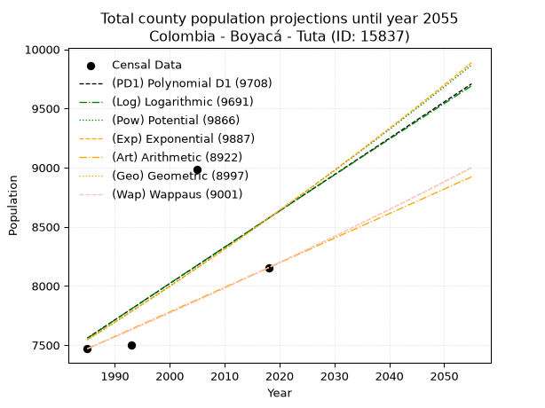
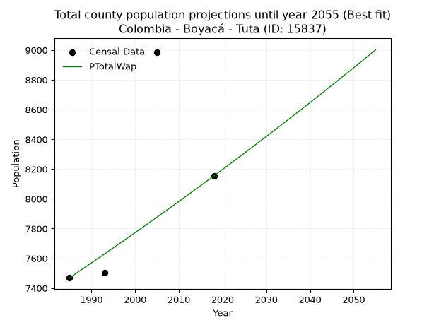
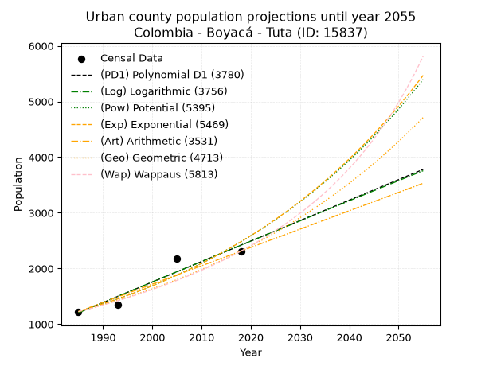
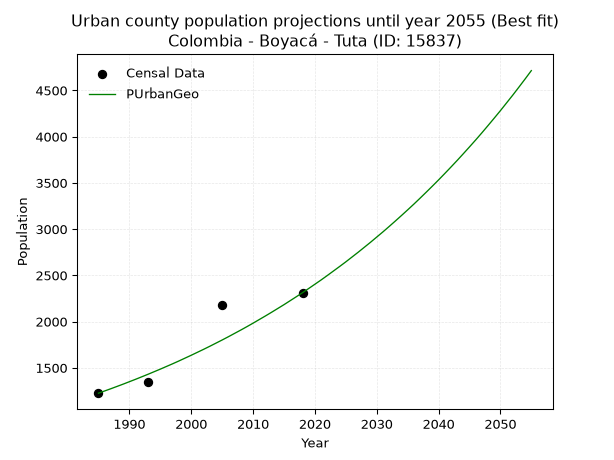
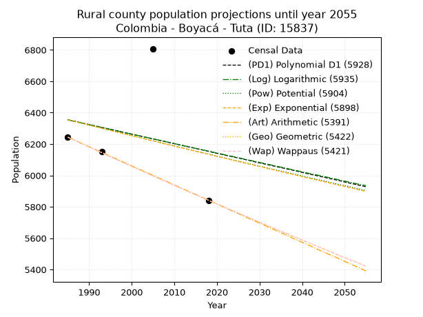
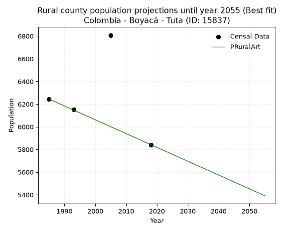

<div align="center">


</div>

# _“Population and Public Services Demand Projections (PPSD) until Year 2050 for Colombia - Boyacá - Tuta (ID: 15837)”_
Keywords: `population` `public-service` `projection` `lineal` `polynomial` `logarithmic` `potential` `exponential` `arithmetic` `geometric` `wappaus` `dane` `colombia` `south-america`

PPSD are analytical estimates used by governments and planners to anticipate future changes in population size, age distribution, and the resulting community needs for utilities, healthcare, education, and infrastructure as sizing future water treatment facilities, electrical grids, and road networks based on spatial growth.

> **General running parameters**: • app_version: _v20260806_. • Python version: _3.14.7_. • Pandas version: _3.0.5_. • NumPy version: _2.5.1_. • Creates, save and include plots into reports (create_plot): _True_. • Projection until year: _2050_. • Process polynomial degree 2 and up: _False_. • Process Wappaus: _True_. • Process Wappaus: _True_. • Set negative values to zero: _True_. • Set infinite values to zero: _True_. • Drop dataset notes: _True_. 
<div align="center">

Dynamic map: [:earth_americas:Google](http://maps.google.com/maps?q=5.689081833,-73.2302846) [:earth_americas:OSM](https://www.openstreetmap.org/#map=18/5.689081833/-73.2302846&layers=P) [:earth_americas:Bing](https://www.bing.com/maps?cp=5.689081833~-73.2302846&lvl=18) [:earth_americas:Apple](https://maps.apple.com/frame?center=5.689081833%2C-73.2302846&span=0.003%2C0.006)

</div>


<div align="center">

```geojson
{
  "type": "Feature",
  "geometry": {
    "type": "Point", 
    "coordinates": [-73.2302846, 5.689081833]
  }, 
  "properties": {
    "Name": "Colombia - Boyacá - Tuta (ID: 15837)"
  }
}
```

</div>


## 0. Census Data (4 records)

Census data are official statistics collected by a government about the people and housing in a country. They usually include counts of total population, age, sex, race, income, education, and jobs.

📅Global census file: [Population.xlsx](../data/Population.xlsx)

| Source   |   Year |   CountryID | CountryName   |   StateID | StateName   |   CountyID | CountyName   |   PTotal |   PUrban |   PRural |
|:---------|-------:|------------:|:--------------|----------:|:------------|-----------:|:-------------|---------:|---------:|---------:|
| DANE     |   1985 |          57 | Colombia      |        15 | Boyacá      |      15837 | Tuta         |     7469 |     1225 |     6244 |
| DANE     |   1993 |          57 | Colombia      |        15 | Boyacá      |      15837 | Tuta         |     7502 |     1349 |     6153 |
| DANE     |   2005 |          57 | Colombia      |        15 | Boyacá      |      15837 | Tuta         |     8984 |     2176 |     6808 |
| DANE     |   2018 |          57 | Colombia      |        15 | Boyacá      |      15837 | Tuta         |     8154 |     2312 |     5842 |

> 🔥Some records has specific notes about the registered values or the corresponding urban or rural distribution.

## 1. Total

### 1.1. Coefficients and Parameters

* (PD1) Polynomial Deg 1: 30.6957045363312, -53371.83299879648 (lineal)
* (Log) Logarithmic: 61561.52271008437, -459902.37744243373
* (Pow) Potential: 7.737338969700463, -21.63822272442124
* (Exp) Exponential: 0.003858378860488229, 3.560867204638119
* (Art) Arithmetic: Year diff. 2018 - 1985 = 33, Population diff. 8154 - 7469 = 685, Annual growth = 20.757575757575758
* (Geo) Geometric: Year diff. 2018 - 1985 = 33, Population diff. 8154 - 7469 = 685, Annual growth % = 0.0026625529519028746
* (Wap) Wappaus: i = 0.26573098326282735, Condition values only valid for < 200)

<sub>
Wappaus condition values: ['0.00', '0.27', '0.53', '0.80', '1.06', '1.33', '1.59', '1.86', '2.13', '2.39', '2.66', '2.92', '3.19', '3.45', '3.72', '3.99', '4.25', '4.52', '4.78', '5.05', '5.31', '5.58', '5.85', '6.11', '6.38', '6.64', '6.91', '7.17', '7.44', '7.71', '7.97', '8.24', '8.50', '8.77', '9.03', '9.30', '9.57', '9.83', '10.10', '10.36', '10.63', '10.89', '11.16', '11.43', '11.69', '11.96', '12.22', '12.49', '12.76', '13.02', '13.29', '13.55', '13.82', '14.08', '14.35', '14.62', '14.88', '15.15', '15.41', '15.68', '15.94', '16.21', '16.48', '16.74', '17.01', '17.27']
</sub>


### 1.2. Projected Dataset

|   Year |   CountyID |   PTotalPD1 |   PTotalLog |   PTotalPow |   PTotalExp |   PTotalArt |   PTotalGeo |   PTotalWap |
|-------:|-----------:|------------:|------------:|------------:|------------:|------------:|------------:|------------:|
|   1985 |      15837 |        7559 |        7557 |        7545 |        7547 |        7469 |        7469 |        7469 |
|   1986 |      15837 |        7590 |        7588 |        7575 |        7576 |        7490 |        7489 |        7489 |
|   1987 |      15837 |        7621 |        7619 |        7604 |        7605 |        7511 |        7509 |        7509 |
|   1988 |      15837 |        7651 |        7650 |        7634 |        7635 |        7531 |        7529 |        7529 |
|   1989 |      15837 |        7682 |        7681 |        7664 |        7664 |        7552 |        7549 |        7549 |
|   1990 |      15837 |        7713 |        7712 |        7693 |        7694 |        7573 |        7569 |        7569 |
|   1991 |      15837 |        7743 |        7743 |        7723 |        7724 |        7594 |        7589 |        7589 |
|   1992 |      15837 |        7774 |        7774 |        7753 |        7753 |        7614 |        7609 |        7609 |
|   1993 |      15837 |        7805 |        7805 |        7784 |        7783 |        7635 |        7630 |        7629 |
|   1994 |      15837 |        7835 |        7836 |        7814 |        7814 |        7656 |        7650 |        7650 |
|   1995 |      15837 |        7866 |        7867 |        7844 |        7844 |        7677 |        7670 |        7670 |
|   1996 |      15837 |        7897 |        7898 |        7875 |        7874 |        7697 |        7691 |        7691 |
|   1997 |      15837 |        7927 |        7928 |        7905 |        7904 |        7718 |        7711 |        7711 |
|   1998 |      15837 |        7958 |        7959 |        7936 |        7935 |        7739 |        7732 |        7732 |
|   1999 |      15837 |        7989 |        7990 |        7967 |        7966 |        7760 |        7752 |        7752 |
|   2000 |      15837 |        8020 |        8021 |        7998 |        7997 |        7780 |        7773 |        7773 |
|   2001 |      15837 |        8050 |        8052 |        8029 |        8027 |        7801 |        7794 |        7793 |
|   2002 |      15837 |        8081 |        8082 |        8060 |        8058 |        7822 |        7814 |        7814 |
|   2003 |      15837 |        8112 |        8113 |        8091 |        8090 |        7843 |        7835 |        7835 |
|   2004 |      15837 |        8142 |        8144 |        8122 |        8121 |        7863 |        7856 |        7856 |
|   2005 |      15837 |        8173 |        8174 |        8154 |        8152 |        7884 |        7877 |        7877 |
|   2006 |      15837 |        8204 |        8205 |        8185 |        8184 |        7905 |        7898 |        7898 |
|   2007 |      15837 |        8234 |        8236 |        8217 |        8215 |        7926 |        7919 |        7919 |
|   2008 |      15837 |        8265 |        8267 |        8249 |        8247 |        7946 |        7940 |        7940 |
|   2009 |      15837 |        8296 |        8297 |        8280 |        8279 |        7967 |        7961 |        7961 |
|   2010 |      15837 |        8327 |        8328 |        8312 |        8311 |        7988 |        7982 |        7982 |
|   2011 |      15837 |        8357 |        8358 |        8344 |        8343 |        8009 |        8004 |        8003 |
|   2012 |      15837 |        8388 |        8389 |        8377 |        8375 |        8029 |        8025 |        8025 |
|   2013 |      15837 |        8419 |        8420 |        8409 |        8408 |        8050 |        8046 |        8046 |
|   2014 |      15837 |        8449 |        8450 |        8441 |        8440 |        8071 |        8068 |        8068 |
|   2015 |      15837 |        8480 |        8481 |        8474 |        8473 |        8092 |        8089 |        8089 |
|   2016 |      15837 |        8511 |        8511 |        8506 |        8506 |        8112 |        8111 |        8111 |
|   2017 |      15837 |        8541 |        8542 |        8539 |        8539 |        8133 |        8132 |        8132 |
|   2018 |      15837 |        8572 |        8572 |        8572 |        8572 |        8154 |        8154 |        8154 |
|   2019 |      15837 |        8603 |        8603 |        8605 |        8605 |        8175 |        8176 |        8176 |
|   2020 |      15837 |        8633 |        8633 |        8638 |        8638 |        8196 |        8197 |        8198 |
|   2021 |      15837 |        8664 |        8664 |        8671 |        8671 |        8216 |        8219 |        8219 |
|   2022 |      15837 |        8695 |        8694 |        8704 |        8705 |        8237 |        8241 |        8241 |
|   2023 |      15837 |        8726 |        8725 |        8738 |        8739 |        8258 |        8263 |        8263 |
|   2024 |      15837 |        8756 |        8755 |        8771 |        8772 |        8279 |        8285 |        8285 |
|   2025 |      15837 |        8787 |        8786 |        8805 |        8806 |        8299 |        8307 |        8307 |
|   2026 |      15837 |        8818 |        8816 |        8838 |        8840 |        8320 |        8329 |        8330 |
|   2027 |      15837 |        8848 |        8846 |        8872 |        8875 |        8341 |        8351 |        8352 |
|   2028 |      15837 |        8879 |        8877 |        8906 |        8909 |        8362 |        8374 |        8374 |
|   2029 |      15837 |        8910 |        8907 |        8940 |        8943 |        8382 |        8396 |        8397 |
|   2030 |      15837 |        8940 |        8937 |        8974 |        8978 |        8403 |        8418 |        8419 |
|   2031 |      15837 |        8971 |        8968 |        9008 |        9013 |        8424 |        8441 |        8441 |
|   2032 |      15837 |        9002 |        8998 |        9043 |        9047 |        8445 |        8463 |        8464 |
|   2033 |      15837 |        9033 |        9028 |        9077 |        9082 |        8465 |        8486 |        8487 |
|   2034 |      15837 |        9063 |        9059 |        9112 |        9117 |        8486 |        8508 |        8509 |
|   2035 |      15837 |        9094 |        9089 |        9147 |        9153 |        8507 |        8531 |        8532 |
|   2036 |      15837 |        9125 |        9119 |        9181 |        9188 |        8528 |        8554 |        8555 |
|   2037 |      15837 |        9155 |        9149 |        9216 |        9224 |        8548 |        8577 |        8578 |
|   2038 |      15837 |        9186 |        9179 |        9251 |        9259 |        8569 |        8599 |        8601 |
|   2039 |      15837 |        9217 |        9210 |        9287 |        9295 |        8590 |        8622 |        8624 |
|   2040 |      15837 |        9247 |        9240 |        9322 |        9331 |        8611 |        8645 |        8647 |
|   2041 |      15837 |        9278 |        9270 |        9357 |        9367 |        8631 |        8668 |        8670 |
|   2042 |      15837 |        9309 |        9300 |        9393 |        9403 |        8652 |        8691 |        8693 |
|   2043 |      15837 |        9339 |        9330 |        9429 |        9440 |        8673 |        8714 |        8716 |
|   2044 |      15837 |        9370 |        9360 |        9464 |        9476 |        8694 |        8738 |        8740 |
|   2045 |      15837 |        9401 |        9391 |        9500 |        9513 |        8714 |        8761 |        8763 |
|   2046 |      15837 |        9432 |        9421 |        9536 |        9550 |        8735 |        8784 |        8786 |
|   2047 |      15837 |        9462 |        9451 |        9572 |        9586 |        8756 |        8808 |        8810 |
|   2048 |      15837 |        9493 |        9481 |        9609 |        9624 |        8777 |        8831 |        8834 |
|   2049 |      15837 |        9524 |        9511 |        9645 |        9661 |        8797 |        8855 |        8857 |
|   2050 |      15837 |        9554 |        9541 |        9681 |        9698 |        8818 |        8878 |        8881 |
<div align="center">

</img>

</div>


### 1.3. Best fit with absolute error and relative error (%)

Relative error puts that difference into context by dividing the absolute error by the true value, creating a unitless ratio or percentage that shows the scale of the mistake.

Absolute and relative error

|   Year | Source   |   CountryID | CountryName   |   StateID | StateName   |   CountyID_x | CountyName   |   PTotal |   PUrban |   PRural |   CountyID_y |   PTotalPD1 |   PTotalLog |   PTotalPow |   PTotalExp |   PTotalArt |   PTotalGeo |   PTotalWap |   PTotalPD1AbsError |   PTotalLogAbsError |   PTotalPowAbsError |   PTotalExpAbsError |   PTotalArtAbsError |   PTotalGeoAbsError |   PTotalWapAbsError |   PTotalPD1RelError |   PTotalLogRelError |   PTotalPowRelError |   PTotalExpRelError |   PTotalArtRelError |   PTotalGeoRelError |   PTotalWapRelError |
|-------:|:---------|------------:|:--------------|----------:|:------------|-------------:|:-------------|---------:|---------:|---------:|-------------:|------------:|------------:|------------:|------------:|------------:|------------:|------------:|--------------------:|--------------------:|--------------------:|--------------------:|--------------------:|--------------------:|--------------------:|--------------------:|--------------------:|--------------------:|--------------------:|--------------------:|--------------------:|--------------------:|
|   1985 | DANE     |          57 | Colombia      |        15 | Boyacá      |        15837 | Tuta         |     7469 |     1225 |     6244 |        15837 |        7559 |        7557 |        7545 |        7547 |        7469 |        7469 |        7469 |                  90 |                  88 |                  76 |                  78 |                   0 |                   0 |                   0 |             1.20498 |             1.1782  |             1.01754 |             1.04432 |             0       |             0       |             0       |
|   1993 | DANE     |          57 | Colombia      |        15 | Boyacá      |        15837 | Tuta         |     7502 |     1349 |     6153 |        15837 |        7805 |        7805 |        7784 |        7783 |        7635 |        7630 |        7629 |                 303 |                 303 |                 282 |                 281 |                 133 |                 128 |                 127 |             4.03892 |             4.03892 |             3.759   |             3.74567 |             1.77286 |             1.70621 |             1.69288 |
|   2005 | DANE     |          57 | Colombia      |        15 | Boyacá      |        15837 | Tuta         |     8984 |     2176 |     6808 |        15837 |        8173 |        8174 |        8154 |        8152 |        7884 |        7877 |        7877 |                 811 |                 810 |                 830 |                 832 |                1100 |                1107 |                1107 |             9.02716 |             9.01603 |             9.23865 |             9.26091 |            12.244   |            12.3219  |            12.3219  |
|   2018 | DANE     |          57 | Colombia      |        15 | Boyacá      |        15837 | Tuta         |     8154 |     2312 |     5842 |        15837 |        8572 |        8572 |        8572 |        8572 |        8154 |        8154 |        8154 |                 418 |                 418 |                 418 |                 418 |                   0 |                   0 |                   0 |             5.12632 |             5.12632 |             5.12632 |             5.12632 |             0       |             0       |             0       |

Relative error mean

| Method    |   RelError | Best   |
|:----------|-----------:|:-------|
| PTotalPD1 |    4.84935 |        |
| PTotalLog |    4.83987 |        |
| PTotalPow |    4.78538 |        |
| PTotalExp |    4.7943  |        |
| PTotalArt |    3.50421 |        |
| PTotalGeo |    3.50703 |        |
| PTotalWap |    3.5037  | True   |

💙Best method: _**PTotalWap**_
<div align="center">

</img>

</div>


### 1.4. Fresh water supply demand in liters per capita per day (lpcd)

The fresh water supply demand typically ranges from 100 to 300 liters per capita per day (lpcd) for standard domestic and municipal planning, though absolute survival minimums set by the World Health Organization are as low as 7.5 to 20 liters per day, and total consumption in high-income nations can exceed 400 liters.

> `CZ`: Level in meters above the sea level (masl).<br> `WS`: Fresh water supply demand in liters per capita per day (lpcd or l/h/d).<br> `WSAll`: Zonal fresh water supply demand in liters per second (l/s).<br> `A`: Zonal area in square meters.

Reference values (RAS Colombia)

|    CZ |   WS |
|------:|-----:|
|  1000 |  120 |
|  2000 |  130 |
| 99999 |  140 |

County shapefile geometry properties and water supply values

|   CountyID |      ATotal |   CZTotal |   WSTotal |
|-----------:|------------:|----------:|----------:|
|      15837 | 1.65237e+08 |   2714.68 |       140 |

Projected values for best method: PTotalWap

|   CountyID |   Year |   PTotalWap |   WSTotal |   WSTotalAll |
|-----------:|-------:|------------:|----------:|-------------:|
|      15837 |   1985 |        7469 |       140 |      12.1025 |
|      15837 |   1986 |        7489 |       140 |      12.135  |
|      15837 |   1987 |        7509 |       140 |      12.1674 |
|      15837 |   1988 |        7529 |       140 |      12.1998 |
|      15837 |   1989 |        7549 |       140 |      12.2322 |
|      15837 |   1990 |        7569 |       140 |      12.2646 |
|      15837 |   1991 |        7589 |       140 |      12.297  |
|      15837 |   1992 |        7609 |       140 |      12.3294 |
|      15837 |   1993 |        7629 |       140 |      12.3618 |
|      15837 |   1994 |        7650 |       140 |      12.3958 |
|      15837 |   1995 |        7670 |       140 |      12.4282 |
|      15837 |   1996 |        7691 |       140 |      12.4623 |
|      15837 |   1997 |        7711 |       140 |      12.4947 |
|      15837 |   1998 |        7732 |       140 |      12.5287 |
|      15837 |   1999 |        7752 |       140 |      12.5611 |
|      15837 |   2000 |        7773 |       140 |      12.5951 |
|      15837 |   2001 |        7793 |       140 |      12.6275 |
|      15837 |   2002 |        7814 |       140 |      12.6616 |
|      15837 |   2003 |        7835 |       140 |      12.6956 |
|      15837 |   2004 |        7856 |       140 |      12.7296 |
|      15837 |   2005 |        7877 |       140 |      12.7637 |
|      15837 |   2006 |        7898 |       140 |      12.7977 |
|      15837 |   2007 |        7919 |       140 |      12.8317 |
|      15837 |   2008 |        7940 |       140 |      12.8657 |
|      15837 |   2009 |        7961 |       140 |      12.8998 |
|      15837 |   2010 |        7982 |       140 |      12.9338 |
|      15837 |   2011 |        8003 |       140 |      12.9678 |
|      15837 |   2012 |        8025 |       140 |      13.0035 |
|      15837 |   2013 |        8046 |       140 |      13.0375 |
|      15837 |   2014 |        8068 |       140 |      13.0731 |
|      15837 |   2015 |        8089 |       140 |      13.1072 |
|      15837 |   2016 |        8111 |       140 |      13.1428 |
|      15837 |   2017 |        8132 |       140 |      13.1769 |
|      15837 |   2018 |        8154 |       140 |      13.2125 |
|      15837 |   2019 |        8176 |       140 |      13.2481 |
|      15837 |   2020 |        8198 |       140 |      13.2838 |
|      15837 |   2021 |        8219 |       140 |      13.3178 |
|      15837 |   2022 |        8241 |       140 |      13.3535 |
|      15837 |   2023 |        8263 |       140 |      13.3891 |
|      15837 |   2024 |        8285 |       140 |      13.4248 |
|      15837 |   2025 |        8307 |       140 |      13.4604 |
|      15837 |   2026 |        8330 |       140 |      13.4977 |
|      15837 |   2027 |        8352 |       140 |      13.5333 |
|      15837 |   2028 |        8374 |       140 |      13.569  |
|      15837 |   2029 |        8397 |       140 |      13.6062 |
|      15837 |   2030 |        8419 |       140 |      13.6419 |
|      15837 |   2031 |        8441 |       140 |      13.6775 |
|      15837 |   2032 |        8464 |       140 |      13.7148 |
|      15837 |   2033 |        8487 |       140 |      13.7521 |
|      15837 |   2034 |        8509 |       140 |      13.7877 |
|      15837 |   2035 |        8532 |       140 |      13.825  |
|      15837 |   2036 |        8555 |       140 |      13.8623 |
|      15837 |   2037 |        8578 |       140 |      13.8995 |
|      15837 |   2038 |        8601 |       140 |      13.9368 |
|      15837 |   2039 |        8624 |       140 |      13.9741 |
|      15837 |   2040 |        8647 |       140 |      14.0113 |
|      15837 |   2041 |        8670 |       140 |      14.0486 |
|      15837 |   2042 |        8693 |       140 |      14.0859 |
|      15837 |   2043 |        8716 |       140 |      14.1231 |
|      15837 |   2044 |        8740 |       140 |      14.162  |
|      15837 |   2045 |        8763 |       140 |      14.1993 |
|      15837 |   2046 |        8786 |       140 |      14.2366 |
|      15837 |   2047 |        8810 |       140 |      14.2755 |
|      15837 |   2048 |        8834 |       140 |      14.3144 |
|      15837 |   2049 |        8857 |       140 |      14.3516 |
|      15837 |   2050 |        8881 |       140 |      14.3905 |

## 2. Urban

### 2.1. Coefficients and Parameters

* (PD1) Polynomial Deg 1: 36.79245283018852, -71828.60377358459 (lineal)
* (Log) Logarithmic: 73669.57995220179, -558197.5675676496
* (Pow) Potential: 42.78077886048949, -137.99264670163916
* (Exp) Exponential: 0.021363854891633255, 4.690515284348013e-16
* (Art) Arithmetic: Year diff. 2018 - 1985 = 33, Population diff. 2312 - 1225 = 1087, Annual growth = 32.93939393939394
* (Geo) Geometric: Year diff. 2018 - 1985 = 33, Population diff. 2312 - 1225 = 1087, Annual growth % = 0.019434069607040527
* (Wap) Wappaus: i = 1.8625611500929566, Condition values only valid for < 200)

<sub>
Wappaus condition values: ['0.00', '1.86', '3.73', '5.59', '7.45', '9.31', '11.18', '13.04', '14.90', '16.76', '18.63', '20.49', '22.35', '24.21', '26.08', '27.94', '29.80', '31.66', '33.53', '35.39', '37.25', '39.11', '40.98', '42.84', '44.70', '46.56', '48.43', '50.29', '52.15', '54.01', '55.88', '57.74', '59.60', '61.46', '63.33', '65.19', '67.05', '68.91', '70.78', '72.64', '74.50', '76.37', '78.23', '80.09', '81.95', '83.82', '85.68', '87.54', '89.40', '91.27', '93.13', '94.99', '96.85', '98.72', '100.58', '102.44', '104.30', '106.17', '108.03', '109.89', '111.75', '113.62', '115.48', '117.34', '119.20', '121.07']
</sub>


### 2.2. Projected Dataset

|   Year |   CountyID |   PUrbanPD1 |   PUrbanLog |   PUrbanPow |   PUrbanExp |   PUrbanArt |   PUrbanGeo |   PUrbanWap |
|-------:|-----------:|------------:|------------:|------------:|------------:|------------:|------------:|------------:|
|   1985 |      15837 |        1204 |        1203 |        1225 |        1226 |        1225 |        1225 |        1225 |
|   1986 |      15837 |        1241 |        1240 |        1252 |        1252 |        1258 |        1249 |        1248 |
|   1987 |      15837 |        1278 |        1277 |        1279 |        1279 |        1291 |        1273 |        1271 |
|   1988 |      15837 |        1315 |        1314 |        1307 |        1307 |        1324 |        1298 |        1295 |
|   1989 |      15837 |        1352 |        1351 |        1335 |        1335 |        1357 |        1323 |        1320 |
|   1990 |      15837 |        1388 |        1388 |        1364 |        1364 |        1390 |        1349 |        1345 |
|   1991 |      15837 |        1425 |        1425 |        1394 |        1394 |        1423 |        1375 |        1370 |
|   1992 |      15837 |        1462 |        1462 |        1424 |        1424 |        1456 |        1402 |        1396 |
|   1993 |      15837 |        1499 |        1499 |        1455 |        1454 |        1489 |        1429 |        1422 |
|   1994 |      15837 |        1536 |        1536 |        1487 |        1486 |        1521 |        1457 |        1449 |
|   1995 |      15837 |        1572 |        1573 |        1519 |        1518 |        1554 |        1485 |        1477 |
|   1996 |      15837 |        1609 |        1610 |        1552 |        1551 |        1587 |        1514 |        1505 |
|   1997 |      15837 |        1646 |        1647 |        1585 |        1584 |        1620 |        1543 |        1533 |
|   1998 |      15837 |        1683 |        1684 |        1620 |        1618 |        1653 |        1573 |        1562 |
|   1999 |      15837 |        1720 |        1721 |        1655 |        1653 |        1686 |        1604 |        1592 |
|   2000 |      15837 |        1756 |        1758 |        1690 |        1689 |        1719 |        1635 |        1623 |
|   2001 |      15837 |        1793 |        1795 |        1727 |        1725 |        1752 |        1667 |        1654 |
|   2002 |      15837 |        1830 |        1831 |        1764 |        1763 |        1785 |        1699 |        1686 |
|   2003 |      15837 |        1867 |        1868 |        1802 |        1801 |        1818 |        1732 |        1718 |
|   2004 |      15837 |        1903 |        1905 |        1841 |        1840 |        1851 |        1766 |        1752 |
|   2005 |      15837 |        1940 |        1942 |        1881 |        1879 |        1884 |        1800 |        1786 |
|   2006 |      15837 |        1977 |        1978 |        1922 |        1920 |        1917 |        1835 |        1821 |
|   2007 |      15837 |        2014 |        2015 |        1963 |        1961 |        1950 |        1871 |        1856 |
|   2008 |      15837 |        2051 |        2052 |        2005 |        2004 |        1983 |        1907 |        1893 |
|   2009 |      15837 |        2087 |        2088 |        2048 |        2047 |        2016 |        1944 |        1930 |
|   2010 |      15837 |        2124 |        2125 |        2092 |        2091 |        2048 |        1982 |        1969 |
|   2011 |      15837 |        2161 |        2162 |        2137 |        2136 |        2081 |        2021 |        2008 |
|   2012 |      15837 |        2198 |        2198 |        2183 |        2183 |        2114 |        2060 |        2048 |
|   2013 |      15837 |        2235 |        2235 |        2230 |        2230 |        2147 |        2100 |        2089 |
|   2014 |      15837 |        2271 |        2272 |        2278 |        2278 |        2180 |        2141 |        2131 |
|   2015 |      15837 |        2308 |        2308 |        2327 |        2327 |        2213 |        2182 |        2175 |
|   2016 |      15837 |        2345 |        2345 |        2377 |        2377 |        2246 |        2225 |        2219 |
|   2017 |      15837 |        2382 |        2381 |        2428 |        2429 |        2279 |        2268 |        2265 |
|   2018 |      15837 |        2419 |        2418 |        2480 |        2481 |        2312 |        2312 |        2312 |
|   2019 |      15837 |        2455 |        2454 |        2533 |        2535 |        2345 |        2357 |        2360 |
|   2020 |      15837 |        2492 |        2491 |        2587 |        2589 |        2378 |        2403 |        2410 |
|   2021 |      15837 |        2529 |        2527 |        2643 |        2645 |        2411 |        2449 |        2461 |
|   2022 |      15837 |        2566 |        2564 |        2699 |        2702 |        2444 |        2497 |        2513 |
|   2023 |      15837 |        2603 |        2600 |        2757 |        2761 |        2477 |        2546 |        2567 |
|   2024 |      15837 |        2639 |        2636 |        2816 |        2820 |        2510 |        2595 |        2622 |
|   2025 |      15837 |        2676 |        2673 |        2876 |        2881 |        2543 |        2645 |        2679 |
|   2026 |      15837 |        2713 |        2709 |        2937 |        2943 |        2576 |        2697 |        2738 |
|   2027 |      15837 |        2750 |        2746 |        3000 |        3007 |        2608 |        2749 |        2799 |
|   2028 |      15837 |        2786 |        2782 |        3064 |        3072 |        2641 |        2803 |        2861 |
|   2029 |      15837 |        2823 |        2818 |        3129 |        3138 |        2674 |        2857 |        2926 |
|   2030 |      15837 |        2860 |        2855 |        3196 |        3206 |        2707 |        2913 |        2992 |
|   2031 |      15837 |        2897 |        2891 |        3264 |        3275 |        2740 |        2969 |        3061 |
|   2032 |      15837 |        2934 |        2927 |        3334 |        3346 |        2773 |        3027 |        3132 |
|   2033 |      15837 |        2970 |        2963 |        3404 |        3418 |        2806 |        3086 |        3205 |
|   2034 |      15837 |        3007 |        3000 |        3477 |        3492 |        2839 |        3146 |        3281 |
|   2035 |      15837 |        3044 |        3036 |        3551 |        3568 |        2872 |        3207 |        3360 |
|   2036 |      15837 |        3081 |        3072 |        3626 |        3645 |        2905 |        3269 |        3441 |
|   2037 |      15837 |        3118 |        3108 |        3703 |        3723 |        2938 |        3333 |        3526 |
|   2038 |      15837 |        3154 |        3144 |        3782 |        3804 |        2971 |        3398 |        3613 |
|   2039 |      15837 |        3191 |        3180 |        3862 |        3886 |        3004 |        3464 |        3704 |
|   2040 |      15837 |        3228 |        3217 |        3944 |        3970 |        3037 |        3531 |        3798 |
|   2041 |      15837 |        3265 |        3253 |        4027 |        4055 |        3070 |        3600 |        3895 |
|   2042 |      15837 |        3302 |        3289 |        4113 |        4143 |        3103 |        3670 |        3997 |
|   2043 |      15837 |        3338 |        3325 |        4200 |        4232 |        3135 |        3741 |        4103 |
|   2044 |      15837 |        3375 |        3361 |        4288 |        4324 |        3168 |        3814 |        4213 |
|   2045 |      15837 |        3412 |        3397 |        4379 |        4417 |        3201 |        3888 |        4328 |
|   2046 |      15837 |        3449 |        3433 |        4472 |        4513 |        3234 |        3963 |        4447 |
|   2047 |      15837 |        3486 |        3469 |        4566 |        4610 |        3267 |        4040 |        4572 |
|   2048 |      15837 |        3522 |        3505 |        4663 |        4710 |        3300 |        4119 |        4703 |
|   2049 |      15837 |        3559 |        3541 |        4761 |        4811 |        3333 |        4199 |        4840 |
|   2050 |      15837 |        3596 |        3577 |        4861 |        4915 |        3366 |        4280 |        4983 |
<div align="center">

</img>

</div>


### 2.3. Best fit with absolute error and relative error (%)

Relative error puts that difference into context by dividing the absolute error by the true value, creating a unitless ratio or percentage that shows the scale of the mistake.

Absolute and relative error

|   Year | Source   |   CountryID | CountryName   |   StateID | StateName   |   CountyID_x | CountyName   |   PTotal |   PUrban |   PRural |   CountyID_y |   PUrbanPD1 |   PUrbanLog |   PUrbanPow |   PUrbanExp |   PUrbanArt |   PUrbanGeo |   PUrbanWap |   PUrbanPD1AbsError |   PUrbanLogAbsError |   PUrbanPowAbsError |   PUrbanExpAbsError |   PUrbanArtAbsError |   PUrbanGeoAbsError |   PUrbanWapAbsError |   PUrbanPD1RelError |   PUrbanLogRelError |   PUrbanPowRelError |   PUrbanExpRelError |   PUrbanArtRelError |   PUrbanGeoRelError |   PUrbanWapRelError |
|-------:|:---------|------------:|:--------------|----------:|:------------|-------------:|:-------------|---------:|---------:|---------:|-------------:|------------:|------------:|------------:|------------:|------------:|------------:|------------:|--------------------:|--------------------:|--------------------:|--------------------:|--------------------:|--------------------:|--------------------:|--------------------:|--------------------:|--------------------:|--------------------:|--------------------:|--------------------:|--------------------:|
|   1985 | DANE     |          57 | Colombia      |        15 | Boyacá      |        15837 | Tuta         |     7469 |     1225 |     6244 |        15837 |        1204 |        1203 |        1225 |        1226 |        1225 |        1225 |        1225 |                  21 |                  22 |                   0 |                   1 |                   0 |                   0 |                   0 |             1.71429 |             1.79592 |             0       |           0.0816327 |              0      |             0       |             0       |
|   1993 | DANE     |          57 | Colombia      |        15 | Boyacá      |        15837 | Tuta         |     7502 |     1349 |     6153 |        15837 |        1499 |        1499 |        1455 |        1454 |        1489 |        1429 |        1422 |                 150 |                 150 |                 106 |                 105 |                 140 |                  80 |                  73 |            11.1193  |            11.1193  |             7.85767 |           7.78354   |             10.3781 |             5.93032 |             5.41142 |
|   2005 | DANE     |          57 | Colombia      |        15 | Boyacá      |        15837 | Tuta         |     8984 |     2176 |     6808 |        15837 |        1940 |        1942 |        1881 |        1879 |        1884 |        1800 |        1786 |                 236 |                 234 |                 295 |                 297 |                 292 |                 376 |                 390 |            10.8456  |            10.7537  |            13.557   |          13.6489    |             13.4191 |            17.2794  |            17.9228  |
|   2018 | DANE     |          57 | Colombia      |        15 | Boyacá      |        15837 | Tuta         |     8154 |     2312 |     5842 |        15837 |        2419 |        2418 |        2480 |        2481 |        2312 |        2312 |        2312 |                 107 |                 106 |                 168 |                 169 |                   0 |                   0 |                   0 |             4.62803 |             4.58478 |             7.26644 |           7.30969   |              0      |             0       |             0       |

Relative error mean

| Method    |   RelError | Best   |
|:----------|-----------:|:-------|
| PUrbanPD1 |    7.07681 |        |
| PUrbanLog |    7.06343 |        |
| PUrbanPow |    7.17027 |        |
| PUrbanExp |    7.20594 |        |
| PUrbanArt |    5.94929 |        |
| PUrbanGeo |    5.80243 | True   |
| PUrbanWap |    5.83355 |        |

💙Best method: _**PUrbanGeo**_
<div align="center">

</img>

</div>


### 2.4. Fresh water supply demand in liters per capita per day (lpcd)

The fresh water supply demand typically ranges from 100 to 300 liters per capita per day (lpcd) for standard domestic and municipal planning, though absolute survival minimums set by the World Health Organization are as low as 7.5 to 20 liters per day, and total consumption in high-income nations can exceed 400 liters.

> `CZ`: Level in meters above the sea level (masl).<br> `WS`: Fresh water supply demand in liters per capita per day (lpcd or l/h/d).<br> `WSAll`: Zonal fresh water supply demand in liters per second (l/s).<br> `A`: Zonal area in square meters.

Reference values (RAS Colombia)

|    CZ |   WS |
|------:|-----:|
|  1000 |  120 |
|  2000 |  130 |
| 99999 |  140 |

County shapefile geometry properties and water supply values

|   CountyID |   AUrban |   CZUrban |   WSUrban |
|-----------:|---------:|----------:|----------:|
|      15837 |   976638 |   2567.28 |       140 |

Projected values for best method: PUrbanGeo

|   CountyID |   Year |   PUrbanGeo |   WSUrban |   WSUrbanAll |
|-----------:|-------:|------------:|----------:|-------------:|
|      15837 |   1985 |        1225 |       140 |      1.98495 |
|      15837 |   1986 |        1249 |       140 |      2.02384 |
|      15837 |   1987 |        1273 |       140 |      2.06273 |
|      15837 |   1988 |        1298 |       140 |      2.10324 |
|      15837 |   1989 |        1323 |       140 |      2.14375 |
|      15837 |   1990 |        1349 |       140 |      2.18588 |
|      15837 |   1991 |        1375 |       140 |      2.22801 |
|      15837 |   1992 |        1402 |       140 |      2.27176 |
|      15837 |   1993 |        1429 |       140 |      2.31551 |
|      15837 |   1994 |        1457 |       140 |      2.36088 |
|      15837 |   1995 |        1485 |       140 |      2.40625 |
|      15837 |   1996 |        1514 |       140 |      2.45324 |
|      15837 |   1997 |        1543 |       140 |      2.50023 |
|      15837 |   1998 |        1573 |       140 |      2.54884 |
|      15837 |   1999 |        1604 |       140 |      2.59907 |
|      15837 |   2000 |        1635 |       140 |      2.64931 |
|      15837 |   2001 |        1667 |       140 |      2.70116 |
|      15837 |   2002 |        1699 |       140 |      2.75301 |
|      15837 |   2003 |        1732 |       140 |      2.80648 |
|      15837 |   2004 |        1766 |       140 |      2.86157 |
|      15837 |   2005 |        1800 |       140 |      2.91667 |
|      15837 |   2006 |        1835 |       140 |      2.97338 |
|      15837 |   2007 |        1871 |       140 |      3.03171 |
|      15837 |   2008 |        1907 |       140 |      3.09005 |
|      15837 |   2009 |        1944 |       140 |      3.15    |
|      15837 |   2010 |        1982 |       140 |      3.21157 |
|      15837 |   2011 |        2021 |       140 |      3.27477 |
|      15837 |   2012 |        2060 |       140 |      3.33796 |
|      15837 |   2013 |        2100 |       140 |      3.40278 |
|      15837 |   2014 |        2141 |       140 |      3.46921 |
|      15837 |   2015 |        2182 |       140 |      3.53565 |
|      15837 |   2016 |        2225 |       140 |      3.60532 |
|      15837 |   2017 |        2268 |       140 |      3.675   |
|      15837 |   2018 |        2312 |       140 |      3.7463  |
|      15837 |   2019 |        2357 |       140 |      3.81921 |
|      15837 |   2020 |        2403 |       140 |      3.89375 |
|      15837 |   2021 |        2449 |       140 |      3.96829 |
|      15837 |   2022 |        2497 |       140 |      4.04606 |
|      15837 |   2023 |        2546 |       140 |      4.12546 |
|      15837 |   2024 |        2595 |       140 |      4.20486 |
|      15837 |   2025 |        2645 |       140 |      4.28588 |
|      15837 |   2026 |        2697 |       140 |      4.37014 |
|      15837 |   2027 |        2749 |       140 |      4.4544  |
|      15837 |   2028 |        2803 |       140 |      4.5419  |
|      15837 |   2029 |        2857 |       140 |      4.6294  |
|      15837 |   2030 |        2913 |       140 |      4.72014 |
|      15837 |   2031 |        2969 |       140 |      4.81088 |
|      15837 |   2032 |        3027 |       140 |      4.90486 |
|      15837 |   2033 |        3086 |       140 |      5.00046 |
|      15837 |   2034 |        3146 |       140 |      5.09769 |
|      15837 |   2035 |        3207 |       140 |      5.19653 |
|      15837 |   2036 |        3269 |       140 |      5.29699 |
|      15837 |   2037 |        3333 |       140 |      5.40069 |
|      15837 |   2038 |        3398 |       140 |      5.50602 |
|      15837 |   2039 |        3464 |       140 |      5.61296 |
|      15837 |   2040 |        3531 |       140 |      5.72153 |
|      15837 |   2041 |        3600 |       140 |      5.83333 |
|      15837 |   2042 |        3670 |       140 |      5.94676 |
|      15837 |   2043 |        3741 |       140 |      6.06181 |
|      15837 |   2044 |        3814 |       140 |      6.18009 |
|      15837 |   2045 |        3888 |       140 |      6.3     |
|      15837 |   2046 |        3963 |       140 |      6.42153 |
|      15837 |   2047 |        4040 |       140 |      6.5463  |
|      15837 |   2048 |        4119 |       140 |      6.67431 |
|      15837 |   2049 |        4199 |       140 |      6.80394 |
|      15837 |   2050 |        4280 |       140 |      6.93519 |

## 3. Rural

### 3.1. Coefficients and Parameters

* (PD1) Polynomial Deg 1: -6.09674829385736, 18456.770774788183 (lineal)
* (Log) Logarithmic: -12108.057242117457, 98295.19012521613
* (Pow) Potential: -2.1192635192258784, 10.791882323198186
* (Exp) Exponential: -0.0010662655604704965, 52758.81032258259
* (Art) Arithmetic: Year diff. 2018 - 1985 = 33, Population diff. 5842 - 6244 = -402, Annual growth = -12.181818181818182
* (Geo) Geometric: Year diff. 2018 - 1985 = 33, Population diff. 5842 - 6244 = -402, Annual growth % = -0.002014567988652405
* (Wap) Wappaus: i = -0.20158560618597024, Condition values only valid for < 200)

<sub>
Wappaus condition values: ['-0.00', '-0.20', '-0.40', '-0.60', '-0.81', '-1.01', '-1.21', '-1.41', '-1.61', '-1.81', '-2.02', '-2.22', '-2.42', '-2.62', '-2.82', '-3.02', '-3.23', '-3.43', '-3.63', '-3.83', '-4.03', '-4.23', '-4.43', '-4.64', '-4.84', '-5.04', '-5.24', '-5.44', '-5.64', '-5.85', '-6.05', '-6.25', '-6.45', '-6.65', '-6.85', '-7.06', '-7.26', '-7.46', '-7.66', '-7.86', '-8.06', '-8.27', '-8.47', '-8.67', '-8.87', '-9.07', '-9.27', '-9.47', '-9.68', '-9.88', '-10.08', '-10.28', '-10.48', '-10.68', '-10.89', '-11.09', '-11.29', '-11.49', '-11.69', '-11.89', '-12.10', '-12.30', '-12.50', '-12.70', '-12.90', '-13.10']
</sub>


### 3.2. Projected Dataset

|   Year |   CountyID |   PRuralPD1 |   PRuralLog |   PRuralPow |   PRuralExp |   PRuralArt |   PRuralGeo |   PRuralWap |
|-------:|-----------:|------------:|------------:|------------:|------------:|------------:|------------:|------------:|
|   1985 |      15837 |        6355 |        6354 |        6354 |        6355 |        6244 |        6244 |        6244 |
|   1986 |      15837 |        6349 |        6348 |        6347 |        6348 |        6232 |        6231 |        6231 |
|   1987 |      15837 |        6343 |        6342 |        6341 |        6341 |        6220 |        6219 |        6219 |
|   1988 |      15837 |        6336 |        6336 |        6334 |        6334 |        6207 |        6206 |        6206 |
|   1989 |      15837 |        6330 |        6330 |        6327 |        6328 |        6195 |        6194 |        6194 |
|   1990 |      15837 |        6324 |        6324 |        6320 |        6321 |        6183 |        6181 |        6181 |
|   1991 |      15837 |        6318 |        6318 |        6314 |        6314 |        6171 |        6169 |        6169 |
|   1992 |      15837 |        6312 |        6312 |        6307 |        6307 |        6159 |        6156 |        6157 |
|   1993 |      15837 |        6306 |        6305 |        6300 |        6301 |        6147 |        6144 |        6144 |
|   1994 |      15837 |        6300 |        6299 |        6294 |        6294 |        6134 |        6132 |        6132 |
|   1995 |      15837 |        6294 |        6293 |        6287 |        6287 |        6122 |        6119 |        6119 |
|   1996 |      15837 |        6288 |        6287 |        6280 |        6281 |        6110 |        6107 |        6107 |
|   1997 |      15837 |        6282 |        6281 |        6274 |        6274 |        6098 |        6095 |        6095 |
|   1998 |      15837 |        6275 |        6275 |        6267 |        6267 |        6086 |        6082 |        6082 |
|   1999 |      15837 |        6269 |        6269 |        6260 |        6261 |        6073 |        6070 |        6070 |
|   2000 |      15837 |        6263 |        6263 |        6254 |        6254 |        6061 |        6058 |        6058 |
|   2001 |      15837 |        6257 |        6257 |        6247 |        6247 |        6049 |        6046 |        6046 |
|   2002 |      15837 |        6251 |        6251 |        6240 |        6241 |        6037 |        6034 |        6034 |
|   2003 |      15837 |        6245 |        6245 |        6234 |        6234 |        6025 |        6021 |        6021 |
|   2004 |      15837 |        6239 |        6239 |        6227 |        6227 |        6013 |        6009 |        6009 |
|   2005 |      15837 |        6233 |        6233 |        6221 |        6221 |        6000 |        5997 |        5997 |
|   2006 |      15837 |        6227 |        6227 |        6214 |        6214 |        5988 |        5985 |        5985 |
|   2007 |      15837 |        6221 |        6221 |        6207 |        6207 |        5976 |        5973 |        5973 |
|   2008 |      15837 |        6215 |        6215 |        6201 |        6201 |        5964 |        5961 |        5961 |
|   2009 |      15837 |        6208 |        6209 |        6194 |        6194 |        5952 |        5949 |        5949 |
|   2010 |      15837 |        6202 |        6203 |        6188 |        6188 |        5939 |        5937 |        5937 |
|   2011 |      15837 |        6196 |        6197 |        6181 |        6181 |        5927 |        5925 |        5925 |
|   2012 |      15837 |        6190 |        6191 |        6175 |        6174 |        5915 |        5913 |        5913 |
|   2013 |      15837 |        6184 |        6185 |        6168 |        6168 |        5903 |        5901 |        5901 |
|   2014 |      15837 |        6178 |        6179 |        6162 |        6161 |        5891 |        5889 |        5889 |
|   2015 |      15837 |        6172 |        6173 |        6155 |        6155 |        5879 |        5877 |        5877 |
|   2016 |      15837 |        6166 |        6167 |        6149 |        6148 |        5866 |        5866 |        5866 |
|   2017 |      15837 |        6160 |        6161 |        6142 |        6142 |        5854 |        5854 |        5854 |
|   2018 |      15837 |        6154 |        6155 |        6136 |        6135 |        5842 |        5842 |        5842 |
|   2019 |      15837 |        6147 |        6149 |        6130 |        6128 |        5830 |        5830 |        5830 |
|   2020 |      15837 |        6141 |        6143 |        6123 |        6122 |        5818 |        5818 |        5818 |
|   2021 |      15837 |        6135 |        6137 |        6117 |        6115 |        5805 |        5807 |        5807 |
|   2022 |      15837 |        6129 |        6131 |        6110 |        6109 |        5793 |        5795 |        5795 |
|   2023 |      15837 |        6123 |        6125 |        6104 |        6102 |        5781 |        5783 |        5783 |
|   2024 |      15837 |        6117 |        6119 |        6097 |        6096 |        5769 |        5772 |        5772 |
|   2025 |      15837 |        6111 |        6113 |        6091 |        6089 |        5757 |        5760 |        5760 |
|   2026 |      15837 |        6105 |        6107 |        6085 |        6083 |        5745 |        5749 |        5748 |
|   2027 |      15837 |        6099 |        6101 |        6078 |        6076 |        5732 |        5737 |        5737 |
|   2028 |      15837 |        6093 |        6095 |        6072 |        6070 |        5720 |        5725 |        5725 |
|   2029 |      15837 |        6086 |        6089 |        6066 |        6063 |        5708 |        5714 |        5714 |
|   2030 |      15837 |        6080 |        6083 |        6059 |        6057 |        5696 |        5702 |        5702 |
|   2031 |      15837 |        6074 |        6077 |        6053 |        6051 |        5684 |        5691 |        5691 |
|   2032 |      15837 |        6068 |        6071 |        6047 |        6044 |        5671 |        5679 |        5679 |
|   2033 |      15837 |        6062 |        6065 |        6040 |        6038 |        5659 |        5668 |        5668 |
|   2034 |      15837 |        6056 |        6059 |        6034 |        6031 |        5647 |        5657 |        5656 |
|   2035 |      15837 |        6050 |        6053 |        6028 |        6025 |        5635 |        5645 |        5645 |
|   2036 |      15837 |        6044 |        6047 |        6022 |        6018 |        5623 |        5634 |        5633 |
|   2037 |      15837 |        6038 |        6041 |        6015 |        6012 |        5611 |        5622 |        5622 |
|   2038 |      15837 |        6032 |        6035 |        6009 |        6006 |        5598 |        5611 |        5611 |
|   2039 |      15837 |        6026 |        6029 |        6003 |        5999 |        5586 |        5600 |        5599 |
|   2040 |      15837 |        6019 |        6023 |        5997 |        5993 |        5574 |        5588 |        5588 |
|   2041 |      15837 |        6013 |        6017 |        5990 |        5986 |        5562 |        5577 |        5577 |
|   2042 |      15837 |        6007 |        6011 |        5984 |        5980 |        5550 |        5566 |        5566 |
|   2043 |      15837 |        6001 |        6005 |        5978 |        5974 |        5537 |        5555 |        5554 |
|   2044 |      15837 |        5995 |        6000 |        5972 |        5967 |        5525 |        5544 |        5543 |
|   2045 |      15837 |        5989 |        5994 |        5966 |        5961 |        5513 |        5532 |        5532 |
|   2046 |      15837 |        5983 |        5988 |        5959 |        5955 |        5501 |        5521 |        5521 |
|   2047 |      15837 |        5977 |        5982 |        5953 |        5948 |        5489 |        5510 |        5510 |
|   2048 |      15837 |        5971 |        5976 |        5947 |        5942 |        5477 |        5499 |        5498 |
|   2049 |      15837 |        5965 |        5970 |        5941 |        5936 |        5464 |        5488 |        5487 |
|   2050 |      15837 |        5958 |        5964 |        5935 |        5929 |        5452 |        5477 |        5476 |
<div align="center">

</img>

</div>


### 3.3. Best fit with absolute error and relative error (%)

Relative error puts that difference into context by dividing the absolute error by the true value, creating a unitless ratio or percentage that shows the scale of the mistake.

Absolute and relative error

|   Year | Source   |   CountryID | CountryName   |   StateID | StateName   |   CountyID_x | CountyName   |   PTotal |   PUrban |   PRural |   CountyID_y |   PRuralPD1 |   PRuralLog |   PRuralPow |   PRuralExp |   PRuralArt |   PRuralGeo |   PRuralWap |   PRuralPD1AbsError |   PRuralLogAbsError |   PRuralPowAbsError |   PRuralExpAbsError |   PRuralArtAbsError |   PRuralGeoAbsError |   PRuralWapAbsError |   PRuralPD1RelError |   PRuralLogRelError |   PRuralPowRelError |   PRuralExpRelError |   PRuralArtRelError |   PRuralGeoRelError |   PRuralWapRelError |
|-------:|:---------|------------:|:--------------|----------:|:------------|-------------:|:-------------|---------:|---------:|---------:|-------------:|------------:|------------:|------------:|------------:|------------:|------------:|------------:|--------------------:|--------------------:|--------------------:|--------------------:|--------------------:|--------------------:|--------------------:|--------------------:|--------------------:|--------------------:|--------------------:|--------------------:|--------------------:|--------------------:|
|   1985 | DANE     |          57 | Colombia      |        15 | Boyacá      |        15837 | Tuta         |     7469 |     1225 |     6244 |        15837 |        6355 |        6354 |        6354 |        6355 |        6244 |        6244 |        6244 |                 111 |                 110 |                 110 |                 111 |                   0 |                   0 |                   0 |             1.77771 |             1.76169 |             1.76169 |             1.77771 |           0         |             0       |             0       |
|   1993 | DANE     |          57 | Colombia      |        15 | Boyacá      |        15837 | Tuta         |     7502 |     1349 |     6153 |        15837 |        6306 |        6305 |        6300 |        6301 |        6147 |        6144 |        6144 |                 153 |                 152 |                 147 |                 148 |                   6 |                   9 |                   9 |             2.48659 |             2.47034 |             2.38908 |             2.40533 |           0.0975134 |             0.14627 |             0.14627 |
|   2005 | DANE     |          57 | Colombia      |        15 | Boyacá      |        15837 | Tuta         |     8984 |     2176 |     6808 |        15837 |        6233 |        6233 |        6221 |        6221 |        6000 |        5997 |        5997 |                 575 |                 575 |                 587 |                 587 |                 808 |                 811 |                 811 |             8.44595 |             8.44595 |             8.62221 |             8.62221 |          11.8684    |            11.9125  |            11.9125  |
|   2018 | DANE     |          57 | Colombia      |        15 | Boyacá      |        15837 | Tuta         |     8154 |     2312 |     5842 |        15837 |        6154 |        6155 |        6136 |        6135 |        5842 |        5842 |        5842 |                 312 |                 313 |                 294 |                 293 |                   0 |                   0 |                   0 |             5.34064 |             5.35775 |             5.03252 |             5.01541 |           0         |             0       |             0       |

Relative error mean

| Method    |   RelError | Best   |
|:----------|-----------:|:-------|
| PRuralPD1 |    4.51272 |        |
| PRuralLog |    4.50893 |        |
| PRuralPow |    4.45138 |        |
| PRuralExp |    4.45516 |        |
| PRuralArt |    2.99148 | True   |
| PRuralGeo |    3.01468 |        |
| PRuralWap |    3.01468 |        |

💙Best method: _**PRuralArt**_
<div align="center">

</img>

</div>


### 3.4. Fresh water supply demand in liters per capita per day (lpcd)

The fresh water supply demand typically ranges from 100 to 300 liters per capita per day (lpcd) for standard domestic and municipal planning, though absolute survival minimums set by the World Health Organization are as low as 7.5 to 20 liters per day, and total consumption in high-income nations can exceed 400 liters.

> `CZ`: Level in meters above the sea level (masl).<br> `WS`: Fresh water supply demand in liters per capita per day (lpcd or l/h/d).<br> `WSAll`: Zonal fresh water supply demand in liters per second (l/s).<br> `A`: Zonal area in square meters.

Reference values (RAS Colombia)

|    CZ |   WS |
|------:|-----:|
|  1000 |  120 |
|  2000 |  130 |
| 99999 |  140 |

County shapefile geometry properties and water supply values

|   CountyID |     ARural |   CZRural |   WSRural |
|-----------:|-----------:|----------:|----------:|
|      15837 | 1.6426e+08 |   2715.55 |       140 |

Projected values for best method: PRuralArt

|   CountyID |   Year |   PRuralArt |   WSRural |   WSRuralAll |
|-----------:|-------:|------------:|----------:|-------------:|
|      15837 |   1985 |        6244 |       140 |     10.1176  |
|      15837 |   1986 |        6232 |       140 |     10.0981  |
|      15837 |   1987 |        6220 |       140 |     10.0787  |
|      15837 |   1988 |        6207 |       140 |     10.0576  |
|      15837 |   1989 |        6195 |       140 |     10.0382  |
|      15837 |   1990 |        6183 |       140 |     10.0188  |
|      15837 |   1991 |        6171 |       140 |      9.99931 |
|      15837 |   1992 |        6159 |       140 |      9.97986 |
|      15837 |   1993 |        6147 |       140 |      9.96042 |
|      15837 |   1994 |        6134 |       140 |      9.93935 |
|      15837 |   1995 |        6122 |       140 |      9.91991 |
|      15837 |   1996 |        6110 |       140 |      9.90046 |
|      15837 |   1997 |        6098 |       140 |      9.88102 |
|      15837 |   1998 |        6086 |       140 |      9.86157 |
|      15837 |   1999 |        6073 |       140 |      9.84051 |
|      15837 |   2000 |        6061 |       140 |      9.82106 |
|      15837 |   2001 |        6049 |       140 |      9.80162 |
|      15837 |   2002 |        6037 |       140 |      9.78218 |
|      15837 |   2003 |        6025 |       140 |      9.76273 |
|      15837 |   2004 |        6013 |       140 |      9.74329 |
|      15837 |   2005 |        6000 |       140 |      9.72222 |
|      15837 |   2006 |        5988 |       140 |      9.70278 |
|      15837 |   2007 |        5976 |       140 |      9.68333 |
|      15837 |   2008 |        5964 |       140 |      9.66389 |
|      15837 |   2009 |        5952 |       140 |      9.64444 |
|      15837 |   2010 |        5939 |       140 |      9.62338 |
|      15837 |   2011 |        5927 |       140 |      9.60394 |
|      15837 |   2012 |        5915 |       140 |      9.58449 |
|      15837 |   2013 |        5903 |       140 |      9.56505 |
|      15837 |   2014 |        5891 |       140 |      9.5456  |
|      15837 |   2015 |        5879 |       140 |      9.52616 |
|      15837 |   2016 |        5866 |       140 |      9.50509 |
|      15837 |   2017 |        5854 |       140 |      9.48565 |
|      15837 |   2018 |        5842 |       140 |      9.4662  |
|      15837 |   2019 |        5830 |       140 |      9.44676 |
|      15837 |   2020 |        5818 |       140 |      9.42731 |
|      15837 |   2021 |        5805 |       140 |      9.40625 |
|      15837 |   2022 |        5793 |       140 |      9.38681 |
|      15837 |   2023 |        5781 |       140 |      9.36736 |
|      15837 |   2024 |        5769 |       140 |      9.34792 |
|      15837 |   2025 |        5757 |       140 |      9.32847 |
|      15837 |   2026 |        5745 |       140 |      9.30903 |
|      15837 |   2027 |        5732 |       140 |      9.28796 |
|      15837 |   2028 |        5720 |       140 |      9.26852 |
|      15837 |   2029 |        5708 |       140 |      9.24907 |
|      15837 |   2030 |        5696 |       140 |      9.22963 |
|      15837 |   2031 |        5684 |       140 |      9.21019 |
|      15837 |   2032 |        5671 |       140 |      9.18912 |
|      15837 |   2033 |        5659 |       140 |      9.16968 |
|      15837 |   2034 |        5647 |       140 |      9.15023 |
|      15837 |   2035 |        5635 |       140 |      9.13079 |
|      15837 |   2036 |        5623 |       140 |      9.11134 |
|      15837 |   2037 |        5611 |       140 |      9.0919  |
|      15837 |   2038 |        5598 |       140 |      9.07083 |
|      15837 |   2039 |        5586 |       140 |      9.05139 |
|      15837 |   2040 |        5574 |       140 |      9.03194 |
|      15837 |   2041 |        5562 |       140 |      9.0125  |
|      15837 |   2042 |        5550 |       140 |      8.99306 |
|      15837 |   2043 |        5537 |       140 |      8.97199 |
|      15837 |   2044 |        5525 |       140 |      8.95255 |
|      15837 |   2045 |        5513 |       140 |      8.9331  |
|      15837 |   2046 |        5501 |       140 |      8.91366 |
|      15837 |   2047 |        5489 |       140 |      8.89421 |
|      15837 |   2048 |        5477 |       140 |      8.87477 |
|      15837 |   2049 |        5464 |       140 |      8.8537  |
|      15837 |   2050 |        5452 |       140 |      8.83426 |

<div align="center"><br><sub>Share this research</sub></div><br>

<sub>**APPS & TOOLS & CONTENT DISCLAIMER**: • NO WARRANTY - This content and software is provided by <a href="https://github.com/rcfdtools" target="_blank">github.com/rcfdtools</a> "as is", without any express or implied warranty, including warranties of merchantability, fitness for a particular purpose, or non-infringement. There is no guarantee that the software will be error-free or operate without interruption. • LIMITATION OF LIABILITY - Neither the authors nor copyright holders will be liable for claims or damages arising from the software or its use. You are responsible for determining if the software is appropriate for your use and assume all associated risks, including errors, legal compliance, and data loss. • NO PROFESSIONAL ADVICE - The software provides general information and does not offer professional advice. It should not replace consultation with professional advisors. [Clauses and global license for rcfdtools use.](https://github.com/rcfdtools/rcfdtools/blob/main/LICENSE.md)</sub>