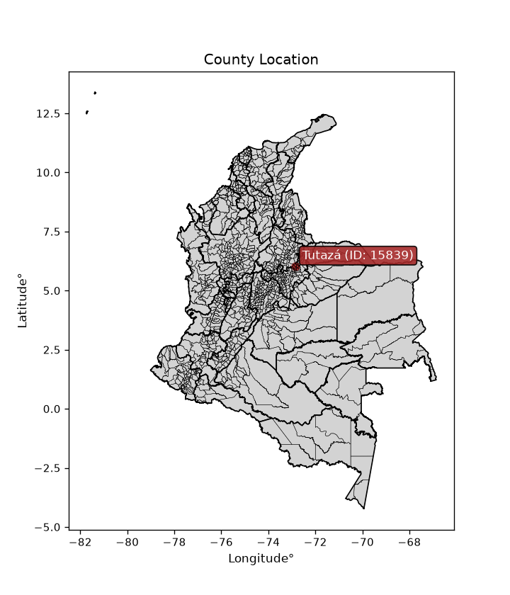
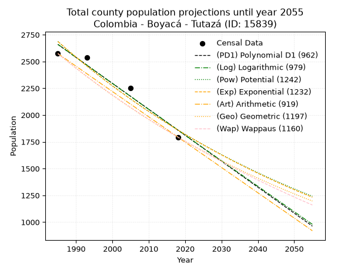
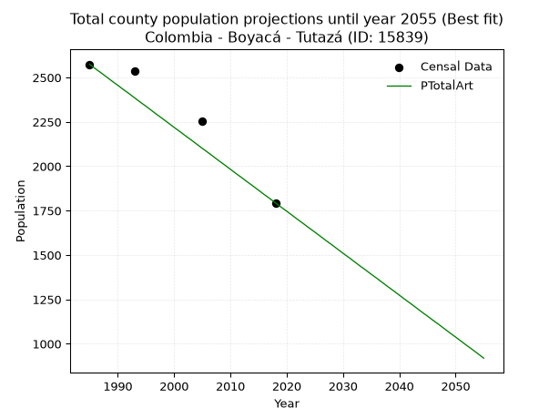
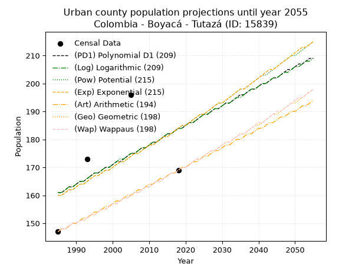
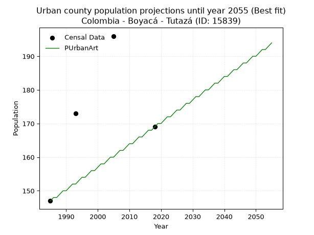
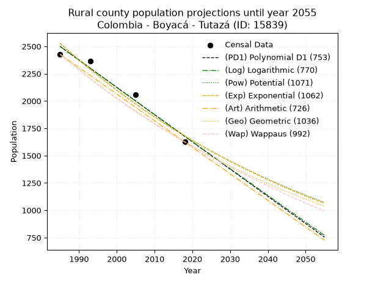
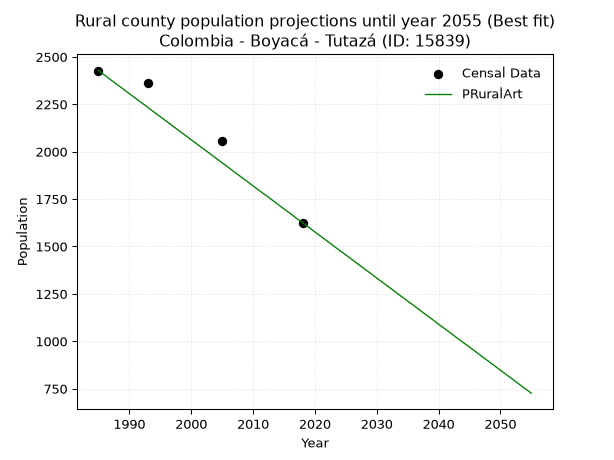

<div align="center">


</div>

# _“Population and Public Services Demand Projections (PPSD) until Year 2050 for Colombia - Boyacá - Tutazá (ID: 15839)”_
Keywords: `population` `public-service` `projection` `lineal` `polynomial` `logarithmic` `potential` `exponential` `arithmetic` `geometric` `wappaus` `dane` `colombia` `south-america`

PPSD are analytical estimates used by governments and planners to anticipate future changes in population size, age distribution, and the resulting community needs for utilities, healthcare, education, and infrastructure as sizing future water treatment facilities, electrical grids, and road networks based on spatial growth.

> **General running parameters**: • app_version: _v20260806_. • Python version: _3.14.7_. • Pandas version: _3.0.5_. • NumPy version: _2.5.1_. • Creates, save and include plots into reports (create_plot): _False_. • Projection until year: _2050_. • Process polynomial degree 2 and up: _False_. • Process Wappaus: _True_. • Process Wappaus: _True_. • Set negative values to zero: _True_. • Set infinite values to zero: _True_. • Drop dataset notes: _True_. 
<div align="center">

Dynamic map: [:earth_americas:Google](http://maps.google.com/maps?q=6.032607902,-72.8560354) [:earth_americas:OSM](https://www.openstreetmap.org/#map=18/6.032607902/-72.8560354&layers=P) [:earth_americas:Bing](https://www.bing.com/maps?cp=6.032607902~-72.8560354&lvl=18) [:earth_americas:Apple](https://maps.apple.com/frame?center=6.032607902%2C-72.8560354&span=0.003%2C0.006)

</div>


<div align="center">

```geojson
{
  "type": "Feature",
  "geometry": {
    "type": "Point", 
    "coordinates": [-72.8560354, 6.032607902]
  }, 
  "properties": {
    "Name": "Colombia - Boyacá - Tutazá (ID: 15839)"
  }
}
```

</div>


<div align="center">

</img>

</div>


## 0. Census Data (4 records)

Census data are official statistics collected by a government about the people and housing in a country. They usually include counts of total population, age, sex, race, income, education, and jobs.

📅Global census file: [Population.xlsx](../data/Population.xlsx)

| Source   |   Year |   CountryID | CountryName   |   StateID | StateName   |   CountyID | CountyName   |   PTotal |   PUrban |   PRural |
|:---------|-------:|------------:|:--------------|----------:|:------------|-----------:|:-------------|---------:|---------:|---------:|
| DANE     |   1985 |          57 | Colombia      |        15 | Boyacá      |      15839 | Tutazá       |     2574 |      147 |     2427 |
| DANE     |   1993 |          57 | Colombia      |        15 | Boyacá      |      15839 | Tutazá       |     2537 |      173 |     2364 |
| DANE     |   2005 |          57 | Colombia      |        15 | Boyacá      |      15839 | Tutazá       |     2254 |      196 |     2058 |
| DANE     |   2018 |          57 | Colombia      |        15 | Boyacá      |      15839 | Tutazá       |     1794 |      169 |     1625 |

> 🔥Some records could had specific notes about the registered values or the corresponding urban or rural distribution.

📅   [RUPS](https://www.datos.gov.co/Hacienda-y-Cr-dito-P-blico/Registro-nico-de-Prestadores-de-Servicios-P-blicos/4qkq-csdn/about_data) - Local public utility companies: [RUPS.csv](../data/RUPS.xlsx)

 | SERVICIO       | ESTADO    | NOMBRE                                                                                  | NIT         | DEPARTAMENTO_DOMICILIO   | MUNICIPIO_DOMICILIO   | DIRECCION              |   TELEFONO | EMAIL                   | TIPO_PRESTADOR          | CLASIFICACION                 |
|:---------------|:----------|:----------------------------------------------------------------------------------------|:------------|:-------------------------|:----------------------|:-----------------------|-----------:|:------------------------|:------------------------|:------------------------------|
| ACUEDUCTO      | OPERATIVA | ADMINISTRACION PUBLICA COOPERATIVA DE SERVICIOS PUBLICOS DEL MUNICIPIO DE TUTAZA E.S.P. | 900300722-1 | BOYACA                   | TUTAZA                | Cra. 3 No. 2-40 PISO 2 |    7726330 | dianagaitan18@gmail.com | ORGANIZACION AUTORIZADA | MENOR O IGUAL A 2500 USUARIOS |
| ALCANTARILLADO | OPERATIVA | ADMINISTRACION PUBLICA COOPERATIVA DE SERVICIOS PUBLICOS DEL MUNICIPIO DE TUTAZA E.S.P. | 900300722-1 | BOYACA                   | TUTAZA                | Cra. 3 No. 2-40 PISO 2 |    7726330 | dianagaitan18@gmail.com | ORGANIZACION AUTORIZADA | MENOR O IGUAL A 2500 USUARIOS |

## 1. Total

### 1.1. Coefficients and Parameters

* (PD1) Polynomial Deg 1: -24.242071457245775, 50779.953432355855 (lineal)
* (Log) Logarithmic: -48495.361150608165, 370903.37872320757
* (Pow) Potential: -22.27075642725608, 76.87288225743596
* (Exp) Exponential: -0.011133842104606105, 10650440204459.361
* (Art) Arithmetic: Year diff. 2018 - 1985 = 33, Population diff. 1794 - 2574 = -780, Annual growth = -23.636363636363637
* (Geo) Geometric: Year diff. 2018 - 1985 = 33, Population diff. 1794 - 2574 = -780, Annual growth % = -0.010880176371188655
* (Wap) Wappaus: i = -1.0822510822510822, Condition values only valid for < 200)

<sub>
Wappaus condition values: ['-0.00', '-1.08', '-2.16', '-3.25', '-4.33', '-5.41', '-6.49', '-7.58', '-8.66', '-9.74', '-10.82', '-11.90', '-12.99', '-14.07', '-15.15', '-16.23', '-17.32', '-18.40', '-19.48', '-20.56', '-21.65', '-22.73', '-23.81', '-24.89', '-25.97', '-27.06', '-28.14', '-29.22', '-30.30', '-31.39', '-32.47', '-33.55', '-34.63', '-35.71', '-36.80', '-37.88', '-38.96', '-40.04', '-41.13', '-42.21', '-43.29', '-44.37', '-45.45', '-46.54', '-47.62', '-48.70', '-49.78', '-50.87', '-51.95', '-53.03', '-54.11', '-55.19', '-56.28', '-57.36', '-58.44', '-59.52', '-60.61', '-61.69', '-62.77', '-63.85', '-64.94', '-66.02', '-67.10', '-68.18', '-69.26', '-70.35']
</sub>


### 1.2. Projected Dataset

|   Year |   CountyID |   PTotalPD1 |   PTotalLog |   PTotalPow |   PTotalExp |   PTotalArt |   PTotalGeo |   PTotalWap |
|-------:|-----------:|------------:|------------:|------------:|------------:|------------:|------------:|------------:|
|   1985 |      15839 |        2659 |        2660 |        2687 |        2686 |        2574 |        2574 |        2574 |
|   1986 |      15839 |        2635 |        2636 |        2657 |        2657 |        2550 |        2546 |        2546 |
|   1987 |      15839 |        2611 |        2611 |        2627 |        2627 |        2527 |        2518 |        2519 |
|   1988 |      15839 |        2587 |        2587 |        2598 |        2598 |        2503 |        2491 |        2492 |
|   1989 |      15839 |        2562 |        2562 |        2569 |        2569 |        2479 |        2464 |        2465 |
|   1990 |      15839 |        2538 |        2538 |        2541 |        2541 |        2456 |        2437 |        2438 |
|   1991 |      15839 |        2514 |        2514 |        2512 |        2513 |        2432 |        2410 |        2412 |
|   1992 |      15839 |        2490 |        2489 |        2484 |        2485 |        2409 |        2384 |        2386 |
|   1993 |      15839 |        2466 |        2465 |        2457 |        2457 |        2385 |        2358 |        2360 |
|   1994 |      15839 |        2441 |        2441 |        2429 |        2430 |        2361 |        2333 |        2335 |
|   1995 |      15839 |        2417 |        2416 |        2402 |        2403 |        2338 |        2307 |        2310 |
|   1996 |      15839 |        2393 |        2392 |        2376 |        2377 |        2314 |        2282 |        2285 |
|   1997 |      15839 |        2369 |        2368 |        2349 |        2350 |        2290 |        2257 |        2260 |
|   1998 |      15839 |        2344 |        2343 |        2323 |        2324 |        2267 |        2233 |        2236 |
|   1999 |      15839 |        2320 |        2319 |        2298 |        2299 |        2243 |        2208 |        2211 |
|   2000 |      15839 |        2296 |        2295 |        2272 |        2273 |        2219 |        2184 |        2188 |
|   2001 |      15839 |        2272 |        2271 |        2247 |        2248 |        2196 |        2161 |        2164 |
|   2002 |      15839 |        2247 |        2246 |        2222 |        2223 |        2172 |        2137 |        2140 |
|   2003 |      15839 |        2223 |        2222 |        2198 |        2199 |        2149 |        2114 |        2117 |
|   2004 |      15839 |        2199 |        2198 |        2173 |        2174 |        2125 |        2091 |        2094 |
|   2005 |      15839 |        2175 |        2174 |        2149 |        2150 |        2101 |        2068 |        2071 |
|   2006 |      15839 |        2150 |        2150 |        2126 |        2126 |        2078 |        2046 |        2049 |
|   2007 |      15839 |        2126 |        2125 |        2102 |        2103 |        2054 |        2023 |        2026 |
|   2008 |      15839 |        2102 |        2101 |        2079 |        2079 |        2030 |        2001 |        2004 |
|   2009 |      15839 |        2078 |        2077 |        2056 |        2056 |        2007 |        1980 |        1982 |
|   2010 |      15839 |        2053 |        2053 |        2033 |        2034 |        1983 |        1958 |        1961 |
|   2011 |      15839 |        2029 |        2029 |        2011 |        2011 |        1959 |        1937 |        1939 |
|   2012 |      15839 |        2005 |        2005 |        1989 |        1989 |        1936 |        1916 |        1918 |
|   2013 |      15839 |        1981 |        1981 |        1967 |        1967 |        1912 |        1895 |        1897 |
|   2014 |      15839 |        1956 |        1957 |        1945 |        1945 |        1889 |        1874 |        1876 |
|   2015 |      15839 |        1932 |        1933 |        1924 |        1924 |        1865 |        1854 |        1855 |
|   2016 |      15839 |        1908 |        1908 |        1903 |        1902 |        1841 |        1834 |        1834 |
|   2017 |      15839 |        1884 |        1884 |        1882 |        1881 |        1818 |        1814 |        1814 |
|   2018 |      15839 |        1859 |        1860 |        1861 |        1860 |        1794 |        1794 |        1794 |
|   2019 |      15839 |        1835 |        1836 |        1841 |        1840 |        1770 |        1774 |        1774 |
|   2020 |      15839 |        1811 |        1812 |        1821 |        1819 |        1747 |        1755 |        1754 |
|   2021 |      15839 |        1787 |        1788 |        1801 |        1799 |        1723 |        1736 |        1735 |
|   2022 |      15839 |        1762 |        1764 |        1781 |        1779 |        1699 |        1717 |        1715 |
|   2023 |      15839 |        1738 |        1740 |        1761 |        1760 |        1676 |        1699 |        1696 |
|   2024 |      15839 |        1714 |        1716 |        1742 |        1740 |        1652 |        1680 |        1677 |
|   2025 |      15839 |        1690 |        1692 |        1723 |        1721 |        1629 |        1662 |        1658 |
|   2026 |      15839 |        1666 |        1668 |        1704 |        1702 |        1605 |        1644 |        1639 |
|   2027 |      15839 |        1641 |        1645 |        1686 |        1683 |        1581 |        1626 |        1621 |
|   2028 |      15839 |        1617 |        1621 |        1667 |        1664 |        1558 |        1608 |        1602 |
|   2029 |      15839 |        1593 |        1597 |        1649 |        1646 |        1534 |        1591 |        1584 |
|   2030 |      15839 |        1569 |        1573 |        1631 |        1628 |        1510 |        1573 |        1566 |
|   2031 |      15839 |        1544 |        1549 |        1613 |        1610 |        1487 |        1556 |        1548 |
|   2032 |      15839 |        1520 |        1525 |        1596 |        1592 |        1463 |        1539 |        1530 |
|   2033 |      15839 |        1496 |        1501 |        1578 |        1574 |        1439 |        1522 |        1513 |
|   2034 |      15839 |        1472 |        1477 |        1561 |        1557 |        1416 |        1506 |        1495 |
|   2035 |      15839 |        1447 |        1454 |        1544 |        1540 |        1392 |        1490 |        1478 |
|   2036 |      15839 |        1423 |        1430 |        1527 |        1523 |        1369 |        1473 |        1461 |
|   2037 |      15839 |        1399 |        1406 |        1511 |        1506 |        1345 |        1457 |        1444 |
|   2038 |      15839 |        1375 |        1382 |        1494 |        1489 |        1321 |        1441 |        1427 |
|   2039 |      15839 |        1350 |        1358 |        1478 |        1473 |        1298 |        1426 |        1410 |
|   2040 |      15839 |        1326 |        1335 |        1462 |        1456 |        1274 |        1410 |        1393 |
|   2041 |      15839 |        1302 |        1311 |        1446 |        1440 |        1250 |        1395 |        1377 |
|   2042 |      15839 |        1278 |        1287 |        1430 |        1424 |        1227 |        1380 |        1360 |
|   2043 |      15839 |        1253 |        1263 |        1415 |        1408 |        1203 |        1365 |        1344 |
|   2044 |      15839 |        1229 |        1240 |        1399 |        1393 |        1179 |        1350 |        1328 |
|   2045 |      15839 |        1205 |        1216 |        1384 |        1377 |        1156 |        1335 |        1312 |
|   2046 |      15839 |        1181 |        1192 |        1369 |        1362 |        1132 |        1321 |        1296 |
|   2047 |      15839 |        1156 |        1168 |        1355 |        1347 |        1109 |        1306 |        1281 |
|   2048 |      15839 |        1132 |        1145 |        1340 |        1332 |        1085 |        1292 |        1265 |
|   2049 |      15839 |        1108 |        1121 |        1325 |        1317 |        1061 |        1278 |        1250 |
|   2050 |      15839 |        1084 |        1097 |        1311 |        1303 |        1038 |        1264 |        1234 |
<div align="center">

</img>

</div>


### 1.3. Best fit with absolute and relative error (%)

Relative error puts that difference into context by dividing the absolute error by the true value, creating a unitless ratio or percentage that shows the scale of the mistake.

Absolute and relative error

|   Year | Source   |   CountryID | CountryName   |   StateID | StateName   |   CountyID_x | CountyName   |   PTotal |   PUrban |   PRural |   CountyID_y |   PTotalPD1 |   PTotalLog |   PTotalPow |   PTotalExp |   PTotalArt |   PTotalGeo |   PTotalWap |   PTotalPD1AbsError |   PTotalLogAbsError |   PTotalPowAbsError |   PTotalExpAbsError |   PTotalArtAbsError |   PTotalGeoAbsError |   PTotalWapAbsError |   PTotalPD1RelError |   PTotalLogRelError |   PTotalPowRelError |   PTotalExpRelError |   PTotalArtRelError |   PTotalGeoRelError |   PTotalWapRelError |
|-------:|:---------|------------:|:--------------|----------:|:------------|-------------:|:-------------|---------:|---------:|---------:|-------------:|------------:|------------:|------------:|------------:|------------:|------------:|------------:|--------------------:|--------------------:|--------------------:|--------------------:|--------------------:|--------------------:|--------------------:|--------------------:|--------------------:|--------------------:|--------------------:|--------------------:|--------------------:|--------------------:|
|   1985 | DANE     |          57 | Colombia      |        15 | Boyacá      |        15839 | Tutazá       |     2574 |      147 |     2427 |        15839 |        2659 |        2660 |        2687 |        2686 |        2574 |        2574 |        2574 |                  85 |                  86 |                 113 |                 112 |                   0 |                   0 |                   0 |             3.30225 |             3.3411  |             4.39005 |             4.3512  |             0       |             0       |             0       |
|   1993 | DANE     |          57 | Colombia      |        15 | Boyacá      |        15839 | Tutazá       |     2537 |      173 |     2364 |        15839 |        2466 |        2465 |        2457 |        2457 |        2385 |        2358 |        2360 |                  71 |                  72 |                  80 |                  80 |                 152 |                 179 |                 177 |             2.79858 |             2.838   |             3.15333 |             3.15333 |             5.99133 |             7.05558 |             6.97674 |
|   2005 | DANE     |          57 | Colombia      |        15 | Boyacá      |        15839 | Tutazá       |     2254 |      196 |     2058 |        15839 |        2175 |        2174 |        2149 |        2150 |        2101 |        2068 |        2071 |                  79 |                  80 |                 105 |                 104 |                 153 |                 186 |                 183 |             3.50488 |             3.54925 |             4.65839 |             4.61402 |             6.78793 |             8.252   |             8.1189  |
|   2018 | DANE     |          57 | Colombia      |        15 | Boyacá      |        15839 | Tutazá       |     1794 |      169 |     1625 |        15839 |        1859 |        1860 |        1861 |        1860 |        1794 |        1794 |        1794 |                  65 |                  66 |                  67 |                  66 |                   0 |                   0 |                   0 |             3.62319 |             3.67893 |             3.73467 |             3.67893 |             0       |             0       |             0       |

Relative error mean

| Method    |   RelError | Best   |
|:----------|-----------:|:-------|
| PTotalPD1 |    3.30723 |        |
| PTotalLog |    3.35182 |        |
| PTotalPow |    3.98411 |        |
| PTotalExp |    3.94937 |        |
| PTotalArt |    3.19482 | True   |
| PTotalGeo |    3.82689 |        |
| PTotalWap |    3.77391 |        |

💙Best method: _**PTotalArt**_
<div align="center">

</img>

</div>


### 1.4. Fresh water supply demand in liters per capita per day (lpcd)

The fresh water supply demand typically ranges from 100 to 300 liters per capita per day (lpcd) for standard domestic and municipal planning, though absolute survival minimums set by the World Health Organization are as low as 7.5 to 20 liters per day, and total consumption in high-income nations can exceed 400 liters.

> `CZ`: Level in meters above the sea level (masl)<br> `WS`: Fresh water supply demand in liters per capita per day (lpcd or l/h/d)<br> `WSAll`: Zonal fresh water supply demand in liters per second (l/s)<br> `A`: Zonal area in square meters<br> `DP`: Population density (people/hectare or p/ha)

Reference values (RAS Colombia)

|    CZ |   WS |
|------:|-----:|
|  1000 |  120 |
|  2000 |  130 |
| 99999 |  140 |

County shapefile geometry properties and water supply values

|   CountyID |     ATotal |   CZTotal |   WSTotal |
|-----------:|-----------:|----------:|----------:|
|      15839 | 1.2176e+08 |   3268.95 |       140 |

Projected values for best method: PTotalArt

|   CountyID |   Year |   PTotalArt |   DPTotal |   WSTotal |   WSTotalAll |
|-----------:|-------:|------------:|----------:|----------:|-------------:|
|      15839 |   1985 |        2574 |      0.21 |       140 |      4.17083 |
|      15839 |   1986 |        2550 |      0.21 |       140 |      4.13194 |
|      15839 |   1987 |        2527 |      0.21 |       140 |      4.09468 |
|      15839 |   1988 |        2503 |      0.21 |       140 |      4.05579 |
|      15839 |   1989 |        2479 |      0.2  |       140 |      4.0169  |
|      15839 |   1990 |        2456 |      0.2  |       140 |      3.97963 |
|      15839 |   1991 |        2432 |      0.2  |       140 |      3.94074 |
|      15839 |   1992 |        2409 |      0.2  |       140 |      3.90347 |
|      15839 |   1993 |        2385 |      0.2  |       140 |      3.86458 |
|      15839 |   1994 |        2361 |      0.19 |       140 |      3.82569 |
|      15839 |   1995 |        2338 |      0.19 |       140 |      3.78843 |
|      15839 |   1996 |        2314 |      0.19 |       140 |      3.74954 |
|      15839 |   1997 |        2290 |      0.19 |       140 |      3.71065 |
|      15839 |   1998 |        2267 |      0.19 |       140 |      3.67338 |
|      15839 |   1999 |        2243 |      0.18 |       140 |      3.63449 |
|      15839 |   2000 |        2219 |      0.18 |       140 |      3.5956  |
|      15839 |   2001 |        2196 |      0.18 |       140 |      3.55833 |
|      15839 |   2002 |        2172 |      0.18 |       140 |      3.51944 |
|      15839 |   2003 |        2149 |      0.18 |       140 |      3.48218 |
|      15839 |   2004 |        2125 |      0.17 |       140 |      3.44329 |
|      15839 |   2005 |        2101 |      0.17 |       140 |      3.4044  |
|      15839 |   2006 |        2078 |      0.17 |       140 |      3.36713 |
|      15839 |   2007 |        2054 |      0.17 |       140 |      3.32824 |
|      15839 |   2008 |        2030 |      0.17 |       140 |      3.28935 |
|      15839 |   2009 |        2007 |      0.16 |       140 |      3.25208 |
|      15839 |   2010 |        1983 |      0.16 |       140 |      3.21319 |
|      15839 |   2011 |        1959 |      0.16 |       140 |      3.17431 |
|      15839 |   2012 |        1936 |      0.16 |       140 |      3.13704 |
|      15839 |   2013 |        1912 |      0.16 |       140 |      3.09815 |
|      15839 |   2014 |        1889 |      0.16 |       140 |      3.06088 |
|      15839 |   2015 |        1865 |      0.15 |       140 |      3.02199 |
|      15839 |   2016 |        1841 |      0.15 |       140 |      2.9831  |
|      15839 |   2017 |        1818 |      0.15 |       140 |      2.94583 |
|      15839 |   2018 |        1794 |      0.15 |       140 |      2.90694 |
|      15839 |   2019 |        1770 |      0.15 |       140 |      2.86806 |
|      15839 |   2020 |        1747 |      0.14 |       140 |      2.83079 |
|      15839 |   2021 |        1723 |      0.14 |       140 |      2.7919  |
|      15839 |   2022 |        1699 |      0.14 |       140 |      2.75301 |
|      15839 |   2023 |        1676 |      0.14 |       140 |      2.71574 |
|      15839 |   2024 |        1652 |      0.14 |       140 |      2.67685 |
|      15839 |   2025 |        1629 |      0.13 |       140 |      2.63958 |
|      15839 |   2026 |        1605 |      0.13 |       140 |      2.60069 |
|      15839 |   2027 |        1581 |      0.13 |       140 |      2.56181 |
|      15839 |   2028 |        1558 |      0.13 |       140 |      2.52454 |
|      15839 |   2029 |        1534 |      0.13 |       140 |      2.48565 |
|      15839 |   2030 |        1510 |      0.12 |       140 |      2.44676 |
|      15839 |   2031 |        1487 |      0.12 |       140 |      2.40949 |
|      15839 |   2032 |        1463 |      0.12 |       140 |      2.3706  |
|      15839 |   2033 |        1439 |      0.12 |       140 |      2.33171 |
|      15839 |   2034 |        1416 |      0.12 |       140 |      2.29444 |
|      15839 |   2035 |        1392 |      0.11 |       140 |      2.25556 |
|      15839 |   2036 |        1369 |      0.11 |       140 |      2.21829 |
|      15839 |   2037 |        1345 |      0.11 |       140 |      2.1794  |
|      15839 |   2038 |        1321 |      0.11 |       140 |      2.14051 |
|      15839 |   2039 |        1298 |      0.11 |       140 |      2.10324 |
|      15839 |   2040 |        1274 |      0.1  |       140 |      2.06435 |
|      15839 |   2041 |        1250 |      0.1  |       140 |      2.02546 |
|      15839 |   2042 |        1227 |      0.1  |       140 |      1.98819 |
|      15839 |   2043 |        1203 |      0.1  |       140 |      1.94931 |
|      15839 |   2044 |        1179 |      0.1  |       140 |      1.91042 |
|      15839 |   2045 |        1156 |      0.09 |       140 |      1.87315 |
|      15839 |   2046 |        1132 |      0.09 |       140 |      1.83426 |
|      15839 |   2047 |        1109 |      0.09 |       140 |      1.79699 |
|      15839 |   2048 |        1085 |      0.09 |       140 |      1.7581  |
|      15839 |   2049 |        1061 |      0.09 |       140 |      1.71921 |
|      15839 |   2050 |        1038 |      0.09 |       140 |      1.68194 |

## 2. Urban

### 2.1. Coefficients and Parameters

* (PD1) Polynomial Deg 1: 0.6981132075471859, -1225.1509433962585 (lineal)
* (Log) Logarithmic: 1402.9248221970533, -10492.39281585377
* (Pow) Potential: 8.58627350786133, -26.112563454622165
* (Exp) Exponential: 0.004273441690477667, 0.033040627032756974
* (Art) Arithmetic: Year diff. 2018 - 1985 = 33, Population diff. 169 - 147 = 22, Annual growth = 0.6666666666666666
* (Geo) Geometric: Year diff. 2018 - 1985 = 33, Population diff. 169 - 147 = 22, Annual growth % = 0.004235189480575441
* (Wap) Wappaus: i = 0.4219409282700422, Condition values only valid for < 200)

<sub>
Wappaus condition values: ['0.00', '0.42', '0.84', '1.27', '1.69', '2.11', '2.53', '2.95', '3.38', '3.80', '4.22', '4.64', '5.06', '5.49', '5.91', '6.33', '6.75', '7.17', '7.59', '8.02', '8.44', '8.86', '9.28', '9.70', '10.13', '10.55', '10.97', '11.39', '11.81', '12.24', '12.66', '13.08', '13.50', '13.92', '14.35', '14.77', '15.19', '15.61', '16.03', '16.46', '16.88', '17.30', '17.72', '18.14', '18.57', '18.99', '19.41', '19.83', '20.25', '20.68', '21.10', '21.52', '21.94', '22.36', '22.78', '23.21', '23.63', '24.05', '24.47', '24.89', '25.32', '25.74', '26.16', '26.58', '27.00', '27.43']
</sub>


### 2.2. Projected Dataset

|   Year |   CountyID |   PUrbanPD1 |   PUrbanLog |   PUrbanPow |   PUrbanExp |   PUrbanArt |   PUrbanGeo |   PUrbanWap |
|-------:|-----------:|------------:|------------:|------------:|------------:|------------:|------------:|------------:|
|   1985 |      15839 |         161 |         161 |         160 |         160 |         147 |         147 |         147 |
|   1986 |      15839 |         161 |         161 |         160 |         160 |         148 |         148 |         148 |
|   1987 |      15839 |         162 |         162 |         161 |         161 |         148 |         148 |         148 |
|   1988 |      15839 |         163 |         163 |         162 |         162 |         149 |         149 |         149 |
|   1989 |      15839 |         163 |         163 |         162 |         162 |         150 |         150 |         150 |
|   1990 |      15839 |         164 |         164 |         163 |         163 |         150 |         150 |         150 |
|   1991 |      15839 |         165 |         165 |         164 |         164 |         151 |         151 |         151 |
|   1992 |      15839 |         165 |         165 |         164 |         164 |         152 |         151 |         151 |
|   1993 |      15839 |         166 |         166 |         165 |         165 |         152 |         152 |         152 |
|   1994 |      15839 |         167 |         167 |         166 |         166 |         153 |         153 |         153 |
|   1995 |      15839 |         168 |         168 |         167 |         167 |         154 |         153 |         153 |
|   1996 |      15839 |         168 |         168 |         167 |         167 |         154 |         154 |         154 |
|   1997 |      15839 |         169 |         169 |         168 |         168 |         155 |         155 |         155 |
|   1998 |      15839 |         170 |         170 |         169 |         169 |         156 |         155 |         155 |
|   1999 |      15839 |         170 |         170 |         169 |         169 |         156 |         156 |         156 |
|   2000 |      15839 |         171 |         171 |         170 |         170 |         157 |         157 |         157 |
|   2001 |      15839 |         172 |         172 |         171 |         171 |         158 |         157 |         157 |
|   2002 |      15839 |         172 |         173 |         172 |         172 |         158 |         158 |         158 |
|   2003 |      15839 |         173 |         173 |         172 |         172 |         159 |         159 |         159 |
|   2004 |      15839 |         174 |         174 |         173 |         173 |         160 |         159 |         159 |
|   2005 |      15839 |         175 |         175 |         174 |         174 |         160 |         160 |         160 |
|   2006 |      15839 |         175 |         175 |         175 |         175 |         161 |         161 |         161 |
|   2007 |      15839 |         176 |         176 |         175 |         175 |         162 |         161 |         161 |
|   2008 |      15839 |         177 |         177 |         176 |         176 |         162 |         162 |         162 |
|   2009 |      15839 |         177 |         177 |         177 |         177 |         163 |         163 |         163 |
|   2010 |      15839 |         178 |         178 |         178 |         178 |         164 |         163 |         163 |
|   2011 |      15839 |         179 |         179 |         178 |         178 |         164 |         164 |         164 |
|   2012 |      15839 |         179 |         179 |         179 |         179 |         165 |         165 |         165 |
|   2013 |      15839 |         180 |         180 |         180 |         180 |         166 |         165 |         165 |
|   2014 |      15839 |         181 |         181 |         181 |         181 |         166 |         166 |         166 |
|   2015 |      15839 |         182 |         182 |         181 |         181 |         167 |         167 |         167 |
|   2016 |      15839 |         182 |         182 |         182 |         182 |         168 |         168 |         168 |
|   2017 |      15839 |         183 |         183 |         183 |         183 |         168 |         168 |         168 |
|   2018 |      15839 |         184 |         184 |         184 |         184 |         169 |         169 |         169 |
|   2019 |      15839 |         184 |         184 |         185 |         185 |         170 |         170 |         170 |
|   2020 |      15839 |         185 |         185 |         185 |         185 |         170 |         170 |         170 |
|   2021 |      15839 |         186 |         186 |         186 |         186 |         171 |         171 |         171 |
|   2022 |      15839 |         186 |         186 |         187 |         187 |         172 |         172 |         172 |
|   2023 |      15839 |         187 |         187 |         188 |         188 |         172 |         173 |         173 |
|   2024 |      15839 |         188 |         188 |         189 |         189 |         173 |         173 |         173 |
|   2025 |      15839 |         189 |         189 |         189 |         189 |         174 |         174 |         174 |
|   2026 |      15839 |         189 |         189 |         190 |         190 |         174 |         175 |         175 |
|   2027 |      15839 |         190 |         190 |         191 |         191 |         175 |         176 |         176 |
|   2028 |      15839 |         191 |         191 |         192 |         192 |         176 |         176 |         176 |
|   2029 |      15839 |         191 |         191 |         193 |         193 |         176 |         177 |         177 |
|   2030 |      15839 |         192 |         192 |         193 |         193 |         177 |         178 |         178 |
|   2031 |      15839 |         193 |         193 |         194 |         194 |         178 |         179 |         179 |
|   2032 |      15839 |         193 |         193 |         195 |         195 |         178 |         179 |         179 |
|   2033 |      15839 |         194 |         194 |         196 |         196 |         179 |         180 |         180 |
|   2034 |      15839 |         195 |         195 |         197 |         197 |         180 |         181 |         181 |
|   2035 |      15839 |         196 |         195 |         198 |         198 |         180 |         182 |         182 |
|   2036 |      15839 |         196 |         196 |         198 |         198 |         181 |         182 |         182 |
|   2037 |      15839 |         197 |         197 |         199 |         199 |         182 |         183 |         183 |
|   2038 |      15839 |         198 |         198 |         200 |         200 |         182 |         184 |         184 |
|   2039 |      15839 |         198 |         198 |         201 |         201 |         183 |         185 |         185 |
|   2040 |      15839 |         199 |         199 |         202 |         202 |         184 |         185 |         186 |
|   2041 |      15839 |         200 |         200 |         203 |         203 |         184 |         186 |         186 |
|   2042 |      15839 |         200 |         200 |         203 |         204 |         185 |         187 |         187 |
|   2043 |      15839 |         201 |         201 |         204 |         205 |         186 |         188 |         188 |
|   2044 |      15839 |         202 |         202 |         205 |         205 |         186 |         189 |         189 |
|   2045 |      15839 |         202 |         202 |         206 |         206 |         187 |         189 |         190 |
|   2046 |      15839 |         203 |         203 |         207 |         207 |         188 |         190 |         190 |
|   2047 |      15839 |         204 |         204 |         208 |         208 |         188 |         191 |         191 |
|   2048 |      15839 |         205 |         204 |         209 |         209 |         189 |         192 |         192 |
|   2049 |      15839 |         205 |         205 |         210 |         210 |         190 |         193 |         193 |
|   2050 |      15839 |         206 |         206 |         210 |         211 |         190 |         193 |         194 |
<div align="center">

</img>

</div>


### 2.3. Best fit with absolute and relative error (%)

Relative error puts that difference into context by dividing the absolute error by the true value, creating a unitless ratio or percentage that shows the scale of the mistake.

Absolute and relative error

|   Year | Source   |   CountryID | CountryName   |   StateID | StateName   |   CountyID_x | CountyName   |   PTotal |   PUrban |   PRural |   CountyID_y |   PUrbanPD1 |   PUrbanLog |   PUrbanPow |   PUrbanExp |   PUrbanArt |   PUrbanGeo |   PUrbanWap |   PUrbanPD1AbsError |   PUrbanLogAbsError |   PUrbanPowAbsError |   PUrbanExpAbsError |   PUrbanArtAbsError |   PUrbanGeoAbsError |   PUrbanWapAbsError |   PUrbanPD1RelError |   PUrbanLogRelError |   PUrbanPowRelError |   PUrbanExpRelError |   PUrbanArtRelError |   PUrbanGeoRelError |   PUrbanWapRelError |
|-------:|:---------|------------:|:--------------|----------:|:------------|-------------:|:-------------|---------:|---------:|---------:|-------------:|------------:|------------:|------------:|------------:|------------:|------------:|------------:|--------------------:|--------------------:|--------------------:|--------------------:|--------------------:|--------------------:|--------------------:|--------------------:|--------------------:|--------------------:|--------------------:|--------------------:|--------------------:|--------------------:|
|   1985 | DANE     |          57 | Colombia      |        15 | Boyacá      |        15839 | Tutazá       |     2574 |      147 |     2427 |        15839 |         161 |         161 |         160 |         160 |         147 |         147 |         147 |                  14 |                  14 |                  13 |                  13 |                   0 |                   0 |                   0 |             9.52381 |             9.52381 |             8.84354 |             8.84354 |              0      |              0      |              0      |
|   1993 | DANE     |          57 | Colombia      |        15 | Boyacá      |        15839 | Tutazá       |     2537 |      173 |     2364 |        15839 |         166 |         166 |         165 |         165 |         152 |         152 |         152 |                   7 |                   7 |                   8 |                   8 |                  21 |                  21 |                  21 |             4.04624 |             4.04624 |             4.62428 |             4.62428 |             12.1387 |             12.1387 |             12.1387 |
|   2005 | DANE     |          57 | Colombia      |        15 | Boyacá      |        15839 | Tutazá       |     2254 |      196 |     2058 |        15839 |         175 |         175 |         174 |         174 |         160 |         160 |         160 |                  21 |                  21 |                  22 |                  22 |                  36 |                  36 |                  36 |            10.7143  |            10.7143  |            11.2245  |            11.2245  |             18.3673 |             18.3673 |             18.3673 |
|   2018 | DANE     |          57 | Colombia      |        15 | Boyacá      |        15839 | Tutazá       |     1794 |      169 |     1625 |        15839 |         184 |         184 |         184 |         184 |         169 |         169 |         169 |                  15 |                  15 |                  15 |                  15 |                   0 |                   0 |                   0 |             8.87574 |             8.87574 |             8.87574 |             8.87574 |              0      |              0      |              0      |

Relative error mean

| Method    |   RelError | Best   |
|:----------|-----------:|:-------|
| PUrbanPD1 |    8.29002 |        |
| PUrbanLog |    8.29002 |        |
| PUrbanPow |    8.39201 |        |
| PUrbanExp |    8.39201 |        |
| PUrbanArt |    7.62652 | True   |
| PUrbanGeo |    7.62652 | True   |
| PUrbanWap |    7.62652 | True   |

💙Best method: _**PUrbanArt**_
<div align="center">

</img>

</div>


### 2.4. Fresh water supply demand in liters per capita per day (lpcd)

The fresh water supply demand typically ranges from 100 to 300 liters per capita per day (lpcd) for standard domestic and municipal planning, though absolute survival minimums set by the World Health Organization are as low as 7.5 to 20 liters per day, and total consumption in high-income nations can exceed 400 liters.

> `CZ`: Level in meters above the sea level (masl)<br> `WS`: Fresh water supply demand in liters per capita per day (lpcd or l/h/d)<br> `WSAll`: Zonal fresh water supply demand in liters per second (l/s)<br> `A`: Zonal area in square meters<br> `DP`: Population density (people/hectare or p/ha)

Reference values (RAS Colombia)

|    CZ |   WS |
|------:|-----:|
|  1000 |  120 |
|  2000 |  130 |
| 99999 |  140 |

County shapefile geometry properties and water supply values

|   CountyID |   AUrban |   CZUrban |   WSUrban |
|-----------:|---------:|----------:|----------:|
|      15839 |   110956 |   2872.68 |       140 |

Projected values for best method: PUrbanArt

|   CountyID |   Year |   PUrbanArt |   DPUrban |   WSUrban |   WSUrbanAll |
|-----------:|-------:|------------:|----------:|----------:|-------------:|
|      15839 |   1985 |         147 |     13.25 |       140 |     0.238194 |
|      15839 |   1986 |         148 |     13.34 |       140 |     0.239815 |
|      15839 |   1987 |         148 |     13.34 |       140 |     0.239815 |
|      15839 |   1988 |         149 |     13.43 |       140 |     0.241435 |
|      15839 |   1989 |         150 |     13.52 |       140 |     0.243056 |
|      15839 |   1990 |         150 |     13.52 |       140 |     0.243056 |
|      15839 |   1991 |         151 |     13.61 |       140 |     0.244676 |
|      15839 |   1992 |         152 |     13.7  |       140 |     0.246296 |
|      15839 |   1993 |         152 |     13.7  |       140 |     0.246296 |
|      15839 |   1994 |         153 |     13.79 |       140 |     0.247917 |
|      15839 |   1995 |         154 |     13.88 |       140 |     0.249537 |
|      15839 |   1996 |         154 |     13.88 |       140 |     0.249537 |
|      15839 |   1997 |         155 |     13.97 |       140 |     0.251157 |
|      15839 |   1998 |         156 |     14.06 |       140 |     0.252778 |
|      15839 |   1999 |         156 |     14.06 |       140 |     0.252778 |
|      15839 |   2000 |         157 |     14.15 |       140 |     0.254398 |
|      15839 |   2001 |         158 |     14.24 |       140 |     0.256019 |
|      15839 |   2002 |         158 |     14.24 |       140 |     0.256019 |
|      15839 |   2003 |         159 |     14.33 |       140 |     0.257639 |
|      15839 |   2004 |         160 |     14.42 |       140 |     0.259259 |
|      15839 |   2005 |         160 |     14.42 |       140 |     0.259259 |
|      15839 |   2006 |         161 |     14.51 |       140 |     0.26088  |
|      15839 |   2007 |         162 |     14.6  |       140 |     0.2625   |
|      15839 |   2008 |         162 |     14.6  |       140 |     0.2625   |
|      15839 |   2009 |         163 |     14.69 |       140 |     0.26412  |
|      15839 |   2010 |         164 |     14.78 |       140 |     0.265741 |
|      15839 |   2011 |         164 |     14.78 |       140 |     0.265741 |
|      15839 |   2012 |         165 |     14.87 |       140 |     0.267361 |
|      15839 |   2013 |         166 |     14.96 |       140 |     0.268981 |
|      15839 |   2014 |         166 |     14.96 |       140 |     0.268981 |
|      15839 |   2015 |         167 |     15.05 |       140 |     0.270602 |
|      15839 |   2016 |         168 |     15.14 |       140 |     0.272222 |
|      15839 |   2017 |         168 |     15.14 |       140 |     0.272222 |
|      15839 |   2018 |         169 |     15.23 |       140 |     0.273843 |
|      15839 |   2019 |         170 |     15.32 |       140 |     0.275463 |
|      15839 |   2020 |         170 |     15.32 |       140 |     0.275463 |
|      15839 |   2021 |         171 |     15.41 |       140 |     0.277083 |
|      15839 |   2022 |         172 |     15.5  |       140 |     0.278704 |
|      15839 |   2023 |         172 |     15.5  |       140 |     0.278704 |
|      15839 |   2024 |         173 |     15.59 |       140 |     0.280324 |
|      15839 |   2025 |         174 |     15.68 |       140 |     0.281944 |
|      15839 |   2026 |         174 |     15.68 |       140 |     0.281944 |
|      15839 |   2027 |         175 |     15.77 |       140 |     0.283565 |
|      15839 |   2028 |         176 |     15.86 |       140 |     0.285185 |
|      15839 |   2029 |         176 |     15.86 |       140 |     0.285185 |
|      15839 |   2030 |         177 |     15.95 |       140 |     0.286806 |
|      15839 |   2031 |         178 |     16.04 |       140 |     0.288426 |
|      15839 |   2032 |         178 |     16.04 |       140 |     0.288426 |
|      15839 |   2033 |         179 |     16.13 |       140 |     0.290046 |
|      15839 |   2034 |         180 |     16.22 |       140 |     0.291667 |
|      15839 |   2035 |         180 |     16.22 |       140 |     0.291667 |
|      15839 |   2036 |         181 |     16.31 |       140 |     0.293287 |
|      15839 |   2037 |         182 |     16.4  |       140 |     0.294907 |
|      15839 |   2038 |         182 |     16.4  |       140 |     0.294907 |
|      15839 |   2039 |         183 |     16.49 |       140 |     0.296528 |
|      15839 |   2040 |         184 |     16.58 |       140 |     0.298148 |
|      15839 |   2041 |         184 |     16.58 |       140 |     0.298148 |
|      15839 |   2042 |         185 |     16.67 |       140 |     0.299769 |
|      15839 |   2043 |         186 |     16.76 |       140 |     0.301389 |
|      15839 |   2044 |         186 |     16.76 |       140 |     0.301389 |
|      15839 |   2045 |         187 |     16.85 |       140 |     0.303009 |
|      15839 |   2046 |         188 |     16.94 |       140 |     0.30463  |
|      15839 |   2047 |         188 |     16.94 |       140 |     0.30463  |
|      15839 |   2048 |         189 |     17.03 |       140 |     0.30625  |
|      15839 |   2049 |         190 |     17.12 |       140 |     0.30787  |
|      15839 |   2050 |         190 |     17.12 |       140 |     0.30787  |

## 3. Rural

### 3.1. Coefficients and Parameters

* (PD1) Polynomial Deg 1: -24.940184664792948, 52005.1043757521 (lineal)
* (Log) Logarithmic: -49898.28597280523, 381395.77153906145
* (Pow) Potential: -24.777174442414783, 85.1120858611279
* (Exp) Exponential: -0.012385506377702797, 120230010813157.39
* (Art) Arithmetic: Year diff. 2018 - 1985 = 33, Population diff. 1625 - 2427 = -802, Annual growth = -24.303030303030305
* (Geo) Geometric: Year diff. 2018 - 1985 = 33, Population diff. 1625 - 2427 = -802, Annual growth % = -0.012082417624925235
* (Wap) Wappaus: i = -1.1995572706332824, Condition values only valid for < 200)

<sub>
Wappaus condition values: ['-0.00', '-1.20', '-2.40', '-3.60', '-4.80', '-6.00', '-7.20', '-8.40', '-9.60', '-10.80', '-12.00', '-13.20', '-14.39', '-15.59', '-16.79', '-17.99', '-19.19', '-20.39', '-21.59', '-22.79', '-23.99', '-25.19', '-26.39', '-27.59', '-28.79', '-29.99', '-31.19', '-32.39', '-33.59', '-34.79', '-35.99', '-37.19', '-38.39', '-39.59', '-40.78', '-41.98', '-43.18', '-44.38', '-45.58', '-46.78', '-47.98', '-49.18', '-50.38', '-51.58', '-52.78', '-53.98', '-55.18', '-56.38', '-57.58', '-58.78', '-59.98', '-61.18', '-62.38', '-63.58', '-64.78', '-65.98', '-67.18', '-68.37', '-69.57', '-70.77', '-71.97', '-73.17', '-74.37', '-75.57', '-76.77', '-77.97']
</sub>


### 3.2. Projected Dataset

|   Year |   CountyID |   PRuralPD1 |   PRuralLog |   PRuralPow |   PRuralExp |   PRuralArt |   PRuralGeo |   PRuralWap |
|-------:|-----------:|------------:|------------:|------------:|------------:|------------:|------------:|------------:|
|   1985 |      15839 |        2499 |        2499 |        2529 |        2528 |        2427 |        2427 |        2427 |
|   1986 |      15839 |        2474 |        2474 |        2497 |        2497 |        2403 |        2398 |        2398 |
|   1987 |      15839 |        2449 |        2449 |        2466 |        2466 |        2378 |        2369 |        2369 |
|   1988 |      15839 |        2424 |        2424 |        2436 |        2436 |        2354 |        2340 |        2341 |
|   1989 |      15839 |        2399 |        2399 |        2406 |        2406 |        2330 |        2312 |        2313 |
|   1990 |      15839 |        2374 |        2374 |        2376 |        2376 |        2305 |        2284 |        2286 |
|   1991 |      15839 |        2349 |        2349 |        2347 |        2347 |        2281 |        2256 |        2258 |
|   1992 |      15839 |        2324 |        2324 |        2317 |        2318 |        2257 |        2229 |        2231 |
|   1993 |      15839 |        2299 |        2299 |        2289 |        2290 |        2233 |        2202 |        2205 |
|   1994 |      15839 |        2274 |        2274 |        2261 |        2261 |        2208 |        2175 |        2178 |
|   1995 |      15839 |        2249 |        2249 |        2233 |        2234 |        2184 |        2149 |        2152 |
|   1996 |      15839 |        2224 |        2224 |        2205 |        2206 |        2160 |        2123 |        2127 |
|   1997 |      15839 |        2200 |        2199 |        2178 |        2179 |        2135 |        2098 |        2101 |
|   1998 |      15839 |        2175 |        2174 |        2151 |        2152 |        2111 |        2072 |        2076 |
|   1999 |      15839 |        2150 |        2149 |        2125 |        2126 |        2087 |        2047 |        2051 |
|   2000 |      15839 |        2125 |        2124 |        2098 |        2099 |        2062 |        2022 |        2026 |
|   2001 |      15839 |        2100 |        2099 |        2073 |        2074 |        2038 |        1998 |        2002 |
|   2002 |      15839 |        2075 |        2074 |        2047 |        2048 |        2014 |        1974 |        1978 |
|   2003 |      15839 |        2050 |        2049 |        2022 |        2023 |        1990 |        1950 |        1954 |
|   2004 |      15839 |        2025 |        2024 |        1997 |        1998 |        1965 |        1926 |        1930 |
|   2005 |      15839 |        2000 |        1999 |        1973 |        1973 |        1941 |        1903 |        1907 |
|   2006 |      15839 |        1975 |        1974 |        1948 |        1949 |        1917 |        1880 |        1884 |
|   2007 |      15839 |        1950 |        1949 |        1924 |        1925 |        1892 |        1857 |        1861 |
|   2008 |      15839 |        1925 |        1925 |        1901 |        1901 |        1868 |        1835 |        1839 |
|   2009 |      15839 |        1900 |        1900 |        1877 |        1878 |        1844 |        1813 |        1816 |
|   2010 |      15839 |        1875 |        1875 |        1854 |        1855 |        1819 |        1791 |        1794 |
|   2011 |      15839 |        1850 |        1850 |        1832 |        1832 |        1795 |        1769 |        1772 |
|   2012 |      15839 |        1825 |        1825 |        1809 |        1809 |        1771 |        1748 |        1750 |
|   2013 |      15839 |        1801 |        1800 |        1787 |        1787 |        1747 |        1727 |        1729 |
|   2014 |      15839 |        1776 |        1776 |        1765 |        1765 |        1722 |        1706 |        1708 |
|   2015 |      15839 |        1751 |        1751 |        1744 |        1743 |        1698 |        1685 |        1687 |
|   2016 |      15839 |        1726 |        1726 |        1722 |        1722 |        1674 |        1665 |        1666 |
|   2017 |      15839 |        1701 |        1701 |        1701 |        1701 |        1649 |        1645 |        1645 |
|   2018 |      15839 |        1676 |        1677 |        1681 |        1680 |        1625 |        1625 |        1625 |
|   2019 |      15839 |        1651 |        1652 |        1660 |        1659 |        1601 |        1605 |        1605 |
|   2020 |      15839 |        1626 |        1627 |        1640 |        1639 |        1576 |        1586 |        1585 |
|   2021 |      15839 |        1601 |        1603 |        1620 |        1619 |        1552 |        1567 |        1565 |
|   2022 |      15839 |        1576 |        1578 |        1600 |        1599 |        1528 |        1548 |        1545 |
|   2023 |      15839 |        1551 |        1553 |        1581 |        1579 |        1503 |        1529 |        1526 |
|   2024 |      15839 |        1526 |        1529 |        1561 |        1560 |        1479 |        1511 |        1507 |
|   2025 |      15839 |        1501 |        1504 |        1542 |        1540 |        1455 |        1492 |        1488 |
|   2026 |      15839 |        1476 |        1479 |        1524 |        1521 |        1431 |        1474 |        1469 |
|   2027 |      15839 |        1451 |        1455 |        1505 |        1503 |        1406 |        1457 |        1450 |
|   2028 |      15839 |        1426 |        1430 |        1487 |        1484 |        1382 |        1439 |        1432 |
|   2029 |      15839 |        1401 |        1405 |        1469 |        1466 |        1358 |        1422 |        1413 |
|   2030 |      15839 |        1377 |        1381 |        1451 |        1448 |        1333 |        1404 |        1395 |
|   2031 |      15839 |        1352 |        1356 |        1433 |        1430 |        1309 |        1387 |        1377 |
|   2032 |      15839 |        1327 |        1332 |        1416 |        1412 |        1285 |        1371 |        1360 |
|   2033 |      15839 |        1302 |        1307 |        1399 |        1395 |        1260 |        1354 |        1342 |
|   2034 |      15839 |        1277 |        1283 |        1382 |        1378 |        1236 |        1338 |        1324 |
|   2035 |      15839 |        1252 |        1258 |        1365 |        1361 |        1212 |        1322 |        1307 |
|   2036 |      15839 |        1227 |        1234 |        1349 |        1344 |        1188 |        1306 |        1290 |
|   2037 |      15839 |        1202 |        1209 |        1332 |        1328 |        1163 |        1290 |        1273 |
|   2038 |      15839 |        1177 |        1185 |        1316 |        1311 |        1139 |        1274 |        1256 |
|   2039 |      15839 |        1152 |        1160 |        1300 |        1295 |        1115 |        1259 |        1239 |
|   2040 |      15839 |        1127 |        1136 |        1285 |        1279 |        1090 |        1244 |        1223 |
|   2041 |      15839 |        1102 |        1111 |        1269 |        1263 |        1066 |        1229 |        1207 |
|   2042 |      15839 |        1077 |        1087 |        1254 |        1248 |        1042 |        1214 |        1190 |
|   2043 |      15839 |        1052 |        1062 |        1239 |        1233 |        1017 |        1199 |        1174 |
|   2044 |      15839 |        1027 |        1038 |        1224 |        1217 |         993 |        1185 |        1158 |
|   2045 |      15839 |        1002 |        1013 |        1209 |        1202 |         969 |        1170 |        1142 |
|   2046 |      15839 |         977 |         989 |        1195 |        1188 |         945 |        1156 |        1127 |
|   2047 |      15839 |         953 |         965 |        1180 |        1173 |         920 |        1142 |        1111 |
|   2048 |      15839 |         928 |         940 |        1166 |        1159 |         896 |        1128 |        1096 |
|   2049 |      15839 |         903 |         916 |        1152 |        1144 |         872 |        1115 |        1081 |
|   2050 |      15839 |         878 |         892 |        1138 |        1130 |         847 |        1101 |        1065 |
<div align="center">

</img>

</div>


### 3.3. Best fit with absolute and relative error (%)

Relative error puts that difference into context by dividing the absolute error by the true value, creating a unitless ratio or percentage that shows the scale of the mistake.

Absolute and relative error

|   Year | Source   |   CountryID | CountryName   |   StateID | StateName   |   CountyID_x | CountyName   |   PTotal |   PUrban |   PRural |   CountyID_y |   PRuralPD1 |   PRuralLog |   PRuralPow |   PRuralExp |   PRuralArt |   PRuralGeo |   PRuralWap |   PRuralPD1AbsError |   PRuralLogAbsError |   PRuralPowAbsError |   PRuralExpAbsError |   PRuralArtAbsError |   PRuralGeoAbsError |   PRuralWapAbsError |   PRuralPD1RelError |   PRuralLogRelError |   PRuralPowRelError |   PRuralExpRelError |   PRuralArtRelError |   PRuralGeoRelError |   PRuralWapRelError |
|-------:|:---------|------------:|:--------------|----------:|:------------|-------------:|:-------------|---------:|---------:|---------:|-------------:|------------:|------------:|------------:|------------:|------------:|------------:|------------:|--------------------:|--------------------:|--------------------:|--------------------:|--------------------:|--------------------:|--------------------:|--------------------:|--------------------:|--------------------:|--------------------:|--------------------:|--------------------:|--------------------:|
|   1985 | DANE     |          57 | Colombia      |        15 | Boyacá      |        15839 | Tutazá       |     2574 |      147 |     2427 |        15839 |        2499 |        2499 |        2529 |        2528 |        2427 |        2427 |        2427 |                  72 |                  72 |                 102 |                 101 |                   0 |                   0 |                   0 |             2.96663 |             2.96663 |             4.20272 |             4.16152 |             0       |             0       |             0       |
|   1993 | DANE     |          57 | Colombia      |        15 | Boyacá      |        15839 | Tutazá       |     2537 |      173 |     2364 |        15839 |        2299 |        2299 |        2289 |        2290 |        2233 |        2202 |        2205 |                  65 |                  65 |                  75 |                  74 |                 131 |                 162 |                 159 |             2.74958 |             2.74958 |             3.17259 |             3.13029 |             5.54146 |             6.85279 |             6.72589 |
|   2005 | DANE     |          57 | Colombia      |        15 | Boyacá      |        15839 | Tutazá       |     2254 |      196 |     2058 |        15839 |        2000 |        1999 |        1973 |        1973 |        1941 |        1903 |        1907 |                  58 |                  59 |                  85 |                  85 |                 117 |                 155 |                 151 |             2.81827 |             2.86686 |             4.13022 |             4.13022 |             5.68513 |             7.53158 |             7.33722 |
|   2018 | DANE     |          57 | Colombia      |        15 | Boyacá      |        15839 | Tutazá       |     1794 |      169 |     1625 |        15839 |        1676 |        1677 |        1681 |        1680 |        1625 |        1625 |        1625 |                  51 |                  52 |                  56 |                  55 |                   0 |                   0 |                   0 |             3.13846 |             3.2     |             3.44615 |             3.38462 |             0       |             0       |             0       |

Relative error mean

| Method    |   RelError | Best   |
|:----------|-----------:|:-------|
| PRuralPD1 |    2.91823 |        |
| PRuralLog |    2.94577 |        |
| PRuralPow |    3.73792 |        |
| PRuralExp |    3.70166 |        |
| PRuralArt |    2.80665 | True   |
| PRuralGeo |    3.59609 |        |
| PRuralWap |    3.51578 |        |

💙Best method: _**PRuralArt**_
<div align="center">

</img>

</div>


### 3.4. Fresh water supply demand in liters per capita per day (lpcd)

The fresh water supply demand typically ranges from 100 to 300 liters per capita per day (lpcd) for standard domestic and municipal planning, though absolute survival minimums set by the World Health Organization are as low as 7.5 to 20 liters per day, and total consumption in high-income nations can exceed 400 liters.

> `CZ`: Level in meters above the sea level (masl)<br> `WS`: Fresh water supply demand in liters per capita per day (lpcd or l/h/d)<br> `WSAll`: Zonal fresh water supply demand in liters per second (l/s)<br> `A`: Zonal area in square meters<br> `DP`: Population density (people/hectare or p/ha)

Reference values (RAS Colombia)

|    CZ |   WS |
|------:|-----:|
|  1000 |  120 |
|  2000 |  130 |
| 99999 |  140 |

County shapefile geometry properties and water supply values

|   CountyID |      ARural |   CZRural |   WSRural |
|-----------:|------------:|----------:|----------:|
|      15839 | 1.21649e+08 |   3269.31 |       140 |

Projected values for best method: PRuralArt

|   CountyID |   Year |   PRuralArt |   DPRural |   WSRural |   WSRuralAll |
|-----------:|-------:|------------:|----------:|----------:|-------------:|
|      15839 |   1985 |        2427 |      0.2  |       140 |      3.93264 |
|      15839 |   1986 |        2403 |      0.2  |       140 |      3.89375 |
|      15839 |   1987 |        2378 |      0.2  |       140 |      3.85324 |
|      15839 |   1988 |        2354 |      0.19 |       140 |      3.81435 |
|      15839 |   1989 |        2330 |      0.19 |       140 |      3.77546 |
|      15839 |   1990 |        2305 |      0.19 |       140 |      3.73495 |
|      15839 |   1991 |        2281 |      0.19 |       140 |      3.69606 |
|      15839 |   1992 |        2257 |      0.19 |       140 |      3.65718 |
|      15839 |   1993 |        2233 |      0.18 |       140 |      3.61829 |
|      15839 |   1994 |        2208 |      0.18 |       140 |      3.57778 |
|      15839 |   1995 |        2184 |      0.18 |       140 |      3.53889 |
|      15839 |   1996 |        2160 |      0.18 |       140 |      3.5     |
|      15839 |   1997 |        2135 |      0.18 |       140 |      3.45949 |
|      15839 |   1998 |        2111 |      0.17 |       140 |      3.4206  |
|      15839 |   1999 |        2087 |      0.17 |       140 |      3.38171 |
|      15839 |   2000 |        2062 |      0.17 |       140 |      3.3412  |
|      15839 |   2001 |        2038 |      0.17 |       140 |      3.30231 |
|      15839 |   2002 |        2014 |      0.17 |       140 |      3.26343 |
|      15839 |   2003 |        1990 |      0.16 |       140 |      3.22454 |
|      15839 |   2004 |        1965 |      0.16 |       140 |      3.18403 |
|      15839 |   2005 |        1941 |      0.16 |       140 |      3.14514 |
|      15839 |   2006 |        1917 |      0.16 |       140 |      3.10625 |
|      15839 |   2007 |        1892 |      0.16 |       140 |      3.06574 |
|      15839 |   2008 |        1868 |      0.15 |       140 |      3.02685 |
|      15839 |   2009 |        1844 |      0.15 |       140 |      2.98796 |
|      15839 |   2010 |        1819 |      0.15 |       140 |      2.94745 |
|      15839 |   2011 |        1795 |      0.15 |       140 |      2.90856 |
|      15839 |   2012 |        1771 |      0.15 |       140 |      2.86968 |
|      15839 |   2013 |        1747 |      0.14 |       140 |      2.83079 |
|      15839 |   2014 |        1722 |      0.14 |       140 |      2.79028 |
|      15839 |   2015 |        1698 |      0.14 |       140 |      2.75139 |
|      15839 |   2016 |        1674 |      0.14 |       140 |      2.7125  |
|      15839 |   2017 |        1649 |      0.14 |       140 |      2.67199 |
|      15839 |   2018 |        1625 |      0.13 |       140 |      2.6331  |
|      15839 |   2019 |        1601 |      0.13 |       140 |      2.59421 |
|      15839 |   2020 |        1576 |      0.13 |       140 |      2.5537  |
|      15839 |   2021 |        1552 |      0.13 |       140 |      2.51481 |
|      15839 |   2022 |        1528 |      0.13 |       140 |      2.47593 |
|      15839 |   2023 |        1503 |      0.12 |       140 |      2.43542 |
|      15839 |   2024 |        1479 |      0.12 |       140 |      2.39653 |
|      15839 |   2025 |        1455 |      0.12 |       140 |      2.35764 |
|      15839 |   2026 |        1431 |      0.12 |       140 |      2.31875 |
|      15839 |   2027 |        1406 |      0.12 |       140 |      2.27824 |
|      15839 |   2028 |        1382 |      0.11 |       140 |      2.23935 |
|      15839 |   2029 |        1358 |      0.11 |       140 |      2.20046 |
|      15839 |   2030 |        1333 |      0.11 |       140 |      2.15995 |
|      15839 |   2031 |        1309 |      0.11 |       140 |      2.12106 |
|      15839 |   2032 |        1285 |      0.11 |       140 |      2.08218 |
|      15839 |   2033 |        1260 |      0.1  |       140 |      2.04167 |
|      15839 |   2034 |        1236 |      0.1  |       140 |      2.00278 |
|      15839 |   2035 |        1212 |      0.1  |       140 |      1.96389 |
|      15839 |   2036 |        1188 |      0.1  |       140 |      1.925   |
|      15839 |   2037 |        1163 |      0.1  |       140 |      1.88449 |
|      15839 |   2038 |        1139 |      0.09 |       140 |      1.8456  |
|      15839 |   2039 |        1115 |      0.09 |       140 |      1.80671 |
|      15839 |   2040 |        1090 |      0.09 |       140 |      1.7662  |
|      15839 |   2041 |        1066 |      0.09 |       140 |      1.72731 |
|      15839 |   2042 |        1042 |      0.09 |       140 |      1.68843 |
|      15839 |   2043 |        1017 |      0.08 |       140 |      1.64792 |
|      15839 |   2044 |         993 |      0.08 |       140 |      1.60903 |
|      15839 |   2045 |         969 |      0.08 |       140 |      1.57014 |
|      15839 |   2046 |         945 |      0.08 |       140 |      1.53125 |
|      15839 |   2047 |         920 |      0.08 |       140 |      1.49074 |
|      15839 |   2048 |         896 |      0.07 |       140 |      1.45185 |
|      15839 |   2049 |         872 |      0.07 |       140 |      1.41296 |
|      15839 |   2050 |         847 |      0.07 |       140 |      1.37245 |

<div align="center"><br><sub>Share this research</sub></div><br>

<sub>**APPS & TOOLS & CONTENT DISCLAIMER**: • NO WARRANTY - This content and software is provided by <a href="https://github.com/rcfdtools" target="_blank">github.com/rcfdtools</a> "as is", without any express or implied warranty, including warranties of merchantability, fitness for a particular purpose, or non-infringement. There is no guarantee that the software will be error-free or operate without interruption. • LIMITATION OF LIABILITY - Neither the authors nor copyright holders will be liable for claims or damages arising from the software or its use. You are responsible for determining if the software is appropriate for your use and assume all associated risks, including errors, legal compliance, and data loss. • NO PROFESSIONAL ADVICE - The software provides general information and does not offer professional advice. It should not replace consultation with professional advisors. [Clauses and global license for rcfdtools use.](https://github.com/rcfdtools/rcfdtools/blob/main/LICENSE.md)</sub>

| [:house: Home](Readme.md)  | [:beginner: Help / Collab](https://github.com/rcfdtools/R.HydroTools/discussions/31) |
|----------------------------|-------------------------------------------------------------------------------------------|