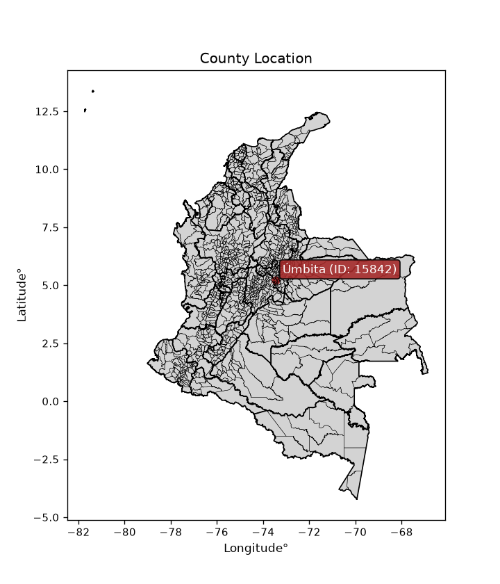
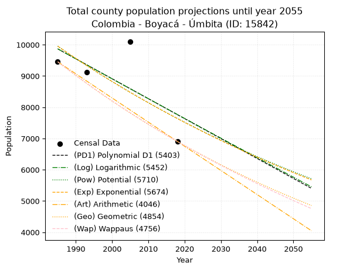
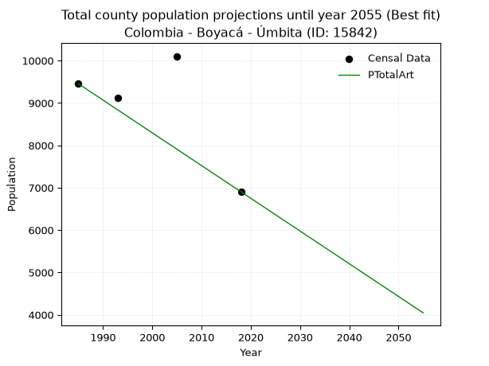
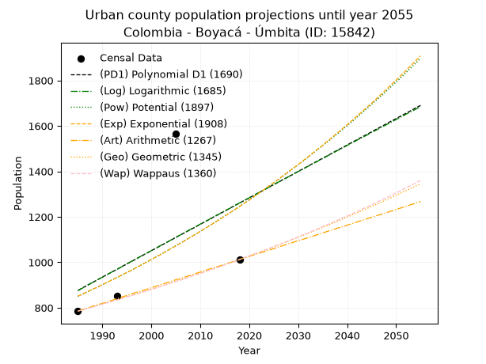
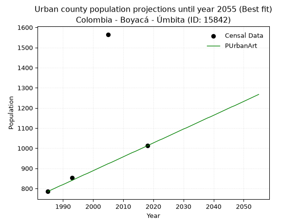
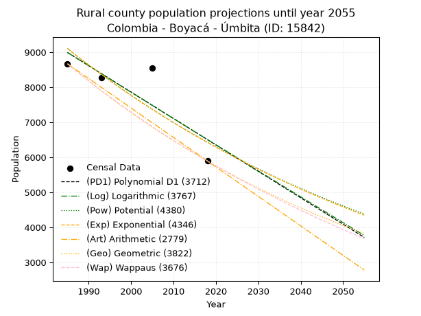
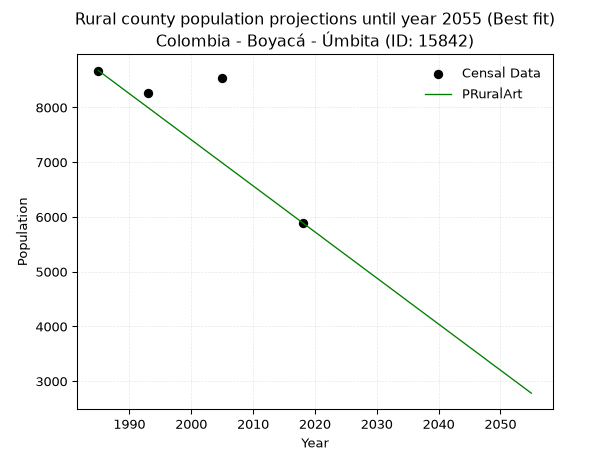

<div align="center">


</div>

# _“Population and Public Services Demand Projections (PPSD) until Year 2050 for Colombia - Boyacá - Úmbita (ID: 15842)”_
Keywords: `population` `public-service` `projection` `lineal` `polynomial` `logarithmic` `potential` `exponential` `arithmetic` `geometric` `wappaus` `dane` `colombia` `south-america`

PPSD are analytical estimates used by governments and planners to anticipate future changes in population size, age distribution, and the resulting community needs for utilities, healthcare, education, and infrastructure as sizing future water treatment facilities, electrical grids, and road networks based on spatial growth.

<div align="center">

</img>

</div>


> **General running parameters**: • app_version: _v20260806_. • Python version: _3.14.7_. • Pandas version: _3.0.5_. • NumPy version: _2.5.1_. • Creates, save and include plots into reports (create_plot): _False_. • Projection until year: _2050_. • Process polynomial degree 2 and up: _False_. • Process Wappaus: _True_. • Process Wappaus: _True_. • Set negative values to zero: _True_. • Set infinite values to zero: _True_. • Drop dataset notes: _True_. 
<div align="center">

Dynamic map: [:earth_americas:Google](http://maps.google.com/maps?q=5.2211762,-73.4569165) [:earth_americas:OSM](https://www.openstreetmap.org/#map=18/5.2211762/-73.4569165&layers=P) [:earth_americas:Bing](https://www.bing.com/maps?cp=5.2211762~-73.4569165&lvl=18) [:earth_americas:Apple](https://maps.apple.com/frame?center=5.2211762%2C-73.4569165&span=0.003%2C0.006)

</div>


<div align="center">

```geojson
{
  "type": "Feature",
  "geometry": {
    "type": "Point", 
    "coordinates": [-73.4569165, 5.2211762]
  }, 
  "properties": {
    "Name": "Colombia - Boyacá - Úmbita (ID: 15842)"
  }
}
```

</div>


## 0. Census Data (4 records)

Census data are official statistics collected by a government about the people and housing in a country. They usually include counts of total population, age, sex, race, income, education, and jobs.

📅Global census file: [Population.xlsx](../data/Population.xlsx)

| Source   |   Year |   CountryID | CountryName   |   StateID | StateName   |   CountyID | CountyName   |   PTotal |   PUrban |   PRural |
|:---------|-------:|------------:|:--------------|----------:|:------------|-----------:|:-------------|---------:|---------:|---------:|
| DANE     |   1985 |          57 | Colombia      |        15 | Boyacá      |      15842 | Úmbita       |     9455 |      785 |     8670 |
| DANE     |   1993 |          57 | Colombia      |        15 | Boyacá      |      15842 | Úmbita       |     9118 |      853 |     8265 |
| DANE     |   2005 |          57 | Colombia      |        15 | Boyacá      |      15842 | Úmbita       |    10105 |     1565 |     8540 |
| DANE     |   2018 |          57 | Colombia      |        15 | Boyacá      |      15842 | Úmbita       |     6905 |     1012 |     5893 |

> 🔥Some records could had specific notes about the registered values or the corresponding urban or rural distribution.

📅   [RUPS](https://www.datos.gov.co/Hacienda-y-Cr-dito-P-blico/Registro-nico-de-Prestadores-de-Servicios-P-blicos/4qkq-csdn/about_data) - Local public utility companies: [RUPS.csv](../data/RUPS.xlsx)

 | SERVICIO       | ESTADO    | NOMBRE                                                                                                                         | NIT         | DEPARTAMENTO_DOMICILIO   | MUNICIPIO_DOMICILIO   | DIRECCION          |   TELEFONO | EMAIL                       | TIPO_PRESTADOR                             | CLASIFICACION                 |
|:---------------|:----------|:-------------------------------------------------------------------------------------------------------------------------------|:------------|:-------------------------|:----------------------|:-------------------|-----------:|:----------------------------|:-------------------------------------------|:------------------------------|
| ACUEDUCTO      | OPERATIVA | ASOCIACION DE SUSCRIPTORES DEL ACUEDUCTO PEÑA NEGRA Y EL RETIRO DE LAS VEREDAS PALOCAIDO Y LLANO VERDE DEL MUNICIPIO DE UMBITA | 900102125-5 | BOYACA                   | UMBITA                | Alcaldia Municipal |    7305000 | acueductoelretiro@gmail.com | ORGANIZACION AUTORIZADA                    | HASTA 2500 SUSCRIPTORES       |
| ACUEDUCTO      | OPERATIVA | EMPRESA DE SERVICIOS PUBLICOS DOMICILIARIOS DE LA PROVINCIA DE MARQUEZ -SERVIMARQUEZ SA ESP                                    | 900371611-6 | BOYACA                   | CIENEGA               | CIENEGA            |    7379009 | fredyjufuerte@gmail.com     | SOCIEDADES (EMPRESA DE SERVICIOS PUBLICOS) | MENOR O IGUAL A 2500 USUARIOS |
| ALCANTARILLADO | OPERATIVA | EMPRESA DE SERVICIOS PUBLICOS DOMICILIARIOS DE LA PROVINCIA DE MARQUEZ -SERVIMARQUEZ SA ESP                                    | 900371611-6 | BOYACA                   | CIENEGA               | CIENEGA            |    7379009 | fredyjufuerte@gmail.com     | SOCIEDADES (EMPRESA DE SERVICIOS PUBLICOS) | MENOR O IGUAL A 2500 USUARIOS |

## 1. Total

### 1.1. Coefficients and Parameters

* (PD1) Polynomial Deg 1: -63.80048173424139, 136512.66358891633 (lineal)
* (Log) Logarithmic: -127427.69585096912, 977474.6873046848
* (Pow) Potential: -16.037491721697165, 56.885791691668295
* (Exp) Exponential: -0.008028664097661998, 83041657857.93208
* (Art) Arithmetic: Year diff. 2018 - 1985 = 33, Population diff. 6905 - 9455 = -2550, Annual growth = -77.27272727272727
* (Geo) Geometric: Year diff. 2018 - 1985 = 33, Population diff. 6905 - 9455 = -2550, Annual growth % = -0.009478967902289304
* (Wap) Wappaus: i = -0.9446543676372527, Condition values only valid for < 200)

<sub>
Wappaus condition values: ['-0.00', '-0.94', '-1.89', '-2.83', '-3.78', '-4.72', '-5.67', '-6.61', '-7.56', '-8.50', '-9.45', '-10.39', '-11.34', '-12.28', '-13.23', '-14.17', '-15.11', '-16.06', '-17.00', '-17.95', '-18.89', '-19.84', '-20.78', '-21.73', '-22.67', '-23.62', '-24.56', '-25.51', '-26.45', '-27.39', '-28.34', '-29.28', '-30.23', '-31.17', '-32.12', '-33.06', '-34.01', '-34.95', '-35.90', '-36.84', '-37.79', '-38.73', '-39.68', '-40.62', '-41.56', '-42.51', '-43.45', '-44.40', '-45.34', '-46.29', '-47.23', '-48.18', '-49.12', '-50.07', '-51.01', '-51.96', '-52.90', '-53.85', '-54.79', '-55.73', '-56.68', '-57.62', '-58.57', '-59.51', '-60.46', '-61.40']
</sub>


### 1.2. Projected Dataset

|   Year |   CountyID |   PTotalPD1 |   PTotalLog |   PTotalPow |   PTotalExp |   PTotalArt |   PTotalGeo |   PTotalWap |
|-------:|-----------:|------------:|------------:|------------:|------------:|------------:|------------:|------------:|
|   1985 |      15842 |        9869 |        9869 |        9954 |        9954 |        9455 |        9455 |        9455 |
|   1986 |      15842 |        9805 |        9804 |        9874 |        9874 |        9378 |        9365 |        9366 |
|   1987 |      15842 |        9741 |        9740 |        9794 |        9795 |        9300 |        9277 |        9278 |
|   1988 |      15842 |        9677 |        9676 |        9716 |        9717 |        9223 |        9189 |        9191 |
|   1989 |      15842 |        9614 |        9612 |        9637 |        9639 |        9146 |        9102 |        9104 |
|   1990 |      15842 |        9550 |        9548 |        9560 |        9562 |        9069 |        9015 |        9019 |
|   1991 |      15842 |        9486 |        9484 |        9483 |        9486 |        8991 |        8930 |        8934 |
|   1992 |      15842 |        9422 |        9420 |        9407 |        9410 |        8914 |        8845 |        8850 |
|   1993 |      15842 |        9358 |        9356 |        9332 |        9335 |        8837 |        8761 |        8766 |
|   1994 |      15842 |        9295 |        9292 |        9257 |        9260 |        8760 |        8678 |        8684 |
|   1995 |      15842 |        9231 |        9228 |        9183 |        9186 |        8682 |        8596 |        8602 |
|   1996 |      15842 |        9167 |        9164 |        9109 |        9112 |        8605 |        8515 |        8521 |
|   1997 |      15842 |        9103 |        9100 |        9037 |        9040 |        8528 |        8434 |        8441 |
|   1998 |      15842 |        9039 |        9037 |        8964 |        8967 |        8450 |        8354 |        8361 |
|   1999 |      15842 |        8976 |        8973 |        8893 |        8896 |        8373 |        8275 |        8282 |
|   2000 |      15842 |        8912 |        8909 |        8822 |        8824 |        8296 |        8196 |        8204 |
|   2001 |      15842 |        8848 |        8846 |        8751 |        8754 |        8219 |        8119 |        8126 |
|   2002 |      15842 |        8784 |        8782 |        8681 |        8684 |        8141 |        8042 |        8049 |
|   2003 |      15842 |        8720 |        8718 |        8612 |        8614 |        8064 |        7965 |        7973 |
|   2004 |      15842 |        8656 |        8655 |        8543 |        8546 |        7987 |        7890 |        7898 |
|   2005 |      15842 |        8593 |        8591 |        8475 |        8477 |        7910 |        7815 |        7823 |
|   2006 |      15842 |        8529 |        8527 |        8408 |        8409 |        7832 |        7741 |        7749 |
|   2007 |      15842 |        8465 |        8464 |        8341 |        8342 |        7755 |        7668 |        7675 |
|   2008 |      15842 |        8401 |        8401 |        8275 |        8275 |        7678 |        7595 |        7602 |
|   2009 |      15842 |        8337 |        8337 |        8209 |        8209 |        7600 |        7523 |        7530 |
|   2010 |      15842 |        8274 |        8274 |        8144 |        8144 |        7523 |        7452 |        7458 |
|   2011 |      15842 |        8210 |        8210 |        8079 |        8079 |        7446 |        7381 |        7387 |
|   2012 |      15842 |        8146 |        8147 |        8015 |        8014 |        7369 |        7311 |        7316 |
|   2013 |      15842 |        8082 |        8084 |        7951 |        7950 |        7291 |        7242 |        7246 |
|   2014 |      15842 |        8018 |        8020 |        7888 |        7886 |        7214 |        7173 |        7177 |
|   2015 |      15842 |        7955 |        7957 |        7825 |        7823 |        7137 |        7105 |        7108 |
|   2016 |      15842 |        7891 |        7894 |        7763 |        7761 |        7060 |        7038 |        7040 |
|   2017 |      15842 |        7827 |        7831 |        7702 |        7699 |        6982 |        6971 |        6972 |
|   2018 |      15842 |        7763 |        7767 |        7641 |        7637 |        6905 |        6905 |        6905 |
|   2019 |      15842 |        7699 |        7704 |        7580 |        7576 |        6828 |        6840 |        6838 |
|   2020 |      15842 |        7636 |        7641 |        7520 |        7515 |        6750 |        6775 |        6772 |
|   2021 |      15842 |        7572 |        7578 |        7461 |        7455 |        6673 |        6710 |        6707 |
|   2022 |      15842 |        7508 |        7515 |        7402 |        7396 |        6596 |        6647 |        6642 |
|   2023 |      15842 |        7444 |        7452 |        7344 |        7337 |        6519 |        6584 |        6577 |
|   2024 |      15842 |        7380 |        7389 |        7286 |        7278 |        6441 |        6521 |        6513 |
|   2025 |      15842 |        7317 |        7326 |        7228 |        7220 |        6364 |        6460 |        6450 |
|   2026 |      15842 |        7253 |        7263 |        7171 |        7162 |        6287 |        6398 |        6387 |
|   2027 |      15842 |        7189 |        7200 |        7115 |        7105 |        6210 |        6338 |        6325 |
|   2028 |      15842 |        7125 |        7138 |        7059 |        7048 |        6132 |        6278 |        6263 |
|   2029 |      15842 |        7061 |        7075 |        7003 |        6991 |        6055 |        6218 |        6201 |
|   2030 |      15842 |        6998 |        7012 |        6948 |        6936 |        5978 |        6159 |        6140 |
|   2031 |      15842 |        6934 |        6949 |        6893 |        6880 |        5900 |        6101 |        6080 |
|   2032 |      15842 |        6870 |        6886 |        6839 |        6825 |        5823 |        6043 |        6020 |
|   2033 |      15842 |        6806 |        6824 |        6785 |        6771 |        5746 |        5986 |        5960 |
|   2034 |      15842 |        6742 |        6761 |        6732 |        6716 |        5669 |        5929 |        5901 |
|   2035 |      15842 |        6679 |        6699 |        6679 |        6663 |        5591 |        5873 |        5842 |
|   2036 |      15842 |        6615 |        6636 |        6627 |        6609 |        5514 |        5817 |        5784 |
|   2037 |      15842 |        6551 |        6573 |        6575 |        6557 |        5437 |        5762 |        5726 |
|   2038 |      15842 |        6487 |        6511 |        6523 |        6504 |        5360 |        5707 |        5669 |
|   2039 |      15842 |        6423 |        6448 |        6472 |        6452 |        5282 |        5653 |        5612 |
|   2040 |      15842 |        6360 |        6386 |        6421 |        6401 |        5205 |        5600 |        5556 |
|   2041 |      15842 |        6296 |        6323 |        6371 |        6349 |        5128 |        5547 |        5499 |
|   2042 |      15842 |        6232 |        6261 |        6321 |        6299 |        5050 |        5494 |        5444 |
|   2043 |      15842 |        6168 |        6199 |        6272 |        6248 |        4973 |        5442 |        5389 |
|   2044 |      15842 |        6104 |        6136 |        6223 |        6198 |        4896 |        5390 |        5334 |
|   2045 |      15842 |        6041 |        6074 |        6174 |        6149 |        4819 |        5339 |        5279 |
|   2046 |      15842 |        5977 |        6012 |        6126 |        6099 |        4741 |        5289 |        5225 |
|   2047 |      15842 |        5913 |        5949 |        6078 |        6051 |        4664 |        5239 |        5172 |
|   2048 |      15842 |        5849 |        5887 |        6031 |        6002 |        4587 |        5189 |        5118 |
|   2049 |      15842 |        5785 |        5825 |        5984 |        5954 |        4510 |        5140 |        5066 |
|   2050 |      15842 |        5722 |        5763 |        5937 |        5907 |        4432 |        5091 |        5013 |
<div align="center">

</img>

</div>


### 1.3. Best fit with absolute and relative error (%)

Relative error puts that difference into context by dividing the absolute error by the true value, creating a unitless ratio or percentage that shows the scale of the mistake.

Absolute and relative error

|   Year | Source   |   CountryID | CountryName   |   StateID | StateName   |   CountyID_x | CountyName   |   PTotal |   PUrban |   PRural |   CountyID_y |   PTotalPD1 |   PTotalLog |   PTotalPow |   PTotalExp |   PTotalArt |   PTotalGeo |   PTotalWap |   PTotalPD1AbsError |   PTotalLogAbsError |   PTotalPowAbsError |   PTotalExpAbsError |   PTotalArtAbsError |   PTotalGeoAbsError |   PTotalWapAbsError |   PTotalPD1RelError |   PTotalLogRelError |   PTotalPowRelError |   PTotalExpRelError |   PTotalArtRelError |   PTotalGeoRelError |   PTotalWapRelError |
|-------:|:---------|------------:|:--------------|----------:|:------------|-------------:|:-------------|---------:|---------:|---------:|-------------:|------------:|------------:|------------:|------------:|------------:|------------:|------------:|--------------------:|--------------------:|--------------------:|--------------------:|--------------------:|--------------------:|--------------------:|--------------------:|--------------------:|--------------------:|--------------------:|--------------------:|--------------------:|--------------------:|
|   1985 | DANE     |          57 | Colombia      |        15 | Boyacá      |        15842 | Úmbita       |     9455 |      785 |     8670 |        15842 |        9869 |        9869 |        9954 |        9954 |        9455 |        9455 |        9455 |                 414 |                 414 |                 499 |                 499 |                   0 |                   0 |                   0 |             4.37864 |             4.37864 |             5.27763 |             5.27763 |             0       |             0       |              0      |
|   1993 | DANE     |          57 | Colombia      |        15 | Boyacá      |        15842 | Úmbita       |     9118 |      853 |     8265 |        15842 |        9358 |        9356 |        9332 |        9335 |        8837 |        8761 |        8766 |                 240 |                 238 |                 214 |                 217 |                 281 |                 357 |                 352 |             2.63216 |             2.61022 |             2.34701 |             2.37991 |             3.08182 |             3.91533 |              3.8605 |
|   2005 | DANE     |          57 | Colombia      |        15 | Boyacá      |        15842 | Úmbita       |    10105 |     1565 |     8540 |        15842 |        8593 |        8591 |        8475 |        8477 |        7910 |        7815 |        7823 |                1512 |                1514 |                1630 |                1628 |                2195 |                2290 |                2282 |            14.9629  |            14.9827  |            16.1306  |            16.1108  |            21.7219  |            22.662   |             22.5829 |
|   2018 | DANE     |          57 | Colombia      |        15 | Boyacá      |        15842 | Úmbita       |     6905 |     1012 |     5893 |        15842 |        7763 |        7767 |        7641 |        7637 |        6905 |        6905 |        6905 |                 858 |                 862 |                 736 |                 732 |                   0 |                   0 |                   0 |            12.4258  |            12.4837  |            10.6589  |            10.601   |             0       |             0       |              0      |

Relative error mean

| Method    |   RelError | Best   |
|:----------|-----------:|:-------|
| PTotalPD1 |    8.59986 |        |
| PTotalLog |    8.61381 |        |
| PTotalPow |    8.60355 |        |
| PTotalExp |    8.59235 |        |
| PTotalArt |    6.20093 | True   |
| PTotalGeo |    6.64435 |        |
| PTotalWap |    6.61084 |        |

💙Best method: _**PTotalArt**_
<div align="center">

</img>

</div>


### 1.4. Fresh water supply demand in liters per capita per day (lpcd)

The fresh water supply demand typically ranges from 100 to 300 liters per capita per day (lpcd) for standard domestic and municipal planning, though absolute survival minimums set by the World Health Organization are as low as 7.5 to 20 liters per day, and total consumption in high-income nations can exceed 400 liters.

> `CZ`: Level in meters above the sea level (masl)<br> `WS`: Fresh water supply demand in liters per capita per day (lpcd or l/h/d)<br> `WSAll`: Zonal fresh water supply demand in liters per second (l/s)<br> `A`: Zonal area in square meters<br> `DP`: Population density (people/hectare or p/ha)

Reference values (RAS Colombia)

|    CZ |   WS |
|------:|-----:|
|  1000 |  120 |
|  2000 |  130 |
| 99999 |  140 |

County shapefile geometry properties and water supply values

|   CountyID |      ATotal |   CZTotal |   WSTotal |
|-----------:|------------:|----------:|----------:|
|      15842 | 1.45845e+08 |   2690.88 |       140 |

Projected values for best method: PTotalArt

|   CountyID |   Year |   PTotalArt |   DPTotal |   WSTotal |   WSTotalAll |
|-----------:|-------:|------------:|----------:|----------:|-------------:|
|      15842 |   1985 |        9455 |      0.65 |       140 |     15.3206  |
|      15842 |   1986 |        9378 |      0.64 |       140 |     15.1958  |
|      15842 |   1987 |        9300 |      0.64 |       140 |     15.0694  |
|      15842 |   1988 |        9223 |      0.63 |       140 |     14.9447  |
|      15842 |   1989 |        9146 |      0.63 |       140 |     14.8199  |
|      15842 |   1990 |        9069 |      0.62 |       140 |     14.6951  |
|      15842 |   1991 |        8991 |      0.62 |       140 |     14.5687  |
|      15842 |   1992 |        8914 |      0.61 |       140 |     14.444   |
|      15842 |   1993 |        8837 |      0.61 |       140 |     14.3192  |
|      15842 |   1994 |        8760 |      0.6  |       140 |     14.1944  |
|      15842 |   1995 |        8682 |      0.6  |       140 |     14.0681  |
|      15842 |   1996 |        8605 |      0.59 |       140 |     13.9433  |
|      15842 |   1997 |        8528 |      0.58 |       140 |     13.8185  |
|      15842 |   1998 |        8450 |      0.58 |       140 |     13.6921  |
|      15842 |   1999 |        8373 |      0.57 |       140 |     13.5674  |
|      15842 |   2000 |        8296 |      0.57 |       140 |     13.4426  |
|      15842 |   2001 |        8219 |      0.56 |       140 |     13.3178  |
|      15842 |   2002 |        8141 |      0.56 |       140 |     13.1914  |
|      15842 |   2003 |        8064 |      0.55 |       140 |     13.0667  |
|      15842 |   2004 |        7987 |      0.55 |       140 |     12.9419  |
|      15842 |   2005 |        7910 |      0.54 |       140 |     12.8171  |
|      15842 |   2006 |        7832 |      0.54 |       140 |     12.6907  |
|      15842 |   2007 |        7755 |      0.53 |       140 |     12.566   |
|      15842 |   2008 |        7678 |      0.53 |       140 |     12.4412  |
|      15842 |   2009 |        7600 |      0.52 |       140 |     12.3148  |
|      15842 |   2010 |        7523 |      0.52 |       140 |     12.19    |
|      15842 |   2011 |        7446 |      0.51 |       140 |     12.0653  |
|      15842 |   2012 |        7369 |      0.51 |       140 |     11.9405  |
|      15842 |   2013 |        7291 |      0.5  |       140 |     11.8141  |
|      15842 |   2014 |        7214 |      0.49 |       140 |     11.6894  |
|      15842 |   2015 |        7137 |      0.49 |       140 |     11.5646  |
|      15842 |   2016 |        7060 |      0.48 |       140 |     11.4398  |
|      15842 |   2017 |        6982 |      0.48 |       140 |     11.3134  |
|      15842 |   2018 |        6905 |      0.47 |       140 |     11.1887  |
|      15842 |   2019 |        6828 |      0.47 |       140 |     11.0639  |
|      15842 |   2020 |        6750 |      0.46 |       140 |     10.9375  |
|      15842 |   2021 |        6673 |      0.46 |       140 |     10.8127  |
|      15842 |   2022 |        6596 |      0.45 |       140 |     10.688   |
|      15842 |   2023 |        6519 |      0.45 |       140 |     10.5632  |
|      15842 |   2024 |        6441 |      0.44 |       140 |     10.4368  |
|      15842 |   2025 |        6364 |      0.44 |       140 |     10.312   |
|      15842 |   2026 |        6287 |      0.43 |       140 |     10.1873  |
|      15842 |   2027 |        6210 |      0.43 |       140 |     10.0625  |
|      15842 |   2028 |        6132 |      0.42 |       140 |      9.93611 |
|      15842 |   2029 |        6055 |      0.42 |       140 |      9.81134 |
|      15842 |   2030 |        5978 |      0.41 |       140 |      9.68657 |
|      15842 |   2031 |        5900 |      0.4  |       140 |      9.56019 |
|      15842 |   2032 |        5823 |      0.4  |       140 |      9.43542 |
|      15842 |   2033 |        5746 |      0.39 |       140 |      9.31065 |
|      15842 |   2034 |        5669 |      0.39 |       140 |      9.18588 |
|      15842 |   2035 |        5591 |      0.38 |       140 |      9.05949 |
|      15842 |   2036 |        5514 |      0.38 |       140 |      8.93472 |
|      15842 |   2037 |        5437 |      0.37 |       140 |      8.80995 |
|      15842 |   2038 |        5360 |      0.37 |       140 |      8.68519 |
|      15842 |   2039 |        5282 |      0.36 |       140 |      8.5588  |
|      15842 |   2040 |        5205 |      0.36 |       140 |      8.43403 |
|      15842 |   2041 |        5128 |      0.35 |       140 |      8.30926 |
|      15842 |   2042 |        5050 |      0.35 |       140 |      8.18287 |
|      15842 |   2043 |        4973 |      0.34 |       140 |      8.0581  |
|      15842 |   2044 |        4896 |      0.34 |       140 |      7.93333 |
|      15842 |   2045 |        4819 |      0.33 |       140 |      7.80856 |
|      15842 |   2046 |        4741 |      0.33 |       140 |      7.68218 |
|      15842 |   2047 |        4664 |      0.32 |       140 |      7.55741 |
|      15842 |   2048 |        4587 |      0.31 |       140 |      7.43264 |
|      15842 |   2049 |        4510 |      0.31 |       140 |      7.30787 |
|      15842 |   2050 |        4432 |      0.3  |       140 |      7.18148 |

## 2. Urban

### 2.1. Coefficients and Parameters

* (PD1) Polynomial Deg 1: 11.627860297069747, -22204.877559213757 (lineal)
* (Log) Logarithmic: 23350.91061956711, -176436.70874178363
* (Pow) Potential: 23.153359317380904, -73.42461660621146
* (Exp) Exponential: 0.011535126709631485, 9.67926140785423e-08
* (Art) Arithmetic: Year diff. 2018 - 1985 = 33, Population diff. 1012 - 785 = 227, Annual growth = 6.878787878787879
* (Geo) Geometric: Year diff. 2018 - 1985 = 33, Population diff. 1012 - 785 = 227, Annual growth % = 0.007726671546620656
* (Wap) Wappaus: i = 0.7655857405440043, Condition values only valid for < 200)

<sub>
Wappaus condition values: ['0.00', '0.77', '1.53', '2.30', '3.06', '3.83', '4.59', '5.36', '6.12', '6.89', '7.66', '8.42', '9.19', '9.95', '10.72', '11.48', '12.25', '13.01', '13.78', '14.55', '15.31', '16.08', '16.84', '17.61', '18.37', '19.14', '19.91', '20.67', '21.44', '22.20', '22.97', '23.73', '24.50', '25.26', '26.03', '26.80', '27.56', '28.33', '29.09', '29.86', '30.62', '31.39', '32.15', '32.92', '33.69', '34.45', '35.22', '35.98', '36.75', '37.51', '38.28', '39.04', '39.81', '40.58', '41.34', '42.11', '42.87', '43.64', '44.40', '45.17', '45.94', '46.70', '47.47', '48.23', '49.00', '49.76']
</sub>


### 2.2. Projected Dataset

|   Year |   CountyID |   PUrbanPD1 |   PUrbanLog |   PUrbanPow |   PUrbanExp |   PUrbanArt |   PUrbanGeo |   PUrbanWap |
|-------:|-----------:|------------:|------------:|------------:|------------:|------------:|------------:|------------:|
|   1985 |      15842 |         876 |         875 |         850 |         851 |         785 |         785 |         785 |
|   1986 |      15842 |         888 |         887 |         860 |         861 |         792 |         791 |         791 |
|   1987 |      15842 |         900 |         899 |         870 |         871 |         799 |         797 |         797 |
|   1988 |      15842 |         911 |         911 |         881 |         881 |         806 |         803 |         803 |
|   1989 |      15842 |         923 |         923 |         891 |         891 |         813 |         810 |         809 |
|   1990 |      15842 |         935 |         934 |         901 |         902 |         819 |         816 |         816 |
|   1991 |      15842 |         946 |         946 |         912 |         912 |         826 |         822 |         822 |
|   1992 |      15842 |         958 |         958 |         923 |         923 |         833 |         828 |         828 |
|   1993 |      15842 |         969 |         969 |         933 |         933 |         840 |         835 |         835 |
|   1994 |      15842 |         981 |         981 |         944 |         944 |         847 |         841 |         841 |
|   1995 |      15842 |         993 |         993 |         955 |         955 |         854 |         848 |         847 |
|   1996 |      15842 |        1004 |        1005 |         966 |         966 |         861 |         854 |         854 |
|   1997 |      15842 |        1016 |        1016 |         978 |         977 |         868 |         861 |         861 |
|   1998 |      15842 |        1028 |        1028 |         989 |         989 |         874 |         868 |         867 |
|   1999 |      15842 |        1039 |        1040 |        1001 |        1000 |         881 |         874 |         874 |
|   2000 |      15842 |        1051 |        1051 |        1012 |        1012 |         888 |         881 |         881 |
|   2001 |      15842 |        1062 |        1063 |        1024 |        1024 |         895 |         888 |         887 |
|   2002 |      15842 |        1074 |        1075 |        1036 |        1035 |         902 |         895 |         894 |
|   2003 |      15842 |        1086 |        1086 |        1048 |        1048 |         909 |         902 |         901 |
|   2004 |      15842 |        1097 |        1098 |        1060 |        1060 |         916 |         909 |         908 |
|   2005 |      15842 |        1109 |        1110 |        1073 |        1072 |         923 |         916 |         915 |
|   2006 |      15842 |        1121 |        1121 |        1085 |        1084 |         929 |         923 |         922 |
|   2007 |      15842 |        1132 |        1133 |        1098 |        1097 |         936 |         930 |         929 |
|   2008 |      15842 |        1144 |        1145 |        1110 |        1110 |         943 |         937 |         937 |
|   2009 |      15842 |        1155 |        1156 |        1123 |        1123 |         950 |         944 |         944 |
|   2010 |      15842 |        1167 |        1168 |        1136 |        1136 |         957 |         952 |         951 |
|   2011 |      15842 |        1179 |        1179 |        1149 |        1149 |         964 |         959 |         959 |
|   2012 |      15842 |        1190 |        1191 |        1163 |        1162 |         971 |         966 |         966 |
|   2013 |      15842 |        1202 |        1203 |        1176 |        1176 |         978 |         974 |         973 |
|   2014 |      15842 |        1214 |        1214 |        1190 |        1189 |         984 |         981 |         981 |
|   2015 |      15842 |        1225 |        1226 |        1204 |        1203 |         991 |         989 |         989 |
|   2016 |      15842 |        1237 |        1237 |        1217 |        1217 |         998 |         997 |         996 |
|   2017 |      15842 |        1249 |        1249 |        1231 |        1231 |        1005 |        1004 |        1004 |
|   2018 |      15842 |        1260 |        1261 |        1246 |        1245 |        1012 |        1012 |        1012 |
|   2019 |      15842 |        1272 |        1272 |        1260 |        1260 |        1019 |        1020 |        1020 |
|   2020 |      15842 |        1283 |        1284 |        1275 |        1274 |        1026 |        1028 |        1028 |
|   2021 |      15842 |        1295 |        1295 |        1289 |        1289 |        1033 |        1036 |        1036 |
|   2022 |      15842 |        1307 |        1307 |        1304 |        1304 |        1040 |        1044 |        1044 |
|   2023 |      15842 |        1318 |        1318 |        1319 |        1319 |        1046 |        1052 |        1052 |
|   2024 |      15842 |        1330 |        1330 |        1334 |        1335 |        1053 |        1060 |        1061 |
|   2025 |      15842 |        1342 |        1341 |        1350 |        1350 |        1060 |        1068 |        1069 |
|   2026 |      15842 |        1353 |        1353 |        1365 |        1366 |        1067 |        1076 |        1077 |
|   2027 |      15842 |        1365 |        1364 |        1381 |        1382 |        1074 |        1085 |        1086 |
|   2028 |      15842 |        1376 |        1376 |        1397 |        1398 |        1081 |        1093 |        1094 |
|   2029 |      15842 |        1388 |        1387 |        1413 |        1414 |        1088 |        1101 |        1103 |
|   2030 |      15842 |        1400 |        1399 |        1429 |        1430 |        1095 |        1110 |        1112 |
|   2031 |      15842 |        1411 |        1410 |        1445 |        1447 |        1101 |        1119 |        1121 |
|   2032 |      15842 |        1423 |        1422 |        1462 |        1464 |        1108 |        1127 |        1129 |
|   2033 |      15842 |        1435 |        1433 |        1479 |        1481 |        1115 |        1136 |        1138 |
|   2034 |      15842 |        1446 |        1445 |        1496 |        1498 |        1122 |        1145 |        1147 |
|   2035 |      15842 |        1458 |        1456 |        1513 |        1515 |        1129 |        1153 |        1157 |
|   2036 |      15842 |        1469 |        1468 |        1530 |        1533 |        1136 |        1162 |        1166 |
|   2037 |      15842 |        1481 |        1479 |        1548 |        1551 |        1143 |        1171 |        1175 |
|   2038 |      15842 |        1493 |        1491 |        1565 |        1569 |        1150 |        1180 |        1185 |
|   2039 |      15842 |        1504 |        1502 |        1583 |        1587 |        1156 |        1190 |        1194 |
|   2040 |      15842 |        1516 |        1514 |        1601 |        1605 |        1163 |        1199 |        1204 |
|   2041 |      15842 |        1528 |        1525 |        1619 |        1624 |        1170 |        1208 |        1213 |
|   2042 |      15842 |        1539 |        1537 |        1638 |        1643 |        1177 |        1217 |        1223 |
|   2043 |      15842 |        1551 |        1548 |        1657 |        1662 |        1184 |        1227 |        1233 |
|   2044 |      15842 |        1562 |        1559 |        1675 |        1681 |        1191 |        1236 |        1243 |
|   2045 |      15842 |        1574 |        1571 |        1695 |        1700 |        1198 |        1246 |        1253 |
|   2046 |      15842 |        1586 |        1582 |        1714 |        1720 |        1205 |        1255 |        1263 |
|   2047 |      15842 |        1597 |        1594 |        1733 |        1740 |        1211 |        1265 |        1274 |
|   2048 |      15842 |        1609 |        1605 |        1753 |        1760 |        1218 |        1275 |        1284 |
|   2049 |      15842 |        1621 |        1616 |        1773 |        1781 |        1225 |        1285 |        1294 |
|   2050 |      15842 |        1632 |        1628 |        1793 |        1801 |        1232 |        1295 |        1305 |
<div align="center">

</img>

</div>


### 2.3. Best fit with absolute and relative error (%)

Relative error puts that difference into context by dividing the absolute error by the true value, creating a unitless ratio or percentage that shows the scale of the mistake.

Absolute and relative error

|   Year | Source   |   CountryID | CountryName   |   StateID | StateName   |   CountyID_x | CountyName   |   PTotal |   PUrban |   PRural |   CountyID_y |   PUrbanPD1 |   PUrbanLog |   PUrbanPow |   PUrbanExp |   PUrbanArt |   PUrbanGeo |   PUrbanWap |   PUrbanPD1AbsError |   PUrbanLogAbsError |   PUrbanPowAbsError |   PUrbanExpAbsError |   PUrbanArtAbsError |   PUrbanGeoAbsError |   PUrbanWapAbsError |   PUrbanPD1RelError |   PUrbanLogRelError |   PUrbanPowRelError |   PUrbanExpRelError |   PUrbanArtRelError |   PUrbanGeoRelError |   PUrbanWapRelError |
|-------:|:---------|------------:|:--------------|----------:|:------------|-------------:|:-------------|---------:|---------:|---------:|-------------:|------------:|------------:|------------:|------------:|------------:|------------:|------------:|--------------------:|--------------------:|--------------------:|--------------------:|--------------------:|--------------------:|--------------------:|--------------------:|--------------------:|--------------------:|--------------------:|--------------------:|--------------------:|--------------------:|
|   1985 | DANE     |          57 | Colombia      |        15 | Boyacá      |        15842 | Úmbita       |     9455 |      785 |     8670 |        15842 |         876 |         875 |         850 |         851 |         785 |         785 |         785 |                  91 |                  90 |                  65 |                  66 |                   0 |                   0 |                   0 |             11.5924 |             11.465  |             8.28025 |             8.40764 |             0       |              0      |              0      |
|   1993 | DANE     |          57 | Colombia      |        15 | Boyacá      |        15842 | Úmbita       |     9118 |      853 |     8265 |        15842 |         969 |         969 |         933 |         933 |         840 |         835 |         835 |                 116 |                 116 |                  80 |                  80 |                  13 |                  18 |                  18 |             13.5991 |             13.5991 |             9.37866 |             9.37866 |             1.52403 |              2.1102 |              2.1102 |
|   2005 | DANE     |          57 | Colombia      |        15 | Boyacá      |        15842 | Úmbita       |    10105 |     1565 |     8540 |        15842 |        1109 |        1110 |        1073 |        1072 |         923 |         916 |         915 |                 456 |                 455 |                 492 |                 493 |                 642 |                 649 |                 650 |             29.1374 |             29.0735 |            31.4377  |            31.5016  |            41.0224  |             41.4696 |             41.5335 |
|   2018 | DANE     |          57 | Colombia      |        15 | Boyacá      |        15842 | Úmbita       |     6905 |     1012 |     5893 |        15842 |        1260 |        1261 |        1246 |        1245 |        1012 |        1012 |        1012 |                 248 |                 249 |                 234 |                 233 |                   0 |                   0 |                   0 |             24.5059 |             24.6047 |            23.1225  |            23.0237  |             0       |              0      |              0      |

Relative error mean

| Method    |   RelError | Best   |
|:----------|-----------:|:-------|
| PUrbanPD1 |    19.7087 |        |
| PUrbanLog |    19.6856 |        |
| PUrbanPow |    18.0548 |        |
| PUrbanExp |    18.0779 |        |
| PUrbanArt |    10.6366 | True   |
| PUrbanGeo |    10.895  |        |
| PUrbanWap |    10.9109 |        |

💙Best method: _**PUrbanArt**_
<div align="center">

</img>

</div>


### 2.4. Fresh water supply demand in liters per capita per day (lpcd)

The fresh water supply demand typically ranges from 100 to 300 liters per capita per day (lpcd) for standard domestic and municipal planning, though absolute survival minimums set by the World Health Organization are as low as 7.5 to 20 liters per day, and total consumption in high-income nations can exceed 400 liters.

> `CZ`: Level in meters above the sea level (masl)<br> `WS`: Fresh water supply demand in liters per capita per day (lpcd or l/h/d)<br> `WSAll`: Zonal fresh water supply demand in liters per second (l/s)<br> `A`: Zonal area in square meters<br> `DP`: Population density (people/hectare or p/ha)

Reference values (RAS Colombia)

|    CZ |   WS |
|------:|-----:|
|  1000 |  120 |
|  2000 |  130 |
| 99999 |  140 |

County shapefile geometry properties and water supply values

|   CountyID |   AUrban |   CZUrban |   WSUrban |
|-----------:|---------:|----------:|----------:|
|      15842 |   477480 |   2474.17 |       140 |

Projected values for best method: PUrbanArt

|   CountyID |   Year |   PUrbanArt |   DPUrban |   WSUrban |   WSUrbanAll |
|-----------:|-------:|------------:|----------:|----------:|-------------:|
|      15842 |   1985 |         785 |     16.44 |       140 |      1.27199 |
|      15842 |   1986 |         792 |     16.59 |       140 |      1.28333 |
|      15842 |   1987 |         799 |     16.73 |       140 |      1.29468 |
|      15842 |   1988 |         806 |     16.88 |       140 |      1.30602 |
|      15842 |   1989 |         813 |     17.03 |       140 |      1.31736 |
|      15842 |   1990 |         819 |     17.15 |       140 |      1.32708 |
|      15842 |   1991 |         826 |     17.3  |       140 |      1.33843 |
|      15842 |   1992 |         833 |     17.45 |       140 |      1.34977 |
|      15842 |   1993 |         840 |     17.59 |       140 |      1.36111 |
|      15842 |   1994 |         847 |     17.74 |       140 |      1.37245 |
|      15842 |   1995 |         854 |     17.89 |       140 |      1.3838  |
|      15842 |   1996 |         861 |     18.03 |       140 |      1.39514 |
|      15842 |   1997 |         868 |     18.18 |       140 |      1.40648 |
|      15842 |   1998 |         874 |     18.3  |       140 |      1.4162  |
|      15842 |   1999 |         881 |     18.45 |       140 |      1.42755 |
|      15842 |   2000 |         888 |     18.6  |       140 |      1.43889 |
|      15842 |   2001 |         895 |     18.74 |       140 |      1.45023 |
|      15842 |   2002 |         902 |     18.89 |       140 |      1.46157 |
|      15842 |   2003 |         909 |     19.04 |       140 |      1.47292 |
|      15842 |   2004 |         916 |     19.18 |       140 |      1.48426 |
|      15842 |   2005 |         923 |     19.33 |       140 |      1.4956  |
|      15842 |   2006 |         929 |     19.46 |       140 |      1.50532 |
|      15842 |   2007 |         936 |     19.6  |       140 |      1.51667 |
|      15842 |   2008 |         943 |     19.75 |       140 |      1.52801 |
|      15842 |   2009 |         950 |     19.9  |       140 |      1.53935 |
|      15842 |   2010 |         957 |     20.04 |       140 |      1.55069 |
|      15842 |   2011 |         964 |     20.19 |       140 |      1.56204 |
|      15842 |   2012 |         971 |     20.34 |       140 |      1.57338 |
|      15842 |   2013 |         978 |     20.48 |       140 |      1.58472 |
|      15842 |   2014 |         984 |     20.61 |       140 |      1.59444 |
|      15842 |   2015 |         991 |     20.75 |       140 |      1.60579 |
|      15842 |   2016 |         998 |     20.9  |       140 |      1.61713 |
|      15842 |   2017 |        1005 |     21.05 |       140 |      1.62847 |
|      15842 |   2018 |        1012 |     21.19 |       140 |      1.63981 |
|      15842 |   2019 |        1019 |     21.34 |       140 |      1.65116 |
|      15842 |   2020 |        1026 |     21.49 |       140 |      1.6625  |
|      15842 |   2021 |        1033 |     21.63 |       140 |      1.67384 |
|      15842 |   2022 |        1040 |     21.78 |       140 |      1.68519 |
|      15842 |   2023 |        1046 |     21.91 |       140 |      1.69491 |
|      15842 |   2024 |        1053 |     22.05 |       140 |      1.70625 |
|      15842 |   2025 |        1060 |     22.2  |       140 |      1.71759 |
|      15842 |   2026 |        1067 |     22.35 |       140 |      1.72894 |
|      15842 |   2027 |        1074 |     22.49 |       140 |      1.74028 |
|      15842 |   2028 |        1081 |     22.64 |       140 |      1.75162 |
|      15842 |   2029 |        1088 |     22.79 |       140 |      1.76296 |
|      15842 |   2030 |        1095 |     22.93 |       140 |      1.77431 |
|      15842 |   2031 |        1101 |     23.06 |       140 |      1.78403 |
|      15842 |   2032 |        1108 |     23.21 |       140 |      1.79537 |
|      15842 |   2033 |        1115 |     23.35 |       140 |      1.80671 |
|      15842 |   2034 |        1122 |     23.5  |       140 |      1.81806 |
|      15842 |   2035 |        1129 |     23.64 |       140 |      1.8294  |
|      15842 |   2036 |        1136 |     23.79 |       140 |      1.84074 |
|      15842 |   2037 |        1143 |     23.94 |       140 |      1.85208 |
|      15842 |   2038 |        1150 |     24.08 |       140 |      1.86343 |
|      15842 |   2039 |        1156 |     24.21 |       140 |      1.87315 |
|      15842 |   2040 |        1163 |     24.36 |       140 |      1.88449 |
|      15842 |   2041 |        1170 |     24.5  |       140 |      1.89583 |
|      15842 |   2042 |        1177 |     24.65 |       140 |      1.90718 |
|      15842 |   2043 |        1184 |     24.8  |       140 |      1.91852 |
|      15842 |   2044 |        1191 |     24.94 |       140 |      1.92986 |
|      15842 |   2045 |        1198 |     25.09 |       140 |      1.9412  |
|      15842 |   2046 |        1205 |     25.24 |       140 |      1.95255 |
|      15842 |   2047 |        1211 |     25.36 |       140 |      1.96227 |
|      15842 |   2048 |        1218 |     25.51 |       140 |      1.97361 |
|      15842 |   2049 |        1225 |     25.66 |       140 |      1.98495 |
|      15842 |   2050 |        1232 |     25.8  |       140 |      1.9963  |

## 3. Rural

### 3.1. Coefficients and Parameters

* (PD1) Polynomial Deg 1: -75.42834203131103, 158717.54114812988 (lineal)
* (Log) Logarithmic: -150778.60647053632, 1153911.396046469
* (Pow) Potential: -21.114866013140688, 73.5910380677298
* (Exp) Exponential: -0.010563255592648086, 11628887988469.875
* (Art) Arithmetic: Year diff. 2018 - 1985 = 33, Population diff. 5893 - 8670 = -2777, Annual growth = -84.15151515151516
* (Geo) Geometric: Year diff. 2018 - 1985 = 33, Population diff. 5893 - 8670 = -2777, Annual growth % = -0.011631928527359503
* (Wap) Wappaus: i = -1.155689283135551, Condition values only valid for < 200)

<sub>
Wappaus condition values: ['-0.00', '-1.16', '-2.31', '-3.47', '-4.62', '-5.78', '-6.93', '-8.09', '-9.25', '-10.40', '-11.56', '-12.71', '-13.87', '-15.02', '-16.18', '-17.34', '-18.49', '-19.65', '-20.80', '-21.96', '-23.11', '-24.27', '-25.43', '-26.58', '-27.74', '-28.89', '-30.05', '-31.20', '-32.36', '-33.51', '-34.67', '-35.83', '-36.98', '-38.14', '-39.29', '-40.45', '-41.60', '-42.76', '-43.92', '-45.07', '-46.23', '-47.38', '-48.54', '-49.69', '-50.85', '-52.01', '-53.16', '-54.32', '-55.47', '-56.63', '-57.78', '-58.94', '-60.10', '-61.25', '-62.41', '-63.56', '-64.72', '-65.87', '-67.03', '-68.19', '-69.34', '-70.50', '-71.65', '-72.81', '-73.96', '-75.12']
</sub>


### 3.2. Projected Dataset

|   Year |   CountyID |   PRuralPD1 |   PRuralLog |   PRuralPow |   PRuralExp |   PRuralArt |   PRuralGeo |   PRuralWap |
|-------:|-----------:|------------:|------------:|------------:|------------:|------------:|------------:|------------:|
|   1985 |      15842 |        8992 |        8993 |        9105 |        9104 |        8670 |        8670 |        8670 |
|   1986 |      15842 |        8917 |        8917 |        9008 |        9008 |        8586 |        8569 |        8570 |
|   1987 |      15842 |        8841 |        8841 |        8913 |        8914 |        8502 |        8469 |        8472 |
|   1988 |      15842 |        8766 |        8765 |        8819 |        8820 |        8418 |        8371 |        8375 |
|   1989 |      15842 |        8691 |        8689 |        8726 |        8727 |        8333 |        8274 |        8278 |
|   1990 |      15842 |        8615 |        8614 |        8634 |        8635 |        8249 |        8177 |        8183 |
|   1991 |      15842 |        8540 |        8538 |        8543 |        8545 |        8165 |        8082 |        8089 |
|   1992 |      15842 |        8464 |        8462 |        8453 |        8455 |        8081 |        7988 |        7996 |
|   1993 |      15842 |        8389 |        8387 |        8363 |        8366 |        7997 |        7895 |        7904 |
|   1994 |      15842 |        8313 |        8311 |        8275 |        8278 |        7913 |        7803 |        7813 |
|   1995 |      15842 |        8238 |        8235 |        8188 |        8191 |        7828 |        7713 |        7723 |
|   1996 |      15842 |        8163 |        8160 |        8102 |        8105 |        7744 |        7623 |        7634 |
|   1997 |      15842 |        8087 |        8084 |        8017 |        8020 |        7660 |        7534 |        7546 |
|   1998 |      15842 |        8012 |        8009 |        7932 |        7936 |        7576 |        7447 |        7458 |
|   1999 |      15842 |        7936 |        7933 |        7849 |        7852 |        7492 |        7360 |        7372 |
|   2000 |      15842 |        7861 |        7858 |        7767 |        7770 |        7408 |        7274 |        7287 |
|   2001 |      15842 |        7785 |        7783 |        7685 |        7688 |        7324 |        7190 |        7203 |
|   2002 |      15842 |        7710 |        7707 |        7604 |        7607 |        7239 |        7106 |        7119 |
|   2003 |      15842 |        7635 |        7632 |        7525 |        7527 |        7155 |        7024 |        7036 |
|   2004 |      15842 |        7559 |        7557 |        7446 |        7448 |        7071 |        6942 |        6955 |
|   2005 |      15842 |        7484 |        7481 |        7368 |        7370 |        6987 |        6861 |        6874 |
|   2006 |      15842 |        7408 |        7406 |        7291 |        7293 |        6903 |        6781 |        6794 |
|   2007 |      15842 |        7333 |        7331 |        7214 |        7216 |        6819 |        6702 |        6714 |
|   2008 |      15842 |        7257 |        7256 |        7139 |        7140 |        6735 |        6624 |        6636 |
|   2009 |      15842 |        7182 |        7181 |        7064 |        7065 |        6650 |        6547 |        6558 |
|   2010 |      15842 |        7107 |        7106 |        6990 |        6991 |        6566 |        6471 |        6481 |
|   2011 |      15842 |        7031 |        7031 |        6917 |        6917 |        6482 |        6396 |        6405 |
|   2012 |      15842 |        6956 |        6956 |        6845 |        6845 |        6398 |        6322 |        6330 |
|   2013 |      15842 |        6880 |        6881 |        6774 |        6773 |        6314 |        6248 |        6255 |
|   2014 |      15842 |        6805 |        6806 |        6703 |        6702 |        6230 |        6175 |        6181 |
|   2015 |      15842 |        6729 |        6731 |        6633 |        6631 |        6145 |        6104 |        6108 |
|   2016 |      15842 |        6654 |        6656 |        6564 |        6562 |        6061 |        6033 |        6036 |
|   2017 |      15842 |        6579 |        6582 |        6496 |        6493 |        5977 |        5962 |        5964 |
|   2018 |      15842 |        6503 |        6507 |        6428 |        6424 |        5893 |        5893 |        5893 |
|   2019 |      15842 |        6428 |        6432 |        6361 |        6357 |        5809 |        5824 |        5823 |
|   2020 |      15842 |        6352 |        6358 |        6295 |        6290 |        5725 |        5757 |        5753 |
|   2021 |      15842 |        6277 |        6283 |        6229 |        6224 |        5641 |        5690 |        5684 |
|   2022 |      15842 |        6201 |        6208 |        6165 |        6159 |        5556 |        5624 |        5616 |
|   2023 |      15842 |        6126 |        6134 |        6101 |        6094 |        5472 |        5558 |        5548 |
|   2024 |      15842 |        6051 |        6059 |        6037 |        6030 |        5388 |        5493 |        5481 |
|   2025 |      15842 |        5975 |        5985 |        5975 |        5967 |        5304 |        5430 |        5415 |
|   2026 |      15842 |        5900 |        5910 |        5913 |        5904 |        5220 |        5366 |        5349 |
|   2027 |      15842 |        5824 |        5836 |        5851 |        5842 |        5136 |        5304 |        5284 |
|   2028 |      15842 |        5749 |        5762 |        5791 |        5780 |        5051 |        5242 |        5219 |
|   2029 |      15842 |        5673 |        5687 |        5731 |        5720 |        4967 |        5181 |        5155 |
|   2030 |      15842 |        5598 |        5613 |        5672 |        5660 |        4883 |        5121 |        5092 |
|   2031 |      15842 |        5523 |        5539 |        5613 |        5600 |        4799 |        5062 |        5029 |
|   2032 |      15842 |        5447 |        5465 |        5555 |        5541 |        4715 |        5003 |        4967 |
|   2033 |      15842 |        5372 |        5390 |        5497 |        5483 |        4631 |        4944 |        4905 |
|   2034 |      15842 |        5296 |        5316 |        5441 |        5425 |        4547 |        4887 |        4844 |
|   2035 |      15842 |        5221 |        5242 |        5384 |        5368 |        4462 |        4830 |        4783 |
|   2036 |      15842 |        5145 |        5168 |        5329 |        5312 |        4378 |        4774 |        4723 |
|   2037 |      15842 |        5070 |        5094 |        5274 |        5256 |        4294 |        4718 |        4664 |
|   2038 |      15842 |        4995 |        5020 |        5220 |        5201 |        4210 |        4663 |        4605 |
|   2039 |      15842 |        4919 |        4946 |        5166 |        5146 |        4126 |        4609 |        4546 |
|   2040 |      15842 |        4844 |        4872 |        5113 |        5092 |        4042 |        4556 |        4488 |
|   2041 |      15842 |        4768 |        4798 |        5060 |        5039 |        3958 |        4503 |        4431 |
|   2042 |      15842 |        4693 |        4724 |        5008 |        4986 |        3873 |        4450 |        4374 |
|   2043 |      15842 |        4617 |        4651 |        4956 |        4933 |        3789 |        4398 |        4317 |
|   2044 |      15842 |        4542 |        4577 |        4905 |        4882 |        3705 |        4347 |        4261 |
|   2045 |      15842 |        4467 |        4503 |        4855 |        4830 |        3621 |        4297 |        4206 |
|   2046 |      15842 |        4391 |        4429 |        4805 |        4780 |        3537 |        4247 |        4151 |
|   2047 |      15842 |        4316 |        4356 |        4756 |        4729 |        3453 |        4197 |        4096 |
|   2048 |      15842 |        4240 |        4282 |        4707 |        4680 |        3368 |        4149 |        4042 |
|   2049 |      15842 |        4165 |        4208 |        4659 |        4630 |        3284 |        4100 |        3989 |
|   2050 |      15842 |        4089 |        4135 |        4611 |        4582 |        3200 |        4053 |        3935 |
<div align="center">

</img>

</div>


### 3.3. Best fit with absolute and relative error (%)

Relative error puts that difference into context by dividing the absolute error by the true value, creating a unitless ratio or percentage that shows the scale of the mistake.

Absolute and relative error

|   Year | Source   |   CountryID | CountryName   |   StateID | StateName   |   CountyID_x | CountyName   |   PTotal |   PUrban |   PRural |   CountyID_y |   PRuralPD1 |   PRuralLog |   PRuralPow |   PRuralExp |   PRuralArt |   PRuralGeo |   PRuralWap |   PRuralPD1AbsError |   PRuralLogAbsError |   PRuralPowAbsError |   PRuralExpAbsError |   PRuralArtAbsError |   PRuralGeoAbsError |   PRuralWapAbsError |   PRuralPD1RelError |   PRuralLogRelError |   PRuralPowRelError |   PRuralExpRelError |   PRuralArtRelError |   PRuralGeoRelError |   PRuralWapRelError |
|-------:|:---------|------------:|:--------------|----------:|:------------|-------------:|:-------------|---------:|---------:|---------:|-------------:|------------:|------------:|------------:|------------:|------------:|------------:|------------:|--------------------:|--------------------:|--------------------:|--------------------:|--------------------:|--------------------:|--------------------:|--------------------:|--------------------:|--------------------:|--------------------:|--------------------:|--------------------:|--------------------:|
|   1985 | DANE     |          57 | Colombia      |        15 | Boyacá      |        15842 | Úmbita       |     9455 |      785 |     8670 |        15842 |        8992 |        8993 |        9105 |        9104 |        8670 |        8670 |        8670 |                 322 |                 323 |                 435 |                 434 |                   0 |                   0 |                   0 |             3.71396 |             3.72549 |             5.0173  |             5.00577 |             0       |             0       |             0       |
|   1993 | DANE     |          57 | Colombia      |        15 | Boyacá      |        15842 | Úmbita       |     9118 |      853 |     8265 |        15842 |        8389 |        8387 |        8363 |        8366 |        7997 |        7895 |        7904 |                 124 |                 122 |                  98 |                 101 |                 268 |                 370 |                 361 |             1.5003  |             1.4761  |             1.18572 |             1.22202 |             3.24259 |             4.47671 |             4.36782 |
|   2005 | DANE     |          57 | Colombia      |        15 | Boyacá      |        15842 | Úmbita       |    10105 |     1565 |     8540 |        15842 |        7484 |        7481 |        7368 |        7370 |        6987 |        6861 |        6874 |                1056 |                1059 |                1172 |                1170 |                1553 |                1679 |                1666 |            12.3653  |            12.4005  |            13.7237  |            13.7002  |            18.185   |            19.6604  |            19.5082  |
|   2018 | DANE     |          57 | Colombia      |        15 | Boyacá      |        15842 | Úmbita       |     6905 |     1012 |     5893 |        15842 |        6503 |        6507 |        6428 |        6424 |        5893 |        5893 |        5893 |                 610 |                 614 |                 535 |                 531 |                   0 |                   0 |                   0 |            10.3513  |            10.4191  |             9.07857 |             9.01069 |             0       |             0       |             0       |

Relative error mean

| Method    |   RelError | Best   |
|:----------|-----------:|:-------|
| PRuralPD1 |    6.98272 |        |
| PRuralLog |    7.0053  |        |
| PRuralPow |    7.25131 |        |
| PRuralExp |    7.23468 |        |
| PRuralArt |    5.3569  | True   |
| PRuralGeo |    6.03428 |        |
| PRuralWap |    5.969   |        |

💙Best method: _**PRuralArt**_
<div align="center">

</img>

</div>


### 3.4. Fresh water supply demand in liters per capita per day (lpcd)

The fresh water supply demand typically ranges from 100 to 300 liters per capita per day (lpcd) for standard domestic and municipal planning, though absolute survival minimums set by the World Health Organization are as low as 7.5 to 20 liters per day, and total consumption in high-income nations can exceed 400 liters.

> `CZ`: Level in meters above the sea level (masl)<br> `WS`: Fresh water supply demand in liters per capita per day (lpcd or l/h/d)<br> `WSAll`: Zonal fresh water supply demand in liters per second (l/s)<br> `A`: Zonal area in square meters<br> `DP`: Population density (people/hectare or p/ha)

Reference values (RAS Colombia)

|    CZ |   WS |
|------:|-----:|
|  1000 |  120 |
|  2000 |  130 |
| 99999 |  140 |

County shapefile geometry properties and water supply values

|   CountyID |      ARural |   CZRural |   WSRural |
|-----------:|------------:|----------:|----------:|
|      15842 | 1.45367e+08 |   2691.54 |       140 |

Projected values for best method: PRuralArt

|   CountyID |   Year |   PRuralArt |   DPRural |   WSRural |   WSRuralAll |
|-----------:|-------:|------------:|----------:|----------:|-------------:|
|      15842 |   1985 |        8670 |      0.6  |       140 |     14.0486  |
|      15842 |   1986 |        8586 |      0.59 |       140 |     13.9125  |
|      15842 |   1987 |        8502 |      0.58 |       140 |     13.7764  |
|      15842 |   1988 |        8418 |      0.58 |       140 |     13.6403  |
|      15842 |   1989 |        8333 |      0.57 |       140 |     13.5025  |
|      15842 |   1990 |        8249 |      0.57 |       140 |     13.3664  |
|      15842 |   1991 |        8165 |      0.56 |       140 |     13.2303  |
|      15842 |   1992 |        8081 |      0.56 |       140 |     13.0942  |
|      15842 |   1993 |        7997 |      0.55 |       140 |     12.9581  |
|      15842 |   1994 |        7913 |      0.54 |       140 |     12.822   |
|      15842 |   1995 |        7828 |      0.54 |       140 |     12.6843  |
|      15842 |   1996 |        7744 |      0.53 |       140 |     12.5481  |
|      15842 |   1997 |        7660 |      0.53 |       140 |     12.412   |
|      15842 |   1998 |        7576 |      0.52 |       140 |     12.2759  |
|      15842 |   1999 |        7492 |      0.52 |       140 |     12.1398  |
|      15842 |   2000 |        7408 |      0.51 |       140 |     12.0037  |
|      15842 |   2001 |        7324 |      0.5  |       140 |     11.8676  |
|      15842 |   2002 |        7239 |      0.5  |       140 |     11.7299  |
|      15842 |   2003 |        7155 |      0.49 |       140 |     11.5938  |
|      15842 |   2004 |        7071 |      0.49 |       140 |     11.4576  |
|      15842 |   2005 |        6987 |      0.48 |       140 |     11.3215  |
|      15842 |   2006 |        6903 |      0.47 |       140 |     11.1854  |
|      15842 |   2007 |        6819 |      0.47 |       140 |     11.0493  |
|      15842 |   2008 |        6735 |      0.46 |       140 |     10.9132  |
|      15842 |   2009 |        6650 |      0.46 |       140 |     10.7755  |
|      15842 |   2010 |        6566 |      0.45 |       140 |     10.6394  |
|      15842 |   2011 |        6482 |      0.45 |       140 |     10.5032  |
|      15842 |   2012 |        6398 |      0.44 |       140 |     10.3671  |
|      15842 |   2013 |        6314 |      0.43 |       140 |     10.231   |
|      15842 |   2014 |        6230 |      0.43 |       140 |     10.0949  |
|      15842 |   2015 |        6145 |      0.42 |       140 |      9.95718 |
|      15842 |   2016 |        6061 |      0.42 |       140 |      9.82106 |
|      15842 |   2017 |        5977 |      0.41 |       140 |      9.68495 |
|      15842 |   2018 |        5893 |      0.41 |       140 |      9.54884 |
|      15842 |   2019 |        5809 |      0.4  |       140 |      9.41273 |
|      15842 |   2020 |        5725 |      0.39 |       140 |      9.27662 |
|      15842 |   2021 |        5641 |      0.39 |       140 |      9.14051 |
|      15842 |   2022 |        5556 |      0.38 |       140 |      9.00278 |
|      15842 |   2023 |        5472 |      0.38 |       140 |      8.86667 |
|      15842 |   2024 |        5388 |      0.37 |       140 |      8.73056 |
|      15842 |   2025 |        5304 |      0.36 |       140 |      8.59444 |
|      15842 |   2026 |        5220 |      0.36 |       140 |      8.45833 |
|      15842 |   2027 |        5136 |      0.35 |       140 |      8.32222 |
|      15842 |   2028 |        5051 |      0.35 |       140 |      8.18449 |
|      15842 |   2029 |        4967 |      0.34 |       140 |      8.04838 |
|      15842 |   2030 |        4883 |      0.34 |       140 |      7.91227 |
|      15842 |   2031 |        4799 |      0.33 |       140 |      7.77616 |
|      15842 |   2032 |        4715 |      0.32 |       140 |      7.64005 |
|      15842 |   2033 |        4631 |      0.32 |       140 |      7.50394 |
|      15842 |   2034 |        4547 |      0.31 |       140 |      7.36782 |
|      15842 |   2035 |        4462 |      0.31 |       140 |      7.23009 |
|      15842 |   2036 |        4378 |      0.3  |       140 |      7.09398 |
|      15842 |   2037 |        4294 |      0.3  |       140 |      6.95787 |
|      15842 |   2038 |        4210 |      0.29 |       140 |      6.82176 |
|      15842 |   2039 |        4126 |      0.28 |       140 |      6.68565 |
|      15842 |   2040 |        4042 |      0.28 |       140 |      6.54954 |
|      15842 |   2041 |        3958 |      0.27 |       140 |      6.41343 |
|      15842 |   2042 |        3873 |      0.27 |       140 |      6.27569 |
|      15842 |   2043 |        3789 |      0.26 |       140 |      6.13958 |
|      15842 |   2044 |        3705 |      0.25 |       140 |      6.00347 |
|      15842 |   2045 |        3621 |      0.25 |       140 |      5.86736 |
|      15842 |   2046 |        3537 |      0.24 |       140 |      5.73125 |
|      15842 |   2047 |        3453 |      0.24 |       140 |      5.59514 |
|      15842 |   2048 |        3368 |      0.23 |       140 |      5.45741 |
|      15842 |   2049 |        3284 |      0.23 |       140 |      5.3213  |
|      15842 |   2050 |        3200 |      0.22 |       140 |      5.18519 |

<div align="center"><br><sub>Share this research</sub></div><br>

<sub>**APPS & TOOLS & CONTENT DISCLAIMER**: • NO WARRANTY - This content and software is provided by <a href="https://github.com/rcfdtools" target="_blank">github.com/rcfdtools</a> "as is", without any express or implied warranty, including warranties of merchantability, fitness for a particular purpose, or non-infringement. There is no guarantee that the software will be error-free or operate without interruption. • LIMITATION OF LIABILITY - Neither the authors nor copyright holders will be liable for claims or damages arising from the software or its use. You are responsible for determining if the software is appropriate for your use and assume all associated risks, including errors, legal compliance, and data loss. • NO PROFESSIONAL ADVICE - The software provides general information and does not offer professional advice. It should not replace consultation with professional advisors. [Clauses and global license for rcfdtools use.](https://github.com/rcfdtools/rcfdtools/blob/main/LICENSE.md)</sub>

| [:house: Home](Readme.md)  | [:beginner: Help / Collab](https://github.com/rcfdtools/R.HydroTools/discussions/31) |
|----------------------------|-------------------------------------------------------------------------------------------|