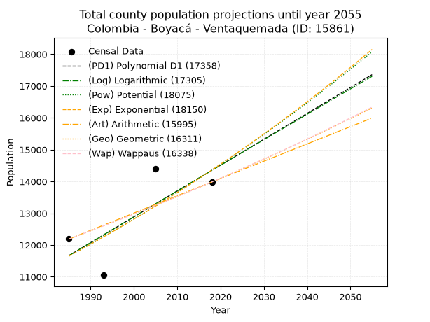
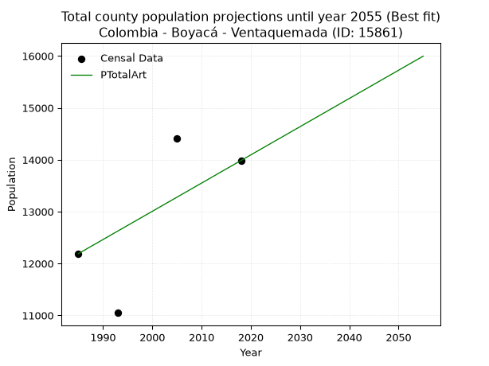
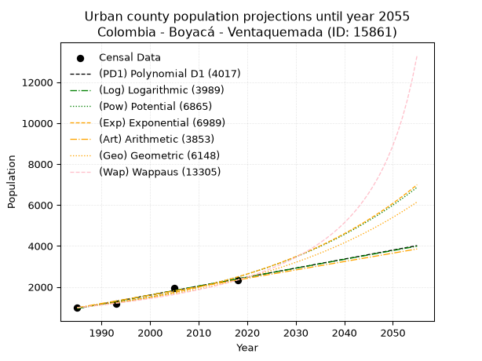
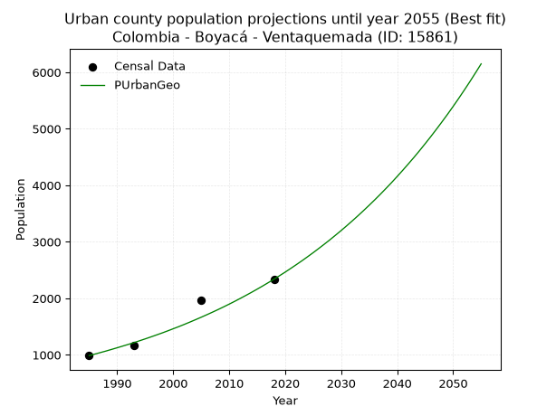
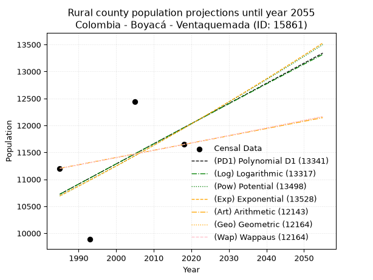
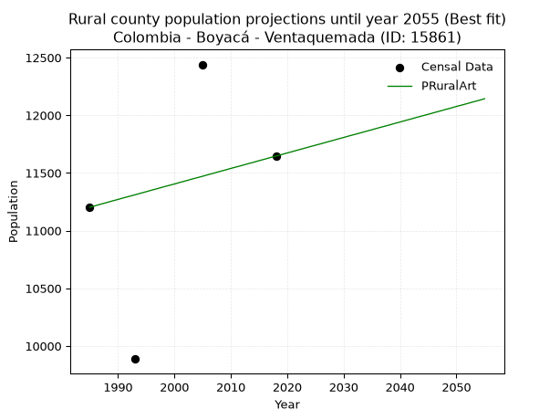

<div align="center">


</div>

# _“Population and Public Services Demand Projections (PPSD) until Year 2050 for Colombia - Boyacá - Ventaquemada (ID: 15861)”_
Keywords: `population` `public-service` `projection` `lineal` `polynomial` `logarithmic` `potential` `exponential` `arithmetic` `geometric` `wappaus` `dane` `colombia` `south-america`

PPSD are analytical estimates used by governments and planners to anticipate future changes in population size, age distribution, and the resulting community needs for utilities, healthcare, education, and infrastructure as sizing future water treatment facilities, electrical grids, and road networks based on spatial growth.

> **General running parameters**: • app_version: _v20260806_. • Python version: _3.14.7_. • Pandas version: _3.0.5_. • NumPy version: _2.5.1_. • Creates, save and include plots into reports (create_plot): _False_. • Projection until year: _2050_. • Process polynomial degree 2 and up: _False_. • Process Wappaus: _True_. • Process Wappaus: _True_. • Set negative values to zero: _True_. • Set infinite values to zero: _True_. • Drop dataset notes: _True_. 
<div align="center">

Dynamic map: [:earth_americas:Google](http://maps.google.com/maps?q=5.368739035,-73.5223676) [:earth_americas:OSM](https://www.openstreetmap.org/#map=18/5.368739035/-73.5223676&layers=P) [:earth_americas:Bing](https://www.bing.com/maps?cp=5.368739035~-73.5223676&lvl=18) [:earth_americas:Apple](https://maps.apple.com/frame?center=5.368739035%2C-73.5223676&span=0.003%2C0.006)

</div>


<div align="center">

```geojson
{
  "type": "Feature",
  "geometry": {
    "type": "Point", 
    "coordinates": [-73.5223676, 5.368739035]
  }, 
  "properties": {
    "Name": "Colombia - Boyacá - Ventaquemada (ID: 15861)"
  }
}
```

</div>


## 0. Census Data (4 records)

Census data are official statistics collected by a government about the people and housing in a country. They usually include counts of total population, age, sex, race, income, education, and jobs.

📅Global census file: [Population.xlsx](../data/Population.xlsx)

| Source   |   Year |   CountryID | CountryName   |   StateID | StateName   |   CountyID | CountyName   |   PTotal |   PUrban |   PRural |
|:---------|-------:|------------:|:--------------|----------:|:------------|-----------:|:-------------|---------:|---------:|---------:|
| DANE     |   1985 |          57 | Colombia      |        15 | Boyacá      |      15861 | Ventaquemada |    12190 |      987 |    11203 |
| DANE     |   1993 |          57 | Colombia      |        15 | Boyacá      |      15861 | Ventaquemada |    11049 |     1162 |     9887 |
| DANE     |   2005 |          57 | Colombia      |        15 | Boyacá      |      15861 | Ventaquemada |    14404 |     1964 |    12440 |
| DANE     |   2018 |          57 | Colombia      |        15 | Boyacá      |      15861 | Ventaquemada |    13984 |     2338 |    11646 |

> 🔥Some records could had specific notes about the registered values or the corresponding urban or rural distribution.

## 1. Total

### 1.1. Coefficients and Parameters

* (PD1) Polynomial Deg 1: 81.30429546366939, -149722.1670012047 (lineal)
* (Log) Logarithmic: 162767.7984774411, -1224292.5905663078
* (Pow) Potential: 12.67216030389677, -37.723401882069076
* (Exp) Exponential: 0.006330414974667888, 0.04065784935698013
* (Art) Arithmetic: Year diff. 2018 - 1985 = 33, Population diff. 13984 - 12190 = 1794, Annual growth = 54.36363636363637
* (Geo) Geometric: Year diff. 2018 - 1985 = 33, Population diff. 13984 - 12190 = 1794, Annual growth % = 0.0041692087486593365
* (Wap) Wappaus: i = 0.4154018213772168, Condition values only valid for < 200)

<sub>
Wappaus condition values: ['0.00', '0.42', '0.83', '1.25', '1.66', '2.08', '2.49', '2.91', '3.32', '3.74', '4.15', '4.57', '4.98', '5.40', '5.82', '6.23', '6.65', '7.06', '7.48', '7.89', '8.31', '8.72', '9.14', '9.55', '9.97', '10.39', '10.80', '11.22', '11.63', '12.05', '12.46', '12.88', '13.29', '13.71', '14.12', '14.54', '14.95', '15.37', '15.79', '16.20', '16.62', '17.03', '17.45', '17.86', '18.28', '18.69', '19.11', '19.52', '19.94', '20.35', '20.77', '21.19', '21.60', '22.02', '22.43', '22.85', '23.26', '23.68', '24.09', '24.51', '24.92', '25.34', '25.75', '26.17', '26.59', '27.00']
</sub>


### 1.2. Projected Dataset

|   Year |   CountyID |   PTotalPD1 |   PTotalLog |   PTotalPow |   PTotalExp |   PTotalArt |   PTotalGeo |   PTotalWap |
|-------:|-----------:|------------:|------------:|------------:|------------:|------------:|------------:|------------:|
|   1985 |      15861 |       11667 |       11664 |       11651 |       11653 |       12190 |       12190 |       12190 |
|   1986 |      15861 |       11748 |       11746 |       11725 |       11727 |       12244 |       12241 |       12241 |
|   1987 |      15861 |       11829 |       11828 |       11800 |       11801 |       12299 |       12292 |       12292 |
|   1988 |      15861 |       11911 |       11910 |       11876 |       11876 |       12353 |       12343 |       12343 |
|   1989 |      15861 |       11992 |       11992 |       11952 |       11952 |       12407 |       12395 |       12394 |
|   1990 |      15861 |       12073 |       12074 |       12028 |       12028 |       12462 |       12446 |       12446 |
|   1991 |      15861 |       12155 |       12155 |       12105 |       12104 |       12516 |       12498 |       12498 |
|   1992 |      15861 |       12236 |       12237 |       12182 |       12181 |       12571 |       12550 |       12550 |
|   1993 |      15861 |       12317 |       12319 |       12260 |       12258 |       12625 |       12603 |       12602 |
|   1994 |      15861 |       12399 |       12401 |       12338 |       12336 |       12679 |       12655 |       12654 |
|   1995 |      15861 |       12480 |       12482 |       12417 |       12414 |       12734 |       12708 |       12707 |
|   1996 |      15861 |       12561 |       12564 |       12496 |       12493 |       12788 |       12761 |       12760 |
|   1997 |      15861 |       12643 |       12645 |       12575 |       12573 |       12842 |       12814 |       12813 |
|   1998 |      15861 |       12724 |       12727 |       12655 |       12652 |       12897 |       12867 |       12867 |
|   1999 |      15861 |       12805 |       12808 |       12736 |       12733 |       12951 |       12921 |       12920 |
|   2000 |      15861 |       12886 |       12890 |       12817 |       12814 |       13005 |       12975 |       12974 |
|   2001 |      15861 |       12968 |       12971 |       12898 |       12895 |       13060 |       13029 |       13028 |
|   2002 |      15861 |       13049 |       13052 |       12980 |       12977 |       13114 |       13083 |       13082 |
|   2003 |      15861 |       13130 |       13134 |       13063 |       13059 |       13169 |       13138 |       13137 |
|   2004 |      15861 |       13212 |       13215 |       13145 |       13142 |       13223 |       13193 |       13192 |
|   2005 |      15861 |       13293 |       13296 |       13229 |       13226 |       13277 |       13248 |       13247 |
|   2006 |      15861 |       13374 |       13377 |       13313 |       13310 |       13332 |       13303 |       13302 |
|   2007 |      15861 |       13456 |       13458 |       13397 |       13394 |       13386 |       13358 |       13357 |
|   2008 |      15861 |       13537 |       13539 |       13482 |       13479 |       13440 |       13414 |       13413 |
|   2009 |      15861 |       13618 |       13620 |       13567 |       13565 |       13495 |       13470 |       13469 |
|   2010 |      15861 |       13699 |       13701 |       13653 |       13651 |       13549 |       13526 |       13525 |
|   2011 |      15861 |       13781 |       13782 |       13739 |       13738 |       13603 |       13583 |       13582 |
|   2012 |      15861 |       13862 |       13863 |       13826 |       13825 |       13658 |       13639 |       13638 |
|   2013 |      15861 |       13943 |       13944 |       13913 |       13913 |       13712 |       13696 |       13695 |
|   2014 |      15861 |       14025 |       14025 |       14001 |       14001 |       13767 |       13753 |       13753 |
|   2015 |      15861 |       14106 |       14106 |       14090 |       14090 |       13821 |       13811 |       13810 |
|   2016 |      15861 |       14187 |       14187 |       14179 |       14180 |       13875 |       13868 |       13868 |
|   2017 |      15861 |       14269 |       14267 |       14268 |       14270 |       13930 |       13926 |       13926 |
|   2018 |      15861 |       14350 |       14348 |       14358 |       14360 |       13984 |       13984 |       13984 |
|   2019 |      15861 |       14431 |       14429 |       14448 |       14451 |       14038 |       14042 |       14042 |
|   2020 |      15861 |       14513 |       14509 |       14539 |       14543 |       14093 |       14101 |       14101 |
|   2021 |      15861 |       14594 |       14590 |       14631 |       14635 |       14147 |       14160 |       14160 |
|   2022 |      15861 |       14675 |       14670 |       14723 |       14728 |       14201 |       14219 |       14220 |
|   2023 |      15861 |       14756 |       14751 |       14815 |       14822 |       14256 |       14278 |       14279 |
|   2024 |      15861 |       14838 |       14831 |       14908 |       14916 |       14310 |       14337 |       14339 |
|   2025 |      15861 |       14919 |       14912 |       15002 |       15011 |       14365 |       14397 |       14399 |
|   2026 |      15861 |       15000 |       14992 |       15096 |       15106 |       14419 |       14457 |       14459 |
|   2027 |      15861 |       15082 |       15072 |       15191 |       15202 |       14473 |       14518 |       14520 |
|   2028 |      15861 |       15163 |       15153 |       15286 |       15299 |       14528 |       14578 |       14581 |
|   2029 |      15861 |       15244 |       15233 |       15382 |       15396 |       14582 |       14639 |       14642 |
|   2030 |      15861 |       15326 |       15313 |       15478 |       15494 |       14636 |       14700 |       14704 |
|   2031 |      15861 |       15407 |       15393 |       15575 |       15592 |       14691 |       14761 |       14765 |
|   2032 |      15861 |       15488 |       15473 |       15672 |       15691 |       14745 |       14823 |       14827 |
|   2033 |      15861 |       15569 |       15553 |       15770 |       15791 |       14799 |       14885 |       14890 |
|   2034 |      15861 |       15651 |       15633 |       15869 |       15891 |       14854 |       14947 |       14952 |
|   2035 |      15861 |       15732 |       15713 |       15968 |       15992 |       14908 |       15009 |       15015 |
|   2036 |      15861 |       15813 |       15793 |       16068 |       16093 |       14963 |       15071 |       15078 |
|   2037 |      15861 |       15895 |       15873 |       16168 |       16196 |       15017 |       15134 |       15142 |
|   2038 |      15861 |       15976 |       15953 |       16269 |       16298 |       15071 |       15197 |       15206 |
|   2039 |      15861 |       16057 |       16033 |       16371 |       16402 |       15126 |       15261 |       15270 |
|   2040 |      15861 |       16139 |       16113 |       16473 |       16506 |       15180 |       15324 |       15334 |
|   2041 |      15861 |       16220 |       16193 |       16575 |       16611 |       15234 |       15388 |       15399 |
|   2042 |      15861 |       16301 |       16272 |       16678 |       16716 |       15289 |       15452 |       15464 |
|   2043 |      15861 |       16383 |       16352 |       16782 |       16823 |       15343 |       15517 |       15529 |
|   2044 |      15861 |       16464 |       16432 |       16887 |       16929 |       15397 |       15582 |       15595 |
|   2045 |      15861 |       16545 |       16511 |       16992 |       17037 |       15452 |       15647 |       15661 |
|   2046 |      15861 |       16626 |       16591 |       17097 |       17145 |       15506 |       15712 |       15727 |
|   2047 |      15861 |       16708 |       16670 |       17203 |       17254 |       15561 |       15777 |       15794 |
|   2048 |      15861 |       16789 |       16750 |       17310 |       17364 |       15615 |       15843 |       15860 |
|   2049 |      15861 |       16870 |       16829 |       17418 |       17474 |       15669 |       15909 |       15928 |
|   2050 |      15861 |       16952 |       16909 |       17526 |       17585 |       15724 |       15975 |       15995 |
<div align="center">

</img>

</div>


### 1.3. Best fit with absolute and relative error (%)

Relative error puts that difference into context by dividing the absolute error by the true value, creating a unitless ratio or percentage that shows the scale of the mistake.

Absolute and relative error

|   Year | Source   |   CountryID | CountryName   |   StateID | StateName   |   CountyID_x | CountyName   |   PTotal |   PUrban |   PRural |   CountyID_y |   PTotalPD1 |   PTotalLog |   PTotalPow |   PTotalExp |   PTotalArt |   PTotalGeo |   PTotalWap |   PTotalPD1AbsError |   PTotalLogAbsError |   PTotalPowAbsError |   PTotalExpAbsError |   PTotalArtAbsError |   PTotalGeoAbsError |   PTotalWapAbsError |   PTotalPD1RelError |   PTotalLogRelError |   PTotalPowRelError |   PTotalExpRelError |   PTotalArtRelError |   PTotalGeoRelError |   PTotalWapRelError |
|-------:|:---------|------------:|:--------------|----------:|:------------|-------------:|:-------------|---------:|---------:|---------:|-------------:|------------:|------------:|------------:|------------:|------------:|------------:|------------:|--------------------:|--------------------:|--------------------:|--------------------:|--------------------:|--------------------:|--------------------:|--------------------:|--------------------:|--------------------:|--------------------:|--------------------:|--------------------:|--------------------:|
|   1985 | DANE     |          57 | Colombia      |        15 | Boyacá      |        15861 | Ventaquemada |    12190 |      987 |    11203 |        15861 |       11667 |       11664 |       11651 |       11653 |       12190 |       12190 |       12190 |                 523 |                 526 |                 539 |                 537 |                   0 |                   0 |                   0 |             4.2904  |             4.31501 |             4.42166 |             4.40525 |             0       |             0       |             0       |
|   1993 | DANE     |          57 | Colombia      |        15 | Boyacá      |        15861 | Ventaquemada |    11049 |     1162 |     9887 |        15861 |       12317 |       12319 |       12260 |       12258 |       12625 |       12603 |       12602 |                1268 |                1270 |                1211 |                1209 |                1576 |                1554 |                1553 |            11.4762  |            11.4943  |            10.9603  |            10.9422  |            14.2637  |            14.0646  |            14.0556  |
|   2005 | DANE     |          57 | Colombia      |        15 | Boyacá      |        15861 | Ventaquemada |    14404 |     1964 |    12440 |        15861 |       13293 |       13296 |       13229 |       13226 |       13277 |       13248 |       13247 |                1111 |                1108 |                1175 |                1178 |                1127 |                1156 |                1157 |             7.71314 |             7.69231 |             8.15746 |             8.17828 |             7.82422 |             8.02555 |             8.03249 |
|   2018 | DANE     |          57 | Colombia      |        15 | Boyacá      |        15861 | Ventaquemada |    13984 |     2338 |    11646 |        15861 |       14350 |       14348 |       14358 |       14360 |       13984 |       13984 |       13984 |                 366 |                 364 |                 374 |                 376 |                   0 |                   0 |                   0 |             2.61728 |             2.60297 |             2.67449 |             2.68879 |             0       |             0       |             0       |

Relative error mean

| Method    |   RelError | Best   |
|:----------|-----------:|:-------|
| PTotalPD1 |    6.52424 |        |
| PTotalLog |    6.52614 |        |
| PTotalPow |    6.55347 |        |
| PTotalExp |    6.55362 |        |
| PTotalArt |    5.52199 | True   |
| PTotalGeo |    5.52254 |        |
| PTotalWap |    5.52202 |        |

💙Best method: _**PTotalArt**_
<div align="center">

</img>

</div>


### 1.4. Fresh water supply demand in liters per capita per day (lpcd)

The fresh water supply demand typically ranges from 100 to 300 liters per capita per day (lpcd) for standard domestic and municipal planning, though absolute survival minimums set by the World Health Organization are as low as 7.5 to 20 liters per day, and total consumption in high-income nations can exceed 400 liters.

> `CZ`: Level in meters above the sea level (masl)<br> `WS`: Fresh water supply demand in liters per capita per day (lpcd or l/h/d)<br> `WSAll`: Zonal fresh water supply demand in liters per second (l/s)<br> `A`: Zonal area in square meters<br> `DP`: Population density (people/hectare)

Reference values (RAS Colombia)

|    CZ |   WS |
|------:|-----:|
|  1000 |  120 |
|  2000 |  130 |
| 99999 |  140 |

County shapefile geometry properties and water supply values

|   CountyID |      ATotal |   CZTotal |   WSTotal |
|-----------:|------------:|----------:|----------:|
|      15861 | 1.59754e+08 |   2960.79 |       140 |

Projected values for best method: PTotalArt

|   CountyID |   Year |   PTotalArt |   DPTotal |   WSTotal |   WSTotalAll |
|-----------:|-------:|------------:|----------:|----------:|-------------:|
|      15861 |   1985 |       12190 |      0.76 |       140 |      19.7523 |
|      15861 |   1986 |       12244 |      0.77 |       140 |      19.8398 |
|      15861 |   1987 |       12299 |      0.77 |       140 |      19.9289 |
|      15861 |   1988 |       12353 |      0.77 |       140 |      20.0164 |
|      15861 |   1989 |       12407 |      0.78 |       140 |      20.1039 |
|      15861 |   1990 |       12462 |      0.78 |       140 |      20.1931 |
|      15861 |   1991 |       12516 |      0.78 |       140 |      20.2806 |
|      15861 |   1992 |       12571 |      0.79 |       140 |      20.3697 |
|      15861 |   1993 |       12625 |      0.79 |       140 |      20.4572 |
|      15861 |   1994 |       12679 |      0.79 |       140 |      20.5447 |
|      15861 |   1995 |       12734 |      0.8  |       140 |      20.6338 |
|      15861 |   1996 |       12788 |      0.8  |       140 |      20.7213 |
|      15861 |   1997 |       12842 |      0.8  |       140 |      20.8088 |
|      15861 |   1998 |       12897 |      0.81 |       140 |      20.8979 |
|      15861 |   1999 |       12951 |      0.81 |       140 |      20.9854 |
|      15861 |   2000 |       13005 |      0.81 |       140 |      21.0729 |
|      15861 |   2001 |       13060 |      0.82 |       140 |      21.162  |
|      15861 |   2002 |       13114 |      0.82 |       140 |      21.2495 |
|      15861 |   2003 |       13169 |      0.82 |       140 |      21.3387 |
|      15861 |   2004 |       13223 |      0.83 |       140 |      21.4262 |
|      15861 |   2005 |       13277 |      0.83 |       140 |      21.5137 |
|      15861 |   2006 |       13332 |      0.83 |       140 |      21.6028 |
|      15861 |   2007 |       13386 |      0.84 |       140 |      21.6903 |
|      15861 |   2008 |       13440 |      0.84 |       140 |      21.7778 |
|      15861 |   2009 |       13495 |      0.84 |       140 |      21.8669 |
|      15861 |   2010 |       13549 |      0.85 |       140 |      21.9544 |
|      15861 |   2011 |       13603 |      0.85 |       140 |      22.0419 |
|      15861 |   2012 |       13658 |      0.85 |       140 |      22.131  |
|      15861 |   2013 |       13712 |      0.86 |       140 |      22.2185 |
|      15861 |   2014 |       13767 |      0.86 |       140 |      22.3076 |
|      15861 |   2015 |       13821 |      0.87 |       140 |      22.3951 |
|      15861 |   2016 |       13875 |      0.87 |       140 |      22.4826 |
|      15861 |   2017 |       13930 |      0.87 |       140 |      22.5718 |
|      15861 |   2018 |       13984 |      0.88 |       140 |      22.6593 |
|      15861 |   2019 |       14038 |      0.88 |       140 |      22.7468 |
|      15861 |   2020 |       14093 |      0.88 |       140 |      22.8359 |
|      15861 |   2021 |       14147 |      0.89 |       140 |      22.9234 |
|      15861 |   2022 |       14201 |      0.89 |       140 |      23.0109 |
|      15861 |   2023 |       14256 |      0.89 |       140 |      23.1    |
|      15861 |   2024 |       14310 |      0.9  |       140 |      23.1875 |
|      15861 |   2025 |       14365 |      0.9  |       140 |      23.2766 |
|      15861 |   2026 |       14419 |      0.9  |       140 |      23.3641 |
|      15861 |   2027 |       14473 |      0.91 |       140 |      23.4516 |
|      15861 |   2028 |       14528 |      0.91 |       140 |      23.5407 |
|      15861 |   2029 |       14582 |      0.91 |       140 |      23.6282 |
|      15861 |   2030 |       14636 |      0.92 |       140 |      23.7157 |
|      15861 |   2031 |       14691 |      0.92 |       140 |      23.8049 |
|      15861 |   2032 |       14745 |      0.92 |       140 |      23.8924 |
|      15861 |   2033 |       14799 |      0.93 |       140 |      23.9799 |
|      15861 |   2034 |       14854 |      0.93 |       140 |      24.069  |
|      15861 |   2035 |       14908 |      0.93 |       140 |      24.1565 |
|      15861 |   2036 |       14963 |      0.94 |       140 |      24.2456 |
|      15861 |   2037 |       15017 |      0.94 |       140 |      24.3331 |
|      15861 |   2038 |       15071 |      0.94 |       140 |      24.4206 |
|      15861 |   2039 |       15126 |      0.95 |       140 |      24.5097 |
|      15861 |   2040 |       15180 |      0.95 |       140 |      24.5972 |
|      15861 |   2041 |       15234 |      0.95 |       140 |      24.6847 |
|      15861 |   2042 |       15289 |      0.96 |       140 |      24.7738 |
|      15861 |   2043 |       15343 |      0.96 |       140 |      24.8613 |
|      15861 |   2044 |       15397 |      0.96 |       140 |      24.9488 |
|      15861 |   2045 |       15452 |      0.97 |       140 |      25.038  |
|      15861 |   2046 |       15506 |      0.97 |       140 |      25.1255 |
|      15861 |   2047 |       15561 |      0.97 |       140 |      25.2146 |
|      15861 |   2048 |       15615 |      0.98 |       140 |      25.3021 |
|      15861 |   2049 |       15669 |      0.98 |       140 |      25.3896 |
|      15861 |   2050 |       15724 |      0.98 |       140 |      25.4787 |

## 2. Urban

### 2.1. Coefficients and Parameters

* (PD1) Polynomial Deg 1: 43.921718185467405, -86241.66680048118 (lineal)
* (Log) Logarithmic: 87923.05599536435, -666691.1031919168
* (Pow) Potential: 55.917729659593306, -181.408288930612
* (Exp) Exponential: 0.02792804086040151, 8.30533198849255e-22
* (Art) Arithmetic: Year diff. 2018 - 1985 = 33, Population diff. 2338 - 987 = 1351, Annual growth = 40.93939393939394
* (Geo) Geometric: Year diff. 2018 - 1985 = 33, Population diff. 2338 - 987 = 1351, Annual growth % = 0.026477215245838792
* (Wap) Wappaus: i = 2.4625199362041466, Condition values only valid for < 200)

<sub>
Wappaus condition values: ['0.00', '2.46', '4.93', '7.39', '9.85', '12.31', '14.78', '17.24', '19.70', '22.16', '24.63', '27.09', '29.55', '32.01', '34.48', '36.94', '39.40', '41.86', '44.33', '46.79', '49.25', '51.71', '54.18', '56.64', '59.10', '61.56', '64.03', '66.49', '68.95', '71.41', '73.88', '76.34', '78.80', '81.26', '83.73', '86.19', '88.65', '91.11', '93.58', '96.04', '98.50', '100.96', '103.43', '105.89', '108.35', '110.81', '113.28', '115.74', '118.20', '120.66', '123.13', '125.59', '128.05', '130.51', '132.98', '135.44', '137.90', '140.36', '142.83', '145.29', '147.75', '150.21', '152.68', '155.14', '157.60', '160.06']
</sub>


### 2.2. Projected Dataset

|   Year |   CountyID |   PUrbanPD1 |   PUrbanLog |   PUrbanPow |   PUrbanExp |   PUrbanArt |   PUrbanGeo |   PUrbanWap |
|-------:|-----------:|------------:|------------:|------------:|------------:|------------:|------------:|------------:|
|   1985 |      15861 |         943 |         942 |         989 |         989 |         987 |         987 |         987 |
|   1986 |      15861 |         987 |         986 |        1017 |        1018 |        1028 |        1013 |        1012 |
|   1987 |      15861 |        1031 |        1030 |        1046 |        1046 |        1069 |        1040 |        1037 |
|   1988 |      15861 |        1075 |        1074 |        1076 |        1076 |        1110 |        1067 |        1063 |
|   1989 |      15861 |        1119 |        1119 |        1106 |        1106 |        1151 |        1096 |        1089 |
|   1990 |      15861 |        1163 |        1163 |        1138 |        1138 |        1192 |        1125 |        1116 |
|   1991 |      15861 |        1206 |        1207 |        1170 |        1170 |        1233 |        1155 |        1144 |
|   1992 |      15861 |        1250 |        1251 |        1204 |        1203 |        1274 |        1185 |        1173 |
|   1993 |      15861 |        1294 |        1295 |        1238 |        1237 |        1315 |        1216 |        1203 |
|   1994 |      15861 |        1338 |        1339 |        1273 |        1272 |        1355 |        1249 |        1233 |
|   1995 |      15861 |        1382 |        1383 |        1309 |        1308 |        1396 |        1282 |        1264 |
|   1996 |      15861 |        1426 |        1427 |        1346 |        1345 |        1437 |        1316 |        1296 |
|   1997 |      15861 |        1470 |        1471 |        1385 |        1383 |        1478 |        1351 |        1329 |
|   1998 |      15861 |        1514 |        1516 |        1424 |        1423 |        1519 |        1386 |        1363 |
|   1999 |      15861 |        1558 |        1559 |        1464 |        1463 |        1560 |        1423 |        1398 |
|   2000 |      15861 |        1602 |        1603 |        1506 |        1504 |        1601 |        1461 |        1434 |
|   2001 |      15861 |        1646 |        1647 |        1549 |        1547 |        1642 |        1499 |        1471 |
|   2002 |      15861 |        1690 |        1691 |        1593 |        1591 |        1683 |        1539 |        1510 |
|   2003 |      15861 |        1734 |        1735 |        1638 |        1636 |        1724 |        1580 |        1549 |
|   2004 |      15861 |        1777 |        1779 |        1684 |        1682 |        1765 |        1622 |        1590 |
|   2005 |      15861 |        1821 |        1823 |        1732 |        1730 |        1806 |        1665 |        1632 |
|   2006 |      15861 |        1865 |        1867 |        1781 |        1779 |        1847 |        1709 |        1675 |
|   2007 |      15861 |        1909 |        1911 |        1831 |        1829 |        1888 |        1754 |        1720 |
|   2008 |      15861 |        1953 |        1954 |        1883 |        1881 |        1929 |        1800 |        1767 |
|   2009 |      15861 |        1997 |        1998 |        1936 |        1934 |        1970 |        1848 |        1815 |
|   2010 |      15861 |        2041 |        2042 |        1990 |        1989 |        2010 |        1897 |        1865 |
|   2011 |      15861 |        2085 |        2086 |        2047 |        2045 |        2051 |        1947 |        1916 |
|   2012 |      15861 |        2129 |        2129 |        2104 |        2103 |        2092 |        1999 |        1970 |
|   2013 |      15861 |        2173 |        2173 |        2163 |        2163 |        2133 |        2052 |        2026 |
|   2014 |      15861 |        2217 |        2217 |        2224 |        2224 |        2174 |        2106 |        2083 |
|   2015 |      15861 |        2261 |        2260 |        2287 |        2287 |        2215 |        2162 |        2143 |
|   2016 |      15861 |        2305 |        2304 |        2351 |        2352 |        2256 |        2219 |        2206 |
|   2017 |      15861 |        2348 |        2348 |        2417 |        2418 |        2297 |        2278 |        2270 |
|   2018 |      15861 |        2392 |        2391 |        2485 |        2487 |        2338 |        2338 |        2338 |
|   2019 |      15861 |        2436 |        2435 |        2555 |        2557 |        2379 |        2400 |        2408 |
|   2020 |      15861 |        2480 |        2478 |        2627 |        2630 |        2420 |        2463 |        2482 |
|   2021 |      15861 |        2524 |        2522 |        2701 |        2704 |        2461 |        2529 |        2559 |
|   2022 |      15861 |        2568 |        2565 |        2776 |        2781 |        2502 |        2596 |        2639 |
|   2023 |      15861 |        2612 |        2609 |        2854 |        2860 |        2543 |        2664 |        2723 |
|   2024 |      15861 |        2656 |        2652 |        2934 |        2941 |        2584 |        2735 |        2811 |
|   2025 |      15861 |        2700 |        2696 |        3016 |        3024 |        2625 |        2807 |        2903 |
|   2026 |      15861 |        2744 |        2739 |        3101 |        3110 |        2666 |        2882 |        2999 |
|   2027 |      15861 |        2788 |        2782 |        3188 |        3198 |        2706 |        2958 |        3101 |
|   2028 |      15861 |        2832 |        2826 |        3277 |        3288 |        2747 |        3036 |        3208 |
|   2029 |      15861 |        2875 |        2869 |        3368 |        3381 |        2788 |        3117 |        3321 |
|   2030 |      15861 |        2919 |        2913 |        3462 |        3477 |        2829 |        3199 |        3440 |
|   2031 |      15861 |        2963 |        2956 |        3559 |        3576 |        2870 |        3284 |        3565 |
|   2032 |      15861 |        3007 |        2999 |        3658 |        3677 |        2911 |        3371 |        3698 |
|   2033 |      15861 |        3051 |        3042 |        3760 |        3781 |        2952 |        3460 |        3839 |
|   2034 |      15861 |        3095 |        3086 |        3865 |        3888 |        2993 |        3552 |        3989 |
|   2035 |      15861 |        3139 |        3129 |        3973 |        3998 |        3034 |        3646 |        4149 |
|   2036 |      15861 |        3183 |        3172 |        4084 |        4111 |        3075 |        3742 |        4319 |
|   2037 |      15861 |        3227 |        3215 |        4197 |        4228 |        3116 |        3841 |        4500 |
|   2038 |      15861 |        3271 |        3258 |        4314 |        4348 |        3157 |        3943 |        4695 |
|   2039 |      15861 |        3315 |        3301 |        4434 |        4471 |        3198 |        4047 |        4903 |
|   2040 |      15861 |        3359 |        3345 |        4557 |        4597 |        3239 |        4155 |        5128 |
|   2041 |      15861 |        3403 |        3388 |        4684 |        4728 |        3280 |        4265 |        5371 |
|   2042 |      15861 |        3446 |        3431 |        4814 |        4861 |        3321 |        4378 |        5633 |
|   2043 |      15861 |        3490 |        3474 |        4948 |        4999 |        3361 |        4493 |        5918 |
|   2044 |      15861 |        3534 |        3517 |        5085 |        5141 |        3402 |        4612 |        6229 |
|   2045 |      15861 |        3578 |        3560 |        5226 |        5286 |        3443 |        4735 |        6569 |
|   2046 |      15861 |        3622 |        3603 |        5371 |        5436 |        3484 |        4860 |        6943 |
|   2047 |      15861 |        3666 |        3646 |        5520 |        5590 |        3525 |        4989 |        7356 |
|   2048 |      15861 |        3710 |        3689 |        5672 |        5748 |        3566 |        5121 |        7813 |
|   2049 |      15861 |        3754 |        3732 |        5829 |        5911 |        3607 |        5256 |        8325 |
|   2050 |      15861 |        3798 |        3775 |        5991 |        6078 |        3648 |        5395 |        8899 |
<div align="center">

</img>

</div>


### 2.3. Best fit with absolute and relative error (%)

Relative error puts that difference into context by dividing the absolute error by the true value, creating a unitless ratio or percentage that shows the scale of the mistake.

Absolute and relative error

|   Year | Source   |   CountryID | CountryName   |   StateID | StateName   |   CountyID_x | CountyName   |   PTotal |   PUrban |   PRural |   CountyID_y |   PUrbanPD1 |   PUrbanLog |   PUrbanPow |   PUrbanExp |   PUrbanArt |   PUrbanGeo |   PUrbanWap |   PUrbanPD1AbsError |   PUrbanLogAbsError |   PUrbanPowAbsError |   PUrbanExpAbsError |   PUrbanArtAbsError |   PUrbanGeoAbsError |   PUrbanWapAbsError |   PUrbanPD1RelError |   PUrbanLogRelError |   PUrbanPowRelError |   PUrbanExpRelError |   PUrbanArtRelError |   PUrbanGeoRelError |   PUrbanWapRelError |
|-------:|:---------|------------:|:--------------|----------:|:------------|-------------:|:-------------|---------:|---------:|---------:|-------------:|------------:|------------:|------------:|------------:|------------:|------------:|------------:|--------------------:|--------------------:|--------------------:|--------------------:|--------------------:|--------------------:|--------------------:|--------------------:|--------------------:|--------------------:|--------------------:|--------------------:|--------------------:|--------------------:|
|   1985 | DANE     |          57 | Colombia      |        15 | Boyacá      |        15861 | Ventaquemada |    12190 |      987 |    11203 |        15861 |         943 |         942 |         989 |         989 |         987 |         987 |         987 |                  44 |                  45 |                   2 |                   2 |                   0 |                   0 |                   0 |             4.45795 |             4.55927 |            0.202634 |            0.202634 |             0       |             0       |              0      |
|   1993 | DANE     |          57 | Colombia      |        15 | Boyacá      |        15861 | Ventaquemada |    11049 |     1162 |     9887 |        15861 |        1294 |        1295 |        1238 |        1237 |        1315 |        1216 |        1203 |                 132 |                 133 |                  76 |                  75 |                 153 |                  54 |                  41 |            11.3597  |            11.4458  |            6.54045  |            6.45439  |            13.167   |             4.64716 |              3.5284 |
|   2005 | DANE     |          57 | Colombia      |        15 | Boyacá      |        15861 | Ventaquemada |    14404 |     1964 |    12440 |        15861 |        1821 |        1823 |        1732 |        1730 |        1806 |        1665 |        1632 |                 143 |                 141 |                 232 |                 234 |                 158 |                 299 |                 332 |             7.28106 |             7.17923 |           11.8126   |           11.9145   |             8.04481 |            15.224   |             16.9043 |
|   2018 | DANE     |          57 | Colombia      |        15 | Boyacá      |        15861 | Ventaquemada |    13984 |     2338 |    11646 |        15861 |        2392 |        2391 |        2485 |        2487 |        2338 |        2338 |        2338 |                  54 |                  53 |                 147 |                 149 |                   0 |                   0 |                   0 |             2.30967 |             2.26689 |            6.28743  |            6.37297  |             0       |             0       |              0      |

Relative error mean

| Method    |   RelError | Best   |
|:----------|-----------:|:-------|
| PUrbanPD1 |    6.3521  |        |
| PUrbanLog |    6.36279 |        |
| PUrbanPow |    6.21078 |        |
| PUrbanExp |    6.23611 |        |
| PUrbanArt |    5.30294 |        |
| PUrbanGeo |    4.9678  | True   |
| PUrbanWap |    5.10817 |        |

💙Best method: _**PUrbanGeo**_
<div align="center">

</img>

</div>


### 2.4. Fresh water supply demand in liters per capita per day (lpcd)

The fresh water supply demand typically ranges from 100 to 300 liters per capita per day (lpcd) for standard domestic and municipal planning, though absolute survival minimums set by the World Health Organization are as low as 7.5 to 20 liters per day, and total consumption in high-income nations can exceed 400 liters.

> `CZ`: Level in meters above the sea level (masl)<br> `WS`: Fresh water supply demand in liters per capita per day (lpcd or l/h/d)<br> `WSAll`: Zonal fresh water supply demand in liters per second (l/s)<br> `A`: Zonal area in square meters<br> `DP`: Population density (people/hectare)

Reference values (RAS Colombia)

|    CZ |   WS |
|------:|-----:|
|  1000 |  120 |
|  2000 |  130 |
| 99999 |  140 |

County shapefile geometry properties and water supply values

|   CountyID |   AUrban |   CZUrban |   WSUrban |
|-----------:|---------:|----------:|----------:|
|      15861 |   928767 |    2642.1 |       140 |

Projected values for best method: PUrbanGeo

|   CountyID |   Year |   PUrbanGeo |   DPUrban |   WSUrban |   WSUrbanAll |
|-----------:|-------:|------------:|----------:|----------:|-------------:|
|      15861 |   1985 |         987 |     10.63 |       140 |      1.59931 |
|      15861 |   1986 |        1013 |     10.91 |       140 |      1.64144 |
|      15861 |   1987 |        1040 |     11.2  |       140 |      1.68519 |
|      15861 |   1988 |        1067 |     11.49 |       140 |      1.72894 |
|      15861 |   1989 |        1096 |     11.8  |       140 |      1.77593 |
|      15861 |   1990 |        1125 |     12.11 |       140 |      1.82292 |
|      15861 |   1991 |        1155 |     12.44 |       140 |      1.87153 |
|      15861 |   1992 |        1185 |     12.76 |       140 |      1.92014 |
|      15861 |   1993 |        1216 |     13.09 |       140 |      1.97037 |
|      15861 |   1994 |        1249 |     13.45 |       140 |      2.02384 |
|      15861 |   1995 |        1282 |     13.8  |       140 |      2.07731 |
|      15861 |   1996 |        1316 |     14.17 |       140 |      2.13241 |
|      15861 |   1997 |        1351 |     14.55 |       140 |      2.18912 |
|      15861 |   1998 |        1386 |     14.92 |       140 |      2.24583 |
|      15861 |   1999 |        1423 |     15.32 |       140 |      2.30579 |
|      15861 |   2000 |        1461 |     15.73 |       140 |      2.36736 |
|      15861 |   2001 |        1499 |     16.14 |       140 |      2.42894 |
|      15861 |   2002 |        1539 |     16.57 |       140 |      2.49375 |
|      15861 |   2003 |        1580 |     17.01 |       140 |      2.56019 |
|      15861 |   2004 |        1622 |     17.46 |       140 |      2.62824 |
|      15861 |   2005 |        1665 |     17.93 |       140 |      2.69792 |
|      15861 |   2006 |        1709 |     18.4  |       140 |      2.76921 |
|      15861 |   2007 |        1754 |     18.89 |       140 |      2.84213 |
|      15861 |   2008 |        1800 |     19.38 |       140 |      2.91667 |
|      15861 |   2009 |        1848 |     19.9  |       140 |      2.99444 |
|      15861 |   2010 |        1897 |     20.42 |       140 |      3.07384 |
|      15861 |   2011 |        1947 |     20.96 |       140 |      3.15486 |
|      15861 |   2012 |        1999 |     21.52 |       140 |      3.23912 |
|      15861 |   2013 |        2052 |     22.09 |       140 |      3.325   |
|      15861 |   2014 |        2106 |     22.68 |       140 |      3.4125  |
|      15861 |   2015 |        2162 |     23.28 |       140 |      3.50324 |
|      15861 |   2016 |        2219 |     23.89 |       140 |      3.5956  |
|      15861 |   2017 |        2278 |     24.53 |       140 |      3.6912  |
|      15861 |   2018 |        2338 |     25.17 |       140 |      3.78843 |
|      15861 |   2019 |        2400 |     25.84 |       140 |      3.88889 |
|      15861 |   2020 |        2463 |     26.52 |       140 |      3.99097 |
|      15861 |   2021 |        2529 |     27.23 |       140 |      4.09792 |
|      15861 |   2022 |        2596 |     27.95 |       140 |      4.20648 |
|      15861 |   2023 |        2664 |     28.68 |       140 |      4.31667 |
|      15861 |   2024 |        2735 |     29.45 |       140 |      4.43171 |
|      15861 |   2025 |        2807 |     30.22 |       140 |      4.54838 |
|      15861 |   2026 |        2882 |     31.03 |       140 |      4.66991 |
|      15861 |   2027 |        2958 |     31.85 |       140 |      4.79306 |
|      15861 |   2028 |        3036 |     32.69 |       140 |      4.91944 |
|      15861 |   2029 |        3117 |     33.56 |       140 |      5.05069 |
|      15861 |   2030 |        3199 |     34.44 |       140 |      5.18356 |
|      15861 |   2031 |        3284 |     35.36 |       140 |      5.3213  |
|      15861 |   2032 |        3371 |     36.3  |       140 |      5.46227 |
|      15861 |   2033 |        3460 |     37.25 |       140 |      5.60648 |
|      15861 |   2034 |        3552 |     38.24 |       140 |      5.75556 |
|      15861 |   2035 |        3646 |     39.26 |       140 |      5.90787 |
|      15861 |   2036 |        3742 |     40.29 |       140 |      6.06343 |
|      15861 |   2037 |        3841 |     41.36 |       140 |      6.22384 |
|      15861 |   2038 |        3943 |     42.45 |       140 |      6.38912 |
|      15861 |   2039 |        4047 |     43.57 |       140 |      6.55764 |
|      15861 |   2040 |        4155 |     44.74 |       140 |      6.73264 |
|      15861 |   2041 |        4265 |     45.92 |       140 |      6.91088 |
|      15861 |   2042 |        4378 |     47.14 |       140 |      7.09398 |
|      15861 |   2043 |        4493 |     48.38 |       140 |      7.28032 |
|      15861 |   2044 |        4612 |     49.66 |       140 |      7.47315 |
|      15861 |   2045 |        4735 |     50.98 |       140 |      7.67245 |
|      15861 |   2046 |        4860 |     52.33 |       140 |      7.875   |
|      15861 |   2047 |        4989 |     53.72 |       140 |      8.08403 |
|      15861 |   2048 |        5121 |     55.14 |       140 |      8.29792 |
|      15861 |   2049 |        5256 |     56.59 |       140 |      8.51667 |
|      15861 |   2050 |        5395 |     58.09 |       140 |      8.7419  |

## 3. Rural

### 3.1. Coefficients and Parameters

* (PD1) Polynomial Deg 1: 37.382577278201865, -63480.500200723276 (lineal)
* (Log) Logarithmic: 74844.74248207678, -557601.487374391
* (Pow) Potential: 6.724066558743499, -18.145304635488046
* (Exp) Exponential: 0.0033590131965728653, 13.59510346184053
* (Art) Arithmetic: Year diff. 2018 - 1985 = 33, Population diff. 11646 - 11203 = 443, Annual growth = 13.424242424242424
* (Geo) Geometric: Year diff. 2018 - 1985 = 33, Population diff. 11646 - 11203 = 443, Annual growth % = 0.0011758778889350285
* (Wap) Wappaus: i = 0.11750398200571074, Condition values only valid for < 200)

<sub>
Wappaus condition values: ['0.00', '0.12', '0.24', '0.35', '0.47', '0.59', '0.71', '0.82', '0.94', '1.06', '1.18', '1.29', '1.41', '1.53', '1.65', '1.76', '1.88', '2.00', '2.12', '2.23', '2.35', '2.47', '2.59', '2.70', '2.82', '2.94', '3.06', '3.17', '3.29', '3.41', '3.53', '3.64', '3.76', '3.88', '4.00', '4.11', '4.23', '4.35', '4.47', '4.58', '4.70', '4.82', '4.94', '5.05', '5.17', '5.29', '5.41', '5.52', '5.64', '5.76', '5.88', '5.99', '6.11', '6.23', '6.35', '6.46', '6.58', '6.70', '6.82', '6.93', '7.05', '7.17', '7.29', '7.40', '7.52', '7.64']
</sub>


### 3.2. Projected Dataset

|   Year |   CountyID |   PRuralPD1 |   PRuralLog |   PRuralPow |   PRuralExp |   PRuralArt |   PRuralGeo |   PRuralWap |
|-------:|-----------:|------------:|------------:|------------:|------------:|------------:|------------:|------------:|
|   1985 |      15861 |       10724 |       10723 |       10692 |       10693 |       11203 |       11203 |       11203 |
|   1986 |      15861 |       10761 |       10760 |       10728 |       10729 |       11216 |       11216 |       11216 |
|   1987 |      15861 |       10799 |       10798 |       10765 |       10765 |       11230 |       11229 |       11229 |
|   1988 |      15861 |       10836 |       10836 |       10801 |       10801 |       11243 |       11243 |       11243 |
|   1989 |      15861 |       10873 |       10873 |       10838 |       10838 |       11257 |       11256 |       11256 |
|   1990 |      15861 |       10911 |       10911 |       10874 |       10874 |       11270 |       11269 |       11269 |
|   1991 |      15861 |       10948 |       10949 |       10911 |       10911 |       11284 |       11282 |       11282 |
|   1992 |      15861 |       10986 |       10986 |       10948 |       10947 |       11297 |       11296 |       11296 |
|   1993 |      15861 |       11023 |       11024 |       10985 |       10984 |       11310 |       11309 |       11309 |
|   1994 |      15861 |       11060 |       11061 |       11022 |       11021 |       11324 |       11322 |       11322 |
|   1995 |      15861 |       11098 |       11099 |       11059 |       11058 |       11337 |       11335 |       11335 |
|   1996 |      15861 |       11135 |       11136 |       11097 |       11096 |       11351 |       11349 |       11349 |
|   1997 |      15861 |       11173 |       11174 |       11134 |       11133 |       11364 |       11362 |       11362 |
|   1998 |      15861 |       11210 |       11211 |       11172 |       11170 |       11378 |       11375 |       11375 |
|   1999 |      15861 |       11247 |       11249 |       11209 |       11208 |       11391 |       11389 |       11389 |
|   2000 |      15861 |       11285 |       11286 |       11247 |       11246 |       11404 |       11402 |       11402 |
|   2001 |      15861 |       11322 |       11324 |       11285 |       11283 |       11418 |       11416 |       11416 |
|   2002 |      15861 |       11359 |       11361 |       11323 |       11321 |       11431 |       11429 |       11429 |
|   2003 |      15861 |       11397 |       11398 |       11361 |       11360 |       11445 |       11443 |       11442 |
|   2004 |      15861 |       11434 |       11436 |       11399 |       11398 |       11458 |       11456 |       11456 |
|   2005 |      15861 |       11472 |       11473 |       11438 |       11436 |       11471 |       11469 |       11469 |
|   2006 |      15861 |       11509 |       11510 |       11476 |       11475 |       11485 |       11483 |       11483 |
|   2007 |      15861 |       11546 |       11548 |       11514 |       11513 |       11498 |       11496 |       11496 |
|   2008 |      15861 |       11584 |       11585 |       11553 |       11552 |       11512 |       11510 |       11510 |
|   2009 |      15861 |       11621 |       11622 |       11592 |       11591 |       11525 |       11523 |       11523 |
|   2010 |      15861 |       11658 |       11659 |       11631 |       11630 |       11539 |       11537 |       11537 |
|   2011 |      15861 |       11696 |       11697 |       11670 |       11669 |       11552 |       11551 |       11551 |
|   2012 |      15861 |       11733 |       11734 |       11709 |       11708 |       11565 |       11564 |       11564 |
|   2013 |      15861 |       11771 |       11771 |       11748 |       11748 |       11579 |       11578 |       11578 |
|   2014 |      15861 |       11808 |       11808 |       11787 |       11787 |       11592 |       11591 |       11591 |
|   2015 |      15861 |       11845 |       11845 |       11827 |       11827 |       11606 |       11605 |       11605 |
|   2016 |      15861 |       11883 |       11882 |       11866 |       11867 |       11619 |       11619 |       11619 |
|   2017 |      15861 |       11920 |       11920 |       11906 |       11906 |       11633 |       11632 |       11632 |
|   2018 |      15861 |       11958 |       11957 |       11946 |       11947 |       11646 |       11646 |       11646 |
|   2019 |      15861 |       11995 |       11994 |       11985 |       11987 |       11659 |       11660 |       11660 |
|   2020 |      15861 |       12032 |       12031 |       12025 |       12027 |       11673 |       11673 |       11673 |
|   2021 |      15861 |       12070 |       12068 |       12065 |       12068 |       11686 |       11687 |       11687 |
|   2022 |      15861 |       12107 |       12105 |       12106 |       12108 |       11700 |       11701 |       11701 |
|   2023 |      15861 |       12144 |       12142 |       12146 |       12149 |       11713 |       11715 |       11715 |
|   2024 |      15861 |       12182 |       12179 |       12186 |       12190 |       11727 |       11728 |       11728 |
|   2025 |      15861 |       12219 |       12216 |       12227 |       12231 |       11740 |       11742 |       11742 |
|   2026 |      15861 |       12257 |       12253 |       12268 |       12272 |       11753 |       11756 |       11756 |
|   2027 |      15861 |       12294 |       12290 |       12308 |       12313 |       11767 |       11770 |       11770 |
|   2028 |      15861 |       12331 |       12327 |       12349 |       12355 |       11780 |       11784 |       11784 |
|   2029 |      15861 |       12369 |       12364 |       12390 |       12396 |       11794 |       11798 |       11798 |
|   2030 |      15861 |       12406 |       12400 |       12431 |       12438 |       11807 |       11811 |       11811 |
|   2031 |      15861 |       12444 |       12437 |       12473 |       12480 |       11821 |       11825 |       11825 |
|   2032 |      15861 |       12481 |       12474 |       12514 |       12522 |       11834 |       11839 |       11839 |
|   2033 |      15861 |       12518 |       12511 |       12555 |       12564 |       11847 |       11853 |       11853 |
|   2034 |      15861 |       12556 |       12548 |       12597 |       12606 |       11861 |       11867 |       11867 |
|   2035 |      15861 |       12593 |       12585 |       12639 |       12649 |       11874 |       11881 |       11881 |
|   2036 |      15861 |       12630 |       12621 |       12681 |       12691 |       11888 |       11895 |       11895 |
|   2037 |      15861 |       12668 |       12658 |       12722 |       12734 |       11901 |       11909 |       11909 |
|   2038 |      15861 |       12705 |       12695 |       12765 |       12777 |       11914 |       11923 |       11923 |
|   2039 |      15861 |       12743 |       12732 |       12807 |       12820 |       11928 |       11937 |       11937 |
|   2040 |      15861 |       12780 |       12768 |       12849 |       12863 |       11941 |       11951 |       11951 |
|   2041 |      15861 |       12817 |       12805 |       12891 |       12906 |       11955 |       11965 |       11965 |
|   2042 |      15861 |       12855 |       12842 |       12934 |       12950 |       11968 |       11979 |       11979 |
|   2043 |      15861 |       12892 |       12878 |       12977 |       12993 |       11982 |       11993 |       11993 |
|   2044 |      15861 |       12929 |       12915 |       13019 |       13037 |       11995 |       12007 |       12008 |
|   2045 |      15861 |       12967 |       12951 |       13062 |       13081 |       12008 |       12021 |       12022 |
|   2046 |      15861 |       13004 |       12988 |       13105 |       13125 |       12022 |       12036 |       12036 |
|   2047 |      15861 |       13042 |       13025 |       13148 |       13169 |       12035 |       12050 |       12050 |
|   2048 |      15861 |       13079 |       13061 |       13192 |       13213 |       12049 |       12064 |       12064 |
|   2049 |      15861 |       13116 |       13098 |       13235 |       13258 |       12062 |       12078 |       12078 |
|   2050 |      15861 |       13154 |       13134 |       13278 |       13302 |       12076 |       12092 |       12093 |
<div align="center">

</img>

</div>


### 3.3. Best fit with absolute and relative error (%)

Relative error puts that difference into context by dividing the absolute error by the true value, creating a unitless ratio or percentage that shows the scale of the mistake.

Absolute and relative error

|   Year | Source   |   CountryID | CountryName   |   StateID | StateName   |   CountyID_x | CountyName   |   PTotal |   PUrban |   PRural |   CountyID_y |   PRuralPD1 |   PRuralLog |   PRuralPow |   PRuralExp |   PRuralArt |   PRuralGeo |   PRuralWap |   PRuralPD1AbsError |   PRuralLogAbsError |   PRuralPowAbsError |   PRuralExpAbsError |   PRuralArtAbsError |   PRuralGeoAbsError |   PRuralWapAbsError |   PRuralPD1RelError |   PRuralLogRelError |   PRuralPowRelError |   PRuralExpRelError |   PRuralArtRelError |   PRuralGeoRelError |   PRuralWapRelError |
|-------:|:---------|------------:|:--------------|----------:|:------------|-------------:|:-------------|---------:|---------:|---------:|-------------:|------------:|------------:|------------:|------------:|------------:|------------:|------------:|--------------------:|--------------------:|--------------------:|--------------------:|--------------------:|--------------------:|--------------------:|--------------------:|--------------------:|--------------------:|--------------------:|--------------------:|--------------------:|--------------------:|
|   1985 | DANE     |          57 | Colombia      |        15 | Boyacá      |        15861 | Ventaquemada |    12190 |      987 |    11203 |        15861 |       10724 |       10723 |       10692 |       10693 |       11203 |       11203 |       11203 |                 479 |                 480 |                 511 |                 510 |                   0 |                   0 |                   0 |             4.27564 |             4.28457 |             4.56128 |             4.55235 |             0       |             0       |             0       |
|   1993 | DANE     |          57 | Colombia      |        15 | Boyacá      |        15861 | Ventaquemada |    11049 |     1162 |     9887 |        15861 |       11023 |       11024 |       10985 |       10984 |       11310 |       11309 |       11309 |                1136 |                1137 |                1098 |                1097 |                1423 |                1422 |                1422 |            11.4898  |            11.4999  |            11.1055  |            11.0954  |            14.3926  |            14.3825  |            14.3825  |
|   2005 | DANE     |          57 | Colombia      |        15 | Boyacá      |        15861 | Ventaquemada |    14404 |     1964 |    12440 |        15861 |       11472 |       11473 |       11438 |       11436 |       11471 |       11469 |       11469 |                 968 |                 967 |                1002 |                1004 |                 969 |                 971 |                 971 |             7.78135 |             7.77331 |             8.05466 |             8.07074 |             7.78939 |             7.80547 |             7.80547 |
|   2018 | DANE     |          57 | Colombia      |        15 | Boyacá      |        15861 | Ventaquemada |    13984 |     2338 |    11646 |        15861 |       11958 |       11957 |       11946 |       11947 |       11646 |       11646 |       11646 |                 312 |                 311 |                 300 |                 301 |                   0 |                   0 |                   0 |             2.67903 |             2.67044 |             2.57599 |             2.58458 |             0       |             0       |             0       |

Relative error mean

| Method    |   RelError | Best   |
|:----------|-----------:|:-------|
| PRuralPD1 |    6.55646 |        |
| PRuralLog |    6.55707 |        |
| PRuralPow |    6.57436 |        |
| PRuralExp |    6.57576 |        |
| PRuralArt |    5.54551 | True   |
| PRuralGeo |    5.547   |        |
| PRuralWap |    5.547   |        |

💙Best method: _**PRuralArt**_
<div align="center">

</img>

</div>


### 3.4. Fresh water supply demand in liters per capita per day (lpcd)

The fresh water supply demand typically ranges from 100 to 300 liters per capita per day (lpcd) for standard domestic and municipal planning, though absolute survival minimums set by the World Health Organization are as low as 7.5 to 20 liters per day, and total consumption in high-income nations can exceed 400 liters.

> `CZ`: Level in meters above the sea level (masl)<br> `WS`: Fresh water supply demand in liters per capita per day (lpcd or l/h/d)<br> `WSAll`: Zonal fresh water supply demand in liters per second (l/s)<br> `A`: Zonal area in square meters<br> `DP`: Population density (people/hectare)

Reference values (RAS Colombia)

|    CZ |   WS |
|------:|-----:|
|  1000 |  120 |
|  2000 |  130 |
| 99999 |  140 |

County shapefile geometry properties and water supply values

|   CountyID |      ARural |   CZRural |   WSRural |
|-----------:|------------:|----------:|----------:|
|      15861 | 1.58825e+08 |   2962.67 |       140 |

Projected values for best method: PRuralArt

|   CountyID |   Year |   PRuralArt |   DPRural |   WSRural |   WSRuralAll |
|-----------:|-------:|------------:|----------:|----------:|-------------:|
|      15861 |   1985 |       11203 |      0.71 |       140 |      18.153  |
|      15861 |   1986 |       11216 |      0.71 |       140 |      18.1741 |
|      15861 |   1987 |       11230 |      0.71 |       140 |      18.1968 |
|      15861 |   1988 |       11243 |      0.71 |       140 |      18.2178 |
|      15861 |   1989 |       11257 |      0.71 |       140 |      18.2405 |
|      15861 |   1990 |       11270 |      0.71 |       140 |      18.2616 |
|      15861 |   1991 |       11284 |      0.71 |       140 |      18.2843 |
|      15861 |   1992 |       11297 |      0.71 |       140 |      18.3053 |
|      15861 |   1993 |       11310 |      0.71 |       140 |      18.3264 |
|      15861 |   1994 |       11324 |      0.71 |       140 |      18.3491 |
|      15861 |   1995 |       11337 |      0.71 |       140 |      18.3701 |
|      15861 |   1996 |       11351 |      0.71 |       140 |      18.3928 |
|      15861 |   1997 |       11364 |      0.72 |       140 |      18.4139 |
|      15861 |   1998 |       11378 |      0.72 |       140 |      18.4366 |
|      15861 |   1999 |       11391 |      0.72 |       140 |      18.4576 |
|      15861 |   2000 |       11404 |      0.72 |       140 |      18.4787 |
|      15861 |   2001 |       11418 |      0.72 |       140 |      18.5014 |
|      15861 |   2002 |       11431 |      0.72 |       140 |      18.5225 |
|      15861 |   2003 |       11445 |      0.72 |       140 |      18.5451 |
|      15861 |   2004 |       11458 |      0.72 |       140 |      18.5662 |
|      15861 |   2005 |       11471 |      0.72 |       140 |      18.5873 |
|      15861 |   2006 |       11485 |      0.72 |       140 |      18.61   |
|      15861 |   2007 |       11498 |      0.72 |       140 |      18.631  |
|      15861 |   2008 |       11512 |      0.72 |       140 |      18.6537 |
|      15861 |   2009 |       11525 |      0.73 |       140 |      18.6748 |
|      15861 |   2010 |       11539 |      0.73 |       140 |      18.6975 |
|      15861 |   2011 |       11552 |      0.73 |       140 |      18.7185 |
|      15861 |   2012 |       11565 |      0.73 |       140 |      18.7396 |
|      15861 |   2013 |       11579 |      0.73 |       140 |      18.7623 |
|      15861 |   2014 |       11592 |      0.73 |       140 |      18.7833 |
|      15861 |   2015 |       11606 |      0.73 |       140 |      18.806  |
|      15861 |   2016 |       11619 |      0.73 |       140 |      18.8271 |
|      15861 |   2017 |       11633 |      0.73 |       140 |      18.8498 |
|      15861 |   2018 |       11646 |      0.73 |       140 |      18.8708 |
|      15861 |   2019 |       11659 |      0.73 |       140 |      18.8919 |
|      15861 |   2020 |       11673 |      0.73 |       140 |      18.9146 |
|      15861 |   2021 |       11686 |      0.74 |       140 |      18.9356 |
|      15861 |   2022 |       11700 |      0.74 |       140 |      18.9583 |
|      15861 |   2023 |       11713 |      0.74 |       140 |      18.9794 |
|      15861 |   2024 |       11727 |      0.74 |       140 |      19.0021 |
|      15861 |   2025 |       11740 |      0.74 |       140 |      19.0231 |
|      15861 |   2026 |       11753 |      0.74 |       140 |      19.0442 |
|      15861 |   2027 |       11767 |      0.74 |       140 |      19.0669 |
|      15861 |   2028 |       11780 |      0.74 |       140 |      19.088  |
|      15861 |   2029 |       11794 |      0.74 |       140 |      19.1106 |
|      15861 |   2030 |       11807 |      0.74 |       140 |      19.1317 |
|      15861 |   2031 |       11821 |      0.74 |       140 |      19.1544 |
|      15861 |   2032 |       11834 |      0.75 |       140 |      19.1755 |
|      15861 |   2033 |       11847 |      0.75 |       140 |      19.1965 |
|      15861 |   2034 |       11861 |      0.75 |       140 |      19.2192 |
|      15861 |   2035 |       11874 |      0.75 |       140 |      19.2403 |
|      15861 |   2036 |       11888 |      0.75 |       140 |      19.263  |
|      15861 |   2037 |       11901 |      0.75 |       140 |      19.284  |
|      15861 |   2038 |       11914 |      0.75 |       140 |      19.3051 |
|      15861 |   2039 |       11928 |      0.75 |       140 |      19.3278 |
|      15861 |   2040 |       11941 |      0.75 |       140 |      19.3488 |
|      15861 |   2041 |       11955 |      0.75 |       140 |      19.3715 |
|      15861 |   2042 |       11968 |      0.75 |       140 |      19.3926 |
|      15861 |   2043 |       11982 |      0.75 |       140 |      19.4153 |
|      15861 |   2044 |       11995 |      0.76 |       140 |      19.4363 |
|      15861 |   2045 |       12008 |      0.76 |       140 |      19.4574 |
|      15861 |   2046 |       12022 |      0.76 |       140 |      19.4801 |
|      15861 |   2047 |       12035 |      0.76 |       140 |      19.5012 |
|      15861 |   2048 |       12049 |      0.76 |       140 |      19.5238 |
|      15861 |   2049 |       12062 |      0.76 |       140 |      19.5449 |
|      15861 |   2050 |       12076 |      0.76 |       140 |      19.5676 |

<div align="center"><br><sub>Share this research</sub></div><br>

<sub>**APPS & TOOLS & CONTENT DISCLAIMER**: • NO WARRANTY - This content and software is provided by <a href="https://github.com/rcfdtools" target="_blank">github.com/rcfdtools</a> "as is", without any express or implied warranty, including warranties of merchantability, fitness for a particular purpose, or non-infringement. There is no guarantee that the software will be error-free or operate without interruption. • LIMITATION OF LIABILITY - Neither the authors nor copyright holders will be liable for claims or damages arising from the software or its use. You are responsible for determining if the software is appropriate for your use and assume all associated risks, including errors, legal compliance, and data loss. • NO PROFESSIONAL ADVICE - The software provides general information and does not offer professional advice. It should not replace consultation with professional advisors. [Clauses and global license for rcfdtools use.](https://github.com/rcfdtools/rcfdtools/blob/main/LICENSE.md)</sub>

| [:house: Home](Readme.md)  | [:beginner: Help / Collaborate](https://github.com/rcfdtools/R.HydroTools/discussions/31) |
|----------------------------|-------------------------------------------------------------------------------------------|